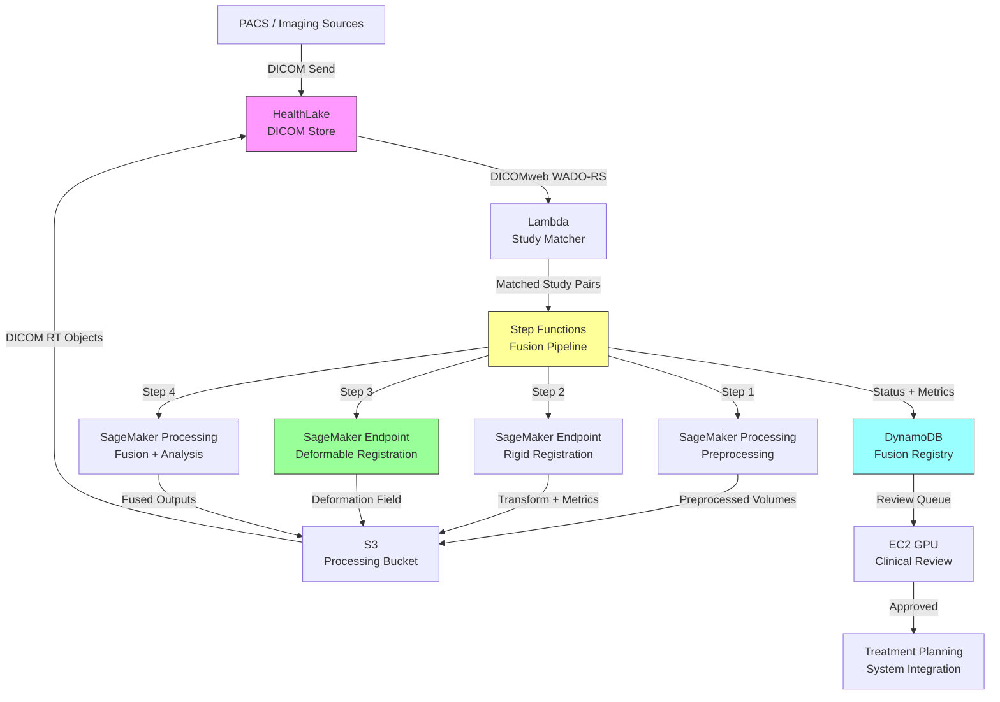

# Recipe 9.10: Multi-Modal Imaging Fusion and Analysis

**Complexity:** Complex · **Phase:** Specialized Clinical · **Estimated Cost:** ~$2.50–$8.00 per fusion study

---

## The Problem

A radiation oncologist is planning treatment for a patient with a brain tumor. She has an MRI showing the tumor's soft tissue boundaries with exquisite detail. She has a CT scan showing the bony anatomy and providing the electron density data needed for dose calculations. She has a PET scan showing metabolic activity, highlighting which parts of the tumor are most aggressive. Each image tells part of the story. None tells the whole story.

Right now, she's mentally fusing these images in her head. She pulls up the MRI on one monitor, the CT on another, scrolls through both simultaneously, and tries to hold the spatial relationships in working memory while drawing treatment contours. Sometimes she uses the planning system's rigid registration tool, which aligns the images based on bony landmarks, but it struggles when the patient's head was positioned slightly differently between scans. The soft tissue deformation between the MRI and CT means the tumor boundary on one doesn't perfectly overlay the tumor boundary on the other. She compensates with experience and conservative margins. Those margins mean more healthy brain tissue gets irradiated.

This isn't just radiation oncology. Neurosurgeons fuse MRI with functional imaging (fMRI, DTI) to avoid eloquent cortex during resection. Cardiologists overlay PET perfusion maps on CT angiography to correlate anatomy with function. Orthopedic surgeons combine CT bone detail with MRI soft tissue visualization for complex joint reconstruction planning. Interventional radiologists fuse pre-procedure CT with real-time ultrasound for needle guidance.

The common thread: each imaging modality captures different physical properties of tissue, and clinical decisions require integrating information across modalities. When that integration happens in a clinician's head, it's limited by human spatial reasoning, fatigued by long cases, and impossible to reproduce or audit. When it happens computationally, it can be precise, consistent, and quantifiable.

The scale of this problem is significant. Radiation therapy alone treats over 1 million patients annually in the US, and nearly every treatment plan involves multi-modal image fusion. Surgical planning for complex cases (brain tumors, cardiac surgery, orthopedic reconstruction) increasingly depends on fused imaging. The question isn't whether to fuse images computationally. It's how to do it well enough that clinicians trust the result.

---

## The Technology: How Multi-Modal Image Fusion Works

### What Is Image Fusion?

Image fusion is the process of spatially aligning two or more images acquired from different modalities (or the same modality at different times) and combining their information into a unified representation. The goal is to create a composite view where each modality contributes its unique strengths: CT provides geometric accuracy and density information, MRI provides soft tissue contrast, PET provides functional/metabolic information, ultrasound provides real-time guidance.

The fundamental challenge is that these images exist in different coordinate systems. The patient was positioned differently for each scan. The field of view, resolution, and slice thickness differ. The physical properties being measured differ (X-ray attenuation for CT, hydrogen proton relaxation for MRI, radiotracer uptake for PET). Fusion means solving the spatial correspondence problem: for any point in one image, where is the corresponding point in the other?

### Image Registration: The Core Problem

Registration is the mathematical process of finding the spatial transformation that maps points from one image (the "moving" image) to corresponding points in another (the "fixed" or "reference" image). This is the hardest part of fusion, and it's where most systems succeed or fail.

**Rigid registration** assumes the anatomy doesn't deform between scans. It finds the optimal rotation and translation (6 parameters: 3 rotational, 3 translational) that aligns the two images. This works well for the brain (enclosed in a rigid skull) and reasonably well for bony anatomy. It fails for soft tissue that deforms: the abdomen, the breast, the prostate. Rigid registration is fast (seconds) and deterministic.

**Deformable registration** (also called non-rigid or elastic registration) allows the transformation to vary spatially. Instead of one global rotation/translation, it computes a deformation field: a vector at every voxel indicating how far and in which direction that point needs to move to align with the reference image. This handles soft tissue deformation, organ motion, and patient positioning differences. It's dramatically more complex: instead of 6 parameters, you're solving for millions (one 3D vector per voxel). The solution space is enormous, and there's no guarantee of a unique correct answer.

Deformable registration algorithms fall into several families:

- **Intensity-based methods** optimize a similarity metric (mutual information, normalized cross-correlation) between the images by iteratively adjusting the deformation field. They work directly on voxel intensities without requiring segmented structures. Mutual information is particularly important for multi-modal fusion because it doesn't assume the same tissue looks the same in both images (it doesn't; bone is bright on CT and dark on MRI).

- **Feature-based methods** identify corresponding landmarks or surfaces in both images and compute the transformation that aligns them. Faster than intensity-based methods but requires reliable feature detection across modalities.

- **Deep learning-based methods** train neural networks to predict deformation fields directly from image pairs. Once trained, inference is fast (sub-second), but training requires large datasets of registered image pairs (a chicken-and-egg problem) or synthetic deformations. These methods have improved dramatically since 2020 and are approaching clinical viability for specific anatomical regions.

### Why This Is Hard

**Different physics, different geometry.** CT and MRI don't just look different; they have fundamentally different spatial characteristics. CT has isotropic or near-isotropic resolution (0.5-1mm in all directions). MRI often has anisotropic resolution (1mm in-plane but 3-5mm slice thickness). PET has much coarser resolution (4-5mm). Fusing a 5mm PET voxel with a 0.5mm CT voxel requires interpolation decisions that affect the clinical interpretation.

**Temporal mismatch.** The scans weren't acquired simultaneously. Between the CT on Monday and the MRI on Thursday, the tumor may have grown, edema may have changed, the patient may have lost weight. The "correct" registration doesn't exist because the anatomy has genuinely changed. The system must handle this gracefully, not pretend it isn't happening.

**Organ motion.** The liver moves 1-2cm with respiration. The prostate shifts based on bladder and rectal filling. The heart is constantly in motion. For abdominal and thoracic fusion, respiratory and cardiac gating (acquiring images at specific phases of the breathing/cardiac cycle) helps, but doesn't eliminate the problem.

**No ground truth.** Unlike many ML problems, there's no definitive "correct answer" for deformable registration. You can't open the patient and measure where each voxel should map. Validation relies on surrogate metrics: landmark alignment error, contour overlap (Dice coefficient), inverse consistency (registering A to B and then B to A should give you back A). None of these fully captures clinical correctness.

**Computational cost.** Deformable registration of 3D medical volumes is computationally expensive. A single CT-to-MRI registration can take 5-30 minutes on CPU. GPU acceleration brings this to seconds or minutes, but the infrastructure requirements are non-trivial. Deep learning inference is faster but requires model training and validation per anatomical site.

### The State of the Field

Multi-modal fusion has been in clinical use for decades in radiation therapy (CT-MRI fusion for treatment planning) and neurosurgery (MRI-fMRI fusion for surgical planning). What's changed in the last few years:

- **Deep learning registration** has matured from research curiosity to near-clinical tool. Networks like VoxelMorph, TransMorph, and their descendants can perform deformable registration in under a second, enabling real-time or near-real-time fusion workflows.

- **Attention mechanisms and transformers** have improved registration accuracy for large deformations and multi-modal scenarios where traditional similarity metrics struggle.

- **Uncertainty quantification** is emerging: models that not only produce a deformation field but also estimate confidence at each voxel. This is critical for clinical adoption because it tells the clinician where to trust the fusion and where to be skeptical.

- **Self-supervised and unsupervised training** has reduced the dependency on labeled registration pairs, making it feasible to train site-specific models without massive annotation efforts.

- **Integration with segmentation** is becoming standard: joint registration-segmentation models that simultaneously align images and delineate structures, each task informing the other.

### The General Architecture Pattern

At a conceptual level, multi-modal fusion follows this pipeline:

```
[Ingest Modalities] → [Preprocessing] → [Registration] → [Fusion/Overlay] → [Analysis] → [Clinical Integration]
```

**Ingest Modalities.** Receive images from multiple sources (PACS, scanners, external facilities) in DICOM format. Handle the metadata: patient identity verification, acquisition parameters, coordinate system information (DICOM headers contain the spatial reference frame for each image).

**Preprocessing.** Standardize the images for registration: resample to common resolution, normalize intensity ranges, apply bias field correction (for MRI), skull-strip (for brain applications), segment key structures that will guide registration. This step is modality-specific and often the most labor-intensive to get right.

**Registration.** Compute the spatial transformation between the moving image and the reference image. Choose rigid vs. deformable based on the anatomy. Validate the registration quality (landmark error, contour overlap, visual inspection). Store the transformation for reproducibility.

**Fusion/Overlay.** Apply the computed transformation to resample the moving image into the reference image's coordinate space. Create composite visualizations: side-by-side, overlay, checkerboard, color-coded fusion. Generate quantitative fusion products (e.g., metabolic activity mapped onto anatomical structures).

**Analysis.** Extract clinical information from the fused representation: contour propagation (transfer segmentations from one modality to another), quantitative measurements in fused space, change detection between time points, feature extraction for treatment planning.

**Clinical Integration.** Deliver results to the clinical workflow: treatment planning systems, surgical navigation platforms, diagnostic workstations. This means DICOM RT Structure Sets, DICOM Registration Objects, and integration with vendor-specific planning system APIs.

---

## The AWS Implementation

### Why These Services

**Amazon SageMaker for registration model training and inference.** Deformable registration models (especially deep learning-based) require GPU training on large datasets of medical image pairs and GPU inference for production use. SageMaker provides managed training jobs with configurable GPU instances, model hosting with auto-scaling endpoints, and integration with the broader AWS ecosystem. For traditional iterative registration algorithms, SageMaker Processing Jobs provide the compute without managing infrastructure.

**Amazon S3 for medical image storage.** DICOM studies are large (a single CT can be 500MB; a multi-sequence MRI can be 2GB+). S3 provides durable, encrypted storage with lifecycle policies for managing the retention of intermediate processing artifacts. The DICOM files, preprocessed volumes, deformation fields, and fused outputs all live here.

**AWS Step Functions for pipeline orchestration.** The fusion pipeline has multiple sequential and parallel steps with complex branching logic (rigid registration first, then deformable if needed; different preprocessing per modality; quality checks between steps). Step Functions provides visual workflow orchestration with error handling, retries, and audit trails. Each step can invoke a different compute resource (Lambda for lightweight tasks, SageMaker for GPU-heavy tasks).

**Amazon DynamoDB for study metadata and registration results.** Track which studies have been fused, registration quality metrics, processing status, and clinical review state. DynamoDB's key-value model fits the access pattern: lookup by study ID, query by patient, filter by processing status.

**AWS Lambda for lightweight orchestration tasks.** DICOM header parsing, study matching (identifying which CT goes with which MRI for the same patient), notification dispatch, and quality metric computation are all short-lived, stateless tasks that fit Lambda's execution model.

**Amazon HealthLake (DICOM store) for standards-compliant medical image management.** HealthLake provides a managed DICOMweb interface for storing and retrieving medical images, handling the complexity of DICOM metadata indexing, patient-level queries, and standards-based interoperability with clinical systems (PACS, treatment planning systems).

**Amazon EC2 (GPU instances) for interactive registration validation.** Clinicians reviewing registration quality need interactive 3D visualization with sub-second response times. A GPU-backed visualization server (using VTK, 3D Slicer, or similar) provides the rendering performance needed for clinical review workflows.

### Architecture Diagram



### Prerequisites

| Requirement | Details |
|-------------|---------|
| **AWS Services** | Amazon SageMaker, Amazon S3, AWS Step Functions, Amazon DynamoDB, AWS Lambda, Amazon HealthLake, Amazon EC2 (GPU) |
| **IAM Permissions** | `sagemaker:CreateProcessingJob`, `sagemaker:InvokeEndpoint`, `s3:GetObject`, `s3:PutObject`, `dynamodb:PutItem`, `dynamodb:Query`, `healthlake:*DICOMImportJob`, `states:StartExecution` |
| **BAA** | AWS BAA signed (required: medical images are PHI) |
| **Encryption** | S3: SSE-KMS; DynamoDB: encryption at rest; HealthLake: AWS-managed encryption; all API calls over TLS; EBS volumes on EC2/SageMaker encrypted |
| **VPC** | Production: all compute in VPC with VPC endpoints for S3, DynamoDB, SageMaker, HealthLake. No medical image data traverses the public internet. |
| **CloudTrail** | Enabled: log all API calls for HIPAA audit trail |
| **GPU Instances** | SageMaker: ml.g5.xlarge or ml.p3.2xlarge for registration inference; ml.p3.8xlarge for model training. EC2: g5.xlarge for clinical review visualization. |
| **Sample Data** | Public datasets: TCIA (The Cancer Imaging Archive) provides multi-modal studies. RIRE (Retrospective Image Registration Evaluation) provides registered brain image pairs with ground truth landmarks. Never use real patient images in dev without IRB approval and proper de-identification. |
| **Cost Estimate** | SageMaker inference (registration): ~$0.50-$2.00 per study pair. Processing (preprocessing + fusion): ~$1.00-$3.00 per study. Storage: ~$0.023/GB/month. HealthLake: ~$0.05 per DICOMweb transaction. Total per fusion study: $2.50-$8.00 depending on complexity. |

### Ingredients

| AWS Service | Role |
|------------|------|
| **Amazon SageMaker** | Trains and hosts registration models; runs preprocessing and fusion as Processing Jobs |
| **Amazon S3** | Stores DICOM files, preprocessed volumes, deformation fields, fused outputs |
| **AWS Step Functions** | Orchestrates the multi-step fusion pipeline with error handling and branching |
| **Amazon DynamoDB** | Tracks study metadata, registration quality metrics, processing status |
| **AWS Lambda** | Handles DICOM parsing, study matching, notification dispatch |
| **Amazon HealthLake** | Provides DICOMweb-compliant medical image storage and retrieval |
| **Amazon EC2 (GPU)** | Powers interactive clinical review and 3D visualization |
| **AWS KMS** | Manages encryption keys for all data stores |
| **Amazon CloudWatch** | Monitors pipeline execution, latency, error rates, GPU utilization |

### Code

#### Walkthrough

**Step 1: Study matching and ingestion.** When new imaging studies arrive in the DICOM store, the system identifies which studies belong to the same patient and clinical context (same treatment episode, same anatomical region) and should be fused together. This matching uses DICOM metadata: Patient ID, Study Date, Body Part Examined, Modality, and clinical order information. Getting this wrong means fusing the wrong studies together, which is a patient safety issue. The matcher also verifies that the required modalities are present (you can't fuse CT with MRI if the MRI hasn't arrived yet) and triggers the pipeline only when a complete set is available.

```
FUNCTION match_studies_for_fusion(new_study):
    // Extract key identifiers from the incoming DICOM study metadata.
    // These fields tell us who the patient is, what was scanned, and when.
    patient_id    = new_study.PatientID
    body_part     = new_study.BodyPartExamined
    study_date    = new_study.StudyDate
    modality      = new_study.Modality

    // Look up existing studies for this patient and body region
    // within a clinically relevant time window (e.g., 30 days).
    // A CT from 6 months ago is probably not the right match for today's MRI.
    candidate_studies = query DICOM store for:
        PatientID = patient_id
        BodyPartExamined = body_part
        StudyDate within 30 days of study_date
        Modality != modality  // we want complementary modalities, not duplicates

    // Check if we have a fusible pair based on clinical fusion rules.
    // Different clinical workflows require different modality combinations.
    fusion_rules = {
        "radiation_therapy": ["CT", "MRI"],
        "radiation_therapy_pet": ["CT", "PET"],
        "neurosurgery": ["MRI", "fMRI"],
        "cardiac": ["CT", "PET"]
    }

    FOR each rule_name, required_modalities in fusion_rules:
        available = [modality] + [s.Modality for s in candidate_studies]
        IF all required_modalities are present in available:
            // We have a complete set. Identify the specific studies to fuse.
            matched_pair = select studies matching required_modalities
            RETURN {
                rule: rule_name,
                reference_study: select CT or primary modality,  // CT is typically the reference
                moving_study: select secondary modality,
                patient_id: patient_id
            }

    // No complete set yet. Record that we're waiting for additional modalities.
    RETURN null  // pipeline will not trigger until the set is complete
```

**Step 2: Preprocessing.** Each modality requires specific preprocessing before registration can succeed. MRI needs bias field correction (the intensity inhomogeneity caused by RF coil sensitivity variations). CT needs windowing to the relevant Hounsfield unit range. PET needs SUV normalization. All modalities need resampling to a common resolution grid. Skull stripping (removing non-brain tissue) dramatically improves brain registration accuracy. Skip preprocessing and registration algorithms will be confused by intensity artifacts, resolution mismatches, and irrelevant anatomy.

```
FUNCTION preprocess_for_registration(study, modality, target_region):
    // Load the DICOM series into a 3D volume array.
    // DICOM stores each slice as a separate file; we need the assembled volume.
    volume = load_dicom_series(study.series_path)
    
    // Extract spatial metadata: voxel spacing, origin, orientation.
    // This information is critical for maintaining geometric accuracy.
    spacing = study.PixelSpacing + [study.SliceThickness]
    origin  = study.ImagePositionPatient
    direction = study.ImageOrientationPatient

    IF modality == "MRI":
        // Bias field correction: MRI signal intensity varies spatially due to
        // RF coil sensitivity. This confuses intensity-based registration.
        // N4ITK is the standard algorithm for this correction.
        volume = apply_n4_bias_field_correction(volume)
        
        // Normalize intensity to 0-1 range. MRI intensities are arbitrary
        // (unlike CT Hounsfield units), so normalization is essential.
        volume = normalize_intensity(volume, method="percentile", low=1, high=99)

    ELSE IF modality == "CT":
        // Clip to clinically relevant Hounsfield unit range.
        // Air is -1000, water is 0, bone is +1000-3000.
        // For soft tissue registration, we focus on -200 to +400 HU.
        volume = clip_hounsfield(volume, min=-200, max=400)
        volume = normalize_to_unit_range(volume)

    ELSE IF modality == "PET":
        // Convert raw counts to Standardized Uptake Values (SUV).
        // SUV normalizes for injected dose and patient weight,
        // making values comparable across patients and time points.
        volume = convert_to_suv(volume, 
                                injected_dose=study.RadiopharmaceuticalDose,
                                patient_weight=study.PatientWeight,
                                scan_time=study.AcquisitionTime)

    // Region-specific preprocessing
    IF target_region == "brain":
        // Skull stripping: remove non-brain tissue.
        // Registration of brain images works much better without the skull
        // because the skull dominates rigid registration but isn't clinically relevant.
        brain_mask = compute_brain_mask(volume, modality)
        volume = apply_mask(volume, brain_mask)

    // Resample to isotropic resolution for registration.
    // Anisotropic voxels (common in MRI: 1x1x3mm) cause directional bias
    // in registration algorithms. Isotropic resampling eliminates this.
    target_spacing = [1.0, 1.0, 1.0]  // 1mm isotropic
    volume = resample_to_spacing(volume, current_spacing=spacing, 
                                  target_spacing=target_spacing,
                                  interpolation="linear")

    RETURN {
        volume: volume,
        spacing: target_spacing,
        origin: origin,
        direction: direction,
        original_metadata: study.dicom_metadata
    }
```

**Step 3: Rigid registration.** The first alignment pass uses rigid registration to correct for gross positioning differences between scans. This finds the optimal rotation and translation that aligns the two volumes. For brain imaging, this is often sufficient on its own (the skull constrains deformation). For body imaging, it provides the starting point for deformable registration. Running deformable registration without a good rigid initialization is like trying to solve a jigsaw puzzle without first getting the border pieces in place: the algorithm may converge to a local minimum that's anatomically nonsensical.

```
FUNCTION rigid_registration(fixed_volume, moving_volume):
    // Initialize the transformation as identity (no rotation, no translation).
    // The optimizer will iteratively improve from here.
    initial_transform = identity_transform(dimensions=3)

    // Configure the similarity metric.
    // Mutual Information is the standard choice for multi-modal registration
    // because it doesn't assume the same tissue has the same intensity
    // in both images (bone is bright on CT, dark on MRI).
    metric = MutualInformation(
        num_histogram_bins=64,    // resolution of the joint histogram
        sampling_strategy="random",
        sampling_percentage=0.25  // use 25% of voxels per iteration (speed vs. accuracy)
    )

    // Configure the optimizer.
    // Regular Step Gradient Descent is robust for rigid registration.
    optimizer = RegularStepGradientDescent(
        learning_rate=1.0,
        min_step=0.001,           // stop when steps get this small
        max_iterations=500,
        relaxation_factor=0.5     // reduce step size when metric oscillates
    )

    // Multi-resolution strategy: start with heavily blurred (downsampled) images
    // for coarse alignment, then refine at full resolution.
    // This avoids local minima from fine-scale features.
    resolution_levels = [8, 4, 2, 1]  // downsampling factors
    smoothing_sigmas  = [4, 2, 1, 0]  // Gaussian blur at each level

    // Run the registration
    result = optimize(
        fixed=fixed_volume,
        moving=moving_volume,
        metric=metric,
        optimizer=optimizer,
        transform=initial_transform,
        resolution_levels=resolution_levels,
        smoothing_sigmas=smoothing_sigmas
    )

    // Extract quality metrics
    final_metric_value = result.metric_value
    
    // Apply the rigid transform to the moving image
    aligned_volume = resample(moving_volume, transform=result.transform,
                              reference=fixed_volume, interpolation="linear")

    RETURN {
        transform: result.transform,
        aligned_volume: aligned_volume,
        metric_value: final_metric_value,
        iterations: result.iterations_completed
    }
```

**Step 4: Deformable registration.** For anatomy that deforms between scans (abdomen, pelvis, breast, or brain with significant tumor/edema changes), rigid registration isn't enough. Deformable registration computes a dense displacement field: a 3D vector at every voxel indicating how that point should move to align with the reference. This is where deep learning has made the biggest impact. A trained network can predict the deformation field in seconds, compared to minutes or hours for iterative optimization. The tradeoff: the network is only as good as its training data and may fail silently on anatomy it hasn't seen.

```
FUNCTION deformable_registration(fixed_volume, moving_volume, method="deep_learning"):
    IF method == "deep_learning":
        // Use a pre-trained registration network (e.g., VoxelMorph architecture).
        // The network takes the fixed and moving volumes as input
        // and directly predicts the deformation field.
        
        // Stack fixed and moving as a 2-channel input
        input_pair = stack_volumes(fixed_volume, moving_volume, axis="channel")
        
        // Run inference on the registration model
        deformation_field = invoke_model(
            endpoint="registration-model-endpoint",
            input=input_pair
        )
        // deformation_field shape: [D, H, W, 3] (a 3D displacement vector per voxel)
        
        // Also get uncertainty estimate if the model supports it
        uncertainty_map = invoke_model(
            endpoint="registration-uncertainty-endpoint",
            input=input_pair
        )

    ELSE IF method == "iterative":
        // Traditional B-spline or demons-based deformable registration.
        // Slower but doesn't require a trained model.
        
        deformation_field = bspline_registration(
            fixed=fixed_volume,
            moving=moving_volume,
            metric=MutualInformation(bins=64),
            grid_spacing=[8, 8, 8],       // control point spacing in mm
            regularization_weight=0.1,     // penalize unrealistic deformations
            max_iterations=200
        )
        uncertainty_map = null  // traditional methods don't provide uncertainty

    // Apply the deformation field to warp the moving image
    warped_volume = warp(moving_volume, deformation_field, interpolation="linear")

    // Compute registration quality metrics
    dice_scores = compute_dice_overlap(
        fixed_segmentation=segment_structures(fixed_volume),
        warped_segmentation=warp(segment_structures(moving_volume), deformation_field)
    )
    
    // Check for folding (physically impossible deformations where
    // the Jacobian determinant goes negative, meaning tissue "folds over itself")
    jacobian = compute_jacobian_determinant(deformation_field)
    folding_percentage = count(jacobian < 0) / total_voxels * 100
    
    // Flag if folding exceeds threshold (indicates registration failure)
    IF folding_percentage > 1.0:
        quality_flag = "WARNING: excessive folding detected"
    ELSE:
        quality_flag = "PASS"

    RETURN {
        deformation_field: deformation_field,
        warped_volume: warped_volume,
        uncertainty_map: uncertainty_map,
        dice_scores: dice_scores,
        folding_percentage: folding_percentage,
        quality_flag: quality_flag
    }
```

**Step 5: Fusion and analysis.** With the images aligned, we can now create clinically useful fusion products. This isn't just overlaying one image on another. It's extracting quantitative information that only exists in the fused representation: metabolic activity within specific anatomical structures, dose-volume relationships across tissue types, change detection between time points. The specific fusion products depend on the clinical use case. For radiation therapy, it's contour propagation and dose mapping. For surgical planning, it's functional anatomy overlay. For oncology follow-up, it's treatment response assessment.

```
FUNCTION create_fusion_products(fixed_volume, warped_volume, deformation_field, 
                                 clinical_context):
    fusion_products = {}

    // Create the basic fused visualization volume.
    // Alpha blending with configurable weights per modality.
    fusion_products["blended_volume"] = alpha_blend(
        volume_a=fixed_volume,       // e.g., CT (anatomical reference)
        volume_b=warped_volume,      // e.g., registered MRI or PET
        alpha=0.5                    // equal weighting; clinicians adjust interactively
    )

    IF clinical_context == "radiation_therapy":
        // Propagate contours drawn on MRI to the CT coordinate space.
        // Radiation dose is calculated on CT (needs electron density),
        // but tumor boundaries are often better visualized on MRI.
        // The deformation field maps MRI contours onto CT geometry.
        
        mri_contours = load_structure_set(clinical_context.structure_set_id)
        propagated_contours = warp_contours(mri_contours, deformation_field)
        
        // Generate DICOM RT Structure Set in CT coordinate space
        fusion_products["rt_structure_set"] = create_dicom_rt_struct(
            contours=propagated_contours,
            reference_series=fixed_volume.series_uid
        )

    ELSE IF clinical_context == "pet_ct_oncology":
        // Map PET metabolic activity onto CT anatomical structures.
        // Calculate SUV statistics within each anatomical region.
        
        ct_segmentation = segment_structures(fixed_volume)
        
        FOR each structure in ct_segmentation:
            region_mask = ct_segmentation[structure]
            suv_in_region = warped_volume[region_mask]
            
            fusion_products["suv_stats_" + structure] = {
                mean_suv: mean(suv_in_region),
                max_suv: max(suv_in_region),
                volume_above_threshold: count(suv_in_region > 2.5) * voxel_volume,
                metabolic_tumor_volume: count(suv_in_region > 0.41 * max(suv_in_region)) * voxel_volume
            }

    ELSE IF clinical_context == "longitudinal_comparison":
        // Compare the same modality at two time points (e.g., pre/post treatment).
        // The deformation field accounts for positioning differences.
        // Subtraction reveals true change vs. positioning artifact.
        
        difference_map = fixed_volume - warped_volume
        
        // Threshold to identify regions of significant change
        significant_change = abs(difference_map) > change_threshold
        fusion_products["change_map"] = difference_map
        fusion_products["change_regions"] = significant_change

    // Store all fusion products
    FOR each product_name, product_data in fusion_products:
        store_as_dicom(product_data, 
                       patient_id=clinical_context.patient_id,
                       series_description="FUSION_" + product_name)

    RETURN fusion_products
```

**Step 6: Quality assurance and clinical review.** No automated registration should go directly to clinical use without quality review. This step presents the fusion results to a clinician (physicist, dosimetrist, or physician) for approval. The review interface shows the fused images with interactive tools: checkerboard overlay, sliding window comparison, contour overlay, and quantitative metrics. The clinician can accept, reject (triggering re-registration with different parameters), or manually adjust the registration. This human-in-the-loop step is non-negotiable for clinical applications.

```
FUNCTION quality_assurance_review(fusion_result, clinical_context):
    // Compute automated quality metrics
    qa_metrics = {
        rigid_metric: fusion_result.rigid_registration.metric_value,
        deformable_dice: fusion_result.deformable_registration.dice_scores,
        folding_pct: fusion_result.deformable_registration.folding_percentage,
        max_displacement: max_magnitude(fusion_result.deformation_field),
        mean_displacement: mean_magnitude(fusion_result.deformation_field)
    }

    // Apply automated pass/fail criteria
    auto_flags = []
    IF qa_metrics.folding_pct > 0.5:
        append "Jacobian folding exceeds 0.5%" to auto_flags
    IF qa_metrics.max_displacement > 50:  // mm
        append "Maximum displacement exceeds 50mm (likely failure)" to auto_flags
    IF any(qa_metrics.deformable_dice.values() < 0.7):
        append "Structure overlap below 0.7 for one or more structures" to auto_flags

    // Create review task for clinical staff
    review_task = {
        study_pair: fusion_result.study_ids,
        patient_id: clinical_context.patient_id,
        qa_metrics: qa_metrics,
        auto_flags: auto_flags,
        priority: "HIGH" if len(auto_flags) > 0 else "NORMAL",
        visualization_url: generate_review_url(fusion_result),
        status: "PENDING_REVIEW"
    }

    // Store in review queue
    write_to_database(table="fusion-reviews", item=review_task)

    // If automated QA passes with no flags, mark as ready for clinical use
    // but still require human sign-off (regulatory requirement for treatment planning)
    IF len(auto_flags) == 0:
        review_task.suggested_action = "APPROVE"
    ELSE:
        review_task.suggested_action = "MANUAL_REVIEW_REQUIRED"

    RETURN review_task
```

> **Curious how this looks in Python?** The pseudocode above covers the concepts. If you'd like to see sample Python code that demonstrates these patterns using boto3, check out the [Python Example](chapter09.10-python-example). It walks through each step with inline comments and notes on what you'd need to change for a real deployment.

### Expected Results

**Sample output for a CT-MRI brain fusion (radiation therapy planning):**

```json
{
  "fusion_id": "FUSION-2026-03-15-00847",
  "patient_id": "PT-928471",
  "study_pair": {
    "reference": {"modality": "CT", "study_date": "2026-03-12", "series_uid": "1.2.840..."},
    "moving": {"modality": "MRI", "study_date": "2026-03-14", "series_uid": "1.2.840..."}
  },
  "rigid_registration": {
    "rotation_degrees": [1.2, -0.8, 0.3],
    "translation_mm": [2.1, -1.5, 3.4],
    "mutual_information": 0.847
  },
  "deformable_registration": {
    "method": "deep_learning",
    "model_version": "voxelmorph-brain-v3.2",
    "mean_displacement_mm": 1.8,
    "max_displacement_mm": 12.4,
    "folding_percentage": 0.02,
    "dice_scores": {
      "brain_stem": 0.94,
      "tumor_gtv": 0.88,
      "left_hippocampus": 0.91,
      "right_optic_nerve": 0.86
    }
  },
  "fusion_products": {
    "rt_structure_set": "RS.1.2.840...",
    "blended_volume": "stored at s3://fusion-outputs/PT-928471/blended.nii.gz"
  },
  "qa_status": "APPROVED",
  "reviewed_by": "physicist_jsmith",
  "review_timestamp": "2026-03-15T09:42:18Z"
}
```

**Performance benchmarks:**

| Metric | Typical Value |
|--------|---------------|
| Rigid registration latency | 5-15 seconds |
| Deformable registration (DL inference) | 2-8 seconds |
| Deformable registration (iterative) | 5-30 minutes |
| End-to-end pipeline (DL path) | 2-5 minutes |
| Target Registration Error (brain) | 1-2mm |
| Target Registration Error (abdomen) | 3-5mm |
| Dice overlap (brain structures) | 0.85-0.95 |
| Dice overlap (abdominal organs) | 0.75-0.90 |
| Cost per fusion study | $2.50-$8.00 |
| Jacobian folding (acceptable) | < 0.5% of voxels |

**Where it struggles:** Large deformations between time points (significant tumor growth or surgical resection between scans). Abdominal imaging with inconsistent respiratory phase. Low-resolution PET fused with high-resolution CT (the PET partial volume effect limits what you can meaningfully extract). Patients with metallic implants causing CT artifacts that confuse registration. And any scenario where the anatomy has genuinely changed between scans in ways that make "correct registration" undefined.

---

## Why This Isn't Production-Ready

**FDA regulatory pathway.** If the fusion results inform treatment decisions (radiation therapy planning, surgical navigation), the software is a medical device. FDA 510(k) clearance or De Novo classification is required. The registration algorithm, quality metrics, and clinical workflow all fall under regulatory scrutiny. This recipe demonstrates the technical pattern; regulatory compliance requires a quality management system, design controls, and clinical validation studies.

**Model validation per anatomical site.** A registration model trained on brain images will not work for abdominal registration. Each anatomical site requires its own training data, validation dataset, and performance benchmarks. You cannot deploy a single "universal" registration model.

**Integration with treatment planning systems.** Radiation therapy planning systems (Eclipse, RayStation, Pinnacle) have proprietary APIs and specific DICOM conformance requirements. The DICOM Registration Object and RT Structure Set formats must exactly match what the planning system expects. This integration work is vendor-specific and often requires collaboration with the TPS vendor.

**Clinical validation study.** Before clinical deployment, you need a prospective study comparing automated registration quality against manual registration by expert clinicians. This typically involves 50-100 cases with expert-defined ground truth landmarks. The study design, statistical analysis plan, and results documentation are regulatory requirements.

---

## The Honest Take

Multi-modal fusion is one of those problems where the technology has been "almost there" for 20 years. The difference now is that deep learning registration has finally made it fast enough for routine clinical workflows. When I say "fast enough," I mean the registration itself takes seconds instead of minutes. The full pipeline (ingest, preprocess, register, fuse, QA) still takes minutes, and the clinical review still takes a human.

The part that surprised me most: rigid registration is sufficient for brain imaging about 80% of the time. The skull constrains deformation so effectively that the expensive deformable step often adds minimal improvement. For brain cases, the real value of deformable registration is in the 20% of cases with significant mass effect, post-surgical changes, or edema that shifts midline structures. Build your pipeline to try rigid first and only invoke deformable when quality metrics indicate it's needed.

The uncertainty quantification piece is where the field is heading, and it's genuinely important. A registration that reports "I aligned these images with 1.5mm accuracy" is useful. A registration that reports "I'm confident to 1mm in the frontal lobe but uncertain to 5mm near the skull base" is transformative for clinical decision-making. If you're building this today, invest in models that provide voxel-wise uncertainty estimates.

The biggest operational headache isn't the registration algorithm. It's the DICOM plumbing. Getting images reliably from PACS to your processing pipeline, handling the dozens of DICOM metadata fields that affect spatial interpretation, dealing with inconsistent series descriptions across scanners and sites, and pushing results back in a format the clinical systems accept. Budget twice as much engineering time for DICOM integration as you think you'll need.

---

## Variations and Extensions

**Real-time intraoperative fusion.** Combine pre-operative MRI with intraoperative ultrasound for surgical navigation. The challenge shifts from batch processing to real-time: registration must complete in under a second as the surgeon moves the ultrasound probe. Deep learning registration models are well-suited here, but the deformation model must account for brain shift (the brain deforms when the skull is opened and CSF drains). This is an active research area with commercial systems emerging.

**Longitudinal treatment response assessment.** Register the same patient's imaging at multiple time points (baseline, mid-treatment, post-treatment) to quantify tumor response. The deformation field itself becomes clinically meaningful: regions of high deformation may indicate tumor shrinkage or growth. Combine with PET SUV changes for multi-parametric response assessment. This requires careful handling of the "what changed because of treatment" vs. "what changed because of positioning" distinction.

**AI-assisted contour propagation.** Use the registration framework to propagate expert-drawn contours from atlas cases to new patients. An expert draws structures on 50 representative cases. For a new patient, register the most similar atlas case and warp the contours. The clinician reviews and edits rather than drawing from scratch. This can reduce contouring time from 2 hours to 20 minutes for complex head-and-neck cases.

---

## Related Recipes

- **Recipe 9.5 (Chest X-Ray Triage):** Simpler single-modality analysis; contrast with the multi-modal complexity here
- **Recipe 9.7 (Radiology AI Triage, Multi-Modality):** Handles multiple modalities for triage but doesn't fuse them spatially
- **Recipe 9.8 (Pathology Slide Analysis):** Another gigapixel-scale imaging problem with registration challenges (slide-to-slide alignment)
- **Recipe 12.10 (Physiological Waveform Analysis):** Time-series fusion concepts that parallel spatial fusion
- **Recipe 14.3 (Treatment Plan Optimization):** Consumes the fused imaging products from this recipe for radiation dose optimization

---

## Additional Resources

**AWS Documentation:**
- [Amazon SageMaker Inference Endpoints](https://docs.aws.amazon.com/sagemaker/latest/dg/deploy-model.html)
- [Amazon SageMaker Processing Jobs](https://docs.aws.amazon.com/sagemaker/latest/dg/processing-job.html)
- [AWS HealthLake Imaging](https://docs.aws.amazon.com/healthlake/latest/devguide/what-is-healthlake-imaging.html)
- [AWS Step Functions Developer Guide](https://docs.aws.amazon.com/step-functions/latest/dg/welcome.html)
- [AWS HIPAA Eligible Services](https://aws.amazon.com/compliance/hipaa-eligible-services-reference/)
- [Amazon SageMaker Pricing](https://aws.amazon.com/sagemaker/pricing/)

**Public Datasets and Benchmarks:**
- [The Cancer Imaging Archive (TCIA)](https://www.cancerimagingarchive.net/): Multi-modal imaging datasets for research, including CT-MRI pairs
- [RIRE (Retrospective Image Registration Evaluation)](https://www.insight-journal.org/rire/): Brain registration benchmark with expert-defined landmarks
- [Learn2Reg Challenge](https://learn2reg.grand-challenge.org/): Annual medical image registration benchmark with multiple anatomical sites

**AWS Solutions and Blogs:**
- [AWS for Health: Medical Imaging](https://aws.amazon.com/health/solutions/medical-imaging/): Overview of AWS medical imaging capabilities and customer stories
- [Building Medical Imaging AI on AWS](https://aws.amazon.com/blogs/machine-learning/building-medical-imaging-ai-pipelines-with-amazon-sagemaker/): Architecture patterns for medical imaging ML pipelines on SageMaker

<!-- TODO: Verify all URLs above are current and accessible -->

---

## Estimated Implementation Time

| Tier | Timeline | What You Get |
|------|----------|--------------|
| **Basic** | 8-12 weeks | Rigid registration pipeline for brain CT-MRI fusion with manual QA review |
| **Production-ready** | 6-9 months | Deformable registration with DL models, automated QA, PACS integration, clinical review workflow |
| **With variations** | 12-18 months | Multi-site deployment, real-time intraoperative fusion, longitudinal tracking, regulatory clearance |

---

## Tags

`computer-vision` · `medical-imaging` · `image-registration` · `multi-modal` · `fusion` · `radiation-therapy` · `surgical-planning` · `deformable-registration` · `deep-learning` · `sagemaker` · `healthlake` · `step-functions` · `dicom` · `complex` · `hipaa` · `fda`

---

*← [Recipe 9.9: Surgical Video Analysis](chapter09.09-surgical-video-analysis) · [Chapter 9 Index](chapter09-index) · [Next: Chapter 10 →](chapter10-preface)*
