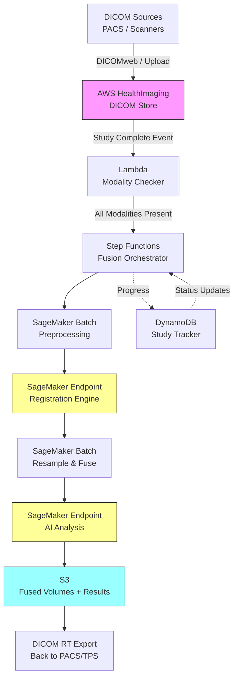

# Recipe 9.10: Multi-Modal Imaging Fusion and Analysis

**Complexity:** Complex · **Phase:** Research/Clinical Collaboration · **Estimated Cost:** ~$2.50-$8.00 per fusion study

---

## The Problem

A radiation oncologist is planning treatment for a brain tumor. She has an MRI showing detailed soft-tissue anatomy. She has a PET scan showing metabolic activity (where the cancer is most aggressive). She has a CT scan that gives her precise bone geometry for radiation dose calculations. Each of these images exists in its own coordinate system, taken on different machines, possibly on different days, with the patient in slightly different positions each time.

She needs to see all three as one. Not side by side. Overlaid. Fused. She needs to draw a radiation target on the MRI anatomy, confirm the boundaries against the PET metabolism map, and compute the dose distribution using the CT density data. If the alignment between these images is off by even 3-4 millimeters, she could be irradiating healthy brain tissue or missing active tumor.

This is not a rare scenario. Multi-modal imaging fusion is standard practice in radiation oncology, neurosurgery planning, cardiac imaging, and increasingly in general oncology. The tools exist (treatment planning systems like Eclipse, RayStation, and BrainLab have built-in registration), but they have significant limitations: they require manual verification, they struggle with non-rigid deformation, and they produce fused datasets that live inside proprietary systems rather than in a cloud-native analytics pipeline.

The emerging opportunity is automating and scaling this fusion process: taking multiple imaging studies, aligning them computationally, producing a unified multi-modal dataset, and running AI analysis across the combined information. A model that can see PET and MRI simultaneously outperforms one that only sees either modality alone. The clinical evidence is consistent on this point: multi-modal inputs improve diagnostic accuracy in tumor delineation, surgical planning, and treatment response assessment.

But getting there is genuinely hard. The registration problem alone (aligning images from different modalities into a common coordinate frame) is one of the oldest and most studied problems in medical image computing, and it still doesn't have a fully automatic, always-correct solution. When you add the complexities of different spatial resolutions, different temporal windows, and the need for clinical validation of every fused output, you're looking at one of the more complex pipelines in healthcare AI.

Let's break down how it works.

---

## The Technology: Image Registration and Multi-Modal Fusion

### What Is Image Registration?

Image registration is the process of aligning two or more images into a shared coordinate system. If a patient gets an MRI on Monday and a PET scan on Thursday, those images were acquired in different positions, at different resolutions, and they describe different physical properties of the tissue. Registration finds the spatial transformation that maps one image onto the other so that the same anatomical location corresponds to the same pixel (or voxel, since these are 3D volumes) in both.

The simplest form is rigid registration: just translation and rotation. Six parameters total (three for movement in x/y/z, three for rotation around each axis). If the anatomy hasn't changed between scans and the patient was in roughly the same position, rigid registration might be enough. Brain imaging is the classic case where rigid works well: the skull is, well, rigid.

For the abdomen, thorax, or any anatomy that deforms between scans (organs shift, patients breathe, tumors grow), you need deformable registration. This computes a dense displacement field: for every voxel in image A, it specifies where that voxel maps to in image B. This might be hundreds of thousands of individual displacement vectors. The math is more complex (think variational optimization or deep learning-based approaches), and the failure modes are more subtle. A deformable registration can produce a result that looks smooth and plausible but is anatomically wrong in ways that are hard to detect automatically.

### Why Multi-Modal Is Harder Than Single-Modal

Aligning two MRI scans of the same body part is relatively straightforward because the images look similar. The same structure appears bright in both, and you can measure success by how well the images match when overlaid.

Multi-modal alignment is different. A CT scan shows bone as bright white and soft tissue as gray mush. An MRI shows soft tissue in rich detail but bone appears dark. A PET scan is a low-resolution metabolic map where "bright" means high cellular activity, which bears no direct visual resemblance to either CT or MRI. You cannot simply compare pixel intensities between modalities because the same tissue looks completely different in each.

This means classical intensity-based similarity metrics (like cross-correlation) don't work across modalities. Multi-modal registration uses alternative metrics:

- **Mutual information:** Measures statistical dependence between intensity distributions. If bone always appears as bright in CT and dark in MRI, mutual information will detect that consistent relationship even though the absolute values differ. This is the workhorse metric for multi-modal registration and has been for 25+ years.

- **Landmark-based methods:** Identify corresponding anatomical points in both images (either manually or with an automated detector), then compute the transformation that aligns those points. More robust when mutual information fails (very different fields of view, for example), but requires identifiable landmarks in both modalities.

- **Deep learning registration:** Train a neural network to predict the transformation directly from an image pair. Networks like VoxelMorph and its variants can learn modality-specific features and output a deformation field in a single forward pass (much faster than iterative optimization). The tradeoff: they need training data with known ground-truth alignments, which is hard to obtain in multi-modal settings.

### Resolution Mismatch

Different modalities have different native resolutions. A typical MRI might be 1mm isotropic. A PET scan might be 4mm. A CT might be 0.5mm in-plane but 2-3mm slice spacing. Fusing these means resampling (interpolating one volume to match the other's resolution grid). Resampling introduces interpolation artifacts, and the direction of resampling matters: upsampling PET to MRI resolution doesn't add real information, it just makes the PET look smoother. Downsampling MRI to PET resolution destroys spatial detail.

The standard approach is to resample everything to a common reference grid, typically at the resolution of the highest-resolution modality. But you need to be transparent with clinicians about what's real signal versus interpolation.

### Temporal Alignment

If a PET scan was acquired three weeks after an MRI, the anatomy may have genuinely changed (tumor growth, surgical changes, weight loss). Registration can align the images geometrically, but it can't undo temporal biology. For treatment planning, images need to be recent enough to represent the current anatomical state. Most clinical protocols define maximum age thresholds (e.g., planning MRI within 7 days of treatment start). Your pipeline needs to enforce or at least flag these temporal gaps.

### What Comes After Fusion

Once images are aligned, the clinical value comes from joint analysis:

- **Tumor contouring:** Delineating the target volume by combining anatomical boundaries (MRI) with metabolic extent (PET). Radiation oncologists spend hours doing this manually. AI-assisted contouring on fused data can reduce this to minutes.
- **Response assessment:** Comparing pre-treatment and post-treatment fused images to quantify changes in both anatomy (size) and metabolism (activity).
- **Surgical planning:** Overlaying functional MRI activation maps onto structural anatomy to identify eloquent cortex that the surgeon must avoid.
- **Feature extraction:** Computing radiomic features across modalities simultaneously, capturing tissue characteristics that no single modality reveals alone.

### The General Architecture Pattern

At a high level, multi-modal fusion follows this pipeline:

```text
[Ingest Studies] → [Preprocess / Standardize] → [Register to Common Frame] → [Resample & Fuse] → [AI Analysis] → [Clinical Output]
```

**Ingest Studies:** Multiple DICOM series arrive, potentially from different scanners, different dates, different institutions. You need DICOM parsing to extract the image volumes, patient identifiers, study metadata, and acquisition parameters.

**Preprocess / Standardize:** Each modality gets its own preprocessing. MRI needs intensity normalization (the same tissue can have different absolute signal values across scanners). CT is already in Hounsfield units (standardized by definition). PET needs SUV normalization (standardized uptake value, which accounts for injected dose and patient weight). All volumes need orientation normalization (some scanners store axial, some coronal, some with flipped axes).

**Register to Common Frame:** Pick a reference modality (often CT in radiation oncology, MRI in neuro). Align all other modalities to that reference using rigid or deformable registration. Output is a transformation matrix (rigid) or displacement field (deformable) for each non-reference modality.

**Resample & Fuse:** Apply the computed transformations to resample each modality into the reference coordinate system. Now all voxels are spatially aligned. Store the fused multi-channel volume (one channel per modality).

**AI Analysis:** Run downstream models on the fused volume: auto-contouring, feature extraction, classification. These models take multi-channel input (like RGB images have 3 channels, your fused volume might have 3-5 channels, one per modality).

**Clinical Output:** Produce DICOM RT Structure Sets (for contours), reports, or annotations that can be sent back to the clinical system (PACS, treatment planning system) in a format clinicians already use.

---

## The AWS Implementation

### Why These Services

**Amazon S3 for DICOM storage and intermediate volumes.** Medical imaging datasets are large (a single PET-CT study can be 500MB+). S3 provides durable, encrypted storage for both raw DICOM inputs and intermediate processing artifacts (registered volumes, fused datasets). DICOM files land in S3 via HealthImaging or direct upload, and all downstream services pull from there.

**AWS HealthImaging for DICOM management.** HealthImaging is AWS's purpose-built medical imaging service. It handles DICOM parsing, metadata indexing, and lossless compression. It understands DICOM semantics (study/series/instance hierarchy) and provides fast pixel-data retrieval via HTJ2K codec. For a multi-modal fusion pipeline, it's the ingest layer that receives studies and makes them queryable by patient, modality, and study date.

**Amazon SageMaker for registration and AI inference.** The registration algorithms (ITK-based, deep learning-based, or hybrid) need GPU compute. SageMaker provides managed training infrastructure for registration networks and real-time or batch inference endpoints for running the fusion pipeline. For the downstream AI models (auto-contouring, response assessment), SageMaker hosts the inference endpoints that consume the fused volumes.

**AWS Step Functions for pipeline orchestration.** The fusion workflow has sequential dependencies (you can't resample before registration completes) and parallel opportunities (preprocessing each modality can happen simultaneously). Step Functions coordinates the multi-step pipeline with retries, error handling, and audit logging built in.

**Amazon DynamoDB for study tracking and metadata.** Track which studies have been ingested, which registration jobs are running, quality metrics for completed fusions, and links between the fused output and its source studies. Fast lookups by patient ID and study date.

**AWS Lambda for event-driven triggers and lightweight processing.** When a new study arrives in HealthImaging, Lambda fires to check whether all required modalities are present for fusion. When they are, it kicks off the Step Functions workflow. Lambda also handles DICOM metadata extraction and quality checks that don't need GPU.

### Architecture Diagram



### Prerequisites

| Requirement | Details |
|-------------|---------|
| **AWS Services** | AWS HealthImaging, Amazon SageMaker, Amazon S3, AWS Step Functions, AWS Lambda, Amazon DynamoDB |
| **IAM Permissions** | `medical-imaging:*` for HealthImaging, `sagemaker:InvokeEndpoint`, `sagemaker:CreateTransformJob`, `s3:GetObject`, `s3:PutObject`, `dynamodb:PutItem`, `dynamodb:GetItem`, `states:StartExecution` |
| **BAA** | AWS BAA signed (medical images are PHI) |
| **Encryption** | S3: SSE-KMS; DynamoDB: encryption at rest; HealthImaging: encrypted by default; SageMaker: KMS-encrypted volumes and endpoints; all transit over TLS |
| **VPC** | Production: SageMaker and Lambda in VPC with VPC endpoints for S3, DynamoDB, and HealthImaging. GPU instances need appropriate subnet sizing. |
| **CloudTrail** | Enabled: log all API calls for HIPAA audit trail. HealthImaging access logs for image retrieval audit. |
| **GPU Requirements** | Registration and AI inference require GPU instances (ml.g5.xlarge minimum for registration; ml.g5.2xlarge+ for 3D segmentation models). Budget accordingly. |
| **Sample Data** | Public multi-modal datasets: TCIA (The Cancer Imaging Archive) collections like NSCLC-Radiomics include PET-CT pairs. Never use real patient data in development. |
| **Cost Estimate** | Per fusion: HealthImaging storage ~$0.01/study/month; SageMaker GPU inference ~$1.50-6.00/fusion (depends on model complexity and volume size); S3 storage negligible; Step Functions negligible. Total ~$2.50-8.00 per complete fusion workflow. |

### Ingredients

| AWS Service | Role |
|------------|------|
| **AWS HealthImaging** | DICOM ingest, parsing, metadata indexing, pixel data retrieval |
| **Amazon SageMaker** | GPU-accelerated registration, resampling, and AI inference |
| **Amazon S3** | Storage for intermediate volumes, fused outputs, and model artifacts |
| **AWS Step Functions** | Orchestrates the multi-step fusion pipeline with error handling |
| **AWS Lambda** | Event-driven triggers, modality completeness checks, metadata extraction |
| **Amazon DynamoDB** | Study tracking, registration quality metrics, pipeline state |
| **AWS KMS** | Encryption key management for all PHI-containing services |
| **Amazon CloudWatch** | Metrics on registration quality, processing latency, GPU utilization |

### Code

#### Walkthrough

**Step 1: Study completeness check.** When a new imaging study arrives in the system, the first question is: do we have all the modalities needed for fusion? A radiation oncology workflow might require CT + MRI + PET. A cardiac workflow might need CT + echo. This step queries the metadata store to see which modalities are available for this patient and study date, and only triggers the fusion pipeline when the required set is complete. Without this gate, you'd be attempting partial fusions on incomplete data, wasting GPU cycles and producing clinically useless outputs.

```pseudocode
FUNCTION check_study_completeness(patient_id, study_date, required_modalities):
    // Query the imaging store for all available series for this patient and date range.
    // "date range" because modalities may be acquired on adjacent days (PET on Monday, MRI on Tuesday).
    // A 7-day window is typical for treatment planning protocols.
    available_series = query HealthImaging for:
        patient     = patient_id
        date_range  = study_date +/- 7 days
        fields      = [series_id, modality, acquisition_date, instance_count]

    // Group available series by modality type (CT, MR, PT, etc.)
    available_modalities = unique modality values from available_series

    // Check if every required modality is present
    missing = required_modalities minus available_modalities

    IF missing is empty:
        // All modalities present. Return the series IDs grouped by modality
        // so the pipeline knows exactly which series to fuse.
        RETURN {
            status: "COMPLETE",
            series_map: group available_series by modality,
            temporal_gap_days: max(acquisition_dates) - min(acquisition_dates)
        }
    ELSE:
        // Still waiting for some modalities. Record what's missing and move on.
        RETURN {
            status: "INCOMPLETE",
            missing: missing,
            available: available_modalities
        }
```

**Step 2: Preprocess each modality.** Each imaging modality needs modality-specific preprocessing before registration can succeed. CT is in Hounsfield units already (standardized by physics), but MRI intensity values are arbitrary and vary between scanners, so you need intensity normalization. PET needs SUV (Standardized Uptake Value) normalization to make metabolic measurements comparable across patients and scanners. All modalities need orientation normalization to a consistent axis convention (typically LPS: Left-Posterior-Superior). Skip this step and your registration will fail silently: it'll converge to a local minimum that looks geometrically plausible but represents wrong tissue correspondence.

```pseudocode
FUNCTION preprocess_modality(series_id, modality_type):
    // Retrieve the raw DICOM volume from the imaging store.
    // This gives us a 3D array of voxel values plus spatial metadata
    // (voxel spacing, orientation, patient position).
    volume, metadata = retrieve DICOM pixel data and headers for series_id

    // Step 2a: Reorient to standard axis convention (LPS).
    // DICOM allows scanners to store data in any orientation.
    // Registration algorithms assume consistent orientation.
    volume = reorient_to_LPS(volume, metadata.orientation_matrix)

    // Step 2b: Modality-specific intensity processing
    IF modality_type == "CT":
        // CT is already in Hounsfield units. Just clip to relevant range.
        // Soft tissue window: -200 to 400 HU covers most anatomy of interest.
        // Wider for bone-inclusive work (radiation dose calculation needs bone density).
        volume = clip(volume, min=-1024, max=3000)

    ELSE IF modality_type == "MR":
        // MRI intensities are arbitrary (no physical unit).
        // Normalize to zero mean, unit variance within the brain/body mask.
        // This makes registration metrics comparable across scanners.
        mask = compute_body_mask(volume)  // exclude background air
        volume = (volume - mean(volume[mask])) / std(volume[mask])

    ELSE IF modality_type == "PT":  // PET
        // Convert raw PET counts to SUV using DICOM header fields:
        // injected_dose, patient_weight, decay_correction_factor.
        // SUV = (voxel_activity * patient_weight) / injected_dose
        volume = compute_SUV(volume, metadata.radiopharmaceutical_info)

    // Step 2c: Resample to isotropic voxel spacing if needed.
    // Many registration algorithms assume isotropic input.
    // This is especially important for CT (often anisotropic: 0.5mm in-plane, 2-3mm slices).
    IF not is_isotropic(metadata.voxel_spacing):
        target_spacing = min(metadata.voxel_spacing)  // resample to finest native dimension
        volume = resample_to_isotropic(volume, metadata.voxel_spacing, target_spacing)

    // Store preprocessed volume for the registration step
    output_path = save volume to S3 as NIfTI format
    RETURN output_path, updated_metadata
```

**Step 3: Register to reference modality.** This is the core of the fusion pipeline. Pick one modality as the "fixed" reference (in radiation oncology, this is typically the planning CT because dose calculation requires CT density). Register all other modalities to that reference. The registration produces a transformation that maps every point in the "moving" image to its corresponding point in the "fixed" image. For brain imaging, rigid registration (6 parameters: 3 translation + 3 rotation) is usually sufficient because the skull constrains deformation. For body imaging (thorax, abdomen), you need deformable registration that handles organ motion and soft tissue deformation. The quality of this step determines everything downstream. A 5mm misalignment in a brain fusion can mean the difference between targeting tumor and targeting eloquent cortex.

```pseudocode
FUNCTION register_to_reference(fixed_volume_path, moving_volume_path, anatomy_region):
    // Load both preprocessed volumes
    fixed  = load volume from fixed_volume_path
    moving = load volume from moving_volume_path

    // Choose registration strategy based on anatomy
    IF anatomy_region == "brain":
        // Brain: skull provides rigid constraint. 6 DOF registration.
        // Use mutual information as similarity metric (works across modalities).
        transform = rigid_registration(
            fixed       = fixed,
            moving      = moving,
            metric      = "mutual_information",
            optimizer   = "gradient_descent",
            iterations  = 200,
            multi_scale = [8, 4, 2, 1]  // coarse-to-fine pyramid for robustness
        )
    ELSE:
        // Body: organs deform between scans. Need deformable registration.
        // Two-stage approach: rigid first (global alignment), then deformable (local refinement).
        
        // Stage 1: Rigid alignment to get close
        rigid_transform = rigid_registration(
            fixed       = fixed,
            moving      = moving,
            metric      = "mutual_information",
            optimizer   = "gradient_descent",
            iterations  = 100,
            multi_scale = [8, 4, 2]
        )
        
        // Apply rigid as initialization
        moving_aligned = apply_transform(moving, rigid_transform)
        
        // Stage 2: Deformable refinement
        // Produces a dense displacement field (one vector per voxel)
        deformation_field = deformable_registration(
            fixed          = fixed,
            moving         = moving_aligned,
            metric         = "mutual_information",
            regularization = "bending_energy",  // penalizes implausible deformations
            lambda_reg     = 0.01,              // balance data fit vs. smoothness
            iterations     = 300,
            multi_scale    = [4, 2, 1]
        )
        
        // Combine rigid + deformable into composite transform
        transform = compose(rigid_transform, deformation_field)

    // Compute quality metrics to decide if this registration is trustworthy
    quality = evaluate_registration(fixed, moving, transform)
    // quality includes: mutual information score, target registration error (if landmarks available),
    // Jacobian determinant statistics (negative Jacobian = folding = anatomically impossible)

    RETURN transform, quality
```

**Step 4: Quality gating.** Registration can fail in subtle ways. A deformable registration might converge to a solution that looks smooth but maps tumor to normal tissue. The Jacobian determinant of the deformation field tells you about local volume changes: if it goes negative anywhere, the transformation is folding space (physically impossible), and you should reject it. Even without folding, large volume changes (Jacobian < 0.5 or > 2.0 over anatomically stable regions) suggest something went wrong. This step checks quality metrics and routes failed registrations to manual review rather than letting bad fusions propagate into treatment planning.

```pseudocode
FUNCTION quality_gate(registration_quality, anatomy_region):
    // Define acceptable thresholds
    thresholds = {
        "brain": {
            max_target_registration_error_mm: 2.0,  // millimeters
            min_mutual_information_gain: 0.05,       // MI should improve after registration
            min_jacobian: 0.8,                       // brain shouldn't compress >20%
            max_jacobian: 1.2                        // or expand >20% (it's a rigid structure)
        },
        "body": {
            max_target_registration_error_mm: 5.0,
            min_mutual_information_gain: 0.03,
            min_jacobian: 0.3,                       // body allows more deformation
            max_jacobian: 3.0                        // but folding/extreme stretch is still wrong
        }
    }

    limits = thresholds[anatomy_region]

    // Check each metric against thresholds
    issues = empty list
    IF registration_quality.jacobian_min < limits.min_jacobian:
        append "Jacobian below threshold: possible folding" to issues
    IF registration_quality.jacobian_max > limits.max_jacobian:
        append "Extreme expansion detected" to issues
    IF registration_quality.mi_gain < limits.min_mutual_information_gain:
        append "Registration did not improve alignment (MI gain too low)" to issues
    IF registration_quality.target_registration_error > limits.max_target_registration_error_mm:
        append "Target registration error exceeds clinical tolerance" to issues

    IF issues is not empty:
        RETURN {status: "FAILED_QA", issues: issues, action: "route_to_manual_review"}
    ELSE:
        RETURN {status: "PASSED", metrics: registration_quality}
```

**Step 5: Resample and fuse.** Apply the computed transformations to bring all modalities into the reference coordinate system, creating a multi-channel fused volume. Each channel represents one modality, all spatially aligned voxel-by-voxel. This is the dataset that downstream AI models consume. The choice of interpolation method matters: linear interpolation is standard for continuous-valued images (CT, MRI), but nearest-neighbor is required for label maps (if you're also transforming segmentation masks). After resampling, store the fused volume in a format that preserves the multi-channel structure and the spatial metadata (origin, spacing, direction).

```pseudocode
FUNCTION resample_and_fuse(reference_volume, modality_volumes, transforms):
    // Get the spatial grid from the reference (defines the output coordinate system)
    output_grid = get_spatial_grid(reference_volume)  // origin, spacing, size, direction

    // Initialize the fused multi-channel volume
    // Channel 0 = reference modality (already in the correct space)
    fused_channels = [reference_volume]

    FOR each (modality_volume, transform) in zip(modality_volumes, transforms):
        // Apply the registration transform to resample this modality
        // into the reference coordinate system.
        // Use linear interpolation for continuous image data.
        resampled = apply_transform_and_resample(
            volume        = modality_volume,
            transform     = transform,
            output_grid   = output_grid,
            interpolation = "linear",
            default_value = 0  // voxels outside the moving image's field of view get zero
        )
        append resampled to fused_channels

    // Stack channels into a single multi-channel volume
    // Shape: [num_modalities, depth, height, width]
    fused_volume = stack(fused_channels, axis=0)

    // Save with full spatial metadata so downstream tools know the physical coordinates
    output_path = save fused_volume to S3 as multi-channel NIfTI
    
    // Also save individual channel metadata (which channel is which modality,
    // original series IDs, acquisition dates) for traceability
    metadata = {
        channels: [{modality: "CT", series_id: "...", date: "..."}, ...],
        reference_modality: "CT",
        voxel_spacing: output_grid.spacing,
        registration_quality: [quality metrics for each registration]
    }
    save metadata as JSON alongside fused volume

    RETURN output_path, metadata
```

**Step 6: AI analysis on fused data.** Run downstream models on the multi-channel fused volume. The most common clinical application is auto-contouring (also called auto-segmentation): automatically delineating tumor boundaries and organs-at-risk on the fused data. A model trained on multi-modal input can leverage complementary information (CT for bone boundaries, MRI for soft tissue extent, PET for metabolic tumor volume) that no single-modality model can match. The output is a set of 3D contours (one per structure) that can be exported as DICOM RT Structure Sets for direct import into treatment planning systems.

```pseudocode
FUNCTION analyze_fused_volume(fused_volume_path, analysis_type, clinical_context):
    // Load the multi-channel fused volume
    fused = load volume from fused_volume_path

    IF analysis_type == "auto_contour":
        // Run a multi-modal segmentation model.
        // Input: [num_modalities, D, H, W] tensor
        // Output: [num_structures, D, H, W] probability maps
        
        // The model expects normalized input per channel
        // (already handled in preprocessing, but verify)
        predictions = invoke SageMaker endpoint "multi-modal-segmentation" with:
            input  = fused,
            config = {
                structures: clinical_context.target_structures,
                // e.g., ["GTV", "CTV", "Brainstem", "Optic_Chiasm", "Parotid_L", "Parotid_R"]
                threshold: 0.5  // probability threshold for binary segmentation
            }
        
        // Convert probability maps to binary contours
        contours = {}
        FOR each structure, probability_map in predictions:
            binary_mask = probability_map > config.threshold
            // Post-process: remove small islands, fill holes
            binary_mask = morphological_cleanup(binary_mask, min_size_voxels=50)
            contours[structure] = binary_mask

        RETURN contours

    ELSE IF analysis_type == "response_assessment":
        // Compare pre-treatment and post-treatment fused volumes.
        // Quantify changes in tumor volume (from contours) and
        // metabolic activity (from PET channel values within the tumor region).
        
        pre_contour  = load pre-treatment tumor contour
        post_contour = analyze_fused_volume(fused_volume_path, "auto_contour", clinical_context)
        
        metrics = {
            volume_change_percent: compute_volume_change(pre_contour, post_contour["GTV"]),
            suv_max_change: compute_suv_change(fused, pre_contour, post_contour["GTV"]),
            metabolic_tumor_volume_change: compute_mtv_change(fused, pre_contour, post_contour)
        }
        RETURN metrics
```

> **Curious how this looks in Python?** The pseudocode above covers the concepts. If you'd like to see sample Python code that demonstrates these patterns using boto3, check out the [Python Example](chapter09.10-python-example). It walks through each step with inline comments and notes on what you'd need to change for a real deployment.

### Expected Results

**Sample output for a brain PET-CT-MRI fusion with auto-contouring:**

```json
{
  "patient_id": "ANON-2026-0847",
  "study_date": "2026-04-15",
  "fusion_metadata": {
    "reference_modality": "CT",
    "registered_modalities": ["MR_T1_post_contrast", "PET_FDG"],
    "registration_type": "rigid",
    "registration_quality": {
      "CT_to_MR": {"mutual_information": 1.42, "target_registration_error_mm": 1.1},
      "CT_to_PET": {"mutual_information": 0.98, "target_registration_error_mm": 1.8}
    },
    "temporal_gap_days": 3,
    "voxel_spacing_mm": [1.0, 1.0, 1.0]
  },
  "auto_contours": {
    "GTV": {"volume_cc": 24.3, "dice_vs_manual": null},
    "CTV": {"volume_cc": 58.7, "dice_vs_manual": null},
    "Brainstem": {"volume_cc": 25.1, "mean_dose_constraint": "max 54 Gy"},
    "Optic_Chiasm": {"volume_cc": 0.8, "mean_dose_constraint": "max 55 Gy"}
  },
  "processing_time_seconds": 142,
  "qa_status": "PASSED"
}
```

**Performance benchmarks:**

| Metric | Typical Value |
|--------|---------------|
| Registration time (rigid, brain) | 15-30 seconds |
| Registration time (deformable, body) | 60-180 seconds |
| Full pipeline (ingest to output) | 2-5 minutes |
| Registration accuracy (brain, rigid) | 1-2 mm TRE |
| Registration accuracy (body, deformable) | 3-5 mm TRE |
| Auto-contour Dice (GTV, multi-modal) | 0.75-0.88 (vs. expert manual) |
| Auto-contour Dice (organs-at-risk) | 0.85-0.95 (vs. expert manual) |
| GPU memory requirement | 8-24 GB (depends on volume size) |
| Cost per fusion study | $2.50-$8.00 |

**Where it struggles:**

- Severe patient motion between modality acquisitions (>10mm displacement)
- Large temporal gaps where anatomy has genuinely changed (tumor growth between scans)
- Very low-resolution PET fused with high-resolution MRI (the PET contribution becomes spatially ambiguous)
- Post-surgical anatomy where normal anatomical landmarks are absent or distorted
- Metal artifacts in CT (dental implants, surgical hardware) that corrupt the registration metric
- Pediatric patients where body proportions differ significantly from adult training data

---

## The Honest Take

Multi-modal fusion is one of those problems where the concept is beautifully simple ("just overlay the images") and the implementation is a minefield of subtle failures. The registration step is where you'll spend 80% of your debugging time. It works perfectly on the phantom images in your test suite, then fails on real clinical data because the patient had a full bladder during the CT and an empty one during the MRI and your deformable registration happily mapped bowel to bladder because the mutual information metric had no idea that was wrong.

The quality gating step is not optional. I've seen pipelines that ran for months producing fused outputs that looked reasonable to automated metrics but had 8mm misalignment in the region that actually mattered clinically. The Jacobian check catches the obvious failures (folding). Catching the subtle ones (plausible but wrong) requires either manual spot-checking or landmark-based validation on a subset of cases.

The temporal gap problem is real and underappreciated. Your pipeline will absolutely be asked to fuse a PET from three weeks ago with an MRI from yesterday. The registration will "succeed" (images align geometrically), but the biological reality has changed. The tumor grew. The edema resolved. The fusion looks clean and is clinically misleading. You need temporal gap warnings that are impossible to ignore, not just metadata fields that nobody reads.

The FDA angle: if your fused output directly informs a treatment decision (e.g., auto-contours fed to a treatment planning system), you're in medical device territory. This is not just a "software tool." The regulatory pathway depends on the intended use and the clinical workflow (decision support vs. autonomous contouring), but plan for it early. Pretending this is "just a research prototype" will not scale.

One thing that surprised me: the single biggest predictor of fusion quality is how consistently the patient was positioned across acquisitions. Immobilization devices (thermoplastic masks for brain, body frames for spine) do more for your pipeline accuracy than any algorithmic improvement. If you have influence over the clinical acquisition protocol, use it.

---

## Variations and Extensions

**Real-time intraoperative fusion.** During neurosurgery, fuse preoperative MRI with intraoperative ultrasound or CT to track brain shift (the brain moves once the skull is opened). This requires sub-second registration, typically with pre-computed deformation models or fast GPU-based approaches. The latency constraint changes the algorithm choice entirely: you trade accuracy for speed and rely on the surgeon to visually verify alignment.

**Longitudinal fusion for response monitoring.** Extend the single-timepoint fusion to a time series: fuse and align studies from baseline, mid-treatment, and post-treatment. Compute volumetric and metabolic change maps over time. This adds a registration chain problem (should each timepoint register to baseline, or should you register sequentially?). Sequential registration accumulates error; direct-to-baseline registration may fail if anatomy changes significantly.

**Federated multi-institutional fusion models.** Train registration and segmentation models across multiple hospitals without sharing PHI. Each institution trains locally on their scanner-specific data and contributes model updates to a central model. This addresses the generalization problem (models trained at one site often fail at another due to scanner differences) without requiring data centralization.

---

## Related Recipes

- **Recipe 9.5 (Chest X-Ray Triage):** Simpler single-modality analysis pipeline; compare to understand the complexity jump when adding multi-modal fusion
- **Recipe 9.7 (Radiology AI Triage, Multi-Modality):** Handles multiple modalities but for triage/prioritization rather than spatial fusion
- **Recipe 9.8 (Pathology Slide Analysis):** Another gigapixel-scale imaging problem with similar GPU compute and storage challenges
- **Recipe 12.8 (Disease Progression Trajectory Modeling):** Temporal analysis that could consume longitudinal fusion outputs
- **Recipe 14.9 (Chemotherapy Scheduling):** Treatment planning context where fused imaging informs scheduling decisions

---

## Additional Resources

**AWS Documentation:**
- [AWS HealthImaging Developer Guide](https://docs.aws.amazon.com/healthimaging/latest/devguide/what-is.html)
- [AWS HealthImaging Pricing](https://aws.amazon.com/healthimaging/pricing/)
- [Amazon SageMaker Inference Endpoints](https://docs.aws.amazon.com/sagemaker/latest/dg/realtime-endpoints.html)
- [Amazon SageMaker Batch Transform](https://docs.aws.amazon.com/sagemaker/latest/dg/batch-transform.html)
- [AWS Step Functions Developer Guide](https://docs.aws.amazon.com/step-functions/latest/dg/welcome.html)
- [AWS HIPAA Eligible Services](https://aws.amazon.com/compliance/hipaa-eligible-services-reference/)
- [Architecting for HIPAA on AWS](https://docs.aws.amazon.com/whitepapers/latest/architecting-hipaa-security-and-compliance-on-aws/welcome.html)

**Public Datasets and Research:**
- [The Cancer Imaging Archive (TCIA)](https://www.cancerimagingarchive.net/): Multi-modal imaging collections including PET-CT, MRI, with clinical annotations
- [MICCAI Learn2Reg Challenge](https://learn2reg.grand-challenge.org/): Benchmark datasets and methods for medical image registration

**AWS Solutions and Blogs:**
- [Imaging Interoperability on AWS with DICOMweb](https://aws.amazon.com/blogs/industries/imaging-interoperability-on-aws/): Architecture patterns for DICOM-based imaging workflows on AWS
- [AWS for Health: Medical Imaging](https://aws.amazon.com/health/solutions/medical-imaging/): Overview of AWS medical imaging capabilities and partner solutions

---

## Estimated Implementation Time

| Phase | Duration |
|-------|----------|
| Basic (rigid registration, single modality pair, no AI analysis) | 6-8 weeks |
| Production-ready (multi-modality, deformable registration, quality gating, auto-contouring) | 4-6 months |
| With variations (longitudinal fusion, intraoperative, federated training) | 9-12 months |

---

## Tags

`computer-vision` · `medical-imaging` · `multi-modal` · `image-registration` · `fusion` · `radiation-oncology` · `treatment-planning` · `sagemaker` · `healthimaging` · `dicom` · `complex` · `gpu` · `hipaa`

---

*← [Recipe 9.9: Surgical Video Analysis](chapter09.09-surgical-video-analysis) · [Chapter 9 Index](chapter09-index) · [Next: Chapter 10 →](chapter10-preface)*
