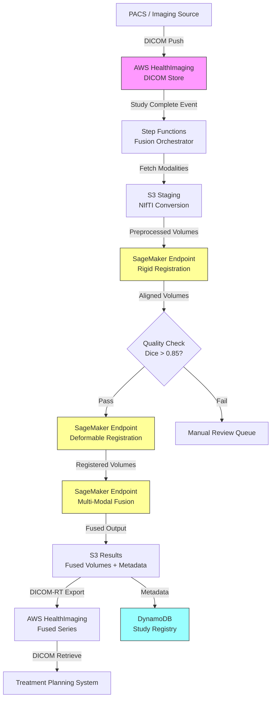

# Recipe 9.10: Multi-Modal Imaging Fusion and Analysis

**Complexity:** Complex · **Phase:** Research/Pilot · **Estimated Cost:** ~$2.50–$8.00 per fusion study

---

## The Problem

A radiation oncologist is planning treatment for a patient with a brain tumor. She has an MRI showing the tumor's soft tissue boundaries with exquisite detail. She has a CT scan showing the bony anatomy and providing the electron density data needed for dose calculations. She has a PET scan showing metabolic activity, highlighting which parts of the tumor are most aggressive. Each image tells part of the story. None tells the whole story.

Right now, she's mentally fusing these images in her head. She pulls up the MRI on one monitor, the CT on another, scrolls back and forth, tries to hold the spatial relationships in working memory while drawing treatment contours. Sometimes she uses the planning system's rigid registration tool, which aligns the images based on bony landmarks. It works reasonably well for the skull (rigid structure), but for the abdomen or pelvis (where organs shift between scans taken on different days), it's often wrong by centimeters. Centimeters matter when you're aiming radiation at a tumor next to the spinal cord.

This isn't just radiation oncology. Neurosurgeons fuse MRI with functional imaging (fMRI, DTI) to avoid eloquent cortex during resection. Cardiologists overlay PET perfusion maps on CT angiography to correlate anatomy with function. Orthopedic surgeons combine CT (bone detail) with MRI (soft tissue) for complex joint reconstruction planning. Interventional radiologists fuse pre-procedure CT with real-time ultrasound for needle guidance.

The common thread: no single imaging modality captures everything a clinician needs. Each modality has strengths (CT for bone and density, MRI for soft tissue contrast, PET for metabolic activity, ultrasound for real-time guidance) and weaknesses. Combining them produces a more complete picture than any individual scan. But combining them correctly, accounting for patient motion, organ deformation, different spatial resolutions, and different acquisition geometries, is genuinely hard.

The manual approach doesn't scale. It depends on the clinician's spatial reasoning ability, introduces inter-observer variability, and breaks down entirely when you need to fuse more than two modalities or when the anatomy has deformed between acquisitions. Automated multi-modal fusion is one of those problems where getting it 80% right is straightforward and getting it 95% right requires solving some of the hardest problems in medical image computing.

---

## The Technology: How Multi-Modal Fusion Works

### Image Registration: The Core Problem

At its heart, multi-modal fusion is an image registration problem. You have two (or more) images of the same anatomy, acquired at different times, with different scanners, at different resolutions, and you need to align them so that the same anatomical point maps to the same coordinate in both images.

Registration has two components: a transformation model (how you're allowed to warp one image to match the other) and a similarity metric (how you measure whether the alignment is good).

**Transformation models** range from simple to complex:

- **Rigid registration** allows only rotation and translation (6 degrees of freedom in 3D). Works well for the brain (skull doesn't deform) and bones. Fast, robust, and often sufficient for head imaging.
- **Affine registration** adds scaling and shearing (12 degrees of freedom). Handles differences in voxel size and minor geometric distortions between scanners.
- **Deformable (non-rigid) registration** allows each voxel to move independently (millions of degrees of freedom). Required for soft tissue that changes shape between scans: the liver shifts with breathing, the bladder fills and empties, the prostate moves with rectal filling. This is where the hard problems live.

**Similarity metrics** measure how well two images are aligned. The challenge with multi-modal fusion is that the same tissue looks completely different in different modalities. Bone is bright on CT and dark on MRI. Fat is bright on certain MRI sequences and dark on others. You can't just subtract one image from the other and minimize the difference (that works for same-modality registration, not cross-modality).

The standard approach for multi-modal registration is **mutual information**, an information-theoretic metric that measures statistical dependence between image intensities without assuming any specific relationship between them. If two images are well-aligned, knowing the intensity at a point in one image should reduce your uncertainty about the intensity at the corresponding point in the other. Mutual information captures this regardless of whether the relationship is linear, inverse, or complex.

### Deep Learning Registration

Classical registration algorithms (iterative optimization of mutual information over a deformation field) work but are slow. A single deformable registration can take 5-30 minutes on a CPU. For clinical workflows that need results in seconds, this is too slow.

Deep learning registration networks (VoxelMorph, TransMorph, and their descendants) learn to predict the deformation field directly from the input image pair. Once trained, inference takes seconds on a GPU. The tradeoff: they require training data (pairs of images with known correspondences), they can fail on anatomy outside their training distribution, and validating their accuracy is harder than validating classical methods (where you can inspect the optimization convergence).

Hybrid approaches are common in practice: use a deep learning network for initial alignment, then refine with a few iterations of classical optimization. This gives you speed and robustness.

### Fusion Strategies

Once images are registered (aligned to a common coordinate space), you need to decide how to combine the information. There are several strategies:

- **Overlay/blending:** Display one modality as a color overlay on another. Simple, widely used in clinical practice. The clinician sees both modalities simultaneously and can adjust the blend ratio. No information is lost, but interpretation depends on the viewer's ability to parse the combined display.

- **Feature-level fusion:** Extract features (edges, textures, regions) from each modality independently, then combine the feature maps. Useful when you want to detect structures that are visible in one modality but not the other.

- **Decision-level fusion:** Run separate analysis models on each modality, then combine the outputs (predictions, segmentations, classifications). Each model is specialized for its modality. The fusion happens at the interpretation level, not the pixel level.

- **Deep multi-modal fusion:** Train a single neural network that takes multiple modalities as input channels and learns to extract complementary information. The network learns which modality to trust for which anatomical region. This is the most powerful approach but requires paired multi-modal training data, which is expensive to acquire and annotate.

### What Makes This Genuinely Hard

**Temporal mismatch.** A CT and MRI taken on different days show different anatomy. The patient's weight changed. The bladder was full for one scan and empty for the other. A tumor grew between acquisitions. Deformable registration can handle some of this, but there are limits. If anatomy has genuinely changed (tumor growth, surgical resection), no registration algorithm can make the images correspond perfectly because they're showing different physical reality.

**Resolution mismatch.** A CT might have 0.5mm in-plane resolution with 2mm slice thickness. The corresponding MRI might have 1mm isotropic resolution. PET might be 4mm isotropic. Fusing these requires resampling to a common grid, and every resampling operation introduces interpolation artifacts. Upsampling low-resolution PET to match high-resolution CT doesn't create information that wasn't there; it just makes the voxels smaller.

**Geometric distortion.** MRI is susceptible to geometric distortions from magnetic field inhomogeneities, particularly near air-tissue interfaces (sinuses, ear canals). These distortions mean that even a perfect rigid registration will have residual misalignment in distortion-prone regions. Distortion correction is a preprocessing step, but it's imperfect.

**Validation.** How do you know your registration is correct? For rigid registration of the brain, you can check landmark alignment (anatomical points that are identifiable in both modalities). For deformable registration of soft tissue, ground truth is much harder to establish. You're often relying on visual inspection by an expert, which doesn't scale and introduces subjectivity.

**Clinical integration.** The fused result needs to flow into downstream clinical systems: treatment planning systems for radiation oncology, surgical navigation systems for neurosurgery, reporting systems for radiology. Each has its own data format expectations (DICOM, DICOM-RT, proprietary formats), coordinate system conventions, and display requirements. The fusion pipeline is only useful if its output plugs into the clinical workflow.

### The General Architecture Pattern

```
[Ingest Modalities] → [Preprocessing] → [Registration] → [Fusion] → [Analysis/Visualization] → [Clinical System Integration]
```

**Ingest:** Receive images from multiple modalities. Each arrives as a DICOM series with its own coordinate system, resolution, and metadata. Parse the DICOM headers to extract spatial information (origin, spacing, orientation).

**Preprocessing:** Normalize each modality. This includes resampling to a common resolution, intensity normalization (different scanners produce different intensity ranges), skull stripping for brain imaging, and distortion correction for MRI.

**Registration:** Align all modalities to a common reference frame. Typically one modality is chosen as the "fixed" image (often CT for radiation oncology because it defines the treatment coordinate system) and others are registered to it. Start with rigid/affine registration, then apply deformable registration if soft tissue alignment is needed.

**Fusion:** Combine the registered images. The strategy depends on the clinical use case: overlay for visualization, feature fusion for automated analysis, or multi-channel input for deep learning models.

**Analysis:** Run clinical analysis on the fused data. This might be tumor segmentation using features from multiple modalities, treatment plan optimization using CT density with MRI-defined target volumes, or functional mapping combining structural and functional imaging.

**Clinical Integration:** Export results in the format required by downstream systems. For radiation oncology, this means DICOM-RT structure sets. For surgical navigation, it might be STL meshes or proprietary navigation system formats.

---

## The AWS Implementation

### Why These Services

**Amazon S3 for multi-modal image storage.** Medical imaging studies are large (a single CT can be 500MB; an MRI series can be several GB). S3 provides durable, encrypted storage with the throughput to handle parallel reads of multiple modalities during fusion. Organizing by study ID with modality prefixes keeps the data navigable. S3 Intelligent-Tiering handles the access pattern naturally: recent studies are accessed frequently during treatment planning, then rarely touched afterward.

**Amazon SageMaker for registration and fusion models.** Deformable registration and deep learning fusion models require GPU inference. SageMaker endpoints provide managed GPU hosting with auto-scaling. For batch processing (overnight registration of next-day treatment planning cases), SageMaker Processing Jobs or Batch Transform handle the workload without maintaining persistent GPU instances. SageMaker also provides the training infrastructure for fine-tuning registration models on institution-specific anatomy.

**AWS Step Functions for pipeline orchestration.** Multi-modal fusion is a multi-step pipeline with conditional logic: if rigid registration quality is sufficient, skip deformable registration; if a modality is missing, proceed with available data; if registration fails quality checks, route to manual review. Step Functions express this logic cleanly and provide built-in retry, error handling, and execution history for audit.

**Amazon DynamoDB for study metadata and pipeline state.** Track which modalities are available for each study, registration quality metrics, pipeline status, and clinical context. DynamoDB's key-value access pattern fits the "look up everything about this study" query perfectly.

**AWS HealthImaging for DICOM management.** AWS HealthImaging (formerly Amazon HealthLake Imaging) provides a managed DICOM store with sub-second image retrieval. It handles the DICOM parsing, indexing, and retrieval that would otherwise require a self-managed PACS. For the fusion pipeline, it serves as both the source of input modalities and the destination for fused outputs.

**Amazon EC2 (GPU instances) for intensive registration workloads.** Some registration tasks (particularly deformable registration of large 3D volumes) benefit from dedicated GPU instances rather than SageMaker endpoints. P4d or G5 instances with NVIDIA GPUs provide the compute density needed for iterative optimization algorithms that don't fit the request-response pattern of an endpoint.

### Architecture Diagram



### Prerequisites

| Requirement | Details |
|-------------|---------|
| **AWS Services** | AWS HealthImaging, Amazon S3, Amazon SageMaker, AWS Step Functions, Amazon DynamoDB, Amazon EC2 (GPU), AWS Lambda |
| **IAM Permissions** | `medical-imaging:GetImageSet`, `medical-imaging:SearchImageSets`, `s3:GetObject`, `s3:PutObject`, `sagemaker:InvokeEndpoint`, `states:StartExecution`, `dynamodb:PutItem`, `dynamodb:GetItem` |
| **BAA** | AWS BAA signed (required: medical images are PHI) |
| **Encryption** | S3: SSE-KMS; DynamoDB: encryption at rest; HealthImaging: KMS encryption; all transit over TLS; SageMaker endpoints with KMS-encrypted volumes |
| **VPC** | Production: all compute in VPC with VPC endpoints for S3, DynamoDB, SageMaker, and HealthImaging. GPU instances in private subnets. |
| **CloudTrail** | Enabled: log all image access and processing API calls for HIPAA audit |
| **Sample Data** | Public multi-modal datasets: TCIA (The Cancer Imaging Archive) provides paired CT/MRI/PET studies. Never use real patient imaging in dev. |
| **Cost Estimate** | GPU inference (g5.xlarge): ~$1.00/hour. Registration per study: ~$0.50-2.00 (depending on modality count and deformable complexity). Storage: ~$0.023/GB/month. HealthImaging: ~$0.008/study/month after initial load. |

### Ingredients

| AWS Service | Role |
|------------|------|
| **AWS HealthImaging** | DICOM store for source modalities and fused output series |
| **Amazon S3** | Staging area for NIfTI-converted volumes during processing; long-term result storage |
| **Amazon SageMaker** | Hosts registration models (rigid + deformable) and fusion inference endpoints |
| **AWS Step Functions** | Orchestrates the multi-step fusion pipeline with conditional logic and error handling |
| **Amazon DynamoDB** | Study metadata registry: tracks modalities, registration quality, pipeline state |
| **AWS Lambda** | Lightweight tasks: DICOM-to-NIfTI conversion triggers, quality metric computation, notification dispatch |
| **Amazon EC2 (GPU)** | Dedicated GPU compute for intensive deformable registration jobs |
| **AWS KMS** | Encryption key management for all PHI-containing storage |
| **Amazon CloudWatch** | Pipeline metrics, registration quality dashboards, failure alerting |

### Code

#### Walkthrough

**Step 1: Ingest and identify available modalities.** When a new imaging study arrives (or when all expected modalities for a treatment planning case are present), the pipeline identifies what's available. A radiation oncology case might expect CT (required), MRI (T1 and T2 sequences), and PET. A neurosurgery case might expect CT, MRI (structural), fMRI (functional), and DTI (diffusion tensor). The pipeline checks the study metadata to determine which modalities are present and whether the minimum required set is complete. If the CT is missing for a radiation oncology case, there's no point proceeding because dose calculation requires electron density from CT. If an optional modality (like PET) is missing, the pipeline proceeds with what's available.

```
FUNCTION identify_study_modalities(study_id):
    // Query the DICOM store for all image series belonging to this study.
    // Each series has metadata including modality type, acquisition date, and series description.
    series_list = query HealthImaging for all series where StudyInstanceUID = study_id

    // Categorize each series by modality and sequence type.
    // A single study might have multiple MRI series (T1, T2, FLAIR, DWI).
    modalities = empty map
    FOR each series in series_list:
        modality = series.Modality          // "CT", "MR", "PT" (PET), "US"
        description = series.SeriesDescription  // "T1 POST GAD", "FLAIR", "FDG PET"
        
        // Store series metadata keyed by modality + sequence type.
        // This lets us later select the right MRI sequence for fusion.
        modalities[modality + "_" + description] = {
            series_id:      series.SeriesInstanceUID,
            voxel_spacing:  extract spacing from series metadata,
            dimensions:     extract matrix size from series metadata,
            acquisition_date: series.AcquisitionDate
        }

    // Determine the clinical context to know which modalities are required vs. optional.
    clinical_context = lookup treatment context for study_id from DynamoDB
    required = clinical_context.required_modalities   // e.g., ["CT"]
    optional = clinical_context.optional_modalities   // e.g., ["MR_T1", "MR_T2", "PT_FDG"]

    // Check if minimum requirements are met.
    missing_required = required items NOT present in modalities
    IF missing_required is not empty:
        RETURN { status: "INCOMPLETE", missing: missing_required }

    RETURN { status: "READY", modalities: modalities, context: clinical_context }
```

**Step 2: Preprocessing and format conversion.** Medical images arrive as DICOM, which is great for clinical systems but awkward for computational processing. This step converts each modality to NIfTI format (the standard for research image processing), resamples to a common resolution grid, and applies modality-specific preprocessing. For MRI, this includes bias field correction (removing intensity inhomogeneity caused by RF coil sensitivity patterns) and optionally skull stripping for brain cases. For PET, this includes SUV (Standardized Uptake Value) normalization so that intensity values are physiologically meaningful rather than scanner-dependent. Skip preprocessing and your registration will be fighting artifacts rather than aligning anatomy.

```
FUNCTION preprocess_modality(series_id, modality_type, target_spacing):
    // Download the DICOM series from HealthImaging to local staging.
    dicom_files = fetch all frames for series_id from HealthImaging
    
    // Convert DICOM to NIfTI. This consolidates the per-slice DICOM files
    // into a single 3D volume with proper spatial metadata (origin, spacing, orientation).
    volume = convert_dicom_to_nifti(dicom_files)
    
    // Apply modality-specific preprocessing.
    IF modality_type == "MR":
        // Bias field correction: MRI intensity varies spatially due to coil sensitivity.
        // Without correction, the same tissue type has different intensities in different
        // parts of the image, which confuses registration algorithms.
        volume = apply_n4_bias_field_correction(volume)
        
        // For brain imaging: remove non-brain tissue (skull, scalp, eyes).
        // Registration should align brain to brain, not skull to skull.
        IF clinical_context.anatomy == "brain":
            volume = skull_strip(volume)
    
    ELSE IF modality_type == "PT":  // PET
        // Convert raw PET counts to SUV (Standardized Uptake Value).
        // SUV normalizes for injected dose and patient weight,
        // making values comparable across patients and scanners.
        volume = convert_to_suv(volume, patient_weight, injected_dose, scan_time)
    
    ELSE IF modality_type == "CT":
        // CT is already in Hounsfield Units (standardized by definition).
        // Optional: window/level clipping to focus on relevant tissue range.
        // For soft tissue registration, clip to [-200, 400] HU.
        volume = clip_intensity(volume, min=-200, max=400)
    
    // Resample to the target spacing (common grid for all modalities).
    // Use cubic interpolation for continuous-valued images (MRI, CT).
    // Use nearest-neighbor for label maps (if any segmentations are included).
    volume = resample_to_spacing(volume, target_spacing, interpolation="cubic")
    
    // Upload preprocessed volume to S3 staging area.
    output_key = "staging/{study_id}/{modality_type}_preprocessed.nii.gz"
    upload volume to S3 at output_key
    
    RETURN { key: output_key, spacing: target_spacing, dimensions: volume.shape }
```

**Step 3: Rigid registration.** The first alignment pass uses rigid registration (rotation + translation only). This corrects for differences in patient positioning between scans. One modality is designated as the "fixed" reference (typically CT for radiation oncology, because the treatment plan coordinate system is defined by the CT). All other modalities are registered to it. Rigid registration is fast (seconds), robust, and sufficient for brain imaging where the skull constrains motion. For body imaging, it provides the starting point for subsequent deformable registration. The quality of rigid registration is measured by mutual information (higher is better) and by landmark distance if anatomical landmarks are available.

```
FUNCTION rigid_register(fixed_volume_key, moving_volume_key):
    // Load both volumes from S3 staging.
    fixed = load volume from S3 at fixed_volume_key
    moving = load volume from S3 at moving_volume_key
    
    // Initialize with center-of-mass alignment.
    // This gives the optimizer a reasonable starting point rather than
    // starting from identity (which might be far off if patient positioning differed).
    initial_transform = align_centers_of_mass(fixed, moving)
    
    // Run rigid registration using mutual information as the similarity metric.
    // Mutual information works across modalities because it measures statistical
    // dependence rather than assuming identical intensities.
    registration_result = optimize_rigid_transform(
        fixed_image    = fixed,
        moving_image   = moving,
        initial        = initial_transform,
        metric         = "mutual_information",
        optimizer      = "gradient_descent",
        multi_scale    = [8, 4, 2, 1],  // coarse-to-fine: start at 8x downsampled, refine to full resolution
        max_iterations = [200, 100, 50, 25]  // more iterations at coarse levels where it's cheap
    )
    
    // Apply the computed transform to the moving image.
    aligned_volume = apply_transform(moving, registration_result.transform, reference=fixed)
    
    // Compute quality metrics.
    final_mutual_info = compute_mutual_information(fixed, aligned_volume)
    
    // If anatomical landmarks are available, compute target registration error (TRE).
    // TRE is the gold standard for registration accuracy: how far apart are
    // corresponding anatomical points after registration?
    IF landmarks_available:
        tre = compute_target_registration_error(
            fixed_landmarks, 
            transform_points(moving_landmarks, registration_result.transform)
        )
    
    // Save aligned volume and transform.
    output_key = moving_volume_key.replace("preprocessed", "rigid_aligned")
    upload aligned_volume to S3 at output_key
    
    RETURN {
        aligned_key: output_key,
        transform: registration_result.transform,
        mutual_info: final_mutual_info,
        tre: tre if available else null,
        quality: "PASS" if final_mutual_info > threshold else "REVIEW"
    }
```

**Step 4: Deformable registration (when needed).** For body imaging where organs move and deform between scans, rigid registration isn't enough. Deformable registration computes a dense displacement field: for every voxel in the fixed image, it estimates where the corresponding point is in the moving image. This handles organ motion (liver shifting with respiration), bladder filling changes, and soft tissue deformation. The displacement field has millions of parameters (3 values per voxel: x, y, z displacement), so regularization is critical to prevent physically implausible deformations (like folding tissue through itself). Deep learning registration networks predict the displacement field in seconds; classical methods take minutes but offer more control over regularization.

```
FUNCTION deformable_register(fixed_volume_key, rigid_aligned_key, method="deep_learning"):
    // Load the fixed volume and the rigidly-aligned moving volume.
    // Starting from rigid alignment means the deformable step only needs to
    // handle residual soft tissue motion, not gross positioning differences.
    fixed = load volume from S3 at fixed_volume_key
    moving = load volume from S3 at rigid_aligned_key
    
    IF method == "deep_learning":
        // Use a pre-trained registration network (e.g., VoxelMorph architecture).
        // The network takes fixed and moving as input and predicts the displacement field directly.
        // Inference is fast (1-5 seconds on GPU) but accuracy depends on training data coverage.
        displacement_field = invoke SageMaker endpoint "deformable-reg-model" with:
            input = { fixed: fixed, moving: moving }
        
    ELSE:  // classical iterative optimization
        // Slower but more controllable. Use for cases where the deep learning model
        // produces poor results (unusual anatomy, large deformations).
        displacement_field = optimize_deformable_transform(
            fixed_image     = fixed,
            moving_image    = moving,
            metric          = "mutual_information",
            regularization  = "bending_energy",  // penalizes non-smooth deformations
            reg_weight      = 1.0,               // balance between alignment and smoothness
            grid_spacing    = [8, 4, 2],         // multi-resolution B-spline control points
            max_iterations  = [100, 50, 25]
        )
    
    // Apply displacement field to warp the moving image.
    deformed_volume = warp_volume(moving, displacement_field, interpolation="cubic")
    
    // Validate the displacement field for physical plausibility.
    // The Jacobian determinant at each point indicates local volume change.
    // Negative Jacobian = tissue folding through itself = physically impossible.
    jacobian = compute_jacobian_determinant(displacement_field)
    folding_fraction = count(jacobian < 0) / total_voxels
    
    IF folding_fraction > 0.01:  // more than 1% of voxels have folding
        // Registration produced implausible deformations. Flag for review.
        RETURN { status: "FAILED_VALIDATION", folding_fraction: folding_fraction }
    
    // Compute alignment quality after deformable registration.
    final_mutual_info = compute_mutual_information(fixed, deformed_volume)
    
    output_key = rigid_aligned_key.replace("rigid_aligned", "deformable_aligned")
    upload deformed_volume to S3 at output_key
    // Also save the displacement field (needed for transforming contours/landmarks).
    upload displacement_field to S3 at output_key + "_displacement.nii.gz"
    
    RETURN {
        aligned_key: output_key,
        displacement_key: output_key + "_displacement.nii.gz",
        mutual_info: final_mutual_info,
        folding_fraction: folding_fraction,
        quality: "PASS"
    }
```

**Step 5: Multi-modal fusion and analysis.** With all modalities registered to a common coordinate space, the fusion step combines them for clinical use. The specific fusion strategy depends on the clinical application. For treatment planning, the output might be a tumor segmentation that uses MRI for boundary definition and PET for metabolic extent. For surgical planning, it might be a 3D model combining CT bone surfaces with MRI-defined neural structures. The key insight: fusion isn't just overlaying images. It's extracting complementary information from each modality and combining it into something more useful than any single modality alone.

```
FUNCTION fuse_modalities(study_id, registered_volumes, clinical_context):
    // Load all registered volumes into memory.
    // At this point, all volumes share the same coordinate space, spacing, and dimensions.
    volumes = empty map
    FOR each modality, volume_key in registered_volumes:
        volumes[modality] = load volume from S3 at volume_key
    
    // Select fusion strategy based on clinical context.
    IF clinical_context.use_case == "radiation_oncology_planning":
        // For radiation oncology: segment the tumor using multi-modal features.
        // CT provides density for dose calculation.
        // MRI provides soft tissue contrast for target delineation.
        // PET provides metabolic information for boost volume definition.
        
        // Stack modalities as channels for the segmentation model.
        multi_channel_input = stack_as_channels([
            volumes["CT"],
            volumes["MR_T1"],
            volumes["MR_T2"],
            volumes["PT_FDG"] if "PT_FDG" in volumes else zeros_like(volumes["CT"])
        ])
        
        // Run multi-modal segmentation model.
        // This model was trained on paired multi-modal data with expert contours.
        segmentation = invoke SageMaker endpoint "multimodal-segmentation" with:
            input = multi_channel_input
        
        // The segmentation output includes:
        // - GTV (Gross Tumor Volume): visible tumor on imaging
        // - CTV (Clinical Target Volume): GTV + microscopic extension margin
        // - OAR (Organs at Risk): critical structures to avoid
        results = {
            gtv_mask: segmentation.gtv,
            ctv_mask: segmentation.ctv,
            oar_masks: segmentation.organs_at_risk,
            confidence_map: segmentation.uncertainty  // per-voxel model uncertainty
        }
    
    ELSE IF clinical_context.use_case == "neurosurgical_planning":
        // For neurosurgery: combine structural MRI with functional data.
        // Identify tumor boundaries AND eloquent cortex to preserve.
        results = {
            tumor_segmentation: segment_tumor(volumes["MR_T1"], volumes["MR_T2"]),
            motor_cortex: extract_activation_map(volumes["fMRI_motor"]),
            language_cortex: extract_activation_map(volumes["fMRI_language"]),
            white_matter_tracts: compute_tractography(volumes["DTI"])
        }
    
    // Compute fusion quality metrics.
    // These help clinicians assess whether the fused result is trustworthy.
    quality_metrics = {
        registration_quality: summarize registration metrics for all modality pairs,
        segmentation_confidence: mean confidence across target volume,
        modalities_used: list of modalities that contributed to this result,
        missing_modalities: list of expected but unavailable modalities
    }
    
    // Save results.
    output_key = "results/{study_id}/fused_output.nii.gz"
    upload results to S3 at output_key
    
    // Update study registry with pipeline completion.
    write to DynamoDB "study-registry":
        study_id = study_id,
        fusion_timestamp = current UTC timestamp,
        modalities_fused = list of modality keys,
        quality_metrics = quality_metrics,
        output_location = output_key,
        status = "COMPLETE"
    
    RETURN { output_key: output_key, metrics: quality_metrics }
```

**Step 6: Export to clinical systems.** The fused results need to flow back into clinical systems in formats they understand. For radiation oncology, this means DICOM-RT Structure Sets (contours) and DICOM-RT Dose files. For surgical navigation, it might be 3D surface meshes or proprietary formats. This step converts the computational output into clinically consumable formats and pushes them back to the DICOM store where treatment planning systems can retrieve them.

```
FUNCTION export_to_clinical_systems(study_id, fusion_results, clinical_context):
    // Convert segmentation masks to DICOM-RT Structure Set format.
    // DICOM-RT stores contours as polygons on each CT slice,
    // not as a 3D volume mask. This conversion is non-trivial.
    IF clinical_context.use_case == "radiation_oncology_planning":
        // Load the reference CT (defines the coordinate system for RT structures).
        reference_ct = load original CT DICOM series for study_id
        
        // Convert each segmentation mask to contour polygons.
        rt_struct = create_dicom_rt_structure_set(
            reference_series = reference_ct,
            structures = [
                { name: "GTV", mask: fusion_results.gtv_mask, color: [255, 0, 0] },
                { name: "CTV", mask: fusion_results.ctv_mask, color: [0, 255, 0] },
                // Add each organ at risk as a separate structure.
                FOR each organ_name, organ_mask in fusion_results.oar_masks:
                    { name: organ_name, mask: organ_mask, color: assigned_color }
            ],
            operator_name = "AI_FUSION_v2.1",  // identify AI-generated contours
            approval_status = "UNAPPROVED"      // clinician must review and approve
        )
        
        // Push the RT Structure Set back to HealthImaging.
        // It will appear in the treatment planning system as a new structure set
        // linked to the original CT study.
        store rt_struct in HealthImaging linked to study_id
    
    // Generate a fusion report summarizing what was done.
    report = generate_fusion_report(
        study_id = study_id,
        modalities_used = fusion_results.modalities_used,
        registration_metrics = fusion_results.quality_metrics,
        clinical_context = clinical_context,
        timestamp = current UTC timestamp
    )
    
    // Store report for clinical documentation.
    upload report to S3 at "reports/{study_id}/fusion_report.pdf"
    
    RETURN { 
        rt_struct_stored: true, 
        report_key: "reports/{study_id}/fusion_report.pdf",
        status: "EXPORTED" 
    }
```

> **Curious how this looks in Python?** The pseudocode above covers the concepts. If you'd like to see sample Python code that demonstrates these patterns using boto3, check out the [Python Example](chapter09.10-python-example). It walks through each step with inline comments and notes on what you'd need to change for a real deployment.

### Expected Results

**Sample output for a radiation oncology brain case (CT + MRI T1 + MRI T2 + PET):**

```json
{
  "study_id": "1.2.840.113619.2.55.3.2831164.12345",
  "fusion_timestamp": "2026-05-31T18:45:22Z",
  "modalities_fused": ["CT", "MR_T1_POST_GAD", "MR_T2_FLAIR", "PT_FDG"],
  "registration_quality": {
    "MR_T1_to_CT": { "mutual_info": 1.42, "tre_mm": 1.1, "method": "rigid" },
    "MR_T2_to_CT": { "mutual_info": 1.38, "tre_mm": 1.3, "method": "rigid" },
    "PT_to_CT": { "mutual_info": 0.89, "tre_mm": 2.4, "method": "rigid+deformable" }
  },
  "segmentation_results": {
    "GTV_volume_cc": 24.7,
    "CTV_volume_cc": 48.2,
    "mean_confidence": 0.91,
    "low_confidence_regions_cc": 3.2
  },
  "output_format": "DICOM-RT Structure Set",
  "approval_status": "UNAPPROVED",
  "processing_time_seconds": 142
}
```

**Performance benchmarks:**

| Metric | Typical Value |
|--------|---------------|
| Rigid registration (brain) | 5-15 seconds |
| Deformable registration (abdomen) | 10-60 seconds (DL) / 5-30 minutes (classical) |
| Multi-modal segmentation inference | 10-30 seconds |
| End-to-end pipeline (4 modalities) | 2-5 minutes |
| Registration accuracy (brain, rigid) | 1-2mm TRE |
| Registration accuracy (abdomen, deformable) | 2-5mm TRE |
| Segmentation Dice (GTV, brain tumors) | 0.82-0.92 |
| Cost per fusion study | $2.50-$8.00 (GPU time + storage) |

**Where it struggles:** Large deformations between scans taken weeks apart (tumor growth, weight loss, surgical changes). PET-CT registration when the PET is acquired on a different scanner than the CT (different patient positioning). Regions near air-tissue interfaces where MRI geometric distortion is worst. Cases where the "ground truth" alignment is ambiguous even to experts (diffuse tumor boundaries, post-treatment changes).

---

## Why This Isn't Production-Ready

**FDA regulatory pathway.** If the fusion output directly influences treatment decisions (tumor contours for radiation planning, surgical navigation boundaries), it likely requires FDA clearance as a medical device (Class II, 510(k) pathway). The AI-generated contours must be clearly labeled as "AI-assisted, requires physician review and approval." The regulatory burden is significant and varies by intended use.

**Validation infrastructure.** You need a systematic way to validate registration accuracy across your patient population. This means curated landmark datasets, expert-annotated ground truth contours, and ongoing monitoring of registration quality metrics. A registration that works well on average can fail catastrophically on specific anatomies.

**Clinical workflow integration.** Treatment planning systems (Eclipse, RayStation, Pinnacle) have specific import requirements and approval workflows. The AI-generated contours need to appear in the right place in the clinician's workflow, clearly identified as AI-generated, with an easy path to edit and approve. This integration work is often harder than the algorithm development.

**Model drift monitoring.** Scanner upgrades, protocol changes, and patient population shifts can degrade registration and segmentation performance over time. You need ongoing monitoring comparing AI outputs to clinician-edited final contours.

---

## The Honest Take

Multi-modal fusion is one of those problems where the demo looks amazing and the production deployment takes years. The core algorithms (registration, segmentation) are mature. The hard parts are everything around them: clinical workflow integration, regulatory clearance, validation at scale, and handling the long tail of cases where the algorithm fails.

The registration accuracy numbers I quoted (1-2mm for brain, 2-5mm for abdomen) are averages. The distribution has a long tail. For 95% of cases, the registration is clinically acceptable. For the remaining 5%, it might be off by a centimeter in a region that matters. Your system needs to detect those failures before a clinician acts on them. That detection problem is almost as hard as the registration problem itself.

The thing that surprised me most: the preprocessing matters more than the registration algorithm. Garbage in, garbage out applies with a vengeance. A poorly skull-stripped brain MRI will register badly regardless of how sophisticated your registration algorithm is. Spend more time on preprocessing quality than on tweaking registration hyperparameters.

PET registration is consistently the hardest modality to get right. The spatial resolution is poor (4-5mm vs. sub-millimeter for CT/MRI), the signal-to-noise ratio is low, and the anatomical landmarks are hard to identify. If your use case can tolerate PET-CT acquired on the same scanner in the same session (hardware fusion), that eliminates the registration problem entirely for that modality pair. Push for same-session acquisition protocols whenever possible.

Deep learning registration models are fast and usually good, but they fail silently. A classical optimization algorithm will converge slowly or not at all when it's struggling, giving you a signal. A neural network will confidently produce a plausible-looking but wrong displacement field. Always validate with quality metrics, and have a fallback to classical methods for flagged cases.

---

## Variations and Extensions

**Real-time intraoperative fusion.** Combine pre-operative MRI/CT with intraoperative ultrasound for surgical navigation. The challenge: brain shift during surgery invalidates the pre-operative registration. Solutions include biomechanical models that predict deformation from surface measurements, or periodic intraoperative imaging updates. This is an active research area with commercial systems available (BrainLab, Medtronic StealthStation).

**Longitudinal fusion for treatment response.** Register imaging studies acquired at multiple time points (baseline, mid-treatment, post-treatment) to track tumor response. Compute volumetric change maps showing where the tumor is shrinking or growing. Requires handling genuine anatomical change (tumor shrinkage) differently from registration error, which is a subtle distinction.

**Atlas-based fusion for population studies.** Register many patients' images to a common anatomical atlas, enabling population-level analysis. Used in research for identifying imaging biomarkers, comparing treatment outcomes across cohorts, and building statistical shape models. The atlas registration problem is similar to patient-specific fusion but at a different scale.

---

## Related Recipes

- **Recipe 9.5 (Chest X-Ray Triage):** Single-modality analysis; contrast with the multi-modality approach here
- **Recipe 9.7 (Radiology AI Triage, Multi-Modality):** Handles multiple modalities for triage but without spatial fusion
- **Recipe 9.8 (Pathology Slide Analysis):** Another complex imaging pipeline with gigapixel data challenges
- **Recipe 13.4 (Clinical Ontology Mapping):** Knowledge graphs can encode the relationships between imaging findings across modalities
- **Recipe 14.3 (Treatment Plan Optimization):** Consumes the fused segmentation output from this recipe for radiation dose optimization

---

## Additional Resources

**AWS Documentation:**
- [AWS HealthImaging Developer Guide](https://docs.aws.amazon.com/healthimaging/latest/devguide/what-is.html)
- [Amazon SageMaker Inference Endpoints](https://docs.aws.amazon.com/sagemaker/latest/dg/deploy-model.html)
- [AWS Step Functions Developer Guide](https://docs.aws.amazon.com/step-functions/latest/dg/welcome.html)
- [AWS HIPAA Eligible Services](https://aws.amazon.com/compliance/hipaa-eligible-services-reference/)
- [Amazon SageMaker GPU Instance Types](https://docs.aws.amazon.com/sagemaker/latest/dg/notebooks-available-instance-types.html)

**Public Datasets and Research Resources:**
- [The Cancer Imaging Archive (TCIA)](https://www.cancerimagingarchive.net/): Multi-modal imaging datasets for research, including paired CT/MRI/PET studies
- [MICCAI Learn2Reg Challenge](https://learn2reg.grand-challenge.org/): Benchmark datasets and methods for medical image registration

**AWS Solutions and Blogs:**
- [Guidance for Multi-Modal Data Analysis with AWS HealthImaging](https://aws.amazon.com/solutions/guidance/multi-modal-data-analysis-with-aws-healthimaging/): Reference architecture for medical imaging analysis pipelines on AWS
- [Building Medical Imaging AI on AWS (AWS Blog)](https://aws.amazon.com/blogs/machine-learning/build-a-medical-image-analysis-pipeline-on-aws/): End-to-end architecture for medical imaging ML pipelines

---

## Estimated Implementation Time

| Phase | Duration |
|-------|----------|
| **Basic** (rigid registration, 2 modalities, overlay visualization) | 6-8 weeks |
| **Production-ready** (deformable registration, quality validation, clinical system integration) | 4-6 months |
| **With variations** (real-time intraoperative, longitudinal tracking, FDA submission) | 12-18 months |

---

## Tags

`computer-vision` · `medical-imaging` · `multi-modal` · `image-registration` · `fusion` · `radiation-oncology` · `neurosurgery` · `treatment-planning` · `sagemaker` · `healthimaging` · `step-functions` · `complex` · `gpu` · `hipaa` · `fda`

---

*← [Recipe 9.9: Surgical Video Analysis](chapter09.09-surgical-video-analysis) · [Chapter 9 Index](chapter09-index) · [Next: Chapter 10 →](chapter10-preface)*
