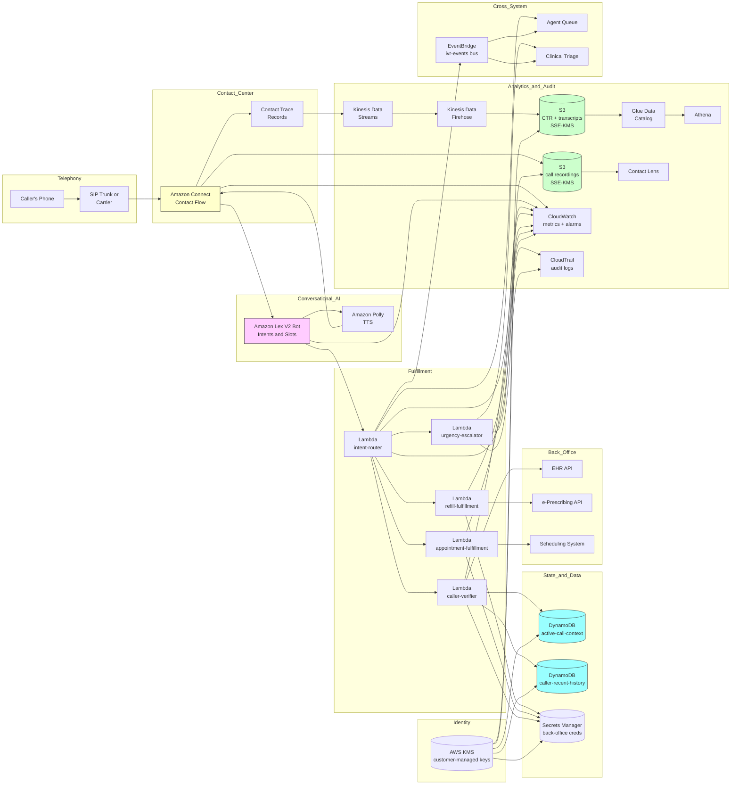

# Recipe 10.1 Architecture and Implementation: IVR Call Routing Enhancement

*Companion to [Recipe 10.1: IVR Call Routing Enhancement](chapter10.01-ivr-call-routing-enhancement). This page covers the AWS architecture, services, prerequisites, and pseudocode. For the problem framing and the conceptual approach, start with the main recipe.*

---

## The AWS Implementation

### Why These Services

**Amazon Connect for the contact-center backbone.** Connect is a managed cloud contact center that handles the telephony plumbing: SIP trunking, call routing, call recording, queue management, agent desktop integration. It comes with a visual flow editor (contact flows) that lets you wire up the IVR logic graphically and replaces a substantial amount of plumbing you'd otherwise build yourself. For an IVR specifically, Connect gives you the call leg, the audio stream, and the integration points with everything else. It is HIPAA-eligible under AWS BAA. <!-- TODO: verify; Amazon Connect's HIPAA eligibility and the specific feature subset under BAA continues to evolve; check the AWS HIPAA Eligible Services Reference at build time -->

**Amazon Lex for the NLU layer.** Lex is a managed conversational platform built on the same underlying technology as Alexa. You define intents, sample utterances, and slot types. Lex hosts the model, performs ASR-and-intent classification, manages the slot-filling dialog, and integrates natively with Connect contact flows. For most healthcare IVR use cases, Lex is the right starting point because the integration cost is dramatically lower than wiring together separate ASR and NLU components yourself. Lex V2 specifically supports streaming conversation and multi-language bots.

**Amazon Transcribe (or Transcribe Medical) for ASR.** When you need ASR outside the Lex managed bot (for example, capturing the full call transcript for downstream analytics), Transcribe is the standalone service. Transcribe Medical is the medical-domain-tuned variant; for an IVR's intent classification needs, Transcribe Medical is overkill, but for capturing high-fidelity transcripts of calls that include clinical content, it's worth considering.

**Amazon Polly for TTS responses.** Polly synthesizes the system's prompts. The neural voice options are good enough for most IVR contexts; the older standard voices are cheaper if cost matters. Lex can call Polly natively for system prompts, or you can prerecord the most common prompts and play them as audio files for slightly better voice quality and lower per-call cost.

**AWS Lambda for fulfillment and integration logic.** Every action the IVR takes (look up the patient, queue a refill request, schedule a callback, fetch eligibility) runs in a Lambda function called by Lex (as a fulfillment hook) or by Connect (as an invocation step in the contact flow). Lambda's per-invocation isolation, fast cold-start, and scaling characteristics fit IVR workloads well.

**Amazon DynamoDB for caller context and conversation state.** The IVR needs short-term state (this caller's verification status, the slots collected so far) and longer-term state (this caller's recent call history, any flags). DynamoDB's per-key low-latency reads are a good fit. The verification context for an active call lives in DynamoDB with TTL set to expire shortly after call completion; longer-retention call records live elsewhere.

**Amazon Comprehend Medical (optional) for clinical-content extraction.** When the call transcript contains clinical content that downstream systems want to consume (medication mentions, condition mentions, symptom mentions for triage routing), Comprehend Medical extracts these as structured entities. This is more applicable to recipe 10.2 (voicemail transcription and classification) than to a high-volume IVR, but it's available if needed.

**Amazon S3 for call recordings.** Recordings are PHI, encrypted at rest with KMS customer-managed keys, lifecycle policies to move older recordings to cheaper storage tiers, retention bound by institutional and regulatory policy.

**Amazon Kinesis Data Streams for real-time event flow.** Connect emits Contact Trace Records (CTRs) and contact events to Kinesis, where downstream consumers (analytics, real-time dashboards, anomaly detection on call patterns) pick them up.

**Amazon Athena and AWS Glue Data Catalog for analytics.** CTRs land in S3 (via Kinesis Data Firehose), Glue catalogs them, and Athena gives you SQL access for the operational analytics: containment rate, top intents, error patterns, subgroup-stratified accuracy.

**Amazon CloudWatch and Contact Lens for observability.** CloudWatch tracks the operational metrics (Lambda errors, Lex confidence distributions, call volumes); Contact Lens is Connect's built-in conversation analytics layer that surfaces sentiment, talk-time imbalance, and keyword detection on call recordings.

**AWS KMS for cryptographic-key custody.** Customer-managed KMS keys for the call-recordings bucket, the DynamoDB tables holding caller context, the Lambda environment variables that hold integration secrets, and the Kinesis streams.

**AWS Secrets Manager for back-office integration credentials.** The Lambdas that call into the EHR, the appointment-scheduling system, and the e-prescribing system need credentials. Secrets Manager stores them with rotation per the institutional cadence.

**Amazon EventBridge for cross-system event flow.** When an IVR call results in an action that affects another system (a refill queued, a callback scheduled, an escalation logged), EventBridge fans the event out to the appropriate downstream consumers.

**AWS CloudTrail for audit logging.** API calls against the call-recordings bucket, the Lex bot configuration, the Lambda functions, and the KMS keys all log to CloudTrail with retention sized to the institutional regulatory floor.

### Architecture Diagram



### Prerequisites

| Requirement | Details |
|-------------|---------|
| **AWS Services** | Amazon Connect, Amazon Lex V2, Amazon Polly, AWS Lambda, Amazon DynamoDB, Amazon S3, Amazon Kinesis Data Streams, Amazon Kinesis Data Firehose, AWS Glue Data Catalog, Amazon Athena, AWS KMS, AWS Secrets Manager, Amazon EventBridge, Amazon CloudWatch, AWS CloudTrail. Optionally: Amazon Transcribe Medical, Amazon Comprehend Medical, Amazon Connect Contact Lens. |
| **External Inputs** | Direct Inward Dialing (DID) phone numbers for the practice. Existing back-office system APIs for the integrations the IVR fulfills against (EHR, scheduling, e-prescribing, billing). An initial intent set with sample utterances per intent (typically derived from analyzing 1000-5000 historical call transcripts or call notes). A clinical-urgency-keyword lexicon, reviewed by clinical operations. |
| **IAM Permissions** | Per-Lambda least-privilege roles. The caller-verifier Lambda has scoped read access to the EHR API (or to the patient-index DynamoDB table) and write access to the active-call-context DynamoDB table only. The fulfillment Lambdas have scoped access to the specific back-office API they fulfill against, plus `secretsmanager:GetSecretValue` on the relevant secrets pinned to the current rotation. The intent-router Lambda has `events:PutEvents` on the IVR events bus. The urgency-escalator Lambda has `connect:StartContactStreaming` or equivalent for the triage-routing transfer plus PII-scoped audit-event emission. Connect's service role has scoped access to invoke the Lex bot and Polly. Lex's service role has scoped access to invoke the Lambda fulfillment hook. Avoid wildcard actions and resources in production. |
| **BAA and Compliance** | AWS BAA signed. Connect, Lex, Polly, Transcribe, Lambda, DynamoDB, S3, Kinesis, KMS, Secrets Manager, CloudWatch Logs, CloudTrail are HIPAA-eligible (verify the current list at build time). <!-- TODO (TechWriter): Expert review A6/F14 (LOW). Explicitly add Connect Contact Lens and Connect Voice ID to the HIPAA-eligible list with the verify-at-build-time hedge; reference the AWS HIPAA Eligible Services Reference URL. --> Recording-consent disclosure played as the first audio after answer ("This call may be recorded for quality and training purposes" or whatever language the institution's legal team has approved for the jurisdictions you operate in). The disclosure is jurisdiction-aware: some U.S. states are one-party-consent, some are all-party-consent, and the disclosure plus continued participation is the standard pattern for satisfying both. <!-- TODO: verify; state-by-state recording consent requirements and the institutional-policy default disclosure language vary; current authoritative sources include the Reporters Committee for Freedom of the Press tracker and the institution's general counsel. --> |
| **Encryption** | Connect call recordings: SSE-KMS with customer-managed keys, S3 bucket lifecycle to colder storage tiers, retention per institutional and state-specific medical-records-retention requirements. DynamoDB tables: customer-managed KMS at rest. Secrets Manager: customer-managed KMS. Lambda environment variables encrypted at rest with KMS. Lambda log groups: KMS-encrypted. TLS in transit for all back-office API calls. |
| **VPC** | Production: Lambdas that call back-office APIs run in VPC with subnets that have controlled egress to the back-office systems' network. VPC endpoints for DynamoDB, S3, KMS, Secrets Manager, CloudWatch Logs, EventBridge so the Lambdas don't need NAT for AWS-internal calls. Connect itself is a managed service that runs outside your VPC; the integration with Lambda and Lex still terminates in your account. <!-- TODO (TechWriter): Expert review A5 (MEDIUM). Add Lex Runtime V2, Polly, and Transcribe interface VPC endpoints (`com.amazonaws.<region>.runtime.lex`, `com.amazonaws.<region>.polly`, `com.amazonaws.<region>.transcribe`) for Lambdas that initiate calls into these services from within VPC. --> <!-- TODO (TechWriter): Expert review N2 (LOW). Specify recommended back-office egress topology: VPC peering or Transit Gateway for institutional-network-attached back-office systems; PrivateLink for vendor-managed APIs that expose PrivateLink endpoints; NAT Gateway egress on public Internet as the fallback. --> |
| **CloudTrail** | Enabled with data events on the call-recordings S3 bucket, the active-call-context DynamoDB table, the Secrets Manager secrets, and the customer-managed KMS keys. Lambda invocations logged. Lex bot configuration changes logged (version control your bot definitions). Connect contact flow changes logged. CloudTrail logs in a dedicated S3 bucket with Object Lock in Compliance mode and lifecycle to S3 Glacier Deep Archive after 90 days. Audit retention sized to the longest of HIPAA's six-year minimum, state medical-records-retention, and the institutional regulatory floor. <!-- TODO: verify; the appropriate audit-log retention floor is institution-specific; HIPAA's six-year minimum applies to specific document types and the state-specific medical-records retention may be longer. --> <!-- TODO (TechWriter): Expert review S5 (MEDIUM). Name the IVR-specific audit-log retention floor explicitly: "the longest of HIPAA's six-year minimum, the state-specific call-recording retention (typically 1-7 years), and the institutional regulatory floor," with an institution-decides hedge. --> |
| **Sample Data** | Synthetic call-transcript data for intent training (Synthea-derived patient demographics combined with synthetic intent utterances; do not use real recordings or real transcripts in development). The Connect sample contact flows (published by AWS) and the Lex sample bots provide working starting templates. Healthcare-specific intent libraries from vendor reference architectures provide a head start. Never use real PHI in development. |
| **Cost Estimate** | At a mid-sized practice scale (50,000 inbound calls per month, average 90-second IVR interaction, 30% containment): Connect typically $0.018 per minute for inbound calls plus per-minute charges for telephony; Lex typically $0.004 per request for streaming conversation; Polly typically negligible at this volume; Lambda invocations typically $20-100 per month at this volume; DynamoDB typically $50-200 per month; S3 for recordings typically $50-200 per month at this volume; Kinesis, Athena, CloudWatch, KMS typically $100-300 per month combined. Total AWS infrastructure typically $2,000-6,000 per month at this scale, dominated by Connect's per-minute telephony charges. <!-- TODO: replace with verified pricing once the implementing team validates against the AWS Pricing Calculator. Per-minute Connect charges depend on inbound vs outbound, local vs toll-free, and the specific telephony provider. --> |

### Ingredients

| AWS Service | Role |
|------------|------|
| **Amazon Connect** | Cloud contact center; handles SIP, call routing, queues, agent integration, call recording, contact flow execution |
| **Amazon Lex V2** | Conversational AI; intent classification, slot filling, dialog management; integrated natively with Connect |
| **Amazon Polly** | TTS for system prompts (or Lex's built-in TTS for inline responses) |
| **AWS Lambda** | Fulfillment and integration logic: caller-verifier, intent-router, refill-fulfillment, appointment-fulfillment, urgency-escalator |
| **Amazon DynamoDB** | Active-call-context (per-call ephemeral state with TTL); caller-recent-history (longer-retention call summary records) |
| **Amazon S3** | Call recordings (SSE-KMS, lifecycle policy); CTR archive; transcript archive |
| **Amazon Kinesis Data Streams + Firehose** | Real-time stream of Contact Trace Records and contact events into S3 for analytics |
| **AWS Glue Data Catalog + Amazon Athena** | SQL access to CTRs, transcripts, and IVR-decision audit data |
| **AWS KMS** | Customer-managed encryption keys for recordings, DynamoDB tables, Secrets Manager, Lambda environment variables |
| **AWS Secrets Manager** | Back-office API credentials with rotation |
| **Amazon EventBridge** | Cross-system event fan-out for IVR-driven actions (refill queued, callback scheduled, escalation logged) |
| **Amazon CloudWatch** | Operational metrics (call volumes, Lex confidence distributions, Lambda errors), alarms (DLQ depth, abandon rate, escalation rate spikes) |
| **AWS CloudTrail** | Audit logging for API calls against PHI-bearing resources and Lex/Connect configuration |
| **Amazon Connect Contact Lens (optional)** | Built-in conversation analytics on call recordings (sentiment, keywords, talk-time) |

---

### Code

#### Walkthrough

**Step 1: Answer the call and play the disclosure plus initial prompt.** This is the contact flow's entry state. Connect picks up the call, plays the recording-and-privacy disclosure, then immediately hands off to the Lex bot for the initial open-ended prompt. The disclosure is jurisdiction-aware. Skip the disclosure and you have a recording-consent compliance gap; skip the immediate Lex handoff and you've built a legacy IVR with extra steps.

```
ON inbound_call(call_id, ani, dnis):
    // call_id is Connect's contact identifier;
    // ani is the caller's phone number (when not blocked);
    // dnis is the dialed-in number (which entry point).

    // Step 1A: persist initial call state. We use this as
    // the join key for everything that follows.
    active_call_context.put({
        call_id: call_id,
        ani: ani,
        dnis: dnis,
        started_at: current UTC timestamp,
        verification_status: "unverified",
        slots_collected: {},
        urgency_flag: false,
        ttl: current UTC timestamp + 6 hours
    })

    // Step 1B: play the consent and recording disclosure.
    // The exact wording is institutional and should be
    // approved by general counsel for the jurisdictions
    // you operate in.
    // TODO (TechWriter): Expert review S6 (LOW).
    // Hardcoding `consent-disclosure-en-us.wav` doesn't
    // capture the jurisdiction-aware variation called out
    // in prose. Specify per-DNIS disclosure lookup with a
    // conservative all-party-consent default for unknown
    // jurisdictions; reference the Reporters Committee
    // for Freedom of the Press tracker.
    play_audio("consent-disclosure-en-us.wav")

    // Step 1C: hand off to the Lex bot with an open-ended
    // prompt. This is the moment the conversational IVR
    // diverges from the legacy menu.
    invoke_lex_bot(
        bot_id=PATIENT_BOT_ID,
        bot_alias=PATIENT_BOT_ALIAS_PROD,
        session_id=call_id,
        initial_prompt="Thanks for calling. " +
            "How can I help you today?")
```

**Step 2: Lex returns a turn result; classify and route.** The Lex bot has performed ASR, intent classification, and slot filling for the caller's first utterance. The turn result includes the intent, slot values, per-element confidence, and the raw transcript. The intent-router Lambda receives this as a fulfillment hook. Skip the per-intent confidence threshold and you'll route ambiguous utterances confidently to the wrong place.

```
FUNCTION handle_lex_turn(turn_event):
    call_id = turn_event.session_id
    transcript = turn_event.input_transcript
    intent_name = turn_event.intent.name
    intent_confidence = turn_event.intent.confidence
    slots = turn_event.intent.slots

    // TODO (TechWriter): Expert review S4 (MEDIUM).
    // Lambda fulfillment-hook authentication of the Lex
    // invocation source is not specified. Add a defense-
    // in-depth guard that validates `turn_event.bot.bot_id`
    // and `turn_event.bot.bot_alias_id` against the
    // production constants and rejects mismatches. The
    // Lambda's resource-based policy should also pin the
    // invoking principal to the production Lex bot ARN
    // with the production alias.

    // Step 2A: log the turn so we can audit it later
    // regardless of routing outcome.
    audit_log({
        event_type: "LEX_TURN_RECEIVED",
        call_id: call_id,
        intent_name: intent_name,
        intent_confidence: intent_confidence,
        transcript: transcript,
        // TODO (TechWriter): Expert review S1 (HIGH).
        // Audit log records raw transcript verbatim,
        // creating a parallel PHI store outside the
        // recordings-bucket governance. Replace
        // `transcript` with `transcript_archive_ref`,
        // `transcript_length_chars`, and `transcript_hash`;
        // keep the full transcript in the secure transcript
        // archive only. The Python companion already does
        // this; the pseudocode here should match.
        timestamp: current UTC timestamp
    })

    // Step 2B: urgency override. This runs before
    // anything else. The lexicon is a versioned list
    // of phrases that should never be routed through
    // normal triage logic.
    IF matches_urgency_lexicon(transcript):
        Lambda.invoke_async(
            "urgency-escalator",
            {call_id: call_id,
             trigger_phrase: extract_match(transcript)})
        RETURN response_with_action("transfer_clinical_triage")

    // Step 2C: confidence-based routing. The thresholds
    // are per-intent because the consequences of acting
    // on a wrong intent vary widely.
    threshold = load_per_intent_threshold(intent_name)

    IF intent_confidence < threshold.minimum_to_act:
        // Below the floor: ask a clarifying question.
        // Don't guess, don't escalate. Just ask again.
        active_call_context.update(call_id, {
            low_confidence_turn_count:
                active_call_context.get(call_id)
                  .low_confidence_turn_count + 1
        })
        IF active_call_context.get(call_id)
              .low_confidence_turn_count >= 3:
            // We've tried three times and still don't
            // know. Stop asking and transfer.
            RETURN response_with_action(
                "transfer_general_agent",
                reason="repeated_low_confidence")
        ELSE:
            RETURN response_with_prompt(
                "I'm sorry, I didn't quite catch that. " +
                "Could you tell me in a few words what " +
                "you're calling about? You can also " +
                "press 0 to speak with someone.")

    // Step 2D: high enough confidence to proceed.
    // Dispatch to the per-intent handler.
    SWITCH intent_name:
        CASE "refill_prescription":
            RETURN handle_refill_intent(call_id, slots)
        CASE "schedule_appointment":
            RETURN handle_appointment_intent(call_id, slots)
        CASE "billing_question":
            RETURN response_with_action(
                "transfer_billing_queue")
        CASE "ask_hours_or_location":
            RETURN response_with_audio(
                "hours-and-location.wav") +
                offer_additional_help()
        CASE "speak_to_nurse":
            RETURN response_with_action(
                "transfer_nurse_line")
        CASE "operator":
            RETURN response_with_action(
                "transfer_general_agent",
                reason="caller_requested")
        DEFAULT:
            // Out-of-scope intent we recognized but
            // can't fulfill in self-service.
            RETURN response_with_action(
                "transfer_general_agent",
                reason="intent_recognized_no_handler")
```

**Step 3: Verify the caller before any action that touches PHI or the back office.** A simple but easy-to-skip step. The caller-verifier Lambda checks whether the caller has already been verified for this call (verification persists for the session) and, if not, prompts for the verification slots and validates them. The exact verification policy varies. A common approach: date-of-birth plus partial phone-number-on-file or partial address. Skip this and the IVR will happily release a refill to whoever called.

```
FUNCTION verify_caller_if_needed(call_id, intent_name):
    context = active_call_context.get(call_id)

    // Step 3A: check whether this intent requires
    // verification. Some don't ("what are your hours").
    IF NOT intent_requires_verification(intent_name):
        RETURN {verified: true,
                reason: "intent_does_not_require"}

    // Step 3B: check whether we've already verified
    // this call.
    IF context.verification_status == "verified":
        RETURN {verified: true,
                reason: "already_verified_this_session"}

    // Step 3C: check ANI-based pre-match. If we have a
    // unique patient match against the caller's phone
    // number, that's a useful signal but never
    // sufficient on its own; we still ask for at
    // least one verification slot.
    ani_matches =
        patient_index.lookup_by_phone(context.ani)

    // Step 3D: collect verification slots. This is a
    // sub-dialog Lex handles for us once we've
    // declared the verification intent in the bot.
    // TODO (TechWriter): Expert review S3 (MEDIUM).
    // The "dob_plus_partial_phone" method is illustrative
    // and may not meet the production bar for high-impact
    // intents like prescription release. Specify an
    // intent-keyed verification-strength matrix (no /
    // basic / strong / out-of-band) and annotate this
    // example as illustrative. Reference the institutional
    // identity-and-access-governance policy as the
    // canonical source.
    RETURN response_with_sub_dialog(
        "verification_dialog",
        context_hint={
            ani_match_count: len(ani_matches),
            verification_method: "dob_plus_partial_phone"
        })


FUNCTION verify_slots_returned(call_id, dob, partial_phone):
    context = active_call_context.get(call_id)

    // Step 3E: validate the slots against the patient
    // index. We do not echo back any matching record
    // identifiers in error messages; if verification
    // fails, the caller gets a generic failure prompt
    // and is offered another attempt or transfer.
    candidates =
        patient_index.lookup_by_dob_and_phone(
            dob=dob,
            partial_phone=partial_phone,
            ani=context.ani)

    IF len(candidates) == 1:
        active_call_context.update(call_id, {
            verification_status: "verified",
            verified_patient_id: candidates[0].patient_id,
            verified_at: current UTC timestamp
        })
        audit_log({
            event_type: "CALLER_VERIFIED",
            call_id: call_id,
            verification_method: "dob_plus_partial_phone",
            timestamp: current UTC timestamp
        })
        RETURN {verified: true}

    ELSE:
        // Either zero or multiple matches. We don't
        // disclose which; we just say verification
        // failed.
        context.verification_failure_count += 1
        IF context.verification_failure_count >= 2:
            // Stop trying after the second failure.
            RETURN {verified: false,
                    next_action: "transfer_general_agent",
                    reason:
                        "verification_failed_max_attempts"}
        ELSE:
            RETURN {verified: false,
                    next_action: "retry_verification",
                    reason: "verification_failed"}
```

**Step 4: Fulfill a self-service refill request as an example fulfillment path.** With the caller verified and the intent classified, the refill-fulfillment Lambda takes over. It checks whether the requested medication is eligible for self-service refill (some are not; controlled substances usually require a clinical touch), submits the refill request to the e-prescribing system, and confirms with the caller. Skip the eligibility check and you'll auto-refill controlled substances, which is the kind of thing that ends careers.

```
FUNCTION handle_refill_intent(call_id, slots):
    context = active_call_context.get(call_id)

    // Step 4A: ensure caller is verified.
    verification = verify_caller_if_needed(
        call_id, "refill_prescription")
    IF NOT verification.verified:
        RETURN verification.next_action

    patient_id = context.verified_patient_id
    medication_name = slots.medication_name

    // Step 4B: if the medication slot wasn't extracted,
    // ask for it.
    IF medication_name IS NULL OR
       medication_name.confidence < 0.7:
        RETURN response_with_prompt(
            "Sure, I can help with that. " +
            "Which medication would you like to refill?")

    // Step 4C: look up the patient's active medications.
    // The refill request must match an existing
    // prescription; we don't write new ones from the
    // IVR.
    active_meds =
        e_prescribing.get_active_medications(patient_id)

    matching_med = fuzzy_match_medication(
        spoken_name=medication_name,
        candidates=active_meds)

    IF matching_med IS NULL:
        RETURN response_with_prompt(
            "I wasn't able to find that medication " +
            "on your active list. Let me transfer you " +
            "to someone who can help.") +
            transfer_general_agent_action()

    // Step 4D: check eligibility for self-service refill.
    // Controlled substances, expired prescriptions,
    // prescriptions with no refills remaining, and
    // certain clinical-flag medications are excluded.
    eligibility = check_self_service_eligibility(
        patient_id, matching_med)

    IF NOT eligibility.eligible:
        RETURN response_with_prompt(
            "I'd like to get you the right help with " +
            "that one. Let me transfer you to our " +
            "pharmacy team.") +
            transfer_pharmacy_queue_action()

    // Step 4E: queue the refill request. We don't
    // dispense, just queue it for the e-prescribing
    // system's normal flow.
    // TODO (TechWriter): Expert review S2 (HIGH).
    // Step 4E has no idempotency key. A Lex retry,
    // EventBridge replay, or at-least-once Lambda
    // invocation produces a duplicate refill request.
    // Promote the (call_id, intent_name, turn_index)
    // idempotency-key pattern from the production-gaps
    // section into this pseudocode and require the
    // e-prescribing API to honor the key. Apply the
    // same pattern to the appointment-fulfillment path
    // (Finding A8). Step 4F's EventBridge.PutEvents
    // should carry the idempotency_key in
    // `detail.event_id` so consumers can deduplicate.
    refill_request_id =
        e_prescribing.queue_refill_request(
            patient_id=patient_id,
            medication_id=matching_med.medication_id,
            requested_via="ivr_self_service",
            requested_at=current UTC timestamp)

    audit_log({
        event_type: "REFILL_REQUEST_QUEUED",
        call_id: call_id,
        patient_id: patient_id,
        medication_id: matching_med.medication_id,
        refill_request_id: refill_request_id,
        timestamp: current UTC timestamp
    })

    // Step 4F: emit cross-system event so the e-prescribing
    // pipeline picks it up.
    EventBridge.PutEvents([{
        source: "ivr.refill",
        detail_type: "refill_request_queued",
        detail: {
            call_id: call_id,
            patient_id: patient_id,
            refill_request_id: refill_request_id,
            queued_at: current UTC timestamp
        }
    }])

    // Step 4G: confirm with the caller and offer
    // additional help.
    RETURN response_with_prompt(
        "Got it. I've sent your refill request for " +
        spoken_medication_name(matching_med) +
        " to the pharmacy team. " +
        "You should hear back within one business day. " +
        "Is there anything else I can help with?")
```

**Step 5: Capture the call disposition.** When the call ends (caller hangs up, transfer completes, self-service fulfillment confirmed), the disposition is captured. This is the row that goes into analytics and feeds the per-intent accuracy metrics and the containment rate.

```
ON call_end(call_id, end_reason):
    context = active_call_context.get(call_id)

    disposition = {
        call_id: call_id,
        ani: context.ani,
        dnis: context.dnis,
        started_at: context.started_at,
        ended_at: current UTC timestamp,
        end_reason: end_reason,
        // "self_service_fulfilled",
        // "transferred_to_agent",
        // "transferred_to_triage",
        // "callback_scheduled",
        // "abandoned"
        verification_status: context.verification_status,
        intents_classified:
            context.intents_classified_history,
        slots_collected: context.slots_collected,
        urgency_flag_raised: context.urgency_flag,
        low_confidence_turn_count:
            context.low_confidence_turn_count,
        verification_failure_count:
            context.verification_failure_count
    }

    call_disposition_log.put(disposition)

    audit_log({
        event_type: "CALL_DISPOSITION_RECORDED",
        call_id: call_id,
        end_reason: end_reason,
        timestamp: current UTC timestamp
    })

    // The active-call-context entry will expire via
    // its TTL; we don't need to delete it explicitly.
```

> **Curious how this looks in Python?** The pseudocode above covers the concepts. If you'd like to see sample Python code that demonstrates these patterns using boto3, check out the [Python Example](chapter10.01-python-example). It walks through each step with inline comments and notes on what you'd need to change for a real deployment.

---

### Expected Results

**Sample turn record from Lex (illustrative):**

```json
{
  "session_id": "contact-3a8e1c92-7b44-4e0a-91c5-5a7e2f8d9b0c",
  "input_transcript": "I need to refill my lisinopril",
  "intent": {
    "name": "refill_prescription",
    "confidence": 0.94,
    "slots": {
      "medication_name": {
        "value": "lisinopril",
        "confidence": 0.91,
        "resolutions": [
          {"value": "lisinopril"},
          {"value": "Lipitor"}
        ]
      }
    }
  },
  "interpreted_at": "2026-05-21T14:32:08.214Z",
  "asr": {
    "telephony_audio_sample_rate_hz": 8000,
    "average_word_confidence": 0.89,
    "endpoint_silence_ms": 720
  }
}
```

**Sample call disposition record (illustrative):**

```json
{
  "call_id": "contact-3a8e1c92-7b44-4e0a-91c5-5a7e2f8d9b0c",
  "started_at": "2026-05-21T14:31:22.001Z",
  "ended_at": "2026-05-21T14:33:47.612Z",
  "duration_seconds": 145,
  "end_reason": "self_service_fulfilled",
  "verification_status": "verified",
  "verification_method": "dob_plus_partial_phone",
  "intents_classified_history": [
    {
      "intent": "refill_prescription",
      "confidence": 0.94,
      "turn_index": 1
    }
  ],
  "slots_collected": {
    "medication_name": "lisinopril"
  },
  "urgency_flag_raised": false,
  "low_confidence_turn_count": 0,
  "verification_failure_count": 0,
  "fulfillment": {
    "type": "refill_request_queued",
    "refill_request_id": "rx-req-44182291",
    "queued_at": "2026-05-21T14:33:31.450Z"
  }
}
```

**Performance benchmarks (illustrative, your mileage varies):**

| Metric | Legacy DTMF baseline | Natural-language IVR |
|--------|---------------------|----------------------|
| Average IVR navigation time before reaching the right destination | 90-180 seconds | 25-60 seconds |
| Call abandonment rate during IVR navigation | 8-18% | 3-7% |
| Self-service containment rate (call resolved without an agent) | 8-15% | 25-45% |
| First-contact routing accuracy (caller reaches the right queue without an intermediate transfer) | 60-75% | 85-95% |
| Average time-to-clinical-triage for callers with urgent concerns | varies widely; often 90+ seconds | 5-15 seconds when urgency keywords detected |
| Per-call AWS infrastructure cost | n/a (legacy on-prem) | $0.02-0.10 |
| Caller-reported satisfaction (CSAT) on IVR experience | 2.5-3.2 of 5 | 3.5-4.2 of 5 |

<!-- TODO: replace illustrative figures with measured results from the deployment. The above are typical ranges from contact center modernization case studies and vary substantially with patient population, call mix, and intent coverage. Specific gains depend heavily on the legacy IVR's starting point. -->

**Where it struggles:**

- **Patients with strong accents or non-native English are systematically less well-served.** The ASR error rate on accented English is higher; the intent classifier sees noisier transcripts; the dialog manager hits low-confidence thresholds more often and routes more of these callers to agents. The agent routing isn't a failure (the call still gets handled), but it's a containment gap, and it's a gap that disproportionately affects specific populations. Subgroup-stratified accuracy monitoring is non-negotiable, and improving the accent-handling specifically usually requires either model fine-tuning on representative audio or vendor switching.
- **Complex multi-intent utterances.** "I need a refill but I'm also feeling a flutter and I should ask about my upcoming appointment." The system has to pick one intent to act on, and either picks wrong or routes to an agent. This is fine in moderation but frustrating if it happens often. The mitigation is explicit support for "anything else?" loops at the end of each fulfillment, plus a designed escalation when the system detects multi-intent utterances.
- **Urgency lexicon coverage gaps.** The lexicon is your safety net for clinical urgency. If a caller uses a phrase you didn't include ("I feel really weird"), the urgency override doesn't fire and the call routes through normal logic. The mitigation is continuous lexicon expansion driven by clinical-operations review of edge-case calls.
- **Medication name recognition.** Drug names are notoriously hard for ASR. "Methotrexate" sounds like several other things. "Furosemide" frequently transcribes wrong. The mitigation is training-data augmentation with common medications, vendor-specific medical-vocabulary configuration, and explicit confirmation prompts for high-risk medications ("I heard methotrexate, is that right?").
- **Caller verification under noisy conditions.** Asking for date of birth in a noisy environment (caller is in a car, kids in the background) produces verification failures even when the caller is legitimate. The mitigation is ANI-based prefill where the match is unambiguous, and graceful fallback to agent transfer for repeated verification failures.
- **Cold start.** A new IVR has imperfect intent definitions, gaps in slot extraction, and miscalibrated confidence thresholds. The first month or two of production traffic is also the noisiest, because callers are encountering the new system and producing utterances the development team didn't anticipate. The mitigation is conservative routing (when in doubt, transfer to an agent) for the launch period, plus a tight feedback loop where production transcripts are reviewed weekly and the bot is updated continuously.
- **Language coverage.** The first version is almost always English-only. Adding Spanish (or other languages) is more than a translation task; it's another full set of intents, sample utterances, and validation. Multi-language IVRs are operationally heavier than single-language ones; budget accordingly.
- **Fraud and social engineering.** Once the IVR can release information or trigger actions, it becomes a target for social engineers attempting to obtain refills or appointments under someone else's identity. The mitigation is the same verification discipline you'd apply to any phone-based authentication, plus rate limiting and pattern-based anomaly detection on the call stream.

---

## Why This Isn't Production-Ready

The pseudocode and architecture above demonstrate the pattern. A production deployment needs to close several gaps that are intentionally out of scope for a recipe.

**Per-intent confidence-threshold calibration.** The thresholds in the pseudocode are placeholders. Calibrating them to balance containment against routing-error rate requires measurement against representative production traffic. The calibration is per-intent, per-caller-segment (different thresholds may make sense for different patient populations), and ongoing (the thresholds need re-calibration as the underlying NLU model is updated). Build the calibration as a recurring operational process rather than a one-time tuning exercise.

**Subgroup-stratified accuracy monitoring with named ownership.** The CloudWatch dashboards have to surface intent-classification accuracy and containment rate stratified by caller cohort: age bands (where you have the data), language preference, geographic region, accent group (where you can infer it). Disparities exceeding configured thresholds need to alert. The metric is institutionally important, not just engineering housekeeping; the institution that does not monitor subgroup performance silently delivers a worse experience to specific populations and learns about it from a complaint, an audit, or a lawsuit.

**Urgency lexicon governance.** The clinical-urgency-keyword lexicon is a safety-critical artifact. It needs version control, change review by clinical operations, scheduled refresh cadence, and a documented escalation path when a missed urgent call surfaces. Treat it as a clinical safety document with the procedural rigor that implies, not as a configuration file maintained by whoever last edited the bot.

**Caller-verification policy beyond the simple example.** The verification approach in the pseudocode (DOB plus partial phone) is illustrative. Real institutions have layered verification policies that vary by intent risk level, by detected fraud signals (caller calling from a never-seen-before number, pattern of rapid attempts), and by patient preference (some patients have asked for additional verification). The verification policy is an explicit document maintained by the institution's identity-and-access governance, not a snippet of Lambda code.

**Connect Contact Lens and Voice ID configuration.** Connect's built-in conversation analytics layer (Contact Lens) provides sentiment analysis, redaction of PII in transcripts, and keyword detection on call recordings. The redaction in particular is institutionally useful for downstream analytics (the analytics pipeline can consume redacted transcripts without re-handling raw PHI). Voice ID is the optional voice-biometric layer; we recommend skipping it in MVP, but if the institution decides to add it, the consent capture and biometric data handling become significant architectural concerns.

**Idempotency and retry semantics for fulfillment.** A fulfillment Lambda invoked twice (because the dialog turn was retried, because the EventBridge delivery duplicated) must not double-queue a refill, double-book an appointment, or double-emit an audit record. Use the (call_id, intent_name, turn_index) tuple as an idempotency key for fulfillment; use (call_id, fulfillment_action_id) for the event-emission record. Configure DLQs on every Lambda; alarm on DLQ depth.

<!-- TODO (TechWriter): Expert review A2 (MEDIUM). Promote the DLQ topology into an architectural primitive in the AWS Implementation section: per-Lambda DLQ (not pooled), maximum-receive-count tuned per Lambda, DLQ-depth alarms (urgency-escalator paged immediately rather than next-business-day), DLQ-redrive runbook with idempotency-key validation, reserved concurrency for the urgency-escalator so it cannot be starved. -->

<!-- TODO (TechWriter): Expert review A3 (MEDIUM). Add a Deployment Pattern subsection in AWS Implementation specifying versioned bot definitions in version control, canary alias with traffic-shift (5% / 25% / 50% / 100%), rollback-on-regression triggered by subgroup-stratified production metrics, and a held-out evaluation set covering accent samples, multi-intent utterances, urgency keywords, and controlled-substance medication names. -->

**Multi-language support architecture.** If you need Spanish (and most U.S. healthcare organizations should), Lex V2 supports multi-language bots, but the operational pattern (one bot with locale-specific training, or one bot per locale, or a router bot that detects language and dispatches) is an architectural decision with real implications. Build for multi-language from the start even if you ship English-first; retrofitting multi-language onto a single-language design is more expensive than designing for it day one.

<!-- TODO (TechWriter): Expert review A4 (MEDIUM). Specify the recommended pattern (per-locale bot plus router bot) with locale-detection logic at start-of-call (conservative "press 1 / press 2" default; auto-detection optional). Locale-specific evaluation sets and locale-specific lexicon governance as architectural primitives. -->

**Disaster recovery and failover.** The IVR is the front door. When it's down, callers can't reach the practice. The architecture needs an explicit failover path: if Lex is unavailable, drop to a DTMF menu in Connect; if Connect is unavailable, fail over to a backup carrier-side IVR. The recovery testing is institutionally important and is often the part of the architecture that's drawn nicely in slides and never actually exercised; build it and exercise it quarterly.

<!-- TODO (TechWriter): Expert review A7 (MEDIUM). Promote the failover pattern into a Disaster Recovery Topology subsection in AWS Implementation: Lex-failover-within-Connect contact flow branch (degraded DTMF menu handling top intents); Connect-failover-to-backup-carrier-side-IVR; quarterly failover testing with synthetic calls; failover-detection and failover-back triggers automated via Connect/Lex health checks. -->

**Continuous bot improvement workflow.** Production transcripts surface intents you didn't define, slot values you didn't anticipate, and phrasings the model handles poorly. The improvement workflow (review production transcripts weekly, propose bot changes, test against a held-out evaluation set, deploy via versioned bot aliases, monitor for regressions) is a sustained engineering practice, not a launch task. Plan staffing accordingly.

**Cost monitoring and cost-per-intent attribution.** Connect's per-minute charges and Lex's per-request charges add up. Some intents are dramatically cheaper than others (a 10-second hours-and-location lookup costs much less than a 3-minute multi-turn refill dialog). The cost-per-intent and cost-per-call analytics let the operations team see which call patterns are economically efficient to handle in self-service and which are not. Build the dashboard.

**Operational ownership.** The IVR sits at the intersection of clinical operations, IT, contact center operations, marketing (the recorded greetings often have marketing input), and compliance. Establish clear ownership: who tunes the intent thresholds, who maintains the urgency lexicon, who approves bot changes before production deployment, who owns the contact-flow change management. Without clear ownership, the bot drifts, the metrics aren't reviewed, and the system you launched ages without improvement.

---

## Variations and Extensions

**Hybrid voice plus DTMF flow.** Rather than committing fully to natural-language IVR, run both interaction modes in parallel: callers can speak their request or press a digit at any time. The voice layer handles the callers who prefer it; the DTMF fallback handles the callers who don't. This is the operationally safest starting point and is what most successful deployments actually look like. The architectural extension is parallel input handling in the contact flow plus consistent intent-resolution logic regardless of input mode.

**LLM-augmented intent classification.** Add a Lambda layer between Lex's intent output and the routing decision that, for low-confidence or out-of-scope Lex outputs, invokes an LLM to re-classify the transcript against the intent catalog. Use the LLM's output only when it returns one of the catalog intents at high confidence; otherwise fall back to Lex's "fallback intent" and clarification logic. The architectural extension is a ranking-style evaluator that compares Lex confidence and LLM confidence and selects the action with the higher confidence.

**Outbound proactive callbacks.** Beyond the inbound IVR, the same infrastructure supports outbound proactive calls: appointment reminders that ask the patient to confirm or reschedule, post-discharge check-in calls, no-show recovery calls. Connect supports outbound dialing; the same Lex bot definitions can drive outbound conversations. The architectural extension is the outbound dialing campaign manager, the consent-and-do-not-call list integration, and the per-campaign analytics.

**Real-time agent assist on transferred calls.** When a call transfers to an agent, push the call's IVR context (intent identified, slots captured, transcript) to the agent's screen as a "screen pop" so the agent doesn't have to start from zero. With Connect's Agent Workspace, the screen pop is straightforward; the architectural extension is the integration between the IVR's call-context store and the agent desktop's CRM panel.

**Live transcript and translation for agent calls.** During the agent leg of the call, run live transcription (Transcribe streaming) and, where applicable, real-time translation (recipe 10.10 territory). The agent gets a live transcript on screen; supervisors can quality-check calls in near-real-time; non-English-speaking callers can be served by English-speaking agents through translation. The architectural extension is the streaming transcript pipeline and the agent-desktop integration.

**Authenticated patient portal hand-off.** Some calls would be better served in the portal than on the phone. Detect these intents (account questions, statement disputes, complex billing inquiries) and offer to send the caller a portal link via SMS while staying on the line to confirm receipt. The architectural extension is SMS dispatch from the IVR, hand-off detection logic, and the closed-loop confirmation that the SMS arrived.

**Multilingual IVR.** Add Spanish (typically the second-priority language for U.S. healthcare). Lex V2 supports multi-locale bots; the architectural extension is the locale-detection logic at the start of the call (often "press 1 for English, press 2 for Spanish" or auto-detection from the caller's first utterance), separate intent training per locale, and the locale-aware fallback path. Plan for higher engineering and operational cost than the English-only version.

**Voice biometric caller verification.** Replace the DOB-plus-partial-phone verification with a voice-biometric verification that runs in the background as the caller speaks. Connect Voice ID provides the platform integration. The architectural extension is the consent-capture for the biometric data (one-time enrollment, ongoing voice samples used for verification), the regulatory compliance overlay (BIPA and similar state biometric privacy laws), and the fallback path for callers who decline or fail biometric verification. Recommend skipping in MVP; revisit only with a clear business case that justifies the regulatory overhead.

**Conversational AI fulfillment for complex intents.** For intents that require back-and-forth clarification beyond simple slot filling (a complex billing dispute, an ambiguous symptom description), use an LLM-driven dialog within a bounded scope to handle the conversation. The architectural extension is a "complex dialog" handler invoked for specific intents, with strict input-output contracts and a hard cap on dialog turns before escalating to a human.

**Real-time fraud detection on the call stream.** Pattern-detect anomalous call patterns (rapid attempts across multiple identities from the same ANI, callers using a phone number that has never appeared for this patient, voice characteristics inconsistent with the patient's known profile) and route flagged calls to enhanced verification or to a human agent. The architectural extension is a real-time anomaly-detection service that consumes the Connect event stream and emits flag signals back into the contact flow.

**A/B testing of dialog variants.** Run controlled experiments on prompt phrasing, intent definitions, confidence thresholds, and routing logic. Connect's contact flows support attribute-based routing; the architectural extension is the experiment framework that assigns calls to variants, captures outcomes, and surfaces statistically valid comparisons. Healthcare-specific consideration: ensure no experiment variant degrades clinical-urgency handling for any cohort.

**Federated agent assist across multi-site practices.** For a multi-site healthcare organization, the IVR routes to the right site's queue based on the caller's intent, the patient's home practice, and the available capacity at each site. The architectural extension is the cross-site routing logic, the per-site queue capacity awareness, and the site-specific contact flow variations.

---

## Additional Resources

**AWS Documentation:**
- [Amazon Connect Administrator Guide](https://docs.aws.amazon.com/connect/latest/adminguide/what-is-amazon-connect.html)
- [Amazon Lex V2 Developer Guide](https://docs.aws.amazon.com/lexv2/latest/dg/what-is.html)
- [Amazon Polly Developer Guide](https://docs.aws.amazon.com/polly/latest/dg/what-is.html)
- [Amazon Transcribe Developer Guide](https://docs.aws.amazon.com/transcribe/latest/dg/what-is.html)
- [Amazon Transcribe Medical](https://docs.aws.amazon.com/transcribe/latest/dg/transcribe-medical.html)
- [AWS Lambda Developer Guide](https://docs.aws.amazon.com/lambda/latest/dg/welcome.html)
- [Amazon DynamoDB Developer Guide](https://docs.aws.amazon.com/amazondynamodb/latest/developerguide/Introduction.html)
- [Amazon Connect Contact Lens](https://docs.aws.amazon.com/connect/latest/adminguide/contact-lens.html)
- [Amazon Connect Voice ID](https://docs.aws.amazon.com/connect/latest/adminguide/voice-id.html)
- [AWS HIPAA Eligible Services Reference](https://aws.amazon.com/compliance/hipaa-eligible-services-reference/)

**AWS Sample Repos:**
- [`amazon-connect/amazon-connect-snippets`](https://github.com/amazon-connect/amazon-connect-snippets): Connect contact flow examples and Lambda integration patterns
- [`aws-samples/amazon-connect-salesforce-lambda`](https://github.com/aws-samples/amazon-connect-salesforce-lambda): Salesforce CRM integration patterns useful as a template for EHR integration
- [`aws-samples/amazon-lex-bot-recommendations`](https://github.com/aws-samples/amazon-lex-bot-recommendations): Lex bot design patterns and best practices
<!-- TODO: confirm the current names and locations of these repos at time of build; the AWS sample repo organization changes over time. -->

**AWS Solutions and Blogs:**
- [AWS Solutions Library](https://aws.amazon.com/solutions/) (filter Healthcare and Life Sciences plus Contact Center): browse for healthcare-IVR and contact-center reference architectures
- [Amazon Connect Workshops](https://catalog.workshops.aws/amazon-connect/en-US): hands-on workshops including healthcare-relevant scenarios
- [AWS Contact Center Blog](https://aws.amazon.com/blogs/contact-center/): search "healthcare" and "Lex" for relevant deep-dives on patterns used here
- [AWS for Industries: Healthcare and Life Sciences Blog](https://aws.amazon.com/blogs/industries/category/industries/healthcare/): search "patient experience," "contact center" for relevant case studies
<!-- TODO: replace generic "search the blog" pointers with two or three specific, verified blog post URLs once they are confirmed to exist. Avoid any made-up URLs. -->

**External References (Standards and Frameworks):**
- [HIPAA Privacy Rule](https://www.hhs.gov/hipaa/for-professionals/privacy/index.html): governs the handling of PHI in IVR recordings and transcripts
- [TCPA (Telephone Consumer Protection Act)](https://www.fcc.gov/general/telephone-consumer-protection-act-1991): governs outbound calls and SMS, including healthcare-specific exemptions
- [Reporters Committee for Freedom of the Press: Reporter's Recording Guide](https://www.rcfp.org/reporters-recording-guide/): state-by-state recording-consent law tracker that informs the IVR's recording-disclosure language <!-- TODO: confirm current URL at time of build -->
- [Section 508 Accessibility Standards](https://www.section508.gov/): federal accessibility requirements that constrain IVR design for callers with disabilities
- [WCAG (Web Content Accessibility Guidelines)](https://www.w3.org/WAI/WCAG22/quickref/): accessibility standards that include voice-interface considerations
- [BIPA (Illinois Biometric Information Privacy Act)](https://www.ilga.gov/legislation/ilcs/ilcs3.asp?ActID=3004&ChapterID=57): state biometric-data law that constrains voice-ID deployments <!-- TODO: confirm current URL at time of build -->

**Industry Resources:**
- [HIMSS Patient Engagement Resources](https://www.himss.org/): industry-association resources on patient-engagement infrastructure, including IVR and contact-center patterns <!-- TODO: confirm current URL at time of build -->
- [Healthcare Contact Center Times](https://www.healthcarecontactcentertimes.com/): industry publication covering operational patterns and benchmarks for healthcare contact centers <!-- TODO: confirm current URL at time of build -->

---

## Estimated Implementation Time

| Tier | Scope | Time |
|------|-------|------|
| Basic | Single-language (English), 5-8 core intents (refill, appointment confirmation, hours/location, billing transfer, nurse-line transfer, operator), simple ANI-based prefill, basic verification (DOB plus partial phone), DTMF fallback throughout, basic CloudWatch metrics, no Contact Lens, no Voice ID, no urgency-lexicon-driven escalation | 2-4 months |
| Production-ready | Multi-intent coverage (15-25 intents covering refills, appointments, billing, results inquiry, prior-auth status, nurse-line triage, escalation paths), urgency-lexicon-driven escalation with clinical-operations review process, ANI-based prefill with fraud detection, verification-policy hierarchy, Contact Lens integration with PII redaction, subgroup-stratified accuracy monitoring with alarms, complete audit-and-attribution layer, multi-locale architecture (English plus Spanish), continuous improvement workflow with weekly transcript review, full disaster-recovery and failover testing, integration with EHR and e-prescribing back-office systems | 6-12 months |
| With variations | LLM-augmented intent classification for low-confidence cases, outbound proactive callback campaigns, real-time agent-assist with screen pop and live transcripts, authenticated patient-portal hand-off, voice-biometric verification with regulatory overlay (BIPA-aware deployment), conversational AI fulfillment for complex intents, real-time fraud detection on call stream, A/B testing framework, federated multi-site routing | 4-9 months beyond production-ready |

---


---

*← [Main Recipe 10.1](chapter10.01-ivr-call-routing-enhancement) · [Python Example](chapter10.01-python-example) · [Chapter Preface](chapter10-preface)*
