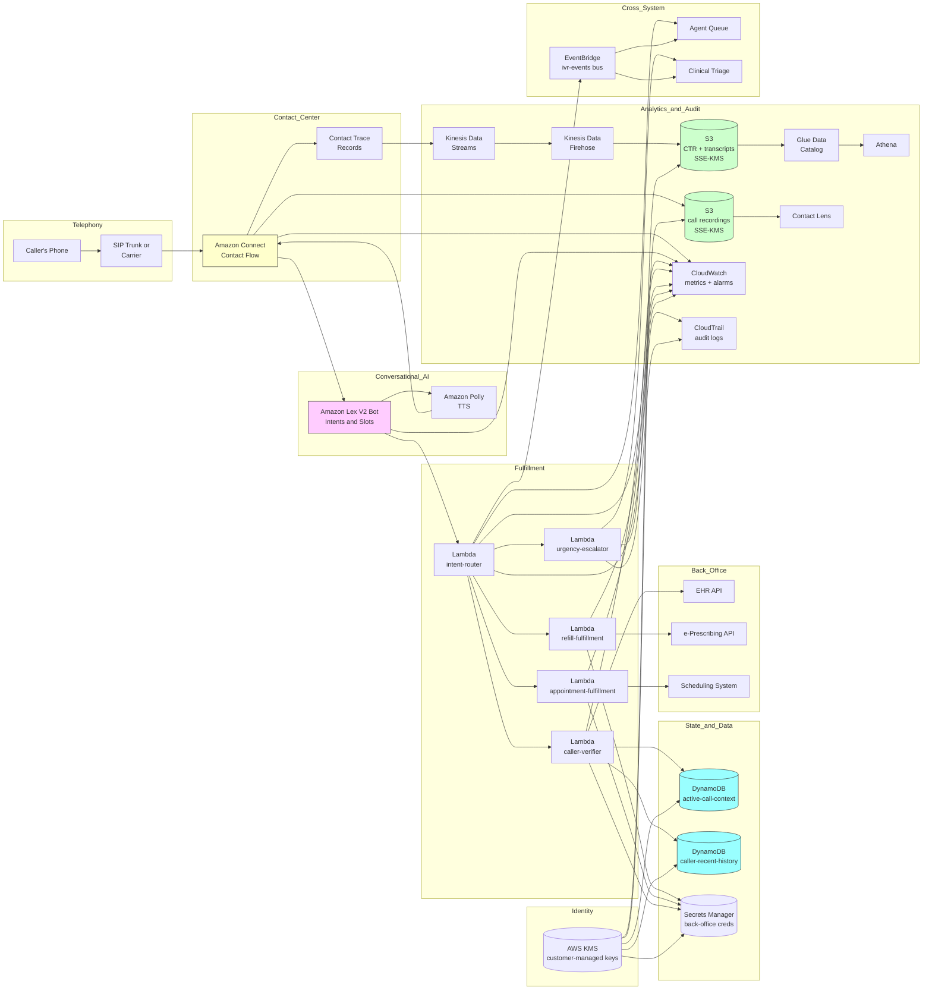

# Recipe 10.1: IVR Call Routing Enhancement ⭐

**Complexity:** Simple · **Phase:** MVP · **Estimated Cost:** ~$0.02-0.10 per call (depending on call duration, ASR usage, and whether the call is fulfilled in self-service or transferred to an agent)

---

## The Problem

It's 7:48 a.m. on a Tuesday. A 67-year-old woman with a recently diagnosed atrial fibrillation calls her cardiology practice's main line because she's feeling a flutter and her new anticoagulant prescription ran out yesterday. The phone tree picks up.

*Welcome to Riverside Cardiology. Your call is important to us. Please listen carefully as our menu options have changed.*

It rattles off ten seconds of legal disclaimers about call recording. Then:

*Press 1 for appointments. Press 2 for billing. Press 3 to speak to the nursing line. Press 4 for medical records. Press 5 for prescription refills. Press 6 for our hours and location. Press 9 to repeat this menu. Press 0 to speak with the operator.*

She wants a refill but she's also worried about the flutter. Is that nursing or refills? She presses 5. New menu. *Press 1 for new prescriptions. Press 2 for refills. Press 3 to check refill status.* She presses 2. New menu. *Please enter your date of birth using the keypad, in MMDDYYYY format, followed by the pound key.* She enters it. *Sorry, that does not match our records.* She enters it again. Same response. She tries with leading zeros. Same response. Tap, tap, tap. After ninety seconds of this she presses 0 and gets dumped into the general queue, which has a thirty-eight-minute wait at this hour because Tuesday morning is when everyone calls. By the time someone picks up, she's missed her morning routine, she's anxious about the flutter, and she's furious about the menu. She's also, importantly, somebody who could have been routed to a clinical triage line on the first attempt if the system had recognized "I think I need a refill but I'm also feeling a flutter" as a clinical concern.

This is a real call, and it's one of millions like it that happen every day in U.S. healthcare. The IVR is the front door of the practice, and for the substantial fraction of patients who don't use a portal or an app, it is the only door. <!-- TODO: verify; consumer healthcare research has consistently shown that telephone is the primary access channel for older patients, lower-broadband-access populations, and patients with limited digital literacy, but specific adoption rates shift over time --> The phone tree's job is to listen to a sentence in plain English, figure out what the caller wants, route them appropriately, and (where it's safe) handle the request without a human at all. The thing it actually does is force the caller to translate "I need a refill but I'm also feeling a flutter" into a sequence of keypresses that the caller has to construct on the fly while the menu reads at them.

The cost of this is not abstract. Consider what it produces:

The 67-year-old above eventually gets her refill, but only after burning forty-five minutes, two staff handoffs, and the institutional opportunity to flag her flutter to a clinician at the first contact. She forms a permanent impression of the practice (this place doesn't care about old people) that no amount of marketing repairs.

The diabetic patient who calls to ask whether his swelling is normal, gets routed into "general appointments" because nothing in the menu maps cleanly to "should I be worried about this," and ends up scheduling a non-urgent follow-up visit three weeks out instead of being routed to a same-day triage where he would have been seen that afternoon. He develops a foot ulcer in the meantime. The institution sees a quality-of-care incident; the patient sees a system that ignored him.

The Spanish-speaking patient who reaches a menu in English, presses 9 hoping for a Spanish option, gets the menu repeated in English, and hangs up. She doesn't try again. The institution sees nothing because she never made it into the call log as a triage event; she's just an abandoned call.

The 31-year-old commercial-insurance patient who is perfectly happy to handle her own scheduling and refills if the system would let her, but every interaction requires three menus and a transfer to an agent because the IVR cannot make routing decisions on the kind of natural-language utterances she actually produces. She gives up and uses an out-of-network urgent care, because they have an app. The institution doesn't see this happen either; she just stops calling.

The pediatric mother whose child has a fever and is trying to reach the after-hours nursing line, navigates four levels of menu, gets the wrong queue, gets transferred, gets the wrong queue again, and ends up in the ER. The ER visit is unnecessary; the routing failure is not.

Every healthcare organization with a phone system has stories like these. The economic and clinical costs add up: missed clinical signal, abandoned calls, unnecessary ER utilization, patient leakage to competitors with better digital experiences, staff time spent on calls that should never have reached a human. The legacy DTMF-based phone tree was state of the art in 1995. It is, in 2026, the most-friction interaction many patients have with their entire healthcare system.

The problem statement: replace the rigid menu navigation with a system that listens to the caller's natural speech, figures out what they want, and routes them or fulfills the request directly. Keep the menu as a fallback. Keep human agents available for everything the system isn't sure about. Don't break for callers with accents or speech differences. Don't silently mishandle clinical urgency signals. Don't cost more in cloud spend than you save in staff time. Don't introduce new HIPAA exposure surfaces.

That's a lot of "don't." It's also entirely doable, because the underlying technology has gotten dramatically better in the last few years, the operational patterns are well-understood, and the failure modes are observable. Let's get into it.

---

## The Technology: From Touch-Tone to Talking

### What an IVR Actually Does

An IVR (Interactive Voice Response) system is, at its plumbing level, a state machine attached to a phone line. The phone line gives you audio in (caller speech, DTMF tones from the keypad) and audio out (synthesized prompts, recorded messages). The state machine listens for input, makes a decision, plays a response, and either advances to a new state or transfers the call out to an agent or another system.

Classical IVR was DTMF-only. The state machine's input was the keypad. "Press 1 for X." Each menu node had a small set of valid digits, the system played a prompt and then captured a digit, and the only way to express anything was through digit sequences. This was easy to build, easy to test, and reliable, because the input alphabet has exactly twelve symbols and the keypad-to-meaning mapping is unambiguous.

The trouble is that human intent does not fit cleanly into twelve symbols. A caller who wants to refill a prescription and also flag a clinical concern has to choose one or the other, navigate to it, then navigate back out and start over for the second one. A caller who doesn't read the menu fast enough has to wait through the repeat. A caller whose problem genuinely doesn't fit any menu option (the swelling-foot-diabetic above) ends up in whatever queue feels least wrong, which often is not the right queue.

Voice-enabled IVR (sometimes called natural-language IVR, conversational IVR, or speech-driven IVR) replaces "Press 1 for X" with "How can I help you?" The caller speaks a sentence; the system transcribes it, classifies it into an intent, optionally extracts slots (the prescription name, the patient's date of birth, the appointment date), and routes or fulfills accordingly. The caller doesn't have to know the menu structure. They just say what they want.

Under the hood, this is a pipeline of three pretty distinct technologies wired together: speech recognition, natural-language understanding, and dialog management. Plus the telephony plumbing. Plus the fallback paths for when any of those fail. Each of those pieces is its own field, and the engineering joy of an IVR project is that you don't have to be an expert in any of them; you just have to know how they fit together and where they typically break.

### Speech Recognition for Telephony

The first stage of the pipeline is automatic speech recognition (ASR). The caller speaks; the system transcribes the audio into text. This sounds straightforward but the telephony context introduces several specific complications.

**Audio bandwidth.** The U.S. public switched telephone network, even in its modern VoIP form, often delivers audio at 8 kHz sample rate, also called narrowband. That's half the bandwidth of typical streaming audio (16 kHz, called wideband). High-frequency content above 4 kHz is just gone. This matters because some phonemes (sibilants, certain stop consonants) carry distinguishing energy in the 4-8 kHz range, and an ASR model trained primarily on wideband audio will be measurably worse on narrowband telephony audio. Modern ASR models trained explicitly on telephony data handle this fine; general-purpose models that weren't trained on it underperform. Picking a model that has telephony in its training mix is one of the highest-leverage decisions in this recipe.

**Streaming versus batch.** For an IVR, you need streaming ASR. The caller is going to start speaking, and you want to start displaying partial transcripts (or rather, start running them through your intent classifier) as the audio comes in. Waiting for the caller to finish, then sending a complete utterance to a batch ASR model, then waiting for the response, then routing, adds dead air that sounds awkward. Streaming ASR emits hypothesis transcripts progressively, with the partial transcripts subject to revision as more audio arrives. Your downstream system has to handle the revisions, but the latency benefit is large.

**Endpointing.** The system has to figure out when the caller has finished speaking. This is harder than it sounds. A pause of 600 milliseconds in the middle of a sentence can sound like the end of an utterance to a naive endpoint detector, which then closes the audio stream and sends the half-utterance off for processing. Modern endpointing uses acoustic-and-linguistic models that consider both the audio (silence detection) and the transcript so far (does this look like a complete thought?). Tuning the endpoint timeout is one of those quiet engineering details that has a disproportionate impact on caller experience. Too short and you cut callers off mid-sentence. Too long and the system feels sluggish.

**Confidence scoring.** Every word and every utterance from the ASR has a confidence score attached. Your downstream pipeline absolutely needs to consume this. A high-confidence transcription gets handled differently from a medium-confidence one. The recipes that ignore ASR confidence and treat the transcript as ground truth produce intent-classification errors that propagate silently downstream; the recipes that surface low-confidence transcripts to a confirmation step ("I think I heard you say you want to refill a prescription, is that right?") catch the errors before they cause harm.

**Domain adaptation.** General-purpose ASR is reasonable on conversational English but degrades on medical vocabulary. A patient saying "I'm running low on my lisinopril" might transcribe as "I'm running low on my listen approval" if the model has no medical training data. Medical-domain ASR (from vendor offerings or fine-tuned variants of open models) is meaningfully better on this kind of speech. For an IVR specifically, you don't necessarily need full clinical-grade ASR. You need enough medical vocabulary coverage that intent classification doesn't fall apart on common drug names, common conditions, and the specific terminology your patients use to describe their issues.

### Natural-Language Understanding

Once you have a transcript (with whatever confidence and revisions came with it), the next stage is natural-language understanding (NLU). The job is to map the transcript to a structured representation of intent and slots. "I want to refill my lisinopril" becomes `{intent: "refill_prescription", slots: {medication_name: "lisinopril"}}`. "I'm calling about Friday's appointment" becomes `{intent: "appointment_inquiry", slots: {date: "next Friday"}}`.

There are basically four ways to build the NLU layer.

**Rule-based pattern matching.** Define regular expressions or keyword lists for each intent. "If the transcript contains 'refill' or 'prescription' or 'medication' and not 'cancel', it's a refill intent." Trivial to build, transparent, easy to debug, and surprisingly effective for narrow, well-defined intent vocabularies. The downside is brittleness: callers say things you didn't predict, and the rules don't fire. Rule-based systems are excellent as a starting point and as a fallback layer underneath an ML system, where the rules act as a sanity check ("if all the ML classifiers returned low confidence, but the transcript has the word 'emergency' in it, route to the urgent line regardless").

**Statistical intent classifiers.** Train a classifier (logistic regression, gradient boosting, or a small neural network) on labeled examples. Each labeled example is a transcript and its true intent. Standard supervised learning. The classifier produces a probability distribution over intents, and you take the top one (with confidence). Statistical classifiers handle paraphrase variation gracefully (you don't have to enumerate every way someone might say "refill"), but they need labeled training data, and the labels have to come from somewhere. Most healthcare organizations bootstrap from call-log analysis: take a few thousand recent transcripts, hand-label them, train. The first model is mediocre; the second pass after seeing production traffic is much better; the model stabilizes after a few months of operation.

**Vendor-managed NLU.** Most cloud telephony platforms now ship with a managed NLU layer that you configure rather than train from scratch. You define intents, give a handful of example utterances per intent, and the platform's underlying language model generalizes to similar phrasings. This is often the right starting point because the vendor has done the heavy lifting (large pretrained model under the hood, multilingual support, slot extraction, dialog management glue). You bring the intent definitions and the business logic; the vendor brings the ASR-NLU stack.

**LLM-based intent classification.** The newest pattern. Send the transcript to a large language model with a prompt that lists the available intents and asks the model to classify. Modern LLMs are extremely good at this with zero or few-shot prompting. The advantages: no per-intent training data, easy to extend (add a new intent by editing the prompt), and the model handles weird phrasings gracefully. The disadvantages: per-call latency and cost (LLM inference is more expensive per call than a small classifier), occasional hallucinated intents that aren't in your list (you have to validate the output strictly), and the operational dependency on a model you don't control. For most IVR use cases in 2026, the right answer is some kind of vendor-managed NLU with optional LLM augmentation for the harder cases. <!-- TODO: verify; LLM-based intent classification for IVR has been growing rapidly since 2023, with cost and latency improvements continuing as the underlying models get faster and cheaper -->

### Dialog Management

NLU gives you an intent and slots from a single utterance. Real conversations have multiple turns. The patient says "I want to refill my prescription," the system asks "which one?", the patient says "lisinopril," the system asks "10 milligram or 20?", the patient answers, and only then does the system have enough information to fulfill. The dialog manager is the component that orchestrates this turn-taking.

A dialog manager has to track state (what intent are we serving? what slots have been filled? what's missing?), generate the next prompt (a confirmation, a clarifying question, a slot-elicitation prompt), and decide when the dialog has succeeded (all required slots are filled at acceptable confidence; ready to fulfill) or failed (the caller has rephrased three times and the classifier still can't decide; transfer to an agent).

The two patterns you'll see:

**Slot-filling state machines.** Define each intent as a set of required and optional slots. The dialog manager elicits each missing required slot with a prompt, validates the response, and proceeds when all required slots are filled. Predictable, debuggable, easy to govern.

**LLM-driven dialog.** The LLM gets the full conversation history and decides what to say next. More flexible, more conversational, but harder to constrain and harder to certify for compliance. Healthcare IVR in production today is overwhelmingly slot-filling state machines, sometimes with LLM augmentation for edge cases. The full LLM-driven pattern is more common in consumer settings; clinical and operational use cases want predictability.

### Fallbacks Are the System

Here's the thing nobody tells you about IVR engineering: most of the architectural decisions are about what happens when the ML pipeline doesn't work, not when it does. Every stage can fail or produce low-confidence output, and every failure needs a graceful fallback.

The ASR returned a transcript with 40% word-level confidence: do not feed it to the intent classifier, ask the caller to repeat. The intent classifier returned all probabilities below threshold: don't guess, fall back to a clarifying question or to a DTMF menu. The slot-filling dialog has had three turns of the same slot being mis-recognized: stop and transfer to an agent. The caller said something that contains an urgency keyword ("chest pain," "I can't breathe," "I'm thinking about hurting myself"): override every other route and connect to a clinical triage line immediately, bypassing all routing logic.

Healthcare IVR specifically has a few non-negotiable fallbacks:

- **DTMF availability throughout.** Some callers cannot or will not use voice. They have speech disabilities, they're calling from a noisy environment, they're more comfortable with the keypad, they don't trust voice systems. Every state in the dialog has to accept DTMF input as an alternative to voice.

- **Operator escape hatch.** Pressing 0 (or saying "operator" or "agent" or "help") at any point routes to a human. The system should never trap a caller in a loop where they cannot reach a human.

- **Clinical urgency override.** A short list of urgency phrases triggers an immediate route to clinical triage, regardless of whatever else the caller said. This is non-negotiable and should be tested explicitly. Build it. Test it. Add to the test list every time a new urgent phrase is missed in production.

- **Language fallback.** "Para Español, oprima 2." Or its equivalent. Multilingual coverage is a substantial topic of its own (recipe 10.10 goes deeper) but the IVR specifically needs at least a path to a Spanish-speaking representative or a Spanish-language flow. The exact languages depend on your patient population.

The system that ignores fallbacks works perfectly in the demo and falls apart on the first real call from someone the demo didn't model.

### What "Routing" Really Means

The output of an IVR routing decision is one of a small number of actions:

- **Self-service fulfillment.** Handle the request entirely within the IVR (refill an existing prescription that's eligible for auto-refill, confirm an appointment, give the practice's hours and location). No human involved.

- **Queue routing.** Transfer to a specific agent queue (billing, scheduling, nurse line, prior authorization). The agent picks up with context already populated by the IVR (caller verified, intent identified, relevant patient data preloaded into the agent's screen).

- **Callback scheduling.** "Our wait time is currently 45 minutes; would you like a callback when an agent is available?" This is a standard contact-center feature and substantially improves caller experience for long-queue periods.

- **Escalation to clinical.** Override normal routing and connect to the on-call clinician or clinical triage. The bar for this should be appropriately conservative; better to over-escalate by a small margin than to under-escalate.

- **Decline gracefully.** "I wasn't able to understand your request, but let me connect you with someone who can help." The fallback is always reachable.

The routing decision uses the intent (and slots, and confidence, and any patient context the system has built up) to select the action. The decision logic is usually rule-based even when the intent classifier is ML-based: high-confidence prescription-refill intent for an eligible patient with auto-refill on file -> self-service fulfillment; medium-confidence anything -> human agent; clinical urgency keyword -> triage immediately. The rules are explicit, auditable, and reviewable by the clinical operations team.

### Where the Field Has Moved

A few practical updates worth knowing.

**End-to-end speech models are getting wider deployment in telephony.** Older IVR stacks bolted ASR onto a separate NLU service. Newer stacks increasingly fuse them into single models that go from audio to intent directly. The accuracy benefit is real; the operational pattern is converging. You'll see "spoken language understanding" (SLU) as a label for this. <!-- TODO: verify; end-to-end SLU for telephony has been growing as a research direction and increasingly appears in commercial offerings, but specific vendor adoption details vary -->

**LLMs as a dialog backbone is becoming feasible.** Two years ago, LLM-driven dialog was too slow and too expensive for production telephony. Today, with model serving optimizations and dedicated inference infrastructure, it's increasingly realistic for the low-traffic enterprise IVR use case. For high-volume contact centers, the per-call cost is still a real consideration. Watch this space.

**Vendor-managed conversational platforms have matured.** Amazon Lex, Google Dialogflow, Microsoft Azure Bot Service, IBM Watson Assistant, Twilio, NICE inContact, Genesys Cloud, and others all ship competent NLU and dialog management. The differentiation has shifted from "can you classify intents" (everyone can) to "how well do you handle edge cases, how do you integrate with my CRM and EHR, what's the operational experience like." For most healthcare organizations, the right answer is to evaluate the platform's integration depth with your existing telephony and electronic health record stack rather than the raw NLU accuracy.

**Healthcare-specific intent libraries exist as starting points.** A few vendors have published or sell pretrained intent libraries for healthcare phone interactions. These cover the standard intents (appointment, refill, billing, results, nurse line) with example utterances and slot definitions. Using one of these as a starting point can save several months of intent-design work, and you customize the long tail for your specific practice.

**Voice biometrics for caller identification is operationally available but operationally fraught.** Modern voice biometric systems can identify a caller from a few seconds of speech. This is tempting for IVR (skip the date-of-birth verification, just listen to who's calling). It's also a substantial privacy and regulatory concern (voiceprints are biometric data, regulated under BIPA and similar state laws), and the false-acceptance and false-rejection rates have to be calibrated carefully. Recipe 10 covers voice-biometrics generally; for IVR specifically, our recommendation is to skip it in MVP and revisit only if there's a clear business case that justifies the regulatory overhead.

---

## General Architecture Pattern

A natural-language IVR splits cleanly into five logical stages: telephony ingress (the caller reaches you), speech-to-intent processing (transcribe, classify, extract slots), dialog management (multi-turn state tracking), routing or fulfillment (the action you actually take), and observability (everything that happened, captured for analysis and improvement).

```
┌──────────────────── TELEPHONY INGRESS ────────────────────┐
│                                                            │
│   [Caller dials the practice's published number]          │
│   [SIP trunk or carrier routes the call to the contact    │
│    center platform]                                        │
│   [Contact center platform answers the call, plays the    │
│    initial greeting, captures the audio stream]           │
│           │                                                │
│           ▼                                                │
│   [Output: an active call leg with bidirectional          │
│    streaming audio and a unique call identifier]          │
│                                                            │
└────────────────────────────────────────────────────────────┘

┌─────────────── SPEECH-TO-INTENT PROCESSING ───────────────┐
│                                                            │
│   [Streaming ASR consumes the inbound audio]              │
│    - Telephony-tuned model preferred                       │
│    - Endpointing tuned for caller pauses                  │
│    - Per-word and per-utterance confidence emitted        │
│                                                            │
│   [Intent classifier consumes the transcript]             │
│    - Returns intent + per-intent confidence               │
│    - Slot extraction in parallel                          │
│    - Returns "out of scope" or "low confidence" as       │
│      explicit values, not as the absence of a result      │
│                                                            │
│   [Urgency-keyword scanner runs in parallel]              │
│    - Pattern match against the clinical-urgency lexicon   │
│    - Triggers override route regardless of intent class   │
│           │                                                │
│           ▼                                                │
│   [Output: structured turn record with intent, slots,     │
│    confidence per layer, urgency flag, raw transcript,    │
│    audio segment reference]                                │
│                                                            │
└────────────────────────────────────────────────────────────┘

┌─────────────── DIALOG MANAGEMENT ─────────────────────────┐
│                                                            │
│   [Update conversation state with the new turn]           │
│   [Apply policy:                                           │
│    - Urgency flag set? -> immediate clinical route        │
│    - Confidence above threshold and slots complete?       │
│      -> proceed to routing or fulfillment                 │
│    - Confidence above threshold and slots missing?        │
│      -> elicit next slot                                   │
│    - Confidence below threshold? -> clarifying question  │
│      or repeat with simpler prompt                        │
│    - Repeated low-confidence turns? -> transfer to agent  │
│    - Caller said "operator" or pressed 0? -> transfer]    │
│           │                                                │
│           ▼                                                │
│   [Output: next-action decision + caller-facing           │
│    response prompt to render via TTS or play recorded     │
│    audio]                                                  │
│                                                            │
└────────────────────────────────────────────────────────────┘

┌──────────────── ROUTING OR FULFILLMENT ───────────────────┐
│                                                            │
│   [Self-service fulfillment path]                         │
│    - Eligibility check against caller-verification        │
│      state and the back-office system                     │
│    - Execute the action (queue a refill request,          │
│      confirm an appointment, read out a result)           │
│    - Confirm with the caller and offer additional help    │
│                                                            │
│   [Queue-routing path]                                    │
│    - Select agent queue based on intent and slot data     │
│    - Attach call context (verified caller, intent, any    │
│      slots gathered, transcript) for screen pop           │
│    - Transfer call into the queue                          │
│                                                            │
│   [Clinical-escalation path]                              │
│    - Bypass normal queues, route to triage line or        │
│      on-call clinical contact                             │
│    - Audit-log every escalation with the trigger reason   │
│                                                            │
│   [Callback-scheduling path]                              │
│    - Capture caller phone and preferred window             │
│    - Confirm and disconnect                                │
│           │                                                │
│           ▼                                                │
│   [Output: completed call disposition with action         │
│    record]                                                 │
│                                                            │
└────────────────────────────────────────────────────────────┘

┌──────────────── OBSERVABILITY ────────────────────────────┐
│                                                            │
│   [Per-call audit record]                                 │
│    - All ASR transcripts and confidences                  │
│    - All intent decisions and confidences                 │
│    - All slots elicited                                    │
│    - All policy decisions and the rules that fired        │
│    - The final disposition                                 │
│                                                            │
│   [Per-call recording]                                    │
│    - Encrypted at rest, retention per institutional       │
│      policy                                                │
│                                                            │
│   [Aggregate metrics]                                     │
│    - Containment rate (calls fulfilled without agent)     │
│    - Top intents and their accuracy                       │
│    - Subgroup-stratified accuracy (age cohorts, language, │
│      accent groups where data is available)               │
│    - Mean handle time, abandon rate, escalation rate      │
│           │                                                │
│           ▼                                                │
│   [Output: continuous improvement signals fed back to     │
│    intent definitions, ASR tuning, and policy rules]      │
│                                                            │
└────────────────────────────────────────────────────────────┘
```

A few cross-cutting design points that the architecture has to bake in from the start.

**Patient verification happens at the right moment, not too early.** Asking the caller for their date of birth before knowing what they want is what the legacy IVR did and it's part of why people hate it. The natural-language IVR can identify the intent first, then collect verification slots only for the intents that need them. Asking for the practice's hours? No verification needed. Refilling a prescription? Yes, full verification. The decision of when to verify is intent-dependent and should be configured per intent.

**ANI-based prefill is a non-trivial usability win.** The caller's phone number (Automatic Number Identification) usually shows up to the contact center platform. If you can match the ANI to a patient record (or to multiple records, if it's a household line), you can prefill the verification context and skip several friction points. The caveat: ANI is spoofable, so high-stakes actions still need explicit verification.

**Confidence thresholds are set per intent, not globally.** "Confirm appointment" can run on lower confidence than "release prescription refill," because the consequences of a wrong action are very different. The dialog policy should consume per-intent thresholds and apply the appropriate one based on the proposed action.

**The urgency lexicon is a living document.** Maintain an explicit list of phrases that trigger clinical escalation. Review it quarterly with the clinical operations team. Add new phrases when production calls reveal misses. The list should be transparent, reviewable, and version-controlled.

**Recordings are PHI; treat them accordingly.** Call recordings are PHI, full stop, regardless of whether the caller's name is captured (it usually is, somewhere in the call). The recording infrastructure runs under a BAA, encrypted at rest with customer-managed keys, with access controls that match the rest of the institution's PHI handling.

**The ML pipeline has to degrade gracefully.** If the intent classifier is unavailable for any reason, the system should fall back to a DTMF menu rather than failing. If the ASR vendor is having an outage, the system should detect this and switch to DTMF mode automatically. The IVR is the front door, and a broken front door is much worse than an inelegant one.

---

## The AWS Implementation

### Why These Services

**Amazon Connect for the contact-center backbone.** Connect is a managed cloud contact center that handles the telephony plumbing: SIP trunking, call routing, call recording, queue management, agent desktop integration. It comes with a visual flow editor (contact flows) that lets you wire up the IVR logic graphically and replaces a substantial amount of plumbing you'd otherwise build yourself. For an IVR specifically, Connect gives you the call leg, the audio stream, and the integration points with everything else. It is HIPAA-eligible under AWS BAA. <!-- TODO: verify; Amazon Connect's HIPAA eligibility and the specific feature subset under BAA continues to evolve; check the AWS HIPAA Eligible Services Reference at build time -->

**Amazon Lex for the NLU layer.** Lex is a managed conversational platform built on the same underlying technology as Alexa. You define intents, sample utterances, and slot types. Lex hosts the model, performs ASR-and-intent classification, manages the slot-filling dialog, and integrates natively with Connect contact flows. For most healthcare IVR use cases, Lex is the right starting point because the integration cost is dramatically lower than wiring together separate ASR and NLU components yourself. Lex V2 specifically supports streaming conversation and multi-language bots.

**Amazon Transcribe (or Transcribe Medical) for ASR.** When you need ASR outside the Lex managed bot (for example, capturing the full call transcript for downstream analytics), Transcribe is the standalone service. Transcribe Medical is the medical-domain-tuned variant; for an IVR's intent classification needs, Transcribe Medical is overkill, but for capturing high-fidelity transcripts of calls that include clinical content, it's worth considering.

**Amazon Polly for TTS responses.** Polly synthesizes the system's prompts. The neural voice options are good enough for most IVR contexts; the older standard voices are cheaper if cost matters. Lex can call Polly natively for system prompts, or you can prerecord the most common prompts and play them as audio files for slightly better voice quality and lower per-call cost.

**AWS Lambda for fulfillment and integration logic.** Every action the IVR takes (look up the patient, queue a refill request, schedule a callback, fetch eligibility) runs in a Lambda function called by Lex (as a fulfillment hook) or by Connect (as an invocation step in the contact flow). Lambda's per-invocation isolation, fast cold-start, and scaling characteristics fit IVR workloads well.

**Amazon DynamoDB for caller context and conversation state.** The IVR needs short-term state (this caller's verification status, the slots collected so far) and longer-term state (this caller's recent call history, any flags). DynamoDB's per-key low-latency reads are a good fit. The verification context for an active call lives in DynamoDB with TTL set to expire shortly after call completion; longer-retention call records live elsewhere.

**Amazon Comprehend Medical (optional) for clinical-content extraction.** When the call transcript contains clinical content that downstream systems want to consume (medication mentions, condition mentions, symptom mentions for triage routing), Comprehend Medical extracts these as structured entities. This is more applicable to recipe 10.2 (voicemail transcription and classification) than to a high-volume IVR, but it's available if needed.

**Amazon S3 for call recordings.** Recordings are PHI, encrypted at rest with KMS customer-managed keys, lifecycle policies to move older recordings to cheaper storage tiers, retention bound by institutional and regulatory policy.

**Amazon Kinesis Data Streams for real-time event flow.** Connect emits Contact Trace Records (CTRs) and contact events to Kinesis, where downstream consumers (analytics, real-time dashboards, anomaly detection on call patterns) pick them up.

**Amazon Athena and AWS Glue Data Catalog for analytics.** CTRs land in S3 (via Kinesis Data Firehose), Glue catalogs them, and Athena gives you SQL access for the operational analytics: containment rate, top intents, error patterns, subgroup-stratified accuracy.

**Amazon CloudWatch and Contact Lens for observability.** CloudWatch tracks the operational metrics (Lambda errors, Lex confidence distributions, call volumes); Contact Lens is Connect's built-in conversation analytics layer that surfaces sentiment, talk-time imbalance, and keyword detection on call recordings.

**AWS KMS for cryptographic-key custody.** Customer-managed KMS keys for the call-recordings bucket, the DynamoDB tables holding caller context, the Lambda environment variables that hold integration secrets, and the Kinesis streams.

**AWS Secrets Manager for back-office integration credentials.** The Lambdas that call into the EHR, the appointment-scheduling system, and the e-prescribing system need credentials. Secrets Manager stores them with rotation per the institutional cadence.

**Amazon EventBridge for cross-system event flow.** When an IVR call results in an action that affects another system (a refill queued, a callback scheduled, an escalation logged), EventBridge fans the event out to the appropriate downstream consumers.

**AWS CloudTrail for audit logging.** API calls against the call-recordings bucket, the Lex bot configuration, the Lambda functions, and the KMS keys all log to CloudTrail with retention sized to the institutional regulatory floor.

### Architecture Diagram



### Prerequisites

| Requirement | Details |
|-------------|---------|
| **AWS Services** | Amazon Connect, Amazon Lex V2, Amazon Polly, AWS Lambda, Amazon DynamoDB, Amazon S3, Amazon Kinesis Data Streams, Amazon Kinesis Data Firehose, AWS Glue Data Catalog, Amazon Athena, AWS KMS, AWS Secrets Manager, Amazon EventBridge, Amazon CloudWatch, AWS CloudTrail. Optionally: Amazon Transcribe Medical, Amazon Comprehend Medical, Amazon Connect Contact Lens. |
| **External Inputs** | Direct Inward Dialing (DID) phone numbers for the practice. Existing back-office system APIs for the integrations the IVR fulfills against (EHR, scheduling, e-prescribing, billing). An initial intent set with sample utterances per intent (typically derived from analyzing 1000-5000 historical call transcripts or call notes). A clinical-urgency-keyword lexicon, reviewed by clinical operations. |
| **IAM Permissions** | Per-Lambda least-privilege roles. The caller-verifier Lambda has scoped read access to the EHR API (or to the patient-index DynamoDB table) and write access to the active-call-context DynamoDB table only. The fulfillment Lambdas have scoped access to the specific back-office API they fulfill against, plus `secretsmanager:GetSecretValue` on the relevant secrets pinned to the current rotation. The intent-router Lambda has `events:PutEvents` on the IVR events bus. The urgency-escalator Lambda has `connect:StartContactStreaming` or equivalent for the triage-routing transfer plus PII-scoped audit-event emission. Connect's service role has scoped access to invoke the Lex bot and Polly. Lex's service role has scoped access to invoke the Lambda fulfillment hook. Avoid wildcard actions and resources in production. |
| **BAA and Compliance** | AWS BAA signed. Connect, Lex, Polly, Transcribe, Lambda, DynamoDB, S3, Kinesis, KMS, Secrets Manager, CloudWatch Logs, CloudTrail are HIPAA-eligible (verify the current list at build time). Recording-consent disclosure played as the first audio after answer ("This call may be recorded for quality and training purposes" or whatever language the institution's legal team has approved for the jurisdictions you operate in). The disclosure is jurisdiction-aware: some U.S. states are one-party-consent, some are all-party-consent, and the disclosure plus continued participation is the standard pattern for satisfying both. <!-- TODO: verify; state-by-state recording consent requirements and the institutional-policy default disclosure language vary; current authoritative sources include the Reporters Committee for Freedom of the Press tracker and the institution's general counsel. --> |
| **Encryption** | Connect call recordings: SSE-KMS with customer-managed keys, S3 bucket lifecycle to colder storage tiers, retention per institutional and state-specific medical-records-retention requirements. DynamoDB tables: customer-managed KMS at rest. Secrets Manager: customer-managed KMS. Lambda environment variables encrypted at rest with KMS. Lambda log groups: KMS-encrypted. TLS in transit for all back-office API calls. |
| **VPC** | Production: Lambdas that call back-office APIs run in VPC with subnets that have controlled egress to the back-office systems' network. VPC endpoints for DynamoDB, S3, KMS, Secrets Manager, CloudWatch Logs, EventBridge so the Lambdas don't need NAT for AWS-internal calls. Connect itself is a managed service that runs outside your VPC; the integration with Lambda and Lex still terminates in your account. |
| **CloudTrail** | Enabled with data events on the call-recordings S3 bucket, the active-call-context DynamoDB table, the Secrets Manager secrets, and the customer-managed KMS keys. Lambda invocations logged. Lex bot configuration changes logged (version control your bot definitions). Connect contact flow changes logged. CloudTrail logs in a dedicated S3 bucket with Object Lock in Compliance mode and lifecycle to S3 Glacier Deep Archive after 90 days. Audit retention sized to the longest of HIPAA's six-year minimum, state medical-records-retention, and the institutional regulatory floor. <!-- TODO: verify; the appropriate audit-log retention floor is institution-specific; HIPAA's six-year minimum applies to specific document types and the state-specific medical-records retention may be longer. --> |
| **Sample Data** | Synthetic call-transcript data for intent training (Synthea-derived patient demographics combined with synthetic intent utterances; do not use real recordings or real transcripts in development). The Connect sample contact flows (published by AWS) and the Lex sample bots provide working starting templates. Healthcare-specific intent libraries from vendor reference architectures provide a head start. Never use real PHI in development. |
| **Cost Estimate** | At a mid-sized practice scale (50,000 inbound calls per month, average 90-second IVR interaction, 30% containment): Connect typically $0.018 per minute for inbound calls plus per-minute charges for telephony; Lex typically $0.004 per request for streaming conversation; Polly typically negligible at this volume; Lambda invocations typically $20-100 per month at this volume; DynamoDB typically $50-200 per month; S3 for recordings typically $50-200 per month at this volume; Kinesis, Athena, CloudWatch, KMS typically $100-300 per month combined. Total AWS infrastructure typically $2,000-6,000 per month at this scale, dominated by Connect's per-minute telephony charges. <!-- TODO: replace with verified pricing once the implementing team validates against the AWS Pricing Calculator. Per-minute Connect charges depend on inbound vs outbound, local vs toll-free, and the specific telephony provider. --> |

### Ingredients

| AWS Service | Role |
|------------|------|
| **Amazon Connect** | Cloud contact center; handles SIP, call routing, queues, agent integration, call recording, contact flow execution |
| **Amazon Lex V2** | Conversational AI; intent classification, slot filling, dialog management; integrated natively with Connect |
| **Amazon Polly** | TTS for system prompts (or Lex's built-in TTS for inline responses) |
| **AWS Lambda** | Fulfillment and integration logic: caller-verifier, intent-router, refill-fulfillment, appointment-fulfillment, urgency-escalator |
| **Amazon DynamoDB** | Active-call-context (per-call ephemeral state with TTL); caller-recent-history (longer-retention call summary records) |
| **Amazon S3** | Call recordings (SSE-KMS, lifecycle policy); CTR archive; transcript archive |
| **Amazon Kinesis Data Streams + Firehose** | Real-time stream of Contact Trace Records and contact events into S3 for analytics |
| **AWS Glue Data Catalog + Amazon Athena** | SQL access to CTRs, transcripts, and IVR-decision audit data |
| **AWS KMS** | Customer-managed encryption keys for recordings, DynamoDB tables, Secrets Manager, Lambda environment variables |
| **AWS Secrets Manager** | Back-office API credentials with rotation |
| **Amazon EventBridge** | Cross-system event fan-out for IVR-driven actions (refill queued, callback scheduled, escalation logged) |
| **Amazon CloudWatch** | Operational metrics (call volumes, Lex confidence distributions, Lambda errors), alarms (DLQ depth, abandon rate, escalation rate spikes) |
| **AWS CloudTrail** | Audit logging for API calls against PHI-bearing resources and Lex/Connect configuration |
| **Amazon Connect Contact Lens (optional)** | Built-in conversation analytics on call recordings (sentiment, keywords, talk-time) |

---

### Code

#### Walkthrough

**Step 1: Answer the call and play the disclosure plus initial prompt.** This is the contact flow's entry state. Connect picks up the call, plays the recording-and-privacy disclosure, then immediately hands off to the Lex bot for the initial open-ended prompt. The disclosure is jurisdiction-aware. Skip the disclosure and you have a recording-consent compliance gap; skip the immediate Lex handoff and you've built a legacy IVR with extra steps.

```
ON inbound_call(call_id, ani, dnis):
    // call_id is Connect's contact identifier;
    // ani is the caller's phone number (when not blocked);
    // dnis is the dialed-in number (which entry point).

    // Step 1A: persist initial call state. We use this as
    // the join key for everything that follows.
    active_call_context.put({
        call_id: call_id,
        ani: ani,
        dnis: dnis,
        started_at: current UTC timestamp,
        verification_status: "unverified",
        slots_collected: {},
        urgency_flag: false,
        ttl: current UTC timestamp + 6 hours
    })

    // Step 1B: play the consent and recording disclosure.
    // The exact wording is institutional and should be
    // approved by general counsel for the jurisdictions
    // you operate in.
    play_audio("consent-disclosure-en-us.wav")

    // Step 1C: hand off to the Lex bot with an open-ended
    // prompt. This is the moment the conversational IVR
    // diverges from the legacy menu.
    invoke_lex_bot(
        bot_id=PATIENT_BOT_ID,
        bot_alias=PATIENT_BOT_ALIAS_PROD,
        session_id=call_id,
        initial_prompt="Thanks for calling. " +
            "How can I help you today?")
```

**Step 2: Lex returns a turn result; classify and route.** The Lex bot has performed ASR, intent classification, and slot filling for the caller's first utterance. The turn result includes the intent, slot values, per-element confidence, and the raw transcript. The intent-router Lambda receives this as a fulfillment hook. Skip the per-intent confidence threshold and you'll route ambiguous utterances confidently to the wrong place.

```
FUNCTION handle_lex_turn(turn_event):
    call_id = turn_event.session_id
    transcript = turn_event.input_transcript
    intent_name = turn_event.intent.name
    intent_confidence = turn_event.intent.confidence
    slots = turn_event.intent.slots

    // Step 2A: log the turn so we can audit it later
    // regardless of routing outcome.
    audit_log({
        event_type: "LEX_TURN_RECEIVED",
        call_id: call_id,
        intent_name: intent_name,
        intent_confidence: intent_confidence,
        transcript: transcript,
        timestamp: current UTC timestamp
    })

    // Step 2B: urgency override. This runs before
    // anything else. The lexicon is a versioned list
    // of phrases that should never be routed through
    // normal triage logic.
    IF matches_urgency_lexicon(transcript):
        Lambda.invoke_async(
            "urgency-escalator",
            {call_id: call_id,
             trigger_phrase: extract_match(transcript)})
        RETURN response_with_action("transfer_clinical_triage")

    // Step 2C: confidence-based routing. The thresholds
    // are per-intent because the consequences of acting
    // on a wrong intent vary widely.
    threshold = load_per_intent_threshold(intent_name)

    IF intent_confidence < threshold.minimum_to_act:
        // Below the floor: ask a clarifying question.
        // Don't guess, don't escalate. Just ask again.
        active_call_context.update(call_id, {
            low_confidence_turn_count:
                active_call_context.get(call_id)
                  .low_confidence_turn_count + 1
        })
        IF active_call_context.get(call_id)
              .low_confidence_turn_count >= 3:
            // We've tried three times and still don't
            // know. Stop asking and transfer.
            RETURN response_with_action(
                "transfer_general_agent",
                reason="repeated_low_confidence")
        ELSE:
            RETURN response_with_prompt(
                "I'm sorry, I didn't quite catch that. " +
                "Could you tell me in a few words what " +
                "you're calling about? You can also " +
                "press 0 to speak with someone.")

    // Step 2D: high enough confidence to proceed.
    // Dispatch to the per-intent handler.
    SWITCH intent_name:
        CASE "refill_prescription":
            RETURN handle_refill_intent(call_id, slots)
        CASE "schedule_appointment":
            RETURN handle_appointment_intent(call_id, slots)
        CASE "billing_question":
            RETURN response_with_action(
                "transfer_billing_queue")
        CASE "ask_hours_or_location":
            RETURN response_with_audio(
                "hours-and-location.wav") +
                offer_additional_help()
        CASE "speak_to_nurse":
            RETURN response_with_action(
                "transfer_nurse_line")
        CASE "operator":
            RETURN response_with_action(
                "transfer_general_agent",
                reason="caller_requested")
        DEFAULT:
            // Out-of-scope intent we recognized but
            // can't fulfill in self-service.
            RETURN response_with_action(
                "transfer_general_agent",
                reason="intent_recognized_no_handler")
```

**Step 3: Verify the caller before any action that touches PHI or the back office.** A simple but easy-to-skip step. The caller-verifier Lambda checks whether the caller has already been verified for this call (verification persists for the session) and, if not, prompts for the verification slots and validates them. The exact verification policy varies. A common approach: date-of-birth plus partial phone-number-on-file or partial address. Skip this and the IVR will happily release a refill to whoever called.

```
FUNCTION verify_caller_if_needed(call_id, intent_name):
    context = active_call_context.get(call_id)

    // Step 3A: check whether this intent requires
    // verification. Some don't ("what are your hours").
    IF NOT intent_requires_verification(intent_name):
        RETURN {verified: true,
                reason: "intent_does_not_require"}

    // Step 3B: check whether we've already verified
    // this call.
    IF context.verification_status == "verified":
        RETURN {verified: true,
                reason: "already_verified_this_session"}

    // Step 3C: check ANI-based pre-match. If we have a
    // unique patient match against the caller's phone
    // number, that's a useful signal but never
    // sufficient on its own; we still ask for at
    // least one verification slot.
    ani_matches =
        patient_index.lookup_by_phone(context.ani)

    // Step 3D: collect verification slots. This is a
    // sub-dialog Lex handles for us once we've
    // declared the verification intent in the bot.
    RETURN response_with_sub_dialog(
        "verification_dialog",
        context_hint={
            ani_match_count: len(ani_matches),
            verification_method: "dob_plus_partial_phone"
        })


FUNCTION verify_slots_returned(call_id, dob, partial_phone):
    context = active_call_context.get(call_id)

    // Step 3E: validate the slots against the patient
    // index. We do not echo back any matching record
    // identifiers in error messages; if verification
    // fails, the caller gets a generic failure prompt
    // and is offered another attempt or transfer.
    candidates =
        patient_index.lookup_by_dob_and_phone(
            dob=dob,
            partial_phone=partial_phone,
            ani=context.ani)

    IF len(candidates) == 1:
        active_call_context.update(call_id, {
            verification_status: "verified",
            verified_patient_id: candidates[0].patient_id,
            verified_at: current UTC timestamp
        })
        audit_log({
            event_type: "CALLER_VERIFIED",
            call_id: call_id,
            verification_method: "dob_plus_partial_phone",
            timestamp: current UTC timestamp
        })
        RETURN {verified: true}

    ELSE:
        // Either zero or multiple matches. We don't
        // disclose which; we just say verification
        // failed.
        context.verification_failure_count += 1
        IF context.verification_failure_count >= 2:
            // Stop trying after the second failure.
            RETURN {verified: false,
                    next_action: "transfer_general_agent",
                    reason:
                        "verification_failed_max_attempts"}
        ELSE:
            RETURN {verified: false,
                    next_action: "retry_verification",
                    reason: "verification_failed"}
```

**Step 4: Fulfill a self-service refill request as an example fulfillment path.** With the caller verified and the intent classified, the refill-fulfillment Lambda takes over. It checks whether the requested medication is eligible for self-service refill (some are not; controlled substances usually require a clinical touch), submits the refill request to the e-prescribing system, and confirms with the caller. Skip the eligibility check and you'll auto-refill controlled substances, which is the kind of thing that ends careers.

```
FUNCTION handle_refill_intent(call_id, slots):
    context = active_call_context.get(call_id)

    // Step 4A: ensure caller is verified.
    verification = verify_caller_if_needed(
        call_id, "refill_prescription")
    IF NOT verification.verified:
        RETURN verification.next_action

    patient_id = context.verified_patient_id
    medication_name = slots.medication_name

    // Step 4B: if the medication slot wasn't extracted,
    // ask for it.
    IF medication_name IS NULL OR
       medication_name.confidence < 0.7:
        RETURN response_with_prompt(
            "Sure, I can help with that. " +
            "Which medication would you like to refill?")

    // Step 4C: look up the patient's active medications.
    // The refill request must match an existing
    // prescription; we don't write new ones from the
    // IVR.
    active_meds =
        e_prescribing.get_active_medications(patient_id)

    matching_med = fuzzy_match_medication(
        spoken_name=medication_name,
        candidates=active_meds)

    IF matching_med IS NULL:
        RETURN response_with_prompt(
            "I wasn't able to find that medication " +
            "on your active list. Let me transfer you " +
            "to someone who can help.") +
            transfer_general_agent_action()

    // Step 4D: check eligibility for self-service refill.
    // Controlled substances, expired prescriptions,
    // prescriptions with no refills remaining, and
    // certain clinical-flag medications are excluded.
    eligibility = check_self_service_eligibility(
        patient_id, matching_med)

    IF NOT eligibility.eligible:
        RETURN response_with_prompt(
            "I'd like to get you the right help with " +
            "that one. Let me transfer you to our " +
            "pharmacy team.") +
            transfer_pharmacy_queue_action()

    // Step 4E: queue the refill request. We don't
    // dispense, just queue it for the e-prescribing
    // system's normal flow.
    refill_request_id =
        e_prescribing.queue_refill_request(
            patient_id=patient_id,
            medication_id=matching_med.medication_id,
            requested_via="ivr_self_service",
            requested_at=current UTC timestamp)

    audit_log({
        event_type: "REFILL_REQUEST_QUEUED",
        call_id: call_id,
        patient_id: patient_id,
        medication_id: matching_med.medication_id,
        refill_request_id: refill_request_id,
        timestamp: current UTC timestamp
    })

    // Step 4F: emit cross-system event so the e-prescribing
    // pipeline picks it up.
    EventBridge.PutEvents([{
        source: "ivr.refill",
        detail_type: "refill_request_queued",
        detail: {
            call_id: call_id,
            patient_id: patient_id,
            refill_request_id: refill_request_id,
            queued_at: current UTC timestamp
        }
    }])

    // Step 4G: confirm with the caller and offer
    // additional help.
    RETURN response_with_prompt(
        "Got it. I've sent your refill request for " +
        spoken_medication_name(matching_med) +
        " to the pharmacy team. " +
        "You should hear back within one business day. " +
        "Is there anything else I can help with?")
```

**Step 5: Capture the call disposition.** When the call ends (caller hangs up, transfer completes, self-service fulfillment confirmed), the disposition is captured. This is the row that goes into analytics and feeds the per-intent accuracy metrics and the containment rate.

```
ON call_end(call_id, end_reason):
    context = active_call_context.get(call_id)

    disposition = {
        call_id: call_id,
        ani: context.ani,
        dnis: context.dnis,
        started_at: context.started_at,
        ended_at: current UTC timestamp,
        end_reason: end_reason,
        // "self_service_fulfilled",
        // "transferred_to_agent",
        // "transferred_to_triage",
        // "callback_scheduled",
        // "abandoned"
        verification_status: context.verification_status,
        intents_classified:
            context.intents_classified_history,
        slots_collected: context.slots_collected,
        urgency_flag_raised: context.urgency_flag,
        low_confidence_turn_count:
            context.low_confidence_turn_count,
        verification_failure_count:
            context.verification_failure_count
    }

    call_disposition_log.put(disposition)

    audit_log({
        event_type: "CALL_DISPOSITION_RECORDED",
        call_id: call_id,
        end_reason: end_reason,
        timestamp: current UTC timestamp
    })

    // The active-call-context entry will expire via
    // its TTL; we don't need to delete it explicitly.
```

> **Curious how this looks in Python?** The pseudocode above covers the concepts. If you'd like to see sample Python code that demonstrates these patterns using boto3, check out the [Python Example](chapter10.01-python-example). It walks through each step with inline comments and notes on what you'd need to change for a real deployment.

---

### Expected Results

**Sample turn record from Lex (illustrative):**

```json
{
  "session_id": "contact-3a8e1c92-7b44-4e0a-91c5-5a7e2f8d9b0c",
  "input_transcript": "I need to refill my lisinopril",
  "intent": {
    "name": "refill_prescription",
    "confidence": 0.94,
    "slots": {
      "medication_name": {
        "value": "lisinopril",
        "confidence": 0.91,
        "resolutions": [
          {"value": "lisinopril"},
          {"value": "Lipitor"}
        ]
      }
    }
  },
  "interpreted_at": "2026-05-21T14:32:08.214Z",
  "asr": {
    "telephony_audio_sample_rate_hz": 8000,
    "average_word_confidence": 0.89,
    "endpoint_silence_ms": 720
  }
}
```

**Sample call disposition record (illustrative):**

```json
{
  "call_id": "contact-3a8e1c92-7b44-4e0a-91c5-5a7e2f8d9b0c",
  "started_at": "2026-05-21T14:31:22.001Z",
  "ended_at": "2026-05-21T14:33:47.612Z",
  "duration_seconds": 145,
  "end_reason": "self_service_fulfilled",
  "verification_status": "verified",
  "verification_method": "dob_plus_partial_phone",
  "intents_classified_history": [
    {
      "intent": "refill_prescription",
      "confidence": 0.94,
      "turn_index": 1
    }
  ],
  "slots_collected": {
    "medication_name": "lisinopril"
  },
  "urgency_flag_raised": false,
  "low_confidence_turn_count": 0,
  "verification_failure_count": 0,
  "fulfillment": {
    "type": "refill_request_queued",
    "refill_request_id": "rx-req-44182291",
    "queued_at": "2026-05-21T14:33:31.450Z"
  }
}
```

**Performance benchmarks (illustrative, your mileage varies):**

| Metric | Legacy DTMF baseline | Natural-language IVR |
|--------|---------------------|----------------------|
| Average IVR navigation time before reaching the right destination | 90-180 seconds | 25-60 seconds |
| Call abandonment rate during IVR navigation | 8-18% | 3-7% |
| Self-service containment rate (call resolved without an agent) | 8-15% | 25-45% |
| First-contact routing accuracy (caller reaches the right queue without an intermediate transfer) | 60-75% | 85-95% |
| Average time-to-clinical-triage for callers with urgent concerns | varies widely; often 90+ seconds | 5-15 seconds when urgency keywords detected |
| Per-call AWS infrastructure cost | n/a (legacy on-prem) | $0.02-0.10 |
| Caller-reported satisfaction (CSAT) on IVR experience | 2.5-3.2 of 5 | 3.5-4.2 of 5 |

<!-- TODO: replace illustrative figures with measured results from the deployment. The above are typical ranges from contact center modernization case studies and vary substantially with patient population, call mix, and intent coverage. Specific gains depend heavily on the legacy IVR's starting point. -->

**Where it struggles:**

- **Patients with strong accents or non-native English are systematically less well-served.** The ASR error rate on accented English is higher; the intent classifier sees noisier transcripts; the dialog manager hits low-confidence thresholds more often and routes more of these callers to agents. The agent routing isn't a failure (the call still gets handled), but it's a containment gap, and it's a gap that disproportionately affects specific populations. Subgroup-stratified accuracy monitoring is non-negotiable, and improving the accent-handling specifically usually requires either model fine-tuning on representative audio or vendor switching.
- **Complex multi-intent utterances.** "I need a refill but I'm also feeling a flutter and I should ask about my upcoming appointment." The system has to pick one intent to act on, and either picks wrong or routes to an agent. This is fine in moderation but frustrating if it happens often. The mitigation is explicit support for "anything else?" loops at the end of each fulfillment, plus a designed escalation when the system detects multi-intent utterances.
- **Urgency lexicon coverage gaps.** The lexicon is your safety net for clinical urgency. If a caller uses a phrase you didn't include ("I feel really weird"), the urgency override doesn't fire and the call routes through normal logic. The mitigation is continuous lexicon expansion driven by clinical-operations review of edge-case calls.
- **Medication name recognition.** Drug names are notoriously hard for ASR. "Methotrexate" sounds like several other things. "Furosemide" frequently transcribes wrong. The mitigation is training-data augmentation with common medications, vendor-specific medical-vocabulary configuration, and explicit confirmation prompts for high-risk medications ("I heard methotrexate, is that right?").
- **Caller verification under noisy conditions.** Asking for date of birth in a noisy environment (caller is in a car, kids in the background) produces verification failures even when the caller is legitimate. The mitigation is ANI-based prefill where the match is unambiguous, and graceful fallback to agent transfer for repeated verification failures.
- **Cold start.** A new IVR has imperfect intent definitions, gaps in slot extraction, and miscalibrated confidence thresholds. The first month or two of production traffic is also the noisiest, because callers are encountering the new system and producing utterances the development team didn't anticipate. The mitigation is conservative routing (when in doubt, transfer to an agent) for the launch period, plus a tight feedback loop where production transcripts are reviewed weekly and the bot is updated continuously.
- **Language coverage.** The first version is almost always English-only. Adding Spanish (or other languages) is more than a translation task; it's another full set of intents, sample utterances, and validation. Multi-language IVRs are operationally heavier than single-language ones; budget accordingly.
- **Fraud and social engineering.** Once the IVR can release information or trigger actions, it becomes a target for social engineers attempting to obtain refills or appointments under someone else's identity. The mitigation is the same verification discipline you'd apply to any phone-based authentication, plus rate limiting and pattern-based anomaly detection on the call stream.

---

## Why This Isn't Production-Ready

The pseudocode and architecture above demonstrate the pattern. A production deployment needs to close several gaps that are intentionally out of scope for a recipe.

**Per-intent confidence-threshold calibration.** The thresholds in the pseudocode are placeholders. Calibrating them to balance containment against routing-error rate requires measurement against representative production traffic. The calibration is per-intent, per-caller-segment (different thresholds may make sense for different patient populations), and ongoing (the thresholds need re-calibration as the underlying NLU model is updated). Build the calibration as a recurring operational process rather than a one-time tuning exercise.

**Subgroup-stratified accuracy monitoring with named ownership.** The CloudWatch dashboards have to surface intent-classification accuracy and containment rate stratified by caller cohort: age bands (where you have the data), language preference, geographic region, accent group (where you can infer it). Disparities exceeding configured thresholds need to alert. The metric is institutionally important, not just engineering housekeeping; the institution that does not monitor subgroup performance silently delivers a worse experience to specific populations and learns about it from a complaint, an audit, or a lawsuit.

**Urgency lexicon governance.** The clinical-urgency-keyword lexicon is a safety-critical artifact. It needs version control, change review by clinical operations, scheduled refresh cadence, and a documented escalation path when a missed urgent call surfaces. Treat it as a clinical safety document with the procedural rigor that implies, not as a configuration file maintained by whoever last edited the bot.

**Caller-verification policy beyond the simple example.** The verification approach in the pseudocode (DOB plus partial phone) is illustrative. Real institutions have layered verification policies that vary by intent risk level, by detected fraud signals (caller calling from a never-seen-before number, pattern of rapid attempts), and by patient preference (some patients have asked for additional verification). The verification policy is an explicit document maintained by the institution's identity-and-access governance, not a snippet of Lambda code.

**Connect Contact Lens and Voice ID configuration.** Connect's built-in conversation analytics layer (Contact Lens) provides sentiment analysis, redaction of PII in transcripts, and keyword detection on call recordings. The redaction in particular is institutionally useful for downstream analytics (the analytics pipeline can consume redacted transcripts without re-handling raw PHI). Voice ID is the optional voice-biometric layer; we recommend skipping it in MVP, but if the institution decides to add it, the consent capture and biometric data handling become significant architectural concerns.

**Idempotency and retry semantics for fulfillment.** A fulfillment Lambda invoked twice (because the dialog turn was retried, because the EventBridge delivery duplicated) must not double-queue a refill, double-book an appointment, or double-emit an audit record. Use the (call_id, intent_name, turn_index) tuple as an idempotency key for fulfillment; use (call_id, fulfillment_action_id) for the event-emission record. Configure DLQs on every Lambda; alarm on DLQ depth.

**Multi-language support architecture.** If you need Spanish (and most U.S. healthcare organizations should), Lex V2 supports multi-language bots, but the operational pattern (one bot with locale-specific training, or one bot per locale, or a router bot that detects language and dispatches) is an architectural decision with real implications. Build for multi-language from the start even if you ship English-first; retrofitting multi-language onto a single-language design is more expensive than designing for it day one.

**Disaster recovery and failover.** The IVR is the front door. When it's down, callers can't reach the practice. The architecture needs an explicit failover path: if Lex is unavailable, drop to a DTMF menu in Connect; if Connect is unavailable, fail over to a backup carrier-side IVR. The recovery testing is institutionally important and is often the part of the architecture that's drawn nicely in slides and never actually exercised; build it and exercise it quarterly.

**Continuous bot improvement workflow.** Production transcripts surface intents you didn't define, slot values you didn't anticipate, and phrasings the model handles poorly. The improvement workflow (review production transcripts weekly, propose bot changes, test against a held-out evaluation set, deploy via versioned bot aliases, monitor for regressions) is a sustained engineering practice, not a launch task. Plan staffing accordingly.

**Cost monitoring and cost-per-intent attribution.** Connect's per-minute charges and Lex's per-request charges add up. Some intents are dramatically cheaper than others (a 10-second hours-and-location lookup costs much less than a 3-minute multi-turn refill dialog). The cost-per-intent and cost-per-call analytics let the operations team see which call patterns are economically efficient to handle in self-service and which are not. Build the dashboard.

**Operational ownership.** The IVR sits at the intersection of clinical operations, IT, contact center operations, marketing (the recorded greetings often have marketing input), and compliance. Establish clear ownership: who tunes the intent thresholds, who maintains the urgency lexicon, who approves bot changes before production deployment, who owns the contact-flow change management. Without clear ownership, the bot drifts, the metrics aren't reviewed, and the system you launched ages without improvement.

---

## The Honest Take

The IVR is the recipe in this chapter where the technology is mature, the architectural patterns are well-understood, and the failure modes are observable, and where the difference between a successful deployment and a frustrating one comes down almost entirely to the operational discipline you bring to it. The model is not the hard part. The intent design, the threshold calibration, the urgency lexicon, the subgroup performance monitoring, the continuous improvement loop are the hard parts.

The trap most specific to IVR is treating it as a technology project. The technology is the substrate; the system is fundamentally about how the institution greets the patients who pick up the phone. The institutions that build this well treat the IVR as a patient-experience product with engineering as its substrate, not as an engineering project that happens to interact with patients. The product-and-experience framing leads to investments in things that don't show up on engineering tickets: the recorded greeting's tone, the prompt phrasing, the on-hold music, the language of the disclosure, the offer of a callback when the queue is long. Those things matter as much as the intent classifier accuracy.

The trap closely related to that one is under-investing in the urgency lexicon. The lexicon is the safety net that catches the calls where the patient is reporting something clinically important and the IVR's normal routing logic would otherwise miss it. The institutions that build this well treat the lexicon as a clinical safety document with appropriate versioning, review, and audit; the institutions that don't, build a lexicon once and never update it, and learn about gaps from the missed-urgent-call incident report. Build it as a clinical safety capability, review it quarterly with clinical operations, and treat every miss as a learning opportunity rather than as an exception.

A third trap is over-eager self-service expansion. The temptation, once the basic refill flow works, is to expand into harder intents: result lookup, prior-authorization status, billing-statement explanation. The harder intents have higher caller-verification requirements, more complex back-office integrations, more legal and compliance exposure, and worse failure modes. Move slowly. Each new self-service intent should be evaluated for both operational benefit and risk; the right answer is sometimes "no, route this to a human." Containment rate is a proxy metric, not a goal in itself.

A fourth trap is ignoring the fact that the IVR is a fraud target. Once the IVR can release information (your appointment is on Friday, the lab result is normal, the prescription was sent to your usual pharmacy) or trigger actions (refill submitted, appointment confirmed), it becomes a target for social engineers attempting to obtain information or actions under someone else's identity. The verification discipline matters. The pattern-based anomaly detection (caller making rapid attempts across multiple identities, caller using a phone number that's never appeared before for this patient) matters. The institution that ignores this learns about it from a fraud incident. <!-- TODO: verify; healthcare-IVR fraud patterns have been documented in industry reports but specific incidence rates and pattern signatures are institutional and continue to evolve -->

The thing that surprises people coming from consumer voice-AI backgrounds is how much of the work is in the back-office integrations. The intent classifier is one Lambda. The fulfillment that actually queues a refill against the e-prescribing system, fetches an appointment from the scheduling system, looks up the patient in the EHR, all that touches systems that were never designed to be called from a real-time IVR Lambda. Integration tier-of-evidence latencies, vendor API rate limits, vendor authentication complexity, and the perpetual "what does this field actually mean" calibration with the institution's existing implementation all dominate the engineering effort. A 95% bot-accuracy doesn't help if the fulfillment Lambda times out because the EHR API is having a slow morning.

The thing that surprises people coming from IT-operations backgrounds is how much the patient experience layer matters. The IVR is a patient-facing product. The institution's patients form impressions about the institution from their IVR interactions, often before they ever set foot in the building. Investments in voice-talent for the recorded prompts, in conversational design for the dialog flow, in usability testing with representative patient populations (including patients with hearing impairments, patients with limited English proficiency, patients with cognitive impairments) compound over time into the institutional reputation that drives patient retention and referrals. The IT-operations framing of "we built a system that routes calls correctly" leaves substantial value on the table compared with the patient-experience framing of "we built a front door that respects the patients walking through it."

The thing about Amazon Lex specifically: it's a competent platform that ships with managed ASR-and-NLU and integrates natively with Connect, which removes a substantial amount of integration friction. It's not the most accurate NLU on the market, and you can do better on raw intent-classification benchmarks with custom-trained models or with LLM-driven approaches. For most healthcare IVR use cases in 2026, the integration savings outweigh the accuracy difference, and the right move is to use Lex with the option to bolt on additional NLU sophistication where specific intents need it. The architecture supports this; you can route specific high-stakes intents through a custom Lambda that calls a different NLU model and returns the result back into the dialog. <!-- TODO: verify; the relative accuracy of Lex vs custom-trained NLU vs LLM-based classification varies by use case and continues to shift with vendor updates -->

The thing about Amazon Connect specifically: it's a credible cloud contact center with good integration into the AWS ecosystem and a per-minute pricing model that scales with volume. It's not the most feature-complete contact center on the market (Genesys, NICE inContact, Five9, and others have richer feature sets in some specific areas), and migration off an existing on-prem contact center to Connect is a non-trivial program. The migration cost is real and should be evaluated against the operational savings. For greenfield deployments or for institutions that have already standardized on AWS, Connect is the natural fit. For institutions deeply embedded in another contact-center vendor, the decision is more about migration cost than about the technical merits of Connect.

The thing about LLMs in IVR: as of 2026, the right answer for most healthcare IVR deployments is to use vendor-managed NLU (Lex or equivalent) for the primary intent classification and reserve LLM augmentation for the harder cases (multi-intent utterances, novel phrasings the bot hasn't seen, summarization of the call for the agent's screen pop). LLM-driven dialog management is operationally available but introduces enough latency, cost, and unpredictability that the engineering trade-offs aren't yet worth it for the routine intents. This will keep moving; revisit the calculus annually. <!-- TODO: verify; the operational viability of LLM-driven IVR dialog management has been improving rapidly with model serving optimizations and continues to shift -->

The thing about per-call cost: an IVR call is, end-to-end, somewhere in the range of two to ten cents of AWS infrastructure cost (Connect telephony, Lex requests, Lambda invocations, S3 storage). Compare against the fully-loaded cost of a human agent handling the same call (often $5-15 depending on labor market and call duration). Even modest containment-rate improvements (say, 10 percentage points) produce substantial operational savings at any reasonable call volume. The economic case for natural-language IVR is strong; the question is whether the organization has the operational capacity to maintain the bot well, not whether the technology pays for itself.

The thing I would do differently the second time: invest more, earlier, in the analytics layer. The first version of any IVR ships with the intent classifier and the fulfillment paths and a vague intent to look at the metrics later. The first month of production traffic is the most informative data you'll ever have for tuning the system, and the institutions that have the analytics ready to receive that data improve faster. Build the dashboards before launch, populate them with synthetic data, validate the queries and the alerting, and let the production traffic flow into a system that's already prepared to learn from it.

The last thing, because it's specific to healthcare: the IVR is, for many patients, their first interaction with the institution after they decide they need care. The decision to seek care is often hard. The patient has wrestled with whether the symptom is bad enough to call, whether they can afford the visit, whether they can take the time, whether they trust the system to help. By the time they pick up the phone, they've already done the hard part. The IVR's job is to honor that. Not to make the caller jump through procedural hoops. Not to silently deprioritize them because their utterance wasn't in the training data. To greet them, listen, route them well, and get out of their way. Build the system that does that, and the metrics follow. Build the system that doesn't, and the metrics never get there because the patients you most needed to reach are the ones who hung up.

---

## Variations and Extensions

**Hybrid voice plus DTMF flow.** Rather than committing fully to natural-language IVR, run both interaction modes in parallel: callers can speak their request or press a digit at any time. The voice layer handles the callers who prefer it; the DTMF fallback handles the callers who don't. This is the operationally safest starting point and is what most successful deployments actually look like. The architectural extension is parallel input handling in the contact flow plus consistent intent-resolution logic regardless of input mode.

**LLM-augmented intent classification.** Add a Lambda layer between Lex's intent output and the routing decision that, for low-confidence or out-of-scope Lex outputs, invokes an LLM to re-classify the transcript against the intent catalog. Use the LLM's output only when it returns one of the catalog intents at high confidence; otherwise fall back to Lex's "fallback intent" and clarification logic. The architectural extension is a ranking-style evaluator that compares Lex confidence and LLM confidence and selects the action with the higher confidence.

**Outbound proactive callbacks.** Beyond the inbound IVR, the same infrastructure supports outbound proactive calls: appointment reminders that ask the patient to confirm or reschedule, post-discharge check-in calls, no-show recovery calls. Connect supports outbound dialing; the same Lex bot definitions can drive outbound conversations. The architectural extension is the outbound dialing campaign manager, the consent-and-do-not-call list integration, and the per-campaign analytics.

**Real-time agent assist on transferred calls.** When a call transfers to an agent, push the call's IVR context (intent identified, slots captured, transcript) to the agent's screen as a "screen pop" so the agent doesn't have to start from zero. With Connect's Agent Workspace, the screen pop is straightforward; the architectural extension is the integration between the IVR's call-context store and the agent desktop's CRM panel.

**Live transcript and translation for agent calls.** During the agent leg of the call, run live transcription (Transcribe streaming) and, where applicable, real-time translation (recipe 10.10 territory). The agent gets a live transcript on screen; supervisors can quality-check calls in near-real-time; non-English-speaking callers can be served by English-speaking agents through translation. The architectural extension is the streaming transcript pipeline and the agent-desktop integration.

**Authenticated patient portal hand-off.** Some calls would be better served in the portal than on the phone. Detect these intents (account questions, statement disputes, complex billing inquiries) and offer to send the caller a portal link via SMS while staying on the line to confirm receipt. The architectural extension is SMS dispatch from the IVR, hand-off detection logic, and the closed-loop confirmation that the SMS arrived.

**Multilingual IVR.** Add Spanish (typically the second-priority language for U.S. healthcare). Lex V2 supports multi-locale bots; the architectural extension is the locale-detection logic at the start of the call (often "press 1 for English, press 2 for Spanish" or auto-detection from the caller's first utterance), separate intent training per locale, and the locale-aware fallback path. Plan for higher engineering and operational cost than the English-only version.

**Voice biometric caller verification.** Replace the DOB-plus-partial-phone verification with a voice-biometric verification that runs in the background as the caller speaks. Connect Voice ID provides the platform integration. The architectural extension is the consent-capture for the biometric data (one-time enrollment, ongoing voice samples used for verification), the regulatory compliance overlay (BIPA and similar state biometric privacy laws), and the fallback path for callers who decline or fail biometric verification. Recommend skipping in MVP; revisit only with a clear business case that justifies the regulatory overhead.

**Conversational AI fulfillment for complex intents.** For intents that require back-and-forth clarification beyond simple slot filling (a complex billing dispute, an ambiguous symptom description), use an LLM-driven dialog within a bounded scope to handle the conversation. The architectural extension is a "complex dialog" handler invoked for specific intents, with strict input-output contracts and a hard cap on dialog turns before escalating to a human.

**Real-time fraud detection on the call stream.** Pattern-detect anomalous call patterns (rapid attempts across multiple identities from the same ANI, callers using a phone number that has never appeared for this patient, voice characteristics inconsistent with the patient's known profile) and route flagged calls to enhanced verification or to a human agent. The architectural extension is a real-time anomaly-detection service that consumes the Connect event stream and emits flag signals back into the contact flow.

**A/B testing of dialog variants.** Run controlled experiments on prompt phrasing, intent definitions, confidence thresholds, and routing logic. Connect's contact flows support attribute-based routing; the architectural extension is the experiment framework that assigns calls to variants, captures outcomes, and surfaces statistically valid comparisons. Healthcare-specific consideration: ensure no experiment variant degrades clinical-urgency handling for any cohort.

**Federated agent assist across multi-site practices.** For a multi-site healthcare organization, the IVR routes to the right site's queue based on the caller's intent, the patient's home practice, and the available capacity at each site. The architectural extension is the cross-site routing logic, the per-site queue capacity awareness, and the site-specific contact flow variations.

---

## Related Recipes

- **Recipe 10.2 (Voicemail Transcription and Classification):** Same chapter, similar speech-to-text-to-intent pipeline, but async and applied to recorded voicemails. The intent-classification and urgency-detection layers are reused; the real-time dialog management is replaced with batch processing.
- **Recipe 10.4 (Medical Transcription / Dictation):** The ASR layer's medical vocabulary tuning is shared concern; the dictation use case has different latency and accuracy requirements but uses the same vendor offerings (Transcribe Medical and equivalents).
- **Recipe 10.5 (Patient-Facing Voice Assistant):** Extends the IVR pattern to a richer voice assistant that handles broader request scopes; the underlying conversational AI infrastructure is shared.
- **Recipe 10.6 (Speech-to-Text for Telehealth Documentation):** Real-time multi-party diarization and transcription; reuses the streaming-ASR-and-confidence-aware pipeline patterns.
- **Recipe 10.10 (Multilingual Real-Time Medical Interpretation):** The multilingual extension of the IVR's NLU layer, with much higher latency and accuracy requirements; shares the streaming-translation infrastructure.
- **Recipe 11.x (Conversational AI / Virtual Assistants):** The full conversational-AI assistant pattern in a digital channel; shares intent design and dialog management with the voice-channel IVR.
- **Recipe 4.1 (Appointment Reminder Channel Optimization):** The IVR is one channel in the broader patient-communication channel mix; the channel-optimization model can recommend voice as the right channel for specific patient segments.
- **Recipe 5.1 (Internal Duplicate Patient Detection):** The caller-verification step has to handle the case where a phone number matches multiple records (which is exactly the duplicate-patient problem); the IVR consumes the patient-index pipeline.
- **Recipe 8.x (Traditional NLP):** The intent-classification techniques used in the IVR draw from the broader NLP-classification methods covered in chapter 8.

---

## Additional Resources

**AWS Documentation:**
- [Amazon Connect Administrator Guide](https://docs.aws.amazon.com/connect/latest/adminguide/what-is-amazon-connect.html)
- [Amazon Lex V2 Developer Guide](https://docs.aws.amazon.com/lexv2/latest/dg/what-is.html)
- [Amazon Polly Developer Guide](https://docs.aws.amazon.com/polly/latest/dg/what-is.html)
- [Amazon Transcribe Developer Guide](https://docs.aws.amazon.com/transcribe/latest/dg/what-is.html)
- [Amazon Transcribe Medical](https://docs.aws.amazon.com/transcribe/latest/dg/transcribe-medical.html)
- [AWS Lambda Developer Guide](https://docs.aws.amazon.com/lambda/latest/dg/welcome.html)
- [Amazon DynamoDB Developer Guide](https://docs.aws.amazon.com/amazondynamodb/latest/developerguide/Introduction.html)
- [Amazon Connect Contact Lens](https://docs.aws.amazon.com/connect/latest/adminguide/contact-lens.html)
- [Amazon Connect Voice ID](https://docs.aws.amazon.com/connect/latest/adminguide/voice-id.html)
- [AWS HIPAA Eligible Services Reference](https://aws.amazon.com/compliance/hipaa-eligible-services-reference/)

**AWS Sample Repos:**
- [`amazon-connect/amazon-connect-snippets`](https://github.com/amazon-connect/amazon-connect-snippets): Connect contact flow examples and Lambda integration patterns
- [`aws-samples/amazon-connect-salesforce-lambda`](https://github.com/aws-samples/amazon-connect-salesforce-lambda): Salesforce CRM integration patterns useful as a template for EHR integration
- [`aws-samples/amazon-lex-bot-recommendations`](https://github.com/aws-samples/amazon-lex-bot-recommendations): Lex bot design patterns and best practices
<!-- TODO: confirm the current names and locations of these repos at time of build; the AWS sample repo organization changes over time. -->

**AWS Solutions and Blogs:**
- [AWS Solutions Library](https://aws.amazon.com/solutions/) (filter Healthcare and Life Sciences plus Contact Center): browse for healthcare-IVR and contact-center reference architectures
- [Amazon Connect Workshops](https://catalog.workshops.aws/amazon-connect/en-US): hands-on workshops including healthcare-relevant scenarios
- [AWS Contact Center Blog](https://aws.amazon.com/blogs/contact-center/): search "healthcare" and "Lex" for relevant deep-dives on patterns used here
- [AWS for Industries: Healthcare and Life Sciences Blog](https://aws.amazon.com/blogs/industries/category/industries/healthcare/): search "patient experience," "contact center" for relevant case studies
<!-- TODO: replace generic "search the blog" pointers with two or three specific, verified blog post URLs once they are confirmed to exist. Avoid any made-up URLs. -->

**External References (Standards and Frameworks):**
- [HIPAA Privacy Rule](https://www.hhs.gov/hipaa/for-professionals/privacy/index.html): governs the handling of PHI in IVR recordings and transcripts
- [TCPA (Telephone Consumer Protection Act)](https://www.fcc.gov/general/telephone-consumer-protection-act-1991): governs outbound calls and SMS, including healthcare-specific exemptions
- [Reporters Committee for Freedom of the Press: Reporter's Recording Guide](https://www.rcfp.org/reporters-recording-guide/): state-by-state recording-consent law tracker that informs the IVR's recording-disclosure language <!-- TODO: confirm current URL at time of build -->
- [Section 508 Accessibility Standards](https://www.section508.gov/): federal accessibility requirements that constrain IVR design for callers with disabilities
- [WCAG (Web Content Accessibility Guidelines)](https://www.w3.org/WAI/WCAG22/quickref/): accessibility standards that include voice-interface considerations
- [BIPA (Illinois Biometric Information Privacy Act)](https://www.ilga.gov/legislation/ilcs/ilcs3.asp?ActID=3004&ChapterID=57): state biometric-data law that constrains voice-ID deployments <!-- TODO: confirm current URL at time of build -->

**Industry Resources:**
- [HIMSS Patient Engagement Resources](https://www.himss.org/): industry-association resources on patient-engagement infrastructure, including IVR and contact-center patterns <!-- TODO: confirm current URL at time of build -->
- [Healthcare Contact Center Times](https://www.healthcarecontactcentertimes.com/): industry publication covering operational patterns and benchmarks for healthcare contact centers <!-- TODO: confirm current URL at time of build -->

---

## Estimated Implementation Time

| Tier | Scope | Time |
|------|-------|------|
| Basic | Single-language (English), 5-8 core intents (refill, appointment confirmation, hours/location, billing transfer, nurse-line transfer, operator), simple ANI-based prefill, basic verification (DOB plus partial phone), DTMF fallback throughout, basic CloudWatch metrics, no Contact Lens, no Voice ID, no urgency-lexicon-driven escalation | 2-4 months |
| Production-ready | Multi-intent coverage (15-25 intents covering refills, appointments, billing, results inquiry, prior-auth status, nurse-line triage, escalation paths), urgency-lexicon-driven escalation with clinical-operations review process, ANI-based prefill with fraud detection, verification-policy hierarchy, Contact Lens integration with PII redaction, subgroup-stratified accuracy monitoring with alarms, complete audit-and-attribution layer, multi-locale architecture (English plus Spanish), continuous improvement workflow with weekly transcript review, full disaster-recovery and failover testing, integration with EHR and e-prescribing back-office systems | 6-12 months |
| With variations | LLM-augmented intent classification for low-confidence cases, outbound proactive callback campaigns, real-time agent-assist with screen pop and live transcripts, authenticated patient-portal hand-off, voice-biometric verification with regulatory overlay (BIPA-aware deployment), conversational AI fulfillment for complex intents, real-time fraud detection on call stream, A/B testing framework, federated multi-site routing | 4-9 months beyond production-ready |

---

## Tags

`speech-voice-ai` · `ivr` · `natural-language-ivr` · `conversational-ivr` · `call-routing` · `intent-classification` · `slot-filling` · `dialog-management` · `streaming-asr` · `telephony-ivr` · `narrowband-audio` · `endpointing` · `confidence-thresholding` · `urgency-escalation` · `caller-verification` · `ani-prefill` · `dtmf-fallback` · `clinical-triage-routing` · `self-service-fulfillment` · `containment-rate` · `subgroup-accuracy` · `multilingual-ivr` · `voice-biometrics` · `connect` · `lex` · `polly` · `transcribe-medical` · `lambda` · `dynamodb` · `s3` · `kinesis` · `eventbridge` · `kms` · `secrets-manager` · `contact-lens` · `cloudwatch` · `cloudtrail` · `simple` · `mvp` · `hipaa` · `patient-experience` · `accessibility` · `equity-monitoring`

---

*← [Chapter 10 Preface](chapter10-preface) · [Chapter 10 Index](chapter10-preface) · [Recipe 10.2: Voicemail Transcription and Classification](chapter10.02-voicemail-transcription-classification) →*
