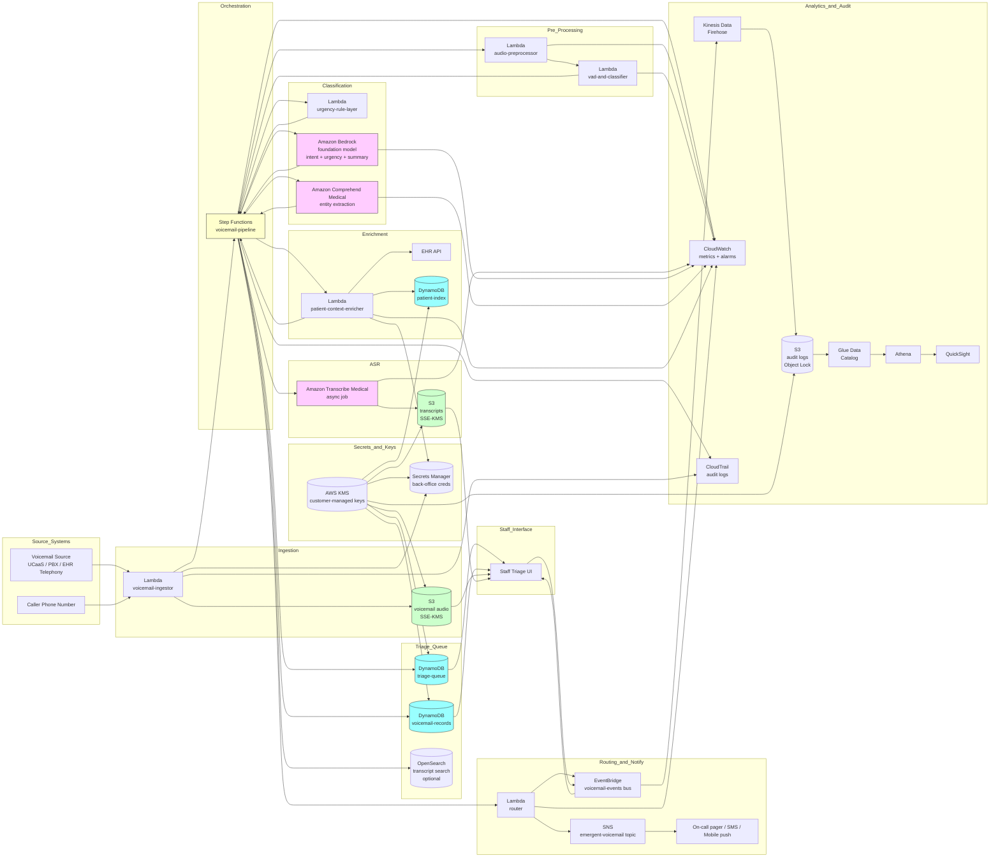

# Recipe 10.2 Architecture and Implementation: Voicemail Transcription and Classification

*Companion to [Recipe 10.2: Voicemail Transcription and Classification](chapter10.02-voicemail-transcription-classification). This page covers the AWS architecture, services, prerequisites, and pseudocode. For the problem framing and the conceptual approach, start with the main recipe.*

---

## The AWS Implementation

### Why These Services

**Amazon Transcribe Medical for ASR.** Transcribe Medical is the medical-domain-tuned ASR service. It supports async batch transcription jobs, accepts the audio formats that voicemail systems typically produce, returns per-word timing and confidence, and handles medical vocabulary (drug names, conditions, anatomy) substantially better than the general-purpose Transcribe service. For voicemail in a healthcare context, Transcribe Medical is the right default. The general-purpose Transcribe is appropriate for the non-clinical voicemails (vendor calls, billing-only practices) where medical vocabulary is rare. <!-- TODO: verify; Transcribe Medical's specific specialty support, language coverage, and feature set continues to evolve; check the AWS docs at build time for current capabilities -->

**Amazon Comprehend Medical for entity extraction.** Comprehend Medical extracts medical entities (medications, conditions, anatomy, procedures, tests, time expressions) from clinical text and maps them to ontologies (RxNorm, ICD-10-CM, SNOMED CT). For a voicemail pipeline, Comprehend Medical is the entity-extraction layer that turns "I am calling about my furosemide" into a structured medication entity that downstream routing can consume.

**Amazon Bedrock for intent and urgency classification.** Bedrock provides managed access to foundation models (Anthropic Claude family, Meta Llama, Mistral, Amazon Titan, and others) with HIPAA eligibility under the AWS BAA. For voicemail classification specifically, a foundation model with a well-designed prompt can classify intent and urgency, extract additional context the ontology-bound entity extractors miss, and produce a brief human-readable summary of the voicemail in a single inference call. For practices that have established custom-trained classifiers, SageMaker hosting is an alternative; for greenfield deployments, Bedrock-with-LLM is the more pragmatic starting point.

**Amazon S3 for audio and transcript storage.** Voicemail audio lives in S3 with SSE-KMS encryption, lifecycle policies to move older recordings to colder storage tiers, and retention bounds set by institutional and state-specific medical-records-retention requirements. Transcripts live in a separate S3 bucket (or a separate prefix) with the same encryption and access controls. S3 Object Lock in compliance mode is appropriate for the audit-log bucket but typically not for the audio bucket itself.

**AWS Lambda for orchestration and per-stage processing.** Each stage of the pipeline runs in a Lambda function: pre-processor, ASR job submitter, ASR job result processor, classifier, entity extractor, enrichment, router. Lambda's per-invocation isolation, fast cold-start, and scaling characteristics fit the bursty-async nature of voicemail processing well.

**AWS Step Functions for pipeline orchestration.** When the pipeline has more than three or four stages with conditional branching and async waits, Step Functions earns its keep. The Step Functions state machine encodes the pipeline as a workflow: pre-process, then transcribe-or-skip, then classify-or-route-to-human-review, then enrich, then route. The visualization makes it easy to see where voicemails are getting stuck, the retry-and-error semantics are managed, and the audit trail per execution is built in.

**Amazon EventBridge for cross-system events.** When a triage record is created, when an emergent voicemail is escalated, when a staff member resolves a voicemail, EventBridge fans the event out to downstream consumers (analytics, operational dashboards, the staff-notification service, the EHR if the voicemail is being recorded as a clinical communication).

**Amazon SNS and Amazon Pinpoint for active notifications.** When the urgency classifier flags an emergent voicemail, the notification path uses SNS for the basic mechanics (push to a topic, fan out to multiple subscribers including SMS, email, and push notifications) and optionally Pinpoint for richer mobile-app notifications and delivery tracking. The on-call clinician's pager or phone is a subscriber to the emergent topic. <!-- TODO (TechWriter): Expert review N3 (LOW). Specify that the emergent SNS topic's resource policy pins the publish principal to the router Lambda's execution role and pins subscription endpoints to the configured on-call rotation system endpoints. --> <!-- TODO: verify; Pinpoint's HIPAA eligibility under BAA and its specific feature set under that eligibility continues to evolve; check the AWS HIPAA Eligible Services Reference at build time -->

**Amazon DynamoDB for the triage queue and voicemail records.** The triage queue is implemented as a DynamoDB table with composite keys (queue_name, priority_timestamp_compound_key) so the staff interface can query the next priority items efficiently. The voicemail records (audio reference, transcript reference, classifications, enrichment data, audit history) live in a separate DynamoDB table or in the same table with different sort keys.

**Amazon OpenSearch Service (optional) for transcript search.** For practices that want to search across historical voicemails ("show me all voicemails from the last 30 days that mention 'methotrexate'"), OpenSearch indexes the transcripts and metadata. With HIPAA eligibility under BAA, encrypted indices, and fine-grained access controls.

**AWS Lambda + Amazon Chime SDK Voice Connector (optional) for direct voicemail capture.** For practices that want to use AWS as the voicemail system itself rather than ingesting from an external source, Chime SDK Voice Connector provides SIP trunking and call-handling primitives that can be wired into Lambda for voicemail capture. Most practices will keep their existing voicemail system and ingest from there; this option exists for greenfield deployments. <!-- TODO: verify; Chime SDK Voice Connector's HIPAA eligibility and specific voicemail-capture capabilities continue to evolve -->

**AWS KMS for cryptographic-key custody.** Customer-managed KMS keys for the audio bucket, the transcript bucket, the DynamoDB tables, the Step Functions execution data, the Lambda environment variables, and the Secrets Manager secrets. Different keys per data class (audio, transcripts, identifiers) for blast-radius containment.

**AWS Secrets Manager for back-office integration credentials.** The Lambdas that look up patient context in the EHR, push triage records to the EHR's secure messaging inbox, or integrate with the staff communication platform need credentials. Secrets Manager stores them with rotation per the institutional cadence.

**Amazon CloudWatch and AWS CloudTrail for observability and audit.** CloudWatch tracks operational metrics (Lambda errors, Step Functions execution success rates, ASR job completion latency distributions, classifier confidence histograms). CloudTrail captures the API-level audit trail against PHI-bearing resources (S3 audio bucket, S3 transcript bucket, DynamoDB tables, KMS keys, Secrets Manager secrets, Bedrock invocations, Comprehend Medical calls, Transcribe jobs). <!-- TODO (TechWriter): Expert review S6 (LOW). Specify that cohort-axis dimensions on metrics use cohort-axis-hash labels (non-reversible by construction) rather than the underlying axis values, so the equity-monitoring analytics from Finding A1 do not introduce minimum-necessary risk in metric dimensions. -->

**AWS Glue Data Catalog and Amazon Athena for analytics.** The audit logs land in S3 (via Kinesis Data Firehose), Glue catalogs them, and Athena gives SQL access for the operational analytics: volume by intent and urgency, time-to-callback by urgency tier, classifier confidence distributions, subgroup-stratified accuracy.

**Amazon QuickSight (optional) for dashboards.** The aggregate metrics and subgroup-stratified accuracy benefit from a polished dashboard for the clinical-operations and equity-monitoring committees. QuickSight is the natural fit when the consumers include non-technical stakeholders.

### Architecture Diagram



### Prerequisites

| Requirement | Details |
|-------------|---------|
| **AWS Services** | Amazon Transcribe Medical, Amazon Comprehend Medical, Amazon Bedrock (or Amazon SageMaker for self-hosted classification), Amazon S3, AWS Lambda, AWS Step Functions, Amazon DynamoDB, Amazon SNS, Amazon EventBridge, AWS KMS, AWS Secrets Manager, Amazon CloudWatch, AWS CloudTrail, Amazon Kinesis Data Firehose, AWS Glue Data Catalog, Amazon Athena. Optionally: Amazon OpenSearch Service, Amazon QuickSight, Amazon Pinpoint, Amazon Chime SDK Voice Connector. |
| **External Inputs** | Voicemail audio source: a hosted UCaaS platform (RingCentral, Zoom Phone, Teams Phone, etc.), an on-prem PBX with an export path, an EHR-embedded telephony system, or a carrier voicemail-to-email service. The integration mechanism varies by source: webhook with signed URL, S3 cross-account push, SFTP drop, IMAP-poll for voicemail-to-email, vendor API pull. The clinical-urgency-keyword lexicon, reviewed by clinical operations. The intent taxonomy and a labeled validation set (a few hundred voicemails labeled by clinical staff). The patient index keyed by phone number. |
| **IAM Permissions** | Per-Lambda least-privilege roles. The voicemail-ingestor Lambda has scoped write access to the audio S3 bucket and write access to the voicemail-records DynamoDB table only. The pre-processor Lambda has scoped read access to the audio bucket. The Step Functions state machine has scoped invocation rights for each Lambda and the AWS service integrations it uses (Transcribe Medical's StartMedicalTranscriptionJob, Comprehend Medical's DetectEntitiesV2, Bedrock's InvokeModel for the specific foundation model and inference profile in use). The classifier Lambda has scoped Bedrock invocation rights pinned to the specific model and inference profile. The enricher Lambda has scoped read access to the patient-index DynamoDB table and to the EHR API credentials in Secrets Manager. The router Lambda has scoped publish rights on the emergent-voicemail SNS topic and `events:PutEvents` on the voicemail-events bus. Avoid wildcard actions and resources in production. <!-- TODO (TechWriter): Expert review S3 (MEDIUM). Specify that each per-stage Lambda's resource-based policy pins the invoking principal to the production Step Functions state-machine ARN, with a defense-in-depth event-payload validation of state_machine_arn in the Lambda handler. Production and development state machines have separate per-stage Lambdas. --> |
| **BAA and Compliance** | AWS BAA signed. Transcribe Medical, Comprehend Medical, Bedrock (verify the specific models and regions covered), S3, Lambda, Step Functions, DynamoDB, SNS, EventBridge, KMS, Secrets Manager, CloudWatch Logs, CloudTrail, Kinesis Data Firehose, Athena are HIPAA-eligible (verify the current list at build time against the AWS HIPAA Eligible Services Reference). <!-- TODO (TechWriter): Expert review A11 (LOW). Add a default-model recommendation under BAA (typical default is the Anthropic Claude family for healthcare due to its longer-standing HIPAA-eligible-on-Bedrock track record) with the verify-at-build-time hedge against the AWS HIPAA Eligible Services Reference URL. --> <!-- TODO: verify; the AWS HIPAA-eligible services list and the specific Bedrock models covered under BAA continues to evolve; check the AWS HIPAA Eligible Services Reference at build time --> Voicemail-greeting recording-disclosure language reviewed and approved by general counsel for the jurisdictions you operate in ("This voicemail box is monitored by clinical staff. Please leave your name, callback number, and a brief message. Calls left here may be transcribed and recorded for clinical purposes."). The disclosure is jurisdiction-aware. Some U.S. states are one-party-consent, some are all-party-consent, and the disclosure plus continued participation is the standard pattern for satisfying both. <!-- TODO (TechWriter): Expert review S5 (LOW). Specify the per-DNIS disclosure configuration mechanism (per-DNIS routing to a jurisdiction-specific disclosure greeting, per-ANI lookup to determine the caller's likely jurisdiction, default-to-all-party-consent-language as the conservative fallback for multi-state practices). --> <!-- TODO: verify; state-by-state recording-consent requirements vary; current authoritative sources include the Reporters Committee for Freedom of the Press tracker and the institution's general counsel --> |
| **Encryption** | Audio bucket: SSE-KMS with customer-managed keys, S3 bucket lifecycle to colder storage tiers (Glacier Instant Retrieval after 30 days, Glacier Deep Archive after 1 year), retention per institutional and state-specific medical-records-retention requirements. Transcript bucket: same. DynamoDB tables (voicemail-records, triage-queue, patient-index): customer-managed KMS at rest. Step Functions state data: KMS-encrypted. Lambda environment variables: KMS-encrypted. Lambda log groups: KMS-encrypted. Secrets Manager: customer-managed KMS. TLS in transit for all back-office API calls and all AWS API calls (default). |
| **VPC** | Production: Lambdas that call back-office APIs (the EHR enricher in particular) run in VPC with subnets that have controlled egress to the back-office systems' network. VPC endpoints for S3, DynamoDB, KMS, Secrets Manager, CloudWatch Logs, EventBridge, Step Functions, SNS, Comprehend Medical, Transcribe, and Bedrock so the Lambdas do not need NAT for AWS-internal calls. Endpoint policies pin access to the specific resources the pipeline uses. <!-- TODO (TechWriter): Expert review A10 (LOW), N1 (LOW). Add a Voicemail-Source Ingestion Egress Topology paragraph and a Source-System Transport Posture paragraph: per-integration recommended pattern (PrivateLink for vendor APIs that expose it; S3 cross-account push for AWS-resident sources; SFTP-over-SSH-with-key-auth for SFTP; IMAPS-with-strong-TLS-and-BAA-covered-carrier for IMAP-poll; HTTPS-with-strong-TLS for webhooks; NAT Gateway as the public-internet fallback). --> |
| **CloudTrail** | Enabled with data events on the audio S3 bucket, the transcript S3 bucket, the voicemail-records DynamoDB table, the triage-queue DynamoDB table, the Secrets Manager secrets, and the customer-managed KMS keys. Lambda invocations logged. Step Functions execution history logged. Bedrock InvokeModel and Comprehend Medical DetectEntitiesV2 calls logged. CloudTrail logs in a dedicated S3 bucket with Object Lock in Compliance mode and lifecycle to S3 Glacier Deep Archive after 90 days. Audit retention sized to the longest of: HIPAA's six-year minimum for the records-of-disclosure-and-routing-decisions, state-specific call-recording retention (typically 1-7 years), the audio-recording retention floor required by institutional or state-specific medical-records-retention rules (which may be longer than the audit-log floor), and the institutional regulatory floor. <!-- TODO (TechWriter): Expert review S2 (MEDIUM). Reference the institutional retention policy as the canonical source; note that the audio-recording retention may exceed the audit-log retention and the architecture should specify both floors. The appropriate audit-log retention floor is institution-specific; HIPAA's six-year minimum applies to specific document types and state-specific medical-records retention may be longer --> |
| **Sample Data** | Synthetic voicemail audio for development (text-to-speech generation against scripted transcripts produces audio with known ground truth). The Synthea synthetic patient population provides patient demographics for the patient-index table. Public-domain voicemail-style speech corpora (CMU's Speech Wikipedia, mock voicemail samples from open speech datasets) for end-to-end ASR validation. Never use real voicemail recordings or real transcripts in development. |
| **Cost Estimate** | At a mid-sized practice scale (10,000 voicemails per month, average 45 seconds per voicemail): Transcribe Medical at typically $0.075 per minute of audio totals approximately $562 per month for ASR. Comprehend Medical at typically $0.01 per 100 characters of input totals approximately $50-100 per month at average transcript lengths. Bedrock model invocation cost varies dramatically by model choice; with a small or medium foundation model, classification cost is typically $50-200 per month at this volume. Lambda, Step Functions, DynamoDB, S3, CloudWatch, KMS, Secrets Manager total typically $100-400 per month combined at this scale. Total AWS infrastructure typically $800-1,500 per month at this scale, dominated by Transcribe Medical and Bedrock. <!-- TODO: replace with verified pricing once the implementing team validates against the AWS Pricing Calculator. Specific costs depend on per-minute Transcribe Medical pricing in the chosen region, the foundation model selected on Bedrock, and the average voicemail length distribution at the deploying practice --> |

### Ingredients

| AWS Service | Role |
|------------|------|
| **Amazon Transcribe Medical** | Async batch ASR with medical-domain language model; per-word timing and confidence scores |
| **Amazon Comprehend Medical** | Medical entity extraction with RxNorm, ICD-10-CM, SNOMED CT mappings |
| **Amazon Bedrock** | Managed foundation model access for intent and urgency classification, summarization, and additional context extraction |
| **Amazon S3** | Audio storage (SSE-KMS, lifecycle policy); transcript storage; audit log storage with Object Lock |
| **AWS Lambda** | Per-stage processing: ingestor, pre-processor, VAD/audio classifier, ASR result handler, classifier, entity extractor, enricher, router |
| **AWS Step Functions** | Pipeline orchestration with conditional branching, async waits for ASR job completion, retry-and-error semantics, per-execution audit trail |
| **Amazon DynamoDB** | voicemail-records (audio refs, transcripts, classifications, audit history); triage-queue (priority-ordered work queue); patient-index (phone-number-keyed patient lookup) |
| **Amazon SNS** | emergent-voicemail topic for active notifications to on-call clinicians (SMS, mobile push, email) |
| **Amazon EventBridge** | voicemail-events bus for cross-system event flow (triage record created, voicemail resolved, urgent voicemail escalated) |
| **AWS KMS** | Customer-managed encryption keys for all PHI-bearing data stores (audio, transcripts, DynamoDB, audit logs) |
| **AWS Secrets Manager** | Back-office API credentials (EHR, scheduling system, staff messaging platform) with rotation |
| **Amazon CloudWatch** | Operational metrics (Step Functions execution success rate, ASR job latency, classifier confidence distributions, queue depth); alarms (DLQ depth, emergent-voicemail processing lag, classifier-disagreement-with-human-review rate) |
| **AWS CloudTrail** | API-level audit logging for PHI-bearing resources and AI/ML service invocations |
| **Amazon Kinesis Data Firehose** | Streaming audit-log delivery from EventBridge into S3 for analytics |
| **AWS Glue Data Catalog + Amazon Athena** | SQL access to audit logs and triage records for operational analytics |
| **Amazon QuickSight (optional)** | Dashboards for clinical operations and equity-monitoring committees |
| **Amazon OpenSearch Service (optional)** | Transcript search across historical voicemails by entity, intent, urgency, or free-text |
| **Amazon Pinpoint (optional)** | Richer mobile-app notifications and delivery tracking for emergent-voicemail alerts |

---

### Code

#### Walkthrough

**Step 1: Ingest the voicemail and persist the audio.** The ingestor Lambda is the entry point. The voicemail source system (UCaaS webhook, S3 push, SFTP drop, vendor API pull) delivers a notification with the audio reference. The Lambda fetches the audio (if it is not already in our S3), normalizes the metadata, persists the audio to the encrypted audio bucket, creates the voicemail record in DynamoDB, and starts the Step Functions execution. Skip the audio persist and you have nothing to listen back to when the staff member needs to verify the transcript; skip the metadata normalization and downstream stages have to special-case every source.

```pseudocode
ON voicemail_arrival(source_event):
    // source_event shape varies per integration. Common fields:
    // caller_phone_number (ANI), called_number (DNIS),
    // recorded_at, duration_seconds, source_message_id,
    // and either an inline audio blob or a fetch URL.

    voicemail_id = generate_uuid()

    // Step 1A: fetch and persist the audio. If the source
    // system delivers via signed URL, fetch and re-upload
    // to our bucket so the audio is in our governance
    // boundary. If the source system delivers via S3 push,
    // copy from the source bucket to our bucket so we own
    // the lifecycle and access controls.
    audio_bytes = fetch_audio_from_source(source_event)
    audio_format = detect_audio_format(audio_bytes)
    audio_s3_key = build_audio_key(
        voicemail_id, audio_format)
    s3_audio_bucket.put_object(
        key=audio_s3_key,
        body=audio_bytes,
        sse_kms_key_arn=AUDIO_BUCKET_KMS_KEY_ARN,
        content_type=audio_format.mime_type,
        metadata={
            voicemail_id: voicemail_id,
            source_system: source_event.source_system,
            ingested_at: current UTC timestamp
        })

    // Step 1B: create the voicemail record. This row will
    // accumulate state through the rest of the pipeline.
    voicemail_records.put({
        voicemail_id: voicemail_id,
        ani: normalize_phone(source_event.caller_phone_number),
        dnis: normalize_phone(source_event.called_number),
        recorded_at: source_event.recorded_at,
        duration_seconds: source_event.duration_seconds,
        source_system: source_event.source_system,
        source_message_id: source_event.source_message_id,
        audio_s3_bucket: AUDIO_BUCKET_NAME,
        audio_s3_key: audio_s3_key,
        audio_format: audio_format.codec,
        ingested_at: current UTC timestamp,
        pipeline_status: "ingested",
        // We will append to this list as the pipeline runs.
        audit_history: [{
            event: "INGESTED",
            timestamp: current UTC timestamp
        }]
    })

    // Step 1C: kick off the orchestrating workflow.
    // From here, Step Functions handles the rest.
    step_functions.start_execution(
        state_machine_arn=PIPELINE_STATE_MACHINE_ARN,
        execution_name=voicemail_id,
        input={
            voicemail_id: voicemail_id,
            audio_s3_bucket: AUDIO_BUCKET_NAME,
            audio_s3_key: audio_s3_key,
            duration_seconds: source_event.duration_seconds
        })
```

**Step 2: Pre-process the audio and decide whether to transcribe.** The pre-processor stage runs voice activity detection, length filtering, and DTMF/fax tone detection. Recordings that have no detectable speech (pocket-dials, silent hangups, fax tones) get short-circuited to a "no-speech disposition" without spending ASR budget. Recordings that pass VAD continue to the transcription stage. Skip this filter and you will spend several hundred dollars a month transcribing pocket-dials and fax tones, and the staff queue will fill up with no-content entries that nobody can act on.

```pseudocode
FUNCTION preprocess_audio(voicemail_id, audio_s3_bucket, audio_s3_key, duration_seconds):
    // Step 2A: length filter. The bounds are institutional.
    // Common defaults: under 3 seconds is almost certainly
    // not a usable voicemail; over 5 minutes is unusual and
    // worth flagging for human review without ASR.
    IF duration_seconds < MIN_USEFUL_DURATION_SECONDS:
        update_voicemail_status(
            voicemail_id,
            status: "skipped_too_short",
            reason: "duration_below_threshold")
        RETURN { continue_to_asr: false,
                 disposition: "no_speech_too_short" }

    IF duration_seconds > MAX_AUTO_PROCESS_DURATION_SECONDS:
        update_voicemail_status(
            voicemail_id,
            status: "flagged_for_review",
            reason: "duration_above_threshold")
        RETURN { continue_to_asr: false,
                 disposition: "human_review_long_recording" }

    // Step 2B: voice activity detection. Use a small
    // pre-trained VAD model deployed inside the Lambda
    // (e.g., a SileroVAD ONNX model). The output is a
    // sequence of speech regions with start and end
    // times.
    audio = load_audio_from_s3(
        audio_s3_bucket, audio_s3_key)
    speech_regions = run_vad(audio)
    speech_seconds = sum(region.duration
                        for region in speech_regions)
    speech_ratio = speech_seconds / duration_seconds

    IF speech_ratio < MIN_SPEECH_RATIO:
        // Mostly silence or non-speech. Could be a
        // pocket-dial, music, or pure background noise.
        update_voicemail_status(
            voicemail_id,
            status: "skipped_no_speech",
            reason: "speech_ratio_below_threshold",
            metadata: { speech_ratio: speech_ratio })
        RETURN { continue_to_asr: false,
                 disposition: "no_speech_detected" }

    // Step 2C: DTMF / fax tone detection.
    has_fax_tones = detect_fax_tones(audio)
    has_dtmf = detect_dtmf_pattern(audio)
    IF has_fax_tones:
        update_voicemail_status(
            voicemail_id,
            status: "skipped_fax_tones",
            reason: "fax_signal_detected")
        RETURN { continue_to_asr: false,
                 disposition: "non_voice_audio_fax" }

    // Step 2D: optional language detection. Useful in
    // multilingual practices to choose the right ASR
    // model variant.
    detected_language = run_language_id(audio)

    // Step 2E: passes filters; continue to ASR with
    // pre-processing metadata recorded.
    update_voicemail_record(
        voicemail_id,
        preprocessing: {
            speech_ratio: speech_ratio,
            speech_regions: speech_regions,
            detected_language: detected_language,
            decided_at: current UTC timestamp
        },
        pipeline_status: "preprocessed_ready_for_asr")

    RETURN { continue_to_asr: true,
             detected_language: detected_language }
```

**Step 3: Submit the ASR job and handle the result.** Transcribe Medical exposes a job-based async API. Submit the job; the service writes the result to a designated S3 location when complete; an EventBridge rule notifies the pipeline; the result is fetched, parsed, and stored. The state machine has a wait-for-callback pattern that handles the async correctly. Skip the medical-domain model and you will systematically misrecognize the medication names that drive most of the routing; skip the per-word confidence scoring and downstream confidence-aware logic has nothing to work with.

```pseudocode
FUNCTION start_asr_job(voicemail_id, audio_s3_bucket, audio_s3_key, detected_language):
    // Step 3A: build the transcription job request.
    // Use Transcribe Medical with PRIMARYCARE specialty
    // for general healthcare-practice voicemails. Other
    // specialties (ONCOLOGY, RADIOLOGY, etc.) are
    // available if your practice is specialty-specific.
    // CONVERSATION mode (vs DICTATION) is the right
    // choice for voicemail because the speaker is
    // talking conversationally to a recipient.
    job_name = "vm-" + voicemail_id

    transcribe_medical.start_medical_transcription_job(
        medical_transcription_job_name: job_name,
        media: {
            media_file_uri: "s3://" + audio_s3_bucket +
                "/" + audio_s3_key
        },
        language_code: detected_language OR "en-US",
        specialty: "PRIMARYCARE",
        type: "CONVERSATION",
        output_bucket_name: TRANSCRIPT_BUCKET_NAME,
        output_key: build_transcript_key(voicemail_id),
        settings: {
            // Single-speaker by default for voicemail.
            show_speaker_labels: false,
            // Word-level confidence is essential for
            // downstream confidence-aware logic.
            // (Transcribe Medical returns word-level
            // confidence by default.)
        },
        output_encryption_kms_key_id: TRANSCRIPT_BUCKET_KMS_KEY_ID,
        kms_encryption_context: {
            voicemail_id: voicemail_id
        })

    update_voicemail_record(
        voicemail_id,
        asr: {
            job_name: job_name,
            submitted_at: current UTC timestamp,
            language_code: detected_language OR "en-US"
        },
        pipeline_status: "asr_in_flight")

    // The state machine now waits for the job-completion
    // event from EventBridge. The next stage runs when
    // that event arrives.


FUNCTION handle_asr_completion(voicemail_id, transcript_s3_uri):
    // Step 3B: fetch and parse the transcript JSON. The
    // structure includes the full transcript text, plus
    // a list of items with start/end timing and per-item
    // confidence.
    transcript_json = s3.get_object(
        bucket: TRANSCRIPT_BUCKET_NAME,
        key: extract_key(transcript_s3_uri))
    transcript_data = json.loads(transcript_json)

    transcript_text =
        transcript_data.results.transcripts[0].transcript

    // Step 3C: compute aggregate confidence metrics.
    word_confidences = [
        float(item.alternatives[0].confidence)
        for item in transcript_data.results.items
        if item.type == "pronunciation"
    ]
    avg_confidence = mean(word_confidences)
    min_confidence = min(word_confidences)
    low_conf_word_count = sum(
        1 for c in word_confidences if c < 0.6)

    // Step 3D: persist the parsed transcript reference
    // and metrics. We do not embed the full transcript
    // in the voicemail record; the transcript lives in
    // its own S3 location and the record references it.
    update_voicemail_record(
        voicemail_id,
        transcript_ref: {
            transcript_s3_bucket: TRANSCRIPT_BUCKET_NAME,
            transcript_s3_key: extract_key(transcript_s3_uri),
            transcript_length_chars: len(transcript_text),
            transcript_hash: sha256(transcript_text),
            avg_word_confidence: avg_confidence,
            min_word_confidence: min_confidence,
            low_confidence_word_count: low_conf_word_count
        },
        pipeline_status: "asr_complete")

    // Step 3E: gate downstream classification on
    // overall ASR confidence. If the transcript is
    // garbage, do not run a classifier on it; route
    // to human review.
    IF avg_confidence < ASR_MIN_AVG_CONFIDENCE OR
       low_conf_word_count > ASR_MAX_LOW_CONF_WORDS:
        RETURN { continue_to_classification: false,
                 disposition: "human_review_low_asr_confidence",
                 transcript_text: transcript_text }

    RETURN { continue_to_classification: true,
             transcript_text: transcript_text }
```

**Step 4: Run the urgency-keyword rule layer first, then the LLM classifier and entity extractor in parallel.** The rule layer is fast, deterministic, and safety-critical. It runs first and short-circuits to "emergent" if any urgent phrase matches. The LLM classifier and Comprehend Medical entity extractor run in parallel afterward. Combine the outputs into the structured triage record. Skip the rule-layer-first ordering and a missed urgency-keyword match will silently mis-route an emergency-room voicemail to the routine queue.

```pseudocode
FUNCTION classify_voicemail(voicemail_id, transcript_text):
    // Step 4A: run the urgency-keyword rule layer. The
    // lexicon is loaded from a versioned configuration
    // store (DynamoDB or S3 with versioning). Each
    // entry includes the phrase pattern, the urgency
    // level it triggers, the intent override (if any),
    // and an optional regulatory-flag indicator.
    urgency_lexicon = load_urgency_lexicon_versioned()
    rule_layer_match = scan_for_urgency_phrases(
        transcript_text, urgency_lexicon)

    // The rule layer can only escalate, never
    // de-escalate. If it matches, the urgency floor is
    // set; subsequent classifier output cannot lower it.
    rule_layer_urgency_floor = (rule_layer_match
        ? rule_layer_match.urgency_level
        : None)

    // Step 4B: run the LLM classifier and the entity
    // extractor in parallel. Both calls are async and
    // independent.
    classifier_call = bedrock.invoke_model_async(
        model_id: VOICEMAIL_CLASSIFIER_MODEL_ID,
        inference_profile_arn: VOICEMAIL_INFERENCE_PROFILE_ARN,
        body: build_classification_prompt(
            transcript_text=transcript_text,
            intent_taxonomy=INTENT_TAXONOMY,
            urgency_taxonomy=URGENCY_TAXONOMY,
            few_shot_examples=FEW_SHOT_EXAMPLES))

    entity_call = comprehend_medical.detect_entities_v2_async(
        text=transcript_text)

    // TODO (TechWriter): Expert review S1 (HIGH). Comprehend
    // Medical's DetectEntitiesV2 returns categories and traits
    // but does not return ontology-linked codes on the entities.
    // To populate RxNorm/ICD-10-CM/SNOMED CT codes that the
    // routing logic depends on, the pipeline must call
    // InferRxNorm, InferICD10CM, and InferSNOMEDCT in parallel
    // alongside DetectEntitiesV2, then merge the ontology codes
    // onto the structured entities by text-offset. Update this
    // pseudocode to show the four parallel calls and the merge.

    classifier_result = await(classifier_call)
    entity_result = await(entity_call)

    // Step 4C: parse the classifier output. The prompt
    // requests a strict JSON response; we validate that
    // the output conforms to the expected schema and
    // belongs to the configured taxonomies. Any out-of-
    // taxonomy categories are coerced to "unclassified"
    // rather than passed through.
    parsed = parse_strict_json(classifier_result.body)
    IF parsed IS NULL OR
       parsed.intent NOT IN INTENT_TAXONOMY OR
       parsed.urgency NOT IN URGENCY_TAXONOMY:
        // Classifier returned something we cannot
        // trust. Route to human review.
        update_voicemail_record(
            voicemail_id,
            classification: {
                intent: "unclassified",
                urgency: "unknown",
                classifier_error: "schema_or_taxonomy_violation",
                classifier_raw_output_hash:
                    sha256(classifier_result.body)
            },
            pipeline_status: "classified_low_confidence")
        RETURN { continue_to_routing: true,
                 needs_human_review: true,
                 urgency: rule_layer_urgency_floor OR
                          "unknown" }

    intent = parsed.intent
    intent_confidence = parsed.intent_confidence
    classifier_urgency = parsed.urgency
    classifier_urgency_confidence = parsed.urgency_confidence
    summary = parsed.summary  // 1-2 sentence summary

    // Step 4D: combine rule-layer urgency floor with
    // classifier urgency. The rule layer can escalate
    // but never de-escalate.
    final_urgency = max_urgency(
        rule_layer_urgency_floor, classifier_urgency)

    // Step 4E: extract entities of interest from
    // Comprehend Medical's response. Filter to the
    // categories the routing logic uses.
    medications = filter_entities(
        entity_result.entities, category="MEDICATION")
    conditions = filter_entities(
        entity_result.entities,
        category="MEDICAL_CONDITION")
    anatomy = filter_entities(
        entity_result.entities, category="ANATOMY")
    tests = filter_entities(
        entity_result.entities,
        category="TEST_TREATMENT_PROCEDURE")
    time_expressions = filter_entities(
        entity_result.entities,
        category="TIME_EXPRESSION")

    // Step 4F: persist the structured triage classification.
    update_voicemail_record(
        voicemail_id,
        classification: {
            intent: intent,
            intent_confidence: intent_confidence,
            urgency: final_urgency,
            urgency_source: (
                rule_layer_match
                    ? "rule_layer_" + rule_layer_match.rule_id
                    : "classifier"),
            urgency_classifier_value: classifier_urgency,
            urgency_classifier_confidence:
                classifier_urgency_confidence,
            summary: summary,
            classified_at: current UTC timestamp
        },
        // TODO (TechWriter): Expert review A5 (MEDIUM). Stamp
        // classifier_prompt_version, intent_taxonomy_version,
        // and urgency_lexicon_version on every classification
        // record so a future audit can reconstruct which
        // calibration was active at decision time. The blue-
        // green deployment via Bedrock canary inference
        // profiles depends on these stamps for regression
        // attribution.
        entities: {
            medications: medications,
            conditions: conditions,
            anatomy: anatomy,
            tests: tests,
            time_expressions: time_expressions
        },
        pipeline_status: "classified")

    needs_human_review =
        intent_confidence < INTENT_CONFIDENCE_THRESHOLD OR
        classifier_urgency_confidence <
            URGENCY_CONFIDENCE_THRESHOLD

    // TODO (TechWriter): Expert review A2 (MEDIUM). The single
    // global thresholds INTENT_CONFIDENCE_THRESHOLD and
    // URGENCY_CONFIDENCE_THRESHOLD contradict the per-intent
    // calibration discipline elevated in Production-Gaps.
    // Replace the placeholders with a per-intent threshold
    // matrix keyed by action class (auto-route-to-routine-queue
    // ~0.70/0.65; auto-route-to-specialty-queue ~0.80;
    // auto-escalate-to-clinician ~0.85 urgency + 0.75 intent;
    // auto-resolve prohibited in MVP). Reference the matrix as
    // a recurring operational calibration, not a one-time tune.

    RETURN { continue_to_routing: true,
             needs_human_review: needs_human_review,
             intent: intent,
             urgency: final_urgency,
             entities: {
                 medications: medications,
                 conditions: conditions
             } }
```

**Step 5: Enrich with patient context and detect repeat callers.** Look up the caller's phone number against the patient index. If exactly one patient matches, fetch their context (medications, recent appointments, conditions). Check whether the same caller has left similar voicemails recently. The enrichment makes the triage record actionable: instead of "someone called about a medication," the staff member sees "Mr. Davis (DOB on file matches), active on lisinopril and metformin, last seen 14 days ago, called Tuesday about the same lisinopril refill." Skip enrichment and the staff member has to repeat lookups for every callback.

```pseudocode
FUNCTION enrich_voicemail(voicemail_id, ani, intent, entities):
    // Step 5A: ANI-based patient lookup. The patient
    // index is keyed by normalized phone number. A
    // single number may match one patient, multiple
    // patients (household line), or zero patients
    // (new caller, unmatched, or wrong number).
    patient_matches = patient_index.query_by_phone(ani)

    // TODO (TechWriter): Expert review A9 (MEDIUM). Zero-match
    // and multiple-match clinical-symptom voicemails need
    // explicit routing semantics. Specify: zero-match clinical
    // intents route to a "verify caller identity" queue with
    // higher staff-attention flag; multiple-match (household)
    // surfaces all candidates and requires staff to verify
    // patient by name; proxy-call detection extracts patient-
    // name entities from the transcript ("calling on behalf
    // of my mother") and attempts a secondary lookup, treating
    // emergent symptoms as urgent for the patient rather than
    // for the caller.

    enrichment = {
        ani_match_count: len(patient_matches),
        patient_candidates: [
            {patient_id: m.patient_id,
             match_strength: m.match_strength}
            for m in patient_matches
        ]
    }

    // Step 5B: when match is unambiguous, fetch context.
    IF len(patient_matches) == 1:
        patient_id = patient_matches[0].patient_id
        active_meds = ehr_api.get_active_medications(
            patient_id)
        recent_appts = ehr_api.get_recent_appointments(
            patient_id, days=90)
        active_conditions =
            ehr_api.get_active_conditions(patient_id)

        enrichment.patient_id = patient_id
        enrichment.active_medications = [
            {name: m.name, rxnorm: m.rxnorm_code}
            for m in active_meds
        ]
        enrichment.recent_appointments =
            summarize_appointments(recent_appts)
        enrichment.active_conditions = [
            {name: c.name, icd10: c.icd10_code}
            for c in active_conditions
        ]

        // Step 5C: cross-reference voicemail medication
        // mentions with active medication list. Surface
        // anything that doesn't match (potential ASR
        // error or a new prescription not yet in our
        // record).
        IF entities.medications IS NOT EMPTY:
            enrichment.medication_alignment =
                cross_reference_medications(
                    voicemail_meds=entities.medications,
                    active_meds=active_meds)

    // Step 5D: repeat-caller detection. Check whether
    // the same caller has left similar voicemails in
    // the recent past.
    recent_from_same_caller =
        voicemail_records.query_by_ani(
            ani=ani,
            time_window_hours=48)

    similar_voicemails = filter_similar(
        candidates=recent_from_same_caller,
        target_intent=intent,
        target_entities=entities)

    enrichment.repeat_caller = {
        recent_voicemail_count:
            len(recent_from_same_caller),
        similar_voicemail_count:
            len(similar_voicemails),
        similar_voicemail_ids: [
            vm.voicemail_id for vm in similar_voicemails
        ]
    }

    update_voicemail_record(
        voicemail_id,
        enrichment: enrichment,
        pipeline_status: "enriched")

    RETURN enrichment
```

**Step 6: Route to the right queue with the right priority and emit notifications for emergent items.** The router is the final pipeline stage. It selects the queue based on intent and patient context, computes a priority based on urgency and time, places the triage record in the queue, and emits an active notification if the urgency is emergent. Skip the active-notification path and emergent voicemails will sit in the queue until a staff member looks at it; that may be acceptable for routine items, but it is not acceptable for an emergent clinical signal.

```pseudocode
FUNCTION route_voicemail(voicemail_id, intent, urgency, enrichment, needs_human_review):
    // Step 6A: select the queue. The mapping is
    // configuration: institution-defined intent-to-queue
    // map. Some intents fan out to multiple queues
    // (e.g., a clinical-symptom voicemail also goes to
    // the EHR's secure messaging inbox for the patient's
    // primary care nurse).
    queue_targets = INTENT_TO_QUEUE_MAP[intent]

    // Step 6B: compute the priority. The priority is
    // a composite key that the queue interface sorts
    // by: urgency rank (emergent=4, urgent=3,
    // routine=2, low=1) descending, then recorded_at
    // ascending. Encoding both into a single sort key
    // makes the queue cheap to query.
    urgency_rank = URGENCY_RANK_MAP[urgency]
    priority_key = build_priority_key(
        urgency_rank=urgency_rank,
        recorded_at=voicemail.recorded_at)

    // Step 6C: place the triage record in each target
    // queue. The triage_queue table is a DynamoDB table
    // partitioned by queue_name with priority_key as
    // the sort key.
    FOR queue_name IN queue_targets:
        triage_queue.put({
            queue_name: queue_name,
            priority_key: priority_key,
            voicemail_id: voicemail_id,
            urgency: urgency,
            intent: intent,
            patient_id:
                enrichment.patient_id OR null,
            patient_summary: build_patient_summary(
                enrichment),
            needs_human_review: needs_human_review,
            placed_at: current UTC timestamp
        })

    // Step 6D: emit cross-system event for downstream
    // consumers (analytics, dashboards, EHR
    // integration).
    EventBridge.PutEvents([{
        source: "voicemail.triage",
        detail_type: "voicemail_routed",
        detail: {
            voicemail_id: voicemail_id,
            event_id: voicemail_id +
                "." + str(turn_index_or_revision),
            queue_targets: queue_targets,
            urgency: urgency,
            intent: intent,
            placed_at: current UTC timestamp
        }
    }])

    // TODO (TechWriter): Expert review A4 (MEDIUM). The
    // turn_index_or_revision variable here is a free name with
    // no defined source. Specify the per-stage idempotency-key
    // composition: voicemail_id (ingestor); (voicemail_id,
    // stage_name) for downstream stages; (voicemail_id,
    // "asr_complete", asr_job_name) for ASR result; (voicemail_id,
    // "classify", classifier_prompt_version); (voicemail_id,
    // "emergent_notification", routing_revision) for SNS publish.
    // EventBridge event_id should be derived from these tuples
    // so consumers can deduplicate.

    // Step 6E: emergent active notification. The SNS
    // topic has multiple subscribers: pager, on-call
    // SMS, dashboard alert. The notification payload
    // is intentionally minimal; it does NOT include
    // PHI. The recipient sees "Emergent voicemail
    // queued; voicemail_id <id>" and clicks through
    // to the staff interface, which renders the full
    // triage record after authenticating the user.
    IF urgency == "emergent":
        SNS.publish(
            topic_arn: EMERGENT_VOICEMAIL_TOPIC_ARN,
            subject: "Emergent voicemail queued",
            message: json_dumps({
                voicemail_id: voicemail_id,
                queue_name: queue_targets[0],
                placed_at: current UTC timestamp
            }))

        audit_log({
            event_type: "EMERGENT_NOTIFICATION_SENT",
            voicemail_id: voicemail_id,
            urgency_source: voicemail.classification.urgency_source,
            timestamp: current UTC timestamp
        })

    update_voicemail_record(
        voicemail_id,
        routing: {
            queue_targets: queue_targets,
            priority_key: priority_key,
            routed_at: current UTC timestamp
        },
        pipeline_status: "routed")
```

**Step 7: Capture staff actions and feed observability.** When a staff member listens to, calls back, escalates, or marks a voicemail resolved, the action is captured and pushed back to the audit log and the analytics layer. The captured outcomes feed the metrics that the institution uses to monitor the system: time-to-callback by urgency tier, classifier-disagreement-with-staff-judgment rate, repeat-caller rate, subgroup-stratified accuracy.

```pseudocode
ON staff_action(voicemail_id, staff_user_id, action, action_metadata):
    // action is one of:
    // "listened", "called_back", "marked_resolved",
    // "escalated_to_clinician", "reclassified_intent",
    // "reclassified_urgency"

    voicemail = voicemail_records.get(voicemail_id)
    new_audit_entry = {
        event: action.upper(),
        staff_user_id: staff_user_id,
        timestamp: current UTC timestamp,
        metadata: action_metadata
    }

    voicemail_records.append_to_audit_history(
        voicemail_id, new_audit_entry)

    // Step 7A: when the staff member reclassifies
    // the intent or urgency, capture the disagreement
    // for later evaluation. This becomes the labeled
    // dataset for ongoing classifier improvement.
    IF action IN ["reclassified_intent",
                  "reclassified_urgency"]:
        classifier_disagreement.put({
            voicemail_id: voicemail_id,
            voicemail_recorded_at: voicemail.recorded_at,
            machine_intent: voicemail.classification.intent,
            machine_urgency: voicemail.classification.urgency,
            human_intent: action_metadata.corrected_intent,
            human_urgency: action_metadata.corrected_urgency,
            staff_user_id: staff_user_id,
            captured_at: current UTC timestamp
        })

    // Step 7B: emit cross-system event for analytics.
    EventBridge.PutEvents([{
        source: "voicemail.staff_action",
        detail_type: action,
        detail: {
            voicemail_id: voicemail_id,
            staff_user_id: staff_user_id,
            timestamp: current UTC timestamp,
            urgency: voicemail.classification.urgency,
            intent: voicemail.classification.intent
        }
    }])
```

> **Curious how this looks in Python?** The pseudocode above covers the concepts. If you'd like to see sample Python code that demonstrates these patterns using boto3, check out the [Python Example](chapter10.02-python-example). It walks through each step with inline comments and notes on what you'd need to change for a real deployment.

---

### Expected Results

**Sample triage record (illustrative):**

<!-- TODO (TechWriter): Expert review S1 (HIGH). The "rxnorm_codes" and "icd10_codes" fields below appear directly on each entity, which suggests they came from DetectEntitiesV2. They did not. Rewrite this sample to reflect the merged output of DetectEntitiesV2 plus InferRxNorm/InferICD10CM/InferSNOMEDCT, and (optionally) include the Infer-* calls' shape so a reader sees the multi-call pattern in the expected output. -->

```json
{
  "voicemail_id": "vm-7e9a8e8e-2c1f-4f3a-8b9c-1d2e3f4a5b6c",
  "ani": "+15551234567",
  "dnis": "+15554443333",
  "recorded_at": "2026-05-23T03:14:22Z",
  "duration_seconds": 47,
  "preprocessing": {
    "speech_ratio": 0.82,
    "detected_language": "en-US"
  },
  "transcript_ref": {
    "transcript_s3_bucket": "secure-vm-transcripts-prod",
    "transcript_s3_key": "transcripts/vm-7e9a8e8e/transcript.json",
    "avg_word_confidence": 0.91,
    "min_word_confidence": 0.62,
    "low_confidence_word_count": 1
  },
  "classification": {
    "intent": "clinical_symptom_report",
    "intent_confidence": 0.93,
    "urgency": "urgent",
    "urgency_source": "rule_layer_chest_tightness",
    "urgency_classifier_value": "urgent",
    "urgency_classifier_confidence": 0.88,
    "summary": "Caller reports chest tightness and shortness of breath after taking a friend's prescription opioid for tooth pain. Asks whether to go to the ER.",
    "classified_at": "2026-05-23T03:15:09Z"
  },
  "entities": {
    "medications": [
      {
        "text": "ibuprofen",
        "rxnorm_codes": ["5640"],
        "score": 0.97
      },
      {
        "text": "opioid",
        "rxnorm_codes": [],
        "score": 0.85
      }
    ],
    "conditions": [
      {
        "text": "chest tightness",
        "icd10_codes": ["R07.89"],
        "score": 0.91
      },
      {
        "text": "shortness of breath",
        "icd10_codes": ["R06.02"],
        "score": 0.94
      }
    ],
    "anatomy": [
      {"text": "chest", "score": 0.99},
      {"text": "tooth", "score": 0.95}
    ]
  },
  "enrichment": {
    "ani_match_count": 1,
    "patient_id": "pt-44219-3c",
    "active_medications": [],
    "active_conditions": [],
    "repeat_caller": {
      "recent_voicemail_count": 0,
      "similar_voicemail_count": 0
    }
  },
  "routing": {
    "queue_targets": ["nurse_triage", "clinical_escalation"],
    "priority_key": "U#003#2026-05-23T03:14:22Z",
    "routed_at": "2026-05-23T03:15:11Z"
  },
  "audit_history": [
    {"event": "INGESTED", "timestamp": "2026-05-23T03:14:55Z"},
    {"event": "PREPROCESSED", "timestamp": "2026-05-23T03:14:58Z"},
    {"event": "ASR_SUBMITTED", "timestamp": "2026-05-23T03:14:59Z"},
    {"event": "ASR_COMPLETE", "timestamp": "2026-05-23T03:15:06Z"},
    {"event": "CLASSIFIED", "timestamp": "2026-05-23T03:15:09Z"},
    {"event": "ENRICHED", "timestamp": "2026-05-23T03:15:10Z"},
    {"event": "ROUTED", "timestamp": "2026-05-23T03:15:11Z"},
    {"event": "EMERGENT_NOTIFICATION_SENT", "timestamp": "2026-05-23T03:15:11Z"}
  ]
}
```

**Performance benchmarks (illustrative, your mileage varies):**

| Metric | Untriaged voicemail box baseline | Transcribed-and-classified pipeline |
|--------|-----------------------------------|-------------------------------------|
| Median time from voicemail-left to staff-listened | 4-12 hours (next business day for after-hours) | 3-8 minutes for emergent; 30 minutes to 2 hours for routine |
| Median time from emergent voicemail to clinician escalation | 8-24 hours | 1-5 minutes |
| Percentage of voicemails that staff listen to before identifying intent | 100% (full audio listen required) | 15-30% (most acted on from transcript + summary; full listen reserved for low-confidence) |
| Average staff time per voicemail | 90-180 seconds | 25-60 seconds |
| Voicemails missed entirely (queue overflow, lost recordings, never reviewed) | 1-5% in busy practices | Less than 0.5% |
| Per-voicemail AWS infrastructure cost | n/a (legacy) | $0.03-0.12 |
| Detected misclassifications surfaced by sampled human review | n/a | 3-8% of sampled voicemails |

<!-- TODO: replace illustrative figures with measured results from the deployment. The ranges above are typical for healthcare voicemail-triage modernization but vary substantially with practice size, patient population, voicemail volume, and the maturity of the existing triage workflow -->

**Where it struggles:**

- **Heavy accents and non-native English produce systematically lower transcript quality.** The ASR error rate is higher; the classifier sees noisier transcripts; the entity extractor misses medication names that were transcribed wrong; the urgency-keyword rule layer misses phrases that were transcribed wrong. This is the same equity concern as in the IVR recipe and it requires the same response: subgroup-stratified accuracy monitoring, periodic vendor evaluation against representative audio, and a conservative routing posture (when in doubt, route to human review) for the cohorts the system is known to handle worse.
- **Long, rambling voicemails with multiple intents.** "Hi, this is Mrs. Henderson, I'm calling about my appointment Wednesday, I think my husband is going to need a ride that day so I might need to reschedule, but also I wanted to ask about my husband's lisinopril, the bottle says he should take one a day but the pharmacist said two, oh and also one more thing, my granddaughter has a rash she wants me to ask you about." The classifier picks one dominant intent. The other intents are surfaced as entity mentions in the structured record, but the staff member has to read the summary to catch them. Mitigation: prompt the classifier to identify all intents present, not just the primary, and surface secondary intents in the triage record with lower priority weights.
- **Voicemails left by family members or proxies.** "Hi, I'm calling on behalf of my mother, Mrs. Davis, she's been having trouble breathing all day and her phone is dead so I'm calling from mine." The ANI lookup matches the daughter (or doesn't match anyone), not the patient. The enrichment is wrong unless the system can identify the patient by name from the transcript and re-look-up. Mitigation: extract patient-name mentions as entities, attempt secondary lookup against the patient name + caller ANI relationships, and flag proxy-call patterns for staff verification.
- **Medication name misrecognition.** Drug names are notoriously hard for ASR. The voicemail says "methotrexate" and the transcript says "methatreksate" or "metformin" or "methodone" depending on how the name was pronounced and the ASR's confidence at that moment. The entity extractor then misses the medication entirely or extracts the wrong RxNorm code. Mitigation: vocabulary customization (Transcribe Medical supports custom vocabulary lists), explicit confirmation prompts in the staff interface for high-risk medications, and cross-referencing extracted medications against the patient's active medication list to surface mismatches.
- **Urgency lexicon coverage gaps.** The lexicon is the safety net for clinical urgency. If a caller uses a phrase you didn't include ("I just don't feel right", "something is happening with my heart"), the rule layer doesn't fire. Mitigation: continuous lexicon expansion driven by clinical-operations review of edge-case voicemails and (for emergent items missed by the rule layer but flagged by the LLM classifier) a feedback loop that proposes new lexicon entries.
- **Spam and robocalls.** The voicemail box receives a steady stream of robocalls, vendor solicitations, and outright fraud attempts. The classifier needs a "spam" intent, and the routing logic needs to route those out of the staff queue entirely. Cross-checking the ANI against known-spam phone-number databases improves spam detection but does not eliminate it.
- **Faxes hitting the voicemail line.** Legacy fax machines occasionally dial voice numbers and leave fax-tone "voicemails." The pre-processor's DTMF/fax tone detector catches these, but new fax encoding patterns occasionally slip through and produce gibberish transcripts.
- **Voicemail format compatibility.** Different voicemail source systems produce different audio formats. Transcoding pipelines have edge cases (a corrupted MP3 that crashes the transcoder; an exotic codec that the ASR vendor doesn't support natively). The pipeline needs robust error handling around audio decoding and a fallback path for unprocessable formats.
- **De-duplication false positives.** Marking a voicemail as a duplicate of a previous one is correct when the patient genuinely repeated themselves; it's incorrect when the patient is calling about a related-but-different issue. The de-duplication threshold must be conservative; better to surface two related voicemails than to silently consolidate an important new piece of information into a previous voicemail's record.
- **Cold start.** Like any ML pipeline, the first month of production traffic is the most informative. Intent definitions, urgency lexicon, classifier prompts, and confidence thresholds all need calibration against the actual distribution of voicemails the practice receives, which is rarely identical to the development team's prior assumptions.

---

## Why This Isn't Production-Ready

The pseudocode and architecture above demonstrate the pattern. A production deployment needs to close several gaps that are intentionally out of scope for a recipe.

**Per-axis confidence-threshold calibration.** The thresholds in the pseudocode (ASR_MIN_AVG_CONFIDENCE, INTENT_CONFIDENCE_THRESHOLD, URGENCY_CONFIDENCE_THRESHOLD) are placeholders. Calibrating them to balance auto-routing throughput against misclassification cost requires measurement against representative production traffic. The calibration is per-axis (ASR confidence is calibrated independently from classifier confidence), per-intent (some intents tolerate lower confidence than others; auto-routing a billing inquiry is lower-stakes than auto-routing a clinical-symptom report), and ongoing (recalibrate as the underlying models update). Build the calibration as a recurring operational process, not a one-time tuning exercise.

**Subgroup-stratified accuracy monitoring with named ownership.** CloudWatch dashboards and Athena queries must surface ASR accuracy, classifier accuracy, and time-to-staff-action stratified by caller cohort: language preference (where you have it), geographic region (proxy for accent), age cohort (where you have it from the matched patient record), and primary insurance type (a coarse SES proxy). Disparities exceeding configured thresholds (containment-rate gap of more than 10 points, classifier accuracy gap of more than 5 points, time-to-callback gap of more than 30 minutes) need to alert. The metric is institutionally important, not just engineering housekeeping. Name an owner: typically the equity-monitoring committee or the clinical-quality officer. Review monthly.

**Urgency lexicon governance.** The clinical-urgency-keyword lexicon is a safety-critical artifact. It needs version control, change review by clinical operations (not by the engineering team unilaterally), scheduled refresh cadence (at least quarterly), and a documented escalation path when a missed urgent voicemail surfaces in retrospective audit. Treat it as a clinical safety document with the procedural rigor that implies, not as a configuration file maintained by whoever last edited the bot. Specifically include phrases for: chest pain and cardiac symptoms; respiratory distress; suicidality and self-harm; severe bleeding; stroke-suggestive symptoms; severe allergic reactions; medication overdose; specific high-risk medications mentioned with adverse-event keywords; severe infection symptoms in immunocompromised patient populations.

**Sampled human review with disagreement capture.** A clinical reviewer should listen to a random sample of voicemails per week (a few percent of total volume is a reasonable starting point) and compare the human assessment to the pipeline's classification. The sample must be stratified by intent and urgency to ensure adequate coverage of each category, not purely random (which would oversample the routine intents and undersample the emergent ones). Disagreements feed the labeled dataset that drives ongoing classifier improvement.

<!-- TODO (TechWriter): Expert review A8 (MEDIUM). Promote the sampled-review architecture into the General Architecture Pattern (or a dedicated Continuous Improvement subsection): name the strata composition (per-intent, per-urgency, per-cohort interaction with A1, per-confidence-band), specify the disagreement-capture data structure (machine_intent, machine_urgency, human_intent, human_urgency, staff reason, transcript reference, classifier_prompt_version), and define the active-learning feedback loop cadence and reviewer conflict-of-interest screening. -->

**Idempotency and retry semantics.** A Step Functions execution that retries (because of a transient downstream failure), or an EventBridge event that delivers twice (at-least-once delivery is the contract), must not produce duplicate triage records, duplicate notifications, or duplicate audit log entries. Use the voicemail_id (plus a turn_index or revision number for actions that legitimately repeat) as the idempotency key throughout the pipeline. Configure DLQs on every Lambda; alarm on DLQ depth, with the emergent-voicemail Lambda's DLQ paged immediately rather than next-business-day.

<!-- TODO (TechWriter): Expert review A3 (MEDIUM). Add a dedicated Resilience Topology subsection in the AWS Implementation that names: per-Lambda DLQ (not pooled); maximum-receive-count per DLQ; DLQ-depth alarms (>=1 message warning, >=10 message higher-severity); page-immediately for the router Lambda's DLQ on emergent-classified voicemails; DLQ-redrive runbook with idempotency-key validation; reserved concurrency for the router Lambda so it cannot be starved by a high-volume non-urgent intent. -->
<!-- TODO (TechWriter): Expert review A4 (MEDIUM). Promote per-stage idempotency-key composition into the General Architecture Pattern (not just production-gaps). Specify per-stage keys: ingestor=voicemail_id; pre-processor=(voicemail_id,"preprocess"); ASR submitter=(voicemail_id,"asr_submit"); ASR result=(voicemail_id,"asr_complete",asr_job_name); classifier=(voicemail_id,"classify",classifier_prompt_version); entity extractor=(voicemail_id,"entities"); enricher=(voicemail_id,"enrich"); router=(voicemail_id,"route",routing_revision); SNS emergent=(voicemail_id,"emergent_notification",routing_revision). Specify EventBridge event_id derivation and downstream consumer deduplication via consumer-side processed-set. -->

**Active-notification policy and on-call rotation integration.** The emergent-voicemail SNS topic has subscribers; those subscribers are humans (or paging systems) on a rotation. The notification policy must integrate with the institution's existing on-call schedule. Who pages at 3am on a Tuesday? Who is the backup if the primary doesn't acknowledge within 5 minutes? What is the escalation path if neither the primary nor the backup acknowledges within 15 minutes? These are clinical operational policies that the architecture supports; they are not engineering decisions.

**Staff interface design.** The triage UI is a substantial design effort that this recipe does not cover. The staff member needs: queue view with priority sorting and filter by role/intent; per-voicemail detail view with the audio player, transcript with entities highlighted, machine-classified intent and urgency, patient context summary, recent voicemail history; quick-action buttons for the common dispositions (called back, marked resolved, escalated to clinician, reclassified); reclassification capture for the disagreement dataset. The UI design and the reclassification workflow specifically are where the system either becomes a tool the staff uses with confidence or a tool they work around. Prototype with representative staff users before locking the design.

**Multilingual support architecture.** The pipeline as described handles English. Adding Spanish (and other languages relevant to the practice's patient population) requires: language detection at the front of the pipeline; language-specific Transcribe Medical jobs; language-specific classifier prompts (the foundation model usually handles multilingual classification but the prompt and few-shot examples should be in the appropriate language); language-specific urgency lexicons (the Spanish urgency lexicon is not a translation of the English one; "me siento mal" carries different urgency weight than its English literal translation). Build the multi-language scaffolding even if you ship English-first; retrofitting is more expensive than designing for it.

<!-- TODO (TechWriter): Expert review A6 (MEDIUM). Promote the per-language pipeline pattern into the architecture section (not just production-gaps). Specify: language-specific Transcribe Medical specialty selection, language-specific classifier prompt routing, language-specific intent taxonomy variants, language-specific urgency lexicons (clinically-reviewed, not translated), and mixed-language voicemail handling (caller code-switching; dominant-language detection; secondary-language phrase scanning). -->

**Disaster recovery and pipeline-unavailable handling.** If any pipeline stage is unavailable (Transcribe Medical regional outage, Bedrock service issue, DynamoDB partition exhaustion), the system should fall back to delivering the raw voicemail audio to the staff queue with a "automated triage unavailable, please review manually" flag. The voicemail box was reachable by humans before the pipeline existed; it must remain reachable by humans when the pipeline cannot run. Test the failover quarterly with synthetic outages. Failover-back triggers should be automated.

<!-- TODO (TechWriter): Expert review A7 (MEDIUM). Add a Disaster Recovery Topology subsection that specifies: per-stage failover policy (ASR unavailable -> route audio to staff queue without transcript; classifier unavailable -> route transcript without classification; entity extractor unavailable -> skip entity merge; enricher unavailable -> route without patient context); cross-region ASR failover; failover-detection and failover-back automation; quarterly synthetic-outage test cadence; emergent-detection in degraded mode (run urgency-keyword rule layer on whatever transcript is available). -->

**Continuous classifier improvement workflow.** Production transcripts surface intents the original taxonomy missed, voicemail patterns the classifier handles poorly, and urgency phrases the lexicon doesn't cover. The improvement workflow (review production transcripts and disagreement-capture data weekly, propose taxonomy and lexicon changes, test against a held-out evaluation set, deploy via versioned classifier prompts and lexicon versions, monitor for regressions) is a sustained engineering practice, not a launch task. Plan staffing accordingly.

**Audit retention and access controls.** The audit log captures every action taken on every voicemail, including who listened, who called back, who reclassified. The retention policy must satisfy HIPAA, state-specific medical-records-retention rules, and the institution's own regulatory floor. Access to the audit log is on a need-to-know basis and is itself audited (CloudTrail on the audit log bucket).

**Cost monitoring per-intent and per-urgency.** Different voicemails consume different amounts of pipeline cost (a 90-second emergent voicemail with full classification and entity extraction costs more than an 8-second pocket-dial that gets short-circuited by the pre-processor). The cost-attribution analytics let the operations team see which voicemail patterns are economically efficient to handle and which warrant further pipeline tuning. Build the dashboard.

**Operational ownership.** The pipeline sits at the intersection of clinical operations (urgency lexicon, escalation policy, sampled review), IT (Lambda code, infrastructure), front-office operations (staff interface, queue management), and compliance (PHI handling, audit retention, BAA scope). Establish clear ownership: who tunes the classifier prompts, who maintains the urgency lexicon, who approves prompt changes before production deployment, who owns the on-call rotation that responds to emergent notifications. Without clear ownership, the pipeline drifts, the metrics aren't reviewed, and the system you launched ages without improvement.

---

## Variations and Extensions

**Real-time transcription during voicemail recording.** Rather than waiting until the caller hangs up, stream the audio to ASR as it is being recorded. By the time the caller finishes, the transcript exists, and the classifier can run within seconds. Useful when the latency budget for surfacing emergent voicemails matters; emergent classification within thirty seconds of being left rather than within thirty minutes of the next queue review is a meaningful improvement. The architectural extension is streaming integration with the source voicemail system (which not all voicemail platforms support natively) plus streaming ASR (Transcribe streaming) on the audio.

**Transcript search and historical query.** Index transcripts in OpenSearch (or equivalent) and provide a search interface for staff: "show me all voicemails from the last 30 days that mention methotrexate"; "find voicemails where the caller mentioned chest pain"; "list voicemails from this patient over the past year." The architectural extension is the OpenSearch domain, the ingest pipeline that indexes new transcripts and entities, and the access controls that scope search to the appropriate user role.

**Auto-resolution of high-confidence routine intents.** For specific intents with very high classifier confidence and unambiguous patient context (a routine appointment confirmation, a hours-and-location inquiry, a vendor solicitation), the pipeline can take action without staff review: send the appointment confirmation back via SMS, route the vendor call to the vendor mailbox, suppress the voicemail from the staff queue. The architectural extension is per-intent auto-resolution policies, conservative confidence thresholds, and a clear audit trail of every auto-resolved voicemail with the option for the staff to surface and review them as a batch.

**LLM-generated suggested callback responses.** When a staff member opens a voicemail in the triage UI, surface a suggested callback script generated by a foundation model from the voicemail transcript and the patient context. "Patient Mr. Davis (DOB on file matches) called about a refill of his lisinopril 10mg. He is on this medication; last filled 35 days ago. Suggested response: confirm pharmacy on file and queue the refill." The staff member edits as needed and uses it as a starting point. The architectural extension is the LLM call wired into the UI, with strict validation that the suggested response only references information that came from the voicemail or the patient context.

**Multi-language pipeline.** Add Spanish (the typical second-priority language in U.S. healthcare). Language detection at the front of the pipeline; Spanish-language Transcribe Medical jobs; Spanish-language classifier prompts; Spanish-language urgency lexicon (not a translation; a separate clinically-reviewed lexicon). Plan for higher engineering and operational cost than the English-only version. Recipe 10.10 covers the deeper multilingual technology stack.

**Voice-biometric speaker identification.** When the same caller leaves voicemails repeatedly, voice biometrics can identify them across recordings even when their phone number changes (caller borrowing a friend's phone, calling from a hotel, etc.). Useful for repeat-caller detection beyond ANI matching. The regulatory overlay is significant: voiceprints are biometric data subject to BIPA and similar state laws. Recommend skipping in MVP; revisit only with a clear business case justifying the regulatory overhead.

**Integration with patient portal for voicemail-to-message conversion.** When the patient who left the voicemail is enrolled in the patient portal, automatically create a portal message thread with the transcript and entities, attach the audio for the staff to reference, and respond through the portal. The patient gets a portal notification, the staff member gets a unified communication thread per patient, and the institutional record is centralized. The architectural extension is the EHR/portal API integration and the workflow that decides when to convert.

**Outbound proactive callback campaigns from triage queue.** For specific intent and urgency combinations, automatically dispatch an outbound callback (the existing Connect-based outbound infrastructure from recipe 10.1, or equivalent) before a staff member picks up the queue item. "Mrs. Henderson left a voicemail about her appointment. Initiate an automated callback that asks her to press 1 to confirm Wednesday or 2 to reschedule." The architectural extension is the outbound dialing campaign manager, consent compliance, and integration with the existing outbound infrastructure.

**Real-time fraud detection on voicemail patterns.** Detect anomalous patterns: rapid voicemails from the same ANI across multiple identities, voicemails from numbers never previously associated with the patient, voicemails whose voice characteristics are inconsistent with the patient's known voiceprint (when biometric enrollment exists). The architectural extension is a real-time anomaly-detection service that consumes the voicemail event stream and flags suspicious entries.

**Supervisor dashboard with caseload analytics.** A management view that shows triage queue depth by team, time-to-callback by urgency tier, individual staff member productivity, and outcome trends. Useful for operational management of the front office; the architectural extension is the QuickSight (or equivalent) dashboard layer over the existing audit log Athena queries.

**EHR communication-record auto-generation.** Many EHRs have a "Telephone Encounter" or equivalent record type where staff document patient calls. Auto-populate this from the triage record when the staff member marks the voicemail as called-back: the transcript, the structured entities, the staff member's disposition note, all written to the EHR as a properly typed encounter record. The architectural extension is the EHR's communication-encounter API integration and the staff workflow that triggers the write.

**Voicemail-to-task automation.** When the intent is a clear actionable item that does not require clinical judgment (refill request, appointment cancellation, address update), the pipeline can create a task in the practice's task management system (or the EHR's task module) instead of routing to the human queue. The staff still reviews, but the task starts in a more advanced state than "raw voicemail in the queue." The architectural extension is the task-system integration and the per-intent task templates.

**Sentiment-aware queue ordering.** Beyond intent and urgency, classify voicemails for caller sentiment (frustrated, distressed, grateful, neutral). Voicemails from frustrated callers may warrant prompt callback even if the intent is routine, because patient retention is on the line. The architectural extension is the additional sentiment classifier (or augmenting the existing classifier prompt) and a queue-ordering policy that weights sentiment alongside urgency.

**Cross-pipeline integration with the IVR (recipe 10.1).** When the IVR routes a caller to voicemail (because of after-hours, queue overflow, or caller preference), the IVR's captured intent, slots, and patient verification context are passed forward into the voicemail processing as enrichment metadata. The voicemail pipeline does not have to re-classify what the IVR already classified. The architectural extension is the shared event bus and the structured handoff between systems.

---

## Additional Resources

**AWS Documentation:**
- [Amazon Transcribe Medical Developer Guide](https://docs.aws.amazon.com/transcribe/latest/dg/transcribe-medical.html)
- [Amazon Transcribe Medical Conversation Mode](https://docs.aws.amazon.com/transcribe/latest/dg/conversation.html)
- [Amazon Comprehend Medical Developer Guide](https://docs.aws.amazon.com/comprehend-medical/latest/dev/comprehendmedical-welcome.html)
- [Amazon Bedrock User Guide](https://docs.aws.amazon.com/bedrock/latest/userguide/what-is-bedrock.html)
- [Amazon Bedrock Foundation Model Inference](https://docs.aws.amazon.com/bedrock/latest/userguide/inference.html)
- [AWS Step Functions Developer Guide](https://docs.aws.amazon.com/step-functions/latest/dg/welcome.html)
- [Amazon S3 Server-Side Encryption with KMS](https://docs.aws.amazon.com/AmazonS3/latest/userguide/UsingKMSEncryption.html)
- [Amazon DynamoDB Developer Guide](https://docs.aws.amazon.com/amazondynamodb/latest/developerguide/Introduction.html)
- [Amazon SNS Developer Guide](https://docs.aws.amazon.com/sns/latest/dg/welcome.html)
- [Amazon EventBridge User Guide](https://docs.aws.amazon.com/eventbridge/latest/userguide/eb-what-is.html)
- [AWS HIPAA Eligible Services Reference](https://aws.amazon.com/compliance/hipaa-eligible-services-reference/)

**AWS Sample Repos:**
- [`aws-samples/amazon-transcribe-medical-real-time-transcription`](https://github.com/aws-samples/amazon-transcribe-medical-real-time-transcription): Transcribe Medical streaming and batch examples
- [`aws-samples/amazon-comprehend-medical-samples`](https://github.com/aws-samples/amazon-comprehend-medical-samples): Comprehend Medical entity extraction patterns and ontology-mapping examples
- [`aws-samples/amazon-bedrock-samples`](https://github.com/aws-samples/amazon-bedrock-samples): Bedrock invocation patterns including classification, summarization, and tool use
- [`aws-samples/aws-healthcare-lifesciences-data-and-analytics-samples`](https://github.com/aws-samples/aws-healthcare-lifesciences-data-and-analytics-samples): Healthcare-specific data and analytics patterns
<!-- TODO: confirm the current names and locations of these repos at time of build; the AWS sample repo organization changes over time -->

**AWS Solutions and Blogs:**
- [AWS Solutions Library](https://aws.amazon.com/solutions/) (filter Healthcare and Life Sciences plus Contact Center): browse for healthcare-voicemail and contact-center reference architectures
- [AWS for Industries: Healthcare and Life Sciences Blog](https://aws.amazon.com/blogs/industries/category/industries/healthcare/): search "patient experience," "voicemail," "Transcribe Medical" for relevant deep-dives
- [AWS Machine Learning Blog](https://aws.amazon.com/blogs/machine-learning/): search "Transcribe Medical," "Comprehend Medical," "voicemail" for relevant case studies and reference patterns
- [AWS Contact Center Blog](https://aws.amazon.com/blogs/contact-center/): search "healthcare," "voicemail" for operational patterns
<!-- TODO: replace generic "search the blog" pointers with two or three specific, verified blog post URLs once they are confirmed to exist. Avoid any made-up URLs -->

**External References (Standards and Frameworks):**
- [HIPAA Privacy Rule](https://www.hhs.gov/hipaa/for-professionals/privacy/index.html): governs the handling of PHI in voicemail recordings and transcripts
- [HIPAA Security Rule](https://www.hhs.gov/hipaa/for-professionals/security/index.html): governs the technical and administrative safeguards for ePHI, including audio storage, transcript handling, and access logging
- [TCPA (Telephone Consumer Protection Act)](https://www.fcc.gov/general/telephone-consumer-protection-act-1991): governs outbound calls and SMS, with healthcare-specific exemptions relevant to outbound callback campaigns
- [Reporters Committee for Freedom of the Press: Reporter's Recording Guide](https://www.rcfp.org/reporters-recording-guide/): state-by-state recording-consent law tracker that informs the voicemail-greeting recording-disclosure language <!-- TODO: confirm current URL at time of build -->
- [RxNorm](https://www.nlm.nih.gov/research/umls/rxnorm/index.html): the medication ontology used by Comprehend Medical for medication entity normalization
- [ICD-10-CM](https://www.cdc.gov/nchs/icd/icd-10-cm.htm): the diagnosis ontology used by Comprehend Medical for condition entity normalization
- [SNOMED CT](https://www.snomed.org/): broader clinical-concept ontology used by some entity-extraction systems
- [BIPA (Illinois Biometric Information Privacy Act)](https://www.ilga.gov/legislation/ilcs/ilcs3.asp?ActID=3004&ChapterID=57): state biometric-data law that constrains voice-biometric extensions of this pipeline <!-- TODO: confirm current URL at time of build -->

**Industry Resources:**
- [Koenecke et al. 2020, "Racial disparities in automated speech recognition," PNAS](https://www.pnas.org/doi/10.1073/pnas.1915768117): peer-reviewed evidence of demographic disparities in commercial ASR systems, relevant to the equity-monitoring discipline this recipe requires <!-- TODO: confirm current URL at time of build -->
- [HIMSS Patient Engagement Resources](https://www.himss.org/): industry-association resources on patient-engagement infrastructure, including voicemail and contact-center patterns <!-- TODO: confirm current URL at time of build -->

---

## Estimated Implementation Time

| Tier | Scope | Time |
|------|-------|------|
| Basic | Single-language (English), single voicemail source integration, 6-10 core intents (medication, appointment, billing, results inquiry, clinical symptom, vendor/spam, unclear), basic urgency lexicon (initial 30-50 phrases reviewed by clinical operations), Transcribe Medical batch ASR, Bedrock-based classifier with prompt and few-shot examples, Comprehend Medical entity extraction, simple priority queue, basic CloudWatch metrics, no OpenSearch, no auto-resolution, no portal integration | 2-4 months |
| Production-ready | Multi-intent coverage (12-20 intents), comprehensive urgency lexicon (100+ phrases) with clinical-operations governance and quarterly review, sampled human review with disagreement capture, ANI-based patient lookup with patient-context enrichment, repeat-caller and similar-voicemail detection, EHR communication-encounter integration, on-call rotation integration for emergent SNS notifications, subgroup-stratified accuracy monitoring with alarms, complete audit-and-attribution layer, multi-locale architecture (English plus Spanish), continuous improvement workflow, full disaster-recovery testing, polished staff triage UI with audio playback synchronized to transcript | 6-12 months |
| With variations | Real-time transcription during recording, transcript search via OpenSearch, auto-resolution of high-confidence routine intents, LLM-generated suggested callback responses, voice-biometric speaker identification with regulatory overlay, patient-portal integration with auto-message conversion, outbound proactive callback campaigns triggered from triage queue, real-time fraud detection, sentiment-aware queue ordering, supervisor caseload analytics dashboard, cross-pipeline integration with the IVR | 4-9 months beyond production-ready |

---


---

*← [Main Recipe 10.2](chapter10.02-voicemail-transcription-classification) · [Python Example](chapter10.02-python-example) · [Chapter Preface](chapter10-preface)*
