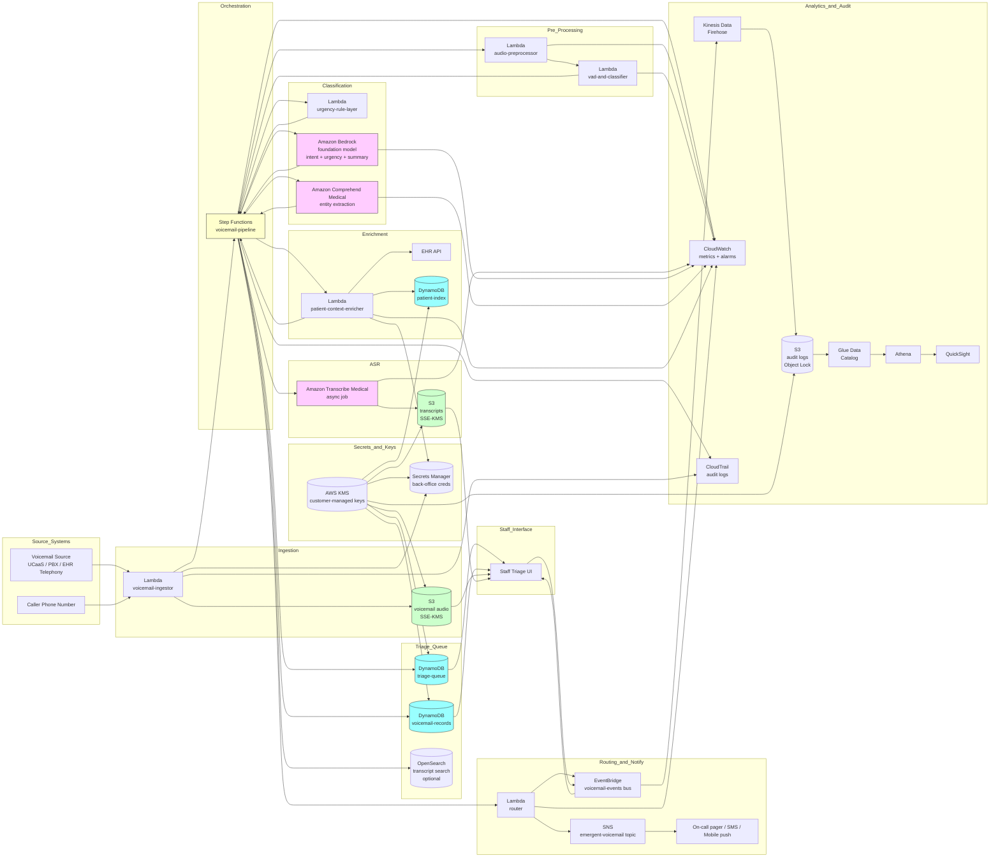

# Recipe 10.2: Voicemail Transcription and Classification ⭐

**Complexity:** Simple · **Phase:** MVP · **Estimated Cost:** ~$0.03-0.12 per voicemail (depending on length, ASR usage, and whether classification uses a managed service or a foundation model)

---

## The Problem

It is 4:50 p.m. on a Friday at a mid-sized internal medicine practice. The clinical-support phone line has been forwarded to voicemail since the front desk left for the day. Over the next sixteen hours, until someone arrives Monday morning, the practice's voicemail box accumulates forty-seven new messages.

Most of those messages are routine. Mrs. Petrosian wants to confirm her Wednesday appointment. A pharmacy is calling about a prior-authorization fax that the practice already sent. Mr. Davis would like to know whether his blood-test results came back. A vendor wants to schedule a sales call. The IT contractor left a voicemail wishing the office a nice weekend.

Three of those forty-seven messages are not routine. One is from an 82-year-old woman with congestive heart failure who has gained six pounds since Tuesday and is short of breath walking to the bathroom. One is from the spouse of a chemotherapy patient who has been running a 102 fever since Saturday afternoon and is asking whether they should go to the emergency room. One is from a 24-year-old who took a friend's prescription opioid for a tooth pain after running out of his own ibuprofen and is now experiencing what he describes as "weird breathing" and a heaviness in his chest. <!-- TODO: verify; clinical examples are illustrative scenarios drawn from typical voicemail-triage patterns documented in healthcare contact-center literature, not specific reported incidents -->

Monday morning, a nurse arrives, sits down with a notepad, and starts working through the box. She listens to each message in order. The first one is the IT contractor. The second is Mrs. Petrosian. The third is the pharmacy. By the time she gets to message twelve (the one about the chemotherapy patient with the fever), it has been forty-six hours since the call was placed, and it takes her another two minutes of listening before she identifies it as urgent. The patient is no longer febrile by then, because they went to the emergency room on Sunday afternoon, which is, technically, a successful outcome from the system's perspective. The bill, several thousand dollars in ER charges that an earlier triage call could have avoided, is not.

Message thirty-one is the heart-failure patient. By the time the nurse calls back, the patient has gained another two pounds and is now too winded to finish a sentence. An ambulance is dispatched. Hospital admission for acute decompensation follows. The hospital readmission counts against the practice's quality scores, the patient suffers a clinical event that an earlier outreach could plausibly have prevented, and the cost to the system runs into the tens of thousands of dollars. The voicemail had been sitting in the box, unattended, for the entire weekend.

Message thirty-eight is the young man with the borrowed opioid. By Monday morning he is asleep on his bathroom floor and his roommate is calling 911. Naloxone, ER, hospital admission, the whole cascade. The voicemail he left on Friday night, in which he plainly described chest tightness after taking an opioid he was not prescribed, sat in the queue for sixty-four hours.

This is not a hypothetical. Some version of this story plays out in healthcare practices across the United States every week. The voicemail box is a queue, and the queue is FIFO by accident rather than by clinical priority. The nurse triaging the queue is doing her job competently and conscientiously. The system she is working inside, by being a flat list of audio recordings with no metadata beyond the caller's phone number and the time of the call, makes it nearly impossible for her to do that job well at scale.

The cost of this is not abstract. Multiply across thousands of practices and tens of thousands of voicemail boxes:

The patient who left a voicemail Friday afternoon describing a new severe headache, the worst of her life, who waits three days for a callback while a sentinel-event subarachnoid bleed sits unaddressed.

The medication-side-effect call from the patient who started a new statin and is reporting muscle pain, which sits in the box long enough that the patient stops the medication on her own and never starts another one, leading to a cardiac event eighteen months later that the original prescriber's nurse line could have prevented.

The mental-health call from a patient who is plainly suicidal, who specifically chose the medical-practice voicemail because she trusted her doctor, whose call goes through normal triage instead of being escalated to crisis lines, and who is dead before her primary care nurse listens to message twenty-two on Monday morning.

The denial of access disguised as administrative routine: the Spanish-speaking caller whose voicemails consistently go uncalled-back because the front desk speaks English, who eventually stops calling, whose chronic disease management quietly degrades, who is silently lost from the panel.

The legitimate refill request that the patient has now left voicemails about three times across two weeks because the first two went unreturned, which has now produced a frustrated patient, a confused pharmacist, and three voicemails that all need to be triaged when the nurse finally gets to them.

The voicemail box at most healthcare practices is, candidly, a liability. It is the place where time-sensitive clinical signal goes to wait alongside vendor solicitations and confirmation calls. The good practices have built operational discipline around it: a designated triage role, defined service-level agreements, escalation paths to clinicians for urgent calls. The not-so-good practices treat it as the IT system that handles voicemail. Both sets of practices are working with the wrong substrate. The voicemail box, as a clinical workflow, has been the same since the 1980s.

The opportunity is fairly direct: take the audio, transcribe it, classify it for clinical urgency and intent, sort the queue by priority, and surface the urgent calls before the routine ones. Add medical-entity extraction to surface the medication name, the symptom, the appointment date, so the staff member returning the call has context before they pick up the phone. Add a confidence-aware human review path so low-confidence transcriptions get listened to before they get acted on. Add subgroup-stratified accuracy monitoring so the practice notices if the system is silently underserving Spanish-speaking or older patients. Build the analytics layer that lets the practice see, for the first time, what its voicemail box actually contains.

None of this requires real-time speech recognition. None of it requires the multi-turn dialog management that makes IVR engineering complicated (recipe 10.1). The voicemail comes in, sits in a queue for at most a few minutes, gets processed, and gets routed. The async nature of the workload makes most of the engineering decisions easier. The hard parts that remain are the parts you cannot avoid: the medical vocabulary in ASR, the clinical-urgency lexicon, the equity-monitoring discipline, the human review queue, and the integration with the practice's existing telephone system. Those are the things this recipe spends most of its time on.

Let's get into it.

---

## The Technology: Async Voice, Decoupled

### How Voicemail Differs from Live Calls

The IVR recipe (10.1) cared about latency. Streaming ASR, partial transcripts, sub-second dialog turns, endpointing tuned to a hundred-millisecond budget. Voicemail does not care about any of that. By the time the audio reaches the transcription pipeline, the caller has already hung up. There is no caller waiting on the other end of the line for a response. The pipeline can take ten seconds, or thirty seconds, or two minutes (within reason), and nobody experiences the latency directly.

This single architectural difference reshapes the engineering. Streaming becomes optional. Endpointing becomes irrelevant (the recording has a defined start and end). Dialog management disappears entirely (one utterance per voicemail). Confidence-aware turn handling collapses into a simpler decision: fully process the message, or queue it for human review.

What replaces those concerns? Different ones, and some of them are harder.

**Audio quality variance is wider.** The IVR audio comes from an active call leg through a contact-center platform with reasonably consistent telephony characteristics. Voicemail audio comes from whatever device the caller used (cell phone in a moving car, landline in a quiet kitchen, speakerphone in a noisy break room, hands-free Bluetooth in a parking garage), passes through whatever carrier path connected the call, and lands in whatever voicemail system the practice uses (legacy on-prem PBX, hosted UCaaS, embedded telephony in the EHR, the carrier's own voicemail-to-email service). The variance in audio quality is substantially wider than in a live IVR call.

**Recording length varies wildly.** Some voicemails are eight seconds. Some are four minutes. Some begin with a long pause as the caller hesitates before the beep ends; some end mid-sentence because the practice's voicemail system has a 90-second cap. The pipeline has to handle the full distribution gracefully.

**Recordings include silence and noise that nobody triages live.** The voicemail box accumulates spam-call hangups, pocket-dials with no speech, fax-machine tones from misdirected fax senders, and the occasional five-minute recording of someone's car radio because their phone redialed the practice from inside their pocket. The pipeline has to detect and route those without burning ASR budget on them.

**Voicemails are signed, in a sense.** The caller chose, deliberately, to leave a message. They thought about what they wanted to say. They held the phone up to their face for thirty to ninety seconds. The intent in a voicemail is, on average, more deliberate than the intent in an IVR utterance. That makes classification a little easier than the equivalent task in IVR. (The downside is that voicemails are also longer and more rambling, which makes intent extraction take a little more work.)

**The clinical-urgency stakes are higher.** A misrouted IVR call usually ends with a brief annoyance and a transfer. A misrouted voicemail can sit unread for days. The downside risk on a missed urgency signal is materially worse for voicemail than for IVR.

These differences compound into a different architectural shape, with different priorities, even though the building blocks (ASR, classification, entity extraction, human review) are the same.

### Batch Speech Recognition

The first stage of the pipeline is automatic speech recognition (ASR), this time in batch mode. The pipeline submits the full audio file to the ASR system and receives, after some processing time, a complete transcript with per-word and per-utterance confidence scores.

A few specifics that matter for voicemail-class workloads.

**Async APIs and retrieval-by-job-id.** Most cloud ASR vendors offer two API modes: synchronous (call returns when transcription is done; works for short clips of perhaps thirty seconds or less) and asynchronous (you submit a job, get back a job ID, and poll or receive a callback when the result is ready; works for arbitrary length audio). For voicemail, async is the default choice because the message length distribution has a long tail and you do not want a Lambda function blocked for two minutes waiting on a synchronous transcription. The pipeline submits the job, hands off, and processes the result when it arrives. Job-completion notifications can be wired through SNS or EventBridge so the pipeline does not have to poll.

**Speaker diarization is usually unnecessary.** A voicemail typically has one speaker (the caller). Some have two (the caller plus a family member who chimes in), and rarely more. Unlike telehealth or ambient documentation, you do not need rigorous diarization. You need accurate transcription of whoever is speaking. If multiple speakers are present, treating their combined utterances as one transcript is usually fine for routing and triage purposes; the human reviewer can disambiguate when needed.

**Domain-adapted language models pay off.** A voicemail saying "I am calling about my furosemide refill" needs to transcribe the drug name correctly to support routing as a medication intent. General-purpose ASR will sometimes get it; medical-domain ASR (Transcribe Medical, Nuance, fine-tuned Whisper variants, vendor-specific clinical models) is dramatically more reliable on the medication names that drive the most common voicemail intents. For a healthcare voicemail pipeline, you want the medical-domain model, not the general-purpose one. The cost difference is small. The accuracy difference is large.

**Telephony codec awareness.** Voicemail audio often arrives compressed. WAV files at 8 kHz mono are common. MP3 is common. Vendor-specific codecs (G.711, G.729, GSM) appear in legacy systems. The transcription pipeline has to either handle the formats natively or transcode upstream. Transcoding is mostly mechanical (FFmpeg-class tooling) but introduces failure modes and quality loss; native handling is preferable when the ASR vendor supports it.

**Length-aware processing.** Very short audio (under a few seconds) is often spam, hangups, or pocket-dials, and is not worth running ASR on. Very long audio (more than the practice's voicemail cap) can sometimes appear as the result of system bugs or unusual capture paths, and may indicate a recording-error condition rather than a legitimate message. Length-based filtering at the front of the pipeline (drop the under-three-second clips, flag the over-five-minute clips for special handling) saves cost and improves the signal-to-noise ratio of the downstream classification.

**Confidence is the gate, not the answer.** ASR confidence scores feed the downstream confidence-aware logic in the same way they do for IVR. A high-confidence transcript with clear medical entities can be auto-classified and auto-routed. A medium-confidence transcript can be classified, with the result flagged for human verification before action. A low-confidence transcript ("this audio is ninety seconds of street noise and the model is guessing") should not be acted on at all; route to a human listener.

### Voice Activity Detection and Pre-processing

Before the audio reaches the ASR system, a small pre-processing layer earns its keep.

**Voice activity detection (VAD).** A simple model that distinguishes speech from non-speech regions of the audio. Useful for two reasons. First, you can detect "no speech detected" voicemails (pocket-dials, silent hangups, fax-tone-only, music-only) and route them to a "no transcription needed" disposition without spending ASR cost. Second, you can trim leading or trailing silence before submitting to ASR, which marginally reduces transcription cost and slightly improves accuracy at the boundaries.

**Background noise classification.** Some recordings are dominated by non-speech audio (a baby crying, a TV in the background, music, traffic, mechanical noise). A simple acoustic classifier can flag these as "noisy environment" so the downstream confidence interpretation can be adjusted. The pipeline does not need to separate the signal from the noise; it needs to know that this recording is likely to produce a less reliable transcript.

**Loudness normalization.** Voicemails come in at vastly different loudness levels. Normalizing the input audio's loudness (RMS or peak) before transcription is a low-cost intervention that improves ASR consistency.

**DTMF tone detection.** Some "voicemails" are actually fax tones or DTMF sequences left by automated systems. Detecting DTMF in the audio is mechanical and lets you route those recordings appropriately rather than sending them to ASR.

You do not need elaborate audio engineering. You need enough pre-processing to filter the obvious non-speech inputs and to marginally improve the speech inputs. Modern ASR systems are robust enough that aggressive pre-processing can actually hurt; light-touch is the right posture.

### Text Classification: Intent and Urgency

Once you have a transcript, the next stage is classification. There are typically two parallel classification axes and one entity-extraction layer that feed the routing decision.

**Intent classification.** What is this voicemail about? Common categories for a healthcare practice voicemail box: medication question or refill request; appointment-related (schedule, reschedule, cancel, confirm); test-result inquiry; clinical-symptom report; billing question; insurance or prior-authorization question; vendor or business-related; spam or wrong-number; unclear. The exact taxonomy is institutional; most practices end up with eight to fifteen categories.

**Urgency classification.** Independent from intent, how time-sensitive is this voicemail? A common scheme: emergent (caller is reporting symptoms that suggest a medical emergency, or expressing suicidality); urgent (clinically time-sensitive but not emergency-room-now: medication side effects, worsening symptoms, fever in a high-risk patient); routine (medication refill, appointment confirmation, results inquiry, billing); low-priority (vendor solicitations, wrong numbers, spam). Urgency is partly inferable from intent, but not entirely; a "medication refill" intent for a routine antihypertensive is routine, while a "medication refill" intent for a chemotherapy adjunct in a patient who is now days late on the dose is more time-sensitive.

**Medical entity extraction.** What specific clinical entities does this voicemail mention? Drug names. Symptoms. Body parts. Conditions. Procedures. Lab tests. Dates. Phone numbers. Names of clinicians. The entity layer surfaces the actionable specifics in the message: "the patient mentioned methotrexate, the symptom mouth sores, and the lab thyroid panel." The entities feed both the urgency classifier (some entities raise the urgency on their own; "chest pain" is one of those) and the routing decision (the medication-related voicemails go to the pharmacy queue with the medication name pre-populated).

You can implement these layers in several ways.

**Rule-based classifiers.** Define keyword and regex patterns for each intent and urgency level. "If the transcript contains 'refill' or 'prescription' or 'pharmacy', classify as medication intent. If the transcript contains 'chest pain' or 'can't breathe' or 'shortness of breath' or 'suicide', classify as emergent urgency, regardless of other classification." Easy to build, transparent, and (especially for the urgency-keyword layer) actually the right approach. The clinical urgency lexicon should be a rule layer on top of any ML classifier, because the cost of missing an emergent message is much higher than the cost of over-flagging.

**Statistical text classifiers.** Train a supervised classifier on labeled transcripts. Each labeled example is a transcript and its intent (and urgency) label. Standard supervised text classification: logistic regression over TF-IDF, gradient-boosted trees over text features, or fine-tuned transformer models. The models handle paraphrase variation (every way someone might say "I want to refill my prescription") that rule-based systems struggle with.

**LLM-based classifiers.** Send the transcript to a foundation model with a prompt that lists the intents (and urgency categories) and ask the model to classify. Modern LLMs are excellent at this with few-shot prompting and minimal training data. The advantages: no per-intent training data, easy to extend, handles weird phrasings gracefully, can extract entities and rationales in the same call. The disadvantages: per-message inference cost (small but non-zero), occasional hallucinated categories that are not in your list (validate strictly), and the operational dependency on a model you do not fully control.

For voicemail specifically, in 2026, the right answer is usually a hybrid. Run the urgency-keyword rule layer first (cheap, fast, safety-critical). Run an LLM- or transformer-based classifier on the rest of the transcript for intent and refined urgency. Run a managed medical-entity-extraction service (Amazon Comprehend Medical, similar offerings from other vendors, or NLP libraries like scispaCy or MedCAT for self-hosted) to extract clinical entities. Combine the outputs into a structured triage record. <!-- TODO: verify; the relative cost and accuracy of LLM-based, transformer-based, and rule-based classification continues to shift; specific vendor offerings and pricing change quarterly -->

**Domain entity extraction.** Comprehend Medical and equivalents extract medication names, conditions, anatomy, procedures, and tests as structured entities, often with mappings to standard ontologies (RxNorm for medications, ICD-10 for conditions, SNOMED for clinical concepts). The structured entities are far more useful for downstream routing than free-text mentions; "the medication is RxNorm:104491 (lisinopril)" is unambiguous in a way that "the medication is lisinopril" is not.

### The Triage Queue

Once a voicemail is transcribed and classified, the output is a triage record: the audio reference, the transcript, the intent, the urgency, the extracted entities, the per-layer confidence scores, the caller phone number, and any patient context inferred from the phone number lookup. This record goes into a triage queue.

The triage queue is not just a list. It is a priority data structure that the staff member working through the box sees, in priority order, so the urgent calls surface first. The architecture has to provide that. A simple FIFO queue defeats the entire point. The queue typically has the following properties.

**Priority-aware ordering.** Emergent urgency comes first. Within an urgency level, older messages come first (so a routine message does not sit in the queue forever just because new routine messages keep arriving). Within an urgency level and time bucket, certain intents may be prioritized (clinical-symptom intent ahead of billing intent, for instance). The ordering rules are explicit and reviewable.

**Filtering and routing.** The same queue may serve multiple staff roles. Pharmacy gets the medication-related queue. Scheduling gets the appointment-related queue. Nurse triage gets the clinical-symptom queue. Billing gets the billing queue. The architecture surfaces the right subset of messages to each role's view, not the full firehose.

**Confidence flagging.** Low-confidence classifications surface as such, so the staff member knows to listen to the audio rather than trusting the transcript. The interface presents the original audio playback alongside the transcript, with the entities highlighted in the transcript view.

**Audit trail.** Every action a staff member takes against a voicemail (listened, called back, marked resolved, escalated) is logged. The audit trail feeds the analytics layer that surfaces handle-time, time-to-callback, and outcomes by category.

**Escalation paths.** Emergent-urgency messages do not just sit at the top of the queue; they trigger an active notification (page, SMS, dashboard alert, depending on the institution's protocol) so a clinician sees them immediately rather than waiting for the next queue review.

### Where the Field Has Moved

Some practical updates worth knowing.

**Foundation-model classification has displaced custom-trained classifiers for many use cases.** Five years ago, a voicemail classification system would have required several thousand labeled examples to train a competent intent classifier. Today, an LLM with a well-designed prompt and a handful of few-shot examples can produce comparable or better classification with no training data. The operational dependency shifts (you depend on the foundation model vendor rather than on your own labeled dataset), but the time-to-launch is dramatically faster. <!-- TODO: verify; LLM-based classification quality and cost trade-offs against custom-trained classifiers continues to shift with each model generation -->

**Embeddings-based retrieval over historical messages is increasingly used.** When a voicemail comes in, embed it and check whether similar voicemails have been left by the same patient in the recent past. Useful for de-duplicating callbacks (the patient has already left this same message; consolidate) and for identifying patients who are repeatedly trying to reach the practice (a possible signal of a problem the system is not surfacing well).

**Medical entity extraction has matured.** The accuracy of cloud-managed medical-entity extraction (Comprehend Medical, Google Healthcare Natural Language API, Microsoft Text Analytics for Health) has reached the point where the entity extraction is rarely the bottleneck. The bottleneck has shifted to the upstream ASR accuracy (if the medication name was transcribed wrong, the entity extractor will miss it) and the downstream interpretation (an extracted "chest pain" entity has to be interpreted in context: was the patient describing their own current symptom, asking about a past episode, or relaying something about a family member). <!-- TODO: verify; managed medical entity extraction services continue to improve and add ontology mappings; accuracy benchmarks vary by source dataset and vary across vendors -->

**Multilingual ASR has gotten substantially better but remains uneven across languages.** Voicemail in English transcribes well. Voicemail in Spanish transcribes well. Voicemail in less-common-on-the-internet languages transcribes worse. The pipeline has to handle multilingual audio gracefully, which usually means language detection at the front of the pipeline and language-specific transcription paths downstream.

**Voicemail systems themselves have moved.** Legacy on-prem PBX voicemail still exists, but most healthcare practices have migrated to hosted UCaaS platforms (RingCentral, Zoom Phone, Microsoft Teams Phone, 8x8, Vonage, etc.) or to telephony embedded in their EHR (eClinicalWorks, athenaCommunicator, similar). Each platform has different APIs for accessing voicemail audio, different metadata fidelity, and different integration surfaces. The pipeline architecture has to be agnostic to the source system because most practices have heterogeneous environments. <!-- TODO: verify; the UCaaS market for healthcare practices continues to consolidate and shift; vendor names and market positions vary -->

**Real-time transcription as a precursor to classification is becoming feasible.** Some platforms now transcribe voicemails as they are being recorded (streaming the audio to ASR), so by the time the caller hangs up, the transcript already exists and the classification can run within seconds. Useful when the urgency-detection latency budget matters (a chest-pain voicemail is more time-sensitive than a refill voicemail; surfacing it within thirty seconds of being left rather than within thirty minutes of the next queue review is a meaningful improvement).

---

## General Architecture Pattern

A voicemail transcription and classification pipeline splits cleanly into seven logical stages: ingestion (the voicemail audio reaches your system), pre-processing (filter noise, normalize loudness, detect speech), transcription (batch ASR), classification (intent, urgency, entity extraction), enrichment (patient context lookup), routing (to the right staff queue with the right priority), and observability (everything captured for analysis and improvement).

```
┌──────────────────── INGESTION ───────────────────────────┐
│                                                           │
│   [Voicemail recorded by source system]                  │
│    - Hosted UCaaS, on-prem PBX, EHR-embedded telephony,  │
│      or carrier voicemail-to-email                       │
│   [Source system delivers the recording to the pipeline] │
│    - Webhook + signed URL, S3 push, SFTP drop,           │
│      IMAP-poll for voicemail-to-email, vendor API pull   │
│   [Pipeline persists the audio to a secure object store] │
│    - Encrypted at rest with customer-managed keys        │
│    - Linked to a voicemail record with ANI, DNIS,        │
│      timestamp, source-system-message-id                 │
│           │                                               │
│           ▼                                               │
│   [Output: a voicemail record with audio reference and   │
│    minimal metadata, awaiting processing]                │
│                                                           │
└───────────────────────────────────────────────────────────┘

┌──────────────────── PRE-PROCESSING ──────────────────────┐
│                                                           │
│   [Length filter]                                         │
│    - Drop or specially-handle clips under threshold      │
│      (commonly 3 seconds: pocket dials, hangups)         │
│    - Flag clips over threshold (e.g., 5 minutes) for     │
│      human review without ASR                            │
│                                                           │
│   [Voice activity detection]                             │
│    - Mark "no speech detected" recordings; route to a    │
│      no-speech disposition without spending ASR budget   │
│    - Optionally trim leading and trailing silence        │
│                                                           │
│   [DTMF / fax tone detection]                            │
│    - Identify recordings that are tones rather than      │
│      speech; route to fax/automated-system queue         │
│                                                           │
│   [Loudness normalization]                               │
│    - Normalize RMS or peak loudness so ASR sees          │
│      consistently-leveled audio                          │
│                                                           │
│   [Language detection (optional, for multilingual orgs)] │
│    - Identify the primary language of the audio so the   │
│      ASR call can use the correct model                  │
│           │                                               │
│           ▼                                               │
│   [Output: voicemail record annotated with pre-          │
│    processing decisions; either continued to ASR, or     │
│    short-circuited to a non-ASR disposition]             │
│                                                           │
└───────────────────────────────────────────────────────────┘

┌──────────────────── TRANSCRIPTION ───────────────────────┐
│                                                           │
│   [Submit async ASR job]                                  │
│    - Medical-domain model preferred                       │
│    - Single-speaker mode (diarization disabled by         │
│      default)                                             │
│    - Per-word and per-utterance confidence requested      │
│                                                           │
│   [Wait for job completion via callback or event]        │
│                                                           │
│   [Persist the transcript to the secure transcript       │
│    archive, alongside the audio]                         │
│    - Transcript is PHI; same governance as the audio     │
│           │                                               │
│           ▼                                               │
│   [Output: voicemail record updated with transcript,     │
│    word-level timing and confidence, and average         │
│    confidence aggregate]                                  │
│                                                           │
└───────────────────────────────────────────────────────────┘

┌──────────────────── CLASSIFICATION ──────────────────────┐
│                                                           │
│   [Urgency-keyword rule layer (runs first)]              │
│    - Pattern-match against the clinical urgency lexicon  │
│    - Sets urgency = emergent if a phrase matches,        │
│      regardless of downstream classifier output          │
│                                                           │
│   [Intent classifier]                                    │
│    - LLM, transformer, or trained classifier             │
│    - Returns intent + per-intent confidence              │
│    - "Out of scope" or "low confidence" returned as      │
│      explicit values, not as the absence of a result     │
│                                                           │
│   [Urgency classifier]                                   │
│    - LLM, transformer, or trained classifier             │
│    - Returns urgency level + confidence                   │
│    - Combined with rule-layer output: max(rule,          │
│      classifier); rule layer can only escalate, never    │
│      de-escalate                                          │
│                                                           │
│   [Medical entity extraction]                            │
│    - Drugs, conditions, anatomy, procedures, tests,      │
│      with ontology mappings (RxNorm, ICD-10, SNOMED)     │
│           │                                               │
│           ▼                                               │
│   [Output: structured triage record with intent, urgency,│
│    entities, all confidences, raw transcript reference,  │
│    audio reference]                                       │
│                                                           │
└───────────────────────────────────────────────────────────┘

┌──────────────────── ENRICHMENT ──────────────────────────┐
│                                                           │
│   [ANI-based patient lookup]                             │
│    - Match caller phone number against patient index    │
│    - Multiple matches: capture all candidates; do not    │
│      assume identity                                      │
│    - Zero matches: flag as "unmatched caller"             │
│                                                           │
│   [Patient context retrieval (when match is unique)]     │
│    - Active medication list                              │
│    - Recent appointments                                  │
│    - Active care plans and chronic conditions            │
│    - Recent voicemails from same caller (de-dupe         │
│      detection)                                          │
│                                                           │
│   [De-duplication / repeat-caller detection]             │
│    - If the same caller has left similar messages in     │
│      the last 48 hours, flag for consolidation           │
│           │                                               │
│           ▼                                               │
│   [Output: triage record enriched with patient context   │
│    and repeat-caller status]                              │
│                                                           │
└───────────────────────────────────────────────────────────┘

┌──────────────────── ROUTING ─────────────────────────────┐
│                                                           │
│   [Queue selection based on intent and patient context]  │
│    - Pharmacy queue, scheduling queue, nurse triage      │
│      queue, billing queue, general queue                 │
│                                                           │
│   [Priority assignment based on urgency]                 │
│    - Emergent: top of queue + active notification        │
│    - Urgent: top of queue with SLA flag                  │
│    - Routine: standard ordering                           │
│    - Low-priority: deprioritized or filtered out         │
│                                                           │
│   [Active notification path for emergent items]          │
│    - Page or SMS to on-call clinician                    │
│    - Dashboard alert in the staff interface              │
│    - Audit-log every active notification                 │
│                                                           │
│   [Confidence-aware delivery]                             │
│    - High confidence: triage record presented with       │
│      transcript and entities highlighted                 │
│    - Medium confidence: same, but with a "verify before  │
│      acting" badge                                       │
│    - Low confidence: queue with a "listen to audio       │
│      before acting" badge                                │
│           │                                               │
│           ▼                                               │
│   [Output: triage record placed in the appropriate       │
│    staff queue with ordering, priority, and confidence   │
│    metadata]                                              │
│                                                           │
└───────────────────────────────────────────────────────────┘

┌──────────────────── OBSERVABILITY ───────────────────────┐
│                                                           │
│   [Per-voicemail audit record]                           │
│    - Pre-processing decisions                             │
│    - ASR job ID, model used, duration, confidence stats  │
│    - All classification outputs and confidences          │
│    - Entity extraction output                             │
│    - Routing decision and the rule that fired            │
│    - Staff actions: listened, called back, resolved,     │
│      escalated, time stamps for each                     │
│                                                           │
│   [Per-voicemail audio and transcript]                   │
│    - Encrypted at rest                                    │
│    - Retention per institutional policy                   │
│                                                           │
│   [Aggregate metrics]                                    │
│    - Volume by intent, urgency, time-of-day              │
│    - Time-to-classification, time-to-callback by         │
│      urgency tier                                         │
│    - Misclassification rate (sampled human review)       │
│    - Subgroup-stratified accuracy (language, dialect,    │
│      age cohort, geographic region)                      │
│    - Repeat-caller rate                                   │
│           │                                               │
│           ▼                                               │
│   [Output: continuous improvement signals fed back to    │
│    classifier prompts, urgency lexicon, and routing      │
│    policy]                                                │
│                                                           │
└───────────────────────────────────────────────────────────┘
```

A few cross-cutting design points that the architecture has to bake in from the start.

**Async, but emergent items get real-time treatment.** Most of the pipeline is async: voicemail comes in, gets processed within a few minutes, sits in the queue. Emergent-urgency items are the exception: the moment the urgency classifier or rule layer flags one, the pipeline emits an active notification rather than waiting for the staff member to find it in the queue. This dual-mode architecture (async by default, real-time for emergent) is what lets the system serve both routine triage and clinical safety from a single pipeline.

**Transcripts are PHI; treat them accordingly.** Voicemail recordings are PHI (the recording typically contains the caller's name, phone number, and clinical content). Transcripts of those recordings are also PHI. Both are stored in encrypted object storage with customer-managed keys, with access controls that match the rest of the institution's PHI handling. Audit logs that record voicemail processing should reference the audio and transcript by ID, not embed the raw content; the raw content should live in the secure archive only.

**The urgency lexicon is a clinical safety document.** Same as in recipe 10.1: the urgency lexicon is the safety net for clinical signal that the ML classifier might miss. Treat it as a clinical safety artifact with version control, change review by clinical operations, scheduled refresh cadence, and a documented escalation path when a missed urgent voicemail surfaces.

**Confidence thresholds are per-axis and per-action.** Different actions on the triage record require different confidence floors. Auto-routing a voicemail to the pharmacy queue based on a high-confidence "medication refill" intent is a low-stakes action and can run on a moderate confidence threshold. Auto-escalating to the on-call clinician based on an emergent-urgency classification is a higher-stakes action (the consequences of a false positive are real, even if the consequences of a false negative are worse) and warrants a different threshold. Auto-resolving a voicemail without staff review is a still-different action and should require very high confidence and a narrow set of intents (and probably should not be done at all in MVP).

**Sampled human review is non-negotiable.** The pipeline cannot self-evaluate its accuracy. The institution needs a sampled audit process where a clinical reviewer listens to a random sample of voicemails per week and compares the human assessment to the pipeline's classification. The sample size is institutional but a few percent of total volume is a reasonable starting point. Without this, the pipeline drifts silently and nobody notices.

**Subgroup-stratified accuracy must be visible.** Voicemail ASR has worse accuracy on certain demographic groups (older speakers, non-native English speakers, speakers with hearing loss who modulate their voice differently). The pipeline must surface accuracy metrics stratified by language preference, age cohort, and (where data permits) accent group. Disparities exceeding configured thresholds should alert. This is not an optional analytics nice-to-have; it is the mechanism by which the institution detects whether the system is silently underserving specific patient populations.

**The pipeline degrades to "human listens to all voicemails" gracefully.** If any pipeline stage is unavailable (ASR vendor outage, classifier service down, queue infrastructure failure), the system should fall back to delivering the raw voicemail audio to the staff queue with a "automated triage unavailable, please review manually" flag. The voicemail box was reachable by humans before the pipeline existed; it must remain reachable by humans when the pipeline cannot run.

**De-duplication and repeat-caller detection are operationally important.** The same patient leaving four voicemails in two days about the same refill request should result in one consolidated triage record, not four. The repeat-caller signal is also clinically interesting: a patient who has tried to reach the practice three times in a week and not gotten through is a patient at risk of disengagement, regardless of the specific intents.

---

## The AWS Implementation

### Why These Services

**Amazon Transcribe Medical for ASR.** Transcribe Medical is the medical-domain-tuned ASR service. It supports async batch transcription jobs, accepts the audio formats that voicemail systems typically produce, returns per-word timing and confidence, and handles medical vocabulary (drug names, conditions, anatomy) substantially better than the general-purpose Transcribe service. For voicemail in a healthcare context, Transcribe Medical is the right default. The general-purpose Transcribe is appropriate for the non-clinical voicemails (vendor calls, billing-only practices) where medical vocabulary is rare. <!-- TODO: verify; Transcribe Medical's specific specialty support, language coverage, and feature set continues to evolve; check the AWS docs at build time for current capabilities -->

**Amazon Comprehend Medical for entity extraction.** Comprehend Medical extracts medical entities (medications, conditions, anatomy, procedures, tests, time expressions) from clinical text and maps them to ontologies (RxNorm, ICD-10-CM, SNOMED CT). For a voicemail pipeline, Comprehend Medical is the entity-extraction layer that turns "I am calling about my furosemide" into a structured medication entity that downstream routing can consume.

**Amazon Bedrock for intent and urgency classification.** Bedrock provides managed access to foundation models (Anthropic Claude family, Meta Llama, Mistral, Amazon Titan, and others) with HIPAA eligibility under the AWS BAA. For voicemail classification specifically, a foundation model with a well-designed prompt can classify intent and urgency, extract additional context the ontology-bound entity extractors miss, and produce a brief human-readable summary of the voicemail in a single inference call. For practices that have established custom-trained classifiers, SageMaker hosting is an alternative; for greenfield deployments, Bedrock-with-LLM is the more pragmatic starting point.

**Amazon S3 for audio and transcript storage.** Voicemail audio lives in S3 with SSE-KMS encryption, lifecycle policies to move older recordings to colder storage tiers, and retention bounds set by institutional and state-specific medical-records-retention requirements. Transcripts live in a separate S3 bucket (or a separate prefix) with the same encryption and access controls. S3 Object Lock in compliance mode is appropriate for the audit-log bucket but typically not for the audio bucket itself.

**AWS Lambda for orchestration and per-stage processing.** Each stage of the pipeline runs in a Lambda function: pre-processor, ASR job submitter, ASR job result processor, classifier, entity extractor, enrichment, router. Lambda's per-invocation isolation, fast cold-start, and scaling characteristics fit the bursty-async nature of voicemail processing well.

**AWS Step Functions for pipeline orchestration.** When the pipeline has more than three or four stages with conditional branching and async waits, Step Functions earns its keep. The Step Functions state machine encodes the pipeline as a workflow: pre-process, then transcribe-or-skip, then classify-or-route-to-human-review, then enrich, then route. The visualization makes it easy to see where voicemails are getting stuck, the retry-and-error semantics are managed, and the audit trail per execution is built in.

**Amazon EventBridge for cross-system events.** When a triage record is created, when an emergent voicemail is escalated, when a staff member resolves a voicemail, EventBridge fans the event out to downstream consumers (analytics, operational dashboards, the staff-notification service, the EHR if the voicemail is being recorded as a clinical communication).

**Amazon SNS and Amazon Pinpoint for active notifications.** When the urgency classifier flags an emergent voicemail, the notification path uses SNS for the basic mechanics (push to a topic, fan out to multiple subscribers including SMS, email, and push notifications) and optionally Pinpoint for richer mobile-app notifications and delivery tracking. The on-call clinician's pager or phone is a subscriber to the emergent topic. <!-- TODO: verify; Pinpoint's HIPAA eligibility under BAA and its specific feature set under that eligibility continues to evolve; check the AWS HIPAA Eligible Services Reference at build time -->

**Amazon DynamoDB for the triage queue and voicemail records.** The triage queue is implemented as a DynamoDB table with composite keys (queue_name, priority_timestamp_compound_key) so the staff interface can query the next priority items efficiently. The voicemail records (audio reference, transcript reference, classifications, enrichment data, audit history) live in a separate DynamoDB table or in the same table with different sort keys.

**Amazon OpenSearch Service (optional) for transcript search.** For practices that want to search across historical voicemails ("show me all voicemails from the last 30 days that mention 'methotrexate'"), OpenSearch indexes the transcripts and metadata. With HIPAA eligibility under BAA, encrypted indices, and fine-grained access controls.

**AWS Lambda + Amazon Chime SDK Voice Connector (optional) for direct voicemail capture.** For practices that want to use AWS as the voicemail system itself rather than ingesting from an external source, Chime SDK Voice Connector provides SIP trunking and call-handling primitives that can be wired into Lambda for voicemail capture. Most practices will keep their existing voicemail system and ingest from there; this option exists for greenfield deployments. <!-- TODO: verify; Chime SDK Voice Connector's HIPAA eligibility and specific voicemail-capture capabilities continue to evolve -->

**AWS KMS for cryptographic-key custody.** Customer-managed KMS keys for the audio bucket, the transcript bucket, the DynamoDB tables, the Step Functions execution data, the Lambda environment variables, and the Secrets Manager secrets. Different keys per data class (audio, transcripts, identifiers) for blast-radius containment.

**AWS Secrets Manager for back-office integration credentials.** The Lambdas that look up patient context in the EHR, push triage records to the EHR's secure messaging inbox, or integrate with the staff communication platform need credentials. Secrets Manager stores them with rotation per the institutional cadence.

**Amazon CloudWatch and AWS CloudTrail for observability and audit.** CloudWatch tracks operational metrics (Lambda errors, Step Functions execution success rates, ASR job completion latency distributions, classifier confidence histograms). CloudTrail captures the API-level audit trail against PHI-bearing resources (S3 audio bucket, S3 transcript bucket, DynamoDB tables, KMS keys, Secrets Manager secrets, Bedrock invocations, Comprehend Medical calls, Transcribe jobs).

**AWS Glue Data Catalog and Amazon Athena for analytics.** The audit logs land in S3 (via Kinesis Data Firehose), Glue catalogs them, and Athena gives SQL access for the operational analytics: volume by intent and urgency, time-to-callback by urgency tier, classifier confidence distributions, subgroup-stratified accuracy.

**Amazon QuickSight (optional) for dashboards.** The aggregate metrics and subgroup-stratified accuracy benefit from a polished dashboard for the clinical-operations and equity-monitoring committees. QuickSight is the natural fit when the consumers include non-technical stakeholders.

### Architecture Diagram



### Prerequisites

| Requirement | Details |
|-------------|---------|
| **AWS Services** | Amazon Transcribe Medical, Amazon Comprehend Medical, Amazon Bedrock (or Amazon SageMaker for self-hosted classification), Amazon S3, AWS Lambda, AWS Step Functions, Amazon DynamoDB, Amazon SNS, Amazon EventBridge, AWS KMS, AWS Secrets Manager, Amazon CloudWatch, AWS CloudTrail, Amazon Kinesis Data Firehose, AWS Glue Data Catalog, Amazon Athena. Optionally: Amazon OpenSearch Service, Amazon QuickSight, Amazon Pinpoint, Amazon Chime SDK Voice Connector. |
| **External Inputs** | Voicemail audio source: a hosted UCaaS platform (RingCentral, Zoom Phone, Teams Phone, etc.), an on-prem PBX with an export path, an EHR-embedded telephony system, or a carrier voicemail-to-email service. The integration mechanism varies by source: webhook with signed URL, S3 cross-account push, SFTP drop, IMAP-poll for voicemail-to-email, vendor API pull. The clinical-urgency-keyword lexicon, reviewed by clinical operations. The intent taxonomy and a labeled validation set (a few hundred voicemails labeled by clinical staff). The patient index keyed by phone number. |
| **IAM Permissions** | Per-Lambda least-privilege roles. The voicemail-ingestor Lambda has scoped write access to the audio S3 bucket and write access to the voicemail-records DynamoDB table only. The pre-processor Lambda has scoped read access to the audio bucket. The Step Functions state machine has scoped invocation rights for each Lambda and the AWS service integrations it uses (Transcribe Medical's StartMedicalTranscriptionJob, Comprehend Medical's DetectEntitiesV2, Bedrock's InvokeModel for the specific foundation model and inference profile in use). The classifier Lambda has scoped Bedrock invocation rights pinned to the specific model and inference profile. The enricher Lambda has scoped read access to the patient-index DynamoDB table and to the EHR API credentials in Secrets Manager. The router Lambda has scoped publish rights on the emergent-voicemail SNS topic and `events:PutEvents` on the voicemail-events bus. Avoid wildcard actions and resources in production. |
| **BAA and Compliance** | AWS BAA signed. Transcribe Medical, Comprehend Medical, Bedrock (verify the specific models and regions covered), S3, Lambda, Step Functions, DynamoDB, SNS, EventBridge, KMS, Secrets Manager, CloudWatch Logs, CloudTrail, Kinesis Data Firehose, Athena are HIPAA-eligible (verify the current list at build time against the AWS HIPAA Eligible Services Reference). <!-- TODO: verify; the AWS HIPAA-eligible services list and the specific Bedrock models covered under BAA continues to evolve; check the AWS HIPAA Eligible Services Reference at build time --> Voicemail-greeting recording-disclosure language reviewed and approved by general counsel for the jurisdictions you operate in ("This voicemail box is monitored by clinical staff. Please leave your name, callback number, and a brief message. Calls left here may be transcribed and recorded for clinical purposes."). The disclosure is jurisdiction-aware. Some U.S. states are one-party-consent, some are all-party-consent, and the disclosure plus continued participation is the standard pattern for satisfying both. <!-- TODO: verify; state-by-state recording-consent requirements vary; current authoritative sources include the Reporters Committee for Freedom of the Press tracker and the institution's general counsel --> |
| **Encryption** | Audio bucket: SSE-KMS with customer-managed keys, S3 bucket lifecycle to colder storage tiers (Glacier Instant Retrieval after 30 days, Glacier Deep Archive after 1 year), retention per institutional and state-specific medical-records-retention requirements. Transcript bucket: same. DynamoDB tables (voicemail-records, triage-queue, patient-index): customer-managed KMS at rest. Step Functions state data: KMS-encrypted. Lambda environment variables: KMS-encrypted. Lambda log groups: KMS-encrypted. Secrets Manager: customer-managed KMS. TLS in transit for all back-office API calls and all AWS API calls (default). |
| **VPC** | Production: Lambdas that call back-office APIs (the EHR enricher in particular) run in VPC with subnets that have controlled egress to the back-office systems' network. VPC endpoints for S3, DynamoDB, KMS, Secrets Manager, CloudWatch Logs, EventBridge, Step Functions, SNS, Comprehend Medical, Transcribe, and Bedrock so the Lambdas do not need NAT for AWS-internal calls. Endpoint policies pin access to the specific resources the pipeline uses. |
| **CloudTrail** | Enabled with data events on the audio S3 bucket, the transcript S3 bucket, the voicemail-records DynamoDB table, the triage-queue DynamoDB table, the Secrets Manager secrets, and the customer-managed KMS keys. Lambda invocations logged. Step Functions execution history logged. Bedrock InvokeModel and Comprehend Medical DetectEntitiesV2 calls logged. CloudTrail logs in a dedicated S3 bucket with Object Lock in Compliance mode and lifecycle to S3 Glacier Deep Archive after 90 days. Audit retention sized to the longest of HIPAA's six-year minimum, state medical-records-retention, and the institutional regulatory floor. <!-- TODO: verify; the appropriate audit-log retention floor is institution-specific; HIPAA's six-year minimum applies to specific document types and state-specific medical-records retention may be longer --> |
| **Sample Data** | Synthetic voicemail audio for development (text-to-speech generation against scripted transcripts produces audio with known ground truth). The Synthea synthetic patient population provides patient demographics for the patient-index table. Public-domain voicemail-style speech corpora (CMU's Speech Wikipedia, mock voicemail samples from open speech datasets) for end-to-end ASR validation. Never use real voicemail recordings or real transcripts in development. |
| **Cost Estimate** | At a mid-sized practice scale (10,000 voicemails per month, average 45 seconds per voicemail): Transcribe Medical at typically $0.075 per minute of audio totals approximately $562 per month for ASR. Comprehend Medical at typically $0.01 per 100 characters of input totals approximately $50-100 per month at average transcript lengths. Bedrock model invocation cost varies dramatically by model choice; with a small or medium foundation model, classification cost is typically $50-200 per month at this volume. Lambda, Step Functions, DynamoDB, S3, CloudWatch, KMS, Secrets Manager total typically $100-400 per month combined at this scale. Total AWS infrastructure typically $800-1,500 per month at this scale, dominated by Transcribe Medical and Bedrock. <!-- TODO: replace with verified pricing once the implementing team validates against the AWS Pricing Calculator. Specific costs depend on per-minute Transcribe Medical pricing in the chosen region, the foundation model selected on Bedrock, and the average voicemail length distribution at the deploying practice --> |

### Ingredients

| AWS Service | Role |
|------------|------|
| **Amazon Transcribe Medical** | Async batch ASR with medical-domain language model; per-word timing and confidence scores |
| **Amazon Comprehend Medical** | Medical entity extraction with RxNorm, ICD-10-CM, SNOMED CT mappings |
| **Amazon Bedrock** | Managed foundation model access for intent and urgency classification, summarization, and additional context extraction |
| **Amazon S3** | Audio storage (SSE-KMS, lifecycle policy); transcript storage; audit log storage with Object Lock |
| **AWS Lambda** | Per-stage processing: ingestor, pre-processor, VAD/audio classifier, ASR result handler, classifier, entity extractor, enricher, router |
| **AWS Step Functions** | Pipeline orchestration with conditional branching, async waits for ASR job completion, retry-and-error semantics, per-execution audit trail |
| **Amazon DynamoDB** | voicemail-records (audio refs, transcripts, classifications, audit history); triage-queue (priority-ordered work queue); patient-index (phone-number-keyed patient lookup) |
| **Amazon SNS** | emergent-voicemail topic for active notifications to on-call clinicians (SMS, mobile push, email) |
| **Amazon EventBridge** | voicemail-events bus for cross-system event flow (triage record created, voicemail resolved, urgent voicemail escalated) |
| **AWS KMS** | Customer-managed encryption keys for all PHI-bearing data stores (audio, transcripts, DynamoDB, audit logs) |
| **AWS Secrets Manager** | Back-office API credentials (EHR, scheduling system, staff messaging platform) with rotation |
| **Amazon CloudWatch** | Operational metrics (Step Functions execution success rate, ASR job latency, classifier confidence distributions, queue depth); alarms (DLQ depth, emergent-voicemail processing lag, classifier-disagreement-with-human-review rate) |
| **AWS CloudTrail** | API-level audit logging for PHI-bearing resources and AI/ML service invocations |
| **Amazon Kinesis Data Firehose** | Streaming audit-log delivery from EventBridge into S3 for analytics |
| **AWS Glue Data Catalog + Amazon Athena** | SQL access to audit logs and triage records for operational analytics |
| **Amazon QuickSight (optional)** | Dashboards for clinical operations and equity-monitoring committees |
| **Amazon OpenSearch Service (optional)** | Transcript search across historical voicemails by entity, intent, urgency, or free-text |
| **Amazon Pinpoint (optional)** | Richer mobile-app notifications and delivery tracking for emergent-voicemail alerts |

---

### Code

#### Walkthrough

**Step 1: Ingest the voicemail and persist the audio.** The ingestor Lambda is the entry point. The voicemail source system (UCaaS webhook, S3 push, SFTP drop, vendor API pull) delivers a notification with the audio reference. The Lambda fetches the audio (if it is not already in our S3), normalizes the metadata, persists the audio to the encrypted audio bucket, creates the voicemail record in DynamoDB, and starts the Step Functions execution. Skip the audio persist and you have nothing to listen back to when the staff member needs to verify the transcript; skip the metadata normalization and downstream stages have to special-case every source.

```
ON voicemail_arrival(source_event):
    // source_event shape varies per integration. Common fields:
    // caller_phone_number (ANI), called_number (DNIS),
    // recorded_at, duration_seconds, source_message_id,
    // and either an inline audio blob or a fetch URL.

    voicemail_id = generate_uuid()

    // Step 1A: fetch and persist the audio. If the source
    // system delivers via signed URL, fetch and re-upload
    // to our bucket so the audio is in our governance
    // boundary. If the source system delivers via S3 push,
    // copy from the source bucket to our bucket so we own
    // the lifecycle and access controls.
    audio_bytes = fetch_audio_from_source(source_event)
    audio_format = detect_audio_format(audio_bytes)
    audio_s3_key = build_audio_key(
        voicemail_id, audio_format)
    s3_audio_bucket.put_object(
        key=audio_s3_key,
        body=audio_bytes,
        sse_kms_key_arn=AUDIO_BUCKET_KMS_KEY_ARN,
        content_type=audio_format.mime_type,
        metadata={
            voicemail_id: voicemail_id,
            source_system: source_event.source_system,
            ingested_at: current UTC timestamp
        })

    // Step 1B: create the voicemail record. This row will
    // accumulate state through the rest of the pipeline.
    voicemail_records.put({
        voicemail_id: voicemail_id,
        ani: normalize_phone(source_event.caller_phone_number),
        dnis: normalize_phone(source_event.called_number),
        recorded_at: source_event.recorded_at,
        duration_seconds: source_event.duration_seconds,
        source_system: source_event.source_system,
        source_message_id: source_event.source_message_id,
        audio_s3_bucket: AUDIO_BUCKET_NAME,
        audio_s3_key: audio_s3_key,
        audio_format: audio_format.codec,
        ingested_at: current UTC timestamp,
        pipeline_status: "ingested",
        // We will append to this list as the pipeline runs.
        audit_history: [{
            event: "INGESTED",
            timestamp: current UTC timestamp
        }]
    })

    // Step 1C: kick off the orchestrating workflow.
    // From here, Step Functions handles the rest.
    step_functions.start_execution(
        state_machine_arn=PIPELINE_STATE_MACHINE_ARN,
        execution_name=voicemail_id,
        input={
            voicemail_id: voicemail_id,
            audio_s3_bucket: AUDIO_BUCKET_NAME,
            audio_s3_key: audio_s3_key,
            duration_seconds: source_event.duration_seconds
        })
```

**Step 2: Pre-process the audio and decide whether to transcribe.** The pre-processor stage runs voice activity detection, length filtering, and DTMF/fax tone detection. Recordings that have no detectable speech (pocket-dials, silent hangups, fax tones) get short-circuited to a "no-speech disposition" without spending ASR budget. Recordings that pass VAD continue to the transcription stage. Skip this filter and you will spend several hundred dollars a month transcribing pocket-dials and fax tones, and the staff queue will fill up with no-content entries that nobody can act on.

```
FUNCTION preprocess_audio(voicemail_id, audio_s3_bucket, audio_s3_key, duration_seconds):
    // Step 2A: length filter. The bounds are institutional.
    // Common defaults: under 3 seconds is almost certainly
    // not a usable voicemail; over 5 minutes is unusual and
    // worth flagging for human review without ASR.
    IF duration_seconds < MIN_USEFUL_DURATION_SECONDS:
        update_voicemail_status(
            voicemail_id,
            status: "skipped_too_short",
            reason: "duration_below_threshold")
        RETURN { continue_to_asr: false,
                 disposition: "no_speech_too_short" }

    IF duration_seconds > MAX_AUTO_PROCESS_DURATION_SECONDS:
        update_voicemail_status(
            voicemail_id,
            status: "flagged_for_review",
            reason: "duration_above_threshold")
        RETURN { continue_to_asr: false,
                 disposition: "human_review_long_recording" }

    // Step 2B: voice activity detection. Use a small
    // pre-trained VAD model deployed inside the Lambda
    // (e.g., a SileroVAD ONNX model). The output is a
    // sequence of speech regions with start and end
    // times.
    audio = load_audio_from_s3(
        audio_s3_bucket, audio_s3_key)
    speech_regions = run_vad(audio)
    speech_seconds = sum(region.duration
                        for region in speech_regions)
    speech_ratio = speech_seconds / duration_seconds

    IF speech_ratio < MIN_SPEECH_RATIO:
        // Mostly silence or non-speech. Could be a
        // pocket-dial, music, or pure background noise.
        update_voicemail_status(
            voicemail_id,
            status: "skipped_no_speech",
            reason: "speech_ratio_below_threshold",
            metadata: { speech_ratio: speech_ratio })
        RETURN { continue_to_asr: false,
                 disposition: "no_speech_detected" }

    // Step 2C: DTMF / fax tone detection.
    has_fax_tones = detect_fax_tones(audio)
    has_dtmf = detect_dtmf_pattern(audio)
    IF has_fax_tones:
        update_voicemail_status(
            voicemail_id,
            status: "skipped_fax_tones",
            reason: "fax_signal_detected")
        RETURN { continue_to_asr: false,
                 disposition: "non_voice_audio_fax" }

    // Step 2D: optional language detection. Useful in
    // multilingual practices to choose the right ASR
    // model variant.
    detected_language = run_language_id(audio)

    // Step 2E: passes filters; continue to ASR with
    // pre-processing metadata recorded.
    update_voicemail_record(
        voicemail_id,
        preprocessing: {
            speech_ratio: speech_ratio,
            speech_regions: speech_regions,
            detected_language: detected_language,
            decided_at: current UTC timestamp
        },
        pipeline_status: "preprocessed_ready_for_asr")

    RETURN { continue_to_asr: true,
             detected_language: detected_language }
```

**Step 3: Submit the ASR job and handle the result.** Transcribe Medical exposes a job-based async API. Submit the job; the service writes the result to a designated S3 location when complete; an EventBridge rule notifies the pipeline; the result is fetched, parsed, and stored. The state machine has a wait-for-callback pattern that handles the async correctly. Skip the medical-domain model and you will systematically misrecognize the medication names that drive most of the routing; skip the per-word confidence scoring and downstream confidence-aware logic has nothing to work with.

```
FUNCTION start_asr_job(voicemail_id, audio_s3_bucket, audio_s3_key, detected_language):
    // Step 3A: build the transcription job request.
    // Use Transcribe Medical with PRIMARYCARE specialty
    // for general healthcare-practice voicemails. Other
    // specialties (ONCOLOGY, RADIOLOGY, etc.) are
    // available if your practice is specialty-specific.
    // CONVERSATION mode (vs DICTATION) is the right
    // choice for voicemail because the speaker is
    // talking conversationally to a recipient.
    job_name = "vm-" + voicemail_id

    transcribe_medical.start_medical_transcription_job(
        medical_transcription_job_name: job_name,
        media: {
            media_file_uri: "s3://" + audio_s3_bucket +
                "/" + audio_s3_key
        },
        language_code: detected_language OR "en-US",
        specialty: "PRIMARYCARE",
        type: "CONVERSATION",
        output_bucket_name: TRANSCRIPT_BUCKET_NAME,
        output_key: build_transcript_key(voicemail_id),
        settings: {
            // Single-speaker by default for voicemail.
            show_speaker_labels: false,
            // Word-level confidence is essential for
            // downstream confidence-aware logic.
            // (Transcribe Medical returns word-level
            // confidence by default.)
        },
        output_encryption_kms_key_id: TRANSCRIPT_BUCKET_KMS_KEY_ID,
        kms_encryption_context: {
            voicemail_id: voicemail_id
        })

    update_voicemail_record(
        voicemail_id,
        asr: {
            job_name: job_name,
            submitted_at: current UTC timestamp,
            language_code: detected_language OR "en-US"
        },
        pipeline_status: "asr_in_flight")

    // The state machine now waits for the job-completion
    // event from EventBridge. The next stage runs when
    // that event arrives.


FUNCTION handle_asr_completion(voicemail_id, transcript_s3_uri):
    // Step 3B: fetch and parse the transcript JSON. The
    // structure includes the full transcript text, plus
    // a list of items with start/end timing and per-item
    // confidence.
    transcript_json = s3.get_object(
        bucket: TRANSCRIPT_BUCKET_NAME,
        key: extract_key(transcript_s3_uri))
    transcript_data = json.loads(transcript_json)

    transcript_text =
        transcript_data.results.transcripts[0].transcript

    // Step 3C: compute aggregate confidence metrics.
    word_confidences = [
        float(item.alternatives[0].confidence)
        for item in transcript_data.results.items
        if item.type == "pronunciation"
    ]
    avg_confidence = mean(word_confidences)
    min_confidence = min(word_confidences)
    low_conf_word_count = sum(
        1 for c in word_confidences if c < 0.6)

    // Step 3D: persist the parsed transcript reference
    // and metrics. We do not embed the full transcript
    // in the voicemail record; the transcript lives in
    // its own S3 location and the record references it.
    update_voicemail_record(
        voicemail_id,
        transcript_ref: {
            transcript_s3_bucket: TRANSCRIPT_BUCKET_NAME,
            transcript_s3_key: extract_key(transcript_s3_uri),
            transcript_length_chars: len(transcript_text),
            transcript_hash: sha256(transcript_text),
            avg_word_confidence: avg_confidence,
            min_word_confidence: min_confidence,
            low_confidence_word_count: low_conf_word_count
        },
        pipeline_status: "asr_complete")

    // Step 3E: gate downstream classification on
    // overall ASR confidence. If the transcript is
    // garbage, do not run a classifier on it; route
    // to human review.
    IF avg_confidence < ASR_MIN_AVG_CONFIDENCE OR
       low_conf_word_count > ASR_MAX_LOW_CONF_WORDS:
        RETURN { continue_to_classification: false,
                 disposition: "human_review_low_asr_confidence",
                 transcript_text: transcript_text }

    RETURN { continue_to_classification: true,
             transcript_text: transcript_text }
```

**Step 4: Run the urgency-keyword rule layer first, then the LLM classifier and entity extractor in parallel.** The rule layer is fast, deterministic, and safety-critical. It runs first and short-circuits to "emergent" if any urgent phrase matches. The LLM classifier and Comprehend Medical entity extractor run in parallel afterward. Combine the outputs into the structured triage record. Skip the rule-layer-first ordering and a missed urgency-keyword match will silently mis-route an emergency-room voicemail to the routine queue.

```
FUNCTION classify_voicemail(voicemail_id, transcript_text):
    // Step 4A: run the urgency-keyword rule layer. The
    // lexicon is loaded from a versioned configuration
    // store (DynamoDB or S3 with versioning). Each
    // entry includes the phrase pattern, the urgency
    // level it triggers, the intent override (if any),
    // and an optional regulatory-flag indicator.
    urgency_lexicon = load_urgency_lexicon_versioned()
    rule_layer_match = scan_for_urgency_phrases(
        transcript_text, urgency_lexicon)

    // The rule layer can only escalate, never
    // de-escalate. If it matches, the urgency floor is
    // set; subsequent classifier output cannot lower it.
    rule_layer_urgency_floor = (rule_layer_match
        ? rule_layer_match.urgency_level
        : None)

    // Step 4B: run the LLM classifier and the entity
    // extractor in parallel. Both calls are async and
    // independent.
    classifier_call = bedrock.invoke_model_async(
        model_id: VOICEMAIL_CLASSIFIER_MODEL_ID,
        inference_profile_arn: VOICEMAIL_INFERENCE_PROFILE_ARN,
        body: build_classification_prompt(
            transcript_text=transcript_text,
            intent_taxonomy=INTENT_TAXONOMY,
            urgency_taxonomy=URGENCY_TAXONOMY,
            few_shot_examples=FEW_SHOT_EXAMPLES))

    entity_call = comprehend_medical.detect_entities_v2_async(
        text=transcript_text)

    classifier_result = await(classifier_call)
    entity_result = await(entity_call)

    // Step 4C: parse the classifier output. The prompt
    // requests a strict JSON response; we validate that
    // the output conforms to the expected schema and
    // belongs to the configured taxonomies. Any out-of-
    // taxonomy categories are coerced to "unclassified"
    // rather than passed through.
    parsed = parse_strict_json(classifier_result.body)
    IF parsed IS NULL OR
       parsed.intent NOT IN INTENT_TAXONOMY OR
       parsed.urgency NOT IN URGENCY_TAXONOMY:
        // Classifier returned something we cannot
        // trust. Route to human review.
        update_voicemail_record(
            voicemail_id,
            classification: {
                intent: "unclassified",
                urgency: "unknown",
                classifier_error: "schema_or_taxonomy_violation",
                classifier_raw_output_hash:
                    sha256(classifier_result.body)
            },
            pipeline_status: "classified_low_confidence")
        RETURN { continue_to_routing: true,
                 needs_human_review: true,
                 urgency: rule_layer_urgency_floor OR
                          "unknown" }

    intent = parsed.intent
    intent_confidence = parsed.intent_confidence
    classifier_urgency = parsed.urgency
    classifier_urgency_confidence = parsed.urgency_confidence
    summary = parsed.summary  // 1-2 sentence summary

    // Step 4D: combine rule-layer urgency floor with
    // classifier urgency. The rule layer can escalate
    // but never de-escalate.
    final_urgency = max_urgency(
        rule_layer_urgency_floor, classifier_urgency)

    // Step 4E: extract entities of interest from
    // Comprehend Medical's response. Filter to the
    // categories the routing logic uses.
    medications = filter_entities(
        entity_result.entities, category="MEDICATION")
    conditions = filter_entities(
        entity_result.entities,
        category="MEDICAL_CONDITION")
    anatomy = filter_entities(
        entity_result.entities, category="ANATOMY")
    tests = filter_entities(
        entity_result.entities,
        category="TEST_TREATMENT_PROCEDURE")
    time_expressions = filter_entities(
        entity_result.entities,
        category="TIME_EXPRESSION")

    // Step 4F: persist the structured triage classification.
    update_voicemail_record(
        voicemail_id,
        classification: {
            intent: intent,
            intent_confidence: intent_confidence,
            urgency: final_urgency,
            urgency_source: (
                rule_layer_match
                    ? "rule_layer_" + rule_layer_match.rule_id
                    : "classifier"),
            urgency_classifier_value: classifier_urgency,
            urgency_classifier_confidence:
                classifier_urgency_confidence,
            summary: summary,
            classified_at: current UTC timestamp
        },
        entities: {
            medications: medications,
            conditions: conditions,
            anatomy: anatomy,
            tests: tests,
            time_expressions: time_expressions
        },
        pipeline_status: "classified")

    needs_human_review =
        intent_confidence < INTENT_CONFIDENCE_THRESHOLD OR
        classifier_urgency_confidence <
            URGENCY_CONFIDENCE_THRESHOLD

    RETURN { continue_to_routing: true,
             needs_human_review: needs_human_review,
             intent: intent,
             urgency: final_urgency,
             entities: {
                 medications: medications,
                 conditions: conditions
             } }
```

**Step 5: Enrich with patient context and detect repeat callers.** Look up the caller's phone number against the patient index. If exactly one patient matches, fetch their context (medications, recent appointments, conditions). Check whether the same caller has left similar voicemails recently. The enrichment makes the triage record actionable: instead of "someone called about a medication," the staff member sees "Mr. Davis (DOB on file matches), active on lisinopril and metformin, last seen 14 days ago, called Tuesday about the same lisinopril refill." Skip enrichment and the staff member has to repeat lookups for every callback.

```
FUNCTION enrich_voicemail(voicemail_id, ani, intent, entities):
    // Step 5A: ANI-based patient lookup. The patient
    // index is keyed by normalized phone number. A
    // single number may match one patient, multiple
    // patients (household line), or zero patients
    // (new caller, unmatched, or wrong number).
    patient_matches = patient_index.query_by_phone(ani)

    enrichment = {
        ani_match_count: len(patient_matches),
        patient_candidates: [
            {patient_id: m.patient_id,
             match_strength: m.match_strength}
            for m in patient_matches
        ]
    }

    // Step 5B: when match is unambiguous, fetch context.
    IF len(patient_matches) == 1:
        patient_id = patient_matches[0].patient_id
        active_meds = ehr_api.get_active_medications(
            patient_id)
        recent_appts = ehr_api.get_recent_appointments(
            patient_id, days=90)
        active_conditions =
            ehr_api.get_active_conditions(patient_id)

        enrichment.patient_id = patient_id
        enrichment.active_medications = [
            {name: m.name, rxnorm: m.rxnorm_code}
            for m in active_meds
        ]
        enrichment.recent_appointments =
            summarize_appointments(recent_appts)
        enrichment.active_conditions = [
            {name: c.name, icd10: c.icd10_code}
            for c in active_conditions
        ]

        // Step 5C: cross-reference voicemail medication
        // mentions with active medication list. Surface
        // anything that doesn't match (potential ASR
        // error or a new prescription not yet in our
        // record).
        IF entities.medications IS NOT EMPTY:
            enrichment.medication_alignment =
                cross_reference_medications(
                    voicemail_meds=entities.medications,
                    active_meds=active_meds)

    // Step 5D: repeat-caller detection. Check whether
    // the same caller has left similar voicemails in
    // the recent past.
    recent_from_same_caller =
        voicemail_records.query_by_ani(
            ani=ani,
            time_window_hours=48)

    similar_voicemails = filter_similar(
        candidates=recent_from_same_caller,
        target_intent=intent,
        target_entities=entities)

    enrichment.repeat_caller = {
        recent_voicemail_count:
            len(recent_from_same_caller),
        similar_voicemail_count:
            len(similar_voicemails),
        similar_voicemail_ids: [
            vm.voicemail_id for vm in similar_voicemails
        ]
    }

    update_voicemail_record(
        voicemail_id,
        enrichment: enrichment,
        pipeline_status: "enriched")

    RETURN enrichment
```

**Step 6: Route to the right queue with the right priority and emit notifications for emergent items.** The router is the final pipeline stage. It selects the queue based on intent and patient context, computes a priority based on urgency and time, places the triage record in the queue, and emits an active notification if the urgency is emergent. Skip the active-notification path and emergent voicemails will sit in the queue until a staff member looks at it; that may be acceptable for routine items, but it is not acceptable for an emergent clinical signal.

```
FUNCTION route_voicemail(voicemail_id, intent, urgency, enrichment, needs_human_review):
    // Step 6A: select the queue. The mapping is
    // configuration: institution-defined intent-to-queue
    // map. Some intents fan out to multiple queues
    // (e.g., a clinical-symptom voicemail also goes to
    // the EHR's secure messaging inbox for the patient's
    // primary care nurse).
    queue_targets = INTENT_TO_QUEUE_MAP[intent]

    // Step 6B: compute the priority. The priority is
    // a composite key that the queue interface sorts
    // by: urgency rank (emergent=4, urgent=3,
    // routine=2, low=1) descending, then recorded_at
    // ascending. Encoding both into a single sort key
    // makes the queue cheap to query.
    urgency_rank = URGENCY_RANK_MAP[urgency]
    priority_key = build_priority_key(
        urgency_rank=urgency_rank,
        recorded_at=voicemail.recorded_at)

    // Step 6C: place the triage record in each target
    // queue. The triage_queue table is a DynamoDB table
    // partitioned by queue_name with priority_key as
    // the sort key.
    FOR queue_name IN queue_targets:
        triage_queue.put({
            queue_name: queue_name,
            priority_key: priority_key,
            voicemail_id: voicemail_id,
            urgency: urgency,
            intent: intent,
            patient_id:
                enrichment.patient_id OR null,
            patient_summary: build_patient_summary(
                enrichment),
            needs_human_review: needs_human_review,
            placed_at: current UTC timestamp
        })

    // Step 6D: emit cross-system event for downstream
    // consumers (analytics, dashboards, EHR
    // integration).
    EventBridge.PutEvents([{
        source: "voicemail.triage",
        detail_type: "voicemail_routed",
        detail: {
            voicemail_id: voicemail_id,
            event_id: voicemail_id +
                "." + str(turn_index_or_revision),
            queue_targets: queue_targets,
            urgency: urgency,
            intent: intent,
            placed_at: current UTC timestamp
        }
    }])

    // Step 6E: emergent active notification. The SNS
    // topic has multiple subscribers: pager, on-call
    // SMS, dashboard alert. The notification payload
    // is intentionally minimal; it does NOT include
    // PHI. The recipient sees "Emergent voicemail
    // queued; voicemail_id <id>" and clicks through
    // to the staff interface, which renders the full
    // triage record after authenticating the user.
    IF urgency == "emergent":
        SNS.publish(
            topic_arn: EMERGENT_VOICEMAIL_TOPIC_ARN,
            subject: "Emergent voicemail queued",
            message: json_dumps({
                voicemail_id: voicemail_id,
                queue_name: queue_targets[0],
                placed_at: current UTC timestamp
            }))

        audit_log({
            event_type: "EMERGENT_NOTIFICATION_SENT",
            voicemail_id: voicemail_id,
            urgency_source: voicemail.classification.urgency_source,
            timestamp: current UTC timestamp
        })

    update_voicemail_record(
        voicemail_id,
        routing: {
            queue_targets: queue_targets,
            priority_key: priority_key,
            routed_at: current UTC timestamp
        },
        pipeline_status: "routed")
```

**Step 7: Capture staff actions and feed observability.** When a staff member listens to, calls back, escalates, or marks a voicemail resolved, the action is captured and pushed back to the audit log and the analytics layer. The captured outcomes feed the metrics that the institution uses to monitor the system: time-to-callback by urgency tier, classifier-disagreement-with-staff-judgment rate, repeat-caller rate, subgroup-stratified accuracy.

```
ON staff_action(voicemail_id, staff_user_id, action, action_metadata):
    // action is one of:
    // "listened", "called_back", "marked_resolved",
    // "escalated_to_clinician", "reclassified_intent",
    // "reclassified_urgency"

    voicemail = voicemail_records.get(voicemail_id)
    new_audit_entry = {
        event: action.upper(),
        staff_user_id: staff_user_id,
        timestamp: current UTC timestamp,
        metadata: action_metadata
    }

    voicemail_records.append_to_audit_history(
        voicemail_id, new_audit_entry)

    // Step 7A: when the staff member reclassifies
    // the intent or urgency, capture the disagreement
    // for later evaluation. This becomes the labeled
    // dataset for ongoing classifier improvement.
    IF action IN ["reclassified_intent",
                  "reclassified_urgency"]:
        classifier_disagreement.put({
            voicemail_id: voicemail_id,
            voicemail_recorded_at: voicemail.recorded_at,
            machine_intent: voicemail.classification.intent,
            machine_urgency: voicemail.classification.urgency,
            human_intent: action_metadata.corrected_intent,
            human_urgency: action_metadata.corrected_urgency,
            staff_user_id: staff_user_id,
            captured_at: current UTC timestamp
        })

    // Step 7B: emit cross-system event for analytics.
    EventBridge.PutEvents([{
        source: "voicemail.staff_action",
        detail_type: action,
        detail: {
            voicemail_id: voicemail_id,
            staff_user_id: staff_user_id,
            timestamp: current UTC timestamp,
            urgency: voicemail.classification.urgency,
            intent: voicemail.classification.intent
        }
    }])
```

> **Curious how this looks in Python?** The pseudocode above covers the concepts. If you'd like to see sample Python code that demonstrates these patterns using boto3, check out the [Python Example](chapter10.02-python-example). It walks through each step with inline comments and notes on what you'd need to change for a real deployment.

---

### Expected Results

**Sample triage record (illustrative):**

```json
{
  "voicemail_id": "vm-7e9a8e8e-2c1f-4f3a-8b9c-1d2e3f4a5b6c",
  "ani": "+15551234567",
  "dnis": "+15554443333",
  "recorded_at": "2026-05-23T03:14:22Z",
  "duration_seconds": 47,
  "preprocessing": {
    "speech_ratio": 0.82,
    "detected_language": "en-US"
  },
  "transcript_ref": {
    "transcript_s3_bucket": "secure-vm-transcripts-prod",
    "transcript_s3_key": "transcripts/vm-7e9a8e8e/transcript.json",
    "avg_word_confidence": 0.91,
    "min_word_confidence": 0.62,
    "low_confidence_word_count": 1
  },
  "classification": {
    "intent": "clinical_symptom_report",
    "intent_confidence": 0.93,
    "urgency": "urgent",
    "urgency_source": "rule_layer_chest_tightness",
    "urgency_classifier_value": "urgent",
    "urgency_classifier_confidence": 0.88,
    "summary": "Caller reports chest tightness and shortness of breath after taking a friend's prescription opioid for tooth pain. Asks whether to go to the ER.",
    "classified_at": "2026-05-23T03:15:09Z"
  },
  "entities": {
    "medications": [
      {
        "text": "ibuprofen",
        "rxnorm_codes": ["5640"],
        "score": 0.97
      },
      {
        "text": "opioid",
        "rxnorm_codes": [],
        "score": 0.85
      }
    ],
    "conditions": [
      {
        "text": "chest tightness",
        "icd10_codes": ["R07.89"],
        "score": 0.91
      },
      {
        "text": "shortness of breath",
        "icd10_codes": ["R06.02"],
        "score": 0.94
      }
    ],
    "anatomy": [
      {"text": "chest", "score": 0.99},
      {"text": "tooth", "score": 0.95}
    ]
  },
  "enrichment": {
    "ani_match_count": 1,
    "patient_id": "pt-44219-3c",
    "active_medications": [],
    "active_conditions": [],
    "repeat_caller": {
      "recent_voicemail_count": 0,
      "similar_voicemail_count": 0
    }
  },
  "routing": {
    "queue_targets": ["nurse_triage", "clinical_escalation"],
    "priority_key": "U#003#2026-05-23T03:14:22Z",
    "routed_at": "2026-05-23T03:15:11Z"
  },
  "audit_history": [
    {"event": "INGESTED", "timestamp": "2026-05-23T03:14:55Z"},
    {"event": "PREPROCESSED", "timestamp": "2026-05-23T03:14:58Z"},
    {"event": "ASR_SUBMITTED", "timestamp": "2026-05-23T03:14:59Z"},
    {"event": "ASR_COMPLETE", "timestamp": "2026-05-23T03:15:06Z"},
    {"event": "CLASSIFIED", "timestamp": "2026-05-23T03:15:09Z"},
    {"event": "ENRICHED", "timestamp": "2026-05-23T03:15:10Z"},
    {"event": "ROUTED", "timestamp": "2026-05-23T03:15:11Z"},
    {"event": "EMERGENT_NOTIFICATION_SENT", "timestamp": "2026-05-23T03:15:11Z"}
  ]
}
```

**Performance benchmarks (illustrative, your mileage varies):**

| Metric | Untriaged voicemail box baseline | Transcribed-and-classified pipeline |
|--------|-----------------------------------|-------------------------------------|
| Median time from voicemail-left to staff-listened | 4-12 hours (next business day for after-hours) | 3-8 minutes for emergent; 30 minutes to 2 hours for routine |
| Median time from emergent voicemail to clinician escalation | 8-24 hours | 1-5 minutes |
| Percentage of voicemails that staff listen to before identifying intent | 100% (full audio listen required) | 15-30% (most acted on from transcript + summary; full listen reserved for low-confidence) |
| Average staff time per voicemail | 90-180 seconds | 25-60 seconds |
| Voicemails missed entirely (queue overflow, lost recordings, never reviewed) | 1-5% in busy practices | Less than 0.5% |
| Per-voicemail AWS infrastructure cost | n/a (legacy) | $0.03-0.12 |
| Detected misclassifications surfaced by sampled human review | n/a | 3-8% of sampled voicemails |

<!-- TODO: replace illustrative figures with measured results from the deployment. The ranges above are typical for healthcare voicemail-triage modernization but vary substantially with practice size, patient population, voicemail volume, and the maturity of the existing triage workflow -->

**Where it struggles:**

- **Heavy accents and non-native English produce systematically lower transcript quality.** The ASR error rate is higher; the classifier sees noisier transcripts; the entity extractor misses medication names that were transcribed wrong; the urgency-keyword rule layer misses phrases that were transcribed wrong. This is the same equity concern as in the IVR recipe and it requires the same response: subgroup-stratified accuracy monitoring, periodic vendor evaluation against representative audio, and a conservative routing posture (when in doubt, route to human review) for the cohorts the system is known to handle worse.
- **Long, rambling voicemails with multiple intents.** "Hi, this is Mrs. Henderson, I'm calling about my appointment Wednesday, I think my husband is going to need a ride that day so I might need to reschedule, but also I wanted to ask about my husband's lisinopril, the bottle says he should take one a day but the pharmacist said two, oh and also one more thing, my granddaughter has a rash she wants me to ask you about." The classifier picks one dominant intent. The other intents are surfaced as entity mentions in the structured record, but the staff member has to read the summary to catch them. Mitigation: prompt the classifier to identify all intents present, not just the primary, and surface secondary intents in the triage record with lower priority weights.
- **Voicemails left by family members or proxies.** "Hi, I'm calling on behalf of my mother, Mrs. Davis, she's been having trouble breathing all day and her phone is dead so I'm calling from mine." The ANI lookup matches the daughter (or doesn't match anyone), not the patient. The enrichment is wrong unless the system can identify the patient by name from the transcript and re-look-up. Mitigation: extract patient-name mentions as entities, attempt secondary lookup against the patient name + caller ANI relationships, and flag proxy-call patterns for staff verification.
- **Medication name misrecognition.** Drug names are notoriously hard for ASR. The voicemail says "methotrexate" and the transcript says "methatreksate" or "metformin" or "methodone" depending on how the name was pronounced and the ASR's confidence at that moment. The entity extractor then misses the medication entirely or extracts the wrong RxNorm code. Mitigation: vocabulary customization (Transcribe Medical supports custom vocabulary lists), explicit confirmation prompts in the staff interface for high-risk medications, and cross-referencing extracted medications against the patient's active medication list to surface mismatches.
- **Urgency lexicon coverage gaps.** The lexicon is the safety net for clinical urgency. If a caller uses a phrase you didn't include ("I just don't feel right", "something is happening with my heart"), the rule layer doesn't fire. Mitigation: continuous lexicon expansion driven by clinical-operations review of edge-case voicemails and (for emergent items missed by the rule layer but flagged by the LLM classifier) a feedback loop that proposes new lexicon entries.
- **Spam and robocalls.** The voicemail box receives a steady stream of robocalls, vendor solicitations, and outright fraud attempts. The classifier needs a "spam" intent, and the routing logic needs to route those out of the staff queue entirely. Cross-checking the ANI against known-spam phone-number databases improves spam detection but does not eliminate it.
- **Faxes hitting the voicemail line.** Legacy fax machines occasionally dial voice numbers and leave fax-tone "voicemails." The pre-processor's DTMF/fax tone detector catches these, but new fax encoding patterns occasionally slip through and produce gibberish transcripts.
- **Voicemail format compatibility.** Different voicemail source systems produce different audio formats. Transcoding pipelines have edge cases (a corrupted MP3 that crashes the transcoder; an exotic codec that the ASR vendor doesn't support natively). The pipeline needs robust error handling around audio decoding and a fallback path for unprocessable formats.
- **De-duplication false positives.** Marking a voicemail as a duplicate of a previous one is correct when the patient genuinely repeated themselves; it's incorrect when the patient is calling about a related-but-different issue. The de-duplication threshold must be conservative; better to surface two related voicemails than to silently consolidate an important new piece of information into a previous voicemail's record.
- **Cold start.** Like any ML pipeline, the first month of production traffic is the most informative. Intent definitions, urgency lexicon, classifier prompts, and confidence thresholds all need calibration against the actual distribution of voicemails the practice receives, which is rarely identical to the development team's prior assumptions.

---

## Why This Isn't Production-Ready

The pseudocode and architecture above demonstrate the pattern. A production deployment needs to close several gaps that are intentionally out of scope for a recipe.

**Per-axis confidence-threshold calibration.** The thresholds in the pseudocode (ASR_MIN_AVG_CONFIDENCE, INTENT_CONFIDENCE_THRESHOLD, URGENCY_CONFIDENCE_THRESHOLD) are placeholders. Calibrating them to balance auto-routing throughput against misclassification cost requires measurement against representative production traffic. The calibration is per-axis (ASR confidence is calibrated independently from classifier confidence), per-intent (some intents tolerate lower confidence than others; auto-routing a billing inquiry is lower-stakes than auto-routing a clinical-symptom report), and ongoing (recalibrate as the underlying models update). Build the calibration as a recurring operational process, not a one-time tuning exercise.

**Subgroup-stratified accuracy monitoring with named ownership.** CloudWatch dashboards and Athena queries must surface ASR accuracy, classifier accuracy, and time-to-staff-action stratified by caller cohort: language preference (where you have it), geographic region (proxy for accent), age cohort (where you have it from the matched patient record), and primary insurance type (a coarse SES proxy). Disparities exceeding configured thresholds (containment-rate gap of more than 10 points, classifier accuracy gap of more than 5 points, time-to-callback gap of more than 30 minutes) need to alert. The metric is institutionally important, not just engineering housekeeping. Name an owner: typically the equity-monitoring committee or the clinical-quality officer. Review monthly.

**Urgency lexicon governance.** The clinical-urgency-keyword lexicon is a safety-critical artifact. It needs version control, change review by clinical operations (not by the engineering team unilaterally), scheduled refresh cadence (at least quarterly), and a documented escalation path when a missed urgent voicemail surfaces in retrospective audit. Treat it as a clinical safety document with the procedural rigor that implies, not as a configuration file maintained by whoever last edited the bot. Specifically include phrases for: chest pain and cardiac symptoms; respiratory distress; suicidality and self-harm; severe bleeding; stroke-suggestive symptoms; severe allergic reactions; medication overdose; specific high-risk medications mentioned with adverse-event keywords; severe infection symptoms in immunocompromised patient populations.

**Sampled human review with disagreement capture.** A clinical reviewer should listen to a random sample of voicemails per week (a few percent of total volume is a reasonable starting point) and compare the human assessment to the pipeline's classification. The sample must be stratified by intent and urgency to ensure adequate coverage of each category, not purely random (which would oversample the routine intents and undersample the emergent ones). Disagreements feed the labeled dataset that drives ongoing classifier improvement.

**Idempotency and retry semantics.** A Step Functions execution that retries (because of a transient downstream failure), or an EventBridge event that delivers twice (at-least-once delivery is the contract), must not produce duplicate triage records, duplicate notifications, or duplicate audit log entries. Use the voicemail_id (plus a turn_index or revision number for actions that legitimately repeat) as the idempotency key throughout the pipeline. Configure DLQs on every Lambda; alarm on DLQ depth, with the emergent-voicemail Lambda's DLQ paged immediately rather than next-business-day.

**Active-notification policy and on-call rotation integration.** The emergent-voicemail SNS topic has subscribers; those subscribers are humans (or paging systems) on a rotation. The notification policy must integrate with the institution's existing on-call schedule. Who pages at 3am on a Tuesday? Who is the backup if the primary doesn't acknowledge within 5 minutes? What is the escalation path if neither the primary nor the backup acknowledges within 15 minutes? These are clinical operational policies that the architecture supports; they are not engineering decisions.

**Staff interface design.** The triage UI is a substantial design effort that this recipe does not cover. The staff member needs: queue view with priority sorting and filter by role/intent; per-voicemail detail view with the audio player, transcript with entities highlighted, machine-classified intent and urgency, patient context summary, recent voicemail history; quick-action buttons for the common dispositions (called back, marked resolved, escalated to clinician, reclassified); reclassification capture for the disagreement dataset. The UI design and the reclassification workflow specifically are where the system either becomes a tool the staff uses with confidence or a tool they work around. Prototype with representative staff users before locking the design.

**Multilingual support architecture.** The pipeline as described handles English. Adding Spanish (and other languages relevant to the practice's patient population) requires: language detection at the front of the pipeline; language-specific Transcribe Medical jobs; language-specific classifier prompts (the foundation model usually handles multilingual classification but the prompt and few-shot examples should be in the appropriate language); language-specific urgency lexicons (the Spanish urgency lexicon is not a translation of the English one; "me siento mal" carries different urgency weight than its English literal translation). Build the multi-language scaffolding even if you ship English-first; retrofitting is more expensive than designing for it.

**Disaster recovery and pipeline-unavailable handling.** If any pipeline stage is unavailable (Transcribe Medical regional outage, Bedrock service issue, DynamoDB partition exhaustion), the system should fall back to delivering the raw voicemail audio to the staff queue with a "automated triage unavailable, please review manually" flag. The voicemail box was reachable by humans before the pipeline existed; it must remain reachable by humans when the pipeline cannot run. Test the failover quarterly with synthetic outages. Failover-back triggers should be automated.

**Continuous classifier improvement workflow.** Production transcripts surface intents the original taxonomy missed, voicemail patterns the classifier handles poorly, and urgency phrases the lexicon doesn't cover. The improvement workflow (review production transcripts and disagreement-capture data weekly, propose taxonomy and lexicon changes, test against a held-out evaluation set, deploy via versioned classifier prompts and lexicon versions, monitor for regressions) is a sustained engineering practice, not a launch task. Plan staffing accordingly.

**Audit retention and access controls.** The audit log captures every action taken on every voicemail, including who listened, who called back, who reclassified. The retention policy must satisfy HIPAA, state-specific medical-records-retention rules, and the institution's own regulatory floor. Access to the audit log is on a need-to-know basis and is itself audited (CloudTrail on the audit log bucket).

**Cost monitoring per-intent and per-urgency.** Different voicemails consume different amounts of pipeline cost (a 90-second emergent voicemail with full classification and entity extraction costs more than an 8-second pocket-dial that gets short-circuited by the pre-processor). The cost-attribution analytics let the operations team see which voicemail patterns are economically efficient to handle and which warrant further pipeline tuning. Build the dashboard.

**Operational ownership.** The pipeline sits at the intersection of clinical operations (urgency lexicon, escalation policy, sampled review), IT (Lambda code, infrastructure), front-office operations (staff interface, queue management), and compliance (PHI handling, audit retention, BAA scope). Establish clear ownership: who tunes the classifier prompts, who maintains the urgency lexicon, who approves prompt changes before production deployment, who owns the on-call rotation that responds to emergent notifications. Without clear ownership, the pipeline drifts, the metrics aren't reviewed, and the system you launched ages without improvement.

---

## The Honest Take

The voicemail pipeline is the cleanest application of speech-AI to a healthcare problem in this chapter, and it's the recipe where the engineering risk is lowest and the clinical impact is highest. The async nature simplifies almost every architectural decision. The audio quality, while variable, is bounded (it's a voicemail, not a live ambient capture). The downstream consumers are humans (the staff queue), so the system is fundamentally a triage aid rather than a clinical decision-maker. The failure mode of "the classifier was wrong" is recoverable (the staff member listens to the audio and reclassifies). The success mode is not abstract: a single emergent voicemail surfaced two days earlier than it would have been is a real patient with a real outcome difference.

The trap most specific to voicemail triage is treating the urgency classifier as the primary safety mechanism. It is not. The urgency-keyword rule layer is the primary safety mechanism. The classifier is the secondary refinement that catches phrases the rule layer didn't anticipate and lowers the false-positive rate on routine voicemails that happen to contain urgency-adjacent words. Build the rule layer first. Test it exhaustively. Treat it as a clinical safety document with appropriate governance. Build the classifier on top of that, with the explicit understanding that the classifier may de-prioritize a voicemail but cannot de-prioritize one that the rule layer flagged. The institutions that build this well treat the lexicon as the load-bearing safety wall and the classifier as the polish; the institutions that don't, treat the classifier as the safety wall and learn about the gaps from the missed-urgent-voicemail incident report.

The trap closely related to that one is over-trusting the ASR transcript. ASR errors propagate. A misrecognized "no" in front of a phrase ("I have no chest pain" vs "I have chest pain") inverts the clinical meaning. A misrecognized medication name causes the entity extractor to miss a drug interaction or surface a wrong drug for the staff member to confirm. The architectures that work treat the transcript as evidence, not ground truth. The audio is the source. The transcript is a cached interpretation of the audio that the staff member can falsify by listening. The interface design has to make it easy to listen to the audio at the moment in question, not require the staff member to scrub through the entire recording. Word-level timing in the transcript supports clickable playback at the relevant timestamp; build that into the UI.

A third trap is under-investing in the staff interface. The pipeline's job is to make the staff member faster and more accurate. If the interface is bad (the queue doesn't sort right, the transcript is hard to read, the playback is buried, the reclassification flow is annoying), the staff member works around the pipeline rather than with it. They go back to listening to the raw audio in the order it came in. The investment ratio that separates successful deployments from frustrating ones is, in our experience, somewhere around 60% engineering on the pipeline and 40% engineering on the staff interface, not the 90/10 split that most projects start with. The interface is not a thin client over the pipeline; it is the primary product for the user who actually uses the system.

A fourth trap is ignoring the equity dimension. Voicemail ASR systematically underperforms for non-English speakers, for older speakers, for speakers with hearing loss, for speakers from underrepresented dialect groups. If the pipeline silently routes those callers' voicemails through with lower-quality transcripts, lower-confidence classifications, and consequent default-to-human-review (which then takes longer in a busy queue), the system has built a structural delay into the responsiveness experienced by exactly the populations the practice's quality metrics most need to monitor. The mitigation is the subgroup-stratified accuracy dashboard, the conservative routing posture for low-confidence cases, and the periodic vendor evaluation. It is also, more fundamentally, the recognition that the pipeline's metrics in the aggregate can look excellent while the metrics for the underserved cohort look much worse.

The thing that surprises people coming from text-NLP backgrounds is how much of the work is in the pre-processing and the audio handling. The classifier is the most interesting piece, and it gets a few hundred words of attention in any given recipe. The audio pipeline (format detection, transcoding, VAD, length filtering, fax-tone detection, loudness normalization) is where the operational headaches actually live. A bad audio pipeline produces classification errors that look like classifier errors but are actually upstream problems. Invest in the audio handling first; the classification falls out of accurate input.

The thing that surprises people coming from telephony-engineering backgrounds is how much of the value is in the structured outputs, not in the transcription itself. A traditional voicemail-to-email service gives you the audio and a transcript and that's it. The triage pipeline gives you intent, urgency, entities with ontology mappings, patient context, repeat-caller signal, queue routing, and a structured audit trail. Each of those layers takes a small amount of additional engineering on top of the transcript and produces multiplicatively more operational value. The ratio between "transcription as a feature" and "transcription as the foundation for a triage pipeline" is something like 1:5 in operational impact for a similar 1:3 in engineering effort.

The thing about Amazon Transcribe Medical specifically: it's competent on the medical-vocabulary axis and competent on the per-word confidence axis, which are the two things that matter most for this pipeline. It's not the most accurate medical ASR on the market (Nuance and a few specialized vendors are arguably better on certain specialty vocabularies), but the integration savings (managed service, async batch, native S3 input, native KMS encryption) outweigh the accuracy difference for most healthcare practices. For specialty practices with vocabulary not well-covered by Transcribe Medical's general-medical training, custom vocabulary lists provide meaningful improvement; for practices with very specialized vocabulary (oncology with novel drug names, niche subspecialties), evaluating purpose-built vendors is worthwhile. <!-- TODO: verify; the relative accuracy of Transcribe Medical vs purpose-built medical ASR vendors continues to shift; specific accuracy benchmarks vary by specialty and source dataset -->

The thing about Amazon Comprehend Medical specifically: it's the entity extraction layer most healthcare developers will use because it's a managed service with HIPAA eligibility and it ships with the ontology mappings (RxNorm, ICD-10-CM, SNOMED CT) that the entities need. It misses some entities that domain-specific extractors would catch, and it doesn't reason about negation or temporal context as well as some research-grade medical NLP systems. For voicemail triage, the entity-extraction quality is sufficient for routing and surface-context purposes. For higher-stakes downstream uses (auto-population of clinical fields in the EHR, billing-code suggestion), the entity extraction needs more validation than this recipe builds.

The thing about Amazon Bedrock for the classifier: foundation models are excellent at intent and urgency classification with well-designed prompts and a handful of few-shot examples. The trade-off is per-call inference cost and the operational dependency on the model vendor. For a voicemail-volume workload, the cost is modest; for very high volumes, the cost may motivate a smaller fine-tuned classifier. The right architectural posture in 2026 is to use foundation models for the launch, instrument the classifier-disagreement-with-human-review metric carefully, and revisit the build-versus-buy question at the one-year mark with real data on how often the classifier is wrong, on which intents, and what a custom-trained alternative would cost to maintain. <!-- TODO: verify; Bedrock pricing, model availability, and the relative performance of foundation models versus custom-trained classifiers continues to shift -->

The thing about per-voicemail cost: end-to-end, somewhere in the range of three to twelve cents of AWS infrastructure cost per voicemail (Transcribe Medical dominating the per-message cost, Bedrock and Comprehend Medical adding modestly, Lambda and storage rounding things out). Compare against the fully-loaded cost of a human triaging the same voicemail unaided (typically 90-180 seconds of nurse or front-desk time, often $2-5 of fully-loaded labor cost). The economic case is favorable, even before considering the clinical impact of faster emergent-call surfacing. The economic case strengthens further when you account for the secondary benefits: reduced call-back-cycle costs (the patient reaches a staff member faster, fewer follow-up voicemails), avoided unnecessary ER visits (the urgent-but-not-emergent voicemail gets a same-day clinical response instead of an ER visit because the message languished), and improved patient retention (patients who feel heard tend to stay).

The thing I would do differently the second time: invest more, earlier, in the sampled human review process. The first version of any classifier ships with the prompt and the few-shot examples and a vague intent to evaluate accuracy later. The first month of production data is the most informative dataset you'll ever have for tuning the system, and the institutions that have the sampled review process running from week one improve much faster than the ones that bolt it on in month four. Build the disagreement-capture interface before launch, recruit the clinical reviewers, define the sampling cadence, and let the production traffic flow into a system that's already prepared to learn from it.

The last thing, because it's specific to healthcare and to this recipe in particular: the voicemail box is, for many patients, the only after-hours channel they have to reach the practice. The decision to leave a voicemail is often made under stress (a symptom got worse, a medication ran out, a fever spiked, a child stopped responding well). The patient has weighed whether to call. They've spoken into a phone that may or may not be transmitting their words clearly. They've trusted that someone would listen. The pipeline's job is to honor that trust. Not to silently lose the urgent calls in the routine queue. Not to systematically deprioritize the patients whose speech the system handles less well. To listen, structure, prioritize, and route, so that the staff member calling back is calling back the right patient at the right time with the right context. Build the system that does that, and the metrics follow. Build the system that doesn't, and the patients who most needed the call back are the ones who silently leave the panel.

---

## Variations and Extensions

**Real-time transcription during voicemail recording.** Rather than waiting until the caller hangs up, stream the audio to ASR as it is being recorded. By the time the caller finishes, the transcript exists, and the classifier can run within seconds. Useful when the latency budget for surfacing emergent voicemails matters; emergent classification within thirty seconds of being left rather than within thirty minutes of the next queue review is a meaningful improvement. The architectural extension is streaming integration with the source voicemail system (which not all voicemail platforms support natively) plus streaming ASR (Transcribe streaming) on the audio.

**Transcript search and historical query.** Index transcripts in OpenSearch (or equivalent) and provide a search interface for staff: "show me all voicemails from the last 30 days that mention methotrexate"; "find voicemails where the caller mentioned chest pain"; "list voicemails from this patient over the past year." The architectural extension is the OpenSearch domain, the ingest pipeline that indexes new transcripts and entities, and the access controls that scope search to the appropriate user role.

**Auto-resolution of high-confidence routine intents.** For specific intents with very high classifier confidence and unambiguous patient context (a routine appointment confirmation, a hours-and-location inquiry, a vendor solicitation), the pipeline can take action without staff review: send the appointment confirmation back via SMS, route the vendor call to the vendor mailbox, suppress the voicemail from the staff queue. The architectural extension is per-intent auto-resolution policies, conservative confidence thresholds, and a clear audit trail of every auto-resolved voicemail with the option for the staff to surface and review them as a batch.

**LLM-generated suggested callback responses.** When a staff member opens a voicemail in the triage UI, surface a suggested callback script generated by a foundation model from the voicemail transcript and the patient context. "Patient Mr. Davis (DOB on file matches) called about a refill of his lisinopril 10mg. He is on this medication; last filled 35 days ago. Suggested response: confirm pharmacy on file and queue the refill." The staff member edits as needed and uses it as a starting point. The architectural extension is the LLM call wired into the UI, with strict validation that the suggested response only references information that came from the voicemail or the patient context.

**Multi-language pipeline.** Add Spanish (the typical second-priority language in U.S. healthcare). Language detection at the front of the pipeline; Spanish-language Transcribe Medical jobs; Spanish-language classifier prompts; Spanish-language urgency lexicon (not a translation; a separate clinically-reviewed lexicon). Plan for higher engineering and operational cost than the English-only version. Recipe 10.10 covers the deeper multilingual technology stack.

**Voice-biometric speaker identification.** When the same caller leaves voicemails repeatedly, voice biometrics can identify them across recordings even when their phone number changes (caller borrowing a friend's phone, calling from a hotel, etc.). Useful for repeat-caller detection beyond ANI matching. The regulatory overlay is significant: voiceprints are biometric data subject to BIPA and similar state laws. Recommend skipping in MVP; revisit only with a clear business case justifying the regulatory overhead.

**Integration with patient portal for voicemail-to-message conversion.** When the patient who left the voicemail is enrolled in the patient portal, automatically create a portal message thread with the transcript and entities, attach the audio for the staff to reference, and respond through the portal. The patient gets a portal notification, the staff member gets a unified communication thread per patient, and the institutional record is centralized. The architectural extension is the EHR/portal API integration and the workflow that decides when to convert.

**Outbound proactive callback campaigns from triage queue.** For specific intent and urgency combinations, automatically dispatch an outbound callback (the existing Connect-based outbound infrastructure from recipe 10.1, or equivalent) before a staff member picks up the queue item. "Mrs. Henderson left a voicemail about her appointment. Initiate an automated callback that asks her to press 1 to confirm Wednesday or 2 to reschedule." The architectural extension is the outbound dialing campaign manager, consent compliance, and integration with the existing outbound infrastructure.

**Real-time fraud detection on voicemail patterns.** Detect anomalous patterns: rapid voicemails from the same ANI across multiple identities, voicemails from numbers never previously associated with the patient, voicemails whose voice characteristics are inconsistent with the patient's known voiceprint (when biometric enrollment exists). The architectural extension is a real-time anomaly-detection service that consumes the voicemail event stream and flags suspicious entries.

**Supervisor dashboard with caseload analytics.** A management view that shows triage queue depth by team, time-to-callback by urgency tier, individual staff member productivity, and outcome trends. Useful for operational management of the front office; the architectural extension is the QuickSight (or equivalent) dashboard layer over the existing audit log Athena queries.

**EHR communication-record auto-generation.** Many EHRs have a "Telephone Encounter" or equivalent record type where staff document patient calls. Auto-populate this from the triage record when the staff member marks the voicemail as called-back: the transcript, the structured entities, the staff member's disposition note, all written to the EHR as a properly typed encounter record. The architectural extension is the EHR's communication-encounter API integration and the staff workflow that triggers the write.

**Voicemail-to-task automation.** When the intent is a clear actionable item that does not require clinical judgment (refill request, appointment cancellation, address update), the pipeline can create a task in the practice's task management system (or the EHR's task module) instead of routing to the human queue. The staff still reviews, but the task starts in a more advanced state than "raw voicemail in the queue." The architectural extension is the task-system integration and the per-intent task templates.

**Sentiment-aware queue ordering.** Beyond intent and urgency, classify voicemails for caller sentiment (frustrated, distressed, grateful, neutral). Voicemails from frustrated callers may warrant prompt callback even if the intent is routine, because patient retention is on the line. The architectural extension is the additional sentiment classifier (or augmenting the existing classifier prompt) and a queue-ordering policy that weights sentiment alongside urgency.

**Cross-pipeline integration with the IVR (recipe 10.1).** When the IVR routes a caller to voicemail (because of after-hours, queue overflow, or caller preference), the IVR's captured intent, slots, and patient verification context are passed forward into the voicemail processing as enrichment metadata. The voicemail pipeline does not have to re-classify what the IVR already classified. The architectural extension is the shared event bus and the structured handoff between systems.

---

## Related Recipes

- **Recipe 10.1 (IVR Call Routing Enhancement):** Same chapter, real-time analog of this recipe. Same speech-to-text-to-intent pipeline, same intent classification, same urgency-keyword rule layer pattern, but with streaming ASR, dialog management, and tighter latency constraints. The two systems share the urgency lexicon, the intent taxonomy, the patient-index lookup, and the back-office integrations.
- **Recipe 10.4 (Medical Transcription / Dictation):** Shares Transcribe Medical and the medical-vocabulary tuning concerns; the dictation use case has higher accuracy requirements but uses the same core ASR substrate.
- **Recipe 10.6 (Speech-to-Text for Telehealth Documentation):** Shares the streaming-ASR-and-confidence-aware pipeline patterns; adds multi-party diarization that voicemail does not need.
- **Recipe 10.7 (Ambient Clinical Documentation):** The structured-output-from-speech pattern at a higher complexity tier; voicemail triage is the simpler analog of the ambient documentation pipeline.
- **Recipe 11.x (Conversational AI / Virtual Assistants):** The intent and urgency classification techniques used in this recipe map directly onto the conversational AI assistants in chapter 11.
- **Recipe 8.x (Traditional NLP):** The intent and urgency classification, entity extraction, and rule-based scanning techniques draw from the broader NLP methods covered in chapter 8.
- **Recipe 4.1 (Appointment Reminder Channel Optimization):** The voicemail pipeline produces signal that feeds the channel-optimization model: patients who reliably respond to voicemail, patients who never call back, patients who consistently use after-hours voicemail.
- **Recipe 5.1 (Internal Duplicate Patient Detection):** The ANI-based patient lookup hits the same duplicate-patient problem; this recipe consumes the patient-index pipeline that recipe 5.1 produces.
- **Recipe 2.5 (After-Visit Summary Generation):** The summarization-from-conversation pattern used in the voicemail triage record's machine-generated summary draws from the LLM-summarization techniques covered in chapter 2.

---

## Additional Resources

**AWS Documentation:**
- [Amazon Transcribe Medical Developer Guide](https://docs.aws.amazon.com/transcribe/latest/dg/transcribe-medical.html)
- [Amazon Transcribe Medical Conversation Mode](https://docs.aws.amazon.com/transcribe/latest/dg/conversation.html)
- [Amazon Comprehend Medical Developer Guide](https://docs.aws.amazon.com/comprehend-medical/latest/dev/comprehendmedical-welcome.html)
- [Amazon Bedrock User Guide](https://docs.aws.amazon.com/bedrock/latest/userguide/what-is-bedrock.html)
- [Amazon Bedrock Foundation Model Inference](https://docs.aws.amazon.com/bedrock/latest/userguide/inference.html)
- [AWS Step Functions Developer Guide](https://docs.aws.amazon.com/step-functions/latest/dg/welcome.html)
- [Amazon S3 Server-Side Encryption with KMS](https://docs.aws.amazon.com/AmazonS3/latest/userguide/UsingKMSEncryption.html)
- [Amazon DynamoDB Developer Guide](https://docs.aws.amazon.com/amazondynamodb/latest/developerguide/Introduction.html)
- [Amazon SNS Developer Guide](https://docs.aws.amazon.com/sns/latest/dg/welcome.html)
- [Amazon EventBridge User Guide](https://docs.aws.amazon.com/eventbridge/latest/userguide/eb-what-is.html)
- [AWS HIPAA Eligible Services Reference](https://aws.amazon.com/compliance/hipaa-eligible-services-reference/)

**AWS Sample Repos:**
- [`aws-samples/amazon-transcribe-medical-real-time-transcription`](https://github.com/aws-samples/amazon-transcribe-medical-real-time-transcription): Transcribe Medical streaming and batch examples
- [`aws-samples/amazon-comprehend-medical-samples`](https://github.com/aws-samples/amazon-comprehend-medical-samples): Comprehend Medical entity extraction patterns and ontology-mapping examples
- [`aws-samples/amazon-bedrock-samples`](https://github.com/aws-samples/amazon-bedrock-samples): Bedrock invocation patterns including classification, summarization, and tool use
- [`aws-samples/aws-healthcare-lifesciences-data-and-analytics-samples`](https://github.com/aws-samples/aws-healthcare-lifesciences-data-and-analytics-samples): Healthcare-specific data and analytics patterns
<!-- TODO: confirm the current names and locations of these repos at time of build; the AWS sample repo organization changes over time -->

**AWS Solutions and Blogs:**
- [AWS Solutions Library](https://aws.amazon.com/solutions/) (filter Healthcare and Life Sciences plus Contact Center): browse for healthcare-voicemail and contact-center reference architectures
- [AWS for Industries: Healthcare and Life Sciences Blog](https://aws.amazon.com/blogs/industries/category/industries/healthcare/): search "patient experience," "voicemail," "Transcribe Medical" for relevant deep-dives
- [AWS Machine Learning Blog](https://aws.amazon.com/blogs/machine-learning/): search "Transcribe Medical," "Comprehend Medical," "voicemail" for relevant case studies and reference patterns
- [AWS Contact Center Blog](https://aws.amazon.com/blogs/contact-center/): search "healthcare," "voicemail" for operational patterns
<!-- TODO: replace generic "search the blog" pointers with two or three specific, verified blog post URLs once they are confirmed to exist. Avoid any made-up URLs -->

**External References (Standards and Frameworks):**
- [HIPAA Privacy Rule](https://www.hhs.gov/hipaa/for-professionals/privacy/index.html): governs the handling of PHI in voicemail recordings and transcripts
- [HIPAA Security Rule](https://www.hhs.gov/hipaa/for-professionals/security/index.html): governs the technical and administrative safeguards for ePHI, including audio storage, transcript handling, and access logging
- [TCPA (Telephone Consumer Protection Act)](https://www.fcc.gov/general/telephone-consumer-protection-act-1991): governs outbound calls and SMS, with healthcare-specific exemptions relevant to outbound callback campaigns
- [Reporters Committee for Freedom of the Press: Reporter's Recording Guide](https://www.rcfp.org/reporters-recording-guide/): state-by-state recording-consent law tracker that informs the voicemail-greeting recording-disclosure language <!-- TODO: confirm current URL at time of build -->
- [RxNorm](https://www.nlm.nih.gov/research/umls/rxnorm/index.html): the medication ontology used by Comprehend Medical for medication entity normalization
- [ICD-10-CM](https://www.cdc.gov/nchs/icd/icd-10-cm.htm): the diagnosis ontology used by Comprehend Medical for condition entity normalization
- [SNOMED CT](https://www.snomed.org/): broader clinical-concept ontology used by some entity-extraction systems
- [BIPA (Illinois Biometric Information Privacy Act)](https://www.ilga.gov/legislation/ilcs/ilcs3.asp?ActID=3004&ChapterID=57): state biometric-data law that constrains voice-biometric extensions of this pipeline <!-- TODO: confirm current URL at time of build -->

**Industry Resources:**
- [Koenecke et al. 2020, "Racial disparities in automated speech recognition," PNAS](https://www.pnas.org/doi/10.1073/pnas.1915768117): peer-reviewed evidence of demographic disparities in commercial ASR systems, relevant to the equity-monitoring discipline this recipe requires <!-- TODO: confirm current URL at time of build -->
- [HIMSS Patient Engagement Resources](https://www.himss.org/): industry-association resources on patient-engagement infrastructure, including voicemail and contact-center patterns <!-- TODO: confirm current URL at time of build -->

---

## Estimated Implementation Time

| Tier | Scope | Time |
|------|-------|------|
| Basic | Single-language (English), single voicemail source integration, 6-10 core intents (medication, appointment, billing, results inquiry, clinical symptom, vendor/spam, unclear), basic urgency lexicon (initial 30-50 phrases reviewed by clinical operations), Transcribe Medical batch ASR, Bedrock-based classifier with prompt and few-shot examples, Comprehend Medical entity extraction, simple priority queue, basic CloudWatch metrics, no OpenSearch, no auto-resolution, no portal integration | 2-4 months |
| Production-ready | Multi-intent coverage (12-20 intents), comprehensive urgency lexicon (100+ phrases) with clinical-operations governance and quarterly review, sampled human review with disagreement capture, ANI-based patient lookup with patient-context enrichment, repeat-caller and similar-voicemail detection, EHR communication-encounter integration, on-call rotation integration for emergent SNS notifications, subgroup-stratified accuracy monitoring with alarms, complete audit-and-attribution layer, multi-locale architecture (English plus Spanish), continuous improvement workflow, full disaster-recovery testing, polished staff triage UI with audio playback synchronized to transcript | 6-12 months |
| With variations | Real-time transcription during recording, transcript search via OpenSearch, auto-resolution of high-confidence routine intents, LLM-generated suggested callback responses, voice-biometric speaker identification with regulatory overlay, patient-portal integration with auto-message conversion, outbound proactive callback campaigns triggered from triage queue, real-time fraud detection, sentiment-aware queue ordering, supervisor caseload analytics dashboard, cross-pipeline integration with the IVR | 4-9 months beyond production-ready |

---

## Tags

`speech-voice-ai` · `voicemail` · `voicemail-transcription` · `voicemail-triage` · `async-asr` · `batch-asr` · `intent-classification` · `urgency-classification` · `medical-entity-extraction` · `clinical-triage-routing` · `urgency-lexicon` · `confidence-thresholding` · `voice-activity-detection` · `pre-processing-pipeline` · `priority-queue` · `repeat-caller-detection` · `patient-context-enrichment` · `human-in-the-loop` · `sampled-review` · `subgroup-accuracy` · `equity-monitoring` · `transcribe-medical` · `comprehend-medical` · `bedrock` · `step-functions` · `lambda` · `dynamodb` · `s3` · `sns` · `eventbridge` · `kms` · `secrets-manager` · `cloudwatch` · `cloudtrail` · `kinesis-firehose` · `glue` · `athena` · `quicksight` · `opensearch` · `simple` · `mvp` · `hipaa` · `phi-handling` · `audit-trail` · `staff-triage-ui` · `multilingual-asr`

---

*← [Recipe 10.1: IVR Call Routing Enhancement](chapter10.01-ivr-call-routing-enhancement) · [Chapter 10 Index](chapter10-index) · [Recipe 10.3: Voice-to-Text for EHR Navigation](chapter10.03-voice-to-text-ehr-navigation) →*
