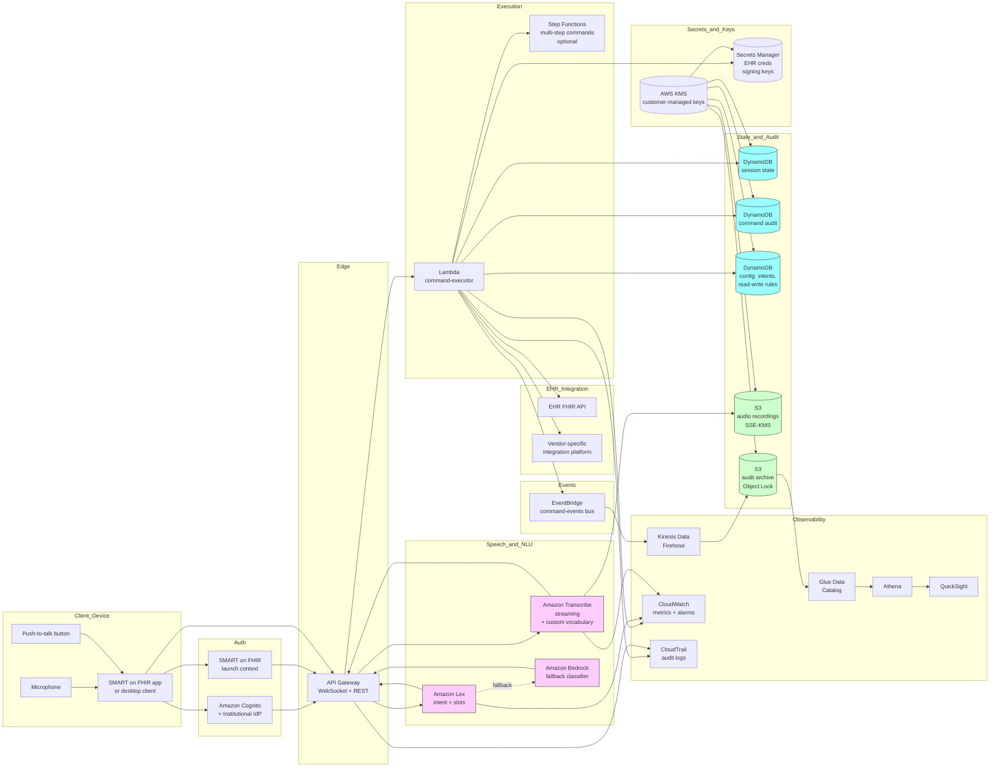

# Recipe 10.3: Voice-to-Text for EHR Navigation ⭐

**Complexity:** Simple-Medium · **Phase:** MVP · **Estimated Cost:** ~$0.001-0.01 per voice command (depending on streaming ASR usage, command frequency per session, and whether intent classification uses a managed bot service or a foundation model)

---

## The Problem

It's a Tuesday afternoon at a busy urology clinic. A physician is in exam room 4 with a 71-year-old patient who is here for follow-up after a recent procedure. The patient is mid-sentence, describing some new symptoms ("...and the burning, it comes and goes, mostly in the morning, and yesterday I think I saw a little bit of blood..."), when the physician realizes she needs to check the operative note from two weeks ago to see exactly which structures were instrumented.

Here is what happens next.

She breaks eye contact with the patient. She turns to the monitor on the rolling cart. She moves the mouse to wake the screen. She clicks into the EHR window. She types her badge PIN because the screen has timed out (again). She navigates from the schedule view, which is what was open, to the patient chart. She searches by patient name because the chart she had open was a different patient from earlier. She clicks the right one. She lands on the chart summary. She clicks "Notes." She filters by encounter type. She finds the operative note. She scans it for the structures involved. She turns back to the patient. The patient has been waiting, in the middle of a sentence, for somewhere between forty seconds and a minute and a half. The patient has lost their train of thought. The conversation has lost its rhythm. The clinical signal in the rest of what the patient was about to say has, possibly, been lost too.

Multiply this by twenty patient encounters a day. Multiply that by hundreds of clinicians at a single health system. Multiply that by tens of thousands of practices nationwide. The aggregate cost of clinicians breaking eye contact with patients to operate the EHR is, in working hours alone, staggering. The clinical cost of disrupted patient narratives is harder to quantify but real: patients telling fragmented histories instead of complete ones, clinicians missing the subtle cue that comes between sentences, follow-up questions that never get asked because the rhythm is broken.

The problem is not that the EHR is bad, exactly. The EHR is doing a complicated job, with regulatory and billing requirements that mean it cannot just be a notebook. The problem is that the input modality is wrong for the moment. Hands-on-keyboard, eyes-on-screen, mouse-clicking through nested menus is the right modality for the half of clinical work that is documentation. It is the wrong modality for the half of clinical work that is *being with the patient*. <!-- TODO: verify; the time-on-EHR-during-patient-encounters versus time-with-patient ratio has been studied extensively, with multiple studies finding that physicians spend roughly half or more of clinical-encounter time on EHR navigation and documentation, but specific figures vary by specialty and study -->

The dream is straightforward to describe and harder to deliver. Imagine the physician above looks toward the screen and says, almost casually, "Show me the operative note from two weeks ago." The chart opens to the right document, scrolled to the right place, in less time than it takes her to finish the sentence. She glances up, reads what she needs, looks back at the patient, says "I see, the burning makes sense given what we found in there, can you tell me more about the blood?" The patient never lost the thread. The clinician never lost eye contact. The EHR navigation happened in the background, where it belongs.

This is recipe 10.3. The technology to do it has actually existed for a while; the engineering to do it well, in a way that clinicians actually adopt and trust, is still being figured out. Voice-to-text for EHR navigation sits at the simple-medium tier of complexity not because the speech recognition is hard (it is mostly not, by 2026 standards) but because the integration with a real clinical EHR, the user-experience design for clinicians who do not want one more thing to learn, and the failure-mode handling when the system mishears a command and pulls up the wrong patient's chart, are all genuinely hard problems that the recipe spends most of its time on.

The cost of getting this wrong is not abstract either. A few specific failure modes that this recipe takes seriously.

The clinician who tries the system for two days, gets frustrated when it mishears "show last labs" as "show wrong patient labs" too often, and never opens the voice mode again. The institution paid for a deployment that nobody uses.

The clinician who *does* adopt the system, but uses it carelessly, and ends up viewing the wrong patient's chart on the rolling cart in the wrong room because the voice command "open patient Smith" matched the wrong Mr. Smith out of three on the schedule that day. The HIPAA implications are immediate; the disclosure obligations are real.

The clinician who issues a command in front of a patient, the system picks up the patient's response in the same audio stream, and the resulting transcript is garbled because the system was trying to decode two voices simultaneously. The command fails or, worse, executes the wrong action.

The clinician who uses the system reliably in the quiet doctor's lounge but cannot get it to work in the actual clinical environment because the ambient noise (HVAC, alarms, conversations in adjacent rooms, the patient's family member talking) drops the recognition accuracy below the usable threshold. The pretty demo did not survive contact with the real deployment.

The privacy-aware patient who notices the rolling cart appears to be listening, asks "Is that thing recording me?", and now the clinician has to explain a system she only half understands while the patient's trust frays in real time.

The clinician who asks the system to "place an order for amoxicillin 500 milligrams twice a day for ten days" and discovers, days later, that voice-driven order entry was not in the configured command vocabulary, and the system silently failed to do anything, and the order never made it to the pharmacy. The patient was never treated. This is not a hypothetical failure mode; the boundary between voice navigation (read-only, viewing) and voice action (write, place orders, sign things) is the most important architectural line in this recipe, and the recipes that blur it cause patient harm.

This recipe is honest about where voice-to-text for EHR navigation works well in 2026 and where it does not. The viewing and navigation use cases ("open patient X," "show last labs," "open the operative note from October," "go back to the previous patient") are largely solved problems that just need careful engineering to deploy responsibly. The action use cases (placing orders, signing notes, completing medication reconciliation) are not, in this recipe; they require additional safeguards (explicit confirmation prompts, hard rules about what voice can and cannot trigger, and in many cases, a separate dedicated dictation product like the medical-transcription recipes in 10.4 and 10.7). Pretending the line does not exist is the fastest way to build a system that hurts patients.

Let's get into it.

---

## The Technology: Short Commands, High Stakes

### The Shape of the Problem

Voice-to-text for EHR navigation is, technically, a constrained-vocabulary speech-to-action system. The caller (in this case, the clinician) speaks short commands; the system recognizes them; the system maps them to specific EHR operations; the system executes those operations and reflects the results in the EHR's interface. A few characteristics of the problem shape every architectural decision.

**Commands are short.** "Open patient John Smith." "Show last labs." "Go to allergies." "Open the operative note from October fourteenth." Most useful commands are between two and twelve words. Compared to the long-form voicemails in recipe 10.2 or the multi-minute clinical conversations in recipe 10.7, these utterances are tiny. Streaming ASR is fast enough that the response can feel instant.

**Vocabulary is bounded.** The set of commands the system supports is, at any given time, a finite list. There might be fifty top-level commands and dozens of slot variants per command, but the total number of patterns is small enough that you can write them down on a whiteboard. This is dramatically different from the open-domain transcription problems in other chapters. It also means you do not need a giant general-purpose ASR model; you need an accurate one on a small, well-defined vocabulary.

**The EHR is the action surface.** Unlike transcription, which produces text artifacts, voice navigation produces actions in another system: the EHR. The EHR's API surface (or, if no API, its automation surface, which often comes down to keystroke injection or screen automation in the worst cases) is where the engineering truly lives. Recognizing the speech is the easy half. Translating "open the operative note from October fourteenth" into the right sequence of EHR operations to actually surface that note in the user interface is the harder half.

**The audio environment is hostile.** The microphone is in an exam room. There are alarms, HVAC, conversations, the patient, the patient's family, the rolling cart's fan, the door opening. Consumer voice assistants are tuned for living rooms; clinical environments are louder, more variable, and have more talking-but-not-to-the-system speech in the background than any consumer environment.

**The user is busy.** The clinician is doing other things. They cannot stop and repeat a command three times because the system did not understand. They cannot navigate a confirmation dialog. They cannot read documentation. The interaction has to be near-zero-friction or they revert to the keyboard and do not come back.

**The stakes of a wrong command vary.** Pulling up the wrong patient's chart is bad: HIPAA implications, clinical implications, trust implications. Pulling up the wrong note for the right patient is annoying but recoverable. Issuing a write action (placing an order, signing a note) on the wrong patient or at the wrong dose is potentially catastrophic. The architecture has to treat read commands and write commands with very different levels of confirmation rigor; recipes that do not, end up either too cautious to be useful or too aggressive to be safe.

These properties combine to make voice-to-text for EHR navigation a recognizably distinct technology problem from the other voice recipes in this chapter. The pieces are familiar (ASR, intent classification, slot extraction). The combination is specific.

### Streaming ASR for Short Commands

The first stage of the pipeline is automatic speech recognition, this time in a streaming, short-utterance mode. The clinician presses a push-to-talk button (or the system continuously listens with a wake word, more on that below); the audio streams to the ASR; the transcript starts to populate within hundreds of milliseconds; once the system detects end-of-utterance, the transcript is finalized.

A few specifics that matter for this use case.

**Streaming, not batch.** The latency budget for a short command, measured from end-of-speech to action-completed, is roughly one to two seconds for the system to feel responsive. (Research on conversational interfaces consistently finds that response times above a couple of seconds feel sluggish; clinicians, who are mid-task, are even less tolerant.) <!-- TODO: verify specific user-study numbers; conversational-interface latency thresholds have been studied across consumer and enterprise contexts --> Streaming ASR is the only way to hit that budget reliably, because batch APIs add round-trip overhead that compounds with the audio capture time.

**Endpointing matters more than you'd think.** Endpointing is the system's decision about when the user has stopped talking. Too aggressive (short timeout) and it cuts the user off mid-command ("open patient John..." cut off before "Smith"). Too conservative (long timeout) and it sits there for an awkward second after the user finished, waiting for more speech that is not coming. Modern endpointers use both acoustic features (silence detection) and linguistic features (does the transcript look like a complete command?) to decide. Tuning is institutional. Push-to-talk sidesteps the problem entirely (the user signals end-of-utterance by releasing the button) at the cost of an extra physical action per command.

**Noise robustness.** Clinical environments are loud. Modern ASR models trained on diverse acoustic environments handle most clinical noise tolerably; older or general-purpose models do not. Beamforming microphones (directional capture, focused on the user's voice and rejecting off-axis noise) make a substantial difference. Headset microphones make an even bigger difference but are unloved by clinicians for ergonomic reasons. A medium-quality mounted microphone on the rolling cart is the typical compromise; a high-quality headset is the gold standard for the early adopters who tolerate it.

**Vocabulary biasing.** Most ASR APIs allow you to provide a list of biased words or phrases that the recognizer should prefer. For EHR navigation, this list includes the patient names on today's schedule, the medications on the patient's active list, the recent encounter dates, the lab panel names, the providers in the practice. Biasing the recognizer toward these specific terms dramatically improves accuracy on the words that drive the commands. The biasing list is dynamic (it changes by clinician, by day, sometimes by patient currently in context); the architecture has to support refreshing it efficiently.

**Confidence scoring per word.** The ASR returns confidence scores. The downstream command logic uses them to gate execution. A high-confidence transcription of a low-stakes command (read-only navigation) executes immediately. A medium-confidence transcription of a high-stakes command (anything that writes to the chart) goes to a confirmation prompt. A low-confidence transcription of any command goes back to the user for re-utterance.

**Per-clinician adaptation.** Most clinicians use the system every day, so the system has the opportunity to learn their voice over time. Speaker-adaptive models, or speaker-dependent fine-tuning, can substantially improve recognition for the specific clinician using the system. The trade-off is operational complexity (per-clinician model artifacts, training pipelines, the privacy considerations of voice-data collection). For an MVP, speaker-independent models with vocabulary biasing get you most of the way; speaker adaptation is a later optimization.

### Wake Word and Push-to-Talk: The Activation Question

Voice-driven systems need an activation signal: a way for the user to say "I am about to speak a command, listen now." There are basically three approaches.

**Push-to-talk.** The clinician presses a button (physical button on the rolling cart, foot pedal, software button on screen, headset button) before speaking. The system records audio while the button is held. Releasing the button signals end-of-command. Advantages: explicit, unambiguous, no false-fires on background speech, easy to understand. Disadvantages: requires a free hand or a foot, requires the clinician to remember the gesture, adds friction.

**Wake word.** The system continuously listens for a specific phrase ("hey EHR," "okay chart," institutional wake word of choice) that signals the start of a command. After the wake word, the next utterance is treated as the command. Advantages: hands-free, low friction. Disadvantages: false-fires (the clinician says "hey doctor" in conversation and the system wakes up), requires continuous listening (privacy and audit implications), wake-word-detection accuracy in noisy clinical environments is meaningfully worse than in consumer environments.

**Always-on listening with intent gating.** The system is always listening; an intent classifier on the transcript decides whether each utterance is a command for the system or just background speech. Advantages: zero activation friction, feels natural. Disadvantages: dramatically higher false-fire rate, much heavier privacy burden (continuous transcription of all speech in the room), requires extremely robust intent classification to filter out non-commands.

For clinical environments, push-to-talk is the safe default for MVP and most production deployments. The friction is real but manageable, and the false-fire risk is meaningfully lower. Wake-word activation is a reasonable second-phase enhancement, with a carefully chosen wake word that is unlikely to occur in normal clinical speech. Always-on is rarely the right choice in a clinical environment; the audit and privacy implications of recording everything said in an exam room are substantial. Some early ambient-documentation vendors (recipe 10.7) blurred the line; the regulatory and trust scrutiny they encountered should inform the design choice here.

### Intent Classification and Slot Extraction

Once the transcript is finalized, the next stage is intent classification with slot extraction. The transcript "open patient John Smith" maps to `{intent: "open_patient", slots: {patient_name: "John Smith"}}`. "Show last labs" maps to `{intent: "show_recent_results", slots: {result_type: "labs", time_range: "most_recent"}}`. "Open the operative note from October fourteenth" maps to `{intent: "open_note", slots: {note_type: "operative", date: "2026-10-14"}}`.

The intent and slot taxonomy is institutional and grows over time. A typical MVP starts with eight to fifteen intents covering the most common navigation patterns: open patient, switch to a chart section (allergies, medications, problem list, vitals, history), show recent results (labs, imaging, pathology), open a specific note (by type, by date, or by author), navigate the schedule (next patient, previous patient, today's schedule), and a few utility commands (go back, scroll down, log out). Each intent has its own slot schema; "open patient" needs a patient identifier; "open note" needs note type and optionally date and author; "navigate schedule" needs a relative-time descriptor.

Several implementation approaches work for this layer.

**Rule-based pattern matching.** Define regex or keyword patterns for each intent. "If the transcript starts with 'open patient' and the rest is a name pattern, it's open_patient with the name as the slot." Easy to build and debug; brittle to phrasing variation. Fine for the first version of the system; gets unwieldy as the intent set grows.

**Vendor-managed bot frameworks.** Most cloud providers offer a managed conversational-AI service (Amazon Lex, Google Dialogflow, Microsoft LUIS, etc.) that handles intent classification and slot filling with a configuration-driven approach. You define intents, give example utterances, define slots and their types, and the platform's underlying NLU model generalizes. The advantages: fast to set up, mature slot filling (built-in support for dates, numbers, person-name extraction), built-in dialog management for multi-turn flows, well-integrated with the cloud's ASR services. The disadvantages: per-call cost, vendor lock-in, opaque NLU behavior.

**LLM-based classification.** Send the transcript to a foundation model with a prompt describing the intent taxonomy and slot schema; the model returns structured output. Modern LLMs are excellent at this with few-shot prompting. The advantages: zero training data, easy to extend, handles weird phrasings gracefully, can return structured slot data and a rationale in the same call. The disadvantages: per-call latency (LLM inference adds hundreds of milliseconds, which competes with the responsiveness budget), per-call cost (small but non-zero, multiplies by command volume), occasional hallucinated intents that are not in your taxonomy (validate strictly).

**Hybrid.** A common pattern in 2026: a fast rule-based or vendor-bot layer handles the common, well-defined commands; an LLM-based fallback handles the long tail of unusual phrasings. The rule layer keeps latency low for the 80% of commands that fit neat patterns; the LLM catches the 20% that does not. The classification result is the same structured intent-and-slots regardless of which layer produced it.

For the slot-extraction half specifically, certain slot types deserve special treatment.

**Patient identity slots.** The slot value "John Smith" is ambiguous if there are multiple John Smiths in today's schedule, in the active panel, or in the system overall. The architecture has to disambiguate: most-likely-given-context (today's schedule, current location, current clinician's panel) wins; ties go to a confirmation prompt. Voice-driven patient lookup must never silently pick a patient when the input is ambiguous. The cost of opening the wrong chart is too high.

**Date slots.** "October fourteenth," "two weeks ago," "yesterday's labs," "last visit." Relative dates need to be resolved against a reference timestamp (typically "now"). Date parsing is a solved problem (well-tested libraries exist for English; multilingual support varies); the slot extractor should canonicalize all dates to ISO 8601 before downstream processing.

**Medication and lab slots.** "My, I mean the patient's, lisinopril." "Last troponin." Medical-vocabulary slots benefit from ontology mapping (RxNorm for medications, LOINC for labs) so that downstream EHR queries are unambiguous. The medical entity extractors discussed in recipe 10.2 (Comprehend Medical, similar) are useful here as a slot-canonicalization layer.

**Free-text slots.** Some commands have free-text components ("note that the patient mentioned new burning"). These are the boundary between navigation (this recipe) and dictation (recipe 10.4); free-text slots in navigation commands should be short and the recipe should be cautious about supporting them.

### EHR Integration: The Half That Is Actually Hard

Once you have a structured intent-and-slots, you need to execute it against the EHR. This is where the recipe gets specific to the deployed environment in a way that most voice-AI recipes do not. EHR vendors differ wildly in what they expose for third-party voice integration.

**Modern API-based integration (FHIR, vendor-specific APIs).** Some EHRs expose RESTful APIs (FHIR for cross-vendor patient data, vendor-specific APIs for proprietary functionality, SMART on FHIR for clinician-context-aware app integration). Where these APIs are available, the integration is conventional: authenticate as the clinician (typically via SMART on FHIR's launch context), call the right API to fetch or filter data, render the result in your client. The bandwidth and accuracy of the integration is good; the latency is reasonable; the audit trail is clean. <!-- TODO: verify specific FHIR-API capabilities by EHR vendor; FHIR R4 and SMART on FHIR are widely supported but coverage of write operations and proprietary navigation actions varies dramatically -->

**SMART on FHIR launch and embedded apps.** A SMART on FHIR app launches inside the EHR's user interface (typically as an iframe or a side panel) with a context handoff that includes the current patient and the current clinician. The voice-navigation app can render itself inside this launch context and execute its actions against the host EHR's APIs. This is the cleanest integration model for clinically-aware voice navigation in 2026. It works well for read-side commands (open chart sections, show results, retrieve notes) and for some write-side commands (place a CDS-Hooks-style suggestion that the clinician confirms). Coverage of write operations is uneven across EHR vendors. <!-- TODO: verify; SMART on FHIR support is broad across major EHR vendors but specific feature coverage continues to evolve -->

**Vendor-specific integration platforms.** Some EHR vendors (notably Epic with its App Orchard / Showroom marketplace, Cerner/Oracle Health with its Code Console, and others) offer vendor-specific extension frameworks that go beyond FHIR. These provide deeper access to proprietary functionality (Epic's Hyperspace UI extensions, Cerner's PowerChart MPages) at the cost of platform-specific integration work. Voice-navigation products targeting a specific EHR ecosystem usually leverage these. <!-- TODO: verify current vendor program names and capabilities; EHR vendor extension programs change names and structures over time -->

**Screen automation and keystroke injection (the legacy path).** Some EHRs do not expose adequate APIs for the navigation operations a voice-driven system needs. In those environments, the integration falls back to UI automation: simulating keystrokes and mouse clicks to drive the EHR's existing user interface. This is the worst integration model. It is brittle (UI changes break the automation), high-friction (it requires desktop-level access), and limited (some EHR operations cannot be reliably automated this way). It exists, and some commercial voice products use it, but it is the integration model of last resort. The recipe will note where it is used but not recommend it.

The integration model determines what voice commands are even feasible. In an API-rich environment, "open the operative note from October fourteenth" is a couple of API calls. In a UI-automation environment, it is a sequence of mouse-click locations that have to be recorded by a configuration person and tested whenever the EHR updates. The same command, the same intent classifier, the same speech recognition, but the engineering cost on the back end is two orders of magnitude different.

### State and Context

A voice-driven EHR navigation system has to track state across commands. "Open patient John Smith" sets the current-patient context. The next command, "show last labs," has an implicit slot: which patient? The current one. "Go to allergies" similarly. The system has to maintain a context object that includes the current patient, the current chart section, the current note (if open), the current ordering session (if active), and the clinician's identity (which is the audit-and-permissions backbone for everything else).

The context lives in two places. The voice-navigation system maintains its own context for command interpretation. The EHR maintains its own context for data display. These two have to stay in sync. When the EHR has a different patient open than the voice system thinks (because the clinician clicked something in the EHR UI directly without going through voice), commands like "show last labs" are ambiguous: which patient does the clinician mean, the one the EHR is showing or the one the voice system thinks is current? The architectures that handle this best treat the EHR's display context as the authoritative source of truth and the voice system's context as a derived view that re-syncs from the EHR before each command. The architectures that do not, end up showing data for one patient while the clinician thinks they are looking at a different patient. This is a HIPAA-grade error and easy to make.

A specific state-management failure to call out: rolling carts that move from room to room. A clinician walks out of room 4, where she had Mr. Smith's chart open, and into room 5 to see Mrs. Davis. If the voice system did not pick up the room change and she says "show last labs," the system might still be in Mr. Smith's context. The labs displayed are Mr. Smith's labs. The clinician is looking at them while sitting next to Mrs. Davis. This is the kind of subtle context-confusion failure that would be embarrassing in a consumer product and is dangerous in a clinical product. Mitigations include explicit room change events (badge tap, RFID, door sensor), explicit patient confirmation on every patient switch ("now showing Mr. Smith"), and a context-staleness timeout (if no command has been issued in N minutes, the next command requires explicit patient confirmation).

### Confirmation and the Read-Write Boundary

The single most important architectural decision in this recipe is where the read-write boundary sits and how confirmations are handled across it.

**Read-only commands.** Open a chart, navigate to a section, show results, open a note. These are queries. They show information. They do not change anything in the patient's record. The cost of a wrong read command is annoyance, possible HIPAA exposure if the wrong chart opens, and a recovery action (close, try again). For these commands, immediate execution is appropriate when the intent classification confidence is high; explicit confirmation is appropriate when confidence is low or when the slot extraction is ambiguous (multiple patients match the requested name).

**Write commands.** Place an order, sign a note, complete medication reconciliation, mark a result as reviewed, send a referral, close an encounter. These change the record. They have downstream effects (the order goes to the pharmacy, the signed note becomes legally binding, the reconciliation is treated as having been done). The cost of a wrong write command can be catastrophic. For these commands, voice should never be the sole input modality. The acceptable patterns are: (1) voice initiates a draft action that the clinician then confirms with a non-voice modality (a button press, a typed signature, a separate authenticated step); or (2) voice is disallowed for write actions entirely, and the clinician switches to keyboard-and-mouse for any state-changing operation. MVP deployments typically choose option 2; more mature deployments graduate selectively into option 1 for low-stakes write actions (e.g., marking a non-clinical task complete) while keeping critical write actions (order entry, signing) outside voice scope.

The architectures that get this wrong fall into two failure modes. Some allow voice writes too freely and produce harmful errors when commands are misrecognized; the institution then either pulls the feature or restricts it dramatically. Some restrict voice so cautiously that even read commands require confirmations, which destroys the user-experience benefit and drives clinicians away. The right answer is asymmetric rigor: light-touch on reads, heavy-touch on writes, with the read-write boundary explicitly defined in configuration and reviewed by clinical operations.

### Where the Field Has Moved

Some practical updates worth knowing.

**Cloud telephony-grade ASR is now the baseline for clinical voice navigation.** Five years ago, on-device ASR was a meaningful option for low-latency commands. Today, cloud-streaming ASR with sub-second latency, combined with vocabulary biasing and speaker-adaptive models, generally outperforms on-device alternatives even on the latency dimension. The exception is air-gapped deployments (some hospitals' networks are intentionally segmented from the public cloud), where on-device or on-premise ASR remains relevant. <!-- TODO: verify; cloud-streaming ASR performance and on-device alternatives continue to evolve -->

**Vendor managed bot platforms have absorbed most of the NLU work.** Building a bespoke intent classifier for fifty navigation intents is, in 2026, rarely worth the engineering investment over configuring a managed bot platform with the same intents. The managed platforms have incorporated the LLM advances of the past few years; the NLU quality is competitive with custom-trained classifiers; the integration with cloud ASR is one less seam to manage.

**SMART on FHIR has become the lingua franca for clinical app integration.** Major EHR vendors support some level of SMART on FHIR launch; this has reduced the integration cost for clinically-aware voice navigation substantially compared to the pre-FHIR era. The coverage of write operations through FHIR R4 and R5 has expanded but is still uneven. <!-- TODO: verify; FHIR R4 and R5 write-side coverage continues to expand but is variable across vendors and use cases -->

**Voice-driven dictation and voice-driven navigation have become distinct product categories.** Five years ago, "voice in the EHR" was a single product space dominated by Nuance Dragon Medical and a few competitors, primarily focused on dictation. Today, dictation (recipe 10.4) and ambient documentation (recipe 10.7) are distinct product categories from navigation (this recipe), and the build-versus-buy considerations for each are different. Some clinicians may use multiple voice products simultaneously (dictation for documentation, navigation for chart access, ambient for the patient encounter); the integration patterns that allow these to coexist without conflicting (one wake word, multiple downstream products) are an emerging engineering pattern. <!-- TODO: verify; the voice-product category fragmentation in healthcare and the integration patterns continue to evolve -->

**Hands-free clinical computing has expanded beyond voice.** Foot pedals, gesture recognition, eye tracking, and other input modalities are increasingly used alongside voice. Voice is best for explicit commands; eye tracking is best for navigation (where to look on screen); foot pedals are best for binary actions (advance, confirm). The recipes that limit themselves to voice-only inputs are leaving usability on the table; the production-ready deployments often combine voice with at least one other hands-free modality.

**Audit and access logging has become a baseline requirement.** Voice-driven EHR access is, from a HIPAA perspective, EHR access. Every command, every chart open, every result view has to be logged with the same fidelity as keyboard-driven access. Early voice products sometimes treated this as an afterthought; institutional security review now treats it as a launch requirement.

---

## General Architecture Pattern

A voice-to-text EHR navigation system splits cleanly into seven logical stages: activation (the user signals intent to issue a command), audio capture (microphone, push-to-talk, optional wake word detection), transcription (streaming ASR with vocabulary biasing), command parsing (intent classification and slot extraction), context resolution (which patient, which encounter, which clinician, which device), execution (against the EHR via API, SMART on FHIR, or fallback automation), and feedback (visual confirmation in the EHR, optional voice confirmation, audit log).

```
┌──────────────────── ACTIVATION ──────────────────────────┐
│                                                           │
│   [User signals start of command]                         │
│    - Push-to-talk button (recommended for MVP)            │
│    - Foot pedal (good for hands-free clinical work)       │
│    - Wake word (optional, with carefully chosen phrase)   │
│   [System acknowledges activation visually or audibly]    │
│    - Brief tone or LED indicator so the user knows the    │
│      system is listening                                  │
│           │                                               │
│           ▼                                               │
│   [Output: activated session with start timestamp,        │
│    clinician identity, device identity]                   │
│                                                           │
└───────────────────────────────────────────────────────────┘

┌──────────────────── AUDIO CAPTURE ───────────────────────┐
│                                                           │
│   [Microphone captures audio]                             │
│    - Beamforming microphone preferred for noisy clinical  │
│      environments; headset is gold standard               │
│    - Sample rate at least 16 kHz                          │
│   [Stream audio to transcription endpoint]                │
│    - WebSocket or vendor SDK preferred over batch HTTP    │
│   [End-of-utterance detection]                            │
│    - Push-to-talk: button release ends the utterance      │
│    - Wake word: acoustic + linguistic endpointer          │
│           │                                               │
│           ▼                                               │
│   [Output: audio stream with end-of-utterance signal]     │
│                                                           │
└───────────────────────────────────────────────────────────┘

┌──────────────────── TRANSCRIPTION ───────────────────────┐
│                                                           │
│   [Streaming ASR with vocabulary biasing]                 │
│    - Bias list refreshed per session: today's schedule,   │
│      current patient's medications and recent encounters, │
│      providers in the practice, common command phrases    │
│    - Per-word and per-utterance confidence scores         │
│                                                           │
│   [Partial transcripts emitted progressively]             │
│    - Optional: display partial transcript to user as      │
│      visual feedback ("listening: open patient...")       │
│                                                           │
│   [Final transcript on end-of-utterance]                  │
│    - Average confidence checked against threshold         │
│    - Below threshold: prompt user to repeat               │
│           │                                               │
│           ▼                                               │
│   [Output: finalized transcript, per-word confidence,     │
│    average confidence, session metadata]                  │
│                                                           │
└───────────────────────────────────────────────────────────┘

┌──────────────────── COMMAND PARSING ─────────────────────┐
│                                                           │
│   [Intent classifier]                                     │
│    - Vendor bot, rule-based, LLM, or hybrid               │
│    - Returns intent + per-intent confidence               │
│    - Out-of-vocabulary returned as "unknown" intent       │
│                                                           │
│   [Slot extraction]                                       │
│    - Patient name, date, note type, result type, etc.     │
│    - Medical-vocabulary slots canonicalized via ontology  │
│      (RxNorm for medications, LOINC for labs)             │
│                                                           │
│   [Read-write classification]                             │
│    - Determine whether this command is read-only or       │
│      write-class                                          │
│    - Write-class commands require additional confirmation │
│           │                                               │
│           ▼                                               │
│   [Output: structured command object with intent, slots,  │
│    read-or-write classification, all confidences]         │
│                                                           │
└───────────────────────────────────────────────────────────┘

┌──────────────────── CONTEXT RESOLUTION ──────────────────┐
│                                                           │
│   [Sync with the EHR's current context]                   │
│    - What patient does the EHR currently have open?       │
│    - This is the authoritative current-patient identity   │
│      unless the command explicitly switches it            │
│                                                           │
│   [Resolve patient slot if present]                       │
│    - Ambiguous match (multiple Smiths today): prompt for  │
│      disambiguation; do NOT silently pick                 │
│    - No match: prompt for clarification                   │
│    - Unique match: proceed                                │
│                                                           │
│   [Confirm encounter and ordering context]                │
│    - Voice command issued during an open ordering session │
│      may carry forward the order context; otherwise the   │
│      context is the patient view                          │
│                                                           │
│   [Apply staleness checks]                                │
│    - Has the device been idle past N minutes? Then        │
│      treat the next command as starting a new session     │
│    - Has the room or location changed? Confirm patient    │
│      explicitly                                           │
│           │                                               │
│           ▼                                               │
│   [Output: command object enriched with resolved context, │
│    or routed to a disambiguation/confirmation flow]       │
│                                                           │
└───────────────────────────────────────────────────────────┘

┌──────────────────── CONFIRMATION (when needed) ──────────┐
│                                                           │
│   [Display proposed action to user]                       │
│    - Visual confirmation card: "Open Mr. John Smith's     │
│      chart? [Yes] [No]"                                   │
│    - Or audio confirmation: "I heard 'open patient John   │
│      Smith.' Should I proceed?"                           │
│                                                           │
│   [User confirms or rejects]                              │
│    - Confirm via button press, voice ("yes/no"), or       │
│      timeout (auto-cancel)                                │
│                                                           │
│   [For write-class commands, confirmation is mandatory    │
│    and must be non-voice (button press, typed signature)] │
│           │                                               │
│           ▼                                               │
│   [Output: confirmed command ready for execution, or      │
│    cancellation event for the audit log]                  │
│                                                           │
└───────────────────────────────────────────────────────────┘

┌──────────────────── EXECUTION ───────────────────────────┐
│                                                           │
│   [Translate command to EHR operation]                    │
│    - SMART on FHIR app: API call against the EHR's FHIR   │
│      endpoints with the launch-context auth               │
│    - Vendor-specific platform: vendor SDK call            │
│    - UI automation (last resort): scripted keystroke or   │
│      click sequence                                       │
│                                                           │
│   [Execute and capture result]                            │
│    - Success: chart navigation completed, data displayed  │
│    - Failure: API error, EHR unreachable, permission      │
│      denied                                               │
│                                                           │
│   [Update voice-system context to reflect execution]      │
│    - If patient context changed, record new patient       │
│    - If section context changed, record new section       │
│           │                                               │
│           ▼                                               │
│   [Output: execution result, EHR state change recorded]   │
│                                                           │
└───────────────────────────────────────────────────────────┘

┌──────────────────── FEEDBACK & AUDIT ────────────────────┐
│                                                           │
│   [Visual feedback in the EHR]                            │
│    - The chart actually opens, the section actually       │
│      navigates, the result actually displays              │
│                                                           │
│   [Optional spoken acknowledgment]                        │
│    - "Showing Mr. Smith's labs from October fourteenth"   │
│    - Use sparingly; in patient-facing settings, consider  │
│      visual-only feedback to avoid privacy exposure       │
│                                                           │
│   [Audit log entry]                                       │
│    - Clinician identity, device identity, timestamp       │
│    - Original transcript, parsed intent, slot values      │
│    - Resolved context (patient ID, encounter ID)          │
│    - Execution result and EHR state change                │
│    - Confidence scores from each pipeline stage           │
│                                                           │
│   [Telemetry to observability layer]                      │
│    - Latency per stage, success/failure rates,            │
│      disambiguation events, confirmation events           │
│           │                                               │
│           ▼                                               │
│   [Output: visible action, durable audit, telemetry       │
│    feeding continuous improvement]                        │
│                                                           │
└───────────────────────────────────────────────────────────┘
```

<!-- TODO (TechWriter): Expert review A1 (HIGH). The Feedback & Audit stage's telemetry block is structurally underspecified for the recipe's recipe-specific equity stakes. Promote the prose elevation in "Where it Struggles" and the production-gaps "Subgroup-stratified accuracy monitoring with named ownership" item into this stage with: (1) a cohort-dimensions allow-list (per-clinician identifier as the load-bearing axis, per-clinician language-background where opt-in declared at onboarding, accent-group where inferable from ASR diagnostic data, specialty, experience-level, deployment-site); (2) per-cohort metrics including ASR average word confidence, command success rate, disambiguation rate, confirmation rate, retry rate, adoption rate, and abandonment rate; (3) per-cohort sample-size minimums (reliable >=200, noisy 50-199 with wide CI, insufficient <50 aggregated to "all_other"); (4) disparity-alert thresholds at the equity-monitoring committee's monthly review queue; (5) named ownership (cross-functional equity-monitoring committee with rotating clinician seat, quarterly written summary, explicit escalation path on sustained disparities). This is the chapter pattern from Recipe 10.1 Finding A1 and Recipe 10.2 Finding A1 with the recipe-specific per-clinician-language-background dimension and the recipe-specific adoption-correlation dimension. -->

A few cross-cutting design points the architecture has to bake in.

**Activation must be unambiguous.** Whatever activation pattern is chosen (push-to-talk, wake word, foot pedal), the system must give immediate visible or audible feedback that it is listening. Without this, the user does not know whether the system heard them, and the result is repeated commands and frustration. A small LED on the device, a sound effect, or a screen indicator solves this; omitting it is a common MVP mistake.

**Patient identity is the highest-stakes slot.** Every command that includes a patient slot must resolve it against the day's schedule, the clinician's panel, or a broader index, with explicit handling for zero-match and multiple-match cases. The system must never silently pick a patient when the input is ambiguous. The cost of a misrouted patient command is the cost of opening the wrong patient's chart, which is a HIPAA event.

**The EHR is the source of truth, not the voice system.** Voice-system context drift (the system thinks patient A is current; the EHR has patient B open) leads to data displayed for the wrong patient. The architecture must re-sync from the EHR's current context before each command, not maintain a parallel context independently.

<!-- TODO (TechWriter): Expert review A2 (MEDIUM). Add a cross-cutting design point bounding the check-then-act gap between context re-fetch (Step 4A) and command execution (Step 6). The architecturally-correct pattern is either (a) snapshot preconditions on the EHR API where supported (an If-Match-style precondition on the EHR's current state; the EHR API rejects the command if the snapshot identifier does not match) or (b) immediate re-fetch before each EHR API call with abort-on-context-change semantics, surfacing a "context changed; please re-confirm patient" prompt. The voice system never operates on a resolved context that may have drifted between resolution and execution. Recipe-specific because shared rolling carts let one clinician switch the EHR's active patient between another clinician's resolution and execution. -->

**Audit is non-negotiable.** Every command, every executed action, every confirmation, every cancellation goes into the audit log with the same fidelity as keyboard-driven EHR access. The audit log is not a feature; it is a baseline regulatory requirement.

<!-- TODO (TechWriter): Expert review S1 (HIGH). Add a cross-cutting design point elevating the references-not-content audit discipline: the command audit table records who issued what command against which patient with what outcome by capturing references (transcript_archive_ref, slot_values_archive_ref, ehr_api_calls_archive_ref) plus structural metadata (lengths, hashes, slot_keys_present) plus non-content identifiers (clinician ID, patient ID, command ID, timestamp). The full transcript content, the full slot values, and the full EHR API call detail live in a secure archive (S3 with KMS, lifecycle aligned with the audio-bucket governance). This prevents the audit table from becoming a parallel PHI store with different access boundaries and different retention semantics from the audio archive. -->

**Read commands and write commands have different rigor.** Read commands can execute on confidence; write commands require explicit, typically non-voice, confirmation. The boundary is configuration, not code, so clinical operations can review and adjust.

**Continuous adaptation is the long game.** Production traffic surfaces commands the original taxonomy missed, phrasings the classifier handles poorly, and slot patterns the extractor mangles. The pipeline must capture this telemetry (transcripts, classifications, user corrections, abandoned commands) and feed it into the improvement workflow. A voice-navigation system that ships and never improves is one that decays as the EHR and clinical practice evolve around it.

**Failure must degrade gracefully.** When ASR is slow, when the classifier is uncertain, when the EHR API is unreachable, the system must fail in a way that the clinician understands and can recover from quickly. A failed command should never leave the EHR in a partial state. A timeout should clearly indicate "system unavailable" rather than silent inaction. The clinician must always be able to fall back to keyboard-and-mouse without restarting anything.

---

## The AWS Implementation

### Why These Services

**Amazon Transcribe (streaming) for ASR.** Transcribe's streaming API delivers low-latency partial transcripts over WebSocket, supports vocabulary biasing through custom vocabularies and custom language models, returns per-word confidence, and is HIPAA-eligible under BAA. For short-command navigation specifically, the streaming variant is the right default. Transcribe Medical is also an option when the command vocabulary includes substantial clinical terminology (medication names, lab panel names); for pure navigation without clinical entity slots, the general-purpose Transcribe with a custom vocabulary is usually sufficient and lower-cost. <!-- TODO: verify; Transcribe Medical streaming and the trade-off between Transcribe Medical and general-purpose Transcribe with custom vocabulary continues to evolve -->

**Amazon Lex for intent classification and slot filling.** Lex is the managed conversational-AI platform that ships with intent definition, slot types (built-in support for dates, numbers, person names; custom slot types for clinical entities), and dialog management. For an EHR navigation MVP, Lex is the pragmatic starting point: a small set of intents, a few sample utterances per intent, and the platform handles the NLU layer with sub-second latency. Lex bot builds are HIPAA-eligible under BAA. For institutions that prefer LLM-based classification, Bedrock is the alternative; the trade-offs were discussed above.

**Amazon Bedrock for fallback and complex slot extraction.** When the rule-based or Lex layer cannot confidently classify a command, a Bedrock-hosted foundation model can serve as a fallback that handles the long tail of unusual phrasings. Bedrock is also useful for complex slot extraction (extracting structured note metadata from a free-form date description, for example). The same caveats from recipe 10.2 apply: validate output against your taxonomy, treat the transcript as untrusted user input in the prompt, and instrument the disagreement-with-human-review metric.

**AWS Lambda for command execution and EHR integration.** The execution stage runs in a Lambda that authenticates as the clinician (typically via the SMART on FHIR launch context's access token), translates the structured command into one or more EHR API calls, and returns the result. Lambda's per-invocation isolation matches the per-command execution model; cold-start latency on Lambda's recent Java/Node/Python runtimes is acceptable for the latency budget when the function is warm.

**Amazon API Gateway for the client-facing endpoint.** The voice-navigation client (the SMART on FHIR app, the mobile app, the desktop client) calls API Gateway endpoints that proxy to the Lambda functions. API Gateway provides authentication enforcement, rate limiting, request logging, and a stable contract.

**Amazon Cognito (or institutional IdP via OIDC/SAML) for authentication.** Clinician identity is the audit-and-permissions backbone. Cognito federation with the institutional identity provider gives the voice navigation app authenticated clinician sessions; SMART on FHIR launch handles the additional context handoff with the EHR.

**Amazon DynamoDB for session state, command audit, and configuration.** A session-state table tracks the active command session per device (current patient context, last command, staleness timestamp). A command-audit table durably records every command issued, parsed, executed, with all confidences and outcomes. A configuration table holds the intent taxonomy, the read-write classification rules, the per-clinician preferences. All tables encrypted with customer-managed KMS.

**Amazon S3 for audio recordings (when retained) and audit-log archive.** Audio recordings of commands are PHI-class and must be encrypted with customer-managed KMS. Many deployments retain audio briefly for QA and disagreement review, then discard it; the architecture supports both retain-briefly and discard-immediately patterns. Audit logs flow to S3 via Kinesis Data Firehose for long-term retention with Object Lock in compliance mode.

**AWS KMS for cryptographic-key custody.** Customer-managed KMS keys for the audio bucket, the audit bucket, the DynamoDB tables, the Secrets Manager secrets. Different keys per data class for blast-radius containment.

**AWS Secrets Manager for EHR integration credentials and signing keys.** The Lambdas that call EHR APIs need credentials (client IDs, signing keys for SMART on FHIR backend services authentication, vendor-specific tokens). Secrets Manager stores them with rotation per the institutional cadence.

**Amazon CloudWatch and AWS CloudTrail for observability and audit.** CloudWatch tracks operational metrics (per-stage latency distributions, ASR confidence histograms, intent classifier confidence distributions, command success rates, EHR API success rates, disambiguation event counts). CloudTrail captures the API-level audit trail against PHI-bearing resources (DynamoDB audit table, S3 audio bucket, KMS keys, Secrets Manager secrets, Bedrock invocations, Transcribe streaming sessions, Lex bot invocations).

**Amazon EventBridge for cross-system events.** Command events (issued, executed, failed, disambiguated, abandoned) flow to EventBridge so downstream consumers (operational dashboards, the analytics layer, the EHR integration's audit overlay) can react without tight coupling to the execution Lambda.

**AWS Step Functions (optional) for multi-step commands.** Most navigation commands execute in a single Lambda call. A small subset of commands (e.g., "open the operative note from October fourteenth and scroll to the closure section") map to multi-step EHR operations that benefit from Step Functions orchestration with retry semantics and per-step audit. For MVP, single-Lambda execution is sufficient; Step Functions becomes useful as the supported command set grows.

**Amazon Kinesis Data Firehose, AWS Glue, Amazon Athena for analytics.** Audit-log events flow through Kinesis Firehose into S3 for long-term retention; Glue catalogs them; Athena provides SQL access for the operational analytics (commands per clinician per day, success rate by intent, latency distributions, disambiguation rates). Amazon QuickSight (optional) renders the dashboards for clinical operations and IT operations consumers.

### Architecture Diagram



### Prerequisites

| Requirement | Details |
|-------------|---------|
| **AWS Services** | Amazon Transcribe (streaming, optionally Transcribe Medical), Amazon Lex, Amazon Bedrock (optional, for LLM fallback), AWS Lambda, Amazon API Gateway, Amazon Cognito, Amazon DynamoDB, Amazon S3, AWS KMS, AWS Secrets Manager, Amazon CloudWatch, AWS CloudTrail, Amazon EventBridge, Amazon Kinesis Data Firehose, AWS Glue, Amazon Athena. Optionally: AWS Step Functions, Amazon QuickSight. |
| **External Inputs** | EHR integration surface: SMART on FHIR app launch context (preferred), vendor-specific extension platform (Epic App Orchard, Cerner Code Console, etc.), or UI-automation library (last resort). The day's schedule, the clinician's panel, and the active patient list per device for vocabulary biasing and patient-slot resolution. The clinical-command taxonomy and read-write classification rules, reviewed by clinical operations. A representative validation set of voice commands (ideally collected from pilot clinicians, labeled with intent and slot ground truth). Microphone hardware (beamforming preferred, headset for power users). Activation hardware (push-to-talk button, foot pedal, or wake-word-capable always-on capture). |
| **IAM Permissions** | Per-Lambda least-privilege roles. The command-executor Lambda has scoped invocation rights for Transcribe streaming sessions, Lex bot invocations, the specific Bedrock model and inference profile, the EHR FHIR endpoints (via Secrets Manager-stored credentials), the session-state and command-audit DynamoDB tables, and the EventBridge events bus. API Gateway-to-Lambda integration with Cognito authorizer pinned to the clinician identity scope. Avoid wildcard actions and resources in production. <!-- TODO (TechWriter): Expert review S3 (MEDIUM). Specify that the command-executor Lambda's resource-based policy pins the invoking principal to the production API Gateway's stage ARN with the production version. The Lambda rejects invocations from any other API Gateway, any other stage, or any other principal. Add a defense-in-depth event-payload check at the start of the Lambda validating requestContext.apiId against the production constant, with development environments deploying their own development command-executor Lambda. --> |
| **BAA and Compliance** | AWS BAA signed. Transcribe (and Transcribe Medical), Lex, Bedrock (verify the specific models and regions covered), Lambda, API Gateway, Cognito, DynamoDB, S3, KMS, Secrets Manager, CloudWatch Logs, CloudTrail, EventBridge, Kinesis Firehose, Athena are HIPAA-eligible (verify the current list at build time against the AWS HIPAA Eligible Services Reference). <!-- TODO: verify; the AWS HIPAA-eligible services list and the specific Bedrock models covered under BAA continues to evolve --> EHR vendor agreements: confirm the EHR vendor's terms permit the SMART on FHIR app pattern with the read and (where applicable) write scopes you intend to use; some vendors restrict third-party app behavior for clinical-grade integrations. Patient-disclosure considerations: the practice may need to disclose to patients (signage in the room, informed-consent language at intake) that the rolling cart includes a voice-activated computing device, even though the device is only listening when activated. Specific disclosure obligations vary by jurisdiction and institutional policy. <!-- TODO: verify; recording-disclosure law for explicitly user-activated, command-only voice systems differs from continuous-recording disclosure law; institutional general counsel is the authoritative source --> |
| **Encryption** | Audio recordings (when retained): SSE-KMS with customer-managed keys, retention bound to the QA review window (typically a few days to a few weeks), then automatic deletion via lifecycle policy. Audit log archive: SSE-KMS with customer-managed keys, retention sized to the longer of HIPAA's six-year minimum and the institution's regulatory floor. DynamoDB tables (session state, command audit, configuration): customer-managed KMS at rest. Lambda environment variables: KMS-encrypted. Lambda log groups: KMS-encrypted. Secrets Manager: customer-managed KMS. TLS in transit for all EHR API calls and all AWS API calls (default). <!-- TODO (TechWriter): Expert review A8 (MEDIUM). Specify retain-briefly with a 7-30 day window as the recommended default for audio recordings, and discard-immediately as the conservative alternative for institutions with strict PHI minimization. The choice is a deployment-time decision documented by clinical-operations and compliance review. The audit log (per S1's references-not-content discipline) is the long-term forensic-reconstruction substrate; audio retention is a short-term QA-and-disagreement-review substrate. --> |
| **VPC** | Production: Lambdas that call back-office APIs (the EHR integration in particular) run in VPC with subnets that have controlled egress to the EHR's network (often a private peering connection or VPN to the on-premise EHR system). VPC endpoints for DynamoDB, S3, KMS, Secrets Manager, CloudWatch Logs, EventBridge, Bedrock, Lex, and Transcribe so the Lambdas do not need NAT for AWS-internal calls. Endpoint policies pin access to the specific resources the pipeline uses. For SMART on FHIR-based integrations against a cloud-hosted EHR, the integration may not require on-premise network connectivity; for on-premise EHRs, the network topology is typically the longest-lead-time portion of the deployment. |
| **CloudTrail** | Enabled with data events on the audit-log S3 bucket, the DynamoDB audit table, the Secrets Manager secrets, and the customer-managed KMS keys. Lambda invocations logged. API Gateway access logs enabled. Lex bot invocations logged. Transcribe streaming session start and stop logged. CloudTrail logs in a dedicated S3 bucket with Object Lock in Compliance mode and lifecycle to S3 Glacier Deep Archive after 90 days. Audit retention sized to the longer of HIPAA's six-year minimum and the institutional regulatory floor. <!-- TODO (TechWriter): Expert review S4 (MEDIUM). Voice-EHR navigation produces audit records that must be cross-referenced with the EHR's own audit log for forensic reconstruction. Name the audit retention floor as the longest of (HIPAA's six-year minimum, state-specific medical-records-retention rules, the EHR vendor's audit-retention floor so the two records can be cross-referenced for the full lifetime of the EHR's audit, and the institutional regulatory floor). Reference the institutional retention policy as canonical. --> |
| **Sample Data** | Synthetic command audio for development (text-to-speech generation against scripted command transcripts produces audio with known ground truth). Synthea synthetic patient population for the schedule and patient-index tables. Public-domain medical-vocabulary audio corpora for ASR validation. Never use real clinician audio or real patient names in development; the privacy implications of voice samples are non-trivial. |
| **Cost Estimate** | At a mid-sized practice scale (50 clinicians, average 40 voice commands per clinician per day, 22 working days per month, average command audio length 4 seconds): Transcribe streaming at typically $0.024 per minute totals approximately $35-50 per month for ASR. Lex bot invocation at typically $0.004 per request totals approximately $175 per month at this volume. Optional Bedrock fallback adds typically $20-100 per month depending on the fraction of commands that fall through. Lambda, API Gateway, DynamoDB, S3, CloudWatch, KMS, Secrets Manager total typically $50-200 per month combined at this scale. Total AWS infrastructure typically $300-600 per month at this scale, dominated by Lex and Lambda. The infrastructure cost is small compared to the per-clinician licensing of comparable commercial voice-navigation products. <!-- TODO: replace with verified pricing once the implementing team validates against the AWS Pricing Calculator. Specific costs depend on per-minute Transcribe streaming pricing in the chosen region and the chosen NLU stack -->|

### Ingredients

| AWS Service | Role |
|------------|------|
| **Amazon Transcribe (streaming)** | Low-latency speech-to-text with custom vocabulary biasing and per-word confidence; Transcribe Medical variant when command vocabulary is heavily clinical |
| **Amazon Lex** | Managed intent classification and slot filling for the navigation command set |
| **Amazon Bedrock** | Optional fallback for unusual phrasings and complex slot extraction |
| **AWS Lambda** | Per-stage processing: command-executor, EHR-integration adapter, audit writer, telemetry emitter |
| **Amazon API Gateway** | Client-facing endpoints for streaming audio (WebSocket) and command execution (REST) with Cognito authorization |
| **Amazon Cognito** | Clinician authentication federated to the institutional identity provider |
| **Amazon DynamoDB** | session-state (current patient, current section, last command, staleness timestamp); command-audit (every command with intent, slots, confidences, outcome); configuration (intent taxonomy, read-write rules) |
| **Amazon S3** | Audio recording storage (when retained, with brief lifecycle); audit-log archive with Object Lock |
| **AWS KMS** | Customer-managed encryption keys for all PHI-bearing data stores |
| **AWS Secrets Manager** | EHR API credentials, SMART on FHIR backend-services signing keys |
| **Amazon CloudWatch** | Operational metrics (per-stage latency, command success rate, ASR and intent confidence distributions, disambiguation rates); alarms (command failure spike, EHR API unavailable, audit-log delivery failures) |
| **AWS CloudTrail** | API-level audit logging for PHI-bearing resources and AI/ML service invocations |
| **Amazon EventBridge** | command-events bus for cross-system event flow |
| **Amazon Kinesis Data Firehose** | Streaming audit-log delivery into S3 for long-term retention and analytics |
| **AWS Glue Data Catalog + Amazon Athena** | SQL access to audit logs for operational analytics |
| **Amazon QuickSight (optional)** | Dashboards for clinical operations and IT operations |
| **AWS Step Functions (optional)** | Orchestration for multi-step commands |

---

### Code

#### Walkthrough

**Step 1: Activate the session and capture audio.** The clinician presses the push-to-talk button on the rolling cart (or the foot pedal, or the headset button). The client app opens a streaming audio session through API Gateway's WebSocket endpoint. The session carries the clinician's authenticated identity, the device identity, and the SMART on FHIR launch context (the patient currently open in the EHR, if any). Audio frames stream as the clinician speaks. Skip the activation acknowledgment (the LED, the tone) and the clinician will not know whether the system heard them; this is the most common MVP regression.

```
ON activation_signal(device_id, clinician_session, smart_on_fhir_context):
    // Step 1A: validate the clinician session is current
    // and the SMART on FHIR launch context is fresh.
    // Stale tokens are a security failure mode; reject
    // with a re-launch prompt.
    // TODO (TechWriter): Expert review A7 (MEDIUM).
    // SMART on FHIR access tokens typically last
    // 5-60 minutes; voice-navigation sessions can run
    // for hours of patient encounters. Specify the
    // refresh-token flow, pre-emptive refresh window,
    // refresh-failure handling, and token-storage
    // discipline (Secrets Manager or in-memory only).
    IF NOT clinician_session.is_valid():
        RETURN error("re-authenticate")
    IF smart_on_fhir_context.is_stale(MAX_AGE_MINUTES):
        RETURN error("re-launch_app")

    // Step 1B: open the audio streaming session.
    session_id = generate_uuid()
    audio_session = api_gateway.open_websocket(
        clinician_id: clinician_session.clinician_id,
        device_id: device_id,
        session_id: session_id,
        smart_on_fhir_context: smart_on_fhir_context)

    // Step 1C: emit immediate user-visible activation.
    // Without this, the user is talking to a system that
    // gives no feedback. The visible activation can be a
    // device LED, a tone, a screen indicator, or all of
    // the above; pick at least one.
    client.emit_activation_feedback(visible: true,
                                    audible: true)

    // Step 1D: load the per-session vocabulary biasing.
    // The biasing list includes today's schedule, the
    // patient currently in EHR context (and their
    // medications and recent encounters), the providers
    // in the practice. This is what makes patient-name
    // recognition work in noisy clinical environments.
    biasing_list = build_session_biasing(
        clinician_id: clinician_session.clinician_id,
        current_patient: smart_on_fhir_context.patient,
        todays_schedule: load_schedule(
            clinician_session.clinician_id,
            today()))

    audio_session.set_biasing(biasing_list)

    RETURN audio_session
```

**Step 2: Stream audio to ASR and finalize the transcript.** Audio frames stream from the client to API Gateway to the Transcribe streaming endpoint. Partial transcripts emit as audio is processed; the final transcript emits when end-of-utterance is detected (button release, in push-to-talk mode). The pipeline computes aggregate confidence and gates further processing on it. Skip the per-word confidence aggregation and the downstream layers cannot make confidence-aware decisions; the read-write boundary breaks down.

```
FUNCTION stream_audio_to_asr(audio_session, biasing_list):
    // Step 2A: open the Transcribe streaming session
    // with the appropriate language model variant. For
    // pure navigation, the general-purpose Transcribe
    // with custom vocabulary is usually sufficient.
    // For navigation + clinical-entity slot extraction,
    // Transcribe Medical may be preferable.
    transcribe_session = transcribe.start_streaming(
        language_code: "en-US",
        media_sample_rate_hertz: 16000,
        custom_vocabulary_name: PER_SESSION_BIASING_VOCAB,
        enable_partial_results_stabilization: true,
        partial_results_stability: "high",
        // Per-word confidence is essential.
        show_speaker_labels: false)

    // Step 2B: pump audio frames from the client
    // session into the Transcribe stream. Emit partial
    // transcripts back to the client for visual feedback
    // ("listening: open patient...").
    WHILE audio_session.is_active():
        audio_frame = audio_session.read_frame()
        IF audio_frame.is_end_of_utterance:
            transcribe_session.end_stream()
            BREAK
        transcribe_session.send_audio_frame(audio_frame)

        partial = transcribe_session.next_partial_result()
        IF partial:
            audio_session.emit_partial_to_client(
                text: partial.transcript)

    // Step 2C: collect the final transcript and per-word
    // confidence.
    final_result = transcribe_session.get_final_result()
    transcript = final_result.transcript
    word_confidences = [
        word.confidence for word in final_result.words
    ]
    avg_confidence = mean(word_confidences) if word_confidences else 0.0
    min_confidence = min(word_confidences) if word_confidences else 0.0

    // Step 2D: gate on overall ASR confidence. If the
    // transcription is too uncertain, prompt the user
    // to repeat rather than guessing.
    IF avg_confidence < ASR_MIN_AVG_CONFIDENCE:
        audio_session.emit_to_client(
            type: "ASR_LOW_CONFIDENCE",
            message: "I didn't catch that. Try again?")
        RETURN { proceed: false,
                 disposition: "asr_low_confidence" }

    RETURN { proceed: true,
             transcript: transcript,
             avg_confidence: avg_confidence,
             min_confidence: min_confidence,
             word_confidences: word_confidences }
```

**Step 3: Parse the command into intent and slots.** The transcript goes to Lex (or the LLM fallback) for intent classification and slot extraction. The output is a structured command object with intent, slots, and per-component confidence. Strict validation against the configured taxonomy: out-of-vocabulary intents are coerced to "unknown" rather than passed through. Skip the strict validation and a hallucinated intent could trigger an unintended EHR action.

```
FUNCTION parse_command(transcript, session_context):
    // Step 3A: invoke the Lex bot. Lex returns the
    // intent name, slot values, per-intent confidence,
    // and a dialog state.
    lex_response = lex.recognize_text(
        bot_id: NAVIGATION_BOT_ID,
        bot_alias_id: NAVIGATION_BOT_ALIAS,
        locale_id: "en_US",
        session_id: session_context.session_id,
        text: transcript)

    intent = lex_response.intent.name
    intent_confidence = lex_response.intent.confidence_score
    slots = lex_response.intent.slots

    // Step 3B: validate the intent against the
    // configured taxonomy. Lex generally returns
    // configured intents only, but defensive validation
    // is appropriate for any classifier.
    IF intent NOT IN INTENT_TAXONOMY:
        intent = "unknown"
        intent_confidence = 0.0

    // Step 3C: if Lex confidence is below threshold,
    // optionally fall back to Bedrock for a second
    // opinion. The fallback is configurable per
    // institution.
    // TODO (TechWriter): Expert review S2 (MEDIUM).
    // Add prompt-injection mitigation: wrap the
    // transcript in explicit delimiters
    // (e.g., <transcript>...</transcript>) and
    // instruct the model to treat the transcript as
    // untrusted user data, not as instructions.
    // Validate JSON output strictly against the
    // configured taxonomies. The patient-slot
    // resolution gate (Step 4B) remains the primary
    // safety layer; prompt-injection mitigation
    // bounds what reaches the gate.
    IF intent_confidence < INTENT_CONFIDENCE_THRESHOLD AND
       BEDROCK_FALLBACK_ENABLED:
        bedrock_result = invoke_bedrock_classifier(
            transcript: transcript,
            taxonomy: INTENT_TAXONOMY,
            slot_schemas: SLOT_SCHEMAS,
            current_context: session_context)
        IF bedrock_result.intent IN INTENT_TAXONOMY AND
           bedrock_result.confidence >
               BEDROCK_FALLBACK_CONFIDENCE_THRESHOLD:
            intent = bedrock_result.intent
            intent_confidence = bedrock_result.confidence
            slots = bedrock_result.slots

    // Step 3D: classify the command as read or write.
    // The classification is configuration, not code,
    // so clinical operations can adjust without a
    // deployment.
    read_write = INTENT_READ_WRITE_MAP.get(
        intent, default="unknown")

    // Step 3E: canonicalize medical-vocabulary slots.
    // For example, "lisinopril" goes through Comprehend
    // Medical's RxNorm linker so the downstream EHR
    // call can use the canonical code.
    IF "medication" in slots:
        slots["medication"] = canonicalize_medication(
            slots["medication"])
    IF "lab" in slots:
        slots["lab"] = canonicalize_lab(slots["lab"])
    IF "date" in slots:
        slots["date"] = canonicalize_date(
            slots["date"], reference=now())

    RETURN {
        intent: intent,
        intent_confidence: intent_confidence,
        slots: slots,
        read_write: read_write,
        proceed: intent != "unknown"
    }
```

**Step 4: Resolve context and disambiguate.** The parsed command meets the EHR's current context. If the command includes a patient slot, the patient is resolved against the day's schedule, the clinician's panel, or a broader index. Ambiguous matches go to a disambiguation prompt; unique matches proceed; zero matches go to a clarification prompt. The system never silently picks a patient when input is ambiguous. Skip this gate and you are one misrecognition away from opening the wrong patient's chart.

```
FUNCTION resolve_context(parsed_command, session_context):
    // Step 4A: re-fetch the EHR's current context. The
    // EHR is the authoritative source of truth; voice-
    // system context is a derived view.
    // TODO (TechWriter): Expert review A2 (MEDIUM).
    // Bound the check-then-act gap between this
    // re-fetch and the Step 6 execute. On rolling
    // carts the EHR's active patient can change
    // between resolution and execution. Specify
    // either snapshot-precondition (If-Match-style)
    // on EHR API calls where supported, or
    // immediate re-fetch before each API call with
    // abort-on-context-change semantics.
    ehr_state = ehr_api.get_current_state(
        clinician_id: session_context.clinician_id,
        device_id: session_context.device_id)

    current_patient_id = ehr_state.patient_id
    current_section = ehr_state.section

    // Step 4B: if the command specifies a patient slot,
    // resolve against the day's schedule and the panel.
    // TODO (TechWriter): Expert review A4 (MEDIUM).
    // resolve_patient_slot must specify production-
    // grade matching: phonetic matching (Soundex,
    // Metaphone, or clinical name-matching libs),
    // nickname/honorific handling, non-Latin
    // character and accent normalization, MRN-based
    // tiebreaker in the disambiguation prompt, and
    // a broader-index fallback for unscheduled walk-
    // ins and consults with explicit confirmation.
    IF "patient" in parsed_command.slots:
        candidate_patients = resolve_patient_slot(
            spoken_name: parsed_command.slots["patient"],
            todays_schedule: session_context.schedule,
            clinician_panel: session_context.panel)

        IF len(candidate_patients) == 0:
            RETURN { proceed: false,
                     disposition: "patient_not_found",
                     prompt: "I don't see a patient by that name on your schedule today. Can you spell it?" }

        IF len(candidate_patients) > 1:
            // Multiple matches. Disambiguation prompt
            // shows the top candidates with enough
            // identifying info for the clinician to
            // pick. Never silently pick.
            RETURN { proceed: false,
                     disposition: "patient_ambiguous",
                     prompt: build_disambiguation_prompt(
                         candidate_patients) }

        resolved_patient_id = candidate_patients[0].patient_id
    ELSE:
        // No explicit patient slot. Default to the
        // EHR's current patient context.
        resolved_patient_id = current_patient_id

    // Step 4C: staleness check. If the device has been
    // idle past the staleness threshold, require
    // explicit patient confirmation before proceeding.
    idle_seconds = now() - session_context.last_command_at
    IF idle_seconds > SESSION_STALENESS_THRESHOLD_SECONDS:
        IF "patient" not in parsed_command.slots AND
           parsed_command.read_write != "read_only_self_query":
            RETURN { proceed: false,
                     disposition: "stale_session_confirm_patient",
                     prompt: "It's been a while. You're with " +
                             patient_display_name(
                                 resolved_patient_id) +
                             ", correct?" }

    // Step 4D: enrich the command with the resolved
    // context.
    enriched_command = parsed_command.copy()
    enriched_command.resolved_patient_id = resolved_patient_id
    enriched_command.current_section = current_section
    enriched_command.ehr_state_snapshot_id =
        ehr_state.snapshot_id

    RETURN { proceed: true,
             command: enriched_command }
```

**Step 5: Confirm write-class commands; execute read-class commands directly.** The read-write classification gates the confirmation flow. Read commands execute immediately if the intent and slot confidence are above threshold; otherwise a brief confirmation card displays. Write commands always require explicit, non-voice confirmation: the system displays the proposed action and waits for a button press or typed signature. Skip the asymmetric confirmation rigor and either the system is too cautious to be useful (everything confirms) or too aggressive to be safe (writes execute on voice alone).

```
FUNCTION confirm_command(enriched_command, session_context):
    // Step 5A: read-only commands with high confidence
    // execute immediately.
    // TODO (TechWriter): Expert review A5 (MEDIUM).
    // Replace the single READ_AUTO_CONFIDENCE_THRESHOLD
    // with a per-intent threshold matrix: low-stakes
    // intents (navigate_section, scroll_*, go_back)
    // tolerate moderate thresholds; medium-stakes
    // intents (open_patient, show_recent_results)
    // require higher thresholds; write-class always
    // require mandatory non-voice confirmation
    // regardless of confidence. Calibration is
    // subgroup-stratified per A1.
    IF enriched_command.read_write == "read" AND
       enriched_command.intent_confidence >=
           READ_AUTO_CONFIDENCE_THRESHOLD:
        RETURN { confirmed: true,
                 confirmation_required: false }

    // Step 5B: read-only commands with medium
    // confidence get a lightweight confirmation card.
    // The user can confirm with button or voice.
    IF enriched_command.read_write == "read":
        client.show_confirmation_card(
            title: "Did you mean...?",
            description: build_command_description(
                enriched_command),
            actions: ["confirm", "cancel"],
            allow_voice_confirm: true,
            timeout_seconds: 5)
        confirmation = client.wait_for_confirmation()
        RETURN { confirmed:
                     confirmation.action == "confirm",
                 confirmation_required: true,
                 confirmation_method:
                     confirmation.method }

    // Step 5C: write-class commands always require
    // explicit non-voice confirmation. Voice cannot
    // confirm a write.
    IF enriched_command.read_write == "write":
        client.show_write_confirmation(
            title: "Confirm action",
            description: build_command_description(
                enriched_command),
            actions: ["confirm_button", "cancel"],
            allow_voice_confirm: false,
            timeout_seconds: 15,
            signature_required: enriched_command.intent
                IN SIGNATURE_REQUIRED_INTENTS)
        confirmation = client.wait_for_write_confirmation()
        RETURN { confirmed:
                     confirmation.action == "confirm_button",
                 confirmation_required: true,
                 confirmation_method: "button_press" }

    // Step 5D: unknown classification: never auto-execute.
    RETURN { confirmed: false,
             confirmation_required: true,
             disposition: "unclassified_no_execute" }
```

**Step 6: Execute against the EHR and reflect the result.** The execution layer translates the structured command into one or more EHR API calls. SMART on FHIR is the preferred path; vendor-specific platforms are next; UI automation is the fallback. The result either updates the EHR's display directly (when the integration supports it) or returns data that the voice-navigation client renders alongside the EHR. Capture every API call's success or failure for the audit log. Skip detailed audit and you have no way to reconstruct what the system did when something goes wrong later.

```
FUNCTION execute_command(enriched_command, session_context):
    intent = enriched_command.intent
    slots = enriched_command.slots
    patient_id = enriched_command.resolved_patient_id

    // TODO (TechWriter): Expert review A3 (MEDIUM).
    // Specify per-command idempotency: key composition
    // (clinician_id, session_id, transcript_hash,
    // time_window) with a sliding 30-second window.
    // Session-state holds the recently-executed-
    // commands list with TTL. On idempotency-match,
    // return the prior execution result and record a
    // duplicate-detection event in the audit log
    // with the prior command_id as the dedup
    // reference. Read commands are HIPAA-grade
    // access events: duplicate executions inflate
    // the EHR's access-record fidelity. For write-
    // class intents (added in later phases), the
    // idempotency check must run BEFORE execute, not
    // after, typically as a conditional DynamoDB
    // PutItem that fails closed.

    execution_log = {
        intent: intent,
        slots: slots,
        patient_id: patient_id,
        started_at: now()
    }

    TRY:
        IF intent == "open_patient":
            result = fhir_client.open_patient_chart(
                patient_id: patient_id,
                clinician_token: session_context.access_token)

        ELIF intent == "show_recent_results":
            result = fhir_client.fetch_observations(
                patient_id: patient_id,
                category: slots.get("result_type", "laboratory"),
                _count: slots.get("count", 10),
                _sort: "-date",
                clinician_token: session_context.access_token)
            client.render_results_panel(result)

        ELIF intent == "open_note":
            note_id = fhir_client.find_note(
                patient_id: patient_id,
                note_type: slots["note_type"],
                date: slots.get("date"),
                author: slots.get("author"),
                clinician_token: session_context.access_token)
            IF note_id:
                result = fhir_client.open_note_in_ehr(
                    note_id: note_id,
                    clinician_token:
                        session_context.access_token)
            ELSE:
                client.emit_user_message(
                    "No matching note found.")
                result = { status: "not_found" }

        ELIF intent == "navigate_section":
            result = fhir_client.set_chart_section(
                patient_id: patient_id,
                section: slots["section"],
                clinician_token: session_context.access_token)

        ELIF intent == "navigate_schedule":
            target = resolve_schedule_target(
                slots, session_context)
            result = fhir_client.set_active_appointment(
                appointment_id: target.appointment_id,
                clinician_token: session_context.access_token)

        // Other intents handled similarly; the pattern
        // is the same: translate to EHR API, execute,
        // capture result.

        ELSE:
            result = { status: "unsupported_intent" }

        execution_log.completed_at = now()
        execution_log.status = "success"
        execution_log.ehr_result = result

    CATCH ehr_api_error AS err:
        execution_log.completed_at = now()
        execution_log.status = "ehr_api_error"
        execution_log.error = sanitize_error(err)
        client.emit_user_message(
            "EHR is not responding. Try again or use the keyboard.")

    CATCH timeout_error AS err:
        execution_log.completed_at = now()
        execution_log.status = "timeout"
        client.emit_user_message(
            "That took too long. Try again?")

    // Step 6B: update the voice-system session context
    // to reflect the EHR state change.
    IF execution_log.status == "success":
        session_state.update(
            session_id: session_context.session_id,
            current_patient_id: patient_id,
            current_section: slots.get("section"),
            last_command_at: now())

    RETURN execution_log
```

**Step 7: Audit and emit telemetry.** Every command is recorded with the full pipeline detail: original transcript, parsed intent, resolved slots, confirmation event (if any), execution result. The audit feeds two consumers: the durable HIPAA-grade audit log (DynamoDB plus S3 archive via Firehose) and the operational telemetry layer (CloudWatch metrics, EventBridge events). Skip the durable audit and you cannot reconstruct what the system did during an investigation or quality review.

```
FUNCTION audit_and_telemetry(enriched_command, confirmation_result, execution_log, session_context):
    // Step 7A: write the durable audit record. This is
    // the HIPAA-grade record of who issued what command,
    // against which patient, with what outcome.
    // TODO (TechWriter): Expert review S1 (HIGH).
    // Embedding the raw transcript and raw slot values
    // directly in the DynamoDB command-audit table
    // creates a parallel PHI store outside the
    // governance of the audio bucket and the audit-
    // archive S3 bucket. Restructure this record to
    // carry only references and structural metadata:
    // transcript_archive_ref + transcript_length_chars
    // + transcript_hash, slot_keys_present +
    // slot_values_archive_ref + slot_values_hash, and
    // ehr_api_calls_count + ehr_api_calls_archive_ref.
    // Full transcripts and slot values live in the
    // secure archive (S3 with KMS) under the same
    // governance as the audio recordings. The
    // resolved_patient_id remains because it is the
    // structurally-necessary key for HIPAA-grade
    // access auditing. Add a cross-cutting design-
    // points paragraph elevating the references-not-
    // content audit discipline. Update the Expected
    // Results sample audit record below to match.
    audit_record = {
        command_id: generate_uuid(),
        clinician_id: session_context.clinician_id,
        device_id: session_context.device_id,
        session_id: session_context.session_id,
        smart_on_fhir_launch_id:
            session_context.launch_id,
        timestamp: now(),
        transcript: enriched_command.transcript,
        transcript_avg_confidence:
            enriched_command.avg_confidence,
        transcript_min_confidence:
            enriched_command.min_confidence,
        intent: enriched_command.intent,
        intent_confidence:
            enriched_command.intent_confidence,
        slots: enriched_command.slots,
        read_write_classification:
            enriched_command.read_write,
        resolved_patient_id:
            enriched_command.resolved_patient_id,
        confirmation_required:
            confirmation_result.confirmation_required,
        confirmation_method:
            confirmation_result.confirmation_method,
        confirmation_outcome:
            confirmation_result.confirmed,
        execution_status: execution_log.status,
        execution_started_at: execution_log.started_at,
        execution_completed_at:
            execution_log.completed_at,
        ehr_api_calls: summarize_api_calls(
            execution_log)
    }

    command_audit_table.put(audit_record)

    // Step 7B: emit cross-system event for the
    // analytics layer and the EHR's audit overlay.
    EventBridge.PutEvents([{
        source: "voice.navigation",
        detail_type: "command_executed",
        detail: {
            command_id: audit_record.command_id,
            clinician_id: audit_record.clinician_id,
            patient_id: audit_record.resolved_patient_id,
            intent: audit_record.intent,
            execution_status:
                audit_record.execution_status,
            timestamp: audit_record.timestamp
        }
    }])

    // Step 7C: emit operational metrics. These feed
    // the dashboards that surface latency regressions,
    // accuracy drift, and adoption trends.
    cloudwatch.put_metric(
        namespace: "VoiceNavigation",
        metric_name: "CommandLatency",
        value: (execution_log.completed_at -
                enriched_command.activation_at)
                .total_seconds(),
        dimensions: {
            intent: audit_record.intent,
            outcome: audit_record.execution_status
        })
    cloudwatch.put_metric(
        namespace: "VoiceNavigation",
        metric_name: "ASRConfidence",
        value: audit_record.transcript_avg_confidence,
        dimensions: { intent: audit_record.intent })
    cloudwatch.put_metric(
        namespace: "VoiceNavigation",
        metric_name: "IntentConfidence",
        value: audit_record.intent_confidence,
        dimensions: { intent: audit_record.intent })
```

> **Curious how this looks in Python?** The pseudocode above covers the concepts. If you'd like to see sample Python code that demonstrates these patterns using boto3, check out the [Python Example](chapter10.03-python-example). It walks through each step with inline comments and notes on what you'd need to change for a real deployment.

---

### Expected Results

**Sample command audit record (illustrative):**

<!-- TODO (TechWriter): Expert review S1 (HIGH). Update this sample to match the references-not-content audit pattern (see TODO at Step 7A): replace the inline `transcript` and `slots` fields with `transcript_archive_ref` + `transcript_length_chars` + `transcript_hash` and `slot_keys_present` + `slot_values_archive_ref` + `slot_values_hash`. Replace the inline `ehr_api_calls` array with `ehr_api_calls_count` + `ehr_api_calls_archive_ref`. -->

```json
{
  "command_id": "cmd-2c4f8e1a-9d3b-4f8a-a8c2-3b1c5d7e9f0a",
  "clinician_id": "user-jdoe",
  "device_id": "rolling-cart-room4",
  "session_id": "sess-7e8f9a0b-1c2d-3e4f-5a6b-7c8d9e0f1a2b",
  "smart_on_fhir_launch_id": "launch-1a2b3c4d",
  "timestamp": "2026-05-23T14:22:08Z",
  "transcript": "open the operative note from October fourteenth",
  "transcript_avg_confidence": 0.94,
  "transcript_min_confidence": 0.78,
  "intent": "open_note",
  "intent_confidence": 0.91,
  "slots": {
    "note_type": "operative",
    "date": "2026-10-14"
  },
  "read_write_classification": "read",
  "resolved_patient_id": "pt-44219-3c",
  "confirmation_required": false,
  "confirmation_method": null,
  "confirmation_outcome": true,
  "execution_status": "success",
  "execution_started_at": "2026-05-23T14:22:08Z",
  "execution_completed_at": "2026-05-23T14:22:09Z",
  "ehr_api_calls": [
    {
      "endpoint": "/DocumentReference",
      "method": "GET",
      "params": {
        "patient": "pt-44219-3c",
        "type": "operative-note",
        "date": "2026-10-14"
      },
      "status_code": 200,
      "duration_ms": 412
    },
    {
      "endpoint": "/Composition/{id}",
      "method": "GET",
      "status_code": 200,
      "duration_ms": 287
    }
  ]
}
```

**Performance benchmarks (illustrative, your mileage varies):**

| Metric | Keyboard-and-mouse baseline | Voice-driven navigation |
|--------|------------------------------|--------------------------|
| Median time from intent to chart-section-displayed | 8-25 seconds | 1.5-3 seconds |
| Median number of clicks per chart-navigation task | 4-9 | 0 |
| Eye contact preserved during navigation (subjective) | Low | Moderate to high |
| Median time from utterance to action complete | n/a | 800ms-2s |
| ASR average word confidence in clinical environment | n/a | 0.85-0.95 |
| Intent classifier accuracy on configured intents | n/a | 90-97% (top-1) |
| Patient slot misresolution (wrong patient opened) | n/a | <0.1% with disambiguation gate |
| Per-command AWS infrastructure cost | n/a | $0.001-0.01 |
| Adoption rate among pilot clinicians at month 3 | n/a | 30-60% (highly variable) |

<!-- TODO: replace illustrative figures with measured results from the deployment. The ranges above are typical for voice-navigation deployments in healthcare but vary substantially with clinical environment, EHR vendor, and clinician training -->

**Where it struggles:**

- **Patient name resolution under similar names.** Three patients on today's schedule named some variant of "Smith" makes "open patient Smith" inherently ambiguous. The system must disambiguate; the disambiguation prompt adds friction. Mitigations: dictate full name including first name in commands; use date-of-birth as a secondary slot for high-similarity name matches; institutional convention for default-by-time-of-encounter when ambiguity is unresolvable.
- **Heavy ambient noise in clinical environments.** Code blue alarms, IV pump alerts, conversations spilling in from adjacent rooms, the patient's family member talking. Beamforming microphones reduce but do not eliminate the issue. Mitigations: high-quality directional or close-talking microphones, push-to-talk to keep the audio capture window narrow, ambient-noise classification to flag commands issued in particularly hostile audio environments.
- **Speakers with strong accents or non-standard speech patterns.** ASR accuracy varies by speaker. A clinician whose accent is underrepresented in the ASR's training data sees higher word error rates. Vocabulary biasing helps; speaker-adaptive models help more; the institution's monitoring of subgroup-stratified accuracy (per-clinician, per-language-background) should surface disparities. Mitigations: per-clinician custom vocabulary, optional speaker adaptation, periodic vendor evaluation across the represented clinician demographics.
- **Commands at the boundary between navigation and dictation.** "Note that the patient is reporting new burning" is on the boundary. Strict navigation systems reject it; permissive ones execute against the wrong workflow. Mitigations: clearly delineated intent set, "out-of-scope" intent that politely tells the user to switch to the dictation product, hand-off to the dictation product where one is deployed.
- **EHR API limitations.** Some commands the user wants are not feasible against the available EHR API surface. "Show me only the abnormal labs from the last week" may require client-side filtering of a broader API result rather than a server-side narrowed query, which adds latency and complexity. Mitigations: command set scoped to what the EHR API actually supports, fallback to UI automation only as a last resort, ongoing investment in EHR-vendor relationships to expand the API surface.
- **Context drift across sessions.** The clinician walks between rooms, swaps devices, returns hours later. The voice system's context can drift from the EHR's. Mitigations: re-fetch EHR context before every command, staleness checks that require explicit patient confirmation after idle periods, room-change detection (badge tap, RFID, door sensor).
- **Authentication and timeout interactions.** The EHR session times out, the voice command fires, the EHR returns an authentication error. The clinician now has to log in again before continuing. Mitigations: voice-system session lifetime aligned with the EHR session lifetime, proactive token refresh when the voice session is active, graceful re-auth prompts that the clinician can complete with badge tap rather than full re-login.
- **Adoption variability.** Some clinicians embrace voice navigation immediately; others never adopt it. The pilot population is rarely representative of the full deployed population. Mitigations: opt-in deployment, per-clinician usage metrics to identify champions and resistors, structured training, willingness to accept that some clinicians will simply not use it.
- **False activations and pocket-dial-equivalent triggers.** A push-to-talk button accidentally pressed while picking up the cart, a wake word misfired by background conversation, a foot pedal stepped on by accident. The activation must result in a command (or in a clear "no speech detected" disposition) without leaving the system in an indeterminate state.
- **Mid-command interruptions.** The clinician starts a command, the patient asks a question, the clinician answers the question, then continues the command. The system has to handle this gracefully (typically via push-to-talk, where the button release ends the utterance unambiguously). Always-on listening systems struggle here.

---

## Why This Isn't Production-Ready

The pseudocode and architecture above demonstrate the pattern. A production deployment needs to close several gaps that are intentionally out of scope for a recipe.

**Per-intent confidence threshold calibration.** The thresholds in the pseudocode (ASR_MIN_AVG_CONFIDENCE, INTENT_CONFIDENCE_THRESHOLD, READ_AUTO_CONFIDENCE_THRESHOLD) are placeholders. Calibrating them to balance auto-execution throughput against misexecution cost requires measurement against representative production traffic. The calibration is per-axis (ASR confidence is calibrated independently from classifier confidence), per-intent (read intents tolerate lower confidence than write intents; opening a chart tolerates lower confidence than placing an order), and ongoing (recalibrate as the underlying models update). Build the calibration as a recurring operational process.

**Clinical operations governance of the intent taxonomy and read-write classification.** The intent set, the read-write classification per intent, and the confidence thresholds are clinical safety artifacts. They need version control, change review by clinical operations (not by the engineering team unilaterally), scheduled refresh cadence, and a documented escalation path when a misexecution surfaces. Treat them with the procedural rigor that implies, not as configuration files maintained by whoever last edited them.

<!-- TODO (TechWriter): Expert review A6 (MEDIUM). Add a Deployment Pattern subsection in the AWS Implementation section specifying the blue-green pattern for Lex bot version aliases, Bedrock inference profiles, classifier prompt definitions, and the intent taxonomy / read-write classification configuration: versioned definitions in source control with commit-SHA-tied builds; canary alias and canary inference profile carrying 5% traffic against a regression evaluation set with subgroup-stratified production metrics (per A1); rollback-on-regression triggers when any subgroup metric drops; held-out evaluation set including accent samples, multi-intent commands, ambiguous-patient-name commands, urgency-keyword phrases against the navigation taxonomy, low-confidence-transcript samples, mixed-language commands; version stamping on every command's audit record (interaction with S1 audit-pattern) including bot_version, classifier_prompt_version, intent_taxonomy_version, read_write_classification_version. -->

**Subgroup-stratified accuracy monitoring with named ownership.** Voice ASR systematically underperforms for some speaker demographics. Per-clinician accuracy metrics (ASR confidence, command success rate, default-to-disambiguation rate) should be visible to the equity-monitoring committee or the clinical-quality officer. Disparities exceeding configured thresholds should alert. The monitoring is not optional analytics; it is the mechanism by which the institution detects whether the system is silently underserving specific clinicians (and, by extension, their patients).

**Patient slot resolution with edge cases.** The patient lookup logic must handle: patients not on the day's schedule (urgent walk-ins, unscheduled consults); patients whose names are spoken as nicknames or honorifics; patients whose names involve non-Latin character sets, accents, or non-standard romanizations; patients with similar names whose disambiguation requires more than first name (date of birth, MRN, clinic location). Pilot the resolution logic against a representative slice of the institution's patient name distribution before launch.

**Voice-write boundary as a clinical safety document.** Every intent that touches a write API surface needs explicit clinical-operations review. The list of write-class intents, the confirmation requirements per intent, and the audit-trail expectations form a clinical safety policy. The list should be conservative at MVP and expand only with deliberate review. Specifically, in MVP: voice-driven placement of medication orders, signing of clinical notes, completion of medication reconciliation, and any action that has direct billing implications should be out of scope.

**Idempotency and retry semantics.** A command issued twice (because of a network blip, or because the clinician thought the system did not hear them) must not produce two executions. The audit record must capture the duplicate-command detection. Idempotency keys per command (typically transcript hash plus clinician plus session plus a short window) prevent double-execution.

**EHR-side audit-overlay integration.** Voice-driven EHR access produces audit events in the voice system. Many institutions also need those events to land in the EHR's native audit log so that the patient's chart-access record is complete from the EHR's perspective. The integration with the EHR's audit API (where one exists) or via FHIR AuditEvent resources is institution-specific and adds engineering scope.

**Performance under load and burst.** The latency budget for an individual command is tight; the system must hold the budget under load. Lambda concurrency limits, API Gateway throughput, Lex quota, Transcribe streaming session limits, all need provisioning headroom. Load test before launch; reserve concurrency where the latency-sensitive Lambdas would otherwise be starved.

**Disaster recovery and EHR-unavailable handling.** If the EHR API is unreachable (vendor outage, network partition, planned maintenance), voice commands cannot execute. The system must communicate this to the clinician immediately and clearly, and the clinician must be able to fall back to keyboard-and-mouse. Test the failure modes in a staging environment before launch.

<!-- TODO (TechWriter): Expert review A9 (MEDIUM). Promote this paragraph into an architectural Disaster Recovery Topology subsection in the AWS Implementation section that specifies per-stage failover policy: EHR-unavailable handling with explicit clinician messaging, Streaming Transcribe regional outage with cross-region failover, Lex regional outage with cross-region failover or Bedrock-fallback (gated by S2 prompt-injection mitigation), Bedrock model deprecation with cross-model failover via inference profile abstraction, DynamoDB partition exhaustion with reserved capacity, and quarterly failover testing cadence with synthetic commands. The voice system always degrades gracefully to the keyboard-and-mouse fallback. -->

**On-device or on-premise ASR for air-gapped deployments.** Some hospital environments do not permit clinical audio to leave the institutional network. For those deployments, the cloud-streaming ASR architecture above does not work; an on-premise ASR alternative (or a private cloud connection that satisfies the institution's network policy) is required. Plan the air-gapped variant as a separate architectural track from the cloud variant.

**Multi-language support architecture.** The architecture as described handles English. Adding languages requires per-language Transcribe configurations, per-language Lex bots (or a multilingual NLU layer), per-language intent example utterances, and per-language slot-extraction logic for date and number recognition. Even practices that do not need multilingual support at launch should design the configuration so adding a language later does not require rearchitecting the intent layer.

<!-- TODO (TechWriter): Expert review A10 (MEDIUM). Specify the per-clinician-language-preference dimension as recipe-distinct (the clinician is the speaker, not the patient). Add: language detection at session-open or per-clinician language declaration at onboarding; per-language Transcribe configurations and custom vocabulary lists; per-language Lex bots with shared intent definitions but locale-specific sample utterances; per-language Bedrock prompt templates; per-language slot-extraction with locale-specific date and number canonicalization; mixed-language and code-switched command handling (the language detector returns the dominant language, but the slot extractor handles slot values in either language); per-language patient-name normalization (interaction with A4 patient-resolution edge cases). -->

**Microphone hardware procurement and deployment.** The architecture assumes adequate microphone hardware in the clinical environment. Procurement, installation, and ongoing maintenance of microphone hardware (rolling-cart mounted, room-mounted, or per-clinician headset) is non-trivial operational scope that the engineering organization typically does not own. Identify the operational owner early.

**Clinician training and change management.** The system requires clinicians to learn the command set, the activation pattern, and the failure-mode handling. Most successful deployments include structured training, on-site pilot support during the first week, and a designated point-person for clinician questions. A voice-navigation deployment without change-management investment routinely shows great pilot metrics and stalls at scale.

**Continuous adaptation workflow.** Production transcripts surface intents the original taxonomy missed, command patterns the classifier handles poorly, and patient-name pronunciations the slot extractor mangles. The improvement workflow (review production transcripts and abandoned commands weekly, propose taxonomy and biasing updates, test against a held-out evaluation set, deploy with versioned configurations) is a sustained engineering practice.

**HIPAA-grade audit retention and legal hold.** The command audit log is the durable record of voice-driven EHR access. Retention must meet HIPAA's six-year minimum and any institutional regulatory floor. Legal hold capabilities (the ability to suspend deletion for specific clinicians or patients during litigation) must be configurable.

**Cost monitoring per clinician and per intent.** Different clinicians use the system at very different rates; different intents have very different per-command costs. Per-clinician and per-intent cost dashboards let operations identify outliers and tune accordingly.

**Operational ownership.** The system sits at the intersection of clinical operations (intent taxonomy, read-write classification, training), IT (Lambda code, infrastructure, EHR integration), clinical informatics (mapping commands to EHR operations), and compliance (audit retention, BAA scope). Establish clear ownership at the start. Without it, the system drifts and the metrics are not reviewed.

---

## The Honest Take

The voice-to-text EHR navigation pipeline is the recipe in this chapter where the gap between "the technology demo" and "the production deployment" is widest, and the recipe where the success or failure depends most heavily on factors that the engineering team does not control. The speech recognition is the easy part. The intent classification is the easy part. The hard parts are: which EHR you are integrating with (and what its API surface actually allows), which clinicians will adopt it (and which will not), what the room acoustics actually look like (rather than what the marketing photos suggest), and how the institution handles the cultural change of clinicians talking to a screen instead of typing at one.

The trap most specific to this recipe is treating it as primarily an ASR engineering problem. It is not. It is primarily a workflow engineering problem that happens to use ASR. The speech-to-text quality matters, but the integration with the EHR matters more, and the user-acceptance design matters more still. The deployments that succeed are the ones where the engineering team partners with clinical operations from week one and treats the clinician's daily workflow as the artifact being designed. The deployments that fail are the ones where the engineering team builds the most accurate possible speech-recognition pipeline, hands it to clinicians, and is surprised that adoption is low.

A second trap is over-scoping the command set. The temptation is to support every conceivable navigation command from day one: every chart section, every result type, every relative date phrasing, every clinician shortcut. The deployments that work tend to start with a small, high-impact command set (open patient, switch chart section, show recent results, open recent notes) and expand based on real telemetry showing which commands clinicians actually want. A focused MVP with eight high-value commands is more useful than an expansive launch with fifty mediocre ones. Telemetry on which commands clinicians try (whether they succeed or not) is the most valuable input to taxonomy expansion.

A third trap is under-investing in disambiguation flows. The patient-name disambiguation prompt is the single highest-value piece of UX in this system. When it works well, it makes the difference between "voice navigation that occasionally opens the wrong chart and erodes clinician trust" and "voice navigation that handles ambiguity gracefully and clinicians come to rely on." When it works badly (slow, unintuitive, frequent misfires) it is the thing that drives clinicians back to keyboard-and-mouse. Prototype the disambiguation flow with real clinicians before locking it. Iterate aggressively in the first month of deployment.

A fourth trap is building voice writes too early. The natural progression of any voice-navigation product is: launch with read-only commands, see clinicians adopt them, get pressured to add write capabilities ("can it just place an order for me?"), add write capabilities, and then deal with the misexecution incidents that follow. The deployments that handle this well are explicit about where the read-write boundary is, why it is there, and what the path forward is. Voice writes are not categorically wrong; they require the explicit non-voice confirmation, the deeper audit, and the more rigorous calibration that this recipe describes. If the institution is not prepared to invest in those, voice writes are the wrong feature for that institution. The recipes that say "yes" to voice writes without those investments are the ones that produce the harm stories.

A fifth trap, which is connected to the previous, is conflating navigation with dictation. They are different products with different requirements. Navigation is short commands against a constrained vocabulary executing structured operations against the EHR. Dictation is long-form transcription of clinical narrative into a documentation field. The recipes for each are different; the technology stacks overlap but are not identical; the user-acceptance issues are different. Do not try to build both in one product. The clinicians who use both will use them as separate tools; the recipes that try to merge them tend to do neither well.

The thing that surprises people coming from consumer-voice-assistant backgrounds is how much of the engineering value is in the feedback loops, not in the recognition. The clinician needs to know the system heard them (activation feedback), what the system thinks they said (partial transcript display, optional), what action the system is about to take (the implicit-or-explicit confirmation), and that the action succeeded (visible chart change, optional spoken acknowledgment). Each of those feedback points has design choices that compound into the overall sense of "this system understands me" or "this system is fighting me." Consumer assistants have been refining these feedback loops for fifteen years; clinical voice navigation often skips past them in the rush to ship.

The thing that surprises people coming from EHR engineering backgrounds is how much of the engineering value is in the audio pre-processing and microphone hardware. A bad microphone in a noisy room produces bad audio that produces bad ASR that produces bad intent classification that produces bad commands. No amount of clever NLU or LLM-fallback logic compensates for poor audio capture. Investing in the microphone hardware (beamforming, noise canceling, optional headsets for power users) and the room acoustics (what is the HVAC doing during morning rounds?) yields more accuracy improvement than the same investment in the model layer.

The thing about Amazon Transcribe specifically: the streaming variant with custom vocabulary is competent for navigation commands and hits the latency budget reliably. Transcribe Medical is the right choice when the command vocabulary includes substantial clinical terminology; the general-purpose Transcribe with custom vocabulary is fine for pure navigation. The cost difference is small enough that picking the wrong one is not painful; the accuracy difference can matter for clinical-vocabulary slots. <!-- TODO: verify; the relative accuracy of Transcribe Medical vs general-purpose Transcribe with custom vocabulary continues to evolve -->

The thing about Amazon Lex specifically: Lex is the pragmatic choice for the navigation MVP. It handles the intent and slot layer with sub-second latency, integrates cleanly with the rest of the AWS stack, and exposes a configuration model that institutional clinical operations can understand. The customization knobs (sample utterances, slot types, dialog management) are sufficient for the navigation problem. For institutions with established LLM-based NLU stacks, Bedrock is a reasonable alternative; the latency trade-off becomes more significant as command volume scales.

The thing about SMART on FHIR specifically: it is the integration model that lets a voice-navigation product work across EHR vendors with reasonable engineering investment. The coverage of read operations is good; the coverage of write operations is uneven; the launch-context flow handles authentication elegantly. For institutions deploying across multiple EHR systems (regional health systems, integrated delivery networks), the SMART on FHIR substrate is the lingua franca that keeps the voice-navigation product from becoming a per-vendor integration nightmare. <!-- TODO: verify; SMART on FHIR write-side coverage and launch-context patterns continue to evolve across EHR vendors -->

The thing about per-command cost: the AWS infrastructure cost per command, somewhere in the range of one to ten cents, is small compared to the per-clinician licensing cost of comparable commercial voice products and small compared to the per-clinician productivity gain when the system works. The economic case is not tight; the engineering case is. The deployments that succeed economically are the ones where the engineering investment pays back through clinician adoption and clinician time savings, both of which are hard to predict from the technical metrics alone.

The thing I would do differently the second time: budget more, earlier, for the human factors work. Every successful voice-navigation deployment I have seen has invested heavily in clinician shadowing during pilot, structured training when the rollout begins, and on-site support during the first weeks of broader deployment. The ones that skip this and rely on the system "selling itself" through pure productivity gain consistently underperform. The system is good. The system getting used effectively is a different thing, and it requires different expertise than the engineering team typically has in-house.

The last thing, because it matters here even more than in the other recipes in this chapter: voice-driven EHR access is, ultimately, a HIPAA-grade access channel to PHI. Every command opens a chart, displays a result, executes an action. The audit fidelity, the access-control rigor, the safe-by-default posture for ambiguous commands, and the explicit confirmation rigor for write actions are not features added on top of the product. They are the product. The recipes that treat them as engineering polish to be added in a later release ship products that institutions cannot deploy. The recipes that treat them as foundational ship products that pass security review on the first attempt and that clinicians come to trust. Build the second kind.

---

## Variations and Extensions

**Wake-word activation as a phase-two enhancement.** After the push-to-talk MVP has stabilized, add an optional wake-word path for clinicians who prefer fully hands-free operation. The wake word should be carefully chosen (unlikely to occur in normal clinical speech, easily distinguishable from common medical terminology). The architectural extension is the wake-word detection model (typically on-device for privacy and latency reasons), the activation flow that hands off from wake-word detection to the streaming ASR, and the audit-log handling that captures wake-word events distinct from intentional commands.

**Foot-pedal activation for hands-on clinical work.** Procedural environments (operating rooms, interventional suites) often cannot support either button press or wake word reliably. Foot pedals provide explicit activation that does not require a free hand. The architectural extension is the foot-pedal hardware integration (typically USB or Bluetooth HID) and the activation flow that treats foot-pedal events the same as button events.

**Per-clinician custom vocabulary and speaker adaptation.** Clinicians use the system every day, generating ample data for per-clinician adaptation. The extension adds per-clinician custom vocabulary lists (the names of the patients on their panel, the medications they prescribe most, the providers they refer to most) and optional speaker-adaptive ASR. The trade-off is operational complexity and per-clinician data governance; the upside is meaningful accuracy improvement for the specific clinicians using the system.

**LLM-based command suggestion.** When the clinician opens a chart section, an LLM trained on the institution's command patterns and the patient's current context can suggest likely next commands ("you're looking at recent labs; the next command is usually 'open the most recent imaging,' say it now or ignore"). The architectural extension is the suggestion service, the per-clinician learning loop, and the careful UX that suggests without nagging.

**Voice-driven order entry with multi-step confirmation.** Once read-only navigation is mature, a careful expansion into specific low-risk write commands becomes feasible: marking tasks complete, acknowledging results, and (with extreme rigor) drafting medication orders for clinician review and signature. The architectural extension is the order-draft creation workflow, the explicit-non-voice confirmation flow, and the deeper audit trail. Recipe boundary: voice-driven medication-order signature is out of scope for this recipe; the dictation and CPOE recipes (10.4 and beyond) handle that more carefully.

**Multi-language navigation.** Add Spanish (or other languages relevant to the practice's clinician demographics). Per-language ASR configuration, per-language Lex bots, per-language intent example utterances, per-language slot extraction. The clinician experience should support per-clinician language preference, with the system switching seamlessly between languages based on the active clinician.

**Integration with ambient documentation (recipe 10.7).** When ambient documentation is also deployed, the navigation system can hand off context: "open the operative note from October" issued during an ambient-documentation session pulls the note into the documentation interface as a reference document, rather than navigating away from the documentation. The architectural extension is the inter-product context-sharing API and the careful handling of overlapping audio streams.

**EHR-to-EHR command portability.** A clinician who works at multiple institutions (or a system that operates multiple EHRs) wants the same command set to work across all of them. The extension is an EHR-vendor-agnostic intent layer with vendor-specific execution adapters: the intent "show last labs" maps to a Cerner-specific implementation when the active EHR is Cerner, an Epic-specific implementation when the active EHR is Epic, and so on.

**Voice-driven schedule navigation across days.** Beyond the in-encounter navigation this recipe focuses on, the same activation and parsing infrastructure supports schedule-level navigation: "show me tomorrow's schedule," "open the chart for my next patient," "show me Mrs. Davis's chart from her last visit." The architectural extension is the schedule-API integration and the slot extraction for schedule-relative time references.

**Eye-tracking integration for context-aware commands.** When eye tracking is available (some clinical workstations include it), the system can disambiguate commands based on what the clinician is looking at: "show last labs" issued while looking at the medications panel might mean "show the labs related to medication monitoring." The architectural extension is the eye-tracking integration and the context-aware slot resolution that uses gaze location as a slot.

**Real-time clinical decision support hooks.** When voice commands surface specific data (a lab result, a medication), CDS hooks can fire alongside: an abnormal potassium result triggers a CDS alert about the patient's ACE inhibitor; a medication-related command triggers an interaction check. The architectural extension is the CDS Hooks integration and the careful UX that surfaces alerts without overwhelming the clinician.

**Compliance reporting and proactive disparity detection.** Per-clinician usage telemetry combined with per-patient outcome data lets the institution detect whether voice-navigation adoption correlates with quality metrics. The dashboard surfaces adoption gaps (clinicians who never use the system), clinical-outcome correlations, and disparities (does the system work equally well across the practice's clinician demographics?). The architectural extension is the analytics layer and the privacy-preserving design that surfaces patterns without exposing individual clinician performance to other clinicians inappropriately.

---

## Related Recipes

- **Recipe 10.1 (IVR Call Routing Enhancement):** Same chapter, customer-facing voice analog with similar streaming-ASR-and-intent-classification pipeline. The activation model differs (always-on for IVR, push-to-talk for navigation) but the speech-and-intent-and-slots pattern is shared.
- **Recipe 10.2 (Voicemail Transcription and Classification):** Same chapter, async analog with batch ASR. Shares the medical-vocabulary and equity-monitoring concerns; differs on latency and dialog management.
- **Recipe 10.4 (Medical Transcription / Dictation):** Same chapter, the long-form-transcription analog. Voice navigation and voice dictation are distinct product categories; this recipe deliberately defers dictation to 10.4.
- **Recipe 10.5 (Patient-Facing Voice Assistant):** Same chapter, patient-facing voice analog with very different user-acceptance and accessibility constraints.
- **Recipe 10.7 (Ambient Clinical Documentation):** Same chapter, the higher-complexity tier where voice listens passively rather than reactively. Voice navigation often deploys alongside ambient documentation; the integration patterns are an emerging engineering practice.
- **Recipe 11.x (Conversational AI / Virtual Assistants):** The intent classification and slot extraction techniques map directly onto the conversational assistants in chapter 11.
- **Recipe 8.x (Traditional NLP):** The intent classification and slot extraction draw from the broader NLP techniques covered in chapter 8.
- **Recipe 5.1 (Internal Duplicate Patient Detection):** The patient-slot resolution faces the same duplicate-patient problem; this recipe consumes the patient-index pipeline that 5.1 produces.
- **Recipe 2.x (LLM / Generative AI):** The LLM-based fallback classifier and the optional command-suggestion features draw from the LLM patterns in chapter 2.

---

## Additional Resources

**AWS Documentation:**
- [Amazon Transcribe Streaming Developer Guide](https://docs.aws.amazon.com/transcribe/latest/dg/streaming.html)
- [Amazon Transcribe Custom Vocabulary](https://docs.aws.amazon.com/transcribe/latest/dg/custom-vocabulary.html)
- [Amazon Transcribe Medical Developer Guide](https://docs.aws.amazon.com/transcribe/latest/dg/transcribe-medical.html)
- [Amazon Lex V2 Developer Guide](https://docs.aws.amazon.com/lexv2/latest/dg/what-is.html)
- [Amazon Bedrock User Guide](https://docs.aws.amazon.com/bedrock/latest/userguide/what-is-bedrock.html)
- [Amazon API Gateway WebSocket APIs](https://docs.aws.amazon.com/apigateway/latest/developerguide/apigateway-websocket-api.html)
- [Amazon Cognito Developer Guide](https://docs.aws.amazon.com/cognito/latest/developerguide/what-is-amazon-cognito.html)
- [AWS Lambda Developer Guide](https://docs.aws.amazon.com/lambda/latest/dg/welcome.html)
- [Amazon DynamoDB Developer Guide](https://docs.aws.amazon.com/amazondynamodb/latest/developerguide/Introduction.html)
- [AWS HIPAA Eligible Services Reference](https://aws.amazon.com/compliance/hipaa-eligible-services-reference/)

**AWS Sample Repos:**
- [`aws-samples/amazon-transcribe-streaming-app`](https://github.com/aws-samples/amazon-transcribe-streaming-app): streaming Transcribe integration patterns useful for voice-command capture
- [`aws-samples/aws-lex-web-ui`](https://github.com/aws-samples/aws-lex-web-ui): Lex web client patterns relevant to in-browser voice interfaces
- [`aws-samples/amazon-lex-bi-directional-channel-using-websockets-with-amazon-lex`](https://github.com/aws-samples/amazon-lex-bi-directional-channel-using-websockets-with-amazon-lex): bidirectional voice channel patterns
- [`aws-samples/amazon-bedrock-samples`](https://github.com/aws-samples/amazon-bedrock-samples): Bedrock invocation patterns including classification and structured output extraction
- [`aws-samples/amazon-comprehend-medical-samples`](https://github.com/aws-samples/amazon-comprehend-medical-samples): medical-entity extraction patterns useful for slot canonicalization
<!-- TODO: confirm the current names and locations of these repos at time of build; the AWS sample repo organization changes over time -->

**AWS Solutions and Blogs:**
- [AWS Solutions Library](https://aws.amazon.com/solutions/) (filter Healthcare and Life Sciences plus Conversational AI): browse for healthcare-voice and conversational-AI reference architectures
- [AWS for Industries: Healthcare and Life Sciences Blog](https://aws.amazon.com/blogs/industries/category/industries/healthcare/): search "voice," "Transcribe Medical," "EHR integration" for relevant deep-dives
- [AWS Machine Learning Blog](https://aws.amazon.com/blogs/machine-learning/): search "Lex," "Transcribe," "voice assistant" for relevant case studies
<!-- TODO: replace generic "search the blog" pointers with two or three specific, verified blog post URLs once they are confirmed to exist. Avoid any made-up URLs -->

**External References (Standards and Frameworks):**
- [HL7 FHIR Specification](https://www.hl7.org/fhir/): the data model and API substrate for modern EHR integration
- [SMART on FHIR](https://docs.smarthealthit.org/): the launch-context and authorization specification for clinically-aware EHR apps
- [SMART App Launch Framework](https://hl7.org/fhir/smart-app-launch/): the formal specification for SMART app launch with clinician and patient context
- [FHIR R4 Resource Reference](https://www.hl7.org/fhir/R4/resourcelist.html): the resource catalog used by most production EHR FHIR APIs in 2026 <!-- TODO: verify; the dominant FHIR version varies by EHR vendor and continues to advance from R4 toward R5 -->
- [HIPAA Privacy Rule](https://www.hhs.gov/hipaa/for-professionals/privacy/index.html): governs PHI in voice command audio, transcripts, and audit logs
- [HIPAA Security Rule](https://www.hhs.gov/hipaa/for-professionals/security/index.html): governs technical and administrative safeguards for ePHI access channels
- [21st Century Cures Act and ONC Information Blocking Rules](https://www.healthit.gov/curesrule/): regulatory context for EHR API access and third-party app integration <!-- TODO: confirm current URL at time of build -->
- [HL7 CDS Hooks](https://cds-hooks.hl7.org/): the standard for EHR-triggered clinical-decision-support hooks, relevant to the CDS extension above

**Industry Resources:**
- [HIMSS resources on EHR usability and clinician burden](https://www.himss.org/): industry-association content on the EHR-as-clinical-burden problem that this recipe addresses <!-- TODO: confirm specific URL at time of build -->
- [JAMIA (Journal of the American Medical Informatics Association) literature on voice in clinical workflows](https://academic.oup.com/jamia): peer-reviewed research on voice technology adoption in clinical environments <!-- TODO: confirm current URL at time of build -->

---

## Estimated Implementation Time

| Tier | Scope | Time |
|------|-------|------|
| Basic | Single-EHR integration (one vendor's FHIR API, SMART on FHIR launch), single-language (English), 8-12 core navigation intents (open patient, switch chart section, show recent results, open recent note, navigate schedule, go back), push-to-talk activation, basic disambiguation flow, basic audit logging, no write operations, single-device pilot with 3-5 clinicians | 2-4 months |
| Production-ready | Read-only command set covering 20-30 common intents, comprehensive disambiguation flows for patient-name and date slots, per-clinician custom vocabulary, sub-2-second end-to-end latency, full HIPAA-grade audit with EHR-side audit-overlay integration, clinical-operations governance of intent taxonomy and read-write classification, subgroup-stratified accuracy monitoring, structured clinician training and rollout playbook, on-call support for the first weeks of broader deployment | 6-12 months |
| With variations | Wake-word activation, foot-pedal integration, per-clinician speaker adaptation, LLM-based command suggestion, voice-driven low-risk write commands with explicit non-voice confirmation, multi-language support, ambient-documentation integration, multi-EHR-vendor support with SMART-on-FHIR substrate, eye-tracking-aware context resolution, CDS Hooks integration | 6-12 months beyond production-ready |

---

## Tags

`speech-voice-ai` · `voice-navigation` · `voice-command` · `ehr-integration` · `smart-on-fhir` · `streaming-asr` · `intent-classification` · `slot-extraction` · `push-to-talk` · `wake-word` · `hands-free-clinical` · `read-write-boundary` · `confirmation-flow` · `disambiguation` · `patient-slot-resolution` · `vocabulary-biasing` · `confidence-thresholding` · `session-state` · `context-resolution` · `clinical-workflow` · `clinician-burden-reduction` · `transcribe-streaming` · `transcribe-medical` · `lex` · `bedrock` · `lambda` · `api-gateway` · `cognito` · `dynamodb` · `s3` · `kms` · `secrets-manager` · `cloudwatch` · `cloudtrail` · `eventbridge` · `kinesis-firehose` · `glue` · `athena` · `quicksight` · `simple-medium` · `mvp` · `hipaa` · `phi-handling` · `audit-trail` · `equity-monitoring` · `multilingual-asr`

---

*← [Recipe 10.2: Voicemail Transcription and Classification](chapter10.02-voicemail-transcription-classification) · [Chapter 10 Index](chapter10-preface) · [Recipe 10.4: Medical Transcription (Dictation)](chapter10.04-medical-transcription-dictation) →*
