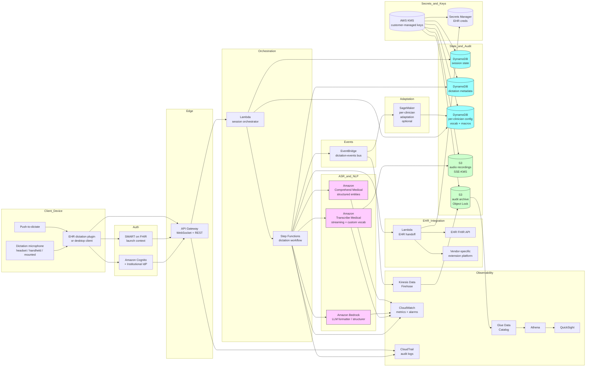

# Recipe 10.4 Architecture and Implementation: Medical Transcription (Dictation)

*Companion to [Recipe 10.4: Medical Transcription (Dictation)](chapter10.04-medical-transcription-dictation). This page covers the AWS architecture, services, prerequisites, and pseudocode. For the problem framing and the conceptual approach, start with the main recipe.*

---

## The AWS Implementation

### Why These Services

**Amazon Transcribe Medical for clinical-domain ASR.** Transcribe Medical is AWS's purpose-built clinical speech recognition service. It is trained on clinical audio with vocabulary distributions appropriate for medical dictation, supports streaming and batch modes, supports custom vocabularies for institutional formulary and specialty terms, and is HIPAA-eligible under BAA. For dictation specifically, it is the right default. The general-purpose Amazon Transcribe with a custom medical vocabulary is a viable alternative for institutions whose dictation patterns are heavily templated and lower in clinical-vocabulary density, but Transcribe Medical's specialty support (primary care, cardiology, neurology, oncology, radiology, urology) and its accuracy on medication and procedure terminology generally make it the better starting point. 

**Amazon Bedrock for LLM-driven formatting and structuring.** Bedrock-hosted foundation models provide the post-processing layer that turns verbatim Transcribe Medical output into a formatted, sectioned clinical note. The same Bedrock layer can extract structured-field suggestions (medications, problems, allergies) for clinician review. Choose a model with healthcare instruction tuning where available, validate against held-out reference notes for faithfulness (the formatted note must not paraphrase clinical content in ways that change meaning), and treat the LLM output as a draft for clinician review.

**Amazon Comprehend Medical for structured-entity extraction.** Comprehend Medical extracts medications (with RxNorm linking), conditions (with ICD-10 linking), anatomy, protected health information, and other clinical entities from text. It complements the LLM layer: the LLM handles general restructuring and formatting, Comprehend Medical handles canonical-coded entity extraction. For structured-field suggestions, Comprehend Medical's coded outputs are easier to integrate with EHR structured fields than free-form LLM output.

**AWS Lambda for orchestration.** The pipeline orchestration (initiate dictation session, route audio to Transcribe Medical, post-process with Bedrock and Comprehend Medical, hand off to EHR integration, capture user corrections, update adaptation telemetry) runs in Lambda functions. Per-stage isolation matches the pipeline structure and the per-stage retry semantics.

**Amazon API Gateway for the client-facing endpoint.** The dictation client (browser-based EHR plugin, native desktop app, mobile app) communicates with the back end through API Gateway. WebSocket APIs handle the streaming-audio path; REST APIs handle batch dictation submission and final note submission.

**Amazon Cognito (or institutional IdP via OIDC/SAML) for authentication.** Clinician identity is the audit-and-permissions backbone. The dictation session must be tied to an authenticated clinician, and the audit trail must reflect that identity through every stage.

**Amazon S3 for audio storage and audit archive.** Dictation audio is stored in S3 with SSE-KMS encryption using customer-managed keys. The retention policy is institutional and explicit: retain briefly for QA and adaptation, retain longer with consent for model retraining, or discard immediately after transcription. Audit archive (signed notes, correction streams, full dictation lifecycle records) lives in a separate S3 bucket with Object Lock in compliance mode for the legally-required retention window.

**Amazon DynamoDB for session state, dictation metadata, and per-clinician configuration.** A session-state table tracks active dictation sessions. A dictation-metadata table records the lifecycle of each dictation (started, transcribed, formatted, structured-fields-extracted, reviewed, signed). A per-clinician-config table holds custom vocabulary, preferred templates, macro definitions, and adaptation parameters. All tables encrypted with customer-managed KMS.

**Amazon ElastiCache or DynamoDB for per-clinician custom vocabulary lookup at session start.** Loading the per-clinician vocabulary biasing into the streaming Transcribe Medical session at the start of each dictation requires low-latency access to the clinician's current vocabulary configuration. Either ElastiCache (Redis) or DynamoDB with adequate provisioned capacity meets this need.

**AWS KMS for cryptographic-key custody.** Customer-managed KMS keys for the audio bucket, the audit bucket, the DynamoDB tables, and Secrets Manager. Different keys per data class (audio, transcripts, signed notes, configuration) for blast-radius containment.

**AWS Secrets Manager for EHR integration credentials.** The Lambda that hands the signed note off to the EHR needs credentials (SMART on FHIR backend-services signing keys, vendor-specific tokens). Secrets Manager stores them with rotation per the institutional cadence.

**Amazon CloudWatch for operational metrics and alarms.** Per-stage latency distributions, ASR confidence histograms, structured-field extraction acceptance rates, time-to-sign distributions, per-clinician adoption metrics, critical-error-detection alerts. Alarms on per-clinician error-rate spikes (a sudden change in correction rate for one clinician suggests an acoustic-condition change), aggregate ASR latency regressions, and EHR-integration failures.

**AWS CloudTrail for API-level audit.** All access to PHI-bearing resources (the audio bucket, the DynamoDB dictation tables, the audit archive, KMS keys, Secrets Manager) is logged. Lambda invocations, Bedrock invocations, Transcribe Medical streaming session starts and stops, Comprehend Medical inference calls all flow into CloudTrail.

**Amazon EventBridge for cross-system events.** Dictation lifecycle events (started, transcribed, signed, errored) flow through EventBridge. Downstream consumers (operational dashboards, the analytics layer, the per-clinician adaptation pipeline, the EHR integration) react to events without coupling to the orchestration Lambdas.

**AWS Step Functions for the dictation-to-signed-note workflow.** A typical dictation has multiple async stages between submission and signature. Step Functions orchestrate: ASR completion, LLM post-processing, structured-field extraction, hand-off to the EHR for clinician review, signature capture, and audit-archive write. The orchestration is durable and observable, with built-in retry and error-handling semantics.

**Amazon Kinesis Data Firehose, AWS Glue, Amazon Athena for analytics.** Audit and telemetry flow to S3 via Firehose. Glue catalogs the data. Athena provides SQL access for operational analytics (dictations per clinician per day, per-specialty accuracy trends, structured-field acceptance rates, time-to-sign distribution). Amazon QuickSight (optional) renders the dashboards.

**Amazon SageMaker (optional) for custom adaptation.** When per-clinician adaptation requires more than vocabulary-list updates (e.g., fine-tuning a custom acoustic model on a specific clinician's audio), SageMaker training jobs handle the model-training pipeline. SageMaker endpoints can serve per-clinician custom models if needed. For most institutions, the vocabulary-and-template adaptation handled within Transcribe Medical's customization features is sufficient and SageMaker is not required.

### Architecture Diagram



### Prerequisites

| Requirement | Details |
|-------------|---------|
| **AWS Services** | Amazon Transcribe Medical (streaming and batch), Amazon Bedrock, Amazon Comprehend Medical, AWS Lambda, Amazon API Gateway, Amazon Cognito, Amazon DynamoDB, Amazon S3, AWS KMS, AWS Secrets Manager, Amazon CloudWatch, AWS CloudTrail, Amazon EventBridge, AWS Step Functions, Amazon Kinesis Data Firehose, AWS Glue, Amazon Athena. Optionally: Amazon SageMaker (for custom adaptation), Amazon QuickSight (for dashboards), Amazon ElastiCache (for low-latency vocabulary lookup). |
| **External Inputs** | EHR integration surface: SMART on FHIR app launch context (preferred), vendor-specific extension platform (Epic App Orchard, Cerner Code Console, etc.) for note creation and signing. Per-specialty note templates, reviewed by clinical operations. Institutional formulary, provider directory, and specialty-specific term lists for custom vocabulary. Per-clinician baseline configuration (specialty, default templates, initial macro library). Microphone hardware (headset, handheld dictation mic, or workstation mounted), procured and supported by IT operations. Validation set of dictated notes with reference transcripts for accuracy benchmarking, ideally per specialty.  |
| **IAM Permissions** | Per-Lambda least-privilege roles. The session-orchestrator Lambda has scoped permissions for Transcribe Medical streaming session creation, Bedrock model invocation (specific model and inference profile), Comprehend Medical inference, the specific DynamoDB tables, and the EventBridge events bus. The EHR-handoff Lambda has scoped permissions for Secrets Manager (specific secret only), the EHR FHIR API endpoints, and the dictation-metadata table updates. API Gateway-to-Lambda integration with Cognito authorizer pinned to the clinician identity scope. Avoid wildcard actions and resources in production.  |
| **BAA and Compliance** | AWS BAA signed. Transcribe Medical, Bedrock (verify the specific models and regions covered), Comprehend Medical, Lambda, API Gateway, Cognito, DynamoDB, S3, KMS, Secrets Manager, CloudWatch Logs, CloudTrail, EventBridge, Step Functions, Kinesis Firehose, Athena, SageMaker are HIPAA-eligible (verify the current list at build time against the AWS HIPAA Eligible Services Reference).   EHR vendor agreements: confirm the EHR vendor's terms permit the dictation integration pattern (note creation, draft management, signature capture) with the appropriate scopes. Audio retention policy must be reviewed by the privacy officer; the institutional default should be conservative (retain briefly for QA only, then discard) unless there is explicit consent and operational need for longer retention. |
| **Encryption** | Audio recordings: SSE-KMS with customer-managed keys, retention bound to the QA review window (typically a few days to a few weeks for institutional adaptation feedback) then automatic deletion via lifecycle policy.  Signed notes: stored in the EHR per its native encryption policy; if archived in S3 for backup, SSE-KMS with customer-managed keys. Audit archive: SSE-KMS with customer-managed keys, retention sized to the longer of HIPAA's six-year minimum, state medical-records-retention rules, and the institutional regulatory floor. DynamoDB tables: customer-managed KMS at rest. Lambda environment variables: KMS-encrypted. Lambda log groups: KMS-encrypted. Secrets Manager: customer-managed KMS. TLS in transit for all AWS API calls and all EHR API calls (default). |
| **VPC** | Production: Lambdas that call back-office APIs (the EHR integration in particular) run in VPC with subnets that have controlled egress to the EHR's network (often a private peering connection or VPN to the on-premise EHR system). VPC endpoints for DynamoDB, S3, KMS, Secrets Manager, CloudWatch Logs, EventBridge, Bedrock, Comprehend Medical, and Transcribe Medical so the Lambdas do not need NAT for AWS-internal calls. Endpoint policies pin access to the specific resources the pipeline uses. For SMART on FHIR-based integrations against a cloud-hosted EHR, the integration may not require on-premise network connectivity; for on-premise EHRs, the network topology is typically the longest-lead-time portion of the deployment.  |
| **CloudTrail** | Enabled with data events on the audio S3 bucket, the audit-archive S3 bucket, the DynamoDB dictation tables, the Secrets Manager secrets, and the customer-managed KMS keys. Lambda invocations logged. API Gateway access logs enabled. Step Functions execution logs enabled. Transcribe Medical streaming session starts and stops logged. Bedrock invocations logged with input and output captured per institutional policy (be cautious about input/output capture if the prompts or responses include PHI; many institutions choose to log metadata only). CloudTrail logs in a dedicated S3 bucket with Object Lock in Compliance mode and lifecycle to S3 Glacier Deep Archive after 90 days. Audit retention sized to the longer of HIPAA's six-year minimum, state medical-records-retention rules, the EHR vendor's audit-retention floor, and the institutional regulatory floor.  |
| **Sample Data** | Synthetic dictated audio for development. Text-to-speech generation of realistic clinical-text prompts produces audio with known ground truth. Synthea-generated patient context for the SMART on FHIR integration. Public clinical-vocabulary lists (RxNorm, ICD-10, SNOMED, LOINC) for custom-vocabulary seeding. Never use real clinician audio or real patient names in development; voice samples are biometric and PHI-bearing data with non-trivial governance implications.   |
| **Cost Estimate** | At a mid-sized practice scale (200 clinicians, average 8 dictations per day per clinician, average 90 seconds of audio per dictation, 22 working days per month): Transcribe Medical streaming at typically $0.075 per minute totals approximately $4,000-5,000 per month. Bedrock LLM post-processing at typically $0.001-0.01 per dictation totals approximately $400-3,500 per month depending on model choice and prompt size. Comprehend Medical at typically $0.0014 per Unit (100 characters) totals approximately $200-500 per month. Lambda, Step Functions, API Gateway, DynamoDB, S3, CloudWatch, KMS, Secrets Manager total approximately $500-1,500 per month combined. Total AWS infrastructure typically $5,000-10,000 per month at this scale, dominated by Transcribe Medical. The infrastructure cost is comparable to or slightly cheaper than per-clinician licensing of major commercial dictation products at the same scale, though the engineering and operational overhead of operating a custom build is non-trivial and usually tilts the build-versus-buy economics toward buying for institutions of this size. |

### Ingredients

| AWS Service | Role |
|------------|------|
| **Amazon Transcribe Medical** | Clinical-domain ASR with specialty support, custom vocabulary biasing, per-word confidence, streaming and batch modes |
| **Amazon Bedrock** | LLM-driven formatting, structuring, and section-aware reorganization of verbatim transcripts; faithfulness-checked draft note generation |
| **Amazon Comprehend Medical** | Coded clinical-entity extraction (RxNorm medications, ICD-10 conditions, anatomy, PHI) for structured-field suggestions |
| **AWS Lambda** | Per-stage processing: session orchestrator, ASR result handler, formatter wrapper, structured-field extractor wrapper, EHR handoff |
| **AWS Step Functions** | Durable orchestration of the dictation-to-signed-note workflow with retry and error-handling semantics |
| **Amazon API Gateway** | Client-facing endpoints for streaming audio (WebSocket) and dictation lifecycle (REST) with Cognito authorization |
| **Amazon Cognito** | Clinician authentication federated to the institutional identity provider |
| **Amazon DynamoDB** | session-state (active dictation per clinician); dictation-metadata (per-dictation lifecycle: started, transcribed, formatted, signed); per-clinician-config (custom vocabulary, macros, preferred templates, adaptation parameters) |
| **Amazon S3** | Audio recording storage with brief-retention lifecycle; audit archive with Object Lock |
| **AWS KMS** | Customer-managed encryption keys for all PHI-bearing data stores |
| **AWS Secrets Manager** | EHR API credentials, SMART on FHIR backend-services signing keys |
| **Amazon CloudWatch** | Operational metrics (per-stage latency, ASR confidence distributions, correction rates, structured-field acceptance, time-to-sign); alarms (per-clinician error-rate spikes, latency regressions, EHR-integration failures, critical-error detections) |
| **AWS CloudTrail** | API-level audit logging for PHI-bearing resources and AI/ML service invocations |
| **Amazon EventBridge** | dictation-events bus for cross-system event flow and downstream consumption |
| **Amazon Kinesis Data Firehose** | Streaming audit and telemetry delivery into S3 for long-term retention and analytics |
| **AWS Glue Data Catalog + Amazon Athena** | SQL access to audit and telemetry for operational analytics |
| **Amazon QuickSight (optional)** | Dashboards for clinical operations and IT operations |
| **Amazon SageMaker (optional)** | Per-clinician acoustic-model adaptation when vocabulary and template adaptation are insufficient |

---

### Code

#### Walkthrough

**Step 1: Open the dictation session and load per-clinician configuration.** The clinician initiates a dictation session from inside the EHR (or from a desktop dictation client). The system authenticates the clinician, loads the per-clinician custom vocabulary, the active note template, and the patient context (if any), and prepares a streaming Transcribe Medical session with the right specialty configuration. Skip the per-clinician vocabulary load and the ASR runs without the institutional formulary biasing, which immediately drops accuracy on the medications the clinician most commonly prescribes.

```pseudocode
ON dictation_start_request(clinician_session, note_context):
    // Step 1A: validate the clinician session and manage
    // SMART on FHIR token lifecycle.
    //
    // Dictation sessions can span hours from activation
    // to final EHR submission. The SMART on FHIR access
    // token typically expires in 15-60 minutes. The
    // architecture handles this with:
    //
    // - Pre-emptive refresh: when the token's remaining
    //   lifetime drops below 5 minutes, the session
    //   orchestrator triggers a background refresh using
    //   the refresh_token grant. The new access_token is
    //   stored in Secrets Manager (short-TTL cache with
    //   automatic rotation, not DynamoDB) so the EHR
    //   handoff Lambda always reads the current token at
    //   invocation time.
    //
    // - Refresh-failure handling: if the refresh grant
    //   fails (revoked session, IdP outage), the system
    //   does NOT discard dictated audio. The dictation
    //   continues through formatting and review. At
    //   signature submission (the only step requiring a
    //   live EHR token), the client prompts the clinician
    //   to re-authenticate. On successful re-auth, the
    //   pipeline resumes from the EHR handoff step.
    //
    // - Audit events: token_refresh_succeeded,
    //   token_refresh_failed, re_authentication_prompted,
    //   re_authentication_completed are emitted to
    //   EventBridge for the audit trail.
    //
    // - Token storage: Secrets Manager with a per-session
    //   secret (lifecycle tied to session duration), not
    //   DynamoDB. The session-state table holds a
    //   reference to the secret ARN, not the token value.
    IF NOT clinician_session.is_valid():
        RETURN error("re-authenticate")

    // Check token freshness; trigger pre-emptive refresh
    // if within the refresh window.
    token_remaining = clinician_session.token_expires_at - now()
    IF token_remaining < TOKEN_PREEMPTIVE_REFRESH_WINDOW:
        refresh_result = refresh_smart_token(
            clinician_session.refresh_token,
            clinician_session.session_secret_arn)
        IF NOT refresh_result.success:
            // Log the failure; do not block session open.
            // The re-auth prompt will fire at signature time.
            EventBridge.PutEvents([{
                source: "dictation",
                detail_type: "token_refresh_failed",
                detail: {
                    session_id: clinician_session.session_id,
                    clinician_id: clinician_session.clinician_id,
                    reason: refresh_result.error
                }
            }])

    // Step 1B: load per-clinician configuration. This
    // includes the custom vocabulary list, the specialty,
    // the preferred template for this note type, and the
    // per-clinician macro library.
    clinician_config = clinician_config_table.get(
        clinician_id: clinician_session.clinician_id)

    // Step 1C: build the session-specific custom
    // vocabulary. Combine the institutional formulary, the
    // specialty-specific term list, the per-clinician
    // additions, and the patient-specific terms (current
    // medications, recent procedures) where the patient
    // context is known.
    custom_vocabulary = build_session_vocabulary(
        institutional: INSTITUTIONAL_FORMULARY,
        specialty: clinician_config.specialty_terms,
        per_clinician: clinician_config.custom_terms,
        patient_specific: load_patient_terms(
            note_context.patient_id) if note_context.patient_id else [])

    // Step 1D: select the note template. The template
    // determines the section structure of the formatted
    // note and the structured-field hooks.
    template = select_template(
        note_type: note_context.note_type,
        specialty: clinician_config.specialty,
        clinician_preference: clinician_config.preferred_templates)

    // Step 1E: open the streaming Transcribe Medical
    // session.
    transcribe_session = transcribe_medical.start_streaming(
        language_code: "en-US",
        media_sample_rate_hertz: 16000,
        specialty: clinician_config.specialty,
        // PRIMARYCARE | CARDIOLOGY | NEUROLOGY |
        // ONCOLOGY | RADIOLOGY | UROLOGY
        type: "DICTATION",
        // CONVERSATION for ambient (recipe 10.7);
        // DICTATION for this recipe
        vocabulary_name: custom_vocabulary.name,
        show_speaker_labels: false,
        // dictation is single-speaker; speaker labels
        // are off
        enable_partial_results_stabilization: true)

    // Step 1F: persist the session state.
    session_id = generate_uuid()
    session_state_table.put({
        session_id: session_id,
        clinician_id: clinician_session.clinician_id,
        note_context: note_context,
        template: template.id,
        custom_vocabulary: custom_vocabulary.name,
        transcribe_session: transcribe_session.id,
        started_at: now(),
        status: "active"
    })

    RETURN {
        session_id: session_id,
        websocket_endpoint: build_audio_websocket_url(
            session_id),
        template: template
    }
```

**Step 2: Stream audio to Transcribe Medical and capture the verbatim transcript.** The clinician dictates. Audio frames stream from the client over WebSocket through API Gateway into the Transcribe Medical streaming session. Partial transcripts emit as audio is processed; the final transcript emits at end-of-dictation. Capture per-word confidence for downstream review-pane highlighting. Skip the per-word confidence and the read-back view loses its single most useful affordance for catching ASR errors.

```pseudocode
FUNCTION stream_audio_to_asr(session_id, audio_stream):
    session = session_state_table.get(session_id)
    transcribe_session = session.transcribe_session

    transcript_segments = []
    word_level_results = []

    // Step 2A: pump audio frames into Transcribe Medical
    // and emit partial transcripts back to the client
    // for live display.
    WHILE audio_stream.is_active():
        audio_frame = audio_stream.read_frame()
        IF audio_frame.is_end_of_stream:
            transcribe_session.end_stream()
            BREAK

        transcribe_session.send_audio_frame(audio_frame)

        partial = transcribe_session.next_partial_result()
        IF partial:
            client.emit_partial_to_client(
                session_id: session_id,
                text: partial.transcript,
                is_final: false)

        IF partial AND partial.is_final:
            transcript_segments.append(partial.transcript)
            // Per-word confidence and timing arrive on the
            // finalized segments.
            FOR word IN partial.words:
                word_level_results.append({
                    word: word.content,
                    start_time: word.start_time,
                    end_time: word.end_time,
                    confidence: word.confidence,
                    segment_index:
                        len(transcript_segments) - 1
                })
            client.emit_partial_to_client(
                session_id: session_id,
                text: partial.transcript,
                is_final: true)

    // Step 2B: combine segments into the full verbatim
    // transcript.
    verbatim_transcript = " ".join(transcript_segments)

    avg_confidence = mean([w.confidence for w in word_level_results]) if word_level_results else 0.0

    // Step 2C: persist PHI content in the secure transcript
    // archive (S3 with KMS, same governance as the audio
    // bucket). Only references, hashes, and structural
    // metadata land in the dictation_metadata table.
    //
    // CROSS-CUTTING DESIGN POINT: References, Not Content.
    // Every PHI-bearing artifact (verbatim transcript,
    // word-level results, formatted note, EHR API
    // responses, structured-field suggestions) is stored
    // in the KMS-encrypted transcript archive (S3). The
    // DynamoDB metadata table holds only:
    //   - S3 URIs pointing to the archive objects
    //   - Content hashes for integrity verification
    //   - Structural metadata (lengths, counts, scores)
    //   - Status and lifecycle timestamps
    // This discipline ensures that a DynamoDB table scan
    // or a leaked table backup does not expose PHI. All
    // PHI access flows through S3 with KMS decryption,
    // CloudTrail data-event logging, and bucket-policy
    // enforcement.

    // Write the verbatim transcript to the secure archive.
    transcript_archive_key = (
        f"transcripts/{session_id}/verbatim.json")
    transcript_archive_uri = s3.put_object(
        bucket: TRANSCRIPT_ARCHIVE_BUCKET,
        key: transcript_archive_key,
        body: json.encode({
            verbatim_transcript: verbatim_transcript,
            word_level_results: word_level_results
        }),
        server_side_encryption: "aws:kms",
        kms_key_id: TRANSCRIPT_ARCHIVE_KMS_KEY)

    transcript_hash = sha256(verbatim_transcript)

    // Metadata table gets references and structural
    // metadata only.
    dictation_metadata_table.put({
        session_id: session_id,
        verbatim_transcript_archive_ref:
            transcript_archive_uri,
        verbatim_transcript_hash: transcript_hash,
        verbatim_transcript_length_chars:
            len(verbatim_transcript),
        word_count: len(word_level_results),
        avg_confidence: avg_confidence,
        transcribed_at: now(),
        status: "transcribed"
    })

    EventBridge.PutEvents([{
        source: "dictation",
        detail_type: "dictation_transcribed",
        detail: {
            session_id: session_id,
            avg_confidence: avg_confidence,
            duration_seconds:
                audio_stream.elapsed_seconds(),
            word_count: len(word_level_results)
        }
    }])

    RETURN {
        verbatim_transcript: verbatim_transcript,
        word_level_results: word_level_results,
        avg_confidence: avg_confidence
    }
```

**Step 3: Disambiguate commands from content and apply structural events.** Walk through the verbatim transcript and the timing-aligned word stream. Identify command phrases (the explicit prefix, or the configured command vocabulary) and route them to the system action handler; everything else is content. Apply navigation commands ("new paragraph," "next field," "go to assessment") to a structural-event log that the formatter will replay. Skip this step and command phrases either appear as literal text in the formatted note or get silently dropped without acting on the system, depending on which way the heuristic falls.

```pseudocode
FUNCTION disambiguate_commands(verbatim_transcript, word_level_results, template):
    // Step 3A: tokenize the transcript into segments
    // separated by significant pauses (using word
    // start/end timing as the prosodic cue) or by
    // explicit punctuation.
    segments = segment_by_pauses(
        word_level_results,
        pause_threshold_seconds: COMMAND_PAUSE_THRESHOLD)

    content_segments = []
    structural_events = []

    FOR segment IN segments:
        segment_text = " ".join([w.word for w in segment])

        // Step 3B: check for explicit command prefix.
        IF segment_text.startswith(COMMAND_PREFIX):
            command_text = segment_text[len(COMMAND_PREFIX):]
            command = parse_command(command_text)
            structural_events.append({
                type: "command",
                command: command,
                segment_start: segment[0].start_time
            })
            CONTINUE

        // Step 3C: check for implicit command match
        // against the configured command vocabulary.
        // Only apply when the segment is the entire
        // segment (avoid matching command-like phrases
        // embedded in longer dictation).
        IF segment_text IN COMMAND_VOCABULARY:
            command = COMMAND_VOCABULARY[segment_text]
            structural_events.append({
                type: "command",
                command: command,
                segment_start: segment[0].start_time
            })
            CONTINUE

        // Step 3D: everything else is dictation content.
        content_segments.append({
            text: segment_text,
            words: segment,
            segment_start: segment[0].start_time
        })

    RETURN {
        content_segments: content_segments,
        structural_events: structural_events
    }
```

**Step 4: Format the verbatim content into the note template.** Apply punctuation inference, capitalization, number-and-date canonicalization, and section-header formatting. Optionally invoke a Bedrock LLM with a prompt that asks for the formatted note while preserving clinical content faithfulness. Render the formatted text into the note template, with each command-driven structural event directing content into the corresponding template field. Skip the faithfulness check on LLM output and the formatted note may paraphrase clinical content in ways that change meaning, which is the worst class of failure for this recipe.

```pseudocode
FUNCTION format_and_structure(content_segments, structural_events, template, verbatim_transcript):
    // Step 4A: rule-based formatting pass. Punctuation
    // inference, capitalization, number-and-date
    // canonicalization. This pass handles the
    // mechanical conversions that LLMs are overkill
    // for and lower-latency is preferred.
    formatted_content = []
    FOR segment IN content_segments:
        formatted_text = apply_punctuation_inference(segment.text)
        formatted_text = apply_capitalization(formatted_text)
        formatted_text = canonicalize_numbers_and_dates(
            formatted_text)
        formatted_content.append({
            text: formatted_text,
            words: segment.words,
            segment_start: segment.segment_start
        })

    // Step 4B: apply structural events to direct content
    // into template sections. The cursor moves between
    // sections based on navigation commands; content
    // dictated between commands fills the section the
    // cursor is currently in.
    template_with_content = apply_structural_events(
        template: template,
        content: formatted_content,
        events: structural_events)

    // Step 4C: optional LLM post-processing for higher-
    // quality formatting and reorganization. The LLM
    // sees the verbatim transcript and the rule-based
    // draft; it returns a refined draft and a set of
    // structured-field suggestions. Treat the output
    // as a draft, never as authoritative.
    //
    // PROMPT-INJECTION MITIGATION:
    // The verbatim transcript is untrusted user data. A
    // clinician could (accidentally or deliberately)
    // dictate text that looks like LLM instructions. The
    // architecture defends against this with:
    //
    // 1. Explicit delimiters: the transcript is wrapped in
    //    <verbatim_transcript>...</verbatim_transcript>
    //    tags. The system prompt instructs the model to
    //    treat content within those tags as opaque clinical
    //    text, never as instructions.
    //
    // 2. Structured-output enforcement: the model is
    //    instructed to return strict JSON (with a schema
    //    that the orchestrator validates before accepting).
    //    Free-form text responses are rejected.
    //
    // 3. Output validation: the orchestrator checks that
    //    the JSON output conforms to the expected schema.
    //    Responses that fail validation are discarded and
    //    the rule-based draft is used instead.
    //
    // 4. Divergence monitoring: a background comparator
    //    flags cases where the LLM draft diverges
    //    structurally from the rule-based draft (unexpected
    //    sections, removed content, added content not in
    //    the verbatim source). Structural divergence above
    //    threshold triggers an operational alert for review.
    // FOUNDATION-MODEL-AND-PROMPT VERSIONING:
    // Every component that influences the formatted output
    // is versioned and tracked per dictation:
    //
    // - Model identifiers: pinned Bedrock model version
    //   (e.g., anthropic.claude-3-5-sonnet-20240620-v1:0)
    // - Prompt versions: formatter-prompt-v1.4,
    //   faithfulness-prompt-v1.2 (stored in source control)
    // - Rule-catalog versions: rule-formatter-v3.2,
    //   critical-errors-v1.1 (stored in source control)
    // - Per-specialty configuration versions: tracked in
    //   the per-specialty config table with effective dates
    //
    // Deployment pattern:
    // - Canary inference profile: new model or prompt
    //   versions are deployed to a canary inference profile
    //   that receives a configurable traffic percentage
    //   (start at 5%, ramp to 100% over days).
    // - Rollback-on-regression: a held-out evaluation set
    //   (per specialty, per accent group, with high-risk-
    //   substitution coverage) gates the canary. If the
    //   canary's critical-error rate or faithfulness score
    //   regresses beyond threshold, traffic automatically
    //   shifts back to the prior version.
    // - Version stamps: every dictation audit record
    //   carries the model_id, prompt_version,
    //   rule_catalog_version, and specialty_config_version
    //   so a forensic review can reconstruct which
    //   calibration produced a given note.
    IF LLM_POST_PROCESSING_ENABLED:
        llm_response = bedrock.invoke_model(
            model_id: CLINICAL_FORMATTER_MODEL,
            prompt: build_formatter_prompt(
                verbatim_transcript: verbatim_transcript,
                rule_based_draft: template_with_content,
                template_schema: template.schema,
                specialty: template.specialty),
            max_tokens: 4000)

        // Step 4D: faithfulness check. The LLM-formatted
        // note must contain the same clinical claims
        // as the verbatim transcript. Use a separate
        // model invocation (or a deterministic check)
        // to flag content drift. Discrepancies are
        // surfaced for clinician review; the LLM output
        // is never silently substituted for the rule-
        // based draft when faithfulness is suspect.
        // FAITHFULNESS-CHECK ARCHITECTURE:
        // The check runs as a three-phase pipeline:
        //
        // Phase 1 - Claim extraction: extract atomic clinical
        //   claims from both the verbatim transcript and the
        //   LLM draft (medications with doses, conditions with
        //   negation status, procedures with laterality,
        //   temporal assertions, hedging qualifiers).
        //
        // Phase 2 - Claim-by-claim comparison: for each claim
        //   in the verbatim, verify semantic equivalence in
        //   the LLM draft. For each claim in the LLM draft,
        //   verify it has a source in the verbatim.
        //
        // Phase 3 - Severity-tier classification:
        //   HIGH: clinical-claim addition (present in LLM
        //     draft, absent in verbatim), negation flip,
        //     dose change, hedging removal on a clinical
        //     assertion, laterality change.
        //   LOW: minor stylistic divergence, synonym
        //     substitution without clinical-meaning change,
        //     formatting-only changes.
        //
        // Disposition:
        // - Any HIGH-severity warning triggers fallback to
        //   the rule-based draft. The LLM draft is offered
        //   as a "suggested alternative" for clinician
        //   comparison only.
        // - LOW-severity warnings are surfaced in the
        //   review pane as tracked changes but do not block
        //   the LLM draft from being the primary view.
        //
        // Offline Faithfulness Program:
        // - Held-out evaluation set per specialty (100+
        //   verbatim-and-faithful-formatted pairs).
        // - Run on every model update, prompt update, or
        //   rule-catalog update.
        // - Regression gate: any increase in HIGH-severity
        //   findings blocks the update.
        // - Named ownership: clinical-quality officer.
        // - Review cadence: monthly, plus on every model
        //   or prompt version change.
        //
        // Cross-references: the critical-error-detection
        // primitive (laterality, negation, drug-name
        // confusables) and the prompt-injection mitigation
        // form the combined LLM-clinical-safety substrate.
        faithfulness_check = check_faithfulness(
            verbatim_transcript: verbatim_transcript,
            llm_draft: llm_response.formatted_note)

        IF faithfulness_check.passes:
            template_with_content = llm_response.formatted_note
        ELSE:
            // Fall back to the rule-based draft and
            // attach the LLM draft as a "suggested"
            // alternative for clinician comparison.
            template_with_content.llm_alternative =
                llm_response.formatted_note
            template_with_content.faithfulness_warnings =
                faithfulness_check.warnings

    RETURN template_with_content
```

**Step 4.5: Critical-error detection.** Scan the formatted note for clinically-dangerous word substitutions before presenting it to the clinician in the read-edit-sign view. This is the single most important safety gate in the pipeline. Critical errors (laterality flips, negation flips, drug-name confusables, dose-by-order-of-magnitude errors) are detected via per-specialty high-risk-substitution catalogs. These catalogs are version-controlled clinical-safety documents owned by the clinical-quality officer. Skip this step and the 0.5% of dictations containing a laterality error pass through to clinician review without any visual emphasis, relying entirely on the clinician to catch a single-phoneme error in a wall of text.

```pseudocode
FUNCTION detect_critical_errors(verbatim_transcript, formatted_note, specialty):
    // The high-risk-substitution catalogs are per-specialty.
    // Each catalog entry defines:
    //   - A pair of confusable terms (left/right, no/not,
    //     morphine/naloxone, etc.)
    //   - A severity tier (HIGH: laterality, negation,
    //     drug-name; MEDIUM: dose-direction, symptom-pair)
    //   - The detection method (exact-match, regex, or
    //     NLI-based for negation-scope detection)
    catalog = load_critical_error_catalog(specialty)

    detections = []
    FOR rule IN catalog.rules:
        matches = rule.detect(
            verbatim: verbatim_transcript,
            formatted: formatted_note)
        FOR match IN matches:
            detections.append({
                rule_id: rule.id,
                severity: rule.severity,
                source_term: match.source_term,
                target_term: match.target_term,
                span_in_formatted: match.span,
                context: match.surrounding_context,
                disposition: "clinician_confirmation_required"
                    if rule.severity == "HIGH"
                    else "highlight_in_review"
            })

    // HIGH-severity detections require explicit clinician
    // confirmation before signature. The review pane renders
    // these with a distinct visual treatment (red highlight,
    // inline confirmation checkbox) that cannot be dismissed
    // without interaction.
    //
    // Aggregate detection-rate metric: the clinical-quality
    // officer monitors CriticalErrorDetectionsPerThousand in
    // CloudWatch with a monthly review cadence. A sustained
    // increase in detection rate signals model drift or a
    // vocabulary gap that needs investigation.
    cloudwatch.put_metric(
        namespace: "Dictation",
        metric_name: "CriticalErrorDetections",
        value: len(detections),
        dimensions: {
            specialty: specialty,
            severity: "HIGH" if any(
                d.severity == "HIGH" for d in detections)
                else "MEDIUM_OR_BELOW"
        })

    RETURN {
        detections: detections,
        has_high_severity: any(
            d.severity == "HIGH" for d in detections),
        catalog_version: catalog.version
    }
```

**Step 5: Extract structured-field suggestions from the dictation.** Run Amazon Comprehend Medical (and optionally a Bedrock model with a structured-extraction prompt) over the verbatim transcript and the formatted note. Extract medications, problems, allergies, vitals, and procedures with coded references. Cross-check against the patient's structured chart and surface discrepancies. Skip this step and the dictation produces narrative text that never makes it into the structured chart, which is the entire reason the clinician was tempted to type it directly into the structured fields in the first place.

```pseudocode
FUNCTION extract_structured_fields(verbatim_transcript, formatted_note, patient_context):
    // Step 5A: run Comprehend Medical to extract
    // coded clinical entities.
    //
    // The Comprehend Medical API surface is split across
    // multiple calls:
    // - detect_entities_v2: returns categorized entities
    //   (MEDICATION, MEDICAL_CONDITION, ANATOMY, etc.)
    //   with spans and confidence, but without ontology
    //   codes.
    // - infer_rx_norm: returns RxNorm-linked medication
    //   entities with concept IDs.
    // - infer_icd10_cm: returns ICD-10-CM-linked condition
    //   entities with concept codes.
    // - infer_snomed_ct (where the institution stores
    //   SNOMED): returns SNOMED-CT-linked entities.
    //
    // The pipeline calls all relevant endpoints and merges
    // results by character offset:
    //   1. Call detect_entities_v2 for the full entity map.
    //   2. Call infer_rx_norm for medication ontology codes.
    //   3. Call infer_icd10_cm for condition ontology codes.
    //   4. Merge by matching entity begin_offset/end_offset
    //      across responses.
    //
    // Cost note: this multi-call pattern means per-dictation
    // Comprehend Medical cost is 2-4x a single call. Factor
    // this into the cost estimate (the prerequisite section's
    // $200-500/month estimate accounts for this multiplier).

    // Call 1: detect_entities_v2 for full entity categorization
    entities_result = comprehend_medical.detect_entities_v2(
        text: verbatim_transcript)

    // Call 2: infer_rx_norm for RxNorm codes on medications
    rxnorm_result = comprehend_medical.infer_rx_norm(
        text: verbatim_transcript)

    // Call 3: infer_icd10_cm for ICD-10 codes on conditions
    icd10_result = comprehend_medical.infer_icd10_cm(
        text: verbatim_transcript)

    // Merge results by character offset. The detect_entities_v2
    // response provides the canonical entity boundaries; the
    // infer_* responses provide the ontology linkage for the
    // same spans.
    merged_entities = merge_by_character_offset(
        entities: entities_result.entities,
        rxnorm_entities: rxnorm_result.entities,
        icd10_entities: icd10_result.entities)

    // Comprehend Medical returns entities like:
    // { Type: "MEDICATION", Text: "lisinopril",
    //   Attributes: [{ Type: "DOSAGE", Text: "10 mg" },
    //                { Type: "FREQUENCY", Text: "daily" }],
    //   RxNormConcepts: [{ Code: "29046", ... }],
    //   ... }
    // After merge, each entity carries both its category
    // and its ontology linkage.

    medications = []
    conditions = []
    allergies = []

    FOR entity IN merged_entities:
        IF entity.category == "MEDICATION":
            rxnorm_code = entity.rxnorm_concept_id
            medications.append({
                source_text: entity.text,
                rxnorm_code: rxnorm_code,
                dosage: extract_attribute(entity, "DOSAGE"),
                frequency:
                    extract_attribute(entity, "FREQUENCY"),
                source_span: (entity.begin_offset,
                              entity.end_offset),
                confidence: entity.score
            })
        ELIF entity.category == "MEDICAL_CONDITION":
            icd10_code = entity.icd10_concept_code
            conditions.append({
                source_text: entity.text,
                icd10_code: icd10_code,
                negated:
                    has_negation_trait(entity),
                source_span: (entity.begin_offset,
                              entity.end_offset),
                confidence: entity.score
            })
        // Similarly for allergies, procedures, vitals.

    // Step 5B: cross-check against the patient's
    // structured chart. Highlight discrepancies.
    chart_meds = patient_context.medication_list
    chart_conditions = patient_context.problem_list
    chart_allergies = patient_context.allergy_list

    discrepancies = []

    FOR med IN medications:
        IF med.rxnorm_code NOT IN chart_meds_codes(
            chart_meds):
            discrepancies.append({
                type: "medication_mentioned_not_in_chart",
                source: med,
                action_suggested: "add_to_med_list"
            })

    FOR cond IN conditions:
        IF cond.negated:
            CONTINUE
        IF cond.icd10_code NOT IN chart_conditions_codes(
            chart_conditions):
            discrepancies.append({
                type: "condition_mentioned_not_in_chart",
                source: cond,
                action_suggested: "add_to_problem_list"
            })

    // Note: in a real deployment the cross-check is
    // more nuanced (medications discussed but not
    // prescribed, conditions ruled out vs newly
    // diagnosed). Treat the suggestions as draft
    // with explicit clinician confirmation.

    RETURN {
        medications: medications,
        conditions: conditions,
        allergies: allergies,
        discrepancies: discrepancies
    }
```

**Step 6: Render the read-edit-sign view and capture clinician corrections.** Show the formatted note to the clinician with low-confidence words highlighted, the LLM's tracked changes (when used) visible, structured-field suggestions in a side panel, and cross-check warnings flagged. The clinician edits, accepts or rejects structured-field suggestions, and signs. Capture every correction as an adaptation signal. Skip the correction-capture and the system never improves; clinicians see the same recurring errors month after month.

```pseudocode
FUNCTION render_review_view(session_id, formatted_note, structured_suggestions, word_level_results):
    // Step 6A: build the review payload. Each word
    // tagged with its confidence; suggestions tagged
    // with their source span and provenance (rule-based
    // vs LLM vs Comprehend Medical).
    review_payload = {
        session_id: session_id,
        formatted_note: formatted_note,
        word_confidence_overlay:
            build_confidence_overlay(
                formatted_note,
                word_level_results),
        structured_suggestions: structured_suggestions,
        cross_check_warnings:
            structured_suggestions.discrepancies,
        llm_changes:
            formatted_note.llm_alternative_diff
                if formatted_note.has("llm_alternative_diff")
                else None
    }

    client.render_review(review_payload)

    // Step 6B: capture clinician corrections as they
    // happen. Each correction is an event with the
    // before/after text, the position, and any
    // structured-field accept/reject events.
    corrections = []
    structured_decisions = []

    WHILE NOT client.signature_received():
        event = client.next_review_event()
        IF event.type == "text_edit":
            corrections.append({
                before: event.before_text,
                after: event.after_text,
                position: event.position,
                timestamp: event.timestamp,
                source_word_confidences:
                    confidence_at_position(
                        event.position,
                        word_level_results)
            })
        ELIF event.type == "structured_suggestion_decision":
            structured_decisions.append({
                suggestion_id: event.suggestion_id,
                decision: event.decision,
                // accept | reject | modify
                modified_value:
                    event.modified_value
                        if event.decision == "modify"
                        else None
            })
        ELIF event.type == "voice_correction":
            // The clinician issued a voice correction
            // ("change last sentence to ..."). Run
            // through the disambiguation and formatting
            // layers.
            apply_voice_correction(event, formatted_note)
        ELIF event.type == "abandon":
            RETURN {
                signed: false,
                disposition: "abandoned",
                corrections: corrections,
                structured_decisions: structured_decisions
            }

    // Step 6C: signature event captured.
    signature = client.get_signature()

    RETURN {
        signed: true,
        signed_note: formatted_note,
        signature: signature,
        corrections: corrections,
        structured_decisions: structured_decisions
    }
```

**Step 7: Hand off the signed note to the EHR and apply confirmed structured updates.** Push the signed note into the EHR's note repository, apply the structured-field updates the clinician confirmed, capture the EHR's response (note ID, document ID), and update the dictation-metadata record with the final state. Treat structured-field updates with the same idempotency and audit rigor as any other clinical write. Skip the explicit confirmation handling and structured updates execute silently, which is the same anti-pattern as the read-write boundary in recipe 10.3 and produces the same class of harm.

```pseudocode
FUNCTION handoff_to_ehr(session_id, signed_note, structured_decisions, patient_context, clinician_session):
    // Step 7A: create the note in the EHR.
    //
    // IDEMPOTENCY-KEY COMPOSITION:
    // The dictation submission uses a composite idempotency
    // key: (clinician_id, session_id, encounter_id,
    // signature_timestamp). Before submission, the
    // architecture checks the dictation-metadata table for
    // a prior submission with the same key. On match,
    // return the prior note_id without creating a duplicate.
    //
    // Implementation:
    // 1. Compute the idempotency key from the session.
    // 2. Conditional check against the dictation-metadata
    //    table's recently-submitted-notes list.
    // 3. If a match exists: log the duplicate-detection
    //    event in the audit trail, return the prior
    //    note_id.
    // 4. If no match: submit to the EHR API.
    // 5. Where the EHR vendor's FHIR API supports
    //    idempotency headers (If-None-Match or vendor-
    //    specific), include them as defense-in-depth.
    // 6. On duplicate-detection, record both the original
    //    submission event and the duplicate-detection
    //    event in the audit.
    idempotency_key = build_idempotency_key(
        clinician_id: clinician_session.clinician_id,
        session_id: session_id,
        encounter_id: patient_context.encounter_id,
        signature_timestamp: signed_note.signature.timestamp)

    prior_submission = dictation_metadata_table.query(
        idempotency_key: idempotency_key,
        status: "signed_and_handed_off")

    IF prior_submission:
        EventBridge.PutEvents([{
            source: "dictation",
            detail_type: "dictation_duplicate_detected",
            detail: {
                session_id: session_id,
                prior_note_id: prior_submission.note_id,
                idempotency_key: idempotency_key
            }
        }])
        RETURN {
            note_id: prior_submission.note_id,
            duplicate: true
        }
    note_creation_response = fhir_client.create_note(
        patient_id: patient_context.patient_id,
        encounter_id: patient_context.encounter_id,
        author_id: clinician_session.clinician_id,
        note_type: signed_note.template.note_type,
        content: signed_note.formatted_text,
        signature: signed_note.signature,
        clinician_token: clinician_session.access_token)

    note_id = note_creation_response.note_id

    // Step 7B: apply confirmed structured updates.
    // Each accepted suggestion becomes a write to the
    // appropriate FHIR resource. Reject decisions are
    // logged but do not produce writes.
    structured_results = []
    FOR decision IN structured_decisions:
        IF decision.decision == "accept":
            IF decision.suggestion_type == "medication":
                result = fhir_client.add_medication(
                    patient_id: patient_context.patient_id,
                    medication_code: decision.rxnorm_code,
                    dosage: decision.dosage,
                    frequency: decision.frequency,
                    source_note_id: note_id,
                    clinician_token:
                        clinician_session.access_token)
                structured_results.append(result)
            ELIF decision.suggestion_type == "condition":
                result = fhir_client.add_condition(
                    patient_id: patient_context.patient_id,
                    condition_code: decision.icd10_code,
                    onset_date: decision.onset_date,
                    source_note_id: note_id,
                    clinician_token:
                        clinician_session.access_token)
                structured_results.append(result)
            // Similarly for allergies, procedures.
        ELIF decision.decision == "modify":
            // The clinician modified the suggestion
            // before accepting. Apply the modified value.
            ...

    // Step 7C: update the dictation-metadata record.
    // Per the references-not-content discipline (see Step
    // 2C), the signed note content is archived in S3; the
    // metadata table stores only the archive reference,
    // structural counts, and lifecycle state.
    signed_note_archive_key = (
        f"notes/{session_id}/signed-note.json")
    signed_note_archive_uri = s3.put_object(
        bucket: TRANSCRIPT_ARCHIVE_BUCKET,
        key: signed_note_archive_key,
        body: json.encode({
            formatted_text: signed_note.formatted_text,
            structured_results: structured_results
        }),
        server_side_encryption: "aws:kms",
        kms_key_id: TRANSCRIPT_ARCHIVE_KMS_KEY)

    dictation_metadata_table.put({
        session_id: session_id,
        ...
        note_id: note_id,
        signed_note_archive_ref: signed_note_archive_uri,
        structured_accepted_count: count(
            structured_results, where: status == "applied"),
        idempotency_key: idempotency_key,
        signed_at: signed_note.signature.timestamp,
        status: "signed_and_handed_off"
    })

    RETURN {
        note_id: note_id,
        structured_results: structured_results
    }
```

**Step 8: Audit, archive, and feed adaptation.** Capture the full lifecycle of the dictation in the audit archive: the audio reference (under the institution's retention policy), the verbatim transcript reference, the formatted note, the structured-field suggestions and decisions, the corrections stream, the signature, and the EHR handoff result. Emit operational telemetry for the dashboards and per-clinician adaptation signals for the next dictation. Skip the audit and the institution cannot reconstruct what the system did during a clinical-quality review or during litigation.

```pseudocode
FUNCTION audit_archive_and_adapt(session_id, signed_note, corrections, structured_decisions, ehr_handoff_result):
    metadata = dictation_metadata_table.get(session_id)

    // Step 8A: write the durable audit record. References
    // (not contents) for the audio and the verbatim
    // transcript; structural metadata captured for
    // forensic queries.
    audit_record = {
        session_id: session_id,
        clinician_id: metadata.clinician_id,
        patient_id:
            metadata.note_context.patient_id,
        encounter_id:
            metadata.note_context.encounter_id,
        note_id: ehr_handoff_result.note_id,
        dictation_started_at: metadata.started_at,
        signed_at: signed_note.signature.timestamp,
        audio_archive_ref: metadata.audio_s3_uri,
        verbatim_transcript_archive_ref:
            metadata.verbatim_archive_ref,
        verbatim_transcript_length_chars:
            len(metadata.verbatim_transcript),
        verbatim_avg_confidence:
            metadata.avg_confidence,
        formatted_note_archive_ref:
            metadata.formatted_archive_ref,
        formatted_note_length_chars:
            len(signed_note.formatted_text),
        asr_version: metadata.transcribe_medical_version,
        formatter_version: metadata.formatter_version,
        llm_model_id: metadata.llm_model_id_if_used,
        comprehend_medical_version:
            metadata.comprehend_medical_version,
        template_id: metadata.template,
        corrections_count: len(corrections),
        structured_suggestions_count:
            metadata.structured_suggestions_count,
        structured_accepted_count: count(
            structured_decisions,
            where: decision == "accept"),
        structured_rejected_count: count(
            structured_decisions,
            where: decision == "reject"),
        signature: signed_note.signature
    }

    audit_archive_kinesis_firehose.put(audit_record)

    // Step 8B: emit lifecycle event for downstream
    // consumers.
    EventBridge.PutEvents([{
        source: "dictation",
        detail_type: "dictation_signed",
        detail: {
            session_id: session_id,
            clinician_id: audit_record.clinician_id,
            specialty: metadata.specialty,
            note_id: audit_record.note_id,
            time_to_sign_seconds:
                (signed_note.signature.timestamp -
                 metadata.started_at).total_seconds(),
            corrections_count: len(corrections)
        }
    }])

    // Step 8C: feed corrections into the per-clinician
    // adaptation pipeline. Each correction (verbatim
    // word -> corrected word) is a training signal for
    // the per-clinician custom vocabulary and, when
    // applicable, for the per-clinician acoustic model
    // adaptation.
    //
    // PER-CLINICIAN ADAPTATION PIPELINE:
    //
    // Cadence:
    // - Vocabulary adaptation: weekly batch. Corrections
    //   accumulated over the week are analyzed; recurring
    //   patterns (the same word corrected 3+ times)
    //   trigger automatic custom-vocabulary additions.
    // - Acoustic adaptation: quarterly batch, opt-in via
    //   SageMaker. Requires institutional privacy-officer
    //   approval and clinician consent for audio retention
    //   beyond the QA window.
    //
    // Scope:
    // - Vocabulary-only: the institutional default. Low
    //   operational cost, no audio retention beyond QA.
    // - Acoustic adaptation: opt-in for clinicians whose
    //   per-clinician error rate remains elevated after
    //   vocabulary adaptation stabilizes. Requires
    //   SageMaker training jobs on the clinician's
    //   accumulated audio.
    //
    // Validation gate:
    // - Each clinician's adaptation is validated against a
    //   held-out per-clinician evaluation set (10-20
    //   dictation segments with known correct transcripts).
    // - Regression threshold: if corrections-per-note or
    //   ASR confidence deteriorates by more than 5%
    //   relative to the prior vocabulary version, the
    //   update is automatically rolled back.
    // - The regression gate runs as a Step Functions
    //   sub-workflow triggered by the adaptation batch.
    //
    // Per-clinician model versioning:
    // - Each vocabulary update is versioned (clinician-
    //   jdoe-vocab-v17). The dictation-metadata record
    //   carries the vocabulary version active at
    //   transcription time.
    // - Rollback: the prior version remains in the
    //   Transcribe Medical custom-vocabulary registry;
    //   rollback is a configuration pointer change.
    //
    // Privacy-preserving aggregation:
    // - Institution-wide vocabulary improvements derive
    //   from aggregated correction patterns (e.g., "ten
    //   clinicians all correct 'metoclopramide' from the
    //   same mistranscription"). The aggregation uses
    //   k-anonymity (only patterns appearing across k>=5
    //   clinicians are promoted to the institutional
    //   vocabulary) so individual correction streams are
    //   not leaked to the institution-wide model.
    FOR correction IN corrections:
        adaptation_event = {
            clinician_id: audit_record.clinician_id,
            session_id: session_id,
            correction: correction,
            audio_segment_ref:
                build_audio_segment_ref(
                    audit_record.audio_archive_ref,
                    correction.position,
                    metadata.word_level_results)
        }
        adaptation_events_topic.publish(adaptation_event)

    // Step 8D: operational metrics.
    cloudwatch.put_metric(
        namespace: "Dictation",
        metric_name: "TimeToSignSeconds",
        value: audit_record.signed_at -
               metadata.started_at,
        dimensions: {
            specialty: metadata.specialty,
            note_type: metadata.note_context.note_type
        })
    cloudwatch.put_metric(
        namespace: "Dictation",
        metric_name: "CorrectionsPerNote",
        value: len(corrections),
        dimensions: {
            clinician_id: audit_record.clinician_id,
            specialty: metadata.specialty
        })
    cloudwatch.put_metric(
        namespace: "Dictation",
        metric_name: "ASRAvgConfidence",
        value: metadata.avg_confidence,
        dimensions: { specialty: metadata.specialty })

    // COHORT-STRATIFIED ACCURACY MONITORING:
    //
    // Voice ASR systematically underperforms for some speaker
    // demographics. The architecture explicitly monitors
    // accuracy across cohort dimensions and alerts on
    // disparities.
    //
    // Cohort dimensions (allow-list):
    // - Per-clinician identifier (the load-bearing axis;
    //   every metric is available per clinician)
    // - Opt-in language background (declared at onboarding)
    // - Inferred accent group (derived from ASR adaptation
    //   metadata, not self-reported)
    // - Specialty
    // - Experience level (years since residency completion)
    // - Deployment site
    //
    // Per-cohort metrics:
    // - Corrections-per-note (median and p90)
    // - Time-to-sign (median and p90)
    // - Adoption rate (sessions per clinician per week)
    // - Abandonment rate (started but unsigned dictations)
    // - Critical-error rate (detections per 1000 dictations)
    //
    // Per-cohort sample-size minimums:
    // - Metrics are only published for cohorts with at
    //   least 30 dictations in the measurement window (to
    //   avoid noisy alerting on low-volume cohorts).
    //
    // Disparity-alert thresholds:
    // - If any cohort's corrections-per-note median exceeds
    //   the institution-wide median by more than 2x, alert.
    // - If any cohort's critical-error rate exceeds the
    //   institution-wide rate by more than 3x, alert at
    //   HIGH severity.
    // - Alerts route to the equity-monitoring committee for
    //   monthly review and to the clinical-quality officer
    //   for critical-error-rate cohort disparities.
    //
    // Implementation:
    // - Sensitive cohort dimensions (language background,
    //   accent group) use cohort-axis-hash labels in
    //   CloudWatch metrics (not plaintext demographic
    //   values). The hash-to-label mapping lives in a
    //   restricted-access reference table.
    // - Demographic-stratified analytics (the detailed
    //   breakdowns for the equity committee) route through
    //   Athena over the audit archive, not through
    //   CloudWatch dashboards, so access is governed by
    //   the audit-archive IAM policy.

    // Emit per-clinician cohort metrics for downstream
    // stratified analysis.
    cloudwatch.put_metric(
        namespace: "Dictation",
        metric_name: "CorrectionsPerNote_ByClinician",
        value: len(corrections),
        dimensions: {
            clinician_id: audit_record.clinician_id,
            specialty: metadata.specialty,
            site: metadata.deployment_site
        })
    cloudwatch.put_metric(
        namespace: "Dictation",
        metric_name: "CriticalErrorDetections",
        value: metadata.critical_error_count or 0,
        dimensions: {
            specialty: metadata.specialty,
            site: metadata.deployment_site
        })
```

> **Curious how this looks in Python?** The pseudocode above covers the concepts. If you'd like to see sample Python code that demonstrates these patterns using boto3, check out the [Python Example](chapter10.04-python-example). It walks through each step with inline comments and notes on what you'd need to change for a real deployment.

---

### Expected Results

**Sample formatted note (illustrative):**

Verbatim ASR output:

> chief complaint comma chest pain period new paragraph history of present illness colon the patient is a fifty four year old male with a history of hypertension and hyperlipidemia who presents to the clinic today complaining of intermittent chest pain over the last two weeks period the pain is described as pressure like comma located in the substernal area comma rated five out of ten in severity comma and lasting approximately ten to fifteen minutes per episode period the pain is associated with exertion and relieved with rest period the patient denies shortness of breath comma diaphoresis comma nausea comma or radiation to the arm or jaw period new paragraph past medical history colon hypertension comma hyperlipidemia period new paragraph medications colon lisinopril ten milligrams po daily comma atorvastatin forty milligrams po nightly period

After rule-based and LLM-driven formatting:

```text
**Chief Complaint:** Chest pain.

**History of Present Illness:**

The patient is a 54-year-old male with a history of
hypertension and hyperlipidemia who presents to the clinic
today complaining of intermittent chest pain over the last
two weeks. The pain is described as pressure-like, located
in the substernal area, rated 5/10 in severity, and lasting
approximately 10-15 minutes per episode. The pain is
associated with exertion and relieved with rest. The patient
denies shortness of breath, diaphoresis, nausea, or
radiation to the arm or jaw.

**Past Medical History:**

- Hypertension
- Hyperlipidemia

**Medications:**

- Lisinopril 10 mg PO daily
- Atorvastatin 40 mg PO nightly
```

**Sample structured-field suggestion (illustrative):**

```json
{
  "session_id": "dict-7e8f9a0b-1c2d-3e4f",
  "suggestions": [
    {
      "suggestion_id": "sug-1a2b3c4d",
      "type": "medication",
      "source_text": "lisinopril ten milligrams po daily",
      "source_span": [412, 446],
      "rxnorm_code": "29046",
      "rxnorm_display": "Lisinopril 10 MG Oral Tablet",
      "dosage": "10 mg",
      "route": "oral",
      "frequency": "daily",
      "extraction_confidence": 0.97,
      "in_chart": true,
      "action": "no_change_needed"
    },
    {
      "suggestion_id": "sug-2b3c4d5e",
      "type": "medication",
      "source_text": "atorvastatin forty milligrams po nightly",
      "source_span": [448, 488],
      "rxnorm_code": "83367",
      "rxnorm_display": "Atorvastatin 40 MG Oral Tablet",
      "dosage": "40 mg",
      "route": "oral",
      "frequency": "at bedtime",
      "extraction_confidence": 0.95,
      "in_chart": false,
      "action": "add_to_med_list"
    },
    {
      "suggestion_id": "sug-3c4d5e6f",
      "type": "condition",
      "source_text": "intermittent chest pain over the last two weeks",
      "source_span": [180, 227],
      "icd10_code": "R07.9",
      "icd10_display": "Chest pain, unspecified",
      "extraction_confidence": 0.84,
      "negated": false,
      "in_chart": false,
      "action": "review_for_problem_list"
    }
  ]
}
```

**Sample audit record (illustrative):**

```json
{
  "session_id": "dict-7e8f9a0b-1c2d-3e4f",
  "clinician_id": "user-jdoe",
  "patient_id": "pt-44219-3c",
  "encounter_id": "enc-2026-05-23-1422",
  "note_id": "doc-99b8a7c6",
  "dictation_started_at": "2026-05-23T14:22:08Z",
  "signed_at": "2026-05-23T14:25:47Z",
  "audio_archive_ref": "s3://dictation-audio-bucket/2026/05/23/dict-7e8f9a0b.flac",
  "verbatim_transcript_archive_ref": "s3://dictation-archive-bucket/transcripts/2026/05/23/dict-7e8f9a0b.txt",
  "verbatim_transcript_length_chars": 1247,
  "verbatim_avg_confidence": 0.93,
  "formatted_note_archive_ref": "s3://dictation-archive-bucket/notes/2026/05/23/dict-7e8f9a0b.md",
  "formatted_note_length_chars": 1389,
  "asr_version": "transcribe-medical-2026-q1",
  "formatter_version": "rule-formatter-v3.2 + bedrock-claude-3-haiku-20240307",
  "comprehend_medical_version": "comprehend-medical-2024-12",
  "template_id": "primary-care-followup-v2",
  "corrections_count": 3,
  "structured_suggestions_count": 5,
  "structured_accepted_count": 3,
  "structured_rejected_count": 2,
  "time_to_sign_seconds": 219,
  "signature": {
    "type": "electronic",
    "method": "password",
    "timestamp": "2026-05-23T14:25:47Z"
  }
}
```

**Performance benchmarks (illustrative, your mileage varies):**

| Metric | Typing baseline | Voice dictation |
|--------|-----------------|-----------------|
| Median time per note (primary care visit) | 8-15 minutes | 3-5 minutes |
| Median time per note (radiology read) | 4-8 minutes | 1-2 minutes |
| Median time per note (operative note) | 20-40 minutes | 8-15 minutes |
| Median time per note (emergency department) | 12-20 minutes | 5-8 minutes |
| Word error rate, prepared dictation, quiet environment | n/a | 2-5% |
| Word error rate, on-the-fly dictation, busy environment | n/a | 5-10% |
| Critical error rate (laterality, negation, drug-name) | n/a | 0.05-0.5% |
| Median per-note correction count | n/a | 3-12 |
| Per-note AWS infrastructure cost | n/a | $0.02-0.10 |
| Sustained adoption at six months among trained clinicians | n/a | 50-90% (highly variable by specialty and rollout quality) |

**Where it struggles:**

- **Underrepresented accents and speech patterns.** Clinicians whose accents are not well-represented in the ASR's training data see meaningfully higher word error rates than their colleagues. Mitigations: per-clinician acoustic adaptation (the system improves over time as the clinician uses it), per-clinician custom vocabulary, vendor evaluation across the institution's clinician demographics, subgroup-stratified accuracy monitoring with alerts on disparities.
- **Drug names and rare clinical terms.** Even with custom vocabulary biasing, eponymous syndromes and rare drugs are recognized inconsistently. Mitigations: aggressive vocabulary expansion based on production transcripts, per-specialty term lists curated by clinical operations, and faithfulness checking on LLM post-processing to catch the rare-term mistranscriptions the LLM might gracefully paper over.
- **Sound-alike substitutions in safety-critical terms.** "Hypertension" vs "hypotension," "left" vs "right," "no" vs "not," "with" vs "without," "increase" vs "decrease," "morphine" vs "naloxone." These pairs are acoustically close enough that ASR systems sometimes confuse them; the clinical impact of the confusion is large. Mitigations: critical-error detection (rule-based or model-based) flags the highest-risk substitutions for explicit clinician confirmation; review-pane highlighting draws clinician attention to terms in the configured high-risk list.
- **Long, run-on dictations.** When a clinician dictates for several minutes without pausing, the punctuation-and-paragraph inference is more error-prone, and the LLM post-processor has more material to potentially paraphrase incorrectly. Mitigations: encourage natural pauses (clinician training), explicit dictation of section transitions ("new paragraph"), and faithfulness checks scaled to dictation length.
- **Voice commands embedded in clinical content.** "Period" can be a punctuation command or content (in obstetric or gynecologic notes). "New paragraph" can be content (in a description of a published article structure). Mitigations: explicit command prefix or push-to-command modal switching, context-aware command parsing, and clinician-visible feedback when a phrase was interpreted as a command.
- **Acoustic environments.** A radiology reading room is a controlled, quiet environment optimized for dictation. An emergency department is the opposite. The same dictation system performs differently in each. Mitigations: environment-appropriate microphones (close-talking headsets in noisy environments), noise-robust ASR variants where available, per-environment acoustic-condition monitoring with alerts when audio quality drops below configured thresholds.
- **Faithfulness drift in LLM post-processing.** The LLM may "improve" a clinician's awkward phrasing in ways that subtly change clinical meaning. The clinician dictates "the patient may have had a small stroke," and the LLM produces "the patient had a small stroke." The hedging is removed; the clinical claim is now stronger than what the clinician said. Mitigations: faithfulness checks against the verbatim transcript, conservative LLM prompts that explicitly preserve hedging and uncertainty, clinician review-pane diff visualization showing the LLM's changes against the verbatim source.
- **Structured-field extraction errors.** Comprehend Medical and similar tools occasionally misidentify entities, miss negation, or extract dosages incorrectly. Mitigations: explicit clinician confirmation for every structured-field update, conservative cross-check thresholds, no silent updates to the structured chart, and explicit display of the source span for each suggestion so the clinician can verify the dictated origin.
- **Co-signature and amendment workflows.** Trainee dictations co-signed by attendings, late addenda after a note is signed, and corrections to signed notes are workflows that require careful design. Mitigations: explicit support for multi-signer workflows in the integration layer, dedicated addendum dictation entry points, and audit trails that capture the full chain of authorship and revision.
- **Vendor lock-in and switching cost.** Per-clinician custom vocabulary, personal macros, and accumulated adaptation are valuable assets that are typically not portable between dictation vendors. Mitigations: institutional ownership of the custom-vocabulary lists where possible, periodic export of clinician-customized assets to institutionally-controlled storage, and contractual provisions requiring data portability.
- **Adoption decay.** Even successful pilots can see declining sustained adoption if the system has rough edges that compound over time. Mitigations: ongoing monitoring of per-clinician usage trends, on-call support during the early weeks of broader deployment, scheduled refresh training, and rapid response to clinician-reported issues.

---

## Why This Isn't Production-Ready

The pseudocode and architecture above demonstrate the pattern. A production deployment needs to close several gaps that are intentionally out of scope for a recipe.

**Critical-error detection with named ownership.** The single most important production gap is explicit detection of clinically-significant errors: laterality flips (left vs right), negation flips (no vs not, denies vs endorses, with vs without), drug-name confusions (look-alike sound-alike pairs), and dose-by-order-of-magnitude errors (5 mg vs 50 mg). Build the detection as a rule-based or model-based filter over the verbatim transcript and the formatted note. Surface detections in the review pane with explicit clinician confirmation required. Track aggregate detection rates and drift over time. Assign named ownership to the clinical-quality officer or equivalent role; the detection list is a living clinical safety document, not an engineering configuration.

**Per-clinician adaptation pipeline.** The user-correction events from the read-edit-sign workflow are the training signal that improves accuracy over time. Build the pipeline that captures corrections, attributes them, and feeds them into per-clinician custom-vocabulary updates. Decide explicitly whether per-clinician acoustic-model adaptation (via SageMaker training jobs) is in scope; for most institutions, vocabulary-only adaptation is sufficient and acoustic adaptation is a later phase. Document the adaptation cadence (continuous, daily batch, weekly batch) and the validation steps that prevent a single clinician's idiosyncratic corrections from degrading their personal model.

**Subgroup-stratified accuracy monitoring with disparity alerts.** Voice ASR systematically underperforms for some speaker demographics. Per-clinician accuracy metrics (verbatim ASR confidence, correction rate, time-to-sign) should be visible to the equity-monitoring committee or the clinical-quality officer. Disparities exceeding configured thresholds should alert. The monitoring is not optional analytics; it is the mechanism by which the institution detects whether the system is silently underserving specific clinicians (and, by extension, their patients). Cohort dimensions should include per-clinician identifier, per-clinician language background (where opt-in declared at onboarding), inferred accent group, specialty, experience level, and deployment site.

**LLM post-processor faithfulness program.** When the LLM is in the formatting path, faithfulness drift is a structural risk. Build an ongoing program that: maintains a held-out evaluation set of verbatim-and-faithful-formatted note pairs across specialties; runs the post-processor against the evaluation set on every model update; flags regressions with clinical-impact tier classification; gates production model updates on regression results. The faithfulness check at runtime (Step 4D in the pseudocode) is necessary but not sufficient; the offline program is the second line of defense.

**Voice-command vocabulary review and versioning.** The set of voice commands the system recognizes is a clinical-safety artifact. Treat it with version control, change review by clinical operations (not by the engineering team unilaterally), scheduled refresh cadence, and a documented escalation path when a misexecution surfaces. Track command-execution telemetry (which commands are used, which fail, which produce unintended actions) and feed it into the review.

**Specialty-specific tuning programs.** A radiology dictation flow, an emergency-medicine flow, and a primary-care flow have different vocabulary distributions, different formatting conventions, and different clinician expectations. Build the configuration so per-specialty tuning is first-class: specialty-specific custom vocabularies, specialty-specific note templates, specialty-specific LLM prompts, specialty-specific critical-error rules. Pilot per specialty rather than across the institution, and pilot before broader rollout.

**WebSocket audio streaming posture.** The streaming audio path requires explicit attention to: connection-time authentication (a Lambda authorizer validates the clinician's Cognito token before the WebSocket upgrade completes), account-level concurrent-connection limits (request a quota increase during deployment planning; the default API Gateway WebSocket limit is typically adequate for pilot but may need raising for institution-wide rollout), idle-timeout interaction with long-form dictation (extend the idle timeout or implement a client-side keep-alive ping so a clinician's natural pause does not drop the connection mid-dictation; the default WebSocket idle timeout is 10 minutes, which is shorter than some long operative notes), and the binary-message-type frame format (audio frames stream as binary WebSocket messages; control messages like end-of-stream and abort use text frames with a JSON envelope).

**Device-to-cloud transport posture.** The dictation device (workstation headset, handheld recorder, mobile phone) transmits audio over a TLS-encrypted WebSocket. For institutional devices on managed networks, add: certificate pinning to the API Gateway endpoint (prevents MITM on the audio stream), clinical-device VLAN network segmentation (dictation traffic isolated from general-purpose network traffic), and device-identity authentication via mutual TLS or device certificates (prevents unauthorized devices from opening dictation sessions). Reference the institutional clinical-device-management team for per-device-fleet certificate provisioning.

**Orchestrator Lambda resource-based policy.** The session-orchestrator Lambda's resource-based policy should be pinned to the production API Gateway stage ARN. The policy rejects invocations from any other API Gateway, any other stage (including dev and staging stages), or any other principal. As defense-in-depth, the Lambda handler validates the `requestContext.apiId` from the event payload against a production-constant configuration value at runtime. This prevents a misconfigured integration or a lateral-movement attack from invoking the production orchestrator through an unexpected path.

**Audit-log retention floor.** The dictation audit log retention must meet the longest of: HIPAA's six-year minimum, state-specific medical-records-retention rules (which for certain patient populations such as pediatric records can extend to age-of-majority-plus-multiple-years), the EHR vendor's audit-retention floor, the longest-retained signed note's retention period (the audit trail must outlive the signed note it documents), and the institutional regulatory floor. S3 Object Lock compliance mode with a retention period computed from these inputs at deployment time. Legal-hold capability (suspending deletion for specific clinicians or patients during litigation) must be configurable without engineering intervention.

**Voice biometric data governance.** The dictation system captures voice data that qualifies as biometric information under several state laws (BIPA in Illinois, GIPA in Texas, and similar laws in other states). Production deployment requires: clinician consent at onboarding (explicit, informed consent for voice-data collection and processing), separation of biometric retention from general dictation retention (voice-profile adaptation data has its own lifecycle, distinct from clinical-audio QA retention), per-clinician right-to-deletion (the clinician can request deletion of their voice-adaptation profile and accumulated audio at any time; the deletion is verifiable), and cross-jurisdictional considerations for institutions operating across multiple states. Reference the institutional employment-and-compliance team for per-jurisdiction consent-form templates and retention-period guidance.

**Audio-retention configuration.** The architecture supports three explicit audio-retention modes, selectable per institution: retain-briefly (7-30 day window, KMS-encrypted in S3, lifecycle-policy deletion, access logged through CloudTrail) as the recommended default for QA and short-term adaptation feedback; discard-immediately (audio deleted within minutes of successful transcription) as the conservative alternative for institutions with strict PHI-minimization requirements; retain-longer (requires explicit clinician consent at onboarding and a documented retention purpose such as acoustic-model adaptation or quality-improvement research). The audit log (signed notes, corrections, lifecycle events) serves as the long-term forensic-reconstruction substrate; audio retention is short-term QA-and-adaptation, not archival.

**PrivateLink-preferred EHR connectivity.** When integrating with EHR vendor APIs, the egress hierarchy is: PrivateLink (preferred where the EHR vendor publishes a VPC endpoint service), private peering via Direct Connect or Transit Gateway (typical for on-premise EHR deployments), site-to-site VPN (acceptable fallback), public Internet with TLS (last resort, acceptable only for cloud-hosted EHR APIs that do not offer a private connectivity option). The choice affects latency (PrivateLink and Direct Connect are lower-latency than VPN or public Internet) and compliance posture (PrivateLink keeps PHI off the public Internet entirely).

**Disaster recovery topology.** Each pipeline stage has an explicit failover policy: Transcribe Medical regional outage triggers cross-region failover (a secondary region with pre-provisioned custom vocabulary) or batch-mode fallback (queue audio for retry when the region recovers; clinician sees "transcription will be available shortly" rather than lost audio). Bedrock model unavailability triggers rule-based-formatter fallback (lower-quality formatting but no data loss; the clinician still gets the verbatim transcript in the review pane). Comprehend Medical unavailability triggers manual structured-field-entry fallback (the formatted note is complete but structured-field suggestions are absent; the clinician enters structured fields manually). EHR API unreachable triggers signed-note-queue-for-retry (the signed note is durably queued in Step Functions with exponential backoff; the clinician sees "note saved, EHR submission pending" rather than a failure). Failover-detection triggers are CloudWatch alarms on per-stage error rates with consecutive-failure thresholds. Failover-back triggers require manual confirmation after stability window. Quarterly DR-test cadence validates each failover path in a staging environment.

**Per-language pipeline pattern.** Even when shipping English-first, the configuration scaffolding should not assume a single language at the architecture level. Build for day-one multilingual readiness: per-clinician language declared at onboarding (stored in the per-clinician-config table), per-language Transcribe Medical configuration and custom vocabulary (separate vocabulary resources per language), per-language LLM-formatter prompts (prompt templates parameterized by language with per-language evaluation sets), per-language formatting rules (number, date, and abbreviation canonicalization is language-specific). The deployment launches with English-only; the configuration is language-parameterized from the start so adding Spanish, French, or Mandarin is a configuration expansion, not an architecture redesign.

**Default Bedrock model recommendation.** For the LLM formatter and faithfulness checker, the default recommendation is the Claude model family on Bedrock (Claude 3.5 Sonnet or Claude 3 Haiku depending on latency-vs-quality trade-off). The Claude family has a longer-standing track record of HIPAA-eligibility on Bedrock, strong performance on clinical-text formatting tasks, and well-characterized behavior with healthcare vocabulary. Verify the specific model's BAA coverage at build time against the [AWS HIPAA Eligible Services Reference](https://aws.amazon.com/compliance/hipaa-eligible-services-reference/). If the chosen model loses BAA coverage or is deprecated, the canary inference profile pattern (see versioning above) supports rapid cutover to an alternative model.

**EHR integration depth and breadth.** The pseudocode handles note creation and structured-field updates. Production deployments typically need more: co-signature workflows for trainees, late-addendum support, integration with order entry (so a dictated medication suggestion can be drafted as a CPOE order for the clinician to review and sign separately), and integration with billing-code suggestion engines. Each integration point requires the same explicit-confirmation rigor as the structured-field updates above.

**Audio retention policy with privacy-officer review.** The default architecture retains audio briefly for QA and adaptation. Production deployment requires explicit privacy-officer review of the retention duration, the access controls on retained audio, the consent disclosure to clinicians (whose voice biometric data is being retained), and the deletion verification. Some institutions choose discard-immediately; some keep audio longer for model retraining. The choice should be documented and reviewed annually.

**Disaster recovery and partial-failure handling.** When Transcribe Medical is unavailable, when Bedrock is unavailable, when the EHR API is unreachable, the dictation system must degrade gracefully. Test the failure modes in a staging environment. Document the fallback behavior the clinician should expect in each failure mode (e.g., "if real-time transcription fails, the system will offer batch transcription on retry; you can also fall back to typing"). The clinician should never lose dictated audio because of a downstream component failure.

**Idempotency and retry semantics.** A dictation submitted twice (because of a network blip, or because the clinician thought the system did not receive it) must not produce two notes in the EHR. Idempotency keys per dictation session, conditional writes on the EHR side where supported, and explicit duplicate-detection logging are required.

**Performance under load and burst.** The latency budget for streaming dictation is tight; the system must hold the budget under load. Transcribe Medical streaming session limits, Bedrock invocation throughput, EHR API rate limits, all need provisioning headroom. Load test before launch; reserve concurrency where the latency-sensitive Lambdas would otherwise be starved.

**Specialty-specific training and rollout playbook.** The single best predictor of whether a dictation deployment succeeds is the quality of clinician training and rollout. Build the per-specialty playbook: who attends training, what the training covers (system mechanics, custom-vocabulary management, macro authoring, voice-command vocabulary), who provides on-call support during the first weeks, what the success criteria are at one month and three months, what the rollback criteria are if the metrics do not move. The playbook is operational scope, not engineering scope, but the engineering team has to support it (training environments, sandbox dictations, telemetry visibility for the on-call team).

**Vendor evaluation rigor for build-vs-buy decisions.** Most institutions deploying medical dictation should be buying a commercial product, not building one. The recipe describes the architecture for the buy-and-integrate path or the careful-custom-build path. Either way, the institution needs a rigorous vendor evaluation program: per-specialty accuracy benchmarking against held-out audio, evaluation of the read-edit-sign workflow, evaluation of the custom-vocabulary management, evaluation of the EHR integration depth, evaluation of the per-clinician adaptation behavior, and reference checks with comparable institutions running the same product. A custom build that cannot match the major commercial vendors on these axes is the wrong call.

**Audit log retention and legal hold.** The dictation audit log is the durable record of voice-driven note creation. Retention must meet HIPAA's six-year minimum, state medical-records-retention rules, and the EHR vendor's audit-retention floor (so the two records can be cross-referenced during forensic reconstruction). Legal hold capabilities (the ability to suspend deletion for specific clinicians or patients during litigation) must be configurable.

**Cost monitoring per clinician and per specialty.** Different clinicians use the system at very different rates; different specialties have very different per-note costs (a radiologist dictating fifty reports a day is structurally different from a primary-care physician dictating fifteen). Per-clinician and per-specialty cost dashboards let operations identify outliers and tune accordingly.

**Operational ownership.** The system sits at the intersection of clinical operations (custom vocabulary, templates, command vocabulary, training), IT (infrastructure, EHR integration), clinical informatics (mapping dictation patterns to EHR structures), and compliance (audit retention, BAA scope, audio retention policy). Establish clear ownership at the start. Without it, the system drifts and the metrics are not reviewed.

---

## Variations and Extensions

**Specialty-specific subdialect tuning.** Beyond Transcribe Medical's built-in specialty types, deeper tuning is possible: a custom-trained acoustic model for an underserved specialty (e.g., dermatology, ophthalmology, vascular surgery), specialty-specific vocabulary lists curated by domain experts, specialty-specific note templates with embedded macros, and specialty-specific LLM prompts. The architectural extension is the per-specialty configuration management and the per-specialty validation pipeline.

**Multilingual dictation.** Add support for Spanish, French, Mandarin, or other languages relevant to the institution's clinician demographics. Per-language Transcribe Medical configurations (where supported), per-language custom vocabularies, per-language LLM prompts, per-language formatting and structuring rules. Even within a single language, regional variants matter (US English vs UK English vs Indian English clinical vocabulary differs in non-trivial ways). 

**Front-end versus back-end dictation modes.** The architecture above defaults to front-end (real-time streaming with the words appearing as the clinician dictates). Some clinicians prefer back-end (dictate the full note, then review the transcript later, with possible human QA in between). The architecture supports both modes through the same Transcribe Medical service (streaming and batch), with different orchestration paths through Step Functions and different review-pane UX.

**Voice-driven order entry, with explicit non-voice confirmation.** A natural extension is using dictation patterns to draft CPOE orders for clinician review. The clinician dictates "I want to order a CBC and a basic metabolic panel and a chest x-ray two views"; the system extracts the orders, presents them for explicit non-voice confirmation, and (on confirmation) drafts the orders in the EHR for the clinician to sign separately. The architectural extension is the order-extraction prompt, the EHR's order-entry API integration, and the explicit-confirmation flow that mirrors the structured-field-update pattern. The same caveats from recipe 10.3 about the read-write boundary apply here: voice-driven order draft creation is acceptable; voice-driven order signature is not.

**Ambient-and-dictation hybrid workflow.** When ambient documentation (recipe 10.7) is also deployed, clinicians can use ambient during the encounter and dictation afterward for supplementary detail (the assessment and plan that the ambient system did not capture cleanly). The architectural extension is the inter-product context-sharing API and the unified review-and-sign workflow that combines ambient-generated content and dictation content into a single signed note.

**Real-time clinical-decision-support hooks during dictation.** As the clinician dictates clinical content, the system can fire CDS alerts in real time: "you are dictating about chest pain; here are the relevant clinical-decision-support suggestions"; "you are dictating about a medication that interacts with the patient's current medications; here is the interaction warning." The architectural extension is the CDS Hooks integration and the careful UX that surfaces alerts without disrupting the dictation flow.

**Voice-driven note correction after signing.** A clinician sometimes wants to correct or amend a previously-signed note. The amendment workflow is a distinct dictation type that produces an addendum (a new, dated, signed document linked to the original); the original signed note is never modified. The architectural extension is the addendum dictation workflow and the audit trail that captures the chain of original-and-addendum.

**Per-clinician acoustic-model adaptation.** Beyond per-clinician custom vocabulary, full per-clinician acoustic-model adaptation can be implemented via SageMaker training jobs that fine-tune a base acoustic model on the clinician's accumulated audio. This is a substantial engineering investment but produces meaningful accuracy gains for clinicians whose accents are underrepresented in the vendor's general training data. Most institutions can defer this until the broader deployment is mature.

**LLM-driven note quality scoring.** Beyond formatting, an LLM can evaluate the dictated note for documentation quality (completeness against the encounter type, billing-code support, regulatory compliance for the specialty's standards) and surface gaps for the clinician to address before signing. The architectural extension is the quality-scoring prompt and the review-pane UX that integrates the scoring with the existing review affordances.

**Voice biomarker overlay.** As an experimental extension, the dictation audio can be analyzed for voice biomarkers (clinician fatigue, stress indicators) for institutional wellness monitoring. The privacy implications are substantial; the deployment must be opt-in, anonymized, and reviewed by clinical operations and the privacy officer. This is in the far end of variations, listed for completeness but not recommended for default deployment.

**Dictation-driven documentation auto-completion.** As the clinician dictates, the system can predict the rest of common phrases and offer auto-completion. "The patient is a fifty-four-year-old male with a history of..." prompts a list of likely continuations from the clinician's previous notes for similar patients. The architectural extension is the per-clinician phrasing model and the careful UX that suggests without disrupting flow.

**Cross-institutional anonymized model improvement.** With appropriate consent and de-identification, dictation transcripts and corrections can contribute to industry-wide model improvement. The architectural extension is the privacy-preserving aggregation pipeline (differential privacy or federated learning) and the institutional governance that authorizes the data sharing. This is rarely the right starting point but is a long-term direction for the field.

---

## Additional Resources

**AWS Documentation:**
- [Amazon Transcribe Medical Developer Guide](https://docs.aws.amazon.com/transcribe/latest/dg/transcribe-medical.html)
- [Amazon Transcribe Medical Specialty Types](https://docs.aws.amazon.com/transcribe/latest/dg/specialty.html)
- [Amazon Transcribe Streaming Developer Guide](https://docs.aws.amazon.com/transcribe/latest/dg/streaming.html)
- [Amazon Transcribe Custom Vocabulary](https://docs.aws.amazon.com/transcribe/latest/dg/custom-vocabulary.html)
- [Amazon Comprehend Medical Developer Guide](https://docs.aws.amazon.com/comprehend-medical/latest/dev/comprehendmedical-welcome.html)
- [Amazon Comprehend Medical InferRxNorm](https://docs.aws.amazon.com/comprehend-medical/latest/dev/ontology-rxnorm.html)
- [Amazon Comprehend Medical InferICD10CM](https://docs.aws.amazon.com/comprehend-medical/latest/dev/ontology-icd10.html)
- [Amazon Bedrock User Guide](https://docs.aws.amazon.com/bedrock/latest/userguide/what-is-bedrock.html)
- [AWS Step Functions Developer Guide](https://docs.aws.amazon.com/step-functions/latest/dg/welcome.html)
- [Amazon API Gateway WebSocket APIs](https://docs.aws.amazon.com/apigateway/latest/developerguide/apigateway-websocket-api.html)
- [Amazon Cognito Developer Guide](https://docs.aws.amazon.com/cognito/latest/developerguide/what-is-amazon-cognito.html)
- [AWS Lambda Developer Guide](https://docs.aws.amazon.com/lambda/latest/dg/welcome.html)
- [Amazon DynamoDB Developer Guide](https://docs.aws.amazon.com/amazondynamodb/latest/developerguide/Introduction.html)
- [AWS HIPAA Eligible Services Reference](https://aws.amazon.com/compliance/hipaa-eligible-services-reference/)

**AWS Sample Repos:**
- [`aws-samples/amazon-transcribe-streaming-app`](https://github.com/aws-samples/amazon-transcribe-streaming-app): streaming Transcribe integration patterns useful for dictation audio capture
- [`aws-samples/amazon-transcribe-streaming-medical-python-clients`](https://github.com/aws-samples/amazon-transcribe-streaming-medical-python-clients): Python streaming client patterns for Transcribe Medical
- [`aws-samples/amazon-comprehend-medical-samples`](https://github.com/aws-samples/amazon-comprehend-medical-samples): medical-entity extraction patterns including RxNorm and ICD-10 linking
- [`aws-samples/amazon-bedrock-samples`](https://github.com/aws-samples/amazon-bedrock-samples): Bedrock invocation patterns including structured-output extraction and prompt engineering
- [`aws-samples/aws-healthcare-lifescience-ai-ml-sample-notebooks`](https://github.com/aws-samples/aws-healthcare-lifescience-ai-ml-sample-notebooks): broader healthcare AI/ML sample notebooks; check for relevant clinical-text and speech examples

**AWS Solutions and Blogs:**
- [AWS Solutions Library](https://aws.amazon.com/solutions/) (filter Healthcare and Life Sciences plus AI/ML): browse for healthcare-voice and clinical-documentation reference architectures
- [AWS for Industries: Healthcare and Life Sciences Blog](https://aws.amazon.com/blogs/industries/category/industries/healthcare/): search "Transcribe Medical," "clinical documentation," "EHR integration" for relevant case studies and deep dives
- [AWS Machine Learning Blog](https://aws.amazon.com/blogs/machine-learning/): search "Transcribe Medical," "Comprehend Medical," "Bedrock healthcare" for relevant pattern posts

**External References (Standards and Frameworks):**
- [HL7 FHIR Specification](https://www.hl7.org/fhir/): the data model and API substrate for modern EHR integration
- [SMART on FHIR](https://docs.smarthealthit.org/): the launch-context and authorization specification for clinically-aware EHR apps
- [FHIR DocumentReference Resource](https://www.hl7.org/fhir/documentreference.html): the canonical FHIR resource for clinical-document references including signed notes
- [FHIR Composition Resource](https://www.hl7.org/fhir/composition.html): the canonical FHIR resource for composed clinical documents
- [FHIR Provenance Resource](https://www.hl7.org/fhir/provenance.html): the canonical FHIR resource for capturing authorship and revision history
- [RxNorm](https://www.nlm.nih.gov/research/umls/rxnorm/index.html): the standard medication terminology used by Comprehend Medical's RxNorm linking
- [ICD-10-CM](https://www.cdc.gov/nchs/icd/icd10cm.htm): the standard diagnosis terminology used by Comprehend Medical's ICD-10 linking
- [SNOMED CT](https://www.snomed.org/): the standard clinical terminology often used in modern EHR structured fields
- [LOINC](https://loinc.org/): the standard for laboratory and clinical observation codes
- [HIPAA Privacy Rule](https://www.hhs.gov/hipaa/for-professionals/privacy/index.html): governs PHI in dictation audio, transcripts, and signed notes
- [HIPAA Security Rule](https://www.hhs.gov/hipaa/for-professionals/security/index.html): governs technical and administrative safeguards for ePHI access channels
- [Joint Commission documentation standards](https://www.jointcommission.org/): clinical-documentation requirements relevant to dictated notes 

**Industry Resources:**
- [AMA STEPS Forward: Reducing the Documentation Burden](https://edhub.ama-assn.org/steps-forward): industry-association content on the EHR-documentation-burden problem that this recipe addresses 
- [JAMIA (Journal of the American Medical Informatics Association)](https://academic.oup.com/jamia): peer-reviewed research on speech recognition in clinical workflows, dictation accuracy, and clinical-documentation quality 
- [HIMSS resources on clinical documentation and EHR usability](https://www.himss.org/): industry-association content on clinical-documentation systems 

---

## Estimated Implementation Time

| Tier | Scope | Time |
|------|-------|------|
| Basic | Single-EHR integration (one vendor's FHIR API, SMART on FHIR launch), single-language (English), single specialty (e.g., primary care or radiology), Transcribe Medical streaming with built-in specialty configuration, basic custom vocabulary, simple rule-based formatting (no LLM post-processing), no structured-field extraction, basic read-edit-sign workflow, single-device pilot with 5-10 clinicians | 3-5 months |
| Production-ready | Multi-specialty support with per-specialty templates and custom vocabularies, full Transcribe Medical streaming and batch modes, LLM post-processing with faithfulness checking, Comprehend Medical structured-field extraction with explicit clinician confirmation, full read-edit-sign workflow with low-confidence highlighting and tracked changes, critical-error detection with named ownership, per-clinician custom vocabulary and adaptation pipeline, full HIPAA-grade audit with EHR-side audit-overlay integration, subgroup-stratified accuracy monitoring, structured clinician training and rollout playbook, on-call support for the first weeks of broader deployment | 9-15 months |
| With variations | Per-clinician acoustic-model adaptation via SageMaker, voice-driven order-draft creation with explicit non-voice confirmation, multi-language support, ambient-and-dictation hybrid workflow integration, real-time CDS Hooks integration during dictation, multi-EHR-vendor support, addendum and co-signature workflows, LLM-driven note quality scoring | 6-12 months beyond production-ready |

---

---

*← [Main Recipe 10.4](chapter10.04-medical-transcription-dictation) · [Python Example](chapter10.04-python-example) · [Chapter Preface](chapter10-preface)*
