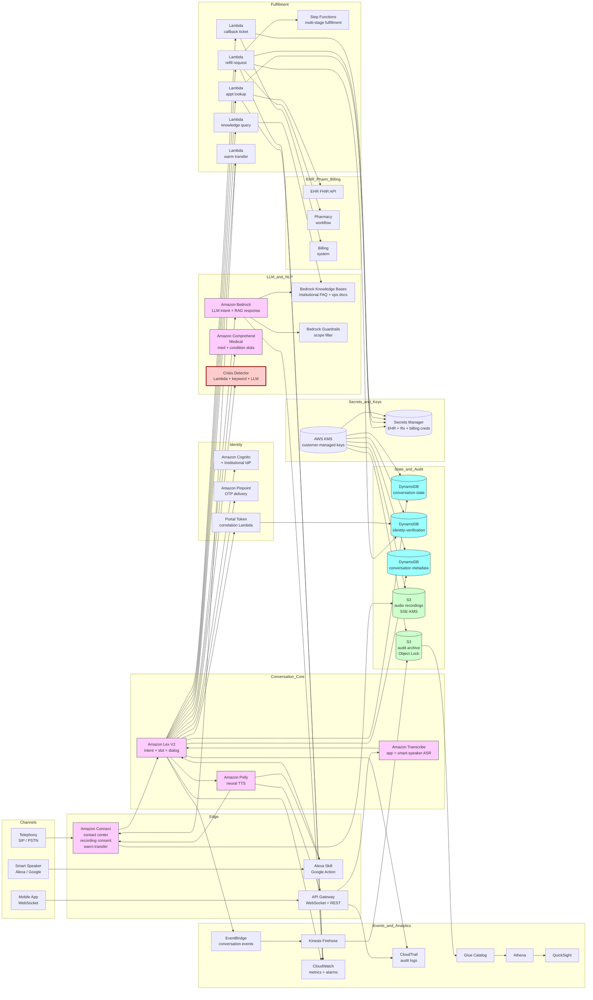

# Recipe 10.5: Patient-Facing Voice Assistant ⭐⭐

**Complexity:** Medium · **Phase:** Production-track · **Estimated Cost:** ~$0.05-0.30 per completed conversation (depends on call duration, choice of ASR and TTS tier, LLM usage for intent and dialog, and whether the conversation is fulfilled in self-service or transferred to a human agent)

---

## The Problem

It is 9:14 on a Saturday morning. An 82-year-old man named Walter is sitting at his kitchen table with a paper appointment card from his cardiologist's office. The card says his next visit is on the 17th. Walter is reasonably sure that means the 17th of June, but his wife thought it was July, and now neither of them is certain. The cardiologist's office is closed on Saturdays. Walter does not have the patient portal set up. He had it set up four years ago but he changed his email address after his old provider went out of business and he never got the new email registered with the portal, and the last time he tried to log in he ended up locked out and had to wait for a paper letter. The paper letter never came. He has not tried to log in since.

He picks up the phone and calls the cardiology office's main line. The recorded message tells him the office is closed and to call back Monday between 8 and 5. Then it tells him that for medical emergencies he should call 911 or go to the nearest emergency room. Then it tells him about the patient portal. Then it ends. There is no option to check an appointment. There is no option to talk to anyone. There is, in particular, no way to say "I just want to know if my appointment is on June 17th or July 17th" and get an answer.

Walter hangs up and waits until Monday. On Monday at 8:02 he calls back. The phone tree picks up, runs through its menus, and routes him to the scheduling line. He waits on hold for twenty-two minutes. Eventually a scheduling agent picks up, takes his name and date of birth, looks up his record, and tells him his appointment is on June 17th at 2:30 pm. The whole exchange, once the agent is on the line, takes ninety seconds.

Walter has, in this scenario, used twenty-three minutes of his Monday morning, twenty-two minutes of a scheduling agent's Monday morning, one phone-tree routing event, and the institutional patience that everyone involved would prefer to spend on something more useful than confirming that an appointment is on the date the appointment card already said it was on. The call did not need a human. It did not even need a phone tree. It needed a system that could pick up the phone on Saturday morning, listen to "I'm trying to confirm my next cardiology appointment," verify Walter's identity in some manner that does not require a portal login or a perfect memory for menu navigation, look up his appointment, and tell him "your appointment is Tuesday, June 17th, at 2:30 pm." Total elapsed time: under a minute. Total human staff time: zero.

This is the patient-facing voice assistant problem. It is not a phone tree (recipe 10.1). It is not dictation for a clinician (recipe 10.4). It is the conversational entry point through which a patient can ask, in plain English (or Spanish, or Mandarin, or whatever language the institution serves), for the things that healthcare organizations get a hundred thousand calls about every year: when is my appointment, what is my copay, can you refill my prescription, where is the lab, when does the pharmacy close, did my test results come back, do I need to fast before tomorrow's visit, my insurance changed and I want to update it, can someone call me back about a billing question. None of these calls require clinical judgment. Most of them do not require a human. All of them, today, route through a phone tree and a queue and a human agent because there has not been a better front door.

The cost of having no better front door is not abstract. Walter's twenty-three minutes scale up across millions of similar calls per year, multiplied across thousands of healthcare organizations, into a staggering aggregate of patient time spent waiting for someone to confirm an appointment date. <!-- TODO: verify; healthcare contact-center industry research has shown that a substantial fraction of inbound calls are appointment-related inquiries that could be self-served by a sufficiently capable automated system, with specific percentages varying by specialty and organization --> The aggregate of staff time spent on those same calls is what call-center operations directors lose sleep over: scheduling agents spend a significant fraction of their day on calls that do not require their training, which means the calls that do require their training (the cancellation that should have been a transfer to a clinical triage nurse, the patient who is calling about an appointment but mentions chest pain in passing, the family caregiver coordinating multiple specialty visits) sit in the queue longer than they should.

There is also the equity dimension. The patient who has a portal account, a smartphone, and twenty minutes of comfort with web-form interactions handles all of this through the portal and never calls. The patient who is older, has limited tech comfort, has a shared family device, has a hearing aid that does not pair well with phones, has a vision impairment that makes the portal hard to navigate, has a primary language other than English, has a cognitive condition that makes multi-step menu navigation hard, or simply does not own a smartphone, has the phone as their primary or only access channel. <!-- TODO: verify; consumer healthcare research has consistently shown that older patients, patients with disabilities, patients in rural areas with limited broadband, and patients whose primary language is not English disproportionately rely on telephone-based access, but specific demographic figures continue to evolve --> The phone-tree-and-queue front door serves these patients meaningfully worse than it serves the digitally-comfortable cohort, in ways that are not visible in the operational dashboards that count completed appointments rather than abandoned calls.

There is the after-hours dimension. A patient who calls on Saturday morning with a question that does not need a human gets, in most healthcare organizations today, "we are closed, please call back Monday." A patient who calls Saturday morning with a question that does need a human gets the same message. The triage signal is lost; the inquiry is deferred; sometimes the patient just goes to the emergency department because they could not get an answer to a question that an automated system could have answered in thirty seconds.

There is the consumer-experience dimension. Patients who use voice assistants in the rest of their life (asking the smart speaker for a recipe, asking the phone for directions, asking the in-car system to call mom) are increasingly puzzled about why the healthcare system is so much harder to interact with than every other consumer service. The expectation gap is real and it is widening. The institutions that close it earn the loyalty of patients who would otherwise consider a competitor with a better digital experience. The institutions that ignore it lose patients quietly to retail-clinic competitors and direct-to-consumer telehealth services that figured this out years ago.

There is the cost dimension. A live agent handles roughly twenty to forty calls per hour depending on the complexity of the calls. <!-- TODO: verify; healthcare contact-center average handle time and calls-per-agent-per-hour vary substantially by specialty, organization, and call type --> The fully-loaded cost per agent-handled call (labor, infrastructure, training, attrition, occupancy, supervision) is not small. Calls that can be safely handled by an automated voice assistant cost a small fraction of that, with the cost dominated by the per-minute ASR pricing, the LLM intent-and-dialog pricing, and the telephony per-minute charges. The economics of moving the right calls into self-service are favorable enough that most large healthcare contact centers are actively investing in this category.

The trick, and the reason this recipe sits in the medium-complexity tier rather than the simple tier, is that "the right calls" is the load-bearing phrase in that sentence. A patient-facing voice assistant that handles too narrow a slice of calls is barely worth deploying. A patient-facing voice assistant that overreaches and tries to handle clinical questions is dangerous. The architectural challenge is building a system that confidently handles the operational and informational calls that should be self-served, gracefully escalates the calls that need a human, and instantaneously routes the calls that signal a clinical emergency to clinical triage. The technology to do this exists. The engineering to do it well requires more care than the simple-tier recipes in this chapter, because the failure modes are visible to patients, the safety constraints are real, and the equity constraints are non-negotiable.

The system we will build in this recipe handles the following kinds of patient interactions. Confirming and changing appointments. Requesting prescription refills (where the institution allows automated refill requests; many gate this through clinical review). Looking up basic facility information (hours, location, parking, pharmacy hours, lab hours). Requesting a callback for a topic the assistant does not handle directly. Acknowledging and routing common questions about insurance, billing, and medical records. Recognizing crisis or urgency signals ("chest pain," "I can't breathe," "I'm thinking about hurting myself") and immediately routing to clinical triage or to crisis resources, never trying to handle them in the assistant. Recognizing and routing complex or scope-out-of-bounds requests to a human agent with a warm handoff that preserves the conversation context, so the patient does not have to start over.

The system will be reachable through three channels: the institution's main phone line (telephony, where most of the volume lives, especially for older patients), the institution's mobile app (in-app voice assistant, where the engineering is easier and the demographic is younger), and the institution's smart speaker integration (Alexa skill or Google Action, where the volume is small but the patient-experience signal is strong because patients tell their friends and family about the smart-speaker thing more than any other channel). The architecture is the same across all three; the entry-point glue is different.

This is not the most technically novel recipe in the chapter. Patient-facing voice assistants have been a real product category for a few years now, with multiple commercial vendors and a growing reference architecture for institutions that build their own. The recipe takes seriously the things that go wrong in production: the older patient whose accent is underrepresented in the ASR's training data and who experiences the assistant as not understanding her, the family caregiver calling on behalf of an elderly parent with a HIPAA proxy relationship the institution has on file, the patient who mentions chest pain in passing while calling about an appointment, the shared phone where two patients call from the same number and the system has to verify identity correctly, the patient who tries to use the assistant on a flip phone and the assistant must degrade gracefully to DTMF fallback. The interesting engineering work is mostly in these edges; the happy path is straightforward.

Let's get into it.

---

## The Technology: Conversational Voice With Real Constraints

### What Makes Patient-Facing Different

A patient-facing voice assistant is, on paper, the same stack as the IVR enhancement in recipe 10.1: ASR plus NLU plus dialog management plus fulfillment plus TTS. In practice, the constraints are different in ways that change every architectural decision.

**The caller population is wide.** Recipe 10.1 routes calls; the routing decision is forgiving because if the system gets it wrong, the caller ends up at an agent who can correct the route. A patient-facing assistant that fulfills requests directly does not have that forgiveness. The system has to actually serve a 22-year-old commercial-insurance patient with a smartphone, an 82-year-old Medicare patient with a hearing aid, a Spanish-speaking patient who learned English as an adult, a patient with a speech impairment from a stroke, and a family caregiver calling on behalf of all three at various points. The accuracy floor matters more than the accuracy ceiling.

**The interaction is conversational, not navigational.** An IVR that misroutes a call is a small annoyance. An assistant that fails to understand "I want to know if my appointment is on the seventeenth" three times in a row is a deeply frustrating experience. The dialog manager has to be more flexible than the IVR equivalent: it has to handle reformulation gracefully, recognize when it is going in circles, and escalate before the patient gives up.

**The fulfillment surface is broader.** An IVR sends the call to the right queue. A voice assistant looks up the appointment, processes the refill request, retrieves the lab hours, transfers the call to nurse triage with a warm handoff that includes the conversation summary. Each of those is an integration: the EHR's appointment API, the pharmacy fulfillment system, the facility-information knowledge base, the contact center's warm-transfer protocol. The architecture has to handle them all, and handle their failure modes (the appointment API is down, the pharmacy system has not synced, the facility hours have not been updated for the holiday weekend).

**Identity verification is unavoidable for most useful interactions.** Looking up an appointment, requesting a refill, asking for test results, or anything else that touches PHI requires the system to confirm it is talking to the patient (or to an authorized proxy). Identity verification over voice is harder than it looks. Date of birth alone is famously weak. Knowledge-based authentication ("what was your last visit's copay?") is friction the patient does not want. Voice biometrics is technically promising but operationally complex and demographically uneven. The architecture has to choose, document, and defend its identity-verification posture.

**Scope containment is a clinical-safety requirement.** A patient calling about an appointment may, at any moment, ask the assistant a clinical question. "While I have you, my blood pressure has been kind of high lately, what do you think?" The assistant must not answer. It must recognize that this is a clinical question, decline politely, and offer a clinically-appropriate next step (transfer to nurse triage, schedule a visit, send a message to the clinical team through the patient portal). The boundary between "things the assistant handles" and "things the assistant defers to clinicians" is a clinical-safety document that the assistant enforces every turn, not a marketing description.

**Crisis detection is a hard requirement.** Among the calls a patient-facing assistant handles, a small but non-zero fraction will contain crisis signals: chest pain, shortness of breath, suicidal ideation, severe allergic reactions, signs of stroke, severe pain, drug overdose, suspected child or elder abuse. The assistant must recognize these signals reliably, override every other routing decision, and connect the caller to clinical triage or 988 or 911 immediately. The detection has to err strongly on the side of caution. The cost of a false positive (the patient who said "my chest hurt yesterday but it is fine now" gets routed to triage) is a brief patient inconvenience and a small operational cost. The cost of a false negative (the assistant routes the patient with active chest pain to "we will call you back about that") is a clinical-safety incident.

**The channel matters.** Phone-line audio is narrowband, prone to background noise, often comes from speakerphones in less-than-ideal acoustic environments, sometimes on cellular connections with packet loss. App-based audio is wideband, usually clearer, but the patient is often multitasking and may be in a noisier environment than they realize. Smart-speaker audio passes through a vendor pipeline that already does ASR and NLU before your code sees it; you are integrating with a vendor's voice platform rather than running your own. Each channel needs its own engineering investment, and the assistant has to behave consistently across them.

**Regulatory and compliance overlay.** A patient-facing voice system that handles refill requests is potentially making clinical-workflow decisions; the FDA has been clear that pure information retrieval is not a medical device, but the line moves when the assistant starts triaging or recommending. <!-- TODO: verify; FDA's positions on Software-as-a-Medical-Device for patient-facing automated systems continue to evolve, with guidance documents updated periodically --> HIPAA applies to every interaction that touches PHI, with the audio itself constituting PHI in addition to whatever the patient said in it. State-level recording-consent laws apply (more on this below). Telephone Consumer Protection Act (TCPA) considerations apply to outbound calls if the assistant is also used for outbound contact. The compliance review for a patient-facing voice assistant is more involved than for an IVR.

**Equity is a first-class concern, not an afterthought.** Voice ASR systematically underperforms for some speaker demographics. <!-- TODO: verify; multiple peer-reviewed studies including Koenecke et al. 2020 in PNAS have documented substantial accuracy disparities in commercial ASR systems across demographic groups --> An assistant that fails for older patients, patients with non-English first languages, patients with speech differences, or patients with regional accents has not just a usability problem but an equity problem, and the patients who are failed are often the ones who depend on the phone the most. Per-cohort accuracy monitoring is required from day one, with explicit thresholds that gate launch.

These properties combine to make the patient-facing voice assistant a recognizably distinct technology problem from the simpler voice recipes. The components are familiar; the system-level rigor is different.

### The Conversational Stack

Patient-facing voice assistants are built from a stack of pretty distinct technologies, and the architectural choices come from how they fit together.

**Streaming ASR.** Audio in, partial-and-final transcripts out. The same technology family as recipe 10.1, with the same telephony-versus-wideband tradeoffs and the same need for a model with reasonable medical-vocabulary coverage. Patient-facing assistants do not need full clinical-domain ASR (the patient is not dictating a clinical note), but they need enough medical-term coverage to handle the medication names and condition names that come up in the kind of calls they handle.

**Intent classification.** Mapping a transcript to one of a finite set of intents: "confirm appointment," "request refill," "facility hours," "billing inquiry," "request callback," "out-of-scope clinical question," "crisis signal," "transfer to agent," and however many others the institution chooses to support. Modern intent classification is increasingly LLM-driven (zero or few-shot prompting with a list of intents) rather than trained classifiers, because the LLM-driven approach handles paraphrase variation better and lets the institution add intents without retraining a model. The trade-off is per-call cost and latency. The hybrid pattern (small fast classifier as the first stage, LLM as the second-stage fallback for low-confidence cases) is a reasonable middle ground.

**Slot extraction.** Within an intent, extracting the structured parameters: the medication name for a refill, the date for an appointment confirmation, the billing-question topic. Comprehend Medical's coded entity extraction is useful here for medical entities (medications, conditions). For non-medical entities (dates, phone numbers, simple names), simpler tools are fine. The slot-extraction step is where the LLM-driven approach has been pulling significant weight in recent years; LLM extraction handles the long tail of how patients phrase things ("the blue pill I take for my pressure," "the one I started after my stroke") far better than rule-based or classifier-based extraction.

**Dialog management.** The turn-by-turn orchestration that decides what to say next. Slot-filling state machines, LLM-driven open dialog, or hybrid. Patient-facing healthcare overwhelmingly uses slot-filling state machines for the core fulfillment paths (confirm appointment, request refill, retrieve hours), with LLM augmentation for clarification and reformulation. The reasons are the same as in recipe 10.1: predictability, debuggability, compliance review, and the ability to certify that the system will not say something it should not say. Full LLM-driven dialog is more conversational and harder to constrain.

**Knowledge retrieval (RAG patterns).** For informational queries (facility hours, parking, what to bring to a visit, when to fast before a procedure), the assistant retrieves from a curated institutional knowledge base. The pattern is RAG: convert the patient's question into a retrieval query, fetch the relevant snippets from the institutional knowledge base, ground the LLM's response in the retrieved snippets, return the response. The institutional knowledge base must be curated, dated, and version-controlled; an out-of-date answer is sometimes worse than no answer (the patient who shows up at the lab at 6 pm because the knowledge base says it is open until 8 when it actually closed at 5 has a worse experience than the patient who was told "let me transfer you to someone who can confirm").

**Fulfillment integrations.** Once the assistant knows what the patient wants and has the slots filled, it executes the fulfillment. Appointment lookup against the EHR scheduling API. Refill request through the prescription-management workflow (which usually queues for clinical review rather than directly authorizing the refill). Knowledge-base lookup. Callback ticket creation. Warm transfer to a human agent with conversation summary. Each integration has its own API surface, its own authentication requirements, its own failure modes, and its own latency budget. The integrations are most of the engineering work in this recipe.

**Identity and authentication.** The architectural decision that touches every other component. The choices are roughly: knowledge-based authentication (date of birth plus a second factor, often a recent visit detail or a portion of the phone number on file), one-time-passcode (OTP) sent to the registered phone or email, voice biometrics (the system has a stored voiceprint and matches the live audio against it), portal-token-based (the patient logs in to the portal first, then dials and the call is correlated to the logged-in session through caller ID or a numeric token), and third-party identity verification services. Most institutions use a combination, with progressive identity strengthening (low-friction for low-stakes interactions, higher-friction for higher-stakes interactions like refills).

**Crisis detection.** A separate signal-extraction layer that runs in parallel with intent classification, looking for crisis phrases ("chest pain," "I can't breathe," "I want to die," "I overdosed," "my baby is not breathing"). Implementations range from a curated keyword list (high-recall, easy to audit) to a small dedicated classifier trained on labeled crisis utterances to LLM-driven detection with a structured output. The output of the detector is a hard interrupt: when crisis is detected, every other dialog state is preempted and the call is routed to clinical triage, 988, or 911 depending on the configured escalation. The detector errs strongly on the side of false positives.

**TTS for system speech.** The assistant's responses are spoken back to the caller through neural text-to-speech. Modern neural TTS (Polly's neural voices, ElevenLabs, vendor-specific offerings) is good enough that callers usually do not register that they are talking to a synthesized voice. Voice selection (one consistent voice per assistant identity), prosody (the cadence and emphasis of the response), and pronunciation (medication names, place names, the name of the institution) all matter for caller experience. Custom-pronunciation lexicons for clinical terms and institution-specific names are the high-leverage tuning step.

**Telephony plumbing.** The unglamorous but dominant piece of the engineering work for the phone channel. SIP trunking, contact center integration, call recording (with consent), warm-transfer protocols, presence and queue integration with the live-agent platform, the deeply boring work of getting audio into and out of the assistant in production telephony conditions.

**App and smart-speaker channels.** The non-phone channels have their own integration surfaces. The mobile app's voice assistant runs over a WebSocket-style audio channel and bypasses the telephony plumbing entirely. The smart-speaker integration uses the vendor's voice platform (Alexa Skill SDK, Google Actions on Google) which already does ASR and NLU before your code sees the request. Each has its own authentication model, its own latency characteristics, and its own constraints on what the assistant is allowed to say (Amazon's Alexa health-related skills have specific certification requirements, for example). <!-- TODO: verify; the certification requirements for healthcare-related Alexa skills and Google Actions continue to evolve, with both platforms maintaining specific guidelines for HIPAA-eligible deployments -->

**Audit and observability.** Every conversation produces a durable audit record: the audio reference, the transcript, the intent and slots, the fulfillment outcome, the identity-verification trail, the escalation decisions. Per-cohort accuracy monitoring (older speakers, non-native English, regional accents) requires the audit data to support cohort segmentation. Operational telemetry (intent-classification confidence distributions, dialog turn count distributions, escalation rates per intent) feeds the dashboards that operations and clinical-quality teams use.

### Identity Verification Over Voice

Identity verification deserves its own discussion because it is the first hard architectural decision and because most institutions get it wrong on the first pass.

The naive approach is to ask for date of birth and treat that as authentication. This is, on its own, weak. A motivated attacker can find a date of birth from a public source. A friend or family member often knows one. The collision rate within a large patient population is non-trivial (the probability that two different patients share a date of birth and a common-enough name is higher than you would think). Date of birth as a sole identity verification mechanism does not meet a reasonable bar for PHI access.

The better approach is a layered identity check that scales with the sensitivity of the requested action. For low-sensitivity interactions (looking up facility hours, confirming a publicly-known appointment time without disclosing the reason for the visit), no identity verification is required. For medium-sensitivity interactions (confirming a specific appointment that names the provider and reason), the system verifies the caller's identity through caller ID matching (the call came from a phone number on file for the patient) plus a date of birth or last-name confirmation. For high-sensitivity interactions (refill requests, test result inquiries, billing detail), the system requires stronger verification: a one-time passcode sent to the registered phone or email, or a portal-token-based correlation, or voice-biometric matching where deployed.

The institutional policy on identity verification is a clinical-and-compliance document that the assistant enforces. It is not an engineering preference. The chief privacy officer, the chief information security officer, and the clinical-operations leadership own the policy. The engineering team builds what they specify.

A few specific patterns worth knowing.

**Caller ID matching.** When the patient calls from the phone number on file, the institution can match the inbound caller ID against the patient registry as a soft identity signal. This is not authentication on its own (caller IDs can be spoofed), but it is a useful first signal that lets the assistant skip some friction for the calls where the signal matches. Patients calling from a different number (a friend's phone, a hospital phone, a hotel phone) get the higher-friction path. <!-- TODO: verify; caller-ID-based identification is a common pattern in healthcare voice systems but is not a strong authentication factor on its own, and FCC's STIR/SHAKEN framework continues to evolve in ways that affect the reliability of caller ID -->

**One-time passcode by SMS or email.** The patient asks for a refill; the assistant says "I will send a passcode to the phone on file ending in 1234, please read it back." The patient receives the passcode and reads it. The assistant verifies and proceeds. This is operationally simple, well-understood by patients, and provides reasonable additional assurance. The friction is meaningful but acceptable for higher-stakes transactions.

**Portal-token correlation.** The patient logs in to the portal, navigates to "talk to us by voice," gets a numeric token, calls the assistant, and reads the token. The assistant correlates the token to the logged-in portal session. Strong authentication, low call-side friction, but requires the patient to be portal-enrolled and to navigate to the right place. Useful for the patient population that uses the portal anyway.

**Voice biometrics.** A passive or active voiceprint match. Active: the patient says a specific passphrase ("My voice is my password") and the system matches against a stored voiceprint. Passive: the system matches against the natural speech of the conversation as it proceeds. The technology works reasonably well for the speakers in the population whose voices are well-represented in the training data. It works less well for speakers whose voices change (illness, age progression, cognitive change), for speakers whose voices are underrepresented in training data, and for the case of the family caregiver calling on behalf of the patient. Voice biometrics also raises the biometric-data-governance question: storing voiceprints implicates BIPA in Illinois, GIPA in Texas, and similar state laws, with explicit consent and disclosure requirements. <!-- TODO: verify; the Illinois Biometric Information Privacy Act and similar state laws impose specific consent and disclosure requirements for biometric identifiers including voiceprints, with case law continuing to develop -->

**Family caregiver and HIPAA proxy.** The institution often has an authorized caregiver designation on file (the patient has authorized their adult daughter to receive PHI on their behalf). The assistant must support these proxy relationships: the caregiver authenticates as themselves, the assistant looks up which patients the caregiver is authorized to act for, the conversation proceeds in the patient's record. The proxy designation is a structured field in the EHR; the assistant integrates with whatever the institution uses to store it.

<!-- TODO (TechWriter): Expert review S1 (HIGH). Promote caregiver-self-authentication into a distinct architectural flow rather than the current post-hoc resolution. The Step 4 pseudocode currently sends the OTP to the patient's registered destination and resolves caregiver context after successful OTP verification, which fails the boundary in the common scenario where a caregiver answers the patient's phone and reads back the OTP that was meant to authenticate the patient. Specify two distinct flows: (1) capture caller role (self or caregiver) before identity verification begins; (2) caregiver flow authenticates the caregiver with their own credential, captures and verifies the target patient, looks up the caregiver-patient authorization in the institutional registry, and only then proceeds; (3) audit trail records authenticated_party explicitly. Reference institutional caregiver-enrollment substrate as prerequisite. -->

**Step-up authentication.** A common pattern: the conversation starts at a low identity-assurance level and the assistant requests additional verification when the conversation enters higher-stakes territory. The patient calls about appointment hours (no auth), then asks about their specific appointment (caller ID match plus date of birth), then asks about a refill (OTP step-up). Each step-up adds friction; the architecture makes the friction proportional to the stakes.

**Bypass and emergency override for crisis.** When crisis is detected, identity verification is overridden. The patient who calls in crisis must not be blocked by an authentication failure. Route to triage or 988 first; sort out identity later if needed.

### Scope Containment

The single most under-engineered aspect of patient-facing voice assistants in production is scope containment. The assistant has a defined set of things it handles. Everything else, it should refuse, defer, or escalate. Getting this right is harder than the engineering teams expect, because the patients do not know what is in scope and out of scope, and the LLM components in the stack are inherently disposed to attempt answers to questions they should not be answering.

A few scope-containment patterns that work.

**Explicit out-of-scope refusal.** When the assistant's intent classifier returns "out-of-scope clinical question" or "out-of-scope financial advice" or "out-of-scope legal question," the assistant says so. "I cannot help with clinical questions, but I can transfer you to our nurse triage line. Would you like me to do that?" The refusal is explicit, the alternative is concrete, the patient knows what to do next.

**LLM constraint by system prompt and structured output.** When the intent fulfillment uses an LLM (for response generation, for retrieval-augmented answering of informational questions), the system prompt explicitly defines the scope: "you answer only questions about hours of operation, parking, what to bring, and what to expect. For any clinical question, refuse and offer a transfer to nurse triage. For any financial-advice question, refuse and offer a transfer to billing. Do not provide medication advice, dosing information, symptom interpretation, or any clinical recommendation under any circumstances." The structured output schema requires the LLM to declare whether the response is in-scope; out-of-scope responses are filtered before being spoken back to the patient.

**Allowlist for clinical-information disclosure.** The assistant can confirm that a patient has an appointment with Dr. Smith on Tuesday at 2:30. It cannot tell the patient what the appointment is for in clinical terms (cancer follow-up vs. wellness check) without higher identity assurance. The information disclosure rules are encoded in the assistant's response generation and enforced as a structured filter.

**Continuous scope-drift monitoring.** Periodically, the operations team samples conversations and reviews them for scope drift: did the assistant answer something it should have refused? Did it provide clinical advice? Did it interpret a symptom? The findings feed prompt-and-rule updates. This is operational scope, not engineering scope, but the engineering team has to support the sampling and review tooling.

**The "I don't know" path.** When the assistant is uncertain whether a question is in scope, the safer response is "I'm not sure I can help with that, let me connect you with someone who can." The assistant errs toward escalation, not toward a confidently wrong answer. The escalation rate is a key operational metric and the institutional team tunes it explicitly.

<!-- TODO (TechWriter): Expert review A2 (HIGH). Promote the scope filter into a layered architectural primitive with named ownership, rather than a single opaque check. Specify three explicit layers: (1) a disallowed-content category catalog (clinical advice, medication dosing, symptom interpretation, prognosis discussion, financial advice, legal advice, others institution-defined) owned by the clinical-quality officer with quarterly review cadence; (2) a per-intent allowed-content allowlist (an "appointment confirmation" intent's allowed responses are constrained differently from a "facility info" intent's) owned by the patient-experience lead; (3) Bedrock Guardrails configuration covering vendor-managed harmful-content plus institutional restricted-topic categories, with both leads named for change-management. Specify which layer runs first, what each is responsible for, how the audit trail records which layer caught a violation, and how findings from offline scope-drift review feed back into the runtime filter. The recipe's own self-assessment names scope containment as "the single most under-engineered aspect"; the architecture should match that elevation. -->

### Crisis Detection

Crisis detection deserves its own treatment because it is the highest-stakes flow in the assistant.

The detector runs in parallel with intent classification and on every patient utterance. It is not gated on the conversation having reached a particular state; the patient who calls about an appointment and mentions chest pain three turns in must be detected at that turn, not when the conversation ends.

The detector's outputs are tiered by severity and by category:

**Acute medical emergencies.** Chest pain, shortness of breath, signs of stroke (facial droop, slurred speech, sudden weakness), severe allergic reactions, severe bleeding, suspected overdose, infant or child not breathing. Disposition: bypass everything else and route to 911 messaging plus immediate transfer to clinical triage if available.

**Suicidal or homicidal ideation.** Active expressions of intent to harm self or others. Disposition: bypass everything else and route to 988 (or the institution's behavioral-health crisis line) plus immediate transfer to crisis counseling if available. The system disclaims that it is not a crisis counselor and that 988 is the right resource.

**Suspected abuse or neglect.** Statements suggesting child, elder, or partner abuse. Disposition: route to a designated escalation pathway per the institution's child-protection or adult-protective-services protocol. This is institution-specific and clinically governed.

**Urgent but not immediately-emergent symptoms.** Severe pain, prolonged fever, severe headache, new severe symptoms. Disposition: route to clinical triage with a flagged-urgent note. This is the band where the assistant errs strongly on the side of caution.

The detector is implemented as a layered combination of: a curated keyword list for the most unambiguous signals (high recall, easy to audit, version-controlled by the clinical-quality team); a small classifier for paraphrase variation; an LLM-driven detector for the more subtle cases. The output of the detection is reviewed and audited per institutional policy. False-negative cases are treated as clinical-quality incidents and reviewed individually.

<!-- TODO (TechWriter): Expert review A1 (HIGH). Promote per-language crisis-detection structure into the architecture pattern rather than leaving it implicit. Specify: per-language curated vocabulary list (clinically governed, version-controlled by clinical-quality team with native-speaker clinical input); per-language classifier configuration; per-language LLM-prompt; per-language detection-rate monitoring with launch gates per language; per-language false-negative review with native-speaker clinical reviewer. Languages without native-speaker-curated detection assets should route directly to human agents (over-escalation in an unsupported language is the architecturally-correct conservative default). The recipe correctly elevates multilingual-from-day-one as required and crisis detection as the highest-stakes flow; the architecture pattern needs to make per-language crisis coverage as concrete as the English path. -->

The detection list is a clinical-safety document, not an engineering configuration. The clinical-quality officer or equivalent role owns it. The engineering team implements it. Changes go through clinical review.

### Where the Field Has Moved

Some practical updates worth knowing.

**LLM-driven intent and dialog has reset the bar.** Patient-facing voice assistants in 2020 used trained intent classifiers and rigid slot-filling state machines. Modern assistants use LLM-driven intent classification (with structured output), LLM-driven slot extraction (handling the long tail of patient phrasing), and LLM-augmented dialog (with rule-based scaffolding for compliance and predictability). The improvement in caller experience is substantial. The improvement in build effort is also substantial: institutions launching today typically reach a usable assistant in months rather than the year-plus that the previous-generation toolchain required.

**RAG patterns have eaten the FAQ chatbot.** The institutional FAQ used to be a curated list of question-answer pairs that the chatbot or assistant matched against. Today the institutional knowledge base is unstructured documents (operations procedures, facility information, what-to-expect content), retrieved at query time, with the LLM grounding its response in the retrieved passages. The maintenance burden has shifted from "keep the Q&A pairs current" to "keep the source documents current," which is usually easier because the source documents already exist and are owned by the teams that produce them.

**Smart-speaker integration has matured but stayed niche.** Alexa skills and Google Actions for healthcare have grown more capable and more compliance-friendly, but the absolute volume of patient interactions through smart speakers remains small compared to phone and app. Smart speakers are a genuine accessibility win for some patients (older patients with vision impairment, patients with mobility challenges) but the institutional engineering investment is usually disproportionate to the volume served. The pattern is to ship smart-speaker integration as a deliberate equity and brand investment, not as a primary volume channel.

**Telephony has become more cloud-native.** Cloud contact-center platforms (Amazon Connect, Genesys Cloud, Twilio Flex, Five9, Cisco Webex Contact Center, NICE CXone) have absorbed a lot of the telephony plumbing that used to be on-premise. The patient-facing assistant integrates with the cloud contact-center platform rather than with raw SIP infrastructure. The integration is meaningfully simpler than it used to be, though it is still meaningfully more work than people anticipate.

**Voice biometrics has plateaued.** The technology works well enough to be useful as a step-up factor for specific cohorts, but the operational complexity (enrollment, re-enrollment when voices change, the biometric-data-governance overhead, the demographic accuracy variation) means most institutions have settled on knowledge-based authentication plus OTP as the default and have positioned voice biometrics as an opt-in feature for specific high-volume callers.

**Multilingual deployment has moved from optional to expected.** Patient populations are linguistically diverse in most U.S. healthcare markets. The assistant deployed today must be multilingual at launch or have a clear roadmap to multilingual support. English-only assistants in markets with significant non-English-speaking populations are increasingly seen as an equity gap rather than a phase-one acceptable scope.

**The build-versus-buy economics favor buy for most institutions.** Commercial vendors (Hyro, Notable, Conversa, several others) offer institutional patient-facing voice assistants that integrate with major EHRs and contact-center platforms. <!-- TODO: verify; the patient-facing voice assistant vendor landscape has been growing and consolidating since approximately 2021, with specific vendor names and capabilities continuing to evolve --> For most institutions, the buy path is faster, comes with EHR integration already built, and offloads the ongoing model and prompt maintenance. The build path is reserved for institutions with unusual scope requirements, with research interests in the technology itself, or with very large call volumes where the per-call economics tip in favor of in-house operation. The recipe walks through what the architecture looks like either way.

---

## General Architecture Pattern

A patient-facing voice assistant decomposes into nine logical stages: channel entry and audio capture (the patient connects via phone, app, or smart speaker), streaming ASR (audio becomes text), parallel crisis detection (the highest-priority signal extraction), intent classification and slot extraction (mapping speech to a structured request), identity verification (gating PHI access at the level the request requires), fulfillment (executing the request through the appropriate integration), response generation and TTS (the assistant's reply is composed and spoken back), escalation and warm handoff (when the assistant cannot or should not handle the request), and audit, archive, and learning (durable record-keeping and per-cohort accuracy monitoring).

```
┌──────────── CHANNEL ENTRY & AUDIO CAPTURE ───────────────┐
│                                                           │
│   [Patient connects through one of three channels]        │
│    - Telephony: SIP trunk -> contact center platform      │
│    - Mobile app: WebSocket audio -> backend               │
│    - Smart speaker: Alexa skill / Google Action           │
│                                                           │
│   [Recording-consent disclosure played first]             │
│    - State-law-aware: all-party-consent jurisdictions     │
│      hear an explicit recording disclosure                │
│    - One-party-consent jurisdictions hear at minimum      │
│      a notice that the call may be recorded for QA        │
│                                                           │
│   [Caller ID and channel metadata captured]               │
│    - Used as a soft identity signal downstream            │
│           │                                               │
│           ▼                                               │
│   [Output: audio stream, channel type, caller-ID hint]    │
│                                                           │
└───────────────────────────────────────────────────────────┘

┌──────────── STREAMING ASR ───────────────────────────────┐
│                                                           │
│   [Speech recognition with telephony-tuned model]         │
│    - Custom vocabulary biasing (institutional formulary,  │
│      facility names, provider names)                      │
│    - Per-language configuration (English, Spanish, etc.)  │
│                                                           │
│   [Streaming partials emit progressively]                 │
│    - Downstream consumes the latest partial for low-      │
│      latency intent and crisis classification             │
│   [Final transcripts emit on end-of-utterance]            │
│   [Per-word and per-utterance confidence scores]          │
│           │                                               │
│           ▼                                               │
│   [Output: rolling transcript stream with confidence]     │
│                                                           │
└───────────────────────────────────────────────────────────┘

┌──────────── PARALLEL CRISIS DETECTION ───────────────────┐
│                                                           │
│   [Crisis detector runs on every utterance]               │
│    - Curated keyword list (highest-recall, audited)       │
│    - Small classifier for paraphrase variation            │
│    - LLM detector for subtle cases                        │
│                                                           │
│   [Severity-tier classification]                          │
│    - Acute medical emergency -> 911 + clinical triage     │
│    - Suicidal/homicidal ideation -> 988 + crisis triage   │
│    - Suspected abuse -> protective-services pathway       │
│    - Urgent symptoms -> nurse triage urgent               │
│                                                           │
│   [Hard interrupt on detection]                           │
│    - Preempts every other dialog state                    │
│    - Identity verification bypassed for crisis routing    │
│           │                                               │
│           ▼                                               │
│   [Output (when triggered): crisis disposition that       │
│    overrides the rest of the pipeline]                    │
│                                                           │
└───────────────────────────────────────────────────────────┘

┌──────────── INTENT CLASSIFICATION & SLOT EXTRACTION ─────┐
│                                                           │
│   [Map utterance to structured intent]                    │
│    - LLM-driven classification with structured output     │
│    - Confidence threshold gate                            │
│    - Out-of-scope intents have explicit handlers          │
│                                                           │
│   [Extract slots within the intent]                       │
│    - Medication name (with RxNorm linking via             │
│      Comprehend Medical for refill intents)               │
│    - Date and time (for appointment intents)              │
│    - Provider name (for appointment intents)              │
│    - Location (for facility-info intents)                 │
│                                                           │
│   [Multi-turn slot completion]                            │
│    - Missing required slots trigger clarifying prompts    │
│    - Repeated low-confidence on the same slot triggers    │
│      an escalation timer                                  │
│           │                                               │
│           ▼                                               │
│   [Output: { intent, slots, confidence, turn_count }]     │
│                                                           │
└───────────────────────────────────────────────────────────┘

┌──────────── IDENTITY VERIFICATION ───────────────────────┐
│                                                           │
│   [Identity-assurance level required by intent]           │
│    - Public information (hours, location): no auth        │
│    - Soft-personal (appointment confirmation): caller     │
│      ID match + DOB                                       │
│    - PHI-disclosing (refill, results): step-up auth       │
│      via OTP, portal token, or voice biometric            │
│                                                           │
│   [Step-up authentication when intent escalates]          │
│    - Conversation may begin at low assurance and          │
│      step up when the patient asks for something          │
│      higher-stakes                                        │
│                                                           │
│   [Caregiver-proxy resolution]                            │
│    - Caregiver identifies as themselves                   │
│    - System looks up authorized patient relationships     │
│    - Conversation proceeds in the named patient's record  │
│                                                           │
│   [Auth failure handling]                                 │
│    - Configured retry budget                              │
│    - Failure escalates to live agent rather than          │
│      blocking the patient                                 │
│           │                                               │
│           ▼                                               │
│   [Output: identity-assurance level granted, patient ID,  │
│    caregiver context if applicable]                       │
│                                                           │
└───────────────────────────────────────────────────────────┘

┌──────────── FULFILLMENT ─────────────────────────────────┐
│                                                           │
│   [Route the intent to the appropriate fulfillment]       │
│                                                           │
│   - Appointment lookup -> EHR scheduling API              │
│   - Refill request -> pharmacy workflow with clinical     │
│     review queue (most institutions do not auto-          │
│     authorize refills)                                    │
│   - Facility info -> RAG over knowledge base              │
│   - Billing inquiry -> billing-system lookup or           │
│     callback ticket creation                              │
│   - Test results -> portal-message creation if            │
│     institutional policy allows; otherwise transfer       │
│   - Out-of-scope -> explicit refusal with concrete        │
│     alternative offered                                   │
│                                                           │
│   [Each fulfillment captures source span and provenance]  │
│    - The eventual response cites where the answer         │
│      came from in the audit trail                         │
│                                                           │
│   [Failure modes have defined fallbacks]                  │
│    - EHR API down: callback ticket created, patient       │
│      told the institution will get back to them           │
│    - Knowledge base outdated: defer to live agent         │
│    - Pharmacy system unreachable: callback ticket         │
│           │                                               │
│           ▼                                               │
│   [Output: fulfillment result, source provenance,         │
│    confidence in the answer]                              │
│                                                           │
└───────────────────────────────────────────────────────────┘

┌──────────── RESPONSE GENERATION & TTS ───────────────────┐
│                                                           │
│   [Compose the spoken response]                           │
│    - Templated for high-stakes responses (appointment     │
│      confirmation, refill submitted, identity verified)   │
│    - LLM-grounded for informational responses (RAG        │
│      output formatted as natural conversational reply)    │
│                                                           │
│   [Scope filter on every generated response]              │
│    - LLM output checked against allowed-content rules     │
│    - Out-of-scope content replaced with an explicit       │
│      refusal-and-transfer prompt                          │
│                                                           │
│   [TTS rendering]                                         │
│    - Neural TTS with consistent voice persona             │
│    - Custom-pronunciation lexicon for clinical terms,     │
│      medications, provider names, facility names          │
│    - Per-language voice selection                         │
│                                                           │
│   [Barge-in handling]                                     │
│    - Patient interrupts mid-prompt: ASR resumes,          │
│      response is interrupted, dialog continues            │
│           │                                               │
│           ▼                                               │
│   [Output: synthesized audio sent back through the        │
│    channel]                                               │
│                                                           │
└───────────────────────────────────────────────────────────┘

┌──────────── ESCALATION & WARM HANDOFF ───────────────────┐
│                                                           │
│   [Triggers for escalation]                               │
│    - Crisis detection (hard, immediate)                   │
│    - Out-of-scope intent (soft, with confirmation)        │
│    - Repeated low confidence in slot capture              │
│    - Repeated identity-verification failure               │
│    - Patient explicitly requests a human                  │
│    - Fulfillment system unavailable                       │
│                                                           │
│   [Warm-handoff packet built]                             │
│    - Conversation summary                                 │
│    - Transcript reference                                 │
│    - Identity-verification status                         │
│    - Detected intent and slots so far                     │
│    - Crisis-detection flags if applicable                 │
│    - Patient's caller ID and channel                      │
│                                                           │
│   [Transfer to live agent or crisis line]                 │
│    - Agent receives the warm-handoff packet on screen     │
│      before they answer                                   │
│    - Patient does not have to repeat what they already    │
│      told the assistant                                   │
│           │                                               │
│           ▼                                               │
│   [Output: handoff complete, audit record updated,        │
│    conversation lifecycle event emitted]                  │
│                                                           │
└───────────────────────────────────────────────────────────┘

┌──────────── AUDIT, ARCHIVE & LEARNING ───────────────────┐
│                                                           │
│   [Durable conversation record]                           │
│    - Audio reference (under retention policy)             │
│    - Transcript (with confidence)                         │
│    - Intent and slots                                     │
│    - Identity-verification trail                          │
│    - Fulfillment outcome                                  │
│    - Escalation events                                    │
│    - Channel and caller ID metadata                       │
│                                                           │
│   [Cohort-stratified accuracy monitoring]                 │
│    - Per-language, per-age-band (where opt-in declared),  │
│      per-channel, per-region                              │
│    - Disparity alerts on configured thresholds            │
│                                                           │
│   [Operational telemetry]                                 │
│    - Containment rate (intents fulfilled in self-service) │
│    - Escalation rate per intent                           │
│    - Crisis-detection rate and review outcomes            │
│    - Identity-verification success rate per assurance     │
│      level                                                │
│    - Per-channel AHT (average handle time)                │
│                                                           │
│   [Sampled review for scope drift]                        │
│    - Operations samples conversations periodically        │
│    - Findings feed prompt and rule updates                │
│           │                                               │
│           ▼                                               │
│   [Output: audit trail, telemetry, learning signals]      │
│                                                           │
└───────────────────────────────────────────────────────────┘
```

A few cross-cutting design points the architecture has to bake in.

**Audio is PHI even when nothing clinical is said.** A patient calling about an appointment is identifying themselves as a patient of the institution; the audio is PHI by virtue of the patient-institution association alone. The architecture treats audio as PHI throughout: encrypted at rest, encrypted in transit, access-controlled, retention bound by an explicit policy, BAAs in place for any vendor service that processes the audio.

**Recording-consent law varies by jurisdiction.** All-party-consent states require an explicit consent disclosure before recording begins; one-party-consent states require less but most institutions still play a "this call may be recorded for quality" notice. The disclosure is the first thing the caller hears. The architecture implements it as a per-call gate that runs before audio is committed to durable storage. Cross-state callers (the caller is in California, the institution is in Texas) follow the stricter of the two regimes. <!-- TODO: verify; the United States has approximately 12 all-party-consent states with the rest one-party-consent, and HIPAA layers on additional clinical-recording requirements regardless of state law -->

**Crisis detection runs in parallel with everything else.** It is not a stage that comes after intent classification; it runs simultaneously and can preempt at any point in the conversation. The architecture wires it as a parallel pass over every utterance with a hard-interrupt callback into the dialog manager.

**Identity verification is separable from intent.** The same intent ("look up my appointment") can be served at different identity-assurance levels depending on how much information the patient asks the system to disclose. The architecture decouples the intent from the assurance requirement and handles step-up dynamically.

**Fulfillment integrations have separate failure budgets.** When the EHR scheduling API is down, appointment-confirmation intents fail; everything else continues. The architecture isolates the integrations so one failed dependency does not take the whole assistant down.

**Channels are entry points; the conversation logic is shared.** The phone-line and app-based and smart-speaker channels share the intent classifier, the dialog manager, the fulfillment integrations, and the audit pipeline. The channels differ at the edges (audio capture, response delivery, identity hints from caller ID or device authentication) and converge into a common conversation runtime.

**The escalation rate is a feature, not a bug.** Some intents should always escalate (out-of-scope clinical, complex billing, anything in the urgency band). The architecture tracks escalation rate as a telemetry metric and the operational dashboard shows it broken out by intent. A drop in escalation rate is not necessarily a win; it might mean the assistant is handling things it should not be handling.

**Audit retention has to span the legal record's lifetime.** The conversation record is, in many regulatory readings, part of the medical record. Retention is sized to HIPAA's six-year minimum, the state's medical-records-retention floor, the contact-center vendor's audit-retention floor, and the institutional regulatory floor. <!-- TODO: verify; HIPAA requires a six-year minimum retention for relevant records, with state-specific medical-records-retention rules layering on top, and the precise applicability to voice-assistant audit records is institution-specific -->

**Failure has to degrade to a live human, not to a dead end.** When the assistant cannot do its job (ASR is down, NLU is down, the patient is profoundly outside the assistant's competence), the fallback is always "let me connect you to someone." Never "we cannot help you, please call back." Patients who reach a dead end on their first attempt do not call back; they go to the ER, or they leave the practice, or they file a complaint.

**Equity monitoring is non-negotiable.** Per-cohort accuracy and containment-rate metrics are a launch gate, not an optional dashboard. The institution decides what cohorts to track (per-language, per-age-band, per-region, per-channel) and what disparity thresholds trigger alerts; the architecture supports the segmentation in the audit pipeline.

---

## The AWS Implementation

### Why These Services

**Amazon Connect for the telephony channel and contact-center integration.** Connect is AWS's cloud contact center platform. It handles inbound SIP, the IVR-style call flow, the recording-consent disclosure, the call recording itself, the warm-transfer protocol to live agents, and the queue and presence integration with the human-agent workforce. For the phone channel of a patient-facing voice assistant, Connect is the right default because it absorbs most of the telephony plumbing that would otherwise be the longest-lead-time portion of the build.

**Amazon Lex (V2) for conversation orchestration.** Lex is AWS's managed conversational AI service, with built-in ASR (over Connect or as a standalone service), intent classification, slot filling, and dialog management. Lex V2 supports multi-language bots, bot versioning, intent-and-slot configuration with example utterances, and integration with Lambda for fulfillment. For the conversational core of the assistant, Lex provides the scaffolding that the institution configures with its specific intents.

**Amazon Bedrock for LLM-driven intent reasoning, RAG-grounded informational responses, and scope filtering.** Bedrock-hosted foundation models complement Lex in two ways. First, for hard-to-classify utterances, a Bedrock-hosted LLM handles the reformulation and out-of-scope reasoning that Lex's built-in intent classifier finds challenging. Second, for informational queries (facility hours, what to expect, parking instructions), a Bedrock-hosted LLM grounded in retrieved knowledge-base snippets composes the natural response. Choose a model with healthcare instruction tuning where available; validate against held-out reference conversations for scope adherence.

**Amazon Bedrock Knowledge Bases (or a self-managed RAG stack with OpenSearch) for the institutional knowledge base.** Bedrock Knowledge Bases provides a managed RAG layer: ingest the institutional knowledge documents, automatically chunk and embed them, retrieve relevant passages at query time, and ground the LLM response. For institutions that prefer to manage the retrieval stack themselves, Amazon OpenSearch Serverless or a vector database of choice plus custom embedding pipelines is the alternative. Either way, the retrieval layer is the substrate for the informational-question intents.

**Amazon Comprehend Medical for medication and condition slot extraction.** When the patient asks for a refill ("I need to refill my lisinopril, the ten milligram one"), Comprehend Medical extracts the medication entity with RxNorm linking. Comprehend Medical complements the LLM-driven slot extraction: the LLM handles the conversational structure, Comprehend Medical handles the canonical-coded clinical entity. For the appointment-and-information intents that do not touch clinical entities, Comprehend Medical is not invoked.

**Amazon Transcribe (general or Medical) for ASR where Lex's built-in ASR is not used.** For the app and smart-speaker channels where Connect is not the audio source, Amazon Transcribe provides streaming ASR. For most patient-facing assistants, the general Transcribe model with custom vocabulary biasing for medication and provider names is sufficient; Transcribe Medical is overkill for non-clinical conversation. The institution evaluates against held-out audio.

**Amazon Polly for TTS responses.** Polly's neural voices are the right default for the assistant's spoken responses. The institution selects a single voice per language as the assistant's persona; custom-pronunciation lexicons handle medication names, provider names, and facility-specific terms; SSML tags handle emphasis, pauses, and prosody where the response benefits from them.

**AWS Lambda for fulfillment integrations and orchestration.** The Lex bot calls Lambda functions for slot validation and intent fulfillment. Each integration (EHR scheduling lookup, refill request creation, knowledge-base retrieval, callback ticket creation, warm-transfer trigger) is a Lambda function with scoped IAM permissions. The Lambdas isolate the integration concerns and let each one have its own retry, timeout, and failure-handling semantics.

**Amazon API Gateway for the app channel.** The mobile app's voice assistant integrates with the backend through API Gateway (WebSocket for the streaming audio path; REST for session lifecycle). The same Lex bot powers the app channel; the audio source is different and the entry-point glue lives in App-channel Lambdas.

**Alexa Skills Kit and Google Actions for smart-speaker channels.** The smart-speaker channels integrate with the vendor voice platforms. The Lex bot is wrapped (or partially mirrored) as the fulfillment backend behind the skill or action. The integration constraints differ per platform; both have HIPAA-eligible deployment paths with appropriate vendor agreements. <!-- TODO: verify; both Amazon Alexa and Google Assistant offer HIPAA-eligible deployment paths through specific certification programs, with requirements continuing to evolve -->

**Amazon Cognito (or institutional IdP via OIDC/SAML) for app and portal authentication.** When the app channel is authenticated through the institutional patient portal, Cognito federates the identity. The authenticated context is passed to the Lex bot through session attributes so the assistant knows which patient is calling and at what assurance level.

**Amazon Pinpoint for OTP delivery.** When step-up authentication is required (refills, results), Pinpoint sends the one-time passcode through SMS or email to the registered contact on file. Pinpoint's healthcare-friendly templates and delivery analytics let the institution track OTP delivery success and tune the authentication friction.

**AWS Step Functions for multi-stage fulfillment workflows.** Some intents have multi-stage fulfillment: a refill request triggers OTP verification, then EHR-side prescription lookup, then pharmacy-system submission, then a confirmation message back to the patient. Step Functions orchestrates the stages with durable state, retry semantics, and observable failure handling.

**Amazon DynamoDB for session state, identity-verification state, and per-conversation metadata.** A conversation-state table tracks the active conversation per channel-and-session. An identity-verification table tracks the assurance level granted, the OTP issuance and consumption events, and any caregiver-proxy resolution. A conversation-metadata table records the lifecycle of each conversation (started, ASR transcribed, intent classified, identity verified, fulfilled or escalated, audited).

**Amazon S3 for audio storage and audit archive.** Conversation audio is stored in S3 with SSE-KMS encryption using customer-managed keys. The retention policy is institutional and explicit: retain briefly for QA review (typically a few days to a few weeks), then automatic deletion via lifecycle policy. The audit archive (transcripts, intent and slot extractions, identity-verification trails, fulfillment outcomes, escalation events) lives in a separate S3 bucket with Object Lock in compliance mode for the legally-required retention window.

**AWS KMS for cryptographic key custody.** Customer-managed KMS keys for the audio bucket, the audit bucket, the DynamoDB tables, and Secrets Manager. Different keys per data class for blast-radius containment.

**AWS Secrets Manager for EHR and pharmacy integration credentials.** The Lambdas that call out to the EHR scheduling API, the prescription system, the billing system, the patient portal hold their credentials in Secrets Manager with rotation per the institutional cadence.

**Amazon CloudWatch for operational metrics and alarms.** Per-stage latency distributions, intent-classification confidence histograms, identity-verification success rates, containment rate per intent, escalation rate per intent, crisis-detection rate, per-cohort accuracy metrics. Alarms on per-cohort disparity thresholds, on aggregate latency regressions, on EHR-integration failures, on crisis-detection rate spikes (an unusual increase in crisis detections is itself a signal worth investigating).

**AWS CloudTrail for API-level audit.** All access to PHI-bearing resources logged. Lex invocations, Bedrock invocations, Lambda invocations, Connect interactions, KMS key uses, Secrets Manager retrievals all flow into CloudTrail.

**Amazon EventBridge for cross-system events.** Conversation lifecycle events (started, identity-verified, fulfilled, escalated, audited) flow through EventBridge. Downstream consumers (operational dashboards, the analytics layer, the equity-monitoring pipeline, the institutional CRM if applicable) react to events without coupling to the orchestration Lambdas.

**Amazon Kinesis Data Firehose, AWS Glue, Amazon Athena, Amazon QuickSight for analytics.** Audit and telemetry flow to S3 via Firehose. Glue catalogs the data. Athena provides SQL access for operational analytics (containment rate per intent per channel, average handle time per channel, escalation rate per cohort, identity-verification step-up success rate). QuickSight (optional) renders the dashboards for the contact-center operations team and the equity-monitoring committee.

**Amazon Bedrock Guardrails for content filtering and topic restriction.** Guardrails provides built-in filters for restricted topics (medical advice, financial advice, sensitive topics) and harmful-content categories. The assistant's LLM responses pass through Guardrails before being rendered to TTS, providing a defense-in-depth layer against scope drift in addition to the explicit scope filtering in the response-generation Lambda.

### Architecture Diagram



### Prerequisites

| Requirement | Details |
|-------------|---------|
| **AWS Services** | Amazon Connect, Amazon Lex V2, Amazon Bedrock (with Knowledge Bases and Guardrails), Amazon Comprehend Medical, Amazon Transcribe, Amazon Polly, AWS Lambda, AWS Step Functions, Amazon API Gateway, Amazon Cognito, Amazon Pinpoint, Amazon DynamoDB, Amazon S3, AWS KMS, AWS Secrets Manager, Amazon CloudWatch, AWS CloudTrail, Amazon EventBridge, Amazon Kinesis Data Firehose, AWS Glue, Amazon Athena. Optionally: Amazon QuickSight (for dashboards), Amazon OpenSearch Serverless (for self-managed RAG), Amazon Lex live-agent assist features for the warm-transfer experience. |
| **External Inputs** | EHR scheduling API surface (FHIR Appointment resource for the appointment intent; vendor-specific extensions if needed). Pharmacy fulfillment workflow integration for refill requests (most institutions queue refills for clinical review rather than auto-authorize). Institutional knowledge base (facility hours, parking, what to bring, what to expect content) curated and version-controlled by clinical operations and patient-experience teams. Crisis-detection keyword and phrase lists owned by the clinical-quality officer or equivalent role; reviewed and updated on a defined cadence. Patient registry data for caller-ID matching and caregiver-proxy resolution. Per-language assistant persona (voice selection, system prompts, response templates) reviewed by the patient-experience team. Validation set of representative patient utterances for intent-classification accuracy benchmarking, ideally stratified by age, primary language, and accent group. <!-- TODO: verify validation-set sourcing options; commercial voice-AI vendors typically have proprietary benchmarks, while open patient-utterance datasets remain limited; check current sources at build time --> |
| **IAM Permissions** | Per-Lambda least-privilege roles. The Lex bot role has scoped permissions to invoke fulfillment Lambdas, write to the conversation-metadata table, and emit EventBridge events. The fulfillment Lambdas have scoped permissions for the specific external integrations they call (the appointment Lambda has FHIR scheduling-API egress only; the refill Lambda has pharmacy-system access only). The crisis-detector Lambda has the smallest possible permission scope. The OTP Lambda has Pinpoint send permissions and the identity-verification table only. Avoid wildcard actions and resources in production. <!-- TODO (TechWriter): Expert review S5 (MEDIUM). Add resource-based policy on each fulfillment Lambda pinning the invoking principal to the production Lex bot ARN or the production API Gateway stage ARN with the production version. Add a defense-in-depth event-payload validation guard at the start of each fulfillment Lambda that verifies the invoking context (Lex bot ID and alias, API Gateway requestContext.apiId) against the production constants. --> |
| **BAA and Compliance** | AWS BAA signed. Amazon Connect, Amazon Lex V2, Amazon Bedrock (verify the specific models and regions covered), Amazon Comprehend Medical, Amazon Transcribe, Amazon Polly, Lambda, Step Functions, API Gateway, Cognito, Pinpoint, DynamoDB, S3, KMS, Secrets Manager, CloudWatch Logs, CloudTrail, EventBridge, Kinesis Firehose, Glue, Athena are HIPAA-eligible (verify the current list at build time against the AWS HIPAA Eligible Services Reference). <!-- TODO: verify; the AWS HIPAA-eligible services list and the specific Bedrock models covered under BAA continue to evolve --> EHR vendor agreements: confirm the EHR vendor's terms permit the patient-facing read access patterns the assistant needs (appointment lookup, prescription lookup, etc.) under the appropriate scopes. Pharmacy vendor agreements for refill-request integration. Smart-speaker vendor certifications: Amazon's Alexa health-related skill program and Google's healthcare Actions program both have specific certification requirements that must be completed before launch. State-by-state recording-consent compliance: an explicit consent disclosure plays before recording for all-party-consent jurisdictions. Audio retention policy reviewed by the privacy officer; the institutional default should be conservative (retain briefly for QA only, then discard) unless there is explicit consent and operational need for longer retention. |
| **Encryption** | Audio recordings: SSE-KMS with customer-managed keys, retention bound to the QA review window (typically a few days to a few weeks) then automatic deletion via lifecycle policy. Conversation transcripts and metadata: SSE-KMS with customer-managed keys. Audit archive: SSE-KMS with customer-managed keys, retention sized to the longer of HIPAA's six-year minimum, state medical-records-retention rules, and the institutional regulatory floor. DynamoDB tables: customer-managed KMS at rest. Lambda environment variables: KMS-encrypted. Lambda log groups: KMS-encrypted. Secrets Manager: customer-managed KMS. TLS in transit for all AWS API calls and all external integration calls (default). <!-- TODO (TechWriter): Expert review A6 (MEDIUM). Specify the audio retention configuration mechanism more concretely: retain-briefly with a configurable 7-30-day window as the recommended default; discard-immediately as the conservative alternative for institutions with strict PHI minimization requirements; retain-longer requires explicit patient consent at intake (or call-by-call consent from the assistant) and a documented retention purpose. Reference the audit log as the long-term forensic-reconstruction substrate; the audio retention is a short-term QA-and-adaptation substrate. --> |
| **VPC** | Production: Lambdas that call back-office APIs (EHR scheduling, pharmacy, billing) run in VPC with subnets that have controlled egress to those systems (often through VPC endpoints, PrivateLink where the vendor offers it, or VPN/Direct Connect to on-premise systems). VPC endpoints for DynamoDB, S3, KMS, Secrets Manager, CloudWatch Logs, EventBridge, Bedrock, Comprehend Medical, Lex, Lambda so the back-office Lambdas do not need NAT for AWS-internal calls. Endpoint policies pin access to the specific resources the assistant uses. The patient-facing edges (Connect, API Gateway for the app) are public by design; the back-office traffic is private. |
| **CloudTrail** | Enabled with data events on the audio S3 bucket, the audit-archive S3 bucket, the DynamoDB conversation tables, the Secrets Manager secrets, and the customer-managed KMS keys. Lex invocations logged. Lambda invocations logged. API Gateway access logs enabled. Connect call records captured. Bedrock invocations logged with input and output captured per institutional policy (be cautious about input/output capture if the prompts or responses include PHI; many institutions choose to log metadata only). CloudTrail logs in a dedicated S3 bucket with Object Lock in Compliance mode and lifecycle to S3 Glacier Deep Archive after 90 days. Audit retention sized to the longer of HIPAA's six-year minimum, state medical-records-retention rules, the EHR vendor's audit-retention floor, and the institutional regulatory floor. <!-- TODO (TechWriter): Expert review S4 (MEDIUM). Name the patient-facing-voice-specific audit-log retention floor as "the longest of HIPAA's six-year minimum, state-specific medical-records-retention rules (which for certain patient populations such as pediatric records can extend to age-of-majority-plus-X years per state), the EHR vendor's audit-retention floor, the contact-center vendor's audit-retention floor, and the institutional regulatory floor" with the institutional-decision-required-at-build-time hedge. --> |
| **Sample Data** | Synthetic patient utterances generated through text-to-speech for development. Public clinical-vocabulary lists (RxNorm, ICD-10) for custom-vocabulary seeding of the assistant's medication and condition slot extraction. Synthea-generated patient context for the EHR scheduling-lookup integration in development. Never use real patient audio in development; voice samples are biometric and PHI-bearing data with non-trivial governance implications. Crisis-detection validation requires carefully-constructed test utterances that exercise the detector without exposing testers to real patient crisis content. <!-- TODO: verify; public-domain patient-utterance audio corpora are limited; common sources include synthetic TTS-generated test sets and select academic datasets, with most production benchmarks using proprietary data --> |
| **Cost Estimate** | At a mid-sized institution scale (one million inbound patient calls per year, average 3 minutes per assistant-handled conversation, 60% containment rate in the assistant): Amazon Connect at typically $0.018 per minute totals approximately $50,000-60,000 per year. Lex V2 at typically $0.004 per request totals approximately $80,000-120,000 per year depending on conversation turn count. Bedrock LLM invocations at typically $0.003-0.015 per conversation totals approximately $1,800-15,000 per year depending on model choice and per-conversation prompt size. Polly TTS at typically $4-16 per million characters totals approximately $1,000-4,000 per year. Transcribe (for non-Connect channels) at typically $0.024 per minute totals approximately $14,000 per year for the smaller app and smart-speaker volumes. Comprehend Medical at typically $0.0014 per Unit (100 characters) totals approximately $5,000-10,000 per year. Lambda, Step Functions, DynamoDB, S3, CloudWatch, KMS, Secrets Manager, EventBridge, Pinpoint, Kinesis Firehose, Glue, Athena total approximately $30,000-60,000 per year combined. Total AWS infrastructure typically $180,000-280,000 per year at this scale. The infrastructure cost is dominated by Connect telephony minutes and Lex per-request charges. The savings vs. live-agent handling are typically substantial at this scale, but the operational and engineering overhead of running the assistant is non-trivial. <!-- TODO: replace with verified pricing once the implementing team validates against the AWS Pricing Calculator. Specific costs depend on per-minute Connect pricing in the chosen region, the chosen Bedrock model, and the actual containment rate achieved -->|

### Ingredients

| AWS Service | Role |
|------------|------|
| **Amazon Connect** | Cloud contact center for the telephony channel: SIP, recording-consent disclosure, call recording, queue and presence integration with live agents, warm-transfer protocol |
| **Amazon Lex V2** | Conversational AI core: ASR (over Connect or as standalone), intent classification, slot filling, dialog management, multi-language bot configuration, Lambda fulfillment integration |
| **Amazon Bedrock** | LLM-driven intent reasoning for hard-to-classify utterances, RAG-grounded informational responses, scope-filtering and guardrails on generated content |
| **Amazon Bedrock Knowledge Bases** | Managed RAG layer over the institutional knowledge base for facility hours, parking, what-to-expect content |
| **Amazon Bedrock Guardrails** | Built-in content filters for restricted topics (clinical advice, financial advice) and harmful content categories |
| **Amazon Comprehend Medical** | Coded clinical-entity extraction (RxNorm medications, ICD-10 conditions) for refill and clinical-question intents |
| **Amazon Transcribe** | Streaming ASR for the app and smart-speaker channels where Connect is not the audio source |
| **Amazon Polly** | Neural TTS for assistant responses, with custom-pronunciation lexicon for clinical and institutional terms |
| **AWS Lambda** | Per-integration fulfillment: appointment lookup, refill request, knowledge query, callback ticket, warm transfer; plus the crisis detector and the scope filter |
| **AWS Step Functions** | Multi-stage fulfillment workflows (refill request with OTP step-up and downstream pharmacy submission) |
| **Amazon API Gateway** | Mobile app channel endpoints: WebSocket for streaming audio, REST for session lifecycle |
| **Amazon Cognito** | Patient authentication for the app channel, federated to the institutional patient portal IdP |
| **Amazon Pinpoint** | OTP delivery via SMS or email for step-up authentication |
| **Amazon DynamoDB** | conversation-state (active conversation per channel-and-session); identity-verification (assurance level granted, OTP issuance and consumption, caregiver-proxy resolution); conversation-metadata (per-conversation lifecycle: started, transcribed, intent classified, identity verified, fulfilled or escalated) |
| **Amazon S3** | Audio recording storage with brief-retention lifecycle; audit archive with Object Lock |
| **AWS KMS** | Customer-managed encryption keys for all PHI-bearing data stores |
| **AWS Secrets Manager** | EHR API credentials, pharmacy-system credentials, billing-system credentials, smart-speaker certificate material |
| **Amazon CloudWatch** | Operational metrics (per-stage latency, intent confidence distributions, identity-verification success rates, containment rate per intent, escalation rate per intent, crisis-detection rate, per-cohort accuracy); alarms (cohort disparity thresholds, latency regressions, EHR integration failures, crisis-detection rate spikes) |
| **AWS CloudTrail** | API-level audit logging for PHI-bearing resources and AI/ML service invocations |
| **Amazon EventBridge** | conversation-events bus for cross-system event flow and downstream consumption |
| **Amazon Kinesis Data Firehose** | Streaming audit and telemetry delivery into S3 for long-term retention and analytics |
| **AWS Glue Data Catalog + Amazon Athena** | SQL access to audit and telemetry for operational analytics |
| **Amazon QuickSight (optional)** | Dashboards for contact-center operations and the equity-monitoring committee |
| **Amazon OpenSearch Serverless (optional)** | Self-managed RAG retrieval substrate when Bedrock Knowledge Bases is not the chosen retrieval layer |
| **Alexa Skills Kit / Google Actions on Google** | Smart-speaker channel integration with the respective vendor voice platforms |

---

### Code

#### Walkthrough

**Step 1: Receive the channel entry, play the recording-consent disclosure, and bootstrap the conversation.** The patient connects through phone, app, or smart speaker. The system plays the recording-consent disclosure (text varies by jurisdiction), captures the channel and caller-ID metadata, and bootstraps a conversation session. Skip the consent disclosure and the institution risks state-law compliance violations in all-party-consent jurisdictions.

```
ON channel_entry(channel_type, caller_id, channel_session):
    // Step 1A: determine the recording-consent regime
    // for this caller. Conservative default is to play
    // the all-party-consent disclosure; a more nuanced
    // implementation looks up the caller's jurisdiction
    // by area code or by registered address and plays
    // the appropriate disclosure.
    consent_regime = determine_consent_regime(
        caller_id: caller_id,
        institution_jurisdiction: INSTITUTION_STATE)

    // Step 1B: play the consent disclosure before
    // committing audio to durable storage.
    IF consent_regime == "all_party_consent":
        play_audio(CONSENT_DISCLOSURE_ALL_PARTY_AUDIO)
        consent_acknowledged =
            wait_for_continuation_or_timeout()
        IF NOT consent_acknowledged:
            terminate_call(reason: "consent_not_acknowledged")
            RETURN
    ELSE:
        play_audio(CONSENT_NOTICE_ONE_PARTY_AUDIO)

    // Step 1C: bootstrap the conversation session.
    session_id = generate_uuid()
    conversation_state_table.put({
        session_id: session_id,
        channel_type: channel_type,
        caller_id_hint: caller_id,
        consent_regime: consent_regime,
        identity_assurance_level: "anonymous",
        started_at: now(),
        status: "active"
    })

    // Step 1D: emit lifecycle event.
    EventBridge.PutEvents([{
        source: "patient_assistant",
        detail_type: "conversation_started",
        detail: {
            session_id: session_id,
            channel: channel_type
        }
    }])

    // Step 1E: open the streaming ASR session and play
    // the greeting that asks how the assistant can help.
    IF channel_type == "telephony":
        // Connect handles the ASR via Lex V2 directly;
        // the Lex bot is attached to the contact flow.
        attach_lex_bot(
            session_id: session_id,
            bot_id: PATIENT_ASSISTANT_BOT_ID,
            language: detect_language_or_default(caller_id))
    ELIF channel_type == "app":
        // App channel uses Transcribe streaming and
        // calls the Lex bot through Lambda.
        open_app_audio_stream(session_id)
    ELIF channel_type == "smart_speaker":
        // Smart-speaker channel: Alexa or Google
        // already did ASR and NLU; the Lambda backing
        // the skill calls into the same Lex bot or
        // bypasses to a Lambda-hosted intent handler.
        ...

    play_greeting(
        text: PATIENT_ASSISTANT_GREETING,
        language: language)

    RETURN { session_id: session_id }
```

**Step 2: Stream audio to ASR and run the parallel crisis detector on every utterance.** As the patient speaks, the ASR produces partial and final transcripts. The crisis detector runs on every utterance, regardless of where the conversation is in the dialog flow. A crisis detection preempts everything else. Skip the parallel crisis detection and a patient who mentions chest pain in passing during an appointment-confirmation flow may not have it noticed until the conversation ends, which is too late.

<!-- TODO (TechWriter): Expert review A1 (HIGH). The pseudocode below treats `crisis_detector.evaluate(text, metadata)` as a single language-agnostic call. Update it to load per-language detection assets (curated vocabulary, classifier weights, LLM-prompt) from the session's language and to fall back to direct human-agent transfer when the caller's language has no native-speaker-curated detection assets on file. -->

```
FUNCTION on_utterance_received(session_id, utterance):
    // Step 2A: every utterance, regardless of dialog
    // state, runs through the crisis detector first.
    // The detector is layered: keyword list, then
    // small classifier, then LLM for paraphrase
    // variation.
    crisis_signal = crisis_detector.evaluate(
        text: utterance.transcript,
        utterance_metadata: utterance.metadata)

    IF crisis_signal.severity != "none":
        // Hard interrupt. Preempt every other dialog
        // state. Identity verification is bypassed
        // for crisis routing; getting the patient to
        // help comes first.
        handle_crisis(
            session_id: session_id,
            severity: crisis_signal.severity,
            category: crisis_signal.category,
            utterance: utterance.transcript)
        RETURN  // crisis handler takes over the call

    // Step 2B: log the ASR confidence for downstream
    // gating and per-cohort monitoring.
    asr_confidence_metrics.record(
        session_id: session_id,
        avg_confidence: utterance.avg_confidence,
        word_count: utterance.word_count)

    // Step 2C: pass to intent classification.
    intent_result = classify_intent_and_slots(
        session_id: session_id,
        utterance: utterance)

    handle_intent(session_id, intent_result)

FUNCTION handle_crisis(session_id, severity, category, utterance):
    // Update the conversation state with the crisis flag.
    conversation_state_table.update(
        session_id: session_id,
        crisis_detected: true,
        crisis_severity: severity,
        crisis_category: category)

    // Speak an immediate response based on severity.
    IF category == "acute_medical_emergency":
        speak_immediately(
            "If this is a medical emergency, please " +
            "hang up and dial 911. Otherwise, I'm " +
            "connecting you with our nurse line right now.")
        warm_transfer_to_nurse_triage_with_crisis_flag(
            session_id: session_id,
            severity: severity)
    ELIF category == "suicidal_ideation":
        speak_immediately(
            "Thank you for telling me. The 988 Suicide " +
            "and Crisis Lifeline can help right now. " +
            "I'm also connecting you with our crisis " +
            "team.")
        warm_transfer_to_crisis_line(
            session_id: session_id)
    ELIF category == "suspected_abuse":
        warm_transfer_to_protective_services_pathway(
            session_id: session_id)
    ELIF category == "urgent_symptoms":
        speak_immediately(
            "I'd like to connect you with our nurse " +
            "line so they can help with what you're " +
            "experiencing.")
        warm_transfer_to_nurse_triage(
            session_id: session_id,
            urgency: "high")

    // Audit the crisis event for clinical-quality
    // review.
    EventBridge.PutEvents([{
        source: "patient_assistant",
        detail_type: "crisis_detected",
        detail: {
            session_id: session_id,
            severity: severity,
            category: category,
            utterance_excerpt: utterance[0:200]
        }
    }])
```

**Step 3: Classify the intent, extract slots, and decide the next dialog turn.** Within the non-crisis flow, the intent classifier maps the utterance to one of the configured intents and extracts the relevant slots. Out-of-scope intents have explicit handlers that refuse politely and offer a concrete alternative. Skip the explicit out-of-scope handler and the LLM may attempt to answer clinical questions, which is the worst class of failure for this recipe.

```
FUNCTION classify_intent_and_slots(session_id, utterance):
    session_state = conversation_state_table.get(session_id)

    // Step 3A: primary intent classification via Lex.
    lex_result = lex.recognize_text(
        bot_id: PATIENT_ASSISTANT_BOT_ID,
        bot_alias_id: PRODUCTION_ALIAS,
        locale_id: session_state.language,
        session_id: session_id,
        text: utterance.transcript)

    intent = lex_result.interpretations[0].intent
    intent_confidence =
        lex_result.interpretations[0].nluConfidence

    // Step 3B: low-confidence intent triggers an LLM
    // fallback for hard-to-classify utterances. The
    // LLM sees the conversation history and the list
    // of available intents and returns a structured
    // classification.
    IF intent_confidence < INTENT_CONFIDENCE_THRESHOLD:
        llm_classification = bedrock.invoke_model(
            model_id: INTENT_FALLBACK_MODEL,
            prompt: build_intent_fallback_prompt(
                conversation_history:
                    session_state.recent_turns,
                utterance: utterance.transcript,
                available_intents: AVAILABLE_INTENTS,
                language: session_state.language),
            response_format: {
                type: "json_schema",
                schema: INTENT_CLASSIFICATION_SCHEMA
            },
            max_tokens: 200)

        // Validate the LLM output against the schema
        // and fall back to "transfer_to_agent" if the
        // LLM produces something unexpected.
        IF llm_classification.is_valid_intent():
            intent = llm_classification.intent
            intent_confidence = llm_classification.confidence

    // Step 3C: out-of-scope handling.
    IF intent == "out_of_scope_clinical":
        speak(
            "I can't help with clinical questions, " +
            "but our nurse line can. Would you like " +
            "me to transfer you?")
        confirmation = wait_for_yes_no()
        IF confirmation == "yes":
            warm_transfer_to_nurse_triage(session_id)
        ELSE:
            speak("Is there anything else I can help " +
                  "with?")
        RETURN { handled: true }

    IF intent == "out_of_scope_billing_complex":
        speak(
            "Let me get you to someone in billing " +
            "who can help with that.")
        warm_transfer_to_billing(session_id)
        RETURN { handled: true }

    IF intent == "transfer_to_agent" OR
       intent == "out_of_scope_other":
        speak("I'll connect you with someone who can " +
              "help.")
        warm_transfer_to_general_agent(session_id)
        RETURN { handled: true }

    // Step 3D: extract slots within the intent. For
    // medication slots, use Comprehend Medical for
    // RxNorm linking.
    slots = lex_result.interpretations[0].slots

    IF intent == "request_refill":
        medication_slot = slots["MedicationName"]
        IF medication_slot.value:
            comp_med_result =
                comprehend_medical.infer_rx_norm(
                    text: medication_slot.value)
            slots["MedicationRxNormCode"] =
                comp_med_result.entities[0].rx_norm_concepts[0].code
                if comp_med_result.entities
                else None

    RETURN {
        intent: intent,
        slots: slots,
        confidence: intent_confidence,
        handled: false
    }
```

**Step 4: Verify identity at the assurance level the intent requires.** Different intents need different identity-assurance levels. The system grants the lowest assurance that satisfies the intent and steps up dynamically when the conversation moves to a higher-stakes intent. Skip the per-intent assurance check and the assistant either over-friction-loads low-stakes interactions or under-protects high-stakes ones.

<!-- TODO (TechWriter): Expert review S1 (HIGH). The pseudocode below sends the OTP to `patient_registry.preferred_otp_channel(soft_check.patient_id)` and then calls `resolve_caregiver_context(...)` after successful verification. Restructure to capture caller role (self vs caregiver) before the soft-personal step, with separate authentication paths for each role. The caregiver path authenticates the caregiver against their own credential, then captures and verifies the target patient and the institutional caregiver-patient authorization, and stamps `authenticated_party` on the session state. -->

<!-- TODO (TechWriter): Expert review S3 (MEDIUM). Add OTP rate-limiting and throttling to the `phi_disclosing` branch: per-patient hourly issuance limit, per-caller-ID hourly limit, per-destination throttle to bound SMS-cost exposure. On limit exceeded, escalate to live agent rather than continuing the OTP retry loop. Add CloudWatch alarm on aggregate OTP-issuance rate spikes. -->

```
FUNCTION ensure_identity_for_intent(session_id, intent):
    state = conversation_state_table.get(session_id)
    current_level = state.identity_assurance_level
    required_level = INTENT_ASSURANCE_REQUIREMENTS[intent]

    IF current_level >= required_level:
        // Already at or above the required level.
        RETURN { satisfied: true,
                 patient_id: state.patient_id,
                 caregiver_context: state.caregiver_context }

    // Step 4A: progressive identity verification.
    IF required_level == "soft_personal":
        // Soft check: caller-ID match plus DOB or
        // last-name confirmation.
        speak("To look up your appointment, can you " +
              "please tell me your date of birth?")
        dob = capture_dob_response()

        // Match the caller ID against the patient
        // registry.
        candidates = patient_registry.find_by_caller_id_and_dob(
            caller_id: state.caller_id_hint,
            dob: dob)

        IF len(candidates) == 1:
            patient = candidates[0]
            update_assurance_level(
                session_id: session_id,
                level: "soft_personal",
                patient_id: patient.id)
            RETURN { satisfied: true,
                     patient_id: patient.id,
                     caregiver_context: None }
        ELIF len(candidates) > 1:
            // Multiple matches; could not disambiguate
            // to a single patient. Step up.
            speak("I want to make sure I'm helping the " +
                  "right person. Let me transfer you.")
            warm_transfer_to_general_agent(session_id)
            RETURN { satisfied: false }
        ELSE:
            speak("I couldn't find that. Let me " +
                  "transfer you to someone who can help.")
            warm_transfer_to_general_agent(session_id)
            RETURN { satisfied: false }

    IF required_level == "phi_disclosing":
        // Strong check: OTP step-up. The patient
        // already authenticated soft-personal in a
        // prior turn (or we ask for soft-personal first
        // and then escalate).
        IF current_level == "anonymous":
            soft_check = ensure_identity_for_intent(
                session_id, "request_refill_soft_check")
            IF NOT soft_check.satisfied:
                RETURN { satisfied: false }

        // Send OTP to the registered phone or email.
        otp_code = generate_otp()
        otp_destination =
            patient_registry.preferred_otp_channel(
                soft_check.patient_id)

        identity_verification_table.put({
            session_id: session_id,
            otp_hash: hash(otp_code),
            destination: otp_destination,
            issued_at: now(),
            ttl: now() + 300  // 5 minutes
        })

        pinpoint.send_otp(
            destination: otp_destination,
            code: otp_code,
            template: "patient_voice_otp")

        speak("I'm sending a six-digit code to your " +
              "phone on file. Please read it back to " +
              "me when you receive it.")

        otp_response = capture_otp_response(timeout: 60)

        IF verify_otp(session_id, otp_response):
            update_assurance_level(
                session_id: session_id,
                level: "phi_disclosing",
                patient_id: soft_check.patient_id)
            RETURN { satisfied: true,
                     patient_id: soft_check.patient_id,
                     caregiver_context:
                         resolve_caregiver_context(
                             soft_check.patient_id,
                             state.caller_id_hint) }
        ELSE:
            speak("That code didn't match. Let me " +
                  "transfer you to someone who can help.")
            warm_transfer_to_general_agent(session_id)
            RETURN { satisfied: false }
```

**Step 5: Fulfill the intent through the appropriate integration.** Each intent has its own fulfillment path: appointment lookup against the EHR scheduling API, refill request through the pharmacy workflow with clinical-review queueing, knowledge-base retrieval for facility info, callback ticket creation for things the assistant defers. Skip the explicit per-intent fulfillment routing and the assistant becomes a thin wrapper around the LLM that does not actually do anything.

<!-- TODO (TechWriter): Expert review A3 (MEDIUM). Specify idempotency for the refill-request fulfillment. Composite key suggestion: `(patient_id, medication_rxnorm_code, requested_via, conversation_session_id, request_timestamp_truncated_to_minute)`. The conversation-state table holds recently-submitted refills per session; on submission, check for a prior submission with the same key and return the existing ticket_id rather than creating a duplicate. Use pharmacy-vendor API idempotency keys where supported. A duplicate refill at the assistant layer becomes a duplicate clinical-review queue entry and (if approved) a duplicate prescription. -->

<!-- TODO (TechWriter): Expert review S2 (MEDIUM). Add prompt-injection mitigation to the `facility_info` LLM-grounded RAG path. Wrap the patient question and each retrieved passage in explicit delimiters (e.g., <patient_question>...</patient_question>, <retrieved_passage>...</retrieved_passage>) and instruct the model in the system prompt to treat all delimited content as untrusted user data, never as instructions. Require strict structured output with JSON-schema validation before treating the LLM response as the spoken reply. Treat the runtime scope filter (Step 6A) as a secondary safety layer and Bedrock Guardrails as a tertiary layer. Add a Production-Gaps paragraph on knowledge-base content supply-chain integrity (approval workflows for KB updates, periodic scans for instruction-like text). -->

<!-- TODO (TechWriter): Expert review A4 (MEDIUM). Specify foundation-model, prompt, knowledge-base, and rule-catalog versioning. The pseudocode references `INTENT_FALLBACK_MODEL`, `RESPONSE_GENERATION_MODEL`, `INSTITUTIONAL_KB_ID`, `PATIENT_ASSISTANT_GUARDRAIL` as constants; promote each to a versioned-and-aliased deployment artifact. Add a Deployment Pattern subsection covering canary inference profiles with traffic shift, rollback-on-regression triggered by held-out evaluation set, held-out evaluation including per-language samples, accent samples, scope-edge cases, crisis-edge cases, and prompt-injection test cases. Stamp every conversation's audit record with the active versions. -->

```
FUNCTION fulfill_intent(session_id, intent, slots, identity_context):
    IF intent == "confirm_appointment":
        appointments = fhir_client.search_appointments(
            patient_id: identity_context.patient_id,
            status: ["booked", "pending", "arrived"],
            date_from: now(),
            date_to: now() + 90_days,
            access_token: identity_context.access_token)

        IF len(appointments) == 0:
            speak("I don't see any upcoming " +
                  "appointments on your record. Would " +
                  "you like me to schedule one or " +
                  "transfer you to scheduling?")
            ...
        ELIF len(appointments) == 1:
            appt = appointments[0]
            response = format_appointment_confirmation(
                appt: appt,
                language: state.language)
            speak(response)
        ELSE:
            // Multiple upcoming; let the patient
            // disambiguate.
            speak(format_multiple_appointments_prompt(
                appointments, state.language))
            disambiguation = capture_appointment_choice()
            ...

        RETURN { success: true }

    IF intent == "request_refill":
        medication_rxnorm =
            slots["MedicationRxNormCode"].value

        // Most institutions queue refills for
        // clinical review rather than auto-authorize.
        refill_ticket = pharmacy_workflow.create_refill_request(
            patient_id: identity_context.patient_id,
            medication_rxnorm_code: medication_rxnorm,
            requested_via: "voice_assistant",
            access_token: identity_context.access_token,
            urgent: false)

        speak("I've submitted a refill request for " +
              "your " + slots["MedicationName"].value +
              ". Your care team will review it and " +
              "we'll send the prescription to your " +
              "preferred pharmacy. Is there anything " +
              "else I can help with?")

        RETURN { success: true,
                 ticket_id: refill_ticket.id }

    IF intent == "facility_info":
        // RAG retrieval over the institutional
        // knowledge base.
        retrieval = bedrock_kb.retrieve(
            knowledge_base_id: INSTITUTIONAL_KB_ID,
            query: slots["Question"].value,
            number_of_results: 3)

        // Ground the LLM response in the retrieved
        // passages, with the scope filter active.
        response = bedrock.invoke_model(
            model_id: RESPONSE_GENERATION_MODEL,
            prompt: build_facility_info_prompt(
                question: slots["Question"].value,
                retrieved_passages: retrieval.passages,
                language: state.language),
            guardrail_id: PATIENT_ASSISTANT_GUARDRAIL,
            max_tokens: 200)

        // Scope filter: did the LLM stay in scope?
        IF response.scope_violation_detected:
            speak("That's a great question. Let me " +
                  "transfer you to someone who can " +
                  "give you the right answer.")
            warm_transfer_to_general_agent(session_id)
            RETURN { success: false,
                     reason: "scope_violation_caught" }

        speak(response.text)
        RETURN { success: true,
                 source_passages: retrieval.passages }

    IF intent == "request_callback":
        callback_ticket = create_callback_ticket(
            patient_id: identity_context.patient_id,
            topic: slots["CallbackTopic"].value,
            preferred_time:
                slots["PreferredTime"].value,
            preferred_phone:
                slots["PreferredPhone"].value or
                state.caller_id_hint)

        speak("I've created a callback request. " +
              "Someone will call you back within one " +
              "business day at the number you provided.")

        RETURN { success: true,
                 ticket_id: callback_ticket.id }

    // ... additional intent handlers
```

**Step 6: Generate the response, render TTS, and handle barge-in.** The assistant's response is composed (templated for high-stakes intents, LLM-grounded for informational intents), passed through the scope filter and Bedrock Guardrails, rendered to TTS via Polly with the custom-pronunciation lexicon, and played to the patient. The patient may interrupt mid-prompt; the system handles barge-in gracefully. Skip the scope filter on every generated response and an LLM-driven response can drift into clinical advice that the explicit out-of-scope handlers were supposed to prevent.

<!-- TODO (TechWriter): Expert review A2 (HIGH). The pseudocode below treats `scope_filter.evaluate(text, allowed_categories)` as a single opaque check. Replace with a layered call that consults the disallowed-content category catalog, the per-intent allowed-content allowlist, and the Bedrock Guardrails action result, and that records `layer_caught` on the scope-violation event. -->

```
FUNCTION speak(response_text, options):
    // Step 6A: scope filter on the response. Even when
    // the upstream intent classification was correct,
    // the response generation step has its own filter
    // as a defense-in-depth layer.
    scope_check = scope_filter.evaluate(
        text: response_text,
        allowed_categories:
            ALLOWED_RESPONSE_CATEGORIES)

    IF NOT scope_check.in_scope:
        // The response contains content the assistant
        // is not authorized to provide. Replace with
        // an explicit refusal-and-transfer prompt.
        response_text = (
            "Let me get you to someone who can help " +
            "with that.")
        scope_violation_event(
            session_id: current_session.id,
            attempted_response: response_text,
            categories: scope_check.violated_categories)

    // Step 6B: render to TTS with custom-pronunciation
    // lexicon for clinical terms, medications,
    // provider names, facility names.
    tts_audio = polly.synthesize_speech(
        text: response_text,
        text_type: "ssml",
        voice_id: PATIENT_ASSISTANT_VOICE_ID,
        engine: "neural",
        language_code: current_session.language,
        lexicon_names: [
            "institutional_terms",
            "medication_pronunciations",
            "provider_pronunciations"
        ])

    // Step 6C: play through the channel-appropriate
    // sink and enable barge-in detection.
    play_with_barge_in(
        audio: tts_audio,
        session_id: current_session.id)
```

**Step 7: Escalate to a human with a warm-handoff packet.** When the assistant cannot or should not continue, the call transfers to a human agent (or to crisis triage) with a context packet that includes the conversation summary, the transcript reference, the identity-verification status, the detected intent and slots so far, and any crisis flags. The agent receives the packet on screen before they answer, so the patient does not have to repeat themselves. Skip the warm-handoff packet and patient experience drops sharply at the moment the assistant hands off, which is the wrong place to drop experience because the patient is already in some difficulty.

```
FUNCTION warm_transfer(session_id, target_queue, target_subqueue):
    state = conversation_state_table.get(session_id)

    // Step 7A: build the warm-handoff packet for the
    // agent's screen pop.
    handoff_packet = {
        session_id: session_id,
        channel: state.channel_type,
        caller_id: state.caller_id_hint,
        identity_assurance_level:
            state.identity_assurance_level,
        patient_id: state.patient_id,
        caregiver_context: state.caregiver_context,
        conversation_summary:
            summarize_conversation_for_agent(state),
        transcript_archive_ref:
            state.transcript_archive_ref,
        detected_intent: state.last_intent,
        slots_filled_so_far: state.last_slots,
        crisis_flags: state.crisis_flags,
        target_queue: target_queue,
        target_subqueue: target_subqueue,
        handoff_reason: state.handoff_reason
    }

    // Step 7B: write the packet to the screen-pop store
    // that the contact-center agent desktop reads.
    screen_pop_store.put(
        session_id: session_id,
        packet: handoff_packet,
        ttl: 600)  // 10-minute TTL after which the
                   // packet expires

    // Step 7C: trigger the warm transfer through Connect.
    connect.start_outbound_voice_contact_or_transfer(
        contact_id: state.connect_contact_id,
        target_queue: target_queue,
        attributes: {
            session_id: session_id,
            screen_pop_token: handoff_packet.token
        })

    // Step 7D: emit lifecycle event.
    EventBridge.PutEvents([{
        source: "patient_assistant",
        detail_type: "conversation_escalated",
        detail: {
            session_id: session_id,
            target_queue: target_queue,
            handoff_reason: state.handoff_reason
        }
    }])
```

**Step 8: Audit, archive, and feed cohort-stratified accuracy monitoring.** Every conversation produces a durable audit record: the audio reference (under retention policy), the transcript reference, the intent and slots, the identity-verification trail, the fulfillment outcome, the escalation events. Cohort-stratified metrics (per-language, per-channel, per-cohort axis) feed the equity-monitoring dashboard. Skip the cohort segmentation and the assistant's per-cohort failure modes are invisible until a complaint or a regulator surfaces them.

```
FUNCTION audit_archive_and_telemetry(session_id):
    state = conversation_state_table.get(session_id)

    // Step 8A: write the durable audit record.
    // References (not contents) for the audio and
    // verbatim transcript; structural metadata
    // captured for forensic and analytics queries.
    audit_record = {
        session_id: session_id,
        channel: state.channel_type,
        started_at: state.started_at,
        ended_at: state.ended_at,
        language: state.language,
        consent_regime: state.consent_regime,
        audio_archive_ref: state.audio_archive_ref,
        transcript_archive_ref:
            state.transcript_archive_ref,
        identity_assurance_level:
            state.identity_assurance_level,
        identity_verification_steps:
            state.identity_verification_history,
        patient_id_hash:
            hash(state.patient_id) if state.patient_id
            else None,
        caregiver_relationship_type:
            state.caregiver_context.relationship_type
            if state.caregiver_context else None,
        intents_observed: state.intent_history,
        slots_filled: state.final_slots,
        fulfillment_outcomes:
            state.fulfillment_history,
        escalation_events: state.escalation_history,
        crisis_detected: state.crisis_detected,
        crisis_severity: state.crisis_severity,
        scope_violations_caught:
            state.scope_violation_events,
        turn_count: len(state.turn_history),
        avg_asr_confidence: state.avg_asr_confidence,
        // Cohort axes (use opt-in self-identification
        // where available; never inferred demographic
        // labels for protected classes).
        cohort_axes: {
            language: state.language,
            channel: state.channel_type,
            region_hint: state.region_hint,
            age_band:
                state.opt_in_age_band if available
                else "not_disclosed"
        }
    }

    audit_archive_kinesis_firehose.put(audit_record)

    // Step 8B: emit lifecycle event for downstream
    // consumers.
    EventBridge.PutEvents([{
        source: "patient_assistant",
        detail_type: "conversation_completed",
        detail: {
            session_id: session_id,
            channel: state.channel_type,
            disposition: state.final_disposition,
            // contained | escalated | abandoned |
            // crisis_routed
            turn_count: len(state.turn_history),
            duration_seconds:
                (state.ended_at - state.started_at)
                .total_seconds()
        }
    }])

    // Step 8C: per-cohort operational metrics.
    cloudwatch.put_metric(
        namespace: "PatientAssistant",
        metric_name: "ConversationDuration",
        value: (state.ended_at - state.started_at)
               .total_seconds(),
        dimensions: {
            channel: state.channel_type,
            language: state.language,
            disposition: state.final_disposition
        })
    cloudwatch.put_metric(
        namespace: "PatientAssistant",
        metric_name: "ContainmentRate",
        value: 1 if state.final_disposition == "contained"
               else 0,
        dimensions: {
            channel: state.channel_type,
            language: state.language,
            primary_intent: state.primary_intent
        })
    cloudwatch.put_metric(
        namespace: "PatientAssistant",
        metric_name: "ASRAvgConfidence",
        value: state.avg_asr_confidence,
        dimensions: {
            channel: state.channel_type,
            language: state.language
        })
    cloudwatch.put_metric(
        namespace: "PatientAssistant",
        metric_name: "IdentityVerificationOutcome",
        value: 1 if state.identity_verification_outcome
                    == "success"
               else 0,
        dimensions: {
            channel: state.channel_type,
            assurance_level_required:
                state.assurance_level_required
        })
```

> **Curious how this looks in Python?** The pseudocode above covers the concepts. If you'd like to see sample Python code that demonstrates these patterns using boto3, check out the [Python Example](chapter10.05-python-example). It walks through each step with inline comments and notes on what you'd need to change for a real deployment.

---

### Expected Results

**Sample conversation excerpt (illustrative):**

```
Assistant: Thanks for calling Riverside Clinic. This call may
           be recorded for quality. How can I help you today?

Patient:   Hi, I'm just trying to confirm when my next
           cardiology appointment is.

Assistant: I can help with that. Can you tell me your date
           of birth?

Patient:   October fourteenth, nineteen forty-three.

Assistant: Thanks. I see one upcoming appointment for you,
           Walter. It's with Dr. Patel on Tuesday, June 17th
           at 2:30 PM. Anything else I can help with?

Patient:   No, that's all I needed. Thank you.

Assistant: You're welcome. Have a good day.
```

**Sample audit record (illustrative):**

```json
{
  "session_id": "conv-9f8e7d6c-5b4a-3c2d",
  "channel": "telephony",
  "started_at": "2026-05-23T09:14:22Z",
  "ended_at": "2026-05-23T09:15:08Z",
  "language": "en-US",
  "consent_regime": "all_party_consent",
  "audio_archive_ref": "s3://patient-assistant-audio/2026/05/23/conv-9f8e7d6c.flac",
  "transcript_archive_ref": "s3://patient-assistant-archive/transcripts/2026/05/23/conv-9f8e7d6c.json",
  "identity_assurance_level": "soft_personal",
  "identity_verification_steps": [
    {
      "step": "caller_id_match",
      "outcome": "matched",
      "timestamp": "2026-05-23T09:14:22Z"
    },
    {
      "step": "dob_confirmation",
      "outcome": "success",
      "timestamp": "2026-05-23T09:14:38Z"
    }
  ],
  "patient_id_hash": "h_4f8a2b9c1d3e7a5b",
  "caregiver_relationship_type": null,
  "intents_observed": [
    {
      "intent": "confirm_appointment",
      "confidence": 0.94,
      "turn_index": 1
    }
  ],
  "fulfillment_outcomes": [
    {
      "intent": "confirm_appointment",
      "outcome": "success",
      "ehr_query_latency_ms": 412
    }
  ],
  "escalation_events": [],
  "crisis_detected": false,
  "scope_violations_caught": 0,
  "turn_count": 4,
  "avg_asr_confidence": 0.91,
  "final_disposition": "contained",
  "duration_seconds": 46,
  "cohort_axes": {
    "language": "en-US",
    "channel": "telephony",
    "region_hint": "us-northeast",
    "age_band": "not_disclosed"
  }
}
```

**Performance benchmarks (illustrative, your mileage varies):**

| Metric | Phone tree baseline | Voice assistant |
|--------|---------------------|-----------------|
| Median time to resolve appointment confirmation | 8-15 minutes (with hold) | 30-60 seconds |
| Median time to resolve facility-info question | 5-10 minutes (with hold) | 20-45 seconds |
| Median time to submit a refill request | 10-20 minutes (with hold) | 90-150 seconds |
| Containment rate (resolved without human transfer) | n/a | 50-75% (depends on intent mix and population) |
| Identity-verification success rate (soft personal) | n/a | 80-95% |
| Identity-verification success rate (PHI-disclosing OTP) | n/a | 85-95% (failures usually phone-on-file mismatch) |
| Crisis-detection recall | n/a | Targets above 95% (institution-specific) |
| Crisis-detection false-positive rate | n/a | 1-5% (institution-specific tradeoff) |
| Per-conversation AWS infrastructure cost | n/a | $0.05-0.30 |
| Patient satisfaction score (NPS-style) | Negative for phone tree | Positive but lower than human-handled |
| Sustained adoption at six months | n/a | 60-85% of inbound volume routes through assistant |

<!-- TODO: replace illustrative figures with measured results from the deployment. The ranges above are typical for patient-facing voice assistant deployments but vary substantially with institutional configuration, patient demographics, and intent mix -->

**Where it struggles:**

- **Underrepresented accents and speech patterns.** ASR accuracy disparity is the dominant equity failure mode. Older patients, patients with non-English first languages, patients with regional accents, patients with speech differences from stroke or dementia or other clinical conditions all see meaningfully higher word-error rates and lower intent-classification accuracy. Mitigations: per-cohort accuracy monitoring with disparity alerts, fallback paths that route to human agents at lower confidence thresholds for cohorts where ASR underperforms, conservative auto-fulfillment thresholds, multilingual deployment from day one.
- **Identity verification friction for patients without registered phones or emails.** The OTP step-up assumes the patient has a registered mobile phone or email address that can receive the passcode. Patients with landlines, patients whose registered contact information is out of date, patients without email all hit friction. Mitigations: alternative verification paths (knowledge-based with multiple factors, a portal-token correlation if the patient is portal-enrolled, callback verification to a phone on file), and a clear escalation path to human agents who can verify identity through other means.
- **Caregiver-proxy ambiguity.** A caregiver calling on behalf of a parent has to be authenticated as themselves and authorized to act on the parent's record. The institution's authorization records may be incomplete, out of date, or not capture all the proxy relationships that actually exist (the daughter who has been managing her father's care for years but never formally signed up as an authorized contact). Mitigations: explicit caregiver enrollment workflows that capture the relationship in advance, escalation to human agents for caregiver scenarios that the assistant cannot resolve, conservative defaults that err on the side of refusing PHI disclosure when the proxy relationship is uncertain.
- **Scope-violation drift in LLM responses.** Even with the explicit out-of-scope handlers and the response-time scope filter, an LLM-generated response can drift into territory it should not enter. The patient asks about parking and somewhere in the response the LLM also mentions "and if you're feeling stressed about your visit, deep breathing can help, here's how to do it." The clinical-advice snippet is small but it is not in scope. Mitigations: continuous scope-drift sampling and review by the operations team, prompt engineering with explicit negative constraints, Bedrock Guardrails as a defense-in-depth layer, conservative response generation that avoids open-ended advice generation.
- **Crisis-detection edge cases.** The patient who reports "chest pain" may be reporting a current acute symptom or describing past symptoms during a routine follow-up call. The detector errs toward escalation; the cost is occasional unnecessary transfers to triage. The harder edges are patients who describe crisis symptoms in metaphor or understatement ("I'm not doing well"), patients in cultures where mental-health distress is described in physical terms, patients whose primary language is not English and whose distress phrases do not map directly to the trained detection vocabulary. Mitigations: continuous review of false-negative cases with the clinical-quality team, multilingual crisis-detection vocabulary, explicit policy of erring on the side of transfer when the assistant is uncertain.
- **Telephony audio quality variability.** Phone audio quality varies enormously: a younger patient calling from a quiet home on a modern smartphone over LTE versus an older patient calling from a noisy environment on a speakerphone landline. The same ASR model handles both audio sources very differently. Mitigations: per-audio-quality monitoring, environment-aware confidence thresholds (lower confidence on poor audio triggers earlier escalation), and graceful fallback to DTMF for callers whose audio cannot be reliably recognized.
- **Knowledge-base staleness.** The institutional knowledge base must be current. A patient who asks about lab hours and gets the pre-holiday hours instead of the holiday-modified hours has a worse experience than a patient who is told "let me transfer you to someone who can confirm." Mitigations: explicit dated-content metadata in the knowledge base, automated freshness checks, conservative response generation that defers to humans for time-sensitive content (today's hours, current wait times, current parking availability) rather than retrieving stale answers.
- **Smart-speaker audio confidence.** Smart-speaker integrations process audio through the vendor platform before your code sees it. Vendor ASR confidence is a black box. The assistant has to trust the vendor's intent and slot extraction without the same confidence-scoring affordances available on the phone and app channels. Mitigations: more conservative auto-fulfillment thresholds for smart-speaker channels, more aggressive "did I hear you correctly?" confirmation prompts, narrower scope of intents handled on smart-speaker channels.
- **Fulfillment dependency outages.** The EHR scheduling API goes down; the pharmacy system has a maintenance window; the billing system is unreachable. The assistant cannot complete the intent the patient asked for. Mitigations: per-integration circuit breakers, callback-ticket fallbacks that capture the patient's intent for later human follow-up, explicit "we're having trouble looking that up right now, would you like a callback or a transfer?" prompts that do not pretend the system is working when it is not.
- **TTS pronunciation errors on clinical and institutional terms.** Default neural TTS pronounces "lisinopril" reasonably but mangles "Wolff-Parkinson-White," "cefepime," or "Drs. Schopenhauer-Vasquez and Eze-Onyemechi." Mitigations: comprehensive custom-pronunciation lexicons, periodic review of TTS output by the patient-experience team, fallback to spelling for terms the lexicon does not cover.
- **Patient frustration with assistant limitations.** Some patients find any voice assistant frustrating regardless of how well it works. The friction of speaking to a machine, the occasional misunderstanding, the inability to vent informally about a billing problem, all add up. Mitigations: clear and friendly "let me get you to a person" pathways at any point in the conversation, conservative auto-fulfillment that defaults to "is there anything else, or would you like to talk to a person?", patient-experience monitoring that flags patients with high friction and adapts the system response.
- **Vendor lock-in and channel switching cost.** The Lex bot definitions, the custom intents, the institutional knowledge base, the prompt configurations, the lexicons are all valuable assets that are partially portable across vendor platforms but require non-trivial migration effort. Mitigations: institutional ownership of the intent definitions and knowledge base in vendor-neutral formats, periodic export of customized assets, contractual provisions requiring data portability.

---

## Why This Isn't Production-Ready

The pseudocode and architecture above demonstrate the pattern. A production deployment needs to close several gaps that are intentionally out of scope for a recipe.

**Crisis-detection program with named clinical ownership.** The crisis-detection list is the highest-stakes clinical-safety artifact in this recipe. Build it as a version-controlled clinical-safety document owned by the clinical-quality officer or equivalent role, not by the engineering team. Specify per-language vocabulary lists, severity tiers, escalation pathways per tier, periodic review cadence (quarterly is reasonable), and a documented change-management process. Track aggregate detection rates and false-negative reviews monthly. Treat false-negative cases as clinical-quality incidents subject to root-cause analysis. Multilingual crisis vocabulary requires native-speaker clinical input, not just translation.

**Per-cohort accuracy and containment monitoring with launch gates.** Subgroup accuracy disparity is the dominant equity failure mode for voice assistants. Build the monitoring as a launch gate, not a post-launch dashboard: define cohort axes (per-language, per-channel, per-region, per-age-band where opt-in declared), per-cohort minimum sample sizes, and per-cohort threshold metrics (intent-classification accuracy, identity-verification success rate, containment rate, escalation rate, abandonment rate). Launch is gated on every cohort meeting the threshold, not on the institution-wide average. Disparity alerts trigger reviews; sustained disparity triggers product-level remediation.

**Scope-containment program with continuous review.** The scope filter at runtime catches some violations; an offline review program catches the rest. Build the program: weekly sampling of conversations across intents, scope-violation classification (clinical advice, financial advice, legal advice, other out-of-scope), root-cause analysis (was it the LLM, was it the prompt, was it the knowledge base, was it the intent classifier), and feed the findings back into prompt and rule updates. Owned by clinical operations and patient experience, supported by the engineering team.

**Identity-verification policy review and audit.** The identity-verification policy is a compliance-and-safety document. Document explicitly: which intents require which assurance levels, what verification methods are accepted at each level, what the failure modes look like, what the escalation paths are. Review with the chief privacy officer, the chief information security officer, and the clinical-operations leadership. Audit the runtime behavior against the policy quarterly: did the assistant grant assurance levels correctly, did it require step-up where the policy says it should, did it bypass verification for crisis events.

**Multilingual deployment beyond English plus Spanish.** The architecture supports multilingual deployment, but the per-language work (intent vocabularies, scope-filter rules, crisis-detection lists, knowledge-base content, TTS voice selection, pronunciation lexicons, native-speaker validation) is meaningful per language. Plan the per-language work explicitly. Defer launch in languages where the per-language assets are not ready rather than launching with English-quality and shipping a degraded experience for non-English speakers.

<!-- TODO (TechWriter): Expert review A5 (MEDIUM). Specify the per-language pipeline pattern in the architecture itself rather than only in the production-gaps narrative: per-language Lex locale configuration; per-language intent utterance corpus; per-language assistant voice persona reviewed by native-speaker patient-experience reviewers; per-language knowledge-base content with native-speaker review (not translation); per-language scope-filter rules with native-speaker clinical and patient-experience input; per-language pronunciation lexicons. Reference build-for-day-one even when shipping English-first; per-language deployment is gated on per-language assets meeting institutional thresholds. -->

**Telephony fallback to DTMF.** Some callers cannot use voice. The connection is too poor; the speech impairment is too severe; the assistant simply cannot understand them. The architecture must support a graceful fallback to DTMF (touch-tone) input for the core intents. The DTMF flow is less rich than the voice flow but it must exist. Build the DTMF fallback as a first-class feature, not an afterthought.

**Smart-speaker channel certification and ongoing compliance.** The smart-speaker channels (Alexa, Google) have specific certification requirements for healthcare-related skills and actions. The certification is non-trivial: vendor review, security disclosure, BAA negotiation, PHI handling controls. Plan the certification timeline as a multi-month workstream. Maintain the certification through ongoing compliance reviews and platform-policy changes.

**Caregiver-proxy enrollment and management.** The architecture supports caregiver-proxy interactions, but the institutional data on caregiver relationships is often incomplete. Build the enrollment workflow that lets patients designate caregivers in advance, with appropriate consent and identity verification. Build the management workflow that lets relationships be revoked, modified, or audited. Without the enrollment substrate, the caregiver-proxy paths in the assistant degrade to escalation-to-human, which is a worse experience than an enrolled caregiver would have.

**Knowledge-base content lifecycle.** The institutional knowledge base must be current. Build the content lifecycle: who owns each piece of content, what the review cadence is, what the freshness markers are, what the validation gate is before content is published, and how staleness is detected. Time-sensitive content (today's hours, holiday schedules) needs explicit freshness controls. Knowledge-base lifecycle is operational scope, but the engineering team supports it through version-control tooling and freshness telemetry.

**Disaster recovery and degraded-mode operation.** When upstream dependencies fail (Connect outage, Lex outage, Bedrock outage, EHR API outage), the assistant must degrade gracefully. Test the failure modes in staging. Document the per-mode behavior the patient should experience: complete failure of the assistant should fall back to traditional IVR routing or to direct queue placement, not to a dead end. Quarterly DR exercises should validate the failover paths.

<!-- TODO (TechWriter): Expert review A7 (MEDIUM). Promote the disaster-recovery topology into an architectural specification rather than an operational reminder. Specify per-stage failover policy: Connect regional outage with traditional-IVR fallback; Lex unavailability with LLM-fallback-only intent classification; Bedrock unavailability with rule-based-and-template-only response generation; Comprehend Medical unavailability with LLM-only slot extraction; EHR API unreachable with callback-ticket-fallback; Pinpoint unreachable with portal-token-fallback or live-agent transfer for OTP step-up. Specify failover-detection and failover-back triggers. Reference the quarterly testing cadence. -->

**TCPA compliance for any outbound use.** If the assistant is also used for outbound calls (appointment reminders, callback returns), the Telephone Consumer Protection Act and state-level analogs impose specific consent and opt-out requirements. Outbound voice is a meaningfully more constrained surface than inbound voice. Plan TCPA compliance as a workstream of its own, with the legal team's named ownership.

**Recording-consent law cross-jurisdiction handling.** The patient might be in a different state from the institution. The state-pair governs the recording-consent regime. Build the cross-jurisdiction handling explicitly: detect the caller's likely jurisdiction (area code is a heuristic; registered address is more reliable), determine the more-restrictive of the two regimes, play the appropriate disclosure. Document the institutional policy for ambiguous or detected-VOIP-route cases. Recording-consent is a legal-and-compliance document, not an engineering preference.

**FCC STIR/SHAKEN and caller-ID trust.** Caller ID is a soft authentication signal at best, and STIR/SHAKEN attestation has changed the landscape in ways the architecture should account for. The assistant should not treat caller-ID as a strong identity factor; the layered identity verification described above is the right approach. <!-- TODO: verify; the FCC's STIR/SHAKEN framework continues to evolve, and the practical implications for healthcare voice assistants depend on the specific telephony provider and configuration -->

**Audio retention policy with privacy-officer review.** The default architecture retains audio briefly for QA and adaptation. Production deployment requires explicit privacy-officer review of the retention duration, the access controls, the consent disclosure language, and the deletion verification. Some institutions choose discard-immediately. Some keep audio longer for adaptation. Document the choice and review it annually.

**Performance under load and burst.** Patient-facing voice assistants see strong diurnal and weekly patterns: Monday mornings spike, holidays spike, after a clinic system goes down the next-day call volume spikes. The system must hold its latency budget under burst. Connect agent capacity, Lex request quotas, Bedrock model invocation quotas, downstream EHR API rate limits, all need provisioning headroom and burst-capacity planning. Load test against realistic peak profiles before launch.

**Vendor-evaluation rigor for build-vs-buy decisions.** Most institutions deploying patient-facing voice assistants should be buying a commercial product unless they have unusual scope requirements or research interests in the technology. The recipe describes the architecture for the buy-and-integrate path or the careful-custom-build path. Either way, the institution needs a rigorous vendor evaluation: per-cohort accuracy benchmarking, scope-containment evaluation, identity-verification evaluation, EHR-and-pharmacy integration depth, escalation-quality evaluation, reference checks with comparable institutions. A custom build that cannot match commercial vendors on these axes is the wrong call.

**Operational ownership across multiple teams.** The system sits at the intersection of contact-center operations (queues, agents, warm-transfer protocols, training), IT (infrastructure, EHR integration), patient experience (voice persona, response phrasing, knowledge-base content), clinical operations (crisis-detection vocabulary, scope rules, identity-policy review), and compliance (audit retention, BAA scope, recording-consent). Establish clear ownership at the start. Without it, the system drifts and the metrics are not reviewed.

---

## The Honest Take

The patient-facing voice assistant is the recipe in this chapter where the technology is genuinely ready, the operational complexity is genuinely manageable, and the failure modes are genuinely visible. It is also the recipe where institutions most often ship a mediocre product because they treated voice as a technology project instead of as a patient-experience project. The technology is necessary but not sufficient. The patient experience is the thing that determines whether the assistant succeeds.

The first trap is launching with too narrow a scope. An assistant that only confirms appointments, when patients call about ten different things, is barely worth deploying. The intent vocabulary needs to cover enough of the inbound call mix that meaningful containment is possible. The right starting scope is something like: appointment confirmation and rescheduling, refill requests with clinical-review queueing, facility information through RAG over a curated knowledge base, callback ticket creation for everything else, warm transfer with conversation context for anything the assistant cannot or should not handle, and crisis detection across all of it. That is roughly the minimum viable scope for a deployment that actually moves the operational metrics. Anything narrower is a pilot.

The second trap is launching with too broad a scope. An assistant that tries to answer clinical questions, recommend whether the patient should go to the ER, interpret symptoms, or provide medication advice is not a patient-facing voice assistant; it is a malpractice incident waiting to happen. The scope-containment work is the most important operational discipline in this recipe. The LLM components in the stack are inherently disposed to attempt answers to questions they should not answer; the scope filter, the explicit out-of-scope intent handlers, the system-prompt constraints, and the offline scope-drift review program are the layered defenses. Underweighting any of them produces a system that occasionally says something dangerous, which is worse than a system that occasionally fails to say something useful.

The third trap is underweighting the crisis-detection work. Crisis detection is the smallest fraction of the assistant's traffic and the highest-stakes part of its behavior. A false-negative crisis detection (the patient who said they were thinking about suicide and got routed to "we will call you back about that") is an unrecoverable patient-safety incident. The detection vocabulary, the severity tiering, the escalation pathways, the multilingual coverage, the false-negative review program, all deserve disproportionate attention relative to their fraction of traffic. The clinical-quality officer owns this; the engineering team implements it; the operational metrics are reviewed monthly.

The fourth trap is underweighting the equity-monitoring work. Voice ASR has well-documented accuracy disparities across speaker demographics, and the patients who depend most on the phone channel are disproportionately the ones the ASR underperforms for. Per-cohort accuracy and containment metrics are not optional analytics; they are the mechanism by which the institution detects whether the assistant is silently underserving specific patient populations. The cohort axes (per-language, per-channel, per-region, per-age-band where opt-in declared) are policy-level decisions made with the equity-monitoring committee. The launch gate (every cohort must meet the minimum threshold, not just the institution-wide average) is non-negotiable. The institutions that take equity seriously discover and remediate disparities before they become PR incidents or regulatory matters; the institutions that treat equity monitoring as a checkbox discover problems through complaints.

The fifth trap is over-friction-loading the identity verification. The patient who has to recite their date of birth, then read back a six-digit code, then confirm their last visit's copay, then verify a security question, before the assistant will tell them whether their appointment is on Tuesday or Wednesday, has a worse experience than they had with the original phone tree. The policy needs to scale friction with stakes: anonymous lookup of public information requires no friction, soft-personal information confirmation requires light friction (caller ID match plus DOB), PHI disclosure requires real friction (OTP step-up). The friction at each level should be proportional and intentional, not the security team's worst-case thinking applied uniformly to every interaction.

The sixth trap is treating the knowledge base as a one-time build. The institutional knowledge base is an operational asset that decays without continuous maintenance. The lab hours change for holidays, the parking structure changes for construction, the visitor policy changes during flu season, the COVID protocols change every few months in some institutions. An out-of-date knowledge-base answer is sometimes worse than no answer. The content lifecycle (who owns each piece, what the review cadence is, how staleness is detected, when content is auto-deferred to humans) is real operational work, and it has to be staffed.

The seventh trap is shipping all three channels at the same time. The phone channel is where most of the volume is and where the equity story is strongest. The app channel is where the engineering is easiest. The smart-speaker channel is where the brand and patient-delight wins are visible but the volume is small. Most institutions ship better outcomes by sequencing: phone first, app second, smart speaker third (if at all). Shipping all three simultaneously stretches the engineering and operational team across three different integrations during the riskiest phase of deployment.

The eighth trap is assuming the LLM components are oracles. The LLM-driven intent classification handles paraphrase variation gracefully but occasionally misclassifies; the LLM-driven response generation produces conversational replies but occasionally drifts out of scope; the LLM-driven slot extraction handles long-tail patient phrasing but occasionally extracts something the patient did not say. The LLM components are useful precisely because they are flexible, and that flexibility is the source of their failure modes. The architecture treats them as drafting partners with mandatory human oversight, not as authoritative components. The structured-output validation, the scope-filter pass, the confidence thresholds for auto-fulfillment, the offline review program, all serve this discipline.

The thing that surprises engineers coming from consumer-voice-assistant backgrounds is how much of the engineering value is in the unglamorous pieces. The telephony plumbing, the warm-transfer integration, the OTP delivery, the EHR API integration, the knowledge-base content lifecycle. The conversational AI is interesting; the system that gets the call to the right place reliably and gets the answer back to the patient through the right channel is what determines whether the project ships.

The thing that surprises engineers coming from clinical-software backgrounds is how much of the patient-experience work is in the prompts and the persona. The voice selection. The response phrasing. The cadence. The empathetic phrasing for difficult moments ("I understand. Let me get you to someone who can help with that"). The patient-experience team's investment in the prompts and the persona is the difference between an assistant patients tolerate and an assistant patients prefer. This is harder to measure than ASR accuracy, and it matters more than ASR accuracy for many patient interactions.

The thing about Amazon Connect specifically: it absorbs an enormous amount of telephony plumbing that institutions used to spend years building. SIP, recording, queue management, agent desktop integration, warm-transfer protocols, Lex integration, all bundled. The trade-off is vendor lock-in (your contact-center configuration is in Connect's format) and ongoing per-minute pricing. For most institutions deploying a patient-facing voice assistant, the lock-in cost is worth the time saved.

The thing about Amazon Lex specifically: Lex V2 is the conversational scaffold that handles the boring-but-essential parts of dialog management (slot filling, multi-turn state, confirmation prompts) without requiring a custom dialog manager. The trade-off is that Lex's flexibility is bounded; complex dialog patterns that require LLM-driven open-ended interaction sit outside Lex's sweet spot and require Lambda-driven extensions. For the core fulfillment paths in this recipe, Lex is the right tool. For the LLM-augmented paths (intent fallback, RAG-grounded informational responses), the architecture extends Lex with Lambdas that call Bedrock.

The thing about Amazon Bedrock specifically: the LLM-augmented intent classification and RAG-grounded response generation are genuinely valuable. The faithfulness caveat from recipe 10.4 applies: the response generation must stay within scope, and the scope filter is the boundary that enforces this. Bedrock Guardrails adds a defense-in-depth layer for harmful or restricted content. Choose a model with healthcare instruction tuning where available; validate against held-out conversations; treat the model as a drafting partner with mandatory scope-filter oversight.

The thing about identity verification: this is the area where the recipe's "production gaps" list is longest, and the area where most institutions get it wrong on the first pass. The OTP step-up is the right default for PHI-disclosing intents in 2026, but it has friction. The voice-biometric path is operationally complex and demographically uneven. The portal-token correlation is elegant for portal-enrolled patients but useless for patients who are not. The architecture has to accept that no single identity-verification path serves every patient well, and the policy has to layer methods to cover the patient population.

The thing about scope containment: this is where the recipe's safety story lives. The boundary between "things the assistant handles" and "things the assistant defers to clinicians" is a clinical-safety document. The institutional team that takes this seriously documents the boundary explicitly, reviews it quarterly, and treats scope-violation incidents as clinical-quality events. The institutional team that treats scope as an engineering preference ships an assistant that occasionally provides clinical advice it should not be providing, and discovers this through a complaint.

The thing about crisis detection: this is the highest-stakes flow and the smallest-traffic flow. The detection vocabulary is a clinical-safety document owned by the clinical-quality officer. The false-negative review program is mandatory. The multilingual crisis vocabulary requires native-speaker clinical input. The escalation pathway (911, 988, nurse triage, protective services) is institution-specific and clinically governed. None of this is engineering scope, and all of it needs engineering support.

The thing about per-cohort equity monitoring: the institutions that build it as a launch gate ship more equitable products than the institutions that build it as a post-launch dashboard. The discipline of refusing to launch a cohort whose accuracy or containment metrics are below the threshold forces the engineering team to invest in the cohort-specific issues (accent coverage, language-specific intent vocabulary, age-band-specific friction tuning) rather than launching with the average looking fine.

The thing I would do differently the second time: invest more, earlier, in the patient-experience pass on the prompts and persona. Every successful patient-facing voice assistant deployment I have seen has had a patient-experience or content-design lead who owned the conversational language and the persona. The deployments without that lead consistently feel robotic, awkward, or off-tone. The technology floor is similar; the patient-experience floor is wildly different.

The last thing, because it is the easiest one to get wrong: a patient-facing voice assistant is a front door to the institution. Everything that is hard about the institution as a whole (the EHR integration, the operational complexity, the staff-time constraints, the equity gaps in care delivery) shows up in the assistant. The assistant is not a way to paper over institutional shortcomings; it is a way to expose them at the patient interface. The institutions that succeed treat the assistant as a partnership between the contact center, the clinical operations team, the patient-experience team, the IT team, and the compliance team, with each team owning its piece. The institutions that try to ship the assistant as an IT project alone produce something that technically works and operationally underperforms.

The patient-facing voice assistant is the recipe in this chapter where the operational impact is the largest, the patient-experience improvement is the most visible, and the technology is the most production-ready. It is also the recipe where the institutional discipline matters most. Build it carefully. Ship it incrementally. Monitor it rigorously. The patients who depend on the phone channel are exactly the patients who deserve the institutional investment that makes the assistant work for them.

---

## Variations and Extensions

**Outbound proactive voice (with TCPA compliance).** Beyond inbound, the assistant can place outbound calls for appointment reminders, post-discharge check-ins, prescription pickup notifications, and care-gap outreach. The outbound surface has materially different compliance constraints (TCPA, state-level analogs, opt-out tracking, time-of-day restrictions) and different patient-experience considerations (the patient did not initiate the call). The architectural extension is the outbound campaign management layer, the consent-and-opt-out tracking, and the outbound-specific intent set (confirm appointment with optional reschedule, acknowledge medication pickup, etc.). Outbound is a separate workstream from inbound, often with its own go-live timeline.

**Multilingual deployment beyond English plus Spanish.** The architecture supports multilingual deployment, but per-language scope (intent vocabularies, scope-filter rules, crisis-detection lists, knowledge-base content, TTS voice selection, pronunciation lexicons) must be built per language. Common second-priority languages in U.S. healthcare markets: Mandarin, Vietnamese, Tagalog, Russian, Arabic, Haitian Creole. Each language requires native-speaker clinical input for the crisis-detection vocabulary and patient-experience input for the response phrasing. The architectural extension is the per-language asset management and the per-language equity monitoring.

**Voice biometrics for opt-in enrolled patients.** As an opt-in feature for high-volume callers, voice biometrics can replace OTP step-up for PHI-disclosing intents. The patient enrolls a voiceprint (usually through the portal or during a live-agent call), and subsequent calls authenticate through passive voiceprint matching during natural speech. The architectural extension is the enrollment workflow, the voiceprint storage and matching pipeline (with biometric-data-governance per BIPA, GIPA, and similar state laws), and the per-call matching latency budget. <!-- TODO: verify; voice biometrics for healthcare authentication has matured but operational complexity and demographic accuracy variation remain considerations; vendor offerings include Nuance Gatekeeper, Pindrop, and others with healthcare deployment patterns -->

**Smart-speaker integration for accessibility.** As an opt-in channel for patients with vision impairments, mobility challenges, or smartphone unfamiliarity, smart-speaker integration provides a hands-free entry point. The architectural extension is the per-platform skill or action implementation, the platform-specific certification, and the smart-speaker-specific intent restrictions (smart speakers are typically not appropriate for high-stakes PHI disclosure due to the shared-device privacy concern).

**In-app contextual voice assistant.** Beyond the standalone voice channel, the patient-portal app embeds a contextual voice assistant that knows the user's current screen and the user's recent navigation. "What does this lab result mean?" said while looking at a lab result page is a context-rich query that the assistant can ground in the specific result. The architectural extension is the in-app context capture, the screen-to-conversation linking, and the privacy-preserving handling of the in-app context.

**Caregiver-portal integration with multi-patient context.** A family caregiver may be authorized for multiple patients (an adult child managing both elderly parents, for example). The assistant supports multi-patient caregiver sessions where the caregiver authenticates once and switches between patient contexts during the conversation. The architectural extension is the multi-patient session state, the explicit patient-context-switching prompts ("which of your family members are you calling about?"), and the audit trail that captures actions taken on each patient's behalf.

**Asynchronous voice messages and voicemail integration.** Beyond synchronous voice conversation, the assistant accepts asynchronous voice messages from the patient ("just send a message and we will call you back") and integrates with the existing voicemail-classification pattern from recipe 10.2. The architectural extension is the async-message capture, the cross-recipe context handoff, and the unified patient-experience handling whether the patient called synchronously or left a message.

**Predictive intent surfacing.** As the patient calls in, the assistant uses recent EHR signals (a recent visit, a pending lab result, a refill due date, a recent message) to predict the most likely intents and proactively offer them. "Hi, this is Riverside Clinic. I see you have a refill due on your lisinopril and a follow-up appointment next week. Would you like help with either of those, or something else?" The architectural extension is the per-patient recent-context retrieval and the prompt construction that uses it.

**Survey and patient-experience capture.** After a fulfillment, the assistant offers an optional brief survey ("on a scale of one to ten, how was your experience today?") with NPS-style scoring fed into the patient-experience analytics pipeline. The architectural extension is the survey capture and the analytics integration.

**Clinical-trial enrollment screening.** As a higher-stakes extension, the assistant can be used for initial clinical-trial eligibility screening (with explicit consent and IRB oversight). The eligibility logic is highly intent-specific and rule-driven. The architectural extension is the trial-screening intent vocabulary and the eligibility rules engine.

**Multi-channel handoff with conversation continuity.** A patient who started with the assistant on phone and got transferred to a live agent should be able to continue with the live agent without repeating themselves; the live agent's conversation can be supplemented by an in-app secure-message follow-up; the secure-message thread can summon the assistant again to handle a follow-up task. The architectural extension is the cross-channel conversation-state coordination and the unified patient-experience tracking across channels.

**Voice-driven post-discharge follow-up programs.** Discharged patients receive proactive voice check-ins that capture symptom updates, medication adherence, and follow-up scheduling. This is a structured outbound program with clinical oversight. The architectural extension is the post-discharge protocol library, the structured symptom-capture intents, and the clinical-team escalation pathways.

**Telephony plus IVR coexistence.** Many institutions cannot launch the voice assistant as the front door for every call type at once. The pattern is to start with a fraction of inbound traffic routed to the assistant (selected by intent area, by patient cohort, by time of day, or by random sample), with the rest routed to the legacy IVR. The architectural extension is the routing-decision logic at the SIP-trunk level and the gradual migration of intent areas from the legacy IVR to the assistant.

---

## Related Recipes

- **Recipe 10.1 (IVR Call Routing Enhancement):** Same chapter, the simpler analog of the patient-facing voice assistant. Recipe 10.1 routes calls based on intent; recipe 10.5 fulfills calls based on intent. The technology stack is shared; the scope of fulfillment is different. Many institutions deploy 10.1 first as a capability investment, then build 10.5 on top of the operational muscles 10.1 created.
- **Recipe 10.2 (Voicemail Transcription and Classification):** Same chapter, the asynchronous analog. Patients who leave voicemails when the assistant is unavailable (or when they prefer asynchronous) are handled by 10.2. The cross-recipe handoff (the assistant defers to leaving a message; the message classification routes the message to the right team) is an emerging integration pattern.
- **Recipe 10.4 (Medical Transcription / Dictation):** Same chapter, the clinician-facing voice analog. Recipe 10.4 is dictation by clinicians; recipe 10.5 is conversation with patients. The ASR considerations differ (single-speaker dictation vs. patient conversation); the LLM considerations are similar (faithfulness, scope, structured output validation).
- **Recipe 10.6 (Speech-to-Text for Telehealth Documentation):** Same chapter, the multi-speaker patient-and-clinician analog. The diarization concern (who said what) is shared with the caregiver-proxy patterns in this recipe.
- **Recipe 10.10 (Multilingual Real-Time Medical Interpretation):** Same chapter, the related multilingual analog. The per-language work in this recipe shares engineering patterns with 10.10's translation pipeline.
- **Recipe 2.6 (Clinical Note Summarization):** Chapter 2, LLM-driven summarization. The conversation-summary-for-warm-handoff pattern in this recipe uses similar techniques on a smaller scale.
- **Recipe 2.1 (Patient Message Response Drafting):** Chapter 2, LLM-drafted responses to patient messages. The scope-containment patterns in this recipe map closely onto the message-response-drafting patterns in 2.1, since both are patient-facing LLM-driven interactions with the same scope discipline requirements.
- **Recipe 11.x (Conversational AI / Virtual Assistants):** Chapter 11 covers the broader conversational-AI patterns; this recipe is the voice-and-telephony specialization of that pattern.
- **Recipe 4.1 (Appointment Reminder Channel Optimization):** Chapter 4, personalization of outbound reminders. The outbound-proactive-voice extension above draws from this pattern.

---

## Additional Resources

**AWS Documentation:**
- [Amazon Connect Administrator Guide](https://docs.aws.amazon.com/connect/latest/adminguide/what-is-amazon-connect.html)
- [Amazon Lex V2 Developer Guide](https://docs.aws.amazon.com/lexv2/latest/dg/what-is.html)
- [Amazon Lex V2 Multi-Language Support](https://docs.aws.amazon.com/lexv2/latest/dg/how-languages.html)
- [Amazon Bedrock User Guide](https://docs.aws.amazon.com/bedrock/latest/userguide/what-is-bedrock.html)
- [Amazon Bedrock Knowledge Bases](https://docs.aws.amazon.com/bedrock/latest/userguide/knowledge-base.html)
- [Amazon Bedrock Guardrails](https://docs.aws.amazon.com/bedrock/latest/userguide/guardrails.html)
- [Amazon Comprehend Medical Developer Guide](https://docs.aws.amazon.com/comprehend-medical/latest/dev/comprehendmedical-welcome.html)
- [Amazon Transcribe Streaming Developer Guide](https://docs.aws.amazon.com/transcribe/latest/dg/streaming.html)
- [Amazon Polly Developer Guide](https://docs.aws.amazon.com/polly/latest/dg/what-is.html)
- [Amazon Polly Custom Lexicons](https://docs.aws.amazon.com/polly/latest/dg/managing-lexicons.html)
- [Amazon Pinpoint OTP Reference](https://docs.aws.amazon.com/pinpoint/latest/developerguide/welcome.html)
- [AWS Lambda Developer Guide](https://docs.aws.amazon.com/lambda/latest/dg/welcome.html)
- [AWS Step Functions Developer Guide](https://docs.aws.amazon.com/step-functions/latest/dg/welcome.html)
- [Amazon API Gateway WebSocket APIs](https://docs.aws.amazon.com/apigateway/latest/developerguide/apigateway-websocket-api.html)
- [Amazon Cognito Developer Guide](https://docs.aws.amazon.com/cognito/latest/developerguide/what-is-amazon-cognito.html)
- [Amazon DynamoDB Developer Guide](https://docs.aws.amazon.com/amazondynamodb/latest/developerguide/Introduction.html)
- [AWS HIPAA Eligible Services Reference](https://aws.amazon.com/compliance/hipaa-eligible-services-reference/)

**AWS Sample Repos:**
- [`aws-samples/amazon-connect-snippets`](https://github.com/amazon-connect/amazon-connect-snippets): Connect contact-flow examples and integration patterns
- [`aws-samples/amazon-lex-bot-samples`](https://github.com/aws-samples/aws-lex-web-ui): Lex V2 web UI and bot examples
- [`aws-samples/amazon-bedrock-samples`](https://github.com/aws-samples/amazon-bedrock-samples): Bedrock invocation patterns including RAG, Knowledge Bases, and Guardrails
- [`aws-samples/amazon-comprehend-medical-samples`](https://github.com/aws-samples/amazon-comprehend-medical-samples): medical-entity extraction patterns
- [`aws-samples/aws-healthcare-lifescience-ai-ml-sample-notebooks`](https://github.com/aws-samples/aws-healthcare-lifescience-ai-ml-sample-notebooks): broader healthcare AI/ML sample notebooks
<!-- TODO: confirm the current names and locations of these repos at time of build; the AWS sample repo organization changes over time -->

**AWS Solutions and Blogs:**
- [AWS Solutions Library](https://aws.amazon.com/solutions/) (filter Healthcare and Life Sciences plus Customer Engagement): browse for patient-engagement and contact-center reference architectures
- [AWS Contact Center Blog](https://aws.amazon.com/blogs/contact-center/): search "healthcare," "Lex," "voice assistant" for relevant case studies
- [AWS for Industries: Healthcare and Life Sciences Blog](https://aws.amazon.com/blogs/industries/category/industries/healthcare/): search "patient engagement," "voice," "Connect" for relevant content
- [AWS Machine Learning Blog](https://aws.amazon.com/blogs/machine-learning/): search "Lex healthcare," "Bedrock healthcare," "patient assistant" for relevant pattern posts
<!-- TODO: replace generic "search the blog" pointers with two or three specific, verified blog post URLs once they are confirmed to exist -->

**External References (Standards and Frameworks):**
- [HL7 FHIR Specification](https://www.hl7.org/fhir/): the data model and API substrate for EHR integration
- [SMART on FHIR](https://docs.smarthealthit.org/): the launch-context and authorization specification for clinically-aware apps
- [FHIR Appointment Resource](https://www.hl7.org/fhir/appointment.html): canonical FHIR resource for appointment lookup
- [FHIR MedicationRequest Resource](https://www.hl7.org/fhir/medicationrequest.html): canonical FHIR resource for prescription and refill workflows
- [RxNorm](https://www.nlm.nih.gov/research/umls/rxnorm/index.html): standard medication terminology used by Comprehend Medical
- [HIPAA Privacy Rule](https://www.hhs.gov/hipaa/for-professionals/privacy/index.html): governs PHI in voice interactions, audio storage, and conversation transcripts
- [HIPAA Security Rule](https://www.hhs.gov/hipaa/for-professionals/security/index.html): governs technical and administrative safeguards
- [Telephone Consumer Protection Act (TCPA)](https://www.fcc.gov/consumers/guides/telephone-consumer-protection-act-tcpa): governs outbound calls and consent requirements
- [988 Suicide and Crisis Lifeline](https://988lifeline.org/): the national crisis line for suicidal-ideation routing
- [Reporters Committee for Freedom of the Press: state-by-state recording laws](https://www.rcfp.org/reporters-recording-guide/): state-by-state telephone recording-consent reference
- [W3C Web Accessibility Initiative (WAI)](https://www.w3.org/WAI/): accessibility standards relevant to the app and smart-speaker channels
- [Section 508](https://www.section508.gov/): federal accessibility requirements relevant for institutional deployments

**Industry Resources:**
- [Healthcare Information and Management Systems Society (HIMSS)](https://www.himss.org/): industry-association content on patient-engagement and contact-center modernization <!-- TODO: confirm specific URL at time of build -->
- [Patient Experience Institute](https://www.theberylinstitute.org/): industry research on patient-experience patterns relevant to voice channel design <!-- TODO: confirm current URL at time of build -->
- [JAMIA (Journal of the American Medical Informatics Association)](https://academic.oup.com/jamia): peer-reviewed research on conversational AI and patient-facing technology
- [Illinois Biometric Information Privacy Act (BIPA)](https://www.ilga.gov/legislation/ilcs/ilcs3.asp?ActID=3004): governs biometric-data collection in Illinois (relevant for voice-biometric extensions) <!-- TODO: confirm current URL at time of build -->

---

## Estimated Implementation Time

| Tier | Scope | Time |
|------|-------|------|
| Basic | Single channel (telephony only via Connect), single language (English), narrow intent set (appointment confirmation, facility info via simple FAQ, callback ticket creation, warm transfer to general agent), simple identity verification (caller ID match plus DOB), basic crisis-keyword detection with hard-coded vocabulary, single EHR integration through SMART on FHIR for appointment lookup, basic audit pipeline, pilot with a single specialty or department | 4-6 months |
| Production-ready | Multi-channel (phone, app), multi-language (English plus Spanish at minimum), expanded intent set (appointment + refill + facility info + billing inquiry + callback + transfer + crisis), layered identity verification with OTP step-up via Pinpoint, layered crisis detection with classifier and LLM augmentation, RAG-grounded informational responses through Bedrock Knowledge Bases, scope filter and Bedrock Guardrails, full audit and cohort-stratified equity monitoring, full HIPAA-grade compliance review, structured rollout with named operational owners across contact-center operations, IT, patient experience, clinical operations, and compliance | 9-15 months |
| With variations | Smart-speaker channel (Alexa, Google) with platform certification, multilingual beyond English plus Spanish, voice-biometric step-up (with biometric-data-governance), outbound proactive voice with TCPA compliance, predictive intent surfacing using EHR-recent-context, multi-channel handoff with conversation continuity, post-discharge follow-up programs, clinical-trial enrollment screening | 6-12 months beyond production-ready |

---

## Tags

`speech-voice-ai` · `patient-facing` · `voice-assistant` · `conversational-ai` · `patient-engagement` · `contact-center` · `telephony` · `mobile-app` · `smart-speaker` · `multi-channel` · `intent-classification` · `slot-filling` · `dialog-management` · `rag-pattern` · `knowledge-base` · `identity-verification` · `otp-step-up` · `caregiver-proxy` · `crisis-detection` · `scope-containment` · `warm-handoff` · `equity-monitoring` · `cohort-stratified-accuracy` · `multilingual` · `recording-consent` · `tcpa` · `bipa` · `accessibility` · `older-patients` · `connect` · `lex` · `bedrock` · `bedrock-knowledge-bases` · `bedrock-guardrails` · `comprehend-medical` · `transcribe` · `polly` · `pinpoint` · `lambda` · `step-functions` · `api-gateway` · `cognito` · `dynamodb` · `s3` · `kms` · `secrets-manager` · `cloudwatch` · `cloudtrail` · `eventbridge` · `kinesis-firehose` · `glue` · `athena` · `quicksight` · `medium` · `production-track` · `hipaa` · `phi-handling` · `audit-trail` · `containment-rate` · `escalation-rate`

---

*← [Recipe 10.4: Medical Transcription (Dictation)](chapter10.04-medical-transcription-dictation) · [Chapter 10 Index](chapter10-preface) · [Recipe 10.6: Speech-to-Text for Telehealth Documentation](chapter10.06-speech-to-text-telehealth-documentation) →*
