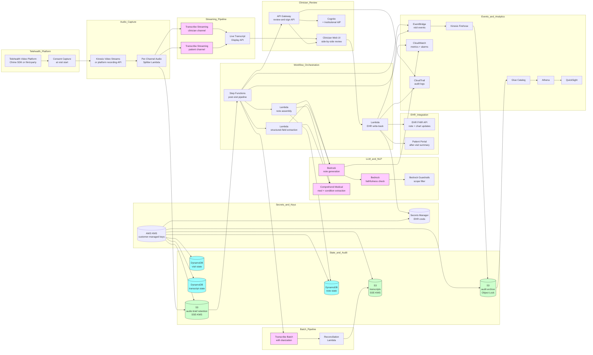

# Recipe 10.6 Architecture and Implementation: Speech-to-Text for Telehealth Documentation

*Companion to [Recipe 10.6: Speech-to-Text for Telehealth Documentation](chapter10.06-speech-to-text-telehealth-documentation). This page covers the AWS architecture, services, prerequisites, and pseudocode. For the problem framing and the conceptual approach, start with the main recipe.*

---

## The AWS Implementation

### Why These Services

**Amazon Chime SDK for the telehealth audio path (where the institution runs its own video infrastructure).** The Chime SDK provides WebRTC-based video and audio for in-house telehealth applications, with explicit per-participant audio access for each meeting. For institutions that own their telehealth platform, Chime SDK is the cleanest path to per-channel separated audio and to the streaming-audio integration that the speech-to-text pipeline requires. For institutions on a third-party platform (Zoom, Teladoc, Doxy.me, Microsoft Teams), the Chime SDK is not the right fit; instead, the audio integration happens through the third-party platform's API. The recipe describes both paths.

<!-- TODO (TechWriter): Expert review N3 (MEDIUM). Add a Cross-Cutting Design Points or Per-Channel Audio Capture paragraph specifying the third-party telehealth platform vendor-pipeline data-in-transit posture: confirm the vendor's BAA covers audio data-in-transit and at-rest within the vendor pipeline; confirm the audio-export integration uses TLS-in-transit with vendor-supported authentication; confirm platform-specific certification (HITRUST, SOC 2 Type II) covers the institutional deployment scope. The data-in-transit posture between vendor and AWS backend is governed by the vendor's BAA and platform-specific certification rather than the institutional cloud configuration. -->

**Amazon Transcribe (general or Medical) with channel identification.** Transcribe supports multi-channel audio with per-channel speaker labeling, which is the foundational capability for diarization-by-channel in telehealth. Transcribe also supports diarization on mixed audio when per-channel access is unavailable, though with the lower accuracy that single-channel diarization implies. For most clinical conversational use cases, the general Transcribe model with custom-vocabulary biasing for clinical terminology is sufficient. Transcribe Medical is appropriate when the visits are dense with specialty-specific clinical vocabulary; for behavioral health, primary care, and most subspecialty telehealth, the general model with appropriate vocabulary tuning works well. The institution evaluates against held-out telehealth audio.

**Amazon Transcribe Custom Vocabulary and Custom Language Models.** Custom vocabulary biasing is the lowest-effort tuning. Custom language models trained on institutional clinical text further improve accuracy on specialty-specific vocabulary and institutional formulary. Both are available through Transcribe's standard API surface. The institution maintains the custom vocabulary lists and the custom language models as versioned configuration artifacts. <!-- TODO: verify; Transcribe's specific support for medical custom vocabulary and custom language models continues to be enhanced through service updates -->

**Amazon Transcribe Streaming for the real-time display.** The streaming variant of Transcribe produces partial-and-final transcripts in real time over WebSocket. For per-channel separated audio, two streaming sessions run in parallel (one per channel) and the transcripts are merged by timestamp downstream. For mixed audio with diarization, a single streaming session with diarization enabled is used.

**Amazon Bedrock for note generation, structured-field extraction, and faithfulness checks.** A Bedrock-hosted foundation model takes the post-visit transcript and produces the structured note draft, the extracted medications and problems, and the faithfulness-checked output. Choose a model with healthcare instruction tuning where available. For structured-field extraction, configure the model to produce JSON-schema-validated output. For the faithfulness check, configure a separate pass (often a smaller faster model) that scores the generated note against the source transcript for citation grounding and absence of hallucinated content.

<!-- TODO (TechWriter): Expert review A4 (MEDIUM). Add a Deployment Pattern subsection specifying versioned model and prompt and template and rule-catalog and per-language asset definitions in version control with commit-SHA-tied builds; canary inference profile with traffic-shift; rollback-on-regression triggered by the held-out evaluation set's regression gate; held-out evaluation set including per-language samples, per-specialty samples, per-audio-quality-band samples, faithfulness-edge-case samples, structured-extraction-edge-case samples, and prompt-injection test cases; version stamping on every encounter audit record extended to all artifact versions (ASR model, custom-vocabulary version, custom-language-model version, diarization model, note-generation model_id, faithfulness-judge model_id, contradiction-rule catalog version, per-specialty template version, per-language asset versions). -->

**Amazon Bedrock Guardrails for content filtering and topic restriction.** Guardrails provides built-in filters for clinical-advice and harmful-content categories. The note-generation output passes through Guardrails before being shown to the clinician for review, providing a defense-in-depth layer.

**Amazon Comprehend Medical for medication, condition, and entity extraction.** When the visit transcript mentions medications and conditions, Comprehend Medical extracts the entities with RxNorm and ICD-10 coding. The structured-field extraction layer uses Comprehend Medical's output to populate the suggested medication and problem-list updates that the clinician confirms before chart insertion.

**Amazon Polly (optional) for patient-facing audio summaries.** When the institution generates an audio version of the patient-facing visit summary (for patients who prefer audio over text, or for accessibility), Polly's neural voices render the text to audio. Custom-pronunciation lexicons handle clinical and institutional terms. Polly is not used during the visit itself; it is a post-visit, patient-facing accessibility feature.

**AWS Lambda for orchestration and integration.** Per-stage Lambdas handle the orchestration of the speech-to-text pipeline: visit-start handler, audio-capture coordination, batch reprocessing trigger, note-generation invocation, structured-field extraction, EHR write-back. Each Lambda has scoped IAM permissions for the specific external integrations it touches.

**AWS Step Functions for the post-visit pipeline.** After a visit ends, the post-visit pipeline runs as a Step Functions state machine: batch reprocessing of the audio, transcript reconciliation, LLM-driven note generation, faithfulness check, structured-field extraction, presentation to the clinician for review. Step Functions provides the durable state, retry semantics, and observable failure handling that the multi-stage pipeline needs.

**Amazon Kinesis Video Streams (where the institution runs its own video infrastructure).** Chime SDK can persist meeting media to Kinesis Video Streams for later processing, including audio-only retention for the speech-to-text pipeline. For third-party platform integrations, the audio capture path is platform-specific and may use platform-native recording APIs rather than Kinesis Video Streams.

**Amazon S3 for audio and transcript storage.** Visit audio is stored in S3 with SSE-KMS encryption using customer-managed keys, with a brief-retention lifecycle policy that automatically deletes audio after the QA review window. Transcripts and generated notes are stored in a separate bucket with longer retention aligned to the medical-record retention. The audit archive lives in a third bucket with Object Lock in compliance mode for the legally-required retention window.

**Amazon DynamoDB for visit-state and pipeline metadata.** A visit-state table tracks the active visit and the speech-to-text feature status. A transcript-state table tracks streaming and batch transcript identifiers and the reconciliation state. A note-state table tracks the LLM-generated draft, the clinician-edit diff, and the signed final note. Per-table KMS at rest with customer-managed keys.

**AWS KMS for cryptographic key custody.** Customer-managed keys for the audio bucket, the transcript bucket, the audit archive, the DynamoDB tables, and Secrets Manager. Different keys per data class for blast-radius containment.

**AWS Secrets Manager for EHR integration credentials.** The Lambda that writes the signed note back to the EHR holds its credentials in Secrets Manager with rotation per the institutional cadence.

**Amazon Cognito (or institutional IdP via OIDC/SAML) for clinician authentication.** The clinician's review-and-sign workflow authenticates through the institutional identity provider, with appropriate scopes for the chart-update permissions the workflow requires.

**Amazon API Gateway for the clinician review interface.** The clinician's web interface for review-and-sign authenticates through Cognito and accesses the transcript, the generated note, the structured extractions, and the chart-write capability through API Gateway endpoints backed by Lambda.

**Amazon CloudWatch for operational metrics and alarms.** Per-stage latency, per-channel audio quality metrics, ASR confidence distributions, diarization error rate proxies, faithfulness scores, edit distance between generated draft and signed final, per-clinician adoption metrics. Alarms on per-cohort disparity thresholds, on aggregate accuracy regressions, on telehealth-platform integration failures, on faithfulness-check failure rate spikes.

**AWS CloudTrail for API-level audit.** All access to PHI-bearing resources logged. Transcribe invocations, Bedrock invocations, Comprehend Medical invocations, Lambda invocations, KMS key uses, Secrets Manager retrievals all flow into CloudTrail.

**Amazon EventBridge for cross-system events.** Visit lifecycle events (started, transcribed, note-generated, signed, audited) flow through EventBridge. Downstream consumers (operational dashboards, the analytics layer, the equity-monitoring pipeline) react to events without coupling to the orchestration Lambdas.

**Amazon Kinesis Data Firehose, AWS Glue, Amazon Athena, Amazon QuickSight (optional) for analytics.** Audit and telemetry flow to S3 via Firehose. Glue catalogs the data. Athena provides SQL access for operational analytics (per-clinician adoption, per-cohort accuracy, edit-distance distributions, faithfulness-failure rates by specialty). QuickSight renders the dashboards.

### Architecture Diagram



### Prerequisites

| Requirement | Details |
|-------------|---------|
| **AWS Services** | Amazon Transcribe (with custom vocabulary, custom language model where appropriate, and Transcribe Streaming), Amazon Bedrock (with Guardrails), Amazon Comprehend Medical, AWS Lambda, AWS Step Functions, Amazon API Gateway, Amazon Cognito, Amazon DynamoDB, Amazon S3, AWS KMS, AWS Secrets Manager, Amazon CloudWatch, AWS CloudTrail, Amazon EventBridge, Amazon Kinesis Data Firehose, AWS Glue, Amazon Athena. Optionally: Amazon Chime SDK (for institution-owned telehealth video), Amazon Kinesis Video Streams (for audio persistence with Chime SDK), Amazon Polly (for audio after-visit summaries), Amazon QuickSight (for dashboards). |
| **External Inputs** | Telehealth video platform with per-channel audio access (Chime SDK if institution-owned; Zoom Healthcare, Teladoc, Doxy.me, Microsoft Teams Healthcare, vendor-bundled telehealth from Epic or Cerner if third-party). EHR FHIR write surface for clinical notes (DocumentReference resource), structured-chart updates (MedicationRequest, Condition, Observation), and patient portal communications. Per-specialty note templates curated by clinical informatics. Institutional formulary, common-conditions list, common-orders list for custom-vocabulary tuning. Per-language ASR configuration where multilingual support is required. Validation set of representative telehealth audio across speakers, audio qualities, and visit types, ideally stratified by language, age, and accent group. <!-- TODO: verify validation-set sourcing options; commercial telehealth-AI vendors typically have proprietary benchmarks, while open patient-clinician conversation datasets remain limited; institutions often build their own validation sets through synthetic and consented real-visit collection --> |
| **IAM Permissions** | Per-Lambda least-privilege roles. The streaming-pipeline Lambdas have Transcribe streaming permissions and access to the per-visit audio path only. The batch-pipeline Lambdas have Transcribe batch permissions and S3 read for the audio path, plus Step Functions execution. The note-generation Lambdas have Bedrock invoke permissions for the specific models in use, plus Comprehend Medical permissions. The EHR write-back Lambda has Secrets Manager access for EHR credentials and the EHR-specific egress path only. Avoid wildcard actions and resources in production. <!-- TODO (TechWriter): Expert review S6 (MEDIUM). Specify each Lambda's resource-based policy pinning the invoking principal to the production API Gateway stage ARN, the production Step Functions state-machine ARN, or the production EventBridge rule ARN as appropriate. Add a defense-in-depth event-payload validation guard at the start of each Lambda that verifies the invoking context (requestContext.apiId, Step Functions state-machine ARN, EventBridge source) against the production constants. --> |
| **BAA and Compliance** | AWS BAA signed. Amazon Transcribe (general and Medical), Amazon Bedrock (verify the specific models and regions covered), Amazon Comprehend Medical, Amazon Polly, Lambda, Step Functions, API Gateway, Cognito, DynamoDB, S3, KMS, Secrets Manager, CloudWatch Logs, CloudTrail, EventBridge, Kinesis Firehose, Glue, Athena, Chime SDK, Kinesis Video Streams are HIPAA-eligible (verify the current list at build time against the AWS HIPAA Eligible Services Reference). <!-- TODO: verify; the AWS HIPAA-eligible services list and the specific Bedrock models covered under BAA continue to evolve --> Telehealth platform vendor BAA: confirm the third-party platform's BAA covers the audio access patterns the speech-to-text pipeline uses. EHR vendor agreements: confirm the EHR vendor's terms permit the chart-write patterns the pipeline uses (clinical note insertion, structured-field updates, patient-portal summary release). State-by-state recording-consent compliance: an explicit consent disclosure plays before recording for all-party-consent jurisdictions. The patient's location at the time of the visit determines applicable law, which in telehealth often differs from the institution's location. Behavioral health visits may have additional state-level confidentiality requirements (42 CFR Part 2 for substance-use treatment records); the architecture supports a behavioral-health profile with stricter retention and access controls. Audio retention policy reviewed by the privacy officer. |
| **Encryption** | Audio recordings: SSE-KMS with customer-managed keys, retention bound to the QA review window (typically a few days to a few weeks) then automatic deletion via lifecycle policy. <!-- TODO (TechWriter): Expert review A6 (MEDIUM). Specify retain-briefly with a configurable per-visit-type retention window (default: 7-30 days for primary care; 24-72 hours for behavioral-health; 24-48 hours for 42-CFR-Part-2-eligible) enforced through S3 lifecycle policies on per-visit-type prefixes. --> Transcripts: SSE-KMS with customer-managed keys, retention aligned with the medical-record retention. Generated notes: SSE-KMS with customer-managed keys, retention aligned with the medical-record retention. Audit archive: SSE-KMS with customer-managed keys, retention sized to the longer of HIPAA's six-year minimum, state medical-records-retention rules, and the institutional regulatory floor. DynamoDB tables: customer-managed KMS at rest. Lambda environment variables: KMS-encrypted. Lambda log groups: KMS-encrypted. Secrets Manager: customer-managed KMS. TLS in transit for all AWS API calls and all external integration calls (default). |
| **VPC** | Production: Lambdas that call back-office APIs (EHR FHIR, patient portal) run in VPC with subnets that have controlled egress to those systems (often through VPC endpoints, PrivateLink where the vendor offers it, or VPN/Direct Connect to on-premise systems). VPC endpoints for DynamoDB, S3, KMS, Secrets Manager, CloudWatch Logs, EventBridge, Bedrock, Comprehend Medical, Transcribe, Lambda so the back-office Lambdas do not need NAT for AWS-internal calls. Endpoint policies pin access to the specific resources the pipeline uses. |
| **CloudTrail** | Enabled with data events on the audio S3 bucket, the transcript bucket, the audit-archive bucket, the DynamoDB tables, the Secrets Manager secrets, and the customer-managed KMS keys. Transcribe invocations logged. Bedrock invocations logged with input/output capture per institutional policy (be cautious about input/output capture if the prompts or responses include PHI; many institutions choose to log metadata only). Comprehend Medical invocations logged. Lambda invocations logged. API Gateway access logs enabled. CloudTrail logs in a dedicated S3 bucket with Object Lock in Compliance mode and lifecycle to S3 Glacier Deep Archive after 90 days. Audit retention sized to the longer of HIPAA's six-year minimum, state medical-records-retention rules, the EHR vendor's audit-retention floor, and the institutional regulatory floor. <!-- TODO (TechWriter): Expert review S5 (MEDIUM). Expand the retention floor to the longest of (HIPAA six-year minimum, state-specific medical-records-retention rules including pediatric-records-extending-to-age-of-majority-plus-X, EHR vendor audit-retention floor, telehealth-platform vendor audit-retention floor, 42 CFR Part 2 disclosure-accounting log retention for Part-2-eligible visits, institutional regulatory floor). --> |
| **Sample Data** | Synthetic patient-clinician conversation audio for development. Public clinical-vocabulary lists (RxNorm, ICD-10) for custom-vocabulary seeding of Transcribe. Synthea-generated patient context for the EHR integration in development. Never use real patient telehealth audio in development without explicit consent and IRB or institutional review; voice samples are biometric and PHI-bearing data with non-trivial governance implications. Diarization validation requires multi-speaker test audio with known speaker labels for ground truth; institutions often build this through staff-recorded conversation simulations. |
| **Cost Estimate** | At a mid-sized institution scale (100,000 telehealth visits per year, average 18 minutes per visit, full speech-to-text pipeline enabled): Transcribe Streaming at typically $0.024 per minute totals approximately $43,000 per year. Transcribe Batch at typically $0.024 per minute totals approximately $43,000 per year (running both pipelines). Bedrock note generation at typically $0.05-0.30 per visit totals approximately $5,000-30,000 per year depending on model choice and prompt size. Bedrock faithfulness check at typically $0.01-0.05 per visit totals approximately $1,000-5,000 per year. Comprehend Medical at typically $0.01-0.05 per visit totals approximately $1,000-5,000 per year. Lambda, Step Functions, DynamoDB, S3, CloudWatch, KMS, Secrets Manager, EventBridge, Kinesis Firehose, Glue, Athena total approximately $15,000-30,000 per year combined. Chime SDK media processing (if institution-owned video) adds approximately $10,000-30,000 per year at this scale. Total AWS infrastructure typically $80,000-185,000 per year at this scale. The infrastructure cost is dominated by Transcribe per-minute charges. The savings vs. clinician documentation time, when the system delivers real time savings per visit, are typically substantial at this scale, but the operational and engineering overhead is non-trivial. <!-- TODO: replace with verified pricing once the implementing team validates against the AWS Pricing Calculator. Specific costs depend on per-minute Transcribe pricing in the chosen region, the chosen Bedrock model, and the actual visit volume and duration --> |

### Ingredients

| AWS Service | Role |
|------------|------|
| **Amazon Chime SDK (optional)** | Institution-owned telehealth video infrastructure with explicit per-participant audio access |
| **Amazon Kinesis Video Streams (with Chime SDK)** | Audio persistence for the speech-to-text pipeline when Chime SDK is the video platform |
| **Amazon Transcribe (with custom vocabulary and custom language model)** | Domain-adapted ASR with per-channel speaker labeling, custom-vocabulary biasing for clinical terminology, and optional custom-language-model tuning |
| **Amazon Transcribe Streaming** | Real-time streaming ASR for the in-visit live transcript display |
| **Amazon Bedrock** | LLM-driven note generation, structured-field extraction, faithfulness checking, and patient-facing summary generation |
| **Amazon Bedrock Guardrails** | Content filtering for clinical-advice and harmful-content categories on the generated note |
| **Amazon Comprehend Medical** | Medication and condition extraction with RxNorm and ICD-10 coding for structured-field updates |
| **Amazon Polly (optional)** | Audio rendering of patient-facing visit summaries for accessibility |
| **AWS Lambda** | Per-stage orchestration: visit-start handler, audio-capture coordination, batch reprocessing trigger, note-generation invocation, structured-field extraction, EHR write-back |
| **AWS Step Functions** | Post-visit pipeline orchestration with durable state and observable failure handling |
| **Amazon API Gateway** | Clinician review-and-sign interface backend |
| **Amazon Cognito** | Clinician authentication federated through the institutional identity provider |
| **Amazon DynamoDB** | visit-state (active visit and feature status); transcript-state (streaming and batch transcript identifiers, reconciliation status); note-state (LLM draft, clinician edits, signed final note) |
| **Amazon S3** | Audio with brief-retention lifecycle; transcripts and generated notes with medical-record retention; audit archive with Object Lock |
| **AWS KMS** | Customer-managed encryption keys for all PHI-bearing data stores |
| **AWS Secrets Manager** | EHR API credentials and patient-portal integration credentials |
| **Amazon CloudWatch** | Operational metrics (per-stage latency, per-channel audio quality, ASR confidence, faithfulness scores, edit distance, per-clinician adoption); alarms (cohort disparity, accuracy regressions, integration failures) |
| **AWS CloudTrail** | API-level audit logging for PHI-bearing resources and AI/ML service invocations |
| **Amazon EventBridge** | visit-events bus for cross-system event flow |
| **Amazon Kinesis Data Firehose** | Streaming audit and telemetry delivery into S3 |
| **AWS Glue Data Catalog + Amazon Athena** | SQL access to audit and telemetry for operational analytics |
| **Amazon QuickSight (optional)** | Dashboards for clinical operations and the equity-monitoring committee |

---

### Code

#### Walkthrough

**Step 1: Capture consent at visit start and bootstrap the speech-to-text session.** When a telehealth visit begins, the system captures the appropriate consent (institutional-policy-driven, state-law-aware), enables the speech-to-text feature per the visit's configuration, and bootstraps a session that links the visit ID to the audio capture path. Skip the per-visit consent confirmation and the institution risks documenting visits where the patient explicitly opted out, which is a privacy violation regardless of the engineering quality.

```
ON visit_start(visit_id, patient_id, clinician_id,
               patient_jurisdiction, visit_type):

    // Step 1A: determine the recording-and-transcription
    // consent regime. The patient's location at visit
    // time governs (in telehealth, this often differs
    // from the institution's location).
    // TODO (TechWriter): Expert review S4 (MEDIUM). Specify
    // the patient-location-detection discipline that feeds
    // patient_jurisdiction (registered address, IP geolocation
    // hint, patient stated location at visit start, with
    // conservative-default-on-ambiguity to the more-restrictive
    // applicable regime). Reference the institutional legal
    // team's policy as the canonical source for disagreement
    // resolution.
    consent_regime = determine_consent_regime(
        patient_jurisdiction: patient_jurisdiction,
        visit_type: visit_type,
        institutional_policy: INSTITUTIONAL_POLICY)

    // Step 1B: play the appropriate consent disclosure.
    // Behavioral health visits may use a different
    // disclosure that explicitly mentions transcript
    // handling.
    IF consent_regime == "all_party_consent" OR
       visit_type == "behavioral_health":
        play_disclosure_in_visit(
            disclosure: build_disclosure(
                regime: consent_regime,
                visit_type: visit_type),
            require_acknowledgment: true)
        IF NOT acknowledged_by_patient_and_clinician():
            disable_speech_to_text(visit_id)
            log_consent_decline(visit_id)
            RETURN

    // Step 1C: bootstrap the speech-to-text session.
    session_id = generate_uuid()
    visit_state_table.put({
        session_id: session_id,
        visit_id: visit_id,
        patient_id_hash: hash(patient_id),
        clinician_id: clinician_id,
        consent_regime: consent_regime,
        feature_status: "enabled",
        started_at: now(),
        visit_type: visit_type,
        per_clinician_opt_status:
            lookup_clinician_preference(clinician_id),
        language: detect_language_or_default(
            patient_id, clinician_id)
    })

    // Step 1D: start the per-channel audio capture.
    audio_capture_config = configure_audio_capture(
        visit_id: visit_id,
        platform: lookup_telehealth_platform(visit_id),
        prefer_per_channel: true)

    start_audio_capture(audio_capture_config)

    // Step 1E: emit lifecycle event.
    EventBridge.PutEvents([{
        source: "telehealth_stt",
        detail_type: "session_started",
        detail: {
            session_id: session_id,
            visit_type: visit_type,
            consent_regime: consent_regime
        }
    }])

    RETURN { session_id: session_id }
```

**Step 2: Run streaming ASR per channel and update the live display.** As audio arrives from each channel, the streaming ASR produces partial-and-final transcripts that update the clinician's live display. Per-channel separation makes diarization trivial (the clinician's channel is labeled "clinician," the patient's channel is labeled "patient"). When the audio is mixed into a single channel, the streaming pipeline runs a single ASR with diarization enabled and the labels are mapped from acoustic clusters to roles using visit context. Skip the per-channel processing and diarization quality drops sharply for the audio configurations where it matters most.

```
FUNCTION run_streaming_asr(session_id, audio_capture_config):
    state = visit_state_table.get(session_id)

    IF audio_capture_config.per_channel_separated:
        // Step 2A: launch one streaming ASR per channel.
        // Each channel maps to a known speaker role.
        clinician_stream = transcribe_streaming.start(
            session_name: session_id + "_clinician",
            language_code: state.language,
            media_encoding: audio_capture_config.encoding,
            sample_rate_hz: audio_capture_config.sample_rate,
            vocabulary_name: INSTITUTIONAL_VOCABULARY,
            language_model_name:
                INSTITUTIONAL_LANGUAGE_MODEL,
            audio_source:
                audio_capture_config.clinician_channel)

        patient_stream = transcribe_streaming.start(
            session_name: session_id + "_patient",
            language_code: state.language,
            media_encoding: audio_capture_config.encoding,
            sample_rate_hz: audio_capture_config.sample_rate,
            vocabulary_name: INSTITUTIONAL_VOCABULARY,
            language_model_name:
                INSTITUTIONAL_LANGUAGE_MODEL,
            audio_source:
                audio_capture_config.patient_channel)

        // Step 2B: handle each channel's partials and
        // finals as they arrive.
        ON clinician_stream.transcript_event(event):
            handle_streaming_event(
                session_id: session_id,
                speaker_role: "clinician",
                event: event)

        ON patient_stream.transcript_event(event):
            handle_streaming_event(
                session_id: session_id,
                speaker_role: "patient",
                event: event)

    ELSE:
        // Step 2C: mixed audio with diarization.
        mixed_stream = transcribe_streaming.start(
            session_name: session_id + "_mixed",
            language_code: state.language,
            media_encoding: audio_capture_config.encoding,
            sample_rate_hz: audio_capture_config.sample_rate,
            vocabulary_name: INSTITUTIONAL_VOCABULARY,
            language_model_name:
                INSTITUTIONAL_LANGUAGE_MODEL,
            show_speaker_label: true,
            number_of_channels: 1,
            audio_source:
                audio_capture_config.mixed_channel)

        ON mixed_stream.transcript_event(event):
            // Map acoustic speaker labels to roles using
            // visit context (clinician usually starts;
            // optional voiceprint enrollment helps).
            speaker_role = map_speaker_label_to_role(
                event.speaker_label,
                visit_id: state.visit_id,
                clinician_id: state.clinician_id)
            handle_streaming_event(
                session_id: session_id,
                speaker_role: speaker_role,
                event: event)

FUNCTION handle_streaming_event(session_id, speaker_role, event):
    // Update the live display with the partial or final.
    // TODO (TechWriter): Expert review S1 (HIGH). The
    // transcript-state table currently embeds verbatim
    // segment text and per-word confidence, creating a
    // parallel PHI store outside the audio-bucket and
    // audit-archive governance. Adopt the audit-record
    // discipline uniformly: write the streaming segment to
    // the transcript-archive S3 bucket (KMS-encrypted, with
    // brief-or-medical-record retention) and store only
    // streaming_segment_count, streaming_segment_archive_prefix,
    // last_segment_timestamp, avg_streaming_asr_confidence,
    // per_speaker_segment_counts, and streaming_status in the
    // transcript-state table. Apply the same fix at Step 3E
    // (canonical transcript) and Step 4D (draft note).
    transcript_state_table.update(
        session_id: session_id,
        action: "append_streaming_segment",
        segment: {
            speaker_role: speaker_role,
            text: event.transcript,
            is_final: event.is_partial == false,
            words: event.words_with_confidence,
            timestamp: event.timestamp
        })

    // Push the update to the clinician's live display.
    push_to_live_display(
        session_id: session_id,
        speaker_role: speaker_role,
        event: event)

    // Per-channel quality monitoring.
    cloudwatch.put_metric(
        namespace: "TelehealthSTT",
        metric_name: "StreamingASRConfidence",
        value: event.average_word_confidence,
        dimensions: {
            speaker_role: speaker_role,
            language: state.language
        })
```

**Step 3: Run batch ASR after the visit ends and reconcile with the streaming transcript.** When the visit ends, a batch ASR runs over the full audio with full context, producing a higher-accuracy transcript with full diarization. The batch transcript is reconciled with the streaming transcript: in-visit corrections from the clinician are carried forward, and the batch transcript is established as the canonical record. Skip the batch reprocessing and the canonical transcript is the lower-accuracy streaming output, which is fine for navigation but suboptimal for the documentation that goes into the chart.

```
ON visit_end(session_id):
    state = visit_state_table.get(session_id)

    // Step 3A: trigger the post-visit Step Functions
    // pipeline.
    sfn.start_execution(
        state_machine_arn: POST_VISIT_PIPELINE_ARN,
        input: {
            session_id: session_id,
            visit_id: state.visit_id,
            audio_path: state.audio_archive_ref,
            language: state.language
        })

FUNCTION run_batch_transcription(session_id):
    state = visit_state_table.get(session_id)

    // Step 3B: launch the batch Transcribe job over the
    // full audio. Use channel identification when
    // per-channel audio was captured; use diarization
    // when the audio is mixed.
    IF state.audio_capture_config.per_channel_separated:
        job = transcribe.start_transcription_job(
            transcription_job_name:
                session_id + "_batch",
            language_code: state.language,
            media: {
                media_file_uri: state.audio_archive_ref
            },
            settings: {
                vocabulary_name:
                    INSTITUTIONAL_VOCABULARY,
                language_model_name:
                    INSTITUTIONAL_LANGUAGE_MODEL,
                channel_identification: true
            })
    ELSE:
        job = transcribe.start_transcription_job(
            transcription_job_name:
                session_id + "_batch",
            language_code: state.language,
            media: {
                media_file_uri: state.audio_archive_ref
            },
            settings: {
                vocabulary_name:
                    INSTITUTIONAL_VOCABULARY,
                language_model_name:
                    INSTITUTIONAL_LANGUAGE_MODEL,
                show_speaker_labels: true,
                max_speaker_labels: 5
            })

    wait_for_job_completion(job.transcription_job_name)
    batch_transcript = retrieve_transcript(job)

    RETURN batch_transcript

FUNCTION reconcile_streaming_and_batch(session_id, batch_transcript):
    state = visit_state_table.get(session_id)
    streaming_transcript =
        transcript_state_table.get_streaming_transcript(
            session_id)

    // Step 3C: align the two transcripts by timestamp
    // and identify segments where they disagree.
    aligned = align_by_timestamp(
        streaming: streaming_transcript,
        batch: batch_transcript)

    disagreements = []
    FOR segment IN aligned:
        IF segment.streaming_text != segment.batch_text:
            disagreements.append(segment)

    // Step 3D: carry forward in-visit clinician
    // corrections from the streaming transcript into
    // the batch transcript where applicable.
    in_visit_corrections =
        transcript_state_table.get_corrections(session_id)

    canonical_transcript = apply_corrections(
        base_transcript: batch_transcript,
        corrections: in_visit_corrections,
        disagreements: disagreements)

    // Step 3E: persist the canonical transcript.
    s3.put_object(
        bucket: TRANSCRIPT_BUCKET,
        key: f"{session_id}/canonical_transcript.json",
        body: serialize(canonical_transcript),
        sse_kms_key_id: TRANSCRIPT_KMS_KEY)

    transcript_state_table.update(
        session_id: session_id,
        canonical_transcript_ref:
            f"s3://{TRANSCRIPT_BUCKET}/{session_id}/canonical_transcript.json",
        reconciliation_status: "complete",
        disagreement_count: len(disagreements))

    RETURN canonical_transcript
```

**Step 4: Generate the structured note draft with grounded citations and run faithfulness checks.** The canonical transcript is sent to a Bedrock-hosted LLM with a per-specialty prompt that produces a structured note draft. Each section of the generated note carries citations back to the supporting transcript segments. A separate faithfulness-check pass scores the generated content against the source transcript to detect hallucinated content, contradictions, or out-of-scope additions. Skip the faithfulness check and the LLM may produce fluent-sounding clinical content that the patient never actually said, which is the worst class of failure for this recipe.

<!-- TODO (TechWriter): The faithfulness check is described as a single Bedrock call; production deployments often use a cascade of cheaper rule-based checks (citation grounding, named-entity contradiction detection) followed by an LLM-judge pass for the harder cases. Consider expanding this in a follow-up revision based on expert review. -->

```
FUNCTION generate_note_draft(session_id, canonical_transcript):
    state = visit_state_table.get(session_id)

    // Step 4A: select the per-specialty template.
    template = lookup_note_template(
        specialty: state.clinician_specialty,
        visit_type: state.visit_type)

    // Step 4B: prepare the LLM prompt with the
    // transcript and the template structure.
    // TODO (TechWriter): Expert review S3 (MEDIUM). The
    // patient's verbatim speech and the retrieved patient
    // context are templated directly into the prompt. Specify
    // the prompt-injection-mitigation discipline: delimited
    // input framing for transcript and patient_context
    // (<transcript>...</transcript>, <patient_history>...
    // </patient_history>); a system prompt that explicitly
    // instructs the model to treat all delimited content as
    // untrusted patient-or-historical data, not as
    // instructions; the faithfulness check (Step 4C) and
    // Bedrock Guardrails as secondary and tertiary safety
    // layers. Add a Production-Gaps paragraph on retrieved-
    // context content supply-chain integrity for the
    // patient-history channel.
    prompt = build_note_generation_prompt(
        transcript: canonical_transcript,
        template: template,
        clinician_context:
            lookup_clinician_context(state.clinician_id),
        patient_context:
            lookup_minimal_patient_context(
                state.patient_id_hash),
        language: state.language,
        require_citations: true,
        prohibited_content: [
            "added_clinical_recommendations",
            "interpretations_not_in_transcript",
            "billing_codes_unless_explicitly_discussed"
        ])

    note_response = bedrock.invoke_model(
        model_id: NOTE_GENERATION_MODEL,
        prompt: prompt,
        guardrail_id: TELEHEALTH_NOTE_GUARDRAIL,
        response_format: {
            type: "json_schema",
            schema: NOTE_GENERATION_SCHEMA
        },
        max_tokens: 2000)

    // Step 4C: faithfulness check. Verify that every
    // claim in the generated note has a transcript
    // citation and that the cited segment supports
    // the claim.
    faithfulness_result = run_faithfulness_check(
        generated_note: note_response,
        source_transcript: canonical_transcript)

    IF faithfulness_result.failed_checks:
        // Block or flag the draft based on the
        // institutional policy. Severe failures
        // block; minor failures flag for clinician
        // attention.
        IF faithfulness_result.severity == "block":
            log_faithfulness_block(
                session_id: session_id,
                failed_checks:
                    faithfulness_result.failed_checks)
            RETURN { draft_available: false,
                     reason: "faithfulness_block",
                     fallback: "manual_documentation" }

    // Step 4D: persist the draft note with citations
    // and faithfulness annotations.
    // TODO (TechWriter): Expert review S1 (HIGH). The
    // note-state table embeds the full draft_note content,
    // citations, and faithfulness annotations. Move these
    // PHI-bearing artifacts to the transcript-archive (or a
    // dedicated draft-note-archive S3 bucket sharing the
    // same KMS key class) and store only draft_note_archive_ref,
    // citations_archive_ref, faithfulness_score,
    // faithfulness_failure_count, faithfulness_severity,
    // model_version, prompt_version, and generated_at in the
    // note-state table.
    note_state_table.put({
        session_id: session_id,
        draft_note: note_response.content,
        citations: note_response.citations,
        faithfulness_annotations:
            faithfulness_result.annotations,
        generated_at: now(),
        model_version: NOTE_GENERATION_MODEL_VERSION,
        prompt_version: NOTE_PROMPT_VERSION
    })

    RETURN { draft_available: true,
             draft_id: note_state_table.last_inserted_id }
```

**Step 5: Extract structured fields with explicit clinician confirmation gates.** Beyond the narrative note, the system extracts structured clinical entities (medications, problems, allergies, vitals, orders) using Comprehend Medical for the entity detection and a Bedrock LLM for the higher-level structuring. Each extracted field is presented to the clinician for explicit confirmation before being applied to the structured chart. Skip the explicit confirmation and the structured chart can be silently modified with content the clinician would not have endorsed.

```
FUNCTION extract_structured_fields(session_id, canonical_transcript):
    state = visit_state_table.get(session_id)

    // Step 5A: extract clinical entities with
    // Comprehend Medical for canonical coding.
    entities_response = comprehend_medical.detect_entities_v2(
        text: canonical_transcript.full_text)

    medications = filter_entities(
        entities_response.entities,
        category: "MEDICATION")

    conditions = filter_entities(
        entities_response.entities,
        category: "MEDICAL_CONDITION")

    // For each medication, link to RxNorm.
    coded_medications = []
    FOR med IN medications:
        rx_response = comprehend_medical.infer_rx_norm(
            text: med.text)
        IF rx_response.entities:
            coded_medications.append({
                text: med.text,
                rx_norm_code:
                    rx_response.entities[0]
                    .rx_norm_concepts[0].code,
                speaker_role: lookup_speaker_role(
                    med.timestamp, canonical_transcript),
                context_snippet:
                    extract_context(
                        canonical_transcript,
                        med.timestamp,
                        window_seconds: 10)
            })

    // For each condition, link to ICD-10.
    coded_conditions = []
    FOR cond IN conditions:
        icd_response = comprehend_medical.infer_icd10cm(
            text: cond.text)
        IF icd_response.entities:
            coded_conditions.append({
                text: cond.text,
                icd_10_code:
                    icd_response.entities[0]
                    .icd10cm_concepts[0].code,
                speaker_role: lookup_speaker_role(
                    cond.timestamp, canonical_transcript),
                context_snippet:
                    extract_context(
                        canonical_transcript,
                        cond.timestamp,
                        window_seconds: 10)
            })

    // Step 5B: use the LLM to identify higher-level
    // structured fields (orders, follow-up actions,
    // patient-reported vitals) that Comprehend Medical
    // does not directly extract.
    higher_level_extraction = bedrock.invoke_model(
        model_id: EXTRACTION_MODEL,
        prompt: build_extraction_prompt(
            transcript: canonical_transcript,
            target_fields: [
                "orders_placed",
                "labs_requested",
                "imaging_requested",
                "follow_up_appointments",
                "patient_reported_vitals",
                "patient_reported_allergies"
            ]),
        response_format: {
            type: "json_schema",
            schema: STRUCTURED_EXTRACTION_SCHEMA
        },
        max_tokens: 1000)

    // Step 5C: persist all extractions for clinician
    // confirmation.
    note_state_table.update(
        session_id: session_id,
        action: "store_structured_extractions",
        extractions: {
            medications: coded_medications,
            conditions: coded_conditions,
            higher_level: higher_level_extraction.content,
            confirmation_status: "pending_clinician_review"
        })

    RETURN { extraction_count:
             count_total_extractions(coded_medications,
                                     coded_conditions,
                                     higher_level_extraction) }
```

**Step 6: Present the draft to the clinician for review-and-sign with side-by-side transcript display.** The clinician opens the review interface, sees the draft note alongside the transcript with click-through citations, reviews flagged uncertain segments, confirms each structured-field extraction explicitly, edits the narrative as needed, and signs the final note. Skip the side-by-side display and the clinician cannot easily verify what was actually said versus what the LLM produced, which undermines the faithfulness story.

```
ON clinician_review_request(session_id, clinician_id):
    state = visit_state_table.get(session_id)
    note_draft = note_state_table.get(session_id)
    canonical_transcript = retrieve_canonical_transcript(
        session_id)

    // Step 6A: assemble the review payload.
    review_payload = {
        draft_note: note_draft.draft_note,
        citations: note_draft.citations,
        canonical_transcript: canonical_transcript,
        structured_extractions:
            note_draft.structured_extractions,
        faithfulness_annotations:
            note_draft.faithfulness_annotations,
        confidence_highlights:
            extract_low_confidence_segments(
                canonical_transcript),
        speaker_label_uncertainty:
            extract_uncertain_speaker_segments(
                canonical_transcript),
        diff_streaming_vs_batch:
            note_draft.streaming_batch_disagreements
    }

    RETURN review_payload

ON clinician_save_review(session_id, clinician_id, review_actions):
    // Step 6B: process the clinician's edits and
    // structured-field confirmations.
    note_state_table.update(
        session_id: session_id,
        action: "apply_clinician_edits",
        edits: review_actions.note_edits,
        confirmed_extractions:
            review_actions.confirmed_extractions,
        rejected_extractions:
            review_actions.rejected_extractions,
        structured_chart_actions:
            review_actions.chart_action_decisions)

ON clinician_sign(session_id, clinician_id):
    // Step 6C: finalize the signed note and write to
    // the EHR. The signature is the legal-medical-record
    // boundary. After this point, the draft is locked
    // and any changes are addenda.
    // TODO (TechWriter): Expert review A3 (MEDIUM). Specify
    // the idempotency-key composition for EHR write-back.
    // Per-write key: (visit_id, clinician_id, document_type,
    // signed_at_truncated_to_minute). Per-confirmed-extraction
    // key: (visit_id, extraction_id, extraction_type). The
    // note-state table holds a recently-submitted-writes list
    // per session; on EHR write, check for a prior submission
    // with the same idempotency key and return the prior
    // document_id if found. Use FHIR conditional-create
    // (If-None-Exist header) where the EHR vendor's FHIR
    // implementation supports it.
    final_note = note_state_table.get(session_id).get_final_note()

    ehr_response = ehr_fhir_client.write_document_reference(
        patient_id: lookup_patient_id(
            state.patient_id_hash),
        encounter_id: state.visit_id,
        document_content: final_note.content,
        author: clinician_id,
        signed_at: now(),
        access_token: lookup_clinician_credentials(
            clinician_id))

    // Apply confirmed structured-field updates to the
    // chart.
    FOR confirmed IN final_note.confirmed_extractions:
        write_structured_chart_update(
            patient_id: lookup_patient_id(
                state.patient_id_hash),
            update: confirmed,
            access_token: lookup_clinician_credentials(
                clinician_id))

    // Optional: release the patient-facing summary to
    // the portal after any institutionally-required
    // hold period.
    IF final_note.patient_facing_summary AND
       INSTITUTIONAL_POLICY.release_summary_to_portal:
        schedule_portal_release(
            patient_id_hash: state.patient_id_hash,
            summary: final_note.patient_facing_summary,
            release_at: compute_release_time(
                state.visit_type))

    note_state_table.update(
        session_id: session_id,
        action: "mark_signed",
        signed_at: now(),
        signed_by: clinician_id,
        ehr_document_id: ehr_response.document_id)

    EventBridge.PutEvents([{
        source: "telehealth_stt",
        detail_type: "note_signed",
        detail: {
            session_id: session_id,
            visit_id: state.visit_id,
            duration_visit_to_sign:
                (now() - state.started_at).total_seconds()
        }
    }])
```

**Step 7: Audit, archive, and feed cohort-stratified accuracy monitoring.** Every visit produces a durable audit record: the streaming and batch transcripts, the generated draft, the clinician edits, the structured-field decisions, the final signed note, the consent and disclosure events. Cohort-stratified metrics (per-language, per-specialty, per-clinician, per-patient-cohort) feed the equity-monitoring dashboard. Skip the cohort segmentation and the system's per-cohort failure modes are invisible until a complaint or a regulator surfaces them.

```
FUNCTION audit_archive_and_telemetry(session_id):
    state = visit_state_table.get(session_id)
    note = note_state_table.get(session_id)

    audit_record = {
        session_id: session_id,
        visit_id: state.visit_id,
        clinician_id: state.clinician_id,
        patient_id_hash: state.patient_id_hash,
        visit_type: state.visit_type,
        language: state.language,
        consent_regime: state.consent_regime,
        feature_status: state.feature_status,
        audio_archive_ref: state.audio_archive_ref,
        canonical_transcript_ref:
            state.canonical_transcript_ref,
        generated_draft_ref: note.draft_ref,
        signed_note_ref: note.signed_note_ref,
        ehr_document_id: note.ehr_document_id,
        edit_distance_draft_to_final:
            compute_edit_distance(
                note.draft_note, note.final_note),
        faithfulness_score: note.faithfulness_score,
        faithfulness_failures:
            note.faithfulness_annotations,
        confirmed_extraction_count:
            len(note.confirmed_extractions),
        rejected_extraction_count:
            len(note.rejected_extractions),
        per_channel_audio_quality:
            state.per_channel_quality_metrics,
        avg_streaming_asr_confidence:
            state.avg_streaming_asr_confidence,
        avg_batch_asr_confidence:
            state.avg_batch_asr_confidence,
        diarization_disagreement_count:
            state.diarization_disagreement_count,
        cohort_axes: {
            language: state.language,
            visit_type: state.visit_type,
            specialty: state.clinician_specialty,
            patient_age_band:
                state.opt_in_age_band if available
                else "not_disclosed",
            audio_quality_band:
                bucket_audio_quality(
                    state.per_channel_quality_metrics)
        }
    }

    audit_archive_kinesis_firehose.put(audit_record)

    EventBridge.PutEvents([{
        source: "telehealth_stt",
        detail_type: "visit_audited",
        detail: {
            session_id: session_id,
            edit_distance:
                audit_record.edit_distance_draft_to_final,
            faithfulness_score:
                audit_record.faithfulness_score
        }
    }])

    // Per-cohort operational metrics.
    cloudwatch.put_metric(
        namespace: "TelehealthSTT",
        metric_name: "EditDistanceDraftToFinal",
        value: audit_record.edit_distance_draft_to_final,
        dimensions: {
            specialty: state.clinician_specialty,
            language: state.language,
            visit_type: state.visit_type
        })
    cloudwatch.put_metric(
        namespace: "TelehealthSTT",
        metric_name: "FaithfulnessScore",
        value: audit_record.faithfulness_score,
        dimensions: {
            specialty: state.clinician_specialty,
            language: state.language
        })
    cloudwatch.put_metric(
        namespace: "TelehealthSTT",
        metric_name: "ExtractionAcceptanceRate",
        value: (audit_record.confirmed_extraction_count /
                (audit_record.confirmed_extraction_count +
                 audit_record.rejected_extraction_count)),
        dimensions: {
            specialty: state.clinician_specialty,
            language: state.language
        })
```

> **Curious how this looks in Python?** The pseudocode above covers the concepts. If you'd like to see sample Python code that demonstrates these patterns using boto3, check out the [Python Example](chapter10.06-python-example). It walks through each step with inline comments and notes on what you'd need to change for a real deployment.

---

### Expected Results

**Sample transcript excerpt (illustrative):**

```json
{
  "session_id": "stt-7e3f2c4a-9b8d-4e1f",
  "visit_id": "encounter-2026-05-23-0411",
  "duration_seconds": 1086,
  "language": "en-US",
  "speakers_identified": 3,
  "segments": [
    {
      "timestamp": "00:00:08",
      "speaker_role": "clinician",
      "speaker_label": "Dr. Okonkwo",
      "text": "Hi Carl, good to see you. Before we get started, you should know our visit is being transcribed and added to your medical record. Is that okay with you?",
      "confidence": 0.96
    },
    {
      "timestamp": "00:00:18",
      "speaker_role": "patient",
      "speaker_label": "Carl",
      "text": "Yeah that's fine, thanks for letting me know.",
      "confidence": 0.94
    },
    {
      "timestamp": "00:01:42",
      "speaker_role": "patient",
      "speaker_label": "Carl",
      "text": "I've been having this tingling in my feet, mostly at night. It started maybe a couple months ago, I'm not really sure.",
      "confidence": 0.91
    },
    {
      "timestamp": "00:01:58",
      "speaker_role": "family_member",
      "speaker_label": "Patient's wife",
      "text": "He's also been kind of unsteady. Last week he caught his foot on the rug.",
      "confidence": 0.88
    },
    {
      "timestamp": "00:02:14",
      "speaker_role": "clinician",
      "speaker_label": "Dr. Okonkwo",
      "text": "Okay. That's important to know. Carl, have you noticed any weakness, or is it more the sensation that's bothering you?",
      "confidence": 0.95
    }
  ],
  "diarization_quality": "high",
  "per_channel_audio": true,
  "in_visit_corrections": 0
}
```

**Sample generated note draft (illustrative):**

```json
{
  "session_id": "stt-7e3f2c4a-9b8d-4e1f",
  "specialty": "family_medicine",
  "template": "SOAP",
  "sections": {
    "subjective": {
      "text": "Carl is a 67-year-old male with type 2 diabetes and hypertension presenting via telehealth for follow-up. He reports new bilateral foot tingling, predominantly nocturnal, with onset approximately 2 months ago. Patient's wife additionally reports episodes of unsteadiness, including a recent near-fall over a rug.",
      "citations": [
        {"transcript_segment_timestamp": "00:01:42",
         "supports": "new bilateral foot tingling, predominantly nocturnal, with onset approximately 2 months ago"},
        {"transcript_segment_timestamp": "00:01:58",
         "supports": "Patient's wife additionally reports episodes of unsteadiness, including a recent near-fall over a rug"}
      ]
    },
    "objective": {
      "text": "Telehealth visit; physical exam not performed. Patient reports current home BP readings within target range.",
      "citations": [
        {"transcript_segment_timestamp": "00:04:33",
         "supports": "current home BP readings within target range"}
      ]
    },
    "assessment": {
      "text": "1. Bilateral peripheral neuropathy, new onset, possible diabetic etiology. 2. Type 2 diabetes mellitus, on metformin. 3. Hypertension, controlled. 4. Reported gait instability, etiology to be determined.",
      "citations": [
        {"transcript_segment_timestamp": "00:09:14",
         "supports": "Bilateral peripheral neuropathy, new onset, possible diabetic etiology",
         "clinician_assertion": true}
      ]
    },
    "plan": {
      "text": "1. Add gabapentin 300 mg PO at bedtime for neuropathic symptoms; titrate based on response and tolerability. 2. Order HbA1c and vitamin B12 level. 3. Discussed importance of foot care and home safety; recommended removing loose rugs. 4. Follow-up in 6 weeks via telehealth or in-person per patient preference.",
      "citations": [
        {"transcript_segment_timestamp": "00:11:02",
         "supports": "Add gabapentin 300 mg PO at bedtime"},
        {"transcript_segment_timestamp": "00:11:20",
         "supports": "Order HbA1c and vitamin B12 level"},
        {"transcript_segment_timestamp": "00:13:45",
         "supports": "Follow-up in 6 weeks"}
      ]
    }
  },
  "structured_extractions": {
    "medications_to_add": [
      {"name": "gabapentin",
       "rx_norm_code": "25480",
       "dose": "300 mg",
       "route": "PO",
       "frequency": "at bedtime",
       "clinician_confirmed": false}
    ],
    "labs_to_order": [
      {"name": "HbA1c", "loinc_code": "4548-4",
       "clinician_confirmed": false},
      {"name": "Vitamin B12", "loinc_code": "2132-9",
       "clinician_confirmed": false}
    ],
    "follow_up": {
      "interval_weeks": 6,
      "modality_options": ["telehealth", "in_person"],
      "clinician_confirmed": false
    }
  },
  "faithfulness_score": 0.94,
  "faithfulness_failures": []
}
```

**Performance benchmarks (illustrative, your mileage varies):**

| Metric | Manual documentation baseline | With STT pipeline |
|--------|-------------------------------|-------------------|
| Median time to complete documentation per visit | 8-15 minutes (often after-hours) | 2-5 minutes (during or shortly after visit) |
| Per-visit clinician documentation time saved | n/a | 5-12 minutes |
| Streaming ASR latency (end-to-end speech to display) | n/a | 0.8-2.0 seconds |
| Word error rate, clinician audio | n/a | 3-7% |
| Word error rate, patient audio (good network) | n/a | 5-10% |
| Word error rate, patient audio (poor network) | n/a | 10-25% |
| Diarization error rate, per-channel separated | n/a | 1-3% |
| Diarization error rate, mixed audio two-speaker | n/a | 5-12% |
| Diarization error rate, mixed audio three-speaker | n/a | 12-25% |
| Faithfulness score on generated note | n/a | 0.88-0.96 |
| Edit distance (draft to signed) median word fraction | n/a | 0.05-0.20 |
| Structured-extraction acceptance rate | n/a | 70-90% |
| Per-visit AWS infrastructure cost | n/a | $0.20-1.50 |
| Sustained adoption at three months | n/a | 60-85% of telehealth visits use the feature |

<!-- TODO: replace illustrative figures with measured results from the deployment. The ranges above are typical for telehealth speech-to-text deployments but vary substantially with institutional configuration, patient demographics, audio quality distribution, and visit type mix -->

**Where it struggles:**

- **Patient-side audio quality variability.** The single largest source of WER variation is patient-side audio quality. Patients on weak network connections, with built-in laptop mics in noisy environments, or on speakerphones see meaningfully higher WER than the clinician's headset audio. Mitigations: per-channel quality monitoring, lower-confidence flagging on the affected segments, in-visit clinician corrections on critical content, and gentle patient-experience prompts ("we're having trouble hearing you, would you mind moving closer to the device?").
- **Three-or-more-speaker visits with mixed audio.** When a family member shares the patient's microphone, diarization quality drops noticeably. The system can detect that there are three speakers but may have difficulty consistently distinguishing the patient from the family member. Mitigations: encourage family members to join from a separate device when possible, surface diarization-confidence flags to the clinician, and provide easy in-visit speaker-relabeling.
- **Behavioral-health-specific content during emotional moments.** When the patient is tearful, breathless, or quiet, ASR accuracy drops. Critical clinical content (suicidal-ideation statements, trauma disclosures, medication-side-effect descriptions) is sometimes lost or misrecognized exactly when capture is most important. Mitigations: clinicians documenting critical moments explicitly during the visit rather than relying on the transcript, conservative confidence thresholds for behavioral-health content, and structured-extraction handling that requires explicit clinician confirmation for any safety-relevant content.
- **Network gaps creating apparent non-sequiturs in the transcript.** When audio drops out for several seconds and reconnects, the transcript can read as though the patient suddenly changed topics. Mitigations: explicit gap markers in the transcript, batch-mode reconciliation that detects gaps from media-server logs, and clinician review prompts that highlight gap-adjacent segments.
- **Multilingual visits where the configured language differs from the visit language.** A visit conducted in Spanish through an English-configured pipeline produces poor transcription. Mitigations: per-clinician language preferences, per-visit language detection, and explicit language selection at visit start.
- **Specialty terminology not in the custom vocabulary.** A new medication or a procedure name not in the institutional formulary may be systematically mistranscribed. Mitigations: regular custom-vocabulary updates, surface unknown-term warnings to the clinician, and a feedback loop from clinician corrections to vocabulary expansion.
- **LLM-generated note hallucination on sparse content.** When the visit is short or the patient is quiet, the LLM is more prone to filling in plausible-sounding clinical content that was not actually said. Mitigations: stricter faithfulness gates on short transcripts, confidence-scaled prompt instructions ("only generate content with explicit transcript support; if uncertain, leave the section as a stub"), and clinician training on reviewing short-visit drafts more carefully.
- **Structured-field over-extraction.** The Comprehend Medical and LLM extraction sometimes pulls structured fields from passing mentions ("I used to take lisinopril years ago") rather than from active clinical content. Mitigations: speaker-role-aware extraction (the patient's history is processed differently from the clinician's plan), context-aware filtering, and explicit clinician confirmation gates that surface the supporting transcript context for each extraction.
- **Consent confusion in multi-state visits.** When the patient is in a different state from the institution, the recording-consent regime can be ambiguous. Mitigations: conservative default (apply the stricter regime), clear disclosure language, and institutional policy documentation that anticipates the cross-state scenarios.
- **EHR write-back failures.** When the EHR API is down or the write fails, the signed note is in the speech-to-text system but not in the chart. Mitigations: durable note storage in the speech-to-text system until EHR confirmation, retry logic with exponential backoff, and explicit reconciliation for failed writes.
- **Faithfulness check false positives blocking valid notes.** The faithfulness check sometimes flags valid clinician inferences as unsupported (the clinician synthesized an assessment that draws on multiple transcript segments; the faithfulness check, looking for direct citations, flags it). Mitigations: faithfulness-check tuning, multi-segment citation support, and clinician-override workflows when the faithfulness check is overly conservative.
- **TTS pronunciation in patient-facing audio summaries.** When the institution generates audio after-visit summaries, default neural TTS may mispronounce clinical terms. Mitigations: comprehensive custom-pronunciation lexicons and patient-experience review of the audio output.
- **Vendor lock-in and platform integration cost.** The integration with a specific telehealth platform is non-trivial; switching platforms requires redoing the audio integration. Mitigations: institutional ownership of the prompt configurations, custom vocabularies, and template definitions in vendor-neutral formats; periodic export of customized assets.
- **Patient privacy expectations.** Patients sometimes assume telehealth conversations are ephemeral and are surprised to find verbatim transcripts in their records on later access. Mitigations: clear consent disclosure, patient-facing documentation about the speech-to-text feature, and explicit opt-out paths.

---

## Why This Isn't Production-Ready

The pseudocode and architecture above demonstrate the pattern. A production deployment needs to close several gaps that are intentionally out of scope for a recipe.

**Per-platform telehealth integration depth.** The recipe describes the audio integration in general terms. The actual integration with a specific telehealth platform (Chime SDK, Zoom Healthcare, Teladoc, Doxy.me, Microsoft Teams Healthcare, Epic-bundled telehealth, Cerner-bundled telehealth) is a specific engineering workstream with platform-specific authentication, platform-specific audio APIs, platform-specific recording-consent integration, and platform-specific session lifecycle handling. Plan the platform integration as its own multi-week workstream after platform selection, with the platform vendor's solution-architect engagement to surface gotchas before launch.

**Per-specialty note template library.** The architecture supports per-specialty templates, but the templates themselves are clinical informatics work owned by the institutional clinical-informatics or documentation-improvement team. Each specialty (primary care, behavioral health, cardiology, dermatology, neurology, others) has its own preferred SOAP, APSO, or specialty-specific structure; the templates capture the institutional preferences and drive the LLM prompt construction. Plan template development as a per-specialty workstream with named clinical informatics owners. Templates evolve over time based on clinician feedback; a maintenance cadence is required.

**Faithfulness check program with named clinical-quality ownership.** The faithfulness check is the highest-stakes safety artifact in this recipe. Build it as a multi-layer program: rule-based grounding verification (every claim has a transcript citation), LLM-judge faithfulness scoring (flagged claims are reviewed by a separate model), clinical-rule-based contradiction detection (the note says X but the transcript implies not-X), and offline sampling review (clinical-quality team reviews a sample of generated notes against transcripts on a defined cadence). Owned by the clinical-quality officer, not the engineering team. Findings feed prompt and rule updates. Failed faithfulness checks are tracked as clinical-quality events.

**Per-cohort accuracy and adoption monitoring with launch gates.** Per-cohort metrics (per-language, per-specialty, per-clinician, per-patient-cohort, per-audio-quality-band) are a launch gate, not a post-launch dashboard. Define cohort axes, per-cohort minimum sample sizes, per-cohort threshold metrics (WER, diarization error rate, faithfulness score, structured-extraction acceptance rate, edit distance, sustained adoption rate). Launch is gated on every cohort meeting the threshold, not on the institution-wide average. Disparity alerts trigger reviews; sustained disparity triggers product-level remediation including (potentially) disabling the feature for cohorts where it underperforms.

**Multi-state recording-consent compliance.** Telehealth visits frequently cross state lines. The patient is in their home state; the institution is in another state; the clinician may be licensed across multiple states. The consent regime depends on the patient's location at visit time, which the institution may not always know precisely. Build the cross-jurisdiction handling explicitly: detect the patient's likely jurisdiction (the registered address, the IP-based geolocation, or explicit confirmation at visit start), determine the more-restrictive applicable regime, play the appropriate disclosure. Document the institutional policy for ambiguous cases. The legal-and-compliance team owns this; the engineering team supports it.

**Behavioral-health-specific privacy controls.** Behavioral-health visits, including substance-use treatment under 42 CFR Part 2, may have additional confidentiality requirements beyond standard HIPAA. The architecture must support a behavioral-health profile with stricter retention windows, narrower access controls (only the treating clinician and authorized clinical staff), redacted handling for sensitive content categories, and explicit consent capture per institutional policy. Plan the behavioral-health profile as a distinct configuration with the privacy officer's review.

**Audio retention policy with privacy-officer review.** The default architecture retains audio briefly for QA. Production deployment requires explicit privacy-officer review of the retention duration, the access controls, the consent disclosure language, and the deletion verification. Some institutions choose discard-immediately after transcription. Some keep audio for adaptation purposes (with explicit consent). Document the choice and review it annually.

**Clinician training and adoption support.** The technology delivers value only when clinicians use it well. Plan a clinician adoption program: initial training (30-60 minutes per clinician on the review interface, the structured-extraction confirmation, and the in-visit correction affordances), ongoing office hours and support during the first month, per-clinician feedback collection, and per-clinician adaptation of the system over time (custom vocabulary additions, template preferences, voiceprint enrollment). Adoption is not a feature flag; it is a workflow change-management program.

**EHR integration depth and write-back validation.** The recipe describes a FHIR-based write-back. In practice, EHR integrations vary in depth: some support direct DocumentReference write, some require proprietary APIs, some require HL7v2 messages, some require RESTful institutional integration. The chart-update patterns (medication-list updates, problem-list updates, order entry) similarly vary. Plan the EHR integration as a multi-month workstream with the EHR vendor's interface-team engagement and explicit testing for the chart-update patterns the institution requires.

**Faithfulness regression testing on prompt and model updates.** The note-generation LLM and the faithfulness-checker model are versioned components. Each model update or prompt update can change faithfulness behavior in subtle ways. Build a regression test suite: held-out set of representative transcripts with known good notes, automated faithfulness scoring on the regression set after every prompt or model change, manual review of the regression diffs before promoting changes to production. Promote changes through canary inference profiles with traffic shift, with rollback-on-regression triggers tied to the faithfulness regression metrics.

**Disaster recovery and degraded-mode operation.** When upstream dependencies fail (Transcribe outage, Bedrock outage, Comprehend Medical outage, EHR API outage, telehealth-platform outage), the system must degrade gracefully. Document the per-mode behavior: complete failure of the speech-to-text feature should fall back to clinician manual documentation, never to a dead end. Test the failure modes in staging. Quarterly DR exercises should validate the failover paths.

<!-- TODO (TechWriter): Expert review A7 (MEDIUM). Expand into an explicit Disaster Recovery Topology subsection specifying per-stage failover policy: Transcribe regional outage with cross-region fallback or degraded-mode-record-only-no-transcript with post-outage batch reprocessing; Bedrock unavailability with template-only note generation falling back to manual documentation; Comprehend Medical unavailability with LLM-only structured-extraction; EHR API unreachable with durable note storage in the speech-to-text system until EHR confirmation; telehealth-platform unavailable with the visit not occurring at all and the speech-to-text feature disabled. Specify failover-detection-and-failover-back triggers and quarterly testing cadence. -->

**Performance under burst load.** Telehealth visit volume has strong diurnal patterns and weekly patterns. Monday mornings spike. Behavioral-health practices have peak hours. The system must hold its latency budget under burst. Transcribe streaming session quotas, Bedrock model invocation quotas, downstream EHR API rate limits all need provisioning headroom and burst-capacity planning. Load test against realistic peak profiles before launch.

**Vendor evaluation rigor for build-vs-buy decisions.** Most institutions deploying telehealth speech-to-text should be buying a commercial product (commercial vendors, EHR-bundled offerings) unless they have unusual scope requirements. The recipe describes the architecture for the buy-and-integrate path or the careful-custom-build path. Either way, the institution needs a rigorous vendor evaluation: per-cohort accuracy benchmarking, faithfulness evaluation, scope-containment evaluation, EHR integration depth, telehealth-platform integration depth, reference checks with comparable institutions.

**Operational ownership across multiple teams.** The system sits at the intersection of clinical informatics (templates, structured-field definitions), telehealth operations (platform integration, consent flows), IT (infrastructure, EHR integration), patient experience (consent disclosure language, accessibility features), clinical operations (clinical-quality review, faithfulness program), and compliance (audit retention, BAA scope, recording-consent law). Establish clear ownership at the start. Without it, the system drifts and the metrics are not reviewed.

**Patient-facing documentation.** Patients may receive transcripts as part of HIPAA right-of-access requests. The patient-facing experience of the transcript (formatting, redaction of bystander content where appropriate, behavioral-health-specific handling) is a workflow design problem. Document the institutional policy on transcript disclosure, train the medical-records team on the policy, and update patient-facing privacy notices.

---

## Variations and Extensions

**Real-time clinical-decision-support integration.** During the visit, the live transcript triggers clinical-decision-support prompts to the clinician. The patient mentions a medication; the system surfaces drug-interaction warnings against the patient's current medication list. The patient describes symptoms; the system surfaces relevant differential diagnoses. The patient describes a chronic condition; the system surfaces the relevant care-gap reminders. The architectural extension is the streaming-transcript-to-CDS connector and the clinician-facing display for in-visit suggestions. This is a higher-stakes feature than the basic transcription because the suggestions can influence clinical decisions in real time.

**Patient-facing live captions for accessibility.** As an opt-in feature, the live transcript is displayed on the patient's side of the video call. This serves hard-of-hearing patients, patients with auditory-processing differences, and patients whose primary language differs from the clinician's. The architectural extension is the patient-side caption rendering and the per-language streaming ASR pathway. Consent and configuration are required at visit start.

**Real-time multilingual interpretation (recipe 10.10 integration).** When the clinician and patient speak different languages, the live transcript is supplemented with real-time machine translation. The clinician sees both the patient's original speech and the English translation; the patient sees the clinician's speech translated into their preferred language. This is recipe 10.10's territory; the speech-to-text pipeline integrates as the audio source and the transcript renderer.

**Visit summarization by specialty with vendor-specific note formats.** Beyond the institutional template, the system supports vendor-specific note formats (Epic SmartTexts, Cerner DynDocs, dictation-system formats) for institutions with specific EHR formatting requirements. The architectural extension is the per-format adapter that translates the canonical note structure into the vendor-specific format.

**Group-visit and shared-medical-appointment support.** Some practices conduct group visits (chronic-disease education sessions, prenatal classes, behavioral-health groups). These visits have many speakers and require specialized diarization, structured-handling for multi-patient documentation, and per-patient note generation from a shared transcript. The architectural extension is the multi-patient session model and the per-patient extraction pipeline.

**In-visit clinician dictation alongside conversation.** The clinician dictates supplementary detail (specific exam findings they want to record, plan elaborations) into a separate channel during the visit, in addition to the conversational audio. The architectural extension is the dual-stream capture (conversational plus dictation) and the merged note generation.

**Voice-driven order entry from the conversation.** When the clinician verbalizes an order during the visit ("let's get a chest X-ray and a CBC"), the system extracts the order, presents it for confirmation, and creates the order in the EHR's order-entry workflow. The architectural extension is the order-extraction-and-confirmation flow with explicit clinician approval before the order is signed.

**Patient pre-visit voice intake.** Before the telehealth visit starts, the patient records a brief audio summary of their concerns ("I've been having this tingling in my feet for a couple of months"). The system transcribes and structures this into a pre-visit summary that the clinician reviews before joining the visit. The architectural extension is the asynchronous-audio-intake workflow and the integration with the clinician's pre-visit-prep view.

**Automated billing-code suggestion (with clinician confirmation).** The generated note plus the structured extractions feed an evaluation-and-management code suggester that proposes billing codes based on the visit content. The clinician reviews and confirms. The architectural extension is the billing-code suggester, with explicit framing as a suggestion-not-decision pattern. This is a higher-stakes feature because billing codes affect reimbursement and can attract auditor attention.

**Quality-measure capture from visit content.** Standardized quality measures (HEDIS, CMS Quality Programs, institutional quality measures) require specific documentation elements. The system identifies which measure-relevant content is present in the visit and which is missing, and prompts the clinician for the missing elements before sign. The architectural extension is the measure-coverage analyzer and the in-review clinician prompts.

**Sentiment and risk-flag detection from patient speech.** Patient speech tone, hesitation patterns, and content can signal emotional distress or clinical risk. The system flags segments where the patient's speech suggests distress for the clinician's review. This is a related feature to recipe 10.5's crisis detection but in the documentation context: the goal is to ensure the clinician notices and addresses risk content, not to interrupt the workflow. The architectural extension is the sentiment and risk classifier and the review-interface flagging. Faithfulness and validation requirements are particularly stringent for this extension.

**Cross-visit longitudinal pattern detection.** The patient's transcript history over multiple visits is analyzed for patterns: changes in symptom descriptions over time, evolving concerns, communication patterns. The clinician sees these patterns at visit start as context. The architectural extension is the multi-visit transcript store and the longitudinal pattern analyzer. Privacy implications are significant; opt-in is appropriate.

**Audio-to-summary for asynchronous visits.** Some telehealth platforms support asynchronous video-message visits where the patient records a video describing their concern and the clinician responds asynchronously. The same speech-to-text pipeline applies, with adjustments for the unidirectional and asynchronous flow. The architectural extension is the async-visit ingestion path and the per-side summary generation.

**Integration with ambient in-person documentation (recipe 10.7).** Many clinicians do both in-person and telehealth visits. Unifying the documentation experience across the two modalities reduces cognitive switching cost. The architectural extension is the shared note-generation pipeline with modality-specific audio-capture frontends.

---

## Additional Resources

**AWS Documentation:**
- [Amazon Transcribe Developer Guide](https://docs.aws.amazon.com/transcribe/latest/dg/what-is.html)
- [Amazon Transcribe Streaming](https://docs.aws.amazon.com/transcribe/latest/dg/streaming.html)
- [Amazon Transcribe Custom Vocabulary](https://docs.aws.amazon.com/transcribe/latest/dg/custom-vocabulary.html)
- [Amazon Transcribe Custom Language Models](https://docs.aws.amazon.com/transcribe/latest/dg/custom-language-models.html)
- [Amazon Transcribe Channel Identification](https://docs.aws.amazon.com/transcribe/latest/dg/channel-id.html)
- [Amazon Transcribe Speaker Partitioning (Diarization)](https://docs.aws.amazon.com/transcribe/latest/dg/diarization.html)
- [Amazon Transcribe Medical](https://docs.aws.amazon.com/transcribe/latest/dg/transcribe-medical.html)
- [Amazon Bedrock User Guide](https://docs.aws.amazon.com/bedrock/latest/userguide/what-is-bedrock.html)
- [Amazon Bedrock Guardrails](https://docs.aws.amazon.com/bedrock/latest/userguide/guardrails.html)
- [Amazon Comprehend Medical Developer Guide](https://docs.aws.amazon.com/comprehend-medical/latest/dev/comprehendmedical-welcome.html)
- [Amazon Chime SDK Developer Guide](https://docs.aws.amazon.com/chime-sdk/latest/dg/what-is-chime-sdk.html)
- [Amazon Chime SDK Media Capture and Streaming](https://docs.aws.amazon.com/chime-sdk/latest/dg/mediacapture-pipelines.html)
- [Amazon Kinesis Video Streams Developer Guide](https://docs.aws.amazon.com/kinesisvideostreams/latest/dg/what-is-kinesis-video.html)
- [Amazon Polly Developer Guide](https://docs.aws.amazon.com/polly/latest/dg/what-is.html)
- [AWS Lambda Developer Guide](https://docs.aws.amazon.com/lambda/latest/dg/welcome.html)
- [AWS Step Functions Developer Guide](https://docs.aws.amazon.com/step-functions/latest/dg/welcome.html)
- [AWS HIPAA Eligible Services Reference](https://aws.amazon.com/compliance/hipaa-eligible-services-reference/)

**AWS Sample Repos:**
- [`aws-samples/amazon-transcribe-streaming-python`](https://github.com/aws-samples/amazon-transcribe-streaming-python): streaming Transcribe Python examples
- [`awsdocs/amazon-transcribe-developer-guide`](https://github.com/awsdocs/amazon-transcribe-developer-guide): Transcribe documentation and code samples
- [`aws-samples/amazon-bedrock-samples`](https://github.com/aws-samples/amazon-bedrock-samples): Bedrock invocation patterns including healthcare-relevant examples
- [`aws-samples/amazon-comprehend-medical-samples`](https://github.com/aws-samples/amazon-comprehend-medical-samples): medical-entity extraction patterns
- [`aws-samples/amazon-chime-sdk-samples`](https://github.com/aws-samples/amazon-chime-sdk-samples): Chime SDK integration examples
- [`aws-samples/aws-healthcare-lifescience-ai-ml-sample-notebooks`](https://github.com/aws-samples/aws-healthcare-lifescience-ai-ml-sample-notebooks): broader healthcare AI/ML sample notebooks
<!-- TODO: confirm the current names and locations of these repos at time of build -->

**AWS Solutions and Blogs:**
- [AWS Solutions Library](https://aws.amazon.com/solutions/) (filter Healthcare and Life Sciences): browse for telehealth and clinical-documentation reference architectures
- [AWS for Industries: Healthcare and Life Sciences Blog](https://aws.amazon.com/blogs/industries/category/industries/healthcare/): search "telehealth," "Transcribe Medical," "ambient documentation" for relevant content
- [AWS Machine Learning Blog](https://aws.amazon.com/blogs/machine-learning/): search "Transcribe healthcare," "Bedrock clinical," "telehealth AI" for relevant pattern posts
<!-- TODO: replace generic search pointers with two or three specific verified blog post URLs once they are confirmed to exist -->

**External References (Standards and Frameworks):**
- [HL7 FHIR Specification](https://www.hl7.org/fhir/): the data model and API substrate for EHR integration
- [FHIR DocumentReference Resource](https://www.hl7.org/fhir/documentreference.html): canonical FHIR resource for clinical-note write-back
- [FHIR Encounter Resource](https://www.hl7.org/fhir/encounter.html): canonical FHIR resource linking the visit to the documentation
- [SMART on FHIR](https://docs.smarthealthit.org/): the launch-context and authorization specification
- [RxNorm](https://www.nlm.nih.gov/research/umls/rxnorm/index.html): standard medication terminology
- [ICD-10-CM](https://www.cms.gov/medicare/coding-billing/icd-10-codes): standard diagnosis terminology
- [LOINC](https://loinc.org/): standard lab and observation terminology
- [HIPAA Privacy Rule](https://www.hhs.gov/hipaa/for-professionals/privacy/index.html): governs PHI in voice interactions and clinical documentation
- [HIPAA Security Rule](https://www.hhs.gov/hipaa/for-professionals/security/index.html): governs technical and administrative safeguards
- [42 CFR Part 2](https://www.ecfr.gov/current/title-42/chapter-I/subchapter-A/part-2): governs substance-use disorder treatment records, with specific consent and disclosure requirements that apply to behavioral-health telehealth
- [Reporters Committee for Freedom of the Press: state-by-state recording laws](https://www.rcfp.org/reporters-recording-guide/): state-by-state telephone and video recording-consent reference

**Industry Resources:**
- [American Telemedicine Association](https://www.americantelemed.org/): industry-association content on telehealth standards and best practices
- [Healthcare Information and Management Systems Society (HIMSS)](https://www.himss.org/): industry-association content on clinical-documentation modernization <!-- TODO: confirm specific URL at time of build -->
- [American Medical Informatics Association (AMIA)](https://amia.org/): peer-reviewed informatics research on AI-assisted clinical documentation
- [JAMIA (Journal of the American Medical Informatics Association)](https://academic.oup.com/jamia): peer-reviewed research on conversational AI and AI-assisted documentation

---

## Estimated Implementation Time

| Tier | Scope | Time |
|------|-------|------|
| Basic | Single language (English), single visit type (primary care), institution-owned video platform via Chime SDK with per-channel audio access, streaming and batch ASR with custom vocabulary, basic LLM-driven note generation with citation grounding, basic Comprehend Medical structured-field extraction, basic clinician review interface, basic EHR write-back through FHIR, brief-retention audio policy, pilot with a single specialty | 4-6 months |
| Production-ready | Multi-language (English plus Spanish at minimum), multiple visit types (primary care, behavioral health, common subspecialties), third-party telehealth platform integration (Zoom Healthcare or Microsoft Teams Healthcare or comparable), per-specialty templates, layered faithfulness program (citation grounding, LLM-judge scoring, contradiction detection, sampled review), explicit structured-extraction confirmation gates, full per-cohort accuracy and adoption monitoring, behavioral-health-specific privacy profile, multi-state recording-consent handling, full HIPAA-grade compliance review, structured rollout with named operational owners | 9-15 months |
| With variations | Real-time clinical-decision-support integration, patient-facing live captions, real-time multilingual interpretation (recipe 10.10 integration), automated billing-code suggestion, quality-measure capture, group-visit support, voice-driven order entry, patient pre-visit voice intake, longitudinal pattern detection, integration with in-person ambient documentation (recipe 10.7) | 6-12 months beyond production-ready |

---


---

*← [Main Recipe 10.6](chapter10.06-speech-to-text-telehealth-documentation) · [Python Example](chapter10.06-python-example) · [Chapter Preface](chapter10-preface)*
