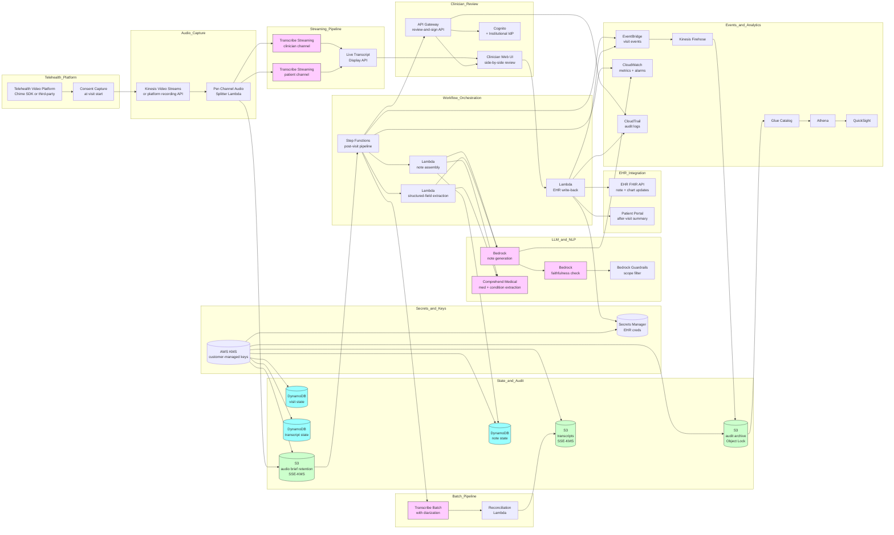

# Recipe 10.6: Speech-to-Text for Telehealth Documentation ⭐⭐

**Complexity:** Medium · **Phase:** Production-track · **Estimated Cost:** ~$0.20-1.50 per telehealth visit (depends on visit duration, choice of streaming vs batch ASR, diarization rigor, optional LLM-driven summarization, and whether the audio is retained beyond the immediate visit window)

---

## The Problem

It is 11:42 on a Wednesday morning. A family medicine physician named Dr. Okonkwo has just finished her sixth telehealth visit of the morning. The visit lasted 18 minutes. She talked with a 67-year-old man named Carl who has type 2 diabetes, hypertension, and a new symptom of intermittent foot tingling that he had not mentioned at his last in-person visit four months ago. Carl was sitting at his kitchen table on his iPad, with his wife visible at the edge of the frame, occasionally chiming in to remind him about a blood-pressure reading or to ask Dr. Okonkwo to repeat a medication dose. The video froze twice during the visit and the audio dropped out for about four seconds when Carl moved to grab his glucometer. Dr. Okonkwo did most of her thinking out loud, asked the usual questions, palpated nothing because she could not, and made a clinical judgment to add gabapentin for the neuropathy and to check an A1C and a B12 before the next visit.

The visit ended at 11:40. The next visit starts at 11:45. In the five minutes between, Dr. Okonkwo has to write the note for Carl. She has to remember the medication name and dose she said out loud. She has to remember the A1C and B12 she said she would order. She has to remember whether Carl said the tingling started "a few weeks ago" or "a couple of months ago," because the time course matters for the differential. She has to remember whether his wife had said something about him stumbling, because if she did, that changes the urgency. The clock at the bottom of the screen is counting down. The next patient's name has just appeared in the schedule, telling her that someone is now in the virtual waiting room. She has 240 seconds, and approximately none of those seconds will be spent looking back at Carl's face or thinking about whether the gabapentin was the right call.

In the in-person workflow, this same documentation problem exists, but with one important difference: the physician was in the room with the patient, and modern ambient documentation tools (recipe 10.7) can capture the conversation through a microphone in the exam room. The room listens. The note appears. The technology has matured enough that this is a real, deployable product category for in-person care.

Telehealth is different. The audio is on the patient's side of the connection, traveling through whatever consumer device the patient happens to be using, through whatever home network the patient happens to have, through the video platform's voice-and-data pipe, and arriving at the clinician's side already compressed, sometimes degraded, often clipped at the start of utterances when video activity detection misfires, and frequently interrupted by the small audio anomalies that everyone who has done a Zoom call has heard a hundred times. The patient's audio is at the mercy of the patient's bandwidth, the patient's microphone (a built-in laptop mic, a phone in landscape mode, an iPad on a kitchen counter), and the patient's environment (a TV in the next room, a barking dog, a granddaughter doing homework at the same table). The clinician's audio is usually fine, because the clinician is wearing a headset in a quiet room. The asymmetry between the two sides of the conversation is the dominant technical fact that this recipe has to deal with.

The other dominant fact is that telehealth visits are conversations between two or more parties. In Carl's visit, there were three speakers: Carl, Carl's wife, and Dr. Okonkwo. The visit's clinical content is distributed across all three. Carl's report of the new symptom is content. The wife's correction about the blood-pressure reading is content. The wife's concern about Carl's stumbling is content. Dr. Okonkwo's question, her clinical reasoning, her plan, are all content. A transcript that gets the words right but loses track of who said what is a transcript that gets the chart wrong. "The patient denies stumbling" and "the patient's wife reports the patient has been stumbling" are clinically opposite statements, and both might appear in the same telehealth visit if the patient and the wife disagreed. Speaker diarization, which is hard in any multi-party setting, is essentially the central engineering problem of telehealth speech-to-text.

The third dominant fact is that telehealth is the workflow context where ASR-driven documentation is most clearly a productivity multiplier. The in-person workflow has its own well-developed documentation strategies (scribes, ambient documentation, between-visit dictation, EHR templates with point-and-click charting). The telehealth workflow has fewer of these. The clinician cannot easily have a scribe in the virtual room. The clinician cannot easily dictate a separate audio stream while also conducting the video visit. The clinician cannot easily walk to a separate dictation workstation between visits because the next visit starts in five minutes and the dictation workstation is the same workstation the visits happen on. Telehealth visits create documentation pressure that is at least as bad as in-person visits, on a workflow that has fewer existing tools to manage it. The opportunity to do this well is real.

The fourth dominant fact is that telehealth is, in 2026, a meaningful and growing fraction of total clinical encounters. The pandemic-era surge has settled into a stable plateau where most primary care practices, most specialty practices, and most behavioral health practices conduct a substantial fraction of their visits via video. <!-- TODO: verify; post-pandemic telehealth utilization has stabilized at materially higher levels than pre-pandemic, with specific percentages varying by specialty, payer, and geographic region; behavioral health has the highest sustained telehealth fraction, often above 50% of total visits --> Behavioral health, in particular, has substantially higher sustained telehealth utilization than other specialties. The documentation tooling that supports this volume of visits is, in most institutions, the same EHR that supported in-person visits ten years ago, with the same click-and-type charting, the same after-hours documentation backlog, and the same clinician burnout cost. Layering speech-to-text into the telehealth workflow is one of the higher-impact AI investments a healthcare organization can make in the near term, and the technology has finally matured enough to make it deployable rather than aspirational.

A few specific failure modes the recipe takes seriously.

The behavioral-health visit where the patient becomes tearful while talking about their suicidal ideation, the audio gets quiet and breathy, the ASR starts losing words, and the transcript that the clinician reviews after the visit reads "I have been thinking about [inaudible]" at exactly the moment that the most clinically critical content was being said. The clinical content was captured by the clinician's listening, not by the technology, and now the documentation does not reflect the visit. If the clinician needs to review what was said in detail (which is common in behavioral health risk assessment), the transcript fails them at the highest-stakes moment.

The visit where the patient's connection drops mid-sentence, reconnects 12 seconds later, and the patient resumes speaking from where they left off mentally rather than from where the audio cut. The ASR, which never heard the missing 12 seconds, produces a transcript that reads as if the patient suddenly changed topics for no reason. The clinician knows what happened because they were in the visit; the next clinician reading the chart has no idea why the note has the apparent non-sequitur it has.

The pediatric visit where the parent and the child are in the same frame, both speak at various points, and the diarization system either lumps them together as a single "patient" voice or, worse, attributes the child's words to the parent and the parent's words to the child. The medication-allergy history that the parent is recounting becomes, in the transcript, a confused mishmash of who said what. The clinician corrects the diarization manually if they have time, and skims past it if they do not.

The visit conducted in Spanish through the institution's Spanish-language pathway, where the clinician speaks fluent Spanish and the patient speaks Spanish, but the ASR was deployed with English as the primary language and the diarization model was trained primarily on English audio. The transcript is, as expected, a mess. The clinician, having had the visit in Spanish, is also unlikely to want to write the note in Spanish, so the documentation is also going to involve a translation step that the speech-to-text pipeline did not anticipate.

The institution that deployed the speech-to-text feature with patient-side audio routing through the video platform's API, where the platform's audio resampling silently drops audio quality below the threshold the ASR vendor recommends, and the institution's WER quietly settles ten percentage points worse than the vendor's marketing materials suggested. Six months later, an internal audit comparing transcripts to the audio reveals the issue. The fix involves changing the audio capture path, which is a non-trivial integration with the video platform.

The institution that had the speech-to-text feature working well, then upgraded the video platform to a major new version, and discovered that the audio APIs they relied on had been changed in subtle ways that broke the diarization without breaking the basic transcript flow. The transcripts kept appearing; the speaker labels became incorrect. The issue was not detected for two months because clinicians stopped reading the speaker labels carefully once they saw the labels were "mostly right," and the cross-checks against the structured EHR data did not catch speaker-attribution errors.

The institution that deployed speech-to-text but did not invest in the consent flow, where patients were told at session start "this call may be recorded" but were not specifically told that the recording would be transcribed and the transcript stored as part of the medical record. A patient who later requested their records under HIPAA's right-of-access provision was surprised to find verbatim transcripts of personal disclosures they had assumed were ephemeral conversation. The legal team had to retroactively work through the disclosure-and-consent question. The technology was correct; the consent design was not.

The recipe takes the position that telehealth speech-to-text in 2026 is a reasonable, deployable product category, with mature ASR, increasingly mature diarization, and well-understood integration patterns with the major video platforms. The recipe also takes the position that the operational and consent and clinical-quality work around the technology is meaningfully more demanding than for the dictation use case (recipe 10.4), and on par with the work for ambient documentation (recipe 10.7). Get the engineering right and the workflow wrong, and the system fails. Get both right, and you give clinicians back a chunk of their day.

Let's get into it.

---

## The Technology: Two-Sided ASR with Diarization Under Network Stress

### What Makes Telehealth Different

Telehealth speech-to-text shares an ASR core with the dictation recipe (10.4) and the ambient-documentation recipe (10.7), but the operational constraints are different in ways that change every architectural decision.

**The audio is two-sided and arrives over network paths with different quality.** The clinician's audio comes from a headset mic in a quiet office on a wired or strong wireless connection. The patient's audio comes from whatever device the patient is using, in whatever environment they are in, on whatever network they have. The ASR has to work well on both sides of the conversation simultaneously. The naive deployment that tunes for the clinician's audio quality and treats the patient's audio as the same will systematically underperform on the patient side. A more sophisticated deployment captures the two sides as separate streams, applies different processing to each, and only joins them at the diarization-and-formatting layer.

**The conversation is conversational, not dictated.** Dictation is a single speaker speaking with intent toward a known transcription target. The cadence is structured. The vocabulary is dense with clinical terms. The speaker is pausing in places that make sense for a transcript. Telehealth is a conversation between two or more people who are talking to each other, with overlap, interruption, backchannels ("mm-hmm," "right," "okay"), reformulation, false starts, and the natural messiness of human dialog. The ASR has to handle this cleanly. The downstream formatting has to decide what to do with the disfluencies (preserve them, clean them up, or omit them). The diarization has to keep track of who is speaking through all of it.

**Diarization is the central engineering problem.** In a single-speaker dictation recipe, who-said-what is trivially answered. In a telehealth visit, getting it wrong means the chart is wrong. The patient said something concerning. The clinician asked about it. The patient walked back the concerning statement. If the diarization is wrong about even one of these utterances, the clinical meaning of the exchange flips. Modern diarization for two-party telehealth audio is reasonably good when the two parties are on separate audio channels (the video platform exposes them separately) and meaningfully harder when they are mixed into a single channel (which some platforms do by default). Three-party diarization (patient plus family member plus clinician) is harder still, especially when the family member and the patient share a microphone.

**Real-time display matters for in-visit review.** Some clinicians want to see the live transcript appear during the visit. This serves a few purposes: it surfaces ASR errors that the clinician can correct in the moment ("did the patient just say 'no chest pain' or 'low chest pain'?"), it lets the clinician scroll back to verify what was said earlier in the visit without breaking the conversation, and it serves as an accessibility feature for clinicians or patients who benefit from text alongside audio. Real-time display imposes streaming-ASR latency requirements (under a second or two from speech to displayed text), and it imposes UI work that batch-only systems do not.

**Crosstalk and overlap are routine.** In dictation, the speaker stops to let the system catch up. In telehealth, the patient and the clinician occasionally talk over each other. The patient interrupts to clarify. The family member chimes in. Someone laughs. A child cries in the background. The ASR has to handle overlapping speech without garbling either speaker's contribution. Modern systems handle this reasonably well when the speakers are on separate audio channels and meaningfully worse when they are mixed.

**Audio quality variability is enormous.** A young patient on a fiber connection with a Bose headset and a quiet home office has audio quality essentially indistinguishable from in-person. An elderly patient on a 3G cellular connection from a noisy nursing-home day room with a built-in tablet mic has audio quality that the ASR will struggle with. Both are doing telehealth visits. Both deserve good documentation. The system has to be honest about per-visit audio quality and, where the audio is poor, lower its confidence in the transcript and surface that to the reviewing clinician.

**Latency for real-time display is a hard budget, but the post-visit transcript can take longer.** The streaming portion of the system has to keep up with the conversation in real time. The post-visit batch portion can take a minute or two to produce a more accurate finalized transcript with full diarization, formatting, and structured-field extraction. Most production systems do both: a low-latency streaming view during the visit, plus a more accurate post-visit finalization that becomes the artifact filed in the chart.

**Consent and recording disclosure are a workflow design problem.** Telehealth platforms typically have a consent-to-record disclosure built into the visit start. Telehealth speech-to-text adds a second consent question: do you consent not just to the recording but also to its being transcribed and the transcript being added to the medical record? Most institutions handle this by treating the transcript as part of the medical record and disclosing the recording fact at intake; some institutions distinguish more carefully. The consent design is institutional policy, not engineering preference. State-by-state recording-consent law applies (recipe 10.5 covered the patterns; they apply identically here). HIPAA's right of access applies to the resulting transcripts.

**Multilingual support is more critical than for dictation.** Telehealth is the workflow where many institutions extend their language access programs, because the marginal cost of conducting a Spanish-language visit by video is much lower than scheduling a Spanish-speaking provider in person. The ASR has to support the languages the institution conducts visits in, and the diarization has to work with multilingual audio (where the patient may switch back and forth between languages, or where the clinician is doing the visit in the patient's language but the institutional documentation is expected in English).

**Behavioral health is the heaviest user, with specific stakes.** A meaningful fraction of telehealth volume is behavioral health: psychiatry, psychology, counseling. These visits are entirely conversational; the documentation requirements are particularly focused on the verbatim content of the conversation; the clinical risk of mis-documentation is high (a missed risk-assessment statement is a clinical-quality incident); and the conversation is often emotionally charged in ways that affect speech patterns (tearful speech, voice tremor, long silences). The technology has to work well for this use case, and the deployment has to be careful about what is captured, retained, and surfaced.

**Integration with the EHR documentation workflow is essential.** A transcript by itself is of limited use. The clinician needs the transcript surfaced in the workflow where they write the note: in the EHR's documentation pane, alongside the structured fields they are filling, with the relevant clinical entities (medications, problems, vitals discussed) extracted and ready to insert. The integration is most of the practical engineering work for institutions deploying this technology, and the integration depth is the main vendor differentiator.

**Equity is a first-class concern.** ASR systematically underperforms for some speaker demographics; in telehealth, the audio-quality variability layered on top of the demographic variation compounds the equity problem. <!-- TODO: verify; multiple peer-reviewed studies including Koenecke et al. 2020 in PNAS have documented substantial accuracy disparities in commercial ASR systems across demographic groups, with the disparities tending to compound when audio quality varies --> Per-cohort accuracy monitoring is required from day one.

These properties make telehealth speech-to-text a recognizably distinct technology problem. The components are familiar (ASR, diarization, formatting, EHR integration). The system-level rigor and the audio-handling specifics are different.

### The Telehealth Audio Path

Understanding the audio path from patient to ASR is half the battle in this recipe. The decisions made at each stage of the path determine the quality of the input the ASR sees.

**Patient device.** The patient is on a smartphone, a tablet, a laptop, or a desktop. Each has a different microphone. Smartphones tend to have decent mics with built-in noise suppression that sometimes helps and sometimes mangles the signal. Laptops have variable mic quality. Desktops with built-in webcam mics often have poor capture. Bluetooth headsets and external USB mics are uncommon among patients. The institution has essentially no control over patient-side audio capture; the system has to be robust to the variation.

**Patient-side processing.** Most consumer devices apply noise suppression, automatic gain control, echo cancellation, and acoustic-echo-cancellation processing to outgoing voice audio. These are tuned for telephony and conversational audio, not for ASR-friendly capture. The processing sometimes helps the ASR (lower background noise) and sometimes hurts (aggressive noise suppression can clip the start and end of words, especially for soft-spoken patients).

**Network transport.** The patient's audio is encoded by the video platform (typically with a codec like Opus, sometimes G.711 or G.722 in legacy paths), transmitted over the patient's network (LTE, 5G, Wi-Fi over residential broadband, cellular hotspot, occasional 3G in rural areas), and arrives at the platform's media server with the typical perturbations of real-world internet audio: jitter, packet loss, bandwidth-adaptive resampling, and occasional reroutes that briefly change the encoder behavior.

**Video platform processing.** The video platform reassembles the audio, may transcode to a different codec, may apply additional processing (echo cancellation if the call is being mixed for multiple participants, automatic gain control), and exposes the audio either as a real-time stream to participants or as a post-call recording. Some platforms expose per-participant separated audio (each participant's audio is a separate channel); some mix all participants into a single channel before recording. The choice affects diarization difficulty enormously.

**Capture interface for ASR.** The institution's speech-to-text system gets the audio through one of three integration paths: a real-time media stream from the video platform's API (typically via WebRTC, sometimes via RTMP, sometimes via vendor-specific stream APIs), a post-call recording file from the platform's recording API, or a sidecar capture mechanism (a virtual audio device that the institution's own software listens on, plus the platform's standard recording for the audio it does not see). Each integration path has different latency, fidelity, and engineering-effort characteristics.

**ASR ingest.** The ASR receives the audio either as a streaming source (for real-time transcription) or as a file (for post-visit transcription). Most production systems do both: a streaming pipeline for real-time display, a batch pipeline running in parallel for the higher-quality finalized transcript. The two pipelines may use different ASR models or different model configurations tuned for the latency and accuracy trade-offs of each path.

**Per-channel separation.** When the platform exposes per-participant audio, the ASR can run separately on each channel. The clinician's channel and the patient's channel are transcribed independently. Each channel's transcript is timestamped. Diarization becomes essentially a merge-and-interleave operation on the timestamps, which is dramatically easier than acoustic diarization on a mixed channel. When the platform mixes the audio, the ASR receives a single channel and the diarization has to work acoustically, which is harder.

**Per-channel quality monitoring.** The institution monitors per-channel signal-to-noise ratio, per-channel speech detection rate, per-channel transcript confidence, per-channel word rate. These metrics let operations identify visits where the patient-side audio is degraded and lower the confidence accordingly. They also identify systematic patterns (this patient's home network is consistently bad, this clinician's headset has started failing) that drive remediation.

**Audio retention for QA.** The audio is held for a brief retention window for quality assurance and error correction, then deleted per the institutional retention policy. Some institutions retain longer for model adaptation; some discard immediately after transcription. The retention choice is a privacy-and-compliance decision, not an engineering preference.

The audio path is where many telehealth speech-to-text deployments quietly fail. The institution deploys the ASR with default settings, the platform integration silently degrades audio quality below the ASR's tested input range, the WER comes in well above the vendor's published numbers, and nobody knows why. The fix is almost always at the audio path, not at the ASR. Spend time here on the upfront engineering.

### Speaker Diarization for Two-Party and Three-Party Audio

Diarization is the technology layer most specific to telehealth speech-to-text, and the layer where most deployments make the trade-offs that determine the system's clinical value.

**The simple case: per-channel separated audio.** If the video platform exposes patient-side and clinician-side audio as separate channels, diarization is essentially trivial: the patient's audio is on channel A, the clinician's audio is on channel B, the transcripts are produced separately, and the merged transcript interleaves the two by timestamp. Speaker identity is known by which channel the audio came from. This is the high-fidelity case and the architectural target. The institution should aggressively pursue per-channel audio access, even if the integration is more work.

**The harder case: mixed audio with two speakers.** If the audio is mixed into a single channel, diarization runs acoustically. Modern diarization models extract speaker embeddings (x-vectors, ECAPA-TDNN, or learned representations from end-to-end neural diarization) from short audio segments, cluster them by speaker, and label each segment. For two clearly-distinct voices (an adult man and an adult woman, or two adults of clearly different ages), diarization works reasonably well: most production benchmarks report diarization error rates in the single digits for two-speaker telehealth audio in clean conditions. <!-- TODO: verify; specific diarization error rate numbers vary by dataset, audio quality, and acoustic conditions; the single-digit DER on clean two-speaker audio is a common but not universal benchmark --> For voices that are acoustically similar (two adult men of similar age, two adult women, parent and adult child of the same gender), diarization is harder.

**The harder still case: three or more speakers.** A patient plus a family member is a common telehealth configuration. Sometimes both are on the same microphone (the patient and their spouse sitting at the same table sharing an iPad), in which case the diarization has to distinguish two speakers acoustically from a single audio source. Sometimes they are on separate devices (the spouse joined from their own laptop), in which case the diarization can use the channel separation. The institution often does not know which configuration a given visit will use until the visit starts. Diarization on a single-microphone two-person audio source is notably worse than two-channel diarization, and the system has to expose the difficulty to the reviewing clinician.

**Speaker labeling versus speaker identification.** Diarization tells the system that there are N distinct speakers in the audio. It does not, by itself, tell the system which speaker is the clinician and which is the patient. Speaker labeling is the additional step of mapping speakers A, B, C to roles like "clinician," "patient," "family member." This usually happens through context: the visit was scheduled with Dr. Okonkwo, so one of the speakers is her; the patient on the schedule is Carl, so one of the speakers is him; the third speaker, if any, is presumed family unless otherwise identified. When the audio is per-channel separated, role assignment is trivial (the clinician's channel is labeled accordingly). When the audio is mixed, role assignment can use timing heuristics (the clinician usually starts the visit and asks the first questions), prosodic cues (the clinician's speaking style is often more measured), or acoustic enrollment (the clinician has a stored voiceprint from previous visits, and matches against it).

**Overlapping speech.** When two speakers talk at the same time, the diarization output has to indicate both speakers were active in that segment. Modern diarization models handle overlap by emitting per-speaker activity scores rather than single-speaker labels. The downstream transcript shows the overlapping content as a single multi-speaker passage, with the ASR doing its best to recognize each speaker's words. Overlap is a quality-degradation point; transcripts during overlap segments tend to have lower confidence and more errors.

**Backchannels and interjections.** Short utterances ("mm-hmm," "right," "okay") from one speaker while the other is talking are routine in clinical conversation. The clinician's "mm-hmm" while the patient describes their symptom is conversational backchanneling, not a substantive utterance. Diarization usually catches these correctly when audio is per-channel separated. When audio is mixed, short backchannels can be missed entirely or attributed to the wrong speaker. The downstream formatting often elides backchannels from the final note, but they should appear in the verbatim transcript that the clinician reviews.

**Diarization confidence in the output.** Like ASR confidence, diarization confidence varies per segment and should be exposed downstream. The system tells the reviewing clinician "this segment is high confidence patient speech" or "this segment has uncertain speaker attribution." The clinician's eye is drawn to the uncertain segments, where mis-attribution is most likely. Without this, the clinician trusts speaker labels uniformly and silently inherits the diarization's errors.

**Joint ASR-and-diarization architectures.** Modern systems sometimes use joint architectures that produce ASR and diarization output together rather than as separate stages. The advantage: the model can leverage acoustic cues for both transcription and speaker discrimination simultaneously. The disadvantage: the output is harder to debug, and the diarization quality is coupled to ASR quality in ways that the separate-stage architecture avoids. Both approaches are deployed in production.

**Speaker enrollment for known repeated participants.** For clinicians who do many telehealth visits, the system can enroll their voiceprint and use it for confident clinician-side speaker labeling across visits. This is not biometric authentication (the clinician is logged in through other means); it is a labeling shortcut that improves diarization reliability. Patient-side enrollment is less common because of the biometric-data-governance overhead and the limited per-patient call frequency.

**Non-speaker audio events.** A barking dog, a doorbell, a pager, a TV in the background. Diarization should ideally segment these as non-speech, not attribute them to a speaker. Modern systems handle this reasonably; older systems sometimes incorporate background noise into speaker clusters with weird results.

The diarization layer is where the institution's specific tooling matters most. Vendor-supplied diarization (built into the ASR product) varies in quality. Self-managed diarization (using open-source diarization toolkits or fine-tuned models) requires more engineering effort but lets the institution tune for its specific telehealth audio characteristics. The right answer for most institutions is to start with vendor diarization, evaluate it on representative telehealth audio across speakers, audio qualities, and visit types, and decide based on the per-cohort numbers whether vendor diarization is good enough or whether self-managed diarization is justified.

### Streaming for Real-Time Display, Batch for Final Transcript

The latency-versus-accuracy trade-off is sharp in telehealth speech-to-text, and most production systems handle it by running both modes.

**Streaming ASR for real-time display.** During the visit, the clinician sees the transcript appear in something close to real time. The latency budget is typically under two seconds from speech to displayed text. The ASR runs in streaming mode, emitting partial transcripts that get refined as more audio arrives, with finalization on end-of-utterance markers. The streaming ASR's accuracy is typically slightly lower than the corresponding batch ASR's accuracy on the same audio, because the streaming model has less context. The trade-off is that the clinician sees the words while the visit is happening, which has real workflow value: they can scroll back to verify what was said, they can correct ASR errors in the moment, and they can use the transcript as an aide-memoire while continuing the conversation.

**Batch ASR for the finalized transcript.** After the visit ends (or in parallel during the visit, on a separate processing path), a batch ASR runs over the full audio with full context. The batch ASR's accuracy is typically better because it has full discourse-level context, can do more sophisticated formatting, and can apply more compute per word. The batch transcript is the artifact filed in the chart and presented to the clinician for review-and-sign.

**Reconciliation.** The streaming transcript and the batch transcript are usually similar but not identical. The system has to decide what to do with the differences. Most production systems prefer the batch transcript as the canonical record and use the streaming transcript only for in-visit display. Some systems present a diff to the clinician at review time, showing where the streaming and batch transcripts disagreed. The disagreement points are often the points where audio quality was poor or where speakers overlapped, both of which are useful for clinician review.

**Per-segment finalization for streaming.** Streaming ASR systems usually emit "interim" results that may change as more audio arrives, plus "final" results that are stable. The display layer either updates as interim results change (which can be visually distracting) or waits for finalization (which adds perceived latency). The right balance depends on the clinician's preference and the typical disfluency level of the conversation.

**Diarization in streaming mode.** Streaming diarization is harder than batch diarization because the system has less audio to base speaker clustering on. Most streaming diarization works best when audio is per-channel separated. When audio is mixed, streaming diarization on the first few seconds of a new speaker's contribution may be uncertain or wrong; the batch diarization, with full audio, can typically resolve these correctly.

**Latency budget for the streaming path.** The total budget from speech to displayed text on the clinician's screen is typically under two seconds. Within that budget: audio capture and transport (a few hundred milliseconds), ASR processing (a few hundred milliseconds in modern streaming systems), streaming diarization (roughly the same), and display rendering. The ASR vendor's quoted streaming latency is often the model-only latency; the end-to-end latency is meaningfully larger. Production deployment requires latency monitoring against the actual end-to-end path.

### LLM-Driven Summarization, Structured-Field Extraction, and Note Generation

Once the transcript and diarization are stable, LLM post-processing is where most of the workflow value gets delivered.

**Visit summary generation.** The system generates a clinician-facing summary of the visit: the chief complaint, the history of present illness as the patient described it, the relevant review of systems, the clinical reasoning the clinician verbalized, the assessment, the plan. The summary is structured per the institutional note template (SOAP, APSO, specialty-specific variants). The LLM is grounded in the verbatim transcript with explicit citations: each claim in the summary links back to the transcript segments that support it. This grounding is essential for clinician trust and for clinical-safety review.

**Structured-field extraction.** Beyond the narrative summary, the LLM extracts structured fields: medications discussed, dosages mentioned, problems addressed, vital signs reported, allergies mentioned, follow-up actions agreed to, lab tests or imaging ordered, prescriptions written. These fields are presented to the clinician for explicit confirmation before being inserted into the structured EHR fields (the medication list, the problem list, the orders queue). The structured-field extraction is the highest-value piece for documentation efficiency, and the highest-stakes piece for accuracy: the clinician confirms each extraction before it modifies the chart.

**Patient-facing visit summary.** Some institutions use the same pipeline to generate a patient-facing visit summary (the after-visit summary, recipe 2.5) using the visit content directly rather than asking the clinician to write it. The patient-facing summary is in plain language, omits clinical-only content, and emphasizes the action items the patient should take. This is a separate generation pass from the clinician note, with different scope and different review.

**Clinician-side review interface.** The LLM-generated note is presented to the clinician in a review interface that supports: side-by-side display of the verbatim transcript and the LLM-generated note, click-to-jump from any sentence in the note to the supporting transcript segment, confidence highlighting on uncertain extractions, structured-field preview with explicit confirmation before chart insertion, and tracked-changes editing for the clinician to refine the LLM's output.

**Faithfulness as a hard constraint.** The same faithfulness concern from recipe 10.4 (and from the broader LLM recipes in chapter 2) applies here, sharply. The LLM must not invent clinical content that was not in the transcript. The summary is a faithful structuring of what was actually said, not a rewriting that fills in plausible-sounding details. Faithfulness checks (does every claim in the summary have a transcript citation; is the cited transcript segment actually supportive of the claim) run as a defense layer before the summary is shown to the clinician. <!-- TODO (TechWriter): Expert review A1 (HIGH). The faithfulness check should be specified as a layered architecture stage rather than a single defense layer. Layer 1 (cheaper): citation grounding verification and structured-output schema validation. Layer 2 (parallel): LLM-judge faithfulness scoring and clinical-rule-based contradiction detection. Layer 3 (offline, sampled): clinical-quality team review feeding back into Layer 1 and Layer 2 updates. Per-layer disposition (block vs flag) is policy-driven and tighter for the behavioral-health profile. Per-cohort faithfulness-failure-rate is a launch and operational gate. Named ownership at the clinical-quality officer (rule catalogs) and clinical-informatics lead (grounding rules). Update the architecture diagram to show the layers as separate components rather than a single BEDROCK_FAITH node. -->

**Scope filtering on the generated content.** Like recipe 10.5, the LLM is constrained to a documented scope: structuring the visit content. It does not add clinical recommendations the clinician did not make. It does not interpret findings beyond what the clinician interpreted. It does not generate billing codes (or, if it does, the code suggestions are presented as suggestions for clinician confirmation, never auto-applied). Scope-violation detection runs on the generated note and surfaces violations to the clinician at review time.

**Per-specialty templating.** A primary care visit note has a different structure than a cardiology consultation note than a behavioral health progress note. The LLM is prompted with the specialty-appropriate template, and the formatting layer applies the specialty's conventions. The institution maintains the per-specialty templates as a curated asset.

**Progressive disclosure.** The clinician should not see a wall of generated text and have to read every word to find errors. The review interface highlights the structured extractions first (medications, problems, plan items), the high-confidence narrative second, and the low-confidence narrative third. The clinician's attention is directed to where their review has the most leverage.

### Where the Field Has Moved

Some practical updates worth knowing.

**Telehealth platforms have improved their audio APIs.** Five years ago, getting per-channel separated audio out of a major telehealth platform was a significant engineering challenge. Today, most leading platforms (Zoom Healthcare, Teladoc Health, Doxy.me, Microsoft Teams for Healthcare, Amwell, MDLive, vendor-bundled telehealth modules from Epic and Cerner) expose per-participant audio either through native APIs or through standards-based protocols (WebRTC, SIPREC). The diarization-by-channel approach is now the standard rather than the aspirational. <!-- TODO: verify; the specific platform capabilities and API surfaces continue to evolve, with telehealth platforms periodically updating their audio access patterns -->

**End-to-end neural ASR has caught up on conversational telehealth audio.** General-purpose neural ASR trained on diverse audio (Whisper-class models, vendor neural offerings) handles conversational clinical audio better than the previous generation of hybrid systems. The clinical-vocabulary tuning is still important, but the gap between general and clinical ASR has narrowed for conversational use cases (it remains larger for dense dictation).

**Diarization has improved markedly.** Modern neural diarization systems (joint ASR-and-diarization architectures, speaker-attributed end-to-end models, large-context diarization) handle two-speaker telehealth audio at high quality and three-speaker audio at acceptable quality. The diarization-as-distinct-research-problem framing of five years ago has shifted toward diarization-as-deployable-feature.

**LLM-driven note generation has become production-grade.** The pattern from recipe 10.7 (ambient documentation) of LLM-driven structuring is mature enough for telehealth deployment. Multiple commercial vendors offer it as a turnkey feature. Building it from scratch is still a months-long workstream; integrating a vendor's offering is a weeks-long workstream.

**Faithfulness research has produced practical tooling.** The earlier-generation concern of "the LLM might hallucinate clinical content" is now addressable through citation-based grounding, faithfulness-evaluator models, and clinical-rule-based contradiction detection. The tooling does not eliminate the risk but reduces it to a managed operational concern rather than a deal-breaker. <!-- TODO: verify; faithfulness evaluation for clinical LLM summarization has been an active research area with multiple peer-reviewed approaches and vendor offerings, though standardization is incomplete -->

**Behavioral health is the lead market.** Behavioral health practices have been the earliest and most enthusiastic adopters of telehealth speech-to-text, partly because the documentation requirements are particularly conversation-focused, partly because behavioral health has the highest sustained telehealth utilization, and partly because the clinical risk profile is well-suited to AI-assisted documentation with clinician review. <!-- TODO: verify; behavioral-health adoption of AI-driven documentation tools has been faster than other specialties, with vendors specifically targeting this market -->

**EHR-vendor-bundled offerings have entered the market.** Epic, Oracle Health (Cerner), and several other EHR vendors have started offering telehealth speech-to-text as a bundled feature, integrated directly with the documentation workflow. This shifts the build-versus-buy economics further toward buy: the integration is already done, the BAA is already in place, and the workflow integration is deeper than third-party offerings can achieve. <!-- TODO: verify; EHR-vendor-bundled telehealth speech-to-text offerings have been growing in 2024-2026 with specific feature sets continuing to evolve -->

**Regulatory clarity on AI-assisted documentation has improved.** FDA and CMS have signaled that AI-assisted documentation tools that produce drafts for clinician review and signature are productivity software rather than regulated medical devices, reducing the regulatory uncertainty that previously slowed deployment. Voice biometrics and clinical-claim-making AI remain regulated; pure transcription-and-summarization for clinician review is in the productivity-software band. <!-- TODO: verify; FDA's positions on AI-assisted documentation tools have been evolving, with the productivity-software vs medical-device distinction continuing to be refined through guidance documents -->

---

## General Architecture Pattern

A telehealth speech-to-text system decomposes into eight logical stages: visit setup and consent capture (the visit begins with the appropriate disclosures and the speech-to-text feature is enabled per institutional policy), per-channel audio capture (the patient-side and clinician-side audio are captured, ideally as separate channels), streaming ASR with diarization (the audio becomes a real-time transcript with speaker labels), real-time display (the live transcript appears for the clinician to monitor during the visit), batch ASR for finalization (a higher-accuracy transcript is produced after the visit), LLM-driven note generation and structured-field extraction (the transcript becomes a draft note with extracted clinical data), clinician review and signature (the clinician reviews the draft, corrects errors, confirms structured extractions, and signs), and audit, archive, and learning (the audio, transcript, generated note, and metadata are stored with appropriate retention).

```
┌──────────── VISIT SETUP & CONSENT CAPTURE ───────────────┐
│                                                           │
│   [Visit begins through telehealth platform]              │
│    - Patient and clinician join the video session         │
│    - Platform-level recording-consent disclosure plays    │
│   [Speech-to-text feature enabled per institutional       │
│    policy]                                                │
│    - Default-on for visits where institutional consent    │
│      is captured at intake                                │
│    - Default-off and explicit-opt-in where state law      │
│      or institutional policy requires per-visit consent   │
│   [State-law-aware consent disclosure]                    │
│    - Patient's location determines applicable             │
│      recording-consent law                                │
│    - All-party-consent jurisdictions: explicit            │
│      verbal disclosure plus acknowledgment                │
│    - One-party-consent jurisdictions: notice that the     │
│      visit will be transcribed for the medical record    │
│   [Behavioral-health-specific disclosures where           │
│    applicable]                                            │
│    - Some institutions add a behavioral-health-specific   │
│      disclosure about transcript handling                 │
│           │                                               │
│           ▼                                               │
│   [Output: visit session with consent confirmed,          │
│    speech-to-text enabled or disabled, jurisdictional     │
│    metadata captured]                                     │
│                                                           │
└───────────────────────────────────────────────────────────┘

┌──────────── PER-CHANNEL AUDIO CAPTURE ───────────────────┐
│                                                           │
│   [Capture audio from the telehealth platform]            │
│    - Preferred: per-participant separated audio streams   │
│      (one channel per speaker)                            │
│    - Fallback: mixed audio when per-channel access is     │
│      unavailable                                          │
│   [Per-channel quality monitoring]                        │
│    - Signal-to-noise ratio per channel                    │
│    - Speech-detection rate per channel                    │
│    - Codec and bitrate per channel                        │
│    - Network-quality indicators per channel               │
│   [Quality-degraded mode]                                 │
│    - When patient-side audio drops below threshold,       │
│      lower downstream confidence and surface a            │
│      quality flag to the clinician                        │
│    - When network drops out, mark the gap explicitly      │
│      in the transcript                                    │
│           │                                               │
│           ▼                                               │
│   [Output: per-channel audio streams with quality         │
│    metadata]                                              │
│                                                           │
└───────────────────────────────────────────────────────────┘

┌──────────── STREAMING ASR WITH DIARIZATION ──────────────┐
│                                                           │
│   [Streaming ASR per channel]                             │
│    - Domain-adapted for clinical conversational audio     │
│    - Custom vocabulary biasing for institutional          │
│      terminology, common medications, conditions          │
│    - Per-language streaming configuration                 │
│   [Diarization]                                           │
│    - Trivial when audio is per-channel separated          │
│      (each channel maps to a known speaker)               │
│    - Acoustic diarization when audio is mixed             │
│    - Three-or-more-speaker handling for visits with       │
│      family members                                       │
│   [Speaker labeling]                                      │
│    - Map diarized speakers to roles using visit context   │
│      (clinician scheduled, patient on schedule, others    │
│      labeled as family or unidentified)                   │
│    - Optional clinician-side voiceprint enrollment for    │
│      higher confidence on the clinician's segments        │
│   [Streaming partials with speaker labels]                │
│    - Per-word timing                                      │
│    - Per-word confidence                                  │
│    - Per-segment speaker labels                           │
│           │                                               │
│           ▼                                               │
│   [Output: rolling streaming transcript with speaker      │
│    labels, per-word confidence, per-segment timing]       │
│                                                           │
└───────────────────────────────────────────────────────────┘

┌──────────── REAL-TIME DISPLAY ───────────────────────────┐
│                                                           │
│   [Display transcript to the clinician during the visit]  │
│    - Speaker-labeled segments (clinician, patient,        │
│      family member)                                       │
│    - Confidence highlighting on uncertain segments        │
│    - Network-gap indicators where audio dropped           │
│    - Scrollable history within the visit                  │
│   [In-visit correction affordances]                       │
│    - Click a segment to correct it inline                 │
│    - Click to relabel speaker for a segment               │
│    - Mark a segment as off-the-record (clinician          │
│      preference, retained in transcript only with         │
│      appropriate flag)                                    │
│   [Accessibility view]                                    │
│    - Optional patient-facing live caption display         │
│      for hard-of-hearing patients (consent and            │
│      configuration required)                              │
│           │                                               │
│           ▼                                               │
│   [Output: live transcript visible during the visit       │
│    with optional in-visit corrections recorded]           │
│                                                           │
└───────────────────────────────────────────────────────────┘

┌──────────── BATCH ASR FOR FINALIZATION ──────────────────┐
│                                                           │
│   [Reprocess the full audio after visit ends]             │
│    - Higher-accuracy ASR with full context                │
│    - More sophisticated diarization with full audio       │
│    - Custom-vocabulary biasing applied uniformly          │
│   [Reconcile streaming and batch transcripts]             │
│    - Identify segments where streaming and batch          │
│      disagree (often correlate with audio quality         │
│      issues or speaker overlap)                           │
│    - Use batch as the canonical transcript                │
│    - Carry forward in-visit corrections from streaming    │
│   [Format the canonical transcript]                       │
│    - Punctuation and capitalization                       │
│    - Speaker labels in a consistent format                │
│    - Disfluency handling per institutional preference     │
│      (preserve, mark, or elide)                           │
│           │                                               │
│           ▼                                               │
│   [Output: canonical post-visit transcript with           │
│    speaker labels and timing]                             │
│                                                           │
└───────────────────────────────────────────────────────────┘

┌──────────── LLM-DRIVEN NOTE GENERATION & EXTRACTION ─────┐
│                                                           │
│   [Generate the structured visit note]                    │
│    - Per-specialty template (SOAP, APSO, behavioral       │
│      health, specialty-specific)                          │
│    - Citations from each note section to supporting       │
│      transcript segments                                  │
│   [Faithfulness checks]                                   │
│    - Every claim in the note has a transcript citation   │
│    - LLM-judge faithfulness scoring on the generated      │
│      content                                              │
│    - Clinical-rule-based contradiction detection          │
│      (note says "no fever" but transcript mentions        │
│      "temperature of 102")                                │
│   [Structured-field extraction]                           │
│    - Medications discussed (with RxNorm coding)           │
│    - Problems addressed (with ICD-10 coding)              │
│    - Vitals reported by the patient                       │
│    - Allergies mentioned                                  │
│    - Follow-up actions and orders agreed to               │
│   [Scope filter on the generated content]                 │
│    - Generated note must not add clinical content         │
│      beyond what was in the transcript                    │
│    - Billing-code suggestions (if generated) flagged      │
│      explicitly as suggestions for clinician confirmation │
│   [Patient-facing summary generation (optional)]          │
│    - Plain-language after-visit summary                   │
│    - Action items emphasized                              │
│           │                                               │
│           ▼                                               │
│   [Output: draft clinician note, structured extractions,  │
│    optional patient-facing summary, all with transcript   │
│    citations]                                             │
│                                                           │
└───────────────────────────────────────────────────────────┘

┌──────────── CLINICIAN REVIEW & SIGNATURE ────────────────┐
│                                                           │
│   [Side-by-side review interface]                         │
│    - Generated note on one side, transcript on the other  │
│    - Click any sentence in the note to jump to the        │
│      supporting transcript segment                        │
│    - Confidence highlighting on uncertain content         │
│   [Structured-field confirmation]                         │
│    - Each extracted medication, problem, and order        │
│      requires explicit confirmation before chart          │
│      insertion                                            │
│    - Diff view showing proposed chart changes             │
│   [Track-changes editing]                                 │
│    - Clinician edits to the generated note are tracked    │
│    - Edit patterns feed downstream prompt and rule        │
│      improvements                                         │
│   [Co-signature workflow for trainees]                    │
│    - Resident or fellow drafts get reviewed and           │
│      co-signed by the attending                           │
│   [Sign-and-file]                                         │
│    - Final note is signed and filed in the EHR            │
│    - Structured fields applied to the chart               │
│    - Patient-facing summary released to the portal        │
│      after appropriate hold period if institutional       │
│      policy requires clinician review of patient-facing   │
│      content first                                        │
│           │                                               │
│           ▼                                               │
│   [Output: signed clinical note in the EHR, structured    │
│    chart updates, patient-facing summary in portal]       │
│                                                           │
└───────────────────────────────────────────────────────────┘

┌──────────── AUDIT, ARCHIVE & LEARNING ───────────────────┐
│                                                           │
│   [Durable audit record]                                  │
│    - Audio reference (under retention policy)             │
│    - Streaming and batch transcripts                      │
│    - Generated note draft and signed final note           │
│    - Diff between draft and final (clinician edits)       │
│    - Structured-field extractions and confirmations       │
│    - Consent and disclosure events                        │
│   [Cohort-stratified accuracy monitoring]                 │
│    - Per-language, per-specialty, per-clinician,          │
│      per-patient-cohort                                   │
│    - WER, diarization error rate, faithfulness score,     │
│      structured-field extraction accuracy                 │
│    - Disparity alerts on configured thresholds            │
│   [Operational telemetry]                                 │
│    - Per-visit duration, transcript length, note          │
│      generation latency                                   │
│    - Edit distance between generated draft and signed     │
│      final note (proxy for AI utility)                    │
│    - Per-clinician adoption metrics                       │
│   [Audio retention enforcement]                           │
│    - Brief retention for QA and immediate review          │
│    - Automatic deletion after the configured window      │
│   [Sampled review for clinical-quality concerns]          │
│    - Periodic sampling of generated notes for             │
│      clinical-quality review                              │
│    - Findings feed prompt and rule updates                │
│           │                                               │
│           ▼                                               │
│   [Output: audit trail, telemetry, learning signals]      │
│                                                           │
└───────────────────────────────────────────────────────────┘
```

A few cross-cutting design points the architecture has to bake in.

**Audio is PHI throughout, with telehealth-specific complications.** Telehealth audio captures the patient's voice in their home environment, often with bystanders audible in the background, with content that is often more candid than what makes it to the formal record. The architecture treats audio as PHI throughout: encrypted at rest, encrypted in transit, access-controlled, retention bound by an explicit policy, BAAs in place for any vendor service that processes the audio. The retention is typically shorter than for in-person ambient recording because the immediate QA value is similar but the data-minimization argument is stronger (the patient's home audio captures more bystander content than a clinical exam room).

**Per-channel audio access is an architectural priority.** The diarization quality difference between per-channel separated and mixed audio is large enough that the institution should treat per-channel access as a first-tier requirement when selecting a telehealth platform or evaluating an existing platform's API. The integration work to access per-channel audio is usually worth it even if it adds weeks to the deployment timeline.

**Real-time and batch run in parallel, not in sequence.** The streaming pipeline serves the in-visit display; the batch pipeline serves the canonical post-visit transcript. They are independent paths sharing an audio source. Failure of one does not take down the other.

**Faithfulness checks gate the LLM-generated note.** The LLM is a drafting partner, not a source of truth. Faithfulness checks (citation grounding, contradiction detection, clinical-rule validation) run before the draft is shown to the clinician. Failed faithfulness checks either block the draft from being shown at all (with the clinician falling back to manual documentation) or surface the failed checks as warnings the clinician must address. The institution decides which behavior is appropriate per check type.

**Clinician review is the legal-medical-record boundary.** The signed note is the legal record. The verbatim transcript is supporting documentation. The audio is at most ephemeral. The architecture is explicit about which artifacts are part of the medical record (the signed note, the structured chart updates), which are supporting documentation (the transcript), and which are operational data (the audio). Patient right-of-access requests under HIPAA are handled per institutional policy on the relative status of these artifacts.

**Multilingual deployment is a per-language pipeline.** Each supported language has its own ASR configuration, its own diarization tuning, its own LLM prompt, its own per-specialty templates, and its own faithfulness-check tuning. The institution does not get multilingual support by setting a language code; it builds it per language with native-speaker clinical input.

<!-- TODO (TechWriter): Expert review A5 (MEDIUM). Expand the per-language pipeline pattern: per-language ASR configuration with custom vocabulary and custom language model; per-language note-generation prompt with native-speaker clinical-informatics input; per-language template definitions; per-language faithfulness rule catalogs; per-language diarization tuning; per-language structured-extraction approach (where Comprehend Medical does not directly support the language, fall back to translation-then-extract or LLM-driven extraction with per-language prompts). Reference build-for-day-one even when shipping English-first; per-language deployment gated on per-language assets meeting institutional thresholds and per-language sample-size minimums (cross-reference A2). -->

**Equity monitoring stratifies by audio quality as well as by speaker demographics.** Telehealth audio quality variability layers on top of the demographic variability that ASR systems exhibit. The institution monitors per-cohort accuracy with audio quality as a covariate so that demographic disparity can be distinguished from audio-quality-driven disparity.

<!-- TODO (TechWriter): Expert review A2 (HIGH). Promote per-cohort accuracy and adoption monitoring from prose to an architectural primitive. Specify (a) single-axis cohorts (per-language, per-specialty, per-clinician, per-audio-quality-band, per-patient-age-band, per-visit-type) and two-axis cohorts (per-language-by-audio-quality, per-specialty-by-language); (b) per-cohort minimum sample size for statistical reliability; (c) per-cohort threshold metrics (per-channel WER, diarization error rate, per-layer faithfulness score, structured-extraction acceptance rate, edit distance, sustained-adoption rate at 30/90/180 days); (d) launch gate where every cohort must meet its threshold and the institution-wide average is informational only; (e) per-cohort drift detection and alerting; (f) audio-quality-band as a per-encounter feature driving lower confidence thresholds for poor-audio encounters and audio-quality-warning surfaced in clinician review. Add a Production-Gaps "Per-Cohort Asset Maintenance" subsection. -->

**Behavioral-health-specific handling.** Behavioral health visits often contain content that is more sensitive than typical clinical visits: detailed descriptions of trauma, discussion of suicidal or homicidal ideation, family-of-origin content, substance-use disclosures. Some institutions choose to apply additional protections to behavioral-health transcripts: shorter retention windows, narrower access controls, opt-in rather than opt-out for the patient, and explicit clinician control over which segments are committed to the transcript. The architecture supports a behavioral-health profile that the institution can apply per visit type or per clinician.

<!-- TODO (TechWriter): Expert review S2 (HIGH). Promote the behavioral-health profile from prose to an architectural primitive. Specify the per-profile differences explicitly: (a) retention (default 24-72 hours for behavioral-health audio, 24-48 hours for 42-CFR-Part-2-eligible audio, vs 7-30 days for primary care); (b) access control (separate KMS key class with tighter key policy limited to treating clinician, assigned clinical-quality reviewer with explicit Part-2 access, and privacy officer); (c) consent flow (behavioral-health-specific disclosure plus explicit Part-2 disclosure-and-consent at intake for substance-use-treatment-eligible visits); (d) patient-portal release (gated on additional clinician review and caregiver-proxy compatibility check); (e) audit-log discipline (separate audit-archive prefix with disclosure-accounting metadata); (f) cross-encounter analytics (excluded by default; inclusion requires explicit institutional review). Update visit-state pseudocode at Step 1C to capture behavioral_health_profile and part_2_eligible flags. Update the audit_record at Step 7 to include profile flags and the applied retention/access-control class. Add a Production-Gaps "42 CFR Part 2 and State-Level Confidentiality Compliance" subsection naming the privacy officer as canonical owner. -->

**Crisis content surfacing.** Behavioral-health and primary-care telehealth visits sometimes contain crisis content: suicidal ideation, homicidal ideation, suspected abuse. The institution typically already has clinical workflows for these in real time during the visit (the clinician handles them). The speech-to-text system has the secondary opportunity to flag crisis content in the post-visit review for clinical-quality auditing, ensuring that any crisis discussion is reflected in the documentation and that any required reporting (mandated reporting, safety planning) was completed. This is a different use of crisis detection than recipe 10.5; here it is a documentation-completeness check, not a real-time triage step.

**Audit retention spans the medical record's legal lifetime.** The signed note is in the EHR's standard retention. The supporting transcript is typically retained per the same retention as the note. The audio is retained briefly per the institutional policy. The audit trail (consent events, transcript generation, clinician edits, structured-field confirmations) is retained per the longer of HIPAA's six-year minimum, state medical-records-retention rules, the EHR vendor's audit-retention floor, and the institutional regulatory floor.

**Failure modes degrade to manual documentation.** When the speech-to-text feature fails (ASR vendor outage, audio capture broken, LLM service unavailable, network problems on the patient side), the system falls back gracefully: the clinician documents manually using the EHR's standard tools. The institution does not lose the visit because the AI feature is broken. The audit log records the failure for operational follow-up.

**Per-clinician opt-out and per-visit opt-out.** Some clinicians prefer not to use AI-assisted documentation for some or all of their visits. Some patients prefer not to be transcribed. The architecture supports per-clinician feature configuration (the clinician can disable the feature for their account) and per-visit opt-out (the clinician can disable the feature for the current visit, or the patient can request it be disabled). Opt-out events are logged for compliance and accessibility-monitoring purposes.

---

## The AWS Implementation

### Why These Services

**Amazon Chime SDK for the telehealth audio path (where the institution runs its own video infrastructure).** The Chime SDK provides WebRTC-based video and audio for in-house telehealth applications, with explicit per-participant audio access for each meeting. For institutions that own their telehealth platform, Chime SDK is the cleanest path to per-channel separated audio and to the streaming-audio integration that the speech-to-text pipeline requires. For institutions on a third-party platform (Zoom, Teladoc, Doxy.me, Microsoft Teams), the Chime SDK is not the right fit; instead, the audio integration happens through the third-party platform's API. The recipe describes both paths.

<!-- TODO (TechWriter): Expert review N3 (MEDIUM). Add a Cross-Cutting Design Points or Per-Channel Audio Capture paragraph specifying the third-party telehealth platform vendor-pipeline data-in-transit posture: confirm the vendor's BAA covers audio data-in-transit and at-rest within the vendor pipeline; confirm the audio-export integration uses TLS-in-transit with vendor-supported authentication; confirm platform-specific certification (HITRUST, SOC 2 Type II) covers the institutional deployment scope. The data-in-transit posture between vendor and AWS backend is governed by the vendor's BAA and platform-specific certification rather than the institutional cloud configuration. -->

**Amazon Transcribe (general or Medical) with channel identification.** Transcribe supports multi-channel audio with per-channel speaker labeling, which is the foundational capability for diarization-by-channel in telehealth. Transcribe also supports diarization on mixed audio when per-channel access is unavailable, though with the lower accuracy that single-channel diarization implies. For most clinical conversational use cases, the general Transcribe model with custom-vocabulary biasing for clinical terminology is sufficient. Transcribe Medical is appropriate when the visits are dense with specialty-specific clinical vocabulary; for behavioral health, primary care, and most subspecialty telehealth, the general model with appropriate vocabulary tuning works well. The institution evaluates against held-out telehealth audio.

**Amazon Transcribe Custom Vocabulary and Custom Language Models.** Custom vocabulary biasing is the lowest-effort tuning. Custom language models trained on institutional clinical text further improve accuracy on specialty-specific vocabulary and institutional formulary. Both are available through Transcribe's standard API surface. The institution maintains the custom vocabulary lists and the custom language models as versioned configuration artifacts. <!-- TODO: verify; Transcribe's specific support for medical custom vocabulary and custom language models continues to be enhanced through service updates -->

**Amazon Transcribe Streaming for the real-time display.** The streaming variant of Transcribe produces partial-and-final transcripts in real time over WebSocket. For per-channel separated audio, two streaming sessions run in parallel (one per channel) and the transcripts are merged by timestamp downstream. For mixed audio with diarization, a single streaming session with diarization enabled is used.

**Amazon Bedrock for note generation, structured-field extraction, and faithfulness checks.** A Bedrock-hosted foundation model takes the post-visit transcript and produces the structured note draft, the extracted medications and problems, and the faithfulness-checked output. Choose a model with healthcare instruction tuning where available. For structured-field extraction, configure the model to produce JSON-schema-validated output. For the faithfulness check, configure a separate pass (often a smaller faster model) that scores the generated note against the source transcript for citation grounding and absence of hallucinated content.

<!-- TODO (TechWriter): Expert review A4 (MEDIUM). Add a Deployment Pattern subsection specifying versioned model and prompt and template and rule-catalog and per-language asset definitions in version control with commit-SHA-tied builds; canary inference profile with traffic-shift; rollback-on-regression triggered by the held-out evaluation set's regression gate; held-out evaluation set including per-language samples, per-specialty samples, per-audio-quality-band samples, faithfulness-edge-case samples, structured-extraction-edge-case samples, and prompt-injection test cases; version stamping on every encounter audit record extended to all artifact versions (ASR model, custom-vocabulary version, custom-language-model version, diarization model, note-generation model_id, faithfulness-judge model_id, contradiction-rule catalog version, per-specialty template version, per-language asset versions). -->

**Amazon Bedrock Guardrails for content filtering and topic restriction.** Guardrails provides built-in filters for clinical-advice and harmful-content categories. The note-generation output passes through Guardrails before being shown to the clinician for review, providing a defense-in-depth layer.

**Amazon Comprehend Medical for medication, condition, and entity extraction.** When the visit transcript mentions medications and conditions, Comprehend Medical extracts the entities with RxNorm and ICD-10 coding. The structured-field extraction layer uses Comprehend Medical's output to populate the suggested medication and problem-list updates that the clinician confirms before chart insertion.

**Amazon Polly (optional) for patient-facing audio summaries.** When the institution generates an audio version of the patient-facing visit summary (for patients who prefer audio over text, or for accessibility), Polly's neural voices render the text to audio. Custom-pronunciation lexicons handle clinical and institutional terms. Polly is not used during the visit itself; it is a post-visit, patient-facing accessibility feature.

**AWS Lambda for orchestration and integration.** Per-stage Lambdas handle the orchestration of the speech-to-text pipeline: visit-start handler, audio-capture coordination, batch reprocessing trigger, note-generation invocation, structured-field extraction, EHR write-back. Each Lambda has scoped IAM permissions for the specific external integrations it touches.

**AWS Step Functions for the post-visit pipeline.** After a visit ends, the post-visit pipeline runs as a Step Functions state machine: batch reprocessing of the audio, transcript reconciliation, LLM-driven note generation, faithfulness check, structured-field extraction, presentation to the clinician for review. Step Functions provides the durable state, retry semantics, and observable failure handling that the multi-stage pipeline needs.

**Amazon Kinesis Video Streams (where the institution runs its own video infrastructure).** Chime SDK can persist meeting media to Kinesis Video Streams for later processing, including audio-only retention for the speech-to-text pipeline. For third-party platform integrations, the audio capture path is platform-specific and may use platform-native recording APIs rather than Kinesis Video Streams.

**Amazon S3 for audio and transcript storage.** Visit audio is stored in S3 with SSE-KMS encryption using customer-managed keys, with a brief-retention lifecycle policy that automatically deletes audio after the QA review window. Transcripts and generated notes are stored in a separate bucket with longer retention aligned to the medical-record retention. The audit archive lives in a third bucket with Object Lock in compliance mode for the legally-required retention window.

**Amazon DynamoDB for visit-state and pipeline metadata.** A visit-state table tracks the active visit and the speech-to-text feature status. A transcript-state table tracks streaming and batch transcript identifiers and the reconciliation state. A note-state table tracks the LLM-generated draft, the clinician-edit diff, and the signed final note. Per-table KMS at rest with customer-managed keys.

**AWS KMS for cryptographic key custody.** Customer-managed keys for the audio bucket, the transcript bucket, the audit archive, the DynamoDB tables, and Secrets Manager. Different keys per data class for blast-radius containment.

**AWS Secrets Manager for EHR integration credentials.** The Lambda that writes the signed note back to the EHR holds its credentials in Secrets Manager with rotation per the institutional cadence.

**Amazon Cognito (or institutional IdP via OIDC/SAML) for clinician authentication.** The clinician's review-and-sign workflow authenticates through the institutional identity provider, with appropriate scopes for the chart-update permissions the workflow requires.

**Amazon API Gateway for the clinician review interface.** The clinician's web interface for review-and-sign authenticates through Cognito and accesses the transcript, the generated note, the structured extractions, and the chart-write capability through API Gateway endpoints backed by Lambda.

**Amazon CloudWatch for operational metrics and alarms.** Per-stage latency, per-channel audio quality metrics, ASR confidence distributions, diarization error rate proxies, faithfulness scores, edit distance between generated draft and signed final, per-clinician adoption metrics. Alarms on per-cohort disparity thresholds, on aggregate accuracy regressions, on telehealth-platform integration failures, on faithfulness-check failure rate spikes.

**AWS CloudTrail for API-level audit.** All access to PHI-bearing resources logged. Transcribe invocations, Bedrock invocations, Comprehend Medical invocations, Lambda invocations, KMS key uses, Secrets Manager retrievals all flow into CloudTrail.

**Amazon EventBridge for cross-system events.** Visit lifecycle events (started, transcribed, note-generated, signed, audited) flow through EventBridge. Downstream consumers (operational dashboards, the analytics layer, the equity-monitoring pipeline) react to events without coupling to the orchestration Lambdas.

**Amazon Kinesis Data Firehose, AWS Glue, Amazon Athena, Amazon QuickSight (optional) for analytics.** Audit and telemetry flow to S3 via Firehose. Glue catalogs the data. Athena provides SQL access for operational analytics (per-clinician adoption, per-cohort accuracy, edit-distance distributions, faithfulness-failure rates by specialty). QuickSight renders the dashboards.

### Architecture Diagram



### Prerequisites

| Requirement | Details |
|-------------|---------|
| **AWS Services** | Amazon Transcribe (with custom vocabulary, custom language model where appropriate, and Transcribe Streaming), Amazon Bedrock (with Guardrails), Amazon Comprehend Medical, AWS Lambda, AWS Step Functions, Amazon API Gateway, Amazon Cognito, Amazon DynamoDB, Amazon S3, AWS KMS, AWS Secrets Manager, Amazon CloudWatch, AWS CloudTrail, Amazon EventBridge, Amazon Kinesis Data Firehose, AWS Glue, Amazon Athena. Optionally: Amazon Chime SDK (for institution-owned telehealth video), Amazon Kinesis Video Streams (for audio persistence with Chime SDK), Amazon Polly (for audio after-visit summaries), Amazon QuickSight (for dashboards). |
| **External Inputs** | Telehealth video platform with per-channel audio access (Chime SDK if institution-owned; Zoom Healthcare, Teladoc, Doxy.me, Microsoft Teams Healthcare, vendor-bundled telehealth from Epic or Cerner if third-party). EHR FHIR write surface for clinical notes (DocumentReference resource), structured-chart updates (MedicationRequest, Condition, Observation), and patient portal communications. Per-specialty note templates curated by clinical informatics. Institutional formulary, common-conditions list, common-orders list for custom-vocabulary tuning. Per-language ASR configuration where multilingual support is required. Validation set of representative telehealth audio across speakers, audio qualities, and visit types, ideally stratified by language, age, and accent group. <!-- TODO: verify validation-set sourcing options; commercial telehealth-AI vendors typically have proprietary benchmarks, while open patient-clinician conversation datasets remain limited; institutions often build their own validation sets through synthetic and consented real-visit collection --> |
| **IAM Permissions** | Per-Lambda least-privilege roles. The streaming-pipeline Lambdas have Transcribe streaming permissions and access to the per-visit audio path only. The batch-pipeline Lambdas have Transcribe batch permissions and S3 read for the audio path, plus Step Functions execution. The note-generation Lambdas have Bedrock invoke permissions for the specific models in use, plus Comprehend Medical permissions. The EHR write-back Lambda has Secrets Manager access for EHR credentials and the EHR-specific egress path only. Avoid wildcard actions and resources in production. <!-- TODO (TechWriter): Expert review S6 (MEDIUM). Specify each Lambda's resource-based policy pinning the invoking principal to the production API Gateway stage ARN, the production Step Functions state-machine ARN, or the production EventBridge rule ARN as appropriate. Add a defense-in-depth event-payload validation guard at the start of each Lambda that verifies the invoking context (requestContext.apiId, Step Functions state-machine ARN, EventBridge source) against the production constants. --> |
| **BAA and Compliance** | AWS BAA signed. Amazon Transcribe (general and Medical), Amazon Bedrock (verify the specific models and regions covered), Amazon Comprehend Medical, Amazon Polly, Lambda, Step Functions, API Gateway, Cognito, DynamoDB, S3, KMS, Secrets Manager, CloudWatch Logs, CloudTrail, EventBridge, Kinesis Firehose, Glue, Athena, Chime SDK, Kinesis Video Streams are HIPAA-eligible (verify the current list at build time against the AWS HIPAA Eligible Services Reference). <!-- TODO: verify; the AWS HIPAA-eligible services list and the specific Bedrock models covered under BAA continue to evolve --> Telehealth platform vendor BAA: confirm the third-party platform's BAA covers the audio access patterns the speech-to-text pipeline uses. EHR vendor agreements: confirm the EHR vendor's terms permit the chart-write patterns the pipeline uses (clinical note insertion, structured-field updates, patient-portal summary release). State-by-state recording-consent compliance: an explicit consent disclosure plays before recording for all-party-consent jurisdictions. The patient's location at the time of the visit determines applicable law, which in telehealth often differs from the institution's location. Behavioral health visits may have additional state-level confidentiality requirements (42 CFR Part 2 for substance-use treatment records); the architecture supports a behavioral-health profile with stricter retention and access controls. Audio retention policy reviewed by the privacy officer. |
| **Encryption** | Audio recordings: SSE-KMS with customer-managed keys, retention bound to the QA review window (typically a few days to a few weeks) then automatic deletion via lifecycle policy. <!-- TODO (TechWriter): Expert review A6 (MEDIUM). Specify retain-briefly with a configurable per-visit-type retention window (default: 7-30 days for primary care; 24-72 hours for behavioral-health; 24-48 hours for 42-CFR-Part-2-eligible) enforced through S3 lifecycle policies on per-visit-type prefixes. --> Transcripts: SSE-KMS with customer-managed keys, retention aligned with the medical-record retention. Generated notes: SSE-KMS with customer-managed keys, retention aligned with the medical-record retention. Audit archive: SSE-KMS with customer-managed keys, retention sized to the longer of HIPAA's six-year minimum, state medical-records-retention rules, and the institutional regulatory floor. DynamoDB tables: customer-managed KMS at rest. Lambda environment variables: KMS-encrypted. Lambda log groups: KMS-encrypted. Secrets Manager: customer-managed KMS. TLS in transit for all AWS API calls and all external integration calls (default). |
| **VPC** | Production: Lambdas that call back-office APIs (EHR FHIR, patient portal) run in VPC with subnets that have controlled egress to those systems (often through VPC endpoints, PrivateLink where the vendor offers it, or VPN/Direct Connect to on-premise systems). VPC endpoints for DynamoDB, S3, KMS, Secrets Manager, CloudWatch Logs, EventBridge, Bedrock, Comprehend Medical, Transcribe, Lambda so the back-office Lambdas do not need NAT for AWS-internal calls. Endpoint policies pin access to the specific resources the pipeline uses. |
| **CloudTrail** | Enabled with data events on the audio S3 bucket, the transcript bucket, the audit-archive bucket, the DynamoDB tables, the Secrets Manager secrets, and the customer-managed KMS keys. Transcribe invocations logged. Bedrock invocations logged with input/output capture per institutional policy (be cautious about input/output capture if the prompts or responses include PHI; many institutions choose to log metadata only). Comprehend Medical invocations logged. Lambda invocations logged. API Gateway access logs enabled. CloudTrail logs in a dedicated S3 bucket with Object Lock in Compliance mode and lifecycle to S3 Glacier Deep Archive after 90 days. Audit retention sized to the longer of HIPAA's six-year minimum, state medical-records-retention rules, the EHR vendor's audit-retention floor, and the institutional regulatory floor. <!-- TODO (TechWriter): Expert review S5 (MEDIUM). Expand the retention floor to the longest of (HIPAA six-year minimum, state-specific medical-records-retention rules including pediatric-records-extending-to-age-of-majority-plus-X, EHR vendor audit-retention floor, telehealth-platform vendor audit-retention floor, 42 CFR Part 2 disclosure-accounting log retention for Part-2-eligible visits, institutional regulatory floor). --> |
| **Sample Data** | Synthetic patient-clinician conversation audio for development. Public clinical-vocabulary lists (RxNorm, ICD-10) for custom-vocabulary seeding of Transcribe. Synthea-generated patient context for the EHR integration in development. Never use real patient telehealth audio in development without explicit consent and IRB or institutional review; voice samples are biometric and PHI-bearing data with non-trivial governance implications. Diarization validation requires multi-speaker test audio with known speaker labels for ground truth; institutions often build this through staff-recorded conversation simulations. |
| **Cost Estimate** | At a mid-sized institution scale (100,000 telehealth visits per year, average 18 minutes per visit, full speech-to-text pipeline enabled): Transcribe Streaming at typically $0.024 per minute totals approximately $43,000 per year. Transcribe Batch at typically $0.024 per minute totals approximately $43,000 per year (running both pipelines). Bedrock note generation at typically $0.05-0.30 per visit totals approximately $5,000-30,000 per year depending on model choice and prompt size. Bedrock faithfulness check at typically $0.01-0.05 per visit totals approximately $1,000-5,000 per year. Comprehend Medical at typically $0.01-0.05 per visit totals approximately $1,000-5,000 per year. Lambda, Step Functions, DynamoDB, S3, CloudWatch, KMS, Secrets Manager, EventBridge, Kinesis Firehose, Glue, Athena total approximately $15,000-30,000 per year combined. Chime SDK media processing (if institution-owned video) adds approximately $10,000-30,000 per year at this scale. Total AWS infrastructure typically $80,000-185,000 per year at this scale. The infrastructure cost is dominated by Transcribe per-minute charges. The savings vs. clinician documentation time, when the system delivers real time savings per visit, are typically substantial at this scale, but the operational and engineering overhead is non-trivial. <!-- TODO: replace with verified pricing once the implementing team validates against the AWS Pricing Calculator. Specific costs depend on per-minute Transcribe pricing in the chosen region, the chosen Bedrock model, and the actual visit volume and duration --> |

### Ingredients

| AWS Service | Role |
|------------|------|
| **Amazon Chime SDK (optional)** | Institution-owned telehealth video infrastructure with explicit per-participant audio access |
| **Amazon Kinesis Video Streams (with Chime SDK)** | Audio persistence for the speech-to-text pipeline when Chime SDK is the video platform |
| **Amazon Transcribe (with custom vocabulary and custom language model)** | Domain-adapted ASR with per-channel speaker labeling, custom-vocabulary biasing for clinical terminology, and optional custom-language-model tuning |
| **Amazon Transcribe Streaming** | Real-time streaming ASR for the in-visit live transcript display |
| **Amazon Bedrock** | LLM-driven note generation, structured-field extraction, faithfulness checking, and patient-facing summary generation |
| **Amazon Bedrock Guardrails** | Content filtering for clinical-advice and harmful-content categories on the generated note |
| **Amazon Comprehend Medical** | Medication and condition extraction with RxNorm and ICD-10 coding for structured-field updates |
| **Amazon Polly (optional)** | Audio rendering of patient-facing visit summaries for accessibility |
| **AWS Lambda** | Per-stage orchestration: visit-start handler, audio-capture coordination, batch reprocessing trigger, note-generation invocation, structured-field extraction, EHR write-back |
| **AWS Step Functions** | Post-visit pipeline orchestration with durable state and observable failure handling |
| **Amazon API Gateway** | Clinician review-and-sign interface backend |
| **Amazon Cognito** | Clinician authentication federated through the institutional identity provider |
| **Amazon DynamoDB** | visit-state (active visit and feature status); transcript-state (streaming and batch transcript identifiers, reconciliation status); note-state (LLM draft, clinician edits, signed final note) |
| **Amazon S3** | Audio with brief-retention lifecycle; transcripts and generated notes with medical-record retention; audit archive with Object Lock |
| **AWS KMS** | Customer-managed encryption keys for all PHI-bearing data stores |
| **AWS Secrets Manager** | EHR API credentials and patient-portal integration credentials |
| **Amazon CloudWatch** | Operational metrics (per-stage latency, per-channel audio quality, ASR confidence, faithfulness scores, edit distance, per-clinician adoption); alarms (cohort disparity, accuracy regressions, integration failures) |
| **AWS CloudTrail** | API-level audit logging for PHI-bearing resources and AI/ML service invocations |
| **Amazon EventBridge** | visit-events bus for cross-system event flow |
| **Amazon Kinesis Data Firehose** | Streaming audit and telemetry delivery into S3 |
| **AWS Glue Data Catalog + Amazon Athena** | SQL access to audit and telemetry for operational analytics |
| **Amazon QuickSight (optional)** | Dashboards for clinical operations and the equity-monitoring committee |

---

### Code

#### Walkthrough

**Step 1: Capture consent at visit start and bootstrap the speech-to-text session.** When a telehealth visit begins, the system captures the appropriate consent (institutional-policy-driven, state-law-aware), enables the speech-to-text feature per the visit's configuration, and bootstraps a session that links the visit ID to the audio capture path. Skip the per-visit consent confirmation and the institution risks documenting visits where the patient explicitly opted out, which is a privacy violation regardless of the engineering quality.

```
ON visit_start(visit_id, patient_id, clinician_id,
               patient_jurisdiction, visit_type):

    // Step 1A: determine the recording-and-transcription
    // consent regime. The patient's location at visit
    // time governs (in telehealth, this often differs
    // from the institution's location).
    // TODO (TechWriter): Expert review S4 (MEDIUM). Specify
    // the patient-location-detection discipline that feeds
    // patient_jurisdiction (registered address, IP geolocation
    // hint, patient stated location at visit start, with
    // conservative-default-on-ambiguity to the more-restrictive
    // applicable regime). Reference the institutional legal
    // team's policy as the canonical source for disagreement
    // resolution.
    consent_regime = determine_consent_regime(
        patient_jurisdiction: patient_jurisdiction,
        visit_type: visit_type,
        institutional_policy: INSTITUTIONAL_POLICY)

    // Step 1B: play the appropriate consent disclosure.
    // Behavioral health visits may use a different
    // disclosure that explicitly mentions transcript
    // handling.
    IF consent_regime == "all_party_consent" OR
       visit_type == "behavioral_health":
        play_disclosure_in_visit(
            disclosure: build_disclosure(
                regime: consent_regime,
                visit_type: visit_type),
            require_acknowledgment: true)
        IF NOT acknowledged_by_patient_and_clinician():
            disable_speech_to_text(visit_id)
            log_consent_decline(visit_id)
            RETURN

    // Step 1C: bootstrap the speech-to-text session.
    session_id = generate_uuid()
    visit_state_table.put({
        session_id: session_id,
        visit_id: visit_id,
        patient_id_hash: hash(patient_id),
        clinician_id: clinician_id,
        consent_regime: consent_regime,
        feature_status: "enabled",
        started_at: now(),
        visit_type: visit_type,
        per_clinician_opt_status:
            lookup_clinician_preference(clinician_id),
        language: detect_language_or_default(
            patient_id, clinician_id)
    })

    // Step 1D: start the per-channel audio capture.
    audio_capture_config = configure_audio_capture(
        visit_id: visit_id,
        platform: lookup_telehealth_platform(visit_id),
        prefer_per_channel: true)

    start_audio_capture(audio_capture_config)

    // Step 1E: emit lifecycle event.
    EventBridge.PutEvents([{
        source: "telehealth_stt",
        detail_type: "session_started",
        detail: {
            session_id: session_id,
            visit_type: visit_type,
            consent_regime: consent_regime
        }
    }])

    RETURN { session_id: session_id }
```

**Step 2: Run streaming ASR per channel and update the live display.** As audio arrives from each channel, the streaming ASR produces partial-and-final transcripts that update the clinician's live display. Per-channel separation makes diarization trivial (the clinician's channel is labeled "clinician," the patient's channel is labeled "patient"). When the audio is mixed into a single channel, the streaming pipeline runs a single ASR with diarization enabled and the labels are mapped from acoustic clusters to roles using visit context. Skip the per-channel processing and diarization quality drops sharply for the audio configurations where it matters most.

```
FUNCTION run_streaming_asr(session_id, audio_capture_config):
    state = visit_state_table.get(session_id)

    IF audio_capture_config.per_channel_separated:
        // Step 2A: launch one streaming ASR per channel.
        // Each channel maps to a known speaker role.
        clinician_stream = transcribe_streaming.start(
            session_name: session_id + "_clinician",
            language_code: state.language,
            media_encoding: audio_capture_config.encoding,
            sample_rate_hz: audio_capture_config.sample_rate,
            vocabulary_name: INSTITUTIONAL_VOCABULARY,
            language_model_name:
                INSTITUTIONAL_LANGUAGE_MODEL,
            audio_source:
                audio_capture_config.clinician_channel)

        patient_stream = transcribe_streaming.start(
            session_name: session_id + "_patient",
            language_code: state.language,
            media_encoding: audio_capture_config.encoding,
            sample_rate_hz: audio_capture_config.sample_rate,
            vocabulary_name: INSTITUTIONAL_VOCABULARY,
            language_model_name:
                INSTITUTIONAL_LANGUAGE_MODEL,
            audio_source:
                audio_capture_config.patient_channel)

        // Step 2B: handle each channel's partials and
        // finals as they arrive.
        ON clinician_stream.transcript_event(event):
            handle_streaming_event(
                session_id: session_id,
                speaker_role: "clinician",
                event: event)

        ON patient_stream.transcript_event(event):
            handle_streaming_event(
                session_id: session_id,
                speaker_role: "patient",
                event: event)

    ELSE:
        // Step 2C: mixed audio with diarization.
        mixed_stream = transcribe_streaming.start(
            session_name: session_id + "_mixed",
            language_code: state.language,
            media_encoding: audio_capture_config.encoding,
            sample_rate_hz: audio_capture_config.sample_rate,
            vocabulary_name: INSTITUTIONAL_VOCABULARY,
            language_model_name:
                INSTITUTIONAL_LANGUAGE_MODEL,
            show_speaker_label: true,
            number_of_channels: 1,
            audio_source:
                audio_capture_config.mixed_channel)

        ON mixed_stream.transcript_event(event):
            // Map acoustic speaker labels to roles using
            // visit context (clinician usually starts;
            // optional voiceprint enrollment helps).
            speaker_role = map_speaker_label_to_role(
                event.speaker_label,
                visit_id: state.visit_id,
                clinician_id: state.clinician_id)
            handle_streaming_event(
                session_id: session_id,
                speaker_role: speaker_role,
                event: event)

FUNCTION handle_streaming_event(session_id, speaker_role, event):
    // Update the live display with the partial or final.
    // TODO (TechWriter): Expert review S1 (HIGH). The
    // transcript-state table currently embeds verbatim
    // segment text and per-word confidence, creating a
    // parallel PHI store outside the audio-bucket and
    // audit-archive governance. Adopt the audit-record
    // discipline uniformly: write the streaming segment to
    // the transcript-archive S3 bucket (KMS-encrypted, with
    // brief-or-medical-record retention) and store only
    // streaming_segment_count, streaming_segment_archive_prefix,
    // last_segment_timestamp, avg_streaming_asr_confidence,
    // per_speaker_segment_counts, and streaming_status in the
    // transcript-state table. Apply the same fix at Step 3E
    // (canonical transcript) and Step 4D (draft note).
    transcript_state_table.update(
        session_id: session_id,
        action: "append_streaming_segment",
        segment: {
            speaker_role: speaker_role,
            text: event.transcript,
            is_final: event.is_partial == false,
            words: event.words_with_confidence,
            timestamp: event.timestamp
        })

    // Push the update to the clinician's live display.
    push_to_live_display(
        session_id: session_id,
        speaker_role: speaker_role,
        event: event)

    // Per-channel quality monitoring.
    cloudwatch.put_metric(
        namespace: "TelehealthSTT",
        metric_name: "StreamingASRConfidence",
        value: event.average_word_confidence,
        dimensions: {
            speaker_role: speaker_role,
            language: state.language
        })
```

**Step 3: Run batch ASR after the visit ends and reconcile with the streaming transcript.** When the visit ends, a batch ASR runs over the full audio with full context, producing a higher-accuracy transcript with full diarization. The batch transcript is reconciled with the streaming transcript: in-visit corrections from the clinician are carried forward, and the batch transcript is established as the canonical record. Skip the batch reprocessing and the canonical transcript is the lower-accuracy streaming output, which is fine for navigation but suboptimal for the documentation that goes into the chart.

```
ON visit_end(session_id):
    state = visit_state_table.get(session_id)

    // Step 3A: trigger the post-visit Step Functions
    // pipeline.
    sfn.start_execution(
        state_machine_arn: POST_VISIT_PIPELINE_ARN,
        input: {
            session_id: session_id,
            visit_id: state.visit_id,
            audio_path: state.audio_archive_ref,
            language: state.language
        })

FUNCTION run_batch_transcription(session_id):
    state = visit_state_table.get(session_id)

    // Step 3B: launch the batch Transcribe job over the
    // full audio. Use channel identification when
    // per-channel audio was captured; use diarization
    // when the audio is mixed.
    IF state.audio_capture_config.per_channel_separated:
        job = transcribe.start_transcription_job(
            transcription_job_name:
                session_id + "_batch",
            language_code: state.language,
            media: {
                media_file_uri: state.audio_archive_ref
            },
            settings: {
                vocabulary_name:
                    INSTITUTIONAL_VOCABULARY,
                language_model_name:
                    INSTITUTIONAL_LANGUAGE_MODEL,
                channel_identification: true
            })
    ELSE:
        job = transcribe.start_transcription_job(
            transcription_job_name:
                session_id + "_batch",
            language_code: state.language,
            media: {
                media_file_uri: state.audio_archive_ref
            },
            settings: {
                vocabulary_name:
                    INSTITUTIONAL_VOCABULARY,
                language_model_name:
                    INSTITUTIONAL_LANGUAGE_MODEL,
                show_speaker_labels: true,
                max_speaker_labels: 5
            })

    wait_for_job_completion(job.transcription_job_name)
    batch_transcript = retrieve_transcript(job)

    RETURN batch_transcript

FUNCTION reconcile_streaming_and_batch(session_id, batch_transcript):
    state = visit_state_table.get(session_id)
    streaming_transcript =
        transcript_state_table.get_streaming_transcript(
            session_id)

    // Step 3C: align the two transcripts by timestamp
    // and identify segments where they disagree.
    aligned = align_by_timestamp(
        streaming: streaming_transcript,
        batch: batch_transcript)

    disagreements = []
    FOR segment IN aligned:
        IF segment.streaming_text != segment.batch_text:
            disagreements.append(segment)

    // Step 3D: carry forward in-visit clinician
    // corrections from the streaming transcript into
    // the batch transcript where applicable.
    in_visit_corrections =
        transcript_state_table.get_corrections(session_id)

    canonical_transcript = apply_corrections(
        base_transcript: batch_transcript,
        corrections: in_visit_corrections,
        disagreements: disagreements)

    // Step 3E: persist the canonical transcript.
    s3.put_object(
        bucket: TRANSCRIPT_BUCKET,
        key: f"{session_id}/canonical_transcript.json",
        body: serialize(canonical_transcript),
        sse_kms_key_id: TRANSCRIPT_KMS_KEY)

    transcript_state_table.update(
        session_id: session_id,
        canonical_transcript_ref:
            f"s3://{TRANSCRIPT_BUCKET}/{session_id}/canonical_transcript.json",
        reconciliation_status: "complete",
        disagreement_count: len(disagreements))

    RETURN canonical_transcript
```

**Step 4: Generate the structured note draft with grounded citations and run faithfulness checks.** The canonical transcript is sent to a Bedrock-hosted LLM with a per-specialty prompt that produces a structured note draft. Each section of the generated note carries citations back to the supporting transcript segments. A separate faithfulness-check pass scores the generated content against the source transcript to detect hallucinated content, contradictions, or out-of-scope additions. Skip the faithfulness check and the LLM may produce fluent-sounding clinical content that the patient never actually said, which is the worst class of failure for this recipe.

<!-- TODO (TechWriter): The faithfulness check is described as a single Bedrock call; production deployments often use a cascade of cheaper rule-based checks (citation grounding, named-entity contradiction detection) followed by an LLM-judge pass for the harder cases. Consider expanding this in a follow-up revision based on expert review. -->

```
FUNCTION generate_note_draft(session_id, canonical_transcript):
    state = visit_state_table.get(session_id)

    // Step 4A: select the per-specialty template.
    template = lookup_note_template(
        specialty: state.clinician_specialty,
        visit_type: state.visit_type)

    // Step 4B: prepare the LLM prompt with the
    // transcript and the template structure.
    // TODO (TechWriter): Expert review S3 (MEDIUM). The
    // patient's verbatim speech and the retrieved patient
    // context are templated directly into the prompt. Specify
    // the prompt-injection-mitigation discipline: delimited
    // input framing for transcript and patient_context
    // (<transcript>...</transcript>, <patient_history>...
    // </patient_history>); a system prompt that explicitly
    // instructs the model to treat all delimited content as
    // untrusted patient-or-historical data, not as
    // instructions; the faithfulness check (Step 4C) and
    // Bedrock Guardrails as secondary and tertiary safety
    // layers. Add a Production-Gaps paragraph on retrieved-
    // context content supply-chain integrity for the
    // patient-history channel.
    prompt = build_note_generation_prompt(
        transcript: canonical_transcript,
        template: template,
        clinician_context:
            lookup_clinician_context(state.clinician_id),
        patient_context:
            lookup_minimal_patient_context(
                state.patient_id_hash),
        language: state.language,
        require_citations: true,
        prohibited_content: [
            "added_clinical_recommendations",
            "interpretations_not_in_transcript",
            "billing_codes_unless_explicitly_discussed"
        ])

    note_response = bedrock.invoke_model(
        model_id: NOTE_GENERATION_MODEL,
        prompt: prompt,
        guardrail_id: TELEHEALTH_NOTE_GUARDRAIL,
        response_format: {
            type: "json_schema",
            schema: NOTE_GENERATION_SCHEMA
        },
        max_tokens: 2000)

    // Step 4C: faithfulness check. Verify that every
    // claim in the generated note has a transcript
    // citation and that the cited segment supports
    // the claim.
    faithfulness_result = run_faithfulness_check(
        generated_note: note_response,
        source_transcript: canonical_transcript)

    IF faithfulness_result.failed_checks:
        // Block or flag the draft based on the
        // institutional policy. Severe failures
        // block; minor failures flag for clinician
        // attention.
        IF faithfulness_result.severity == "block":
            log_faithfulness_block(
                session_id: session_id,
                failed_checks:
                    faithfulness_result.failed_checks)
            RETURN { draft_available: false,
                     reason: "faithfulness_block",
                     fallback: "manual_documentation" }

    // Step 4D: persist the draft note with citations
    // and faithfulness annotations.
    // TODO (TechWriter): Expert review S1 (HIGH). The
    // note-state table embeds the full draft_note content,
    // citations, and faithfulness annotations. Move these
    // PHI-bearing artifacts to the transcript-archive (or a
    // dedicated draft-note-archive S3 bucket sharing the
    // same KMS key class) and store only draft_note_archive_ref,
    // citations_archive_ref, faithfulness_score,
    // faithfulness_failure_count, faithfulness_severity,
    // model_version, prompt_version, and generated_at in the
    // note-state table.
    note_state_table.put({
        session_id: session_id,
        draft_note: note_response.content,
        citations: note_response.citations,
        faithfulness_annotations:
            faithfulness_result.annotations,
        generated_at: now(),
        model_version: NOTE_GENERATION_MODEL_VERSION,
        prompt_version: NOTE_PROMPT_VERSION
    })

    RETURN { draft_available: true,
             draft_id: note_state_table.last_inserted_id }
```

**Step 5: Extract structured fields with explicit clinician confirmation gates.** Beyond the narrative note, the system extracts structured clinical entities (medications, problems, allergies, vitals, orders) using Comprehend Medical for the entity detection and a Bedrock LLM for the higher-level structuring. Each extracted field is presented to the clinician for explicit confirmation before being applied to the structured chart. Skip the explicit confirmation and the structured chart can be silently modified with content the clinician would not have endorsed.

```
FUNCTION extract_structured_fields(session_id, canonical_transcript):
    state = visit_state_table.get(session_id)

    // Step 5A: extract clinical entities with
    // Comprehend Medical for canonical coding.
    entities_response = comprehend_medical.detect_entities_v2(
        text: canonical_transcript.full_text)

    medications = filter_entities(
        entities_response.entities,
        category: "MEDICATION")

    conditions = filter_entities(
        entities_response.entities,
        category: "MEDICAL_CONDITION")

    // For each medication, link to RxNorm.
    coded_medications = []
    FOR med IN medications:
        rx_response = comprehend_medical.infer_rx_norm(
            text: med.text)
        IF rx_response.entities:
            coded_medications.append({
                text: med.text,
                rx_norm_code:
                    rx_response.entities[0]
                    .rx_norm_concepts[0].code,
                speaker_role: lookup_speaker_role(
                    med.timestamp, canonical_transcript),
                context_snippet:
                    extract_context(
                        canonical_transcript,
                        med.timestamp,
                        window_seconds: 10)
            })

    // For each condition, link to ICD-10.
    coded_conditions = []
    FOR cond IN conditions:
        icd_response = comprehend_medical.infer_icd10cm(
            text: cond.text)
        IF icd_response.entities:
            coded_conditions.append({
                text: cond.text,
                icd_10_code:
                    icd_response.entities[0]
                    .icd10cm_concepts[0].code,
                speaker_role: lookup_speaker_role(
                    cond.timestamp, canonical_transcript),
                context_snippet:
                    extract_context(
                        canonical_transcript,
                        cond.timestamp,
                        window_seconds: 10)
            })

    // Step 5B: use the LLM to identify higher-level
    // structured fields (orders, follow-up actions,
    // patient-reported vitals) that Comprehend Medical
    // does not directly extract.
    higher_level_extraction = bedrock.invoke_model(
        model_id: EXTRACTION_MODEL,
        prompt: build_extraction_prompt(
            transcript: canonical_transcript,
            target_fields: [
                "orders_placed",
                "labs_requested",
                "imaging_requested",
                "follow_up_appointments",
                "patient_reported_vitals",
                "patient_reported_allergies"
            ]),
        response_format: {
            type: "json_schema",
            schema: STRUCTURED_EXTRACTION_SCHEMA
        },
        max_tokens: 1000)

    // Step 5C: persist all extractions for clinician
    // confirmation.
    note_state_table.update(
        session_id: session_id,
        action: "store_structured_extractions",
        extractions: {
            medications: coded_medications,
            conditions: coded_conditions,
            higher_level: higher_level_extraction.content,
            confirmation_status: "pending_clinician_review"
        })

    RETURN { extraction_count:
             count_total_extractions(coded_medications,
                                     coded_conditions,
                                     higher_level_extraction) }
```

**Step 6: Present the draft to the clinician for review-and-sign with side-by-side transcript display.** The clinician opens the review interface, sees the draft note alongside the transcript with click-through citations, reviews flagged uncertain segments, confirms each structured-field extraction explicitly, edits the narrative as needed, and signs the final note. Skip the side-by-side display and the clinician cannot easily verify what was actually said versus what the LLM produced, which undermines the faithfulness story.

```
ON clinician_review_request(session_id, clinician_id):
    state = visit_state_table.get(session_id)
    note_draft = note_state_table.get(session_id)
    canonical_transcript = retrieve_canonical_transcript(
        session_id)

    // Step 6A: assemble the review payload.
    review_payload = {
        draft_note: note_draft.draft_note,
        citations: note_draft.citations,
        canonical_transcript: canonical_transcript,
        structured_extractions:
            note_draft.structured_extractions,
        faithfulness_annotations:
            note_draft.faithfulness_annotations,
        confidence_highlights:
            extract_low_confidence_segments(
                canonical_transcript),
        speaker_label_uncertainty:
            extract_uncertain_speaker_segments(
                canonical_transcript),
        diff_streaming_vs_batch:
            note_draft.streaming_batch_disagreements
    }

    RETURN review_payload

ON clinician_save_review(session_id, clinician_id, review_actions):
    // Step 6B: process the clinician's edits and
    // structured-field confirmations.
    note_state_table.update(
        session_id: session_id,
        action: "apply_clinician_edits",
        edits: review_actions.note_edits,
        confirmed_extractions:
            review_actions.confirmed_extractions,
        rejected_extractions:
            review_actions.rejected_extractions,
        structured_chart_actions:
            review_actions.chart_action_decisions)

ON clinician_sign(session_id, clinician_id):
    // Step 6C: finalize the signed note and write to
    // the EHR. The signature is the legal-medical-record
    // boundary. After this point, the draft is locked
    // and any changes are addenda.
    // TODO (TechWriter): Expert review A3 (MEDIUM). Specify
    // the idempotency-key composition for EHR write-back.
    // Per-write key: (visit_id, clinician_id, document_type,
    // signed_at_truncated_to_minute). Per-confirmed-extraction
    // key: (visit_id, extraction_id, extraction_type). The
    // note-state table holds a recently-submitted-writes list
    // per session; on EHR write, check for a prior submission
    // with the same idempotency key and return the prior
    // document_id if found. Use FHIR conditional-create
    // (If-None-Exist header) where the EHR vendor's FHIR
    // implementation supports it.
    final_note = note_state_table.get(session_id).get_final_note()

    ehr_response = ehr_fhir_client.write_document_reference(
        patient_id: lookup_patient_id(
            state.patient_id_hash),
        encounter_id: state.visit_id,
        document_content: final_note.content,
        author: clinician_id,
        signed_at: now(),
        access_token: lookup_clinician_credentials(
            clinician_id))

    // Apply confirmed structured-field updates to the
    // chart.
    FOR confirmed IN final_note.confirmed_extractions:
        write_structured_chart_update(
            patient_id: lookup_patient_id(
                state.patient_id_hash),
            update: confirmed,
            access_token: lookup_clinician_credentials(
                clinician_id))

    // Optional: release the patient-facing summary to
    // the portal after any institutionally-required
    // hold period.
    IF final_note.patient_facing_summary AND
       INSTITUTIONAL_POLICY.release_summary_to_portal:
        schedule_portal_release(
            patient_id_hash: state.patient_id_hash,
            summary: final_note.patient_facing_summary,
            release_at: compute_release_time(
                state.visit_type))

    note_state_table.update(
        session_id: session_id,
        action: "mark_signed",
        signed_at: now(),
        signed_by: clinician_id,
        ehr_document_id: ehr_response.document_id)

    EventBridge.PutEvents([{
        source: "telehealth_stt",
        detail_type: "note_signed",
        detail: {
            session_id: session_id,
            visit_id: state.visit_id,
            duration_visit_to_sign:
                (now() - state.started_at).total_seconds()
        }
    }])
```

**Step 7: Audit, archive, and feed cohort-stratified accuracy monitoring.** Every visit produces a durable audit record: the streaming and batch transcripts, the generated draft, the clinician edits, the structured-field decisions, the final signed note, the consent and disclosure events. Cohort-stratified metrics (per-language, per-specialty, per-clinician, per-patient-cohort) feed the equity-monitoring dashboard. Skip the cohort segmentation and the system's per-cohort failure modes are invisible until a complaint or a regulator surfaces them.

```
FUNCTION audit_archive_and_telemetry(session_id):
    state = visit_state_table.get(session_id)
    note = note_state_table.get(session_id)

    audit_record = {
        session_id: session_id,
        visit_id: state.visit_id,
        clinician_id: state.clinician_id,
        patient_id_hash: state.patient_id_hash,
        visit_type: state.visit_type,
        language: state.language,
        consent_regime: state.consent_regime,
        feature_status: state.feature_status,
        audio_archive_ref: state.audio_archive_ref,
        canonical_transcript_ref:
            state.canonical_transcript_ref,
        generated_draft_ref: note.draft_ref,
        signed_note_ref: note.signed_note_ref,
        ehr_document_id: note.ehr_document_id,
        edit_distance_draft_to_final:
            compute_edit_distance(
                note.draft_note, note.final_note),
        faithfulness_score: note.faithfulness_score,
        faithfulness_failures:
            note.faithfulness_annotations,
        confirmed_extraction_count:
            len(note.confirmed_extractions),
        rejected_extraction_count:
            len(note.rejected_extractions),
        per_channel_audio_quality:
            state.per_channel_quality_metrics,
        avg_streaming_asr_confidence:
            state.avg_streaming_asr_confidence,
        avg_batch_asr_confidence:
            state.avg_batch_asr_confidence,
        diarization_disagreement_count:
            state.diarization_disagreement_count,
        cohort_axes: {
            language: state.language,
            visit_type: state.visit_type,
            specialty: state.clinician_specialty,
            patient_age_band:
                state.opt_in_age_band if available
                else "not_disclosed",
            audio_quality_band:
                bucket_audio_quality(
                    state.per_channel_quality_metrics)
        }
    }

    audit_archive_kinesis_firehose.put(audit_record)

    EventBridge.PutEvents([{
        source: "telehealth_stt",
        detail_type: "visit_audited",
        detail: {
            session_id: session_id,
            edit_distance:
                audit_record.edit_distance_draft_to_final,
            faithfulness_score:
                audit_record.faithfulness_score
        }
    }])

    // Per-cohort operational metrics.
    cloudwatch.put_metric(
        namespace: "TelehealthSTT",
        metric_name: "EditDistanceDraftToFinal",
        value: audit_record.edit_distance_draft_to_final,
        dimensions: {
            specialty: state.clinician_specialty,
            language: state.language,
            visit_type: state.visit_type
        })
    cloudwatch.put_metric(
        namespace: "TelehealthSTT",
        metric_name: "FaithfulnessScore",
        value: audit_record.faithfulness_score,
        dimensions: {
            specialty: state.clinician_specialty,
            language: state.language
        })
    cloudwatch.put_metric(
        namespace: "TelehealthSTT",
        metric_name: "ExtractionAcceptanceRate",
        value: (audit_record.confirmed_extraction_count /
                (audit_record.confirmed_extraction_count +
                 audit_record.rejected_extraction_count)),
        dimensions: {
            specialty: state.clinician_specialty,
            language: state.language
        })
```

> **Curious how this looks in Python?** The pseudocode above covers the concepts. If you'd like to see sample Python code that demonstrates these patterns using boto3, check out the [Python Example](chapter10.06-python-example). It walks through each step with inline comments and notes on what you'd need to change for a real deployment.

---

### Expected Results

**Sample transcript excerpt (illustrative):**

```json
{
  "session_id": "stt-7e3f2c4a-9b8d-4e1f",
  "visit_id": "encounter-2026-05-23-0411",
  "duration_seconds": 1086,
  "language": "en-US",
  "speakers_identified": 3,
  "segments": [
    {
      "timestamp": "00:00:08",
      "speaker_role": "clinician",
      "speaker_label": "Dr. Okonkwo",
      "text": "Hi Carl, good to see you. Before we get started, you should know our visit is being transcribed and added to your medical record. Is that okay with you?",
      "confidence": 0.96
    },
    {
      "timestamp": "00:00:18",
      "speaker_role": "patient",
      "speaker_label": "Carl",
      "text": "Yeah that's fine, thanks for letting me know.",
      "confidence": 0.94
    },
    {
      "timestamp": "00:01:42",
      "speaker_role": "patient",
      "speaker_label": "Carl",
      "text": "I've been having this tingling in my feet, mostly at night. It started maybe a couple months ago, I'm not really sure.",
      "confidence": 0.91
    },
    {
      "timestamp": "00:01:58",
      "speaker_role": "family_member",
      "speaker_label": "Patient's wife",
      "text": "He's also been kind of unsteady. Last week he caught his foot on the rug.",
      "confidence": 0.88
    },
    {
      "timestamp": "00:02:14",
      "speaker_role": "clinician",
      "speaker_label": "Dr. Okonkwo",
      "text": "Okay. That's important to know. Carl, have you noticed any weakness, or is it more the sensation that's bothering you?",
      "confidence": 0.95
    }
  ],
  "diarization_quality": "high",
  "per_channel_audio": true,
  "in_visit_corrections": 0
}
```

**Sample generated note draft (illustrative):**

```json
{
  "session_id": "stt-7e3f2c4a-9b8d-4e1f",
  "specialty": "family_medicine",
  "template": "SOAP",
  "sections": {
    "subjective": {
      "text": "Carl is a 67-year-old male with type 2 diabetes and hypertension presenting via telehealth for follow-up. He reports new bilateral foot tingling, predominantly nocturnal, with onset approximately 2 months ago. Patient's wife additionally reports episodes of unsteadiness, including a recent near-fall over a rug.",
      "citations": [
        {"transcript_segment_timestamp": "00:01:42",
         "supports": "new bilateral foot tingling, predominantly nocturnal, with onset approximately 2 months ago"},
        {"transcript_segment_timestamp": "00:01:58",
         "supports": "Patient's wife additionally reports episodes of unsteadiness, including a recent near-fall over a rug"}
      ]
    },
    "objective": {
      "text": "Telehealth visit; physical exam not performed. Patient reports current home BP readings within target range.",
      "citations": [
        {"transcript_segment_timestamp": "00:04:33",
         "supports": "current home BP readings within target range"}
      ]
    },
    "assessment": {
      "text": "1. Bilateral peripheral neuropathy, new onset, possible diabetic etiology. 2. Type 2 diabetes mellitus, on metformin. 3. Hypertension, controlled. 4. Reported gait instability, etiology to be determined.",
      "citations": [
        {"transcript_segment_timestamp": "00:09:14",
         "supports": "Bilateral peripheral neuropathy, new onset, possible diabetic etiology",
         "clinician_assertion": true}
      ]
    },
    "plan": {
      "text": "1. Add gabapentin 300 mg PO at bedtime for neuropathic symptoms; titrate based on response and tolerability. 2. Order HbA1c and vitamin B12 level. 3. Discussed importance of foot care and home safety; recommended removing loose rugs. 4. Follow-up in 6 weeks via telehealth or in-person per patient preference.",
      "citations": [
        {"transcript_segment_timestamp": "00:11:02",
         "supports": "Add gabapentin 300 mg PO at bedtime"},
        {"transcript_segment_timestamp": "00:11:20",
         "supports": "Order HbA1c and vitamin B12 level"},
        {"transcript_segment_timestamp": "00:13:45",
         "supports": "Follow-up in 6 weeks"}
      ]
    }
  },
  "structured_extractions": {
    "medications_to_add": [
      {"name": "gabapentin",
       "rx_norm_code": "25480",
       "dose": "300 mg",
       "route": "PO",
       "frequency": "at bedtime",
       "clinician_confirmed": false}
    ],
    "labs_to_order": [
      {"name": "HbA1c", "loinc_code": "4548-4",
       "clinician_confirmed": false},
      {"name": "Vitamin B12", "loinc_code": "2132-9",
       "clinician_confirmed": false}
    ],
    "follow_up": {
      "interval_weeks": 6,
      "modality_options": ["telehealth", "in_person"],
      "clinician_confirmed": false
    }
  },
  "faithfulness_score": 0.94,
  "faithfulness_failures": []
}
```

**Performance benchmarks (illustrative, your mileage varies):**

| Metric | Manual documentation baseline | With STT pipeline |
|--------|-------------------------------|-------------------|
| Median time to complete documentation per visit | 8-15 minutes (often after-hours) | 2-5 minutes (during or shortly after visit) |
| Per-visit clinician documentation time saved | n/a | 5-12 minutes |
| Streaming ASR latency (end-to-end speech to display) | n/a | 0.8-2.0 seconds |
| Word error rate, clinician audio | n/a | 3-7% |
| Word error rate, patient audio (good network) | n/a | 5-10% |
| Word error rate, patient audio (poor network) | n/a | 10-25% |
| Diarization error rate, per-channel separated | n/a | 1-3% |
| Diarization error rate, mixed audio two-speaker | n/a | 5-12% |
| Diarization error rate, mixed audio three-speaker | n/a | 12-25% |
| Faithfulness score on generated note | n/a | 0.88-0.96 |
| Edit distance (draft to signed) median word fraction | n/a | 0.05-0.20 |
| Structured-extraction acceptance rate | n/a | 70-90% |
| Per-visit AWS infrastructure cost | n/a | $0.20-1.50 |
| Sustained adoption at three months | n/a | 60-85% of telehealth visits use the feature |

<!-- TODO: replace illustrative figures with measured results from the deployment. The ranges above are typical for telehealth speech-to-text deployments but vary substantially with institutional configuration, patient demographics, audio quality distribution, and visit type mix -->

**Where it struggles:**

- **Patient-side audio quality variability.** The single largest source of WER variation is patient-side audio quality. Patients on weak network connections, with built-in laptop mics in noisy environments, or on speakerphones see meaningfully higher WER than the clinician's headset audio. Mitigations: per-channel quality monitoring, lower-confidence flagging on the affected segments, in-visit clinician corrections on critical content, and gentle patient-experience prompts ("we're having trouble hearing you, would you mind moving closer to the device?").
- **Three-or-more-speaker visits with mixed audio.** When a family member shares the patient's microphone, diarization quality drops noticeably. The system can detect that there are three speakers but may have difficulty consistently distinguishing the patient from the family member. Mitigations: encourage family members to join from a separate device when possible, surface diarization-confidence flags to the clinician, and provide easy in-visit speaker-relabeling.
- **Behavioral-health-specific content during emotional moments.** When the patient is tearful, breathless, or quiet, ASR accuracy drops. Critical clinical content (suicidal-ideation statements, trauma disclosures, medication-side-effect descriptions) is sometimes lost or misrecognized exactly when capture is most important. Mitigations: clinicians documenting critical moments explicitly during the visit rather than relying on the transcript, conservative confidence thresholds for behavioral-health content, and structured-extraction handling that requires explicit clinician confirmation for any safety-relevant content.
- **Network gaps creating apparent non-sequiturs in the transcript.** When audio drops out for several seconds and reconnects, the transcript can read as though the patient suddenly changed topics. Mitigations: explicit gap markers in the transcript, batch-mode reconciliation that detects gaps from media-server logs, and clinician review prompts that highlight gap-adjacent segments.
- **Multilingual visits where the configured language differs from the visit language.** A visit conducted in Spanish through an English-configured pipeline produces poor transcription. Mitigations: per-clinician language preferences, per-visit language detection, and explicit language selection at visit start.
- **Specialty terminology not in the custom vocabulary.** A new medication or a procedure name not in the institutional formulary may be systematically mistranscribed. Mitigations: regular custom-vocabulary updates, surface unknown-term warnings to the clinician, and a feedback loop from clinician corrections to vocabulary expansion.
- **LLM-generated note hallucination on sparse content.** When the visit is short or the patient is quiet, the LLM is more prone to filling in plausible-sounding clinical content that was not actually said. Mitigations: stricter faithfulness gates on short transcripts, confidence-scaled prompt instructions ("only generate content with explicit transcript support; if uncertain, leave the section as a stub"), and clinician training on reviewing short-visit drafts more carefully.
- **Structured-field over-extraction.** The Comprehend Medical and LLM extraction sometimes pulls structured fields from passing mentions ("I used to take lisinopril years ago") rather than from active clinical content. Mitigations: speaker-role-aware extraction (the patient's history is processed differently from the clinician's plan), context-aware filtering, and explicit clinician confirmation gates that surface the supporting transcript context for each extraction.
- **Consent confusion in multi-state visits.** When the patient is in a different state from the institution, the recording-consent regime can be ambiguous. Mitigations: conservative default (apply the stricter regime), clear disclosure language, and institutional policy documentation that anticipates the cross-state scenarios.
- **EHR write-back failures.** When the EHR API is down or the write fails, the signed note is in the speech-to-text system but not in the chart. Mitigations: durable note storage in the speech-to-text system until EHR confirmation, retry logic with exponential backoff, and explicit reconciliation for failed writes.
- **Faithfulness check false positives blocking valid notes.** The faithfulness check sometimes flags valid clinician inferences as unsupported (the clinician synthesized an assessment that draws on multiple transcript segments; the faithfulness check, looking for direct citations, flags it). Mitigations: faithfulness-check tuning, multi-segment citation support, and clinician-override workflows when the faithfulness check is overly conservative.
- **TTS pronunciation in patient-facing audio summaries.** When the institution generates audio after-visit summaries, default neural TTS may mispronounce clinical terms. Mitigations: comprehensive custom-pronunciation lexicons and patient-experience review of the audio output.
- **Vendor lock-in and platform integration cost.** The integration with a specific telehealth platform is non-trivial; switching platforms requires redoing the audio integration. Mitigations: institutional ownership of the prompt configurations, custom vocabularies, and template definitions in vendor-neutral formats; periodic export of customized assets.
- **Patient privacy expectations.** Patients sometimes assume telehealth conversations are ephemeral and are surprised to find verbatim transcripts in their records on later access. Mitigations: clear consent disclosure, patient-facing documentation about the speech-to-text feature, and explicit opt-out paths.

---

## Why This Isn't Production-Ready

The pseudocode and architecture above demonstrate the pattern. A production deployment needs to close several gaps that are intentionally out of scope for a recipe.

**Per-platform telehealth integration depth.** The recipe describes the audio integration in general terms. The actual integration with a specific telehealth platform (Chime SDK, Zoom Healthcare, Teladoc, Doxy.me, Microsoft Teams Healthcare, Epic-bundled telehealth, Cerner-bundled telehealth) is a specific engineering workstream with platform-specific authentication, platform-specific audio APIs, platform-specific recording-consent integration, and platform-specific session lifecycle handling. Plan the platform integration as its own multi-week workstream after platform selection, with the platform vendor's solution-architect engagement to surface gotchas before launch.

**Per-specialty note template library.** The architecture supports per-specialty templates, but the templates themselves are clinical informatics work owned by the institutional clinical-informatics or documentation-improvement team. Each specialty (primary care, behavioral health, cardiology, dermatology, neurology, others) has its own preferred SOAP, APSO, or specialty-specific structure; the templates capture the institutional preferences and drive the LLM prompt construction. Plan template development as a per-specialty workstream with named clinical informatics owners. Templates evolve over time based on clinician feedback; a maintenance cadence is required.

**Faithfulness check program with named clinical-quality ownership.** The faithfulness check is the highest-stakes safety artifact in this recipe. Build it as a multi-layer program: rule-based grounding verification (every claim has a transcript citation), LLM-judge faithfulness scoring (flagged claims are reviewed by a separate model), clinical-rule-based contradiction detection (the note says X but the transcript implies not-X), and offline sampling review (clinical-quality team reviews a sample of generated notes against transcripts on a defined cadence). Owned by the clinical-quality officer, not the engineering team. Findings feed prompt and rule updates. Failed faithfulness checks are tracked as clinical-quality events.

**Per-cohort accuracy and adoption monitoring with launch gates.** Per-cohort metrics (per-language, per-specialty, per-clinician, per-patient-cohort, per-audio-quality-band) are a launch gate, not a post-launch dashboard. Define cohort axes, per-cohort minimum sample sizes, per-cohort threshold metrics (WER, diarization error rate, faithfulness score, structured-extraction acceptance rate, edit distance, sustained adoption rate). Launch is gated on every cohort meeting the threshold, not on the institution-wide average. Disparity alerts trigger reviews; sustained disparity triggers product-level remediation including (potentially) disabling the feature for cohorts where it underperforms.

**Multi-state recording-consent compliance.** Telehealth visits frequently cross state lines. The patient is in their home state; the institution is in another state; the clinician may be licensed across multiple states. The consent regime depends on the patient's location at visit time, which the institution may not always know precisely. Build the cross-jurisdiction handling explicitly: detect the patient's likely jurisdiction (the registered address, the IP-based geolocation, or explicit confirmation at visit start), determine the more-restrictive applicable regime, play the appropriate disclosure. Document the institutional policy for ambiguous cases. The legal-and-compliance team owns this; the engineering team supports it.

**Behavioral-health-specific privacy controls.** Behavioral-health visits, including substance-use treatment under 42 CFR Part 2, may have additional confidentiality requirements beyond standard HIPAA. The architecture must support a behavioral-health profile with stricter retention windows, narrower access controls (only the treating clinician and authorized clinical staff), redacted handling for sensitive content categories, and explicit consent capture per institutional policy. Plan the behavioral-health profile as a distinct configuration with the privacy officer's review.

**Audio retention policy with privacy-officer review.** The default architecture retains audio briefly for QA. Production deployment requires explicit privacy-officer review of the retention duration, the access controls, the consent disclosure language, and the deletion verification. Some institutions choose discard-immediately after transcription. Some keep audio for adaptation purposes (with explicit consent). Document the choice and review it annually.

**Clinician training and adoption support.** The technology delivers value only when clinicians use it well. Plan a clinician adoption program: initial training (30-60 minutes per clinician on the review interface, the structured-extraction confirmation, and the in-visit correction affordances), ongoing office hours and support during the first month, per-clinician feedback collection, and per-clinician adaptation of the system over time (custom vocabulary additions, template preferences, voiceprint enrollment). Adoption is not a feature flag; it is a workflow change-management program.

**EHR integration depth and write-back validation.** The recipe describes a FHIR-based write-back. In practice, EHR integrations vary in depth: some support direct DocumentReference write, some require proprietary APIs, some require HL7v2 messages, some require RESTful institutional integration. The chart-update patterns (medication-list updates, problem-list updates, order entry) similarly vary. Plan the EHR integration as a multi-month workstream with the EHR vendor's interface-team engagement and explicit testing for the chart-update patterns the institution requires.

**Faithfulness regression testing on prompt and model updates.** The note-generation LLM and the faithfulness-checker model are versioned components. Each model update or prompt update can change faithfulness behavior in subtle ways. Build a regression test suite: held-out set of representative transcripts with known good notes, automated faithfulness scoring on the regression set after every prompt or model change, manual review of the regression diffs before promoting changes to production. Promote changes through canary inference profiles with traffic shift, with rollback-on-regression triggers tied to the faithfulness regression metrics.

**Disaster recovery and degraded-mode operation.** When upstream dependencies fail (Transcribe outage, Bedrock outage, Comprehend Medical outage, EHR API outage, telehealth-platform outage), the system must degrade gracefully. Document the per-mode behavior: complete failure of the speech-to-text feature should fall back to clinician manual documentation, never to a dead end. Test the failure modes in staging. Quarterly DR exercises should validate the failover paths.

<!-- TODO (TechWriter): Expert review A7 (MEDIUM). Expand into an explicit Disaster Recovery Topology subsection specifying per-stage failover policy: Transcribe regional outage with cross-region fallback or degraded-mode-record-only-no-transcript with post-outage batch reprocessing; Bedrock unavailability with template-only note generation falling back to manual documentation; Comprehend Medical unavailability with LLM-only structured-extraction; EHR API unreachable with durable note storage in the speech-to-text system until EHR confirmation; telehealth-platform unavailable with the visit not occurring at all and the speech-to-text feature disabled. Specify failover-detection-and-failover-back triggers and quarterly testing cadence. -->

**Performance under burst load.** Telehealth visit volume has strong diurnal patterns and weekly patterns. Monday mornings spike. Behavioral-health practices have peak hours. The system must hold its latency budget under burst. Transcribe streaming session quotas, Bedrock model invocation quotas, downstream EHR API rate limits all need provisioning headroom and burst-capacity planning. Load test against realistic peak profiles before launch.

**Vendor evaluation rigor for build-vs-buy decisions.** Most institutions deploying telehealth speech-to-text should be buying a commercial product (commercial vendors, EHR-bundled offerings) unless they have unusual scope requirements. The recipe describes the architecture for the buy-and-integrate path or the careful-custom-build path. Either way, the institution needs a rigorous vendor evaluation: per-cohort accuracy benchmarking, faithfulness evaluation, scope-containment evaluation, EHR integration depth, telehealth-platform integration depth, reference checks with comparable institutions.

**Operational ownership across multiple teams.** The system sits at the intersection of clinical informatics (templates, structured-field definitions), telehealth operations (platform integration, consent flows), IT (infrastructure, EHR integration), patient experience (consent disclosure language, accessibility features), clinical operations (clinical-quality review, faithfulness program), and compliance (audit retention, BAA scope, recording-consent law). Establish clear ownership at the start. Without it, the system drifts and the metrics are not reviewed.

**Patient-facing documentation.** Patients may receive transcripts as part of HIPAA right-of-access requests. The patient-facing experience of the transcript (formatting, redaction of bystander content where appropriate, behavioral-health-specific handling) is a workflow design problem. Document the institutional policy on transcript disclosure, train the medical-records team on the policy, and update patient-facing privacy notices.

---

## The Honest Take

Telehealth speech-to-text is the recipe in this chapter where the technology is genuinely ready, the operational complexity is meaningful but tractable, and the workflow value is large enough to justify the institutional investment. It is also the recipe where institutions most often ship a mediocre product because they treated the audio path as solved when it was not, treated diarization as easy when it was the central engineering problem, treated faithfulness as a vague concern when it was the safety story, or treated consent as a checkbox when it was the workflow design.

The first trap is underweighting the audio-path engineering. The institution selects a telehealth platform, deploys speech-to-text on top of whatever audio API the platform exposes, and quietly accepts the audio quality the platform delivers. Six months later, the WER is meaningfully worse than the vendor's published numbers, clinicians are frustrated, and adoption is below the launch projections. The fix is almost always at the audio path: per-channel separation, codec configuration, network-quality monitoring, and integration with the platform's audio APIs at a deeper level than the default. Spend time on the audio path before launch. The ASR cannot fix what the audio capture loses.

The second trap is underweighting diarization. Per-channel separated audio makes diarization trivial. Mixed audio with two speakers is harder. Mixed audio with three or more speakers is the hardest case and the one where the clinical-content failure mode is worst (the patient said X, the family member said Y, the transcript attributes both to the patient). Build the integration to access per-channel audio whenever the platform supports it, even if it adds engineering effort. Where mixed audio is unavoidable, evaluate the diarization quality on representative audio across speaker configurations, surface diarization-confidence flags to the reviewing clinician, and provide easy in-visit speaker-relabeling. The diarization quality is the single biggest determinant of clinical-content accuracy.

The third trap is treating faithfulness as a scoring metric rather than a safety program. The LLM-generated note must not invent clinical content the patient never said. The faithfulness check at runtime catches some of these. The faithfulness program (clinical-quality review of sampled notes against transcripts, faithfulness regression testing on prompt and model updates, named clinical ownership of the faithfulness rules) catches the rest. Underweighting any layer produces a system that occasionally fabricates plausible-sounding clinical content that the clinician signs without catching, and then the chart contains a clinical claim the patient never made. This is the worst class of failure and the easiest to underweight in deployment planning.

The fourth trap is shipping the patient-side audio quality variation as the patient's problem. The 25-year-old patient on fiber with a Bose headset has a transcript that looks like the published vendor benchmarks. The 75-year-old patient on a slow cellular connection from a noisy nursing-home day room with a built-in tablet mic has a transcript that is meaningfully worse. The institution-wide average looks fine because it is dominated by the easier cases. The harder cases, the ones where the patients depend most on telehealth as their access channel, are the ones where the technology underperforms most. Per-cohort monitoring with audio quality as a covariate is the mechanism for surfacing this disparity. Without it, the institution silently underserves the patients who need the most support.

The fifth trap is over-eagerly auto-applying structured-field extractions. The system extracts a medication mention from the transcript, codes it to RxNorm, and confidently proposes adding it to the medication list. The clinician, under time pressure, accepts the proposal without reading the supporting transcript context. The transcript context turns out to be the patient saying "I used to take lisinopril years ago," not the clinician deciding to add it now. The medication list is now wrong. The mitigation is explicit per-extraction confirmation gates with the supporting transcript context displayed alongside, conservative auto-extraction defaults that surface speaker-role context, and clinician-training emphasizing the review discipline. The technology can extract; the clinician must confirm.

The sixth trap is treating the streaming and batch transcripts as interchangeable. The streaming transcript is what the clinician sees during the visit. The batch transcript is what goes into the chart. They differ. The reconciliation logic determines which differences become canonical, how in-visit corrections carry forward, and how the diff is presented to the clinician at review time. Skipping the reconciliation produces an inconsistent experience where the clinician's in-visit corrections sometimes disappear in the post-visit batch processing. Build the reconciliation logic deliberately; do not let it emerge by accident.

The seventh trap is underweighting consent design. The patient consented to recording at intake. Did they consent to having the recording transcribed? Did they consent to having the transcript stored as part of the medical record? Did they consent to having the transcript released as part of a HIPAA right-of-access request? The legal answer is institution-specific and depends on the consent language and the institutional policy. The patient-experience answer is that patients should not be surprised by what happens with the audio of their visit. Build the consent design with the privacy officer and the patient-experience team. Disclose clearly. Document the institutional policy. Anticipate the right-of-access request before it arrives.

The eighth trap is shipping the feature without behavioral-health-specific handling. Behavioral-health visits contain content that is more sensitive than typical clinical visits. Some institutions choose to apply the same retention and access controls across all visit types; some choose stricter handling for behavioral health. The decision is institutional policy, but the architecture must support either choice. Without a behavioral-health profile, the institution either cannot offer the feature for behavioral-health visits (limiting adoption in the specialty with the highest sustained telehealth utilization) or offers it with insufficient privacy controls (creating a clinical-quality risk and a patient-trust problem).

The ninth trap is assuming the EHR integration is the easy part. The EHR write-back is where the real engineering effort lives. The chart-update patterns vary by EHR vendor, by EHR version, by institutional configuration, and by clinical workflow. The integration usually takes longer than the speech-to-text technology itself. Plan the EHR integration as a serious multi-month workstream with named EHR-vendor solution architects. Underestimating this is the most reliable way to push a launch date.

The tenth trap is treating per-clinician adoption as a feature flag. The technology delivers value when clinicians use it well, which requires training, support, and individual adaptation over time. Some clinicians will love the feature on day one; some will tolerate it; some will refuse to use it. The adoption program (training, support, feedback collection, per-clinician customization, ongoing engagement) is what determines whether the feature reaches the 60-85% sustained adoption that delivers the institutional ROI. Without it, the adoption stalls at the early adopters and the institutional investment looks worse than it should.

The thing that surprises engineers coming from in-person ambient documentation backgrounds is how different the audio-path engineering is. In-person ambient documentation has a clean room with good microphones; telehealth has the patient's home. The acoustic conditions, the network conditions, and the device conditions are wildly more variable. The ASR layer is similar; the audio path engineering is very different. Plan accordingly.

The thing that surprises engineers coming from dictation backgrounds is the conversational ASR challenge. Dictation is a single speaker speaking with intent toward a known transcription target. Telehealth is a conversation with overlap, interruption, and disfluency. The ASR has to handle the conversational structure, and the formatting layer has to decide what to do with the disfluencies. The dictation playbook does not transfer cleanly.

The thing about Amazon Transcribe specifically: the channel-identification feature for per-channel separated audio is the single most important capability for high-quality diarization in this recipe. The custom-vocabulary and custom-language-model features are the highest-leverage tuning levers for clinical accuracy. Use both. The streaming variant for in-visit display and the batch variant for canonical transcript run in parallel; do not try to use streaming as the canonical transcript.

The thing about Amazon Bedrock specifically: the LLM-driven note generation is genuinely useful, the faithfulness story is genuinely tractable with citation grounding plus separate faithfulness-checker passes plus offline sampling review, and the structured-extraction pattern works well when paired with explicit clinician confirmation gates. Treat the LLM as a drafting partner with mandatory clinician oversight. Do not let the system auto-apply structured updates without clinician review.

The thing about Comprehend Medical specifically: the RxNorm and ICD-10 linking saves the institution from building its own clinical-entity-coding pipeline. The output quality is good enough for production use. The integration is straightforward. Use it for the entity extraction even if Bedrock is doing the higher-level structuring; the canonical clinical coding is worth the extra service call.

The thing about behavioral health specifically: this is the specialty where the speech-to-text feature delivers the most workflow value (because the documentation is conversation-heavy) and where the clinical-quality risk is highest (because behavioral-health content is more sensitive than typical clinical content). Get this specialty right and the institutional ROI is strong. Get it wrong and the clinical-quality concerns will block adoption across the institution. Plan behavioral-health deployment carefully, with the privacy officer, the behavioral-health clinical leadership, and the patient-experience team engaged from the start.

The thing about per-cohort monitoring: the institutions that build it as a launch gate ship more equitable products than the institutions that build it as a post-launch dashboard. The discipline of refusing to launch a cohort whose accuracy is below the threshold forces the engineering team to invest in cohort-specific issues. Without the gate, the launch happens with the average looking fine and the underperforming cohorts only surface through complaints.

The thing I would do differently the second time: invest more, earlier, in the in-visit correction affordances. When clinicians can quickly fix a misrecognized word, relabel a misattributed speaker, or flag a segment as off-the-record, they trust the system more and use it more. The institutions that under-invest in in-visit correction end up with clinicians who silently correct after the visit instead of during it, which is a worse experience and a worse signal for the system to learn from.

The last thing, because it is the easiest one to get wrong: telehealth speech-to-text is a clinician-experience product as much as it is an AI product. The technology is necessary but not sufficient. The clinician's experience of using the feature day-in-day-out determines whether the institutional ROI materializes. Invest in the review interface, invest in the training program, invest in the per-clinician customization, and invest in the operational support. The institutions that do this ship a feature clinicians prefer; the institutions that ship the AI without the experience layer ship a feature clinicians tolerate.

Telehealth speech-to-text is the recipe in this chapter where the operational impact is concentrated, the patient-experience improvement is real (clinicians can look at patients more and screens less), and the technology is the most production-ready of the conversational-ASR recipes. It is also the recipe where the institutional discipline matters most. Build it carefully. Ship it incrementally. Monitor it rigorously. The clinicians who get their evenings back and the patients who get more attentive visits are the people the institutional investment is for.

---

## Variations and Extensions

**Real-time clinical-decision-support integration.** During the visit, the live transcript triggers clinical-decision-support prompts to the clinician. The patient mentions a medication; the system surfaces drug-interaction warnings against the patient's current medication list. The patient describes symptoms; the system surfaces relevant differential diagnoses. The patient describes a chronic condition; the system surfaces the relevant care-gap reminders. The architectural extension is the streaming-transcript-to-CDS connector and the clinician-facing display for in-visit suggestions. This is a higher-stakes feature than the basic transcription because the suggestions can influence clinical decisions in real time.

**Patient-facing live captions for accessibility.** As an opt-in feature, the live transcript is displayed on the patient's side of the video call. This serves hard-of-hearing patients, patients with auditory-processing differences, and patients whose primary language differs from the clinician's. The architectural extension is the patient-side caption rendering and the per-language streaming ASR pathway. Consent and configuration are required at visit start.

**Real-time multilingual interpretation (recipe 10.10 integration).** When the clinician and patient speak different languages, the live transcript is supplemented with real-time machine translation. The clinician sees both the patient's original speech and the English translation; the patient sees the clinician's speech translated into their preferred language. This is recipe 10.10's territory; the speech-to-text pipeline integrates as the audio source and the transcript renderer.

**Visit summarization by specialty with vendor-specific note formats.** Beyond the institutional template, the system supports vendor-specific note formats (Epic SmartTexts, Cerner DynDocs, dictation-system formats) for institutions with specific EHR formatting requirements. The architectural extension is the per-format adapter that translates the canonical note structure into the vendor-specific format.

**Group-visit and shared-medical-appointment support.** Some practices conduct group visits (chronic-disease education sessions, prenatal classes, behavioral-health groups). These visits have many speakers and require specialized diarization, structured-handling for multi-patient documentation, and per-patient note generation from a shared transcript. The architectural extension is the multi-patient session model and the per-patient extraction pipeline.

**In-visit clinician dictation alongside conversation.** The clinician dictates supplementary detail (specific exam findings they want to record, plan elaborations) into a separate channel during the visit, in addition to the conversational audio. The architectural extension is the dual-stream capture (conversational plus dictation) and the merged note generation.

**Voice-driven order entry from the conversation.** When the clinician verbalizes an order during the visit ("let's get a chest X-ray and a CBC"), the system extracts the order, presents it for confirmation, and creates the order in the EHR's order-entry workflow. The architectural extension is the order-extraction-and-confirmation flow with explicit clinician approval before the order is signed.

**Patient pre-visit voice intake.** Before the telehealth visit starts, the patient records a brief audio summary of their concerns ("I've been having this tingling in my feet for a couple of months"). The system transcribes and structures this into a pre-visit summary that the clinician reviews before joining the visit. The architectural extension is the asynchronous-audio-intake workflow and the integration with the clinician's pre-visit-prep view.

**Automated billing-code suggestion (with clinician confirmation).** The generated note plus the structured extractions feed an evaluation-and-management code suggester that proposes billing codes based on the visit content. The clinician reviews and confirms. The architectural extension is the billing-code suggester, with explicit framing as a suggestion-not-decision pattern. This is a higher-stakes feature because billing codes affect reimbursement and can attract auditor attention.

**Quality-measure capture from visit content.** Standardized quality measures (HEDIS, CMS Quality Programs, institutional quality measures) require specific documentation elements. The system identifies which measure-relevant content is present in the visit and which is missing, and prompts the clinician for the missing elements before sign. The architectural extension is the measure-coverage analyzer and the in-review clinician prompts.

**Sentiment and risk-flag detection from patient speech.** Patient speech tone, hesitation patterns, and content can signal emotional distress or clinical risk. The system flags segments where the patient's speech suggests distress for the clinician's review. This is a related feature to recipe 10.5's crisis detection but in the documentation context: the goal is to ensure the clinician notices and addresses risk content, not to interrupt the workflow. The architectural extension is the sentiment and risk classifier and the review-interface flagging. Faithfulness and validation requirements are particularly stringent for this extension.

**Cross-visit longitudinal pattern detection.** The patient's transcript history over multiple visits is analyzed for patterns: changes in symptom descriptions over time, evolving concerns, communication patterns. The clinician sees these patterns at visit start as context. The architectural extension is the multi-visit transcript store and the longitudinal pattern analyzer. Privacy implications are significant; opt-in is appropriate.

**Audio-to-summary for asynchronous visits.** Some telehealth platforms support asynchronous video-message visits where the patient records a video describing their concern and the clinician responds asynchronously. The same speech-to-text pipeline applies, with adjustments for the unidirectional and asynchronous flow. The architectural extension is the async-visit ingestion path and the per-side summary generation.

**Integration with ambient in-person documentation (recipe 10.7).** Many clinicians do both in-person and telehealth visits. Unifying the documentation experience across the two modalities reduces cognitive switching cost. The architectural extension is the shared note-generation pipeline with modality-specific audio-capture frontends.

---

## Related Recipes

- **Recipe 10.1 (IVR Call Routing Enhancement):** Same chapter, much simpler analog. Recipe 10.1 routes calls based on intent; recipe 10.6 transcribes conversations for documentation. The telephony plumbing patterns from 10.1 are foundational for any voice work.
- **Recipe 10.2 (Voicemail Transcription and Classification):** Same chapter, asynchronous single-speaker analog. The async transcription pattern from 10.2 informs the post-visit batch transcription in this recipe.
- **Recipe 10.4 (Medical Transcription / Dictation):** Same chapter, single-speaker analog. The custom-vocabulary tuning, the per-clinician adaptation, and the LLM post-processing patterns from 10.4 transfer directly. The differences are conversational ASR (vs dictated ASR), diarization (which 10.4 does not need), and audio-path engineering (which is harder in telehealth).
- **Recipe 10.5 (Patient-Facing Voice Assistant):** Same chapter, conversational analog with different goal. The diarization and conversation handling patterns from this recipe inform 10.5's caregiver-proxy support.
- **Recipe 10.7 (Ambient Clinical Documentation):** Same chapter, in-person analog. The architecture is similar; the audio-path differences (clinic room vs telehealth) are the main divergence. Many institutions deploy 10.6 first because telehealth audio is more controlled (each side has its own microphone) than in-person audio (one room with multiple speakers).
- **Recipe 10.10 (Multilingual Real-Time Medical Interpretation):** Same chapter, related multilingual analog. The per-language work in this recipe shares engineering patterns with 10.10's translation pipeline.
- **Recipe 2.5 (After-Visit Summary Generation):** Chapter 2, LLM-driven patient-facing summary generation. The patient-facing summary extension in this recipe maps directly onto the patterns in 2.5.
- **Recipe 2.6 (Clinical Note Summarization):** Chapter 2, LLM-driven clinical summarization. The note-generation patterns in this recipe build on the patterns in 2.6 with the added telehealth-specific source audio.
- **Recipe 2.8 (Ambient Clinical Documentation):** Chapter 2 LLM-driven analog of recipe 10.7; uses similar generation and faithfulness patterns.
- **Recipe 2.9 (Clinical Decision Support Synthesis):** Chapter 2, LLM-driven CDS. The real-time CDS extension in this recipe maps onto the patterns in 2.9.

---

## Additional Resources

**AWS Documentation:**
- [Amazon Transcribe Developer Guide](https://docs.aws.amazon.com/transcribe/latest/dg/what-is.html)
- [Amazon Transcribe Streaming](https://docs.aws.amazon.com/transcribe/latest/dg/streaming.html)
- [Amazon Transcribe Custom Vocabulary](https://docs.aws.amazon.com/transcribe/latest/dg/custom-vocabulary.html)
- [Amazon Transcribe Custom Language Models](https://docs.aws.amazon.com/transcribe/latest/dg/custom-language-models.html)
- [Amazon Transcribe Channel Identification](https://docs.aws.amazon.com/transcribe/latest/dg/channel-id.html)
- [Amazon Transcribe Speaker Partitioning (Diarization)](https://docs.aws.amazon.com/transcribe/latest/dg/diarization.html)
- [Amazon Transcribe Medical](https://docs.aws.amazon.com/transcribe/latest/dg/transcribe-medical.html)
- [Amazon Bedrock User Guide](https://docs.aws.amazon.com/bedrock/latest/userguide/what-is-bedrock.html)
- [Amazon Bedrock Guardrails](https://docs.aws.amazon.com/bedrock/latest/userguide/guardrails.html)
- [Amazon Comprehend Medical Developer Guide](https://docs.aws.amazon.com/comprehend-medical/latest/dev/comprehendmedical-welcome.html)
- [Amazon Chime SDK Developer Guide](https://docs.aws.amazon.com/chime-sdk/latest/dg/what-is-chime-sdk.html)
- [Amazon Chime SDK Media Capture and Streaming](https://docs.aws.amazon.com/chime-sdk/latest/dg/mediacapture-pipelines.html)
- [Amazon Kinesis Video Streams Developer Guide](https://docs.aws.amazon.com/kinesisvideostreams/latest/dg/what-is-kinesis-video.html)
- [Amazon Polly Developer Guide](https://docs.aws.amazon.com/polly/latest/dg/what-is.html)
- [AWS Lambda Developer Guide](https://docs.aws.amazon.com/lambda/latest/dg/welcome.html)
- [AWS Step Functions Developer Guide](https://docs.aws.amazon.com/step-functions/latest/dg/welcome.html)
- [AWS HIPAA Eligible Services Reference](https://aws.amazon.com/compliance/hipaa-eligible-services-reference/)

**AWS Sample Repos:**
- [`aws-samples/amazon-transcribe-streaming-python`](https://github.com/aws-samples/amazon-transcribe-streaming-python): streaming Transcribe Python examples
- [`awsdocs/amazon-transcribe-developer-guide`](https://github.com/awsdocs/amazon-transcribe-developer-guide): Transcribe documentation and code samples
- [`aws-samples/amazon-bedrock-samples`](https://github.com/aws-samples/amazon-bedrock-samples): Bedrock invocation patterns including healthcare-relevant examples
- [`aws-samples/amazon-comprehend-medical-samples`](https://github.com/aws-samples/amazon-comprehend-medical-samples): medical-entity extraction patterns
- [`aws-samples/amazon-chime-sdk-samples`](https://github.com/aws-samples/amazon-chime-sdk-samples): Chime SDK integration examples
- [`aws-samples/aws-healthcare-lifescience-ai-ml-sample-notebooks`](https://github.com/aws-samples/aws-healthcare-lifescience-ai-ml-sample-notebooks): broader healthcare AI/ML sample notebooks
<!-- TODO: confirm the current names and locations of these repos at time of build -->

**AWS Solutions and Blogs:**
- [AWS Solutions Library](https://aws.amazon.com/solutions/) (filter Healthcare and Life Sciences): browse for telehealth and clinical-documentation reference architectures
- [AWS for Industries: Healthcare and Life Sciences Blog](https://aws.amazon.com/blogs/industries/category/industries/healthcare/): search "telehealth," "Transcribe Medical," "ambient documentation" for relevant content
- [AWS Machine Learning Blog](https://aws.amazon.com/blogs/machine-learning/): search "Transcribe healthcare," "Bedrock clinical," "telehealth AI" for relevant pattern posts
<!-- TODO: replace generic search pointers with two or three specific verified blog post URLs once they are confirmed to exist -->

**External References (Standards and Frameworks):**
- [HL7 FHIR Specification](https://www.hl7.org/fhir/): the data model and API substrate for EHR integration
- [FHIR DocumentReference Resource](https://www.hl7.org/fhir/documentreference.html): canonical FHIR resource for clinical-note write-back
- [FHIR Encounter Resource](https://www.hl7.org/fhir/encounter.html): canonical FHIR resource linking the visit to the documentation
- [SMART on FHIR](https://docs.smarthealthit.org/): the launch-context and authorization specification
- [RxNorm](https://www.nlm.nih.gov/research/umls/rxnorm/index.html): standard medication terminology
- [ICD-10-CM](https://www.cms.gov/medicare/coding-billing/icd-10-codes): standard diagnosis terminology
- [LOINC](https://loinc.org/): standard lab and observation terminology
- [HIPAA Privacy Rule](https://www.hhs.gov/hipaa/for-professionals/privacy/index.html): governs PHI in voice interactions and clinical documentation
- [HIPAA Security Rule](https://www.hhs.gov/hipaa/for-professionals/security/index.html): governs technical and administrative safeguards
- [42 CFR Part 2](https://www.ecfr.gov/current/title-42/chapter-I/subchapter-A/part-2): governs substance-use disorder treatment records, with specific consent and disclosure requirements that apply to behavioral-health telehealth
- [Reporters Committee for Freedom of the Press: state-by-state recording laws](https://www.rcfp.org/reporters-recording-guide/): state-by-state telephone and video recording-consent reference

**Industry Resources:**
- [American Telemedicine Association](https://www.americantelemed.org/): industry-association content on telehealth standards and best practices
- [Healthcare Information and Management Systems Society (HIMSS)](https://www.himss.org/): industry-association content on clinical-documentation modernization <!-- TODO: confirm specific URL at time of build -->
- [American Medical Informatics Association (AMIA)](https://amia.org/): peer-reviewed informatics research on AI-assisted clinical documentation
- [JAMIA (Journal of the American Medical Informatics Association)](https://academic.oup.com/jamia): peer-reviewed research on conversational AI and AI-assisted documentation

---

## Estimated Implementation Time

| Tier | Scope | Time |
|------|-------|------|
| Basic | Single language (English), single visit type (primary care), institution-owned video platform via Chime SDK with per-channel audio access, streaming and batch ASR with custom vocabulary, basic LLM-driven note generation with citation grounding, basic Comprehend Medical structured-field extraction, basic clinician review interface, basic EHR write-back through FHIR, brief-retention audio policy, pilot with a single specialty | 4-6 months |
| Production-ready | Multi-language (English plus Spanish at minimum), multiple visit types (primary care, behavioral health, common subspecialties), third-party telehealth platform integration (Zoom Healthcare or Microsoft Teams Healthcare or comparable), per-specialty templates, layered faithfulness program (citation grounding, LLM-judge scoring, contradiction detection, sampled review), explicit structured-extraction confirmation gates, full per-cohort accuracy and adoption monitoring, behavioral-health-specific privacy profile, multi-state recording-consent handling, full HIPAA-grade compliance review, structured rollout with named operational owners | 9-15 months |
| With variations | Real-time clinical-decision-support integration, patient-facing live captions, real-time multilingual interpretation (recipe 10.10 integration), automated billing-code suggestion, quality-measure capture, group-visit support, voice-driven order entry, patient pre-visit voice intake, longitudinal pattern detection, integration with in-person ambient documentation (recipe 10.7) | 6-12 months beyond production-ready |

---

## Tags

`speech-voice-ai` · `telehealth` · `speech-to-text` · `ambient-documentation` · `clinical-documentation` · `diarization` · `multi-speaker` · `streaming-asr` · `batch-asr` · `live-transcription` · `note-generation` · `structured-extraction` · `faithfulness-checking` · `citation-grounding` · `clinician-review` · `per-channel-audio` · `audio-quality-monitoring` · `behavioral-health` · `multi-state-consent` · `recording-consent` · `42-cfr-part-2` · `equity-monitoring` · `cohort-stratified-accuracy` · `multilingual` · `ehr-integration` · `fhir-write-back` · `transcribe` · `transcribe-streaming` · `transcribe-medical` · `bedrock` · `bedrock-guardrails` · `comprehend-medical` · `chime-sdk` · `kinesis-video-streams` · `polly` · `lambda` · `step-functions` · `api-gateway` · `cognito` · `dynamodb` · `s3` · `kms` · `secrets-manager` · `cloudwatch` · `cloudtrail` · `eventbridge` · `kinesis-firehose` · `glue` · `athena` · `quicksight` · `medium` · `production-track` · `hipaa` · `phi-handling` · `audit-trail`

---

*← [Recipe 10.5: Patient-Facing Voice Assistant](chapter10.05-patient-facing-voice-assistant) · [Chapter 10 Index](chapter10-preface) · [Recipe 10.7: Ambient Clinical Documentation](chapter10.07-ambient-clinical-documentation) →*
