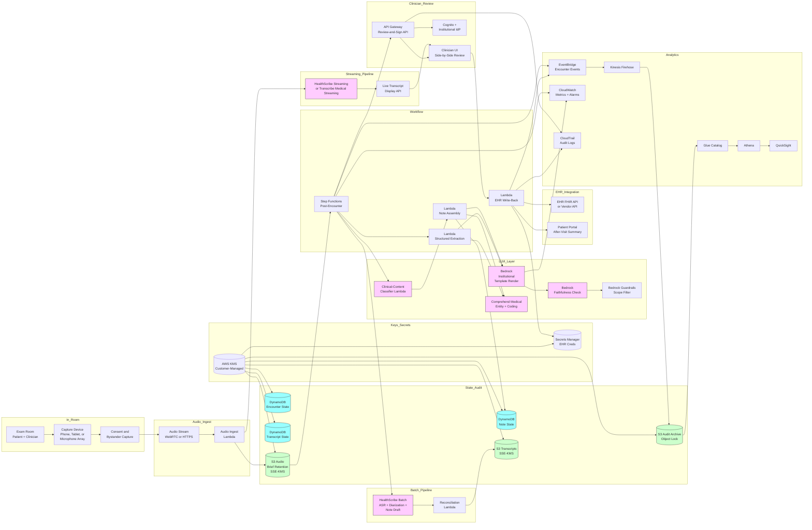

# Recipe 10.7: Ambient Clinical Documentation ⭐⭐⭐

**Complexity:** Complex · **Phase:** Production-track · **Estimated Cost:** ~$0.40-2.50 per encounter (varies with audio length, ASR choice, LLM-driven note generation, faithfulness checks, and audio retention policy)

---

## The Problem

It is 6:47 on a Tuesday evening. Dr. Patel, a primary-care physician at a mid-sized health system, finished her last scheduled patient at 5:15. Since then she has been at her desk in a clinic that is quiet because everyone else has left. Her schedule today had twenty patients. She has fourteen notes still to write. Each one will take her between three and twelve minutes depending on the complexity of the visit. Six of them are simple follow-ups; six are mixed; two are new-patient histories that require careful HPI prose. Her plan, which she has not told her husband or her ten-year-old, is to finish the simple ones now, eat something out of the office fridge, and go home with the two complex ones still to write at the kitchen table after the kid is asleep. She will be in bed at 11:30. She will be back here at 7:30 tomorrow morning.

This is normal. This is every Tuesday. This is also every Wednesday, every Thursday, every Friday. The term in the literature is "pajama time," and the survey work that the AMA, RAND, and others have done over the last several years puts physician documentation time at roughly two hours of after-hours work for every eight hours of clinical work. <!-- TODO: verify; the AMA's work on physician documentation burden, including studies in Annals of Internal Medicine and Mayo Clinic Proceedings, has documented sustained pajama-time burdens; specific figures vary by specialty and practice type --> A separate way to state the same thing: for every hour the clinician spends face-to-face with the patient, they spend roughly two hours in the EHR. The EHR documentation burden is one of the top reported drivers of physician burnout, and burnout is one of the top drivers of clinicians leaving the profession. Family medicine, primary care, internal medicine, and emergency medicine have all seen sustained departures over the last decade for which "EHR burden" is the most-cited cause in exit surveys. <!-- TODO: verify; specific exit-survey citations for EHR-burden-driven physician departures vary by source and year, with multiple peer-reviewed and trade-press studies documenting the pattern -->

The acute version, in the inpatient setting, is worse. A hospitalist on a busy admitting service might admit eight patients in a twelve-hour shift. Each admission note, written carefully, takes 25-35 minutes. She does not have 25-35 minutes per admission; she has 8-10 minutes, because she is also rounding on existing patients, fielding pages, taking sign-out from a colleague, and supervising a resident who is herself fielding pages. The typed-while-talking pattern that emerges (laptop open on the COW, eyes on the screen, half-attending to the patient's words) is the worst possible version of clinical documentation: the encounter quality drops because the clinician is not really listening, and the documentation quality drops because the clinician is reconstructing the encounter from memory at 4:30 AM while three new admissions wait in the queue.

The specialty version. An ophthalmologist sees forty patients in a day. The exam is largely visual; the documentation is dense with measurements (intraocular pressures, visual acuity numbers, fundus findings). The clinician does not narrate the exam in conversational prose; the exam findings come from instruments and from the clinician's silent inspection. The "ambient" content of the encounter (the clinician asking about symptoms, the patient's complaints, the discussion of treatment options) is a small fraction of the total documentation; most of the note is structured measurement data that did not come from the conversation at all.

The encounter itself suffers from documentation pressure. A patient comes in for what she thinks is a routine refill conversation. She has eighteen minutes scheduled. Toward the end of the visit she mentions, in passing, that her left arm has been feeling a little numb sometimes when she sleeps in a certain position, and also there has been some weird heaviness in her chest when she carries groceries up to her third-floor apartment. The clinician, fifteen minutes behind and trying to chart while talking, types "paresthesia LUE, atypical chest discomfort with exertion" into the visit note and moves on. He does not pull the thread. The patient walks out with her refill and an unrecognized symptom pattern that one of his residents will recognize in the chart eight months later when she presents to the ED with an MI. The technology of typing-while-listening creates the conditions for missed signals. The fix is not better typing.

The transcription-and-dictation workarounds, which have been around for fifty years in some form, partially solve this problem and create new ones. Dictation requires the clinician to narrate. Narration during the encounter is awkward, breaks conversational flow, and feels clinical to the patient in a way that erodes trust. Narration after the encounter requires the clinician to reconstruct the visit from memory, which is cognitively expensive and lossy. Remote medical scribes (human scribes listening through video and writing the note in real time) get closer to ambient capture but cost the practice $12-25 per hour per scribe, require staffing and quality-management overhead, and still require the clinician to review the note before signing. <!-- TODO: verify; remote medical scribe services pricing varies by vendor and geographic region, with the $12-25/hour range a common 2024-2025 market reference --> Virtual scribes have existed for fifteen years; they have never reached broad adoption because the unit economics do not work for most practices.

What clinicians have been asking for, openly, for at least that long is the thing that sounds obvious: have the computer listen to the visit, in the room, and write the note. Capture the conversation passively. Do not require the clinician to do anything different from the way they already conduct the encounter. Produce a structured, clinically faithful note that appears in the inbox a minute or two after the visit ends. The clinician reviews, edits as needed, and signs. Twenty years ago this was science fiction. Ten years ago it was demos that fell apart in real clinic. Two to three years ago, with the combination of production-grade speech recognition, in-room far-field microphone arrays, multi-speaker diarization that handles physical movement, and LLM-driven note structuring, it became a real product category. Multiple vendors now ship this at production scale. AWS HealthScribe is one HIPAA-eligible managed service that does it end-to-end. Microsoft Nuance DAX, Suki, Abridge, Ambience, Augmedix, and others are commercial competitors. Major EHR vendors (Epic, Oracle Health) have started offering bundled or partner-integrated ambient documentation as part of the standard EHR platform. <!-- TODO: verify; the ambient clinical documentation vendor landscape is evolving rapidly with frequent partnership announcements and acquisitions; specific vendor lists are accurate to the time of writing but should be re-validated -->

It works, mostly. It works less well than the marketing implies. The architecture that makes it actually work in the in-person clinic environment, and the failure modes that make clinician review absolutely non-negotiable, are what this recipe is about.

If you read recipe 2.8 (Ambient Clinical Documentation in the LLM chapter), this recipe is its in-person companion. Recipe 2.8 covers the LLM-driven note generation pattern in depth: the structured-fact extraction, the grounded generation, the faithfulness checks, the EHR write-back, the consent management. This recipe focuses on the speech and voice technology that produces the transcript that recipe 2.8's pipeline consumes: the in-room audio capture, the multi-speaker diarization with movement, the clinical-versus-social-talk segmentation, the device-in-the-room workflow integration. Where the two recipes overlap (consent, faithfulness, EHR integration), this recipe references the deeper treatment in recipe 2.8 rather than re-deriving the same content. Where this recipe goes deeper (room acoustics, far-field microphone arrays, diarization-under-movement, device hardware), recipe 2.8 punts to here.

If you read recipe 10.6 (Speech-to-Text for Telehealth Documentation), this recipe is its in-person sibling. Recipe 10.6 deals with audio that arrives over the network from the patient's home, with the asymmetric quality that implies. This recipe deals with audio that is captured in a clinical exam room, with one or more speakers physically present, often moving, often interrupting each other, often with bystanders, with the room acoustics and ambient noise that real clinic rooms have. The ASR core is the same. The audio path engineering is meaningfully different. The diarization problem is harder. The consent design is different. The clinical content separation problem (what is part of the visit, what is incidental conversation) is harder.

Let's get into it.

---

## The Technology: In-Room Conversational Audio That Writes the Note

### What Makes In-Person Ambient Documentation Distinct

Speech-to-text for clinical conversation is a recurring theme in this chapter. Dictation (recipe 10.4), telehealth (recipe 10.6), and ambient documentation (this recipe) share an ASR core and most of the LLM post-processing pattern. The differences are at the audio path, the diarization, the workflow integration, and the consent design. In-person ambient documentation is the hardest combination of these.

**The audio path runs through the room, not through a headset.** Dictation captures audio from a microphone the clinician holds or wears. Telehealth captures audio from each participant's device microphone. Ambient documentation captures audio from a microphone in the room: a phone or tablet on the desk, a wall-mounted device, or a far-field microphone array in the ceiling. The acoustic conditions are dramatically harder than headset capture. Distance from the speaker to the microphone matters. Reverberation in the room matters (bare walls, vinyl floors, hard ceiling tiles produce more reflections than carpet, drapes, and acoustic ceiling tiles). Background noise matters (HVAC, ventilation in adjacent rooms, conversations through the wall, doors opening and closing, automated equipment beeping). The clinician's voice is sometimes within 18 inches of the microphone (when they are sitting at the desk typing) and sometimes 8 feet from the microphone (when they have stood up and walked to the patient's bedside). The patient's voice is usually further from the microphone than the clinician's, often softer, sometimes facing the wrong direction.

**Multi-speaker diarization with movement is the central problem.** A typical ambulatory visit has two speakers (clinician and patient). A pediatric visit has three (clinician, parent, child). A geriatric visit may have three or four (clinician, patient, adult-child caregiver, sometimes a home health aide). A teaching encounter has five or six (attending, resident, medical student, patient, sometimes a nurse, sometimes a family member). The speakers move around the room during the encounter. The clinician sits, stands, walks to the bedside, walks to the sink to wash hands, walks to the door. The patient is sitting in a chair or lying on the exam table; sometimes they sit up, sometimes they lie back. Family members may stand or sit. The acoustic characteristics of each speaker change as they move, which is a non-trivial complication for the speaker-clustering algorithms that diarization typically uses.

**Distinguishing clinical content from non-clinical conversation is harder than it looks.** A clinical conversation is interleaved with weather talk, family-update small talk, scheduling discussions, comments about the room temperature, the clinician's apology for running late, the patient's joke about the magazines in the waiting room. None of this belongs in the clinical note. A naive system that captures and structures everything produces a note cluttered with social pleasantries that the clinician then has to delete. A more careful system has a clinical-content classifier that identifies which transcript segments are likely note-relevant and which are not, and the LLM-driven note generation only structures the clinical segments. The classifier itself can be wrong in both directions: false positives (small talk in the note) are merely annoying; false negatives (clinical content excluded from the note) are clinically significant.

**The encounter is unstructured.** A visit is not a SOAP note. The HPI content might appear in minute two, get expanded in minute eight, and have a critical detail mentioned in minute fourteen as the patient is putting on their coat. The exam findings are interleaved with the history-taking. The assessment is sometimes verbalized explicitly ("I think this is most likely angina") and sometimes implicit in the plan ("let's get an ECG and a stress test"). The plan is iterative: the clinician proposes something, the patient asks a question, the plan is amended. The transcript of the encounter is a flat conversational stream; the note structure (chief complaint, HPI, ROS, exam, assessment, plan) is imposed on top of the transcript by the LLM-driven structuring layer.

**The note has to read like the clinician wrote it.** Different clinicians have different voices. Some write terse SOAP notes. Some write narrative HPI prose. Some use specific phrasings ("the patient endorses...", "the patient denies...") that they have used for twenty years. The generated note has to fit the clinician's voice closely enough that they can sign it without rewriting. The clinician-style adaptation layer (per-clinician templates, per-clinician phrase preferences, per-clinician section emphasis) is most of the difference between a note that the clinician signs after a 30-second review and a note that the clinician rewrites because it does not sound like them.

**Real-time and near-real-time both matter.** Some clinicians want the transcript visible in the room during the encounter (for in-the-moment correction, for accessibility, for clinician peace of mind). Some clinicians want only the post-encounter note. Most production systems produce a near-real-time draft within 1-2 minutes of encounter end (so the clinician can review and sign before moving to the next patient) and an in-encounter live transcript display that the clinician can ignore or attend to as they prefer.

**Bystander capture is a meaningful concern.** The microphone in the room captures everything that is audible to it: the patient and the clinician, of course, but also family members in the room, sometimes a medical student or a nursing student, sometimes a phone call the clinician takes briefly, sometimes a sound bleed from the next exam room, sometimes the conversation in the hallway when the door is open. The system has to identify which audio is part of the encounter and which is incidental. The legal-and-compliance question of who has consented to be recorded is layered on top of the technical question of whose audio is being captured.

**Workflow integration is the make-or-break detail.** The clinician needs the feature to be present where they are: in the EHR, on the device they are already using, with start-and-stop controls that fit the encounter's natural rhythm. A separate app that the clinician has to remember to launch for every visit fails on adoption. An EHR-embedded experience that starts when the encounter starts and stops when the encounter ends, with a single tap to pause for sensitive moments, has a chance. The integration depth is the main differentiator between the leading commercial products.

**Equity is a first-class concern, again.** Different patient demographics produce different ASR accuracy. Older patients with quieter speech, patients with denture-related articulation differences, patients with strong regional or non-native English accents, patients with hearing loss who modulate their voice differently, all see worse transcription accuracy than the typical 35-year-old physician whose voice the ASR was implicitly tuned for. The note for those patients is silently lower-quality. Per-cohort accuracy monitoring (recipe 10.6 introduced this; the same discipline applies here, with audio quality as a covariate) is a launch gate, not a post-launch dashboard.

**Behavioral-health-specific handling.** Many institutions choose to exclude behavioral-health visits from ambient documentation entirely, or to handle them with stricter retention and access controls, because the content is more sensitive and the patient's expectation of conversational privacy is higher. The architecture has to support this opt-out cleanly, and the consent flow has to make the choice clear to the patient and the clinician.

These properties make in-person ambient documentation a recognizably distinct technology problem. The components are familiar (ASR, diarization, formatting, EHR integration). The room-acoustics, the speaker-movement diarization, the clinical-versus-social classification, and the device-in-the-room workflow integration are what make it harder than the dictation or telehealth versions of the same technology.

### The In-Room Audio Path

The audio path is where most ambient documentation deployments quietly fail. The institution selects an ASR vendor with great published accuracy numbers, deploys the feature, and then sees real-clinic word error rates that are meaningfully worse than the published numbers. The fix is almost always at the audio path, not at the ASR.

**Microphone hardware.** The device that captures the audio matters as much as the ASR that processes it. Several patterns are deployed in production today.

A clinician's smartphone or tablet, sitting on the desk, running a vendor app. This is the lowest-friction option (no hardware procurement, no clinic-room modification) and it works for most ambulatory encounters. The microphones in modern phones and tablets are better than people give them credit for; consumer devices apply noise suppression and acoustic-echo-cancellation that often helps the ASR. The downside: the device's microphone is an omnidirectional capsule designed for telephony, tuned for the speaker holding it 6-12 inches from their mouth. When the clinician walks across the room or the patient is sitting 6 feet away on the exam table, capture quality drops.

A clinician-worn microphone (lavalier or headset). Higher-fidelity capture for the clinician's voice. Solves the clinician-mobility problem because the microphone moves with them. Does not help with the patient's voice; the patient is still capturing through the same far-field path. Most clinicians dislike wearing a microphone; the cultural-fit barrier is significant.

A wall-mounted or desk-mounted dedicated capture device. A small puck, a wall-mount, or a desk-mount that contains a microphone array (typically 2-6 microphone capsules), a small DSP for beamforming and noise suppression, and a network connection to the cloud ASR. This is the pattern most leading ambient documentation vendors are converging on for higher-volume practices. The microphone array can do beamforming (focusing capture toward where the speaker is) and noise suppression (rejecting audio that does not look like speech) at a level that consumer devices cannot match.

A ceiling-mounted far-field array. Most aggressive option. Multiple microphone capsules in a ceiling tile, with sophisticated beamforming and source-localization, capturing the whole room from above. Best capture quality. Highest installation cost. Used in some hospital systems that have invested in clinic-room modernization for ambient documentation specifically.

The choice of capture device has more impact on system performance than the choice of ASR vendor, in many deployments. A great ASR with bad audio underperforms a mediocre ASR with good audio, almost without exception.

**Beamforming and source localization.** Beamforming is the signal-processing technique that combines audio from multiple microphone capsules to enhance the signal from a specific direction and suppress signal from other directions. With a microphone array, beamforming can dynamically steer toward the active speaker, which improves capture quality as speakers move around the room. Source localization estimates where each speaker is in the room, which feeds both beamforming and diarization. Modern microphone-array hardware does this in real time on the device's DSP; the cloud ASR receives the already-beamformed audio rather than the raw capsule streams.

**Noise suppression and echo cancellation.** Clinic rooms have noise floors that range from quiet (a small private exam room with the door closed and no adjacent activity) to substantial (a large multi-bay clinic area with multiple visits happening simultaneously, hallway conversation audible through the door, HVAC running continuously). Noise suppression algorithms (classical spectral subtraction, modern neural noise suppressors) reduce non-speech audio in the captured stream. Echo cancellation handles the small reflections that bounce off the room's surfaces. Both are typically applied at the capture device or in the cloud ingest layer before the ASR sees the audio. Aggressive noise suppression can clip the start and end of soft speech, especially for quiet patients; conservative noise suppression leaves more of the clinical conversation intact at the cost of more background audio reaching the ASR.

**Voice activity detection and audio gating.** The system needs to know when audio is speech and when it is silence (or near-silence, or non-speech background). VAD (voice activity detection) makes this decision per audio frame, typically on the capture device. Frames classified as non-speech are not sent to the ASR (saving bandwidth and ASR cost). Frames classified as speech are streamed to the ASR. The VAD threshold is a tuning parameter: aggressive thresholds save cost but may clip the start of soft utterances; conservative thresholds pass more audio but cost more in ASR processing.

**Adjacent-room sound bleed.** A common failure mode: the microphone in exam room 1 captures a faint conversation from exam room 2 through the wall. The ASR transcribes the bleed at low confidence. The diarization assigns the bleed to one of the speakers in room 1 (because the diarization sees an audio source it does not recognize and clusters it with the nearest existing speaker). The note for room 1 now contains content from room 2's encounter. The fix: aggressive low-confidence rejection at the ASR layer, source-localization-based filtering that rejects audio coming from outside the expected speaker positions, and physical room-acoustics work (door seals, wall insulation) when the bleed problem is severe.

**Hallway and door-opening events.** The exam-room door opens. A nurse leans in to ask the clinician a quick question. Hallway conversation, equipment sounds, and other speakers' voices wash into the room briefly. The system has to handle these events: the nurse's brief utterance might or might not be note-relevant ("Dr. Patel, your 3 o'clock is here" is not note-relevant; "Dr. Patel, the lab on the patient in room 4 just came back hyperkalemic" might be note-relevant, but is about a different patient). The pragmatic approach: classify hallway-bleed audio as out-of-encounter and exclude it from the note, with a fallback for the rare case where the clinician explicitly addresses the in-room patient about a topic that came in through the door.

**Physical movement of speakers.** As the clinician moves from the desk to the bedside to the door, their voice's spatial signature changes (the direction relative to the microphone, the distance, the room reflections that arrive at each microphone capsule). Speaker-clustering diarization that depends on stable spatial features struggles with movement. Modern diarization systems use voice-content features (pitch, formants, prosody) rather than spatial features when possible, which makes them more robust to movement. Hybrid approaches combine voice-content features with spatial features, weighting them based on confidence in each.

**Patient gowning, exam-table position, and exam-mode capture.** During the physical exam, the patient may be lying on the exam table, sometimes facing away from the microphone, sometimes with their voice partially muffled by their position or by a gown. The clinician is leaning over the patient, their voice directed downward rather than toward the desk-mounted microphone. Audio quality during the exam portion of the encounter is typically the worst portion of the encounter. The downstream system must accept this, lower its confidence in exam-portion transcription, and rely on the clinician's narration of exam findings (when present) more heavily than on inferred exam content.

**Environmental noise events.** The patient coughs into the microphone. A baby cries in the room (a parent has brought their child to the appointment). The clinician's pager goes off. A passing ambulance siren bleeds through the window. Each of these is a brief acoustic event that may or may not affect the ASR's transcription quality. Modern ASR is reasonably robust to brief noise events; the diarization is more fragile to them (a sudden loud cough can confuse the speaker-clustering for several seconds afterward). Operationally, the system has to handle these gracefully without producing transcript artifacts that the clinician then has to clean up.

**Consent-aware audio gating.** When the patient explicitly invokes a confidentiality moment ("I want to tell you something, but please pause the recording"), the system has to support an in-encounter pause that stops audio capture, drops any partial in-flight transcripts, and resumes when the clinician unpauses. Some institutions implement this as a hard pause (audio capture stops at the device); some implement it as a soft pause (audio is captured but tagged as off-the-record and excluded from downstream processing). The hard pause is the more privacy-preserving option but requires the clinician to remember to unpause.

**Audio retention.** The captured audio is held briefly for QA review and transcription, then deleted per the institutional policy. Production institutions typically discard audio within hours of encounter end (sometimes within minutes of successful note signing); some retain longer for adaptation purposes (with explicit consent). Audio is biometric and PHI; retention policy review by the privacy officer is required.

The audio path is where the institution's investment in physical infrastructure (microphone hardware, room treatment, capture-device deployment) pays the largest dividends. Spend time here before launch.

### Multi-Speaker Diarization with Movement

Diarization is the central engineering problem of in-person ambient documentation, and it is where the difference between vendor offerings is most visible.

**The two-speaker case.** A clinician and a patient. The diarization needs to label every transcript segment as either clinician-speech or patient-speech, with errors low enough that the downstream note structuring works. For two speakers with reasonably distinct voices (an adult man and an adult woman, two adults of clearly different ages), modern diarization gets diarization error rate (DER) into the single digits in clean audio. <!-- TODO: verify; two-speaker DER on clean clinical audio is typically reported in the 3-8% range in vendor benchmarks, with substantial variability by audio conditions and dataset --> For two speakers with acoustically similar voices (two adult men of similar age, parent and adult child of the same gender), DER is higher. The patient population that gets this hardest case is usually predictable, and the system should expose its uncertainty on these encounters.

**The three-or-more-speaker case.** A pediatric visit with the clinician, the parent, and the child. The clinician walks the parent through the visit findings while the child plays in the corner; the child periodically chimes in. A geriatric visit with the clinician, the patient, and the adult-child caregiver. The clinician addresses the patient; the patient sometimes defers to the caregiver; the caregiver sometimes interjects with corrections or additions. A teaching encounter with the attending, a resident, a medical student, and the patient. Diarization on these encounters is meaningfully harder. The system has to detect that there are three speakers (or more), cluster the audio into the right number of speaker clusters, label each cluster with a role, and stay consistent throughout the encounter.

**Speaker enrollment for the clinician.** A meaningful improvement in diarization comes from enrolling the clinician's voice ahead of time. The system stores a voiceprint for the clinician (typically derived from a brief enrollment recording or accumulated from prior encounters with explicit consent). At encounter time, the system uses the enrolled voiceprint to confidently label clinician segments, and clusters the remaining audio into "everyone else" (the patient and any others). This biometric handling has its own governance overhead (the voiceprint is a biometric identifier; institutional policy on biometric data applies; some jurisdictions like Illinois under BIPA have specific consent and disclosure requirements <!-- TODO: verify; the Illinois Biometric Information Privacy Act and similar state laws have specific consent, retention, and disclosure requirements for voiceprints; states with similar statutes include Texas and Washington -->), but for clinicians who do many ambient-documented encounters per day, the enrollment-based diarization is meaningfully more reliable than purely acoustic diarization.

<!-- TODO (TechWriter): Expert review S1 (HIGH). Promote clinician voiceprint enrollment from passing reference to architectural primitive. Add a "Clinician Voiceprint Enrollment and BIPA-Grade Governance" subsection (in Cross-Cutting Design Points) that specifies: biometric-data consent at clinician onboarding with written disclosure of purpose, collection method, retention period, and deletion timeline; voiceprint storage as embeddings in a separate KMS-encrypted store with biometric-data-classification access controls (never co-mingled with patient-side audio); deletion-on-departure mandatory with deletion-verification logged; disclosure-accounting log per use; per-state regulatory profile (BIPA, Texas CUBI, Washington biometric-data law). Update Step 1E pseudocode to capture clinician_voiceprint_consent_version and clinician_jurisdiction_for_biometric_compliance. Update Step 7 audit_record to include voiceprint_used, voiceprint_consent_version, biometric_jurisdiction. Add a Production-Gaps subsection naming the privacy officer plus medical-staff-services as canonical owners. -->


**Patient and family-member identification.** Patient-side voice enrollment is rare for two reasons: most patients see a given clinician infrequently (so the per-patient enrollment cost is high relative to the per-encounter benefit), and patient voiceprint storage adds biometric-data-handling obligations that institutions usually prefer to avoid. Most production systems treat the patient as the largest non-clinician cluster and label it accordingly, falling back to "speaker A" / "speaker B" labels when ambiguity is high.

**Role assignment from clustering plus context.** Diarization tells the system that there are N distinct speakers. Role assignment is the additional step of mapping each speaker cluster to a role (clinician, patient, family member, student, other). The mapping uses several signals:

The clinician is enrolled; their cluster is identified directly.

The encounter context (this is a scheduled visit between Dr. Patel and Mr. Johnson) tells the system the expected speaker roles. The non-clinician speakers are presumed to be the patient and any accompanying family unless the clinician explicitly identifies others (the system can prompt the clinician at encounter start: "is anyone else in the room with the patient today?").

The conversational role detection. The clinician usually starts the encounter ("hi, Mr. Johnson, how are you doing?"). The clinician asks more questions than they answer. The clinician's speaking style is more measured. Statistical patterns in the diarized transcript can hint at which cluster is the clinician when enrollment is unavailable.

The pragmatic position: enroll the clinician for high-volume users; rely on context-plus-pattern for the rest.

**Diarization confidence per segment.** Like ASR confidence, diarization confidence varies per segment. Short utterances ("yeah," "no," "mm-hmm") are inherently lower-confidence than long utterances. Audio with overlap (two speakers talking simultaneously) is lower-confidence. Audio captured during physical movement is lower-confidence. The system should expose per-segment diarization confidence to the downstream note-generation layer and to the clinician's review interface, so that uncertain attributions can be flagged for manual review rather than silently inherited.

**Overlapping speech.** When two speakers talk at the same time, the diarization output should indicate that both speakers were active in the segment. Modern diarization handles overlap by emitting per-speaker activity scores rather than single-speaker labels for each frame. The downstream transcript shows the overlap as a multi-speaker passage. The ASR's transcription quality during overlap is typically lower than for single-speaker audio; transcripts during overlap should be flagged accordingly.

**Backchannels and short interjections.** The patient says "yeah" while the clinician is mid-sentence. The clinician says "mm-hmm" while the patient is describing a symptom. The family member says "oh wait" and then interrupts to make a correction. Backchannels are routine in conversational speech. Diarization should attribute backchannels to the right speaker; in practice, very short utterances are sometimes missed entirely (the diarization treats them as non-speech) or are attributed to the dominant speaker in the segment. The downstream note formatting usually elides backchannels from the final note (they are not clinically informative) but they should be present in the verbatim transcript that the clinician reviews.

**Non-speaker audio events.** A baby crying. A pager going off. A clinician's chair squeaking. A door opening. These should be classified as non-speech and excluded from speaker clusters. Modern diarization handles this reasonably well; older systems sometimes incorporated background noise into speaker clusters with strange results.

**Movement-robust embeddings.** The diarization layer that scales best for in-room ambient documentation uses voice-content embeddings (pitch, formants, prosody, spectral features) that are relatively stable to physical movement, rather than spatial-only features that change as speakers walk around the room. Modern neural diarization (joint ASR-and-diarization architectures, end-to-end speaker-attributed transformers) is more robust to movement than older clustering-based diarization. Vendor-managed diarization (built into the ASR product) typically uses these modern approaches; self-built diarization on open-source toolkits often does not, which is one reason the build-versus-buy economics for ambient documentation favor buy.

**Joint ASR-and-diarization architectures.** The newer pattern, used by HealthScribe and several leading commercial vendors, processes ASR and diarization together rather than as separate stages. The advantage: the model can leverage acoustic cues for both transcription and speaker discrimination simultaneously, which improves quality on the harder cases (overlap, similar voices, movement). The disadvantage: the output is harder to debug, and the diarization quality is coupled to ASR quality in ways that the separate-stage architecture avoids.

**Diarization on the in-room audio is harder than diarization on telehealth audio.** Telehealth often allows per-channel separation (each participant on their own audio stream), which makes diarization nearly trivial. In-person ambient documentation captures all speakers on the same audio stream (the room microphone hears everyone), so diarization has to work acoustically without channel separation. Even with movement-robust embeddings and clinician enrollment, the in-room diarization problem is the harder one, and the institution should expect to invest more in evaluation, monitoring, and per-cohort tuning than they would for the telehealth equivalent.

### Clinical-Versus-Social Talk Classification

A real ambulatory encounter contains several conversational threads interleaved: the clinical content (chief complaint, HPI, ROS, exam discussion, assessment, plan), the relationship maintenance (small talk, family updates, weather, the clinician's apology for running late), the workflow narration (medication pickup logistics, follow-up scheduling, the front-desk-says-they'll-call), and the in-room procedural content (the clinician asking the medical assistant for a blood pressure cuff, the clinician dictating to the EHR scribe in the room, the clinician answering a phone call briefly).

A naive system that captures and structures everything produces a note like this:

> _Chief complaint: Refill for lisinopril and discussion of the weather, which is finally getting warmer after a long winter. The patient mentioned that her dog is doing better since the surgery._
>
> _HPI: The patient reports that she has been taking her lisinopril regularly. The patient also asked about the magazines in the waiting room. The patient reports that her left shoulder has been bothering her, especially when she reaches up..._

This is the worst kind of generated note: technically correct (the words were said), but cluttered with non-clinical content that the clinician has to delete. After two encounters of cleaning this up, the clinician stops using the feature.

The fix is a clinical-content classifier that operates at the segment level. Each transcript segment is classified into one of several categories: chief complaint content, HPI content, ROS content, medication discussion, exam discussion, assessment discussion, plan discussion, social or non-clinical content, workflow or scheduling content, in-room procedural (talking to staff), out-of-encounter (door bleed, hallway, phone call). The LLM-driven note generation only structures the clinical-content categories. Social and workflow content are excluded by default.

The classifier itself can be wrong in both directions. False positives (small talk classified as clinical) produce notes with content that does not belong; the clinician deletes it. False negatives (clinical content classified as social) produce notes with content missing; the clinician has to either re-add the missing content or accept the gap. The false-negative direction is the worse error: the clinician may not realize that the patient mentioned a relevant symptom that the system filtered out.

Practical implementations use a layered approach: a fast classifier at the segment level (often an LLM with a structured-output schema, or a smaller fine-tuned classifier), a fallback to the LLM-driven note generator including borderline segments and letting the generator decide whether to incorporate them, and a clinician-facing review interface that surfaces the verbatim transcript alongside the generated note so that clinical content not in the note can be spotted and added.

Some content categories require special handling regardless of the classifier's verdict. Confidentiality moments (the patient asking the clinician to pause the recording for sensitive content, or the clinician choosing to discuss something off-the-record) should be flagged and either captured but excluded from the generated note, or not captured at all. Discussions about other patients (the clinician answering a brief phone call about another patient, or a colleague leaning in to ask about a different case) should never be incorporated into the current encounter's note. Discussions with non-patient speakers (the medical assistant, a colleague, hallway conversation) should be excluded.

The classifier is one of the institutional differentiators. Off-the-shelf classifiers tuned on generic clinical conversation are a starting point; institutional tuning based on the institution's actual visit content typically improves accuracy meaningfully. The classifier's tuning is a multi-month workstream, owned by the clinical-informatics team in collaboration with the engineering team.

### LLM-Driven Note Generation

Once the transcript is in hand and the clinical-content classifier has identified the note-relevant segments, the LLM-driven note generation produces the structured note draft. This is the same pattern recipe 2.8 covers in detail, with a few specifics worth restating in the in-person context.

**Per-specialty templates.** A primary-care visit note is structured differently than a cardiology consultation note than an orthopedic post-op visit note than a behavioral-health progress note. The LLM is prompted with the specialty-appropriate template, and the formatting layer applies the specialty's conventions. The institution maintains the per-specialty templates as a curated asset, owned by the clinical-informatics team.

**Per-clinician style adaptation.** Within a specialty, individual clinicians have personal documentation preferences. Some prefer terse SOAP notes; some prefer narrative HPI prose; some have specific phrasings they have used for years. Per-clinician style adaptation captures these preferences (sometimes through explicit configuration, sometimes through learned-style adaptation based on the clinician's past notes) and applies them in the generated note. The closer the generated draft matches the clinician's voice, the lower the edit distance between draft and signed.

**Citations from note to transcript.** Every claim in the generated note carries a citation back to the supporting transcript segments (or to an explicitly-linked EHR source for content pulled from the chart). The citations are surfaced in the clinician's review interface: hover or click on any sentence, see the transcript segments that produced it. This grounding is essential for clinician trust and for clinical-safety review. Recipe 2.8 covers the citation-grounding pattern in detail.

**Faithfulness checks.** The same faithfulness concern from recipe 2.8 (and recipe 10.6) applies here, sharply. The LLM must not invent clinical content the patient or clinician did not actually discuss. Faithfulness checks (citation-grounding verification, LLM-judge faithfulness scoring, clinical-rule-based contradiction detection) run before the draft is shown to the clinician for review. Failed checks either block the draft or surface as warnings. Recipe 2.8 covers the layered faithfulness program in detail.

**EHR context integration.** The generated note pulls from the EHR for content that does not appear in the conversation: the patient's allergies, the full medication list, the past medical and surgical history, recent lab results, recent imaging. These are explicitly cited as EHR-sourced rather than transcript-sourced. The conversation-derived content (chief complaint, HPI, ROS, plan) is cited to the transcript.

**Implicit-exam-finding handling.** A common in-person scenario: the clinician performs a physical exam without narrating it aloud. The exam findings are not in the transcript. The system has two reasonable behaviors: leave the exam section as a placeholder ("Physical exam not narrated; please complete") for the clinician to fill in, or default to a normal exam template that the clinician adjusts as needed. The placeholder approach is more conservative and avoids the failure mode of the system fabricating exam findings; the normal-template approach saves time when the exam is genuinely normal but creates risk if the clinician signs without verifying. Most production systems use the placeholder approach, with optional per-clinician templates that the clinician can configure if they prefer the normal-template default.

**Structured-field extraction.** Beyond the narrative note, the system extracts structured clinical entities (medications discussed, problems addressed, allergies mentioned, vitals reported, orders agreed to, follow-up scheduled). Each extracted field is presented to the clinician for explicit confirmation before being applied to the structured chart. Recipe 2.8 covers the structured-extraction pattern in detail.

**Patient-facing visit summary generation.** Some institutions use the same pipeline to generate a patient-facing visit summary (the after-visit summary, recipe 2.5) using the visit content directly rather than asking the clinician to write it. The patient-facing summary is in plain language, omits clinical-only content, and emphasizes the action items the patient should take. This is a separate generation pass from the clinician note, with different scope and different review.

### Where the Field Has Moved

A few practical updates worth knowing.

**The vendor ecosystem has matured.** Five years ago, ambient documentation was a small market with a few research-stage startups. Today, multiple vendors ship at scale, with several having achieved deep EHR integrations and BAA coverage. Microsoft acquired Nuance (DAX); other names like Suki, Abridge, Ambience, Augmedix, and Deep Scribe compete in the broader market; AWS HealthScribe is offered as a managed service that institutions can build on top of. <!-- TODO: verify; the ambient documentation vendor landscape changes frequently with acquisitions, partnerships, and new entrants -->

**EHR-bundled offerings have entered the market.** Epic and Oracle Health have integrated ambient documentation into the standard EHR platform, either through their own offerings or through deep partnerships with leading vendors. The build-versus-buy economics for most institutions favor buy-and-integrate, with the EHR-bundled or EHR-partner options often providing the deepest workflow integration. <!-- TODO: verify; specific EHR-vendor ambient documentation partnerships continue to evolve -->

**Speaker-attributed end-to-end ASR is the new architectural baseline.** Joint ASR-and-diarization architectures, with speaker-aware decoding and overlap-handling built into the core model, have become the production baseline. The earlier-generation pattern of separate ASR and diarization stages still works but is no longer state-of-the-art for in-person ambient documentation.

**LLM-driven note generation has become production-grade.** The structured-fact extraction and citation-grounded note generation patterns from recipe 2.8 are mature enough for institutional deployment. Multiple commercial vendors offer them as turnkey features. Building from scratch is still a substantial engineering effort.

**Faithfulness research has produced practical tooling.** Citation-grounded generation, LLM-judge faithfulness scoring, and clinical-rule-based contradiction detection have moved from research papers into deployed tooling. The earlier-generation concern of "the LLM might hallucinate clinical content" is now addressable as a managed operational concern. <!-- TODO: verify; faithfulness evaluation for clinical LLM-driven note generation has been an active research area with multiple peer-reviewed approaches and vendor offerings -->

**Microphone-array hardware has gotten cheaper and easier to deploy.** Commercial dedicated-capture devices for ambient documentation (small wall-mounts or desk-mounts with built-in microphone arrays, beamforming DSP, and network connectivity) are now available from multiple vendors at price points that work for high-volume practices. Five years ago, this was custom hardware integration; today, it is procurement.

**Regulatory clarity on AI-assisted documentation has improved.** FDA has signaled that AI-assisted documentation tools that produce drafts for clinician review and signature are productivity software rather than regulated medical devices, reducing the regulatory uncertainty that previously slowed deployment. <!-- TODO: verify; FDA guidance on AI-assisted clinical documentation continues to evolve, with the productivity-software vs medical-device distinction refined through guidance documents -->

**Clinician adoption patterns are clearer.** Early deployments produced a clearer picture of which specialties benefit most (primary care, internal medicine, family medicine, behavioral health show the strongest ROI; procedural specialties and specialties with primarily-visual exams show less benefit) and what adoption ramps look like. The 60-85% sustained adoption rate is achievable when the deployment is done well; it is not achievable without dedicated clinician training and support.

**Equity and per-cohort accuracy monitoring has become a standard expectation.** Recipe 10.6 introduced this discipline; the same expectations apply here. Institutions that deploy without per-cohort monitoring increasingly face regulatory and reputational risk; the discipline has shifted from "nice-to-have" to "expected-by-default" in 2025-2026.

---

## General Architecture Pattern

An in-person ambient clinical documentation system decomposes into eight logical stages: encounter setup and consent capture (the visit begins with the appropriate disclosures and the ambient feature is enabled per institutional policy), in-room audio capture (the audio is captured by the device or microphone array, with VAD and noise suppression applied), streaming ASR with diarization (the audio becomes a real-time transcript with speaker labels), in-encounter live display (optional, the live transcript appears for the clinician to monitor during the encounter), batch ASR for finalization (a higher-accuracy transcript is produced after the encounter), clinical-content classification and LLM-driven note generation (the relevant transcript segments become a draft note with extracted clinical data), clinician review and signature (the clinician reviews, edits, confirms structured extractions, and signs), and audit, archive, and learning (the audio, transcript, generated note, and metadata are stored with appropriate retention).

```
┌─────── ENCOUNTER SETUP & CONSENT CAPTURE ────────────────┐
│                                                           │
│   [Encounter begins in clinic exam room]                  │
│    - Patient is roomed                                    │
│    - Clinician enters and starts the visit                │
│   [Per-encounter consent disclosure]                      │
│    - Default-enabled where institutional consent is       │
│      captured at intake (most common)                     │
│    - Per-encounter explicit consent for visit types       │
│      flagged as sensitive (behavioral health, sensitive   │
│      reproductive health, certain disclosures)            │
│   [Bystander acknowledgement]                             │
│    - The clinician confirms who is in the room            │
│      (patient alone; patient + family member; patient     │
│      + caregiver; teaching encounter with student)        │
│    - Bystander consent captured per institutional policy  │
│   [Patient-initiated opt-out support]                     │
│    - Patient can decline at any time                      │
│    - Patient can request mid-encounter pause              │
│   [Clinician device or in-room device activation]         │
│    - Clinician taps start on phone, tablet, or            │
│      EHR-embedded UI; or                                  │
│    - In-room dedicated device activates on EHR encounter  │
│      open and deactivates on encounter close              │
│           │                                               │
│           ▼                                               │
│   [Output: encounter session with consent confirmed,      │
│    speaker count expected, feature enabled or             │
│    disabled, jurisdictional metadata captured]            │
│                                                           │
└───────────────────────────────────────────────────────────┘

┌─────── IN-ROOM AUDIO CAPTURE ────────────────────────────┐
│                                                           │
│   [Capture audio from the in-room device]                 │
│    - Smartphone, tablet, or dedicated capture hardware    │
│    - Microphone-array beamforming where supported         │
│    - Voice activity detection at the device               │
│    - Noise suppression and echo cancellation              │
│   [Stream the captured audio to the cloud ingest]         │
│    - Encrypted in transit (TLS)                           │
│    - Per-encounter session token                          │
│    - Network-quality monitoring                           │
│   [Per-segment audio quality monitoring]                  │
│    - Signal-to-noise ratio per active speaker             │
│    - Speech-detection rate                                │
│    - Acoustic-event detection (cough, crying, pager,      │
│      door, hallway bleed)                                 │
│   [Source-localization-aware filtering]                   │
│    - Audio coming from outside the expected speaker       │
│      positions (adjacent room, hallway) flagged for       │
│      lower confidence or excluded                         │
│   [Audio retention path]                                  │
│    - Brief retention for QA review and possible           │
│      reprocessing                                         │
│    - Deletion per institutional retention policy          │
│           │                                               │
│           ▼                                               │
│   [Output: cleaned audio stream with quality metadata,    │
│    ready for ASR ingest]                                  │
│                                                           │
└───────────────────────────────────────────────────────────┘

┌─────── STREAMING ASR WITH DIARIZATION ───────────────────┐
│                                                           │
│   [Streaming ASR on the audio stream]                     │
│    - Domain-adapted for clinical conversational audio     │
│    - Custom vocabulary biasing for institutional          │
│      terminology, common medications, conditions          │
│    - Per-language streaming configuration                 │
│   [Diarization with movement-robust embeddings]           │
│    - Joint ASR-and-diarization architecture preferred     │
│    - Voice-content embeddings (pitch, formants,           │
│      prosody) rather than spatial-only features           │
│    - Two-or-more-speaker handling                         │
│   [Speaker enrollment and role assignment]                │
│    - Clinician-side voiceprint enrollment for             │
│      high-volume users                                    │
│    - Patient-side cluster labeled by encounter context    │
│    - Family-member or other-speaker detection             │
│      (when more than two clusters appear)                 │
│   [Streaming partials with speaker labels]                │
│    - Per-word timing                                      │
│    - Per-word confidence                                  │
│    - Per-segment speaker labels                           │
│    - Per-segment diarization confidence                   │
│           │                                               │
│           ▼                                               │
│   [Output: rolling streaming transcript with speaker      │
│    labels, per-word and per-segment confidence]           │
│                                                           │
└───────────────────────────────────────────────────────────┘

┌─────── IN-ENCOUNTER LIVE DISPLAY (OPTIONAL) ─────────────┐
│                                                           │
│   [Display transcript to the clinician during the visit]  │
│    - Speaker-labeled segments                             │
│    - Confidence highlighting on uncertain segments        │
│    - Pause/resume controls                                │
│    - Mark-as-off-the-record affordance                    │
│   [In-encounter correction affordances]                   │
│    - Click to correct a segment inline                    │
│    - Click to relabel speaker                             │
│    - Mark a segment as not-for-note                       │
│   [Optional patient-facing live caption display]          │
│    - For hard-of-hearing patients (consent and            │
│      configuration required)                              │
│           │                                               │
│           ▼                                               │
│   [Output: live transcript visible during the encounter   │
│    with optional in-encounter corrections recorded]       │
│                                                           │
└───────────────────────────────────────────────────────────┘

┌─────── BATCH ASR FOR FINALIZATION ───────────────────────┐
│                                                           │
│   [Reprocess the full audio after encounter ends]         │
│    - Higher-accuracy ASR with full discourse context      │
│    - More sophisticated diarization with full audio       │
│    - Custom-vocabulary biasing applied uniformly          │
│   [Reconcile streaming and batch transcripts]             │
│    - Identify segments where streaming and batch          │
│      disagree                                             │
│    - Carry forward any in-encounter corrections           │
│    - Use batch as the canonical transcript                │
│   [Format the canonical transcript]                       │
│    - Punctuation and capitalization                       │
│    - Speaker labels in a consistent format                │
│    - Disfluency handling per institutional preference     │
│      (preserve, mark, or elide)                           │
│           │                                               │
│           ▼                                               │
│   [Output: canonical post-encounter transcript with       │
│    speaker labels and timing]                             │
│                                                           │
└───────────────────────────────────────────────────────────┘

┌─────── CLINICAL CLASSIFIER + NOTE GENERATION ────────────┐
│                                                           │
│   [Clinical-content segment classifier]                   │
│    - Per-segment classification: chief complaint, HPI,    │
│      ROS, exam, assessment, plan, social, workflow,       │
│      out-of-encounter                                     │
│    - Confidence per classification                        │
│   [Generate the structured note draft]                    │
│    - Per-specialty template                               │
│    - Per-clinician style adaptation                       │
│    - Citations from each note section to supporting       │
│      transcript segments                                  │
│   [Faithfulness checks]                                   │
│    - Citation-grounding verification                      │
│    - LLM-judge faithfulness scoring                       │
│    - Clinical-rule-based contradiction detection          │
│   [Structured-field extraction]                           │
│    - Medications, problems, allergies (with RxNorm        │
│      and ICD-10 coding)                                   │
│    - Vitals reported, orders, follow-up                   │
│   [Implicit-exam-finding handling]                        │
│    - Exam section as placeholder when not narrated        │
│   [Scope filter on generated content]                     │
│    - Generated note must not add clinical content         │
│      beyond what the conversation supports                │
│   [Patient-facing summary generation (optional)]          │
│           │                                               │
│           ▼                                               │
│   [Output: draft clinician note, structured extractions,  │
│    optional patient-facing summary, all with transcript   │
│    citations]                                             │
│                                                           │
└───────────────────────────────────────────────────────────┘

┌─────── CLINICIAN REVIEW & SIGNATURE ─────────────────────┐
│                                                           │
│   [Side-by-side review interface]                         │
│    - Generated note on one side, transcript on the other  │
│    - Click any sentence to jump to supporting transcript  │
│    - Confidence highlighting                              │
│   [Structured-field confirmation]                         │
│    - Each extracted medication, problem, and order        │
│      requires explicit confirmation before chart          │
│      insertion                                            │
│   [Track-changes editing]                                 │
│    - Clinician edits to the generated note are tracked    │
│    - Edit patterns feed downstream prompt and rule        │
│      improvements                                         │
│   [Co-signature workflow for trainees]                    │
│   [Sign-and-file]                                         │
│    - Final note signed and filed in the EHR               │
│    - Structured fields applied to the chart               │
│    - Patient-facing summary released to portal per        │
│      institutional policy                                 │
│           │                                               │
│           ▼                                               │
│   [Output: signed clinical note in the EHR, structured    │
│    chart updates, patient-facing summary in portal]       │
│                                                           │
└───────────────────────────────────────────────────────────┘

┌─────── AUDIT, ARCHIVE & LEARNING ────────────────────────┐
│                                                           │
│   [Durable audit record]                                  │
│    - Audio reference (per retention policy)               │
│    - Streaming and batch transcripts                      │
│    - Generated note draft and signed final note           │
│    - Diff between draft and final (clinician edits)       │
│    - Structured-field extractions and confirmations       │
│    - Consent and bystander events                         │
│   [Cohort-stratified accuracy monitoring]                 │
│    - Per-language, per-specialty, per-clinician,          │
│      per-patient-cohort, per-audio-quality-band           │
│    - WER, diarization error rate, faithfulness score,     │
│      structured-field acceptance, edit distance,          │
│      adoption rate                                        │
│   [Operational telemetry]                                 │
│    - Per-encounter audio length, transcript length,       │
│      note generation latency                              │
│    - Edit distance between draft and signed final         │
│    - Per-clinician adoption metrics                       │
│   [Audio retention enforcement]                           │
│    - Brief retention with automatic deletion              │
│   [Sampled review for clinical-quality concerns]          │
│           │                                               │
│           ▼                                               │
│   [Output: audit trail, telemetry, learning signals]      │
│                                                           │
└───────────────────────────────────────────────────────────┘
```

A few cross-cutting design points that the architecture has to bake in.

**Audio is PHI throughout, and biometric.** The microphone in the room captures the patient's voice (a biometric identifier), the clinician's voice, and any bystanders. The audio is PHI by HIPAA definition; in some jurisdictions (Illinois under BIPA, for instance) the voiceprint itself is regulated as biometric data with specific consent and disclosure requirements. The architecture treats audio as PHI throughout, with encryption at rest and in transit, access controls, and explicit retention policy enforcement. Audio retention is typically brief; some institutions discard audio within hours of successful note signing; some retain longer for QA or model adaptation under explicit consent.

**Per-encounter consent and bystander handling are first-class concerns.** The architecture supports per-encounter consent capture, bystander identification, and an opt-out path that does not penalize the patient. The state-by-state recording-consent regime (one-party-consent vs. all-party-consent jurisdictions) determines the consent-capture rigor. Behavioral-health and sensitive-encounter handling has stricter defaults. Recipe 2.8's consent-management treatment applies here in detail.

**Real-time and batch run in parallel.** The streaming pipeline produces the optional in-encounter live display. The batch pipeline produces the canonical post-encounter transcript that drives the note generation. The two paths share an audio source but run independently; failure of one does not take down the other.

**Faithfulness checks gate the LLM-generated note.** The same layered faithfulness program from recipe 2.8 (citation grounding, LLM-judge scoring, contradiction detection, sampled review) applies here. Faithfulness checks run before the draft is shown to the clinician; failed checks either block the draft or surface as warnings. Recipe 2.8 covers the faithfulness program in detail.

<!-- TODO (TechWriter): Expert review A1 (HIGH). Promote the faithfulness check from a single opaque function call (Step 4E) to a layered architecture stage. Specify Layer 1 (citation grounding verification, structured-output schema validation, exam-finding-fabrication detection); Layer 2 (LLM-judge faithfulness scoring, clinical-rule-based contradiction detection); Layer 3 (offline sampling review with per-specialty / per-room / per-audio-quality-band sample stratification). Per-layer disposition policy-driven with tighter thresholds for the behavioral-health profile. Per-cohort faithfulness-failure-rate as launch and operational gate. Named ownership at clinical-quality officer. Update the architecture diagram to show three faithfulness components rather than one. The recipe defers to 2.8 for the LLM-driven generation specifics; the architecture-pattern layer ordering still needs to be specified at this recipe's level. -->


**Clinician review is the legal-medical-record boundary.** The signed note is the legal record. The transcript is supporting documentation. The audio is at most ephemeral. The architecture is explicit about which artifacts are part of the medical record (the signed note, the structured chart updates), which are supporting documentation (the transcript), and which are operational data (the audio).

**Per-cohort accuracy monitoring is a launch gate.** Per-language, per-specialty, per-clinician, per-patient-demographic, per-audio-quality-band cohorts each have minimum accuracy thresholds that the system must meet before launching to that cohort. Per-cohort drift alerts trigger reviews. Recipe 10.6 covers the per-cohort monitoring discipline in detail; the same expectations apply here, with audio-quality-band particularly important for in-person ambient documentation given the room-acoustics variability.

<!-- TODO (TechWriter): Expert review A2 (HIGH). Promote per-cohort monitoring from prose to architectural primitive. Specify single-axis cohorts (language, specialty, clinician, audio-quality-band, age-band, visit-type, room, device-type) and two-axis cohorts (language-by-audio-quality, room-by-time-of-day, device-by-specialty). Per-room and per-device-type cohort axes are recipe-distinct (in-person rooms vary substantially in acoustics independently of patient demographics). Specify per-cohort sample-size minimums, per-cohort threshold metrics including sustained-adoption rate at 30/90/180 days, launch gate (every cohort must meet threshold; institution-wide average is informational only), per-cohort drift detection. Add audio-quality-band as a per-encounter feature driving lower confidence threshold for poor-audio encounters and audio-quality-warning surfaced in the clinician review interface. Add per-room remediation playbook (acoustic treatment, microphone repositioning, dedicated-capture-hardware deployment). -->


**Behavioral-health-specific handling.** Behavioral-health visits have stricter retention windows, narrower access controls, and per-encounter explicit consent. Some institutions exclude behavioral-health from ambient documentation entirely. The architecture supports a behavioral-health profile that the institution can apply per visit type or per clinician. Recipe 2.8 and recipe 10.6 cover the behavioral-health profile pattern in detail.

<!-- TODO (TechWriter): Expert review S2 (MEDIUM). Add a recipe-distinct "Behavioral-Health and 42 CFR Part 2 Profile in In-Person Setting" subsection that defers to recipe 2.8 for the LLM-driven generation and EHR write-back specifics but specifies the in-person-distinct dimensions: in-encounter pause-and-resume affordance with hard-pause (audio capture stops at device) versus soft-pause (audio captured but tagged off-the-record) options; in-room bystander consent capture for behavioral-health visits with explicit Part-2 disclosure where applicable; visit-type-flag-based exclusion enforcement at scheduling time with clinician-side override requiring stricter consent; per-room device configuration for behavioral-health rooms with shorter retention defaults; per-state regulatory profile (recipe-acute for in-person because the clinic's location governs unambiguously). -->


**Bystander handling.** Family members, caregivers, students, and other bystanders are routine in clinical encounters. The system must capture their consent (where applicable) and handle their audio appropriately. In one-party-consent jurisdictions, the patient's consent typically suffices for the recording; in all-party-consent jurisdictions, all bystanders must consent. The clinician's confirmation at encounter start of who is in the room ("Mr. Johnson, your daughter Sarah is with you today; is it okay with both of you that this conversation is being captured for documentation?") is the workflow-friendly approach for most encounters.

**Failure modes degrade to manual documentation.** When the ambient feature fails (ASR vendor outage, audio capture broken, LLM service unavailable, network problems), the system falls back to clinician manual documentation using the EHR's standard tools. The institution does not lose the encounter because the AI feature is broken. The audit log records the failure for operational follow-up.

**Per-clinician opt-out and per-encounter opt-out.** Some clinicians prefer not to use ambient documentation for some or all of their encounters. Some patients prefer not to be recorded. The architecture supports per-clinician feature configuration and per-encounter opt-out, with logging for compliance and accessibility-monitoring purposes.

---

## The AWS Implementation

### Why These Services

**AWS HealthScribe as the primary managed service.** HealthScribe is a HIPAA-eligible managed service that performs ASR, multi-speaker diarization with clinician-patient role assignment, clinical entity extraction, and structured clinical note drafting from conversational audio. It is designed for exactly this use case. For most institutions, HealthScribe is the right primary service because it collapses most of the hard pipeline steps (medical-tuned ASR, movement-robust diarization, joint speaker-attributed decoding, clinical-content classification, structured-fact extraction, transcript-to-note traceability) into one API surface. <!-- TODO: verify HealthScribe regional availability and current API surface; HealthScribe has expanded since launch -->

**Amazon Transcribe Medical for institutions building a custom pipeline.** Transcribe Medical is the medical-tuned ASR service, available separately from HealthScribe. Institutions that want more control over the pipeline (custom diarization, custom clinical-content classification, custom note-generation prompting) use Transcribe Medical as the ASR primitive and assemble the downstream pipeline themselves. Transcribe Medical supports specialty-specific models (primary care, cardiology, oncology, neurology, urology, radiology) for institutions where the specialty terminology dominates.

**Amazon Bedrock for institutional-template note generation and faithfulness checks.** When the institutional note template does not match HealthScribe's default outputs, or when the institution wants to enforce specific institutional language and per-specialty templates, Bedrock provides the LLM layer for post-processing HealthScribe's structured output into the institution-specific note format. Bedrock also runs the faithfulness-check pass (citation grounding, contradiction detection) as a second-pass review of the generated note. Recipe 2.8 covers the Bedrock-based note-generation pattern in detail.

**Amazon Bedrock Guardrails for content filtering and contextual grounding.** Guardrails apply contextual-grounding checks to the Bedrock-generated note against the transcript as the grounding source, plus content filters and prompt-attack filters. The transcript is free-text user-adjacent content and should be treated as untrusted input by the Guardrails configuration.

**Amazon Comprehend Medical for structured entity extraction.** After the transcript is produced, Comprehend Medical extracts clinical entities (medications, conditions, anatomy, procedures) with RxNorm and ICD-10 coding. The extracted entities support the must-include validation (are the entities in the transcript also in the note?) and the structured medication and problem-list reconciliation with the EHR.

**Amazon Chime SDK or third-party device integration for in-room audio capture.** For the device-in-the-room workflow, several patterns are deployed. A clinician's iPad or iPhone with a vendor app that captures audio and streams to the cloud (works with the device's built-in microphone). A dedicated capture hardware device (a wall-mount or desk-mount with a microphone array, beamforming DSP, and network connectivity) that streams to the cloud. An EHR-embedded experience that uses the clinician's workstation microphone or a paired Bluetooth-connected microphone array. Chime SDK supports browser-based and mobile-app-based audio capture for institution-built experiences; for institutions deploying commercial hardware, the device's vendor SDK handles the capture and networking. The audio path between the device and the cloud ASR is the integration responsibility.

<!-- TODO (TechWriter): Expert review N1 (MEDIUM). Add an "In-Room Device-to-Cloud Audio Path" paragraph specifying the per-device-pattern data-in-transit posture: TLS-in-transit minimum, mTLS preferred for dedicated-capture-hardware, per-encounter session tokens scoped to the visit. Specify per-pattern BAA scope: phone-or-tablet vendor app pattern requires the vendor's BAA covers audio data-in-transit and at-rest within the vendor pipeline; dedicated-capture-hardware pattern requires the hardware vendor's BAA covers device firmware and update channel; EHR-embedded pattern requires the EHR vendor's BAA covers audio capture and transit. Reference platform-specific certification (HITRUST, SOC 2 Type II) for each pattern. -->


**AWS Lambda for orchestration and integration.** Per-stage Lambdas handle the pipeline orchestration: encounter-start handler, audio-capture coordination, batch reprocessing trigger, note-generation invocation, structured-field extraction, EHR write-back. Each Lambda has scoped IAM permissions for the specific external integrations it touches.

**AWS Step Functions for the post-encounter pipeline.** After an encounter ends, the post-encounter pipeline runs as a Step Functions state machine: batch reprocessing of the audio (when applicable), transcript reconciliation, clinical-content classification, LLM-driven note generation, faithfulness checks, structured-field extraction, presentation to the clinician for review. Step Functions provides the durable state, retry semantics, and observable failure handling that the multi-stage pipeline needs.

**Amazon S3 for audio, transcript, and note storage.** Encounter audio is stored in S3 with SSE-KMS encryption using customer-managed keys, with a brief-retention lifecycle policy that automatically deletes audio after the QA review window. Transcripts and generated notes are stored in a separate bucket with longer retention aligned to the medical-record retention. The audit archive lives in a third bucket with Object Lock in compliance mode for the legally-required retention window.

**Amazon DynamoDB for encounter-state and pipeline metadata.** An encounter-state table tracks the active session and the ambient-feature status. A transcript-state table tracks streaming and batch transcript references and the reconciliation state. A note-state table tracks the LLM-generated draft, the clinician-edit diff, and the signed final note. Per-table KMS at rest with customer-managed keys.

**AWS KMS for cryptographic key custody.** Customer-managed keys for the audio bucket, the transcript bucket, the audit archive, the DynamoDB tables, and Secrets Manager. Different keys per data class (audio vs. text) and per visit type (general vs. behavioral health) for blast-radius containment and finer retention control.

**AWS Secrets Manager for EHR integration credentials.** The Lambda that writes the signed note back to the EHR holds its credentials in Secrets Manager with rotation per the institutional cadence.

**Amazon Cognito (or institutional IdP via OIDC/SAML) for clinician authentication.** The clinician's review-and-sign workflow authenticates through the institutional identity provider, with appropriate scopes for the chart-update permissions the workflow requires. MFA enforcement applies to clinical-documentation access.

**Amazon API Gateway for the clinician review interface.** The clinician's web (or EHR-embedded) interface for review-and-sign authenticates through Cognito and accesses the transcript, the generated note, the structured extractions, and the chart-write capability through API Gateway endpoints backed by Lambda.

**Amazon CloudWatch for operational metrics and alarms.** Per-stage latency, per-channel audio quality metrics, ASR confidence distributions, diarization error rate proxies, faithfulness scores, edit distance between generated draft and signed final, per-clinician adoption metrics. Alarms on per-cohort disparity thresholds, on aggregate accuracy regressions, and on faithfulness-check failure rate spikes.

**AWS CloudTrail for API-level audit.** All access to PHI-bearing resources logged. HealthScribe (Transcribe) invocations, Bedrock invocations, Comprehend Medical invocations, Lambda invocations, KMS key uses, Secrets Manager retrievals all flow into CloudTrail.

**Amazon EventBridge for cross-system events.** Encounter lifecycle events (started, transcribed, note-generated, signed, audited) flow through EventBridge. Downstream consumers (operational dashboards, the analytics layer, the equity-monitoring pipeline) react to events without coupling to the orchestration Lambdas.

**Amazon Kinesis Data Firehose, AWS Glue, Amazon Athena, Amazon QuickSight (optional) for analytics.** Audit and telemetry flow to S3 via Firehose. Glue catalogs the data. Athena provides SQL access for operational analytics (per-clinician adoption, per-cohort accuracy, edit-distance distributions, faithfulness-failure rates by specialty). QuickSight renders the dashboards.

**AWS HealthLake (optional) for FHIR-based EHR integration.** HealthLake stores FHIR resources and supports writing completed notes as FHIR DocumentReference resources. For EHR integrations that use Epic, Oracle Health, or other vendor APIs, a vendor-specific integration layer (built on Lambda or using a HealthLake-sourced feed) handles the write-back.

### Architecture Diagram



### Prerequisites

| Requirement | Details |
|-------------|---------|
| **AWS Services** | AWS HealthScribe (primary), Amazon Transcribe Medical (alternative or complement), Amazon Bedrock (with Guardrails), Amazon Comprehend Medical, AWS Lambda, AWS Step Functions, Amazon API Gateway, Amazon Cognito, Amazon DynamoDB, Amazon S3, AWS KMS, AWS Secrets Manager, Amazon CloudWatch, AWS CloudTrail, Amazon EventBridge, Amazon Kinesis Data Firehose, AWS Glue, Amazon Athena. Optionally: Amazon Chime SDK (for institution-built capture experiences), AWS HealthLake (for FHIR-based EHR integration), Amazon QuickSight (for dashboards). |
| **External Inputs** | In-room audio capture device. Options include clinician smartphone or tablet with vendor app, dedicated capture hardware (wall-mount or desk-mount with microphone array), or EHR-embedded experience with workstation microphone or Bluetooth-paired microphone array. EHR FHIR write surface for clinical notes (DocumentReference resource), structured-chart updates (MedicationRequest, Condition, Observation), and patient portal communications. Per-specialty note templates curated by clinical informatics. Per-clinician style preferences (where supported). Institutional formulary, common-conditions list, common-orders list for custom-vocabulary tuning. Per-language ASR configuration where multilingual support is required. Validation set of representative in-clinic audio across speakers, audio qualities, encounter types, and visit lengths. <!-- TODO: verify validation-set sourcing options; commercial ambient-documentation vendors typically have proprietary benchmarks; institutions often build their own validation sets through synthetic and consented real-encounter collection --> |
| **IAM Permissions** | Per-Lambda least-privilege roles. The streaming-pipeline Lambdas have HealthScribe (Transcribe) streaming permissions and access to the per-encounter audio path only. The batch-pipeline Lambdas have HealthScribe batch permissions and S3 read for the audio path, plus Step Functions execution. The note-generation Lambdas have Bedrock invoke permissions for the specific models in use, plus Comprehend Medical permissions. The EHR write-back Lambda has Secrets Manager access for EHR credentials and the EHR-specific egress path only. Avoid wildcard actions and resources in production. <!-- TODO (TechWriter): Expert review S5 (MEDIUM). Add invocation-authentication boundary: each Lambda's resource-based policy pins the invoking principal to the production API Gateway stage ARN, the production Step Functions state-machine ARN, or the production EventBridge rule ARN as appropriate. Defense-in-depth event-payload validation guard at the start of each Lambda verifying the invoking context against production constants. --> |
| **BAA and Compliance** | AWS BAA signed. AWS HealthScribe, Amazon Transcribe (general and Medical), Amazon Bedrock (verify the specific models and regions covered), Amazon Comprehend Medical, Lambda, Step Functions, API Gateway, Cognito, DynamoDB, S3, KMS, Secrets Manager, CloudWatch Logs, CloudTrail, EventBridge, Kinesis Firehose, Glue, Athena, Chime SDK are HIPAA-eligible (verify the current list at build time against the AWS HIPAA Eligible Services Reference). <!-- TODO: verify; the AWS HIPAA-eligible services list and the specific Bedrock models covered under BAA continue to evolve --> EHR vendor agreements: confirm the EHR vendor's terms permit the chart-write patterns the pipeline uses. State-by-state recording-consent compliance: an explicit consent disclosure plays before recording for all-party-consent jurisdictions; consent at intake suffices for one-party-consent jurisdictions but is institution-policy-driven. Behavioral-health visits may have additional state-level confidentiality requirements (42 CFR Part 2 for substance-use treatment records); the architecture supports a behavioral-health profile with stricter retention and access controls. Biometric-data law (Illinois BIPA, Texas, Washington) applies if the institution stores clinician voiceprints for diarization-enrollment. Audio retention policy reviewed by the privacy officer. |
| **Encryption** | Audio recordings: SSE-KMS with customer-managed keys, retention bound to the QA review window (typically hours to a few days post-signing) then automatic deletion via lifecycle policy. Transcripts: SSE-KMS with customer-managed keys, retention aligned with the medical-record retention. Generated notes: SSE-KMS with customer-managed keys, retention aligned with the medical-record retention. Audit archive: SSE-KMS with customer-managed keys, retention sized to the longer of HIPAA's six-year minimum, state medical-records-retention rules, and the institutional regulatory floor. DynamoDB tables: customer-managed KMS at rest. Lambda environment variables: KMS-encrypted. Lambda log groups: KMS-encrypted. Secrets Manager: customer-managed KMS. TLS in transit for all AWS API calls and all external integration calls (default). <!-- TODO (TechWriter): Expert review S4 (MEDIUM). Name the audit-log retention floor as the longest of HIPAA's six-year minimum, state-specific medical-records-retention rules (which for pediatric records can extend to age-of-majority-plus-multiple-years), the EHR vendor's audit-retention floor, the 42 CFR Part 2 disclosure-accounting log retention for Part-2-eligible visits, and the institutional regulatory floor. Note that biometric records (voiceprint disclosure-accounting log per S1) follow a separate retention regime. --> <!-- TODO (TechWriter): Expert review A8 (MEDIUM). Specify retain-briefly with configurable per-visit-type and per-room retention window: defaults of 24-72 hours for primary care, 24-48 hours for behavioral-health, 24 hours for 42-CFR-Part-2-eligible. Per-visit-type and per-room retention enforced through S3 lifecycle policies on per-prefix definitions. --> <!-- TODO (TechWriter): Expert review S7 (LOW). Add a paragraph: audio retention deletion is verified by a periodic audit job that lists the audio bucket's contents older than the retention window and confirms the lifecycle policy is removing them; deletion-verification events logged to CloudTrail and surfaced in the audit-archive analytics. --> |
| **VPC** | Production: Lambdas that call back-office APIs (EHR FHIR, patient portal) run in VPC with subnets that have controlled egress to those systems (often through VPC endpoints, PrivateLink where the vendor offers it, or VPN/Direct Connect to on-premise systems). VPC endpoints for DynamoDB, S3, KMS, Secrets Manager, CloudWatch Logs, EventBridge, Bedrock, Comprehend Medical, Transcribe, Lambda. Endpoint policies pin access to the specific resources the pipeline uses. |
| **CloudTrail** | Enabled with data events on the audio S3 bucket, the transcript bucket, the audit-archive bucket, the DynamoDB tables, the Secrets Manager secrets, and the customer-managed KMS keys. HealthScribe and Transcribe invocations logged. Bedrock invocations logged with metadata only (not full input/output, to avoid persisting PHI in CloudTrail). Comprehend Medical invocations logged. Lambda invocations logged. API Gateway access logs enabled. CloudTrail logs in a dedicated S3 bucket with Object Lock in Compliance mode and lifecycle to S3 Glacier Deep Archive after 90 days. |
| **Sample Data** | Synthetic patient-clinician conversation audio for development. Public clinical-vocabulary lists (RxNorm, ICD-10) for custom-vocabulary seeding of Transcribe. Synthea-generated patient context for the EHR integration in development. Public ambient-documentation evaluation datasets (MTS-Dialog, Primock57) for early evaluation; both have specific licensing terms that should be reviewed before use. <!-- TODO: verify MTS-Dialog and Primock57 dataset URLs and current access terms before integration --> Never use real patient encounter audio in development without explicit consent and IRB or institutional review; voice samples are biometric and PHI-bearing data with non-trivial governance implications. |
| **Cost Estimate** | At a mid-sized institution scale (100,000 ambient-documented encounters per year, average 18 minutes per encounter): HealthScribe at typically $0.10-0.30 per minute totals approximately $300,000-900,000 per year. Bedrock note generation at typically $0.05-0.30 per encounter totals approximately $5,000-30,000 per year depending on model choice and prompt size. Bedrock faithfulness check at typically $0.01-0.05 per encounter totals approximately $1,000-5,000 per year. Comprehend Medical at typically $0.01-0.05 per encounter totals approximately $1,000-5,000 per year. Lambda, Step Functions, DynamoDB, S3, CloudWatch, KMS, Secrets Manager, EventBridge, Kinesis Firehose, Glue, Athena total approximately $15,000-30,000 per year combined. Total AWS infrastructure typically $325,000-970,000 per year at this scale. The infrastructure cost is dominated by HealthScribe per-minute charges. The savings versus clinician documentation time, when the system delivers real time savings per encounter (typically 5-15 minutes per visit), are typically substantial at this scale. Capture-device hardware costs (if dedicated devices are deployed) are not included; budget separately based on per-room hardware procurement. <!-- TODO: replace with verified pricing once the implementing team validates against the AWS Pricing Calculator. Specific costs depend on per-minute HealthScribe pricing, the chosen Bedrock model, and the actual encounter volume and duration --> |

### Ingredients

| AWS Service | Role |
|------------|------|
| **AWS HealthScribe** | Managed ASR + multi-speaker diarization with role assignment + clinical entity extraction + structured note draft for in-room conversational audio |
| **Amazon Transcribe Medical** | Alternative or complementary medical-tuned ASR for institutions building a custom pipeline |
| **Amazon Bedrock** | Institutional-template note generation, faithfulness checks, structured-field higher-level extraction, patient-facing summary generation |
| **Amazon Bedrock Guardrails** | Contextual grounding against the transcript, content filters, prompt-attack filters on the user-adjacent transcript |
| **Amazon Comprehend Medical** | RxNorm and ICD-10 entity extraction and coding for medication and problem-list reconciliation |
| **Amazon Chime SDK (optional)** | Institution-built audio capture experiences (browser, mobile) |
| **AWS Lambda** | Per-stage orchestration: encounter-start handler, audio-capture coordination, batch reprocessing, note-generation invocation, structured-field extraction, EHR write-back |
| **AWS Step Functions** | Post-encounter pipeline orchestration with durable state and observable failure handling |
| **Amazon API Gateway** | Clinician review-and-sign interface backend |
| **Amazon Cognito** | Clinician authentication federated through the institutional identity provider with MFA |
| **Amazon DynamoDB** | encounter-state (active session and feature status); transcript-state (streaming and batch transcript references, reconciliation); note-state (LLM draft, edits, signed final) |
| **Amazon S3** | Audio with brief-retention lifecycle; transcripts and generated notes with medical-record retention; audit archive with Object Lock |
| **AWS KMS** | Customer-managed encryption keys for all PHI-bearing data stores; separate keys per data class and visit type for blast-radius containment |
| **AWS Secrets Manager** | EHR API credentials and patient-portal integration credentials with rotation |
| **Amazon CloudWatch** | Operational metrics (per-stage latency, audio quality, ASR confidence, faithfulness scores, edit distance, per-clinician adoption); alarms (cohort disparity, accuracy regressions, integration failures) |
| **AWS CloudTrail** | API-level audit logging for PHI-bearing resources and AI/ML service invocations |
| **Amazon EventBridge** | encounter-events bus for cross-system event flow |
| **Amazon Kinesis Data Firehose** | Streaming audit and telemetry delivery into S3 |
| **AWS Glue Data Catalog + Amazon Athena** | SQL access to audit and telemetry for operational analytics |
| **Amazon QuickSight (optional)** | Dashboards for clinical operations and the equity-monitoring committee |
| **AWS HealthLake (optional)** | FHIR datastore for EHR integration via DocumentReference |

---

### Code

#### Walkthrough

**Step 1: Capture consent at encounter start, identify bystanders, and bootstrap the ambient session.** When the clinician opens the encounter (typically by selecting the patient in the EHR and starting the visit), the system captures the appropriate consent, identifies who is in the room, and bootstraps an ambient-documentation session that links the encounter ID to the audio capture path. Skip the per-encounter bystander identification and you risk recording someone who has not consented, which is both a privacy and compliance violation.

```
ON encounter_start(encounter_id, patient_id, clinician_id,
                    patient_jurisdiction, visit_type, room_id):

    // Step 1A: determine the recording-consent regime.
    // The clinic's location governs (in-person ambient
    // documentation is straightforward in this regard,
    // unlike telehealth recipe 10.6 where patient
    // location matters).
    consent_regime = determine_consent_regime(
        clinic_jurisdiction: patient_jurisdiction,
        visit_type: visit_type,
        institutional_policy: INSTITUTIONAL_POLICY)

    // Step 1B: determine whether ambient documentation is
    // enabled for this visit type.
    feature_enabled = lookup_feature_status(
        clinician_id: clinician_id,
        visit_type: visit_type,
        institutional_policy: INSTITUTIONAL_POLICY)

    IF NOT feature_enabled:
        log_feature_disabled(encounter_id, reason: "policy")
        RETURN { status: "DISABLED" }

    // Step 1C: capture consent disclosure. For most
    // ambulatory visits, the institution's intake-time
    // consent suffices. For visit types flagged as
    // sensitive, or for all-party-consent jurisdictions,
    // an explicit per-encounter disclosure runs.
    IF consent_regime == "all_party_consent" OR
       visit_type IN SENSITIVE_VISIT_TYPES:
        disclosure_acknowledged = play_in_room_disclosure(
            encounter_id: encounter_id,
            disclosure: build_disclosure(
                regime: consent_regime,
                visit_type: visit_type),
            require_acknowledgment: true)
        IF NOT disclosure_acknowledged:
            log_consent_decline(encounter_id)
            RETURN { status: "DECLINED" }

    // Step 1D: identify bystanders. The clinician
    // confirms who is in the room. The ambient device
    // expects this declaration so that diarization can
    // tune for the expected speaker count, and the
    // consent record captures who consented.
    bystanders = capture_bystander_declaration(
        encounter_id: encounter_id,
        clinician_id: clinician_id)
    // bystanders is a list of: patient, family member,
    // caregiver, student, interpreter, other.

    // Step 1E: bootstrap the ambient-documentation
    // session.
    session_id = generate_uuid()
    encounter_state_table.put({
        session_id: session_id,
        encounter_id: encounter_id,
        patient_id_hash: hash(patient_id),
        clinician_id: clinician_id,
        room_id: room_id,
        consent_regime: consent_regime,
        bystanders: bystanders,
        feature_status: "enabled",
        started_at: now(),
        visit_type: visit_type,
        expected_speaker_count: 1 + len(bystanders),
        language: detect_language_or_default(
            patient_id, clinician_id),
        clinician_voiceprint_enrolled:
            check_voiceprint_enrollment(clinician_id)
    })

    // Step 1F: configure the in-room device.
    audio_capture_config = configure_audio_capture(
        room_id: room_id,
        session_id: session_id,
        device_type: lookup_device_type(room_id),
        expected_speaker_count: 1 + len(bystanders))

    activate_room_capture(audio_capture_config)

    // Step 1G: emit lifecycle event.
    EventBridge.PutEvents([{
        source: "ambient_documentation",
        detail_type: "session_started",
        detail: {
            session_id: session_id,
            visit_type: visit_type,
            consent_regime: consent_regime,
            bystander_count: len(bystanders)
        }
    }])

    RETURN { session_id: session_id }
```

**Step 2: Stream audio from the in-room device to HealthScribe streaming, with VAD, beamforming, and movement-robust diarization.** As audio is captured by the in-room device, voice activity detection and beamforming at the device produce a cleaned audio stream that is sent to HealthScribe (or, for institutions using a custom pipeline, Transcribe Medical streaming with the institution's diarization layer). The streaming pipeline produces a rolling transcript with per-segment speaker labels and confidence. Skip the device-side audio cleanup and the cloud ASR receives audio with significantly more noise and reverberation than necessary, with measurable accuracy impact.

```
FUNCTION stream_audio_to_healthscribe(session_id):
    state = encounter_state_table.get(session_id)

    // Step 2A: configure the streaming HealthScribe
    // session. HealthScribe handles ASR, diarization,
    // and clinical-content classification together.
    stream_config = {
        session_name: f"hs-{session_id}",
        language_code: state.language,
        media_encoding: state.audio_capture_config.encoding,
        sample_rate_hz: state.audio_capture_config.sample_rate,
        vocabulary_name: INSTITUTIONAL_VOCABULARY,
        // HealthScribe expects role labels (CLINICIAN,
        // PATIENT, FAMILY, OTHER) rather than generic
        // speaker IDs.
        // TODO (TechWriter): Code review W2 (WARNING).
        // max_speaker_labels is not a valid parameter on
        // Transcribe streaming start_stream_transcription;
        // the expected-speaker-count signal flows through
        // the batch HealthScribe Settings.MaxSpeakerLabels
        // (range 2-30) and through HealthScribe streaming
        // via MedicalScribeConfigurationEvent channel
        // definitions. Drop max_speaker_labels here or
        // reframe as a configuration-event for HealthScribe
        // streaming.
        max_speaker_labels: state.expected_speaker_count,
        // Where the clinician has an enrolled voiceprint,
        // pass the enrollment hint so that the clinician
        // cluster is identified directly.
        clinician_voiceprint_id:
            (state.clinician_voiceprint_enrolled and
             CLINICIAN_VOICEPRINT_REGISTRY[state.clinician_id]),
        // Enable clinical-content classification so the
        // streaming output is segmented by note-relevant
        // category.
        enable_clinical_classification: true
    }

    healthscribe_stream = healthscribe_streaming.start(
        stream_config)

    // Step 2B: handle each segment as it arrives.
    ON healthscribe_stream.segment_event(event):
        // event includes: text, speaker_role,
        // is_final, confidence, segment_class,
        // start_time, end_time, words.
        handle_streaming_segment(
            session_id: session_id,
            event: event)

    // Step 2C: monitor per-encounter audio quality.
    ON healthscribe_stream.audio_quality_event(quality):
        cloudwatch.put_metric(
            namespace: "AmbientDocumentation",
            metric_name: "AudioQualitySNR",
            value: quality.signal_to_noise_db,
            dimensions: {
                room_id: state.room_id,
                visit_type: state.visit_type
            })

        // If audio quality drops below threshold,
        // surface a warning to the clinician's
        // device that the room audio is degraded.
        IF quality.signal_to_noise_db < AUDIO_QUALITY_WARNING_THRESHOLD:
            push_audio_quality_warning(session_id, quality)

FUNCTION handle_streaming_segment(session_id, event):
    // Persist the streaming segment metadata. Verbatim
    // text content is written to the transcript-archive
    // S3 bucket rather than DynamoDB to avoid creating
    // a parallel PHI store outside the standard audit
    // governance.
    transcript_archive.append(
        session_id: session_id,
        segment: {
            speaker_role: event.speaker_role,
            text: event.transcript,
            is_final: event.is_final,
            words: event.words_with_confidence,
            timestamp: event.timestamp,
            segment_class: event.segment_class,
            diarization_confidence:
                event.diarization_confidence
        })

    // Update transcript-state table with metadata only.
    transcript_state_table.update(
        session_id: session_id,
        action: "increment_segment_count",
        last_segment_timestamp: event.timestamp,
        avg_confidence_running:
            update_running_avg(event.confidence))

    // Push to live display if the clinician has it
    // enabled.
    IF state.live_display_enabled:
        push_to_live_display(
            session_id: session_id,
            speaker_role: event.speaker_role,
            event: event)
```

**Step 3: After the encounter ends, run batch HealthScribe reprocessing for the canonical transcript and structured note draft.** When the encounter ends (either by clinician signal or by EHR encounter close), a batch HealthScribe job runs over the full audio with full discourse context, producing the canonical transcript with diarization plus the structured clinical note draft. The batch output is the canonical record. Skip the batch reprocessing and the canonical transcript is the streaming output, which is fine for navigation but suboptimal for the documentation that will end up in the chart.

```
ON encounter_end(session_id):
    state = encounter_state_table.get(session_id)

    // Step 3A: deactivate the in-room capture.
    deactivate_room_capture(state.audio_capture_config)

    // Step 3B: trigger the post-encounter Step
    // Functions pipeline.
    sfn.start_execution(
        state_machine_arn: POST_ENCOUNTER_PIPELINE_ARN,
        input: {
            session_id: session_id,
            encounter_id: state.encounter_id,
            audio_path: state.audio_archive_ref,
            language: state.language,
            visit_type: state.visit_type
        })

FUNCTION run_batch_healthscribe(session_id):
    state = encounter_state_table.get(session_id)

    // Step 3C: launch the HealthScribe batch job over
    // the full audio. HealthScribe batch produces a
    // higher-accuracy transcript than streaming, plus
    // a structured clinical note draft organized by
    // section (Subjective, Objective, Assessment, Plan
    // by default; alternatives configured via the
    // ClinicalNoteGenerationSettings).
    job = healthscribe.start_medical_scribe_job(
        medical_scribe_job_name: f"{session_id}-batch",
        media: {
            media_file_uri: state.audio_archive_ref
        },
        output_bucket_name: HEALTHSCRIBE_OUTPUT_BUCKET,
        output_encryption_kms_key_id: OUTPUT_KMS_KEY,
        data_access_role_arn:
            HEALTHSCRIBE_DATA_ACCESS_ROLE_ARN,
        settings: {
            show_speaker_labels: true,
            max_speaker_labels: state.expected_speaker_count,
            channel_identification: false,
            vocabulary_name: INSTITUTIONAL_VOCABULARY,
            clinical_note_generation_settings: {
                // TODO (TechWriter): Expert review A4
                // (MEDIUM) and code review W1 (WARNING).
                // The HealthScribe NoteTemplate field
                // accepts a fixed enum
                // (HISTORY_AND_PHYSICAL, GIRPP, BIRP,
                // SIRP, DAP, BH_SOAP, PH_SOAP), not custom
                // institutional template IDs. Pass the
                // closest-fit built-in enum here (default
                // HISTORY_AND_PHYSICAL); institutional
                // formatting happens at the Bedrock-
                // rendering step (Step 4).
                note_template: select_template(
                    visit_type: state.visit_type,
                    specialty: state.clinician_specialty)
            }
        })

    wait_for_job_completion(job.medical_scribe_job_name)
    completion = healthscribe.get_medical_scribe_job(
        medical_scribe_job_name: job.medical_scribe_job_name)

    canonical_transcript = retrieve_artifact(
        completion.medical_scribe_output.transcript_file_uri)
    healthscribe_note_draft = retrieve_artifact(
        completion.medical_scribe_output.clinical_document_uri)

    // Step 3D: persist references.
    encounter_state_table.update(
        session_id: session_id,
        canonical_transcript_ref:
            completion.medical_scribe_output.transcript_file_uri,
        healthscribe_note_draft_ref:
            completion.medical_scribe_output.clinical_document_uri,
        batch_completed_at: now())

    RETURN {
        canonical_transcript: canonical_transcript,
        healthscribe_note_draft: healthscribe_note_draft
    }
```

**Step 4: Render the institutional-template note from the HealthScribe draft using Bedrock, with citation grounding and faithfulness checks.** HealthScribe's default note format may not match the institution's template. The Bedrock-rendering step takes the HealthScribe structured output plus the canonical transcript plus the EHR context and produces the institution-specific note format. The Bedrock rendering is grounded: every claim in the rendered note carries a citation back to the supporting transcript segment or EHR source. A faithfulness-check pass scores the rendered note against the source for fabrication and contradictions. Skip the faithfulness check and the rendered note may include fluent-sounding clinical content that the patient never said, which is the worst class of failure for this recipe.

```
FUNCTION render_institutional_note(session_id,
                                    canonical_transcript,
                                    healthscribe_note_draft):
    state = encounter_state_table.get(session_id)

    // Step 4A: load the per-specialty per-clinician
    // template.
    template = lookup_note_template(
        specialty: state.clinician_specialty,
        visit_type: state.visit_type,
        clinician_id: state.clinician_id)

    // Step 4B: assemble EHR context (allergies, current
    // meds, problem list, recent labs, recent imaging).
    // These populate note sections that are not usually
    // discussed aloud.
    ehr_context = fetch_ehr_context(
        patient_id_hash: state.patient_id_hash)

    // Step 4C: format the transcript with segment IDs
    // for the rendering prompt.
    transcript_block = format_transcript_for_prompt(
        canonical_transcript)

    // Step 4D: invoke Bedrock to render the note.
    // TODO (TechWriter): Expert review S3 (MEDIUM).
    // Add prompt-injection mitigation: wrap transcript,
    // EHR context, and clinician style preferences in
    // delimited input markers (<transcript>...,
    // <ehr_context>..., <clinician_style>...); system
    // prompt instructs the model to treat all delimited
    // content as untrusted patient or historical data,
    // not as instructions; require strict structured
    // output validated by the orchestration before the
    // draft is treated as such; the faithfulness check
    // (Step 4E) is the secondary safety layer; Bedrock
    // Guardrails is the tertiary safety layer. Add a
    // Production-Gaps paragraph on EHR-context retrieved-
    // content supply-chain integrity.
    rendering_prompt = build_rendering_prompt(
        transcript_block: transcript_block,
        ehr_context: ehr_context,
        template: template,
        healthscribe_draft: healthscribe_note_draft,
        clinician_style_preferences:
            lookup_clinician_style(state.clinician_id),
        require_citations: true,
        prohibited_content: [
            "added_clinical_recommendations",
            "interpretations_not_in_transcript",
            "inferred_exam_findings_when_not_narrated",
            "billing_codes_unless_explicitly_discussed"
        ])

    note_response = bedrock.invoke_model(
        model_id: NOTE_RENDERING_MODEL,
        prompt: rendering_prompt,
        guardrail_id: AMBIENT_DOC_GUARDRAIL_ID,
        response_format: {
            type: "json_schema",
            schema: NOTE_RENDERING_SCHEMA
        },
        max_tokens: 6000)

    // Check for Guardrail intervention.
    IF note_response.guardrail_action == "INTERVENED":
        log_guardrail_block(session_id,
                            note_response.guardrail_trace)
        RETURN { status: "GUARDRAIL_BLOCK",
                 fallback: "manual_documentation" }

    // Step 4E: faithfulness check. Verify that every
    // claim in the rendered note has a transcript or
    // EHR citation, and that the cited content
    // actually supports the claim.
    faithfulness_result = run_faithfulness_check(
        rendered_note: note_response.content,
        canonical_transcript: canonical_transcript,
        ehr_context: ehr_context)

    IF faithfulness_result.severity == "block":
        log_faithfulness_block(
            session_id: session_id,
            failed_checks: faithfulness_result.failed_checks)
        RETURN { status: "FAITHFULNESS_BLOCK",
                 fallback: "manual_documentation" }

    // Step 4F: persist the rendered note draft.
    note_draft_archive.put(
        session_id: session_id,
        rendered_note: note_response.content,
        citations: note_response.citations,
        faithfulness_annotations:
            faithfulness_result.annotations)

    note_state_table.put({
        session_id: session_id,
        rendered_note_archive_ref:
            f"s3://{NOTE_DRAFT_BUCKET}/{session_id}/note.json",
        faithfulness_score:
            faithfulness_result.score,
        faithfulness_failure_count:
            len(faithfulness_result.failed_checks),
        faithfulness_severity:
            faithfulness_result.severity,
        model_version: NOTE_RENDERING_MODEL_VERSION,
        prompt_version: NOTE_RENDERING_PROMPT_VERSION,
        generated_at: now()
    })

    RETURN { status: "RENDERED" }
```

**Step 5: Extract structured clinical entities and present them for explicit clinician confirmation.** Beyond the narrative note, the system extracts structured clinical entities (medications, problems, allergies, vitals, orders, follow-up actions) using Comprehend Medical for the canonical coding (RxNorm, ICD-10) and a Bedrock LLM for the higher-level structuring. Each extracted field is presented to the clinician for explicit confirmation before being applied to the structured chart. Skip the explicit confirmation and the structured chart can be silently modified with content the clinician would not have endorsed. Recipe 2.8 covers this pattern in detail; the in-person workflow is the same.

```
FUNCTION extract_structured_fields(session_id,
                                    canonical_transcript):
    state = encounter_state_table.get(session_id)

    // Step 5A: extract medications and conditions
    // with Comprehend Medical for canonical coding.
    transcript_text = render_transcript_text(
        canonical_transcript)

    medications_response =
        comprehend_medical.infer_rx_norm(
            text: transcript_text)
    conditions_response =
        comprehend_medical.infer_icd10cm(
            text: transcript_text)

    coded_medications = []
    FOR med IN medications_response.entities:
        coded_medications.append({
            text: med.text,
            rx_norm_code:
                first_concept_code(med.rx_norm_concepts),
            speaker_role: lookup_speaker_role(
                med.timestamp, canonical_transcript),
            context_snippet: extract_context(
                canonical_transcript,
                med.timestamp,
                window_seconds: 10),
            // Speaker-role-aware filtering: a medication
            // mentioned only by the patient as part of
            // history is different from one the clinician
            // explicitly orders.
            clinician_action_likely:
                infer_clinician_action(med, canonical_transcript)
        })

    coded_conditions = []
    FOR cond IN conditions_response.entities:
        coded_conditions.append({
            text: cond.text,
            icd_10_code:
                first_concept_code(cond.icd10cm_concepts),
            speaker_role: lookup_speaker_role(
                cond.timestamp, canonical_transcript),
            context_snippet: extract_context(
                canonical_transcript,
                cond.timestamp,
                window_seconds: 10)
        })

    // Step 5B: use the LLM for higher-level extractions
    // (orders, follow-up, patient-reported vitals,
    // patient-reported allergies) that Comprehend
    // Medical does not directly extract.
    higher_level = bedrock.invoke_model(
        model_id: EXTRACTION_MODEL,
        prompt: build_extraction_prompt(
            transcript: canonical_transcript,
            target_fields: [
                "orders_placed",
                "labs_requested",
                "imaging_requested",
                "follow_up_appointments",
                "patient_reported_vitals",
                "patient_reported_allergies",
                "referrals_placed"
            ]),
        response_format: {
            type: "json_schema",
            schema: STRUCTURED_EXTRACTION_SCHEMA
        },
        max_tokens: 1000)

    // Step 5C: persist all extractions for clinician
    // confirmation.
    // TODO (TechWriter): Expert review A3 (MEDIUM).
    // The structured extractions and their context_snippet
    // PHI content are persisted here in the note-state
    // DynamoDB table outside the archive-reference
    // discipline used at Steps 2C and 4F. Adopt the
    // archive-reference pattern: write the extractions
    // (with context_snippets) to a draft-extractions
    // archive in S3 with the same KMS key class as the
    // note-draft archive; store only
    // extractions_archive_ref, extraction_count,
    // confirmation_status, and per-category counts in the
    // note-state table.
    note_state_table.update(
        session_id: session_id,
        action: "store_structured_extractions",
        extractions: {
            medications: coded_medications,
            conditions: coded_conditions,
            higher_level: higher_level.content,
            confirmation_status: "pending_clinician_review"
        })

    RETURN {
        extraction_count: count_total(coded_medications,
                                       coded_conditions,
                                       higher_level)
    }
```

**Step 6: Present the draft to the clinician for review-and-sign with side-by-side transcript display and structured-field confirmation.** The clinician opens the review interface, sees the draft note alongside the transcript with click-through citations, reviews flagged uncertain segments, confirms each structured-field extraction explicitly, edits the narrative as needed, and signs. The signed note is the legal record; the audio is at most ephemeral. Skip the side-by-side display and the clinician cannot easily verify what was actually said versus what the LLM produced. Recipe 2.8 covers the review-and-sign pattern in detail.

```
ON clinician_review_request(session_id, clinician_id):
    state = encounter_state_table.get(session_id)
    note_draft = note_draft_archive.get(session_id)
    canonical_transcript = retrieve_artifact(
        state.canonical_transcript_ref)
    structured_extractions =
        note_state_table.get_extractions(session_id)

    // Step 6A: assemble the review payload.
    review_payload = {
        rendered_note: note_draft.rendered_note,
        citations: note_draft.citations,
        canonical_transcript: canonical_transcript,
        structured_extractions: structured_extractions,
        faithfulness_annotations:
            note_draft.faithfulness_annotations,
        confidence_highlights:
            extract_low_confidence_segments(
                canonical_transcript),
        speaker_label_uncertainty:
            extract_uncertain_speaker_segments(
                canonical_transcript),
        bystander_segments:
            extract_bystander_segments(
                canonical_transcript, state.bystanders)
    }

    RETURN review_payload

ON clinician_save_review(session_id, clinician_id,
                         review_actions):
    // Step 6B: process clinician edits and structured-
    // field confirmations.
    note_state_table.update(
        session_id: session_id,
        action: "apply_clinician_edits",
        edits: review_actions.note_edits,
        confirmed_extractions:
            review_actions.confirmed_extractions,
        rejected_extractions:
            review_actions.rejected_extractions,
        structured_chart_actions:
            review_actions.chart_action_decisions)

ON clinician_sign(session_id, clinician_id):
    // Step 6C: finalize the signed note and write to
    // the EHR. The signature is the legal-medical-
    // record boundary.
    final_note = note_state_table.get(session_id).get_final_note()

    // Idempotency key: (encounter_id, clinician_id,
    // document_type, signed_at_truncated_to_minute).
    // Prevents duplicate writes if the EHR write is
    // retried.
    idempotency_key = build_idempotency_key(
        encounter_id: state.encounter_id,
        clinician_id: clinician_id,
        document_type: "clinical_note",
        signed_at: now())

    ehr_response = ehr_fhir_client.write_document_reference(
        patient_id: lookup_patient_id(
            state.patient_id_hash),
        encounter_id: state.encounter_id,
        document_content: final_note.content,
        author: clinician_id,
        signed_at: now(),
        idempotency_key: idempotency_key,
        access_token: lookup_clinician_credentials(
            clinician_id))

    // Apply confirmed structured-field updates to the
    // chart.
    // TODO (TechWriter): Expert review A5 (MEDIUM).
    // Specify per-confirmed-extraction idempotency key
    // (encounter_id, extraction_id, extraction_type) for
    // each chart update; specify FHIR conditional-create
    // (If-None-Exist header) where the EHR vendor
    // supports it; specify the duplicate-detection flow
    // on idempotency-match returning the prior
    // submission's resource id.
    FOR confirmed IN final_note.confirmed_extractions:
        write_structured_chart_update(
            patient_id: lookup_patient_id(
                state.patient_id_hash),
            update: confirmed,
            access_token: lookup_clinician_credentials(
                clinician_id))

    // Optional: release the patient-facing summary
    // to the portal.
    IF final_note.patient_facing_summary AND
       INSTITUTIONAL_POLICY.release_summary_to_portal:
        schedule_portal_release(
            patient_id_hash: state.patient_id_hash,
            summary: final_note.patient_facing_summary,
            release_at: compute_release_time(
                state.visit_type))

    note_state_table.update(
        session_id: session_id,
        action: "mark_signed",
        signed_at: now(),
        signed_by: clinician_id,
        ehr_document_id: ehr_response.document_id)

    EventBridge.PutEvents([{
        source: "ambient_documentation",
        detail_type: "note_signed",
        detail: {
            session_id: session_id,
            encounter_id: state.encounter_id,
            duration_encounter_to_sign:
                (now() - state.started_at).total_seconds()
        }
    }])
```

**Step 7: Audit, archive, retain audio per policy, and feed cohort-stratified accuracy monitoring.** Every encounter produces a durable audit record: the transcript, the rendered draft, the clinician edits, the structured-field decisions, the signed final note, the consent and bystander events. Audio is retained briefly per institutional policy and then deleted. Cohort-stratified metrics (per-language, per-specialty, per-clinician, per-patient-cohort, per-audio-quality-band) feed the equity-monitoring dashboard. Skip the audio retention enforcement and the institution silently accumulates biometric data beyond its policy commitment, which is a compliance exposure. Skip the cohort segmentation and the system's per-cohort failure modes are invisible until a complaint or a regulator surfaces them.

```
FUNCTION audit_archive_and_telemetry(session_id):
    state = encounter_state_table.get(session_id)
    note = note_state_table.get(session_id)

    audit_record = {
        session_id: session_id,
        encounter_id: state.encounter_id,
        clinician_id: state.clinician_id,
        patient_id_hash: state.patient_id_hash,
        room_id: state.room_id,
        visit_type: state.visit_type,
        language: state.language,
        consent_regime: state.consent_regime,
        bystander_count: len(state.bystanders),
        feature_status: state.feature_status,
        audio_archive_ref: state.audio_archive_ref,
        canonical_transcript_ref:
            state.canonical_transcript_ref,
        rendered_note_archive_ref:
            note.rendered_note_archive_ref,
        signed_note_ref: note.signed_note_ref,
        ehr_document_id: note.ehr_document_id,
        edit_distance_draft_to_final:
            compute_edit_distance(
                note.rendered_note, note.final_note),
        faithfulness_score: note.faithfulness_score,
        faithfulness_failure_count:
            note.faithfulness_failure_count,
        confirmed_extraction_count:
            len(note.confirmed_extractions),
        rejected_extraction_count:
            len(note.rejected_extractions),
        avg_audio_quality_snr:
            state.avg_audio_quality_snr,
        avg_streaming_asr_confidence:
            state.avg_streaming_asr_confidence,
        avg_batch_asr_confidence:
            state.avg_batch_asr_confidence,
        diarization_disagreement_count:
            state.diarization_disagreement_count,
        cohort_axes: {
            language: state.language,
            visit_type: state.visit_type,
            specialty: state.clinician_specialty,
            patient_age_band:
                state.opt_in_age_band if available
                else "not_disclosed",
            audio_quality_band:
                bucket_audio_quality(
                    state.avg_audio_quality_snr)
        }
    }

    audit_archive_kinesis_firehose.put(audit_record)

    // Step 7A: schedule audio deletion per institutional
    // retention policy.
    schedule_audio_deletion(
        audio_ref: state.audio_archive_ref,
        delete_after: compute_audio_retention(
            visit_type: state.visit_type))

    EventBridge.PutEvents([{
        source: "ambient_documentation",
        detail_type: "encounter_audited",
        detail: {
            session_id: session_id,
            edit_distance:
                audit_record.edit_distance_draft_to_final,
            faithfulness_score:
                audit_record.faithfulness_score,
            audio_quality_band:
                audit_record.cohort_axes.audio_quality_band
        }
    }])

    // Per-cohort operational metrics.
    cloudwatch.put_metric(
        namespace: "AmbientDocumentation",
        metric_name: "EditDistanceDraftToFinal",
        value: audit_record.edit_distance_draft_to_final,
        dimensions: {
            specialty: state.clinician_specialty,
            language: state.language,
            visit_type: state.visit_type,
            audio_quality_band:
                audit_record.cohort_axes.audio_quality_band
        })
    cloudwatch.put_metric(
        namespace: "AmbientDocumentation",
        metric_name: "FaithfulnessScore",
        value: audit_record.faithfulness_score,
        dimensions: {
            specialty: state.clinician_specialty,
            language: state.language
        })
    cloudwatch.put_metric(
        namespace: "AmbientDocumentation",
        metric_name: "ExtractionAcceptanceRate",
        value: (audit_record.confirmed_extraction_count /
                max(1,
                    (audit_record.confirmed_extraction_count +
                     audit_record.rejected_extraction_count))),
        dimensions: {
            specialty: state.clinician_specialty,
            language: state.language
        })
```

> **Curious how this looks in Python?** The pseudocode above covers the concepts. If you'd like to see sample Python code that demonstrates these patterns using boto3, check out the [Python Example](chapter10.07-python-example). It walks through each step with inline comments and notes on what you'd need to change for a real deployment.

---

### Expected Results

**Sample transcript excerpt (illustrative, synthetic patient):**

```json
{
  "session_id": "amb-7e3f2c4a-9b8d-4e1f",
  "encounter_id": "encounter-2026-05-23-0411",
  "duration_seconds": 1086,
  "language": "en-US",
  "speakers_identified": 3,
  "expected_speakers": 3,
  "room_id": "clinic-A-room-12",
  "segments": [
    {
      "timestamp": "00:00:08",
      "speaker_role": "clinician",
      "speaker_label": "Dr. Patel",
      "text": "Hi Mrs. Johnson, good to see you. And Sarah, thanks for coming with your mom today. You both know our visits are being captured for documentation; let me know if you'd like me to pause that at any point.",
      "confidence": 0.96,
      "segment_class": "social_workflow"
    },
    {
      "timestamp": "00:00:24",
      "speaker_role": "patient",
      "speaker_label": "Mrs. Johnson",
      "text": "That's fine, doctor.",
      "confidence": 0.92,
      "segment_class": "social_workflow"
    },
    {
      "timestamp": "00:01:42",
      "speaker_role": "patient",
      "speaker_label": "Mrs. Johnson",
      "text": "I've been having this tingling in my feet, mostly at night. It started maybe a couple months ago, I think.",
      "confidence": 0.91,
      "segment_class": "hpi"
    },
    {
      "timestamp": "00:01:58",
      "speaker_role": "family_member",
      "speaker_label": "Sarah",
      "text": "Mom, you said it started right after Christmas. And she's been kind of unsteady too. Last week she caught her foot on the rug.",
      "confidence": 0.88,
      "segment_class": "hpi"
    },
    {
      "timestamp": "00:02:14",
      "speaker_role": "clinician",
      "speaker_label": "Dr. Patel",
      "text": "Okay. That's important to know. Mrs. Johnson, have you noticed any weakness, or is it more the sensation that's bothering you?",
      "confidence": 0.95,
      "segment_class": "hpi"
    },
    {
      "timestamp": "00:08:33",
      "speaker_role": "clinician",
      "speaker_label": "Dr. Patel",
      "text": "Lungs are clear. Heart is regular. I don't appreciate any focal weakness in the lower extremities. Reflexes are diminished at the ankles bilaterally.",
      "confidence": 0.94,
      "segment_class": "exam_narrated"
    }
  ],
  "diarization_quality": "high",
  "audio_quality_band": "good",
  "in_encounter_corrections": 0
}
```

**Sample rendered note draft (illustrative):**

```json
{
  "session_id": "amb-7e3f2c4a-9b8d-4e1f",
  "specialty": "family_medicine",
  "template": "SOAP",
  "sections": {
    "subjective": {
      "text": "Mrs. Johnson is a 67-year-old female with type 2 diabetes and hypertension presenting for follow-up. She reports new bilateral foot tingling, predominantly nocturnal, with onset approximately two months ago (her daughter notes the timing was just after Christmas). Her daughter additionally reports episodes of unsteadiness, including a recent near-fall over a rug. Patient denies focal weakness.",
      "citations": [
        {"transcript_segment_timestamp": "00:01:42",
         "supports": "new bilateral foot tingling, predominantly nocturnal, with onset approximately two months ago"},
        {"transcript_segment_timestamp": "00:01:58",
         "supports": "her daughter notes the timing was just after Christmas... episodes of unsteadiness, including a recent near-fall over a rug"},
        {"transcript_segment_timestamp": "00:02:14",
         "supports": "Patient denies focal weakness"}
      ]
    },
    "objective": {
      "text": "Vital signs reviewed (see structured chart). Lungs clear to auscultation bilaterally. Heart regular rate and rhythm. No focal weakness in the lower extremities on motor exam. Diminished reflexes at the ankles bilaterally. Remainder of exam not narrated; please complete as needed.",
      "citations": [
        {"transcript_segment_timestamp": "00:08:33",
         "supports": "Lungs clear to auscultation... Heart regular rate and rhythm... No focal weakness in the lower extremities... Diminished reflexes at the ankles bilaterally"}
      ]
    },
    "assessment": {
      "text": "1. Bilateral peripheral neuropathy, new onset, possible diabetic etiology. 2. Type 2 diabetes mellitus, on metformin (per chart). 3. Hypertension, on lisinopril (per chart). 4. Reported gait instability, etiology to be determined; falls risk noted.",
      "citations": [
        {"transcript_segment_timestamp": "00:09:14",
         "supports": "Bilateral peripheral neuropathy, new onset, possible diabetic etiology",
         "clinician_assertion": true},
        {"ehr_source": "medications",
         "supports": "Type 2 diabetes mellitus, on metformin"}
      ]
    },
    "plan": {
      "text": "1. Add gabapentin 300 mg PO at bedtime for neuropathic symptoms; titrate based on response and tolerability. 2. Order HbA1c and vitamin B12 level. 3. Discussed importance of foot care and home safety; recommended removing loose rugs. 4. Follow-up in 6 weeks. 5. Consider neurology referral if symptoms persist or progress.",
      "citations": [
        {"transcript_segment_timestamp": "00:11:02",
         "supports": "Add gabapentin 300 mg PO at bedtime"},
        {"transcript_segment_timestamp": "00:11:20",
         "supports": "Order HbA1c and vitamin B12 level"},
        {"transcript_segment_timestamp": "00:13:45",
         "supports": "Follow-up in 6 weeks"}
      ]
    }
  },
  "structured_extractions": {
    "medications_to_add": [
      {"name": "gabapentin",
       "rx_norm_code": "25480",
       "dose": "300 mg",
       "route": "PO",
       "frequency": "at bedtime",
       "clinician_confirmed": false}
    ],
    "labs_to_order": [
      {"name": "HbA1c", "loinc_code": "4548-4",
       "clinician_confirmed": false},
      {"name": "Vitamin B12", "loinc_code": "2132-9",
       "clinician_confirmed": false}
    ],
    "follow_up": {
      "interval_weeks": 6,
      "modality_options": ["in_person", "telehealth"],
      "clinician_confirmed": false
    }
  },
  "faithfulness_score": 0.94,
  "faithfulness_failures": [],
  "social_segments_excluded": 14,
  "exam_completion_placeholder_present": true
}
```

**Performance benchmarks (illustrative; your mileage will vary):**

| Metric | Manual baseline | With ambient documentation |
|--------|------------------|----------------------------|
| Median time to complete documentation per encounter | 8-15 minutes (often after-hours) | 1-3 minutes (during or shortly after encounter) |
| Per-encounter clinician documentation time saved | n/a | 5-12 minutes |
| Streaming ASR latency (end-to-end speech to display) | n/a | 1-3 seconds |
| Word error rate, clinician audio (good room conditions) | n/a | 4-8% |
| Word error rate, patient audio (good room conditions) | n/a | 6-12% |
| Word error rate, patient audio (poor room conditions) | n/a | 12-25% |
| Diarization error rate, two-speaker (clinician + patient) | n/a | 3-8% |
| Diarization error rate, three-speaker (with family) | n/a | 8-18% |
| Diarization error rate, four-or-more-speaker (teaching) | n/a | 15-30% |
| Faithfulness score on rendered note | n/a | 0.88-0.96 |
| Edit distance (draft to signed) median word fraction | n/a | 0.10-0.30 |
| Structured-extraction acceptance rate | n/a | 70-90% |
| Per-encounter AWS infrastructure cost | n/a | $0.40-2.50 |
| Sustained adoption at three months | n/a | 60-85% of eligible encounters use the feature |

<!-- TODO: replace illustrative figures with measured results from the deployment. The ranges above are typical for ambient documentation deployments but vary substantially with institutional configuration, room acoustics, microphone hardware, patient demographics, audio quality distribution, and visit type mix -->

**Where it struggles:**

- **Room acoustics and microphone placement.** A clinic room with hard surfaces, an HVAC vent directly over the desk, or a microphone placed too far from the typical speaker positions produces audio that the ASR struggles with. Mitigations: per-room audio quality assessment as part of deployment, microphone placement experimentation in pilot, optional room acoustic treatment (carpet, drapes, acoustic ceiling tiles) for high-volume rooms, and per-room calibration where the system learns the room's typical noise profile and speaker-position distribution.

- **Three-or-more-speaker encounters.** Pediatric visits (clinician + parent + child), geriatric visits (clinician + patient + caregiver), and teaching encounters (attending + resident + student + patient) all degrade diarization quality versus the two-speaker case. Mitigations: clinician declaration of bystanders at encounter start so diarization knows the expected speaker count, role-aware diarization tuning, surfacing diarization confidence flags to the clinician, and easy in-review speaker-relabeling.

- **Implicit physical exams that the clinician does not narrate.** A clinician who performs the exam silently produces a transcript with no exam content, and the rendered note has only a "please complete" placeholder for the exam section. Mitigations: clinician training on the value of narrating key exam findings ("lungs clear, heart regular, no edema in lower extremities" takes five seconds to say and saves three minutes of post-encounter typing), per-clinician templates for the normal-exam default for clinicians who prefer that pattern, and explicit exam-completion review prompts.

- **Specialty terminology not in the institutional custom vocabulary.** A new medication, a procedure name, or a specialty-specific eponym not in the institutional vocabulary may be systematically mistranscribed. Mitigations: regular custom-vocabulary updates, surface unknown-term warnings to the clinician, and a feedback loop from clinician corrections to vocabulary expansion.

- **Behavioral-health-specific content.** Even when behavioral-health visits are included in ambient documentation (some institutions exclude them entirely), the conversational dynamics are different (long silences, tearful patient speech, sensitive disclosures) and the ASR accuracy can drop on the most clinically critical content. Mitigations: stricter retention and access controls on behavioral-health transcripts, conservative confidence thresholds, optional clinician-controlled pause-and-resume for sensitive moments, and explicit clinician training on reviewing behavioral-health drafts more carefully.

- **Multilingual visits where the configured language differs from the actual visit language.** A visit conducted in Spanish through an English-configured pipeline produces poor transcription. Mitigations: per-clinician language preferences, per-encounter language detection, and explicit language selection at encounter start.

- **Hallway and adjacent-room sound bleed.** A microphone in exam room A picks up a faint conversation from exam room B through the wall, or from the hallway when the door opens. The transcription may include content from a different patient's encounter. Mitigations: source-localization-aware filtering, aggressive low-confidence rejection, physical room-acoustics work where bleed is severe.

- **Bystander capture and consent.** A family member who has not consented is captured by the in-room microphone. Mitigations: clinician confirmation of who is in the room at encounter start, explicit bystander-acknowledgement workflows, and pause affordances when an unconsented bystander enters mid-encounter.

- **LLM-generated note hallucination on sparse content.** When the encounter is short or quiet, the LLM is more prone to filling in plausible-sounding clinical content that was not actually said. Mitigations: stricter faithfulness gates on short transcripts, confidence-scaled prompt instructions ("only generate content with explicit transcript support; if uncertain, leave the section as a stub"), and clinician training on reviewing short-encounter drafts more carefully.

- **Structured-field over-extraction.** The Comprehend Medical and LLM extraction sometimes pulls structured fields from passing mentions ("I used to take lisinopril years ago") rather than from active clinical content. Mitigations: speaker-role-aware extraction (the patient's history is processed differently from the clinician's plan), context-aware filtering, and explicit clinician confirmation gates that surface the supporting transcript context for each extraction.

- **EHR write-back failures.** When the EHR API is down or the write fails, the signed note is in the ambient documentation system but not in the chart. Mitigations: durable note storage in the ambient documentation system until EHR confirmation, retry logic with exponential backoff, and explicit reconciliation for failed writes.

- **Faithfulness check false positives blocking valid notes.** The faithfulness check sometimes flags valid clinician inferences as unsupported. Mitigations: faithfulness-check tuning, multi-segment citation support, and clinician-override workflows when the faithfulness check is overly conservative.

- **Patient privacy expectations regarding the audio.** Patients sometimes assume in-room conversations are ephemeral and are surprised when they later learn that audio was captured. Mitigations: clear consent disclosure at intake and encounter start, visible signage in the exam room ("This visit may be captured for documentation; please ask if you have questions"), patient-facing documentation about the feature, and explicit opt-out paths.

- **Vendor lock-in.** Switching from one ambient documentation vendor to another typically requires re-doing the device deployment, the EHR integration, the prompt configurations, the custom vocabularies, and the per-specialty templates. Mitigations: institutional ownership of these assets in vendor-neutral formats where possible, periodic export of customized assets, and contractual provisions for asset portability.

---

## Why This Isn't Production-Ready

The pseudocode and architecture above demonstrate the pattern. A production deployment needs to close several gaps that are intentionally out of scope for a recipe.

**Per-room audio infrastructure.** The recipe describes the in-room audio capture in general terms. The actual deployment is a per-room engineering exercise: which device goes in which room, how the device is mounted or placed, where the microphone is positioned relative to the typical speaker positions, what the room's noise profile is, whether acoustic treatment is needed. Plan a per-room audio survey before launch, with audio quality measurements taken in the actual operational conditions (clinic running, HVAC on, adjacent activity). Some rooms will need physical changes (acoustic panels, door seals, microphone repositioning) before they can support good ambient documentation quality.

**Per-specialty note template library.** The architecture supports per-specialty templates, but the templates themselves are clinical-informatics work. Each specialty has its own preferred SOAP, APSO, or specialty-specific structure; per-clinician variations layer on top. Plan template development as a per-specialty workstream with named clinical-informatics owners. Templates evolve over time based on clinician feedback; a maintenance cadence is required.

**Layered faithfulness program with named clinical-quality ownership.** The faithfulness check is the highest-stakes safety artifact in this recipe. Build it as a multi-layer program: rule-based grounding verification (every claim has a transcript or EHR citation), LLM-judge faithfulness scoring (flagged claims reviewed by a separate model), clinical-rule-based contradiction detection (the note says X but the transcript implies not-X), and offline sampling review (clinical-quality team reviews a sample of generated notes against transcripts on a defined cadence). Owned by the clinical-quality officer, not the engineering team. Findings feed prompt and rule updates. Failed faithfulness checks are tracked as clinical-quality events. Recipe 2.8 covers the faithfulness program in detail.

**Per-cohort accuracy and adoption monitoring with launch gates.** Per-cohort metrics (per-language, per-specialty, per-clinician, per-patient-cohort, per-audio-quality-band, per-room) are a launch gate, not a post-launch dashboard. Define cohort axes, per-cohort minimum sample sizes, per-cohort threshold metrics (WER, diarization error rate, faithfulness score, structured-extraction acceptance rate, edit distance, sustained adoption rate). Launch is gated on every cohort meeting the threshold, not on the institution-wide average. Disparity alerts trigger reviews; sustained disparity triggers product-level remediation including (potentially) disabling the feature for cohorts where it underperforms. Recipe 10.6 covers the per-cohort discipline in detail.

**Recording-consent compliance with bystander handling.** The architecture supports per-encounter consent capture and bystander identification. Production deployment requires explicit privacy-officer review of the consent disclosure language, the bystander-acknowledgement workflow, and the consent-record retention. State-by-state recording-consent regimes apply; biometric-data law (Illinois BIPA, Texas, Washington) applies if the institution stores clinician voiceprints. Plan a multi-month privacy and legal review before launch.

**Behavioral-health-specific privacy controls.** Behavioral-health visits, including substance-use treatment under 42 CFR Part 2, may have additional confidentiality requirements beyond standard HIPAA. Some institutions choose to exclude behavioral-health from ambient documentation entirely, with the architecture supporting that opt-out cleanly. Some institutions include behavioral health with a stricter privacy profile (shorter retention, narrower access controls, redacted handling for sensitive content categories, explicit consent capture per institutional policy). Plan the behavioral-health profile as a distinct configuration with the privacy officer's review. Recipe 2.8 covers the behavioral-health profile in detail.

**Audio retention policy with privacy-officer review.** The default architecture retains audio briefly for QA. Production deployment requires explicit privacy-officer review of the retention duration, the access controls, the deletion verification, and the consent disclosure language. Some institutions choose discard-immediately after successful note signing. Some keep audio for adaptation purposes (with explicit consent). Document the choice and review it annually. Audio is biometric and high-stakes; the retention decision is a compliance and trust artifact.

**Clinician training and adoption support.** The technology delivers value only when clinicians use it well. Plan a clinician adoption program: initial training (60-90 minutes per clinician on the device controls, the review interface, the structured-extraction confirmation, in-encounter narration patterns that improve note quality, and the in-room consent workflow), ongoing office hours and support during the first month, per-clinician feedback collection, and per-clinician adaptation of the system over time (custom vocabulary additions, template preferences, voiceprint enrollment). Adoption is not a feature flag; it is a workflow change-management program. Plan it as a months-long workstream with named clinical-leadership ownership.

**EHR integration depth and write-back validation.** The recipe describes a FHIR-based write-back. In practice, EHR integrations vary in depth: some support direct DocumentReference write, some require proprietary APIs, some require HL7v2 messages, some require RESTful institutional integration. The chart-update patterns (medication-list updates, problem-list updates, order entry) similarly vary. Plan the EHR integration as a multi-month workstream with the EHR vendor's interface-team engagement and explicit testing for the chart-update patterns the institution requires.

**Faithfulness regression testing on prompt and model updates.** The note-rendering LLM and the faithfulness-checker model are versioned components. Each model update or prompt update can change faithfulness behavior in subtle ways. Build a regression test suite: held-out set of representative encounter transcripts with known good notes, automated faithfulness scoring on the regression set after every prompt or model change, manual review of the regression diffs before promoting changes to production. Promote changes through canary inference profiles with traffic shift, with rollback-on-regression triggers tied to the faithfulness regression metrics.

<!-- TODO (TechWriter): Expert review A6 (MEDIUM). Add a "Deployment Pattern" subsection specifying versioned model, prompt, template, rule-catalog, and per-language asset definitions in version control; canary inference profile with traffic shift; rollback-on-regression; held-out evaluation set with per-language, per-specialty, per-audio-quality-band, per-room-acoustics-band, faithfulness-edge-case, structured-extraction-edge-case, and prompt-injection coverage; version stamping on every encounter audit record (already partially correct at Step 4F; extend to all artifact versions). -->

**Disaster recovery and degraded-mode operation.** When upstream dependencies fail (HealthScribe outage, Bedrock outage, Comprehend Medical outage, EHR API outage, in-room device failure), the system must degrade gracefully. Document the per-mode behavior: complete failure of the ambient feature should fall back to clinician manual documentation, never to a dead end. Test the failure modes in staging. Quarterly DR exercises should validate the failover paths.

<!-- TODO (TechWriter): Expert review A9 (MEDIUM). Add a "Disaster Recovery Topology" subsection specifying per-stage failover policy: HealthScribe outage with cross-region fallback or degraded-mode-record-only; Bedrock unavailability with HealthScribe-default-template fallback or manual; Comprehend Medical unavailability with LLM-only structured-extraction; EHR API unreachable with durable note storage and retry; in-room device failure with per-room backup device or manual documentation. Specify the failover-detection-and-failover-back triggers and the quarterly testing cadence. -->

**Performance under burst load.** Encounter volume has strong diurnal and weekly patterns. Monday mornings spike. The system must hold its latency budget under burst. HealthScribe session quotas, Bedrock model invocation quotas, downstream EHR API rate limits all need provisioning headroom and burst-capacity planning. Load test against realistic peak profiles before launch.

**Vendor evaluation rigor for build-versus-buy decisions.** Most institutions deploying ambient documentation should be buying a commercial product (HealthScribe-built, Microsoft Nuance DAX, Suki, Abridge, Ambience, Augmedix, Deep Scribe, EHR-vendor-bundled offerings) unless they have unusual scope requirements. Either way, the institution needs a rigorous vendor evaluation: per-cohort accuracy benchmarking, faithfulness evaluation, scope-containment evaluation, EHR integration depth, in-room device support, reference checks with comparable institutions.

**Operational ownership across multiple teams.** The system sits at the intersection of clinical informatics (templates, structured-field definitions), clinic operations (room acoustics, device deployment, consent flows), IT (infrastructure, EHR integration), patient experience (consent disclosure language, accessibility features), clinical operations (clinical-quality review, faithfulness program), and compliance (audit retention, BAA scope, recording-consent law, biometric-data law). Establish clear ownership at the start. Without it, the system drifts and the metrics are not reviewed.

**Patient-facing documentation and right-of-access requests.** Patients may receive transcripts as part of HIPAA right-of-access requests. The patient-facing experience of the transcript (formatting, redaction of bystander content where appropriate, behavioral-health-specific handling) is a workflow design problem. Document the institutional policy on transcript disclosure, train the medical-records team on the policy, and update patient-facing privacy notices.

---

## The Honest Take

In-person ambient documentation is the recipe in this chapter where the technology is genuinely production-ready, the operational complexity is meaningful but tractable, and the workflow value is large enough to justify the institutional investment many times over. It is also the recipe where institutions most often ship a mediocre product because they treated the in-room audio path as solved when it was not, treated diarization as easy when it was the central engineering problem, treated faithfulness as a vague concern when it was the safety story, treated bystander consent as a checkbox when it was the workflow design, or treated clinician adoption as a feature flag when it was a months-long change-management program.

The first trap is underweighting the in-room audio path. The institution selects an ASR vendor, deploys the feature, accepts whatever audio quality the default device captures, and quietly ships a system whose WER is meaningfully worse than the vendor's published numbers. Six months later, clinicians are frustrated, adoption is below projections, and the team is unsure why. The fix is almost always at the audio path: microphone placement, noise floor reduction, room acoustic treatment for the rooms that need it, dedicated capture hardware in the high-volume rooms, beamforming and source localization where the room layout supports it. Spend time on the audio path before launch. The ASR cannot fix what the room captures poorly.

The second trap is underweighting diarization. Two-speaker diarization in a clean room is a near-solved problem. Three-or-more-speaker diarization in a real exam room with movement, overlap, and acoustically-similar voices is harder than published vendor benchmarks suggest. Build clinician-voiceprint enrollment for high-volume users. Build bystander-declaration workflows so the diarization knows the expected speaker count. Build per-segment diarization confidence into the clinician's review interface. Build easy in-review speaker-relabeling. The diarization quality is the single biggest determinant of clinical-content accuracy in three-or-more-speaker encounters, and those encounters are routine in primary care, pediatrics, and geriatrics.

The third trap is treating faithfulness as a scoring metric rather than a safety program. The LLM-rendered note must not invent clinical content the patient or clinician did not actually discuss. The faithfulness check at runtime catches some of these. The faithfulness program (clinical-quality review of sampled notes against transcripts, faithfulness regression testing on prompt and model updates, named clinical ownership of the faithfulness rules) catches the rest. Underweighting any layer produces a system that occasionally fabricates plausible-sounding clinical content that the clinician signs without catching, and then the chart contains a clinical claim that was never made. This is the worst class of failure and the easiest to underweight in deployment planning. Recipe 2.8 covers the faithfulness program in detail; the same discipline applies here.

The fourth trap is shipping the in-room audio quality variation as the patient's problem. The encounter with the 35-year-old patient who speaks clearly, in a well-treated room with the microphone placed optimally, has a transcript that looks like the published vendor benchmarks. The encounter with the 85-year-old patient who speaks softly with denture-related articulation differences, in an older room with HVAC noise, with the microphone placed 8 feet away on the desk, has a transcript that is meaningfully worse. The institution-wide average looks fine because it is dominated by the easier cases. The harder cases, the patients who often need the most attentive clinical care, are the ones where the technology underperforms most. Per-cohort monitoring with audio quality as a covariate is the mechanism for surfacing this disparity. Without it, the institution silently underserves the patients who would benefit most from clinicians having more attention to give them.

The fifth trap is over-eagerly auto-applying structured-field extractions. The system extracts a medication mention from the transcript, codes it to RxNorm, and confidently proposes adding it to the medication list. The clinician, under time pressure, accepts the proposal without reading the supporting transcript context. The transcript context turns out to be the patient mentioning a medication they used to take years ago, not a new prescription the clinician is starting. The medication list is now wrong. The mitigation is explicit per-extraction confirmation gates with the supporting transcript context displayed, conservative auto-extraction defaults that surface speaker-role context, and clinician-training emphasizing the review discipline. The technology can extract; the clinician must confirm.

The sixth trap is treating bystander consent as a checkbox. The patient consented at intake. The patient's adult daughter walked in for the second half of the encounter; she did not. The audio captures the daughter's voice. In an all-party-consent jurisdiction, this is a violation. In a one-party-consent jurisdiction, it is a privacy concern even if it is technically lawful. Build bystander-declaration workflows that the clinician can complete in seconds. Build a "someone new entered the room" affordance. Build clear signage in the exam room. Document the institutional policy on bystanders. Patients and family members who feel respected through the process consent willingly; patients and family members who feel surprised by the recording lose trust in the institution.

The seventh trap is treating per-clinician adoption as a feature flag. The technology delivers value when clinicians use it well, which requires training, support, and individual adaptation over time. Some clinicians will love the feature on day one; some will tolerate it; some will refuse to use it. The adoption program (training, support, feedback collection, per-clinician customization, ongoing engagement) is what determines whether the feature reaches the 60-85% sustained adoption that delivers institutional ROI. Without it, the adoption stalls at the early adopters and the institutional investment looks worse than it should. Plan adoption as a multi-month workstream with named clinical-leadership ownership.

The eighth trap is shipping the feature without behavioral-health-specific handling. Behavioral-health visits contain content that is more sensitive than typical clinical encounters. Some institutions choose to exclude behavioral-health from ambient documentation entirely, which is reasonable institutional policy. Some institutions include behavioral health with stricter retention, narrower access controls, and explicit per-encounter consent. The decision is institutional policy; the architecture must support either choice. Without an explicit behavioral-health profile, the institution either cannot offer the feature for behavioral-health visits (limiting adoption in a specialty where the documentation burden is highest) or offers it with insufficient privacy controls (creating clinical-quality risk and patient-trust problems).

The ninth trap is assuming the EHR integration is the easy part. The EHR write-back is where the real engineering effort lives. The chart-update patterns vary by EHR vendor, by EHR version, by institutional configuration, and by clinical workflow. The integration usually takes longer than the speech-to-text technology itself. Plan the EHR integration as a serious multi-month workstream with named EHR-vendor solution architects. Underestimating this is the most reliable way to push a launch date.

The tenth trap is treating room acoustics as an IT problem. A clinic with rooms designed twenty years ago for in-person care without ambient documentation in mind has rooms that vary substantially in acoustics. Some rooms work great out of the box; some need acoustic treatment before they can support good capture. The team that runs the audio survey, identifies the rooms that need treatment, and budgets the physical-plant work is the team that ships a system that works equally well across the institution. The team that skips this work ships a system that works in some rooms and not others, and clinicians figure out quickly which rooms to avoid using the feature in.

The thing that surprises engineers coming from telehealth backgrounds (recipe 10.6) is how much harder the in-room audio path is. Telehealth audio is captured from each participant's device with the participant typically close to their own microphone; in-room audio is captured from a single device with multiple speakers at varying distances and orientations. The ASR layer is similar; the audio path engineering is dramatically different. Plan accordingly.

The thing that surprises engineers coming from dictation backgrounds (recipe 10.4) is the conversational-and-multi-speaker challenge. Dictation has one speaker speaking with intent toward a known transcription target. Ambient documentation has two-or-more speakers conducting a conversation with no intent for it to be transcribed. The ASR has to handle the conversational structure; the diarization has to handle the multi-speaker problem; the formatting has to deal with disfluencies and small talk; the LLM-driven structuring has to convert flat conversational content into structured note sections. The dictation playbook does not transfer.

The thing about AWS HealthScribe specifically: it is the right starting point for most institutions building this on AWS. It collapses the ASR, diarization, role assignment, clinical-content classification, and structured note drafting into one managed service with explicit transcript-to-note traceability. The trade-off is opinionatedness: HealthScribe has its own default note structure, its own default diarization tuning, and its own default behavior for the harder cases. Institutions with strong opinions about the note format or the diarization configuration will use HealthScribe as the ASR and diarization primitive and add their own institutional-template rendering on top via Bedrock. Institutions without those strong opinions deploy HealthScribe as the end-to-end pipeline and accept its defaults.

The thing about Amazon Bedrock specifically: the LLM-driven institutional-template rendering is genuinely useful when the institutional note format does not match HealthScribe's defaults. The faithfulness story is genuinely tractable with citation grounding plus separate faithfulness-checker passes plus offline sampling review. The structured-extraction pattern works well when paired with explicit clinician confirmation gates. Treat the LLM as a drafting partner with mandatory clinician oversight. Do not let the system auto-apply structured updates without clinician review. Recipe 2.8 covers the Bedrock-based pattern in detail.

The thing about Amazon Comprehend Medical specifically: the RxNorm and ICD-10 linking saves the institution from building its own clinical-entity-coding pipeline. The output quality is good enough for production use. Use it for the entity extraction even if Bedrock is doing the higher-level structuring; the canonical clinical coding is worth the extra service call.

The thing about behavioral health specifically: this is the specialty where the documentation burden is highest (the conversational content is the documentation), where the clinical-quality risk is highest (the conversation is more sensitive), and where the patient-trust stakes are highest (the patient's expectation of conversational privacy is higher in mental health than in general medicine). Many institutions choose to exclude behavioral health from ambient documentation entirely; this is a defensible position. Institutions that include behavioral health do it with stricter privacy controls, explicit per-encounter consent, and ongoing clinical-quality review.

The thing about per-cohort monitoring: institutions that build it as a launch gate ship more equitable products than the institutions that build it as a post-launch dashboard. The discipline of refusing to launch a cohort whose accuracy is below threshold forces the engineering team to invest in cohort-specific issues. Without the gate, the launch happens with the average looking fine and the underperforming cohorts only surface through complaints. Recipe 10.6 covers the per-cohort discipline in detail.

The thing I would do differently the second time: invest more, earlier, in the in-room device hardware and the per-room audio survey. Most of the deployments I have seen that fell short of expectations failed because of the audio path, not the AI. The institutions that invested in dedicated capture hardware in their high-volume rooms, that did the per-room audio survey before launch, that budgeted the physical-plant work where it was needed, shipped systems that worked. The institutions that deployed with default phone microphones and skipped the audio survey shipped systems that worked variably, and the variability was confusing and demoralizing for the clinicians.

The last thing, because it is the easiest one to get wrong: ambient clinical documentation is a clinical-experience product as much as it is an AI product. The technology is necessary but not sufficient. The clinician's experience of using the feature day-in-day-out, the patient's experience of being recorded, the family member's experience of being captured incidentally, all determine whether the institutional ROI materializes. Invest in the review interface, invest in the consent workflow, invest in the in-room device, invest in the training program, invest in the per-clinician customization, and invest in the operational support. The institutions that do this ship a feature that clinicians prefer and that patients trust; the institutions that ship the AI without the experience layer ship a feature that clinicians tolerate and that patients are uneasy about.

Ambient clinical documentation, done well, gives clinicians their evenings back. It improves encounter quality because clinicians can look at patients more and screens less. It produces notes that often read better than the ones clinicians write under time pressure. It is, when it works, one of the highest-value applications of AI in healthcare today. The difference between "when it works" and "when it does not" is mostly not the AI. It is the audio path, the consent design, the workflow integration, the faithfulness program, the per-cohort monitoring, and the clinician support program. Invest in those, and the AI part takes care of itself.

---

## Variations and Extensions

**Inpatient progress notes from rounding audio.** Extend the pipeline to capture inpatient rounding: the attending-resident-team discussion at the bedside or in the workroom. The note produced is a progress note rather than an ambulatory encounter note. Diarization complexity increases (more speakers, often overlapping, often with rapid speaker changes), and note templates change (SOAP or narrative progress structure). The workflow benefit is substantial: inpatient rounding generates multiple notes per day per clinician, and the cognitive load of documenting while rounding is well-documented.

**ED encounter documentation.** Emergency department encounters have different note structures (the ED course note, the H&P, the discharge summary) and a different conversational dynamic (more interruption, more multi-speaker activity, more procedural content, more time pressure). The same architecture applies with ED-specific templates, ED-specific custom vocabulary, and ED-specific clinical-content classification.

**Procedure-room ambient documentation.** Outpatient procedure rooms (minor surgeries, dermatology procedures, colonoscopies, GI endoscopies) have specific procedure-note requirements (indication, consent, anesthesia, technique, findings, complications, estimated blood loss). The clinician's procedure narration during the procedure provides much of the documentation content; the system structures it into the procedure-note template. The quality bar is higher because procedure notes carry direct billing weight and direct legal weight.

**Multi-language support.** Extend ASR and note generation to handle encounters conducted in Spanish, Mandarin, or other common languages. The transcript remains in the encounter language; the note may be generated in the encounter language or in English depending on institutional preference. Recipe 10.10 (multilingual real-time medical interpretation) covers the deeper multilingual patterns.

<!-- TODO (TechWriter): Expert review A7 (MEDIUM). Multi-language support is currently framed as a Variation, but the recipe's own Where-it-Struggles list includes "multilingual visits where the configured language differs from the actual visit language" as a baseline failure mode. Specify the per-language pipeline pattern as a build-for-day-one architectural primitive: per-language ASR configuration with custom vocabulary; per-language note-generation prompt with native-speaker clinical-informatics input; per-language template definitions; per-language faithfulness rule catalogs; per-language diarization tuning; per-language structured-extraction approach where Comprehend Medical does not directly support the language. Cross-reference recipe 10.10. -->

**Real-time clinical-decision-support integration.** During the encounter, the live transcript triggers clinical-decision-support prompts to the clinician on a discreet display. The patient mentions a medication; the system surfaces drug-interaction warnings against the patient's current medication list. The patient describes symptoms; the system surfaces relevant differential diagnoses. The architectural extension is the streaming-transcript-to-CDS connector and the in-encounter discreet display. This is a higher-stakes feature than basic transcription because the suggestions can influence clinical decisions in real time. Recipe 2.9 (clinical decision support synthesis) covers the LLM-driven CDS pattern.

**Patient pre-visit voice intake.** Before the encounter starts, the patient records a brief audio summary of their concerns at a kiosk, on their phone, or to a virtual intake assistant. The system transcribes and structures this into a pre-visit summary that the clinician reviews before entering the room. The architectural extension is the asynchronous-audio-intake workflow and the integration with the clinician's pre-visit-prep view.

**Voice-driven order entry from the conversation.** When the clinician verbalizes an order during the encounter ("let's get a chest X-ray and a CBC"), the system extracts the order, presents it for confirmation, and creates the order in the EHR's order-entry workflow. The architectural extension is the order-extraction-and-confirmation flow with explicit clinician approval before the order is signed.

**Quality-measure capture from encounter content.** Standardized quality measures (HEDIS, CMS Quality Programs, institutional quality measures) require specific documentation elements. The system identifies which measure-relevant content is present in the encounter and which is missing, and prompts the clinician for the missing elements before sign. The architectural extension is the measure-coverage analyzer and the in-review clinician prompts.

**Automated billing-code suggestion.** The generated note plus the structured extractions feed an evaluation-and-management code suggester that proposes billing codes based on the encounter content. The clinician reviews and confirms. The architectural extension is the billing-code suggester, with explicit framing as a suggestion-not-decision pattern. This is a higher-stakes feature because billing codes affect reimbursement and can attract auditor attention.

**Group-visit and shared-medical-appointment support.** Some practices conduct group visits (chronic-disease education sessions, prenatal classes, behavioral-health groups). These visits have many speakers and require specialized diarization, structured-handling for multi-patient documentation, and per-patient note generation from a shared transcript. The architectural extension is the multi-patient session model and the per-patient extraction pipeline.

**Cross-encounter longitudinal pattern detection.** The patient's encounter transcript history over multiple visits is analyzed for patterns: changes in symptom descriptions over time, evolving concerns, communication patterns. The clinician sees these patterns at encounter start as context. The architectural extension is the multi-encounter transcript store and the longitudinal pattern analyzer. Privacy implications are significant; opt-in is appropriate.

**Patient-facing live captions for accessibility.** As an opt-in feature, the live transcript is displayed on a patient-facing screen during the encounter. This serves hard-of-hearing patients, patients with auditory-processing differences, and patients whose primary language differs from the clinician's. The architectural extension is the patient-side caption rendering and the per-language streaming ASR pathway. Consent and configuration are required at encounter start.

**Integration with telehealth ambient documentation (recipe 10.6).** Many clinicians do both in-person and telehealth encounters. Unifying the documentation experience across modalities reduces cognitive switching cost. The architectural extension is the shared note-generation pipeline with modality-specific audio-capture frontends. Most leading commercial vendors offer this unified experience.

**Ambient documentation for nursing and care-team members.** Clinicians are not the only documenters. Nurses, social workers, care coordinators, and other care-team members also document encounters with patients. The same architecture extends to non-physician documentation, with role-specific templates and role-specific structured-field extractions.

**Patient-centered visit summary in the patient's preferred language.** Combine with recipe 2.5 (after-visit summary generation) and recipe 10.10 (multilingual interpretation) to produce a patient-facing visit summary in the patient's preferred language, distinct from the clinician note in the chart. The architectural extension is the per-language summary rendering and the patient-portal release workflow.

---

## Related Recipes

- **Recipe 10.1 (IVR Call Routing Enhancement):** Same chapter, simplest analog. Recipe 10.1 routes calls based on intent; recipe 10.7 captures conversations for documentation. The telephony plumbing patterns from 10.1 are foundational for any voice work, even though 10.7 does not use telephony directly.
- **Recipe 10.2 (Voicemail Transcription and Classification):** Same chapter, asynchronous single-speaker analog. The async transcription pattern from 10.2 informs the post-encounter batch transcription in this recipe.
- **Recipe 10.4 (Medical Transcription / Dictation):** Same chapter, single-speaker in-room analog. The custom-vocabulary tuning, the per-clinician adaptation, and the LLM post-processing patterns from 10.4 transfer directly. The differences are conversational ASR (vs. dictated ASR), diarization (which 10.4 does not need), and in-room audio path (which is harder than dictation's headset capture).
- **Recipe 10.5 (Patient-Facing Voice Assistant):** Same chapter, conversational analog with a different goal. The diarization and conversation handling patterns from this recipe inform 10.5's caregiver-proxy support.
- **Recipe 10.6 (Speech-to-Text for Telehealth Documentation):** Same chapter, telehealth analog. The ASR and LLM-driven note generation patterns are essentially identical; the audio path engineering and the diarization problem are different. Most institutions deploy 10.6 first because telehealth audio is more controlled (each side has its own microphone) than in-room audio (one room with multiple speakers).
- **Recipe 10.10 (Multilingual Real-Time Medical Interpretation):** Same chapter, related multilingual analog. The per-language work in this recipe shares engineering patterns with 10.10's translation pipeline.
- **Recipe 2.5 (After-Visit Summary Generation):** Chapter 2, LLM-driven patient-facing summary generation. The patient-facing summary extension in this recipe maps directly onto the patterns in 2.5.
- **Recipe 2.6 (Clinical Note Summarization):** Chapter 2, LLM-driven clinical summarization. The note-generation patterns in this recipe build on the patterns in 2.6.
- **Recipe 2.8 (Ambient Clinical Documentation):** Chapter 2, the LLM-focused companion to this recipe. Recipe 2.8 covers the LLM-driven note generation, the faithfulness program, the consent management, and the EHR integration in detail. This recipe focuses on the speech and voice technology that produces the transcript that 2.8's pipeline consumes; the two recipes are intentionally complementary.
- **Recipe 2.9 (Clinical Decision Support Synthesis):** Chapter 2, LLM-driven CDS. The real-time CDS extension in this recipe maps onto the patterns in 2.9.
- **Recipe 2.10 (Multi-Modal Clinical Reasoning):** Chapter 2, multi-modal reasoning over encounter content plus structured chart data. Ambient documentation produces one input (the encounter narrative) into multi-modal reasoning.
- **Recipe 10.8 (Voice Biomarker Detection):** Chapter 10, voice acoustics as clinical signal. The audio path infrastructure from this recipe is reused in 10.8, with different downstream processing.
- **Recipe 10.9 (Speech Therapy Assessment and Monitoring):** Chapter 10, speech-quality clinical assessment. Different goal than ambient documentation but shares the audio capture and processing infrastructure.

---

## Additional Resources

**AWS Documentation:**
- [AWS HealthScribe Developer Guide](https://docs.aws.amazon.com/transcribe/latest/dg/health-scribe.html)
- [Amazon Transcribe StartMedicalScribeJob API](https://docs.aws.amazon.com/transcribe/latest/APIReference/API_StartMedicalScribeJob.html)
- [Amazon Transcribe Medical Developer Guide](https://docs.aws.amazon.com/transcribe/latest/dg/transcribe-medical.html)
- [Amazon Transcribe Custom Vocabulary](https://docs.aws.amazon.com/transcribe/latest/dg/custom-vocabulary.html)
- [Amazon Transcribe Speaker Partitioning (Diarization)](https://docs.aws.amazon.com/transcribe/latest/dg/diarization.html)
- [Amazon Bedrock User Guide](https://docs.aws.amazon.com/bedrock/latest/userguide/what-is-bedrock.html)
- [Amazon Bedrock Guardrails](https://docs.aws.amazon.com/bedrock/latest/userguide/guardrails.html)
- [Bedrock Guardrails Contextual Grounding Check](https://docs.aws.amazon.com/bedrock/latest/userguide/guardrails-contextual-grounding-check.html)
- [Amazon Comprehend Medical Developer Guide](https://docs.aws.amazon.com/comprehend-medical/latest/dev/comprehendmedical-welcome.html)
- [Amazon Chime SDK Developer Guide](https://docs.aws.amazon.com/chime-sdk/latest/dg/what-is-chime-sdk.html)
- [AWS HealthLake Developer Guide](https://docs.aws.amazon.com/healthlake/latest/devguide/what-is-amazon-health-lake.html)
- [AWS Lambda Developer Guide](https://docs.aws.amazon.com/lambda/latest/dg/welcome.html)
- [AWS Step Functions Developer Guide](https://docs.aws.amazon.com/step-functions/latest/dg/welcome.html)
- [AWS HIPAA Eligible Services Reference](https://aws.amazon.com/compliance/hipaa-eligible-services-reference/)

**AWS Sample Repos:**
- [`aws-samples/amazon-healthscribe-samples`](https://github.com/aws-samples/amazon-healthscribe-samples): HealthScribe end-to-end patterns and sample applications
- [`aws-samples/amazon-transcribe-streaming-python`](https://github.com/aws-samples/amazon-transcribe-streaming-python): streaming Transcribe Python examples that apply to the streaming portion of this pipeline
- [`aws-samples/amazon-bedrock-samples`](https://github.com/aws-samples/amazon-bedrock-samples): Bedrock invocation patterns including healthcare-relevant grounded-generation examples
- [`aws-samples/amazon-comprehend-medical-samples`](https://github.com/aws-samples/amazon-comprehend-medical-samples): medical-entity extraction patterns
- [`aws-samples/amazon-chime-sdk-samples`](https://github.com/aws-samples/amazon-chime-sdk-samples): Chime SDK integration examples
- [`aws-samples/aws-healthcare-lifescience-ai-ml-sample-notebooks`](https://github.com/aws-samples/aws-healthcare-lifescience-ai-ml-sample-notebooks): healthcare AI/ML sample notebooks
<!-- TODO: confirm the current names and locations of these repos at time of build -->

**AWS Solutions and Blogs:**
- [AWS HealthScribe Product Page](https://aws.amazon.com/healthscribe/): overview, use cases, and pricing for HealthScribe
- [Generative AI on AWS for Healthcare](https://aws.amazon.com/health/generative-ai/): overview of healthcare LLM applications on AWS
- [AWS Solutions Library](https://aws.amazon.com/solutions/) (filter Healthcare and Life Sciences): browse for ambient documentation and clinical-documentation reference architectures
- [AWS for Industries: Healthcare and Life Sciences Blog](https://aws.amazon.com/blogs/industries/category/industries/healthcare/): search "HealthScribe," "ambient documentation," "Transcribe Medical" for relevant content
- [AWS Machine Learning Blog](https://aws.amazon.com/blogs/machine-learning/): search "HealthScribe," "clinical documentation," "ambient" for current case studies and implementation deep dives
<!-- TODO: replace generic search pointers with two or three specific verified blog post URLs once they are confirmed to exist -->

**External References (Standards and Frameworks):**
- [HL7 FHIR Specification](https://www.hl7.org/fhir/): the data model and API substrate for EHR integration
- [FHIR DocumentReference Resource](https://www.hl7.org/fhir/documentreference.html): canonical FHIR resource for clinical-note write-back
- [FHIR Encounter Resource](https://www.hl7.org/fhir/encounter.html): canonical FHIR resource linking the visit to the documentation
- [SMART on FHIR](https://docs.smarthealthit.org/): the launch-context and authorization specification
- [RxNorm](https://www.nlm.nih.gov/research/umls/rxnorm/index.html): standard medication terminology
- [ICD-10-CM](https://www.cms.gov/medicare/coding-billing/icd-10-codes): standard diagnosis terminology
- [LOINC](https://loinc.org/): standard lab and observation terminology
- [HIPAA Privacy Rule](https://www.hhs.gov/hipaa/for-professionals/privacy/index.html): governs PHI in voice interactions and clinical documentation
- [HIPAA Security Rule](https://www.hhs.gov/hipaa/for-professionals/security/index.html): governs technical and administrative safeguards
- [42 CFR Part 2](https://www.ecfr.gov/current/title-42/chapter-I/subchapter-A/part-2): governs substance-use disorder treatment records
- [Reporters Committee for Freedom of the Press: state-by-state recording laws](https://www.rcfp.org/reporters-recording-guide/): state-by-state telephone and conversation recording-consent reference
- [Illinois Biometric Information Privacy Act (BIPA)](https://www.ilga.gov/legislation/ilcs/ilcs3.asp?ActID=3004): biometric-data law that applies to clinician voiceprint enrollment in Illinois; similar laws exist in Texas and Washington

**Research and Benchmarks:**
- [MTS-Dialog](https://github.com/abachaa/MTS-Dialog): a dataset of doctor-patient conversations paired with clinical notes, useful for ambient documentation research and evaluation <!-- TODO: verify dataset URL and current access terms before integration -->
- [Primock57](https://github.com/babylonhealth/primock57): dataset of simulated primary-care consultations with associated notes <!-- TODO: verify dataset URL and current access terms -->

**Industry and Clinical Resources:**
- [American Medical Association: Augmented Intelligence in Health Care](https://www.ama-assn.org/practice-management/digital/augmented-intelligence-ai): AMA perspective and guidance on AI in clinical settings, including documentation
- [American Medical Informatics Association (AMIA)](https://amia.org/): peer-reviewed informatics research on AI-assisted clinical documentation
- [JAMIA (Journal of the American Medical Informatics Association)](https://academic.oup.com/jamia): peer-reviewed research on conversational AI and AI-assisted documentation
- [HHS Office for Civil Rights HIPAA Guidance](https://www.hhs.gov/hipaa/index.html): HIPAA Privacy and Security Rule guidance applicable to recording and storing clinical conversations
- [ONC on Health IT and AI](https://www.healthit.gov/topic/scientific-initiatives/artificial-intelligence-health-it): Office of the National Coordinator resources on AI in health IT

---

## Estimated Implementation Time

| Tier | Scope | Time |
|------|-------|------|
| Basic | Single specialty (primary care or family medicine), single clinic site, AWS HealthScribe end-to-end pipeline with default note format, basic clinician review interface, basic FHIR-based EHR write-back, brief-retention audio policy, default phone-or-tablet capture (no dedicated hardware), pilot with 5-10 volunteer clinicians, single template, English only | 4-6 months |
| Production-ready | Multiple specialties (primary care, internal medicine, family medicine, behavioral health, common subspecialties), multiple clinic sites, per-specialty templates with per-clinician style adaptation, layered faithfulness program (citation grounding, LLM-judge scoring, contradiction detection, sampled clinical-quality review), explicit structured-extraction confirmation gates, full per-cohort accuracy and adoption monitoring, behavioral-health-specific privacy profile, recording-consent compliance with bystander handling, dedicated capture hardware in high-volume rooms with per-room audio survey, full HIPAA-grade compliance review, structured rollout with named operational owners, multi-language support (English plus Spanish at minimum), clinician training and adoption program | 12-18 months |
| With variations | Inpatient progress notes from rounding audio, ED encounter documentation, procedure-room ambient documentation, real-time clinical-decision-support integration, patient-facing live captions, automated billing-code suggestion, quality-measure capture, group-visit support, voice-driven order entry, patient pre-visit voice intake, longitudinal pattern detection, integration with telehealth ambient documentation (recipe 10.6), ambient documentation for nursing and care-team members | 9-15 months beyond production-ready |

---

## Tags

`speech-voice-ai` · `ambient-documentation` · `ambient-scribe` · `clinical-documentation` · `in-room-audio-capture` · `multi-speaker-diarization` · `diarization-with-movement` · `clinical-versus-social-classification` · `note-generation` · `structured-extraction` · `faithfulness-checking` · `citation-grounding` · `clinician-review` · `bystander-consent` · `recording-consent` · `42-cfr-part-2` · `bipa` · `biometric-data` · `microphone-array` · `beamforming` · `voice-activity-detection` · `clinician-voiceprint-enrollment` · `room-acoustics` · `cohort-stratified-accuracy` · `equity-monitoring` · `behavioral-health` · `multilingual` · `ehr-integration` · `fhir-write-back` · `healthscribe` · `transcribe-medical` · `bedrock` · `bedrock-guardrails` · `comprehend-medical` · `chime-sdk` · `healthlake` · `lambda` · `step-functions` · `api-gateway` · `cognito` · `dynamodb` · `s3` · `kms` · `secrets-manager` · `cloudwatch` · `cloudtrail` · `eventbridge` · `kinesis-firehose` · `glue` · `athena` · `quicksight` · `complex` · `production-track` · `hipaa` · `phi-handling` · `audit-trail`

---

*← [Recipe 10.6: Speech-to-Text for Telehealth Documentation](chapter10.06-speech-to-text-telehealth-documentation) · [Chapter 10 Index](chapter10-index) · [Recipe 10.8: Voice Biomarker Detection](chapter10.08-voice-biomarker-detection) →*
