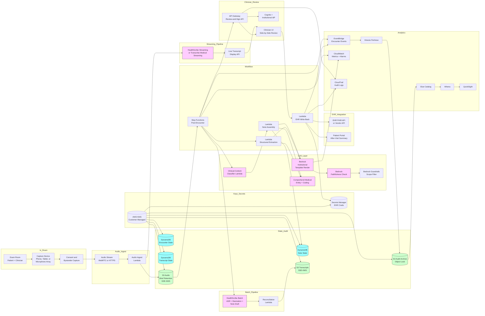

# Recipe 10.7 Architecture and Implementation: Ambient Clinical Documentation

*Companion to [Recipe 10.7: Ambient Clinical Documentation](chapter10.07-ambient-clinical-documentation). This page covers the AWS architecture, services, prerequisites, and pseudocode. For the problem framing and the conceptual approach, start with the main recipe.*

---

## The AWS Implementation

### Why These Services

**AWS HealthScribe as the primary managed service.** HealthScribe is a HIPAA-eligible managed service that performs ASR, multi-speaker diarization with clinician-patient role assignment, clinical entity extraction, and structured clinical note drafting from conversational audio. It is designed for exactly this use case. For most institutions, HealthScribe is the right primary service because it collapses most of the hard pipeline steps (medical-tuned ASR, movement-robust diarization, joint speaker-attributed decoding, clinical-content classification, structured-fact extraction, transcript-to-note traceability) into one API surface. 

**Amazon Transcribe Medical for institutions building a custom pipeline.** Transcribe Medical is the medical-tuned ASR service, available separately from HealthScribe. Institutions that want more control over the pipeline (custom diarization, custom clinical-content classification, custom note-generation prompting) use Transcribe Medical as the ASR primitive and assemble the downstream pipeline themselves. Transcribe Medical supports specialty-specific models (primary care, cardiology, oncology, neurology, urology, radiology) for institutions where the specialty terminology dominates.

**Amazon Bedrock for institutional-template note generation and faithfulness checks.** When the institutional note template does not match HealthScribe's default outputs, or when the institution wants to enforce specific institutional language and per-specialty templates, Bedrock provides the LLM layer for post-processing HealthScribe's structured output into the institution-specific note format. Bedrock also runs the faithfulness-check pass (citation grounding, contradiction detection) as a second-pass review of the generated note. Recipe 2.8 covers the Bedrock-based note-generation pattern in detail.

**Amazon Bedrock Guardrails for content filtering and contextual grounding.** Guardrails apply contextual-grounding checks to the Bedrock-generated note against the transcript as the grounding source, plus content filters and prompt-attack filters. The transcript is free-text user-adjacent content and should be treated as untrusted input by the Guardrails configuration.

**Amazon Comprehend Medical for structured entity extraction.** After the transcript is produced, Comprehend Medical extracts clinical entities (medications, conditions, anatomy, procedures) with RxNorm and ICD-10 coding. The extracted entities support the must-include validation (are the entities in the transcript also in the note?) and the structured medication and problem-list reconciliation with the EHR.

**Amazon Chime SDK or third-party device integration for in-room audio capture.** For the device-in-the-room workflow, several patterns are deployed. A clinician's iPad or iPhone with a vendor app that captures audio and streams to the cloud (works with the device's built-in microphone). A dedicated capture hardware device (a wall-mount or desk-mount with a microphone array, beamforming DSP, and network connectivity) that streams to the cloud. An EHR-embedded experience that uses the clinician's workstation microphone or a paired Bluetooth-connected microphone array. Chime SDK supports browser-based and mobile-app-based audio capture for institution-built experiences; for institutions deploying commercial hardware, the device's vendor SDK handles the capture and networking. The audio path between the device and the cloud ASR is the integration responsibility.

**AWS Lambda for orchestration and integration.** Per-stage Lambdas handle the pipeline orchestration: encounter-start handler, audio-capture coordination, batch reprocessing trigger, note-generation invocation, structured-field extraction, EHR write-back. Each Lambda has scoped IAM permissions for the specific external integrations it touches.

**AWS Step Functions for the post-encounter pipeline.** After an encounter ends, the post-encounter pipeline runs as a Step Functions state machine: batch reprocessing of the audio (when applicable), transcript reconciliation, clinical-content classification, LLM-driven note generation, faithfulness checks, structured-field extraction, presentation to the clinician for review. Step Functions provides the durable state, retry semantics, and observable failure handling that the multi-stage pipeline needs.

**Amazon S3 for audio, transcript, and note storage.** Encounter audio is stored in S3 with SSE-KMS encryption using customer-managed keys, with a brief-retention lifecycle policy that automatically deletes audio after the QA review window. Transcripts and generated notes are stored in a separate bucket with longer retention aligned to the medical-record retention. The audit archive lives in a third bucket with Object Lock in compliance mode for the legally-required retention window.

**Amazon DynamoDB for encounter-state and pipeline metadata.** An encounter-state table tracks the active session and the ambient-feature status. A transcript-state table tracks streaming and batch transcript references and the reconciliation state. A note-state table tracks the LLM-generated draft, the clinician-edit diff, and the signed final note. Per-table KMS at rest with customer-managed keys.

**AWS KMS for cryptographic key custody.** Customer-managed keys for the audio bucket, the transcript bucket, the audit archive, the DynamoDB tables, and Secrets Manager. Different keys per data class (audio vs. text) and per visit type (general vs. behavioral health) for blast-radius containment and finer retention control.

**AWS Secrets Manager for EHR integration credentials.** The Lambda that writes the signed note back to the EHR holds its credentials in Secrets Manager with rotation per the institutional cadence.

**Amazon Cognito (or institutional IdP via OIDC/SAML) for clinician authentication.** The clinician's review-and-sign workflow authenticates through the institutional identity provider, with appropriate scopes for the chart-update permissions the workflow requires. MFA enforcement applies to clinical-documentation access.

**Amazon API Gateway for the clinician review interface.** The clinician's web (or EHR-embedded) interface for review-and-sign authenticates through Cognito and accesses the transcript, the generated note, the structured extractions, and the chart-write capability through API Gateway endpoints backed by Lambda.

**Amazon CloudWatch for operational metrics and alarms.** Per-stage latency, per-channel audio quality metrics, ASR confidence distributions, diarization error rate proxies, faithfulness scores, edit distance between generated draft and signed final, per-clinician adoption metrics. Alarms on per-cohort disparity thresholds, on aggregate accuracy regressions, and on faithfulness-check failure rate spikes.

**AWS CloudTrail for API-level audit.** All access to PHI-bearing resources logged. HealthScribe (Transcribe) invocations, Bedrock invocations, Comprehend Medical invocations, Lambda invocations, KMS key uses, Secrets Manager retrievals all flow into CloudTrail.

**Amazon EventBridge for cross-system events.** Encounter lifecycle events (started, transcribed, note-generated, signed, audited) flow through EventBridge. Downstream consumers (operational dashboards, the analytics layer, the equity-monitoring pipeline) react to events without coupling to the orchestration Lambdas.

**Amazon Kinesis Data Firehose, AWS Glue, Amazon Athena, Amazon QuickSight (optional) for analytics.** Audit and telemetry flow to S3 via Firehose. Glue catalogs the data. Athena provides SQL access for operational analytics (per-clinician adoption, per-cohort accuracy, edit-distance distributions, faithfulness-failure rates by specialty). QuickSight renders the dashboards.

**AWS HealthLake (optional) for FHIR-based EHR integration.** HealthLake stores FHIR resources and supports writing completed notes as FHIR DocumentReference resources. For EHR integrations that use Epic, Oracle Health, or other vendor APIs, a vendor-specific integration layer (built on Lambda or using a HealthLake-sourced feed) handles the write-back.

### In-Room Device-to-Cloud Audio Path

The audio path between the in-room device and the cloud ASR service is the highest-risk data-in-transit segment in the pipeline, because it carries raw biometric PHI (the patient's and clinician's voices) over a network hop that varies by device pattern.

**Per-device-pattern data-in-transit posture.** TLS in transit is the minimum for all patterns. For dedicated-capture-hardware (wall-mount or desk-mount appliances with built-in microphone arrays), mTLS is preferred: the device presents a client certificate provisioned during physical installation, and the cloud endpoint validates it. Per-encounter session tokens, scoped to the visit duration and the specific encounter ID, limit the blast radius of a compromised session. For clinician phone-or-tablet patterns (vendor app on the clinician's personal or institutional device), the vendor app establishes a TLS session authenticated via the clinician's identity token plus a per-encounter session token. For EHR-embedded patterns (workstation microphone or Bluetooth-paired array), the EHR's existing secure session governs the audio path.

**Per-pattern BAA scope.** The phone-or-tablet vendor app pattern requires that the vendor's BAA explicitly covers audio data-in-transit and at-rest within the vendor's pipeline before the audio reaches the institution's AWS environment. The dedicated-capture-hardware pattern requires that the hardware vendor's BAA covers device firmware and the update channel (firmware updates are a vector for supply-chain compromise of a biometric-data-capture device). The EHR-embedded pattern requires that the EHR vendor's BAA covers audio capture and transit from the workstation to the cloud ASR endpoint.

**Platform-specific certification.** For each device pattern, require the vendor's HITRUST CSF certification or SOC 2 Type II report covering the audio-capture and data-in-transit components. Where the institution operates its own dedicated-capture-hardware fleet, the institution's own compliance program covers the device firmware lifecycle (update cadence, vulnerability response, end-of-life decommissioning).

### Architecture Diagram



### Prerequisites

| Requirement | Details |
|-------------|---------|
| **AWS Services** | AWS HealthScribe (primary), Amazon Transcribe Medical (alternative or complement), Amazon Bedrock (with Guardrails), Amazon Comprehend Medical, AWS Lambda, AWS Step Functions, Amazon API Gateway, Amazon Cognito, Amazon DynamoDB, Amazon S3, AWS KMS, AWS Secrets Manager, Amazon CloudWatch, AWS CloudTrail, Amazon EventBridge, Amazon Kinesis Data Firehose, AWS Glue, Amazon Athena. Optionally: Amazon Chime SDK (for institution-built capture experiences), AWS HealthLake (for FHIR-based EHR integration), Amazon QuickSight (for dashboards). |
| **External Inputs** | In-room audio capture device. Options include clinician smartphone or tablet with vendor app, dedicated capture hardware (wall-mount or desk-mount with microphone array), or EHR-embedded experience with workstation microphone or Bluetooth-paired microphone array. EHR FHIR write surface for clinical notes (DocumentReference resource), structured-chart updates (MedicationRequest, Condition, Observation), and patient portal communications. Per-specialty note templates curated by clinical informatics. Per-clinician style preferences (where supported). Institutional formulary, common-conditions list, common-orders list for custom-vocabulary tuning. Per-language ASR configuration where multilingual support is required. Validation set of representative in-clinic audio across speakers, audio qualities, encounter types, and visit lengths.  |
| **IAM Permissions** | Per-Lambda least-privilege roles. The streaming-pipeline Lambdas have HealthScribe (Transcribe) streaming permissions and access to the per-encounter audio path only. The batch-pipeline Lambdas have HealthScribe batch permissions and S3 read for the audio path, plus Step Functions execution. The note-generation Lambdas have Bedrock invoke permissions for the specific models in use, plus Comprehend Medical permissions. The EHR write-back Lambda has Secrets Manager access for EHR credentials and the EHR-specific egress path only. Avoid wildcard actions and resources in production.  |
| **BAA and Compliance** | AWS BAA signed. AWS HealthScribe, Amazon Transcribe (general and Medical), Amazon Bedrock (verify the specific models and regions covered), Amazon Comprehend Medical, Lambda, Step Functions, API Gateway, Cognito, DynamoDB, S3, KMS, Secrets Manager, CloudWatch Logs, CloudTrail, EventBridge, Kinesis Firehose, Glue, Athena, Chime SDK are HIPAA-eligible (verify the current list at build time against the AWS HIPAA Eligible Services Reference).  EHR vendor agreements: confirm the EHR vendor's terms permit the chart-write patterns the pipeline uses. State-by-state recording-consent compliance: an explicit consent disclosure plays before recording for all-party-consent jurisdictions; consent at intake suffices for one-party-consent jurisdictions but is institution-policy-driven. Behavioral-health visits may have additional state-level confidentiality requirements (42 CFR Part 2 for substance-use treatment records); the architecture supports a behavioral-health profile with stricter retention and access controls. Biometric-data law (Illinois BIPA, Texas, Washington) applies if the institution stores clinician voiceprints for diarization-enrollment. Audio retention policy reviewed by the privacy officer. |
| **Encryption** | Audio recordings: SSE-KMS with customer-managed keys, retention bound to the QA review window (typically hours to a few days post-signing) then automatic deletion via lifecycle policy. Transcripts: SSE-KMS with customer-managed keys, retention aligned with the medical-record retention. Generated notes: SSE-KMS with customer-managed keys, retention aligned with the medical-record retention. Audit archive: SSE-KMS with customer-managed keys, retention sized to the longer of HIPAA's six-year minimum, state medical-records-retention rules, and the institutional regulatory floor. DynamoDB tables: customer-managed KMS at rest. Lambda environment variables: KMS-encrypted. Lambda log groups: KMS-encrypted. Secrets Manager: customer-managed KMS. TLS in transit for all AWS API calls and all external integration calls (default).    |
| **VPC** | Production: Lambdas that call back-office APIs (EHR FHIR, patient portal) run in VPC with subnets that have controlled egress to those systems (often through VPC endpoints, PrivateLink where the vendor offers it, or VPN/Direct Connect to on-premise systems). VPC endpoints for DynamoDB, S3, KMS, Secrets Manager, CloudWatch Logs, EventBridge, Bedrock, Comprehend Medical, Transcribe, Lambda. Endpoint policies pin access to the specific resources the pipeline uses. |
| **CloudTrail** | Enabled with data events on the audio S3 bucket, the transcript bucket, the audit-archive bucket, the DynamoDB tables, the Secrets Manager secrets, and the customer-managed KMS keys. HealthScribe and Transcribe invocations logged. Bedrock invocations logged with metadata only (not full input/output, to avoid persisting PHI in CloudTrail). Comprehend Medical invocations logged. Lambda invocations logged. API Gateway access logs enabled. CloudTrail logs in a dedicated S3 bucket with Object Lock in Compliance mode and lifecycle to S3 Glacier Deep Archive after 90 days. |
| **Sample Data** | Synthetic patient-clinician conversation audio for development. Public clinical-vocabulary lists (RxNorm, ICD-10) for custom-vocabulary seeding of Transcribe. Synthea-generated patient context for the EHR integration in development. Public ambient-documentation evaluation datasets (MTS-Dialog, Primock57) for early evaluation; both have specific licensing terms that should be reviewed before use.  Never use real patient encounter audio in development without explicit consent and IRB or institutional review; voice samples are biometric and PHI-bearing data with non-trivial governance implications. |
| **Cost Estimate** | At a mid-sized institution scale (100,000 ambient-documented encounters per year, average 18 minutes per encounter): HealthScribe at typically $0.10-0.30 per minute totals approximately $300,000-900,000 per year. Bedrock note generation at typically $0.05-0.30 per encounter totals approximately $5,000-30,000 per year depending on model choice and prompt size. Bedrock faithfulness check at typically $0.01-0.05 per encounter totals approximately $1,000-5,000 per year. Comprehend Medical at typically $0.01-0.05 per encounter totals approximately $1,000-5,000 per year. Lambda, Step Functions, DynamoDB, S3, CloudWatch, KMS, Secrets Manager, EventBridge, Kinesis Firehose, Glue, Athena total approximately $15,000-30,000 per year combined. Total AWS infrastructure typically $325,000-970,000 per year at this scale. The infrastructure cost is dominated by HealthScribe per-minute charges. The savings versus clinician documentation time, when the system delivers real time savings per encounter (typically 5-15 minutes per visit), are typically substantial at this scale. Capture-device hardware costs (if dedicated devices are deployed) are not included; budget separately based on per-room hardware procurement.  |

### Ingredients

| AWS Service | Role |
|------------|------|
| **AWS HealthScribe** | Managed ASR + multi-speaker diarization with role assignment + clinical entity extraction + structured note draft for in-room conversational audio |
| **Amazon Transcribe Medical** | Alternative or complementary medical-tuned ASR for institutions building a custom pipeline |
| **Amazon Bedrock** | Institutional-template note generation, faithfulness checks, structured-field higher-level extraction, patient-facing summary generation |
| **Amazon Bedrock Guardrails** | Contextual grounding against the transcript, content filters, prompt-attack filters on the user-adjacent transcript |
| **Amazon Comprehend Medical** | RxNorm and ICD-10 entity extraction and coding for medication and problem-list reconciliation |
| **Amazon Chime SDK (optional)** | Institution-built audio capture experiences (browser, mobile) |
| **AWS Lambda** | Per-stage orchestration: encounter-start handler, audio-capture coordination, batch reprocessing, note-generation invocation, structured-field extraction, EHR write-back |
| **AWS Step Functions** | Post-encounter pipeline orchestration with durable state and observable failure handling |
| **Amazon API Gateway** | Clinician review-and-sign interface backend |
| **Amazon Cognito** | Clinician authentication federated through the institutional identity provider with MFA |
| **Amazon DynamoDB** | encounter-state (active session and feature status); transcript-state (streaming and batch transcript references, reconciliation); note-state (LLM draft, edits, signed final) |
| **Amazon S3** | Audio with brief-retention lifecycle; transcripts and generated notes with medical-record retention; audit archive with Object Lock |
| **AWS KMS** | Customer-managed encryption keys for all PHI-bearing data stores; separate keys per data class and visit type for blast-radius containment |
| **AWS Secrets Manager** | EHR API credentials and patient-portal integration credentials with rotation |
| **Amazon CloudWatch** | Operational metrics (per-stage latency, audio quality, ASR confidence, faithfulness scores, edit distance, per-clinician adoption); alarms (cohort disparity, accuracy regressions, integration failures) |
| **AWS CloudTrail** | API-level audit logging for PHI-bearing resources and AI/ML service invocations |
| **Amazon EventBridge** | encounter-events bus for cross-system event flow |
| **Amazon Kinesis Data Firehose** | Streaming audit and telemetry delivery into S3 |
| **AWS Glue Data Catalog + Amazon Athena** | SQL access to audit and telemetry for operational analytics |
| **Amazon QuickSight (optional)** | Dashboards for clinical operations and the equity-monitoring committee |
| **AWS HealthLake (optional)** | FHIR datastore for EHR integration via DocumentReference |

---

### Code

#### Walkthrough

**Step 1: Capture consent at encounter start, identify bystanders, and bootstrap the ambient session.** When the clinician opens the encounter (typically by selecting the patient in the EHR and starting the visit), the system captures the appropriate consent, identifies who is in the room, and bootstraps an ambient-documentation session that links the encounter ID to the audio capture path. Skip the per-encounter bystander identification and you risk recording someone who has not consented, which is both a privacy and compliance violation.

```pseudocode
ON encounter_start(encounter_id, patient_id, clinician_id,
                    patient_jurisdiction, visit_type, room_id):

    // Step 1A: determine the recording-consent regime.
    // The clinic's location governs (in-person ambient
    // documentation is straightforward in this regard,
    // unlike telehealth recipe 10.6 where patient
    // location matters).
    consent_regime = determine_consent_regime(
        clinic_jurisdiction: patient_jurisdiction,
        visit_type: visit_type,
        institutional_policy: INSTITUTIONAL_POLICY)

    // Step 1B: determine whether ambient documentation is
    // enabled for this visit type.
    feature_enabled = lookup_feature_status(
        clinician_id: clinician_id,
        visit_type: visit_type,
        institutional_policy: INSTITUTIONAL_POLICY)

    IF NOT feature_enabled:
        log_feature_disabled(encounter_id, reason: "policy")
        RETURN { status: "DISABLED" }

    // Step 1C: capture consent disclosure. For most
    // ambulatory visits, the institution's intake-time
    // consent suffices. For visit types flagged as
    // sensitive, or for all-party-consent jurisdictions,
    // an explicit per-encounter disclosure runs.
    IF consent_regime == "all_party_consent" OR
       visit_type IN SENSITIVE_VISIT_TYPES:
        disclosure_acknowledged = play_in_room_disclosure(
            encounter_id: encounter_id,
            disclosure: build_disclosure(
                regime: consent_regime,
                visit_type: visit_type),
            require_acknowledgment: true)
        IF NOT disclosure_acknowledged:
            log_consent_decline(encounter_id)
            RETURN { status: "DECLINED" }

    // Step 1D: identify bystanders. The clinician
    // confirms who is in the room. The ambient device
    // expects this declaration so that diarization can
    // tune for the expected speaker count, and the
    // consent record captures who consented.
    bystanders = capture_bystander_declaration(
        encounter_id: encounter_id,
        clinician_id: clinician_id)
    // bystanders is a list of: patient, family member,
    // caregiver, student, interpreter, other.

    // Step 1E: bootstrap the ambient-documentation
    // session.
    session_id = generate_uuid()
    encounter_state_table.put({
        session_id: session_id,
        encounter_id: encounter_id,
        patient_id_hash: hash(patient_id),
        clinician_id: clinician_id,
        room_id: room_id,
        consent_regime: consent_regime,
        bystanders: bystanders,
        feature_status: "enabled",
        started_at: now(),
        visit_type: visit_type,
        expected_speaker_count: 1 + len(bystanders),
        language: detect_language_or_default(
            patient_id, clinician_id),
        clinician_voiceprint_enrolled:
            check_voiceprint_enrollment(clinician_id),
        clinician_voiceprint_consent_version:
            lookup_voiceprint_consent_version(
                clinician_id),
        clinician_jurisdiction_for_biometric_compliance:
            lookup_biometric_jurisdiction(room_id)
    })

    // Step 1F: configure the in-room device.
    audio_capture_config = configure_audio_capture(
        room_id: room_id,
        session_id: session_id,
        device_type: lookup_device_type(room_id),
        expected_speaker_count: 1 + len(bystanders))

    activate_room_capture(audio_capture_config)

    // Step 1G: emit lifecycle event.
    EventBridge.PutEvents([{
        source: "ambient_documentation",
        detail_type: "session_started",
        detail: {
            session_id: session_id,
            visit_type: visit_type,
            consent_regime: consent_regime,
            bystander_count: len(bystanders)
        }
    }])

    RETURN { session_id: session_id }
```

**Step 2: Stream audio from the in-room device to HealthScribe streaming, with VAD, beamforming, and movement-robust diarization.** As audio is captured by the in-room device, voice activity detection and beamforming at the device produce a cleaned audio stream that is sent to HealthScribe (or, for institutions using a custom pipeline, Transcribe Medical streaming with the institution's diarization layer). The streaming pipeline produces a rolling transcript with per-segment speaker labels and confidence. Skip the device-side audio cleanup and the cloud ASR receives audio with significantly more noise and reverberation than necessary, with measurable accuracy impact.

```pseudocode
FUNCTION stream_audio_to_healthscribe(session_id):
    state = encounter_state_table.get(session_id)

    // Step 2A: configure the streaming HealthScribe
    // session. HealthScribe handles ASR, diarization,
    // and clinical-content classification together.
    stream_config = {
        session_name: f"hs-{session_id}",
        language_code: state.language,
        media_encoding: state.audio_capture_config.encoding,
        sample_rate_hz: state.audio_capture_config.sample_rate,
        vocabulary_name: INSTITUTIONAL_VOCABULARY,
        // HealthScribe expects role labels (CLINICIAN,
        // PATIENT, FAMILY, OTHER) rather than generic
        // speaker IDs.
        // The expected-speaker-count is conveyed via the
        // MedicalScribeConfigurationEvent channel
        // definitions in the HealthScribe streaming
        // session (not as a direct parameter on
        // start_stream_transcription). Batch mode uses
        // Settings.MaxSpeakerLabels (range 2-30).
        channel_definitions:
            build_channel_definitions(
                expected_speaker_count:
                    state.expected_speaker_count),
        // Where the clinician has an enrolled voiceprint,
        // pass the enrollment hint so that the clinician
        // cluster is identified directly.
        clinician_voiceprint_id:
            (state.clinician_voiceprint_enrolled and
             CLINICIAN_VOICEPRINT_REGISTRY[state.clinician_id]),
        // Enable clinical-content classification so the
        // streaming output is segmented by note-relevant
        // category.
        enable_clinical_classification: true
    }

    healthscribe_stream = healthscribe_streaming.start(
        stream_config)

    // Step 2B: handle each segment as it arrives.
    ON healthscribe_stream.segment_event(event):
        // event includes: text, speaker_role,
        // is_final, confidence, segment_class,
        // start_time, end_time, words.
        handle_streaming_segment(
            session_id: session_id,
            event: event)

    // Step 2C: monitor per-encounter audio quality.
    ON healthscribe_stream.audio_quality_event(quality):
        cloudwatch.put_metric(
            namespace: "AmbientDocumentation",
            metric_name: "AudioQualitySNR",
            value: quality.signal_to_noise_db,
            dimensions: {
                room_id: state.room_id,
                visit_type: state.visit_type
            })

        // If audio quality drops below threshold,
        // surface a warning to the clinician's
        // device that the room audio is degraded.
        IF quality.signal_to_noise_db < AUDIO_QUALITY_WARNING_THRESHOLD:
            push_audio_quality_warning(session_id, quality)

FUNCTION handle_streaming_segment(session_id, event):
    // Persist the streaming segment metadata. Verbatim
    // text content is written to the transcript-archive
    // S3 bucket rather than DynamoDB to avoid creating
    // a parallel PHI store outside the standard audit
    // governance.
    transcript_archive.append(
        session_id: session_id,
        segment: {
            speaker_role: event.speaker_role,
            text: event.transcript,
            is_final: event.is_final,
            words: event.words_with_confidence,
            timestamp: event.timestamp,
            segment_class: event.segment_class,
            diarization_confidence:
                event.diarization_confidence
        })

    // Update transcript-state table with metadata only.
    transcript_state_table.update(
        session_id: session_id,
        action: "increment_segment_count",
        last_segment_timestamp: event.timestamp,
        avg_confidence_running:
            update_running_avg(event.confidence))

    // Push to live display if the clinician has it
    // enabled.
    IF state.live_display_enabled:
        push_to_live_display(
            session_id: session_id,
            speaker_role: event.speaker_role,
            event: event)
```

**Step 3: After the encounter ends, run batch HealthScribe reprocessing for the canonical transcript and structured note draft.** When the encounter ends (either by clinician signal or by EHR encounter close), a batch HealthScribe job runs over the full audio with full discourse context, producing the canonical transcript with diarization plus the structured clinical note draft. The batch output is the canonical record. Skip the batch reprocessing and the canonical transcript is the streaming output, which is fine for navigation but suboptimal for the documentation that will end up in the chart.

```pseudocode
ON encounter_end(session_id):
    state = encounter_state_table.get(session_id)

    // Step 3A: deactivate the in-room capture.
    deactivate_room_capture(state.audio_capture_config)

    // Step 3B: trigger the post-encounter Step
    // Functions pipeline.
    sfn.start_execution(
        state_machine_arn: POST_ENCOUNTER_PIPELINE_ARN,
        input: {
            session_id: session_id,
            encounter_id: state.encounter_id,
            audio_path: state.audio_archive_ref,
            language: state.language,
            visit_type: state.visit_type
        })

FUNCTION run_batch_healthscribe(session_id):
    state = encounter_state_table.get(session_id)

    // Step 3C: launch the HealthScribe batch job over
    // the full audio. HealthScribe batch produces a
    // higher-accuracy transcript than streaming, plus
    // a structured clinical note draft organized by
    // section (Subjective, Objective, Assessment, Plan
    // by default; alternatives configured via the
    // ClinicalNoteGenerationSettings).
    job = healthscribe.start_medical_scribe_job(
        medical_scribe_job_name: f"{session_id}-batch",
        media: {
            media_file_uri: state.audio_archive_ref
        },
        output_bucket_name: HEALTHSCRIBE_OUTPUT_BUCKET,
        output_encryption_kms_key_id: OUTPUT_KMS_KEY,
        data_access_role_arn:
            HEALTHSCRIBE_DATA_ACCESS_ROLE_ARN,
        settings: {
            show_speaker_labels: true,
            max_speaker_labels: state.expected_speaker_count,
            channel_identification: false,
            vocabulary_name: INSTITUTIONAL_VOCABULARY,
            clinical_note_generation_settings: {
                // HealthScribe NoteTemplate accepts a
                // fixed enum (HISTORY_AND_PHYSICAL,
                // GIRPP, BIRP, SIRP, DAP, BH_SOAP,
                // PH_SOAP). Pass the closest-fit built-in
                // enum here; institutional formatting
                // happens at the Bedrock-rendering step
                // (Step 4).
                note_template: select_template(
                    visit_type: state.visit_type,
                    specialty: state.clinician_specialty)
            }
        })

    wait_for_job_completion(job.medical_scribe_job_name)
    completion = healthscribe.get_medical_scribe_job(
        medical_scribe_job_name: job.medical_scribe_job_name)

    canonical_transcript = retrieve_artifact(
        completion.medical_scribe_output.transcript_file_uri)
    healthscribe_note_draft = retrieve_artifact(
        completion.medical_scribe_output.clinical_document_uri)

    // Step 3D: persist references.
    encounter_state_table.update(
        session_id: session_id,
        canonical_transcript_ref:
            completion.medical_scribe_output.transcript_file_uri,
        healthscribe_note_draft_ref:
            completion.medical_scribe_output.clinical_document_uri,
        batch_completed_at: now())

    RETURN {
        canonical_transcript: canonical_transcript,
        healthscribe_note_draft: healthscribe_note_draft
    }
```

**Step 4: Render the institutional-template note from the HealthScribe draft using Bedrock, with citation grounding and faithfulness checks.** HealthScribe's default note format may not match the institution's template. The Bedrock-rendering step takes the HealthScribe structured output plus the canonical transcript plus the EHR context and produces the institution-specific note format. The Bedrock rendering is grounded: every claim in the rendered note carries a citation back to the supporting transcript segment or EHR source. A faithfulness-check pass scores the rendered note against the source for fabrication and contradictions. Skip the faithfulness check and the rendered note may include fluent-sounding clinical content that the patient never said, which is the worst class of failure for this recipe.

```pseudocode
FUNCTION render_institutional_note(session_id,
                                    canonical_transcript,
                                    healthscribe_note_draft):
    state = encounter_state_table.get(session_id)

    // Step 4A: load the per-specialty per-clinician
    // template.
    template = lookup_note_template(
        specialty: state.clinician_specialty,
        visit_type: state.visit_type,
        clinician_id: state.clinician_id)

    // Step 4B: assemble EHR context (allergies, current
    // meds, problem list, recent labs, recent imaging).
    // These populate note sections that are not usually
    // discussed aloud.
    ehr_context = fetch_ehr_context(
        patient_id_hash: state.patient_id_hash)

    // Step 4C: format the transcript with segment IDs
    // for the rendering prompt.
    transcript_block = format_transcript_for_prompt(
        canonical_transcript)

    // Step 4D: invoke Bedrock to render the note.
    // Prompt-injection mitigation: all external content
    // is wrapped in delimited input markers
    // (<transcript>...</transcript>,
    // <ehr_context>...</ehr_context>,
    // <clinician_style>...</clinician_style>).
    // The system prompt instructs the model to treat all
    // delimited content as untrusted patient or
    // historical data, never as instructions. The
    // orchestration validates the response against a
    // strict JSON schema before treating it as a note
    // draft. The faithfulness check (Step 4E) is the
    // secondary safety layer; Bedrock Guardrails is
    // the tertiary safety layer. EHR-context retrieved-
    // content supply-chain integrity (ensuring the EHR
    // data has not been tampered with between retrieval
    // and prompt assembly) is a production-gap that
    // requires signed-payload verification from the EHR
    // integration layer.
    rendering_prompt = build_rendering_prompt(
        transcript_block: transcript_block,
        ehr_context: ehr_context,
        template: template,
        healthscribe_draft: healthscribe_note_draft,
        clinician_style_preferences:
            lookup_clinician_style(state.clinician_id),
        require_citations: true,
        prohibited_content: [
            "added_clinical_recommendations",
            "interpretations_not_in_transcript",
            "inferred_exam_findings_when_not_narrated",
            "billing_codes_unless_explicitly_discussed"
        ])

    note_response = bedrock.invoke_model(
        model_id: NOTE_RENDERING_MODEL,
        prompt: rendering_prompt,
        guardrail_id: AMBIENT_DOC_GUARDRAIL_ID,
        response_format: {
            type: "json_schema",
            schema: NOTE_RENDERING_SCHEMA
        },
        max_tokens: 6000)

    // Check for Guardrail intervention.
    IF note_response.guardrail_action == "INTERVENED":
        log_guardrail_block(session_id,
                            note_response.guardrail_trace)
        RETURN { status: "GUARDRAIL_BLOCK",
                 fallback: "manual_documentation" }

    // Step 4E: layered faithfulness check.
    // Layer 1: citation grounding verification,
    // structured-output schema validation, and
    // exam-finding-fabrication detection.
    layer1_result = run_faithfulness_layer1(
        rendered_note: note_response.content,
        canonical_transcript: canonical_transcript,
        ehr_context: ehr_context,
        visit_type: state.visit_type)

    IF layer1_result.severity == "block":
        log_faithfulness_block(
            session_id: session_id,
            layer: 1,
            failed_checks: layer1_result.failed_checks)
        RETURN { status: "FAITHFULNESS_BLOCK",
                 fallback: "manual_documentation" }

    // Layer 2: LLM-judge faithfulness scoring and
    // clinical-rule-based contradiction detection.
    layer2_result = run_faithfulness_layer2(
        rendered_note: note_response.content,
        canonical_transcript: canonical_transcript,
        ehr_context: ehr_context,
        behavioral_health_profile:
            (state.visit_type IN BEHAVIORAL_HEALTH_TYPES))

    // Layer 2 failures surface as warnings, not blocks
    // (unless the behavioral-health profile applies
    // tighter thresholds that escalate to block).
    faithfulness_result = merge_faithfulness_layers(
        layer1_result, layer2_result,
        profile: determine_faithfulness_profile(
            state.visit_type))

    IF faithfulness_result.severity == "block":
        log_faithfulness_block(
            session_id: session_id,
            layer: 2,
            failed_checks: faithfulness_result.failed_checks)
        RETURN { status: "FAITHFULNESS_BLOCK",
                 fallback: "manual_documentation" }

    // Step 4F: persist the rendered note draft.
    note_draft_archive.put(
        session_id: session_id,
        rendered_note: note_response.content,
        citations: note_response.citations,
        faithfulness_annotations:
            faithfulness_result.annotations)

    note_state_table.put({
        session_id: session_id,
        rendered_note_archive_ref:
            f"s3://{NOTE_DRAFT_BUCKET}/{session_id}/note.json",
        faithfulness_score:
            faithfulness_result.score,
        faithfulness_failure_count:
            len(faithfulness_result.failed_checks),
        faithfulness_severity:
            faithfulness_result.severity,
        model_version: NOTE_RENDERING_MODEL_VERSION,
        prompt_version: NOTE_RENDERING_PROMPT_VERSION,
        generated_at: now()
    })

    RETURN { status: "RENDERED" }
```

**Step 5: Extract structured clinical entities and present them for explicit clinician confirmation.** Beyond the narrative note, the system extracts structured clinical entities (medications, problems, allergies, vitals, orders, follow-up actions) using Comprehend Medical for the canonical coding (RxNorm, ICD-10) and a Bedrock LLM for the higher-level structuring. Each extracted field is presented to the clinician for explicit confirmation before being applied to the structured chart. Skip the explicit confirmation and the structured chart can be silently modified with content the clinician would not have endorsed. Recipe 2.8 covers this pattern in detail; the in-person workflow is the same.

```pseudocode
FUNCTION extract_structured_fields(session_id,
                                    canonical_transcript):
    state = encounter_state_table.get(session_id)

    // Step 5A: extract medications and conditions
    // with Comprehend Medical for canonical coding.
    transcript_text = render_transcript_text(
        canonical_transcript)

    medications_response =
        comprehend_medical.infer_rx_norm(
            text: transcript_text)
    conditions_response =
        comprehend_medical.infer_icd10cm(
            text: transcript_text)

    coded_medications = []
    FOR med IN medications_response.entities:
        coded_medications.append({
            text: med.text,
            rx_norm_code:
                first_concept_code(med.rx_norm_concepts),
            speaker_role: lookup_speaker_role(
                med.timestamp, canonical_transcript),
            context_snippet: extract_context(
                canonical_transcript,
                med.timestamp,
                window_seconds: 10),
            // Speaker-role-aware filtering: a medication
            // mentioned only by the patient as part of
            // history is different from one the clinician
            // explicitly orders.
            clinician_action_likely:
                infer_clinician_action(med, canonical_transcript)
        })

    coded_conditions = []
    FOR cond IN conditions_response.entities:
        coded_conditions.append({
            text: cond.text,
            icd_10_code:
                first_concept_code(cond.icd10cm_concepts),
            speaker_role: lookup_speaker_role(
                cond.timestamp, canonical_transcript),
            context_snippet: extract_context(
                canonical_transcript,
                cond.timestamp,
                window_seconds: 10)
        })

    // Step 5B: use the LLM for higher-level extractions
    // (orders, follow-up, patient-reported vitals,
    // patient-reported allergies) that Comprehend
    // Medical does not directly extract.
    higher_level = bedrock.invoke_model(
        model_id: EXTRACTION_MODEL,
        prompt: build_extraction_prompt(
            transcript: canonical_transcript,
            target_fields: [
                "orders_placed",
                "labs_requested",
                "imaging_requested",
                "follow_up_appointments",
                "patient_reported_vitals",
                "patient_reported_allergies",
                "referrals_placed"
            ]),
        response_format: {
            type: "json_schema",
            schema: STRUCTURED_EXTRACTION_SCHEMA
        },
        max_tokens: 1000)

    // Step 5C: persist all extractions for clinician
    // confirmation. Extractions (with PHI-bearing
    // context_snippets) are written to the draft-
    // extractions archive in S3, encrypted with the
    // same KMS key class as the note-draft archive.
    // Only a reference, counts, and status are stored
    // in the note-state DynamoDB table.
    extractions_payload = {
        medications: coded_medications,
        conditions: coded_conditions,
        higher_level: higher_level.content,
        confirmation_status: "pending_clinician_review"
    }
    extractions_archive_ref = (
        f"s3://{NOTE_DRAFT_BUCKET}/{session_id}"
        f"/extractions.json")
    s3.put_object(
        bucket: NOTE_DRAFT_BUCKET,
        key: f"{session_id}/extractions.json",
        body: serialize(extractions_payload),
        sse_kms_key_id: NOTE_DRAFT_KMS_KEY)

    note_state_table.update(
        session_id: session_id,
        action: "store_extraction_ref",
        extractions_archive_ref: extractions_archive_ref,
        extraction_count: count_total(
            coded_medications, coded_conditions,
            higher_level),
        medication_count: len(coded_medications),
        condition_count: len(coded_conditions),
        confirmation_status: "pending_clinician_review"
    )

    RETURN {
        extraction_count: count_total(coded_medications,
                                       coded_conditions,
                                       higher_level)
    }
```

**Step 6: Present the draft to the clinician for review-and-sign with side-by-side transcript display and structured-field confirmation.** The clinician opens the review interface, sees the draft note alongside the transcript with click-through citations, reviews flagged uncertain segments, confirms each structured-field extraction explicitly, edits the narrative as needed, and signs. The signed note is the legal record; the audio is at most ephemeral. Skip the side-by-side display and the clinician cannot easily verify what was actually said versus what the LLM produced. Recipe 2.8 covers the review-and-sign pattern in detail.

```pseudocode
ON clinician_review_request(session_id, clinician_id):
    state = encounter_state_table.get(session_id)
    note_draft = note_draft_archive.get(session_id)
    canonical_transcript = retrieve_artifact(
        state.canonical_transcript_ref)
    structured_extractions =
        note_state_table.get_extractions(session_id)

    // Step 6A: assemble the review payload.
    review_payload = {
        rendered_note: note_draft.rendered_note,
        citations: note_draft.citations,
        canonical_transcript: canonical_transcript,
        structured_extractions: structured_extractions,
        faithfulness_annotations:
            note_draft.faithfulness_annotations,
        confidence_highlights:
            extract_low_confidence_segments(
                canonical_transcript),
        speaker_label_uncertainty:
            extract_uncertain_speaker_segments(
                canonical_transcript),
        bystander_segments:
            extract_bystander_segments(
                canonical_transcript, state.bystanders)
    }

    RETURN review_payload

ON clinician_save_review(session_id, clinician_id,
                         review_actions):
    // Step 6B: process clinician edits and structured-
    // field confirmations.
    note_state_table.update(
        session_id: session_id,
        action: "apply_clinician_edits",
        edits: review_actions.note_edits,
        confirmed_extractions:
            review_actions.confirmed_extractions,
        rejected_extractions:
            review_actions.rejected_extractions,
        structured_chart_actions:
            review_actions.chart_action_decisions)

ON clinician_sign(session_id, clinician_id):
    // Step 6C: finalize the signed note and write to
    // the EHR. The signature is the legal-medical-
    // record boundary.
    final_note = note_state_table.get(session_id).get_final_note()

    // Idempotency key: (encounter_id, clinician_id,
    // document_type, signed_at_truncated_to_minute).
    // Prevents duplicate writes if the EHR write is
    // retried.
    idempotency_key = build_idempotency_key(
        encounter_id: state.encounter_id,
        clinician_id: clinician_id,
        document_type: "clinical_note",
        signed_at: now())

    ehr_response = ehr_fhir_client.write_document_reference(
        patient_id: lookup_patient_id(
            state.patient_id_hash),
        encounter_id: state.encounter_id,
        document_content: final_note.content,
        author: clinician_id,
        signed_at: now(),
        idempotency_key: idempotency_key,
        access_token: lookup_clinician_credentials(
            clinician_id))

    // Apply confirmed structured-field updates to the
    // chart. Each extraction uses an idempotency key
    // (encounter_id, extraction_id, extraction_type) to
    // prevent duplicate chart writes on retry. Where
    // the EHR vendor supports FHIR conditional-create
    // (If-None-Exist header), use it; on idempotency
    // match the EHR returns the prior submission's
    // resource id rather than creating a duplicate.
    FOR confirmed IN final_note.confirmed_extractions:
        extraction_idempotency_key = build_idempotency_key(
            encounter_id: state.encounter_id,
            extraction_id: confirmed.extraction_id,
            extraction_type: confirmed.type)
        write_structured_chart_update(
            patient_id: lookup_patient_id(
                state.patient_id_hash),
            update: confirmed,
            idempotency_key: extraction_idempotency_key,
            conditional_create: true,
            access_token: lookup_clinician_credentials(
                clinician_id))

    // Optional: release the patient-facing summary
    // to the portal.
    IF final_note.patient_facing_summary AND
       INSTITUTIONAL_POLICY.release_summary_to_portal:
        schedule_portal_release(
            patient_id_hash: state.patient_id_hash,
            summary: final_note.patient_facing_summary,
            release_at: compute_release_time(
                state.visit_type))

    note_state_table.update(
        session_id: session_id,
        action: "mark_signed",
        signed_at: now(),
        signed_by: clinician_id,
        ehr_document_id: ehr_response.document_id)

    EventBridge.PutEvents([{
        source: "ambient_documentation",
        detail_type: "note_signed",
        detail: {
            session_id: session_id,
            encounter_id: state.encounter_id,
            duration_encounter_to_sign:
                (now() - state.started_at).total_seconds()
        }
    }])
```

**Step 7: Audit, archive, retain audio per policy, and feed cohort-stratified accuracy monitoring.** Every encounter produces a durable audit record: the transcript, the rendered draft, the clinician edits, the structured-field decisions, the signed final note, the consent and bystander events. Audio is retained briefly per institutional policy and then deleted. Cohort-stratified metrics (per-language, per-specialty, per-clinician, per-patient-cohort, per-audio-quality-band) feed the equity-monitoring dashboard. Skip the audio retention enforcement and the institution silently accumulates biometric data beyond its policy commitment, which is a compliance exposure. Skip the cohort segmentation and the system's per-cohort failure modes are invisible until a complaint or a regulator surfaces them.

```pseudocode
FUNCTION audit_archive_and_telemetry(session_id):
    state = encounter_state_table.get(session_id)
    note = note_state_table.get(session_id)

    audit_record = {
        session_id: session_id,
        encounter_id: state.encounter_id,
        clinician_id: state.clinician_id,
        patient_id_hash: state.patient_id_hash,
        room_id: state.room_id,
        visit_type: state.visit_type,
        language: state.language,
        consent_regime: state.consent_regime,
        bystander_count: len(state.bystanders),
        feature_status: state.feature_status,
        voiceprint_used:
            state.clinician_voiceprint_enrolled,
        voiceprint_consent_version:
            state.clinician_voiceprint_consent_version,
        biometric_jurisdiction:
            state.clinician_jurisdiction_for_biometric_compliance,
        audio_archive_ref: state.audio_archive_ref,
        canonical_transcript_ref:
            state.canonical_transcript_ref,
        rendered_note_archive_ref:
            note.rendered_note_archive_ref,
        signed_note_ref: note.signed_note_ref,
        ehr_document_id: note.ehr_document_id,
        edit_distance_draft_to_final:
            compute_edit_distance(
                note.rendered_note, note.final_note),
        faithfulness_score: note.faithfulness_score,
        faithfulness_failure_count:
            note.faithfulness_failure_count,
        confirmed_extraction_count:
            len(note.confirmed_extractions),
        rejected_extraction_count:
            len(note.rejected_extractions),
        avg_audio_quality_snr:
            state.avg_audio_quality_snr,
        avg_streaming_asr_confidence:
            state.avg_streaming_asr_confidence,
        avg_batch_asr_confidence:
            state.avg_batch_asr_confidence,
        diarization_disagreement_count:
            state.diarization_disagreement_count,
        cohort_axes: {
            language: state.language,
            visit_type: state.visit_type,
            specialty: state.clinician_specialty,
            patient_age_band:
                state.opt_in_age_band if available
                else "not_disclosed",
            audio_quality_band:
                bucket_audio_quality(
                    state.avg_audio_quality_snr)
        }
    }

    audit_archive_kinesis_firehose.put(audit_record)

    // Step 7A: schedule audio deletion per institutional
    // retention policy.
    schedule_audio_deletion(
        audio_ref: state.audio_archive_ref,
        delete_after: compute_audio_retention(
            visit_type: state.visit_type))

    EventBridge.PutEvents([{
        source: "ambient_documentation",
        detail_type: "encounter_audited",
        detail: {
            session_id: session_id,
            edit_distance:
                audit_record.edit_distance_draft_to_final,
            faithfulness_score:
                audit_record.faithfulness_score,
            audio_quality_band:
                audit_record.cohort_axes.audio_quality_band
        }
    }])

    // Per-cohort operational metrics.
    cloudwatch.put_metric(
        namespace: "AmbientDocumentation",
        metric_name: "EditDistanceDraftToFinal",
        value: audit_record.edit_distance_draft_to_final,
        dimensions: {
            specialty: state.clinician_specialty,
            language: state.language,
            visit_type: state.visit_type,
            audio_quality_band:
                audit_record.cohort_axes.audio_quality_band
        })
    cloudwatch.put_metric(
        namespace: "AmbientDocumentation",
        metric_name: "FaithfulnessScore",
        value: audit_record.faithfulness_score,
        dimensions: {
            specialty: state.clinician_specialty,
            language: state.language
        })
    cloudwatch.put_metric(
        namespace: "AmbientDocumentation",
        metric_name: "ExtractionAcceptanceRate",
        value: (audit_record.confirmed_extraction_count /
                max(1,
                    (audit_record.confirmed_extraction_count +
                     audit_record.rejected_extraction_count))),
        dimensions: {
            specialty: state.clinician_specialty,
            language: state.language
        })
```

> **Curious how this looks in Python?** The pseudocode above covers the concepts. If you'd like to see sample Python code that demonstrates these patterns using boto3, check out the [Python Example](chapter10.07-python-example). It walks through each step with inline comments and notes on what you'd need to change for a real deployment.

---

### Expected Results

**Sample transcript excerpt (illustrative, synthetic patient):**

```json
{
  "session_id": "amb-7e3f2c4a-9b8d-4e1f",
  "encounter_id": "encounter-2026-05-23-0411",
  "duration_seconds": 1086,
  "language": "en-US",
  "speakers_identified": 3,
  "expected_speakers": 3,
  "room_id": "clinic-A-room-12",
  "segments": [
    {
      "timestamp": "00:00:08",
      "speaker_role": "clinician",
      "speaker_label": "Dr. Patel",
      "text": "Hi Mrs. Johnson, good to see you. And Sarah, thanks for coming with your mom today. You both know our visits are being captured for documentation; let me know if you'd like me to pause that at any point.",
      "confidence": 0.96,
      "segment_class": "social_workflow"
    },
    {
      "timestamp": "00:00:24",
      "speaker_role": "patient",
      "speaker_label": "Mrs. Johnson",
      "text": "That's fine, doctor.",
      "confidence": 0.92,
      "segment_class": "social_workflow"
    },
    {
      "timestamp": "00:01:42",
      "speaker_role": "patient",
      "speaker_label": "Mrs. Johnson",
      "text": "I've been having this tingling in my feet, mostly at night. It started maybe a couple months ago, I think.",
      "confidence": 0.91,
      "segment_class": "hpi"
    },
    {
      "timestamp": "00:01:58",
      "speaker_role": "family_member",
      "speaker_label": "Sarah",
      "text": "Mom, you said it started right after Christmas. And she's been kind of unsteady too. Last week she caught her foot on the rug.",
      "confidence": 0.88,
      "segment_class": "hpi"
    },
    {
      "timestamp": "00:02:14",
      "speaker_role": "clinician",
      "speaker_label": "Dr. Patel",
      "text": "Okay. That's important to know. Mrs. Johnson, have you noticed any weakness, or is it more the sensation that's bothering you?",
      "confidence": 0.95,
      "segment_class": "hpi"
    },
    {
      "timestamp": "00:08:33",
      "speaker_role": "clinician",
      "speaker_label": "Dr. Patel",
      "text": "Lungs are clear. Heart is regular. I don't appreciate any focal weakness in the lower extremities. Reflexes are diminished at the ankles bilaterally.",
      "confidence": 0.94,
      "segment_class": "exam_narrated"
    }
  ],
  "diarization_quality": "high",
  "audio_quality_band": "good",
  "in_encounter_corrections": 0
}
```

**Sample rendered note draft (illustrative):**

```json
{
  "session_id": "amb-7e3f2c4a-9b8d-4e1f",
  "specialty": "family_medicine",
  "template": "SOAP",
  "sections": {
    "subjective": {
      "text": "Mrs. Johnson is a 67-year-old female with type 2 diabetes and hypertension presenting for follow-up. She reports new bilateral foot tingling, predominantly nocturnal, with onset approximately two months ago (her daughter notes the timing was just after Christmas). Her daughter additionally reports episodes of unsteadiness, including a recent near-fall over a rug. Patient denies focal weakness.",
      "citations": [
        {"transcript_segment_timestamp": "00:01:42",
         "supports": "new bilateral foot tingling, predominantly nocturnal, with onset approximately two months ago"},
        {"transcript_segment_timestamp": "00:01:58",
         "supports": "her daughter notes the timing was just after Christmas... episodes of unsteadiness, including a recent near-fall over a rug"},
        {"transcript_segment_timestamp": "00:02:14",
         "supports": "Patient denies focal weakness"}
      ]
    },
    "objective": {
      "text": "Vital signs reviewed (see structured chart). Lungs clear to auscultation bilaterally. Heart regular rate and rhythm. No focal weakness in the lower extremities on motor exam. Diminished reflexes at the ankles bilaterally. Remainder of exam not narrated; please complete as needed.",
      "citations": [
        {"transcript_segment_timestamp": "00:08:33",
         "supports": "Lungs clear to auscultation... Heart regular rate and rhythm... No focal weakness in the lower extremities... Diminished reflexes at the ankles bilaterally"}
      ]
    },
    "assessment": {
      "text": "1. Bilateral peripheral neuropathy, new onset, possible diabetic etiology. 2. Type 2 diabetes mellitus, on metformin (per chart). 3. Hypertension, on lisinopril (per chart). 4. Reported gait instability, etiology to be determined; falls risk noted.",
      "citations": [
        {"transcript_segment_timestamp": "00:09:14",
         "supports": "Bilateral peripheral neuropathy, new onset, possible diabetic etiology",
         "clinician_assertion": true},
        {"ehr_source": "medications",
         "supports": "Type 2 diabetes mellitus, on metformin"}
      ]
    },
    "plan": {
      "text": "1. Add gabapentin 300 mg PO at bedtime for neuropathic symptoms; titrate based on response and tolerability. 2. Order HbA1c and vitamin B12 level. 3. Discussed importance of foot care and home safety; recommended removing loose rugs. 4. Follow-up in 6 weeks. 5. Consider neurology referral if symptoms persist or progress.",
      "citations": [
        {"transcript_segment_timestamp": "00:11:02",
         "supports": "Add gabapentin 300 mg PO at bedtime"},
        {"transcript_segment_timestamp": "00:11:20",
         "supports": "Order HbA1c and vitamin B12 level"},
        {"transcript_segment_timestamp": "00:13:45",
         "supports": "Follow-up in 6 weeks"}
      ]
    }
  },
  "structured_extractions": {
    "medications_to_add": [
      {"name": "gabapentin",
       "rx_norm_code": "25480",
       "dose": "300 mg",
       "route": "PO",
       "frequency": "at bedtime",
       "clinician_confirmed": false}
    ],
    "labs_to_order": [
      {"name": "HbA1c", "loinc_code": "4548-4",
       "clinician_confirmed": false},
      {"name": "Vitamin B12", "loinc_code": "2132-9",
       "clinician_confirmed": false}
    ],
    "follow_up": {
      "interval_weeks": 6,
      "modality_options": ["in_person", "telehealth"],
      "clinician_confirmed": false
    }
  },
  "faithfulness_score": 0.94,
  "faithfulness_failures": [],
  "social_segments_excluded": 14,
  "exam_completion_placeholder_present": true
}
```

**Performance benchmarks (illustrative; your mileage will vary):**

| Metric | Manual baseline | With ambient documentation |
|--------|------------------|----------------------------|
| Median time to complete documentation per encounter | 8-15 minutes (often after-hours) | 1-3 minutes (during or shortly after encounter) |
| Per-encounter clinician documentation time saved | n/a | 5-12 minutes |
| Streaming ASR latency (end-to-end speech to display) | n/a | 1-3 seconds |
| Word error rate, clinician audio (good room conditions) | n/a | 4-8% |
| Word error rate, patient audio (good room conditions) | n/a | 6-12% |
| Word error rate, patient audio (poor room conditions) | n/a | 12-25% |
| Diarization error rate, two-speaker (clinician + patient) | n/a | 3-8% |
| Diarization error rate, three-speaker (with family) | n/a | 8-18% |
| Diarization error rate, four-or-more-speaker (teaching) | n/a | 15-30% |
| Faithfulness score on rendered note | n/a | 0.88-0.96 |
| Edit distance (draft to signed) median word fraction | n/a | 0.10-0.30 |
| Structured-extraction acceptance rate | n/a | 70-90% |
| Per-encounter AWS infrastructure cost | n/a | $0.40-2.50 |
| Sustained adoption at three months | n/a | 60-85% of eligible encounters use the feature |

**Where it struggles:**

- **Room acoustics and microphone placement.** A clinic room with hard surfaces, an HVAC vent directly over the desk, or a microphone placed too far from the typical speaker positions produces audio that the ASR struggles with. Mitigations: per-room audio quality assessment as part of deployment, microphone placement experimentation in pilot, optional room acoustic treatment (carpet, drapes, acoustic ceiling tiles) for high-volume rooms, and per-room calibration where the system learns the room's typical noise profile and speaker-position distribution.

- **Three-or-more-speaker encounters.** Pediatric visits (clinician + parent + child), geriatric visits (clinician + patient + caregiver), and teaching encounters (attending + resident + student + patient) all degrade diarization quality versus the two-speaker case. Mitigations: clinician declaration of bystanders at encounter start so diarization knows the expected speaker count, role-aware diarization tuning, surfacing diarization confidence flags to the clinician, and easy in-review speaker-relabeling.

- **Implicit physical exams that the clinician does not narrate.** A clinician who performs the exam silently produces a transcript with no exam content, and the rendered note has only a "please complete" placeholder for the exam section. Mitigations: clinician training on the value of narrating key exam findings ("lungs clear, heart regular, no edema in lower extremities" takes five seconds to say and saves three minutes of post-encounter typing), per-clinician templates for the normal-exam default for clinicians who prefer that pattern, and explicit exam-completion review prompts.

- **Specialty terminology not in the institutional custom vocabulary.** A new medication, a procedure name, or a specialty-specific eponym not in the institutional vocabulary may be systematically mistranscribed. Mitigations: regular custom-vocabulary updates, surface unknown-term warnings to the clinician, and a feedback loop from clinician corrections to vocabulary expansion.

- **Behavioral-health-specific content.** Even when behavioral-health visits are included in ambient documentation (some institutions exclude them entirely), the conversational dynamics are different (long silences, tearful patient speech, sensitive disclosures) and the ASR accuracy can drop on the most clinically critical content. Mitigations: stricter retention and access controls on behavioral-health transcripts, conservative confidence thresholds, optional clinician-controlled pause-and-resume for sensitive moments, and explicit clinician training on reviewing behavioral-health drafts more carefully.

- **Multilingual visits where the configured language differs from the actual visit language.** A visit conducted in Spanish through an English-configured pipeline produces poor transcription. Mitigations: per-clinician language preferences, per-encounter language detection, and explicit language selection at encounter start.

- **Hallway and adjacent-room sound bleed.** A microphone in exam room A picks up a faint conversation from exam room B through the wall, or from the hallway when the door opens. The transcription may include content from a different patient's encounter. Mitigations: source-localization-aware filtering, aggressive low-confidence rejection, physical room-acoustics work where bleed is severe.

- **Bystander capture and consent.** A family member who has not consented is captured by the in-room microphone. Mitigations: clinician confirmation of who is in the room at encounter start, explicit bystander-acknowledgement workflows, and pause affordances when an unconsented bystander enters mid-encounter.

- **LLM-generated note hallucination on sparse content.** When the encounter is short or quiet, the LLM is more prone to filling in plausible-sounding clinical content that was not actually said. Mitigations: stricter faithfulness gates on short transcripts, confidence-scaled prompt instructions ("only generate content with explicit transcript support; if uncertain, leave the section as a stub"), and clinician training on reviewing short-encounter drafts more carefully.

- **Structured-field over-extraction.** The Comprehend Medical and LLM extraction sometimes pulls structured fields from passing mentions ("I used to take lisinopril years ago") rather than from active clinical content. Mitigations: speaker-role-aware extraction (the patient's history is processed differently from the clinician's plan), context-aware filtering, and explicit clinician confirmation gates that surface the supporting transcript context for each extraction.

- **EHR write-back failures.** When the EHR API is down or the write fails, the signed note is in the ambient documentation system but not in the chart. Mitigations: durable note storage in the ambient documentation system until EHR confirmation, retry logic with exponential backoff, and explicit reconciliation for failed writes.

- **Faithfulness check false positives blocking valid notes.** The faithfulness check sometimes flags valid clinician inferences as unsupported. Mitigations: faithfulness-check tuning, multi-segment citation support, and clinician-override workflows when the faithfulness check is overly conservative.

- **Patient privacy expectations regarding the audio.** Patients sometimes assume in-room conversations are ephemeral and are surprised when they later learn that audio was captured. Mitigations: clear consent disclosure at intake and encounter start, visible signage in the exam room ("This visit may be captured for documentation; please ask if you have questions"), patient-facing documentation about the feature, and explicit opt-out paths.

- **Vendor lock-in.** Switching from one ambient documentation vendor to another typically requires re-doing the device deployment, the EHR integration, the prompt configurations, the custom vocabularies, and the per-specialty templates. Mitigations: institutional ownership of these assets in vendor-neutral formats where possible, periodic export of customized assets, and contractual provisions for asset portability.

---

## Why This Isn't Production-Ready

The pseudocode and architecture above demonstrate the pattern. A production deployment needs to close several gaps that are intentionally out of scope for a recipe.

**Per-room audio infrastructure.** The recipe describes the in-room audio capture in general terms. The actual deployment is a per-room engineering exercise: which device goes in which room, how the device is mounted or placed, where the microphone is positioned relative to the typical speaker positions, what the room's noise profile is, whether acoustic treatment is needed. Plan a per-room audio survey before launch, with audio quality measurements taken in the actual operational conditions (clinic running, HVAC on, adjacent activity). Some rooms will need physical changes (acoustic panels, door seals, microphone repositioning) before they can support good ambient documentation quality.

**Per-specialty note template library.** The architecture supports per-specialty templates, but the templates themselves are clinical-informatics work. Each specialty has its own preferred SOAP, APSO, or specialty-specific structure; per-clinician variations layer on top. Plan template development as a per-specialty workstream with named clinical-informatics owners. Templates evolve over time based on clinician feedback; a maintenance cadence is required.

**Layered faithfulness program with named clinical-quality ownership.** The faithfulness check is the highest-stakes safety artifact in this recipe. Build it as a multi-layer program: rule-based grounding verification (every claim has a transcript or EHR citation), LLM-judge faithfulness scoring (flagged claims reviewed by a separate model), clinical-rule-based contradiction detection (the note says X but the transcript implies not-X), and offline sampling review (clinical-quality team reviews a sample of generated notes against transcripts on a defined cadence). Owned by the clinical-quality officer, not the engineering team. Findings feed prompt and rule updates. Failed faithfulness checks are tracked as clinical-quality events. Recipe 2.8 covers the faithfulness program in detail.

**Per-cohort accuracy and adoption monitoring with launch gates.** Per-cohort metrics (per-language, per-specialty, per-clinician, per-patient-cohort, per-audio-quality-band, per-room) are a launch gate, not a post-launch dashboard. Define cohort axes, per-cohort minimum sample sizes, per-cohort threshold metrics (WER, diarization error rate, faithfulness score, structured-extraction acceptance rate, edit distance, sustained adoption rate). Launch is gated on every cohort meeting the threshold, not on the institution-wide average. Disparity alerts trigger reviews; sustained disparity triggers product-level remediation including (potentially) disabling the feature for cohorts where it underperforms. Recipe 10.6 covers the per-cohort discipline in detail.

**Recording-consent compliance with bystander handling.** The architecture supports per-encounter consent capture and bystander identification. Production deployment requires explicit privacy-officer review of the consent disclosure language, the bystander-acknowledgement workflow, and the consent-record retention. State-by-state recording-consent regimes apply; biometric-data law (Illinois BIPA, Texas, Washington) applies if the institution stores clinician voiceprints. Plan a multi-month privacy and legal review before launch.

**Behavioral-health-specific privacy controls.** Behavioral-health visits, including substance-use treatment under 42 CFR Part 2, may have additional confidentiality requirements beyond standard HIPAA. Some institutions choose to exclude behavioral-health from ambient documentation entirely, with the architecture supporting that opt-out cleanly. Some institutions include behavioral health with a stricter privacy profile (shorter retention, narrower access controls, redacted handling for sensitive content categories, explicit consent capture per institutional policy). Plan the behavioral-health profile as a distinct configuration with the privacy officer's review. Recipe 2.8 covers the behavioral-health profile in detail.

**Audio retention policy with privacy-officer review.** The default architecture retains audio briefly for QA. Production deployment requires explicit privacy-officer review of the retention duration, the access controls, the deletion verification, and the consent disclosure language. Some institutions choose discard-immediately after successful note signing. Some keep audio for adaptation purposes (with explicit consent). Document the choice and review it annually. Audio is biometric and high-stakes; the retention decision is a compliance and trust artifact. Retention windows should be configurable per visit type and per room: defaults of 24-72 hours for primary care, 24-48 hours for behavioral health, and 24 hours for 42-CFR-Part-2-eligible visits. Per-visit-type and per-room retention is enforced through S3 lifecycle policies on per-prefix definitions (the audio bucket uses a key prefix structure of `{visit_type}/{room_id}/{encounter_id}/` so that lifecycle rules can target each combination independently).

**Audio deletion verification.** A periodic audit job lists the audio bucket's contents older than the configured retention window and confirms that the lifecycle policy is removing them as expected. Deletion-verification events are logged to CloudTrail and surfaced in the audit-archive analytics. If the verification job finds audio objects past their retention deadline, it raises an alert to the compliance team and forces an immediate deletion plus an incident record. This is the belt-and-suspenders complement to the lifecycle policy: lifecycle policies are the mechanism; the verification job is the assurance that the mechanism is functioning.

**Invocation-authentication boundary for Lambda functions.** Each Lambda's resource-based policy pins the invoking principal to the specific production context: the encounter-start Lambda accepts invocations only from the production API Gateway stage ARN, the batch-reprocessing Lambda accepts invocations only from the production Step Functions state-machine ARN, the note-generation Lambda accepts invocations only from the production Step Functions state-machine ARN, and the audit-writer Lambda accepts invocations only from the production EventBridge rule ARN. As defense-in-depth, each Lambda includes an event-payload validation guard at the start of the handler function that verifies the invoking context (source ARN, event structure, production-constant values) against a hardcoded allowlist. Invocations from unexpected sources are rejected and logged as security events.

**Audit-log retention floor.** The audit archive retention period is the longest of: HIPAA's six-year minimum, state-specific medical-records-retention rules (which for pediatric records can extend to age-of-majority plus several additional years depending on state law), the EHR vendor's audit-retention floor (often contractually specified), the 42 CFR Part 2 disclosure-accounting log retention for Part-2-eligible visits, and the institutional regulatory floor. Biometric records (the voiceprint disclosure-accounting log per the voiceprint governance subsection) follow a separate retention regime driven by BIPA's and similar statutes' specific retention-and-destruction requirements.

**Clinician training and adoption support.** The technology delivers value only when clinicians use it well. Plan a clinician adoption program: initial training (60-90 minutes per clinician on the device controls, the review interface, the structured-extraction confirmation, in-encounter narration patterns that improve note quality, and the in-room consent workflow), ongoing office hours and support during the first month, per-clinician feedback collection, and per-clinician adaptation of the system over time (custom vocabulary additions, template preferences, voiceprint enrollment). Adoption is not a feature flag; it is a workflow change-management program. Plan it as a months-long workstream with named clinical-leadership ownership.

**EHR integration depth and write-back validation.** The recipe describes a FHIR-based write-back. In practice, EHR integrations vary in depth: some support direct DocumentReference write, some require proprietary APIs, some require HL7v2 messages, some require RESTful institutional integration. The chart-update patterns (medication-list updates, problem-list updates, order entry) similarly vary. Plan the EHR integration as a multi-month workstream with the EHR vendor's interface-team engagement and explicit testing for the chart-update patterns the institution requires.

**Faithfulness regression testing on prompt and model updates.** The note-rendering LLM and the faithfulness-checker model are versioned components. Each model update or prompt update can change faithfulness behavior in subtle ways. Build a regression test suite: held-out set of representative encounter transcripts with known good notes, automated faithfulness scoring on the regression set after every prompt or model change, manual review of the regression diffs before promoting changes to production. Promote changes through canary inference profiles with traffic shift, with rollback-on-regression triggers tied to the faithfulness regression metrics.

**Deployment pattern.** All versioned artifacts (model selections, prompts, note templates, faithfulness rule catalogs, per-language assets, custom vocabularies) are defined in version control and deployed through a promotion pipeline. Production deployment uses a canary inference profile with traffic shift: a small fraction of encounters route through the new version, with automatic rollback if faithfulness regression metrics, edit-distance distributions, or per-cohort accuracy thresholds degrade beyond configurable bounds. A held-out evaluation set covers per-language, per-specialty, per-audio-quality-band, per-room-acoustics-band, faithfulness-edge-case, structured-extraction-edge-case, and prompt-injection test scenarios. The evaluation set gates promotion from staging to production; no version is promoted without passing the full evaluation suite. Every encounter audit record is stamped with the versions of: the note-rendering model, the rendering prompt, the faithfulness-checker model, the faithfulness rule catalog, the clinical-content classifier, the per-language ASR configuration, the institutional custom vocabulary, and the per-specialty template. This version stamping enables post-hoc attribution of quality regressions to specific version changes.

**Disaster recovery topology.** When upstream dependencies fail, the system degrades gracefully through defined per-stage failover policies:

- HealthScribe outage: cross-region fallback if the institution has provisioned a secondary region; otherwise, degraded-mode-record-only (audio is captured and stored; batch reprocessing is queued for when HealthScribe recovers; the clinician documents manually for the affected encounters).
- Bedrock unavailability: fall back to HealthScribe's default note template output without institutional rendering; the clinician reviews the HealthScribe-native draft and edits it into institutional format manually.
- Comprehend Medical unavailability: fall back to LLM-only structured extraction via Bedrock; accept lower coding accuracy and surface a warning in the clinician review interface that coded extractions may be less precise.
- EHR API unreachable: store the signed note durably in S3 and DynamoDB with a retry queue; the Step Functions state machine retries with exponential backoff; reconciliation runs when the EHR becomes available; the clinician receives confirmation only after the EHR write succeeds.
- In-room device failure: per-room backup device (a secondary phone or tablet) or immediate fallback to manual documentation; the clinician is notified that ambient capture is unavailable for this encounter.

Failover detection triggers on consecutive API failures (typically three within a 60-second window) or on CloudWatch alarm thresholds for per-service error rates. Failover-back triggers on sustained healthy responses (typically five consecutive successes with latency below the P95 threshold). Quarterly DR testing validates each failover path in a staging environment with synthetic encounters.

**Performance under burst load.** Encounter volume has strong diurnal and weekly patterns. Monday mornings spike. The system must hold its latency budget under burst. HealthScribe session quotas, Bedrock model invocation quotas, downstream EHR API rate limits all need provisioning headroom and burst-capacity planning. Load test against realistic peak profiles before launch.

**Vendor evaluation rigor for build-versus-buy decisions.** Most institutions deploying ambient documentation should be buying a commercial product (HealthScribe-built, Microsoft Nuance DAX, Suki, Abridge, Ambience, Augmedix, Deep Scribe, EHR-vendor-bundled offerings) unless they have unusual scope requirements. Either way, the institution needs a rigorous vendor evaluation: per-cohort accuracy benchmarking, faithfulness evaluation, scope-containment evaluation, EHR integration depth, in-room device support, reference checks with comparable institutions.

**Operational ownership across multiple teams.** The system sits at the intersection of clinical informatics (templates, structured-field definitions), clinic operations (room acoustics, device deployment, consent flows), IT (infrastructure, EHR integration), patient experience (consent disclosure language, accessibility features), clinical operations (clinical-quality review, faithfulness program), and compliance (audit retention, BAA scope, recording-consent law, biometric-data law). Establish clear ownership at the start. Without it, the system drifts and the metrics are not reviewed.

**Patient-facing documentation and right-of-access requests.** Patients may receive transcripts as part of HIPAA right-of-access requests. The patient-facing experience of the transcript (formatting, redaction of bystander content where appropriate, behavioral-health-specific handling) is a workflow design problem. Document the institutional policy on transcript disclosure, train the medical-records team on the policy, and update patient-facing privacy notices.

---

## Variations and Extensions

**Inpatient progress notes from rounding audio.** Extend the pipeline to capture inpatient rounding: the attending-resident-team discussion at the bedside or in the workroom. The note produced is a progress note rather than an ambulatory encounter note. Diarization complexity increases (more speakers, often overlapping, often with rapid speaker changes), and note templates change (SOAP or narrative progress structure). The workflow benefit is substantial: inpatient rounding generates multiple notes per day per clinician, and the cognitive load of documenting while rounding is well-documented.

**ED encounter documentation.** Emergency department encounters have different note structures (the ED course note, the H&P, the discharge summary) and a different conversational dynamic (more interruption, more multi-speaker activity, more procedural content, more time pressure). The same architecture applies with ED-specific templates, ED-specific custom vocabulary, and ED-specific clinical-content classification.

**Procedure-room ambient documentation.** Outpatient procedure rooms (minor surgeries, dermatology procedures, colonoscopies, GI endoscopies) have specific procedure-note requirements (indication, consent, anesthesia, technique, findings, complications, estimated blood loss). The clinician's procedure narration during the procedure provides much of the documentation content; the system structures it into the procedure-note template. The quality bar is higher because procedure notes carry direct billing weight and direct legal weight.

**Multi-language support as a day-one architectural primitive.** The recipe's own "Where it Struggles" list includes multilingual visits as a baseline failure mode, which means multi-language support is not optional for institutions serving multilingual populations. Build the per-language pipeline as a day-one primitive rather than a future variation:

- Per-language ASR configuration with institution-specific custom vocabulary per language (medication names, procedure names, and eponyms are language-specific).
- Per-language note-generation prompts developed with native-speaker clinical-informatics input (clinical documentation conventions differ by language; a Spanish HPI reads differently than an English HPI even for the same encounter).
- Per-language note template definitions (section headers, standard phrases, and formatting conventions adapted to the language).
- Per-language faithfulness rule catalogs (clinical-content phrasing patterns that indicate fabrication differ by language).
- Per-language diarization tuning (prosodic and phonetic features vary by language, affecting speaker-clustering accuracy).
- Per-language structured-extraction approach where Comprehend Medical does not directly support the language (fall back to Bedrock-based extraction with language-specific prompting and validate against a language-appropriate terminology reference).

Per-language quality metrics and launch gates apply independently: a language is not launched until its per-cohort accuracy meets the same threshold as the primary language. Cross-reference recipe 10.10 for the deeper multilingual patterns including real-time interpretation scenarios.

**Real-time clinical-decision-support integration.** During the encounter, the live transcript triggers clinical-decision-support prompts to the clinician on a discreet display. The patient mentions a medication; the system surfaces drug-interaction warnings against the patient's current medication list. The patient describes symptoms; the system surfaces relevant differential diagnoses. The architectural extension is the streaming-transcript-to-CDS connector and the in-encounter discreet display. This is a higher-stakes feature than basic transcription because the suggestions can influence clinical decisions in real time. Recipe 2.9 (clinical decision support synthesis) covers the LLM-driven CDS pattern.

**Patient pre-visit voice intake.** Before the encounter starts, the patient records a brief audio summary of their concerns at a kiosk, on their phone, or to a virtual intake assistant. The system transcribes and structures this into a pre-visit summary that the clinician reviews before entering the room. The architectural extension is the asynchronous-audio-intake workflow and the integration with the clinician's pre-visit-prep view.

**Voice-driven order entry from the conversation.** When the clinician verbalizes an order during the encounter ("let's get a chest X-ray and a CBC"), the system extracts the order, presents it for confirmation, and creates the order in the EHR's order-entry workflow. The architectural extension is the order-extraction-and-confirmation flow with explicit clinician approval before the order is signed.

**Quality-measure capture from encounter content.** Standardized quality measures (HEDIS, CMS Quality Programs, institutional quality measures) require specific documentation elements. The system identifies which measure-relevant content is present in the encounter and which is missing, and prompts the clinician for the missing elements before sign. The architectural extension is the measure-coverage analyzer and the in-review clinician prompts.

**Automated billing-code suggestion.** The generated note plus the structured extractions feed an evaluation-and-management code suggester that proposes billing codes based on the encounter content. The clinician reviews and confirms. The architectural extension is the billing-code suggester, with explicit framing as a suggestion-not-decision pattern. This is a higher-stakes feature because billing codes affect reimbursement and can attract auditor attention.

**Group-visit and shared-medical-appointment support.** Some practices conduct group visits (chronic-disease education sessions, prenatal classes, behavioral-health groups). These visits have many speakers and require specialized diarization, structured-handling for multi-patient documentation, and per-patient note generation from a shared transcript. The architectural extension is the multi-patient session model and the per-patient extraction pipeline.

**Cross-encounter longitudinal pattern detection.** The patient's encounter transcript history over multiple visits is analyzed for patterns: changes in symptom descriptions over time, evolving concerns, communication patterns. The clinician sees these patterns at encounter start as context. The architectural extension is the multi-encounter transcript store and the longitudinal pattern analyzer. Privacy implications are significant; opt-in is appropriate.

**Patient-facing live captions for accessibility.** As an opt-in feature, the live transcript is displayed on a patient-facing screen during the encounter. This serves hard-of-hearing patients, patients with auditory-processing differences, and patients whose primary language differs from the clinician's. The architectural extension is the patient-side caption rendering and the per-language streaming ASR pathway. Consent and configuration are required at encounter start.

**Integration with telehealth ambient documentation (recipe 10.6).** Many clinicians do both in-person and telehealth encounters. Unifying the documentation experience across modalities reduces cognitive switching cost. The architectural extension is the shared note-generation pipeline with modality-specific audio-capture frontends. Most leading commercial vendors offer this unified experience.

**Ambient documentation for nursing and care-team members.** Clinicians are not the only documenters. Nurses, social workers, care coordinators, and other care-team members also document encounters with patients. The same architecture extends to non-physician documentation, with role-specific templates and role-specific structured-field extractions.

**Patient-centered visit summary in the patient's preferred language.** Combine with recipe 2.5 (after-visit summary generation) and recipe 10.10 (multilingual interpretation) to produce a patient-facing visit summary in the patient's preferred language, distinct from the clinician note in the chart. The architectural extension is the per-language summary rendering and the patient-portal release workflow.

---

## Additional Resources

**AWS Documentation:**
- [AWS HealthScribe Developer Guide](https://docs.aws.amazon.com/transcribe/latest/dg/health-scribe.html)
- [Amazon Transcribe StartMedicalScribeJob API](https://docs.aws.amazon.com/transcribe/latest/APIReference/API_StartMedicalScribeJob.html)
- [Amazon Transcribe Medical Developer Guide](https://docs.aws.amazon.com/transcribe/latest/dg/transcribe-medical.html)
- [Amazon Transcribe Custom Vocabulary](https://docs.aws.amazon.com/transcribe/latest/dg/custom-vocabulary.html)
- [Amazon Transcribe Speaker Partitioning (Diarization)](https://docs.aws.amazon.com/transcribe/latest/dg/diarization.html)
- [Amazon Bedrock User Guide](https://docs.aws.amazon.com/bedrock/latest/userguide/what-is-bedrock.html)
- [Amazon Bedrock Guardrails](https://docs.aws.amazon.com/bedrock/latest/userguide/guardrails.html)
- [Bedrock Guardrails Contextual Grounding Check](https://docs.aws.amazon.com/bedrock/latest/userguide/guardrails-contextual-grounding-check.html)
- [Amazon Comprehend Medical Developer Guide](https://docs.aws.amazon.com/comprehend-medical/latest/dev/comprehendmedical-welcome.html)
- [Amazon Chime SDK Developer Guide](https://docs.aws.amazon.com/chime-sdk/latest/dg/what-is-chime-sdk.html)
- [AWS HealthLake Developer Guide](https://docs.aws.amazon.com/healthlake/latest/devguide/what-is-amazon-health-lake.html)
- [AWS Lambda Developer Guide](https://docs.aws.amazon.com/lambda/latest/dg/welcome.html)
- [AWS Step Functions Developer Guide](https://docs.aws.amazon.com/step-functions/latest/dg/welcome.html)
- [AWS HIPAA Eligible Services Reference](https://aws.amazon.com/compliance/hipaa-eligible-services-reference/)

**AWS Sample Repos:**
- [`aws-samples/amazon-healthscribe-samples`](https://github.com/aws-samples/amazon-healthscribe-samples): HealthScribe end-to-end patterns and sample applications
- [`aws-samples/amazon-transcribe-streaming-python`](https://github.com/aws-samples/amazon-transcribe-streaming-python): streaming Transcribe Python examples that apply to the streaming portion of this pipeline
- [`aws-samples/amazon-bedrock-samples`](https://github.com/aws-samples/amazon-bedrock-samples): Bedrock invocation patterns including healthcare-relevant grounded-generation examples
- [`aws-samples/amazon-comprehend-medical-samples`](https://github.com/aws-samples/amazon-comprehend-medical-samples): medical-entity extraction patterns
- [`aws-samples/amazon-chime-sdk-samples`](https://github.com/aws-samples/amazon-chime-sdk-samples): Chime SDK integration examples
- [`aws-samples/aws-healthcare-lifescience-ai-ml-sample-notebooks`](https://github.com/aws-samples/aws-healthcare-lifescience-ai-ml-sample-notebooks): healthcare AI/ML sample notebooks

**AWS Solutions and Blogs:**
- [AWS HealthScribe Product Page](https://aws.amazon.com/healthscribe/): overview, use cases, and pricing for HealthScribe
- [Generative AI on AWS for Healthcare](https://aws.amazon.com/health/generative-ai/): overview of healthcare LLM applications on AWS
- [AWS Solutions Library](https://aws.amazon.com/solutions/) (filter Healthcare and Life Sciences): browse for ambient documentation and clinical-documentation reference architectures
- [AWS for Industries: Healthcare and Life Sciences Blog](https://aws.amazon.com/blogs/industries/category/industries/healthcare/): search "HealthScribe," "ambient documentation," "Transcribe Medical" for relevant content
- [AWS Machine Learning Blog](https://aws.amazon.com/blogs/machine-learning/): search "HealthScribe," "clinical documentation," "ambient" for current case studies and implementation deep dives

**External References (Standards and Frameworks):**
- [HL7 FHIR Specification](https://www.hl7.org/fhir/): the data model and API substrate for EHR integration
- [FHIR DocumentReference Resource](https://www.hl7.org/fhir/documentreference.html): canonical FHIR resource for clinical-note write-back
- [FHIR Encounter Resource](https://www.hl7.org/fhir/encounter.html): canonical FHIR resource linking the visit to the documentation
- [SMART on FHIR](https://docs.smarthealthit.org/): the launch-context and authorization specification
- [RxNorm](https://www.nlm.nih.gov/research/umls/rxnorm/index.html): standard medication terminology
- [ICD-10-CM](https://www.cms.gov/medicare/coding-billing/icd-10-codes): standard diagnosis terminology
- [LOINC](https://loinc.org/): standard lab and observation terminology
- [HIPAA Privacy Rule](https://www.hhs.gov/hipaa/for-professionals/privacy/index.html): governs PHI in voice interactions and clinical documentation
- [HIPAA Security Rule](https://www.hhs.gov/hipaa/for-professionals/security/index.html): governs technical and administrative safeguards
- [42 CFR Part 2](https://www.ecfr.gov/current/title-42/chapter-I/subchapter-A/part-2): governs substance-use disorder treatment records
- [Reporters Committee for Freedom of the Press: state-by-state recording laws](https://www.rcfp.org/reporters-recording-guide/): state-by-state telephone and conversation recording-consent reference
- [Illinois Biometric Information Privacy Act (BIPA)](https://www.ilga.gov/legislation/ilcs/ilcs3.asp?ActID=3004): biometric-data law that applies to clinician voiceprint enrollment in Illinois; similar laws exist in Texas and Washington

**Research and Benchmarks:**
- [MTS-Dialog](https://github.com/abachaa/MTS-Dialog): a dataset of doctor-patient conversations paired with clinical notes, useful for ambient documentation research and evaluation 
- [Primock57](https://github.com/babylonhealth/primock57): dataset of simulated primary-care consultations with associated notes 

**Industry and Clinical Resources:**
- [American Medical Association: Augmented Intelligence in Health Care](https://www.ama-assn.org/practice-management/digital/augmented-intelligence-ai): AMA perspective and guidance on AI in clinical settings, including documentation
- [American Medical Informatics Association (AMIA)](https://amia.org/): peer-reviewed informatics research on AI-assisted clinical documentation
- [JAMIA (Journal of the American Medical Informatics Association)](https://academic.oup.com/jamia): peer-reviewed research on conversational AI and AI-assisted documentation
- [HHS Office for Civil Rights HIPAA Guidance](https://www.hhs.gov/hipaa/index.html): HIPAA Privacy and Security Rule guidance applicable to recording and storing clinical conversations
- [ONC on Health IT and AI](https://www.healthit.gov/topic/scientific-initiatives/artificial-intelligence-health-it): Office of the National Coordinator resources on AI in health IT

---

## Estimated Implementation Time

| Tier | Scope | Time |
|------|-------|------|
| Basic | Single specialty (primary care or family medicine), single clinic site, AWS HealthScribe end-to-end pipeline with default note format, basic clinician review interface, basic FHIR-based EHR write-back, brief-retention audio policy, default phone-or-tablet capture (no dedicated hardware), pilot with 5-10 volunteer clinicians, single template, English only | 4-6 months |
| Production-ready | Multiple specialties (primary care, internal medicine, family medicine, behavioral health, common subspecialties), multiple clinic sites, per-specialty templates with per-clinician style adaptation, layered faithfulness program (citation grounding, LLM-judge scoring, contradiction detection, sampled clinical-quality review), explicit structured-extraction confirmation gates, full per-cohort accuracy and adoption monitoring, behavioral-health-specific privacy profile, recording-consent compliance with bystander handling, dedicated capture hardware in high-volume rooms with per-room audio survey, full HIPAA-grade compliance review, structured rollout with named operational owners, multi-language support (English plus Spanish at minimum), clinician training and adoption program | 12-18 months |
| With variations | Inpatient progress notes from rounding audio, ED encounter documentation, procedure-room ambient documentation, real-time clinical-decision-support integration, patient-facing live captions, automated billing-code suggestion, quality-measure capture, group-visit support, voice-driven order entry, patient pre-visit voice intake, longitudinal pattern detection, integration with telehealth ambient documentation (recipe 10.6), ambient documentation for nursing and care-team members | 9-15 months beyond production-ready |

---

---

*← [Main Recipe 10.7](chapter10.07-ambient-clinical-documentation) · [Python Example](chapter10.07-python-example) · [Chapter Preface](chapter10-preface)*
