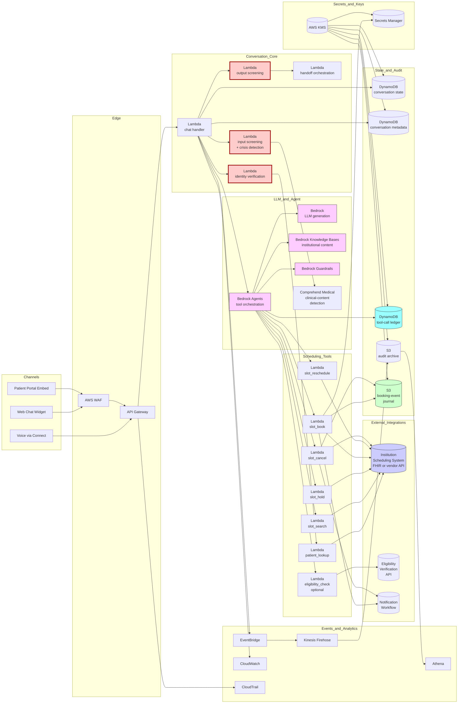

# Recipe 11.2: Appointment Scheduling Bot

**Complexity:** Simple-Medium · **Phase:** Quick-win to Foundational · **Estimated Cost:** ~$0.02-0.10 per completed booking (depends on conversation length, model choice, and back-end integration overhead)

---

## The Problem

Marcus is a 47-year-old patient who needs to follow up with his cardiologist after a stress test. His cardiologist's office sent him a postcard. The postcard says "please call to schedule your follow-up." It is 7:43 PM on a Wednesday. Marcus is finally home, finally has a minute, and would like to get this over with. He pulls up the practice's website on his phone and sees the same "Schedule Online" button he has clicked before.

The Schedule Online flow opens a calendar widget. The widget asks him to choose a provider. He picks his cardiologist. The widget says "no available appointments." He removes the provider filter, hoping to see anything at all. The widget shows him appointments two months out with a different cardiologist he has never met. He picks one tentatively, gets to step 4 of 6, and the form asks him for his insurance plan from a dropdown. He picks "Aetna PPO." The form rejects this and says he needs to call the office to verify his insurance. Marcus closes the tab.

He calls the next morning during his lunch break. The phone tree says the call volume is high and the wait time is 18 minutes. He puts the phone on speaker, balances it on his desk, and tries to keep working. After 14 minutes, a scheduler picks up. She asks his name, his date of birth, his insurance, the reason for the visit, and which provider. She asks if he is flexible on day or time. He says he can do early mornings or after 4 PM. She finds him a slot four weeks out at 4:30 PM with his cardiologist. She reads it back. He confirms. She tells him to expect a confirmation text. The whole call took twenty-two minutes from when he started waiting on hold.

This is appointment scheduling in healthcare, and it is one of the most expensive, most demoralizing, most patient-hostile workflows that the industry runs at scale. The cost of a single scheduling phone call has been estimated at somewhere between $5 and $15 in fully-loaded scheduler time, and a mid-sized health system runs millions of these per year. <!-- TODO: verify; per-call scheduling cost estimates appear in operational benchmarking literature from organizations like MGMA and Press Ganey, but the figures vary substantially with call complexity, scheduler skill mix, and overhead allocation methodology --> The patient experience is roughly what Marcus had: a self-service path that almost works, a phone path that works but takes twenty minutes during the patient's workday, and a constant low-grade friction that erodes loyalty over time.

The frustrating part is that scheduling is, conceptually, one of the simplest interactions in healthcare. There is a person who needs an appointment. There is a calendar with slots. The interaction's job is to match the person to a slot. There is no clinical judgment. There is no record of what is medically wrong with the patient that needs to be analyzed. The success criterion is unambiguous: at the end of the interaction, either there is an appointment on the calendar or the patient has agreed to a call-back from a human. The hard parts are not clinical. They are the rules: provider preference, location preference, insurance constraints, visit-type duration, follow-up versus new-patient, blocked time on the schedule for surgery or for paperwork or for the doctor's mother-in-law's birthday, the sixteen different special cases in the practice's own scheduling protocol that the schedulers have memorized but that no patient knows about.

The previous generation of online scheduling tools struggled with this complexity by exposing it. The patient was asked to fill out a form that surfaced every constraint as a field: provider, location, visit type, insurance, reason for visit, preferred day, preferred time. The patient did not know what visit type to pick. The patient did not know whether their insurance was accepted at the location they preferred. The patient did not know whether the provider was accepting new patients. So the patient picked the wrong combination, hit a "no available appointments" wall, picked something else, and either eventually got through or gave up and called.

The previous-generation tools that tried a more guided experience used button-tree chatbots. Same failure mode as the FAQ bots from recipe 11.1: the chatbot offered five buttons; none of the buttons matched what the patient wanted; the patient typed something in their own words; the chatbot responded with the same five buttons. The chatbot achieved a high "containment rate" by frustrating the patient into giving up before the system had to do anything hard.

The modern conversational scheduling bot looks like this. The patient says, in plain English, "I need to follow up with Dr. Patel after my stress test, ideally early morning or after 4 PM, and I have Aetna PPO." The bot responds, "Got it. I see Dr. Patel has openings on Tuesday May 28 at 7:30 AM and Thursday June 6 at 4:45 PM. Both are at the Riverside Cardiology office on Main Street. Either work?" The patient picks one. The bot says, "Booked. You'll get a confirmation text shortly. Anything else?" The interaction took ninety seconds. Marcus finishes booking from his couch at 7:43 PM on a Wednesday, while the children are watching a cartoon in the next room.

That is the recipe in this section. Conversational appointment scheduling that actually completes the booking, integrates with the institution's scheduling system, respects the institution's business rules, and gracefully hands off to a human when the patient's request does not fit. It is the most common transactional conversational AI use case in healthcare, the one that delivers the most operational savings per deployed bot, and the one where the difference between a well-built bot and a poorly-built bot is the difference between Marcus's twenty-two-minute phone call and his ninety-second chat.

A few things this recipe is and is not.

It is the bot that books the kind of appointment Marcus needs: a follow-up with an established provider, a routine new-patient visit, a wellness exam, a lab draw, an imaging appointment, a routine specialty referral. It handles rescheduling and cancellation through the same interface. It integrates with the institution's scheduling system through the system's APIs and respects the rules the practice operations team has codified.

It is not the symptom checker from recipe 11.6. Scheduling is administrative. Triage is clinical. The scheduling bot can ask "what's the reason for the visit?" to route the patient to the right visit type and (sometimes) to flag situations that should not be self-scheduled, but it does not assess clinical urgency or recommend whether the patient should be seen.

It is not the FAQ bot from recipe 11.1. The FAQ bot answers questions and points to resources; it does not take actions on the patient's account. The scheduling bot takes actions: it puts something on the calendar, it changes the calendar, or it removes something from the calendar. The transactional success criterion makes the engineering and operational profile different from the FAQ bot, even when they share a chat surface.

It is not the universal scheduling system. The scheduling bot operates inside the constraints of the institution's existing scheduling system, which has its own data model, its own business rules, and its own quirks. The bot's job is to be a better front end to that system, not to replace it. Most of the integration complexity in this recipe lives at the boundary between the conversational layer and the institution's scheduling system.

The thing to understand before building this is that the bot's quality is bounded above by the underlying scheduling system. A bot that exposes a confusingly-configured scheduling system to patients in plain English is a bot that lets patients book the wrong appointments more efficiently. The institutional discipline of cleaning up visit-type definitions, provider preferences, insurance acceptance rules, and slot-template configurations is the prerequisite that nobody talks about. Without it, the scheduling bot is the digital front end to a mess.

Let's get into it.

---

## The Technology: Tool-Using Conversational AI Plus the Healthcare Scheduling Reality

### Why the Old Online Scheduling Tools Felt Hostile

The first generation of patient-facing online scheduling, roughly 2010 through the early 2020s, was a form. The form had a field for provider, a field for location, a field for visit type, a field for insurance, a field for the patient's preferred day. The patient filled out the form. The system queried the schedule with those filters and showed whatever slots came back. If the filters did not match available slots, the system showed "no appointments available."

This produced a specific failure mode that anyone who has tried to schedule online will recognize. The patient is fundamentally guessing about what the system wants. They do not know the institution's visit-type taxonomy. They do not know whether "follow-up cardiology" or "established patient cardiology" or "post-procedure cardiology follow-up" is the right pick for their post-stress-test follow-up. So they pick something, get no results, pick something else, get different results, eventually find one available slot, and book it without knowing whether they have booked the right type of appointment. The schedulers later have to clean up the mis-bookings, often by calling the patient back to reschedule. The "self-service" channel produced more downstream work, not less.

The button-tree chatbot that appeared on top of this same scheduling system in the late 2010s did not fix the underlying problem. It hid the form behind a sequence of buttons, but the buttons had to map to the same fields the form had. The patient was still guessing about the institution's visit-type taxonomy; they were just guessing one button at a time. The bot's "natural language" was a thin veneer over a rigid form.

The thing that did work, eventually, was tool-using LLMs. The shift was architectural. Instead of the bot navigating the patient through the institution's scheduling-form taxonomy, the bot understands the patient's request in natural language, translates it into a structured query against the scheduling system, and renders the response back into natural language. The patient says "I need to follow up with Dr. Patel after my stress test, early morning or after 4 PM, Aetna PPO." The bot extracts the intent (follow-up appointment), the provider (Dr. Patel), the visit-type clue (post-stress-test follow-up, which the bot maps to the institution's "cardiology established patient follow-up" visit type), the time-window preferences (early morning, after 4 PM), the insurance (Aetna PPO), and possibly the urgency. It calls the scheduling system's slot-search API with those parameters. The slot-search API returns available slots. The bot picks the two or three best matches and renders them in plain English. The patient picks one. The bot calls the scheduling system's booking API. Done.

The architectural pattern, which the rest of this section will walk through, is conversational tool use. The conversational layer is a thin natural-language interface to a small, well-defined set of tools (slot-search, slot-hold, slot-book, slot-cancel, slot-reschedule, patient-lookup, sometimes insurance-eligibility-check). The LLM decides which tool to call when, with what arguments, given the patient's request. The tools execute against the institution's scheduling system. The LLM composes the response from the tool's output.

### What Tool-Using LLMs Actually Do

The chapter preface introduced tool use generically. For an appointment scheduling bot, the pattern decomposes into a few specific tools, each with a well-defined input schema and output schema. The LLM is responsible for the conversation; the tools are responsible for the actions.

**Patient identification.** Before the bot can do anything that affects a specific patient's record, it needs to know which patient it is talking to. The patient identification tool takes some combination of the patient's stated name, date of birth, phone number, email, and (where the patient is logged into the patient portal) their authenticated patient ID. It returns either a matched patient identifier with a confidence score or a "not matched, need more information" signal.

**Slot search.** Given a set of search parameters (provider, location, visit type, time-window preference, insurance, patient identifier), the slot-search tool queries the scheduling system and returns a ranked list of available slots. The ranking encodes the institution's preferences: prefer slots with the patient's established provider over slots with other providers, prefer slots that satisfy more of the patient's preferences, prefer slots that are sooner (or later, depending on the visit type's clinical guidance), prefer slots at locations the patient has previously visited.

**Slot hold.** A short-term hold (typically a few minutes) on a specific slot, so that the bot can offer the slot to the patient and the patient can confirm without the slot being grabbed by a competing booking attempt. The hold expires automatically if the booking is not completed.

**Slot book.** Convert the held slot into a confirmed appointment. The booking tool writes to the scheduling system, creates the patient-facing confirmation, triggers the institution's standard notification workflow (confirmation text or email, calendar attachment, pre-visit instructions), and returns the confirmation details.

**Slot reschedule.** Move an existing appointment to a new slot. Functionally, this is a coordinated cancel-and-book operation, but the institution often wants it logged as a reschedule rather than as separate cancel and book events for analytics and patient-experience reasons. The reschedule tool handles this as a single operation.

**Slot cancel.** Cancel an existing appointment. The cancel tool writes the cancellation, triggers the standard notification workflow, and (when applicable) flags the slot for re-offering through the institution's wait-list mechanism.

**Eligibility check (optional).** Verify the patient's insurance eligibility for the proposed appointment. Many institutions check eligibility either at booking time (some do) or at a later batch process (most do). The eligibility check tool, when present, calls the institution's eligibility verification API and returns either "eligible," "not eligible, here is the reason," or "could not verify, here is the workaround."

**Patient communication preferences (optional).** Some institutions allow patients to update their notification preferences (text vs. email, language preference, opt-in for reminders) through the conversational interface. A small set of preference-management tools handles these.

A scheduling bot is, architecturally, an LLM with a system prompt that tells it what scheduling assistant it is, a conversation history of the patient's chat so far, and access to those tools. The LLM does the reasoning ("the patient wants a follow-up with Dr. Patel; I should call slot_search with provider=Patel and visit_type=cardiology_followup"); the tools do the execution. The thing the LLM does well, and that previous-generation systems did not, is handle the patient's natural-language input, the messy reality of patient phrasing ("anytime next week is fine but not Wednesday because I have a thing"), and the conversational flow ("oh wait, can we do the day after that instead?"). The thing the tools do well, and that the LLM cannot do reliably, is execute the deterministic actions against the scheduling system.

The architectural decision that matters most: the LLM does not modify the schedule directly. Every action that affects the schedule goes through a tool with a well-defined contract. This separation is what makes the system safe enough to put in front of patients and trustworthy enough for the practice operations team to allow it to write to the scheduling system at all.

### Why a Generic LLM Cannot Schedule Appointments

A naive product approach would be: take a generalist LLM, give it a chat surface, and let it negotiate appointment scheduling with the patient. This does not work for several specific reasons.

**The model has no view of the actual schedule.** The patient asks "do you have anything Tuesday?" The LLM has no idea what is on Tuesday's schedule. If the LLM is asked to guess, it will guess. The guess will be plausible and will be wrong. The patient will accept the guess, will show up on Tuesday at the time the LLM made up, and there will be no appointment on the schedule. The only way the bot can answer "do you have anything Tuesday?" correctly is by calling the scheduling system, which means a tool layer.

**The model cannot write to the schedule transactionally.** Booking an appointment is a transactional operation: read the slot, hold the slot, confirm the slot, release the hold if the patient changes their mind, all under appropriate concurrency control. The LLM is a stochastic function. Asking the LLM to produce a "BOOK_APPOINTMENT" command and then trusting the institutional system to execute it loses the transactional guarantees that scheduling needs. The tool layer provides the transactional contract; the LLM proposes; the tool executes.

**The model cannot enforce the institution's business rules.** The scheduling rules are an arcane mix of institutional policy ("new patients to cardiology cannot self-schedule, they must be triaged first"), payer requirements ("Medicare wellness visits can only be booked at certain visit-type templates"), provider preferences ("Dr. Patel does not see new patients on Tuesdays because that is his administrative day"), location-specific quirks ("the Riverside location does not do contrast imaging on Fridays because the radiologist is at the other location"), and a hundred other rules. These rules live in the institution's scheduling system as configuration, in the schedulers' heads as tribal knowledge, and in the institution's policy documents as dense prose. The LLM cannot know all of these. The tool layer encodes them.

**The model has no audit trail of what it actually did.** Every appointment booked or canceled is a clinical-administrative event that needs to be auditable. Who initiated it. When. What was on the schedule before and after. What identifier represents the patient who initiated the change. The LLM produces conversational text; the tool layer produces transactional records. Without the tool layer, the audit trail is unstructured chat logs, which is not enough for the operational and regulatory floor.

**The model cannot handle real-time concurrency.** Two patients try to book the same 7:30 AM Tuesday slot simultaneously. The scheduling system handles this with transactional locking. The LLM has no notion of locking; if both LLMs were allowed to "book" the slot, both would succeed in their conversations and the institution would have a double-booked slot to clean up later. The tool layer's slot-hold-and-book contract is what prevents this.

**The model cannot rate-limit itself.** A bot that can book an appointment is a bot that can be exploited to spam-book appointments under fake patient identities, which a malicious actor can do to deny appointments to real patients. The tool layer applies the rate limits, the identity verification, the abuse detection. The LLM cannot enforce its own throttle.

**The model has no way to recover from partial failures.** Booking an appointment touches multiple systems: the scheduling system, the patient communication system, sometimes the EHR, sometimes the billing eligibility system. Some of those calls succeed and some fail. The LLM does not know how to compensate for a partial failure. The tool layer wraps the multi-system orchestration in well-defined operations that either succeed atomically, fail with a clean rollback, or surface the partial state for human reconciliation.

**The model produces output that has compliance implications.** Every conversation a patient has with the scheduling bot is potentially a HIPAA-relevant interaction, and the appointment-booking action specifically is a clinical-administrative event. The conversation log, the audit trail of tool calls, the resulting appointment record, are all PHI-relevant data. The architecture has to produce the durable audit pipeline that the FAQ bot did not strictly need.

### What the Scheduling Bot Has To Do That the FAQ Bot Did Not

Recipe 11.1 (FAQ chatbot) established the conversational AI patterns that apply broadly: input safety screening with crisis detection, intent classification with scope filtering, RAG over institutional content, output safety screening, audit logging, per-cohort monitoring. The scheduling bot inherits all of those and adds three structural commitments that the FAQ bot did not have.

**Identity verification.** The FAQ bot serves anonymous patients. "Do you take Aetna?" has the same answer for everyone. The scheduling bot serves identified patients. "Do I have an appointment Thursday?" has a different answer for every patient. The scheduling bot has to verify identity before it does anything that touches the patient's record. The identity verification has to be strong enough to be defensible (at minimum, name plus date of birth plus a confirmation factor like the last four of the phone number on file; better, an authenticated session through the patient portal) and gentle enough that legitimate patients are not blocked. The bot's design has to handle the "I don't know my patient ID" case gracefully and not embarrass patients who do not remember which email they used to register.

**Transactional fulfillment.** The bot does not just answer questions; it acts. The action either succeeds (appointment is on the calendar) or fails (appointment is not on the calendar). There is no in-between. The transactional commitment changes the testing posture, the error-handling posture, the auditing posture, and the failure-mode catalog. The bot's design treats the booking as the success criterion and tracks every step from "patient initiated" through "confirmed appointment with notification sent" with explicit telemetry.

**Compensation when something goes wrong.** Sometimes the bot books an appointment that the institution then needs to undo. Maybe the patient was double-booked because of a race with the call center. Maybe the visit-type was wrong and the appointment needs to be rescheduled to the right visit type. Maybe the patient called the office five minutes after the bot booked and asked for a different time. The bot's architecture has to support the operational team in cleaning up these cases without losing the audit trail. This is the operational work that the FAQ bot did not have.

The rest is largely the same as recipe 11.1: the same RAG-style retrieval over institutional knowledge for things the bot needs to know (visit-type taxonomy, provider preferences, location details), the same scope filtering, the same crisis detection, the same per-cohort monitoring, the same conversation logging. The new structure is the tool layer plus the identity layer plus the transactional commitment.

### The Healthcare Scheduling Reality

Before going deeper into the architecture, a few notes on what makes healthcare scheduling specifically harder than, say, restaurant scheduling or salon scheduling.

**Visit-type taxonomy is the institution's hardest hidden complexity.** Every healthcare practice has a list of visit types, and the list is long, and the list contains semantically similar entries that are operationally distinct. "New patient cardiology" and "established patient cardiology follow-up" and "post-procedure cardiology" and "cardiology consult" might all look like the same thing to the patient ("I need to see a cardiologist") but the institution treats them differently. They have different durations, different scheduling rules, different billing implications, different prep requirements. A scheduling bot that does not get this right books the wrong visit type, and the practice operations team has to clean it up. Mapping the patient's natural-language reason for visit to the right visit type is one of the bot's hardest tasks. <!-- TODO: verify; healthcare visit-type taxonomies vary substantially by EHR, scheduling system, and institutional policy, with common systems like Epic, Cerner (now Oracle Health), and athenahealth each having different conventions and configurations -->

**Provider preferences are codified, but the codification is uneven.** Dr. Patel does not see new patients on Tuesdays. Dr. Patel does see established patients on Tuesdays. Dr. Patel will see urgent established patients on Tuesdays even when his template is full. Dr. Patel will not see anyone on December 23 because that is his daughter's school's holiday concert. Some of this is in the scheduling system as configuration. Some of it is in the head of the scheduler who knows Dr. Patel personally. The bot can only use what is in the scheduling system; the operational discipline of getting the rules into the system is the prerequisite.

**Insurance acceptance is not a global property.** "Does this practice take Aetna?" is a misleading question. The answer is "for which provider, at which location, for which visit type." Provider A at location X may accept Aetna PPO; provider B at the same location may not, because provider B is contracted as out-of-network for that plan. This complexity is largely hidden from patients in the call-center workflow because the scheduler knows or looks it up. The bot has to surface it correctly without making the patient feel like they are being grilled about their insurance.

**Slot inventory is a moving target.** Slots open up because of cancellations. Slots get blocked because of provider sick days. Slots get reorganized because the practice rebuilt the schedule. The "available appointments" view that the bot sees is a snapshot, and the snapshot is stale by the time the patient finishes typing their question. The bot's architecture has to handle the case where the slot it offered is no longer available by the time the patient confirms (slot-hold helps; graceful "that slot is no longer available, here are the next options" recovery is the safety net).

**Wait times for in-demand specialties can be brutal.** Cardiology, dermatology, gastroenterology, and several other specialties routinely run six-week to four-month new-patient wait times in many markets. <!-- TODO: verify; physician appointment wait time data is published periodically by Merritt Hawkins (now AMN Healthcare) and varies substantially by specialty, market, and survey methodology --> The bot's job is not to hide this; the bot's job is to surface it honestly and offer alternatives (waitlist enrollment, alternative providers, alternative locations, alternative visit types like a telehealth consult). A bot that says "the next available is October 15" when it is May is doing its job; a bot that papers over the long wait time with cheerful filler is not.

**Patient phrasing about time is incredibly varied.** "Tomorrow morning." "Next Tuesday." "The Thursday after Memorial Day." "Sometime in June, but not the first week because we are out of town." "ASAP." "Whenever Dr. Patel has the next opening." "Within two weeks." Each of these is a constraint on the slot search. The bot has to translate them into structured search parameters. Modern LLMs are surprisingly good at this; older systems were terrible at it.

**No-show is a real cost.** Patients book and do not show up at rates that vary substantially by specialty, payer mix, and patient population, but commonly fall in the 5-20% range. <!-- TODO: verify; no-show rate ranges in the published literature vary widely; common figures from organizations like AHRQ and from peer-reviewed studies in the JAMA, Health Affairs, and similar venues span a wide range depending on specialty, setting, and intervention --> The institution invests in reminders, double-booking strategies, and over-booking models to manage this. The bot interacts with all of these: it can book into a slot that is intentionally over-booked, it triggers the reminder workflow, it sometimes is the cancellation channel that opens up a slot for somebody on the wait list. The bot's architecture has to integrate cleanly with the institution's no-show management systems rather than fighting them.

**Some appointments cannot be self-scheduled.** New patients to certain specialties (cardiology and oncology are common examples) often need to be triaged before scheduling, because the right visit type and the right urgency depend on clinical assessment. Some procedures (colonoscopy, certain imaging) require pre-visit instructions and clearance that the call-center handles. Some patient categories (pediatric scheduling, vulnerable adult scheduling, scheduling for patients with custody or guardianship issues) need human handling. The bot has to know what is in scope and what is not, and the scope rules are not universal across institutions. This is operational policy encoded in the bot's configuration.

### Where the Field Has Moved

A few practical updates worth knowing.

**Scheduling APIs have matured but remain heterogeneous.** Most major EHR and scheduling systems now expose APIs for slot search and booking. <!-- TODO: verify; the FHIR Scheduling resource family (Schedule, Slot, Appointment, AppointmentResponse) has been part of FHIR since DSTU2 and is increasingly supported by major EHR vendors, though specific implementation completeness varies --> The FHIR Scheduling resources (Schedule, Slot, Appointment) provide a standard data model. Most large EHR vendors implement at least a subset of the FHIR scheduling APIs, but the implementations vary in completeness, in the rules they enforce, and in the operations they expose. The integration work for the scheduling bot is mostly at this layer: building a stable, well-tested wrapper around the institution's specific scheduling API and treating that wrapper as the bot's tool surface.

**Tool-using LLMs are the default architecture.** The pattern of "LLM with structured-output function calling against a small, well-defined tool surface" became the default architecture for transactional conversational AI sometime around 2023-2024. The major LLM vendors (Anthropic, OpenAI, Google, Amazon Bedrock) all support function calling in their APIs. Building a scheduling bot today on the function-calling pattern is a quarter-year project for a competent team; building one without function calling, with parsed-text-as-commands, is a six-month project that produces a worse result.

**Multi-turn coherence has gotten dramatically better.** The patient saying "actually, can we do the day after instead?" five turns into a conversation used to be a hard problem. The system had to maintain conversation state about the proposed slot, understand the modifier, and refine the search. Modern LLMs handle this naturally because the conversation history is in the prompt and the LLM is good at understanding referential modifications. The scheduling bot does not need to build this from scratch; it inherits the capability from the LLM.

**Slot hold is becoming a first-class operation.** Older scheduling systems exposed only "search" and "book" with no "hold." This created the race condition that bot architectures had to work around with retry logic. Newer scheduling APIs expose explicit slot-hold operations, which makes the bot's transactional contract cleaner. <!-- TODO: verify; FHIR's AppointmentResponse and the broader scheduling-resource family include hold-and-confirm patterns, though specific support for slot-hold-with-TTL varies by EHR vendor implementation -->

**Voice channels are increasingly viable.** The same conversational scheduling logic that works in chat works in voice with the addition of ASR (recipe 10.5 patterns) and TTS. Several institutions have deployed voice-channel scheduling bots that handle the call that Marcus would have made, with the same booking outcome and a fraction of the wait time. The voice channel adds latency and ASR-error sensitivity but otherwise reuses the architecture.

**Build-vs-buy economics favor buy for many institutions.** Several commercial vendors offer healthcare-specific conversational scheduling products that integrate with major EHRs. <!-- TODO: verify; the healthcare conversational scheduling vendor landscape continues to evolve and consolidate; specific vendor names and capabilities change over time --> The buy path is faster and comes with EHR-integration maintenance. The build path makes sense for institutions with unusual scheduling rules, for institutions with research interest in the technology, or for institutions that have already built significant in-house conversational AI infrastructure.

**The scheduling bot is increasingly a starter capability for broader patient-engagement platforms.** Institutions that ship the scheduling bot well usually expand it: add the refill bot from recipe 11.3, add the pre-visit intake bot from recipe 11.4, add the benefits navigator from recipe 11.5. The same chat surface, the same conversation engine, the same audit pipeline, with new tool surfaces for each capability. The scheduling bot is often the second recipe a digital-front-door program ships, after the FAQ bot, and it is the recipe that proves the institution can do transactional conversational AI safely.

---

## General Architecture Pattern

A healthcare appointment scheduling bot decomposes into eight logical stages: channel entry, input safety screening, intent classification, identity verification, conversational slot negotiation (search and refine), transactional fulfillment (hold, confirm, book), output safety screening, and audit logging. The cross-cutting concerns from the FAQ bot (knowledge-base curation, persona and prompt management, escalation, per-cohort monitoring) all carry forward; this recipe adds three new ones (tool-surface contract management, identity-assurance lifecycle, transactional-failure compensation).

```
┌────────── CHANNEL ENTRY ─────────────────────────────────┐
│                                                           │
│   [Patient connects through one of the configured         │
│    channels: web chat widget, in-app chat, SMS,           │
│    voice (with ASR/TTS), authenticated patient-portal     │
│    embed]                                                 │
│                                                           │
│   [Greeting and disclosure]                               │
│    - Identifies as a chatbot, not a human                 │
│    - States the bot's scope (scheduling, rescheduling,    │
│      cancellation; not clinical)                          │
│    - Offers an immediate path to a human                  │
│                                                           │
│   [Conversation session bootstrap]                        │
│    - Generate session_id                                  │
│    - Capture channel, authentication context (if any),    │
│      and any deep-link parameters (e.g., the patient      │
│      clicked a "schedule follow-up" link in their         │
│      after-visit summary)                                 │
│           │                                               │
│           ▼                                               │
│   [Output: session_id, channel, auth context]             │
│                                                           │
└───────────────────────────────────────────────────────────┘

┌────────── INPUT SAFETY SCREENING ────────────────────────┐
│                                                           │
│   [Same primitive as recipe 11.1, including:]             │
│    - Crisis detection (preempts everything)               │
│    - Prompt-injection detection                           │
│    - PHI minimization (before identity verification,      │
│      the bot does not need PHI; after identity            │
│      verification, the bot needs only what the            │
│      scheduling task requires)                            │
│           │                                               │
│           ▼                                               │
│   [Output: input passes / input blocked-with-disposition] │
│                                                           │
└───────────────────────────────────────────────────────────┘

┌────────── INTENT CLASSIFICATION ─────────────────────────┐
│                                                           │
│   [Map the user's request to one of the bot's intents]    │
│    - new_appointment                                      │
│    - reschedule_appointment                               │
│    - cancel_appointment                                   │
│    - check_appointment                                    │
│    - update_preferences                                   │
│    - out_of_scope (defer to FAQ bot, to a human, or       │
│      to the appropriate other handler)                    │
│                                                           │
│   [Out-of-scope handoff]                                  │
│    - Clinical questions -> nurse triage                   │
│    - Refill requests -> recipe 11.3 path                  │
│    - Benefits-specific questions -> recipe 11.5 path      │
│    - General FAQ -> recipe 11.1 path                      │
│           │                                               │
│           ▼                                               │
│   [Output: in-scope intent | out-of-scope handoff]        │
│                                                           │
└───────────────────────────────────────────────────────────┘

┌────────── IDENTITY VERIFICATION ─────────────────────────┐
│                                                           │
│   [Verify the patient's identity at the assurance level   │
│    appropriate for the intent and the channel]            │
│                                                           │
│   [Authenticated session path]                            │
│    - Patient is logged into the patient portal            │
│    - The session conveys an authenticated patient_id      │
│    - The bot accepts the patient_id as verified and       │
│      proceeds                                             │
│                                                           │
│   [Unauthenticated channel path]                          │
│    - Patient enters name, date of birth                   │
│    - Bot asks for a confirmation factor (last four of     │
│      the phone number on file, ZIP code on file, or       │
│      a one-time code sent to the phone or email on file)  │
│    - Identity verification tool returns a match           │
│      confidence score and a verified patient_id           │
│                                                           │
│   [Identity verification failures]                        │
│    - Below-threshold match -> "I'm having trouble         │
│      finding your record. Let me get you to someone       │
│      who can help."                                       │
│    - Multiple matches -> request additional               │
│      disambiguating information                           │
│    - No match -> "I don't see a record matching that.     │
│      Are you a new patient? I can help you start the      │
│      new-patient process."                                │
│                                                           │
│   [Step-up authentication for sensitive actions]          │
│    - Cancellation of certain visit types may require      │
│      additional verification                              │
│    - Same-day cancellation has different policy than      │
│      cancellation a week out                              │
│           │                                               │
│           ▼                                               │
│   [Output: verified patient_id, assurance_level]          │
│                                                           │
└───────────────────────────────────────────────────────────┘

┌────────── CONVERSATIONAL SLOT NEGOTIATION ───────────────┐
│                                                           │
│   [Extract scheduling parameters from the conversation]   │
│    - Provider preference (named provider, specialty,      │
│      established vs. new, language preference)            │
│    - Location preference                                  │
│    - Visit type (mapped from natural language reason      │
│      for visit through institutional taxonomy)            │
│    - Time-window preference (specific date, day of        │
│      week, time of day, urgency)                          │
│    - Insurance plan (validated against the institution's  │
│      accepted-plans list for the proposed provider and    │
│      location)                                            │
│                                                           │
│   [Tool: slot_search]                                     │
│    - Given the parameters, query the scheduling system    │
│    - Return ranked candidate slots with provenance        │
│    - Apply the institution's ranking (preference for      │
│      established provider, preference for sooner,         │
│      preference for previously-visited locations)         │
│                                                           │
│   [Render candidate slots in plain English]               │
│    - Show 2-3 options, not 30                             │
│    - Include the provider, the location, the time,        │
│      and any notable details (telehealth vs in-person,    │
│      prep instructions for certain procedures)            │
│                                                           │
│   [Refinement loop]                                       │
│    - Patient asks for variations ("anything earlier?",    │
│      "different day?", "different provider?")             │
│    - LLM updates parameters and calls slot_search again   │
│    - Convergence when patient picks a slot or asks for    │
│      handoff                                              │
│                                                           │
│   [No-results handling]                                   │
│    - When slot_search returns nothing, the bot honestly   │
│      says so and offers alternatives:                     │
│      - Wait-list enrollment                               │
│      - Different provider                                 │
│      - Different location                                 │
│      - Different visit type (e.g., telehealth)            │
│      - Handoff to live scheduler                          │
│           │                                               │
│           ▼                                               │
│   [Output: chosen slot identifier]                        │
│                                                           │
└───────────────────────────────────────────────────────────┘

┌────────── TRANSACTIONAL FULFILLMENT ─────────────────────┐
│                                                           │
│   [Tool: slot_hold]                                       │
│    - Place a short-term hold on the chosen slot           │
│    - Hold expires automatically (typical TTL: 5 minutes)  │
│    - Hold prevents concurrent booking from another        │
│      channel                                              │
│                                                           │
│   [Confirmation prompt to the patient]                    │
│    - Restate the proposed appointment                     │
│      ("Tuesday May 28 at 7:30 AM with Dr. Patel at        │
│      the Riverside Cardiology office")                    │
│    - Mention any pre-visit prep, parking, what to bring   │
│      (drawn from the institution's knowledge base)        │
│    - Ask for explicit confirmation                        │
│                                                           │
│   [Tool: slot_book]                                       │
│    - Convert the hold to a confirmed appointment          │
│    - Triggers the institution's standard notification     │
│      workflow (confirmation text/email, calendar          │
│      attachment, pre-visit instructions)                  │
│    - Returns the confirmation details                     │
│                                                           │
│   [Optional Tool: eligibility_check]                      │
│    - Verifies insurance eligibility for the booked        │
│      appointment                                          │
│    - When the institution's policy is to verify at        │
│      booking time, this runs synchronously                │
│    - When the institution's policy is to verify in        │
│      batch later, this is skipped                         │
│                                                           │
│   [Failure handling]                                      │
│    - Slot no longer available -> graceful recovery,       │
│      offer next alternatives                              │
│    - Booking system error -> queue the request for        │
│      human follow-up, tell the patient honestly that      │
│      something went wrong                                 │
│    - Notification system error -> the appointment is      │
│      booked; the failed notification is queued for retry  │
│      and surfaced in the operational dashboard            │
│           │                                               │
│           ▼                                               │
│   [Output: confirmation_id, appointment details, or       │
│    failure with disposition]                              │
│                                                           │
└───────────────────────────────────────────────────────────┘

┌────────── OUTPUT SAFETY SCREENING ───────────────────────┐
│                                                           │
│   [Same primitive as recipe 11.1]                         │
│    - Scope filter on generated response                   │
│    - Vendor-managed guardrail layer                       │
│    - Hallucination check (especially: did the bot         │
│      confirm an appointment that the booking tool         │
│      did not actually return?)                            │
│           │                                               │
│           ▼                                               │
│   [Output: response cleared for delivery, or replaced     │
│    with a refusal-and-handoff]                            │
│                                                           │
└───────────────────────────────────────────────────────────┘

┌────────── AUDIT, LOG, AND TELEMETRY ─────────────────────┐
│                                                           │
│   [Durable conversation record]                           │
│    - User utterances (scrubbed of inadvertent PHI)        │
│    - Tool calls with arguments and results                │
│    - Generated responses                                  │
│    - Active model and prompt versions                     │
│    - Identity-verification outcome and assurance level    │
│    - Transactional outcomes (booked, rescheduled,         │
│      canceled, failed, abandoned)                         │
│                                                           │
│   [Operational telemetry]                                 │
│    - Booking completion rate                              │
│    - Median time to booking                               │
│    - Handoff rate per intent and per failure mode         │
│    - Identity-verification failure rate                   │
│    - Slot-hold-but-not-confirmed rate                     │
│    - Tool-call failure rate per tool                      │
│    - Per-cohort metric slices (language, channel,         │
│      identity-verification path)                          │
│                                                           │
│   [Sampled review queue]                                  │
│    - Random sample plus targeted sample of low-           │
│      confidence and escalated conversations               │
│    - Reviewers tag failure modes (wrong visit type,       │
│      mis-ranked slots, identity-verification friction,    │
│      booking error, etc.)                                 │
│           │                                               │
│           ▼                                               │
│   [Output: audit trail, telemetry, learning signals]      │
│                                                           │
└───────────────────────────────────────────────────────────┘
```

A few cross-cutting design points specific to the scheduling bot.

**The tool surface is the bot's contract with the scheduling system.** The tools have versioned schemas. The schemas are owned jointly by the engineering team and the practice operations team. Changes to the tool surface (adding a parameter, changing the rank order in slot search, deprecating a tool) go through a documented change-management process. The bot's behavior is reproducible from the conversation log plus the active tool-surface version plus the active prompt and model versions. This is the load-bearing contract that makes the system safe to put in front of patients.

**Identity verification is graduated by intent and channel.** A patient who is logged into the patient portal and asks to check their next appointment needs lower assurance than a patient who is in an unauthenticated web chat asking to cancel a same-day appointment. The bot's policy table maps (intent, channel, additional context) to required assurance level. The identity-verification tool can step the assurance up by asking for additional factors. The patient experience for high-assurance flows is intentionally a little more friction than for low-assurance flows, because the cost of a wrong action is higher.

**Visit-type mapping is a managed asset.** The mapping from natural-language reasons for visit ("I need to follow up after my stress test") to institutional visit types ("cardiology established patient follow-up, 30 min") is a curated artifact owned by the practice operations team. The bot uses an LLM to do the mapping with the curated visit-type catalog as context, and the operations team reviews mis-mapped cases through the sampled review queue. The mapping evolves as the institution adds, retires, or restructures visit types.

**Slot hold is the safety net for concurrency.** Without slot hold, two patients can race to book the same slot through different channels and one of them ends up double-booked. Slot hold with a TTL is the mechanism that prevents this. The bot's flow is always search-then-hold-then-confirm-then-book, never search-then-book. The TTL is short enough that abandoned holds release quickly (5 minutes is typical) and long enough that a patient deliberating over options has time to choose.

**The booking is durable; the conversation is not.** Once the appointment is booked, the source of truth is the scheduling system. The conversation log is the audit trail of how the booking happened, but the appointment itself lives in the scheduling system. The bot's job after booking is to confirm successfully and make sure the patient understands what was booked; the bot is not the appointment's home.

<!-- TODO (TechWriter): Expert review S1 (HIGH). Promote conversation-log-and-tool-call-ledger-and-booking-event-journal-as-PHI-by-association governance from a chapter-pattern reference to an architectural primitive in this section. Specify per-channel session-token discipline (web-chat vs in-app vs SMS vs voice vs authenticated-portal-embed), the unauthenticated-to-authenticated session-bridging discipline (cross-correlate channel_session_id to verified_patient_id post identity-verification), inadvertent-PHI redaction taxonomy for scheduling-specific contexts (clinical-condition-in-reason, medication-in-reason, family-member-name, etc.), patient-rights workflow with deletion-replaced-with-deletion-marker for Object-Lock retention window, transactional-action-as-disclosure-event recording with per-vendor disclosure-accounting log entries (the institution's scheduling system, the eligibility verification system, the notification workflow), and the booking-event journal as a separate compliance-record-class with restricted access-control surface and per-state medical-records retention floor reconciliation. -->

<!-- TODO (TechWriter): Expert review S2 (HIGH). Specify the working-store-vs-archive-store discipline for the tool-call ledger and booking-event journal. The tool-call-ledger DynamoDB on the real-time hot path should hold only structural references (tool name, invocation timestamp, structural arguments, structural result, latency, outcome, archive_ref pointer); free-text patient utterances and natural-language reason-for-visit should route to a per-conversation tool-call-archive S3 prefix with the appropriate KMS key class. The booking-event journal write at Step 6D currently embeds `notes: session.search_parameters.reason_for_visit` inline in the durable Object-Lock record; route this to the per-conversation archive surface and have the journal carry only structural fields with a `reason_for_visit_archive_ref` pointer. The institution's scheduling system remains the source-of-truth for the reason-for-visit. Add the `tool_call_archive` component to the architecture diagram. -->

**Compensation is a first-class operation.** When the bot books an appointment that turns out to be wrong (wrong visit type, wrong provider, wrong location, wrong time, wrong patient), the operational team needs to be able to undo and redo the booking cleanly. The architecture supports this with explicit "view this booking's history" and "compensate this booking" operations in the operational tooling. The audit trail for the original booking and the compensation is preserved together so that the institution can reproduce the full sequence of events for any patient complaint or any audit request.

**No-show and reminder workflows are integrations, not features.** The institution's existing reminder workflow (text reminders, phone-call reminders, email reminders) is a separate system. The booking tool triggers it as part of the standard booking flow. The cancellation tool similarly triggers the cancellation notification. The bot does not own these workflows; the bot's job is to integrate cleanly with them so that the patient's experience is consistent regardless of whether the appointment was booked through the bot, the call center, or the portal.

**Scope filtering in the output checks for unauthorized actions.** The output safety screening from recipe 11.1 carries forward, with one new check: did the bot tell the patient an appointment was booked when the booking tool did not actually return success? This is a hallucination-style failure that has higher consequences in the scheduling context, because the patient may show up at an appointment that does not exist on the schedule. The output check verifies that any "your appointment is confirmed" claim in the response is supported by an actual successful booking-tool result.

**Per-cohort monitoring is non-negotiable.** Booking completion rates and identity-verification success rates can vary substantially by language, age cohort, channel, and (where available) other equity-relevant axes. The institution monitors these from launch and treats per-cohort disparity as a launch-gate criterion, not a post-launch dashboard.

<!-- TODO (TechWriter): Expert review A1 (HIGH). Promote per-cohort monitoring from prose to an architectural primitive with explicit launch-gate discipline. Specify single-axis cohorts (per-language, per-channel, per-region, per-assurance-level, per-intent, per-visit-type), two-axis cohorts (per-language-by-channel, per-language-by-intent, per-language-by-visit-type, per-channel-by-visit-type, per-assurance-level-by-channel), and three-axis cohort (per-language-by-channel-by-visit-type for multilingual-multi-specialty deployments). Add per-cohort threshold metrics including identity-verification-attempts-before-success, identity-verification-handoff-rate, identity-verification-abandonment-rate (recipe-distinct equity-acute metrics because per-the-Where-It-Struggles framing identity-verification friction disproportionately affects elderly and technologically-less-comfortable patients), mis-booked-visit-type rate, sustained-utilization rate (a cohort that meets booking-completion threshold but increasingly bypasses the bot for the call center is an equity failure aggregate metrics hide), and per-cohort retrieval-versus-generation-versus-tool-orchestration decomposition. Specify per-cohort sample-size minimums for statistical reliability with alternate sampling for long-tail cohorts, and a cohort-disabled-feature workflow. -->

---

## The AWS Implementation

### Why These Services

**Amazon Bedrock for the LLM and the embeddings.** Same selection criteria as recipe 11.1. The scheduling bot specifically benefits from a model with strong tool-use (function-calling) support. Claude Sonnet-class or Nova Pro-class models are typical choices for the orchestration model because they handle multi-step tool-use reasoning reliably; smaller models (Haiku-class, Nova Lite-class) are reasonable for the lighter-weight intent-classification and parameter-extraction sub-tasks. Bedrock provides HIPAA-eligible deployment and a BAA-covered configuration.

**Amazon Bedrock Knowledge Bases for the institutional content.** The scheduling bot needs to look up institutional content the same way the FAQ bot does: visit-type taxonomy descriptions, provider profiles (specialty, languages spoken, accepting new patients, telehealth availability), location details (address, parking, accessibility), pre-visit prep instructions per visit type, insurance-acceptance rules. Knowledge Bases provides the managed RAG layer over this corpus.

**Amazon Bedrock Agents (or a custom Lambda-based orchestrator) for tool orchestration.** Bedrock Agents is the managed offering for tool-using LLMs on Bedrock: define your tools as action groups with OpenAPI schemas, define a knowledge base for grounded retrieval, and the agent handles the orchestration of LLM calls and tool invocations. The alternative is a custom orchestrator in Lambda that calls the LLM directly with function-calling, parses tool-call requests, invokes the tools, and composes the response. Agents is the faster path; the custom orchestrator is more flexible and is sometimes preferred for institutions that need fine-grained control over the orchestration behavior.

**Amazon Bedrock Guardrails for scope and content filtering.** Same purpose as recipe 11.1. The scheduling bot's scope is narrower than the FAQ bot's, so the Guardrails configuration is correspondingly more restrictive (clinical-content filtering more aggressive, patient-account-specific-question filtering more aggressive).

**Amazon Lex V2 (optional) for the conversational orchestration on voice channels.** When the scheduling bot is deployed on a voice channel through Amazon Connect, Lex V2 provides the conversational orchestration with built-in ASR and TTS. The bot's logic is broadly the same; the channel adapter is what changes.

**Amazon API Gateway and AWS Lambda for the chat-channel backend.** Same pattern as recipe 11.1, with one new wrinkle: the scheduling bot's tool layer involves Lambdas that call out to the institution's scheduling system (typically through a FHIR-based API gateway, a vendor-specific REST API, or a privately-networked integration). Those tool Lambdas run in VPC with controlled egress to the scheduling system's endpoints.

**The institution's scheduling system, exposed through whatever integration interface it provides.** The bot's tool surface is a wrapper around this. Common implementations: FHIR scheduling endpoints from a major EHR (Epic Hyperspace, Oracle Health Millennium, athenahealth, eClinicalWorks), a vendor-specific scheduling API, or a custom integration through a healthcare integration engine (Mirth, Rhapsody, Cloverleaf). The bot's tool Lambdas encapsulate this integration so the rest of the bot does not depend on the specific scheduling system.

**Amazon DynamoDB for conversation state, session state, and tool-call ledger.** Three tables: `conversation-state` (active conversation per session-and-channel, same as recipe 11.1); `conversation-metadata` (per-conversation lifecycle and version stamps, same as recipe 11.1); `tool-call-ledger` (every tool call with arguments, results, latency, and outcome, for transactional auditing).

**Amazon S3 for source documents, the audit archive, and the booking-event journal.** Same as recipe 11.1, plus a dedicated booking-event journal that records the durable record of every booking, reschedule, and cancellation the bot performs. Object Lock in compliance mode for the regulatory retention window.

**AWS KMS for cryptographic key custody.** Different keys per data class for blast-radius containment.

**AWS Secrets Manager for scheduling-system credentials.** The integration with the institution's scheduling system involves credentials that need to be rotated. Secrets Manager handles the rotation per the institutional cadence.

**Amazon CloudWatch for operational metrics and alarms.** All the metrics from recipe 11.1, plus scheduling-specific metrics: booking completion rate, median time to booking, identity-verification success rate, tool-call success rate per tool, slot-hold-but-not-confirmed rate, compensation event rate, per-cohort metric slices.

**AWS CloudTrail for API-level audit.** Same pattern as recipe 11.1. The scheduling bot's tool calls (which write to the institution's scheduling system) are audited at both the application layer (in the audit pipeline) and at the AWS API layer (through CloudTrail for the AWS resources involved).

**Amazon EventBridge for cross-system events.** Booking-event lifecycle (booking_proposed, booking_held, booking_confirmed, booking_failed, booking_compensated) flows through EventBridge. Downstream consumers include the operational dashboards, the analytics layer, the per-cohort monitoring pipeline, and the patient-experience platform that may want to send a follow-up touch ("how was your scheduling experience?").

**Amazon Kinesis Data Firehose, AWS Glue, Amazon Athena for analytics.** Audit and telemetry stream to S3 via Firehose, with Glue cataloging and Athena query.

**Amazon Connect for the live-agent handoff (optional).** When the institution's contact center is on Connect, the scheduling bot's handoff path drops into the Connect queue with a context payload that includes the conversation summary, the patient identity (if verified), and the reason for handoff.

**Amazon Comprehend Medical (optional) for clinical-content detection in the patient's reason-for-visit.** Comprehend Medical can extract clinical entities (symptoms, medications, conditions) from the patient's natural-language reason for visit. The scheduling bot does not act on the clinical content; it uses the detection signal to flag potentially clinical situations that should be triaged rather than self-scheduled.

**AWS WAF in front of the chat endpoint.** Same as recipe 11.1, with rate limiting tuned for the scheduling use case (booking endpoints have stricter rate limits than FAQ endpoints because abuse of the scheduling endpoint can cause real-world harm to other patients trying to book).

### Architecture Diagram



### Prerequisites

| Requirement | Details |
|-------------|---------|
| **AWS Services** | Amazon Bedrock (with Agents, Knowledge Bases, Guardrails, and a foundation model selected for tool-use plus an embedding model for the institutional corpus), AWS Lambda, Amazon API Gateway, AWS WAF, Amazon DynamoDB, Amazon S3, AWS KMS, AWS Secrets Manager, Amazon CloudWatch, AWS CloudTrail, Amazon EventBridge, Amazon Kinesis Data Firehose, AWS Glue, Amazon Athena, Amazon Comprehend Medical (optional, for clinical-content detection in reason-for-visit). Optionally: Amazon Lex V2 (for voice channels), Amazon Connect (for live-agent handoff and voice channel hosting), Amazon QuickSight (for dashboards). |
| **External Inputs** | A scheduling system with API access. The bot's tool Lambdas wrap whatever scheduling integration the institution provides: FHIR scheduling endpoints (Schedule, Slot, Appointment), vendor-specific scheduling APIs, or an integration-engine layer that exposes the scheduling operations the bot needs. Visit-type taxonomy with mapped natural-language descriptions, durations, scheduling rules, and prep instructions. Provider directory (specialty, languages spoken, accepting new patients, telehealth availability, established-patient rules). Location directory (address, parking, accessibility, insurance acceptance per provider). Insurance acceptance rules per provider, location, and visit type. Identity verification rules per intent (which factors are required for which intents). Patient communication preferences (notification channel, language, opt-in status). The bot's persona (voice, tone, scheduling-specific phrasings) reviewed by the patient-experience team. Validation set of representative patient scheduling requests covering the institution's visit-type taxonomy. <!-- TODO: verify; FHIR scheduling resource support varies by EHR vendor; specific implementation completeness should be validated at build time --> |
| **IAM Permissions** | Per-Lambda least-privilege roles. The chat-handler Lambda has permissions to invoke Bedrock Agents and to read and write the conversation tables. The agent's action-group Lambdas have permissions specific to the tool they implement (e.g., the slot-book Lambda has permissions to call the institution's scheduling system and to write to the booking-event journal). The identity-verification Lambda has permissions specific to the patient-lookup integration. Avoid wildcard actions and resources. Resource-based policies on each Lambda pin the invoking principal to the production agent or API Gateway stage ARN. |
| **BAA and Compliance** | AWS BAA signed. Amazon Bedrock (with the specific models and the Agents service in scope), Lambda, API Gateway, WAF, DynamoDB, S3, KMS, Secrets Manager, CloudWatch, CloudTrail, EventBridge, Kinesis Firehose, Glue, Athena, Comprehend Medical are HIPAA-eligible (verify the current list at build time against the AWS HIPAA Eligible Services Reference). <!-- TODO: verify; the AWS HIPAA-eligible services list and the specific Bedrock models covered under BAA continue to evolve --> Scheduling system vendor agreement: confirm the institution's data-use agreement with the scheduling system vendor permits the bot's read-and-write integration. Patient-portal vendor agreements: confirm the patient-portal vendor's terms permit embedding the chat widget on portal pages with appropriate PHI handling. Audit retention policy reviewed by the privacy officer. The scheduling-event audit retention is sized to the longest of HIPAA's six-year minimum, state medical-records-retention rules, and the institutional regulatory floor. |
| **Encryption** | Source-document bucket: SSE-KMS with customer-managed keys, versioning enabled. Audit-archive and booking-event-journal buckets: SSE-KMS with customer-managed keys, Object Lock in compliance mode for the retention window, lifecycle to S3 Glacier Deep Archive after 90 days. DynamoDB tables: customer-managed KMS at rest. Lambda environment variables: KMS-encrypted. Lambda log groups: KMS-encrypted. Secrets Manager: customer-managed KMS. TLS in transit for all AWS API calls and all integrations with the scheduling system. The vector store under Knowledge Bases encrypted with customer-managed KMS keys. |
| **VPC** | Production: tool Lambdas that call the institution's scheduling system run in VPC with controlled egress to the scheduling system's endpoints (PrivateLink where the scheduling system supports it, otherwise a tightly-scoped NAT gateway path). VPC endpoints for DynamoDB, S3, KMS, Secrets Manager, CloudWatch Logs, EventBridge, Bedrock so the back-office Lambdas do not need public-internet egress for AWS-internal calls. Endpoint policies pin access to the specific resources the bot uses. The patient-facing edge (API Gateway, WAF) is public by design; the scheduling-integration traffic is private. |
| **CloudTrail** | Enabled with data events on the audit-archive S3 bucket, the booking-event-journal S3 bucket, the source-document S3 bucket, the DynamoDB conversation and tool-call tables, the Secrets Manager secrets, and the customer-managed KMS keys. Bedrock and Bedrock Agents invocations logged with metadata. Lambda invocations logged. API Gateway access logs enabled. CloudTrail logs in a dedicated S3 bucket with Object Lock in compliance mode and lifecycle to S3 Glacier Deep Archive after 90 days. Audit retention sized to the longer of HIPAA's six-year minimum, state medical-records-retention rules, and the institutional regulatory floor. |
| **Sample Data** | Synthetic patient scheduling requests stratified by intent (new appointment, reschedule, cancel, check), by visit type (covering the institution's catalog), by complexity (straightforward vs. requiring multi-turn refinement), and by edge case (clinical content in the reason-for-visit, identity-verification failures, no-availability situations, scope violations). Synthetic patient identities for the identity-verification flow (never use real patient identities for development). Public clinical-vocabulary lists (RxNorm, ICD-10) for any cross-referencing. Crisis-detection validation requires carefully-constructed test utterances. Test scheduling system in a non-production environment with synthetic appointment slots. |
| **Cost Estimate** | At a mid-sized institution scale (twenty thousand booking attempts per month, of which roughly half complete through the bot and the rest hand off to humans, average 6 turns per conversation, average 800 tokens of prompt and 200 tokens of response per turn for a tool-use orchestrator, plus identity-verification and tool-call overhead): Bedrock LLM invocations at typically $0.01-0.04 per booking conversation for a Sonnet-class orchestration model totals approximately $5,000-20,000 per year. Bedrock Agents and Knowledge Bases hosting plus the underlying vector store typically $2,000-8,000 per year. Lambda, API Gateway, WAF, DynamoDB, S3, KMS, Secrets Manager, CloudWatch, CloudTrail, EventBridge, Kinesis Firehose, Glue, Athena total approximately $4,000-15,000 per year combined. Comprehend Medical (when used) typically $200-1,000 per year for the clinical-content-detection volume. Total AWS infrastructure typically $11,000-44,000 per year at this scale. The infrastructure cost is dominated by the LLM invocation volume and the Knowledge Bases hosting. The per-booking infrastructure cost is small relative to the operational savings versus live-scheduler handling of the same booking. <!-- TODO: replace with verified pricing once the implementing team validates against the AWS Pricing Calculator. Specific costs depend on the chosen Bedrock model, the conversation turn count, and the tool-call volume. --> |

### Ingredients

| AWS Service | Role |
|------------|------|
| **Amazon Bedrock** | LLM for orchestration and response generation; embedding model for the institutional corpus |
| **Amazon Bedrock Agents** | Tool orchestration: define the scheduling tools as action groups, manage the multi-step LLM-and-tool flow |
| **Amazon Bedrock Knowledge Bases** | Managed RAG over institutional content (visit-type taxonomy, provider profiles, location details, prep instructions) |
| **Amazon Bedrock Guardrails** | Content filtering for clinical advice, off-scope topics, harmful content |
| **AWS Lambda** | Chat handler, input/output screening, identity verification, tool implementations (slot_search, slot_hold, slot_book, slot_reschedule, slot_cancel, patient_lookup, eligibility_check) |
| **Amazon API Gateway** | Public-facing chat endpoint for web and app channels |
| **AWS WAF** | Rate limiting, bot detection, common attack patterns (with stricter limits on booking endpoints) |
| **Amazon DynamoDB** | conversation-state, conversation-metadata, tool-call-ledger |
| **Amazon S3** | Source documents (institutional knowledge), audit archive (conversations), booking-event journal (durable booking records) |
| **AWS KMS** | Customer-managed encryption keys per data class |
| **AWS Secrets Manager** | Credentials for the scheduling system, the eligibility verification system, and the notification workflow |
| **Amazon CloudWatch** | Operational metrics (booking completion rate, time to booking, identity-verification success, tool-call success per tool, per-cohort slices); alarms |
| **AWS CloudTrail** | API-level audit logging |
| **Amazon EventBridge** | Booking-event bus for cross-system event flow |
| **Amazon Kinesis Data Firehose** | Streaming audit and telemetry delivery |
| **AWS Glue Data Catalog + Amazon Athena** | SQL access to audit and telemetry |
| **Amazon Comprehend Medical (optional)** | Clinical-content detection in patient reason-for-visit text |
| **Amazon Connect (optional)** | Live-agent handoff channel; voice-channel hosting for the scheduling bot |
| **Amazon Lex V2 (optional)** | Conversational orchestration for voice channels |

---

### Code

#### Walkthrough

**Step 1: Receive the chat message, bootstrap the session, and run the same input safety screening as recipe 11.1.** The first turn of any scheduling conversation goes through the same input-screening pipeline: crisis detection, prompt-injection detection, PHI minimization. The greeting and disclosure tells the patient this is a chatbot, what scheduling actions it can do, and how to reach a human. Skip the input screening and a patient mentioning chest pain while asking about a follow-up has their crisis signal lost in the booking flow.

```
ON receive_message(channel, channel_session_id, user_message,
                  auth_context):
    // Step 1A: identify or create the session.
    session = conversation_state_table.get_or_create({
        channel: channel,
        channel_session_id: channel_session_id,
        auth_context: auth_context
    })

    // Step 1B: on the first message, send the
    // scheduling-bot greeting and disclosure.
    IF session.message_count == 0:
        attach_greeting_and_disclosure = true
        EventBridge.PutEvents([{
            source: "scheduling_bot",
            detail_type: "conversation_started",
            detail: {
                session_id: session.id,
                channel: channel,
                authenticated:
                    auth_context.authenticated
            }
        }])

    // Step 1C: persist the user's message.
    conversation_metadata_table.append_turn(
        session_id: session.id,
        turn: {
            speaker: "user",
            text: user_message,
            timestamp: now()
        })

    // Step 1D: run the same input-screening primitive
    // as recipe 11.1 (crisis detection, prompt-injection
    // detection, PHI minimization).
    screening_result = screen_input(
        session_id: session.id,
        user_message: user_message,
        language: session.language)

    IF screening_result.action != "proceed":
        return handle_screening_action(
            session_id: session.id,
            screening_result: screening_result)

    // Step 1E: continue to intent classification.
    return handle_message(
        session_id: session.id,
        user_message: user_message,
        attach_greeting: attach_greeting_and_disclosure)
```

**Step 2: Classify intent and route to the appropriate flow or handoff.** The scheduling bot's intents are narrower than the FAQ bot's: new_appointment, reschedule_appointment, cancel_appointment, check_appointment, update_preferences, and out-of-scope. Out-of-scope categories route to the appropriate other handler (FAQ for general questions, refill bot for refills, benefits navigator for plan-specific eligibility, nurse triage for clinical content, live agent for anything outside the bot's scope). Skip the explicit out-of-scope handling and the LLM may attempt to negotiate a refill request as if it were a scheduling request, which is exactly the failure mode the system is supposed to prevent.

```
FUNCTION handle_message(session_id, user_message,
                        attach_greeting):
    classification = classify_scheduling_intent(
        user_message: user_message,
        recent_turns: conversation_metadata_table
            .recent_turns(session_id, k: 4),
        language: session.language)

    IF classification.confidence < INTENT_CONFIDENCE_THRESHOLD:
        return ask_clarifying_question(
            session_id: session_id,
            language: session.language)

    // Step 2A: out-of-scope handling.
    IF classification.intent == "clinical_question":
        return handoff_to_target(
            session_id: session_id,
            target: "nurse_triage",
            reason: "clinical_content_detected")

    IF classification.intent == "refill_request":
        return handoff_to_target(
            session_id: session_id,
            target: "refill_bot",
            reason: "refill_intent")

    IF classification.intent == "benefits_eligibility":
        return handoff_to_target(
            session_id: session_id,
            target: "benefits_navigator",
            reason: "benefits_intent")

    IF classification.intent == "general_question":
        return handoff_to_target(
            session_id: session_id,
            target: "faq_bot",
            reason: "informational_intent")

    IF classification.intent == "out_of_scope":
        return handoff_to_target(
            session_id: session_id,
            target: "live_agent",
            reason: "scope_violation")

    // Step 2B: in-scope. The scheduling-specific
    // flow needs identity verification before any
    // action that touches the patient's record.
    return route_to_scheduling_flow(
        session_id: session_id,
        intent: classification.intent,
        extracted_parameters:
            classification.extracted_parameters)
```

**Step 3: Verify identity at the assurance level appropriate for the intent.** A patient logged into the patient portal arrives with an authenticated patient_id; the bot uses it directly. An unauthenticated patient is asked for name and date of birth, then for a confirmation factor (last four of phone, ZIP code, or one-time code). The bot's identity-verification policy table maps (intent, channel, additional context) to required assurance level. Skip the identity verification and the bot ends up taking actions on records that may not belong to the person it is talking to.

```
FUNCTION verify_identity(session_id, intent, auth_context):
    // Step 3A: short-circuit when authenticated.
    IF auth_context.authenticated:
        session.verified_patient_id =
            auth_context.patient_id
        session.assurance_level = "authenticated"
        return { action: "verified" }

    // Step 3B: determine required assurance level.
    required_assurance =
        IDENTITY_POLICY.lookup(intent, channel)
    // For example: new_appointment requires "basic"
    // (name + DOB + confirmation factor); cancel_
    // appointment within 24h requires "step_up"
    // (also a one-time code).

    // Step 3C: collect identifiers conversationally.
    identifiers = collect_identifiers_from_conversation(
        session_id: session_id,
        required_assurance: required_assurance)

    IF identifiers.incomplete:
        return {
            action: "ask_for_more_info",
            missing: identifiers.missing_factors
        }

    // Step 3D: invoke patient_lookup tool.
    lookup_result = patient_lookup_tool.invoke({
        name: identifiers.name,
        date_of_birth: identifiers.date_of_birth,
        confirmation_factor:
            identifiers.confirmation_factor
    })

    audit_tool_call(
        session_id: session_id,
        tool: "patient_lookup",
        arguments: redact_sensitive(identifiers),
        result_summary: {
            match_count: lookup_result.match_count,
            confidence: lookup_result.confidence
        })

    // Step 3E: handle the lookup outcomes.
    IF lookup_result.match_count == 0:
        return {
            action: "no_match",
            response: NO_MATCH_TEMPLATE
            // Could be a new patient, could be
            // wrong info; offer the new-patient
            // path or hand off to a human.
        }

    IF lookup_result.match_count > 1:
        return {
            action: "ambiguous_match",
            response: ASK_DISAMBIGUATION_TEMPLATE
        }

    IF lookup_result.confidence
       < required_assurance.threshold:
        return {
            action: "step_up_required",
            response: STEP_UP_PROMPT_TEMPLATE
        }

    session.verified_patient_id =
        lookup_result.patient_id
    session.assurance_level =
        required_assurance.level
    return { action: "verified" }
```

**Step 4: Extract the scheduling parameters from the conversation and search for slots.** Once identity is verified, the bot extracts the structured parameters from what the patient has said (provider preference, location preference, visit type, time-window, insurance) and calls the slot-search tool. The visit-type mapping translates natural-language reasons for visit into the institution's visit-type taxonomy. Skip the visit-type mapping and the bot books wrong visit types; skip the no-results handling and the bot fabricates non-existent slots.

```
FUNCTION search_for_slots(session_id, intent,
                          extracted_parameters):
    // Step 4A: assemble structured parameters.
    parameters = build_search_parameters(
        intent: intent,
        extracted: extracted_parameters,
        patient_context:
            patient_context_for(
                session.verified_patient_id))

    // Step 4B: map natural-language reason for visit
    // to institutional visit type.
    IF parameters.reason_for_visit
       AND NOT parameters.visit_type:
        // Use the LLM with the institutional visit-
        // type catalog as context.
        visit_type_mapping = map_reason_to_visit_type(
            reason: parameters.reason_for_visit,
            patient_context: parameters.patient_context,
            visit_type_catalog: VISIT_TYPE_CATALOG)

        IF visit_type_mapping.confidence
           < VISIT_TYPE_CONFIDENCE_THRESHOLD:
            // Ambiguous; ask the patient to clarify.
            return {
                action: "clarify_visit_type",
                candidates:
                    visit_type_mapping.top_candidates
            }

        parameters.visit_type =
            visit_type_mapping.visit_type

    // Step 4C: optional clinical-content detection.
    // If Comprehend Medical detects high-acuity
    // clinical entities in the reason-for-visit
    // (chest pain, severe headache, suicidal
    // ideation framed as "I need to see somebody"),
    // route to the appropriate triage path rather
    // than self-scheduling.
    IF parameters.reason_for_visit:
        clinical_signals =
            comprehend_medical.detect_entities(
                text: parameters.reason_for_visit)

        IF clinical_signals.acuity == "high":
            return handoff_to_target(
                session_id: session_id,
                target: "nurse_triage",
                reason: "high_acuity_detected")

    // Step 4D: invoke slot_search tool.
    search_result = slot_search_tool.invoke({
        patient_id: session.verified_patient_id,
        provider: parameters.provider,
        location: parameters.location,
        visit_type: parameters.visit_type,
        time_window: parameters.time_window,
        insurance: parameters.insurance,
        ranking_preference:
            parameters.ranking_preference
    })

    audit_tool_call(
        session_id: session_id,
        tool: "slot_search",
        arguments: parameters,
        result_summary: {
            slot_count: len(search_result.slots),
            top_slot_provider:
                first_or_none(search_result.slots)
                    .provider
        })

    // Step 4E: no-results handling.
    IF len(search_result.slots) == 0:
        // The bot does not say "let me check" again
        // forever. It honestly says no slots match
        // and offers alternatives.
        return {
            action: "no_slots_available",
            response: build_no_results_response(
                parameters: parameters,
                alternatives: [
                    "wait_list_enrollment",
                    "alternative_provider",
                    "alternative_location",
                    "telehealth_alternative",
                    "live_scheduler_handoff"
                ])
        }

    // Step 4F: render the top candidates.
    return {
        action: "offer_slots",
        candidates: search_result.slots[:3],
        response: render_slots_in_natural_language(
            slots: search_result.slots[:3],
            language: session.language)
    }
```

**Step 5: Refine the slot offer through conversation and place a hold on the chosen slot.** The patient often refines: "anything earlier?", "different day?", "different provider?". Each refinement updates the parameters and re-searches. When the patient picks a specific slot, the bot places a short-term hold to prevent a race with another channel. Skip the slot hold and a second patient can book the same slot during the few seconds between the bot's offer and the patient's confirmation.

```
FUNCTION refine_or_select_slot(session_id, user_message,
                              current_candidates):
    // Step 5A: classify the patient's response.
    response_classification = classify_slot_response(
        user_message: user_message,
        offered_slots: current_candidates,
        language: session.language)

    IF response_classification.action == "refine":
        // Update parameters and re-search.
        updated_parameters = apply_refinement(
            current_parameters:
                session.search_parameters,
            refinement:
                response_classification.refinement)

        return search_for_slots(
            session_id: session_id,
            intent: session.intent,
            extracted_parameters: updated_parameters)

    IF response_classification.action == "select":
        chosen_slot = current_candidates[
            response_classification.choice_index]

        // Step 5B: place a hold.
        hold_result = slot_hold_tool.invoke({
            slot_id: chosen_slot.slot_id,
            patient_id: session.verified_patient_id,
            ttl_seconds: HOLD_TTL_SECONDS
        })

        audit_tool_call(
            session_id: session_id,
            tool: "slot_hold",
            arguments: {
                slot_id: chosen_slot.slot_id
            },
            result_summary: {
                hold_id: hold_result.hold_id,
                expires_at: hold_result.expires_at,
                outcome: hold_result.outcome
            })

        IF hold_result.outcome == "no_longer_available":
            // The slot was taken between the search
            // and the hold attempt. Re-search and
            // offer fresh candidates.
            return {
                action: "slot_no_longer_available",
                response: SLOT_RACE_TEMPLATE,
                next_step: search_for_slots(
                    session_id: session_id,
                    intent: session.intent,
                    extracted_parameters:
                        session.search_parameters)
            }

        IF hold_result.outcome != "held":
            return {
                action: "hold_failed",
                response: HOLD_FAILED_TEMPLATE,
                next_step: handoff_to_live_scheduler
            }

        session.held_slot = chosen_slot
        session.hold_id = hold_result.hold_id

        // Step 5C: ask the patient to confirm.
        return {
            action: "ask_for_confirmation",
            response: build_confirmation_prompt(
                slot: chosen_slot,
                prep_instructions:
                    knowledge_base.lookup(
                        chosen_slot.visit_type,
                        category: "prep"),
                language: session.language)
        }

    IF response_classification.action == "cancel":
        // Patient changed their mind.
        return {
            action: "abandon_search",
            response: ABANDON_SEARCH_TEMPLATE
        }
```

**Step 6: Confirm the booking by converting the hold into a booked appointment.** The patient explicitly confirms the held slot. The bot calls the slot-book tool, which writes the appointment to the scheduling system and triggers the institution's standard notification workflow. Skip the explicit confirmation step and the bot books appointments the patient did not actually agree to.

```
FUNCTION confirm_booking(session_id, user_message):
    // Step 6A: verify the user actually confirmed.
    confirmation = classify_confirmation_response(
        user_message: user_message,
        proposed_slot: session.held_slot,
        language: session.language)

    IF confirmation.intent == "decline":
        // Release the hold and either ask if they
        // want to keep looking or close the session.
        slot_hold_tool.release(session.hold_id)
        session.held_slot = null
        session.hold_id = null

        return {
            action: "ask_what_next",
            response: ASK_WHAT_NEXT_TEMPLATE
        }

    IF confirmation.intent == "modify":
        // Patient wants to change something about
        // the slot. Refine and re-offer.
        slot_hold_tool.release(session.hold_id)
        session.held_slot = null
        session.hold_id = null

        return refine_or_select_slot(
            session_id: session_id,
            user_message: user_message,
            current_candidates: session.last_candidates)

    IF confirmation.intent != "confirm":
        return {
            action: "ask_for_clarification",
            response: ASK_FOR_CLARIFICATION_TEMPLATE
        }

    // Step 6B: invoke slot_book tool.
    book_result = slot_book_tool.invoke({
        hold_id: session.hold_id,
        slot_id: session.held_slot.slot_id,
        patient_id: session.verified_patient_id,
        notes: session.search_parameters
            .reason_for_visit
    })

    audit_tool_call(
        session_id: session_id,
        tool: "slot_book",
        arguments: {
            hold_id: session.hold_id,
            slot_id: session.held_slot.slot_id
        },
        result_summary: {
            confirmation_id:
                book_result.confirmation_id,
            outcome: book_result.outcome
        })

    IF book_result.outcome != "booked":
        // Booking failed. Handle gracefully.
        return handle_booking_failure(
            session_id: session_id,
            failure: book_result)

    // Step 6C: optional eligibility check.
    IF ELIGIBILITY_CHECK_AT_BOOKING:
        eligibility = eligibility_check_tool.invoke({
            patient_id: session.verified_patient_id,
            appointment_id: book_result.confirmation_id
        })

        IF eligibility.status == "not_eligible":
            // Surface the issue to the patient
            // honestly without canceling the
            // appointment automatically. Offer
            // handoff to billing or to live
            // scheduler.
            include_eligibility_warning = true

    // Step 6D: write the booking-event journal record.
    booking_event_journal.write({
        confirmation_id: book_result.confirmation_id,
        patient_id: session.verified_patient_id,
        slot_id: session.held_slot.slot_id,
        provider: session.held_slot.provider,
        location: session.held_slot.location,
        visit_type: session.held_slot.visit_type,
        appointment_time:
            session.held_slot.appointment_time,
        booking_initiated_through: "scheduling_bot",
        session_id: session_id,
        booked_at: now()
    })

    // Step 6E: emit lifecycle event.
    EventBridge.PutEvents([{
        source: "scheduling_bot",
        detail_type: "booking_confirmed",
        detail: {
            session_id: session_id,
            confirmation_id:
                book_result.confirmation_id,
            patient_id: session.verified_patient_id,
            visit_type:
                session.held_slot.visit_type,
            channel: session.channel
        }
    }])

    // Step 6F: render the confirmation to the patient.
    return {
        action: "booking_confirmed",
        response: build_confirmation_response(
            slot: session.held_slot,
            confirmation_id:
                book_result.confirmation_id,
            include_eligibility_warning:
                include_eligibility_warning,
            language: session.language)
    }
```

**Step 7: Handle reschedule and cancel intents through the same general pattern, with the appropriate transactional contracts.** Reschedule and cancel are variations on the booking flow: identity verification, look up the existing appointment, check policy (some same-day cancellations have penalties or require step-up auth), execute the reschedule or cancel tool, journal the event. Skip the policy check and the bot lets patients cancel out of slots that the institution's policy says should require human handling.

```
FUNCTION handle_reschedule_or_cancel(session_id, intent,
                                     extracted_parameters):
    // Step 7A: look up the existing appointment.
    existing = appointment_lookup_tool.invoke({
        patient_id: session.verified_patient_id,
        appointment_descriptor:
            extracted_parameters.appointment_descriptor
        // E.g., "my Thursday cardiology appointment"
    })

    IF existing.match_count == 0:
        return {
            action: "no_appointment_found",
            response: NO_APPOINTMENT_FOUND_TEMPLATE
        }

    IF existing.match_count > 1:
        return {
            action: "ask_which_appointment",
            response: ASK_WHICH_APPOINTMENT_TEMPLATE,
            candidates: existing.matches
        }

    appointment = existing.matches[0]

    // Step 7B: policy check.
    policy_outcome = scheduling_policy.evaluate({
        action: intent,
        appointment: appointment,
        time_to_appointment:
            appointment.appointment_time - now(),
        assurance_level: session.assurance_level
    })

    IF policy_outcome.requires_step_up:
        return {
            action: "step_up_required",
            response: STEP_UP_PROMPT_TEMPLATE
        }

    IF policy_outcome.action == "block":
        return handoff_to_target(
            session_id: session_id,
            target: "live_scheduler",
            reason: policy_outcome.reason)

    // Step 7C: route to the specific handler.
    IF intent == "cancel_appointment":
        return execute_cancel(
            session_id: session_id,
            appointment: appointment,
            policy_outcome: policy_outcome)

    IF intent == "reschedule_appointment":
        // Reschedule is cancel-and-search-and-book
        // executed as a single coordinated operation
        // through the scheduling system's reschedule
        // API where available, or as a coordinated
        // transaction otherwise.
        return execute_reschedule(
            session_id: session_id,
            appointment: appointment,
            extracted_parameters: extracted_parameters,
            policy_outcome: policy_outcome)
```

**Step 8: Handle booking failures and partial-success cases without losing the patient's trust.** Sometimes the booking tool reports failure. Sometimes the booking succeeds but the notification workflow fails. Sometimes the eligibility check fails after booking. The bot has to communicate honestly with the patient about what happened and what the next step is. Skip the partial-success handling and patients leave the conversation thinking the appointment was booked when it was not, or vice versa.

```
FUNCTION handle_booking_failure(session_id, failure):
    IF failure.outcome == "slot_no_longer_available":
        // Race condition. Re-offer fresh candidates.
        return {
            action: "slot_lost_to_race",
            response: SLOT_RACE_TEMPLATE,
            next_step: search_for_slots(
                session_id: session_id,
                intent: session.intent,
                extracted_parameters:
                    session.search_parameters)
        }

    IF failure.outcome == "scheduling_system_error":
        // The scheduling system is down or returned
        // an unexpected error. Tell the patient
        // honestly and queue the request for human
        // follow-up.
        queue_for_human_followup(
            session_id: session_id,
            session_summary:
                summarize_session(session_id))

        return {
            action: "system_error_handoff",
            response: SYSTEM_ERROR_TEMPLATE
        }

    IF failure.outcome == "policy_violation":
        // The booking was rejected by the institution's
        // scheduling rules. Surface the reason and
        // offer alternatives or handoff.
        return {
            action: "policy_handoff",
            response: build_policy_handoff_response(
                reason: failure.reason,
                language: session.language)
        }

    IF failure.outcome == "duplicate_booking":
        // The patient already has a similar
        // appointment. Surface that and ask if they
        // want to proceed anyway, reschedule the
        // existing one, or stop.
        return {
            action: "duplicate_booking_clarify",
            response: build_duplicate_response(
                existing: failure.existing_appointment,
                language: session.language)
        }

    // Default: graceful handoff.
    return {
        action: "generic_failure_handoff",
        response: GENERIC_FAILURE_TEMPLATE
    }
```

**Step 9: Run the same output safety screening as recipe 11.1, with one new check specific to scheduling.** The standard output checks (scope filter, hallucination check, vendor-managed guardrails) carry forward. The new check verifies that any "your appointment is confirmed" claim in the response is supported by an actual successful booking-tool result. Skip this check and a hallucinated confirmation that no booking actually backs results in a patient showing up for an appointment that does not exist.

```
FUNCTION screen_output(session_id, response,
                       tool_call_history):
    // Step 9A: standard checks from recipe 11.1.
    standard_check = standard_output_screen.evaluate(
        response: response,
        session_context: session_context_for(
            session_id))

    IF standard_check.action != "deliver":
        return standard_check

    // Step 9B: scheduling-specific hallucination check.
    booking_claims = extract_booking_claims(response)
    // E.g., "your appointment is booked for Tuesday
    // May 28 at 7:30 AM with Dr. Patel"

    FOR claim IN booking_claims:
        supporting_tool_call =
            find_supporting_tool_call(
                claim: claim,
                tool_call_history: tool_call_history)

        IF supporting_tool_call IS None:
            // The bot is claiming a booking was
            // confirmed but no slot_book tool call
            // returned success for that booking.
            return {
                action: "replace_with_safe_response",
                replacement: BOOKING_CONFIRM_FAILED_TEMPLATE,
                violation: "unsupported_booking_claim"
            }

        IF supporting_tool_call.outcome != "booked":
            return {
                action: "replace_with_safe_response",
                replacement: BOOKING_CONFIRM_FAILED_TEMPLATE,
                violation:
                    "booking_claim_inconsistent_with_tool_result"
            }

    return {
        action: "deliver",
        response: response
    }
```

**Step 10: Persist the durable conversation record, the tool-call ledger, and the booking-event journal; emit telemetry; close the session.** Every conversation produces three durable artifacts: the conversation log (utterances, redacted of inadvertent PHI, with model and prompt versions stamped), the tool-call ledger (every tool invoked with arguments, results, and latency), and the booking-event journal entries (durable records for every successful booking, reschedule, or cancellation). Skip any of these and the audit trail has gaps that compliance and operations cannot reconstruct.

```
FUNCTION close_conversation_and_archive(session_id, reason):
    state = conversation_state_table.get(session_id)
    metadata =
        conversation_metadata_table.get(session_id)
    tool_calls =
        tool_call_ledger.for_session(session_id)

    // Step 10A: build the durable audit record.
    audit_record = {
        session_id: session_id,
        channel: state.channel,
        started_at: state.started_at,
        ended_at: now(),
        language: state.language,
        verified_patient_id: state.verified_patient_id,
        assurance_level: state.assurance_level,
        identity_verification_outcome:
            state.identity_verification_outcome,
        intent_at_session: state.intent,
        turns: [
            redact_user_phi(turn)
            for turn in metadata.turns
        ],
        tool_calls: [
            redact_sensitive_args(call)
            for call in tool_calls
        ],
        crisis_detected: state.crisis_detected,
        scope_violations_caught:
            state.scope_violation_count,
        bookings_completed:
            state.bookings_completed,
        cancellations_completed:
            state.cancellations_completed,
        reschedules_completed:
            state.reschedules_completed,
        handoffs_offered: state.handoffs_offered,
        handoffs_accepted: state.handoffs_accepted,
        feedback: state.feedback_history,
        active_model_id_at_session: state.model_id,
        active_prompt_version_at_session:
            state.prompt_version,
        active_agent_version_at_session:
            state.agent_version,
        active_kb_version_at_session: state.kb_version,
        active_visit_type_catalog_version_at_session:
            state.visit_type_catalog_version,
        active_scheduling_policy_version_at_session:
            state.scheduling_policy_version,
        cohort_axes: {
            language: state.language,
            channel: state.channel,
            assurance_level: state.assurance_level,
            authenticated_path:
                state.auth_context.authenticated
        },
        close_reason: reason
    }

    audit_archive_kinesis_firehose.put(audit_record)

    // Step 10B: emit lifecycle event.
    EventBridge.PutEvents([{
        source: "scheduling_bot",
        detail_type: "conversation_closed",
        detail: {
            session_id: session_id,
            channel: state.channel,
            disposition: state.final_disposition,
            // booked | rescheduled | canceled |
            // checked | escalated | abandoned |
            // crisis_routed
            turn_count: len(metadata.turns),
            booking_completed:
                state.bookings_completed > 0
        }
    }])

    // Step 10C: per-cohort booking-completion metric.
    cloudwatch.put_metric(
        namespace: "SchedulingBot",
        metric_name: "BookingCompleted",
        value: 1 if state.bookings_completed > 0
               else 0,
        dimensions: {
            channel: state.channel,
            language: state.language,
            assurance_level: state.assurance_level,
            intent: state.intent
        })

    cloudwatch.put_metric(
        namespace: "SchedulingBot",
        metric_name: "TimeToBooking",
        value: state.time_to_first_booking_seconds,
        dimensions: {
            channel: state.channel,
            language: state.language,
            visit_type: state.visit_type
        })
```

> **Curious how this looks in Python?** The pseudocode above covers the concepts. If you'd like to see sample Python code that demonstrates these patterns using boto3, check out the [Python Example](chapter11.02-python-example). It walks through each step with inline comments and notes on what you'd need to change for a real deployment.

---

### Expected Results

**Sample conversation (illustrative):**

```
Bot:     Hi! I'm Riverside Clinic's scheduling
         assistant. I can help you book, reschedule,
         or cancel appointments. I can't help with
         clinical questions or your account-specific
         billing, but I can connect you with the right
         team for those. How can I help today?

Patient: I need to follow up with Dr. Patel after my
         stress test. Early morning or after 4 PM
         works best, and I have Aetna PPO.

Bot:     Got it. I just need to verify it's you
         first. Can I get your name and date of
         birth?

Patient: Marcus Chen, 1979-03-14

Bot:     Thanks Marcus. To confirm, what are the
         last four digits of the phone number we
         have on file?

Patient: 7842

Bot:     Perfect, you're verified. Looking at
         Dr. Patel's schedule for a follow-up
         after your recent stress test... I see
         openings on Tuesday May 28 at 7:30 AM
         and Thursday June 6 at 4:45 PM. Both are
         at the Riverside Cardiology office on
         Main Street. Either work?

Patient: The Tuesday one

Bot:     Holding Tuesday May 28 at 7:30 AM with
         Dr. Patel at Riverside Cardiology. Just
         to confirm: this is a 30-minute follow-up
         visit, and you'll want to arrive 10 minutes
         early for check-in. Want me to book it?

Patient: yes

Bot:     Booked. Your confirmation is RC-2026-1184392.
         You'll get a confirmation text and email
         shortly. We'll also send a reminder 48 hours
         before. Anything else I can help with?

Patient: nope, thanks

Bot:     Hope your follow-up goes well. Take care.
```

**Sample audit record (illustrative):**

```json
{
  "session_id": "sched-9c4f8b2e-3d1a-4f8c-9b2e-1a3f9c4f8b2e",
  "channel": "web_chat",
  "started_at": "2026-05-19T19:43:11Z",
  "ended_at": "2026-05-19T19:44:42Z",
  "language": "en-US",
  "verified_patient_id": "patient-internal-id-redacted-in-log-readback",
  "assurance_level": "basic",
  "identity_verification_outcome": "verified_first_attempt",
  "intent_at_session": "new_appointment",
  "tool_calls": [
    {
      "tool": "patient_lookup",
      "invoked_at": "2026-05-19T19:43:32Z",
      "result_summary": {
        "match_count": 1,
        "confidence": 0.97
      },
      "latency_ms": 412
    },
    {
      "tool": "slot_search",
      "invoked_at": "2026-05-19T19:43:48Z",
      "arguments_summary": {
        "provider_hint": "patel",
        "visit_type": "cardiology_established_followup_30min",
        "time_window": "early_morning_or_after_4pm",
        "insurance": "aetna_ppo"
      },
      "result_summary": {
        "slot_count": 7,
        "top_slot_provider": "patel",
        "top_slot_time": "2026-05-28T07:30:00Z"
      },
      "latency_ms": 624
    },
    {
      "tool": "slot_hold",
      "invoked_at": "2026-05-19T19:44:14Z",
      "arguments_summary": {
        "slot_id": "slot-2026-05-28-07-30-patel"
      },
      "result_summary": {
        "outcome": "held",
        "expires_at": "2026-05-19T19:49:14Z"
      },
      "latency_ms": 287
    },
    {
      "tool": "slot_book",
      "invoked_at": "2026-05-19T19:44:31Z",
      "arguments_summary": {
        "hold_id": "hold-aaaa1111",
        "slot_id": "slot-2026-05-28-07-30-patel"
      },
      "result_summary": {
        "outcome": "booked",
        "confirmation_id": "RC-2026-1184392"
      },
      "latency_ms": 893
    }
  ],
  "crisis_detected": false,
  "scope_violations_caught": 0,
  "bookings_completed": 1,
  "cancellations_completed": 0,
  "reschedules_completed": 0,
  "handoffs_offered": 0,
  "handoffs_accepted": 0,
  "active_model_id_at_session": "anthropic.claude-sonnet-...",
  "active_prompt_version_at_session": "scheduling-bot-v2.4",
  "active_agent_version_at_session": "scheduling-agent-v3.1",
  "active_visit_type_catalog_version_at_session": "vt-catalog-2026-04-15",
  "active_scheduling_policy_version_at_session": "policy-2026-03-01",
  "cohort_axes": {
    "language": "en-US",
    "channel": "web_chat",
    "assurance_level": "basic",
    "authenticated_path": false
  },
  "final_disposition": "booked",
  "duration_seconds": 91,
  "close_reason": "user_session_end"
}
```

**Performance benchmarks (illustrative, your mileage varies):**

| Metric | Old self-service form | Modern conversational bot |
|--------|----------------------|--------------------------|
| Median time to book (when successful) | 4-8 minutes | 60-120 seconds |
| Form-to-booking completion rate | 25-45% (many abandon mid-flow) | 55-80% (depends on visit-type catalog quality) |
| Mis-booked visit type rate | 10-25% (patient picked wrong type) | 2-8% (LLM mapping plus validation) |
| Median time to cancel/reschedule | Phone call, 8-15 minutes | 60-90 seconds |
| Identity-verification success on first attempt | n/a (forms accepted whatever was entered) | 80-95% (depends on patient population and authentication path) |
| Slot-race recovery rate | n/a (system did not handle) | >99% with hold-and-confirm |
| Median per-booking infrastructure cost | Negligible (form posts to API) | $0.02-0.10 |
| Per-cohort booking-completion disparity | Often invisible | Monitored explicitly per launch gate |
| Patient satisfaction (CSAT proxy for the channel) | Mixed; some prefer phone | Generally positive for transactional intents |

<!-- TODO: replace illustrative figures with measured results from the deployment. The ranges above are typical for healthcare scheduling bot deployments but vary substantially with visit-type catalog complexity, integration quality, and patient demographics -->

**Where it struggles:**

- **Misconfigured visit-type taxonomy.** When the institution's visit-type catalog is messy (overlapping definitions, inconsistent naming, undocumented rules), the bot's natural-language mapping is bounded above by the catalog's quality. The bot cannot map "follow up with my cardiologist after the stress test" to the right visit type if the catalog has three plausible candidates with subtly different rules and no documentation. Mitigation: clean up the visit-type catalog before deploying the bot. Document each visit type's purpose, duration, scheduling rules, and prep requirements. The catalog cleanup is the single highest-leverage operational investment for the bot's quality.
- **Identity-verification friction for elderly or technologically less-comfortable patients.** Asking for the last four of the phone number works for most patients; some find it uncomfortable, some do not remember which phone number they registered with. Mitigation: multiple acceptable confirmation factors, gentle handling of failed attempts, easy escalation to a human who can verify identity through a different path.
- **The "I want to see Dr. Smith but Dr. Smith is booked out four months" reality.** The bot cannot create slot inventory that does not exist. Mitigation: honest surfacing of wait times, alternative-provider suggestions, wait-list enrollment, telehealth alternatives where applicable.
- **Patients with complex scheduling needs.** A patient who is coordinating multiple appointments (a procedure that requires pre-op clearance and post-op follow-up, all of which need to be scheduled together) is outside the bot's scope. Mitigation: detect the multi-appointment pattern and hand off to a human scheduler with the conversation context preserved.
- **Same-day scheduling and urgent slot inventory.** Same-day appointment policies vary by institution, and the bot's same-day scheduling rules are sensitive (some institutions require triage before same-day booking, some do not). Mitigation: explicit same-day policy in the bot's configuration, with conservative defaults that defer to humans when the patient's request is urgent or clinical.
- **Patients with multiple identities in the system.** Patients sometimes have duplicate records (recipe 5.1) that the bot cannot disambiguate without human help. The bot's identity-verification tool returns multiple matches; the bot asks for disambiguating information; the patient cannot disambiguate and the bot hands off. Mitigation: connect with the institution's master patient index, surface the duplicate-record issue to the operations team, hand off cleanly to a human who can resolve the duplicate while booking.
- **Insurance-acceptance edge cases.** "We accept Aetna" is not granular enough. The bot needs the per-provider, per-location, per-visit-type acceptance rules and needs to surface the right answer. When the rules are not granularly captured in the institution's data, the bot has to be conservative and hand off. Mitigation: invest in granular acceptance-rule capture, surface uncertainty honestly to the patient, hand off to a human when the rules are unclear.
- **Rescheduling that crosses provider or location boundaries.** A patient who wants to "move my appointment from the Riverside office to the downtown office" is doing more than rescheduling: they are changing the location, possibly the provider, possibly the visit type. The bot has to handle this as a coordinated cancel-and-rebook or as a reschedule-with-location-change, depending on the institution's API support and policy. Mitigation: explicit handling for cross-context rescheduling with clear policy decisions per case.
- **Voice-channel ASR errors propagating into the booking flow.** When the bot is deployed on voice (recipe 10.5 patterns), ASR mishears can propagate into wrong appointments. "Twelve fifteen" misheard as "twelve fifty" puts the patient on the wrong slot. Mitigation: explicit confirmation step that reads back the proposed appointment in full, ASR error rates monitored and tuned for the patient population, voice-specific prompts that encourage the patient to use unambiguous phrasing.
- **Patients describing clinical urgency in scheduling phrasing.** "I need to be seen as soon as possible because I have chest pain" is a clinical signal disguised as a scheduling request. The bot must detect this and route to nurse triage rather than booking the next available slot. Mitigation: clinical-content detection in the reason-for-visit (Comprehend Medical or equivalent), explicit policy that high-acuity clinical content triggers triage handoff regardless of the stated intent, conservative behavior when the bot is uncertain.
- **Cross-channel state coordination.** A patient starts the conversation in web chat, gets distracted, calls the office, and the office books the appointment. When the patient returns to the chat, the bot's state thinks the patient is still mid-booking. Mitigation: short session timeouts, polling the scheduling system on session resume to check whether the patient's state has changed externally, graceful "looks like that appointment was already booked" handling.
- **Patients who pretend to be other patients.** The identity-verification floor is the defense, but it is not perfect. Mitigation: the assurance level required for higher-risk actions is correspondingly higher, the audit trail is complete and reviewable for any reported impersonation, abuse-detection telemetry flags suspicious patterns.

---

## Why This Isn't Production-Ready

The pseudocode and architecture above demonstrate the pattern. A production deployment needs to close several gaps that are intentionally out of scope for a recipe.

**Visit-type taxonomy curation as a pre-deployment program.** The most valuable engineering work for a scheduling bot is done before the engineering work starts: cleaning up the institution's visit-type catalog. Each visit type needs a clear name, a documented purpose, a duration, scheduling rules (which providers, which locations, which insurance plans, which patient categories), prep instructions, and a natural-language description that helps the LLM map patient requests to the right type. The cleanup is a practice-operations project, supported by the engineering team. Skipping the cleanup and shipping the bot on top of a messy catalog produces a bot that books wrong visit types, which is worse than not having a bot.

**Identity-verification policy as a versioned governance artifact.** The mapping from (intent, channel, additional context) to required assurance level is a clinical-and-compliance document, not an engineering preference. The privacy officer and the patient-experience team own the policy. The engineering team enforces it. Changes go through documented change management. The active policy version is stamped on every conversation's audit record so that any reported issue can be reproduced against the policy state at the time.

**Scheduling-system integration as a stable contract with the institution's EHR.** The bot's tool layer wraps the institution's scheduling system. The wrapper is the bot's stability surface. When the EHR upgrades, when the scheduling system's API changes, when the institution adds or removes scheduling rules, the wrapper absorbs the change. The wrapper is owned and maintained by the integration team. Building the wrapper carefully (with versioned contracts, with thorough test coverage, with explicit handling of every documented error code from the EHR's API) is the operational floor for the bot.

**Cross-channel slot inventory consistency.** The bot's slot search returns a snapshot of the schedule. The patient's phone-call to the office can reserve a slot between the search and the bot's hold attempt. The patient-portal scheduling can do the same. The architecture handles this with slot hold and graceful slot-race recovery, but the operational practice of monitoring slot-race rates, investigating elevated rates, and ensuring that all booking channels participate in the same hold-and-confirm protocol is the cross-channel discipline that prevents double-bookings.

**No-show prediction and intervention.** The institution's existing no-show prediction model (recipe 3.2 patterns) and the institution's reminder workflow are integration points for the scheduling bot. When the patient books a high-no-show-risk slot, the bot can offer a different slot, recommend confirmation reminders, or take other interventions. The architectural extension is the integration with the no-show model and the reminder workflow.

**Patient-rights workflow for booking conversations.** Conversation logs are PHI by association. The audit pipeline holds the durable record. Patients have rights to access their conversation history. The institution has retention obligations that vary by state and by the institutional regulatory floor. Build the workflow: how a patient requests their conversation history, how it is authenticated, how the data is produced, how deletion requests interact with retention obligations, how the workflow integrates with the institution's existing patient-rights handling.

**Per-cohort accuracy and equity monitoring with launch gates.** The booking-completion rate, the identity-verification success rate, the time-to-booking, the patient-feedback distribution all vary by cohort. Per-language, per-channel, per-age-cohort, per-region. Build the monitoring as a launch gate: each cohort must meet the threshold before the cohort goes live. Aggregate metrics hide failures that subgroup metrics surface.

**Multilingual deployment beyond English plus Spanish.** The architecture supports multilingual deployment, but per-language scope (visit-type taxonomy native-language descriptions, persona, scope rules, identity-verification phrasing, time-window phrasing for the patient's typical day-and-time conventions) requires per-language curation by native speakers. The architectural extension is the per-language asset management.

**Voice-channel deployment for accessibility and for patients without web access.** Building the voice channel on top of the same scheduling logic makes the bot accessible to patients without smartphones, without high-speed internet, or with disabilities that make text input difficult. The architectural extension is the ASR/TTS layer (recipe 10.5 patterns) and the voice-specific conversational design (slower pacing, explicit confirmations, voice-friendly phrasings of times and dates).

**Disaster-recovery and degraded-mode operation.** When upstream dependencies fail (Bedrock outage, the institution's scheduling system is unreachable, the patient-lookup integration is down), the bot must degrade gracefully. The minimum behavior is "we are having trouble right now, please try again or call us at the number." Better is a graceful warm handoff to live agents with the conversation context preserved. Document the per-mode behavior, test the failure modes in staging, and exercise the failover paths quarterly.

**Compensation operations for booked-but-wrong appointments.** When the bot books an appointment that turns out to be wrong (wrong visit type, wrong slot, wrong patient), the operations team needs operational tooling to compensate without losing the audit trail. The architectural extension is the compensation operations: "view this booking's history," "reverse this booking with reason," "rebook with the correct parameters," all preserving the audit trail of the original and the compensation.

**Operational ownership across multiple teams.** The bot sits at the intersection of patient experience (voice persona, conversational design), practice operations (visit-type catalog, scheduling rules), IT (EHR integration), compliance (audit retention, identity-verification policy, conversation logs as PHI), and the contact center (handoff queues, agent training). Establish clear ownership at the start. Without it, the bot drifts and the metrics are not reviewed.

**Build-vs-buy rigor for institutions evaluating commercial alternatives.** Most institutions deploying a scheduling bot today should be considering the buy path against the build path. Several commercial vendors offer healthcare-specific scheduling bots integrated with the major EHRs. The buy path is faster and comes with EHR-integration maintenance. The build path makes sense for institutions with unusual scheduling rules, with research interest in the technology, or with already-significant in-house conversational AI infrastructure. Either way, a rigorous vendor evaluation (per-cohort accuracy benchmarking, integration depth, escalation quality, reference checks with comparable institutions) is required before commitment.

<!-- TODO (TechWriter): Expert review S3 (MEDIUM). Specify a faithfulness-check stage between Bedrock generation and response delivery that grounds every booking-related claim (confirmation_id, slot-availability, slot-detail, prep-instruction, insurance-acceptance, wait-time, provider-detail, cancellation-outcome, reschedule-outcome) to either a tool-call result or a retrieved knowledge-base chunk. Use an independent verifier model (protected from prompt injection by Guardrails on its input), structured-output schema validation, rule-based contradiction detection, omission and hallucination detection, regenerate-attempt budget to avoid infinite loops, and fall-back-to-safe-response default. Per-cohort faithfulness-failure rate becomes a launch-gate metric per Finding A1. -->

<!-- TODO (TechWriter): Expert review S4 (MEDIUM). Promote prompt-injection defense for the Bedrock Agents tool-orchestration path to an architectural primitive. Specify a delimited-input framing for the agent and visit-type-mapping LLM (`<patient_utterance>`, `<verified_session_context>`, `<conversation_history>`), tool-Lambda enforcement that every tool validates the patient_id argument against the verified session patient_id (the agent's prompt is a hint, the tool-Lambda is the enforcement), per-language jailbreak-test corpus including tool-call-injection cases, Bedrock Guardrails configuration for both the orchestration model and the verifier model, and audit logging of tool-Lambda patient_id-cross-check outcomes. -->

<!-- TODO (TechWriter): Expert review A4 (MEDIUM). Specify a Deployment Pattern subsection covering versioned system prompt, scope-classification prompt, visit-type-mapping prompt, institutional persona, redaction taxonomy, per-language consent disclosure assets, Bedrock Guardrails policy, knowledge-base corpus snapshot, visit-type catalog, scheduling policy, identity-verification policy, per-cohort launch-gate threshold values, and tool-surface schemas in version control with commit-SHA-tied builds. Use Bedrock inference profiles for prompt-and-model versioning with rollback-on-regression for both the orchestration model and the verifier model. Held-out evaluation set covering in-scope, out-of-scope, multilingual, identity-verification edge cases, slot-race scenarios, prompt-injection cases (Finding S4), and faithfulness cases (Finding S3). Per-cohort canary deployment with traffic-shift; a prompt or visit-type-catalog or scheduling-policy or tool-surface change ships only when it passes per-cohort evaluation. -->

<!-- TODO (TechWriter): Expert review A8 (MEDIUM). Specify per-event idempotency keys for EventBridge: conversation_started=(session_id,"started"); booking_proposed=(session_id,slot_id,"proposed"); booking_held=(session_id,hold_id,"held"); booking_confirmed=(session_id,confirmation_id,"confirmed"); booking_failed=(session_id,failure_event_id,"failed"); booking_compensated=(original_confirmation_id,compensation_event_id,"compensated"); conversation_closed=(session_id,"closed"). Downstream consumers maintain a deduplication store (DynamoDB with TTL on the deduplication record) sized to the consumer's processing latency. -->

<!-- TODO (TechWriter): Expert review A11 (MEDIUM) plus N1 (MEDIUM). Add an Accessibility Conformance cross-cutting design point specifying WCAG 2.1 AA for the chat widget (ARIA labeling, keyboard navigation, screen-reader announcements for new messages, high-contrast mode, font scaling, alternative input methods including the voice channel) with named ownership at the accessibility program manager and per-channel accessibility considerations as launch gates. Add a Per-Channel Authentication and Encryption paragraph specifying per-channel data-in-transit posture (TLS minimum, per-channel session-token TTL and isolation policy), per-channel BAA-or-equivalent scope (web chat, in-app, voice via Connect under institutional BAA; SMS via aggregator with aggregator BAA; authenticated patient-portal embed under the patient-portal vendor's BAA which must explicitly cover the embedded chat surface), per-channel TCPA / 10DLC compliance for SMS, and audit-record propagation of the per-channel authentication context. -->

<!-- TODO (TechWriter): Expert review S5 (MEDIUM). Expand the audit and booking-event-journal retention floor language from "the longer of HIPAA's six-year minimum, state medical-records-retention rules, and the institutional regulatory floor" to "the longest of HIPAA's six-year minimum, state-specific medical-records-retention rules, state-specific consumer-privacy-law retention rules where applicable (CCPA / CPRA, VCDPA, CPA, etc.), per-channel retention obligations (TCPA / 10DLC for SMS), per-record-class retention reconciliation (audit-archive vs booking-event-journal vs tool-call-ledger may have different floors), and the institutional regulatory floor." -->

<!-- TODO (TechWriter): Expert review S6 (MEDIUM) plus A10 (MEDIUM). Promote the IAM Permissions row's resource-based-policy reference to an architectural commitment: each Lambda's resource-based policy pins the invoking principal to the production API Gateway stage ARN, the production Bedrock Agents action-group ARN, or the production EventBridge rule ARN as appropriate; defense-in-depth event-payload validation at the start of each tool-Lambda verifies the invoking context against the production constants and validates the patient_id argument against the verified session patient_id (per Finding S4). Specify per-endpoint WAF rate-limit policy (stricter limits per IP and per session for booking endpoints than for FAQ endpoints, bot-detection allow-list for accessibility tools, per-endpoint review cadence, per-endpoint false-positive and false-negative monitoring). -->

---

## The Honest Take

The scheduling bot is the recipe in this chapter where the operational improvement is most measurable, the patient experience improvement is most tangible, and the integration complexity is most underestimated.

The first trap, like with the FAQ bot, is treating the institutional content as someone else's problem. With the FAQ bot the content is the parking policy and the accepted insurance plans; with the scheduling bot the content is the visit-type catalog. The single largest determinant of bot quality is the visit-type catalog's quality. Most institutions discover, when they start the project, that their visit-type catalog has accumulated cruft for a decade: visit types that nobody remembers why they exist, overlapping definitions that schedulers handle by tribal-knowledge convention, undocumented rules in the schedulers' heads. Cleaning this up is the most important pre-deployment work, and it is rarely scoped into the project plan because nobody owns the catalog formally. The institutions that ship a scheduling bot well start with three months of visit-type cleanup and end up with a bot that maps patient requests correctly. The institutions that ship a scheduling bot badly start with the LLM and end up with a bot that books the wrong visit types until somebody has the unpleasant conversation with the operations team about who owns the catalog.

The second trap is underestimating the EHR integration. The scheduling bot's tool layer is the integration point with the institution's EHR or scheduling system. Major EHRs (Epic, Oracle Health, athenahealth, eClinicalWorks) all expose scheduling APIs, but the APIs vary substantially in their completeness, in the rules they enforce, and in how they handle edge cases. Slot hold may or may not be a first-class operation. Reschedule may be a single API or a coordinated cancel-and-book transaction. Eligibility check may be available real-time or only in batch. The bot's tool wrappers absorb these differences. Building the wrappers carefully, with explicit handling of every documented error code, is the difference between a bot that handles edge cases gracefully and a bot that crashes on the first ambiguous response from the EHR. Plan multiple sprints for the integration; the LLM work is comparatively easy.

The third trap is shipping with too narrow a scope. A scheduling bot that only handles new-patient appointments for primary care, with a generic visit type, is not worth deploying because the patient calls or emails for almost everything else. The right starting scope is roughly: new and established patient appointments across the major specialties, reschedule and cancel for those appointments, visit-type mapping for the most common reasons-for-visit, identity verification through the standard institutional path, and graceful handoff for everything else. Any narrower is a pilot.

The fourth trap is shipping with too broad a scope. The scheduling bot is not a clinical triage system. It is not a benefits navigator. It is not a refill bot. The scope-discipline work from recipe 11.1 is just as important here. The LLM, by default, will attempt to negotiate scheduling decisions that have clinical implications ("oh, your symptoms sound urgent, let me find an emergency slot"). The institution does not want this; the institution wants the bot to detect clinical content and hand off to triage. The scope filter, the clinical-content detection, the handoff templates are the layered defenses, and underweighting them produces a bot that occasionally takes scheduling actions that should have gone through clinical triage.

The fifth trap is treating identity verification as a friction problem to minimize rather than as a safety primitive to design. Identity-verification friction is real, and minimizing it for legitimate users is a genuine product goal. But the cost of getting identity wrong on a scheduling bot is concrete: actions taken on the wrong patient's record. The right design is graduated assurance: easier paths for low-risk actions (looking up a future appointment), harder paths for higher-risk actions (canceling within 24 hours, rescheduling across providers). The patient-experience team and the privacy officer co-own this design. Engineering enforces it.

The sixth trap is treating the slot-hold-and-book transactional contract as an engineering nicety. It is not; it is the safety net that prevents double-bookings. Without slot hold, a bot operating in a multi-channel environment will eventually tell two patients they have the same slot, and the institution will have to clean up double-bookings. The transactional contract is an architectural primitive, not an optimization.

The seventh trap is shipping without a plan for measuring quality across cohorts. Booking completion rate alone is not enough. The metric mix includes: booking completion rate, time to booking, identity-verification success rate, mis-booked visit type rate, slot-hold-but-not-confirmed rate, tool-call success rate per tool, handoff rate per intent and per failure mode, patient-feedback distribution, per-cohort metric slices, and (where the institution has the data) downstream outcomes (did the patient show up, was the visit type correct, was the patient satisfied). Build the dashboards before launch and review them weekly.

The thing that surprises engineers coming from generic-chatbot backgrounds is how much of the engineering value is in the unglamorous integration work. The wrapper around the EHR's scheduling API. The slot-hold transactional contract. The visit-type mapping with the institutional catalog as context. The identity-verification graduated assurance levels. The clinical-content detection in the reason-for-visit. The compensation operations for booked-but-wrong appointments. The cross-channel slot-inventory consistency. None of this is exotic technology, and all of it is critical.

The thing that surprises healthcare professionals coming from clinical-software backgrounds is how much of the bot's value comes from the LLM's natural-language understanding of patient phrasing. The patient who says "the day after Memorial Day, but not too early because I have to drop the kids off first" is a parse that the bot handles trivially and that no previous-generation system handled at all. The bot's value to the patient is, in large part, "you can phrase it however you want, and the bot will figure out what you mean." This capability did not exist five years ago and now is taken for granted; underweighting it understates the patient-experience improvement the bot can deliver.

The thing about Amazon Bedrock specifically: Bedrock Agents is the right level of abstraction for this recipe in most cases. The agent handles the multi-step LLM-and-tool orchestration; the action groups are the bot's tool surface; Knowledge Bases provides the institutional content; Guardrails provides the safety filtering. The custom Lambda orchestrator is the alternative for institutions that need fine-grained control over the orchestration behavior. Both work; the tradeoff is build time versus flexibility.

The thing about cost: the per-booking infrastructure cost is small relative to the operational savings versus a live-scheduler call. A live-scheduler call costs $5-15 in fully-loaded scheduler time; a bot booking costs $0.02-0.10 in infrastructure. The bot does not handle every booking (a meaningful fraction hand off to humans, especially in early deployment), but the bookings the bot handles are a substantial cost saving. The dominant cost is engineering and operational overhead, not the AWS infrastructure.

The thing about scope: the scheduling bot is the most contained transactional bot in this chapter. Refill bot (11.3) adds clinical review pathways; pre-visit intake (11.4) adds clinical-information collection; benefits navigator (11.5) adds payer-specific reasoning; triage (11.6) adds clinical decision-making. Each of those expands scope substantially. The scheduling bot's scope is bounded enough to be operationally manageable while still delivering meaningful patient experience and operational savings improvement.

The thing I would do differently the second time: invest more, earlier, in the visit-type catalog cleanup. Every successful scheduling bot deployment I have seen had three to six months of catalog cleanup before the engineering work. The deployments that skipped this step shipped on time and then spent the following six to twelve months chasing visit-type-mapping bugs.

The last thing, because it is the easiest one to underestimate: the scheduling bot is the recipe where the institutional politics are most visible. The visit-type catalog is owned by no one in particular; the cleanup forces the question of who owns it. The provider preferences are encoded partly in the scheduling system and partly in tribal knowledge; the bot forces the question of where the system of record lives. The identity-verification policy is enforced inconsistently across channels; the bot forces the question of what the consistent policy is. Building the bot well surfaces these questions and forces resolutions that the institution has previously avoided. The work is genuinely valuable, and it is also genuinely uncomfortable. Plan for the conversations the project will surface, not just the technology you will build.

The scheduling bot is the right second recipe in this chapter, after the FAQ bot, because it is the recipe where the patient-experience improvement is most visible (Marcus's twenty-two-minute phone call versus his ninety-second chat), the operational savings are most measurable, and the operational practices it builds (tool-surface contract management, identity-assurance lifecycle, transactional-failure compensation) carry forward into every later transactional bot in this chapter. Build it carefully. Ship it incrementally. Monitor it rigorously. The patients who deserve a better front door than the previous generation of scheduling tools gave them are exactly the patients who will use this one if the institution does the operational work to make it good.

---

## Variations and Extensions

**Voice channel deployment.** The same conversational scheduling logic, served through ASR and TTS over Amazon Connect, gives patients a phone-call-equivalent booking experience without the hold time. The conversation logic is shared; the channel adapter handles ASR and TTS. Voice-specific design considerations: slower pacing, explicit read-back of times and dates, voice-friendly phrasings ("seven thirty AM" vs "07:30"), tighter latency budgets. Recipe 10.5 (patient-facing voice assistant) covers the voice-channel patterns this variation builds on.

**Authenticated patient-portal embed.** When the bot is embedded inside the patient portal, the patient is already authenticated. Identity verification short-circuits, the bot has access to the patient's appointment history and care team, and the bot can take advantage of context the public-channel version cannot. The conversation often starts with "Hi Marcus, I see Dr. Patel ordered a follow-up after your stress test. Want to schedule it?" rather than starting from scratch. The architectural extension is the deeper integration with the portal's session and the patient's care plan.

**Wait-list enrollment and slot-fill optimization.** When the bot reports "no slots available," it can offer wait-list enrollment. When a slot opens up due to a cancellation, the wait-list system contacts the next eligible patient and the bot completes the booking through a lightweight confirmation flow. The architectural extension is the wait-list integration and the asynchronous outreach pattern; the bot becomes a participant in the institution's slot-fill optimization rather than just a synchronous booking surface.

**Provider-specific scheduling rules and templates.** Beyond the institutional defaults, individual providers often have specific scheduling preferences (Dr. Patel does new-patient consults only on Mondays; Dr. Patel reserves Friday afternoons for procedures; Dr. Patel will see established patients with specific clinical urgencies on his "blocked" days). The architectural extension is the per-provider rules engine that the slot-search tool consults.

**Group scheduling for procedures and care teams.** Some appointments require coordination of multiple resources (a procedure room, a procedural physician, anesthesia, a nurse, specific equipment). The bot's scope can extend to this with the appropriate integration, but the conversational design needs to handle the multi-resource constraint. The architectural extension is the multi-resource scheduling tool and the corresponding conversational pattern.

**Insurance-aware scheduling with eligibility verification at booking time.** Some institutions require eligibility verification before the appointment is confirmed. The bot integrates with the eligibility verification API at booking time, surfaces the eligibility outcome to the patient ("Aetna PPO is in-network for this provider; your estimated copay is $40"), and handles the not-eligible case ("Aetna PPO is out-of-network for this provider; you can still book but here is what to expect"). The architectural extension is the eligibility integration and the conversational handling of the eligibility outcome.

**Pre-visit prep and instructions integration.** When the bot books certain appointment types (procedures, lab work, imaging), the patient needs prep instructions. The bot integrates with the institution's pre-visit content (recipe 4.2 patterns) to deliver the right prep instructions inline at the time of booking. The architectural extension is the pre-visit content integration and the conversational delivery of prep instructions.

**Booking on behalf of a dependent or family member.** A parent booking for a child, an adult child booking for an elderly parent, a caregiver booking for a person they have authorization to manage care for. The bot's identity verification has to handle the dependent-and-authorizer pattern: who is talking to the bot, who is the appointment for, what is the authorization relationship. The architectural extension is the multi-identity-verification pattern with the appropriate authorization checks.

**Multi-language operation with native-language scheduling.** The bot operates natively in Spanish, in Mandarin, in Vietnamese, in the languages of the institution's patient population. Per-language work: visit-type catalog descriptions in the target language, scheduling-system integration that supports the patient's language preference for confirmations, identity-verification phrasings, time-and-date conventions appropriate for the language. The architectural extension is the per-language asset management and the per-language equity monitoring.

**Pre-emptive booking from clinical recommendations.** When the EHR or care management system recommends an appointment (the cardiologist ordered a follow-up, the care manager recommended a wellness visit), the bot can pre-emptively reach out to the patient with a "ready to schedule?" prompt. The architectural extension is the integration with the clinical recommendation engine and the asynchronous outreach pattern; this overlaps with recipe 4.6 (care gap prioritization).

**Calendar sync and personal-calendar integration.** The bot offers to add the booked appointment to the patient's personal calendar (Google Calendar, Apple Calendar, Outlook) via standard ICS file or calendar-API integration. The architectural extension is the calendar-export support, with appropriate disclosure (the patient is acknowledging that the appointment will be visible in their personal calendar service).

**Scheduling-bot-to-FAQ-bot routing for combined questions.** A patient asks "do you take Aetna and can I get an appointment Tuesday?" The scheduling bot answers the scheduling part and routes the FAQ part to the FAQ bot from recipe 11.1, all within the same chat surface. The architectural extension is the cross-bot routing layer, the shared conversation context, and the unified audit pipeline. Many institutions deploy this as a unified "chat assistant" that internally routes to specialized handlers.

**Continuous-improvement loop with structured failure-mode labeling.** Beyond the per-conversation thumbs-up and thumbs-down, the institution runs a structured labeling program where reviewers tag failure modes (visit-type mis-mapped, identity-verification friction, slot ranking suboptimal, scope violation, hallucination, persona mismatch). The labels feed into the visit-type catalog improvement workflow, the prompt-tuning workflow, the provider-rules workflow, and the persona refinement workflow.

---

## Related Recipes

- **Recipe 11.1 (FAQ Chatbot):** Same chapter, the foundational recipe. The scheduling bot inherits the input-screening pipeline, scope filtering, conversation logging, audit pattern, persona discipline, and per-cohort monitoring from the FAQ bot. The two bots can share a chat surface with cross-routing.
- **Recipe 11.3 (Prescription Refill Request Bot):** Same chapter, the next transactional bot. Refill is the transactional analog for medications: identity verification, action against the patient's account, fulfillment integration, audit trail. The scheduling bot's tool-surface and identity-verification patterns carry forward.
- **Recipe 11.4 (Pre-Visit Intake Bot):** Same chapter. The intake bot collects clinical information before a visit. The scheduling bot can hand off to the intake bot at booking time ("you have a new appointment, here is the intake to fill out") and the intake bot can hand off to the scheduling bot when intake reveals scheduling needs.
- **Recipe 11.5 (Insurance Benefits Navigator):** Same chapter. When the patient's question is benefit-specific ("is this procedure covered?"), the scheduling bot routes to the benefits navigator. When the benefits navigator surfaces a covered service, it routes to the scheduling bot for the booking.
- **Recipe 11.6 (Symptom Checker / Triage Bot):** Same chapter. When the scheduling bot detects clinical urgency in the reason-for-visit, it routes to the triage bot for clinical decision-making rather than booking the next available slot.
- **Recipe 10.5 (Patient-Facing Voice Assistant):** Chapter 10. The voice channel for scheduling builds on the voice assistant's ASR/TTS patterns; the conversational logic from the scheduling bot is shared.
- **Recipe 4.1 (Appointment Reminder Channel Optimization):** Chapter 4. The booked appointment from the scheduling bot triggers the reminder workflow optimized through recipe 4.1's patterns.
- **Recipe 4.6 (Care Gap Prioritization):** Chapter 4. Care gaps surfaced through recipe 4.6 can drive pre-emptive outreach from the scheduling bot to fill the gap with a booked appointment.
- **Recipe 3.2 (Patient No-Show Pattern Detection):** Chapter 3. The no-show prediction model from recipe 3.2 informs the bot's slot-fill behavior and over-booking strategies.
- **Recipe 5.1 (Internal Duplicate Patient Detection):** Chapter 5. The bot's identity-verification flow may surface duplicate patient records; the duplicate-detection pipeline from recipe 5.1 is the institutional capability that resolves these.
- **Recipe 5.5 (Cross-Facility Patient Matching):** Chapter 5. For health systems with multiple facilities, the patient's identity may need to be matched across facility boundaries, leveraging the cross-facility patient matching capability.

---

## Additional Resources

**AWS Documentation:**
- [Amazon Bedrock User Guide](https://docs.aws.amazon.com/bedrock/latest/userguide/what-is-bedrock.html)
- [Amazon Bedrock Agents](https://docs.aws.amazon.com/bedrock/latest/userguide/agents.html)
- [Amazon Bedrock Knowledge Bases](https://docs.aws.amazon.com/bedrock/latest/userguide/knowledge-base.html)
- [Amazon Bedrock Guardrails](https://docs.aws.amazon.com/bedrock/latest/userguide/guardrails.html)
- [Amazon Bedrock Foundation Models](https://docs.aws.amazon.com/bedrock/latest/userguide/foundation-models.html)
- [Amazon Comprehend Medical Developer Guide](https://docs.aws.amazon.com/comprehend-medical/latest/dev/comprehendmedical-welcome.html)
- [AWS Lambda Developer Guide](https://docs.aws.amazon.com/lambda/latest/dg/welcome.html)
- [Amazon API Gateway Developer Guide](https://docs.aws.amazon.com/apigateway/latest/developerguide/welcome.html)
- [AWS WAF Developer Guide](https://docs.aws.amazon.com/waf/latest/developerguide/waf-chapter.html)
- [Amazon DynamoDB Developer Guide](https://docs.aws.amazon.com/amazondynamodb/latest/developerguide/Introduction.html)
- [Amazon S3 Object Lock](https://docs.aws.amazon.com/AmazonS3/latest/userguide/object-lock.html)
- [Amazon EventBridge User Guide](https://docs.aws.amazon.com/eventbridge/latest/userguide/eb-what-is.html)
- [Amazon Lex V2 Developer Guide](https://docs.aws.amazon.com/lexv2/latest/dg/what-is.html)
- [Amazon Connect Administrator Guide](https://docs.aws.amazon.com/connect/latest/adminguide/what-is-amazon-connect.html)
- [AWS HIPAA Eligible Services Reference](https://aws.amazon.com/compliance/hipaa-eligible-services-reference/)

**AWS Sample Repos:**
- [`aws-samples/amazon-bedrock-samples`](https://github.com/aws-samples/amazon-bedrock-samples): Bedrock invocation patterns including Agents, Knowledge Bases, and Guardrails
- [`aws-samples/amazon-bedrock-agents-quickstart`](https://github.com/aws-samples/amazon-bedrock-agents-quickstart): quickstart patterns for Bedrock Agents <!-- TODO: confirm current repo name and location at time of build -->
- [`aws-samples/aws-genai-llm-chatbot`](https://github.com/aws-samples/aws-genai-llm-chatbot): reference architecture for a multi-model chatbot on AWS
- [`aws-samples/aws-lex-web-ui`](https://github.com/aws-samples/aws-lex-web-ui): Lex V2 web UI and bot examples
- [`aws-samples/aws-healthcare-lifescience-ai-ml-sample-notebooks`](https://github.com/aws-samples/aws-healthcare-lifescience-ai-ml-sample-notebooks): broader healthcare AI/ML sample notebooks
<!-- TODO: confirm current repo names and locations at time of build; the AWS sample repo organization changes over time -->

**AWS Solutions and Blogs:**
- [AWS Solutions Library](https://aws.amazon.com/solutions/) (filter Healthcare and Life Sciences plus AI/ML): browse for patient-engagement and scheduling reference architectures
- [AWS Machine Learning Blog](https://aws.amazon.com/blogs/machine-learning/): search "Bedrock Agents," "scheduling," "patient engagement" for relevant pattern posts
- [AWS for Industries: Healthcare and Life Sciences Blog](https://aws.amazon.com/blogs/industries/category/industries/healthcare/): search "patient engagement," "scheduling," "conversational AI" for relevant content
- [AWS Contact Center Blog](https://aws.amazon.com/blogs/contact-center/): search "healthcare," "Lex," "scheduling" for relevant case studies
<!-- TODO: replace generic "search the blog" pointers with specific verified blog post URLs once they are confirmed to exist -->

**External References (Standards and Frameworks):**
- [HL7 FHIR Scheduling Module](https://www.hl7.org/fhir/scheduling-module.html): the FHIR specification for Schedule, Slot, and Appointment resources
- [HL7 FHIR Appointment Resource](https://www.hl7.org/fhir/appointment.html): the FHIR Appointment resource specification
- [HL7 FHIR Slot Resource](https://www.hl7.org/fhir/slot.html): the FHIR Slot resource specification
- [HIPAA Privacy Rule](https://www.hhs.gov/hipaa/for-professionals/privacy/index.html): governs PHI in conversational logs and patient-rights requests
- [HIPAA Security Rule](https://www.hhs.gov/hipaa/for-professionals/security/index.html): governs technical and administrative safeguards
- [988 Suicide and Crisis Lifeline](https://988lifeline.org/): the national crisis line for crisis routing
- [WCAG 2.1 Accessibility Guidelines](https://www.w3.org/WAI/standards-guidelines/wcag/): accessibility standards relevant to chat-widget surfaces
- [Section 508](https://www.section508.gov/): federal accessibility requirements relevant for institutional deployments
- [OWASP Top 10 for Large Language Model Applications](https://owasp.org/www-project-top-10-for-large-language-model-applications/): security framework for LLM-backed applications

**Industry Resources:**
- [Healthcare Information and Management Systems Society (HIMSS)](https://www.himss.org/): industry-association content on patient-engagement and digital-front-door programs
- [Medical Group Management Association (MGMA)](https://www.mgma.com/): operational benchmarking for practice operations including scheduling <!-- TODO: confirm current URL at time of build -->
- [Office of the National Coordinator for Health IT (ONC)](https://www.healthit.gov/): U.S. federal coordinator for health IT including scheduling interoperability standards

---

## Estimated Implementation Time

| Tier | Scope | Time |
|------|-------|------|
| Basic | Single channel (web chat widget), single language (English), narrow scope (new appointment, reschedule, cancel for the most common visit types in a single specialty), basic identity verification (name + DOB + last-four-of-phone), pre-cleaned visit-type catalog for the pilot specialty, single scheduling-system integration, basic audit pipeline, pilot with a single facility or service line | 3-5 months |
| Production-ready | Multi-channel (web chat plus authenticated patient portal), multi-language (English plus Spanish at minimum), expanded scope (full operational coverage of new and established patient appointments across major specialties), full visit-type catalog cleanup with named owners and review cadence, graduated identity-verification policy with named privacy officer ownership, full scheduling-system integration with graceful error handling, slot-hold transactional contract, compensation operations, full audit and per-cohort equity monitoring, full HIPAA-grade compliance review, named operational owners across patient experience, practice operations, IT, compliance, and contact center | 6-10 months |
| With variations | Voice channel (drawing from recipe 10.5 patterns), additional languages beyond English plus Spanish, deep clinical-recommendation integration for pre-emptive booking, eligibility verification at booking time, pre-visit prep and intake integration with recipe 11.4, dependent and authorized-caregiver flows, group scheduling for procedures, calendar sync, integration with the FAQ bot from recipe 11.1 and the refill bot from recipe 11.3 behind a unified chat surface, continuous-improvement loop with structured failure-mode labeling | 5-9 months beyond production-ready |

---

## Tags

`conversational-ai` · `scheduling-bot` · `appointment-scheduling` · `patient-facing` · `patient-engagement` · `digital-front-door` · `tool-using-llm` · `function-calling` · `bedrock-agents` · `transactional-bot` · `identity-verification` · `slot-hold` · `slot-search` · `visit-type-mapping` · `fhir-scheduling` · `ehr-integration` · `intent-classification` · `scope-containment` · `crisis-detection` · `prompt-injection-defense` · `prompt-versioning` · `persona-design` · `multilingual` · `accessibility` · `equity-monitoring` · `cohort-stratified-accuracy` · `bedrock` · `bedrock-knowledge-bases` · `bedrock-guardrails` · `comprehend-medical` · `lambda` · `api-gateway` · `waf` · `dynamodb` · `s3` · `kms` · `secrets-manager` · `cloudwatch` · `cloudtrail` · `eventbridge` · `kinesis-firehose` · `glue` · `athena` · `connect` · `lex` · `simple-medium` · `quick-win` · `hipaa` · `phi-handling` · `audit-trail` · `booking-completion-rate` · `chapter11` · `recipe-11-2`

---

*← [Recipe 11.1: FAQ Chatbot](chapter11.01-faq-chatbot) · [Chapter 11 Index](chapter11-preface) · [Recipe 11.3: Prescription Refill Request Bot](chapter11.03-prescription-refill-request-bot) →*
