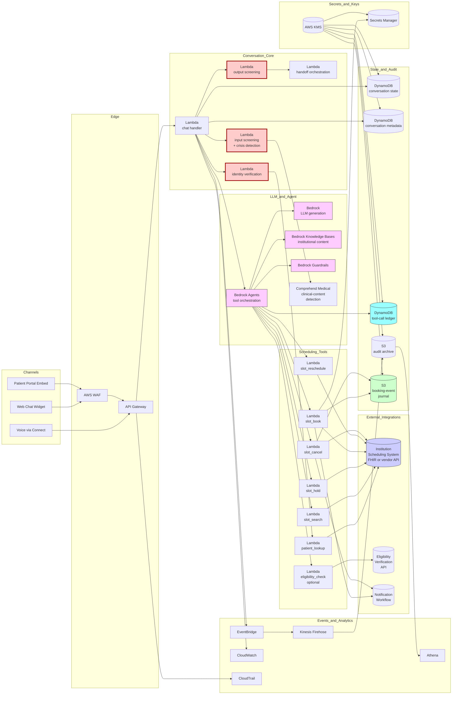

# Recipe 11.2 Architecture and Implementation: Appointment Scheduling Bot

*Companion to [Recipe 11.2: Appointment Scheduling Bot](chapter11.02-appointment-scheduling-bot). This page covers the AWS architecture, services, prerequisites, and pseudocode. For the problem framing and the conceptual approach, start with the main recipe.*

---

## The AWS Implementation

### Why These Services

**Amazon Bedrock for the LLM and the embeddings.** Same selection criteria as recipe 11.1. The scheduling bot specifically benefits from a model with strong tool-use (function-calling) support. Claude Sonnet-class or Nova Pro-class models are typical choices for the orchestration model because they handle multi-step tool-use reasoning reliably; smaller models (Haiku-class, Nova Lite-class) are reasonable for the lighter-weight intent-classification and parameter-extraction sub-tasks. Bedrock provides HIPAA-eligible deployment and a BAA-covered configuration.

**Amazon Bedrock Knowledge Bases for the institutional content.** The scheduling bot needs to look up institutional content the same way the FAQ bot does: visit-type taxonomy descriptions, provider profiles (specialty, languages spoken, accepting new patients, telehealth availability), location details (address, parking, accessibility), pre-visit prep instructions per visit type, insurance-acceptance rules. Knowledge Bases provides the managed RAG layer over this corpus.

**Amazon Bedrock Agents (or a custom Lambda-based orchestrator) for tool orchestration.** Bedrock Agents is the managed offering for tool-using LLMs on Bedrock: define your tools as action groups with OpenAPI schemas, define a knowledge base for grounded retrieval, and the agent handles the orchestration of LLM calls and tool invocations. The alternative is a custom orchestrator in Lambda that calls the LLM directly with function-calling, parses tool-call requests, invokes the tools, and composes the response. Agents is the faster path; the custom orchestrator is more flexible and is sometimes preferred for institutions that need fine-grained control over the orchestration behavior.

**Amazon Bedrock Guardrails for scope and content filtering.** Same purpose as recipe 11.1. The scheduling bot's scope is narrower than the FAQ bot's, so the Guardrails configuration is correspondingly more restrictive (clinical-content filtering more aggressive, patient-account-specific-question filtering more aggressive).

**Amazon Lex V2 (optional) for the conversational orchestration on voice channels.** When the scheduling bot is deployed on a voice channel through Amazon Connect, Lex V2 provides the conversational orchestration with built-in ASR and TTS. The bot's logic is broadly the same; the channel adapter is what changes.

**Amazon API Gateway and AWS Lambda for the chat-channel backend.** Same pattern as recipe 11.1, with one new wrinkle: the scheduling bot's tool layer involves Lambdas that call out to the institution's scheduling system (typically through a FHIR-based API gateway, a vendor-specific REST API, or a privately-networked integration). Those tool Lambdas run in VPC with controlled egress to the scheduling system's endpoints.

**The institution's scheduling system, exposed through whatever integration interface it provides.** The bot's tool surface is a wrapper around this. Common implementations: FHIR scheduling endpoints from a major EHR (Epic Hyperspace, Oracle Health Millennium, athenahealth, eClinicalWorks), a vendor-specific scheduling API, or a custom integration through a healthcare integration engine (Mirth, Rhapsody, Cloverleaf). The bot's tool Lambdas encapsulate this integration so the rest of the bot does not depend on the specific scheduling system.

**Amazon DynamoDB for conversation state, session state, and tool-call ledger.** Three tables: `conversation-state` (active conversation per session-and-channel, same as recipe 11.1); `conversation-metadata` (per-conversation lifecycle and version stamps, same as recipe 11.1); `tool-call-ledger` (every tool call with arguments, results, latency, and outcome, for transactional auditing).

**Amazon S3 for source documents, the audit archive, and the booking-event journal.** Same as recipe 11.1, plus a dedicated booking-event journal that records the durable record of every booking, reschedule, and cancellation the bot performs. Object Lock in compliance mode for the regulatory retention window.

**AWS KMS for cryptographic key custody.** Different keys per data class for blast-radius containment.

**AWS Secrets Manager for scheduling-system credentials.** The integration with the institution's scheduling system involves credentials that need to be rotated. Secrets Manager handles the rotation per the institutional cadence.

**Amazon CloudWatch for operational metrics and alarms.** All the metrics from recipe 11.1, plus scheduling-specific metrics: booking completion rate, median time to booking, identity-verification success rate, tool-call success rate per tool, slot-hold-but-not-confirmed rate, compensation event rate, per-cohort metric slices.

**AWS CloudTrail for API-level audit.** Same pattern as recipe 11.1. The scheduling bot's tool calls (which write to the institution's scheduling system) are audited at both the application layer (in the audit pipeline) and at the AWS API layer (through CloudTrail for the AWS resources involved).

**Amazon EventBridge for cross-system events.** Booking-event lifecycle (booking_proposed, booking_held, booking_confirmed, booking_failed, booking_compensated) flows through EventBridge. Downstream consumers include the operational dashboards, the analytics layer, the per-cohort monitoring pipeline, and the patient-experience platform that may want to send a follow-up touch ("how was your scheduling experience?").

**Amazon Kinesis Data Firehose, AWS Glue, Amazon Athena for analytics.** Audit and telemetry stream to S3 via Firehose, with Glue cataloging and Athena query.

**Amazon Connect for the live-agent handoff (optional).** When the institution's contact center is on Connect, the scheduling bot's handoff path drops into the Connect queue with a context payload that includes the conversation summary, the patient identity (if verified), and the reason for handoff.

**Amazon Comprehend Medical (optional) for clinical-content detection in the patient's reason-for-visit.** Comprehend Medical can extract clinical entities (symptoms, medications, conditions) from the patient's natural-language reason for visit. The scheduling bot does not act on the clinical content; it uses the detection signal to flag potentially clinical situations that should be triaged rather than self-scheduled.

**AWS WAF in front of the chat endpoint.** Same as recipe 11.1, with rate limiting tuned for the scheduling use case (booking endpoints have stricter rate limits than FAQ endpoints because abuse of the scheduling endpoint can cause real-world harm to other patients trying to book).

### Architecture Diagram



### Prerequisites

| Requirement | Details |
|-------------|---------|
| **AWS Services** | Amazon Bedrock (with Agents, Knowledge Bases, Guardrails, and a foundation model selected for tool-use plus an embedding model for the institutional corpus), AWS Lambda, Amazon API Gateway, AWS WAF, Amazon DynamoDB, Amazon S3, AWS KMS, AWS Secrets Manager, Amazon CloudWatch, AWS CloudTrail, Amazon EventBridge, Amazon Kinesis Data Firehose, AWS Glue, Amazon Athena, Amazon Comprehend Medical (optional, for clinical-content detection in reason-for-visit). Optionally: Amazon Lex V2 (for voice channels), Amazon Connect (for live-agent handoff and voice channel hosting), Amazon QuickSight (for dashboards). |
| **External Inputs** | A scheduling system with API access. The bot's tool Lambdas wrap whatever scheduling integration the institution provides: FHIR scheduling endpoints (Schedule, Slot, Appointment), vendor-specific scheduling APIs, or an integration-engine layer that exposes the scheduling operations the bot needs. Visit-type taxonomy with mapped natural-language descriptions, durations, scheduling rules, and prep instructions. Provider directory (specialty, languages spoken, accepting new patients, telehealth availability, established-patient rules). Location directory (address, parking, accessibility, insurance acceptance per provider). Insurance acceptance rules per provider, location, and visit type. Identity verification rules per intent (which factors are required for which intents). Patient communication preferences (notification channel, language, opt-in status). The bot's persona (voice, tone, scheduling-specific phrasings) reviewed by the patient-experience team. Validation set of representative patient scheduling requests covering the institution's visit-type taxonomy.  |
| **IAM Permissions** | Per-Lambda least-privilege roles. The chat-handler Lambda has permissions to invoke Bedrock Agents and to read and write the conversation tables. The agent's action-group Lambdas have permissions specific to the tool they implement (e.g., the slot-book Lambda has permissions to call the institution's scheduling system and to write to the booking-event journal). The identity-verification Lambda has permissions specific to the patient-lookup integration. Avoid wildcard actions and resources. Resource-based policies on each Lambda pin the invoking principal to the production agent or API Gateway stage ARN. |
| **BAA and Compliance** | AWS BAA signed. Amazon Bedrock (with the specific models and the Agents service in scope), Lambda, API Gateway, WAF, DynamoDB, S3, KMS, Secrets Manager, CloudWatch, CloudTrail, EventBridge, Kinesis Firehose, Glue, Athena, Comprehend Medical are HIPAA-eligible (verify the current list at build time against the AWS HIPAA Eligible Services Reference).  Scheduling system vendor agreement: confirm the institution's data-use agreement with the scheduling system vendor permits the bot's read-and-write integration. Patient-portal vendor agreements: confirm the patient-portal vendor's terms permit embedding the chat widget on portal pages with appropriate PHI handling. Audit retention policy reviewed by the privacy officer. The scheduling-event audit retention is sized to the longest of HIPAA's six-year minimum, state medical-records-retention rules, and the institutional regulatory floor. |
| **Encryption** | Source-document bucket: SSE-KMS with customer-managed keys, versioning enabled. Audit-archive and booking-event-journal buckets: SSE-KMS with customer-managed keys, Object Lock in compliance mode for the retention window, lifecycle to S3 Glacier Deep Archive after 90 days. DynamoDB tables: customer-managed KMS at rest. Lambda environment variables: KMS-encrypted. Lambda log groups: KMS-encrypted. Secrets Manager: customer-managed KMS. TLS in transit for all AWS API calls and all integrations with the scheduling system. The vector store under Knowledge Bases encrypted with customer-managed KMS keys. |
| **VPC** | Production: tool Lambdas that call the institution's scheduling system run in VPC with controlled egress to the scheduling system's endpoints (PrivateLink where the scheduling system supports it, otherwise a tightly-scoped NAT gateway path). VPC endpoints for DynamoDB, S3, KMS, Secrets Manager, CloudWatch Logs, EventBridge, Bedrock so the back-office Lambdas do not need public-internet egress for AWS-internal calls. Endpoint policies pin access to the specific resources the bot uses. The patient-facing edge (API Gateway, WAF) is public by design; the scheduling-integration traffic is private. |
| **CloudTrail** | Enabled with data events on the audit-archive S3 bucket, the booking-event-journal S3 bucket, the source-document S3 bucket, the DynamoDB conversation and tool-call tables, the Secrets Manager secrets, and the customer-managed KMS keys. Bedrock and Bedrock Agents invocations logged with metadata. Lambda invocations logged. API Gateway access logs enabled. CloudTrail logs in a dedicated S3 bucket with Object Lock in compliance mode and lifecycle to S3 Glacier Deep Archive after 90 days. Audit retention sized to the longer of HIPAA's six-year minimum, state medical-records-retention rules, and the institutional regulatory floor. |
| **Sample Data** | Synthetic patient scheduling requests stratified by intent (new appointment, reschedule, cancel, check), by visit type (covering the institution's catalog), by complexity (straightforward vs. requiring multi-turn refinement), and by edge case (clinical content in the reason-for-visit, identity-verification failures, no-availability situations, scope violations). Synthetic patient identities for the identity-verification flow (never use real patient identities for development). Public clinical-vocabulary lists (RxNorm, ICD-10) for any cross-referencing. Crisis-detection validation requires carefully-constructed test utterances. Test scheduling system in a non-production environment with synthetic appointment slots. |
| **Cost Estimate** | At a mid-sized institution scale (twenty thousand booking attempts per month, of which roughly half complete through the bot and the rest hand off to humans, average 6 turns per conversation, average 800 tokens of prompt and 200 tokens of response per turn for a tool-use orchestrator, plus identity-verification and tool-call overhead): Bedrock LLM invocations at typically $0.01-0.04 per booking conversation for a Sonnet-class orchestration model totals approximately $5,000-20,000 per year. Bedrock Agents and Knowledge Bases hosting plus the underlying vector store typically $2,000-8,000 per year. Lambda, API Gateway, WAF, DynamoDB, S3, KMS, Secrets Manager, CloudWatch, CloudTrail, EventBridge, Kinesis Firehose, Glue, Athena total approximately $4,000-15,000 per year combined. Comprehend Medical (when used) typically $200-1,000 per year for the clinical-content-detection volume. Total AWS infrastructure typically $11,000-44,000 per year at this scale. The infrastructure cost is dominated by the LLM invocation volume and the Knowledge Bases hosting. The per-booking infrastructure cost is small relative to the operational savings versus live-scheduler handling of the same booking.  |

### Ingredients

| AWS Service | Role |
|------------|------|
| **Amazon Bedrock** | LLM for orchestration and response generation; embedding model for the institutional corpus |
| **Amazon Bedrock Agents** | Tool orchestration: define the scheduling tools as action groups, manage the multi-step LLM-and-tool flow |
| **Amazon Bedrock Knowledge Bases** | Managed RAG over institutional content (visit-type taxonomy, provider profiles, location details, prep instructions) |
| **Amazon Bedrock Guardrails** | Content filtering for clinical advice, off-scope topics, harmful content |
| **AWS Lambda** | Chat handler, input/output screening, identity verification, tool implementations (slot_search, slot_hold, slot_book, slot_reschedule, slot_cancel, patient_lookup, eligibility_check) |
| **Amazon API Gateway** | Public-facing chat endpoint for web and app channels |
| **AWS WAF** | Rate limiting, bot detection, common attack patterns (with stricter limits on booking endpoints) |
| **Amazon DynamoDB** | conversation-state, conversation-metadata, tool-call-ledger |
| **Amazon S3** | Source documents (institutional knowledge), audit archive (conversations), booking-event journal (durable booking records) |
| **AWS KMS** | Customer-managed encryption keys per data class |
| **AWS Secrets Manager** | Credentials for the scheduling system, the eligibility verification system, and the notification workflow |
| **Amazon CloudWatch** | Operational metrics (booking completion rate, time to booking, identity-verification success, tool-call success per tool, per-cohort slices); alarms |
| **AWS CloudTrail** | API-level audit logging |
| **Amazon EventBridge** | Booking-event bus for cross-system event flow |
| **Amazon Kinesis Data Firehose** | Streaming audit and telemetry delivery |
| **AWS Glue Data Catalog + Amazon Athena** | SQL access to audit and telemetry |
| **Amazon Comprehend Medical (optional)** | Clinical-content detection in patient reason-for-visit text |
| **Amazon Connect (optional)** | Live-agent handoff channel; voice-channel hosting for the scheduling bot |
| **Amazon Lex V2 (optional)** | Conversational orchestration for voice channels |

---

### Pseudocode Walkthrough

**Step 1: Receive the chat message, bootstrap the session, and run the same input safety screening as recipe 11.1.** The first turn of any scheduling conversation goes through the same input-screening pipeline: crisis detection, prompt-injection detection, PHI minimization. The greeting and disclosure tells the patient this is a chatbot, what scheduling actions it can do, and how to reach a human. Skip the input screening and a patient mentioning chest pain while asking about a follow-up has their crisis signal lost in the booking flow.

```pseudocode
ON receive_message(channel, channel_session_id, user_message,
                  auth_context):
    // Step 1A: identify or create the session.
    session = conversation_state_table.get_or_create({
        channel: channel,
        channel_session_id: channel_session_id,
        auth_context: auth_context
    })

    // Step 1B: on the first message, send the
    // scheduling-bot greeting and disclosure.
    IF session.message_count == 0:
        attach_greeting_and_disclosure = true
        EventBridge.PutEvents([{
            source: "scheduling_bot",
            detail_type: "conversation_started",
            detail: {
                session_id: session.id,
                channel: channel,
                authenticated:
                    auth_context.authenticated
            }
        }])

    // Step 1C: persist the user's message.
    conversation_metadata_table.append_turn(
        session_id: session.id,
        turn: {
            speaker: "user",
            text: user_message,
            timestamp: now()
        })

    // Step 1D: run the same input-screening primitive
    // as recipe 11.1 (crisis detection, prompt-injection
    // detection, PHI minimization).
    screening_result = screen_input(
        session_id: session.id,
        user_message: user_message,
        language: session.language)

    IF screening_result.action != "proceed":
        return handle_screening_action(
            session_id: session.id,
            screening_result: screening_result)

    // Step 1E: continue to intent classification.
    return handle_message(
        session_id: session.id,
        user_message: user_message,
        attach_greeting: attach_greeting_and_disclosure)
```

**Step 2: Classify intent and route to the appropriate flow or handoff.** The scheduling bot's intents are narrower than the FAQ bot's: new_appointment, reschedule_appointment, cancel_appointment, check_appointment, update_preferences, and out-of-scope. Out-of-scope categories route to the appropriate other handler (FAQ for general questions, refill bot for refills, benefits navigator for plan-specific eligibility, nurse triage for clinical content, live agent for anything outside the bot's scope). Skip the explicit out-of-scope handling and the LLM may attempt to negotiate a refill request as if it were a scheduling request, which is exactly the failure mode the system is supposed to prevent.

```pseudocode
FUNCTION handle_message(session_id, user_message,
                        attach_greeting):
    classification = classify_scheduling_intent(
        user_message: user_message,
        recent_turns: conversation_metadata_table
            .recent_turns(session_id, k: 4),
        language: session.language)

    IF classification.confidence < INTENT_CONFIDENCE_THRESHOLD:
        return ask_clarifying_question(
            session_id: session_id,
            language: session.language)

    // Step 2A: out-of-scope handling.
    IF classification.intent == "clinical_question":
        return handoff_to_target(
            session_id: session_id,
            target: "nurse_triage",
            reason: "clinical_content_detected")

    IF classification.intent == "refill_request":
        return handoff_to_target(
            session_id: session_id,
            target: "refill_bot",
            reason: "refill_intent")

    IF classification.intent == "benefits_eligibility":
        return handoff_to_target(
            session_id: session_id,
            target: "benefits_navigator",
            reason: "benefits_intent")

    IF classification.intent == "general_question":
        return handoff_to_target(
            session_id: session_id,
            target: "faq_bot",
            reason: "informational_intent")

    IF classification.intent == "out_of_scope":
        return handoff_to_target(
            session_id: session_id,
            target: "live_agent",
            reason: "scope_violation")

    // Step 2B: in-scope. The scheduling-specific
    // flow needs identity verification before any
    // action that touches the patient's record.
    return route_to_scheduling_flow(
        session_id: session_id,
        intent: classification.intent,
        extracted_parameters:
            classification.extracted_parameters)
```

**Step 3: Verify identity at the assurance level appropriate for the intent.** A patient logged into the patient portal arrives with an authenticated patient_id; the bot uses it directly. An unauthenticated patient is asked for name and date of birth, then for a confirmation factor (last four of phone, ZIP code, or one-time code). The bot's identity-verification policy table maps (intent, channel, additional context) to required assurance level. Skip the identity verification and the bot ends up taking actions on records that may not belong to the person it is talking to.

```pseudocode
FUNCTION verify_identity(session_id, intent, auth_context):
    // Step 3A: short-circuit when authenticated.
    IF auth_context.authenticated:
        session.verified_patient_id =
            auth_context.patient_id
        session.assurance_level = "authenticated"
        return { action: "verified" }

    // Step 3B: determine required assurance level.
    required_assurance =
        IDENTITY_POLICY.lookup(intent, channel)
    // For example: new_appointment requires "basic"
    // (name + DOB + confirmation factor); cancel_
    // appointment within 24h requires "step_up"
    // (also a one-time code).

    // Step 3C: collect identifiers conversationally.
    identifiers = collect_identifiers_from_conversation(
        session_id: session_id,
        required_assurance: required_assurance)

    IF identifiers.incomplete:
        return {
            action: "ask_for_more_info",
            missing: identifiers.missing_factors
        }

    // Step 3D: invoke patient_lookup tool.
    lookup_result = patient_lookup_tool.invoke({
        name: identifiers.name,
        date_of_birth: identifiers.date_of_birth,
        confirmation_factor:
            identifiers.confirmation_factor
    })

    audit_tool_call(
        session_id: session_id,
        tool: "patient_lookup",
        arguments: redact_sensitive(identifiers),
        result_summary: {
            match_count: lookup_result.match_count,
            confidence: lookup_result.confidence
        })

    // Step 3E: handle the lookup outcomes.
    IF lookup_result.match_count == 0:
        return {
            action: "no_match",
            response: NO_MATCH_TEMPLATE
            // Could be a new patient, could be
            // wrong info; offer the new-patient
            // path or hand off to a human.
        }

    IF lookup_result.match_count > 1:
        return {
            action: "ambiguous_match",
            response: ASK_DISAMBIGUATION_TEMPLATE
        }

    IF lookup_result.confidence
       < required_assurance.threshold:
        return {
            action: "step_up_required",
            response: STEP_UP_PROMPT_TEMPLATE
        }

    session.verified_patient_id =
        lookup_result.patient_id
    session.assurance_level =
        required_assurance.level
    return { action: "verified" }
```

**Step 4: Extract the scheduling parameters from the conversation and search for slots.** Once identity is verified, the bot extracts the structured parameters from what the patient has said (provider preference, location preference, visit type, time-window, insurance) and calls the slot-search tool. The visit-type mapping translates natural-language reasons for visit into the institution's visit-type taxonomy. Skip the visit-type mapping and the bot books wrong visit types; skip the no-results handling and the bot fabricates non-existent slots.

```pseudocode
FUNCTION search_for_slots(session_id, intent,
                          extracted_parameters):
    // Step 4A: assemble structured parameters.
    parameters = build_search_parameters(
        intent: intent,
        extracted: extracted_parameters,
        patient_context:
            patient_context_for(
                session.verified_patient_id))

    // Step 4B: map natural-language reason for visit
    // to institutional visit type.
    IF parameters.reason_for_visit
       AND NOT parameters.visit_type:
        // Use the LLM with the institutional visit-
        // type catalog as context.
        visit_type_mapping = map_reason_to_visit_type(
            reason: parameters.reason_for_visit,
            patient_context: parameters.patient_context,
            visit_type_catalog: VISIT_TYPE_CATALOG)

        IF visit_type_mapping.confidence
           < VISIT_TYPE_CONFIDENCE_THRESHOLD:
            // Ambiguous; ask the patient to clarify.
            return {
                action: "clarify_visit_type",
                candidates:
                    visit_type_mapping.top_candidates
            }

        parameters.visit_type =
            visit_type_mapping.visit_type

    // Step 4C: optional clinical-content detection.
    // If Comprehend Medical detects high-acuity
    // clinical entities in the reason-for-visit
    // (chest pain, severe headache, suicidal
    // ideation framed as "I need to see somebody"),
    // route to the appropriate triage path rather
    // than self-scheduling.
    IF parameters.reason_for_visit:
        clinical_signals =
            comprehend_medical.detect_entities(
                text: parameters.reason_for_visit)

        IF clinical_signals.acuity == "high":
            return handoff_to_target(
                session_id: session_id,
                target: "nurse_triage",
                reason: "high_acuity_detected")

    // Step 4D: invoke slot_search tool.
    search_result = slot_search_tool.invoke({
        patient_id: session.verified_patient_id,
        provider: parameters.provider,
        location: parameters.location,
        visit_type: parameters.visit_type,
        time_window: parameters.time_window,
        insurance: parameters.insurance,
        ranking_preference:
            parameters.ranking_preference
    })

    audit_tool_call(
        session_id: session_id,
        tool: "slot_search",
        arguments: parameters,
        result_summary: {
            slot_count: len(search_result.slots),
            top_slot_provider:
                first_or_none(search_result.slots)
                    .provider
        })

    // Step 4E: no-results handling.
    IF len(search_result.slots) == 0:
        // The bot does not say "let me check" again
        // forever. It honestly says no slots match
        // and offers alternatives.
        return {
            action: "no_slots_available",
            response: build_no_results_response(
                parameters: parameters,
                alternatives: [
                    "wait_list_enrollment",
                    "alternative_provider",
                    "alternative_location",
                    "telehealth_alternative",
                    "live_scheduler_handoff"
                ])
        }

    // Step 4F: render the top candidates.
    return {
        action: "offer_slots",
        candidates: search_result.slots[:3],
        response: render_slots_in_natural_language(
            slots: search_result.slots[:3],
            language: session.language)
    }
```

**Step 5: Refine the slot offer through conversation and place a hold on the chosen slot.** The patient often refines: "anything earlier?", "different day?", "different provider?". Each refinement updates the parameters and re-searches. When the patient picks a specific slot, the bot places a short-term hold to prevent a race with another channel. Skip the slot hold and a second patient can book the same slot during the few seconds between the bot's offer and the patient's confirmation.

```pseudocode
FUNCTION refine_or_select_slot(session_id, user_message,
                              current_candidates):
    // Step 5A: classify the patient's response.
    response_classification = classify_slot_response(
        user_message: user_message,
        offered_slots: current_candidates,
        language: session.language)

    IF response_classification.action == "refine":
        // Update parameters and re-search.
        updated_parameters = apply_refinement(
            current_parameters:
                session.search_parameters,
            refinement:
                response_classification.refinement)

        return search_for_slots(
            session_id: session_id,
            intent: session.intent,
            extracted_parameters: updated_parameters)

    IF response_classification.action == "select":
        chosen_slot = current_candidates[
            response_classification.choice_index]

        // Step 5B: place a hold.
        hold_result = slot_hold_tool.invoke({
            slot_id: chosen_slot.slot_id,
            patient_id: session.verified_patient_id,
            ttl_seconds: HOLD_TTL_SECONDS
        })

        audit_tool_call(
            session_id: session_id,
            tool: "slot_hold",
            arguments: {
                slot_id: chosen_slot.slot_id
            },
            result_summary: {
                hold_id: hold_result.hold_id,
                expires_at: hold_result.expires_at,
                outcome: hold_result.outcome
            })

        IF hold_result.outcome == "no_longer_available":
            // The slot was taken between the search
            // and the hold attempt. Re-search and
            // offer fresh candidates.
            return {
                action: "slot_no_longer_available",
                response: SLOT_RACE_TEMPLATE,
                next_step: search_for_slots(
                    session_id: session_id,
                    intent: session.intent,
                    extracted_parameters:
                        session.search_parameters)
            }

        IF hold_result.outcome != "held":
            return {
                action: "hold_failed",
                response: HOLD_FAILED_TEMPLATE,
                next_step: handoff_to_live_scheduler
            }

        session.held_slot = chosen_slot
        session.hold_id = hold_result.hold_id

        // Step 5C: ask the patient to confirm.
        return {
            action: "ask_for_confirmation",
            response: build_confirmation_prompt(
                slot: chosen_slot,
                prep_instructions:
                    knowledge_base.lookup(
                        chosen_slot.visit_type,
                        category: "prep"),
                language: session.language)
        }

    IF response_classification.action == "cancel":
        // Patient changed their mind.
        return {
            action: "abandon_search",
            response: ABANDON_SEARCH_TEMPLATE
        }
```

**Step 6: Confirm the booking by converting the hold into a booked appointment.** The patient explicitly confirms the held slot. The bot calls the slot-book tool, which writes the appointment to the scheduling system and triggers the institution's standard notification workflow. Skip the explicit confirmation step and the bot books appointments the patient did not actually agree to.

```pseudocode
FUNCTION confirm_booking(session_id, user_message):
    // Step 6A: verify the user actually confirmed.
    confirmation = classify_confirmation_response(
        user_message: user_message,
        proposed_slot: session.held_slot,
        language: session.language)

    IF confirmation.intent == "decline":
        // Release the hold and either ask if they
        // want to keep looking or close the session.
        slot_hold_tool.release(session.hold_id)
        session.held_slot = null
        session.hold_id = null

        return {
            action: "ask_what_next",
            response: ASK_WHAT_NEXT_TEMPLATE
        }

    IF confirmation.intent == "modify":
        // Patient wants to change something about
        // the slot. Refine and re-offer.
        slot_hold_tool.release(session.hold_id)
        session.held_slot = null
        session.hold_id = null

        return refine_or_select_slot(
            session_id: session_id,
            user_message: user_message,
            current_candidates: session.last_candidates)

    IF confirmation.intent != "confirm":
        return {
            action: "ask_for_clarification",
            response: ASK_FOR_CLARIFICATION_TEMPLATE
        }

    // Step 6B: invoke slot_book tool.
    book_result = slot_book_tool.invoke({
        hold_id: session.hold_id,
        slot_id: session.held_slot.slot_id,
        patient_id: session.verified_patient_id,
        notes: session.search_parameters
            .reason_for_visit
    })

    audit_tool_call(
        session_id: session_id,
        tool: "slot_book",
        arguments: {
            hold_id: session.hold_id,
            slot_id: session.held_slot.slot_id
        },
        result_summary: {
            confirmation_id:
                book_result.confirmation_id,
            outcome: book_result.outcome
        })

    IF book_result.outcome != "booked":
        // Booking failed. Handle gracefully.
        return handle_booking_failure(
            session_id: session_id,
            failure: book_result)

    // Step 6C: optional eligibility check.
    IF ELIGIBILITY_CHECK_AT_BOOKING:
        eligibility = eligibility_check_tool.invoke({
            patient_id: session.verified_patient_id,
            appointment_id: book_result.confirmation_id
        })

        IF eligibility.status == "not_eligible":
            // Surface the issue to the patient
            // honestly without canceling the
            // appointment automatically. Offer
            // handoff to billing or to live
            // scheduler.
            include_eligibility_warning = true

    // Step 6D: write the booking-event journal record.
    booking_event_journal.write({
        confirmation_id: book_result.confirmation_id,
        patient_id: session.verified_patient_id,
        slot_id: session.held_slot.slot_id,
        provider: session.held_slot.provider,
        location: session.held_slot.location,
        visit_type: session.held_slot.visit_type,
        appointment_time:
            session.held_slot.appointment_time,
        booking_initiated_through: "scheduling_bot",
        session_id: session_id,
        booked_at: now()
    })

    // Step 6E: emit lifecycle event.
    EventBridge.PutEvents([{
        source: "scheduling_bot",
        detail_type: "booking_confirmed",
        detail: {
            session_id: session_id,
            confirmation_id:
                book_result.confirmation_id,
            patient_id: session.verified_patient_id,
            visit_type:
                session.held_slot.visit_type,
            channel: session.channel
        }
    }])

    // Step 6F: render the confirmation to the patient.
    return {
        action: "booking_confirmed",
        response: build_confirmation_response(
            slot: session.held_slot,
            confirmation_id:
                book_result.confirmation_id,
            include_eligibility_warning:
                include_eligibility_warning,
            language: session.language)
    }
```

**Step 7: Handle reschedule and cancel intents through the same general pattern, with the appropriate transactional contracts.** Reschedule and cancel are variations on the booking flow: identity verification, look up the existing appointment, check policy (some same-day cancellations have penalties or require step-up auth), execute the reschedule or cancel tool, journal the event. Skip the policy check and the bot lets patients cancel out of slots that the institution's policy says should require human handling.

```pseudocode
FUNCTION handle_reschedule_or_cancel(session_id, intent,
                                     extracted_parameters):
    // Step 7A: look up the existing appointment.
    existing = appointment_lookup_tool.invoke({
        patient_id: session.verified_patient_id,
        appointment_descriptor:
            extracted_parameters.appointment_descriptor
        // E.g., "my Thursday cardiology appointment"
    })

    IF existing.match_count == 0:
        return {
            action: "no_appointment_found",
            response: NO_APPOINTMENT_FOUND_TEMPLATE
        }

    IF existing.match_count > 1:
        return {
            action: "ask_which_appointment",
            response: ASK_WHICH_APPOINTMENT_TEMPLATE,
            candidates: existing.matches
        }

    appointment = existing.matches[0]

    // Step 7B: policy check.
    policy_outcome = scheduling_policy.evaluate({
        action: intent,
        appointment: appointment,
        time_to_appointment:
            appointment.appointment_time - now(),
        assurance_level: session.assurance_level
    })

    IF policy_outcome.requires_step_up:
        return {
            action: "step_up_required",
            response: STEP_UP_PROMPT_TEMPLATE
        }

    IF policy_outcome.action == "block":
        return handoff_to_target(
            session_id: session_id,
            target: "live_scheduler",
            reason: policy_outcome.reason)

    // Step 7C: route to the specific handler.
    IF intent == "cancel_appointment":
        return execute_cancel(
            session_id: session_id,
            appointment: appointment,
            policy_outcome: policy_outcome)

    IF intent == "reschedule_appointment":
        // Reschedule is cancel-and-search-and-book
        // executed as a single coordinated operation
        // through the scheduling system's reschedule
        // API where available, or as a coordinated
        // transaction otherwise.
        return execute_reschedule(
            session_id: session_id,
            appointment: appointment,
            extracted_parameters: extracted_parameters,
            policy_outcome: policy_outcome)
```

**Step 8: Handle booking failures and partial-success cases without losing the patient's trust.** Sometimes the booking tool reports failure. Sometimes the booking succeeds but the notification workflow fails. Sometimes the eligibility check fails after booking. The bot has to communicate honestly with the patient about what happened and what the next step is. Skip the partial-success handling and patients leave the conversation thinking the appointment was booked when it was not, or vice versa.

```pseudocode
FUNCTION handle_booking_failure(session_id, failure):
    IF failure.outcome == "slot_no_longer_available":
        // Race condition. Re-offer fresh candidates.
        return {
            action: "slot_lost_to_race",
            response: SLOT_RACE_TEMPLATE,
            next_step: search_for_slots(
                session_id: session_id,
                intent: session.intent,
                extracted_parameters:
                    session.search_parameters)
        }

    IF failure.outcome == "scheduling_system_error":
        // The scheduling system is down or returned
        // an unexpected error. Tell the patient
        // honestly and queue the request for human
        // follow-up.
        queue_for_human_followup(
            session_id: session_id,
            session_summary:
                summarize_session(session_id))

        return {
            action: "system_error_handoff",
            response: SYSTEM_ERROR_TEMPLATE
        }

    IF failure.outcome == "policy_violation":
        // The booking was rejected by the institution's
        // scheduling rules. Surface the reason and
        // offer alternatives or handoff.
        return {
            action: "policy_handoff",
            response: build_policy_handoff_response(
                reason: failure.reason,
                language: session.language)
        }

    IF failure.outcome == "duplicate_booking":
        // The patient already has a similar
        // appointment. Surface that and ask if they
        // want to proceed anyway, reschedule the
        // existing one, or stop.
        return {
            action: "duplicate_booking_clarify",
            response: build_duplicate_response(
                existing: failure.existing_appointment,
                language: session.language)
        }

    // Default: graceful handoff.
    return {
        action: "generic_failure_handoff",
        response: GENERIC_FAILURE_TEMPLATE
    }
```

**Step 9: Run the same output safety screening as recipe 11.1, with one new check specific to scheduling.** The standard output checks (scope filter, hallucination check, vendor-managed guardrails) carry forward. The new check verifies that any "your appointment is confirmed" claim in the response is supported by an actual successful booking-tool result. Skip this check and a hallucinated confirmation that no booking actually backs results in a patient showing up for an appointment that does not exist.

```pseudocode
FUNCTION screen_output(session_id, response,
                       tool_call_history):
    // Step 9A: standard checks from recipe 11.1.
    standard_check = standard_output_screen.evaluate(
        response: response,
        session_context: session_context_for(
            session_id))

    IF standard_check.action != "deliver":
        return standard_check

    // Step 9B: scheduling-specific hallucination check.
    booking_claims = extract_booking_claims(response)
    // E.g., "your appointment is booked for Tuesday
    // May 28 at 7:30 AM with Dr. Patel"

    FOR claim IN booking_claims:
        supporting_tool_call =
            find_supporting_tool_call(
                claim: claim,
                tool_call_history: tool_call_history)

        IF supporting_tool_call IS None:
            // The bot is claiming a booking was
            // confirmed but no slot_book tool call
            // returned success for that booking.
            return {
                action: "replace_with_safe_response",
                replacement: BOOKING_CONFIRM_FAILED_TEMPLATE,
                violation: "unsupported_booking_claim"
            }

        IF supporting_tool_call.outcome != "booked":
            return {
                action: "replace_with_safe_response",
                replacement: BOOKING_CONFIRM_FAILED_TEMPLATE,
                violation:
                    "booking_claim_inconsistent_with_tool_result"
            }

    return {
        action: "deliver",
        response: response
    }
```

**Step 10: Persist the durable conversation record, the tool-call ledger, and the booking-event journal; emit telemetry; close the session.** Every conversation produces three durable artifacts: the conversation log (utterances, redacted of inadvertent PHI, with model and prompt versions stamped), the tool-call ledger (every tool invoked with arguments, results, and latency), and the booking-event journal entries (durable records for every successful booking, reschedule, or cancellation). Skip any of these and the audit trail has gaps that compliance and operations cannot reconstruct.

```pseudocode
FUNCTION close_conversation_and_archive(session_id, reason):
    state = conversation_state_table.get(session_id)
    metadata =
        conversation_metadata_table.get(session_id)
    tool_calls =
        tool_call_ledger.for_session(session_id)

    // Step 10A: build the durable audit record.
    audit_record = {
        session_id: session_id,
        channel: state.channel,
        started_at: state.started_at,
        ended_at: now(),
        language: state.language,
        verified_patient_id: state.verified_patient_id,
        assurance_level: state.assurance_level,
        identity_verification_outcome:
            state.identity_verification_outcome,
        intent_at_session: state.intent,
        turns: [
            redact_user_phi(turn)
            for turn in metadata.turns
        ],
        tool_calls: [
            redact_sensitive_args(call)
            for call in tool_calls
        ],
        crisis_detected: state.crisis_detected,
        scope_violations_caught:
            state.scope_violation_count,
        bookings_completed:
            state.bookings_completed,
        cancellations_completed:
            state.cancellations_completed,
        reschedules_completed:
            state.reschedules_completed,
        handoffs_offered: state.handoffs_offered,
        handoffs_accepted: state.handoffs_accepted,
        feedback: state.feedback_history,
        active_model_id_at_session: state.model_id,
        active_prompt_version_at_session:
            state.prompt_version,
        active_agent_version_at_session:
            state.agent_version,
        active_kb_version_at_session: state.kb_version,
        active_visit_type_catalog_version_at_session:
            state.visit_type_catalog_version,
        active_scheduling_policy_version_at_session:
            state.scheduling_policy_version,
        cohort_axes: {
            language: state.language,
            channel: state.channel,
            assurance_level: state.assurance_level,
            authenticated_path:
                state.auth_context.authenticated
        },
        close_reason: reason
    }

    audit_archive_kinesis_firehose.put(audit_record)

    // Step 10B: emit lifecycle event.
    EventBridge.PutEvents([{
        source: "scheduling_bot",
        detail_type: "conversation_closed",
        detail: {
            session_id: session_id,
            channel: state.channel,
            disposition: state.final_disposition,
            // booked | rescheduled | canceled |
            // checked | escalated | abandoned |
            // crisis_routed
            turn_count: len(metadata.turns),
            booking_completed:
                state.bookings_completed > 0
        }
    }])

    // Step 10C: per-cohort booking-completion metric.
    cloudwatch.put_metric(
        namespace: "SchedulingBot",
        metric_name: "BookingCompleted",
        value: 1 if state.bookings_completed > 0
               else 0,
        dimensions: {
            channel: state.channel,
            language: state.language,
            assurance_level: state.assurance_level,
            intent: state.intent
        })

    cloudwatch.put_metric(
        namespace: "SchedulingBot",
        metric_name: "TimeToBooking",
        value: state.time_to_first_booking_seconds,
        dimensions: {
            channel: state.channel,
            language: state.language,
            visit_type: state.visit_type
        })
```

> **Curious how this looks in Python?** The pseudocode above covers the concepts. If you'd like to see sample Python code that demonstrates these patterns using boto3, check out the [Python Example](chapter11.02-python-example). It walks through each step with inline comments and notes on what you'd need to change for a real deployment.

---

## Expected Results

**Sample conversation (illustrative):**

```text
Bot:     Hi! I'm Riverside Clinic's scheduling
         assistant. I can help you book, reschedule,
         or cancel appointments. I can't help with
         clinical questions or your account-specific
         billing, but I can connect you with the right
         team for those. How can I help today?

Patient: I need to follow up with Dr. Patel after my
         stress test. Early morning or after 4 PM
         works best, and I have Aetna PPO.

Bot:     Got it. I just need to verify it's you
         first. Can I get your name and date of
         birth?

Patient: Marcus Chen, 1979-03-14

Bot:     Thanks Marcus. To confirm, what are the
         last four digits of the phone number we
         have on file?

Patient: 7842

Bot:     Perfect, you're verified. Looking at
         Dr. Patel's schedule for a follow-up
         after your recent stress test... I see
         openings on Tuesday May 28 at 7:30 AM
         and Thursday June 6 at 4:45 PM. Both are
         at the Riverside Cardiology office on
         Main Street. Either work?

Patient: The Tuesday one

Bot:     Holding Tuesday May 28 at 7:30 AM with
         Dr. Patel at Riverside Cardiology. Just
         to confirm: this is a 30-minute follow-up
         visit, and you'll want to arrive 10 minutes
         early for check-in. Want me to book it?

Patient: yes

Bot:     Booked. Your confirmation is RC-2026-1184392.
         You'll get a confirmation text and email
         shortly. We'll also send a reminder 48 hours
         before. Anything else I can help with?

Patient: nope, thanks

Bot:     Hope your follow-up goes well. Take care.
```

**Sample audit record (illustrative):**

```json
{
  "session_id": "sched-9c4f8b2e-3d1a-4f8c-9b2e-1a3f9c4f8b2e",
  "channel": "web_chat",
  "started_at": "2026-05-19T19:43:11Z",
  "ended_at": "2026-05-19T19:44:42Z",
  "language": "en-US",
  "verified_patient_id": "patient-internal-id-redacted-in-log-readback",
  "assurance_level": "basic",
  "identity_verification_outcome": "verified_first_attempt",
  "intent_at_session": "new_appointment",
  "tool_calls": [
    {
      "tool": "patient_lookup",
      "invoked_at": "2026-05-19T19:43:32Z",
      "result_summary": {
        "match_count": 1,
        "confidence": 0.97
      },
      "latency_ms": 412
    },
    {
      "tool": "slot_search",
      "invoked_at": "2026-05-19T19:43:48Z",
      "arguments_summary": {
        "provider_hint": "patel",
        "visit_type": "cardiology_established_followup_30min",
        "time_window": "early_morning_or_after_4pm",
        "insurance": "aetna_ppo"
      },
      "result_summary": {
        "slot_count": 7,
        "top_slot_provider": "patel",
        "top_slot_time": "2026-05-28T07:30:00Z"
      },
      "latency_ms": 624
    },
    {
      "tool": "slot_hold",
      "invoked_at": "2026-05-19T19:44:14Z",
      "arguments_summary": {
        "slot_id": "slot-2026-05-28-07-30-patel"
      },
      "result_summary": {
        "outcome": "held",
        "expires_at": "2026-05-19T19:49:14Z"
      },
      "latency_ms": 287
    },
    {
      "tool": "slot_book",
      "invoked_at": "2026-05-19T19:44:31Z",
      "arguments_summary": {
        "hold_id": "hold-aaaa1111",
        "slot_id": "slot-2026-05-28-07-30-patel"
      },
      "result_summary": {
        "outcome": "booked",
        "confirmation_id": "RC-2026-1184392"
      },
      "latency_ms": 893
    }
  ],
  "crisis_detected": false,
  "scope_violations_caught": 0,
  "bookings_completed": 1,
  "cancellations_completed": 0,
  "reschedules_completed": 0,
  "handoffs_offered": 0,
  "handoffs_accepted": 0,
  "active_model_id_at_session": "anthropic.claude-sonnet-...",
  "active_prompt_version_at_session": "scheduling-bot-v2.4",
  "active_agent_version_at_session": "scheduling-agent-v3.1",
  "active_visit_type_catalog_version_at_session": "vt-catalog-2026-04-15",
  "active_scheduling_policy_version_at_session": "policy-2026-03-01",
  "cohort_axes": {
    "language": "en-US",
    "channel": "web_chat",
    "assurance_level": "basic",
    "authenticated_path": false
  },
  "final_disposition": "booked",
  "duration_seconds": 91,
  "close_reason": "user_session_end"
}
```

**Performance benchmarks (illustrative, your mileage varies):**

| Metric | Old self-service form | Modern conversational bot |
|--------|----------------------|--------------------------|
| Median time to book (when successful) | 4-8 minutes | 60-120 seconds |
| Form-to-booking completion rate | 25-45% (many abandon mid-flow) | 55-80% (depends on visit-type catalog quality) |
| Mis-booked visit type rate | 10-25% (patient picked wrong type) | 2-8% (LLM mapping plus validation) |
| Median time to cancel/reschedule | Phone call, 8-15 minutes | 60-90 seconds |
| Identity-verification success on first attempt | n/a (forms accepted whatever was entered) | 80-95% (depends on patient population and authentication path) |
| Slot-race recovery rate | n/a (system did not handle) | >99% with hold-and-confirm |
| Median per-booking infrastructure cost | Negligible (form posts to API) | $0.02-0.10 |
| Per-cohort booking-completion disparity | Often invisible | Monitored explicitly per launch gate |
| Patient satisfaction (CSAT proxy for the channel) | Mixed; some prefer phone | Generally positive for transactional intents |

**Where it struggles:**

- **Misconfigured visit-type taxonomy.** When the institution's visit-type catalog is messy (overlapping definitions, inconsistent naming, undocumented rules), the bot's natural-language mapping is bounded above by the catalog's quality. The bot cannot map "follow up with my cardiologist after the stress test" to the right visit type if the catalog has three plausible candidates with subtly different rules and no documentation. Mitigation: clean up the visit-type catalog before deploying the bot. Document each visit type's purpose, duration, scheduling rules, and prep requirements. The catalog cleanup is the single highest-leverage operational investment for the bot's quality.
- **Identity-verification friction for elderly or technologically less-comfortable patients.** Asking for the last four of the phone number works for most patients; some find it uncomfortable, some do not remember which phone number they registered with. Mitigation: multiple acceptable confirmation factors, gentle handling of failed attempts, easy escalation to a human who can verify identity through a different path.
- **The "I want to see Dr. Smith but Dr. Smith is booked out four months" reality.** The bot cannot create slot inventory that does not exist. Mitigation: honest surfacing of wait times, alternative-provider suggestions, wait-list enrollment, telehealth alternatives where applicable.
- **Patients with complex scheduling needs.** A patient who is coordinating multiple appointments (a procedure that requires pre-op clearance and post-op follow-up, all of which need to be scheduled together) is outside the bot's scope. Mitigation: detect the multi-appointment pattern and hand off to a human scheduler with the conversation context preserved.
- **Same-day scheduling and urgent slot inventory.** Same-day appointment policies vary by institution, and the bot's same-day scheduling rules are sensitive (some institutions require triage before same-day booking, some do not). Mitigation: explicit same-day policy in the bot's configuration, with conservative defaults that defer to humans when the patient's request is urgent or clinical.
- **Patients with multiple identities in the system.** Patients sometimes have duplicate records (recipe 5.1) that the bot cannot disambiguate without human help. The bot's identity-verification tool returns multiple matches; the bot asks for disambiguating information; the patient cannot disambiguate and the bot hands off. Mitigation: connect with the institution's master patient index, surface the duplicate-record issue to the operations team, hand off cleanly to a human who can resolve the duplicate while booking.
- **Insurance-acceptance edge cases.** "We accept Aetna" is not granular enough. The bot needs the per-provider, per-location, per-visit-type acceptance rules and needs to surface the right answer. When the rules are not granularly captured in the institution's data, the bot has to be conservative and hand off. Mitigation: invest in granular acceptance-rule capture, surface uncertainty honestly to the patient, hand off to a human when the rules are unclear.
- **Rescheduling that crosses provider or location boundaries.** A patient who wants to "move my appointment from the Riverside office to the downtown office" is doing more than rescheduling: they are changing the location, possibly the provider, possibly the visit type. The bot has to handle this as a coordinated cancel-and-rebook or as a reschedule-with-location-change, depending on the institution's API support and policy. Mitigation: explicit handling for cross-context rescheduling with clear policy decisions per case.
- **Voice-channel ASR errors propagating into the booking flow.** When the bot is deployed on voice (recipe 10.5 patterns), ASR mishears can propagate into wrong appointments. "Twelve fifteen" misheard as "twelve fifty" puts the patient on the wrong slot. Mitigation: explicit confirmation step that reads back the proposed appointment in full, ASR error rates monitored and tuned for the patient population, voice-specific prompts that encourage the patient to use unambiguous phrasing.
- **Patients describing clinical urgency in scheduling phrasing.** "I need to be seen as soon as possible because I have chest pain" is a clinical signal disguised as a scheduling request. The bot must detect this and route to nurse triage rather than booking the next available slot. Mitigation: clinical-content detection in the reason-for-visit (Comprehend Medical or equivalent), explicit policy that high-acuity clinical content triggers triage handoff regardless of the stated intent, conservative behavior when the bot is uncertain.
- **Cross-channel state coordination.** A patient starts the conversation in web chat, gets distracted, calls the office, and the office books the appointment. When the patient returns to the chat, the bot's state thinks the patient is still mid-booking. Mitigation: short session timeouts, polling the scheduling system on session resume to check whether the patient's state has changed externally, graceful "looks like that appointment was already booked" handling.
- **Patients who pretend to be other patients.** The identity-verification floor is the defense, but it is not perfect. Mitigation: the assurance level required for higher-risk actions is correspondingly higher, the audit trail is complete and reviewable for any reported impersonation, abuse-detection telemetry flags suspicious patterns.

---

## Why This Isn't Production-Ready

The pseudocode and architecture above demonstrate the pattern. A production deployment needs to close several gaps that are intentionally out of scope for a recipe.

**Visit-type taxonomy curation as a pre-deployment program.** The most valuable engineering work for a scheduling bot is done before the engineering work starts: cleaning up the institution's visit-type catalog. Each visit type needs a clear name, a documented purpose, a duration, scheduling rules (which providers, which locations, which insurance plans, which patient categories), prep instructions, and a natural-language description that helps the LLM map patient requests to the right type. The cleanup is a practice-operations project, supported by the engineering team. Skipping the cleanup and shipping the bot on top of a messy catalog produces a bot that books wrong visit types, which is worse than not having a bot.

**Identity-verification policy as a versioned governance artifact.** The mapping from (intent, channel, additional context) to required assurance level is a clinical-and-compliance document, not an engineering preference. The privacy officer and the patient-experience team own the policy. The engineering team enforces it. Changes go through documented change management. The active policy version is stamped on every conversation's audit record so that any reported issue can be reproduced against the policy state at the time.

**Scheduling-system integration as a stable contract with the institution's EHR.** The bot's tool layer wraps the institution's scheduling system. The wrapper is the bot's stability surface. When the EHR upgrades, when the scheduling system's API changes, when the institution adds or removes scheduling rules, the wrapper absorbs the change. The wrapper is owned and maintained by the integration team. Building the wrapper carefully (with versioned contracts, with thorough test coverage, with explicit handling of every documented error code from the EHR's API) is the operational floor for the bot.

**Cross-channel slot inventory consistency.** The bot's slot search returns a snapshot of the schedule. The patient's phone-call to the office can reserve a slot between the search and the bot's hold attempt. The patient-portal scheduling can do the same. The architecture handles this with slot hold and graceful slot-race recovery, but the operational practice of monitoring slot-race rates, investigating elevated rates, and ensuring that all booking channels participate in the same hold-and-confirm protocol is the cross-channel discipline that prevents double-bookings.

**No-show prediction and intervention.** The institution's existing no-show prediction model (recipe 3.2 patterns) and the institution's reminder workflow are integration points for the scheduling bot. When the patient books a high-no-show-risk slot, the bot can offer a different slot, recommend confirmation reminders, or take other interventions. The architectural extension is the integration with the no-show model and the reminder workflow.

**Patient-rights workflow for booking conversations.** Conversation logs are PHI by association. The audit pipeline holds the durable record. Patients have rights to access their conversation history. The institution has retention obligations that vary by state and by the institutional regulatory floor. Build the workflow: how a patient requests their conversation history, how it is authenticated, how the data is produced, how deletion requests interact with retention obligations, how the workflow integrates with the institution's existing patient-rights handling.

**Per-cohort accuracy and equity monitoring with launch gates.** The booking-completion rate, the identity-verification success rate, the time-to-booking, the patient-feedback distribution all vary by cohort. Per-language, per-channel, per-age-cohort, per-region. Build the monitoring as a launch gate: each cohort must meet the threshold before the cohort goes live. Aggregate metrics hide failures that subgroup metrics surface.

**Multilingual deployment beyond English plus Spanish.** The architecture supports multilingual deployment, but per-language scope (visit-type taxonomy native-language descriptions, persona, scope rules, identity-verification phrasing, time-window phrasing for the patient's typical day-and-time conventions) requires per-language curation by native speakers. The architectural extension is the per-language asset management.

**Voice-channel deployment for accessibility and for patients without web access.** Building the voice channel on top of the same scheduling logic makes the bot accessible to patients without smartphones, without high-speed internet, or with disabilities that make text input difficult. The architectural extension is the ASR/TTS layer (recipe 10.5 patterns) and the voice-specific conversational design (slower pacing, explicit confirmations, voice-friendly phrasings of times and dates).

**Disaster-recovery and degraded-mode operation.** When upstream dependencies fail (Bedrock outage, the institution's scheduling system is unreachable, the patient-lookup integration is down), the bot must degrade gracefully. The minimum behavior is "we are having trouble right now, please try again or call us at the number." Better is a graceful warm handoff to live agents with the conversation context preserved. Document the per-mode behavior, test the failure modes in staging, and exercise the failover paths quarterly.

**Compensation operations for booked-but-wrong appointments.** When the bot books an appointment that turns out to be wrong (wrong visit type, wrong slot, wrong patient), the operations team needs operational tooling to compensate without losing the audit trail. The architectural extension is the compensation operations: "view this booking's history," "reverse this booking with reason," "rebook with the correct parameters," all preserving the audit trail of the original and the compensation.

**Operational ownership across multiple teams.** The bot sits at the intersection of patient experience (voice persona, conversational design), practice operations (visit-type catalog, scheduling rules), IT (EHR integration), compliance (audit retention, identity-verification policy, conversation logs as PHI), and the contact center (handoff queues, agent training). Establish clear ownership at the start. Without it, the bot drifts and the metrics are not reviewed.

**Build-vs-buy rigor for institutions evaluating commercial alternatives.** Most institutions deploying a scheduling bot today should be considering the buy path against the build path. Several commercial vendors offer healthcare-specific scheduling bots integrated with the major EHRs. The buy path is faster and comes with EHR-integration maintenance. The build path makes sense for institutions with unusual scheduling rules, with research interest in the technology, or with already-significant in-house conversational AI infrastructure. Either way, a rigorous vendor evaluation (per-cohort accuracy benchmarking, integration depth, escalation quality, reference checks with comparable institutions) is required before commitment.

---

## Variations and Extensions

**Voice channel deployment.** The same conversational scheduling logic, served through ASR and TTS over Amazon Connect, gives patients a phone-call-equivalent booking experience without the hold time. The conversation logic is shared; the channel adapter handles ASR and TTS. Voice-specific design considerations: slower pacing, explicit read-back of times and dates, voice-friendly phrasings ("seven thirty AM" vs "07:30"), tighter latency budgets. Recipe 10.5 (patient-facing voice assistant) covers the voice-channel patterns this variation builds on.

**Authenticated patient-portal embed.** When the bot is embedded inside the patient portal, the patient is already authenticated. Identity verification short-circuits, the bot has access to the patient's appointment history and care team, and the bot can take advantage of context the public-channel version cannot. The conversation often starts with "Hi Marcus, I see Dr. Patel ordered a follow-up after your stress test. Want to schedule it?" rather than starting from scratch. The architectural extension is the deeper integration with the portal's session and the patient's care plan.

**Wait-list enrollment and slot-fill optimization.** When the bot reports "no slots available," it can offer wait-list enrollment. When a slot opens up due to a cancellation, the wait-list system contacts the next eligible patient and the bot completes the booking through a lightweight confirmation flow. The architectural extension is the wait-list integration and the asynchronous outreach pattern; the bot becomes a participant in the institution's slot-fill optimization rather than just a synchronous booking surface.

**Provider-specific scheduling rules and templates.** Beyond the institutional defaults, individual providers often have specific scheduling preferences (Dr. Patel does new-patient consults only on Mondays; Dr. Patel reserves Friday afternoons for procedures; Dr. Patel will see established patients with specific clinical urgencies on his "blocked" days). The architectural extension is the per-provider rules engine that the slot-search tool consults.

**Group scheduling for procedures and care teams.** Some appointments require coordination of multiple resources (a procedure room, a procedural physician, anesthesia, a nurse, specific equipment). The bot's scope can extend to this with the appropriate integration, but the conversational design needs to handle the multi-resource constraint. The architectural extension is the multi-resource scheduling tool and the corresponding conversational pattern.

**Insurance-aware scheduling with eligibility verification at booking time.** Some institutions require eligibility verification before the appointment is confirmed. The bot integrates with the eligibility verification API at booking time, surfaces the eligibility outcome to the patient ("Aetna PPO is in-network for this provider; your estimated copay is $40"), and handles the not-eligible case ("Aetna PPO is out-of-network for this provider; you can still book but here is what to expect"). The architectural extension is the eligibility integration and the conversational handling of the eligibility outcome.

**Pre-visit prep and instructions integration.** When the bot books certain appointment types (procedures, lab work, imaging), the patient needs prep instructions. The bot integrates with the institution's pre-visit content (recipe 4.2 patterns) to deliver the right prep instructions inline at the time of booking. The architectural extension is the pre-visit content integration and the conversational delivery of prep instructions.

**Booking on behalf of a dependent or family member.** A parent booking for a child, an adult child booking for an elderly parent, a caregiver booking for a person they have authorization to manage care for. The bot's identity verification has to handle the dependent-and-authorizer pattern: who is talking to the bot, who is the appointment for, what is the authorization relationship. The architectural extension is the multi-identity-verification pattern with the appropriate authorization checks.

**Multi-language operation with native-language scheduling.** The bot operates natively in Spanish, in Mandarin, in Vietnamese, in the languages of the institution's patient population. Per-language work: visit-type catalog descriptions in the target language, scheduling-system integration that supports the patient's language preference for confirmations, identity-verification phrasings, time-and-date conventions appropriate for the language. The architectural extension is the per-language asset management and the per-language equity monitoring.

**Pre-emptive booking from clinical recommendations.** When the EHR or care management system recommends an appointment (the cardiologist ordered a follow-up, the care manager recommended a wellness visit), the bot can pre-emptively reach out to the patient with a "ready to schedule?" prompt. The architectural extension is the integration with the clinical recommendation engine and the asynchronous outreach pattern; this overlaps with recipe 4.6 (care gap prioritization).

**Calendar sync and personal-calendar integration.** The bot offers to add the booked appointment to the patient's personal calendar (Google Calendar, Apple Calendar, Outlook) via standard ICS file or calendar-API integration. The architectural extension is the calendar-export support, with appropriate disclosure (the patient is acknowledging that the appointment will be visible in their personal calendar service).

**Scheduling-bot-to-FAQ-bot routing for combined questions.** A patient asks "do you take Aetna and can I get an appointment Tuesday?" The scheduling bot answers the scheduling part and routes the FAQ part to the FAQ bot from recipe 11.1, all within the same chat surface. The architectural extension is the cross-bot routing layer, the shared conversation context, and the unified audit pipeline. Many institutions deploy this as a unified "chat assistant" that internally routes to specialized handlers.

**Continuous-improvement loop with structured failure-mode labeling.** Beyond the per-conversation thumbs-up and thumbs-down, the institution runs a structured labeling program where reviewers tag failure modes (visit-type mis-mapped, identity-verification friction, slot ranking suboptimal, scope violation, hallucination, persona mismatch). The labels feed into the visit-type catalog improvement workflow, the prompt-tuning workflow, the provider-rules workflow, and the persona refinement workflow.

---

## Additional Resources

**AWS Documentation:**
- [Amazon Bedrock User Guide](https://docs.aws.amazon.com/bedrock/latest/userguide/what-is-bedrock.html)
- [Amazon Bedrock Agents](https://docs.aws.amazon.com/bedrock/latest/userguide/agents.html)
- [Amazon Bedrock Knowledge Bases](https://docs.aws.amazon.com/bedrock/latest/userguide/knowledge-base.html)
- [Amazon Bedrock Guardrails](https://docs.aws.amazon.com/bedrock/latest/userguide/guardrails.html)
- [Amazon Bedrock Foundation Models](https://docs.aws.amazon.com/bedrock/latest/userguide/foundation-models.html)
- [Amazon Comprehend Medical Developer Guide](https://docs.aws.amazon.com/comprehend-medical/latest/dev/comprehendmedical-welcome.html)
- [AWS Lambda Developer Guide](https://docs.aws.amazon.com/lambda/latest/dg/welcome.html)
- [Amazon API Gateway Developer Guide](https://docs.aws.amazon.com/apigateway/latest/developerguide/welcome.html)
- [AWS WAF Developer Guide](https://docs.aws.amazon.com/waf/latest/developerguide/waf-chapter.html)
- [Amazon DynamoDB Developer Guide](https://docs.aws.amazon.com/amazondynamodb/latest/developerguide/Introduction.html)
- [Amazon S3 Object Lock](https://docs.aws.amazon.com/AmazonS3/latest/userguide/object-lock.html)
- [Amazon EventBridge User Guide](https://docs.aws.amazon.com/eventbridge/latest/userguide/eb-what-is.html)
- [Amazon Lex V2 Developer Guide](https://docs.aws.amazon.com/lexv2/latest/dg/what-is.html)
- [Amazon Connect Administrator Guide](https://docs.aws.amazon.com/connect/latest/adminguide/what-is-amazon-connect.html)
- [AWS HIPAA Eligible Services Reference](https://aws.amazon.com/compliance/hipaa-eligible-services-reference/)

**AWS Sample Repos:**
- [`aws-samples/amazon-bedrock-samples`](https://github.com/aws-samples/amazon-bedrock-samples): Bedrock invocation patterns including Agents, Knowledge Bases, and Guardrails
- [`aws-samples/amazon-bedrock-agents-quickstart`](https://github.com/aws-samples/amazon-bedrock-agents-quickstart): quickstart patterns for Bedrock Agents 
- [`aws-samples/aws-genai-llm-chatbot`](https://github.com/aws-samples/aws-genai-llm-chatbot): reference architecture for a multi-model chatbot on AWS
- [`aws-samples/aws-lex-web-ui`](https://github.com/aws-samples/aws-lex-web-ui): Lex V2 web UI and bot examples
- [`aws-samples/aws-healthcare-lifescience-ai-ml-sample-notebooks`](https://github.com/aws-samples/aws-healthcare-lifescience-ai-ml-sample-notebooks): broader healthcare AI/ML sample notebooks

**AWS Solutions and Blogs:**
- [AWS Solutions Library](https://aws.amazon.com/solutions/) (filter Healthcare and Life Sciences plus AI/ML): browse for patient-engagement and scheduling reference architectures
- [AWS Machine Learning Blog](https://aws.amazon.com/blogs/machine-learning/): search "Bedrock Agents," "scheduling," "patient engagement" for relevant pattern posts
- [AWS for Industries: Healthcare and Life Sciences Blog](https://aws.amazon.com/blogs/industries/category/industries/healthcare/): search "patient engagement," "scheduling," "conversational AI" for relevant content
- [AWS Contact Center Blog](https://aws.amazon.com/blogs/contact-center/): search "healthcare," "Lex," "scheduling" for relevant case studies

**External References (Standards and Frameworks):**
- [HL7 FHIR Scheduling Module](https://www.hl7.org/fhir/scheduling-module.html): the FHIR specification for Schedule, Slot, and Appointment resources
- [HL7 FHIR Appointment Resource](https://www.hl7.org/fhir/appointment.html): the FHIR Appointment resource specification
- [HL7 FHIR Slot Resource](https://www.hl7.org/fhir/slot.html): the FHIR Slot resource specification
- [HIPAA Privacy Rule](https://www.hhs.gov/hipaa/for-professionals/privacy/index.html): governs PHI in conversational logs and patient-rights requests
- [HIPAA Security Rule](https://www.hhs.gov/hipaa/for-professionals/security/index.html): governs technical and administrative safeguards
- [988 Suicide and Crisis Lifeline](https://988lifeline.org/): the national crisis line for crisis routing
- [WCAG 2.1 Accessibility Guidelines](https://www.w3.org/WAI/standards-guidelines/wcag/): accessibility standards relevant to chat-widget surfaces
- [Section 508](https://www.section508.gov/): federal accessibility requirements relevant for institutional deployments
- [OWASP Top 10 for Large Language Model Applications](https://owasp.org/www-project-top-10-for-large-language-model-applications/): security framework for LLM-backed applications

**Industry Resources:**
- [Healthcare Information and Management Systems Society (HIMSS)](https://www.himss.org/): industry-association content on patient-engagement and digital-front-door programs
- [Medical Group Management Association (MGMA)](https://www.mgma.com/): operational benchmarking for practice operations including scheduling 
- [Office of the National Coordinator for Health IT (ONC)](https://www.healthit.gov/): U.S. federal coordinator for health IT including scheduling interoperability standards

---

## Estimated Implementation Time

| Tier | Scope | Time |
|------|-------|------|
| Basic | Single channel (web chat widget), single language (English), narrow scope (new appointment, reschedule, cancel for the most common visit types in a single specialty), basic identity verification (name + DOB + last-four-of-phone), pre-cleaned visit-type catalog for the pilot specialty, single scheduling-system integration, basic audit pipeline, pilot with a single facility or service line | 3-5 months |
| Production-ready | Multi-channel (web chat plus authenticated patient portal), multi-language (English plus Spanish at minimum), expanded scope (full operational coverage of new and established patient appointments across major specialties), full visit-type catalog cleanup with named owners and review cadence, graduated identity-verification policy with named privacy officer ownership, full scheduling-system integration with graceful error handling, slot-hold transactional contract, compensation operations, full audit and per-cohort equity monitoring, full HIPAA-grade compliance review, named operational owners across patient experience, practice operations, IT, compliance, and contact center | 6-10 months |
| With variations | Voice channel (drawing from recipe 10.5 patterns), additional languages beyond English plus Spanish, deep clinical-recommendation integration for pre-emptive booking, eligibility verification at booking time, pre-visit prep and intake integration with recipe 11.4, dependent and authorized-caregiver flows, group scheduling for procedures, calendar sync, integration with the FAQ bot from recipe 11.1 and the refill bot from recipe 11.3 behind a unified chat surface, continuous-improvement loop with structured failure-mode labeling | 5-9 months beyond production-ready |

---

---

*← [Main Recipe 11.2](chapter11.02-appointment-scheduling-bot) · [Python Example](chapter11.02-python-example) · [Chapter Preface](chapter11-preface)*
