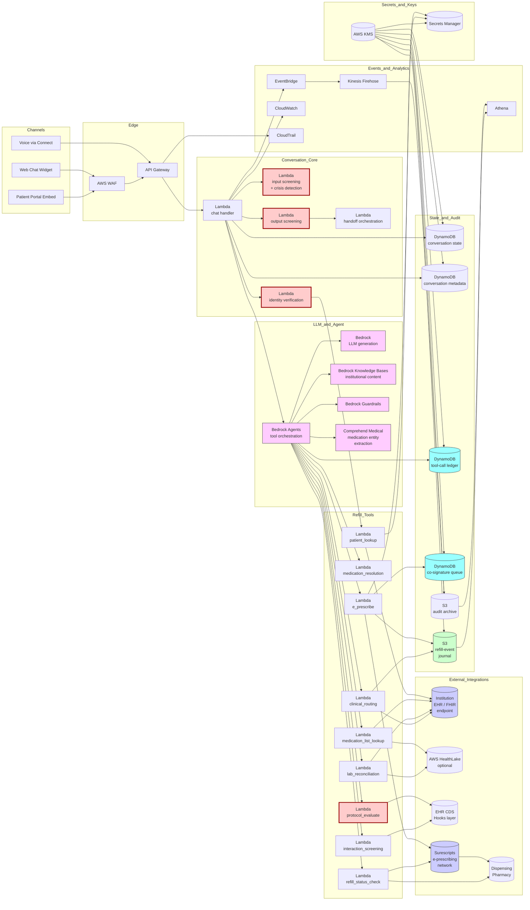

# Recipe 11.3: Prescription Refill Request Bot

**Complexity:** Simple-Medium · **Phase:** Quick-win to Foundational · **Estimated Cost:** ~$0.03-0.15 per completed refill conversation (depends on conversation length, model choice, identity-verification path, and pharmacy integration overhead)

---

## The Problem

Eleanor is 71. She takes seven prescription medications: lisinopril for blood pressure, metformin for type 2 diabetes, atorvastatin for cholesterol, levothyroxine for her thyroid, gabapentin for neuropathic pain, sertraline for depression, and a low-dose aspirin her cardiologist recommended after a coronary calcium scan. She has been taking most of them for years. Her primary care physician sees her every three months, her endocrinologist twice a year, and the rest of her care is the slow background labor of staying on top of seven prescriptions, three pharmacies (because her insurance moved one of them to mail-order in January), and the eternal question of whether the white oval pill or the white round pill is the one she takes in the morning.

It is the third Tuesday of the month. Eleanor has run out of metformin. She knows this because her pill organizer's Tuesday slot is empty, and the bottle she keeps in the kitchen cabinet has been empty for two days. She thought she had refills left. She does not. She tried to refill it through her pharmacy's app last week and the app said "no refills authorized, contact prescriber." She called the pharmacy. The pharmacy said the same thing and recommended she call the doctor's office. She called the doctor's office. The voicemail tree gave her the option to leave a refill request in the prescription line, which she did, on Friday at 4:42 PM. It is now Tuesday at 9:17 AM. Nobody has called her back. The voicemail tree said the typical turnaround is two business days, and three business days have passed, and her blood sugar at breakfast was 247 mg/dL because she has been off her metformin since Sunday.

She calls the doctor's office again. The phone tree puts her in the general queue because the prescription line goes straight to voicemail. She waits seventeen minutes. The receptionist who picks up is friendly but is also not the person who can authorize the refill; the receptionist puts in a fresh refill request, apologizes for the delay, and says the nurse will call her back. The nurse calls her back at 2:30 PM, asks her to confirm her name and date of birth, asks which medication, looks up her chart, sees that she is overdue for an A1c lab draw, and tells her that the doctor wants to see lab results before authorizing the next ninety-day fill. Eleanor explains that her A1c was drawn three weeks ago at a different lab. The nurse does not see the result in the chart. Eleanor asks if she can fax it. The nurse says yes, gives her the fax number, and says she will check tomorrow. Eleanor's husband faxes the lab result that evening. The nurse does not see the fax the next day. By Thursday, Eleanor has been off metformin for five days and her fasting glucose is 268. She calls again, this time with her daughter on three-way, and after another forty-five minutes of voicemail-and-callback the medication is finally e-prescribed to the pharmacy. Her daughter picks it up that evening.

The whole event consumed roughly three and a half hours of Eleanor's life, ninety minutes of her daughter's, twenty minutes of receptionist time, fifteen minutes of nurse time, and six minutes of the physician's time, distributed across multiple separate phone calls and chart-review interruptions. The clinical risk during the five days Eleanor was off her medication is a thing that does not show up in any of the operational metrics anyone tracks. The patient experience is, charitably, awful. The economics, when you multiply this story by the actual volume of refill requests a typical primary care practice processes, are catastrophic.

This is prescription refill management in healthcare, and it is the most common, most tedious, most error-prone, and most under-engineered patient-facing workflow in the entire ambulatory system. A primary care practice typically processes refill requests at a rate that overwhelms the schedulers, nurses, and physicians who handle them. Industry surveys regularly cite refill management as one of the top sources of clinician burden, with each physician handling dozens of requests per day on top of clinical work. <!-- TODO: verify; refill volume figures vary by practice type, panel size, and EHR; published estimates from sources like the AMA, AAFP, and Annals of Family Medicine put the per-physician refill volume in a wide range but consistently identify refill management as a significant contributor to ambulatory administrative burden -->

The frustrating part, as with scheduling, is that most refill requests are conceptually simple. Patient takes medication X. Patient is running low. Patient asks for a refill. Prescription is current, prescriber is the same, dose is the same, no clinical issue has emerged, no monitoring is overdue. The refill is approved. The pharmacy fills it. The patient picks it up. The physician's involvement is near zero. The receptionist's, nurse's, and prescriber's time spent on this kind of routine refill is almost pure overhead. It exists because the previous-generation systems were too rigid to handle the routing automatically and not transparent enough to let the patient self-serve safely.

Some refills are not simple. The patient is asking for a controlled substance and the prescriber needs to review. The medication requires periodic monitoring (an A1c for metformin escalation, a creatinine for renally-cleared drugs, a lipid panel for statin titration) and the labs are overdue. The patient is asking for early refill of a medication that they should not be running out of yet, which suggests possible misuse or a dosing problem. The medication has been changed by another prescriber and the chart is out of date. The patient is asking for a medication that was discontinued. The patient is asking for a refill on a medication they take from a specialist who does not respond to refill requests through the primary care office. Each of these warrants different handling. The competent clinic staff knows how to triage these mentally, but the triage takes time, and the time is the bottleneck.

The previous generation of patient-facing refill tools, when they existed at all, were forms inside the patient portal: pick a medication from a dropdown, submit, wait for the practice to respond. The forms had the same failure modes as the previous-generation scheduling forms: the dropdown was either incomplete (medications the patient takes that were prescribed by other providers do not show up) or overwhelming (every medication the patient has ever been on, including discontinued ones), the submission did not actually trigger any meaningful workflow change, and the patient still ended up calling because the form-and-wait flow did not feel responsive. A frustrated patient on a critical medication does not trust that a web form has actually done anything until somebody confirms.

The modern conversational refill bot looks like this. Eleanor opens the patient portal at 9:17 AM and the chat widget says "I see you have a metformin refill request pending. Want me to check on it?" Eleanor types "yes please." The bot confirms her identity from the authenticated portal session, looks at her chart, sees the pending request, sees the lab order that is blocking the refill, sees the lab result that came in at the outside lab three weeks ago and was reconciled into her chart yesterday, runs the practice's refill protocol against the chart context, and replies "Good news, your most recent A1c is 7.1, which is in range for your metformin maintenance. I'm sending the refill to Walgreens on Main Street. You should see it ready for pickup later today; the pharmacy will text you when it's done. Anything else?" Eleanor says "thank you." The bot logs the interaction, the refill, the protocol consultation, and the lab reconciliation; the prescriber co-signs at the next chart-review pass; the encounter is documented; the loop is closed.

That ninety-second conversation replaces three and a half hours of Eleanor's time, ninety minutes of her daughter's, and the cumulative two hours of receptionist, nurse, and physician time. It is also clinically safer because the protocol consultation is consistent and auditable, the lab reconciliation is automatic, and the failure modes are visible in dashboards. This recipe is the bot that closes the loop on routine refills, escalates the non-routine ones cleanly, and (this is the part nobody talks about) makes the clinic's refill protocol explicit enough that the bot can apply it deterministically.

A few things this recipe is and is not.

It is the bot that handles routine maintenance refill requests: the patient takes a chronic medication, has refills that have been used up or have a recent prescription that needs continuation, has the necessary monitoring up to date, and is not asking for early refill. It also handles routine first-pass triage of non-routine requests so that what reaches the clinical staff is the genuinely-needs-clinical-review subset.

It is not the prescriber. The bot does not write new prescriptions. The bot does not titrate doses. The bot does not start new medications. The bot does not change therapy. The bot's authority is limited to the scope the practice's medical leadership has explicitly delegated, which in most deployments is "renew an existing medication on its existing dose if it meets the practice's protocol-approved criteria, otherwise route to clinical staff."

It is not the pharmacy. The bot's job is to package the refill request, route it through the prescriber's e-prescribing workflow, and surface the resulting state to the patient. The pharmacy fills the prescription. The bot can communicate pharmacy-side status updates to the patient when the integration supports it, but the bot is not the pharmacy's system.

It is not a controlled-substance bot. Controlled substances (Schedule II through V) carry layered regulatory and clinical requirements that this recipe explicitly does not cover for self-service. The bot can identify a controlled-substance request, route it to the appropriate clinical workflow with a transparent explanation to the patient, and never auto-approve. The clinical staff handles it.

It is not the medication-reconciliation bot. The bot can surface medication-reconciliation prompts ("we have you on lisinopril; is that still correct?") but the clinical work of reconciling the medication list against what the patient actually takes is owned by the clinical workflow.

The thing to understand before building this is that the bot's quality is bounded above by the practice's refill protocol's explicitness. A bot operating against a vaguely-documented protocol books wrong refills for half-vague reasons. A bot operating against a precisely-documented protocol takes routine work off the clinical team's plate while routing the genuinely complex cases to humans with clear reasoning attached. The pre-deployment work of writing the protocol is the single highest-leverage investment, and it is rarely scoped into the project plan because nobody owns the protocol formally.

Let's get into it.

---

## The Technology: Tool-Using Conversational AI Plus the Refill Protocol Reality

### Why Refill Workflows Have Stayed Stuck

For most of the last two decades, refill workflows in ambulatory care have been a relay race between four parties (patient, pharmacy, practice clinical staff, prescriber) with the baton being passed through fax, voicemail, and the EHR's inbox. The patient asks the pharmacy, the pharmacy faxes the practice, the practice's nurse triages the fax, the prescriber approves or denies, the prescriber's response goes back to the pharmacy, the pharmacy fills the prescription, the patient picks it up. Each handoff has variable latency. The whole loop frequently takes two to five business days, and during that time the patient may be off their medication.

The first generation of digital refill tools, roughly 2010 to 2020, replaced fax with electronic prescribing (e-prescribing) and added a patient-portal form for the patient to request refills directly. This was a meaningful improvement over fax. It did not fundamentally change the workflow shape: the patient submits a request, the request lands in the practice's queue, the nurse triages it, the prescriber acts on it, the result e-prescribes to the pharmacy. The latency improved from days to hours; the work for clinical staff stayed the same; the patient experience improved a little but still depended on the practice's queue depth.

The button-tree chatbot approach to refills, when it appeared, did not work. The reason is the same as the FAQ and scheduling cases: a button-tree chatbot is a form behind a chat veneer. The patient still picks the medication from a list, still submits, still waits. The chat surface is a slightly nicer UX than the form, but the workflow shape is identical and the latency is identical.

The thing that changed the workflow shape is the combination of three things. First, structured medication data became broadly available through FHIR APIs that expose the patient's MedicationRequest resources directly. Second, tool-using LLMs (the same architectural pattern from recipe 11.2) made it possible to build a bot that could understand "my blood pressure pill" as well as "lisinopril 10 milligrams" and call the right tools to act on either. Third, the recognition that most refills are protocol-driven means most refills can be handled by a bot operating against an explicit protocol, with clinical staff handling the exceptions.

The architectural shift is from "queue everything for human triage" to "auto-approve what the protocol says is auto-approvable, route everything else to humans with reasoning attached." The bot's value is concentrated in two places: the natural-language understanding of the patient's request (so the patient does not have to know whether to type "metformin 500" or "the diabetes pill"), and the protocol-driven first-pass triage that handles the routine majority of cases without human work.

### What Tool-Using LLMs Do for Refill Bots

The chapter preface and recipe 11.2 introduced the tool-use pattern. For a refill bot, the pattern decomposes into a set of specific tools, each with a well-defined input schema and output schema. The LLM handles conversation; the tools handle action.

**Patient identification.** Same primitive as recipe 11.2. The bot needs to know which patient it is talking to before it can do anything that touches the patient's record. Authenticated portal sessions short-circuit; unauthenticated channels need the standard graduated identity verification.

**Medication lookup.** Given a free-text medication descriptor from the patient ("my metformin," "the blood pressure pill," "the white round one I take in the morning") and the patient's current medication list, return the structured medication record (name, dose, route, frequency, last-fill date, refills-remaining, prescribing provider, dispensing pharmacy). This is the medication-resolution problem the chapter preface flagged: it is harder than it sounds because patient phrasing of medications is wildly varied. Modern LLMs handle this well when the patient's medication list is in the prompt as context, less well when it is not.

**Refill eligibility check.** Given a structured medication record and the patient's chart context, evaluate the practice's refill protocol against the request. The protocol is the institutional artifact that maps (medication class, monitoring requirements, time-since-last-fill, refills-remaining, prescriber, patient context) to one of: auto-approve, route-to-prescriber-with-context, route-with-monitoring-due, route-with-clinical-question, deny-with-reason. The eligibility check tool encapsulates the protocol as code; the LLM does not evaluate the protocol itself.

**Pharmacy lookup and selection.** The patient may have multiple pharmacies on file, may have moved a prescription to mail-order, may have changed pharmacies recently. The pharmacy-lookup tool returns the patient's pharmacies with the medication's preferred dispensing location indicated.

**E-prescribe submission.** When the protocol approves the refill, the e-prescribe tool transmits the prescription to the pharmacy through the practice's e-prescribing platform (typically Surescripts in the U.S.). This is the tool that takes the action that creates the actual refill.

**Clinical routing.** When the protocol routes the refill to clinical staff, the routing tool packages the request with the bot's reasoning (which protocol rules fired, what data the bot looked up, what the patient said) and queues it in the appropriate inbox. The clinical staff sees a structured ticket, not just a chat transcript.

**Status check.** After a refill request has been submitted, the patient often wants to check on it. The status-check tool queries the e-prescribing platform and the pharmacy integration to surface the current state (sent to pharmacy, in queue at pharmacy, ready for pickup, picked up, on hold for clarification).

**Lab reconciliation (optional).** When the protocol requires recent monitoring (an A1c for metformin, a creatinine for renally-cleared drugs), the lab-reconciliation tool checks the patient's chart for the lab result, including reconciling outside-lab results that may have come through in the last few days. This avoids the Eleanor failure mode where a recent lab exists but has not yet been reconciled into the chart at the time of triage.

**Medication-information lookup (optional).** Patients sometimes ask peripheral questions ("does this interact with the new ibuprofen my orthopedist mentioned?", "should I take this with food?"). The medication-information tool returns curated drug information from a clinical reference (RxNorm, FDB, Lexicomp, or the practice's preferred reference). The bot answers from the curated source, not from its training data.

A refill bot is, architecturally, an LLM with a system prompt that tells it what assistant it is, the patient's authenticated context, the patient's medication list, and access to those tools. The LLM does the reasoning ("the patient asked about their metformin; let me look it up, check eligibility, and either submit the refill or route it"); the tools execute the deterministic actions.

The architectural decision that matters most: the LLM does not approve refills directly. The protocol-evaluation tool approves refills; the LLM proposes; the tool decides. Every action that affects the patient's medication record goes through a tool with a well-defined contract. This separation is what makes the system safe enough to handle medication actions and trustworthy enough for the clinical leadership to allow it to e-prescribe at all.

### Why a Generic LLM Cannot Manage Refills

A naive product approach would be: take a generalist LLM, give it a chat surface, give it the patient's chart, and let it negotiate refills. This does not work for several reasons that get worse the closer you look.

**The model has no view of the patient's actual medications.** The LLM does not know what the patient takes unless the patient's medication list is in the context. If the LLM is asked to reason about "their metformin" without that data, it will guess. The guesses will be plausible and will be wrong. The medication-lookup tool provides the structured medication list and is the only reliable source of truth.

**The model cannot evaluate the protocol consistently.** The practice's refill protocol is a set of explicit rules: lisinopril maintenance refill auto-approves if the patient's blood pressure has been documented in the last twelve months and the medication has not been escalated in the last three months. Metformin auto-approves if the most recent A1c is within the practice's documented range and is dated within the last year. Statins auto-approve if the most recent lipid panel is within the last year and the LDL is at goal. Asking the LLM to evaluate these rules conversationally produces inconsistent answers because the LLM is a stochastic function. The protocol-evaluation tool is deterministic. The protocol must be encoded as code, not as prompt text.

**The model cannot transactionally e-prescribe.** E-prescribing is a transactional operation: write to the e-prescribing platform, get a confirmation, surface the confirmation to the patient. The LLM is not transactional. The e-prescribe tool provides the transactional contract.

**The model cannot enforce the regulatory layer.** Controlled substances follow Schedule II through V regulations including DEA EPCS (electronic prescribing of controlled substances) requirements and state-specific PDMP (prescription drug monitoring program) check obligations. <!-- TODO: verify; EPCS has been the federal standard for controlled-substance e-prescribing since the 2010 DEA interim final rule, with full mandates rolled out over the following years; state PDMP requirements vary by state and continue to evolve --> Asking the LLM to enforce these is asking the LLM to do regulatory compliance, which it cannot reliably do. The tool layer enforces the regulatory layer; controlled substances route to the appropriate clinical workflow rather than auto-approving.

**The model has no audit trail.** Every refill action is a clinical event that needs to be auditable: who initiated the request, when, against what protocol version, with what supporting data, with what outcome. The LLM produces conversational text; the tool layer produces transactional records. Without the tool layer, the audit trail is unstructured chat logs.

**The model cannot handle drug-drug interaction screening reliably.** A new medication added by an outside prescriber may interact with one of the patient's current medications. The interaction screening must happen against an authoritative drug-interaction database, not against the LLM's training data. The interaction-screening tool wraps the database; the LLM consumes the result.

**The model cannot enforce the prescriber's authority.** A medication initially prescribed by a specialist (a cardiologist's amiodarone, a rheumatologist's methotrexate) is generally not refillable through the primary care practice. The bot has to route these to the specialist's office or to a coordinated care pathway, not auto-approve them. The protocol-evaluation tool encodes the prescriber-authority rules; the LLM cannot.

**The model has compliance implications for medication-related conversation.** Every refill conversation is a HIPAA-relevant interaction with PHI. The conversation log is PHI. The medication list, the lab values, the chart context that the bot retrieved are PHI. The architecture must produce the durable audit pipeline that scheduling required, plus a layer of clinical-event documentation that the scheduling bot did not need.

### What the Refill Bot Has To Do That the Scheduling Bot Did Not

Recipe 11.2 (scheduling) established the patterns this recipe inherits: input safety screening, intent classification, identity verification with graduated assurance, tool-use orchestration, transactional fulfillment, output safety screening, audit logging, per-cohort monitoring. The refill bot adds five structural commitments that the scheduling bot did not have.

**Clinical protocol as code.** The scheduling bot's domain logic is the practice's scheduling rules. The refill bot's domain logic is the practice's clinical refill protocol. The protocol covers more medical-domain detail (medication classes, monitoring requirements, dosing rules, contraindications), changes more frequently (as new medications come to market, as guidelines update, as the practice refines), and has higher consequences when wrong (an incorrect scheduling action wastes time; an incorrect refill action affects therapy). The protocol-as-code commitment includes versioning, review by clinical leadership, sandbox testing, staged rollout, and audit-record stamping with the active protocol version.

**Prescriber co-signature workflow.** Even when the protocol auto-approves a refill, in many institutions the prescribing physician's name appears on the refill, and the physician needs to be in the loop. The co-signature workflow surfaces auto-approved refills to the prescriber's queue for review (within the regulatory and institutional timeline; in many practices this is asynchronous within twenty-four to seventy-two hours of the bot's action). The bot's authority is delegated by the prescriber's standing order or protocol; the co-signature confirms that the delegation was applied appropriately.

**Drug-interaction and contraindication checking.** Every refill action runs through an interaction-and-contraindication check against the patient's current medication list and the patient's documented allergies and conditions. This is not optional. The clinical-decision-support layer is a hard requirement, and the integration with the practice's clinical-decision-support system (which is typically embedded in the EHR) is part of the architecture.

**Pharmacy integration as a first-class concern.** The scheduling bot ends at the calendar; the refill bot has to follow through to the pharmacy and surface the resulting state to the patient. The patient's "is my refill ready?" question is part of the bot's scope. Pharmacy integration depth varies (some pharmacies expose APIs, some require Surescripts intermediation, some are entirely opaque to the practice), and the bot's architecture must accommodate the heterogeneity without making promises it cannot keep.

**Controlled-substance handling as a hard non-negotiable boundary.** Controlled substances do not auto-approve. Ever. The bot identifies controlled-substance requests, explains the situation to the patient transparently, and routes to the appropriate clinical workflow. The boundary is encoded in the protocol-evaluation tool, in the bot's prompt, and in the output safety screening as a triple defense.

The rest is largely the same as recipe 11.2: tool-surface contract management, identity-assurance lifecycle, transactional-failure compensation, per-cohort monitoring, conversation logging, scope filtering, crisis detection.

### The Refill Reality

A few notes on what makes refill management specifically harder than other transactional bot use cases.

**Medication-naming variability is extreme.** Patients refer to medications by brand name ("Lipitor"), generic name ("atorvastatin"), color ("the white round one"), function ("the cholesterol pill"), or position in the pill organizer ("the morning one"). The bot's medication-resolution tool needs the patient's structured medication list as ground truth. With that context, an LLM resolves the patient's reference reliably. Without it, the LLM guesses, and the guesses are sometimes wrong in dangerous ways (atenolol versus albuterol; hydroxyzine versus hydralazine).

**Medication lists are frequently out of date.** The patient's documented medication list in the chart often lags reality. The patient stopped taking a medication two months ago; the chart still shows it as active. The patient started a new medication from the cardiologist last week; the chart has not been updated yet because the cardiologist is on a different EHR. The bot has to reconcile what the patient says they take with what the chart says. When the patient says "I'm not taking the gabapentin anymore," the bot does not just accept this and discontinue; the bot surfaces it as a medication-reconciliation event for clinical follow-up while still handling the immediate refill question.

**Monitoring requirements are nuanced.** Metformin needs an A1c periodically. Statins need a lipid panel periodically. ACE inhibitors and ARBs need a creatinine and potassium periodically. Lithium needs a blood-level check on a tighter cadence. Each medication class has a documented monitoring expectation that the practice has codified, and the cadence depends on the patient's overall context (renal function, comorbidities, recent dose changes). The protocol must encode the monitoring rules, and the protocol's quality is the bot's ceiling.

**Refill timing rules vary by medication and by payer.** A 30-day supply with three refills behaves differently than a 90-day supply with one refill. A medication that the insurance has authorized a quantity-limit override on behaves differently than one without. A medication that is on the patient's mail-order benefit cannot be refilled at the retail pharmacy. The bot has to surface the relevant quantity, supply, and pharmacy correctly. Getting this wrong means the patient picks up nothing because the prescription went to the wrong pharmacy.

**Early-refill detection is a misuse signal.** A patient asking for a refill on a medication that they should not be running out of yet is a signal worth noticing. The signal is more important for some medications (controlled substances, opioids, benzodiazepines, stimulants) than others (a maintenance lisinopril). The protocol encodes the early-refill rules per medication class, and early-refill detections route to the appropriate clinical workflow with the timing analysis attached.

**The patient's adherence context matters.** A patient who reports running out because they were doubling the dose, or because they lost the bottle, or because they were taking it inconsistently, is in a different state than a patient who simply ran out on schedule. The bot can ask the question gently, surface the answer to clinical staff, and influence the disposition (a doubling-the-dose patient routes to the prescriber for review of the dosing; a lost-bottle patient gets the refill with a brief note about future planning).

**Discontinued medications come back.** A medication that the practice marked as discontinued may have been resumed by the patient outside the practice's visibility (the patient picked up an old bottle from a cabinet, the patient bought a generic over the counter in another country, the patient was advised by an outside provider to resume it). The bot has to handle "I want to refill the gabapentin" when the gabapentin shows as discontinued in the chart, by surfacing the discrepancy and routing to a clinical conversation rather than just refusing.

**Specialist medications require boundary-setting.** A primary care practice generally does not refill the specialist's medications. The specialist's amiodarone, the rheumatologist's methotrexate, the endocrinologist's insulin pen with the dose-titration plan in the specialist's chart, the oncologist's chemotherapy, the gastroenterologist's biologic. The bot's protocol-evaluation tool encodes the prescriber-authority boundaries; the bot transparently routes specialist refills to the specialist's office or to the coordinated-care pathway.

**Patients sometimes ask about discontinuation, not refill.** A patient saying "I want to stop taking the sertraline" is asking about discontinuation, not refill. The bot has to recognize this is a clinical conversation, decline to act on it as a refill question, and route to the appropriate clinical workflow with the context preserved.

### Where the Field Has Moved

A few practical updates worth knowing.

**FHIR MedicationRequest is the standard data model.** The FHIR MedicationRequest resource provides a standard representation of prescriptions, refills, and the relationship to the dispensing pharmacy. <!-- TODO: verify; FHIR MedicationRequest has been part of FHIR since DSTU2 with refinements in subsequent versions; major EHRs implement at least a subset of MedicationRequest with varying completeness --> Most major EHRs expose MedicationRequest endpoints. The bot's medication-lookup tool wraps the institution-specific implementation behind a stable internal interface.

**Surescripts is the practical e-prescribing channel.** In the U.S., Surescripts provides the routing layer between prescribers and pharmacies. <!-- TODO: verify; Surescripts is the predominant e-prescribing network in the U.S., processing the majority of e-prescription transactions; specific market share figures change over time --> The practice's existing e-prescribing setup typically routes through Surescripts already; the bot's e-prescribe tool wraps this existing path.

**CDS Hooks are increasingly available.** The CDS Hooks specification provides a standard way for clinical-decision-support systems to be invoked at specific decision points (including order-sign hooks for medication ordering). <!-- TODO: verify; CDS Hooks is a maturing standard with growing adoption in the FHIR ecosystem; specific implementation availability varies by EHR vendor --> Where available, the bot's protocol-evaluation tool can invoke the institution's CDS layer via CDS Hooks for interaction screening, contraindication checks, and policy enforcement.

**Tool-using LLMs are the default architecture.** Same as recipe 11.2. The function-calling pattern, with the LLM proposing tool calls and the tool layer executing them, is the default architecture for transactional conversational AI as of 2024 onward.

**Standing orders and protocol delegation are mature institutional patterns.** Most ambulatory practices already have standing orders for routine refills under physician delegation. <!-- TODO: verify; standing orders for medication refills under physician delegation are widely used in ambulatory care, with specific scope governed by state nursing scope-of-practice rules and institutional policy --> The bot's authority is the same delegation, applied consistently rather than person-by-person. The practice's existing standing-order documentation is the starting point for the bot's protocol.

**Pharmacy-side patient apps have raised expectations.** Patients are accustomed to the experience of CVS, Walgreens, and the major mail-order pharmacies' apps, which provide refill status, pickup notifications, and medication reminders. The practice-side bot's UX needs to be at least as smooth, or patients will perceive the practice's tooling as worse than the pharmacy's even when it is doing more.

**Build-vs-buy economics favor partial-buy for many institutions.** The protocol-evaluation, audit, and orchestration layer is increasingly available from EHR vendors and from third-party patient-engagement vendors. Building all of it from scratch is rare. The practice usually buys the engine and customizes the protocol; the protocol customization is where the institutional value lives.

---

## General Architecture Pattern

A healthcare prescription refill bot decomposes into nine logical stages: channel entry, input safety screening, intent classification, identity verification, medication resolution, refill-eligibility evaluation, transactional fulfillment (e-prescribe or clinical routing), output safety screening, and audit logging. The cross-cutting concerns from recipes 11.1 and 11.2 carry forward; this recipe adds two new ones (clinical-protocol-as-code lifecycle, prescriber co-signature workflow).

```
┌────────── CHANNEL ENTRY ─────────────────────────────────┐
│                                                           │
│   [Patient connects through one of the configured         │
│    channels: web chat widget, in-app chat, SMS,           │
│    voice (with ASR/TTS), authenticated patient-portal     │
│    embed]                                                 │
│                                                           │
│   [Greeting and disclosure]                               │
│    - Identifies as a chatbot, not a pharmacist or         │
│      clinician                                            │
│    - States the bot's scope (refills of existing          │
│      maintenance medications; not new prescriptions,      │
│      not dose changes, not controlled substances          │
│      auto-approval, not clinical advice)                  │
│    - Offers an immediate path to a human                  │
│                                                           │
│   [Conversation session bootstrap]                        │
│    - Generate session_id                                  │
│    - Capture channel, authentication context, and any     │
│      deep-link parameters (e.g., patient clicked a        │
│      "request refill" link from the medication-list       │
│      page in the portal)                                  │
│           │                                               │
│           ▼                                               │
│   [Output: session_id, channel, auth context]             │
│                                                           │
└───────────────────────────────────────────────────────────┘

┌────────── INPUT SAFETY SCREENING ────────────────────────┐
│                                                           │
│   [Same primitive as recipes 11.1 and 11.2:]              │
│    - Crisis detection (preempts everything; a patient     │
│      who mentions overdose, suicidal ideation, or         │
│      misuse during a refill conversation is a crisis      │
│      signal that routes to the crisis pathway)            │
│    - Prompt-injection detection                           │
│    - PHI minimization                                     │
│           │                                               │
│           ▼                                               │
│   [Output: input passes / input blocked-with-disposition] │
│                                                           │
└───────────────────────────────────────────────────────────┘

┌────────── INTENT CLASSIFICATION ─────────────────────────┐
│                                                           │
│   [Map the user's request to one of the bot's intents]    │
│    - request_refill                                       │
│    - check_refill_status                                  │
│    - cancel_refill_request                                │
│    - medication_question (peripheral question, not        │
│      a refill action)                                     │
│    - medication_change (asking to start, stop, or         │
│      change therapy; out of scope)                        │
│    - clinical_question (out of scope; route to nurse      │
│      triage)                                              │
│    - controlled_substance_request (in-scope-but-          │
│      route-to-clinician; never auto-approved)             │
│    - out_of_scope (other topics; route appropriately)     │
│           │                                               │
│           ▼                                               │
│   [Output: in-scope intent | out-of-scope handoff]        │
│                                                           │
└───────────────────────────────────────────────────────────┘

┌────────── IDENTITY VERIFICATION ─────────────────────────┐
│                                                           │
│   [Same graduated assurance pattern as recipe 11.2,       │
│    with a higher floor for refill-related actions]        │
│                                                           │
│   [Authenticated session path]                            │
│    - Patient is logged into the patient portal            │
│    - The session conveys an authenticated patient_id      │
│    - The bot accepts the patient_id as verified           │
│                                                           │
│   [Unauthenticated channel path]                          │
│    - Refills generally require a higher assurance         │
│      level than scheduling. Many institutions choose      │
│      to require authenticated sessions for refill         │
│      actions and to limit unauthenticated paths to        │
│      status-check intents only.                           │
│    - When unauthenticated paths are allowed, the bot      │
│      uses the same identity verification primitives       │
│      as recipe 11.2 with stronger confirmation factors    │
│      (e.g., a one-time code rather than last-four-of-     │
│      phone)                                               │
│                                                           │
│   [Step-up authentication for sensitive actions]          │
│    - Asking about a controlled-substance medication       │
│      may require step-up                                  │
│    - Requesting an early refill may require step-up       │
│           │                                               │
│           ▼                                               │
│   [Output: verified patient_id, assurance_level]          │
│                                                           │
└───────────────────────────────────────────────────────────┘

┌────────── MEDICATION RESOLUTION ─────────────────────────┐
│                                                           │
│   [Tool: medication_list_lookup]                          │
│    - Pull the patient's structured medication list        │
│      from the EHR via FHIR MedicationRequest              │
│    - Include the active medications, their doses,         │
│      frequencies, refills-remaining, last-fill dates,     │
│      prescribing providers, dispensing pharmacies         │
│                                                           │
│   [Tool: medication_resolution]                           │
│    - Given the patient's free-text descriptor and the     │
│      medication list, identify the specific medication    │
│    - Use the LLM with the medication list as context      │
│    - When ambiguous, ask the patient to clarify           │
│      (e.g., the patient says "the heart pill" and they    │
│      take both lisinopril and atorvastatin)               │
│                                                           │
│   [Discontinued-medication handling]                      │
│    - When the patient asks for a medication that the      │
│      chart marks as discontinued, surface the             │
│      discrepancy, ask the patient to confirm what they    │
│      are actually taking, and route to clinical staff     │
│      with the context preserved                           │
│                                                           │
│   [Specialist-medication handling]                        │
│    - When the medication's prescribing provider is        │
│      outside the practice (a cardiologist's amiodarone,   │
│      a rheumatologist's methotrexate), surface the        │
│      prescriber-authority boundary and route to the       │
│      appropriate office or coordinated-care pathway       │
│           │                                               │
│           ▼                                               │
│   [Output: resolved medication record, or routing         │
│    decision]                                              │
│                                                           │
└───────────────────────────────────────────────────────────┘

┌────────── REFILL-ELIGIBILITY EVALUATION ─────────────────┐
│                                                           │
│   [Tool: protocol_evaluate]                               │
│    - Inputs: resolved medication record, patient          │
│      chart context (active diagnoses, allergies,          │
│      relevant lab values, blood pressure history,         │
│      other medications), the practice's protocol          │
│      version, and the request context (timing,            │
│      pharmacy, patient-stated context)                    │
│    - Output: a structured decision with                   │
│      - disposition (auto_approve, route_to_prescriber,    │
│        route_with_monitoring_due, route_with_clinical_    │
│        question, deny_with_reason, controlled_substance_  │
│        always_route)                                      │
│      - reasoning (which protocol rules fired and why)     │
│      - data_consulted (which chart elements the           │
│        protocol read)                                     │
│      - protocol_version (stamped on the decision)         │
│                                                           │
│   [Drug-interaction and contraindication screening]       │
│    - Run the resolved medication against the patient's    │
│      active medication list and documented allergies      │
│      and conditions                                       │
│    - Use the institution's clinical-decision-support      │
│      system (typically CDS Hooks against the EHR) or      │
│      a dedicated drug-interaction database                │
│    - Surface findings to the protocol-evaluation step     │
│                                                           │
│   [Lab reconciliation]                                    │
│    - When the protocol requires recent monitoring,        │
│      check for the lab result in the chart                │
│    - Reconcile outside-lab results that may have come     │
│      through recently (don't fail the request because     │
│      the lab is technically not in the chart yet when     │
│      the patient knows it was drawn)                      │
│           │                                               │
│           ▼                                               │
│   [Output: structured eligibility decision with full      │
│    reasoning attached]                                    │
│                                                           │
└───────────────────────────────────────────────────────────┘

┌────────── TRANSACTIONAL FULFILLMENT ─────────────────────┐
│                                                           │
│   [Auto-approve path]                                     │
│    - Tool: e_prescribe                                    │
│      - Submits the refill to the dispensing pharmacy      │
│        through the e-prescribing platform (typically      │
│        Surescripts)                                       │
│      - Returns the prescription identifier and the        │
│        transmission status                                │
│    - Tool: cosignature_queue                              │
│      - Adds the auto-approved refill to the prescriber's  │
│        co-signature queue for asynchronous review         │
│        (within the institution's SLA, typically 24-72     │
│        hours)                                             │
│    - Tool: refill_event_journal                           │
│      - Writes the durable record of the refill action     │
│        with the protocol version, reasoning, data         │
│        consulted, prescriber, dispensing pharmacy         │
│                                                           │
│   [Route-to-clinician path]                               │
│    - Tool: clinical_routing                               │
│      - Packages the request with the bot's reasoning,     │
│        the data consulted, and any patient context        │
│        (e.g., the patient said they have been doubling    │
│        the dose)                                          │
│      - Queues the structured ticket in the appropriate    │
│        inbox (nurse triage, prescriber inbox, pharmacy    │
│        coordination, depending on the disposition)       │
│      - Returns the queue position and the expected        │
│        SLA                                                │
│    - Tool: refill_event_journal                           │
│      - Writes the durable record of the routing event     │
│                                                           │
│   [Deny-with-reason path]                                 │
│    - Tool: refill_event_journal                           │
│      - Writes the durable record of the denial with       │
│        the protocol-driven reasoning                      │
│    - Conversational response explains the denial          │
│      transparently and offers next steps                  │
│                                                           │
│   [Failure handling]                                      │
│    - E-prescribe transmission error: queue for retry,     │
│      surface the issue to clinical staff, tell the        │
│      patient honestly                                     │
│    - Pharmacy unreachable: queue for retry, surface       │
│      the issue, ensure the patient is not left thinking   │
│      the refill was sent when it was not                  │
│    - Co-signature queue write error: the e-prescribe      │
│      already happened; the co-signature event is queued   │
│      for retry; the operations dashboard surfaces         │
│      pending co-signature backlog                         │
│           │                                               │
│           ▼                                               │
│   [Output: refill action result with full structured      │
│    audit data]                                            │
│                                                           │
└───────────────────────────────────────────────────────────┘

┌────────── OUTPUT SAFETY SCREENING ───────────────────────┐
│                                                           │
│   [Same primitive as recipes 11.1 and 11.2, with new      │
│    refill-specific checks]                                │
│    - Scope filter on generated response (no clinical      │
│      advice, no dose changes, no medication starts)       │
│    - Vendor-managed guardrail layer                       │
│    - Hallucination check: did the bot tell the patient    │
│      the refill was sent when no e_prescribe call         │
│      returned success? Did the bot mention a medication   │
│      that is not on the patient's list? Did the bot       │
│      claim a lab value that does not match the lab        │
│      tool's result?                                       │
│    - Controlled-substance guardrail: did the bot          │
│      indicate it was processing a controlled-substance    │
│      refill? Verify against the protocol-evaluate         │
│      result and replace with the routing template if      │
│      so                                                   │
│           │                                               │
│           ▼                                               │
│   [Output: response cleared for delivery, or replaced     │
│    with a refusal-and-handoff]                            │
│                                                           │
└───────────────────────────────────────────────────────────┘

┌────────── AUDIT, LOG, AND TELEMETRY ─────────────────────┐
│                                                           │
│   [Durable conversation record]                           │
│    - User utterances (scrubbed of inadvertent PHI)        │
│    - Tool calls with arguments and results                │
│    - Generated responses                                  │
│    - Active model and prompt versions                     │
│    - Active protocol version stamped on every             │
│      eligibility evaluation                               │
│    - Identity-verification outcome and assurance level    │
│    - Refill outcomes (auto_approved, routed, denied,      │
│      failed, abandoned)                                   │
│                                                           │
│   [Refill-event journal]                                  │
│    - Durable, separately-governed record of every         │
│      refill action: the medication, the patient, the      │
│      protocol version, the decision, the reasoning,       │
│      the data consulted, the e-prescribing identifier,    │
│      the dispensing pharmacy, the prescribing provider,   │
│      the co-signature status                              │
│    - Retention sized to the institution's medical-        │
│      record-retention floor                               │
│                                                           │
│   [Operational telemetry]                                 │
│    - Refill auto-approval rate per medication class       │
│    - Routing rate per disposition                         │
│    - Median time-to-completion (auto-approved vs          │
│      routed)                                              │
│    - Co-signature backlog                                 │
│    - Identity-verification failure rate                   │
│    - Tool-call failure rate per tool                      │
│    - Per-cohort metric slices (language, channel,         │
│      authentication path, age cohort)                     │
│                                                           │
│   [Sampled review queue]                                  │
│    - Random sample plus targeted sample of low-           │
│      confidence and escalated conversations               │
│    - Reviewers tag failure modes (medication-resolution   │
│      error, protocol-evaluation error, routing-           │
│      disposition error, etc.)                             │
│    - Clinical-leadership review of auto-approved          │
│      sample for protocol-application accuracy             │
│           │                                               │
│           ▼                                               │
│   [Output: audit trail, telemetry, learning signals]      │
│                                                           │
└───────────────────────────────────────────────────────────┘
```

A few cross-cutting design points specific to the refill bot.

**The protocol is a versioned governance artifact.** The clinical refill protocol, encoded as code, is the bot's most consequential institutional asset. It is owned by clinical leadership, not by engineering. Changes go through clinical-leadership review, sandbox testing, and staged rollout. Every protocol-evaluation result records the active protocol version. Every refill action records the protocol version that authorized it. The conversation log, the refill-event journal, and the operational dashboards all reference the protocol version. When the protocol changes, the institution can reconstruct exactly which decisions were made under which version. This is the load-bearing accountability that makes the bot safe enough to delegate routine refills to.

**Prescriber co-signature is not optional, but it is asynchronous.** The bot's authority comes from a delegation arrangement with the prescriber. The prescriber retains responsibility for the patient's therapy. The co-signature workflow surfaces auto-approved refills to the prescriber within a defined SLA (typically 24-72 hours). The prescriber can flag any auto-approval for retrospective clinical review. The flagged reviews feed the protocol-improvement loop. The bot's authority is delegated; the prescriber's accountability is preserved.

<!-- TODO (TechWriter): Expert review S1 (HIGH). Promote clinical-protocol-as-code lifecycle and prescriber-delegation governance from prose to architectural primitive. Specify per-medication-class versioned protocol with semantic versioning (major / minor / patch), sandbox testing against held-out refill conversations with per-medication-class regression evaluation, staged rollout with per-medication-class canary, rollback-on-regression discipline, named ownership at the medical-staff committee plus the protocol governance committee plus the privacy officer, protocol-version-stamping on every refill-event-journal record (extended to per-medication-class and per-rule stamping), per-prescriber delegation scope (medication classes, patient categories, conditions) with annual-renewal cadence, per-delegation-version-stamping on every refill action, co-signature SLA monitoring and escalation with per-prescriber co-signature backlog as operational metric, prescriber-flagged-co-signature retrospective review feeds structured failure-mode-labeling workflow, per-protocol-rule auditability with rule-IDs matching the institutional protocol document, and per-state PDMP and controlled-substance regulatory configuration as a versioned asset. Add `protocol_assets`, `delegation_assets`, and `pdmp_state_config_assets` architectural components to the diagram. Update Step 5C (protocol_evaluate_tool.invoke) to reference per-medication-class protocol version, per-prescriber delegation version, and per-state PDMP configuration. Update Step 6C cosignature_queue.enqueue to include co-signature SLA tier and escalation policy. Update Step 10A audit_record to stamp `active_per_medication_class_protocol_version_at_session`, `active_delegation_version_at_session`, and `active_pdmp_state_config_version_at_session`. -->

**Controlled-substance handling is a hard architectural floor.** Every layer of the bot has explicit logic for controlled substances: the medication-list-lookup tool returns the controlled-substance schedule, the medication-resolution step flags controlled substances, the protocol-evaluate tool returns "controlled_substance_always_route" for any controlled-substance request, the e-prescribe tool refuses to transmit controlled substances through the bot's auto-approval path, the output safety screening checks for controlled-substance language in the response. The triple defense is intentional. A bot that auto-approves a controlled substance once is a bot that gets the project canceled.

**Medication resolution against the patient's list is the safety floor.** The bot does not act on a medication unless the medication is on the patient's list. The medication-resolution tool returns a structured medication record from the list or returns "no match"; in the no-match case, the bot does not guess. This prevents the failure mode where the bot interprets "the white pill" as a medication that the patient does not take, runs the protocol against a wrong record, and produces a wrong action.

**Lab reconciliation closes the most common protocol-block escape valve.** The Eleanor failure mode (lab exists but is not yet reconciled into the chart) is so common that the bot's lab-reconciliation step is part of the architecture, not an optional extension. The institution's reconciliation pipeline (recipe 5.6 patterns) is the integration point; the bot's lab-reconciliation tool checks the latest available result, including pending-reconciliation outside-lab results.

**The refill-event journal is a separate record class with stricter governance than the conversation log.** Conversations are PHI-relevant and have audit obligations; refill events are clinical-record events and have medical-record-retention obligations. The institution's medical-records team owns the refill-event journal's retention, access, and disclosure-accounting policies, separately from the conversation-log policies.

<!-- TODO (TechWriter): Expert review S2 (HIGH). Specify the working-store-vs-archive-store discipline for the tool-call ledger and refill-event journal. The tool-call-ledger DynamoDB on the real-time hot path should hold only structural references (tool name, invocation timestamp, structural arguments such as medication_id and protocol_version, structural result such as disposition, latency, outcome, and an archive_ref pointer); free-text patient-stated context, full data_consulted content (lab values, blood-pressure history, condition details, allergy details), and full rules_fired details should route to a per-conversation tool-call-archive S3 prefix with the appropriate KMS key class. The refill_event_journal write at Step 6D currently embeds `data_consulted_summary: decision.data_consulted` and `rules_fired: decision.rules_fired` and `patient_stated_context: session.patient_stated_context` inline in the durable Object-Lock record; route these to the per-conversation archive surface and have the journal carry only structural fields (medication identifiers, prescription_id, pharmacy_id, prescribing_provider_id, protocol versions, delegation version, rules_fired_summary as rule-IDs only) with `data_consulted_archive_ref`, `rules_fired_archive_ref`, and `patient_stated_context_archive_ref` pointers. Add the `tool_call_archive` and `refill_event_data_archive` components to the architecture diagram. Reconcile per-record-class retention floors: refill-event-journal retention floor (longest of HIPAA's six-year minimum, state-specific medical-records retention rules, state-specific PDMP retention rules where applicable for any controlled-substance-related records, state-specific pharmacy-record retention rules, institutional regulatory floor); tool-call ledger and tool-call archive bound by audit-pipeline retention. Specify per-record-class access-control surface (medical-records team plus operations team plus pharmacist read-access plus prescriber read-access for retrospective review for the refill-event journal; engineering and audit-and-compliance for the tool-call ledger). Specify cross-correlation discipline with the institution's e-prescribing platform records and pharmacy records. -->

**Per-cohort monitoring is non-negotiable, with refill-specific metric slices.** Auto-approval rate, time-to-completion, and routing-disposition mix can vary substantially by language, age cohort, channel, and medication class. Equity-relevant disparities (an auto-approval rate that is meaningfully lower for non-English-speaking patients than for English-speaking patients with the same medication and the same protocol-relevant data) is a launch-gate criterion, not a post-launch dashboard.

<!-- TODO (TechWriter): Expert review A1 (HIGH). Promote per-cohort monitoring from prose to an architectural primitive with explicit launch-gate discipline. Specify single-axis cohorts (per-language, per-channel, per-region, per-assurance-level, per-intent, per-medication-class), two-axis cohorts (per-language-by-channel, per-language-by-medication-class, per-medication-class-by-channel, per-assurance-level-by-channel), and three-axis cohort (per-language-by-channel-by-medication-class for multilingual-multi-class deployments). Add per-cohort threshold metrics including auto-approval rate per medication class, routing rate per disposition, time-to-completion per disposition, identity-verification-success rate, mis-resolved-medication rate (recipe-distinct safety-acute metric: atenolol-vs-albuterol-class misresolution has therapeutic consequences a wrong scheduling action does not), lab-reconciliation-failure rate (recipe-distinct: per-cohort outside-lab reconciliation gaps may correlate with care-network coverage), prescriber-flagged-co-signature rate (recipe-distinct clinical-safety signal), routing-disposition-mix-disparity, tool-call-failure rate per tool, handoff rate per intent, sustained-utilization rate, and patient-feedback distribution. Per-cohort minimum sample sizes for statistical reliability with alternate sampling for long-tail cohorts (rare medication classes, low-volume languages). Launch gate as institution-wide-average-is-informational-only; each cohort must meet its threshold before going live. Cohort-disabled-feature workflow with clinical-leadership and patient-experience remediation tracking. -->

**Compensation operations cover medication actions specifically.** When a refill that should not have happened did happen, the operational team needs to be able to act: contact the patient, contact the pharmacy if the medication has not been picked up, document the event, surface it for clinical review. The compensation path is explicit, audited, and exercised in tabletop drills before launch.

---

## The AWS Implementation

### Why These Services

**Amazon Bedrock for the LLM and the embeddings.** Same selection criteria as recipes 11.1 and 11.2. The refill bot specifically benefits from a model with strong tool-use (function-calling) support and strong medical-terminology comprehension. Claude Sonnet-class or Nova Pro-class models for orchestration; smaller models for the lighter-weight intent-classification and medication-resolution sub-tasks. Bedrock provides HIPAA-eligible deployment under BAA.

**Amazon Bedrock Knowledge Bases for the institutional content.** The refill bot needs the same kind of curated content the FAQ and scheduling bots needed, plus a medication-information corpus: drug-interaction summaries, common-question answers per medication class, the practice's patient-facing medication-management content, the practice's refill protocol's patient-facing phrasings. Knowledge Bases provides the managed RAG layer.

**Amazon Bedrock Agents for tool orchestration.** Same selection rationale as recipe 11.2. The bot's tools (medication-list-lookup, medication-resolution, protocol-evaluate, e-prescribe, clinical-routing, lab-reconciliation, status-check) are defined as Agents action groups with OpenAPI schemas. The Agent handles the multi-step LLM-and-tool flow.

**Amazon Bedrock Guardrails for scope and content filtering.** Same purpose as recipes 11.1 and 11.2, with refill-specific configuration: clinical-advice filter aggressive, dose-change filter aggressive, controlled-substance auto-approval blocked, medication-discontinuation guidance blocked.

**Amazon Comprehend Medical for medication entity extraction.** Comprehend Medical's RxNorm-coded medication entity extraction supplements the LLM's medication-resolution. Where the LLM is uncertain about which medication the patient is referring to, Comprehend Medical's structured extraction can disambiguate or flag ambiguity.

**AWS HealthLake (optional) for the FHIR-native chart context.** When the institution stores FHIR data in HealthLake, the bot's medication-list-lookup, lab-reconciliation, and chart-context tools can query HealthLake directly. When the FHIR data lives in the institution's EHR, the bot's tools query the EHR's FHIR API instead. The bot's tool surface abstracts the underlying source.

**Amazon API Gateway and AWS Lambda for the backend.** Same chat-handler pattern as recipe 11.2. The tool Lambdas that integrate with the EHR's FHIR API and the e-prescribing platform run in VPC with controlled egress.

**The institution's e-prescribing infrastructure (typically Surescripts-routed).** The bot's e-prescribe tool wraps the practice's existing e-prescribing setup. The practice already has the Surescripts connection, the prescriber's DEA registration (where applicable for controlled substances, though the bot does not auto-approve those), and the dispensing-pharmacy directory. The bot's tool layer is a wrapper around the existing infrastructure, not a replacement.

**The institution's clinical-decision-support layer (typically embedded in the EHR; CDS Hooks where available).** The protocol-evaluate tool invokes the institution's CDS layer for drug-interaction screening, contraindication checks, and policy enforcement. Where the EHR exposes CDS Hooks, the integration uses the standard hook calls; otherwise, the protocol-evaluate tool calls the EHR's vendor-specific interaction-screening API.

**Amazon DynamoDB for conversation state, session state, tool-call ledger, and co-signature queue.** Four tables: `conversation-state`, `conversation-metadata`, `tool-call-ledger`, and `cosignature-queue` (the prescriber's pending-review queue with TTL on stale entries that should escalate).

**Amazon S3 for source documents, the audit archive, and the refill-event journal.** Same as recipe 11.2, plus a separately-governed refill-event journal that records every refill action's durable record. Object Lock in compliance mode for the medical-records retention window.

**AWS KMS, AWS Secrets Manager, Amazon CloudWatch, AWS CloudTrail, Amazon EventBridge, Amazon Kinesis Data Firehose, AWS Glue, Amazon Athena.** Same operational and audit primitives as recipe 11.2.

**Amazon Connect for the live-agent handoff (optional).** Same as recipe 11.2. The refill bot's handoff path drops the patient into the appropriate clinical-staff queue (nurse triage, prescriber inbox, pharmacy coordination) with the structured ticket attached.

**AWS WAF in front of the chat endpoint.** Same as recipe 11.2 with rate limits tuned for the refill use case. Refill endpoints have stricter limits than scheduling because refill abuse (a malicious actor attempting to trigger fraudulent refills under stolen identity) has higher consequences.

### Architecture Diagram



### Prerequisites

| Requirement | Details |
|-------------|---------|
| **AWS Services** | Amazon Bedrock (with Agents, Knowledge Bases, Guardrails, and a foundation model selected for tool-use plus an embedding model for the institutional corpus), AWS Lambda, Amazon API Gateway, AWS WAF, Amazon DynamoDB, Amazon S3, AWS KMS, AWS Secrets Manager, Amazon CloudWatch, AWS CloudTrail, Amazon EventBridge, Amazon Kinesis Data Firehose, AWS Glue, Amazon Athena, Amazon Comprehend Medical (for medication entity extraction). Optionally: AWS HealthLake (for FHIR-native chart context), Amazon Connect (for live-agent handoff and voice-channel hosting), Amazon QuickSight (for dashboards). |
| **External Inputs** | EHR with FHIR API access. The bot's tools wrap the institution's MedicationRequest, Observation (lab), Patient, AllergyIntolerance, and Condition resources. The institution's clinical-decision-support layer, accessible through CDS Hooks where available or through a vendor-specific interaction-screening API otherwise. The institution's e-prescribing setup (typically Surescripts-routed). The institution's pharmacy directory and the patient's preferred-pharmacy mappings. The institution's refill protocol, formally documented and converted to code by the engineering team in collaboration with clinical leadership. The protocol covers per-medication-class auto-approval rules, monitoring requirements, dosing rules, prescriber-authority rules, controlled-substance handling, and exceptions. Standing-order documentation from the medical leadership delegating refill authority to the bot under defined conditions. The institution's medication-information corpus (curated from a clinical reference like RxNorm or FDB, or licensed from a vendor like Lexicomp or First Databank). The institution's controlled-substance schedule mapping per medication. Validation set of representative refill conversations covering the institution's medication catalog. <!-- TODO: verify; the FHIR resource set required varies by EHR; institutions typically validate the specific FHIR profile completeness during integration scoping --> |
| **IAM Permissions** | Per-Lambda least-privilege roles. The protocol-evaluate Lambda has read-only access to the patient's chart context and the protocol artifact; it has no e-prescribing permission. The e-prescribe Lambda has the specific permission to invoke the e-prescribing platform; it does not have permission to read the patient's full chart. Separation of concerns by Lambda role limits the blast radius of any single Lambda's compromise. The medication-list-lookup Lambda has read-only access to MedicationRequest. The lab-reconciliation Lambda has read-only access to Observation. The clinical-routing Lambda has permission to write to the appropriate clinical inbox in the EHR. Resource-based policies on each Lambda pin the invoking principal to the production agent or API Gateway stage ARN. |
| **BAA and Compliance** | AWS BAA signed. Verify Amazon Bedrock (with the specific models and the Agents service in scope), Lambda, API Gateway, WAF, DynamoDB, S3, KMS, Secrets Manager, CloudWatch, CloudTrail, EventBridge, Kinesis Firehose, Glue, Athena, Comprehend Medical, and HealthLake (where used) are HIPAA-eligible at build time. EHR vendor agreement: confirm the institution's data-use agreement permits the bot's read-and-write integration with MedicationRequest. E-prescribing platform agreement: confirm the platform supports automated submissions under the prescriber's delegation. Surescripts conformance for any e-prescribing transactions. Audit retention policy reviewed by the privacy officer and the medical-records team. The refill-event journal retention floor is the longest of HIPAA's six-year minimum, the state-specific medical-records retention rules, the state-specific PDMP and pharmacy-record retention rules where applicable, and the institutional regulatory floor. <!-- TODO: verify; medical-records retention rules vary by state and continue to evolve --> |
| **Encryption** | Source-document bucket: SSE-KMS with customer-managed keys, versioning enabled. Audit-archive and refill-event-journal buckets: SSE-KMS with customer-managed keys, Object Lock in compliance mode for the retention window, lifecycle to S3 Glacier Deep Archive after 90 days. DynamoDB tables: customer-managed KMS at rest. Lambda environment variables: KMS-encrypted. Lambda log groups: KMS-encrypted. Secrets Manager: customer-managed KMS. TLS in transit for all AWS API calls and all integrations with the EHR, the CDS layer, the e-prescribing platform, and the pharmacy. The vector store under Knowledge Bases encrypted with customer-managed KMS keys. Different KMS key per data class for blast-radius containment (conversation-state vs refill-event-journal vs audit-archive). |
| **VPC** | Production: tool Lambdas that call the EHR, CDS layer, and e-prescribing platform run in VPC with controlled egress. PrivateLink to the EHR or CDS endpoints where supported; tightly-scoped NAT path with allow-list otherwise. VPC endpoints for DynamoDB, S3, KMS, Secrets Manager, CloudWatch Logs, EventBridge, Bedrock, HealthLake (where used), and Comprehend Medical so the back-office Lambdas do not need public-internet egress for AWS-internal calls. Endpoint policies pin access to the specific resources the bot uses. The patient-facing edge (API Gateway, WAF) is public by design; the EHR and e-prescribing traffic is private. |
| **CloudTrail** | Enabled with data events on the audit-archive S3 bucket, the refill-event-journal S3 bucket, the source-document S3 bucket, the DynamoDB conversation, tool-call, and co-signature tables, the Secrets Manager secrets, and the customer-managed KMS keys. Bedrock and Bedrock Agents invocations logged with metadata. Lambda invocations logged. API Gateway access logs enabled. CloudTrail logs in a dedicated S3 bucket with Object Lock in compliance mode and lifecycle to S3 Glacier Deep Archive after 90 days. Audit retention sized to the longest of HIPAA's six-year minimum, state medical-records retention rules, and the institutional regulatory floor. |
| **Sample Data** | Synthetic patient refill requests stratified by intent (refill, status, cancel), by medication class (covering the institution's catalog), by complexity (auto-approve, route-to-prescriber, route-with-monitoring-due, deny, controlled-substance-route), and by edge case (medication-name ambiguity, discontinued medications, specialist medications, early refills, abuse signals). Synthetic patient identities and synthetic chart contexts. Public clinical-vocabulary lists (RxNorm) for medication-resolution validation. Crisis-detection validation requires carefully-constructed test utterances. Test e-prescribing endpoint in a non-production environment that mimics Surescripts behavior without actually e-prescribing. Test EHR environment with synthetic medication lists, lab results, and prescriber data. |
| **Cost Estimate** | At a mid-sized institution scale (twenty-five thousand refill conversations per month, of which roughly 60% auto-approve through the bot, 25% route to clinical staff with structured context, 10% deny with reason, 5% abandon mid-conversation; average 5 turns per conversation; average 1,000 tokens of prompt and 250 tokens of response per turn for the orchestration model plus medication-list, protocol-evaluate, and tool-call overhead): Bedrock LLM invocations typically $0.01-0.05 per refill conversation for a Sonnet-class orchestration model, totaling approximately $5,000-25,000 per year. Bedrock Agents and Knowledge Bases hosting plus the underlying vector store typically $2,000-8,000 per year. Lambda, API Gateway, WAF, DynamoDB, S3, KMS, Secrets Manager, CloudWatch, CloudTrail, EventBridge, Kinesis Firehose, Glue, Athena total approximately $5,000-18,000 per year combined. Comprehend Medical typically $500-2,500 per year for the medication-extraction volume. AWS HealthLake (when used as the FHIR source) typically $5,000-25,000 per year depending on the data volume. Total AWS infrastructure typically $15,000-80,000 per year at this scale. The infrastructure cost is dominated by the LLM invocation volume, the Knowledge Bases hosting, and HealthLake (when used). The per-refill infrastructure cost is small relative to the operational savings versus nurse-and-prescriber-handled refill processing. <!-- TODO: replace with verified pricing once the implementing team validates against the AWS Pricing Calculator. Specific costs depend on the chosen Bedrock model, the conversation turn count, the tool-call volume, and the FHIR-source choice. --> |

### Ingredients

| AWS Service | Role |
|------------|------|
| **Amazon Bedrock** | LLM for orchestration and response generation; embedding model for the institutional corpus |
| **Amazon Bedrock Agents** | Tool orchestration: define the refill tools as action groups, manage the multi-step LLM-and-tool flow |
| **Amazon Bedrock Knowledge Bases** | Managed RAG over institutional content (medication-information corpus, refill protocol's patient-facing phrasings, common-question answers per medication class) |
| **Amazon Bedrock Guardrails** | Content filtering for clinical advice, dose changes, controlled-substance auto-approval, off-scope topics |
| **Amazon Comprehend Medical** | Medication entity extraction with RxNorm coding for medication-resolution disambiguation |
| **AWS Lambda** | Chat handler, input/output screening, identity verification, and tool implementations (medication-list-lookup, medication-resolution, protocol-evaluate, lab-reconciliation, interaction-screening, e-prescribe, clinical-routing, refill-status-check, patient-lookup) |
| **Amazon API Gateway** | Public-facing chat endpoint for web and app channels |
| **AWS WAF** | Rate limiting, bot detection, common attack patterns (with stricter limits on refill endpoints than scheduling endpoints) |
| **Amazon DynamoDB** | conversation-state, conversation-metadata, tool-call-ledger, co-signature queue |
| **Amazon S3** | Source documents (institutional knowledge), audit archive (conversations), refill-event journal (durable refill records) |
| **AWS KMS** | Customer-managed encryption keys per data class |
| **AWS Secrets Manager** | Credentials for the EHR, CDS layer, e-prescribing platform, and pharmacy integrations |
| **Amazon CloudWatch** | Operational metrics (auto-approval rate per medication class, time-to-completion, co-signature backlog, identity-verification success, tool-call success per tool, per-cohort slices); alarms |
| **AWS CloudTrail** | API-level audit logging |
| **Amazon EventBridge** | Refill-event bus for cross-system event flow (refill_requested, refill_auto_approved, refill_routed, refill_denied, refill_failed, cosignature_pending, cosignature_completed) |
| **Amazon Kinesis Data Firehose** | Streaming audit and telemetry delivery |
| **AWS Glue Data Catalog + Amazon Athena** | SQL access to audit and telemetry |
| **AWS HealthLake (optional)** | FHIR-native chart context (MedicationRequest, Observation, AllergyIntolerance, Condition) when the institution stores FHIR data in HealthLake |
| **Amazon Connect (optional)** | Live-agent handoff channel; voice-channel hosting for the refill bot |

---

### Code

#### Walkthrough

**Step 1: Receive the chat message, bootstrap the session, and run input safety screening.** Same primitive as recipes 11.1 and 11.2. Crisis detection is especially important in refill contexts because patients sometimes disclose overdose, misuse, or self-harm intent during a refill conversation ("I took double yesterday because I was upset"). Skip the screening and a crisis signal is lost in the refill flow.

```
ON receive_message(channel, channel_session_id, user_message,
                  auth_context):
    // Step 1A: identify or create the session.
    session = conversation_state_table.get_or_create({
        channel: channel,
        channel_session_id: channel_session_id,
        auth_context: auth_context
    })

    // Step 1B: on the first message, send the
    // refill-bot greeting and disclosure.
    IF session.message_count == 0:
        attach_greeting_and_disclosure = true
        EventBridge.PutEvents([{
            source: "refill_bot",
            detail_type: "conversation_started",
            detail: {
                session_id: session.id,
                channel: channel,
                authenticated:
                    auth_context.authenticated
            }
        }])

    // Step 1C: persist the user's message.
    conversation_metadata_table.append_turn(
        session_id: session.id,
        turn: {
            speaker: "user",
            text: user_message,
            timestamp: now()
        })

    // Step 1D: run the same input-screening primitive
    // as recipes 11.1 and 11.2. Refill-context crisis
    // signals (overdose disclosure, misuse, self-
    // harm) take precedence over everything else.
    screening_result = screen_input(
        session_id: session.id,
        user_message: user_message,
        language: session.language,
        domain: "refill")

    IF screening_result.action != "proceed":
        return handle_screening_action(
            session_id: session.id,
            screening_result: screening_result)

    // Step 1E: continue to intent classification.
    return handle_message(
        session_id: session.id,
        user_message: user_message,
        attach_greeting: attach_greeting_and_disclosure)
```

**Step 2: Classify intent and route to the appropriate flow or handoff.** The refill bot's intent set is narrower than the scheduling bot's: request_refill, check_refill_status, cancel_refill_request, medication_question, medication_change (out of scope), clinical_question (out of scope), controlled_substance_request (route to clinician), out_of_scope. Skip the explicit out-of-scope handling and the LLM may attempt to answer a clinical question or process a dose-change request, both of which are exactly the failure modes the system is supposed to prevent.

```
FUNCTION handle_message(session_id, user_message,
                        attach_greeting):
    classification = classify_refill_intent(
        user_message: user_message,
        recent_turns: conversation_metadata_table
            .recent_turns(session_id, k: 4),
        language: session.language)

    IF classification.confidence < INTENT_CONFIDENCE_THRESHOLD:
        return ask_clarifying_question(
            session_id: session_id,
            language: session.language)

    // Step 2A: out-of-scope handling.
    IF classification.intent == "clinical_question":
        return handoff_to_target(
            session_id: session_id,
            target: "nurse_triage",
            reason: "clinical_content_detected")

    IF classification.intent == "medication_change":
        // Asking to start, stop, or change therapy
        // is not refill scope. Always route to
        // clinical staff.
        return handoff_to_target(
            session_id: session_id,
            target: "nurse_triage",
            reason: "medication_change_request")

    IF classification.intent == "scheduling_request":
        return handoff_to_target(
            session_id: session_id,
            target: "scheduling_bot",
            reason: "scheduling_intent")

    IF classification.intent == "general_question":
        return handoff_to_target(
            session_id: session_id,
            target: "faq_bot",
            reason: "informational_intent")

    IF classification.intent == "out_of_scope":
        return handoff_to_target(
            session_id: session_id,
            target: "live_agent",
            reason: "scope_violation")

    // Step 2B: in-scope. The refill flow needs
    // identity verification before any action that
    // touches the patient's medication record.
    return route_to_refill_flow(
        session_id: session_id,
        intent: classification.intent,
        extracted_parameters:
            classification.extracted_parameters)
```

**Step 3: Verify identity at the assurance level appropriate for refill actions.** Refills generally require a higher assurance floor than scheduling because the consequence of a wrong action is therapeutic, not just administrative. Many institutions choose to limit unauthenticated paths to status-check intents only. Skip the higher floor and the bot may take medication actions on the wrong patient's record.

```
FUNCTION verify_identity(session_id, intent, auth_context):
    // Step 3A: short-circuit when authenticated.
    IF auth_context.authenticated:
        session.verified_patient_id =
            auth_context.patient_id
        session.assurance_level = "authenticated"
        return { action: "verified" }

    // Step 3B: refill-action intents may require
    // authenticated session.
    IF intent IN [
        "request_refill",
        "cancel_refill_request"
    ] AND REQUIRE_AUTHENTICATED_FOR_REFILL:
        return {
            action: "require_portal_login",
            response: REQUIRE_PORTAL_LOGIN_TEMPLATE
        }

    // Step 3C: collect identifiers conversationally
    // for status-check or other allowed unauthenticated
    // intents.
    required_assurance =
        IDENTITY_POLICY.lookup(intent, channel)
    identifiers = collect_identifiers_from_conversation(
        session_id: session_id,
        required_assurance: required_assurance)

    IF identifiers.incomplete:
        return {
            action: "ask_for_more_info",
            missing: identifiers.missing_factors
        }

    // Step 3D: invoke patient_lookup tool.
    lookup_result = patient_lookup_tool.invoke({
        name: identifiers.name,
        date_of_birth: identifiers.date_of_birth,
        confirmation_factor:
            identifiers.confirmation_factor
    })

    audit_tool_call(
        session_id: session_id,
        tool: "patient_lookup",
        arguments: redact_sensitive(identifiers),
        result_summary: {
            match_count: lookup_result.match_count,
            confidence: lookup_result.confidence
        })

    IF lookup_result.match_count != 1
       OR lookup_result.confidence
          < required_assurance.threshold:
        return handle_identity_verification_failure(
            session_id: session_id,
            lookup_result: lookup_result,
            required_assurance: required_assurance)

    session.verified_patient_id =
        lookup_result.patient_id
    session.assurance_level =
        required_assurance.level
    return { action: "verified" }
```

**Step 4: Pull the patient's structured medication list and resolve the patient's free-text descriptor against it.** Once identity is verified, the bot fetches the medication list from the EHR via FHIR. The medication-resolution step uses the LLM with the medication list as context to map the patient's descriptor ("my metformin," "the white round one," "the diabetes pill") to a specific medication record. Skip this step and the bot acts on a medication that may not match what the patient meant.

```
FUNCTION resolve_medication(session_id, intent,
                           extracted_parameters):
    // Step 4A: pull the structured medication list.
    med_list_result = medication_list_lookup_tool.invoke({
        patient_id: session.verified_patient_id,
        active_only: true
    })

    audit_tool_call(
        session_id: session_id,
        tool: "medication_list_lookup",
        arguments: {
            patient_id_present: true,
            active_only: true
        },
        result_summary: {
            medication_count:
                len(med_list_result.medications)
        })

    IF len(med_list_result.medications) == 0:
        // The patient has no active medications on
        // file. This is unusual; route to clinical
        // staff for chart reconciliation.
        return handoff_to_target(
            session_id: session_id,
            target: "nurse_triage",
            reason: "no_active_medications_on_file")

    // Step 4B: resolve the patient's descriptor.
    resolution_result = medication_resolution_tool.invoke({
        patient_descriptor:
            extracted_parameters.medication_descriptor,
        medication_list: med_list_result.medications,
        language: session.language
    })

    audit_tool_call(
        session_id: session_id,
        tool: "medication_resolution",
        arguments: {
            descriptor:
                extracted_parameters.medication_descriptor
        },
        result_summary: {
            resolution_status:
                resolution_result.status,
            resolved_med_id:
                resolution_result.medication_id,
            confidence: resolution_result.confidence
        })

    // Step 4C: handle resolution outcomes.
    IF resolution_result.status == "ambiguous":
        // The patient's descriptor matches multiple
        // medications. Ask to clarify.
        return {
            action: "ask_clarification",
            response: build_med_clarification_prompt(
                candidates:
                    resolution_result.candidates,
                language: session.language)
        }

    IF resolution_result.status == "no_match":
        // The patient mentioned a medication that
        // is not on their list. Could be a
        // discontinued medication, an outside
        // prescriber's medication, a misremembering,
        // or a medication-naming confusion.
        return handle_no_match_medication(
            session_id: session_id,
            descriptor:
                extracted_parameters.medication_descriptor)

    IF resolution_result.status == "discontinued_match":
        // The medication exists on the patient's
        // record but is marked discontinued.
        // Route to clinical for reconciliation
        // rather than auto-acting.
        return handoff_to_target(
            session_id: session_id,
            target: "nurse_triage",
            reason: "discontinued_medication_request",
            context: {
                medication: resolution_result.medication
            })

    // Step 4D: check prescriber authority.
    IF NOT prescriber_authority_check(
        medication: resolution_result.medication,
        practice_context: session.practice_context):
        // Specialist's medication; route to the
        // specialist's office or coordinated-care
        // pathway with transparent explanation.
        return handle_specialist_medication(
            session_id: session_id,
            medication: resolution_result.medication)

    session.resolved_medication =
        resolution_result.medication
    return { action: "resolved" }
```

**Step 5: Evaluate the practice's refill protocol against the resolved medication and chart context.** This is the bot's clinical-decision step. The protocol-evaluate tool reads the necessary chart context (active diagnoses, allergies, recent lab values, blood pressure history, other medications, last-fill date, refills-remaining) and runs the practice's protocol. The protocol returns a structured decision with reasoning. Skip this step and the bot makes refill decisions without a deterministic, auditable, version-stamped clinical rationale.

```
FUNCTION evaluate_protocol(session_id):
    medication = session.resolved_medication

    // Step 5A: lab reconciliation.
    // Reconcile any pending outside-lab results
    // before evaluating monitoring requirements,
    // so that a recent lab does not get missed.
    lab_recon_result = lab_reconciliation_tool.invoke({
        patient_id: session.verified_patient_id,
        medication_class: medication.class,
        lookback_days: 365
    })

    audit_tool_call(
        session_id: session_id,
        tool: "lab_reconciliation",
        arguments: {
            medication_class: medication.class,
            lookback_days: 365
        },
        result_summary: {
            relevant_lab_count:
                len(lab_recon_result.relevant_labs),
            most_recent_lab_date:
                lab_recon_result.most_recent_date
        })

    // Step 5B: drug-interaction screening.
    interaction_result = interaction_screening_tool.invoke({
        patient_id: session.verified_patient_id,
        medication: medication,
        active_medications: session.active_medications,
        allergies: session.patient_allergies,
        conditions: session.patient_conditions
    })

    audit_tool_call(
        session_id: session_id,
        tool: "interaction_screening",
        arguments: {
            medication_id: medication.id
        },
        result_summary: {
            interactions_found:
                len(interaction_result.interactions),
            severity:
                max_severity(
                    interaction_result.interactions)
        })

    // Step 5C: protocol evaluation.
    protocol_result = protocol_evaluate_tool.invoke({
        patient_id: session.verified_patient_id,
        medication: medication,
        chart_context: {
            active_medications: session.active_medications,
            allergies: session.patient_allergies,
            conditions: session.patient_conditions,
            relevant_labs: lab_recon_result.relevant_labs,
            blood_pressure_history:
                session.blood_pressure_history,
            last_visit_date: session.last_visit_date
        },
        request_context: {
            timing_since_last_fill:
                medication.days_since_last_fill,
            refills_remaining:
                medication.refills_remaining,
            patient_stated_context:
                session.patient_stated_context
        },
        protocol_version: ACTIVE_PROTOCOL_VERSION
    })

    audit_tool_call(
        session_id: session_id,
        tool: "protocol_evaluate",
        arguments: {
            medication_id: medication.id,
            protocol_version:
                ACTIVE_PROTOCOL_VERSION
        },
        result_summary: {
            disposition: protocol_result.disposition,
            rules_fired:
                protocol_result.rules_fired,
            protocol_version:
                protocol_result.protocol_version
        })

    // Step 5D: controlled-substance triple-check.
    // The protocol_evaluate already returns
    // controlled_substance_always_route for any
    // controlled-substance request. Verify the
    // disposition matches and never override.
    IF medication.controlled_substance_schedule
       IN ["II", "III", "IV", "V"]:
        IF protocol_result.disposition !=
           "controlled_substance_always_route":
            // Defense-in-depth: protocol returned
            // the wrong disposition for a controlled
            // substance. Force the safe path and
            // alert.
            alarm_protocol_misclassification(
                session_id: session_id,
                medication: medication,
                returned_disposition:
                    protocol_result.disposition)
            protocol_result.disposition =
                "controlled_substance_always_route"

    session.protocol_decision = protocol_result
    return { action: "protocol_evaluated" }
```

**Step 6: Execute the disposition (auto-approve, route, deny) through the appropriate transactional tool.** Each disposition has its own tool path: e-prescribe for auto-approve, clinical-routing for route-to-clinician, journal-only for deny. The pharmacy selection happens within auto-approve. Skip the disposition-specific paths and the bot conflates the dispositions and either e-prescribes things it should not or fails to e-prescribe things it should.

```
FUNCTION execute_disposition(session_id):
    decision = session.protocol_decision
    medication = session.resolved_medication

    IF decision.disposition == "auto_approve":
        // Step 6A: select dispensing pharmacy.
        pharmacy_selection =
            select_dispensing_pharmacy(
                medication: medication,
                patient_pharmacies:
                    session.patient_pharmacies,
                patient_preference:
                    session.patient_stated_pharmacy)

        // Step 6B: e-prescribe.
        eprescribe_result = e_prescribe_tool.invoke({
            patient_id: session.verified_patient_id,
            medication: medication,
            pharmacy: pharmacy_selection.pharmacy,
            quantity: medication.standard_quantity,
            days_supply: medication.standard_days_supply,
            refills_authorized: medication.standard_refills,
            prescribing_provider:
                medication.prescribing_provider_id,
            authorization_basis: {
                bot_initiated: true,
                protocol_version:
                    decision.protocol_version,
                rules_fired: decision.rules_fired
            }
        })

        audit_tool_call(
            session_id: session_id,
            tool: "e_prescribe",
            arguments: {
                medication_id: medication.id,
                pharmacy_id:
                    pharmacy_selection.pharmacy.id
            },
            result_summary: {
                outcome: eprescribe_result.outcome,
                prescription_id:
                    eprescribe_result.prescription_id
            })

        IF eprescribe_result.outcome != "transmitted":
            return handle_eprescribe_failure(
                session_id: session_id,
                failure: eprescribe_result)

        // Step 6C: enqueue prescriber co-signature.
        cosignature_queue.enqueue({
            prescription_id:
                eprescribe_result.prescription_id,
            prescriber_id:
                medication.prescribing_provider_id,
            patient_id:
                session.verified_patient_id,
            medication_id: medication.id,
            protocol_version:
                decision.protocol_version,
            rules_fired: decision.rules_fired,
            data_consulted: decision.data_consulted,
            sla_deadline:
                now() + COSIGN_SLA_HOURS_AS_DELTA,
            session_id: session_id
        })

        // Step 6D: write the refill-event journal.
        refill_event_journal.write({
            event_type: "refill_auto_approved",
            event_id: generate_event_id(),
            patient_id: session.verified_patient_id,
            medication_id: medication.id,
            medication_name: medication.name,
            medication_strength: medication.strength,
            prescription_id:
                eprescribe_result.prescription_id,
            dispensing_pharmacy_id:
                pharmacy_selection.pharmacy.id,
            prescribing_provider_id:
                medication.prescribing_provider_id,
            protocol_version:
                decision.protocol_version,
            rules_fired: decision.rules_fired,
            data_consulted_summary:
                decision.data_consulted,
            session_id: session_id,
            initiated_at: now()
        })

        // Step 6E: emit lifecycle event.
        EventBridge.PutEvents([{
            source: "refill_bot",
            detail_type: "refill_auto_approved",
            detail: {
                session_id: session_id,
                prescription_id:
                    eprescribe_result.prescription_id,
                patient_id:
                    session.verified_patient_id,
                medication_class: medication.class,
                channel: session.channel
            }
        }])

        return {
            action: "auto_approved",
            response: build_approval_response(
                medication: medication,
                pharmacy: pharmacy_selection.pharmacy,
                prescription_id:
                    eprescribe_result.prescription_id,
                language: session.language)
        }

    IF decision.disposition IN [
        "route_to_prescriber",
        "route_with_monitoring_due",
        "route_with_clinical_question",
        "controlled_substance_always_route"
    ]:
        return execute_clinical_routing(
            session_id: session_id,
            decision: decision)

    IF decision.disposition == "deny_with_reason":
        return execute_denial(
            session_id: session_id,
            decision: decision)

    // Defensive default: anything unexpected
    // routes to clinical.
    return execute_clinical_routing(
        session_id: session_id,
        decision: decision)


FUNCTION execute_clinical_routing(session_id, decision):
    medication = session.resolved_medication

    // Package the structured ticket.
    ticket = {
        intent: "refill_request",
        patient_id: session.verified_patient_id,
        medication: medication,
        protocol_decision: decision,
        patient_stated_context:
            session.patient_stated_context,
        patient_summary:
            summarize_session(session_id),
        urgency:
            classify_routing_urgency(
                medication: medication,
                decision: decision)
    }

    routing_target =
        ROUTING_POLICY.lookup(decision.disposition)
    // E.g., route_to_prescriber -> prescriber inbox;
    // route_with_monitoring_due -> nurse triage;
    // controlled_substance_always_route -> prescriber
    // inbox with controlled-substance tag.

    routing_result = clinical_routing_tool.invoke({
        target: routing_target,
        ticket: ticket
    })

    audit_tool_call(
        session_id: session_id,
        tool: "clinical_routing",
        arguments: {
            target: routing_target,
            disposition: decision.disposition
        },
        result_summary: {
            outcome: routing_result.outcome,
            queue_position:
                routing_result.queue_position,
            estimated_sla:
                routing_result.estimated_sla
        })

    refill_event_journal.write({
        event_type: "refill_routed_to_clinician",
        event_id: generate_event_id(),
        patient_id: session.verified_patient_id,
        medication_id: medication.id,
        protocol_version: decision.protocol_version,
        disposition: decision.disposition,
        rules_fired: decision.rules_fired,
        routed_to: routing_target,
        session_id: session_id,
        initiated_at: now()
    })

    EventBridge.PutEvents([{
        source: "refill_bot",
        detail_type: "refill_routed",
        detail: {
            session_id: session_id,
            patient_id: session.verified_patient_id,
            disposition: decision.disposition,
            routed_to: routing_target,
            channel: session.channel
        }
    }])

    return {
        action: "routed",
        response: build_routing_response(
            medication: medication,
            disposition: decision.disposition,
            routing_target: routing_target,
            estimated_sla:
                routing_result.estimated_sla,
            language: session.language)
    }
```

**Step 7: Handle status-check, cancel, and medication-question intents through their own paths.** Status-check queries the e-prescribing platform and the pharmacy integration. Cancel reaches the existing pending refill request and revokes it (if it has not already been processed). Medication-question retrieves curated content from the medication-information knowledge base and answers within scope. Each path has its own tool calls and audit trail.

```
FUNCTION handle_status_check(session_id, extracted_parameters):
    // Step 7A: resolve the medication or accept
    // "all my refills" as the descriptor.
    IF extracted_parameters.medication_descriptor:
        resolution = resolve_medication(
            session_id: session_id,
            intent: "check_refill_status",
            extracted_parameters: extracted_parameters)
        IF resolution.action != "resolved":
            return resolution
        medication_filter =
            session.resolved_medication

    // Step 7B: query the e-prescribing platform.
    status_result = refill_status_check_tool.invoke({
        patient_id: session.verified_patient_id,
        medication_id:
            medication_filter.id IF medication_filter
            ELSE null
    })

    audit_tool_call(
        session_id: session_id,
        tool: "refill_status_check",
        arguments: {
            medication_id:
                medication_filter.id IF medication_filter
                ELSE null
        },
        result_summary: {
            pending_count:
                status_result.pending_count,
            most_recent_status:
                status_result.most_recent_status
        })

    return {
        action: "status_returned",
        response: build_status_response(
            statuses: status_result.statuses,
            language: session.language)
    }


FUNCTION handle_cancel_request(session_id,
                                extracted_parameters):
    // Find the pending request, verify it has not
    // already been processed, revoke through the
    // appropriate tool.
    pending = find_pending_refill_request(
        patient_id: session.verified_patient_id,
        medication_descriptor:
            extracted_parameters.medication_descriptor)

    IF pending IS NULL:
        return {
            action: "no_pending_request",
            response:
                NO_PENDING_REQUEST_TEMPLATE
        }

    IF pending.status == "transmitted":
        // Already gone to the pharmacy. Cancel
        // requires pharmacy-side coordination,
        // which is a clinical-routing case.
        return execute_clinical_routing(
            session_id: session_id,
            decision: {
                disposition:
                    "route_with_clinical_question",
                rules_fired: ["cancel_after_transmit"],
                data_consulted: { pending: pending },
                protocol_version: ACTIVE_PROTOCOL_VERSION
            })

    cancel_result = cancel_refill_request_tool.invoke({
        request_id: pending.request_id
    })

    audit_tool_call(
        session_id: session_id,
        tool: "cancel_refill_request",
        arguments: {
            request_id: pending.request_id
        },
        result_summary: {
            outcome: cancel_result.outcome
        })

    refill_event_journal.write({
        event_type: "refill_request_cancelled",
        event_id: generate_event_id(),
        patient_id: session.verified_patient_id,
        original_request_id: pending.request_id,
        session_id: session_id,
        initiated_at: now()
    })

    return {
        action: "cancelled",
        response: CANCEL_CONFIRMED_TEMPLATE
    }


FUNCTION handle_medication_question(session_id,
                                    extracted_parameters):
    // Resolve the medication first; the question
    // may be about a specific medication on the
    // patient's list.
    resolution = resolve_medication(
        session_id: session_id,
        intent: "medication_question",
        extracted_parameters: extracted_parameters)

    IF resolution.action != "resolved":
        return resolution

    medication = session.resolved_medication

    // Retrieve from the medication-information
    // knowledge base. The bot answers from curated
    // content, not from training data.
    answer = knowledge_base.retrieve_and_answer(
        question: extracted_parameters.question,
        medication: medication,
        language: session.language)

    // Scope check: if the LLM tried to give clinical
    // advice or recommend a dose change, replace
    // with a refusal-and-handoff template.
    IF detect_out_of_scope_clinical_content(
        answer: answer):
        return {
            action: "out_of_scope_handoff",
            response:
                CLINICAL_QUESTION_HANDOFF_TEMPLATE
        }

    return {
        action: "answered",
        response: answer.text
    }
```

**Step 8: Handle refill failures and partial-success cases without losing the patient's trust.** Sometimes the e-prescribe transmission fails (the pharmacy is unreachable, the e-prescribing network has an outage, the prescription is rejected by the platform's validation). Sometimes the e-prescribe succeeds but the co-signature queue write fails. Sometimes the routing tool fails to enqueue the ticket. Each failure mode has its own recovery path. Skip the failure-specific handling and patients leave the conversation thinking the refill happened when it did not, or the refill happened twice because the bot retried after a partial success.

```
FUNCTION handle_eprescribe_failure(session_id, failure):
    medication = session.resolved_medication

    IF failure.outcome == "pharmacy_unreachable":
        // The pharmacy is offline. Queue the
        // request for retry, surface to clinical
        // staff, tell the patient honestly.
        queue_for_eprescribe_retry(
            session_id: session_id,
            medication: medication)

        refill_event_journal.write({
            event_type: "refill_eprescribe_queued_retry",
            event_id: generate_event_id(),
            patient_id: session.verified_patient_id,
            medication_id: medication.id,
            failure_reason: "pharmacy_unreachable",
            session_id: session_id,
            initiated_at: now()
        })

        return {
            action: "queued_for_retry",
            response: PHARMACY_UNREACHABLE_TEMPLATE
        }

    IF failure.outcome == "validation_rejected":
        // The e-prescribing platform rejected the
        // submission for a structural reason
        // (missing field, invalid pharmacy, etc.).
        // Route to clinical staff for human review.
        return execute_clinical_routing(
            session_id: session_id,
            decision: {
                disposition:
                    "route_with_clinical_question",
                rules_fired: ["eprescribe_validation_rejected"],
                data_consulted: { failure: failure },
                protocol_version: ACTIVE_PROTOCOL_VERSION
            })

    IF failure.outcome == "transmission_error":
        // Generic transmission failure. Queue for
        // retry, surface to clinical, tell the
        // patient.
        queue_for_eprescribe_retry(
            session_id: session_id,
            medication: medication)

        return {
            action: "queued_for_retry",
            response: TRANSMISSION_ERROR_TEMPLATE
        }

    // Default: graceful handoff.
    return {
        action: "generic_failure_handoff",
        response: GENERIC_FAILURE_TEMPLATE
    }
```

**Step 9: Run the same output safety screening as recipes 11.1 and 11.2, with refill-specific checks.** The standard output checks (scope filter, hallucination check, vendor-managed guardrails) carry forward. The new checks: did the bot say a refill was sent when no e_prescribe call returned success? Did the bot mention a medication that is not on the patient's list? Did the bot indicate it processed a controlled-substance refill auto-approval? Skip these checks and a hallucinated success-confirmation results in a patient assuming their medication is on the way when it is not.

```
FUNCTION screen_output(session_id, response,
                       tool_call_history):
    // Step 9A: standard checks from recipes 11.1
    // and 11.2.
    standard_check = standard_output_screen.evaluate(
        response: response,
        session_context: session_context_for(
            session_id))

    IF standard_check.action != "deliver":
        return standard_check

    // Step 9B: refill-specific hallucination check.
    refill_claims = extract_refill_claims(response)
    // E.g., "I've sent your metformin refill to
    // Walgreens on Main Street."

    FOR claim IN refill_claims:
        supporting_tool_call =
            find_supporting_tool_call(
                claim: claim,
                tool_call_history: tool_call_history)

        IF supporting_tool_call IS None
           OR supporting_tool_call.tool != "e_prescribe":
            return {
                action: "replace_with_safe_response",
                replacement:
                    REFILL_CONFIRM_FAILED_TEMPLATE,
                violation: "unsupported_refill_claim"
            }

        IF supporting_tool_call.outcome != "transmitted":
            return {
                action: "replace_with_safe_response",
                replacement:
                    REFILL_CONFIRM_FAILED_TEMPLATE,
                violation:
                    "refill_claim_inconsistent_with_tool_result"
            }

    // Step 9C: medication-list integrity check.
    mentioned_medications =
        extract_medication_mentions(response)
    FOR med IN mentioned_medications:
        IF NOT medication_in_list(
            mentioned: med,
            list: session.active_medications):
            // The response mentions a medication
            // not on the patient's list. Replace
            // with a safe template.
            return {
                action: "replace_with_safe_response",
                replacement:
                    MEDICATION_REFERENCE_INVALID_TEMPLATE,
                violation:
                    "medication_not_on_patient_list"
            }

    // Step 9D: controlled-substance guardrail.
    IF detect_controlled_substance_auto_approval(
        response: response):
        // Triple-defense: if the response indicates
        // a controlled-substance auto-approval, force
        // the safe routing path.
        return {
            action: "replace_with_safe_response",
            replacement:
                CONTROLLED_SUBSTANCE_ROUTING_TEMPLATE,
            violation:
                "controlled_substance_auto_approval_attempted"
        }

    return {
        action: "deliver",
        response: response
    }
```

**Step 10: Persist the durable conversation record, the tool-call ledger, and the refill-event journal; emit telemetry; close the session.** Same archive pattern as recipe 11.2 with the refill-event-journal addition. The conversation log captures the conversational details; the refill-event journal captures the durable medication-action records with retention sized to the institution's medical-records floor.

```
FUNCTION close_conversation_and_archive(session_id, reason):
    state = conversation_state_table.get(session_id)
    metadata =
        conversation_metadata_table.get(session_id)
    tool_calls =
        tool_call_ledger.for_session(session_id)

    // Step 10A: build the durable audit record.
    audit_record = {
        session_id: session_id,
        channel: state.channel,
        started_at: state.started_at,
        ended_at: now(),
        language: state.language,
        verified_patient_id: state.verified_patient_id,
        assurance_level: state.assurance_level,
        identity_verification_outcome:
            state.identity_verification_outcome,
        intent_at_session: state.intent,
        turns: [
            redact_user_phi(turn)
            for turn in metadata.turns
        ],
        tool_calls: [
            redact_sensitive_args(call)
            for call in tool_calls
        ],
        crisis_detected: state.crisis_detected,
        scope_violations_caught:
            state.scope_violation_count,
        refills_auto_approved:
            state.refills_auto_approved,
        refills_routed_to_clinician:
            state.refills_routed_to_clinician,
        refills_denied: state.refills_denied,
        refills_failed: state.refills_failed,
        handoffs_offered: state.handoffs_offered,
        handoffs_accepted: state.handoffs_accepted,
        feedback: state.feedback_history,
        active_model_id_at_session: state.model_id,
        active_prompt_version_at_session:
            state.prompt_version,
        active_agent_version_at_session:
            state.agent_version,
        active_kb_version_at_session: state.kb_version,
        active_protocol_version_at_session:
            state.protocol_version,
        cohort_axes: {
            language: state.language,
            channel: state.channel,
            assurance_level: state.assurance_level,
            authenticated_path:
                state.auth_context.authenticated,
            age_cohort: state.age_cohort
        },
        close_reason: reason
    }

    audit_archive_kinesis_firehose.put(audit_record)

    // Step 10B: emit lifecycle event.
    EventBridge.PutEvents([{
        source: "refill_bot",
        detail_type: "conversation_closed",
        detail: {
            session_id: session_id,
            channel: state.channel,
            disposition: state.final_disposition,
            // auto_approved | routed | denied |
            // status_returned | answered |
            // escalated | abandoned | crisis_routed
            turn_count: len(metadata.turns),
            refill_completed:
                state.refills_auto_approved > 0
        }
    }])

    // Step 10C: per-cohort metrics.
    cloudwatch.put_metric(
        namespace: "RefillBot",
        metric_name: "RefillAutoApproved",
        value: 1 if state.refills_auto_approved > 0
               else 0,
        dimensions: {
            channel: state.channel,
            language: state.language,
            assurance_level: state.assurance_level,
            medication_class: state.medication_class
        })

    cloudwatch.put_metric(
        namespace: "RefillBot",
        metric_name: "TimeToCompletion",
        value: state.time_to_completion_seconds,
        dimensions: {
            channel: state.channel,
            language: state.language,
            disposition: state.final_disposition
        })
```

> **Curious how this looks in Python?** The pseudocode above covers the concepts. If you'd like to see sample Python code that demonstrates these patterns using boto3, check out the [Python Example](chapter11.03-python-example). It walks through each step with inline comments and notes on what you'd need to change for a real deployment.

---
### Expected Results

**Sample conversation (illustrative):**

```
Bot:     Hi Eleanor, I'm Riverside Clinic's refill
         assistant. I can help you request refills,
         check status on requests you've already made,
         and answer common medication questions. I
         can't change your medications or doses, and
         for clinical questions I'll connect you to
         the nursing team. What can I help with?

Patient: I need a refill on my metformin

Bot:     I see your metformin 500 mg twice daily,
         last filled at Walgreens on Main Street on
         March 12th. Let me check the protocol for
         this one... Your most recent A1c was 7.1
         from April 28th, which is in range for
         maintenance. I'm sending the refill to
         Walgreens on Main Street: 90-day supply
         with three refills authorized. Walgreens
         will text you when it's ready, usually
         later today. Confirmation number is
         RX-2026-7798231. Anything else?

Patient: thanks, also can you check on the
         atorvastatin? I sent in a request last week

Bot:     Yes, I see one pending atorvastatin request
         from May 15th. It went to Dr. Chen's queue
         on the 16th and is waiting on her review;
         that's normal because your last lipid panel
         was over a year ago, so the protocol holds
         for prescriber review. I'll add a note that
         you asked about it. The clinic's typical
         response on these is two business days.
         Want me to also schedule the lipid panel
         that's due?

Patient: yes please

Bot:     Got it. I'll connect you to the scheduling
         assistant to set up the lipid panel. One
         moment.

         [handoff to scheduling bot]
```

**Sample audit record (illustrative):**

```json
{
  "session_id": "refill-2c1f8e3d-9a4b-4e2c-8f1a-3d2b9c4f8a1e",
  "channel": "patient_portal_embed",
  "started_at": "2026-05-21T09:17:22Z",
  "ended_at": "2026-05-21T09:18:31Z",
  "language": "en-US",
  "verified_patient_id": "patient-internal-id-redacted-in-log-readback",
  "assurance_level": "authenticated",
  "identity_verification_outcome": "authenticated_session",
  "intent_at_session": "request_refill",
  "tool_calls": [
    {
      "tool": "medication_list_lookup",
      "invoked_at": "2026-05-21T09:17:31Z",
      "result_summary": {
        "medication_count": 7
      },
      "latency_ms": 318
    },
    {
      "tool": "medication_resolution",
      "invoked_at": "2026-05-21T09:17:34Z",
      "arguments_summary": {
        "descriptor": "metformin"
      },
      "result_summary": {
        "resolution_status": "match",
        "resolved_med_id": "med-internal-id",
        "confidence": 0.99
      },
      "latency_ms": 287
    },
    {
      "tool": "lab_reconciliation",
      "invoked_at": "2026-05-21T09:17:37Z",
      "arguments_summary": {
        "medication_class": "biguanide",
        "lookback_days": 365
      },
      "result_summary": {
        "relevant_lab_count": 1,
        "most_recent_lab_date": "2026-04-28"
      },
      "latency_ms": 412
    },
    {
      "tool": "interaction_screening",
      "invoked_at": "2026-05-21T09:17:39Z",
      "result_summary": {
        "interactions_found": 0,
        "severity": "none"
      },
      "latency_ms": 524
    },
    {
      "tool": "protocol_evaluate",
      "invoked_at": "2026-05-21T09:17:41Z",
      "arguments_summary": {
        "medication_id": "med-internal-id",
        "protocol_version": "refill-protocol-v4.2"
      },
      "result_summary": {
        "disposition": "auto_approve",
        "rules_fired": [
          "metformin_maintenance_a1c_in_range",
          "no_dose_change_in_3_months",
          "established_prescriber_authority"
        ],
        "protocol_version": "refill-protocol-v4.2"
      },
      "latency_ms": 198
    },
    {
      "tool": "e_prescribe",
      "invoked_at": "2026-05-21T09:17:48Z",
      "arguments_summary": {
        "medication_id": "med-internal-id",
        "pharmacy_id": "walgreens-main-st-12345"
      },
      "result_summary": {
        "outcome": "transmitted",
        "prescription_id": "RX-2026-7798231"
      },
      "latency_ms": 1147
    }
  ],
  "crisis_detected": false,
  "scope_violations_caught": 0,
  "refills_auto_approved": 1,
  "refills_routed_to_clinician": 0,
  "refills_denied": 0,
  "refills_failed": 0,
  "handoffs_offered": 1,
  "handoffs_accepted": 1,
  "active_model_id_at_session": "anthropic.claude-sonnet-...",
  "active_prompt_version_at_session": "refill-bot-v3.1",
  "active_agent_version_at_session": "refill-agent-v2.4",
  "active_protocol_version_at_session": "refill-protocol-v4.2",
  "cohort_axes": {
    "language": "en-US",
    "channel": "patient_portal_embed",
    "assurance_level": "authenticated",
    "authenticated_path": true,
    "age_cohort": "65_plus"
  },
  "final_disposition": "auto_approved",
  "duration_seconds": 69,
  "close_reason": "user_session_end"
}
```

**Performance benchmarks (illustrative, your mileage varies):**

| Metric | Old voicemail-and-callback | Modern conversational refill bot |
|--------|----------------------------|----------------------------------|
| Median time-to-completion (auto-approved cases) | 24-72 hours (multiple business days) | 30-90 seconds |
| Median time-to-completion (routed cases) | Not measurably different from voicemail | 24-48 hours (still within clinical SLA but with structured ticket) |
| Refill request abandonment rate | Difficult to measure (patient may call elsewhere) | <10% mid-conversation abandonment |
| Mis-resolved-medication rate | n/a (form was strict dropdown) | 1-4% (LLM mapping plus validation against patient list) |
| Auto-approval rate | 0% (everything went through nurse triage) | 50-75% (depends on protocol breadth and patient population) |
| Per-conversation infrastructure cost | Negligible (voicemail) | $0.03-0.15 |
| Per-cohort completion-rate disparity | Often invisible | Monitored explicitly per launch gate |
| Patient satisfaction (CSAT proxy for the channel) | Frequently negative because of latency and back-and-forth | Generally positive for routine refills |
| Clinical-staff time per refill | 5-15 minutes per request distributed across receptionist, nurse, and prescriber | <1 minute per auto-approved refill (co-signature only); 2-5 minutes per routed refill (clinical review of structured ticket) |

<!-- TODO: replace illustrative figures with measured results from the deployment. The ranges above are typical for healthcare refill bot deployments but vary substantially with protocol breadth, integration depth, and patient demographics -->

**Where it struggles:**

- **Misconfigured or vague refill protocol.** When the practice's refill protocol is informally documented (a one-page handout the nurses follow loosely), the bot's ability to auto-approve safely is severely limited. The protocol-cleanup work is a clinical-leadership project, not an engineering project. Mitigation: invest three to six months in protocol formalization before deploying the bot. Document each medication class's auto-approval criteria, monitoring requirements, dosing rules, and exceptions. The protocol cleanup is the single highest-leverage operational investment for the bot's quality.
- **Outdated medication lists.** When the patient's medication list in the chart does not reflect what the patient actually takes (a reality in a substantial fraction of patients), the bot's protocol evaluation runs against incomplete data. Mitigation: surface the medication-reconciliation question proactively ("we have you on these seven medications; is anything missing or anything you've stopped?"), route reconciliation events to the clinical workflow, and use the bot as a forcing function for ongoing medication-list hygiene.
- **Specialist medications that the practice does not refill.** Patients often do not know which prescriber owns which medication. Mitigation: the bot's prescriber-authority check is explicit, and the routing-to-specialist response is transparent ("the methotrexate is from Dr. Singh in rheumatology; here's how to request a refill from her office; if you want, I can also send a message to her office for you").
- **Controlled-substance requests from patients in pain or dependence.** A patient asking for an early opioid refill is a clinical situation requiring careful handling, not a routine refill. Mitigation: the controlled-substance routing is mandatory, the bot's response is supportive and non-judgmental, the routing target is specifically equipped for these conversations, and crisis-detection signals are layered on top.
- **Lab reconciliation gaps.** When the relevant lab was drawn at an outside facility and the result has not been reconciled into the chart, the protocol-evaluation may incorrectly find "monitoring overdue." Mitigation: the lab-reconciliation tool checks for pending outside-lab results before the protocol evaluation, but the institution's lab-reconciliation pipeline is the upstream prerequisite. Investing in faster outside-lab reconciliation (recipe 5.6 patterns) is the operational floor.
- **Patients with multiple pharmacies on file and unclear preference.** "Send it to my pharmacy" when the patient has three pharmacies on file is ambiguous. Mitigation: the bot asks the patient to confirm which pharmacy when there is no clear default, and the patient's recent-fill history informs the default selection.
- **Mail-order versus retail-pharmacy splits.** When the patient's insurance has migrated a maintenance medication to mail-order, attempting to fill at the retail pharmacy will be denied at the pharmacy counter. Mitigation: the protocol-evaluation surfaces the formulary-and-pharmacy mapping and the bot routes the prescription to the correct dispensing channel.
- **Patients reporting non-adherence or misuse during the conversation.** "I've been doubling up because the pain has been bad" is a clinical signal, not a refill question. Mitigation: the bot's intent classification has explicit detection for adherence and misuse signals, and the routing path packages the patient's stated context for clinical follow-up.
- **Patients reporting side effects or new symptoms.** "I want to refill the metformin but it's been giving me terrible diarrhea" is a clinical question disguised as a refill request. Mitigation: explicit clinical-content detection in the patient's stated context, with the response acknowledging the side effect and routing to clinical staff with the context preserved.
- **Multilingual deployment friction.** Patients in non-English languages experience higher friction in identity verification, medication-name resolution, and protocol-language phrasing if the per-language assets are weak. Mitigation: invest in native-speaker review of per-language medication names (especially brand-name versus generic-name conventions, which vary by language), per-language identity-verification phrasings, per-language protocol-decision phrasings, and per-language equity monitoring.
- **Voice-channel ASR errors propagating into medication resolution.** "Levothyroxine" misheard by ASR can result in resolution to a different medication. Mitigation: explicit confirmation step that reads the resolved medication back to the patient, ASR error rates monitored and tuned for the patient population, voice-specific phrasings that emphasize unambiguous medication identification.
- **The patient asks about a medication that is on the chart but not taken in practice.** "Refill my hydrochlorothiazide" when the patient stopped taking it three years ago and the chart never updated. Mitigation: the medication-reconciliation prompt is built into the conversation, and the resolution-with-discontinued-context routes to clinical staff for chart cleanup.
- **Cross-channel state coordination.** A patient sends a refill message through the portal at 9 AM, calls the office at 10 AM and gets the refill from a nurse, then comes back to the bot at 11 AM. Mitigation: the bot's status-check tool returns the most current state from the e-prescribing platform and the EHR, not the bot's own state.
- **Patients impersonating other patients.** The identity-verification floor is the defense, but it is not perfect. Mitigation: the assurance level required for refill actions is correspondingly high (many institutions require authenticated portal sessions), the audit trail is complete, abuse-detection telemetry flags suspicious patterns including unusual-fill-cadence and unusual-pharmacy patterns.

---

## Why This Isn't Production-Ready

The pseudocode and architecture above demonstrate the pattern. A production deployment needs to close several gaps that are intentionally out of scope for a recipe.

**Refill protocol formalization as a pre-deployment program.** The most valuable engineering work for a refill bot is done before the engineering work starts: formalizing the practice's refill protocol. Each medication class needs a clear auto-approval criterion, a clear monitoring requirement, a clear dosing rule, a clear prescriber-authority rule, and clear exception handling. The formalization is a clinical-leadership project, supported by the engineering team. Skipping the formalization and shipping the bot on top of an informal protocol produces a bot that auto-approves things that should not have been auto-approved, which is worse than not having a bot.

**Prescriber-delegation governance.** The bot operates under a delegation arrangement from the prescriber, formalized as a standing order or as a protocol-driven medical-staff bylaw. The delegation has scope (which medication classes, which patient categories, which conditions) and a co-signature SLA (within how many hours the prescriber must review the auto-approved refill). The delegation is reviewed by the medical staff committee, signed by the prescribers, and renewed annually. Without explicit delegation, the bot has no clinical authority.

**Co-signature workflow operationalization.** The auto-approved refills queue for prescriber co-signature. The queue has SLA monitoring, escalation, and reporting. Prescribers complete co-signature in their normal workflow (a queue in the EHR's inbox or a dedicated review interface). When the prescriber flags a co-signature for retrospective review, the flag feeds the protocol-improvement loop. Build the workflow with a clear ownership and a clear measurement: percentage of auto-approvals co-signed within SLA, percentage flagged, percentage of flags resulting in protocol updates.

**EHR integration as a stable contract.** The bot's tools wrap the institution's EHR. The wrapper is the bot's stability surface. When the EHR upgrades, when the FHIR endpoints change, when new MedicationRequest fields appear, the wrapper absorbs the change. The wrapper is owned and maintained by the integration team. Building it carefully (with versioned contracts, with thorough test coverage, with explicit handling of every documented edge case in the EHR's API) is the operational floor for the bot.

**E-prescribing platform integration with the institution's existing setup.** The bot's e-prescribe tool routes through the practice's existing e-prescribing infrastructure. The integration includes: prescriber-authentication for transmissions (the bot acts under the prescriber's delegated authority but the transmission is properly attributed), pharmacy directory synchronization, transmission-error handling, retry policy, and Surescripts conformance verification.

**Medication-information corpus curation.** The bot's medication-information knowledge base is sourced from a clinical reference (the practice's preferred source: First Databank, Lexicomp, RxNorm-sourced summaries). The corpus is curated to the practice's voice and scope (no clinical advice, no dose-change recommendations, no conflict-of-interest content). The corpus is reviewed quarterly and updated as the medication landscape changes.

**Patient-rights workflow for refill conversations and refill records.** Conversation logs are PHI by association. Refill events are clinical records. Patients have rights to access both. The institution has retention obligations that vary by state and by record class. Build the workflow: how a patient requests their refill conversation history and their refill records, how the requests are authenticated, how the data is produced, how deletion requests interact with retention obligations.

**Per-cohort accuracy and equity monitoring with launch gates.** Auto-approval rate, time-to-completion, and patient-feedback distribution all vary by cohort. Per-language, per-channel, per-age-cohort, per-medication-class. Build the monitoring as a launch gate: each cohort must meet the threshold before the cohort goes live. A cohort with materially lower auto-approval rate (after controlling for protocol-relevant clinical factors) signals an equity issue that aggregate metrics hide.

**Voice-channel deployment for accessibility.** Building the voice channel on top of the same refill logic makes the bot accessible to patients without smartphones, without high-speed internet, or with disabilities that make text input difficult. The architectural extension is the ASR/TTS layer (recipe 10.5 patterns) plus voice-specific design (slower pacing, explicit confirmations, voice-friendly phrasings of medication names).

**Disaster-recovery and degraded-mode operation.** When upstream dependencies fail (Bedrock outage, EHR unreachable, e-prescribing platform down), the bot must degrade gracefully. The minimum behavior is "we are having trouble right now, please call the office at the number." Better is a graceful warm handoff to live agents with the conversation context preserved. Document the per-mode behavior, test the failure modes in staging, and exercise the failover paths quarterly.

**Compensation operations for refilled-but-wrong medications.** When the bot auto-approves a refill that turns out to be wrong (wrong medication identification, protocol applied to incomplete data, prescriber-flagged retrospectively), the operations team needs operational tooling to compensate: contact the patient, contact the pharmacy if the medication has not been picked up, document the event, surface it for clinical review. The compensation path is explicit, audited, and exercised in tabletop drills.

**Operational ownership across multiple teams.** The bot sits at the intersection of patient experience (voice persona, conversational design), clinical leadership (refill protocol, delegation arrangement), pharmacy operations (pharmacy directory, e-prescribing setup), IT (EHR and e-prescribing-platform integration), compliance (audit retention, identity-verification policy, refill-event-journal governance), and the contact center (handoff queues, agent training). Establish clear ownership at the start. Without it, the bot drifts and the metrics are not reviewed.

**Build-vs-buy rigor for institutions evaluating commercial alternatives.** Several commercial vendors offer healthcare-specific refill management products integrated with the major EHRs and e-prescribing platforms. The buy path is faster and comes with EHR-integration maintenance. The build path makes sense for institutions with unusual protocols, with research interest in the technology, or with already-significant in-house conversational AI infrastructure. Either way, a rigorous vendor evaluation is required.

<!-- TODO (TechWriter): Expert review S3 (MEDIUM). Promote prompt-injection defense for the Bedrock Agents tool-orchestration path to an architectural primitive with recipe-distinct medication-action amplification. Specify a delimited-input framing for the agent and the medication-resolution LLM (`<patient_utterance>`, `<verified_session_context>`, `<conversation_history>`, `<medication_list>`), tool-Lambda enforcement that every tool validates the patient_id and medication_id arguments against the verified session patient_id and the resolved medication record (the agent's prompt is a hint, the tool-Lambda is the enforcement; e_prescribe additionally validates that prescribing_provider_id matches the medication's documented prescribing provider), per-language jailbreak-test corpus including medication-action-injection cases (manipulate medication mapping, manipulate e_prescribe arguments, manipulate patient_stated_context to influence disposition), Bedrock Guardrails configuration for both the orchestration model and the medication-resolution model with denied-topics list specific to medication-action manipulation, and audit logging of tool-Lambda patient_id-and-medication_id-cross-check outcomes. -->

<!-- TODO (TechWriter): Expert review S4 (MEDIUM). Specify a faithfulness-check stage between Bedrock generation and response delivery that grounds every refill-related claim (refill-sent claim, pharmacy-selection claim, lab-value claim, medication-name claim, dose claim, days-supply claim, refills-authorized claim, status claim, expected-readiness claim) to either a tool-call result or a retrieved knowledge-base chunk. Use an independent verifier model (protected from prompt injection by Guardrails on its input), structured-output schema validation, rule-based contradiction detection, omission and hallucination detection, regenerate-attempt budget to avoid infinite loops, and fall-back-to-safe-response default. Per-cohort faithfulness-failure rate becomes a launch-gate metric per Finding A1. -->

<!-- TODO (TechWriter): Expert review S5 (MEDIUM). Expand the audit-archive and refill-event-journal retention floor language from "the longest of HIPAA's six-year minimum, the state-specific medical-records retention rules, the state-specific PDMP and pharmacy-record retention rules where applicable, and the institutional regulatory floor" to "the longest of HIPAA's six-year minimum, state-specific medical-records retention rules, state-specific PDMP retention rules where applicable for any controlled-substance-related records, state-specific pharmacy-record retention rules where applicable, state-specific consumer-privacy-law retention rules where applicable (CCPA / CPRA, VCDPA, CPA, etc.), per-channel retention obligations (TCPA / 10DLC for SMS), per-record-class retention reconciliation (audit-archive vs refill-event-journal vs tool-call-ledger may have different floors), and the institutional regulatory floor." -->

<!-- TODO (TechWriter): Expert review S6 (MEDIUM) plus A7 (MEDIUM). Promote the IAM Permissions row's resource-based-policy reference to an architectural commitment: each Lambda's resource-based policy pins the invoking principal to the production API Gateway stage ARN, the production Bedrock Agents action-group ARN, or the production EventBridge rule ARN as appropriate; defense-in-depth event-payload validation at the start of each tool-Lambda verifies the invoking context against the production constants and validates the patient_id and medication_id arguments against the verified session and resolved medication (per Finding S3). Specify per-endpoint WAF rate-limit policy (stricter limits per IP and per session for refill endpoints than for FAQ endpoints, bot-detection allow-list for accessibility tools, abuse-detection telemetry including unusual-fill-cadence and unusual-pharmacy patterns, per-endpoint review cadence monthly, per-endpoint false-positive and false-negative monitoring integrated with per-cohort monitoring per Finding A1). -->

<!-- TODO (TechWriter): Expert review A2 (MEDIUM). Promote tool-surface contract management to architectural primitive with recipe-distinct medication-action amplification. Specify per-tool versioned schemas with semantic versioning, per-tool deprecation policy, per-tool backward-compatibility discipline, per-tool change-management process owned jointly by engineering and clinical leadership and pharmacy operations, per-tool audit-stamp (extend the audit-record version-stamping at Step 10A to include per-tool version stamps such as `active_e_prescribe_tool_version`, `active_protocol_evaluate_tool_version`, `active_medication_resolution_tool_version`, `active_lab_reconciliation_tool_version`, `active_interaction_screening_tool_version`), and per-tool canary deployment with traffic-shift. -->

<!-- TODO (TechWriter): Expert review A3 (MEDIUM). Specify a Deployment Pattern subsection covering versioned system prompt, intent-classification prompt, medication-resolution prompt, institutional persona, institution-glossary, redaction taxonomy, per-language consent disclosure assets, Bedrock Guardrails policy, knowledge-base corpus snapshot, protocol document, per-medication-class protocol versions (per Finding S1), prescriber-delegation arrangements (per Finding S1), per-state PDMP configuration (per Finding S1), identity-verification policy, per-cohort launch-gate threshold values (per Finding A1), and tool-surface schemas (per Finding A2) in version control with commit-SHA-tied builds. Use Bedrock inference profiles for prompt-and-model versioning with rollback-on-regression. Held-out evaluation set covering representative refill conversations, controlled-substance scenarios, specialist-medication scenarios, discontinued-medication scenarios, multilingual conversations, prompt-injection test cases (per Finding S3), and faithfulness test cases (per Finding S4). Per-cohort canary deployment with traffic-shift. -->

<!-- TODO (TechWriter): Expert review A4 (MEDIUM). Add a Multi-Language Deployment subsection (build for day one) specifying per-language medication-name resolution that handles brand-name versus generic-name conventions in each language, per-language identity-verification phrasings, per-language protocol-decision phrasings, per-language medication-information content from native-language sources, per-language asset-versioning per Finding A3, and per-language launch-gate per Finding A1. -->

<!-- TODO (TechWriter): Expert review A5 (MEDIUM). Specify per-event idempotency keys for EventBridge: conversation_started=(session_id,"started"); refill_requested=(session_id,medication_id,"requested"); refill_auto_approved=(session_id,prescription_id,"approved"); refill_routed=(session_id,routed_to,routing_event_id,"routed"); refill_denied=(session_id,denial_event_id,"denied"); refill_failed=(session_id,failure_event_id,"failed"); cosignature_pending=(prescription_id,"pending"); cosignature_completed=(prescription_id,"completed"); refill_compensated=(original_prescription_id,compensation_event_id,"compensated"); conversation_closed=(session_id,"closed"). Downstream consumers maintain a deduplication store (DynamoDB with TTL on the deduplication record) sized to the consumer's processing latency. -->

<!-- TODO (TechWriter): Expert review A6 (MEDIUM) plus N3 (LOW). Add a Disaster Recovery Topology subsection with per-stage failover policy: Bedrock LLM outage with degraded-mode response; Bedrock Knowledge Bases outage with degraded-mode response; Bedrock Agents outage with degraded-mode response; Bedrock Guardrails outage with stricter system-prompt-side scope enforcement; DynamoDB outage with conservative session-state recreation; S3 outage with graceful read-failure and Kinesis-buffered audit; the e-prescribing platform (Surescripts) outage as recipe-distinct critical-dependency requiring honest user-facing communication and queue-for-clinical-staff-follow-up; the EHR outage with explicit user-facing communication that the bot is degraded and an alternate channel is provided; the CDS layer outage with conservative-deny-or-route disposition. Failover-detection thresholds, failover-back triggers, and quarterly testing cadence. Cross-region failover for Bedrock, Bedrock Agents, Bedrock Knowledge Bases, Lambda, DynamoDB, the EHR integration, and the e-prescribing platform integration. -->

<!-- TODO (TechWriter): Expert review A8 (MEDIUM) plus N1 (MEDIUM). Add an Accessibility Conformance cross-cutting design point specifying WCAG 2.1 AA conformance for the chat widget (ARIA labeling, keyboard navigation, screen-reader announcements for new messages, high-contrast mode, font scaling, alternative input methods including the voice channel) with named ownership at the accessibility program manager and the patient-experience team's elderly-patient-focused review (recipe-distinct: the canonical user Eleanor at 71 is the equity-stake population). Add a Per-Channel Authentication and Encryption paragraph specifying per-channel data-in-transit posture (TLS minimum, per-channel session-token TTL and isolation policy), per-channel BAA scope (web chat, in-app, voice via Connect under institutional BAA; SMS via aggregator with aggregator BAA; authenticated patient-portal embed under the patient-portal vendor's BAA which must explicitly cover the embedded chat surface; the recipe's recommended path for refill actions is the authenticated portal embed), per-channel TCPA / 10DLC compliance for SMS, and audit-record propagation of the per-channel authentication context. -->

<!-- TODO (TechWriter): Expert review A9 (MEDIUM). Promote the lab-reconciliation pipeline integration to architectural prerequisite. Cross-reference recipe 5.6 patterns. Add a "Lab-Reconciliation Pipeline as Architectural Prerequisite" subsection explicitly naming the institutional lab-reconciliation pipeline as the upstream integration point; investing in faster outside-lab reconciliation is the operational floor for the bot's auto-approval rate. -->

<!-- TODO (TechWriter): Expert review A10 (MEDIUM). Promote compensation operations to architectural primitive. Add a Compensation Operations Tooling subsection specifying view-medication-action-history tool, reverse-prescription tool with pharmacy-coordination path (when medication has been picked up, contact patient with safety information; when medication has not been picked up, contact pharmacy to halt dispensing), rebook-with-corrected-parameters tool, compensation-event-lifecycle integration with EventBridge (`refill_compensated` event per Finding A5), audit-trail preservation discipline, and operational tooling surface with access-control via institutional IdP and pharmacist read-access. -->

<!-- TODO (TechWriter): Expert review S7 (LOW) plus A11 (LOW) plus N2 (LOW). Cohort-axis-hash labels for fine-grained CloudWatch metric intersections (per-language-by-medication-class three-axis encodings may approach single-conversation granularity for long-tail languages or rare medication classes; analytics layer Athena preserves human-readable cohort labels with broader access-control surface). Default-model recommendation (Claude Sonnet-class for orchestration, Haiku-class for lighter-weight intent classification and medication-resolution) with verify-at-build-time hedge against the AWS HIPAA Eligible Services Reference. PrivateLink egress hierarchy for the EHR-and-CDS-and-e-prescribing-platform integrations (PrivateLink preferred where supported; for the pharmacy integrations and Surescripts, Direct Connect or VPN as second tier; public-Internet-with-TLS as tertiary with per-vendor TLS posture verified). -->

---

## The Honest Take

The refill bot is the recipe in this chapter where the operational savings are most concrete, the clinical safety stakes are most direct, and the institutional maturity required is most underestimated.

The first trap, like with the FAQ and scheduling bots, is treating the institutional content as someone else's problem. With the FAQ bot it was the parking policy. With the scheduling bot it was the visit-type catalog. With the refill bot it is the clinical refill protocol. The single largest determinant of bot quality is the protocol's explicitness. Most practices discover, when they start the project, that their refill protocol is a one-page handout that the experienced nurses follow with appropriate clinical judgment and that the new nurses follow inconsistently. Formalizing the protocol is a clinical-leadership project, supported by engineering, and it takes three to six months of focused work. The practices that ship a refill bot well start with the protocol formalization and end up with a bot that handles routine refills correctly. The practices that ship a refill bot badly start with the LLM and end up with a bot that auto-approves things that should have been routed and routes things that should have been auto-approved, which the clinical staff has to clean up retroactively.

The second trap is underestimating the prescriber-delegation governance. The bot's authority comes from the prescriber. The prescriber is the named clinician on the e-prescription, the prescriber is liable for the medication, the prescriber's license is on the line. The delegation arrangement (which the medical staff committee approves, which the prescribers sign, which the institution renews annually) is the legal and clinical foundation for the bot's authority. Building the bot without the delegation arrangement is building on sand. Get the delegation right at the start, with named scope, named prescribers, named SLAs.

The third trap is shipping with too narrow a scope. A refill bot that only handles three medications for one prescriber is not worth deploying because the patient calls or emails for almost everything else. The right starting scope is roughly: the most common chronic-disease maintenance medications (metformin, lisinopril, statins, levothyroxine, SSRIs in stable patients, sometimes inhalers for stable asthma), with formal protocol coverage and prescriber delegation, across a single primary-care practice or a small set of clinically-coordinated practices, with explicit out-of-scope routing for everything else. Any narrower is a pilot.

The fourth trap is shipping with too broad a scope. The refill bot is not a clinical-decision-support system, not a medication-reconciliation system, not a dose-titration assistant, not a controlled-substance auto-approver. The scope-discipline work from recipes 11.1 and 11.2 is even more important here. The LLM, by default, will attempt to negotiate dose changes, recommend medication changes, and answer clinical questions. The institution does not want this. The scope filter, the protocol-evaluate guardrails, the controlled-substance triple-defense are the layered defenses, and underweighting them produces a bot that occasionally takes actions that have therapeutic consequences the institution did not authorize.

The fifth trap is treating the controlled-substance handling as a soft constraint. It is not. Controlled substances do not auto-approve. Ever. Across every layer of the bot, every medication request is checked against the controlled-substance schedule, and any controlled substance routes to the appropriate clinical workflow. The triple-defense (protocol-evaluate returns controlled_substance_always_route, e-prescribe refuses to transmit through the auto-approval path, output safety screening checks for controlled-substance language in the response) is intentional. A bot that auto-approves a controlled substance once is a bot that gets the project canceled.

The sixth trap is shipping without lab reconciliation. The Eleanor failure mode (recent lab exists at an outside facility, has not yet been reconciled into the chart, protocol incorrectly finds "monitoring overdue") is so common that the bot's lab-reconciliation step is part of the architecture, not an optional extension. Without it, the bot's auto-approval rate is artificially low, the routing rate is artificially high, the clinical-staff burden is not reduced, and the bot's value proposition is undermined. Invest in the lab-reconciliation pipeline as part of the bot's prerequisites.

The seventh trap is shipping without a plan for measuring quality across cohorts. Auto-approval rate alone is not enough. The metric mix includes: auto-approval rate per medication class, routing rate per disposition, time-to-completion per disposition, identity-verification success rate, mis-resolved-medication rate, prescriber-flagged co-signature rate, tool-call success rate per tool, handoff rate per intent, patient-feedback distribution, per-cohort metric slices. Build the dashboards before launch and review them weekly with clinical leadership.

The thing that surprises engineers coming from generic-chatbot backgrounds is how much of the engineering value is in the unglamorous integration work. The wrapper around the EHR's FHIR endpoints. The protocol-evaluation tool with the practice's protocol encoded as code. The e-prescribing tool wrapping the existing Surescripts setup. The lab-reconciliation tool integrating with the institution's reconciliation pipeline. The interaction-screening tool calling the institution's CDS layer. The co-signature workflow with the prescriber's inbox. The per-medication-class metrics. None of this is exotic technology, and all of it is critical.

The thing that surprises clinical leaders coming from clinical-software backgrounds is how much of the bot's value comes from the LLM's natural-language understanding of patient phrasing. The patient who says "the diabetes pill" or "my morning blood pressure pill" or "the round one in the gold bottle" is a parse that the bot handles trivially when the patient's medication list is in context. The bot's value to the patient is, in large part, "you can refer to your medications however you want, and the bot will figure out which one you mean." This capability did not exist five years ago. Underweighting it understates the patient-experience improvement the bot can deliver.

The thing about Amazon Bedrock specifically: Bedrock Agents is the right level of abstraction for this recipe in most cases, same as recipe 11.2. The Agent handles the multi-step LLM-and-tool orchestration; the action groups are the bot's tool surface; Knowledge Bases provides the medication-information corpus and the protocol-language phrasings; Guardrails provides the safety filtering. The tool layer is where the institutional value lives.

The thing about cost: the per-refill infrastructure cost is small relative to the operational savings versus nurse-and-prescriber-handled refill processing. A nurse-and-prescriber refill costs the institution a meaningful fraction of clinician time (5-15 minutes distributed across receptionist, nurse, and prescriber); a bot auto-approval costs $0.03-0.15 in infrastructure plus less than a minute of prescriber time at co-signature. The bot does not handle every refill (a meaningful fraction routes to clinical staff with structured context), but the auto-approved refills are a substantial cost saving. The dominant cost is engineering and operational overhead, not the AWS infrastructure.

The thing about clinical safety: the refill bot's safety profile is bounded above by the protocol's quality and the lab-reconciliation pipeline's quality. The bot is a deterministic application of the protocol against the available chart data. When the protocol is wrong or the chart data is wrong, the bot's decision is wrong. The bot does not "judge" in the way a human nurse does. This is a feature (the decisions are consistent and auditable) and a constraint (the protocol must be right). Plan for the protocol to evolve as the bot surfaces edge cases.

The thing about scope: the refill bot is more bounded than the FAQ and scheduling bots in some ways (only chronic maintenance medications, only auto-approve or route, only the practice's existing prescribers) and more consequential in others (medication actions affect therapy, the audit trail is a clinical record, the prescriber co-signature is a regulated workflow). The right framing is "we are taking the routine refills off the clinical staff's plate while preserving the prescriber's accountability." That framing keeps everyone aligned on what the bot is and is not.

The thing I would do differently the second time: invest more, earlier, in the protocol formalization. Every successful refill bot deployment I have seen had three to six months of protocol formalization before the engineering work. The deployments that skipped this step shipped on time and then spent the following six to twelve months chasing protocol-evaluation bugs that were really protocol-definition bugs.

The last thing, because it is the easiest one to underestimate: the refill bot is the recipe where the patient-experience improvement is most tangible for the patients who need it most. Eleanor is the canonical user. She is 71, she takes seven medications, she is the patient who cannot afford to be off her metformin for five days because the voicemail-and-callback loop took too long. The patients who benefit most from this bot are the patients who currently get the worst service from the existing voicemail-and-fax workflow. Building the bot well for Eleanor is the moral case for the project. The operational savings are the business case. Both cases reinforce each other when the bot is built carefully.

The refill bot is the right third recipe in this chapter, after the FAQ bot and the scheduling bot, because it builds on the patterns those two bots established (input safety screening, identity verification with graduated assurance, tool-use orchestration, output safety screening, audit pipeline, per-cohort monitoring) and adds the patterns that the rest of the chapter will need (clinical-protocol-as-code lifecycle, prescriber delegation and co-signature workflow, controlled-substance handling). Build it carefully. Ship it incrementally. Monitor it rigorously. The Eleanors of the world deserve a better refill workflow than the previous generation of voicemail-and-fax gave them, and the institutions that build this bot well give it to them.

---

## Variations and Extensions

**Voice channel deployment.** The same refill logic, served through ASR and TTS over Amazon Connect, gives patients a phone-equivalent refill experience without hold time. The conversation logic is shared; the channel adapter handles ASR and TTS. Voice-specific design considerations: slower pacing, explicit medication-name read-back ("you said metformin, the diabetes medication, is that right?"), voice-friendly phrasings of medication names that are difficult to pronounce, tighter latency budgets. Recipe 10.5 (patient-facing voice assistant) covers the voice-channel patterns this variation builds on.

**Authenticated patient-portal embed with proactive prompts.** When the bot is embedded inside the patient portal and the patient navigates to the medication-list page, the bot can offer to refill medications that are running low ("I see your metformin has 4 days left and no refills authorized; want me to request a refill?"). The architectural extension is the proactive-prompt logic against the medication-list state and the patient's recent fill history.

**Pharmacy-side integration for richer status updates.** The bot's status-check tool currently queries the e-prescribing platform. Pharmacies that expose APIs (some retail chains, most mail-order pharmacies) provide richer status updates: in queue, in fill, ready for pickup, on hold for clarification, delivered. The architectural extension is the per-pharmacy integration with appropriate normalization across pharmacy systems.

**Refill reminders as proactive outreach.** The bot can proactively remind patients about upcoming refill needs based on the medication's days-supply and the patient's last-fill date. The architectural extension is the asynchronous outreach pipeline (which is recipe 4.1 patterns), with the bot as the conversation surface when the patient responds.

**Medication-adherence coaching tightly coupled with the refill bot.** When the patient's fill history shows adherence gaps, the bot can ask about adherence ("I notice your metformin has had some gaps; is there anything that's been making it hard to take regularly?") and route to adherence-coaching pathways (recipe 4.5 and recipe 11.7 patterns). The architectural extension is the adherence-detection logic and the integration with the adherence-coaching workflow.

**Therapeutic-substitution support under formulary changes.** When the insurance changes formulary and a covered medication is no longer covered, the bot can route the change request to a clinical workflow that proposes a therapeutic substitution. The bot does not propose the substitution; the clinical workflow does. The architectural extension is the formulary-change detection and the routing path.

**Prior-authorization integration.** When a refill requires prior authorization, the bot can initiate the prior-authorization workflow (recipe 2.4 patterns for prior-auth letter generation), surface the status to the patient transparently, and follow through on the prior-authorization outcome. The architectural extension is the prior-authorization workflow integration.

**Multi-language operation with native-language refill conversations.** The bot operates natively in the languages of the institution's patient population. Per-language work: medication-name resolution that handles brand-name versus generic-name conventions in each language, identity-verification phrasings, protocol-decision phrasings, medication-information content from native-language sources. The architectural extension is the per-language asset management and the per-language equity monitoring.

**Caregiver and authorized-representative flows.** A caregiver requests a refill on behalf of a patient (a daughter for an elderly parent, a parent for a child, a guardian for a person under their authority). The bot's identity verification has to handle the dependent-and-authorizer pattern: who is talking to the bot, who is the medication for, what is the authorization relationship. The architectural extension is the multi-identity-verification with appropriate authorization checks, plus the privacy considerations around what the caregiver can and cannot see.

**Integration with the FAQ bot, scheduling bot, and other transactional bots behind a unified chat surface.** The patient asks "can I get my metformin refilled and also schedule my next visit?" The unified surface routes the refill request to the refill bot and the scheduling request to the scheduling bot, with shared identity context and a unified conversation log. The architectural extension is the cross-bot routing layer and the shared session state.

**Continuous-improvement loop with structured failure-mode labeling.** Beyond the per-conversation thumbs-up and thumbs-down, the institution runs a structured labeling program where reviewers tag failure modes (medication-resolution error, protocol-evaluation error, routing-disposition error, lab-reconciliation gap, controlled-substance handling correctness). The labels feed the protocol-improvement workflow, the prompt-tuning workflow, and the medication-information-corpus workflow.

**Specialty-pharmacy and limited-distribution-drug coordination.** Some medications (biologics, specialty drugs, limited-distribution drugs) require specialty-pharmacy fulfillment with different workflows than retail. The bot can identify these medications and route the refill through the specialty-pharmacy coordinator with the appropriate context. The architectural extension is the specialty-pharmacy-aware routing.

---

## Related Recipes

- **Recipe 11.1 (FAQ Chatbot):** Same chapter, the foundational recipe. The refill bot inherits the input-screening pipeline, scope filtering, conversation logging, audit pattern, persona discipline, and per-cohort monitoring from the FAQ bot.
- **Recipe 11.2 (Appointment Scheduling Bot):** Same chapter, the previous transactional bot. The refill bot inherits the tool-use orchestration pattern, the identity-verification graduated-assurance pattern, the slot-hold-style transactional contract (here adapted to e-prescribe-and-cosignature), and the structured ticket pattern for clinical routing.
- **Recipe 11.4 (Pre-Visit Intake Bot):** Same chapter. The intake bot collects clinical information before a visit, including medication updates that feed back into the refill bot's medication list.
- **Recipe 11.7 (Chronic Disease Management Coach):** Same chapter. The chronic-disease coach can detect adherence gaps and refer to the refill bot for the refill action; the refill bot can detect adherence concerns and refer to the chronic-disease coach for the coaching follow-up.
- **Recipe 11.8 (Mental Health Support Bot):** Same chapter. The refill bot's controlled-substance routing for psychiatric medications, the bot's handling of misuse signals, and the bot's crisis detection all reference patterns from the mental health bot.
- **Recipe 10.5 (Patient-Facing Voice Assistant):** Chapter 10. The voice channel for refills builds on the voice assistant's ASR/TTS patterns; the conversational logic from the refill bot is shared.
- **Recipe 4.5 (Medication Adherence Intervention Targeting):** Chapter 4. The adherence-detection logic from recipe 4.5 informs the refill bot's adherence-prompt behavior and the routing of adherence concerns to coaching workflows.
- **Recipe 4.1 (Appointment Reminder Channel Optimization):** Chapter 4. The proactive-outreach patterns from recipe 4.1 inform the refill-reminder extension.
- **Recipe 2.4 (Prior Authorization Letter Generation):** Chapter 2. The prior-authorization workflow integration draws on recipe 2.4's patterns.
- **Recipe 5.6 (Claims-to-Clinical Data Linkage):** Chapter 5. The lab-reconciliation pipeline that the refill bot depends on draws on recipe 5.6's data-linkage patterns.
- **Recipe 3.4 (Medication Dispensing Anomalies):** Chapter 3. The abuse-detection telemetry that monitors for unusual fill patterns draws on recipe 3.4's anomaly-detection patterns.
- **Recipe 8.x (RxNorm-coded medication entity extraction):** Chapter 8. The medication-resolution disambiguation supplements draws on traditional NLP patterns. <!-- TODO: confirm specific recipe number when chapter 8 is drafted -->

---

## Additional Resources

**AWS Documentation:**
- [Amazon Bedrock User Guide](https://docs.aws.amazon.com/bedrock/latest/userguide/what-is-bedrock.html)
- [Amazon Bedrock Agents](https://docs.aws.amazon.com/bedrock/latest/userguide/agents.html)
- [Amazon Bedrock Knowledge Bases](https://docs.aws.amazon.com/bedrock/latest/userguide/knowledge-base.html)
- [Amazon Bedrock Guardrails](https://docs.aws.amazon.com/bedrock/latest/userguide/guardrails.html)
- [Amazon Comprehend Medical Developer Guide](https://docs.aws.amazon.com/comprehend-medical/latest/dev/comprehendmedical-welcome.html)
- [AWS HealthLake Developer Guide](https://docs.aws.amazon.com/healthlake/latest/devguide/what-is-amazon-health-lake.html)
- [AWS Lambda Developer Guide](https://docs.aws.amazon.com/lambda/latest/dg/welcome.html)
- [Amazon API Gateway Developer Guide](https://docs.aws.amazon.com/apigateway/latest/developerguide/welcome.html)
- [AWS WAF Developer Guide](https://docs.aws.amazon.com/waf/latest/developerguide/waf-chapter.html)
- [Amazon DynamoDB Developer Guide](https://docs.aws.amazon.com/amazondynamodb/latest/developerguide/Introduction.html)
- [Amazon S3 Object Lock](https://docs.aws.amazon.com/AmazonS3/latest/userguide/object-lock.html)
- [Amazon EventBridge User Guide](https://docs.aws.amazon.com/eventbridge/latest/userguide/eb-what-is.html)
- [Amazon Connect Administrator Guide](https://docs.aws.amazon.com/connect/latest/adminguide/what-is-amazon-connect.html)
- [AWS HIPAA Eligible Services Reference](https://aws.amazon.com/compliance/hipaa-eligible-services-reference/)

**AWS Sample Repos:**
- [`aws-samples/amazon-bedrock-samples`](https://github.com/aws-samples/amazon-bedrock-samples): Bedrock invocation patterns including Agents, Knowledge Bases, and Guardrails
- [`aws-samples/aws-genai-llm-chatbot`](https://github.com/aws-samples/aws-genai-llm-chatbot): reference architecture for a multi-model chatbot on AWS
- [`aws-samples/aws-healthcare-lifescience-ai-ml-sample-notebooks`](https://github.com/aws-samples/aws-healthcare-lifescience-ai-ml-sample-notebooks): broader healthcare AI/ML sample notebooks
- [`aws-samples/amazon-comprehend-medical-samples`](https://github.com/aws-samples/amazon-comprehend-medical-samples): Comprehend Medical usage patterns including medication entity extraction <!-- TODO: confirm current repo name and location at time of build -->
<!-- TODO: confirm current repo names and locations at time of build; the AWS sample repo organization changes over time -->

**AWS Solutions and Blogs:**
- [AWS Solutions Library](https://aws.amazon.com/solutions/) (filter Healthcare and Life Sciences plus AI/ML): browse for medication-management and patient-engagement reference architectures
- [AWS Machine Learning Blog](https://aws.amazon.com/blogs/machine-learning/): search "Bedrock Agents," "medication," "patient engagement" for relevant pattern posts
- [AWS for Industries: Healthcare and Life Sciences Blog](https://aws.amazon.com/blogs/industries/category/industries/healthcare/): search "medication management," "refill," "conversational AI" for relevant content
- [AWS Big Data Blog](https://aws.amazon.com/blogs/big-data/): search "HealthLake," "FHIR," "medication" for data-side patterns relevant to the chart-context tools
<!-- TODO: replace generic "search the blog" pointers with specific verified blog post URLs once they are confirmed to exist -->

**External References (Standards and Frameworks):**
- [HL7 FHIR Medication Module](https://www.hl7.org/fhir/medication-module.html): the FHIR specification for Medication, MedicationRequest, MedicationDispense, and related resources
- [HL7 FHIR MedicationRequest Resource](https://www.hl7.org/fhir/medicationrequest.html): the FHIR MedicationRequest resource specification
- [CDS Hooks Specification](https://cds-hooks.org/): the standard for clinical-decision-support invocation
- [RxNorm](https://www.nlm.nih.gov/research/umls/rxnorm/index.html): the standardized nomenclature for clinical drugs
- [DEA EPCS (Electronic Prescribing of Controlled Substances)](https://www.deadiversion.usdoj.gov/ecomm/e_rx/): DEA requirements for controlled-substance e-prescribing
- [HIPAA Privacy Rule](https://www.hhs.gov/hipaa/for-professionals/privacy/index.html): governs PHI in conversational logs and refill records
- [HIPAA Security Rule](https://www.hhs.gov/hipaa/for-professionals/security/index.html): governs technical and administrative safeguards
- [988 Suicide and Crisis Lifeline](https://988lifeline.org/): the national crisis line for crisis routing
- [WCAG 2.1 Accessibility Guidelines](https://www.w3.org/WAI/standards-guidelines/wcag/): accessibility standards relevant to chat-widget surfaces
- [Section 508](https://www.section508.gov/): federal accessibility requirements relevant for institutional deployments
- [OWASP Top 10 for Large Language Model Applications](https://owasp.org/www-project-top-10-for-large-language-model-applications/): security framework for LLM-backed applications

**Industry Resources:**
- [Surescripts](https://surescripts.com/): the predominant U.S. e-prescribing network
- [American Medical Association (AMA)](https://www.ama-assn.org/): industry-association content on physician burden and ambulatory practice operations including refill management
- [American Academy of Family Physicians (AAFP)](https://www.aafp.org/): family-medicine-specific content on refill workflow and standing orders
- [Medical Group Management Association (MGMA)](https://www.mgma.com/): operational benchmarking for practice operations including refill volume <!-- TODO: confirm current URL at time of build -->
- [Office of the National Coordinator for Health IT (ONC)](https://www.healthit.gov/): U.S. federal coordinator for health IT including medication interoperability standards

---

## Estimated Implementation Time

| Tier | Scope | Time |
|------|-------|------|
| Basic | Authenticated portal embed only, single language (English), narrow scope (refills for the most common chronic-disease maintenance medications in a single primary-care practice), formal protocol coverage for the pilot medication classes, prescriber delegation arrangement signed for the pilot prescribers, basic identity verification (authenticated session), single EHR integration with FHIR MedicationRequest, basic Surescripts e-prescribing setup, basic audit pipeline, pilot with a single practice or service line | 4-7 months |
| Production-ready | Multi-channel (web chat plus authenticated patient portal), multi-language (English plus Spanish at minimum), expanded scope (full medication-class coverage with formal protocol for chronic-disease maintenance medications across the institution's prescribers), protocol formalization with named clinical-leadership ownership and review cadence, prescriber delegation arrangement signed by all participating prescribers with annual renewal, graduated identity-verification policy, full EHR integration with graceful error handling, e-prescribe transactional contract with retry and recovery, lab-reconciliation pipeline integration, drug-interaction screening through the institutional CDS layer, co-signature workflow with SLA monitoring, compensation operations, full audit and per-cohort equity monitoring, full HIPAA-grade compliance review with controlled-substance handling certified, named operational owners across patient experience, clinical leadership, pharmacy operations, IT, compliance, and contact center | 8-14 months |
| With variations | Voice channel (drawing from recipe 10.5 patterns), additional languages beyond English plus Spanish, proactive refill reminders integration, adherence-coaching integration with recipe 11.7, prior-authorization integration with recipe 2.4 patterns, specialty-pharmacy coordination, caregiver and authorized-representative flows, deep pharmacy-side integration for richer status updates, integration with the FAQ bot from recipe 11.1 and the scheduling bot from recipe 11.2 behind a unified chat surface, continuous-improvement loop with structured failure-mode labeling | 6-12 months beyond production-ready |

---

## Tags

`conversational-ai` · `refill-bot` · `prescription-refill` · `medication-management` · `patient-facing` · `patient-engagement` · `digital-front-door` · `tool-using-llm` · `function-calling` · `bedrock-agents` · `transactional-bot` · `identity-verification` · `medication-resolution` · `protocol-as-code` · `prescriber-delegation` · `co-signature-workflow` · `controlled-substance-handling` · `drug-interaction-screening` · `lab-reconciliation` · `e-prescribing` · `surescripts` · `fhir-medicationrequest` · `cds-hooks` · `ehr-integration` · `intent-classification` · `scope-containment` · `crisis-detection` · `prompt-injection-defense` · `prompt-versioning` · `persona-design` · `multilingual` · `accessibility` · `equity-monitoring` · `cohort-stratified-accuracy` · `bedrock` · `bedrock-knowledge-bases` · `bedrock-guardrails` · `comprehend-medical` · `healthlake` · `lambda` · `api-gateway` · `waf` · `dynamodb` · `s3` · `kms` · `secrets-manager` · `cloudwatch` · `cloudtrail` · `eventbridge` · `kinesis-firehose` · `glue` · `athena` · `connect` · `simple-medium` · `quick-win` · `hipaa` · `phi-handling` · `audit-trail` · `refill-event-journal` · `chapter11` · `recipe-11-3`

---

*← [Recipe 11.2: Appointment Scheduling Bot](chapter11.02-appointment-scheduling-bot) · [Chapter 11 Index](chapter11-index) · [Recipe 11.4: Pre-Visit Intake Bot](chapter11.04-pre-visit-intake-bot) →*
