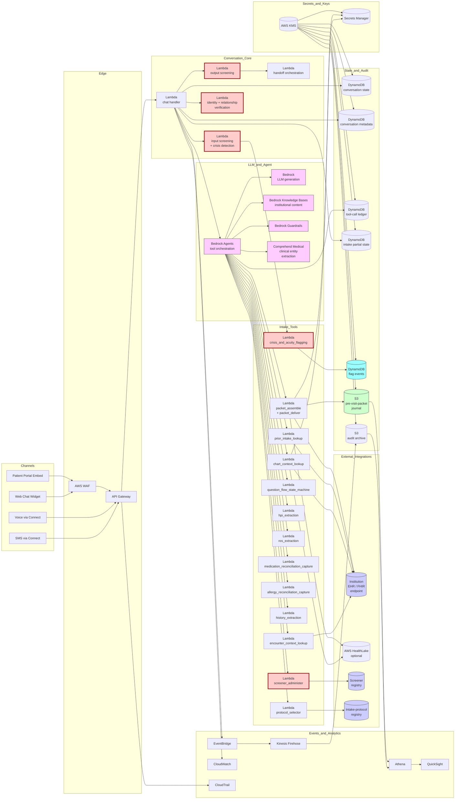

# Recipe 11.4 Architecture and Implementation: Pre-Visit Intake Bot

*Companion to [Recipe 11.4: Pre-Visit Intake Bot](chapter11.04-pre-visit-intake-bot). This page covers the AWS architecture, services, prerequisites, and pseudocode. For the problem framing and the conceptual approach, start with the main recipe.*

---

## The AWS Implementation

### Why These Services

**Amazon Bedrock for the LLM and the embeddings.** Same selection criteria as recipes 11.1 through 11.3. The intake bot specifically benefits from a model with strong tool-use (function-calling) support, strong medical-terminology comprehension, strong instruction-following for the structured-extraction tools, and conversational warmth. Claude Sonnet-class models or comparable frontier models for orchestration and conversation phrasing; smaller models for the lighter-weight intent classification and HPI-extraction sub-tasks. Bedrock provides HIPAA-eligible deployment under BAA.

**Amazon Bedrock Knowledge Bases for the institutional content.** The intake bot's institutional content includes the per-visit-type protocol-language phrasings, the institution's persona and voice guidance, the practice's preferred phrasings for sensitive items, the screener-introduction templates, and the closing-summary templates. Knowledge Bases provides the managed RAG layer for the conversational templates the bot draws on.

**Amazon Bedrock Agents for tool orchestration.** Same selection rationale as recipes 11.2 and 11.3. The bot's tools (encounter-context-lookup, chart-context-lookup, prior-intake-lookup, protocol-selector, question-flow-state-machine, hpi-extraction, ros-extraction, medication-reconciliation-capture, allergy-reconciliation-capture, history-extraction, screener-administer, packet-assemble, packet-deliver) are defined as Agents action groups with OpenAPI schemas. The Agent handles the multi-step LLM-and-tool flow.

**Amazon Bedrock Guardrails for scope and content filtering.** Same purpose as the previous chapter 11 recipes, with intake-specific configuration: clinical-advice filter aggressive, diagnostic-speculation filter aggressive, treatment-recommendation filter aggressive, severity-assessment filter aggressive. The intake bot's scope discipline is broader than the refill bot's because patients ask substantive clinical questions during intake conversations more often than they do during refill conversations.

**Amazon Comprehend Medical for clinical-entity extraction.** Comprehend Medical's clinical-entity extraction supplements the LLM's HPI and ROS extraction. It provides RxNorm-coded medication entities, ICD-10-coded condition entities, SNOMED-coded clinical entities, and PHI detection. Where the LLM is uncertain about a clinical mention, Comprehend Medical's structured extraction can disambiguate or flag for human review.

**AWS HealthLake (optional) for the FHIR-native chart and packet integration.** When the institution stores FHIR data in HealthLake, the bot's encounter-context, chart-context, and packet-delivery tools can interact with HealthLake directly. The packet can be written as a FHIR QuestionnaireResponse linked to the upcoming Encounter. When the FHIR data lives in the institution's EHR, the bot's tools query and write through the EHR's FHIR API instead.

**Amazon API Gateway and AWS Lambda for the backend.** Same chat-handler pattern as the previous chapter 11 recipes. The tool Lambdas that integrate with the EHR's FHIR API and the institution's screener registry run in VPC with controlled egress.

**Amazon Connect for SMS and voice channels (optional).** Many institutions deliver intake through SMS for patients without portal accounts and through voice for patients with accessibility needs or low literacy. Amazon Connect with Lex hosts the SMS and voice channels; the same conversation logic and tools serve all channels.

**Amazon DynamoDB for conversation state, session state, tool-call ledger, and partial-state for resume.** Five tables: `conversation-state`, `conversation-metadata`, `tool-call-ledger`, `intake-partial-state` (the resumable conversation state and protocol position), and `intake-flag-events` (the acuity-flag and crisis-flag event log).

**Amazon S3 for source documents, the audit archive, and the pre-visit-packet journal.** Same as recipes 11.2 and 11.3, plus a separately-governed pre-visit-packet journal that records every assembled packet and its EHR-delivery confirmation. Object Lock in compliance mode for the medical-records retention window.

**AWS KMS, AWS Secrets Manager, Amazon CloudWatch, AWS CloudTrail, Amazon EventBridge, Amazon Kinesis Data Firehose, AWS Glue, Amazon Athena.** Same operational and audit primitives as the previous recipes.

**AWS WAF in front of the chat endpoint.** Same as the previous recipes with rate limits tuned for the intake use case. Intake endpoints have moderate limits because legitimate patients sometimes complete intake in a long single session and sometimes resume across multiple sessions; the limits accommodate the legitimate pattern while screening abuse.

**Amazon QuickSight (optional) for clinical-leadership dashboards.** The per-visit-type completion-rate, screener-positivity, acuity-flag, and equity-monitoring dashboards live here. Clinical leadership reviews them weekly.

### Architecture Diagram



### Prerequisites

| Requirement | Details |
|-------------|---------|
| **AWS Services** | Amazon Bedrock (with Agents, Knowledge Bases, Guardrails, and a foundation model selected for tool-use plus an embedding model for the institutional corpus), AWS Lambda, Amazon API Gateway, AWS WAF, Amazon DynamoDB, Amazon S3, AWS KMS, AWS Secrets Manager, Amazon CloudWatch, AWS CloudTrail, Amazon EventBridge, Amazon Kinesis Data Firehose, AWS Glue, Amazon Athena, Amazon Comprehend Medical (for clinical-entity extraction). Optionally: AWS HealthLake (for FHIR-native chart and packet integration), Amazon Connect (for SMS and voice channels), Amazon QuickSight (for dashboards), Amazon Lex (for IVR-style voice channel orchestration when paired with Connect). |
| **External Inputs** | EHR with FHIR API access. The bot's tools wrap the institution's Patient, Encounter, Condition, MedicationRequest, AllergyIntolerance, Observation, and QuestionnaireResponse resources. The institution's intake-protocol library, formally documented and converted to code by the engineering team in collaboration with clinical informatics and the relevant clinical service lines. The library covers per-visit-type protocols (annual physical, primary-care follow-up, specialist consult by specialty, pre-procedure intake, behavioral-health intake, pediatric well-visit, women's health, geriatric, telehealth) with explicit HPI question sets, ROS scope, history scope, screener bundle, and packet schema. The institution's screener registry: PHQ-9, GAD-7, AUDIT-C, PROMIS instruments, fall-risk screener, SDOH bundle, condition-specific PROs, with validated wordings and scoring rules. The institution's pre-visit-packet schema and the EHR-side display configuration showing where the packet appears and how acuity flags surface visually. The institution's clinical-staff routing targets per acuity disposition (same-day-callback, urgent-care-redirect, crisis-pathway). Validation set of representative intake conversations covering the institution's visit-type catalog and patient-population variability.  |
| **IAM Permissions** | Per-Lambda least-privilege roles. The chart-context-lookup Lambda has read-only access to Patient, Encounter, Condition, MedicationRequest, AllergyIntolerance, and Observation. The packet-deliver Lambda has the specific permission to write QuestionnaireResponse (or the institution's equivalent) to the encounter context; it does not have permission to modify the chart's medication, allergy, or problem lists. The screener-administer Lambda has access to the screener registry. The protocol-selector Lambda has access to the protocol registry. Separation of concerns by Lambda role limits the blast radius of any single Lambda's compromise. Resource-based policies on each Lambda pin the invoking principal to the production agent or API Gateway stage ARN. |
| **BAA and Compliance** | AWS BAA signed. Verify Amazon Bedrock (with the specific models and the Agents service in scope), Lambda, API Gateway, WAF, DynamoDB, S3, KMS, Secrets Manager, CloudWatch, CloudTrail, EventBridge, Kinesis Firehose, Glue, Athena, Comprehend Medical, Connect (with messaging and voice), HealthLake, and Lex (where used) are HIPAA-eligible at build time. EHR vendor agreement: confirm the institution's data-use agreement permits the bot's read-and-write integration with the relevant FHIR resources including QuestionnaireResponse. Screener licensing: PHQ-9 is in the public domain; some PROMIS short forms have specific use terms; some condition-specific PROs are licensed and require institutional licenses. Audit retention policy reviewed by the privacy officer and the medical-records team. The pre-visit-packet retention floor is the longest of HIPAA's six-year minimum, the state-specific medical-records retention rules, the state-specific consumer-privacy-law retention rules where applicable (CCPA / CPRA, VCDPA, CPA, etc.), per-channel retention obligations (TCPA / 10DLC for SMS), and the institutional regulatory floor.  |
| **Encryption** | Source-document bucket: SSE-KMS with customer-managed keys, versioning enabled. Audit-archive and pre-visit-packet-journal buckets: SSE-KMS with customer-managed keys, Object Lock in compliance mode for the retention window, lifecycle to S3 Glacier Deep Archive after 90 days. DynamoDB tables: customer-managed KMS at rest. Lambda environment variables: KMS-encrypted. Lambda log groups: KMS-encrypted. Secrets Manager: customer-managed KMS. TLS in transit for all AWS API calls and all integrations with the EHR, the screener registry, the protocol registry, and the institutional clinical-staff routing endpoints. The vector store under Knowledge Bases encrypted with customer-managed KMS keys. Different KMS key per data class for blast-radius containment (conversation-state vs pre-visit-packet-journal vs flag-events vs audit-archive). |
| **VPC** | Production: tool Lambdas that call the EHR, the screener registry, the protocol registry, and the clinical-staff routing endpoints run in VPC with controlled egress. PrivateLink to the EHR or screener-registry endpoints where supported; tightly-scoped NAT path with allow-list otherwise. VPC endpoints for DynamoDB, S3, KMS, Secrets Manager, CloudWatch Logs, EventBridge, Bedrock, HealthLake (where used), Comprehend Medical, and Connect so the back-office Lambdas do not need public-internet egress for AWS-internal calls. Endpoint policies pin access to the specific resources the bot uses. The patient-facing edge (API Gateway, WAF) is public by design; the EHR and registry traffic is private. |
| **CloudTrail** | Enabled with data events on the audit-archive S3 bucket, the pre-visit-packet-journal S3 bucket, the source-document S3 bucket, the DynamoDB conversation, tool-call, partial-state, and flag-events tables, the Secrets Manager secrets, and the customer-managed KMS keys. Bedrock and Bedrock Agents invocations logged with metadata. Lambda invocations logged. API Gateway access logs enabled. CloudTrail logs in a dedicated S3 bucket with Object Lock in compliance mode and lifecycle to S3 Glacier Deep Archive after 90 days. Audit retention sized to the longest of HIPAA's six-year minimum, state medical-records retention rules, and the institutional regulatory floor. |
| **Sample Data** | Synthetic patient intake conversations stratified by visit type (annual physical, follow-up, specialist consult, urgent same-day, pre-procedure, behavioral-health, pediatric, geriatric, telehealth), by chief complaint (covering the institution's common-presentations catalog), by complexity (straightforward, branching-required, multiple-concerns, sensitive-disclosure, crisis), and by edge case (proxy completion, language other than English, accessibility-driven channel switch, partial-completion-then-resume, EHR-write failure). Synthetic patient identities, synthetic chart contexts including conditions and medications and allergies, and synthetic family-history patterns. Crisis-detection validation requires carefully-constructed test utterances reviewed by behavioral-health clinical leadership. Test EHR environment with synthetic encounters and the ability to write QuestionnaireResponse without affecting production data. Validated screener responses for PHQ-9 and GAD-7 with known scores for verification of the screener tools. |
| **Cost Estimate** | At a mid-sized institution scale (forty thousand intake conversations per month across primary care, specialists, and ancillary services; average completion rate around 70% with the rest abandoning at various stages; average 25 turns per completed conversation; average 1,200 tokens of prompt and 200 tokens of response per turn for the orchestration model plus chart-lookup, extraction, screener, and packet-assembly overhead): Bedrock LLM invocations typically $0.05-0.30 per completed intake conversation for a Sonnet-class orchestration model, totaling approximately $20,000-130,000 per year. Bedrock Agents and Knowledge Bases hosting plus the underlying vector store typically $3,000-12,000 per year. Lambda, API Gateway, WAF, DynamoDB, S3, KMS, Secrets Manager, CloudWatch, CloudTrail, EventBridge, Kinesis Firehose, Glue, Athena total approximately $8,000-25,000 per year combined. Comprehend Medical typically $1,500-6,000 per year for the clinical-entity-extraction volume across intake conversations. AWS HealthLake (when used as the FHIR source and the packet-delivery target) typically $8,000-35,000 per year depending on the data volume. Amazon Connect (for SMS and voice channels) typically $5,000-25,000 per year depending on channel mix and usage. Total AWS infrastructure typically $45,000-230,000 per year at this scale. The infrastructure cost is dominated by the LLM invocation volume (because intake conversations are longer than refill or scheduling conversations) and HealthLake (when used). The per-completed-intake infrastructure cost is small relative to the operational savings versus paper-form-and-staff-re-asking workflows.  |

### Ingredients

| AWS Service | Role |
|------------|------|
| **Amazon Bedrock** | LLM for orchestration and conversational response generation; embedding model for the institutional corpus |
| **Amazon Bedrock Agents** | Tool orchestration: define the intake tools as action groups, manage the multi-step LLM-and-tool flow |
| **Amazon Bedrock Knowledge Bases** | Managed RAG over institutional content (per-visit-type protocol-language phrasings, persona and voice guidance, sensitive-item phrasings, screener-introduction templates, closing-summary templates) |
| **Amazon Bedrock Guardrails** | Content filtering for clinical advice, diagnostic speculation, treatment recommendation, severity assessment, off-scope topics |
| **Amazon Comprehend Medical** | Clinical-entity extraction supplementing the LLM (medication, condition, anatomical, treatment, time-expression entities; PHI detection) |
| **AWS Lambda** | Chat handler, input/output screening, identity-and-relationship verification, crisis-and-acuity flagging pipeline, and tool implementations (encounter-context-lookup, chart-context-lookup, prior-intake-lookup, protocol-selector, question-flow-state-machine, hpi-extraction, ros-extraction, medication-reconciliation-capture, allergy-reconciliation-capture, history-extraction, screener-administer, packet-assemble, packet-deliver) |
| **Amazon API Gateway** | Public-facing chat endpoint for web and app channels |
| **AWS WAF** | Rate limiting, bot detection, common attack patterns (with limits tuned for legitimate intake patterns including resume-across-multiple-sessions) |
| **Amazon DynamoDB** | conversation-state, conversation-metadata, tool-call-ledger, intake-partial-state (for resume), flag-events |
| **Amazon S3** | Source documents (institutional knowledge), audit archive (conversations), pre-visit-packet journal (durable packet records and EHR-delivery confirmations) |
| **AWS KMS** | Customer-managed encryption keys per data class |
| **AWS Secrets Manager** | Credentials for the EHR, screener registry, protocol registry, and clinical-staff routing endpoints |
| **Amazon CloudWatch** | Operational metrics (completion rate per visit type, abandonment rate by stage, time-to-completion, screener positivity rates, acuity-flag rate, crisis-flag rate, EHR delivery success, tool-call success per tool, per-cohort slices); alarms |
| **AWS CloudTrail** | API-level audit logging |
| **Amazon EventBridge** | Intake-event bus for cross-system event flow (conversation_started, intake_completed, intake_abandoned, acuity_flag_raised, crisis_flag_raised, packet_delivered, packet_delivery_failed) |
| **Amazon Kinesis Data Firehose** | Streaming audit and telemetry delivery |
| **AWS Glue Data Catalog + Amazon Athena** | SQL access to audit and telemetry |
| **AWS HealthLake (optional)** | FHIR-native chart context (Patient, Encounter, Condition, MedicationRequest, AllergyIntolerance, Observation) and packet delivery (QuestionnaireResponse) when the institution stores FHIR data in HealthLake |
| **Amazon Connect (optional)** | SMS and voice channels for accessibility and patients without portal access |
| **Amazon Lex (optional)** | IVR-style voice-channel intent and slot management when the voice flow is heavier on structured turns |
| **Amazon QuickSight (optional)** | Clinical-leadership dashboards for completion, screener positivity, acuity-flag review, equity monitoring |

---

### Code

#### Walkthrough

**Step 1: Receive the chat message, bootstrap or resume the session, and run input safety screening.** Same primitive as the previous chapter 11 recipes. Crisis detection is especially important during intake because the bot is asking about how the patient is feeling, what medications they are taking, what their family history looks like, and how they are sleeping. Intake conversations are dense disclosure surfaces. Skip the screening and a crisis signal lands silently in the structured packet.

```pseudocode
ON receive_message(channel, channel_session_id,
                  user_message, auth_context,
                  encounter_token):
    // Step 1A: identify or create the session.
    // Resume if the patient is returning to a partial
    // session (the partial-state table holds the
    // resumable conversation position).
    session = conversation_state_table.get_or_create({
        channel: channel,
        channel_session_id: channel_session_id,
        auth_context: auth_context,
        encounter_token: encounter_token
    })

    partial = intake_partial_state_table.get(
        encounter_id: session.encounter_id,
        patient_id: auth_context.patient_id)

    IF session.message_count == 0 AND partial:
        // Returning patient resuming a partial intake.
        attach_resume_greeting = true
        session.protocol_position = partial.protocol_position
        session.captured_findings = partial.captured_findings
    ELSE IF session.message_count == 0:
        // Brand-new session.
        attach_initial_greeting = true

    // Step 1B: persist the user's message.
    conversation_metadata_table.append_turn(
        session_id: session.id,
        turn: {
            speaker: "user",
            text: user_message,
            timestamp: now()
        })

    // Step 1C: input screening with intake-specific
    // crisis-detection sensitivity. Screener-aware so
    // PHQ-9 item 9 responses route to crisis without
    // false positives on the general "are you safe"
    // language patterns.
    screening_result = screen_input(
        session_id: session.id,
        user_message: user_message,
        language: session.language,
        domain: "intake",
        screener_context: session.active_screener)

    IF screening_result.action != "proceed":
        return handle_screening_action(
            session_id: session.id,
            screening_result: screening_result)

    // Step 1D: continue to flow handling.
    return handle_message(
        session_id: session.id,
        user_message: user_message,
        attach_initial_greeting:
            attach_initial_greeting,
        attach_resume_greeting: attach_resume_greeting)
```

**Step 2: On a fresh session, load the encounter context, the chart context, and the prior intake context, then select the protocol.** This is the bot's preparation step. The encounter context tells the bot what visit this is. The chart context tells the bot what to confirm versus what to collect. The prior-intake context lets the bot skip stable items the patient already provided recently. The protocol selector matches the visit type to the right per-visit-type protocol. Skip this preparation and the bot asks generic questions blind to the patient's actual situation.

```pseudocode
FUNCTION load_visit_and_chart_context(session_id):
    // Step 2A: encounter context.
    encounter = encounter_context_lookup_tool.invoke({
        encounter_token: session.encounter_token,
        patient_id: session.verified_patient_id
    })

    audit_tool_call(
        session_id: session_id,
        tool: "encounter_context_lookup",
        result_summary: {
            visit_type: encounter.visit_type,
            scheduled_provider:
                encounter.scheduled_provider_id,
            scheduled_at: encounter.scheduled_at
        })

    // Step 2B: chart context.
    chart = chart_context_lookup_tool.invoke({
        patient_id: session.verified_patient_id,
        relevant_resources: [
            "active_problems",
            "active_medications",
            "allergies",
            "recent_vitals",
            "recent_labs",
            "recent_visit_summaries"
        ]
    })

    audit_tool_call(
        session_id: session_id,
        tool: "chart_context_lookup",
        result_summary: {
            problem_count: len(chart.active_problems),
            medication_count:
                len(chart.active_medications),
            allergy_count: len(chart.allergies)
        })

    // Step 2C: prior intake context.
    prior = prior_intake_lookup_tool.invoke({
        patient_id: session.verified_patient_id,
        lookback_days: 365
    })

    // Step 2D: protocol selection.
    protocol = protocol_selector_tool.invoke({
        visit_type: encounter.visit_type,
        patient_age: session.patient_demographics.age,
        patient_sex: session.patient_demographics.sex,
        is_new_patient:
            encounter.is_new_patient,
        prior_intake_recency: prior.most_recent_at,
        encounter_modality: encounter.modality
    })

    audit_tool_call(
        session_id: session_id,
        tool: "protocol_selector",
        result_summary: {
            protocol_version: protocol.protocol_version,
            screener_bundle_version:
                protocol.screener_bundle_version
        })

    session.encounter_context = encounter
    session.chart_context = chart
    session.prior_intake_context = prior
    session.active_protocol = protocol
    return { action: "context_loaded" }
```

**Step 3: Drive the conversation through the question-flow state machine, asking one question per turn and capturing the answer.** The state machine is the deterministic part. It knows the protocol, what has been captured, what branches are open, what the chart already provides. The LLM phrases the question conversationally based on the next-question hint from the state machine. The patient answers; the appropriate extraction tool produces structured findings; the state machine advances. Skip the state machine and the LLM wanders through topics, missing required items and re-asking ones it already covered.

```pseudocode
FUNCTION conduct_intake_turn(session_id, user_message,
                              attach_greetings):
    // Step 3A: capture the patient's answer for the
    // current question, if there is one in flight.
    IF session.in_flight_question:
        capture_result = capture_answer_for_question(
            session_id: session_id,
            question: session.in_flight_question,
            answer_text: user_message)
        // capture_answer_for_question internally
        // dispatches to the right extraction tool
        // (hpi_extraction, ros_extraction,
        // medication_reconciliation_capture,
        // allergy_reconciliation_capture,
        // history_extraction, screener_administer)
        // based on the question's category.

        IF capture_result.action == "ask_clarification":
            // The answer was unparseable; ask a
            // gentle clarifying follow-up.
            return {
                action: "ask_clarifying",
                response: build_clarifying_prompt(
                    question:
                        session.in_flight_question,
                    answer_text: user_message,
                    language: session.language)
            }

        // Persist the captured finding to the
        // session's accumulating structured packet.
        session.captured_findings.add(
            capture_result.finding)

        // Run the crisis-and-acuity flagging in
        // parallel against the patient's utterance
        // and the captured finding.
        flag_result = crisis_and_acuity_flagging(
            session_id: session_id,
            user_message: user_message,
            captured_finding: capture_result.finding,
            chart_context: session.chart_context,
            visit_context: session.encounter_context)

        IF flag_result.crisis_detected:
            return route_crisis(
                session_id: session_id,
                flag: flag_result.crisis_flag)

        IF flag_result.acuity_flag:
            session.acuity_flags.add(
                flag_result.acuity_flag)
            // Acuity flags do not interrupt the
            // conversation; they are surfaced in the
            // pre-visit packet and routed to clinical
            // staff after the conversation completes.

    // Step 3B: ask the state machine for the next
    // question.
    next = question_flow_state_machine_tool.invoke({
        protocol_version:
            session.active_protocol.protocol_version,
        protocol_position:
            session.protocol_position,
        captured_findings: session.captured_findings,
        chart_context: session.chart_context,
        prior_intake_context: session.prior_intake_context
    })

    // Persist the partial state for resume.
    intake_partial_state_table.write({
        encounter_id: session.encounter_id,
        patient_id: session.verified_patient_id,
        protocol_position: next.protocol_position,
        captured_findings: session.captured_findings,
        last_updated_at: now(),
        ttl: now() + INTAKE_PARTIAL_STATE_TTL
    })

    IF next.action == "complete":
        // No more questions. Move to packet
        // generation.
        return assemble_and_deliver_packet(
            session_id: session_id)

    IF next.action == "branch_open":
        // The state machine opened a new branch
        // because of the previous answer. Continue.
        session.protocol_position = next.protocol_position

    // Step 3C: phrase the next question
    // conversationally with the LLM.
    session.in_flight_question = next.question
    response = phrase_question_conversationally(
        question: next.question,
        recent_turns: conversation_metadata_table
            .recent_turns(session_id, k: 4),
        persona: session.persona,
        language: session.language,
        attach_greetings: attach_greetings)

    return {
        action: "asked_next_question",
        response: response
    }
```

**Step 4: Run the per-question extraction tool to convert the patient's free-text answer into structured findings.** Each question category has its own extraction tool (HPI, ROS, medication-reconciliation, allergy-reconciliation, history, screener). The tool validates against the schema. If the answer is unparseable, the tool returns "ask_clarification" and the conversation loop asks a follow-up. Skip the schema validation and the structured packet contains malformed data the clinician cannot consume.

```pseudocode
FUNCTION capture_answer_for_question(session_id, question,
                                      answer_text):
    SWITCH question.category:
        CASE "hpi":
            return hpi_extraction_tool.invoke({
                hpi_dimension: question.dimension,
                // e.g., onset, quality, radiation,
                // severity, timing, associated, etc.
                question_text: question.text,
                answer_text: answer_text,
                chief_complaint:
                    session.captured_findings
                        .chief_complaint,
                language: session.language
            })

        CASE "ros":
            return ros_extraction_tool.invoke({
                organ_system: question.organ_system,
                question_text: question.text,
                answer_text: answer_text,
                language: session.language
            })

        CASE "medication_reconciliation":
            return medication_reconciliation_capture_tool
                .invoke({
                    chart_medications:
                        session.chart_context
                            .active_medications,
                    answer_text: answer_text,
                    language: session.language
                })

        CASE "allergy_reconciliation":
            return allergy_reconciliation_capture_tool
                .invoke({
                    chart_allergies:
                        session.chart_context
                            .allergies,
                    answer_text: answer_text,
                    language: session.language
                })

        CASE "history":
            return history_extraction_tool.invoke({
                history_dimension:
                    question.dimension,
                // e.g., past_medical, surgical,
                // family, social_smoking,
                // social_alcohol, social_substance,
                // occupation, living_situation
                question_text: question.text,
                answer_text: answer_text,
                language: session.language
            })

        CASE "screener_item":
            // Screener items are administered with
            // their validated wordings; the
            // capture is item-by-item.
            return screener_administer_tool
                .capture_item({
                    screener:
                        question.screener_id,
                    item_id: question.item_id,
                    answer_text: answer_text,
                    language: session.language
                })

        CASE "free_concern":
            // Catch-all for unstructured-but-
            // valuable patient statements.
            return free_concern_capture(
                question: question,
                answer_text: answer_text)

        DEFAULT:
            return {
                action: "no_capture",
                finding: null
            }
```

**Step 5: Run the crisis-and-acuity flagging pipeline in parallel against every patient utterance and every captured finding.** The pipeline is a separate component, intentionally independent of the conversational LLM, because the consequences of missing a crisis or acuity signal are severe. It runs detection on the user message and on the structured finding, returns crisis flags (which interrupt the conversation) and acuity flags (which surface in the packet without interrupting). Skip this pipeline and high-acuity patients pass through intake without anyone noticing.

```pseudocode
FUNCTION crisis_and_acuity_flagging(session_id,
                                    user_message,
                                    captured_finding,
                                    chart_context,
                                    visit_context):
    // Step 5A: crisis detection (deterministic
    // primary checks plus model-based secondary
    // check).
    crisis = crisis_detection_pipeline(
        user_message: user_message,
        captured_finding: captured_finding,
        screener_context: session.active_screener,
        chart_context: chart_context)

    IF crisis.detected:
        flag_event = {
            event_type: "crisis_flag_raised",
            event_id: generate_event_id(),
            session_id: session_id,
            patient_id: session.verified_patient_id,
            crisis_category: crisis.category,
            // suicidal_ideation, self_harm_intent,
            // active_self_harm,
            // domestic_violence_disclosure,
            // child_abuse_disclosure,
            // elder_abuse_disclosure,
            // intimate_partner_violence_disclosure,
            // substance_use_crisis,
            // acute_medical_emergency_description
            severity: crisis.severity,
            triggering_utterance: user_message,
            triggering_finding: captured_finding,
            raised_at: now()
        }
        flag_events_table.write(flag_event)
        EventBridge.PutEvents([{
            source: "intake_bot",
            detail_type: "crisis_flag_raised",
            detail: flag_event
        }])
        return {
            crisis_detected: true,
            crisis_flag: flag_event
        }

    // Step 5B: red-flag clinical-pattern detection.
    // The pattern library encodes the institution's
    // red-flag constellations. Examples: chest pain
    // with exertional pattern plus family history of
    // early cardiac disease; sudden-onset severe
    // headache; acute neurologic deficit; GI bleeding
    // descriptions; suicide intent endorsement on
    // the screener.
    acuity = acuity_pattern_detection(
        captured_finding: captured_finding,
        accumulated_findings:
            session.captured_findings,
        chart_context: chart_context,
        visit_context: visit_context,
        pattern_library_version:
            ACTIVE_ACUITY_PATTERN_VERSION)

    IF acuity.detected:
        flag_event = {
            event_type: "acuity_flag_raised",
            event_id: generate_event_id(),
            session_id: session_id,
            patient_id: session.verified_patient_id,
            acuity_category: acuity.category,
            // e.g., cardiac_red_flag,
            // neurologic_red_flag,
            // gi_bleed_red_flag,
            // sepsis_pattern,
            // medication_safety_red_flag
            severity: acuity.severity,
            routing_target: acuity.routing_target,
            // same_day_callback,
            // urgent_care_redirect,
            // ed_redirect_recommendation
            pattern_id: acuity.pattern_id,
            pattern_library_version:
                acuity.pattern_library_version,
            raised_at: now()
        }
        flag_events_table.write(flag_event)
        EventBridge.PutEvents([{
            source: "intake_bot",
            detail_type: "acuity_flag_raised",
            detail: flag_event
        }])
        return {
            crisis_detected: false,
            acuity_flag: flag_event
        }

    // Step 5C: significant-new-information detection.
    new_info = new_information_detection(
        captured_finding: captured_finding,
        chart_context: chart_context)

    IF new_info.detected:
        session.new_information_events.add(
            new_info.event)

    return {
        crisis_detected: false,
        acuity_flag: null
    }
```

**Step 6: Handle a crisis interruption with explicit response templates and explicit routing pathways.** A crisis flag is not handled by the LLM's general response generation. The bot pauses the structured intake, delivers a reviewed crisis-response template, offers immediate resources (988, 911, crisis-line for the institution), and routes the session to the crisis pathway. The patient's safety takes precedence over completing the intake. Skip the explicit handling and the bot may continue collecting structured data while a patient is in active crisis, which is a clinical and ethical failure.

```pseudocode
FUNCTION route_crisis(session_id, flag):
    // Step 6A: pause the structured intake.
    session.intake_paused = true

    // Step 6B: deliver the crisis-response
    // template specific to the crisis category.
    template = crisis_response_template_lookup(
        category: flag.crisis_category,
        language: session.language,
        channel: session.channel)

    // The template is a static, clinical-
    // leadership-reviewed response. It is not
    // LLM-generated. It expresses care, names
    // the immediate resources, asks consent for
    // a same-day clinical-staff reach-out, and
    // offers warm handoff to a live agent or
    // crisis line.

    // Step 6C: route to the crisis pathway.
    routing_result =
        crisis_routing_tool.invoke({
            session_id: session_id,
            patient_id: session.verified_patient_id,
            flag: flag,
            patient_consent_to_reach_out: null
            // The patient's consent for reach-out
            // is captured in the next conversation
            // turn.
        })

    audit_tool_call(
        session_id: session_id,
        tool: "crisis_routing",
        result_summary: {
            crisis_category: flag.crisis_category,
            routing_outcome: routing_result.outcome
        })

    // Step 6D: record the crisis routing in the
    // refill-event-equivalent journal (here, the
    // pre-visit-packet journal records the crisis
    // event as part of the durable record).
    pre_visit_packet_journal.write({
        event_type: "crisis_event_during_intake",
        event_id: generate_event_id(),
        patient_id: session.verified_patient_id,
        encounter_id: session.encounter_id,
        crisis_flag: flag,
        routing_outcome: routing_result,
        session_id: session_id,
        initiated_at: now()
    })

    return {
        action: "crisis_routed",
        response: template.text
    }
```

**Step 7: Administer screeners with their validated wordings and item-by-item capture.** Screeners are not paraphrased. The PHQ-9 item 1 reads "Over the last 2 weeks, how often have you been bothered by little interest or pleasure in doing things?" with response options of "not at all," "several days," "more than half the days," "nearly every day." The bot administers the validated wording, captures the response in the validated response set, computes the score per the validated rules, and writes the score plus item-level responses to the session findings. Skip the validated wordings and the score is not a valid PHQ-9 score. 

```pseudocode
FUNCTION administer_screener_bundle(session_id, bundle):
    FOR screener IN bundle.screeners:
        screener_record = {
            screener_id: screener.id,
            screener_version: screener.version,
            language: session.language,
            items: [],
            score: null,
            score_band: null,
            administered_at: now()
        }

        FOR item IN screener.items:
            // Step 7A: present the validated item
            // wording.
            phrased_item = present_screener_item(
                item: item,
                language: session.language,
                channel: session.channel)
            // present_screener_item is the per-
            // language and per-channel adapter
            // that ensures the validated wording
            // is preserved in the patient's
            // language.

            // Wait for the patient's response
            // (the conversation loop returns
            // and resumes here on the next turn).
            patient_response =
                await_next_user_message(
                    session_id: session_id)

            // Step 7B: capture the response in
            // the validated response set.
            capture = screener_administer_tool
                .capture_item({
                    screener: screener.id,
                    item_id: item.id,
                    response_text: patient_response,
                    language: session.language
                })

            IF capture.action == "ask_clarification":
                // Re-present the item with a
                // gentler phrasing.
                continue_with_clarifying_present(
                    item: item)

            screener_record.items.add({
                item_id: item.id,
                response_value:
                    capture.response_value,
                response_text: patient_response
            })

            // Step 7C: item-by-item crisis check.
            // PHQ-9 item 9, equivalent items, and
            // any item the screener tags as
            // crisis-sensitive route to the
            // crisis pipeline immediately.
            IF item.is_crisis_sensitive AND
               capture.response_value
                IN item.crisis_response_values:
                crisis_flag = {
                    event_type: "crisis_flag_raised",
                    crisis_category:
                        item.crisis_category,
                    severity: "high",
                    triggering_screener:
                        screener.id,
                    triggering_item: item.id,
                    triggering_response:
                        capture.response_value
                }
                handle_screener_crisis(
                    session_id: session_id,
                    crisis_flag: crisis_flag)

        // Step 7D: compute the score per the
        // validated scoring rules.
        screener_record.score =
            screener.compute_score(
                items: screener_record.items)
        screener_record.score_band =
            screener.classify_band(
                score: screener_record.score)

        // Step 7E: persist as a clinical-record
        // event.
        session.screener_records.add(screener_record)

    return { action: "screener_bundle_complete" }
```

**Step 8: Assemble and deliver the pre-visit packet to the EHR; surface the closing summary to the patient.** The packet's schema is the institution's defined contract. The packet-assemble tool reads the accumulated findings, validates against the schema, and produces the structured packet. The packet-deliver tool writes to the EHR through the institution's intake-data integration point. The closing summary is the patient's confirmation of what was captured. Skip the structured packet and the conversation transcript becomes the only record, which the clinician will not read in detail before the visit.

```pseudocode
FUNCTION assemble_and_deliver_packet(session_id):
    // Step 8A: assemble the packet.
    packet = packet_assemble_tool.invoke({
        session_id: session_id,
        patient_id: session.verified_patient_id,
        encounter_id: session.encounter_id,
        protocol_version:
            session.active_protocol.protocol_version,
        screener_bundle_version:
            session.active_protocol
                .screener_bundle_version,
        captured_findings: session.captured_findings,
        screener_records: session.screener_records,
        acuity_flags: session.acuity_flags,
        new_information_events:
            session.new_information_events,
        conversation_transcript_ref:
            session.transcript_archive_ref
    })

    audit_tool_call(
        session_id: session_id,
        tool: "packet_assemble",
        result_summary: {
            packet_id: packet.packet_id,
            schema_version: packet.schema_version,
            chief_complaint_present:
                packet.chief_complaint IS NOT NULL,
            hpi_dimensions_captured:
                len(packet.hpi),
            ros_findings_captured:
                len(packet.ros),
            medication_recon_deltas:
                len(packet.medication_reconciliation_deltas),
            allergy_recon_deltas:
                len(packet.allergy_reconciliation_deltas),
            screener_count: len(packet.screeners),
            acuity_flag_count:
                len(packet.acuity_flags),
            new_info_event_count:
                len(packet.new_information_events)
        })

    // Step 8B: deliver to the EHR.
    delivery_result = packet_deliver_tool.invoke({
        packet: packet,
        encounter_id: session.encounter_id,
        delivery_target: INSTITUTIONAL_PACKET_TARGET
        // FHIR_QuestionnaireResponse |
        // EHR_pre_visit_note_api |
        // clinical_staging_for_review
    })

    audit_tool_call(
        session_id: session_id,
        tool: "packet_deliver",
        result_summary: {
            outcome: delivery_result.outcome,
            ehr_record_id:
                delivery_result.ehr_record_id
        })

    IF delivery_result.outcome != "delivered":
        return handle_packet_delivery_failure(
            session_id: session_id,
            failure: delivery_result,
            packet: packet)

    // Step 8C: write the durable journal.
    pre_visit_packet_journal.write({
        event_type: "intake_completed",
        event_id: generate_event_id(),
        patient_id: session.verified_patient_id,
        encounter_id: session.encounter_id,
        packet_id: packet.packet_id,
        schema_version: packet.schema_version,
        protocol_version:
            session.active_protocol.protocol_version,
        screener_bundle_version:
            session.active_protocol
                .screener_bundle_version,
        ehr_delivery_record_id:
            delivery_result.ehr_record_id,
        acuity_flag_count:
            len(packet.acuity_flags),
        crisis_flag_count: session.crisis_flag_count,
        session_id: session_id,
        completed_at: now()
    })

    // Step 8D: route any acuity flags to clinical
    // staff with the structured ticket.
    FOR flag IN session.acuity_flags:
        clinical_staff_routing_tool.invoke({
            target: flag.routing_target,
            ticket: build_acuity_ticket(
                flag: flag,
                packet_id: packet.packet_id,
                patient_id:
                    session.verified_patient_id,
                encounter_id: session.encounter_id)
        })

    // Step 8E: emit lifecycle event.
    EventBridge.PutEvents([{
        source: "intake_bot",
        detail_type: "intake_completed",
        detail: {
            session_id: session_id,
            patient_id: session.verified_patient_id,
            encounter_id: session.encounter_id,
            packet_id: packet.packet_id,
            visit_type:
                session.encounter_context.visit_type,
            duration_seconds:
                session.duration_seconds,
            channel: session.channel,
            language: session.language,
            acuity_flag_count:
                len(packet.acuity_flags)
        }
    }])

    // Step 8F: closing summary to the patient.
    summary_response = build_closing_summary(
        captured_findings: session.captured_findings,
        screener_records: session.screener_records,
        acuity_flags: session.acuity_flags,
        encounter_context: session.encounter_context,
        language: session.language)

    return {
        action: "intake_completed",
        response: summary_response
    }
```

**Step 9: Run the same output safety screening as the previous chapter 11 recipes, with intake-specific checks.** The standard output checks (scope filter, hallucination check, vendor-managed guardrails) carry forward. The new checks: did the bot answer a clinical question the patient asked? Did the bot speculate about what the symptoms might mean? Did the bot reference a chart fact that the chart-context tools did not return? Skip these checks and the bot drifts into clinical-advice territory, which is exactly what the architecture is supposed to prevent.

```pseudocode
FUNCTION screen_output(session_id, response,
                       tool_call_history):
    // Step 9A: standard checks.
    standard_check = standard_output_screen.evaluate(
        response: response,
        session_context:
            session_context_for(session_id))

    IF standard_check.action != "deliver":
        return standard_check

    // Step 9B: intake-specific scope check.
    // The bot must not answer clinical questions,
    // speculate on diagnoses, recommend treatment,
    // or assess severity.
    scope_violation = detect_intake_scope_violations(
        response: response)
    // Categories:
    // - clinical_advice_attempted
    // - diagnostic_speculation_attempted
    // - treatment_recommendation_attempted
    // - severity_assessment_attempted

    IF scope_violation:
        return {
            action: "replace_with_safe_response",
            replacement:
                INTAKE_OUT_OF_SCOPE_TEMPLATE,
            violation:
                scope_violation.category
        }

    // Step 9C: chart-fact integrity check.
    chart_facts_referenced =
        extract_chart_fact_references(response)
    FOR fact IN chart_facts_referenced:
        IF NOT fact_supported_by_tool_history(
            fact: fact,
            tool_call_history: tool_call_history):
            return {
                action: "replace_with_safe_response",
                replacement:
                    CHART_FACT_INVALID_TEMPLATE,
                violation:
                    "unsupported_chart_reference"
            }

    // Step 9D: persona-and-tone check.
    // Especially around sensitive disclosures
    // (mental-health items, substance-use items,
    // intimate-partner items).
    persona_check =
        persona_and_tone_evaluator.evaluate(
            response: response,
            recent_user_message:
                session.most_recent_user_message,
            captured_finding:
                session.most_recent_captured_finding,
            language: session.language)

    IF persona_check.action != "acceptable":
        return {
            action: "regenerate_with_persona_correction",
            persona_guidance: persona_check.guidance
        }

    return {
        action: "deliver",
        response: response
    }
```

**Step 10: Persist the durable conversation record, the tool-call ledger, the partial-state cleanup, and the per-cohort metrics.** Same archive pattern as the previous chapter 11 recipes. The conversation log is dense PHI and a clinical record. The pre-visit-packet journal is the durable medication-record-equivalent for intake. The partial-state TTL cleanup avoids stale resumable sessions accumulating indefinitely.

```pseudocode
FUNCTION close_conversation_and_archive(session_id,
                                         reason):
    state = conversation_state_table.get(session_id)
    metadata =
        conversation_metadata_table.get(session_id)
    tool_calls =
        tool_call_ledger.for_session(session_id)

    // Step 10A: build the durable audit record.
    audit_record = {
        session_id: session_id,
        channel: state.channel,
        started_at: state.started_at,
        ended_at: now(),
        language: state.language,
        verified_patient_id: state.verified_patient_id,
        proxy_relationship: state.proxy_relationship,
        assurance_level: state.assurance_level,
        encounter_id: state.encounter_id,
        visit_type:
            state.encounter_context.visit_type,
        turns: [
            redact_user_phi_for_audit(turn)
            for turn in metadata.turns
        ],
        tool_calls: [
            redact_sensitive_args(call)
            for call in tool_calls
        ],
        crisis_flags_raised:
            state.crisis_flag_count,
        acuity_flags_raised:
            state.acuity_flag_count,
        new_information_events_raised:
            state.new_information_event_count,
        screener_records_summary:
            summarize_screener_records(
                state.screener_records),
        intake_completion_status:
            state.completion_status,
            // completed | abandoned |
            // crisis_routed | escalated_to_human
        packet_id: state.packet_id,
        packet_delivery_outcome:
            state.packet_delivery_outcome,
        active_model_id_at_session: state.model_id,
        active_prompt_version_at_session:
            state.prompt_version,
        active_agent_version_at_session:
            state.agent_version,
        active_kb_version_at_session:
            state.kb_version,
        active_protocol_version_at_session:
            state.active_protocol.protocol_version,
        active_screener_bundle_version_at_session:
            state.active_protocol
                .screener_bundle_version,
        active_acuity_pattern_version_at_session:
            state.active_acuity_pattern_version,
        cohort_axes: {
            language: state.language,
            channel: state.channel,
            assurance_level: state.assurance_level,
            visit_type:
                state.encounter_context.visit_type,
            proxy_completion:
                state.proxy_relationship IS NOT NULL,
            patient_age_cohort:
                state.patient_age_cohort,
            new_patient: state.is_new_patient
        },
        close_reason: reason
    }

    audit_archive_kinesis_firehose.put(audit_record)

    // Step 10B: cleanup the partial state on
    // completion.
    IF reason IN ["completed",
                  "crisis_routed",
                  "escalated_to_human"]:
        intake_partial_state_table.delete({
            encounter_id: state.encounter_id,
            patient_id: state.verified_patient_id
        })

    // Step 10C: emit lifecycle event.
    EventBridge.PutEvents([{
        source: "intake_bot",
        detail_type: "conversation_closed",
        detail: {
            session_id: session_id,
            channel: state.channel,
            visit_type:
                state.encounter_context.visit_type,
            disposition: state.completion_status,
            turn_count: len(metadata.turns)
        }
    }])

    // Step 10D: per-cohort metrics.
    cloudwatch.put_metric(
        namespace: "IntakeBot",
        metric_name: "IntakeCompleted",
        value: 1 IF state.completion_status
                    == "completed" ELSE 0,
        dimensions: {
            channel: state.channel,
            language: state.language,
            visit_type:
                state.encounter_context.visit_type,
            proxy_completion:
                state.proxy_relationship IS NOT NULL
        })

    cloudwatch.put_metric(
        namespace: "IntakeBot",
        metric_name: "TimeToCompletion",
        value: state.duration_seconds,
        dimensions: {
            channel: state.channel,
            language: state.language,
            visit_type:
                state.encounter_context.visit_type
        })

    cloudwatch.put_metric(
        namespace: "IntakeBot",
        metric_name: "AcuityFlagRaised",
        value: state.acuity_flag_count,
        dimensions: {
            channel: state.channel,
            language: state.language,
            visit_type:
                state.encounter_context.visit_type
        })
```

> **Curious how this looks in Python?** The pseudocode above covers the concepts. If you'd like to see sample Python code that demonstrates these patterns using boto3, check out the [Python Example](chapter11.04-python-example). It walks through each step with inline comments and notes on what you'd need to change for a real deployment.

---

### Expected Results

**Sample conversation (illustrative, abbreviated):**

```text
Bot:     Hi Marisol, I'm Riverside Clinic's intake
         assistant. I'm going to ask a few questions
         about what's going on so Dr. Adekunle has
         the right information for your Wednesday
         visit. This usually takes about 8-12 minutes,
         and you can stop and come back later if you
         need to. I'm a chatbot, not a clinician, and
         I can't give medical advice. If at any point
         something feels like an emergency, please
         call 911. Ready to start?

Patient: yes ready

Bot:     What brings you in to see Dr. Adekunle on
         Wednesday?

Patient: chest tightness for 3 weeks getting more
         frequent

Bot:     Thanks for sharing that. Can you tell me a
         little more about when the tightness usually
         happens? Is it tied to anything you're doing
         or thinking about?

Patient: mostly when I walk up stairs to my apartment,
         sometimes when I'm rushing around. lasts a
         few minutes then goes away.

Bot:     Got it. When you feel it, does it feel more
         like pressure, squeezing, sharp, burning, or
         something else?

Patient: more like pressure on my chest, kind of
         heavy

Bot:     Does it spread anywhere, like to your arm,
         neck, jaw, or back?

Patient: no, just stays in the chest

Bot:     Have you noticed anything else when it
         happens? Like shortness of breath, sweating,
         nausea, lightheadedness, or your heart
         racing?

Patient: yeah I get a little short of breath when
         I'm going up the stairs and it happens.
         not nausea or sweating.

Bot:     Thanks. Has it changed in the past week, or
         is it about the same?

Patient: it's gotten more frequent the last week.
         used to be once or twice a week, now it's
         like every other day.

         [bot continues for several more turns
         capturing HPI, then transitions]

Bot:     Thanks for going through all that. I want
         to ask about your family's health history
         too. Are there any heart problems in your
         family, especially before age 60?

Patient: my dad had a heart attack at 51

Bot:     I'm sorry to hear that. Anyone else, on
         either side of the family? Brothers,
         sisters, grandparents?

Patient: actually now that you ask my dad's dad
         died of a heart attack too, I think when
         my dad was a teenager. I don't know
         exactly how old he was, sorry.

Bot:     That's helpful, thank you for sharing.
         Anyone on your mom's side, or any other
         conditions like high blood pressure,
         diabetes, or strokes that run in the
         family?

         [bot continues with family, social,
         and past medical history; then medication
         confirmation, allergy confirmation, ROS
         focused on cardiopulmonary, then PHQ-2
         brief screener triggered by the chest-
         tightness presentation, then closing]

Bot:     Marisol, that's everything I need.
         Here's a quick summary of what I captured:
         you're coming in for chest tightness that
         started about 3 weeks ago, happens with
         exertion (going up stairs) plus shortness
         of breath, has been getting more frequent
         in the last week. You have a family
         history of early heart disease (your father
         at 51, and your paternal grandfather at a
         younger age). Your medications and allergies
         are confirmed as the chart shows. Does that
         look right?

Patient: yes that's right

Bot:     Thanks Marisol. Dr. Adekunle will read this
         before your Wednesday visit so you can spend
         the time talking about what matters most.
         Because of what you described, I'm flagging
         this for the clinical team to take a quick
         look today. They may reach out by phone to
         check in or to see if anything else has come
         up before Wednesday. If anything gets worse
         in the meantime, especially if the tightness
         is happening at rest or you have other
         symptoms like severe shortness of breath
         or pain in your arm or jaw, please call
         the office or 911 right away. Take care.
```

**Sample audit record (illustrative):**

```json
{
  "session_id": "intake-7f2e9a1b-3c5d-4e8f-9a1b-2c3d4e5f6a7b",
  "channel": "patient_portal_embed",
  "started_at": "2026-05-18T12:34:11Z",
  "ended_at": "2026-05-18T12:46:52Z",
  "language": "en-US",
  "verified_patient_id": "patient-internal-id-redacted",
  "encounter_id": "encounter-2026-05-20-adekunle-marisol",
  "visit_type": "primary_care_followup",
  "tool_calls_summary": {
    "encounter_context_lookup": 1,
    "chart_context_lookup": 1,
    "prior_intake_lookup": 1,
    "protocol_selector": 1,
    "question_flow_state_machine": 28,
    "hpi_extraction": 9,
    "ros_extraction": 6,
    "medication_reconciliation_capture": 1,
    "allergy_reconciliation_capture": 1,
    "history_extraction": 7,
    "screener_administer": 1,
    "packet_assemble": 1,
    "packet_deliver": 1
  },
  "active_protocol_version_at_session":
    "primary_care_followup_v3.2",
  "active_screener_bundle_version_at_session":
    "primary_care_screeners_v2.1",
  "active_acuity_pattern_version_at_session":
    "acuity_patterns_v4.0",
  "crisis_flags_raised": 0,
  "acuity_flags_raised": 1,
  "acuity_flag_summary": [
    {
      "category": "cardiac_red_flag",
      "severity": "high",
      "routing_target": "same_day_callback",
      "pattern_id":
        "exertional_chest_pain_with_family_history",
      "raised_at": "2026-05-18T12:39:07Z"
    }
  ],
  "new_information_events_raised": 1,
  "screener_records_summary": [
    {
      "screener_id": "PHQ-2",
      "screener_version": "v1.0",
      "score": 0,
      "score_band": "negative"
    }
  ],
  "intake_completion_status": "completed",
  "packet_id":
    "packet-7f2e9a1b-3c5d-4e8f-9a1b-2c3d4e5f6a7b",
  "packet_delivery_outcome": "delivered",
  "ehr_delivery_record_id":
    "QuestionnaireResponse/2026-05-18-12-46-52-a3f9",
  "cohort_axes": {
    "language": "en-US",
    "channel": "patient_portal_embed",
    "assurance_level": "authenticated",
    "visit_type": "primary_care_followup",
    "proxy_completion": false,
    "patient_age_cohort": "30_to_44",
    "new_patient": false
  },
  "duration_seconds": 761,
  "close_reason": "intake_completed"
}
```

**Performance benchmarks (illustrative, your mileage varies):**

| Metric | Old form-based intake | Modern conversational intake bot |
|--------|----------------------|----------------------------------|
| Completion rate | 25-50% (varies dramatically by form length and patient population) | 65-80% with strong per-cohort variance |
| Median time-to-completion | 8-15 minutes (when completed at all; many partial submissions) | 8-12 minutes for completed sessions |
| Abandonment-mid-completion rate | 30-60% | 15-25% |
| Resume rate (started, abandoned, returned) | Near-zero (forms typically do not resume) | 10-20% of started sessions return to complete |
| HPI completeness (vs clinician-collected baseline) | Thin; clinician re-asks most HPI | Substantially closer to clinician-collected; clinician confirms rather than re-asks |
| Acuity-flag detection rate | 0% (no detection layer) | 1-5% of intake conversations flag for clinical review |
| Crisis-flag detection rate | 0% (no detection layer) | <1% of intake conversations raise crisis flags (when raised, the intake pivots to the crisis pathway) |
| Per-completed-intake infrastructure cost | Negligible (form rendering only) | $0.05-0.30 |
| Per-cohort completion-rate disparity | Often invisible, but real | Monitored explicitly per launch gate |
| Patient satisfaction (CSAT proxy for the channel) | Frequently negative | Generally positive, especially for visit types with rich HPI |
| Clinician pre-visit-prep time | 1-3 minutes per visit (because the form data is thin) | 1-3 minutes per visit (similar wall-clock time but focused on the structured packet rather than re-collecting) |
| Visit-time efficiency | Similar to no intake (clinician re-asks) | 2-5 minutes saved per visit on average; more for high-HPI presentations |

**Where it struggles:**

- **Vague or absent intake protocol per visit type.** When the practice has no formal intake protocol for a visit type (or uses the same generic form for everything), the bot has nothing to base its question flow on, and the bot's quality drops to "slightly nicer than a generic form." Mitigation: invest three to six months in per-visit-type protocol formalization with the relevant clinical service lines before deploying for that visit type. Start with two or three high-volume visit types with strong protocols and expand.
- **Patients with limited literacy or digital experience.** A conversational bot is more forgiving than a form, but it still requires reading and responding in text or voice. Mitigation: voice-channel deployment with carefully-tuned ASR and slower pacing, plain-language phrasing in the conversational prompts, multi-language support with native-speaker review, accessibility-conformant design, and explicit human-staff fallback for patients who do not engage with the bot.
- **Patients with cognitive impairment or dementia.** Standard conversational intake is not appropriate for patients with significant cognitive impairment. Mitigation: the encounter-context lookup checks for relevant conditions or care-plan flags and routes to a proxy-completion or staff-completion pathway when the patient profile indicates the bot is not the right channel. The bot does not insist on completing intake with a patient who cannot reliably participate.
- **High-acuity presentations that warrant immediate-channel routing.** A patient describing what sounds like an active myocardial infarction in turn 3 of intake should not finish the intake; they should be routed to call 911. Mitigation: the crisis-and-acuity pipeline includes "acute medical emergency description" as a crisis category, with explicit routing to the emergency-redirect template.
- **Patients in crisis using the intake conversation to disclose.** A patient experiencing intimate-partner violence may use the intake's social-history questions to disclose. The bot's response is consequential. Mitigation: the crisis-and-acuity pipeline includes the relevant crisis categories with reviewed response templates and warm handoff to social workers or appropriate institutional resources.
- **Cross-language accuracy gaps.** The bot's HPI and ROS extraction and screener administration may be substantially less accurate in non-English languages if per-language asset development is weak. Mitigation: invest in native-speaker review of per-language HPI extraction patterns, per-language screener wordings (validated translations exist for many screeners; the institution uses validated translations rather than ad-hoc machine translation), per-language acuity-pattern detection, and per-language equity monitoring as a launch gate.
- **Pediatric and proxy-completion friction.** A parent answering for a child has different question phrasings ("how has your daughter been feeling?" vs "how have you been feeling?"). The bot's persona and prompt patterns must adapt cleanly. Mitigation: explicit proxy-completion mode with reviewed per-relationship phrasings, and the structured-data capture clearly attributing patient-reported state versus proxy-reported state.
- **EHR-side display gaps.** A beautiful structured packet that lands in a poorly-displayed part of the EHR is not used by clinicians. Mitigation: the EHR-side display configuration is part of the deployment scope, with sign-off from a clinical-leadership review group that the packet is visually scannable in the clinician's normal workflow.
- **Intake protocols lagging clinical practice.** Clinical practice evolves; new screeners are adopted, new acuity patterns are recognized, new visit types are added. Mitigation: the protocol-and-screener-and-pattern-library governance includes a quarterly review cadence with named ownership at clinical informatics and the relevant service lines.
- **Patient-bot trust failures.** Some patients are wary of disclosing sensitive information to a bot and disclose to the human visit instead. Mitigation: the bot's persona explicitly supports this ("I understand if you'd rather talk about that with Dr. Adekunle in person; we can skip ahead and you can bring it up at the visit"), and the bot's structured packet captures the explicit decline-to-disclose without penalizing the patient.
- **Resumability data loss.** A partial-state TTL that expires too soon discards the patient's earlier work; too long retains stale state and confuses the resume experience. Mitigation: the partial-state TTL is tuned per visit type (typically 48-72 hours before the scheduled visit) with the resume-rate metric monitored.
- **Voice-channel ASR errors propagating into structured data.** "Lipitor" misheard as "Lipator" propagates into the medication-reconciliation capture. Mitigation: explicit confirmation step that reads back medication names, ASR error rates monitored and tuned for the patient population, voice-channel-specific protocol with shorter and more discrete questions.
- **Patients who try to use the intake to ask clinical questions.** "Should I be worried about this chest tightness?" Mitigation: the scope-violation output screening replaces the response with a reviewed template that acknowledges, redirects to the visit, and offers crisis resources if the patient feels it is urgent.
- **Misalignment between what intake captures and what the visit needs.** A bot collecting an exhaustive HPI for a routine medication-management follow-up wastes patient time; a bot collecting a thin HPI for a new chest-pain presentation provides no value. Mitigation: per-visit-type protocols are tuned to the visit's clinical needs with iterative review based on the clinical leadership's feedback on packet utility.

---

## Why This Isn't Production-Ready

The pseudocode and architecture above demonstrate the pattern. A production deployment needs to close several gaps that are intentionally out of scope for a recipe.

**Per-visit-type intake protocol formalization as a pre-deployment program.** The single most valuable engineering work for an intake bot is done before the engineering work starts: formalizing the practice's intake protocols per visit type. Each visit type needs an explicit chief-complaint-and-HPI scope, an explicit ROS scope, an explicit history scope, an explicit screener bundle, and an explicit packet schema. The formalization is a clinical-informatics-and-service-line project, supported by the engineering team. Skipping the formalization and shipping the bot on top of generic protocols produces a bot that is barely better than a form, which undermines the project's value proposition.

**Validated screener library with proper licensing.** The screeners in the library each have specific validated wordings and scoring rules. Some are public domain (PHQ-9, GAD-7); some have licensing terms (PROMIS, condition-specific PROs). The institution's licensing arrangements must cover the screeners in use, and the validated wordings must be preserved exactly. Scoring rules must be implemented per the validated specification.

**Acuity pattern library with named clinical ownership.** The red-flag clinical patterns (exertional chest pain with family history, sudden-onset severe headache, acute neurologic deficit, GI bleeding, suicide intent endorsement on PHQ-9, etc.) are an institutional clinical artifact. The pattern library is owned by the patient-safety committee with input from the relevant clinical service lines. Versions are tracked. Sandbox testing covers the institution's recent adverse-event near-miss cases (where appropriate) to validate that the pattern detection would have caught the relevant signals.

**Crisis-routing pathway operationalization.** When the bot raises a crisis flag, the routing path lands the patient in front of an appropriate clinical resource. For mental-health crisis, this may be 988, the institution's behavioral-health crisis line, or a same-day behavioral-health staff member. For medical emergencies, this may be 911 or an institutional urgent-care callback. For abuse and intimate-partner-violence disclosures, this may be a social worker or a specifically-trained nurse. Each path has named ownership, SLA, escalation procedure, and tabletop-drill cadence. The crisis routing is tested before launch and re-tested quarterly.

**Pre-visit-packet EHR integration with the institution's clinical workflow.** The packet's delivery to the EHR is the bot's value-delivery mechanism. The integration includes: where the packet appears in the encounter view, how the chief complaint and HPI summary surface visually, how the acuity flags are displayed prominently, how the screener scores are shown, and how the clinician acknowledges or actions the packet during the visit. This is institutional EHR-customization work that requires the EHR analysts' time and clinical-leadership sign-off on the visual design.

**Medication-reconciliation event integration with the clinical workflow.** The bot's medication-reconciliation deltas are not chart changes; they are events the clinical team consumes. The integration includes: where the deltas appear in the EHR, how the clinician confirms or rejects them, how the chart is updated based on the clinician's action, and how the patient-reported state is preserved alongside the chart state for documentation.

**Patient-rights workflow for intake conversations and packets.** Conversation logs are dense PHI. Packets are clinical records. Patients have rights to access both. The institution has retention obligations that vary by state and by record class. Build the workflow: how a patient requests their intake history, how the requests are authenticated, how the data is produced, how deletion requests interact with retention obligations, and how the packets are referenced from the patient portal for the patient's own access.

**Per-cohort accuracy and equity monitoring with launch gates.** Completion rate, time-to-completion, screener positivity, and acuity-flag rate vary by cohort. Per-language, per-channel, per-age-cohort, per-visit-type, per-proxy-completion-status. Build the monitoring as a launch gate: each cohort must meet the threshold before the cohort goes live. A cohort with a materially lower completion rate (after controlling for visit-type-relevant factors) signals an equity issue that aggregate metrics hide.

**Voice-channel deployment for accessibility and patients without portal access.** Building the voice channel on top of the same intake logic makes the bot accessible to patients without smartphones, without high-speed internet, or with disabilities that make text input difficult. The architectural extension is the ASR/TTS layer (recipe 10.5 patterns) plus voice-specific protocol design (slower pacing, shorter discrete questions, explicit medication-name read-back, voice-friendly screener wordings).

**Multi-language deployment with validated translations.** The bot operates in the institution's patient-population languages from day one (or from a clearly-communicated phased rollout). Per-language work includes: validated screener translations (most major screeners have validated translations for major languages; the institution uses these rather than ad-hoc translation), per-language HPI and ROS extraction patterns, per-language acuity-pattern detection, per-language persona and tone calibration, per-language equity monitoring. Native-speaker review of the per-language assets is non-negotiable.

**Disaster-recovery and degraded-mode operation.** When upstream dependencies fail (Bedrock outage, EHR unreachable, screener-registry unreachable), the bot must degrade gracefully. The minimum behavior is "we are having trouble right now; the visit is still scheduled, please call the office if you need to update anything before then." Better is graceful warm handoff to live agents with the conversation context preserved. Document the per-mode behavior, test the failure modes in staging, and exercise the failover paths quarterly.

**Compensation operations for incorrectly-flagged or incorrectly-routed conversations.** When the bot raises a crisis or acuity flag that turns out to be a false positive (and the patient is left wondering why a clinician called them), the operations team needs operational tooling to communicate, document, and reconcile. When the bot misses a flag that should have been raised, the retrospective review feeds the pattern-library improvement loop. The compensation path is explicit, audited, and exercised in tabletop drills.

**Operational ownership across multiple teams.** The bot sits at the intersection of patient experience (voice persona, conversational design), clinical informatics (protocol library, screener library, pattern library, packet schema), clinical service lines (per-visit-type protocol content), patient safety (crisis-and-acuity pathway), behavioral health (mental-health screener pathway, crisis routing), IT (EHR integration), compliance (audit retention, identity-verification policy, packet-journal governance), and the contact center (handoff queues, agent training, crisis backup). Establish clear ownership at the start. Without it, the bot drifts and the metrics are not reviewed.

**Build-vs-buy rigor for institutions evaluating commercial alternatives.** Several commercial vendors offer healthcare-specific pre-visit-intake products integrated with the major EHRs, with conversational and form-based variants. The buy path is faster and comes with EHR-integration maintenance. The build path makes sense for institutions with unusual protocols, with research interest in the technology, or with already-significant in-house conversational AI infrastructure. Either way, a rigorous vendor evaluation is required.

---

## Variations and Extensions

**Voice channel deployment.** The same intake logic, served through ASR and TTS over Amazon Connect, gives patients without smartphone access (or with accessibility needs that make text input difficult) an equivalent intake experience. The conversation logic is shared; the channel adapter handles ASR and TTS. Voice-specific design considerations: slower pacing, shorter discrete questions, explicit medication-name and screener-item read-back, voice-friendly screener wordings, tighter latency budgets. Recipe 10.5 (patient-facing voice assistant) covers the voice-channel patterns this variation builds on.

**SMS channel deployment for patients without portal accounts.** Many patients do not have patient-portal accounts, do not check email, but do read text messages. SMS-based intake is a thinner surface (no rich UI, character limits, no in-line confirmations of structured fields) but reaches a substantial fraction of patients otherwise excluded. The architectural extension is the SMS adapter (Connect or aggregator) plus protocol adjustments for the SMS form factor (shorter questions, more turns, more explicit confirmation prompts).

**Visit-type-specific deep specialization.** A specialist consultation intake (cardiology, oncology, behavioral health, OB-GYN, orthopedics, dermatology, GI) benefits from specialty-specific protocol depth. The architectural extension is per-specialty protocol library entries with the relevant screeners, history depth, and acuity patterns. Specialty input on the protocol design is non-negotiable.

**Pediatric intake with proxy completion.** A pediatric well-visit intake is filled out by a parent. The bot's persona, prompt phrasings, and capture model adjust ("how has your daughter been feeling?" rather than "how have you been feeling?"). Pediatric-specific screeners (developmental screeners like ASQ, behavioral screeners like SDQ, school-age PHQ-A, etc.) are part of the screener bundle. The proxy-completion handling is explicit. 

**Geriatric intake with caregiver-supported completion.** Elderly patients frequently complete intake with caregiver assistance. The bot's pacing, wording, and the explicit acknowledgment of caregiver support are the design decisions. Age-relevant screeners (fall-risk, MoCA-equivalent cognitive screeners where appropriate, depression screeners with geriatric calibration) are part of the bundle.

**Behavioral-health intake.** Behavioral-health intake is the highest-sensitivity variant of the recipe. It collects detailed mental-health history, substance-use history, trauma history, suicide-risk assessment, and treatment history. The screener bundle is rich (PHQ-9, GAD-7, PCL-5 for trauma symptoms, AUDIT and DAST for substance use, Columbia Suicide Severity Rating Scale-equivalent items). The crisis-detection layer is the most aggressive of any variant. The clinical-leadership review of all design surfaces is explicit. The handoff pathway to behavioral-health crisis resources is tested before launch. 

**Pre-procedure intake with consent prompts.** Surgical and procedural pre-op intake includes specific items: NPO status, anticoagulant management, pregnancy status, prior anesthesia experiences, advance directives, preferred language for the procedure team, ride-home arrangements. The architectural extension is the per-procedure-type protocol with the consent-prompts integrated at the right structural points.

**Telehealth-visit intake with technology check.** Telehealth visits add a technology-readiness check (camera and microphone working, suitable private space, backup phone number for fallback, comfort with the platform). The intake protocol for telehealth includes these items; the bot's outputs include both the clinical packet and a technology-readiness flag.

**Chronic-condition longitudinal intake.** For patients with chronic conditions (diabetes, hypertension, heart failure, chronic pain, IBD, mental-health conditions), each visit's intake follows the longitudinal arc of the condition. Recent self-monitoring data (home BP readings, glucose logs, pain diaries) plus relevant PROs (PROMIS instruments specific to the condition) plus medication-titration progress plus side-effect tracking are part of the protocol. The architectural extension is the patient-self-monitoring data integration.

**Social-determinants-of-health (SDOH) screening as part of intake.** Many institutions have adopted routine SDOH screening at intake. The bot administers the institution's chosen SDOH bundle (PRAPARE, Healthy Days, AHC HRSN, or institutional bundles), captures the responses, and surfaces resource-referral opportunities to the clinical team.  The architectural extension is the SDOH-resource-referral integration with the institution's social-work or community-health-worker workflow.

**Multi-language intake with native-language deployment.** The bot operates natively in the institution's patient-population languages from day one. Per-language work: validated screener translations, per-language HPI extraction, per-language acuity-pattern detection, per-language persona, per-language equity monitoring. The architectural extension is the per-language asset management and the per-language launch-gate discipline.

**Intake-output integration with care-plan and care-management workflows.** Patients with active care management (chronic-disease management, post-discharge transition, complex-care coordination) have intake outputs flow into the care-management workflow. The acuity flags route to care managers. The screener scores feed care-plan updates. The architectural extension is the care-management workflow integration with recipe 4.7 patterns (care management program enrollment).

**Asynchronous follow-up after intake.** A bot that detects a particular concern at intake (high-risk fall pattern in a geriatric patient, new social-isolation signal, new financial-hardship signal) can trigger asynchronous outreach (a phone call from a community health worker, a text message with a resource referral). The architectural extension is the asynchronous-outreach pipeline (recipe 4.1 patterns).

**Continuous-improvement loop with structured failure-mode labeling.** Beyond the per-conversation thumbs-up and thumbs-down, the institution runs a structured labeling program where reviewers tag failure modes (HPI-extraction error, ROS-extraction error, screener-administration error, acuity-flag false-positive or false-negative, scope-violation, persona-and-tone failure, language-asset gap). The labels feed the protocol-improvement, screener-curation, pattern-library-improvement, and prompt-tuning workflows.

**Integration with the FAQ bot, scheduling bot, refill bot, and other transactional bots behind a unified chat surface.** A patient asking "can I update my pre-visit information and also get my metformin refilled?" invokes the intake bot for the intake update and the refill bot for the refill, with shared identity context and a unified conversation log. The architectural extension is the cross-bot routing layer and shared session state.

---

## Additional Resources

**AWS Documentation:**
- [Amazon Bedrock User Guide](https://docs.aws.amazon.com/bedrock/latest/userguide/what-is-bedrock.html)
- [Amazon Bedrock Agents](https://docs.aws.amazon.com/bedrock/latest/userguide/agents.html)
- [Amazon Bedrock Knowledge Bases](https://docs.aws.amazon.com/bedrock/latest/userguide/knowledge-base.html)
- [Amazon Bedrock Guardrails](https://docs.aws.amazon.com/bedrock/latest/userguide/guardrails.html)
- [Amazon Comprehend Medical Developer Guide](https://docs.aws.amazon.com/comprehend-medical/latest/dev/comprehendmedical-welcome.html)
- [AWS HealthLake Developer Guide](https://docs.aws.amazon.com/healthlake/latest/devguide/what-is-amazon-health-lake.html)
- [AWS Lambda Developer Guide](https://docs.aws.amazon.com/lambda/latest/dg/welcome.html)
- [Amazon API Gateway Developer Guide](https://docs.aws.amazon.com/apigateway/latest/developerguide/welcome.html)
- [AWS WAF Developer Guide](https://docs.aws.amazon.com/waf/latest/developerguide/waf-chapter.html)
- [Amazon DynamoDB Developer Guide](https://docs.aws.amazon.com/amazondynamodb/latest/developerguide/Introduction.html)
- [Amazon S3 Object Lock](https://docs.aws.amazon.com/AmazonS3/latest/userguide/object-lock.html)
- [Amazon EventBridge User Guide](https://docs.aws.amazon.com/eventbridge/latest/userguide/eb-what-is.html)
- [Amazon Connect Administrator Guide](https://docs.aws.amazon.com/connect/latest/adminguide/what-is-amazon-connect.html)
- [Amazon Lex V2 Developer Guide](https://docs.aws.amazon.com/lexv2/latest/dg/what-is.html)
- [AWS HIPAA Eligible Services Reference](https://aws.amazon.com/compliance/hipaa-eligible-services-reference/)

**AWS Sample Repos:**
- [`aws-samples/amazon-bedrock-samples`](https://github.com/aws-samples/amazon-bedrock-samples): Bedrock invocation patterns including Agents, Knowledge Bases, and Guardrails
- [`aws-samples/aws-genai-llm-chatbot`](https://github.com/aws-samples/aws-genai-llm-chatbot): reference architecture for a multi-model chatbot on AWS
- [`aws-samples/aws-healthcare-lifescience-ai-ml-sample-notebooks`](https://github.com/aws-samples/aws-healthcare-lifescience-ai-ml-sample-notebooks): broader healthcare AI/ML sample notebooks
- [`aws-samples/amazon-comprehend-medical-samples`](https://github.com/aws-samples/amazon-comprehend-medical-samples): Comprehend Medical usage patterns including clinical-entity extraction 

**AWS Solutions and Blogs:**
- [AWS Solutions Library](https://aws.amazon.com/solutions/) (filter Healthcare and Life Sciences plus AI/ML): browse for patient-engagement and pre-visit-intake reference architectures
- [AWS Machine Learning Blog](https://aws.amazon.com/blogs/machine-learning/): search "Bedrock Agents," "patient intake," "clinical-data extraction" for relevant pattern posts
- [AWS for Industries: Healthcare and Life Sciences Blog](https://aws.amazon.com/blogs/industries/category/industries/healthcare/): search "patient intake," "patient engagement," "conversational AI" for relevant content
- [AWS Big Data Blog](https://aws.amazon.com/blogs/big-data/): search "HealthLake," "FHIR," "QuestionnaireResponse" for data-side patterns relevant to packet delivery

**External References (Standards and Frameworks):**
- [HL7 FHIR Questionnaire Resource](https://www.hl7.org/fhir/questionnaire.html): the FHIR Questionnaire resource specification
- [HL7 FHIR QuestionnaireResponse Resource](https://www.hl7.org/fhir/questionnaireresponse.html): the FHIR QuestionnaireResponse resource specification
- [HL7 FHIR Encounter Resource](https://www.hl7.org/fhir/encounter.html): the encounter context the intake packet attaches to
- [Patient Health Questionnaire (PHQ-9)](https://www.apa.org/depression-guideline/patient-health-questionnaire.pdf): the PHQ-9 instrument and scoring (American Psychological Association reference)
- [Generalized Anxiety Disorder Scale (GAD-7)](https://adaa.org/sites/default/files/GAD-7_Anxiety-updated_0.pdf): the GAD-7 instrument and scoring (Anxiety and Depression Association of America reference)
- [PROMIS Patient-Reported Outcomes Measurement Information System](https://www.healthmeasures.net/explore-measurement-systems/promis): the PROMIS instrument library
- [HIPAA Privacy Rule](https://www.hhs.gov/hipaa/for-professionals/privacy/index.html): governs PHI in conversation logs and packets
- [HIPAA Security Rule](https://www.hhs.gov/hipaa/for-professionals/security/index.html): governs technical and administrative safeguards
- [988 Suicide and Crisis Lifeline](https://988lifeline.org/): the national crisis line for crisis routing
- [WCAG 2.1 Accessibility Guidelines](https://www.w3.org/WAI/standards-guidelines/wcag/): accessibility standards relevant to chat-widget surfaces
- [Section 508](https://www.section508.gov/): federal accessibility requirements relevant for institutional deployments
- [OWASP Top 10 for Large Language Model Applications](https://owasp.org/www-project-top-10-for-large-language-model-applications/): security framework for LLM-backed applications
- [FDA Clinical Decision Support Software Guidance (2022)](https://www.fda.gov/regulatory-information/search-fda-guidance-documents/clinical-decision-support-software): the FDA's guidance on clinical decision support software, relevant to keeping the intake bot on the data-collection side of the regulatory line

**Industry Resources:**
- [American Medical Association (AMA)](https://www.ama-assn.org/): industry-association content on physician burden, ambulatory practice operations, and pre-visit workflow
- [American Academy of Family Physicians (AAFP)](https://www.aafp.org/): family-medicine-specific content on intake workflow and standing orders
- [Office of the National Coordinator for Health IT (ONC)](https://www.healthit.gov/): U.S. federal coordinator for health IT including patient-engagement standards
- [The Joint Commission](https://www.jointcommission.org/): accreditation body whose standards influence intake-content requirements (medication reconciliation, allergy reconciliation, fall-risk screening, behavioral-health screening at relevant visits)

---

## Estimated Implementation Time

| Tier | Scope | Time |
|------|-------|------|
| Basic | Authenticated portal embed only, single language (English), narrow scope (two visit types: primary-care annual physical, primary-care follow-up; in a single primary-care service line; with formal protocol coverage for the pilot visit types; with a small screener bundle including PHQ-2 and AUDIT-C; with basic acuity-pattern coverage for the most common red flags), basic identity verification (authenticated session), single EHR integration with FHIR Patient, Encounter, Condition, MedicationRequest, AllergyIntolerance, Observation, and QuestionnaireResponse, basic packet-delivery workflow with manual EHR-side review-before-attach, basic audit pipeline, pilot with a single practice or service line | 5-9 months |
| Production-ready | Multi-channel (web chat plus authenticated patient portal plus SMS), multi-language (English plus Spanish at minimum), expanded scope (full visit-type coverage for primary care, with formal per-visit-type protocols owned by clinical informatics and the relevant service lines, full screener bundle including PHQ-9, GAD-7, AUDIT-C, AUDIT, fall-risk for older adults, SDOH bundle), expanded acuity-pattern library with named clinical-leadership ownership and quarterly review cadence, validated-screener library with proper licensing, packet schema and EHR-side display configured per-visit-type with clinical-leadership sign-off, graduated identity-verification policy including proxy-completion handling, full EHR integration with graceful error handling, packet-delivery transactional contract with retry and recovery, drug-interaction check on the medication-reconciliation outputs (where institutional CDS layer permits), crisis-routing pathway integrated with institutional behavioral-health and patient-safety resources, full audit and per-cohort equity monitoring, full HIPAA-grade compliance review with crisis-handling certified, named operational owners across patient experience, clinical informatics, clinical service lines, patient safety, behavioral health, IT, compliance, and contact center | 10-16 months |
| With variations | Voice channel (drawing from recipe 10.5 patterns), additional languages beyond English plus Spanish with native-speaker review, specialist-consultation protocols (cardiology, oncology, behavioral health, OB-GYN, orthopedics, dermatology, GI), pediatric-and-proxy-completion flows with pediatric screener bundle, geriatric-and-caregiver-supported flows with geriatric screener bundle, behavioral-health intake variant with the rich screener bundle, pre-procedure intake with consent prompts, telehealth-visit intake with technology readiness check, chronic-condition longitudinal intake with patient-self-monitoring integration, SDOH-resource-referral integration, asynchronous follow-up pipeline integration, integration with the FAQ bot, scheduling bot, and refill bot behind a unified chat surface, continuous-improvement loop with structured failure-mode labeling | 8-14 months beyond production-ready |

---

---

*← [Main Recipe 11.4](chapter11.04-pre-visit-intake-bot) · [Python Example](chapter11.04-python-example) · [Chapter Preface](chapter11-preface)*
