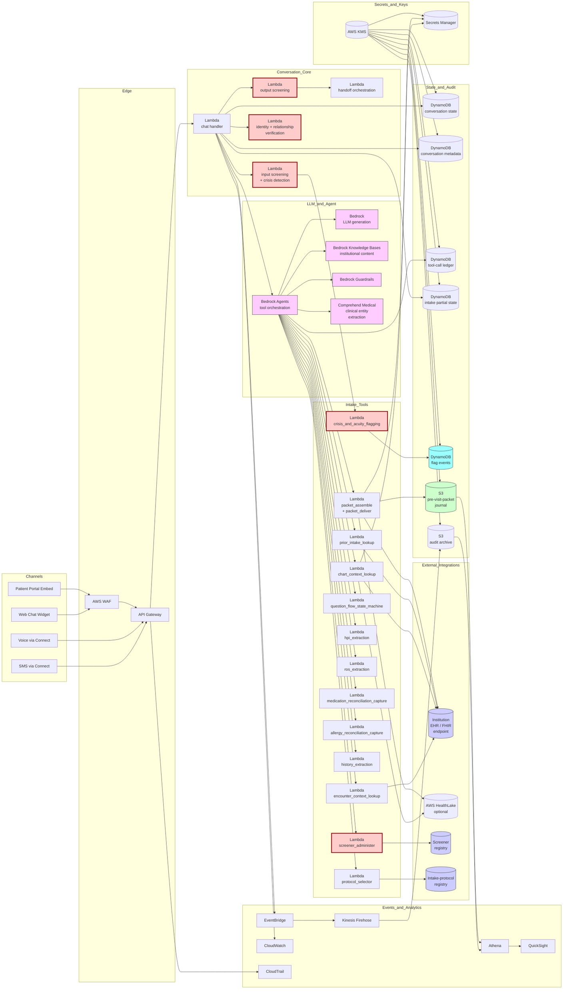

# Recipe 11.4: Pre-Visit Intake Bot

**Complexity:** Medium · **Phase:** Foundational · **Estimated Cost:** ~$0.05-0.30 per completed intake conversation (depends on conversation length, model choice, branching depth, language coverage, and EHR write integration overhead)

---

## The Problem

Marisol is 34. She has been having chest tightness off and on for about three weeks. Not crushing, not radiating, not the dramatic Hollywood version. More like the weight of a hand pressing on her sternum that comes on when she's walking up the stairs to her apartment, lingers a few minutes, and goes away. She has been telling herself it's anxiety, because she has had anxiety since she was twenty-one, and anxiety can feel like this. She has also, in the back of her mind, been thinking about her father, who had a heart attack at fifty-one. Marisol made an appointment with her primary care doctor for next Wednesday. The earliest she could get.

The clinic sends her a text message Monday morning: "Hi Marisol, please complete your pre-visit intake at this link before your Wednesday appointment so we can make the most of your time with Dr. Adekunle."

She clicks the link on her phone during her lunch break. She gets a fourteen-page PDF form. The first page is demographics. The second page is insurance. The third page is family history with twenty-two checkboxes for conditions and four blank lines per relative. The fourth page is current medications, with a free-text box. The fifth page is allergies. The sixth page is a generic review of systems with eighty-six checkboxes covering every organ system. The seventh page asks her to describe her chief complaint in one or two sentences. The remaining seven pages are HIPAA notices, financial-responsibility forms, advance-directive prompts, and a permission to text her appointment reminders.

Marisol fills out the demographics. She fills out the insurance, copying numbers from the back of her card. She gets to family history and writes "father - heart attack age 51, mother - thyroid problem (hypo I think), sister - migraines." She gets to medications and writes "sertraline 50, vitamin D, sometimes melatonin." She gets to allergies and writes "no known drug allergies, environmental allergies (dust, pollen)." She gets to the review of systems and her phone battery is at 14% and she has six minutes left of her lunch break and there are eighty-six checkboxes. She checks "chest tightness" and "occasional anxiety" and gives up. She gets to the chief complaint box and writes "chest tightness for 3 weeks, getting more frequent."

That is the data Dr. Adekunle will have when she walks into the room on Wednesday afternoon. A demographics page she can already see in the chart. A medication list that says "sertraline 50" without confirming whether that's the morning or evening dose, whether it was started recently or has been stable for years, whether it's actually being taken. A two-line chief complaint. A family history with two lines that do not capture the actual relevant detail (Marisol's father had his heart attack at fifty-one and her paternal grandfather had one at forty-eight, but Marisol does not remember the second part because she filled out the form on her phone in three minutes). A review-of-systems with two checkboxes that do not capture the radiation pattern, the timing, the relationship to exertion, the associated symptoms (Marisol has noticed some shortness of breath but didn't have a checkbox for "shortness of breath when going up stairs" and didn't think to write it in the chief complaint box).

Dr. Adekunle has fifteen minutes scheduled. The first three minutes are spent re-asking the questions the form asked, because the form's answers were thin. The next three are spent doing the actual relevant history-taking that the form should have collected: when does the tightness happen, what does it feel like, does it radiate, does it come on with exertion, is there shortness of breath, is there nausea, sweating, dizziness, jaw pain, what's the family cardiac history really, how about substance use, sleep, stress. The next three are physical exam. The next three are deciding what to do (an EKG in clinic, a stress test referral, basic labs, a return visit). The last three are documentation, which actually takes seven minutes and runs the appointment over, which delays the next patient.

This is pre-visit intake in healthcare, and it is the most under-engineered, highest-leverage, most-frequently-skipped data-collection workflow in the entire ambulatory system. Done well, it transforms a fifteen-minute visit. Done badly, which is most of the time, it produces fourteen pages of paperwork that the physician re-asks anyway. The form-based approach has not really changed in twenty years. Some clinics have moved their forms from paper to PDFs to portal-based forms. The forms are still forms. The completion rates are still terrible. The data quality is still thin. The patients still hate them. The clinicians still re-ask everything.

The frustrating thing, when you look at the failure mode honestly, is that what makes a great intake is not what makes a great form. A great intake is a conversation that adapts to the patient. When Marisol mentions chest tightness, the next question is not "any history of measles?" The next question is "tell me more about that. When does it happen? What does it feel like?" When she mentions her father's heart attack at fifty-one, the next question is not "any other family members?" The next question is "any other early heart problems in the family? On either side?" The intake follows the thread. The intake does not follow the form.

A clinical assistant who is good at intake is following a mental decision tree that branches dynamically based on what the patient says. They are doing this from training and from experience. They know that "chest tightness" plus "exertion" plus "family history of early heart disease" is a constellation that requires a different set of follow-up questions than "chest tightness" plus "anxiety history" plus "no exertional pattern." They know that "tired all the time" in a 34-year-old with two young children is a different question than "tired all the time" in a 78-year-old with a recent fall. The form does not know any of this. The form asks every question to every patient and gives most of them no time to actually answer the relevant ones.

The previous generation of pre-visit intake tools, when they tried to be smart, tried to do this with branching logic in a forms engine. If patient checks "chest pain," show the cardiac questions panel. If patient checks "feeling sad," show the depression screener. The problem with the forms-engine approach is that the branching is brittle, the questions still feel like a checklist, and the real human signal (the way Marisol writes "chest tightness for 3 weeks, getting more frequent" in a free-text box, or mentions "actually I don't really remember if my dad's heart attack was a heart attack or a stroke now that you ask") gets crammed into structured fields that destroy the nuance. The patients who fill out branching forms hate them only slightly less than they hate non-branching forms. The clinicians get only marginally better data.

The modern conversational pre-visit intake bot looks like this. Marisol opens the link Monday morning. The bot says "Hi Marisol, I'm Riverside Clinic's intake assistant. I'm going to ask you about what's going on so Dr. Adekunle has the right information for your visit on Wednesday. I'll keep it short. Some questions are required by the clinic, and I'll let you know if you can skip something. I'm a chatbot, not a clinician, and I can't give medical advice. If you ever feel like something is an emergency, please call 911. Ready?"

Marisol says yes.

The bot says "What brings you in to see Dr. Adekunle on Wednesday?"

Marisol types "chest tightness for 3 weeks getting more frequent."

The bot says "Thanks for sharing that. Can you tell me a little more? When does the tightness usually happen? Is it tied to anything you're doing or thinking about?"

Marisol types "mostly when I walk up stairs, sometimes when I'm rushing around. lasts a few minutes."

The bot says "Got it. Does it feel like pressure, squeezing, sharpness, or something else? And does it spread anywhere, like to your arm, jaw, or back?"

Marisol types "more like pressure on my chest, doesn't really spread."

The bot continues for about ten more turns: any shortness of breath, any nausea or sweating, has it gotten worse in the last week, has she ever had this before, any new stress in her life, what helps it stop, when's the last time it happened. By turn fourteen, the bot has the kind of HPI (history of present illness) that an experienced triage nurse would have collected, and it has it in a structured representation that Dr. Adekunle can read in twenty seconds before walking into the room.

When the bot asks about family history, it asks "any heart problems in your family, especially before age sixty?" and Marisol mentions her father at fifty-one and, when prompted ("anyone else? brothers, sisters, grandparents on either side?"), her paternal grandfather at forty-eight. When the bot asks about medications, it preloads the chart's list and asks Marisol to confirm or correct. When she says "I'm not actually taking the melatonin anymore," the bot captures that. When the bot detects, somewhere in turn nine, a constellation of features that warrant a higher-acuity flag, it does not tell Marisol that she might be having cardiac symptoms (it is a chatbot, not a clinician). It quietly flags the encounter for a same-day call from a triage nurse, and tells Marisol "thanks for completing this. The team will look at it before your visit, and someone may reach out today if they want to check in before Wednesday."

That fifteen-minute conversation, completed asynchronously over Marisol's lunch break, replaces fourteen pages of forms, gives Dr. Adekunle a focused pre-read, and surfaces the high-acuity signal early enough that Marisol gets a same-day nurse callback rather than waiting until Wednesday afternoon. The clinical staff is doing the same triage work they would have done if she had called the office, except the bot did the structured-data collection and the routing in the time the form would have taken anyway.

A few things this recipe is and is not.

It is the bot that conducts a structured pre-visit interview adapted to the visit type, the chief complaint, the patient's chart context, and the practice's intake protocol. It captures what would have gone into the chief-complaint, HPI, ROS, medications, allergies, social history, and family history sections of the visit note, and surfaces it to the clinical team in a structured pre-visit packet.

It is not the diagnostician. The bot does not tell the patient what is wrong with them. The bot does not produce a differential. The bot does not recommend treatment. The bot's job is to collect the information; the clinician's job is to interpret it.

It is not the triage bot. The bot does not perform symptom-acuity triage in the way that recipe 11.6 (symptom checker / triage bot) does. The bot can flag patterns to clinical staff for triage review, but the clinical decision belongs to a clinician. Recipe 11.6 covers the architecture for direct patient-facing triage; this recipe covers structured data collection feeding human triage.

It is not a replacement for the visit. Marisol still sees Dr. Adekunle on Wednesday. The bot makes the visit better, not optional.

It is not an open-ended conversational therapy bot. The bot is bounded to the intake task. Long-running conversations about the patient's emotional state, ongoing coaching, or therapeutic interaction are scope for recipe 11.7 (chronic disease management coach) and 11.8 (mental health support bot). The intake bot acknowledges, captures the relevant signal, and routes the patient to the appropriate clinical resource without trying to be the resource.

It is not a regulatory medical-device-style decision-support tool. The bot's output is structured data plus optional flags for clinical attention. The bot does not produce decision-support recommendations to either the patient or the clinician in the way that recipe 11.6's triage outputs do. This positioning is intentional. It keeps the bot on the safer side of the FDA's clinical-decision-support guidance line by sticking to data collection and structured routing, which informs but does not replace clinical judgment. <!-- TODO: verify FDA CDS guidance specifics; the line between informational support and regulated decision support continues to be refined, and any production deployment should review the current 2022 final guidance and any subsequent updates with a regulatory advisor -->

The thing to understand before building this is that the bot's quality is bounded above by the practice's intake-protocol explicitness and the chart-context completeness. A bot operating against vague protocols and an incomplete chart asks generic questions and gets generic answers. A bot operating against precise per-visit-type protocols and a well-reconciled chart conducts the kind of focused pre-visit interview that meaningfully changes the visit. The pre-deployment work of formalizing the intake protocols per visit type is the highest-leverage investment, and it is rarely scoped into the project plan because nobody owns the protocol formally.

Let's get into it.

---

## The Technology: Adaptive Conversational Interviewing Plus Structured Clinical Data Capture

### Why Pre-Visit Intake Has Stayed Stuck on Forms

Pre-visit intake, as a workflow, has been a forms problem for decades. Paper forms gave way to PDF forms gave way to portal-based forms. The shape never changed: a fixed set of questions delivered to every patient regardless of context. The forms grew over time as the institution added requirements (HIPAA notices, financial responsibility, advance directives, social-determinants screeners, depression screeners, fall-risk screeners), and the patient's incentive to fill them out thoroughly grew weaker as the forms grew longer. The completion rate is poor. The data quality is thin. The clinician re-asks. <!-- TODO: verify; specific completion-rate and data-quality figures for pre-visit forms vary by study but the directional finding (low completion, thin data, redundant re-asking by clinicians) is consistent across the ambulatory operations literature -->

The first generation of digital intake tools, roughly 2010 to 2020, replaced paper with screens and added some basic branching ("if patient is female and pregnant, show the prenatal-screening section"). The branching was static, the question wording stayed identical regardless of patient context, and the resulting data was structured exactly the same as the paper form had been. The shape of the workflow stayed the same. A few vendors built sophisticated forms-based products with extensive conditional logic; the conditional logic helped, but the experience was still a forms experience and the patient still felt like they were filling out a form.

The thing that changed the workflow shape is the same thing that changed the refill, scheduling, and FAQ workflows: large language models that can carry on a coherent conversation while sticking to a structured task. A conversational intake interview is fundamentally different from a forms-based intake interview because the bot can ask the next question based on what the patient just said, rephrase a question that the patient did not understand, follow a thread that opens up unexpectedly, skip questions that have already been answered implicitly, and produce structured data at the end without having displayed structured fields to the patient.

The architectural shift is from "show all the questions and capture all the answers" to "conduct an adaptive conversation that produces a structured pre-visit packet." The bot's value is concentrated in two places: the conversation experience for the patient (which is qualitatively different from a form and produces meaningfully higher engagement and completion), and the structured-data quality for the clinician (which is meaningfully richer because the bot followed the interesting threads).

### What an Adaptive Intake Bot Actually Does

An intake bot is a tool-using LLM with a system prompt that tells it what assistant it is, the patient's authenticated context, the visit context (visit type, scheduled provider, scheduled date, reason-for-visit if known), the patient's chart context (active problems, current medications, known allergies, prior visit history), and access to a set of tools. The LLM conducts the conversation. The tools handle the deterministic actions: looking up chart context, validating extracted data, persisting partial state, computing screening-tool scores, surfacing acuity flags, writing the final pre-visit packet to the EHR.

The conversation has a structure, even though the patient does not see it. The structure decomposes roughly as follows.

**The greeting and disclosure.** Same primitive as the other patient-facing bots. Identifies as a chatbot, states scope (data collection for the upcoming visit), acknowledges that emergencies should go to 911, offers a path to a human.

**The chief complaint and reason for visit.** The first substantive question is open-ended: what brings you in. This sets the rest of the interview. The bot does not show a dropdown of possible reasons; the bot lets the patient describe their concern in their own words and then carries the conversation from there.

**The history of present illness (HPI).** Given the chief complaint, the bot follows the OPQRST or SOCRATES or similar mental framework that experienced clinicians use: onset, provocation, quality, radiation, severity, timing, associated symptoms, alleviating factors. The framework is not displayed; the questions are phrased conversationally. The bot adapts the depth of HPI to the chief complaint: a sore throat for two days warrants four to six HPI questions; chest tightness for three weeks warrants ten to fifteen.

**The relevant review of systems.** Rather than the eighty-six-checkbox generic ROS, the bot asks only the systems that are clinically relevant to the chief complaint and the visit type. Chest-tightness presentation gets the cardiopulmonary ROS. Annual physical gets a structured but compact full-system pass. Medication-management visit gets a focused symptom-and-side-effect ROS for the relevant medications.

**The medication confirmation.** The bot pulls the chart's current medication list and asks the patient to confirm. "I see you're taking sertraline 50 milligrams once a day, vitamin D, and you said you sometimes take melatonin. Is that still right? Anything you've stopped or anything new from another doctor we should know?" The patient confirms or corrects. The bot does not change the medication list (that is a clinical action); the bot captures the patient-reported updates as structured medication-reconciliation events for the clinical team.

**The allergy confirmation.** Same pattern as medications. Pulls the chart's allergy list, asks the patient to confirm or update.

**The relevant past medical, surgical, family, and social history.** The bot asks history questions targeted to the visit type and the chief complaint. Chest-tightness presentation gets explicit family-history-of-cardiac-disease prompts with follow-up. Annual physical gets a broader sweep. Established patients with a complete chart get a confirmation pass; new patients get a more thorough collection.

**The visit-type-specific screeners and protocols.** Many visit types come with required screeners: PHQ-9 for depression at primary-care visits where indicated, AUDIT-C for alcohol screening, CAGE, GAD-7, PROMIS instruments, fall-risk screening for older adults, social-determinants-of-health screeners. The bot administers these conversationally rather than as forms when feasible, scoring them and surfacing the score and any flag. Some screeners (like the PHQ-9) have specific item wordings that are required for the score to be valid; the bot uses the validated item wordings for these and computes the score per the validated scoring rules.

**The advance-directive, code-status, and patient-rights items.** Items that the institution requires every patient to acknowledge or update get handled in the conversation flow with appropriate gravity. These are not skip-friendly; they are required pieces of every visit packet.

**The crisis-detection and acuity-flag layer.** Throughout the conversation, the bot screens for crisis signals (suicidal ideation, active self-harm risk, abuse, medical emergency), red-flag symptoms (specific symptom combinations that warrant immediate clinical attention), and significant new-information events (a new diagnosis the patient mentions, a hospitalization the chart does not show, a new medication from another provider). Crisis signals route immediately to the crisis pathway. Red-flag symptoms route to a same-day clinical-staff callback. Significant new information surfaces in the pre-visit packet.

**The closing summary and confirmation.** The bot summarizes what it captured, confirms with the patient, and tells them what to expect ("Dr. Adekunle will read this before your visit. The clinical team may reach out today if they want to check in before Wednesday").

**The structured pre-visit packet generation.** The bot's final action is producing the structured packet from the conversation: chief complaint, HPI in a structured representation, ROS findings, medication-reconciliation deltas, allergy updates, screener scores, history updates, acuity flags, and the conversation transcript. The packet is written to the EHR (typically as a pre-visit note or as discrete structured fields the EHR exposes) and the conversation transcript is preserved as an audit and clinical-record artifact.

### Why a Generic LLM Cannot Run a Pre-Visit Intake

A naive product approach would be: take a generalist LLM, give it a chat surface, tell it to "interview the patient before their visit," and run with it. This does not work, for reasons that compound the closer you look.

**The model has no view of the patient's chart.** Without the patient's active problems, current medications, allergies, prior visit history, and visit context as input, the LLM does not know what to ask about. The bot will ask "any allergies?" instead of "I see you're listed as allergic to penicillin; is that still right?" The chart-context tools (problem-list-lookup, medication-list-lookup, allergy-list-lookup, prior-visit-summary-lookup, scheduled-visit-context-lookup) are the inputs that make the bot adaptive in the way clinicians value.

**The model cannot administer validated screeners reliably.** Tools like the PHQ-9 require specific item wordings to produce a valid score. <!-- TODO: verify; the PHQ-9 has specific item wordings derived from validation studies, and modifying the wordings invalidates the score; this is consistent with the broader literature on validated patient-reported-outcome instruments --> Asking the LLM to "ask depression-screening questions" produces a conversation that is not a validated PHQ-9. The screener tool encapsulates the validated item wordings, the response capture, and the scoring rules. The bot administers the tool; the tool produces the score.

**The model cannot reliably extract structured clinical data from conversational text.** "I started having tightness about three weeks ago, mostly when I climb stairs, lasts a few minutes, feels like pressure" needs to become a structured HPI representation: onset_relative="3 weeks ago", trigger="exertion (stairs)", duration="several minutes", quality="pressure". A generalist LLM will produce this extraction unreliably. The structured-extraction tool wraps a more specifically-tuned extraction step and validates the output schema. <!-- TODO: verify; the gap between conversational text and structured clinical data is well established; modern LLMs handle the extraction better than prior NLP but still benefit from explicit extraction tools and schema validation -->

**The model has no reliable theory of the practice's intake protocol.** What does this practice want to capture for a chest-pain presentation? What screeners are required for an annual physical for a 34-year-old? What HPI elements does the practice's medical leadership consider non-negotiable? The intake protocol is the institutional artifact that answers these questions. Asking the LLM to "do a good intake" produces inconsistent intake; asking the LLM to follow a documented per-visit-type protocol produces consistent intake.

**The model cannot reliably enforce the boundary between data collection and clinical advice.** Patients ask questions during intake. "Is this serious?" "Should I be worried?" "What do you think it could be?" The bot's correct response is "I'm a chatbot and can't give medical advice, but the clinical team will review what you've shared and your appointment with Dr. Adekunle is on Wednesday. If at any point you feel like this might be an emergency, please call 911." A generalist LLM, asked to be helpful, will start to speculate. The output safety screening, the system prompt, and the scope filters are layered defenses; none of them is sufficient alone.

**The model cannot detect crisis reliably without the explicit safety layer.** A patient mentioning suicidal ideation during a depression-screener exchange must trigger the crisis pathway. A patient describing symptoms that look acutely cardiac must trigger same-day clinical follow-up. The crisis-detection and acuity-flag layer is a separate, explicit pipeline component. Folding it into the LLM's general behavior produces inconsistent escalation.

**The model has no audit trail of what was captured versus what was inferred.** The practice's clinical team needs to know: what did the patient actually say, what did the bot extract, what did the bot infer. The structured-data ledger captures the patient's actual utterances, the bot's structured extractions, the screener scores, the chart-context that was loaded. Without this, the pre-visit packet is unreviewable for clinical safety and unverifiable for compliance.

**The model has compliance implications for clinical-data conversations.** The intake conversation is dense PHI: chief complaint, HPI, medications, allergies, family history, social history, screener responses, the patient's own emotional state. The conversation log is a clinical record. The medication and allergy reconciliation deltas may become part of the formal medical record. The screener scores are clinical-record events. The architecture must produce the durable audit pipeline plus a layer of clinical-event documentation similar to what the refill bot needed but with broader and richer content.

### What the Intake Bot Has To Do That the Refill Bot Did Not

Recipes 11.1 (FAQ), 11.2 (scheduling), and 11.3 (refill) established the patterns this recipe inherits: input safety screening, intent classification (here narrower because the intake bot is single-task), identity verification with graduated assurance (here typically the authenticated portal session), tool-use orchestration, output safety screening, audit logging, per-cohort monitoring. The intake bot adds five structural commitments those recipes did not have.

**Adaptive question-flow orchestration.** The previous bots' tool surfaces were transactional (look up an appointment, e-prescribe a refill). The intake bot's tool surface is structurally a question-flow orchestration: which question to ask next given what has been captured, what the chart says, what the visit type is, and what the practice's protocol requires. This is not a free-form LLM decision; it is a tool that runs a state machine over the protocol with the LLM only choosing the natural-language phrasing. Skipping this discipline produces a bot that wanders through topics and fails to capture required items.

**Validated-screener administration as a discrete tool.** PHQ-9, GAD-7, AUDIT-C, PROMIS instruments, fall-risk screeners, social-determinants screeners are each their own validated tool with specific item wordings, response options, and scoring rules. The bot's screener tool encapsulates each one. The bot does not paraphrase the items; it administers the validated wordings and captures the responses. The scoring is deterministic and produces a clinical-record event. <!-- TODO: verify; the PHQ-9, GAD-7, and AUDIT-C are all widely validated screening instruments with specific scoring algorithms; the institutional choice of screeners and the appropriate cadence varies by visit type, patient population, and institutional protocol -->

**Structured clinical-data extraction with schema validation.** The bot's HPI, ROS, history, and reconciliation outputs are structured. Each output field has a schema. The extraction tool produces output that conforms to the schema and validates before persistence. Free-text remarks are preserved alongside the structured representation, but the structured fields are the surface the clinical team consumes. The schema is owned by clinical informatics, not engineering.

**Crisis and acuity flagging as a parallel pipeline.** Throughout the conversation, the bot screens every patient utterance for crisis signals and red-flag clinical patterns. The screening runs in parallel with the conversation; a hit interrupts the flow and routes appropriately. The pipeline is a separate component, not a feature of the conversational LLM, because the consequences of missing a crisis signal are severe. The pipeline has named ownership at the patient-safety committee.

**Pre-visit packet generation as a structured handoff to the clinical workflow.** The bot's final output is the pre-visit packet: a structured artifact the clinical team consumes before the visit. The packet's schema is defined by the practice's clinical informatics team. The packet is delivered to the EHR through the appropriate integration point (typically as a pre-visit note attached to the upcoming encounter, or as discrete structured fields populated through the EHR's intake-data API where exposed). The handoff is the primary value-delivery mechanism; if the packet does not land in front of the clinician at the right moment, the bot's value is largely lost.

The rest is largely the same as recipes 11.2 and 11.3: tool-surface contract management, identity-assurance lifecycle, conversation logging, scope filtering, per-cohort monitoring, prompt-injection defense.

### The Intake Reality

A few notes on what makes pre-visit intake specifically harder than other patient-facing bot use cases.

**Visit types are not interchangeable.** A primary-care annual physical, a primary-care follow-up for a chronic condition, a same-day urgent visit, a specialist consultation, a procedure pre-op, a behavioral-health intake, a pediatric well-visit, a women's-health visit, a geriatric assessment, a telehealth visit. Each has a different intake protocol. The protocol structure is the same (HPI, ROS, history, reconciliation, screeners, packet), but the contents differ substantially. The bot's protocol library has an entry per visit type, and the bot's first orchestration decision is which protocol to load.

**Chief complaints are open-ended and the protocol must adapt.** "I'm here for my annual" and "I'm here because my chest hurts" are different conversations. The protocol per visit type provides the shape; the chief complaint dynamically opens or closes branches within the protocol. A primary-care annual that uncovers a new chest-pain complaint should pivot into the cardiac-symptoms branch, not finish the wellness checklist while ignoring the chest pain.

**Patients answer in unexpected ways.** "When did the chest tightness start?" can produce "about three weeks ago" or "I think after I started the new job" or "I'm not sure, maybe a while back" or "I've had it on and off for years but it's been worse recently" or "ugh I don't know, I never know with these things." The bot's extraction has to handle the range of answers gracefully, ask a clarifying question when the answer is unusable, and accept "I don't know" as a valid response without escalating.

**The patient's free-text answer often contains multiple findings.** "Chest tightness for 3 weeks getting more frequent" contains: a symptom (chest tightness), a duration (3 weeks), a temporal pattern (getting more frequent). "I've been more anxious lately and not sleeping well, and the chest tightness is making me wonder if it's all related" adds: anxiety symptoms, sleep disturbance, the patient's own theory of the case. The extraction has to tolerate these compound answers and surface each finding.

**Screeners are sensitive instruments.** The PHQ-9 ends with an item asking about thoughts of self-harm or suicide. The bot's response when a patient endorses that item is consequential. The crisis-detection layer recognizes the pattern; the response template is reviewed by clinical leadership; the routing pathway is tested. <!-- TODO: verify; the PHQ-9 item 9 (thoughts of self-harm or suicide) is a standard component of the validated instrument, and clinical-best-practice guidance on the response to a positive endorsement is well established; specific crisis-routing paths vary by institution --> Skipping this design work and leaving the bot to handle item 9 with its general response generation is unsafe.

**Cultural and linguistic variability in symptom expression matters.** Different patient populations describe symptoms differently. "Chest pressure" is one description; "weight on my chest," "tightness," "heaviness," "like something sitting on me" are equivalent descriptions. Different languages have different idioms for symptoms. <!-- TODO: verify; the cultural and linguistic variability of symptom expression is a well-established phenomenon in clinical and cross-cultural medicine, with specific patterns documented for many language and cultural groups --> The bot's extraction has to handle the variability, and the per-language deployment work has to handle the per-language idioms with native-speaker review.

**Patients sometimes disclose sensitive information unexpectedly.** A pediatric well-visit intake question to a parent may disclose domestic violence in the household. A medication-confirmation question may disclose substance-use issues. A social-history question may disclose intimate-partner violence or housing instability. The bot's response in these moments matters. The crisis-detection and sensitive-disclosure pathways are explicit, the responses are reviewed by clinical leadership, and the routing is to clinicians (or, where appropriate, social workers) trained for these conversations.

**Medication reconciliation discrepancies are common.** The chart's medication list rarely matches what the patient actually takes. The patient stopped a medication, started a new one prescribed elsewhere, takes a slightly different dose, or skips it some days. The bot captures the patient-reported state without changing the chart; the discrepancies are flagged for clinical review during the visit. The medication-reconciliation pattern is similar to recipe 11.3 but applied across all the patient's medications, not just the one being refilled.

**Family-history accuracy is variable.** Patients often do not know the details of family-history events. "My dad had a heart attack but I don't remember if he was fifty or sixty." "My mom had some kind of thyroid thing." The bot's family-history collection asks gently, accepts uncertainty, and captures what the patient knows. The bot does not pretend the data is more precise than the patient's report.

**The intake conversation is asynchronous and may be interrupted.** Marisol is filling this out on her lunch break. She might get pulled away. She might want to come back later. The conversation has resumable state. The bot greets her at the start of the resumed session ("welcome back; you got partway through. Want to pick up where you left off, or start over?") and resumes with the appropriate context.

**The bot is sometimes the patient's first encounter with the practice.** New patients have not seen the practice yet; the intake bot is their first touchpoint. The persona, the warmth, the clarity of the disclosure, and the smoothness of the experience set the practice's first impression. This is not a back-office tool; it is a patient-experience surface.

**Pediatric and proxy-completion flows are common.** A parent fills out intake for a child. A caregiver fills out intake for an elderly parent. A spouse helps a partner with limited English fill out the intake. The bot's identity-and-relationship handling has to be explicit: who is talking to the bot, who is the visit for, what authorization does the proxy have. This is a different problem than the previous bots had, because the previous bots were predominantly patient-self-service.

### Where the Field Has Moved

A few practical updates worth knowing.

**FHIR Questionnaire and QuestionnaireResponse provide structured representations.** The FHIR Questionnaire resource represents a structured intake form, and the QuestionnaireResponse resource represents the patient's answers. <!-- TODO: verify; FHIR Questionnaire and QuestionnaireResponse have been part of FHIR since DSTU2 with refinements in subsequent versions; major EHRs implement varying levels of Questionnaire support --> Most major EHRs expose these endpoints, and the institutional intake protocol can often be represented as a FHIR Questionnaire under the hood, with the bot conducting the conversation and producing a QuestionnaireResponse as the structured output. This integration path provides interoperability and supports portable intake protocols.

**Validated screening instruments are increasingly digital-native.** PHQ-9, GAD-7, PROMIS short forms, AUDIT-C, and many others have been validated for digital and conversational administration. <!-- TODO: verify; the digital and conversational administration of validated screeners has been studied with increasing rigor over the last decade, with most well-validated screeners showing acceptable agreement between paper, digital, and conversational forms; specific findings vary by instrument and population --> The bot can administer these conversationally, score them per the validated rules, and produce the score as a clinical-record event.

**Patient-reported outcomes (PROs) are part of routine care.** PROMIS, FACIT, EORTC, condition-specific PROs (NEI-VFQ for vision, BFI for fatigue, ODI for low back pain) are increasingly part of routine care. The bot can administer PROs as part of intake for relevant visit types, contributing to the longitudinal data the institution collects on patient outcomes.

**Tool-using LLMs handle structured data collection well when prompted carefully.** The function-calling pattern from recipes 11.2 and 11.3 maps directly to intake: the LLM produces tool calls that capture each piece of structured data, the tools validate the schemas, the LLM continues the conversation. The architecture is robust enough that institutions deploying intake bots since roughly 2023 onward have been using this pattern by default.

**The shift from forms to conversation produces measurably better engagement.** Healthcare conversational-intake deployments consistently show higher completion rates and higher patient satisfaction than the forms they replace, holding the visit type constant. <!-- TODO: verify; specific engagement and satisfaction figures vary by deployment; the directional finding (conversational outperforms forms) is consistent across published case studies and vendor benchmarks --> The data-quality finding is more nuanced: conversational intake produces better data on the chief-complaint and HPI dimensions and similar or modestly-better data on the structured-history dimensions, with the gap being largest for visit types with rich HPI requirements.

**Pre-visit-intake products are commercially mature.** Several vendors offer pre-visit-intake products integrated with the major EHRs, with conversational and form-based variants and varying levels of customization. <!-- TODO: verify specific vendor names and capabilities; the commercial market continues to evolve --> The build-vs-buy economics favor partial-buy for many institutions, similar to the refill bot. Build the conversational and protocol layers on the practice's preferred infrastructure; integrate with the EHR through the vendor's APIs.

**Equity considerations are central to intake design.** A bot that works only for English-speaking, smartphone-using, internet-access-having, technology-comfortable patients excludes a substantial fraction of the population. The patients excluded are disproportionately the patients who would benefit most from a bot that is patient about asking and good at adapting. Multi-language, multi-channel (web, SMS, voice), accessibility-conformant deployment is foundational, not optional.

---

## General Architecture Pattern

A healthcare pre-visit intake bot decomposes into ten logical stages: channel entry, input safety screening, identity and relationship verification, visit-context loading, protocol selection, adaptive question-flow orchestration, structured data extraction with screener administration, parallel crisis and acuity flagging, output safety screening, and pre-visit packet generation. The cross-cutting concerns from recipes 11.1 through 11.3 carry forward; this recipe adds three new ones (intake-protocol-as-code lifecycle, validated-screener tool library governance, pre-visit packet schema management).

```
┌────────── CHANNEL ENTRY ─────────────────────────────────┐
│                                                           │
│   [Patient receives intake invitation through one of      │
│    the configured channels: secure email link, SMS        │
│    link, in-app push notification, patient-portal         │
│    embed when authenticated]                              │
│                                                           │
│   [Greeting and disclosure]                               │
│    - Identifies as a chatbot, not a clinician             │
│    - States the bot's scope (collecting information       │
│      for the upcoming visit; not providing medical        │
│      advice; not performing triage; not a substitute      │
│      for the visit)                                       │
│    - Acknowledges that emergencies should go to 911       │
│    - Offers an immediate path to reach the clinic         │
│    - Sets expectations on length and what happens         │
│      with the data                                        │
│                                                           │
│   [Conversation session bootstrap]                        │
│    - Generate session_id                                  │
│    - Capture channel, authentication context, and the     │
│      deep-link parameters identifying the upcoming        │
│      encounter                                            │
│    - On resume: load partial state                        │
│           │                                               │
│           ▼                                               │
│   [Output: session_id, channel, auth context, encounter   │
│    reference]                                             │
│                                                           │
└───────────────────────────────────────────────────────────┘

┌────────── INPUT SAFETY SCREENING ────────────────────────┐
│                                                           │
│   [Same primitive as the previous chapter 11 recipes,     │
│    with intake-specific tuning:]                          │
│    - Crisis detection (preempts everything; intake        │
│      conversations frequently surface crisis signals      │
│      because the bot is asking about how the patient      │
│      is doing)                                            │
│    - Prompt-injection detection                           │
│    - PHI minimization                                     │
│    - Screener-aware: the bot's PHQ-9 item 9 expects       │
│      a response that may match crisis patterns; the       │
│      crisis pipeline knows the screener context and       │
│      handles it appropriately                             │
│           │                                               │
│           ▼                                               │
│   [Output: input passes / input blocked-with-disposition] │
│                                                           │
└───────────────────────────────────────────────────────────┘

┌────────── IDENTITY AND RELATIONSHIP VERIFICATION ────────┐
│                                                           │
│   [Authenticated session path (recommended default)]      │
│    - Patient is logged into the patient portal or app     │
│    - The session conveys an authenticated patient_id      │
│    - The bot accepts the patient_id as verified           │
│                                                           │
│   [Unauthenticated link path with one-time token]         │
│    - The intake link includes a single-use signed token   │
│      that authenticates the patient for this specific     │
│      intake session                                       │
│    - The bot verifies the token, binds to the patient,    │
│      and proceeds                                         │
│                                                           │
│   [Proxy-completion path]                                 │
│    - When the visit is for a child or for a patient       │
│      whose access is delegated, the authenticated user    │
│      is the proxy, not the patient                        │
│    - The bot confirms relationship at the start ("you     │
│      are completing this for [patient name], correct?")   │
│    - The bot's prompts adjust accordingly ("how has       │
│      [patient name] been feeling?")                       │
│                                                           │
│   [Step-up authentication for sensitive items]            │
│    - Some institutions require step-up for items that     │
│      cross sensitivity thresholds (e.g., self-disclosure  │
│      of mental-health items in an unauthenticated         │
│      adolescent flow)                                     │
│           │                                               │
│           ▼                                               │
│   [Output: verified patient_id, proxy_relationship,       │
│    assurance_level]                                       │
│                                                           │
└───────────────────────────────────────────────────────────┘

┌────────── VISIT-CONTEXT LOADING ─────────────────────────┐
│                                                           │
│   [Tool: encounter_context_lookup]                        │
│    - Visit type, scheduled provider, scheduled date,      │
│      reason-for-visit if known, encounter location        │
│      (in-person, telehealth)                              │
│                                                           │
│   [Tool: chart_context_lookup]                            │
│    - Active problems, current medications, known          │
│      allergies, recent vital signs, recent labs,          │
│      relevant prior visit summaries                       │
│                                                           │
│   [Tool: prior_intake_lookup]                             │
│    - Recent intake responses for the same patient         │
│      (so the bot can confirm rather than re-collect       │
│      stable history items)                                │
│                                                           │
│   [Tool: patient_demographics_lookup]                     │
│    - Age, preferred language, accessibility               │
│      accommodations on file                               │
│           │                                               │
│           ▼                                               │
│   [Output: structured visit context, chart context,       │
│    prior intake context, patient demographics]            │
│                                                           │
└───────────────────────────────────────────────────────────┘

┌────────── PROTOCOL SELECTION ────────────────────────────┐
│                                                           │
│   [Tool: protocol_selector]                               │
│    - Inputs: visit type, encounter context, patient       │
│      demographics, prior intake history                   │
│    - Output: the per-visit-type protocol to load          │
│      (e.g., "primary_care_followup_v3.2",                 │
│      "annual_physical_adult_v4.1",                        │
│      "specialist_consult_cardiology_v2.0",                │
│      "behavioral_health_intake_v3.0")                     │
│    - Output: the screener bundle to administer            │
│      (e.g., PHQ-9, GAD-7 for primary-care visits          │
│      meeting the institutional screening cadence)         │
│           │                                               │
│           ▼                                               │
│   [Output: active protocol_version, screener_bundle]      │
│                                                           │
└───────────────────────────────────────────────────────────┘

┌────────── ADAPTIVE QUESTION-FLOW ORCHESTRATION ──────────┐
│                                                           │
│   [Tool: question_flow_state_machine]                     │
│    - Maintains the protocol's state                       │
│    - Returns the next question to ask based on:           │
│      protocol position, what has been captured,           │
│      what the chart already provides, what branches       │
│      have opened or closed                                │
│    - The LLM phrases the question conversationally;       │
│      the state machine decides which question             │
│                                                           │
│   [Conversation loop]                                     │
│    - Bot asks a phrased question                          │
│    - Patient answers conversationally                     │
│    - Extraction tool produces structured findings         │
│    - Crisis-and-acuity pipeline runs in parallel          │
│    - State machine advances; loops to next question       │
│      or to a follow-up branch the patient's answer        │
│      opened                                               │
│                                                           │
│   [Branch handling]                                       │
│    - Open: patient mentions chest pain in primary-care    │
│      annual; cardiac-symptoms branch opens                │
│    - Close: patient denies the symptom in question;       │
│      the negative-finding is captured and the branch      │
│      closes without follow-ups                            │
│    - Diverge: patient brings up an unrelated significant  │
│      concern; the bot acknowledges, captures the          │
│      concern, and weaves back to the protocol             │
│                                                           │
│   [Resumability]                                          │
│    - Persist conversation state and protocol position     │
│      after each captured turn                             │
│    - On resume, the bot continues from the persisted      │
│      position with appropriate re-greeting                │
│           │                                               │
│           ▼                                               │
│   [Output: ongoing conversation state, captured           │
│    findings as they accumulate]                           │
│                                                           │
└───────────────────────────────────────────────────────────┘

┌────────── STRUCTURED EXTRACTION AND SCREENERS ───────────┐
│                                                           │
│   [Tool: hpi_extraction]                                  │
│    - Extracts onset, provocation, quality, radiation,     │
│      severity, timing, associated symptoms, alleviating   │
│      factors from the patient's HPI utterances            │
│    - Validates against schema                             │
│                                                           │
│   [Tool: ros_extraction]                                  │
│    - Extracts review-of-systems findings (positive and    │
│      negative) from the relevant-system questions         │
│    - Validates against schema                             │
│                                                           │
│   [Tool: medication_reconciliation_capture]               │
│    - Captures patient-reported medication updates         │
│      against the chart's current list                     │
│    - Produces structured deltas (added, stopped,          │
│      dose-changed, taking-as-prescribed)                  │
│    - Does NOT change the chart; produces                  │
│      reconciliation events for clinical review            │
│                                                           │
│   [Tool: allergy_reconciliation_capture]                  │
│    - Same pattern as medications, applied to allergies    │
│                                                           │
│   [Tool: history_extraction]                              │
│    - Past medical history, surgical history, family       │
│      history, social history (smoking, alcohol,           │
│      substance use, occupation, living situation)         │
│    - Captures patient-stated detail with appropriate      │
│      uncertainty markers                                  │
│                                                           │
│   [Tool: screener_administer]                             │
│    - For each screener in the bundle, present the         │
│      validated item wordings, capture responses,          │
│      compute scores per validated rules                   │
│    - PHQ-9, GAD-7, AUDIT-C, PROMIS instruments,           │
│      institution-specific screeners                       │
│    - Item 9 of PHQ-9 (or equivalent self-harm items)      │
│      is wired to the crisis-and-acuity pipeline           │
│                                                           │
│   [Tool: pro_administer (optional)]                       │
│    - Patient-reported-outcome instruments for visit       │
│      types where the institution captures longitudinal    │
│      PROs                                                 │
│           │                                               │
│           ▼                                               │
│   [Output: structured findings accumulating across the    │
│    conversation]                                          │
│                                                           │
└───────────────────────────────────────────────────────────┘

┌────────── CRISIS AND ACUITY FLAGGING ────────────────────┐
│                                                           │
│   [Pipeline runs in parallel with the conversation]       │
│                                                           │
│   [Crisis detection]                                      │
│    - Suicidal ideation, active self-harm, intent          │
│    - Domestic violence, abuse, intimate-partner           │
│      violence, child abuse                                │
│    - Active substance-use crisis                          │
│    - Acute medical emergency descriptions                 │
│                                                           │
│   [Red-flag clinical patterns]                            │
│    - Constellations the institution's protocol flags      │
│      (e.g., chest-pain-with-radiation-and-exertion in     │
│      adult, sudden-onset-severe-headache, acute           │
│      neurologic deficit description, GI bleeding          │
│      description, suicide intent endorsement on PHQ-9     │
│      item 9)                                              │
│    - Each flag has a routing target (same-day             │
│      clinical-staff callback, immediate crisis            │
│      pathway, urgent-care redirect)                       │
│                                                           │
│   [Significant new-information events]                    │
│    - New diagnosis the patient mentions                   │
│    - Hospitalization the chart does not show              │
│    - New medication from another provider                 │
│    - New allergy or adverse drug reaction                 │
│    - Significant change in functional status              │
│                                                           │
│   [Pipeline output]                                       │
│    - Crisis flags route immediately and modify the bot's  │
│      conversation flow (offer crisis resources, ask       │
│      consent for a same-day reach-out, ensure the         │
│      patient knows how to reach 911 or 988)               │
│    - Acuity flags route to clinical staff with the        │
│      relevant context attached                            │
│    - New-information events surface in the pre-visit      │
│      packet for the clinician's attention                 │
│           │                                               │
│           ▼                                               │
│   [Output: real-time flag events plus structured          │
│    flag list for the pre-visit packet]                    │
│                                                           │
└───────────────────────────────────────────────────────────┘

┌────────── OUTPUT SAFETY SCREENING ───────────────────────┐
│                                                           │
│   [Same primitive as the other chapter 11 recipes,        │
│    with intake-specific checks:]                          │
│    - Scope filter on generated response (no diagnostic    │
│      speculation, no treatment recommendation, no         │
│      symptom interpretation, no severity assessment)      │
│    - Vendor-managed guardrail layer                       │
│    - Hallucination check: did the bot reference a         │
│      chart fact that the chart-context tools did not      │
│      return? Did the bot mention a medication or          │
│      allergy not on the patient's list?                   │
│    - Persona-and-tone check: gentle, non-judgmental,      │
│      especially around sensitive disclosures              │
│           │                                               │
│           ▼                                               │
│   [Output: response cleared for delivery, or replaced     │
│    with a safer template]                                 │
│                                                           │
└───────────────────────────────────────────────────────────┘

┌────────── PRE-VISIT PACKET GENERATION ───────────────────┐
│                                                           │
│   [Tool: packet_assemble]                                 │
│    - Assembles the structured pre-visit packet from       │
│      accumulated findings:                                │
│      - Chief complaint                                    │
│      - HPI (structured plus the patient's verbatim        │
│        free-text)                                         │
│      - ROS findings (positive and negative)               │
│      - Medication-reconciliation deltas                   │
│      - Allergy-reconciliation deltas                      │
│      - History updates (PMH, surgical, family,            │
│        social)                                            │
│      - Screener scores and item-level responses           │
│      - Acuity flags and clinical-staff routing            │
│        events                                             │
│      - New-information events                             │
│      - The conversation transcript                        │
│      - Active protocol version and screener-bundle        │
│        version stamps                                     │
│                                                           │
│   [Tool: packet_deliver]                                  │
│    - Writes the packet to the EHR through the             │
│      institution's intake-data integration point          │
│      (FHIR QuestionnaireResponse, EHR-vendor's            │
│      pre-visit-note API, or the institution's             │
│      clinical-staging area for review-before-attach)     │
│    - Handles delivery failures with retry plus            │
│      operational alert                                    │
│                                                           │
│   [Closing summary to the patient]                        │
│    - The bot summarizes what was captured                 │
│    - Confirms with the patient                            │
│    - Sets expectations: "Dr. Adekunle will see this       │
│      before your visit. The clinical team may reach       │
│      out today if they have questions."                   │
│           │                                               │
│           ▼                                               │
│   [Output: durable pre-visit packet, EHR-side             │
│    delivery confirmation, conversation transcript]        │
│                                                           │
└───────────────────────────────────────────────────────────┘

┌────────── AUDIT, LOG, AND TELEMETRY ─────────────────────┐
│                                                           │
│   [Durable conversation record]                           │
│    - User utterances                                      │
│    - Tool calls with arguments and results                │
│    - Generated bot responses                              │
│    - Active model and prompt versions                     │
│    - Active protocol and screener-bundle versions         │
│    - Identity-verification outcome and assurance level    │
│    - Proxy relationship if applicable                     │
│    - Crisis flags raised, acuity flags raised             │
│    - Final disposition (completed, abandoned,             │
│      escalated, crisis-routed)                            │
│                                                           │
│   [Pre-visit-packet journal]                              │
│    - Durable, separately-governed record of every         │
│      packet: the patient, the encounter, the protocol     │
│      version, the screener scores, the acuity flags,      │
│      the EHR-side delivery confirmation                   │
│    - Retention sized to the institution's medical-        │
│      record-retention floor                               │
│                                                           │
│   [Operational telemetry]                                 │
│    - Completion rate per visit type                       │
│    - Median time-to-completion                            │
│    - Abandonment rate by stage                            │
│    - Resume rate                                          │
│    - Acuity-flag rate and routing-disposition mix         │
│    - Crisis-flag rate and crisis-pathway-engagement       │
│    - Screener positivity rates per screener               │
│    - Tool-call failure rate per tool                      │
│    - EHR delivery success rate                            │
│    - Per-cohort metric slices (language, channel, age,    │
│      visit type, proxy-completion, accessibility-needs)   │
│                                                           │
│   [Sampled review queue]                                  │
│    - Random sample plus targeted sample of low-           │
│      confidence and escalated conversations               │
│    - Reviewers tag failure modes (extraction error,       │
│      protocol-branch error, screener administration       │
│      error, scope-violation, crisis-handling correctness) │
│    - Clinical-leadership review of acuity-flagged         │
│      conversations for routing accuracy                   │
│           │                                               │
│           ▼                                               │
│   [Output: audit trail, telemetry, learning signals]      │
│                                                           │
└───────────────────────────────────────────────────────────┘
```

A few cross-cutting design points specific to the intake bot.

**The intake protocol is a versioned governance artifact, organized per visit type.** Like the refill protocol, the intake protocols are clinical-leadership artifacts encoded as code. There is no single intake protocol; there is a library of per-visit-type protocols, each owned by the relevant clinical service line. Each protocol has versioning, sandbox testing against held-out conversations, staged rollout, audit-record stamping, and a clinical-informatics-team owner. The medical staff committee approves new protocols and major-version changes. When a screener bundle changes (the institution adopts a new SDOH screener for primary-care visits, for example), the relevant protocols are updated as a coordinated release.

**The screener tool library is governed separately.** Validated screening instruments (PHQ-9, GAD-7, AUDIT-C, PROMIS, fall-risk, SDOH bundles) each have their own tool with validated wordings, response options, and scoring rules. The library is owned jointly by clinical informatics, behavioral health (for the mental-health screeners), and the relevant clinical service lines (for condition-specific PROs). Each screener has its own version, and the bot's audit record stamps the screener version that was administered. Modifying a screener's wordings is a governance event that requires re-validation review, not a software change.

**The pre-visit packet schema is the bot's clinical-team-facing contract.** The packet schema is what the clinical team consumes. The schema is owned by clinical informatics with input from the clinical service lines that consume the packet. Schema changes are coordinated with EHR-side display logic so the clinician sees the packet as designed. The bot's packet-assembly tool produces output that conforms to the schema and validates before EHR delivery.

**Crisis and acuity flagging is a hard architectural floor.** Every patient utterance runs through the crisis-and-acuity pipeline in parallel with the conversation. The pipeline is a separate component, not a feature of the conversational LLM. The pipeline's hits trigger explicit response templates and explicit routing pathways. The patient-safety committee owns the pipeline's design. Tabletop drills exercise the crisis pathway quarterly. Failure to detect a crisis in retrospective review is a high-severity incident with a structured root-cause analysis.

**Medication and allergy reconciliation outputs do not modify the chart.** The bot captures patient-reported reconciliation deltas as structured events. The chart change is a clinical action that happens during or after the visit by an authorized clinician. The bot's reconciliation events are surfaced in the pre-visit packet for the clinician's attention; they are also written to the medication-reconciliation event journal for downstream clinical workflow.

**The conversation log is rich PHI and a clinical record.** The intake conversation contains chief complaint, HPI, ROS, medications, allergies, family history, social history, and screener responses. The log is dense PHI and many institutions treat it as part of the formal medical record. The institution's medical-records team owns the log's retention, access, and disclosure-accounting policies. The retention floor is the longest of HIPAA's six-year minimum, the state-specific medical-records retention rules, the state-specific consumer-privacy-law retention rules where applicable, and the institutional regulatory floor. <!-- TODO: verify; medical-records retention rules vary by state and continue to evolve -->

**Per-cohort monitoring is non-negotiable, with intake-specific metric slices.** Completion rate, abandonment rate, time-to-completion, screener positivity, and acuity-flag rate vary substantially by language, age cohort, channel, visit type, and proxy-completion status. Equity-relevant disparities (a completion rate that is meaningfully lower for non-English-speaking patients than for English-speaking patients with the same visit type) is a launch-gate criterion, not a post-launch dashboard.

**Resumability is part of the architecture.** Patients fill out intake on lunch breaks, on phones with low batteries, in distracted environments. Conversation state, protocol position, and accumulated findings persist after each turn. Resume is graceful: the bot greets, summarizes what has been captured, asks if the patient wants to continue or restart, and proceeds.

**The pre-visit packet's display in the EHR is part of the deployment.** A bot that produces a beautiful packet that lands in a part of the EHR no clinician reads is worthless. The deployment includes the EHR-side display configuration: where the packet appears, how it is summarized at-a-glance, how clinicians click through to the full content, and how the acuity flags surface visually. This is institutional EHR-customization work that requires the EHR analysts' time.

---

## The AWS Implementation

### Why These Services

**Amazon Bedrock for the LLM and the embeddings.** Same selection criteria as recipes 11.1 through 11.3. The intake bot specifically benefits from a model with strong tool-use (function-calling) support, strong medical-terminology comprehension, strong instruction-following for the structured-extraction tools, and conversational warmth. Claude Sonnet-class models or comparable frontier models for orchestration and conversation phrasing; smaller models for the lighter-weight intent classification and HPI-extraction sub-tasks. Bedrock provides HIPAA-eligible deployment under BAA.

**Amazon Bedrock Knowledge Bases for the institutional content.** The intake bot's institutional content includes the per-visit-type protocol-language phrasings, the institution's persona and voice guidance, the practice's preferred phrasings for sensitive items, the screener-introduction templates, and the closing-summary templates. Knowledge Bases provides the managed RAG layer for the conversational templates the bot draws on.

**Amazon Bedrock Agents for tool orchestration.** Same selection rationale as recipes 11.2 and 11.3. The bot's tools (encounter-context-lookup, chart-context-lookup, prior-intake-lookup, protocol-selector, question-flow-state-machine, hpi-extraction, ros-extraction, medication-reconciliation-capture, allergy-reconciliation-capture, history-extraction, screener-administer, packet-assemble, packet-deliver) are defined as Agents action groups with OpenAPI schemas. The Agent handles the multi-step LLM-and-tool flow.

**Amazon Bedrock Guardrails for scope and content filtering.** Same purpose as the previous chapter 11 recipes, with intake-specific configuration: clinical-advice filter aggressive, diagnostic-speculation filter aggressive, treatment-recommendation filter aggressive, severity-assessment filter aggressive. The intake bot's scope discipline is broader than the refill bot's because patients ask substantive clinical questions during intake conversations more often than they do during refill conversations.

**Amazon Comprehend Medical for clinical-entity extraction.** Comprehend Medical's clinical-entity extraction supplements the LLM's HPI and ROS extraction. It provides RxNorm-coded medication entities, ICD-10-coded condition entities, SNOMED-coded clinical entities, and PHI detection. Where the LLM is uncertain about a clinical mention, Comprehend Medical's structured extraction can disambiguate or flag for human review.

**AWS HealthLake (optional) for the FHIR-native chart and packet integration.** When the institution stores FHIR data in HealthLake, the bot's encounter-context, chart-context, and packet-delivery tools can interact with HealthLake directly. The packet can be written as a FHIR QuestionnaireResponse linked to the upcoming Encounter. When the FHIR data lives in the institution's EHR, the bot's tools query and write through the EHR's FHIR API instead.

**Amazon API Gateway and AWS Lambda for the backend.** Same chat-handler pattern as the previous chapter 11 recipes. The tool Lambdas that integrate with the EHR's FHIR API and the institution's screener registry run in VPC with controlled egress.

**Amazon Connect for SMS and voice channels (optional).** Many institutions deliver intake through SMS for patients without portal accounts and through voice for patients with accessibility needs or low literacy. Amazon Connect with Lex hosts the SMS and voice channels; the same conversation logic and tools serve all channels.

**Amazon DynamoDB for conversation state, session state, tool-call ledger, and partial-state for resume.** Five tables: `conversation-state`, `conversation-metadata`, `tool-call-ledger`, `intake-partial-state` (the resumable conversation state and protocol position), and `intake-flag-events` (the acuity-flag and crisis-flag event log).

**Amazon S3 for source documents, the audit archive, and the pre-visit-packet journal.** Same as recipes 11.2 and 11.3, plus a separately-governed pre-visit-packet journal that records every assembled packet and its EHR-delivery confirmation. Object Lock in compliance mode for the medical-records retention window.

**AWS KMS, AWS Secrets Manager, Amazon CloudWatch, AWS CloudTrail, Amazon EventBridge, Amazon Kinesis Data Firehose, AWS Glue, Amazon Athena.** Same operational and audit primitives as the previous recipes.

**AWS WAF in front of the chat endpoint.** Same as the previous recipes with rate limits tuned for the intake use case. Intake endpoints have moderate limits because legitimate patients sometimes complete intake in a long single session and sometimes resume across multiple sessions; the limits accommodate the legitimate pattern while screening abuse.

**Amazon QuickSight (optional) for clinical-leadership dashboards.** The per-visit-type completion-rate, screener-positivity, acuity-flag, and equity-monitoring dashboards live here. Clinical leadership reviews them weekly.

### Architecture Diagram



### Prerequisites

| Requirement | Details |
|-------------|---------|
| **AWS Services** | Amazon Bedrock (with Agents, Knowledge Bases, Guardrails, and a foundation model selected for tool-use plus an embedding model for the institutional corpus), AWS Lambda, Amazon API Gateway, AWS WAF, Amazon DynamoDB, Amazon S3, AWS KMS, AWS Secrets Manager, Amazon CloudWatch, AWS CloudTrail, Amazon EventBridge, Amazon Kinesis Data Firehose, AWS Glue, Amazon Athena, Amazon Comprehend Medical (for clinical-entity extraction). Optionally: AWS HealthLake (for FHIR-native chart and packet integration), Amazon Connect (for SMS and voice channels), Amazon QuickSight (for dashboards), Amazon Lex (for IVR-style voice channel orchestration when paired with Connect). |
| **External Inputs** | EHR with FHIR API access. The bot's tools wrap the institution's Patient, Encounter, Condition, MedicationRequest, AllergyIntolerance, Observation, and QuestionnaireResponse resources. The institution's intake-protocol library, formally documented and converted to code by the engineering team in collaboration with clinical informatics and the relevant clinical service lines. The library covers per-visit-type protocols (annual physical, primary-care follow-up, specialist consult by specialty, pre-procedure intake, behavioral-health intake, pediatric well-visit, women's health, geriatric, telehealth) with explicit HPI question sets, ROS scope, history scope, screener bundle, and packet schema. The institution's screener registry: PHQ-9, GAD-7, AUDIT-C, PROMIS instruments, fall-risk screener, SDOH bundle, condition-specific PROs, with validated wordings and scoring rules. The institution's pre-visit-packet schema and the EHR-side display configuration showing where the packet appears and how acuity flags surface visually. The institution's clinical-staff routing targets per acuity disposition (same-day-callback, urgent-care-redirect, crisis-pathway). Validation set of representative intake conversations covering the institution's visit-type catalog and patient-population variability. <!-- TODO: verify; the FHIR resource set required varies by EHR; institutions typically validate the specific FHIR profile completeness during integration scoping --> |
| **IAM Permissions** | Per-Lambda least-privilege roles. The chart-context-lookup Lambda has read-only access to Patient, Encounter, Condition, MedicationRequest, AllergyIntolerance, and Observation. The packet-deliver Lambda has the specific permission to write QuestionnaireResponse (or the institution's equivalent) to the encounter context; it does not have permission to modify the chart's medication, allergy, or problem lists. The screener-administer Lambda has access to the screener registry. The protocol-selector Lambda has access to the protocol registry. Separation of concerns by Lambda role limits the blast radius of any single Lambda's compromise. Resource-based policies on each Lambda pin the invoking principal to the production agent or API Gateway stage ARN. |
| **BAA and Compliance** | AWS BAA signed. Verify Amazon Bedrock (with the specific models and the Agents service in scope), Lambda, API Gateway, WAF, DynamoDB, S3, KMS, Secrets Manager, CloudWatch, CloudTrail, EventBridge, Kinesis Firehose, Glue, Athena, Comprehend Medical, Connect (with messaging and voice), HealthLake, and Lex (where used) are HIPAA-eligible at build time. EHR vendor agreement: confirm the institution's data-use agreement permits the bot's read-and-write integration with the relevant FHIR resources including QuestionnaireResponse. Screener licensing: PHQ-9 is in the public domain; some PROMIS short forms have specific use terms; some condition-specific PROs are licensed and require institutional licenses. Audit retention policy reviewed by the privacy officer and the medical-records team. The pre-visit-packet retention floor is the longest of HIPAA's six-year minimum, the state-specific medical-records retention rules, the state-specific consumer-privacy-law retention rules where applicable (CCPA / CPRA, VCDPA, CPA, etc.), per-channel retention obligations (TCPA / 10DLC for SMS), and the institutional regulatory floor. <!-- TODO: verify; medical-records retention rules vary by state and continue to evolve --> |
| **Encryption** | Source-document bucket: SSE-KMS with customer-managed keys, versioning enabled. Audit-archive and pre-visit-packet-journal buckets: SSE-KMS with customer-managed keys, Object Lock in compliance mode for the retention window, lifecycle to S3 Glacier Deep Archive after 90 days. DynamoDB tables: customer-managed KMS at rest. Lambda environment variables: KMS-encrypted. Lambda log groups: KMS-encrypted. Secrets Manager: customer-managed KMS. TLS in transit for all AWS API calls and all integrations with the EHR, the screener registry, the protocol registry, and the institutional clinical-staff routing endpoints. The vector store under Knowledge Bases encrypted with customer-managed KMS keys. Different KMS key per data class for blast-radius containment (conversation-state vs pre-visit-packet-journal vs flag-events vs audit-archive). |
| **VPC** | Production: tool Lambdas that call the EHR, the screener registry, the protocol registry, and the clinical-staff routing endpoints run in VPC with controlled egress. PrivateLink to the EHR or screener-registry endpoints where supported; tightly-scoped NAT path with allow-list otherwise. VPC endpoints for DynamoDB, S3, KMS, Secrets Manager, CloudWatch Logs, EventBridge, Bedrock, HealthLake (where used), Comprehend Medical, and Connect so the back-office Lambdas do not need public-internet egress for AWS-internal calls. Endpoint policies pin access to the specific resources the bot uses. The patient-facing edge (API Gateway, WAF) is public by design; the EHR and registry traffic is private. |
| **CloudTrail** | Enabled with data events on the audit-archive S3 bucket, the pre-visit-packet-journal S3 bucket, the source-document S3 bucket, the DynamoDB conversation, tool-call, partial-state, and flag-events tables, the Secrets Manager secrets, and the customer-managed KMS keys. Bedrock and Bedrock Agents invocations logged with metadata. Lambda invocations logged. API Gateway access logs enabled. CloudTrail logs in a dedicated S3 bucket with Object Lock in compliance mode and lifecycle to S3 Glacier Deep Archive after 90 days. Audit retention sized to the longest of HIPAA's six-year minimum, state medical-records retention rules, and the institutional regulatory floor. |
| **Sample Data** | Synthetic patient intake conversations stratified by visit type (annual physical, follow-up, specialist consult, urgent same-day, pre-procedure, behavioral-health, pediatric, geriatric, telehealth), by chief complaint (covering the institution's common-presentations catalog), by complexity (straightforward, branching-required, multiple-concerns, sensitive-disclosure, crisis), and by edge case (proxy completion, language other than English, accessibility-driven channel switch, partial-completion-then-resume, EHR-write failure). Synthetic patient identities, synthetic chart contexts including conditions and medications and allergies, and synthetic family-history patterns. Crisis-detection validation requires carefully-constructed test utterances reviewed by behavioral-health clinical leadership. Test EHR environment with synthetic encounters and the ability to write QuestionnaireResponse without affecting production data. Validated screener responses for PHQ-9 and GAD-7 with known scores for verification of the screener tools. |
| **Cost Estimate** | At a mid-sized institution scale (forty thousand intake conversations per month across primary care, specialists, and ancillary services; average completion rate around 70% with the rest abandoning at various stages; average 25 turns per completed conversation; average 1,200 tokens of prompt and 200 tokens of response per turn for the orchestration model plus chart-lookup, extraction, screener, and packet-assembly overhead): Bedrock LLM invocations typically $0.05-0.30 per completed intake conversation for a Sonnet-class orchestration model, totaling approximately $20,000-130,000 per year. Bedrock Agents and Knowledge Bases hosting plus the underlying vector store typically $3,000-12,000 per year. Lambda, API Gateway, WAF, DynamoDB, S3, KMS, Secrets Manager, CloudWatch, CloudTrail, EventBridge, Kinesis Firehose, Glue, Athena total approximately $8,000-25,000 per year combined. Comprehend Medical typically $1,500-6,000 per year for the clinical-entity-extraction volume across intake conversations. AWS HealthLake (when used as the FHIR source and the packet-delivery target) typically $8,000-35,000 per year depending on the data volume. Amazon Connect (for SMS and voice channels) typically $5,000-25,000 per year depending on channel mix and usage. Total AWS infrastructure typically $45,000-230,000 per year at this scale. The infrastructure cost is dominated by the LLM invocation volume (because intake conversations are longer than refill or scheduling conversations) and HealthLake (when used). The per-completed-intake infrastructure cost is small relative to the operational savings versus paper-form-and-staff-re-asking workflows. <!-- TODO: replace with verified pricing once the implementing team validates against the AWS Pricing Calculator. Specific costs depend on the chosen Bedrock model, the conversation turn count, the tool-call volume, the FHIR-source choice, and the channel mix. --> |

### Ingredients

| AWS Service | Role |
|------------|------|
| **Amazon Bedrock** | LLM for orchestration and conversational response generation; embedding model for the institutional corpus |
| **Amazon Bedrock Agents** | Tool orchestration: define the intake tools as action groups, manage the multi-step LLM-and-tool flow |
| **Amazon Bedrock Knowledge Bases** | Managed RAG over institutional content (per-visit-type protocol-language phrasings, persona and voice guidance, sensitive-item phrasings, screener-introduction templates, closing-summary templates) |
| **Amazon Bedrock Guardrails** | Content filtering for clinical advice, diagnostic speculation, treatment recommendation, severity assessment, off-scope topics |
| **Amazon Comprehend Medical** | Clinical-entity extraction supplementing the LLM (medication, condition, anatomical, treatment, time-expression entities; PHI detection) |
| **AWS Lambda** | Chat handler, input/output screening, identity-and-relationship verification, crisis-and-acuity flagging pipeline, and tool implementations (encounter-context-lookup, chart-context-lookup, prior-intake-lookup, protocol-selector, question-flow-state-machine, hpi-extraction, ros-extraction, medication-reconciliation-capture, allergy-reconciliation-capture, history-extraction, screener-administer, packet-assemble, packet-deliver) |
| **Amazon API Gateway** | Public-facing chat endpoint for web and app channels |
| **AWS WAF** | Rate limiting, bot detection, common attack patterns (with limits tuned for legitimate intake patterns including resume-across-multiple-sessions) |
| **Amazon DynamoDB** | conversation-state, conversation-metadata, tool-call-ledger, intake-partial-state (for resume), flag-events |
| **Amazon S3** | Source documents (institutional knowledge), audit archive (conversations), pre-visit-packet journal (durable packet records and EHR-delivery confirmations) |
| **AWS KMS** | Customer-managed encryption keys per data class |
| **AWS Secrets Manager** | Credentials for the EHR, screener registry, protocol registry, and clinical-staff routing endpoints |
| **Amazon CloudWatch** | Operational metrics (completion rate per visit type, abandonment rate by stage, time-to-completion, screener positivity rates, acuity-flag rate, crisis-flag rate, EHR delivery success, tool-call success per tool, per-cohort slices); alarms |
| **AWS CloudTrail** | API-level audit logging |
| **Amazon EventBridge** | Intake-event bus for cross-system event flow (conversation_started, intake_completed, intake_abandoned, acuity_flag_raised, crisis_flag_raised, packet_delivered, packet_delivery_failed) |
| **Amazon Kinesis Data Firehose** | Streaming audit and telemetry delivery |
| **AWS Glue Data Catalog + Amazon Athena** | SQL access to audit and telemetry |
| **AWS HealthLake (optional)** | FHIR-native chart context (Patient, Encounter, Condition, MedicationRequest, AllergyIntolerance, Observation) and packet delivery (QuestionnaireResponse) when the institution stores FHIR data in HealthLake |
| **Amazon Connect (optional)** | SMS and voice channels for accessibility and patients without portal access |
| **Amazon Lex (optional)** | IVR-style voice-channel intent and slot management when the voice flow is heavier on structured turns |
| **Amazon QuickSight (optional)** | Clinical-leadership dashboards for completion, screener positivity, acuity-flag review, equity monitoring |

---

### Code

#### Walkthrough

**Step 1: Receive the chat message, bootstrap or resume the session, and run input safety screening.** Same primitive as the previous chapter 11 recipes. Crisis detection is especially important during intake because the bot is asking about how the patient is feeling, what medications they are taking, what their family history looks like, and how they are sleeping. Intake conversations are dense disclosure surfaces. Skip the screening and a crisis signal lands silently in the structured packet.

```
ON receive_message(channel, channel_session_id,
                  user_message, auth_context,
                  encounter_token):
    // Step 1A: identify or create the session.
    // Resume if the patient is returning to a partial
    // session (the partial-state table holds the
    // resumable conversation position).
    session = conversation_state_table.get_or_create({
        channel: channel,
        channel_session_id: channel_session_id,
        auth_context: auth_context,
        encounter_token: encounter_token
    })

    partial = intake_partial_state_table.get(
        encounter_id: session.encounter_id,
        patient_id: auth_context.patient_id)

    IF session.message_count == 0 AND partial:
        // Returning patient resuming a partial intake.
        attach_resume_greeting = true
        session.protocol_position = partial.protocol_position
        session.captured_findings = partial.captured_findings
    ELSE IF session.message_count == 0:
        // Brand-new session.
        attach_initial_greeting = true

    // Step 1B: persist the user's message.
    conversation_metadata_table.append_turn(
        session_id: session.id,
        turn: {
            speaker: "user",
            text: user_message,
            timestamp: now()
        })

    // Step 1C: input screening with intake-specific
    // crisis-detection sensitivity. Screener-aware so
    // PHQ-9 item 9 responses route to crisis without
    // false positives on the general "are you safe"
    // language patterns.
    screening_result = screen_input(
        session_id: session.id,
        user_message: user_message,
        language: session.language,
        domain: "intake",
        screener_context: session.active_screener)

    IF screening_result.action != "proceed":
        return handle_screening_action(
            session_id: session.id,
            screening_result: screening_result)

    // Step 1D: continue to flow handling.
    return handle_message(
        session_id: session.id,
        user_message: user_message,
        attach_initial_greeting:
            attach_initial_greeting,
        attach_resume_greeting: attach_resume_greeting)
```

**Step 2: On a fresh session, load the encounter context, the chart context, and the prior intake context, then select the protocol.** This is the bot's preparation step. The encounter context tells the bot what visit this is. The chart context tells the bot what to confirm versus what to collect. The prior-intake context lets the bot skip stable items the patient already provided recently. The protocol selector matches the visit type to the right per-visit-type protocol. Skip this preparation and the bot asks generic questions blind to the patient's actual situation.

```
FUNCTION load_visit_and_chart_context(session_id):
    // Step 2A: encounter context.
    encounter = encounter_context_lookup_tool.invoke({
        encounter_token: session.encounter_token,
        patient_id: session.verified_patient_id
    })

    audit_tool_call(
        session_id: session_id,
        tool: "encounter_context_lookup",
        result_summary: {
            visit_type: encounter.visit_type,
            scheduled_provider:
                encounter.scheduled_provider_id,
            scheduled_at: encounter.scheduled_at
        })

    // Step 2B: chart context.
    chart = chart_context_lookup_tool.invoke({
        patient_id: session.verified_patient_id,
        relevant_resources: [
            "active_problems",
            "active_medications",
            "allergies",
            "recent_vitals",
            "recent_labs",
            "recent_visit_summaries"
        ]
    })

    audit_tool_call(
        session_id: session_id,
        tool: "chart_context_lookup",
        result_summary: {
            problem_count: len(chart.active_problems),
            medication_count:
                len(chart.active_medications),
            allergy_count: len(chart.allergies)
        })

    // Step 2C: prior intake context.
    prior = prior_intake_lookup_tool.invoke({
        patient_id: session.verified_patient_id,
        lookback_days: 365
    })

    // Step 2D: protocol selection.
    protocol = protocol_selector_tool.invoke({
        visit_type: encounter.visit_type,
        patient_age: session.patient_demographics.age,
        patient_sex: session.patient_demographics.sex,
        is_new_patient:
            encounter.is_new_patient,
        prior_intake_recency: prior.most_recent_at,
        encounter_modality: encounter.modality
    })

    audit_tool_call(
        session_id: session_id,
        tool: "protocol_selector",
        result_summary: {
            protocol_version: protocol.protocol_version,
            screener_bundle_version:
                protocol.screener_bundle_version
        })

    session.encounter_context = encounter
    session.chart_context = chart
    session.prior_intake_context = prior
    session.active_protocol = protocol
    return { action: "context_loaded" }
```

**Step 3: Drive the conversation through the question-flow state machine, asking one question per turn and capturing the answer.** The state machine is the deterministic part. It knows the protocol, what has been captured, what branches are open, what the chart already provides. The LLM phrases the question conversationally based on the next-question hint from the state machine. The patient answers; the appropriate extraction tool produces structured findings; the state machine advances. Skip the state machine and the LLM wanders through topics, missing required items and re-asking ones it already covered.

```
FUNCTION conduct_intake_turn(session_id, user_message,
                              attach_greetings):
    // Step 3A: capture the patient's answer for the
    // current question, if there is one in flight.
    IF session.in_flight_question:
        capture_result = capture_answer_for_question(
            session_id: session_id,
            question: session.in_flight_question,
            answer_text: user_message)
        // capture_answer_for_question internally
        // dispatches to the right extraction tool
        // (hpi_extraction, ros_extraction,
        // medication_reconciliation_capture,
        // allergy_reconciliation_capture,
        // history_extraction, screener_administer)
        // based on the question's category.

        IF capture_result.action == "ask_clarification":
            // The answer was unparseable; ask a
            // gentle clarifying follow-up.
            return {
                action: "ask_clarifying",
                response: build_clarifying_prompt(
                    question:
                        session.in_flight_question,
                    answer_text: user_message,
                    language: session.language)
            }

        // Persist the captured finding to the
        // session's accumulating structured packet.
        session.captured_findings.add(
            capture_result.finding)

        // Run the crisis-and-acuity flagging in
        // parallel against the patient's utterance
        // and the captured finding.
        flag_result = crisis_and_acuity_flagging(
            session_id: session_id,
            user_message: user_message,
            captured_finding: capture_result.finding,
            chart_context: session.chart_context,
            visit_context: session.encounter_context)

        IF flag_result.crisis_detected:
            return route_crisis(
                session_id: session_id,
                flag: flag_result.crisis_flag)

        IF flag_result.acuity_flag:
            session.acuity_flags.add(
                flag_result.acuity_flag)
            // Acuity flags do not interrupt the
            // conversation; they are surfaced in the
            // pre-visit packet and routed to clinical
            // staff after the conversation completes.

    // Step 3B: ask the state machine for the next
    // question.
    next = question_flow_state_machine_tool.invoke({
        protocol_version:
            session.active_protocol.protocol_version,
        protocol_position:
            session.protocol_position,
        captured_findings: session.captured_findings,
        chart_context: session.chart_context,
        prior_intake_context: session.prior_intake_context
    })

    // Persist the partial state for resume.
    intake_partial_state_table.write({
        encounter_id: session.encounter_id,
        patient_id: session.verified_patient_id,
        protocol_position: next.protocol_position,
        captured_findings: session.captured_findings,
        last_updated_at: now(),
        ttl: now() + INTAKE_PARTIAL_STATE_TTL
    })

    IF next.action == "complete":
        // No more questions. Move to packet
        // generation.
        return assemble_and_deliver_packet(
            session_id: session_id)

    IF next.action == "branch_open":
        // The state machine opened a new branch
        // because of the previous answer. Continue.
        session.protocol_position = next.protocol_position

    // Step 3C: phrase the next question
    // conversationally with the LLM.
    session.in_flight_question = next.question
    response = phrase_question_conversationally(
        question: next.question,
        recent_turns: conversation_metadata_table
            .recent_turns(session_id, k: 4),
        persona: session.persona,
        language: session.language,
        attach_greetings: attach_greetings)

    return {
        action: "asked_next_question",
        response: response
    }
```

**Step 4: Run the per-question extraction tool to convert the patient's free-text answer into structured findings.** Each question category has its own extraction tool (HPI, ROS, medication-reconciliation, allergy-reconciliation, history, screener). The tool validates against the schema. If the answer is unparseable, the tool returns "ask_clarification" and the conversation loop asks a follow-up. Skip the schema validation and the structured packet contains malformed data the clinician cannot consume.

```
FUNCTION capture_answer_for_question(session_id, question,
                                      answer_text):
    SWITCH question.category:
        CASE "hpi":
            return hpi_extraction_tool.invoke({
                hpi_dimension: question.dimension,
                // e.g., onset, quality, radiation,
                // severity, timing, associated, etc.
                question_text: question.text,
                answer_text: answer_text,
                chief_complaint:
                    session.captured_findings
                        .chief_complaint,
                language: session.language
            })

        CASE "ros":
            return ros_extraction_tool.invoke({
                organ_system: question.organ_system,
                question_text: question.text,
                answer_text: answer_text,
                language: session.language
            })

        CASE "medication_reconciliation":
            return medication_reconciliation_capture_tool
                .invoke({
                    chart_medications:
                        session.chart_context
                            .active_medications,
                    answer_text: answer_text,
                    language: session.language
                })

        CASE "allergy_reconciliation":
            return allergy_reconciliation_capture_tool
                .invoke({
                    chart_allergies:
                        session.chart_context
                            .allergies,
                    answer_text: answer_text,
                    language: session.language
                })

        CASE "history":
            return history_extraction_tool.invoke({
                history_dimension:
                    question.dimension,
                // e.g., past_medical, surgical,
                // family, social_smoking,
                // social_alcohol, social_substance,
                // occupation, living_situation
                question_text: question.text,
                answer_text: answer_text,
                language: session.language
            })

        CASE "screener_item":
            // Screener items are administered with
            // their validated wordings; the
            // capture is item-by-item.
            return screener_administer_tool
                .capture_item({
                    screener:
                        question.screener_id,
                    item_id: question.item_id,
                    answer_text: answer_text,
                    language: session.language
                })

        CASE "free_concern":
            // Catch-all for unstructured-but-
            // valuable patient statements.
            return free_concern_capture(
                question: question,
                answer_text: answer_text)

        DEFAULT:
            return {
                action: "no_capture",
                finding: null
            }
```

**Step 5: Run the crisis-and-acuity flagging pipeline in parallel against every patient utterance and every captured finding.** The pipeline is a separate component, intentionally independent of the conversational LLM, because the consequences of missing a crisis or acuity signal are severe. It runs detection on the user message and on the structured finding, returns crisis flags (which interrupt the conversation) and acuity flags (which surface in the packet without interrupting). Skip this pipeline and high-acuity patients pass through intake without anyone noticing.

```
FUNCTION crisis_and_acuity_flagging(session_id,
                                    user_message,
                                    captured_finding,
                                    chart_context,
                                    visit_context):
    // Step 5A: crisis detection (deterministic
    // primary checks plus model-based secondary
    // check).
    crisis = crisis_detection_pipeline(
        user_message: user_message,
        captured_finding: captured_finding,
        screener_context: session.active_screener,
        chart_context: chart_context)

    IF crisis.detected:
        flag_event = {
            event_type: "crisis_flag_raised",
            event_id: generate_event_id(),
            session_id: session_id,
            patient_id: session.verified_patient_id,
            crisis_category: crisis.category,
            // suicidal_ideation, self_harm_intent,
            // active_self_harm,
            // domestic_violence_disclosure,
            // child_abuse_disclosure,
            // elder_abuse_disclosure,
            // intimate_partner_violence_disclosure,
            // substance_use_crisis,
            // acute_medical_emergency_description
            severity: crisis.severity,
            triggering_utterance: user_message,
            triggering_finding: captured_finding,
            raised_at: now()
        }
        flag_events_table.write(flag_event)
        EventBridge.PutEvents([{
            source: "intake_bot",
            detail_type: "crisis_flag_raised",
            detail: flag_event
        }])
        return {
            crisis_detected: true,
            crisis_flag: flag_event
        }

    // Step 5B: red-flag clinical-pattern detection.
    // The pattern library encodes the institution's
    // red-flag constellations. Examples: chest pain
    // with exertional pattern plus family history of
    // early cardiac disease; sudden-onset severe
    // headache; acute neurologic deficit; GI bleeding
    // descriptions; suicide intent endorsement on
    // the screener.
    acuity = acuity_pattern_detection(
        captured_finding: captured_finding,
        accumulated_findings:
            session.captured_findings,
        chart_context: chart_context,
        visit_context: visit_context,
        pattern_library_version:
            ACTIVE_ACUITY_PATTERN_VERSION)

    IF acuity.detected:
        flag_event = {
            event_type: "acuity_flag_raised",
            event_id: generate_event_id(),
            session_id: session_id,
            patient_id: session.verified_patient_id,
            acuity_category: acuity.category,
            // e.g., cardiac_red_flag,
            // neurologic_red_flag,
            // gi_bleed_red_flag,
            // sepsis_pattern,
            // medication_safety_red_flag
            severity: acuity.severity,
            routing_target: acuity.routing_target,
            // same_day_callback,
            // urgent_care_redirect,
            // ed_redirect_recommendation
            pattern_id: acuity.pattern_id,
            pattern_library_version:
                acuity.pattern_library_version,
            raised_at: now()
        }
        flag_events_table.write(flag_event)
        EventBridge.PutEvents([{
            source: "intake_bot",
            detail_type: "acuity_flag_raised",
            detail: flag_event
        }])
        return {
            crisis_detected: false,
            acuity_flag: flag_event
        }

    // Step 5C: significant-new-information detection.
    new_info = new_information_detection(
        captured_finding: captured_finding,
        chart_context: chart_context)

    IF new_info.detected:
        session.new_information_events.add(
            new_info.event)

    return {
        crisis_detected: false,
        acuity_flag: null
    }
```

**Step 6: Handle a crisis interruption with explicit response templates and explicit routing pathways.** A crisis flag is not handled by the LLM's general response generation. The bot pauses the structured intake, delivers a reviewed crisis-response template, offers immediate resources (988, 911, crisis-line for the institution), and routes the session to the crisis pathway. The patient's safety takes precedence over completing the intake. Skip the explicit handling and the bot may continue collecting structured data while a patient is in active crisis, which is a clinical and ethical failure.

```
FUNCTION route_crisis(session_id, flag):
    // Step 6A: pause the structured intake.
    session.intake_paused = true

    // Step 6B: deliver the crisis-response
    // template specific to the crisis category.
    template = crisis_response_template_lookup(
        category: flag.crisis_category,
        language: session.language,
        channel: session.channel)

    // The template is a static, clinical-
    // leadership-reviewed response. It is not
    // LLM-generated. It expresses care, names
    // the immediate resources, asks consent for
    // a same-day clinical-staff reach-out, and
    // offers warm handoff to a live agent or
    // crisis line.

    // Step 6C: route to the crisis pathway.
    routing_result =
        crisis_routing_tool.invoke({
            session_id: session_id,
            patient_id: session.verified_patient_id,
            flag: flag,
            patient_consent_to_reach_out: null
            // The patient's consent for reach-out
            // is captured in the next conversation
            // turn.
        })

    audit_tool_call(
        session_id: session_id,
        tool: "crisis_routing",
        result_summary: {
            crisis_category: flag.crisis_category,
            routing_outcome: routing_result.outcome
        })

    // Step 6D: record the crisis routing in the
    // refill-event-equivalent journal (here, the
    // pre-visit-packet journal records the crisis
    // event as part of the durable record).
    pre_visit_packet_journal.write({
        event_type: "crisis_event_during_intake",
        event_id: generate_event_id(),
        patient_id: session.verified_patient_id,
        encounter_id: session.encounter_id,
        crisis_flag: flag,
        routing_outcome: routing_result,
        session_id: session_id,
        initiated_at: now()
    })

    return {
        action: "crisis_routed",
        response: template.text
    }
```

**Step 7: Administer screeners with their validated wordings and item-by-item capture.** Screeners are not paraphrased. The PHQ-9 item 1 reads "Over the last 2 weeks, how often have you been bothered by little interest or pleasure in doing things?" with response options of "not at all," "several days," "more than half the days," "nearly every day." The bot administers the validated wording, captures the response in the validated response set, computes the score per the validated rules, and writes the score plus item-level responses to the session findings. Skip the validated wordings and the score is not a valid PHQ-9 score. <!-- TODO: verify; the PHQ-9's specific wordings come from the original validation studies and are widely treated as required for the score to be considered a valid PHQ-9 -->

```
FUNCTION administer_screener_bundle(session_id, bundle):
    FOR screener IN bundle.screeners:
        screener_record = {
            screener_id: screener.id,
            screener_version: screener.version,
            language: session.language,
            items: [],
            score: null,
            score_band: null,
            administered_at: now()
        }

        FOR item IN screener.items:
            // Step 7A: present the validated item
            // wording.
            phrased_item = present_screener_item(
                item: item,
                language: session.language,
                channel: session.channel)
            // present_screener_item is the per-
            // language and per-channel adapter
            // that ensures the validated wording
            // is preserved in the patient's
            // language.

            // Wait for the patient's response
            // (the conversation loop returns
            // and resumes here on the next turn).
            patient_response =
                await_next_user_message(
                    session_id: session_id)

            // Step 7B: capture the response in
            // the validated response set.
            capture = screener_administer_tool
                .capture_item({
                    screener: screener.id,
                    item_id: item.id,
                    response_text: patient_response,
                    language: session.language
                })

            IF capture.action == "ask_clarification":
                // Re-present the item with a
                // gentler phrasing.
                continue_with_clarifying_present(
                    item: item)

            screener_record.items.add({
                item_id: item.id,
                response_value:
                    capture.response_value,
                response_text: patient_response
            })

            // Step 7C: item-by-item crisis check.
            // PHQ-9 item 9, equivalent items, and
            // any item the screener tags as
            // crisis-sensitive route to the
            // crisis pipeline immediately.
            IF item.is_crisis_sensitive AND
               capture.response_value
                IN item.crisis_response_values:
                crisis_flag = {
                    event_type: "crisis_flag_raised",
                    crisis_category:
                        item.crisis_category,
                    severity: "high",
                    triggering_screener:
                        screener.id,
                    triggering_item: item.id,
                    triggering_response:
                        capture.response_value
                }
                handle_screener_crisis(
                    session_id: session_id,
                    crisis_flag: crisis_flag)

        // Step 7D: compute the score per the
        // validated scoring rules.
        screener_record.score =
            screener.compute_score(
                items: screener_record.items)
        screener_record.score_band =
            screener.classify_band(
                score: screener_record.score)

        // Step 7E: persist as a clinical-record
        // event.
        session.screener_records.add(screener_record)

    return { action: "screener_bundle_complete" }
```

**Step 8: Assemble and deliver the pre-visit packet to the EHR; surface the closing summary to the patient.** The packet's schema is the institution's defined contract. The packet-assemble tool reads the accumulated findings, validates against the schema, and produces the structured packet. The packet-deliver tool writes to the EHR through the institution's intake-data integration point. The closing summary is the patient's confirmation of what was captured. Skip the structured packet and the conversation transcript becomes the only record, which the clinician will not read in detail before the visit.

```
FUNCTION assemble_and_deliver_packet(session_id):
    // Step 8A: assemble the packet.
    packet = packet_assemble_tool.invoke({
        session_id: session_id,
        patient_id: session.verified_patient_id,
        encounter_id: session.encounter_id,
        protocol_version:
            session.active_protocol.protocol_version,
        screener_bundle_version:
            session.active_protocol
                .screener_bundle_version,
        captured_findings: session.captured_findings,
        screener_records: session.screener_records,
        acuity_flags: session.acuity_flags,
        new_information_events:
            session.new_information_events,
        conversation_transcript_ref:
            session.transcript_archive_ref
    })

    audit_tool_call(
        session_id: session_id,
        tool: "packet_assemble",
        result_summary: {
            packet_id: packet.packet_id,
            schema_version: packet.schema_version,
            chief_complaint_present:
                packet.chief_complaint IS NOT NULL,
            hpi_dimensions_captured:
                len(packet.hpi),
            ros_findings_captured:
                len(packet.ros),
            medication_recon_deltas:
                len(packet.medication_reconciliation_deltas),
            allergy_recon_deltas:
                len(packet.allergy_reconciliation_deltas),
            screener_count: len(packet.screeners),
            acuity_flag_count:
                len(packet.acuity_flags),
            new_info_event_count:
                len(packet.new_information_events)
        })

    // Step 8B: deliver to the EHR.
    delivery_result = packet_deliver_tool.invoke({
        packet: packet,
        encounter_id: session.encounter_id,
        delivery_target: INSTITUTIONAL_PACKET_TARGET
        // FHIR_QuestionnaireResponse |
        // EHR_pre_visit_note_api |
        // clinical_staging_for_review
    })

    audit_tool_call(
        session_id: session_id,
        tool: "packet_deliver",
        result_summary: {
            outcome: delivery_result.outcome,
            ehr_record_id:
                delivery_result.ehr_record_id
        })

    IF delivery_result.outcome != "delivered":
        return handle_packet_delivery_failure(
            session_id: session_id,
            failure: delivery_result,
            packet: packet)

    // Step 8C: write the durable journal.
    pre_visit_packet_journal.write({
        event_type: "intake_completed",
        event_id: generate_event_id(),
        patient_id: session.verified_patient_id,
        encounter_id: session.encounter_id,
        packet_id: packet.packet_id,
        schema_version: packet.schema_version,
        protocol_version:
            session.active_protocol.protocol_version,
        screener_bundle_version:
            session.active_protocol
                .screener_bundle_version,
        ehr_delivery_record_id:
            delivery_result.ehr_record_id,
        acuity_flag_count:
            len(packet.acuity_flags),
        crisis_flag_count: session.crisis_flag_count,
        session_id: session_id,
        completed_at: now()
    })

    // Step 8D: route any acuity flags to clinical
    // staff with the structured ticket.
    FOR flag IN session.acuity_flags:
        clinical_staff_routing_tool.invoke({
            target: flag.routing_target,
            ticket: build_acuity_ticket(
                flag: flag,
                packet_id: packet.packet_id,
                patient_id:
                    session.verified_patient_id,
                encounter_id: session.encounter_id)
        })

    // Step 8E: emit lifecycle event.
    EventBridge.PutEvents([{
        source: "intake_bot",
        detail_type: "intake_completed",
        detail: {
            session_id: session_id,
            patient_id: session.verified_patient_id,
            encounter_id: session.encounter_id,
            packet_id: packet.packet_id,
            visit_type:
                session.encounter_context.visit_type,
            duration_seconds:
                session.duration_seconds,
            channel: session.channel,
            language: session.language,
            acuity_flag_count:
                len(packet.acuity_flags)
        }
    }])

    // Step 8F: closing summary to the patient.
    summary_response = build_closing_summary(
        captured_findings: session.captured_findings,
        screener_records: session.screener_records,
        acuity_flags: session.acuity_flags,
        encounter_context: session.encounter_context,
        language: session.language)

    return {
        action: "intake_completed",
        response: summary_response
    }
```

**Step 9: Run the same output safety screening as the previous chapter 11 recipes, with intake-specific checks.** The standard output checks (scope filter, hallucination check, vendor-managed guardrails) carry forward. The new checks: did the bot answer a clinical question the patient asked? Did the bot speculate about what the symptoms might mean? Did the bot reference a chart fact that the chart-context tools did not return? Skip these checks and the bot drifts into clinical-advice territory, which is exactly what the architecture is supposed to prevent.

```
FUNCTION screen_output(session_id, response,
                       tool_call_history):
    // Step 9A: standard checks.
    standard_check = standard_output_screen.evaluate(
        response: response,
        session_context:
            session_context_for(session_id))

    IF standard_check.action != "deliver":
        return standard_check

    // Step 9B: intake-specific scope check.
    // The bot must not answer clinical questions,
    // speculate on diagnoses, recommend treatment,
    // or assess severity.
    scope_violation = detect_intake_scope_violations(
        response: response)
    // Categories:
    // - clinical_advice_attempted
    // - diagnostic_speculation_attempted
    // - treatment_recommendation_attempted
    // - severity_assessment_attempted

    IF scope_violation:
        return {
            action: "replace_with_safe_response",
            replacement:
                INTAKE_OUT_OF_SCOPE_TEMPLATE,
            violation:
                scope_violation.category
        }

    // Step 9C: chart-fact integrity check.
    chart_facts_referenced =
        extract_chart_fact_references(response)
    FOR fact IN chart_facts_referenced:
        IF NOT fact_supported_by_tool_history(
            fact: fact,
            tool_call_history: tool_call_history):
            return {
                action: "replace_with_safe_response",
                replacement:
                    CHART_FACT_INVALID_TEMPLATE,
                violation:
                    "unsupported_chart_reference"
            }

    // Step 9D: persona-and-tone check.
    // Especially around sensitive disclosures
    // (mental-health items, substance-use items,
    // intimate-partner items).
    persona_check =
        persona_and_tone_evaluator.evaluate(
            response: response,
            recent_user_message:
                session.most_recent_user_message,
            captured_finding:
                session.most_recent_captured_finding,
            language: session.language)

    IF persona_check.action != "acceptable":
        return {
            action: "regenerate_with_persona_correction",
            persona_guidance: persona_check.guidance
        }

    return {
        action: "deliver",
        response: response
    }
```

**Step 10: Persist the durable conversation record, the tool-call ledger, the partial-state cleanup, and the per-cohort metrics.** Same archive pattern as the previous chapter 11 recipes. The conversation log is dense PHI and a clinical record. The pre-visit-packet journal is the durable medication-record-equivalent for intake. The partial-state TTL cleanup avoids stale resumable sessions accumulating indefinitely.

```
FUNCTION close_conversation_and_archive(session_id,
                                         reason):
    state = conversation_state_table.get(session_id)
    metadata =
        conversation_metadata_table.get(session_id)
    tool_calls =
        tool_call_ledger.for_session(session_id)

    // Step 10A: build the durable audit record.
    audit_record = {
        session_id: session_id,
        channel: state.channel,
        started_at: state.started_at,
        ended_at: now(),
        language: state.language,
        verified_patient_id: state.verified_patient_id,
        proxy_relationship: state.proxy_relationship,
        assurance_level: state.assurance_level,
        encounter_id: state.encounter_id,
        visit_type:
            state.encounter_context.visit_type,
        turns: [
            redact_user_phi_for_audit(turn)
            for turn in metadata.turns
        ],
        tool_calls: [
            redact_sensitive_args(call)
            for call in tool_calls
        ],
        crisis_flags_raised:
            state.crisis_flag_count,
        acuity_flags_raised:
            state.acuity_flag_count,
        new_information_events_raised:
            state.new_information_event_count,
        screener_records_summary:
            summarize_screener_records(
                state.screener_records),
        intake_completion_status:
            state.completion_status,
            // completed | abandoned |
            // crisis_routed | escalated_to_human
        packet_id: state.packet_id,
        packet_delivery_outcome:
            state.packet_delivery_outcome,
        active_model_id_at_session: state.model_id,
        active_prompt_version_at_session:
            state.prompt_version,
        active_agent_version_at_session:
            state.agent_version,
        active_kb_version_at_session:
            state.kb_version,
        active_protocol_version_at_session:
            state.active_protocol.protocol_version,
        active_screener_bundle_version_at_session:
            state.active_protocol
                .screener_bundle_version,
        active_acuity_pattern_version_at_session:
            state.active_acuity_pattern_version,
        cohort_axes: {
            language: state.language,
            channel: state.channel,
            assurance_level: state.assurance_level,
            visit_type:
                state.encounter_context.visit_type,
            proxy_completion:
                state.proxy_relationship IS NOT NULL,
            patient_age_cohort:
                state.patient_age_cohort,
            new_patient: state.is_new_patient
        },
        close_reason: reason
    }

    audit_archive_kinesis_firehose.put(audit_record)

    // Step 10B: cleanup the partial state on
    // completion.
    IF reason IN ["completed",
                  "crisis_routed",
                  "escalated_to_human"]:
        intake_partial_state_table.delete({
            encounter_id: state.encounter_id,
            patient_id: state.verified_patient_id
        })

    // Step 10C: emit lifecycle event.
    EventBridge.PutEvents([{
        source: "intake_bot",
        detail_type: "conversation_closed",
        detail: {
            session_id: session_id,
            channel: state.channel,
            visit_type:
                state.encounter_context.visit_type,
            disposition: state.completion_status,
            turn_count: len(metadata.turns)
        }
    }])

    // Step 10D: per-cohort metrics.
    cloudwatch.put_metric(
        namespace: "IntakeBot",
        metric_name: "IntakeCompleted",
        value: 1 IF state.completion_status
                    == "completed" ELSE 0,
        dimensions: {
            channel: state.channel,
            language: state.language,
            visit_type:
                state.encounter_context.visit_type,
            proxy_completion:
                state.proxy_relationship IS NOT NULL
        })

    cloudwatch.put_metric(
        namespace: "IntakeBot",
        metric_name: "TimeToCompletion",
        value: state.duration_seconds,
        dimensions: {
            channel: state.channel,
            language: state.language,
            visit_type:
                state.encounter_context.visit_type
        })

    cloudwatch.put_metric(
        namespace: "IntakeBot",
        metric_name: "AcuityFlagRaised",
        value: state.acuity_flag_count,
        dimensions: {
            channel: state.channel,
            language: state.language,
            visit_type:
                state.encounter_context.visit_type
        })
```

> **Curious how this looks in Python?** The pseudocode above covers the concepts. If you'd like to see sample Python code that demonstrates these patterns using boto3, check out the [Python Example](chapter11.04-python-example). It walks through each step with inline comments and notes on what you'd need to change for a real deployment.

---

### Expected Results

**Sample conversation (illustrative, abbreviated):**

```
Bot:     Hi Marisol, I'm Riverside Clinic's intake
         assistant. I'm going to ask a few questions
         about what's going on so Dr. Adekunle has
         the right information for your Wednesday
         visit. This usually takes about 8-12 minutes,
         and you can stop and come back later if you
         need to. I'm a chatbot, not a clinician, and
         I can't give medical advice. If at any point
         something feels like an emergency, please
         call 911. Ready to start?

Patient: yes ready

Bot:     What brings you in to see Dr. Adekunle on
         Wednesday?

Patient: chest tightness for 3 weeks getting more
         frequent

Bot:     Thanks for sharing that. Can you tell me a
         little more about when the tightness usually
         happens? Is it tied to anything you're doing
         or thinking about?

Patient: mostly when I walk up stairs to my apartment,
         sometimes when I'm rushing around. lasts a
         few minutes then goes away.

Bot:     Got it. When you feel it, does it feel more
         like pressure, squeezing, sharp, burning, or
         something else?

Patient: more like pressure on my chest, kind of
         heavy

Bot:     Does it spread anywhere, like to your arm,
         neck, jaw, or back?

Patient: no, just stays in the chest

Bot:     Have you noticed anything else when it
         happens? Like shortness of breath, sweating,
         nausea, lightheadedness, or your heart
         racing?

Patient: yeah I get a little short of breath when
         I'm going up the stairs and it happens.
         not nausea or sweating.

Bot:     Thanks. Has it changed in the past week, or
         is it about the same?

Patient: it's gotten more frequent the last week.
         used to be once or twice a week, now it's
         like every other day.

         [bot continues for several more turns
         capturing HPI, then transitions]

Bot:     Thanks for going through all that. I want
         to ask about your family's health history
         too. Are there any heart problems in your
         family, especially before age 60?

Patient: my dad had a heart attack at 51

Bot:     I'm sorry to hear that. Anyone else, on
         either side of the family? Brothers,
         sisters, grandparents?

Patient: actually now that you ask my dad's dad
         died of a heart attack too, I think when
         my dad was a teenager. I don't know
         exactly how old he was, sorry.

Bot:     That's helpful, thank you for sharing.
         Anyone on your mom's side, or any other
         conditions like high blood pressure,
         diabetes, or strokes that run in the
         family?

         [bot continues with family, social,
         and past medical history; then medication
         confirmation, allergy confirmation, ROS
         focused on cardiopulmonary, then PHQ-2
         brief screener triggered by the chest-
         tightness presentation, then closing]

Bot:     Marisol, that's everything I need.
         Here's a quick summary of what I captured:
         you're coming in for chest tightness that
         started about 3 weeks ago, happens with
         exertion (going up stairs) plus shortness
         of breath, has been getting more frequent
         in the last week. You have a family
         history of early heart disease (your father
         at 51, and your paternal grandfather at a
         younger age). Your medications and allergies
         are confirmed as the chart shows. Does that
         look right?

Patient: yes that's right

Bot:     Thanks Marisol. Dr. Adekunle will read this
         before your Wednesday visit so you can spend
         the time talking about what matters most.
         Because of what you described, I'm flagging
         this for the clinical team to take a quick
         look today. They may reach out by phone to
         check in or to see if anything else has come
         up before Wednesday. If anything gets worse
         in the meantime, especially if the tightness
         is happening at rest or you have other
         symptoms like severe shortness of breath
         or pain in your arm or jaw, please call
         the office or 911 right away. Take care.
```

**Sample audit record (illustrative):**

```json
{
  "session_id": "intake-7f2e9a1b-3c5d-4e8f-9a1b-2c3d4e5f6a7b",
  "channel": "patient_portal_embed",
  "started_at": "2026-05-18T12:34:11Z",
  "ended_at": "2026-05-18T12:46:52Z",
  "language": "en-US",
  "verified_patient_id": "patient-internal-id-redacted",
  "encounter_id": "encounter-2026-05-20-adekunle-marisol",
  "visit_type": "primary_care_followup",
  "tool_calls_summary": {
    "encounter_context_lookup": 1,
    "chart_context_lookup": 1,
    "prior_intake_lookup": 1,
    "protocol_selector": 1,
    "question_flow_state_machine": 28,
    "hpi_extraction": 9,
    "ros_extraction": 6,
    "medication_reconciliation_capture": 1,
    "allergy_reconciliation_capture": 1,
    "history_extraction": 7,
    "screener_administer": 1,
    "packet_assemble": 1,
    "packet_deliver": 1
  },
  "active_protocol_version_at_session":
    "primary_care_followup_v3.2",
  "active_screener_bundle_version_at_session":
    "primary_care_screeners_v2.1",
  "active_acuity_pattern_version_at_session":
    "acuity_patterns_v4.0",
  "crisis_flags_raised": 0,
  "acuity_flags_raised": 1,
  "acuity_flag_summary": [
    {
      "category": "cardiac_red_flag",
      "severity": "high",
      "routing_target": "same_day_callback",
      "pattern_id":
        "exertional_chest_pain_with_family_history",
      "raised_at": "2026-05-18T12:39:07Z"
    }
  ],
  "new_information_events_raised": 1,
  "screener_records_summary": [
    {
      "screener_id": "PHQ-2",
      "screener_version": "v1.0",
      "score": 0,
      "score_band": "negative"
    }
  ],
  "intake_completion_status": "completed",
  "packet_id":
    "packet-7f2e9a1b-3c5d-4e8f-9a1b-2c3d4e5f6a7b",
  "packet_delivery_outcome": "delivered",
  "ehr_delivery_record_id":
    "QuestionnaireResponse/2026-05-18-12-46-52-a3f9",
  "cohort_axes": {
    "language": "en-US",
    "channel": "patient_portal_embed",
    "assurance_level": "authenticated",
    "visit_type": "primary_care_followup",
    "proxy_completion": false,
    "patient_age_cohort": "30_to_44",
    "new_patient": false
  },
  "duration_seconds": 761,
  "close_reason": "intake_completed"
}
```

**Performance benchmarks (illustrative, your mileage varies):**

| Metric | Old form-based intake | Modern conversational intake bot |
|--------|----------------------|----------------------------------|
| Completion rate | 25-50% (varies dramatically by form length and patient population) | 65-80% with strong per-cohort variance |
| Median time-to-completion | 8-15 minutes (when completed at all; many partial submissions) | 8-12 minutes for completed sessions |
| Abandonment-mid-completion rate | 30-60% | 15-25% |
| Resume rate (started, abandoned, returned) | Near-zero (forms typically do not resume) | 10-20% of started sessions return to complete |
| HPI completeness (vs clinician-collected baseline) | Thin; clinician re-asks most HPI | Substantially closer to clinician-collected; clinician confirms rather than re-asks |
| Acuity-flag detection rate | 0% (no detection layer) | 1-5% of intake conversations flag for clinical review |
| Crisis-flag detection rate | 0% (no detection layer) | <1% of intake conversations raise crisis flags (when raised, the intake pivots to the crisis pathway) |
| Per-completed-intake infrastructure cost | Negligible (form rendering only) | $0.05-0.30 |
| Per-cohort completion-rate disparity | Often invisible, but real | Monitored explicitly per launch gate |
| Patient satisfaction (CSAT proxy for the channel) | Frequently negative | Generally positive, especially for visit types with rich HPI |
| Clinician pre-visit-prep time | 1-3 minutes per visit (because the form data is thin) | 1-3 minutes per visit (similar wall-clock time but focused on the structured packet rather than re-collecting) |
| Visit-time efficiency | Similar to no intake (clinician re-asks) | 2-5 minutes saved per visit on average; more for high-HPI presentations |

<!-- TODO: replace illustrative figures with measured results from the deployment. The ranges above are typical for healthcare conversational-intake deployments but vary substantially with visit-type mix, patient demographics, and protocol coverage. -->

**Where it struggles:**

- **Vague or absent intake protocol per visit type.** When the practice has no formal intake protocol for a visit type (or uses the same generic form for everything), the bot has nothing to base its question flow on, and the bot's quality drops to "slightly nicer than a generic form." Mitigation: invest three to six months in per-visit-type protocol formalization with the relevant clinical service lines before deploying for that visit type. Start with two or three high-volume visit types with strong protocols and expand.
- **Patients with limited literacy or digital experience.** A conversational bot is more forgiving than a form, but it still requires reading and responding in text or voice. Mitigation: voice-channel deployment with carefully-tuned ASR and slower pacing, plain-language phrasing in the conversational prompts, multi-language support with native-speaker review, accessibility-conformant design, and explicit human-staff fallback for patients who do not engage with the bot.
- **Patients with cognitive impairment or dementia.** Standard conversational intake is not appropriate for patients with significant cognitive impairment. Mitigation: the encounter-context lookup checks for relevant conditions or care-plan flags and routes to a proxy-completion or staff-completion pathway when the patient profile indicates the bot is not the right channel. The bot does not insist on completing intake with a patient who cannot reliably participate.
- **High-acuity presentations that warrant immediate-channel routing.** A patient describing what sounds like an active myocardial infarction in turn 3 of intake should not finish the intake; they should be routed to call 911. Mitigation: the crisis-and-acuity pipeline includes "acute medical emergency description" as a crisis category, with explicit routing to the emergency-redirect template.
- **Patients in crisis using the intake conversation to disclose.** A patient experiencing intimate-partner violence may use the intake's social-history questions to disclose. The bot's response is consequential. Mitigation: the crisis-and-acuity pipeline includes the relevant crisis categories with reviewed response templates and warm handoff to social workers or appropriate institutional resources.
- **Cross-language accuracy gaps.** The bot's HPI and ROS extraction and screener administration may be substantially less accurate in non-English languages if per-language asset development is weak. Mitigation: invest in native-speaker review of per-language HPI extraction patterns, per-language screener wordings (validated translations exist for many screeners; the institution uses validated translations rather than ad-hoc machine translation), per-language acuity-pattern detection, and per-language equity monitoring as a launch gate.
- **Pediatric and proxy-completion friction.** A parent answering for a child has different question phrasings ("how has your daughter been feeling?" vs "how have you been feeling?"). The bot's persona and prompt patterns must adapt cleanly. Mitigation: explicit proxy-completion mode with reviewed per-relationship phrasings, and the structured-data capture clearly attributing patient-reported state versus proxy-reported state.
- **EHR-side display gaps.** A beautiful structured packet that lands in a poorly-displayed part of the EHR is not used by clinicians. Mitigation: the EHR-side display configuration is part of the deployment scope, with sign-off from a clinical-leadership review group that the packet is visually scannable in the clinician's normal workflow.
- **Intake protocols lagging clinical practice.** Clinical practice evolves; new screeners are adopted, new acuity patterns are recognized, new visit types are added. Mitigation: the protocol-and-screener-and-pattern-library governance includes a quarterly review cadence with named ownership at clinical informatics and the relevant service lines.
- **Patient-bot trust failures.** Some patients are wary of disclosing sensitive information to a bot and disclose to the human visit instead. Mitigation: the bot's persona explicitly supports this ("I understand if you'd rather talk about that with Dr. Adekunle in person; we can skip ahead and you can bring it up at the visit"), and the bot's structured packet captures the explicit decline-to-disclose without penalizing the patient.
- **Resumability data loss.** A partial-state TTL that expires too soon discards the patient's earlier work; too long retains stale state and confuses the resume experience. Mitigation: the partial-state TTL is tuned per visit type (typically 48-72 hours before the scheduled visit) with the resume-rate metric monitored.
- **Voice-channel ASR errors propagating into structured data.** "Lipitor" misheard as "Lipator" propagates into the medication-reconciliation capture. Mitigation: explicit confirmation step that reads back medication names, ASR error rates monitored and tuned for the patient population, voice-channel-specific protocol with shorter and more discrete questions.
- **Patients who try to use the intake to ask clinical questions.** "Should I be worried about this chest tightness?" Mitigation: the scope-violation output screening replaces the response with a reviewed template that acknowledges, redirects to the visit, and offers crisis resources if the patient feels it is urgent.
- **Misalignment between what intake captures and what the visit needs.** A bot collecting an exhaustive HPI for a routine medication-management follow-up wastes patient time; a bot collecting a thin HPI for a new chest-pain presentation provides no value. Mitigation: per-visit-type protocols are tuned to the visit's clinical needs with iterative review based on the clinical leadership's feedback on packet utility.

---

## Why This Isn't Production-Ready

The pseudocode and architecture above demonstrate the pattern. A production deployment needs to close several gaps that are intentionally out of scope for a recipe.

**Per-visit-type intake protocol formalization as a pre-deployment program.** The single most valuable engineering work for an intake bot is done before the engineering work starts: formalizing the practice's intake protocols per visit type. Each visit type needs an explicit chief-complaint-and-HPI scope, an explicit ROS scope, an explicit history scope, an explicit screener bundle, and an explicit packet schema. The formalization is a clinical-informatics-and-service-line project, supported by the engineering team. Skipping the formalization and shipping the bot on top of generic protocols produces a bot that is barely better than a form, which undermines the project's value proposition.

**Validated screener library with proper licensing.** The screeners in the library each have specific validated wordings and scoring rules. Some are public domain (PHQ-9, GAD-7); some have licensing terms (PROMIS, condition-specific PROs). The institution's licensing arrangements must cover the screeners in use, and the validated wordings must be preserved exactly. Scoring rules must be implemented per the validated specification.

**Acuity pattern library with named clinical ownership.** The red-flag clinical patterns (exertional chest pain with family history, sudden-onset severe headache, acute neurologic deficit, GI bleeding, suicide intent endorsement on PHQ-9, etc.) are an institutional clinical artifact. The pattern library is owned by the patient-safety committee with input from the relevant clinical service lines. Versions are tracked. Sandbox testing covers the institution's recent adverse-event near-miss cases (where appropriate) to validate that the pattern detection would have caught the relevant signals.

**Crisis-routing pathway operationalization.** When the bot raises a crisis flag, the routing path lands the patient in front of an appropriate clinical resource. For mental-health crisis, this may be 988, the institution's behavioral-health crisis line, or a same-day behavioral-health staff member. For medical emergencies, this may be 911 or an institutional urgent-care callback. For abuse and intimate-partner-violence disclosures, this may be a social worker or a specifically-trained nurse. Each path has named ownership, SLA, escalation procedure, and tabletop-drill cadence. The crisis routing is tested before launch and re-tested quarterly.

**Pre-visit-packet EHR integration with the institution's clinical workflow.** The packet's delivery to the EHR is the bot's value-delivery mechanism. The integration includes: where the packet appears in the encounter view, how the chief complaint and HPI summary surface visually, how the acuity flags are displayed prominently, how the screener scores are shown, and how the clinician acknowledges or actions the packet during the visit. This is institutional EHR-customization work that requires the EHR analysts' time and clinical-leadership sign-off on the visual design.

**Medication-reconciliation event integration with the clinical workflow.** The bot's medication-reconciliation deltas are not chart changes; they are events the clinical team consumes. The integration includes: where the deltas appear in the EHR, how the clinician confirms or rejects them, how the chart is updated based on the clinician's action, and how the patient-reported state is preserved alongside the chart state for documentation.

**Patient-rights workflow for intake conversations and packets.** Conversation logs are dense PHI. Packets are clinical records. Patients have rights to access both. The institution has retention obligations that vary by state and by record class. Build the workflow: how a patient requests their intake history, how the requests are authenticated, how the data is produced, how deletion requests interact with retention obligations, and how the packets are referenced from the patient portal for the patient's own access.

**Per-cohort accuracy and equity monitoring with launch gates.** Completion rate, time-to-completion, screener positivity, and acuity-flag rate vary by cohort. Per-language, per-channel, per-age-cohort, per-visit-type, per-proxy-completion-status. Build the monitoring as a launch gate: each cohort must meet the threshold before the cohort goes live. A cohort with a materially lower completion rate (after controlling for visit-type-relevant factors) signals an equity issue that aggregate metrics hide.

**Voice-channel deployment for accessibility and patients without portal access.** Building the voice channel on top of the same intake logic makes the bot accessible to patients without smartphones, without high-speed internet, or with disabilities that make text input difficult. The architectural extension is the ASR/TTS layer (recipe 10.5 patterns) plus voice-specific protocol design (slower pacing, shorter discrete questions, explicit medication-name read-back, voice-friendly screener wordings).

**Multi-language deployment with validated translations.** The bot operates in the institution's patient-population languages from day one (or from a clearly-communicated phased rollout). Per-language work includes: validated screener translations (most major screeners have validated translations for major languages; the institution uses these rather than ad-hoc translation), per-language HPI and ROS extraction patterns, per-language acuity-pattern detection, per-language persona and tone calibration, per-language equity monitoring. Native-speaker review of the per-language assets is non-negotiable.

**Disaster-recovery and degraded-mode operation.** When upstream dependencies fail (Bedrock outage, EHR unreachable, screener-registry unreachable), the bot must degrade gracefully. The minimum behavior is "we are having trouble right now; the visit is still scheduled, please call the office if you need to update anything before then." Better is graceful warm handoff to live agents with the conversation context preserved. Document the per-mode behavior, test the failure modes in staging, and exercise the failover paths quarterly.

**Compensation operations for incorrectly-flagged or incorrectly-routed conversations.** When the bot raises a crisis or acuity flag that turns out to be a false positive (and the patient is left wondering why a clinician called them), the operations team needs operational tooling to communicate, document, and reconcile. When the bot misses a flag that should have been raised, the retrospective review feeds the pattern-library improvement loop. The compensation path is explicit, audited, and exercised in tabletop drills.

**Operational ownership across multiple teams.** The bot sits at the intersection of patient experience (voice persona, conversational design), clinical informatics (protocol library, screener library, pattern library, packet schema), clinical service lines (per-visit-type protocol content), patient safety (crisis-and-acuity pathway), behavioral health (mental-health screener pathway, crisis routing), IT (EHR integration), compliance (audit retention, identity-verification policy, packet-journal governance), and the contact center (handoff queues, agent training, crisis backup). Establish clear ownership at the start. Without it, the bot drifts and the metrics are not reviewed.

**Build-vs-buy rigor for institutions evaluating commercial alternatives.** Several commercial vendors offer healthcare-specific pre-visit-intake products integrated with the major EHRs, with conversational and form-based variants. The buy path is faster and comes with EHR-integration maintenance. The build path makes sense for institutions with unusual protocols, with research interest in the technology, or with already-significant in-house conversational AI infrastructure. Either way, a rigorous vendor evaluation is required.

<!-- TODO (TechWriter): Expert review S1 (HIGH). Promote intake-protocol-as-code lifecycle, validated-screener-library governance, and acuity-pattern-library governance from prose to architectural primitive. Specify per-visit-type versioned protocol with semantic versioning, sandbox testing against held-out intake conversations with per-visit-type regression evaluation, staged rollout with per-visit-type canary, rollback-on-regression discipline, named ownership at clinical informatics plus the relevant clinical service line plus the medical-staff committee plus the patient-safety committee, per-protocol-version stamping on every pre-visit-packet record (extended to per-screener-bundle-version, per-acuity-pattern-library-version, and per-pre-visit-packet-schema-version stamping), validated-screener-library governance with re-validation cadence on wording changes and proper-licensing reconciliation (PHQ-9 public domain, PROMIS short forms with specific use terms, condition-specific PROs requiring institutional licenses), validated-translation discipline for non-English deployments, acuity-pattern-library quarterly review cadence with patient-safety-committee ownership and tabletop drills, per-pre-visit-packet-schema versioning coordinated with EHR-side display configuration, per-state regulatory configuration (for any required reportable conditions or screener requirements) as a versioned asset, per-protocol-rule auditability with rule-IDs matching the institutional protocol document. -->

<!-- TODO (TechWriter): Expert review S2 (HIGH). Specify the working-store-vs-archive-store discipline for the tool-call ledger and pre-visit-packet journal. The tool-call-ledger DynamoDB on the real-time hot path holds only structural references (tool name, invocation timestamp, structural arguments, structural result, latency, outcome, archive_ref pointer); free-text patient utterances and full extraction outputs route to a per-conversation tool-call-archive S3 prefix with the appropriate KMS key class. The pre-visit-packet-journal write at Step 8C should carry only structural fields (packet_id, schema_version, protocol_version, screener_bundle_version, ehr_delivery_record_id, flag counts, completion_at) with packet-content-archive-ref pointers; full HPI free-text, full ROS findings, full medication-and-allergy-and-history reconciliation deltas, full screener item-level responses, full conversation transcript, full new-information events route to the per-encounter packet-content-archive surface. Reconcile per-record-class retention floors: pre-visit-packet-journal retention floor (longest of HIPAA's six-year minimum, state-specific medical-records retention rules including state-specific pediatric-records retention extension where applicable, state-specific consumer-privacy-law retention rules where applicable, per-channel retention obligations such as TCPA / 10DLC for SMS and voice-channel recording retention rules where applicable, institutional regulatory floor); tool-call ledger and tool-call archive bound by audit-pipeline retention. Specify per-record-class access-control surface (pre-visit-packet journal accessible by medical-records team plus prescribers plus operations plus audit-and-compliance plus patient-rights handlers; flag-events table accessible by patient-safety committee plus clinical-staff-routing operators; conversation log treatment varies by institution as audit-pipeline-artifact vs formal-medical-record; tool-call ledger accessible by engineering plus audit-and-compliance) and cross-correlation discipline with the institution's encounter records and FHIR QuestionnaireResponse records. -->

<!-- TODO (TechWriter): Expert review A1 (HIGH). Promote per-cohort monitoring from prose to architectural primitive with explicit launch-gate discipline. Specify single-axis cohorts (per-language, per-channel, per-region, per-assurance-level, per-visit-type, per-age-cohort, per-proxy-completion), two-axis cohorts (per-language-by-channel, per-language-by-visit-type, per-visit-type-by-age-cohort, per-channel-by-proxy-completion, per-age-cohort-by-channel), and three-axis cohort (per-language-by-channel-by-visit-type for multilingual-multi-visit-type deployments). Add per-cohort threshold metrics including completion rate, abandonment-by-stage rate, time-to-completion, screener-positivity rate per screener, acuity-flag rate, crisis-flag rate, mis-extraction rate broken out per extraction class (recipe-distinct safety-acute metric: HPI / ROS / medication / allergy / history misextraction has clinical-record-quality consequences a wrong scheduling action does not), screener-administration-fidelity rate (recipe-distinct: validated-wording preservation), packet-delivery-success rate, EHR-side-clinician-acknowledgment rate (recipe-distinct: did the clinician actually read the packet during the visit), resume rate (recipe-distinct engagement metric), tool-call-failure rate per tool, sustained-utilization rate, patient-feedback distribution. Per-cohort minimum sample sizes for statistical reliability with alternate sampling for long-tail cohorts. Launch gate as institution-wide-average-is-informational-only; each cohort must meet its threshold before going live. Cohort-disabled-feature workflow with clinical-leadership and patient-experience remediation tracking. Patient-safety committee owns per-cohort acuity-flag-rate-and-crisis-flag-rate interpretation. -->

<!-- TODO (TechWriter): Expert review S3 (MEDIUM). Promote prompt-injection defense for the Bedrock Agents tool-orchestration path to architectural primitive with recipe-distinct intake-amplification. Specify delimited-input framing (`<patient_utterance>`, `<verified_session_context>`, `<conversation_history>`, `<chart_context>`, `<active_question>`), tool-Lambda enforcement that every tool validates patient_id and encounter_id arguments against the verified session, per-language jailbreak-test corpus including extraction-injection cases (manipulate HPI extraction to inject false findings, manipulate screener-item capture to alter scores, manipulate medication-reconciliation to inject false adds, manipulate allergy-reconciliation to remove allergies), Bedrock Guardrails configuration with denied-topics list specific to clinical-content-injection, audit logging of tool-Lambda cross-check outcomes. -->

<!-- TODO (TechWriter): Expert review S4 (MEDIUM). Specify a faithfulness-check stage between Bedrock generation and response delivery that grounds every chart-fact reference, every captured-finding-reference, every screener-progress-reference, every screener-item-wording-reference, every packet-content-summary-reference, and every EHR-delivery-confirmation-reference to a tool-call result or a knowledge-base chunk. Use an independent verifier model with structured-output schema validation, rule-based contradiction detection, omission detection, regenerate-attempt budget, fall-back-to-safe-response default. Per-cohort faithfulness-failure rate as launch-gate metric. -->

<!-- TODO (TechWriter): Expert review S5 (MEDIUM). Expand the audit-archive and pre-visit-packet-journal retention floor language to "the longest of HIPAA's six-year minimum, state-specific medical-records retention rules, state-specific pediatric-records retention extension rules where applicable (records may need to be retained until the patient turns 18 plus N years; recipe-acute given the pediatric-and-proxy-completion variation), state-specific consumer-privacy-law retention rules where applicable (CCPA / CPRA, VCDPA, CPA, etc.), per-channel retention obligations (TCPA / 10DLC for SMS, voice-channel recording retention rules where applicable), per-record-class retention reconciliation (audit-archive vs pre-visit-packet-journal vs flag-event-journal vs conversation-log vs tool-call-ledger may have different floors), and the institutional regulatory floor." -->

<!-- TODO (TechWriter): Expert review A2 (MEDIUM). Promote tool-surface contract management to architectural primitive with recipe-distinct intake amplification. Specify per-tool versioned schemas with semantic versioning, per-tool deprecation policy, per-tool change-management process owned jointly by engineering and clinical informatics, per-tool audit-stamp (extend the audit-record version-stamping to include per-tool version stamps such as `active_hpi_extraction_tool_version`, `active_ros_extraction_tool_version`, `active_screener_administer_tool_version`, `active_packet_assemble_tool_version`, `active_packet_deliver_tool_version`), per-tool canary deployment with traffic-shift. -->

<!-- TODO (TechWriter): Expert review A3 (MEDIUM). Specify a Deployment Pattern subsection covering versioned system prompt, intent-classification prompt, extraction prompts per category, institutional persona, persona-and-tone-evaluator prompt, institution-glossary, redaction taxonomy, per-language consent-disclosure assets, Bedrock Guardrails policy, knowledge-base corpus snapshot, per-visit-type protocol versions, screener bundle versions, acuity pattern library version, packet schema version, identity-verification policy, per-cohort launch-gate threshold values, and tool-surface schemas in version control with commit-SHA-tied builds. Use Bedrock inference profiles for prompt-and-model versioning with rollback-on-regression. Held-out evaluation set covering representative intake conversations, crisis scenarios, acuity-flag scenarios, sensitive-disclosure scenarios, multilingual conversations, prompt-injection test cases, faithfulness test cases. Per-cohort canary deployment with traffic-shift. -->

<!-- TODO (TechWriter): Expert review A4 (MEDIUM). Add a Multi-Language Deployment subsection (build for day one) specifying validated screener translations as recipe-distinct screener-licensing-and-translation-validation primitive (no ad-hoc machine translation; institution uses validated translations and native-speaker review), per-language HPI and ROS extraction patterns, per-language acuity-pattern detection, per-language persona and tone calibration, per-language asset-versioning, per-language launch-gate. -->

<!-- TODO (TechWriter): Expert review A5 (MEDIUM). Specify per-event idempotency keys for EventBridge: conversation_started=(session_id,"started"); intake_completed=(session_id,"completed"); intake_abandoned=(session_id,"abandoned"); acuity_flag_raised=(session_id,flag_event_id,"acuity"); crisis_flag_raised=(session_id,flag_event_id,"crisis"); packet_delivered=(packet_id,"delivered"); packet_delivery_failed=(packet_id,delivery_attempt_id,"failed"); conversation_closed=(session_id,"closed"). Downstream consumers maintain a deduplication store. -->

<!-- TODO (TechWriter): Expert review A6 (MEDIUM). Add a Disaster Recovery Topology subsection with per-stage failover policy: Bedrock LLM, Bedrock Knowledge Bases, Bedrock Agents, Bedrock Guardrails, DynamoDB, S3, the EHR integration, the screener registry, the protocol registry, and Connect (where used). The screener registry outage degrades to conservative-skip-the-screener-with-explicit-flag for clinical review; the protocol registry outage degrades to no-intake-deferred-with-staff-followup. Failover-detection thresholds, failover-back triggers, quarterly testing cadence. Cross-region failover for Bedrock and the EHR integration. -->

<!-- TODO (TechWriter): Expert review A7 (MEDIUM) and S6 (MEDIUM). Promote IAM resource-based-policy reference to an architectural commitment: each Lambda's resource-based policy pins the invoking principal to the production API Gateway stage ARN, the production Bedrock Agents action-group ARN, or the production EventBridge rule ARN as appropriate; defense-in-depth event-payload validation at the start of each tool-Lambda verifies the invoking context against the production constants and validates the patient_id and encounter_id arguments against the verified session. Specify per-endpoint WAF rate-limit policy with intake-specific tuning. -->

<!-- TODO (TechWriter): Expert review A8 (MEDIUM) and N1 (MEDIUM). Add an Accessibility Conformance cross-cutting design point specifying WCAG 2.1 AA conformance for the chat widget (ARIA labeling, keyboard navigation, screen-reader announcements for new messages, high-contrast mode, font scaling, alternative input methods including the voice channel) with named ownership at the accessibility program manager. Add a Per-Channel Authentication and Encryption paragraph specifying per-channel data-in-transit posture, per-channel session-token TTL (with the unauthenticated-link-with-one-time-token TTL bounded by the intake-completion window), per-channel BAA scope (authenticated patient-portal embed under patient-portal vendor BAA which must explicitly cover embedded chat surface; voice channel under Connect BAA), per-channel TCPA / 10DLC compliance for SMS, per-channel voice-recording retention compliance, audit-record propagation of per-channel authentication context. -->

<!-- TODO (TechWriter): Expert review A9 (MEDIUM). Promote the EHR-side display configuration to architectural prerequisite. Add a "Pre-Visit Packet Display in EHR as Architectural Prerequisite" subsection explicitly naming the EHR-side display configuration as a deployment-scope item; an unread packet has zero clinical value. Specify the display configuration includes where the packet appears in the encounter view, how the chief complaint and HPI summary surface visually, how the acuity flags are displayed prominently, how the screener scores are shown, how the clinician acknowledges or actions the packet during the visit. Clinical-leadership sign-off on the visual design as launch gate. Per-EHR-vendor variation in display capability acknowledged. -->

<!-- TODO (TechWriter): Expert review A10 (MEDIUM). Promote compensation operations to architectural primitive. Add a Compensation Operations Tooling subsection specifying view-conversation-history tool, replay-extraction-with-corrected-parameters tool, dismiss-or-correct-acuity-flag tool, false-positive-and-false-negative tracking, compensation-event lifecycle integration with EventBridge (`flag_compensated`, `extraction_corrected` events), audit-trail preservation discipline, operational tooling surface with access-control via institutional IdP, integration with the patient-safety committee retrospective-review feed for pattern-library improvement. -->

---

## The Honest Take

The intake bot is the recipe in this chapter where the patient-experience improvement is most immediately visible, the clinical-data-quality improvement is most measurable per visit, and the institutional-maturity required is most spread across multiple clinical and operational teams.

The first trap is the same trap as the FAQ, scheduling, and refill bots: treating the institutional content as someone else's problem. With the FAQ bot it was the parking policy. With the scheduling bot it was the visit-type catalog. With the refill bot it was the clinical refill protocol. With the intake bot it is the per-visit-type intake protocol library, the validated-screener library, the acuity-pattern library, and the pre-visit-packet schema. The single largest determinant of bot quality is the explicitness of these artifacts. Most practices discover, when they start the project, that their intake content is a generic form that a previous practice manager built ten years ago and that no one has updated since. Formalizing the per-visit-type protocols is a clinical-informatics-and-service-line project, supported by engineering, and it takes three to six months of focused work. The practices that ship an intake bot well start with the protocol formalization and end up with a bot that conducts visit-type-appropriate intake. The practices that ship an intake bot badly start with the LLM, end up with a bot that asks the same questions for every visit type, and produce a barely-better-than-form experience.

The second trap is underestimating the validated-screener layer. PHQ-9, GAD-7, AUDIT-C are not "kind of like" depression, anxiety, and alcohol screeners. They are specific instruments with specific item wordings and specific scoring rules that have been validated in studies. Paraphrasing the items invalidates the score. Adding extra items invalidates the score. Skipping items invalidates the score. The bot's screener tool encapsulates the validated wordings and the validated scoring; the LLM does not paraphrase the screener items. Treating screeners as "loose conversational topics the bot can ad-lib" is a common engineering mistake that produces clinical-record events that are not what they claim to be, and that mistake shows up in retrospective review when an institution audits its screener-positivity rates and discovers the data is not interpretable.

The third trap is underestimating the crisis-and-acuity layer. The intake conversation is one of the highest-density disclosure surfaces in the patient experience. Patients disclose mental-health symptoms to intake bots that they do not disclose to their primary-care doctor's face, sometimes because the relative anonymity of typing on a phone removes a barrier. Patients disclose intimate-partner violence in the social-history section. Patients describe symptom constellations that an experienced triage nurse would recognize as urgent. The bot's response in those moments is the bot's most consequential design surface. Building the crisis-and-acuity pipeline as a separate component, with named patient-safety-committee ownership, with reviewed response templates, with explicit routing pathways, with quarterly tabletop drills, is the architectural floor. Treating it as "we'll add it later" is unsafe.

The fourth trap is shipping with too narrow a scope. An intake bot that only handles routine annual physicals for adult primary care is not worth deploying because the operational benefit is too narrow. The right starting scope is roughly: two to three high-volume visit types (primary-care annual, primary-care follow-up, primary-care same-day urgent), with formal protocol coverage, with validated screener bundles, with the relevant acuity patterns covered, with the EHR-side display configured, in a single primary-care service line. Expand to specialists and to additional service lines from there. Any narrower is a pilot.

The fifth trap is shipping with too broad a scope. The intake bot is not a triage bot, not a diagnostic bot, not a clinical-decision-support tool, not a treatment-recommendation system. The scope-discipline work is critical. The LLM, by default, will attempt to answer clinical questions, speculate on diagnoses, and reassure or alarm patients about their symptoms. The institution does not want this. The output safety screening, the system prompt, and the scope filter are layered defenses, and underweighting them produces a bot that occasionally gives clinical advice the institution did not authorize.

The sixth trap is treating the EHR-side display configuration as someone else's problem. A bot that produces a beautiful structured packet that lands in a section of the EHR that no clinician reads is worthless. The packet display configuration is part of the deployment scope, with the EHR analysts allocated to the project, and clinical-leadership sign-off on the visual design. Without this, the bot's structured output is unused, and the project's ROI evaporates.

The seventh trap is shipping without per-cohort equity monitoring. Completion rate alone is not enough. The metric mix includes: completion rate per visit type, abandonment-by-stage rate, time-to-completion, screener positivity rates per screener, acuity-flag rate, crisis-flag rate, mis-extraction rate, packet-delivery success, and per-cohort metric slices across language, channel, age, visit type, and proxy completion. Build the dashboards before launch and review them weekly with clinical leadership and the equity-and-inclusion committee.

The eighth trap is shipping without resumability. A patient who does not finish in one sitting needs to be able to come back. The partial-state TTL, the resume greeting, and the resume-rate metric are all part of the production scope. Skipping them and shipping a one-shot bot abandons a substantial fraction of patients who would have completed if they could resume.

The thing that surprises engineers coming from generic-chatbot backgrounds is, again, how much of the engineering value is in the unglamorous integration work. The wrapper around the EHR's FHIR endpoints. The protocol registry with the per-visit-type artifacts. The screener registry with the validated tools. The acuity pattern library. The packet schema and the EHR-side display. The crisis-routing pathway integration. The compensation operations tooling. None of this is exotic technology, and all of it is critical.

The thing that surprises clinical leaders coming from clinical-software backgrounds is how much of the bot's value comes from the LLM's ability to follow the patient's thread. When a patient mentions chest tightness in the chief-complaint, the bot following with "tell me more about when it happens" feels like a clinician. When a patient mentions their father's heart attack at fifty-one, the bot following with "any other early heart problems in the family?" surfaces information that a generic form does not. The patients perceive the bot as listening, not just collecting. This perception is the core patient-experience improvement, and it is qualitatively different from form-based intake.

The thing about Amazon Bedrock specifically: Bedrock Agents is the right level of abstraction for this recipe in most cases, same as recipes 11.2 and 11.3. The Agent handles the multi-step LLM-and-tool orchestration; the action groups are the bot's tool surface; Knowledge Bases provides the institutional content for conversational templates; Guardrails provides the safety filtering. The tool layer is where the institutional value lives. The protocol library, the screener registry, the acuity pattern library, the packet schema are all institutional artifacts, not Bedrock features.

The thing about cost: the per-completed-intake infrastructure cost is small relative to the operational savings versus paper-form-and-staff-re-asking workflows. The dominant cost is engineering and operational overhead, not the AWS infrastructure. Forecast the project cost based on the protocol-formalization, screener-and-pattern-library curation, EHR-integration, and clinical-leadership-time investments rather than on the AWS bill.

The thing about clinical safety: the intake bot's safety profile is bounded by the crisis-and-acuity pipeline's quality. The bot is a structured data collector. The clinical decisions about what to do with that data belong to clinicians. The bot's job is to surface the right data, plus the right flags, plus the right routing events, in front of the right humans at the right time. When the bot does this well, the clinical team's quality improves. When the pipeline misses signals, retrospective review surfaces the gaps and the pattern library evolves.

The thing about patient experience: the intake bot is the recipe where the patient-experience improvement is most directly visible. Patients who fill out the bot tell the institution it is meaningfully better than the form. Marisol, the canonical user, walks away feeling listened to rather than processed. The completion rate goes up; the abandonment rate goes down; the patient-satisfaction scores for the channel improve. Building the bot well for Marisol is the moral case for the project. The clinical-data-quality improvements are the business case. Both cases reinforce each other when the bot is built carefully.

The thing I would do differently the second time: invest more, earlier, in the per-visit-type protocol formalization, and start with fewer visit types. Every successful intake bot deployment I have seen had three to six months of protocol formalization before the engineering work, and started with two or three visit types rather than ten. The deployments that tried to cover the full visit-type catalog from launch ended up with thin protocols across the board and a bot that was barely better than a form for any one visit type.

The last thing, because it is the easiest one to underestimate: the intake bot is the recipe where the work is least visible to engineering and most visible to the clinical team. Engineering ships the bot; the clinical team consumes the structured packets, the acuity flags, the screener scores, the medication-reconciliation deltas, the new-information events. The clinical team's experience of the bot is the bot's value. Engineering teams that treat the project as a software project and underweight the clinical-team-facing surface ship a bot the clinicians do not use. Engineering teams that treat the project as a clinical-team-facing product, with the EHR-side display, the packet schema, the acuity-flag visual prominence, and the clinical-leadership review cadence as first-class scope items, ship a bot the clinicians actually consume.

The intake bot is the right fourth recipe in this chapter, after the FAQ bot, the scheduling bot, and the refill bot, because it builds on the patterns those bots established (input safety screening, identity verification, tool-use orchestration, output safety screening, audit pipeline, per-cohort monitoring) and adds the patterns that the rest of the chapter will need (clinical-protocol-as-code lifecycle in a richer per-visit-type form, validated-instrument administration as a discrete tool layer, structured clinical-data extraction with schema validation, parallel crisis-and-acuity flagging as an architectural primitive). Build it carefully. Ship it incrementally. Monitor it rigorously. Marisol deserves a better intake experience than the fourteen-page form, and Dr. Adekunle deserves a structured pre-visit packet that lets her spend her fifteen minutes on what matters most.

---

## Variations and Extensions

**Voice channel deployment.** The same intake logic, served through ASR and TTS over Amazon Connect, gives patients without smartphone access (or with accessibility needs that make text input difficult) an equivalent intake experience. The conversation logic is shared; the channel adapter handles ASR and TTS. Voice-specific design considerations: slower pacing, shorter discrete questions, explicit medication-name and screener-item read-back, voice-friendly screener wordings, tighter latency budgets. Recipe 10.5 (patient-facing voice assistant) covers the voice-channel patterns this variation builds on.

**SMS channel deployment for patients without portal accounts.** Many patients do not have patient-portal accounts, do not check email, but do read text messages. SMS-based intake is a thinner surface (no rich UI, character limits, no in-line confirmations of structured fields) but reaches a substantial fraction of patients otherwise excluded. The architectural extension is the SMS adapter (Connect or aggregator) plus protocol adjustments for the SMS form factor (shorter questions, more turns, more explicit confirmation prompts).

**Visit-type-specific deep specialization.** A specialist consultation intake (cardiology, oncology, behavioral health, OB-GYN, orthopedics, dermatology, GI) benefits from specialty-specific protocol depth. The architectural extension is per-specialty protocol library entries with the relevant screeners, history depth, and acuity patterns. Specialty input on the protocol design is non-negotiable.

**Pediatric intake with proxy completion.** A pediatric well-visit intake is filled out by a parent. The bot's persona, prompt phrasings, and capture model adjust ("how has your daughter been feeling?" rather than "how have you been feeling?"). Pediatric-specific screeners (developmental screeners like ASQ, behavioral screeners like SDQ, school-age PHQ-A, etc.) are part of the screener bundle. The proxy-completion handling is explicit. <!-- TODO: verify; ASQ, SDQ, and PHQ-A are commonly used pediatric screeners with specific age ranges and validation populations; specific institutional choices vary -->

**Geriatric intake with caregiver-supported completion.** Elderly patients frequently complete intake with caregiver assistance. The bot's pacing, wording, and the explicit acknowledgment of caregiver support are the design decisions. Age-relevant screeners (fall-risk, MoCA-equivalent cognitive screeners where appropriate, depression screeners with geriatric calibration) are part of the bundle.

**Behavioral-health intake.** Behavioral-health intake is the highest-sensitivity variant of the recipe. It collects detailed mental-health history, substance-use history, trauma history, suicide-risk assessment, and treatment history. The screener bundle is rich (PHQ-9, GAD-7, PCL-5 for trauma symptoms, AUDIT and DAST for substance use, Columbia Suicide Severity Rating Scale-equivalent items). The crisis-detection layer is the most aggressive of any variant. The clinical-leadership review of all design surfaces is explicit. The handoff pathway to behavioral-health crisis resources is tested before launch. <!-- TODO: verify; the specific behavioral-health screeners and assessment tools used at intake vary by institutional protocol; the listed instruments are widely-used examples -->

**Pre-procedure intake with consent prompts.** Surgical and procedural pre-op intake includes specific items: NPO status, anticoagulant management, pregnancy status, prior anesthesia experiences, advance directives, preferred language for the procedure team, ride-home arrangements. The architectural extension is the per-procedure-type protocol with the consent-prompts integrated at the right structural points.

**Telehealth-visit intake with technology check.** Telehealth visits add a technology-readiness check (camera and microphone working, suitable private space, backup phone number for fallback, comfort with the platform). The intake protocol for telehealth includes these items; the bot's outputs include both the clinical packet and a technology-readiness flag.

**Chronic-condition longitudinal intake.** For patients with chronic conditions (diabetes, hypertension, heart failure, chronic pain, IBD, mental-health conditions), each visit's intake follows the longitudinal arc of the condition. Recent self-monitoring data (home BP readings, glucose logs, pain diaries) plus relevant PROs (PROMIS instruments specific to the condition) plus medication-titration progress plus side-effect tracking are part of the protocol. The architectural extension is the patient-self-monitoring data integration.

**Social-determinants-of-health (SDOH) screening as part of intake.** Many institutions have adopted routine SDOH screening at intake. The bot administers the institution's chosen SDOH bundle (PRAPARE, Healthy Days, AHC HRSN, or institutional bundles), captures the responses, and surfaces resource-referral opportunities to the clinical team. <!-- TODO: verify; PRAPARE, AHC HRSN, and other SDOH screeners are widely used examples; specific institutional choices vary --> The architectural extension is the SDOH-resource-referral integration with the institution's social-work or community-health-worker workflow.

**Multi-language intake with native-language deployment.** The bot operates natively in the institution's patient-population languages from day one. Per-language work: validated screener translations, per-language HPI extraction, per-language acuity-pattern detection, per-language persona, per-language equity monitoring. The architectural extension is the per-language asset management and the per-language launch-gate discipline.

**Intake-output integration with care-plan and care-management workflows.** Patients with active care management (chronic-disease management, post-discharge transition, complex-care coordination) have intake outputs flow into the care-management workflow. The acuity flags route to care managers. The screener scores feed care-plan updates. The architectural extension is the care-management workflow integration with recipe 4.7 patterns (care management program enrollment).

**Asynchronous follow-up after intake.** A bot that detects a particular concern at intake (high-risk fall pattern in a geriatric patient, new social-isolation signal, new financial-hardship signal) can trigger asynchronous outreach (a phone call from a community health worker, a text message with a resource referral). The architectural extension is the asynchronous-outreach pipeline (recipe 4.1 patterns).

**Continuous-improvement loop with structured failure-mode labeling.** Beyond the per-conversation thumbs-up and thumbs-down, the institution runs a structured labeling program where reviewers tag failure modes (HPI-extraction error, ROS-extraction error, screener-administration error, acuity-flag false-positive or false-negative, scope-violation, persona-and-tone failure, language-asset gap). The labels feed the protocol-improvement, screener-curation, pattern-library-improvement, and prompt-tuning workflows.

**Integration with the FAQ bot, scheduling bot, refill bot, and other transactional bots behind a unified chat surface.** A patient asking "can I update my pre-visit information and also get my metformin refilled?" invokes the intake bot for the intake update and the refill bot for the refill, with shared identity context and a unified conversation log. The architectural extension is the cross-bot routing layer and shared session state.

---

## Related Recipes

- **Recipe 11.1 (FAQ Chatbot):** Same chapter, the foundational recipe. The intake bot inherits the input-screening pipeline, scope filtering, conversation logging, audit pattern, persona discipline, and per-cohort monitoring from the FAQ bot.
- **Recipe 11.2 (Appointment Scheduling Bot):** Same chapter. The intake bot is typically triggered by an upcoming appointment that the scheduling bot booked. The two bots share the encounter-context lookup and may share session state in unified-chat-surface deployments.
- **Recipe 11.3 (Prescription Refill Request Bot):** Same chapter, the previous transactional bot. The intake bot inherits the protocol-as-code lifecycle, the tool-surface contract, the structured-data extraction patterns, and the prescriber-delegation-equivalent governance (here applied to clinical-informatics-and-service-line-delegated intake protocols).
- **Recipe 11.5 (Insurance Benefits Navigator):** Same chapter. The intake bot may capture insurance updates that flow into benefits-navigator workflows; the benefits-navigator bot may surface coverage-related items that affect the intake's pre-procedure or pre-visit checks.
- **Recipe 11.6 (Symptom Checker / Triage Bot):** Same chapter. The intake bot's acuity-flag pipeline is conceptually adjacent to the triage bot's clinical-decision logic but is intentionally bounded to flagging-for-clinical-review rather than direct-to-patient triage decisions.
- **Recipe 11.7 (Chronic Disease Management Coach):** Same chapter. The intake bot's outputs feed the chronic-disease coach's longitudinal context; the coach's outputs may surface in the intake bot's prior-intake context.
- **Recipe 11.8 (Mental Health Support Bot):** Same chapter. The intake bot's mental-health screener results and crisis-flag events route into the mental-health support workflow; behavioral-health visit intake protocols draw on shared mental-health screening and crisis-handling patterns.
- **Recipe 10.5 (Patient-Facing Voice Assistant):** Chapter 10. The voice channel for intake builds on the voice assistant's ASR/TTS patterns.
- **Recipe 4.1 (Appointment Reminder Channel Optimization):** Chapter 4. The intake-invitation delivery pattern (when to send the link, through which channel) draws on recipe 4.1 patterns.
- **Recipe 4.2 (Patient Education Content Matching):** Chapter 4. The intake bot can surface visit-type-relevant education content for the patient based on the captured chief complaint.
- **Recipe 4.5 (Medication Adherence Intervention Targeting):** Chapter 4. The intake bot's medication-reconciliation deltas may surface adherence concerns that feed adherence-intervention workflows.
- **Recipe 4.7 (Care Management Program Enrollment):** Chapter 4. The intake bot's acuity flags and screener results may feed care-management enrollment criteria.
- **Recipe 5.6 (Claims-to-Clinical Data Linkage):** Chapter 5. The intake bot's chart-context lookup depends on the institution's data-linkage pipeline for cross-system data completeness.
- **Recipe 2.5 (After-Visit Summary Generation):** Chapter 2. The intake-bot pre-visit packet and the after-visit summary are the bookends of the visit-data lifecycle; they share clinical-content and patient-engagement design patterns.
- **Recipe 2.6 (Clinical Note Summarization):** Chapter 2. The intake-bot's HPI extraction and the clinical-note-summarization patterns are conceptually adjacent (both extract structured clinical content from prose).
- **Recipe 8.x (Validated screener administration as discrete clinical-NLP task):** Chapter 8. <!-- TODO: confirm specific recipe number when chapter 8 is drafted -->

---

## Additional Resources

**AWS Documentation:**
- [Amazon Bedrock User Guide](https://docs.aws.amazon.com/bedrock/latest/userguide/what-is-bedrock.html)
- [Amazon Bedrock Agents](https://docs.aws.amazon.com/bedrock/latest/userguide/agents.html)
- [Amazon Bedrock Knowledge Bases](https://docs.aws.amazon.com/bedrock/latest/userguide/knowledge-base.html)
- [Amazon Bedrock Guardrails](https://docs.aws.amazon.com/bedrock/latest/userguide/guardrails.html)
- [Amazon Comprehend Medical Developer Guide](https://docs.aws.amazon.com/comprehend-medical/latest/dev/comprehendmedical-welcome.html)
- [AWS HealthLake Developer Guide](https://docs.aws.amazon.com/healthlake/latest/devguide/what-is-amazon-health-lake.html)
- [AWS Lambda Developer Guide](https://docs.aws.amazon.com/lambda/latest/dg/welcome.html)
- [Amazon API Gateway Developer Guide](https://docs.aws.amazon.com/apigateway/latest/developerguide/welcome.html)
- [AWS WAF Developer Guide](https://docs.aws.amazon.com/waf/latest/developerguide/waf-chapter.html)
- [Amazon DynamoDB Developer Guide](https://docs.aws.amazon.com/amazondynamodb/latest/developerguide/Introduction.html)
- [Amazon S3 Object Lock](https://docs.aws.amazon.com/AmazonS3/latest/userguide/object-lock.html)
- [Amazon EventBridge User Guide](https://docs.aws.amazon.com/eventbridge/latest/userguide/eb-what-is.html)
- [Amazon Connect Administrator Guide](https://docs.aws.amazon.com/connect/latest/adminguide/what-is-amazon-connect.html)
- [Amazon Lex V2 Developer Guide](https://docs.aws.amazon.com/lexv2/latest/dg/what-is.html)
- [AWS HIPAA Eligible Services Reference](https://aws.amazon.com/compliance/hipaa-eligible-services-reference/)

**AWS Sample Repos:**
- [`aws-samples/amazon-bedrock-samples`](https://github.com/aws-samples/amazon-bedrock-samples): Bedrock invocation patterns including Agents, Knowledge Bases, and Guardrails
- [`aws-samples/aws-genai-llm-chatbot`](https://github.com/aws-samples/aws-genai-llm-chatbot): reference architecture for a multi-model chatbot on AWS
- [`aws-samples/aws-healthcare-lifescience-ai-ml-sample-notebooks`](https://github.com/aws-samples/aws-healthcare-lifescience-ai-ml-sample-notebooks): broader healthcare AI/ML sample notebooks
- [`aws-samples/amazon-comprehend-medical-samples`](https://github.com/aws-samples/amazon-comprehend-medical-samples): Comprehend Medical usage patterns including clinical-entity extraction <!-- TODO: confirm current repo name and location at time of build -->
<!-- TODO: confirm current repo names and locations at time of build; the AWS sample repo organization changes over time -->

**AWS Solutions and Blogs:**
- [AWS Solutions Library](https://aws.amazon.com/solutions/) (filter Healthcare and Life Sciences plus AI/ML): browse for patient-engagement and pre-visit-intake reference architectures
- [AWS Machine Learning Blog](https://aws.amazon.com/blogs/machine-learning/): search "Bedrock Agents," "patient intake," "clinical-data extraction" for relevant pattern posts
- [AWS for Industries: Healthcare and Life Sciences Blog](https://aws.amazon.com/blogs/industries/category/industries/healthcare/): search "patient intake," "patient engagement," "conversational AI" for relevant content
- [AWS Big Data Blog](https://aws.amazon.com/blogs/big-data/): search "HealthLake," "FHIR," "QuestionnaireResponse" for data-side patterns relevant to packet delivery
<!-- TODO: replace generic "search the blog" pointers with specific verified blog post URLs once they are confirmed to exist -->

**External References (Standards and Frameworks):**
- [HL7 FHIR Questionnaire Resource](https://www.hl7.org/fhir/questionnaire.html): the FHIR Questionnaire resource specification
- [HL7 FHIR QuestionnaireResponse Resource](https://www.hl7.org/fhir/questionnaireresponse.html): the FHIR QuestionnaireResponse resource specification
- [HL7 FHIR Encounter Resource](https://www.hl7.org/fhir/encounter.html): the encounter context the intake packet attaches to
- [Patient Health Questionnaire (PHQ-9)](https://www.apa.org/depression-guideline/patient-health-questionnaire.pdf): the PHQ-9 instrument and scoring (American Psychological Association reference)
- [Generalized Anxiety Disorder Scale (GAD-7)](https://adaa.org/sites/default/files/GAD-7_Anxiety-updated_0.pdf): the GAD-7 instrument and scoring (Anxiety and Depression Association of America reference)
- [PROMIS Patient-Reported Outcomes Measurement Information System](https://www.healthmeasures.net/explore-measurement-systems/promis): the PROMIS instrument library
- [HIPAA Privacy Rule](https://www.hhs.gov/hipaa/for-professionals/privacy/index.html): governs PHI in conversation logs and packets
- [HIPAA Security Rule](https://www.hhs.gov/hipaa/for-professionals/security/index.html): governs technical and administrative safeguards
- [988 Suicide and Crisis Lifeline](https://988lifeline.org/): the national crisis line for crisis routing
- [WCAG 2.1 Accessibility Guidelines](https://www.w3.org/WAI/standards-guidelines/wcag/): accessibility standards relevant to chat-widget surfaces
- [Section 508](https://www.section508.gov/): federal accessibility requirements relevant for institutional deployments
- [OWASP Top 10 for Large Language Model Applications](https://owasp.org/www-project-top-10-for-large-language-model-applications/): security framework for LLM-backed applications
- [FDA Clinical Decision Support Software Guidance (2022)](https://www.fda.gov/regulatory-information/search-fda-guidance-documents/clinical-decision-support-software): the FDA's guidance on clinical decision support software, relevant to keeping the intake bot on the data-collection side of the regulatory line

**Industry Resources:**
- [American Medical Association (AMA)](https://www.ama-assn.org/): industry-association content on physician burden, ambulatory practice operations, and pre-visit workflow
- [American Academy of Family Physicians (AAFP)](https://www.aafp.org/): family-medicine-specific content on intake workflow and standing orders
- [Office of the National Coordinator for Health IT (ONC)](https://www.healthit.gov/): U.S. federal coordinator for health IT including patient-engagement standards
- [The Joint Commission](https://www.jointcommission.org/): accreditation body whose standards influence intake-content requirements (medication reconciliation, allergy reconciliation, fall-risk screening, behavioral-health screening at relevant visits)

---

## Estimated Implementation Time

| Tier | Scope | Time |
|------|-------|------|
| Basic | Authenticated portal embed only, single language (English), narrow scope (two visit types: primary-care annual physical, primary-care follow-up; in a single primary-care service line; with formal protocol coverage for the pilot visit types; with a small screener bundle including PHQ-2 and AUDIT-C; with basic acuity-pattern coverage for the most common red flags), basic identity verification (authenticated session), single EHR integration with FHIR Patient, Encounter, Condition, MedicationRequest, AllergyIntolerance, Observation, and QuestionnaireResponse, basic packet-delivery workflow with manual EHR-side review-before-attach, basic audit pipeline, pilot with a single practice or service line | 5-9 months |
| Production-ready | Multi-channel (web chat plus authenticated patient portal plus SMS), multi-language (English plus Spanish at minimum), expanded scope (full visit-type coverage for primary care, with formal per-visit-type protocols owned by clinical informatics and the relevant service lines, full screener bundle including PHQ-9, GAD-7, AUDIT-C, AUDIT, fall-risk for older adults, SDOH bundle), expanded acuity-pattern library with named clinical-leadership ownership and quarterly review cadence, validated-screener library with proper licensing, packet schema and EHR-side display configured per-visit-type with clinical-leadership sign-off, graduated identity-verification policy including proxy-completion handling, full EHR integration with graceful error handling, packet-delivery transactional contract with retry and recovery, drug-interaction check on the medication-reconciliation outputs (where institutional CDS layer permits), crisis-routing pathway integrated with institutional behavioral-health and patient-safety resources, full audit and per-cohort equity monitoring, full HIPAA-grade compliance review with crisis-handling certified, named operational owners across patient experience, clinical informatics, clinical service lines, patient safety, behavioral health, IT, compliance, and contact center | 10-16 months |
| With variations | Voice channel (drawing from recipe 10.5 patterns), additional languages beyond English plus Spanish with native-speaker review, specialist-consultation protocols (cardiology, oncology, behavioral health, OB-GYN, orthopedics, dermatology, GI), pediatric-and-proxy-completion flows with pediatric screener bundle, geriatric-and-caregiver-supported flows with geriatric screener bundle, behavioral-health intake variant with the rich screener bundle, pre-procedure intake with consent prompts, telehealth-visit intake with technology readiness check, chronic-condition longitudinal intake with patient-self-monitoring integration, SDOH-resource-referral integration, asynchronous follow-up pipeline integration, integration with the FAQ bot, scheduling bot, and refill bot behind a unified chat surface, continuous-improvement loop with structured failure-mode labeling | 8-14 months beyond production-ready |

---

## Tags

`conversational-ai` · `intake-bot` · `pre-visit-intake` · `patient-facing` · `patient-engagement` · `digital-front-door` · `tool-using-llm` · `function-calling` · `bedrock-agents` · `adaptive-conversation` · `structured-data-extraction` · `validated-screener-administration` · `phq-9` · `gad-7` · `audit-c` · `promis` · `sdoh-screening` · `hpi-extraction` · `ros-extraction` · `medication-reconciliation` · `allergy-reconciliation` · `family-history-collection` · `social-history-collection` · `crisis-detection` · `acuity-flagging` · `red-flag-pattern-detection` · `pre-visit-packet` · `fhir-questionnaire` · `fhir-questionnaireresponse` · `ehr-integration` · `clinical-informatics` · `protocol-as-code` · `screener-library-governance` · `acuity-pattern-library` · `intent-classification` · `scope-containment` · `prompt-injection-defense` · `prompt-versioning` · `persona-design` · `multilingual` · `accessibility` · `equity-monitoring` · `cohort-stratified-accuracy` · `proxy-completion` · `pediatric-intake` · `geriatric-intake` · `behavioral-health-intake` · `bedrock` · `bedrock-knowledge-bases` · `bedrock-guardrails` · `comprehend-medical` · `healthlake` · `lambda` · `api-gateway` · `waf` · `dynamodb` · `s3` · `kms` · `secrets-manager` · `cloudwatch` · `cloudtrail` · `eventbridge` · `kinesis-firehose` · `glue` · `athena` · `connect` · `lex` · `quicksight` · `medium` · `foundational` · `hipaa` · `phi-handling` · `audit-trail` · `pre-visit-packet-journal` · `chapter11` · `recipe-11-4`

---

*← [Recipe 11.3: Prescription Refill Request Bot](chapter11.03-prescription-refill-request-bot) · [Chapter 11 Index](chapter11-index) · [Recipe 11.5: Insurance Benefits Navigator](chapter11.05-insurance-benefits-navigator) →*
