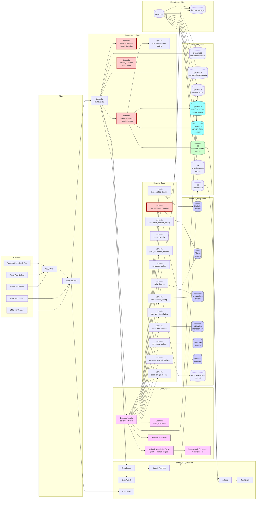

# Recipe 11.5 Architecture and Implementation: Insurance Benefits Navigator

*Companion to [Recipe 11.5: Insurance Benefits Navigator](chapter11.05-insurance-benefits-navigator). This page covers the AWS architecture, services, prerequisites, and pseudocode. For the problem framing and the conceptual approach, start with the main recipe.*

---

## The AWS Implementation

### Why These Services

**Amazon Bedrock for the LLM and the embeddings.** Same selection criteria as recipes 11.1 through 11.4. The benefits navigator specifically benefits from a model with strong tool-use, strong instruction-following for the citation-grounding discipline, and conversational warmth for billing-distress conversations. Claude Sonnet-class models or comparable frontier models for the orchestration; smaller models for intent classification. Bedrock provides HIPAA-eligible deployment under BAA.

**Amazon Bedrock Knowledge Bases for the plan-document corpus.** The plan documents (SBC, EOC, Schedule of Benefits, formulary index, member handbook) are the bot's grounded retrieval source. Knowledge Bases provides the managed RAG layer with vector indexing and filtered retrieval. The chunking is per-section with metadata (plan_id, plan_year, document_type, document_version, section_id, effective_date) to support plan-and-year-scoped retrieval.

**Amazon Bedrock Agents for tool orchestration.** Same selection rationale as the previous chapter 11 recipes. The bot's tools (plan_context_lookup, accumulator_lookup, subscriber_context_lookup, intent_classify, plan_document_retrieval, coverage_lookup, provider_network_lookup, claim_lookup, carc_rarc_translation, prior_auth_lookup, formulary_lookup, cost_estimate_compute, aeob_or_gfe_lookup, member_services_route) are defined as Agents action groups with OpenAPI schemas.

**Amazon Bedrock Guardrails for scope and content filtering.** Configured with denied topics including off-label drug recommendations, clinical-advice-attempted, diagnostic speculation, and binding-coverage-commitment language. The benefits navigator's scope discipline is critical because members frequently mix benefits questions with clinical questions.

**Amazon OpenSearch Service (or Bedrock-managed vector store) for the retrieval index.** The plan-document corpus is sized to multiple plans times multiple years times multiple document types and benefits from a search engine that supports both lexical (BM25) and dense-vector retrieval with metadata filters. OpenSearch Serverless is the typical default for managed vector workloads on AWS.

**AWS HealthLake (optional) for FHIR-native claims and coverage data.** Where the payer or provider stores claims, eligibility, and coverage data in FHIR (ExplanationOfBenefit, Coverage, Claim, ClaimResponse, CoverageEligibilityRequest/Response resources), HealthLake provides a managed FHIR data store the tools query directly.

**AWS Lambda for the chat handler and tool implementations.** Same pattern as the previous chapter 11 recipes. Tool Lambdas that integrate with eligibility, claims, accumulator, prior-auth, formulary, and provider-network systems run in VPC with controlled egress.

**Amazon API Gateway and AWS WAF for the public chat endpoint.** Same as the other recipes with rate limits tuned for the benefits-navigation use case (members sometimes ask many short questions in a row when navigating a bill).

**Amazon Connect for SMS, voice, and call-center handoff.** Members on phones, members preferring SMS, and members who need to be transferred to a live agent are served through Connect. The handoff payload includes the conversation transcript and tool-call evidence.

**Amazon DynamoDB for state.** Five tables: `conversation-state`, `conversation-metadata`, `tool-call-ledger`, `benefits-decision-record-journal` (durable record of every coverage-or-cost answer with citations), and `version-stamp-registry` (tracks which plan-document version, formulary version, and cost-share-rule version was active for any conversation).

**Amazon S3 for source documents, the plan-document corpus, the audit archive, and the benefits-decision-record journal.** Object Lock in compliance mode for the retention window.

**AWS KMS, AWS Secrets Manager, Amazon CloudWatch, AWS CloudTrail, Amazon EventBridge, Amazon Kinesis Data Firehose, AWS Glue, Amazon Athena.** Same operational and audit primitives as the previous recipes.

**Amazon QuickSight (optional) for compliance and operational dashboards.** Per-intent resolution rate, per-cohort member-satisfaction, citation-coverage rate, regulatory-disclosure-compliance rate, and call-center-deflection rate dashboards.

### Architecture Diagram



### Prerequisites

| Requirement | Details |
|-------------|---------|
| **AWS Services** | Amazon Bedrock (with Agents, Knowledge Bases, Guardrails, a foundation model selected for tool-use plus an embedding model), Amazon OpenSearch Serverless (for the vector retrieval index), AWS Lambda, Amazon API Gateway, AWS WAF, Amazon DynamoDB, Amazon S3, AWS KMS, AWS Secrets Manager, Amazon CloudWatch, AWS CloudTrail, Amazon EventBridge, Amazon Kinesis Data Firehose, AWS Glue, Amazon Athena. Optionally: AWS HealthLake (for FHIR-native claims and coverage), Amazon Connect (for SMS, voice, and call-center handoff), Amazon Lex (for IVR-style voice channel orchestration), Amazon QuickSight (for dashboards). |
| **External Inputs** | Eligibility system with current member-and-plan state. Claims system with adjudicated claim history. Accumulator system with current deductible and OOP-max state per family member. Utilization-management system with prior-auth records. Formulary system with drug-tier and PA/step-therapy/QL information. Provider-network database with current network status and historical effective dates. Plan-document corpus (SBC, EOC, Schedule of Benefits, member handbook, formulary documents) for each active plan-year combination, with formal version control and effective dates. CARC/RARC code-translation table mapping standardized codes to plain-English explanations and next-step guidance. Negotiated-rate database (where the payer or provider has negotiated rates surfaced for cost-estimate purposes). Regulatory-disclosure-phrasings library covering federal requirements (No Surprises Act, parity, ERISA appeal rights, Medicare Advantage rules, Medicaid managed-care rules) and state-specific requirements per state where members are covered. Member-services-team integration for handoff (CTI integration with the call center, ticketing-system integration for asynchronous handoff, escalation pathways for appeals and complex cases). |
| **IAM Permissions** | Per-Lambda least-privilege roles. The eligibility-lookup Lambda has read-only access to the eligibility system. The claim-lookup Lambda has read-only access to the claims system. The accumulator-lookup Lambda has read-only access to the accumulator system. The cost-estimate-compute Lambda has read access to negotiated-rate data and the cost-share-rule registry. None of the bot's Lambdas have write access to coverage decisions, claim adjudication, or member benefits records; the bot is read-only. Resource-based policies on each Lambda pin the invoking principal to the production agent or API Gateway stage ARN. |
| **BAA and Compliance** | AWS BAA signed. Verify Amazon Bedrock (with the specific models in scope), Lambda, API Gateway, WAF, DynamoDB, S3, KMS, Secrets Manager, CloudWatch, CloudTrail, EventBridge, Kinesis Firehose, Glue, Athena, OpenSearch Serverless, HealthLake (where used), Connect, and Lex (where used) are HIPAA-eligible at build time. The bot communicates PHI plus PFI; the audit and retention story must satisfy HIPAA Privacy and Security Rules plus state-specific consumer-financial-information rules where applicable. The plan-document corpus may have specific licensing or use restrictions if the plan documents are derived from third-party templates; the legal team reviews. The regulatory-disclosure-phrasings library is reviewed by the compliance team and updated as federal and state rules change. <!-- TODO: verify; payer member communications are governed by HIPAA, state insurance laws, ERISA (for self-funded plans), ACA, the No Surprises Act, parity laws, Medicare and Medicaid managed-care rules, and state consumer-protection laws; specific compliance obligations vary --> |
| **Encryption** | Plan-document-corpus bucket: SSE-KMS with customer-managed keys, versioning enabled. Audit-archive and benefits-decision-record-journal buckets: SSE-KMS with customer-managed keys, Object Lock in compliance mode for the retention window, lifecycle to S3 Glacier Deep Archive after 90 days. DynamoDB tables: customer-managed KMS at rest. Lambda environment variables: KMS-encrypted. Secrets Manager: customer-managed KMS. TLS in transit for all AWS API calls and all integrations with the eligibility, claims, accumulator, UM, formulary, and provider-network systems. The OpenSearch retrieval index encrypted with customer-managed KMS keys. Different KMS key per data class for blast-radius containment. |
| **VPC** | Production: tool Lambdas that call the eligibility, claims, accumulator, UM, formulary, and provider-network systems run in VPC with controlled egress. PrivateLink to vendor-hosted endpoints where supported; tightly-scoped NAT path with allow-list otherwise. VPC endpoints for DynamoDB, S3, KMS, Secrets Manager, CloudWatch Logs, EventBridge, Bedrock, OpenSearch Serverless, HealthLake (where used), and Connect so back-office Lambdas do not need public-internet egress for AWS-internal calls. The patient-facing edge (API Gateway, WAF) is public by design; the back-office traffic is private. |
| **CloudTrail** | Enabled with data events on the audit-archive S3 bucket, the benefits-decision-record-journal S3 bucket, the plan-document-corpus S3 bucket, the DynamoDB conversation, tool-call, decision-record, and version-stamp tables, the Secrets Manager secrets, and the customer-managed KMS keys. Bedrock and Bedrock Agents invocations logged with metadata. Lambda invocations logged. API Gateway access logs enabled. CloudTrail logs in a dedicated S3 bucket with Object Lock in compliance mode and lifecycle to S3 Glacier Deep Archive after 90 days. Audit retention sized to the longer of HIPAA's six-year minimum, plan-document retention rules, and applicable state insurance law. |
| **Sample Data** | Synthetic member-and-plan profiles stratified by line of business (commercial, Medicare Advantage, Medicaid managed-care, ACA marketplace, self-funded ERISA), by plan type (HMO, PPO, EPO, POS, HDHP), by family structure (single, family, dual-coverage), by language (English plus institution-relevant non-English), and by accumulator state (start-of-year, mid-year, near-OOP-max). Synthetic claims data covering covered-and-paid, applied-to-deductible, denied-with-CARC, surprise-bill scenarios, and prior-auth-required scenarios. Synthetic plan documents with explicit coverage rules, exclusions, and tier structures. Test eligibility, claims, accumulator, UM, formulary, and provider-network systems with synthetic data. Validated regulatory-disclosure phrasings reviewed by the compliance team. |
| **Cost Estimate** | At a mid-sized payer or provider scale (one million benefits-navigation conversations per year; average resolution rate around 65% with the rest handing off to member services; average 8-12 turns per resolved conversation; average 1,000 tokens of prompt and 250 tokens of response per turn for the orchestration model plus tool-call overhead): Bedrock LLM invocations typically $0.05-0.30 per resolved conversation for a Sonnet-class orchestration model, totaling approximately $50,000-300,000 per year. Bedrock Agents and Knowledge Bases hosting plus the OpenSearch Serverless retrieval index typically $15,000-60,000 per year. Lambda, API Gateway, WAF, DynamoDB, S3, KMS, Secrets Manager, CloudWatch, CloudTrail, EventBridge, Kinesis Firehose, Glue, Athena total approximately $20,000-80,000 per year combined. AWS HealthLake (when used as the FHIR claims and coverage source) typically $20,000-90,000 per year depending on data volume. Amazon Connect (for SMS, voice, and call-center handoff) typically $10,000-50,000 per year depending on channel mix. Total AWS infrastructure typically $115,000-580,000 per year at this scale. The infrastructure cost is dominated by the LLM invocation volume and HealthLake (when used). Per-resolved-conversation infrastructure cost is small relative to the call-center labor savings (a typical member-services call costs significantly more than a resolved bot conversation). <!-- TODO: replace with verified pricing once the implementing team validates against the AWS Pricing Calculator. Specific costs depend on the chosen Bedrock model, the conversation turn count, the tool-call volume, the FHIR-source choice, and the channel mix. --> |

### Ingredients

| AWS Service | Role |
|------------|------|
| **Amazon Bedrock** | LLM for orchestration and conversational response generation; embedding model for the plan-document corpus |
| **Amazon Bedrock Agents** | Tool orchestration: define benefits tools as action groups, manage the multi-step LLM-and-tool flow |
| **Amazon Bedrock Knowledge Bases** | Managed RAG over the plan-document corpus with metadata-filtered retrieval (plan_id, plan_year, document_type, document_version, section_id, effective_date) |
| **Amazon OpenSearch Serverless** | Vector and lexical retrieval index backing Knowledge Bases |
| **Amazon Bedrock Guardrails** | Content filtering for clinical advice, off-label drug recommendations, binding-coverage-commitment language, off-scope topics |
| **AWS Lambda** | Chat handler, input/output screening, identity-and-family verification, member-services routing, and tool implementations (plan_context_lookup, accumulator_lookup, subscriber_context_lookup, intent_classify, plan_document_retrieval, coverage_lookup, provider_network_lookup, claim_lookup, carc_rarc_translation, prior_auth_lookup, formulary_lookup, cost_estimate_compute, aeob_or_gfe_lookup, member_services_route) |
| **Amazon API Gateway** | Public-facing chat endpoint for web, app, and provider-side channels |
| **AWS WAF** | Rate limiting, bot detection, common attack patterns (with limits tuned for legitimate benefits-navigation patterns) |
| **Amazon DynamoDB** | conversation-state, conversation-metadata, tool-call-ledger, benefits-decision-record-journal, version-stamp-registry |
| **Amazon S3** | Plan-document corpus, audit archive (conversations), benefits-decision-record journal (durable answer records with citations) |
| **AWS KMS** | Customer-managed encryption keys per data class |
| **AWS Secrets Manager** | Credentials for the eligibility, claims, accumulator, UM, formulary, and provider-network systems |
| **Amazon CloudWatch** | Operational metrics (resolution rate per intent, handoff rate per intent, time-to-resolution, citation-coverage rate, regulatory-disclosure-compliance rate, tool-call success per tool, per-cohort slices); alarms |
| **AWS CloudTrail** | API-level audit logging |
| **Amazon EventBridge** | Benefits-event bus for cross-system event flow (conversation_started, intent_classified, retrieval_completed, answer_delivered, handoff_to_member_services, complaint_filed) |
| **Amazon Kinesis Data Firehose** | Streaming audit and telemetry delivery |
| **AWS Glue Data Catalog + Amazon Athena** | SQL access to audit, decision-record, and telemetry data |
| **AWS HealthLake (optional)** | FHIR-native claims, coverage, and EOB data (ExplanationOfBenefit, Coverage, Claim, ClaimResponse, CoverageEligibilityRequest/Response) |
| **Amazon Connect (optional)** | SMS, voice, and call-center handoff with conversation-context payload |
| **Amazon Lex (optional)** | IVR-style voice-channel intent and slot management |
| **Amazon QuickSight (optional)** | Compliance and operational dashboards |

---

### Code

#### Walkthrough

**Step 1: Receive the chat message, bootstrap the session, and run input safety screening.** Same primitive as the previous chapter 11 recipes. Crisis detection is important here because members occasionally disclose distress when a denial blocks their care, when a surprise bill threatens their finances, or when behavioral-health benefits questions surface a deeper crisis. Skip the screening and a crisis signal lands silently in the bot's "let me help you understand this denial" response.

```
ON receive_message(channel, channel_session_id,
                  user_message, auth_context,
                  deep_link_params):
    // Step 1A: identify or create the session.
    session = conversation_state_table.get_or_create({
        channel: channel,
        channel_session_id: channel_session_id,
        auth_context: auth_context,
        deep_link_params: deep_link_params
    })

    IF session.message_count == 0:
        attach_initial_greeting = true

    // Step 1B: persist the user's message.
    conversation_metadata_table.append_turn(
        session_id: session.id,
        turn: {
            speaker: "user",
            text: user_message,
            timestamp: now()
        })

    // Step 1C: input screening with benefits-specific
    // crisis-and-financial-distress detection.
    screening_result = screen_input(
        session_id: session.id,
        user_message: user_message,
        language: session.language,
        domain: "benefits_navigation")

    IF screening_result.action != "proceed":
        return handle_screening_action(
            session_id: session.id,
            screening_result: screening_result)

    // Step 1D: continue to flow handling.
    return handle_message(
        session_id: session.id,
        user_message: user_message,
        attach_initial_greeting:
            attach_initial_greeting)
```

**Step 2: On a fresh session, load the member's plan context, accumulator state, and family context.** This preparation is what makes the bot member-specific. Without it, the bot can answer generic plan questions but cannot answer "is the radiologist who read my scan in network on my plan?" Skip this step and the bot's answers are no better than a static plan-comparison website.

```
FUNCTION load_benefits_context(session_id):
    // Step 2A: plan context.
    plan = plan_context_lookup_tool.invoke({
        member_id: session.verified_member_id,
        plan_year: current_plan_year_for(
            session.verified_member_id)
    })

    audit_tool_call(
        session_id: session_id,
        tool: "plan_context_lookup",
        result_summary: {
            plan_id: plan.plan_id,
            plan_year: plan.plan_year,
            plan_type: plan.plan_type,
            line_of_business: plan.line_of_business
        })

    // Step 2B: accumulator state.
    accumulator =
        accumulator_lookup_tool.invoke({
            member_id: session.verified_member_id,
            plan_id: plan.plan_id,
            plan_year: plan.plan_year
        })

    audit_tool_call(
        session_id: session_id,
        tool: "accumulator_lookup",
        result_summary: {
            as_of_date: accumulator.as_of_date,
            individual_deductible_met:
                accumulator.individual_deductible_met,
            family_deductible_met:
                accumulator.family_deductible_met,
            individual_oop_met:
                accumulator.individual_oop_met,
            family_oop_met:
                accumulator.family_oop_met
        })

    // Step 2C: subscriber context (family relationships,
    // representative arrangements).
    subscriber =
        subscriber_context_lookup_tool.invoke({
            member_id: session.verified_member_id
        })

    session.plan_context = plan
    session.accumulator_context = accumulator
    session.subscriber_context = subscriber

    // Step 2D: stamp the session with active versions
    // for audit.
    session.active_plan_document_version =
        plan.plan_document_version
    session.active_formulary_version =
        plan.formulary_version
    session.active_provider_network_snapshot =
        plan.provider_network_snapshot

    return { action: "context_loaded" }
```

**Step 3: Classify the member's intent and route accordingly.** Most member questions fall into a small set of intent categories. Classifying first lets the bot route to the right tool surface and detect out-of-scope or human-handoff cases early. Skip the classification and the bot tries to answer everything with the same generic flow, which produces inconsistent results and misses high-value handoff opportunities.

```
FUNCTION classify_and_route(session_id, user_message):
    // Step 3A: classify intent.
    intent = intent_classify_tool.invoke({
        user_message: user_message,
        recent_turns: conversation_metadata_table
            .recent_turns(session_id, k: 4),
        plan_context: session.plan_context,
        deep_link_params: session.deep_link_params
    })

    audit_tool_call(
        session_id: session_id,
        tool: "intent_classify",
        result_summary: {
            intent: intent.category,
            confidence: intent.confidence
        })

    // Step 3B: route based on intent.
    IF intent.confidence < INTENT_CONFIDENCE_THRESHOLD:
        return ask_clarifying_question(
            session_id: session_id,
            user_message: user_message)

    SWITCH intent.category:
        CASE "coverage_question":
            return handle_coverage_question(
                session_id: session_id,
                user_message: user_message,
                intent: intent)

        CASE "network_status_question":
            return handle_network_status_question(
                session_id: session_id,
                user_message: user_message,
                intent: intent)

        CASE "deductible_balance_question":
            return handle_deductible_balance_question(
                session_id: session_id)

        CASE "claim_explanation_question":
            return handle_claim_explanation(
                session_id: session_id,
                user_message: user_message,
                intent: intent)

        CASE "prior_auth_status_question":
            return handle_prior_auth_question(
                session_id: session_id,
                user_message: user_message,
                intent: intent)

        CASE "cost_estimate_question":
            return handle_cost_estimate(
                session_id: session_id,
                user_message: user_message,
                intent: intent)

        CASE "formulary_or_medication_question":
            return handle_formulary_question(
                session_id: session_id,
                user_message: user_message,
                intent: intent)

        CASE "plan_document_question":
            return handle_plan_document_question(
                session_id: session_id,
                user_message: user_message,
                intent: intent)

        CASE "appeal_or_grievance_intent":
            return route_to_member_services(
                session_id: session_id,
                routing_target: "appeals_team",
                reason: "appeal_or_grievance",
                intent: intent)

        CASE "financial_assistance_intent":
            return route_to_member_services(
                session_id: session_id,
                routing_target: "financial_counseling",
                reason: "financial_assistance",
                intent: intent)

        CASE "clinical_question":
            return redirect_clinical_question(
                session_id: session_id)

        DEFAULT:
            return general_chat_response(
                session_id: session_id,
                user_message: user_message)
```

**Step 4: For coverage questions, retrieve the relevant plan-document sections with strict version scoping.** This is the architectural floor for benefits answers: every coverage assertion is grounded in retrieved plan-document content, with the document version and section identifier preserved through to the citation. Skip the retrieval and the bot composes plausible-sounding answers that are not grounded in the specific plan.

```
FUNCTION handle_coverage_question(session_id,
                                   user_message,
                                   intent):
    // Step 4A: retrieve plan-document chunks scoped
    // to the member's plan and plan year.
    retrieval_result =
        plan_document_retrieval_tool.invoke({
            query: user_message,
            plan_id: session.plan_context.plan_id,
            plan_year:
                session.plan_context.plan_year,
            document_types_in_scope: [
                "summary_of_benefits_and_coverage",
                "evidence_of_coverage",
                "schedule_of_benefits",
                "member_handbook"
            ],
            top_k: 8
        })

    // Step 4B: structured coverage lookup for the
    // most likely service category from the intent.
    IF intent.service_category:
        coverage = coverage_lookup_tool.invoke({
            plan_id: session.plan_context.plan_id,
            plan_year:
                session.plan_context.plan_year,
            service_category:
                intent.service_category
        })
        // Returns: covered/excluded/conditional,
        // cost-share rule, prior-auth requirement,
        // step-therapy requirement, visit-limit,
        // network-tier requirements

    // Step 4C: compose grounded response.
    response = compose_coverage_response(
        user_message: user_message,
        retrieval_chunks: retrieval_result.chunks,
        coverage_lookup: coverage,
        plan_context: session.plan_context,
        accumulator_context:
            session.accumulator_context,
        language: session.language,
        regulatory_disclosures:
            applicable_regulatory_disclosures(
                intent: intent,
                plan: session.plan_context))

    // Step 4D: stamp the response with citation
    // references and version stamps.
    response.citations = [
        {
            chunk_id: chunk.chunk_id,
            document_type: chunk.document_type,
            document_version: chunk.document_version,
            section_id: chunk.section_id,
            effective_date: chunk.effective_date
        }
        for chunk in retrieval_result.chunks
        if chunk.referenced_in_response
    ]

    IF coverage:
        response.tool_evidence = {
            tool: "coverage_lookup",
            tool_call_id: coverage.tool_call_id,
            tool_result_summary: coverage.summary
        }

    return {
        action: "coverage_answer",
        response: response
    }
```

**Step 5: For network-status questions, retrieve the provider's status with rendering-vs-facility distinction.** Aaron's surprise-bill problem is exactly the case the bot has to handle correctly: the imaging center may be in-network while the radiologist who reads the scan is out-of-network. Skip this distinction and the bot's "yes, in-network" answer becomes the next surprise bill.

```
FUNCTION handle_network_status_question(session_id,
                                         user_message,
                                         intent):
    // Step 5A: retrieve provider record.
    provider_lookup = provider_network_lookup_tool
        .invoke({
            provider_query: intent.provider_query,
            // provider_query may be a specific NPI,
            // a name, a facility name, or a free-text
            // provider description from the member
            plan_id: session.plan_context.plan_id,
            plan_year:
                session.plan_context.plan_year,
            as_of_date: intent.date_of_service
                OR today(),
            include_ancillary_services: true
        })

    audit_tool_call(
        session_id: session_id,
        tool: "provider_network_lookup",
        result_summary: {
            provider_match_count:
                len(provider_lookup.matches),
            ancillary_warning_applies:
                provider_lookup
                    .ancillary_warning_applies
        })

    // Step 5B: handle ambiguity (multiple matches).
    IF len(provider_lookup.matches) > 1:
        return ask_provider_disambiguation(
            session_id: session_id,
            matches: provider_lookup.matches)

    IF len(provider_lookup.matches) == 0:
        return provider_not_found_response(
            session_id: session_id,
            provider_query: intent.provider_query)

    provider = provider_lookup.matches[0]

    // Step 5C: compose response with the rendering-
    // vs-facility distinction where relevant.
    response = compose_network_status_response(
        provider: provider,
        plan_context: session.plan_context,
        ancillary_warning_applies:
            provider_lookup
                .ancillary_warning_applies,
        no_surprises_act_applicable:
            evaluate_nsa_applicability(
                provider: provider,
                plan: session.plan_context),
        language: session.language)

    response.citations = [
        {
            tool: "provider_network_lookup",
            provider_record_id: provider.id,
            network_snapshot_version:
                provider_lookup
                    .network_snapshot_version,
            as_of_date: provider_lookup.as_of_date
        }
    ]

    return {
        action: "network_status_answer",
        response: response
    }
```

**Step 6: For claim-explanation questions, retrieve the specific claim and translate the adjudication into plain English.** This is the EOB-translator function. The bot pulls the claim, identifies the patient-relevant fields, translates the CARC/RARC denial codes, and produces an explanation grounded in the specific claim. Skip this and the bot says vague things about "your claim" that the member cannot reconcile to the bill in their hand.

```
FUNCTION handle_claim_explanation(session_id,
                                    user_message,
                                    intent):
    // Step 6A: identify the specific claim.
    claim_lookup = claim_lookup_tool.invoke({
        member_id: session.verified_member_id,
        plan_id: session.plan_context.plan_id,
        identifying_hints: {
            date_of_service:
                intent.date_of_service,
            provider:
                intent.provider_reference,
            service_description:
                intent.service_description,
            billed_amount: intent.billed_amount,
            family_member:
                intent.family_member_reference,
            claim_id: intent.claim_id_if_known
        }
    })

    audit_tool_call(
        session_id: session_id,
        tool: "claim_lookup",
        result_summary: {
            claim_match_count:
                len(claim_lookup.matches)
        })

    IF len(claim_lookup.matches) > 1:
        return ask_claim_disambiguation(
            session_id: session_id,
            matches: claim_lookup.matches)

    IF len(claim_lookup.matches) == 0:
        return claim_not_found_response(
            session_id: session_id,
            user_message: user_message,
            intent: intent)

    claim = claim_lookup.matches[0]

    // Step 6B: translate CARC/RARC for any denial
    // or adjustment codes.
    code_translations = []
    FOR adj IN claim.adjustments:
        translation = carc_rarc_translation_tool.invoke({
            carc_code: adj.carc_code,
            rarc_codes: adj.rarc_codes
        })
        code_translations.append(translation)

    // Step 6C: compose patient-friendly explanation.
    response = compose_claim_explanation(
        claim: claim,
        code_translations: code_translations,
        plan_context: session.plan_context,
        accumulator_state:
            session.accumulator_context,
        no_surprises_act_applicable:
            evaluate_nsa_applicability_for_claim(
                claim: claim,
                plan: session.plan_context),
        language: session.language)

    response.citations = [
        {
            tool: "claim_lookup",
            claim_id: claim.id,
            adjudication_date:
                claim.adjudication_date,
            data_freshness_as_of:
                claim_lookup.as_of_date
        }
    ]

    response.regulatory_disclosures =
        applicable_disclosures_for_claim(
            claim: claim,
            plan: session.plan_context)
    // For denials: appeal rights including
    // statutorily-required timeline for the appeal,
    // contact information for the state department
    // of insurance for the member's state, federal
    // No Surprises Act information where applicable.

    return {
        action: "claim_explanation_answer",
        response: response
    }
```

**Step 7: For cost-estimate questions, run the deterministic cost-estimate tool.** The arithmetic is structured (deductible-then-coinsurance, embedded vs aggregate, separate accumulators) and the LLM does it poorly. The cost-estimate tool encapsulates the computation, returns a structured estimate with explicit caveats, and the LLM presents it accurately. Skip the deterministic tool and the bot's estimates are sometimes off by hundreds of dollars.

```
FUNCTION handle_cost_estimate(session_id,
                                user_message,
                                intent):
    // Step 7A: check whether a formal AEOB or GFE
    // already exists for the scheduled service.
    formal_estimate = aeob_or_gfe_lookup_tool.invoke({
        member_id: session.verified_member_id,
        service_query: intent.service_query,
        scheduled_date: intent.scheduled_date,
        provider: intent.provider_reference
    })

    IF formal_estimate.found:
        return present_formal_estimate(
            session_id: session_id,
            formal_estimate: formal_estimate)

    // Step 7B: compute the estimate.
    estimate = cost_estimate_compute_tool.invoke({
        member_id: session.verified_member_id,
        plan_id: session.plan_context.plan_id,
        service_code: intent.service_code,
        provider_reference:
            intent.provider_reference,
        accumulator_snapshot:
            session.accumulator_context,
        cost_share_rule_version:
            session.plan_context
                .cost_share_rule_version,
        negotiated_rate_version:
            current_negotiated_rate_version()
    })

    audit_tool_call(
        session_id: session_id,
        tool: "cost_estimate_compute",
        result_summary: {
            estimate_low: estimate.estimate_low,
            estimate_high: estimate.estimate_high,
            confidence: estimate.confidence,
            cost_share_rule_version:
                estimate.cost_share_rule_version,
            negotiated_rate_version:
                estimate.negotiated_rate_version
        })

    // Step 7C: compose response with explicit
    // caveats.
    response = compose_cost_estimate_response(
        estimate: estimate,
        plan_context: session.plan_context,
        good_faith_estimate_guidance:
            applicable_gfe_guidance(
                member: session.verified_member_id,
                plan: session.plan_context),
        language: session.language)

    response.citations = [
        {
            tool: "cost_estimate_compute",
            cost_share_rule_version:
                estimate.cost_share_rule_version,
            accumulator_as_of_date:
                estimate.accumulator_as_of_date,
            negotiated_rate_version:
                estimate.negotiated_rate_version
        }
    ]

    return {
        action: "cost_estimate_answer",
        response: response
    }
```

**Step 8: Run output safety screening with citation verification before delivering any response.** This is where the architectural floor is enforced. Every coverage assertion must trace to a retrieved plan-document chunk; every member-specific assertion must trace to a tool result; every cost number must trace to the cost-estimate tool. Required regulatory disclosures must be present where mandated. Skip this step and the bot occasionally produces ungrounded answers that look authoritative.

```
FUNCTION screen_output(session_id, response,
                       tool_call_history):
    // Step 8A: standard checks.
    standard_check = standard_output_screen.evaluate(
        response: response,
        session_context:
            session_context_for(session_id))

    IF standard_check.action != "deliver":
        return standard_check

    // Step 8B: scope checks specific to benefits.
    scope_violation =
        detect_benefits_scope_violations(
            response: response)
    // Categories:
    // - clinical_advice_attempted
    // - off_label_drug_recommendation_attempted
    // - binding_coverage_commitment_attempted
    // - diagnostic_speculation_attempted
    // - sales_or_enrollment_attempted (out of
    //   scope for member-side bot)

    IF scope_violation:
        return {
            action: "replace_with_safe_response",
            replacement:
                BENEFITS_OUT_OF_SCOPE_TEMPLATE,
            violation: scope_violation.category
        }

    // Step 8C: citation verification. Every
    // coverage assertion in the response must be
    // backed by a retrieved chunk; every member-
    // specific assertion by a tool result; every
    // cost number by the cost-estimate tool.
    citation_check = verify_citation_grounding(
        response: response,
        retrieved_chunks: response.citations
            .filter(type: "retrieval"),
        tool_results: tool_call_history)

    IF citation_check.has_ungrounded_assertions:
        return {
            action: "regenerate_with_grounding",
            ungrounded_assertions:
                citation_check
                    .ungrounded_assertions
        }

    // Step 8D: plan-version stamp consistency.
    // Every cited document chunk's plan_year must
    // match the member's current plan year (or be
    // explicitly contextualized as a prior year if
    // the question is about a prior-year claim).
    version_check = verify_plan_version_consistency(
        response: response,
        active_plan_year:
            session.plan_context.plan_year,
        intent_temporal_scope:
            session.intent.temporal_scope)

    IF NOT version_check.consistent:
        return {
            action: "regenerate_with_version_correction",
            inconsistencies:
                version_check.inconsistencies
        }

    // Step 8E: regulatory-disclosure presence.
    disclosure_check =
        verify_regulatory_disclosures(
            response: response,
            intent: session.intent,
            plan: session.plan_context,
            member_state:
                session.subscriber_context
                    .residence_state)

    IF disclosure_check.missing_required_disclosures:
        return {
            action: "augment_with_disclosures",
            missing_disclosures:
                disclosure_check.missing
        }

    // Step 8F: persona-and-tone check, especially
    // for billing-distress and behavioral-health
    // contexts.
    persona_check =
        persona_and_tone_evaluator.evaluate(
            response: response,
            recent_user_message:
                session.most_recent_user_message,
            intent: session.intent,
            language: session.language)

    IF persona_check.action != "acceptable":
        return {
            action: "regenerate_with_persona_correction",
            persona_guidance:
                persona_check.guidance
        }

    return {
        action: "deliver",
        response: response
    }
```

**Step 9: Persist the durable benefits-decision record alongside the conversation log.** The conversation log captures the dialog. The benefits-decision-record journal captures, separately, every coverage-or-cost answer with its citation evidence and version stamps. This is the audit surface for "you told me this was covered" disputes, and it is the surface compliance reviewers consume to verify regulatory-disclosure compliance. Skip this and the audit story is intact only at the conversation level, which is enough for some reviews and not enough for others.

```
FUNCTION persist_benefits_decision_record(
        session_id, response):
    decision_record = {
        decision_id: generate_decision_id(),
        session_id: session_id,
        member_id: session.verified_member_id,
        plan_id: session.plan_context.plan_id,
        plan_year: session.plan_context.plan_year,
        intent: session.intent.category,
        question_text:
            session.most_recent_user_message,
        answer_text: response.text,
        citations: response.citations,
        regulatory_disclosures_included:
            response.regulatory_disclosures,
        active_plan_document_version:
            session.active_plan_document_version,
        active_formulary_version:
            session.active_formulary_version,
        active_provider_network_snapshot:
            session.active_provider_network_snapshot,
        active_cost_share_rule_version:
            session.plan_context
                .cost_share_rule_version,
        active_model_id: session.model_id,
        active_prompt_version: session.prompt_version,
        active_agent_version: session.agent_version,
        delivered_at: now(),
        channel: session.channel,
        language: session.language
    }

    benefits_decision_record_journal.write(
        decision_record)

    EventBridge.PutEvents([{
        source: "benefits_navigator",
        detail_type: "answer_delivered",
        detail: {
            decision_id: decision_record.decision_id,
            session_id: session_id,
            intent: decision_record.intent,
            citation_count:
                len(decision_record.citations)
        }
    }])
```

**Step 10: Persist the durable conversation record and per-cohort metrics on session close.** Same archive pattern as the previous chapter 11 recipes, with benefits-specific dimensions on the cohort axes (line of business, plan type, language, channel, intent category, family-relationship, representative-completion).

```
FUNCTION close_conversation_and_archive(session_id,
                                         reason):
    state = conversation_state_table.get(session_id)
    metadata =
        conversation_metadata_table.get(session_id)
    tool_calls =
        tool_call_ledger.for_session(session_id)

    audit_record = {
        session_id: session_id,
        channel: state.channel,
        started_at: state.started_at,
        ended_at: now(),
        language: state.language,
        verified_member_id: state.verified_member_id,
        plan_id: state.plan_context.plan_id,
        plan_year: state.plan_context.plan_year,
        line_of_business:
            state.plan_context.line_of_business,
        representative_relationship:
            state.representative_relationship,
        assurance_level: state.assurance_level,
        turns: [
            redact_user_phi_for_audit(turn)
            for turn in metadata.turns
        ],
        tool_calls: [
            redact_sensitive_args(call)
            for call in tool_calls
        ],
        intents_classified: state.intents_classified,
        decisions_emitted:
            state.benefits_decision_count,
        active_model_id_at_session: state.model_id,
        active_prompt_version_at_session:
            state.prompt_version,
        active_agent_version_at_session:
            state.agent_version,
        active_kb_version_at_session: state.kb_version,
        active_plan_document_version_at_session:
            state.active_plan_document_version,
        active_formulary_version_at_session:
            state.active_formulary_version,
        active_provider_network_snapshot_at_session:
            state.active_provider_network_snapshot,
        completion_status:
            state.completion_status,
            // resolved | handed_off | abandoned |
            // crisis_routed
        cohort_axes: {
            language: state.language,
            channel: state.channel,
            assurance_level: state.assurance_level,
            line_of_business:
                state.plan_context.line_of_business,
            plan_type: state.plan_context.plan_type,
            representative_completion:
                state.representative_relationship
                IS NOT NULL,
            primary_intent: state.primary_intent
        },
        close_reason: reason
    }

    audit_archive_kinesis_firehose.put(audit_record)

    EventBridge.PutEvents([{
        source: "benefits_navigator",
        detail_type: "conversation_closed",
        detail: {
            session_id: session_id,
            channel: state.channel,
            disposition: state.completion_status,
            primary_intent: state.primary_intent,
            turn_count: len(metadata.turns)
        }
    }])

    cloudwatch.put_metric(
        namespace: "BenefitsNavigator",
        metric_name: "ConversationResolved",
        value: 1 IF state.completion_status
                    == "resolved" ELSE 0,
        dimensions: {
            channel: state.channel,
            language: state.language,
            line_of_business:
                state.plan_context.line_of_business,
            primary_intent: state.primary_intent
        })

    cloudwatch.put_metric(
        namespace: "BenefitsNavigator",
        metric_name: "HandoffToMemberServices",
        value: 1 IF state.completion_status
                    == "handed_off" ELSE 0,
        dimensions: {
            channel: state.channel,
            language: state.language,
            line_of_business:
                state.plan_context.line_of_business,
            primary_intent: state.primary_intent
        })

    cloudwatch.put_metric(
        namespace: "BenefitsNavigator",
        metric_name: "CitationCoverageRate",
        value: state.citation_coverage_rate,
        dimensions: {
            primary_intent: state.primary_intent,
            language: state.language
        })
```

> **Curious how this looks in Python?** The pseudocode above covers the concepts. If you'd like to see sample Python code that demonstrates these patterns using boto3, check out the [Python Example](chapter11.05-python-example). It walks through each step with inline comments and notes on what you'd need to change for a real deployment.

---

### Expected Results

**Sample conversation (illustrative, abbreviated):**

```
Bot:     Hi, I'm the benefits assistant. I can help
         answer questions about your plan, your
         claims, your deductible, prior
         authorizations, costs, and your medications.
         I'm a chatbot, not a member services agent,
         and I can't make formal coverage decisions
         or handle appeals on my own. If something
         feels like an emergency, please call 911.
         What can I help you with?

Member:  I got a bill for $1,847 for my wife's knee
         MRI, can you explain it?

Bot:     Sure, let me take a look. I see Jen had an
         MRI on April 8 at Westside Imaging. I'm
         pulling the claim now.

         Here's what I found. The MRI itself was
         processed in-network, and the imaging
         center's portion was applied to your
         family's deductible. You've used about
         $620 of your $3,500 family deductible so
         far this year (as of yesterday).

         The $1,847 charge you're looking at is from
         the radiologist who read the scan,
         Dr. Lin, who is out-of-network on this
         plan even though Westside Imaging is in-
         network. This is sometimes called a
         surprise bill.

         Under the federal No Surprises Act, some
         out-of-network charges from in-network
         facilities are eligible for protection,
         which generally means you should not owe
         more than your in-network cost-share for
         services like this.

         Would you like me to pull the No Surprises
         Act information for your situation, or
         help you start an appeal?

Member:  Yes, the appeal.

Bot:     I'll connect you with our appeals team to
         start the process. They'll need a few
         details from you. I'm queueing the case
         now and someone will reach out to you
         within one business day to walk through
         the next steps.

         Is the phone number ending in 4421 still
         the best way to reach you, or would you
         prefer a different contact?

Member:  That number is fine. Will I have to pay
         the $1,847 while the appeal is happening?

Bot:     I'm a chatbot and can't give you a binding
         answer on payment timing during the appeal.
         Generally, under No Surprises Act
         protections, you don't have to pay more
         than the in-network cost-share while a
         dispute is in progress, but the specifics
         of your situation depend on the appeal
         outcome and on the provider's billing
         practices.

         I'm flagging your question for the appeals
         agent who calls you tomorrow so they can
         give you a clear answer. In the meantime,
         here's a tip: many plans recommend that
         you not pay the disputed amount until the
         appeal is resolved, but you should follow
         the agent's specific guidance for your
         case. Anything else I can help with?

Member:  No, that's it. Thanks.

Bot:     You're welcome. The appeals team will reach
         out within one business day. If you need
         anything in the meantime, you can come back
         to this chat. Take care.
```

**Sample audit record (illustrative):**

```json
{
  "session_id": "benefits-3a8c1f29-b471-4d8a-b1f0-2c7e8a9d3e21",
  "channel": "payer_app_embed",
  "started_at": "2026-04-22T21:47:18Z",
  "ended_at": "2026-04-22T21:54:36Z",
  "language": "en-US",
  "verified_member_id": "member-internal-id-redacted",
  "plan_id": "plan-acme-ppo-2026",
  "plan_year": "2026",
  "line_of_business": "commercial",
  "tool_calls_summary": {
    "plan_context_lookup": 1,
    "accumulator_lookup": 1,
    "subscriber_context_lookup": 1,
    "intent_classify": 3,
    "claim_lookup": 1,
    "carc_rarc_translation": 1,
    "provider_network_lookup": 1,
    "member_services_route": 1
  },
  "active_plan_document_version_at_session":
    "acme-ppo-2026-eoc-v1.2",
  "active_formulary_version_at_session":
    "acme-formulary-2026-q2",
  "active_provider_network_snapshot_at_session":
    "network-snapshot-2026-04-15",
  "intents_classified": [
    "claim_explanation_question",
    "appeal_or_grievance_intent",
    "general_chat"
  ],
  "decisions_emitted": 2,
  "completion_status": "handed_off",
  "handoff_target": "appeals_team",
  "handoff_payload_id":
    "handoff-3a8c1f29-appeals-2026-04-22",
  "cohort_axes": {
    "language": "en-US",
    "channel": "payer_app_embed",
    "assurance_level": "authenticated",
    "line_of_business": "commercial",
    "plan_type": "ppo",
    "representative_completion": false,
    "primary_intent": "claim_explanation_question"
  },
  "duration_seconds": 438,
  "close_reason": "handed_off"
}
```

**Performance benchmarks (illustrative, your mileage varies):**

| Metric | Old call-center plus member-portal | Modern conversational benefits navigator |
|--------|-----------------------------------|------------------------------------------|
| Time-to-answer (median) | 25-50 minutes including hold time | 30-90 seconds for the first answer |
| Resolution rate without human | ~10% (member portal completion) for a narrow set of question types | 50-70% across the full intent catalog |
| Member satisfaction (CSAT) | Frequently negative for call experience | Generally positive for resolved cases |
| Per-conversation infrastructure cost | Negligible for portal, $5-15 for call-center call | $0.05-0.30 |
| Citation-coverage rate (fraction of coverage answers grounded in cited plan-document evidence) | Variable; agent scripts not always document-grounded | 90%+ as launch-gate target |
| Per-cohort accuracy disparity | Often invisible | Monitored explicitly |
| Call-center deflection | N/A (baseline) | 30-60% of routine member-services call volume |
| Handoff-with-context rate | Calls transferred without context | Context preserved across handoff |

<!-- TODO: replace illustrative figures with measured results from the deployment. The ranges above are typical for healthcare conversational benefits-navigator deployments but vary substantially with intent mix, member demographics, plan complexity, and integration depth. -->

**Where it struggles:**

- **Ambiguous claims that match the member's description.** "My wife's knee MRI" might match more than one knee MRI (a follow-up scan, a re-reading, a different family member with similar timing). Mitigation: the bot disambiguates with the member rather than guessing.
- **Multi-claim or multi-encounter questions.** "Can you explain why we keep getting bills for the kids' physical therapy?" requires multiple claim retrievals and a synthesized answer. Mitigation: structured multi-claim summary with per-claim breakdown plus cross-cutting pattern explanation.
- **Network-status questions for ancillary providers.** Aaron's case is the canonical pattern. Mitigation: the provider-network-lookup tool surfaces the ancillary-warning explicitly, and the bot's response template includes the warning even when the facility is in-network.
- **Cost estimates for procedures with bundled or DRG payment.** Bundled-payment and DRG-payment structures don't decompose cleanly into per-service costs. Mitigation: explicit caveat plus deferral to the provider's Good Faith Estimate.
- **Behavioral-health benefits with parity nuance.** Saying "this requires prior auth" when it doesn't, or "you have a 20-visit limit" when parity prohibits the limit, is a parity-law issue. Mitigation: parity-aware coverage-lookup tool with compliance-team-validated rules; behavioral-health questions route to a specialty-trained handoff target when ambiguity exists.
- **Plan-year boundary questions.** "Will my deductible reset in January?" or "I'm changing plans, what carries over?" require plan-year-aware logic. Mitigation: explicit plan-year handling in the tools and the prompts.
- **Self-funded ERISA plans with employer-specific customizations.** Self-funded plans frequently have employer-specific carve-outs that don't appear in the standard plan documents. Mitigation: per-employer-group plan-document scoping in the corpus and per-employer-group customization metadata.
- **Members who mix benefits and clinical questions.** "Does my plan cover this surgery, and do you think I should have it?" Mitigation: scope-violation screening replaces the clinical part with a redirect to the member's clinical team.
- **Members in financial distress.** "I can't afford this bill, what do I do?" Mitigation: the financial-distress detection routes to financial-counseling resources, not just billing.
- **Cross-language asset gaps.** Plan documents may be authoritative in English with translated versions for member service. Mitigation: validated translations with native-speaker review; per-language launch-gate equity monitoring.
- **EOB versions that don't match the provider's bill.** The member's EOB and the provider's bill sometimes disagree in dollar amounts or in coverage categorization, often because of timing. Mitigation: explicit explanation of the timing gap; deferral to member services when reconciliation is needed.
- **Stale provider-network data.** A provider who left the network last week may still appear in-network in the bot's snapshot. Mitigation: snapshot-freshness telemetry and a daily-refresh SLA, with as-of-date stamps in every response.
- **Members asking about a future plan that hasn't been documented.** "What will my plan cover next year?" before the next year's documents are loaded. Mitigation: explicit refusal with a "documentation will be available on October 15" template.
- **Plan-document gaps and ambiguities.** Real plan documents have gaps where the formal answer is "consult member services." Mitigation: the coverage-lookup tool returns "ambiguous, route to member services" rather than letting the LLM guess.
- **Voice-channel ASR errors propagating into intent classification or service-code identification.** "Lipitor" misheard as "Lipator" propagates. Mitigation: explicit confirmation step plus voice-tuned ASR.
- **Members with cognitive impairment or dementia.** Members who cannot reliably participate in a conversational session. Mitigation: representative-completion handling with appropriate authentication and explicit attribution.

---

## Why This Isn't Production-Ready

The pseudocode and architecture above demonstrate the pattern. A production deployment needs to close several gaps that are intentionally out of scope for a recipe.

**Plan-document corpus governance with full version control.** The single largest pre-deployment investment is getting the plan-document corpus correct, complete, and versioned. Each plan-year combination has multiple documents (SBC, EOC, Schedule of Benefits, member handbook, formulary). Each document has an effective date, sometimes mid-year amendments, and re-issuance triggers. The corpus is rebuilt when documents change. Each retrieval chunk is tagged with plan_id, plan_year, document_type, document_version, section_id, and effective_date. The retrieval pipeline enforces plan-and-year scoping. A bot serving the wrong plan year's document is a serious failure mode.

**Benefits-data-source freshness SLA per data class.** Eligibility, claims, accumulator, prior-auth, formulary, and provider-network data each refresh on different cadences with different freshness expectations. Document the SLA per source. Telemetry alerts when a source's freshness exceeds the SLA. The bot's responses include as-of date stamps that come from the source-of-truth, not from the bot's invocation time.

**Regulatory-disclosure-phrasings library with named compliance ownership.** State-specific consumer-protection requirements, federal No Surprises Act provisions, parity-law requirements, ERISA appeal rights, Medicare Advantage rules, and Medicaid managed-care rules all specify required phrasings for certain communications. The library is owned by the compliance team. Each conversation's required-disclosures list is computed based on intent, plan type, line of business, and member state. The output safety screening verifies the phrasings are present.

**Citation-grounding discipline as architectural floor.** Every coverage assertion in every response is grounded in a retrieved chunk or a tool result, with the citation preserved in the audit record. The citation-coverage-rate metric is a launch-gate threshold. Below-threshold deployments are not approved.

**Cost-share-rule registry as code.** The plan's cost-share rules (deductibles, coinsurance, copays, separate accumulators, embedded vs aggregate, in-network vs out-of-network) are encoded as a structured registry that the cost-estimate tool reads. Changes to the rules go through the change-management process owned jointly by the benefits team and compliance.

**CARC/RARC translation library.** The denial-code translations are owned by the appeals-and-grievances team. Each translation has a plain-English explanation, a next-step guidance, and a flag for "this is the kind of denial we typically appeal" versus "this is the kind of denial we typically don't." The library is reviewed annually and after CARC/RARC code-set updates.

**Member-services routing with full case-context handoff.** Handoff to a human is a first-class capability. The handoff payload includes the conversation transcript, the retrieved evidence, the tool-call results, the intent classification, and the unresolved issue. The receiving agent picks up where the bot left off, not from scratch. This requires CTI integration with the call center and ticketing-system integration for asynchronous handoff.

**Per-cohort monitoring with launch-gate discipline.** Resolution rate, handoff rate, citation-coverage rate, regulatory-disclosure-compliance rate, and member-satisfaction vary by line of business, plan type, language, channel, age cohort, and representative-completion status. Per-cohort dashboards reviewed by compliance and patient-experience.

**Voice-channel deployment with accessibility considerations.** Members without smartphones, members with disabilities, members preferring voice over text. The voice channel uses the same bot logic with ASR/TTS layers and voice-specific design adjustments.

**Multi-language deployment with validated translations.** Plan documents in English are not the same as plan documents in Spanish, even when the Spanish document is professionally translated. Per-language asset development includes translated plan documents (with the translation reviewed by the compliance team for regulatory equivalency), translated regulatory disclosures, per-language tone calibration, and per-language equity monitoring.

**Disaster-recovery topology.** When eligibility is unreachable, when claims is unreachable, when the formulary is unreachable, the bot degrades gracefully. Document per-source failover behavior. Test quarterly.

**Compensation operations for incorrect or disputed answers.** When a member disputes an answer ("you told me this was covered, but it was denied"), the operations team reproduces the conversation, retrieves the cited evidence, and either confirms the bot was right (escalating the underlying coverage decision) or confirms the bot was wrong (compensating the member and feeding the failure mode into the improvement loop). Tooling for this workflow is part of production scope.

**Operational ownership across multiple teams.** The bot sits at the intersection of member services, compliance, benefits administration, claims operations, utilization management, pharmacy benefits, provider-network operations, IT, and the call center. Establish clear ownership at the start.

**Build-vs-buy rigor.** Several mature commercial vendors offer benefits-navigator products. Most major payers run a hybrid: in-house bot for the routine member-facing journey on the payer's preferred infrastructure, vendor partnership for specific complex sub-flows.

<!-- TODO (TechWriter): Expert review S1 (HIGH). Promote plan-document-corpus-as-code lifecycle, regulatory-disclosure-phrasings-library governance, and cost-share-rule-registry-as-code to architectural primitives. Specify per-plan-year versioned plan-document corpus with semantic versioning, per-effective-date document chunking, sandbox testing against held-out benefits questions, staged rollout with per-plan canary, rollback-on-regression, named ownership at the benefits-administration team plus compliance plus the medical-director for clinical-policy aspects, per-document-version-stamping on every benefits-decision-record, regulatory-disclosure-phrasings-library with state-specific configurations and quarterly review cadence, cost-share-rule-registry as code with per-plan-year version, change-management process. -->

<!-- TODO (TechWriter): Expert review S2 (HIGH). Specify the working-store-vs-archive-store discipline for the tool-call ledger and benefits-decision-record journal. The DynamoDB tables on the real-time hot path hold structural references; full plan-document chunk content, full claim adjudication detail, full member accumulator state, full provider-network record content, full conversation transcript route to S3 archives with the appropriate KMS key class. Reconcile per-record-class retention floors covering HIPAA's six-year minimum, plan-document retention rules (often 10+ years for claims-related records), state insurance-record retention rules (varies by state), state consumer-financial-information retention rules where applicable, per-channel retention obligations (TCPA / 10DLC for SMS, voice-channel recording retention), and the institutional regulatory floor. -->

<!-- TODO (TechWriter): Expert review A1 (HIGH). Promote per-cohort monitoring to architectural primitive with explicit launch-gate discipline. Single-axis cohorts (per-language, per-channel, per-line-of-business, per-plan-type, per-age-cohort, per-representative-completion, per-primary-intent), two-axis cohorts (per-language-by-channel, per-line-of-business-by-plan-type, per-plan-type-by-primary-intent), three-axis cohort (per-language-by-channel-by-line-of-business). Per-cohort threshold metrics including resolution rate, handoff rate, citation-coverage rate, regulatory-disclosure-compliance rate, intent-classification accuracy, cost-estimate accuracy versus actual claim adjudication for resolved estimates, member-satisfaction. Launch-gate institution-wide-average informational only; each cohort meets threshold before going live. -->

<!-- TODO (TechWriter): Expert review S3 (MEDIUM). Promote prompt-injection defense to architectural primitive with delimited-input framing, tool-Lambda enforcement that every tool validates member_id and plan_id arguments against the verified session, per-language jailbreak-test corpus including benefits-injection cases (manipulate coverage-lookup to return unauthorized coverage assertion, manipulate cost-estimate to return zero cost, manipulate claim-lookup to return false denial reasons), Bedrock Guardrails configuration with denied-topics specific to off-label drug recommendations and binding-coverage-commitments, audit logging of cross-check outcomes. -->

<!-- TODO (TechWriter): Expert review S4 (MEDIUM). Specify a faithfulness-check stage between Bedrock generation and response delivery that grounds every coverage assertion to a retrieved plan-document chunk, every member-specific claim to a tool result, every cost number to a cost-estimate-tool call, every regulatory-disclosure to the disclosure library. Use an independent verifier model with structured-output schema validation, rule-based contradiction detection, omission detection, regenerate-attempt budget, fall-back-to-safe-response default. Per-cohort faithfulness-failure rate as launch-gate. -->

<!-- TODO (TechWriter): Expert review A2 (MEDIUM). Promote tool-surface contract management to architectural primitive with per-tool versioned schemas, per-tool deprecation policy, per-tool change-management owned jointly by engineering, benefits administration, and compliance, per-tool audit-stamping. -->

<!-- TODO (TechWriter): Expert review A3 (MEDIUM). Specify a Deployment Pattern subsection covering versioned system prompt, intent-classification prompt, plan-document-corpus snapshot, per-plan plan-document version, formulary version, provider-network snapshot, regulatory-disclosure-phrasings-library version, persona-and-tone evaluator prompt, redaction taxonomy, per-language consent-disclosure assets, Bedrock Guardrails policy in version control. Held-out evaluation set covering representative benefits questions, ambiguous-claim cases, surprise-bill cases, behavioral-health-parity cases, prior-auth cases, multilingual cases, prompt-injection test cases, faithfulness test cases. Per-cohort canary deployment with traffic-shift. -->

<!-- TODO (TechWriter): Expert review S5 (MEDIUM). Replace the generic "longer of HIPAA's six-year minimum, plan-document retention rules, and applicable state insurance law" framing in the BAA / Compliance row with a per-record-class retention-floor reconciliation: longest of HIPAA's six-year minimum, state-specific insurance-records retention rules per state of plan issuance and per state of member residence, state-specific consumer-financial-information retention rules where applicable, per-line-of-business retention obligations (CMS rules for Medicare Advantage and ACA marketplace; state managed-care rules for Medicaid; ERISA rules for self-funded plans), per-channel retention obligations (TCPA/10DLC for SMS, voice-channel recording retention rules), and the institutional regulatory floor. Note that the benefits-decision-record journal may have a longer floor than the audit archive. -->

<!-- TODO (TechWriter): Expert review S6 (MEDIUM). Specify defense-in-depth Lambda invocation authentication in the IAM Permissions row. Resource-based policy on each tool Lambda pinning the invoking principal to the production API Gateway stage ARN, the production Bedrock Agents action-group ARN, or the production EventBridge rule ARN. Defense-in-depth event-payload validation at the start of each tool Lambda. Tool-Lambda member_id-and-plan_id-cross-check audit logging so a forged invocation cannot read a different member's eligibility, claims, accumulator, UM, formulary, or provider-network data. Per-endpoint WAF rate-limit policy with benefits-navigation-specific tuning that accommodates legitimate multi-question sessions while flagging abuse patterns. -->

<!-- TODO (TechWriter): Expert review A4 (MEDIUM). Promote multi-language deployment build-for-day-one to architectural primitive in Production-Gaps. Specify validated plan-document translations as a recipe-distinct compliance-acute primitive (no ad-hoc machine translation; institution uses validated translations and native-speaker review for plan-document chunks), validated regulatory-disclosure-phrasings translations, validated CARC/RARC translation library, per-language persona and tone calibration, per-language asset versioning per A3, per-language launch-gate per A1. -->

<!-- TODO (TechWriter): Expert review A5 (MEDIUM). Specify per-event idempotency keys for the EventBridge benefits-lifecycle bus so that a duplicate `answer_delivered` event does not double-count decision-record metrics, a duplicate `handoff_to_member_services` event does not produce a double handoff, and a duplicate `conversation_closed` event does not inflate cohort metrics. Suggested keys: `conversation_started (session_id, "started")`; `intent_classified (session_id, intent_event_id, "intent")`; `retrieval_completed (session_id, retrieval_event_id, "retrieval")`; `answer_delivered (decision_id, "delivered")`; `handoff_to_member_services (session_id, handoff_event_id, "handoff")`; `complaint_filed (session_id, complaint_event_id, "complaint")`; `conversation_closed (session_id, "closed")`. Downstream consumers maintain a deduplication store (DynamoDB with TTL). -->

<!-- TODO (TechWriter): Expert review A6 (MEDIUM). Add a Disaster Recovery Topology subsection with per-stage failover policy: Bedrock LLM outage with degraded-mode response; Bedrock Knowledge Bases outage; Bedrock Agents outage; Bedrock Guardrails outage with stricter system-prompt scope enforcement; OpenSearch Serverless outage with cached-recent-retrieval fallback; DynamoDB outage with conservative session-state recreation; S3 outage with graceful read-failure and Kinesis-buffered audit; eligibility outage with cached-recent-eligibility-with-as-of-disclaimer fallback; claims outage with claim-not-yet-available fallback; accumulator outage with conservative-as-of-snapshot fallback; UM outage with prior-auth-status-not-available with member-services-callback; formulary outage with formulary-not-available with member-services-callback; provider-network outage with network-status-not-available with member-services-callback; Connect outage with channel fallback. Failover-detection thresholds, failover-back triggers, quarterly testing cadence, and cross-region failover for Bedrock and the institutional integrations. -->

<!-- TODO (TechWriter): Expert review A7 (MEDIUM). Promote the IAM resource-based-policy reference in the IAM Permissions row to architectural commitment in the architecture pattern. Each Lambda's resource-based policy pins the invoking principal to the production API Gateway stage ARN, Bedrock Agents action-group ARN, or EventBridge rule ARN as appropriate. Defense-in-depth event-payload validation at the start of each tool Lambda. Per-endpoint WAF rate-limit policy with benefits-navigation-specific tuning. (Overlaps with S6.) -->

<!-- TODO (TechWriter): Expert review A8 (MEDIUM). Add an Accessibility Conformance cross-cutting design point specifying WCAG 2.1 AA conformance for the chat widget (ARIA labeling, keyboard navigation, screen-reader announcements for new messages, high-contrast mode, font scaling, alternative input methods including the voice channel) with named ownership at the accessibility program manager. Per-channel accessibility considerations with member-with-disability and limited-digital-literacy amplification. Accessibility launch-gate criteria. -->

<!-- TODO (TechWriter): Expert review A9 (MEDIUM). Add a "Member-Services CTI-and-Ticketing Integration as Architectural Prerequisite" subsection naming the CTI integration with the call center and the ticketing-system integration as a deployment-scope item. Specify the handoff payload schema (conversation transcript, retrieved evidence, tool-call results, intent classification, unresolved issue, member preferred contact method, acuity flags), the agent-side display configuration, the SLA and escalation procedure to human counselors, and the quarterly tabletop drill exercise. Member-services-team sign-off on the agent-side display as launch gate. -->

<!-- TODO (TechWriter): Expert review A10 (MEDIUM). Promote compensation operations for disputed answers to architectural primitive. Add a Compensation Operations Tooling subsection specifying: view-conversation-history tool; reproduce-decision-with-active-versions tool that re-runs the answer with the original version stamps to verify reproducibility; confirm-or-correct-decision tool; compensation-event-lifecycle integration with EventBridge (`decision_disputed`, `decision_confirmed`, `decision_corrected` events); audit-trail preservation discipline; operational tooling surface with access-control via institutional IdP; integration with the compliance-team retrospective-review feed for plan-document-corpus and regulatory-disclosure-library improvement. -->

<!-- TODO (TechWriter): Expert review N1 (MEDIUM). Add a Per-Channel Authentication and Encryption paragraph specifying per-channel data-in-transit posture, per-channel session-token TTL, per-channel access-control scope (provider-front-desk has the practice's authorization to query the payer's data, not the patient's authorization), per-channel BAA scope (authenticated payer-app-embed under the payer's app-vendor BAA which must explicitly cover the embedded chat surface; voice channel under Connect BAA), per-channel TCPA/10DLC compliance for SMS, per-channel voice-recording retention compliance, and audit-record propagation of per-channel authentication context. -->

---

## Variations and Extensions

**Provider-side front-desk benefits-verification bot.** The same architecture serves practice staff doing benefits verification, prior-auth checks, and patient-cost estimation before scheduled visits. The user is the front-desk staff (not the patient), the access controls reflect the practice's authorization to query the payer's data, and the integration extends to the practice's PM/EHR. Recipe 5.4 (insurance eligibility matching) covers the underlying data-linkage layer this variation builds on.

**Voice channel for IVR-style benefits navigation.** Members calling the payer's main number can be served by the same bot through Connect plus Lex, with ASR/TTS layered on the conversational core. Voice-specific design includes slower pacing, explicit member-ID confirmation, and tighter latency budgets.

**Pharmacy-benefits-specialist sub-flow.** Members asking detailed pharmacy questions (formulary tier, prior-auth requirements, step-therapy rules, quantity limits, generic alternatives, specialty-pharmacy-only requirements) route to a pharmacy-specialist sub-flow with deeper formulary integration and access to the PBM's authoritative tools.

**Behavioral-health-benefits sub-flow with parity awareness.** Behavioral-health questions route to a sub-flow with parity-validated coverage rules, behavioral-health network search, and warm handoff to behavioral-health-trained member-services specialists for sensitive cases.

**Cost-transparency tooling for shoppable services.** Federal and some state rules require payers to publish negotiated rates and out-of-pocket-cost estimates for specific shoppable services. <!-- TODO: verify; the Transparency in Coverage rule and the Hospital Price Transparency rule have specific publication and tooling requirements that vary by service category --> The bot can serve cost-transparency questions for shoppable services with grounded estimates plus links to the formal disclosures.

**Surprise-bill-protection education and dispute-initiation.** A dedicated sub-flow for No Surprises Act education and federal independent-dispute-resolution initiation. The bot explains the protections, identifies whether the patient's case is eligible, and routes to the appeals team to start the formal IDR process where applicable.

**Open-enrollment plan-comparison (separate from this recipe).** Plan comparison for prospective members or employer-group enrollees is a different recipe with different regulatory exposure (CMS Marketing Rules for Medicare Advantage, ACA Marketplace navigator rules, employer-disclosure rules). This variation is mentioned for completeness; the architecture does not extend cleanly to it.

**Multi-language deployment with validated plan-document translations.** The bot operates natively in the institution's member-population languages from day one. Per-language asset development includes validated plan-document translations, validated regulatory-disclosure translations, per-language tone calibration, and per-language equity monitoring.

**Member-rights and access-request integration.** Members exercising HIPAA right-of-access, requesting amendments to their records, or filing privacy-related requests through the bot route to the privacy-officer team with structured request capture.

**Integration with the FAQ bot, scheduling bot, refill bot, intake bot, and other transactional bots.** Members asking compound questions ("can I schedule the appointment and confirm my benefits will cover it?") route to multiple bots behind a unified chat surface with shared identity context.

**Bot-to-bot handoff with clinical-decision-support.** When a coverage question depends on clinical context (medical-necessity criteria for a specific procedure given the member's diagnosis), the bot can hand off to or invoke a clinical-decision-support sub-flow grounded in clinical-policy documents, with explicit member-vs-clinical-team scoping.

**Proactive benefits coaching.** Beyond reactive Q&A, the bot can proactively contact members about benefits-relevant events: deductible-met notifications, formulary changes affecting active medications, expiring-prior-auth reminders, end-of-plan-year reminders. The architectural extension is the asynchronous-outreach pipeline plus per-event consent management.

**Continuous-improvement loop with structured failure-mode labeling.** Beyond per-conversation feedback, the institution runs a structured labeling program where reviewers tag failure modes (incorrect coverage answer, incorrect cost estimate, missing regulatory disclosure, scope violation, citation gap, parity issue). The labels feed the plan-document-corpus, regulatory-disclosure-library, cost-estimate-tool, and prompt-tuning workflows.

---

## Additional Resources

**AWS Documentation:**
- [Amazon Bedrock User Guide](https://docs.aws.amazon.com/bedrock/latest/userguide/what-is-bedrock.html)
- [Amazon Bedrock Agents](https://docs.aws.amazon.com/bedrock/latest/userguide/agents.html)
- [Amazon Bedrock Knowledge Bases](https://docs.aws.amazon.com/bedrock/latest/userguide/knowledge-base.html)
- [Amazon Bedrock Guardrails](https://docs.aws.amazon.com/bedrock/latest/userguide/guardrails.html)
- [Amazon OpenSearch Serverless](https://docs.aws.amazon.com/opensearch-service/latest/developerguide/serverless.html)
- [AWS HealthLake Developer Guide](https://docs.aws.amazon.com/healthlake/latest/devguide/what-is-amazon-health-lake.html)
- [AWS Lambda Developer Guide](https://docs.aws.amazon.com/lambda/latest/dg/welcome.html)
- [Amazon API Gateway Developer Guide](https://docs.aws.amazon.com/apigateway/latest/developerguide/welcome.html)
- [AWS WAF Developer Guide](https://docs.aws.amazon.com/waf/latest/developerguide/waf-chapter.html)
- [Amazon DynamoDB Developer Guide](https://docs.aws.amazon.com/amazondynamodb/latest/developerguide/Introduction.html)
- [Amazon S3 Object Lock](https://docs.aws.amazon.com/AmazonS3/latest/userguide/object-lock.html)
- [Amazon EventBridge User Guide](https://docs.aws.amazon.com/eventbridge/latest/userguide/eb-what-is.html)
- [Amazon Connect Administrator Guide](https://docs.aws.amazon.com/connect/latest/adminguide/what-is-amazon-connect.html)
- [Amazon Lex V2 Developer Guide](https://docs.aws.amazon.com/lexv2/latest/dg/what-is.html)
- [AWS HIPAA Eligible Services Reference](https://aws.amazon.com/compliance/hipaa-eligible-services-reference/)

**AWS Sample Repos:**
- [`aws-samples/amazon-bedrock-samples`](https://github.com/aws-samples/amazon-bedrock-samples): Bedrock invocation patterns including Agents, Knowledge Bases, and Guardrails
- [`aws-samples/aws-genai-llm-chatbot`](https://github.com/aws-samples/aws-genai-llm-chatbot): reference architecture for a multi-model chatbot on AWS
- [`aws-samples/aws-healthcare-lifescience-ai-ml-sample-notebooks`](https://github.com/aws-samples/aws-healthcare-lifescience-ai-ml-sample-notebooks): broader healthcare AI/ML sample notebooks
<!-- TODO: confirm current repo names and locations at time of build; the AWS sample repo organization changes over time -->

**AWS Solutions and Blogs:**
- [AWS Solutions Library](https://aws.amazon.com/solutions/) (filter Healthcare and Life Sciences plus AI/ML): browse for member-engagement and benefits-navigation reference architectures
- [AWS Machine Learning Blog](https://aws.amazon.com/blogs/machine-learning/): search "Bedrock Agents," "benefits navigator," "RAG citation grounding" for relevant pattern posts
- [AWS for Industries: Healthcare and Life Sciences Blog](https://aws.amazon.com/blogs/industries/category/industries/healthcare/): search "member experience," "benefits," "payer" for relevant content
<!-- TODO: replace generic "search the blog" pointers with specific verified blog post URLs once they are confirmed to exist -->

**External References (Standards and Frameworks):**
- [HL7 FHIR Coverage Resource](https://www.hl7.org/fhir/coverage.html): the FHIR Coverage resource specification
- [HL7 FHIR ExplanationOfBenefit Resource](https://www.hl7.org/fhir/explanationofbenefit.html): the FHIR EOB resource specification
- [HL7 FHIR Claim Resource](https://www.hl7.org/fhir/claim.html): the FHIR Claim resource specification
- [HL7 Da Vinci Patient Cost Transparency](https://hl7.org/fhir/us/davinci-pct/): the Da Vinci PCT implementation guide for cost transparency
- [CMS Interoperability and Patient Access Final Rule](https://www.cms.gov/regulations-and-guidance/guidance/interoperability/index): CMS rules requiring FHIR APIs for member access to claims, encounters, and clinical data
- [No Surprises Act resources (CMS)](https://www.cms.gov/nosurprises): federal protections against surprise out-of-network bills
- [Mental Health Parity and Addiction Equity Act (CMS)](https://www.cms.gov/marketplace/private-health-insurance/mental-health-parity-addiction-equity): parity requirements for behavioral-health benefits
- [HIPAA Privacy Rule](https://www.hhs.gov/hipaa/for-professionals/privacy/index.html): governs PHI in conversation logs and benefits-decision records
- [HIPAA Security Rule](https://www.hhs.gov/hipaa/for-professionals/security/index.html): governs technical and administrative safeguards
- [WCAG 2.1 Accessibility Guidelines](https://www.w3.org/WAI/standards-guidelines/wcag/): accessibility standards relevant to chat-widget surfaces
- [OWASP Top 10 for Large Language Model Applications](https://owasp.org/www-project-top-10-for-large-language-model-applications/): security framework for LLM-backed applications

**Industry Resources:**
- [America's Health Insurance Plans (AHIP)](https://www.ahip.org/): industry-association content on payer operations and member experience
- [National Association of Insurance Commissioners (NAIC)](https://content.naic.org/): state-insurance-regulator association with state-by-state regulatory information
- [National Uniform Claim Committee (NUCC)](https://nucc.org/): claim-form standards and code-set governance
- [X12 Healthcare Standards](https://x12.org/): healthcare EDI standards including CARC and RARC code sets
- [Centers for Medicare & Medicaid Services (CMS)](https://www.cms.gov/): federal regulator for Medicare, Medicaid, and ACA marketplace

---

## Estimated Implementation Time

| Tier | Scope | Time |
|------|-------|------|
| Basic | Authenticated app or portal embed only, single language (English), narrow intent catalog (coverage, deductible-balance, network-status, claim-explanation), single line of business (commercial), one or two largest plans by membership, formal plan-document corpus governance for the pilot plans, basic regulatory-disclosure library covering federal No Surprises Act and a small set of state-specific phrasings, basic eligibility-claims-accumulator integration, basic member-services routing for out-of-scope cases, basic audit pipeline | 6-10 months |
| Production-ready | Multi-channel (web chat, payer app embed, SMS, voice via Connect), multi-language (English plus Spanish at minimum), full intent catalog (coverage, network, deductible, claim-explanation, prior-auth, cost-estimate, formulary, plan-document, appeal-routing, financial-assistance-routing), full plan catalog across multiple lines of business (commercial, Medicare Advantage, Medicaid managed-care where applicable), full plan-document corpus governance with per-plan-year versioning, full regulatory-disclosure-phrasings library covering federal and state requirements per state where members reside, parity-aware behavioral-health logic, full integration with eligibility, claims, accumulator, UM, formulary, and provider-network systems, CARC/RARC translation library, cost-estimate-compute tool with cost-share-rule registry, member-services CTI integration with full handoff payload, full HIPAA-grade compliance review including disclosure-compliance audit pipeline, full per-cohort equity monitoring, named operational owners across member services, compliance, benefits administration, claims operations, UM, pharmacy benefits, provider-network operations, IT, and the call center | 12-20 months |
| With variations | Provider-side front-desk benefits-verification deployment, voice-channel IVR integration, pharmacy-benefits-specialist sub-flow, behavioral-health-benefits sub-flow with parity awareness, cost-transparency tooling for shoppable services, surprise-bill-protection education and dispute-initiation sub-flow, multi-language deployment beyond English plus Spanish with native-speaker review, member-rights and access-request integration, proactive benefits-coaching outreach pipeline, integration with the rest of the chapter 11 bots behind a unified chat surface, continuous-improvement loop with structured failure-mode labeling | 8-14 months beyond production-ready |

---


---

*← [Main Recipe 11.5](chapter11.05-insurance-benefits-navigator) · [Python Example](chapter11.05-python-example) · [Chapter Preface](chapter11-preface)*
