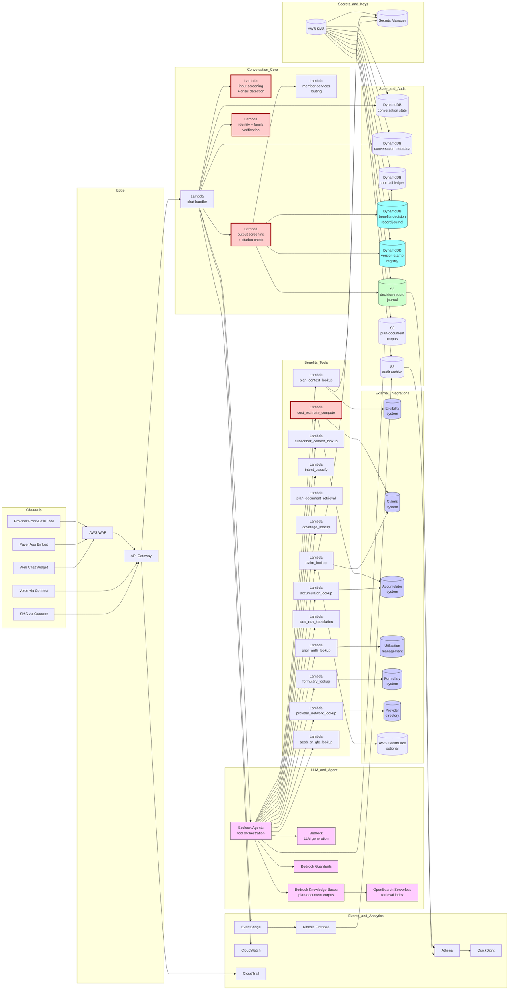

# Recipe 11.5: Insurance Benefits Navigator

**Complexity:** Medium · **Phase:** Foundational · **Estimated Cost:** ~$0.05-0.30 per completed benefits-navigation conversation (depends on conversation length, model choice, eligibility-API call volume, plan-document RAG depth, and language coverage)

---

## The Problem

Aaron is 41. His wife Jen had a knee MRI two weeks ago because her orthopedist wants to look at a meniscus tear before deciding whether to recommend arthroscopy. The MRI happened at the imaging center across the street from the orthopedist's office. Aaron just opened the mail. There is a bill for $1,847.

Aaron is confused. He has insurance through his employer. The plan card says "Aetna." It also says "deductible $3,500" and "out-of-pocket max $8,000" and "coinsurance 20%" and a bunch of other numbers that Aaron has never paid attention to because he and Jen and the kids are basically healthy and the only thing they ever use the insurance for is annual physicals and the occasional strep test.

Aaron does what most people do when they get a confusing medical bill. He calls the number on the back of his insurance card. He waits on hold for thirty-eight minutes. The agent who picks up asks him for his member ID, his date of birth, the date of service, the provider's name, the procedure code, and the amount of the bill. Aaron does not know the procedure code. The agent tells him to call the imaging center to get the procedure code, then call back. Aaron calls the imaging center, gets transferred twice, and is told the procedure code is 73721. He calls Aetna back, waits on hold for another twenty-six minutes, gives the procedure code to a different agent, and is told that the imaging center is in-network but the radiologist who read the scan is out-of-network, that the bill is the radiologist's portion, that Aaron has not yet met his deductible for the year, and that he can appeal the out-of-network charge if he can demonstrate that he had no reasonable way to know the radiologist was out-of-network at the time of the scan.

Aaron asks how to demonstrate that. The agent reads him a script about submitting a written appeal with documentation. Aaron asks what documentation. The agent reads him another script. Aaron is now an hour and fifteen minutes into this and his work day is gone. He gives up and pays the bill.

This is healthcare insurance navigation in the United States in 2026, and it is one of the most universally hated experiences in modern American life. The numbers Aaron needed to understand were not hidden. They were sitting in a Summary of Benefits and Coverage document, an Evidence of Coverage document, a provider-network database, and an Explanation of Benefits, all of which the payer publishes, all of which the patient theoretically has access to, and none of which the patient can actually use because the documents are written in dense regulatory prose, the network database does not surface "the radiologist who reads the scan at this location may be out of network," and the EOB arrives weeks after the decision that mattered. The patient's only practical recourse is to call the payer and wait on hold.

Now scale that to every plan member, every clinical event, every benefits question. The major payers run call centers with thousands of seats. The largest call drivers are repetitive benefits questions: is this provider in network, does my plan cover this procedure, what is my deductible balance, do I need a prior authorization for this medication, what does this code mean on my EOB, why was this claim denied, how much will this MRI cost. <!-- TODO: verify; major U.S. payers have published call-volume figures for member services in various contexts, but consolidated public statistics are not reliably aggregated --> The agents are reading scripts off the same documents the patient theoretically has access to, and most of the agent's work is translating the document into plain English for the specific patient's situation.

The provider side has a parallel problem, less visible to the patient but enormously consequential. Front-desk staff at clinics spend large fractions of their day doing benefits verification and patient-cost estimation: pulling eligibility through clearinghouses, calculating expected cost-share for a scheduled procedure, identifying when prior authorization is required, explaining the cost estimate to the patient before the visit so the patient can decide whether to proceed. <!-- TODO: verify; ambulatory practice operations literature consistently identifies eligibility verification, prior-auth checks, and patient-cost estimation as some of the largest non-clinical staff time investments in the front-office workflow --> Most clinics get this partly right (they verify eligibility, they identify prior-auth requirements, they sometimes estimate cost) and partly wrong (they get the network status wrong, they don't catch the radiologist-is-out-of-network case, they give the patient an estimate that the EOB later contradicts). The patient ends up calling Aaron's number on the back of the card.

The frustrating thing, looking at this honestly, is that the information needed to answer most of these questions is structured. It lives in eligibility responses (what's covered, what's the deductible, what's met), in claims data (what's been paid, what's been denied), in plan documents (what the rules are), in provider-network databases (who's in network), and in benefits-administration systems (what authorizations exist for this member). The reason patients can't get answers is not that the data is missing; it is that the data is fragmented across systems, expressed in formats only specialists can interpret, and gated behind a phone tree.

The previous generation of digital benefits tools, when they tried to solve this, mostly built better web portals. The portal would show the deductible balance, the recent claims, a search interface for in-network providers, sometimes a cost-estimator widget for common procedures. The portals helped the small fraction of plan members who logged in. The bigger fraction kept calling the call center. The portals could not handle questions like "I'm Aaron, I just got a $1,847 bill for my wife's knee MRI on April 8 at Westside Imaging, can you explain why?" because that question requires looking at the specific claim, looking at the specific provider's network status at the date of service, looking at the patient's deductible state at that point in time, and producing a plain-English explanation that mentions the right facts in the right order. Static portals do not do that.

The modern conversational benefits navigator looks like this. Aaron opens the chat in the payer's app or on the payer's website. He is authenticated, so the bot already knows he is Aaron, his member ID, his plan, his network, and his current deductible state. He types "I got a bill for $1,847 for my wife's knee MRI, can you explain it?"

The bot says "Sure, let me take a look. I see Jen had an MRI on April 8 at Westside Imaging. I'm pulling the claim now." The bot calls a tool that retrieves the relevant claim. "Here's what I found. The MRI itself was processed in-network, and the imaging center's portion was applied to your plan's deductible, which is $3,500 for the family. You've used about $620 of that this year so far. The $1,847 charge you're looking at is from the radiologist who read the scan, Dr. Lin, who is out-of-network on this plan even though Westside Imaging is in-network. This is sometimes called a surprise bill, and under the No Surprises Act some out-of-network charges from in-network facilities are eligible for the federal protections. Want me to pull the No Surprises Act information for your situation, or help you start an appeal?"

Aaron says "Yes, the appeal."

The bot says "I'll connect you with our member-services team to start the appeal. They'll need a few details from you. I'm queueing the case now and someone will reach out to you within one business day to walk through the process. While I have you, do you have any other questions about this bill or the MRI?"

Aaron asks "Will I have to pay the $1,847 while the appeal is happening?"

The bot says "I'm a chatbot and can't give you a binding answer on that. The general guidance under No Surprises Act protections is that you don't have to pay more than the in-network cost-share while a dispute is in progress, but the specifics of your situation depend on the appeal outcome. I'm flagging your question for the member-services agent who calls you so they can give you a clear answer."

That ten-minute conversation, completed at 9:47 PM after the kids are in bed, replaces the hour and fifteen minutes Aaron would have spent on hold. It uses the same documents, the same eligibility data, the same claims, the same network database that the agent on the phone uses, just packaged into a tool surface the LLM can call. The agent's job changes from "read scripts at people who can't find the documents" to "handle the complex appeals and the conversations the bot escalated."

A few things this recipe is and is not.

It is the bot that answers benefits questions for plan members through conversation. Coverage questions, network-status questions, deductible-and-balance questions, claim-explanation questions, prior-authorization-status questions, cost-estimate questions, formulary-tier questions, plan-document-content questions. It uses the payer's eligibility, claims, plan-document, provider-network, and prior-authorization data through tool calls and grounded retrieval.

It is also, in many deployments, the bot at the provider's front desk that answers similar questions for the practice's staff or for the patient as part of the visit-prep workflow. The patient-facing payer-side and the provider-side staff-facing deployments share most of the architecture; what differs is the data sources and the access controls.

It is not a binding adjudicator. The bot does not commit the payer to a coverage decision. The bot's outputs are informational, grounded in the current plan documents and the current eligibility-and-claims state, and the actual claim adjudication remains the payer's claims-system process. This positioning matters for both the regulatory line and the patient-trust line.

It is not a sales bot. Plan-comparison and enrollment-counseling for prospective members in the Marketplace, employer-group enrollment season, or Medicare Advantage selection is a different recipe with different regulatory exposure (CMS marketing rules, ACA marketplace rules, employer-disclosure rules). This recipe is for existing plan members navigating their existing plan.

It is not a clinical-advice bot. When a patient asks "should I get this procedure?" the bot redirects to the patient's clinical team. The bot answers "is this procedure covered?" not "should you have this procedure?"

It is not the prior-authorization-decision system. The bot can tell a member whether prior authorization is required, what the status of an existing authorization is, and what documentation is typically needed; the bot does not approve or deny the authorization. The actual prior-auth determination is a separate clinical-and-utilization-management process.

It is not, despite what some early product pitches suggest, a replacement for human benefits counselors for complex situations. Member appeals, surprise-bill disputes, end-stage-renal-disease coverage transitions, dual-eligible Medicare-Medicaid coordination, complex behavioral-health benefit questions, and similar high-complexity cases route to a human counselor with the conversational context attached. The bot's value is in routing the right cases to the right humans plus answering the high-volume routine questions in seconds.

The thing to understand before building this is that the bot's quality is bounded above by the quality of the underlying benefits-data infrastructure. A bot operating against incomplete eligibility, stale provider-network data, plan documents that don't match the actual adjudication, or formulary data that lags the pharmacy benefit manager's rules will produce confidently wrong answers, which is worse than no answer at all. The pre-deployment work of getting the data infrastructure right is the highest-leverage investment, and it is rarely scoped into the project plan because the data quality is "someone else's problem."

Let's get into it.

---

## The Technology: Grounded Retrieval Plus Tool Use Over Structured Benefits Data

### Why Benefits Navigation Has Stayed Phone-Centric

Benefits navigation, as a workflow, has been a call-center problem for as long as the modern insurance industry has existed. The reason is structural: a benefits question almost always reduces to "given my specific plan, my specific provider, my specific procedure, my specific date of service, my specific year-to-date utilization, what is the answer?" Every word in that sentence is parameterized. The plan documents are written for a population, the eligibility responses describe a snapshot in time, the claims adjudication depends on edge cases the plan documents don't fully describe, and the patient is asking about a single specific thing they want to do or have done.

The first generation of digital benefits tools, roughly the late 1990s through the late 2010s, replaced "call the call center" with "log into the member portal." Member portals showed the deductible balance, the recent claims, a search interface for in-network providers, and sometimes a procedure-cost estimator. The portals were useful for the small fraction of members who logged in, who knew where to look, and who were asking questions that fit the portal's pre-built screens. The bigger fraction of members kept calling. The portal usage statistics were never as good as the product teams hoped, because the portal answered the questions the product team imagined, not the questions the members actually had.

The second generation, roughly the late 2010s onward, layered intent-classifier-and-decision-tree chatbots on top of the portal. "Click 'check eligibility' or 'find a provider' or 'view my claims'" became a chat surface that asked similar buttons in conversation form. These tools helped at the margin, but they had the same shape problem as the portal: they answered the questions the product team had pre-planned, in the form the product team had pre-planned, and members whose questions did not fit the pre-planned shape kept calling.

The thing that changed the workflow shape is, again, large language models that can carry on a coherent conversation while sticking to a structured task and using tools. A conversational benefits navigator can take Aaron's free-form question, recognize that he is asking about a specific bill for a specific service for a specific family member, retrieve the actual claim, retrieve the plan provisions that apply, retrieve the network status of the specific providers involved, and produce a plain-English explanation grounded in those specific facts. The bot is not picking from a menu of pre-canned answers; it is composing a specific answer to a specific question by retrieving the specific facts.

The architectural shift is from "show the data and let the member find the answer" to "the bot retrieves the relevant data, composes the answer, and grounds it in the retrieved evidence." The bot's value is concentrated in three places: the patient experience (asking a natural-language question and getting a specific answer in seconds rather than navigating a portal or waiting on hold), the operational savings (the high-volume routine questions are deflected from the call center), and the consistency (the bot reads the same plan documents and runs the same eligibility checks every time, while different agents read scripts with different levels of accuracy).

### What a Benefits Navigator Bot Actually Does

A benefits navigator is a tool-using LLM with a system prompt that tells it which assistant it is, the member's authenticated context (member ID, plan, plan year, family relationships, current eligibility state), and access to a set of tools. The LLM conducts the conversation. The tools handle the deterministic actions: looking up eligibility, retrieving claims, retrieving plan documents, retrieving provider network status, retrieving prior-authorization records, retrieving formulary tiers, computing cost estimates, surfacing acuity flags, escalating to human counselors.

The conversation has a structure even though the member does not see it. The bot's task surface decomposes roughly as follows.

**The greeting and disclosure.** Same primitive as the other chapter 11 recipes. Identifies as a chatbot, states scope (informational benefits questions; not making coverage decisions; not replacing the member-services team for complex appeals), notes that emergencies should go to 911, offers a path to a human counselor.

**Coverage questions.** "Does my plan cover acupuncture?" "Is physical therapy covered for my son after his ACL surgery?" "Does my plan cover Wegovy?" Coverage questions are answered by retrieving the plan provisions for the specific service category, applying any plan-specific limits or exclusions, and noting whether prior authorization or step therapy applies. The answer cites the plan-document section it is grounded in.

**Network-status questions.** "Is Dr. Patel in network for my plan?" "Is Westside Imaging in network?" "Is the neurologist who read my EEG in network?" Network-status questions are answered by retrieving the provider's network status as of the date of service or as of today (whichever the question implies). For provider-rendered services where the rendering provider may not be the location's provider (radiologists, anesthesiologists, pathologists, ED physicians), the bot is explicit about the limitation: "Westside Imaging is in network, but the radiologist who reads your scan may bill separately, and that bill may be from an out-of-network provider. The No Surprises Act provides some protections for this case." <!-- TODO: verify; the No Surprises Act, effective January 1, 2022, provides federal protections against certain surprise out-of-network bills, including ancillary services at in-network facilities; the specific protections continue to evolve through enforcement and guidance -->

**Deductible-and-balance questions.** "How much of my deductible have I met this year?" "What's my out-of-pocket maximum for the family?" "When does my deductible reset?" These are answered by retrieving the member's current accumulator state from the eligibility-and-accumulator system. The bot reports the snapshot, notes the as-of date, and offers to break it down by family member.

**Claim-explanation questions.** "Can you explain this $1,847 bill?" "What does this EOB mean?" "Why was this denied?" These are answered by retrieving the specific claim, identifying the patient-facing fields the claim adjudicated to (allowed amount, plan-paid amount, member-responsibility amount, denial reasons, applied copays/coinsurance/deductible), and explaining the adjudication in plain English. For denied claims, the bot explains the denial reason code (CARC/RARC) and notes the member's appeal rights when applicable. <!-- TODO: verify; CARC (Claim Adjustment Reason Codes) and RARC (Remittance Advice Remark Codes) are the standardized codes used in claim adjudication; the codes are maintained by industry standards bodies and updated periodically -->

**Prior-authorization-status questions.** "Has my prior auth for the MRI gone through?" "What happens if I have the procedure before the prior auth is approved?" These are answered by retrieving the prior-auth record from the utilization-management system, reporting the status, the documents on file, and the typical next steps. The bot does not approve or deny; it reports.

**Cost-estimate questions.** "How much will my colonoscopy cost?" "What will I pay for this medication?" "What does an MRI cost on my plan?" These require pulling the negotiated rate for the specific service at the specific provider (where available), applying the member's deductible-and-cost-share state, and producing a range. The bot is explicit that the estimate is not a binding price, that the actual amount depends on what gets coded and adjudicated, and that the member should ask the provider for a Good Faith Estimate where one is required. <!-- TODO: verify; the Good Faith Estimate requirement under the No Surprises Act applies to uninsured and self-pay patients for scheduled services; the requirement for insured patients to receive an Advanced Explanation of Benefits has been delayed in implementation -->

**Formulary-and-medication questions.** "Is my Eliquis covered?" "Is there a cheaper alternative?" "What tier is my Ozempic on?" "Do I need step therapy?" Formulary questions retrieve the medication's tier, prior-auth requirements, step-therapy requirements, and quantity limits from the formulary database. Alternative-medication questions can suggest therapeutic equivalents at lower tiers when the formulary supports the lookup, with a clear note that the prescribing decision is the clinician's.

**Plan-document content questions.** "What does my Summary of Benefits say about preventive care?" "Where in my plan is the appeal procedure described?" These are answered by retrieving the relevant plan-document section, summarizing in plain English, and offering to send the member the specific document or page.

**Member-services routing.** When the question is beyond the bot's scope (complex appeals, dispute resolution, identity-related issues, coverage exceptions, formal grievances, anything that requires a binding decision or a complex case workup), the bot routes to a human counselor with the conversation context attached. The bot does this gracefully: "I'm going to connect you with someone who can help with that. While I do, can I make sure I have the right phone number to call you back?"

**Patient-rights and process questions.** "How do I file an appeal?" "What are my rights under No Surprises Act?" "How do I request an expedited review?" These are answered with the plan-specific procedures and the federal-and-state rights, with grounding to the source documents and clear next-step guidance.

### Why a Generic LLM Cannot Run a Benefits Navigator

A naive product approach would be: take a generalist LLM, give it a chat surface, paste in some plan-document text, and have it answer benefits questions. This breaks in several specific ways.

**The model has no view of the member's actual eligibility, claims, or accumulator state.** Without the member's specific plan, plan year, deductible state, claims history, and prior-auth records as input, the LLM cannot answer member-specific questions. It can only answer general questions, which is approximately what a static FAQ does. The member-specific tools (eligibility-lookup, claim-lookup, accumulator-lookup, prior-auth-lookup, formulary-lookup, cost-estimate, network-lookup) are the inputs that make the bot specific.

**The model hallucinates plan provisions when grounding is weak.** If the plan documents are not retrieved, the LLM produces plausible-sounding answers that are wrong for this specific plan. "Does my plan cover acupuncture?" gets answered with "many plans cover acupuncture for chronic pain conditions" which is generic, often incorrect for the specific plan, and exposes the payer to liability when the member relies on the answer. The plan-document RAG layer with strict citation grounding is non-negotiable. <!-- TODO: verify; LLM hallucination on benefits-specific questions has been documented in payer-side internal evaluations and in some published case studies; specific rates depend on the model, prompting, and grounding strategy -->

**The model has no reliable theory of plan-document versioning.** Plan benefits change every plan year, sometimes mid-year for legitimate reasons (formulary updates, network changes), and the documents need to be cited by version. The LLM does not naturally distinguish "your 2026 plan" from "your 2025 plan" from "the standard PPO plan" and may compose an answer from the wrong year's document. The retrieval layer must enforce plan-and-year scoping; the citation must include the document version; the bot must refuse to answer about a future plan year that isn't yet documented.

**The model cannot reliably perform the cost-estimate math.** Cost estimates are arithmetic over the plan's cost-share rules and the member's accumulator state. The LLM does the arithmetic poorly, and benefits arithmetic has surprising structure (deductible-then-coinsurance, embedded vs aggregate family deductibles, separate medical and pharmacy accumulators, copay-after-deductible vs copay-before-deductible patterns). The cost-estimate tool encapsulates the arithmetic; the LLM phrases the answer.

**The model cannot reliably distinguish "covered" from "covered subject to prior authorization" from "covered subject to medical necessity" from "excluded."** These are clinically and operationally distinct, and a generic LLM tends to flatten them into "yes" or "no." The coverage-lookup tool returns the structured determination with the explicit qualifier; the LLM presents it accurately.

**The model has no audit trail of what was retrieved versus what was inferred.** A regulated answer about benefits requires showing the work: which plan-document section, which claim record, which provider-network record, which formulary record was the basis for the answer. The structured-data ledger captures the retrieval evidence; the LLM cites it. Without this, the answer is unreviewable and the member's reliance on it is impossible to defend if the answer is later disputed.

**The model has compliance implications for benefits-specific conversations.** The conversation contains PHI (medical claims, medications, conditions inferable from the questions asked) and PFI (personal financial information including bills, balances, payment status). The conversation log is dense PHI plus financial information. The audit pipeline plus retention plus member-rights plus access controls are the same primitives recipes 11.1 through 11.4 used, applied to the benefits domain.

**The model cannot reliably stay within scope when the member asks clinical questions.** Members frequently mix benefits questions with clinical questions ("does my plan cover this surgery, and do you think I should have it?"). The bot answers the benefits question and redirects the clinical question to the member's clinical team. A generalist LLM, asked to be helpful, drifts into clinical territory. The output safety screening, the system prompt, and the scope filters are layered defenses; none is sufficient alone.

### What the Benefits Navigator Has To Do That the Previous Bots Did Not

Recipes 11.1 through 11.4 established the patterns this recipe inherits: input safety screening, intent classification, identity verification with graduated assurance, tool-use orchestration, output safety screening, audit logging, per-cohort monitoring, scope discipline. The benefits navigator adds five structural commitments those recipes did not have.

**Plan-document RAG with strict version scoping and citation.** The bot's coverage answers must cite the specific plan-document section they are grounded in, with the plan year and document version stamped on the citation. The retrieval layer enforces plan-and-year scoping at query time. The output safety screening verifies that every coverage assertion in the response is supported by a retrieved document chunk. Skipping this discipline produces answers that look authoritative but are not grounded, which is the central failure mode the rest of the architecture is designed to prevent.

**Member-specific structured data retrieval as a discrete tool surface.** Eligibility, claims, accumulators, prior-auth records, formulary tiers, and provider network status are each their own tool. Each tool has a defined schema, a defined source-of-truth system, a defined refresh cadence, and a defined fallback when the source-of-truth is unreachable. The bot reads from the tools; the bot does not invent member-specific data. The tool layer's stability and accuracy is the bot's accuracy ceiling.

**Cost-estimate computation as a deterministic tool.** Cost estimates run as code over the structured cost-share rules and the member's accumulator state. The estimator returns a range with explicit caveats (estimate, not a binding price; based on as-of-date accumulator state; subject to claim adjudication). The LLM presents the result; the LLM does not compute the math. Skipping the deterministic tool produces estimates that are sometimes correct and sometimes off by hundreds of dollars, which destroys member trust.

**Plan-document and benefits-data versioning as governance artifact.** The plan documents, the formulary, the provider network, the cost-share rules, and the prior-auth requirements all change. The benefits-data assets are versioned with effective dates, the bot's answers are stamped with the version that was in effect, and the audit pipeline records which version was used for any given conversation. When a member disputes an answer ("you told me this was covered"), the audit log shows exactly what document, what version, and what eligibility state produced the answer.

**Patient-rights and regulatory-process discipline.** Benefits navigation is regulated. State insurance laws, ERISA, ACA, the No Surprises Act, parity laws for behavioral health, Medicare Advantage rules, Medicaid managed-care rules, and state-specific consumer-protection laws all govern what payers can and cannot say to members. <!-- TODO: verify; the regulatory landscape for payer member communications is governed by a complex mix of federal and state law that varies by line of business (commercial, Medicare Advantage, Medicaid managed care, ACA marketplace, self-funded ERISA plans); specific compliance obligations vary --> The bot's outputs are reviewed against the relevant regulatory requirements: certain phrasings are required (for example, the right to file a complaint with the state department of insurance), certain phrasings are forbidden (for example, anything that could be construed as an off-label drug recommendation), and certain communications trigger specific disclosure requirements.

The rest is largely the same as recipes 11.1 through 11.4: tool-surface contract management, identity-assurance lifecycle, conversation logging, scope filtering, per-cohort monitoring, prompt-injection defense, graceful degradation when upstream systems fail.

### The Benefits Reality

A few notes on what makes benefits navigation specifically harder than the other patient-facing bot use cases.

**Benefits structures are genuinely complex.** Even within a single payer, plan structures vary along many dimensions: plan type (HMO, PPO, EPO, POS, HDHP), network tiers (some plans have multiple tiers with different cost-shares), deductible architecture (embedded vs aggregate, individual vs family), separate medical and pharmacy accumulators, copay-after-deductible vs coinsurance-after-deductible patterns, separate accumulators for in-network vs out-of-network, separate accumulators for preventive vs non-preventive, employer-specific plan customizations on the same base plan, mid-year plan-document amendments, midyear formulary changes, and edge cases that nobody at the payer fully understands. The bot has to handle the variation without flattening it. The plan-document and benefits-data layer has to model the variation faithfully, and the cost-estimate tool has to handle it correctly.

**Provider networks are messy.** Network status changes. Providers join and leave. Group practices have providers with different network statuses. Hospitals have in-network status while specific providers practicing at the hospital may be out-of-network (radiologists, anesthesiologists, pathologists, ED physicians, hospitalists). Network status as of date of service is what matters for past services; current status is what matters for prospective questions. The provider-network database has to support both. The bot has to be explicit about the difference.

**Claims data is delayed.** A claim filed today is not in the claims system tomorrow. The typical lag from date of service to fully-adjudicated claim ranges from a few days to several weeks. The bot has to handle the gap. "I had this procedure last week, has the claim come through yet?" is a legitimate question. The bot retrieves what is available, notes what is not yet available, and explains the typical timing.

**EOBs are written in legalese.** Explanation of Benefits documents are technically written for the member but practically incomprehensible to most members. The bot's claim-explanation function is fundamentally an EOB-translator: take the claim record, identify the patient-relevant fields, and explain in plain English what happened, what the member owes, and why. The translation is high-value and high-risk; getting the translation wrong is exactly the failure mode that causes member-services calls.

**Denial reasons are coded in CARC/RARC.** Claim Adjustment Reason Codes and Remittance Advice Remark Codes are the standardized vocabulary for denial reasons. There are hundreds of them. Many members never see the codes; they see the bot's translation of the codes. The denial-explanation tool maps the codes to plain-English explanations and to the appropriate next-step guidance (resubmission, appeal, additional information, contact the provider, contact the member-services team). <!-- TODO: verify; the CARC and RARC code sets are maintained by the National Uniform Claim Committee and X12 with periodic updates -->

**Prior-authorization rules vary by line of service.** Medical prior auth, pharmacy prior auth, behavioral-health prior auth, and durable-medical-equipment prior auth are all separate processes with separate rules and separate systems of record at most payers. The bot has to know which utilization-management system to query for which question. The integration is multi-source.

**Formulary tiering is dynamic.** Pharmacy benefit managers update formularies on quarterly or sometimes monthly cadences. The bot has to query the current formulary tier for the specific drug and the specific plan as of the question's date. Formulary changes that drop a member's medication to a higher tier (or remove it entirely) are operationally consequential and emotionally fraught. The bot's tone in those conversations matters.

**Network-status questions for ancillary providers are a known failure mode.** Aaron's case (the radiologist who reads the scan at an in-network imaging center is out-of-network) is a specific, common, and patient-frustrating pattern. The provider-network data often does not surface the rendering-provider-vs-facility distinction. The bot's answer to "is Westside Imaging in network?" must include the explicit caveat about ancillary providers, which most general-purpose chat tools do not do unless the architecture explicitly handles it.

**Behavioral-health benefits have parity requirements.** The Mental Health Parity and Addiction Equity Act requires that benefits for mental health and substance use disorder be no more restrictive than medical benefits. <!-- TODO: verify; MHPAEA was passed in 2008 and continues to be enforced through CMS, DOL, and state insurance regulators; specific compliance obligations and recent guidance evolve --> The bot's coverage answers for behavioral health must reflect parity. Misstating a behavioral-health benefit (saying it requires prior auth when it doesn't, saying it has a visit limit when it doesn't) is a parity-law issue.

**Cost-estimate accuracy is a trust issue.** A member who is told a procedure will cost $500 and gets a bill for $1,800 will not trust the bot again. The bot has to estimate accurately or refuse to estimate. "I can give you a rough estimate based on the network rates I have, but the actual cost depends on what gets coded and adjudicated. For this procedure, the typical range is $X to $Y. The provider's office can give you a Good Faith Estimate that's more specific to your case." Conservative estimates with explicit ranges and caveats are the standard pattern.

**The conversation log is dense PHI plus financial information.** Members ask about specific medications, specific diagnoses, specific procedures, specific bills, specific balances. The conversation contains medical history inferable from the questions. The conversation contains financial information that some state laws and federal rules treat with additional sensitivity. The audit, retention, access-control, and member-rights story is rigorous. <!-- TODO: verify; HIPAA covers payer data; some state insurance laws add additional patient-rights protections; some state consumer-financial-information laws add layers --> 

**Appeals and grievances are a separate, regulated process.** When a member wants to appeal a denied claim or file a grievance, the bot does not handle the appeal; the bot escalates with the case context. Appeals have statutorily-required timelines, statutorily-required disclosures, and statutorily-required process steps. The bot's role is to inform the member of their rights and to route the appeal to the appropriate regulated workflow.

**The bot is sometimes the member's first impression of the payer.** Members in the open-enrollment-onboarding phase, or members of a self-funded employer group whose plan changed, or new Medicare Advantage members, may interact with the benefits bot before they ever speak to a human. The persona, the warmth, the helpfulness, and the clarity of the disclosure shape the member's relationship with the plan. The patient-experience design is consequential.

**Multilingual deployment is essential.** Members who speak languages other than English are a substantial fraction of the U.S. plan-member population, and many state Medicaid managed-care programs have specific language-access requirements. <!-- TODO: verify; CMS and state Medicaid programs impose language-access requirements that vary by state and by line of business --> The bot's per-language asset development includes plan-document translation governance (validated translations of plan documents, not ad-hoc machine translation), per-language tone and persona, per-language scope-discipline phrasings, and per-language regulatory-disclosure phrasings.

### Where the Field Has Moved

A few practical updates worth knowing.

**FHIR Da Vinci Patient Cost Transparency.** The HL7 Da Vinci Project's Patient Cost Transparency implementation guide standardizes the FHIR resources used for cost estimation, advanced EOB delivery, and coverage information. <!-- TODO: verify; the Da Vinci PCT IG is in active development and adoption by major payers, with implementation patterns continuing to evolve --> Payers building FHIR-native infrastructure can use this as the data model for the bot's cost-estimate and coverage tools.

**The CMS Interoperability and Patient Access Rule.** CMS rules require certain payers to expose member claims, encounters, and clinical data through FHIR APIs, with the Patient Access API as the foundational requirement and with specific extensions for prior-auth status (the Prior Authorization API) and provider directory data (the Provider Directory API). <!-- TODO: verify; the CMS Interoperability and Patient Access final rule was issued in 2020 with subsequent amendments; the CMS Advancing Interoperability and Improving Prior Authorization Processes rule was finalized in 2024 with phased implementation deadlines --> The bot's tools can build on these standardized APIs where they are available.

**The No Surprises Act and Advanced Explanation of Benefits.** The No Surprises Act, effective January 1, 2022, provides federal protections against certain surprise out-of-network bills and includes Good Faith Estimate requirements for uninsured patients. The Advanced Explanation of Benefits (AEOB) requirement for insured patients has been delayed in implementation. <!-- TODO: verify; the AEOB requirement under the No Surprises Act has been the subject of ongoing rulemaking and implementation delays --> The bot's surprise-bill explanation and cost-estimate features should align with the current state of these protections.

**Tool-using LLMs handle benefits Q&A well when grounded carefully.** The function-calling pattern from the previous chapter 11 recipes maps directly to benefits navigation. The LLM produces tool calls that retrieve eligibility, claims, plan documents, network status, and accumulator state; the tools return structured data; the LLM composes a grounded answer. The architecture has been deployed at major payers and clearinghouses since roughly 2023 and is the dominant pattern.

**Conversational benefits navigators measurably reduce call-center volume.** Deployments at major payers consistently report substantial deflection rates for routine benefits questions, with the highest deflection on coverage-and-benefits, deductible-balance, and provider-search questions and the lowest deflection on appeals and complex case questions. <!-- TODO: verify; specific deflection rates and call-center cost-savings figures vary by deployment and are sometimes published in vendor case studies and earnings calls; consolidated public statistics are not reliably aggregated -->

**Equity considerations are central.** Members with limited English proficiency, members with limited digital literacy, members on Medicaid managed-care plans serving lower-income populations, members in rural areas with limited broadband, and members with disabilities all interact with benefits navigators at different rates and with different success rates. Aggregate metrics hide disparities. Per-cohort monitoring is foundational.

**Build-vs-buy is mature in this category.** Several conversational benefits-navigator vendors operate at major-payer scale, with EHR-and-payer-system integrations, multilingual support, and regulatory-compliance frameworks. <!-- TODO: verify; the commercial vendor landscape continues to evolve --> Most major payers run a hybrid: build the in-house bot for the routine member-facing journey on the payer's preferred infrastructure, partner with a vendor for specific complex sub-flows (member-onboarding, cost-transparency tooling), and integrate with their own utilization-management and member-services workflows.

---

## General Architecture Pattern

A healthcare benefits navigator bot decomposes into nine logical stages: channel entry, input safety screening, identity-and-relationship verification, benefits-context loading, intent classification, grounded retrieval and tool orchestration, structured cost-estimate computation, output safety screening with citation verification, and member-services routing for out-of-scope cases. The cross-cutting concerns from recipes 11.1 through 11.4 carry forward; this recipe adds three new ones (plan-document-versioning lifecycle, benefits-data-source freshness governance, regulatory-disclosure-phrasings library).

```
┌────────── CHANNEL ENTRY ─────────────────────────────────┐
│                                                           │
│   [Member opens chat in payer's app, payer's website,     │
│    member-services portal, or employer-side benefits      │
│    site; or front-desk staff opens the bot in the         │
│    practice's benefits-verification tool]                 │
│                                                           │
│   [Greeting and disclosure]                               │
│    - Identifies as a chatbot                              │
│    - States scope (informational benefits questions;      │
│      not making coverage decisions; not replacing         │
│      member-services for complex cases)                   │
│    - Acknowledges that emergencies should go to 911       │
│    - Offers an immediate path to a human counselor        │
│                                                           │
│   [Conversation session bootstrap]                        │
│    - Generate session_id                                  │
│    - Capture channel, authentication context, deep-link   │
│      parameters (e.g., a specific claim or bill the       │
│      member tapped to start the conversation)             │
│           │                                               │
│           ▼                                               │
│   [Output: session_id, channel, auth context, deep-link   │
│    parameters]                                            │
│                                                           │
└───────────────────────────────────────────────────────────┘

┌────────── INPUT SAFETY SCREENING ────────────────────────┐
│                                                           │
│   [Same primitive as the previous chapter 11 recipes,     │
│    with benefits-specific tuning:]                        │
│    - Crisis detection (members occasionally disclose      │
│      crisis when asking about behavioral-health           │
│      benefits or when distressed about a denial)          │
│    - Prompt-injection detection                           │
│    - PHI minimization                                     │
│    - Financial-distress detection (members who describe   │
│      not being able to pay a bill route to financial-     │
│      assistance counseling rather than only to billing)   │
│           │                                               │
│           ▼                                               │
│   [Output: input passes / input blocked-with-disposition] │
│                                                           │
└───────────────────────────────────────────────────────────┘

┌────────── IDENTITY AND RELATIONSHIP VERIFICATION ────────┐
│                                                           │
│   [Authenticated session path (recommended default)]      │
│    - Member is logged into the payer's app or portal      │
│    - Session conveys verified member_id and plan_id       │
│                                                           │
│   [Unauthenticated link path]                             │
│    - For lower-stakes questions (general plan info,       │
│      provider search) the bot may answer without          │
│      authentication, with reduced data scope              │
│    - Member-specific questions (claims, deductible,       │
│      prior-auth) require step-up authentication           │
│                                                           │
│   [Family-relationship handling]                          │
│    - When the member is the subscriber and asks about     │
│      a covered family member (spouse, child), the bot     │
│      verifies the family relationship and the             │
│      subscriber's authorized scope (e.g., parents have    │
│      reduced access to teenagers' records under state-    │
│      specific minor-consent rules)                        │
│                                                           │
│   [Authorized-representative handling]                    │
│    - HIPAA personal representatives, court-appointed      │
│      guardians, members who have designated a third-      │
│      party have the appropriate access scope              │
│           │                                               │
│           ▼                                               │
│   [Output: verified member_id, plan_id, family_scope,     │
│    representative_relationship, assurance_level]          │
│                                                           │
└───────────────────────────────────────────────────────────┘

┌────────── BENEFITS-CONTEXT LOADING ──────────────────────┐
│                                                           │
│   [Tool: plan_context_lookup]                             │
│    - Plan type (HMO, PPO, EPO, POS, HDHP)                 │
│    - Plan year and effective dates                        │
│    - Network tiers                                        │
│    - Deductible and out-of-pocket-max architecture        │
│    - Cost-share structure (copays, coinsurance,           │
│      tiers)                                               │
│    - Plan-specific exclusions and limits                  │
│                                                           │
│   [Tool: accumulator_lookup]                              │
│    - Current deductible state per family member           │
│    - Current OOP-max state per family member              │
│    - Embedded vs aggregate family logic                   │
│    - Separate medical and pharmacy accumulators           │
│    - As-of date stamp                                     │
│                                                           │
│   [Tool: subscriber_context_lookup]                       │
│    - Family members covered                               │
│    - Family-relationship structure                        │
│    - Authorized-representative arrangements               │
│           │                                               │
│           ▼                                               │
│   [Output: structured plan context, accumulator state,    │
│    subscriber context]                                    │
│                                                           │
└───────────────────────────────────────────────────────────┘

┌────────── INTENT CLASSIFICATION ─────────────────────────┐
│                                                           │
│   [Classify the member's question into a benefits-        │
│    intent category with confidence:]                      │
│    - coverage_question                                    │
│    - network_status_question                              │
│    - deductible_balance_question                          │
│    - claim_explanation_question                           │
│    - prior_auth_status_question                           │
│    - cost_estimate_question                               │
│    - formulary_or_medication_question                     │
│    - plan_document_question                               │
│    - appeal_or_grievance_intent                           │
│    - financial_assistance_intent                          │
│    - clinical_question (route out of scope)               │
│    - general_chat                                         │
│                                                           │
│   [Routing logic]                                         │
│    - High confidence + in-scope: proceed to retrieval     │
│    - Low confidence: ask clarifying question              │
│    - Out-of-scope: route to member services or            │
│      appropriate redirect                                 │
│    - Appeal/grievance/complex-case intent: route to       │
│      human counselor with context                         │
│           │                                               │
│           ▼                                               │
│   [Output: intent category, intent confidence, routing    │
│    decision]                                              │
│                                                           │
└───────────────────────────────────────────────────────────┘

┌────────── GROUNDED RETRIEVAL AND TOOL ORCHESTRATION ─────┐
│                                                           │
│   [Per-intent tool selection]                             │
│    - coverage_question → plan_document_retrieval +        │
│      coverage_lookup                                      │
│    - network_status_question → provider_network_lookup    │
│    - deductible_balance_question → accumulator_lookup     │
│    - claim_explanation_question → claim_lookup +          │
│      carc_rarc_translation                                │
│    - prior_auth_status_question → prior_auth_lookup       │
│    - cost_estimate_question → cost_estimate_compute       │
│    - formulary_or_medication_question →                   │
│      formulary_lookup                                     │
│    - plan_document_question → plan_document_retrieval     │
│                                                           │
│   [Plan-document retrieval]                               │
│    - Retrieval scoped to: plan_id + plan_year             │
│    - Retrieval returns document chunks plus metadata      │
│      (document version, effective date, section ref)      │
│    - Chunks granular enough for citation but coherent     │
│      enough for understanding                             │
│                                                           │
│   [Member-specific data retrieval]                        │
│    - Each tool has a defined source-of-truth system       │
│      (eligibility-system, claims-system, accumulator-     │
│      system, prior-auth-system, formulary-system,         │
│      provider-network-system)                             │
│    - Tools return structured data with as-of date         │
│      stamps                                               │
│    - Tools return a defined fallback when source-of-      │
│      truth is unreachable ("I'm having trouble pulling    │
│      that data right now; would you like to wait or       │
│      have someone call you back?")                        │
│                                                           │
│   [Conversation loop]                                     │
│    - Bot poses or refines the question                    │
│    - Member answers / asks follow-up                      │
│    - Bot retrieves additional facts or escalates          │
│    - Bot composes grounded response                       │
│           │                                               │
│           ▼                                               │
│   [Output: retrieved evidence, structured tool results]   │
│                                                           │
└───────────────────────────────────────────────────────────┘

┌────────── COST-ESTIMATE COMPUTATION ─────────────────────┐
│                                                           │
│   [Tool: cost_estimate_compute]                           │
│    - Inputs: service_code, provider_id (optional),        │
│      member_accumulator_state, plan_cost_share_rules,     │
│      negotiated_rate (where available)                    │
│    - Outputs: estimated_member_cost (range), breakdown    │
│      (deductible_applied, coinsurance_applied, copay,     │
│      OOP-max_impact), as-of date, confidence_level,       │
│      caveat_text (estimate not binding, etc.)             │
│                                                           │
│   [Tool: aeob_or_gfe_lookup (where applicable)]           │
│    - Returns the formal Advanced EOB or Good Faith        │
│      Estimate document if one has been generated for      │
│      this scheduled service                               │
│                                                           │
│   [Caveats embedded in every estimate]                    │
│    - Estimate based on as-of date accumulator state       │
│    - Estimate not a binding price                         │
│    - Actual cost depends on what gets coded and           │
│      adjudicated                                          │
│    - For scheduled services, the provider can give a      │
│      formal estimate (Good Faith Estimate or Advanced     │
│      EOB where applicable)                                │
│           │                                               │
│           ▼                                               │
│   [Output: structured cost estimate with caveats]         │
│                                                           │
└───────────────────────────────────────────────────────────┘

┌────────── OUTPUT SAFETY SCREENING WITH CITATION CHECK ───┐
│                                                           │
│   [Same primitive as the other chapter 11 recipes,        │
│    with benefits-specific checks:]                        │
│    - Scope filter (no clinical advice; no binding         │
│      coverage commitments; no diagnostic speculation;     │
│      no off-label drug recommendations)                   │
│    - Vendor-managed guardrail layer                       │
│    - Citation verification: every coverage assertion      │
│      cited to a retrieved plan-document chunk; every      │
│      member-specific assertion cited to a tool result;    │
│      every cost number traceable to the cost-estimate     │
│      tool's output                                        │
│    - Plan-version stamp consistency: cited document       │
│      version matches the member's current plan year       │
│    - Regulatory-disclosure inclusion: required            │
│      phrasings (state-specific complaint rights,          │
│      No Surprises Act references where applicable,        │
│      parity-law disclosures for behavioral-health         │
│      questions, appeal rights for denial questions)       │
│      present where mandated                               │
│    - Persona-and-tone check: empathetic for billing       │
│      distress, clear for procedural questions             │
│           │                                               │
│           ▼                                               │
│   [Output: response cleared for delivery, replaced with   │
│    a safer template, or regenerated with corrections]     │
│                                                           │
└───────────────────────────────────────────────────────────┘

┌────────── MEMBER-SERVICES ROUTING ───────────────────────┐
│                                                           │
│   [Trigger conditions for human handoff:]                 │
│    - Appeal or grievance intent                           │
│    - Complex case (formal coverage exception, medical     │
│      necessity dispute, surprise-bill dispute)            │
│    - Identity-related issue (lost card, name change,      │
│      enrollment correction, COBRA-eligibility-event)      │
│    - Financial-assistance request                         │
│    - Crisis flag                                          │
│    - Multi-attempt failure (the bot has tried to answer   │
│      and the member is not satisfied)                     │
│    - Member explicitly requests a human                   │
│                                                           │
│   [Handoff payload]                                       │
│    - Conversation transcript                              │
│    - Retrieved evidence                                   │
│    - Tool-call results                                    │
│    - Identified intent and unresolved issue               │
│    - Member's preferred contact method and time           │
│    - Acuity flags                                         │
│                                                           │
│   [Routing target selection]                              │
│    - General member services                              │
│    - Appeals-and-grievances team                          │
│    - Behavioral-health benefits team                      │
│    - Financial-counseling team                            │
│    - Crisis pathway (988 / institutional crisis line)     │
│           │                                               │
│           ▼                                               │
│   [Output: human-handoff event with structured payload]   │
│                                                           │
└───────────────────────────────────────────────────────────┘

┌────────── AUDIT, LOG, AND TELEMETRY ─────────────────────┐
│                                                           │
│   [Durable conversation record]                           │
│    - User utterances                                      │
│    - Tool calls with arguments and results                │
│    - Generated bot responses                              │
│    - Active model and prompt versions                     │
│    - Active plan-document version stamps                  │
│    - Active formulary version stamps                      │
│    - Active provider-network snapshot stamps              │
│    - Identity-verification outcome and assurance level    │
│    - Family-relationship and representative scope         │
│    - Final disposition (resolved-by-bot, handed-off,      │
│      member-abandoned, crisis-routed)                     │
│                                                           │
│   [Benefits-decision-record journal]                      │
│    - Durable, separately-governed record of every         │
│      coverage-or-cost answer the bot gave: the member,    │
│      the question, the answer, the cited evidence, the    │
│      version stamps, the as-of dates                      │
│    - Retention sized to the longer of plan-document       │
│      retention rules and applicable state insurance       │
│      law                                                  │
│                                                           │
│   [Operational telemetry]                                 │
│    - Deflection rate vs call-center                       │
│    - Resolution rate by intent category                   │
│    - Handoff rate by intent category                      │
│    - Median time-to-resolution                            │
│    - Member-satisfaction score by intent                  │
│    - Tool-call failure rate per tool                      │
│    - Citation-coverage rate (fraction of responses        │
│      with full citation grounding)                        │
│    - Per-cohort metric slices (language, channel, plan    │
│      type, line of business, age, family-relationship,    │
│      representative-completion)                           │
│                                                           │
│   [Sampled review queue]                                  │
│    - Random sample plus targeted sample of low-           │
│      confidence answers, handoff cases, and member-       │
│      complaint follow-ups                                 │
│    - Reviewers tag failure modes (incorrect coverage      │
│      answer, incorrect cost estimate, missing             │
│      regulatory disclosure, scope violation, citation     │
│      gap)                                                 │
│    - Compliance-team review for regulatory-disclosure     │
│      compliance                                           │
│           │                                               │
│           ▼                                               │
│   [Output: audit trail, telemetry, learning signals]      │
│                                                           │
└───────────────────────────────────────────────────────────┘
```

A few cross-cutting design points specific to the benefits navigator.

**Plan-document corpus governance.** The plan documents are versioned governance artifacts. Each plan has a current document set (Summary of Benefits and Coverage, Evidence of Coverage, Schedule of Benefits, formulary, provider directory, member handbook) with effective dates, with re-issuance dates, and with mid-year amendments. The retrieval corpus is rebuilt or incrementally updated when documents change. Each chunk is tagged with plan_id, plan_year, document_type, document_version, section_id, and effective_date. The retrieval query enforces plan-and-year scoping. Stale retrieval (the bot citing the prior plan year's document for a current-year question) is a serious failure mode.

**Benefits-data source freshness.** Eligibility, claims, accumulators, prior-auth records, formulary tiers, and provider-network data are pulled from systems-of-record on different cadences. Eligibility refreshes at sub-daily frequency for some payers and at daily frequency for others. Claims data has the date-of-service-to-adjudication lag. Provider-network data updates on at least a monthly cadence with mid-cycle updates as providers join or leave. Formulary updates can happen as often as the PBM publishes them. The bot's tools include the as-of date in every response, and the bot's answers are explicit about freshness ("based on data through April 8, 2026").

**Regulatory-disclosure-phrasings library.** State insurance law, federal law (No Surprises Act, parity, ERISA, ACA, Medicare Advantage rules, Medicaid managed-care rules), and plan-document requirements specify phrasings that must appear in certain communications. The library is owned by the compliance team. The output safety screening verifies that required phrasings are present where the conversation triggers them. State-specific configurations apply where the member's state has additional requirements.

**Citation discipline as architectural primitive.** Every coverage assertion, every cost number, every claim-explanation, and every regulatory-rights statement in the bot's response cites the retrieval evidence or the tool output that supports it. The citation is structured (document_version, section_id, retrieval_chunk_id, tool_call_id, as_of_date) and the audit record preserves the citation trail. Members who dispute an answer can be shown the cited evidence; reviewers can verify the answer was grounded.

**Cost-estimate-compute as deterministic tool.** The cost-estimate math runs as code over the structured cost-share rules and the member's accumulator state. The tool returns a structured estimate with explicit caveats. The LLM does not compute the math. The audit record stamps the cost-share-rule version, the accumulator-snapshot timestamp, and the negotiated-rate version used.

**Member-services routing as a first-class capability.** The bot does not pretend to handle complex appeals, grievances, formal coverage exceptions, or financial-assistance requests. The routing is graceful, with the conversation context attached, and the SLA and escalation procedure to human counselors is explicit. The routing path is exercised in tabletop drills.

**Per-cohort monitoring is non-negotiable.** Resolution rate, handoff rate, citation-coverage rate, member-satisfaction, and intent-classification accuracy vary by language, by channel, by plan type, by line of business, by age cohort, and by representative-vs-direct completion. Per-cohort dashboards are reviewed by the compliance team and the patient-experience team.

**The conversation log is dense PHI plus financial information.** Members ask about medications, diagnoses inferable from procedures, behavioral-health treatments, and bills. The audit, retention, and access-control story matches HIPAA's PHI rules plus any state-specific consumer-financial-information rules.

**Resumability across channels.** A member who starts a conversation in the app, gets pulled away, and comes back through the website should be able to continue. Conversation state is keyed on member_id with channel-specific session metadata, allowing cross-channel continuity for authenticated sessions.

**Disaster-recovery topology.** When the eligibility system, claims system, or formulary system is unreachable, the bot degrades gracefully. The minimum behavior is "I'm having trouble pulling that data right now; would you like me to have someone from member services call you back?" Better: cached recent eligibility responses serve answers with explicit "as-of" disclaimers when the live system is down. Failover behavior is tested quarterly.

---

## The AWS Implementation

### Why These Services

**Amazon Bedrock for the LLM and the embeddings.** Same selection criteria as recipes 11.1 through 11.4. The benefits navigator specifically benefits from a model with strong tool-use, strong instruction-following for the citation-grounding discipline, and conversational warmth for billing-distress conversations. Claude Sonnet-class models or comparable frontier models for the orchestration; smaller models for intent classification. Bedrock provides HIPAA-eligible deployment under BAA.

**Amazon Bedrock Knowledge Bases for the plan-document corpus.** The plan documents (SBC, EOC, Schedule of Benefits, formulary index, member handbook) are the bot's grounded retrieval source. Knowledge Bases provides the managed RAG layer with vector indexing and filtered retrieval. The chunking is per-section with metadata (plan_id, plan_year, document_type, document_version, section_id, effective_date) to support plan-and-year-scoped retrieval.

**Amazon Bedrock Agents for tool orchestration.** Same selection rationale as the previous chapter 11 recipes. The bot's tools (plan_context_lookup, accumulator_lookup, subscriber_context_lookup, intent_classify, plan_document_retrieval, coverage_lookup, provider_network_lookup, claim_lookup, carc_rarc_translation, prior_auth_lookup, formulary_lookup, cost_estimate_compute, aeob_or_gfe_lookup, member_services_route) are defined as Agents action groups with OpenAPI schemas.

**Amazon Bedrock Guardrails for scope and content filtering.** Configured with denied topics including off-label drug recommendations, clinical-advice-attempted, diagnostic speculation, and binding-coverage-commitment language. The benefits navigator's scope discipline is critical because members frequently mix benefits questions with clinical questions.

**Amazon OpenSearch Service (or Bedrock-managed vector store) for the retrieval index.** The plan-document corpus is sized to multiple plans times multiple years times multiple document types and benefits from a search engine that supports both lexical (BM25) and dense-vector retrieval with metadata filters. OpenSearch Serverless is the typical default for managed vector workloads on AWS.

**AWS HealthLake (optional) for FHIR-native claims and coverage data.** Where the payer or provider stores claims, eligibility, and coverage data in FHIR (ExplanationOfBenefit, Coverage, Claim, ClaimResponse, CoverageEligibilityRequest/Response resources), HealthLake provides a managed FHIR data store the tools query directly.

**AWS Lambda for the chat handler and tool implementations.** Same pattern as the previous chapter 11 recipes. Tool Lambdas that integrate with eligibility, claims, accumulator, prior-auth, formulary, and provider-network systems run in VPC with controlled egress.

**Amazon API Gateway and AWS WAF for the public chat endpoint.** Same as the other recipes with rate limits tuned for the benefits-navigation use case (members sometimes ask many short questions in a row when navigating a bill).

**Amazon Connect for SMS, voice, and call-center handoff.** Members on phones, members preferring SMS, and members who need to be transferred to a live agent are served through Connect. The handoff payload includes the conversation transcript and tool-call evidence.

**Amazon DynamoDB for state.** Five tables: `conversation-state`, `conversation-metadata`, `tool-call-ledger`, `benefits-decision-record-journal` (durable record of every coverage-or-cost answer with citations), and `version-stamp-registry` (tracks which plan-document version, formulary version, and cost-share-rule version was active for any conversation).

**Amazon S3 for source documents, the plan-document corpus, the audit archive, and the benefits-decision-record journal.** Object Lock in compliance mode for the retention window.

**AWS KMS, AWS Secrets Manager, Amazon CloudWatch, AWS CloudTrail, Amazon EventBridge, Amazon Kinesis Data Firehose, AWS Glue, Amazon Athena.** Same operational and audit primitives as the previous recipes.

**Amazon QuickSight (optional) for compliance and operational dashboards.** Per-intent resolution rate, per-cohort member-satisfaction, citation-coverage rate, regulatory-disclosure-compliance rate, and call-center-deflection rate dashboards.

### Architecture Diagram



### Prerequisites

| Requirement | Details |
|-------------|---------|
| **AWS Services** | Amazon Bedrock (with Agents, Knowledge Bases, Guardrails, a foundation model selected for tool-use plus an embedding model), Amazon OpenSearch Serverless (for the vector retrieval index), AWS Lambda, Amazon API Gateway, AWS WAF, Amazon DynamoDB, Amazon S3, AWS KMS, AWS Secrets Manager, Amazon CloudWatch, AWS CloudTrail, Amazon EventBridge, Amazon Kinesis Data Firehose, AWS Glue, Amazon Athena. Optionally: AWS HealthLake (for FHIR-native claims and coverage), Amazon Connect (for SMS, voice, and call-center handoff), Amazon Lex (for IVR-style voice channel orchestration), Amazon QuickSight (for dashboards). |
| **External Inputs** | Eligibility system with current member-and-plan state. Claims system with adjudicated claim history. Accumulator system with current deductible and OOP-max state per family member. Utilization-management system with prior-auth records. Formulary system with drug-tier and PA/step-therapy/QL information. Provider-network database with current network status and historical effective dates. Plan-document corpus (SBC, EOC, Schedule of Benefits, member handbook, formulary documents) for each active plan-year combination, with formal version control and effective dates. CARC/RARC code-translation table mapping standardized codes to plain-English explanations and next-step guidance. Negotiated-rate database (where the payer or provider has negotiated rates surfaced for cost-estimate purposes). Regulatory-disclosure-phrasings library covering federal requirements (No Surprises Act, parity, ERISA appeal rights, Medicare Advantage rules, Medicaid managed-care rules) and state-specific requirements per state where members are covered. Member-services-team integration for handoff (CTI integration with the call center, ticketing-system integration for asynchronous handoff, escalation pathways for appeals and complex cases). |
| **IAM Permissions** | Per-Lambda least-privilege roles. The eligibility-lookup Lambda has read-only access to the eligibility system. The claim-lookup Lambda has read-only access to the claims system. The accumulator-lookup Lambda has read-only access to the accumulator system. The cost-estimate-compute Lambda has read access to negotiated-rate data and the cost-share-rule registry. None of the bot's Lambdas have write access to coverage decisions, claim adjudication, or member benefits records; the bot is read-only. Resource-based policies on each Lambda pin the invoking principal to the production agent or API Gateway stage ARN. |
| **BAA and Compliance** | AWS BAA signed. Verify Amazon Bedrock (with the specific models in scope), Lambda, API Gateway, WAF, DynamoDB, S3, KMS, Secrets Manager, CloudWatch, CloudTrail, EventBridge, Kinesis Firehose, Glue, Athena, OpenSearch Serverless, HealthLake (where used), Connect, and Lex (where used) are HIPAA-eligible at build time. The bot communicates PHI plus PFI; the audit and retention story must satisfy HIPAA Privacy and Security Rules plus state-specific consumer-financial-information rules where applicable. The plan-document corpus may have specific licensing or use restrictions if the plan documents are derived from third-party templates; the legal team reviews. The regulatory-disclosure-phrasings library is reviewed by the compliance team and updated as federal and state rules change. <!-- TODO: verify; payer member communications are governed by HIPAA, state insurance laws, ERISA (for self-funded plans), ACA, the No Surprises Act, parity laws, Medicare and Medicaid managed-care rules, and state consumer-protection laws; specific compliance obligations vary --> |
| **Encryption** | Plan-document-corpus bucket: SSE-KMS with customer-managed keys, versioning enabled. Audit-archive and benefits-decision-record-journal buckets: SSE-KMS with customer-managed keys, Object Lock in compliance mode for the retention window, lifecycle to S3 Glacier Deep Archive after 90 days. DynamoDB tables: customer-managed KMS at rest. Lambda environment variables: KMS-encrypted. Secrets Manager: customer-managed KMS. TLS in transit for all AWS API calls and all integrations with the eligibility, claims, accumulator, UM, formulary, and provider-network systems. The OpenSearch retrieval index encrypted with customer-managed KMS keys. Different KMS key per data class for blast-radius containment. |
| **VPC** | Production: tool Lambdas that call the eligibility, claims, accumulator, UM, formulary, and provider-network systems run in VPC with controlled egress. PrivateLink to vendor-hosted endpoints where supported; tightly-scoped NAT path with allow-list otherwise. VPC endpoints for DynamoDB, S3, KMS, Secrets Manager, CloudWatch Logs, EventBridge, Bedrock, OpenSearch Serverless, HealthLake (where used), and Connect so back-office Lambdas do not need public-internet egress for AWS-internal calls. The patient-facing edge (API Gateway, WAF) is public by design; the back-office traffic is private. |
| **CloudTrail** | Enabled with data events on the audit-archive S3 bucket, the benefits-decision-record-journal S3 bucket, the plan-document-corpus S3 bucket, the DynamoDB conversation, tool-call, decision-record, and version-stamp tables, the Secrets Manager secrets, and the customer-managed KMS keys. Bedrock and Bedrock Agents invocations logged with metadata. Lambda invocations logged. API Gateway access logs enabled. CloudTrail logs in a dedicated S3 bucket with Object Lock in compliance mode and lifecycle to S3 Glacier Deep Archive after 90 days. Audit retention sized to the longer of HIPAA's six-year minimum, plan-document retention rules, and applicable state insurance law. |
| **Sample Data** | Synthetic member-and-plan profiles stratified by line of business (commercial, Medicare Advantage, Medicaid managed-care, ACA marketplace, self-funded ERISA), by plan type (HMO, PPO, EPO, POS, HDHP), by family structure (single, family, dual-coverage), by language (English plus institution-relevant non-English), and by accumulator state (start-of-year, mid-year, near-OOP-max). Synthetic claims data covering covered-and-paid, applied-to-deductible, denied-with-CARC, surprise-bill scenarios, and prior-auth-required scenarios. Synthetic plan documents with explicit coverage rules, exclusions, and tier structures. Test eligibility, claims, accumulator, UM, formulary, and provider-network systems with synthetic data. Validated regulatory-disclosure phrasings reviewed by the compliance team. |
| **Cost Estimate** | At a mid-sized payer or provider scale (one million benefits-navigation conversations per year; average resolution rate around 65% with the rest handing off to member services; average 8-12 turns per resolved conversation; average 1,000 tokens of prompt and 250 tokens of response per turn for the orchestration model plus tool-call overhead): Bedrock LLM invocations typically $0.05-0.30 per resolved conversation for a Sonnet-class orchestration model, totaling approximately $50,000-300,000 per year. Bedrock Agents and Knowledge Bases hosting plus the OpenSearch Serverless retrieval index typically $15,000-60,000 per year. Lambda, API Gateway, WAF, DynamoDB, S3, KMS, Secrets Manager, CloudWatch, CloudTrail, EventBridge, Kinesis Firehose, Glue, Athena total approximately $20,000-80,000 per year combined. AWS HealthLake (when used as the FHIR claims and coverage source) typically $20,000-90,000 per year depending on data volume. Amazon Connect (for SMS, voice, and call-center handoff) typically $10,000-50,000 per year depending on channel mix. Total AWS infrastructure typically $115,000-580,000 per year at this scale. The infrastructure cost is dominated by the LLM invocation volume and HealthLake (when used). Per-resolved-conversation infrastructure cost is small relative to the call-center labor savings (a typical member-services call costs significantly more than a resolved bot conversation). <!-- TODO: replace with verified pricing once the implementing team validates against the AWS Pricing Calculator. Specific costs depend on the chosen Bedrock model, the conversation turn count, the tool-call volume, the FHIR-source choice, and the channel mix. --> |

### Ingredients

| AWS Service | Role |
|------------|------|
| **Amazon Bedrock** | LLM for orchestration and conversational response generation; embedding model for the plan-document corpus |
| **Amazon Bedrock Agents** | Tool orchestration: define benefits tools as action groups, manage the multi-step LLM-and-tool flow |
| **Amazon Bedrock Knowledge Bases** | Managed RAG over the plan-document corpus with metadata-filtered retrieval (plan_id, plan_year, document_type, document_version, section_id, effective_date) |
| **Amazon OpenSearch Serverless** | Vector and lexical retrieval index backing Knowledge Bases |
| **Amazon Bedrock Guardrails** | Content filtering for clinical advice, off-label drug recommendations, binding-coverage-commitment language, off-scope topics |
| **AWS Lambda** | Chat handler, input/output screening, identity-and-family verification, member-services routing, and tool implementations (plan_context_lookup, accumulator_lookup, subscriber_context_lookup, intent_classify, plan_document_retrieval, coverage_lookup, provider_network_lookup, claim_lookup, carc_rarc_translation, prior_auth_lookup, formulary_lookup, cost_estimate_compute, aeob_or_gfe_lookup, member_services_route) |
| **Amazon API Gateway** | Public-facing chat endpoint for web, app, and provider-side channels |
| **AWS WAF** | Rate limiting, bot detection, common attack patterns (with limits tuned for legitimate benefits-navigation patterns) |
| **Amazon DynamoDB** | conversation-state, conversation-metadata, tool-call-ledger, benefits-decision-record-journal, version-stamp-registry |
| **Amazon S3** | Plan-document corpus, audit archive (conversations), benefits-decision-record journal (durable answer records with citations) |
| **AWS KMS** | Customer-managed encryption keys per data class |
| **AWS Secrets Manager** | Credentials for the eligibility, claims, accumulator, UM, formulary, and provider-network systems |
| **Amazon CloudWatch** | Operational metrics (resolution rate per intent, handoff rate per intent, time-to-resolution, citation-coverage rate, regulatory-disclosure-compliance rate, tool-call success per tool, per-cohort slices); alarms |
| **AWS CloudTrail** | API-level audit logging |
| **Amazon EventBridge** | Benefits-event bus for cross-system event flow (conversation_started, intent_classified, retrieval_completed, answer_delivered, handoff_to_member_services, complaint_filed) |
| **Amazon Kinesis Data Firehose** | Streaming audit and telemetry delivery |
| **AWS Glue Data Catalog + Amazon Athena** | SQL access to audit, decision-record, and telemetry data |
| **AWS HealthLake (optional)** | FHIR-native claims, coverage, and EOB data (ExplanationOfBenefit, Coverage, Claim, ClaimResponse, CoverageEligibilityRequest/Response) |
| **Amazon Connect (optional)** | SMS, voice, and call-center handoff with conversation-context payload |
| **Amazon Lex (optional)** | IVR-style voice-channel intent and slot management |
| **Amazon QuickSight (optional)** | Compliance and operational dashboards |

---

### Code

#### Walkthrough

**Step 1: Receive the chat message, bootstrap the session, and run input safety screening.** Same primitive as the previous chapter 11 recipes. Crisis detection is important here because members occasionally disclose distress when a denial blocks their care, when a surprise bill threatens their finances, or when behavioral-health benefits questions surface a deeper crisis. Skip the screening and a crisis signal lands silently in the bot's "let me help you understand this denial" response.

```
ON receive_message(channel, channel_session_id,
                  user_message, auth_context,
                  deep_link_params):
    // Step 1A: identify or create the session.
    session = conversation_state_table.get_or_create({
        channel: channel,
        channel_session_id: channel_session_id,
        auth_context: auth_context,
        deep_link_params: deep_link_params
    })

    IF session.message_count == 0:
        attach_initial_greeting = true

    // Step 1B: persist the user's message.
    conversation_metadata_table.append_turn(
        session_id: session.id,
        turn: {
            speaker: "user",
            text: user_message,
            timestamp: now()
        })

    // Step 1C: input screening with benefits-specific
    // crisis-and-financial-distress detection.
    screening_result = screen_input(
        session_id: session.id,
        user_message: user_message,
        language: session.language,
        domain: "benefits_navigation")

    IF screening_result.action != "proceed":
        return handle_screening_action(
            session_id: session.id,
            screening_result: screening_result)

    // Step 1D: continue to flow handling.
    return handle_message(
        session_id: session.id,
        user_message: user_message,
        attach_initial_greeting:
            attach_initial_greeting)
```

**Step 2: On a fresh session, load the member's plan context, accumulator state, and family context.** This preparation is what makes the bot member-specific. Without it, the bot can answer generic plan questions but cannot answer "is the radiologist who read my scan in network on my plan?" Skip this step and the bot's answers are no better than a static plan-comparison website.

```
FUNCTION load_benefits_context(session_id):
    // Step 2A: plan context.
    plan = plan_context_lookup_tool.invoke({
        member_id: session.verified_member_id,
        plan_year: current_plan_year_for(
            session.verified_member_id)
    })

    audit_tool_call(
        session_id: session_id,
        tool: "plan_context_lookup",
        result_summary: {
            plan_id: plan.plan_id,
            plan_year: plan.plan_year,
            plan_type: plan.plan_type,
            line_of_business: plan.line_of_business
        })

    // Step 2B: accumulator state.
    accumulator =
        accumulator_lookup_tool.invoke({
            member_id: session.verified_member_id,
            plan_id: plan.plan_id,
            plan_year: plan.plan_year
        })

    audit_tool_call(
        session_id: session_id,
        tool: "accumulator_lookup",
        result_summary: {
            as_of_date: accumulator.as_of_date,
            individual_deductible_met:
                accumulator.individual_deductible_met,
            family_deductible_met:
                accumulator.family_deductible_met,
            individual_oop_met:
                accumulator.individual_oop_met,
            family_oop_met:
                accumulator.family_oop_met
        })

    // Step 2C: subscriber context (family relationships,
    // representative arrangements).
    subscriber =
        subscriber_context_lookup_tool.invoke({
            member_id: session.verified_member_id
        })

    session.plan_context = plan
    session.accumulator_context = accumulator
    session.subscriber_context = subscriber

    // Step 2D: stamp the session with active versions
    // for audit.
    session.active_plan_document_version =
        plan.plan_document_version
    session.active_formulary_version =
        plan.formulary_version
    session.active_provider_network_snapshot =
        plan.provider_network_snapshot

    return { action: "context_loaded" }
```

**Step 3: Classify the member's intent and route accordingly.** Most member questions fall into a small set of intent categories. Classifying first lets the bot route to the right tool surface and detect out-of-scope or human-handoff cases early. Skip the classification and the bot tries to answer everything with the same generic flow, which produces inconsistent results and misses high-value handoff opportunities.

```
FUNCTION classify_and_route(session_id, user_message):
    // Step 3A: classify intent.
    intent = intent_classify_tool.invoke({
        user_message: user_message,
        recent_turns: conversation_metadata_table
            .recent_turns(session_id, k: 4),
        plan_context: session.plan_context,
        deep_link_params: session.deep_link_params
    })

    audit_tool_call(
        session_id: session_id,
        tool: "intent_classify",
        result_summary: {
            intent: intent.category,
            confidence: intent.confidence
        })

    // Step 3B: route based on intent.
    IF intent.confidence < INTENT_CONFIDENCE_THRESHOLD:
        return ask_clarifying_question(
            session_id: session_id,
            user_message: user_message)

    SWITCH intent.category:
        CASE "coverage_question":
            return handle_coverage_question(
                session_id: session_id,
                user_message: user_message,
                intent: intent)

        CASE "network_status_question":
            return handle_network_status_question(
                session_id: session_id,
                user_message: user_message,
                intent: intent)

        CASE "deductible_balance_question":
            return handle_deductible_balance_question(
                session_id: session_id)

        CASE "claim_explanation_question":
            return handle_claim_explanation(
                session_id: session_id,
                user_message: user_message,
                intent: intent)

        CASE "prior_auth_status_question":
            return handle_prior_auth_question(
                session_id: session_id,
                user_message: user_message,
                intent: intent)

        CASE "cost_estimate_question":
            return handle_cost_estimate(
                session_id: session_id,
                user_message: user_message,
                intent: intent)

        CASE "formulary_or_medication_question":
            return handle_formulary_question(
                session_id: session_id,
                user_message: user_message,
                intent: intent)

        CASE "plan_document_question":
            return handle_plan_document_question(
                session_id: session_id,
                user_message: user_message,
                intent: intent)

        CASE "appeal_or_grievance_intent":
            return route_to_member_services(
                session_id: session_id,
                routing_target: "appeals_team",
                reason: "appeal_or_grievance",
                intent: intent)

        CASE "financial_assistance_intent":
            return route_to_member_services(
                session_id: session_id,
                routing_target: "financial_counseling",
                reason: "financial_assistance",
                intent: intent)

        CASE "clinical_question":
            return redirect_clinical_question(
                session_id: session_id)

        DEFAULT:
            return general_chat_response(
                session_id: session_id,
                user_message: user_message)
```

**Step 4: For coverage questions, retrieve the relevant plan-document sections with strict version scoping.** This is the architectural floor for benefits answers: every coverage assertion is grounded in retrieved plan-document content, with the document version and section identifier preserved through to the citation. Skip the retrieval and the bot composes plausible-sounding answers that are not grounded in the specific plan.

```
FUNCTION handle_coverage_question(session_id,
                                   user_message,
                                   intent):
    // Step 4A: retrieve plan-document chunks scoped
    // to the member's plan and plan year.
    retrieval_result =
        plan_document_retrieval_tool.invoke({
            query: user_message,
            plan_id: session.plan_context.plan_id,
            plan_year:
                session.plan_context.plan_year,
            document_types_in_scope: [
                "summary_of_benefits_and_coverage",
                "evidence_of_coverage",
                "schedule_of_benefits",
                "member_handbook"
            ],
            top_k: 8
        })

    // Step 4B: structured coverage lookup for the
    // most likely service category from the intent.
    IF intent.service_category:
        coverage = coverage_lookup_tool.invoke({
            plan_id: session.plan_context.plan_id,
            plan_year:
                session.plan_context.plan_year,
            service_category:
                intent.service_category
        })
        // Returns: covered/excluded/conditional,
        // cost-share rule, prior-auth requirement,
        // step-therapy requirement, visit-limit,
        // network-tier requirements

    // Step 4C: compose grounded response.
    response = compose_coverage_response(
        user_message: user_message,
        retrieval_chunks: retrieval_result.chunks,
        coverage_lookup: coverage,
        plan_context: session.plan_context,
        accumulator_context:
            session.accumulator_context,
        language: session.language,
        regulatory_disclosures:
            applicable_regulatory_disclosures(
                intent: intent,
                plan: session.plan_context))

    // Step 4D: stamp the response with citation
    // references and version stamps.
    response.citations = [
        {
            chunk_id: chunk.chunk_id,
            document_type: chunk.document_type,
            document_version: chunk.document_version,
            section_id: chunk.section_id,
            effective_date: chunk.effective_date
        }
        for chunk in retrieval_result.chunks
        if chunk.referenced_in_response
    ]

    IF coverage:
        response.tool_evidence = {
            tool: "coverage_lookup",
            tool_call_id: coverage.tool_call_id,
            tool_result_summary: coverage.summary
        }

    return {
        action: "coverage_answer",
        response: response
    }
```

**Step 5: For network-status questions, retrieve the provider's status with rendering-vs-facility distinction.** Aaron's surprise-bill problem is exactly the case the bot has to handle correctly: the imaging center may be in-network while the radiologist who reads the scan is out-of-network. Skip this distinction and the bot's "yes, in-network" answer becomes the next surprise bill.

```
FUNCTION handle_network_status_question(session_id,
                                         user_message,
                                         intent):
    // Step 5A: retrieve provider record.
    provider_lookup = provider_network_lookup_tool
        .invoke({
            provider_query: intent.provider_query,
            // provider_query may be a specific NPI,
            // a name, a facility name, or a free-text
            // provider description from the member
            plan_id: session.plan_context.plan_id,
            plan_year:
                session.plan_context.plan_year,
            as_of_date: intent.date_of_service
                OR today(),
            include_ancillary_services: true
        })

    audit_tool_call(
        session_id: session_id,
        tool: "provider_network_lookup",
        result_summary: {
            provider_match_count:
                len(provider_lookup.matches),
            ancillary_warning_applies:
                provider_lookup
                    .ancillary_warning_applies
        })

    // Step 5B: handle ambiguity (multiple matches).
    IF len(provider_lookup.matches) > 1:
        return ask_provider_disambiguation(
            session_id: session_id,
            matches: provider_lookup.matches)

    IF len(provider_lookup.matches) == 0:
        return provider_not_found_response(
            session_id: session_id,
            provider_query: intent.provider_query)

    provider = provider_lookup.matches[0]

    // Step 5C: compose response with the rendering-
    // vs-facility distinction where relevant.
    response = compose_network_status_response(
        provider: provider,
        plan_context: session.plan_context,
        ancillary_warning_applies:
            provider_lookup
                .ancillary_warning_applies,
        no_surprises_act_applicable:
            evaluate_nsa_applicability(
                provider: provider,
                plan: session.plan_context),
        language: session.language)

    response.citations = [
        {
            tool: "provider_network_lookup",
            provider_record_id: provider.id,
            network_snapshot_version:
                provider_lookup
                    .network_snapshot_version,
            as_of_date: provider_lookup.as_of_date
        }
    ]

    return {
        action: "network_status_answer",
        response: response
    }
```

**Step 6: For claim-explanation questions, retrieve the specific claim and translate the adjudication into plain English.** This is the EOB-translator function. The bot pulls the claim, identifies the patient-relevant fields, translates the CARC/RARC denial codes, and produces an explanation grounded in the specific claim. Skip this and the bot says vague things about "your claim" that the member cannot reconcile to the bill in their hand.

```
FUNCTION handle_claim_explanation(session_id,
                                    user_message,
                                    intent):
    // Step 6A: identify the specific claim.
    claim_lookup = claim_lookup_tool.invoke({
        member_id: session.verified_member_id,
        plan_id: session.plan_context.plan_id,
        identifying_hints: {
            date_of_service:
                intent.date_of_service,
            provider:
                intent.provider_reference,
            service_description:
                intent.service_description,
            billed_amount: intent.billed_amount,
            family_member:
                intent.family_member_reference,
            claim_id: intent.claim_id_if_known
        }
    })

    audit_tool_call(
        session_id: session_id,
        tool: "claim_lookup",
        result_summary: {
            claim_match_count:
                len(claim_lookup.matches)
        })

    IF len(claim_lookup.matches) > 1:
        return ask_claim_disambiguation(
            session_id: session_id,
            matches: claim_lookup.matches)

    IF len(claim_lookup.matches) == 0:
        return claim_not_found_response(
            session_id: session_id,
            user_message: user_message,
            intent: intent)

    claim = claim_lookup.matches[0]

    // Step 6B: translate CARC/RARC for any denial
    // or adjustment codes.
    code_translations = []
    FOR adj IN claim.adjustments:
        translation = carc_rarc_translation_tool.invoke({
            carc_code: adj.carc_code,
            rarc_codes: adj.rarc_codes
        })
        code_translations.append(translation)

    // Step 6C: compose patient-friendly explanation.
    response = compose_claim_explanation(
        claim: claim,
        code_translations: code_translations,
        plan_context: session.plan_context,
        accumulator_state:
            session.accumulator_context,
        no_surprises_act_applicable:
            evaluate_nsa_applicability_for_claim(
                claim: claim,
                plan: session.plan_context),
        language: session.language)

    response.citations = [
        {
            tool: "claim_lookup",
            claim_id: claim.id,
            adjudication_date:
                claim.adjudication_date,
            data_freshness_as_of:
                claim_lookup.as_of_date
        }
    ]

    response.regulatory_disclosures =
        applicable_disclosures_for_claim(
            claim: claim,
            plan: session.plan_context)
    // For denials: appeal rights including
    // statutorily-required timeline for the appeal,
    // contact information for the state department
    // of insurance for the member's state, federal
    // No Surprises Act information where applicable.

    return {
        action: "claim_explanation_answer",
        response: response
    }
```

**Step 7: For cost-estimate questions, run the deterministic cost-estimate tool.** The arithmetic is structured (deductible-then-coinsurance, embedded vs aggregate, separate accumulators) and the LLM does it poorly. The cost-estimate tool encapsulates the computation, returns a structured estimate with explicit caveats, and the LLM presents it accurately. Skip the deterministic tool and the bot's estimates are sometimes off by hundreds of dollars.

```
FUNCTION handle_cost_estimate(session_id,
                                user_message,
                                intent):
    // Step 7A: check whether a formal AEOB or GFE
    // already exists for the scheduled service.
    formal_estimate = aeob_or_gfe_lookup_tool.invoke({
        member_id: session.verified_member_id,
        service_query: intent.service_query,
        scheduled_date: intent.scheduled_date,
        provider: intent.provider_reference
    })

    IF formal_estimate.found:
        return present_formal_estimate(
            session_id: session_id,
            formal_estimate: formal_estimate)

    // Step 7B: compute the estimate.
    estimate = cost_estimate_compute_tool.invoke({
        member_id: session.verified_member_id,
        plan_id: session.plan_context.plan_id,
        service_code: intent.service_code,
        provider_reference:
            intent.provider_reference,
        accumulator_snapshot:
            session.accumulator_context,
        cost_share_rule_version:
            session.plan_context
                .cost_share_rule_version,
        negotiated_rate_version:
            current_negotiated_rate_version()
    })

    audit_tool_call(
        session_id: session_id,
        tool: "cost_estimate_compute",
        result_summary: {
            estimate_low: estimate.estimate_low,
            estimate_high: estimate.estimate_high,
            confidence: estimate.confidence,
            cost_share_rule_version:
                estimate.cost_share_rule_version,
            negotiated_rate_version:
                estimate.negotiated_rate_version
        })

    // Step 7C: compose response with explicit
    // caveats.
    response = compose_cost_estimate_response(
        estimate: estimate,
        plan_context: session.plan_context,
        good_faith_estimate_guidance:
            applicable_gfe_guidance(
                member: session.verified_member_id,
                plan: session.plan_context),
        language: session.language)

    response.citations = [
        {
            tool: "cost_estimate_compute",
            cost_share_rule_version:
                estimate.cost_share_rule_version,
            accumulator_as_of_date:
                estimate.accumulator_as_of_date,
            negotiated_rate_version:
                estimate.negotiated_rate_version
        }
    ]

    return {
        action: "cost_estimate_answer",
        response: response
    }
```

**Step 8: Run output safety screening with citation verification before delivering any response.** This is where the architectural floor is enforced. Every coverage assertion must trace to a retrieved plan-document chunk; every member-specific assertion must trace to a tool result; every cost number must trace to the cost-estimate tool. Required regulatory disclosures must be present where mandated. Skip this step and the bot occasionally produces ungrounded answers that look authoritative.

```
FUNCTION screen_output(session_id, response,
                       tool_call_history):
    // Step 8A: standard checks.
    standard_check = standard_output_screen.evaluate(
        response: response,
        session_context:
            session_context_for(session_id))

    IF standard_check.action != "deliver":
        return standard_check

    // Step 8B: scope checks specific to benefits.
    scope_violation =
        detect_benefits_scope_violations(
            response: response)
    // Categories:
    // - clinical_advice_attempted
    // - off_label_drug_recommendation_attempted
    // - binding_coverage_commitment_attempted
    // - diagnostic_speculation_attempted
    // - sales_or_enrollment_attempted (out of
    //   scope for member-side bot)

    IF scope_violation:
        return {
            action: "replace_with_safe_response",
            replacement:
                BENEFITS_OUT_OF_SCOPE_TEMPLATE,
            violation: scope_violation.category
        }

    // Step 8C: citation verification. Every
    // coverage assertion in the response must be
    // backed by a retrieved chunk; every member-
    // specific assertion by a tool result; every
    // cost number by the cost-estimate tool.
    citation_check = verify_citation_grounding(
        response: response,
        retrieved_chunks: response.citations
            .filter(type: "retrieval"),
        tool_results: tool_call_history)

    IF citation_check.has_ungrounded_assertions:
        return {
            action: "regenerate_with_grounding",
            ungrounded_assertions:
                citation_check
                    .ungrounded_assertions
        }

    // Step 8D: plan-version stamp consistency.
    // Every cited document chunk's plan_year must
    // match the member's current plan year (or be
    // explicitly contextualized as a prior year if
    // the question is about a prior-year claim).
    version_check = verify_plan_version_consistency(
        response: response,
        active_plan_year:
            session.plan_context.plan_year,
        intent_temporal_scope:
            session.intent.temporal_scope)

    IF NOT version_check.consistent:
        return {
            action: "regenerate_with_version_correction",
            inconsistencies:
                version_check.inconsistencies
        }

    // Step 8E: regulatory-disclosure presence.
    disclosure_check =
        verify_regulatory_disclosures(
            response: response,
            intent: session.intent,
            plan: session.plan_context,
            member_state:
                session.subscriber_context
                    .residence_state)

    IF disclosure_check.missing_required_disclosures:
        return {
            action: "augment_with_disclosures",
            missing_disclosures:
                disclosure_check.missing
        }

    // Step 8F: persona-and-tone check, especially
    // for billing-distress and behavioral-health
    // contexts.
    persona_check =
        persona_and_tone_evaluator.evaluate(
            response: response,
            recent_user_message:
                session.most_recent_user_message,
            intent: session.intent,
            language: session.language)

    IF persona_check.action != "acceptable":
        return {
            action: "regenerate_with_persona_correction",
            persona_guidance:
                persona_check.guidance
        }

    return {
        action: "deliver",
        response: response
    }
```

**Step 9: Persist the durable benefits-decision record alongside the conversation log.** The conversation log captures the dialog. The benefits-decision-record journal captures, separately, every coverage-or-cost answer with its citation evidence and version stamps. This is the audit surface for "you told me this was covered" disputes, and it is the surface compliance reviewers consume to verify regulatory-disclosure compliance. Skip this and the audit story is intact only at the conversation level, which is enough for some reviews and not enough for others.

```
FUNCTION persist_benefits_decision_record(
        session_id, response):
    decision_record = {
        decision_id: generate_decision_id(),
        session_id: session_id,
        member_id: session.verified_member_id,
        plan_id: session.plan_context.plan_id,
        plan_year: session.plan_context.plan_year,
        intent: session.intent.category,
        question_text:
            session.most_recent_user_message,
        answer_text: response.text,
        citations: response.citations,
        regulatory_disclosures_included:
            response.regulatory_disclosures,
        active_plan_document_version:
            session.active_plan_document_version,
        active_formulary_version:
            session.active_formulary_version,
        active_provider_network_snapshot:
            session.active_provider_network_snapshot,
        active_cost_share_rule_version:
            session.plan_context
                .cost_share_rule_version,
        active_model_id: session.model_id,
        active_prompt_version: session.prompt_version,
        active_agent_version: session.agent_version,
        delivered_at: now(),
        channel: session.channel,
        language: session.language
    }

    benefits_decision_record_journal.write(
        decision_record)

    EventBridge.PutEvents([{
        source: "benefits_navigator",
        detail_type: "answer_delivered",
        detail: {
            decision_id: decision_record.decision_id,
            session_id: session_id,
            intent: decision_record.intent,
            citation_count:
                len(decision_record.citations)
        }
    }])
```

**Step 10: Persist the durable conversation record and per-cohort metrics on session close.** Same archive pattern as the previous chapter 11 recipes, with benefits-specific dimensions on the cohort axes (line of business, plan type, language, channel, intent category, family-relationship, representative-completion).

```
FUNCTION close_conversation_and_archive(session_id,
                                         reason):
    state = conversation_state_table.get(session_id)
    metadata =
        conversation_metadata_table.get(session_id)
    tool_calls =
        tool_call_ledger.for_session(session_id)

    audit_record = {
        session_id: session_id,
        channel: state.channel,
        started_at: state.started_at,
        ended_at: now(),
        language: state.language,
        verified_member_id: state.verified_member_id,
        plan_id: state.plan_context.plan_id,
        plan_year: state.plan_context.plan_year,
        line_of_business:
            state.plan_context.line_of_business,
        representative_relationship:
            state.representative_relationship,
        assurance_level: state.assurance_level,
        turns: [
            redact_user_phi_for_audit(turn)
            for turn in metadata.turns
        ],
        tool_calls: [
            redact_sensitive_args(call)
            for call in tool_calls
        ],
        intents_classified: state.intents_classified,
        decisions_emitted:
            state.benefits_decision_count,
        active_model_id_at_session: state.model_id,
        active_prompt_version_at_session:
            state.prompt_version,
        active_agent_version_at_session:
            state.agent_version,
        active_kb_version_at_session: state.kb_version,
        active_plan_document_version_at_session:
            state.active_plan_document_version,
        active_formulary_version_at_session:
            state.active_formulary_version,
        active_provider_network_snapshot_at_session:
            state.active_provider_network_snapshot,
        completion_status:
            state.completion_status,
            // resolved | handed_off | abandoned |
            // crisis_routed
        cohort_axes: {
            language: state.language,
            channel: state.channel,
            assurance_level: state.assurance_level,
            line_of_business:
                state.plan_context.line_of_business,
            plan_type: state.plan_context.plan_type,
            representative_completion:
                state.representative_relationship
                IS NOT NULL,
            primary_intent: state.primary_intent
        },
        close_reason: reason
    }

    audit_archive_kinesis_firehose.put(audit_record)

    EventBridge.PutEvents([{
        source: "benefits_navigator",
        detail_type: "conversation_closed",
        detail: {
            session_id: session_id,
            channel: state.channel,
            disposition: state.completion_status,
            primary_intent: state.primary_intent,
            turn_count: len(metadata.turns)
        }
    }])

    cloudwatch.put_metric(
        namespace: "BenefitsNavigator",
        metric_name: "ConversationResolved",
        value: 1 IF state.completion_status
                    == "resolved" ELSE 0,
        dimensions: {
            channel: state.channel,
            language: state.language,
            line_of_business:
                state.plan_context.line_of_business,
            primary_intent: state.primary_intent
        })

    cloudwatch.put_metric(
        namespace: "BenefitsNavigator",
        metric_name: "HandoffToMemberServices",
        value: 1 IF state.completion_status
                    == "handed_off" ELSE 0,
        dimensions: {
            channel: state.channel,
            language: state.language,
            line_of_business:
                state.plan_context.line_of_business,
            primary_intent: state.primary_intent
        })

    cloudwatch.put_metric(
        namespace: "BenefitsNavigator",
        metric_name: "CitationCoverageRate",
        value: state.citation_coverage_rate,
        dimensions: {
            primary_intent: state.primary_intent,
            language: state.language
        })
```

> **Curious how this looks in Python?** The pseudocode above covers the concepts. If you'd like to see sample Python code that demonstrates these patterns using boto3, check out the [Python Example](chapter11.05-python-example). It walks through each step with inline comments and notes on what you'd need to change for a real deployment.

---

### Expected Results

**Sample conversation (illustrative, abbreviated):**

```
Bot:     Hi, I'm the benefits assistant. I can help
         answer questions about your plan, your
         claims, your deductible, prior
         authorizations, costs, and your medications.
         I'm a chatbot, not a member services agent,
         and I can't make formal coverage decisions
         or handle appeals on my own. If something
         feels like an emergency, please call 911.
         What can I help you with?

Member:  I got a bill for $1,847 for my wife's knee
         MRI, can you explain it?

Bot:     Sure, let me take a look. I see Jen had an
         MRI on April 8 at Westside Imaging. I'm
         pulling the claim now.

         Here's what I found. The MRI itself was
         processed in-network, and the imaging
         center's portion was applied to your
         family's deductible. You've used about
         $620 of your $3,500 family deductible so
         far this year (as of yesterday).

         The $1,847 charge you're looking at is from
         the radiologist who read the scan,
         Dr. Lin, who is out-of-network on this
         plan even though Westside Imaging is in-
         network. This is sometimes called a
         surprise bill.

         Under the federal No Surprises Act, some
         out-of-network charges from in-network
         facilities are eligible for protection,
         which generally means you should not owe
         more than your in-network cost-share for
         services like this.

         Would you like me to pull the No Surprises
         Act information for your situation, or
         help you start an appeal?

Member:  Yes, the appeal.

Bot:     I'll connect you with our appeals team to
         start the process. They'll need a few
         details from you. I'm queueing the case
         now and someone will reach out to you
         within one business day to walk through
         the next steps.

         Is the phone number ending in 4421 still
         the best way to reach you, or would you
         prefer a different contact?

Member:  That number is fine. Will I have to pay
         the $1,847 while the appeal is happening?

Bot:     I'm a chatbot and can't give you a binding
         answer on payment timing during the appeal.
         Generally, under No Surprises Act
         protections, you don't have to pay more
         than the in-network cost-share while a
         dispute is in progress, but the specifics
         of your situation depend on the appeal
         outcome and on the provider's billing
         practices.

         I'm flagging your question for the appeals
         agent who calls you tomorrow so they can
         give you a clear answer. In the meantime,
         here's a tip: many plans recommend that
         you not pay the disputed amount until the
         appeal is resolved, but you should follow
         the agent's specific guidance for your
         case. Anything else I can help with?

Member:  No, that's it. Thanks.

Bot:     You're welcome. The appeals team will reach
         out within one business day. If you need
         anything in the meantime, you can come back
         to this chat. Take care.
```

**Sample audit record (illustrative):**

```json
{
  "session_id": "benefits-3a8c1f29-b471-4d8a-b1f0-2c7e8a9d3e21",
  "channel": "payer_app_embed",
  "started_at": "2026-04-22T21:47:18Z",
  "ended_at": "2026-04-22T21:54:36Z",
  "language": "en-US",
  "verified_member_id": "member-internal-id-redacted",
  "plan_id": "plan-acme-ppo-2026",
  "plan_year": "2026",
  "line_of_business": "commercial",
  "tool_calls_summary": {
    "plan_context_lookup": 1,
    "accumulator_lookup": 1,
    "subscriber_context_lookup": 1,
    "intent_classify": 3,
    "claim_lookup": 1,
    "carc_rarc_translation": 1,
    "provider_network_lookup": 1,
    "member_services_route": 1
  },
  "active_plan_document_version_at_session":
    "acme-ppo-2026-eoc-v1.2",
  "active_formulary_version_at_session":
    "acme-formulary-2026-q2",
  "active_provider_network_snapshot_at_session":
    "network-snapshot-2026-04-15",
  "intents_classified": [
    "claim_explanation_question",
    "appeal_or_grievance_intent",
    "general_chat"
  ],
  "decisions_emitted": 2,
  "completion_status": "handed_off",
  "handoff_target": "appeals_team",
  "handoff_payload_id":
    "handoff-3a8c1f29-appeals-2026-04-22",
  "cohort_axes": {
    "language": "en-US",
    "channel": "payer_app_embed",
    "assurance_level": "authenticated",
    "line_of_business": "commercial",
    "plan_type": "ppo",
    "representative_completion": false,
    "primary_intent": "claim_explanation_question"
  },
  "duration_seconds": 438,
  "close_reason": "handed_off"
}
```

**Performance benchmarks (illustrative, your mileage varies):**

| Metric | Old call-center plus member-portal | Modern conversational benefits navigator |
|--------|-----------------------------------|------------------------------------------|
| Time-to-answer (median) | 25-50 minutes including hold time | 30-90 seconds for the first answer |
| Resolution rate without human | ~10% (member portal completion) for a narrow set of question types | 50-70% across the full intent catalog |
| Member satisfaction (CSAT) | Frequently negative for call experience | Generally positive for resolved cases |
| Per-conversation infrastructure cost | Negligible for portal, $5-15 for call-center call | $0.05-0.30 |
| Citation-coverage rate (fraction of coverage answers grounded in cited plan-document evidence) | Variable; agent scripts not always document-grounded | 90%+ as launch-gate target |
| Per-cohort accuracy disparity | Often invisible | Monitored explicitly |
| Call-center deflection | N/A (baseline) | 30-60% of routine member-services call volume |
| Handoff-with-context rate | Calls transferred without context | Context preserved across handoff |

<!-- TODO: replace illustrative figures with measured results from the deployment. The ranges above are typical for healthcare conversational benefits-navigator deployments but vary substantially with intent mix, member demographics, plan complexity, and integration depth. -->

**Where it struggles:**

- **Ambiguous claims that match the member's description.** "My wife's knee MRI" might match more than one knee MRI (a follow-up scan, a re-reading, a different family member with similar timing). Mitigation: the bot disambiguates with the member rather than guessing.
- **Multi-claim or multi-encounter questions.** "Can you explain why we keep getting bills for the kids' physical therapy?" requires multiple claim retrievals and a synthesized answer. Mitigation: structured multi-claim summary with per-claim breakdown plus cross-cutting pattern explanation.
- **Network-status questions for ancillary providers.** Aaron's case is the canonical pattern. Mitigation: the provider-network-lookup tool surfaces the ancillary-warning explicitly, and the bot's response template includes the warning even when the facility is in-network.
- **Cost estimates for procedures with bundled or DRG payment.** Bundled-payment and DRG-payment structures don't decompose cleanly into per-service costs. Mitigation: explicit caveat plus deferral to the provider's Good Faith Estimate.
- **Behavioral-health benefits with parity nuance.** Saying "this requires prior auth" when it doesn't, or "you have a 20-visit limit" when parity prohibits the limit, is a parity-law issue. Mitigation: parity-aware coverage-lookup tool with compliance-team-validated rules; behavioral-health questions route to a specialty-trained handoff target when ambiguity exists.
- **Plan-year boundary questions.** "Will my deductible reset in January?" or "I'm changing plans, what carries over?" require plan-year-aware logic. Mitigation: explicit plan-year handling in the tools and the prompts.
- **Self-funded ERISA plans with employer-specific customizations.** Self-funded plans frequently have employer-specific carve-outs that don't appear in the standard plan documents. Mitigation: per-employer-group plan-document scoping in the corpus and per-employer-group customization metadata.
- **Members who mix benefits and clinical questions.** "Does my plan cover this surgery, and do you think I should have it?" Mitigation: scope-violation screening replaces the clinical part with a redirect to the member's clinical team.
- **Members in financial distress.** "I can't afford this bill, what do I do?" Mitigation: the financial-distress detection routes to financial-counseling resources, not just billing.
- **Cross-language asset gaps.** Plan documents may be authoritative in English with translated versions for member service. Mitigation: validated translations with native-speaker review; per-language launch-gate equity monitoring.
- **EOB versions that don't match the provider's bill.** The member's EOB and the provider's bill sometimes disagree in dollar amounts or in coverage categorization, often because of timing. Mitigation: explicit explanation of the timing gap; deferral to member services when reconciliation is needed.
- **Stale provider-network data.** A provider who left the network last week may still appear in-network in the bot's snapshot. Mitigation: snapshot-freshness telemetry and a daily-refresh SLA, with as-of-date stamps in every response.
- **Members asking about a future plan that hasn't been documented.** "What will my plan cover next year?" before the next year's documents are loaded. Mitigation: explicit refusal with a "documentation will be available on October 15" template.
- **Plan-document gaps and ambiguities.** Real plan documents have gaps where the formal answer is "consult member services." Mitigation: the coverage-lookup tool returns "ambiguous, route to member services" rather than letting the LLM guess.
- **Voice-channel ASR errors propagating into intent classification or service-code identification.** "Lipitor" misheard as "Lipator" propagates. Mitigation: explicit confirmation step plus voice-tuned ASR.
- **Members with cognitive impairment or dementia.** Members who cannot reliably participate in a conversational session. Mitigation: representative-completion handling with appropriate authentication and explicit attribution.

---

## Why This Isn't Production-Ready

The pseudocode and architecture above demonstrate the pattern. A production deployment needs to close several gaps that are intentionally out of scope for a recipe.

**Plan-document corpus governance with full version control.** The single largest pre-deployment investment is getting the plan-document corpus correct, complete, and versioned. Each plan-year combination has multiple documents (SBC, EOC, Schedule of Benefits, member handbook, formulary). Each document has an effective date, sometimes mid-year amendments, and re-issuance triggers. The corpus is rebuilt when documents change. Each retrieval chunk is tagged with plan_id, plan_year, document_type, document_version, section_id, and effective_date. The retrieval pipeline enforces plan-and-year scoping. A bot serving the wrong plan year's document is a serious failure mode.

**Benefits-data-source freshness SLA per data class.** Eligibility, claims, accumulator, prior-auth, formulary, and provider-network data each refresh on different cadences with different freshness expectations. Document the SLA per source. Telemetry alerts when a source's freshness exceeds the SLA. The bot's responses include as-of date stamps that come from the source-of-truth, not from the bot's invocation time.

**Regulatory-disclosure-phrasings library with named compliance ownership.** State-specific consumer-protection requirements, federal No Surprises Act provisions, parity-law requirements, ERISA appeal rights, Medicare Advantage rules, and Medicaid managed-care rules all specify required phrasings for certain communications. The library is owned by the compliance team. Each conversation's required-disclosures list is computed based on intent, plan type, line of business, and member state. The output safety screening verifies the phrasings are present.

**Citation-grounding discipline as architectural floor.** Every coverage assertion in every response is grounded in a retrieved chunk or a tool result, with the citation preserved in the audit record. The citation-coverage-rate metric is a launch-gate threshold. Below-threshold deployments are not approved.

**Cost-share-rule registry as code.** The plan's cost-share rules (deductibles, coinsurance, copays, separate accumulators, embedded vs aggregate, in-network vs out-of-network) are encoded as a structured registry that the cost-estimate tool reads. Changes to the rules go through the change-management process owned jointly by the benefits team and compliance.

**CARC/RARC translation library.** The denial-code translations are owned by the appeals-and-grievances team. Each translation has a plain-English explanation, a next-step guidance, and a flag for "this is the kind of denial we typically appeal" versus "this is the kind of denial we typically don't." The library is reviewed annually and after CARC/RARC code-set updates.

**Member-services routing with full case-context handoff.** Handoff to a human is a first-class capability. The handoff payload includes the conversation transcript, the retrieved evidence, the tool-call results, the intent classification, and the unresolved issue. The receiving agent picks up where the bot left off, not from scratch. This requires CTI integration with the call center and ticketing-system integration for asynchronous handoff.

**Per-cohort monitoring with launch-gate discipline.** Resolution rate, handoff rate, citation-coverage rate, regulatory-disclosure-compliance rate, and member-satisfaction vary by line of business, plan type, language, channel, age cohort, and representative-completion status. Per-cohort dashboards reviewed by compliance and patient-experience.

**Voice-channel deployment with accessibility considerations.** Members without smartphones, members with disabilities, members preferring voice over text. The voice channel uses the same bot logic with ASR/TTS layers and voice-specific design adjustments.

**Multi-language deployment with validated translations.** Plan documents in English are not the same as plan documents in Spanish, even when the Spanish document is professionally translated. Per-language asset development includes translated plan documents (with the translation reviewed by the compliance team for regulatory equivalency), translated regulatory disclosures, per-language tone calibration, and per-language equity monitoring.

**Disaster-recovery topology.** When eligibility is unreachable, when claims is unreachable, when the formulary is unreachable, the bot degrades gracefully. Document per-source failover behavior. Test quarterly.

**Compensation operations for incorrect or disputed answers.** When a member disputes an answer ("you told me this was covered, but it was denied"), the operations team reproduces the conversation, retrieves the cited evidence, and either confirms the bot was right (escalating the underlying coverage decision) or confirms the bot was wrong (compensating the member and feeding the failure mode into the improvement loop). Tooling for this workflow is part of production scope.

**Operational ownership across multiple teams.** The bot sits at the intersection of member services, compliance, benefits administration, claims operations, utilization management, pharmacy benefits, provider-network operations, IT, and the call center. Establish clear ownership at the start.

**Build-vs-buy rigor.** Several mature commercial vendors offer benefits-navigator products. Most major payers run a hybrid: in-house bot for the routine member-facing journey on the payer's preferred infrastructure, vendor partnership for specific complex sub-flows.

<!-- TODO (TechWriter): Expert review S1 (HIGH). Promote plan-document-corpus-as-code lifecycle, regulatory-disclosure-phrasings-library governance, and cost-share-rule-registry-as-code to architectural primitives. Specify per-plan-year versioned plan-document corpus with semantic versioning, per-effective-date document chunking, sandbox testing against held-out benefits questions, staged rollout with per-plan canary, rollback-on-regression, named ownership at the benefits-administration team plus compliance plus the medical-director for clinical-policy aspects, per-document-version-stamping on every benefits-decision-record, regulatory-disclosure-phrasings-library with state-specific configurations and quarterly review cadence, cost-share-rule-registry as code with per-plan-year version, change-management process. -->

<!-- TODO (TechWriter): Expert review S2 (HIGH). Specify the working-store-vs-archive-store discipline for the tool-call ledger and benefits-decision-record journal. The DynamoDB tables on the real-time hot path hold structural references; full plan-document chunk content, full claim adjudication detail, full member accumulator state, full provider-network record content, full conversation transcript route to S3 archives with the appropriate KMS key class. Reconcile per-record-class retention floors covering HIPAA's six-year minimum, plan-document retention rules (often 10+ years for claims-related records), state insurance-record retention rules (varies by state), state consumer-financial-information retention rules where applicable, per-channel retention obligations (TCPA / 10DLC for SMS, voice-channel recording retention), and the institutional regulatory floor. -->

<!-- TODO (TechWriter): Expert review A1 (HIGH). Promote per-cohort monitoring to architectural primitive with explicit launch-gate discipline. Single-axis cohorts (per-language, per-channel, per-line-of-business, per-plan-type, per-age-cohort, per-representative-completion, per-primary-intent), two-axis cohorts (per-language-by-channel, per-line-of-business-by-plan-type, per-plan-type-by-primary-intent), three-axis cohort (per-language-by-channel-by-line-of-business). Per-cohort threshold metrics including resolution rate, handoff rate, citation-coverage rate, regulatory-disclosure-compliance rate, intent-classification accuracy, cost-estimate accuracy versus actual claim adjudication for resolved estimates, member-satisfaction. Launch-gate institution-wide-average informational only; each cohort meets threshold before going live. -->

<!-- TODO (TechWriter): Expert review S3 (MEDIUM). Promote prompt-injection defense to architectural primitive with delimited-input framing, tool-Lambda enforcement that every tool validates member_id and plan_id arguments against the verified session, per-language jailbreak-test corpus including benefits-injection cases (manipulate coverage-lookup to return unauthorized coverage assertion, manipulate cost-estimate to return zero cost, manipulate claim-lookup to return false denial reasons), Bedrock Guardrails configuration with denied-topics specific to off-label drug recommendations and binding-coverage-commitments, audit logging of cross-check outcomes. -->

<!-- TODO (TechWriter): Expert review S4 (MEDIUM). Specify a faithfulness-check stage between Bedrock generation and response delivery that grounds every coverage assertion to a retrieved plan-document chunk, every member-specific claim to a tool result, every cost number to a cost-estimate-tool call, every regulatory-disclosure to the disclosure library. Use an independent verifier model with structured-output schema validation, rule-based contradiction detection, omission detection, regenerate-attempt budget, fall-back-to-safe-response default. Per-cohort faithfulness-failure rate as launch-gate. -->

<!-- TODO (TechWriter): Expert review A2 (MEDIUM). Promote tool-surface contract management to architectural primitive with per-tool versioned schemas, per-tool deprecation policy, per-tool change-management owned jointly by engineering, benefits administration, and compliance, per-tool audit-stamping. -->

<!-- TODO (TechWriter): Expert review A3 (MEDIUM). Specify a Deployment Pattern subsection covering versioned system prompt, intent-classification prompt, plan-document-corpus snapshot, per-plan plan-document version, formulary version, provider-network snapshot, regulatory-disclosure-phrasings-library version, persona-and-tone evaluator prompt, redaction taxonomy, per-language consent-disclosure assets, Bedrock Guardrails policy in version control. Held-out evaluation set covering representative benefits questions, ambiguous-claim cases, surprise-bill cases, behavioral-health-parity cases, prior-auth cases, multilingual cases, prompt-injection test cases, faithfulness test cases. Per-cohort canary deployment with traffic-shift. -->

---

## The Honest Take

The benefits navigator is the recipe in this chapter where the operational savings are most measurable, the data infrastructure is most consequential, and the regulatory exposure is most dispersed across federal and state authorities.

The first trap, as with the previous bots, is treating the institutional content as someone else's problem. With the FAQ bot it was the parking policy. With the scheduling bot it was the visit-type catalog. With the refill bot it was the clinical refill protocol. With the intake bot it was the per-visit-type intake protocol library. With the benefits navigator it is the plan-document corpus, the cost-share-rule registry, the regulatory-disclosure-phrasings library, the CARC/RARC translation library, and the source-of-truth integrations for eligibility, claims, accumulators, prior-auth, formulary, and provider network. The single largest determinant of bot quality is the explicitness, completeness, and freshness of these artifacts. Most payers discover, partway through the project, that their plan documents are slightly inconsistent across formats (the SBC says one thing, the EOC says another in different language, the formulary index implies a third), that their accumulator system has subtle edge cases their own member-services agents have learned to work around, and that their provider-network data does not surface the rendering-vs-facility distinction. Formalizing these artifacts is multi-quarter work, and it is the highest-leverage investment the project will make.

The second trap is underestimating the citation-grounding discipline. A benefits navigator that produces ungrounded answers is worse than no benefits navigator at all, because members will rely on the answers and the payer will be liable when the answers are wrong. Every coverage assertion has to trace to a retrieved plan-document chunk, every member-specific assertion to a tool result, every cost number to the cost-estimate tool. The citation-coverage-rate metric is a launch-gate threshold, not a post-launch dashboard. Treating citation as a nice-to-have produces a bot that confidently makes up coverage rules from the LLM's parametric memory, which is exactly the failure mode the architecture is supposed to prevent.

The third trap is the cost-estimate. Members trust cost estimates the way they trust price tags. A member quoted $500 who gets a bill for $1,800 will lose trust in the bot permanently, and the recovery cost (member-services calls, complaints, sometimes formal grievances) often exceeds the estimate's positive value. The cost-estimate tool runs deterministic math, returns explicit ranges, and embeds caveats in every response. Conservative estimates are better than optimistic ones. Refusing to estimate when the data isn't reliable enough is better than estimating wrong.

The fourth trap is the regulatory-disclosure scope. State insurance laws vary. Federal rules layer on top. ERISA, ACA, No Surprises Act, parity laws, Medicare Advantage rules, Medicaid managed-care rules, and state-specific consumer-protection laws all specify required phrasings or prohibitions on certain phrasings. Building the disclosure library and the per-state configurations as a versioned governance artifact, owned by compliance, is not optional. The compliance team will tell you that the bot's outputs are member communications subject to the same scrutiny as printed letters, and they will be right.

The fifth trap is the parity issue for behavioral-health benefits. The Mental Health Parity and Addiction Equity Act requires that mental-health and substance-use-disorder benefits be no more restrictive than medical benefits. Saying "this requires prior authorization" for a behavioral-health service when the medical equivalent doesn't, or "you have a visit limit" when parity prohibits it, is a parity-law violation. Building parity-aware coverage logic, with compliance-team-validated rules, is part of the production scope.

The sixth trap is shipping with too narrow an intent catalog. A bot that handles only "check my deductible" and "find a provider" deflects a small fraction of call-center volume. A bot that handles the full intent catalog (coverage, network, deductible, claim, prior-auth, cost, formulary, plan-document, plus graceful handoff for everything else) deflects the majority of routine calls. Design for the full catalog from the start, even if you stage the rollout by intent.

The seventh trap is shipping without the per-cohort monitoring. Resolution rate, handoff rate, citation-coverage rate, regulatory-disclosure-compliance rate, and member-satisfaction vary by line of business, by plan type, by language, by channel. Aggregate metrics hide the disparities that the compliance team and the patient-experience team need to see.

The eighth trap is shipping without member-services integration. A bot that says "I can't help with that, please call us" without connecting the conversation context to the receiving agent makes the member-services call worse, not better. The handoff payload, the CTI integration, and the agent-side display of the conversation context are part of the production scope.

The thing that surprises engineers coming from generic-chatbot backgrounds is how much of the engineering value is in the data integration. The wrappers around the eligibility, claims, accumulator, UM, formulary, and provider-network systems. The cost-share-rule registry. The CARC/RARC translation library. The regulatory-disclosure-phrasings library. The plan-document corpus governance. The citation-grounding verifier. None of this is exotic technology, and all of it is critical.

The thing that surprises business leaders coming from call-center-operations backgrounds is how dependent the bot's quality is on data the payer technically already has but does not surface well. The plan documents are written. The cost-share rules are encoded somewhere. The provider-network data exists. The member's accumulator state is computable. The claims are adjudicated. The bot's job is to surface this data through a conversation, with citation grounding, with regulatory-disclosure compliance, and with graceful handoff for the cases the bot can't handle. Most of the engineering effort is in the integration layer, not in the LLM layer.

The thing about Amazon Bedrock specifically: same as recipes 11.2 through 11.4, Bedrock Agents is the right level of abstraction for this recipe. The Agent handles the multi-step LLM-and-tool orchestration; the action groups are the bot's tool surface; Knowledge Bases provides the plan-document RAG; Guardrails provides safety filtering. The institutional value lives in the tool layer, in the plan-document corpus governance, and in the regulatory-disclosure library, not in the Bedrock features themselves.

The thing about cost: per-resolved-conversation infrastructure cost is small relative to the call-center labor savings. The dominant project cost is engineering and operational overhead, not the AWS bill. Forecast based on the data-integration, plan-document-corpus, regulatory-library-curation, and call-center-integration investments.

The thing about regulatory exposure: the bot is a member communication subject to the same scrutiny as printed plan documents and member letters. The compliance team's involvement is from day one, not at launch. State-specific configurations are tracked the way state-specific tax tables are tracked. Federal-rule changes (CMS interoperability rules, No Surprises Act updates, parity-rule guidance) are tracked through the same regulatory-monitoring process the rest of the payer's operations use.

The thing about member trust: a benefits navigator that gets the answer right 95% of the time and the regulatory disclosures right 100% of the time builds trust. A bot that gets the answer right 99% of the time and the disclosures wrong 5% of the time gets the payer fined. The mix of accuracy and compliance matters more than either alone.

The thing I would do differently the second time: start with a narrower set of plans (one or two of the largest plans by membership), get the data integration and the plan-document corpus governance correct for those plans, and expand from there. Trying to cover the full plan catalog from launch produces thin data integration across the board and a bot that is unreliable for any one plan.

The last thing: the benefits navigator is the recipe most likely to be deployed both on the payer side (member-facing) and on the provider side (front-desk-facing) using essentially the same architecture. The provider-side deployment serves practice staff who are doing benefits verification before visits and patient-cost estimation. The data sources are the same (the payer's eligibility, claims, accumulator systems), the question types overlap heavily, and the conversational interface is the same. The difference is in the user, the access controls, and the integration with the practice's PM/EHR. Building the bot architecture to be deployable in both modes (with appropriate data-access policies per mode) doubles the operational impact of the project. Aaron's bill problem, and the front-desk staff problem of telling Aaron's wife what the MRI will cost before she has it, are two sides of the same data integration.

---

## Variations and Extensions

**Provider-side front-desk benefits-verification bot.** The same architecture serves practice staff doing benefits verification, prior-auth checks, and patient-cost estimation before scheduled visits. The user is the front-desk staff (not the patient), the access controls reflect the practice's authorization to query the payer's data, and the integration extends to the practice's PM/EHR. Recipe 5.4 (insurance eligibility matching) covers the underlying data-linkage layer this variation builds on.

**Voice channel for IVR-style benefits navigation.** Members calling the payer's main number can be served by the same bot through Connect plus Lex, with ASR/TTS layered on the conversational core. Voice-specific design includes slower pacing, explicit member-ID confirmation, and tighter latency budgets.

**Pharmacy-benefits-specialist sub-flow.** Members asking detailed pharmacy questions (formulary tier, prior-auth requirements, step-therapy rules, quantity limits, generic alternatives, specialty-pharmacy-only requirements) route to a pharmacy-specialist sub-flow with deeper formulary integration and access to the PBM's authoritative tools.

**Behavioral-health-benefits sub-flow with parity awareness.** Behavioral-health questions route to a sub-flow with parity-validated coverage rules, behavioral-health network search, and warm handoff to behavioral-health-trained member-services specialists for sensitive cases.

**Cost-transparency tooling for shoppable services.** Federal and some state rules require payers to publish negotiated rates and out-of-pocket-cost estimates for specific shoppable services. <!-- TODO: verify; the Transparency in Coverage rule and the Hospital Price Transparency rule have specific publication and tooling requirements that vary by service category --> The bot can serve cost-transparency questions for shoppable services with grounded estimates plus links to the formal disclosures.

**Surprise-bill-protection education and dispute-initiation.** A dedicated sub-flow for No Surprises Act education and federal independent-dispute-resolution initiation. The bot explains the protections, identifies whether the patient's case is eligible, and routes to the appeals team to start the formal IDR process where applicable.

**Open-enrollment plan-comparison (separate from this recipe).** Plan comparison for prospective members or employer-group enrollees is a different recipe with different regulatory exposure (CMS Marketing Rules for Medicare Advantage, ACA Marketplace navigator rules, employer-disclosure rules). This variation is mentioned for completeness; the architecture does not extend cleanly to it.

**Multi-language deployment with validated plan-document translations.** The bot operates natively in the institution's member-population languages from day one. Per-language asset development includes validated plan-document translations, validated regulatory-disclosure translations, per-language tone calibration, and per-language equity monitoring.

**Member-rights and access-request integration.** Members exercising HIPAA right-of-access, requesting amendments to their records, or filing privacy-related requests through the bot route to the privacy-officer team with structured request capture.

**Integration with the FAQ bot, scheduling bot, refill bot, intake bot, and other transactional bots.** Members asking compound questions ("can I schedule the appointment and confirm my benefits will cover it?") route to multiple bots behind a unified chat surface with shared identity context.

**Bot-to-bot handoff with clinical-decision-support.** When a coverage question depends on clinical context (medical-necessity criteria for a specific procedure given the member's diagnosis), the bot can hand off to or invoke a clinical-decision-support sub-flow grounded in clinical-policy documents, with explicit member-vs-clinical-team scoping.

**Proactive benefits coaching.** Beyond reactive Q&A, the bot can proactively contact members about benefits-relevant events: deductible-met notifications, formulary changes affecting active medications, expiring-prior-auth reminders, end-of-plan-year reminders. The architectural extension is the asynchronous-outreach pipeline plus per-event consent management.

**Continuous-improvement loop with structured failure-mode labeling.** Beyond per-conversation feedback, the institution runs a structured labeling program where reviewers tag failure modes (incorrect coverage answer, incorrect cost estimate, missing regulatory disclosure, scope violation, citation gap, parity issue). The labels feed the plan-document-corpus, regulatory-disclosure-library, cost-estimate-tool, and prompt-tuning workflows.

---

## Related Recipes

- **Recipe 11.1 (FAQ Chatbot):** Same chapter, foundational. The benefits navigator inherits the input-screening pipeline, scope filtering, conversation logging, audit pattern, persona discipline, and per-cohort monitoring.
- **Recipe 11.2 (Appointment Scheduling Bot):** Same chapter. Members scheduling visits frequently ask benefits questions about the visit; the two bots may share session context behind a unified surface.
- **Recipe 11.3 (Prescription Refill Request Bot):** Same chapter. Members asking about refills frequently ask formulary questions; the formulary-lookup tool is shared.
- **Recipe 11.4 (Pre-Visit Intake Bot):** Same chapter. The intake bot may capture insurance updates that flow into the benefits-navigator workflows; the benefits navigator may surface coverage-related items affecting the intake's pre-procedure checks.
- **Recipe 11.6 (Symptom Checker / Triage Bot):** Same chapter. Members occasionally mix benefits questions with clinical questions; the scope discipline routes the clinical questions to the triage bot or the member's clinical team.
- **Recipe 5.4 (Insurance Eligibility Matching):** Chapter 5. The benefits-navigator's eligibility-lookup tool depends on the institution's eligibility-matching pipeline.
- **Recipe 5.6 (Claims-to-Clinical Data Linkage):** Chapter 5. The benefits navigator's claim-lookup tool benefits from claims-to-clinical-data linkage for cross-system completeness.
- **Recipe 1.4 (Prior Auth Document Processing):** Chapter 1. The benefits navigator's prior-auth-status tool consumes the prior-auth records produced by the prior-auth-document-processing pipeline.
- **Recipe 1.8 (EOB Processing):** Chapter 1. The benefits navigator's claim-explanation feature consumes EOB-equivalent claim records produced by the EOB-processing pipeline.
- **Recipe 2.4 (Prior Authorization Letter Generation):** Chapter 2. The benefits navigator's prior-auth status answers connect to the prior-auth letter workflow.
- **Recipe 2.7 (Literature Search and Evidence Synthesis):** Chapter 2. Coverage decisions for specific procedures may invoke evidence-synthesis grounding for medical-necessity questions.
- **Recipe 4.7 (Care Management Program Enrollment):** Chapter 4. Members navigating complex benefits situations may benefit from care-management enrollment.
- **Recipe 10.1 (IVR Call Routing Enhancement):** Chapter 10. The voice-channel deployment of the benefits navigator integrates with the payer's IVR routing infrastructure.
- **Recipe 10.5 (Patient-Facing Voice Assistant):** Chapter 10. The voice channel for the benefits navigator builds on the voice assistant's ASR/TTS patterns.
- **Recipe 3.1 (Duplicate Claim Detection):** Chapter 3. The bot's claim-explanation answers benefit from duplicate-claim-aware logic for members asking about repeated bills.
- **Recipe 3.6 (Healthcare Fraud, Waste, and Abuse Detection):** Chapter 3. Member-reported irregularities (questionable charges, services not received) feed FWA-detection workflows.

---

## Additional Resources

**AWS Documentation:**
- [Amazon Bedrock User Guide](https://docs.aws.amazon.com/bedrock/latest/userguide/what-is-bedrock.html)
- [Amazon Bedrock Agents](https://docs.aws.amazon.com/bedrock/latest/userguide/agents.html)
- [Amazon Bedrock Knowledge Bases](https://docs.aws.amazon.com/bedrock/latest/userguide/knowledge-base.html)
- [Amazon Bedrock Guardrails](https://docs.aws.amazon.com/bedrock/latest/userguide/guardrails.html)
- [Amazon OpenSearch Serverless](https://docs.aws.amazon.com/opensearch-service/latest/developerguide/serverless.html)
- [AWS HealthLake Developer Guide](https://docs.aws.amazon.com/healthlake/latest/devguide/what-is-amazon-health-lake.html)
- [AWS Lambda Developer Guide](https://docs.aws.amazon.com/lambda/latest/dg/welcome.html)
- [Amazon API Gateway Developer Guide](https://docs.aws.amazon.com/apigateway/latest/developerguide/welcome.html)
- [AWS WAF Developer Guide](https://docs.aws.amazon.com/waf/latest/developerguide/waf-chapter.html)
- [Amazon DynamoDB Developer Guide](https://docs.aws.amazon.com/amazondynamodb/latest/developerguide/Introduction.html)
- [Amazon S3 Object Lock](https://docs.aws.amazon.com/AmazonS3/latest/userguide/object-lock.html)
- [Amazon EventBridge User Guide](https://docs.aws.amazon.com/eventbridge/latest/userguide/eb-what-is.html)
- [Amazon Connect Administrator Guide](https://docs.aws.amazon.com/connect/latest/adminguide/what-is-amazon-connect.html)
- [Amazon Lex V2 Developer Guide](https://docs.aws.amazon.com/lexv2/latest/dg/what-is.html)
- [AWS HIPAA Eligible Services Reference](https://aws.amazon.com/compliance/hipaa-eligible-services-reference/)

**AWS Sample Repos:**
- [`aws-samples/amazon-bedrock-samples`](https://github.com/aws-samples/amazon-bedrock-samples): Bedrock invocation patterns including Agents, Knowledge Bases, and Guardrails
- [`aws-samples/aws-genai-llm-chatbot`](https://github.com/aws-samples/aws-genai-llm-chatbot): reference architecture for a multi-model chatbot on AWS
- [`aws-samples/aws-healthcare-lifescience-ai-ml-sample-notebooks`](https://github.com/aws-samples/aws-healthcare-lifescience-ai-ml-sample-notebooks): broader healthcare AI/ML sample notebooks
<!-- TODO: confirm current repo names and locations at time of build; the AWS sample repo organization changes over time -->

**AWS Solutions and Blogs:**
- [AWS Solutions Library](https://aws.amazon.com/solutions/) (filter Healthcare and Life Sciences plus AI/ML): browse for member-engagement and benefits-navigation reference architectures
- [AWS Machine Learning Blog](https://aws.amazon.com/blogs/machine-learning/): search "Bedrock Agents," "benefits navigator," "RAG citation grounding" for relevant pattern posts
- [AWS for Industries: Healthcare and Life Sciences Blog](https://aws.amazon.com/blogs/industries/category/industries/healthcare/): search "member experience," "benefits," "payer" for relevant content
<!-- TODO: replace generic "search the blog" pointers with specific verified blog post URLs once they are confirmed to exist -->

**External References (Standards and Frameworks):**
- [HL7 FHIR Coverage Resource](https://www.hl7.org/fhir/coverage.html): the FHIR Coverage resource specification
- [HL7 FHIR ExplanationOfBenefit Resource](https://www.hl7.org/fhir/explanationofbenefit.html): the FHIR EOB resource specification
- [HL7 FHIR Claim Resource](https://www.hl7.org/fhir/claim.html): the FHIR Claim resource specification
- [HL7 Da Vinci Patient Cost Transparency](https://hl7.org/fhir/us/davinci-pct/): the Da Vinci PCT implementation guide for cost transparency
- [CMS Interoperability and Patient Access Final Rule](https://www.cms.gov/regulations-and-guidance/guidance/interoperability/index): CMS rules requiring FHIR APIs for member access to claims, encounters, and clinical data
- [No Surprises Act resources (CMS)](https://www.cms.gov/nosurprises): federal protections against surprise out-of-network bills
- [Mental Health Parity and Addiction Equity Act (CMS)](https://www.cms.gov/marketplace/private-health-insurance/mental-health-parity-addiction-equity): parity requirements for behavioral-health benefits
- [HIPAA Privacy Rule](https://www.hhs.gov/hipaa/for-professionals/privacy/index.html): governs PHI in conversation logs and benefits-decision records
- [HIPAA Security Rule](https://www.hhs.gov/hipaa/for-professionals/security/index.html): governs technical and administrative safeguards
- [WCAG 2.1 Accessibility Guidelines](https://www.w3.org/WAI/standards-guidelines/wcag/): accessibility standards relevant to chat-widget surfaces
- [OWASP Top 10 for Large Language Model Applications](https://owasp.org/www-project-top-10-for-large-language-model-applications/): security framework for LLM-backed applications

**Industry Resources:**
- [America's Health Insurance Plans (AHIP)](https://www.ahip.org/): industry-association content on payer operations and member experience
- [National Association of Insurance Commissioners (NAIC)](https://content.naic.org/): state-insurance-regulator association with state-by-state regulatory information
- [National Uniform Claim Committee (NUCC)](https://nucc.org/): claim-form standards and code-set governance
- [X12 Healthcare Standards](https://x12.org/): healthcare EDI standards including CARC and RARC code sets
- [Centers for Medicare & Medicaid Services (CMS)](https://www.cms.gov/): federal regulator for Medicare, Medicaid, and ACA marketplace

---

## Estimated Implementation Time

| Tier | Scope | Time |
|------|-------|------|
| Basic | Authenticated app or portal embed only, single language (English), narrow intent catalog (coverage, deductible-balance, network-status, claim-explanation), single line of business (commercial), one or two largest plans by membership, formal plan-document corpus governance for the pilot plans, basic regulatory-disclosure library covering federal No Surprises Act and a small set of state-specific phrasings, basic eligibility-claims-accumulator integration, basic member-services routing for out-of-scope cases, basic audit pipeline | 6-10 months |
| Production-ready | Multi-channel (web chat, payer app embed, SMS, voice via Connect), multi-language (English plus Spanish at minimum), full intent catalog (coverage, network, deductible, claim-explanation, prior-auth, cost-estimate, formulary, plan-document, appeal-routing, financial-assistance-routing), full plan catalog across multiple lines of business (commercial, Medicare Advantage, Medicaid managed-care where applicable), full plan-document corpus governance with per-plan-year versioning, full regulatory-disclosure-phrasings library covering federal and state requirements per state where members reside, parity-aware behavioral-health logic, full integration with eligibility, claims, accumulator, UM, formulary, and provider-network systems, CARC/RARC translation library, cost-estimate-compute tool with cost-share-rule registry, member-services CTI integration with full handoff payload, full HIPAA-grade compliance review including disclosure-compliance audit pipeline, full per-cohort equity monitoring, named operational owners across member services, compliance, benefits administration, claims operations, UM, pharmacy benefits, provider-network operations, IT, and the call center | 12-20 months |
| With variations | Provider-side front-desk benefits-verification deployment, voice-channel IVR integration, pharmacy-benefits-specialist sub-flow, behavioral-health-benefits sub-flow with parity awareness, cost-transparency tooling for shoppable services, surprise-bill-protection education and dispute-initiation sub-flow, multi-language deployment beyond English plus Spanish with native-speaker review, member-rights and access-request integration, proactive benefits-coaching outreach pipeline, integration with the rest of the chapter 11 bots behind a unified chat surface, continuous-improvement loop with structured failure-mode labeling | 8-14 months beyond production-ready |

---

## Tags

`conversational-ai` · `benefits-navigator` · `insurance-navigation` · `member-experience` · `payer-side` · `provider-side` · `tool-using-llm` · `function-calling` · `bedrock-agents` · `rag` · `citation-grounding` · `plan-document-corpus` · `cost-estimate` · `eligibility` · `claim-explanation` · `eob-translation` · `carc-rarc` · `prior-auth-status` · `formulary-lookup` · `provider-network-lookup` · `network-status` · `surprise-bill` · `no-surprises-act` · `parity` · `mhpaea` · `mental-health-parity` · `regulatory-disclosure` · `member-services-routing` · `call-center-deflection` · `cost-share-rule-registry` · `accumulator-state` · `deductible` · `out-of-pocket-max` · `fhir-coverage` · `fhir-explanationofbenefit` · `fhir-claim` · `da-vinci-pct` · `cms-interoperability` · `intent-classification` · `scope-containment` · `prompt-injection-defense` · `prompt-versioning` · `persona-design` · `multilingual` · `accessibility` · `equity-monitoring` · `cohort-stratified-accuracy` · `bedrock` · `bedrock-knowledge-bases` · `bedrock-guardrails` · `opensearch-serverless` · `healthlake` · `lambda` · `api-gateway` · `waf` · `dynamodb` · `s3` · `kms` · `secrets-manager` · `cloudwatch` · `cloudtrail` · `eventbridge` · `kinesis-firehose` · `glue` · `athena` · `connect` · `lex` · `quicksight` · `medium` · `foundational` · `hipaa` · `phi-handling` · `audit-trail` · `benefits-decision-record-journal` · `chapter11` · `recipe-11-5`

---

*← [Recipe 11.4: Pre-Visit Intake Bot](chapter11.04-pre-visit-intake-bot) · [Chapter 11 Index](chapter11-index) · [Recipe 11.6: Symptom Checker / Triage Bot](chapter11.06-symptom-checker-triage-bot) →*
