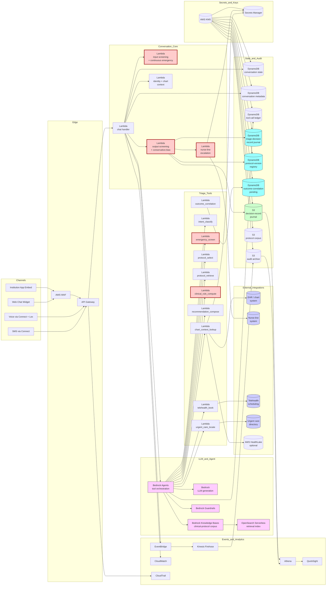

# Recipe 11.6 Architecture and Implementation: Symptom Checker / Triage Bot

*Companion to [Recipe 11.6: Symptom Checker / Triage Bot](chapter11.06-symptom-checker-triage-bot). This page covers the AWS architecture, services, prerequisites, and pseudocode. For the problem framing and the conceptual approach, start with the main recipe.*

---

## The AWS Implementation

### Why These Services

**Amazon Bedrock for the LLM and the embeddings.** Same selection criteria as recipes 11.1 through 11.5. The triage bot specifically benefits from a model with strong tool-use, strong instruction-following for the protocol-grounding and conservative-bias discipline, and conversational warmth for distress-context conversations. Claude Sonnet-class models or comparable frontier models for the orchestration; smaller models for intent classification, emergency screening, and clinical-decision-rule input parsing. Bedrock provides HIPAA-eligible deployment under BAA.

**Amazon Bedrock Knowledge Bases for the clinical-protocol corpus.** The clinical triage protocols (whether licensed Schmitt-Thompson, an institutional adaptation, or institution-built) are the bot's grounded retrieval source. Knowledge Bases provides the managed RAG layer with vector indexing and filtered retrieval. The chunking is per-protocol-section with metadata (protocol_id, protocol_version, decision_point_id, pediatric_vs_adult, special_population_flags, effective_date) to support precise protocol-and-version-scoped retrieval.

**Amazon Bedrock Agents for tool orchestration.** Same selection rationale as the previous chapter 11 recipes. The bot's tools (chart_context_lookup, intent_classify, emergency_screen, protocol_select, protocol_retrieve, clinical_rule_compute, recommendation_compose, nurse_line_escalate, telehealth_book, urgent_care_locate, and others) are defined as Agents action groups with OpenAPI schemas.

**Amazon Bedrock Guardrails for scope and content filtering.** Configured with denied topics including diagnosis-attempted, treatment-recommendation-attempted, drug-prescription-attempted, and off-protocol clinical claims. The triage bot's scope discipline is critical because patients frequently ask the bot to diagnose them or prescribe them, and the bot's regulatory positioning depends on staying out of those domains.

**Amazon OpenSearch Service (or Bedrock-managed vector store) for the retrieval index.** The clinical-protocol corpus is the institution's protocol library plus any reference materials cited within it. OpenSearch Serverless is the typical default for managed vector workloads on AWS.

**AWS HealthLake (optional) for FHIR-native chart-context data.** Where the institution stores patient demographics, problem list, medication list, allergies, and encounter history in FHIR resources, HealthLake provides a managed FHIR data store the chart-context tool queries directly.

**AWS Lambda for the chat handler, tool implementations, and clinical-decision-rule computation.** Same pattern as the previous chapter 11 recipes. The clinical-decision-rule Lambdas implement HEART, Wells, Centor, Ottawa, and other rules as deterministic functions.

**Amazon API Gateway and AWS WAF for the public chat endpoint.** Same as the other recipes. Rate limits tuned for the triage use case (patients sometimes type rapidly when in distress; rate limits should not block legitimate fast-typing).

**Amazon Connect for SMS, voice, and nurse-line handoff.** Patients on phones, patients preferring SMS, and patients escalating to a live nurse are served through Connect. The handoff payload includes the conversation transcript, the protocol used, the answer set, and the computed recommendation.

**Amazon Lex for IVR-style voice channel intent and slot management (optional).** When the triage bot is deployed on a voice channel, Lex handles the speech-recognition front-end while Bedrock handles the conversational reasoning. The voice channel includes accessibility considerations for patients who cannot use chat.

**Amazon DynamoDB for state.** Six tables: `conversation-state`, `conversation-metadata`, `tool-call-ledger`, `triage-decision-record-journal` (durable record of every recommendation with citations), `protocol-version-registry` (tracks which protocol version was active for any conversation), and `outcome-correlation-pending` (pending records awaiting outcome correlation).

**Amazon S3 for protocol-corpus storage, audit archive, triage-decision-record journal, and outcome-correlation data.** Object Lock in compliance mode for the retention window.

**AWS KMS, AWS Secrets Manager, Amazon CloudWatch, AWS CloudTrail, Amazon EventBridge, Amazon Kinesis Data Firehose, AWS Glue, Amazon Athena.** Same operational and audit primitives as the previous recipes.

**Amazon SageMaker (optional) for emergency-screening classifier hosting.** When the institution trains a custom emergency-presentation classifier (rather than relying solely on prompt-based detection), SageMaker provides the hosted-inference endpoint.

**Amazon QuickSight (optional) for compliance, clinical-quality, and operational dashboards.** Per-protocol over-triage and under-triage rate, per-cohort recommendation accuracy, citation-coverage rate, escalation rate, and outcome-correlation dashboards.

### Architecture Diagram



### Prerequisites

| Requirement | Details |
|-------------|---------|
| **AWS Services** | Amazon Bedrock (with Agents, Knowledge Bases, Guardrails, a foundation model selected for tool-use plus an embedding model), Amazon OpenSearch Serverless (for the vector retrieval index), AWS Lambda, Amazon API Gateway, AWS WAF, Amazon DynamoDB, Amazon S3, AWS KMS, AWS Secrets Manager, Amazon CloudWatch, AWS CloudTrail, Amazon EventBridge, Amazon Kinesis Data Firehose, AWS Glue, Amazon Athena. Optionally: AWS HealthLake (for FHIR-native chart context), Amazon Connect (for SMS, voice, and nurse-line handoff), Amazon Lex (for IVR-style voice channel orchestration), Amazon SageMaker (for hosted emergency-screening classifier), Amazon QuickSight (for dashboards). |
| **External Inputs** | EHR or chart-context system providing demographics (age, sex), active problem list, active medication list, allergies, recent visit history, active treatment plans (oncology, transplant, pregnancy), advance directives. Clinical-protocol corpus (institutionally validated and version-controlled): adult triage protocols, pediatric triage protocols, special-population overlays (pregnancy, oncology treatment, transplant, geriatric). The protocol corpus is licensed (Schmitt-Thompson, MTS, or vendor-equivalent) or institution-built with medical-director ownership; either way, version-controlled with effective dates. Clinical-decision-rule library (HEART, Wells, Centor, Ottawa, PERC, others as applicable) implemented as deterministic code with audit trails. Nurse-line system integration with handoff payload schema (separate adult and pediatric where the institution has both). Telehealth scheduling system integration. Urgent care directory with hours, locations, and current capacity where available. Crisis-resource lookup (988 routing, Poison Control, institutional crisis line). Mandatory-reporting workflow integration for disclosures triggering statutory obligations. Outcome-correlation data pipeline pulling subsequent encounter records (ED visits, urgent care visits, primary care visits, hospital admissions) within configurable windows after each triage conversation. |
| **IAM Permissions** | Per-Lambda least-privilege roles. The chart-context Lambda has read-only access to the EHR or HealthLake. The clinical-rule Lambdas have no external-system access (pure compute). The protocol-retrieve Lambda has read access to the protocol corpus in S3 plus the OpenSearch index. The nurse-line-escalate Lambda has the access required to post handoff events to the nurse-line system. None of the bot's Lambdas have write access to the clinical record; the bot is read-only with respect to clinical data. Resource-based policies on each Lambda pin the invoking principal to the production agent or API Gateway stage ARN. |
| **BAA and Compliance** | AWS BAA signed. Verify Amazon Bedrock (with the specific models in scope), Lambda, API Gateway, WAF, DynamoDB, S3, KMS, Secrets Manager, CloudWatch, CloudTrail, EventBridge, Kinesis Firehose, Glue, Athena, OpenSearch Serverless, HealthLake (where used), Connect, Lex (where used), and SageMaker (where used) are HIPAA-eligible at build time. The bot is patient-facing PHI; the audit and retention story must satisfy HIPAA Privacy and Security Rules plus state-specific medical-record retention rules and any FDA SaMD post-market obligations. The clinical-protocol corpus may have specific licensing restrictions if the protocols are licensed from third-party vendors (Schmitt-Thompson, MTS, etc.); the legal team reviews. The institutional regulatory team reviews the FDA-strategy positioning before launch and on each material scope change. The institutional malpractice insurer is part of the policy review.  |
| **Encryption** | Protocol-corpus bucket: SSE-KMS with customer-managed keys, versioning enabled. Audit-archive and triage-decision-record-journal buckets: SSE-KMS with customer-managed keys, Object Lock in compliance mode for the retention window, lifecycle to S3 Glacier Deep Archive after 90 days. DynamoDB tables: customer-managed KMS at rest. Lambda environment variables: KMS-encrypted. Secrets Manager: customer-managed KMS. TLS in transit for all AWS API calls and all integrations with the EHR, nurse-line, telehealth, urgent-care-directory, and crisis-resource systems. The OpenSearch retrieval index encrypted with customer-managed KMS keys. Different KMS key per data class for blast-radius containment. |
| **VPC** | Production: tool Lambdas that call the EHR, nurse-line system, telehealth scheduling, and urgent-care directory run in VPC with controlled egress. PrivateLink to vendor-hosted endpoints where supported; tightly-scoped NAT path with allow-list otherwise. VPC endpoints for DynamoDB, S3, KMS, Secrets Manager, CloudWatch Logs, EventBridge, Bedrock, OpenSearch Serverless, HealthLake (where used), Connect, and SageMaker (where used) so back-office Lambdas do not need public-internet egress for AWS-internal calls. The patient-facing edge (API Gateway, WAF) is public by design; the back-office traffic is private. |
| **CloudTrail** | Enabled with data events on the audit-archive S3 bucket, the triage-decision-record-journal S3 bucket, the protocol-corpus S3 bucket, the DynamoDB conversation, tool-call, decision-record, version-registry, and outcome-correlation tables, the Secrets Manager secrets, and the customer-managed KMS keys. Bedrock and Bedrock Agents invocations logged with metadata. Lambda invocations logged. API Gateway access logs enabled. CloudTrail logs in a dedicated S3 bucket with Object Lock in compliance mode and lifecycle to S3 Glacier Deep Archive after 90 days. Audit retention sized to the longer of HIPAA's six-year minimum, state medical-record retention rules, and FDA SaMD post-market obligations where applicable. |
| **Sample Data** | Synthetic patient profiles stratified by age cohort (pediatric, adolescent, adult, geriatric), by sex, by chart-context complexity (no chronic conditions, single chronic condition, polypharmacy, oncology treatment, immunosuppressed, pregnant, etc.), by language (English plus institution-relevant non-English). Synthetic presenting complaints covering the institution's full protocol library: chest pain (with both true-emergency and benign feature constellations), headache, abdominal pain, fever (adult and pediatric), respiratory symptoms, neurological symptoms (stroke-like presentations), trauma, mental-health crisis, and the long tail. Synthetic clinical-decision-rule input cases covering each rule's score range. Validated emergency-keyword and feature-constellation test cases. Test EHR, nurse-line, telehealth, and urgent-care-directory systems with synthetic data. Validated regulatory-disclaimer phrasings reviewed by the compliance and regulatory team. Validated translations of all patient-facing language reviewed by the institution's language-services team and clinical leadership. |
| **Cost Estimate** | At a mid-sized health system or payer scale (500,000 triage conversations per year; average resolution rate around 60% with the rest escalating to nurse line; average 8-15 turns per resolved conversation; average 1,200 tokens of prompt and 350 tokens of response per turn for the orchestration model plus tool-call overhead): Bedrock LLM invocations typically $0.10-0.50 per resolved conversation for a Sonnet-class orchestration model, totaling approximately $50,000-250,000 per year. Bedrock Agents and Knowledge Bases hosting plus the OpenSearch Serverless retrieval index typically $15,000-50,000 per year. Lambda, API Gateway, WAF, DynamoDB, S3, KMS, Secrets Manager, CloudWatch, CloudTrail, EventBridge, Kinesis Firehose, Glue, Athena total approximately $20,000-80,000 per year combined. AWS HealthLake (when used as the FHIR chart-context source) typically $20,000-90,000 per year depending on data volume. Amazon Connect (for SMS, voice, and nurse-line handoff) typically $10,000-50,000 per year depending on channel mix. Amazon SageMaker (when used for hosted emergency-screening classifier) typically $5,000-20,000 per year. Total AWS infrastructure typically $120,000-540,000 per year at this scale. The infrastructure cost is dominated by the LLM invocation volume and HealthLake (when used). Per-resolved-conversation infrastructure cost is small relative to nurse-line labor savings (a typical nurse-line call costs significantly more than a resolved bot conversation), and is also small relative to the cost of even a single avoided unnecessary ED visit.  |

### Ingredients

| AWS Service | Role |
|------------|------|
| **Amazon Bedrock** | LLM for orchestration and conversational response generation; embedding model for the protocol corpus |
| **Amazon Bedrock Agents** | Tool orchestration: define triage tools as action groups, manage the multi-step LLM-and-tool flow |
| **Amazon Bedrock Knowledge Bases** | Managed RAG over the protocol corpus with metadata-filtered retrieval (protocol_id, protocol_version, decision_point_id, pediatric_vs_adult, special_population_flags, effective_date) |
| **Amazon OpenSearch Serverless** | Vector and lexical retrieval index backing Knowledge Bases |
| **Amazon Bedrock Guardrails** | Content filtering for diagnosis-attempted, treatment-recommendation-attempted, drug-prescription-attempted, off-protocol clinical claims, off-scope topics |
| **AWS Lambda** | Chat handler, input/output screening, identity-and-chart-context loading, nurse-line escalation, and tool implementations (chart_context_lookup, intent_classify, emergency_screen, protocol_select, protocol_retrieve, clinical_rule_compute, recommendation_compose, telehealth_book, urgent_care_locate, outcome_correlation) |
| **Amazon API Gateway** | Public-facing chat endpoint for web, app, SMS, and voice channels |
| **AWS WAF** | Rate limiting, bot detection, common attack patterns (with limits tuned for legitimate triage patterns including fast-typing patients in distress) |
| **Amazon DynamoDB** | conversation-state, conversation-metadata, tool-call-ledger, triage-decision-record-journal, protocol-version-registry, outcome-correlation-pending |
| **Amazon S3** | Protocol corpus, audit archive (conversations), triage-decision-record journal (durable recommendation records with citations), outcome-correlation data |
| **AWS KMS** | Customer-managed encryption keys per data class |
| **AWS Secrets Manager** | Credentials for the EHR, nurse-line, telehealth, urgent-care-directory, and crisis-resource systems |
| **Amazon CloudWatch** | Operational metrics (resolution rate per protocol, escalation rate per protocol, time-to-recommendation, citation-coverage rate, conservative-bias-compliance rate, tool-call success per tool, per-cohort slices); alarms |
| **AWS CloudTrail** | API-level audit logging |
| **Amazon EventBridge** | Triage-event bus for cross-system event flow (conversation_started, protocol_selected, emergency_screened, recommendation_computed, recommendation_delivered, escalation_triggered, outcome_correlation_completed) |
| **Amazon Kinesis Data Firehose** | Streaming audit and telemetry delivery |
| **AWS Glue Data Catalog + Amazon Athena** | SQL access to audit, decision-record, outcome-correlation, and telemetry data |
| **AWS HealthLake (optional)** | FHIR-native chart-context (Patient, Condition, MedicationStatement, AllergyIntolerance, Encounter, CarePlan resources) |
| **Amazon Connect (optional)** | SMS, voice, and nurse-line handoff with conversation-context payload |
| **Amazon Lex (optional)** | IVR-style voice-channel intent and slot management |
| **Amazon SageMaker (optional)** | Hosted emergency-screening classifier inference endpoint |
| **Amazon QuickSight (optional)** | Compliance, clinical-quality, and operational dashboards |

---

### Code

#### Walkthrough

**Step 1: Receive the chat message, bootstrap the session, and run input safety with continuous emergency screening.** This is the architectural floor for the triage bot. The continuous emergency screen runs on every patient utterance, not just the first. A patient who starts with a vague concern and then mid-conversation reveals "actually I am bleeding heavily" needs immediate emergency routing regardless of where the conversation was. Skip this and the bot composes a thoughtful triage answer for a patient who needs an ambulance now.

```pseudocode
ON receive_message(channel, channel_session_id,
                  user_message, auth_context,
                  deep_link_params):
    // Step 1A: identify or create the session.
    session = conversation_state_table.get_or_create({
        channel: channel,
        channel_session_id: channel_session_id,
        auth_context: auth_context,
        deep_link_params: deep_link_params
    })

    IF session.message_count == 0:
        attach_initial_greeting = true

    // Step 1B: persist the user's message.
    conversation_metadata_table.append_turn(
        session_id: session.id,
        turn: {
            speaker: "user",
            text: user_message,
            timestamp: now()
        })

    // Step 1C: standard input safety screening.
    screening_result = screen_input(
        session_id: session.id,
        user_message: user_message,
        language: session.language,
        domain: "symptom_triage")

    IF screening_result.action == "block":
        return handle_block(
            session_id: session.id,
            screening_result: screening_result)

    // Step 1D: continuous emergency screening.
    // Runs on every utterance, not just first.
    emergency_check = emergency_screen_tool.invoke({
        user_message: user_message,
        recent_turns: conversation_metadata_table
            .recent_turns(session.id, k: 6),
        chart_context_summary:
            session.chart_context_summary,
        language: session.language
    })

    audit_tool_call(
        session_id: session.id,
        tool: "emergency_screen",
        result_summary: {
            emergency_detected:
                emergency_check.emergency_detected,
            emergency_category:
                emergency_check.category,
            confidence: emergency_check.confidence
        })

    IF emergency_check.emergency_detected:
        return handle_emergency_routing(
            session_id: session.id,
            emergency_category:
                emergency_check.category,
            urgency:
                emergency_check.urgency)
        // Routes immediately to 911, 988, or
        // institutional crisis line as appropriate;
        // bot stays on the line with stay-safe
        // guidance and wakes a nurse for real-time
        // backup where the institution supports it.

    // Step 1E: continue to flow handling.
    return handle_message(
        session_id: session.id,
        user_message: user_message,
        attach_initial_greeting:
            attach_initial_greeting)
```

**Step 2: On a fresh session, load the patient's chart context.** This is what makes the bot patient-specific rather than generic. The protocol selection and the recommendation calibration both depend on chart context. A 25-year-old with no chronic conditions and a 75-year-old with anticoagulation and hypertension presenting with the same chief complaint should receive different recommendations. Skip this step and the bot's recommendations are no better than a generic web symptom checker.

```pseudocode
FUNCTION load_chart_context(session_id):
    // Step 2A: chart context lookup.
    chart = chart_context_lookup_tool.invoke({
        patient_id: session.verified_patient_id,
        scope: [
            "demographics",
            "active_problems",
            "active_medications",
            "allergies",
            "recent_visits_90d",
            "active_treatment_plans"
        ]
    })

    audit_tool_call(
        session_id: session_id,
        tool: "chart_context_lookup",
        result_summary: {
            age_cohort: chart.age_cohort,
            sex: chart.sex,
            problem_count:
                len(chart.active_problems),
            medication_count:
                len(chart.active_medications),
            recent_visit_count:
                len(chart.recent_visits),
            active_treatment_plans:
                chart.active_treatment_plans,
            high_risk_medications_present:
                chart.high_risk_medications_present,
            language_preferences:
                chart.language_preferences,
            advance_directives_on_file:
                chart.advance_directives_on_file
        })

    // Step 2B: pediatric-vs-adult flag and
    // special-population flags.
    session.pediatric_vs_adult =
        chart.age_cohort == "pediatric"
            ? "pediatric" : "adult"

    session.special_population_flags = [
        flag for flag in [
            "pregnancy",
            "active_oncology_treatment",
            "post_transplant",
            "immunosuppressed",
            "anticoagulated",
            "geriatric_frailty",
            "dialysis"
        ] IF chart.has_flag(flag)
    ]

    // Step 2C: stamp the session with chart-context
    // freshness for audit.
    session.chart_context_as_of_date =
        chart.as_of_date

    session.chart_context = chart
    session.chart_context_summary =
        chart.summary_for_emergency_screen

    return { action: "chart_context_loaded" }
```

**Step 3: Identify the presenting symptom and select the protocol.** The bot maps the patient's free-form complaint to one of the institution's validated protocols. Multi-symptom presentations select the highest-acuity-eligible protocol with cross-reference to the others. Pediatric versus adult, pregnancy, oncology treatment, and other special-population flags route to the appropriate protocol variant. Skip this and the bot tries to ask one-size-fits-all questions, which is the failure mode of the previous-generation symptom checkers.

```pseudocode
FUNCTION select_protocol(session_id, user_message):
    // Step 3A: identify the presenting symptom(s).
    symptom_id = intent_classify_tool.invoke({
        user_message: user_message,
        recent_turns: conversation_metadata_table
            .recent_turns(session_id, k: 4),
        chart_context: session.chart_context
    })

    audit_tool_call(
        session_id: session_id,
        tool: "intent_classify",
        result_summary: {
            primary_symptom: symptom_id.primary,
            secondary_symptoms:
                symptom_id.secondary,
            confidence: symptom_id.confidence
        })

    IF symptom_id.confidence < INTENT_CONFIDENCE_THRESHOLD:
        return ask_clarifying_question(
            session_id: session_id,
            user_message: user_message)

    // Step 3B: select the protocol.
    protocol_select = protocol_select_tool.invoke({
        primary_symptom: symptom_id.primary,
        secondary_symptoms: symptom_id.secondary,
        pediatric_vs_adult:
            session.pediatric_vs_adult,
        special_population_flags:
            session.special_population_flags,
        chart_context: session.chart_context
    })

    audit_tool_call(
        session_id: session_id,
        tool: "protocol_select",
        result_summary: {
            selected_protocol:
                protocol_select.protocol_id,
            protocol_version:
                protocol_select.protocol_version,
            cross_reference_protocols:
                protocol_select.cross_reference_protocols,
            out_of_scope:
                protocol_select.out_of_scope
        })

    IF protocol_select.out_of_scope:
        return route_out_of_scope(
            session_id: session_id,
            reason: protocol_select.out_of_scope_reason,
            referral: protocol_select.referral_target)
        // E.g., suspected ingestion routes to Poison
        // Control; severe psychiatric crisis routes
        // to 988 or institutional crisis pathway;
        // active-labor presentation in pregnancy may
        // route to L&D directly per protocol.

    // Step 3C: stamp the session with selected
    // protocol and version.
    session.selected_protocol_id =
        protocol_select.protocol_id
    session.selected_protocol_version =
        protocol_select.protocol_version
    session.cross_reference_protocols =
        protocol_select.cross_reference_protocols

    return {
        action: "protocol_selected",
        protocol_id: protocol_select.protocol_id
    }
```

**Step 4: Conduct the structured protocol-driven questioning.** The bot follows the protocol's question sequence in conversational form. The LLM may rephrase questions for clarity and may adjust order based on what the patient has volunteered. The bot does not skip protocol questions, does not invent new ones, and does not drift outside the protocol's scope. Continuous emergency screening runs in parallel on every patient response. Skip this step and the bot has no clinical foundation for its recommendation.

```pseudocode
FUNCTION conduct_protocol_questioning(session_id):
    protocol = protocol_retrieve_tool.invoke({
        protocol_id:
            session.selected_protocol_id,
        protocol_version:
            session.selected_protocol_version,
        chart_context: session.chart_context
    })

    answer_set = {}
    next_question = protocol.first_question

    WHILE next_question IS NOT NULL:
        // Step 4A: ask the question.
        bot_response = compose_protocol_question(
            question: next_question,
            chart_context: session.chart_context,
            previous_turns: conversation_metadata_table
                .recent_turns(session_id, k: 4),
            language: session.language)

        deliver_bot_response(
            session_id: session_id,
            response: bot_response)

        // Step 4B: receive the patient's response.
        patient_response = await_patient_response(
            session_id: session_id)

        // Step 4C: continuous emergency screening.
        emergency_check = emergency_screen_tool.invoke({
            user_message: patient_response,
            recent_turns: conversation_metadata_table
                .recent_turns(session_id, k: 6),
            chart_context_summary:
                session.chart_context_summary,
            language: session.language
        })

        IF emergency_check.emergency_detected:
            return handle_emergency_routing(
                session_id: session_id,
                emergency_category:
                    emergency_check.category,
                urgency: emergency_check.urgency)

        // Step 4D: parse the answer.
        parsed_answer = parse_protocol_answer(
            question: next_question,
            patient_response: patient_response,
            language: session.language)

        IF parsed_answer.confidence < ANSWER_CONFIDENCE_THRESHOLD:
            // Re-ask with a clarifying rephrase
            // before falling through to escalation.
            bot_response =
                compose_clarifying_followup(
                    original_question: next_question,
                    patient_response: patient_response,
                    language: session.language)
            deliver_bot_response(
                session_id: session_id,
                response: bot_response)
            patient_response =
                await_patient_response(
                    session_id: session_id)
            parsed_answer = parse_protocol_answer(
                question: next_question,
                patient_response: patient_response,
                language: session.language)

            IF parsed_answer.confidence
                    < ANSWER_CONFIDENCE_THRESHOLD:
                return route_to_nurse_line(
                    session_id: session_id,
                    reason: "answer_ambiguous",
                    answer_set_so_far: answer_set)

        // Step 4E: store the answer.
        answer_set[next_question.id] = parsed_answer

        // Step 4F: protocol decides next question
        // based on answers so far.
        next_question = protocol.next_question(
            answer_set: answer_set,
            chart_context: session.chart_context)

    session.protocol_answer_set = answer_set
    return { action: "protocol_questions_complete" }
```

**Step 5: Compute clinical-decision rules where the protocol calls for them.** The arithmetic for HEART, Wells, Centor, Ottawa, and similar rules is structured. The LLM does this poorly. The deterministic clinical-rule tool encapsulates the computation, returns a structured score with risk stratum and rule-mapped recommendation, and the LLM presents the result. Skip the deterministic tool and the bot's risk stratification is sometimes wrong by enough to change the recommendation.

```pseudocode
FUNCTION compute_clinical_rules(session_id):
    protocol = session.selected_protocol
    rule_invocations = protocol.rules_to_invoke(
        answer_set: session.protocol_answer_set,
        chart_context: session.chart_context)

    rule_results = []
    FOR rule_invocation IN rule_invocations:
        rule_result =
            clinical_rule_compute_tool.invoke({
                rule_id: rule_invocation.rule_id,
                rule_version:
                    rule_invocation.rule_version,
                inputs: rule_invocation.inputs
                    .resolve_from(
                        answer_set: session
                            .protocol_answer_set,
                        chart_context:
                            session.chart_context)
            })

        audit_tool_call(
            session_id: session_id,
            tool: "clinical_rule_compute",
            result_summary: {
                rule_id: rule_result.rule_id,
                rule_version: rule_result.rule_version,
                score: rule_result.score,
                risk_stratum:
                    rule_result.risk_stratum,
                recommendation:
                    rule_result.recommendation
            })

        rule_results.append(rule_result)

    session.clinical_rule_results = rule_results
    return { action: "clinical_rules_computed" }
```

**Step 6: Compute the acuity recommendation with conservative-bias enforcement.** The recommendation combines the protocol decision logic with any clinical-decision-rule outputs. When the protocol-driven and rule-driven recommendations diverge, the higher-acuity recommendation wins. Special-population flags can upgrade acuity (anticoagulated patient with bleeding presentation, immunosuppressed patient with infection presentation, oncology patient with neutropenic-fever-like presentation). Skip the conservative-bias enforcement and the bot occasionally selects a lower-acuity recommendation when the chart context warranted otherwise.

```pseudocode
FUNCTION compute_recommendation(session_id):
    protocol_recommendation =
        session.selected_protocol.recommend(
            answer_set: session.protocol_answer_set,
            chart_context: session.chart_context)

    rule_recommendations = [
        rule.recommendation
        FOR rule IN session.clinical_rule_results
    ]

    // Conservative-bias: take the highest-acuity
    // recommendation across protocol and rules.
    candidate_recommendations = [
        protocol_recommendation
    ] + rule_recommendations

    base_recommendation = highest_acuity(
        candidate_recommendations)

    // Special-population upgrades.
    upgraded_recommendation = apply_special_population_upgrades(
        base_recommendation: base_recommendation,
        special_population_flags:
            session.special_population_flags,
        answer_set: session.protocol_answer_set,
        chart_context: session.chart_context)

    final_recommendation = upgraded_recommendation

    audit_tool_call(
        session_id: session_id,
        tool: "recommendation_compose",
        result_summary: {
            protocol_recommendation:
                protocol_recommendation.care_level,
            rule_recommendations: [
                r.care_level
                FOR r IN rule_recommendations
            ],
            base_recommendation:
                base_recommendation.care_level,
            final_recommendation:
                final_recommendation.care_level,
            special_population_upgrades_applied:
                final_recommendation
                    .upgrades_applied
        })

    session.final_recommendation = final_recommendation
    return { action: "recommendation_computed" }
```

**Step 7: Run output safety screening with citation verification and conservative-bias verification.** Every recommendation must trace to a cited protocol, with the protocol version preserved. Conservative-bias verification re-checks that the bot took the higher-acuity path where the recommendation could plausibly have been higher acuity. Required regulatory disclaimers must be present. Emergency-instruction completeness checks for high-acuity recommendations. Red-flag-symptom completeness checks for low-acuity recommendations. Skip this step and the bot occasionally produces ungrounded, under-acuity, or under-instructed recommendations.

```pseudocode
FUNCTION screen_output(session_id, response,
                       tool_call_history):
    // Step 7A: standard checks.
    standard_check = standard_output_screen.evaluate(
        response: response,
        session_context:
            session_context_for(session_id))

    IF standard_check.action != "deliver":
        return standard_check

    // Step 7B: scope checks specific to triage.
    scope_violation = detect_triage_scope_violations(
        response: response)
    // Categories:
    // - diagnosis_attempted
    // - treatment_recommendation_attempted
    // - drug_prescription_attempted
    // - off_protocol_clinical_claim_attempted

    IF scope_violation:
        return {
            action: "replace_with_safe_response",
            replacement:
                TRIAGE_OUT_OF_SCOPE_TEMPLATE,
            violation: scope_violation.category
        }

    // Step 7C: citation verification. Every
    // recommendation in the response must be
    // backed by a cited protocol decision point;
    // every clinical-rule score must trace to a
    // tool result.
    citation_check = verify_citation_grounding(
        response: response,
        cited_protocol_id:
            session.selected_protocol_id,
        cited_protocol_version:
            session.selected_protocol_version,
        cited_decision_points:
            response.cited_decision_points,
        rule_results: session.clinical_rule_results)

    IF citation_check.has_ungrounded_assertions:
        return {
            action: "regenerate_with_grounding",
            ungrounded_assertions:
                citation_check
                    .ungrounded_assertions
        }

    // Step 7D: conservative-bias verification.
    bias_check = verify_conservative_bias(
        response: response,
        recommendation: session.final_recommendation,
        protocol_recommendation:
            session.protocol_recommendation,
        rule_recommendations:
            session.rule_recommendations,
        chart_context: session.chart_context)

    IF NOT bias_check.compliant:
        return {
            action: "regenerate_with_higher_acuity",
            details: bias_check.details
        }

    // Step 7E: instructions completeness.
    instructions_check =
        verify_instructions_completeness(
            response: response,
            care_level:
                session.final_recommendation
                    .care_level,
            language: session.language)

    IF NOT instructions_check.complete:
        return {
            action: "augment_with_instructions",
            missing_instructions:
                instructions_check.missing
        }

    // Step 7F: regulatory disclaimer presence.
    disclaimer_check = verify_disclaimers(
        response: response,
        institution_regulatory_position:
            INSTITUTION_REGULATORY_POSITION,
        language: session.language)

    IF NOT disclaimer_check.present:
        return {
            action: "augment_with_disclaimer",
            missing_disclaimers:
                disclaimer_check.missing
        }

    // Step 7G: persona-and-tone check.
    persona_check =
        persona_and_tone_evaluator.evaluate(
            response: response,
            care_level:
                session.final_recommendation
                    .care_level,
            language: session.language)

    IF persona_check.action != "acceptable":
        return {
            action: "regenerate_with_persona_correction",
            persona_guidance:
                persona_check.guidance
        }

    return {
        action: "deliver",
        response: response
    }
```

**Step 8: Persist the durable triage-decision record alongside the conversation log.** The conversation log captures the dialog. The triage-decision-record journal captures, separately, every recommendation with its citation evidence and version stamps. This is the audit surface for clinical-quality review, for regulatory review (where applicable), for outcome correlation, and for any case where the recommendation is later disputed. Skip this and the audit story is intact only at the conversation level, which is enough for some reviews and not enough for clinical-quality and regulatory ones.

```pseudocode
FUNCTION persist_triage_decision_record(
        session_id, response):
    decision_record = {
        decision_id: generate_decision_id(),
        session_id: session_id,
        patient_id: session.verified_patient_id,
        pediatric_vs_adult:
            session.pediatric_vs_adult,
        special_population_flags:
            session.special_population_flags,
        presenting_complaint:
            session.most_recent_user_message_at_intake,
        protocol_id:
            session.selected_protocol_id,
        protocol_version:
            session.selected_protocol_version,
        protocol_answer_set:
            session.protocol_answer_set,
        clinical_rule_results:
            session.clinical_rule_results,
        recommendation_care_level:
            session.final_recommendation.care_level,
        recommendation_rationale:
            session.final_recommendation.rationale,
        recommendation_text: response.text,
        active_chart_context_as_of_date:
            session.chart_context_as_of_date,
        active_model_id: session.model_id,
        active_prompt_version: session.prompt_version,
        active_agent_version: session.agent_version,
        delivered_at: now(),
        channel: session.channel,
        language: session.language,
        nurse_line_escalation_status:
            session.nurse_line_escalation_status
    }

    triage_decision_record_journal.write(
        decision_record)

    EventBridge.PutEvents([{
        source: "triage_bot",
        detail_type: "recommendation_delivered",
        detail: {
            decision_id: decision_record.decision_id,
            session_id: session_id,
            care_level:
                decision_record
                    .recommendation_care_level,
            protocol_id:
                decision_record.protocol_id
        }
    }])

    // Queue for outcome correlation (long-term).
    outcome_correlation_pending_table.write({
        decision_id: decision_record.decision_id,
        patient_id:
            session.verified_patient_id,
        recommendation_care_level:
            decision_record.recommendation_care_level,
        delivered_at:
            decision_record.delivered_at,
        correlation_window_end:
            now() + 72_HOURS,
        status: "pending"
    })
```

**Step 9: Persist the durable conversation record on session close.** Same archive pattern as the previous chapter 11 recipes, with triage-specific dimensions on the cohort axes (pediatric-vs-adult, age cohort, sex, language, channel, presenting symptom category, protocol used, recommended care level, escalation disposition).

```pseudocode
FUNCTION close_conversation_and_archive(session_id,
                                         reason):
    state = conversation_state_table.get(session_id)
    metadata =
        conversation_metadata_table.get(session_id)
    tool_calls =
        tool_call_ledger.for_session(session_id)

    audit_record = {
        session_id: session_id,
        channel: state.channel,
        started_at: state.started_at,
        ended_at: now(),
        language: state.language,
        verified_patient_id: state.verified_patient_id,
        pediatric_vs_adult: state.pediatric_vs_adult,
        special_population_flags:
            state.special_population_flags,
        assurance_level: state.assurance_level,
        turns: [
            redact_user_phi_for_audit(turn)
            for turn in metadata.turns
        ],
        tool_calls: [
            redact_sensitive_args(call)
            for call in tool_calls
        ],
        protocols_consulted:
            state.protocols_consulted,
        recommendations_emitted:
            state.recommendation_count,
        active_model_id_at_session: state.model_id,
        active_prompt_version_at_session:
            state.prompt_version,
        active_agent_version_at_session:
            state.agent_version,
        active_kb_version_at_session: state.kb_version,
        active_protocol_version_at_session:
            state.selected_protocol_version,
        completion_status:
            state.completion_status,
            // resolved | escalated_to_nurse |
            // emergency_routed | crisis_routed |
            // patient_abandoned
        cohort_axes: {
            language: state.language,
            channel: state.channel,
            pediatric_vs_adult: state.pediatric_vs_adult,
            age_cohort: state.chart_context.age_cohort,
            sex: state.chart_context.sex,
            primary_presenting_symptom:
                state.primary_presenting_symptom,
            recommended_care_level:
                state.final_recommendation.care_level,
            special_population_flags:
                state.special_population_flags
        },
        close_reason: reason
    }

    audit_archive_kinesis_firehose.put(audit_record)

    EventBridge.PutEvents([{
        source: "triage_bot",
        detail_type: "conversation_closed",
        detail: {
            session_id: session_id,
            channel: state.channel,
            disposition: state.completion_status,
            primary_presenting_symptom:
                state.primary_presenting_symptom,
            recommended_care_level:
                state.final_recommendation
                    ?.care_level,
            turn_count: len(metadata.turns)
        }
    }])

    cloudwatch.put_metric(
        namespace: "TriageBot",
        metric_name: "ConversationResolved",
        value: 1 IF state.completion_status
                    == "resolved" ELSE 0,
        dimensions: {
            channel: state.channel,
            language: state.language,
            pediatric_vs_adult:
                state.pediatric_vs_adult,
            primary_presenting_symptom:
                state.primary_presenting_symptom,
            recommended_care_level:
                state.final_recommendation
                    ?.care_level
        })

    cloudwatch.put_metric(
        namespace: "TriageBot",
        metric_name: "EscalationToNurseLine",
        value: 1 IF state.completion_status
                    == "escalated_to_nurse" ELSE 0,
        dimensions: {
            channel: state.channel,
            language: state.language,
            pediatric_vs_adult:
                state.pediatric_vs_adult,
            primary_presenting_symptom:
                state.primary_presenting_symptom
        })

    cloudwatch.put_metric(
        namespace: "TriageBot",
        metric_name: "EmergencyRouting",
        value: 1 IF state.completion_status
                    == "emergency_routed" ELSE 0,
        dimensions: {
            channel: state.channel,
            language: state.language,
            pediatric_vs_adult:
                state.pediatric_vs_adult,
            primary_presenting_symptom:
                state.primary_presenting_symptom
        })

    cloudwatch.put_metric(
        namespace: "TriageBot",
        metric_name: "CitationCoverageRate",
        value: state.citation_coverage_rate,
        dimensions: {
            primary_presenting_symptom:
                state.primary_presenting_symptom,
            language: state.language
        })
```

> **Curious how this looks in Python?** The pseudocode above covers the concepts. If you'd like to see sample Python code that demonstrates these patterns using boto3, check out the [Python Example](chapter11.06-python-example). It walks through each step with inline comments and notes on what you'd need to change for a real deployment.

---

### Cross-Cutting Architectural Commitments

The following commitments are not optional hardening for a future phase. They are architectural primitives that must be designed-in from the first iteration. The recipe's pseudocode assumes them; production deployments that omit them carry unacceptable clinical, regulatory, and operational risk.

#### Clinical-Protocol-Corpus-as-Code Lifecycle

The protocol corpus is the bot's clinical authority. Treat it as production code with a full software-lifecycle discipline.

**Versioning.** Each protocol carries a semantic version (MAJOR.MINOR.PATCH). MAJOR increments when care-level mappings or decision-point logic changes. MINOR increments for clarification or new special-population overlays. PATCH increments for typo or formatting corrections.

**Testing.** Each protocol version is validated against a held-out corpus of triage cases before promotion. The held-out cases cover typical presentations, atypical presentations, edge-case presentations, and previously-observed failure modes. Sandbox testing runs the new protocol version through the full pipeline (protocol-selection, questioning, rule-computation, recommendation-composition, output-screening) against the held-out set and compares outcomes to the prior version.

**Staged rollout.** New protocol versions deploy through a per-protocol canary: 5% of conversations matching the protocol's symptom-category route to the new version; the remainder route to the current version. Per-protocol canary metrics (over-triage rate, under-triage rate, escalation rate, citation-coverage rate) are compared; rollback triggers automatically on regression.

**Ownership.** Each protocol is owned jointly by the medical director, the nurse-line clinical leadership, compliance, and the regulatory team. The medical director's sign-off is the launch gate for any protocol version.

**Audit trail.** Every triage-decision record stamps the protocol_id and protocol_version active at the time of the recommendation. The protocol-version-registry DynamoDB table maps each protocol_id to its version history with effective dates.

**Review cadence.** Annual review of each protocol by clinical leadership plus ad-hoc review when clinical evidence or outcome-correlation data indicates a revision is warranted.

**Parallel governance assets.** The same versioning, testing, staged-rollout, ownership, audit-trail, and review-cadence discipline applies to:
- The clinical-decision-rule library (HEART, Wells, Centor, Ottawa, etc.)
- The emergency-screening corpus (keyword vocabulary plus classifier training data)
- The FDA-strategy artifact
- The conservative-bias-default policy
- The mandatory-reporting-routing policy

Each of these assets carries its own semantic version, its own held-out test set, its own canary discipline, and its own clinical-leadership sign-off.

#### Working-Store vs. Archive-Store Data Discipline

The DynamoDB tables on the real-time hot path hold structural references and metadata. Full-content records route to S3 archives.

**Hot path (DynamoDB):** conversation-state (active session metadata), conversation-metadata (turn-level structural data for the active session), tool-call-ledger (tool invocation metadata including tool name, version, latency, outcome code), triage-decision-record-journal (structured recommendation record with protocol_id, protocol_version, care_level, rule_results, citation references), protocol-version-registry (version-to-effective-date mappings), outcome-correlation-pending (pending correlation records).

**Archive path (S3 with Object Lock):** Full protocol-content text used at recommendation time, full clinical-decision-rule input/output detail, full chart-context detail, full conversation transcript, full tool-call argument and response payloads. Each class is encrypted with a per-class KMS key for blast-radius containment.

**Retention floors.** Per-record-class retention is the longest of:
- HIPAA's six-year minimum for PHI
- State-specific medical-record retention rules (typically 7-10+ years for adult records; pediatric records often retained until age of majority plus the state's adult retention period, sometimes producing 25+ year retention windows)
- FDA SaMD post-market obligations where applicable
- Per-channel retention obligations (TCPA/10DLC for SMS; voice-channel recording retention rules)
- The institutional regulatory floor

The retention-floor calculation is per-record-class: audit-archive, triage-decision-record-journal, protocol-version-stamp-registry, conversation-log, tool-call-ledger, and outcome-correlation-pending may each have different floors. The S3 lifecycle policy for each class reflects its specific floor.

**Sensitive-disclosure surface.** Mandatory-reporting-relevant disclosures (child abuse, elder abuse, intimate-partner violence, psychiatric crisis) route to a separately-governed storage surface with restricted access limited to designated mandatory-reporter clinical staff plus compliance plus legal. Access to this surface is audited separately from the general conversation archive.

#### Per-Cohort Monitoring with Launch-Gate Discipline

Per-cohort monitoring is not a dashboard exercise. It is a launch-gate: each cohort meets threshold before the bot goes live for that cohort.

**Single-axis cohorts:** per-language, per-channel, per-pediatric-vs-adult, per-age-cohort, per-sex, per-presenting-symptom-category, per-chart-context-completeness, per-recommended-care-level.

**Two-axis cohorts:** per-language-by-channel, per-pediatric-vs-adult-by-presenting-symptom, per-presenting-symptom-by-recommended-care-level.

**Three-axis cohort:** per-language-by-pediatric-vs-adult-by-presenting-symptom-category.

**Per-cohort threshold metrics:**
- Resolution rate
- Escalation rate
- Over-triage rate (separate threshold)
- Under-triage rate (separate, patient-safety-acute threshold)
- Citation-coverage rate
- Regulatory-disclaimer-presence rate
- Conservative-bias-compliance rate
- Intent-classification accuracy
- Emergency-screening sensitivity per emergency category
- Outcome-correlation accuracy at 72-hour and 30-day windows
- Time-to-recommendation by acuity
- Handoff-with-context-completeness rate
- Plan-document retrieval accuracy and protocol-version-correctness rate
- Equity-disparity flags by sex, race, age, and language with statistical-significance flags
- Sustained-utilization rate
- Patient-satisfaction score

**Launch-gate discipline:** Institution-wide-average is informational only. Each cohort must independently meet its threshold before serving live patients in that cohort. Cohorts that do not meet threshold either do not launch or route 100% to nurse-line escalation until threshold is met.

#### Continuous-Emergency-Screening as Separately-Validated Pipeline

The emergency-screening pipeline is the patient-safety floor. It runs on every utterance. It is validated separately from the rest of the conversational pipeline.

**Held-out corpus.** Clinical leadership curates a held-out emergency-case corpus covering each emergency category: cardiac, neurological (stroke, seizure), respiratory, hemorrhagic, anaphylaxis, overdose, trauma, psychiatric (suicidal ideation, active self-harm), pediatric-specific (febrile infant, lethargic infant, suspected meningitis, suspected non-accidental trauma), and obstetric (placental abruption, eclampsia, cord prolapse).

**Per-category sensitivity targets.** Each emergency category has a documented sensitivity target set by clinical leadership. The false-negative rate for each category is the launch-gate metric.

**Per-cohort screening accuracy.** Emergency-screening accuracy is reviewed per cohort (per-language, per-age-cohort, per-channel). Sensitivity degradation in any cohort triggers immediate investigation and deployment hold.

**Version stamping.** Each conversation's audit record stamps the emergency-screening classifier version active for that conversation. Classifier updates go through the same canary discipline as protocol versions.

#### Faithfulness-Check Stage

Between Bedrock generation and response delivery, an independent faithfulness verifier runs structured validation on the composed response.

**Verification targets:**
- Every recommendation traces to a cited protocol decision point
- Every clinical-rule score traces to a tool-call result
- Emergency instructions are present for high-acuity recommendations
- Red-flag-symptom lists are present for low-acuity recommendations
- Conservative-bias-default handling is present where multiple acuity levels were plausible
- Citations are present wherever a recommendation is made
- Regulatory disclaimers are present per the institution's regulatory positioning

**Implementation.** An independent verifier model (smaller, cheaper, configured for structured-output schema validation) evaluates the response against the above targets. Rule-based contradiction detection and omission detection supplement the model-based check. On failure: regenerate with corrective guidance (up to a configurable attempt budget), then fall back to a safe-default response template that routes the patient to nurse-line escalation rather than delivering an unverified recommendation.

**Per-cohort faithfulness-failure rate** is a launch-gate metric. Cohorts exceeding the threshold do not serve live patients.

#### Prompt-Injection Defense as Architectural Primitive

Patient-facing chat surfaces are adversarial by default. The triage bot's prompt-injection defense is not a filter; it is an architectural layer.

**Delimited-input framing.** User input is wrapped in explicit delimiters in the system prompt, clearly separated from instruction content.

**Tool-Lambda enforcement.** Every tool-Lambda validates that the patient_id argument matches the verified session's patient_id. Cross-patient data access via manipulated tool arguments is rejected at the Lambda level, not the prompt level.

**Per-language jailbreak-test corpus.** The security team maintains a jailbreak-test corpus including triage-specific injection cases: attempts to manipulate emergency_screen to suppress alerts, attempts to manipulate clinical_rule_compute to lower scores, attempts to manipulate protocol_select to route to the wrong protocol, attempts to manipulate recommendation_compose to downgrade care level.

**Bedrock Guardrails configuration.** Denied topics specific to diagnosis, treatment recommendation, and drug prescription. Content filtering configured per the institution's regulatory positioning.

**Audit logging.** Cross-check outcomes (injection detected, blocked, logged) are written to the tool-call-ledger for security review.

#### Disaster Recovery Topology

Per-stage failover policy with documented behavior for each dependency outage:

| Dependency Outage | Failover Behavior |
|-------------------|-------------------|
| Bedrock LLM | Degraded-mode response template; direct nurse-line routing for all active conversations |
| Bedrock Knowledge Bases | Cached-recent-retrieval from DynamoDB where available; nurse-line escalation for new conversations |
| Bedrock Agents | Fallback to direct Lambda orchestration without Agents abstraction |
| Bedrock Guardrails | Stricter system-prompt scope enforcement; no Guardrails-bypass permitted |
| OpenSearch Serverless | Cached-recent-retrieval fallback; nurse-line escalation for protocol lookups that miss cache |
| DynamoDB | Conservative session-state recreation from the last-archived checkpoint; new conversations route to nurse line |
| S3 (protocol corpus) | Graceful read-failure; Kinesis-buffered audit continues; nurse-line routing for all new conversations |
| EHR / chart-context system | Conservative no-context fallback (bot proceeds without chart context, applies higher conservative-bias floor) |
| Clinical-decision-rule tool | Conservative no-rule fallback (bot applies protocol recommendation only, with elevated acuity floor) |
| Emergency-screening classifier | Conservative default: elevate acuity for any ambiguous input; nurse-line routing threshold lowered |
| Nurse-line system | Channel fallback: voice through Connect, transfer to backup nurse line; SMS notification to on-call nurse supervisor |
| Connect (voice/SMS) | Channel fallback to web/app chat only; degraded-mode notice on IVR |

**Failover-detection thresholds** are per-dependency with CloudWatch alarms. **Failover-back triggers** require dependency health confirmed for a configurable stability window before resuming normal routing. **Quarterly testing cadence** exercises each failover path in a non-production environment with synthetic traffic. **Cross-region failover** for Bedrock and the institutional integrations is documented and tested annually.

#### Multi-Language Deployment as Day-One Architectural Primitive

Multi-language support is not a phase-two feature. The architecture assumes validated multi-language assets from the first production release.

**Validated protocol translations.** No ad-hoc machine translation for clinical triage content. Each protocol-language combination is translated by a qualified medical translator, reviewed by a native-speaker clinician, and signed off by clinical leadership. The translation carries its own version number tied to the source protocol version.

**Validated regulatory-disclaimer translations.** Per-language disclaimer phrasings reviewed by compliance and regulatory counsel for each language.

**Validated emergency-instruction translations.** Per-language emergency instructions reviewed by clinical leadership.

**Validated red-flag-symptom lists.** Per-language symptom lists reviewed by clinical leadership.

**Per-language persona and tone calibration.** Cultural and linguistic norms for conversational tone vary; the bot's persona is calibrated per language by native-speaker UX review.

**Per-language asset versioning.** Each translation asset carries a version number. The triage-decision-record stamps the language-asset version active at recommendation time.

**Per-language launch-gate.** Each language goes live only when its per-cohort metrics meet threshold. Languages that do not meet threshold route to nurse-line escalation with language-preference flagged.

#### Outcome-Correlation Pipeline as Architectural Primitive

The bot's clinical performance is measured against actual subsequent care utilization. This is not a reporting exercise; it feeds the protocol-revision loop.

**Data integration.** Subsequent encounter records from the institution's ED, urgent care, primary care, and hospital admissions systems, plus claims data where available for cross-institution utilization, are correlated with triage-decision records.

**Correlation windows.** 72-hour window for acute-acuity validation (did a patient told to go to the ED actually go?). 30-day window for lower-acuity validation (did a patient told to see primary care actually see primary care, and what was the outcome?).

**Per-protocol metrics.** Over-triage rate (patient sent to higher acuity than needed) and under-triage rate (patient sent to lower acuity than needed, with subsequent higher-acuity encounter) calculated per protocol.

**Protocol-revision feedback loop.** Protocols with bottom-quartile outcome-correlation scores are flagged for clinical-leadership review. Sustained underperformance triggers protocol revision.

**Clinical-quality-review cadence.** Monthly review by the medical director, data science, nurse-line operations, and compliance.

**Operational ownership.** Jointly held by the medical director, data science, nurse-line operations, and compliance.

#### Per-Event Idempotency Keys for the EventBridge Triage-Lifecycle Bus

Every event on the triage-lifecycle EventBridge bus carries an idempotency key to support exactly-once downstream processing.

| Event | Idempotency Key |
|-------|-----------------|
| `conversation_started` | `(session_id, "started")` |
| `protocol_selected` | `(session_id, protocol_event_id, "selected")` |
| `emergency_screened` | `(session_id, screen_event_id, "screened")` |
| `recommendation_computed` | `(decision_id, "computed")` |
| `recommendation_delivered` | `(decision_id, "delivered")` |
| `escalation_triggered` | `(session_id, escalation_event_id, "escalated")` |
| `outcome_correlation_completed` | `(decision_id, "correlated")` |
| `conversation_closed` | `(session_id, "closed")` |

Downstream consumers maintain a deduplication store (DynamoDB conditional writes or equivalent) keyed on these idempotency keys with a TTL sized to the maximum EventBridge retry window.

#### Tool-Surface Contract Management

Each tool in the Bedrock Agents action-group surface is a versioned contract.

**Per-tool versioned schemas.** Each tool's OpenAPI schema carries a semantic version. The version increments on any input or output schema change.

**Deprecation policy.** Deprecated tool versions remain available for a documented sunset window (minimum one protocol-review-cycle). New conversations route to the current version; in-flight conversations complete on the version they started with.

**Backward-compatibility discipline.** Additive-only changes are MINOR version increments. Breaking changes (removed fields, changed semantics) are MAJOR version increments requiring the staged-rollout discipline.

**Change-management ownership.** Tool-surface changes are jointly owned by engineering, the medical director, and compliance. Clinical-facing tools (protocol_retrieve, clinical_rule_compute, emergency_screen, recommendation_compose) require medical-director sign-off on schema changes.

**Per-tool audit stamp.** The session-close audit_record includes active-version stamps for every tool invoked during the conversation: chart_context_lookup_tool, intent_classify_tool, emergency_screen_tool, protocol_select_tool, protocol_retrieve_tool, clinical_rule_compute_tool, recommendation_compose_tool, nurse_line_escalate_tool, telehealth_book_tool, urgent_care_locate_tool.

**Per-tool canary deployment.** Tool updates deploy through traffic-shift canary with per-tool success-rate and latency monitoring.

#### Deployment Pattern

**Bedrock inference profile.** Prompt-and-model versioning with rollback-on-regression. The system prompt, the intent-classification prompt, each per-handler response prompt, the persona-and-tone-evaluator prompt, the redaction taxonomy, the per-language consent-disclosure assets, the Bedrock Guardrails policy, the knowledge-base corpus snapshot, each protocol-corpus version, the clinical-decision-rule library version, the emergency-screening classifier version, the FDA-strategy artifact version, the conservative-bias-policy version, the mandatory-reporting-policy version, the per-state regulatory configuration version, and the tool-surface schemas are all in version control with commit-SHA-tied builds.

**Held-out evaluation set.** Representative triage cases covering atypical-presentation, multi-symptom, pediatric, special-population, multilingual, prompt-injection, faithfulness, and emergency-presentation scenarios. The evaluation set is owned by clinical leadership and refreshed quarterly.

**Per-cohort canary deployment.** New versions deploy to a percentage of traffic per cohort. Per-cohort metrics are compared between canary and baseline. Regression in any cohort triggers automatic rollback.

**Version stamping.** Every triage-decision record and every conversation-audit record includes the commit SHA or version identifier for each component active at the time of the recommendation.

#### IAM Resource-Based Policy and Defense-in-Depth

**Resource-based policies.** Each Lambda's resource-based policy pins the invoking principal to the production API Gateway stage ARN, the production Bedrock Agents action-group ARN, or the production EventBridge rule ARN as appropriate. No Lambda is invocable from arbitrary principals.

**Defense-in-depth event-payload validation.** Each tool-Lambda validates the event payload structure at the start of execution, independent of the API Gateway or Bedrock Agents contract. Malformed payloads are rejected and logged.

**Patient_id cross-check.** Tool-Lambdas that access patient data validate that the patient_id in the tool-call arguments matches the patient_id in the verified session context. Mismatches are rejected, logged, and alerted.

**Per-endpoint WAF rate-limit policy.** Rate limits are tuned for triage patterns: legitimate fast-typing-in-distress patterns (short inter-message intervals from authenticated patients) are accommodated; abuse patterns (high volume from unauthenticated sources, repeated identical payloads, known injection patterns) are blocked.

#### Nurse-Line CTI-and-Ticketing Integration

The nurse-line handoff is not a fire-and-forget event. It is a first-class integration with the nurse-line's CTI (Computer-Telephony Integration) and ticketing system.

**Handoff payload schema.** The handoff includes: full conversation transcript, selected protocol and version, protocol answer set, clinical-rule results, computed recommendation and rationale, chart-context summary, special-population flags, emergency-screening results, patient-preferred language, and channel context.

**Agent-side display configuration.** Where the conversation context appears in the nurse's screen, how the protocol-and-version-stamp surfaces visually, and how the rule-results render are configured with nurse-line-operations input.

**Escalation SLAs.** Separate SLAs for emergency-flagged escalations (immediate pickup target) versus non-emergency-flagged escalations (standard queue).

**Quarterly tabletop drill.** The escalation pathway is exercised quarterly with synthetic patients covering high-acuity emergency handoffs, ambiguous-protocol handoffs, and mandatory-reporting-trigger handoffs.

**Launch gate.** Nurse-line operations signs off on the agent-side display and the handoff payload before the bot goes live.

#### Compensation Operations for Disputed Recommendations

When a recommendation is disputed (by the patient, by a subsequent clinician, or by a quality-review process), the institution needs tooling to investigate and resolve.

**View-conversation-history tool.** Retrieve the full conversation, tool calls, and decision record for a specific session.

**Reproduce-recommendation-with-active-versions tool.** Re-run the recommendation pipeline with the original version stamps (protocol version, rule version, classifier version, prompt version) to verify reproducibility.

**Confirm-or-correct-recommendation tool.** Clinical reviewer confirms the recommendation was correct per protocol, or documents a correction with rationale.

**Compensation-event lifecycle.** EventBridge events for `recommendation_disputed`, `recommendation_confirmed`, and `recommendation_corrected` feed the clinical-quality-review pipeline.

**Audit-trail preservation.** The original recommendation, the dispute, and the resolution are all preserved in the audit archive with immutable timestamps.

**Integration points.** The compensation workflow integrates with the medical-director's clinical-quality-review feed (for protocol improvement), and with the malpractice-insurer-notification pipeline where applicable.

#### Audit-Log and Decision-Record Retention Reconciliation

The retention floor for each record class is the longest applicable requirement. The reconciliation is explicit, documented, and reviewed by compliance.

| Record Class | Retention Drivers | Typical Floor |
|--------------|-------------------|---------------|
| Audit archive (conversation logs) | HIPAA 6-year minimum; state medical-record retention (7-10+ years adult; pediatric until majority plus adult period); FDA SaMD post-market where applicable | 10-25+ years depending on state and pediatric status |
| Triage-decision-record journal | Same as audit archive, plus potential litigation-hold requirements | 10-25+ years |
| Protocol-version-stamp registry | Must span the full retention window of any decision record that references a protocol version | Same as decision-record floor |
| Tool-call ledger | Same as audit archive | 10-25+ years |
| Outcome-correlation-pending | Active until correlation completes; then archived with the decision record | Follows decision-record floor |
| Voice-channel recordings | TCPA/10DLC compliance; state voice-recording retention rules | Varies by state; typically 5-10 years |
| SMS transcripts | TCPA/10DLC compliance | Varies by state |

S3 lifecycle policies, Object Lock retention periods, and DynamoDB TTL settings are configured per-class to match these floors.

#### Per-Channel Authentication and Encryption

Each channel has distinct authentication, encryption, and compliance posture.

**Web chat widget (institution app embed).** Authenticated via the institution's app session (OAuth2/OIDC). TLS 1.2+ in transit. BAA coverage under the institution's app vendor BAA, which must explicitly cover the embedded chat surface. Session-token TTL tied to the app session.

**SMS via Connect.** Authenticated via phone-number-to-patient-id mapping with identity verification at session start. TLS in transit to Connect. TCPA/10DLC compliance for outbound messages. BAA coverage under the Connect BAA.

**Voice via Connect plus Lex.** Authenticated via IVR identity verification (date of birth, member ID, or similar). TLS in transit. Voice-recording retention per state rules. BAA coverage under the Connect BAA.

**Access-control scope.** Each channel's access-control scope is limited to the authenticated patient's data. Cross-patient access is architecturally impossible regardless of channel.

**Audit-record propagation.** The per-channel authentication context (method, assurance level, timestamp) is propagated into the conversation audit record for downstream compliance review.

#### Accessibility Conformance

The patient-facing chat surfaces conform to WCAG 2.1 AA with triage-specific considerations.

**Standard conformance.** ARIA labeling, keyboard navigation, screen-reader announcements for new messages, high-contrast mode, font scaling, alternative input methods (including the voice channel).

**Triage-specific adaptations.** Patients in distress may have reduced cognitive bandwidth. Sentence length and reading level adapt to the urgency context: high-acuity recommendations use short, direct sentences; low-acuity recommendations use conversational tone. Simplified language modes are available on request.

**Per-channel accessibility.** Voice channel for patients who cannot use text. Screen-reader-optimized chat widget for vision-impaired patients. High-contrast and large-font modes for low-vision patients.

**Ownership.** Accessibility conformance is owned by the accessibility program manager with quarterly audit.

**Launch-gate.** Accessibility conformance testing (automated plus manual screen-reader testing) is a launch-gate criterion.

---

### Expected Results

**Sample conversation (illustrative, abbreviated):**

```text
Bot:     Hi, I'm the triage assistant. I can help
         you figure out the right next step for what
         you're experiencing. The questions I'll ask
         are based on the same protocols our nurse
         line uses. I'm a chatbot, not a clinician,
         so I won't tell you what's wrong, but I will
         help you decide where to go for care. If at
         any point you feel this is an emergency,
         please stop and call 911. What's going on?

Patient: I woke up with a pressure feeling in my
         chest and I'm not sure what to do.

Bot:     I'm sorry you're dealing with this. I want
         to ask you some focused questions so we can
         figure out the right next step. Where
         exactly is the pressure, and how long have
         you been feeling it?

Patient: right in the center of my chest, started
         maybe 30 minutes ago, woke me up.

Bot:     Got it. Is the pressure constant, or does
         it come and go? And on a scale of 1 to 10,
         where would you put the discomfort right
         now?

Patient: constant since I woke up. maybe a 5 or 6
         out of 10.

Bot:     Does the pressure spread anywhere, like to
         your arm, jaw, neck, or back?

Patient: my left arm feels a little weird but I'm
         not sure if it's because I was sleeping on
         it.

Bot:     I understand. A few more questions. Are you
         sweating, even though you're just sitting
         or lying down? Are you feeling short of
         breath, nauseated, or lightheaded?

Patient: I'm sweating a little but the room is warm.
         a little short of breath. not nauseated.

Bot:     Have you ever had something like this
         before? And do you have any history of
         heart problems, high blood pressure, or
         high cholesterol?

Patient: I've been told my cholesterol is borderline
         for a few years. no heart problems that I
         know of. my dad had a heart attack at 58.

Bot:     Thanks for sharing all of that. Based on
         what you've told me, I want you to call 911
         right now. The combination of what you're
         feeling, your age, your family history, and
         your cholesterol history is concerning
         enough that I do not want you waiting until
         morning or driving yourself.

         Is there someone there with you who can
         help?

Patient: my wife is asleep.

Bot:     Please wake her up and call 911 together.
         While you wait for the ambulance, sit
         upright in a comfortable position. Don't
         try to drive yourself. If you have aspirin
         in the house and you're not allergic to it,
         the standard guidance for this situation is
         to chew one regular aspirin (325 mg) or
         four baby aspirin (81 mg each), but only if
         you can do that without difficulty. The 911
         operator can confirm.

         I'm staying here in case you want to talk
         while you wait. I've also flagged this
         conversation for our nurse-line team in
         case you need a follow-up later. Take care
         of yourself.

Patient: thank you. calling now.

Bot:     Stay safe. The ambulance team is trained
         for this and they will take good care of
         you.
```

**Sample audit record (illustrative):**

```json
{
  "session_id":
    "triage-9f4c8e21-7a32-4b9e-82d4-1c5e9a7f3b18",
  "channel": "institution_app_embed",
  "started_at": "2026-04-22T02:14:42Z",
  "ended_at": "2026-04-22T02:19:17Z",
  "language": "en-US",
  "verified_patient_id":
    "patient-internal-id-redacted",
  "pediatric_vs_adult": "adult",
  "special_population_flags": [
    "borderline_dyslipidemia"
  ],
  "tool_calls_summary": {
    "chart_context_lookup": 1,
    "intent_classify": 1,
    "emergency_screen": 7,
    "protocol_select": 1,
    "protocol_retrieve": 1,
    "clinical_rule_compute": 1,
    "recommendation_compose": 1
  },
  "active_protocol_version_at_session":
    "schmitt-thompson-adult-chest-pain-v2026.1",
  "active_clinical_rule_version_at_session":
    "heart-score-v2.0",
  "presenting_complaint_category":
    "chest_pain_acute",
  "computed_clinical_rule_results": [
    {
      "rule_id": "heart_score",
      "score": 6,
      "risk_stratum": "moderate_risk",
      "recommendation": "emergency_department"
    }
  ],
  "conservative_bias_upgrades_applied": [
    "min_acuity_floor:emergency_department",
    "chart_context:family_history_early_mi",
    "chart_context:borderline_dyslipidemia"
  ],
  "recommendations_emitted": 1,
  "completion_status": "emergency_routed",
  "emergency_routing_target": "911",
  "nurse_line_followup_queued": true,
  "cohort_axes": {
    "language": "en-US",
    "channel": "institution_app_embed",
    "pediatric_vs_adult": "adult",
    "age_cohort": "47",
    "sex": "male",
    "primary_presenting_symptom":
      "chest_pain_acute",
    "recommended_care_level": "911",
    "special_population_flags": [
      "borderline_dyslipidemia"
    ]
  },
  "duration_seconds": 275,
  "close_reason": "emergency_routed"
}
```

**Performance benchmarks (illustrative, your mileage varies):**

| Metric | Old self-service web symptom checker plus nurse-line phone tree | Modern conversational triage bot |
|--------|-----------------------------------------|----------------------------------|
| Time-to-recommendation (median) | 5-15 minutes for self-service tree completion; 25-50 minutes including hold time for nurse-line route | 3-7 minutes for the bot's recommendation |
| Resolution rate without nurse-line escalation | High for self-service tools (most users complete the tree), but with poorly calibrated recommendations | 50-65% across the protocol catalog |
| Sensitivity for high-acuity presentations (avoidance of under-triage) | Variable; static decision trees have documented under-triage issues | High when paired with conservative-bias enforcement and continuous emergency screening |
| Specificity for low-acuity presentations (avoidance of over-triage) | Often poor; static trees over-triage | Moderate; conservative-bias defaults trade specificity for sensitivity |
| Patient satisfaction (CSAT) | Variable; often low for static trees, low for nurse-line wait | Generally positive for resolved cases |
| Per-conversation infrastructure cost | Negligible for static tree; $5-15 for nurse-line call | $0.10-0.50 |
| Citation-coverage rate (fraction of recommendations grounded in cited protocol evidence) | Static trees do not produce auditable citations | 95%+ as launch-gate target |
| Per-cohort accuracy disparity | Often invisible | Monitored explicitly |
| Cross-channel continuity | Calls transferred without context | Context preserved across handoff |

**Where it struggles:**

- **Atypical presentations of common emergencies.** A myocardial infarction in a diabetic woman may present with epigastric discomfort, fatigue, and shortness of breath rather than classic chest pressure. The protocols try to capture atypical presentations, but the bot's accuracy for atypical patterns is bounded by the protocols themselves. Mitigation: the protocol-corpus governance includes regular review of atypical-presentation literature; per-cohort monitoring (sex, age, race) flags disparities.
- **Complex multi-system presentations.** A patient with chest pain plus shortness of breath plus abdominal pain plus dizziness has a constellation that does not cleanly map to any single protocol. Mitigation: the protocol-selection logic recognizes high-complexity presentations and escalates to nurse-line review rather than forcing a protocol fit.
- **Patients with limited symptom-description vocabulary.** Patients who describe symptoms in non-clinical language ("my chest feels weird," "my insides hurt") may not give the bot enough to disambiguate. Mitigation: the bot's questioning explicitly asks clarifying questions and uses chart context; persistent ambiguity triggers escalation.
- **Pediatric presentations interpreted by parents under stress.** Parents of sick children describe symptoms through their own anxiety filter; the parent's narrative may not match the child's presentation. Mitigation: pediatric protocols include questions calibrated for parent-as-historian; serious pediatric presentations have a low threshold for nurse-line or pediatric-emergency-line escalation.
- **Patients with cognitive impairment or dementia.** Patients who cannot reliably describe their symptoms or follow the conversation. Mitigation: caregiver-completion handling with appropriate authentication and explicit attribution.
- **Mental-health crisis presentations.** Patients who disclose suicidal ideation, intent, or self-harm during the conversation. Mitigation: continuous emergency screening detects crisis disclosures; the bot routes immediately to 988 or the institutional crisis pathway with stay-on-the-line guidance.
- **Disclosures of intimate-partner violence, child abuse, or elder abuse.** Patients who disclose these during the conversation. Mitigation: the disclosure triggers a specific escalation pathway with a licensed clinician (mandatory reporter), with the conversation context attached and statutory-reporting awareness.
- **Stale chart context.** A patient whose chart context is several months old may have new conditions or new medications the bot cannot account for. Mitigation: chart-context as-of-date is explicit; bot asks confirmatory questions about high-risk medications and active treatment plans when relevant.
- **Cross-language asset gaps.** Validated translations of protocols, regulatory disclaimers, emergency instructions, and red-flag symptom lists are difficult to maintain. Mitigation: per-language asset development with native-speaker review and clinical-leadership sign-off; per-language launch-gate equity monitoring.
- **Voice-channel ASR errors propagating into protocol questioning.** "Sharp pain" misheard as "shoulder pain" propagates into wrong protocol selection. Mitigation: explicit confirmation step plus voice-tuned ASR; conservative-bias defaults when ASR confidence is low.
- **Patients who do not follow the recommendation.** A patient told to call 911 who waits until morning. Mitigation: the institutional policy and the audit pathway record what was recommended; the responsibility for following the recommendation is the patient's; the bot's recommendation is delivered with appropriate urgency framing.
- **Patients who repeatedly ask the bot to give a diagnosis or prescribe a medication.** Mitigation: scope-violation screening replaces diagnostic or prescriptive responses with appropriate redirects; persistent off-scope questioning escalates to a nurse.
- **Patients in social situations where the recommended care level is not feasible.** A patient told to go to an ED who has no transportation, no childcare, and is afraid of the bill. Mitigation: care-navigation handoff for patients whose recommended care level is not reachable; institutional policy on social-determinants overlay.
- **Protocol gaps and ambiguities.** Real protocols have decision points where the formal answer is "consult clinical judgment." Mitigation: the protocol logic returns "ambiguous, escalate to nurse" rather than letting the LLM guess.
- **Outcome correlation bias.** A patient who was told to go to the ED and chose not to never appears in the ED-encounter records, which can make the bot's accuracy look better than it is. Mitigation: outcome correlation includes 72-hour follow-up across all care settings, plus member-survey sampling for self-reported outcomes.
- **Regulatory positioning shifts.** FDA guidance on patient-facing CDS continues to evolve; the institutional positioning may shift over time. Mitigation: the regulatory-strategy artifact is reviewed regularly; architectural changes preserve flexibility for either non-regulated or registered SaMD positioning.
- **Adversarial inputs.** Patients (or others) attempting prompt injection to extract diagnostic content, manipulate recommendations, or test the system. Mitigation: input-safety pipeline with prompt-injection detection; output-safety pipeline with scope verification; per-language jailbreak-test corpus including triage-specific injection cases.
- **Health-equity disparities.** Per-cohort monitoring may reveal that the bot's over-triage and under-triage rates differ by sex, race, age, or language in ways that do not reflect underlying clinical reality. Mitigation: per-cohort monitoring as launch-gate; periodic clinical-quality review with explicit equity focus; protocol-revision process incorporates equity findings.

---

## Why This Isn't Production-Ready

The pseudocode and architecture above demonstrate the pattern. A production deployment needs to close several gaps that are intentionally out of scope for a recipe.

**Clinical-protocol corpus governance with full medical-director sign-off.** The single largest pre-deployment investment is getting the protocol corpus correct, complete, version-controlled, and signed-off. Each protocol is reviewed by the medical director, the nurse-line clinical leadership, and the compliance team. Each protocol has an effective date and an annual review schedule. The corpus is rebuilt or incrementally updated when protocols change. Each retrieval chunk is tagged with protocol_id, protocol_version, decision_point_id, and other metadata supporting precise scoping. The medical-director's signature is the launch gate; protocols cannot go into production without it.

**FDA-strategy artifact with regulatory-counsel review.** The institutional regulatory positioning (informational, intended for clinician-oversight in regulated edge cases, or registered SaMD) is documented, reviewed by FDA-experienced regulatory counsel, and maintained as the deployment evolves. Architectural changes that may affect regulatory positioning are reviewed against the artifact. Post-market surveillance obligations for SaMD-positioned deployments are operationalized.

**Continuous-emergency-screening pipeline with formal validation.** The screening layer is validated against a held-out corpus of emergency-presentation cases (curated and reviewed by clinical leadership) before launch and on each material update. False-negative rate is the launch-gate metric; false-positive rate is the operational efficiency metric. Per-cohort screening accuracy is reviewed.

**Conservative-bias-default policy with documented review.** The conservative-bias policy is documented, reviewed by the compliance team, and audited in the quality-review process. The policy is reviewed annually and updated with clinical-leadership sign-off when changes are warranted.

**Citation-grounding discipline as architectural floor.** Every recommendation is grounded in a cited protocol decision point with the protocol version preserved. The citation-coverage-rate metric is a launch-gate threshold. Below-threshold deployments are not approved.

**Clinical-decision-rule library with formal validation.** The clinical-decision rules implemented as deterministic tools are validated against published reference implementations and against held-out test cases reviewed by clinical leadership. Each rule version has a documented validation report.

**Nurse-line integration with full conversation-context handoff.** The nurse-line handoff is a first-class capability with a comprehensive payload schema. The receiving nurse picks up where the bot left off, not from scratch. The handoff is operationally tested in tabletop drills.

**Per-cohort monitoring with launch-gate discipline.** Resolution rate, escalation rate, over-triage rate, under-triage rate, time-to-recommendation, citation-coverage rate, and patient satisfaction vary by language, channel, pediatric-vs-adult, age cohort, sex, presenting symptom category, and chart-context completeness. Per-cohort dashboards reviewed by the medical director, nurse-line operations, compliance, and patient-experience teams.

**Outcome-correlation pipeline with operational ownership.** The bot's clinical performance is measured against actual care utilization. The pipeline pulls subsequent encounter records, calculates per-protocol over-triage and under-triage rates, and feeds signals back to the protocol-revision process. Operational ownership is jointly held by the medical director, the nurse-line operations team, and the data science team.

**Mandatory-reporting pathway integration.** Disclosures of child abuse, elder abuse, intimate-partner violence, and certain mental-health crisis types trigger statutory reporting obligations for licensed clinicians. The bot's response routes to a licensed clinician (mandatory reporter) with the conversation context attached. The institutional policy specifies the routing per state and per disclosure type.

**Voice-channel deployment with accessibility considerations.** Patients without smartphones, patients with disabilities, patients preferring voice over text. The voice channel uses the same bot logic with ASR/TTS layers and voice-specific design adjustments including slower pacing, explicit confirmation of high-stakes inputs, and tighter latency budgets.

**Multi-language deployment with validated translations.** Per-language asset development includes validated protocol translations, validated emergency-instruction translations, validated regulatory disclaimer translations, validated red-flag symptom lists, per-language tone calibration, and per-language equity monitoring. The translations are reviewed by the institution's language-services team and clinical leadership; ad-hoc machine translation is not acceptable for triage content.

**Disaster-recovery topology.** When the protocol corpus, the chart-context system, the clinical-decision-rule tool, the nurse-line system, or any downstream integration is unreachable, the bot degrades gracefully. Per-source failover behavior is documented and tested quarterly. Cross-region failover for Bedrock and the institutional integrations.

**Compensation operations for incorrect or disputed recommendations.** When a patient or clinician disputes a recommendation ("the bot told me to stay home and I had a heart attack"), the operations team reproduces the conversation, retrieves the cited protocol and rule scores, and either confirms the bot followed the protocol correctly (escalating the underlying protocol question) or confirms the bot deviated from the protocol (compensating the patient and feeding the failure mode into the improvement loop). Tooling for this workflow is part of production scope and is reviewed by compliance.

**Operational ownership across multiple teams.** The bot sits at the intersection of medical leadership, nurse-line operations, compliance, regulatory, IT, the call center, and (in some institutions) the malpractice insurer. Establish clear ownership at the start.

**Build-vs-buy rigor.** Several mature commercial vendors offer triage-bot products. Most major institutions run a hybrid: in-house bot for the routine patient-facing journey on the institution's preferred infrastructure, vendor partnership for licensed protocols (Schmitt-Thompson, MTS) and specific complex sub-flows.

---

## Variations and Extensions

**Pediatric-specific triage bot.** A dedicated pediatric variant with Schmitt-Thompson Pediatric protocols, pediatric-specific emergency screening (febrile infant, lethargic infant, suspected meningitis pattern, suspected intussusception, suspected non-accidental trauma), parent-as-historian question framing, and pediatric-specific care-level options (pediatric ED, children's-hospital urgent care). The architectural pattern is the same; the protocols, emergency screening, and care-level options are pediatric-specific.

**Behavioral-health triage bot.** A dedicated behavioral-health variant for the institution's mental-health service line, with crisis-detection at the foreground (988 routing as a first-class capability), substance-use-specific protocols, and warm handoff to behavioral-health-trained clinicians. Recipe 11.8 (mental health support bot) is adjacent; this variation uses the triage-bot architecture with behavioral-health-tuned protocols.

**Post-operative-recovery triage bot.** A dedicated variant for patients in the recovery period after specific surgical procedures, with procedure-specific symptom-monitoring protocols (post-coronary-bypass chest pain, post-tonsillectomy bleeding, post-cesarean complications, post-knee-replacement DVT-or-infection screening). The protocols are surgeon-specified; the recommendations route to the surgical-on-call pathway rather than the general nurse line.

**Active-treatment-plan triage bot.** A dedicated variant for patients in active oncology treatment, post-transplant, on dialysis, or on other intensive treatment plans. The protocols are tuned to the treatment plan's specific complication profile (neutropenic fever in oncology patients, rejection symptoms in transplant patients, access-related complications in dialysis patients), and the recommendations route to the specialty-on-call pathway.

**Voice channel for IVR-style triage.** Patients calling the institution's main number can be served by the triage bot through Connect plus Lex, with ASR/TTS layered on the conversational core. Voice-specific design includes slower pacing, explicit confirmation of high-stakes inputs, and tighter latency budgets.

**Multi-language deployment with validated translations.** The bot operates natively in the institution's patient-population languages from day one. Per-language asset development includes validated protocol translations, validated emergency-instruction translations, validated regulatory-disclaimer translations, per-language tone calibration, and per-language equity monitoring.

**Provider-side triage support tool.** The same architecture serves clinical staff doing inbound-call triage with the bot as a documentation and protocol-adherence aid. The user is the nurse (not the patient), the access controls reflect the institution's clinical-staff authorization, and the recommendation is presented as input to the nurse's clinical judgment rather than as direct patient-facing output.

**Cross-institutional triage federation.** A regional or national triage capability shared across institutions, with each institution contributing its own protocols, its own chart context (where federation permits), and its own care-level pathways. The architectural extension is the federation layer, with attribution preserved through to each institution's audit pipeline.

**Specialty-specific triage protocols.** Dedicated protocols for women's health (gynecologic emergencies, obstetric emergencies, pregnancy-related concerns), men's health (genitourinary emergencies), dermatology (skin-rash protocols with image-input where the institution supports it), ophthalmology (acute vision changes), ENT (acute ear pain, acute throat symptoms). Each specialty's protocols are owned by the specialty's clinical leadership.

**Telehealth-bridged triage.** When the bot recommends a telehealth visit, the booking is integrated with the institution's telehealth scheduling system, the conversation context is attached to the visit record, and the receiving telehealth clinician has the triage data available. The architectural pattern is the same as recipe 11.2 (appointment scheduling bot) but with the triage decision as input.

**Care-navigation overlay for social-determinants-aware recommendations.** When the recommended care level is not feasible for the patient (no transportation, no childcare, financial concerns), the bot connects to the institution's care-navigation team for support. The architectural extension is the social-determinants-of-health overlay with care-navigation handoff.

**Outcome-feedback closed loop.** The outcome-correlation pipeline feeds signals back to the protocol-revision process; bottom-quartile outcomes per protocol trigger clinical-leadership review; per-cohort outcome disparities trigger equity-focused revision. The architectural extension is the explicit feedback loop with named clinical-leadership ownership.

**Mandatory-reporting integration.** Disclosures triggering statutory reporting obligations (child abuse, elder abuse, intimate-partner violence in some states) route to a licensed clinician (mandatory reporter) with the conversation context attached. The architectural extension is the disclosure-detection layer plus the routing to clinical staff.

**Population-health overlay.** The bot's outputs feed an institutional population-health dashboard tracking patterns of presentation (seasonal flu, COVID-19 surges, foodborne outbreaks, mental-health crisis surges) for early-warning purposes. The architectural extension is the population-health analytics layer reading the triage-decision-record journal.

**Continuous-improvement loop with structured failure-mode labeling.** Beyond per-conversation feedback, the institution runs a structured labeling program where reviewers (RNs and clinical leadership) tag failure modes (under-triage, over-triage, protocol-deviation, scope-violation, conservative-bias-failure, citation-gap, equity-disparity). The labels feed the protocol-corpus, clinical-rule-library, emergency-screening, and prompt-tuning workflows.

---

## Additional Resources

**AWS Documentation:**
- [Amazon Bedrock User Guide](https://docs.aws.amazon.com/bedrock/latest/userguide/what-is-bedrock.html)
- [Amazon Bedrock Agents](https://docs.aws.amazon.com/bedrock/latest/userguide/agents.html)
- [Amazon Bedrock Knowledge Bases](https://docs.aws.amazon.com/bedrock/latest/userguide/knowledge-base.html)
- [Amazon Bedrock Guardrails](https://docs.aws.amazon.com/bedrock/latest/userguide/guardrails.html)
- [Amazon OpenSearch Serverless](https://docs.aws.amazon.com/opensearch-service/latest/developerguide/serverless.html)
- [AWS HealthLake Developer Guide](https://docs.aws.amazon.com/healthlake/latest/devguide/what-is-amazon-health-lake.html)
- [AWS Lambda Developer Guide](https://docs.aws.amazon.com/lambda/latest/dg/welcome.html)
- [Amazon API Gateway Developer Guide](https://docs.aws.amazon.com/apigateway/latest/developerguide/welcome.html)
- [AWS WAF Developer Guide](https://docs.aws.amazon.com/waf/latest/developerguide/waf-chapter.html)
- [Amazon DynamoDB Developer Guide](https://docs.aws.amazon.com/amazondynamodb/latest/developerguide/Introduction.html)
- [Amazon S3 Object Lock](https://docs.aws.amazon.com/AmazonS3/latest/userguide/object-lock.html)
- [Amazon EventBridge User Guide](https://docs.aws.amazon.com/eventbridge/latest/userguide/eb-what-is.html)
- [Amazon Connect Administrator Guide](https://docs.aws.amazon.com/connect/latest/adminguide/what-is-amazon-connect.html)
- [Amazon Lex V2 Developer Guide](https://docs.aws.amazon.com/lexv2/latest/dg/what-is.html)
- [Amazon SageMaker Developer Guide](https://docs.aws.amazon.com/sagemaker/latest/dg/whatis.html)
- [AWS HIPAA Eligible Services Reference](https://aws.amazon.com/compliance/hipaa-eligible-services-reference/)

**AWS Sample Repos:**
- [`aws-samples/amazon-bedrock-samples`](https://github.com/aws-samples/amazon-bedrock-samples): Bedrock invocation patterns including Agents, Knowledge Bases, and Guardrails
- [`aws-samples/aws-genai-llm-chatbot`](https://github.com/aws-samples/aws-genai-llm-chatbot): reference architecture for a multi-model chatbot on AWS
- [`aws-samples/aws-healthcare-lifescience-ai-ml-sample-notebooks`](https://github.com/aws-samples/aws-healthcare-lifescience-ai-ml-sample-notebooks): broader healthcare AI/ML sample notebooks

**AWS Solutions and Blogs:**
- [AWS Solutions Library](https://aws.amazon.com/solutions/) (filter Healthcare and Life Sciences plus AI/ML): browse for patient-engagement and triage-related reference architectures
- [AWS Machine Learning Blog](https://aws.amazon.com/blogs/machine-learning/): search "Bedrock Agents," "healthcare conversational AI," "RAG citation grounding," "clinical decision support"
- [AWS for Industries: Healthcare and Life Sciences Blog](https://aws.amazon.com/blogs/industries/category/industries/healthcare/): search "patient experience," "triage," "clinical communication"

**External References (Standards, Frameworks, and Clinical Protocols):**
- [FDA Clinical Decision Support Software Final Guidance (2022)](https://www.fda.gov/regulatory-information/search-fda-guidance-documents/clinical-decision-support-software): the FDA's framework for distinguishing regulated and non-regulated CDS software
- [FDA Software as a Medical Device (SaMD)](https://www.fda.gov/medical-devices/digital-health-center-excellence/software-medical-device-samd): the FDA's overall framework for digital-health-product regulation
- [FDA Digital Health Center of Excellence](https://www.fda.gov/medical-devices/digital-health-center-excellence): central resource for digital-health regulatory updates
- [HL7 FHIR Patient Resource](https://www.hl7.org/fhir/patient.html): the FHIR Patient resource specification
- [HL7 FHIR Condition Resource](https://www.hl7.org/fhir/condition.html): the FHIR Condition resource specification (for problem list)
- [HL7 FHIR MedicationStatement Resource](https://www.hl7.org/fhir/medicationstatement.html): the FHIR resource for current-medication retrieval
- [HL7 FHIR AllergyIntolerance Resource](https://www.hl7.org/fhir/allergyintolerance.html): the FHIR resource for allergy retrieval
- [HL7 FHIR Encounter Resource](https://www.hl7.org/fhir/encounter.html): the FHIR resource for visit-history retrieval
- [988 Suicide and Crisis Lifeline](https://988lifeline.org/): U.S. crisis resource for routing
- [American Association of Poison Control Centers](https://aapcc.org/): U.S. Poison Control resource (1-800-222-1222)
- [Schmitt-Thompson Clinical Content (ClearTriage)](https://www.cleartriage.com/): one of the dominant licensed nurse-line triage protocol vendors in the U.S. 
- [Manchester Triage System](https://www.triagenet.net/): international ED triage standard
- [Emergency Severity Index (American College of Emergency Physicians)](https://www.acep.org/administration/quality/the-emergency-severity-index/): U.S. in-ED triage standard
- [HEART Score for Major Cardiac Events (MDCalc)](https://www.mdcalc.com/calc/1752/heart-score-major-cardiac-events): chest-pain risk stratification
- [Wells Score for Pulmonary Embolism (MDCalc)](https://www.mdcalc.com/calc/115/wells-criteria-pulmonary-embolism): PE risk stratification
- [Centor Score for Strep Pharyngitis (MDCalc)](https://www.mdcalc.com/calc/104/centor-score-modified-mcisaac-strep-pharyngitis): pharyngitis risk stratification
- [Ottawa Ankle Rules (MDCalc)](https://www.mdcalc.com/calc/72/ottawa-ankle-rule): ankle-injury imaging decision rule
- [HIPAA Privacy Rule](https://www.hhs.gov/hipaa/for-professionals/privacy/index.html): governs PHI in conversation logs and triage-decision records
- [HIPAA Security Rule](https://www.hhs.gov/hipaa/for-professionals/security/index.html): governs technical and administrative safeguards
- [WCAG 2.1 Accessibility Guidelines](https://www.w3.org/WAI/standards-guidelines/wcag/): accessibility standards relevant to chat-widget surfaces
- [OWASP Top 10 for Large Language Model Applications](https://owasp.org/www-project-top-10-for-large-language-model-applications/): security framework for LLM-backed applications
- [Mandatory Reporting of Child Abuse (Child Welfare Information Gateway)](https://www.childwelfare.gov/topics/systemwide/laws-policies/state/can-laws/): state-by-state child-abuse reporting laws

**Industry Resources:**
- [American Academy of Ambulatory Care Nursing (AAACN)](https://www.aaacn.org/): nursing-specialty association including telephone-triage clinical resources
- [American College of Emergency Physicians (ACEP)](https://www.acep.org/): emergency-medicine specialty association including triage standards
- [Centers for Medicare & Medicaid Services (CMS)](https://www.cms.gov/): federal regulator for Medicare, Medicaid, and ACA marketplace
- [American Medical Association (AMA) Augmented Intelligence Resources](https://www.ama-assn.org/practice-management/digital/augmented-intelligence-medicine): AMA position statements and resources for AI in medical practice

---

## Estimated Implementation Time

| Tier | Scope | Time |
|------|-------|------|
| Basic | Authenticated app or portal embed only, single language (English), narrow protocol catalog (10-15 most common adult presenting symptoms with the institution's existing nurse-line protocols), single-tenant institutional deployment, basic chart-context integration, basic clinical-decision rules (HEART, Centor, Ottawa), basic continuous-emergency-screening, basic nurse-line escalation with conversation-context handoff, basic regulatory-strategy artifact reviewed by FDA-experienced regulatory counsel, basic per-cohort monitoring at the institutional-aggregate level, basic audit pipeline, named medical-director ownership of protocols | 9-15 months |
| Production-ready | Multi-channel (web chat, app embed, SMS, voice via Connect), multi-language (English plus Spanish at minimum with validated clinical translations), full protocol catalog covering common adult and pediatric presentations (40-60 protocols across the institution's nurse-line scope), pediatric-specific protocol variant with Schmitt-Thompson Pediatric or equivalent, special-population overlays (pregnancy, oncology treatment, transplant, geriatric), full clinical-decision-rule library, full continuous-emergency-screening with dedicated classifier, full chart-context integration including active treatment plans and high-risk medications, full nurse-line CTI integration with handoff payload, FDA-strategy artifact and (where applicable) SaMD registration with full quality-management system, full HIPAA-grade compliance review including triage-decision-record retention compliant with state medical-record retention rules, full per-cohort equity monitoring with launch-gate discipline, outcome-correlation pipeline pulling subsequent encounter records with 72-hour and 30-day windows, mandatory-reporting routing for relevant disclosures, named operational owners across medical leadership, nurse-line operations, compliance, regulatory, IT, and the call center | 18-30 months |
| With variations | Pediatric-specific deployment, behavioral-health-specific deployment with crisis-pathway integration, post-operative-recovery deployment, active-treatment-plan deployment, voice-channel IVR integration, multi-language deployment beyond English plus Spanish with native-speaker review, provider-side triage-support tool, cross-institutional triage federation, specialty-specific protocols (women's health, men's health, dermatology, ophthalmology, ENT), telehealth-bridged triage with full booking integration, care-navigation overlay for social-determinants-aware recommendations, outcome-feedback closed loop with protocol-revision automation, population-health overlay, continuous-improvement loop with structured failure-mode labeling | 12-20 months beyond production-ready |

---

---

*← [Main Recipe 11.6](chapter11.06-symptom-checker-triage-bot) · [Python Example](chapter11.06-python-example) · [Chapter Preface](chapter11-preface)*
