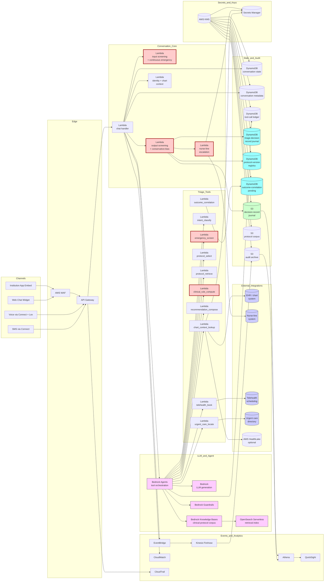

# Recipe 11.6: Symptom Checker / Triage Bot

**Complexity:** Medium-Complex · **Phase:** Regulated · **Estimated Cost:** ~$0.10-0.50 per completed triage conversation (depends on conversation length, model choice, clinical-protocol RAG depth, language coverage, and nurse-line escalation overhead)

---

## The Problem

It is 2:14 AM on a Tuesday. Devon is 47. He has woken up with a heavy, uncomfortable feeling in the middle of his chest. Not stabbing. Not tearing. More like a pressure, vaguely in the center, that came on while he was sleeping and is now keeping him awake. His left arm feels a little odd, but he is not sure if that is because he was sleeping on it. He is sweating slightly, but the bedroom is warm. He is 47 and otherwise healthy except for the fact that he has been told for several years that his cholesterol is "borderline." His father had a heart attack at 58. Devon's wife is asleep next to him. Devon does not want to wake her up over what is "probably nothing."

Devon does what a substantial fraction of Americans do at 2:14 AM with chest pressure: he opens his phone and types into a search engine. The search engine returns ten links. The first three are health-system pages titled "When to worry about chest pain." Each of those pages has roughly the same structure: a list of symptoms that "may indicate a heart attack" (chest pressure, arm pain, sweating, shortness of breath, nausea, jaw pain), a list of "less serious causes of chest pain" (acid reflux, muscle strain, anxiety, costochondritis), and a paragraph at the bottom that says "if you are experiencing severe chest pain, call 911 immediately." Each of those pages is correct. None of them is helpful to Devon, because Devon does not know whether his chest pain is severe. It is uncomfortable. It is keeping him awake. It is not crushing. He does not have the language his cardiologist would use, because he has never been to a cardiologist. He scrolls past the 911 disclaimer the way most people do, because he is not currently certain he is dying.

The fourth link is his health insurance plan's nurse-advice line. He calls. He waits on hold for eleven minutes, listening to a recording explaining that for emergencies he should hang up and dial 911. When the nurse picks up, she takes his name and his member ID, then asks the questions that Devon has been waiting for someone to ask: when did this start, where exactly is it, what does it feel like, has it changed, are you sweating, is your arm involved, is there any shortness of breath, any nausea, any history of heart problems in the family, any cardiac history of your own, what's your blood pressure normally, are you taking any medications. Devon answers. The nurse, after about four minutes, says "Devon, I want you to hang up the phone and call 911. Based on what you are telling me, I do not want you driving yourself, and I do not want you waiting until morning. Do you have someone there who can call?" Devon wakes up his wife. The ambulance arrives in fifteen minutes. Devon has a non-ST-elevation myocardial infarction. He goes to the cath lab at 4:47 AM. A stent is placed. He is discharged on Thursday afternoon.

This is healthcare triage in the United States in 2026, and it is among the most consequential and least systematically supported decisions a patient ever makes. Most people do not have nurses they can call at 2 AM. The ones who do are mostly insured commercial members, mostly during business hours; even the 24/7 nurse lines have substantial wait times during the overnight period when the most ambiguous symptoms are most likely to surface. Most people, instead, look at their phones, weigh "go to the ER" against "wait until morning," and try to decide based on incomplete and contradictory information. Some of them get it right. Some of them sit at home with a heart attack until morning. Some of them go to the ER for a panic attack and pay a $3,000 bill they cannot afford. Some of them, having been told the panic-attack ER bill was a waste, do not go in the next time they have chest pressure, because they have learned not to trust their own judgment. <!-- TODO: verify; the literature on patient-decision-making for ambiguous acute symptoms documents wide variability in care-seeking patterns by income, geography, race, gender, age, and prior healthcare experience, with significant disparities in time-to-treatment for time-sensitive conditions like myocardial infarction and stroke; specific aggregate figures vary by source -->

Now scale that to every patient with an ambiguous symptom every night across the country. The high-acuity patients who guess wrong miss the treatment window. The low-acuity patients who guess wrong overload emergency departments. The middle-acuity patients who guess wrong lose sleep, wages, and trust in the system. The cost is enormous; the cost is also distributed across people in ways that do not show up on any one institution's books. ED overuse is well-documented as a driver of healthcare cost. <!-- TODO: verify; ED utilization patterns and the fraction of visits classifiable as non-emergent are widely studied with figures varying by methodology --> Delay-in-treatment for time-sensitive conditions is well-documented as a driver of mortality. The patients in the middle, the ones who took the right action late or the wrong action at all, are the universal experience of American healthcare consumers, and most of them have been on Devon's side of the keyboard at some point.

The provider side has a parallel set of frustrations. Emergency departments are flooded with low-acuity visits whose patients should have been routed to urgent care, telehealth, primary care, or self-management. Primary care offices receive patient calls at 7:30 AM saying "I think I should have gone to the ER last night." Triage nurse lines staffed by experienced nurses are expensive, finite resources with wait times that scale poorly during periods of high call volume. Urgent care centers that could have absorbed Devon's neighbor's "actually a panic attack but feels real" presentation are sometimes empty while the ED waiting room has a four-hour wait. The misallocation is not anyone's fault and everyone's problem. <!-- TODO: verify; specific figures on ED-to-urgent-care reroute potential and triage-line capacity vary; the directional finding that significant fractions of ED utilization is amenable to lower-acuity routing is broadly supported in healthcare operations research -->

The frustrating thing, looking at this honestly, is that the questions Devon's nurse asked at 2:30 AM are not a mystery. There is a standard set of questions for chest pain ("is the pain pressure-like or sharp," "does it radiate to the arm or jaw," "is there sweating, nausea, shortness of breath," "what is the patient's age, sex, cardiac history, and family history"). There is a standard set of questions for headache, abdominal pain, fever, dizziness, shortness of breath, back pain, rash, and the few dozen other symptom presentations that drive most acute-care decisions. The questions live in nurse-triage protocols (Schmitt-Thompson is the most widely used in U.S. nurse advice lines for both pediatric and adult populations; the Manchester Triage System is widely used internationally; the Emergency Severity Index is the in-ED triage standard in the U.S.; clinical-decision rules like HEART and Wells exist for specific presentations). <!-- TODO: verify; Schmitt-Thompson protocols, the Manchester Triage System, the Emergency Severity Index, the HEART score for chest pain, the Wells score for pulmonary embolism and deep vein thrombosis, and similar clinical-decision tools are well-established in the literature; specific protocol versions and licensing arrangements vary --> The protocols encode decades of clinical experience. The patients have not had access to them, because the protocols are nurse-facing and require clinical judgment to apply. The decision tree exists; the patient cannot navigate it alone.

The previous generation of digital symptom checkers, when they tried to fix this, took two main shapes. The first was the static decision-tree symptom checker: "click the body part that hurts, click the symptom that matches, answer some yes/no questions, get a recommendation." Several major-vendor symptom checkers shipped this way, and the academic evaluations of them generally found that they over-triaged (sending too many patients to the ED) or under-triaged (missing high-acuity presentations) at rates that limited their clinical usefulness. <!-- TODO: verify; published evaluations of digital symptom checkers including studies by Semigran et al. 2015, Hill et al. 2020, and others have documented variable accuracy with both over-triage and under-triage failure modes; specific accuracy figures depend on the symptom checker, the population, and the methodology --> The second was the differential-diagnosis app: "based on your symptoms, here are the conditions you might have, ranked by probability." These were closer to "patient-facing differential generators" than to triage tools, and they confused patients and clinicians both. Several of them got into regulatory trouble for clinical claims their underlying logic could not actually support. The category became a cautionary tale.

The modern conversational triage bot looks like this. Devon, at 2:14 AM, opens the chat in his health system's app. He is authenticated, so the bot already knows his age, sex, basic chart context, and recent visit history. He types "I woke up with a pressure feeling in my chest and I'm not sure what to do."

The bot says "I'm sorry you're dealing with this. I'm going to ask you some questions to help figure out the best next step. I'm a chatbot, not a clinician, but the questions I'll ask are based on the same protocols our nurse advice line uses. If at any point you feel this is an emergency, please stop and call 911. Ready?"

Devon says yes.

The bot says "Where exactly is the pressure, and how long have you been feeling it? Try to be as specific as you can."

Devon types "right in the center of my chest, started maybe 30 minutes ago, woke me up."

The bot says "Got it. Is the pressure constant, or does it come and go? And on a scale of 1 to 10, where would you put the discomfort right now?"

Devon types "constant since I woke up. maybe a 5 or 6 out of 10."

The bot continues with the focused chest-pain protocol: does the pressure spread anywhere (arm, jaw, back), is there sweating, nausea, shortness of breath, lightheadedness, has anything like this happened before, any history of heart problems, any cholesterol or blood pressure issues, any family history of early heart problems. Devon answers each question. By turn ten, the bot has gathered the constellation of features that the chest-pain protocol flags as high-risk for acute coronary syndrome: pressure-quality discomfort, not exertional but new in onset, with associated diaphoresis and possible referred sensation, in a 47-year-old male with a borderline cholesterol history and a father with early MI.

The bot says "Devon, based on what you've described, I want you to call 911 right now. The combination of what you are feeling, your age, and your family history is concerning enough that I do not want you waiting until morning or driving yourself. Is there someone there with you who can help?"

Devon types "my wife is asleep."

The bot says "Please wake her up and call 911 together. While you wait for the ambulance, sit upright in a comfortable position. If you have aspirin in the house and you are not allergic to it, the standard guidance is to chew one regular aspirin (325 mg) or four baby aspirin (81 mg each), but only if you can do that without difficulty. If anything changes, tell the 911 operator. I'm staying here in case you want to talk while you wait. I've also flagged this conversation for our nurse-line team in case you need a follow-up later." <!-- TODO: verify; the aspirin-during-suspected-MI guidance is established in cardiac care for adults without contraindications, but specific patient-facing language for aspirin recommendations should be reviewed against the institution's clinical protocol; some triage tools defer all medication advice including aspirin to the 911 operator -->

That five-minute conversation, completed at 2:19 AM with Devon sitting up in bed, replaces the eleven minutes Devon would have spent on hold with the nurse line plus the four minutes for the actual triage call, in the cases where Devon was lucky enough to have a nurse line at all and persistent enough to wait through the hold. It uses the same questions the nurse would have used. It produces the same recommendation the nurse would have made. The recommendation is delivered at the moment Devon needed it, in a form Devon could actually follow.

A few things this recipe is and is not.

It is the bot that conducts a structured symptom-triage interview with a patient, captures the relevant clinical features through conversational questioning, applies an institution-validated triage protocol, and delivers an appropriate-care-level recommendation (self-care at home, telehealth visit, primary care or urgent care visit, emergency department visit, or 911). The recommendation is grounded in the protocol, presented with appropriate disclaimers, and routed to a human nurse-line escalation when the bot's confidence is low or the protocol calls for nurse review.

It is not a diagnosis tool. The bot does not tell the patient what condition they have. The bot does not produce a differential. The bot's output is "the appropriate next step is X," not "you have Y." The distinction matters legally, ethically, and clinically. Patient-facing diagnosis tools have a poor track record in the literature and a fraught regulatory history; the triage tool is the safer scope.

It is not a clinical-decision-support tool aimed at clinicians. Recipe 2.9 (clinical decision support synthesis) covers the clinician-facing pattern. This recipe is patient-facing, and the regulatory and design considerations are substantially different.

It is not the nurse advice line. The bot complements the nurse line; it does not replace it. The bot handles the volume that fits cleanly into protocol-driven triage with high-confidence recommendations. The bot escalates to a nurse for the cases that need clinical judgment, the cases at protocol-sanctioned hand-off points, and any case the patient asks to escalate. A bot deployed without a nurse-line backstop is missing the safety net.

It is not a regulatory afterthought. Patient-facing triage tools sit on or close to the FDA Software-as-a-Medical-Device line. Whether a specific deployment is regulated depends on the recommendations the tool produces, the population it serves, the claims the institution makes about it, and the current state of FDA guidance. <!-- TODO: verify; the FDA's 2022 final guidance on Clinical Decision Support software clarified the boundary between regulated and non-regulated software, but patient-facing triage tools generally face more scrutiny than clinician-facing CDS, and the regulatory landscape continues to evolve --> Production deployments require a regulatory strategy from day one. This recipe presents the architectural patterns; your regulatory team is the authoritative source on whether and how those patterns apply to your specific deployment.

It is not a chronic-disease coach. Recipe 11.7 covers ongoing conversational support for managing established chronic conditions over time. The triage bot is acute and episodic. It answers "what should I do right now?" not "how am I doing this week?"

It is not a mental health support bot. Recipe 11.8 covers conversational support for mental health concerns. The triage bot recognizes mental-health crisis as one of the highest-acuity flags and routes immediately to crisis resources (988 or 911) rather than attempting to provide therapeutic content.

It is not the pre-visit intake bot. Recipe 11.4 covers structured pre-visit intake feeding scheduled appointments. The triage bot answers "should I see anyone right now?" The intake bot answers "what should the clinician know before we see each other on Wednesday?" The two have overlapping question sets and very different success criteria.

It is not a substitute for a clinician's judgment. The bot's output is a recommendation for what level of care the patient should seek. The bot does not provide treatment. The bot does not deliver diagnoses. When the bot says "you should be evaluated in the emergency department," the evaluation happens with a clinician who will make their own determination based on the patient's presentation in person. The bot's accuracy is bounded above by the protocol's accuracy and the bot's adherence to it; it does not exceed clinician judgment.

The thing to understand before building this is that the bot's quality is bounded above by the quality of the clinical triage protocol it implements, the discipline of the protocol-grounded retrieval, and the carefulness of the safety-net escalation logic. A bot operating against an under-specified protocol, with weak grounding, and with a permissive escalation policy will under-triage. A bot operating with the standard protocols, strict grounding, and conservative escalation will be measurably useful for the patients in the middle of the acuity distribution. The pre-deployment work of selecting, validating, and configuring the protocols is the highest-leverage investment the project will make, and it is the part most often underestimated.

Let's get into it.

---

## The Technology: Protocol-Grounded Conversational Triage With Conservative-By-Default Decision Logic

### Why Symptom-Triage Has Stayed Phone-Centric (And Why Most Web Symptom Checkers Failed)

Symptom triage, as a workflow, has been a phone-centric problem for the last fifty years and has been done by experienced nurses for almost all of that time. The reason is structural. Symptom triage is the process of taking a patient's free-form description of what they are feeling, asking the focused follow-up questions that disambiguate the clinically-relevant features, and matching the resulting feature constellation to an institution-sanctioned recommendation about what the patient should do next. The questions are not generic. The questions for chest pain are different from the questions for headache. The questions for headache in a 78-year-old with hypertension are different from the questions for headache in a 28-year-old with no history. The recommendations are not binary. The recommendation is not "go to the ER" or "stay home"; the recommendation is one of several appropriate care levels (self-care, telehealth, primary care, urgent care, ED, 911) calibrated to the acuity of the presentation and the patient's specific context. The clinical judgment lives in the calibration; it has lived in nurses' heads, supplemented by paper protocols, since the workflow began.

The first generation of digital symptom checkers, roughly the early 2000s through the late 2010s, tried to systematize this with explicit decision-tree software. The patient clicked through a tree of yes/no questions and received a recommendation at the leaf. The trees were sometimes built by clinicians and sometimes purchased from vendors who claimed they were. Several of the major-vendor symptom checkers received high-profile evaluations in the medical literature. The findings were not flattering. <!-- TODO: verify; published evaluations of digital symptom checkers including Semigran et al. 2015 in BMJ, Hill et al. 2020 in MJA, Ceney et al. 2021 in PLOS ONE, and others have documented variable accuracy with both over-triage and under-triage failure modes; specific accuracy figures depend on the symptom checker, the population, and the methodology --> The decision-tree symptom checkers had three structural problems. First, they could only ask the questions encoded in the tree, which meant they could not follow up on what the patient had actually said. Second, the patient's free-text description of symptoms had to be coerced into the tree's pre-defined symptom categories, which destroyed nuance and produced wrong matches. Third, the trees were rigid; if the patient's presentation did not fit cleanly into a tree branch, the tree silently picked a branch and produced a recommendation that did not actually correspond to the patient's situation. The patients who used these tools mostly did not trust them; the clinicians who reviewed their outputs mostly did not trust them either.

The second generation, roughly 2015 to 2022, layered machine-learning models on top of the symptom inputs. The architecture varied (some used neural networks, some used Bayesian networks, some used probabilistic graphical models with named conditions as nodes), but the user-facing pattern was similar: enter symptoms, get a ranked differential or a recommended action. Several of these tools secured significant funding, partnered with health systems and insurers, and faced public criticism over both their clinical accuracy and the regulatory claims their marketing departments made about them. <!-- TODO: verify; the trajectory of differential-generating symptom checkers including products from Babylon Health, Buoy Health, Ada, K Health, Mayo Clinic, Isabel Healthcare, and others has been documented in trade press and academic literature; specific accuracy figures and regulatory actions vary by product and time period --> Some of them retrenched their scope to lower-acuity guidance. Some of them shut down. The category became a cautionary tale in healthcare AI circles, often cited as the example of "things that look like they should work but require careful clinical and regulatory engineering to actually deliver value safely."

The thing that changed the workflow shape is, again, large language models that can carry on a coherent conversation while sticking to a structured task. A conversational triage interview, conducted by an LLM that has been carefully scoped to follow institution-validated protocols, can ask the focused follow-up questions a nurse would ask, capture the patient's nuanced responses without forcing them into pre-defined categories, and produce a recommendation that is grounded in the same protocol the nurse would have used. The LLM's value is concentrated in the conversational layer; the clinical logic still lives in the protocol. The LLM is a better front-end to a triage protocol than a decision-tree was, and the protocol is the part that matters clinically.

The architectural shift is from "click through a decision tree" to "have a conversation that follows the protocol." The bot's value is concentrated in three places: the patient experience (asking a natural-language question and getting a specific recommendation in minutes rather than waiting on hold or guessing alone), the safety floor (the protocol-driven logic plus the human-escalation path catch the high-acuity cases that ad-hoc patient self-triage misses), and the operational savings (the routine triage volume is handled at the bot tier, freeing the nurse line for the cases that benefit from clinical judgment).

### What a Triage Bot Actually Does

A triage bot is a tool-using LLM with a system prompt that tells it which assistant it is, the patient's authenticated context (age, sex, basic chart history, current medications, current conditions, recent visits if relevant), and access to a structured library of institution-sanctioned triage protocols. The LLM conducts the conversation. The protocols, modeled as data, encode the clinical logic. The tools handle the deterministic actions: looking up the right protocol for the symptom, retrieving the relevant chart context, computing acuity scores from clinical-decision-rule inputs, escalating to a nurse line, posting a recommendation event for downstream operations, logging crisis-detection events to the appropriate response pathway.

The conversation has a structure even though the patient does not see it. The bot's task surface decomposes roughly as follows.

**The greeting and disclosure.** Critical for the triage bot specifically because patients have variable familiarity with what a chatbot can and cannot do, and the disclosure has to set expectations clearly without scaring the patient out of using the tool. Identifies as a chatbot, states scope (informational triage; not a diagnosis; not a replacement for a clinician), notes that the questions are based on the same protocols the institution's nurses use, names the human-escalation pathway, and reinforces the 911-redirect for emergencies.

**Crisis-and-emergency screening up front.** Before the protocol-driven triage starts, the bot screens for explicit emergency presentations. If the patient says "I'm having chest pain right now," the bot does not start a structured chest-pain protocol from scratch; it asks two or three high-yield questions to confirm the emergency presentation and routes immediately to 911 with stay-on-the-line guidance. If the patient says "I'm thinking about hurting myself," the bot routes immediately to 988 or the institution's crisis line. The screening is layered with the protocol selection rather than gated behind it.

**Symptom identification and protocol selection.** The patient's free-form initial complaint is mapped to the most appropriate triage protocol. "Chest pressure" maps to the chest-pain protocol. "Bad headache" maps to the headache protocol. "I think I might have a UTI" maps to the urinary-symptoms protocol. The mapping is done by the LLM with retrieval over the protocol library; ambiguous mappings (a patient with both chest pain and shortness of breath could route to either protocol) trigger a clarifying question. Multi-symptom presentations are handled by selecting the highest-acuity-eligible protocol and noting the others for cross-reference.

**Structured protocol-driven questioning.** Once the protocol is selected, the bot conducts the protocol's question sequence in conversational form. The protocol specifies the canonical questions; the bot may rephrase them for clarity, ask them in a slightly different order based on what the patient has already volunteered, and follow up on ambiguous answers. Critically, the bot does not skip protocol questions and does not invent new ones; the protocol is the spine, and the conversation hangs from it.

**Acuity scoring and recommendation.** When the protocol's questions have been answered, the bot computes the protocol's recommendation. For some protocols, this is a deterministic mapping from the answer set to the recommendation. For others, it is a clinical-decision rule (HEART score, Wells score, Centor score for streptococcal pharyngitis, Ottawa ankle rules) computed by a tool and used as input to the recommendation logic. The recommendation is one of a small set of care levels: self-care at home with monitoring, telehealth visit, primary care visit (today, in 24-48 hours, or routine), urgent care visit, emergency department visit, or 911 call. <!-- TODO: verify; the HEART score, Wells score, Centor score, Ottawa ankle rules, and similar clinical-decision rules are well-established in the literature with documented sensitivity and specificity profiles; the specific protocol implementations and care-level mappings vary by institution -->

**Recommendation delivery with disclaimers and instructions.** The bot delivers the recommendation in plain English with the appropriate disclaimers, the rationale (briefly), and the next-step instructions. For high-acuity recommendations (911, ED), the instructions include immediate safety guidance (stay seated, do not drive yourself, call someone to be with you) and any institution-approved interim measures (the aspirin-for-suspected-MI example earlier; the bot's handling of these specifics depends entirely on the institution's clinical protocol and its FDA-strategy positioning). For low-acuity recommendations (self-care), the instructions include red-flag symptoms that should trigger re-triage and a path to re-engage with the bot or the nurse line.

**Nurse-line escalation.** The bot escalates to a human nurse when the protocol calls for it (some protocols escalate at specific decision points), when the bot's confidence in any step is below threshold, when the patient's presentation does not fit cleanly into any protocol, when the patient explicitly requests a human, or when any layer (input safety, output safety) flags an issue. The escalation hands off the conversation transcript, the protocol selected, the answer set captured, the computed recommendation, and any uncertainty markers.

**Cross-channel continuity.** A patient who starts on chat and needs to switch to a nurse phone call should not have to start over. The escalation includes the conversation context as a structured payload that the receiving nurse can read in seconds. The patient's wait time at the nurse line is bounded; the institution's commitment to the patient is that the bot will catch high-acuity cases regardless of nurse-line availability.

**Audit and follow-up.** Every triage conversation produces an audit record (transcript, protocol used, recommendation produced, recommendation delivered, patient response, escalation status). The audit feeds compliance review, clinical-quality review, and outcome-tracking. Where the institution has the capability, the bot's recommendation is correlated with the patient's actual care utilization (did they actually go to the ED, the urgent care, did they have a follow-up encounter) for ongoing protocol-and-bot calibration. <!-- TODO: verify; outcome-correlation for symptom-triage tools requires institutional data integration and is operationally significant work; specific implementations vary -->

### Why a Generic LLM Cannot Run a Triage Bot

A naive product approach would be: take a generalist LLM, give it a chat surface, paste in some triage information, and have it conduct triage. This breaks in several specific ways, each of which has clinical and regulatory consequences.

**The model has no view of the patient's specific clinical context.** Without the patient's age, sex, current medications, current conditions, and basic recent history as input, the LLM cannot calibrate the recommendation appropriately. "Chest pain in a 25-year-old with no history" is a different protocol entry-point than "chest pain in a 65-year-old with hypertension and diabetes." The chart-context tools (age, sex, problem list, medication list, recent visits) are non-optional inputs. The bot is not blind to the patient's record; it is grounded in it.

**The model hallucinates clinical content when grounding is weak.** If the protocols are not retrieved with strict citation grounding, the LLM produces plausible-sounding clinical recommendations that are wrong for the institution's actual protocol. Worse, the LLM may produce recommendations that contradict the standard of care. The protocol RAG layer with strict citation grounding is non-negotiable. The bot cites the protocol it is following, the version of the protocol that is in effect, and the specific decision points from the protocol that drove the recommendation.

**The model has no reliable theory of conservative-by-default escalation.** Without explicit guardrails, the LLM tends toward "let me try to help you figure this out" responses that under-triage when they should escalate. The protocols are designed with conservative bias (when in doubt, escalate to higher acuity); the LLM's default helpfulness instinct can erode that bias. The architectural pattern is to encode the conservative-default policy in the protocol logic, run the recommendation through deterministic computation, and have the LLM only deliver and explain the recommendation rather than originate it.

**The model cannot reliably recognize a true emergency in the middle of a conversation.** A patient who starts with "I just have a question about my back" and then mentions, three turns in, that they have lost the ability to feel their legs and have lost bladder control is presenting cauda equina syndrome (a 911 case) inside a conversation that started as a low-acuity question. <!-- TODO: verify; cauda equina syndrome is a recognized neurosurgical emergency; specific clinical features include saddle anesthesia, urinary retention or incontinence, and progressive lower-extremity weakness --> The bot's emergency screening runs continuously, not just at the start of the conversation. Every patient utterance is screened for emergency keywords and feature constellations.

**The model has no audit trail of what was asked, what was answered, what was retrieved, and what was recommended.** A regulated triage answer requires showing the work: the protocol consulted, the question sequence, the patient's responses, the computed acuity, the basis for the recommendation. The structured-data ledger plus the conversation log are the audit surface. Without it, the recommendation is unreviewable, the case is impossible to defend if outcomes are bad, and the regulatory position is untenable.

**The model has clinical-decision-rule arithmetic problems.** Clinical-decision rules (HEART, Wells, Centor, Ottawa, others) compute scores from structured inputs. The LLM does this arithmetic poorly. The clinical-decision-rule tool encapsulates the computation; the LLM gathers the inputs through the conversation, calls the tool, and presents the structured score and its associated risk stratum.

**The model has compliance implications for triage conversations.** The conversation contains PHI (symptoms, medical history, mental-health status, social context that may emerge during sensitive triage). Some triage conversations include disclosures of intimate-partner violence, sexual-health concerns, substance-use issues, and mental-health crisis. The audit, retention, access-control, and downstream-clinical-workflow integration story has to handle each of these with care and with statutory awareness (for example, mandatory-reporting obligations for some disclosures vary by state and by professional credential of the receiving party).

**The model cannot reliably stay within scope when the patient asks for diagnosis or treatment recommendations.** Patients frequently ask "do you think this is a heart attack?" or "should I take aspirin?" The bot answers triage questions ("the next step for what you are describing is X") not diagnostic questions ("you have Y"). Maintaining the distinction is a discipline that requires the system prompt, the output safety screening, the institutional review of canonical responses, and the clinical-protocol scoping to all align. None is sufficient alone.

**The model has no theory of when to stop the conversation.** A protocol's question sequence has a defined length. Once the relevant features are captured, the bot computes the recommendation. A general LLM might continue conversing indefinitely, asking irrelevant questions, or sliding into therapeutic chat. The protocol-driven logic encodes the stopping condition; the LLM honors it.

### What the Triage Bot Has To Do That the Previous Bots Did Not

Recipes 11.1 through 11.5 established the patterns this recipe inherits: input safety screening, intent classification, identity verification, tool-use orchestration, output safety screening, audit logging, per-cohort monitoring, scope discipline, prompt-injection defense, graceful degradation. The triage bot adds six structural commitments those recipes did not have.

**Validated clinical-protocol corpus with full version control and clinician sign-off.** The triage protocols are clinical content. They are owned jointly by the institution's medical director, the nurse-triage operations leadership, and the compliance team. Each protocol is reviewed before adoption, reviewed annually, and re-reviewed when material updates are made. The protocols are versioned; the conversation log records which protocol version was active for any given conversation. Skipping this is the failure mode that turns a triage bot into a clinically-unsafe deployment.

**Conservative-by-default acuity logic.** The protocols are designed with conservative bias; the bot's logic enforces it. When the bot is uncertain, when the protocol's decision logic spans multiple acuity levels, when the patient's responses are ambiguous, the recommendation defaults to the higher acuity (or escalates to a nurse). Explicit conservative-bias auditing is part of the deployment review.

**Continuous emergency-screening across every turn.** The crisis-and-emergency screening runs continuously through the conversation, not just at the start. Every patient utterance is screened for emergency keywords and feature constellations. The screening triggers immediate 911 or 988 routing as appropriate, regardless of where the conversation was in the protocol flow.

**Clinical-decision-rule computation as deterministic tool.** Clinical-decision rules used in the triage logic (HEART, Wells, Centor, Ottawa, others) run as code with structured inputs and structured outputs. The LLM does not compute the score. The deterministic tool returns the score with the associated risk stratum and the protocol-mapped recommendation. The tool's version is audited.

**Nurse-line escalation as architectural primitive, not optional feature.** The bot is deployed with a backstop nurse line. The escalation is a first-class capability, not a fallback. The handoff payload includes the full conversation context, the protocol consulted, the answer set, and the computed recommendation. The nurse picks up where the bot left off; the patient does not start over.

**FDA-strategy alignment from day one.** Patient-facing triage tools sit on or close to the FDA Software-as-a-Medical-Device line. Whether the specific deployment is regulated depends on the recommendations the tool produces, the population it serves, the claims the institution makes about it, and the current state of FDA guidance. The institutional regulatory team is involved from architectural design, through clinical-protocol selection, through go-live, through post-market surveillance. The technical architecture supports either a non-regulated deployment (informational scope, with clinician review of outputs in regulated edge cases) or a regulated SaMD deployment (with the appropriate quality-management system, clinical-validation evidence, and post-market obligations) depending on the institutional choice. This recipe's architecture is consistent with either, but the deployment decision is the institution's.

The rest is largely the same as the previous chapter 11 recipes: tool-surface contract management, identity-assurance lifecycle, conversation logging, scope filtering, per-cohort monitoring, graceful degradation when upstream systems fail.

### The Triage Reality

A few notes on what makes triage specifically harder than the other patient-facing bot use cases.

**The cost of being wrong is asymmetric and severe.** Under-triage (telling a patient with a true emergency that they can stay home) can be fatal. Over-triage (sending a patient with a low-acuity condition to the ED) is expensive and erodes trust. The protocol logic is calibrated to favor over-triage at the expense of under-triage; the operational metrics monitor both rates with separate thresholds. Aggregate accuracy is not a sufficient metric.

**Triage is multilingual by necessity.** Patients in crisis or in pain seek help in their first language. Multilingual deployment is not a phase-2 enhancement; it is a launch-day requirement for institutions serving non-English-speaking populations. <!-- TODO: verify; CMS and various state Medicaid programs impose language-access requirements on certain payer and provider communications, and institutional policies on language access vary --> Per-language asset development includes validated protocol translations, validated regulatory-disclosure phrasings, validated emergency-instruction phrasings, and per-language calibration of the recommendation language.

**Triage requires specific accessibility considerations.** Patients with limited digital literacy, patients with vision impairments using screen readers, patients with cognitive impairments, and patients in acute physical distress may interact with the triage bot differently than the average authenticated app user. Accessibility conformance is not a generic web-accessibility checklist; it is a triage-specific set of design decisions about cognitive load, sentence length, voice-channel availability, and graceful degradation when the patient cannot complete the conversation.

**Triage interacts with mandatory-reporting laws.** Some triage conversations surface disclosures (child abuse, elder abuse, intimate-partner violence, certain mental-health emergencies) that trigger statutory reporting obligations for licensed clinical staff. The bot itself is not a licensed clinician. The institution's policy specifies how disclosures are handled when the bot is the receiver: typically, the bot acknowledges, provides safety resources, and routes to a clinical staff member who is a mandatory reporter, with the conversation context attached. <!-- TODO: verify; mandatory-reporting laws vary by state, by professional credential, and by category of disclosure; institutional policies for AI-mediated communications are an emerging area -->

**Triage contains pediatric and geriatric edge cases that adult-default protocols miss.** Pediatric triage (Schmitt-Thompson Pediatric is the dominant U.S. nurse-line standard) and geriatric triage (with overlay of frailty, polypharmacy, atypical presentations of common conditions, dementia-mediated communication challenges) require dedicated protocols. <!-- TODO: verify; Schmitt-Thompson protocols include dedicated pediatric and adult versions; the geriatric-specific extensions vary by institution and by triage-tool vendor --> The bot's protocol library includes both; the protocol-selection logic recognizes the patient's age and routes to the appropriate version.

**Triage interacts with social context the bot may not see.** Patients without access to transportation cannot follow "go to the urgent care now" if the urgent care is across town and they have no car. Patients without paid sick leave cannot follow "stay home and rest" if doing so means losing income. Patients in unsafe housing cannot follow "monitor your symptoms at home" if home is the source of the problem. The bot's recommendations are formally clinical, but their feasibility is socially determined. The institution's deployment includes social-determinants-of-health overlays where possible, with care-navigation handoffs for patients whose recommended care level is not reachable for them.

**Triage outputs sometimes need to integrate with telehealth and care-navigation tools.** When the bot recommends a telehealth visit, it should be able to schedule the visit (or at least surface availability) rather than just say "schedule a telehealth visit." When the bot recommends an urgent care visit, it should be able to surface the patient's nearest in-network urgent care and that location's current wait time. The integration with the institution's scheduling and care-navigation tools is part of the operational scope.

**Triage interacts with the patient's existing care plan.** A patient with an active oncology treatment plan presents to the triage bot with new symptoms that are very likely treatment-related. The bot's protocol selection should account for this. A patient on anticoagulation with a head injury presents to the triage bot with a different acuity profile than the same head injury in a patient not on anticoagulation. The chart-context lookup includes active treatment plans, active medications relevant to the presenting symptom, and any recent visits that may be related.

**Telehealth integration is bidirectional.** A patient who has just completed a telehealth visit may present to the triage bot with worsening symptoms. The bot's chart context includes the recent visit. The bot's recommendation may differ accordingly. A patient who completes a triage conversation with a "schedule a telehealth visit" recommendation should have that visit booked or scheduled with the conversation context attached, so the receiving telehealth clinician has the triage data available.

**Outcome correlation is a long-term commitment.** The triage bot's clinical performance is measured against actual outcomes: did the patient who was told to go to the ED actually go, and did the ED visit reveal a clinically-significant finding? Did the patient who was told to stay home actually stay home, and did they need a higher-acuity visit within 72 hours? The institution commits to this outcome correlation as part of the post-market surveillance. <!-- TODO: verify; outcome correlation for symptom-triage tools is operationally significant work that requires data integration across the institution's encounter records and is rarely fully implemented in early deployments -->

**Liability and consent considerations are different from non-triage bots.** Patients consenting to use the triage bot are consenting to interact with a tool that provides care-level recommendations. The consent language is reviewed with legal counsel. The handling of cases where the patient ignores the recommendation (the patient was told to go to 911 and chose to wait until morning) is part of the institutional policy and the audit pathway. The institution's malpractice carrier is part of the policy review. <!-- TODO: verify; specific liability frameworks for AI-mediated triage are an emerging legal area; institutional policies and malpractice-coverage arrangements vary -->

### Where the Field Has Moved

A few practical updates worth knowing.

**The Schmitt-Thompson protocols are the dominant U.S. nurse-line standard.** Schmitt-Thompson has versions for adult and pediatric triage and is licensed by most major U.S. nurse-advice line operators. <!-- TODO: verify; Schmitt-Thompson protocols, developed by Drs. Barton Schmitt and David Thompson, are the most widely used U.S. nurse-line triage protocols and are licensed by ClearTriage and other vendors --> Institutions building their own triage tools generally either license Schmitt-Thompson, license another vendor's protocols (such as the Manchester Triage System or proprietary alternatives), or build institution-specific protocols with clinical-leadership ownership. Building from scratch without a clinical foundation is rare and not recommended.

**The Manchester Triage System is the international standard for ED in-person triage.** MTS is widely used in European, Latin American, and Asian-Pacific EDs. <!-- TODO: verify; the Manchester Triage System is widely adopted internationally for in-ED triage and is differentiated from nurse-line phone-triage protocols --> Institutions building tools for international deployment may use MTS or its derivatives.

**The Emergency Severity Index (ESI) is the dominant U.S. ED in-person triage standard.** ESI is the in-ED triage approach used by most U.S. emergency departments. <!-- TODO: verify; ESI is published by ACEP and is widely adopted in U.S. EDs as the in-person triage system --> ESI is not a phone-triage or chat-triage protocol, but it informs the recommendation calibration; a triage tool sending a patient to the ED is implicitly contributing to that ED's ESI workflow, and the tool's recommendation framing should align.

**Clinical-decision rules are increasingly used as components of triage logic.** The HEART score for chest pain, the Wells score for pulmonary embolism and DVT, the Centor score for streptococcal pharyngitis, the Ottawa ankle and knee rules, and others are validated rules for stratifying risk in specific presentations. <!-- TODO: verify; HEART, Wells, Centor, Ottawa, and similar rules have published validation studies and documented sensitivity/specificity profiles; specific patient-population applicability varies --> Modern triage architectures invoke these rules as deterministic tools when the protocol calls for them.

**The FDA's posture on patient-facing triage software continues to evolve.** The 2022 final guidance on Clinical Decision Support software clarified the distinction between regulated and non-regulated software, but patient-facing triage tools generally face more scrutiny than clinician-facing CDS, because the patient cannot independently verify the recommendation against their own clinical judgment. <!-- TODO: verify; FDA guidance on CDS software, including the 2022 final guidance and subsequent updates, continues to evolve; the regulatory status of patient-facing triage tools depends on specific product characteristics and claimed functionality --> Institutions deploying patient-facing triage at scale typically work with FDA-experienced regulatory counsel from the architectural design phase.

**Tool-using LLMs handle triage Q&A well when grounded carefully.** The function-calling pattern from the previous chapter 11 recipes maps directly to triage. The LLM produces tool calls that retrieve protocols, gather chart context, compute clinical-decision rules, and post recommendations; the tools return structured data; the LLM composes a grounded answer that delivers the recommendation. The architecture has been deployed at major payers, integrated delivery networks, and digital-health vendors since roughly 2023.

**Conversational triage measurably reduces nurse-line wait times and ED over-utilization in specific populations.** Deployments at major institutions have reported substantial reductions in nurse-line wait times for routine triage cases and modest reductions in low-acuity ED utilization, with both effects strongest in member populations with high digital adoption and in member populations whose alternative was the nurse line rather than the ED. <!-- TODO: verify; specific deflection rates and operational impact figures vary by deployment and are sometimes published in vendor case studies and institutional press; consolidated public statistics are not reliably aggregated -->

**Equity and disparities in triage are an active research area.** Studies of nurse-line triage have documented variability in recommendations by patient demographics that does not appear to be clinically justified. <!-- TODO: verify; literature on demographic variability in triage decisions includes studies of phone-triage, ED-triage (ESI), and digital-symptom-checker triage; specific findings vary --> AI-mediated triage may inherit, amplify, or correct these disparities. Per-cohort monitoring is essential, and the institutional commitment to equity is reviewed by the compliance and patient-experience teams.

**Build-vs-buy is mature in this category.** Several conversational triage vendors operate at major-institution scale, with EHR integration, multilingual support, and regulatory frameworks. <!-- TODO: verify; the commercial vendor landscape continues to evolve --> Most major institutions run a hybrid: build the in-house bot for the routine member-facing journey on the institution's preferred infrastructure, partner with a clinical-protocol vendor for the licensed protocols, and integrate with the institution's nurse-line, telehealth, and care-navigation infrastructure.

---

## General Architecture Pattern

A healthcare triage bot decomposes into ten logical stages: channel entry, input safety screening with continuous-emergency-screening, identity-and-chart-context loading, symptom identification and protocol selection, structured protocol-driven questioning, clinical-decision-rule computation, acuity scoring and recommendation, output safety screening with conservative-bias verification, recommendation delivery, and nurse-line escalation when applicable. The cross-cutting concerns from recipes 11.1 through 11.5 carry forward; this recipe adds four new ones (clinical-protocol-corpus governance with medical-director sign-off, conservative-bias-default policy, continuous-emergency-screening pipeline, and FDA-strategy-alignment artifact maintenance).

```
┌────────── CHANNEL ENTRY ─────────────────────────────────┐
│                                                           │
│   [Patient opens chat in institution's app, member        │
│    portal, telehealth front-door, employer-side wellness  │
│    portal, or via SMS/voice channel]                      │
│                                                           │
│   [Greeting and disclosure]                               │
│    - Identifies as a chatbot                              │
│    - States scope (informational triage, not diagnosis,   │
│      not replacement for a clinician)                     │
│    - Notes the questions are based on the same protocols  │
│      institutional nurses use                             │
│    - Names the human-escalation pathway                   │
│    - Reinforces the 911 redirect for any emergency        │
│                                                           │
│   [Conversation session bootstrap]                        │
│    - Generate session_id                                  │
│    - Capture channel, authentication context, deep-link   │
│      parameters (e.g., a specific symptom topic the       │
│      patient tapped to start the conversation)            │
│           │                                               │
│           ▼                                               │
│   [Output: session_id, channel, auth context, deep-link   │
│    parameters]                                            │
│                                                           │
└───────────────────────────────────────────────────────────┘

┌────────── INPUT SAFETY + CONTINUOUS EMERGENCY SCREEN ────┐
│                                                           │
│   [Standard input safety primitives from recipe 11.1]     │
│    - Prompt-injection detection                           │
│    - PHI minimization                                     │
│    - Self-harm and crisis classifier                      │
│                                                           │
│   [Triage-specific continuous emergency screening]        │
│    - Runs on every patient utterance, not just first      │
│    - Detects explicit emergency presentations             │
│      (active chest pain, stroke symptoms, severe          │
│      bleeding, suspected anaphylaxis, suspected           │
│      overdose, acute psychosis, suicidal intent)          │
│    - Detects emergency feature constellations             │
│      (cauda equina pattern, sepsis pattern, abdominal     │
│      catastrophe pattern, neurological deficit pattern)   │
│    - Detects pediatric-specific emergency presentations   │
│      (febrile infant, lethargic infant, suspected         │
│      meningitis pattern, suspected intussusception)       │
│    - Triggers immediate 911 / 988 / institutional crisis  │
│      routing with stay-on-the-line guidance               │
│           │                                               │
│           ▼                                               │
│   [Output: input passes / input blocked-with-disposition  │
│    / emergency-routed-immediately]                        │
│                                                           │
└───────────────────────────────────────────────────────────┘

┌────────── IDENTITY AND CHART-CONTEXT LOADING ────────────┐
│                                                           │
│   [Authenticated session path (recommended default)]      │
│    - Patient is logged into the institution's app or      │
│      portal                                               │
│    - Session conveys verified patient_id and chart        │
│      access scope                                         │
│                                                           │
│   [Unauthenticated path (limited scope)]                  │
│    - For lower-stakes general health questions, the bot   │
│      may answer without authentication, with reduced      │
│      protocol scope and explicit "I don't know your       │
│      medical history" framing                             │
│    - High-acuity protocols and chart-aware                │
│      recommendations require authentication               │
│                                                           │
│   [Pediatric and proxy-completion handling]               │
│    - Parent or guardian completing the conversation       │
│      for a minor child: the conversation is on            │
│      behalf of the child, with appropriate consent        │
│      handling per state law                               │
│    - Adult-on-behalf-of-adult (caregiver, authorized      │
│      representative) with appropriate scope               │
│                                                           │
│   [Chart-context tools]                                   │
│    - Demographics (age, sex, language preferences,        │
│      pediatric vs adult)                                  │
│    - Active problem list                                  │
│    - Active medication list (focused on those relevant    │
│      to common presenting symptoms: anticoagulants,       │
│      immunosuppressives, opioids, antidiabetics, etc.)    │
│    - Recent visit history (90 days)                       │
│    - Active treatment plans (oncology, transplant,        │
│      pregnancy, etc. that materially change triage)       │
│    - Known allergies                                      │
│    - Advance directives (where the institution stores)    │
│           │                                               │
│           ▼                                               │
│   [Output: verified patient_id, chart context, scope,     │
│    pediatric-vs-adult flag, proxy-completion flag]        │
│                                                           │
└───────────────────────────────────────────────────────────┘

┌────────── SYMPTOM IDENTIFICATION + PROTOCOL SELECTION ───┐
│                                                           │
│   [Symptom identification]                                │
│    - Free-form initial complaint mapped to symptom        │
│      category                                             │
│    - LLM with retrieval over protocol library             │
│    - Multi-symptom presentations: select highest-acuity-  │
│      eligible protocol; cross-reference others            │
│                                                           │
│   [Protocol selection]                                    │
│    - Each symptom maps to one or more institutional       │
│      protocols                                            │
│    - Protocols are versioned, owned by medical director   │
│      and nurse-line operations                            │
│    - Pediatric vs adult versions selected based on        │
│      patient age                                          │
│    - Special-population protocols (pregnancy, oncology    │
│      treatment, transplant, etc.) selected based on       │
│      chart context                                        │
│                                                           │
│   [Ambiguous-mapping handling]                            │
│    - Bot asks one or two clarifying questions when        │
│      multiple protocols are plausible                     │
│    - Falls back to broad initial-assessment protocol      │
│      that branches based on responses                     │
│                                                           │
│   [Out-of-scope handling]                                 │
│    - Some presentations are out of scope for the bot      │
│      (e.g., suspected ingestion in a pediatric patient    │
│      where the institution's policy defers to Poison      │
│      Control)                                             │
│    - Out-of-scope presentations route immediately to      │
│      the appropriate human resource                       │
│           │                                               │
│           ▼                                               │
│   [Output: selected_protocol, protocol_version, fallback  │
│    or escalation marker if applicable]                    │
│                                                           │
└───────────────────────────────────────────────────────────┘

┌────────── STRUCTURED PROTOCOL-DRIVEN QUESTIONING ────────┐
│                                                           │
│   [Bot conducts the protocol's question sequence]         │
│    - Canonical questions specified by the protocol        │
│    - LLM may rephrase for clarity                         │
│    - Order may adjust based on what the patient has       │
│      volunteered                                          │
│    - Ambiguous answers trigger follow-up                  │
│    - Bot does not skip protocol questions                 │
│    - Bot does not invent new questions outside the        │
│      protocol's scope                                     │
│                                                           │
│   [Continuous emergency screening (parallel)]             │
│    - Every patient response screened for emergency        │
│      content                                              │
│    - Mid-conversation emergency triggers immediate        │
│      911 / 988 routing                                    │
│                                                           │
│   [Pediatric-specific question adaptations]               │
│    - Pediatric protocols ask the parent / caregiver       │
│    - Different vital-sign expectations                    │
│    - Different emergency feature sets                     │
│                                                           │
│   [Conversation-state persistence]                        │
│    - Each turn captured in conversation log               │
│    - Each protocol answer captured in structured form     │
│    - Tool calls audited                                   │
│           │                                               │
│           ▼                                               │
│   [Output: structured answer set per protocol question;   │
│    flag set for any emergency-screen triggers]            │
│                                                           │
└───────────────────────────────────────────────────────────┘

┌────────── CLINICAL-DECISION-RULE COMPUTATION ────────────┐
│                                                           │
│   [Where the protocol invokes a clinical-decision rule:]  │
│    - HEART score for chest pain                           │
│    - Wells score for PE / DVT                             │
│    - Centor score for streptococcal pharyngitis           │
│    - Ottawa ankle / knee rules for ankle / knee injury    │
│    - PERC rule for PE risk stratification                 │
│    - Other institution-validated rules                    │
│                                                           │
│   [Each rule runs as a deterministic tool]                │
│    - Inputs: structured features captured during          │
│      questioning                                          │
│    - Outputs: score, risk stratum, recommended care       │
│      level per the rule's published thresholds            │
│    - Tool version audited                                 │
│                                                           │
│   [LLM does not compute the rule]                         │
│    - LLM gathers inputs                                   │
│    - Tool computes score                                  │
│    - LLM presents the result                              │
│           │                                               │
│           ▼                                               │
│   [Output: structured rule scores with risk strata and    │
│    rule-mapped care-level recommendations]                │
│                                                           │
└───────────────────────────────────────────────────────────┘

┌────────── ACUITY SCORING + RECOMMENDATION ───────────────┐
│                                                           │
│   [Combine protocol decision logic with rule outputs]     │
│    - Protocol-driven recommendation from answer set       │
│    - Rule-driven recommendation where applicable          │
│    - When recommendations diverge, the higher-acuity      │
│      recommendation wins (conservative default)           │
│                                                           │
│   [Care-level recommendation set]                         │
│    - 911 (emergency response, do-not-self-transport)      │
│    - Emergency department (urgent presentation; self-     │
│      transport with caveats; sometimes specific           │
│      institutional ED)                                    │
│    - Urgent care (within 24 hours; specific institutional │
│      urgent care identified where possible)               │
│    - Primary care (today, in 24-48 hours, or routine      │
│      follow-up)                                           │
│    - Telehealth visit (synchronous video / voice; some    │
│      protocols recommend telehealth as the appropriate    │
│      starting point)                                      │
│    - Self-care at home (with explicit red-flag symptoms   │
│      that should re-trigger triage)                       │
│                                                           │
│   [Conservative-bias enforcement]                         │
│    - When protocol logic spans acuity levels, default     │
│      to higher acuity                                     │
│    - When patient-response confidence is low, default     │
│      to nurse-line escalation                             │
│    - When chart-context flags raise risk (anticoagulant   │
│      use with bleeding presentation; immunosuppression    │
│      with infection presentation), upgrade acuity         │
│                                                           │
│   [Special-population handling]                           │
│    - Pediatric-specific recommendation calibration        │
│    - Pregnancy-specific recommendation calibration        │
│    - Geriatric-specific recommendation calibration        │
│    - Active-treatment-plan recommendation calibration     │
│    - High-risk medication recommendation calibration      │
│           │                                               │
│           ▼                                               │
│   [Output: structured care-level recommendation with      │
│    rationale references and protocol-version stamps]     │
│                                                           │
└───────────────────────────────────────────────────────────┘

┌────────── OUTPUT SAFETY + CONSERVATIVE-BIAS VERIFY ──────┐
│                                                           │
│   [Standard output safety primitives from recipe 11.1]    │
│    - Scope filter (no diagnosis; no off-label drug        │
│      recommendations; no treatment plans)                 │
│    - Vendor-managed guardrail layer                       │
│    - Persona-and-tone check (empathetic for distress;     │
│      clear for emergencies; calm for low-acuity)          │
│                                                           │
│   [Triage-specific verification]                          │
│    - Recommendation grounded in the cited protocol        │
│    - Citation includes protocol_id, protocol_version,     │
│      decision-point identifier, and any clinical-rule     │
│      score(s) used                                        │
│    - Conservative-bias check: where recommendation        │
│      could plausibly be higher acuity, did the bot       │
│      take the higher acuity path?                         │
│    - Disclaimer language present and correct for the      │
│      institution's regulatory positioning                 │
│    - Emergency-instruction completeness for high-acuity   │
│      recommendations (don't drive yourself, who to        │
│      call, what to do while waiting)                      │
│    - Red-flag-symptom completeness for low-acuity         │
│      recommendations (when to re-engage)                  │
│           │                                               │
│           ▼                                               │
│   [Output: response cleared for delivery, replaced with   │
│    a safer template, or regenerated with corrections]     │
│                                                           │
└───────────────────────────────────────────────────────────┘

┌────────── RECOMMENDATION DELIVERY + INSTRUCTIONS ────────┐
│                                                           │
│   [Recommendation phrased in plain English]               │
│    - States the care level                                │
│    - Provides the rationale (briefly, in patient terms)   │
│    - Acknowledges uncertainty where present               │
│    - Includes appropriate disclaimer                      │
│                                                           │
│   [High-acuity instructions]                              │
│    - 911: stay seated, do not drive, call someone to be   │
│      with you, institution-approved interim measures      │
│      where applicable, stay-on-the-line offer             │
│    - ED: how to get there safely, what to bring, what to  │
│      tell the ED triage nurse                             │
│                                                           │
│   [Mid-acuity instructions]                               │
│    - Urgent care: location, hours, what to bring          │
│    - Primary care: scheduling pathway with conversation   │
│      context attached                                     │
│    - Telehealth: visit booking with conversation          │
│      context attached                                     │
│                                                           │
│   [Low-acuity instructions]                               │
│    - Self-care steps                                      │
│    - Red-flag symptoms                                    │
│    - Re-engagement path (back to bot, to nurse line,      │
│      to PCP)                                              │
│           │                                               │
│           ▼                                               │
│   [Output: rendered recommendation with instructions]     │
│                                                           │
└───────────────────────────────────────────────────────────┘

┌────────── NURSE-LINE ESCALATION (FIRST-CLASS) ───────────┐
│                                                           │
│   [Trigger conditions for nurse-line handoff:]            │
│    - Protocol-mandated escalation point                   │
│    - Bot confidence below threshold at any step           │
│    - Patient presentation does not fit any protocol       │
│    - Patient explicitly requests a human                  │
│    - Output safety screen flagged scope or                │
│      conservative-bias issue                              │
│    - Mid-conversation emergency screen triggered          │
│    - Disclosure of mandatory-reporting concern            │
│    - Out-of-scope clinical question                       │
│                                                           │
│   [Handoff payload]                                       │
│    - Conversation transcript                              │
│    - Protocol consulted with version                      │
│    - Structured answer set                                │
│    - Computed clinical-decision rule scores               │
│    - Computed recommendation with rationale               │
│    - Chart-context summary                                │
│    - Patient's preferred contact method                   │
│    - Acuity flags including any emergency markers         │
│                                                           │
│   [Routing target selection]                              │
│    - Adult nurse line                                     │
│    - Pediatric nurse line                                 │
│    - Behavioral-health crisis pathway (988 /              │
│      institutional crisis line)                           │
│    - Poison Control (1-800-222-1222 for U.S. callers)     │
│    - Specialty escalation (oncology on-call, transplant   │
│      on-call, etc. where applicable)                      │
│           │                                               │
│           ▼                                               │
│   [Output: human-handoff event with structured payload]   │
│                                                           │
└───────────────────────────────────────────────────────────┘

┌────────── AUDIT, LOG, AND POST-MARKET SURVEILLANCE ──────┐
│                                                           │
│   [Durable conversation record]                           │
│    - User utterances                                      │
│    - Tool calls with arguments and results                │
│    - Generated bot responses                              │
│    - Active model and prompt versions                     │
│    - Active protocol-corpus version stamps                │
│    - Identity-verification outcome and assurance level    │
│    - Pediatric-vs-adult flag and proxy-completion flag    │
│    - Final disposition (resolved-by-bot, handed-off,      │
│      patient-abandoned, emergency-routed, crisis-routed)  │
│                                                           │
│   [Triage-decision-record journal]                        │
│    - Durable, separately-governed record of every         │
│      triage recommendation: the patient, the              │
│      presenting complaint, the protocol used, the         │
│      answer set, the computed rule scores, the            │
│      recommendation, the rationale, the version           │
│      stamps, the timestamp                                │
│    - Retention sized to the longer of HIPAA's six-year    │
│      minimum, state-specific medical-record retention     │
│      rules, and any FDA SaMD post-market obligations      │
│                                                           │
│   [Outcome-correlation pipeline (long-term)]              │
│    - Correlate bot recommendation with subsequent care    │
│      utilization (did the patient go to the recommended   │
│      care level; did the patient need a higher-acuity     │
│      visit within 72 hours)                               │
│    - Calculate per-protocol over-triage and under-triage  │
│      rates                                                │
│    - Feed signals back to protocol-revision process       │
│    - Owned jointly by the medical director, the nurse-    │
│      line operations team, and the data science team      │
│                                                           │
│   [Operational telemetry]                                 │
│    - Resolution rate (bot completes recommendation)       │
│    - Escalation rate by protocol                          │
│    - Median time-to-recommendation                        │
│    - Patient satisfaction by recommended care level       │
│    - Tool-call failure rate per tool                      │
│    - Citation-coverage rate                               │
│    - Per-cohort metric slices (language, channel,         │
│      pediatric vs adult, age cohort, sex, presenting      │
│      symptom category)                                    │
│                                                           │
│   [Sampled clinical-quality review]                       │
│    - Random sample plus targeted sample of low-           │
│      confidence cases, escalations, and outcome-          │
│      correlation flags                                    │
│    - Reviewers (RNs and clinical leadership) tag          │
│      failure modes (under-triage, over-triage,            │
│      protocol-deviation, scope-violation, conservative-   │
│      bias-failure, citation-gap)                          │
│    - Medical-director sign-off on protocol revisions      │
│      driven by review findings                            │
│           │                                               │
│           ▼                                               │
│   [Output: audit trail, telemetry, learning signals,      │
│    protocol-revision proposals]                           │
│                                                           │
└───────────────────────────────────────────────────────────┘
```

A few cross-cutting design points specific to the triage bot.

**Clinical-protocol corpus governance with medical-director sign-off.** The protocols are clinical content. They are owned jointly by the medical director, the nurse-line operations leadership, and the compliance team. Each protocol is reviewed before adoption, reviewed annually, and re-reviewed when material updates are made. The protocols are versioned with effective dates; the conversation log records which protocol version was active for any given conversation. The medical director's signature is the launch gate for any protocol going into production.

**Conservative-bias-default policy.** When the bot is uncertain at any step (low intent classification confidence, ambiguous patient response, conflicting protocol-and-rule recommendations, low chart-context completeness), the policy is to escalate. The conservative-bias policy is documented, reviewed by the compliance team, and audited in the quality-review process.

**Continuous-emergency-screening pipeline.** Emergency screening is not a one-time check at conversation start. Every patient utterance runs through the screening layer. The screening uses both keyword detection and learned classifiers tuned for emergency feature constellations. Mid-conversation emergencies trigger immediate routing regardless of where the conversation was in the protocol flow. The pipeline's false-negative rate is monitored as a launch-gate metric.

**FDA-strategy-alignment artifact maintenance.** The institution's regulatory positioning (whether the deployment is informational, intended for clinician oversight in regulated edge cases, or registered as SaMD) is documented in the regulatory-strategy artifact. The artifact is reviewed by FDA-experienced regulatory counsel, updated as guidance evolves, and is the reference document for any new feature or any expansion of scope. Architectural changes that may affect regulatory positioning are reviewed against the artifact.

**Citation discipline as architectural primitive.** Every recommendation cites the protocol it was based on, the version of the protocol, the decision points within the protocol, and any clinical-decision rules used. The citation is structured (protocol_id, protocol_version, decision_point_id, rule_id, rule_score, rule_version) and the audit record preserves the citation trail. Reviewers and patients can be shown the cited evidence; the recommendation is reproducible.

**Clinical-decision-rule computation as deterministic tool.** Each clinical-decision rule used by the bot runs as code with structured inputs and outputs. The LLM gathers inputs, calls the tool, and presents the result. The tool's version is audited.

**Nurse-line escalation as first-class capability.** The bot is deployed with a backstop nurse line. The escalation handoff payload is comprehensive. The nurse picks up where the bot left off; the patient does not start over. The SLA for nurse-line response is documented, with separate SLAs for emergency-flagged versus non-emergency-flagged escalations.

**Per-cohort monitoring is non-negotiable.** Resolution rate, escalation rate, over-triage rate, under-triage rate, time-to-recommendation, and patient satisfaction vary by language, by channel, by pediatric-vs-adult, by age cohort, by sex, by presenting symptom category, by chart-context completeness. Per-cohort dashboards are reviewed by the medical director, the nurse-line operations team, the compliance team, and the patient-experience team.

**The conversation log is dense PHI plus may include sensitive disclosures.** Patients in triage may disclose mental-health crisis, intimate-partner violence, child or elder abuse, sexual-health concerns, substance use, and other topics covered by mandatory-reporting laws or by additional state-specific privacy frameworks. The audit, retention, access-control, and downstream-clinical-workflow story has to handle each of these with statutory awareness.

**Resumability across channels.** A patient who starts a conversation on the app, gets pulled away (perhaps by a worsening symptom that requires immediate action), and comes back through SMS or voice should be able to continue. Conversation state is keyed on patient_id with channel-specific session metadata, allowing cross-channel continuity for authenticated sessions.

**Disaster-recovery topology.** When the protocol corpus, the chart-context system, the clinical-decision-rule tool, or any downstream integration is unreachable, the bot degrades gracefully. The minimum behavior is "I'm having trouble pulling that data right now, please call our nurse line at [number]" or, in the case of detected emergency, immediate 911 routing. The graceful degradation paths are exercised in tabletop drills.

**Outcome-correlation pipeline as long-term commitment.** The bot's clinical performance is measured against actual care utilization, with per-protocol over-triage and under-triage rates calculated and fed back to the protocol-revision process. The outcome-correlation pipeline is operationally significant work, requires data integration across the institution's encounter records, and is rarely fully implemented at launch but is a core post-launch commitment.

---

## The AWS Implementation

### Why These Services

**Amazon Bedrock for the LLM and the embeddings.** Same selection criteria as recipes 11.1 through 11.5. The triage bot specifically benefits from a model with strong tool-use, strong instruction-following for the protocol-grounding and conservative-bias discipline, and conversational warmth for distress-context conversations. Claude Sonnet-class models or comparable frontier models for the orchestration; smaller models for intent classification, emergency screening, and clinical-decision-rule input parsing. Bedrock provides HIPAA-eligible deployment under BAA.

**Amazon Bedrock Knowledge Bases for the clinical-protocol corpus.** The clinical triage protocols (whether licensed Schmitt-Thompson, an institutional adaptation, or institution-built) are the bot's grounded retrieval source. Knowledge Bases provides the managed RAG layer with vector indexing and filtered retrieval. The chunking is per-protocol-section with metadata (protocol_id, protocol_version, decision_point_id, pediatric_vs_adult, special_population_flags, effective_date) to support precise protocol-and-version-scoped retrieval.

**Amazon Bedrock Agents for tool orchestration.** Same selection rationale as the previous chapter 11 recipes. The bot's tools (chart_context_lookup, intent_classify, emergency_screen, protocol_select, protocol_retrieve, clinical_rule_compute, recommendation_compose, nurse_line_escalate, telehealth_book, urgent_care_locate, and others) are defined as Agents action groups with OpenAPI schemas.

**Amazon Bedrock Guardrails for scope and content filtering.** Configured with denied topics including diagnosis-attempted, treatment-recommendation-attempted, drug-prescription-attempted, and off-protocol clinical claims. The triage bot's scope discipline is critical because patients frequently ask the bot to diagnose them or prescribe them, and the bot's regulatory positioning depends on staying out of those domains.

**Amazon OpenSearch Service (or Bedrock-managed vector store) for the retrieval index.** The clinical-protocol corpus is the institution's protocol library plus any reference materials cited within it. OpenSearch Serverless is the typical default for managed vector workloads on AWS.

**AWS HealthLake (optional) for FHIR-native chart-context data.** Where the institution stores patient demographics, problem list, medication list, allergies, and encounter history in FHIR resources, HealthLake provides a managed FHIR data store the chart-context tool queries directly.

**AWS Lambda for the chat handler, tool implementations, and clinical-decision-rule computation.** Same pattern as the previous chapter 11 recipes. The clinical-decision-rule Lambdas implement HEART, Wells, Centor, Ottawa, and other rules as deterministic functions.

**Amazon API Gateway and AWS WAF for the public chat endpoint.** Same as the other recipes. Rate limits tuned for the triage use case (patients sometimes type rapidly when in distress; rate limits should not block legitimate fast-typing).

**Amazon Connect for SMS, voice, and nurse-line handoff.** Patients on phones, patients preferring SMS, and patients escalating to a live nurse are served through Connect. The handoff payload includes the conversation transcript, the protocol used, the answer set, and the computed recommendation.

**Amazon Lex for IVR-style voice channel intent and slot management (optional).** When the triage bot is deployed on a voice channel, Lex handles the speech-recognition front-end while Bedrock handles the conversational reasoning. The voice channel includes accessibility considerations for patients who cannot use chat.

**Amazon DynamoDB for state.** Six tables: `conversation-state`, `conversation-metadata`, `tool-call-ledger`, `triage-decision-record-journal` (durable record of every recommendation with citations), `protocol-version-registry` (tracks which protocol version was active for any conversation), and `outcome-correlation-pending` (pending records awaiting outcome correlation).

**Amazon S3 for protocol-corpus storage, audit archive, triage-decision-record journal, and outcome-correlation data.** Object Lock in compliance mode for the retention window.

**AWS KMS, AWS Secrets Manager, Amazon CloudWatch, AWS CloudTrail, Amazon EventBridge, Amazon Kinesis Data Firehose, AWS Glue, Amazon Athena.** Same operational and audit primitives as the previous recipes.

**Amazon SageMaker (optional) for emergency-screening classifier hosting.** When the institution trains a custom emergency-presentation classifier (rather than relying solely on prompt-based detection), SageMaker provides the hosted-inference endpoint.

**Amazon QuickSight (optional) for compliance, clinical-quality, and operational dashboards.** Per-protocol over-triage and under-triage rate, per-cohort recommendation accuracy, citation-coverage rate, escalation rate, and outcome-correlation dashboards.

### Architecture Diagram



### Prerequisites

| Requirement | Details |
|-------------|---------|
| **AWS Services** | Amazon Bedrock (with Agents, Knowledge Bases, Guardrails, a foundation model selected for tool-use plus an embedding model), Amazon OpenSearch Serverless (for the vector retrieval index), AWS Lambda, Amazon API Gateway, AWS WAF, Amazon DynamoDB, Amazon S3, AWS KMS, AWS Secrets Manager, Amazon CloudWatch, AWS CloudTrail, Amazon EventBridge, Amazon Kinesis Data Firehose, AWS Glue, Amazon Athena. Optionally: AWS HealthLake (for FHIR-native chart context), Amazon Connect (for SMS, voice, and nurse-line handoff), Amazon Lex (for IVR-style voice channel orchestration), Amazon SageMaker (for hosted emergency-screening classifier), Amazon QuickSight (for dashboards). |
| **External Inputs** | EHR or chart-context system providing demographics (age, sex), active problem list, active medication list, allergies, recent visit history, active treatment plans (oncology, transplant, pregnancy), advance directives. Clinical-protocol corpus (institutionally validated and version-controlled): adult triage protocols, pediatric triage protocols, special-population overlays (pregnancy, oncology treatment, transplant, geriatric). The protocol corpus is licensed (Schmitt-Thompson, MTS, or vendor-equivalent) or institution-built with medical-director ownership; either way, version-controlled with effective dates. Clinical-decision-rule library (HEART, Wells, Centor, Ottawa, PERC, others as applicable) implemented as deterministic code with audit trails. Nurse-line system integration with handoff payload schema (separate adult and pediatric where the institution has both). Telehealth scheduling system integration. Urgent care directory with hours, locations, and current capacity where available. Crisis-resource lookup (988 routing, Poison Control, institutional crisis line). Mandatory-reporting workflow integration for disclosures triggering statutory obligations. Outcome-correlation data pipeline pulling subsequent encounter records (ED visits, urgent care visits, primary care visits, hospital admissions) within configurable windows after each triage conversation. |
| **IAM Permissions** | Per-Lambda least-privilege roles. The chart-context Lambda has read-only access to the EHR or HealthLake. The clinical-rule Lambdas have no external-system access (pure compute). The protocol-retrieve Lambda has read access to the protocol corpus in S3 plus the OpenSearch index. The nurse-line-escalate Lambda has the access required to post handoff events to the nurse-line system. None of the bot's Lambdas have write access to the clinical record; the bot is read-only with respect to clinical data. Resource-based policies on each Lambda pin the invoking principal to the production agent or API Gateway stage ARN. |
| **BAA and Compliance** | AWS BAA signed. Verify Amazon Bedrock (with the specific models in scope), Lambda, API Gateway, WAF, DynamoDB, S3, KMS, Secrets Manager, CloudWatch, CloudTrail, EventBridge, Kinesis Firehose, Glue, Athena, OpenSearch Serverless, HealthLake (where used), Connect, Lex (where used), and SageMaker (where used) are HIPAA-eligible at build time. The bot is patient-facing PHI; the audit and retention story must satisfy HIPAA Privacy and Security Rules plus state-specific medical-record retention rules and any FDA SaMD post-market obligations. The clinical-protocol corpus may have specific licensing restrictions if the protocols are licensed from third-party vendors (Schmitt-Thompson, MTS, etc.); the legal team reviews. The institutional regulatory team reviews the FDA-strategy positioning before launch and on each material scope change. The institutional malpractice insurer is part of the policy review. <!-- TODO: verify; patient-facing triage tools are governed by HIPAA, state medical-board rules on AI-mediated patient communication, FDA SaMD framework where applicable, and (in some jurisdictions) state-specific consumer-protection laws covering AI-mediated health interactions; specific compliance obligations vary --> |
| **Encryption** | Protocol-corpus bucket: SSE-KMS with customer-managed keys, versioning enabled. Audit-archive and triage-decision-record-journal buckets: SSE-KMS with customer-managed keys, Object Lock in compliance mode for the retention window, lifecycle to S3 Glacier Deep Archive after 90 days. DynamoDB tables: customer-managed KMS at rest. Lambda environment variables: KMS-encrypted. Secrets Manager: customer-managed KMS. TLS in transit for all AWS API calls and all integrations with the EHR, nurse-line, telehealth, urgent-care-directory, and crisis-resource systems. The OpenSearch retrieval index encrypted with customer-managed KMS keys. Different KMS key per data class for blast-radius containment. |
| **VPC** | Production: tool Lambdas that call the EHR, nurse-line system, telehealth scheduling, and urgent-care directory run in VPC with controlled egress. PrivateLink to vendor-hosted endpoints where supported; tightly-scoped NAT path with allow-list otherwise. VPC endpoints for DynamoDB, S3, KMS, Secrets Manager, CloudWatch Logs, EventBridge, Bedrock, OpenSearch Serverless, HealthLake (where used), Connect, and SageMaker (where used) so back-office Lambdas do not need public-internet egress for AWS-internal calls. The patient-facing edge (API Gateway, WAF) is public by design; the back-office traffic is private. |
| **CloudTrail** | Enabled with data events on the audit-archive S3 bucket, the triage-decision-record-journal S3 bucket, the protocol-corpus S3 bucket, the DynamoDB conversation, tool-call, decision-record, version-registry, and outcome-correlation tables, the Secrets Manager secrets, and the customer-managed KMS keys. Bedrock and Bedrock Agents invocations logged with metadata. Lambda invocations logged. API Gateway access logs enabled. CloudTrail logs in a dedicated S3 bucket with Object Lock in compliance mode and lifecycle to S3 Glacier Deep Archive after 90 days. Audit retention sized to the longer of HIPAA's six-year minimum, state medical-record retention rules, and FDA SaMD post-market obligations where applicable. |
| **Sample Data** | Synthetic patient profiles stratified by age cohort (pediatric, adolescent, adult, geriatric), by sex, by chart-context complexity (no chronic conditions, single chronic condition, polypharmacy, oncology treatment, immunosuppressed, pregnant, etc.), by language (English plus institution-relevant non-English). Synthetic presenting complaints covering the institution's full protocol library: chest pain (with both true-emergency and benign feature constellations), headache, abdominal pain, fever (adult and pediatric), respiratory symptoms, neurological symptoms (stroke-like presentations), trauma, mental-health crisis, and the long tail. Synthetic clinical-decision-rule input cases covering each rule's score range. Validated emergency-keyword and feature-constellation test cases. Test EHR, nurse-line, telehealth, and urgent-care-directory systems with synthetic data. Validated regulatory-disclaimer phrasings reviewed by the compliance and regulatory team. Validated translations of all patient-facing language reviewed by the institution's language-services team and clinical leadership. |
| **Cost Estimate** | At a mid-sized health system or payer scale (500,000 triage conversations per year; average resolution rate around 60% with the rest escalating to nurse line; average 8-15 turns per resolved conversation; average 1,200 tokens of prompt and 350 tokens of response per turn for the orchestration model plus tool-call overhead): Bedrock LLM invocations typically $0.10-0.50 per resolved conversation for a Sonnet-class orchestration model, totaling approximately $50,000-250,000 per year. Bedrock Agents and Knowledge Bases hosting plus the OpenSearch Serverless retrieval index typically $15,000-50,000 per year. Lambda, API Gateway, WAF, DynamoDB, S3, KMS, Secrets Manager, CloudWatch, CloudTrail, EventBridge, Kinesis Firehose, Glue, Athena total approximately $20,000-80,000 per year combined. AWS HealthLake (when used as the FHIR chart-context source) typically $20,000-90,000 per year depending on data volume. Amazon Connect (for SMS, voice, and nurse-line handoff) typically $10,000-50,000 per year depending on channel mix. Amazon SageMaker (when used for hosted emergency-screening classifier) typically $5,000-20,000 per year. Total AWS infrastructure typically $120,000-540,000 per year at this scale. The infrastructure cost is dominated by the LLM invocation volume and HealthLake (when used). Per-resolved-conversation infrastructure cost is small relative to nurse-line labor savings (a typical nurse-line call costs significantly more than a resolved bot conversation), and is also small relative to the cost of even a single avoided unnecessary ED visit. <!-- TODO: replace with verified pricing once the implementing team validates against the AWS Pricing Calculator. Specific costs depend on the chosen Bedrock model, the conversation turn count, the tool-call volume, the FHIR-source choice, and the channel mix. --> |

### Ingredients

| AWS Service | Role |
|------------|------|
| **Amazon Bedrock** | LLM for orchestration and conversational response generation; embedding model for the protocol corpus |
| **Amazon Bedrock Agents** | Tool orchestration: define triage tools as action groups, manage the multi-step LLM-and-tool flow |
| **Amazon Bedrock Knowledge Bases** | Managed RAG over the protocol corpus with metadata-filtered retrieval (protocol_id, protocol_version, decision_point_id, pediatric_vs_adult, special_population_flags, effective_date) |
| **Amazon OpenSearch Serverless** | Vector and lexical retrieval index backing Knowledge Bases |
| **Amazon Bedrock Guardrails** | Content filtering for diagnosis-attempted, treatment-recommendation-attempted, drug-prescription-attempted, off-protocol clinical claims, off-scope topics |
| **AWS Lambda** | Chat handler, input/output screening, identity-and-chart-context loading, nurse-line escalation, and tool implementations (chart_context_lookup, intent_classify, emergency_screen, protocol_select, protocol_retrieve, clinical_rule_compute, recommendation_compose, telehealth_book, urgent_care_locate, outcome_correlation) |
| **Amazon API Gateway** | Public-facing chat endpoint for web, app, SMS, and voice channels |
| **AWS WAF** | Rate limiting, bot detection, common attack patterns (with limits tuned for legitimate triage patterns including fast-typing patients in distress) |
| **Amazon DynamoDB** | conversation-state, conversation-metadata, tool-call-ledger, triage-decision-record-journal, protocol-version-registry, outcome-correlation-pending |
| **Amazon S3** | Protocol corpus, audit archive (conversations), triage-decision-record journal (durable recommendation records with citations), outcome-correlation data |
| **AWS KMS** | Customer-managed encryption keys per data class |
| **AWS Secrets Manager** | Credentials for the EHR, nurse-line, telehealth, urgent-care-directory, and crisis-resource systems |
| **Amazon CloudWatch** | Operational metrics (resolution rate per protocol, escalation rate per protocol, time-to-recommendation, citation-coverage rate, conservative-bias-compliance rate, tool-call success per tool, per-cohort slices); alarms |
| **AWS CloudTrail** | API-level audit logging |
| **Amazon EventBridge** | Triage-event bus for cross-system event flow (conversation_started, protocol_selected, emergency_screened, recommendation_computed, recommendation_delivered, escalation_triggered, outcome_correlation_completed) |
| **Amazon Kinesis Data Firehose** | Streaming audit and telemetry delivery |
| **AWS Glue Data Catalog + Amazon Athena** | SQL access to audit, decision-record, outcome-correlation, and telemetry data |
| **AWS HealthLake (optional)** | FHIR-native chart-context (Patient, Condition, MedicationStatement, AllergyIntolerance, Encounter, CarePlan resources) |
| **Amazon Connect (optional)** | SMS, voice, and nurse-line handoff with conversation-context payload |
| **Amazon Lex (optional)** | IVR-style voice-channel intent and slot management |
| **Amazon SageMaker (optional)** | Hosted emergency-screening classifier inference endpoint |
| **Amazon QuickSight (optional)** | Compliance, clinical-quality, and operational dashboards |

---

### Code

#### Walkthrough

**Step 1: Receive the chat message, bootstrap the session, and run input safety with continuous emergency screening.** This is the architectural floor for the triage bot. The continuous emergency screen runs on every patient utterance, not just the first. A patient who starts with a vague concern and then mid-conversation reveals "actually I am bleeding heavily" needs immediate emergency routing regardless of where the conversation was. Skip this and the bot composes a thoughtful triage answer for a patient who needs an ambulance now.

```
ON receive_message(channel, channel_session_id,
                  user_message, auth_context,
                  deep_link_params):
    // Step 1A: identify or create the session.
    session = conversation_state_table.get_or_create({
        channel: channel,
        channel_session_id: channel_session_id,
        auth_context: auth_context,
        deep_link_params: deep_link_params
    })

    IF session.message_count == 0:
        attach_initial_greeting = true

    // Step 1B: persist the user's message.
    conversation_metadata_table.append_turn(
        session_id: session.id,
        turn: {
            speaker: "user",
            text: user_message,
            timestamp: now()
        })

    // Step 1C: standard input safety screening.
    screening_result = screen_input(
        session_id: session.id,
        user_message: user_message,
        language: session.language,
        domain: "symptom_triage")

    IF screening_result.action == "block":
        return handle_block(
            session_id: session.id,
            screening_result: screening_result)

    // Step 1D: continuous emergency screening.
    // Runs on every utterance, not just first.
    emergency_check = emergency_screen_tool.invoke({
        user_message: user_message,
        recent_turns: conversation_metadata_table
            .recent_turns(session.id, k: 6),
        chart_context_summary:
            session.chart_context_summary,
        language: session.language
    })

    audit_tool_call(
        session_id: session.id,
        tool: "emergency_screen",
        result_summary: {
            emergency_detected:
                emergency_check.emergency_detected,
            emergency_category:
                emergency_check.category,
            confidence: emergency_check.confidence
        })

    IF emergency_check.emergency_detected:
        return handle_emergency_routing(
            session_id: session.id,
            emergency_category:
                emergency_check.category,
            urgency:
                emergency_check.urgency)
        // Routes immediately to 911, 988, or
        // institutional crisis line as appropriate;
        // bot stays on the line with stay-safe
        // guidance and wakes a nurse for real-time
        // backup where the institution supports it.

    // Step 1E: continue to flow handling.
    return handle_message(
        session_id: session.id,
        user_message: user_message,
        attach_initial_greeting:
            attach_initial_greeting)
```

**Step 2: On a fresh session, load the patient's chart context.** This is what makes the bot patient-specific rather than generic. The protocol selection and the recommendation calibration both depend on chart context. A 25-year-old with no chronic conditions and a 75-year-old with anticoagulation and hypertension presenting with the same chief complaint should receive different recommendations. Skip this step and the bot's recommendations are no better than a generic web symptom checker.

```
FUNCTION load_chart_context(session_id):
    // Step 2A: chart context lookup.
    chart = chart_context_lookup_tool.invoke({
        patient_id: session.verified_patient_id,
        scope: [
            "demographics",
            "active_problems",
            "active_medications",
            "allergies",
            "recent_visits_90d",
            "active_treatment_plans"
        ]
    })

    audit_tool_call(
        session_id: session_id,
        tool: "chart_context_lookup",
        result_summary: {
            age_cohort: chart.age_cohort,
            sex: chart.sex,
            problem_count:
                len(chart.active_problems),
            medication_count:
                len(chart.active_medications),
            recent_visit_count:
                len(chart.recent_visits),
            active_treatment_plans:
                chart.active_treatment_plans,
            high_risk_medications_present:
                chart.high_risk_medications_present,
            language_preferences:
                chart.language_preferences,
            advance_directives_on_file:
                chart.advance_directives_on_file
        })

    // Step 2B: pediatric-vs-adult flag and
    // special-population flags.
    session.pediatric_vs_adult =
        chart.age_cohort == "pediatric"
            ? "pediatric" : "adult"

    session.special_population_flags = [
        flag for flag in [
            "pregnancy",
            "active_oncology_treatment",
            "post_transplant",
            "immunosuppressed",
            "anticoagulated",
            "geriatric_frailty",
            "dialysis"
        ] IF chart.has_flag(flag)
    ]

    // Step 2C: stamp the session with chart-context
    // freshness for audit.
    session.chart_context_as_of_date =
        chart.as_of_date

    session.chart_context = chart
    session.chart_context_summary =
        chart.summary_for_emergency_screen

    return { action: "chart_context_loaded" }
```

**Step 3: Identify the presenting symptom and select the protocol.** The bot maps the patient's free-form complaint to one of the institution's validated protocols. Multi-symptom presentations select the highest-acuity-eligible protocol with cross-reference to the others. Pediatric versus adult, pregnancy, oncology treatment, and other special-population flags route to the appropriate protocol variant. Skip this and the bot tries to ask one-size-fits-all questions, which is the failure mode of the previous-generation symptom checkers.

```
FUNCTION select_protocol(session_id, user_message):
    // Step 3A: identify the presenting symptom(s).
    symptom_id = intent_classify_tool.invoke({
        user_message: user_message,
        recent_turns: conversation_metadata_table
            .recent_turns(session_id, k: 4),
        chart_context: session.chart_context
    })

    audit_tool_call(
        session_id: session_id,
        tool: "intent_classify",
        result_summary: {
            primary_symptom: symptom_id.primary,
            secondary_symptoms:
                symptom_id.secondary,
            confidence: symptom_id.confidence
        })

    IF symptom_id.confidence < INTENT_CONFIDENCE_THRESHOLD:
        return ask_clarifying_question(
            session_id: session_id,
            user_message: user_message)

    // Step 3B: select the protocol.
    protocol_select = protocol_select_tool.invoke({
        primary_symptom: symptom_id.primary,
        secondary_symptoms: symptom_id.secondary,
        pediatric_vs_adult:
            session.pediatric_vs_adult,
        special_population_flags:
            session.special_population_flags,
        chart_context: session.chart_context
    })

    audit_tool_call(
        session_id: session_id,
        tool: "protocol_select",
        result_summary: {
            selected_protocol:
                protocol_select.protocol_id,
            protocol_version:
                protocol_select.protocol_version,
            cross_reference_protocols:
                protocol_select.cross_reference_protocols,
            out_of_scope:
                protocol_select.out_of_scope
        })

    IF protocol_select.out_of_scope:
        return route_out_of_scope(
            session_id: session_id,
            reason: protocol_select.out_of_scope_reason,
            referral: protocol_select.referral_target)
        // E.g., suspected ingestion routes to Poison
        // Control; severe psychiatric crisis routes
        // to 988 or institutional crisis pathway;
        // active-labor presentation in pregnancy may
        // route to L&D directly per protocol.

    // Step 3C: stamp the session with selected
    // protocol and version.
    session.selected_protocol_id =
        protocol_select.protocol_id
    session.selected_protocol_version =
        protocol_select.protocol_version
    session.cross_reference_protocols =
        protocol_select.cross_reference_protocols

    return {
        action: "protocol_selected",
        protocol_id: protocol_select.protocol_id
    }
```

**Step 4: Conduct the structured protocol-driven questioning.** The bot follows the protocol's question sequence in conversational form. The LLM may rephrase questions for clarity and may adjust order based on what the patient has volunteered. The bot does not skip protocol questions, does not invent new ones, and does not drift outside the protocol's scope. Continuous emergency screening runs in parallel on every patient response. Skip this step and the bot has no clinical foundation for its recommendation.

```
FUNCTION conduct_protocol_questioning(session_id):
    protocol = protocol_retrieve_tool.invoke({
        protocol_id:
            session.selected_protocol_id,
        protocol_version:
            session.selected_protocol_version,
        chart_context: session.chart_context
    })

    answer_set = {}
    next_question = protocol.first_question

    WHILE next_question IS NOT NULL:
        // Step 4A: ask the question.
        bot_response = compose_protocol_question(
            question: next_question,
            chart_context: session.chart_context,
            previous_turns: conversation_metadata_table
                .recent_turns(session_id, k: 4),
            language: session.language)

        deliver_bot_response(
            session_id: session_id,
            response: bot_response)

        // Step 4B: receive the patient's response.
        patient_response = await_patient_response(
            session_id: session_id)

        // Step 4C: continuous emergency screening.
        emergency_check = emergency_screen_tool.invoke({
            user_message: patient_response,
            recent_turns: conversation_metadata_table
                .recent_turns(session_id, k: 6),
            chart_context_summary:
                session.chart_context_summary,
            language: session.language
        })

        IF emergency_check.emergency_detected:
            return handle_emergency_routing(
                session_id: session_id,
                emergency_category:
                    emergency_check.category,
                urgency: emergency_check.urgency)

        // Step 4D: parse the answer.
        parsed_answer = parse_protocol_answer(
            question: next_question,
            patient_response: patient_response,
            language: session.language)

        IF parsed_answer.confidence < ANSWER_CONFIDENCE_THRESHOLD:
            // Re-ask with a clarifying rephrase
            // before falling through to escalation.
            bot_response =
                compose_clarifying_followup(
                    original_question: next_question,
                    patient_response: patient_response,
                    language: session.language)
            deliver_bot_response(
                session_id: session_id,
                response: bot_response)
            patient_response =
                await_patient_response(
                    session_id: session_id)
            parsed_answer = parse_protocol_answer(
                question: next_question,
                patient_response: patient_response,
                language: session.language)

            IF parsed_answer.confidence
                    < ANSWER_CONFIDENCE_THRESHOLD:
                return route_to_nurse_line(
                    session_id: session_id,
                    reason: "answer_ambiguous",
                    answer_set_so_far: answer_set)

        // Step 4E: store the answer.
        answer_set[next_question.id] = parsed_answer

        // Step 4F: protocol decides next question
        // based on answers so far.
        next_question = protocol.next_question(
            answer_set: answer_set,
            chart_context: session.chart_context)

    session.protocol_answer_set = answer_set
    return { action: "protocol_questions_complete" }
```

**Step 5: Compute clinical-decision rules where the protocol calls for them.** The arithmetic for HEART, Wells, Centor, Ottawa, and similar rules is structured. The LLM does this poorly. The deterministic clinical-rule tool encapsulates the computation, returns a structured score with risk stratum and rule-mapped recommendation, and the LLM presents the result. Skip the deterministic tool and the bot's risk stratification is sometimes wrong by enough to change the recommendation.

```
FUNCTION compute_clinical_rules(session_id):
    protocol = session.selected_protocol
    rule_invocations = protocol.rules_to_invoke(
        answer_set: session.protocol_answer_set,
        chart_context: session.chart_context)

    rule_results = []
    FOR rule_invocation IN rule_invocations:
        rule_result =
            clinical_rule_compute_tool.invoke({
                rule_id: rule_invocation.rule_id,
                rule_version:
                    rule_invocation.rule_version,
                inputs: rule_invocation.inputs
                    .resolve_from(
                        answer_set: session
                            .protocol_answer_set,
                        chart_context:
                            session.chart_context)
            })

        audit_tool_call(
            session_id: session_id,
            tool: "clinical_rule_compute",
            result_summary: {
                rule_id: rule_result.rule_id,
                rule_version: rule_result.rule_version,
                score: rule_result.score,
                risk_stratum:
                    rule_result.risk_stratum,
                recommendation:
                    rule_result.recommendation
            })

        rule_results.append(rule_result)

    session.clinical_rule_results = rule_results
    return { action: "clinical_rules_computed" }
```

**Step 6: Compute the acuity recommendation with conservative-bias enforcement.** The recommendation combines the protocol decision logic with any clinical-decision-rule outputs. When the protocol-driven and rule-driven recommendations diverge, the higher-acuity recommendation wins. Special-population flags can upgrade acuity (anticoagulated patient with bleeding presentation, immunosuppressed patient with infection presentation, oncology patient with neutropenic-fever-like presentation). Skip the conservative-bias enforcement and the bot occasionally selects a lower-acuity recommendation when the chart context warranted otherwise.

```
FUNCTION compute_recommendation(session_id):
    protocol_recommendation =
        session.selected_protocol.recommend(
            answer_set: session.protocol_answer_set,
            chart_context: session.chart_context)

    rule_recommendations = [
        rule.recommendation
        FOR rule IN session.clinical_rule_results
    ]

    // Conservative-bias: take the highest-acuity
    // recommendation across protocol and rules.
    candidate_recommendations = [
        protocol_recommendation
    ] + rule_recommendations

    base_recommendation = highest_acuity(
        candidate_recommendations)

    // Special-population upgrades.
    upgraded_recommendation = apply_special_population_upgrades(
        base_recommendation: base_recommendation,
        special_population_flags:
            session.special_population_flags,
        answer_set: session.protocol_answer_set,
        chart_context: session.chart_context)

    final_recommendation = upgraded_recommendation

    audit_tool_call(
        session_id: session_id,
        tool: "recommendation_compose",
        result_summary: {
            protocol_recommendation:
                protocol_recommendation.care_level,
            rule_recommendations: [
                r.care_level
                FOR r IN rule_recommendations
            ],
            base_recommendation:
                base_recommendation.care_level,
            final_recommendation:
                final_recommendation.care_level,
            special_population_upgrades_applied:
                final_recommendation
                    .upgrades_applied
        })

    session.final_recommendation = final_recommendation
    return { action: "recommendation_computed" }
```

**Step 7: Run output safety screening with citation verification and conservative-bias verification.** Every recommendation must trace to a cited protocol, with the protocol version preserved. Conservative-bias verification re-checks that the bot took the higher-acuity path where the recommendation could plausibly have been higher acuity. Required regulatory disclaimers must be present. Emergency-instruction completeness checks for high-acuity recommendations. Red-flag-symptom completeness checks for low-acuity recommendations. Skip this step and the bot occasionally produces ungrounded, under-acuity, or under-instructed recommendations.

```
FUNCTION screen_output(session_id, response,
                       tool_call_history):
    // Step 7A: standard checks.
    standard_check = standard_output_screen.evaluate(
        response: response,
        session_context:
            session_context_for(session_id))

    IF standard_check.action != "deliver":
        return standard_check

    // Step 7B: scope checks specific to triage.
    scope_violation = detect_triage_scope_violations(
        response: response)
    // Categories:
    // - diagnosis_attempted
    // - treatment_recommendation_attempted
    // - drug_prescription_attempted
    // - off_protocol_clinical_claim_attempted

    IF scope_violation:
        return {
            action: "replace_with_safe_response",
            replacement:
                TRIAGE_OUT_OF_SCOPE_TEMPLATE,
            violation: scope_violation.category
        }

    // Step 7C: citation verification. Every
    // recommendation in the response must be
    // backed by a cited protocol decision point;
    // every clinical-rule score must trace to a
    // tool result.
    citation_check = verify_citation_grounding(
        response: response,
        cited_protocol_id:
            session.selected_protocol_id,
        cited_protocol_version:
            session.selected_protocol_version,
        cited_decision_points:
            response.cited_decision_points,
        rule_results: session.clinical_rule_results)

    IF citation_check.has_ungrounded_assertions:
        return {
            action: "regenerate_with_grounding",
            ungrounded_assertions:
                citation_check
                    .ungrounded_assertions
        }

    // Step 7D: conservative-bias verification.
    bias_check = verify_conservative_bias(
        response: response,
        recommendation: session.final_recommendation,
        protocol_recommendation:
            session.protocol_recommendation,
        rule_recommendations:
            session.rule_recommendations,
        chart_context: session.chart_context)

    IF NOT bias_check.compliant:
        return {
            action: "regenerate_with_higher_acuity",
            details: bias_check.details
        }

    // Step 7E: instructions completeness.
    instructions_check =
        verify_instructions_completeness(
            response: response,
            care_level:
                session.final_recommendation
                    .care_level,
            language: session.language)

    IF NOT instructions_check.complete:
        return {
            action: "augment_with_instructions",
            missing_instructions:
                instructions_check.missing
        }

    // Step 7F: regulatory disclaimer presence.
    disclaimer_check = verify_disclaimers(
        response: response,
        institution_regulatory_position:
            INSTITUTION_REGULATORY_POSITION,
        language: session.language)

    IF NOT disclaimer_check.present:
        return {
            action: "augment_with_disclaimer",
            missing_disclaimers:
                disclaimer_check.missing
        }

    // Step 7G: persona-and-tone check.
    persona_check =
        persona_and_tone_evaluator.evaluate(
            response: response,
            care_level:
                session.final_recommendation
                    .care_level,
            language: session.language)

    IF persona_check.action != "acceptable":
        return {
            action: "regenerate_with_persona_correction",
            persona_guidance:
                persona_check.guidance
        }

    return {
        action: "deliver",
        response: response
    }
```

**Step 8: Persist the durable triage-decision record alongside the conversation log.** The conversation log captures the dialog. The triage-decision-record journal captures, separately, every recommendation with its citation evidence and version stamps. This is the audit surface for clinical-quality review, for regulatory review (where applicable), for outcome correlation, and for any case where the recommendation is later disputed. Skip this and the audit story is intact only at the conversation level, which is enough for some reviews and not enough for clinical-quality and regulatory ones.

```
FUNCTION persist_triage_decision_record(
        session_id, response):
    decision_record = {
        decision_id: generate_decision_id(),
        session_id: session_id,
        patient_id: session.verified_patient_id,
        pediatric_vs_adult:
            session.pediatric_vs_adult,
        special_population_flags:
            session.special_population_flags,
        presenting_complaint:
            session.most_recent_user_message_at_intake,
        protocol_id:
            session.selected_protocol_id,
        protocol_version:
            session.selected_protocol_version,
        protocol_answer_set:
            session.protocol_answer_set,
        clinical_rule_results:
            session.clinical_rule_results,
        recommendation_care_level:
            session.final_recommendation.care_level,
        recommendation_rationale:
            session.final_recommendation.rationale,
        recommendation_text: response.text,
        active_chart_context_as_of_date:
            session.chart_context_as_of_date,
        active_model_id: session.model_id,
        active_prompt_version: session.prompt_version,
        active_agent_version: session.agent_version,
        delivered_at: now(),
        channel: session.channel,
        language: session.language,
        nurse_line_escalation_status:
            session.nurse_line_escalation_status
    }

    triage_decision_record_journal.write(
        decision_record)

    EventBridge.PutEvents([{
        source: "triage_bot",
        detail_type: "recommendation_delivered",
        detail: {
            decision_id: decision_record.decision_id,
            session_id: session_id,
            care_level:
                decision_record
                    .recommendation_care_level,
            protocol_id:
                decision_record.protocol_id
        }
    }])

    // Queue for outcome correlation (long-term).
    outcome_correlation_pending_table.write({
        decision_id: decision_record.decision_id,
        patient_id:
            session.verified_patient_id,
        recommendation_care_level:
            decision_record.recommendation_care_level,
        delivered_at:
            decision_record.delivered_at,
        correlation_window_end:
            now() + 72_HOURS,
        status: "pending"
    })
```

**Step 9: Persist the durable conversation record on session close.** Same archive pattern as the previous chapter 11 recipes, with triage-specific dimensions on the cohort axes (pediatric-vs-adult, age cohort, sex, language, channel, presenting symptom category, protocol used, recommended care level, escalation disposition).

```
FUNCTION close_conversation_and_archive(session_id,
                                         reason):
    state = conversation_state_table.get(session_id)
    metadata =
        conversation_metadata_table.get(session_id)
    tool_calls =
        tool_call_ledger.for_session(session_id)

    audit_record = {
        session_id: session_id,
        channel: state.channel,
        started_at: state.started_at,
        ended_at: now(),
        language: state.language,
        verified_patient_id: state.verified_patient_id,
        pediatric_vs_adult: state.pediatric_vs_adult,
        special_population_flags:
            state.special_population_flags,
        assurance_level: state.assurance_level,
        turns: [
            redact_user_phi_for_audit(turn)
            for turn in metadata.turns
        ],
        tool_calls: [
            redact_sensitive_args(call)
            for call in tool_calls
        ],
        protocols_consulted:
            state.protocols_consulted,
        recommendations_emitted:
            state.recommendation_count,
        active_model_id_at_session: state.model_id,
        active_prompt_version_at_session:
            state.prompt_version,
        active_agent_version_at_session:
            state.agent_version,
        active_kb_version_at_session: state.kb_version,
        active_protocol_version_at_session:
            state.selected_protocol_version,
        completion_status:
            state.completion_status,
            // resolved | escalated_to_nurse |
            // emergency_routed | crisis_routed |
            // patient_abandoned
        cohort_axes: {
            language: state.language,
            channel: state.channel,
            pediatric_vs_adult: state.pediatric_vs_adult,
            age_cohort: state.chart_context.age_cohort,
            sex: state.chart_context.sex,
            primary_presenting_symptom:
                state.primary_presenting_symptom,
            recommended_care_level:
                state.final_recommendation.care_level,
            special_population_flags:
                state.special_population_flags
        },
        close_reason: reason
    }

    audit_archive_kinesis_firehose.put(audit_record)

    EventBridge.PutEvents([{
        source: "triage_bot",
        detail_type: "conversation_closed",
        detail: {
            session_id: session_id,
            channel: state.channel,
            disposition: state.completion_status,
            primary_presenting_symptom:
                state.primary_presenting_symptom,
            recommended_care_level:
                state.final_recommendation
                    ?.care_level,
            turn_count: len(metadata.turns)
        }
    }])

    cloudwatch.put_metric(
        namespace: "TriageBot",
        metric_name: "ConversationResolved",
        value: 1 IF state.completion_status
                    == "resolved" ELSE 0,
        dimensions: {
            channel: state.channel,
            language: state.language,
            pediatric_vs_adult:
                state.pediatric_vs_adult,
            primary_presenting_symptom:
                state.primary_presenting_symptom,
            recommended_care_level:
                state.final_recommendation
                    ?.care_level
        })

    cloudwatch.put_metric(
        namespace: "TriageBot",
        metric_name: "EscalationToNurseLine",
        value: 1 IF state.completion_status
                    == "escalated_to_nurse" ELSE 0,
        dimensions: {
            channel: state.channel,
            language: state.language,
            pediatric_vs_adult:
                state.pediatric_vs_adult,
            primary_presenting_symptom:
                state.primary_presenting_symptom
        })

    cloudwatch.put_metric(
        namespace: "TriageBot",
        metric_name: "EmergencyRouting",
        value: 1 IF state.completion_status
                    == "emergency_routed" ELSE 0,
        dimensions: {
            channel: state.channel,
            language: state.language,
            pediatric_vs_adult:
                state.pediatric_vs_adult,
            primary_presenting_symptom:
                state.primary_presenting_symptom
        })

    cloudwatch.put_metric(
        namespace: "TriageBot",
        metric_name: "CitationCoverageRate",
        value: state.citation_coverage_rate,
        dimensions: {
            primary_presenting_symptom:
                state.primary_presenting_symptom,
            language: state.language
        })
```

> **Curious how this looks in Python?** The pseudocode above covers the concepts. If you'd like to see sample Python code that demonstrates these patterns using boto3, check out the [Python Example](chapter11.06-python-example). It walks through each step with inline comments and notes on what you'd need to change for a real deployment.

---

### Expected Results

**Sample conversation (illustrative, abbreviated):**

```
Bot:     Hi, I'm the triage assistant. I can help
         you figure out the right next step for what
         you're experiencing. The questions I'll ask
         are based on the same protocols our nurse
         line uses. I'm a chatbot, not a clinician,
         so I won't tell you what's wrong, but I will
         help you decide where to go for care. If at
         any point you feel this is an emergency,
         please stop and call 911. What's going on?

Patient: I woke up with a pressure feeling in my
         chest and I'm not sure what to do.

Bot:     I'm sorry you're dealing with this. I want
         to ask you some focused questions so we can
         figure out the right next step. Where
         exactly is the pressure, and how long have
         you been feeling it?

Patient: right in the center of my chest, started
         maybe 30 minutes ago, woke me up.

Bot:     Got it. Is the pressure constant, or does
         it come and go? And on a scale of 1 to 10,
         where would you put the discomfort right
         now?

Patient: constant since I woke up. maybe a 5 or 6
         out of 10.

Bot:     Does the pressure spread anywhere, like to
         your arm, jaw, neck, or back?

Patient: my left arm feels a little weird but I'm
         not sure if it's because I was sleeping on
         it.

Bot:     I understand. A few more questions. Are you
         sweating, even though you're just sitting
         or lying down? Are you feeling short of
         breath, nauseated, or lightheaded?

Patient: I'm sweating a little but the room is warm.
         a little short of breath. not nauseated.

Bot:     Have you ever had something like this
         before? And do you have any history of
         heart problems, high blood pressure, or
         high cholesterol?

Patient: I've been told my cholesterol is borderline
         for a few years. no heart problems that I
         know of. my dad had a heart attack at 58.

Bot:     Thanks for sharing all of that. Based on
         what you've told me, I want you to call 911
         right now. The combination of what you're
         feeling, your age, your family history, and
         your cholesterol history is concerning
         enough that I do not want you waiting until
         morning or driving yourself.

         Is there someone there with you who can
         help?

Patient: my wife is asleep.

Bot:     Please wake her up and call 911 together.
         While you wait for the ambulance, sit
         upright in a comfortable position. Don't
         try to drive yourself. If you have aspirin
         in the house and you're not allergic to it,
         the standard guidance for this situation is
         to chew one regular aspirin (325 mg) or
         four baby aspirin (81 mg each), but only if
         you can do that without difficulty. The 911
         operator can confirm.

         I'm staying here in case you want to talk
         while you wait. I've also flagged this
         conversation for our nurse-line team in
         case you need a follow-up later. Take care
         of yourself.

Patient: thank you. calling now.

Bot:     Stay safe. The ambulance team is trained
         for this and they will take good care of
         you.
```

**Sample audit record (illustrative):**

```json
{
  "session_id":
    "triage-9f4c8e21-7a32-4b9e-82d4-1c5e9a7f3b18",
  "channel": "institution_app_embed",
  "started_at": "2026-04-22T02:14:42Z",
  "ended_at": "2026-04-22T02:19:17Z",
  "language": "en-US",
  "verified_patient_id":
    "patient-internal-id-redacted",
  "pediatric_vs_adult": "adult",
  "special_population_flags": [
    "borderline_dyslipidemia"
  ],
  "tool_calls_summary": {
    "chart_context_lookup": 1,
    "intent_classify": 1,
    "emergency_screen": 7,
    "protocol_select": 1,
    "protocol_retrieve": 1,
    "clinical_rule_compute": 1,
    "recommendation_compose": 1
  },
  "active_protocol_version_at_session":
    "schmitt-thompson-adult-chest-pain-v2026.1",
  "active_clinical_rule_version_at_session":
    "heart-score-v2.0",
  "presenting_complaint_category":
    "chest_pain_acute",
  "computed_clinical_rule_results": [
    {
      "rule_id": "heart_score",
      "score": 6,
      "risk_stratum": "moderate_risk",
      "recommendation": "emergency_department"
    }
  ],
  "conservative_bias_upgrades_applied": [
    "min_acuity_floor:emergency_department",
    "chart_context:family_history_early_mi",
    "chart_context:borderline_dyslipidemia"
  ],
  "recommendations_emitted": 1,
  "completion_status": "emergency_routed",
  "emergency_routing_target": "911",
  "nurse_line_followup_queued": true,
  "cohort_axes": {
    "language": "en-US",
    "channel": "institution_app_embed",
    "pediatric_vs_adult": "adult",
    "age_cohort": "47",
    "sex": "male",
    "primary_presenting_symptom":
      "chest_pain_acute",
    "recommended_care_level": "911",
    "special_population_flags": [
      "borderline_dyslipidemia"
    ]
  },
  "duration_seconds": 275,
  "close_reason": "emergency_routed"
}
```

**Performance benchmarks (illustrative, your mileage varies):**

| Metric | Old self-service web symptom checker plus nurse-line phone tree | Modern conversational triage bot |
|--------|-----------------------------------------|----------------------------------|
| Time-to-recommendation (median) | 5-15 minutes for self-service tree completion; 25-50 minutes including hold time for nurse-line route | 3-7 minutes for the bot's recommendation |
| Resolution rate without nurse-line escalation | High for self-service tools (most users complete the tree), but with poorly calibrated recommendations | 50-65% across the protocol catalog |
| Sensitivity for high-acuity presentations (avoidance of under-triage) | Variable; static decision trees have documented under-triage issues | High when paired with conservative-bias enforcement and continuous emergency screening |
| Specificity for low-acuity presentations (avoidance of over-triage) | Often poor; static trees over-triage | Moderate; conservative-bias defaults trade specificity for sensitivity |
| Patient satisfaction (CSAT) | Variable; often low for static trees, low for nurse-line wait | Generally positive for resolved cases |
| Per-conversation infrastructure cost | Negligible for static tree; $5-15 for nurse-line call | $0.10-0.50 |
| Citation-coverage rate (fraction of recommendations grounded in cited protocol evidence) | Static trees do not produce auditable citations | 95%+ as launch-gate target |
| Per-cohort accuracy disparity | Often invisible | Monitored explicitly |
| Cross-channel continuity | Calls transferred without context | Context preserved across handoff |

<!-- TODO: replace illustrative figures with measured results from the deployment. The ranges above are typical for healthcare conversational triage deployments but vary substantially with protocol selection, patient demographics, the institution's regulatory positioning, and integration depth. -->

**Where it struggles:**

- **Atypical presentations of common emergencies.** A myocardial infarction in a diabetic woman may present with epigastric discomfort, fatigue, and shortness of breath rather than classic chest pressure. The protocols try to capture atypical presentations, but the bot's accuracy for atypical patterns is bounded by the protocols themselves. Mitigation: the protocol-corpus governance includes regular review of atypical-presentation literature; per-cohort monitoring (sex, age, race) flags disparities.
- **Complex multi-system presentations.** A patient with chest pain plus shortness of breath plus abdominal pain plus dizziness has a constellation that does not cleanly map to any single protocol. Mitigation: the protocol-selection logic recognizes high-complexity presentations and escalates to nurse-line review rather than forcing a protocol fit.
- **Patients with limited symptom-description vocabulary.** Patients who describe symptoms in non-clinical language ("my chest feels weird," "my insides hurt") may not give the bot enough to disambiguate. Mitigation: the bot's questioning explicitly asks clarifying questions and uses chart context; persistent ambiguity triggers escalation.
- **Pediatric presentations interpreted by parents under stress.** Parents of sick children describe symptoms through their own anxiety filter; the parent's narrative may not match the child's presentation. Mitigation: pediatric protocols include questions calibrated for parent-as-historian; serious pediatric presentations have a low threshold for nurse-line or pediatric-emergency-line escalation.
- **Patients with cognitive impairment or dementia.** Patients who cannot reliably describe their symptoms or follow the conversation. Mitigation: caregiver-completion handling with appropriate authentication and explicit attribution.
- **Mental-health crisis presentations.** Patients who disclose suicidal ideation, intent, or self-harm during the conversation. Mitigation: continuous emergency screening detects crisis disclosures; the bot routes immediately to 988 or the institutional crisis pathway with stay-on-the-line guidance.
- **Disclosures of intimate-partner violence, child abuse, or elder abuse.** Patients who disclose these during the conversation. Mitigation: the disclosure triggers a specific escalation pathway with a licensed clinician (mandatory reporter), with the conversation context attached and statutory-reporting awareness.
- **Stale chart context.** A patient whose chart context is several months old may have new conditions or new medications the bot cannot account for. Mitigation: chart-context as-of-date is explicit; bot asks confirmatory questions about high-risk medications and active treatment plans when relevant.
- **Cross-language asset gaps.** Validated translations of protocols, regulatory disclaimers, emergency instructions, and red-flag symptom lists are difficult to maintain. Mitigation: per-language asset development with native-speaker review and clinical-leadership sign-off; per-language launch-gate equity monitoring.
- **Voice-channel ASR errors propagating into protocol questioning.** "Sharp pain" misheard as "shoulder pain" propagates into wrong protocol selection. Mitigation: explicit confirmation step plus voice-tuned ASR; conservative-bias defaults when ASR confidence is low.
- **Patients who do not follow the recommendation.** A patient told to call 911 who waits until morning. Mitigation: the institutional policy and the audit pathway record what was recommended; the responsibility for following the recommendation is the patient's; the bot's recommendation is delivered with appropriate urgency framing.
- **Patients who repeatedly ask the bot to give a diagnosis or prescribe a medication.** Mitigation: scope-violation screening replaces diagnostic or prescriptive responses with appropriate redirects; persistent off-scope questioning escalates to a nurse.
- **Patients in social situations where the recommended care level is not feasible.** A patient told to go to an ED who has no transportation, no childcare, and is afraid of the bill. Mitigation: care-navigation handoff for patients whose recommended care level is not reachable; institutional policy on social-determinants overlay.
- **Protocol gaps and ambiguities.** Real protocols have decision points where the formal answer is "consult clinical judgment." Mitigation: the protocol logic returns "ambiguous, escalate to nurse" rather than letting the LLM guess.
- **Outcome correlation bias.** A patient who was told to go to the ED and chose not to never appears in the ED-encounter records, which can make the bot's accuracy look better than it is. Mitigation: outcome correlation includes 72-hour follow-up across all care settings, plus member-survey sampling for self-reported outcomes.
- **Regulatory positioning shifts.** FDA guidance on patient-facing CDS continues to evolve; the institutional positioning may shift over time. Mitigation: the regulatory-strategy artifact is reviewed regularly; architectural changes preserve flexibility for either non-regulated or registered SaMD positioning.
- **Adversarial inputs.** Patients (or others) attempting prompt injection to extract diagnostic content, manipulate recommendations, or test the system. Mitigation: input-safety pipeline with prompt-injection detection; output-safety pipeline with scope verification; per-language jailbreak-test corpus including triage-specific injection cases.
- **Health-equity disparities.** Per-cohort monitoring may reveal that the bot's over-triage and under-triage rates differ by sex, race, age, or language in ways that do not reflect underlying clinical reality. Mitigation: per-cohort monitoring as launch-gate; periodic clinical-quality review with explicit equity focus; protocol-revision process incorporates equity findings.

---

## Why This Isn't Production-Ready

The pseudocode and architecture above demonstrate the pattern. A production deployment needs to close several gaps that are intentionally out of scope for a recipe.

**Clinical-protocol corpus governance with full medical-director sign-off.** The single largest pre-deployment investment is getting the protocol corpus correct, complete, version-controlled, and signed-off. Each protocol is reviewed by the medical director, the nurse-line clinical leadership, and the compliance team. Each protocol has an effective date and an annual review schedule. The corpus is rebuilt or incrementally updated when protocols change. Each retrieval chunk is tagged with protocol_id, protocol_version, decision_point_id, and other metadata supporting precise scoping. The medical-director's signature is the launch gate; protocols cannot go into production without it.

**FDA-strategy artifact with regulatory-counsel review.** The institutional regulatory positioning (informational, intended for clinician-oversight in regulated edge cases, or registered SaMD) is documented, reviewed by FDA-experienced regulatory counsel, and maintained as the deployment evolves. Architectural changes that may affect regulatory positioning are reviewed against the artifact. Post-market surveillance obligations for SaMD-positioned deployments are operationalized.

**Continuous-emergency-screening pipeline with formal validation.** The screening layer is validated against a held-out corpus of emergency-presentation cases (curated and reviewed by clinical leadership) before launch and on each material update. False-negative rate is the launch-gate metric; false-positive rate is the operational efficiency metric. Per-cohort screening accuracy is reviewed.

**Conservative-bias-default policy with documented review.** The conservative-bias policy is documented, reviewed by the compliance team, and audited in the quality-review process. The policy is reviewed annually and updated with clinical-leadership sign-off when changes are warranted.

**Citation-grounding discipline as architectural floor.** Every recommendation is grounded in a cited protocol decision point with the protocol version preserved. The citation-coverage-rate metric is a launch-gate threshold. Below-threshold deployments are not approved.

**Clinical-decision-rule library with formal validation.** The clinical-decision rules implemented as deterministic tools are validated against published reference implementations and against held-out test cases reviewed by clinical leadership. Each rule version has a documented validation report.

**Nurse-line integration with full conversation-context handoff.** The nurse-line handoff is a first-class capability with a comprehensive payload schema. The receiving nurse picks up where the bot left off, not from scratch. The handoff is operationally tested in tabletop drills.

**Per-cohort monitoring with launch-gate discipline.** Resolution rate, escalation rate, over-triage rate, under-triage rate, time-to-recommendation, citation-coverage rate, and patient satisfaction vary by language, channel, pediatric-vs-adult, age cohort, sex, presenting symptom category, and chart-context completeness. Per-cohort dashboards reviewed by the medical director, nurse-line operations, compliance, and patient-experience teams.

**Outcome-correlation pipeline with operational ownership.** The bot's clinical performance is measured against actual care utilization. The pipeline pulls subsequent encounter records, calculates per-protocol over-triage and under-triage rates, and feeds signals back to the protocol-revision process. Operational ownership is jointly held by the medical director, the nurse-line operations team, and the data science team.

**Mandatory-reporting pathway integration.** Disclosures of child abuse, elder abuse, intimate-partner violence, and certain mental-health crisis types trigger statutory reporting obligations for licensed clinicians. The bot's response routes to a licensed clinician (mandatory reporter) with the conversation context attached. The institutional policy specifies the routing per state and per disclosure type.

**Voice-channel deployment with accessibility considerations.** Patients without smartphones, patients with disabilities, patients preferring voice over text. The voice channel uses the same bot logic with ASR/TTS layers and voice-specific design adjustments including slower pacing, explicit confirmation of high-stakes inputs, and tighter latency budgets.

**Multi-language deployment with validated translations.** Per-language asset development includes validated protocol translations, validated emergency-instruction translations, validated regulatory disclaimer translations, validated red-flag symptom lists, per-language tone calibration, and per-language equity monitoring. The translations are reviewed by the institution's language-services team and clinical leadership; ad-hoc machine translation is not acceptable for triage content.

**Disaster-recovery topology.** When the protocol corpus, the chart-context system, the clinical-decision-rule tool, the nurse-line system, or any downstream integration is unreachable, the bot degrades gracefully. Per-source failover behavior is documented and tested quarterly. Cross-region failover for Bedrock and the institutional integrations.

**Compensation operations for incorrect or disputed recommendations.** When a patient or clinician disputes a recommendation ("the bot told me to stay home and I had a heart attack"), the operations team reproduces the conversation, retrieves the cited protocol and rule scores, and either confirms the bot followed the protocol correctly (escalating the underlying protocol question) or confirms the bot deviated from the protocol (compensating the patient and feeding the failure mode into the improvement loop). Tooling for this workflow is part of production scope and is reviewed by compliance.

**Operational ownership across multiple teams.** The bot sits at the intersection of medical leadership, nurse-line operations, compliance, regulatory, IT, the call center, and (in some institutions) the malpractice insurer. Establish clear ownership at the start.

**Build-vs-buy rigor.** Several mature commercial vendors offer triage-bot products. Most major institutions run a hybrid: in-house bot for the routine patient-facing journey on the institution's preferred infrastructure, vendor partnership for licensed protocols (Schmitt-Thompson, MTS) and specific complex sub-flows.

<!-- TODO (TechWriter): Expert review S1 (HIGH). Promote clinical-protocol-corpus-as-code lifecycle to architectural primitive. Specify per-protocol-version semantic versioning, sandbox testing against held-out triage cases, staged rollout with per-protocol canary, rollback-on-regression, named ownership at the medical director plus nurse-line clinical leadership plus compliance plus regulatory team, per-protocol-version-stamping on every triage-decision-record, annual review cadence, and clinical-leadership sign-off as launch gate for each protocol. Extend to clinical-decision-rule-library, emergency-screening-corpus, FDA-strategy-artifact, conservative-bias-default-policy, and mandatory-reporting-routing-policy as parallel versioned governance assets per the same review finding. -->

<!-- TODO (TechWriter): Expert review S2 (HIGH). Specify the working-store-vs-archive-store discipline for the tool-call ledger and triage-decision-record journal. The DynamoDB tables on the real-time hot path hold structural references; full protocol-content text, full clinical-decision-rule input/output detail, full chart-context detail, full conversation transcript route to S3 archives with the appropriate KMS key class. Reconcile per-record-class retention floors covering HIPAA's six-year minimum, state-specific medical-record retention rules (often 7-10+ years for adult records, sometimes longer for pediatric records until age of majority plus the state's adult retention period), FDA SaMD post-market obligations where applicable, per-channel retention obligations (TCPA / 10DLC for SMS, voice-channel recording retention), and the institutional regulatory floor. Mandatory-reporting-relevant disclosures route to a separately-governed sensitive-disclosure surface with restricted access for designated mandatory-reporter clinical staff plus compliance plus legal. -->

<!-- TODO (TechWriter): Expert review A1 (HIGH). Promote per-cohort monitoring to architectural primitive with explicit launch-gate discipline. Single-axis cohorts (per-language, per-channel, per-pediatric-vs-adult, per-age-cohort, per-sex, per-presenting-symptom-category, per-chart-context-completeness, per-recommended-care-level), two-axis cohorts (per-language-by-channel, per-pediatric-vs-adult-by-presenting-symptom, per-presenting-symptom-by-recommended-care-level), three-axis cohort (per-language-by-pediatric-vs-adult-by-presenting-symptom-category). Per-cohort threshold metrics including resolution rate, escalation rate, over-triage rate (separate threshold), under-triage rate (separate threshold; patient-safety-acute), citation-coverage rate, regulatory-disclaimer-presence rate, conservative-bias-compliance rate, intent-classification accuracy, emergency-screening sensitivity per emergency category, outcome-correlation accuracy at 72-hour and 30-day windows, time-to-recommendation by acuity, handoff-with-context-completeness rate, plan-document retrieval accuracy and protocol-version-correctness rate, equity-disparity flags by sex/race/age/language with statistical-significance flags, sustained-utilization rate, and patient-satisfaction. Launch-gate institution-wide-average informational only; each cohort meets threshold before going live. -->

<!-- TODO (TechWriter): Expert review S1 (HIGH). Specify continuous-emergency-screening as a separately-validated pipeline. Held-out emergency-case corpus curated by clinical leadership; per-emergency-category sensitivity targets (cardiac, neurological, respiratory, hemorrhagic, anaphylaxis, overdose, trauma, psychiatric, pediatric-specific, obstetric); false-negative rate as launch-gate; per-cohort screening accuracy reviewed; per-emergency-screening-classifier-version stamped on every conversation. -->

<!-- TODO (TechWriter): Expert review A11 (MEDIUM). Promote outcome-correlation pipeline to architectural primitive with named operational ownership. Specify the data integration with subsequent encounter records (institutional ED, urgent care, primary care, hospital admissions, plus claims data where available for cross-institution utilization), the 72-hour and 30-day correlation windows, the per-protocol over-triage and under-triage rate calculation, the protocol-revision feedback loop, the clinical-quality-review cadence, and the operational ownership at the medical director plus data-science plus nurse-line operations plus compliance. -->

<!-- TODO (TechWriter): Expert review S4 (MEDIUM). Specify a faithfulness-check stage between Bedrock generation and response delivery that grounds every recommendation to a cited protocol decision point and every clinical-rule score to a tool result. Use an independent verifier model with structured-output schema validation, rule-based contradiction detection, omission detection (emergency-instruction missing for high-acuity recommendations, red-flag-symptom-list missing for low-acuity recommendations, conservative-bias-default-handling missing where multiple acuity levels were plausible, citation missing where recommendation was made, regulatory-disclaimer missing for the institution's regulatory positioning), regenerate-attempt budget, fall-back-to-safe-response default. Per-cohort faithfulness-failure rate as launch-gate. -->

<!-- TODO (TechWriter): Expert review S3 (MEDIUM). Promote prompt-injection defense to architectural primitive with delimited-input framing, tool-Lambda enforcement that every tool validates patient_id arguments against the verified session, per-language jailbreak-test corpus including triage-injection cases (manipulate emergency_screen to suppress alerts, manipulate clinical_rule_compute to lower scores, manipulate protocol_select to route to wrong protocol, manipulate recommendation_compose to downgrade care level), Bedrock Guardrails configuration with denied topics specific to diagnosis, treatment recommendation, and drug prescription, audit logging of cross-check outcomes. -->

<!-- TODO (TechWriter): Expert review A6 (MEDIUM). Add a Disaster Recovery Topology subsection with per-stage failover policy: Bedrock LLM outage with degraded-mode response and direct nurse-line routing; Bedrock Knowledge Bases outage; Bedrock Agents outage; Bedrock Guardrails outage with stricter system-prompt scope enforcement; OpenSearch Serverless outage with cached-recent-retrieval fallback; DynamoDB outage with conservative session-state recreation; S3 outage with graceful read-failure and Kinesis-buffered audit; EHR / chart-context outage with conservative-no-context fallback; clinical-decision-rule tool outage with conservative-no-rule fallback; emergency-screening classifier outage with conservative-default-elevate-acuity fallback; nurse-line outage with channel fallback (voice through Connect, transfer to backup nurse line); Connect outage with channel fallback. Failover-detection thresholds, failover-back triggers, quarterly testing cadence, and cross-region failover for Bedrock and the institutional integrations. -->

<!-- TODO (TechWriter): Expert review A4 (MEDIUM). Promote multi-language deployment build-for-day-one to architectural primitive. Validated protocol translations as a recipe-distinct compliance-acute primitive (no ad-hoc machine translation; institution uses validated translations with native-speaker review and clinical-leadership sign-off for each protocol-language combination), validated regulatory-disclaimer translations, validated emergency-instruction translations, validated red-flag-symptom lists, per-language persona and tone calibration, per-language asset versioning, per-language launch-gate. -->

<!-- TODO (TechWriter): Expert review A8 (MEDIUM). Add an Accessibility Conformance cross-cutting design point specifying WCAG 2.1 AA conformance for the chat widget (ARIA labeling, keyboard navigation, screen-reader announcements for new messages, high-contrast mode, font scaling, alternative input methods including the voice channel) with named ownership at the accessibility program manager. Per-channel accessibility considerations for triage-specific contexts (patients in distress may have reduced cognitive bandwidth; sentence-length and reading-level adaptations; simplified language modes). Accessibility launch-gate criteria. -->

<!-- TODO (TechWriter): Expert review A5 (MEDIUM). Specify per-event idempotency keys for the EventBridge triage-lifecycle bus. Suggested keys: `conversation_started (session_id, "started")`; `protocol_selected (session_id, protocol_event_id, "selected")`; `emergency_screened (session_id, screen_event_id, "screened")`; `recommendation_computed (decision_id, "computed")`; `recommendation_delivered (decision_id, "delivered")`; `escalation_triggered (session_id, escalation_event_id, "escalated")`; `outcome_correlation_completed (decision_id, "correlated")`; `conversation_closed (session_id, "closed")`. Downstream consumers maintain a deduplication store. -->

<!-- TODO (TechWriter): Expert review A2 (MEDIUM). Promote tool-surface contract management to architectural primitive with per-tool versioned schemas, semantic versioning, deprecation policy, backward-compatibility discipline, change-management process owned jointly by engineering and the medical director and compliance, per-tool audit-stamp (extend session-close audit_record with active-version stamps for chart_context_lookup_tool, intent_classify_tool, emergency_screen_tool, protocol_select_tool, protocol_retrieve_tool, clinical_rule_compute_tool, recommendation_compose_tool, nurse_line_escalate_tool, telehealth_book_tool, urgent_care_locate_tool), and per-tool canary deployment with traffic-shift. -->

<!-- TODO (TechWriter): Expert review A3 (MEDIUM). Add Deployment Pattern subsection covering Bedrock inference profile for prompt-and-model versioning with rollback-on-regression, held-out evaluation set covering representative triage cases (atypical-presentation, multi-symptom, pediatric, special-population, multilingual, prompt-injection, faithfulness, and emergency-presentation cases), per-cohort canary deployment with traffic-shift, and version stamping of system prompt, intent-classification prompt, per-handler response prompts, persona-and-tone-evaluator prompt, redaction taxonomy, per-language consent-disclosure assets, Bedrock Guardrails policy, knowledge-base corpus snapshot, per-protocol corpus version, clinical-decision-rule library version, emergency-screening classifier version, FDA-strategy artifact version, conservative-bias-policy version, mandatory-reporting-policy version, per-state regulatory configuration version, and tool-surface schemas in version control with commit-SHA-tied builds. -->

<!-- TODO (TechWriter): Expert review A7 (MEDIUM) and S6 (MEDIUM). Promote IAM resource-based policy and defense-in-depth Lambda authentication to architectural commitment. Pin each Lambda's resource-based policy to the production API Gateway stage ARN, the production Bedrock Agents action-group ARN, or the production EventBridge rule ARN as appropriate. Defense-in-depth event-payload validation at the start of each tool-Lambda. Tool-Lambda patient_id-cross-check audit logging. Per-endpoint WAF rate-limit policy with triage-pattern tuning (legitimate fast-typing-in-distress patterns accommodated; abuse-pattern detection tuned for triage scenarios). -->

<!-- TODO (TechWriter): Expert review A9 (MEDIUM). Add "Nurse-Line CTI-and-Ticketing Integration as Architectural Prerequisite" subsection naming the CTI integration with the nurse line and the ticketing-system integration as a deployment-scope item. Specify handoff payload schema, agent-side display configuration (where the conversation context appears in the nurse's screen, how the protocol-and-version-stamp surfaces visually, how the rule-results render), separate SLAs for emergency-flagged versus non-emergency-flagged escalations, quarterly tabletop drill exercise, and nurse-line operations sign-off on agent-side display as launch gate. -->

<!-- TODO (TechWriter): Expert review A10 (MEDIUM). Promote compensation operations for disputed recommendations to architectural primitive. Add Compensation Operations Tooling subsection specifying view-conversation-history tool; reproduce-recommendation-with-active-versions tool that re-runs the recommendation with original version stamps to verify reproducibility against active protocol-corpus, clinical-rule-library, emergency-screening-classifier, and FDA-strategy-artifact versions; confirm-or-correct-recommendation tool; compensation-event-lifecycle integration with EventBridge (recommendation_disputed, recommendation_confirmed, recommendation_corrected events); audit-trail preservation discipline; operational tooling surface with access-control via institutional IdP; integration with the medical-director and the clinical-quality-review feed for protocol-corpus and clinical-decision-rule-library improvement; integration with the malpractice-insurer-notification pipeline where applicable. -->

<!-- TODO (TechWriter): Expert review S5 (MEDIUM). Reconcile audit-log and triage-decision-record-journal retention floor as the longest of HIPAA's six-year minimum, state-specific medical-records retention rules per state of patient residence (typically 7-10+ years for adult records, with pediatric records often retained until age of majority plus the state's adult retention period sometimes producing 25+ year retention windows for triage decisions captured in pediatric encounters), FDA SaMD post-market obligations where applicable (potentially extending retention further), per-channel retention obligations (TCPA/10DLC for SMS, voice-channel recording retention rules where applicable), per-record-class retention reconciliation (audit-archive vs triage-decision-record-journal vs version-stamp-registry vs conversation-log vs tool-call-ledger vs outcome-correlation-pending may have different floors), and the institutional regulatory floor. -->

<!-- TODO (TechWriter): Expert review N1 (MEDIUM). Add Per-Channel Authentication and Encryption paragraph specifying per-channel data-in-transit posture, per-channel session-token TTL, per-channel access-control scope, per-channel BAA scope (authenticated app-embed under institution's app vendor BAA which must explicitly cover embedded chat surface; voice channel under Connect BAA), per-channel TCPA/10DLC compliance for SMS, per-channel voice-recording retention compliance, audit-record propagation of per-channel authentication context. -->

---

## The Honest Take

The triage bot is the recipe in this chapter where the clinical stakes are highest, the regulatory exposure is most concentrated, and the accuracy floor matters most. It is also the recipe where the engineering discipline most directly translates to patient outcomes. A well-built triage bot keeps people from sitting at home with a heart attack until morning, and it keeps the urgent care from filling up with patients whose symptoms are best addressed at home with monitoring. A badly-built triage bot does the opposite, in either direction, and the failure modes have human costs.

The first trap, as with the previous bots, is treating the institutional content as someone else's problem. With the FAQ bot it was the parking policy. With the scheduling bot it was the visit-type catalog. With the refill bot it was the clinical refill protocol. With the intake bot it was the per-visit-type intake protocol library. With the benefits navigator it was the plan-document corpus and regulatory-disclosure phrasings library. With the triage bot it is the clinical-protocol corpus, the clinical-decision-rule library, the emergency-screening corpus, the regulatory-strategy artifact, and the chart-context integration. The single largest determinant of bot quality is the explicitness, completeness, currency, and clinical-leadership ownership of these artifacts. Most institutions discover, partway through the project, that their triage protocols are not actually written down in a form that can be programmatically retrieved, that the protocols their nurse line uses informally vary across nurses, and that the formal protocol documents need substantial work to be machine-actionable. Formalizing these artifacts is multi-quarter work that has to start before the engineering work and continue alongside it.

The second trap is underestimating the conservative-bias discipline. The protocols are designed with conservative bias; the bot's logic has to enforce it, and the LLM's default helpfulness instinct can erode it. Every architectural decision, every prompt revision, every guardrail, every output-safety check, every protocol-revision review, every per-cohort monitoring threshold has to be made with conservative bias as the explicit policy. A bot that sometimes under-triages a chest-pain presentation because the LLM was being helpful is the failure mode the architecture is supposed to prevent. The conservative-bias policy is a documented, reviewed, and audited commitment, not an emergent property.

The third trap is the regulatory positioning. Patient-facing triage tools sit on or close to the FDA SaMD line. The institutional positioning depends on the recommendations the tool produces, the population it serves, the claims the institution makes about it, and the current state of FDA guidance. The regulatory team is involved from architectural design, not at launch. The FDA-strategy artifact is reviewed by FDA-experienced regulatory counsel; building a deployment without one is a serious mistake.

The fourth trap is the citation-grounding discipline. A triage bot that produces ungrounded recommendations is worse than no triage bot at all, because patients will rely on the recommendations and the institution will be liable when the recommendations are wrong. Every recommendation has to trace to a cited protocol decision point with the protocol version preserved. The citation-coverage-rate metric is a launch-gate threshold, not a post-launch dashboard.

The fifth trap is the continuous-emergency-screening pipeline. The first turn is not the only turn that matters. Patients who start with a vague concern can disclose, three turns in, that they have lost the ability to feel their legs (cauda equina), that they are bleeding heavily (potential GI bleed or trauma), that they are thinking about hurting themselves (mental-health crisis), that they have suddenly lost the ability to speak (stroke). The continuous emergency screening runs on every utterance. Skipping screening on continuation turns is a documented failure mode.

The sixth trap is shipping without nurse-line integration. A triage bot deployed without a nurse-line backstop is missing the safety net for the cases the bot cannot handle. The nurse-line integration with full conversation-context handoff is part of production scope, not a phase-2 enhancement.

The seventh trap is shipping without per-cohort monitoring. Resolution rate, escalation rate, over-triage rate, under-triage rate, time-to-recommendation, and citation-coverage rate vary by language, channel, pediatric-vs-adult, age cohort, sex, presenting symptom category, and chart-context completeness. Aggregate metrics hide disparities that are clinically and ethically significant.

The eighth trap is shipping without outcome correlation. The bot's clinical performance is bounded above by what can be measured. Outcome correlation against subsequent care utilization is operationally significant work, requires data integration across the institution's encounter records (and ideally claims data for cross-institution utilization), and is rarely fully implemented at launch but is a core post-launch commitment.

The ninth trap is shipping without an explicit equity commitment. Studies of nurse-line and ED triage have documented variability in recommendations by patient demographics that does not reflect underlying clinical reality. AI-mediated triage may inherit, amplify, or correct these disparities. The institutional commitment to equity is documented, reviewed, and operationalized through per-cohort monitoring with clinical-leadership sign-off on disparities thresholds.

The tenth trap is mishandling sensitive disclosures. A patient in triage may disclose intimate-partner violence, child or elder abuse, suicidal ideation, sexual-health concerns, substance-use issues, and other topics covered by mandatory-reporting laws or by additional state-specific frameworks. The handling of these disclosures requires a specific institutional policy with clinical-leadership and legal review.

The thing that surprises engineers coming from generic-chatbot backgrounds is how much of the engineering value is in the clinical-content layer. The protocols, the clinical-decision rules, the chart-context integration, the emergency-screening logic, the conservative-bias enforcement, the citation-grounding verifier. None of this is exotic technology, and all of it is critical.

The thing that surprises clinical leaders coming from nurse-line operations backgrounds is how dependent the bot's quality is on the explicitness of the protocols. Nurses with experience can navigate informal protocol gaps; the bot cannot. Formalizing the protocols at a level the bot can use without losing the clinical wisdom that lives in nurses' heads is multi-quarter clinical work, with clinical-leadership ownership and named accountability.

The thing about Amazon Bedrock specifically: same as recipes 11.2 through 11.5, Bedrock Agents is the right level of abstraction for this recipe. The Agent handles the multi-step LLM-and-tool orchestration; the action groups are the bot's tool surface; Knowledge Bases provides the protocol RAG; Guardrails provides safety filtering. The institutional value lives in the protocol corpus, the clinical-decision-rule library, the chart-context integration, and the regulatory artifact, not in the Bedrock features themselves.

The thing about cost: per-resolved-conversation infrastructure cost is small relative to the cost of even a single avoided unnecessary ED visit, and small relative to the cost of even a single avoided delay-in-treatment for a time-sensitive condition. The dominant project cost is the clinical and regulatory engineering, not the AWS bill.

The thing about regulatory exposure: the bot is a patient-facing clinical tool subject to scrutiny by FDA (where applicable), state medical boards (in some states with AI-mediated patient-care rules), state insurance regulators (for payer-side deployments), and the institutional malpractice insurer. The institutional regulatory team is involved from day one; FDA-experienced regulatory counsel is part of the team for any deployment that may approach the SaMD line.

The thing about patient trust: a triage bot that is clearly a triage bot, that delivers recommendations grounded in cited protocols, that defers to nurses for ambiguous cases, and that tells patients explicitly what it is and is not, builds trust. A bot that pretends to be a clinician, hides its protocol grounding, hedges all of its recommendations, and obscures its decision logic destroys trust. The honest disclosure and the visible escalation pathway are not just regulatory requirements; they are trust-building features.

The thing I would do differently the second time: start with a narrower set of protocols (the highest-volume routine presentations: upper respiratory infections, skin rashes, urinary symptoms, minor musculoskeletal injuries, common pediatric presentations like fever and ear pain) before expanding to the high-stakes protocols (chest pain, severe headache, abdominal pain, trauma). The narrow start lets the team validate the architecture, the protocol-corpus governance, the citation discipline, the conservative-bias enforcement, the per-cohort monitoring, and the outcome-correlation pipeline against lower-acuity presentations where the failure modes are less catastrophic. Adding the high-stakes protocols later, with the validated infrastructure already in place, is safer than launching with the full protocol catalog and discovering the failure modes against high-acuity patients.

The last thing: the triage bot is the recipe in this chapter where the operational, clinical, and regulatory engineering most clearly outweighs the ML engineering. The ML engineering is largely the same as the previous chapter 11 recipes; the protocol corpus, the clinical-decision-rule library, the chart-context integration, the regulatory artifact, the medical-director sign-off, the outcome-correlation pipeline, and the per-cohort equity monitoring are the parts that distinguish a clinically-safe deployment from a clinically-dangerous one. Build the institutional muscles for the harder parts first; the bot is the easier part.

---

## Variations and Extensions

**Pediatric-specific triage bot.** A dedicated pediatric variant with Schmitt-Thompson Pediatric protocols, pediatric-specific emergency screening (febrile infant, lethargic infant, suspected meningitis pattern, suspected intussusception, suspected non-accidental trauma), parent-as-historian question framing, and pediatric-specific care-level options (pediatric ED, children's-hospital urgent care). The architectural pattern is the same; the protocols, emergency screening, and care-level options are pediatric-specific.

**Behavioral-health triage bot.** A dedicated behavioral-health variant for the institution's mental-health service line, with crisis-detection at the foreground (988 routing as a first-class capability), substance-use-specific protocols, and warm handoff to behavioral-health-trained clinicians. Recipe 11.8 (mental health support bot) is adjacent; this variation uses the triage-bot architecture with behavioral-health-tuned protocols.

**Post-operative-recovery triage bot.** A dedicated variant for patients in the recovery period after specific surgical procedures, with procedure-specific symptom-monitoring protocols (post-coronary-bypass chest pain, post-tonsillectomy bleeding, post-cesarean complications, post-knee-replacement DVT-or-infection screening). The protocols are surgeon-specified; the recommendations route to the surgical-on-call pathway rather than the general nurse line.

**Active-treatment-plan triage bot.** A dedicated variant for patients in active oncology treatment, post-transplant, on dialysis, or on other intensive treatment plans. The protocols are tuned to the treatment plan's specific complication profile (neutropenic fever in oncology patients, rejection symptoms in transplant patients, access-related complications in dialysis patients), and the recommendations route to the specialty-on-call pathway.

**Voice channel for IVR-style triage.** Patients calling the institution's main number can be served by the triage bot through Connect plus Lex, with ASR/TTS layered on the conversational core. Voice-specific design includes slower pacing, explicit confirmation of high-stakes inputs, and tighter latency budgets.

**Multi-language deployment with validated translations.** The bot operates natively in the institution's patient-population languages from day one. Per-language asset development includes validated protocol translations, validated emergency-instruction translations, validated regulatory-disclaimer translations, per-language tone calibration, and per-language equity monitoring.

**Provider-side triage support tool.** The same architecture serves clinical staff doing inbound-call triage with the bot as a documentation and protocol-adherence aid. The user is the nurse (not the patient), the access controls reflect the institution's clinical-staff authorization, and the recommendation is presented as input to the nurse's clinical judgment rather than as direct patient-facing output.

**Cross-institutional triage federation.** A regional or national triage capability shared across institutions, with each institution contributing its own protocols, its own chart context (where federation permits), and its own care-level pathways. The architectural extension is the federation layer, with attribution preserved through to each institution's audit pipeline.

**Specialty-specific triage protocols.** Dedicated protocols for women's health (gynecologic emergencies, obstetric emergencies, pregnancy-related concerns), men's health (genitourinary emergencies), dermatology (skin-rash protocols with image-input where the institution supports it), ophthalmology (acute vision changes), ENT (acute ear pain, acute throat symptoms). Each specialty's protocols are owned by the specialty's clinical leadership.

**Telehealth-bridged triage.** When the bot recommends a telehealth visit, the booking is integrated with the institution's telehealth scheduling system, the conversation context is attached to the visit record, and the receiving telehealth clinician has the triage data available. The architectural pattern is the same as recipe 11.2 (appointment scheduling bot) but with the triage decision as input.

**Care-navigation overlay for social-determinants-aware recommendations.** When the recommended care level is not feasible for the patient (no transportation, no childcare, financial concerns), the bot connects to the institution's care-navigation team for support. The architectural extension is the social-determinants-of-health overlay with care-navigation handoff.

**Outcome-feedback closed loop.** The outcome-correlation pipeline feeds signals back to the protocol-revision process; bottom-quartile outcomes per protocol trigger clinical-leadership review; per-cohort outcome disparities trigger equity-focused revision. The architectural extension is the explicit feedback loop with named clinical-leadership ownership.

**Mandatory-reporting integration.** Disclosures triggering statutory reporting obligations (child abuse, elder abuse, intimate-partner violence in some states) route to a licensed clinician (mandatory reporter) with the conversation context attached. The architectural extension is the disclosure-detection layer plus the routing to clinical staff.

**Population-health overlay.** The bot's outputs feed an institutional population-health dashboard tracking patterns of presentation (seasonal flu, COVID-19 surges, foodborne outbreaks, mental-health crisis surges) for early-warning purposes. The architectural extension is the population-health analytics layer reading the triage-decision-record journal.

**Continuous-improvement loop with structured failure-mode labeling.** Beyond per-conversation feedback, the institution runs a structured labeling program where reviewers (RNs and clinical leadership) tag failure modes (under-triage, over-triage, protocol-deviation, scope-violation, conservative-bias-failure, citation-gap, equity-disparity). The labels feed the protocol-corpus, clinical-rule-library, emergency-screening, and prompt-tuning workflows.

---

## Related Recipes

- **Recipe 11.1 (FAQ Chatbot):** Same chapter, foundational. The triage bot inherits the input-screening pipeline, scope filtering, conversation logging, audit pattern, persona discipline, and per-cohort monitoring.
- **Recipe 11.2 (Appointment Scheduling Bot):** Same chapter. The triage bot's "schedule a primary care visit" or "schedule a telehealth visit" recommendations connect to the scheduling bot's booking infrastructure.
- **Recipe 11.3 (Prescription Refill Request Bot):** Same chapter. Some triage conversations surface medication-related concerns that route to the refill workflow with the triage context attached.
- **Recipe 11.4 (Pre-Visit Intake Bot):** Same chapter. The intake bot collects structured data feeding scheduled-visit clinicians; the triage bot collects structured data feeding acute-care decisions. The two bots share question patterns and chart-context tools.
- **Recipe 11.5 (Insurance Benefits Navigator):** Same chapter. Patients asking benefits questions sometimes need triage; patients asking triage questions sometimes need benefits guidance for the recommended care level.
- **Recipe 11.7 (Chronic Disease Management Coach):** Same chapter. Patients with chronic conditions presenting with acute symptoms in the coach's flow may route to the triage bot for acute-symptom assessment, with chronic-disease context preserved.
- **Recipe 11.8 (Mental Health Support Bot):** Same chapter. The triage bot's continuous emergency screening detects mental-health crisis disclosures and routes to the appropriate crisis pathway; the mental-health bot complements the triage bot for non-crisis behavioral-health support.
- **Recipe 11.9 (Care Coordination Assistant):** Same chapter. Patients in complex care journeys presenting with new acute symptoms may route to the triage bot with the care-coordination context preserved.
- **Recipe 1.4 (Prior Auth Document Processing):** Chapter 1. Patients receiving triage recommendations that require prior authorization may benefit from the prior-auth pipeline.
- **Recipe 2.6 (Clinical Note Summarization):** Chapter 2. The bot's chart-context-summary tool may be powered by clinical-note summarization for richer context.
- **Recipe 2.9 (Clinical Decision Support Synthesis):** Chapter 2. Clinician-facing CDS is a parallel pattern to patient-facing triage; the architectural patterns share concepts but the regulatory and design considerations differ substantially.
- **Recipe 4.7 (Care Management Program Enrollment):** Chapter 4. Patients with concerning patterns surfaced through triage may benefit from care-management enrollment.
- **Recipe 4.8 (Treatment Response Prediction):** Chapter 4. The triage bot's chart-context integration may include treatment-response signals for active-treatment-plan patients.
- **Recipe 7.1+ (Predictive Analytics / Risk Scoring, Chapter 7):** The clinical-decision rules used in the triage bot are a specific class of risk-scoring tools.
- **Recipe 10.1 (IVR Call Routing Enhancement):** Chapter 10. The voice-channel deployment of the triage bot integrates with the institution's IVR routing infrastructure.
- **Recipe 10.5 (Patient-Facing Voice Assistant):** Chapter 10. The voice channel for the triage bot builds on the voice assistant's ASR/TTS patterns.
- **Recipe 12.x (Time Series Analysis):** Chapter 12. The outcome-correlation pipeline benefits from time-series patterns for tracking subsequent care utilization.
- **Recipe 13.x (Knowledge Graphs):** Chapter 13. The clinical-protocol corpus may be modeled as a knowledge graph for richer cross-protocol querying.

---

## Additional Resources

**AWS Documentation:**
- [Amazon Bedrock User Guide](https://docs.aws.amazon.com/bedrock/latest/userguide/what-is-bedrock.html)
- [Amazon Bedrock Agents](https://docs.aws.amazon.com/bedrock/latest/userguide/agents.html)
- [Amazon Bedrock Knowledge Bases](https://docs.aws.amazon.com/bedrock/latest/userguide/knowledge-base.html)
- [Amazon Bedrock Guardrails](https://docs.aws.amazon.com/bedrock/latest/userguide/guardrails.html)
- [Amazon OpenSearch Serverless](https://docs.aws.amazon.com/opensearch-service/latest/developerguide/serverless.html)
- [AWS HealthLake Developer Guide](https://docs.aws.amazon.com/healthlake/latest/devguide/what-is-amazon-health-lake.html)
- [AWS Lambda Developer Guide](https://docs.aws.amazon.com/lambda/latest/dg/welcome.html)
- [Amazon API Gateway Developer Guide](https://docs.aws.amazon.com/apigateway/latest/developerguide/welcome.html)
- [AWS WAF Developer Guide](https://docs.aws.amazon.com/waf/latest/developerguide/waf-chapter.html)
- [Amazon DynamoDB Developer Guide](https://docs.aws.amazon.com/amazondynamodb/latest/developerguide/Introduction.html)
- [Amazon S3 Object Lock](https://docs.aws.amazon.com/AmazonS3/latest/userguide/object-lock.html)
- [Amazon EventBridge User Guide](https://docs.aws.amazon.com/eventbridge/latest/userguide/eb-what-is.html)
- [Amazon Connect Administrator Guide](https://docs.aws.amazon.com/connect/latest/adminguide/what-is-amazon-connect.html)
- [Amazon Lex V2 Developer Guide](https://docs.aws.amazon.com/lexv2/latest/dg/what-is.html)
- [Amazon SageMaker Developer Guide](https://docs.aws.amazon.com/sagemaker/latest/dg/whatis.html)
- [AWS HIPAA Eligible Services Reference](https://aws.amazon.com/compliance/hipaa-eligible-services-reference/)

**AWS Sample Repos:**
- [`aws-samples/amazon-bedrock-samples`](https://github.com/aws-samples/amazon-bedrock-samples): Bedrock invocation patterns including Agents, Knowledge Bases, and Guardrails
- [`aws-samples/aws-genai-llm-chatbot`](https://github.com/aws-samples/aws-genai-llm-chatbot): reference architecture for a multi-model chatbot on AWS
- [`aws-samples/aws-healthcare-lifescience-ai-ml-sample-notebooks`](https://github.com/aws-samples/aws-healthcare-lifescience-ai-ml-sample-notebooks): broader healthcare AI/ML sample notebooks
<!-- TODO: confirm current repo names and locations at time of build; the AWS sample repo organization changes over time -->

**AWS Solutions and Blogs:**
- [AWS Solutions Library](https://aws.amazon.com/solutions/) (filter Healthcare and Life Sciences plus AI/ML): browse for patient-engagement and triage-related reference architectures
- [AWS Machine Learning Blog](https://aws.amazon.com/blogs/machine-learning/): search "Bedrock Agents," "healthcare conversational AI," "RAG citation grounding," "clinical decision support"
- [AWS for Industries: Healthcare and Life Sciences Blog](https://aws.amazon.com/blogs/industries/category/industries/healthcare/): search "patient experience," "triage," "clinical communication"
<!-- TODO: replace generic "search the blog" pointers with specific verified blog post URLs once they are confirmed to exist -->

**External References (Standards, Frameworks, and Clinical Protocols):**
- [FDA Clinical Decision Support Software Final Guidance (2022)](https://www.fda.gov/regulatory-information/search-fda-guidance-documents/clinical-decision-support-software): the FDA's framework for distinguishing regulated and non-regulated CDS software
- [FDA Software as a Medical Device (SaMD)](https://www.fda.gov/medical-devices/digital-health-center-excellence/software-medical-device-samd): the FDA's overall framework for digital-health-product regulation
- [FDA Digital Health Center of Excellence](https://www.fda.gov/medical-devices/digital-health-center-excellence): central resource for digital-health regulatory updates
- [HL7 FHIR Patient Resource](https://www.hl7.org/fhir/patient.html): the FHIR Patient resource specification
- [HL7 FHIR Condition Resource](https://www.hl7.org/fhir/condition.html): the FHIR Condition resource specification (for problem list)
- [HL7 FHIR MedicationStatement Resource](https://www.hl7.org/fhir/medicationstatement.html): the FHIR resource for current-medication retrieval
- [HL7 FHIR AllergyIntolerance Resource](https://www.hl7.org/fhir/allergyintolerance.html): the FHIR resource for allergy retrieval
- [HL7 FHIR Encounter Resource](https://www.hl7.org/fhir/encounter.html): the FHIR resource for visit-history retrieval
- [988 Suicide and Crisis Lifeline](https://988lifeline.org/): U.S. crisis resource for routing
- [American Association of Poison Control Centers](https://aapcc.org/): U.S. Poison Control resource (1-800-222-1222)
- [Schmitt-Thompson Clinical Content (ClearTriage)](https://www.cleartriage.com/): one of the dominant licensed nurse-line triage protocol vendors in the U.S. <!-- TODO: verify; ClearTriage is one publisher of Schmitt-Thompson protocols, but other vendors may be used -->
- [Manchester Triage System](https://www.triagenet.net/): international ED triage standard
- [Emergency Severity Index (American College of Emergency Physicians)](https://www.acep.org/administration/quality/the-emergency-severity-index/): U.S. in-ED triage standard
- [HEART Score for Major Cardiac Events (MDCalc)](https://www.mdcalc.com/calc/1752/heart-score-major-cardiac-events): chest-pain risk stratification
- [Wells Score for Pulmonary Embolism (MDCalc)](https://www.mdcalc.com/calc/115/wells-criteria-pulmonary-embolism): PE risk stratification
- [Centor Score for Strep Pharyngitis (MDCalc)](https://www.mdcalc.com/calc/104/centor-score-modified-mcisaac-strep-pharyngitis): pharyngitis risk stratification
- [Ottawa Ankle Rules (MDCalc)](https://www.mdcalc.com/calc/72/ottawa-ankle-rule): ankle-injury imaging decision rule
- [HIPAA Privacy Rule](https://www.hhs.gov/hipaa/for-professionals/privacy/index.html): governs PHI in conversation logs and triage-decision records
- [HIPAA Security Rule](https://www.hhs.gov/hipaa/for-professionals/security/index.html): governs technical and administrative safeguards
- [WCAG 2.1 Accessibility Guidelines](https://www.w3.org/WAI/standards-guidelines/wcag/): accessibility standards relevant to chat-widget surfaces
- [OWASP Top 10 for Large Language Model Applications](https://owasp.org/www-project-top-10-for-large-language-model-applications/): security framework for LLM-backed applications
- [Mandatory Reporting of Child Abuse (Child Welfare Information Gateway)](https://www.childwelfare.gov/topics/systemwide/laws-policies/state/can-laws/): state-by-state child-abuse reporting laws

**Industry Resources:**
- [American Academy of Ambulatory Care Nursing (AAACN)](https://www.aaacn.org/): nursing-specialty association including telephone-triage clinical resources
- [American College of Emergency Physicians (ACEP)](https://www.acep.org/): emergency-medicine specialty association including triage standards
- [Centers for Medicare & Medicaid Services (CMS)](https://www.cms.gov/): federal regulator for Medicare, Medicaid, and ACA marketplace
- [American Medical Association (AMA) Augmented Intelligence Resources](https://www.ama-assn.org/practice-management/digital/augmented-intelligence-medicine): AMA position statements and resources for AI in medical practice

---

## Estimated Implementation Time

| Tier | Scope | Time |
|------|-------|------|
| Basic | Authenticated app or portal embed only, single language (English), narrow protocol catalog (10-15 most common adult presenting symptoms with the institution's existing nurse-line protocols), single-tenant institutional deployment, basic chart-context integration, basic clinical-decision rules (HEART, Centor, Ottawa), basic continuous-emergency-screening, basic nurse-line escalation with conversation-context handoff, basic regulatory-strategy artifact reviewed by FDA-experienced regulatory counsel, basic per-cohort monitoring at the institutional-aggregate level, basic audit pipeline, named medical-director ownership of protocols | 9-15 months |
| Production-ready | Multi-channel (web chat, app embed, SMS, voice via Connect), multi-language (English plus Spanish at minimum with validated clinical translations), full protocol catalog covering common adult and pediatric presentations (40-60 protocols across the institution's nurse-line scope), pediatric-specific protocol variant with Schmitt-Thompson Pediatric or equivalent, special-population overlays (pregnancy, oncology treatment, transplant, geriatric), full clinical-decision-rule library, full continuous-emergency-screening with dedicated classifier, full chart-context integration including active treatment plans and high-risk medications, full nurse-line CTI integration with handoff payload, FDA-strategy artifact and (where applicable) SaMD registration with full quality-management system, full HIPAA-grade compliance review including triage-decision-record retention compliant with state medical-record retention rules, full per-cohort equity monitoring with launch-gate discipline, outcome-correlation pipeline pulling subsequent encounter records with 72-hour and 30-day windows, mandatory-reporting routing for relevant disclosures, named operational owners across medical leadership, nurse-line operations, compliance, regulatory, IT, and the call center | 18-30 months |
| With variations | Pediatric-specific deployment, behavioral-health-specific deployment with crisis-pathway integration, post-operative-recovery deployment, active-treatment-plan deployment, voice-channel IVR integration, multi-language deployment beyond English plus Spanish with native-speaker review, provider-side triage-support tool, cross-institutional triage federation, specialty-specific protocols (women's health, men's health, dermatology, ophthalmology, ENT), telehealth-bridged triage with full booking integration, care-navigation overlay for social-determinants-aware recommendations, outcome-feedback closed loop with protocol-revision automation, population-health overlay, continuous-improvement loop with structured failure-mode labeling | 12-20 months beyond production-ready |

---

## Tags

`conversational-ai` · `triage-bot` · `symptom-checker` · `patient-facing` · `clinical-protocol` · `tool-using-llm` · `function-calling` · `bedrock-agents` · `rag` · `citation-grounding` · `clinical-decision-rules` · `heart-score` · `wells-score` · `centor-score` · `ottawa-rules` · `schmitt-thompson` · `manchester-triage-system` · `emergency-severity-index` · `pediatric-triage` · `adult-triage` · `nurse-line-escalation` · `continuous-emergency-screening` · `conservative-bias` · `chart-context` · `fhir-patient` · `fhir-condition` · `fhir-medicationstatement` · `fhir-allergyintolerance` · `fhir-encounter` · `intent-classification` · `scope-containment` · `prompt-injection-defense` · `prompt-versioning` · `persona-design` · `multilingual` · `accessibility` · `equity-monitoring` · `cohort-stratified-accuracy` · `outcome-correlation` · `mandatory-reporting` · `crisis-detection` · `988-routing` · `911-routing` · `poison-control-routing` · `fda-samd` · `fda-cds` · `regulatory-strategy` · `medical-director-signoff` · `bedrock` · `bedrock-knowledge-bases` · `bedrock-guardrails` · `opensearch-serverless` · `healthlake` · `lambda` · `api-gateway` · `waf` · `dynamodb` · `s3` · `kms` · `secrets-manager` · `cloudwatch` · `cloudtrail` · `eventbridge` · `kinesis-firehose` · `glue` · `athena` · `connect` · `lex` · `sagemaker` · `quicksight` · `medium-complex` · `regulated` · `hipaa` · `phi-handling` · `audit-trail` · `triage-decision-record-journal` · `chapter11` · `recipe-11-6`

---

*← [Recipe 11.5: Insurance Benefits Navigator](chapter11.05-insurance-benefits-navigator) · [Chapter 11 Index](chapter11-preface) · [Recipe 11.7: Chronic Disease Management Coach](chapter11.07-chronic-disease-management-coach) →*
