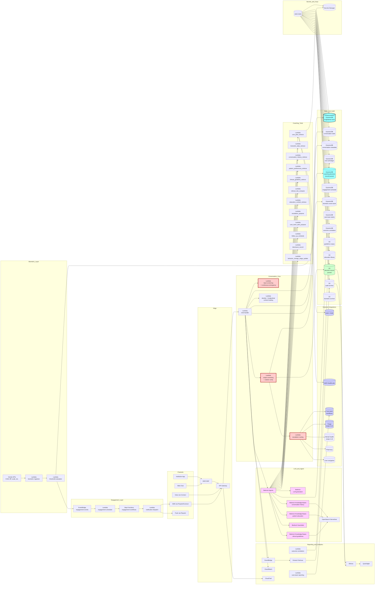

# Recipe 11.7 Architecture and Implementation: Chronic Disease Management Coach

*Companion to [Recipe 11.7: Chronic Disease Management Coach](chapter11.07-chronic-disease-management-coach). This page covers the AWS architecture, services, prerequisites, and pseudocode. For the problem framing and the conceptual approach, start with the main recipe.*

---

## The AWS Implementation

### Why These Services

**Amazon Bedrock for the LLM and embeddings.** Same selection criteria as recipes 11.1 through 11.6. The chronic-disease coach specifically benefits from a model with strong tool-use, strong instruction-following for care-plan grounding, conversational warmth for relationship-quality engagement, and good multilingual support. Claude Sonnet-class models or comparable frontier models for the orchestration; smaller models for intent classification, behavior-change-stage estimation, and biometric-data summarization. Bedrock provides HIPAA-eligible deployment under BAA.

**Amazon Bedrock Knowledge Bases for the clinical-guideline and patient-education corpus.** The institution's clinical guidelines (per chronic condition: ADA standards for diabetes, ACC/AHA guidelines for hypertension and heart failure, GINA for asthma, GOLD for COPD, KDIGO for CKD, APA practice guidelines for depression) and the curated patient-education library are the coach's grounded retrieval source. Knowledge Bases provides the managed RAG layer with metadata-filtered retrieval (condition, audience, language, reading level, version).

**Amazon Bedrock Agents for tool orchestration.** Same selection rationale as the previous chapter 11 recipes. The coach's tools (care_plan_retrieve, biometric_data_retrieve, conversation_history_retrieve, patient_preferences_retrieve, clinical_guideline_retrieve, clinical_rule_compute, patient_education_content_retrieve, escalation_propose, care_team_alert_propose, follow_up_schedule, longitudinal_disclosure_record, behavior_change_stage_update) are defined as Agents action groups with OpenAPI schemas.

**Amazon Bedrock Guardrails for scope and content filtering.** Configured with denied topics including off-care-plan-treatment-recommendation, drug-prescription-attempted, new-condition-diagnosis-attempted, medical-advice-beyond-care-plan, and off-protocol clinical claims. The coach's scope discipline is critical because patients in long coaching relationships sometimes ask the coach for guidance the coach should defer to the care team.

**Amazon OpenSearch Service (or Bedrock-managed vector store) for the retrieval indices.** The clinical-guideline corpus, the patient-education library, and the longitudinal conversation history all benefit from vector retrieval. The longitudinal conversation history specifically is indexed for retrieval-over-history (when a patient mentions something said three months ago, the coach can find it).

**AWS HealthLake for FHIR-native chart-context data.** Where the institution stores the patient's problem list, medication list, allergies, encounter history, observations (vitals, labs), CarePlan resources, and Goal resources in FHIR, HealthLake provides a managed FHIR data store the coach queries. The CarePlan and Goal resources are particularly relevant for the care-plan integration; the Observation resources are particularly relevant for biometric-data integration (when the institution stores device data in FHIR).

**Amazon DynamoDB for state and longitudinal store.** Multiple tables supporting the coach's longitudinal pattern: `patient-longitudinal-store` (per-patient stable state including stated preferences, behavior-change-stage estimates, life-context disclosures), `conversation-state` (per-conversation transient state), `conversation-metadata` (per-conversation turn-by-turn data), `tool-call-ledger` (audited tool invocations), `coaching-decision-record-journal` (durable record of coaching events with citations), `engagement-schedule` (upcoming proactive engagement events), `biometric-event-store` (recent biometric data and threshold events with TTL for hot path; archive to S3 for long-term), `care-team-alert-queue` (alerts pending care-team review), and `outcome-correlation-pending` (pending outcome correlation records).

**Amazon S3 for guideline corpus, education library, conversation archive, decision-record journal, biometric-data archive, and outcome-correlation data.** Object Lock in compliance mode for the retention window.

**AWS Lambda for the coach handler, tool implementations, biometric-data ingestion, engagement scheduler, and care-team reporting.** Same pattern as the previous chapter 11 recipes.

**Amazon API Gateway and AWS WAF for the public chat endpoint.** Same as the other recipes. Rate limits tuned for the coaching use case.

**Amazon Connect for SMS, voice, and care-team handoff (where the institution uses voice channel).** Coaching engagement via SMS is particularly common; voice channel less so but supported for accessibility.

**Amazon SNS or Amazon Pinpoint for proactive engagement notification.** Push notifications for in-app engagement, SMS for SMS engagement, email for email engagement. Pinpoint provides the per-channel orchestration with delivery-status tracking.

**Amazon EventBridge for the coach-event bus.** Coaching events including engagement_scheduled, engagement_delivered, engagement_responded, biometric_threshold_crossed, escalation_triggered, care_team_alert_generated, behavior_change_stage_updated, life_context_recorded, conversation_completed, outcome_correlation_completed.

**AWS Step Functions for engagement-scheduling workflows.** The engagement scheduler runs as a Step Functions workflow with delay states, decision states, and integration with the engagement-policy logic. Patient-care-plan-driven schedules are durable.

**AWS IoT Core (where the institution provides connected devices directly) or vendor-API integration for biometric data.** Most institutions use vendor-managed device platforms (Dexcom for CGM, Withings for BP cuffs, Omron, Bodyport, Apple Health, Google Fit, etc.) and integrate via vendor APIs. AWS IoT Core may be used where the institution distributes branded connected devices or where direct device-to-cloud integration is preferred.

**Amazon SageMaker (optional) for behavior-change-stage classifier hosting.** When the institution trains a custom classifier for behavior-change-stage estimation, SageMaker provides the hosted-inference endpoint.

**AWS KMS, AWS Secrets Manager, Amazon CloudWatch, AWS CloudTrail, Amazon Kinesis Data Firehose, AWS Glue, Amazon Athena.** Same operational and audit primitives as the previous recipes.

**Amazon QuickSight for clinical, operational, and outcome dashboards.** Per-condition outcome dashboards (A1c trajectory, BP control rate, hospitalization rate), per-cohort engagement and attrition dashboards, citation-coverage rate, escalation-rate dashboards.

### Architecture Diagram



### Prerequisites

| Requirement | Details |
|-------------|---------|
| **AWS Services** | Amazon Bedrock (Agents, Knowledge Bases, Guardrails, foundation model with strong tool-use, embedding model), Amazon OpenSearch Serverless, AWS HealthLake, AWS Lambda, AWS Step Functions, Amazon API Gateway, AWS WAF, Amazon DynamoDB, Amazon S3, AWS KMS, AWS Secrets Manager, Amazon CloudWatch, AWS CloudTrail, Amazon EventBridge, Amazon Kinesis Data Firehose, AWS Glue, Amazon Athena, Amazon Pinpoint or Amazon SNS, Amazon Connect (where SMS or voice channel is used), Amazon QuickSight (dashboards). Optionally: AWS IoT Core (institution-distributed connected devices), Amazon SageMaker (custom behavior-change-stage classifier or other ML hosting). |
| **External Inputs** | EHR or FHIR-native chart-context (Patient, Condition, MedicationStatement, AllergyIntolerance, Encounter, Observation, CarePlan, Goal resources). Clinical-guideline corpus per chronic condition (institutionally curated and version-controlled, drawing from authoritative sources: ADA standards for diabetes, ACC/AHA for hypertension and heart failure, GINA for asthma, GOLD for COPD, KDIGO for CKD, APA for depression, others as relevant). Patient-education content library (institutionally reviewed and version-controlled, multilingual and multi-reading-level). Care-plan templates per condition (institutionally signed off by clinical-specialty leadership, version-controlled, instantiated per patient with patient-specific values and signed by the patient's clinical team). Biometric-device integrations (vendor APIs for CGM, BP cuff, scale, peak flow meter, pulse oximeter, smartwatch, others as relevant). Pharmacy adherence data (prescription fill records for outcome correlation against medication adherence). Care-team workflow integration (alert delivery to PCP, specialist, care manager). Triage workflow integration (recipe 11.6) for acute-symptom escalation. Mental-health pathway integration (recipe 11.8) for behavioral-health escalation. Care-navigation integration for social-determinants concerns. Outcome-correlation data pipeline pulling subsequent encounter records, lab results, prescription fills, and patient-reported outcomes. Mandatory-reporting workflow integration for disclosures triggering statutory obligations. |
| **IAM Permissions** | Per-Lambda least-privilege roles. The chart-context and care-plan-retrieve Lambdas have read access to the EHR or HealthLake. The biometric-data-retrieve Lambda has read access to the biometric data store. The longitudinal-disclosure-record Lambda has write access to the longitudinal store. The care-team-alert Lambda has write access to the care-team alert queue. The clinical-rule Lambdas have no external-system access (pure compute). None of the coach's Lambdas have write access to the clinical record except for institutionally-approved coaching-event records (e.g., FHIR Communication resources for the conversation log; FHIR Observation resources for patient-reported data where the institution permits coach-originated observations). Resource-based policies pin invoking principals to the production agent and API Gateway stage ARNs. |
| **BAA and Compliance** | AWS BAA signed. Verify all services in scope are HIPAA-eligible at build time. The coach is patient-facing PHI; the audit and retention story must satisfy HIPAA Privacy and Security Rules plus state-specific medical-record retention rules and any FDA SaMD post-market obligations. The clinical-guideline corpus may have specific licensing restrictions for content drawn from specialty societies; the legal team reviews. The institutional regulatory team reviews the FDA-strategy positioning before launch and on each material scope change. The institutional malpractice insurer is part of the policy review. State-specific regulations on AI-mediated patient communication, on telehealth, and on remote patient monitoring may apply.  |
| **Encryption** | Care-plan store, longitudinal store, biometric data store, conversation archive, coaching-decision-record journal, clinical-guideline corpus, patient-education corpus: SSE-KMS with customer-managed keys. S3 archives: Object Lock in compliance mode for the retention window, lifecycle to S3 Glacier Deep Archive after 90 days. DynamoDB tables: customer-managed KMS at rest. Lambda environment variables: KMS-encrypted. Secrets Manager: customer-managed KMS. TLS in transit for all AWS API calls and all integrations with external systems. Different KMS key per data class for blast-radius containment, with the longitudinal store and the coaching-decision-record journal having separate keys reflecting their distinct retention and access patterns. |
| **VPC** | Production: tool Lambdas that call EHR, biometric-vendor APIs, care-team workflows, pharmacy systems, and care-navigation systems run in VPC with controlled egress. PrivateLink to vendor-hosted endpoints where supported; tightly-scoped NAT path with allow-list otherwise. VPC endpoints for DynamoDB, S3, KMS, Secrets Manager, CloudWatch Logs, EventBridge, Bedrock, OpenSearch Serverless, HealthLake, Step Functions, Pinpoint, and SageMaker (where used). The patient-facing edge is public; the back-office traffic is private. |
| **CloudTrail** | Enabled with data events on all sensitive S3 buckets (audit-archive, coaching-decision-record-journal, biometric-data archive, guideline corpus, education library) and DynamoDB tables (longitudinal store, coaching-decision-record journal, etc.), Secrets Manager secrets, and customer-managed KMS keys. Bedrock and Bedrock Agents invocations logged with metadata. Lambda invocations logged. API Gateway access logs enabled. Step Functions execution logs enabled. CloudTrail logs in a dedicated S3 bucket with Object Lock in compliance mode and lifecycle to Glacier Deep Archive after 90 days. Audit retention sized to the longer of HIPAA's six-year minimum, state medical-record retention rules, and FDA SaMD post-market obligations where applicable. |
| **Sample Data** | Synthetic patient profiles stratified by chronic condition, by combination of conditions, by age cohort, by sex, by language, by socioeconomic context, by behavior-change stage, by engagement profile (high engagement, low engagement, attrition risk). Synthetic care plans covering the institution's full condition catalog. Synthetic biometric-data streams covering normal patterns, threshold-crossing patterns, concerning trends, and noisy/erroneous data. Synthetic conversation histories covering long-running engagement, attrition patterns, sensitive disclosures, escalation triggers, behavior-change-stage transitions, and life-event-driven adherence disruption. Validated patient-education content reviewed by the institution's patient-education committee and clinical leadership. Validated translations of all patient-facing content reviewed by the institution's language-services team and clinical leadership. Test EHR, biometric-vendor, care-team-workflow, and care-navigation systems with synthetic data. |
| **Cost Estimate** | At a mid-sized health system or payer scale (50,000 active coached members across multiple chronic conditions; average 2-4 conversational engagements per week per active member; average 3-8 turns per engagement; average 1,500 tokens of prompt and 350 tokens of response per turn for the orchestration model plus tool-call overhead): Bedrock LLM invocations typically $3-8 per active member per month for a Sonnet-class orchestration model, totaling approximately $1.8M-4.8M per year. Bedrock Agents and Knowledge Bases hosting plus the OpenSearch Serverless retrieval indices typically $50,000-200,000 per year. Lambda, API Gateway, WAF, DynamoDB, S3, KMS, Secrets Manager, CloudWatch, CloudTrail, EventBridge, Kinesis Firehose, Glue, Athena, Step Functions total approximately $100,000-400,000 per year combined. AWS HealthLake (when used as the FHIR chart-context source) typically $50,000-200,000 per year depending on data volume and resource count. Pinpoint or SNS for proactive engagement notification typically $20,000-80,000 per year depending on channel mix. Connect (when SMS or voice channel is used) typically $30,000-150,000 per year. SageMaker (when used for hosted classifier) typically $20,000-80,000 per year. Total AWS infrastructure typically $2.0M-5.9M per year at this scale (approximately $3-12 per active member per month, dominated by LLM invocation volume). The infrastructure cost is small relative to the cost of even a few avoided hospitalizations per year (a single avoided heart-failure admission, diabetic-ketoacidosis admission, or COPD-exacerbation admission has typical institutional cost in the tens of thousands of dollars).  |

### Ingredients

| AWS Service | Role |
|------------|------|
| **Amazon Bedrock** | LLM for orchestration and conversational response generation; embedding model for the guideline corpus, education library, and conversation history |
| **Amazon Bedrock Agents** | Tool orchestration: define coaching tools as action groups, manage the multi-step LLM-and-tool flow |
| **Amazon Bedrock Knowledge Bases** | Managed RAG over (a) clinical guidelines, (b) patient education library, (c) longitudinal conversation history. Metadata-filtered retrieval (condition, audience, language, reading level, version, time window) |
| **Amazon OpenSearch Serverless** | Vector and lexical retrieval index backing each Knowledge Base |
| **Amazon Bedrock Guardrails** | Content filtering for off-care-plan-treatment-recommendation, drug-prescription-attempted, new-condition-diagnosis-attempted, off-protocol clinical claims |
| **AWS Lambda** | Chat handler, input/output screening, identity-and-longitudinal-context loading, escalation routing, biometric-data ingestion, biometric-threshold evaluation, engagement scheduler dispatch, notification dispatch, care-team reporting, outcome correlation, and tool implementations (care_plan_retrieve, biometric_data_retrieve, conversation_history_retrieve, patient_preferences_retrieve, clinical_guideline_retrieve, clinical_rule_compute, education_content_retrieve, escalation_propose, care_team_alert_propose, follow_up_schedule, disclosure_record, behavior_change_stage_update) |
| **AWS Step Functions** | Engagement-scheduling workflows with delay states, decision states, integration with engagement-policy logic |
| **Amazon API Gateway** | Public-facing chat endpoint for web, app, SMS, and voice channels |
| **AWS WAF** | Rate limiting, bot detection, common attack patterns |
| **Amazon DynamoDB** | patient-longitudinal-store, conversation-state, conversation-metadata, tool-call-ledger, coaching-decision-record-journal, engagement-schedule, biometric-event-store, care-team-alert-queue, outcome-correlation-pending |
| **Amazon S3** | Clinical-guideline corpus, patient-education library, conversation archive, coaching-decision-record journal, biometric-data long-term archive, outcome-correlation data |
| **AWS HealthLake** | FHIR-native chart context (Patient, Condition, MedicationStatement, AllergyIntolerance, Encounter, Observation, CarePlan, Goal) |
| **AWS KMS** | Customer-managed encryption keys per data class |
| **AWS Secrets Manager** | Credentials for EHR, biometric-vendor APIs, care-team workflow systems, pharmacy systems, care-navigation systems |
| **Amazon CloudWatch** | Operational metrics (engagement rate, attrition rate, escalation rate, citation-coverage rate, conservative-bias-compliance rate, per-condition outcome trajectories, per-cohort slices); alarms |
| **AWS CloudTrail** | API-level audit logging |
| **Amazon EventBridge** | Coaching-event bus (engagement_scheduled, engagement_delivered, engagement_responded, biometric_threshold_crossed, escalation_triggered, care_team_alert_generated, behavior_change_stage_updated, life_context_recorded, conversation_completed, outcome_correlation_completed) |
| **Amazon Pinpoint or Amazon SNS** | Proactive engagement notification (push, SMS, email) with delivery-status tracking |
| **Amazon Connect (where used)** | SMS or voice channel infrastructure |
| **Amazon Kinesis Data Firehose** | Streaming audit and telemetry delivery |
| **AWS Glue Data Catalog + Amazon Athena** | SQL access to audit, decision-record, biometric, outcome-correlation, and telemetry data |
| **AWS IoT Core (where used)** | Institution-distributed connected device integration |
| **Amazon SageMaker (where used)** | Hosted custom classifier inference (e.g., behavior-change-stage classifier) |
| **Amazon QuickSight** | Clinical, operational, and outcome dashboards |

---

### Code

#### Walkthrough

**Step 1: Enroll the patient and instantiate the longitudinal store.** Enrollment is a clinical event, not a self-service signup. The patient's care team identifies them as appropriate for coaching, selects the care-plan template per the patient's primary chronic condition (and any secondary conditions), instantiates the care plan with patient-specific values, and signs it. The patient reviews and consents. The longitudinal store is initialized with the care plan reference, baseline behavior-change-stage estimates, baseline biometric values, and any patient preferences captured at intake. Skip this step and the coach has no foundation; the patient receives generic content with no longitudinal continuity.

```pseudocode
ON enroll_patient(patient_id, primary_condition,
                  secondary_conditions,
                  clinical_team_signoff):
    // Step 1A: select care-plan template.
    template = care_plan_template_registry.select({
        primary_condition: primary_condition,
        secondary_conditions: secondary_conditions,
        institution_id: INSTITUTION_ID
    })

    // Step 1B: instantiate care plan with
    // patient-specific values.
    care_plan = instantiate_care_plan(
        template: template,
        patient_id: patient_id,
        patient_chart_context: load_chart_context(
            patient_id: patient_id),
        clinical_team_inputs:
            clinical_team_signoff.inputs)

    care_plan.id = generate_care_plan_id()
    care_plan.version = "v1.0"
    care_plan.signed_by =
        clinical_team_signoff.signing_clinicians
    care_plan.signed_at = now()
    care_plan.effective_date = now()
    care_plan.next_review_date =
        now() + 365_DAYS

    care_plan_store.write(care_plan)

    // Step 1C: present care plan to patient for
    // review and consent.
    consent = present_care_plan_for_consent(
        patient_id: patient_id,
        care_plan: care_plan)

    IF NOT consent.granted:
        return { action: "enrollment_declined" }

    // Step 1D: initialize longitudinal store.
    longitudinal_store = {
        patient_id: patient_id,
        active_care_plans: [care_plan.id],
        primary_condition: primary_condition,
        secondary_conditions: secondary_conditions,
        behavior_change_stage_per_goal:
            initialize_behavior_change_stages(
                care_plan: care_plan,
                patient_chart_context:
                    load_chart_context(
                        patient_id: patient_id)),
        patient_preferences: {
            preferred_channels:
                consent.preferred_channels,
            quiet_hours: consent.quiet_hours,
            language: consent.language,
            preferred_name: consent.preferred_name,
            engagement_intensity_preference:
                consent.engagement_intensity
        },
        biometric_data_baseline: {},
        adherence_pattern_baseline: {},
        life_context_disclosures: [],
        outcome_tracking_baseline:
            extract_outcome_tracking_baseline(
                patient_id: patient_id,
                care_plan: care_plan),
        enrolled_at: now(),
        active: true
    }

    longitudinal_store_table.write(longitudinal_store)

    // Step 1E: schedule initial onboarding
    // engagement.
    engagement_scheduler.schedule({
        patient_id: patient_id,
        engagement_type: "onboarding_introduction",
        delivery_target: now() + 24_HOURS,
        priority: "high"
    })

    EventBridge.PutEvents([{
        source: "chronic_coach",
        detail_type: "patient_enrolled",
        detail: {
            patient_id: patient_id,
            care_plan_id: care_plan.id,
            primary_condition: primary_condition
        }
    }])

    return {
        action: "enrolled",
        care_plan_id: care_plan.id
    }
```

**Step 2: Ingest biometric data and evaluate against care-plan thresholds.** Connected devices feed the coach. Each reading is validated, stored, and evaluated against thresholds specified in the patient's care plan. Threshold-crossing events trigger engagement (or escalation, depending on severity). The thresholds are not chosen by the LLM; they are clinical-care-plan inputs signed by the patient's clinical team. Skip this and the coach is missing one of its highest-value inputs (the data the patient is generating between visits).

```pseudocode
ON biometric_data_received(patient_id, device_type,
                           reading, reading_timestamp):
    // Step 2A: validate the reading.
    validation = validate_biometric_reading({
        device_type: device_type,
        reading: reading,
        patient_id: patient_id
    })

    IF NOT validation.valid:
        log_invalid_reading(
            patient_id: patient_id,
            device_type: device_type,
            reading: reading,
            reason: validation.reason)
        return { action: "invalid_reading_discarded" }

    // Step 2B: store the reading.
    biometric_event_store.write({
        patient_id: patient_id,
        device_type: device_type,
        reading: reading,
        reading_timestamp: reading_timestamp,
        ingested_at: now()
    })

    // Step 2C: load patient's care plan for
    // threshold evaluation.
    care_plan = care_plan_store.read_active(
        patient_id: patient_id)

    thresholds = care_plan.biometric_thresholds_for(
        device_type: device_type)

    // Step 2D: evaluate single-reading thresholds.
    single_reading_event = evaluate_single_reading(
        reading: reading,
        thresholds: thresholds.single_reading)

    // Step 2E: evaluate trend thresholds (recent
    // readings).
    recent_readings = biometric_event_store
        .recent_for_patient(
            patient_id: patient_id,
            device_type: device_type,
            window:
                thresholds.trend_evaluation_window)

    trend_event = evaluate_trend(
        recent_readings: recent_readings,
        thresholds: thresholds.trend)

    // Step 2F: evaluate pattern thresholds.
    pattern_event = evaluate_pattern(
        recent_readings: recent_readings,
        thresholds: thresholds.pattern)

    // Step 2G: dispatch events.
    FOR event IN [single_reading_event,
                  trend_event,
                  pattern_event]:
        IF event.severity == "engagement":
            engagement_scheduler.schedule({
                patient_id: patient_id,
                engagement_type:
                    "biometric_followup",
                trigger_event: event,
                delivery_target:
                    next_engagement_window(
                        patient_id: patient_id,
                        priority: event.priority),
                priority: event.priority
            })

        ELSE IF event.severity == "escalation":
            escalation_propose_tool.invoke({
                patient_id: patient_id,
                trigger_reason:
                    "biometric_threshold_crossed",
                trigger_event: event,
                care_plan_reference:
                    care_plan.id
            })

        EventBridge.PutEvents([{
            source: "chronic_coach",
            detail_type: "biometric_threshold_crossed",
            detail: {
                patient_id: patient_id,
                device_type: device_type,
                event_type: event.type,
                severity: event.severity
            }
        }])

    return { action: "biometric_data_processed" }
```

**Step 3: Schedule and deliver proactive engagement.** The engagement scheduler runs as a Step Functions workflow respecting the patient's preferences (channels, quiet hours, opt-outs), the institution's engagement policy (maximum frequency, fatigue mitigation), and the care plan's prescribed cadence. Each scheduled engagement composes a personalized message via the LLM grounded in the patient's longitudinal context, runs through output safety, and delivers via the preferred channel. Skip this and the coach is purely reactive, which limits its value to the patients who would have engaged unprompted (a small fraction of the broad chronic-disease majority).

```pseudocode
ON scheduled_engagement_due(scheduled_engagement):
    patient_id = scheduled_engagement.patient_id

    // Step 3A: load longitudinal store.
    longitudinal = longitudinal_store_table.read(
        patient_id: patient_id)

    IF NOT longitudinal.active:
        return { action: "patient_inactive_skip" }

    // Step 3B: enforce engagement policy.
    policy_check = enforce_engagement_policy({
        patient_id: patient_id,
        scheduled_engagement: scheduled_engagement,
        patient_preferences:
            longitudinal.patient_preferences,
        recent_engagement_history:
            engagement_history_table.recent(
                patient_id: patient_id,
                window: 7_DAYS)
    })

    IF policy_check.action == "skip_quiet_hours":
        engagement_scheduler.reschedule({
            scheduled_engagement: scheduled_engagement,
            new_target:
                next_non_quiet_window(
                    patient_id: patient_id)
        })
        return { action: "rescheduled_quiet_hours" }

    IF policy_check.action == "skip_fatigue":
        engagement_scheduler.cancel({
            scheduled_engagement: scheduled_engagement,
            reason: "engagement_fatigue_mitigation"
        })
        return { action: "cancelled_fatigue" }

    IF policy_check.action == "skip_topic_optout":
        engagement_scheduler.cancel({
            scheduled_engagement: scheduled_engagement,
            reason: "topic_optout"
        })
        return { action: "cancelled_topic_optout" }

    // Step 3C: compose engagement message.
    care_plan = care_plan_store.read_active(
        patient_id: patient_id)

    recent_biometric = biometric_event_store
        .recent_for_patient(
            patient_id: patient_id,
            window:
                scheduled_engagement
                    .biometric_window)

    recent_conversation =
        conversation_history_retrieve_tool.invoke({
            patient_id: patient_id,
            window: 14_DAYS,
            max_turns: 30
        })

    composed = compose_engagement_message({
        scheduled_engagement: scheduled_engagement,
        care_plan: care_plan,
        longitudinal_store: longitudinal,
        recent_biometric: recent_biometric,
        recent_conversation: recent_conversation,
        behavior_change_stage:
            longitudinal
                .behavior_change_stage_per_goal,
        language:
            longitudinal.patient_preferences
                .language,
        preferred_name:
            longitudinal.patient_preferences
                .preferred_name
    })

    // Step 3D: output safety screening.
    safety_check = screen_output(
        response: composed.message,
        session_context: {
            patient_id: patient_id,
            care_plan_id: care_plan.id,
            engagement_type:
                scheduled_engagement
                    .engagement_type
        })

    IF safety_check.action != "deliver":
        log_engagement_screening_failure(
            patient_id: patient_id,
            scheduled_engagement: scheduled_engagement,
            safety_check: safety_check)
        return { action: "screening_failed" }

    // Step 3E: deliver engagement.
    delivered = deliver_engagement({
        patient_id: patient_id,
        message: composed.message,
        channel:
            longitudinal.patient_preferences
                .preferred_channels[0],
        engagement_id:
            scheduled_engagement.id,
        scheduled_engagement_type:
            scheduled_engagement.engagement_type
    })

    // Step 3F: log engagement event.
    engagement_history_table.write({
        patient_id: patient_id,
        engagement_id:
            scheduled_engagement.id,
        engagement_type:
            scheduled_engagement.engagement_type,
        composed_message_summary:
            composed.summary,
        delivered_at: now(),
        channel: delivered.channel,
        delivery_status: delivered.status
    })

    EventBridge.PutEvents([{
        source: "chronic_coach",
        detail_type: "engagement_delivered",
        detail: {
            patient_id: patient_id,
            engagement_id:
                scheduled_engagement.id,
            engagement_type:
                scheduled_engagement.engagement_type
        }
    }])

    return { action: "engagement_delivered" }
```

**Step 4: Handle patient-initiated or patient-responding conversation with longitudinal-context loading.** The coach loads the full longitudinal context (care plan, recent biometric data, recent conversation history, patient preferences, behavior-change-stage estimates, recent life-context disclosures) before generating any response. The longitudinal context is the architectural primitive that makes the coach a coach rather than a chatbot. Skip this and every conversation starts from scratch, which destroys the relationship the coach is supposed to maintain.

```pseudocode
ON receive_message(channel, channel_session_id,
                  user_message, auth_context):
    // Step 4A: identify or create the conversation
    // session.
    session = conversation_state_table.get_or_create({
        channel: channel,
        channel_session_id: channel_session_id,
        auth_context: auth_context
    })

    patient_id = session.verified_patient_id

    // Step 4B: persist the user's message.
    conversation_metadata_table.append_turn(
        session_id: session.id,
        turn: {
            speaker: "user",
            text: user_message,
            timestamp: now()
        })

    // Step 4C: input safety screening with
    // continuous emergency detection.
    screening_result = screen_input(
        session_id: session.id,
        user_message: user_message,
        domain: "chronic_disease_coaching")

    IF screening_result.action == "block":
        return handle_block(
            session_id: session.id,
            screening_result: screening_result)

    // Step 4D: continuous emergency screening.
    emergency_check = emergency_screen_tool.invoke({
        user_message: user_message,
        recent_turns: conversation_metadata_table
            .recent_turns(session.id, k: 6),
        chart_context_summary:
            session.chart_context_summary,
        active_conditions:
            session.active_conditions
    })

    IF emergency_check.emergency_detected:
        return handle_emergency_routing(
            session_id: session.id,
            emergency_category:
                emergency_check.category,
            urgency: emergency_check.urgency)
        // Routes to triage workflow (recipe 11.6),
        // 911, 988, or institutional crisis line
        // as appropriate.

    // Step 4E: sensitive-disclosure detection.
    disclosure_check = sensitive_disclosure_screen({
        user_message: user_message,
        recent_turns: conversation_metadata_table
            .recent_turns(session.id, k: 6),
        active_conditions:
            session.active_conditions
    })

    IF disclosure_check.disclosure_detected:
        handle_sensitive_disclosure(
            session_id: session.id,
            disclosure: disclosure_check)
        // Continues conversation but flags for
        // appropriate routing (mandatory reporter
        // for some categories; care navigation for
        // others; mental-health pathway for crisis).

    // Step 4F: load longitudinal context.
    longitudinal = longitudinal_store_table.read(
        patient_id: patient_id)
    care_plan = care_plan_store.read_active(
        patient_id: patient_id)
    recent_biometric = biometric_event_store
        .recent_for_patient(
            patient_id: patient_id,
            window: 30_DAYS)
    recent_conversation =
        conversation_history_retrieve_tool.invoke({
            patient_id: patient_id,
            window: 90_DAYS,
            max_turns: 50
        })
    long_term_summary =
        longitudinal_summary_table.read(
            patient_id: patient_id)
    open_followups =
        followup_table.open_for_patient(
            patient_id: patient_id)

    session.longitudinal_context = {
        longitudinal: longitudinal,
        care_plan: care_plan,
        recent_biometric: recent_biometric,
        recent_conversation: recent_conversation,
        long_term_summary: long_term_summary,
        open_followups: open_followups
    }

    return handle_conversation(
        session_id: session.id,
        user_message: user_message)
```

**Step 5: Generate the response with care-plan-grounded reasoning and behavior-change-stage adaptation.** The LLM operates as a Bedrock Agent with the coaching tool surface. The system prompt includes the patient's behavior-change stage per goal, the patient's stated preferences, the active care plan, and the relevant clinical guidelines. Tool calls retrieve specific care-plan elements, biometric data, conversation history, education content, and clinical-guideline references as needed. The tone, pacing, and content are adapted to the patient's behavior-change stage. Skip the stage adaptation and the coach is appropriate for some patients and counter-productive for others.

```pseudocode
FUNCTION handle_conversation(session_id, user_message):
    session = conversation_state_table.get(session_id)
    longitudinal_context = session.longitudinal_context

    // Step 5A: assemble system prompt.
    system_prompt = compose_coaching_system_prompt({
        coach_persona:
            INSTITUTION_COACH_PERSONA,
        active_care_plan: longitudinal_context
            .care_plan,
        active_conditions: longitudinal_context
            .longitudinal
            .primary_condition,
        secondary_conditions: longitudinal_context
            .longitudinal
            .secondary_conditions,
        behavior_change_stage_per_goal:
            longitudinal_context
                .longitudinal
                .behavior_change_stage_per_goal,
        patient_preferences:
            longitudinal_context
                .longitudinal
                .patient_preferences,
        long_term_summary: longitudinal_context
            .long_term_summary,
        open_followups: longitudinal_context
            .open_followups,
        regulatory_position:
            INSTITUTION_REGULATORY_POSITION,
        scope_boundaries:
            COACH_SCOPE_BOUNDARIES,
        language:
            longitudinal_context
                .longitudinal
                .patient_preferences
                .language
    })

    // Step 5B: invoke Bedrock Agent.
    agent_response = bedrock_agents_invoke({
        agent_id: COACH_AGENT_ID,
        agent_alias_id: COACH_AGENT_ALIAS_ID,
        session_id: session_id,
        input_text: user_message,
        system_prompt: system_prompt,
        recent_conversation: longitudinal_context
            .recent_conversation,
        recent_biometric: longitudinal_context
            .recent_biometric
    })

    // Step 5C: audit tool calls.
    FOR tool_call IN agent_response.tool_calls:
        audit_tool_call(
            session_id: session_id,
            tool: tool_call.tool_name,
            arguments: tool_call.arguments,
            result_summary:
                summarize_for_audit(
                    tool_call.result))

    // Step 5D: capture citations.
    citations = extract_citations(agent_response)

    // Step 5E: behavior-change-stage update.
    stage_signal = evaluate_behavior_change_signals({
        user_message: user_message,
        recent_conversation: longitudinal_context
            .recent_conversation,
        current_stages: longitudinal_context
            .longitudinal
            .behavior_change_stage_per_goal
    })

    IF stage_signal.update_warranted:
        behavior_change_stage_update_tool.invoke({
            patient_id: session.verified_patient_id,
            goal_id: stage_signal.goal_id,
            new_stage: stage_signal.new_stage,
            evidence: stage_signal.evidence
        })

    return {
        action: "response_generated",
        response_text: agent_response.response_text,
        citations: citations,
        tool_calls: agent_response.tool_calls
    }
```

**Step 6: Run output safety screening with citation grounding, scope verification, and behavior-change-stage tone check.** Every recommendation must trace to a cited care-plan element, clinical guideline, or institutional patient-education content. Scope verification rejects responses that attempt diagnosis, off-care-plan treatment recommendation, or new-condition guidance. The tone check verifies that the response is appropriate for the patient's behavior-change stage. Skip this and the coach occasionally produces ungrounded, off-scope, or stage-inappropriate responses.

```pseudocode
FUNCTION screen_coach_output(session_id, response,
                             citations, tool_calls):
    // Step 6A: standard output safety primitives.
    standard_check = standard_output_screen.evaluate(
        response: response,
        session_context:
            session_context_for(session_id))

    IF standard_check.action != "deliver":
        return standard_check

    // Step 6B: scope checks specific to coaching.
    scope_violation = detect_coaching_scope_violations(
        response: response)
    // Categories:
    // - off_care_plan_treatment_recommendation
    // - drug_prescription_attempted
    // - new_condition_diagnosis_attempted
    // - care_team_role_assumption
    // - clinical_judgment_beyond_scope

    IF scope_violation:
        return {
            action: "replace_with_safe_response",
            replacement:
                COACH_OUT_OF_SCOPE_TEMPLATE,
            violation: scope_violation.category
        }

    // Step 6C: citation verification.
    session = conversation_state_table.get(session_id)
    care_plan_id =
        session.longitudinal_context.care_plan.id

    citation_check = verify_coaching_citations(
        response: response,
        citations: citations,
        care_plan_id: care_plan_id,
        cited_guidelines: citations.guidelines,
        cited_education: citations.education_content)

    IF citation_check.has_ungrounded_assertions:
        return {
            action: "regenerate_with_grounding",
            ungrounded_assertions:
                citation_check
                    .ungrounded_assertions
        }

    // Step 6D: behavior-change-stage tone check.
    stages = session.longitudinal_context
        .longitudinal
        .behavior_change_stage_per_goal

    stage_check = verify_stage_appropriate_tone({
        response: response,
        relevant_stages: stages,
        language: session.language
    })

    IF NOT stage_check.appropriate:
        return {
            action: "regenerate_with_stage_adaptation",
            stage_guidance: stage_check.guidance
        }

    // Step 6E: care-plan-deviation check.
    deviation_check = check_care_plan_deviation({
        response: response,
        care_plan: session.longitudinal_context
            .care_plan
    })

    IF deviation_check.deviation_detected:
        return {
            action: "escalate_to_care_team",
            reason: "response_would_deviate_from_plan",
            deviation: deviation_check.details
        }

    // Step 6F: persona-and-tone check.
    persona_check =
        persona_and_tone_evaluator.evaluate(
            response: response,
            coach_persona:
                INSTITUTION_COACH_PERSONA,
            language: session.language)

    IF persona_check.action != "acceptable":
        return {
            action: "regenerate_with_persona_correction",
            persona_guidance:
                persona_check.guidance
        }

    return {
        action: "deliver",
        response: response
    }
```

**Step 7: Persist the durable coaching-decision record and longitudinal updates.** The conversation log captures the dialog. The coaching-decision-record journal captures, separately, every coaching decision (escalation events, biometric-threshold events, behavior-change-stage updates, care-plan-deviation events, recommendation-with-citation events) with version stamps. The longitudinal store is updated with any new disclosures, preference changes, or context the conversation revealed. Skip this and the audit story is intact only at the conversation level, which is enough for some reviews and not enough for clinical-quality and outcome-correlation ones.

```pseudocode
FUNCTION persist_coaching_artifacts(session_id,
                                     response,
                                     citations,
                                     tool_calls,
                                     longitudinal_updates):
    session = conversation_state_table.get(session_id)
    patient_id = session.verified_patient_id

    // Step 7A: append turn to conversation log.
    conversation_metadata_table.append_turn(
        session_id: session_id,
        turn: {
            speaker: "coach",
            text: response.text,
            citations: citations,
            tool_calls_summary:
                summarize_tool_calls(tool_calls),
            timestamp: now()
        })

    // Step 7B: write coaching-decision record(s).
    FOR decision IN extract_coaching_decisions(
            response: response,
            citations: citations,
            tool_calls: tool_calls):
        decision_record = {
            decision_id: generate_decision_id(),
            session_id: session_id,
            patient_id: patient_id,
            decision_type: decision.type,
                // recommendation_made
                // care_plan_deviation_flagged
                // behavior_change_stage_updated
                // biometric_followup_initiated
                // education_content_delivered
                // escalation_proposed
                // life_context_recorded
            decision_payload: decision.payload,
            citations: decision.citations,
            active_care_plan_id: session
                .longitudinal_context
                .care_plan.id,
            active_care_plan_version: session
                .longitudinal_context
                .care_plan.version,
            active_model_id: session.model_id,
            active_prompt_version:
                session.prompt_version,
            active_agent_version:
                session.agent_version,
            timestamp: now()
        }

        coaching_decision_record_journal.write(
            decision_record)

        EventBridge.PutEvents([{
            source: "chronic_coach",
            detail_type: "coaching_decision_recorded",
            detail: {
                decision_id:
                    decision_record.decision_id,
                decision_type:
                    decision_record.decision_type,
                patient_id: patient_id,
                care_plan_id:
                    decision_record
                        .active_care_plan_id
            }
        }])

    // Step 7C: update longitudinal store with any
    // new disclosures, preference changes,
    // behavior-change-stage updates.
    IF longitudinal_updates.has_updates:
        longitudinal_store_table.update({
            patient_id: patient_id,
            updates: longitudinal_updates
        })

        FOR disclosure IN
                longitudinal_updates.life_context_disclosures:
            EventBridge.PutEvents([{
                source: "chronic_coach",
                detail_type: "life_context_recorded",
                detail: {
                    patient_id: patient_id,
                    disclosure_category:
                        disclosure.category
                }
            }])

    // Step 7D: schedule any follow-up engagements.
    FOR followup IN extract_followups(
            response: response,
            tool_calls: tool_calls):
        engagement_scheduler.schedule({
            patient_id: patient_id,
            engagement_type:
                followup.engagement_type,
            delivery_target: followup.target,
            priority: followup.priority,
            context: followup.context
        })

    return { action: "artifacts_persisted" }
```

**Step 8: Generate care-team reports and run outcome correlation.** Real-time alerts flow to the care team for escalation events. Weekly digests summarize each patient's engagement, biometric trends, and key disclosures for the care team's review. Monthly summaries capture longitudinal trends. The outcome-correlation pipeline pulls subsequent encounter records, lab results, prescription fills, and patient-reported outcomes, calculates per-cohort and per-condition outcome metrics, and feeds signals back to the care-plan-template revision process. Skip this and the coach operates without care-team trust and without measurable outcome accountability.

```pseudocode
FUNCTION generate_care_team_reports():
    // Step 8A: real-time alerts.
    new_alerts = care_team_alert_queue.poll_new()

    FOR alert IN new_alerts:
        deliver_alert_to_care_team({
            alert: alert,
            target_clinician:
                resolve_target_clinician(
                    patient_id: alert.patient_id,
                    alert_type: alert.type),
            channel: care_team_alert_channel_for(
                alert: alert)
        })

        EventBridge.PutEvents([{
            source: "chronic_coach",
            detail_type:
                "care_team_alert_delivered",
            detail: {
                alert_id: alert.id,
                patient_id: alert.patient_id,
                alert_type: alert.type
            }
        }])

    // Step 8B: weekly digests (run as scheduled
    // workflow per institution cadence).
    FOR patient IN active_coached_patients():
        digest = compose_weekly_digest({
            patient_id: patient.id,
            window: 7_DAYS
        })

        deliver_digest_to_care_team({
            digest: digest,
            target_clinicians:
                resolve_target_clinicians_for_patient(
                    patient_id: patient.id),
            delivery_channel:
                care_team_digest_channel_for(
                    patient: patient)
        })

    // Step 8C: monthly summaries.
    // (same pattern as weekly digests, longer
    // window, deeper analysis)

    // Step 8D: outcome correlation.
    FOR pending_record IN
            outcome_correlation_pending_table
                .ready_for_correlation():
        encounters = pull_subsequent_encounters({
            patient_id: pending_record.patient_id,
            window_start:
                pending_record.window_start,
            window_end: now()
        })

        labs = pull_subsequent_labs({
            patient_id: pending_record.patient_id,
            window_start:
                pending_record.window_start,
            window_end: now()
        })

        prescription_fills =
            pull_prescription_fills({
                patient_id: pending_record.patient_id,
                window_start:
                    pending_record.window_start,
                window_end: now()
            })

        patient_reported_outcomes =
            pull_patient_reported_outcomes({
                patient_id: pending_record.patient_id,
                window_start:
                    pending_record.window_start,
                window_end: now()
            })

        correlation = correlate_outcomes({
            pending_record: pending_record,
            encounters: encounters,
            labs: labs,
            prescription_fills: prescription_fills,
            patient_reported_outcomes:
                patient_reported_outcomes
        })

        outcome_correlation_table.write(correlation)

        EventBridge.PutEvents([{
            source: "chronic_coach",
            detail_type:
                "outcome_correlation_completed",
            detail: {
                patient_id:
                    pending_record.patient_id,
                correlation_id: correlation.id
            }
        }])

    return { action: "reports_generated" }
```

> **Curious how this looks in Python?** The pseudocode above covers the concepts. If you'd like to see sample Python code that demonstrates these patterns using boto3, check out the [Python Example](chapter11.07-python-example). It walks through each step with inline comments and notes on what you'd need to change for a real deployment.

---

### Expected Results

**Sample conversation (illustrative, abbreviated, mid-relationship):**

```text
Coach:   Hi Maria, just checking in. I noticed
         your fasting glucose readings have been
         a bit higher this week (averaging around
         165, up from your usual 130-140). Anything
         going on? No judgment, just curious if
         something feels different.

Patient: hi. yeah my mom is visiting from out of
         town and she's been doing all the cooking.
         she makes really heavy food. its been hard
         to keep up with the meal stuff we talked
         about.

Coach:   Got it, that makes sense. Family visits
         are usually wonderful and also throw
         routines off. How long is she staying?

Patient: another two weeks.

Coach:   Two weeks is meaningful. A few thoughts,
         and tell me what feels realistic. We don't
         have to get back to your usual eating
         pattern this week. We can just try to keep
         the readings from going much higher than
         they are right now. Some things that often
         help during visits like this:

         - Asking your mom if she'd be open to using
           the lower-sugar version of one or two
           dishes she's making
         - Eating your usual breakfast on your own
           before she's up, since that's the meal
           that affects fasting glucose the most
         - Walking after dinner with her, which can
           bring evening readings down and is also
           just nice time together

         You don't have to do all of these. What
         feels like it could fit?

Patient: i could do the morning thing. she sleeps
         late.

Coach:   Perfect. Let's try that for a few days
         and see what happens with the fasting
         readings. Your usual breakfast is the
         oatmeal with the berries, right?

Patient: yes

Coach:   Sounds good. I'll check in with you at
         the end of the week to see how it's going.
         If your readings start coming back down
         that's great. If they don't, no problem,
         we'll figure something else out together.

         One more thing, and this is just for my
         awareness so I don't bother you with stuff
         that doesn't apply. Are you taking your
         metformin as usual through all of this?

Patient: yes ive been good about that

Coach:   Great, that helps a lot. Talk to you
         Friday. Enjoy time with your mom.

Patient: thanks 🙂
```

**Sample weekly care-team digest (illustrative):**

```json
{
  "patient_id": "patient-internal-id-redacted",
  "preferred_name": "Maria",
  "primary_condition": "type_2_diabetes",
  "secondary_conditions": [
    "hypertension",
    "dyslipidemia"
  ],
  "report_window": {
    "start": "2026-04-19",
    "end": "2026-04-25"
  },
  "engagement_summary": {
    "scheduled_engagements": 4,
    "delivered_engagements": 4,
    "patient_responded_engagements": 4,
    "patient_initiated_conversations": 1,
    "total_turns": 23,
    "engagement_quality_signals": [
      "consistent_response_within_24h",
      "voluntary_disclosure_of_context"
    ]
  },
  "biometric_trends": {
    "fasting_glucose": {
      "average": 162,
      "median": 165,
      "trend": "increased_from_baseline",
      "baseline": 138,
      "readings_count": 6,
      "concern_level": "moderate"
    },
    "blood_pressure_systolic": {
      "average": 132,
      "trend": "stable",
      "readings_count": 3,
      "concern_level": "low"
    },
    "weight": {
      "trend": "stable",
      "readings_count": 4,
      "concern_level": "low"
    }
  },
  "key_disclosures": [
    {
      "category": "life_context",
      "summary": "Mother visiting for two weeks; mother is doing the cooking; meal-pattern disruption.",
      "behavior_change_relevance": "preparation_to_action_regression_risk"
    }
  ],
  "behavior_change_stage_updates": [
    {
      "goal": "fasting_glucose_under_130",
      "previous_stage": "action",
      "current_stage": "action",
      "trend": "stable",
      "evidence": "engaged in problem-solving when challenge surfaced"
    }
  ],
  "open_followups": [
    {
      "followup_type": "morning_breakfast_routine_check",
      "scheduled_for": "2026-04-29"
    }
  ],
  "escalations_during_window": [],
  "recommended_care_team_action": "no_action_needed",
  "summary_for_clinician": "Maria is engaged and self-regulating well. Mother's visit is causing meal-pattern disruption that has elevated fasting glucose to ~160 range. Patient has agreed to maintain morning breakfast routine independently. Coach will follow up Friday. Recommend no clinical action this week; revisit at next scheduled visit if trend persists after mother's visit ends.",
  "active_care_plan_version_at_window":
    "diabetes-coaching-care-plan-v3.2",
  "report_generated_at": "2026-04-26T00:15:00Z"
}
```

**Performance benchmarks (illustrative, your mileage varies):**

| Metric | Pre-coach baseline (clinic visits only) | Post-coach (engaged members) |
|--------|----------------------------------------|------------------------------|
| Average A1c trajectory over 12 months | Stable or worsening for unmanaged majority | Improvement of 0.5 to 1.5 percentage points for engaged Type 2 diabetics |
| Blood pressure control rate (under goal) at 6 months | Typically 50-60% of hypertensive patients | 65-75% of engaged hypertensive patients |
| Heart failure 30-day readmission rate | Substantial baseline rate | Modest reduction in engaged HF patients |
| Medication adherence (PDC over 80%) | Typical baseline 50-60% for chronic medications | 65-75% for engaged members |
| Engagement attrition by 6 months | N/A | 30-50% (the central operational risk) |
| Patient satisfaction (CSAT, engaged members) | N/A | Generally positive, varies by program design |
| Per-active-member infrastructure cost | N/A | $3-12 per member per month |
| Time-to-meaningful-engagement | N/A | 4-8 weeks for relationship establishment; 6-12 months for clinical-outcome impact |
| Citation-coverage rate | N/A | 95%+ as launch-gate target |
| Per-cohort outcome disparity | Often invisible | Monitored explicitly |

**Where it struggles:**

- **Engagement attrition.** The central operational risk. Patients who stop responding are patients who lose the benefit. Mitigation: engagement-quality optimization across cadence, channel, content, and tone; per-cohort attrition monitoring; care-team intervention for high-risk attrition cases; channel-mix experimentation; content relevance tuning.
- **Reaching the patients who need it most.** The patients with the greatest disease burden are often the patients with the least access to and comfort with digital tools. Mitigation: multi-channel deployment (SMS-first as the dominant channel for reach), phone-channel option for patients who cannot or will not use chat, integration with care-management for high-risk members, language access from day one.
- **Self-reported adherence dishonesty.** Patients underreport non-adherence. Mitigation: outcome correlation against actual prescription fills, biometric data, and downstream events rather than relying on self-report; relationship-quality engineering to reduce the perceived consequence of honest disclosure.
- **Cross-condition complexity.** Multi-condition patients have interactions across conditions that single-condition protocols may miss. Mitigation: integrated coaching design, cross-condition alert logic, care-team review of high-complexity cases.
- **Acute-event detection in a chronic-condition context.** A patient in long-term coaching surfacing acute symptoms (chest pain, severe shortness of breath, suspected stroke) needs immediate routing to acute care. Mitigation: continuous emergency screening that runs on every utterance regardless of conversation context; immediate routing to triage workflow (recipe 11.6) or direct emergency contacts.
- **Behavior-change-stage misestimation.** A coach pushing prescriptive interventions on a patient still in pre-contemplation will get the patient to opt out. Mitigation: explicit behavior-change-stage tracking with adaptive conversation style; clinical-quality review tags stage-mismatch as a failure mode.
- **Cultural and linguistic gaps.** Content developed for one demographic may not transfer to others. Mitigation: per-language and per-cultural-context content development with clinical-leadership review; per-cohort outcome monitoring.
- **Patient distress and acute-mental-health crisis.** Chronic conditions correlate with depression and anxiety; coaching conversations may surface mental-health crisis. Mitigation: continuous emergency screening with crisis-pathway routing (988, institutional crisis line); integration with mental-health support pathway (recipe 11.8); regular sampled review of distress-flagged conversations.
- **Care-team workflow misalignment.** Alerts the care team cannot act on are alerts that erode trust. Mitigation: alert design with care-team feedback in production; alert-rate monitoring with thresholds for alert fatigue; periodic care-team-feedback review of alert quality.
- **Care-plan staleness.** A care plan signed eight months ago may no longer reflect the patient's current situation. Mitigation: annual care-plan review process, mid-year reviews triggered by clinical events (hospitalization, medication change, condition progression), patient-flag-for-review functionality.
- **Biometric-data integration failures.** Vendor APIs go down, patients change devices, devices have battery and connectivity issues. Mitigation: graceful degradation when biometric data is unavailable; patient-self-report as fallback; device-status monitoring with patient-facing notifications when device data is missing.
- **Privacy concerns and surveillance flavor.** Patients may experience the coach as intrusive, especially if engagement is too aggressive. Mitigation: explicit engagement-policy enforcement, patient-controlled opt-out granularity, periodic engagement-fatigue monitoring with cadence adjustment.
- **Outcome-attribution challenges.** Coached patients are not a random sample; the patients who engage are different from the ones who do not. Mitigation: matched-cohort or quasi-experimental outcome analysis; per-engagement-strata outcome stratification; recognition that observational outcome correlation is suggestive, not causal.
- **Long-term-relationship maintenance.** Patients who have been coached for two or three years may feel the relationship has gone stale. Mitigation: care-plan refresh process, periodic patient-feedback solicitation, structured boost interventions, and (in some products) periodic human-coach interactions to revitalize the relationship.
- **Regulatory positioning shifts.** FDA guidance on patient-facing digital health continues to evolve; the institutional positioning may shift. Mitigation: regulatory-strategy artifact reviewed regularly; architectural changes preserve flexibility for either non-regulated or registered SaMD positioning.
- **Care-team concerns about coach autonomy.** Some clinicians are concerned about an AI tool engaging with their patients between visits. Mitigation: clinical-leadership ownership and signoff at every level (care-plan templates, individual patient care plans, alert thresholds, coaching scope), care-team visibility into all coach interactions, robust feedback mechanisms.
- **Insurance and billing complexity.** Coaching may or may not be reimbursable depending on payer, condition, and program structure (CPT codes for remote patient monitoring, chronic care management, principal care management). Mitigation: institutional revenue-cycle and contracting team involvement from program design.
- **Adversarial inputs.** Patients (or others) attempting to extract information, manipulate recommendations, or test the system. Mitigation: input-safety pipeline with prompt-injection detection; output-safety pipeline with scope verification; per-language jailbreak-test corpus.
- **Health-equity disparities in engagement and outcomes.** Per-cohort monitoring may reveal that the coach reaches and benefits some populations more than others. Mitigation: per-cohort monitoring as launch-gate; periodic clinical-quality review with explicit equity focus; targeted outreach and content adaptation for underserved populations.

---

## Why This Isn't Production-Ready

The pseudocode and architecture above demonstrate the pattern. A production deployment needs to close several gaps that are intentionally out of scope for a recipe.

**Care-plan-corpus governance with full clinical-leadership signoff per condition.** The single largest pre-deployment investment is getting the care-plan templates correct, complete, version-controlled, and signed off per chronic condition. Each template is owned by the appropriate specialty leadership (endocrinology, cardiology, pulmonology, psychiatry, nephrology, others as relevant), reviewed before adoption, reviewed annually, and re-reviewed when clinical guidelines update. Each template has an effective date and an annual review schedule. The template is the launch gate; templates cannot go into production without clinical-leadership signoff.

**Clinical-guideline corpus with version control and licensing review.** The institution's clinical guideline corpus draws from authoritative sources per chronic condition. Some guidelines have specific licensing arrangements; the legal team reviews. Version control with effective dates is enforced; the conversation log records which guideline version was active.

**Patient-education content library with clinical-leadership and patient-experience review.** Content is reviewed by both clinical leadership (for accuracy) and patient-experience leadership (for accessibility, reading level, cultural appropriateness). Multilingual translations are reviewed by language-services team and clinical leadership.

**Longitudinal store governance with retention discipline.** The longitudinal store is a clinical record. The institutional retention policy specifies the retention floor, the patient's access rights, the patient's deletion rights (per state and contract), the staff access controls, and the cross-team data sharing posture.

**Biometric-device integration with vendor-API management.** Each biometric vendor is integrated with API authentication, rate-limit handling, error handling, data-validation, and monitoring. Device-status monitoring with patient-facing notifications when device data is missing for an extended period.

**Engagement-policy enforcement with attrition-mitigation discipline.** The institution's engagement policy is documented, reviewed by patient-experience leadership and compliance, audited operationally, and updated based on attrition signals.

**Behavior-change-stage tracking with clinical-leadership-reviewed signal logic.** The signal logic for stage estimation is reviewed by behavioral-health-experienced clinicians; the conversation-style adaptation per stage is reviewed; the per-cohort calibration is monitored.

**Continuous-emergency-screening pipeline with formal validation.** The screening layer is validated against a held-out corpus of emergency-presentation cases (curated by clinical leadership) before launch and on each material update. False-negative rate is the launch-gate metric.

**FDA-strategy artifact with regulatory-counsel review.** The institutional regulatory positioning is documented, reviewed by FDA-experienced regulatory counsel, and maintained as the deployment evolves. Architectural changes affecting regulatory positioning are reviewed against the artifact.

**Citation-grounding discipline as architectural floor.** Every recommendation is grounded in a cited care-plan element, clinical guideline, or institutional patient-education content with version preserved. The citation-coverage-rate metric is a launch-gate threshold.

**Care-team integration with workflow design.** The care team's tooling for reviewing alerts, weekly digests, monthly summaries, and individual conversations is part of production scope. The care team's feedback path for protocol revision is operationalized.

**Per-cohort monitoring with launch-gate discipline.** Engagement rate, attrition rate, escalation rate, outcome metrics, citation-coverage rate, and patient satisfaction vary by language, channel, condition, age cohort, sex, behavior-change stage, and social-determinant flags. Per-cohort dashboards reviewed by clinical leadership, operations, compliance, and patient-experience teams.

**Outcome-correlation pipeline as multi-quarter post-launch commitment.** The pipeline pulls subsequent encounter records, lab results, prescription fills, and patient-reported outcomes; calculates per-condition and per-cohort outcome metrics; and feeds signals back to the care-plan-template revision process. Operational ownership is jointly held by clinical leadership, the data science team, and operations.

**Mandatory-reporting pathway integration.** Disclosures of child abuse, elder abuse, intimate-partner violence, and certain mental-health crisis types trigger statutory reporting obligations. The coach's response routes to a licensed clinician (mandatory reporter) with the conversation context attached.

**Multi-language deployment with validated translations.** Per-language asset development includes validated guideline translations, validated education-content translations, validated regulatory disclaimer translations, per-language tone calibration, and per-language equity monitoring. Ad-hoc machine translation is not acceptable for chronic-disease coaching content.

**Disaster-recovery topology.** When the care-plan store, biometric-vendor APIs, clinical-guideline corpus, or escalation pathways are unreachable, the coach degrades gracefully. Per-source failover behavior is documented and tested quarterly.

**Compensation operations for incorrect or disputed recommendations.** When a patient or clinician disputes a coach response or recommendation, the operations team reproduces the conversation, retrieves the cited care plan and guidelines, and either confirms the coach followed the protocol correctly or identifies the deviation and feeds the failure mode into the improvement loop.

**Operational ownership across multiple teams.** The coach sits at the intersection of clinical-specialty leadership, care management operations, compliance, regulatory, IT, the call center, patient experience, and (in some institutions) the malpractice insurer.

**Build-vs-buy rigor.** Several mature commercial vendors offer chronic-disease coaching products. Most major institutions run a hybrid: in-house coach for the routine member-facing journey on the institution's preferred infrastructure, vendor partnership for licensed content, FDA-authorized digital-therapeutic content for relevant conditions, and (sometimes) for the human-coach workforce.

---

## Variations and Extensions

**Diabetes-specific coach with CGM integration.** A dedicated diabetes coach with deep CGM integration (Dexcom, Abbott, Medtronic vendor APIs), insulin-titration support per the care team's protocol, ADA-aligned guideline grounding, glucose-pattern analysis, and HbA1c trajectory tracking. The architectural pattern is the same; the depth of biometric integration and the clinical content are diabetes-specific.

**Heart failure coach with weight and symptom tracking.** A dedicated heart failure coach with daily weigh-in tracking, symptom-of-the-day check-ins (dyspnea, edema, orthopnea), medication-titration support, ACC/AHA-aligned guideline grounding, and tight integration with the heart-failure clinic's escalation pathway. The architectural pattern is the same; the focus on fluid-status tracking and the early-warning escalation logic are HF-specific.

**Hypertension coach with home-BP-monitoring integration.** A dedicated hypertension coach with connected-cuff integration, blood-pressure-trend analysis, lifestyle-behavior coaching (sodium reduction, exercise, weight management, alcohol moderation), medication-adherence support, and ACC/AHA-aligned guideline grounding. Often deployed as the first coaching condition because the biometric integration is mature and the outcome metrics (BP control rate) are quickly measurable.

**COPD and asthma coach with peak-flow and exacerbation-prevention focus.** A dedicated coach for obstructive lung disease with peak-flow tracking, inhaler-technique support, exacerbation early-warning (cough characteristics, sputum changes, breathlessness scores), GOLD or GINA guideline grounding, and tight integration with the pulmonology clinic.

**CKD coach with kidney-function tracking and lifestyle support.** A dedicated chronic kidney disease coach with eGFR-trend analysis, blood-pressure focus (BP management is central to CKD progression), dietary support (potassium, phosphorus, protein), medication-adjustment support (many drugs require dose adjustment in CKD), and KDIGO-aligned guideline grounding.

**Depression and anxiety coach for behavioral-health comorbidity.** A coach focused on the behavioral-health comorbidity that frequently accompanies chronic medical conditions. Recipe 11.8 (mental health support bot) is adjacent; this variation uses the chronic-coach architecture with depression-or-anxiety-specific protocols and tighter integration with the institution's behavioral-health team.

**Multi-condition integrated coach.** A single integrated coaching relationship that addresses all of the patient's chronic conditions, with cross-condition awareness (a heart-failure patient with diabetes has interactions to consider; a CKD patient on an SGLT2 inhibitor has implications across both conditions). The architectural pattern integrates multiple care plans; the LLM orchestration handles multi-condition reasoning. More clinically valuable but architecturally harder than single-condition variants.

**Voice channel for coaching.** Patients without smartphones, patients who prefer voice over text, patients with disabilities affecting written communication. Voice-channel coaching uses Connect plus Lex for ASR/TTS, with the same conversational core. Voice-specific design includes slower pacing, briefer responses, explicit confirmation of high-stakes inputs, and longer engagement intervals (voice is more conversation-effortful than SMS).

**Multi-language deployment with validated translations.** The coach operates natively in the institution's patient-population languages from day one. Per-language asset development includes validated guideline translations, validated education-content translations, validated regulatory-disclaimer translations, per-language tone calibration, and per-language equity monitoring.

**Hybrid AI-plus-human coaching.** The AI coach handles routine engagement; a human health coach is available for high-risk members, escalation cases, patient-requested human contact, and the kinds of relationship-establishment that are still hard for AI. The architectural extension is the human-handoff infrastructure plus the human-coach scheduling and case-load management.

**Care-management-tier coaching for high-risk members.** A higher-touch variant of the coach that integrates with the institution's care-management workforce, with daily AI-coach engagement and weekly human-care-manager review. The architectural pattern is the same; the operational integration with care management is deeper.

**Post-discharge coaching for transitions-of-care.** A focused variant for patients in the 30-90 day post-discharge window, with discharge-instruction reinforcement, medication-reconciliation support, follow-up-appointment confirmation, symptom-monitoring per the discharge plan, and aggressive readmission-prevention escalation. The architectural pattern is the same; the time-bounded scope and the readmission-prevention focus are post-discharge-specific.

**Maternal-health coaching across pregnancy and postpartum.** A focused variant for the pregnancy-and-postpartum period, with gestational-diabetes screening and management, hypertension surveillance (preeclampsia early warning), postpartum-depression screening, breastfeeding support, infant-feeding support, and tight integration with the OB clinic. Pregnancy is technically not a chronic condition in the traditional sense, but the longitudinal coaching architecture maps cleanly.

**Pediatric chronic-disease coaching with parent-as-historian.** A pediatric variant for chronic conditions in children (Type 1 diabetes, asthma, sickle cell disease, congenital cardiac conditions). The coach engages with the parent or caregiver, with developmentally-appropriate adaptation as the child becomes able to participate. Adolescent transitions to self-management add a specific architectural concern.

**Geriatric coaching with caregiver integration.** A variant for elderly patients with multiple chronic conditions, polypharmacy, and (often) caregiver participation in care. The coach engages with both the patient and the designated caregiver, with appropriate consent and privacy controls. Frailty-specific assessment, fall-risk monitoring, and cognitive-screening integration add geriatric-specific complexity.

**Oncology survivorship coaching.** A variant for cancer survivors with longitudinal surveillance plans, late-effect monitoring, lifestyle-modification support, and psychosocial support. The chronic-coach architecture maps to survivorship; the content is oncology-specific.

**Transplant-recipient coaching with immunosuppression-management focus.** A variant for solid-organ-transplant recipients with immunosuppressive-medication-adherence focus, infection-surveillance, rejection-symptom monitoring, and tight integration with the transplant clinic's specialty pathway.

**Cross-institutional coach federation.** A regional or national coaching capability shared across institutions, with each institution contributing its care plans, guidelines, and care-team integration (where federation permits). The architectural extension is the federation layer with attribution preserved.

**Care-plan-revision feedback loop.** The outcome-correlation pipeline feeds signals back to the care-plan-template revision process, with bottom-quartile outcomes per care-plan template triggering clinical-leadership review and per-cohort outcome disparities triggering equity-focused revision.

**Population-health overlay.** The coach's outputs feed an institutional population-health dashboard tracking patterns of chronic-disease management across the population for quality-measurement, clinical-program-design, and value-based-contract reporting purposes.

**Continuous-improvement loop with structured failure-mode labeling.** Beyond per-conversation feedback, the institution runs a structured labeling program where reviewers (RNs, care managers, clinical leadership) tag failure modes (out-of-scope, off-care-plan, escalation-miss, escalation-false-positive, tone-failure, citation-gap, behavior-change-stage-mismatch, equity-disparity). The labels feed the care-plan-template, clinical-guideline, education-content, and prompt-tuning workflows.

---

## Additional Resources

**AWS Documentation:**
- [Amazon Bedrock User Guide](https://docs.aws.amazon.com/bedrock/latest/userguide/what-is-bedrock.html)
- [Amazon Bedrock Agents](https://docs.aws.amazon.com/bedrock/latest/userguide/agents.html)
- [Amazon Bedrock Knowledge Bases](https://docs.aws.amazon.com/bedrock/latest/userguide/knowledge-base.html)
- [Amazon Bedrock Guardrails](https://docs.aws.amazon.com/bedrock/latest/userguide/guardrails.html)
- [Amazon OpenSearch Serverless](https://docs.aws.amazon.com/opensearch-service/latest/developerguide/serverless.html)
- [AWS HealthLake Developer Guide](https://docs.aws.amazon.com/healthlake/latest/devguide/what-is-amazon-health-lake.html)
- [AWS Lambda Developer Guide](https://docs.aws.amazon.com/lambda/latest/dg/welcome.html)
- [AWS Step Functions Developer Guide](https://docs.aws.amazon.com/step-functions/latest/dg/welcome.html)
- [Amazon API Gateway Developer Guide](https://docs.aws.amazon.com/apigateway/latest/developerguide/welcome.html)
- [AWS WAF Developer Guide](https://docs.aws.amazon.com/waf/latest/developerguide/waf-chapter.html)
- [Amazon DynamoDB Developer Guide](https://docs.aws.amazon.com/amazondynamodb/latest/developerguide/Introduction.html)
- [Amazon S3 Object Lock](https://docs.aws.amazon.com/AmazonS3/latest/userguide/object-lock.html)
- [Amazon EventBridge User Guide](https://docs.aws.amazon.com/eventbridge/latest/userguide/eb-what-is.html)
- [Amazon Pinpoint Developer Guide](https://docs.aws.amazon.com/pinpoint/latest/developerguide/welcome.html)
- [Amazon Connect Administrator Guide](https://docs.aws.amazon.com/connect/latest/adminguide/what-is-amazon-connect.html)
- [AWS IoT Core Developer Guide](https://docs.aws.amazon.com/iot/latest/developerguide/what-is-aws-iot.html)
- [Amazon SageMaker Developer Guide](https://docs.aws.amazon.com/sagemaker/latest/dg/whatis.html)
- [AWS HIPAA Eligible Services Reference](https://aws.amazon.com/compliance/hipaa-eligible-services-reference/)

**AWS Sample Repos:**
- [`aws-samples/amazon-bedrock-samples`](https://github.com/aws-samples/amazon-bedrock-samples): Bedrock invocation patterns including Agents, Knowledge Bases, Guardrails
- [`aws-samples/aws-genai-llm-chatbot`](https://github.com/aws-samples/aws-genai-llm-chatbot): reference architecture for a multi-model chatbot on AWS
- [`aws-samples/aws-healthcare-lifescience-ai-ml-sample-notebooks`](https://github.com/aws-samples/aws-healthcare-lifescience-ai-ml-sample-notebooks): broader healthcare AI/ML sample notebooks

**AWS Solutions and Blogs:**
- [AWS Solutions Library](https://aws.amazon.com/solutions/) (filter Healthcare and Life Sciences plus AI/ML): browse for chronic-disease-management and patient-engagement reference architectures
- [AWS Machine Learning Blog](https://aws.amazon.com/blogs/machine-learning/): search "Bedrock Agents," "healthcare conversational AI," "patient engagement," "remote patient monitoring"
- [AWS for Industries: Healthcare and Life Sciences Blog](https://aws.amazon.com/blogs/industries/category/industries/healthcare/): search "patient engagement," "chronic disease management," "remote patient monitoring"

**External References (Standards, Frameworks, and Clinical Guidelines):**
- [American Diabetes Association Standards of Care in Diabetes](https://diabetesjournals.org/care): annually updated standards for diabetes management
- [American College of Cardiology and American Heart Association Hypertension Guidelines](https://www.acc.org/Guidelines): hypertension management guidelines
- [American College of Cardiology and American Heart Association Heart Failure Guidelines](https://www.acc.org/Guidelines): heart failure management guidelines
- [Global Initiative for Asthma (GINA) Strategy](https://ginasthma.org/): asthma management guidelines
- [Global Initiative for Chronic Obstructive Lung Disease (GOLD) Strategy](https://goldcopd.org/): COPD management guidelines
- [Kidney Disease Improving Global Outcomes (KDIGO) Guidelines](https://kdigo.org/): kidney disease management guidelines
- [American Psychiatric Association Practice Guidelines](https://www.psychiatry.org/psychiatrists/practice/clinical-practice-guidelines): mental-health management guidelines
- [HL7 FHIR CarePlan Resource](https://www.hl7.org/fhir/careplan.html): FHIR specification for the CarePlan resource
- [HL7 FHIR Goal Resource](https://www.hl7.org/fhir/goal.html): FHIR specification for the Goal resource
- [HL7 FHIR Observation Resource](https://www.hl7.org/fhir/observation.html): FHIR specification for the Observation resource (relevant for biometric data)
- [HL7 FHIR Patient Resource](https://www.hl7.org/fhir/patient.html): FHIR Patient resource specification
- [HL7 FHIR Condition Resource](https://www.hl7.org/fhir/condition.html): FHIR Condition resource specification
- [HL7 FHIR MedicationStatement Resource](https://www.hl7.org/fhir/medicationstatement.html): FHIR resource for current medication retrieval
- [HL7 FHIR Communication Resource](https://www.hl7.org/fhir/communication.html): FHIR resource potentially relevant for coach-conversation logging
- [FDA Clinical Decision Support Software Final Guidance (2022)](https://www.fda.gov/regulatory-information/search-fda-guidance-documents/clinical-decision-support-software): FDA framework distinguishing regulated and non-regulated CDS
- [FDA Software as a Medical Device (SaMD)](https://www.fda.gov/medical-devices/digital-health-center-excellence/software-medical-device-samd): FDA SaMD framework
- [FDA Digital Health Center of Excellence](https://www.fda.gov/medical-devices/digital-health-center-excellence): central resource for digital-health regulatory updates
- [Centers for Medicare & Medicaid Services Chronic Care Management Services](https://www.cms.gov/medicare/medicare-fee-for-service-payment/physicianfeesched/care-management): CMS framework for chronic care management billing and structure
- [Centers for Medicare & Medicaid Services Remote Patient Monitoring](https://www.cms.gov/): CMS framework for remote patient monitoring billing and structure
- [Transtheoretical Model of Behavior Change](https://www.ncbi.nlm.nih.gov/pmc/articles/PMC1463134/): foundational reference for stage-of-change concepts
- [988 Suicide and Crisis Lifeline](https://988lifeline.org/): U.S. crisis resource for routing
- [HIPAA Privacy Rule](https://www.hhs.gov/hipaa/for-professionals/privacy/index.html): governs PHI in conversation logs and longitudinal records
- [HIPAA Security Rule](https://www.hhs.gov/hipaa/for-professionals/security/index.html): governs technical and administrative safeguards
- [WCAG 2.1 Accessibility Guidelines](https://www.w3.org/WAI/standards-guidelines/wcag/): accessibility standards for chat-widget surfaces
- [OWASP Top 10 for Large Language Model Applications](https://owasp.org/www-project-top-10-for-large-language-model-applications/): security framework for LLM-backed applications

**Industry Resources:**
- [American Association of Diabetes Care and Education Specialists](https://www.adces.org/): diabetes care specialty association including digital-tool resources
- [American Heart Association](https://www.heart.org/): cardiovascular specialty including hypertension and heart failure resources
- [American Lung Association](https://www.lung.org/): pulmonary specialty including COPD and asthma resources
- [National Kidney Foundation](https://www.kidney.org/): kidney disease specialty resources
- [American Medical Association (AMA) Augmented Intelligence Resources](https://www.ama-assn.org/practice-management/digital/augmented-intelligence-medicine): AMA position statements and resources for AI in medical practice
- [Digital Therapeutics Alliance](https://dtxalliance.org/): industry organization for digital therapeutics including chronic-disease-management products

---

## Estimated Implementation Time

| Tier | Scope | Time |
|------|-------|------|
| Basic | Single chronic condition (typically Type 2 diabetes), single language (English), single channel (in-app chat with optional SMS), narrow care-plan template instantiated by clinical leadership, basic biometric integration with one device platform (e.g., Dexcom CGM or Omron BP cuff), basic clinical-guideline RAG over a curated single-condition guideline corpus, basic patient-education content library, basic continuous-emergency-screening, basic care-team alert delivery, basic regulatory-strategy artifact reviewed by FDA-experienced regulatory counsel, basic per-cohort monitoring at the institutional-aggregate level, basic audit pipeline, named clinical-specialty-leadership ownership of the care plan template, multi-quarter clinical-content development | 12-18 months |
| Production-ready | Multi-condition (3-5 chronic conditions covering most of the institution's chronic-disease panel; typically diabetes, hypertension, heart failure, COPD/asthma, depression), multi-channel (web chat, app embed, SMS, email, optional voice via Connect), multi-language (English plus Spanish at minimum with clinically-validated translations), full clinical-guideline corpus per condition with annual review cycles, full patient-education content library with patient-experience review, deep biometric integration covering CGM, BP cuff, scale, peak flow meter, pulse oximeter, smartwatch (where the institution supports them), full care-plan template library per condition with clinical-specialty-leadership signoff, full continuous-emergency-screening with dedicated classifier, full chart-context integration including FHIR CarePlan and Goal resources, full care-team CTI integration with weekly digest and monthly summary delivery, FDA-strategy artifact and (where applicable) SaMD registration with full quality-management system, full HIPAA-grade compliance review including longitudinal-store retention compliant with state medical-record retention rules, full per-cohort equity monitoring with launch-gate discipline, outcome-correlation pipeline pulling subsequent encounter records, lab results, prescription fills, and patient-reported outcomes with multi-window correlation, mandatory-reporting routing for relevant disclosures, named operational owners across clinical-specialty leadership, care-management operations, compliance, regulatory, IT, the call center, and patient experience | 24-36 months |
| With variations | Diabetes-specific deep CGM integration, heart-failure-specific weight-and-symptom-tracking deep integration, hypertension-specific home-BP-monitoring program integration, COPD/asthma-specific peak-flow and exacerbation-prevention focus, CKD-specific deep integration with nephrology, depression/anxiety-specific behavioral-health tooling integrated with mental-health pathway, pediatric chronic-disease deployment with parent-as-historian and developmentally-appropriate transitions, geriatric coaching with caregiver integration, oncology survivorship deployment, transplant-recipient deployment, post-discharge transitions-of-care variant, maternal-health deployment across pregnancy and postpartum, voice-channel deployment with accessibility considerations, multi-language deployment beyond English plus Spanish with native-speaker review, hybrid AI-plus-human coaching deployment with care-management integration, cross-institutional federation, care-plan-revision feedback loop with bottom-quartile outcome triggers, population-health overlay for value-based-care reporting, continuous-improvement loop with structured failure-mode labeling | 18-24 months beyond production-ready |

---

---

*← [Main Recipe 11.7](chapter11.07-chronic-disease-management-coach) · [Python Example](chapter11.07-python-example) · [Chapter Preface](chapter11-preface)*
