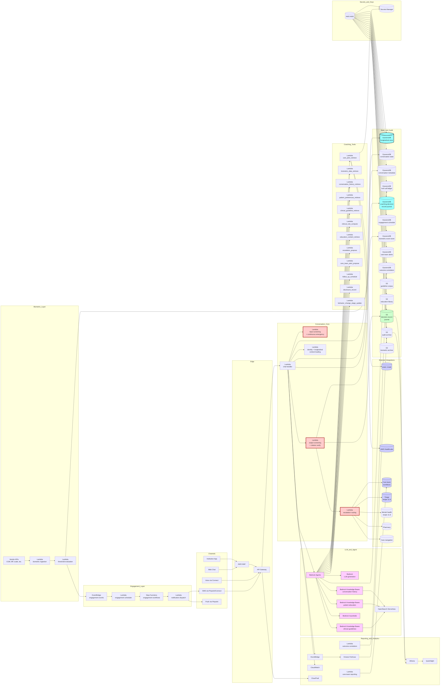

# Recipe 11.7: Chronic Disease Management Coach

**Complexity:** Complex · **Phase:** Regulated · **Estimated Cost:** ~$3-15 per active member per month (depends on engagement frequency, channel mix, model choice, RAG depth, biometric-data integration depth, and clinical-escalation overhead)

---

## The Problem

Maria is 58. Three years ago her primary care physician told her, in the unhurried voice clinicians use when they have already had this conversation three times that week, that her A1c was 8.2 and that she had Type 2 diabetes. The doctor wrote a prescription for metformin, gave her a glucose meter, gave her a stack of pamphlets, scheduled her for diabetes education, and asked her to come back in three months. Maria left the office holding the pamphlets and feeling, in roughly equal measure, scared, embarrassed, and confused. She was 55 then. She had a job, two adult children who lived a few states away, a husband whose blood pressure she also worried about, a small dog, and a life that did not include space for "managing a chronic disease." She did not know what an A1c was. She did not know what the metformin would do. She had been told she should change her diet, but the pamphlets had a lot of charts and not very many actual answers about what she should make for dinner on Tuesday.

What happened over the next three years is the story of about thirty-seven million Americans with diabetes, and the broader story of roughly half the U.S. adult population living with at least one chronic condition. <!-- TODO: verify; the CDC's diabetes statistics report and chronic disease prevalence figures vary by year and methodology; specific figures should be confirmed against the most current CDC sources --> Maria filled the metformin prescription. She took it for about six weeks. The pills made her stomach hurt. Nobody had warned her this was common, that it usually got better, and that there were ways to mitigate it (taking it with food, the extended-release version, slow titration). She quietly stopped taking the metformin. She did not tell her doctor. She felt vaguely guilty about this for several months and then mostly forgot about it. She made some half-hearted attempts at diet changes. She bought a salad spinner. She went to the diabetes education class once and got busy and skipped the next two. The glucose meter sat on her kitchen counter for a few months and then went into a drawer.

Eighteen months later, at a follow-up appointment scheduled because her insurance flagged her as overdue for chronic-disease care, the doctor saw an A1c of 9.4. The doctor was kind about it but also visibly disappointed in a way Maria did not need to have explained to her. The doctor explained that her diabetes had progressed, that they would need to think about adding a second medication, that her last cholesterol had also been worse, that her blood pressure was creeping up. Maria left the office feeling like she had failed at homework she had not actually been given the materials to complete. She filled the new prescriptions. She mostly took them. She mostly did not change her diet. She mostly did not check her glucose. The next visit, her A1c was 9.1. The visit after that, 8.8. By age 58 she had been "stable on metformin and glipizide" for about a year. Her doctor was satisfied. Maria was not, exactly, but she also did not have words for what she would have wanted instead.

The thing Maria would have wanted, if she had been able to articulate it, was a person to talk to. Not every three months, when her doctor had nineteen minutes scheduled with her. Not at the diabetes education class she had felt too tired to attend. A person, several times a week or even daily during the rough patches, who knew her, who would notice when her glucose readings started drifting up, who would ask her how she was doing with the new medication on day three when the side effects were at their worst, who would gently suggest that maybe Tuesday's dinner could include something other than the macaroni and cheese her husband loved, who would notice when she stopped logging meals and ask why, who would celebrate with her when her A1c came down, and who would, when things got really bad, know to escalate to the doctor or the diabetes educator. That person exists for some patients. They are usually called nurse care managers or diabetes care coordinators. They are expensive, finite, and reserved for the highest-risk members in capitated populations. <!-- TODO: verify; care management programs typically reach single-digit percentages of plan populations, focused on high-risk members based on cost predictors and clinical complexity; specific reach figures vary by payer and program design --> Maria, with an A1c of 9.4 and one comorbidity, was not high-risk enough to qualify. She was just one of millions of patients in the broad middle, where outcomes are determined less by what happens during the nineteen-minute visit and more by what happens during the eighty-nine days, twenty-three hours, and forty-one minutes between visits.

This is the central problem of chronic disease management in the United States in 2026, and it is one of the largest sources of avoidable cost, avoidable suffering, and avoidable mortality in the entire healthcare system. The clinical knowledge for managing diabetes, hypertension, heart failure, COPD, asthma, depression, chronic kidney disease, and most other prevalent chronic conditions is well-established and broadly agreed upon. <!-- TODO: verify; clinical practice guidelines for major chronic conditions are published and updated regularly by specialty societies (ADA for diabetes, ACC/AHA for hypertension and heart failure, GINA for asthma, GOLD for COPD, KDIGO for chronic kidney disease, APA for depression, and others); the existence of these guidelines is well-established but their content evolves --> The medications work. The behavioral interventions work. The monitoring approaches work. The reason outcomes are uneven is not that we don't know what to do; it's that what we know how to do requires sustained, personalized engagement over years, and we have built a healthcare delivery system that almost exclusively rewards twenty-minute office visits. The gap between what chronic disease management requires and what the system delivers is enormous, and it is filled, by default, with patients quietly failing the implicit homework assignment.

The economics make the problem worse, not better. Chronic conditions account for the substantial majority of U.S. healthcare spending. <!-- TODO: verify; CDC and CMS sources indicate that chronic conditions and the conditions associated with them account for the large majority of healthcare expenditure, with specific figures varying by methodology and the conditions included; the directional finding that chronic conditions dominate spending is well-established --> A patient with poorly-controlled diabetes is a patient who is statistically more likely to have a heart attack, more likely to need dialysis, more likely to lose vision, more likely to lose a foot, more likely to be hospitalized, more likely to die younger than they otherwise would. <!-- TODO: verify; the long-term sequelae of poorly-controlled diabetes including cardiovascular disease, end-stage renal disease, retinopathy, neuropathy, and reduced life expectancy are documented in landmark trials including DCCT, UKPDS, and follow-on cohort studies --> Each of those events is, individually, one of the most expensive things that happens in healthcare. A patient with poorly-controlled hypertension is a patient who is statistically more likely to have a stroke, more likely to develop heart failure, more likely to develop chronic kidney disease. <!-- TODO: verify; cardiovascular and renal sequelae of uncontrolled hypertension are documented in trials including SPRINT, ALLHAT, and follow-on cohort studies --> A patient with poorly-controlled COPD is a patient with more frequent exacerbations, more frequent hospitalizations, and a steeper decline in lung function over time. The cost of "between-visit" engagement, even at fairly aggressive levels, is meaningfully smaller than the cost of any one of these downstream events, and the math has been clear to actuaries for at least two decades. The reason most members of the broad middle do not get between-visit engagement is not that the math doesn't work; it's that the labor model for nurse care management does not scale to the population that would benefit.

The previous generation of digital chronic-disease products tried to address this with apps. The patient downloaded an app, logged their glucose readings or their blood pressure or their food, and the app showed them charts. Some apps added gamification (streaks, badges, social features). Some apps added prescriptive content (recipes, exercise videos, educational modules). The clinical evidence for these approaches was, broadly, mixed. <!-- TODO: verify; the evidence base for digital diabetes self-management interventions includes meta-analyses showing modest A1c reductions on average with substantial heterogeneity by intervention type, patient population, and engagement intensity; specific figures vary by study --> The fundamental problem these products had was engagement. Most patients downloaded the app, used it actively for a few weeks, then stopped opening it. The patients who maintained engagement were largely the ones who already had the resources, motivation, and health literacy to manage their condition without an app. The patients who needed the app most were the ones least likely to use it. Rebranding the same approach with cooler animations did not fix the underlying problem.

What changed, around 2023, is that conversational AI got good enough to make the in-between-visits engagement feel like a relationship rather than a tracking interface. A patient who would not bother opening a glucose-logging app will, sometimes, respond to a text message that says "Hey Maria, how's the new medication treating you? I noticed your readings have been a bit higher this week. Anything going on?" That message comes from a system that has read her chart, seen her readings, knows what she is on, and knows what to say next based on a clinical protocol her care team agreed to. The system is not a person. The patient mostly knows that. The patient also, in the right product design, talks to it anyway, because the alternative was nothing, and because the message is genuinely useful, and because the system is patient with her in a way her doctor, with nineteen minutes, often cannot afford to be.

This recipe is about that system. The chronic disease management coach is the conversational AI use case where the architectural patterns from the previous chapter 11 recipes (FAQ bot, scheduling, refills, intake, benefits navigator, triage) all converge into a single longitudinal product, and where several entirely new patterns enter the picture: long-running memory across years, structured care plan tracking, biometric-device integration, behavior-change theory, motivational interviewing, longitudinal personalization, escalation pathways for concerning trends, and a delicate calibration of warmth and clinical seriousness that is harder to get right than it looks.

A few things this recipe is and is not.

It is the bot that maintains an ongoing relationship with a patient managing a chronic condition (one or several) over months or years, sending check-in messages, responding to patient-initiated conversations, ingesting biometric data from connected devices and patient self-reports, tracking adherence to medications and lifestyle goals, providing education and motivational support grounded in the patient's specific care plan and the institution's clinical guidelines, and escalating to clinical staff when patterns indicate concern. The bot is owned by the patient's care team and operates within the boundaries of the patient's signed care plan; it is not a free-floating wellness app trying to optimize "engagement" for its own sake.

It is not a triage bot. Recipe 11.6 covers acute-symptom triage. The chronic disease coach handles ongoing management of established conditions; when a patient surfaces an acute concern (chest pain in a coach session for a diabetic patient, severe shortness of breath in a coach session for a COPD patient), the coach hands off to triage workflows or to direct emergency routing. The chronic coach does not try to do triage from scratch.

It is not a diagnosis tool. The conditions the coach manages are conditions the patient has already been diagnosed with by their clinical team. The coach does not diagnose new conditions; when symptoms suggest a new condition (foot pain in a diabetic suggesting possible neuropathy, persistent cough in a COPD patient suggesting possible pneumonia or worsening), the coach surfaces the symptoms to the clinical team rather than naming the condition itself.

It is not a wellness app. Recipe 4.4 covers wellness program recommendations. The chronic coach addresses specific clinical conditions with specific care plans; the wellness app addresses general health promotion. The two can coexist (and often do) in the same patient-facing product, but the architectural and regulatory considerations are different.

It is not a mental health support bot. Recipe 11.8 covers conversational mental health support. The chronic coach addresses mental health when it intersects with the chronic condition (depression in heart failure patients, diabetes distress, illness-related anxiety, substance-use issues affecting medication adherence) but the deep mental-health-specific architecture lives in 11.8.

It is not a substitute for the care team. The coach extends the care team's reach; it does not replace it. The patient still has their primary care physician, their specialist (endocrinologist, cardiologist, pulmonologist), their pharmacist, and (for higher-risk patients) their nurse care manager. The coach handles the day-to-day, freeing the human team to focus on the complex cases and the clinical decisions. The coach is not the doctor, and the patient is told this explicitly and frequently.

It is not a one-size-fits-all product. Each chronic condition (diabetes, hypertension, heart failure, COPD, asthma, depression, chronic kidney disease, others) has its own care-plan vocabulary, its own monitoring patterns, its own evidence base, its own escalation logic. A coach for diabetes is meaningfully different from a coach for heart failure. Most institutions deploy a multi-condition coaching architecture with condition-specific protocols layered on a shared conversational core.

It is not a regulatory afterthought. Patient-facing chronic-disease management software, particularly when it provides direct guidance about medications, monitoring, or self-management, sits on or close to the FDA Software-as-a-Medical-Device line. <!-- TODO: verify; the FDA's 2022 final guidance on Clinical Decision Support software addresses some patient-facing software, but the regulatory positioning of chronic disease coaching software depends on the specific recommendations the software produces, the population it serves, and the institution's claims; the regulatory landscape continues to evolve --> The institutional regulatory team is involved from architectural design through ongoing post-market surveillance.

It is not a quick win. The deployment timeline is measured in quarters, not sprints. The clinical-content investment is multi-quarter, the device-integration work is multi-quarter, the engagement-quality tuning is multi-quarter, the regulatory work is multi-quarter, and the outcome demonstration is multi-year. Institutions building this expecting a fast time-to-value are usually disappointed. Institutions building this with realistic timelines and the patience for relationship-quality engagement are sometimes able to demonstrate genuinely meaningful outcomes for the broad middle of their chronic-disease population.

The thing to understand before building this is that the coach's value is not in any individual conversation. The value is in the cumulative effect of hundreds or thousands of small touches over years, in the relationships the coach maintains with patients who would otherwise have no between-visit support, in the early-warning signals the coach surfaces to the care team, and in the slow accumulation of behavior change that turns a 9.4 A1c into a 7.2 A1c over eighteen months. A coach evaluated on a per-conversation engagement metric will be optimized for the wrong thing. A coach evaluated on longitudinal clinical outcomes (A1c trajectory, blood-pressure control rate, hospitalization rate, medication adherence rate, patient-reported outcomes) is being evaluated correctly, and the architectural decisions follow from there.

Let's get into it.

---

## The Technology: Longitudinal Conversational Coaching Grounded In Care Plans, Biometric Streams, and Behavior-Change Theory

### Why Chronic Disease Management Has Resisted Digital Tools For Twenty Years

Chronic disease management, as a clinical workflow, has been a phone-and-clinic-centric problem for several decades. The reason is structural. Chronic disease management requires asking, repeatedly over years, "how is the patient doing relative to their care plan, what is changing, what should change next, and how do we get them to do it?" The questions are specific to the condition. The questions for a diabetic patient on insulin are different from the questions for a diabetic patient on lifestyle-only management. The questions for a heart failure patient on a stable regimen are different from the questions for one who has just been discharged after a fluid-overload admission. The questions for a depression patient stable on an SSRI are different from the questions for one whose symptoms are worsening. The recommendations are also condition-specific, are calibrated to the patient's specific care plan, and depend on the patient's specific recent biometric and behavioral data.

The thing nurses and care managers do, when they do this well, is hold a longitudinal model of the patient in their heads, supplemented by chart notes and periodic reviews of the patient's data. The model includes "what care plan are we executing," "where is the patient relative to plan," "what is the patient's pattern of engagement with self-care behaviors," "what stressors are present in the patient's life right now that affect adherence," "what are the early-warning signs of decompensation that I should watch for in this specific patient," and "what is the relationship status between me and the patient (do they trust me, are they being honest about their numbers, are they at the stage of behavior change where they will accept new suggestions or where I should focus on building relationship first)." Holding this model is most of the cognitive work; producing the actual conversation is the easy part once the model is in place.

The first generation of digital chronic-disease products, roughly the early 2010s through the late 2010s, tried to systematize the data part of this without the conversation part. Patients logged their numbers, the app showed charts, and clinicians (in the rare deployments where clinicians were even reviewing the data) might call the patient if a number was alarming. The clinical evidence for these tools was, broadly, that they worked for patients who would have done well anyway. <!-- TODO: verify; meta-analyses of digital diabetes self-management interventions including studies by Greenwood et al. 2017, Veazie et al. 2018, and others have documented modest A1c reductions on average with substantial heterogeneity; engagement attrition is a consistently-documented problem --> The patients who needed the intervention most were the ones least likely to consistently log data, and a charting app does not, on its own, change behavior.

The second generation, roughly 2018 to 2023, layered curated educational content and structured behavior-change programs on top of the data. Apps incorporated cognitive behavioral therapy modules, motivational interviewing prompts, condition-specific curricula, peer-support communities, and live-coach offerings. The clinical evidence for these tools is more promising, particularly when combined with human-coach support. <!-- TODO: verify; the evidence for digital therapeutics and digital health-behavior-change tools includes studies by Sepah et al. 2017 (DPP), Berman et al. 2018, and others, with the strongest evidence for hybrid human-plus-digital programs; the FDA has authorized a number of prescription digital therapeutics in this category --> The fundamental constraints, though, were similar: engagement attrition was a pervasive problem, and the products that worked best were the ones that included substantial human coaching, which made them expensive to scale.

The thing that changed the workflow shape is, again, large language models that can carry on a coherent, sustained, personalized conversation across years. A conversational coach, deployed with careful institutional governance, can carry the longitudinal model the nurse care manager carries (it has the chart, it has the biometric stream, it has the conversation history, it has the care plan), can engage in the kinds of warm, specific, timely conversations the nurse would have, can apply behavior-change theory in a way that is calibrated to the individual patient, can scale to the broad middle of the population that nurse care management cannot reach, and can escalate to the human team when escalation is warranted. The LLM is not a nurse. The LLM is, in the right product design, a tool that lets the nurse care management workflow operate at population scale.

The architectural shift is from "track-and-display" to "remember-engage-and-coach." The coach's value is concentrated in three places: the longitudinal personalized engagement (turning hundreds of small touches over years into measurable behavior change), the early-warning signal generation (catching patterns the patient or the clinic schedule would have missed), and the operational reach (extending the care team's effective coverage from a few percent of the population to the broad chronic-disease majority).

### What a Chronic Disease Coach Actually Does

A chronic disease coach is a tool-using LLM with a system prompt that tells it which assistant it is, the patient's authenticated context (chronic conditions on the problem list, current medications, current care plan goals, biometric data streams, conversation history with the coach over time), access to a structured library of condition-specific care-plan templates and clinical guidelines, and a small but careful set of tools for ingesting biometric data, retrieving the patient's recent self-reports, surfacing early-warning signals, sending follow-up messages, and escalating to clinical staff. The LLM conducts the conversations. The structured care plan, the biometric data, and the clinical-guideline corpus encode the clinical logic. The tools handle the deterministic actions.

The conversation surface is not one conversation. It is a stream of conversational episodes, sometimes initiated by the patient, sometimes initiated by the coach, sometimes triggered by a biometric-data event, sometimes triggered by a care-plan milestone (medication start, planned re-titration, scheduled lab follow-up), sometimes triggered by a noteworthy change in pattern (three days of high glucose readings, a missed scheduled weekly weigh-in for a heart-failure patient, a missed medication for a depression patient).

The coach's task surface decomposes roughly as follows.

**Onboarding and care-plan introduction.** The patient is enrolled in the coaching program by their care team, with a signed care plan defining the goals, the monitoring expectations, the frequency of coaching engagement, the medications being managed, the biometric streams being tracked, and the escalation criteria. The first conversation introduces the coach, sets expectations, gathers any patient-stated preferences (preferred check-in times, preferred channels, things the patient does not want to discuss, language preferences), and confirms the patient's understanding of the care plan. The onboarding tone is warm but boundaried: the coach is not a friend, it is a tool deployed by the patient's care team, and the patient should know what it is and what it is not.

**Scheduled check-ins.** The coach runs scheduled check-ins per the patient's care plan and per the patient's stated preferences. Daily check-ins for new-onset diabetes patients in the first 30 days; weekly check-ins for stable hypertension patients; condition-specific cadence per the institution's clinical guidance. Each check-in is short (a few turns), focused on the care-plan questions for this point in the patient's journey, and adaptive to the patient's recent data and conversation history.

**Patient-initiated conversations.** The patient can engage at any time, with questions about their condition, their medications, their data, or anything else within the coach's scope. The coach answers within scope, escalates outside scope (an acute symptom routes to triage; a new clinical concern routes to the care team; a benefits question routes to the benefits navigator).

**Biometric-data-triggered conversations.** When a connected device (CGM, BP cuff, scale, peak flow meter, pulse oximeter) reports data that crosses a threshold, the coach engages. A spike in fasting glucose for a diabetic patient triggers a "what was different about today?" conversation. A blood pressure reading above the patient's goal triggers an "anything going on?" conversation. A weight gain trigger for a heart failure patient triggers a fluid-status conversation. The thresholds are specified in the care plan, not chosen by the LLM.

**Care-plan-milestone conversations.** The patient is starting a new medication on Tuesday. The coach prepares them on Monday with what to expect (timing, side effects, what is normal, what to watch for, when to call the clinic). On Wednesday, the coach checks in to ask how it went. On day five, the coach checks again. The schedule is determined by the medication and the institution's care plan, not by the LLM.

**Education and content delivery.** The coach delivers patient-education content (drawn from the institution's curated library) at moments when it is contextually relevant, not all at once during onboarding. The content is grounded in the institution's clinical guidelines and is reviewed by the institution's patient-education committee. The coach delivers content in plain language, calibrated to the patient's stated preferences and language.

**Behavior-change support.** The coach is calibrated for the patient's specific stage of behavior change. <!-- TODO: verify; the Transtheoretical Model of behavior change including the stages of pre-contemplation, contemplation, preparation, action, and maintenance is well-established in health-behavior literature; the application of stage-of-change concepts to digital health coaching has documented variations in effectiveness --> A patient in pre-contemplation gets relationship-building, gentle education, and motivational-interviewing-style elicitation rather than prescriptive recommendations. A patient in action gets specific behavioral suggestions, problem-solving support, and obstacle anticipation. The coach's tone, pacing, and content all adapt to where the patient is.

**Early-warning escalation.** When the patient's data shows concerning trends, when the patient's responses indicate worsening symptoms, when the patient has missed multiple scheduled check-ins, when the patient discloses something concerning (suicidal ideation, intimate-partner violence, substance-use issues, severe medication side effects), the coach escalates to the appropriate human resource per the institution's policy. The escalation includes the conversation context, the recent data, and the reason for escalation.

**Long-term relationship maintenance.** The coach maintains the relationship over years. The conversation history accumulates. The patient's preferences are remembered. The patient's stated personal context (their grandkids' names, their job stress, their hobbies, the things that make their adherence harder or easier) is remembered and surfaced at relevant moments. The coach is not pretending to be a friend; the coach is acting as a longitudinal record of the patient that is accessible during conversations, in a way the typical chart's nineteen-minute visit notes cannot be.

**Care-team reporting.** The care team has visibility into the coach's interactions with the patient. The coach generates structured summaries (weekly digests, monthly summaries, alert events) that the care team reviews. The coach's role is not to replace the care team's judgment; it is to give the care team the information they need to deploy their judgment efficiently across a much larger panel.

### Why a Generic LLM Cannot Run a Chronic Disease Coach

A naive product approach would be: take a generalist LLM, give it a chat surface, paste in some clinical content about diabetes, and have it coach the patient. This breaks in several specific ways, each of which has clinical and engagement consequences.

**The model has no longitudinal memory of the patient.** Without a structured longitudinal store of the patient's care plan, biometric streams, prior conversations, stated preferences, behavior-change stage, and life-context disclosures, the LLM treats every conversation as a fresh start. A coach without longitudinal memory is, at best, a glorified FAQ bot. The longitudinal store is the architectural primitive that distinguishes the coach from the bots in the previous chapter recipes.

**The model has no view of the patient's care plan.** The care plan defines what the coach is supposed to be doing with the patient: which goals, which monitoring frequency, which medications, which escalation criteria. Without the care plan as input, the LLM invents goals, recommends interventions that are not aligned with what the care team prescribed, and may contradict the institution's clinical guidance. The care plan is signed by the clinical team and, ideally, agreed to by the patient; the coach operates within its boundaries.

**The model hallucinates clinical content when grounding is weak.** If the institution's clinical guidelines are not retrieved with strict citation grounding, the LLM produces plausible-sounding clinical recommendations that are wrong for the institution's actual guidance. Worse, the LLM may produce recommendations that contradict the standard of care. The clinical-guideline RAG layer with strict citation grounding is non-negotiable.

**The model has no theory of when to engage proactively.** The coach's value depends substantially on proactive engagement: catching the early-warning patterns, checking in at the right moments, delivering education when it is contextually relevant. A reactive bot that only responds when the patient initiates is not a coach; it is a chatbot. The proactive engagement scheduling is encoded in the care plan and triggered by the biometric-data and milestone-event pipelines, not by the LLM.

**The model has no theory of when to stop pestering the patient.** A coach that engages too aggressively gets ignored, opted out of, or actively resented. The institutional engagement policy specifies maximum engagement frequency, quiet hours, opt-out granularity, and the patient's right to dial back. The policy is encoded in the engagement scheduler and the LLM's prompts, not left to the LLM's discretion.

**The model has no calibrated theory of behavior change.** The way you talk to a patient in pre-contemplation is different from the way you talk to a patient in action. A generalist LLM defaults to a "let me give you helpful advice" register that is appropriate for some patients and counter-productive for others. The behavior-change-stage tracking and the conversation-style adaptation are part of the architecture, not emergent properties.

**The model has clinical-decision-rule arithmetic problems.** The clinical decision rules used in chronic disease management (FIB-4 for liver fibrosis, eGFR for kidney function, ASCVD risk score, CHA2DS2-VASc for atrial fibrillation, ALT staging, glycemic management algorithms, blood pressure stages) are arithmetic on structured inputs. The LLM does this poorly. The deterministic clinical-rule tools encapsulate the computation.

**The model has no theory of escalation.** When a patient discloses suicidal ideation, when a heart-failure patient reports a 5-pound overnight weight gain, when a diabetic reports persistent vomiting (DKA risk), when a hypertension patient reports a blood pressure of 220/115, when a depression patient reports they have stopped their medication, the response is not "let me give you some tips." The response is to escalate, with the patient's safety as the primary consideration and the relationship preservation as a secondary one. The escalation logic is encoded explicitly.

**The model has compliance implications for chronic-disease conversations.** The conversation contains PHI, often dense and longitudinal. Chronic-disease conversations sometimes surface intimate-partner violence, food insecurity, substance use, mental-health crisis, and sexual-health concerns. The audit, retention, access-control, mandatory-reporting, and downstream-clinical-workflow integration story has to handle each.

**The model has no theory of staying within scope when the patient asks for diagnosis or non-care-plan recommendations.** Patients in coaching relationships frequently bring up things outside the care plan: a question about a different condition, a symptom that might suggest a new diagnosis, a request for a treatment recommendation the care plan does not cover. The coach answers within scope, escalates outside scope, and does not pretend to be a primary care doctor.

**The model has no theory of relationship preservation.** If the patient says "I haven't been taking my medication," the wrong response is "you should take your medication." The right response is to listen, ask why, and work from where the patient is. The motivational-interviewing patterns are part of the architecture, encoded in prompts, training data, and the conversation review process.

**The model has no theory of when the coaching relationship should end.** Some chronic conditions stabilize. Some patients move out of the coaching program. Some patients prefer human-only care. The transition out of coaching is part of the care plan, with named off-boarding events, summary delivery to the care team, and respectful closure of the conversational relationship.

### What the Coach Has To Do That the Previous Bots Did Not

Recipes 11.1 through 11.6 established the patterns this recipe inherits: input safety screening with continuous emergency screening, identity verification, tool-use orchestration, output safety screening, audit logging, per-cohort monitoring, scope discipline, prompt-injection defense, graceful degradation. The chronic disease coach adds nine structural commitments those recipes did not have.

**Longitudinal patient memory as architectural primitive.** The coach's value is in remembering. Conversation history, stated preferences, life-context disclosures, behavior-change stage, recent biometric trends, recent care-plan progress. The longitudinal store is owned by the coaching system, governed jointly by the clinical and IT teams, and is part of the patient's medical record.

**Care-plan-as-code with clinical-leadership ownership.** Each chronic condition has a structured care plan template, instantiated for each patient with patient-specific values, signed by the clinical team, version-controlled, and reviewed annually. The coach operates within the care plan; deviation from the care plan is a specific event that requires either care-plan revision or escalation.

**Biometric-data ingestion with clinical thresholds.** Connected devices (CGMs, BP cuffs, scales, peak flow meters, pulse oximeters, glucose meters, smartwatches) feed the coach. The thresholds for engagement and escalation are specified in the care plan, not by the LLM. The data is integrated with the clinical record per the institution's policy.

**Engagement scheduler with policy-driven cadence and opt-out granularity.** Proactive engagement is scheduled by the coach's engagement layer, not initiated by the LLM. The schedule respects quiet hours, opt-out preferences, channel preferences, and engagement-fatigue mitigation. The institution sets the maximum engagement intensity per care plan; the patient can dial it down.

**Behavior-change-stage tracking with conversation-style adaptation.** The coach maintains a running estimate of the patient's behavior-change stage (pre-contemplation, contemplation, preparation, action, maintenance) per goal, updates it based on conversation signals, and adapts the conversation style accordingly.

**Escalation taxonomy with care-plan-specified criteria.** Each chronic condition has specified escalation criteria embedded in the care plan: data thresholds, symptom patterns, adherence patterns, disclosure patterns. The coach's escalation logic is deterministic per the criteria, not subjective per the LLM's interpretation.

**Care-team reporting and longitudinal summarization.** The care team has visibility into the coaching relationship through structured reports: alert events in real time, weekly digests, monthly summaries, periodic clinical-review reports. The reports are designed for the care team's workflow, not as raw conversation transcripts.

**Outcome-correlation pipeline as core post-launch commitment.** The coach's clinical performance is measured against actual outcomes: A1c trajectory, blood-pressure control rate, hospitalization rate, emergency-visit rate, medication adherence rate, patient-reported outcomes. The outcome-correlation pipeline is a multi-quarter post-launch commitment.

**FDA-strategy alignment as architectural constraint.** Patient-facing chronic-disease management software, particularly when it provides direct guidance on medications or self-management, sits on or close to the FDA SaMD line. The institutional regulatory team is involved from architectural design.

The rest is largely the same as the previous chapter 11 recipes: tool-surface contract management, identity-assurance lifecycle, conversation logging, scope filtering, per-cohort monitoring, graceful degradation when upstream systems fail.

### The Chronic-Coach Reality

A few notes on what makes chronic-disease coaching specifically harder than the previous patient-facing bot use cases.

**The relationship is the product.** Patients do not engage with the coach because they want technology in their lives; they engage because the coach is the thing that helps them get through the rough patches. A coach that feels transactional, surveillance-flavored, or judgmental is a coach that gets opted out of within weeks. The relationship-quality engineering (tone, pacing, warmth calibration, listening behavior, response to disclosure) is most of the engineering and is consistently underestimated.

**Engagement attrition is the central operational risk.** The most common failure mode of digital chronic-disease tools is not "the technology was wrong"; it is "the patient stopped using it." The engagement-quality work, the channel-mix optimization, the cadence calibration, the content-relevance tuning, the conversation-quality review process all exist primarily to address attrition.

**Adherence dishonesty is normal and is not a moral failing.** Patients commonly underreport non-adherence, overreport diet quality, and downplay symptoms when they are afraid of judgment or of consequences. The coach's relationship-building work is, in part, about creating a space where the patient feels safe being honest. The metric "self-reported adherence" is a poor outcome metric for this reason; outcome-correlation against actual prescription-fill data, biometric data, and downstream clinical events is essential.

**Cultural and linguistic considerations are not optional.** Chronic-disease prevalence is uneven across populations; the populations with the highest disease burden are often the populations with the most limited access to between-visit support and the most need for culturally and linguistically appropriate content. <!-- TODO: verify; disparities in chronic-disease prevalence and outcomes by race, ethnicity, language, and socioeconomic status are well-documented in the public health literature; specific figures vary by condition and population --> A diabetes coach that is only available in English, only references Western dietary patterns, and only delivers content at a college reading level is excluding much of the population it should be serving.

**Social-determinants-of-health context is part of the coaching reality.** Patients without access to fresh produce cannot follow "eat more vegetables" recommendations if there is no produce within reasonable transit distance. Patients in food-insecure households cannot adhere to specific meal patterns. Patients with unstable housing cannot follow medication schedules that require refrigeration. Patients with multiple jobs cannot attend midday lab visits. The coach's recommendations are clinical, but their feasibility is socially determined; the institution's deployment includes social-determinants overlays where possible, with care-navigation handoffs.

**Mental-health comorbidity is the rule, not the exception.** Depression, anxiety, and diabetes-distress (and equivalent condition-specific distress for other chronic conditions) co-occur with chronic medical conditions at high rates. <!-- TODO: verify; the comorbidity of depression and anxiety with chronic medical conditions is documented in studies including Egede 2007, Gold et al. 2020, and ongoing meta-analyses; specific rates vary by condition and population --> The coach handles this by integrating with mental-health support pathways (recipe 11.8) where the institution has them, by being calibrated for distress responses, and by escalating clinical-significance disclosures appropriately.

**Medication side-effect management is a bot-tier task with high impact.** A meaningful fraction of medication non-adherence is driven by side effects the patient has not been adequately prepared for or supported through. <!-- TODO: verify; the role of side-effect intolerance in medication non-adherence is documented in pharmacy and adherence literature; specific figures vary by medication and patient population --> The coach's prepare-for-side-effects, check-in-during-side-effects, and problem-solve-around-side-effects workflows are high-leverage interventions.

**The coach handles specific high-stakes moments.** Medication start, medication change, medication discontinuation, lab follow-up, post-discharge, post-procedure, life-event-driven adherence disruption (job change, family illness, travel, hospitalization). Each is a specific protocol with specific touchpoints, not a generic "check in regularly" pattern.

**Long-term outcome demonstration is multi-year work.** The coach's effect on A1c trajectory shows up over six to twelve months. The effect on hospitalization rate shows up over twelve to twenty-four months. The effect on cardiovascular event rate shows up over twenty-four to sixty months. Institutions building this with quarterly-impact expectations will be disappointed; institutions willing to invest at the right time horizon can demonstrate genuinely meaningful outcomes.

**Cross-condition coaching is a specific architectural choice.** Patients commonly have multiple chronic conditions (a diabetic with hypertension, hyperlipidemia, and depression is the prototypical pattern). The coach can either run a single integrated coaching relationship that addresses all of the patient's conditions or run condition-specific coaching streams that intersect minimally. The integrated pattern is more clinically valuable but architecturally harder. Most production deployments start with a primary-condition focus and add secondary conditions over time.

**Care-team-coach integration is a specific architectural and operational discipline.** The care team has to trust the coach, has to know when to expect alerts, has to have efficient tooling for reviewing the coach's interactions, and has to have a feedback path for protocol revision. Building this without the care team's active involvement produces a coach the care team does not use, which is an expensive failure mode.

**Patient consent and ongoing-consent posture matters.** The patient has consented to being coached as part of their care plan. The patient retains the right to dial back the engagement, opt out of specific topics, opt out entirely, or revoke consent. The institutional consent posture is reviewed by the legal and compliance teams, reflects state-specific requirements, and is operationally enforced through the engagement-policy layer.

### Where the Field Has Moved

A few practical updates worth knowing.

**Prescription digital therapeutics for chronic-disease management have a specific FDA pathway.** Several digital therapeutics for conditions like chronic insomnia, ADHD, opioid use disorder, and others have received FDA authorization, with prescription requirements and post-market surveillance obligations. <!-- TODO: verify; the FDA's Digital Health Center of Excellence and the prescription digital therapeutics category continue to evolve; specific product authorizations and reimbursement pathways vary --> Chronic-disease coaching software may approach this category depending on the specific functionality and claims; the institutional regulatory team is the authority on positioning.

**Continuous glucose monitor adoption is high and growing.** CGMs are now widely prescribed for both Type 1 and (increasingly) Type 2 diabetic patients, with FDA-cleared consumer-grade CGMs available for non-diabetic users in some markets. <!-- TODO: verify; CGM adoption rates and reimbursement pathways have shifted substantially in recent years; specific figures vary by payer and patient population --> Coach architectures with CGM integration unlock substantially richer data than coach architectures with self-reported finger-stick glucose. The data ingestion pattern is one of the most clinically-useful integrations the coach can have.

**Connected blood-pressure cuffs are the second-most-common biometric integration.** Bluetooth-connected cuffs with pharmacy or vendor distribution have become standard in hypertension management programs at major health systems and payers. <!-- TODO: verify; remote BP monitoring program proliferation is documented in payer and specialty-society publications; specific reach figures vary --> The integration pattern is similar to CGM: ingest the readings, surface trends, engage the patient when readings cross thresholds, escalate when thresholds are sustained.

**Smartwatch-based passive monitoring has matured.** Wrist-worn devices now provide validated heart-rate, sleep, activity, and (in some products) ECG and blood-oxygen monitoring. <!-- TODO: verify; the medical validity of smartwatch-based monitoring varies by device, parameter, and population; FDA clearances exist for some specific applications including AFib detection on Apple Watch and similar devices --> Integration with the coach is increasingly standard for cardiovascular and metabolic conditions.

**Tool-using LLMs handle longitudinal coaching well when grounded carefully.** The function-calling pattern from previous chapter 11 recipes maps to chronic disease coaching. The LLM produces tool calls that retrieve care plans, retrieve recent biometric data, retrieve conversation history, retrieve care-plan-relevant guidelines, surface escalation flags, send follow-up messages, and post events for downstream operations.

**Hybrid human-plus-AI coaching is the dominant production pattern.** Most major deployments run a hybrid model: AI coach for the broad chronic-disease majority, with human coach availability for high-risk members, escalation cases, and patient-requested human contact. The economics work because the AI coach handles the routine touches while the human coach focuses where their judgment is most needed.

**Outcome demonstration is mixed but trending positive for hybrid models.** Studies of digital-plus-human chronic-disease coaching programs have shown statistically and clinically meaningful improvements in A1c, blood-pressure control, hospitalization rates, and patient-reported outcomes for engaged participants, with the magnitude of effect varying by program design, condition, and population. <!-- TODO: verify; the evidence base for hybrid digital chronic-disease coaching includes published studies of programs from Livongo, Omada, Virta, Vida, and others; specific outcome figures vary by study --> The ROI demonstrations are stronger when the analysis includes downstream-event reduction (avoided hospitalizations, avoided ED visits) than when the analysis focuses only on direct engagement metrics.

**Equity and disparity considerations are a major area of attention.** Studies of digital health tools have documented variability in adoption, engagement, and outcomes by patient demographics. <!-- TODO: verify; disparities in digital health tool adoption are documented in studies including those by Nouri et al. 2020, the Pew Research Center, and others, with implications for equity and the design of digital chronic-disease programs --> The risk that a chronic-disease coach reaches the patients who need it least and misses the patients who need it most is real. Per-cohort monitoring is essential, and the institutional commitment to equity is reviewed by the compliance and patient-experience teams.

**Build-vs-buy is mature for some conditions.** Several chronic-disease coaching vendors operate at major-payer scale for diabetes, hypertension, weight management, and behavioral-health-comorbid conditions, with EHR integration, biometric-device integration, and (in some cases) FDA-authorized digital-therapeutic content. Most major institutions run a hybrid: build a thin-coaching-orchestration layer in-house on the institution's preferred infrastructure, partner with vendors for licensed condition-specific content and (sometimes) for the human-coach workforce, and integrate with the institution's care-management, telehealth, and clinical-record infrastructure.

---

## General Architecture Pattern

A healthcare chronic-disease coach decomposes into eleven logical stages: enrollment and care-plan instantiation, longitudinal-store management, biometric-data ingestion, engagement scheduling, channel entry, input safety screening with continuous-emergency-screening, identity-and-context loading, conversation handling with care-plan-grounded responses, output safety screening, escalation routing, and care-team reporting with outcome correlation. The cross-cutting concerns from recipes 11.1 through 11.6 carry forward; this recipe adds five new ones (longitudinal-memory governance, care-plan-as-code with clinical-leadership ownership, biometric-data integration with clinical thresholds, engagement-policy enforcement with attrition mitigation, and behavior-change-stage tracking with conversation-style adaptation).

```
┌────────── ENROLLMENT + CARE-PLAN INSTANTIATION ──────────┐
│                                                           │
│   [Patient enrolled by care team]                         │
│    - Clinical team identifies patient as appropriate      │
│      for coaching program                                 │
│    - Care plan template selected (per primary chronic     │
│      condition; multi-condition variants where the        │
│      institution supports them)                           │
│    - Care plan instantiated with patient-specific values: │
│      goals, monitoring frequency, medications, biometric  │
│      streams, escalation criteria, engagement cadence,    │
│      preferred channels, language preferences             │
│    - Care plan signed by clinical team                    │
│    - Patient reviews and consents to coaching             │
│    - Patient signs care plan acknowledgment               │
│           │                                               │
│           ▼                                               │
│   [Output: signed care plan record; coaching enrollment   │
│    record; longitudinal-store initialization]             │
│                                                           │
└───────────────────────────────────────────────────────────┘

┌────────── LONGITUDINAL STORE INITIALIZATION ─────────────┐
│                                                           │
│   [Patient-coach longitudinal store]                      │
│    - Care plan reference (id, version)                    │
│    - Behavior-change stage per goal (initialized to       │
│      best-available estimate from intake)                 │
│    - Stated patient preferences (channels, quiet hours,   │
│      topics off-limits, language, name they prefer       │
│      to be called, names of family members or pets that   │
│      may surface in conversation)                         │
│    - Conversation history (initially empty)               │
│    - Biometric-data baseline                              │
│    - Adherence-pattern baseline                           │
│    - Life-context disclosures (initially empty,           │
│      grows over time)                                     │
│    - Outcome-tracking baseline (A1c, BP, weight,          │
│      condition-specific clinical outcomes)                │
│                                                           │
│   [Storage architecture]                                  │
│    - Structured data: DynamoDB tables                     │
│    - Conversation transcript: S3 with vector retrieval    │
│    - Recent-context summary: cached, refreshed on each    │
│      conversation                                         │
│    - Longitudinal summary: refreshed periodically         │
│      (weekly or per-conversation depending on volume)     │
│           │                                               │
│           ▼                                               │
│   [Output: longitudinal store ready for coaching]         │
│                                                           │
└───────────────────────────────────────────────────────────┘

┌────────── BIOMETRIC-DATA INGESTION ──────────────────────┐
│                                                           │
│   [Connected device data sources]                         │
│    - Continuous glucose monitor (CGM) data streams        │
│    - Blood pressure cuff readings                         │
│    - Connected scale weight readings                      │
│    - Peak flow meter readings (asthma)                    │
│    - Pulse oximeter readings (COPD, post-discharge)       │
│    - Smartwatch data (heart rate, activity, sleep,        │
│      AFib detection where supported)                      │
│    - Patient-reported readings (manual glucose meter,     │
│      manual BP cuff, manual weight)                       │
│    - Patient-reported symptoms via in-app forms or        │
│      conversation                                         │
│                                                           │
│   [Data ingestion pipeline]                               │
│    - Vendor-API integration with each device platform     │
│    - Patient-self-report integration via app              │
│    - Data validation and outlier detection                │
│    - Time-series storage with patient-id partitioning     │
│                                                           │
│   [Threshold evaluation]                                  │
│    - Care-plan-specified thresholds per data type         │
│    - Single-reading thresholds (immediate action)         │
│    - Trend thresholds (sustained pattern action)          │
│    - Pattern thresholds (specific patterns of concern)    │
│                                                           │
│   [Event generation]                                      │
│    - Threshold-crossing events to engagement scheduler    │
│    - Concerning-trend events to escalation pathway        │
│    - Routine-data events for trend monitoring             │
│           │                                               │
│           ▼                                               │
│   [Output: biometric-data store; engagement triggers;     │
│    escalation triggers]                                   │
│                                                           │
└───────────────────────────────────────────────────────────┘

┌────────── ENGAGEMENT SCHEDULING ─────────────────────────┐
│                                                           │
│   [Scheduled engagement sources]                          │
│    - Care-plan-driven cadence (daily, weekly, monthly)    │
│    - Care-plan-milestone triggers (medication start,      │
│      titration, lab follow-up, post-discharge)            │
│    - Biometric-data-triggered events                      │
│    - Patient-stated preferences-driven adjustments        │
│    - Engagement-fatigue-mitigation policy                 │
│                                                           │
│   [Engagement-policy enforcement]                         │
│    - Maximum daily engagement count (default 1, can be    │
│      higher per care plan and patient preference)         │
│    - Quiet hours (default 9pm to 8am local time;          │
│      patient-overridable)                                 │
│    - Channel preferences (push, SMS, email, in-app)       │
│    - Topic-level opt-outs                                 │
│    - Engagement-fatigue detection (low response rates,    │
│      explicit opt-out signals, declining response         │
│      quality)                                             │
│                                                           │
│   [Engagement-message composition]                        │
│    - LLM-composed message grounded in patient context     │
│    - Reviewed by output-safety pipeline before delivery   │
│    - Personalized using stated preferences and prior      │
│      conversation context                                 │
│           │                                               │
│           ▼                                               │
│   [Output: scheduled engagement message; delivery to      │
│    patient via preferred channel]                         │
│                                                           │
└───────────────────────────────────────────────────────────┘

┌────────── CHANNEL ENTRY ─────────────────────────────────┐
│                                                           │
│   [Patient-initiated entry]                               │
│    - In-app chat                                          │
│    - SMS reply                                            │
│    - Voice channel (where supported)                      │
│    - Web chat                                             │
│                                                           │
│   [Coach-initiated entry]                                 │
│    - Scheduled check-in delivered to patient              │
│    - Patient responds, conversation continues             │
│                                                           │
│   [Conversation session bootstrap]                        │
│    - Generate conversation_session_id                     │
│    - Capture channel, authentication context              │
│    - Determine if continuing existing session or          │
│      starting new                                         │
│           │                                               │
│           ▼                                               │
│   [Output: session_id, channel, auth context]             │
│                                                           │
└───────────────────────────────────────────────────────────┘

┌────────── INPUT SAFETY + CONTINUOUS EMERGENCY SCREEN ────┐
│                                                           │
│   [Standard input safety primitives from recipe 11.1]     │
│    - Prompt-injection detection                           │
│    - PHI minimization                                     │
│    - Self-harm and crisis classifier                      │
│                                                           │
│   [Coach-specific continuous emergency screening]         │
│    - Runs on every patient utterance                      │
│    - Detects acute-emergency presentations                │
│      (chest pain in any patient, severe shortness of      │
│      breath in COPD or HF patient, severe hypoglycemia    │
│      symptoms, suspected DKA, suspected stroke,           │
│      severe bleeding, suicidal intent)                    │
│    - Detects condition-specific high-acuity patterns      │
│      (HF: rapid weight gain plus increased dyspnea;       │
│      asthma: severe exacerbation; diabetes: persistent    │
│      vomiting suggesting DKA; CKD: hyperkalemia symptoms) │
│    - Triggers immediate routing to triage (recipe 11.6)   │
│      or 911 / 988 / institutional crisis line as          │
│      appropriate                                          │
│                                                           │
│   [Coach-specific sensitive-disclosure detection]         │
│    - Intimate-partner violence indicators                 │
│    - Substance-use crisis indicators                      │
│    - Severe medication-side-effect disclosures            │
│    - Medication-discontinuation disclosures               │
│    - Food-insecurity indicators                           │
│    - Housing-insecurity indicators                        │
│           │                                               │
│           ▼                                               │
│   [Output: input passes / input blocked / emergency       │
│    routed / sensitive disclosure flagged]                 │
│                                                           │
└───────────────────────────────────────────────────────────┘

┌────────── IDENTITY + LONGITUDINAL CONTEXT LOADING ───────┐
│                                                           │
│   [Authenticated session]                                 │
│    - Patient is logged into the institution's app or      │
│      portal                                               │
│    - Session conveys verified patient_id and access scope │
│                                                           │
│   [Longitudinal-context retrieval]                        │
│    - Care plan (id, version, current goals,               │
│      monitoring expectations, medications, escalation     │
│      criteria)                                            │
│    - Recent biometric data (last 14-30 days,              │
│      condition-specific window)                           │
│    - Recent conversation history (last 30-90 days)        │
│    - Patient preferences                                  │
│    - Behavior-change stage per goal                       │
│    - Recent life-context disclosures                      │
│    - Open follow-up items (medications started recently   │
│      that need check-in, scheduled labs, etc.)            │
│                                                           │
│   [Long-term-summary integration]                         │
│    - Periodically-refreshed long-term summary             │
│    - Summarizes patterns over months                      │
│    - Reduces token-budget pressure for long histories     │
│                                                           │
│   [Cross-condition reconciliation (multi-condition        │
│    patients)]                                             │
│    - Active care plans for all chronic conditions         │
│    - Cross-condition alerts (e.g., a heart-failure        │
│      patient with diabetes has interactions to consider)  │
│           │                                               │
│           ▼                                               │
│   [Output: full longitudinal context payload for          │
│    conversation handler]                                  │
│                                                           │
└───────────────────────────────────────────────────────────┘

┌────────── CONVERSATION HANDLING ─────────────────────────┐
│                                                           │
│   [LLM-orchestrated conversation with tool use]           │
│    - System prompt with care-plan, behavior-change-stage, │
│      patient-preference context                           │
│    - User message plus recent-conversation context        │
│    - Tool surface:                                        │
│      - care_plan_retrieve                                 │
│      - biometric_data_retrieve                            │
│      - conversation_history_retrieve                      │
│      - patient_preferences_retrieve                       │
│      - clinical_guideline_retrieve (RAG over the          │
│        institution's curated guideline corpus)            │
│      - clinical_rule_compute                              │
│      - patient_education_content_retrieve                 │
│      - escalation_propose                                 │
│      - care_team_alert_propose                            │
│      - follow_up_schedule                                 │
│      - longitudinal_disclosure_record                     │
│      - behavior_change_stage_update                       │
│                                                           │
│   [Conversation-style adaptation by behavior-change       │
│    stage]                                                 │
│    - Pre-contemplation: relationship-building, gentle     │
│      education, motivational-interviewing-style           │
│      elicitation                                          │
│    - Contemplation: information, exploring                │
│      ambivalence, supporting decision-making              │
│    - Preparation: planning support, obstacle              │
│      anticipation, commitment elicitation                 │
│    - Action: specific behavioral support, problem-        │
│      solving, celebration of progress                     │
│    - Maintenance: relapse prevention, sustained-          │
│      engagement support, periodic boost                   │
│                                                           │
│   [Citation discipline]                                   │
│    - Clinical recommendations grounded in cited           │
│      guideline                                            │
│    - Educational content grounded in cited library item   │
│    - Patient-specific recommendations grounded in care    │
│      plan                                                 │
│                                                           │
│   [Scope discipline]                                      │
│    - Within-scope: care-plan-aligned topics, condition-   │
│      specific education, medication-side-effect support, │
│      adherence support, behavior-change support           │
│    - Outside-scope (route appropriately): triage of new   │
│      acute symptoms (recipe 11.6), benefits questions     │
│      (recipe 11.5), scheduling (recipe 11.2), refills     │
│      (recipe 11.3), mental-health-specific support        │
│      (recipe 11.8), new-condition-suspected               │
│      (escalation to care team), legal/social-services     │
│      (care-navigation handoff)                            │
│           │                                               │
│           ▼                                               │
│   [Output: composed response with citations and tool-     │
│    call audit trail]                                      │
│                                                           │
└───────────────────────────────────────────────────────────┘

┌────────── OUTPUT SAFETY + CONSERVATIVE-BIAS VERIFY ──────┐
│                                                           │
│   [Standard output safety primitives from recipe 11.1]    │
│    - Scope filter (no diagnosis; no off-care-plan         │
│      treatment recommendations; no drug prescriptions     │
│      not in care plan)                                    │
│    - Vendor-managed guardrail layer                       │
│    - Persona-and-tone check                               │
│                                                           │
│   [Coach-specific verification]                           │
│    - Recommendation grounded in cited care-plan or        │
│      guideline                                            │
│    - Citation includes care_plan_id, care_plan_version,   │
│      guideline_id, guideline_version                      │
│    - Conservative-bias check: where the recommendation    │
│      could plausibly involve clinical judgment beyond     │
│      the care plan, did the response defer to the care    │
│      team?                                                │
│    - Behavior-change-stage-appropriate tone               │
│    - Disclaimer language present where required           │
│    - Within-scope check                                   │
│           │                                               │
│           ▼                                               │
│   [Output: response cleared for delivery, replaced with   │
│    a safer template, or regenerated with corrections]     │
│                                                           │
└───────────────────────────────────────────────────────────┘

┌────────── ESCALATION ROUTING ────────────────────────────┐
│                                                           │
│   [Escalation triggers]                                   │
│    - Care-plan-specified thresholds crossed               │
│    - Acute-emergency screening triggered                  │
│    - Sensitive-disclosure pattern detected                │
│    - Patient explicitly requests human contact            │
│    - Coach confidence below threshold                     │
│    - Out-of-scope clinical question requiring care team   │
│    - Mandatory-reporting disclosure detected              │
│                                                           │
│   [Escalation targets]                                    │
│    - Acute emergency: 911 / 988 / institutional crisis    │
│      with stay-on-the-line guidance                       │
│    - Triage routing (recipe 11.6) for new acute           │
│      symptoms                                             │
│    - Care team (PCP, specialist, care manager) for        │
│      condition-specific clinical concerns                 │
│    - Pharmacy team for medication-specific concerns       │
│    - Behavioral-health pathway (recipe 11.8) for          │
│      mental-health concerns                               │
│    - Care navigation for social-determinants concerns     │
│    - Mandatory-reporting pathway for statutory            │
│      obligations                                          │
│                                                           │
│   [Handoff payload]                                       │
│    - Recent conversation transcript                       │
│    - Recent biometric data (relevant window)              │
│    - Care-plan reference                                  │
│    - Trigger reason                                       │
│    - Patient's preferred contact method                   │
│    - Patient's stated preferences                         │
│    - Coach's structured summary of the situation          │
│           │                                               │
│           ▼                                               │
│   [Output: escalation event with structured payload to    │
│    appropriate target]                                    │
│                                                           │
└───────────────────────────────────────────────────────────┘

┌────────── CARE-TEAM REPORTING + OUTCOME CORRELATION ─────┐
│                                                           │
│   [Real-time alerts]                                      │
│    - Acute escalation events (immediate)                  │
│    - Care-plan-deviation events (within shift)            │
│    - Patient-preference-change events (within day)        │
│                                                           │
│   [Periodic reports]                                      │
│    - Weekly digest per patient (engagement metrics,       │
│      adherence trends, biometric trends, key disclosures, │
│      open follow-up items)                                │
│    - Monthly summary per patient (longitudinal trends,    │
│      goal progress, behavior-change progress, open        │
│      issues for the next visit)                           │
│    - Quarterly clinical-review packet for patients        │
│      whose care plan is due for review                    │
│                                                           │
│   [Care-team feedback loop]                               │
│    - Care team marks alerts as actioned                   │
│    - Care team requests changes to care plan that the     │
│      coach picks up on next refresh                       │
│    - Care team flags inappropriate coach responses for    │
│      review                                               │
│                                                           │
│   [Outcome correlation pipeline]                          │
│    - Correlate engagement metrics with clinical outcomes  │
│      (A1c trajectory, BP control rate, hospitalization    │
│      rate, ED visit rate, medication adherence rate as    │
│      measured by prescription fills)                      │
│    - Per-protocol outcome calculation                     │
│    - Per-cohort outcome calculation                       │
│    - Feed signals back to care-plan-template revision     │
│      process                                              │
│           │                                               │
│           ▼                                               │
│   [Output: care-team visibility into coach activities;    │
│    outcome metrics for clinical and operational review]   │
│                                                           │
└───────────────────────────────────────────────────────────┘

┌────────── AUDIT, LOG, AND POST-MARKET SURVEILLANCE ──────┐
│                                                           │
│   [Durable conversation record]                           │
│    - User utterances                                      │
│    - Tool calls with arguments and results                │
│    - Generated coach responses                            │
│    - Active model and prompt versions                     │
│    - Active care-plan-corpus version                      │
│    - Active clinical-guideline-corpus version             │
│    - Active behavior-change-stage estimate                │
│    - Final disposition                                    │
│                                                           │
│   [Coaching-decision-record journal]                      │
│    - Durable, separately-governed record of coaching      │
│      events (escalations, care-plan-deviations, biometric │
│      threshold events, patient preference changes)        │
│    - Retention sized to the longer of HIPAA's six-year    │
│      minimum, state-specific medical-record retention,    │
│      and any FDA SaMD post-market obligations             │
│                                                           │
│   [Outcome correlation as core post-launch commitment]    │
│    - Multi-quarter implementation                         │
│    - Owned jointly by clinical leadership, operations,    │
│      and data science                                     │
│    - Per-condition, per-cohort outcome tracking           │
│                                                           │
│   [Operational telemetry]                                 │
│    - Engagement rate by patient cohort                    │
│    - Attrition rate by patient cohort                     │
│    - Citation-coverage rate                               │
│    - Conservative-bias-compliance rate                    │
│    - Escalation rate by trigger type                      │
│    - Per-cohort metric slices (language, channel,         │
│      condition, age cohort, sex, behavior-change          │
│      stage, social-determinant flags)                     │
│                                                           │
│   [Sampled clinical-quality review]                       │
│    - Random sample plus targeted sample of escalations    │
│      and low-confidence cases                             │
│    - Reviewers (RNs, care managers, clinical leadership)  │
│      tag failure modes (out-of-scope, off-care-plan,      │
│      escalation-miss, escalation-false-positive,          │
│      tone-failure, citation-gap, behavior-change-stage-   │
│      mismatch)                                            │
│    - Care-plan-template revisions driven by review        │
│      findings with clinical-leadership sign-off           │
│           │                                               │
│           ▼                                               │
│   [Output: audit trail, telemetry, learning signals,      │
│    care-plan-revision proposals]                          │
│                                                           │
└───────────────────────────────────────────────────────────┘
```

A few cross-cutting design points specific to the chronic-disease coach.

**Care-plan-as-code with clinical-leadership ownership.** Each chronic condition has a structured care plan template, owned by the appropriate clinical-specialty leadership (endocrinology for diabetes, cardiology for heart failure and hypertension, pulmonology for COPD and asthma, psychiatry for depression, nephrology for CKD), reviewed before adoption, reviewed annually, and re-reviewed when material updates are made. Each patient's instantiated care plan is signed by the patient's clinical team. The care plan's effective date and version are stamped on every coaching event. Skipping the clinical-leadership ownership produces a coach that is technically functional and clinically untethered.

**Longitudinal-memory governance with retention discipline.** The longitudinal store is a clinical record. It contains PHI accumulated over years. The institutional retention policy specifies the retention floor (HIPAA's six-year minimum, plus state-specific medical-record retention rules, plus any FDA SaMD post-market obligations). The patient's right to access their longitudinal record, and (per state and contract) to request deletion, is operationalized.

**Biometric-data integration with clinical thresholds.** The thresholds for engagement and escalation are specified in the care plan, signed by the clinical team, and audited. The LLM does not set thresholds. The biometric-data ingestion pipeline produces structured events that drive the engagement and escalation logic.

**Engagement-policy enforcement with attrition mitigation.** The institution sets the maximum engagement intensity, the quiet hours, the channel-mix policy, the opt-out granularity, and the engagement-fatigue-mitigation logic. The patient retains the right to dial back. Engagement attrition is monitored as a launch-gate operational metric.

**Behavior-change-stage tracking with conversation-style adaptation.** The coach maintains a running estimate of the patient's behavior-change stage per goal, updates it based on conversation signals, and adapts conversation style accordingly. The estimate is auditable and is reviewed in the clinical-quality-review process.

**Continuous emergency screening across every utterance.** Same as the triage bot. The coach routes acute emergencies immediately to the triage workflow or to direct emergency contacts; the coach does not try to handle acute emergencies in-conversation.

**Citation discipline as architectural primitive.** Every coach recommendation cites the care plan, the clinical guideline, or the patient education content it was based on, with version stamping. The citation is structured and the audit record preserves the citation trail.

**Care-team reporting as first-class capability.** Real-time alerts, weekly digests, monthly summaries, and quarterly clinical-review packets are part of production scope, not phase-2 enhancements. The reporting is designed for the care team's workflow.

**Outcome correlation as core post-launch commitment.** The coach's clinical performance is bounded above by what can be measured against actual outcomes. The pipeline is multi-quarter post-launch work and is operationally significant.

**Per-cohort monitoring is non-negotiable.** Engagement rate, attrition rate, escalation rate, outcome metrics, citation-coverage rate, and patient satisfaction vary by language, channel, condition, age cohort, sex, behavior-change stage, and social-determinant flags. Per-cohort dashboards are reviewed by clinical leadership, operations, compliance, and patient-experience teams.

**Disaster-recovery topology.** When the care-plan store, the biometric-data integrations, the clinical-guideline corpus, or any escalation pathway is unreachable, the coach degrades gracefully. The minimum behavior is "I'm having trouble pulling that data right now; for anything urgent please contact your care team at [number]." The graceful degradation paths are exercised in tabletop drills.

---

## The AWS Implementation

### Why These Services

**Amazon Bedrock for the LLM and embeddings.** Same selection criteria as recipes 11.1 through 11.6. The chronic-disease coach specifically benefits from a model with strong tool-use, strong instruction-following for care-plan grounding, conversational warmth for relationship-quality engagement, and good multilingual support. Claude Sonnet-class models or comparable frontier models for the orchestration; smaller models for intent classification, behavior-change-stage estimation, and biometric-data summarization. Bedrock provides HIPAA-eligible deployment under BAA.

**Amazon Bedrock Knowledge Bases for the clinical-guideline and patient-education corpus.** The institution's clinical guidelines (per chronic condition: ADA standards for diabetes, ACC/AHA guidelines for hypertension and heart failure, GINA for asthma, GOLD for COPD, KDIGO for CKD, APA practice guidelines for depression) and the curated patient-education library are the coach's grounded retrieval source. Knowledge Bases provides the managed RAG layer with metadata-filtered retrieval (condition, audience, language, reading level, version).

**Amazon Bedrock Agents for tool orchestration.** Same selection rationale as the previous chapter 11 recipes. The coach's tools (care_plan_retrieve, biometric_data_retrieve, conversation_history_retrieve, patient_preferences_retrieve, clinical_guideline_retrieve, clinical_rule_compute, patient_education_content_retrieve, escalation_propose, care_team_alert_propose, follow_up_schedule, longitudinal_disclosure_record, behavior_change_stage_update) are defined as Agents action groups with OpenAPI schemas.

**Amazon Bedrock Guardrails for scope and content filtering.** Configured with denied topics including off-care-plan-treatment-recommendation, drug-prescription-attempted, new-condition-diagnosis-attempted, medical-advice-beyond-care-plan, and off-protocol clinical claims. The coach's scope discipline is critical because patients in long coaching relationships sometimes ask the coach for guidance the coach should defer to the care team.

**Amazon OpenSearch Service (or Bedrock-managed vector store) for the retrieval indices.** The clinical-guideline corpus, the patient-education library, and the longitudinal conversation history all benefit from vector retrieval. The longitudinal conversation history specifically is indexed for retrieval-over-history (when a patient mentions something said three months ago, the coach can find it).

**AWS HealthLake for FHIR-native chart-context data.** Where the institution stores the patient's problem list, medication list, allergies, encounter history, observations (vitals, labs), CarePlan resources, and Goal resources in FHIR, HealthLake provides a managed FHIR data store the coach queries. The CarePlan and Goal resources are particularly relevant for the care-plan integration; the Observation resources are particularly relevant for biometric-data integration (when the institution stores device data in FHIR).

**Amazon DynamoDB for state and longitudinal store.** Multiple tables supporting the coach's longitudinal pattern: `patient-longitudinal-store` (per-patient stable state including stated preferences, behavior-change-stage estimates, life-context disclosures), `conversation-state` (per-conversation transient state), `conversation-metadata` (per-conversation turn-by-turn data), `tool-call-ledger` (audited tool invocations), `coaching-decision-record-journal` (durable record of coaching events with citations), `engagement-schedule` (upcoming proactive engagement events), `biometric-event-store` (recent biometric data and threshold events with TTL for hot path; archive to S3 for long-term), `care-team-alert-queue` (alerts pending care-team review), and `outcome-correlation-pending` (pending outcome correlation records).

**Amazon S3 for guideline corpus, education library, conversation archive, decision-record journal, biometric-data archive, and outcome-correlation data.** Object Lock in compliance mode for the retention window.

**AWS Lambda for the coach handler, tool implementations, biometric-data ingestion, engagement scheduler, and care-team reporting.** Same pattern as the previous chapter 11 recipes.

**Amazon API Gateway and AWS WAF for the public chat endpoint.** Same as the other recipes. Rate limits tuned for the coaching use case.

**Amazon Connect for SMS, voice, and care-team handoff (where the institution uses voice channel).** Coaching engagement via SMS is particularly common; voice channel less so but supported for accessibility.

**Amazon SNS or Amazon Pinpoint for proactive engagement notification.** Push notifications for in-app engagement, SMS for SMS engagement, email for email engagement. Pinpoint provides the per-channel orchestration with delivery-status tracking.

**Amazon EventBridge for the coach-event bus.** Coaching events including engagement_scheduled, engagement_delivered, engagement_responded, biometric_threshold_crossed, escalation_triggered, care_team_alert_generated, behavior_change_stage_updated, life_context_recorded, conversation_completed, outcome_correlation_completed.

**AWS Step Functions for engagement-scheduling workflows.** The engagement scheduler runs as a Step Functions workflow with delay states, decision states, and integration with the engagement-policy logic. Patient-care-plan-driven schedules are durable.

**AWS IoT Core (where the institution provides connected devices directly) or vendor-API integration for biometric data.** Most institutions use vendor-managed device platforms (Dexcom for CGM, Withings for BP cuffs, Omron, Bodyport, Apple Health, Google Fit, etc.) and integrate via vendor APIs. AWS IoT Core may be used where the institution distributes branded connected devices or where direct device-to-cloud integration is preferred.

**Amazon SageMaker (optional) for behavior-change-stage classifier hosting.** When the institution trains a custom classifier for behavior-change-stage estimation, SageMaker provides the hosted-inference endpoint.

**AWS KMS, AWS Secrets Manager, Amazon CloudWatch, AWS CloudTrail, Amazon Kinesis Data Firehose, AWS Glue, Amazon Athena.** Same operational and audit primitives as the previous recipes.

**Amazon QuickSight for clinical, operational, and outcome dashboards.** Per-condition outcome dashboards (A1c trajectory, BP control rate, hospitalization rate), per-cohort engagement and attrition dashboards, citation-coverage rate, escalation-rate dashboards.

### Architecture Diagram



### Prerequisites

| Requirement | Details |
|-------------|---------|
| **AWS Services** | Amazon Bedrock (Agents, Knowledge Bases, Guardrails, foundation model with strong tool-use, embedding model), Amazon OpenSearch Serverless, AWS HealthLake, AWS Lambda, AWS Step Functions, Amazon API Gateway, AWS WAF, Amazon DynamoDB, Amazon S3, AWS KMS, AWS Secrets Manager, Amazon CloudWatch, AWS CloudTrail, Amazon EventBridge, Amazon Kinesis Data Firehose, AWS Glue, Amazon Athena, Amazon Pinpoint or Amazon SNS, Amazon Connect (where SMS or voice channel is used), Amazon QuickSight (dashboards). Optionally: AWS IoT Core (institution-distributed connected devices), Amazon SageMaker (custom behavior-change-stage classifier or other ML hosting). |
| **External Inputs** | EHR or FHIR-native chart-context (Patient, Condition, MedicationStatement, AllergyIntolerance, Encounter, Observation, CarePlan, Goal resources). Clinical-guideline corpus per chronic condition (institutionally curated and version-controlled, drawing from authoritative sources: ADA standards for diabetes, ACC/AHA for hypertension and heart failure, GINA for asthma, GOLD for COPD, KDIGO for CKD, APA for depression, others as relevant). Patient-education content library (institutionally reviewed and version-controlled, multilingual and multi-reading-level). Care-plan templates per condition (institutionally signed off by clinical-specialty leadership, version-controlled, instantiated per patient with patient-specific values and signed by the patient's clinical team). Biometric-device integrations (vendor APIs for CGM, BP cuff, scale, peak flow meter, pulse oximeter, smartwatch, others as relevant). Pharmacy adherence data (prescription fill records for outcome correlation against medication adherence). Care-team workflow integration (alert delivery to PCP, specialist, care manager). Triage workflow integration (recipe 11.6) for acute-symptom escalation. Mental-health pathway integration (recipe 11.8) for behavioral-health escalation. Care-navigation integration for social-determinants concerns. Outcome-correlation data pipeline pulling subsequent encounter records, lab results, prescription fills, and patient-reported outcomes. Mandatory-reporting workflow integration for disclosures triggering statutory obligations. |
| **IAM Permissions** | Per-Lambda least-privilege roles. The chart-context and care-plan-retrieve Lambdas have read access to the EHR or HealthLake. The biometric-data-retrieve Lambda has read access to the biometric data store. The longitudinal-disclosure-record Lambda has write access to the longitudinal store. The care-team-alert Lambda has write access to the care-team alert queue. The clinical-rule Lambdas have no external-system access (pure compute). None of the coach's Lambdas have write access to the clinical record except for institutionally-approved coaching-event records (e.g., FHIR Communication resources for the conversation log; FHIR Observation resources for patient-reported data where the institution permits coach-originated observations). Resource-based policies pin invoking principals to the production agent and API Gateway stage ARNs. |
| **BAA and Compliance** | AWS BAA signed. Verify all services in scope are HIPAA-eligible at build time. The coach is patient-facing PHI; the audit and retention story must satisfy HIPAA Privacy and Security Rules plus state-specific medical-record retention rules and any FDA SaMD post-market obligations. The clinical-guideline corpus may have specific licensing restrictions for content drawn from specialty societies; the legal team reviews. The institutional regulatory team reviews the FDA-strategy positioning before launch and on each material scope change. The institutional malpractice insurer is part of the policy review. State-specific regulations on AI-mediated patient communication, on telehealth, and on remote patient monitoring may apply. <!-- TODO: verify; chronic-disease coaching software is governed by HIPAA, state medical-board rules on AI-mediated patient communication, FDA SaMD framework where applicable, state remote-patient-monitoring regulations where applicable, and (in some jurisdictions) state-specific consumer-protection laws covering AI-mediated health interactions; specific compliance obligations vary --> |
| **Encryption** | Care-plan store, longitudinal store, biometric data store, conversation archive, coaching-decision-record journal, clinical-guideline corpus, patient-education corpus: SSE-KMS with customer-managed keys. S3 archives: Object Lock in compliance mode for the retention window, lifecycle to S3 Glacier Deep Archive after 90 days. DynamoDB tables: customer-managed KMS at rest. Lambda environment variables: KMS-encrypted. Secrets Manager: customer-managed KMS. TLS in transit for all AWS API calls and all integrations with external systems. Different KMS key per data class for blast-radius containment, with the longitudinal store and the coaching-decision-record journal having separate keys reflecting their distinct retention and access patterns. |
| **VPC** | Production: tool Lambdas that call EHR, biometric-vendor APIs, care-team workflows, pharmacy systems, and care-navigation systems run in VPC with controlled egress. PrivateLink to vendor-hosted endpoints where supported; tightly-scoped NAT path with allow-list otherwise. VPC endpoints for DynamoDB, S3, KMS, Secrets Manager, CloudWatch Logs, EventBridge, Bedrock, OpenSearch Serverless, HealthLake, Step Functions, Pinpoint, and SageMaker (where used). The patient-facing edge is public; the back-office traffic is private. |
| **CloudTrail** | Enabled with data events on all sensitive S3 buckets (audit-archive, coaching-decision-record-journal, biometric-data archive, guideline corpus, education library) and DynamoDB tables (longitudinal store, coaching-decision-record journal, etc.), Secrets Manager secrets, and customer-managed KMS keys. Bedrock and Bedrock Agents invocations logged with metadata. Lambda invocations logged. API Gateway access logs enabled. Step Functions execution logs enabled. CloudTrail logs in a dedicated S3 bucket with Object Lock in compliance mode and lifecycle to Glacier Deep Archive after 90 days. Audit retention sized to the longer of HIPAA's six-year minimum, state medical-record retention rules, and FDA SaMD post-market obligations where applicable. |
| **Sample Data** | Synthetic patient profiles stratified by chronic condition, by combination of conditions, by age cohort, by sex, by language, by socioeconomic context, by behavior-change stage, by engagement profile (high engagement, low engagement, attrition risk). Synthetic care plans covering the institution's full condition catalog. Synthetic biometric-data streams covering normal patterns, threshold-crossing patterns, concerning trends, and noisy/erroneous data. Synthetic conversation histories covering long-running engagement, attrition patterns, sensitive disclosures, escalation triggers, behavior-change-stage transitions, and life-event-driven adherence disruption. Validated patient-education content reviewed by the institution's patient-education committee and clinical leadership. Validated translations of all patient-facing content reviewed by the institution's language-services team and clinical leadership. Test EHR, biometric-vendor, care-team-workflow, and care-navigation systems with synthetic data. |
| **Cost Estimate** | At a mid-sized health system or payer scale (50,000 active coached members across multiple chronic conditions; average 2-4 conversational engagements per week per active member; average 3-8 turns per engagement; average 1,500 tokens of prompt and 350 tokens of response per turn for the orchestration model plus tool-call overhead): Bedrock LLM invocations typically $3-8 per active member per month for a Sonnet-class orchestration model, totaling approximately $1.8M-4.8M per year. Bedrock Agents and Knowledge Bases hosting plus the OpenSearch Serverless retrieval indices typically $50,000-200,000 per year. Lambda, API Gateway, WAF, DynamoDB, S3, KMS, Secrets Manager, CloudWatch, CloudTrail, EventBridge, Kinesis Firehose, Glue, Athena, Step Functions total approximately $100,000-400,000 per year combined. AWS HealthLake (when used as the FHIR chart-context source) typically $50,000-200,000 per year depending on data volume and resource count. Pinpoint or SNS for proactive engagement notification typically $20,000-80,000 per year depending on channel mix. Connect (when SMS or voice channel is used) typically $30,000-150,000 per year. SageMaker (when used for hosted classifier) typically $20,000-80,000 per year. Total AWS infrastructure typically $2.0M-5.9M per year at this scale (approximately $3-12 per active member per month, dominated by LLM invocation volume). The infrastructure cost is small relative to the cost of even a few avoided hospitalizations per year (a single avoided heart-failure admission, diabetic-ketoacidosis admission, or COPD-exacerbation admission has typical institutional cost in the tens of thousands of dollars). <!-- TODO: replace with verified pricing once the implementing team validates against the AWS Pricing Calculator. Specific costs depend on Bedrock model choice, conversation volume, biometric-data volume, FHIR-source choice, and channel mix. --> |

### Ingredients

| AWS Service | Role |
|------------|------|
| **Amazon Bedrock** | LLM for orchestration and conversational response generation; embedding model for the guideline corpus, education library, and conversation history |
| **Amazon Bedrock Agents** | Tool orchestration: define coaching tools as action groups, manage the multi-step LLM-and-tool flow |
| **Amazon Bedrock Knowledge Bases** | Managed RAG over (a) clinical guidelines, (b) patient education library, (c) longitudinal conversation history. Metadata-filtered retrieval (condition, audience, language, reading level, version, time window) |
| **Amazon OpenSearch Serverless** | Vector and lexical retrieval index backing each Knowledge Base |
| **Amazon Bedrock Guardrails** | Content filtering for off-care-plan-treatment-recommendation, drug-prescription-attempted, new-condition-diagnosis-attempted, off-protocol clinical claims |
| **AWS Lambda** | Chat handler, input/output screening, identity-and-longitudinal-context loading, escalation routing, biometric-data ingestion, biometric-threshold evaluation, engagement scheduler dispatch, notification dispatch, care-team reporting, outcome correlation, and tool implementations (care_plan_retrieve, biometric_data_retrieve, conversation_history_retrieve, patient_preferences_retrieve, clinical_guideline_retrieve, clinical_rule_compute, education_content_retrieve, escalation_propose, care_team_alert_propose, follow_up_schedule, disclosure_record, behavior_change_stage_update) |
| **AWS Step Functions** | Engagement-scheduling workflows with delay states, decision states, integration with engagement-policy logic |
| **Amazon API Gateway** | Public-facing chat endpoint for web, app, SMS, and voice channels |
| **AWS WAF** | Rate limiting, bot detection, common attack patterns |
| **Amazon DynamoDB** | patient-longitudinal-store, conversation-state, conversation-metadata, tool-call-ledger, coaching-decision-record-journal, engagement-schedule, biometric-event-store, care-team-alert-queue, outcome-correlation-pending |
| **Amazon S3** | Clinical-guideline corpus, patient-education library, conversation archive, coaching-decision-record journal, biometric-data long-term archive, outcome-correlation data |
| **AWS HealthLake** | FHIR-native chart context (Patient, Condition, MedicationStatement, AllergyIntolerance, Encounter, Observation, CarePlan, Goal) |
| **AWS KMS** | Customer-managed encryption keys per data class |
| **AWS Secrets Manager** | Credentials for EHR, biometric-vendor APIs, care-team workflow systems, pharmacy systems, care-navigation systems |
| **Amazon CloudWatch** | Operational metrics (engagement rate, attrition rate, escalation rate, citation-coverage rate, conservative-bias-compliance rate, per-condition outcome trajectories, per-cohort slices); alarms |
| **AWS CloudTrail** | API-level audit logging |
| **Amazon EventBridge** | Coaching-event bus (engagement_scheduled, engagement_delivered, engagement_responded, biometric_threshold_crossed, escalation_triggered, care_team_alert_generated, behavior_change_stage_updated, life_context_recorded, conversation_completed, outcome_correlation_completed) |
| **Amazon Pinpoint or Amazon SNS** | Proactive engagement notification (push, SMS, email) with delivery-status tracking |
| **Amazon Connect (where used)** | SMS or voice channel infrastructure |
| **Amazon Kinesis Data Firehose** | Streaming audit and telemetry delivery |
| **AWS Glue Data Catalog + Amazon Athena** | SQL access to audit, decision-record, biometric, outcome-correlation, and telemetry data |
| **AWS IoT Core (where used)** | Institution-distributed connected device integration |
| **Amazon SageMaker (where used)** | Hosted custom classifier inference (e.g., behavior-change-stage classifier) |
| **Amazon QuickSight** | Clinical, operational, and outcome dashboards |

---

### Code

#### Walkthrough

**Step 1: Enroll the patient and instantiate the longitudinal store.** Enrollment is a clinical event, not a self-service signup. The patient's care team identifies them as appropriate for coaching, selects the care-plan template per the patient's primary chronic condition (and any secondary conditions), instantiates the care plan with patient-specific values, and signs it. The patient reviews and consents. The longitudinal store is initialized with the care plan reference, baseline behavior-change-stage estimates, baseline biometric values, and any patient preferences captured at intake. Skip this step and the coach has no foundation; the patient receives generic content with no longitudinal continuity.

```
ON enroll_patient(patient_id, primary_condition,
                  secondary_conditions,
                  clinical_team_signoff):
    // Step 1A: select care-plan template.
    template = care_plan_template_registry.select({
        primary_condition: primary_condition,
        secondary_conditions: secondary_conditions,
        institution_id: INSTITUTION_ID
    })

    // Step 1B: instantiate care plan with
    // patient-specific values.
    care_plan = instantiate_care_plan(
        template: template,
        patient_id: patient_id,
        patient_chart_context: load_chart_context(
            patient_id: patient_id),
        clinical_team_inputs:
            clinical_team_signoff.inputs)

    care_plan.id = generate_care_plan_id()
    care_plan.version = "v1.0"
    care_plan.signed_by =
        clinical_team_signoff.signing_clinicians
    care_plan.signed_at = now()
    care_plan.effective_date = now()
    care_plan.next_review_date =
        now() + 365_DAYS

    care_plan_store.write(care_plan)

    // Step 1C: present care plan to patient for
    // review and consent.
    consent = present_care_plan_for_consent(
        patient_id: patient_id,
        care_plan: care_plan)

    IF NOT consent.granted:
        return { action: "enrollment_declined" }

    // Step 1D: initialize longitudinal store.
    longitudinal_store = {
        patient_id: patient_id,
        active_care_plans: [care_plan.id],
        primary_condition: primary_condition,
        secondary_conditions: secondary_conditions,
        behavior_change_stage_per_goal:
            initialize_behavior_change_stages(
                care_plan: care_plan,
                patient_chart_context:
                    load_chart_context(
                        patient_id: patient_id)),
        patient_preferences: {
            preferred_channels:
                consent.preferred_channels,
            quiet_hours: consent.quiet_hours,
            language: consent.language,
            preferred_name: consent.preferred_name,
            engagement_intensity_preference:
                consent.engagement_intensity
        },
        biometric_data_baseline: {},
        adherence_pattern_baseline: {},
        life_context_disclosures: [],
        outcome_tracking_baseline:
            extract_outcome_tracking_baseline(
                patient_id: patient_id,
                care_plan: care_plan),
        enrolled_at: now(),
        active: true
    }

    longitudinal_store_table.write(longitudinal_store)

    // Step 1E: schedule initial onboarding
    // engagement.
    engagement_scheduler.schedule({
        patient_id: patient_id,
        engagement_type: "onboarding_introduction",
        delivery_target: now() + 24_HOURS,
        priority: "high"
    })

    EventBridge.PutEvents([{
        source: "chronic_coach",
        detail_type: "patient_enrolled",
        detail: {
            patient_id: patient_id,
            care_plan_id: care_plan.id,
            primary_condition: primary_condition
        }
    }])

    return {
        action: "enrolled",
        care_plan_id: care_plan.id
    }
```

**Step 2: Ingest biometric data and evaluate against care-plan thresholds.** Connected devices feed the coach. Each reading is validated, stored, and evaluated against thresholds specified in the patient's care plan. Threshold-crossing events trigger engagement (or escalation, depending on severity). The thresholds are not chosen by the LLM; they are clinical-care-plan inputs signed by the patient's clinical team. Skip this and the coach is missing one of its highest-value inputs (the data the patient is generating between visits).

```
ON biometric_data_received(patient_id, device_type,
                           reading, reading_timestamp):
    // Step 2A: validate the reading.
    validation = validate_biometric_reading({
        device_type: device_type,
        reading: reading,
        patient_id: patient_id
    })

    IF NOT validation.valid:
        log_invalid_reading(
            patient_id: patient_id,
            device_type: device_type,
            reading: reading,
            reason: validation.reason)
        return { action: "invalid_reading_discarded" }

    // Step 2B: store the reading.
    biometric_event_store.write({
        patient_id: patient_id,
        device_type: device_type,
        reading: reading,
        reading_timestamp: reading_timestamp,
        ingested_at: now()
    })

    // Step 2C: load patient's care plan for
    // threshold evaluation.
    care_plan = care_plan_store.read_active(
        patient_id: patient_id)

    thresholds = care_plan.biometric_thresholds_for(
        device_type: device_type)

    // Step 2D: evaluate single-reading thresholds.
    single_reading_event = evaluate_single_reading(
        reading: reading,
        thresholds: thresholds.single_reading)

    // Step 2E: evaluate trend thresholds (recent
    // readings).
    recent_readings = biometric_event_store
        .recent_for_patient(
            patient_id: patient_id,
            device_type: device_type,
            window:
                thresholds.trend_evaluation_window)

    trend_event = evaluate_trend(
        recent_readings: recent_readings,
        thresholds: thresholds.trend)

    // Step 2F: evaluate pattern thresholds.
    pattern_event = evaluate_pattern(
        recent_readings: recent_readings,
        thresholds: thresholds.pattern)

    // Step 2G: dispatch events.
    FOR event IN [single_reading_event,
                  trend_event,
                  pattern_event]:
        IF event.severity == "engagement":
            engagement_scheduler.schedule({
                patient_id: patient_id,
                engagement_type:
                    "biometric_followup",
                trigger_event: event,
                delivery_target:
                    next_engagement_window(
                        patient_id: patient_id,
                        priority: event.priority),
                priority: event.priority
            })

        ELSE IF event.severity == "escalation":
            escalation_propose_tool.invoke({
                patient_id: patient_id,
                trigger_reason:
                    "biometric_threshold_crossed",
                trigger_event: event,
                care_plan_reference:
                    care_plan.id
            })

        EventBridge.PutEvents([{
            source: "chronic_coach",
            detail_type: "biometric_threshold_crossed",
            detail: {
                patient_id: patient_id,
                device_type: device_type,
                event_type: event.type,
                severity: event.severity
            }
        }])

    return { action: "biometric_data_processed" }
```

**Step 3: Schedule and deliver proactive engagement.** The engagement scheduler runs as a Step Functions workflow respecting the patient's preferences (channels, quiet hours, opt-outs), the institution's engagement policy (maximum frequency, fatigue mitigation), and the care plan's prescribed cadence. Each scheduled engagement composes a personalized message via the LLM grounded in the patient's longitudinal context, runs through output safety, and delivers via the preferred channel. Skip this and the coach is purely reactive, which limits its value to the patients who would have engaged unprompted (a small fraction of the broad chronic-disease majority).

```
ON scheduled_engagement_due(scheduled_engagement):
    patient_id = scheduled_engagement.patient_id

    // Step 3A: load longitudinal store.
    longitudinal = longitudinal_store_table.read(
        patient_id: patient_id)

    IF NOT longitudinal.active:
        return { action: "patient_inactive_skip" }

    // Step 3B: enforce engagement policy.
    policy_check = enforce_engagement_policy({
        patient_id: patient_id,
        scheduled_engagement: scheduled_engagement,
        patient_preferences:
            longitudinal.patient_preferences,
        recent_engagement_history:
            engagement_history_table.recent(
                patient_id: patient_id,
                window: 7_DAYS)
    })

    IF policy_check.action == "skip_quiet_hours":
        engagement_scheduler.reschedule({
            scheduled_engagement: scheduled_engagement,
            new_target:
                next_non_quiet_window(
                    patient_id: patient_id)
        })
        return { action: "rescheduled_quiet_hours" }

    IF policy_check.action == "skip_fatigue":
        engagement_scheduler.cancel({
            scheduled_engagement: scheduled_engagement,
            reason: "engagement_fatigue_mitigation"
        })
        return { action: "cancelled_fatigue" }

    IF policy_check.action == "skip_topic_optout":
        engagement_scheduler.cancel({
            scheduled_engagement: scheduled_engagement,
            reason: "topic_optout"
        })
        return { action: "cancelled_topic_optout" }

    // Step 3C: compose engagement message.
    care_plan = care_plan_store.read_active(
        patient_id: patient_id)

    recent_biometric = biometric_event_store
        .recent_for_patient(
            patient_id: patient_id,
            window:
                scheduled_engagement
                    .biometric_window)

    recent_conversation =
        conversation_history_retrieve_tool.invoke({
            patient_id: patient_id,
            window: 14_DAYS,
            max_turns: 30
        })

    composed = compose_engagement_message({
        scheduled_engagement: scheduled_engagement,
        care_plan: care_plan,
        longitudinal_store: longitudinal,
        recent_biometric: recent_biometric,
        recent_conversation: recent_conversation,
        behavior_change_stage:
            longitudinal
                .behavior_change_stage_per_goal,
        language:
            longitudinal.patient_preferences
                .language,
        preferred_name:
            longitudinal.patient_preferences
                .preferred_name
    })

    // Step 3D: output safety screening.
    safety_check = screen_output(
        response: composed.message,
        session_context: {
            patient_id: patient_id,
            care_plan_id: care_plan.id,
            engagement_type:
                scheduled_engagement
                    .engagement_type
        })

    IF safety_check.action != "deliver":
        log_engagement_screening_failure(
            patient_id: patient_id,
            scheduled_engagement: scheduled_engagement,
            safety_check: safety_check)
        return { action: "screening_failed" }

    // Step 3E: deliver engagement.
    delivered = deliver_engagement({
        patient_id: patient_id,
        message: composed.message,
        channel:
            longitudinal.patient_preferences
                .preferred_channels[0],
        engagement_id:
            scheduled_engagement.id,
        scheduled_engagement_type:
            scheduled_engagement.engagement_type
    })

    // Step 3F: log engagement event.
    engagement_history_table.write({
        patient_id: patient_id,
        engagement_id:
            scheduled_engagement.id,
        engagement_type:
            scheduled_engagement.engagement_type,
        composed_message_summary:
            composed.summary,
        delivered_at: now(),
        channel: delivered.channel,
        delivery_status: delivered.status
    })

    EventBridge.PutEvents([{
        source: "chronic_coach",
        detail_type: "engagement_delivered",
        detail: {
            patient_id: patient_id,
            engagement_id:
                scheduled_engagement.id,
            engagement_type:
                scheduled_engagement.engagement_type
        }
    }])

    return { action: "engagement_delivered" }
```

**Step 4: Handle patient-initiated or patient-responding conversation with longitudinal-context loading.** The coach loads the full longitudinal context (care plan, recent biometric data, recent conversation history, patient preferences, behavior-change-stage estimates, recent life-context disclosures) before generating any response. The longitudinal context is the architectural primitive that makes the coach a coach rather than a chatbot. Skip this and every conversation starts from scratch, which destroys the relationship the coach is supposed to maintain.

```
ON receive_message(channel, channel_session_id,
                  user_message, auth_context):
    // Step 4A: identify or create the conversation
    // session.
    session = conversation_state_table.get_or_create({
        channel: channel,
        channel_session_id: channel_session_id,
        auth_context: auth_context
    })

    patient_id = session.verified_patient_id

    // Step 4B: persist the user's message.
    conversation_metadata_table.append_turn(
        session_id: session.id,
        turn: {
            speaker: "user",
            text: user_message,
            timestamp: now()
        })

    // Step 4C: input safety screening with
    // continuous emergency detection.
    screening_result = screen_input(
        session_id: session.id,
        user_message: user_message,
        domain: "chronic_disease_coaching")

    IF screening_result.action == "block":
        return handle_block(
            session_id: session.id,
            screening_result: screening_result)

    // Step 4D: continuous emergency screening.
    emergency_check = emergency_screen_tool.invoke({
        user_message: user_message,
        recent_turns: conversation_metadata_table
            .recent_turns(session.id, k: 6),
        chart_context_summary:
            session.chart_context_summary,
        active_conditions:
            session.active_conditions
    })

    IF emergency_check.emergency_detected:
        return handle_emergency_routing(
            session_id: session.id,
            emergency_category:
                emergency_check.category,
            urgency: emergency_check.urgency)
        // Routes to triage workflow (recipe 11.6),
        // 911, 988, or institutional crisis line
        // as appropriate.

    // Step 4E: sensitive-disclosure detection.
    disclosure_check = sensitive_disclosure_screen({
        user_message: user_message,
        recent_turns: conversation_metadata_table
            .recent_turns(session.id, k: 6),
        active_conditions:
            session.active_conditions
    })

    IF disclosure_check.disclosure_detected:
        handle_sensitive_disclosure(
            session_id: session.id,
            disclosure: disclosure_check)
        // Continues conversation but flags for
        // appropriate routing (mandatory reporter
        // for some categories; care navigation for
        // others; mental-health pathway for crisis).

    // Step 4F: load longitudinal context.
    longitudinal = longitudinal_store_table.read(
        patient_id: patient_id)
    care_plan = care_plan_store.read_active(
        patient_id: patient_id)
    recent_biometric = biometric_event_store
        .recent_for_patient(
            patient_id: patient_id,
            window: 30_DAYS)
    recent_conversation =
        conversation_history_retrieve_tool.invoke({
            patient_id: patient_id,
            window: 90_DAYS,
            max_turns: 50
        })
    long_term_summary =
        longitudinal_summary_table.read(
            patient_id: patient_id)
    open_followups =
        followup_table.open_for_patient(
            patient_id: patient_id)

    session.longitudinal_context = {
        longitudinal: longitudinal,
        care_plan: care_plan,
        recent_biometric: recent_biometric,
        recent_conversation: recent_conversation,
        long_term_summary: long_term_summary,
        open_followups: open_followups
    }

    return handle_conversation(
        session_id: session.id,
        user_message: user_message)
```

**Step 5: Generate the response with care-plan-grounded reasoning and behavior-change-stage adaptation.** The LLM operates as a Bedrock Agent with the coaching tool surface. The system prompt includes the patient's behavior-change stage per goal, the patient's stated preferences, the active care plan, and the relevant clinical guidelines. Tool calls retrieve specific care-plan elements, biometric data, conversation history, education content, and clinical-guideline references as needed. The tone, pacing, and content are adapted to the patient's behavior-change stage. Skip the stage adaptation and the coach is appropriate for some patients and counter-productive for others.

```
FUNCTION handle_conversation(session_id, user_message):
    session = conversation_state_table.get(session_id)
    longitudinal_context = session.longitudinal_context

    // Step 5A: assemble system prompt.
    system_prompt = compose_coaching_system_prompt({
        coach_persona:
            INSTITUTION_COACH_PERSONA,
        active_care_plan: longitudinal_context
            .care_plan,
        active_conditions: longitudinal_context
            .longitudinal
            .primary_condition,
        secondary_conditions: longitudinal_context
            .longitudinal
            .secondary_conditions,
        behavior_change_stage_per_goal:
            longitudinal_context
                .longitudinal
                .behavior_change_stage_per_goal,
        patient_preferences:
            longitudinal_context
                .longitudinal
                .patient_preferences,
        long_term_summary: longitudinal_context
            .long_term_summary,
        open_followups: longitudinal_context
            .open_followups,
        regulatory_position:
            INSTITUTION_REGULATORY_POSITION,
        scope_boundaries:
            COACH_SCOPE_BOUNDARIES,
        language:
            longitudinal_context
                .longitudinal
                .patient_preferences
                .language
    })

    // Step 5B: invoke Bedrock Agent.
    agent_response = bedrock_agents_invoke({
        agent_id: COACH_AGENT_ID,
        agent_alias_id: COACH_AGENT_ALIAS_ID,
        session_id: session_id,
        input_text: user_message,
        system_prompt: system_prompt,
        recent_conversation: longitudinal_context
            .recent_conversation,
        recent_biometric: longitudinal_context
            .recent_biometric
    })

    // Step 5C: audit tool calls.
    FOR tool_call IN agent_response.tool_calls:
        audit_tool_call(
            session_id: session_id,
            tool: tool_call.tool_name,
            arguments: tool_call.arguments,
            result_summary:
                summarize_for_audit(
                    tool_call.result))

    // Step 5D: capture citations.
    citations = extract_citations(agent_response)

    // Step 5E: behavior-change-stage update.
    stage_signal = evaluate_behavior_change_signals({
        user_message: user_message,
        recent_conversation: longitudinal_context
            .recent_conversation,
        current_stages: longitudinal_context
            .longitudinal
            .behavior_change_stage_per_goal
    })

    IF stage_signal.update_warranted:
        behavior_change_stage_update_tool.invoke({
            patient_id: session.verified_patient_id,
            goal_id: stage_signal.goal_id,
            new_stage: stage_signal.new_stage,
            evidence: stage_signal.evidence
        })

    return {
        action: "response_generated",
        response_text: agent_response.response_text,
        citations: citations,
        tool_calls: agent_response.tool_calls
    }
```

**Step 6: Run output safety screening with citation grounding, scope verification, and behavior-change-stage tone check.** Every recommendation must trace to a cited care-plan element, clinical guideline, or institutional patient-education content. Scope verification rejects responses that attempt diagnosis, off-care-plan treatment recommendation, or new-condition guidance. The tone check verifies that the response is appropriate for the patient's behavior-change stage. Skip this and the coach occasionally produces ungrounded, off-scope, or stage-inappropriate responses.

```
FUNCTION screen_coach_output(session_id, response,
                             citations, tool_calls):
    // Step 6A: standard output safety primitives.
    standard_check = standard_output_screen.evaluate(
        response: response,
        session_context:
            session_context_for(session_id))

    IF standard_check.action != "deliver":
        return standard_check

    // Step 6B: scope checks specific to coaching.
    scope_violation = detect_coaching_scope_violations(
        response: response)
    // Categories:
    // - off_care_plan_treatment_recommendation
    // - drug_prescription_attempted
    // - new_condition_diagnosis_attempted
    // - care_team_role_assumption
    // - clinical_judgment_beyond_scope

    IF scope_violation:
        return {
            action: "replace_with_safe_response",
            replacement:
                COACH_OUT_OF_SCOPE_TEMPLATE,
            violation: scope_violation.category
        }

    // Step 6C: citation verification.
    session = conversation_state_table.get(session_id)
    care_plan_id =
        session.longitudinal_context.care_plan.id

    citation_check = verify_coaching_citations(
        response: response,
        citations: citations,
        care_plan_id: care_plan_id,
        cited_guidelines: citations.guidelines,
        cited_education: citations.education_content)

    IF citation_check.has_ungrounded_assertions:
        return {
            action: "regenerate_with_grounding",
            ungrounded_assertions:
                citation_check
                    .ungrounded_assertions
        }

    // Step 6D: behavior-change-stage tone check.
    stages = session.longitudinal_context
        .longitudinal
        .behavior_change_stage_per_goal

    stage_check = verify_stage_appropriate_tone({
        response: response,
        relevant_stages: stages,
        language: session.language
    })

    IF NOT stage_check.appropriate:
        return {
            action: "regenerate_with_stage_adaptation",
            stage_guidance: stage_check.guidance
        }

    // Step 6E: care-plan-deviation check.
    deviation_check = check_care_plan_deviation({
        response: response,
        care_plan: session.longitudinal_context
            .care_plan
    })

    IF deviation_check.deviation_detected:
        return {
            action: "escalate_to_care_team",
            reason: "response_would_deviate_from_plan",
            deviation: deviation_check.details
        }

    // Step 6F: persona-and-tone check.
    persona_check =
        persona_and_tone_evaluator.evaluate(
            response: response,
            coach_persona:
                INSTITUTION_COACH_PERSONA,
            language: session.language)

    IF persona_check.action != "acceptable":
        return {
            action: "regenerate_with_persona_correction",
            persona_guidance:
                persona_check.guidance
        }

    return {
        action: "deliver",
        response: response
    }
```

**Step 7: Persist the durable coaching-decision record and longitudinal updates.** The conversation log captures the dialog. The coaching-decision-record journal captures, separately, every coaching decision (escalation events, biometric-threshold events, behavior-change-stage updates, care-plan-deviation events, recommendation-with-citation events) with version stamps. The longitudinal store is updated with any new disclosures, preference changes, or context the conversation revealed. Skip this and the audit story is intact only at the conversation level, which is enough for some reviews and not enough for clinical-quality and outcome-correlation ones.

```
FUNCTION persist_coaching_artifacts(session_id,
                                     response,
                                     citations,
                                     tool_calls,
                                     longitudinal_updates):
    session = conversation_state_table.get(session_id)
    patient_id = session.verified_patient_id

    // Step 7A: append turn to conversation log.
    conversation_metadata_table.append_turn(
        session_id: session_id,
        turn: {
            speaker: "coach",
            text: response.text,
            citations: citations,
            tool_calls_summary:
                summarize_tool_calls(tool_calls),
            timestamp: now()
        })

    // Step 7B: write coaching-decision record(s).
    FOR decision IN extract_coaching_decisions(
            response: response,
            citations: citations,
            tool_calls: tool_calls):
        decision_record = {
            decision_id: generate_decision_id(),
            session_id: session_id,
            patient_id: patient_id,
            decision_type: decision.type,
                // recommendation_made
                // care_plan_deviation_flagged
                // behavior_change_stage_updated
                // biometric_followup_initiated
                // education_content_delivered
                // escalation_proposed
                // life_context_recorded
            decision_payload: decision.payload,
            citations: decision.citations,
            active_care_plan_id: session
                .longitudinal_context
                .care_plan.id,
            active_care_plan_version: session
                .longitudinal_context
                .care_plan.version,
            active_model_id: session.model_id,
            active_prompt_version:
                session.prompt_version,
            active_agent_version:
                session.agent_version,
            timestamp: now()
        }

        coaching_decision_record_journal.write(
            decision_record)

        EventBridge.PutEvents([{
            source: "chronic_coach",
            detail_type: "coaching_decision_recorded",
            detail: {
                decision_id:
                    decision_record.decision_id,
                decision_type:
                    decision_record.decision_type,
                patient_id: patient_id,
                care_plan_id:
                    decision_record
                        .active_care_plan_id
            }
        }])

    // Step 7C: update longitudinal store with any
    // new disclosures, preference changes,
    // behavior-change-stage updates.
    IF longitudinal_updates.has_updates:
        longitudinal_store_table.update({
            patient_id: patient_id,
            updates: longitudinal_updates
        })

        FOR disclosure IN
                longitudinal_updates.life_context_disclosures:
            EventBridge.PutEvents([{
                source: "chronic_coach",
                detail_type: "life_context_recorded",
                detail: {
                    patient_id: patient_id,
                    disclosure_category:
                        disclosure.category
                }
            }])

    // Step 7D: schedule any follow-up engagements.
    FOR followup IN extract_followups(
            response: response,
            tool_calls: tool_calls):
        engagement_scheduler.schedule({
            patient_id: patient_id,
            engagement_type:
                followup.engagement_type,
            delivery_target: followup.target,
            priority: followup.priority,
            context: followup.context
        })

    return { action: "artifacts_persisted" }
```

**Step 8: Generate care-team reports and run outcome correlation.** Real-time alerts flow to the care team for escalation events. Weekly digests summarize each patient's engagement, biometric trends, and key disclosures for the care team's review. Monthly summaries capture longitudinal trends. The outcome-correlation pipeline pulls subsequent encounter records, lab results, prescription fills, and patient-reported outcomes, calculates per-cohort and per-condition outcome metrics, and feeds signals back to the care-plan-template revision process. Skip this and the coach operates without care-team trust and without measurable outcome accountability.

```
FUNCTION generate_care_team_reports():
    // Step 8A: real-time alerts.
    new_alerts = care_team_alert_queue.poll_new()

    FOR alert IN new_alerts:
        deliver_alert_to_care_team({
            alert: alert,
            target_clinician:
                resolve_target_clinician(
                    patient_id: alert.patient_id,
                    alert_type: alert.type),
            channel: care_team_alert_channel_for(
                alert: alert)
        })

        EventBridge.PutEvents([{
            source: "chronic_coach",
            detail_type:
                "care_team_alert_delivered",
            detail: {
                alert_id: alert.id,
                patient_id: alert.patient_id,
                alert_type: alert.type
            }
        }])

    // Step 8B: weekly digests (run as scheduled
    // workflow per institution cadence).
    FOR patient IN active_coached_patients():
        digest = compose_weekly_digest({
            patient_id: patient.id,
            window: 7_DAYS
        })

        deliver_digest_to_care_team({
            digest: digest,
            target_clinicians:
                resolve_target_clinicians_for_patient(
                    patient_id: patient.id),
            delivery_channel:
                care_team_digest_channel_for(
                    patient: patient)
        })

    // Step 8C: monthly summaries.
    // (same pattern as weekly digests, longer
    // window, deeper analysis)

    // Step 8D: outcome correlation.
    FOR pending_record IN
            outcome_correlation_pending_table
                .ready_for_correlation():
        encounters = pull_subsequent_encounters({
            patient_id: pending_record.patient_id,
            window_start:
                pending_record.window_start,
            window_end: now()
        })

        labs = pull_subsequent_labs({
            patient_id: pending_record.patient_id,
            window_start:
                pending_record.window_start,
            window_end: now()
        })

        prescription_fills =
            pull_prescription_fills({
                patient_id: pending_record.patient_id,
                window_start:
                    pending_record.window_start,
                window_end: now()
            })

        patient_reported_outcomes =
            pull_patient_reported_outcomes({
                patient_id: pending_record.patient_id,
                window_start:
                    pending_record.window_start,
                window_end: now()
            })

        correlation = correlate_outcomes({
            pending_record: pending_record,
            encounters: encounters,
            labs: labs,
            prescription_fills: prescription_fills,
            patient_reported_outcomes:
                patient_reported_outcomes
        })

        outcome_correlation_table.write(correlation)

        EventBridge.PutEvents([{
            source: "chronic_coach",
            detail_type:
                "outcome_correlation_completed",
            detail: {
                patient_id:
                    pending_record.patient_id,
                correlation_id: correlation.id
            }
        }])

    return { action: "reports_generated" }
```

> **Curious how this looks in Python?** The pseudocode above covers the concepts. If you'd like to see sample Python code that demonstrates these patterns using boto3, check out the [Python Example](chapter11.07-python-example). It walks through each step with inline comments and notes on what you'd need to change for a real deployment.

---

### Expected Results

**Sample conversation (illustrative, abbreviated, mid-relationship):**

```
Coach:   Hi Maria, just checking in. I noticed
         your fasting glucose readings have been
         a bit higher this week (averaging around
         165, up from your usual 130-140). Anything
         going on? No judgment, just curious if
         something feels different.

Patient: hi. yeah my mom is visiting from out of
         town and she's been doing all the cooking.
         she makes really heavy food. its been hard
         to keep up with the meal stuff we talked
         about.

Coach:   Got it, that makes sense. Family visits
         are usually wonderful and also throw
         routines off. How long is she staying?

Patient: another two weeks.

Coach:   Two weeks is meaningful. A few thoughts,
         and tell me what feels realistic. We don't
         have to get back to your usual eating
         pattern this week. We can just try to keep
         the readings from going much higher than
         they are right now. Some things that often
         help during visits like this:

         - Asking your mom if she'd be open to using
           the lower-sugar version of one or two
           dishes she's making
         - Eating your usual breakfast on your own
           before she's up, since that's the meal
           that affects fasting glucose the most
         - Walking after dinner with her, which can
           bring evening readings down and is also
           just nice time together

         You don't have to do all of these. What
         feels like it could fit?

Patient: i could do the morning thing. she sleeps
         late.

Coach:   Perfect. Let's try that for a few days
         and see what happens with the fasting
         readings. Your usual breakfast is the
         oatmeal with the berries, right?

Patient: yes

Coach:   Sounds good. I'll check in with you at
         the end of the week to see how it's going.
         If your readings start coming back down
         that's great. If they don't, no problem,
         we'll figure something else out together.

         One more thing, and this is just for my
         awareness so I don't bother you with stuff
         that doesn't apply. Are you taking your
         metformin as usual through all of this?

Patient: yes ive been good about that

Coach:   Great, that helps a lot. Talk to you
         Friday. Enjoy time with your mom.

Patient: thanks 🙂
```

**Sample weekly care-team digest (illustrative):**

```json
{
  "patient_id": "patient-internal-id-redacted",
  "preferred_name": "Maria",
  "primary_condition": "type_2_diabetes",
  "secondary_conditions": [
    "hypertension",
    "dyslipidemia"
  ],
  "report_window": {
    "start": "2026-04-19",
    "end": "2026-04-25"
  },
  "engagement_summary": {
    "scheduled_engagements": 4,
    "delivered_engagements": 4,
    "patient_responded_engagements": 4,
    "patient_initiated_conversations": 1,
    "total_turns": 23,
    "engagement_quality_signals": [
      "consistent_response_within_24h",
      "voluntary_disclosure_of_context"
    ]
  },
  "biometric_trends": {
    "fasting_glucose": {
      "average": 162,
      "median": 165,
      "trend": "increased_from_baseline",
      "baseline": 138,
      "readings_count": 6,
      "concern_level": "moderate"
    },
    "blood_pressure_systolic": {
      "average": 132,
      "trend": "stable",
      "readings_count": 3,
      "concern_level": "low"
    },
    "weight": {
      "trend": "stable",
      "readings_count": 4,
      "concern_level": "low"
    }
  },
  "key_disclosures": [
    {
      "category": "life_context",
      "summary": "Mother visiting for two weeks; mother is doing the cooking; meal-pattern disruption.",
      "behavior_change_relevance": "preparation_to_action_regression_risk"
    }
  ],
  "behavior_change_stage_updates": [
    {
      "goal": "fasting_glucose_under_130",
      "previous_stage": "action",
      "current_stage": "action",
      "trend": "stable",
      "evidence": "engaged in problem-solving when challenge surfaced"
    }
  ],
  "open_followups": [
    {
      "followup_type": "morning_breakfast_routine_check",
      "scheduled_for": "2026-04-29"
    }
  ],
  "escalations_during_window": [],
  "recommended_care_team_action": "no_action_needed",
  "summary_for_clinician": "Maria is engaged and self-regulating well. Mother's visit is causing meal-pattern disruption that has elevated fasting glucose to ~160 range. Patient has agreed to maintain morning breakfast routine independently. Coach will follow up Friday. Recommend no clinical action this week; revisit at next scheduled visit if trend persists after mother's visit ends.",
  "active_care_plan_version_at_window":
    "diabetes-coaching-care-plan-v3.2",
  "report_generated_at": "2026-04-26T00:15:00Z"
}
```

**Performance benchmarks (illustrative, your mileage varies):**

| Metric | Pre-coach baseline (clinic visits only) | Post-coach (engaged members) |
|--------|----------------------------------------|------------------------------|
| Average A1c trajectory over 12 months | Stable or worsening for unmanaged majority | Improvement of 0.5 to 1.5 percentage points for engaged Type 2 diabetics |
| Blood pressure control rate (under goal) at 6 months | Typically 50-60% of hypertensive patients | 65-75% of engaged hypertensive patients |
| Heart failure 30-day readmission rate | Substantial baseline rate | Modest reduction in engaged HF patients |
| Medication adherence (PDC over 80%) | Typical baseline 50-60% for chronic medications | 65-75% for engaged members |
| Engagement attrition by 6 months | N/A | 30-50% (the central operational risk) |
| Patient satisfaction (CSAT, engaged members) | N/A | Generally positive, varies by program design |
| Per-active-member infrastructure cost | N/A | $3-12 per member per month |
| Time-to-meaningful-engagement | N/A | 4-8 weeks for relationship establishment; 6-12 months for clinical-outcome impact |
| Citation-coverage rate | N/A | 95%+ as launch-gate target |
| Per-cohort outcome disparity | Often invisible | Monitored explicitly |

<!-- TODO: replace illustrative figures with measured results from the deployment. The ranges above are typical for digital chronic-disease coaching deployments but vary substantially with program design, condition mix, patient population, and engagement intensity. Published evidence on hybrid digital+human coaching includes meta-analyses showing modest A1c reductions on average with substantial heterogeneity by program, with the strongest evidence for hybrid programs combining AI-driven engagement with human-coach availability. -->

**Where it struggles:**

- **Engagement attrition.** The central operational risk. Patients who stop responding are patients who lose the benefit. Mitigation: engagement-quality optimization across cadence, channel, content, and tone; per-cohort attrition monitoring; care-team intervention for high-risk attrition cases; channel-mix experimentation; content relevance tuning.
- **Reaching the patients who need it most.** The patients with the greatest disease burden are often the patients with the least access to and comfort with digital tools. Mitigation: multi-channel deployment (SMS-first as the dominant channel for reach), phone-channel option for patients who cannot or will not use chat, integration with care-management for high-risk members, language access from day one.
- **Self-reported adherence dishonesty.** Patients underreport non-adherence. Mitigation: outcome correlation against actual prescription fills, biometric data, and downstream events rather than relying on self-report; relationship-quality engineering to reduce the perceived consequence of honest disclosure.
- **Cross-condition complexity.** Multi-condition patients have interactions across conditions that single-condition protocols may miss. Mitigation: integrated coaching design, cross-condition alert logic, care-team review of high-complexity cases.
- **Acute-event detection in a chronic-condition context.** A patient in long-term coaching surfacing acute symptoms (chest pain, severe shortness of breath, suspected stroke) needs immediate routing to acute care. Mitigation: continuous emergency screening that runs on every utterance regardless of conversation context; immediate routing to triage workflow (recipe 11.6) or direct emergency contacts.
- **Behavior-change-stage misestimation.** A coach pushing prescriptive interventions on a patient still in pre-contemplation will get the patient to opt out. Mitigation: explicit behavior-change-stage tracking with adaptive conversation style; clinical-quality review tags stage-mismatch as a failure mode.
- **Cultural and linguistic gaps.** Content developed for one demographic may not transfer to others. Mitigation: per-language and per-cultural-context content development with clinical-leadership review; per-cohort outcome monitoring.
- **Patient distress and acute-mental-health crisis.** Chronic conditions correlate with depression and anxiety; coaching conversations may surface mental-health crisis. Mitigation: continuous emergency screening with crisis-pathway routing (988, institutional crisis line); integration with mental-health support pathway (recipe 11.8); regular sampled review of distress-flagged conversations.
- **Care-team workflow misalignment.** Alerts the care team cannot act on are alerts that erode trust. Mitigation: alert design with care-team feedback in production; alert-rate monitoring with thresholds for alert fatigue; periodic care-team-feedback review of alert quality.
- **Care-plan staleness.** A care plan signed eight months ago may no longer reflect the patient's current situation. Mitigation: annual care-plan review process, mid-year reviews triggered by clinical events (hospitalization, medication change, condition progression), patient-flag-for-review functionality.
- **Biometric-data integration failures.** Vendor APIs go down, patients change devices, devices have battery and connectivity issues. Mitigation: graceful degradation when biometric data is unavailable; patient-self-report as fallback; device-status monitoring with patient-facing notifications when device data is missing.
- **Privacy concerns and surveillance flavor.** Patients may experience the coach as intrusive, especially if engagement is too aggressive. Mitigation: explicit engagement-policy enforcement, patient-controlled opt-out granularity, periodic engagement-fatigue monitoring with cadence adjustment.
- **Outcome-attribution challenges.** Coached patients are not a random sample; the patients who engage are different from the ones who do not. Mitigation: matched-cohort or quasi-experimental outcome analysis; per-engagement-strata outcome stratification; recognition that observational outcome correlation is suggestive, not causal.
- **Long-term-relationship maintenance.** Patients who have been coached for two or three years may feel the relationship has gone stale. Mitigation: care-plan refresh process, periodic patient-feedback solicitation, structured boost interventions, and (in some products) periodic human-coach interactions to revitalize the relationship.
- **Regulatory positioning shifts.** FDA guidance on patient-facing digital health continues to evolve; the institutional positioning may shift. Mitigation: regulatory-strategy artifact reviewed regularly; architectural changes preserve flexibility for either non-regulated or registered SaMD positioning.
- **Care-team concerns about coach autonomy.** Some clinicians are concerned about an AI tool engaging with their patients between visits. Mitigation: clinical-leadership ownership and signoff at every level (care-plan templates, individual patient care plans, alert thresholds, coaching scope), care-team visibility into all coach interactions, robust feedback mechanisms.
- **Insurance and billing complexity.** Coaching may or may not be reimbursable depending on payer, condition, and program structure (CPT codes for remote patient monitoring, chronic care management, principal care management). Mitigation: institutional revenue-cycle and contracting team involvement from program design.
- **Adversarial inputs.** Patients (or others) attempting to extract information, manipulate recommendations, or test the system. Mitigation: input-safety pipeline with prompt-injection detection; output-safety pipeline with scope verification; per-language jailbreak-test corpus.
- **Health-equity disparities in engagement and outcomes.** Per-cohort monitoring may reveal that the coach reaches and benefits some populations more than others. Mitigation: per-cohort monitoring as launch-gate; periodic clinical-quality review with explicit equity focus; targeted outreach and content adaptation for underserved populations.

---

## Why This Isn't Production-Ready

The pseudocode and architecture above demonstrate the pattern. A production deployment needs to close several gaps that are intentionally out of scope for a recipe.

**Care-plan-corpus governance with full clinical-leadership signoff per condition.** The single largest pre-deployment investment is getting the care-plan templates correct, complete, version-controlled, and signed off per chronic condition. Each template is owned by the appropriate specialty leadership (endocrinology, cardiology, pulmonology, psychiatry, nephrology, others as relevant), reviewed before adoption, reviewed annually, and re-reviewed when clinical guidelines update. Each template has an effective date and an annual review schedule. The template is the launch gate; templates cannot go into production without clinical-leadership signoff.

**Clinical-guideline corpus with version control and licensing review.** The institution's clinical guideline corpus draws from authoritative sources per chronic condition. Some guidelines have specific licensing arrangements; the legal team reviews. Version control with effective dates is enforced; the conversation log records which guideline version was active.

**Patient-education content library with clinical-leadership and patient-experience review.** Content is reviewed by both clinical leadership (for accuracy) and patient-experience leadership (for accessibility, reading level, cultural appropriateness). Multilingual translations are reviewed by language-services team and clinical leadership.

**Longitudinal store governance with retention discipline.** The longitudinal store is a clinical record. The institutional retention policy specifies the retention floor, the patient's access rights, the patient's deletion rights (per state and contract), the staff access controls, and the cross-team data sharing posture.

**Biometric-device integration with vendor-API management.** Each biometric vendor is integrated with API authentication, rate-limit handling, error handling, data-validation, and monitoring. Device-status monitoring with patient-facing notifications when device data is missing for an extended period.

**Engagement-policy enforcement with attrition-mitigation discipline.** The institution's engagement policy is documented, reviewed by patient-experience leadership and compliance, audited operationally, and updated based on attrition signals.

**Behavior-change-stage tracking with clinical-leadership-reviewed signal logic.** The signal logic for stage estimation is reviewed by behavioral-health-experienced clinicians; the conversation-style adaptation per stage is reviewed; the per-cohort calibration is monitored.

**Continuous-emergency-screening pipeline with formal validation.** The screening layer is validated against a held-out corpus of emergency-presentation cases (curated by clinical leadership) before launch and on each material update. False-negative rate is the launch-gate metric.

**FDA-strategy artifact with regulatory-counsel review.** The institutional regulatory positioning is documented, reviewed by FDA-experienced regulatory counsel, and maintained as the deployment evolves. Architectural changes affecting regulatory positioning are reviewed against the artifact.

**Citation-grounding discipline as architectural floor.** Every recommendation is grounded in a cited care-plan element, clinical guideline, or institutional patient-education content with version preserved. The citation-coverage-rate metric is a launch-gate threshold.

**Care-team integration with workflow design.** The care team's tooling for reviewing alerts, weekly digests, monthly summaries, and individual conversations is part of production scope. The care team's feedback path for protocol revision is operationalized.

**Per-cohort monitoring with launch-gate discipline.** Engagement rate, attrition rate, escalation rate, outcome metrics, citation-coverage rate, and patient satisfaction vary by language, channel, condition, age cohort, sex, behavior-change stage, and social-determinant flags. Per-cohort dashboards reviewed by clinical leadership, operations, compliance, and patient-experience teams.

**Outcome-correlation pipeline as multi-quarter post-launch commitment.** The pipeline pulls subsequent encounter records, lab results, prescription fills, and patient-reported outcomes; calculates per-condition and per-cohort outcome metrics; and feeds signals back to the care-plan-template revision process. Operational ownership is jointly held by clinical leadership, the data science team, and operations.

**Mandatory-reporting pathway integration.** Disclosures of child abuse, elder abuse, intimate-partner violence, and certain mental-health crisis types trigger statutory reporting obligations. The coach's response routes to a licensed clinician (mandatory reporter) with the conversation context attached.

**Multi-language deployment with validated translations.** Per-language asset development includes validated guideline translations, validated education-content translations, validated regulatory disclaimer translations, per-language tone calibration, and per-language equity monitoring. Ad-hoc machine translation is not acceptable for chronic-disease coaching content.

**Disaster-recovery topology.** When the care-plan store, biometric-vendor APIs, clinical-guideline corpus, or escalation pathways are unreachable, the coach degrades gracefully. Per-source failover behavior is documented and tested quarterly.

**Compensation operations for incorrect or disputed recommendations.** When a patient or clinician disputes a coach response or recommendation, the operations team reproduces the conversation, retrieves the cited care plan and guidelines, and either confirms the coach followed the protocol correctly or identifies the deviation and feeds the failure mode into the improvement loop.

**Operational ownership across multiple teams.** The coach sits at the intersection of clinical-specialty leadership, care management operations, compliance, regulatory, IT, the call center, patient experience, and (in some institutions) the malpractice insurer.

**Build-vs-buy rigor.** Several mature commercial vendors offer chronic-disease coaching products. Most major institutions run a hybrid: in-house coach for the routine member-facing journey on the institution's preferred infrastructure, vendor partnership for licensed content, FDA-authorized digital-therapeutic content for relevant conditions, and (sometimes) for the human-coach workforce.

<!-- TODO (TechWriter): Expert review S1 (HIGH). Promote care-plan-corpus-as-code lifecycle to architectural primitive. Specify per-care-plan-template semantic versioning, sandbox testing against held-out coaching cases, staged rollout with per-template canary, rollback-on-regression, named ownership at the specialty-leadership plus care-management plus compliance plus regulatory team, per-care-plan-version-stamping on every coaching-decision-record, annual review cadence, and clinical-leadership signoff as launch gate. Extend to clinical-guideline-corpus, patient-education-library, behavior-change-stage-signal-logic, emergency-screening-corpus, FDA-strategy-artifact, engagement-policy, and mandatory-reporting-routing-policy as parallel versioned governance assets. -->

<!-- TODO (TechWriter): Expert review S2 (HIGH). Specify the working-store-vs-archive-store discipline for the longitudinal store, the biometric event store, and the coaching-decision-record journal. The DynamoDB tables hold structural references; full conversation transcript, full biometric data history, full guideline citations, and full care-plan content route to S3 archives with appropriate KMS keys. Reconcile per-record-class retention floors covering HIPAA's six-year minimum, state-specific medical-record retention rules (often 7-10+ years for adult records, sometimes longer for pediatric records), FDA SaMD post-market obligations where applicable, per-channel retention obligations, and the institutional regulatory floor. Mandatory-reporting-relevant disclosures route to a separately-governed sensitive-disclosure surface. -->

<!-- TODO (TechWriter): Expert review A1 (HIGH). Promote per-cohort monitoring to architectural primitive with explicit launch-gate discipline. Single-axis cohorts (per-language, per-channel, per-condition, per-age-cohort, per-sex, per-behavior-change-stage, per-social-determinant-flag, per-engagement-intensity), two-axis and three-axis cohorts. Per-cohort threshold metrics including engagement rate, attrition rate, escalation rate, outcome metrics (A1c trajectory, BP control rate, hospitalization rate, ED visit rate, medication adherence), citation-coverage rate, regulatory-disclaimer-presence rate, conservative-bias-compliance rate, intent-classification accuracy, emergency-screening sensitivity, behavior-change-stage estimation accuracy, time-to-relationship-establishment, equity-disparity flags by sex/race/age/language with statistical-significance flags, sustained-engagement rate, and patient-satisfaction. Launch-gate institution-wide-average informational only; each cohort meets threshold. -->

<!-- TODO (TechWriter): Expert review A11 (HIGH). Promote outcome-correlation pipeline to architectural primitive with named operational ownership. Specify the data integration with subsequent encounter records (institutional ED, urgent care, primary care, hospital admissions, plus claims data where available for cross-institution utilization), lab results, prescription fills, patient-reported outcomes, the multi-window correlation (30-day, 90-day, 12-month), the per-condition and per-cohort outcome calculation, the care-plan-template-revision feedback loop, the clinical-quality-review cadence, and the operational ownership at the clinical-specialty-leadership plus data-science plus care-management-operations plus compliance. -->

<!-- TODO (TechWriter): Expert review S3 (MEDIUM). Promote prompt-injection defense to architectural primitive with delimited-input framing, tool-Lambda enforcement that every tool validates patient_id arguments against the verified session, per-language jailbreak-test corpus including coaching-specific injection cases (manipulate care-plan retrieval, manipulate behavior-change-stage estimation, manipulate escalation-propose to suppress alerts, manipulate disclosure-record to flag false disclosures), Bedrock Guardrails configuration with denied topics specific to coaching scope. -->

<!-- TODO (TechWriter): Expert review S4 (MEDIUM). Specify a faithfulness-check stage between Bedrock generation and response delivery that grounds every recommendation to a cited care-plan element, clinical guideline, or institutional education content. Use an independent verifier model with structured-output schema validation, rule-based contradiction detection, omission detection (citation missing where recommendation was made, regulatory-disclaimer missing for the institution's regulatory positioning, scope-boundary-violation undetected), regenerate-attempt budget, fall-back-to-safe-response default. Per-cohort faithfulness-failure rate as launch-gate. -->

<!-- TODO (TechWriter): Expert review A6 (MEDIUM). Add a Disaster Recovery Topology subsection with per-stage failover policy: Bedrock LLM outage with degraded-mode response and direct care-team routing; Bedrock Knowledge Bases outage; Bedrock Agents outage; Bedrock Guardrails outage with stricter scope enforcement; OpenSearch Serverless outage with cached-recent-retrieval fallback; DynamoDB outage with conservative session-state recreation; S3 outage; HealthLake outage; biometric-vendor API outage with patient-self-report fallback; care-team-workflow integration outage; pharmacy-system integration outage; mental-health-pathway integration outage. Failover-detection thresholds, failover-back triggers, quarterly testing cadence, and cross-region failover for Bedrock and the institutional integrations. -->

<!-- TODO (TechWriter): Expert review A4 (MEDIUM). Promote multi-language deployment build-for-day-one to architectural primitive. Validated clinical-guideline translations per supported language, validated patient-education content translations, validated regulatory-disclaimer translations, validated emergency-instruction translations, per-language tone and persona calibration, per-language asset versioning, per-language launch-gate. -->

<!-- TODO (TechWriter): Expert review A8 (MEDIUM). Add an Accessibility Conformance cross-cutting design point specifying WCAG 2.1 AA conformance for the chat widget and engagement-message rendering with named ownership at the accessibility program manager. Per-channel accessibility considerations for coaching contexts including SMS-friendly rendering for low-literacy patients, voice-channel availability for patients who cannot use chat, cognitive-load adaptations for patients with cognitive impairment. Accessibility launch-gate criteria. -->

<!-- TODO (TechWriter): Expert review A5 (MEDIUM). Specify per-event idempotency keys for the EventBridge coaching-lifecycle bus. Suggested keys: `patient_enrolled (patient_id, "enrolled")`; `engagement_scheduled (engagement_id, "scheduled")`; `engagement_delivered (engagement_id, "delivered")`; `engagement_responded (engagement_id, response_event_id, "responded")`; `biometric_threshold_crossed (patient_id, threshold_event_id, "crossed")`; `coaching_decision_recorded (decision_id, "recorded")`; `escalation_triggered (escalation_event_id, "escalated")`; `care_team_alert_delivered (alert_id, "delivered")`; `outcome_correlation_completed (correlation_id, "correlated")`; `conversation_completed (session_id, "completed")`. Downstream consumers maintain a deduplication store. -->

<!-- TODO (TechWriter): Expert review A2 (MEDIUM). Promote tool-surface contract management to architectural primitive with per-tool versioned schemas, semantic versioning, deprecation policy, backward-compatibility discipline, change-management process owned jointly by engineering and clinical leadership and compliance, per-tool audit-stamp on every conversation, per-tool canary deployment with traffic-shift. -->

<!-- TODO (TechWriter): Expert review A3 (MEDIUM). Add Deployment Pattern subsection covering Bedrock inference profile for prompt-and-model versioning with rollback-on-regression, held-out evaluation set covering representative coaching cases (per-condition, per-behavior-change-stage, per-language, per-special-population, per-sensitive-disclosure type, per-emergency-presentation-detection-during-coaching), per-cohort canary deployment with traffic-shift, and version stamping of system prompt, intent-classification prompt, per-handler response prompts, persona-and-tone-evaluator prompt, redaction taxonomy, per-language consent-disclosure assets, Bedrock Guardrails policy, per-knowledge-base corpus snapshots, per-care-plan-template version, clinical-guideline corpus version, patient-education library version, behavior-change-stage signal-logic version, emergency-screening classifier version, FDA-strategy artifact version, engagement-policy version, mandatory-reporting-policy version, per-state regulatory configuration version, and tool-surface schemas in version control with commit-SHA-tied builds. -->

<!-- TODO (TechWriter): Expert review A9 (MEDIUM). Add "Care-Team Workflow Integration as Architectural Prerequisite" subsection naming the integration with the care-team's case-management system, EHR-task-list integration, alert-channel configuration, weekly-digest delivery surface, monthly-summary delivery surface, quarterly-clinical-review packet generation, care-team feedback-path tooling, and care-team-side display configuration. Care-team-operations signoff on display as launch gate. -->

<!-- TODO (TechWriter): Expert review A10 (MEDIUM). Promote compensation operations for disputed recommendations to architectural primitive. Add Compensation Operations Tooling subsection with view-conversation-history tool, reproduce-recommendation-with-active-versions tool, confirm-or-correct-recommendation tool, compensation-event-lifecycle integration with EventBridge, audit-trail preservation discipline, operational tooling surface with access-control via institutional IdP, integration with the clinical-quality-review feed for care-plan-template and clinical-guideline-corpus improvement, integration with the malpractice-insurer-notification pipeline where applicable. -->

<!-- TODO (TechWriter): Expert review S5 (MEDIUM). Reconcile audit-log, longitudinal-store, biometric-data archive, and coaching-decision-record-journal retention floor as the longest of HIPAA's six-year minimum, state-specific medical-records retention rules per state of patient residence, FDA SaMD post-market obligations where applicable, per-channel retention obligations, per-record-class retention reconciliation, and the institutional regulatory floor. -->

<!-- TODO (TechWriter): Expert review N1 (MEDIUM). Add Per-Channel Authentication and Encryption paragraph specifying per-channel data-in-transit posture, per-channel session-token TTL, per-channel access-control scope, per-channel BAA scope, per-channel TCPA/10DLC compliance for SMS, per-channel voice-recording retention compliance, audit-record propagation of per-channel authentication context. -->

<!-- TODO (TechWriter): Expert review S6 (MEDIUM). Specify IAM resource-based policy and defense-in-depth Lambda authentication. Pin each Lambda's resource-based policy to the production API Gateway stage ARN, the production Bedrock Agents action-group ARN, or the production EventBridge rule ARN. Defense-in-depth event-payload validation. Tool-Lambda patient_id-cross-check audit logging. Per-endpoint WAF rate-limit policy with coaching-pattern tuning. -->

<!-- TODO (TechWriter): Expert review S7 (MEDIUM). Specify biometric-data integrity verification including device-API authentication, per-device data-validation rules, anomaly detection for impossible readings, audit logging of all biometric-data ingestion events, and patient-notification when device data is missing for extended periods. -->

<!-- TODO (TechWriter): Expert review S8 (LOW). Specify cohort-axis-hash labels for fine-grained intersections in CloudWatch metric dimensions to mitigate demographic-re-derivability in low-volume cohorts (long-tail-language by condition by social-determinant-flag intersections); analytics layer (Athena) preserves human-readable cohort labels with broader access-control surface. -->

<!-- TODO (TechWriter): Expert review N2 (LOW). Specify the PrivateLink egress hierarchy for institutional integrations: PrivateLink preferred where vendor and integrations support it (vendor-hosted EHR endpoints, biometric-vendor APIs, care-team-workflow systems, pharmacy systems, care-navigation systems); Direct Connect or VPN as second tier; public-Internet-with-TLS as tertiary with per-vendor TLS posture verified. -->

<!-- TODO (TechWriter): Expert review N3 (LOW). Add a brief paragraph in the Disaster Recovery Topology subsection (paired with A6) covering cross-region failover for Bedrock, Bedrock Agents, Bedrock Knowledge Bases, Lambda, DynamoDB, Step Functions, Pinpoint, Connect (where used), and the institutional integrations (EHR, biometric-vendor APIs, care-team-workflow, pharmacy, care-navigation). -->

<!-- TODO (TechWriter): Code review N7/W1 alignment (LOW). Coordinate the Step 4 receive_message pseudocode and the Python companion's coach_full_pipeline so receive_message returns only the loaded longitudinal context (session_id, patient_id, longitudinal_context) and the orchestrator invokes Step 5 handle_conversation exactly once. The current Python companion calls handle_conversation twice per turn, doubling tool-call-ledger writes and (in production) LLM cost. -->

---

## The Honest Take

The chronic disease management coach is the recipe in this chapter where the time horizon is longest, the relationship is the product, and the engineering discipline that pays off most is the discipline you do not get to skip when nobody is looking. The previous bots in this chapter are episodic; the coach is longitudinal. The episodic bots are evaluated on per-conversation metrics; the coach is evaluated on years-long clinical outcomes that you mostly cannot see in real time. The temptation to optimize for short-term engagement metrics that are technically easy to measure and clinically near-meaningless is enormous, and most teams succumb at some point. Resisting this is most of the operational discipline.

The first trap, as with the previous bots, is treating the institutional content as someone else's problem. With the FAQ bot it was the parking policy. With the scheduling bot it was the visit-type catalog. With the refill bot it was the clinical refill protocol. With the intake bot it was the per-visit-type intake protocol library. With the benefits navigator it was the plan-document corpus. With the triage bot it was the clinical-protocol corpus. With the chronic coach it is the care-plan template library, the clinical-guideline corpus, the patient-education content library, the biometric-device integrations, the chart-context integration, the care-team workflow integration, and the regulatory artifact. The single largest determinant of coach quality is the explicitness, completeness, currency, and clinical-leadership ownership of these artifacts. Most institutions discover, partway through the project, that their care plans for chronic conditions are not actually written down in a form that can be programmatically retrieved, that the clinical guidelines their specialists follow informally vary across clinicians, and that the patient-education content needs substantial work to be appropriate for digital delivery at scale. Formalizing these artifacts is multi-quarter clinical work that has to start before the engineering work and continue alongside it.

The second trap is treating engagement metrics as the goal rather than as a leading indicator. A coach optimized for engagement frequency will produce a coach that pesters the patient, gets opted out, and damages the relationship. A coach optimized for relationship quality and longitudinal outcome impact will produce a coach the patient actually wants to talk to over years. The engagement metrics are leading indicators of the relationship quality; the outcome metrics are the real measure. Most teams focus too heavily on engagement and not enough on outcome, partly because engagement is observable on a quarterly timeline and outcome is observable on an annual timeline, and quarterly business cycles do not naturally align with annual clinical-outcome cycles. The institutions that get this right have explicit organizational commitment to multi-year outcome demonstration, with patience for the metrics that matter to take time to develop.

The third trap is the relationship-quality engineering. A coach that feels surveillance-flavored, judgmental, or transactional is a coach that gets opted out of within weeks. The relationship-quality work is most of the engineering: tone calibration, pacing, warmth without overpromise, listening behavior, response to disclosure, motivational-interviewing patterns, behavior-change-stage adaptation, the careful boundary between "I notice your numbers have been higher this week" and "you've been failing." Most teams underestimate this and discover, four months in, that their coach is technically functional and emotionally tone-deaf. Hiring for this work means hiring people with backgrounds in health coaching, motivational interviewing, behavior change, and patient-experience design, not just engineers who have built chatbots before.

The fourth trap is the regulatory positioning. Patient-facing chronic-disease management software, particularly when it provides direct guidance about medications or self-management, sits on or close to the FDA SaMD line. The institutional positioning depends on the recommendations the software produces, the population it serves, and the claims the institution makes about it. The regulatory team is involved from architectural design, not at launch. The FDA-strategy artifact is reviewed by FDA-experienced regulatory counsel; building a deployment without one is a serious mistake.

The fifth trap is the citation-grounding discipline. A coach that produces ungrounded recommendations is worse than no coach at all, because patients will rely on the recommendations and the institution will be liable when the recommendations are wrong. Every recommendation has to trace to a cited care-plan element, clinical guideline, or institutional patient-education content, with version preserved.

The sixth trap is the continuous-emergency-screening pipeline. The coach is talking to chronic-disease patients, who are at elevated risk for acute events related to their conditions. A heart-failure patient surfacing severe shortness of breath, a diabetic patient reporting persistent vomiting (DKA risk), a hypertension patient reporting visual changes (potential hypertensive emergency), a depression patient surfacing suicidal ideation: each of these is a moment where the coach has to recognize the acuity, route appropriately, and not try to handle the situation in-conversation. Skipping continuous emergency screening is a documented failure mode.

The seventh trap is shipping without care-team integration. A coach the care team does not trust and does not have visibility into is a coach that operates parallel to the care team rather than as part of it. The care-team-side tooling for reviewing alerts, weekly digests, monthly summaries, and individual conversations is part of production scope, not a phase-2 enhancement. The care team's feedback path for protocol revision is operationalized.

The eighth trap is shipping without per-cohort monitoring. Engagement rate, attrition rate, escalation rate, outcome metrics, citation-coverage rate, and patient satisfaction vary by language, channel, condition, age cohort, sex, behavior-change stage, and social-determinant flags. Aggregate metrics hide disparities that are clinically and ethically significant.

The ninth trap is shipping without outcome correlation. The coach's clinical performance is bounded above by what can be measured against actual outcomes. Outcome correlation against subsequent care utilization, lab results, prescription fills, and patient-reported outcomes is operationally significant work, requires data integration across the institution's encounter records (and ideally claims data for cross-institution utilization), and is rarely fully implemented at launch but is a core post-launch commitment.

The tenth trap is mishandling sensitive disclosures. Patients in long-running coaching relationships disclose things they would not otherwise disclose: intimate-partner violence, food insecurity, housing insecurity, substance-use issues, mental-health crisis, sexual-health concerns, severe medication side effects, undisclosed non-adherence. Each requires a specific institutional pathway with clinical-leadership and legal review.

The eleventh trap is shipping without an explicit equity commitment. The patients with the greatest chronic-disease burden are often the patients with the least access to and comfort with digital tools. A coach that reaches the patients who need it least and misses the patients who need it most is a coach that exacerbates rather than reduces health disparities. The institutional commitment to equity is documented, reviewed, and operationalized through per-cohort monitoring with clinical-leadership signoff on disparities thresholds.

The thing that surprises engineers coming from generic-chatbot backgrounds is how much of the engineering value is in the clinical-content layer and the relationship-quality layer. The care-plan templates, the clinical guidelines, the patient-education content, the biometric-device integrations, the behavior-change-stage tracking, the escalation logic, the citation-grounding verifier, the relationship-quality conversation review process. None of this is exotic technology, and all of it is critical.

The thing that surprises clinical leaders coming from care-management backgrounds is how dependent the coach's quality is on the explicitness of the care plans and clinical guidelines. Nurse care managers can navigate informal guideline gaps; the coach cannot. Formalizing the care plans and guidelines at a level the coach can use without losing the clinical wisdom that lives in nurses' heads is multi-quarter clinical work, with clinical-specialty-leadership ownership and named accountability per condition.

The thing that surprises business leaders is how long the time horizon is. A scheduling bot can be evaluated in a quarter. A chronic disease coach cannot. The relationship establishment takes weeks. The clinical-outcome impact takes six to twelve months at minimum, and twenty-four months for the more complex outcomes. The ROI demonstration takes years. Institutions building this with realistic timelines and the patience for relationship-quality engagement at scale are sometimes able to demonstrate genuinely meaningful outcomes; institutions building this with quarterly-impact expectations are usually disappointed.

The thing about Amazon Bedrock specifically: same as recipes 11.2 through 11.6, Bedrock Agents is the right level of abstraction. The Agent handles the multi-step LLM-and-tool orchestration; the action groups are the coach's tool surface; Knowledge Bases provides the multi-corpus RAG (clinical guidelines, patient education, longitudinal conversation history); Guardrails provides safety filtering. The institutional value lives in the care-plan template library, the clinical-guideline corpus, the patient-education library, the biometric-device integrations, the chart-context integration, and the regulatory artifact, not in the Bedrock features themselves.

The thing about cost: the per-active-member infrastructure cost is small relative to the cost of even a few avoided hospitalizations per year. A single avoided heart-failure admission, a single avoided DKA admission, a single avoided COPD-exacerbation admission has typical institutional cost in the tens of thousands of dollars, which pays for many member-months of coaching infrastructure. The dominant project cost is the clinical and regulatory engineering, not the AWS bill.

The thing about regulatory exposure: chronic-disease coaching software is patient-facing clinical engagement subject to scrutiny by FDA (where applicable), state medical boards (in some states with AI-mediated patient-care rules), state insurance regulators (for payer-side deployments), state remote-patient-monitoring regulators (where applicable), and the institutional malpractice insurer. The institutional regulatory team is involved from day one.

The thing about patient trust: a coach that is clearly a coaching tool, that delivers recommendations grounded in cited care-plan elements and guidelines, that defers to the care team for clinical decisions, and that tells patients explicitly what it is and is not, builds trust over years. A coach that pretends to be a friend, pretends to be a clinician, hides its protocol grounding, or aggressively pushes engagement destroys trust. The honest disclosure and the visible escalation pathway are not just regulatory requirements; they are trust-building features.

The thing I would do differently the second time: start with one chronic condition (the most common in the institution's population, typically Type 2 diabetes for most U.S. payers and integrated delivery networks; sometimes hypertension or heart failure for cardiology-focused institutions) and one cohort (engaged authenticated app users in a single language) before expanding to multi-condition, multi-language, multi-channel deployment. The narrow start lets the team validate the architecture, the care-plan-corpus governance, the citation discipline, the relationship-quality engineering, the per-cohort monitoring, and the outcome-correlation pipeline against a manageable scope. Adding additional conditions, languages, and channels later, with the validated infrastructure already in place, is safer than launching with the full catalog and discovering the failure modes against a heterogeneous population.

The last thing: the chronic disease coach is the recipe in this chapter where the operational, clinical, and relationship-quality engineering most clearly outweighs the ML engineering. The ML engineering is largely the same as the previous chapter 11 recipes; the care-plan template library, the clinical-guideline corpus, the patient-education library, the biometric-device integrations, the chart-context integration, the regulatory artifact, the clinical-leadership signoff, the outcome-correlation pipeline, the per-cohort equity monitoring, the care-team workflow integration, and the relationship-quality conversation review process are the parts that distinguish a clinically-effective deployment from a clinically-irrelevant one. Build the institutional muscles for the harder parts first; the coach is the easier part.

---

## Variations and Extensions

**Diabetes-specific coach with CGM integration.** A dedicated diabetes coach with deep CGM integration (Dexcom, Abbott, Medtronic vendor APIs), insulin-titration support per the care team's protocol, ADA-aligned guideline grounding, glucose-pattern analysis, and HbA1c trajectory tracking. The architectural pattern is the same; the depth of biometric integration and the clinical content are diabetes-specific.

**Heart failure coach with weight and symptom tracking.** A dedicated heart failure coach with daily weigh-in tracking, symptom-of-the-day check-ins (dyspnea, edema, orthopnea), medication-titration support, ACC/AHA-aligned guideline grounding, and tight integration with the heart-failure clinic's escalation pathway. The architectural pattern is the same; the focus on fluid-status tracking and the early-warning escalation logic are HF-specific.

**Hypertension coach with home-BP-monitoring integration.** A dedicated hypertension coach with connected-cuff integration, blood-pressure-trend analysis, lifestyle-behavior coaching (sodium reduction, exercise, weight management, alcohol moderation), medication-adherence support, and ACC/AHA-aligned guideline grounding. Often deployed as the first coaching condition because the biometric integration is mature and the outcome metrics (BP control rate) are quickly measurable.

**COPD and asthma coach with peak-flow and exacerbation-prevention focus.** A dedicated coach for obstructive lung disease with peak-flow tracking, inhaler-technique support, exacerbation early-warning (cough characteristics, sputum changes, breathlessness scores), GOLD or GINA guideline grounding, and tight integration with the pulmonology clinic.

**CKD coach with kidney-function tracking and lifestyle support.** A dedicated chronic kidney disease coach with eGFR-trend analysis, blood-pressure focus (BP management is central to CKD progression), dietary support (potassium, phosphorus, protein), medication-adjustment support (many drugs require dose adjustment in CKD), and KDIGO-aligned guideline grounding.

**Depression and anxiety coach for behavioral-health comorbidity.** A coach focused on the behavioral-health comorbidity that frequently accompanies chronic medical conditions. Recipe 11.8 (mental health support bot) is adjacent; this variation uses the chronic-coach architecture with depression-or-anxiety-specific protocols and tighter integration with the institution's behavioral-health team.

**Multi-condition integrated coach.** A single integrated coaching relationship that addresses all of the patient's chronic conditions, with cross-condition awareness (a heart-failure patient with diabetes has interactions to consider; a CKD patient on an SGLT2 inhibitor has implications across both conditions). The architectural pattern integrates multiple care plans; the LLM orchestration handles multi-condition reasoning. More clinically valuable but architecturally harder than single-condition variants.

**Voice channel for coaching.** Patients without smartphones, patients who prefer voice over text, patients with disabilities affecting written communication. Voice-channel coaching uses Connect plus Lex for ASR/TTS, with the same conversational core. Voice-specific design includes slower pacing, briefer responses, explicit confirmation of high-stakes inputs, and longer engagement intervals (voice is more conversation-effortful than SMS).

**Multi-language deployment with validated translations.** The coach operates natively in the institution's patient-population languages from day one. Per-language asset development includes validated guideline translations, validated education-content translations, validated regulatory-disclaimer translations, per-language tone calibration, and per-language equity monitoring.

**Hybrid AI-plus-human coaching.** The AI coach handles routine engagement; a human health coach is available for high-risk members, escalation cases, patient-requested human contact, and the kinds of relationship-establishment that are still hard for AI. The architectural extension is the human-handoff infrastructure plus the human-coach scheduling and case-load management.

**Care-management-tier coaching for high-risk members.** A higher-touch variant of the coach that integrates with the institution's care-management workforce, with daily AI-coach engagement and weekly human-care-manager review. The architectural pattern is the same; the operational integration with care management is deeper.

**Post-discharge coaching for transitions-of-care.** A focused variant for patients in the 30-90 day post-discharge window, with discharge-instruction reinforcement, medication-reconciliation support, follow-up-appointment confirmation, symptom-monitoring per the discharge plan, and aggressive readmission-prevention escalation. The architectural pattern is the same; the time-bounded scope and the readmission-prevention focus are post-discharge-specific.

**Maternal-health coaching across pregnancy and postpartum.** A focused variant for the pregnancy-and-postpartum period, with gestational-diabetes screening and management, hypertension surveillance (preeclampsia early warning), postpartum-depression screening, breastfeeding support, infant-feeding support, and tight integration with the OB clinic. Pregnancy is technically not a chronic condition in the traditional sense, but the longitudinal coaching architecture maps cleanly.

**Pediatric chronic-disease coaching with parent-as-historian.** A pediatric variant for chronic conditions in children (Type 1 diabetes, asthma, sickle cell disease, congenital cardiac conditions). The coach engages with the parent or caregiver, with developmentally-appropriate adaptation as the child becomes able to participate. Adolescent transitions to self-management add a specific architectural concern.

**Geriatric coaching with caregiver integration.** A variant for elderly patients with multiple chronic conditions, polypharmacy, and (often) caregiver participation in care. The coach engages with both the patient and the designated caregiver, with appropriate consent and privacy controls. Frailty-specific assessment, fall-risk monitoring, and cognitive-screening integration add geriatric-specific complexity.

**Oncology survivorship coaching.** A variant for cancer survivors with longitudinal surveillance plans, late-effect monitoring, lifestyle-modification support, and psychosocial support. The chronic-coach architecture maps to survivorship; the content is oncology-specific.

**Transplant-recipient coaching with immunosuppression-management focus.** A variant for solid-organ-transplant recipients with immunosuppressive-medication-adherence focus, infection-surveillance, rejection-symptom monitoring, and tight integration with the transplant clinic's specialty pathway.

**Cross-institutional coach federation.** A regional or national coaching capability shared across institutions, with each institution contributing its care plans, guidelines, and care-team integration (where federation permits). The architectural extension is the federation layer with attribution preserved.

**Care-plan-revision feedback loop.** The outcome-correlation pipeline feeds signals back to the care-plan-template revision process, with bottom-quartile outcomes per care-plan template triggering clinical-leadership review and per-cohort outcome disparities triggering equity-focused revision.

**Population-health overlay.** The coach's outputs feed an institutional population-health dashboard tracking patterns of chronic-disease management across the population for quality-measurement, clinical-program-design, and value-based-contract reporting purposes.

**Continuous-improvement loop with structured failure-mode labeling.** Beyond per-conversation feedback, the institution runs a structured labeling program where reviewers (RNs, care managers, clinical leadership) tag failure modes (out-of-scope, off-care-plan, escalation-miss, escalation-false-positive, tone-failure, citation-gap, behavior-change-stage-mismatch, equity-disparity). The labels feed the care-plan-template, clinical-guideline, education-content, and prompt-tuning workflows.

---

## Related Recipes

- **Recipe 11.1 (FAQ Chatbot):** Same chapter, foundational. The coach inherits the input-screening pipeline, scope filtering, conversation logging, audit pattern, persona discipline, and per-cohort monitoring.
- **Recipe 11.2 (Appointment Scheduling Bot):** Same chapter. The coach's recommendations to schedule visits or labs hand off to the scheduling bot's booking infrastructure.
- **Recipe 11.3 (Prescription Refill Request Bot):** Same chapter. Coach conversations frequently surface medication-related needs that route to the refill workflow with the coaching context attached.
- **Recipe 11.4 (Pre-Visit Intake Bot):** Same chapter. The coach's longitudinal context can pre-populate the intake bot's structured data for scheduled visits, reducing patient burden.
- **Recipe 11.5 (Insurance Benefits Navigator):** Same chapter. Coach conversations surface coverage and cost questions that route to the benefits navigator with the coaching context attached.
- **Recipe 11.6 (Symptom Checker / Triage Bot):** Same chapter. Coach conversations that surface acute symptoms route to the triage bot for acute-symptom assessment, with the chronic-disease context preserved.
- **Recipe 11.8 (Mental Health Support Bot):** Same chapter. The coach handles mental-health concerns within the chronic-disease scope (diabetes distress, illness-related anxiety) and escalates to the mental-health pathway for deeper behavioral-health support.
- **Recipe 11.9 (Care Coordination Assistant):** Same chapter. Multi-condition patients with complex care journeys may have both a chronic coach and a care-coordination assistant; the two share longitudinal context where appropriate.
- **Recipe 1.4 (Prior Auth Document Processing):** Chapter 1. Coach-recommended interventions requiring prior authorization may benefit from the prior-auth pipeline.
- **Recipe 2.5 (After-Visit Summary Generation):** Chapter 2. After-visit summaries feed the coach's longitudinal context with structured care-plan updates from each visit.
- **Recipe 2.6 (Clinical Note Summarization):** Chapter 2. Clinical-note summarization powers the coach's chart-context-summary tool for richer longitudinal context.
- **Recipe 3.7 (Patient Deterioration Early Warning):** Chapter 3. The coach's biometric-threshold pipeline complements clinical-side deterioration-detection systems; cross-system integration may be valuable.
- **Recipe 3.8 (Readmission Risk Anomaly Detection):** Chapter 3. Coached patients identified as at elevated readmission risk may receive intensified coaching.
- **Recipe 4.4 (Wellness Program Recommendations):** Chapter 4. The coach's content-recommendation logic builds on the wellness-recommendation patterns; the chronic-disease scope is more clinically targeted.
- **Recipe 4.5 (Medication Adherence Intervention Targeting):** Chapter 4. The coach's medication-adherence support builds on adherence-intervention targeting; the coach is one delivery channel for adherence interventions.
- **Recipe 4.7 (Care Management Program Enrollment):** Chapter 4. Patients identified as appropriate for care-management enrollment may receive coaching as part of their care-management program.
- **Recipe 4.8 (Treatment Response Prediction):** Chapter 4. Treatment-response prediction informs the coach's calibration of expectations and follow-up.
- **Recipe 4.9 (Personalized Care Plan Generation):** Chapter 4. The coach operates within care plans generated and maintained per the personalized-care-plan workflow.
- **Recipe 4.10 (Dynamic Treatment Regime Recommendation):** Chapter 4. Dynamic-treatment-regime recommendations may feed the care-plan-revision process informed by coach-tracked outcomes.
- **Recipe 7.1+ (Predictive Analytics / Risk Scoring, Chapter 7):** Risk scores inform coach intensity, escalation thresholds, and care-team-attention prioritization.
- **Recipe 10.5 (Patient-Facing Voice Assistant):** Chapter 10. The voice channel for coaching builds on the voice assistant's ASR/TTS patterns.
- **Recipe 12.x (Time Series Analysis):** Chapter 12. Biometric-data trend analysis benefits from time-series patterns; outcome-correlation benefits from longitudinal cohort analysis.
- **Recipe 13.x (Knowledge Graphs):** Chapter 13. The clinical-guideline corpus may be modeled as a knowledge graph for richer cross-condition querying.

---

## Additional Resources

**AWS Documentation:**
- [Amazon Bedrock User Guide](https://docs.aws.amazon.com/bedrock/latest/userguide/what-is-bedrock.html)
- [Amazon Bedrock Agents](https://docs.aws.amazon.com/bedrock/latest/userguide/agents.html)
- [Amazon Bedrock Knowledge Bases](https://docs.aws.amazon.com/bedrock/latest/userguide/knowledge-base.html)
- [Amazon Bedrock Guardrails](https://docs.aws.amazon.com/bedrock/latest/userguide/guardrails.html)
- [Amazon OpenSearch Serverless](https://docs.aws.amazon.com/opensearch-service/latest/developerguide/serverless.html)
- [AWS HealthLake Developer Guide](https://docs.aws.amazon.com/healthlake/latest/devguide/what-is-amazon-health-lake.html)
- [AWS Lambda Developer Guide](https://docs.aws.amazon.com/lambda/latest/dg/welcome.html)
- [AWS Step Functions Developer Guide](https://docs.aws.amazon.com/step-functions/latest/dg/welcome.html)
- [Amazon API Gateway Developer Guide](https://docs.aws.amazon.com/apigateway/latest/developerguide/welcome.html)
- [AWS WAF Developer Guide](https://docs.aws.amazon.com/waf/latest/developerguide/waf-chapter.html)
- [Amazon DynamoDB Developer Guide](https://docs.aws.amazon.com/amazondynamodb/latest/developerguide/Introduction.html)
- [Amazon S3 Object Lock](https://docs.aws.amazon.com/AmazonS3/latest/userguide/object-lock.html)
- [Amazon EventBridge User Guide](https://docs.aws.amazon.com/eventbridge/latest/userguide/eb-what-is.html)
- [Amazon Pinpoint Developer Guide](https://docs.aws.amazon.com/pinpoint/latest/developerguide/welcome.html)
- [Amazon Connect Administrator Guide](https://docs.aws.amazon.com/connect/latest/adminguide/what-is-amazon-connect.html)
- [AWS IoT Core Developer Guide](https://docs.aws.amazon.com/iot/latest/developerguide/what-is-aws-iot.html)
- [Amazon SageMaker Developer Guide](https://docs.aws.amazon.com/sagemaker/latest/dg/whatis.html)
- [AWS HIPAA Eligible Services Reference](https://aws.amazon.com/compliance/hipaa-eligible-services-reference/)

**AWS Sample Repos:**
- [`aws-samples/amazon-bedrock-samples`](https://github.com/aws-samples/amazon-bedrock-samples): Bedrock invocation patterns including Agents, Knowledge Bases, Guardrails
- [`aws-samples/aws-genai-llm-chatbot`](https://github.com/aws-samples/aws-genai-llm-chatbot): reference architecture for a multi-model chatbot on AWS
- [`aws-samples/aws-healthcare-lifescience-ai-ml-sample-notebooks`](https://github.com/aws-samples/aws-healthcare-lifescience-ai-ml-sample-notebooks): broader healthcare AI/ML sample notebooks
<!-- TODO: confirm current repo names and locations at time of build; the AWS sample repo organization changes over time -->

**AWS Solutions and Blogs:**
- [AWS Solutions Library](https://aws.amazon.com/solutions/) (filter Healthcare and Life Sciences plus AI/ML): browse for chronic-disease-management and patient-engagement reference architectures
- [AWS Machine Learning Blog](https://aws.amazon.com/blogs/machine-learning/): search "Bedrock Agents," "healthcare conversational AI," "patient engagement," "remote patient monitoring"
- [AWS for Industries: Healthcare and Life Sciences Blog](https://aws.amazon.com/blogs/industries/category/industries/healthcare/): search "patient engagement," "chronic disease management," "remote patient monitoring"
<!-- TODO: replace generic search-the-blog pointers with specific verified blog post URLs once they are confirmed to exist -->

**External References (Standards, Frameworks, and Clinical Guidelines):**
- [American Diabetes Association Standards of Care in Diabetes](https://diabetesjournals.org/care): annually updated standards for diabetes management
- [American College of Cardiology and American Heart Association Hypertension Guidelines](https://www.acc.org/Guidelines): hypertension management guidelines
- [American College of Cardiology and American Heart Association Heart Failure Guidelines](https://www.acc.org/Guidelines): heart failure management guidelines
- [Global Initiative for Asthma (GINA) Strategy](https://ginasthma.org/): asthma management guidelines
- [Global Initiative for Chronic Obstructive Lung Disease (GOLD) Strategy](https://goldcopd.org/): COPD management guidelines
- [Kidney Disease Improving Global Outcomes (KDIGO) Guidelines](https://kdigo.org/): kidney disease management guidelines
- [American Psychiatric Association Practice Guidelines](https://www.psychiatry.org/psychiatrists/practice/clinical-practice-guidelines): mental-health management guidelines
- [HL7 FHIR CarePlan Resource](https://www.hl7.org/fhir/careplan.html): FHIR specification for the CarePlan resource
- [HL7 FHIR Goal Resource](https://www.hl7.org/fhir/goal.html): FHIR specification for the Goal resource
- [HL7 FHIR Observation Resource](https://www.hl7.org/fhir/observation.html): FHIR specification for the Observation resource (relevant for biometric data)
- [HL7 FHIR Patient Resource](https://www.hl7.org/fhir/patient.html): FHIR Patient resource specification
- [HL7 FHIR Condition Resource](https://www.hl7.org/fhir/condition.html): FHIR Condition resource specification
- [HL7 FHIR MedicationStatement Resource](https://www.hl7.org/fhir/medicationstatement.html): FHIR resource for current medication retrieval
- [HL7 FHIR Communication Resource](https://www.hl7.org/fhir/communication.html): FHIR resource potentially relevant for coach-conversation logging
- [FDA Clinical Decision Support Software Final Guidance (2022)](https://www.fda.gov/regulatory-information/search-fda-guidance-documents/clinical-decision-support-software): FDA framework distinguishing regulated and non-regulated CDS
- [FDA Software as a Medical Device (SaMD)](https://www.fda.gov/medical-devices/digital-health-center-excellence/software-medical-device-samd): FDA SaMD framework
- [FDA Digital Health Center of Excellence](https://www.fda.gov/medical-devices/digital-health-center-excellence): central resource for digital-health regulatory updates
- [Centers for Medicare & Medicaid Services Chronic Care Management Services](https://www.cms.gov/medicare/medicare-fee-for-service-payment/physicianfeesched/care-management): CMS framework for chronic care management billing and structure
- [Centers for Medicare & Medicaid Services Remote Patient Monitoring](https://www.cms.gov/): CMS framework for remote patient monitoring billing and structure
- [Transtheoretical Model of Behavior Change](https://www.ncbi.nlm.nih.gov/pmc/articles/PMC1463134/): foundational reference for stage-of-change concepts
- [988 Suicide and Crisis Lifeline](https://988lifeline.org/): U.S. crisis resource for routing
- [HIPAA Privacy Rule](https://www.hhs.gov/hipaa/for-professionals/privacy/index.html): governs PHI in conversation logs and longitudinal records
- [HIPAA Security Rule](https://www.hhs.gov/hipaa/for-professionals/security/index.html): governs technical and administrative safeguards
- [WCAG 2.1 Accessibility Guidelines](https://www.w3.org/WAI/standards-guidelines/wcag/): accessibility standards for chat-widget surfaces
- [OWASP Top 10 for Large Language Model Applications](https://owasp.org/www-project-top-10-for-large-language-model-applications/): security framework for LLM-backed applications

**Industry Resources:**
- [American Association of Diabetes Care and Education Specialists](https://www.adces.org/): diabetes care specialty association including digital-tool resources
- [American Heart Association](https://www.heart.org/): cardiovascular specialty including hypertension and heart failure resources
- [American Lung Association](https://www.lung.org/): pulmonary specialty including COPD and asthma resources
- [National Kidney Foundation](https://www.kidney.org/): kidney disease specialty resources
- [American Medical Association (AMA) Augmented Intelligence Resources](https://www.ama-assn.org/practice-management/digital/augmented-intelligence-medicine): AMA position statements and resources for AI in medical practice
- [Digital Therapeutics Alliance](https://dtxalliance.org/): industry organization for digital therapeutics including chronic-disease-management products

---

## Estimated Implementation Time

| Tier | Scope | Time |
|------|-------|------|
| Basic | Single chronic condition (typically Type 2 diabetes), single language (English), single channel (in-app chat with optional SMS), narrow care-plan template instantiated by clinical leadership, basic biometric integration with one device platform (e.g., Dexcom CGM or Omron BP cuff), basic clinical-guideline RAG over a curated single-condition guideline corpus, basic patient-education content library, basic continuous-emergency-screening, basic care-team alert delivery, basic regulatory-strategy artifact reviewed by FDA-experienced regulatory counsel, basic per-cohort monitoring at the institutional-aggregate level, basic audit pipeline, named clinical-specialty-leadership ownership of the care plan template, multi-quarter clinical-content development | 12-18 months |
| Production-ready | Multi-condition (3-5 chronic conditions covering most of the institution's chronic-disease panel; typically diabetes, hypertension, heart failure, COPD/asthma, depression), multi-channel (web chat, app embed, SMS, email, optional voice via Connect), multi-language (English plus Spanish at minimum with clinically-validated translations), full clinical-guideline corpus per condition with annual review cycles, full patient-education content library with patient-experience review, deep biometric integration covering CGM, BP cuff, scale, peak flow meter, pulse oximeter, smartwatch (where the institution supports them), full care-plan template library per condition with clinical-specialty-leadership signoff, full continuous-emergency-screening with dedicated classifier, full chart-context integration including FHIR CarePlan and Goal resources, full care-team CTI integration with weekly digest and monthly summary delivery, FDA-strategy artifact and (where applicable) SaMD registration with full quality-management system, full HIPAA-grade compliance review including longitudinal-store retention compliant with state medical-record retention rules, full per-cohort equity monitoring with launch-gate discipline, outcome-correlation pipeline pulling subsequent encounter records, lab results, prescription fills, and patient-reported outcomes with multi-window correlation, mandatory-reporting routing for relevant disclosures, named operational owners across clinical-specialty leadership, care-management operations, compliance, regulatory, IT, the call center, and patient experience | 24-36 months |
| With variations | Diabetes-specific deep CGM integration, heart-failure-specific weight-and-symptom-tracking deep integration, hypertension-specific home-BP-monitoring program integration, COPD/asthma-specific peak-flow and exacerbation-prevention focus, CKD-specific deep integration with nephrology, depression/anxiety-specific behavioral-health tooling integrated with mental-health pathway, pediatric chronic-disease deployment with parent-as-historian and developmentally-appropriate transitions, geriatric coaching with caregiver integration, oncology survivorship deployment, transplant-recipient deployment, post-discharge transitions-of-care variant, maternal-health deployment across pregnancy and postpartum, voice-channel deployment with accessibility considerations, multi-language deployment beyond English plus Spanish with native-speaker review, hybrid AI-plus-human coaching deployment with care-management integration, cross-institutional federation, care-plan-revision feedback loop with bottom-quartile outcome triggers, population-health overlay for value-based-care reporting, continuous-improvement loop with structured failure-mode labeling | 18-24 months beyond production-ready |

---

## Tags

`conversational-ai` · `chronic-disease-management` · `chronic-care-coach` · `patient-facing` · `longitudinal-coaching` · `care-plan-as-code` · `tool-using-llm` · `function-calling` · `bedrock-agents` · `rag` · `citation-grounding` · `behavior-change-stage` · `motivational-interviewing` · `transtheoretical-model` · `biometric-data-integration` · `cgm-integration` · `bp-monitoring` · `smartwatch-integration` · `remote-patient-monitoring` · `connected-devices` · `engagement-scheduler` · `engagement-attrition` · `relationship-quality` · `care-team-integration` · `proactive-engagement` · `chart-context` · `fhir-careplan` · `fhir-goal` · `fhir-observation` · `fhir-patient` · `fhir-condition` · `fhir-medicationstatement` · `intent-classification` · `scope-containment` · `prompt-injection-defense` · `prompt-versioning` · `persona-design` · `multilingual` · `accessibility` · `equity-monitoring` · `cohort-stratified-accuracy` · `outcome-correlation` · `mandatory-reporting` · `crisis-detection` · `988-routing` · `911-routing` · `fda-samd` · `fda-cds` · `regulatory-strategy` · `clinical-leadership-signoff` · `bedrock` · `bedrock-knowledge-bases` · `bedrock-guardrails` · `opensearch-serverless` · `healthlake` · `lambda` · `step-functions` · `api-gateway` · `waf` · `dynamodb` · `s3` · `kms` · `secrets-manager` · `cloudwatch` · `cloudtrail` · `eventbridge` · `kinesis-firehose` · `glue` · `athena` · `pinpoint` · `sns` · `connect` · `lex` · `iot-core` · `sagemaker` · `quicksight` · `complex` · `regulated` · `hipaa` · `phi-handling` · `audit-trail` · `coaching-decision-record-journal` · `longitudinal-store` · `chapter11` · `recipe-11-7`

---

*← [Recipe 11.6: Symptom Checker / Triage Bot](chapter11.06-symptom-checker-triage-bot) · [Chapter 11 Index](chapter11-preface) · [Recipe 11.8: Mental Health Support Bot](chapter11.08-mental-health-support-bot) →*
