# Recipe 11.9 Architecture and Implementation: Care Coordination Assistant

*Companion to [Recipe 11.9: Care Coordination Assistant](chapter11.09-care-coordination-assistant). This page covers the AWS architecture, services, prerequisites, and pseudocode. For the problem framing and the conceptual approach, start with the main recipe.*

---

## The AWS Implementation

### Why These Services

**Amazon Bedrock for the LLM and embeddings.** Same selection criteria as recipes 11.1 through 11.8. The care coordination assistant specifically benefits from a model with strong instruction-following for scope discipline across many adjacent topics, strong tool-use for orchestrating retrieval across heterogeneous coordination data, citation-grounding discipline for state assertions, and good multilingual support. Claude Sonnet-class models or comparable frontier models for the orchestration; smaller models for intent classification, seam-detection-rule pre-filtering, and routine summarization. Bedrock provides HIPAA-eligible deployment under BAA. The coordination assistant's longitudinal-relationship pattern across months and years places a premium on consistency of voice and on grounded citation behavior, both of which are attributes of the orchestration model selection.

**Amazon Bedrock Knowledge Bases for the coordination-protocol corpus and the patient-education library.** The institution's curated coordination-protocol library (transition-of-care protocols by destination setting, referral-tracking protocols by specialty and urgency, post-discharge protocols by admission type, post-procedure protocols by procedure category, medication-reconciliation protocols, condition-specific coordination playbooks) and the patient-education library are the assistant's grounded retrieval sources. Knowledge Bases provides the managed RAG layer with metadata-filtered retrieval (transition type, specialty, urgency tier, audience, language, reading level, version).

**Amazon Bedrock Agents for tool orchestration.** Same selection rationale as recipes 11.2 through 11.8. The assistant's tools (coordination_state_retrieve, referral_lifecycle_retrieve, encounter_retrieve, medication_list_reconcile, open_followups_retrieve, seam_flags_retrieve, protocol_retrieve, patient_education_content_retrieve, care_team_alert_propose, patient_action_propose, follow_up_schedule, escalation_propose, provenance_retrieve) are defined as Agents action groups with OpenAPI schemas. The Agent's traces preserve tool-call audit trails for the coordination-decision-record journal.

**Amazon Bedrock Guardrails for scope and content filtering.** Configured with denied topics including diagnosis-attempted, prescription-attempted, dose-titration-attempted, treatment-recommendation-beyond-existing-orders, therapy-attempted (which routes to recipe 11.8 pathway), triage-attempted (which routes to recipe 11.6 pathway), benefits-quote-attempted (which routes to recipe 11.5 pathway), and similar scope violations. The coordination assistant's scope discipline is broad because the assistant interacts with adjacent topics constantly and must defer cleanly across them.

**Amazon OpenSearch Serverless for the retrieval indices.** The coordination-protocol corpus, the patient-education library, and the longitudinal conversation history all benefit from vector retrieval with metadata filtering.

**AWS HealthLake for FHIR-native chart-context data.** HealthLake provides a managed FHIR data store the assistant queries for Patient, Encounter, Condition, MedicationRequest, MedicationStatement, Observation, DiagnosticReport, ServiceRequest, CarePlan, AllergyIntolerance, Immunization, Coverage, and related resources. Where the institution's primary EHR exposes a FHIR API directly, the assistant can query it directly; where multiple sources contribute, HealthLake serves as a normalization layer with consistent FHIR semantics across heterogeneous source data.

**AWS HealthLake Imaging and AWS HealthOmics are not in scope** for the coordination assistant; the assistant operates on encounter, medication, and observation data, not on imaging or genomics primary data, though the assistant references imaging and genomic test results at the report level when they are part of the patient's longitudinal record.

**AWS HealthLake Bulk Data Export and FHIR Bulk Data Access for population workflows.** Where the institution's coordination program operates over a population (a Medicare Advantage book of business; a primary-care panel; a transitions-of-care program from a participating hospital), bulk-data flows feed the program-wide analytics and the population-level seam detection.

**Amazon DynamoDB for state, longitudinal store, and provenance journal.** Multiple tables supporting the assistant's longitudinal pattern: `patient-coordination-store` (per-patient stable state including stated preferences, designated caregivers, integration coverage, consent posture), `coordination-state-store` (active conditions, medications, referrals, encounters, results, care events, seam-flags), `referral-lifecycle-store` (per-referral state machine), `transition-of-care-store` (per-transition state machine), `seam-flag-store` (detected gaps with status), `caregiver-store` (per-caregiver identity, proxy-access scope, message preferences), `conversation-state` (per-conversation transient state), `conversation-metadata` (per-conversation turn-by-turn data), `tool-call-ledger` (audited tool invocations), `coordination-decision-record-journal` (durable record of coordination events with citations), `provenance-journal` (per-data-point provenance chain), and `consent-record` (consent posture per data source and per sharing relationship).

**Amazon S3 for the protocol corpus, patient-education library, conversation archive, coordination-decision-record journal, provenance journal, and outcome-correlation data.** Object Lock in compliance mode for the retention window, with retention sized to the longest of HIPAA's six-year minimum, state-specific medical-record retention, and any FDA SaMD post-market obligations.

**AWS Lambda for the conversation handler, ingestion adapters, seam-detection workers, protocol-trigger workers, tool implementations, care-team reporting, and outcome correlation.** Same pattern as the previous chapter 11 recipes, with additional Lambda functions for each ingestion adapter (HL7 listener, FHIR poller, claims-batch processor, pharmacy-API consumer, vendor-API consumer) and each seam-detection rule.

**Amazon API Gateway and AWS WAF for the public chat endpoint.** Same as the other recipes.

**AWS HealthLake plus AWS HealthLake Bulk Data, plus optional integration via AWS Lake Formation for data-sharing across organizations under TEFCA participation.** Cross-organizational data flows operate within the legal framework specified by the regulatory team.

**Amazon EventBridge for the coordination-event bus.** Events including patient_enrolled, caregiver_designated, integration_connected, encounter_ingested, referral_ordered, referral_scheduled, referral_completed, transition_initiated, transition_completed, medication_filled, medication_discontinued, lab_result_posted, seam_flag_raised, seam_flag_resolved, care_team_alert_generated, escalation_routed, coordination_decision_recorded.

**AWS Step Functions for transition-of-care orchestration workflows.** Each transition (hospital-to-home, hospital-to-SNF, ED-to-primary-care follow-up, surgery-to-home, etc.) runs as a Step Functions workflow with states for the protocol-defined steps (medication reconciliation, follow-up-appointment scheduling, home-health or DME orders, patient education, red-flag warning instructions, completion verification). The state machines are version-controlled and audited.

**Amazon MWAA (Managed Workflows for Apache Airflow) or AWS Step Functions for population-scale data ingestion and seam-detection batch jobs.** Where bulk-data ingestion and population-level seam detection run on schedules rather than per-event, MWAA or Step Functions orchestrates the batch workloads.

**Amazon Pinpoint for proactive engagement messaging.** Care-event-triggered messages (post-discharge welcome-home check-in, referral-scheduling reminders, appointment-prep nudges, lab-result acknowledgement prompts, missed-appointment follow-ups) are delivered via Pinpoint with delivery-status tracking, channel-preference enforcement, and quiet-hours discipline.

**Amazon Connect for warm-handoff to human care managers and clinical staff.** When the assistant escalates to a human (high-acuity gap, sensitive disclosure, conflicting-order resolution that requires clinical judgment), Connect routes to the appropriate queue with conversation context attached. Care managers are reachable via Connect's chat and voice queues.

**AWS KMS, AWS Secrets Manager, Amazon CloudWatch, AWS CloudTrail, Amazon Kinesis Data Firehose, AWS Glue, Amazon Athena.** Same operational and audit primitives as the previous recipes, with coordination-specific KMS key separation for the cross-organizational ingestion surface, the provenance journal, and the coordination-decision-record store.

**Amazon QuickSight for clinical, operational, and outcome dashboards.** Per-cohort coordination dashboards (referral closure rate, transition-of-care completion rate, medication-reconciliation accuracy, seam-detection rate, seam-resolution rate, escalation rate, patient-and-caregiver-reported coordination experience), engagement dashboards, and outcome-correlation dashboards.

**Amazon SageMaker (optional) for custom seam-detection model hosting.** Several seam-detection rules (patterns suggestive of decompensation, complex medication-discrepancy cases that require nuanced reasoning, caregiver-burden trajectory) benefit from custom-trained classifiers; SageMaker provides the hosted-inference endpoint where deployed.

**Amazon Comprehend Medical (optional) for medical-named-entity recognition over patient-and-caregiver-reported text.** When the patient or caregiver reports a medication name, a symptom, a clinician name, or a related entity in conversation, Comprehend Medical can extract structured terms for matching against the coordination state.

### Architecture Diagram

```mermaid
flowchart LR
    subgraph Channels
      WEB[Web Chat]
      APP[Institution App]
      SMS[SMS via Pinpoint/Connect]
      VOICE[Voice via Connect]
      CGAPP[Caregiver App]
    end

    subgraph Edge
      WAF[AWS WAF]
      APIGW[API Gateway]
    end

    subgraph Conversation_Core
      L_CHAT[Lambda<br/>chat handler]
      L_INPUT[Lambda<br/>input screening<br/>+ continuous emergency screen]
      L_OUTPUT[Lambda<br/>output safety<br/>+ provenance verify]
      L_IDENTITY[Lambda<br/>identity + role +<br/>coordination context loading]
    end

    subgraph LLM_and_Agent
      AGENT[Bedrock Agents]
      BEDROCK[Bedrock<br/>LLM generation]
      KB_PROTOCOL[Bedrock Knowledge Bases<br/>coordination protocols]
      KB_EDU[Bedrock Knowledge Bases<br/>patient education]
      KB_HIST[Bedrock Knowledge Bases<br/>conversation history]
      GUARDRAILS[Bedrock Guardrails]
      OS[OpenSearch Serverless]
      COMP_MED[Comprehend Medical]
    end

    subgraph Coordination_Tools
      L_STATE[Lambda<br/>coordination_state_retrieve]
      L_REFERRAL[Lambda<br/>referral_lifecycle_retrieve]
      L_ENCOUNTER[Lambda<br/>encounter_retrieve]
      L_MEDREC[Lambda<br/>medication_list_reconcile]
      L_FOLLOWUP[Lambda<br/>open_followups_retrieve]
      L_SEAM[Lambda<br/>seam_flags_retrieve]
      L_PROTOCOL[Lambda<br/>protocol_retrieve]
      L_EDU[Lambda<br/>patient_education_retrieve]
      L_ALERT[Lambda<br/>care_team_alert_propose]
      L_ACTION[Lambda<br/>patient_action_propose]
      L_SCHED[Lambda<br/>follow_up_schedule]
      L_ESC[Lambda<br/>escalation_propose]
      L_PROV[Lambda<br/>provenance_retrieve]
    end

    subgraph Cross_Org_Ingestion
      L_HL7[Lambda<br/>HL7 v2 listener]
      L_FHIR[Lambda<br/>FHIR poller/<br/>subscription]
      L_CLAIMS[Lambda<br/>claims-feed processor]
      L_PHARM[Lambda<br/>pharmacy-API consumer]
      L_HOMEHEALTH[Lambda<br/>home-health vendor]
      L_HIE[Lambda<br/>HIE/TEFCA adapter]
      MWAA[MWAA<br/>batch ingestion]
    end

    subgraph Seam_Detection_and_Triggers
      L_SEAM_ENG[Lambda<br/>seam-detection<br/>rule engine]
      L_TRIGGER[Lambda<br/>protocol-trigger<br/>evaluator]
      SAGEMAKER[SageMaker<br/>custom seam<br/>classifiers]
    end

    subgraph Transition_Orchestration
      SFN[Step Functions<br/>transition-of-care<br/>workflows]
      L_TRANS[Lambda<br/>transition state<br/>machine workers]
    end

    subgraph External_Integrations
      EHRS[(Multiple EHRs<br/>via FHIR)]
      HEALTHLAKE[(AWS HealthLake)]
      HIE[(HIE / TEFCA QHIN)]
      PAYER[(Payer claims feed)]
      PHARM[(Pharmacies<br/>NCPDP / vendor APIs)]
      HOMEHEALTH_EXT[(Home-health<br/>agencies)]
      LAB[(Lab feeds)]
      CARE_TEAM[(Patient's care team<br/>across organizations)]
      CARE_MGMT[(Institutional<br/>care-management)]
      TRIAGE[(Recipe 11.6 triage)]
      MH[(Recipe 11.8 mental<br/>health pathway)]
      EMERG[(911 / 988)]
      NAV[(Care navigation /<br/>social services)]
    end

    subgraph State_and_Audit
      DDB_PT[(DynamoDB<br/>patient coordination<br/>store)]
      DDB_STATE[(DynamoDB<br/>coordination state)]
      DDB_REFERRAL[(DynamoDB<br/>referral lifecycle)]
      DDB_TRANS[(DynamoDB<br/>transition of care)]
      DDB_SEAM[(DynamoDB<br/>seam flags)]
      DDB_CG[(DynamoDB<br/>caregivers)]
      DDB_SESS[(DynamoDB<br/>conversation state)]
      DDB_META[(DynamoDB<br/>conversation<br/>metadata)]
      DDB_TOOL[(DynamoDB<br/>tool-call ledger)]
      DDB_DECISION[(DynamoDB<br/>coordination<br/>decision journal)]
      DDB_PROV[(DynamoDB<br/>provenance journal)]
      DDB_CONSENT[(DynamoDB<br/>consent record)]
      S3_PROTOCOL[(S3<br/>coordination<br/>protocols)]
      S3_EDU[(S3<br/>patient education)]
      S3_AUDIT[(S3<br/>audit archive)]
      S3_DECISION[(S3<br/>decision-record<br/>journal)]
      S3_PROV[(S3<br/>provenance<br/>archive)]
    end

    subgraph Reporting_and_Analytics
      L_REPORT[Lambda<br/>care-team reporting]
      L_OUTCOME[Lambda<br/>outcome correlation]
      EB[EventBridge]
      KIN[Kinesis Firehose]
      ATH[Athena]
      QS[QuickSight]
      CW[CloudWatch]
      CT[CloudTrail]
      PIN[Pinpoint<br/>proactive engagement]
      CONNECT[Amazon Connect<br/>warm handoff]
    end

    subgraph Secrets_and_Keys
      SM_SEC[(Secrets Manager)]
      KMS[(AWS KMS)]
      KMS_PROV[(KMS<br/>provenance key)]
      KMS_DECISION[(KMS<br/>decision-record key)]
    end

    WEB --> WAF
    APP --> WAF
    CGAPP --> WAF
    SMS --> APIGW
    VOICE --> APIGW
    WAF --> APIGW
    APIGW --> L_CHAT

    EHRS --> L_FHIR
    EHRS --> L_HL7
    HIE --> L_HIE
    PAYER --> L_CLAIMS
    PHARM --> L_PHARM
    HOMEHEALTH_EXT --> L_HOMEHEALTH
    LAB --> L_HL7
    L_HL7 --> HEALTHLAKE
    L_FHIR --> HEALTHLAKE
    L_CLAIMS --> DDB_STATE
    L_PHARM --> DDB_STATE
    L_HOMEHEALTH --> DDB_STATE
    L_HIE --> HEALTHLAKE
    MWAA --> L_FHIR
    MWAA --> L_CLAIMS

    L_HL7 --> DDB_PROV
    L_FHIR --> DDB_PROV
    L_CLAIMS --> DDB_PROV
    L_PHARM --> DDB_PROV
    L_HOMEHEALTH --> DDB_PROV
    L_HIE --> DDB_PROV

    L_HL7 --> EB
    L_FHIR --> EB
    L_CLAIMS --> EB
    L_PHARM --> EB
    L_HOMEHEALTH --> EB
    EB --> L_SEAM_ENG
    EB --> L_TRIGGER
    L_SEAM_ENG --> SAGEMAKER
    L_SEAM_ENG --> DDB_SEAM
    L_TRIGGER --> SFN
    SFN --> L_TRANS
    L_TRIGGER --> PIN
    L_TRIGGER --> L_ALERT

    L_CHAT --> L_INPUT
    L_INPUT --> TRIAGE
    L_INPUT --> MH
    L_INPUT --> EMERG
    L_CHAT --> L_IDENTITY
    L_IDENTITY --> DDB_PT
    L_IDENTITY --> DDB_CG
    L_IDENTITY --> DDB_STATE
    L_IDENTITY --> DDB_CONSENT
    L_CHAT --> AGENT
    AGENT --> BEDROCK
    AGENT --> KB_PROTOCOL
    AGENT --> KB_EDU
    AGENT --> KB_HIST
    KB_PROTOCOL --> OS
    KB_EDU --> OS
    KB_HIST --> OS
    AGENT --> GUARDRAILS
    AGENT --> COMP_MED
    AGENT --> L_STATE
    AGENT --> L_REFERRAL
    AGENT --> L_ENCOUNTER
    AGENT --> L_MEDREC
    AGENT --> L_FOLLOWUP
    AGENT --> L_SEAM
    AGENT --> L_PROTOCOL
    AGENT --> L_EDU
    AGENT --> L_ALERT
    AGENT --> L_ACTION
    AGENT --> L_SCHED
    AGENT --> L_ESC
    AGENT --> L_PROV
    L_STATE --> DDB_STATE
    L_REFERRAL --> DDB_REFERRAL
    L_ENCOUNTER --> HEALTHLAKE
    L_MEDREC --> DDB_STATE
    L_FOLLOWUP --> DDB_STATE
    L_SEAM --> DDB_SEAM
    L_PROTOCOL --> KB_PROTOCOL
    L_EDU --> KB_EDU
    L_ALERT --> CONNECT
    L_ALERT --> CARE_MGMT
    L_ESC --> CONNECT
    L_PROV --> DDB_PROV
    L_CHAT --> L_OUTPUT
    L_OUTPUT --> DDB_DECISION
    L_OUTPUT --> S3_DECISION
    AGENT --> DDB_TOOL
    L_CHAT --> DDB_SESS
    L_CHAT --> DDB_META

    L_REPORT --> CARE_TEAM
    L_REPORT --> CARE_MGMT
    L_OUTCOME --> S3_AUDIT
    EB --> KIN
    KIN --> S3_AUDIT
    S3_AUDIT --> ATH
    S3_DECISION --> ATH
    S3_PROV --> ATH
    ATH --> QS
    L_CHAT --> CW
    APIGW --> CT
    L_FHIR --> SM_SEC
    L_CLAIMS --> SM_SEC
    L_PHARM --> SM_SEC
    L_HOMEHEALTH --> SM_SEC
    KMS --> S3_AUDIT
    KMS --> S3_PROTOCOL
    KMS --> S3_EDU
    KMS_DECISION --> S3_DECISION
    KMS_DECISION --> DDB_DECISION
    KMS_PROV --> DDB_PROV
    KMS_PROV --> S3_PROV
    KMS --> DDB_PT
    KMS --> DDB_STATE
    KMS --> DDB_REFERRAL
    KMS --> DDB_TRANS
    KMS --> DDB_SEAM
    KMS --> DDB_CG
    KMS --> DDB_SESS
    KMS --> DDB_META
    KMS --> DDB_TOOL
    KMS --> DDB_CONSENT
    KMS --> SM_SEC

    style AGENT fill:#fcf,stroke:#333
    style BEDROCK fill:#fcf,stroke:#333
    style KB_PROTOCOL fill:#fcf,stroke:#333
    style KB_EDU fill:#fcf,stroke:#333
    style GUARDRAILS fill:#fcf,stroke:#333
    style L_INPUT fill:#fcc,stroke:#900,stroke-width:3px
    style L_OUTPUT fill:#fcc,stroke:#900,stroke-width:3px
    style L_SEAM_ENG fill:#fcc,stroke:#900,stroke-width:3px
    style EHRS fill:#ccf,stroke:#333
    style HIE fill:#ccf,stroke:#333
    style PAYER fill:#ccf,stroke:#333
    style PHARM fill:#ccf,stroke:#333
    style EMERG fill:#ccf,stroke:#900,stroke-width:3px
    style TRIAGE fill:#ccf,stroke:#333
    style MH fill:#ccf,stroke:#333
    style HEALTHLAKE fill:#ccf,stroke:#333
    style CARE_TEAM fill:#ccf,stroke:#333
    style CARE_MGMT fill:#ccf,stroke:#333
    style DDB_STATE fill:#9ff,stroke:#333,stroke-width:3px
    style DDB_PROV fill:#9ff,stroke:#900,stroke-width:3px
    style DDB_DECISION fill:#9ff,stroke:#333
    style DDB_REFERRAL fill:#9ff,stroke:#333
    style DDB_TRANS fill:#9ff,stroke:#333
    style DDB_SEAM fill:#9ff,stroke:#333
    style S3_DECISION fill:#cfc,stroke:#333
    style S3_PROV fill:#cfc,stroke:#900,stroke-width:3px
    style KMS_PROV fill:#fcc,stroke:#900,stroke-width:3px
    style KMS_DECISION fill:#fcc,stroke:#900,stroke-width:3px
```



### Prerequisites

| Requirement | Details |
|-------------|---------|
| **AWS Services** | Amazon Bedrock (Agents, Knowledge Bases, Guardrails, foundation model with strong tool-use, embedding model), Amazon OpenSearch Serverless, AWS HealthLake, AWS Lambda, AWS Step Functions, Amazon MWAA (or AWS Step Functions for batch ingestion), Amazon API Gateway, AWS WAF, Amazon DynamoDB, Amazon S3, AWS KMS (with separate keys for the provenance journal and the coordination-decision-record store), AWS Secrets Manager, Amazon CloudWatch, AWS CloudTrail, Amazon EventBridge, Amazon Kinesis Data Firehose, AWS Glue, Amazon Athena, Amazon Pinpoint, Amazon Connect (warm-handoff to human care managers and clinical staff), Amazon QuickSight (dashboards), Amazon Comprehend Medical (medical NER over patient-and-caregiver-reported text). Optionally: Amazon SageMaker (custom seam-detection classifier hosting). |
| **External Inputs** | Multiple EHRs via FHIR APIs (USCDI v3 or later) for participating organizations (Patient, Encounter, Condition, MedicationRequest, MedicationStatement, Observation, DiagnosticReport, ServiceRequest, CarePlan, AllergyIntolerance, Immunization, Coverage). HL7 v2 ADT and ORU feeds from participating hospitals. HIE and TEFCA QHIN integration where the institution participates. Payer claims feeds where the institution has a claims-data partnership. Pharmacy data via NCPDP standards or vendor APIs (CVS, Walgreens, Walmart, regional chains, mail-order, specialty pharmacies). Home-health vendor APIs from connected agencies. Lab feeds from connected labs (LabCorp, Quest, regional reference labs, hospital labs). Coordination-protocol corpus curated and version-controlled by clinical leadership including transition-of-care protocols (hospital-to-home, hospital-to-SNF, ED-to-primary-care follow-up, surgery-to-home, oncology-treatment cycles), referral-tracking protocols by specialty and urgency, post-discharge protocols, post-procedure protocols, medication-reconciliation protocols, condition-specific coordination playbooks for high-prevalence multi-condition combinations. Patient-education library reviewed by clinical leadership and patient-experience leadership, multilingual and multi-reading-level. Care-management workforce capacity (employed or contracted) sized to expected escalation volume. Identity-and-proxy-access infrastructure with state-specific caregiver-consent compliance. Consent-management infrastructure with per-data-source and per-sharing-relationship tracking. <!-- TODO: verify; specific external inputs vary by institution; the cross-organizational coverage profile is the largest single configuration question --> |
| **IAM Permissions** | Per-Lambda least-privilege roles. The HL7 listener and FHIR poller Lambdas have read access to the connected EHR endpoints with credentials in Secrets Manager. The claims-feed processor has read access to the payer's claims-feed endpoint. The pharmacy-API consumer has read access to connected pharmacy APIs. The home-health vendor Lambda has read access to connected agency APIs. Each ingestion Lambda has write access to the provenance journal and to the relevant coordination-state tables. The seam-detection rule engine has read access to coordination-state tables and write access to the seam-flag store. The coordination-decision-record-recording Lambda has write access to the decision-record store. The escalation Lambda has write access to the Connect queue. None of the assistant's Lambdas have write access to the clinical record except for institutionally-approved coordination-event records (e.g., FHIR Communication resources for the conversation log; FHIR ServiceRequest resources for follow-up scheduling where the institution permits assistant-originated requests; with explicit patient consent and institutional clinical-leadership signoff). Resource-based policies pin invoking principals to the production agent and API Gateway stage ARNs. |
| **BAA and Compliance** | AWS BAA signed. Verify all services in scope are HIPAA-eligible at build time. The assistant is patient-and-caregiver-facing PHI from multiple organizations, with cross-organizational data integration and data-sharing implications. Legal counsel familiar with HIPAA, the Information Blocking and Interoperability rules, TEFCA participation requirements, state-specific medical-record statutes, state-specific caregiver-consent and proxy-access laws, 42 CFR Part 2 (substance-use treatment), state-specific mental-health-record protections, state-specific HIV-record and genetic-test-result protections, state-specific adolescent confidentiality, and (where the assistant produces clinical recommendations) the FDA SaMD framework reviews the data-handling posture. The institutional regulatory team reviews the FDA-strategy positioning before launch and on each material scope change. The institutional malpractice insurer is part of the policy review. State-specific regulations on AI-mediated patient communication, on telehealth, and on care-management may apply. <!-- TODO: verify; coordination-software regulatory landscape includes HIPAA, the ONC Information Blocking and Interoperability rules under the 21st Century Cures Act, state medical-record and caregiver-consent statutes, FDA SaMD framework, and where applicable 42 CFR Part 2 and state-specific sensitive-record protections --> |
| **Encryption** | Coordination-protocol corpus, patient-education library, conversation archive, coordination-decision-record journal: SSE-KMS with customer-managed keys. Provenance journal: SSE-KMS with separately-managed customer key for blast-radius containment and for separate-access-control discipline. Coordination-decision-record journal: SSE-KMS with separately-managed customer key. S3 archives: Object Lock in compliance mode for the retention window. DynamoDB tables: customer-managed KMS at rest, with sensitive tables (provenance journal, coordination-decision-record journal) on separate keys. Lambda environment variables: KMS-encrypted. Secrets Manager: customer-managed KMS. TLS in transit for all AWS API calls and all integrations with external systems including HL7 and FHIR endpoints. |
| **VPC** | Production: ingestion Lambdas (HL7 listener, FHIR poller, claims-feed processor, pharmacy-API consumer, home-health vendor, HIE adapter), tool Lambdas that call EHRs, care-management workflows, escalation pathways, and care-navigation systems run in VPC with controlled egress. PrivateLink to vendor-hosted endpoints where supported; tightly-scoped NAT path with allow-list otherwise. VPC endpoints for DynamoDB, S3, KMS, Secrets Manager, CloudWatch Logs, EventBridge, Bedrock, OpenSearch Serverless, HealthLake, Step Functions, MWAA, Pinpoint, Connect, Comprehend Medical, and SageMaker (where used). The patient-and-caregiver-facing edge is public; the back-office and cross-organizational-integration traffic is private. |
| **CloudTrail** | Enabled with data events on all sensitive S3 buckets (audit-archive, coordination-decision-record-journal, provenance-archive, coordination-protocol corpus, patient-education library) and DynamoDB tables (coordination-state, provenance journal, coordination-decision-record journal, referral-lifecycle, transition-of-care, seam-flag, caregiver, consent record, etc.), Secrets Manager secrets, and customer-managed KMS keys. Bedrock and Bedrock Agents invocations logged. Lambda invocations logged. API Gateway access logs enabled. Step Functions execution logs enabled. MWAA execution logs enabled. Connect interactions logged with appropriate retention. Pinpoint message-status logs preserved. CloudTrail logs in a dedicated S3 bucket with Object Lock in compliance mode. Audit retention sized to the longest of HIPAA's six-year minimum, state-specific medical-record retention rules, FDA SaMD post-market obligations where applicable, and litigation-hold obligations. |
| **Sample Data** | Synthetic patient profiles stratified by chronic-condition mix, by post-discharge episode type, by post-procedure recovery, by oncology-treatment-cycle phase, by caregiver presence, by integration coverage profile (well-instrumented vs. partially-instrumented vs. poorly-instrumented), by language, by socioeconomic context, by social-determinant flags. Synthetic FHIR bundles, HL7 v2 messages, claims feeds, pharmacy fills, and home-health visit notes. Synthetic conversation histories covering enrollment, post-discharge windows, referral-tracking lifecycles, transition-of-care orchestration, medication-reconciliation episodes, caregiver-burden disclosures, and escalation scenarios. Coordination-protocol corpus reviewed by clinical leadership across primary care, hospital medicine, specialty practice, pharmacy, home health, and care management. Patient-education library reviewed by clinical leadership and patient-experience leadership in multiple languages and reading levels. Test EHRs, HIEs, payer claims, pharmacy, home-health, and care-management systems with synthetic data. Test caregiver-proxy-access scenarios across multiple state-law jurisdictions. |
| **Cost Estimate** | At a mid-sized payer or integrated-delivery-network scale (50,000 enrolled members across multiple acuity tiers; average 1-4 conversational engagements per week per active member; average 4-10 turns per engagement; average 2,500 tokens of prompt and 500 tokens of response per turn for the orchestration model plus tool-call overhead; plus ingestion processing across HL7, FHIR, claims, pharmacy, home-health, HIE; plus seam-detection and protocol-trigger evaluation): Bedrock LLM invocations typically $3-8 per active member per month for a Sonnet-class orchestration model, totaling approximately $1.8M-4.8M per year. Bedrock Agents and Knowledge Bases hosting plus the OpenSearch Serverless retrieval indices typically $80,000-300,000 per year. Lambda, API Gateway, WAF, DynamoDB, S3, KMS, Secrets Manager, CloudWatch, CloudTrail, EventBridge, Kinesis Firehose, Glue, Athena, Step Functions, MWAA total approximately $200,000-700,000 per year combined (the cross-organizational ingestion volume is the dominant driver among these). AWS HealthLake typically $80,000-400,000 per year (varies with FHIR-resource volume and population size). Pinpoint typically $30,000-150,000 per year. Connect typically $80,000-400,000 per year. Comprehend Medical typically $20,000-100,000 per year. SageMaker (when used) typically $20,000-80,000 per year. Total AWS infrastructure typically $2.3M-7.0M per year at this scale (approximately $4-12 per active member per month). The care-management workforce cost (employed or contracted nurse case managers, social workers, care coordinators) is typically larger than the AWS infrastructure cost and is the dominant operational expense; a deployment that under-invests in human care-management capacity is a deployment with safety gaps and missed coordination value. <!-- TODO: replace with verified pricing once the implementing team validates against the AWS Pricing Calculator; specific costs depend on Bedrock model choice, conversation volume, ingestion volume across HL7/FHIR/claims/pharmacy/HIE, FHIR-source choice, escalation rate, and channel mix --> |

### Ingredients

| AWS Service | Role |
|------------|------|
| **Amazon Bedrock** | LLM for orchestration and conversational response generation; embedding model for the coordination-protocol corpus, patient-education library, and conversation history |
| **Amazon Bedrock Agents** | Tool orchestration: define coordination tools as action groups, manage the multi-step LLM-and-tool flow |
| **Amazon Bedrock Knowledge Bases** | Managed RAG over (a) coordination protocols, (b) patient-education library, (c) longitudinal conversation history. Metadata-filtered retrieval (transition type, specialty, urgency tier, audience, language, reading level, version) |
| **Amazon OpenSearch Serverless** | Vector and lexical retrieval index backing each Knowledge Base |
| **Amazon Bedrock Guardrails** | Content filtering for diagnosis-attempted, prescription-attempted, dose-titration-attempted, treatment-recommendation-beyond-existing-orders, therapy-attempted (route to recipe 11.8), triage-attempted (route to recipe 11.6), benefits-quote-attempted (route to recipe 11.5) |
| **AWS Lambda** | Chat handler, input/output safety, identity-role-and-coordination-context loading, ingestion adapters (HL7, FHIR, claims, pharmacy, home-health, HIE), seam-detection rule engine, protocol-trigger evaluator, transition-of-care state-machine workers, care-team reporting, outcome correlation, and tool implementations (coordination_state_retrieve, referral_lifecycle_retrieve, encounter_retrieve, medication_list_reconcile, open_followups_retrieve, seam_flags_retrieve, protocol_retrieve, patient_education_content_retrieve, care_team_alert_propose, patient_action_propose, follow_up_schedule, escalation_propose, provenance_retrieve) |
| **AWS Step Functions** | Transition-of-care workflows with states for protocol-defined steps; transition state machines version-controlled and audited |
| **Amazon MWAA** | Population-scale batch ingestion (FHIR Bulk Data exports, claims-feed periodic refresh, population-level seam-detection runs) |
| **Amazon API Gateway** | Public-facing chat endpoint for web, app, SMS, voice, and caregiver-app channels |
| **AWS WAF** | Rate limiting, bot detection, common attack patterns |
| **Amazon DynamoDB** | patient-coordination-store, coordination-state-store, referral-lifecycle-store, transition-of-care-store, seam-flag-store, caregiver-store, conversation-state, conversation-metadata, tool-call-ledger, coordination-decision-record-journal, provenance-journal, consent-record |
| **Amazon S3** | Coordination-protocol corpus, patient-education library, conversation archive, coordination-decision-record journal, provenance archive, outcome-correlation data |
| **AWS HealthLake** | FHIR-native data store normalizing data from multiple EHRs and HIE feeds (Patient, Encounter, Condition, MedicationRequest, MedicationStatement, Observation, DiagnosticReport, ServiceRequest, CarePlan, AllergyIntolerance, Immunization, Coverage) |
| **AWS KMS** | Customer-managed encryption keys per data class, with separate keys for the provenance journal and the coordination-decision-record journal |
| **AWS Secrets Manager** | Credentials for EHRs, HIE/TEFCA endpoints, payer claims feeds, pharmacy APIs, home-health vendor APIs, care-management workflow systems, escalation pathways |
| **Amazon CloudWatch** | Operational metrics (referral closure rate, transition-of-care completion rate, medication-reconciliation accuracy, seam-detection rate, seam-resolution rate, escalation rate, citation-coverage rate, per-cohort slices); alarms |
| **AWS CloudTrail** | API-level audit logging |
| **Amazon EventBridge** | Coordination-event bus (patient_enrolled, caregiver_designated, integration_connected, encounter_ingested, referral_ordered, referral_scheduled, referral_completed, transition_initiated, transition_completed, medication_filled, medication_discontinued, lab_result_posted, seam_flag_raised, seam_flag_resolved, care_team_alert_generated, escalation_routed, coordination_decision_recorded) |
| **Amazon Pinpoint** | Proactive care-event-triggered messaging (post-discharge welcome-home check-in, referral-scheduling reminders, appointment-prep nudges, lab-result acknowledgement prompts, missed-appointment follow-ups) with delivery-status tracking, channel-preference enforcement, and quiet-hours discipline |
| **Amazon Connect** | Warm-handoff queue for human care managers and clinical staff (chat and voice), routing integration with care-management leadership |
| **Amazon Kinesis Data Firehose** | Streaming audit and telemetry delivery |
| **AWS Glue Data Catalog + Amazon Athena** | SQL access to audit, decision-record, provenance, and telemetry data |
| **Amazon Comprehend Medical** | Medical NER over patient-and-caregiver-reported text for matching against the coordination state |
| **Amazon SageMaker (where used)** | Hosted custom seam-detection classifiers (decompensation patterns, complex medication-discrepancy reasoning, caregiver-burden trajectory) |
| **Amazon QuickSight** | Clinical, operational, and outcome dashboards with per-cohort slices |

---

### Code

#### Walkthrough

**Step 1: Enroll the patient and capture cross-organizational consent with caregiver setup.** Enrollment is more involved than for the previous chapter 11 bots because the consent posture covers multiple data sources, multiple sharing relationships, and (often) one or more caregivers with proxy-access scope. The consent flow has been reviewed by legal counsel familiar with HIPAA, the Information Blocking rule, state-specific medical-record statutes, state-specific caregiver-consent rules, and (where applicable) 42 CFR Part 2, state-specific mental-health-record protections, and other sensitive-record rules. Skip this step or treat it as boilerplate, and the deployment's regulatory posture is compromised before the first conversation.

```
ON enroll_patient(patient_id, enrollment_program_id,
                  legal_consent_form_signed,
                  caregiver_designations,
                  state_of_residence):
    // Step 1A: validate the patient is eligible for the
    // institution's deployment scope.
    eligibility = check_eligibility({
        patient_id: patient_id,
        program: enrollment_program_id,
        excluded_populations: INSTITUTION_EXCLUDED_POPULATIONS
            // typically: patients in active hospice (where a
            // hospice-specific coordination tool is more
            // appropriate); patients whose primary coordination
            // is delivered by a contracted external care
            // navigator (where the coordination relationship is
            // already owned by another entity); minors in
            // adult-only deployments; others per institutional
            // clinical-leadership policy
    })

    IF NOT eligibility.eligible:
        return {
            action: "enrollment_declined",
            reason: eligibility.reason,
            referral: eligibility.recommended_alternative
        }

    // Step 1B: capture cross-organizational consent posture.
    // Consent is per data source and per sharing relationship.
    // The consent record is the operational gate the
    // architecture enforces; it is not optional and not
    // bypass-able from the assistant.
    consent_record = capture_consent({
        patient_id: patient_id,
        data_sources: enumerate_known_sources(patient_id),
            // primary care EHR, hospital EHR(s), specialty
            // EHR(s), HIE participation, payer claims feed,
            // pharmacies (each), home-health agency, lab(s)
        sharing_relationships: [
            "with_primary_care",
            "with_specialists",
            "with_care_management",
            "with_designated_caregivers"
        ],
        sensitive_record_categories: [
            // each requires explicit category-specific consent
            // per state and federal rules
            "mental_health_records",
            "substance_use_records_42_cfr_part_2",
            "hiv_records",
            "genetic_test_results",
            "adolescent_confidential_records"
        ],
        revocability: "revocable_at_any_time_per_category",
        state_of_residence: state_of_residence
    })

    // Step 1C: capture caregiver designations.
    // Each caregiver gets a separate identity, separate
    // authentication, separate proxy-access scope, and
    // separate state-law access posture.
    caregiver_records = []
    FOR each cg IN caregiver_designations:
        proxy_scope = capture_proxy_access_scope({
            patient_id: patient_id,
            caregiver_identity: cg,
            access_level: cg.requested_access,
                // values: "full", "scheduling_only",
                // "medications_only", "education_only",
                // "emergency_contact_only"
            sensitive_record_carve_outs: cg.sensitive_carve_outs,
                // patient may withhold mental-health records
                // from a caregiver while granting other access
            state_law_check: check_state_caregiver_law(
                state_of_residence, cg.relationship)
                // some states require notarized HCP/POA
                // documentation, others have specific rules for
                // adolescents and aging adults
        })
        caregiver_records.append(proxy_scope)

    // Step 1D: identify the patient's known clinicians,
    // pharmacies, payers, and ancillary services.
    known_relationships = capture_known_relationships({
        patient_id: patient_id,
        clinicians: enumerate_clinicians(patient_id),
        pharmacies: enumerate_pharmacies(patient_id),
        payers: enumerate_payers(patient_id),
        ancillary_services: enumerate_ancillary(patient_id)
    })

    // Step 1E: capture preferences (channels, quiet hours,
    // language, preferred name, what to discuss with whom).
    preferences = capture_preferences({
        patient_id: patient_id,
        channels: ["app", "sms", "voice", "email"],
        quiet_hours: prompt_for_quiet_hours(),
        language: prompt_for_language(),
        preferred_name: prompt_for_preferred_name(),
        caregiver_routing_preferences:
            prompt_for_caregiver_routing()
    })

    // Step 1F: persist enrollment artifacts.
    persist_enrollment({
        patient_id: patient_id,
        consent_record: consent_record,
        caregiver_records: caregiver_records,
        known_relationships: known_relationships,
        preferences: preferences,
        program: enrollment_program_id,
        state_of_residence: state_of_residence,
        enrollment_timestamp: now(),
        consent_versions: snapshot_consent_versions(),
        enrolling_user: signing_user
    })

    // Step 1G: emit enrollment event for downstream systems.
    emit_event("patient_enrolled", {patient_id, program})
    FOR each cg IN caregiver_records:
        emit_event("caregiver_designated",
                   {patient_id, caregiver_id: cg.id})

    return {
        action: "enrolled",
        patient_id: patient_id,
        coordination_state_initialized: true
    }
```

What can go wrong if you skip or shortcut this: the assistant operates without a defensible consent posture across organizations, the caregiver-access model is ad-hoc, the patient's preferences are not captured, the assistant cannot reason about its own integration coverage, and the regulatory and patient-trust postures are both broken. Investments here pay back across every subsequent conversation.

---

**Step 2: Ingest cross-organizational data with provenance discipline.** The ingestion layer is the architectural floor for the coordination assistant. Every data point ingested is recorded with its source, its timestamp, its ingestion path, and its integrity hash. The ingestion pipeline is composed of per-source adapters; each adapter handles authentication, rate limiting, format translation, sensitive-record classification, and provenance recording.

```
ON ingest_event(source_type, raw_message, ingestion_metadata):
    // Step 2A: route to the appropriate per-source adapter.
    adapter = select_adapter(source_type)
        // values: "hl7_v2_adt", "hl7_v2_oru",
        // "fhir_subscription", "fhir_polling",
        // "claims_batch", "pharmacy_ncpdp",
        // "pharmacy_vendor_api", "home_health_vendor_api",
        // "hie_query", "tefca_query", "patient_reported"

    // Step 2B: validate and parse.
    parsed = adapter.parse(raw_message)
    validation = adapter.validate(parsed)
    IF NOT validation.valid:
        log_failed_ingestion(parsed, validation.errors)
        return {action: "rejected", reason: validation.errors}

    // Step 2C: classify sensitive-record categories.
    // Some categories trigger separate handling per
    // state and federal rules; this is operational, not
    // optional.
    sensitivity = classify_sensitivity(parsed)
        // categories: "general", "mental_health",
        // "substance_use_42_cfr_part_2", "hiv",
        // "genetic", "adolescent_confidential"

    // Step 2D: enforce per-source consent posture.
    // If the patient has not consented to ingestion from
    // this source, or has revoked consent, the data is
    // dropped and the revocation is honored.
    consent_check = verify_consent({
        patient_id: parsed.patient_id,
        source_type: source_type,
        sensitivity_category: sensitivity.category
    })
    IF NOT consent_check.allowed:
        log_consent_denied_ingestion(parsed, consent_check)
        return {action: "consent_denied"}

    // Step 2E: write to the provenance journal.
    // Provenance records are append-only and separately
    // keyed for blast-radius containment.
    provenance_id = write_provenance({
        patient_id: parsed.patient_id,
        source_type: source_type,
        source_message_id: ingestion_metadata.message_id,
        source_timestamp: parsed.source_timestamp,
        ingestion_timestamp: now(),
        ingestion_path: ingestion_metadata.path,
        integrity_hash: hash_message(raw_message),
        sensitivity_category: sensitivity.category,
        adapter_version: adapter.version
    })

    // Step 2F: normalize to the coordination-state schema.
    // For FHIR-native sources, the data lands in HealthLake
    // and the assistant's coordination-state-store has
    // pointers. For HL7 and other non-FHIR sources, the
    // data is mapped to FHIR-aligned shapes for consistency.
    normalized = adapter.normalize(parsed)

    // Step 2G: reconcile against existing coordination state.
    // Reconciliation may detect duplicates, conflicts, or
    // updates to existing entries.
    reconciliation = reconcile_with_state({
        patient_id: parsed.patient_id,
        normalized_event: normalized,
        provenance_id: provenance_id
    })

    // Step 2H: update the coordination-state-store with
    // provenance references preserved.
    update_coordination_state({
        patient_id: parsed.patient_id,
        update_type: reconciliation.update_type,
            // values: "new_entry", "update_existing",
            // "conflict_detected", "duplicate_dropped"
        normalized_event: normalized,
        provenance_id: provenance_id,
        reconciliation_details: reconciliation
    })

    // Step 2I: emit care-event triggers for downstream
    // protocol and seam-detection processing.
    triggers = derive_triggers(normalized, reconciliation)
    FOR each trigger IN triggers:
        emit_event(trigger.type, trigger.payload)
            // common triggers: "encounter_ingested",
            // "referral_ordered", "discharge_event",
            // "lab_result_posted", "medication_filled",
            // "appointment_scheduled", "appointment_missed"

    return {
        action: "ingested",
        provenance_id: provenance_id,
        triggers_emitted: triggers.length
    }
```

What can go wrong if you skip or shortcut this: the assistant has no provenance for its assertions, the consent posture is unenforceable per data source, the sensitive-record categories are mishandled, the reconciliation is ad-hoc, and the seam-detection layer has no signal to operate on. The ingestion layer is multi-quarter engineering work for any institution that takes the assistant seriously.

---

**Step 3: Run the seam-detection rule engine and the protocol-trigger evaluator.** Seam detection is the assistant's distinctive value layer. The rules and the protocols are institutional content with named clinical-leadership ownership; the engine runs them deterministically (or with calibrated heuristic models) and routes detected gaps to the appropriate human or to the patient-and-caregiver engagement scheduler.

```
ON care_event_or_periodic_tick(patient_id, event):
    // Step 3A: load the patient's coordination state and
    // the relevant protocol context.
    state = load_coordination_state(patient_id)
    context = load_protocol_context({
        patient_id: patient_id,
        active_care_events: state.active_care_events
    })

    // Step 3B: run the seam-detection rule set.
    // Each rule is owned by a named clinical leader; rules
    // have effective dates and version histories.
    seam_findings = []
    FOR each rule IN ENABLED_SEAM_RULES:
        IF rule.applies_to(state, event):
            finding = rule.evaluate({
                state: state,
                event: event,
                context: context
            })
            IF finding.detected:
                seam_findings.append({
                    rule_id: rule.id,
                    rule_version: rule.version,
                    rule_owner: rule.owner,
                    finding: finding,
                    confidence: finding.confidence,
                    suggested_resolver:
                        finding.suggested_resolver
                        // values: "patient", "caregiver",
                        // "care_team", "clinician",
                        // "patient_and_care_team"
                })

    // Step 3C: persist seam-flags to the seam-flag-store.
    FOR each finding IN seam_findings:
        seam_flag_id = persist_seam_flag(patient_id, finding)
        emit_event("seam_flag_raised", {
            patient_id: patient_id,
            seam_flag_id: seam_flag_id,
            rule_id: finding.rule_id,
            suggested_resolver: finding.suggested_resolver
        })

    // Step 3D: evaluate protocol triggers.
    // Triggers come from the protocol library, not from LLM
    // judgment. Examples: post-discharge welcome-home
    // conversation within 48 hours; referral-tracking
    // check-in 1 week after order if not scheduled; lab-
    // result acknowledgement after clinician sign-off;
    // medication-fill check after new prescription.
    protocol_triggers = []
    FOR each protocol IN ACTIVE_PROTOCOLS_FOR_PATIENT(state):
        triggered = protocol.evaluate_triggers({
            state: state,
            event: event,
            now: now()
        })
        protocol_triggers.extend(triggered)

    // Step 3E: schedule patient-and-caregiver engagements
    // for resolvable items.
    FOR each trigger IN protocol_triggers:
        IF trigger.action_type == "engage_patient_or_caregiver":
            schedule_engagement({
                patient_id: patient_id,
                trigger: trigger,
                target_role:
                    determine_target_role(trigger, state),
                channel:
                    select_channel(state.preferences, trigger),
                quiet_hours_check:
                    state.preferences.quiet_hours,
                window: trigger.window
            })

    // Step 3F: route care-team-resolvable items to alerts.
    FOR each finding IN seam_findings:
        IF finding.suggested_resolver IN [
            "care_team", "clinician", "patient_and_care_team"]:
            create_care_team_alert({
                patient_id: patient_id,
                finding: finding,
                priority:
                    derive_priority(finding, state),
                routing:
                    determine_routing(finding, state)
            })

    // Step 3G: handle high-acuity events.
    // Some seam findings or protocol triggers are
    // immediately escalation-worthy (e.g., post-discharge
    // symptoms suggestive of decompensation reported by
    // the patient or caregiver; conflicting orders for
    // a high-risk medication class; missed critical
    // medication for an active condition).
    FOR each finding IN seam_findings:
        IF finding.priority == "high_acuity":
            escalate_immediately({
                patient_id: patient_id,
                finding: finding,
                pathway: finding.escalation_pathway
                    // values: "care_management_immediate",
                    // "clinical_callback_within_2_hours",
                    // "triage_pathway", "911_routed"
            })

    return {
        seam_findings: seam_findings.length,
        protocol_triggers: protocol_triggers.length,
        engagements_scheduled: count_scheduled,
        alerts_created: count_alerts,
        escalations: count_escalations
    }
```

What can go wrong if you skip or shortcut this: the assistant cannot detect the gaps that are its distinctive value, the protocol-driven engagement cadence is missing, the care-team feedback loop is broken, and the assistant degrades to a glorified FAQ bot over coordination data. The seam-detection-rule library and the protocol library together are the largest non-LLM engineering investment in the system.


---

**Step 4: Initiate the conversation surface with input safety, identity, and coordination context.** A conversation can be patient-initiated, caregiver-initiated, or assistant-initiated (from a care-event trigger or a protocol-driven engagement). Whichever the entry point, the conversation handler runs the same input-safety pipeline as the previous chapter 11 bots, plus the continuous emergency-screening pass that every patient-or-caregiver utterance receives, plus identity-verification with the speaker-role distinction (patient vs. caregiver), plus the coordination-state context loading.

```
ON conversation_turn(session_id, utterance, channel,
                     auth_context, speaker_role):
    // Step 4A: input safety with continuous emergency screen.
    // Same primitives as recipes 11.1-11.8, with one
    // coordination-specific addition: the continuous
    // emergency screen runs on every utterance regardless
    // of conversation context.
    safety = run_input_safety({
        utterance: utterance,
        channel: channel,
        speaker_role: speaker_role,
        prompt_injection_check: true,
        phi_minimization_check: true,
        crisis_classifier: true,
        coordination_acuity_classifier: true
            // detects post-discharge symptoms suggestive of
            // decompensation, missed critical medications,
            // reported caregiver crisis, etc.
    })

    IF safety.crisis_flag:
        return route_to_crisis_pathway({
            session_id: session_id,
            utterance: utterance,
            crisis_type: safety.crisis_type
                // values: "self_harm_or_suicide" -> 988 + recipe 11.8;
                // "acute_medical" -> 911 + recipe 11.6;
                // "intimate_partner_violence" -> NDV hotline +
                //   institutional pathway;
                // "elder_abuse" -> APS + institutional pathway;
                // "child_abuse" -> mandatory-reporter pathway
        })

    IF safety.coordination_acuity_flag:
        return route_to_acuity_pathway({
            session_id: session_id,
            utterance: utterance,
            acuity_type: safety.acuity_type
        })

    IF NOT safety.passes:
        return safe_template_response(safety.failure_reason)

    // Step 4B: identity-and-role verification.
    // The session conveys the verified identity (patient or
    // caregiver). Caregiver identity carries proxy-access
    // scope.
    identity = verify_identity_and_role(auth_context)
    IF NOT identity.verified:
        return identity_required_response()

    // Step 4C: coordination-context loading scoped by
    // speaker role.
    coordination_context = load_coordination_context({
        patient_id: identity.patient_id,
        speaker_role: identity.role,
            // values: "patient", "caregiver",
            // "caregiver_with_full_proxy",
            // "caregiver_with_scheduling_only_proxy",
            // etc.
        proxy_access_scope: identity.proxy_scope,
        sensitive_record_carve_outs:
            identity.sensitive_carve_outs,
        recent_window_days: 90
            // longitudinal context window; older context is
            // reachable on demand via tools but not pre-loaded
    })

    // Step 4D: assemble the prompt context.
    prompt_context = {
        system_prompt: SYSTEM_PROMPT_VERSION_X,
            // versioned, signed-off by clinical leadership;
            // includes the assistant's role, scope discipline,
            // speaker-role-aware behavior, citation discipline,
            // not-a-clinician disclosure, and protocol
            // citation expectations
        coordination_context: coordination_context,
        recent_conversation_history:
            load_recent_history(session_id, max_turns=20),
        long_term_summary:
            load_long_term_summary(identity.patient_id),
        speaker_role: identity.role,
        utterance: utterance
    }

    // Step 4E: invoke the agent with tool-use.
    // The agent decides which tools to call, in what
    // order, with what arguments. The agent's traces are
    // preserved for the coordination-decision-record
    // journal.
    agent_response = invoke_agent({
        prompt_context: prompt_context,
        tools: COORDINATION_TOOL_SURFACE,
        guardrails_config: GUARDRAILS_VERSION_X,
        knowledge_bases: [
            "coordination_protocols",
            "patient_education",
            "conversation_history"
        ],
        trace: true
    })

    return agent_response
```

What can go wrong if you skip or shortcut this: the assistant treats every conversation as a fresh start, the speaker role is conflated, the proxy-access scope is not enforced, the continuous emergency screen is missed, and the conversation handler degrades to a stateless FAQ bot.

---

**Step 5: Run the agent's tool-use loop with citation discipline.** The agent's job is to take the user's utterance, decide what coordination tools to call, retrieve the necessary state and protocols, and compose a grounded response. Each tool call is recorded in the tool-call ledger; each retrieved citation is preserved in the response trace. The LLM does not fabricate coordination-state assertions; if a tool call returns "unknown" or "not in coordination state," the assistant says so honestly.

```
ON agent_invocation(prompt_context, tools, guardrails, kbs):
    // Step 5A: model produces an initial plan and tool-call
    // sequence. The LLM is instructed to call tools to
    // retrieve coordination state before making any
    // assertion about that state, and to retrieve protocol
    // content before delivering any coordination
    // instruction.
    plan = model.generate_plan({
        system: prompt_context.system_prompt,
        context: prompt_context,
        tools_available: tools.schemas
    })

    tool_results = []
    citations_collected = []

    // Step 5B: execute the tool-call sequence with audit.
    FOR each tool_call IN plan.tool_calls:
        // Validate the tool call is permitted in scope.
        IF NOT scope_validator.permits(tool_call,
                                       prompt_context):
            tool_results.append({
                tool_call: tool_call,
                result: {error: "out_of_scope_tool_call"}
            })
            continue

        // Validate the tool's patient_id argument matches
        // the verified session. Defense-in-depth against
        // prompt-injection attempts to reach other patients'
        // data.
        IF tool_call.args.patient_id !=
                prompt_context.coordination_context.patient_id:
            log_security_event(
                "patient_id_mismatch_tool_call",
                tool_call)
            tool_results.append({
                tool_call: tool_call,
                result: {error: "patient_id_mismatch"}
            })
            continue

        // Validate the tool's access scope honors the
        // speaker-role proxy posture.
        IF NOT proxy_scope_validator.permits(
                tool_call,
                prompt_context.speaker_role,
                prompt_context.coordination_context):
            tool_results.append({
                tool_call: tool_call,
                result: {error: "proxy_scope_denied"}
            })
            continue

        result = execute_tool(tool_call)

        // Persist the tool call in the ledger with audit.
        persist_tool_call_ledger({
            session_id:
                prompt_context.session_id,
            tool: tool_call.name,
            args: tool_call.args,
            result_summary: summarize(result),
            timestamp: now(),
            speaker_role: prompt_context.speaker_role,
            tool_version: tool_call.tool_version
        })

        // Collect citations for grounded assertions.
        IF result.citations:
            citations_collected.extend(result.citations)

        tool_results.append({
            tool_call: tool_call,
            result: result
        })

    // Step 5C: model composes the response grounded in
    // tool results and citations.
    composed_response = model.compose_response({
        prompt_context: prompt_context,
        tool_results: tool_results,
        citations: citations_collected,
        instruction:
            "Compose a response that answers the user's "
            "question or performs the requested coordination "
            "task. Ground every coordination-state assertion "
            "in cited provenance. Ground every protocol "
            "instruction in cited protocol. Where a fact is "
            "not in the coordination state or in cited "
            "protocol, say so honestly. Do not produce "
            "diagnostic or prescriptive recommendations "
            "beyond what the patient's existing clinicians "
            "have ordered. Defer to the care team for any "
            "clinical-judgment question."
    })

    return {
        response: composed_response,
        tool_calls: tool_results,
        citations: citations_collected,
        plan: plan
    }
```

What can go wrong if you skip or shortcut this: the tool-call audit trail is incomplete, the patient_id-cross-check defense-in-depth is missing, the proxy-scope discipline is bypassable, and the citation discipline is unenforced. The agent's reasoning is hard to audit when something goes wrong.

---

**Step 6: Run output safety with protocol-faithfulness verification.** Output safety has the standard primitives from recipe 11.1 (scope filter, vendor-managed guardrail layer, persona-and-tone check). The coordination-specific addition is a faithfulness verifier that confirms the response's coordination-state assertions cite preserved provenance and the response's protocol instructions cite preserved protocol content. A response that asserts coordination facts without citation, or delivers protocol instructions without citation, is regenerated with a stricter constraint or replaced with a safe-fallback template.

```
ON output_safety(composed_response, tool_results, citations,
                 prompt_context):
    // Step 6A: standard output-safety primitives.
    scope_check = scope_filter.evaluate(composed_response)
    IF scope_check.violation:
        return regenerate_with_stricter_scope({
            response: composed_response,
            violation: scope_check.violation
        })

    guardrail_check =
        bedrock_guardrails.evaluate(composed_response)
    IF guardrail_check.blocked:
        return safe_fallback_template(guardrail_check.reason)

    persona_check = persona_and_tone.evaluate(composed_response)
    IF persona_check.violation:
        return regenerate_with_persona_constraint(
            composed_response, persona_check.violation)

    // Step 6B: faithfulness verification (coordination-
    // specific). Validates that every coordination-state
    // assertion in the response is grounded in the
    // tool_results, that every protocol instruction is
    // grounded in cited protocol, and that the citation
    // chain back to provenance is intact.
    faithfulness = verify_faithfulness({
        response: composed_response,
        tool_results: tool_results,
        citations: citations,
        verifier_model: VERIFIER_MODEL_VERSION_X
            // independent verifier model, distinct from the
            // orchestration model, with structured-output
            // schema validation
    })

    IF faithfulness.coordination_state_assertion_unverified:
        // Response asserts something about the patient's
        // coordination state that is not in the retrieved
        // tool results. Regenerate with stricter
        // grounding constraint.
        return regenerate_with_grounding_constraint({
            response: composed_response,
            issue: "coordination_state_assertion_unverified",
            unverified_claims:
                faithfulness.unverified_claims
        })

    IF faithfulness.protocol_instruction_uncited:
        return regenerate_with_grounding_constraint({
            response: composed_response,
            issue: "protocol_instruction_uncited"
        })

    IF faithfulness.provenance_chain_broken:
        return safe_fallback_template(
            "provenance_chain_broken")

    // Step 6C: speaker-role-appropriate disclosure check.
    // A caregiver speaking on behalf of the patient may
    // have restricted access to certain categories per the
    // patient's preference; the response must honor those
    // carve-outs.
    role_check = speaker_role_disclosure_check({
        response: composed_response,
        speaker_role: prompt_context.speaker_role,
        sensitive_carve_outs:
            prompt_context.coordination_context
                .sensitive_record_carve_outs
    })
    IF role_check.violation:
        return regenerate_with_carve_out_constraint(
            composed_response, role_check.violation)

    // Step 6D: conservative-bias check. Where the response
    // could plausibly involve clinical judgment beyond the
    // coordination scope, did the response defer to the
    // care team?
    conservative_check = conservative_bias_check({
        response: composed_response,
        prompt_context: prompt_context
    })
    IF conservative_check.violation:
        return regenerate_with_deference_constraint(
            composed_response,
            conservative_check.violation)

    // Step 6E: persist the coordination-decision-record.
    persist_coordination_decision_record({
        session_id: prompt_context.session_id,
        patient_id:
            prompt_context.coordination_context.patient_id,
        speaker_role: prompt_context.speaker_role,
        utterance: prompt_context.utterance,
        composed_response: composed_response,
        tool_calls: tool_results,
        citations: citations,
        faithfulness_score: faithfulness.score,
        scope_check: scope_check,
        guardrail_check: guardrail_check,
        persona_check: persona_check,
        role_check: role_check,
        conservative_check: conservative_check,
        timestamp: now(),
        model_version: ACTIVE_MODEL_VERSION,
        prompt_version: ACTIVE_PROMPT_VERSION,
        protocol_corpus_version:
            ACTIVE_PROTOCOL_CORPUS_VERSION,
        coordination_state_version:
            ACTIVE_COORDINATION_STATE_VERSION
    })

    return composed_response
```

What can go wrong if you skip or shortcut this: the assistant produces coordination assertions without provenance, delivers protocol instructions without citation, ignores speaker-role carve-outs, drifts out of conservative-bias scope, and the coordination-decision-record journal lacks the structured trace needed for retrospective review.

---

**Step 7: Orchestrate transitions of care with Step Functions.** When a discharge event arrives (the institution's hospital sends an HL7 ADT-A03 discharge message; or the receiving home-health agency confirms admission to home health; or the SNF confirms admission), the assistant initiates the appropriate transition-of-care workflow. The workflow is a Step Functions state machine, version-controlled, signed off by clinical leadership, with deterministic state transitions and explicit completion criteria. The LLM operates on top of the state machine as the conversational interface; the state machine drives the protocol.

```
ON discharge_event(patient_id, discharge_event):
    // Step 7A: identify the appropriate transition protocol
    // based on the discharge destination and the admission
    // type.
    transition_protocol =
        select_transition_protocol({
            patient_id: patient_id,
            admission_type: discharge_event.admission_type,
            discharge_destination:
                discharge_event.destination,
                // values: "home", "home_with_home_health",
                // "snf", "ltac", "rehab",
                // "hospice", "other"
            patient_population:
                derive_population(patient_id),
                // affects protocol calibration; e.g.,
                // post-CABG vs post-CAP vs post-stroke
            insurance_population:
                derive_insurance_population(patient_id)
                // affects benefits-related steps
        })

    // Step 7B: instantiate the transition workflow.
    workflow_execution = step_functions.start_execution({
        state_machine: TRANSITION_OF_CARE_STATE_MACHINE,
        input: {
            patient_id: patient_id,
            discharge_event: discharge_event,
            transition_protocol: transition_protocol,
            instantiated_at: now()
        }
    })

    // The state machine encodes the protocol-defined steps:
    //
    // Step 7B-1: Welcome-home check-in within 48 hours
    //   (step calls Pinpoint to send the message;
    //    schedules a follow-up if no response within
    //    24 hours; escalates if no response within 48
    //    hours)
    //
    // Step 7B-2: Medication reconciliation between the
    //   discharge medication list and the pre-admit list
    //   (step calls medication_list_reconcile; if a
    //    discrepancy is detected, surfaces to seam-flag
    //    queue for clinical review)
    //
    // Step 7B-3: Follow-up appointment validation within
    //   the protocol window (step calls referral_lifecycle
    //   tooling; if the appointment is not scheduled within
    //    the discharge protocol's window, surfaces to
    //    engagement scheduler for patient outreach plus
    //    care-team alert)
    //
    // Step 7B-4: Home-health or DME order validation
    //   (step verifies that the receiving agency has
    //    received and accepted the order)
    //
    // Step 7B-5: Patient and caregiver education delivery
    //   (step calls patient_education content retrieval
    //    grounded in the discharge-instructions and the
    //    institution's reviewed library)
    //
    // Step 7B-6: Red-flag warning instructions
    //   (step delivers the clinically-reviewed warning
    //    instructions for the specific admission type and
    //    discharge destination)
    //
    // Step 7B-7: Symptom-monitoring engagement
    //   (step schedules check-ins per the discharge
    //    protocol's cadence, with escalation thresholds)
    //
    // Step 7B-8: Closure verification
    //   (step verifies all protocol items are satisfied;
    //    if any are open past their windows, escalates to
    //    care-management for resolution; closes the
    //    transition workflow with the closure summary
    //    delivered to the care team)

    return {
        workflow_execution_id:
            workflow_execution.execution_id,
        transition_protocol_version:
            transition_protocol.version,
        expected_completion_window:
            transition_protocol.completion_window
    }
```

What can go wrong if you skip or shortcut this: the discharge-to-home gap (the 48-hour-to-72-hour window where most preventable readmissions originate) is unmanaged, medication reconciliation is left to chance, follow-up appointments are not validated against the protocol window, red-flag warnings are not delivered, and the transition closure is silent. Transitions of care are the single most consequential coordination event class for this assistant, and they are best run through a deterministic state-machine orchestration rather than left to LLM judgment.

---

**Step 8: Track referral lifecycles to closure.** Referrals are first-class coordination objects with a structured lifecycle (ordered, communicated, scheduled, attended, consult-note-received, closed). Each transition has specified time windows. The referral-lifecycle subsystem is a state machine; the LLM operates on top of it.

```
ON referral_event(patient_id, referral_event):
    // Step 8A: classify the event type.
    event_type = classify_referral_event(referral_event)
        // values: "ordered", "communicated_to_patient",
        // "scheduled", "rescheduled", "attended",
        // "no_showed", "cancelled",
        // "consult_note_received", "closed"

    // Step 8B: load the referral's current state.
    referral_state =
        load_referral_state(referral_event.referral_id)

    // Step 8C: validate the state transition.
    transition = referral_state_machine.validate({
        current_state: referral_state.state,
        event: event_type
    })

    IF NOT transition.valid:
        log_invalid_referral_transition(
            referral_event, referral_state, transition)
        return {action: "rejected"}

    // Step 8D: persist the new state with provenance.
    new_state = referral_state_machine.transition({
        current: referral_state,
        event_type: event_type,
        event_payload: referral_event
    })
    persist_referral_state({
        referral_id: referral_event.referral_id,
        new_state: new_state,
        transition_at: now(),
        provenance_id: referral_event.provenance_id
    })

    // Step 8E: emit downstream events.
    emit_event("referral_state_changed", {
        patient_id: patient_id,
        referral_id: referral_event.referral_id,
        previous_state: referral_state.state,
        new_state: new_state.state
    })

    // Step 8F: schedule the next protocol-driven action.
    next_action = referral_protocol.next_action(
        new_state, referral_event)

    IF next_action.type == "engage_patient":
        // E.g., 1 week after order if not yet scheduled,
        // walk the patient through the scheduling step,
        // including known barriers (specialty wait time,
        // insurance acceptance).
        schedule_engagement({
            patient_id: patient_id,
            trigger: next_action,
            channel:
                load_preferences(patient_id).preferred_channel,
            window: next_action.window
        })

    IF next_action.type == "alert_care_team":
        // E.g., referral has aged out of its protocol
        // window; surface for care-management resolution.
        create_care_team_alert({
            patient_id: patient_id,
            alert_type:
                "referral_aged_past_protocol_window",
            referral_id: referral_event.referral_id,
            priority:
                derive_priority_from_referral_urgency(
                    new_state)
        })

    IF next_action.type == "close_referral":
        // Consult note received and ordering clinician has
        // acknowledged; close the referral.
        close_referral(referral_event.referral_id)
        emit_event("referral_closed", {
            patient_id: patient_id,
            referral_id: referral_event.referral_id
        })

    return {
        action: "transitioned",
        new_state: new_state.state,
        next_action: next_action
    }
```

What can go wrong if you skip or shortcut this: referrals stay open indefinitely without resolution, the patient does not get the specialty consult that was ordered, the ordering clinician does not get the consult note feedback that was needed, the referral-closure rate (a leading indicator of coordination quality) collapses, and the most easily-measured coordination outcome is silently degrading.

---

**Step 9: Handle medication-reconciliation seams across pharmacies and clinicians.** Medication reconciliation is one of the most consequential and most data-quality-sensitive coordination tasks. The assistant maintains the patient's medication list as a single source of truth synthesized from all known pharmacy fills, all known clinician orders, and all patient-reported medications. The reconciliation logic is robust to the data-quality issues common in pharmacy and clinician feeds (inconsistent medication-naming, inconsistent dose representation, inconsistent dosing-instruction parsing, incomplete coverage). When a discrepancy is detected, the assistant flags it for human reconciliation rather than attempting clinical judgment.

```
ON medication_event(patient_id, medication_event):
    // Step 9A: classify the source.
    source_type = medication_event.source_type
        // values: "pharmacy_fill", "clinician_order",
        // "patient_reported", "discharge_med_list",
        // "hl7_rde", "fhir_medicationrequest",
        // "fhir_medicationstatement"

    // Step 9B: normalize the medication entry.
    // The normalization layer canonicalizes drug name
    // (RxNorm), dose representation (UCUM), and dosing
    // instructions where possible.
    normalized = normalize_medication({
        raw_event: medication_event,
        rxnorm_lookup: true,
        ucum_normalization: true,
        sig_parser: true
            // best-effort parser for free-text dosing
            // instructions; falls back to preserved
            // free-text when parsing is uncertain
    })

    // Step 9C: load the patient's current synthesized
    // medication list.
    current_med_list =
        load_synthesized_medication_list(patient_id)

    // Step 9D: reconcile.
    reconciliation = reconcile_medication({
        normalized_event: normalized,
        current_med_list: current_med_list,
        rules: MEDICATION_RECONCILIATION_RULES
            // institutional rules signed off by pharmacy
            // informatics; e.g., "if a clinician orders a
            // medication that was previously discontinued
            // by another clinician, surface for clinical
            // review"; "if two clinicians order
            // interacting medications without recorded
            // coordination, surface for clinical review";
            // "if a pharmacy fills a medication the patient
            // says they were told to stop, surface for
            // clinical review"; "if the discharge med list
            // does not reconcile with the pre-admit list
            // plus expected changes, surface for clinical
            // review"
    })

    // Step 9E: update the synthesized medication list with
    // provenance preserved.
    update_synthesized_medication_list({
        patient_id: patient_id,
        update: reconciliation.update,
        provenance_id: medication_event.provenance_id
    })

    // Step 9F: surface seams.
    FOR each seam IN reconciliation.seams:
        seam_flag_id = persist_seam_flag({
            patient_id: patient_id,
            rule_id: seam.rule_id,
            description: seam.description,
            suggested_resolver: seam.suggested_resolver,
            priority: seam.priority,
            confidence: seam.confidence
        })
        emit_event("seam_flag_raised", {
            patient_id: patient_id,
            seam_flag_id: seam_flag_id
        })

    return {
        action: "reconciled",
        seams_raised: reconciliation.seams.length,
        synthesized_list_version:
            current_med_list.version + 1
    }
```

What can go wrong if you skip or shortcut this: the patient's medication list across systems remains contradictory, the assistant's medication assertions are not trustworthy, the seam-detection layer does not catch the discrepancies that lead to medication-related adverse events, and the assistant degrades into a tool that surfaces medication confusion rather than resolving it. The pharmacy-informatics partnership is the operational owner here; the assistant is the surfacing layer, not the reconciler.

---

**Step 10: Generate care-team reporting and outcome correlation.** The care team has visibility into the assistant's activity through structured summaries (real-time alerts for high-priority gaps; weekly digests; monthly summaries; transition-of-care closure reports; quarterly clinical-review packets). The reporting is designed for the care team's workflow and is reviewed by clinical leadership before launch. Outcome-correlation runs against coordination-specific outcomes (referral closure rate, transition-of-care completion rate, medication-reconciliation accuracy, avoidable-readmission rate, avoidable-ED-utilization rate, patient-and-caregiver-reported coordination experience) on multi-quarter windows.

```
ON reporting_tick(reporting_window):
    // Step 10A: real-time alerts (already streamed during
    // operations). This step produces the periodic-summary
    // artifacts.

    // Step 10B: weekly digest per active member.
    FOR each patient IN ACTIVE_PATIENT_COHORT:
        digest = compose_weekly_digest({
            patient_id: patient.id,
            window: last_7_days,
            sections: [
                "open_referrals_status",
                "transition_of_care_status",
                "seam_flag_status",
                "medication_reconciliation_findings",
                "key_disclosures_caregiver_burden_etc",
                "patient_and_caregiver_reported_experience",
                "open_followups",
                "recommended_care_team_actions"
            ]
        })
        deliver_to_care_team({
            patient_id: patient.id,
            digest: digest,
            delivery_channel:
                care_team_workflow.delivery_channel
        })

    // Step 10C: monthly summary with longitudinal trends.
    FOR each patient IN ACTIVE_PATIENT_COHORT:
        summary = compose_monthly_summary({
            patient_id: patient.id,
            window: last_30_days,
            sections: [
                "longitudinal_trends",
                "open_issues",
                "recommendation_for_care_team_action",
                "care_management_promotion_candidate"
                    // patients whose coordination needs
                    // have grown beyond what the assistant
                    // alone can address; promote to nurse
                    // case management or other higher-touch
                    // service
            ]
        })
        deliver_to_care_team({
            patient_id: patient.id,
            summary: summary,
            delivery_channel:
                care_team_workflow.delivery_channel
        })

    // Step 10D: transition-of-care closure reports.
    FOR each completed_transition IN
            transitions_completed_in_window:
        report = compose_transition_closure_report({
            transition_id: completed_transition.id,
            closure_summary:
                completed_transition.closure_summary,
            protocol_compliance:
                completed_transition.protocol_compliance,
            seam_flags_raised_during:
                completed_transition.seams,
            patient_and_caregiver_experience:
                completed_transition.experience_summary
        })
        deliver_to_care_team(report)

    // Step 10E: quarterly clinical-review packets.
    // Clinical leadership reviews assistant performance:
    // sampled conversations, sampled seam-flag resolutions,
    // outcome trends, per-cohort metrics, equity
    // disparities, protocol revisions.
    IF reporting_window.is_quarter_end:
        clinical_review_packet =
            compose_clinical_review_packet({
                quarter: reporting_window.quarter,
                sampled_conversations:
                    sample_conversations(
                        reporting_window, sample_size=200),
                sampled_seam_resolutions:
                    sample_seam_resolutions(
                        reporting_window, sample_size=100),
                outcome_metrics:
                    compute_outcome_metrics(
                        reporting_window),
                per_cohort_metrics:
                    compute_per_cohort_metrics(
                        reporting_window),
                equity_disparity_findings:
                    compute_equity_disparities(
                        reporting_window),
                protocol_revision_proposals:
                    aggregate_revision_proposals(
                        reporting_window)
            })
        deliver_to_clinical_leadership(
            clinical_review_packet)

    // Step 10F: outcome-correlation pipeline.
    // Multi-quarter and multi-year correlation against
    // utilization and clinical outcomes. Results are
    // observational, not causal.
    outcome_correlation = compute_outcome_correlation({
        window: reporting_window,
        outcome_metrics: [
            "referral_closure_rate",
            "transition_of_care_completion_rate",
            "medication_reconciliation_accuracy",
            "avoidable_readmission_rate",
            "avoidable_ed_utilization_rate",
            "duplicate_service_rate",
            "patient_and_caregiver_reported_coordination_experience",
            "caregiver_burden_trajectory",
            "total_cost_of_care_for_engaged_cohort"
        ],
        comparison_cohort:
            propensity_matched_unenrolled_cohort()
                // observational; not a randomized trial
    })
    deliver_outcome_summary(outcome_correlation)

    return {
        digests_delivered: count_digests,
        summaries_delivered: count_summaries,
        closure_reports_delivered: count_closure_reports,
        review_packet_delivered:
            reporting_window.is_quarter_end,
        outcome_correlation_window:
            reporting_window
    }
```

What can go wrong if you skip or shortcut this: the care team has no visibility into the assistant's activity, the assistant operates as a parallel system rather than as an extension of the care team, the outcome-correlation evidence is missing when leadership asks for it, the equity-disparity findings are not surfaced, and the protocol-revision feedback loop does not close. Care-team reporting is not a phase-2 enhancement; it is the operating-room visibility that makes the assistant a tool the care team trusts.


---

### Expected Results

**Sample conversation (illustrative, abbreviated, post-discharge welcome-home check-in):**

```
Bot:     Hi Mr. Chen, this is the coordination tool from
         your primary care home, checking in two days
         after your hospital discharge. I'm a chat tool,
         not a person, and I work alongside your care
         team. How are things at home?

Patient: tired but okay. taking the new pills.

Bot:     Glad you made it home. Quick check on the
         medications: I have, from the discharge list,
         metoprolol 50 mg twice a day, lisinopril 10 mg
         once a day, and the new one, furosemide 40 mg
         once a day in the morning. Does that match what
         you have at home?

Patient: yes those are the bottles i have. but my wife
         says the cardiologist's office told her on the
         phone yesterday to go up to 60 mg of furosemide.

Bot:     Thanks for letting me know. That kind of
         change between the discharge plan and what an
         outside clinician told your wife is exactly the
         kind of thing I should flag for your care team
         to confirm. Two things I'm doing right now:

         1. I'm logging this and sending an alert to
            your primary care nurse so she can call the
            cardiologist's office and confirm the dose
            change. You should hear from her later
            today.

         2. Until your nurse confirms, please stay on
            the dose your wife heard from the
            cardiologist (60 mg) only if your wife has
            written down what they told her, and the
            person on the call was someone from
            Dr. Patel's office. If there is any doubt,
            it is safer to stay on the discharge dose
            (40 mg) until the dose is confirmed. I am
            not making the dose decision; the
            clinicians are. I'm only flagging the
            seam.

         Is your wife around to tell me whether she
         wrote down who she spoke with and what they
         said?

Patient: she's here. she says it was the nurse at
         dr. patel's office, kim, and she wrote it on
         the calendar.

Bot:     Good. I'm noting that. Your nurse will follow
         up. While I have you, let me make sure your
         follow-up cardiology appointment is on the
         calendar. The discharge plan called for a
         follow-up within 7-10 days, which would be by
         next Monday. Has that been scheduled?

Patient: nothing on my calendar.

Bot:     Okay, that one is on me to surface to the
         scheduling team. I'll send a request now to
         have someone call you to set it up. Their
         number for any questions is on the after-visit
         summary the hospital sent home with you. While
         you're recovering, three things to watch for
         that mean call your care team or 911 right
         away:

         - Sudden worsening shortness of breath at rest
         - Weight gain of more than 3 pounds in 24
           hours, or 5 pounds in a week
         - Swelling in your legs or feet getting
           noticeably worse

         If any of those happen, call your care team's
         line or 911. The number for the cardiology
         after-hours line is in your discharge papers.

         How are you feeling otherwise? Any of those
         things going on now?

Patient: no none of those. just tired.

Bot:     Tiredness for a few days after a hospital
         stay is normal, especially with the medication
         changes. I'll check back tomorrow afternoon
         once we've heard from the nurse about the
         dose. Take care.

[Behind the scenes: the assistant has raised a seam-flag
 (medication discrepancy between discharge list and
 reported dose change), routed the seam to the primary
 care nurse with the patient's wife's recollection of the
 source, scheduled a follow-up appointment scheduling
 task for the scheduling team, and recorded the
 conversation in the coordination-decision-record journal
 with full citations to the discharge medication list
 (provenance: hospital EHR), the cardiology referral
 (provenance: primary care EHR), the institution's
 post-discharge protocol for the patient's admission type
 (citation: protocol library v3.2), and the heart-failure
 red-flag warnings (citation: patient-education library
 v8.7). The wife's call recollection is recorded as
 patient-and-caregiver-reported and is not yet validated
 against a source.]
```

**Sample care-team alert (illustrative, generated from the conversation above):**

```
ALERT: Medication discrepancy seam, priority MEDIUM
       (clinical-judgment required)

Patient: Chen, [redacted ID]
Date: [timestamp]
Source of seam: post-discharge welcome-home conversation
Conversation ID: [conv ID]

Description:
Patient (with caregiver present) reports that
cardiology nurse Kim at Dr. Patel's office instructed
the patient's wife by phone yesterday to titrate
furosemide from 40 mg to 60 mg once daily. This
contradicts the discharge medication list (40 mg once
daily, hospital EHR provenance, signed off by
discharging hospitalist Dr. Garcia 2 days ago).

The conversation has been documented; the patient was
told to remain on the discharge dose until the dose is
confirmed, with the alternative path of staying on the
60 mg dose if the wife is confident in the source. The
assistant did not make the dose decision.

Suggested action:
1. Call Dr. Patel's office to confirm the dose change
2. If confirmed, update the discharge medication list
   in the patient's chart and emit a patient-facing
   confirmation
3. If unconfirmed, instruct the patient on the correct
   dose

Provenance chain attached:
- Discharge medication list (hospital EHR, message ID
  ABC-123, ingested 2 days ago)
- Patient and caregiver report (conversation ID
  XYZ-789, captured today)

Care-team owner: assigned to primary care nurse C.
Lopez (queue: PCMH-coordination-medium)
SLA: 4 business hours
```

**Performance benchmarks (illustrative, your mileage varies):**

| Metric | Pre-bot baseline (existing care alone) | Post-bot (engaged members) |
|--------|---------------------------------------|----------------------------|
| Referral closure rate (within protocol window) | 30-55% (varies by specialty and program) | 60-85% (after multi-quarter ramp) |
| Transition-of-care completion rate (per institutional protocol) | 40-65% | 70-90% |
| Medication-reconciliation discrepancy detection rate | Variable, often low | Substantially higher (the assistant's distinctive value) |
| 30-day readmission rate for engaged transitions | Baseline | 5-25% relative reduction (where outcomes mature) |
| Avoidable ED utilization rate | Baseline | 5-20% relative reduction (where outcomes mature) |
| Duplicate-service rate | Variable | Modest reduction in detected duplicates |
| Caregiver-burden trajectory (Zarit Burden Interview or similar) | Variable | Modest improvement in engaged caregivers |
| Patient-and-caregiver-reported coordination experience | Variable | Generally positive, varies by program design |
| Engagement attrition by 6 months | N/A | 25-50% (operational risk, similar to other longitudinal bots) |
| Citation-coverage rate | N/A | 95%+ as launch-gate target |
| Seam-detection precision (sampled review) | N/A | 80-95% target across rules |
| Seam-detection recall (sampled review) | N/A | 70-90% target across rules |
| Per-active-member infrastructure cost | N/A | $4-12 per member per month |
| Per-active-member total cost (including care-management workforce) | N/A | $30-100 per member per month |
| Per-cohort outcome disparity | Often invisible | Monitored explicitly |

<!-- TODO: replace illustrative figures with measured results from the deployment. The ranges above are typical for hybrid AI-plus-human coordination programs but vary substantially with program design, target population, integration coverage, and engagement intensity. Published evidence for hybrid coordination programs includes peer-reviewed studies of programs from major payers, integrated delivery networks, post-discharge transition programs, and care-coordination platforms, with effect sizes varying. -->

**Where it struggles:**

- **Integration coverage gaps.** The assistant operates only as well as its ingestion. Patients whose primary care, hospital, pharmacy, and home-health are all integrated have a different experience than patients with partial coverage. Mitigation: explicit per-source coverage tracking, per-patient confidence calibration, transparent disclosure to the patient and caregiver about what the assistant does and does not know.
- **Provenance gaps.** When the assistant cannot trace an assertion back to a specific source, the assertion is suspect. Mitigation: provenance-as-architectural-primitive; faithfulness verification; safe-fallback templates when provenance is missing.
- **Seam-detection-rule-engine maturity.** The first rules deployed catch the most common, well-understood seams (medication discrepancies, referral non-scheduling, transition-of-care incompleteness). The harder cases (subtle conflicting orders, complex cross-organizational coordination patterns) require multi-quarter rule-development with clinical-leadership ownership.
- **Care-team adoption and trust.** A coordination assistant the care team does not trust or use is a coordination assistant whose value is invisible. Mitigation: clinical-leadership co-design, care-team-workflow integration, sampled-review with care-team feedback, structured failure-mode labeling.
- **Engagement attrition over months.** Patients and caregivers who initially engage may attrit over time as the immediate post-discharge or post-procedure pressure recedes. Mitigation: relationship-quality engineering, low-pressure check-in cadence, caregiver-burden-aware engagement timing, gentle re-engagement after silence, per-cohort attrition monitoring.
- **Cross-organizational consent friction.** Patients enrolling in coordination across organizations encounter consent friction that is genuinely confusing. Mitigation: plain-language consent UX, multilingual consent forms, cohort-specific guidance, opt-in granularity for sensitive categories.
- **Equity gaps in integration coverage.** Patients in well-resourced practices and well-resourced markets are better instrumented than patients in under-resourced practices and markets, who often have greater coordination needs. Mitigation: per-cohort monitoring as launch-gate; targeted integration investment for under-resourced sites; alternative integration paths (patient-mediated SMART on FHIR; HIE participation; payer-provided claims feeds).
- **Outcome attribution.** Engaged patients are not a random sample, and coordination outcomes have many confounders. Mitigation: matched-cohort or quasi-experimental analysis; recognition that observational correlation is suggestive, not causal; long-time-horizon commitment.
- **Caregiver-burden interventions remain limited.** The assistant can take routine work off the caregiver's plate but cannot address the underlying caregiver-burden drivers (financial constraints, social isolation, the caregiver's own health needs). Mitigation: respite-and-support resource surfacing; integration with care-management for high-burden cases; explicit caregiver-burden tracking with care-management routing.
- **Cross-organizational data quality remains uneven.** Pharmacy data feeds carry inconsistent medication-naming and dose representation. FHIR APIs from different EHRs return different shapes for the same clinical concept. Claims feeds lag clinical events by weeks to months. Mitigation: institutional-pharmacy-informatics partnership; FHIR normalization layer; per-source data-quality tracking; transparent disclosure of data-quality limitations.
- **Sensitive-record handling complexity.** 42 CFR Part 2, state-specific mental-health record protections, state-specific HIV-record protections, genetic-test-result protections, and adolescent confidentiality each have category-specific rules. Mitigation: sensitive-record-classification at ingestion; per-category consent enforcement; legal-counsel review of state-specific rules; institutional policy with named ownership.
- **Information Blocking rule navigation.** The Information Blocking rule requires certain data sharing; state-specific privacy regulations may limit it. Mitigation: legal-counsel-reviewed institutional posture; operational enforcement through the consent layer; documented decision rationale for any apparent tension.
- **Adversarial inputs.** Patients (or bad actors) attempting to extract information about other patients, manipulate seam-flag routing, bypass scope discipline, or test the system. Mitigation: input-safety pipeline with prompt-injection detection; output-safety pipeline; tool-Lambda patient_id-cross-check; per-language adversarial test corpus including coordination-specific injection cases.
- **Liability exposure for missed seams or mishandled escalations.** A coordination assistant that fails to detect a seam (e.g., a critical medication conflict; an overlooked discharge follow-up; a miscommunicated dose change) and a patient is subsequently harmed is a foreseeable liability exposure. Mitigation: rigorous seam-detection-rule sign-off; sampled review by clinical leadership; named clinical-leadership ownership per rule; FDA-strategy artifact maintained where applicable; institutional malpractice carrier involvement.
- **Build-vs-buy positioning.** Several mature commercial coordination platforms offer adjacent capabilities. Mitigation: evaluate build-vs-buy explicitly; most major institutions run a hybrid that combines a thin orchestration layer in-house with vendor-supplied integration substrate.
- **Long-term protocol drift.** Over years, coordination protocols evolve as clinical evidence accumulates and institutional practice changes. Mitigation: protocol-as-code with version control; annual review cycles; clinical-leadership signoff; deprecation policy.


---

## Why This Isn't Production-Ready

The pseudocode and architecture above demonstrate the pattern. A production deployment needs to close several gaps that are intentionally out of scope for a recipe.

**Cross-organizational ingestion layer is multi-quarter engineering work.** The HL7 listener, FHIR poller, claims-feed processor, pharmacy-API consumer, home-health vendor adapter, and HIE/TEFCA adapter are each non-trivial integrations. Each has authentication, rate-limiting, error-handling, idempotency, format-translation, sensitive-record-classification, and provenance-recording. Most institutions discover the integration layer is the largest single engineering investment in the system and is multi-quarter work for any meaningful coverage profile.

**Coordination-protocol corpus is multi-quarter clinical work.** Transition-of-care protocols by destination setting, referral-tracking protocols by specialty and urgency, post-discharge protocols by admission type, post-procedure protocols by procedure category, medication-reconciliation protocols, condition-specific coordination playbooks, each with effective dates, version histories, named clinical-leadership ownership, and annual review cycles. Most institutions discover their coordination-protocol library is implicit in their care-managers' heads and needs substantial work to be made explicit and operational.

**Seam-detection rule library with named clinical-leadership ownership per rule.** The rules that catch the gaps that human coordinators catch through experience are institutional content. Each rule has named ownership (patient safety officer, pharmacy director, care-management director, post-discharge care coordinator director, etc.), an effective date, a version history, sampled review for precision and recall, and clinical-leadership signoff before deployment. Multi-quarter work to mature.

**Caregiver-as-first-class-participant identity model with state-law compliance.** Caregiver designation, proxy-access scope, sensitive-record carve-outs, state-specific consent requirements, and operationally-enforced access scoping. Some states require specific caregiver-consent forms (notarized HCP/POA documentation, institution-specific proxy-access forms), others have specific rules for adolescents and aging adults. Legal counsel reviews state-specific variations.

**Cross-organizational consent posture with regulatory review.** Per-data-source and per-sharing-relationship consent tracking, with state-specific variations enforced for sensitive categories. Legal counsel familiar with HIPAA, the Information Blocking and Interoperability rules, TEFCA, state-specific medical-record statutes, 42 CFR Part 2, state-specific mental-health-record protections, state-specific HIV and genetic-test-result protections, and adolescent confidentiality reviews the consent posture before launch.

**Provenance journal with separate KMS keying and access controls.** Every entry in the coordination state has a recorded source, timestamp, and provenance chain. The provenance journal is separately keyed (KMS), separately retained, and separately access-controlled for blast-radius containment. Audit-friendly retrieval is part of production scope.

**Coordination-decision-record journal with structured retention.** Every assistant-generated decision (response delivered, seam detected, alert created, transition initiated, escalation routed) is recorded in a durable, separately-governed journal. Retention sized to the longest of HIPAA's six-year minimum, state-specific medical-record retention, and any FDA SaMD post-market obligations. Reviewable by clinical leadership, compliance, regulatory, and legal.

**Step Functions transition-of-care state machines version-controlled and audited.** Each transition workflow is a state machine with clinical-leadership signoff, version control, deterministic state transitions, and explicit completion criteria. The state machine is versioned alongside the protocol corpus; updates are reviewed before promotion.

**Referral-lifecycle state machine with deterministic logic.** Referrals move through specified lifecycle states with specified time windows. The state machine is institutional content with clinical-leadership signoff; the LLM operates on top of it and does not invent transitions.

**Medication-reconciliation rules with pharmacy-informatics partnership.** Medication-naming canonicalization (RxNorm), dose representation (UCUM), dosing-instruction parsing, and discrepancy-detection rules are owned by pharmacy informatics and signed off by pharmacy leadership. Multi-quarter work to mature.

**Per-cohort monitoring with launch-gate discipline.** Coordination metrics, engagement metrics, outcome metrics, and patient-and-caregiver experience vary by language, channel, condition mix, age cohort, sex, social-determinant flags, caregiver presence, and integration coverage. Per-cohort dashboards reviewed by clinical leadership, operations, compliance, and patient-experience teams. Single-cohort threshold metrics including referral closure rate, transition completion rate, medication-reconciliation accuracy, seam-detection precision and recall, faithfulness rate, citation-coverage rate, equity-disparity flags. Launch-gate institution-wide-average informational only; each cohort meets threshold.

**Outcome-correlation pipeline as multi-quarter to multi-year post-launch commitment.** Coordination outcomes show up over weeks to years depending on the metric. Multi-window correlation (30-day, 90-day, 6-month, 12-month, 24-month, 36-month) against utilization (readmission rate, ED-utilization rate, total cost of care, duplicate-service rate), clinical (HEDIS gap closure, condition-specific outcome trajectories), and patient-experience (PROM trajectories, coordination-experience scores) outcomes. Pipeline ownership jointly held by clinical leadership, data science, operations, compliance, and the participating payer's quality and analytics teams.

**Care-team workflow integration designed jointly with care-management leadership.** The assistant is not a parallel data stream; it is an extension of the care team. The integration with care management's existing workflow tooling (case management platforms, EHR-based care plans, internal alert queues) is designed jointly with the care-management leadership and is reviewed by them before launch.

**Disaster-recovery topology with per-stage failover policy.** Bedrock LLM outage, Bedrock Knowledge Bases outage, Bedrock Agents outage, Bedrock Guardrails outage with stricter scope enforcement, OpenSearch Serverless outage, DynamoDB outage, S3 outage, HealthLake outage, Step Functions outage, MWAA outage, Pinpoint outage, Connect outage, and per-source ingestion outage. Failover-detection thresholds, failover-back triggers, quarterly testing cadence. Crisis-pathway integrity preserved across all degraded states. Graceful-degradation paths exercised in tabletop drills.

**Multi-language deployment with validated translations.** Per-language asset development including validated coordination-protocol translations, validated patient-education translations, validated regulatory-disclaimer translations, per-language tone and persona calibration, per-language asset versioning, per-language launch-gate. Cultural-context adaptation for major populations served.

**Accessibility conformance.** WCAG 2.1 AA conformance for the chat widget; per-channel accessibility considerations for SMS-friendly rendering for low-literacy patients, voice-channel availability, cognitive-load adaptations, screen-reader compatibility. Accessibility launch-gate criteria.

**Per-event idempotency keys for the EventBridge coordination-event bus.** Suggested keys: `patient_enrolled (patient_id, "enrolled")`; `caregiver_designated (patient_id, caregiver_id, "designated")`; `integration_connected (patient_id, source_id, "connected")`; `encounter_ingested (patient_id, encounter_id, "ingested")`; `referral_ordered (referral_id, "ordered")`; `referral_scheduled (referral_id, "scheduled")`; `referral_completed (referral_id, "completed")`; `transition_initiated (transition_id, "initiated")`; `transition_completed (transition_id, "completed")`; `medication_filled (fill_id, "filled")`; `medication_discontinued (med_id, "discontinued")`; `lab_result_posted (result_id, "posted")`; `seam_flag_raised (seam_id, "raised")`; `seam_flag_resolved (seam_id, "resolved")`; `care_team_alert_generated (alert_id, "generated")`; `escalation_routed (escalation_id, "routed")`; `coordination_decision_recorded (decision_id, "recorded")`. Downstream consumers maintain a deduplication store.

**Tool-surface contract management as architectural primitive.** Per-tool versioned schemas, semantic versioning, deprecation policy, backward-compatibility discipline, change-management process owned jointly by engineering, clinical leadership, and compliance.

**IAM resource-based policy and defense-in-depth Lambda authentication.** Each Lambda's resource-based policy pinned to the production API Gateway stage ARN, the production Bedrock Agents action-group ARN, or the production EventBridge rule ARN. Defense-in-depth event-payload validation. Tool-Lambda patient_id-cross-check audit logging.

**Prompt-injection defense to architectural primitive.** Delimited-input framing, tool-Lambda enforcement that every tool validates patient_id arguments against the verified session, per-language jailbreak-test corpus including coordination-specific injection cases (manipulate seam-flag routing, manipulate referral-lifecycle transitions, manipulate scope discipline to elicit clinical recommendations, manipulate proxy-scope to reach restricted records), Bedrock Guardrails configuration with denied topics specific to coordination scope.

**Cross-region failover for the production stack.** Bedrock, Bedrock Agents, Bedrock Knowledge Bases, Lambda, DynamoDB, Step Functions, MWAA, Pinpoint, Connect, and the institutional integrations (EHRs, HIE, payer claims, pharmacies, home-health, care-team-workflow). High-acuity-event integrity preserved across regions.

**Per-channel authentication and encryption.** Per-channel data-in-transit posture, per-channel session-token TTL, per-channel access-control scope, per-channel BAA scope, per-channel TCPA/10DLC compliance for SMS, per-channel voice-recording retention compliance, audit-record propagation of per-channel authentication context.

**Build-vs-buy rigor.** Several mature commercial vendors offer care-coordination platforms with FHIR integration, claims-feed processing, transition-of-care workflows, and (in some cases) hybrid-coordination workforces. Most major institutions run a hybrid that builds a thin orchestration layer in-house and partners with vendors for the cross-organizational integration substrate.

**Operational ownership across multiple teams.** The assistant sits at the intersection of clinical leadership across primary care, hospital medicine, specialty practice, pharmacy, home health, and care management; the care-management workforce; compliance; regulatory; IT; the call center; patient experience; the malpractice carrier; the institutional regulatory team; and the participating payer's analytics and quality teams.


---

## Variations and Extensions

**Post-discharge coordination assistant (transitional-care focus).** A focused variant for the immediate post-discharge window (typically 30-90 days), with intensive engagement around medication reconciliation, follow-up-appointment scheduling, red-flag warning instructions, and readmission prevention. Often deployed as the first variant because the time window is short, the protocol is well-established, and the readmission-prevention outcome is well-measured.

**Chronic-multi-condition coordination assistant (the David case from the opening).** A variant for patients with multiple chronic conditions across multiple specialties and multiple organizations, with longer-term engagement (months to years), heavier focus on cross-clinician coordination and medication reconciliation across pharmacies, and tight integration with the patient's primary care home. The use case the recipe opens with.

**Oncology coordination assistant.** A variant for oncology patients in active treatment, with treatment-cycle-aware engagement (chemotherapy infusion sequences, radiation therapy regimens, surgical recovery, immunotherapy cycles), tight integration with the oncology team's care navigators, and side-effect-management content alongside the coordination work. Often deployed in parallel with a dedicated human oncology nurse navigator who handles complex coordination; the assistant handles routine touches.

**Transplant coordination assistant.** A variant for transplant recipients (kidney, liver, heart, lung, stem cell) with phase-specific protocols (waitlist, peri-transplant, immediate post-transplant, long-term post-transplant), tight integration with the transplant team, intensive medication-reconciliation focus given the immunosuppression regimen complexity, and high-acuity-event sensitivity given the catastrophic consequences of missed coordination.

**Heart-failure-focused coordination assistant.** A variant for the heart-failure population with disease-specific monitoring (weight, symptoms, medication adherence), tight integration with the cardiology team, GDMT-titration support that surfaces guideline-directed-medical-therapy progress, and decompensation-risk monitoring. Frequently deployed alongside heart-failure-specific care management.

**Pediatric complex-care coordination assistant.** A variant for children with medical complexity (multiple specialists, durable medical equipment, home nursing, school-based care), with caregiver-as-primary-participant identity model, school-based-care integration, and pediatric-specific protocols. Subject to additional consent considerations given the patient is a minor.

**Older-adult coordination assistant with dementia-mediated communication.** A variant for older adults including patients with cognitive impairment, with caregiver-mediated communication patterns, dementia-specific protocols, fall-risk and elder-abuse screening integration, and tight integration with geriatric care management.

**Maternal-and-postpartum coordination assistant.** A variant for the prenatal-through-postpartum window, with pregnancy-trimester-aware engagement, postpartum-specific protocols including postpartum-depression screening (recipe 11.8 pathway), newborn-care coordination, and lactation-support coordination.

**Behavioral-health-medical integrated coordination assistant.** A variant for the population with comorbid behavioral-health and medical conditions, with tight integration to recipe 11.8 (mental health) and recipe 11.7 (chronic disease), 42 CFR Part 2 compliance for substance-use treatment data where applicable, and state-specific mental-health-record privacy compliance.

**Population-management coordination overlay.** A variant deployed at the population level (a Medicare Advantage book of business; a primary-care panel; an ACO attribution list) with population-wide bulk-data ingestion, population-level seam-detection runs, risk-stratified engagement intensity, and integration with the institution's quality-measurement and value-based-contract reporting.

**Specialty-referral-management variant.** A variant focused on the referral-tracking workflow, with intensive referral-lifecycle management, specialty-acceptance-and-wait-time tracking, alternative-specialist surfacing when barriers are encountered, and tight integration with the referring practice's care managers.

**Care-navigation variant for under-resourced populations.** A variant adapted for patients in markets with limited integration coverage, limited specialty access, and significant social-determinant barriers, with heavier reliance on patient-mediated SMART on FHIR data flows, deeper social-services integration, and culturally-and-linguistically-adapted content.

**Emergency-department-to-primary-care-follow-up variant.** A variant focused on the ED-discharge-to-primary-care transition, with intensive engagement in the 24-72 hour post-ED-discharge window, medication-reconciliation against the ED visit's new prescriptions, follow-up-appointment validation within the protocol window, and red-flag-warning delivery.

**Hospital-at-home coordination assistant.** A variant for patients in hospital-at-home programs, with tight integration to the hospital-at-home care team, daily check-ins on biometric monitoring, medication-administration verification, and acute-event-escalation pathways. <!-- TODO: verify; hospital-at-home is an established care-delivery model with specific Medicare reimbursement considerations through the CMS Acute Hospital Care at Home waiver and similar payer programs -->

**Voice-channel deployment for accessibility.** A voice-channel variant for patients without smartphones, patients with disabilities affecting written communication, and patients who prefer voice. Voice-specific design includes slower pacing, briefer responses, and accessibility considerations. High-acuity-event integrity is preserved across channels.

**Multi-language deployment beyond English plus Spanish.** Per-language asset development reviewed by clinical leadership and language-services teams, with per-language equity monitoring and culturally-adapted protocol content where appropriate.

**Hybrid AI-plus-licensed-coach deployment.** The assistant handles routine engagement; a licensed nurse coach is available for between-touch support beyond the assistant's scope. The architectural extension is the licensed-coach scheduling and case-load management, plus the differentiation between assistant-scope and coach-scope topics.

**High-risk-tier deployment with intensive nurse case management.** A higher-touch variant for the highest-risk slice of the population, with daily assistant engagement, weekly nurse-case-manager touches, and aggressive escalation pathways. The assistant's scope is the same; the operational integration with case management is deeper.

**Population-health overlay with quality-measure focus.** The assistant's outputs feed an institutional population-health dashboard tracking patterns of coordination quality across the population for HEDIS, Star Ratings, ACO quality-measure reporting, and value-based-contract performance.

**Build-on-FHIR-only variant for institutions without HL7 v2 sources.** A variant deployed in markets where FHIR is the dominant interchange standard, with simpler integration architecture (FHIR-only ingestion), tighter coupling to FHIR-native semantic models, and reduced integration complexity at the cost of partial coverage where HL7 v2 is the modal interchange.

**Continuous-improvement loop with structured failure-mode labeling.** Beyond per-conversation feedback, the institution runs a structured labeling program where reviewers (RNs, care managers, clinical leadership) tag failure modes (out-of-scope, off-protocol, seam-detection-miss, seam-detection-false-positive, provenance-gap, citation-gap, scope-violation, equity-disparity, integration-coverage-gap). The labels feed the protocol-library, seam-detection-rule, prompt-tuning, and policy-revision workflows.

**Specialty-specific protocol-library variants.** Cardiology-specific, oncology-specific, transplant-specific, behavioral-health-medical-integrated, pediatric-complex-care-specific protocol libraries with named clinical-leadership ownership and annual review cycles. The variant pattern: a base coordination architecture plus specialty-specific overlays.

**Provider-side coordination assistant.** A variant deployed not for the patient but for the patient's care team, providing the same coordination state and seam-detection layer with a provider-facing surface (instead of, or in addition to, the patient-facing surface). The provider variant is often easier to deploy because the consent and identity model is simpler, but the patient-facing variant is where the broader population-scale coordination value lives.

---

## Additional Resources

**AWS Documentation:**
- [Amazon Bedrock User Guide](https://docs.aws.amazon.com/bedrock/latest/userguide/what-is-bedrock.html)
- [Amazon Bedrock Agents](https://docs.aws.amazon.com/bedrock/latest/userguide/agents.html)
- [Amazon Bedrock Knowledge Bases](https://docs.aws.amazon.com/bedrock/latest/userguide/knowledge-base.html)
- [Amazon Bedrock Guardrails](https://docs.aws.amazon.com/bedrock/latest/userguide/guardrails.html)
- [Amazon OpenSearch Serverless](https://docs.aws.amazon.com/opensearch-service/latest/developerguide/serverless.html)
- [AWS HealthLake Developer Guide](https://docs.aws.amazon.com/healthlake/latest/devguide/what-is-amazon-health-lake.html)
- [AWS HealthLake Bulk Data Export](https://docs.aws.amazon.com/healthlake/latest/devguide/export-datastore.html)
- [AWS Lambda Developer Guide](https://docs.aws.amazon.com/lambda/latest/dg/welcome.html)
- [AWS Step Functions Developer Guide](https://docs.aws.amazon.com/step-functions/latest/dg/welcome.html)
- [Amazon MWAA User Guide](https://docs.aws.amazon.com/mwaa/latest/userguide/what-is-mwaa.html)
- [Amazon API Gateway Developer Guide](https://docs.aws.amazon.com/apigateway/latest/developerguide/welcome.html)
- [AWS WAF Developer Guide](https://docs.aws.amazon.com/waf/latest/developerguide/waf-chapter.html)
- [Amazon DynamoDB Developer Guide](https://docs.aws.amazon.com/amazondynamodb/latest/developerguide/Introduction.html)
- [Amazon S3 Object Lock](https://docs.aws.amazon.com/AmazonS3/latest/userguide/object-lock.html)
- [Amazon EventBridge User Guide](https://docs.aws.amazon.com/eventbridge/latest/userguide/eb-what-is.html)
- [Amazon Pinpoint Developer Guide](https://docs.aws.amazon.com/pinpoint/latest/developerguide/welcome.html)
- [Amazon Connect Administrator Guide](https://docs.aws.amazon.com/connect/latest/adminguide/what-is-amazon-connect.html)
- [Amazon Comprehend Medical](https://docs.aws.amazon.com/comprehend-medical/latest/dev/comprehendmedical-welcome.html)
- [Amazon SageMaker Developer Guide](https://docs.aws.amazon.com/sagemaker/latest/dg/whatis.html)
- [AWS HIPAA Eligible Services Reference](https://aws.amazon.com/compliance/hipaa-eligible-services-reference/)

**AWS Sample Repos:**
- [`aws-samples/amazon-bedrock-samples`](https://github.com/aws-samples/amazon-bedrock-samples): Bedrock invocation patterns including Agents, Knowledge Bases, Guardrails
- [`aws-samples/aws-genai-llm-chatbot`](https://github.com/aws-samples/aws-genai-llm-chatbot): reference architecture for a multi-model chatbot on AWS
- [`aws-samples/aws-healthcare-lifescience-ai-ml-sample-notebooks`](https://github.com/aws-samples/aws-healthcare-lifescience-ai-ml-sample-notebooks): broader healthcare AI/ML sample notebooks
<!-- TODO: confirm current repo names and locations at time of build; the AWS sample repo organization changes over time -->

**AWS Solutions and Blogs:**
- [AWS Solutions Library](https://aws.amazon.com/solutions/) (filter Healthcare and Life Sciences plus AI/ML): browse for care-coordination, transitions-of-care, and patient-engagement reference architectures
- [AWS Machine Learning Blog](https://aws.amazon.com/blogs/machine-learning/): search "Bedrock Agents," "healthcare conversational AI," "care coordination"
- [AWS for Industries: Healthcare and Life Sciences Blog](https://aws.amazon.com/blogs/industries/category/industries/healthcare/): search "care coordination," "transitions of care," "patient engagement," "interoperability"
<!-- TODO: replace generic search-the-blog pointers with specific verified blog post URLs once they are confirmed to exist -->

**External References (Standards, Frameworks, and Clinical Guidelines):**
- [HL7 v2 Messaging Standard](https://www.hl7.org/implement/standards/product_brief.cfm?product_id=185): legacy clinical-event messaging standard widely deployed for ADT and ORU
- [HL7 FHIR R4 Specification](https://www.hl7.org/fhir/R4/): the modern interchange standard
- [HL7 FHIR US Core Implementation Guide](https://hl7.org/fhir/us/core/): U.S. baseline FHIR profiles
- [USCDI (United States Core Data for Interoperability)](https://www.healthit.gov/isa/united-states-core-data-interoperability-uscdi): minimum data set required by ONC certification
- [FHIR Bulk Data Access Specification](https://hl7.org/fhir/uv/bulkdata/): population-level data export specification
- [SMART on FHIR](https://docs.smarthealthit.org/): authorization and app-launch framework for FHIR-based applications
- [21st Century Cures Act and ONC Information Blocking Final Rule](https://www.healthit.gov/topic/information-blocking): U.S. federal information-blocking regulation
- [TEFCA (Trusted Exchange Framework and Common Agreement)](https://www.healthit.gov/topic/interoperability/policy/trusted-exchange-framework-and-common-agreement-tefca): U.S. national interoperability framework
- [42 CFR Part 2](https://www.ecfr.gov/current/title-42/chapter-I/subchapter-A/part-2): U.S. federal confidentiality regulation for substance-use treatment records
- [HIPAA Privacy Rule](https://www.hhs.gov/hipaa/for-professionals/privacy/index.html): governs PHI in coordination state, conversation logs, and longitudinal records
- [HIPAA Security Rule](https://www.hhs.gov/hipaa/for-professionals/security/index.html): governs technical and administrative safeguards
- [NCPDP SCRIPT and Telecommunication Standards](https://www.ncpdp.org/Standards): pharmacy data interchange standards
- [Care Coordination Measures Atlas (AHRQ)](https://www.ahrq.gov/ncepcr/care/coordination/atlas.html): published catalog of care-coordination measurement frameworks
- [Project RED (Re-Engineered Discharge)](https://www.bu.edu/fammed/projectred/): published transitions-of-care intervention with measured outcomes
- [Care Transitions Intervention (Coleman)](https://caretransitions.health/): published transitions-of-care intervention model
- [Transitional Care Model (Naylor)](https://www.transitionalcare.info/): published transitions-of-care nurse-led model
- [Patient-Centered Medical Home (NCQA)](https://www.ncqa.org/programs/health-care-providers-practices/patient-centered-medical-home-pcmh/): primary-care coordination framework
- [Centers for Medicare and Medicaid Services Chronic Care Management](https://www.cms.gov/Outreach-and-Education/Medicare-Learning-Network-MLN/MLNProducts/Downloads/ChronicCareManagement.pdf): CMS framework for billable chronic-care-management services
- [Centers for Medicare and Medicaid Services Transitional Care Management](https://www.cms.gov/outreach-and-education/medicare-learning-network-mln/mlnproducts/downloads/transitional-care-management-services-fact-sheet-icn908628.pdf): CMS framework for billable transitional-care-management services
- [Zarit Burden Interview](https://www.dementiapathways.ie/_filecache/04a/ddd/98-zbi.pdf): widely used and validated caregiver-burden assessment instrument
- [American Geriatrics Society Beers Criteria](https://www.americangeriatrics.org/publications-tools/beers-criteria-american-geriatrics-society): potentially-inappropriate-medication criteria for older adults, relevant for medication-reconciliation seam detection
- [STOPP/START Criteria](https://academic.oup.com/ageing/article/44/2/213/2812233): explicit criteria for prescribing in older adults
- [FDA Software as a Medical Device (SaMD)](https://www.fda.gov/medical-devices/digital-health-center-excellence/software-medical-device-samd): FDA SaMD framework
- [FDA Digital Health Center of Excellence](https://www.fda.gov/medical-devices/digital-health-center-excellence): central resource for digital-health regulatory updates
- [FDA Clinical Decision Support Software Final Guidance (2022)](https://www.fda.gov/regulatory-information/search-fda-guidance-documents/clinical-decision-support-software): FDA framework distinguishing regulated and non-regulated CDS
- [WCAG 2.1 Accessibility Guidelines](https://www.w3.org/WAI/standards-guidelines/wcag/): accessibility standards for chat-widget surfaces
- [OWASP Top 10 for Large Language Model Applications](https://owasp.org/www-project-top-10-for-large-language-model-applications/): security framework for LLM-backed applications
- [TCPA and 10DLC for SMS](https://www.fcc.gov/general/telephone-consumer-protection-act-1991): U.S. SMS-messaging regulation, relevant for coordination-related text outreach

**Industry and Research Resources:**
- [American College of Physicians (ACP)](https://www.acponline.org/): internal-medicine specialty association including care-coordination resources
- [American Academy of Family Physicians (AAFP)](https://www.aafp.org/): family-medicine specialty association including care-coordination resources
- [American Hospital Association (AHA)](https://www.aha.org/): hospital industry association including transitions-of-care resources
- [Case Management Society of America (CMSA)](https://www.cmsa.org/): case-management professional association
- [American Case Management Association (ACMA)](https://www.acmaweb.org/): case-management professional association
- [National Patient Safety Foundation (NPSF)](https://www.npsf.org/): patient-safety research and advocacy
- [Institute for Healthcare Improvement (IHI)](https://www.ihi.org/): quality-improvement resources including transitions-of-care toolkits
- [American Society of Health-System Pharmacists (ASHP)](https://www.ashp.org/): medication-reconciliation resources
- [Sequoia Project](https://sequoiaproject.org/): TEFCA Recognized Coordinating Entity, interoperability resources
- [HIMSS Interoperability Showcase](https://www.himss.org/): industry interoperability showcase
- [Office of the National Coordinator for Health Information Technology (ONC)](https://www.healthit.gov/): U.S. federal interoperability and information-blocking authority
- [American Medical Association (AMA) Augmented Intelligence Resources](https://www.ama-assn.org/practice-management/digital/augmented-intelligence-medicine): AMA position statements on AI in medical practice including coordination applications

---

## Estimated Implementation Time

| Tier | Scope | Time |
|------|-------|------|
| Basic | Single transition type (typically post-discharge from inpatient stay), single language (English), single channel (in-app chat plus SMS for proactive engagement), single primary EHR integration via FHIR with one secondary HIE integration, single primary pharmacy integration, basic coordination-protocol library (post-discharge protocols only) reviewed by clinical leadership, basic seam-detection rule library (medication discrepancy plus referral non-scheduling plus transition-of-care incompleteness only) with named clinical-leadership ownership, basic caregiver identity model with one or two state-law jurisdictions covered, basic provenance journal, basic transition-of-care Step Functions workflow for the single transition type, basic care-team alert and weekly digest reporting, basic FDA-strategy artifact reviewed by regulatory counsel, basic per-cohort monitoring at the institutional-aggregate level, basic audit pipeline with coordination-specific retention, named clinical-leadership ownership across primary care and hospital medicine and care management, multi-quarter clinical-content development and integration work | 18-24 months |
| Production-ready | Multi-transition (post-discharge from inpatient, post-procedure, ED-to-PCP follow-up, surgery-to-home, oncology-treatment cycles), multi-channel (web chat, app embed, SMS with TCPA/10DLC compliance, voice via Connect), multi-language (English plus Spanish at minimum with clinically-validated translations), multi-source integration including multiple EHRs via FHIR with USCDI v3 conformance, HL7 v2 ADT and ORU feeds, HIE/TEFCA participation, payer claims feed (where applicable), multiple pharmacies (NCPDP and major-chain APIs), home-health vendor APIs, lab feeds, full coordination-protocol library across primary care, hospital medicine, specialty practice, pharmacy, home health, and care management with annual review cycles, full seam-detection rule library with named clinical-leadership ownership per rule, full caregiver identity model with state-specific compliance, full provenance journal with separate KMS keying, full transition-of-care Step Functions workflows for the institution's full transition portfolio, full care-team workflow integration with case management's existing tooling, full FDA-strategy artifact and (where applicable) SaMD registration, full HIPAA-grade compliance review including state-specific medical-record retention compliance and 42 CFR Part 2 compliance where applicable, full per-cohort equity monitoring with launch-gate discipline, mandatory-reporting routing per state, outcome-correlation pipeline with multi-window correlation against utilization, clinical, and patient-experience outcomes, named operational owners across clinical leadership in primary care and hospital medicine and specialty practice and pharmacy and home health and care management, the care-management workforce, compliance, regulatory, IT, the call center, and patient experience | 36-60 months |
| With variations | Post-discharge variant deep deployment, chronic-multi-condition variant, oncology coordination variant, transplant coordination variant, heart-failure-focused variant, pediatric-complex-care variant, older-adult-with-dementia variant, maternal-and-postpartum variant, behavioral-health-medical-integrated variant with 42 CFR Part 2 compliance, population-management overlay variant, specialty-referral-management variant, care-navigation variant for under-resourced populations, ED-to-PCP-follow-up variant, hospital-at-home variant, voice-channel variant with accessibility considerations, multi-language deployment beyond English plus Spanish with native-speaker review, hybrid AI-plus-licensed-coach variant, high-risk-tier variant with intensive case management, population-health overlay with quality-measure focus, build-on-FHIR-only variant, continuous-improvement loop with structured failure-mode labeling, specialty-specific protocol-library variants, provider-side coordination variant | 24-48 months beyond production-ready |

---


---

*← [Main Recipe 11.9](chapter11.09-care-coordination-assistant) · [Python Example](chapter11.09-python-example) · [Chapter Preface](chapter11-preface)*
