# Recipe 11.9: Care Coordination Assistant

**Complexity:** Complex · **Phase:** Regulated · **Estimated Cost:** ~$3-12 per active member per month (depends on member acuity, channel mix, model choice, RAG depth, referral-tracking integration depth, and clinical-escalation overhead)

---

## The Problem

David is 67. He has heart failure, atrial fibrillation, Type 2 diabetes, chronic kidney disease stage 3b, mild cognitive impairment, and a left hip that has been threatening him for two years. He lives with his wife, who is 65 and herself has osteoarthritis and an anxiety disorder that gets worse when David's health gets worse. David's care, on paper, looks well-organized. He has a primary care physician at one health system, a cardiologist at the same health system, an electrophysiologist at a second health system who manages his AFib (because his original cardiologist retired and the referral landed there), an endocrinologist at the first health system, a nephrologist who is part of a third practice but admits at the second health system, an orthopedic surgeon he saw once at a fourth health system about the hip, a primary pharmacy, a mail-order pharmacy for the medications his insurance routes that way, an at-home anticoagulation service that draws labs every two weeks, a home-health aide three days a week, a Medicare Advantage care manager assigned by his payer, a hospital case manager from the last admission, and a wife who does a great deal of the actual coordination on a paper calendar in their kitchen.

In the eight weeks since David's last hospitalization for fluid overload, the following has happened. The cardiologist titrated up his diuretic. The nephrologist saw the lab result the next week and was concerned about the rising creatinine. The nephrologist's office sent a fax to the cardiologist's office asking about the diuretic change. The fax was either not received or was received and not surfaced to the cardiologist for nine days. In the meantime, David's wife called the cardiologist's office because David was lightheaded; the on-call cardiologist (not David's regular one) reduced the diuretic over the phone. Four days later, the nephrologist's nurse practitioner called David and reduced the diuretic again, not knowing about the on-call adjustment. David, by this point, was on a dose meaningfully different from any of the doses any of his three physicians thought he was on. His wife, who maintains the medication list on the kitchen calendar, was confused. David's home-health aide, who notices things, asked the wife on a Wednesday whether David's ankles seemed more swollen than usual. The wife thought maybe. The wife called the primary care physician's office. The primary care physician's office said the cardiologist would have to handle this. The wife called the cardiologist's office. The cardiologist's office said the next available appointment was three weeks out, but they could put a message in the chart. The home-health aide, who has done this work for fifteen years, called the agency and said something like "this is going to be another admission if somebody doesn't get on this." Two days later, David's ankles were noticeably worse, his shortness of breath when he climbed the four steps to his front porch was noticeably worse, and his wife took him to the emergency department, because she was scared and did not know what else to do. He was admitted. He spent six days in the hospital. He came home on a third diuretic dose, with an updated medication list that nobody outside the hospital had yet, and with a referral to an electrophysiology consult that already existed at the second health system but that the discharging hospitalist did not know about and so duplicated. The cycle started again.

This is the experience of a not-uncommon Medicare patient with multiple chronic conditions in the United States in 2026, and it is one of the larger sources of avoidable cost, avoidable suffering, and avoidable harm in the entire healthcare system. The clinical knowledge for managing David's conditions is well-established. The medications work. The monitoring approaches work. The interventions work. The reason David's outcomes are worse than they should be is not that anyone made a clinical error in isolation; it is that the system that surrounds David has no shared situational awareness of him. Each of his clinicians has a partial picture. Each of his pharmacies has a partial list. Each of his payers has a partial claims view. Each of his health systems has a partial chart. His wife has the most complete picture, and her picture is on a paper calendar, and she is 65 and has her own health concerns, and she is exhausted.

The thing David and his wife would have wanted, if they had been able to articulate it, was a person whose entire job was to keep track of David's care. Not the cardiologist (whose job is cardiology), not the nephrologist (whose job is kidneys), not the primary care physician (whose job is the broad-spectrum work of primary care), not the discharging hospitalist (whose job ended at discharge), not the wife (whose job was supposed to be retirement). A person who would notice, when the cardiologist titrated the diuretic, that the nephrologist would want to know. A person who would notice, when the on-call cardiologist made the over-the-phone adjustment, that the regular cardiologist needed to be looped in. A person who would notice, when the home-health aide raised a concern, that there was a window of forty-eight hours during which an outpatient intervention could prevent the admission. A person who would notice, when the discharging hospitalist wrote a referral, that the patient already had that referral and that the duplicate would just confuse everyone. A person who would maintain the medication list as a single source of truth across pharmacies, who would track every referral from order to completion, who would coordinate the multi-clinician decisions that nobody owned end-to-end, and who would surface the things that were falling through the cracks between the people who were each individually doing their jobs correctly.

Such people exist. They are usually called nurse case managers, care coordinators, or patient navigators. They are concentrated in oncology (where care navigation is sufficiently well-resourced that most patients in cancer programs at academic centers have a dedicated navigator), in transplant programs, in some advanced-illness and palliative-care programs, in care management for high-cost members at risk-bearing payers, and in selected commercial-grade primary care practices. They are expensive, finite, and reserved for the highest-risk slice of any given population. <!-- TODO: verify; care-navigation programs at scale typically reach single-digit-to-low-double-digit percentages of plan or program populations; specific reach figures vary by payer, program, and clinical condition --> David, with five chronic conditions and one comorbid spouse, was just outside the threshold for nurse care management at his payer (he had been close in 2024 but had a quiet 2025 because his wife had been doing extra coordinating). He was just one of tens of millions of patients in the broad middle, where outcomes are determined less by what happens inside any single clinical encounter and more by what happens in the seams between encounters, in the days and weeks after a discharge, in the mismatched fax queues and unreturned phone calls and unreconciled medication lists.

This is the central problem that care coordination as a category exists to solve, and it is one of the largest sources of operational waste and avoidable harm in the U.S. healthcare system. <!-- TODO: verify; published estimates of healthcare costs attributable to coordination failures including avoidable admissions, duplicated services, and adverse events vary by methodology and source, with major reports from the National Academy of Medicine and others documenting substantial preventable cost --> The clinical work the system needs to do for David and millions of patients like him is not new clinical work; it is coordination work. The coordination work is, fundamentally, an information-and-attention problem. Several clinicians, several pharmacies, several payers, and several caregivers each have partial information about David. None of them have the complete picture. Each of them is working as fast as they can in a system that does not give them the time or the tooling to maintain the complete picture. The result is that things fall through the cracks at predictable rates, and the falls are predictable in a way that should embarrass us, because the failure modes have been documented for thirty years and the system has continued to function this way.

The previous generation of digital care-coordination products tried to address this with shared care plans, shared problem lists, shared medication lists, and patient portals. The clinical evidence for these approaches was, broadly, that they helped where the participating providers had aligned incentives and integrated workflows, and they helped less where the participating providers were independent and using different EHRs. <!-- TODO: verify; the literature on digital care-coordination tools includes published evidence of varying strength for shared-care-plan tools, patient portals, health-information-exchange utilization, and integrated-delivery-network coordination programs; effect sizes vary substantially by setting --> The fundamental problem these products had was that they presupposed an integrated care system that, for most U.S. patients, does not exist. David's clinicians are spread across four health systems and three EHR vendors. The payer's care-management system is in a fifth platform. The pharmacy's system is in a sixth. The home-health agency's system is in a seventh. A "shared care plan" requires shared infrastructure, and the infrastructure is not shared.

What changed, around 2023, is that conversational AI got good enough to act, in the right product design, as the connective-tissue layer between systems that do not otherwise talk to each other. A care-coordination assistant cannot magically integrate four EHRs, three pharmacy systems, and five payer platforms; the systems are still not integrated. What the assistant can do is hold the longitudinal model of the patient that the human care manager would have held, ingest information from each connected system as it becomes available (HL7 ADT messages, FHIR observations, claims feeds, pharmacy fills, home-health visit notes, patient messages, caregiver inputs), notice the seams where information from one source has implications for another, surface the implications to the right human at the right moment, and walk the patient and caregiver through the day-to-day work of staying coordinated. The assistant is not a person. The patient and caregiver mostly know that. The patient and caregiver also, in the right product design, talk to it anyway, because the alternative was a paper calendar in the kitchen.

This recipe is about that assistant. The care coordination assistant is the conversational AI use case where the architectural patterns from the previous chapter 11 recipes (FAQ bot, scheduling, refills, intake, benefits navigator, triage, chronic disease coach, mental health support) all converge into a longitudinal, multi-system, multi-stakeholder product, and where several entirely new patterns enter the picture: cross-organizational data integration with FHIR and HL7, referral-lifecycle tracking from order to completion, transition-of-care orchestration across discharge events, multi-provider medication reconciliation, caregiver-as-first-class-participant identity model, gap-and-seam detection over heterogeneous longitudinal data, and a level of system-of-record discipline about provenance that the patient-engagement-only bots do not need.

A few things this recipe is and is not.

It is the assistant that maintains an ongoing coordination relationship with a patient (and, often, a designated caregiver) navigating care across multiple clinicians, multiple organizations, multiple pharmacies, and multiple ancillary services, sending check-in messages around care-event milestones, responding to patient and caregiver questions about the next step, ingesting information from connected clinical and operational systems, tracking referrals and care transitions to closure, surfacing reconciliation gaps to the appropriate human, and escalating when patterns indicate the patient is at risk of falling through a seam.

It is not a clinical-decision tool. The assistant does not make clinical recommendations beyond what the patient's existing clinicians have already prescribed. The assistant does not titrate medications. The assistant does not order tests. The assistant does not adjust the care plan. The clinicians do those things; the assistant tracks the resulting work.

It is not a triage bot. Recipe 11.6 covers acute-symptom triage. The care coordination assistant handles the workflow of established care; when a patient surfaces an acute concern (new chest pain, severe shortness of breath, worsening symptoms suggestive of decompensation), the assistant routes to triage workflows or to direct emergency contacts. The assistant does not try to do triage from scratch.

It is not a chronic disease coach. Recipe 11.7 covers longitudinal chronic-disease management with biometric data, behavior-change support, and condition-specific coaching. The care coordination assistant complements the coach but addresses a different problem: the coach helps the patient manage their conditions; the coordinator helps the patient navigate their providers. The two often coexist in the same patient-facing product.

It is not a mental-health support bot. Recipe 11.8 covers mental-health-specific support with crisis screening and warm handoff. The care coordination assistant escalates mental-health concerns to that pathway rather than handling them in scope.

It is not an EHR replacement. The clinicians' charts remain the system of record for clinical decisions. The assistant maintains its own coordination-state record, distinct from any single EHR, with explicit provenance back to the source systems.

It is not a substitute for the human care team. The assistant extends the care team's reach into the spaces between encounters that the human team cannot afford to staff at population scale. The patient still has their primary care physician, their specialists, their care manager (where one is assigned), and their caregiver. The assistant handles the routine coordination work, freeing the human team to focus on the cases and decisions that require human judgment.

It is not a one-size-fits-all product. A coordination assistant for a Medicare Advantage member with five chronic conditions is different from one for a commercial member after a single elective surgery. A coordination assistant for an oncology patient in active treatment is different from one for a transplant recipient. A coordination assistant for a pediatric complex-care patient is different from one for an adult. Most institutions deploy a multi-population coordination architecture with population-specific protocols layered on a shared coordination core.

It is not a regulatory afterthought. Patient-facing care-coordination software with cross-organization data integration sits at the intersection of HIPAA, the Information Blocking and Interoperability rules, state medical-record regulations, state caregiver-consent rules, and (where the assistant produces clinical recommendations) the FDA Software-as-a-Medical-Device line. <!-- TODO: verify; the regulatory landscape for care-coordination software includes HIPAA, the ONC Information Blocking and Interoperability rules under the 21st Century Cures Act, state medical-record statutes, state caregiver-consent and proxy-access laws, and FDA SaMD framework for software with clinical-decision functionality; specific obligations vary --> The institutional regulatory team is involved from architectural design.

It is not a quick win. The deployment timeline is measured in quarters and years, not sprints. The cross-organizational integration work is multi-quarter, the protocol-content investment is multi-quarter, the workflow-integration work with the human care team is multi-quarter, the regulatory work is multi-quarter, and the outcome demonstration is multi-year. Institutions building this expecting fast time-to-value are usually disappointed.

The thing to understand before building this is that the assistant's value is not in any individual conversation. The value is in the cumulative effect of dozens of small touches per care-event sequence, in the seams it catches that would otherwise have been missed, in the referrals it closes that would otherwise have languished, in the transitions it orchestrates that would otherwise have generated readmissions, and in the relief it provides to caregivers who would otherwise have been the only thread holding the coordination together. An assistant evaluated on per-conversation engagement metrics will be optimized for the wrong thing. An assistant evaluated on coordination outcomes (referral closure rate, transition-of-care completion rate, medication-reconciliation accuracy, caregiver burden, avoidable-utilization rate, patient-and-caregiver-reported coordination experience) is being evaluated correctly, and the architectural decisions follow from there.

Let's get into it.

---

## The Technology: Cross-Organizational Care Coordination Grounded In Longitudinal State, Referral Lifecycles, and Transition-of-Care Protocols

### Why Care Coordination Has Resisted Digital Tools For Twenty Years

Care coordination, as a workflow, has been a phone-fax-and-clipboard problem for several decades. The reason is structural. Care coordination requires asking, repeatedly across encounters and across organizations, "what was supposed to happen, what actually happened, what is supposed to happen next, who needs to know about it, and what falls through if nobody owns it?" The questions are specific to the care event. The questions for a hospital discharge are different from the questions for a specialist referral. The questions for a chemotherapy infusion sequence are different from the questions for a hip-replacement post-op course. The recommendations are also event-specific, are calibrated to the patient's specific care plan, and depend on what just happened across multiple systems that do not natively share information.

The thing nurse case managers and care coordinators do, when they do this well, is hold a longitudinal model of the patient's coordination state in their heads, supplemented by phone calls to the relevant offices, faxes to and from the relevant pharmacies and labs, periodic chart-pulls from the relevant systems, and frequent conversations with the patient and caregiver. The model includes "what is the active care plan," "what referrals are open," "what consultations are pending," "what test results are outstanding," "what medications are in play and which clinician owns each one," "what the patient has been told to do next," "what the caregiver has been told to do next," "what is happening in the patient's life that affects all of this," and "what would happen if I went on vacation for a week." Holding this model is most of the cognitive work of care coordination; the actual phone calls and faxes are the visible part, but the cognitive work of maintaining the longitudinal coordination state is the work that distinguishes a good coordinator from a busy one.

The first generation of digital care-coordination products, roughly the early 2010s through the late 2010s, tried to systematize this with shared care plans inside integrated delivery networks. Where the participating providers were on the same EHR (the major IDN deployments and Kaiser-style integrated systems), the tools sometimes worked well. <!-- TODO: verify; the literature on integrated-delivery-network coordination tools includes published evidence from systems including Kaiser Permanente, Geisinger, Intermountain, and others, with effect sizes varying by program design --> Where the participating providers were spread across organizations and EHRs (the modal U.S. patient experience), the tools largely did not work, because the underlying integration problem was not solved.

The second generation, roughly 2017 to 2022, leveraged FHIR APIs, the ONC Information Blocking and Interoperability rules, health information exchanges, and TEFCA (Trusted Exchange Framework and Common Agreement) infrastructure to make cross-organizational data exchange more feasible. <!-- TODO: verify; the regulatory and infrastructure work supporting cross-organizational health-data exchange has continued to evolve since the 21st Century Cures Act, including the ONC certification program for FHIR APIs, the Information Blocking final rule, and TEFCA implementation through the Recognized Coordinating Entity --> The clinical evidence for these tools is more promising than the first generation, particularly for transitions of care and referral tracking, but the operational reality remains that the data integration is uneven across markets, that the data quality is inconsistent, and that the coordination work itself still requires substantial human attention to translate the integrated data into actionable coordination state.

The thing that changed the workflow shape is, again, large language models that can synthesize heterogeneous, partially-structured, longitudinally-accumulating coordination data into a coherent picture and can engage the patient, caregiver, and care team in plain-language conversations grounded in that picture. The coordination assistant, deployed with careful institutional governance, can hold the longitudinal coordination state the human coordinator would have held, ingest information from each connected system as it becomes available, notice the seams where information from one source has implications for another, surface the implications to the right human at the right moment, walk the patient and caregiver through their part of the work, and escalate to the human team when the situation requires. The LLM is not a coordinator. The LLM is, in the right product design, a tool that lets coordination workflows that have historically required dedicated nurse case management operate at population scale.

The architectural shift is from "shared care plan inside one EHR" to "longitudinal coordination state across heterogeneous sources, surfaced conversationally to patients and caregivers and structurally to the care team." The assistant's value is concentrated in three places: the longitudinal coordination state (turning fragmented signals from multiple systems into a single coherent picture), the seam-detection logic (catching the gaps between systems that human coordinators catch through experience and that the systems themselves do not catch at all), and the operational reach (extending the coordination workforce from the small high-acuity slice it serves today to the broad-middle population that needs it but does not currently get it).

### What a Care Coordination Assistant Actually Does

A care coordination assistant is a tool-using LLM with a system prompt that tells it which assistant it is, the patient's authenticated context (active conditions, current medications across all known pharmacies, open referrals, recent encounters across all known organizations, scheduled future encounters, recent test results, recent care-event milestones, conversation history, stated patient and caregiver preferences), access to a structured library of coordination protocols (transition-of-care protocols, referral-tracking protocols, post-discharge protocols, post-procedure protocols, medication-reconciliation protocols, condition-specific coordination playbooks), and a careful set of tools for retrieving cross-system data, tracking referrals and transitions, surfacing seam-detection events, sending follow-up messages, generating coordination summaries, and escalating to clinical staff or human coordinators.

The conversation surface is not one conversation. It is a stream of conversational episodes, sometimes initiated by the patient, sometimes initiated by the caregiver, sometimes initiated by the assistant on the basis of a care-event trigger (an HL7 ADT discharge message, a referral-order message, a lab-result message, a pharmacy-fill event, a missed-appointment event), and sometimes initiated by a care-team request (the assigned care manager asks the assistant to follow up with the patient on a specific item).

The assistant's task surface decomposes roughly as follows.

**Onboarding and proxy/caregiver setup.** The patient enrolls in the coordination program through their primary care home, their payer, their care-management program, or a dedicated coordination service. The first conversations capture the patient's known clinicians, known pharmacies, known payers, and known caregiver(s); document the patient's preferences (preferred channels, preferred times, things to discuss with the patient versus the caregiver versus both, language preferences); establish proxy access for the caregiver where applicable per state law and institutional policy; and explain what the assistant does and does not do.

**Cross-system data integration with provenance.** The assistant ingests data from connected clinical and operational systems on an ongoing basis: HL7 ADT messages from participating hospitals, FHIR encounter and observation feeds from participating ambulatory practices and HIEs, claims feeds from the payer where applicable, pharmacy fill data from connected pharmacies, home-health visit notes from connected agencies, lab feeds from connected labs, scheduled-appointment feeds from connected scheduling systems, and structured patient-and-caregiver-reported events from the conversation surface itself. Each data point is stored with its source, its timestamp, and its provenance metadata.

**Longitudinal coordination state maintenance.** The assistant maintains a coordination-state record that synthesizes the connected sources into a coherent picture: the active medication list reconciled across pharmacies, the open-referrals registry with status (ordered, scheduled, completed, lost), the upcoming-encounters list with confirmation status, the recent-encounters list with summary and follow-up requirements, the recent-test-results registry with patient-acknowledged status, the active-care-events list (current discharge episode, current procedure recovery, current treatment course), and the seam-flags registry (gaps and inconsistencies the assistant has detected and not yet routed to closure).

**Patient and caregiver conversations within scope.** The patient or caregiver can engage at any time, with questions about the next step ("what is supposed to happen after my hip surgery?"), the medication list ("the new pill from the cardiologist, am I supposed to keep taking the old one or stop?"), the upcoming appointments ("when is my next nephrology appointment, and do I need labs first?"), the referrals ("did I ever go to that ear-nose-and-throat doctor my primary care wanted me to see?"), and the everyday work of coordination. The assistant answers within scope using grounded retrieval over the patient's coordination state and the institution's coordination protocols.

**Care-event-triggered conversations.** When a care event happens (an ADT discharge message arrives, a referral is ordered, a lab result is posted, a medication is filled or refilled or discontinued, an appointment is scheduled or cancelled or missed), the assistant initiates appropriate follow-up: a post-discharge welcome-home conversation within forty-eight hours, a referral-tracking check-in a week after the order if the appointment has not been scheduled, a lab-result acknowledgement once the patient's clinician has reviewed and signed off, a medication-fill check after a new prescription, an appointment-prep nudge a few days ahead of an upcoming visit. The triggers are specified in the coordination protocols, not chosen by the LLM.

**Seam-detection and gap-surfacing.** The assistant runs heuristic and structured checks across the coordination state to catch gaps and inconsistencies: medication discrepancies between pharmacies, referrals that have not been scheduled within the protocol window, test results that have not been acknowledged, follow-up appointments that should have been scheduled per a discharge plan but were not, conflicting orders between clinicians (the cardiologist's diuretic adjustment versus the nephrologist's), care-plan items that have aged out of their expected completion window. Detected gaps are surfaced to the patient or caregiver where the resolution is in their hands and to the appropriate human coordinator or clinician where the resolution requires clinical judgment.

**Transition-of-care orchestration.** When the patient transitions between care settings (hospital to home, hospital to skilled nursing, home to inpatient procedure, primary care to specialist for an active concern), the assistant runs the institution's transition-of-care protocol: validates that the discharge medications match the prior medications plus expected changes, validates that the follow-up appointments are scheduled within the protocol window, validates that the home-health or DME orders have been received by the receiving agencies, walks the patient and caregiver through the discharge instructions in a low-pressure way, and surfaces any items that have not closed.

**Referral lifecycle tracking.** When a referral is ordered, the assistant tracks it: confirms the patient received the referral, walks the patient through the scheduling process if needed, surfaces barriers to scheduling (the specialty practice does not take the patient's insurance; the wait time is six weeks and the patient cannot wait that long), confirms the appointment when scheduled, prepares the patient for the visit, and confirms that the consult note has come back to the ordering clinician. The lifecycle is bounded by the protocol; an unclosed referral that ages out is escalated.

**Medication reconciliation across pharmacies and clinicians.** The assistant maintains the patient's medication list as a single source of truth synthesized from all known pharmacy fills, all known clinician orders, and all patient-reported medications. When a discrepancy is detected (a clinician orders a medication that was already discontinued; two clinicians order interacting medications without coordination; a pharmacy fills a medication the patient says they were told to stop), the assistant flags it for human reconciliation.

**Patient and caregiver education delivered in coordination context.** The assistant delivers institutionally-curated patient-education content at moments when it is contextually relevant (after a discharge, before a procedure, when a new medication is started, when a new condition is added to the problem list). The content is grounded in the institution's reviewed library, calibrated to the patient's stated preferences and language, and delivered in plain language.

**Caregiver-specific support.** Where the patient has designated a caregiver, the assistant supports the caregiver as a first-class participant: separate authentication, separate consent posture, caregiver-specific message templates, caregiver-burden monitoring, and respite-and-support resource surfacing.

**Care-team reporting and coordination summaries.** The care team has visibility into the assistant's activity through structured summaries (real-time alerts for high-priority gaps, weekly digests, monthly summaries, transition-of-care closure reports). The reporting is designed for the care team's workflow and is reviewed by clinical leadership before launch.

**Long-term coordination-relationship maintenance.** The assistant maintains the coordination relationship over months or years. The coordination state accumulates. The patient's and caregiver's preferences are remembered. The patient's stated personal context (their wife's anxiety, their work schedule, their transportation barriers, the things that make coordination harder or easier) is remembered and surfaced when relevant. The assistant is not pretending to be a friend or a clinician; the assistant is acting as a longitudinal coordination record that is accessible during conversations and that flows naturally into the patient's lived context.

### Why a Generic LLM Cannot Run a Care Coordination Assistant

A naive product approach would be: take a generalist LLM, give it a chat surface, paste in some discharge instructions, and have it coordinate the patient's care. This breaks in several specific ways, each of which has clinical and operational consequences.

**The model has no longitudinal coordination state.** Without a structured longitudinal record of referrals, medications, encounters, results, transitions, and seam-flags, the LLM treats every conversation as a fresh start. A coordinator without longitudinal coordination state is, at best, a glorified FAQ bot. The longitudinal coordination state, with provenance back to source systems, is the architectural primitive that distinguishes the assistant from the bots in the previous chapter recipes.

**The model has no view of the cross-organizational data.** The assistant's value depends on synthesizing data from clinicians, pharmacies, payers, and ancillary services that do not natively share information with each other. The integration layer (HL7 message ingestion, FHIR API consumption, claims-feed processing, pharmacy-data integration, HIE integration) is the architectural floor; without it, the assistant has only what the patient and caregiver volunteer, which is incomplete in predictable ways.

**The model hallucinates coordination instructions when grounding is weak.** If the institution's coordination protocols (transition-of-care protocols, referral-tracking protocols, condition-specific coordination playbooks) are not retrieved with strict citation grounding, the LLM produces plausible-sounding coordination instructions that are wrong for the institution's actual processes. Worse, the LLM may produce instructions that contradict the standard of care or that send the patient in the wrong direction. The protocol-corpus RAG with strict citation grounding is non-negotiable.

**The model has no theory of seam detection.** The assistant's distinctive value is in catching the gaps between systems that human coordinators catch through experience and the systems themselves do not catch at all. The seam-detection logic (medication discrepancies, referral non-scheduling, transition-of-care completion gaps, test-result-acknowledgement gaps, conflicting orders) is encoded in deterministic rules and dedicated heuristic models, not left to the LLM's interpretation.

**The model has no theory of referral lifecycles.** A referral has a structured lifecycle (ordered, communicated, scheduled, attended, consult-note-received, closed) with specified time windows for each transition. The LLM does not naturally maintain or reason about this lifecycle. The referral-tracking subsystem maintains the lifecycle state machine; the LLM operates on top of it.

**The model has no theory of transition-of-care protocols.** Each transition (hospital-to-home, hospital-to-SNF, home-to-procedure, ED-to-primary-care follow-up) has a structured protocol with specified items (medication reconciliation, follow-up-appointment scheduling, home-health or DME orders, patient education, red-flag warning instructions). The protocols are institutional content, not LLM creativity.

**The model has clinical-decision-rule arithmetic problems.** Coordination logic includes time-window calculations (was the follow-up scheduled within the seven-day window?), medication-list comparisons (does the discharge list reconcile with the pre-admit list plus the changes?), readmission-risk calculations (is this patient in the elevated-risk window?), and similar structured arithmetic. The LLM does this poorly. The deterministic coordination-rule tools encapsulate the computation.

**The model has no theory of caregiver-versus-patient identity.** Care coordination involves both the patient and (often) one or more caregivers, with separate identities, separate authentication, separate consent posture, and separate state-law access rules. The LLM does not naturally distinguish; the architecture maintains the distinction explicitly.

**The model has no theory of cross-organizational consent.** Patients have consented to information-sharing with each of their organizations separately; the assistant operating across organizations needs an integrated consent posture that respects the patient's preferences. The LLM does not enforce this; the consent layer does.

**The model has no theory of what to do when integration is unavailable.** Real-world integration is patchy. The patient's primary care EHR may be integrated, the cardiology EHR may not be, the second pharmacy may not be, the home-health agency may use a non-FHIR system. The LLM cannot reason about coverage gaps; the architecture explicitly tracks data-source coverage per patient and adjusts the assistant's confidence accordingly.

**The model has compliance implications specific to coordination data.** The conversation contains PHI from multiple organizations, with potential cross-organizational sharing implications, potential implications for the Information Blocking rule, and potential implications for state-specific privacy regulations. The audit, retention, access-control, and downstream-clinical-workflow integration story has to handle each.

**The model has no theory of staying within scope when the patient asks for clinical recommendations.** Patients in coordination relationships frequently bring up clinical questions: a question about whether a symptom is concerning, a question about whether to take a medication when they feel side effects, a question about a specific recommendation a clinician made. The assistant answers within scope (here is what your clinician said; here is the protocol for that situation) and escalates outside scope (this is a clinical question for your care team; here is the route).

**The model has no theory of when to surface a gap to a human versus to the patient.** Some gaps are best resolved by the patient (call the specialty practice and reschedule because they were closed when you tried to schedule). Some gaps are best resolved by the human care team (the cardiologist's diuretic dose conflicts with the nephrologist's recommendation and a clinician needs to reconcile). The routing logic is institutional policy, not LLM judgment.

**The model has no theory of relationship preservation when the assistant is the bearer of bad news.** The assistant frequently surfaces things the patient or caregiver did not know and may not want to hear ("you missed your nephrology appointment two weeks ago"; "the consult note from the orthopedist has been in your chart for a month and you haven't seen it"). The motivational-interviewing patterns and the relationship-quality engineering are part of the architecture.

### What the Coordination Assistant Has To Do That the Previous Bots Did Not

Recipes 11.1 through 11.8 established the patterns this recipe inherits: input safety screening with continuous emergency screening, identity verification, tool-use orchestration, output safety screening, audit logging, per-cohort monitoring, scope discipline, prompt-injection defense, graceful degradation, longitudinal-context loading, citation grounding, behavior-change-stage tracking, crisis-pathway routing. The care coordination assistant adds eight structural commitments those recipes did not have.

**Cross-organizational data integration as architectural primitive.** The assistant's value depends on consuming data from systems outside the operating institution (other hospitals via HIE or TEFCA, other clinics via FHIR APIs, payers via claims feeds, pharmacies via pharmacy-network APIs, ancillary services via vendor integrations). The integration layer is core production scope, not phase-2 enhancement.

**Longitudinal coordination state with provenance discipline.** Every data point in the coordination state has a recorded source, a recorded timestamp, and a recorded provenance chain. When a clinician asks "where did this medication entry come from?" the answer is structurally available, not conjectured.

**Referral and transition-of-care lifecycle tracking as deterministic state machines.** Referrals and transitions move through specified states with specified time windows. The state machines are institutional content, signed off by clinical leadership, version-controlled, and audited.

**Seam-detection logic with deterministic and heuristic components.** Medication-discrepancy detection, referral-non-scheduling detection, transition-of-care-incompleteness detection, test-result-acknowledgement-gap detection, conflicting-order detection, and similar checks are implemented as deterministic rules where possible and heuristic models where probabilistic reasoning is required.

**Caregiver-as-first-class-participant identity model.** Caregivers have separate identities, separate authentication, separate consent posture, separate message templates, separate burden monitoring, and separate state-law access rules. The architecture is designed for the patient-plus-caregiver pattern from day one.

**Cross-organizational consent posture.** Consent is tracked per data source and per sharing relationship, respects patient preferences, accommodates state-specific regulations, and is operationally enforced through the integration and conversation layers.

**Information-blocking-rule and TEFCA-alignment posture.** The assistant's data integration and data sharing operate within the framework of the ONC Information Blocking rule and (where applicable) TEFCA participation; the institutional regulatory team specifies the posture and the architecture enforces it.

**Outcome-correlation against coordination-specific outcomes.** The assistant's performance is measured against outcomes that reflect coordination quality: referral closure rate, transition-of-care completion rate, medication-reconciliation accuracy, avoidable-readmission rate, avoidable-ED-utilization rate, patient-and-caregiver-reported coordination experience.

The rest is largely the same as the previous chapter 11 recipes: tool-surface contract management, identity-assurance lifecycle, conversation logging, scope filtering, per-cohort monitoring, graceful degradation when upstream systems fail.

### The Coordination Reality

A few notes on what makes care coordination specifically harder than the previous patient-facing bot use cases.

**Data integration is uneven and is the largest single engineering investment.** No two patients have the same set of integrated data sources. Some patients are well-instrumented (their primary care home is on a major EHR with a robust FHIR API; their pharmacy is on a major chain with API access; their payer is a value-based-care partner with claims-feed integration; their home-health agency is on the platform's preferred vendor). Some patients are poorly instrumented (their primary care is at a small independent practice with limited APIs; their pharmacy is independent and shares data only via NCPDP; their payer is fee-for-service with no real-time feeds; their home-health is a small agency with paper notes). The assistant has to operate gracefully across this heterogeneity, with explicit per-source coverage tracking and per-patient coverage gap monitoring.

**Provenance and source-of-truth discipline is unusually important.** When a coordination assistant says "your cardiologist increased your diuretic last Tuesday," the patient or care team may need to know how the assistant knows. The provenance chain (source system, message ID, timestamp, ingestion path, transformation history) has to be auditable for every entry in the coordination state.

**The coordination state is distinct from any single EHR's chart.** No single EHR has the full picture; the assistant's coordination state is a synthesis. This means the coordination state is a separate record class, with its own retention policy, its own access controls, its own provenance discipline, and its own update workflows that distinguish "data ingested from a source" from "patient-or-caregiver-reported information not yet validated against a source."

**The seam-detection logic is the distinctive value layer.** Most of the engineering value of a coordination assistant lives in the seam-detection layer, not in the LLM. The LLM is the interface; the deterministic rules and heuristic models are the substance. Investment in seam-detection-rule development with named clinical-leadership ownership per rule is multi-quarter work.

**Caregiver burden is a measurable outcome the assistant can directly affect.** Caregiver burden, well-documented in the literature, contributes to caregiver mental and physical health problems and affects the quality of care the patient receives. <!-- TODO: verify; the literature on caregiver burden including the Zarit Burden Interview and related instruments documents the prevalence and consequences of caregiver burden in chronic illness care --> A coordination assistant that takes routine work off the caregiver's plate (tracking the next appointment, reconciling medications, surfacing gaps for routing) is a coordination assistant that measurably reduces caregiver burden in a way that single-clinical-encounter tools cannot.

**Cross-organizational data sharing has nuanced regulatory exposure.** The 21st Century Cures Act and the Information Blocking rule require certain data sharing; state laws around mental-health records, HIV records, substance-use records (42 CFR Part 2), genetic-test results, and adolescent confidentiality limit it; the institutional posture has to navigate both. <!-- TODO: verify; the data-sharing regulatory landscape includes federal Information Blocking provisions, 42 CFR Part 2 for substance-use treatment records, state-specific mental-health and HIV record protections, and minor-confidentiality protections that vary by state and care category --> The legal team is involved.

**Transition-of-care protocols vary by institution and by destination setting.** A discharge from a hospital to a skilled nursing facility runs a different protocol than a discharge to home with home health. A discharge from an ambulatory surgery center runs a different protocol than a discharge from an inpatient stay. The institution's protocol library has to cover the specific transitions the institution serves, with named clinical-leadership ownership per protocol.

**Referral lifecycles are influenced by external factors the institution does not control.** A specialty practice may have a six-week wait list. A specialty practice may not accept the patient's insurance. A specialty practice may have closed. The assistant has to recognize these external constraints, surface them to the patient and care team, and adapt the lifecycle expectations accordingly.

**Medication reconciliation across pharmacies has well-known data-quality issues.** Pharmacy data feeds carry inconsistent medication-naming, inconsistent dose representation, inconsistent dosing-instruction parsing, and incomplete coverage. Reconciliation logic has to be robust to these issues; the institutional pharmacy informatics team is part of the work.

**Patient-and-caregiver-reported coordination experience is the leading indicator of program effectiveness.** Coordination outcomes that show up in claims data (avoided readmissions, reduced ED utilization) take quarters to materialize. Patient-and-caregiver-reported coordination experience can be measured weekly. Per-cohort monitoring of coordination experience is a launch-gate operational metric.

**Cultural and linguistic considerations are not optional.** Coordination work intersects with the patient's lived context: family structure, caregiver relationships, language preferences, transportation, work schedules, and housing stability. A coordination assistant calibrated only for English-speaking, college-educated, suburban patients with a single caregiver and stable transportation is excluding much of the population it should be serving.

**Social determinants of health are coordination context.** Patients with food insecurity, housing instability, transportation barriers, or financial constraints have coordination needs that intersect with these factors. A patient who cannot get to a follow-up appointment because they have no transportation is a coordination problem, not a clinical one. The assistant integrates with care-navigation and social-services resources where the institution has them.

**The relationship to existing care management programs is structural, not aspirational.** Most institutions already have nurse care managers, complex-case managers, and social workers serving the highest-acuity slice of their population. The assistant does not replace them; the assistant complements them by handling the broad-middle population they cannot reach and by feeding signals to them about cases that should be promoted into their workload. The relationship is designed jointly with care-management leadership; deploying without their involvement produces an assistant care management does not use.

**Outcome demonstration is multi-year work.** The assistant's effect on referral closure rate shows up over weeks to months. The effect on transition-of-care completion rate shows up over weeks to months. The effect on readmission rate and ED-utilization rate shows up over six to twenty-four months. The effect on total-cost-of-care shows up over twelve to thirty-six months. Institutions building this with quarterly-impact expectations will be disappointed; institutions willing to invest at the right time horizon can demonstrate genuinely meaningful outcomes.

### Where the Field Has Moved

A few practical updates worth knowing.

**The Information Blocking and Interoperability rules have made cross-organizational data exchange more feasible than it was five years ago.** ONC certification of FHIR APIs, the Information Blocking final rule, and TEFCA implementation have improved the data-availability picture meaningfully, particularly for ambulatory and inpatient encounter data. <!-- TODO: verify; the regulatory infrastructure under the 21st Century Cures Act has continued to evolve, with the ONC certification of FHIR APIs (USCDI), the Information Blocking final rule, and TEFCA implementation through the Recognized Coordinating Entity providing improved cross-organizational data infrastructure --> Coordination architectures that consume this infrastructure are operating in a more capable environment than equivalent architectures a decade ago.

**FHIR Bulk Data Access supports population-scale coordination workflows.** The FHIR Bulk Data Access specification (also called Flat FHIR) supports population-level data export from EHRs, which is useful for coordination-program-wide analytics and seam-detection. <!-- TODO: verify; FHIR Bulk Data Access is a published specification with implementation across major EHR vendors as part of ONC certification --> Coordination platforms increasingly consume bulk data alongside per-patient APIs.

**Patient-mediated data exchange via SMART on FHIR apps is a complementary integration path.** Where institutional API access is unavailable, patients can authorize access to their data through SMART on FHIR apps using the certified patient-facing APIs from each organization. <!-- TODO: verify; SMART on FHIR is a widely-adopted authorization pattern with patient-facing app authorization required by the ONC certification program --> Coordination architectures use this as a fallback or as a primary integration path for organizations not directly partnered.

**Tool-using LLMs handle coordination conversations well when grounded carefully.** The function-calling pattern from the previous chapter 11 recipes maps to coordination work. The LLM produces tool calls that retrieve coordination state, retrieve specific encounter or referral data, retrieve protocol content, surface seam-flags, schedule follow-up touches, and post events for downstream operations.

**Hybrid AI-plus-human coordination is the dominant production pattern.** Most major deployments run a hybrid model: AI assistant for the broad-middle coordination population, with human care managers for high-risk members, escalation cases, and complex coordination work. The economics work because the AI assistant handles the routine touches while the human care manager focuses where their judgment is most needed.

**Outcome demonstration is mixed but trending positive for hybrid models.** Studies of digital-plus-human coordination programs have shown statistically and clinically meaningful improvements in referral closure rates, transition-of-care completion, medication-reconciliation quality, and (where measurement windows are long enough) readmission and ED-utilization rates. <!-- TODO: verify; the evidence base for hybrid coordination programs includes published studies of programs from major payers, integrated delivery networks, care-coordination platforms, and post-discharge programs; specific outcome figures vary by study --> The ROI demonstrations are stronger when the analysis includes downstream-event reduction (avoided readmissions, avoided ED visits, reduced duplicate services) than when the analysis focuses only on direct engagement metrics.

**Equity and disparity considerations are an active area of attention.** Coordination programs reach disproportionately the patients who are already plugged in to the digital-tool ecosystem. The patients with the highest coordination needs are often the patients with the most limited access to digital tools and the most limited integration with the connected data sources. Per-cohort monitoring is essential.

**Build-vs-buy is mature for some coordination segments.** Several mature commercial vendors offer care-coordination platforms with FHIR integration, claims-feed processing, transition-of-care workflows, and (in some cases) hybrid-coordination workforces. Most major institutions deploying in this space run a hybrid: build a thin-orchestration layer in-house on the institution's preferred infrastructure, partner with vendors for the cross-organizational integration substrate (HIE participation, TEFCA QHIN access, claims-feed plumbing), and integrate with the institution's care-management, telehealth, and clinical-record infrastructure.

---

## General Architecture Pattern

A healthcare care coordination assistant decomposes into ten logical stages: enrollment with caregiver setup, longitudinal-coordination-state initialization, cross-organizational data ingestion, seam-detection and protocol-driven trigger evaluation, channel entry, input safety screening with continuous emergency screening, identity-and-coordination-context loading, conversation handling with protocol-grounded responses, output safety screening, and care-team reporting with outcome correlation. The cross-cutting concerns from recipes 11.1 through 11.8 carry forward; this recipe adds five new ones (cross-organizational data integration with provenance, longitudinal-coordination-state-as-system-of-record, referral-and-transition-of-care state machines, seam-detection rule engine with clinical-leadership ownership, and caregiver-as-first-class-participant identity model).

```
┌────────── ENROLLMENT + CAREGIVER SETUP ──────────────────┐
│                                                           │
│   [Patient enrolls via primary care home, payer,         │
│    care-management program, or coordination service]      │
│    - Documented consent specific to coordination work     │
│      with cross-organizational data integration scope     │
│      explicit                                             │
│    - Caregiver designation captured (zero or more         │
│      caregivers, each with proxy-access scope)            │
│    - Known clinicians captured (each with organization,   │
│      role, primary contact, EHR identifier where known)   │
│    - Known pharmacies captured                            │
│    - Known payers captured                                │
│    - Known ancillary services captured (home health,      │
│      DME, infusion, dialysis, lab, imaging)               │
│    - Patient and caregiver preferences captured           │
│      (channels, quiet hours, language, preferred name,    │
│      what to discuss with whom)                           │
│    - State-specific consent variations enforced for       │
│      sensitive record categories (mental health, HIV,     │
│      substance use under 42 CFR Part 2, genetic test      │
│      results, adolescent confidentiality)                 │
│           │                                               │
│           ▼                                               │
│   [Output: signed consent records; coordination           │
│    enrollment record; caregiver-access records]           │
│                                                           │
└───────────────────────────────────────────────────────────┘

┌────────── LONGITUDINAL COORDINATION STATE INIT ──────────┐
│                                                           │
│   [Patient-coordination longitudinal state]               │
│    - Active conditions registry (synthesized across       │
│      sources)                                             │
│    - Active medication list (synthesized across           │
│      pharmacies and clinicians)                           │
│    - Open-referrals registry with lifecycle state         │
│    - Upcoming-encounters list                             │
│    - Recent-encounters list with summary and follow-up    │
│      requirements                                         │
│    - Recent-test-results registry with acknowledgement    │
│      status                                               │
│    - Active-care-events list (current discharge episode,  │
│      current procedure recovery, current treatment        │
│      course)                                              │
│    - Seam-flags registry                                  │
│    - Provenance metadata for every entry (source,         │
│      timestamp, ingestion path)                           │
│    - Patient and caregiver preferences                    │
│    - Conversation history (initially empty)               │
│    - Consent posture per data source and per sharing      │
│      relationship                                         │
│                                                           │
│   [Storage architecture]                                  │
│    - Structured state: DynamoDB tables with provenance    │
│      indexing                                             │
│    - Conversation transcript: S3 with vector retrieval    │
│    - Recent-context summary: cached, refreshed per        │
│      conversation                                         │
│    - Longitudinal-coordination summary: refreshed         │
│      periodically                                         │
│           │                                               │
│           ▼                                               │
│   [Output: longitudinal coordination state ready]         │
│                                                           │
└───────────────────────────────────────────────────────────┘

┌────────── CROSS-ORGANIZATIONAL DATA INGESTION ───────────┐
│                                                           │
│   [Connected data sources]                                │
│    - HL7 v2 ADT messages from participating hospitals     │
│      (admit, discharge, transfer events)                  │
│    - HL7 v2 ORU messages for lab results                  │
│    - FHIR APIs for ambulatory and inpatient data          │
│      (Patient, Encounter, Condition, MedicationRequest,   │
│      MedicationStatement, Observation, DiagnosticReport,  │
│      ServiceRequest, CarePlan, AllergyIntolerance,        │
│      Immunization)                                        │
│    - HIE feeds and TEFCA QHIN integration where           │
│      participating                                        │
│    - Payer claims feeds (where the institution has a      │
│      claims-data partnership with the payer)              │
│    - Pharmacy data via NCPDP standards or vendor APIs     │
│    - Home-health visit notes via vendor APIs              │
│    - Scheduled-appointment feeds from connected           │
│      scheduling systems                                   │
│    - Patient-and-caregiver-reported events from the       │
│      conversation surface                                 │
│                                                           │
│   [Ingestion pipeline]                                    │
│    - Per-source ingestion adapters (HL7 listener, FHIR    │
│      polling and subscription, claims batch ingestion,    │
│      pharmacy-API ingestion, vendor-API ingestion)        │
│    - Per-source authentication and rate-limit handling    │
│    - Data validation and outlier detection                │
│    - Provenance metadata capture (source system,          │
│      message ID, timestamp, ingestion path)               │
│    - Sensitive-record classification (42 CFR Part 2,      │
│      mental-health, HIV, genetic) with per-class          │
│      handling                                             │
│    - Deduplication and conflict detection                 │
│                                                           │
│   [Coordination-state update]                             │
│    - Append to provenance journal                         │
│    - Reconcile against existing coordination state        │
│    - Surface conflicts to seam-detection layer            │
│    - Update derived views (active medication list,        │
│      open-referrals registry, etc.)                       │
│                                                           │
│   [Event generation]                                      │
│    - Care-event triggers to protocol layer (discharge     │
│      event, referral order event, lab result event,       │
│      etc.)                                                │
│    - Seam-detection triggers                              │
│           │                                               │
│           ▼                                               │
│   [Output: updated coordination state with provenance;    │
│    care-event triggers; seam-detection triggers]          │
│                                                           │
└───────────────────────────────────────────────────────────┘

┌────────── SEAM DETECTION + PROTOCOL TRIGGER EVAL ────────┐
│                                                           │
│   [Seam-detection rule engine]                            │
│    - Medication discrepancy detection (between            │
│      pharmacies, between clinicians, between              │
│      patient-reported and source-recorded)                │
│    - Referral non-scheduling detection (referral          │
│      ordered but not scheduled within protocol window)    │
│    - Transition-of-care incompleteness detection          │
│      (post-discharge follow-up not scheduled within       │
│      protocol window; medication reconciliation not       │
│      completed; home-health orders not received by        │
│      receiving agency)                                    │
│    - Test-result acknowledgement gap detection (result    │
│      posted but not reviewed by ordering clinician        │
│      within protocol window)                              │
│    - Conflicting-order detection (two clinicians          │
│      ordering interacting medications without             │
│      coordination)                                        │
│    - Care-plan-item aging detection (item past expected   │
│      completion window)                                   │
│    - Lapsed-coverage detection (data source has gone      │
│      silent for an extended period)                       │
│    - Confidence-flag generation for heuristic rules       │
│                                                           │
│   [Protocol trigger evaluation]                           │
│    - Care-plan-driven schedules (post-discharge           │
│      follow-up cadence, post-procedure recovery cadence,  │
│      treatment-course milestone cadence)                  │
│    - Referral-lifecycle transitions                       │
│    - Transition-of-care protocol initiation               │
│    - Medication-reconciliation protocol initiation        │
│    - Patient-and-caregiver-preferences-driven             │
│      adjustments                                          │
│                                                           │
│   [Routing]                                               │
│    - Patient-resolvable gaps to engagement scheduler      │
│    - Care-team-resolvable gaps to care-team alert queue   │
│    - Both-resolvable gaps to engagement scheduler with    │
│      care-team copy                                       │
│    - High-acuity events to escalation pathway             │
│           │                                               │
│           ▼                                               │
│   [Output: scheduled engagements; care-team alerts;       │
│    escalation events]                                     │
│                                                           │
└───────────────────────────────────────────────────────────┘

┌────────── CHANNEL ENTRY ─────────────────────────────────┐
│                                                           │
│   [Patient or caregiver-initiated entry]                  │
│    - In-app chat (patient or caregiver)                   │
│    - SMS reply                                            │
│    - Voice channel (where supported)                      │
│    - Web chat                                             │
│    - Caregiver-mediated entry (caregiver responds on      │
│      behalf of patient with appropriate authorization)    │
│                                                           │
│   [Assistant-initiated entry]                             │
│    - Care-event-triggered conversation delivered to       │
│      patient or caregiver                                 │
│    - Patient or caregiver responds, conversation          │
│      continues                                            │
│                                                           │
│   [Conversation session bootstrap]                        │
│    - Generate conversation_session_id                     │
│    - Capture channel, authentication context              │
│    - Identify whether speaker is patient, caregiver, or   │
│      both                                                 │
│    - Determine if continuing existing session or          │
│      starting new                                         │
│           │                                               │
│           ▼                                               │
│   [Output: session_id, channel, auth context, speaker     │
│    role]                                                  │
│                                                           │
└───────────────────────────────────────────────────────────┘

┌────────── INPUT SAFETY + CONTINUOUS EMERGENCY SCREEN ────┐
│                                                           │
│   [Standard input safety primitives from recipe 11.1]     │
│    - Prompt-injection detection                           │
│    - PHI minimization                                     │
│    - Self-harm and crisis classifier                      │
│                                                           │
│   [Coordination-specific continuous emergency screening]  │
│    - Runs on every patient or caregiver utterance         │
│    - Detects acute-emergency presentations (chest pain,   │
│      severe shortness of breath, suspected stroke,        │
│      severe bleeding, suicidal intent)                    │
│    - Detects high-acuity coordination events              │
│      (post-discharge symptoms suggesting decompensation,  │
│      reported missed medications affecting acute          │
│      conditions, reported caregiver crisis)               │
│    - Triggers immediate routing to triage (recipe 11.6),  │
│      mental-health pathway (recipe 11.8), 911, 988, or    │
│      institutional crisis line as appropriate             │
│                                                           │
│   [Coordination-specific sensitive-disclosure detection]  │
│    - Caregiver-burden indicators                          │
│    - Caregiver-abuse indicators (toward patient or        │
│      from patient)                                        │
│    - Elder-abuse indicators                               │
│    - Intimate-partner violence indicators                 │
│    - Financial-exploitation indicators                    │
│    - Substance-use crisis indicators                      │
│    - Food-insecurity, housing-insecurity,                 │
│      transportation-barrier indicators                    │
│           │                                               │
│           ▼                                               │
│   [Output: input passes / input blocked / emergency       │
│    routed / sensitive disclosure flagged]                 │
│                                                           │
└───────────────────────────────────────────────────────────┘

┌────────── IDENTITY + COORDINATION CONTEXT LOADING ───────┐
│                                                           │
│   [Authenticated session]                                 │
│    - Patient or caregiver is logged into the              │
│      institution's app or portal                          │
│    - Session conveys verified identity, role (patient or  │
│      caregiver), and access scope                         │
│    - Caregiver access scope honors the patient's          │
│      proxy-access record and state law                    │
│                                                           │
│   [Coordination-state retrieval]                          │
│    - Active conditions, medications, referrals,           │
│      encounters, results, care events, seam-flags         │
│    - Recent conversation history (90-day window typical)  │
│    - Patient and caregiver preferences                    │
│    - Open follow-up items                                 │
│    - Provenance metadata for relevant entries             │
│                                                           │
│   [Long-term-summary integration]                         │
│    - Periodically-refreshed long-term coordination        │
│      summary                                              │
│    - Reduces token-budget pressure for long histories     │
│                                                           │
│   [Speaker-role-driven scoping]                           │
│    - Patient access to coordination state                 │
│    - Caregiver access to coordination state filtered      │
│      per proxy-access record (some categories may be      │
│      withheld per patient preference or state law)        │
│           │                                               │
│           ▼                                               │
│   [Output: scoped coordination context payload for        │
│    conversation handler]                                  │
│                                                           │
└───────────────────────────────────────────────────────────┘

┌────────── CONVERSATION HANDLING ─────────────────────────┐
│                                                           │
│   [LLM-orchestrated conversation with tool use]           │
│    - System prompt with coordination context, speaker     │
│      role, patient and caregiver preferences              │
│    - User message plus recent-conversation context        │
│    - Tool surface:                                        │
│      - coordination_state_retrieve                        │
│      - referral_lifecycle_retrieve                        │
│      - encounter_retrieve                                 │
│      - medication_list_reconcile                          │
│      - open_followups_retrieve                            │
│      - seam_flags_retrieve                                │
│      - protocol_retrieve (RAG over institution's          │
│        coordination protocol corpus)                      │
│      - patient_education_content_retrieve                 │
│      - care_team_alert_propose                            │
│      - patient_action_propose                             │
│      - follow_up_schedule                                 │
│      - escalation_propose                                 │
│      - provenance_retrieve                                │
│                                                           │
│   [Citation discipline]                                   │
│    - Coordination instructions grounded in cited          │
│      protocol                                             │
│    - Coordination-state assertions grounded in cited      │
│      provenance                                           │
│    - Education content grounded in cited library item     │
│                                                           │
│   [Scope discipline]                                      │
│    - Within-scope: coordination questions, next-step      │
│      guidance, referral status, transition-of-care        │
│      orchestration, medication reconciliation surfacing,  │
│      caregiver support, seam-flag resolution              │
│    - Outside-scope (route appropriately): clinical        │
│      questions requiring care-team judgment, triage of    │
│      new acute symptoms (recipe 11.6), mental-health      │
│      crisis (recipe 11.8), benefits questions             │
│      (recipe 11.5), refills (recipe 11.3), scheduling     │
│      complex slots (recipe 11.2), chronic-disease         │
│      management coaching (recipe 11.7),                   │
│      diagnosis-attempted, prescription-attempted          │
│           │                                               │
│           ▼                                               │
│   [Output: composed response with citations and tool-     │
│    call audit trail]                                      │
│                                                           │
└───────────────────────────────────────────────────────────┘

┌────────── OUTPUT SAFETY + PROTOCOL-FAITHFULNESS VERIFY ──┐
│                                                           │
│   [Standard output safety primitives from recipe 11.1]    │
│    - Scope filter (no diagnosis; no clinical              │
│      recommendations beyond what existing clinicians      │
│      have ordered)                                        │
│    - Vendor-managed guardrail layer                       │
│    - Persona-and-tone check                               │
│                                                           │
│   [Coordination-specific verification]                    │
│    - Coordination-state assertion grounded in cited       │
│      provenance                                           │
│    - Protocol-instruction grounded in cited protocol      │
│    - Provenance-citation chain validated                  │
│    - Speaker-role-appropriate disclosure (e.g., a         │
│      caregiver speaking on behalf of a patient may have   │
│      restricted access to certain categories per the      │
│      patient's preference)                                │
│    - Conservative-bias check: where the response could    │
│      plausibly involve clinical judgment beyond the       │
│      coordination scope, did the response defer to the    │
│      care team?                                           │
│    - Within-scope check                                   │
│           │                                               │
│           ▼                                               │
│   [Output: response cleared for delivery, replaced with   │
│    a safer template, or regenerated with corrections]     │
│                                                           │
└───────────────────────────────────────────────────────────┘

┌────────── CARE-TEAM REPORTING + OUTCOME CORRELATION ─────┐
│                                                           │
│   [Real-time alerts]                                      │
│    - High-acuity gap events (immediate)                   │
│    - Conflicting-order events (within shift)              │
│    - Sensitive-disclosure events (per institutional       │
│      policy)                                              │
│    - Caregiver-burden alerts (within day)                 │
│                                                           │
│   [Periodic reports]                                      │
│    - Weekly digest per patient (coordination metrics,     │
│      open referrals, transition-of-care status, seam-     │
│      flags, key disclosures)                              │
│    - Monthly summary per patient (longitudinal trends,    │
│      open issues, recommendation for care-team action)    │
│    - Transition-of-care closure reports                   │
│    - Quarterly clinical review packets                    │
│                                                           │
│   [Care-team feedback loop]                               │
│    - Care team marks alerts as actioned                   │
│    - Care team updates protocols based on observed        │
│      patterns                                             │
│    - Care team flags inappropriate assistant responses    │
│      for review                                           │
│                                                           │
│   [Outcome correlation pipeline]                          │
│    - Correlate coordination metrics with clinical and     │
│      utilization outcomes (referral closure rate,         │
│      transition-of-care completion rate, medication-      │
│      reconciliation accuracy, readmission rate, ED-       │
│      utilization rate, total cost of care)                │
│    - Per-protocol outcome calculation                     │
│    - Per-cohort outcome calculation                       │
│    - Patient-and-caregiver-reported coordination          │
│      experience tracking                                  │
│           │                                               │
│           ▼                                               │
│   [Output: care-team visibility into assistant            │
│    activities; outcome metrics for clinical and           │
│    operational review]                                    │
│                                                           │
└───────────────────────────────────────────────────────────┘

┌────────── AUDIT, LOG, AND POST-MARKET SURVEILLANCE ──────┐
│                                                           │
│   [Durable conversation record]                           │
│    - User and caregiver utterances with speaker           │
│      identification                                       │
│    - Tool calls with arguments and results                │
│    - Generated assistant responses                        │
│    - Active model and prompt versions                     │
│    - Active protocol-corpus version                       │
│    - Active coordination-state version                    │
│    - Final disposition                                    │
│                                                           │
│   [Coordination-decision-record journal]                  │
│    - Durable, separately-governed record of coordination  │
│      events (seam-flag detections and resolutions, care-  │
│      team alerts generated, escalations, protocol-driven  │
│      actions, patient-and-caregiver-reported context)     │
│    - Retention sized to the longer of HIPAA's six-year    │
│      minimum, state-specific medical-record retention,    │
│      and any FDA SaMD post-market obligations             │
│                                                           │
│   [Provenance journal]                                    │
│    - Per-source data ingestion log with timestamps,       │
│      transformation history, and integrity hashes         │
│    - Per-coordination-state-entry provenance chain        │
│      preserved across the data lifecycle                  │
│                                                           │
│   [Operational telemetry]                                 │
│    - Coordination metrics (referral closure rate,         │
│      transition-of-care completion rate, medication-      │
│      reconciliation accuracy, seam-detection rate,        │
│      seam-resolution rate)                                │
│    - Engagement metrics (response rate, attrition rate,   │
│      patient-and-caregiver-reported satisfaction)         │
│    - Per-cohort metric slices (language, channel,         │
│      condition mix, age cohort, sex, social-determinant   │
│      flags, caregiver presence, integration coverage)     │
│                                                           │
│   [Sampled clinical-quality review]                       │
│    - Random sample plus targeted sample of escalations,   │
│      seam-flag resolutions, and low-confidence cases      │
│    - Reviewers (RNs, care managers, clinical leadership)  │
│      tag failure modes (out-of-scope, off-protocol,       │
│      seam-detection-miss, seam-detection-false-positive,  │
│      provenance-gap, citation-gap, scope-violation)       │
│    - Protocol revisions driven by review findings with    │
│      clinical-leadership sign-off                         │
│           │                                               │
│           ▼                                               │
│   [Output: audit trail, telemetry, learning signals,      │
│    protocol-revision proposals]                           │
│                                                           │
└───────────────────────────────────────────────────────────┘
```

A few cross-cutting design points specific to the care coordination assistant.

**Cross-organizational data integration as production scope, not phase 2.** The assistant cannot deliver coordination value without consuming data from multiple sources. The integration layer (HL7 listeners, FHIR API consumers, claims-feed processors, pharmacy-data integrations, HIE participation, TEFCA participation where applicable) is core production scope, with named operational ownership for each integration.

**Provenance-as-architectural-primitive.** Every entry in the coordination state has a recorded source, timestamp, and provenance chain. Every assertion the assistant makes about the patient's care state cites the provenance. The provenance journal is separately retained and audit-friendly.

**Coordination-state-as-system-of-record (for coordination, not for clinical).** The coordination state is its own record class, distinct from any single EHR's chart. It synthesizes signals from multiple sources, maintains its own update workflows, has its own retention policy, has its own access controls, and has its own provenance discipline. The coordination state is the system of record for coordination state; the EHRs remain the system of record for clinical decisions.

**Referral-and-transition-of-care state machines with deterministic logic.** Referrals and transitions move through specified lifecycle states. The state machines are institutional content, signed off by clinical leadership, version-controlled, and audited. The LLM operates on top of the state machines; it does not invent them.

**Seam-detection rule engine with named clinical-leadership ownership per rule.** Each seam-detection rule has named clinical-leadership ownership (patient safety officer, pharmacy director, care-management director, post-discharge care coordinator director, etc., depending on the rule). Rules have effective dates, version histories, and sign-off records.

**Caregiver-as-first-class-participant identity model.** Caregivers are not patient-pretenders; they have separate identities, separate authentication, separate consent posture, separate message templates, separate burden monitoring, and separate state-law access rules. The identity model is architectural, not bolt-on.

**Cross-organizational consent posture.** Consent is tracked per data source and per sharing relationship. The consent layer is reviewed by legal counsel familiar with the Information Blocking rule, state-specific privacy regulations, and 42 CFR Part 2 where applicable.

**Continuous emergency screening across every utterance.** Same as the previous bots in this chapter. The assistant routes acute emergencies immediately to the triage workflow, mental-health pathway, or direct emergency contacts; the assistant does not try to handle acute emergencies in conversation.

**Citation discipline as architectural primitive.** Every coordination-state assertion cites its provenance. Every protocol instruction cites its protocol source. Every patient-education content delivery cites its library entry. Citations are structured and the audit record preserves the citation trail.

**Care-team reporting as first-class capability.** Real-time alerts, weekly digests, monthly summaries, transition-of-care closure reports, and quarterly clinical-review packets are part of production scope.

**Outcome correlation as core post-launch commitment.** The assistant's coordination performance is bounded above by what can be measured against actual outcomes. The pipeline is multi-quarter post-launch work and is operationally significant.

**Per-cohort monitoring is non-negotiable.** Coordination metrics, engagement metrics, outcome metrics, and patient-and-caregiver experience vary by language, channel, condition mix, age cohort, sex, social-determinant flags, caregiver presence, and integration coverage. Per-cohort dashboards are reviewed by clinical leadership, operations, compliance, and patient-experience teams.

**Disaster-recovery topology.** When the integration layer, the protocol corpus, the coordination-state store, or any escalation pathway is unreachable, the assistant degrades gracefully. The minimum behavior is "I'm having trouble pulling that data right now; for anything urgent please contact your care team at [number]." The graceful-degradation paths are exercised in tabletop drills.

---

## The AWS Implementation

### Why These Services

**Amazon Bedrock for the LLM and embeddings.** Same selection criteria as recipes 11.1 through 11.8. The care coordination assistant specifically benefits from a model with strong instruction-following for scope discipline across many adjacent topics, strong tool-use for orchestrating retrieval across heterogeneous coordination data, citation-grounding discipline for state assertions, and good multilingual support. Claude Sonnet-class models or comparable frontier models for the orchestration; smaller models for intent classification, seam-detection-rule pre-filtering, and routine summarization. Bedrock provides HIPAA-eligible deployment under BAA. The coordination assistant's longitudinal-relationship pattern across months and years places a premium on consistency of voice and on grounded citation behavior, both of which are attributes of the orchestration model selection.

**Amazon Bedrock Knowledge Bases for the coordination-protocol corpus and the patient-education library.** The institution's curated coordination-protocol library (transition-of-care protocols by destination setting, referral-tracking protocols by specialty and urgency, post-discharge protocols by admission type, post-procedure protocols by procedure category, medication-reconciliation protocols, condition-specific coordination playbooks) and the patient-education library are the assistant's grounded retrieval sources. Knowledge Bases provides the managed RAG layer with metadata-filtered retrieval (transition type, specialty, urgency tier, audience, language, reading level, version).

**Amazon Bedrock Agents for tool orchestration.** Same selection rationale as recipes 11.2 through 11.8. The assistant's tools (coordination_state_retrieve, referral_lifecycle_retrieve, encounter_retrieve, medication_list_reconcile, open_followups_retrieve, seam_flags_retrieve, protocol_retrieve, patient_education_content_retrieve, care_team_alert_propose, patient_action_propose, follow_up_schedule, escalation_propose, provenance_retrieve) are defined as Agents action groups with OpenAPI schemas. The Agent's traces preserve tool-call audit trails for the coordination-decision-record journal.

**Amazon Bedrock Guardrails for scope and content filtering.** Configured with denied topics including diagnosis-attempted, prescription-attempted, dose-titration-attempted, treatment-recommendation-beyond-existing-orders, therapy-attempted (which routes to recipe 11.8 pathway), triage-attempted (which routes to recipe 11.6 pathway), benefits-quote-attempted (which routes to recipe 11.5 pathway), and similar scope violations. The coordination assistant's scope discipline is broad because the assistant interacts with adjacent topics constantly and must defer cleanly across them.

**Amazon OpenSearch Serverless for the retrieval indices.** The coordination-protocol corpus, the patient-education library, and the longitudinal conversation history all benefit from vector retrieval with metadata filtering.

**AWS HealthLake for FHIR-native chart-context data.** HealthLake provides a managed FHIR data store the assistant queries for Patient, Encounter, Condition, MedicationRequest, MedicationStatement, Observation, DiagnosticReport, ServiceRequest, CarePlan, AllergyIntolerance, Immunization, Coverage, and related resources. Where the institution's primary EHR exposes a FHIR API directly, the assistant can query it directly; where multiple sources contribute, HealthLake serves as a normalization layer with consistent FHIR semantics across heterogeneous source data.

**AWS HealthLake Imaging and AWS HealthOmics are not in scope** for the coordination assistant; the assistant operates on encounter, medication, and observation data, not on imaging or genomics primary data, though the assistant references imaging and genomic test results at the report level when they are part of the patient's longitudinal record.

**AWS HealthLake Bulk Data Export and FHIR Bulk Data Access for population workflows.** Where the institution's coordination program operates over a population (a Medicare Advantage book of business; a primary-care panel; a transitions-of-care program from a participating hospital), bulk-data flows feed the program-wide analytics and the population-level seam detection.

**Amazon DynamoDB for state, longitudinal store, and provenance journal.** Multiple tables supporting the assistant's longitudinal pattern: `patient-coordination-store` (per-patient stable state including stated preferences, designated caregivers, integration coverage, consent posture), `coordination-state-store` (active conditions, medications, referrals, encounters, results, care events, seam-flags), `referral-lifecycle-store` (per-referral state machine), `transition-of-care-store` (per-transition state machine), `seam-flag-store` (detected gaps with status), `caregiver-store` (per-caregiver identity, proxy-access scope, message preferences), `conversation-state` (per-conversation transient state), `conversation-metadata` (per-conversation turn-by-turn data), `tool-call-ledger` (audited tool invocations), `coordination-decision-record-journal` (durable record of coordination events with citations), `provenance-journal` (per-data-point provenance chain), and `consent-record` (consent posture per data source and per sharing relationship).

**Amazon S3 for the protocol corpus, patient-education library, conversation archive, coordination-decision-record journal, provenance journal, and outcome-correlation data.** Object Lock in compliance mode for the retention window, with retention sized to the longest of HIPAA's six-year minimum, state-specific medical-record retention, and any FDA SaMD post-market obligations.

**AWS Lambda for the conversation handler, ingestion adapters, seam-detection workers, protocol-trigger workers, tool implementations, care-team reporting, and outcome correlation.** Same pattern as the previous chapter 11 recipes, with additional Lambda functions for each ingestion adapter (HL7 listener, FHIR poller, claims-batch processor, pharmacy-API consumer, vendor-API consumer) and each seam-detection rule.

**Amazon API Gateway and AWS WAF for the public chat endpoint.** Same as the other recipes.

**AWS HealthLake plus AWS HealthLake Bulk Data, plus optional integration via AWS Lake Formation for data-sharing across organizations under TEFCA participation.** Cross-organizational data flows operate within the legal framework specified by the regulatory team.

**Amazon EventBridge for the coordination-event bus.** Events including patient_enrolled, caregiver_designated, integration_connected, encounter_ingested, referral_ordered, referral_scheduled, referral_completed, transition_initiated, transition_completed, medication_filled, medication_discontinued, lab_result_posted, seam_flag_raised, seam_flag_resolved, care_team_alert_generated, escalation_routed, coordination_decision_recorded.

**AWS Step Functions for transition-of-care orchestration workflows.** Each transition (hospital-to-home, hospital-to-SNF, ED-to-primary-care follow-up, surgery-to-home, etc.) runs as a Step Functions workflow with states for the protocol-defined steps (medication reconciliation, follow-up-appointment scheduling, home-health or DME orders, patient education, red-flag warning instructions, completion verification). The state machines are version-controlled and audited.

**Amazon MWAA (Managed Workflows for Apache Airflow) or AWS Step Functions for population-scale data ingestion and seam-detection batch jobs.** Where bulk-data ingestion and population-level seam detection run on schedules rather than per-event, MWAA or Step Functions orchestrates the batch workloads.

**Amazon Pinpoint for proactive engagement messaging.** Care-event-triggered messages (post-discharge welcome-home check-in, referral-scheduling reminders, appointment-prep nudges, lab-result acknowledgement prompts, missed-appointment follow-ups) are delivered via Pinpoint with delivery-status tracking, channel-preference enforcement, and quiet-hours discipline.

**Amazon Connect for warm-handoff to human care managers and clinical staff.** When the assistant escalates to a human (high-acuity gap, sensitive disclosure, conflicting-order resolution that requires clinical judgment), Connect routes to the appropriate queue with conversation context attached. Care managers are reachable via Connect's chat and voice queues.

**AWS KMS, AWS Secrets Manager, Amazon CloudWatch, AWS CloudTrail, Amazon Kinesis Data Firehose, AWS Glue, Amazon Athena.** Same operational and audit primitives as the previous recipes, with coordination-specific KMS key separation for the cross-organizational ingestion surface, the provenance journal, and the coordination-decision-record store.

**Amazon QuickSight for clinical, operational, and outcome dashboards.** Per-cohort coordination dashboards (referral closure rate, transition-of-care completion rate, medication-reconciliation accuracy, seam-detection rate, seam-resolution rate, escalation rate, patient-and-caregiver-reported coordination experience), engagement dashboards, and outcome-correlation dashboards.

**Amazon SageMaker (optional) for custom seam-detection model hosting.** Several seam-detection rules (patterns suggestive of decompensation, complex medication-discrepancy cases that require nuanced reasoning, caregiver-burden trajectory) benefit from custom-trained classifiers; SageMaker provides the hosted-inference endpoint where deployed.

**Amazon Comprehend Medical (optional) for medical-named-entity recognition over patient-and-caregiver-reported text.** When the patient or caregiver reports a medication name, a symptom, a clinician name, or a related entity in conversation, Comprehend Medical can extract structured terms for matching against the coordination state.

### Architecture Diagram

```mermaid
flowchart LR
    subgraph Channels
      WEB[Web Chat]
      APP[Institution App]
      SMS[SMS via Pinpoint/Connect]
      VOICE[Voice via Connect]
      CGAPP[Caregiver App]
    end

    subgraph Edge
      WAF[AWS WAF]
      APIGW[API Gateway]
    end

    subgraph Conversation_Core
      L_CHAT[Lambda<br/>chat handler]
      L_INPUT[Lambda<br/>input screening<br/>+ continuous emergency screen]
      L_OUTPUT[Lambda<br/>output safety<br/>+ provenance verify]
      L_IDENTITY[Lambda<br/>identity + role +<br/>coordination context loading]
    end

    subgraph LLM_and_Agent
      AGENT[Bedrock Agents]
      BEDROCK[Bedrock<br/>LLM generation]
      KB_PROTOCOL[Bedrock Knowledge Bases<br/>coordination protocols]
      KB_EDU[Bedrock Knowledge Bases<br/>patient education]
      KB_HIST[Bedrock Knowledge Bases<br/>conversation history]
      GUARDRAILS[Bedrock Guardrails]
      OS[OpenSearch Serverless]
      COMP_MED[Comprehend Medical]
    end

    subgraph Coordination_Tools
      L_STATE[Lambda<br/>coordination_state_retrieve]
      L_REFERRAL[Lambda<br/>referral_lifecycle_retrieve]
      L_ENCOUNTER[Lambda<br/>encounter_retrieve]
      L_MEDREC[Lambda<br/>medication_list_reconcile]
      L_FOLLOWUP[Lambda<br/>open_followups_retrieve]
      L_SEAM[Lambda<br/>seam_flags_retrieve]
      L_PROTOCOL[Lambda<br/>protocol_retrieve]
      L_EDU[Lambda<br/>patient_education_retrieve]
      L_ALERT[Lambda<br/>care_team_alert_propose]
      L_ACTION[Lambda<br/>patient_action_propose]
      L_SCHED[Lambda<br/>follow_up_schedule]
      L_ESC[Lambda<br/>escalation_propose]
      L_PROV[Lambda<br/>provenance_retrieve]
    end

    subgraph Cross_Org_Ingestion
      L_HL7[Lambda<br/>HL7 v2 listener]
      L_FHIR[Lambda<br/>FHIR poller/<br/>subscription]
      L_CLAIMS[Lambda<br/>claims-feed processor]
      L_PHARM[Lambda<br/>pharmacy-API consumer]
      L_HOMEHEALTH[Lambda<br/>home-health vendor]
      L_HIE[Lambda<br/>HIE/TEFCA adapter]
      MWAA[MWAA<br/>batch ingestion]
    end

    subgraph Seam_Detection_and_Triggers
      L_SEAM_ENG[Lambda<br/>seam-detection<br/>rule engine]
      L_TRIGGER[Lambda<br/>protocol-trigger<br/>evaluator]
      SAGEMAKER[SageMaker<br/>custom seam<br/>classifiers]
    end

    subgraph Transition_Orchestration
      SFN[Step Functions<br/>transition-of-care<br/>workflows]
      L_TRANS[Lambda<br/>transition state<br/>machine workers]
    end

    subgraph External_Integrations
      EHRS[(Multiple EHRs<br/>via FHIR)]
      HEALTHLAKE[(AWS HealthLake)]
      HIE[(HIE / TEFCA QHIN)]
      PAYER[(Payer claims feed)]
      PHARM[(Pharmacies<br/>NCPDP / vendor APIs)]
      HOMEHEALTH_EXT[(Home-health<br/>agencies)]
      LAB[(Lab feeds)]
      CARE_TEAM[(Patient's care team<br/>across organizations)]
      CARE_MGMT[(Institutional<br/>care-management)]
      TRIAGE[(Recipe 11.6 triage)]
      MH[(Recipe 11.8 mental<br/>health pathway)]
      EMERG[(911 / 988)]
      NAV[(Care navigation /<br/>social services)]
    end

    subgraph State_and_Audit
      DDB_PT[(DynamoDB<br/>patient coordination<br/>store)]
      DDB_STATE[(DynamoDB<br/>coordination state)]
      DDB_REFERRAL[(DynamoDB<br/>referral lifecycle)]
      DDB_TRANS[(DynamoDB<br/>transition of care)]
      DDB_SEAM[(DynamoDB<br/>seam flags)]
      DDB_CG[(DynamoDB<br/>caregivers)]
      DDB_SESS[(DynamoDB<br/>conversation state)]
      DDB_META[(DynamoDB<br/>conversation<br/>metadata)]
      DDB_TOOL[(DynamoDB<br/>tool-call ledger)]
      DDB_DECISION[(DynamoDB<br/>coordination<br/>decision journal)]
      DDB_PROV[(DynamoDB<br/>provenance journal)]
      DDB_CONSENT[(DynamoDB<br/>consent record)]
      S3_PROTOCOL[(S3<br/>coordination<br/>protocols)]
      S3_EDU[(S3<br/>patient education)]
      S3_AUDIT[(S3<br/>audit archive)]
      S3_DECISION[(S3<br/>decision-record<br/>journal)]
      S3_PROV[(S3<br/>provenance<br/>archive)]
    end

    subgraph Reporting_and_Analytics
      L_REPORT[Lambda<br/>care-team reporting]
      L_OUTCOME[Lambda<br/>outcome correlation]
      EB[EventBridge]
      KIN[Kinesis Firehose]
      ATH[Athena]
      QS[QuickSight]
      CW[CloudWatch]
      CT[CloudTrail]
      PIN[Pinpoint<br/>proactive engagement]
      CONNECT[Amazon Connect<br/>warm handoff]
    end

    subgraph Secrets_and_Keys
      SM_SEC[(Secrets Manager)]
      KMS[(AWS KMS)]
      KMS_PROV[(KMS<br/>provenance key)]
      KMS_DECISION[(KMS<br/>decision-record key)]
    end

    WEB --> WAF
    APP --> WAF
    CGAPP --> WAF
    SMS --> APIGW
    VOICE --> APIGW
    WAF --> APIGW
    APIGW --> L_CHAT

    EHRS --> L_FHIR
    EHRS --> L_HL7
    HIE --> L_HIE
    PAYER --> L_CLAIMS
    PHARM --> L_PHARM
    HOMEHEALTH_EXT --> L_HOMEHEALTH
    LAB --> L_HL7
    L_HL7 --> HEALTHLAKE
    L_FHIR --> HEALTHLAKE
    L_CLAIMS --> DDB_STATE
    L_PHARM --> DDB_STATE
    L_HOMEHEALTH --> DDB_STATE
    L_HIE --> HEALTHLAKE
    MWAA --> L_FHIR
    MWAA --> L_CLAIMS

    L_HL7 --> DDB_PROV
    L_FHIR --> DDB_PROV
    L_CLAIMS --> DDB_PROV
    L_PHARM --> DDB_PROV
    L_HOMEHEALTH --> DDB_PROV
    L_HIE --> DDB_PROV

    L_HL7 --> EB
    L_FHIR --> EB
    L_CLAIMS --> EB
    L_PHARM --> EB
    L_HOMEHEALTH --> EB
    EB --> L_SEAM_ENG
    EB --> L_TRIGGER
    L_SEAM_ENG --> SAGEMAKER
    L_SEAM_ENG --> DDB_SEAM
    L_TRIGGER --> SFN
    SFN --> L_TRANS
    L_TRIGGER --> PIN
    L_TRIGGER --> L_ALERT

    L_CHAT --> L_INPUT
    L_INPUT --> TRIAGE
    L_INPUT --> MH
    L_INPUT --> EMERG
    L_CHAT --> L_IDENTITY
    L_IDENTITY --> DDB_PT
    L_IDENTITY --> DDB_CG
    L_IDENTITY --> DDB_STATE
    L_IDENTITY --> DDB_CONSENT
    L_CHAT --> AGENT
    AGENT --> BEDROCK
    AGENT --> KB_PROTOCOL
    AGENT --> KB_EDU
    AGENT --> KB_HIST
    KB_PROTOCOL --> OS
    KB_EDU --> OS
    KB_HIST --> OS
    AGENT --> GUARDRAILS
    AGENT --> COMP_MED
    AGENT --> L_STATE
    AGENT --> L_REFERRAL
    AGENT --> L_ENCOUNTER
    AGENT --> L_MEDREC
    AGENT --> L_FOLLOWUP
    AGENT --> L_SEAM
    AGENT --> L_PROTOCOL
    AGENT --> L_EDU
    AGENT --> L_ALERT
    AGENT --> L_ACTION
    AGENT --> L_SCHED
    AGENT --> L_ESC
    AGENT --> L_PROV
    L_STATE --> DDB_STATE
    L_REFERRAL --> DDB_REFERRAL
    L_ENCOUNTER --> HEALTHLAKE
    L_MEDREC --> DDB_STATE
    L_FOLLOWUP --> DDB_STATE
    L_SEAM --> DDB_SEAM
    L_PROTOCOL --> KB_PROTOCOL
    L_EDU --> KB_EDU
    L_ALERT --> CONNECT
    L_ALERT --> CARE_MGMT
    L_ESC --> CONNECT
    L_PROV --> DDB_PROV
    L_CHAT --> L_OUTPUT
    L_OUTPUT --> DDB_DECISION
    L_OUTPUT --> S3_DECISION
    AGENT --> DDB_TOOL
    L_CHAT --> DDB_SESS
    L_CHAT --> DDB_META

    L_REPORT --> CARE_TEAM
    L_REPORT --> CARE_MGMT
    L_OUTCOME --> S3_AUDIT
    EB --> KIN
    KIN --> S3_AUDIT
    S3_AUDIT --> ATH
    S3_DECISION --> ATH
    S3_PROV --> ATH
    ATH --> QS
    L_CHAT --> CW
    APIGW --> CT
    L_FHIR --> SM_SEC
    L_CLAIMS --> SM_SEC
    L_PHARM --> SM_SEC
    L_HOMEHEALTH --> SM_SEC
    KMS --> S3_AUDIT
    KMS --> S3_PROTOCOL
    KMS --> S3_EDU
    KMS_DECISION --> S3_DECISION
    KMS_DECISION --> DDB_DECISION
    KMS_PROV --> DDB_PROV
    KMS_PROV --> S3_PROV
    KMS --> DDB_PT
    KMS --> DDB_STATE
    KMS --> DDB_REFERRAL
    KMS --> DDB_TRANS
    KMS --> DDB_SEAM
    KMS --> DDB_CG
    KMS --> DDB_SESS
    KMS --> DDB_META
    KMS --> DDB_TOOL
    KMS --> DDB_CONSENT
    KMS --> SM_SEC

    style AGENT fill:#fcf,stroke:#333
    style BEDROCK fill:#fcf,stroke:#333
    style KB_PROTOCOL fill:#fcf,stroke:#333
    style KB_EDU fill:#fcf,stroke:#333
    style GUARDRAILS fill:#fcf,stroke:#333
    style L_INPUT fill:#fcc,stroke:#900,stroke-width:3px
    style L_OUTPUT fill:#fcc,stroke:#900,stroke-width:3px
    style L_SEAM_ENG fill:#fcc,stroke:#900,stroke-width:3px
    style EHRS fill:#ccf,stroke:#333
    style HIE fill:#ccf,stroke:#333
    style PAYER fill:#ccf,stroke:#333
    style PHARM fill:#ccf,stroke:#333
    style EMERG fill:#ccf,stroke:#900,stroke-width:3px
    style TRIAGE fill:#ccf,stroke:#333
    style MH fill:#ccf,stroke:#333
    style HEALTHLAKE fill:#ccf,stroke:#333
    style CARE_TEAM fill:#ccf,stroke:#333
    style CARE_MGMT fill:#ccf,stroke:#333
    style DDB_STATE fill:#9ff,stroke:#333,stroke-width:3px
    style DDB_PROV fill:#9ff,stroke:#900,stroke-width:3px
    style DDB_DECISION fill:#9ff,stroke:#333
    style DDB_REFERRAL fill:#9ff,stroke:#333
    style DDB_TRANS fill:#9ff,stroke:#333
    style DDB_SEAM fill:#9ff,stroke:#333
    style S3_DECISION fill:#cfc,stroke:#333
    style S3_PROV fill:#cfc,stroke:#900,stroke-width:3px
    style KMS_PROV fill:#fcc,stroke:#900,stroke-width:3px
    style KMS_DECISION fill:#fcc,stroke:#900,stroke-width:3px
```



### Prerequisites

| Requirement | Details |
|-------------|---------|
| **AWS Services** | Amazon Bedrock (Agents, Knowledge Bases, Guardrails, foundation model with strong tool-use, embedding model), Amazon OpenSearch Serverless, AWS HealthLake, AWS Lambda, AWS Step Functions, Amazon MWAA (or AWS Step Functions for batch ingestion), Amazon API Gateway, AWS WAF, Amazon DynamoDB, Amazon S3, AWS KMS (with separate keys for the provenance journal and the coordination-decision-record store), AWS Secrets Manager, Amazon CloudWatch, AWS CloudTrail, Amazon EventBridge, Amazon Kinesis Data Firehose, AWS Glue, Amazon Athena, Amazon Pinpoint, Amazon Connect (warm-handoff to human care managers and clinical staff), Amazon QuickSight (dashboards), Amazon Comprehend Medical (medical NER over patient-and-caregiver-reported text). Optionally: Amazon SageMaker (custom seam-detection classifier hosting). |
| **External Inputs** | Multiple EHRs via FHIR APIs (USCDI v3 or later) for participating organizations (Patient, Encounter, Condition, MedicationRequest, MedicationStatement, Observation, DiagnosticReport, ServiceRequest, CarePlan, AllergyIntolerance, Immunization, Coverage). HL7 v2 ADT and ORU feeds from participating hospitals. HIE and TEFCA QHIN integration where the institution participates. Payer claims feeds where the institution has a claims-data partnership. Pharmacy data via NCPDP standards or vendor APIs (CVS, Walgreens, Walmart, regional chains, mail-order, specialty pharmacies). Home-health vendor APIs from connected agencies. Lab feeds from connected labs (LabCorp, Quest, regional reference labs, hospital labs). Coordination-protocol corpus curated and version-controlled by clinical leadership including transition-of-care protocols (hospital-to-home, hospital-to-SNF, ED-to-primary-care follow-up, surgery-to-home, oncology-treatment cycles), referral-tracking protocols by specialty and urgency, post-discharge protocols, post-procedure protocols, medication-reconciliation protocols, condition-specific coordination playbooks for high-prevalence multi-condition combinations. Patient-education library reviewed by clinical leadership and patient-experience leadership, multilingual and multi-reading-level. Care-management workforce capacity (employed or contracted) sized to expected escalation volume. Identity-and-proxy-access infrastructure with state-specific caregiver-consent compliance. Consent-management infrastructure with per-data-source and per-sharing-relationship tracking. <!-- TODO: verify; specific external inputs vary by institution; the cross-organizational coverage profile is the largest single configuration question --> |
| **IAM Permissions** | Per-Lambda least-privilege roles. The HL7 listener and FHIR poller Lambdas have read access to the connected EHR endpoints with credentials in Secrets Manager. The claims-feed processor has read access to the payer's claims-feed endpoint. The pharmacy-API consumer has read access to connected pharmacy APIs. The home-health vendor Lambda has read access to connected agency APIs. Each ingestion Lambda has write access to the provenance journal and to the relevant coordination-state tables. The seam-detection rule engine has read access to coordination-state tables and write access to the seam-flag store. The coordination-decision-record-recording Lambda has write access to the decision-record store. The escalation Lambda has write access to the Connect queue. None of the assistant's Lambdas have write access to the clinical record except for institutionally-approved coordination-event records (e.g., FHIR Communication resources for the conversation log; FHIR ServiceRequest resources for follow-up scheduling where the institution permits assistant-originated requests; with explicit patient consent and institutional clinical-leadership signoff). Resource-based policies pin invoking principals to the production agent and API Gateway stage ARNs. |
| **BAA and Compliance** | AWS BAA signed. Verify all services in scope are HIPAA-eligible at build time. The assistant is patient-and-caregiver-facing PHI from multiple organizations, with cross-organizational data integration and data-sharing implications. Legal counsel familiar with HIPAA, the Information Blocking and Interoperability rules, TEFCA participation requirements, state-specific medical-record statutes, state-specific caregiver-consent and proxy-access laws, 42 CFR Part 2 (substance-use treatment), state-specific mental-health-record protections, state-specific HIV-record and genetic-test-result protections, state-specific adolescent confidentiality, and (where the assistant produces clinical recommendations) the FDA SaMD framework reviews the data-handling posture. The institutional regulatory team reviews the FDA-strategy positioning before launch and on each material scope change. The institutional malpractice insurer is part of the policy review. State-specific regulations on AI-mediated patient communication, on telehealth, and on care-management may apply. <!-- TODO: verify; coordination-software regulatory landscape includes HIPAA, the ONC Information Blocking and Interoperability rules under the 21st Century Cures Act, state medical-record and caregiver-consent statutes, FDA SaMD framework, and where applicable 42 CFR Part 2 and state-specific sensitive-record protections --> |
| **Encryption** | Coordination-protocol corpus, patient-education library, conversation archive, coordination-decision-record journal: SSE-KMS with customer-managed keys. Provenance journal: SSE-KMS with separately-managed customer key for blast-radius containment and for separate-access-control discipline. Coordination-decision-record journal: SSE-KMS with separately-managed customer key. S3 archives: Object Lock in compliance mode for the retention window. DynamoDB tables: customer-managed KMS at rest, with sensitive tables (provenance journal, coordination-decision-record journal) on separate keys. Lambda environment variables: KMS-encrypted. Secrets Manager: customer-managed KMS. TLS in transit for all AWS API calls and all integrations with external systems including HL7 and FHIR endpoints. |
| **VPC** | Production: ingestion Lambdas (HL7 listener, FHIR poller, claims-feed processor, pharmacy-API consumer, home-health vendor, HIE adapter), tool Lambdas that call EHRs, care-management workflows, escalation pathways, and care-navigation systems run in VPC with controlled egress. PrivateLink to vendor-hosted endpoints where supported; tightly-scoped NAT path with allow-list otherwise. VPC endpoints for DynamoDB, S3, KMS, Secrets Manager, CloudWatch Logs, EventBridge, Bedrock, OpenSearch Serverless, HealthLake, Step Functions, MWAA, Pinpoint, Connect, Comprehend Medical, and SageMaker (where used). The patient-and-caregiver-facing edge is public; the back-office and cross-organizational-integration traffic is private. |
| **CloudTrail** | Enabled with data events on all sensitive S3 buckets (audit-archive, coordination-decision-record-journal, provenance-archive, coordination-protocol corpus, patient-education library) and DynamoDB tables (coordination-state, provenance journal, coordination-decision-record journal, referral-lifecycle, transition-of-care, seam-flag, caregiver, consent record, etc.), Secrets Manager secrets, and customer-managed KMS keys. Bedrock and Bedrock Agents invocations logged. Lambda invocations logged. API Gateway access logs enabled. Step Functions execution logs enabled. MWAA execution logs enabled. Connect interactions logged with appropriate retention. Pinpoint message-status logs preserved. CloudTrail logs in a dedicated S3 bucket with Object Lock in compliance mode. Audit retention sized to the longest of HIPAA's six-year minimum, state-specific medical-record retention rules, FDA SaMD post-market obligations where applicable, and litigation-hold obligations. |
| **Sample Data** | Synthetic patient profiles stratified by chronic-condition mix, by post-discharge episode type, by post-procedure recovery, by oncology-treatment-cycle phase, by caregiver presence, by integration coverage profile (well-instrumented vs. partially-instrumented vs. poorly-instrumented), by language, by socioeconomic context, by social-determinant flags. Synthetic FHIR bundles, HL7 v2 messages, claims feeds, pharmacy fills, and home-health visit notes. Synthetic conversation histories covering enrollment, post-discharge windows, referral-tracking lifecycles, transition-of-care orchestration, medication-reconciliation episodes, caregiver-burden disclosures, and escalation scenarios. Coordination-protocol corpus reviewed by clinical leadership across primary care, hospital medicine, specialty practice, pharmacy, home health, and care management. Patient-education library reviewed by clinical leadership and patient-experience leadership in multiple languages and reading levels. Test EHRs, HIEs, payer claims, pharmacy, home-health, and care-management systems with synthetic data. Test caregiver-proxy-access scenarios across multiple state-law jurisdictions. |
| **Cost Estimate** | At a mid-sized payer or integrated-delivery-network scale (50,000 enrolled members across multiple acuity tiers; average 1-4 conversational engagements per week per active member; average 4-10 turns per engagement; average 2,500 tokens of prompt and 500 tokens of response per turn for the orchestration model plus tool-call overhead; plus ingestion processing across HL7, FHIR, claims, pharmacy, home-health, HIE; plus seam-detection and protocol-trigger evaluation): Bedrock LLM invocations typically $3-8 per active member per month for a Sonnet-class orchestration model, totaling approximately $1.8M-4.8M per year. Bedrock Agents and Knowledge Bases hosting plus the OpenSearch Serverless retrieval indices typically $80,000-300,000 per year. Lambda, API Gateway, WAF, DynamoDB, S3, KMS, Secrets Manager, CloudWatch, CloudTrail, EventBridge, Kinesis Firehose, Glue, Athena, Step Functions, MWAA total approximately $200,000-700,000 per year combined (the cross-organizational ingestion volume is the dominant driver among these). AWS HealthLake typically $80,000-400,000 per year (varies with FHIR-resource volume and population size). Pinpoint typically $30,000-150,000 per year. Connect typically $80,000-400,000 per year. Comprehend Medical typically $20,000-100,000 per year. SageMaker (when used) typically $20,000-80,000 per year. Total AWS infrastructure typically $2.3M-7.0M per year at this scale (approximately $4-12 per active member per month). The care-management workforce cost (employed or contracted nurse case managers, social workers, care coordinators) is typically larger than the AWS infrastructure cost and is the dominant operational expense; a deployment that under-invests in human care-management capacity is a deployment with safety gaps and missed coordination value. <!-- TODO: replace with verified pricing once the implementing team validates against the AWS Pricing Calculator; specific costs depend on Bedrock model choice, conversation volume, ingestion volume across HL7/FHIR/claims/pharmacy/HIE, FHIR-source choice, escalation rate, and channel mix --> |

### Ingredients

| AWS Service | Role |
|------------|------|
| **Amazon Bedrock** | LLM for orchestration and conversational response generation; embedding model for the coordination-protocol corpus, patient-education library, and conversation history |
| **Amazon Bedrock Agents** | Tool orchestration: define coordination tools as action groups, manage the multi-step LLM-and-tool flow |
| **Amazon Bedrock Knowledge Bases** | Managed RAG over (a) coordination protocols, (b) patient-education library, (c) longitudinal conversation history. Metadata-filtered retrieval (transition type, specialty, urgency tier, audience, language, reading level, version) |
| **Amazon OpenSearch Serverless** | Vector and lexical retrieval index backing each Knowledge Base |
| **Amazon Bedrock Guardrails** | Content filtering for diagnosis-attempted, prescription-attempted, dose-titration-attempted, treatment-recommendation-beyond-existing-orders, therapy-attempted (route to recipe 11.8), triage-attempted (route to recipe 11.6), benefits-quote-attempted (route to recipe 11.5) |
| **AWS Lambda** | Chat handler, input/output safety, identity-role-and-coordination-context loading, ingestion adapters (HL7, FHIR, claims, pharmacy, home-health, HIE), seam-detection rule engine, protocol-trigger evaluator, transition-of-care state-machine workers, care-team reporting, outcome correlation, and tool implementations (coordination_state_retrieve, referral_lifecycle_retrieve, encounter_retrieve, medication_list_reconcile, open_followups_retrieve, seam_flags_retrieve, protocol_retrieve, patient_education_content_retrieve, care_team_alert_propose, patient_action_propose, follow_up_schedule, escalation_propose, provenance_retrieve) |
| **AWS Step Functions** | Transition-of-care workflows with states for protocol-defined steps; transition state machines version-controlled and audited |
| **Amazon MWAA** | Population-scale batch ingestion (FHIR Bulk Data exports, claims-feed periodic refresh, population-level seam-detection runs) |
| **Amazon API Gateway** | Public-facing chat endpoint for web, app, SMS, voice, and caregiver-app channels |
| **AWS WAF** | Rate limiting, bot detection, common attack patterns |
| **Amazon DynamoDB** | patient-coordination-store, coordination-state-store, referral-lifecycle-store, transition-of-care-store, seam-flag-store, caregiver-store, conversation-state, conversation-metadata, tool-call-ledger, coordination-decision-record-journal, provenance-journal, consent-record |
| **Amazon S3** | Coordination-protocol corpus, patient-education library, conversation archive, coordination-decision-record journal, provenance archive, outcome-correlation data |
| **AWS HealthLake** | FHIR-native data store normalizing data from multiple EHRs and HIE feeds (Patient, Encounter, Condition, MedicationRequest, MedicationStatement, Observation, DiagnosticReport, ServiceRequest, CarePlan, AllergyIntolerance, Immunization, Coverage) |
| **AWS KMS** | Customer-managed encryption keys per data class, with separate keys for the provenance journal and the coordination-decision-record journal |
| **AWS Secrets Manager** | Credentials for EHRs, HIE/TEFCA endpoints, payer claims feeds, pharmacy APIs, home-health vendor APIs, care-management workflow systems, escalation pathways |
| **Amazon CloudWatch** | Operational metrics (referral closure rate, transition-of-care completion rate, medication-reconciliation accuracy, seam-detection rate, seam-resolution rate, escalation rate, citation-coverage rate, per-cohort slices); alarms |
| **AWS CloudTrail** | API-level audit logging |
| **Amazon EventBridge** | Coordination-event bus (patient_enrolled, caregiver_designated, integration_connected, encounter_ingested, referral_ordered, referral_scheduled, referral_completed, transition_initiated, transition_completed, medication_filled, medication_discontinued, lab_result_posted, seam_flag_raised, seam_flag_resolved, care_team_alert_generated, escalation_routed, coordination_decision_recorded) |
| **Amazon Pinpoint** | Proactive care-event-triggered messaging (post-discharge welcome-home check-in, referral-scheduling reminders, appointment-prep nudges, lab-result acknowledgement prompts, missed-appointment follow-ups) with delivery-status tracking, channel-preference enforcement, and quiet-hours discipline |
| **Amazon Connect** | Warm-handoff queue for human care managers and clinical staff (chat and voice), routing integration with care-management leadership |
| **Amazon Kinesis Data Firehose** | Streaming audit and telemetry delivery |
| **AWS Glue Data Catalog + Amazon Athena** | SQL access to audit, decision-record, provenance, and telemetry data |
| **Amazon Comprehend Medical** | Medical NER over patient-and-caregiver-reported text for matching against the coordination state |
| **Amazon SageMaker (where used)** | Hosted custom seam-detection classifiers (decompensation patterns, complex medication-discrepancy reasoning, caregiver-burden trajectory) |
| **Amazon QuickSight** | Clinical, operational, and outcome dashboards with per-cohort slices |

---

### Code

#### Walkthrough

**Step 1: Enroll the patient and capture cross-organizational consent with caregiver setup.** Enrollment is more involved than for the previous chapter 11 bots because the consent posture covers multiple data sources, multiple sharing relationships, and (often) one or more caregivers with proxy-access scope. The consent flow has been reviewed by legal counsel familiar with HIPAA, the Information Blocking rule, state-specific medical-record statutes, state-specific caregiver-consent rules, and (where applicable) 42 CFR Part 2, state-specific mental-health-record protections, and other sensitive-record rules. Skip this step or treat it as boilerplate, and the deployment's regulatory posture is compromised before the first conversation.

```
ON enroll_patient(patient_id, enrollment_program_id,
                  legal_consent_form_signed,
                  caregiver_designations,
                  state_of_residence):
    // Step 1A: validate the patient is eligible for the
    // institution's deployment scope.
    eligibility = check_eligibility({
        patient_id: patient_id,
        program: enrollment_program_id,
        excluded_populations: INSTITUTION_EXCLUDED_POPULATIONS
            // typically: patients in active hospice (where a
            // hospice-specific coordination tool is more
            // appropriate); patients whose primary coordination
            // is delivered by a contracted external care
            // navigator (where the coordination relationship is
            // already owned by another entity); minors in
            // adult-only deployments; others per institutional
            // clinical-leadership policy
    })

    IF NOT eligibility.eligible:
        return {
            action: "enrollment_declined",
            reason: eligibility.reason,
            referral: eligibility.recommended_alternative
        }

    // Step 1B: capture cross-organizational consent posture.
    // Consent is per data source and per sharing relationship.
    // The consent record is the operational gate the
    // architecture enforces; it is not optional and not
    // bypass-able from the assistant.
    consent_record = capture_consent({
        patient_id: patient_id,
        data_sources: enumerate_known_sources(patient_id),
            // primary care EHR, hospital EHR(s), specialty
            // EHR(s), HIE participation, payer claims feed,
            // pharmacies (each), home-health agency, lab(s)
        sharing_relationships: [
            "with_primary_care",
            "with_specialists",
            "with_care_management",
            "with_designated_caregivers"
        ],
        sensitive_record_categories: [
            // each requires explicit category-specific consent
            // per state and federal rules
            "mental_health_records",
            "substance_use_records_42_cfr_part_2",
            "hiv_records",
            "genetic_test_results",
            "adolescent_confidential_records"
        ],
        revocability: "revocable_at_any_time_per_category",
        state_of_residence: state_of_residence
    })

    // Step 1C: capture caregiver designations.
    // Each caregiver gets a separate identity, separate
    // authentication, separate proxy-access scope, and
    // separate state-law access posture.
    caregiver_records = []
    FOR each cg IN caregiver_designations:
        proxy_scope = capture_proxy_access_scope({
            patient_id: patient_id,
            caregiver_identity: cg,
            access_level: cg.requested_access,
                // values: "full", "scheduling_only",
                // "medications_only", "education_only",
                // "emergency_contact_only"
            sensitive_record_carve_outs: cg.sensitive_carve_outs,
                // patient may withhold mental-health records
                // from a caregiver while granting other access
            state_law_check: check_state_caregiver_law(
                state_of_residence, cg.relationship)
                // some states require notarized HCP/POA
                // documentation, others have specific rules for
                // adolescents and aging adults
        })
        caregiver_records.append(proxy_scope)

    // Step 1D: identify the patient's known clinicians,
    // pharmacies, payers, and ancillary services.
    known_relationships = capture_known_relationships({
        patient_id: patient_id,
        clinicians: enumerate_clinicians(patient_id),
        pharmacies: enumerate_pharmacies(patient_id),
        payers: enumerate_payers(patient_id),
        ancillary_services: enumerate_ancillary(patient_id)
    })

    // Step 1E: capture preferences (channels, quiet hours,
    // language, preferred name, what to discuss with whom).
    preferences = capture_preferences({
        patient_id: patient_id,
        channels: ["app", "sms", "voice", "email"],
        quiet_hours: prompt_for_quiet_hours(),
        language: prompt_for_language(),
        preferred_name: prompt_for_preferred_name(),
        caregiver_routing_preferences:
            prompt_for_caregiver_routing()
    })

    // Step 1F: persist enrollment artifacts.
    persist_enrollment({
        patient_id: patient_id,
        consent_record: consent_record,
        caregiver_records: caregiver_records,
        known_relationships: known_relationships,
        preferences: preferences,
        program: enrollment_program_id,
        state_of_residence: state_of_residence,
        enrollment_timestamp: now(),
        consent_versions: snapshot_consent_versions(),
        enrolling_user: signing_user
    })

    // Step 1G: emit enrollment event for downstream systems.
    emit_event("patient_enrolled", {patient_id, program})
    FOR each cg IN caregiver_records:
        emit_event("caregiver_designated",
                   {patient_id, caregiver_id: cg.id})

    return {
        action: "enrolled",
        patient_id: patient_id,
        coordination_state_initialized: true
    }
```

What can go wrong if you skip or shortcut this: the assistant operates without a defensible consent posture across organizations, the caregiver-access model is ad-hoc, the patient's preferences are not captured, the assistant cannot reason about its own integration coverage, and the regulatory and patient-trust postures are both broken. Investments here pay back across every subsequent conversation.

---

**Step 2: Ingest cross-organizational data with provenance discipline.** The ingestion layer is the architectural floor for the coordination assistant. Every data point ingested is recorded with its source, its timestamp, its ingestion path, and its integrity hash. The ingestion pipeline is composed of per-source adapters; each adapter handles authentication, rate limiting, format translation, sensitive-record classification, and provenance recording.

```
ON ingest_event(source_type, raw_message, ingestion_metadata):
    // Step 2A: route to the appropriate per-source adapter.
    adapter = select_adapter(source_type)
        // values: "hl7_v2_adt", "hl7_v2_oru",
        // "fhir_subscription", "fhir_polling",
        // "claims_batch", "pharmacy_ncpdp",
        // "pharmacy_vendor_api", "home_health_vendor_api",
        // "hie_query", "tefca_query", "patient_reported"

    // Step 2B: validate and parse.
    parsed = adapter.parse(raw_message)
    validation = adapter.validate(parsed)
    IF NOT validation.valid:
        log_failed_ingestion(parsed, validation.errors)
        return {action: "rejected", reason: validation.errors}

    // Step 2C: classify sensitive-record categories.
    // Some categories trigger separate handling per
    // state and federal rules; this is operational, not
    // optional.
    sensitivity = classify_sensitivity(parsed)
        // categories: "general", "mental_health",
        // "substance_use_42_cfr_part_2", "hiv",
        // "genetic", "adolescent_confidential"

    // Step 2D: enforce per-source consent posture.
    // If the patient has not consented to ingestion from
    // this source, or has revoked consent, the data is
    // dropped and the revocation is honored.
    consent_check = verify_consent({
        patient_id: parsed.patient_id,
        source_type: source_type,
        sensitivity_category: sensitivity.category
    })
    IF NOT consent_check.allowed:
        log_consent_denied_ingestion(parsed, consent_check)
        return {action: "consent_denied"}

    // Step 2E: write to the provenance journal.
    // Provenance records are append-only and separately
    // keyed for blast-radius containment.
    provenance_id = write_provenance({
        patient_id: parsed.patient_id,
        source_type: source_type,
        source_message_id: ingestion_metadata.message_id,
        source_timestamp: parsed.source_timestamp,
        ingestion_timestamp: now(),
        ingestion_path: ingestion_metadata.path,
        integrity_hash: hash_message(raw_message),
        sensitivity_category: sensitivity.category,
        adapter_version: adapter.version
    })

    // Step 2F: normalize to the coordination-state schema.
    // For FHIR-native sources, the data lands in HealthLake
    // and the assistant's coordination-state-store has
    // pointers. For HL7 and other non-FHIR sources, the
    // data is mapped to FHIR-aligned shapes for consistency.
    normalized = adapter.normalize(parsed)

    // Step 2G: reconcile against existing coordination state.
    // Reconciliation may detect duplicates, conflicts, or
    // updates to existing entries.
    reconciliation = reconcile_with_state({
        patient_id: parsed.patient_id,
        normalized_event: normalized,
        provenance_id: provenance_id
    })

    // Step 2H: update the coordination-state-store with
    // provenance references preserved.
    update_coordination_state({
        patient_id: parsed.patient_id,
        update_type: reconciliation.update_type,
            // values: "new_entry", "update_existing",
            // "conflict_detected", "duplicate_dropped"
        normalized_event: normalized,
        provenance_id: provenance_id,
        reconciliation_details: reconciliation
    })

    // Step 2I: emit care-event triggers for downstream
    // protocol and seam-detection processing.
    triggers = derive_triggers(normalized, reconciliation)
    FOR each trigger IN triggers:
        emit_event(trigger.type, trigger.payload)
            // common triggers: "encounter_ingested",
            // "referral_ordered", "discharge_event",
            // "lab_result_posted", "medication_filled",
            // "appointment_scheduled", "appointment_missed"

    return {
        action: "ingested",
        provenance_id: provenance_id,
        triggers_emitted: triggers.length
    }
```

What can go wrong if you skip or shortcut this: the assistant has no provenance for its assertions, the consent posture is unenforceable per data source, the sensitive-record categories are mishandled, the reconciliation is ad-hoc, and the seam-detection layer has no signal to operate on. The ingestion layer is multi-quarter engineering work for any institution that takes the assistant seriously.

---

**Step 3: Run the seam-detection rule engine and the protocol-trigger evaluator.** Seam detection is the assistant's distinctive value layer. The rules and the protocols are institutional content with named clinical-leadership ownership; the engine runs them deterministically (or with calibrated heuristic models) and routes detected gaps to the appropriate human or to the patient-and-caregiver engagement scheduler.

```
ON care_event_or_periodic_tick(patient_id, event):
    // Step 3A: load the patient's coordination state and
    // the relevant protocol context.
    state = load_coordination_state(patient_id)
    context = load_protocol_context({
        patient_id: patient_id,
        active_care_events: state.active_care_events
    })

    // Step 3B: run the seam-detection rule set.
    // Each rule is owned by a named clinical leader; rules
    // have effective dates and version histories.
    seam_findings = []
    FOR each rule IN ENABLED_SEAM_RULES:
        IF rule.applies_to(state, event):
            finding = rule.evaluate({
                state: state,
                event: event,
                context: context
            })
            IF finding.detected:
                seam_findings.append({
                    rule_id: rule.id,
                    rule_version: rule.version,
                    rule_owner: rule.owner,
                    finding: finding,
                    confidence: finding.confidence,
                    suggested_resolver:
                        finding.suggested_resolver
                        // values: "patient", "caregiver",
                        // "care_team", "clinician",
                        // "patient_and_care_team"
                })

    // Step 3C: persist seam-flags to the seam-flag-store.
    FOR each finding IN seam_findings:
        seam_flag_id = persist_seam_flag(patient_id, finding)
        emit_event("seam_flag_raised", {
            patient_id: patient_id,
            seam_flag_id: seam_flag_id,
            rule_id: finding.rule_id,
            suggested_resolver: finding.suggested_resolver
        })

    // Step 3D: evaluate protocol triggers.
    // Triggers come from the protocol library, not from LLM
    // judgment. Examples: post-discharge welcome-home
    // conversation within 48 hours; referral-tracking
    // check-in 1 week after order if not scheduled; lab-
    // result acknowledgement after clinician sign-off;
    // medication-fill check after new prescription.
    protocol_triggers = []
    FOR each protocol IN ACTIVE_PROTOCOLS_FOR_PATIENT(state):
        triggered = protocol.evaluate_triggers({
            state: state,
            event: event,
            now: now()
        })
        protocol_triggers.extend(triggered)

    // Step 3E: schedule patient-and-caregiver engagements
    // for resolvable items.
    FOR each trigger IN protocol_triggers:
        IF trigger.action_type == "engage_patient_or_caregiver":
            schedule_engagement({
                patient_id: patient_id,
                trigger: trigger,
                target_role:
                    determine_target_role(trigger, state),
                channel:
                    select_channel(state.preferences, trigger),
                quiet_hours_check:
                    state.preferences.quiet_hours,
                window: trigger.window
            })

    // Step 3F: route care-team-resolvable items to alerts.
    FOR each finding IN seam_findings:
        IF finding.suggested_resolver IN [
            "care_team", "clinician", "patient_and_care_team"]:
            create_care_team_alert({
                patient_id: patient_id,
                finding: finding,
                priority:
                    derive_priority(finding, state),
                routing:
                    determine_routing(finding, state)
            })

    // Step 3G: handle high-acuity events.
    // Some seam findings or protocol triggers are
    // immediately escalation-worthy (e.g., post-discharge
    // symptoms suggestive of decompensation reported by
    // the patient or caregiver; conflicting orders for
    // a high-risk medication class; missed critical
    // medication for an active condition).
    FOR each finding IN seam_findings:
        IF finding.priority == "high_acuity":
            escalate_immediately({
                patient_id: patient_id,
                finding: finding,
                pathway: finding.escalation_pathway
                    // values: "care_management_immediate",
                    // "clinical_callback_within_2_hours",
                    // "triage_pathway", "911_routed"
            })

    return {
        seam_findings: seam_findings.length,
        protocol_triggers: protocol_triggers.length,
        engagements_scheduled: count_scheduled,
        alerts_created: count_alerts,
        escalations: count_escalations
    }
```

What can go wrong if you skip or shortcut this: the assistant cannot detect the gaps that are its distinctive value, the protocol-driven engagement cadence is missing, the care-team feedback loop is broken, and the assistant degrades to a glorified FAQ bot over coordination data. The seam-detection-rule library and the protocol library together are the largest non-LLM engineering investment in the system.

