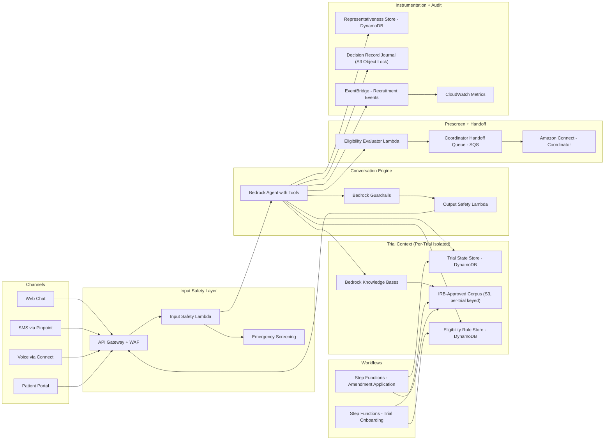

# Recipe 11.10 Architecture and Implementation: Clinical Trial Recruitment Conversationalist

*Companion to [Recipe 11.10: Clinical Trial Recruitment Conversationalist](chapter11.10-clinical-trial-recruitment-conversationalist). This page covers the AWS architecture, services, prerequisites, and pseudocode. For the problem framing and the conceptual approach, start with the main recipe.*

---

## The AWS Implementation

### Why These Services

**Amazon Bedrock for the LLM and embeddings.** Same selection criteria as recipes 11.1 through 11.9. The recruitment conversationalist specifically benefits from a model with strong instruction-following for IRB-language faithfulness, strong tool-use for the eligibility-prescreen and coordinator-handoff orchestration, citation-grounding discipline for trial-specific assertions, and good multilingual support. Claude Sonnet-class models or comparable frontier models for orchestration; smaller models (Haiku-class) for intent classification, eligibility-prefilter, and summarization. Bedrock provides HIPAA-eligible deployment under BAA.

**Amazon Bedrock Knowledge Bases for IRB-approved-content RAG.** The per-trial IRB-approved content corpus (protocol summary, eligibility criteria, recruitment FAQ, visit-schedule summary, study-procedure summary, sponsor-and-investigator information) and the institutional recruitment-conversation pattern library are the assistant's grounded retrieval sources. Knowledge Bases provides the managed RAG layer with metadata-filtered retrieval (trial_id, content_type, IRB-review-version, language, reading-level). Strict per-trial filtering at retrieval time enforces per-trial isolation.

**Amazon Bedrock Agents for tool orchestration.** The assistant's tools (trial_context_retrieve, eligibility_criterion_evaluate, recruitment_faq_retrieve, trial_state_check, prescreen_capture, coordinator_handoff_schedule, representativeness_record, emergency_route, out_of_scope_route, provenance_retrieve) are defined as Agents action groups with OpenAPI schemas. The Agent's traces preserve tool-call audit trails for the recruitment-decision-record journal.

**Amazon Bedrock Guardrails for recruitment-specific denied topics.** Configured with restricted-topic filters for recommendation-language ("you should join", "this trial is right for you"), trial-comparison-language across multiple trials, off-protocol-trial-information beyond the IRB-approved recruitment scope, clinical-decision-attempted (routes to patient's existing care team), prescription-attempted (routes to recipe 11.3 pathway), benefits-quote-attempted (routes to recipe 11.5 pathway), triage-attempted (routes to recipe 11.6 pathway), and therapy-attempted (routes to recipe 11.8 pathway).

**Amazon OpenSearch Serverless for vector and lexical retrieval.** The IRB-approved trial corpus, the recruitment-FAQ library, and the conversation history benefit from vector retrieval with per-trial metadata filtering.

**Amazon DynamoDB for per-trial state, prescreen state, and recruitment-funnel instrumentation.** Twelve tables: trial-context-store, trial-state-store, eligibility-rule-store, recruitment-faq-store, prescreen-record-store, conversation-state, conversation-metadata, tool-call-ledger, recruitment-decision-record-journal, representativeness-store, handoff-queue-state, and consent-record. All trial-specific records carry a trial_id partition key with per-trial KMS encryption context.

**AWS Step Functions for trial-state-and-amendment workflows.** The trial-onboarding workflow (IRB-approved-content authoring, eligibility-rule encoding, FAQ population, coordinator-team training, post-launch monitoring) and the IRB-amendment-application workflow (content update, IRB review routing, amendment application to active trial-context, clinical-leadership signoff) each run as audited Step Functions state machines.

**AWS Lambda for per-stage compute.** The chat handler, input-screening function, trial-context-loading function, eligibility-evaluator function, output-screening function, coordinator-handoff-orchestration function, recruitment-decision-record-persistence function, representativeness-recording function, per-trial reporting function, and outcome-correlation function are separate Lambdas with independent IAM roles, error handling, retries, and DLQs.

**Amazon SQS for the coordinator-handoff queue with throughput control.** The handoff queue routes qualified-and-still-interested prospects to the coordinator team. Queue depth monitoring drives the throughput-control primitive: when the queue exceeds the configured throughput floor, the assistant transitions to the "coordinator-team-busy" flow rather than continuing to enqueue handoffs that age out.

**Amazon EventBridge for trial-state-change events and recruitment-funnel events.** Events including trial_enrollment_opened, trial_enrollment_paused, trial_enrollment_closed, irb_amendment_submitted, irb_amendment_approved, prescreen_completed, handoff_scheduled, handoff_accepted, representativeness_alert, emergency_routed.

**Amazon Connect and Amazon Pinpoint for SMS/voice channels.** Connect provides the warm-handoff channel to human research coordinators with conversation context attached. Pinpoint provides proactive recruitment-event-triggered messaging (prescreen-completion confirmation, coordinator-follow-up timing confirmation) where the IRB-approved recruitment plan permits.

**Amazon Comprehend Medical (optional) for de-identification of free-text patient-reported information.** When the prospective participant reports medication names, symptoms, or condition details in free text during the prescreen, Comprehend Medical extracts structured terms for the eligibility-rule engine and de-identifies the free-text record for the audit archive.

Where the trial is FDA-regulated, the recruitment platform's audit trail is subject to 21 CFR Part 11 electronic-record-and-signature requirements. The architecture supports Part-11-compliant audit logging, electronic-signature workflows for IRB-approved-content version sign-off, and inspection-ready audit-trail export.

---

### Architecture Diagram



Key architectural boundaries: (1) Per-trial isolation enforced through partition keys and per-trial KMS encryption context across all trial-specific stores. (2) IRB-approved-content corpus stored as a separately-keyed asset class. (3) Recruitment-decision-record journal stored with a distinct customer-managed KMS key for blast-radius containment. (4) Cross-class read paths between research-data principals and clinical-care principals are explicitly disallowed at the IAM-policy level.

---

### Prerequisites

| Category | Requirement |
|----------|-------------|
| AWS Services | Bedrock (Claude models), Bedrock Agents, Bedrock Knowledge Bases, Bedrock Guardrails, OpenSearch Serverless, DynamoDB, S3 (with Object Lock), Lambda, Step Functions, SQS, EventBridge, API Gateway, WAF, Connect, Pinpoint, CloudWatch, CloudTrail, KMS, Secrets Manager, Kinesis Data Firehose |
| IAM Permissions | Per-Lambda least-privilege roles scoped to specific resource ARNs; separate roles for chat handler, eligibility evaluator, coordinator-handoff orchestrator, trial-onboarding worker, and audit-archive writer |
| BAA | AWS Business Associate Agreement signed covering all services processing PHI |
| Encryption | Customer-managed KMS keys: general recruitment workload key, separately-managed decision-record-journal key, separately-managed conversation-archive key, separately-managed IRB-approved-corpus key |
| VPC | VPC endpoints for Bedrock, Bedrock Agents, Bedrock Knowledge Bases, S3, DynamoDB, Secrets Manager, Step Functions, KMS, CloudWatch Logs, Comprehend Medical, Connect, Pinpoint; TLS 1.2 minimum (1.3 preferred) at every external boundary |
| Network Egress | ClinicalTrials.gov integration over public TLS with no PHI on the outbound path; WAF in front of the chat endpoint with managed rule sets for SQL-injection, XSS, prompt-injection-pattern detection, and rate-limiting |
| CloudTrail | Organization-wide trail with management events and data events for S3, DynamoDB, Lambda, and KMS; log-file integrity validation enabled |
| Sample Data | Synthetic trial protocol, synthetic eligibility criteria (10-15 criteria across all four categories), synthetic IRB-approved FAQ (20-30 entries), synthetic visit schedule, synthetic coordinator queue |
| Cost Estimate | ~$8-25 per qualified prescreen at moderate volume; ~$2,000-5,000/month fixed infrastructure for a single-trial deployment; per-trial onboarding cost dominated by clinical-content authoring, not cloud spend |

---

### Ingredients

| Service | Role in This Recipe |
|---------|-------------------|
| Amazon Bedrock (Claude Sonnet) | Orchestration model: tool-use loop, conversational eligibility prescreen, patient-question handling with IRB-citation discipline |
| Amazon Bedrock (Claude Haiku) | Intent classification, eligibility-prefilter, prescreen summarization for coordinator handoff |
| Amazon Bedrock Knowledge Bases | Managed RAG over per-trial IRB-approved corpus and institutional recruitment-conversation pattern library |
| Amazon Bedrock Agents | Tool orchestration with action groups defining the ten recruitment tools |
| Amazon Bedrock Guardrails | Restricted-topic filters blocking recommendation-language, trial-comparison, clinical-decision attempts |
| Amazon OpenSearch Serverless | Vector and lexical retrieval index for IRB-approved content with per-trial metadata filtering |
| Amazon DynamoDB | Twelve tables for trial context, trial state, eligibility rules, FAQ, prescreen records, conversation state/metadata, tool-call ledger, decision journal, representativeness, handoff queue state, consent |
| Amazon S3 (Object Lock) | Recruitment-decision-record journal, conversation archive, IRB-approved-content corpus (each separately keyed) |
| AWS Lambda | Per-stage compute: input screening, trial-context loading, eligibility evaluation, output screening, coordinator handoff, decision-record persistence, representativeness recording, reporting |
| AWS Step Functions | Trial-onboarding workflow, IRB-amendment-application workflow with clinical-leadership signoff |
| Amazon SQS | Coordinator-handoff queue with throughput-control monitoring |
| Amazon EventBridge | Trial-state-change events, recruitment-funnel events, representativeness alerts |
| Amazon Connect | Warm-handoff channel to human research coordinators |
| Amazon Pinpoint | Proactive recruitment-event-triggered messaging (confirmation, timing) |
| AWS WAF + API Gateway | Public chat endpoint with rate-limiting, prompt-injection-pattern detection |
| AWS KMS | Customer-managed keys: general workload, decision-record journal (separate), conversation archive (separate), IRB corpus (separate) |
| AWS Secrets Manager | CTMS credentials, EHR-prescreen-query credentials, sponsor-recruitment-feed credentials |
| Amazon CloudWatch | Operational metrics: prescreen-yield-by-cohort, handoff-accept-rate, citation-coverage-rate, IRB-faithfulness-rate, escalation-rate |
| AWS CloudTrail | Management and data events for regulatory audit |
| Amazon Kinesis Data Firehose | Conversation-audit archive delivery |
| Amazon Comprehend Medical (optional) | Medical NER for patient-reported free-text during eligibility prescreen |

---

### Pseudocode Walkthrough

> **Curious how this looks in Python?** The pseudocode above covers the concepts. If you'd like to see sample Python code that demonstrates these patterns using boto3, check out the [Python Example](chapter11.10-python-example). It walks through each step with inline comments and notes on what you'd need to change for a real deployment.

```pseudocode
STEP 1: Load and version IRB-approved trial corpus and eligibility rules
  - Retrieve trial-context from DynamoDB by trial_id
  - Verify trial-state is OPEN_FOR_ENROLLMENT
  - If trial closed or paused: return TRIAL_CLOSED_OR_PAUSED disposition
  - Snapshot trial-context-version for mid-conversation amendment detection
  - Load eligibility-rule definitions (per-criterion: category, evaluation logic,
    clinical-leadership owner, IRB-review version)

STEP 2: Track trial-state and IRB-amendment status
  - On every conversation turn: re-fetch trial-state, compare against snapshot
  - If material amendment detected: branch to IRB-approved re-disclosure flow
  - If non-material amendment: continue on snapshot, stamp version-history
  - If trial transitions to PAUSED or CLOSED mid-conversation: route to
    appropriate closure flow

STEP 3: Receive conversation turn with input safety and context loading
  - Run continuous emergency screening (regex patterns + ML classifier)
  - If emergency detected: route to 911/988/institutional crisis line,
    emit EMERGENCY_ROUTED disposition, halt recruitment conversation
  - Run prompt-injection detection
  - Run out-of-scope classification (clinical advice, trial recommendation,
    benefits quote, prescription request)
  - If out-of-scope: route to appropriate alternative pathway
  - Classify identity posture (adult-self, parent-guardian, surrogate)
  - Load trial context: IRB-approved corpus, FAQ corpus, eligibility criteria
  - On first turn: deliver required IRB disclosures

STEP 4: Run agent tool-use loop with IRB-citation discipline
  - Construct system prompt with: trial context, population posture,
    language preference, conversation history, tool definitions
  - Submit to Bedrock Agent (or custom orchestration loop)
  - Agent produces tool calls: trial_context_retrieve, recruitment_faq_retrieve,
    eligibility_criterion_evaluate, prescreen_capture, etc.
  - Enforce citation-coverage floor: every trial-specific assertion must cite
    an IRB-approved source document
  - If question falls outside IRB-approved FAQ: route to coordinator rather
    than improvise

STEP 5: Execute conversational eligibility prescreen
  - For each criterion the conversation has addressed:
    - SIMPLE_STRUCTURED: evaluate deterministically from patient response
    - COMPLEX_STRUCTURED: capture as patient-reported, tag for coordinator
      verification
    - CLINICAL_JUDGMENT: flag for coordinator review, capture patient report
      as input not determination
    - VERIFICATION_ONLY: capture, defer to coordinator
  - Compute overall disposition:
    - Any hard exclusion met -> DISQUALIFIED
    - All simple criteria met, complex/clinical pending -> UNCERTAIN_PENDING
    - High confidence across simple and complex -> LIKELY_ELIGIBLE
    - Patient declined -> DECLINED_BY_PATIENT

STEP 6: Run output safety with IRB-language faithfulness verification
  - Apply Bedrock Guardrail (recommendation-language, trial-comparison,
    clinical-decision filters)
  - Verify IRB-language faithfulness: each trial-specific statement cross-
    referenced against IRB-approved corpus
  - Verify interest-vs-consent distinction: no output implies consent
    has been collected
  - Verify required disclosures were surfaced (first turn)
  - If violations detected: regenerate with corrected constraints or
    substitute safe template

STEP 7: Orchestrate coordinator handoff with throughput control
  - Check coordinator-queue depth against throughput floor
  - If queue depth exceeds floor: deliver "coordinator-team-busy" flow
    with trial materials and timing expectation
  - If within floor: capture patient's preferred follow-up channel and time,
    generate structured prescreen summary, enqueue handoff in SQS,
    confirm handoff arrangement with patient
  - Emit HANDOFF_SCHEDULED event to EventBridge
  - Route to Amazon Connect for coordinator pickup

STEP 8: Capture per-cohort representativeness instrumentation
  - Record funnel-stage progression: ENTERED -> DISCLOSURE_ACCEPTED ->
    FAQ_ENGAGED -> PRESCREEN_STARTED -> PRESCREEN_COMPLETED ->
    HANDOFF_SCHEDULED
  - Capture demographic dimensions per IRB-approved data-collection plan
    (patient self-report only; no demographic inference)
  - Write to representativeness store with trial_id and cohort dimensions
  - If under-recruitment alert threshold crossed for any cohort:
    emit representativeness_alert event

STEP 9: Persist recruitment-decision record to research-grade retention
  - Assemble decision record: session metadata, model/prompt versions,
    IRB-content versions, tool-call audit trail, prescreen result,
    handoff disposition, timestamps
  - Write to S3 with Object Lock (compliance mode) using the separately-
    managed decision-record KMS key
  - Write conversation transcript to conversation-archive bucket using the
    separately-managed conversation-archive KMS key
  - Retention sized to the longest applicable obligation

STEP 10: Generate per-trial reporting and outcome correlation
  - Aggregate per-trial funnel metrics: entry volume, prescreen-completion
    rate, prescreen-yield by cohort, handoff volume and accept rate,
    time-to-coordinator-contact, coordinator-time-saved estimate
  - Outcome correlation (accumulates over trial timeline): consent rate
    per handoff, randomization rate per consent, per-cohort representation
    vs diversity-action-plan targets
  - Emit CloudWatch metrics for operational monitoring dashboards
  - Emit EventBridge events for downstream reporting consumers
```

---

### Expected Results

Sample structured output from a completed recruitment prescreen conversation:

```json
{
  "session_id": "sess-9f2a1b3c-4d5e-6f7a-8b9c-0d1e2f3a4b5c",
  "trial_id": "NCT05123456",
  "trial_context_version": "v2.3.1",
  "participant_id_hash": "a7b3c9d2e1f04a8b",
  "identity_posture": "ADULT_SELF_DECISION",
  "language": "en-US",
  "channel": "web_chat",
  "referral_source": "clinician_referral",
  "site_id": "SITE_TX_042",
  "prescreen_disposition": "LIKELY_ELIGIBLE_PENDING_COORDINATOR",
  "criteria_evaluated": [
    {"criterion_id": "INC-01", "category": "SIMPLE_STRUCTURED", "outcome": "MET", "value_reported": "52", "rule_version": "v1.0"},
    {"criterion_id": "INC-02", "category": "SIMPLE_STRUCTURED", "outcome": "MET", "value_reported": "female", "rule_version": "v1.0"},
    {"criterion_id": "INC-03", "category": "COMPLEX_STRUCTURED", "outcome": "INDETERMINATE", "value_reported": "patient unsure of most recent value", "rule_version": "v1.1"},
    {"criterion_id": "EXC-01", "category": "SIMPLE_STRUCTURED", "outcome": "MET", "value_reported": "no active malignancy", "rule_version": "v1.0"},
    {"criterion_id": "EXC-05", "category": "CLINICAL_JUDGMENT", "outcome": "REQUIRES_COORDINATOR_REVIEW", "value_reported": "stable on current regimen per patient report", "rule_version": "v1.0"}
  ],
  "handoff_disposition": "HANDOFF_SCHEDULED",
  "coordinator_queue_depth_at_handoff": 3,
  "patient_preferred_channel": "phone",
  "patient_preferred_time": "weekday_afternoon",
  "citation_coverage_score": 0.92,
  "irb_faithfulness_score": 1.0,
  "disclosures_delivered": ["DISC.ASSISTANT_NOT_PERSON", "DISC.NOT_COORDINATOR", "DISC.CANNOT_ENROLL", "DISC.PROVIDING_INFO_ONLY", "DISC.CAN_STOP_ANY_TIME", "DISC.DATA_RETENTION_NOTICE", "DISC.REQUEST_COORDINATOR_ANY_TIME"],
  "emergency_triggered": false,
  "out_of_scope_routed": false,
  "conversation_turns": 14,
  "elapsed_minutes": 11.3,
  "model_version": "anthropic.claude-3-5-sonnet-20241022-v2:0",
  "guardrail_version": "1",
  "timestamp_utc": "2026-03-15T14:32:07Z"
}
```

**Performance benchmarks (target):**

| Metric | Target | Notes |
|--------|--------|-------|
| Prescreen yield (eligible/total screened) | 35-55% | Varies by trial complexity and population |
| Citation coverage rate | > 85% | Percentage of trial-specific assertions with IRB-corpus citation |
| IRB-language faithfulness rate | > 99% | Percentage of outputs with no unsupported trial-specific assertions |
| Coordinator-handoff accept rate | > 80% | Percentage of handoffs that coordinator team accepts without rejection |
| Time-to-coordinator-contact | < 2 business days | From handoff-scheduled to coordinator first contact |
| Emergency-escalation rate | < 1% | Expected low given recruitment population |
| Conversation completion rate | 60-75% | Percentage of conversations reaching prescreen-completed or declined-by-patient |
| Mean conversation duration | 8-15 minutes | Varies by trial complexity and patient question depth |
| Throughput-control activation | < 10% of sessions | If frequently activated, coordinator capacity is undersized |

---

## Why This Isn't Production-Ready

The pseudocode and the Python companion demonstrate the architectural shape. A production deployment requires substantial additional work in several categories:

**IRB governance integration.** The entire IRB-content-review-and-approval workflow, the amendment-application workflow with clinical-leadership and IRB-coordinator signoff, the per-trial change-management process, and the IRB-audit-readiness posture are institutional-process integrations that the demo mocks entirely.

**Per-trial content authoring.** The IRB-approved trial corpus (protocol summary, eligibility criteria, recruitment FAQ, visit schedule, study procedures, sponsor information) is multi-week clinical work per trial. The content authoring, clinical-leadership review, IRB submission, and IRB approval cycle are not software tasks.

**Coordinator-team workflow integration.** The handoff format, queue routing, coordinator-side tooling, and feedback loop are co-designed with the coordinator team. The demo assumes a simple queue; production deployments integrate with the institution's clinical-trial-management system (CTMS).

**Deterministic eligibility-rule encoding with clinical-leadership ownership.** Each criterion requires named clinical-leadership ownership, formal encoding of evaluation logic, edge-case documentation, and version-controlled signoff. The demo uses illustrative rules; production rules are institutional clinical content.

**Real VPC topology with endpoints and egress control.** The demo runs without VPC constraints; production requires VPC endpoints for all AWS services, no public internet egress for PHI-carrying traffic, and WAF with prompt-injection-pattern detection at the chat endpoint.

**Real IAM least-privilege with per-Lambda role scoping.** The demo uses broad permissions; production requires per-Lambda roles scoped to the specific DynamoDB tables, S3 prefixes, KMS keys, and EventBridge buses each function touches.

**Real KMS key management with separate key policies for research-data classes.** The decision-record journal, the conversation archive, and the IRB-approved corpus each require separately-managed customer-managed keys with distinct key policies and distinct key-administrator principals.

**Multi-language support with clinically-validated translations.** The demo operates in English; production recruitment for diverse populations requires clinically-validated translations of the IRB-approved corpus reviewed by the institution's community-research-engagement teams.

**21 CFR Part 11 compliance for FDA-regulated trials.** Electronic-record-and-signature requirements, audit-trail integrity, electronic-signature workflows for content sign-off, and inspection-ready export are not implemented in the demo.

**Load testing and graceful degradation.** The demo does not handle concurrent-session load, upstream-service failures, or degradation scenarios. Production requires defined graceful-degradation paths and capacity planning calibrated to the recruitment population.

---

## Variations and Extensions

**Pediatric recruitment with assent-and-parental-permission identity model.** Pediatric trials require parental permission and age-appropriate pediatric assent per the IRB-approved process and 45 CFR 46 Subpart D. The identity layer distinguishes the parent or guardian as the primary recruitment-conversation participant, with the child's assent collected per the IRB-approved assent process at the coordinator-mediated consent step. The assistant's language, tone, and information depth are calibrated to the parent or guardian's role. Where the institution permits direct engagement with older adolescents (per state-specific age-of-consent provisions and IRB approval), the assistant supports an adolescent-self-decision posture with parental notification per protocol.

**Multilingual recruitment with culturally-appropriate content and community-research-engagement-team review.** Multilingual deployment requires per-language versions of the entire IRB-approved corpus (protocol summary, eligibility criteria, FAQ, disclosures) with clinically-validated translations reviewed by the institution's community-research-engagement teams and approved by the IRB as language-specific recruitment materials. The assistant's language detection, language preference capture, and per-language content retrieval are architectural primitives. Cultural-adaptation beyond literal translation (trust-building language, community-specific concerns, research-mistrust acknowledgment) is reviewed by community stakeholders before deployment.

**Decentralized-trial recruitment with home-visit-and-telehealth visit-schedule communication.** Decentralized and hybrid trial designs change the recruitment conversation's content scope: the visit schedule includes home visits, telehealth visits, local-lab visits, and shipped-kit procedures in addition to (or instead of) site-based visits. The assistant communicates the decentralized visit logistics (what happens at home, what requires travel, what is shipped, what is via video) using the IRB-approved decentralized-trial recruitment language. The coordinator-handoff includes logistics preferences (home-visit availability, telehealth access, shipping address for study materials) in addition to the standard prescreen summary.

---

## Additional Resources

**Regulatory and clinical-trial governance:**
- ClinicalTrials.gov (trial registration and patient-facing listings)
- ICH E6(R3) Good Clinical Practice guidelines (2025 update with risk-based and quality-by-design framing)
- 21 CFR Part 50 (Protection of Human Subjects: Informed Consent)
- 21 CFR Part 11 (Electronic Records; Electronic Signatures)
- 45 CFR 46 (Protection of Human Subjects, including Subparts B, C, D)
- FDORA Section 3601 (Diversity Action Plans for Clinical Studies, codified 2022)
- FDA Final Guidance on Diversity Action Plans for Clinical Studies (2024)

**AWS services and healthcare resources:**
- AWS HIPAA Eligible Services list
- Amazon Bedrock documentation (Agents, Knowledge Bases, Guardrails)
- Amazon Bedrock Knowledge Bases developer guide
- Amazon Connect administrator guide (contact flows, chat)
- Amazon Pinpoint developer guide (messaging channels)
- AWS Solutions Library healthcare entries
- AWS HealthLake documentation

**Clinical-trial recruitment operations:**
- Tufts CSDD publications on clinical-trial enrollment performance
- FDA guidance on decentralized clinical trials
- EMA reflection paper on decentralized clinical trials

---

## Estimated Implementation Time

| Tier | Scope | Time |
|------|-------|------|
| Basic | Single trial in a well-characterized therapeutic area, single language (English), single channel (web chat), single site, basic eligibility-rule encoding (10-15 criteria), basic IRB-approved-corpus load, basic coordinator-handoff queue, basic per-cohort representativeness monitoring, basic recruitment-decision-record persistence, named clinical-leadership ownership, IRB review of recruitment content, coordinator-team co-design of handoff format | 6-9 months |
| Production-ready | Multi-trial portfolio (5-20 active trials across therapeutic areas), multi-channel (web chat, SMS, voice), multi-language (English plus Spanish at minimum with clinically-validated translations), multi-site with per-site operational configuration, full eligibility-rule library with named per-criterion clinical-leadership ownership, full IRB-amendment-application workflow with Step Functions, full coordinator-handoff integration with CTMS, full per-cohort representativeness instrumentation with diversity-action-plan reporting, full 21 CFR Part 11 compliance for FDA-regulated trials, full research-grade retention with separate KMS keying, full VPC topology with endpoints and WAF, equity-targeted channel diversification, community-research-engagement-team review of multilingual content, outcome-correlation pipeline | 12-24 months |
| With variations | Pediatric-recruitment variant with assent-and-parental-permission identity model, multilingual deployment beyond English plus Spanish with culturally-appropriate content, decentralized-trial recruitment with home-visit-and-telehealth logistics, surrogate-decision-maker variant, multi-institutional deployment with shared platform and per-institution governance, ClinicalTrials.gov deep integration with registry-data validation, voice-channel recruitment with accessibility considerations, community-based-organization partnership integration, sponsor-recruitment-vendor coexistence model, continuous-improvement loop with per-trial onboarding velocity optimization | 12-18 months beyond production-ready |

---

*← [Main Recipe 11.10](chapter11.10-clinical-trial-recruitment-conversationalist) · [Python Example](chapter11.10-python-example) · [Chapter Preface](chapter11-preface)*
