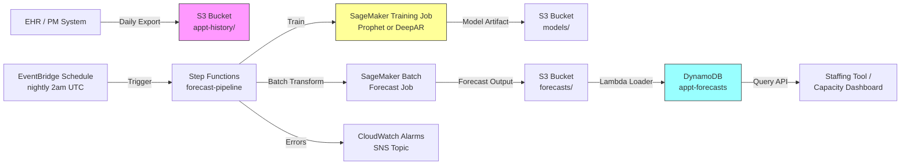

# Recipe 12.1 Architecture and Implementation: Appointment Volume Forecasting

*Companion to [Recipe 12.1: Appointment Volume Forecasting](chapter12.01-appointment-volume-forecasting). This page covers the AWS architecture, services, prerequisites, and pseudocode. For the problem framing and the conceptual approach, start with the main recipe.*

---

## The AWS Implementation

Now let's get specific. Here's how I'd build this on AWS, and why each service is the right tool for each job.

### Why These Services

**Amazon SageMaker for model training and inference.** SageMaker is AWS's managed machine learning platform, and it's the right home for this workload because it handles the unglamorous infrastructure (training compute, model artifacts, endpoint hosting) so you can focus on the model. For appointment forecasting specifically, SageMaker's [built-in DeepAR algorithm](https://docs.aws.amazon.com/sagemaker/latest/dg/deepar.html) handles the multi-series case out of the box, and SageMaker's bring-your-own-container support lets you run Prophet or statsmodels just as easily for the single-series case. Amazon Forecast was the obvious choice here a few years ago, but AWS has [announced its end of availability](https://aws.amazon.com/blogs/machine-learning/transition-your-amazon-forecast-usage-to-amazon-sagemaker-canvas/), so new builds should target SageMaker directly.

<!-- TODO (TechWriter): N1. Verify the Amazon Forecast deprecation status and link as of the publication date. The transition guidance link is current as of mid-2024; check that AWS has not moved or replaced this guidance. -->

**Amazon S3 for historical data and forecast outputs.** Historical appointment data lands in S3 as the canonical training input, and forecast results land back in S3 as the canonical output. S3 with SSE-KMS encryption is the standard durable storage layer for ML pipelines. The S3 event notification system also gives you a clean trigger: new training data arrives, the retraining workflow fires automatically.

**AWS Glue (or AWS Step Functions) for orchestration.** Forecast pipelines are not single-shot Lambda jobs. They run on a schedule, involve multiple steps (data extraction, feature engineering, model training, batch inference, output delivery), and need to handle failures gracefully. AWS Step Functions is the right tool for orchestrating this kind of multi-step workflow with explicit retry logic and visibility into each step. AWS Glue handles the data transformation pieces if your historical data needs ETL before training.

**Amazon DynamoDB for serving forecasts to operational systems.** Forecasts need to be queryable by downstream consumers (the staffing tool, the capacity dashboard) at low latency. DynamoDB's key-value access pattern fits perfectly: query by clinic-and-date, get back the forecast and prediction interval. It's fully managed, scales transparently, and is on AWS's HIPAA eligible services list.

**Amazon EventBridge for scheduling.** EventBridge Scheduler triggers the retraining and forecast pipeline on a cron schedule (typically nightly). It's the right primitive for "run this thing on a schedule" without standing up a dedicated scheduler.

### Architecture Diagram



### Prerequisites

| Requirement | Details |
|-------------|---------|
| **AWS Services** | Amazon SageMaker, Amazon S3, AWS Step Functions, Amazon DynamoDB, Amazon EventBridge, AWS Lambda, Amazon CloudWatch |
| **IAM Permissions** | `sagemaker:CreateTrainingJob`, `sagemaker:CreateTransformJob`, `s3:GetObject`, `s3:PutObject`, `states:StartExecution`, `dynamodb:BatchWriteItem`, `kms:Decrypt` |
| **BAA** | AWS BAA signed if appointment data contains direct or indirect identifiers (it usually does: appointment IDs link back to patients) |
| **Encryption** | S3: SSE-KMS; DynamoDB: encryption at rest enabled (default); SageMaker training and inference: encrypted EBS volumes and KMS-encrypted output; CloudWatch log groups: configure KMS encryption explicitly (logs may include sample data values) |
| **VPC** | Production: SageMaker training and inference jobs in VPC with VPC endpoints for S3, CloudWatch Logs, and KMS. SageMaker requires this configuration for HIPAA workloads. |
| **CloudTrail** | Enabled: log all SageMaker, S3, and DynamoDB API calls for HIPAA audit trail |
| **Sample Data** | Synthetic appointment volume data. The [M5 Forecasting Competition dataset on Kaggle](https://www.kaggle.com/competitions/m5-forecasting-accuracy/data) is a good public dataset for testing forecasting code, though it's retail not healthcare. For healthcare-shaped synthetic data, generate from a known process (trend + weekly seasonality + holiday effects + noise) so you can validate your pipeline against ground truth. Never use real patient appointment data in dev. |
| **Cost Estimate** | SageMaker training (ml.m5.large, ~30 min/day): ~$0.07/day. SageMaker batch transform (~5 min/day): ~$0.01/day. S3, DynamoDB, Step Functions, Lambda: pennies per day. Total: $50–$200/month for a single clinic, dominated by SageMaker compute and dependent on how much hyperparameter tuning you do. |

<!-- TODO (TechWriter): V1. Verify SageMaker pricing assumptions reflect current rates. AWS pricing changes; confirm against the AWS pricing calculator before publication. -->

### Ingredients

| AWS Service | Role |
|------------|------|
| **Amazon SageMaker** | Trains the forecasting model and runs scheduled batch inference |
| **Amazon S3** | Stores historical training data, model artifacts, and forecast outputs |
| **AWS Step Functions** | Orchestrates the multi-step training and inference pipeline with retries |
| **Amazon EventBridge** | Triggers the pipeline on a nightly schedule |
| **AWS Lambda** | Lightweight transforms: load forecast outputs into DynamoDB, format outputs for downstream consumers |
| **Amazon DynamoDB** | Serves forecast lookups to operational systems at low latency |
| **AWS KMS** | Manages encryption keys for S3, DynamoDB, and SageMaker |
| **Amazon CloudWatch** | Logs, metrics, alarms for pipeline failures and forecast drift |

### Code

> **Reference implementations:** The following AWS sample resources demonstrate the patterns used in this recipe:
>
> - [`amazon-sagemaker-examples`](https://github.com/aws/amazon-sagemaker-examples): Official SageMaker examples including DeepAR notebooks for time-series forecasting
> - [Amazon SageMaker DeepAR Forecasting](https://docs.aws.amazon.com/sagemaker/latest/dg/deepar.html): Built-in algorithm documentation for DeepAR with example invocations
> - [Transitioning Amazon Forecast to SageMaker Canvas](https://aws.amazon.com/blogs/machine-learning/transition-your-amazon-forecast-usage-to-amazon-sagemaker-canvas/): Migration guidance from the deprecated Amazon Forecast service to SageMaker Canvas

<!-- TODO (TechWriter): N2. Verify all three reference implementation links are still live and up-to-date. The Amazon Forecast transition blog post URL is correct as of mid-2024 but may have moved. -->

#### Walkthrough

**Step 1: Pull and shape the historical data.** The appointment history lives in the practice management system or EHR. The training pipeline starts by pulling the last several years of daily counts into a clean tabular format: date, count, and any known categorical attributes (clinic, provider, appointment type). The shape that forecasting libraries expect is one row per time step per series, with explicit holiday and calendar features. This step is usually 60% of the work in a forecasting project, and it's the part that determines whether the model has anything useful to learn from. Skip it or do it sloppily, and your model will faithfully predict garbage in production.

```text
FUNCTION prepare_training_data(raw_history, holiday_calendar):
    // Group raw appointment records into a daily count time series.
    // The forecasting model expects regular intervals: one row per day per series.
    daily_counts = group raw_history by (clinic_id, date)
                   then count appointments per group

    // Fill in any missing days with explicit zero counts.
    // Forecasting models do not handle gaps gracefully; a missing day is
    // not the same as a zero-volume day, but it's closer than a model
    // silently treating it as the previous value.
    daily_counts = fill missing dates with count = 0

    // Add calendar features. These give the model explicit signal for
    // patterns it would otherwise have to infer from raw dates.
    FOR each row in daily_counts:
        row.day_of_week     = day index (0-6) of row.date
        row.week_of_year    = ISO week number of row.date
        row.month           = month of row.date
        row.is_holiday      = TRUE if row.date is in holiday_calendar
        row.days_to_holiday = days until the next holiday in holiday_calendar

    RETURN daily_counts
```

**Step 2: Train the forecasting model.** This step fits the model on history. The first decision is which model family to use. For a single clinic with two-plus years of daily counts, Prophet is the pragmatic default: it handles seasonality, holidays, and missing data with little tuning. For a health system with many related series (per-clinic, per-provider), DeepAR's joint-training approach earns its keep. The training step holds out the most recent 90 days as a validation window, fits the model on everything before that, and computes prediction error on the held-out window. The error metric drives the decision of whether to deploy this model or fall back to the previous one.

```text
FUNCTION train_forecast_model(daily_counts):
    // Hold out the most recent 90 days of history to evaluate the model
    // against actual outcomes. This is the only honest way to know if
    // the model is improving or regressing.
    training_data, validation_data = split daily_counts at (max_date - 90 days)

    // Fit the chosen model. For Prophet, this means specifying the
    // seasonalities and holiday effects we expect; the library handles
    // the rest. For DeepAR, this is a SageMaker training job with
    // hyperparameters specified up front.
    model = fit Prophet (or DeepAR) on training_data with:
        weekly_seasonality  = TRUE     // capture day-of-week patterns
        yearly_seasonality  = TRUE     // capture seasonal patterns
        holidays            = holiday_calendar
        changepoint_prior   = 0.05    // moderate trend flexibility

    // Run the model forward over the held-out 90 days and measure error.
    forecast = model.predict(dates from validation_data)
    mape     = mean absolute percentage error of forecast vs. validation_data.actual

    // Quality gate: if the new model is meaningfully worse than the
    // current production model, do not promote it. Better to ship
    // yesterday's model than today's broken one.
    IF mape > current_production_model.mape * 1.20:
        REJECT this model; alert the ML engineer

    RETURN model, mape
```

**Step 3: Generate the forecast.** With a trained model, the inference step produces forecasts at the operational horizons consumers need. For appointment staffing, that's typically a 14-day daily forecast (for next-week staffing decisions) and a 90-day weekly aggregate (for capacity planning). Each forecast comes with a prediction interval: a lower and upper bound that captures forecast uncertainty. The interval is what lets a clinic manager say "I'm scheduling for the upper bound on Mondays and the lower bound on Fridays" instead of staffing to a single point estimate that's wrong half the time.

```text
FUNCTION generate_forecast(model, forecast_horizon_days):
    // Build the date range to forecast over: from tomorrow forward.
    forecast_dates = list of dates from (today + 1) for forecast_horizon_days days

    // Run the trained model forward over the future dates.
    // The output includes both point predictions and uncertainty intervals.
    raw_forecast = model.predict(forecast_dates)

    // Round point predictions to whole appointments (you cannot schedule
    // 184.7 appointments). Keep prediction intervals at full precision
    // because they will inform downstream staffing decisions.
    forecast_records = empty list
    FOR each row in raw_forecast:
        append to forecast_records: {
            clinic_id:           model.clinic_id,
            forecast_date:       row.date,
            point_forecast:      round(row.yhat),                  // most likely value
            lower_bound:         row.yhat_lower,                   // 80% prediction interval lower
            upper_bound:         row.yhat_upper,                   // 80% prediction interval upper
            generated_at:        current UTC timestamp,
            model_version:       model.version_id
        }

    RETURN forecast_records
```

**Step 4: Deliver the forecast to operational systems.** The forecast is useless if it sits in an S3 bucket. This step writes each forecast record to DynamoDB keyed by clinic-and-date so the staffing tool, the capacity dashboard, and any other downstream consumer can query forecasts at low latency. DynamoDB's `BatchWriteItem` API handles bulk loads efficiently. The write is idempotent (forecast for clinic A on date D overwrites any prior forecast for the same key) so re-running the pipeline produces consistent state.

```text
FUNCTION load_forecasts_to_dynamodb(forecast_records, table_name):
    // DynamoDB BatchWriteItem accepts up to 25 items per call.
    // Chunk the forecast records into batches and write each batch.
    batches = chunk forecast_records into groups of 25

    FOR each batch in batches:
        // Each item is keyed by (clinic_id, forecast_date) so it
        // overwrites any prior forecast for the same clinic-and-date.
        // This is intentional: today's forecast supersedes yesterday's
        // forecast for the same future date.
        write batch to DynamoDB table_name with:
            partition_key = clinic_id
            sort_key      = forecast_date
            attributes    = { point_forecast, lower_bound, upper_bound,
                              generated_at, model_version }

        // Handle unprocessed items (rare but possible under throttling).
        IF batch had unprocessed items:
            retry unprocessed items with exponential backoff

    RETURN count of records written
```

> **Curious how this looks in Python?** The pseudocode above covers the concepts. If you'd like to see sample Python code that demonstrates these patterns using boto3 and Prophet, check out the [Python Example](chapter12.01-python-example). It walks through each step with inline comments and notes on what you'd need to change for a real deployment.

<!-- TODO (TechWriter): N3. The Python companion file (chapter12.01-python-example.md) is referenced here but does not yet exist in this branch. Confirm it has been drafted before publishing this recipe. -->

### Expected Results

**Sample output for a 14-day daily forecast:**

```json
{
  "clinic_id": "primary-care-001",
  "forecast_date": "2026-04-15",
  "point_forecast": 184,
  "lower_bound": 168,
  "upper_bound": 201,
  "generated_at": "2026-04-14T07:00:00Z",
  "model_version": "prophet-v3-2026-04-01"
}
```

**Performance benchmarks:**

| Metric | Typical Value |
|--------|---------------|
| End-to-end pipeline runtime | 15–45 minutes nightly |
| Forecast accuracy (7-day MAPE) | 5–10% for stable clinics |
| Forecast accuracy (30-day MAPE) | 8–15% for stable clinics |
| Forecast accuracy (90-day MAPE) | 12–20% for stable clinics |
| Cost per clinic per month | $50–$200 (dominated by SageMaker compute) |
| Forecast availability latency | Available by 8 AM after nightly run |

<!-- TODO (TechWriter): A1. Accuracy benchmarks above are typical industry figures for healthcare appointment forecasting on stable clinics with 2+ years of clean history. Confirm these ranges against your reference data sources before publication. -->

**Where it struggles:** Clinics with fewer than 18 months of clean historical data (annual seasonality cannot be learned). New providers or relocated clinics where the underlying volume distribution is changing rapidly. Specialty clinics with highly variable, low-volume appointment patterns (the noise floor dominates the signal). Holiday and post-holiday weeks where the model interpolates poorly without explicit holiday calendar features. Periods immediately following operational changes (new EHR, new scheduling rules, expanded panels) where history is no longer representative.

---

## Why This Isn't Production-Ready

The pseudocode and architecture above demonstrate the pattern. Deploying this to a real health system requires addressing several gaps that are intentionally outside the scope of a cookbook recipe. These are the ones that will bite you:

**Forecast monitoring and drift detection.** A model trained today will degrade as the world changes. Without explicit monitoring, the first signal that something is wrong will be a clinic manager complaining that staffing has felt off for three weeks. Track forecast error against actuals on a rolling basis. Alert when MAPE exceeds your tolerance for two consecutive weeks. Retrain on a schedule (monthly is reasonable) and on demand when drift is detected.

**Cold-start handling.** New clinics, new providers, and newly added appointment types have no history. The pipeline above will fail or produce garbage for these series. Production systems need a fallback: aggregate-level forecasts disaggregated by historical mix, hierarchical forecasting that borrows strength from related series, or simple heuristics until enough history accumulates.

**Idempotency and rerun safety.** The nightly pipeline can fail partway through and need to be rerun. Each step needs to be safe to repeat: training writes to a new model version artifact rather than overwriting, forecast generation is deterministic given inputs, and DynamoDB writes overwrite cleanly by primary key. None of this is automatic; it has to be designed in.

**Holiday calendar maintenance.** The holiday calendar is configuration, not code. Holidays change year over year (Easter floats; Lunar New Year shifts). Healthcare clinics often add their own organization-specific closure days. A production system needs a maintained holiday data source with annual review.

---

## Variations and Extensions

**Hourly granularity.** Daily forecasts work for staffing the day, but check-in workflows benefit from hourly forecasts. The same pipeline applies with hour-of-day as an additional feature and a different model fit. Watch the noise floor: hourly counts are smaller and more variable, so models need more history to find signal.

**Per-provider forecasts.** Total clinic volume is one series. Per-provider volume is many parallel series. DeepAR or hierarchical forecasting (forecast at the clinic level and disaggregate, or forecast at the provider level and reconcile to the clinic total) both work. Hierarchical reconciliation is the more principled approach when you need consistency across levels.

**No-show adjustment.** Multiply the booked-appointment forecast by a per-clinic, per-day-of-week show rate to get expected actual visits. The show rate forecast is its own modeling problem (covered in Recipe 7.1). For a basic implementation, a rolling historical average of show rates by day-of-week is a reasonable starting point.

---

## Additional Resources

**AWS Documentation:**
- [Amazon SageMaker DeepAR Forecasting Algorithm](https://docs.aws.amazon.com/sagemaker/latest/dg/deepar.html)
- [Amazon SageMaker Pricing](https://aws.amazon.com/sagemaker/pricing/)
- [AWS Step Functions Documentation](https://docs.aws.amazon.com/step-functions/latest/dg/welcome.html)
- [AWS HIPAA Eligible Services](https://aws.amazon.com/compliance/hipaa-eligible-services-reference/)
- [Architecting for HIPAA on AWS (Whitepaper)](https://docs.aws.amazon.com/whitepapers/latest/architecting-hipaa-security-and-compliance-on-aws/welcome.html)

**AWS Sample Repos:**
- [`amazon-sagemaker-examples`](https://github.com/aws/amazon-sagemaker-examples): Official SageMaker examples including DeepAR notebooks and time-series forecasting tutorials

**External Resources:**
- [Prophet Documentation (Meta Open Source)](https://facebook.github.io/prophet/): Reference for the Prophet forecasting library used in the recipe's Python companion
- [Forecasting: Principles and Practice (Hyndman & Athanasopoulos)](https://otexts.com/fpp3/): Free online textbook covering classical forecasting methods, the canonical reference for time-series practitioners

**AWS Solutions and Blogs:**
- [Transitioning Amazon Forecast to SageMaker Canvas](https://aws.amazon.com/blogs/machine-learning/transition-your-amazon-forecast-usage-to-amazon-sagemaker-canvas/): Migration guidance for teams previously using Amazon Forecast

<!-- TODO (TechWriter): N4. Audit all external links during final pre-publication pass. The Forecasting: Principles and Practice link is stable; AWS blog and docs links should be re-verified. -->

---

## Estimated Implementation Time

- **Basic pipeline (one clinic, daily forecast):** 1–2 weeks
- **Production-ready (monitoring, drift detection, alerting):** 4–6 weeks
- **With variations (hourly, per-provider, no-show adjustment):** 8–12 weeks

---


---

*← [Main Recipe 12.1](chapter12.01-appointment-volume-forecasting) · [Python Example](chapter12.01-python-example) · [Chapter Preface](chapter12-preface)*
