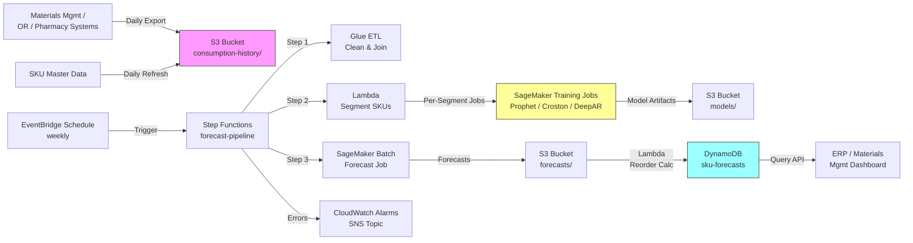

# Recipe 12.2 Architecture and Implementation: Supply Inventory Forecasting

*Companion to [Recipe 12.2: Supply Inventory Forecasting](chapter12.02-supply-inventory-forecasting). This page covers the AWS architecture, services, prerequisites, and pseudocode. For the problem framing and the conceptual approach, start with the main recipe.*

---

## The AWS Implementation

The AWS implementation looks a lot like Recipe 12.1's. That's not laziness; it's that the ML platform pieces (managed training, batch inference, scheduled orchestration, low-latency serving) are the same, even when the modeling problem is different. What changes here is the data shape (many SKUs, not one site), the model selection logic (segmentation routing), and the integration target (materials management / ERP, not staffing tools).

### Why These Services

**Amazon SageMaker for model training and inference.** SageMaker is the right home for both classical statistical methods (Prophet, statsmodels, intermittent-demand methods, all installable in a custom container) and the multi-series neural methods like the [DeepAR built-in algorithm](https://docs.aws.amazon.com/sagemaker/latest/dg/deepar.html). For a single-facility forecast across thousands of SKUs, DeepAR's ability to learn jointly across related series is genuinely useful. Amazon Forecast was the obvious choice a few years ago, but AWS [announced its end of availability](https://aws.amazon.com/blogs/machine-learning/transition-your-amazon-forecast-usage-to-amazon-sagemaker-canvas/), and new builds should target SageMaker directly.

<!-- TODO (TechWriter): N1. Verify the Amazon Forecast deprecation status and link as of the publication date. The transition guidance link is current as of mid-2024; check that AWS has not moved or replaced this guidance. -->

**Amazon S3 for consumption data, model artifacts, and forecast outputs.** SKU consumption history (often a substantial dataset for a multi-year, multi-facility extract) lands in S3 partitioned by date and facility. Model artifacts and forecast outputs land back in S3 as the canonical output. S3 with SSE-KMS encryption is the standard durable storage layer.

**AWS Glue for ETL.** Healthcare consumption data often arrives messy: multiple source systems, inconsistent SKU coding, missing days, mixed timezones. Glue ETL jobs (or Glue notebooks for development) handle the cleanup, the joining of SKU master data with consumption transactions, and the writing of the modeling-ready dataset. For Pythonic teams, AWS Glue's PySpark jobs feel familiar; for SQL-heavy teams, Glue's SQL transforms via Athena work too.

**AWS Step Functions for orchestration.** The pipeline has multiple steps with branching logic: extract data, segment SKUs, fan out per-segment training jobs, gather forecasts, calculate reorder points, write back. Step Functions handles the orchestration with explicit retry logic, parallel execution via the Map state for per-segment training, and visibility into each step.

<!-- TODO (TechWriter): Expert review A1 (HIGH). Specify the Step Functions Map-state error-handling contract: per-iteration retry policy (3 retries with exponential backoff on States.TaskFailed and SageMaker.SageMakerException), Catch routing on persistent failure (CloudWatch metric `segment_training_failed`, log to a dedicated log group with segment label and SageMaker job name, route segment-failure record to an SQS DLQ), `ToleratedFailurePercentage` so a small number of segment failures does not abort the pipeline, quality-gate rejection routing (model rejection emits CloudWatch metric, segment falls back to prior production model, SNS notification to ML engineer), and a pipeline-level `partial_failure: true/false` flag with a `failed_segments` list propagated to the downstream reorder-point step (which stamps DynamoDB records with `model_freshness: "current" | "stale"`). Add the DLQ box and SNS topic to the architecture diagram explicitly. -->

**Amazon DynamoDB for serving forecasts and reorder points.** Operational consumers (materials management dashboards, the ERP integration layer) need to query the latest forecast and reorder point for a given SKU at low latency. DynamoDB's key-value access pattern fits perfectly: query by facility-and-SKU, get back the forecast, the prediction interval, the reorder point, and the suggested order quantity.

**Amazon EventBridge for scheduling.** EventBridge Scheduler triggers the pipeline on a weekly cadence. Most hospital materials management cycles run weekly, with daily consumption refreshes feeding the next forecast cycle.

### Architecture Diagram



### Prerequisites

| Requirement | Details |
|-------------|---------|
| **AWS Services** | Amazon SageMaker, Amazon S3, AWS Glue, AWS Step Functions, Amazon DynamoDB, Amazon EventBridge, AWS Lambda, Amazon CloudWatch |
| **IAM Permissions** | `sagemaker:CreateTrainingJob`, `sagemaker:CreateTransformJob`, `glue:StartJobRun`, `s3:GetObject`, `s3:PutObject`, `states:StartExecution`, `dynamodb:BatchWriteItem`, `kms:Decrypt` |
| **BAA** | AWS BAA signed by default. Hospital consumption data typically carries case-level linkage even when aggregated to daily SKU counts, and PHI-by-association applies. Pure aggregate-SKU-count data with no case-level, patient-level, or procedure-level linkage may fall outside BAA scope, but production systems rarely operate at that level of disconnection. |
| **Encryption** | S3: SSE-KMS; DynamoDB: encryption at rest enabled (default); SageMaker training and inference: encrypted EBS volumes, KMS-encrypted output; CloudWatch log groups: configure KMS encryption explicitly. <!-- TODO (TechWriter): Expert review S1 (HIGH). Specify customer-managed KMS keys (CMKs) per data class for blast-radius containment: separate CMKs for consumption-history-and-SKU-master (PHI-by-association), model-artifacts, forecasts-and-DynamoDB serving, SageMaker training output, and CloudWatch log groups. Per-Lambda least-privilege IAM roles scoped to the CMK for that data class only (the reorder-point Lambda has kms:Decrypt on only the forecasts-and-DynamoDB CMK; the training-job role has kms:Decrypt on consumption-history and kms:Encrypt on model-artifacts; cross-class permissions are not granted). --> |
| **VPC** | Production: SageMaker training and inference jobs in VPC with VPC endpoints for S3, CloudWatch Logs, and KMS. Required for HIPAA workloads. <!-- TODO (TechWriter): Expert review N1 (MEDIUM). Enumerate the full VPC endpoint set with endpoint type: gateway endpoints (free, no per-AZ cost) for S3 and DynamoDB; interface endpoints (per-AZ-per-endpoint cost) for SageMaker API, SageMaker Runtime, Step Functions, EventBridge, Glue, Lambda, KMS, CloudWatch Logs, CloudWatch Monitoring, and Secrets Manager (where used for ERP integration credentials). Add TLS 1.2 minimum (TLS 1.3 preferred) at every external boundary per N2 (LOW). --> |
| **CloudTrail** | Enabled: log all SageMaker, S3, DynamoDB, and Glue API calls for HIPAA audit trail. <!-- TODO (TechWriter): Expert review S2 (MEDIUM). Specify CloudTrail data events on the consumption-history, SKU-master, model-artifacts, and forecasts S3 buckets, on the DynamoDB serving table, and on the customer-managed KMS keys (management events alone log resource creation but not GetObject/GetItem reads). Note dedicated logs bucket with Object Lock in compliance mode and lifecycle to S3 Glacier Deep Archive after 90 days. --> |
| **Sample Data** | Synthetic SKU consumption data. The [M5 Forecasting Competition dataset](https://www.kaggle.com/competitions/m5-forecasting-accuracy/data) is a useful (retail, not healthcare) public dataset for testing multi-SKU forecasting code. For healthcare-shaped synthetic data, generate from a known process (case volume * per-case usage + smooth consumables + intermittent specialty items + noise) so you can validate the pipeline against ground truth. Never use real consumption data linked to patient identifiers in dev. |
| **Cost Estimate** | SageMaker training (multiple ml.m5.large jobs in parallel via Map state, ~30 min weekly): ~$2/week. SageMaker batch transform: ~$1/week. Glue ETL (~10 min weekly): ~$0.50/week. S3, DynamoDB, Step Functions, Lambda: pennies per day. Total: $100-$400/month for a single facility's SKU portfolio, dominated by SageMaker compute and SKU count. <!-- TODO (TechWriter): Expert review V2 (LOW). Decompose the $100-$400/month range by SKU count and forecast cadence (assumes 5,000-15,000 SKUs and weekly cadence) and clarify how cost scales for multi-facility health-system deployments (approximately linearly with SKU count if per-segment training is decomposed by facility, or sublinearly with SKU count if a shared DeepAR model is used across facilities). --> |

<!-- TODO (TechWriter): V1. Verify SageMaker, Glue, and DynamoDB pricing assumptions reflect current rates. AWS pricing changes; confirm against the AWS pricing calculator before publication. -->

### Ingredients

| AWS Service | Role |
|------------|------|
| **Amazon SageMaker** | Trains per-segment forecasting models (Prophet/ETS/Croston/DeepAR) and runs scheduled batch inference |
| **Amazon S3** | Stores consumption history, SKU master data, model artifacts, and forecast outputs |
| **AWS Glue** | ETL jobs to clean consumption data, join with SKU master, fill missing days, write modeling-ready datasets |
| **AWS Step Functions** | Orchestrates the multi-step pipeline (ETL, segmentation, parallel training, inference, reorder calculation) |
| **Amazon EventBridge** | Triggers the pipeline on a weekly schedule |
| **AWS Lambda** | Lightweight transforms: SKU segmentation logic, reorder-point calculation, DynamoDB loader |
| **Amazon DynamoDB** | Serves SKU forecasts and reorder points to operational systems at low latency |
| **AWS KMS** | Manages encryption keys for S3, DynamoDB, Glue, and SageMaker |
| **Amazon CloudWatch** | Logs, metrics, alarms for pipeline failures and forecast drift per SKU segment |

### Code

> **Reference implementations:** The following AWS sample resources demonstrate the patterns used in this recipe:
>
> - [`amazon-sagemaker-examples`](https://github.com/aws/amazon-sagemaker-examples): Official SageMaker examples including DeepAR notebooks for multi-series time-series forecasting
> - [Amazon SageMaker DeepAR Forecasting](https://docs.aws.amazon.com/sagemaker/latest/dg/deepar.html): Built-in algorithm documentation for DeepAR with example invocations for multi-SKU forecasting
> - [AWS Glue Developer Guide](https://docs.aws.amazon.com/glue/latest/dg/what-is-glue.html): ETL patterns for cleaning and joining transactional data, applicable to consumption history preprocessing

<!-- TODO (TechWriter): N2. Verify all three reference implementation links are still live and up-to-date. -->

#### Walkthrough

**Step 1: Pull and shape the consumption data.** The pipeline starts by extracting daily SKU consumption from the source-of-truth systems: the materials management ledger for general supplies, the OR case-cart system for surgical implants and devices, and the inpatient pharmacy system for medications. Each source has its own data model and identifier scheme. You join them against a unified SKU master so that downstream code sees a single consumption fact table. As with Recipe 12.1, this step is roughly 60% of the work and the place where data quality issues bite hardest. A SKU that gets renamed in the item master mid-history will look like a discontinued product followed by a brand-new product unless you reconcile the change explicitly.

```text
FUNCTION prepare_consumption_data(raw_consumption, sku_master):
    // Collapse raw transactions to daily counts per SKU per facility.
    // The forecasting model expects regular intervals: one row per day per
    // (facility, sku) pair.
    daily_consumption = group raw_consumption by (facility_id, sku_id, date)
                        then sum quantity per group

    // Fill in missing days with explicit zero counts. A missing day is
    // not the same as zero consumption, but for forecasting purposes
    // the safer default is to assume the SKU was available and not used
    // rather than to leave a gap that the model interprets as continuity.
    daily_consumption = fill missing dates with quantity = 0

    // Reconcile SKU renames and merges using the master data. If SKU A
    // was retired and replaced by SKU B on a known date, attribute the
    // pre-cutover history of A to B so the new SKU has continuous history.
    daily_consumption = apply sku_master.successor_map to daily_consumption

    // Add calendar features and exogenous signals.
    FOR each row in daily_consumption:
        row.day_of_week        = day index (0-6) of row.date
        row.month              = month of row.date
        row.is_holiday         = TRUE if row.date is in holiday_calendar
        row.scheduled_cases    = lookup forecasted_cases(facility, date)  // for procedure-driven SKUs
        row.flu_season_index   = seasonal indicator for respiratory SKUs

    RETURN daily_consumption
```

**Step 2: Segment SKUs by demand pattern.** Every SKU does not get the same model. A one-size-fits-all approach over-fits the smooth items and produces nonsense for the intermittent ones. Segmentation classifies each SKU by its consumption pattern and routes it to the appropriate model family. The standard quantitative classification uses two metrics: the average demand interval (ADI), which captures intermittence, and the coefficient of variation squared of demand size (CV²), which captures variability. The four-corner classification produces smooth, intermittent, erratic, and lumpy categories.

```text
FUNCTION segment_skus(daily_consumption):
    segments = empty mapping  // sku_id -> segment_label

    FOR each sku in unique skus(daily_consumption):
        sku_history = filter daily_consumption to sku
        non_zero_days = days where quantity > 0
        all_days      = total days in history

        // Average Demand Interval: average gap between non-zero demand days.
        adi = all_days / count(non_zero_days)

        // Coefficient of Variation Squared on non-zero demand sizes.
        cv2 = (std_dev(non_zero_days.quantity) / mean(non_zero_days.quantity)) ^ 2

        // Standard four-corner classification (Syntetos et al.).
        IF adi <  1.32 AND cv2 <  0.49:  segments[sku] = "smooth"
        IF adi >= 1.32 AND cv2 <  0.49:  segments[sku] = "intermittent"
        IF adi <  1.32 AND cv2 >= 0.49:  segments[sku] = "erratic"
        IF adi >= 1.32 AND cv2 >= 0.49:  segments[sku] = "lumpy"

        // Procedure-driven override: SKUs flagged in the master as
        // implant/instrument types route to a per-case-usage model
        // regardless of demand pattern.
        IF sku.is_procedure_driven: segments[sku] = "procedure_driven"

    RETURN segments
```

**Step 3: Train models per segment.** Each segment gets a training job tuned to its demand pattern. The Step Functions Map state fans out the per-segment training in parallel, which keeps wall-clock time manageable even on a multi-thousand-SKU portfolio. The training step holds out the most recent 90 days as a validation window, fits the segment's chosen model on everything before that, and computes prediction error on the held-out window using a metric appropriate to the segment (MAPE for smooth, MASE for intermittent).

```text
FUNCTION train_segment_model(segment_label, segment_history):
    // Hold out the most recent 90 days of history to evaluate the model
    // against actual outcomes.
    training_data, validation_data = split segment_history at (max_date - 90 days)

    // Pick the model family for this segment.
    SWITCH segment_label:
        CASE "smooth":
            model = fit Prophet on training_data with:
                weekly_seasonality  = TRUE
                yearly_seasonality  = TRUE
                holidays            = holiday_calendar
        CASE "intermittent":
            model = fit Syntetos-Boylan Approximation (SBA) on training_data
        CASE "erratic":
            model = fit Croston's method with smoothing on training_data
        CASE "lumpy":
            // Lumpy SKUs often forecast best in aggregate. Roll up to a
            // category level, forecast there, then disaggregate.
            model = fit hierarchical model at category level
        CASE "procedure_driven":
            // Two-stage: case forecast * per-case usage rate.
            usage_rate = mean(quantity / scheduled_cases) over training_data
            model      = wrap_case_forecast(case_forecast_model, usage_rate)
        CASE "deepar_pool":
            // Optional: pool many smooth SKUs into one DeepAR model
            // to share strength across series.
            model = fit DeepAR via SageMaker on pooled training_data

    // Score on the held-out 90 days and capture forecast variance,
    // because the safety stock formula needs std deviation, not just
    // point predictions.
    forecast = model.predict(dates from validation_data)
    error    = segment_appropriate_error(forecast, validation_data.actual)
    sigma    = std_dev of (forecast.point - validation_data.actual)

    // Quality gate: reject the new model if it materially regresses
    // against the current production model for this segment.
    IF error > current_production_model[segment_label].error * 1.20:
        REJECT this model; alert the ML engineer

    RETURN model, error, sigma
```

**Step 4: Generate forecasts and reorder points.** With trained models in hand, the inference step produces a 30-to-90-day horizon forecast for each SKU and combines the forecast variance with the SKU's lead time and target service level to compute the reorder point and order quantity. This is the operational output. The materials management system consumes these reorder points, not the raw forecasts.

```text
FUNCTION generate_sku_forecasts_and_reorder_points(models, skus, sku_metadata):
    forecast_records = empty list

    FOR each sku in skus:
        model    = models[sku.segment]
        sigma    = model.sigma  // std dev of forecast error
        horizon  = 90 days
        lead     = sku_metadata[sku].lead_time_days
        service  = sku_metadata[sku].target_service_level   // e.g. 0.95

        // Run the model forward over the future dates.
        raw_forecast = model.predict(sku, dates from today+1 for horizon days)

        // Aggregate to lead-time horizon for the reorder calculation.
        mean_demand_during_lead = mean(raw_forecast.point) * lead

        // Safety stock: classical formula. z * sqrt(lead_time) * sigma_daily.
        z_score                   = inverse_normal_cdf(service)
        safety_stock              = z_score * sqrt(lead) * sigma
        reorder_point             = round(mean_demand_during_lead + safety_stock)

        // Suggested order quantity: simple EOQ-style approximation.
        // Production systems plug in real holding-cost and order-cost data.
        order_quantity            = suggest_order_quantity(
            sku, mean_demand_during_lead, sku_metadata[sku].holding_cost,
            sku_metadata[sku].order_cost
        )

        append to forecast_records: {
            facility_id:        sku.facility_id,
            sku_id:             sku.sku_id,
            segment:            sku.segment,
            forecast_date_from: today + 1,
            forecast_horizon:   horizon,
            mean_demand_horizon:round(sum(raw_forecast.point)),
            lower_bound:        round(sum(raw_forecast.lower)),
            upper_bound:        round(sum(raw_forecast.upper)),
            reorder_point:      reorder_point,
            order_quantity:     order_quantity,
            generated_at:       current UTC timestamp,
            model_version:      model.version_id
        }

    RETURN forecast_records
```

**Step 5: Deliver forecasts and reorder points to the materials management system.** The forecast records get written to DynamoDB keyed by facility-and-SKU so the materials management dashboard, the ERP integration job, and any other downstream consumer can query the current values at low latency. As in Recipe 12.1, the write is idempotent: today's forecast for (facility A, SKU B) overwrites yesterday's forecast for the same key.

```text
FUNCTION load_forecasts_to_dynamodb(forecast_records, table_name):
    // DynamoDB BatchWriteItem accepts up to 25 items per call.
    batches = chunk forecast_records into groups of 25

    FOR each batch in batches:
        // Each item is keyed by (facility_id + "#" + sku_id, generated_at)
        // so the latest forecast supersedes prior versions.
        write batch to DynamoDB table_name with:
            partition_key = facility_id + "#" + sku_id
            sort_key      = generated_at
            attributes    = { mean_demand_horizon, lower_bound, upper_bound,
                              reorder_point, order_quantity, segment, model_version }

        IF batch had unprocessed items:
            retry unprocessed items with exponential backoff

    // Optional: also write an aggregate "current" record at sort key
    // "CURRENT" so consumers can do a single GetItem instead of querying
    // by sort key and sorting client-side.
    upsert "CURRENT" record per (facility_id, sku_id) pointing to latest forecast.

    RETURN count of records written
```

<!-- TODO (TechWriter): Expert review A2 (MEDIUM). Specify the reorder-point compute decomposition for multi-thousand-SKU portfolios. A 5,000-SKU facility produces 5,000 forecast records that may approach the 15-minute Lambda timeout if implemented naively. Recommended: a Step Functions parallel state with one Lambda invocation per segment, each handling 100-500 SKUs with explicit pagination, BatchWriteItem chunking with retry on UnprocessedItems, and per-Lambda timeout headroom (10-minute Lambda invocations with 15-minute timeout). Update the diagram to decompose "Reorder Calc" into per-segment Lambda invocations under a parallel state. -->

<!-- TODO (TechWriter): Expert review A5 (MEDIUM). Specify the idempotency contract for Step 5: the `generated_at` timestamp is computed once at the pipeline-start step (derived from the EventBridge schedule's invocation ID for at-least-once trigger idempotency) and propagated through the Step Functions state, not recomputed per Lambda invocation; the `CURRENT` upsert uses a conditional write `ConditionExpression: attribute_not_exists(generated_at) OR generated_at < :new_generated_at` to prevent stale upserts overwriting newer records; the BatchWriteItem retry on `UnprocessedItems` is bounded (e.g., 5 retries with exponential backoff) and surfaces a metric on the count of unprocessed items. -->

<!-- TODO (TechWriter): Expert review A3 (MEDIUM). Promote cold-start handling for new SKUs from the production-gaps prose into an architectural primitive in the General Architecture Pattern. Specifically: the segmentation step (Step 2) detects new SKUs (count of historical observations below a threshold, e.g., 30 days), routes them to a `cold_start` segment with explicit lookup discipline (predecessor-from-master-data first, similar-SKU-from-category-clustering second, configured-default third), stamps the DynamoDB record with `cold_start_strategy` and `cold_start_until_date`, and emits a `sku_in_cold_start` CloudWatch metric per facility per segment. -->

<!-- TODO (TechWriter): Expert review A4 (MEDIUM). Promote forecast monitoring and drift detection from the production-gaps prose into an architectural primitive. Add a separate drift-detection Lambda (or Step Functions step) invoked from EventBridge on its own cadence after each cycle's actuals are available; it joins the prior cycle's forecasts against the current cycle's consumption, computes per-SKU and per-segment forecast error, writes metrics to CloudWatch with dimensions `(facility, segment, sku_value_tier)`, and alerts on two-consecutive-cycle threshold breaches for high-value SKUs. The drift detector is distinct from the release-time quality gate in Step 3. -->

> **Curious how this looks in Python?** The pseudocode above covers the concepts. If you'd like to see sample Python code that demonstrates these patterns using boto3 and a forecasting library like Prophet or statsmodels, check out the [Python Example](chapter12.02-python-example). It walks through each step with inline comments and notes on what you'd need to change for a real deployment.

<!-- TODO (TechWriter): N3. The Python companion file (chapter12.02-python-example.md) has been drafted and reviewed; confirm cross-link target rendering at publication time. -->

### Expected Results

**Sample output for a single SKU's 90-day forecast and reorder point:**

```json
{
  "facility_id": "main-hospital-001",
  "sku_id": "GLOVE-NITRILE-MED-100CT",
  "segment": "smooth",
  "forecast_date_from": "2026-04-15",
  "forecast_horizon_days": 90,
  "mean_demand_horizon": 8460,
  "lower_bound": 7920,
  "upper_bound": 9010,
  "reorder_point": 1240,
  "order_quantity": 2400,
  "generated_at": "2026-04-14T07:00:00Z",
  "model_version": "prophet-supplies-v2-2026-04-01"
}
```

**Performance benchmarks:**

| Metric | Typical Value |
|--------|---------------|
| End-to-end pipeline runtime (5,000 SKUs, single facility) | 30-90 minutes weekly |
| Forecast accuracy (smooth SKUs, 30-day MAPE) | 8-15% |
| Forecast accuracy (intermittent SKUs, 30-day MASE) | 0.85-1.10 (lower is better; below 1.0 beats naive) |
| Procedure-driven SKU accuracy | Strongly dependent on case forecast quality |
| Stockout reduction (mature deployment) | 30-60% relative to par-level baseline |
| On-hand inventory reduction | 10-25% at the same service level |
| Cost per facility per month | $100-$400 (dominated by SageMaker compute and SKU count) |

<!-- TODO (TechWriter): A1. Accuracy and operational benchmarks above are typical industry figures for healthcare supply forecasting on facilities with 2+ years of clean consumption history and a moderate SKU portfolio. Confirm these ranges against your reference data sources before publication. -->

**Where it struggles:** SKUs with fewer than 18 months of clean history (annual seasonality cannot be learned, intermittent classification is unreliable). Pandemic and emergency periods, where consumption was driven by exogenous factors that no SKU-level model can predict. Substituted or recently-renamed SKUs whose history is split across multiple identifiers without proper master-data reconciliation. Niche specialty items with single-digit annual usage (the math itself fails: there's nothing to forecast). Items affected by formulary changes, vendor swaps, or surgeon-preference changes that happened recently and aren't yet reflected in history.

---

## Why This Isn't Production-Ready

The pseudocode and architecture above demonstrate the pattern. Deploying this to a real health system requires addressing several gaps that are intentionally outside the scope of a cookbook recipe.

**SKU master data quality.** Everything downstream depends on a clean SKU master with accurate categorization, lead times, vendor information, and successor-mapping for retired items. In most hospitals this data is held together with duct tape and tribal knowledge. Production systems need a maintained master data layer (often built atop the GHX or Workday item catalog) that the pipeline can rely on.

**Cold-start handling for new SKUs.** A new SKU enters the catalog with no history. Per-SKU models have nothing to fit. Production options include: (1) borrow demand from the predecessor SKU using the master data successor map; (2) borrow from a similar SKU using item-category clustering; (3) carry a configured starting reorder point until enough history accumulates (usually three months). Pick one and implement it; do not let the pipeline silently emit zeros.

**Demand regime breaks.** Pandemics, recalls, formulary changes, and contract switches all introduce regime breaks where past data is no longer representative. The pipeline needs explicit signals (a "regime break" flag in the SKU master per date range) and must either exclude those periods, downweight them, or model them with a separate intercept.

**Forecast monitoring and drift detection.** Track per-SKU forecast error against actuals on a rolling basis. Alert when error exceeds tolerance for two consecutive cycles for high-value SKUs. Retrain on a configurable cadence (monthly is reasonable for most segments) and on-demand when drift is detected. Without this monitoring, the first sign of model degradation is a clinician complaining about stockouts.

**Service level differentiation by clinical importance.** A 95% service level is fine for paper towels. It is not fine for emergency drugs. Production systems carry per-SKU service level targets that reflect clinical criticality. The reorder calculation reads each SKU's target rather than applying a single global value.

**Idempotency, audit trail, and rerun safety.** Materials management decisions feed downstream into purchase orders. The pipeline outputs need to be reproducible and auditable. Each forecast run writes to a versioned model artifact, the DynamoDB writes overwrite cleanly by primary key, and an immutable audit log captures which model version produced which reorder point.

**Integration with the ERP / materials management system.** The forecasts are useless until they actually influence reorder decisions. The integration is rarely a one-shot DynamoDB write; it's typically a flat-file extract or an API call into the ERP that runs on its own cadence and reconciles. Plan for this engineering work, which often dwarfs the modeling work in scope.

<!-- TODO (TechWriter): Expert review N2 (LOW). Specify the ERP-integration egress path options: an on-premises ERP via a Direct Connect link or VPN with the ERP-integration Lambda in the VPC; a hosted ERP via a PrivateLink endpoint where the vendor offers one; a public-internet API call only when the alternatives are not available, in which case egress traffic routes through a NAT gateway with logging and the API call uses TLS 1.2-or-higher with mutual-TLS or signed-JWT authentication. -->

---

## Variations and Extensions

**Hierarchical forecasting.** When you have many related SKUs (size variants of the same glove, different presentations of the same drug), forecasts at different aggregation levels (SKU, category, vendor) tell different stories. Hierarchical forecasting reconciles all levels so that they are coherent, often producing more stable forecasts at every level. The MinT (minimum trace) reconciliation method is the modern reference for this.

**Probabilistic ordering with newsvendor logic.** For perishable or short-dated items, the order-quantity question is a newsvendor problem: the cost of over-ordering (waste, expiry) is different from the cost of under-ordering (stockout). A probabilistic forecast plus a newsvendor calculation produces a quantile-based order quantity that minimizes expected cost. This is straightforward to add once you have the probabilistic forecast and is materially better than fixed safety stock for short-shelf-life items.

**Multi-facility pooling and substitution.** Health systems with multiple facilities can pool inventory across nearby sites and meet demand surges by transfer rather than emergency order. Adding a transfer-cost-aware optimization layer on top of the per-facility forecasts captures this. It connects naturally to Recipe 14.10 (Health System Network Design).

**Linkage to scheduled cases for procedure-driven SKUs.** The procedure-driven branch of the segmentation can be substantially improved by ingesting the OR schedule directly as an input. A confirmed surgical case three weeks out is much stronger signal than the historical demand pattern. This requires a tight integration with the surgical scheduling system and a per-procedure-type usage table.

---

## Additional Resources

**AWS Documentation:**
- [Amazon SageMaker DeepAR Forecasting Algorithm](https://docs.aws.amazon.com/sagemaker/latest/dg/deepar.html)
- [Amazon SageMaker Pricing](https://aws.amazon.com/sagemaker/pricing/)
- [AWS Glue Developer Guide](https://docs.aws.amazon.com/glue/latest/dg/what-is-glue.html)
- [AWS Step Functions Map State](https://docs.aws.amazon.com/step-functions/latest/dg/amazon-states-language-map-state.html): Pattern for fanning out per-segment training jobs in parallel
- [AWS HIPAA Eligible Services](https://aws.amazon.com/compliance/hipaa-eligible-services-reference/)
- [Architecting for HIPAA on AWS (Whitepaper)](https://docs.aws.amazon.com/whitepapers/latest/architecting-hipaa-security-and-compliance-on-aws/welcome.html)

**AWS Sample Repos:**
- [`amazon-sagemaker-examples`](https://github.com/aws/amazon-sagemaker-examples): SageMaker examples including DeepAR notebooks for multi-series forecasting and time-series tutorials

**External Resources:**
- [Prophet Documentation (Meta Open Source)](https://facebook.github.io/prophet/): Reference for the Prophet forecasting library used in the recipe's Python companion
- [Forecasting: Principles and Practice (Hyndman & Athanasopoulos)](https://otexts.com/fpp3/): Free online textbook covering classical forecasting methods, including chapters on hierarchical reconciliation and intermittent demand
- [statsmodels Documentation](https://www.statsmodels.org/stable/): Python implementation of ETS, ARIMA, and other classical methods used for the smooth-segment models

**AWS Solutions and Blogs:**
- [Transitioning Amazon Forecast to SageMaker Canvas](https://aws.amazon.com/blogs/machine-learning/transition-your-amazon-forecast-usage-to-amazon-sagemaker-canvas/): Migration guidance for teams previously using Amazon Forecast

<!-- TODO (TechWriter): N4. Audit all external links during final pre-publication pass. The Forecasting: Principles and Practice link is stable; AWS blog and docs links should be re-verified. -->

---

## Estimated Implementation Time

- **Basic pipeline (single facility, smooth SKUs only):** 2-3 weeks
- **Production-ready (full segmentation, intermittent methods, monitoring, ERP integration):** 8-12 weeks
- **With variations (hierarchical, multi-facility pooling, newsvendor):** 16-20 weeks

---


---

*← [Main Recipe 12.2](chapter12.02-supply-inventory-forecasting) · [Python Example](chapter12.02-python-example) · [Chapter Preface](chapter12-preface)*
