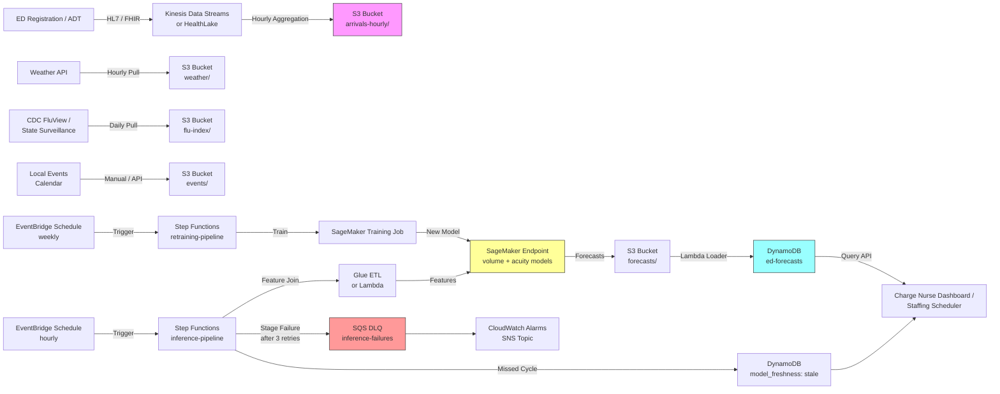

# Recipe 12.3 Architecture and Implementation: ED Arrival Forecasting

*Companion to [Recipe 12.3: ED Arrival Forecasting](chapter12.03-ed-arrival-forecasting). This page covers the AWS architecture, services, prerequisites, and pseudocode. For the problem framing and the conceptual approach, start with the main recipe.*

---

## The AWS Implementation

The AWS implementation borrows heavily from Recipes 12.1 and 12.2; the platform pieces (managed training, batch inference, scheduled orchestration, low-latency serving) are the same. What changes is the cadence (hourly retraining and inference, not nightly), the streaming ingest path for ADT messages, and the integration with operational ED dashboards.

### Why These Services

**Amazon SageMaker for model training and inference.** SageMaker handles both the classical statistical methods (statsmodels' Poisson regression, Prophet, in custom containers) and the multi-series neural methods like the [DeepAR built-in algorithm](https://docs.aws.amazon.com/sagemaker/latest/dg/deepar.html). For a single ED, classical methods fit comfortably; for a multi-ED health system, DeepAR's joint training across series is genuinely useful. Amazon Forecast was the obvious choice a few years ago but AWS announced its end of availability (verify the current status and migration guidance link at publication time), so new builds target SageMaker directly.

**Amazon HealthLake or Kinesis Data Streams for ADT ingestion.** ED ADT messages can be ingested via Amazon HealthLake (which natively understands HL7 v2 and FHIR) for systems that want a longitudinal patient store, or via Kinesis Data Streams for systems that just want the hourly arrival counts and don't need full FHIR storage. For the lightest-weight forecasting pipeline, Kinesis is simpler. HealthLake is the right choice when other workloads (Recipes 12.5, 12.7) also need the patient timeline.

**Amazon S3 for historical data and forecast outputs.** Hourly arrival counts (aggregated from the ADT stream), weather and surveillance data, model artifacts, and forecast outputs all land in S3, partitioned by date and ED. SSE-KMS encryption is mandatory for the arrival data, which is PHI-adjacent (linked to specific patient encounters even when aggregated to counts).

**AWS Glue or Amazon EMR Serverless for hourly aggregation.** Stream-to-batch aggregation: take the raw ADT message stream and produce hourly count tables. Glue Streaming jobs handle this for moderate volumes. For very high-volume systems (large urban EDs with high throughput), EMR Serverless with Spark Streaming is more cost-effective.

**AWS Step Functions for orchestration.** Forecast pipelines have multiple steps and need explicit retry logic. Step Functions orchestrates the hourly cycle: aggregate the latest hour, refresh feature data, run inference, write forecasts. For the longer-cadence retraining cycle (typically weekly), a separate state machine handles that.

**Amazon DynamoDB for serving forecasts to ED dashboards.** The charge-nurse dashboard refreshes every minute or two. It needs single-digit-millisecond latency on lookups. DynamoDB with a partition key of `ed_id` and a sort key of `forecast_for_hour` fits perfectly. Forecasts are small records (a few dozen bytes), the access pattern is predictable, and DynamoDB is on the AWS HIPAA eligible services list.

**Amazon EventBridge for scheduling.** EventBridge Scheduler triggers the hourly inference pipeline and the weekly retraining pipeline on cron schedules.

**Amazon Bedrock or AWS Lambda for explanation generation (optional).** ED leadership often wants a one-line explanation accompanying each forecast spike: "Volume forecast 22% above seasonal baseline; main drivers: cold front arriving 18:00, increased flu surveillance signal in surrounding zip codes, basketball tournament downtown." Generating that text from the model's feature contributions is an optional Bedrock-or-Lambda step that adds significant value to the dashboard. If using Bedrock: select a model from the HIPAA-eligible subset (consult the [AWS HIPAA Eligible Services list](https://aws.amazon.com/compliance/hipaa-eligible-services-reference/) at deployment time and confirm the specific model ID is covered), confirm the BAA covers your account, and enable model-invocation logging to a destination encrypted with the model-artifacts CMK. Treat the prompt-construction layer as PHI-adjacent: feature contributions like "flu surveillance for zip codes [list]" are PHI-by-association even when the resulting one-line explanation does not name a patient. Never pass raw patient identifiers into the prompt; pass only aggregated feature-contribution magnitudes.

### Architecture Diagram



### Pipeline Resilience

The Step Functions inference pipeline is a clinical-operational system: a missed forecast cycle means the charge nurse is flying blind. Alarm-only responses are insufficient; the pipeline must degrade gracefully.

**Per-stage retry policy.** Each Lambda or Glue step in the state machine retries up to 3 times with exponential backoff (2s, 4s, 8s intervals). The total per-stage budget is approximately 8 minutes. Transient throttles, network blips, and cold-start failures resolve within that window. If a stage still fails after retries, it falls through to the Catch block.

**Catch-and-route to SQS DLQ.** On persistent failure at any stage, the Catch block routes the failed input (stage name, input payload, error type) to an SQS dead-letter queue (`ed-forecast-inference-dlq`). A CloudWatch metric (`inference_stage_failed`) increments with dimensions `(ed_id, stage_name)`.

**Stale-forecast write on missed cycles.** When the pipeline fails to produce a forecast for the current hour, a final Catch-all Lambda writes a `model_freshness: "stale"` record to the DynamoDB serving table for the affected ED. The charge-nurse dashboard renders this staleness explicitly ("Forecast is X minutes old; last successful run at HH:MM") so clinicians know not to trust the displayed numbers.

**Bounded BatchWriteItem retry.** The DynamoDB loader retries `UnprocessedItems` up to 5 times with exponential backoff (starting at 200ms). A CloudWatch metric (`dynamodb_unprocessed_items_count`) surfaces the count per batch. If items remain unprocessed after 5 retries, the loader logs the failure, emits a metric, and continues with the remaining batches rather than failing the entire pipeline run.

**Two-tier alarms.** Tier 1: page the on-call ML engineer on any single inference-stage failure (the DLQ metric breaches 0). Tier 2: escalate to the medical informatics director after two consecutive hourly cycles produce no forecast (the `stale_forecast_consecutive_count` metric breaches 2). Both alarms route through SNS with separate topic subscriptions per tier.

### External Feed Egress Posture

The weather-API, CDC FluView, state-surveillance, and event-calendar puller Lambdas run inside the VPC with egress through a NAT gateway in a public subnet. NAT flow logs are enabled for auditability. API keys for external services are stored in Secrets Manager with 90-day automatic rotation. All outbound connections enforce TLS 1.2 minimum (TLS 1.3 preferred). Each puller Lambda's IAM permissions are scoped to write only to its destination S3 bucket and prefix (e.g., the weather puller can write to `s3://ed-forecast-weather/hourly/` and nothing else). No puller has read access to the PHI-bearing arrivals bucket or the DynamoDB serving table.

### Prerequisites

| Requirement | Details |
|-------------|---------|
| **AWS Services** | Amazon SageMaker, Amazon S3, Amazon Kinesis Data Streams (or HealthLake), AWS Glue, AWS Step Functions, Amazon DynamoDB, Amazon EventBridge, AWS Lambda, Amazon CloudWatch |
| **IAM Permissions** | `sagemaker:CreateTrainingJob`, `sagemaker:InvokeEndpoint`, `kinesis:GetRecords`, `glue:StartJobRun`, `s3:GetObject`, `s3:PutObject`, `states:StartExecution`, `dynamodb:BatchWriteItem`, `kms:Decrypt` |
| **BAA** | AWS BAA signed. ADT messages contain PHI directly (patient identifiers, demographics, chief complaints). Even aggregated hourly counts are derived from PHI and should be treated under the BAA. |
| **Encryption** | Customer-managed KMS keys (CMKs) per data class for blast-radius containment. Recommended split: (1) a CMK for the ADT stream and arrivals-hourly bucket (PHI), (2) a CMK for weather/flu-index/event-calendar buckets (operational, no PHI), (3) a CMK for the model-artifacts bucket, (4) a CMK for the forecasts bucket and DynamoDB serving table, (5) a CMK for SageMaker training output, (6) a CMK for CloudWatch log groups. Per-Lambda IAM roles grant `kms:Decrypt` only on the CMK(s) relevant to that Lambda's data class; no Lambda has cross-class decrypt authority at the IAM-policy level. DynamoDB: encryption at rest with CMK #4. Kinesis: server-side encryption with CMK #1. SageMaker training and inference: encrypted EBS volumes and KMS-encrypted output with CMK #5. |
| **VPC** | Production: SageMaker training and inference in VPC. Gateway endpoints for S3 and DynamoDB (free, no per-AZ cost). Interface endpoints (per-AZ cost) for: SageMaker (API), SageMaker (Runtime), Kinesis Streams, Step Functions, EventBridge, Glue, Lambda, KMS, CloudWatch Logs, CloudWatch Monitoring, and Secrets Manager (for weather-API and EHR-integration credentials). TLS 1.2 minimum (TLS 1.3 preferred) at every external boundary, including the SageMaker endpoint, the DynamoDB query path from the dashboard, and all external-feed puller calls. Required for HIPAA workloads. |
| **CloudTrail** | Enabled at the account level. Data events enabled on the arrivals-hourly bucket, model-artifacts bucket, forecasts bucket, the DynamoDB serving table, the Kinesis stream, and the customer-managed KMS keys. Management events for SageMaker, Kinesis, Glue, Step Functions, EventBridge, DynamoDB, and Lambda. CloudTrail logs written to a dedicated S3 bucket with Object Lock in compliance mode and lifecycle to S3 Glacier Deep Archive after 90 days. |
| **Sample Data** | Synthetic ED arrival data. The [MIMIC-IV-ED](https://physionet.org/content/mimic-iv-ed/) database (de-identified ED visits from a Boston academic medical center) is a strong public dataset with permission via PhysioNet credentialing. For lighter-weight prototyping, generate synthetic data from a known process (Poisson with hour-of-day intensity plus weekly seasonality plus weather effects plus noise) and validate the pipeline against ground truth. Never use real ED arrival data in dev. |
| **Cost Estimate** | Costs scale with ED size and forecast cadence. A 30,000-to-80,000-annual-visit community-to-mid-size ED with hourly inference and weekly retraining: $200-$700/month (SageMaker hourly inference on a small endpoint ~$50/month, weekly retraining ~$5/month, Kinesis ingest at low volume ~$30/month, S3 + DynamoDB + Step Functions + Lambda + Glue under $50/month combined). A high-volume Level I trauma center (150,000+ annual visits) with 15-minute-bucket forecasting and continuous retraining: $1,500-$3,000/month. Multi-ED health-system deployments amortize retraining cost across EDs when a shared model is used (DeepAR pattern), reducing per-ED marginal cost meaningfully at scale. |

### Ingredients

| AWS Service | Role |
|------------|------|
| **Amazon SageMaker** | Trains and serves the volume forecast model and the acuity mix classifier; hosts a real-time inference endpoint refreshed hourly |
| **Amazon S3** | Stores hourly arrival counts, weather and surveillance feeds, event calendars, model artifacts, and forecast outputs |
| **Amazon Kinesis Data Streams (or HealthLake)** | Ingests ED ADT messages in near real time; buffers for hourly aggregation |
| **AWS Glue** | Hourly aggregation of raw ADT records into per-hour, per-acuity counts; feature join with weather, surveillance, and event data |
| **AWS Step Functions** | Orchestrates the hourly inference cycle and the weekly retraining cycle with retries and visibility |
| **Amazon EventBridge** | Triggers the hourly inference pipeline and the weekly retraining pipeline on cron schedules |
| **AWS Lambda** | Lightweight transforms: weather and surveillance API pulls, forecast post-processing, DynamoDB loader, optional explanation generation |
| **Amazon DynamoDB** | Serves ED forecasts to operational dashboards at low latency |
| **AWS KMS** | Manages encryption keys for S3, DynamoDB, Kinesis, and SageMaker |
| **Amazon CloudWatch** | Logs, metrics, alarms for pipeline failures and forecast drift |

### Code

> **Reference implementations:** The following AWS sample resources demonstrate the patterns used in this recipe:
>
> - [`amazon-sagemaker-examples`](https://github.com/aws/amazon-sagemaker-examples): Official SageMaker examples including DeepAR notebooks for time-series forecasting
> - [Amazon SageMaker DeepAR Forecasting](https://docs.aws.amazon.com/sagemaker/latest/dg/deepar.html): Built-in algorithm documentation for DeepAR
> - [Amazon HealthLake Documentation](https://docs.aws.amazon.com/healthlake/latest/devguide/what-is-amazon-health-lake.html): For systems ingesting full FHIR rather than raw HL7 ADT

#### Walkthrough

**Step 1: Aggregate the ADT stream to hourly counts.** The pipeline starts by consuming raw ADT registration messages from the streaming layer and bucketing them into hourly counts per ED per ESI level. Each registration record at minimum has an arrival timestamp, an ED identifier, and an ESI level (if triage has occurred by the time the record is captured). For records that arrive before triage assignment, you have two options: assign a placeholder ESI level and update later, or wait until triage completes before counting. The wait approach is cleaner but introduces a lag that hurts short-horizon forecasts. Most production systems take the placeholder approach and reconcile in a second pass.

```text
FUNCTION aggregate_arrivals_to_hourly(adt_stream_records):
    // Bucket each arrival into a (ED, hour) pair.
    // Hour boundaries are local time at the ED, not UTC. ED operations
    // are local. Mixing time zones here will produce subtle but real bugs.
    //
    // DST transitions require special handling. Use a timezone-aware
    // library (zoneinfo in Python 3.9+) and key each hour bucket on
    // the UTC instant plus a local-time label string with UTC offset
    // (e.g., "2026-04-15T18:00:00-05:00") so the fall-back duplicated
    // 01:00-02:00 hour disambiguates via the offset. For the spring-
    // forward missing hour (02:00-03:00 does not exist), emit a zero-
    // arrival record with an explicit dst_transition="spring_forward"
    // flag that the model can ignore at training time.
    hourly_buckets = empty mapping  // (ed_id, local_hour) -> count_by_esi

    FOR each record in adt_stream_records:
        local_hour = floor record.arrival_ts to the hour in record.ed_local_tz
        bucket_key = (record.ed_id, local_hour)

        IF bucket_key not in hourly_buckets:
            hourly_buckets[bucket_key] = { esi_1: 0, esi_2: 0, esi_3: 0,
                                           esi_4: 0, esi_5: 0, esi_unknown: 0,
                                           total: 0 }

        IF record.esi_level is null:
            hourly_buckets[bucket_key].esi_unknown += 1
        ELSE:
            hourly_buckets[bucket_key]["esi_" + record.esi_level] += 1
        hourly_buckets[bucket_key].total += 1

    // Write the hourly counts to S3 partitioned by date and ED.
    FOR each (bucket_key, counts) in hourly_buckets:
        write to S3 as one row per (ed_id, hour, counts...)

    RETURN count of bucket_keys written
```

**Step 2: Build the feature table.** With hourly counts as the target, the feature table joins in calendar features, weather data, flu surveillance, and event flags. This is where most of the modeling value is created. A model with great hyperparameters and bad features will be beaten by an average model with good features every time. The feature table is the input to both training and inference; building it once and reusing it avoids skew between the two.

```text
FUNCTION build_feature_table(hourly_counts, weather_history, flu_index, event_calendar, holiday_calendar):
    features = empty list

    FOR each row in hourly_counts:
        feature_row = {
            ed_id:           row.ed_id,
            hour:            row.local_hour,
            target_total:    row.total,
            target_esi_1:    row.esi_1,
            // ... per-ESI targets
        }

        // Calendar features. The model can only learn patterns it has
        // features for; encoding hour-of-day and day-of-week explicitly
        // gives the model a head start over inferring them from raw timestamps.
        feature_row.hour_of_day      = row.local_hour.hour
        feature_row.day_of_week      = row.local_hour.weekday
        feature_row.week_of_year     = row.local_hour.isocalendar.week
        feature_row.month            = row.local_hour.month
        feature_row.is_weekend       = row.local_hour.weekday in (5, 6)
        feature_row.is_holiday       = row.local_hour.date in holiday_calendar
        feature_row.holiday_distance = days to nearest holiday in holiday_calendar
        feature_row.is_school_day    = row.local_hour.date in school_calendar

        // Weather features at the same hour. Fall back to the closest
        // available reading if the exact hour is missing.
        weather_at_hour = lookup weather_history at (row.ed_id, row.local_hour)
        feature_row.temperature_f    = weather_at_hour.temperature_f
        feature_row.precipitation_in = weather_at_hour.precipitation_in
        feature_row.wind_speed_mph   = weather_at_hour.wind_speed_mph
        feature_row.is_severe_weather = weather_at_hour.alerts is not empty

        // Surveillance: most recent flu index reading. The lag between
        // reporting and effect is roughly a week, so use the most recent
        // available value, not a forecast.
        feature_row.flu_index = most recent flu_index reading for the ED's region

        // Event flags: is there a known local event affecting arrivals?
        feature_row.has_local_event = any event in event_calendar overlaps row.local_hour

        // Lag features: same hour yesterday, same hour last week.
        // These give the model recent-state context.
        feature_row.lag_1h     = total arrivals at (row.ed_id, row.local_hour - 1 hour)
        feature_row.lag_24h    = total arrivals at (row.ed_id, row.local_hour - 24 hours)
        feature_row.lag_168h   = total arrivals at (row.ed_id, row.local_hour - 168 hours)

        append feature_row to features

    RETURN features
```

**Step 3: Train the volume and acuity models.** Two parallel modeling jobs: a count regression for total hourly volume and a multinomial classifier for the per-acuity share. Both are trained on history holding out the most recent 90 days for validation. The volume model is evaluated by MAPE on the held-out window; the acuity classifier is evaluated by per-class log loss and per-class precision/recall. The retraining pipeline runs weekly. The trained models get deployed to the SageMaker inference endpoint atomically.

```text
FUNCTION train_volume_and_acuity_models(feature_table):
    // Hold out the most recent 90 days for evaluation.
    training_data, validation_data = split feature_table at (max_date - 90 days)

    // Volume model: a count regression with all features.
    // Poisson regression is the simple baseline; negative binomial handles
    // overdispersion better in practice. Prophet with regressors is an
    // alternative when seasonality is the dominant signal.
    volume_model = fit NegativeBinomialRegressor on training_data with:
        target   = total_arrivals
        features = all_calendar_features + weather_features + lag_features + flu_index + event_flags

    // Acuity classifier: a multinomial model predicting the per-ESI share.
    // The label is the ESI level of each arriving patient; the feature
    // set is the same calendar + weather + surveillance bundle.
    acuity_model = fit MultinomialClassifier on training_data with:
        target   = esi_level
        features = all_calendar_features + weather_features + flu_index + event_flags

    // Evaluate on holdout. Use error metrics that respect the data shape:
    // MAPE for volume (count series), log loss + macro F1 for acuity.
    volume_mape    = mean absolute percentage error of volume_model.predict(validation) vs validation.actual
    acuity_logloss = multinomial log loss of acuity_model.predict_proba(validation) vs validation.actual

    // Quality gate: do not promote a worse model than the current production one.
    IF volume_mape > current_volume_mape * 1.20 OR acuity_logloss > current_acuity_logloss * 1.20:
        REJECT both models; alert the ML engineer

    // Atomically deploy both models behind a single SageMaker endpoint.
    deploy (volume_model, acuity_model) to SageMaker endpoint

    RETURN (volume_mape, acuity_logloss)
```

**Step 4: Generate hourly forecasts.** The inference pipeline runs every hour. It pulls the latest feature data, calls the SageMaker endpoint to get volume and acuity forecasts at 4-hour, 12-hour, and 24-hour horizons, and writes the results back to S3 and DynamoDB. Each forecast is a count plus a prediction interval, broken out by ESI level.

```text
FUNCTION generate_hourly_forecasts(ed_id, current_features, sagemaker_endpoint):
    // Build the future feature rows for the forecast horizons we care about.
    // For each future hour, we need calendar features (always known) and
    // weather + flu + event features (from forecast feeds).
    forecast_horizons_hours = [4, 12, 24]
    future_features = empty list
    FOR each h in 1..max(forecast_horizons_hours):
        future_hour = current_hour + h
        future_row  = build feature row for (ed_id, future_hour) using:
            calendar features    (deterministic)
            weather forecast     (from weather forecast feed)
            current flu_index    (latest reading)
            event_calendar       (known forward in time)
            lag features         (using actual past values for lags <= h, predicted for lags > h)
        append future_row to future_features

    // Call the SageMaker endpoint once with the batch of future rows.
    // The endpoint returns volume point and interval, plus per-ESI shares.
    predictions = sagemaker_endpoint.predict(future_features)

    // Compose the forecast records. Multiply the volume forecast by the
    // acuity share to get per-acuity counts.
    forecast_records = empty list
    FOR each row in predictions:
        per_acuity_counts = empty mapping
        FOR each esi_level in 1..5:
            per_acuity_counts[esi_level] = round(row.volume_point * row.acuity_share[esi_level])

        append to forecast_records: {
            ed_id:                ed_id,
            forecast_for_hour:    row.future_hour,
            forecast_horizon_h:   row.future_hour - current_hour,
            volume_point:         round(row.volume_point),
            volume_lower_80:      round(row.volume_lower_80),
            volume_upper_80:      round(row.volume_upper_80),
            volume_lower_95:      round(row.volume_lower_95),
            volume_upper_95:      round(row.volume_upper_95),
            esi_breakdown:        per_acuity_counts,
            generated_at:         current UTC timestamp,
            model_version:        sagemaker_endpoint.current_model_version
        }

    RETURN forecast_records
```

**Step 5: Deliver forecasts to the ED dashboard.** The forecast records get written to DynamoDB keyed by ED and forecast hour so the charge-nurse dashboard, the staffing scheduler, and any other downstream consumer can query the latest forecast at low latency. The write contract is idempotent by design:

1. `generated_at` is computed once at pipeline start and propagated through the Step Functions state, not recomputed per Lambda. This ensures all records from a single run share a consistent timestamp.
2. The `CURRENT` upsert uses a conditional write: `ConditionExpression: attribute_not_exists(generated_at) OR generated_at < :new_generated_at`. A stale or replayed upsert cannot overwrite a newer pointer.
3. The EventBridge trigger uses a `pipeline_run_id` derived from the schedule's invocation ID so at-least-once trigger delivery produces idempotent runs (a re-fired trigger for the same hour produces the same run_id and the conditional write is a no-op).
4. `BatchWriteItem` `UnprocessedItems` retry is bounded (5 retries with exponential backoff starting at 200ms) and surfaces a CloudWatch metric on the unprocessed count per batch.
5. Backfill writes from reconciliation use a `revision` attribute and the same `CURRENT` conditional-write logic so corrected forecasts replace stale ones but never regress.

An older forecast can still be retrieved by querying the sort key range, which is useful for after-action reviews ("was this surge predicted twelve hours out, or were we caught by surprise?").

```text
FUNCTION load_forecasts_to_dynamodb(forecast_records, table_name, pipeline_run_id):
    // generated_at is computed once at pipeline start and carried in pipeline state.
    // pipeline_run_id is derived from the EventBridge invocation ID for idempotency.
    batches = chunk forecast_records into groups of 25
    unprocessed_retries_max = 5

    FOR each batch in batches:
        write batch to DynamoDB table_name with:
            partition_key = ed_id
            sort_key      = forecast_for_hour + "#" + generated_at
            attributes    = { volume_point, volume_lower_80, volume_upper_80,
                              volume_lower_95, volume_upper_95, esi_breakdown,
                              forecast_horizon_h, model_version, pipeline_run_id }

        IF batch had unprocessed items:
            retry_count = 0
            WHILE unprocessed items remain AND retry_count < unprocessed_retries_max:
                retry_count += 1
                wait exponential_backoff(retry_count, base=200ms)
                resubmit unprocessed items
            IF unprocessed items still remain:
                emit metric "dynamodb_unprocessed_items_count" with count
                log warning and continue (do not fail the run)

    // Upsert a "CURRENT" pointer per (ed_id, forecast_for_hour).
    // Conditional write prevents stale replays from overwriting newer forecasts.
    FOR each record in forecast_records:
        upsert "CURRENT#<forecast_for_hour>" record per ed_id with:
            ConditionExpression = attribute_not_exists(generated_at)
                                  OR generated_at < :new_generated_at

    RETURN count of records written
```

> **Curious how this looks in Python?** The pseudocode above covers the concepts. If you'd like to see sample Python code that demonstrates these patterns using boto3 and a forecasting library like statsmodels or Prophet, check out the [Python Example](chapter12.03-python-example). It walks through each step with inline comments and notes on what you'd need to change for a real deployment.

### Expected Results

**Sample output for a 4-hour forecast issued at 14:00 local time:**

```json
{
  "ed_id": "regional-medical-center-001",
  "forecast_for_hour": "2026-04-15T18:00:00-05:00",
  "forecast_horizon_h": 4,
  "volume_point": 19,
  "volume_lower_80": 14,
  "volume_upper_80": 24,
  "volume_lower_95": 11,
  "volume_upper_95": 28,
  "esi_breakdown": {
    "esi_1": 0,
    "esi_2": 3,
    "esi_3": 9,
    "esi_4": 5,
    "esi_5": 2
  },
  "generated_at": "2026-04-15T14:05:00Z",
  "model_version": "ed-arrivals-v4-2026-04-08"
}
```

**Performance benchmarks:**

| Metric | Typical Value |
|--------|---------------|
| End-to-end inference cycle | 1-3 minutes hourly |
| Volume forecast accuracy (4-hour MAPE) | 10-18% |
| Volume forecast accuracy (24-hour MAPE) | 15-28% |
| Volume forecast accuracy (7-day MAPE) | 20-35% |
| Acuity mix classification (macro F1) | 0.55-0.70 |
| Cost per ED per month | $200-$700 |

**Where it struggles:** EDs with fewer than 18 months of clean ADT history (annual seasonality cannot be learned). Newly opened EDs or EDs that have undergone major operational changes (relocation, scope expansion, partnership shifts) where history is no longer representative. Periods with active diversion windows that distort the apparent arrival rate. Acuity mix prediction during atypical events (mass casualty incidents, infectious disease outbreaks) where the historical mix doesn't apply. Forecasts beyond the 7-day horizon, where weather forecast uncertainty dominates and the model effectively reverts to seasonal averages. Periods immediately following a regional shock (a competitor ED closes, a new urgent care opens nearby) where the catchment area and patient mix are realigning.

---

## Why This Isn't Production-Ready

The pseudocode and architecture above demonstrate the pattern. Deploying this to a real ED requires addressing several gaps that are intentionally outside the scope of a cookbook recipe. These are the ones that will bite you.

**Real-time data freshness and the late-record problem.** ADT messages do not always arrive in order. A registration that happened at 14:32 might land in your stream at 14:45 because of EHR queue delays. Hourly aggregation needs an explicit watermark and a late-record reconciliation pass. Without this, the most recent hour's count is always wrong, and the model sees biased recent history.

**Forecast monitoring and drift detection.** A separate horizon-aware drift-detection Lambda (or Step Functions step) is invoked from EventBridge after each cycle's actuals become available at each horizon. It joins the prior cycle's forecasts at that horizon against actuals, computes per-ED and per-horizon MAPE plus prediction-interval-coverage rate (the share of actuals that fell inside the 80% interval), and writes the metrics to CloudWatch with dimensions `(ed_id, horizon_hours)`. Alarms fire on two-consecutive-cycle threshold breaches at any horizon. This triggers retraining outside the normal weekly cadence. ED arrival patterns shift faster than ambulatory ones because the catchment is more dynamic; treat retraining cadence as a tighter knob.

**Acuity-level timing.** ESI assignment happens at triage, which can be minutes to hours after arrival. The placeholder approach in Step 1 keeps the pipeline running but biases acuity counts in the most recent windows. A second-pass reconciliation that updates ESI levels as triage data arrives keeps the historical record clean. Without it, the acuity classifier learns a slightly distorted mapping.

**Diversion window handling.** When the ED goes on diversion, arrivals drop artificially. The pipeline needs a maintained diversion log (often manually entered, sometimes inferred from EMS data) and the training pipeline must either exclude diversion windows or model them with an explicit indicator.

**Charge-nurse override and feedback.** Forecasts are advisory, not directive. Charge nurses make staffing decisions based on the forecast plus their own context. A production system captures the actual staffing decision (and the rationale when it diverges from the forecast) so the model can be evaluated against operational outcomes, not just forecast error. This feedback loop is also the foundation for the more sophisticated optimization layers in Chapter 14.

**Surge plan trigger logic.** The forecast says "expected 22 arrivals in the next 4 hours, 95% interval upper bound 28." The surge plan trigger says "call in additional staff if expected arrivals exceed our staffed capacity." Connecting these is not trivial: capacity is itself a function of current census, boarding load, and staff levels. The trigger logic is a small but real piece of operations engineering on top of the forecast.

**Coupling to inpatient census.** ED throughput depends on inpatient capacity. When the hospital can't admit boarders, the ED fills regardless of arrival rate. A forecast that ignores this misses the dominant operational constraint on busy days. The full picture is a coupled forecast that connects to Recipe 12.5 (Hospital Census Forecasting). For a basic implementation, surface the inpatient occupancy alongside the arrival forecast on the dashboard so the charge nurse sees both.

**Idempotency and rerun safety.** The hourly inference pipeline can fail and need to be rerun. Each step needs to be safe to repeat: aggregation is idempotent by hour key, feature joins reproduce identical results given the same feature data, inference is deterministic, and DynamoDB writes overwrite cleanly by primary key.

---

## Variations and Extensions

**Sub-hourly granularity.** Hourly forecasts work for shift-level staffing, but minute-level patient flow management benefits from 15-minute-bucket forecasts. The same pipeline applies with smaller buckets and a different model fit. Watch the noise floor: 15-minute counts at a community ED are small numbers and the model needs more history to find signal. The Poisson assumption is more strictly correct at this granularity, which is mildly helpful.

**Coupled ED-and-inpatient forecasting.** The full operational picture connects ED arrivals to inpatient capacity. A coupled model that forecasts arrivals, admissions, transfers, and discharges jointly produces more accurate operational signals than per-stage forecasts. This is a significant step up in complexity and links naturally to Recipe 12.5 (Hospital Census Forecasting).

**Acuity-specific uncertainty for high-stakes levels.** ESI 1 and ESI 2 arrivals (the highest acuity) are rare and high-impact. A separate model focused on these (perhaps a hierarchical Poisson that borrows strength from the higher-level series) can produce tighter intervals where they matter most clinically. The cost of an unanticipated ESI 1 arrival is much higher than an unanticipated ESI 5.

**Real-time updating with current-shift signals.** Static hourly retraining ignores the most informative signal: how the current shift is going. A Bayesian update that takes the model's prior forecast and updates it against actual arrivals from the last hour can sharpen the next-four-hour forecast meaningfully. This is straightforward to add once the basic pipeline is stable and is one of the highest-leverage refinements.

**Multi-ED hierarchical forecasting.** For health systems running multiple EDs, hierarchical forecasting (forecast at each ED and reconcile to system totals, or forecast at the system and disaggregate) produces more stable forecasts at every level and supports system-level decisions like ED-to-ED diversion routing.

---

## Additional Resources

**AWS Documentation:**
- [Amazon SageMaker DeepAR Forecasting Algorithm](https://docs.aws.amazon.com/sagemaker/latest/dg/deepar.html)
- [Amazon SageMaker Pricing](https://aws.amazon.com/sagemaker/pricing/)
- [Amazon Kinesis Data Streams Documentation](https://docs.aws.amazon.com/streams/latest/dev/introduction.html)
- [Amazon HealthLake Documentation](https://docs.aws.amazon.com/healthlake/latest/devguide/what-is-amazon-health-lake.html)
- [AWS Step Functions Documentation](https://docs.aws.amazon.com/step-functions/latest/dg/welcome.html)
- [AWS HIPAA Eligible Services](https://aws.amazon.com/compliance/hipaa-eligible-services-reference/)
- [Architecting for HIPAA on AWS (Whitepaper)](https://docs.aws.amazon.com/whitepapers/latest/architecting-hipaa-security-and-compliance-on-aws/welcome.html)

**AWS Sample Repos:**
- [`amazon-sagemaker-examples`](https://github.com/aws/amazon-sagemaker-examples): Official SageMaker examples including DeepAR notebooks and time-series forecasting tutorials

**External Resources:**
- [MIMIC-IV-ED on PhysioNet](https://physionet.org/content/mimic-iv-ed/): De-identified ED visit data from a Boston academic medical center, suitable for prototyping ED forecasting models with credentialed access
- [CDC FluView](https://www.cdc.gov/flu/weekly/index.htm): National and regional influenza surveillance data, a key exogenous input for respiratory-season ED forecasting
- [Emergency Severity Index (ESI) Implementation Handbook (AHRQ)](https://www.ahrq.gov/patient-safety/settings/emergency-dept/esi.html): Reference for the ESI triage scale used in the acuity mix forecast
- [Forecasting: Principles and Practice (Hyndman & Athanasopoulos)](https://otexts.com/fpp3/): Free online textbook covering classical forecasting methods including TBATS for multiple seasonalities
- [Prophet Documentation (Meta Open Source)](https://facebook.github.io/prophet/): Reference for the Prophet forecasting library

**AWS Solutions and Blogs:**
- [Transitioning Amazon Forecast to SageMaker Canvas](https://aws.amazon.com/blogs/machine-learning/transition-your-amazon-forecast-usage-to-amazon-sagemaker-canvas/): Migration guidance for teams previously using Amazon Forecast

---

## Estimated Implementation Time

- **Basic pipeline (one ED, hourly volume forecast, calendar features only):** 2-3 weeks
- **Production-ready (acuity mix, weather and surveillance feeds, monitoring, drift detection):** 8-12 weeks
- **With variations (sub-hourly, real-time updating, multi-ED hierarchical):** 16-24 weeks

---

---

*← [Main Recipe 12.3](chapter12.03-ed-arrival-forecasting) · [Python Example](chapter12.03-python-example) · [Chapter Preface](chapter12-preface)*
