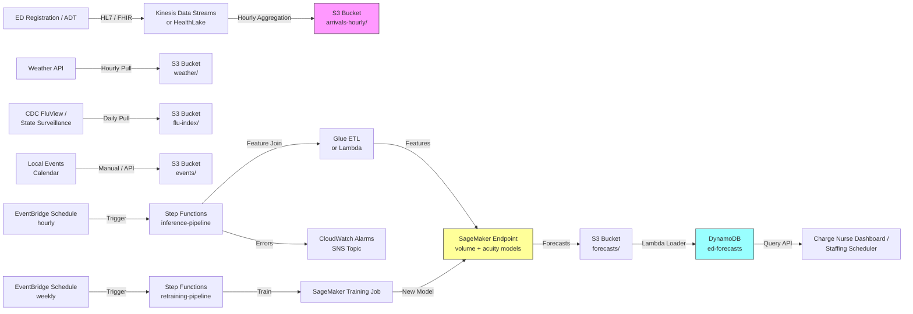

# Recipe 12.3: ED Arrival Forecasting ⭐⭐

**Complexity:** Simple-Medium · **Phase:** MVP+ · **Estimated Cost:** ~$200–$700 per month per ED

---

## The Problem

It's 17:42 on a Wednesday in February at a regional emergency department. The waiting room has thirty-one people in it. Two ambulance bays are full. The charge nurse has been pulling extra staff from the floor for the last hour because what looked like a normal afternoon at noon turned into a freight train of arrivals between 14:00 and 17:00. There were warning signs, if anyone had been looking: a flu surveillance report flagging elevated activity in three surrounding zip codes, a high-school basketball tournament downtown, and a cold front that pushed the wind chill into single digits. The next shift change is in eighteen minutes. The on-call attending physician for the surge protocol just declined because they're already on a different shift tomorrow. Inpatient is at 96% capacity and has been holding the boarders the ED sent up two hours ago.

This scene plays out somewhere in the United States about every fifteen minutes. Emergency departments in this country see roughly 130 million visits per year, distributed across roughly five thousand EDs, almost all of which staff to historical averages plus the lived intuition of senior charge nurses. Some EDs are very good at this, in the sense that the senior nurses have decades of pattern recognition baked into their bones. Others are not. None of them have a clean, systematic answer to the question that should drive every shift planning meeting: how many patients are going to walk through that door over the next four hours, what's their likely acuity mix, and what staffing pattern will absorb them without compromising care?

The cost of being wrong is not abstract. Understaffing produces the headline pathologies of American emergency medicine: long door-to-doctor times, patients leaving without being seen (LWBS rates above 5% are common; I've seen them spike above 12% on bad nights), boarders backing up into hallway beds, and patient safety events that show up in the morbidity-and-mortality conference next month. Overstaffing burns money, frustrates staff who came in for nothing, and trains everyone to ignore the surge plan because it always cried wolf. The decisions are not all equally easy to reverse. Calling in a per-diem nurse two hours into the shift costs a premium and produces resentment. Sending nurses home early because the surge didn't materialize costs goodwill.

The frustrating part, the part that should make this an obvious target for forecasting, is that ED arrivals are surprisingly predictable in aggregate. Yes, individual arrivals are random. But hourly arrival volume has strong daily and weekly patterns, layered seasonal effects (flu season, summer trauma uptick, allergy season), and meaningful exogenous drivers (weather, local events, school-calendar status, regional respiratory virus surveillance, even nearby ED diversions). The signal is there. Most EDs just don't have a systematic way to extract it and turn it into staffing decisions made twelve to twenty-four hours in advance instead of fifteen minutes too late.

When they do extract it, the operational improvements are immediate. Door-to-doctor times come down. LWBS rates drop. Per-diem labor spend shrinks. The charge nurse stops fighting fires for forty hours a month and starts running the department. Nobody throws a parade for a 22% reduction in agency staffing spend or a 1.4-minute reduction in median door-to-doctor time, but the chief medical officer notices, the CFO notices, and the patients who would otherwise have left without being seen quietly get the care they came for.

Let's get into how this works.

---

## The Technology: How ED Arrival Forecasting Actually Works

### Why ED Arrivals Are a Different Beast

If you've read Recipe 12.1, you know the basic time-series forecasting machinery. ED arrivals use the same toolbox, but the data has a few personality traits that change which methods work and what you have to model carefully.

**ED arrivals are count data on a fast clock.** Hourly counts, sometimes every fifteen minutes for trauma centers. The numbers are smaller (a busy community ED might see 8 to 25 arrivals per hour), which means individual hours have more relative variability than daily appointment counts. The Poisson-ish nature of arrivals matters: the variance is roughly proportional to the mean, so methods that assume constant variance need adjustment.

**Patient acuity matters as much as patient count.** A forecast that says "fifteen patients are arriving in the next hour" is operationally useless if you don't know whether those are fifteen ankle sprains or fifteen chest pains. ED resourcing is acuity-driven. The Emergency Severity Index (ESI) classifies arrivals from level 1 (resuscitation, immediate physician needed) to level 5 (routine, can wait). Levels 1 and 2 demand immediate room and physician attention. Levels 4 and 5 can be handled in a fast-track lane with an advanced practice provider. The acuity mix changes throughout the day (high-acuity skews early morning and late evening, low-acuity skews midday) and across seasons. A complete forecast predicts both volume and mix.

**The pattern is genuinely hourly.** Daily appointment volume has weekly cycles and annual seasonality. Hourly ED arrivals have daily cycles (the morning bump, the post-work surge, the late-night quiet), weekly cycles (Mondays and weekends are different), and annual cycles. All three need to be in the model simultaneously. Classical methods that handle a single seasonality break down here. You need methods that handle multiple seasonalities or you need to engineer features that encode them explicitly.

**Exogenous drivers actually drive things.** Weather affects arrivals. Cold fronts push respiratory cases. Heat waves push dehydration and cardiac events. Snowstorms suppress walk-ins and concentrate emergent arrivals. Influenza surveillance from public health agencies leads ED visits by about a week. Local events (a marathon, a concert, a sports tournament) shift arrival patterns. School calendars change the pediatric mix. A serious forecast brings these in as features. A naive one ignores them and inherits all the prediction error they account for.

**The decisions depend on the tail.** A forecast of "expected 17 arrivals next hour" is fine for back-of-the-envelope planning. For staffing decisions in an ED, what you actually need is the upper end of the prediction interval. You staff to absorb the surge, not the average. The 80th or 90th percentile of the hourly arrival distribution is the operational primitive, not the mean. This is true in retail forecasting too, but the consequences in retail are stockouts of socks. The consequences in EDs are patients in hallway beds.

### The Methods That Actually Work

Three families of methods cover most practical ED arrival forecasting.

**Generalized linear models with calendar features (Poisson regression, negative binomial regression).** The simplest serious approach. Treat hourly arrival count as a Poisson (or, if overdispersed, negative binomial) distributed variable, and regress it against a set of features: hour of day, day of week, week of year, holiday flags, weather, lagged values, and so on. These models are fast, interpretable, easy to explain to a medical director, and surprisingly hard to beat on volume forecasting. They naturally produce prediction intervals that respect the count nature of the data. Statsmodels and scikit-learn both implement this directly.

**Classical time-series methods (SARIMA, Holt-Winters with multiple seasonalities, TBATS).** ARIMA and exponential smoothing extend to multiple seasonal periods, but the math gets gnarly. [TBATS](https://otexts.com/fpp3/complexseasonality.html#tbats-models) (Trigonometric, Box-Cox, ARMA, Trend, Seasonal) was designed specifically for series with multiple seasonalities. It handles hourly data with daily, weekly, and annual cycles in one model. It's slower to fit than GLM approaches and harder to extend with exogenous variables, but it's a strong baseline if you have clean history without much in the way of weather or event drivers.

**Modern decomposition and ML methods (Prophet, DeepAR, Temporal Fusion Transformer).** [Prophet](https://facebook.github.io/prophet/) handles multiple seasonalities and holidays gracefully, and it accepts external regressors (weather, flu index, event calendar) as additional inputs. It's a solid pragmatic default for ED hourly forecasting. Amazon's [DeepAR](https://docs.aws.amazon.com/sagemaker/latest/dg/deepar.html), a SageMaker built-in algorithm, learns jointly across many related series, which earns its keep when you're forecasting across multiple EDs in a health system. Temporal Fusion Transformer (TFT) and similar attention-based models are state-of-the-art on accuracy but require enough history and engineering investment that they rarely win on a single-ED problem.

For a single ED, a sensible starting architecture is a Poisson regression with calendar and weather features for volume, plus a separate multinomial classifier for acuity mix. That gets you 80% of the available accuracy with a model the medical director can interrogate. Prophet is a strong second choice when you have several years of history and want to capture seasonality without engineering all the features by hand. DeepAR makes sense at scale, when you're standing up a forecast across dozens of EDs in a health system and want to share strength across them.

<!-- TODO (TechWriter): Expert review A6 (MEDIUM). Add a paragraph that names the iterated-versus-direct multi-step trade-off explicitly: Poisson regression with engineered lag features as described in Step 4 is iterated multi-step (errors compound across horizons); DeepAR is direct multi-step by construction. For 4-hour horizons the two perform comparably; for 24-hour and 7-day horizons direct is meaningfully more accurate. The recipe should call this out so readers pick consciously. -->

### The Acuity Mix Problem

Forecasting acuity is its own modeling problem on top of the volume forecast. Two reasonable approaches:

**Joint volume-and-mix forecasting.** Forecast the count of arrivals at each ESI level separately. Five Poisson regressions instead of one. Slightly more complex, but each per-acuity model can use its own features (ESI level 1 cardiac arrests have different drivers than ESI level 4 minor complaints). This is the cleaner approach if you have enough data per level.

**Volume forecast plus acuity-mix classifier.** Forecast total volume with one model. Then predict the share of arrivals at each ESI level using a separate multinomial classifier with the same calendar and weather features. Multiply the two to get per-acuity counts. This is more sample-efficient when acuity-level history is sparse (ESI 1 arrivals are rare).

The second approach is usually the practical default. The first is more principled when you have multi-year, high-volume history and need tight per-acuity intervals.

### Why This Is Harder Than It Looks

The honest list of things that humble first-time ED forecasters:

**Walkouts and LWBS distortions.** A patient who arrived at the door, registered, and left without being seen counts as an arrival in some data definitions and not others. If the EHR's arrival timestamp is the registration timestamp, a busy ED that loses patients before registration has a systematic undercount of true demand. This biases your forecast toward what the ED has historically been able to absorb, not what actually showed up at the door. You need an explicit pre-registration arrival capture (often from the front desk swipe-in, the security camera, or a manually-counted log) to break this loop.

**Diversion events.** When the ED goes on diversion (ambulances are routed elsewhere because the ED is overwhelmed), the arrival count drops artificially. A model trained on diversion-affected history under-predicts true demand. Production systems mark diversion windows in the data and either exclude them or model the effect explicitly.

**Acuity drift over time.** ESI level definitions are stable on paper, but the mix of patients seen by an ED can shift over years as urgent care alternatives expand or contract, as the local population changes, and as referral patterns evolve. Models trained on five-year-old data may forecast against a different acuity distribution than the one you have today. Retraining cadence matters more than for ambulatory volume forecasting.

**Holidays and special events.** Christmas, Thanksgiving, the Fourth of July, and New Year's Eve all have distinctive ED arrival patterns. Christmas day is quiet; the day after Christmas is a surge. Memorial Day weekend brings trauma uptick. Naive models miss all of this. The holiday calendar has to encode not just "is this a holiday" but "which holiday and what's the relative day in the holiday window."

**Weather and respiratory virus seasonality.** Weather effects are not linear. A mild cold day might push arrivals slightly; a severe cold day with ice can cut them by 30% (people stay home) or surge them by 50% (slip-and-fall trauma, cardiac events from snow shoveling). Influenza surveillance lags by about a week, so you need historical CDC FluView or local surveillance data integrated as features. None of this is hard, but it's all engineering work that the simplest tutorials skip.

**Forecast horizon and uncertainty.** A 4-hour forecast is dramatically more accurate than a 24-hour forecast. Operational decisions vary in lead time: charge-nurse decisions are made 1 to 4 hours out, shift staffing is set 8 to 24 hours out, schedule planning is made weeks out. Each horizon needs its own model evaluation, and uncertainty grows fast with horizon. Forecasts presented as point estimates are misleading; forecasts with prediction intervals let charge nurses make sensible call-in decisions.

**Boarding and downstream coupling.** ED throughput depends not just on ED arrivals but on the inpatient hospital's ability to admit boarders. When the hospital is at capacity, the ED fills up regardless of arrival rate. A pure arrival forecast misses this. The full operational picture connects to inpatient census forecasting (Recipe 12.5), and the most useful EDs build coupled forecasts that consider both. That's outside the scope of a basic arrival recipe but worth flagging.

The reassuring news: a basic Poisson regression with hour-of-day, day-of-week, holiday, and weather features routinely achieves 10–20% MAPE on hourly volume forecasts at a 4-hour horizon, and 15–30% at a 24-hour horizon. That's accurate enough to make a meaningful difference in staffing decisions. The forecast doesn't have to be perfect to be useful; it just has to be better than the gut feel of a charge nurse who's been on shift for nine hours.

### The General Architecture Pattern

At a conceptual level, the pipeline looks like this:

```text
[ED ADT / Registration Stream] ----> [Feature Engineering & Aggregation] ----> [Volume + Acuity Models] ----> [Forecast Generation] ----> [ED Operational Consumers]
                                          ^                                          ^
                                          |                                          |
                                  [Weather & Surveillance]                  [Retraining Loop]
                                  [Event Calendar]
                                  [Holiday Calendar]
```

**ED ADT / Registration Stream.** Each ED arrival triggers an HL7 ADT-A04 (registration) message or its FHIR equivalent. The pipeline ingests these, captures arrival timestamp, ESI level (if assigned at triage), chief complaint, and basic demographics. For hourly forecasting, the data is bucketed into hourly arrival counts per ESI level. For high-fidelity work, fifteen-minute buckets are common. Two to three years of clean history is the practical minimum.

**Weather and Surveillance.** External feeds: weather data (current and forecast) from a meteorological API, influenza and respiratory virus surveillance from CDC FluView or a state public health feed, an event calendar with local events (sports, concerts, festivals) that affect arrival patterns. The latter is often hand-curated. The former two are programmatic.

**Feature Engineering and Aggregation.** Raw arrival records get aggregated to the hourly grid. Calendar features (hour of day, day of week, week of year, holiday markers) get added. External features (weather variables, flu index, event flags) get joined on. Lagged values (last hour's count, same hour yesterday, same hour last week) get computed. The output is a single tabular dataset where one row equals one (date, hour) pair with the count target and all features.

**Volume + Acuity Models.** Two parallel modeling tracks. The volume track fits a count model (Poisson regression, Prophet, or DeepAR) on hourly total arrivals with all features. The acuity track fits a multinomial classifier predicting the per-ESI-level share of arrivals. Both models hold out a recent window (typically 90 days) for validation. Both produce point forecasts and prediction intervals.

**Forecast Generation.** On a frequent cadence (typically every hour for short-horizon forecasts, every 4 to 6 hours for longer horizons), the trained models produce forecasts at the operational horizons consumers need: 4-hour for charge nurse decisions, 24-hour for shift staffing, 7-day for schedule planning. Each forecast is a count plus a prediction interval, broken out by ESI level.

**ED Operational Consumers.** The forecasts feed into the charge nurse dashboard, the staffing scheduler, the surge plan trigger logic, and the patient flow management system. The integration is usually a structured table or API. The dashboard shows projected arrivals by hour with prediction intervals overlaid on actuals, plus a per-acuity breakdown.

<!-- TODO (TechWriter): Expert review A2 (HIGH). Promote the late-record / out-of-order ADT handling from production-gaps prose into an architectural primitive in the General Architecture Pattern. Specifically: (1) explicit event-time watermark on hourly aggregation with configurable lateness tolerance (15 min default); (2) scheduled reconciliation pass (every 4-6 hours) that re-aggregates the prior 24 hours and writes delta records with a `revision` attribute; (3) inference reads only watermarked hours (current hour H consumes lag_1h from H-1, which is finalized); (4) backfill of corrected forecasts when reconciled deltas exceed threshold; (5) CloudWatch metrics on `late_records_per_hour` and `reconciliation_delta_distribution`. Without this, lag features are systematically biased near the trailing edge at hourly cadence. -->

<!-- TODO (TechWriter): Expert review A5 (MEDIUM). Add Diversion-Log Integration and ESI-Reconciliation Second Pass as architectural primitives. The diversion log (manually entered or inferred from EMS) joins into the feature table as a per-hour boolean indicator; training either excludes diversion-affected hours or includes them with the indicator as a feature. The ESI-reconciliation second pass sweeps the prior 24 hours, finds placeholder esi_unknown values, queries the EHR for triage updates, and writes corrections with a `revision` attribute. Same shape as the late-record reconciliation in A2; consolidate as a single reusable primitive in the chapter. -->

That's the whole concept. Stream, features, model, forecast, deliver. The real complexity is in the feature engineering and the operational integration, not in the modeling itself.

---

## The AWS Implementation

The AWS implementation borrows heavily from Recipes 12.1 and 12.2; the platform pieces (managed training, batch inference, scheduled orchestration, low-latency serving) are the same. What changes is the cadence (hourly retraining and inference, not nightly), the streaming ingest path for ADT messages, and the integration with operational ED dashboards.

### Why These Services

**Amazon SageMaker for model training and inference.** SageMaker handles both the classical statistical methods (statsmodels' Poisson regression, Prophet, in custom containers) and the multi-series neural methods like the [DeepAR built-in algorithm](https://docs.aws.amazon.com/sagemaker/latest/dg/deepar.html). For a single ED, classical methods fit comfortably; for a multi-ED health system, DeepAR's joint training across series is genuinely useful. Amazon Forecast was the obvious choice a few years ago but AWS [announced its end of availability](https://aws.amazon.com/blogs/machine-learning/transition-your-amazon-forecast-usage-to-amazon-sagemaker-canvas/), so new builds target SageMaker directly.

<!-- TODO (TechWriter): N1. Verify the Amazon Forecast deprecation status and link as of the publication date. -->

**Amazon HealthLake or Kinesis Data Streams for ADT ingestion.** ED ADT messages can be ingested via Amazon HealthLake (which natively understands HL7 v2 and FHIR) for systems that want a longitudinal patient store, or via Kinesis Data Streams for systems that just want the hourly arrival counts and don't need full FHIR storage. For the lightest-weight forecasting pipeline, Kinesis is simpler. HealthLake is the right choice when other workloads (Recipes 12.5, 12.7) also need the patient timeline.

**Amazon S3 for historical data and forecast outputs.** Hourly arrival counts (aggregated from the ADT stream), weather and surveillance data, model artifacts, and forecast outputs all land in S3, partitioned by date and ED. SSE-KMS encryption is mandatory for the arrival data, which is PHI-adjacent (linked to specific patient encounters even when aggregated to counts).

**AWS Glue or Amazon EMR Serverless for hourly aggregation.** Stream-to-batch aggregation: take the raw ADT message stream and produce hourly count tables. Glue Streaming jobs handle this for moderate volumes. For very high-volume systems (large urban EDs with high throughput), EMR Serverless with Spark Streaming is more cost-effective.

**AWS Step Functions for orchestration.** Forecast pipelines have multiple steps and need explicit retry logic. Step Functions orchestrates the hourly cycle: aggregate the latest hour, refresh feature data, run inference, write forecasts. For the longer-cadence retraining cycle (typically weekly), a separate state machine handles that.

**Amazon DynamoDB for serving forecasts to ED dashboards.** The charge-nurse dashboard refreshes every minute or two. It needs single-digit-millisecond latency on lookups. DynamoDB with a partition key of `ed_id` and a sort key of `forecast_for_hour` fits perfectly. Forecasts are small records (a few dozen bytes), the access pattern is predictable, and DynamoDB is on the AWS HIPAA eligible services list.

**Amazon EventBridge for scheduling.** EventBridge Scheduler triggers the hourly inference pipeline and the weekly retraining pipeline on cron schedules.

**Amazon Bedrock or AWS Lambda for explanation generation (optional).** ED leadership often wants a one-line explanation accompanying each forecast spike: "Volume forecast 22% above seasonal baseline; main drivers: cold front arriving 18:00, increased flu surveillance signal in surrounding zip codes, basketball tournament downtown." Generating that text from the model's feature contributions is an optional Bedrock-or-Lambda step that adds significant value to the dashboard.

<!-- TODO (TechWriter): Expert review S3 (LOW). Specify HIPAA-eligible Bedrock model selection (consult the AWS HIPAA Eligible Services list at deployment time), confirm BAA coverage at the account level, configure model-invocation logging to a destination encrypted with the model-artifacts CMK, and treat the prompt-construction layer as PHI-adjacent: feature contributions like "flu surveillance for zip codes [list]" are PHI-by-association even when the resulting one-line explanation does not name a patient. -->

### Architecture Diagram



<!-- TODO (TechWriter): Expert review A1 (HIGH). The Step Functions hourly inference pipeline lacks retry, DLQ, and partial-failure semantics; the diagram's `Errors -> CloudWatch Alarms / SNS Topic` reads as alarm-only, which is the wrong response for a clinical-operational system. Specify: (1) per-stage retry policy (3 retries, exponential backoff, ~8-min stage budget); (2) catch-and-route on persistent failure to an SQS DLQ plus CloudWatch metric `inference_stage_failed`; (3) explicit `model_freshness: "stale"` record write to DynamoDB on missed cycles so the dashboard renders staleness explicitly; (4) bounded BatchWriteItem `UnprocessedItems` retry with metric; (5) two-tier alarms (page on-call on any failure, escalate to medical informatics director after consecutive failures). Add DLQ box and stale-write path to the Mermaid diagram. -->

<!-- TODO (TechWriter): Expert review N2 (LOW). Add a paragraph specifying the external-feed egress posture: weather-API, CDC FluView, state-surveillance, and event-calendar puller Lambdas run inside the VPC with egress through a NAT gateway in a public subnet; NAT flow logs enabled; API keys stored in Secrets Manager with 90-day rotation; TLS 1.2 minimum (TLS 1.3 preferred); puller IAM permissions scoped to write only to the destination S3 bucket and prefix per feed. -->

### Prerequisites

| Requirement | Details |
|-------------|---------|
| **AWS Services** | Amazon SageMaker, Amazon S3, Amazon Kinesis Data Streams (or HealthLake), AWS Glue, AWS Step Functions, Amazon DynamoDB, Amazon EventBridge, AWS Lambda, Amazon CloudWatch |
| **IAM Permissions** | `sagemaker:CreateTrainingJob`, `sagemaker:InvokeEndpoint`, `kinesis:GetRecords`, `glue:StartJobRun`, `s3:GetObject`, `s3:PutObject`, `states:StartExecution`, `dynamodb:BatchWriteItem`, `kms:Decrypt` |
| **BAA** | AWS BAA signed. ADT messages contain PHI directly (patient identifiers, demographics, chief complaints). Even aggregated hourly counts are derived from PHI and should be treated under the BAA. |
| **Encryption** | S3: SSE-KMS; DynamoDB: encryption at rest enabled (default); Kinesis: server-side encryption with KMS; SageMaker training and inference: encrypted EBS volumes and KMS-encrypted output; CloudWatch log groups: configure KMS encryption explicitly. |
| **VPC** | Production: SageMaker training and inference in VPC with VPC endpoints for S3, Kinesis, CloudWatch Logs, and KMS. Required for HIPAA workloads. |
| **CloudTrail** | Enabled: log all SageMaker, S3, DynamoDB, and Kinesis API calls for HIPAA audit trail. |
| **Sample Data** | Synthetic ED arrival data. The [MIMIC-IV-ED](https://physionet.org/content/mimic-iv-ed/) database (de-identified ED visits from a Boston academic medical center) is a strong public dataset with permission via PhysioNet credentialing. For lighter-weight prototyping, generate synthetic data from a known process (Poisson with hour-of-day intensity plus weekly seasonality plus weather effects plus noise) and validate the pipeline against ground truth. Never use real ED arrival data in dev. |
| **Cost Estimate** | SageMaker hourly inference (small endpoint): ~$50/month. Weekly retraining: ~$5/month. Kinesis ingest (low volume): ~$30/month. S3, DynamoDB, Step Functions, Lambda, Glue: under $50/month combined. Total: $200–$700/month per ED, depending on retraining frequency and inference volume. |

<!-- TODO (TechWriter): Expert review S1 (HIGH). Update the Encryption row to specify customer-managed KMS keys (CMKs) per data class for blast-radius containment. Recommended split: a CMK for the ADT stream and arrivals-hourly bucket (PHI), a CMK for weather/flu-index/event-calendar buckets (operational, no PHI), a CMK for the model-artifacts bucket, a CMK for the forecasts bucket and DynamoDB serving table, a CMK for SageMaker training output, a CMK for CloudWatch log groups. Update the IAM permissions row to grant per-Lambda least-privilege `kms:Decrypt` only on the relevant CMK; do not grant cross-class decrypt at the IAM-policy level. Mirrors S1 in the 12.2 expert review and should be consolidated at the chapter level. -->

<!-- TODO (TechWriter): Expert review S2 (MEDIUM). Update the CloudTrail row to specify data events on PHI-bearing buckets, tables, streams, and CMKs: "Enabled at the account level. Data events enabled on the arrivals-hourly bucket, model-artifacts bucket, forecasts bucket, the DynamoDB serving table, the Kinesis stream, and the customer-managed KMS keys. Management events for SageMaker, Kinesis, Glue, Step Functions, EventBridge, DynamoDB, and Lambda. CloudTrail logs in a dedicated S3 bucket with Object Lock in compliance mode and lifecycle to S3 Glacier Deep Archive after 90 days." -->

<!-- TODO (TechWriter): Expert review N1 (MEDIUM). Update the VPC row to enumerate the full endpoint set with type. Gateway endpoints for S3 and DynamoDB (free, no per-AZ cost). Interface endpoints (per-AZ cost) for SageMaker (API), SageMaker (Runtime), Kinesis Streams, Step Functions, EventBridge, Glue, Lambda, KMS, CloudWatch Logs, CloudWatch Monitoring, and Secrets Manager (if used for weather-API or EHR-integration credentials). Mirrors N1 in the 12.2 expert review. -->

<!-- TODO (TechWriter): Expert review N3 (LOW). Append to the VPC row: "TLS 1.2 minimum (TLS 1.3 preferred) at every external boundary, including the SageMaker endpoint, the DynamoDB query path from the dashboard, and all external-feed puller calls." -->

<!-- TODO (TechWriter): Expert review V2 (LOW). Decompose the Cost Estimate row by ED size. The $200-$700/month range assumes a 30,000-80,000-annual-visit community-to-mid-size ED with hourly inference and weekly retraining. A high-volume Level I trauma center (150,000+ annual visits) with 15-minute-bucket forecasting and continuous retraining can reach $1,500-$3,000/month. Multi-ED health-system deployments amortize the retraining cost across EDs when a shared model is used (DeepAR pattern), reducing per-ED cost meaningfully at scale. -->

<!-- TODO (TechWriter): V1. Verify SageMaker, Kinesis, and DynamoDB pricing assumptions reflect current rates. AWS pricing changes; confirm against the AWS pricing calculator before publication. -->

### Ingredients

| AWS Service | Role |
|------------|------|
| **Amazon SageMaker** | Trains and serves the volume forecast model and the acuity mix classifier; hosts a real-time inference endpoint refreshed hourly |
| **Amazon S3** | Stores hourly arrival counts, weather and surveillance feeds, event calendars, model artifacts, and forecast outputs |
| **Amazon Kinesis Data Streams (or HealthLake)** | Ingests ED ADT messages in near real time; buffers for hourly aggregation |
| **AWS Glue** | Hourly aggregation of raw ADT records into per-hour, per-acuity counts; feature join with weather, surveillance, and event data |
| **AWS Step Functions** | Orchestrates the hourly inference cycle and the weekly retraining cycle with retries and visibility |
| **Amazon EventBridge** | Triggers the hourly inference pipeline and the weekly retraining pipeline on cron schedules |
| **AWS Lambda** | Lightweight transforms: weather and surveillance API pulls, forecast post-processing, DynamoDB loader, optional explanation generation |
| **Amazon DynamoDB** | Serves ED forecasts to operational dashboards at low latency |
| **AWS KMS** | Manages encryption keys for S3, DynamoDB, Kinesis, and SageMaker |
| **Amazon CloudWatch** | Logs, metrics, alarms for pipeline failures and forecast drift |

### Code

> **Reference implementations:** The following AWS sample resources demonstrate the patterns used in this recipe:
>
> - [`amazon-sagemaker-examples`](https://github.com/aws/amazon-sagemaker-examples): Official SageMaker examples including DeepAR notebooks for time-series forecasting
> - [Amazon SageMaker DeepAR Forecasting](https://docs.aws.amazon.com/sagemaker/latest/dg/deepar.html): Built-in algorithm documentation for DeepAR
> - [Amazon HealthLake Documentation](https://docs.aws.amazon.com/healthlake/latest/devguide/what-is-amazon-health-lake.html): For systems ingesting full FHIR rather than raw HL7 ADT

<!-- TODO (TechWriter): N2. Verify all three reference implementation links are still live and up-to-date. -->

#### Walkthrough

**Step 1: Aggregate the ADT stream to hourly counts.** The pipeline starts by consuming raw ADT registration messages from the streaming layer and bucketing them into hourly counts per ED per ESI level. Each registration record at minimum has an arrival timestamp, an ED identifier, and an ESI level (if triage has occurred by the time the record is captured). For records that arrive before triage assignment, you have two options: assign a placeholder ESI level and update later, or wait until triage completes before counting. The wait approach is cleaner but introduces a lag that hurts short-horizon forecasts. Most production systems take the placeholder approach and reconcile in a second pass.

<!-- TODO (TechWriter): Expert review V3 (LOW). The pseudocode comment correctly flags local-time-zone bucketing but does not address daylight-saving transitions (duplicated 01:00-02:00 hour in fall, missing 02:00-03:00 hour in spring). Use a time-zone-aware library (zoneinfo in Python 3.9+) and key on the UTC instant plus a local-time label string with offset (e.g., 2026-04-15T18:00:00-05:00) so the fall-back duplicated hour disambiguates. For the spring-forward missing hour, emit a zero-arrival record with an explicit `dst_transition: "spring_forward"` flag the model can ignore at training time. -->

```text
FUNCTION aggregate_arrivals_to_hourly(adt_stream_records):
    // Bucket each arrival into a (ED, hour) pair.
    // Hour boundaries are local time at the ED, not UTC. ED operations
    // are local. Mixing time zones here will produce subtle but real bugs.
    hourly_buckets = empty mapping  // (ed_id, local_hour) -> count_by_esi

    FOR each record in adt_stream_records:
        local_hour = floor record.arrival_ts to the hour in record.ed_local_tz
        bucket_key = (record.ed_id, local_hour)

        IF bucket_key not in hourly_buckets:
            hourly_buckets[bucket_key] = { esi_1: 0, esi_2: 0, esi_3: 0,
                                           esi_4: 0, esi_5: 0, esi_unknown: 0,
                                           total: 0 }

        IF record.esi_level is null:
            hourly_buckets[bucket_key].esi_unknown += 1
        ELSE:
            hourly_buckets[bucket_key]["esi_" + record.esi_level] += 1
        hourly_buckets[bucket_key].total += 1

    // Write the hourly counts to S3 partitioned by date and ED.
    FOR each (bucket_key, counts) in hourly_buckets:
        write to S3 as one row per (ed_id, hour, counts...)

    RETURN count of bucket_keys written
```

**Step 2: Build the feature table.** With hourly counts as the target, the feature table joins in calendar features, weather data, flu surveillance, and event flags. This is where most of the modeling value is created. A model with great hyperparameters and bad features will be beaten by an average model with good features every time. The feature table is the input to both training and inference; building it once and reusing it avoids skew between the two.

```text
FUNCTION build_feature_table(hourly_counts, weather_history, flu_index, event_calendar, holiday_calendar):
    features = empty list

    FOR each row in hourly_counts:
        feature_row = {
            ed_id:           row.ed_id,
            hour:            row.local_hour,
            target_total:    row.total,
            target_esi_1:    row.esi_1,
            // ... per-ESI targets
        }

        // Calendar features. The model can only learn patterns it has
        // features for; encoding hour-of-day and day-of-week explicitly
        // gives the model a head start over inferring them from raw timestamps.
        feature_row.hour_of_day      = row.local_hour.hour
        feature_row.day_of_week      = row.local_hour.weekday
        feature_row.week_of_year     = row.local_hour.isocalendar.week
        feature_row.month            = row.local_hour.month
        feature_row.is_weekend       = row.local_hour.weekday in (5, 6)
        feature_row.is_holiday       = row.local_hour.date in holiday_calendar
        feature_row.holiday_distance = days to nearest holiday in holiday_calendar
        feature_row.is_school_day    = row.local_hour.date in school_calendar

        // Weather features at the same hour. Fall back to the closest
        // available reading if the exact hour is missing.
        weather_at_hour = lookup weather_history at (row.ed_id, row.local_hour)
        feature_row.temperature_f    = weather_at_hour.temperature_f
        feature_row.precipitation_in = weather_at_hour.precipitation_in
        feature_row.wind_speed_mph   = weather_at_hour.wind_speed_mph
        feature_row.is_severe_weather = weather_at_hour.alerts is not empty

        // Surveillance: most recent flu index reading. The lag between
        // reporting and effect is roughly a week, so use the most recent
        // available value, not a forecast.
        feature_row.flu_index = most recent flu_index reading for the ED's region

        // Event flags: is there a known local event affecting arrivals?
        feature_row.has_local_event = any event in event_calendar overlaps row.local_hour

        // Lag features: same hour yesterday, same hour last week.
        // These give the model recent-state context.
        feature_row.lag_1h     = total arrivals at (row.ed_id, row.local_hour - 1 hour)
        feature_row.lag_24h    = total arrivals at (row.ed_id, row.local_hour - 24 hours)
        feature_row.lag_168h   = total arrivals at (row.ed_id, row.local_hour - 168 hours)

        append feature_row to features

    RETURN features
```

**Step 3: Train the volume and acuity models.** Two parallel modeling jobs: a count regression for total hourly volume and a multinomial classifier for the per-acuity share. Both are trained on history holding out the most recent 90 days for validation. The volume model is evaluated by MAPE on the held-out window; the acuity classifier is evaluated by per-class log loss and per-class precision/recall. The retraining pipeline runs weekly. The trained models get deployed to the SageMaker inference endpoint atomically.

```text
FUNCTION train_volume_and_acuity_models(feature_table):
    // Hold out the most recent 90 days for evaluation.
    training_data, validation_data = split feature_table at (max_date - 90 days)

    // Volume model: a count regression with all features.
    // Poisson regression is the simple baseline; negative binomial handles
    // overdispersion better in practice. Prophet with regressors is an
    // alternative when seasonality is the dominant signal.
    volume_model = fit NegativeBinomialRegressor on training_data with:
        target   = total_arrivals
        features = all_calendar_features + weather_features + lag_features + flu_index + event_flags

    // Acuity classifier: a multinomial model predicting the per-ESI share.
    // The label is the ESI level of each arriving patient; the feature
    // set is the same calendar + weather + surveillance bundle.
    acuity_model = fit MultinomialClassifier on training_data with:
        target   = esi_level
        features = all_calendar_features + weather_features + flu_index + event_flags

    // Evaluate on holdout. Use error metrics that respect the data shape:
    // MAPE for volume (count series), log loss + macro F1 for acuity.
    volume_mape    = mean absolute percentage error of volume_model.predict(validation) vs validation.actual
    acuity_logloss = multinomial log loss of acuity_model.predict_proba(validation) vs validation.actual

    // Quality gate: do not promote a worse model than the current production one.
    IF volume_mape > current_volume_mape * 1.20 OR acuity_logloss > current_acuity_logloss * 1.20:
        REJECT both models; alert the ML engineer

    // Atomically deploy both models behind a single SageMaker endpoint.
    deploy (volume_model, acuity_model) to SageMaker endpoint

    RETURN (volume_mape, acuity_logloss)
```

**Step 4: Generate hourly forecasts.** The inference pipeline runs every hour. It pulls the latest feature data, calls the SageMaker endpoint to get volume and acuity forecasts at 4-hour, 12-hour, and 24-hour horizons, and writes the results back to S3 and DynamoDB. Each forecast is a count plus a prediction interval, broken out by ESI level.

```text
FUNCTION generate_hourly_forecasts(ed_id, current_features, sagemaker_endpoint):
    // Build the future feature rows for the forecast horizons we care about.
    // For each future hour, we need calendar features (always known) and
    // weather + flu + event features (from forecast feeds).
    forecast_horizons_hours = [4, 12, 24]
    future_features = empty list
    FOR each h in 1..max(forecast_horizons_hours):
        future_hour = current_hour + h
        future_row  = build feature row for (ed_id, future_hour) using:
            calendar features    (deterministic)
            weather forecast     (from weather forecast feed)
            current flu_index    (latest reading)
            event_calendar       (known forward in time)
            lag features         (using actual past values for lags <= h, predicted for lags > h)
        append future_row to future_features

    // Call the SageMaker endpoint once with the batch of future rows.
    // The endpoint returns volume point and interval, plus per-ESI shares.
    predictions = sagemaker_endpoint.predict(future_features)

    // Compose the forecast records. Multiply the volume forecast by the
    // acuity share to get per-acuity counts.
    forecast_records = empty list
    FOR each row in predictions:
        per_acuity_counts = empty mapping
        FOR each esi_level in 1..5:
            per_acuity_counts[esi_level] = round(row.volume_point * row.acuity_share[esi_level])

        append to forecast_records: {
            ed_id:                ed_id,
            forecast_for_hour:    row.future_hour,
            forecast_horizon_h:   row.future_hour - current_hour,
            volume_point:         round(row.volume_point),
            volume_lower_80:      round(row.volume_lower_80),
            volume_upper_80:      round(row.volume_upper_80),
            volume_lower_95:      round(row.volume_lower_95),
            volume_upper_95:      round(row.volume_upper_95),
            esi_breakdown:        per_acuity_counts,
            generated_at:         current UTC timestamp,
            model_version:        sagemaker_endpoint.current_model_version
        }

    RETURN forecast_records
```

**Step 5: Deliver forecasts to the ED dashboard.** The forecast records get written to DynamoDB keyed by ED and forecast hour so the charge-nurse dashboard, the staffing scheduler, and any other downstream consumer can query the latest forecast at low latency. The write is idempotent: this hour's forecast for (ED A, future hour H) overwrites the previous forecast for the same key. An older forecast can still be retrieved by querying the sort key range, which is useful for after-action reviews ("was this surge predicted twelve hours out, or were we caught by surprise?").

```text
FUNCTION load_forecasts_to_dynamodb(forecast_records, table_name):
    // Each item is keyed by (ed_id, forecast_for_hour, generated_at).
    // The latest generated_at for a given (ed_id, forecast_for_hour) wins
    // when the dashboard queries for "current" forecasts.
    batches = chunk forecast_records into groups of 25

    FOR each batch in batches:
        write batch to DynamoDB table_name with:
            partition_key = ed_id
            sort_key      = forecast_for_hour + "#" + generated_at
            attributes    = { volume_point, volume_lower_80, volume_upper_80,
                              volume_lower_95, volume_upper_95, esi_breakdown,
                              forecast_horizon_h, model_version }

        IF batch had unprocessed items:
            retry unprocessed items with exponential backoff

    // Optional: write a "CURRENT" record per (ed_id, forecast_for_hour)
    // pointing to the latest generated_at, so the dashboard can do a
    // single GetItem instead of querying and sorting client-side.
    upsert "CURRENT#<forecast_for_hour>" record per ed_id pointing to latest forecast.

    RETURN count of records written
```

<!-- TODO (TechWriter): Expert review A3 (MEDIUM). Specify the DynamoDB write idempotency contract in Step 5: (1) `generated_at` is computed once at pipeline start and propagated through the Step Functions state, not recomputed per Lambda; (2) the `CURRENT` upsert uses a conditional write `ConditionExpression: attribute_not_exists(generated_at) OR generated_at < :new_generated_at` so a stale upsert cannot overwrite a newer pointer; (3) the EventBridge trigger uses a `pipeline_run_id` derived from the schedule's invocation ID so at-least-once trigger delivery produces idempotent runs; (4) BatchWriteItem `UnprocessedItems` retry is bounded (5 retries with exponential backoff) and surfaces a metric on the unprocessed count; (5) backfill writes from reconciliation use a `revision` attribute and the same `CURRENT` conditional-write logic. Mirrors A5 in the 12.2 expert review. -->

> **Curious how this looks in Python?** The pseudocode above covers the concepts. If you'd like to see sample Python code that demonstrates these patterns using boto3 and a forecasting library like statsmodels or Prophet, check out the [Python Example](chapter12.03-python-example). It walks through each step with inline comments and notes on what you'd need to change for a real deployment.

<!-- TODO (TechWriter): N3. The Python companion file (chapter12.03-python-example.md) is referenced here but does not yet exist in this branch. Confirm it has been drafted before publishing this recipe. -->

### Expected Results

**Sample output for a 4-hour forecast issued at 14:00 local time:**

```json
{
  "ed_id": "regional-medical-center-001",
  "forecast_for_hour": "2026-04-15T18:00:00-05:00",
  "forecast_horizon_h": 4,
  "volume_point": 19,
  "volume_lower_80": 14,
  "volume_upper_80": 24,
  "volume_lower_95": 11,
  "volume_upper_95": 28,
  "esi_breakdown": {
    "esi_1": 0,
    "esi_2": 3,
    "esi_3": 9,
    "esi_4": 5,
    "esi_5": 2
  },
  "generated_at": "2026-04-15T14:05:00Z",
  "model_version": "ed-arrivals-v4-2026-04-08"
}
```

**Performance benchmarks:**

| Metric | Typical Value |
|--------|---------------|
| End-to-end inference cycle | 1–3 minutes hourly |
| Volume forecast accuracy (4-hour MAPE) | 10–18% |
| Volume forecast accuracy (24-hour MAPE) | 15–28% |
| Volume forecast accuracy (7-day MAPE) | 20–35% |
| Acuity mix classification (macro F1) | 0.55–0.70 |
| Cost per ED per month | $200–$700 |

<!-- TODO (TechWriter): A1. Accuracy benchmarks above are typical industry figures for ED arrival forecasting on EDs with 2+ years of clean ADT history and weather/surveillance feeds. Confirm against your reference data sources before publication. -->

**Where it struggles:** EDs with fewer than 18 months of clean ADT history (annual seasonality cannot be learned). Newly opened EDs or EDs that have undergone major operational changes (relocation, scope expansion, partnership shifts) where history is no longer representative. Periods with active diversion windows that distort the apparent arrival rate. Acuity mix prediction during atypical events (mass casualty incidents, infectious disease outbreaks) where the historical mix doesn't apply. Forecasts beyond the 7-day horizon, where weather forecast uncertainty dominates and the model effectively reverts to seasonal averages. Periods immediately following a regional shock (a competitor ED closes, a new urgent care opens nearby) where the catchment area and patient mix are realigning.

---

## Why This Isn't Production-Ready

The pseudocode and architecture above demonstrate the pattern. Deploying this to a real ED requires addressing several gaps that are intentionally outside the scope of a cookbook recipe. These are the ones that will bite you.

**Real-time data freshness and the late-record problem.** ADT messages do not always arrive in order. A registration that happened at 14:32 might land in your stream at 14:45 because of EHR queue delays. Hourly aggregation needs an explicit watermark and a late-record reconciliation pass. Without this, the most recent hour's count is always wrong, and the model sees biased recent history.

**Forecast monitoring and drift detection.** Track forecast error against actuals on a rolling basis at each horizon. Alert when MAPE exceeds tolerance for two consecutive cycles. Retrain on a schedule (weekly is the practical default) and on demand when drift is detected. ED arrival patterns shift faster than ambulatory ones because the catchment is more dynamic; treat retraining cadence as a tighter knob.

<!-- TODO (TechWriter): Expert review A4 (MEDIUM). Drift detection is correctly elevated as a production concern but is not architecturally specified. Add a separate horizon-aware drift-detection Lambda (or Step Functions step) invoked from EventBridge after each cycle's actuals are available at each horizon. It joins the prior cycle's forecasts at that horizon against actuals, computes per-ED and per-horizon MAPE plus prediction-interval-coverage rate (the share of actuals that fell inside the 80% interval), writes the metrics to CloudWatch with dimensions `(ed_id, horizon_hours)`, and alerts on two-consecutive-cycle threshold breaches at any horizon. Mirrors A4 in the 12.2 expert review. -->

**Acuity-level timing.** ESI assignment happens at triage, which can be minutes to hours after arrival. The placeholder approach in Step 1 keeps the pipeline running but biases acuity counts in the most recent windows. A second-pass reconciliation that updates ESI levels as triage data arrives keeps the historical record clean. Without it, the acuity classifier learns a slightly distorted mapping.

**Diversion window handling.** When the ED goes on diversion, arrivals drop artificially. The pipeline needs a maintained diversion log (often manually entered, sometimes inferred from EMS data) and the training pipeline must either exclude diversion windows or model them with an explicit indicator.

**Charge-nurse override and feedback.** Forecasts are advisory, not directive. Charge nurses make staffing decisions based on the forecast plus their own context. A production system captures the actual staffing decision (and the rationale when it diverges from the forecast) so the model can be evaluated against operational outcomes, not just forecast error. This feedback loop is also the foundation for the more sophisticated optimization layers in Chapter 14.

**Surge plan trigger logic.** The forecast says "expected 22 arrivals in the next 4 hours, 95% interval upper bound 28." The surge plan trigger says "call in additional staff if expected arrivals exceed our staffed capacity." Connecting these is not trivial: capacity is itself a function of current census, boarding load, and staff levels. The trigger logic is a small but real piece of operations engineering on top of the forecast.

**Coupling to inpatient census.** ED throughput depends on inpatient capacity. When the hospital can't admit boarders, the ED fills regardless of arrival rate. A forecast that ignores this misses the dominant operational constraint on busy days. The full picture is a coupled forecast that connects to Recipe 12.5 (Hospital Census Forecasting). For a basic implementation, surface the inpatient occupancy alongside the arrival forecast on the dashboard so the charge nurse sees both.

**Idempotency and rerun safety.** The hourly inference pipeline can fail and need to be rerun. Each step needs to be safe to repeat: aggregation is idempotent by hour key, feature joins reproduce identical results given the same feature data, inference is deterministic, and DynamoDB writes overwrite cleanly by primary key.

---

## The Honest Take

The model selection question gets way more attention than it deserves. For most ED arrival forecasting problems, a Poisson regression with thoughtful features lands within a few percentage points of Prophet, which lands within a few percentage points of DeepAR. The hard work is in the data quality (clean ADT history, accurate ESI labels, integrated weather feed, maintained event calendar), not in the choice of forecasting algorithm. Spend your time on the data plumbing.

The thing that surprised me the first time I built one of these: the forecast that the charge nurse actually wants is not the volume forecast. It's the answer to "do I need to call someone in?" That question is a function of forecast volume, current census, current acuity mix, current boarder count, current staff level, and the operational definition of "overwhelmed." The forecast is one input. The decision is the integration of all of them. Build the dashboard around the decision, not around the model output.

Acuity is harder than volume. Volume forecasts converge nicely with a few years of history and the right features. Acuity mix is more sensitive to short-term shifts (a flu wave concentrates ESI 3 visits, a heat wave concentrates ESI 2 visits) and the historical training data may not match the immediate present. Building a separate, faster-retraining acuity model that updates more frequently than the volume model is a worthwhile refinement once the basic pipeline is stable.

Concept drift is real and faster than you think. ED catchment areas change as competitors open or close. Local population shifts as housing develops or contracts. Telehealth and urgent care eat into low-acuity walk-in volume; that boundary moves year over year. A model trained on 2023 data and deployed in 2026 will be wrong about the 2026 mix in ways you can't fully predict. Bake monitoring in from day one. The cost of catching drift in week three is two weeks of stale forecasts; the cost of catching it in month six is six months of unexplained operational underperformance.

The part that's genuinely hard to communicate to operations: the prediction interval, not the point estimate, is the operational primitive. ED leaders want to know "what's the worst plausible four-hour window in the next twenty-four hours so I can pre-position staff?" not "what's the expected count for the 18:00 hour?" Build the dashboard around the upper bound of the interval and the surge plan trigger that backs out of it. The mean is interesting; the upper tail is what informs the call-in decision.

---

## Variations and Extensions

**Sub-hourly granularity.** Hourly forecasts work for shift-level staffing, but minute-level patient flow management benefits from 15-minute-bucket forecasts. The same pipeline applies with smaller buckets and a different model fit. Watch the noise floor: 15-minute counts at a community ED are small numbers and the model needs more history to find signal. The Poisson assumption is more strictly correct at this granularity, which is mildly helpful.

**Coupled ED-and-inpatient forecasting.** The full operational picture connects ED arrivals to inpatient capacity. A coupled model that forecasts arrivals, admissions, transfers, and discharges jointly produces more accurate operational signals than per-stage forecasts. This is a significant step up in complexity and links naturally to Recipe 12.5 (Hospital Census Forecasting).

**Acuity-specific uncertainty for high-stakes levels.** ESI 1 and ESI 2 arrivals (the highest acuity) are rare and high-impact. A separate model focused on these (perhaps a hierarchical Poisson that borrows strength from the higher-level series) can produce tighter intervals where they matter most clinically. The cost of an unanticipated ESI 1 arrival is much higher than an unanticipated ESI 5.

**Real-time updating with current-shift signals.** Static hourly retraining ignores the most informative signal: how the current shift is going. A Bayesian update that takes the model's prior forecast and updates it against actual arrivals from the last hour can sharpen the next-four-hour forecast meaningfully. This is straightforward to add once the basic pipeline is stable and is one of the highest-leverage refinements.

**Multi-ED hierarchical forecasting.** For health systems running multiple EDs, hierarchical forecasting (forecast at each ED and reconcile to system totals, or forecast at the system and disaggregate) produces more stable forecasts at every level and supports system-level decisions like ED-to-ED diversion routing.

---

## Related Recipes

- **Recipe 12.1 (Appointment Volume Forecasting):** The same forecasting machinery applied to lower-variability scheduled visits. Useful as a comparison point and shares the SageMaker training/serving infrastructure.
- **Recipe 12.5 (Hospital Census Forecasting):** Predicts inpatient census, which couples with ED arrivals to drive boarder counts and ED throughput. Most useful when run jointly.
- **Recipe 12.7 (Vital Sign Trajectory Monitoring):** Once patients are in the ED, vital sign monitoring detects deterioration. The ED arrival forecast determines staffing for that monitoring.
- **Recipe 14.2 (Nurse Staffing Optimization):** Consumes the ED arrival forecast as an input to the staffing optimization problem.
- **Recipe 3.10 (Epidemic / Outbreak Detection):** The flu-index and respiratory-virus surveillance signals that feed the arrival forecast also feed outbreak detection. Shared upstream data plumbing.

---

## Additional Resources

**AWS Documentation:**
- [Amazon SageMaker DeepAR Forecasting Algorithm](https://docs.aws.amazon.com/sagemaker/latest/dg/deepar.html)
- [Amazon SageMaker Pricing](https://aws.amazon.com/sagemaker/pricing/)
- [Amazon Kinesis Data Streams Documentation](https://docs.aws.amazon.com/streams/latest/dev/introduction.html)
- [Amazon HealthLake Documentation](https://docs.aws.amazon.com/healthlake/latest/devguide/what-is-amazon-health-lake.html)
- [AWS Step Functions Documentation](https://docs.aws.amazon.com/step-functions/latest/dg/welcome.html)
- [AWS HIPAA Eligible Services](https://aws.amazon.com/compliance/hipaa-eligible-services-reference/)
- [Architecting for HIPAA on AWS (Whitepaper)](https://docs.aws.amazon.com/whitepapers/latest/architecting-hipaa-security-and-compliance-on-aws/welcome.html)

**AWS Sample Repos:**
- [`amazon-sagemaker-examples`](https://github.com/aws/amazon-sagemaker-examples): Official SageMaker examples including DeepAR notebooks and time-series forecasting tutorials

**External Resources:**
- [MIMIC-IV-ED on PhysioNet](https://physionet.org/content/mimic-iv-ed/): De-identified ED visit data from a Boston academic medical center, suitable for prototyping ED forecasting models with credentialed access
- [CDC FluView](https://www.cdc.gov/flu/weekly/index.htm): National and regional influenza surveillance data, a key exogenous input for respiratory-season ED forecasting
- [Emergency Severity Index (ESI) Implementation Handbook (AHRQ)](https://www.ahrq.gov/patient-safety/settings/emergency-dept/esi.html): Reference for the ESI triage scale used in the acuity mix forecast
- [Forecasting: Principles and Practice (Hyndman & Athanasopoulos)](https://otexts.com/fpp3/): Free online textbook covering classical forecasting methods including TBATS for multiple seasonalities
- [Prophet Documentation (Meta Open Source)](https://facebook.github.io/prophet/): Reference for the Prophet forecasting library

**AWS Solutions and Blogs:**
- [Transitioning Amazon Forecast to SageMaker Canvas](https://aws.amazon.com/blogs/machine-learning/transition-your-amazon-forecast-usage-to-amazon-sagemaker-canvas/): Migration guidance for teams previously using Amazon Forecast

<!-- TODO (TechWriter): N4. Audit all external links during final pre-publication pass. The MIMIC-IV-ED, CDC FluView, AHRQ ESI handbook, and Hyndman textbook links are stable. AWS blog and docs links should be re-verified. -->

---

## Estimated Implementation Time

- **Basic pipeline (one ED, hourly volume forecast, calendar features only):** 2–3 weeks
- **Production-ready (acuity mix, weather and surveillance feeds, monitoring, drift detection):** 8–12 weeks
- **With variations (sub-hourly, real-time updating, multi-ED hierarchical):** 16–24 weeks

---

## Tags

`time-series` · `forecasting` · `ed` · `emergency-department` · `arrival-forecasting` · `acuity` · `esi` · `prophet` · `deepar` · `sagemaker` · `kinesis` · `dynamodb` · `step-functions` · `staffing` · `simple-medium` · `mvp` · `hipaa`

---

*← [Previous: Recipe 12.2 - Supply Inventory Forecasting](chapter12.02-supply-inventory-forecasting) · [Chapter 12 Index](chapter12-index) · [Next: Recipe 12.4 - Lab Result Trend Analysis →](chapter12.04-lab-result-trend-analysis)*
