# Recipe 12.4: Lab Result Trend Analysis ⭐⭐⭐

**Complexity:** Medium · **Phase:** Production · **Estimated Cost:** ~$300–$1,500 per month per panel-of-tests workload

---

## The Problem

A 67-year-old man with type 2 diabetes and stage 3 chronic kidney disease has been a patient at the same primary care clinic for eleven years. His chart contains 218 separate creatinine results, 134 hemoglobin A1c results, 96 hemoglobin readings, dozens of liver enzymes, a wandering history of vitamin D, and an electrolyte panel that gets repeated whenever his diuretic dose changes. Every value lives in the EHR. Every value also lives in isolation. When his most recent creatinine came back at 1.6 mg/dL last Tuesday, the EHR's reference range checker said "high, but we already knew that." The result wound up in the inbox of his PCP, who has 78 messages to triage that morning, eyeballed it, saw nothing flagged in red, and moved on.

What the EHR did not say, because nobody asked it to, is that the patient's creatinine has been climbing on a slow, steady slope for fourteen months. Not a single value crossed a "panic" threshold. Each individual reading was, in isolation, unremarkable. But the trajectory tells a story: this is a patient sliding from CKD stage 3a into stage 3b, on track to need a nephrology referral in the next six to nine months at current rate, and the diabetes team and the PCP are not having a coordinated conversation about it because nobody is looking at the trend. By the time someone does, his eGFR will be low enough that the conversation gets harder, the medication adjustments get tighter, and the patient's options narrow. None of this had to happen this way. The data was there.

This pattern, where the answer is hiding in the trend rather than the threshold, is everywhere in clinical medicine. A platelet count drifting downward over six months can be the earliest sign of a hematologic process. A hemoglobin sliding two grams over a year is the kind of slow GI blood loss that gets missed because each individual value is "still in range." A liver enzyme creeping up by a few units per visit can be the first hint of drug-induced injury or non-alcoholic fatty liver disease becoming non-alcoholic steatohepatitis. An A1c bouncing between 7.2 and 7.8 for two years and then sneaking up to 8.4 on the most recent visit is a regimen that is quietly failing. The reference range was designed to flag a single value taken in isolation. It does that job well. It is not designed to detect a pattern across time, because designing it that way is a different problem entirely.

The gap matters operationally. Clinicians are drowning in inbox volume; the average primary care doc gets dozens of lab results per day, and they are expected to assess each one in seconds. They are pattern-matchers under time pressure. Their pattern matching is excellent at recognizing acute, dramatic changes (a potassium of 6.5, a troponin of 12, a hemoglobin of 6.8) and weaker at recognizing slow drifts across many encounters. They know this. They will tell you, candidly, that the trend is the part they wish they had time for. The system does not give them that time, and it does not give them tooling that does the trend analysis for them in a way they trust.

The promise of lab result trend analysis is that you take the longitudinal record the EHR already has, run statistical methods over it that look for patient-specific deviations from the patient's own baseline, and surface only the trajectories that meet a clinically meaningful bar. Not "this value is high." Higher than what? Compared to whom? Over what window? The answer is patient-specific, lab-specific, and time-aware. Get this right and you give clinicians a small number of high-quality nudges per day that point at the patients who most need attention. Get it wrong and you add to the noise floor that is already drowning them, and they learn to ignore the alerts you generate inside of two weeks.

Let's get into how this works.

---

## The Technology: How Lab Result Trend Analysis Actually Works

### Why This Is Not a Forecasting Problem

A common mistake when people first reach for time-series tools for lab data is to treat trend analysis as a forecasting problem. It is not. You are not trying to predict the patient's next creatinine value. You are trying to detect whether the recent trajectory of creatinine has changed in a way that warrants clinical attention. Those are different statistical problems. Forecasting cares about the next value; trend analysis cares about the slope, the change point, and the deviation from baseline. You can use forecasting techniques as inputs (a patient-specific Kalman filter, for example, produces both a forecast and a residual that is useful here), but the output the clinician needs is not "the predicted next value" but "this trajectory looks different from the patient's own history in a way you should know about."

### The Four Layers of Trend Analysis

A capable lab trend pipeline has four conceptual layers stacked on top of each other. Each layer answers a specific question, and the answers compose.

**Layer 1: Harmonization.** Is this value comparable to the patient's other values for the same test? The answer is "not always," and the work required to make it so is the unglamorous foundation everything else stands on. A creatinine result from Lab A measured by Jaffe method is not the same number as the same blood drawn at Lab B measured by enzymatic method. A serum sodium of 138 mmol/L from one analyzer can be 137 from another due to calibration drift. Units differ across systems (mg/dL vs mmol/L for glucose, for example). The same conceptual test can be coded a half-dozen different ways across a health system that runs on a federation of EHRs. Before you can compute a trend, you have to be sure you are computing it across genuinely comparable measurements. [LOINC](https://loinc.org/) provides standardized codes for lab tests, and the [UCUM](https://ucum.org/) standard provides unit codes; both are essential. A surprising amount of trend-analysis effort is actually data plumbing.

**Layer 2: Patient-specific baseline.** What is normal for this patient? The population reference range is the wrong primary anchor for trend analysis. A creatinine of 1.4 is "high" for the average adult but might be the patient's stable baseline given their muscle mass, age, and chronic conditions. The patient's own historical median, mean, or robust trimmed-mean across a stable window is a much better reference. The "stable window" is itself a methodological choice: most clinicians want a baseline that excludes acute episodes (hospitalizations, contrast studies, recent medication changes), which means baseline computation needs context, not just history. Some teams use the rolling median over the last 12 months excluding values flagged as acute; others fit a piecewise-stable baseline that updates after detected change points. Both approaches work. The key insight: the comparison is the patient against themselves, not the patient against a population.

**Layer 3: Trend detection.** Is the recent trajectory deviating from the baseline in a statistically and clinically meaningful way? This is where the time-series methods earn their keep. Several complementary approaches show up in production systems.

*Simple slope detection* fits a linear regression to the most recent N values and tests whether the slope is significantly different from zero. Fast, interpretable, and surprisingly hard to beat for chronic-disease lab trends. The Mann-Kendall test and Theil-Sen slope estimator are non-parametric variants that do not assume normality and are robust to outliers, both useful properties for lab data.

*Change-point detection* asks "did the patient's baseline shift recently?" rather than "is the slope nonzero?" Methods like CUSUM (cumulative sum), the Bayesian online change-point detection algorithm, and PELT (pruned exact linear time) are designed exactly for this. Change-point detection is the right answer for situations where the patient was stable, then something changed, and the most useful thing you can tell the clinician is "the change happened around date D."

*Kalman filters and state-space models* maintain an estimate of the patient's current "true" value and its rate of change, updating both with each new measurement. They handle irregular sampling natively, which classical regression does not. They also produce calibrated uncertainty, so you can express alerts as "the patient's smoothed creatinine has increased by 0.3 with 95% credible interval (0.1, 0.5)" rather than "creatinine is high."

*Hierarchical and mixed-effects models* let you borrow strength across patients while still respecting individual variation. Useful when you want to learn population-level seasonality (e.g., HbA1c has a small but real seasonal pattern) and apply it as a component of each patient's expected trajectory.

The right method, again, depends on the lab and the question. Creatinine in CKD is a slow-slope problem (linear regression and Sen's slope dominate). Platelets in a patient on a marrow-suppressing chemo regimen is a change-point problem (CUSUM-based methods are stronger). HbA1c is both a slope and a baseline-shift problem and benefits from a state-space model.

**Layer 4: Clinical relevance scoring.** Is the statistically significant trend clinically actionable? A statistically significant 0.05 mg/dL upward slope in creatinine over six months is real but not clinically meaningful. A 0.4 mg/dL rise over the same window is. The bar is set by clinical guidelines and lab-specific judgment, not by the p-value. A capable pipeline runs the statistical tests, then filters the results through a clinically calibrated rule layer that knows what magnitude and what slope direction matter for each lab. Without this layer, you produce a flood of statistically significant findings that clinicians correctly recognize as noise. With it, you produce a small number of meaningful nudges per day.

### Irregular Sampling Is the Inherent Hard Part

The single feature of lab data that distinguishes it most strongly from other time series is irregularity. A diabetic patient might have HbA1c every three months when stable, every six weeks during a regimen change, and weekly during a hospital admission. A CKD patient might have creatinine every three months in primary care and every two days on inpatient nephrology service. The same lab, the same patient, the same time series, sampled wildly differently across phases of care.

This breaks naive time-series methods in two ways. First, methods that assume regular spacing (most classical SARIMA, traditional ETS, even some Prophet configurations) need to be either avoided or modified. Second, the sampling pattern itself is informative. When a clinician orders a lab more often, that is usually because the patient is sicker or being actively managed. The sampling rate is a signal, not just a structural property. Sophisticated models incorporate it; simple ones at least acknowledge it.

The methods that handle irregularity natively are the ones to reach for. State-space models with continuous-time formulations, [Gaussian processes](https://distill.pub/2019/visual-exploration-gaussian-processes/), point-process models, and tree-based regression with elapsed-time features all work. Linear regression on calendar time also works, with the obvious caveat that you have to be deliberate about how you weight or window the points.

### The Acute-vs-Chronic Distinction

A trend pipeline that fires for an inpatient creatinine of 2.1 because the patient's outpatient baseline is 1.2 is technically correct but operationally useless. The clinician already knows the inpatient is having an acute event; that is why the patient is inpatient. Production systems need to distinguish acute-context measurements from chronic-context ones, either by encounter type, by sampling density, by associated diagnoses, or by an explicit "acute/chronic" tag computed upstream. The chronic-trend pipeline only fires on chronic-context measurements. The acute-context measurements feed a different pipeline (Recipe 12.7, Vital Sign Trajectory Monitoring, lives in a similar space). Mixing them produces alerts that are simultaneously redundant in the acute setting and miscalibrated in the chronic setting.

### What the Field Is Actually Doing

The boring but honest reality of production lab trend analysis in 2026: most working systems combine a small number of well-tuned, well-explained statistical methods with extensive lab-specific tuning rather than throwing a single sophisticated model at every test. The reasons are partly clinical (a clinician will not act on a trend they cannot explain) and partly regulatory (anything that looks like a diagnostic claim invites FDA scrutiny). Systems that started with deep neural network approaches frequently end up rebuilding around state-space models and rule layers because the explainability and the per-lab tuning are easier in the simpler frameworks.

That said, there are genuine wins from machine learning at the population level. Hierarchical models that learn lab-specific between-patient variability help calibrate the alert thresholds. Embedding-based methods that identify "patients who look like this one" can produce more informative comparisons than population reference ranges. Both are usually layered on top of, not in place of, the per-patient statistical machinery.

### The General Architecture Pattern

At a conceptual level, the pipeline looks like this:

```text
[Lab Result Stream] ----> [Harmonization] ----> [Per-Patient Baseline] ----> [Trend Detection] ----> [Clinical Relevance] ----> [Clinical Consumers]
        ^                       ^                      ^                          ^                        ^
        |                       |                      |                          |                        |
[HL7 / FHIR / EHR Feed]   [LOINC + UCUM]    [Acute/Chronic Tagging]  [Lab-Specific Model Library]   [Clinical Rule Library]
```

**Lab Result Stream.** Each new lab result enters as an HL7 ORU-R01 message or its FHIR Observation equivalent. The pipeline ingests these in near real time (results arrive throughout the day in batches as they are released by the lab). Each result has at minimum a patient identifier, a test code, a numeric value, a unit, a reference range from the issuing lab, and a collection timestamp.

**Harmonization.** Each result is mapped to a canonical LOINC code, units are converted to a canonical unit per LOINC code, and reference range information is preserved alongside (the patient's own history is the primary trend reference, but the lab's reference range is still useful context). Lab analyzer or method information is preserved when available. This is where the federation across labs and EHRs gets reconciled.

**Per-Patient Baseline.** For each (patient, canonical test) pair, the pipeline maintains a rolling baseline using the patient's own historical values from chronic-context encounters, computed as a robust statistic (trimmed mean or median) over a window (typically 12 months) that excludes flagged acute events. The baseline updates whenever a new chronic-context value arrives.

**Trend Detection.** The pipeline runs a lab-appropriate trend detector on each (patient, test) pair on a regular cadence (typically nightly for chronic conditions, more often for acute monitoring). The detector compares the recent trajectory against the patient's baseline and produces a trend score (slope, change-point likelihood, posterior on rate of change, depending on method).

**Clinical Relevance.** A configurable rule layer per LOINC code applies clinical thresholds: minimum slope magnitude, minimum trajectory duration, minimum deviation from baseline, direction (some labs are concerning when rising, some when falling, some both ways). Trends that pass the clinical relevance bar are surfaced; trends that do not are logged but suppressed.

**Clinical Consumers.** Surfaced trends flow to consumers: the clinician's inbox, a population-health dashboard, a care coordinator's worklist, or a CDS Hooks endpoint that fires during chart open. Each surfaced trend includes the magnitude, the duration, the recent values, the patient's baseline, the lab's reference range, and a plain-language explanation.

That is the whole concept. Stream, harmonize, baseline, detect, filter, deliver. The hard parts are in the harmonization (Layer 1) and the clinical relevance scoring (Layer 4), not in the trend math.

---

## The AWS Implementation

The AWS implementation is shaped by a single platform choice: Amazon HealthLake. Lab data is fundamentally FHIR Observation resources, and HealthLake is designed for exactly this. The other services support specific stages of the pipeline.

### Why These Services

**Amazon HealthLake for FHIR Observation storage.** Lab results are textbook FHIR Observation resources with LOINC codes, values, units, and reference ranges. [HealthLake](https://docs.aws.amazon.com/healthlake/latest/devguide/what-is-amazon-health-lake.html) ingests HL7 v2 ORU messages and FHIR Observation resources, normalizes them into a queryable FHIR datastore, and exposes them through a FHIR API. It also handles the longitudinal patient timeline natively (each patient's entire result history is queryable as a FHIR bundle). For a lab trend pipeline, HealthLake is the right primary store because lab data is exactly the data shape it was built for.

**Amazon S3 for raw lab feeds and computed baselines.** Raw HL7 messages land in S3 first (so they are preserved even if HealthLake ingestion fails), and computed per-patient baselines, trend scores, and historical trend states land in S3 partitioned by patient and test. S3 is also the durable archive for trained models and clinical rule configurations.

**AWS Glue for harmonization and aggregation.** Glue ETL jobs handle LOINC mapping, UCUM unit conversion, and the periodic per-patient baseline updates. The job runs on a schedule (nightly is typical for chronic-trend baselines) and writes its output back to S3 as the input for the trend detection step.

**Amazon SageMaker for trend detection models.** SageMaker hosts the per-lab trend detection logic. For simple labs, this is a containerized Python service that runs linear regression, Mann-Kendall, and CUSUM. For more sophisticated labs, this is a state-space model fit per patient using PyMC or statsmodels. For population-level hierarchical models, this is a SageMaker Processing or Training job that runs offline. SageMaker's flexibility on container images is what makes the per-lab method choice tractable.

**AWS Lambda for clinical relevance scoring.** The clinical rule layer is straightforward conditional logic: "if creatinine slope > 0.05 mg/dL/month for at least 90 days and the most recent value is at least 0.2 mg/dL above the rolling 12-month baseline, surface this trend." Lambda is the right fit: low-latency, event-driven, easy to update rules without redeploying a model.

**Amazon DynamoDB for clinician-facing surfaces.** The trends that pass the clinical relevance bar get written to DynamoDB keyed by patient and lab so the EHR-integrated CDS Hooks service or the inbox aggregator can fetch them with single-digit-millisecond latency. Trends are small records (a few hundred bytes), the access pattern is predictable, and DynamoDB is on the AWS HIPAA eligible services list.

**AWS Step Functions for orchestration.** The nightly pipeline has multiple steps with retry semantics: harmonize the day's new results, recompute affected baselines, run trend detection, apply clinical rules, deliver surfaced trends. Step Functions orchestrates this with explicit error handling and is auditable for HIPAA workflows.

**Amazon EventBridge for scheduling.** EventBridge Scheduler triggers the nightly chronic-trend pipeline. For more frequent pipelines (acute monitoring), EventBridge can trigger every few minutes off the lab result stream.

**Amazon CloudWatch for monitoring and alarming.** Pipeline health, trend volume per lab, alert volume per clinician, and drift in baseline distributions all get logged to CloudWatch with alarms on anomalies. Alert volume per clinician is the most important operational metric because alert fatigue is the main failure mode.

### Architecture Diagram

```mermaid
flowchart LR
    A[EHR Lab Result<br/>HL7 ORU / FHIR Observation] -->|Stream| B[S3 Bucket<br/>raw-results/]
    B -->|Ingest| C[Amazon HealthLake<br/>FHIR Datastore]
    C -->|FHIR Query| D[Glue ETL<br/>Harmonization]
    D -->|LOINC+UCUM normalized| E[S3 Bucket<br/>harmonized/]
    E -->|Glue ETL<br/>Baseline Job| F[S3 Bucket<br/>patient-baselines/]
    G[EventBridge Schedule<br/>nightly] -->|Trigger| H[Step Functions<br/>trend-pipeline]
    H -->|Invoke| I[SageMaker Endpoint<br/>per-lab trend detectors]
    F --> I
    E --> I
    I -->|Trend scores| J[S3 Bucket<br/>trend-scores/]
    J -->|Lambda| K[Clinical Relevance<br/>Rule Engine]
    K -->|Surfaced trends| L[DynamoDB<br/>patient-trends]
    L -->|Query| M[EHR CDS Hooks /<br/>Inbox / Dashboard]
    H -->|Errors / metrics| N[CloudWatch<br/>Alarms + SNS]

    style C fill:#ff9,stroke:#333
    style I fill:#9f9,stroke:#333
    style L fill:#9ff,stroke:#333
```



### Prerequisites

| Requirement | Details |
|-------------|---------|
| **AWS Services** | Amazon HealthLake, Amazon S3, AWS Glue, Amazon SageMaker, AWS Lambda, Amazon DynamoDB, AWS Step Functions, Amazon EventBridge, Amazon CloudWatch |
| **IAM Permissions** | `healthlake:StartFHIRImportJob`, `healthlake:SearchWithGet`, `s3:GetObject`, `s3:PutObject`, `glue:StartJobRun`, `sagemaker:InvokeEndpoint`, `lambda:InvokeFunction`, `dynamodb:BatchWriteItem`, `dynamodb:Query`, `states:StartExecution`, `kms:Decrypt`, `kms:Encrypt` |
| **BAA** | AWS BAA signed. Lab results are PHI in their entirety; every storage and compute service touching this pipeline must be on the [HIPAA eligible services](https://aws.amazon.com/compliance/hipaa-eligible-services-reference/) list. |
| **Encryption** | S3: SSE-KMS with customer-managed CMKs; HealthLake: KMS-encrypted datastore at creation time; DynamoDB: encryption at rest enabled (default); SageMaker training and inference: encrypted EBS volumes and KMS-encrypted output; CloudWatch log groups: explicit KMS encryption. TLS 1.2 minimum in transit. |
| **VPC** | Production: SageMaker training and inference in private subnets with VPC endpoints for S3, HealthLake, DynamoDB, KMS, and CloudWatch Logs. Required posture for HIPAA workloads with PHI. |
| **CloudTrail** | Enabled for all data-plane services. Lab results are sensitive PHI; the audit trail of who accessed which patient's trend data is non-negotiable. |
| **Sample Data** | Synthetic FHIR Observation resources for development. The [Synthea](https://github.com/synthetichealth/synthea) project produces realistic synthetic patient records including longitudinal lab results with LOINC codes. The [MIMIC-IV](https://physionet.org/content/mimiciv/) database is a de-identified real-data option through PhysioNet credentialing. Never use real PHI in dev. |
| **Cost Estimate** | HealthLake: ~$200–$600/month depending on data volume. SageMaker inference (small endpoint): ~$50/month. Glue ETL (nightly): ~$30/month. Lambda, DynamoDB, S3, Step Functions, EventBridge: ~$50/month combined. Total: ~$300–$1,500/month per panel-of-tests workload depending on patient population size and storage volume. |

<!-- TODO (TechWriter): V1. Verify HealthLake and SageMaker pricing assumptions reflect current rates. AWS pricing changes; confirm against the AWS pricing calculator before publication. -->

### Ingredients

| AWS Service | Role |
|------------|------|
| **Amazon HealthLake** | Stores FHIR Observation resources for all lab results; provides LOINC-aware FHIR API for longitudinal queries |
| **Amazon S3** | Stores raw lab feeds, harmonized results, computed baselines, trend scores, model artifacts, and clinical rule configurations |
| **AWS Glue** | Harmonization jobs (LOINC mapping, UCUM unit conversion); periodic per-patient baseline computation |
| **Amazon SageMaker** | Hosts per-lab trend detection endpoints (slope, change-point, state-space methods); offline training of population-level hierarchical models |
| **AWS Lambda** | Clinical relevance rule engine; trend post-processing; CDS Hooks responder |
| **Amazon DynamoDB** | Serves surfaced trends to EHR CDS Hooks, inbox aggregators, and population-health dashboards at low latency |
| **AWS Step Functions** | Orchestrates the nightly pipeline (harmonize → baseline → detect → filter → deliver) with explicit retry and error handling |
| **Amazon EventBridge** | Triggers the nightly chronic-trend pipeline and any acute-monitoring sub-pipelines on cron schedules |
| **AWS KMS** | Manages customer-managed CMKs for S3, HealthLake, DynamoDB, and SageMaker encryption |
| **Amazon CloudWatch** | Logs, metrics, alarms for pipeline failures, alert volume per clinician, and baseline drift |

### Code

> **Reference implementations:** The following AWS sample resources demonstrate the patterns used in this recipe:
>
> - [Amazon HealthLake Documentation](https://docs.aws.amazon.com/healthlake/latest/devguide/what-is-amazon-health-lake.html): The FHIR datastore that backs the longitudinal patient timeline
> - [`amazon-sagemaker-examples`](https://github.com/aws/amazon-sagemaker-examples): Official SageMaker examples including custom inference container patterns
> - [AWS Step Functions Workflow Studio](https://docs.aws.amazon.com/step-functions/latest/dg/workflow-studio.html): For visually composing the pipeline orchestration

<!-- TODO (TechWriter): N1. Verify all reference implementation links are still live during the pre-publication audit. -->

#### Walkthrough

**Step 1: Ingest and harmonize incoming lab results.** The pipeline starts by consuming HL7 ORU messages or FHIR Observation resources from the EHR feed and normalizing them. Each result gets its test code mapped to a canonical LOINC code, its units converted to the canonical UCUM unit for that LOINC code, and any analyzer or method metadata preserved. This is the unglamorous foundation; if you skip it, every downstream step compares apples to oranges and your trends are noise.

```text
FUNCTION harmonize_lab_result(raw_result):
    // Map the source-system test code to a canonical LOINC code.
    // Local lab dictionaries vary; a curated mapping table is the
    // safest approach. Failing the mapping is far better than guessing.
    canonical_loinc = lookup_loinc_mapping(raw_result.source_system_id, raw_result.source_test_code)
    IF canonical_loinc is null:
        log warning "unmapped test"; quarantine record for manual review
        RETURN null

    // Normalize the unit. UCUM is the standard; conversion factors live
    // in a per-LOINC table because not every LOINC has a unique canonical
    // unit and some require analyte-specific conversion (e.g., glucose
    // mg/dL <-> mmol/L uses the molecular weight as the factor).
    canonical_unit = lookup_canonical_unit(canonical_loinc)
    canonical_value = convert_units(raw_result.value, raw_result.unit, canonical_unit, canonical_loinc)
    IF canonical_value is null:
        log warning "unit conversion failed"; quarantine record
        RETURN null

    // Preserve the issuing lab's reference range for context. The patient's
    // own baseline drives trend analysis, but the lab's reference range
    // is still useful when surfacing to the clinician.
    harmonized = {
        patient_id:        raw_result.patient_id,
        loinc_code:        canonical_loinc,
        value:             canonical_value,
        unit:              canonical_unit,
        collection_ts:     raw_result.collection_ts,
        source_system:     raw_result.source_system_id,
        source_lab:        raw_result.lab_id,
        source_method:     raw_result.method_or_analyzer,
        source_ref_low:    convert_units(raw_result.ref_low, raw_result.unit, canonical_unit, canonical_loinc),
        source_ref_high:   convert_units(raw_result.ref_high, raw_result.unit, canonical_unit, canonical_loinc),
        encounter_context: raw_result.encounter_class    // ambulatory, inpatient, emergency, etc.
    }

    // Tag acute vs. chronic context. Inpatient and emergency results are
    // tagged acute and excluded from chronic-trend baselines. Ambulatory
    // and outpatient lab visits are tagged chronic.
    harmonized.context_tag = IF harmonized.encounter_context in (inpatient, emergency)
                             THEN "acute"
                             ELSE "chronic"

    write harmonized to S3 partitioned by (loinc_code, year, month)
    write harmonized to HealthLake as a FHIR Observation resource

    RETURN harmonized
```

**Step 2: Maintain per-patient baselines.** For each (patient, LOINC code) pair, the pipeline keeps a rolling baseline computed only from chronic-context measurements over a configurable window (12 months is a strong default for most chronic labs). The baseline is updated whenever a new chronic-context value arrives. Acute-context values are intentionally excluded; including a patient's hospitalization labs in their outpatient creatinine baseline produces unstable comparisons.

```text
FUNCTION update_patient_baseline(patient_id, loinc_code, baseline_window_months = 12):
    // Pull the chronic-context history for this (patient, lab) over the window.
    history = query_harmonized_results(
        patient_id        = patient_id,
        loinc_code        = loinc_code,
        context_tag       = "chronic",
        from_ts           = now() - baseline_window_months
    )

    // Need a minimum number of values for the baseline to be trustworthy.
    // Typical thresholds: 4 for monthly-frequency labs, 3 for quarterly-frequency.
    minimum_required = lookup_baseline_minimum(loinc_code)
    IF count(history) < minimum_required:
        baseline = {
            patient_id:    patient_id,
            loinc_code:    loinc_code,
            status:        "insufficient_history",
            sample_count:  count(history),
            updated_ts:    now()
        }
        write baseline to S3 patient-baselines/
        RETURN baseline

    // Use a robust statistic to resist outliers. The interquartile mean
    // (mean of values between the 25th and 75th percentile) is a strong
    // default. Median works too. Plain mean is too sensitive to outliers.
    baseline_value      = interquartile_mean(history.values)
    baseline_dispersion = mad(history.values)    // median absolute deviation

    baseline = {
        patient_id:           patient_id,
        loinc_code:           loinc_code,
        status:               "ready",
        baseline_value:       baseline_value,
        baseline_dispersion:  baseline_dispersion,
        sample_count:         count(history),
        window_start_ts:      min(history.collection_ts),
        window_end_ts:        max(history.collection_ts),
        updated_ts:           now()
    }

    write baseline to S3 patient-baselines/

    RETURN baseline
```

**Step 3: Run trend detection per (patient, lab).** With baselines computed, the pipeline runs the appropriate trend detector for each (patient, LOINC code) pair. Different labs benefit from different methods. A configuration table drives the choice. The detector returns a trend object that includes the slope (or change-point posterior), the magnitude of deviation from baseline, the duration of the trend, and a confidence measure.

```text
FUNCTION detect_trend(patient_id, loinc_code, baseline, recent_window_months = 6):
    // Pull the recent chronic-context history for this (patient, lab).
    recent = query_harmonized_results(
        patient_id        = patient_id,
        loinc_code        = loinc_code,
        context_tag       = "chronic",
        from_ts           = now() - recent_window_months
    )

    // Need at least three recent values to run any meaningful trend test.
    IF count(recent) < 3 OR baseline.status != "ready":
        RETURN { trend_status: "insufficient_data" }

    // Look up the configured detector for this LOINC code. Different
    // labs benefit from different methods. The detector library typically
    // includes: linear regression, Mann-Kendall + Theil-Sen, CUSUM,
    // Bayesian online change-point detection, and a state-space (Kalman
    // filter) option for irregularly sampled labs.
    detector_name = lookup_detector_for_loinc(loinc_code)
    detector      = load_detector(detector_name)

    // Run the detector. The contract: every detector returns a normalized
    // trend object with at least slope, slope_p_value, deviation_from_baseline,
    // trend_duration_days, and method_specific_diagnostics.
    trend = detector.run(
        recent_values     = recent,
        baseline_value    = baseline.baseline_value,
        baseline_dispersion = baseline.baseline_dispersion
    )

    trend.patient_id        = patient_id
    trend.loinc_code        = loinc_code
    trend.detector_used     = detector_name
    trend.computed_at_ts    = now()

    write trend to S3 trend-scores/

    RETURN trend
```

**Step 4: Apply the clinical relevance rule layer.** Statistically significant trends are not always clinically meaningful. The relevance rule layer is a per-LOINC configuration that filters trends to those that meet a clinical threshold. The threshold combines magnitude, direction, duration, and deviation from baseline. This is where most teams underinvest and end up with alert fatigue. Get this layer right and the surfaced trends become trustworthy nudges.

```text
FUNCTION apply_clinical_relevance(trend):
    // Look up the configured clinical thresholds for this LOINC code.
    rules = lookup_clinical_rules(trend.loinc_code)
    // Example rule shape for serum creatinine in CKD monitoring:
    //   minimum_slope_per_month:    0.05 mg/dL/month
    //   minimum_duration_days:      90
    //   minimum_deviation_from_baseline: 0.2 mg/dL
    //   concerning_direction:       "rising"
    //   minimum_slope_significance: p < 0.05

    // Direction check. Some labs are concerning when rising (creatinine,
    // ALT, A1c), some when falling (hemoglobin, platelets, eGFR), some
    // when changing in either direction (sodium).
    direction_match = check_direction(trend.slope, rules.concerning_direction)

    // Magnitude check. The slope must exceed the clinical threshold.
    magnitude_pass  = abs(trend.slope) >= rules.minimum_slope_per_month
                       AND trend.slope_p_value <= rules.minimum_slope_significance

    // Duration check. The trend must be sustained for the clinical minimum.
    duration_pass   = trend.trend_duration_days >= rules.minimum_duration_days

    // Deviation check. The current value must be far enough from baseline
    // to be clinically meaningful (filters out statistically significant
    // but tiny drifts that don't matter).
    deviation_pass  = abs(trend.deviation_from_baseline) >= rules.minimum_deviation_from_baseline

    surface = direction_match AND magnitude_pass AND duration_pass AND deviation_pass

    IF surface:
        // Compose the clinician-facing payload. Emphasis on plain language
        // and on showing the data, not just the conclusion.
        payload = {
            patient_id:           trend.patient_id,
            loinc_code:           trend.loinc_code,
            test_display_name:    lookup_loinc_display(trend.loinc_code),
            trend_direction:      "rising" IF trend.slope > 0 ELSE "falling",
            slope_per_month:      trend.slope,
            duration_days:        trend.trend_duration_days,
            most_recent_value:    trend.most_recent_value,
            baseline_value:       trend.baseline_value,
            deviation_from_baseline: trend.deviation_from_baseline,
            recent_values:        last 6 chronic-context values for this (patient, lab),
            lab_reference_range:  most_recent_lab_ref_range,
            explanation_text:     compose_clinician_explanation(trend, rules),
            severity_band:        compute_severity_band(trend, rules),  // info / advisory / urgent
            generated_at_ts:      now(),
            model_version:        rules.version + ":" + trend.detector_used
        }
        RETURN { surface: true, payload: payload }

    RETURN { surface: false, suppressed_reason: details_of_failed_check }
```

**Step 5: Deliver surfaced trends to clinical consumers.** Surfaced trends get written to DynamoDB keyed by patient and lab so the EHR-integrated CDS Hooks service, the inbox aggregator, or any other consumer can fetch them at low latency. Suppressed trends are logged but not delivered. The historical record of suppressed trends is valuable for tuning the clinical rules over time.

```text
FUNCTION deliver_trends(relevance_results, table_name):
    surfaced     = filter relevance_results where surface = true
    suppressed   = filter relevance_results where surface = false

    // Surfaced trends go to DynamoDB for clinician-facing surfaces.
    batches = chunk surfaced into groups of 25
    FOR each batch in batches:
        write batch to DynamoDB table_name with:
            partition_key = patient_id
            sort_key      = loinc_code + "#" + generated_at_ts
            attributes    = full payload object
        retry unprocessed items with exponential backoff

    // Suppressed trends go to S3 for analysis and rule tuning.
    write suppressed to S3 suppressed-trends/ partitioned by date

    // Optional: emit a CloudWatch metric per LOINC code for surfaced
    // and suppressed counts so the operations team can monitor alert
    // volume per clinician and per panel.
    emit_cloudwatch_metric("trends.surfaced", surfaced.count, dimensions = (loinc_code))
    emit_cloudwatch_metric("trends.suppressed", suppressed.count, dimensions = (loinc_code))

    RETURN { surfaced_count: surfaced.count, suppressed_count: suppressed.count }
```

> **Curious how this looks in Python?** The pseudocode above covers the concepts. If you'd like to see sample Python code that demonstrates these patterns using boto3, statsmodels for trend detection, and the FHIR client libraries, check out the [Python Example](chapter12.04-python-example). It walks through each step with inline comments and notes on what you'd need to change for a real deployment.

<!-- TODO (TechWriter): N2. The Python companion file (chapter12.04-python-example.md) is referenced here but does not yet exist in this branch. Confirm it has been drafted before publishing this recipe. -->

### Expected Results

**Sample surfaced trend payload for a CKD patient with rising creatinine:**

```json
{
  "patient_id": "patient-7c4e9a12",
  "loinc_code": "2160-0",
  "test_display_name": "Creatinine, Serum",
  "trend_direction": "rising",
  "slope_per_month": 0.06,
  "slope_p_value": 0.011,
  "duration_days": 412,
  "most_recent_value": 1.62,
  "most_recent_unit": "mg/dL",
  "most_recent_collection_ts": "2026-04-08T08:14:00-05:00",
  "baseline_value": 1.18,
  "baseline_window_months": 12,
  "deviation_from_baseline": 0.44,
  "recent_values": [
    {"date": "2025-04-12", "value": 1.21},
    {"date": "2025-07-10", "value": 1.30},
    {"date": "2025-10-05", "value": 1.38},
    {"date": "2026-01-09", "value": 1.49},
    {"date": "2026-04-08", "value": 1.62}
  ],
  "lab_reference_range": {"low": 0.70, "high": 1.30, "unit": "mg/dL"},
  "explanation_text": "Serum creatinine has been rising at approximately 0.06 mg/dL per month over the last 14 months. Most recent value (1.62) is 0.44 above the patient's 12-month rolling baseline (1.18). All recent values are from chronic ambulatory care.",
  "severity_band": "advisory",
  "generated_at_ts": "2026-04-09T02:14:33Z",
  "model_version": "ckd-creatinine-rules-v3:theil-sen-detector-v2"
}
```

**Performance benchmarks:**

| Metric | Typical Value |
|--------|---------------|
| Nightly pipeline runtime (100k active patients, 6 chronic-condition labs) | 30–90 minutes |
| Per-patient inference latency (single lab) | 50–200 ms |
| Surfaced trends per patient per month | 0–2 across all monitored labs |
| Suppressed-but-detected trends per patient per month | 5–15 |
| Cost per panel-of-tests workload per month | $300–$1,500 |
| Median clinician inbox alerts per day from this pipeline | 3–8 |

<!-- TODO (TechWriter): A1. Performance benchmarks above are typical figures for production lab trend systems running on chronic-disease panels. Confirm against your reference data sources before publication. -->

**Where it struggles:** Patients with fewer than 4 historical chronic-context values for a given lab (the baseline cannot be established). Patients on therapies that fundamentally change the lab's distribution (a patient who started erythropoiesis-stimulating agents needs a baseline reset for hemoglobin). Labs that are intrinsically noisy at small sample counts (peripheral lymphocyte percentages, vitamin D in the absence of seasonal correction). Patients undergoing active medication titration where the lab changes are intended (the system may flag the intended trajectory as concerning). Multi-site care where the patient's labs are split across systems that the harmonization layer has not unified. Reference range variability across labs that exceeds the clinical threshold of the trend (rare but real, especially for older labs without strong harmonization standards).

---

## Why This Isn't Production-Ready

The pseudocode and architecture above demonstrate the pattern. Deploying this to a real population requires addressing several gaps that are intentionally outside the scope of a cookbook recipe.

**Medication and intervention awareness.** A patient whose creatinine is climbing because they were started on an ACE inhibitor for blood pressure control is on an expected trajectory, not a concerning one. A pipeline that does not know about the medication change will produce a high-quality false positive. Production systems integrate medication history and clinical interventions either as features in the trend model (treat the intervention as a known regime change point) or as a post-detection filter (suppress trends temporally adjacent to relevant interventions). This is the single most important refinement after the basic pipeline works.

**Multi-lab joint reasoning.** Some trends matter much more in combination than in isolation. A rising creatinine plus a falling hemoglobin plus an unchanged platelet count is a different story than any one of those alone (it suggests CKD progression with anemia of chronic disease). A pipeline that surfaces each trend independently asks the clinician to integrate. A more sophisticated pipeline runs panel-level rules that look for combinations and surfaces the integrated finding. This is where Recipe 7.x (predictive analytics) starts to overlap.

**Clinician feedback capture.** Every surfaced trend should have a feedback path: was this useful? Did you take action? If the clinician dismisses a particular type of alert ten times in a row, the rule layer should learn that the threshold is too sensitive for that LOINC code at that magnitude. Without feedback capture, the system stays calibrated to its launch-day rules forever and slowly accumulates a noise reputation.

**EHR integration via CDS Hooks or FHIR Subscriptions.** The DynamoDB-backed surface is fine for an inbox aggregator or a population-health dashboard. For in-workflow CDS, you need a FHIR-native interface: [CDS Hooks](https://cds-hooks.org/) firing during chart open, or a FHIR Subscription that pushes relevant patient surfaces. The integration work is neither hard nor cheap and is highly EHR-vendor-specific.

**Patient-pool segmentation.** A population health team responsible for diabetes management wants the diabetes-relevant trends surfaced. A nephrologist's panel wants kidney-function trends. A primary care doctor wants the integrated view across their assigned patients. Routing surfaced trends to the right consumer based on patient panel and trend type is its own engineering exercise that grows in importance as the system gets used.

**Baseline reset events.** Some clinical events legitimately reset the patient's baseline: starting a new chronic medication, transitioning between therapy lines, a major surgery, a new diagnosis. Production systems either track these explicitly (event-driven baseline resets) or detect them via change-point analysis and reset the baseline at the detected change point. Without this, a patient's old baseline can produce misleading "trends" that are really just regime changes the system should have known about.

**Lab harmonization quality assurance.** The harmonization layer (LOINC mapping, UCUM unit conversion, method/analyzer awareness) is the single biggest source of subtle bugs in the pipeline. Production systems run continuous quality checks on the harmonized data: distribution shifts in a LOINC code over time, sudden changes in unit distribution, new source codes appearing without a mapping. Catching a harmonization error in week three is two weeks of bad trends; catching it in month three is a much bigger cleanup.

**Idempotency and rerun safety.** The nightly pipeline can fail and need to be rerun. Each step needs to be safe to repeat: harmonization is idempotent on (patient, source_code, collection_ts); baseline computation is deterministic given the input; trend detection is deterministic given the inputs; DynamoDB writes overwrite cleanly by primary key.

**Regulatory framing.** Lab trend analysis that triggers actionable clinical decisions sits in a gray zone of FDA software-as-a-medical-device (SaMD) regulation. A pipeline that surfaces "your patient's creatinine is rising; consider nephrology referral" can be characterized as clinical decision support, which is largely exempt from FDA premarket review under the 21st Century Cures Act if it meets specific transparency and explainability requirements. A pipeline that says "diagnose CKD progression" is not exempt. Working with regulatory counsel on the framing of the surfaced output is non-negotiable for any deployment that goes beyond a research pilot.

---

## The Honest Take

The math is the easy part. I have built three of these in different settings and the trend detection algorithm has, in retrospect, never been the binding constraint. Mann-Kendall plus Theil-Sen on a clean baseline gets you 80% of the value for 5% of the effort, and the remaining 15% of the value comes from sophisticated state-space models with diminishing returns on engineering investment. The hard parts are upstream and downstream: harmonization, baseline definition, clinical rule calibration, and clinician trust.

The thing that surprised me the first time I built one was how much of the design decisions are actually clinical workflow decisions in disguise. Should we surface a trend at 60 days or 90 days of duration? What slope counts as concerning for HbA1c versus creatinine? Should we suppress trends in patients with active oncology treatment? None of these are statistical questions. They are conversations with the clinical leadership about what they want to see. A pipeline that ships without those conversations gets unplugged within a quarter. A pipeline that has those conversations baked into a clinical rule layer gets adopted. The temptation is to skip the conversations and let the math decide; the math has no opinion on these questions.

Alert fatigue is the single biggest failure mode and it is structural, not technical. If your pipeline produces more than three or four trend surfaces per patient per year, clinicians will learn to scan past them. The clinical relevance layer is not optional. The job of that layer is to be aggressive about suppression, not to be inclusive. A surface count of zero for a patient is fine. A surface count above two per month is alarming, in the sense that the system is probably surfacing things that do not warrant the attention.

The thing I would do differently if I were starting over is to build the suppressed-trends log into the system on day one and treat it as a primary tuning artifact, not an afterthought. The trends the system suppresses are at least as informative as the trends it surfaces. They tell you which clinical thresholds are calibrated correctly and which ones need to move. Most teams realize this in month four and then have to retroactively reconstruct the suppression history. Build it from the start.

The part I underestimated, repeatedly, is harmonization. LOINC mapping coverage of 95% sounds great until you realize the missing 5% includes a critical lab the entire CKD pipeline depends on. UCUM unit conversion is mostly mechanical, but the few labs where the conversion depends on analyte molecular weight (glucose, urea, cholesterol) trip up libraries that assume linear conversion factors. The first version of every trend pipeline I have built spent more engineering effort on harmonization than on trend detection, which felt wrong at the time and turned out to be exactly right.

Finally: the explanation matters as much as the detection. Clinicians are pattern matchers under time pressure. A trend surface that says "your patient's creatinine is rising" is too thin. A trend surface that says "your patient's creatinine has risen at 0.06 mg/dL per month for fourteen months, with a most-recent value of 1.62 versus a 12-month baseline of 1.18, all from chronic ambulatory care" is something the clinician can actually reason with in the eight seconds they have to look at it. The narrative is the product, not the math.

---

## Variations and Extensions

**Bayesian state-space models for irregular sampling.** The simple slope-based detectors work well when sampling is roughly periodic. For labs with highly irregular sampling, a Bayesian state-space model with a continuous-time formulation handles the gaps natively and produces calibrated uncertainty intervals. Implementations in PyMC or Stan, hosted in a SageMaker container, are tractable for chronic-disease labs and produce noticeably better-calibrated alerts at irregular intervals.

**Hierarchical models that borrow strength across patients.** A pure per-patient model has trouble in early visits when each patient has only a handful of values. A hierarchical model that learns lab-specific between-patient variability and uses it as a prior gives the per-patient estimate a head start. This is particularly valuable for slow-frequency labs (a patient with two HbA1c values is hard to model in isolation but tractable hierarchically).

**Deep learning for embedding-based "patients like this."** Rather than comparing the patient to themselves alone, train a representation that finds similar patients and uses their trajectories as additional context. Useful for early-history patients and for rare conditions where individual baselines are sparse. Adds complexity and explainability burden; only worth it once the simpler methods are saturating their value.

**Combined panel-level reasoning.** Move from per-lab trend surfaces to panel-level findings. A combined "kidney function panel" surface integrates creatinine, eGFR, BUN, and electrolyte trends and produces a single integrated assessment. This is closer to clinical reasoning and can dramatically reduce alert volume while increasing relevance.

**FHIR Subscription-based real-time delivery.** Move from nightly batch to real-time streaming. New lab results trigger immediate harmonization, baseline update, trend detection, and surface delivery via FHIR Subscriptions or CDS Hooks. The clinical value of "real-time" for chronic-trend analysis is debatable (a 24-hour delay rarely matters for slow-moving trends), but the architecture is straightforward to extend.

---

## Related Recipes

- **Recipe 12.7 (Vital Sign Trajectory Monitoring):** The acute-context counterpart to this recipe, focused on real-time inpatient deterioration. Shares state-space and change-point machinery; differs in cadence, integration, and clinical workflow.
- **Recipe 12.8 (Disease Progression Trajectory Modeling):** The longer-horizon, multi-lab counterpart that models full disease trajectories rather than single-lab trends. Builds on the harmonization and baseline layers used here.
- **Recipe 3.5 (Lab Result Outlier Detection):** Single-value outlier detection on the same data stream. Complementary: outlier detection catches the dramatic single-value spikes; trend analysis catches the slow drifts.
- **Recipe 3.7 (Patient Deterioration Early Warning):** Multi-modal early warning that uses lab trends as one input alongside vital signs and other clinical signals.
- **Recipe 13.x (Knowledge Graphs / Ontology):** LOINC and UCUM live in the broader clinical terminology ecosystem covered there. Harmonization quality benefits from the terminology services that chapter develops.

---

## Additional Resources

**AWS Documentation:**
- [Amazon HealthLake Documentation](https://docs.aws.amazon.com/healthlake/latest/devguide/what-is-amazon-health-lake.html)
- [Amazon HealthLake Pricing](https://aws.amazon.com/healthlake/pricing/)
- [Amazon SageMaker Documentation](https://docs.aws.amazon.com/sagemaker/latest/dg/whatis.html)
- [AWS Step Functions Documentation](https://docs.aws.amazon.com/step-functions/latest/dg/welcome.html)
- [Amazon DynamoDB Documentation](https://docs.aws.amazon.com/amazondynamodb/latest/developerguide/Introduction.html)
- [AWS HIPAA Eligible Services](https://aws.amazon.com/compliance/hipaa-eligible-services-reference/)
- [Architecting for HIPAA Security and Compliance on AWS (Whitepaper)](https://docs.aws.amazon.com/whitepapers/latest/architecting-hipaa-security-and-compliance-on-aws/welcome.html)

**AWS Sample Repos:**
- [`amazon-sagemaker-examples`](https://github.com/aws/amazon-sagemaker-examples): Official SageMaker examples including custom container patterns for non-built-in models
- [`aws-samples` GitHub Organization](https://github.com/aws-samples): Search for HealthLake and FHIR-related samples relevant to longitudinal patient data

<!-- TODO (TechWriter): R1. Search aws-samples and aws-solutions-library-samples for current HealthLake or FHIR samples and add 1-2 specific repositories to this section before publication. -->

**External Resources:**
- [LOINC Documentation](https://loinc.org/): The standard for lab test codes; essential for the harmonization layer
- [UCUM Specification](https://ucum.org/): The unit code standard used for canonical unit conversions
- [Synthea Synthetic Patient Generator](https://github.com/synthetichealth/synthea): Realistic synthetic FHIR patient records including longitudinal lab results
- [MIMIC-IV on PhysioNet](https://physionet.org/content/mimiciv/): De-identified real ICU and hospital data for credentialed researchers, including extensive lab time series
- [Forecasting: Principles and Practice (Hyndman & Athanasopoulos)](https://otexts.com/fpp3/): Free online textbook with strong chapters on irregularly sampled time series and state-space models
- [Bayesian Online Change-Point Detection (Adams & MacKay)](https://arxiv.org/abs/0710.3742): Foundational paper on the change-point method useful for some lab trend tasks
- [CDS Hooks Specification](https://cds-hooks.org/): The standard for in-EHR clinical decision support; the right interface for surfacing trends in chart-open workflows

**AWS Solutions and Blogs:**
- [AWS Solutions Library (Healthcare and AI/ML)](https://aws.amazon.com/solutions/): Filter by Healthcare and AI/ML for reference architectures
- [AWS Machine Learning Blog (Healthcare tag)](https://aws.amazon.com/blogs/machine-learning/category/industries/healthcare/): Search for FHIR, HealthLake, and longitudinal patient analytics posts

<!-- TODO (TechWriter): N3. Audit all external links during the final pre-publication pass. LOINC, UCUM, Synthea, MIMIC-IV, Hyndman textbook, CDS Hooks, and the Adams & MacKay paper are stable. AWS doc and blog links should be re-verified. -->

---

## Estimated Implementation Time

- **Basic pipeline (one chronic-disease panel, slope detection, nightly cadence):** 4–6 weeks
- **Production-ready (multi-panel, change-point detection, clinical rule layer, monitoring, drift detection):** 12–20 weeks
- **With variations (hierarchical models, panel-level reasoning, real-time CDS Hooks integration):** 24–36 weeks

---

## Tags

`time-series` · `lab-results` · `loinc` · `ucum` · `trend-analysis` · `change-point-detection` · `kalman-filter` · `mann-kendall` · `theil-sen` · `cds-hooks` · `healthlake` · `fhir` · `sagemaker` · `dynamodb` · `step-functions` · `medium` · `production` · `hipaa` · `chronic-disease` · `ckd` · `diabetes`

---

*← [Previous: Recipe 12.3 - ED Arrival Forecasting](chapter12.03-ed-arrival-forecasting) · [Chapter 12 Index](chapter12-index) · [Next: Recipe 12.5 - Hospital Census Forecasting →](chapter12.05-hospital-census-forecasting)*
