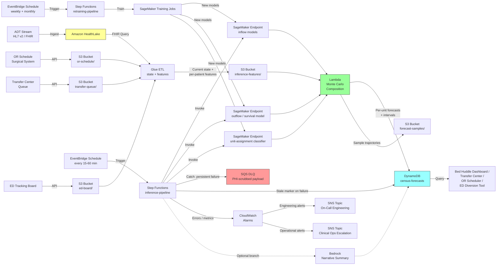

# Recipe 12.5 Architecture and Implementation: Hospital Census Forecasting

*Companion to [Recipe 12.5: Hospital Census Forecasting](chapter12.05-hospital-census-forecasting). This page covers the AWS architecture, services, prerequisites, and pseudocode. For the problem framing and the conceptual approach, start with the main recipe.*

---

## The AWS Implementation

The AWS implementation reuses much of the platform pattern from Recipes 12.3 and 12.4: managed ML training and inference, scheduled orchestration, low-latency serving, FHIR-aware ingestion. The pieces specific to hospital census forecasting are the patient-level state store, the survival model serving path, and the Monte Carlo composition step.

### Why These Services

**Amazon HealthLake for ADT and patient-state ingestion.** ADT messages and FHIR Encounter resources are exactly the data shape HealthLake was designed for. [HealthLake](https://docs.aws.amazon.com/healthlake/latest/devguide/what-is-amazon-health-lake.html) ingests HL7 v2 ADT events (A01 admission, A02 transfer, A03 discharge, A04 registration, A08 update, A11 cancel-admit, and so on) and surfaces them as FHIR Encounter resources with a longitudinal patient timeline. For a census pipeline, that timeline is the source of truth for current state and historical training data.

**Amazon S3 for raw streams, training data, and forecast outputs.** Raw ADT messages land in S3 first (so they're preserved even if downstream ingestion fails). Training datasets (built from cleaned ADT history), per-unit forecasts, and Monte Carlo sample trajectories all land in S3 partitioned by date and unit. SSE-KMS encryption with customer-managed keys per data class is mandatory (ADT contains PHI directly).

**AWS Glue for feature engineering and ADT cleanup.** Glue ETL jobs handle the unglamorous work: timestamp reconciliation across ADT and bed-cleaning logs, unit-assignment normalization (the source system codes for units drift over time), service-line mapping, length-of-stay computation, working-DRG attribution. The job runs on an hourly cadence for the inference pipeline and on a weekly cadence for the training feature build.

**Amazon SageMaker for the inflow, outflow, and unit-assignment models.** SageMaker hosts each of the model types this recipe uses: Poisson regression (statsmodels in a custom container) for ED admission inflow, the OR schedule deterministic input (no model needed, just a Lambda), the survival model for outflow (XGBoost-survival or PySurvival in a custom container), the multinomial unit-assignment classifier (SageMaker built-in XGBoost). For multi-hospital health systems, [DeepAR](https://docs.aws.amazon.com/sagemaker/latest/dg/deepar.html) or the [Chronos foundation model](https://github.com/amazon-science/chronos-forecasting) can replace the per-source Poisson regressors with a single shared model that learns across hospitals.

**AWS Lambda for the Monte Carlo composition step.** The composition is sample-based: draw N inflow trajectories, draw N per-patient discharge times, simulate the census walk forward, aggregate. For a single hospital, this is comfortably a Lambda invocation on each forecast cycle (typical run: a few seconds for 1000 samples across 30 units). For larger hospitals or finer time grids, AWS Batch or an EMR Serverless Spark job replaces Lambda.

**Amazon DynamoDB for serving forecasts to operational consumers.** The bed huddle dashboard, the transfer center, and the ED diversion tool all need single-digit-millisecond latency on lookups. DynamoDB with a partition key of `unit_id` and a sort key of `forecast_for_timestamp` fits perfectly. Forecast records are small (a few hundred bytes each), and DynamoDB is on the AWS HIPAA eligible services list.

**AWS Step Functions for orchestration.** The forecast pipeline has multiple steps with explicit retry semantics: refresh current-state snapshot, run inflow models, run outflow model on every currently-admitted patient, run Monte Carlo composition, write forecasts. Step Functions orchestrates this and is auditable for HIPAA workflows. Each stage specifies a retry policy: 3 retries with exponential backoff from 30s to 300s on `TaskFailed`, `Lambda.ServiceException`, `SageMaker.InternalErrorException`, and `HealthLake.ThrottlingException`. On persistent failure, the `Catch` block routes to an SQS DLQ with a PHI-scrubbed payload (run_id, stage_name, error_code, timestamp only; no patient identifiers). When any stage in a cycle fails permanently, the pipeline writes an explicit "stale" marker to DynamoDB for affected units so downstream consumers display staleness rather than silently serving an outdated forecast. `BatchWriteItem` `UnprocessedItems` retry is bounded (5 retries with exponential backoff) and surfaces a CloudWatch metric on unprocessed-item count. The Bedrock narrative-summary step runs as a separate state-machine branch so that a Bedrock failure does not block the structured-forecast write. CloudWatch alarms fire on both technical failure (consecutive-cycle-failure count exceeding 2) and clinical-operational escalation (predicted gridlock exceeding the configured threshold), routed to separate SNS topics for on-call engineering and clinical operations leadership respectively. A separate state machine handles weekly retraining of the inflow models and monthly retraining of the survival model.

**Amazon EventBridge for scheduling.** EventBridge Scheduler triggers the inference pipeline every 15 to 60 minutes (the cadence is operational policy; faster is better up to the marginal cost limit). Separate rules trigger the weekly inflow-model retraining and the monthly outflow-model retraining.

**Amazon CloudWatch for monitoring.** The most important metrics: forecast accuracy by horizon (mean absolute error and prediction-interval coverage at 4h, 24h, 72h), drift in feature distributions (LOS, admit rate, discharge timing), pipeline runtime, and operational consumption (how many times the bed huddle dashboard hit the API in the last hour). Forecast accuracy backfilled into CloudWatch metrics is the single most important operational signal because a forecast that quietly degrades is worse than no forecast.

**Calibration and Drift Detection.** The architecture includes a drift-detection-and-backfill pipeline as a first-class primitive: (1) a calibration store (S3-backed Parquet partitioned by date and unit, indexed by `forecast_run_id`) capturing every cycle's predictions; (2) a daily Lambda joining realized census against predictions and computing per-(horizon, unit, service-line) MAE, MAPE, and interval-coverage; (3) a weekly Lambda computing feature-distribution drift (LOS distributions by service line, admission-rate distributions by source, discharge-timing distributions by attending); (4) CloudWatch alarms on accuracy degradation per horizon (for example, 4h-MAPE exceeding 5% or 24h-MAPE exceeding 10%) and on prediction-interval coverage falling below nominal (80% target); (5) an after-action-review pipeline aggregating accuracy by hospital-event categories (surge, IT outage, holiday) so the team can distinguish model degradation from environmental disruption.

**Amazon Bedrock for narrative summaries (optional).** The bed huddle wants a one-paragraph summary of the day's projected pressure points: "Expected to hit 92% telemetry occupancy by 14:00, driven by 6 ED admits already pending and 3 elective cardiac procedures with anticipated tele admits. Discharge volume projected at 36, with peak between 13:00 and 15:00. Recommend prioritizing 4 medically-ready discharges currently held for SNF placement." Generating that text from the structured forecast is an optional Bedrock step that meaningfully improves how the forecast lands with operational leadership. The prompt-construction Lambda consumes only the structured forecast (per-unit per-hour expected occupancy, prediction intervals, and small driver fields), not the underlying per-patient features. Cell-suppression thresholds apply: counts under 5 are suppressed or grouped as "<5" to mitigate small-cell re-identification risk. Verify Bedrock model eligibility and BAA coverage at the account level at deployment time. The prompt-construction Lambda runs in the VPC with a VPC endpoint to Bedrock (where available). Model-invocation logging writes to a destination encrypted with a Bedrock-logs CMK. The narrative-summary completion is treated as PHI-by-association and stored under the DynamoDB-serving CMK.

**Multi-feed ingest connectivity posture.** Five inbound feeds (ADT, OR schedule, transfer queue, ED board, EHR patient state) each need their own connectivity posture. The recommended baseline is Direct Connect or VPN from on-premises clinical systems with on-premises HL7 v2 listeners and API connectors writing to S3 via gateway endpoint or HealthLake via interface endpoint. For cloud-hosted EHRs and SaaS clinical systems, use AWS PrivateLink where the vendor offers it; otherwise HTTPS with mutual TLS or signed-JWT authentication and TLS 1.2 minimum (TLS 1.3 preferred), with the receiving Lambda or API Gateway in the VPC. Public-internet-with-API-key alone is not appropriate for PHI-bearing inbound streams. Map the connectivity-and-BAA inventory for every clinical-source vendor before deployment kicks off.

### Architecture Diagram



### Prerequisites

| Requirement | Details |
|-------------|---------|
| **AWS Services** | Amazon HealthLake, Amazon S3, AWS Glue, Amazon SageMaker, AWS Lambda, Amazon DynamoDB, AWS Step Functions, Amazon EventBridge, AWS KMS, Amazon CloudWatch, optionally Amazon Bedrock |
| **IAM Permissions** | Actions: `healthlake:SearchWithGet`, `healthlake:ReadResource`, `s3:GetObject`, `s3:PutObject`, `glue:StartJobRun`, `sagemaker:InvokeEndpoint`, `sagemaker:CreateTrainingJob`, `lambda:InvokeFunction`, `dynamodb:BatchWriteItem`, `dynamodb:Query`, `states:StartExecution`, `kms:Decrypt`, `kms:Encrypt`, `bedrock:InvokeModel` (if narrative summaries are enabled). Scoped per pipeline stage to match the per-data-class CMK boundaries: Snapshot Glue job gets HealthLake read, snapshot S3 prefix write, PHI-direct CMK decrypt/generate. Inflow/outflow SageMaker endpoints get inference-features S3 prefix read, forecast-samples S3 prefix write, model-artifacts CMK decrypt, PHI-derived CMK generate. Monte Carlo Lambda gets forecast-samples S3 prefix read, DynamoDB write, PHI-derived CMK decrypt/generate. Bedrock Lambda (if enabled) gets DynamoDB read, Bedrock invoke, Bedrock-logs CMK generate, PHI-derived CMK generate. No principal has decrypt access to all CMKs simultaneously. |
| **BAA** | AWS BAA signed. ADT contains PHI directly (patient identifiers, demographics, locations). Per-patient features for the survival model contain PHI. Even aggregated census forecasts are derived from PHI and should be treated under the BAA. |
| **Encryption** | S3: SSE-KMS with customer-managed CMKs split by data class. PHI-direct CMK: HealthLake datastore, raw ADT bucket, OR-schedule feeds, transfer-queue feeds, ED-board feeds, harmonized inference-features. PHI-derived CMK: inflow/outflow/forecast samples, Monte Carlo trajectory archives, DynamoDB serving table. Model-artifacts CMK: three model-artifact buckets (inflow, outflow, unit-assignment). Bedrock-logs CMK: Bedrock prompt-and-completion logs. Operational-logs CMK: CloudWatch log groups. Each CMK's key policy scopes `kms:Decrypt` and `kms:GenerateDataKey` to the specific IAM principals that need access to that data class, containing blast radius so a compromised Lambda role cannot decrypt data classes outside its pipeline stage. HealthLake: KMS-encrypted datastore at creation time using the PHI-direct CMK. DynamoDB: encryption at rest with the PHI-derived CMK. SageMaker training and inference: encrypted EBS volumes and KMS-encrypted output using the model-artifacts CMK. TLS 1.2 minimum (TLS 1.3 preferred) at every external boundary. |
| **VPC** | Production: SageMaker training and inference in private subnets with VPC endpoints. Gateway endpoints: S3, DynamoDB. Interface endpoints: HealthLake, Step Functions, Glue, Lambda, KMS, CloudWatch Logs, CloudWatch Monitoring, Secrets Manager, SageMaker (API), SageMaker (Runtime), EventBridge, and Bedrock (if narrative summaries are enabled). Budget approximately $50-$150/month for the per-AZ-per-endpoint cost across the interface endpoints. Required for HIPAA workloads handling PHI. |
| **CloudTrail** | Enabled at the account level. Data events on: PHI-direct CMK (HealthLake datastore bucket, raw ADT bucket, OR-schedule feeds bucket, transfer-queue feeds bucket, ED-board feeds bucket, harmonized inference-features bucket), PHI-derived CMK (inflow/outflow/forecast samples buckets, Monte Carlo trajectory archive bucket, DynamoDB census-forecasts table), model-artifacts CMK (three model-artifact buckets), Bedrock-logs CMK (Bedrock prompt-and-completion bucket). Management events for SageMaker, Glue, Step Functions, EventBridge, DynamoDB, Lambda, and Bedrock. CloudTrail logs in a dedicated S3 bucket with Object Lock in compliance mode and lifecycle to S3 Glacier Deep Archive after 90 days. |
| **Sample Data** | [MIMIC-IV](https://physionet.org/content/mimiciv/) is the canonical de-identified inpatient dataset for development, available through PhysioNet credentialing. It includes ED, ICU, and ward admissions with timestamps suitable for census reconstruction. [Synthea](https://github.com/synthetichealth/synthea) generates synthetic FHIR Encounter resources for lighter-weight prototyping. Reference-data downloads (MIMIC-IV via PhysioNet credentialing, Synthea synthetic generators) should go through a controlled artifact-mirror path: an internal S3 bucket populated by an audited download workflow, rather than direct public-internet downloads from the development VPC. Never use real PHI in dev. |
| **Cost Estimate** | Costs scale with hospital bed count, refresh cadence, and unit count. For a 200-bed community hospital at 30-minute refresh with 15 units: HealthLake ~$200/month, SageMaker inference (three endpoints, ml.m5.large) ~$150/month, Glue ETL (hourly) ~$50/month, Lambda Monte Carlo ~$30/month, DynamoDB + S3 + Step Functions + EventBridge ~$40/month, Bedrock narrative (optional) ~$20/month. Total: ~$400-$600/month. For a 500-bed hospital at 15-minute refresh with 30 units: HealthLake ~$400/month, SageMaker inference ~$300/month, Glue ~$80/month, Lambda ~$60/month, infrastructure ~$80/month, Bedrock ~$60/month. Total: ~$900-$1,200/month. For 1000+-bed academic medical centers with HealthLake storage and SageMaker inference as the dominant drivers: $2,000-$4,500/month. Weekly + monthly retraining adds ~$30-$100/month depending on training data volume. |

### Ingredients

| AWS Service | Role |
|------------|------|
| **Amazon HealthLake** | Stores FHIR Encounter resources for all inpatient encounters; provides FHIR API for current-state and historical queries |
| **Amazon S3** | Stores raw ADT, OR schedule, transfer queue, ED board feeds, harmonized features, model artifacts, forecast outputs, and Monte Carlo sample trajectories |
| **AWS Glue** | Hourly feature-engineering jobs (timestamp cleanup, unit normalization, LOS computation, per-patient feature build); weekly training-data builds |
| **Amazon SageMaker** | Hosts inflow models (Poisson regression on ED admits, day-of-week and seasonality on direct admits and transfers), the outflow survival model (XGBoost-survival or DeepHit), and the unit-assignment classifier |
| **AWS Lambda** | Monte Carlo composition step; OR-schedule deterministic input handler; pre- and post-processing wrappers around SageMaker invocations |
| **Amazon DynamoDB** | Serves per-unit, per-hour census forecasts and prediction intervals to bed huddle dashboards, transfer center decision support, OR scheduler, and ED diversion tools at low latency |
| **AWS Step Functions** | Orchestrates the inference pipeline (state snapshot → inflow models → outflow model → unit assignment → Monte Carlo → forecast write) and the retraining pipelines (weekly inflow, monthly outflow) with explicit retry semantics |
| **Amazon EventBridge** | Triggers the 15-to-60-minute inference pipeline and the weekly + monthly retraining pipelines on cron schedules |
| **AWS KMS** | Manages customer-managed CMKs for S3, HealthLake, DynamoDB, and SageMaker encryption, split by data class |
| **Amazon CloudWatch** | Logs, metrics, alarms for pipeline failures, forecast accuracy by horizon, feature-distribution drift, and consumer-side query rate |
| **Amazon Bedrock** | Optional: generates narrative summaries from structured forecasts for the bed huddle and operational leadership |

### Code

> **Reference implementations:** The following AWS sample resources demonstrate the patterns used in this recipe:
>
> - [Amazon HealthLake Documentation](https://docs.aws.amazon.com/healthlake/latest/devguide/what-is-amazon-health-lake.html): The FHIR datastore that backs the longitudinal patient timeline used here for current-state and training data
> - [`amazon-sagemaker-examples`](https://github.com/aws/amazon-sagemaker-examples): Official SageMaker examples including custom-container patterns for survival models and time-series forecasting
> - [AWS Step Functions Workflow Studio](https://docs.aws.amazon.com/step-functions/latest/dg/workflow-studio.html): For visually composing the inference and retraining pipelines

#### Walkthrough

**Step 1: Snapshot the current hospital state.** Every forecast cycle starts by capturing the current state of every occupied bed: which patient, on which unit, admitted at what time, with what working DRG, with what discharge order status. The snapshot is the anchor for the rest of the forecast; getting it wrong means every subsequent step is calibrated to a fiction.

```text
FUNCTION snapshot_current_state(snapshot_ts):
    // Pull current state from the FHIR datastore. We want every Encounter
    // that is currently in-progress (Encounter.status = "in-progress").
    active_encounters = healthlake_search_encounters(
        status     = "in-progress",
        as_of_ts   = snapshot_ts
    )

    state_records = []
    FOR each encounter in active_encounters:
        // Pull the per-patient features needed by the survival model.
        // These come from a mix of FHIR resources: the Encounter itself
        // (admission ts, current location, service type), Condition
        // resources (diagnoses), MedicationRequest resources (active meds),
        // ServiceRequest resources (pending consults, pending procedures),
        // and ClinicalImpression resources (discharge planning notes).
        patient_features = build_patient_features(
            encounter            = encounter,
            patient_id           = encounter.subject_id,
            as_of_ts             = snapshot_ts
        )

        // The single most important feature: has a discharge order
        // been entered? "Discharge order entered" is a strong predictor
        // of discharge in the next 6 hours. Other status hints (planned
        // disposition, anticipated discharge date documented in care plan)
        // also matter, but the discharge order is the discrete signal.
        patient_features.discharge_order_entered = check_discharge_order(
            encounter_id  = encounter.id,
            as_of_ts      = snapshot_ts
        )

        // LOS so far (in hours, not days). The survival model uses
        // this as a feature; downstream operational displays show it
        // in days.
        patient_features.los_hours_so_far = (snapshot_ts - encounter.admit_ts).hours

        record = {
            encounter_id:       encounter.id,
            patient_id:         encounter.subject_id,
            current_unit:       encounter.location.unit_code,
            admit_ts:           encounter.admit_ts,
            service_line:       encounter.service_type,
            attending_id:       encounter.participant.attending,
            features:           patient_features,
            snapshot_ts:        snapshot_ts
        }
        state_records.append(record)

    write state_records to S3 inference-features/snapshots/ partitioned by snapshot_ts

    RETURN state_records
```

**Step 2: Forecast inflows by source, service, and unit.** Run the inflow models for the forecast horizon. Different sources use different methods. The output is, for each forecast hour and each candidate admit unit, an expected admission count plus a sample distribution suitable for Monte Carlo composition.

```text
FUNCTION forecast_inflows(snapshot_ts, horizon_hours, n_samples = 1000):
    inflow_samples = []  // shape: [n_samples, horizon_hours, n_units]

    // ED-driven admissions: Poisson regression on calendar + weather +
    // current-ED-state features. The current ED census and current ED
    // hold count are strong short-horizon features (an ED with 9 holds
    // right now will produce admissions within the next 4 hours with
    // high probability).
    ed_admit_features = build_ed_admit_features(
        snapshot_ts   = snapshot_ts,
        horizon_hours = horizon_hours
    )
    ed_admit_samples = sagemaker_invoke(
        endpoint = "ed-admit-poisson-endpoint",
        payload  = {features: ed_admit_features, n_samples: n_samples}
    )
    // ed_admit_samples shape: [n_samples, horizon_hours]
    // (this is the count; unit assignment is a separate step)

    // OR schedule: deterministic. Read the schedule for the next
    // horizon, multiply each scheduled case by historical show-rate
    // and case-completion rate. The case end-time plus historical
    // PACU-to-floor delay gives the expected admit timestamp.
    or_schedule       = read_or_schedule(snapshot_ts, horizon_hours)
    surgical_admits   = []
    FOR each case in or_schedule:
        show_probability = lookup_show_rate(case.service_line, case.day_of_week)
        post_op_delay_hours = lookup_pacu_delay(case.service_line)
        expected_admit_ts = case.scheduled_end_ts + post_op_delay_hours
        post_op_unit      = lookup_post_op_unit(case.surgery_type)
        IF expected_admit_ts < snapshot_ts + horizon_hours:
            surgical_admits.append({
                expected_admit_ts: expected_admit_ts,
                probability:       show_probability,
                target_unit:       post_op_unit
            })

    // Direct admits: simple Poisson with day-of-week features.
    direct_admit_samples = sagemaker_invoke(
        endpoint = "direct-admit-poisson-endpoint",
        payload  = {features: build_direct_admit_features(snapshot_ts), n_samples: n_samples}
    )

    // Transfers in: read the transfer center queue for known near-term
    // transfers, plus a Poisson model for unknown transfers beyond the
    // queue's lead time.
    queued_transfers = read_transfer_center_queue(snapshot_ts)
    transfer_in_samples = sagemaker_invoke(
        endpoint = "transfer-in-poisson-endpoint",
        payload  = {features: build_transfer_features(snapshot_ts), n_samples: n_samples}
    )

    // Unit assignment: for each ED-driven and direct admit count, sample
    // the unit assignment from the multinomial classifier. The classifier
    // takes the admission's features (chief complaint or diagnosis,
    // service line, age) and returns a probability distribution over
    // candidate units.
    inflow_samples = compose_inflow_samples(
        ed_admit_samples       = ed_admit_samples,
        surgical_admits        = surgical_admits,
        direct_admit_samples   = direct_admit_samples,
        transfer_in_samples    = transfer_in_samples,
        queued_transfers       = queued_transfers,
        unit_assignment_endpoint = "unit-assignment-classifier-endpoint",
        n_samples              = n_samples
    )

    write inflow_samples to S3 forecast-samples/inflows/ partitioned by snapshot_ts

    RETURN inflow_samples
```

**Step 3: Predict per-patient discharge probabilities over the horizon.** For every currently-admitted patient, predict the probability they discharge in each hour of the forecast horizon. The survival model takes the per-patient features from Step 1 plus the hour-of-day pattern of discharges and produces a discharge-time distribution. Sample from these distributions to produce per-unit discharge counts.

```text
FUNCTION forecast_outflows(state_records, horizon_hours, n_samples = 1000):
    // For each currently-admitted patient, get a discharge-time
    // distribution over the next horizon_hours.
    discharge_distributions = []
    FOR each record in state_records:
        // Survival model returns a hazard function over the horizon:
        // for each hour h in [0, horizon_hours], P(discharge in [h, h+1) | survived to h).
        hazard_function = sagemaker_invoke(
            endpoint = "discharge-survival-endpoint",
            payload  = {
                features:       record.features,
                horizon_hours:  horizon_hours
            }
        )

        // Convert hazard to cumulative discharge probability.
        cumulative_discharge_p = cumulative_from_hazard(hazard_function)

        discharge_distributions.append({
            encounter_id:           record.encounter_id,
            current_unit:           record.current_unit,
            cumulative_discharge_p: cumulative_discharge_p
        })

    // Sample N times: for each patient, draw a discharge time from
    // their distribution (or "no discharge in horizon"). Aggregate
    // by (sample, hour, unit) into discharge counts.
    outflow_samples = []  // shape: [n_samples, horizon_hours, n_units]
    FOR sample_id in 1..n_samples:
        sample_grid = zero_grid(horizon_hours, n_units)
        FOR each dd in discharge_distributions:
            discharge_hour = sample_discharge_hour(dd.cumulative_discharge_p, horizon_hours)
            IF discharge_hour is not null:
                sample_grid[discharge_hour][dd.current_unit] += 1
        outflow_samples[sample_id] = sample_grid

    write outflow_samples to S3 forecast-samples/outflows/ partitioned by snapshot_ts

    RETURN outflow_samples
```

**Step 4: Compose census trajectories with Monte Carlo.** Take the current state, the inflow samples, and the outflow samples, and walk forward sample by sample to produce per-sample census trajectories. Aggregate across samples to get the expected occupancy and prediction intervals per (unit, hour). The composition step is also where bed-management overflow rules get applied: if a unit's projected occupancy exceeds capacity in a sample, the overflow logic redistributes admissions to designated overflow units.

```text
FUNCTION compose_census(state_records, inflow_samples, outflow_samples, horizon_hours, unit_capacities, overflow_rules):
    n_samples = inflow_samples.shape[0]
    n_units   = inflow_samples.shape[2]

    // Initial state: count current occupants per unit from state_records.
    initial_census = count_by_unit(state_records)  // shape: [n_units]

    census_trajectories = []  // shape: [n_samples, horizon_hours, n_units]

    FOR sample_id in 1..n_samples:
        census = copy(initial_census)
        trajectory = []
        FOR hour in 0..horizon_hours-1:
            // Apply this sample's outflows for this hour.
            FOR unit in 0..n_units-1:
                census[unit] -= outflow_samples[sample_id][hour][unit]
                census[unit] = max(census[unit], 0)

            // Apply this sample's inflows for this hour, with overflow.
            FOR unit in 0..n_units-1:
                proposed_admits = inflow_samples[sample_id][hour][unit]
                available_capacity = unit_capacities[unit] - census[unit]

                IF proposed_admits <= available_capacity:
                    // Fits in target unit.
                    census[unit] += proposed_admits
                ELSE:
                    // Overflow: place what fits, route the rest per the
                    // overflow rules.
                    fits = max(available_capacity, 0)
                    census[unit] += fits
                    overflow_count = proposed_admits - fits
                    overflow_targets = overflow_rules[unit]
                    distribute_overflow(census, overflow_count, overflow_targets, unit_capacities)

            trajectory.append(copy(census))
        census_trajectories[sample_id] = trajectory

    // Aggregate across samples per (hour, unit).
    forecast = []
    FOR hour in 0..horizon_hours-1:
        FOR unit in 0..n_units-1:
            sample_values = [census_trajectories[s][hour][unit] FOR s in 1..n_samples]
            forecast.append({
                unit_id:                   unit,
                forecast_for_ts:           snapshot_ts + hour hours,
                expected_occupancy:        mean(sample_values),
                p10_occupancy:             percentile(sample_values, 10),
                p50_occupancy:             percentile(sample_values, 50),
                p90_occupancy:             percentile(sample_values, 90),
                capacity:                  unit_capacities[unit],
                expected_utilization_pct:  mean(sample_values) / unit_capacities[unit],
                generated_at_ts:           snapshot_ts,
                model_version:             current_model_version_string
            })

    write forecast to S3 forecasts/ partitioned by snapshot_ts
    RETURN forecast
```

**Step 5: Deliver forecasts to operational consumers.** The bed huddle dashboard, the transfer center, the OR scheduler, and the ED diversion tool all read from DynamoDB. Writing the forecast atomically per cycle (with a generated_at_ts attribute) lets consumers identify whether they're showing fresh or stale data and lets the dashboard render staleness explicitly when the pipeline misses a cycle.

All timestamps in the pipeline use UTC instants: `snapshot_ts`, `generated_at_ts`, and `forecast_for_ts` are stored as UTC in the calibration store, the inference-features S3 partition, and the Monte Carlo trajectory archive. The DynamoDB serving record carries both the UTC instant and the hospital-local representation (with explicit offset and DST flag). The EventBridge rule that triggers the inference cycle uses a UTC cron expression, not local cron, to avoid the missing-or-duplicated-cycle problem at DST transitions. The first cycle after a DST transition is allowed to skip if the prior cycle's `generated_at_ts + cadence_seconds` falls in the duplicated or missing local hour.

```text
FUNCTION deliver_forecast(forecast, table_name, pipeline_run_id, generated_at_ts):
    // generated_at_ts is computed once at pipeline start and propagated
    // through Step Functions state, not recomputed per Lambda invocation.
    // pipeline_run_id is derived from the EventBridge schedule invocation
    // ID for at-least-once-trigger idempotency.

    // Write forecasts to DynamoDB. Partition key is unit_id; sort key
    // is forecast_for_ts. Additionally maintain a CURRENT#<unit_id>
    // sort-key pointer to the latest-cycle forecast for fast lookups.
    batches = chunk forecast into groups of 25
    unprocessed_retry_count = 0
    max_unprocessed_retries = 5

    FOR each batch in batches:
        response = write batch to DynamoDB table_name with:
            partition_key = unit_id
            sort_key      = forecast_for_ts
            attributes    = full forecast object + pipeline_run_id + generated_at_ts

        // Bounded retry for UnprocessedItems with metric emission
        WHILE response.UnprocessedItems is not empty AND unprocessed_retry_count < max_unprocessed_retries:
            unprocessed_retry_count += 1
            wait exponential_backoff(unprocessed_retry_count)
            response = retry_write(response.UnprocessedItems)

        IF response.UnprocessedItems is not empty:
            emit_cloudwatch_metric("forecast.unprocessed_items", count(response.UnprocessedItems))

    // Write CURRENT pointer with conditional write for each unit.
    // This ensures a late-arriving rerun of an older cycle does not
    // overwrite a newer forecast.
    FOR each unit_id in unique_units(forecast):
        conditional_put to DynamoDB table_name with:
            partition_key = unit_id
            sort_key      = "CURRENT#" + unit_id
            attributes    = { latest_generated_at_ts: generated_at_ts, pipeline_run_id: pipeline_run_id }
            ConditionExpression = "attribute_not_exists(latest_generated_at_ts) OR latest_generated_at_ts < :new_ts"

    // Monte Carlo trajectory archive writes are keyed by
    // (snapshot_ts, pipeline_run_id, sample_id) so reruns overwrite cleanly.
    write_trajectory_archive(snapshot_ts, pipeline_run_id, trajectories)

    // Backfill writes from ADT-reconciliation use a `revision` attribute
    // and the CURRENT conditional-write logic still applies.

    // Emit CloudWatch metrics: forecast volume, generation time, count
    // of unit-hours where p90 exceeds capacity (the "predicted gridlock"
    // metric the operations team most wants to track).
    gridlock_count = count(forecast where p90_occupancy > capacity)
    emit_cloudwatch_metric("forecast.unit_hours", forecast.length)
    emit_cloudwatch_metric("forecast.predicted_gridlock_unit_hours", gridlock_count)
    emit_cloudwatch_metric("forecast.generation_seconds", elapsed_seconds)

    // Optional: post a summary message to the bed huddle channel if
    // gridlock unit-hours exceed the alerting threshold.
    IF gridlock_count > alert_threshold:
        post_to_bed_huddle_channel(summary_for(forecast))

    RETURN { forecast_count: forecast.length, gridlock_count: gridlock_count }
```

> **Curious how this looks in Python?** The pseudocode above covers the concepts. If you'd like to see sample Python code that demonstrates these patterns using boto3, statsmodels for inflow forecasting, lifelines or PySurvival for the outflow model, and NumPy for the Monte Carlo composition, check out the [Python Example](chapter12.05-python-example). It walks through each step with inline comments and notes on what you'd need to change for a real deployment.

### Expected Results

**Sample forecast record for a 28-bed telemetry unit at 06:30 on a Monday:**

```json
{
  "unit_id": "tele-3-east",
  "forecast_for_ts": "2026-05-25T14:00:00-05:00",
  "horizon_hours_from_snapshot": 8,
  "expected_occupancy": 26.4,
  "p10_occupancy": 23,
  "p50_occupancy": 26,
  "p90_occupancy": 29,
  "capacity": 28,
  "expected_utilization_pct": 0.943,
  "drivers": {
    "current_census_at_snapshot": 24,
    "expected_admits_in_window": 6.2,
    "expected_discharges_in_window": 3.8,
    "p90_admits_in_window": 9,
    "p10_discharges_in_window": 2,
    "scheduled_surgical_post_op_admits": 3,
    "current_ed_holds_likely_to_admit_to_unit": 2
  },
  "explanation_text": "Telemetry projected to reach 94% occupancy by 14:00 with non-trivial probability (p90 = 29) of exceeding the 28-bed capacity. Drivers: 6 expected admits over the window (3 scheduled cardiac post-op, 2 ED holds, 1 from direct-admit Poisson), against 4 expected discharges peaking between 13:00 and 15:00. Recommend prioritizing the 2 medically-ready discharges currently held for SNF placement to free capacity before the 13:00 OR turnover.",
  "generated_at_ts": "2026-05-25T06:34:18Z",
  "model_version": "census-pipeline-v4:inflow-poisson-v3:survival-xgbse-v2:unit-assigner-v1"
}
```

**Performance benchmarks (typical figures for a 412-bed community hospital running the full pipeline at 30-minute cadence):**

| Metric | Typical Value |
|--------|---------------|
| Pipeline runtime per cycle (30 units, 1000 Monte Carlo samples, 72-hour horizon) | 60-180 seconds |
| Forecast accuracy (4-hour horizon, MAPE on aggregate hospital census) | 1.5-3% |
| Forecast accuracy (24-hour horizon, MAPE on aggregate hospital census) | 3-6% |
| Forecast accuracy (24-hour horizon, MAPE on per-unit census) | 8-15% |
| Forecast accuracy (72-hour horizon, MAPE on aggregate hospital census) | 5-10% |
| Prediction-interval coverage at 4-hour horizon (target: 80% nominal) | 75-85% empirical |
| Prediction-interval coverage at 24-hour horizon (target: 80% nominal) | 70-80% empirical |
| Cost per hospital workload per month | $400-$1,800 |
| End-to-end latency from data update to dashboard refresh | under 90 seconds |

**Where it struggles:** Hospitals with chronically high census utilization (sustained above 92%, where bed-management decisions are dominated by the overflow logic and the forecast is constrained by capacity rather than predicting freely). Periods of acute disruption (a regional surge, a major infectious disease outbreak, a sudden change in the local healthcare market) where the historical patterns are no longer informative. New units or recently-reconfigured units where the historical training data does not match the current bed map. Hospitals with poor ADT timestamp discipline where the historical data has systematic errors that bias the model. Service lines with very low admission volume where the per-source Poisson model has insufficient data to fit. Patients with extremely long stays (LOS over 30 days) where the survival model has sparse training examples and discharge predictions are weak. Days with extreme operational anomalies (a major mass casualty event, a hospital-wide IT outage, a sudden physician strike) where the underlying drivers of flow are categorically different from anything in the training data.

---

## Why This Isn't Production-Ready

The pseudocode and architecture above demonstrate the pattern. Deploying this to a real hospital requires addressing several gaps that are intentionally outside the scope of a cookbook recipe.

**ADT timestamp reconciliation and data quality.** Every hospital we've worked with has subtle ADT data quality issues that have to be cleaned before the model can train cleanly. Discharge timestamps that fire when the order is entered rather than when the patient leaves. Transfer timestamps that reflect the bed assignment rather than the actual move. ADT messages that are dropped or arrive out of order. ADT events that conflict with the EHR's location field. Production systems include a continuous data quality monitoring layer that checks for distribution shifts in the ADT stream, alerts when timestamps look implausible, and reconciles ADT against secondary signals (bed-cleaning logs, telemetry-lead-attached events, EHR location updates). This work is unglamorous, never finishes, and is the difference between a forecast that matches reality and one that quietly degrades over six months.

The ADT reconciliation pipeline is an architectural primitive in the AWS implementation: (1) multi-signal ingest landing bed-cleaning logs, telemetry-lead-attached events, EHR location updates, and badge-tap events in S3 alongside ADT; (2) a reconciliation Glue ETL with per-timestamp-type rules (discharge_ts reconciled against bed-cleaning log; transfer_ts against telemetry-lead-attached on receiving unit; admission_ts against ED-departure timestamp); (3) conflict-resolution rules with a quarantine-for-manual-review path when primary and secondary signals diverge by more than a configured threshold (for example, 30 minutes for discharge, 15 minutes for transfers); (4) a data-quality monitoring layer with CloudWatch alarms on distribution shift exceeding threshold (comparing rolling 7-day distributions against the prior month's baseline); (5) a backfill workflow with a `reconciliation_version` attribute and downstream training-feature rebuild and survival-model retraining triggered when reconciled data changes meaningfully.

**Discharge order timing model.** The single biggest improvement to the forecast is a model that predicts when a discharge order will be entered, rather than just whether one has been entered. A patient with a planned discharge today whose order has not yet been written has different dynamics than the same patient at the same hour with the order already in. Production systems train a separate discharge-order-timing model on attending-rounding patterns, hospitalist workflow, and prior-day discharge patterns to predict discharge-order timing for currently-admitted patients without orders.

In the AWS implementation, the discharge-order-timing model runs as a separate SageMaker endpoint. Feature inputs: attending-rounding telemetry (badge-tap or EHR-login timestamps indicating rounding has started), hospitalist workflow signals (notes written, prior rounds timing this week), prior-day discharge patterns for this attending, time-since-admission, day-of-stay, day-of-week, and planned-disposition. The endpoint serves a Cox proportional hazards or gradient-boosted survival model returning a per-patient order-entry probability over the forecast horizon. The survival model in Layer 2 takes the order-timing prediction as a feature input, replacing the binary "order already entered" with a probabilistic "order will be entered by hour H." Separate retraining cadence: weekly for the first three months (to learn attending-specific patterns quickly), then monthly.

**Capacity constraints and overflow logic.** The composition step handles overflow with a simple priority-based rule layer. Real hospitals have much richer overflow rules (telemetry overflows to step-down with a downgrade order, but only if the receiving unit has the right monitoring equipment; ortho post-ops can overflow to general surgery but not to medicine; ICU step-down overflows have to consider nursing ratios). Production overflow logic is hospital-specific and lives in a configuration file that the bed-management team owns and updates as protocols change. The pipeline reads this configuration; it does not hardcode the rules.

The overflow-rules configuration is an architectural primitive backed by a versioned DynamoDB table with attributes: `hospital_id`, `unit_id`, `rule_version`, `effective_from_ts`, `effective_to_ts`, `overflow_targets` (ordered list with priorities), `clinical_constraints` (monitoring requirements, nursing-ratio floors), `approver_id`, `approval_ts`, and `audit_trail_id`. A Step Functions change-management workflow validates proposed rule changes via a validation Lambda that checks for circular overflow chains, missing units, and conflicting clinical constraints. Before any rule version goes live, a synthetic-load harness runs a validation pass against the previous day's census snapshot to confirm the new rules do not produce pathological overflow cascades. DynamoDB serving records carry a `rule_version` attribute for forensic reconstruction of which rules produced which forecast. Rollback is via active-version promotion (re-promote the prior version's `effective_from_ts` to now).

**Service-line and DRG drift.** Service lines and DRG categories shift over time as case mix changes. A hospital that opens a new joint-replacement program changes the post-op admission distribution. A hospital that closes its inpatient psych unit changes the ED-to-floor flow. Models trained on six-month-old data may forecast against a different reality than the current one. Production systems implement explicit drift detection on the feature distributions (LOS by service line, admit rate by source, discharge timing by attending) and trigger retraining when drift exceeds a threshold rather than relying solely on a calendar cadence.

**Multi-hospital health-system rollouts.** A health system with five hospitals has both an opportunity and a complication. The opportunity: shared models trained jointly across hospitals (DeepAR or hierarchical Bayesian models) borrow strength across small-volume units and produce better forecasts at every site. The complication: each hospital has its own bed map, its own overflow rules, its own data quality issues, and its own operational practices. Production multi-hospital deployments use a layered approach: shared inflow and outflow models trained jointly, hospital-specific unit-assignment classifiers, hospital-specific overflow logic, and hospital-specific feedback loops.

**Multi-Hospital Architecture Pattern.** The multi-hospital rollout uses `hospital_id` as a partition key dimension in every S3 bucket layout, every HealthLake datastore (or per-hospital datastores with a shared schema), every DynamoDB table, and every CloudWatch metric dimension. Per-hospital configuration stores unit definitions, overflow rules, and unit-assignment classifier parameters. Shared-model training exports per-hospital training data to a system-level training bucket with `hospital_id` preserved as an embedding feature so the model learns cross-hospital patterns while honoring hospital-specific dynamics. BAA scope must explicitly cover the system-level training pipeline since it aggregates PHI across hospital entities. Deployment uses a shared model on a single SageMaker multi-model endpoint for cost efficiency, with per-hospital DynamoDB writes isolated by the `hospital_id` partition key. Each hospital's forecast records, overflow rules, and calibration metrics are independently queryable.

**Operational integration is the hard part.** A forecast that nobody acts on is operational decoration. Real production deployments invest as much engineering in the consumer-facing tools (the bed huddle dashboard, the transfer center decision support, the OR scheduler integration, the ED diversion tool) as they do in the forecasting pipeline. Each consumer has different latency requirements, different visualization needs, and different feedback paths. The forecast repository is the single source of truth, but the consumers are where adoption happens or fails.

**Feedback capture and continuous calibration.** Every forecast cycle should write its predictions to a calibration store, and every realized outcome should be matched back to its prediction. The continuous comparison produces accuracy metrics by horizon, by unit, by service line, by hour-of-day, and by day-of-week. Drift in any of these dimensions is a signal to retrain or to investigate. Without this loop, the system stays calibrated to its launch-day performance and slowly accumulates a noise reputation. Build the calibration store on day one; do not bolt it on in month four.

The feedback-capture pipeline is architecturally specified: (1) calibration store as `forecast_predictions` and `realized_outcomes` Parquet tables in S3, partitioned by date and `unit_id`, indexed by `forecast_run_id` and `forecast_for_ts`; (2) a daily Lambda joining the two tables on `(unit_id, forecast_for_ts)` producing a `forecast_realized_join` table with `predicted_occupancy`, `realized_occupancy`, `prediction_interval_lower`, `prediction_interval_upper`, `interval_covered_realized` (boolean), `prediction_horizon_hours`, `service_line`, `hour_of_day`, `day_of_week`, and `hospital_event_category`; (3) per-dimension accuracy aggregation computed weekly and written to CloudWatch metrics and the forecast-accuracy dashboard; (4) retraining-trigger logic reading from the per-dimension aggregation and firing the retraining Step Functions pipeline via EventBridge when accuracy degrades beyond configured thresholds. This is distinct from the Calibration and Drift Detection primitive described in the "Why These Services" section: that primitive covers the metric-emission and alarming layer; this feedback-capture pipeline covers the calibration-store and feedback-pipeline layer that the drift-detection alarms read from.

**Human-in-the-loop for surge planning.** A forecast that says "you will be at 102% capacity by 18:00" is correct in the modeling sense but operationally unusable: the hospital cannot exceed 100% capacity, so the forecast is implicitly saying "you will be diverting, transferring out, or holding patients in ED for extended periods, and you should plan accordingly." The system needs an explicit interface for the bed huddle to acknowledge a forecast, document the operational response (added discharge resources, expedited SNF placements, called in extra nursing, opened the surge unit), and capture the outcome for retrospective evaluation. This interface is hospital-workflow-specific and is rarely in scope for the initial deployment.

**Privacy considerations for narrative summaries.** The Bedrock-generated narrative summaries are a great UX feature and a real PHI handling consideration. The prompt construction includes patient-level details ("4 medically-ready discharges currently held for SNF placement") that count as PHI by association. The model invocation, the prompt logging, and the output storage all need to be in the BAA-covered, KMS-encrypted, VPC-restricted boundary. Don't trip over your own elegance here.

**PHI-by-association posture for all downstream consumers.** The surfaced-forecast payload is PHI-by-association: unit-level counts are derived from per-patient state, and narrative-summary text names cohorts of patients by clinical characteristic. Every downstream consumer (bed huddle dashboard, transfer center decision support, OR scheduler, ED diversion tool) inherits the PHI-by-association posture and must be a HIPAA-eligible service or a BAA-covered first-party application. Apply cell-suppression thresholds at the consumer-rendering layer where unit sizes are small enough that single-digit counts could be re-identifying (for example, a 4-bed observation unit where "2 discharges expected" narrows to identifiable individuals).

**Regulatory framing.** Hospital census forecasting that informs operational decisions sits well within the operational software boundary and is not regulated as a medical device. A pipeline that informs individual patient care decisions ("this patient should be discharged today because the model predicts a discharge in the next 6 hours") edges closer to clinical decision support territory. Production deployments are careful to frame outputs as operational ("the unit is projected to be 94% occupied by 14:00") rather than clinical ("patient X should be discharged"), and to keep the patient-level discharge probabilities as inputs to the unit-level forecast rather than surfaces consumed by clinicians making care decisions about specific patients.

The per-patient discharge probability is an intermediate computation, not a surfaced output. The architectural primitive that protects the operational-versus-clinical boundary is the unit-level aggregation in Layer 3: case managers and bed-management teams consume unit-level forecasts and unit-level driver attributions, not per-patient discharge probabilities. The Variations section's "Real-time discharge prioritization" extension surfaces a per-patient-likelihood ranked list, which is closer to clinical decision support territory. Deploying that variation requires explicit regulatory review and may require FDA premarket clearance or a Cures Act CDS-exemption analysis depending on how the surface is framed to clinicians.

**Idempotency and rerun safety.** The forecast pipeline can fail and need to be rerun. Each step needs to be safe to repeat: snapshot generation is idempotent on snapshot_ts; inflow inference is deterministic given inputs (use a fixed seed for the Monte Carlo sampler when reproducibility matters); outflow inference is deterministic given inputs; DynamoDB writes overwrite cleanly by primary key (unit_id, forecast_for_ts).

---

## Variations and Extensions

**Joint multi-hospital forecasting with shared models.** For health systems with multiple hospitals, replace the per-hospital Poisson and survival models with shared models trained jointly across hospitals. DeepAR for inflow forecasting and a shared survival model with hospital-specific embeddings for outflow forecasting capture system-wide patterns and cross-pollinate evidence between sites. The unit-assignment classifier and overflow rules remain hospital-specific.

**ED boarding hours forecasting.** A specialized variant focused on a single, high-stakes operational metric: how many hours of ED boarding will occur in the next 24 hours. The output drives ED-specific staffing and surge decisions. Built as a layer on top of the main census forecast with additional features capturing ED-specific dynamics (admit decision time, ED-to-floor handoff time, ED hold staffing patterns).

**OR throughput coupling.** A bidirectional integration where the census forecast informs OR scheduling decisions (don't book elective cases on a day with projected gridlock) and the OR schedule feeds the inflow model. A more sophisticated version is a joint optimization that finds the OR schedule that maximizes throughput subject to projected bed availability constraints, using the census forecast as the constraint set.

**Real-time discharge prioritization.** Use the per-patient discharge-time predictions to produce a daily ranked list for the case management team: "these 12 patients are most likely to discharge today, here's their projected timing, here's what's blocking them." The prioritization helps case managers focus on the highest-impact patients first and accelerates throughput.

**Surge plan trigger automation.** Connect the forecast to the hospital's surge plan thresholds. When the forecast crosses a threshold (predicted occupancy above 95% with prediction-interval upper bound above capacity), the system auto-pages the surge response team and pre-stages the surge plan documentation. The clinical team still makes the activation decision; the system removes the lag between "we should activate" and "we activated."

---

## Additional Resources

**AWS Documentation:**
- [Amazon HealthLake Documentation](https://docs.aws.amazon.com/healthlake/latest/devguide/what-is-amazon-health-lake.html)
- [Amazon SageMaker Documentation](https://docs.aws.amazon.com/sagemaker/latest/dg/whatis.html)
- [Amazon SageMaker DeepAR Forecasting](https://docs.aws.amazon.com/sagemaker/latest/dg/deepar.html)
- [AWS Step Functions Documentation](https://docs.aws.amazon.com/step-functions/latest/dg/welcome.html)
- [Amazon DynamoDB Documentation](https://docs.aws.amazon.com/amazondynamodb/latest/developerguide/Introduction.html)
- [Amazon Bedrock Documentation](https://docs.aws.amazon.com/bedrock/latest/userguide/what-is-bedrock.html)
- [AWS HIPAA Eligible Services](https://aws.amazon.com/compliance/hipaa-eligible-services-reference/)
- [Architecting for HIPAA Security and Compliance on AWS (Whitepaper)](https://docs.aws.amazon.com/whitepapers/latest/architecting-hipaa-security-and-compliance-on-aws/welcome.html)

**AWS Sample Repos:**
- [`amazon-sagemaker-examples`](https://github.com/aws/amazon-sagemaker-examples): Official SageMaker examples including custom-container patterns for survival models and time-series forecasting
- [`aws-samples` GitHub Organization](https://github.com/aws-samples): Search for HealthLake, FHIR, and operational forecasting samples

**External Resources:**
- [MIMIC-IV on PhysioNet](https://physionet.org/content/mimiciv/): De-identified real ICU and hospital data for credentialed researchers, suitable for census reconstruction and survival model training
- [Synthea Synthetic Patient Generator](https://github.com/synthetichealth/synthea): Realistic synthetic FHIR Encounter resources including admission and discharge events
- [Forecasting: Principles and Practice (Hyndman & Athanasopoulos)](https://otexts.com/fpp3/): Free online textbook with strong chapters on hierarchical forecasting and intermittent demand, both relevant here
- [lifelines Python Library](https://lifelines.readthedocs.io/): Survival analysis library suitable for the discharge-time model
- [PySurvival Library](https://square.github.io/pysurvival/): Deep-learning-based survival models including DeepHit, suitable when the per-patient feature set is rich
- [HL7 ADT Message Specification](https://www.hl7.org/implement/standards/product_brief.cfm?product_id=185): The standard for admission, discharge, transfer messages used as the primary data input
- [FHIR Encounter Resource](https://www.hl7.org/fhir/encounter.html): The FHIR equivalent for hospital encounters; the canonical model in HealthLake

**AWS Solutions and Blogs:**
- [AWS Solutions Library (Healthcare and AI/ML)](https://aws.amazon.com/solutions/): Filter by Healthcare and AI/ML for reference architectures
- [AWS Machine Learning Blog (Healthcare tag)](https://aws.amazon.com/blogs/machine-learning/category/industries/healthcare/): Search for FHIR, HealthLake, and operational forecasting posts
- [AWS Reference Architecture Diagrams](https://aws.amazon.com/architecture/reference-architecture-diagrams/): Filter by Healthcare and AI/ML

---

## Estimated Implementation Time

- **Basic pipeline (single hospital, aggregate census forecast, 24-hour horizon, daily refresh):** 8-12 weeks
- **Production-ready (per-unit forecasts, 4-to-72-hour horizons, 30-minute refresh, calibration loop, narrative summaries, operational integration):** 20-32 weeks
- **With variations (multi-hospital shared models, OR throughput coupling, surge automation, real-time discharge prioritization):** 36-52 weeks

---

---

*← [Main Recipe 12.5](chapter12.05-hospital-census-forecasting) · [Python Example](chapter12.05-python-example) · [Chapter Preface](chapter12-preface)*
