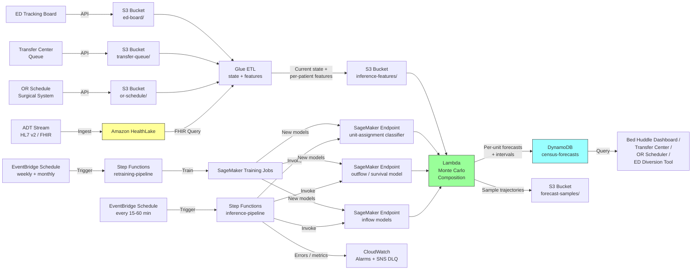

# Recipe 12.5: Hospital Census Forecasting ⭐⭐⭐

**Complexity:** Medium · **Phase:** Production · **Estimated Cost:** ~$400–$1,800 per month per hospital workload

---

## The Problem

It's 06:30 on a Monday at a 412-bed community hospital. The bed huddle has just started. The house supervisor is reading off the census from a printed report that captured the state of the hospital at midnight. Five and a half hours ago. Since then, the ED admitted nine patients overnight, three more are being held in ED beds waiting for a floor assignment, the cath lab has two procedures starting at 07:00 that will need step-down beds by 11:00, and PACU is holding a post-op orthopedic case who needs a med-surg bed in the next hour. Discharge planning thinks today's discharge volume will be "around 38 to 42, maybe a little less because Dr. Patel is on vacation," which is the kind of guess that ends with the chief operating officer asking, at 16:00, why nobody saw the bed crisis coming.

The hospital is going to be operationally tight today. Some of that tightness was knowable. Some of it is genuinely random. The mix is exactly the part that nobody at the bed huddle has a systematic way to separate. The house supervisor has thirty years of pattern recognition baked into their bones, and they will get the day mostly right by feel. They will also be wrong in costly ways, twice a week, in ways nobody can quite forensically reconstruct after the fact, because the hospital does not actually have a forecast it tracks against. It has a midnight snapshot, a census report that updates every two hours, and a printed sheet that the house supervisor annotates in pencil between phone calls.

Every hospital with more than two hundred beds plays out some version of this scene every morning. The bed huddle is the central nervous system for inpatient operations, and it runs on three things: the current census (now), the past few days of census trends (last week), and the team's collective intuition about what today will look like (vibes). Discharges are the lever everyone tries to pull (case management runs the discharge list, hospitalists round earlier, social work expedites SNF placements). Admissions are the demand they try to absorb (ED holds, direct admits, scheduled surgical admits, transfers from outside facilities). The transfer center makes accept-or-divert decisions based on bed availability that won't actually exist until somebody discharges. The OR schedule for tomorrow gets locked in based on assumptions about bed availability tonight. The medical informatics team has been asked, three times in the last two years, to produce a "real-time bed forecast." Each time the project has stalled because the data is messy, the operational decisions are political, and the existing reporting solution is "good enough."

The cost of getting this wrong shows up in places nobody attributes back to the bed forecast. ED boarding hours (a patient admitted but stuck in an ED bed for hours waiting for a floor bed) are the canonical metric: every hour of boarding correlates with worse outcomes, longer total length of stay, and higher per-stay cost. Diversions ([ambulances rerouted to other hospitals because yours is on bypass](https://www.cms.gov/Medicare/Provider-Enrollment-and-Certification/QAPI/Downloads/Bed-Capacity-and-Diversion-Calculations.pdf)) cost revenue and damage community-trust relationships. Cancelled elective surgeries cost both revenue and patient goodwill. Transferred-out patients (sent to a tertiary center because your hospital had no bed) cost both. Travel-nurse premium pay for the unit that was chronically tight cost the CFO's quarterly margin. Nobody has a single line item on the P&L called "bed forecasting failures," but the cost is real and large, and it is the kind of cost that operations people can describe in ten minutes if you ask them about a recent bad week.

The promise of hospital census forecasting is straightforward: take the data the hospital already has (admissions stream, ED boarders, scheduled surgical admits, transfers, discharge dispositions, average length of stay by service line, hospitalist staffing patterns) and produce an hour-by-hour, unit-by-unit forecast of bed occupancy for the next 4 to 72 hours. Pair that forecast with explicit prediction intervals so the bed huddle knows the difference between "we are confidently going to be tight on telemetry tonight" and "there is a 25% chance we hit gridlock by 22:00." Refresh the forecast as the day progresses and as new data lands (every admission, every discharge, every cancelled surgery, every transfer accepted or declined). Surface the forecast to the bed huddle at 06:30, to the transfer center continuously, to the OR schedulers the night before, and to the ED charge nurse when they're considering whether to call diversion. Get this right and the hospital makes better decisions in real time, and the savings show up in the metrics that matter (boarding hours, diversion hours, cancelled-case rate, premium-labor spend) without anybody having to point at the forecast as the reason.

Let's get into how this works.

---

## The Technology: How Hospital Census Forecasting Actually Works

### Why This Is a Flow Problem, Not a Volume Problem

The first reflex when you hear "predict bed occupancy" is to reach for a generic time-series forecaster and aim it at historical census numbers. That works on day one and breaks within a quarter. The reason: hospital census is fundamentally a flow problem. Today's census is yesterday's census, plus admissions over the last 24 hours, minus discharges over the last 24 hours, plus or minus transfers (in from other facilities, out to SNF, internal between units). The aggregate level is the result of three separate streams interacting, and each stream has its own dynamics, its own drivers, and its own predictability characteristics.

Treat census as one time series and you fit a model that has no awareness of the underlying dynamics. It will learn the seasonal pattern (Mondays trend higher than Sundays) but it will struggle when the dynamics shift. A change in average length of stay (because the hospital launched a new discharge initiative, or because the case mix shifted, or because skilled nursing facility availability collapsed in your region) breaks the model in ways the historical census numbers do not anticipate. A change in admission patterns (because a competing hospital closed, because flu season started two weeks early, because a referring practice was acquired) similarly breaks it.

The right framing is to forecast each flow separately and then compose them. Admissions become one forecast (volume by hour by unit, by source: ED, direct admit, surgical, transfer-in). Discharges become a second forecast (volume by hour by unit, by disposition: home, SNF, rehab, hospice, expired). Length of stay becomes a third forecast or, more often, a survival-style model that says "for each currently-admitted patient, what's the probability they discharge in the next H hours." Transfers (between units, between facilities) become a fourth flow. Census is the integral of these flows over a starting point. Get the flows right and the census forecast is the bookkeeping that follows.

### The Three-Layer Architecture That Actually Works

A capable hospital census pipeline has three conceptual layers that mirror the flow framing.

**Layer 1: Inflow forecasting.** Predict admissions over the forecast horizon, broken down by admission source and admitting service. The pipeline maintains separate sub-models for each source because each has wildly different predictability:

*ED admissions* are the largest source for most hospitals (60 to 75% of admissions in community hospitals, lower in academic centers). They follow patterns similar to ED arrivals (Recipe 12.3), with the additional layer of admit-rate variability. About 12 to 18% of ED visits become admissions in a typical community ED, but the rate fluctuates with case-mix, season, and ED capacity itself. Forecast volume by ED arrival rate times admit rate, both modeled with the calendar and weather features from Recipe 12.3.

*Scheduled surgical admissions* are the most predictable inflow because they're literally on a calendar. Tomorrow's OR schedule produces a deterministic count of inpatient post-op admits for the next 24 to 48 hours, with high reliability. The only uncertainty is no-show rate (typically 2 to 5%) and case-cancellation rate (5 to 12% on the day-of, depending on hospital). Forecast: pull the OR schedule, multiply by the historical show-rate, attribute to the appropriate post-op unit.

*Direct admissions* (admitted from a physician office or clinic without going through the ED) are smaller volume but harder to forecast because the lead time is short (often hours, not days) and the demand is bursty. A fall-day spike in direct admits to ortho is hard to anticipate from yesterday's pattern. Most hospitals model these as a Poisson process with day-of-week and seasonality features.

*Transfers in* (from outside facilities or affiliated hospitals) flow through the transfer center. The transfer center has visibility into pending requests (typically a few hours of lead time) and can supply that as a feature. Most pipelines treat near-term transfers as a known quantity from the transfer center queue and longer-horizon transfers as a forecast.

**Layer 2: Outflow and length-of-stay modeling.** Predict discharges over the forecast horizon, which is the harder of the two flows. Discharges have two characteristics that make them hard:

*The discharge process is partly clinical, partly operational, and partly social.* A patient is medically ready to discharge when the attending says so, which is mostly clinical. They actually discharge when the discharge order is in, the medications are reconciled, the transportation is arranged, and the receiving facility (if any) accepts. That second leg is operational and social. A patient who is medically ready at 09:00 may not actually leave the hospital until 17:00 because of insurance authorization, SNF bed availability, or family transportation. The forecast has to capture both the medical-readiness signal and the operational-completion timing.

*Discharges concentrate during the day.* A typical hospital discharges 70 to 80% of its volume between 10:00 and 18:00, with a strong peak around 13:00 to 15:00. Overnight discharges are minimal. The intra-day pattern is sharp and matters operationally: the bed huddle at 06:30 needs to know how many discharges are projected by 14:00 specifically, not just "by end of day."

The standard approach for discharge forecasting is a survival-style model. For each currently-admitted patient, predict the probability they discharge in the next H hours, conditional on their length of stay so far, their service line, their disposition plan (if known), and dozens of other features. Sum the probabilities to get the expected discharge count. The advantage of this framing over a plain count-forecasting approach: it naturally incorporates patient-level information (a patient on day 6 of an exacerbation admission has different discharge dynamics than a patient on day 1 of a planned surgical admission) and it makes the discharge prediction a per-patient question, which is exactly what the case manager working the unit needs anyway.

The features that matter for the survival model: service line, primary diagnosis (or DRG, once the working DRG is assigned), age, length of stay so far, day of week, hour of day, attending hospitalist, planned disposition (home, SNF, rehab, hospice), [Hospital Acquired Condition](https://www.cms.gov/Medicare/Medicare-Fee-for-Service-Payment/HospitalAcqCond) flags, recent vital sign trajectory, recent lab abnormalities, pending consults, and whether a discharge order has been written. The last feature is the strongest single predictor: "discharge order entered" raises the probability of discharge in the next 6 hours from a baseline of around 8 to 15% to typically 75 to 90%.

**Layer 3: Census composition and unit assignment.** Compose the inflows, outflows, and current state into a unit-level census forecast. This is conceptually simple bookkeeping:

```text
projected_census(unit, t+h) = current_census(unit, t)
                              + projected_admissions_to_unit(unit, t, t+h)
                              + projected_internal_transfers_in(unit, t, t+h)
                              - projected_discharges_from_unit(unit, t, t+h)
                              - projected_internal_transfers_out(unit, t, t+h)
                              ± uncertainty
```

The hard part is unit assignment. A patient admitted from the ED with a chest pain rule-out goes to telemetry, not med-surg. A post-op total knee goes to ortho, not general surgery. A patient who was on CCU but is being downgraded goes to step-down, not back to cath lab. The unit-assignment logic depends on diagnosis, surgical type, attending preference, current unit availability, and the hospital's bed-management protocols. Most pipelines model this as a multinomial classifier per admission source: given the admission's features (diagnosis, surgery type, ED disposition), predict the probability distribution over candidate units.

The output of Layer 3 is the unit-level census forecast: for each unit, for each hour over the forecast horizon, the expected occupancy and a prediction interval. The aggregate hospital census is the sum across units, but the unit-level breakdown is what operations actually consume.

### What Makes Census Different From Other Forecasts

Several characteristics distinguish hospital census forecasting from other time-series problems and shape the methods that work.

**Forecasts have to compose with current state.** The forecast is anchored on the current census, which is itself a moving target throughout the day. Every admission and discharge updates the starting point for the rest of the forecast. The pipeline has to update incrementally, not produce a one-shot daily forecast that goes stale by 09:00. Most production systems re-run inference every 15 to 60 minutes, with the inflow and outflow models taking the latest known state as input.

**Forecast horizon and operational use are tightly coupled.** Different operational decisions live at different horizons:
- 1 to 4 hours: ED diversion decisions, transfer-center accept/decline, OR add-ons
- 4 to 12 hours: same-shift staffing pulls, discharge expediting, internal transfer prioritization
- 12 to 24 hours: next-shift staffing, OR schedule adjustments, surge-plan activation
- 24 to 72 hours: tomorrow's bed plan, OR booking decisions, transfer-in capacity commitments
- 72 hours to 7 days: weekly staffing, scheduled procedure planning

A single model is rarely best across all horizons. Short-horizon forecasts benefit most from current-state features (ED holds, post-op pipeline, pending discharges). Longer-horizon forecasts depend more on calendar and seasonality features. Production pipelines either fit horizon-specific models or use a single model with horizon-dependent feature weighting.

**Units are not independent.** Telemetry being full means new admissions cascade to overflow units. CCU being full means step-down patients can't transfer up. The bed-management protocols define a graph of unit-to-unit overflow rules, and the forecast has to respect them or it produces unit-level numbers that don't add up to a coherent hospital plan. Most teams handle this by forecasting each unit independently and then running a post-processing pass that respects the overflow rules and produces a constrained joint forecast.

**Length of stay is the most operationally actionable input.** A 0.3-day reduction in average LOS frees up roughly 8% of bed-hours in a 412-bed hospital. The forecast has to be sensitive enough to detect when LOS is shifting and surface that to the leadership who can act on it. A pipeline that forecasts census without ever exposing the LOS assumption is missing the operational lever the bed huddle most wants to pull.

**The data is mostly timestamped, but timestamps are not always trustworthy.** ADT (admit-discharge-transfer) messages timestamp every state change in the patient's hospital journey. In theory, you can reconstruct the entire hospital flow from ADT history. In practice, ADT timestamps are sometimes wrong (the discharge timestamp captures when the discharge order was entered, not when the patient left the bed; the transfer timestamp captures when the patient was assigned to the new unit, not when they actually moved). Production pipelines clean and reconcile timestamps against secondary signals (bed-cleaning logs, EHR location updates, telemetry leads detached) and treat the cleaned version as authoritative. Skipping this work produces a forecast trained on noisy timestamps that is calibrated to the noise rather than to the underlying flow.

### Methods That Earn Their Keep

For each of the three layers, a small number of methods consistently work in production.

**For inflow forecasting (Layer 1):** The same toolbox as Recipe 12.3 (ED arrivals) plus deterministic schedule integration for surgical admits. Poisson regression with calendar and weather features handles ED-driven admissions. Multinomial classifiers handle service-line and unit assignment. The OR schedule is read directly. Direct admits and transfer requests use simple Poisson models with day-of-week features.

**For outflow forecasting (Layer 2):** Survival models (Cox proportional hazards, accelerated failure time, gradient-boosted survival models like XGBSE, or deep survival models like DeepHit) on per-patient features. The patient-level approach is more accurate and more operationally useful than aggregate count forecasting. Output: per-patient discharge probability over the forecast horizon, summed for unit-level expected discharges. State-space methods (per-service LOS distributions updated as new discharges arrive) are a simpler alternative when patient-level features are sparse.

**For census composition (Layer 3):** Bookkeeping plus Monte Carlo. Sample N times from each component distribution (admissions, discharges, transfers), compose the census trajectory for each sample, take the mean and percentiles across samples. This naturally produces calibrated prediction intervals. A hospital with thousands of patient-state combinations runs this comfortably with N=500 to 1000 samples; per-unit calibration improves with more samples but with diminishing returns past 1000.

**For real-time updating:** Particle filters or sequential Monte Carlo methods are theoretically elegant but operationally heavy. The simpler approach is to re-run the full pipeline every 15 to 60 minutes with the latest state and let the new forecast supersede the old. The marginal cost of compute is low compared to the operational complexity of online filtering.

### The General Architecture Pattern

At a conceptual level, the pipeline looks like this:

```text
[ADT Stream]
[OR Schedule]                    +---------------------+    +--------------------+    +---------------------+
[Transfer Center Queue]   ---->  | Inflow Forecasting  |    | Outflow / LOS      |    | Census Composition  |
[ED Tracking Board]              | (per source, per    |    | Modeling           |    | (Monte Carlo on     |
[EHR Patient State]              |  service, per unit) |    | (per-patient       |    |  inflows + outflows |
                                 |                     |    |  survival model)   |    |  + current state)   |
                                 +---------------------+    +--------------------+    +---------------------+
                                          |                          |                          |
                                          +---------+----------------+--------------------------+
                                                    |
                                                    v
                                          +---------------------+
                                          | Forecast Repository |
                                          | (per-unit, per-hour |
                                          |  occupancy + intervals)
                                          +---------------------+
                                                    |
                                                    v
                                          +---------------------+
                                          | Operational         |
                                          | Consumers           |
                                          | (Bed Huddle, Transfer
                                          |  Center, OR, ED)    |
                                          +---------------------+
```

**ADT Stream.** Every hospital state change (admission, discharge, transfer, room change, status change) emits an HL7 ADT message or its FHIR Encounter equivalent. The pipeline ingests these in near real time and maintains a current-state view of every occupied bed.

**OR Schedule, Transfer Center Queue, ED Tracking Board.** Three known-quantity feeds. The OR schedule for the next 48 hours is a deterministic input. The transfer center queue is a near-term-known input (1 to 6 hours of lead time). The ED tracking board provides current ED census, holds, and admitted-but-not-yet-placed patients.

**EHR Patient State.** Per-patient features needed by the survival model: service, attending, working DRG (if available), discharge order status, planned disposition, length of stay so far, age, comorbidities. This is typically pulled from the EHR via FHIR API or a clinical data warehouse mirror, refreshed on the same cadence as the forecast.

**Inflow Forecasting.** Per-source, per-service, per-unit admission forecasts. Models trained on historical ADT plus feeds. Refreshed weekly or when drift is detected.

**Outflow / LOS Modeling.** Per-patient discharge probability over the forecast horizon. Survival model trained on historical encounters with feature engineering on patient state at each prediction time. Refreshed monthly or quarterly.

**Census Composition.** Monte Carlo simulation of the census trajectory. Takes the inflow forecasts, the outflow probabilities, and the current state as inputs. Produces per-unit, per-hour expected occupancy plus prediction intervals.

**Forecast Repository.** The output table: (unit, forecast_for_timestamp, expected_occupancy, lower_bound, upper_bound, generated_at_timestamp). Every consumer reads from this.

**Operational Consumers.** The bed huddle dashboard, the transfer center decision support, the OR scheduler, the ED diversion-decision tool, and the staffing scheduler all consume the same forecast. The integration is structured (REST API or query-on-DynamoDB) and the latency budget is single-digit seconds.

That's the whole concept. Three flows, composed into a unit-level census, refreshed continuously, surfaced everywhere. The hard parts are in the data plumbing (ADT cleanup, unit-assignment logic, length-of-stay feature engineering) and in the operational integration, not in the forecasting math.

---

## The AWS Implementation

The AWS implementation reuses much of the platform pattern from Recipes 12.3 and 12.4: managed ML training and inference, scheduled orchestration, low-latency serving, FHIR-aware ingestion. The pieces specific to hospital census forecasting are the patient-level state store, the survival model serving path, and the Monte Carlo composition step.

### Why These Services

**Amazon HealthLake for ADT and patient-state ingestion.** ADT messages and FHIR Encounter resources are exactly the data shape HealthLake was designed for. [HealthLake](https://docs.aws.amazon.com/healthlake/latest/devguide/what-is-amazon-health-lake.html) ingests HL7 v2 ADT events (A01 admission, A02 transfer, A03 discharge, A04 registration, A08 update, A11 cancel-admit, and so on) and surfaces them as FHIR Encounter resources with a longitudinal patient timeline. For a census pipeline, that timeline is the source of truth for current state and historical training data.

**Amazon S3 for raw streams, training data, and forecast outputs.** Raw ADT messages land in S3 first (so they're preserved even if downstream ingestion fails). Training datasets (built from cleaned ADT history), per-unit forecasts, and Monte Carlo sample trajectories all land in S3 partitioned by date and unit. SSE-KMS encryption with customer-managed keys per data class is mandatory (ADT contains PHI directly).

**AWS Glue for feature engineering and ADT cleanup.** Glue ETL jobs handle the unglamorous work: timestamp reconciliation across ADT and bed-cleaning logs, unit-assignment normalization (the source system codes for units drift over time), service-line mapping, length-of-stay computation, working-DRG attribution. The job runs on an hourly cadence for the inference pipeline and on a weekly cadence for the training feature build.

**Amazon SageMaker for the inflow, outflow, and unit-assignment models.** SageMaker hosts each of the model types this recipe uses: Poisson regression (statsmodels in a custom container) for ED admission inflow, the OR schedule deterministic input (no model needed, just a Lambda), the survival model for outflow (XGBoost-survival or PySurvival in a custom container), the multinomial unit-assignment classifier (SageMaker built-in XGBoost). For multi-hospital health systems, [DeepAR](https://docs.aws.amazon.com/sagemaker/latest/dg/deepar.html) or the [Chronos foundation model](https://github.com/amazon-science/chronos-forecasting) can replace the per-source Poisson regressors with a single shared model that learns across hospitals.

**AWS Lambda for the Monte Carlo composition step.** The composition is sample-based: draw N inflow trajectories, draw N per-patient discharge times, simulate the census walk forward, aggregate. For a single hospital, this is comfortably a Lambda invocation on each forecast cycle (typical run: a few seconds for 1000 samples across 30 units). For larger hospitals or finer time grids, AWS Batch or an EMR Serverless Spark job replaces Lambda.

**Amazon DynamoDB for serving forecasts to operational consumers.** The bed huddle dashboard, the transfer center, and the ED diversion tool all need single-digit-millisecond latency on lookups. DynamoDB with a partition key of `unit_id` and a sort key of `forecast_for_timestamp` fits perfectly. Forecast records are small (a few hundred bytes each), and DynamoDB is on the AWS HIPAA eligible services list.

**AWS Step Functions for orchestration.** The forecast pipeline has multiple steps with explicit retry semantics: refresh current-state snapshot, run inflow models, run outflow model on every currently-admitted patient, run Monte Carlo composition, write forecasts. Step Functions orchestrates this with explicit retries and is auditable for HIPAA workflows. A separate state machine handles weekly retraining of the inflow models and monthly retraining of the survival model.

**Amazon EventBridge for scheduling.** EventBridge Scheduler triggers the inference pipeline every 15 to 60 minutes (the cadence is operational policy; faster is better up to the marginal cost limit). Separate rules trigger the weekly inflow-model retraining and the monthly outflow-model retraining.

**Amazon CloudWatch for monitoring.** The most important metrics: forecast accuracy by horizon (mean absolute error and prediction-interval coverage at 4h, 24h, 72h), drift in feature distributions (LOS, admit rate, discharge timing), pipeline runtime, and operational consumption (how many times the bed huddle dashboard hit the API in the last hour). Forecast accuracy backfilled into CloudWatch metrics is the single most important operational signal because a forecast that quietly degrades is worse than no forecast.

**Amazon Bedrock for narrative summaries (optional).** The bed huddle wants a one-paragraph summary of the day's projected pressure points: "Expected to hit 92% telemetry occupancy by 14:00, driven by 6 ED admits already pending and 3 elective cardiac procedures with anticipated tele admits. Discharge volume projected at 36, with peak between 13:00 and 15:00. Recommend prioritizing 4 medically-ready discharges currently held for SNF placement." Generating that text from the structured forecast is an optional Bedrock step that meaningfully improves how the forecast lands with operational leadership.

<!-- TODO (TechWriter): N1. Verify HIPAA-eligible Bedrock model selection at deployment time and confirm BAA coverage at the account level. The narrative summary prompt construction is PHI-adjacent: per-patient details ("4 medically-ready discharges currently held for SNF placement") name patient counts and clinical states even when they don't name patients directly. Treat the prompt construction as PHI handling. -->

### Architecture Diagram



### Prerequisites

| Requirement | Details |
|-------------|---------|
| **AWS Services** | Amazon HealthLake, Amazon S3, AWS Glue, Amazon SageMaker, AWS Lambda, Amazon DynamoDB, AWS Step Functions, Amazon EventBridge, AWS KMS, Amazon CloudWatch, optionally Amazon Bedrock |
| **IAM Permissions** | `healthlake:SearchWithGet`, `healthlake:ReadResource`, `s3:GetObject`, `s3:PutObject`, `glue:StartJobRun`, `sagemaker:InvokeEndpoint`, `sagemaker:CreateTrainingJob`, `lambda:InvokeFunction`, `dynamodb:BatchWriteItem`, `dynamodb:Query`, `states:StartExecution`, `kms:Decrypt`, `kms:Encrypt`, `bedrock:InvokeModel` (if narrative summaries are enabled) |
| **BAA** | AWS BAA signed. ADT contains PHI directly (patient identifiers, demographics, locations). Per-patient features for the survival model contain PHI. Even aggregated census forecasts are derived from PHI and should be treated under the BAA. |
| **Encryption** | S3: SSE-KMS with customer-managed CMKs split by data class (PHI buckets get one CMK, operational/no-PHI buckets get another, model artifacts get a third). HealthLake: KMS-encrypted datastore at creation time. DynamoDB: encryption at rest enabled (default), customer-managed CMK for HIPAA-sensitive tables. SageMaker training and inference: encrypted EBS volumes and KMS-encrypted output. CloudWatch log groups: explicit KMS encryption. TLS 1.2 minimum (TLS 1.3 preferred) at every external boundary. |
| **VPC** | Production: SageMaker training and inference in private subnets with VPC endpoints for HealthLake, S3 (gateway), DynamoDB (gateway), Kinesis if used, Step Functions, Glue, Lambda, KMS, CloudWatch Logs, CloudWatch Monitoring, and Secrets Manager. Required for HIPAA workloads handling PHI. |
| **CloudTrail** | Enabled at the account level. Data events on PHI-bearing buckets, the HealthLake datastore, the DynamoDB serving table, and the customer-managed CMKs. Management events for SageMaker, Glue, Step Functions, EventBridge, DynamoDB, Lambda, and Bedrock. CloudTrail logs in a dedicated S3 bucket with Object Lock in compliance mode and lifecycle to S3 Glacier Deep Archive after 90 days. |
| **Sample Data** | [MIMIC-IV](https://physionet.org/content/mimiciv/) is the canonical de-identified inpatient dataset for development, available through PhysioNet credentialing. It includes ED, ICU, and ward admissions with timestamps suitable for census reconstruction. [Synthea](https://github.com/synthetichealth/synthea) generates synthetic FHIR Encounter resources for lighter-weight prototyping. Never use real PHI in dev. |
| **Cost Estimate** | HealthLake: ~$200–$600/month depending on data volume. SageMaker inference (three endpoints, small instances): ~$150/month. Weekly + monthly retraining: ~$30/month. Glue ETL (hourly): ~$50/month. Lambda Monte Carlo composition: ~$30/month. DynamoDB, S3, Step Functions, EventBridge: ~$40/month combined. Bedrock narrative summaries (optional): ~$20–$100/month depending on call rate. Total: ~$400–$1,800/month per hospital, scaling with bed count and refresh cadence. |

<!-- TODO (TechWriter): V1. Verify HealthLake, SageMaker, and Bedrock pricing assumptions reflect current rates. AWS pricing changes; confirm against the AWS pricing calculator before publication. -->

### Ingredients

| AWS Service | Role |
|------------|------|
| **Amazon HealthLake** | Stores FHIR Encounter resources for all inpatient encounters; provides FHIR API for current-state and historical queries |
| **Amazon S3** | Stores raw ADT, OR schedule, transfer queue, ED board feeds, harmonized features, model artifacts, forecast outputs, and Monte Carlo sample trajectories |
| **AWS Glue** | Hourly feature-engineering jobs (timestamp cleanup, unit normalization, LOS computation, per-patient feature build); weekly training-data builds |
| **Amazon SageMaker** | Hosts inflow models (Poisson regression on ED admits, day-of-week and seasonality on direct admits and transfers), the outflow survival model (XGBoost-survival or DeepHit), and the unit-assignment classifier |
| **AWS Lambda** | Monte Carlo composition step; OR-schedule deterministic input handler; pre- and post-processing wrappers around SageMaker invocations |
| **Amazon DynamoDB** | Serves per-unit, per-hour census forecasts and prediction intervals to bed huddle dashboards, transfer center decision support, OR scheduler, and ED diversion tools at low latency |
| **AWS Step Functions** | Orchestrates the inference pipeline (state snapshot → inflow models → outflow model → unit assignment → Monte Carlo → forecast write) and the retraining pipelines (weekly inflow, monthly outflow) with explicit retry semantics |
| **Amazon EventBridge** | Triggers the 15-to-60-minute inference pipeline and the weekly + monthly retraining pipelines on cron schedules |
| **AWS KMS** | Manages customer-managed CMKs for S3, HealthLake, DynamoDB, and SageMaker encryption, split by data class |
| **Amazon CloudWatch** | Logs, metrics, alarms for pipeline failures, forecast accuracy by horizon, feature-distribution drift, and consumer-side query rate |
| **Amazon Bedrock** | Optional: generates narrative summaries from structured forecasts for the bed huddle and operational leadership |

### Code

> **Reference implementations:** The following AWS sample resources demonstrate the patterns used in this recipe:
>
> - [Amazon HealthLake Documentation](https://docs.aws.amazon.com/healthlake/latest/devguide/what-is-amazon-health-lake.html): The FHIR datastore that backs the longitudinal patient timeline used here for current-state and training data
> - [`amazon-sagemaker-examples`](https://github.com/aws/amazon-sagemaker-examples): Official SageMaker examples including custom-container patterns for survival models and time-series forecasting
> - [AWS Step Functions Workflow Studio](https://docs.aws.amazon.com/step-functions/latest/dg/workflow-studio.html): For visually composing the inference and retraining pipelines

<!-- TODO (TechWriter): N2. Verify all reference implementation links are still live during the pre-publication audit. -->

#### Walkthrough

**Step 1: Snapshot the current hospital state.** Every forecast cycle starts by capturing the current state of every occupied bed: which patient, on which unit, admitted at what time, with what working DRG, with what discharge order status. The snapshot is the anchor for the rest of the forecast; getting it wrong means every subsequent step is calibrated to a fiction.

```text
FUNCTION snapshot_current_state(snapshot_ts):
    // Pull current state from the FHIR datastore. We want every Encounter
    // that is currently in-progress (Encounter.status = "in-progress").
    active_encounters = healthlake_search_encounters(
        status     = "in-progress",
        as_of_ts   = snapshot_ts
    )

    state_records = []
    FOR each encounter in active_encounters:
        // Pull the per-patient features needed by the survival model.
        // These come from a mix of FHIR resources: the Encounter itself
        // (admission ts, current location, service type), Condition
        // resources (diagnoses), MedicationRequest resources (active meds),
        // ServiceRequest resources (pending consults, pending procedures),
        // and ClinicalImpression resources (discharge planning notes).
        patient_features = build_patient_features(
            encounter            = encounter,
            patient_id           = encounter.subject_id,
            as_of_ts             = snapshot_ts
        )

        // The single most important feature: has a discharge order
        // been entered? "Discharge order entered" is a strong predictor
        // of discharge in the next 6 hours. Other status hints (planned
        // disposition, anticipated discharge date documented in care plan)
        // also matter, but the discharge order is the discrete signal.
        patient_features.discharge_order_entered = check_discharge_order(
            encounter_id  = encounter.id,
            as_of_ts      = snapshot_ts
        )

        // LOS so far (in hours, not days). The survival model uses
        // this as a feature; downstream operational displays show it
        // in days.
        patient_features.los_hours_so_far = (snapshot_ts - encounter.admit_ts).hours

        record = {
            encounter_id:       encounter.id,
            patient_id:         encounter.subject_id,
            current_unit:       encounter.location.unit_code,
            admit_ts:           encounter.admit_ts,
            service_line:       encounter.service_type,
            attending_id:       encounter.participant.attending,
            features:           patient_features,
            snapshot_ts:        snapshot_ts
        }
        state_records.append(record)

    write state_records to S3 inference-features/snapshots/ partitioned by snapshot_ts

    RETURN state_records
```

**Step 2: Forecast inflows by source, service, and unit.** Run the inflow models for the forecast horizon. Different sources use different methods. The output is, for each forecast hour and each candidate admit unit, an expected admission count plus a sample distribution suitable for Monte Carlo composition.

```text
FUNCTION forecast_inflows(snapshot_ts, horizon_hours, n_samples = 1000):
    inflow_samples = []  // shape: [n_samples, horizon_hours, n_units]

    // ED-driven admissions: Poisson regression on calendar + weather +
    // current-ED-state features. The current ED census and current ED
    // hold count are strong short-horizon features (an ED with 9 holds
    // right now will produce admissions within the next 4 hours with
    // high probability).
    ed_admit_features = build_ed_admit_features(
        snapshot_ts   = snapshot_ts,
        horizon_hours = horizon_hours
    )
    ed_admit_samples = sagemaker_invoke(
        endpoint = "ed-admit-poisson-endpoint",
        payload  = {features: ed_admit_features, n_samples: n_samples}
    )
    // ed_admit_samples shape: [n_samples, horizon_hours]
    // (this is the count; unit assignment is a separate step)

    // OR schedule: deterministic. Read the schedule for the next
    // horizon, multiply each scheduled case by historical show-rate
    // and case-completion rate. The case end-time plus historical
    // PACU-to-floor delay gives the expected admit timestamp.
    or_schedule       = read_or_schedule(snapshot_ts, horizon_hours)
    surgical_admits   = []
    FOR each case in or_schedule:
        show_probability = lookup_show_rate(case.service_line, case.day_of_week)
        post_op_delay_hours = lookup_pacu_delay(case.service_line)
        expected_admit_ts = case.scheduled_end_ts + post_op_delay_hours
        post_op_unit      = lookup_post_op_unit(case.surgery_type)
        IF expected_admit_ts < snapshot_ts + horizon_hours:
            surgical_admits.append({
                expected_admit_ts: expected_admit_ts,
                probability:       show_probability,
                target_unit:       post_op_unit
            })

    // Direct admits: simple Poisson with day-of-week features.
    direct_admit_samples = sagemaker_invoke(
        endpoint = "direct-admit-poisson-endpoint",
        payload  = {features: build_direct_admit_features(snapshot_ts), n_samples: n_samples}
    )

    // Transfers in: read the transfer center queue for known near-term
    // transfers, plus a Poisson model for unknown transfers beyond the
    // queue's lead time.
    queued_transfers = read_transfer_center_queue(snapshot_ts)
    transfer_in_samples = sagemaker_invoke(
        endpoint = "transfer-in-poisson-endpoint",
        payload  = {features: build_transfer_features(snapshot_ts), n_samples: n_samples}
    )

    // Unit assignment: for each ED-driven and direct admit count, sample
    // the unit assignment from the multinomial classifier. The classifier
    // takes the admission's features (chief complaint or diagnosis,
    // service line, age) and returns a probability distribution over
    // candidate units.
    inflow_samples = compose_inflow_samples(
        ed_admit_samples       = ed_admit_samples,
        surgical_admits        = surgical_admits,
        direct_admit_samples   = direct_admit_samples,
        transfer_in_samples    = transfer_in_samples,
        queued_transfers       = queued_transfers,
        unit_assignment_endpoint = "unit-assignment-classifier-endpoint",
        n_samples              = n_samples
    )

    write inflow_samples to S3 forecast-samples/inflows/ partitioned by snapshot_ts

    RETURN inflow_samples
```

**Step 3: Predict per-patient discharge probabilities over the horizon.** For every currently-admitted patient, predict the probability they discharge in each hour of the forecast horizon. The survival model takes the per-patient features from Step 1 plus the hour-of-day pattern of discharges and produces a discharge-time distribution. Sample from these distributions to produce per-unit discharge counts.

```text
FUNCTION forecast_outflows(state_records, horizon_hours, n_samples = 1000):
    // For each currently-admitted patient, get a discharge-time
    // distribution over the next horizon_hours.
    discharge_distributions = []
    FOR each record in state_records:
        // Survival model returns a hazard function over the horizon:
        // for each hour h in [0, horizon_hours], P(discharge in [h, h+1) | survived to h).
        hazard_function = sagemaker_invoke(
            endpoint = "discharge-survival-endpoint",
            payload  = {
                features:       record.features,
                horizon_hours:  horizon_hours
            }
        )

        // Convert hazard to cumulative discharge probability.
        cumulative_discharge_p = cumulative_from_hazard(hazard_function)

        discharge_distributions.append({
            encounter_id:           record.encounter_id,
            current_unit:           record.current_unit,
            cumulative_discharge_p: cumulative_discharge_p
        })

    // Sample N times: for each patient, draw a discharge time from
    // their distribution (or "no discharge in horizon"). Aggregate
    // by (sample, hour, unit) into discharge counts.
    outflow_samples = []  // shape: [n_samples, horizon_hours, n_units]
    FOR sample_id in 1..n_samples:
        sample_grid = zero_grid(horizon_hours, n_units)
        FOR each dd in discharge_distributions:
            discharge_hour = sample_discharge_hour(dd.cumulative_discharge_p, horizon_hours)
            IF discharge_hour is not null:
                sample_grid[discharge_hour][dd.current_unit] += 1
        outflow_samples[sample_id] = sample_grid

    write outflow_samples to S3 forecast-samples/outflows/ partitioned by snapshot_ts

    RETURN outflow_samples
```

**Step 4: Compose census trajectories with Monte Carlo.** Take the current state, the inflow samples, and the outflow samples, and walk forward sample by sample to produce per-sample census trajectories. Aggregate across samples to get the expected occupancy and prediction intervals per (unit, hour). The composition step is also where bed-management overflow rules get applied: if a unit's projected occupancy exceeds capacity in a sample, the overflow logic redistributes admissions to designated overflow units.

```text
FUNCTION compose_census(state_records, inflow_samples, outflow_samples, horizon_hours, unit_capacities, overflow_rules):
    n_samples = inflow_samples.shape[0]
    n_units   = inflow_samples.shape[2]

    // Initial state: count current occupants per unit from state_records.
    initial_census = count_by_unit(state_records)  // shape: [n_units]

    census_trajectories = []  // shape: [n_samples, horizon_hours, n_units]

    FOR sample_id in 1..n_samples:
        census = copy(initial_census)
        trajectory = []
        FOR hour in 0..horizon_hours-1:
            // Apply this sample's outflows for this hour.
            FOR unit in 0..n_units-1:
                census[unit] -= outflow_samples[sample_id][hour][unit]
                census[unit] = max(census[unit], 0)

            // Apply this sample's inflows for this hour, with overflow.
            FOR unit in 0..n_units-1:
                proposed_admits = inflow_samples[sample_id][hour][unit]
                available_capacity = unit_capacities[unit] - census[unit]

                IF proposed_admits <= available_capacity:
                    // Fits in target unit.
                    census[unit] += proposed_admits
                ELSE:
                    // Overflow: place what fits, route the rest per the
                    // overflow rules.
                    fits = max(available_capacity, 0)
                    census[unit] += fits
                    overflow_count = proposed_admits - fits
                    overflow_targets = overflow_rules[unit]
                    distribute_overflow(census, overflow_count, overflow_targets, unit_capacities)

            trajectory.append(copy(census))
        census_trajectories[sample_id] = trajectory

    // Aggregate across samples per (hour, unit).
    forecast = []
    FOR hour in 0..horizon_hours-1:
        FOR unit in 0..n_units-1:
            sample_values = [census_trajectories[s][hour][unit] FOR s in 1..n_samples]
            forecast.append({
                unit_id:                   unit,
                forecast_for_ts:           snapshot_ts + hour hours,
                expected_occupancy:        mean(sample_values),
                p10_occupancy:             percentile(sample_values, 10),
                p50_occupancy:             percentile(sample_values, 50),
                p90_occupancy:             percentile(sample_values, 90),
                capacity:                  unit_capacities[unit],
                expected_utilization_pct:  mean(sample_values) / unit_capacities[unit],
                generated_at_ts:           snapshot_ts,
                model_version:             current_model_version_string
            })

    write forecast to S3 forecasts/ partitioned by snapshot_ts
    RETURN forecast
```

**Step 5: Deliver forecasts to operational consumers.** The bed huddle dashboard, the transfer center, the OR scheduler, and the ED diversion tool all read from DynamoDB. Writing the forecast atomically per cycle (with a generated_at_ts attribute) lets consumers identify whether they're showing fresh or stale data and lets the dashboard render staleness explicitly when the pipeline misses a cycle.

```text
FUNCTION deliver_forecast(forecast, table_name):
    // Write forecasts to DynamoDB. Partition key is unit_id; sort key
    // is forecast_for_ts. This keeps all forecasts for a given unit
    // in one partition for efficient horizon queries.
    batches = chunk forecast into groups of 25
    FOR each batch in batches:
        write batch to DynamoDB table_name with:
            partition_key = unit_id
            sort_key      = forecast_for_ts
            attributes    = full forecast object
        retry unprocessed items with exponential backoff

    // Emit CloudWatch metrics: forecast volume, generation time, count
    // of unit-hours where p90 exceeds capacity (the "predicted gridlock"
    // metric the operations team most wants to track).
    gridlock_count = count(forecast where p90_occupancy > capacity)
    emit_cloudwatch_metric("forecast.unit_hours", forecast.length)
    emit_cloudwatch_metric("forecast.predicted_gridlock_unit_hours", gridlock_count)
    emit_cloudwatch_metric("forecast.generation_seconds", elapsed_seconds)

    // Optional: post a summary message to the bed huddle channel if
    // gridlock unit-hours exceed the alerting threshold.
    IF gridlock_count > alert_threshold:
        post_to_bed_huddle_channel(summary_for(forecast))

    RETURN { forecast_count: forecast.length, gridlock_count: gridlock_count }
```

> **Curious how this looks in Python?** The pseudocode above covers the concepts. If you'd like to see sample Python code that demonstrates these patterns using boto3, statsmodels for inflow forecasting, lifelines or PySurvival for the outflow model, and NumPy for the Monte Carlo composition, check out the [Python Example](chapter12.05-python-example). It walks through each step with inline comments and notes on what you'd need to change for a real deployment.

<!-- TODO (TechWriter): N3. The Python companion file (chapter12.05-python-example.md) is referenced here but does not yet exist in this branch. Confirm it has been drafted before publishing this recipe. -->

### Expected Results

**Sample forecast record for a 28-bed telemetry unit at 06:30 on a Monday:**

```json
{
  "unit_id": "tele-3-east",
  "forecast_for_ts": "2026-05-25T14:00:00-05:00",
  "horizon_hours_from_snapshot": 8,
  "expected_occupancy": 26.4,
  "p10_occupancy": 23,
  "p50_occupancy": 26,
  "p90_occupancy": 29,
  "capacity": 28,
  "expected_utilization_pct": 0.943,
  "drivers": {
    "current_census_at_snapshot": 24,
    "expected_admits_in_window": 6.2,
    "expected_discharges_in_window": 3.8,
    "p90_admits_in_window": 9,
    "p10_discharges_in_window": 2,
    "scheduled_surgical_post_op_admits": 3,
    "current_ed_holds_likely_to_admit_to_unit": 2
  },
  "explanation_text": "Telemetry projected to reach 94% occupancy by 14:00 with non-trivial probability (p90 = 29) of exceeding the 28-bed capacity. Drivers: 6 expected admits over the window (3 scheduled cardiac post-op, 2 ED holds, 1 from direct-admit Poisson), against 4 expected discharges peaking between 13:00 and 15:00. Recommend prioritizing the 2 medically-ready discharges currently held for SNF placement to free capacity before the 13:00 OR turnover.",
  "generated_at_ts": "2026-05-25T06:34:18Z",
  "model_version": "census-pipeline-v4:inflow-poisson-v3:survival-xgbse-v2:unit-assigner-v1"
}
```

**Performance benchmarks (typical figures for a 412-bed community hospital running the full pipeline at 30-minute cadence):**

| Metric | Typical Value |
|--------|---------------|
| Pipeline runtime per cycle (30 units, 1000 Monte Carlo samples, 72-hour horizon) | 60–180 seconds |
| Forecast accuracy (4-hour horizon, MAPE on aggregate hospital census) | 1.5–3% |
| Forecast accuracy (24-hour horizon, MAPE on aggregate hospital census) | 3–6% |
| Forecast accuracy (24-hour horizon, MAPE on per-unit census) | 8–15% |
| Forecast accuracy (72-hour horizon, MAPE on aggregate hospital census) | 5–10% |
| Prediction-interval coverage at 4-hour horizon (target: 80% nominal) | 75–85% empirical |
| Prediction-interval coverage at 24-hour horizon (target: 80% nominal) | 70–80% empirical |
| Cost per hospital workload per month | $400–$1,800 |
| End-to-end latency from data update to dashboard refresh | under 90 seconds |

<!-- TODO (TechWriter): A1. Performance benchmarks above are typical figures for production hospital census systems running on community-hospital-scale workloads. Verify against your reference data sources before publication. -->

**Where it struggles:** Hospitals with chronically high census utilization (sustained above 92%, where bed-management decisions are dominated by the overflow logic and the forecast is constrained by capacity rather than predicting freely). Periods of acute disruption (a regional surge, a major infectious disease outbreak, a sudden change in the local healthcare market) where the historical patterns are no longer informative. New units or recently-reconfigured units where the historical training data does not match the current bed map. Hospitals with poor ADT timestamp discipline where the historical data has systematic errors that bias the model. Service lines with very low admission volume where the per-source Poisson model has insufficient data to fit. Patients with extremely long stays (LOS over 30 days) where the survival model has sparse training examples and discharge predictions are weak. Days with extreme operational anomalies (a major mass casualty event, a hospital-wide IT outage, a sudden physician strike) where the underlying drivers of flow are categorically different from anything in the training data.

---

## Why This Isn't Production-Ready

The pseudocode and architecture above demonstrate the pattern. Deploying this to a real hospital requires addressing several gaps that are intentionally outside the scope of a cookbook recipe.

**ADT timestamp reconciliation and data quality.** Every hospital we've worked with has subtle ADT data quality issues that have to be cleaned before the model can train cleanly. Discharge timestamps that fire when the order is entered rather than when the patient leaves. Transfer timestamps that reflect the bed assignment rather than the actual move. ADT messages that are dropped or arrive out of order. ADT events that conflict with the EHR's location field. Production systems include a continuous data quality monitoring layer that checks for distribution shifts in the ADT stream, alerts when timestamps look implausible, and reconciles ADT against secondary signals (bed-cleaning logs, telemetry-lead-attached events, EHR location updates). This work is unglamorous, never finishes, and is the difference between a forecast that matches reality and one that quietly degrades over six months.

**Discharge order timing model.** The single biggest improvement to the forecast is a model that predicts when a discharge order will be entered, rather than just whether one has been entered. A patient with a planned discharge today whose order has not yet been written has different dynamics than the same patient at the same hour with the order already in. Production systems train a separate discharge-order-timing model on attending-rounding patterns, hospitalist workflow, and prior-day discharge patterns to predict discharge-order timing for currently-admitted patients without orders.

**Capacity constraints and overflow logic.** The composition step handles overflow with a simple priority-based rule layer. Real hospitals have much richer overflow rules (telemetry overflows to step-down with a downgrade order, but only if the receiving unit has the right monitoring equipment; ortho post-ops can overflow to general surgery but not to medicine; ICU step-down overflows have to consider nursing ratios). Production overflow logic is hospital-specific and lives in a configuration file that the bed-management team owns and updates as protocols change. The pipeline reads this configuration; it does not hardcode the rules.

**Service-line and DRG drift.** Service lines and DRG categories shift over time as case mix changes. A hospital that opens a new joint-replacement program changes the post-op admission distribution. A hospital that closes its inpatient psych unit changes the ED-to-floor flow. Models trained on six-month-old data may forecast against a different reality than the current one. Production systems implement explicit drift detection on the feature distributions (LOS by service line, admit rate by source, discharge timing by attending) and trigger retraining when drift exceeds a threshold rather than relying solely on a calendar cadence.

**Multi-hospital health-system rollouts.** A health system with five hospitals has both an opportunity and a complication. The opportunity: shared models trained jointly across hospitals (DeepAR or hierarchical Bayesian models) borrow strength across small-volume units and produce better forecasts at every site. The complication: each hospital has its own bed map, its own overflow rules, its own data quality issues, and its own operational practices. Production multi-hospital deployments use a layered approach: shared inflow and outflow models trained jointly, hospital-specific unit-assignment classifiers, hospital-specific overflow logic, and hospital-specific feedback loops.

**Operational integration is the hard part.** A forecast that nobody acts on is operational decoration. Real production deployments invest as much engineering in the consumer-facing tools (the bed huddle dashboard, the transfer center decision support, the OR scheduler integration, the ED diversion tool) as they do in the forecasting pipeline. Each consumer has different latency requirements, different visualization needs, and different feedback paths. The forecast repository is the single source of truth, but the consumers are where adoption happens or fails.

**Feedback capture and continuous calibration.** Every forecast cycle should write its predictions to a calibration store, and every realized outcome should be matched back to its prediction. The continuous comparison produces accuracy metrics by horizon, by unit, by service line, by hour-of-day, and by day-of-week. Drift in any of these dimensions is a signal to retrain or to investigate. Without this loop, the system stays calibrated to its launch-day performance and slowly accumulates a noise reputation. Build the calibration store on day one; do not bolt it on in month four.

**Human-in-the-loop for surge planning.** A forecast that says "you will be at 102% capacity by 18:00" is correct in the modeling sense but operationally unusable: the hospital cannot exceed 100% capacity, so the forecast is implicitly saying "you will be diverting, transferring out, or holding patients in ED for extended periods, and you should plan accordingly." The system needs an explicit interface for the bed huddle to acknowledge a forecast, document the operational response (added discharge resources, expedited SNF placements, called in extra nursing, opened the surge unit), and capture the outcome for retrospective evaluation. This interface is hospital-workflow-specific and is rarely in scope for the initial deployment.

**Privacy considerations for narrative summaries.** The Bedrock-generated narrative summaries are a great UX feature and a real PHI handling consideration. The prompt construction includes patient-level details ("4 medically-ready discharges currently held for SNF placement") that count as PHI by association. The model invocation, the prompt logging, and the output storage all need to be in the BAA-covered, KMS-encrypted, VPC-restricted boundary. Don't trip over your own elegance here.

**Regulatory framing.** Hospital census forecasting that informs operational decisions sits well within the operational software boundary and is not regulated as a medical device. A pipeline that informs individual patient care decisions ("this patient should be discharged today because the model predicts a discharge in the next 6 hours") edges closer to clinical decision support territory. Production deployments are careful to frame outputs as operational ("the unit is projected to be 94% occupied by 14:00") rather than clinical ("patient X should be discharged"), and to keep the patient-level discharge probabilities as inputs to the unit-level forecast rather than surfaces consumed by clinicians making care decisions about specific patients.

**Idempotency and rerun safety.** The forecast pipeline can fail and need to be rerun. Each step needs to be safe to repeat: snapshot generation is idempotent on snapshot_ts; inflow inference is deterministic given inputs (use a fixed seed for the Monte Carlo sampler when reproducibility matters); outflow inference is deterministic given inputs; DynamoDB writes overwrite cleanly by primary key (unit_id, forecast_for_ts).

---

## The Honest Take

The forecasting math is the easy part of this. I have built two of these and the modeling has consistently been the smallest fraction of the engineering investment. The hard parts are upstream (ADT cleanup, length-of-stay feature engineering, unit-assignment ground truth) and downstream (operational integration, feedback capture, narrative explanation). A team that allocates 50% of the budget to data plumbing, 20% to modeling, and 30% to operational integration is closer to the right ratio than the typical "70% modeling, 30% the rest" assumption people walk in with.

The thing that surprised me the first time was how much of the forecast accuracy comes from the discharge order signal. The single feature "has a discharge order been entered for this patient" carries more predictive power for the next-6-hours discharge probability than every other feature combined. A naive model that uses only this feature, with no calendar features, no service line, no LOS, and no demographics, beats a sophisticated model trained without the discharge order. The lesson is not that the other features don't matter; they matter for longer horizons and for patients without orders. The lesson is that the operational reality of how hospitals actually discharge patients is captured in a single binary signal that lots of teams overlook because it feels too simple.

Alert fatigue and dashboard fatigue are real failure modes for census forecasting too. A bed huddle dashboard that shows projections every 15 minutes, with green/yellow/red bands, gets glanced at for two weeks and then ignored. The dashboard has to surface the actionable signal, not the raw projection. "Telemetry will be at 94% by 14:00 with p90 of 29 (capacity 28)" is interesting. "Recommend prioritizing the 2 medically-ready discharges currently held for SNF placement to free capacity before the 13:00 OR turnover" is actionable. The narrative-summary layer is not optional for adoption; it's the difference between a tool the bed huddle uses and a tool they tolerate.

The thing I underestimated, repeatedly, is the political dimension of unit-assignment ground truth. The hospital's bed map looks clean on paper. In reality, the assignment of patients to units is a negotiation between attending preference, charge nurse judgment, current capacity, and historical practice. The unit-assignment classifier trained on historical data captures this negotiation faithfully, including its inconsistencies. When the forecast disagrees with what the bed huddle thinks should happen, the right answer is sometimes "the forecast is correctly capturing what historically happened" and sometimes "the historical pattern was suboptimal and the bed huddle wants to change it." Disambiguating these cases requires conversations with the bed-management team that nobody scopes into the project plan but everyone has to have eventually.

The part that took me the longest to internalize is that this is fundamentally an operational research project wearing a forecasting hat. The forecast is the input to a queueing-and-flow system that the hospital is running implicitly. The bed huddle's job is to balance demand against capacity in real time. The forecast helps them do this better. But the optimization problem (which patients to expedite, which transfers to accept, which surgeries to schedule, which units to open) is not solved by the forecast; it's informed by it. A team that understands the forecast as one input among many to a larger operations problem builds something that gets adopted. A team that thinks they're shipping a forecast as the answer ships something that gets bought, deployed, and quietly bypassed.

If I were starting a new hospital census project today, I would do three things differently. First, I would invest in the calibration and feedback infrastructure on day one, not month four. Second, I would build the narrative-summary layer alongside the forecast, not as a phase-two add-on. Third, I would accept from the beginning that the operational integration work is at least as much engineering as the modeling work, and resource accordingly. The teams that get this right are the ones who plan for it. The teams that don't get blindsided.

---

## Variations and Extensions

**Joint multi-hospital forecasting with shared models.** For health systems with multiple hospitals, replace the per-hospital Poisson and survival models with shared models trained jointly across hospitals. DeepAR for inflow forecasting and a shared survival model with hospital-specific embeddings for outflow forecasting capture system-wide patterns and cross-pollinate evidence between sites. The unit-assignment classifier and overflow rules remain hospital-specific.

**ED boarding hours forecasting.** A specialized variant focused on a single, high-stakes operational metric: how many hours of ED boarding will occur in the next 24 hours. The output drives ED-specific staffing and surge decisions. Built as a layer on top of the main census forecast with additional features capturing ED-specific dynamics (admit decision time, ED-to-floor handoff time, ED hold staffing patterns).

**OR throughput coupling.** A bidirectional integration where the census forecast informs OR scheduling decisions (don't book elective cases on a day with projected gridlock) and the OR schedule feeds the inflow model. A more sophisticated version is a joint optimization that finds the OR schedule that maximizes throughput subject to projected bed availability constraints, using the census forecast as the constraint set.

**Real-time discharge prioritization.** Use the per-patient discharge-time predictions to produce a daily ranked list for the case management team: "these 12 patients are most likely to discharge today, here's their projected timing, here's what's blocking them." The prioritization helps case managers focus on the highest-impact patients first and accelerates throughput.

**Surge plan trigger automation.** Connect the forecast to the hospital's surge plan thresholds. When the forecast crosses a threshold (predicted occupancy above 95% with prediction-interval upper bound above capacity), the system auto-pages the surge response team and pre-stages the surge plan documentation. The clinical team still makes the activation decision; the system removes the lag between "we should activate" and "we activated."

---

## Related Recipes

- **Recipe 12.1 (Appointment Volume Forecasting):** Outpatient counterpart to this recipe. Shares the calendar-feature engineering and the operational dashboard pattern; differs in clinical context and decision latency.
- **Recipe 12.3 (ED Arrival Forecasting):** The ED arrival forecast feeds into this recipe's inflow model as the input volume, with admit-rate as the conversion factor. The two pipelines often share infrastructure.
- **Recipe 12.4 (Lab Result Trend Analysis):** Adjacent recipe in the time-series chapter. Shares the FHIR-based ingestion pattern and the survival-style modeling for some variants.
- **Recipe 12.6 (Revenue Cycle Cash Flow Forecasting):** Different domain (financial, not operational) but similar structure: forecasting flows that compose into a level (cash on hand, like census). The methods carry over.
- **Recipe 12.7 (Vital Sign Trajectory Monitoring):** The patient-level acute counterpart. Real-time vital-sign trajectories feed into the discharge-readiness signal that the survival model in this recipe consumes.
- **Recipe 14.x (Optimization / Operations Research):** The downstream consumer of census forecasts. Bed assignment, OR scheduling, and staffing optimization all live in that chapter and use the forecast outputs from this recipe as constraint inputs.

---

## Additional Resources

**AWS Documentation:**
- [Amazon HealthLake Documentation](https://docs.aws.amazon.com/healthlake/latest/devguide/what-is-amazon-health-lake.html)
- [Amazon SageMaker Documentation](https://docs.aws.amazon.com/sagemaker/latest/dg/whatis.html)
- [Amazon SageMaker DeepAR Forecasting](https://docs.aws.amazon.com/sagemaker/latest/dg/deepar.html)
- [AWS Step Functions Documentation](https://docs.aws.amazon.com/step-functions/latest/dg/welcome.html)
- [Amazon DynamoDB Documentation](https://docs.aws.amazon.com/amazondynamodb/latest/developerguide/Introduction.html)
- [Amazon Bedrock Documentation](https://docs.aws.amazon.com/bedrock/latest/userguide/what-is-bedrock.html)
- [AWS HIPAA Eligible Services](https://aws.amazon.com/compliance/hipaa-eligible-services-reference/)
- [Architecting for HIPAA Security and Compliance on AWS (Whitepaper)](https://docs.aws.amazon.com/whitepapers/latest/architecting-hipaa-security-and-compliance-on-aws/welcome.html)

**AWS Sample Repos:**
- [`amazon-sagemaker-examples`](https://github.com/aws/amazon-sagemaker-examples): Official SageMaker examples including custom-container patterns for survival models and time-series forecasting
- [`aws-samples` GitHub Organization](https://github.com/aws-samples): Search for HealthLake, FHIR, and operational forecasting samples

<!-- TODO (TechWriter): R1. Search aws-samples and aws-solutions-library-samples for current HealthLake or hospital-operations samples and add 1-2 specific repositories to this section before publication. -->

**External Resources:**
- [MIMIC-IV on PhysioNet](https://physionet.org/content/mimiciv/): De-identified real ICU and hospital data for credentialed researchers, suitable for census reconstruction and survival model training
- [Synthea Synthetic Patient Generator](https://github.com/synthetichealth/synthea): Realistic synthetic FHIR Encounter resources including admission and discharge events
- [Forecasting: Principles and Practice (Hyndman & Athanasopoulos)](https://otexts.com/fpp3/): Free online textbook with strong chapters on hierarchical forecasting and intermittent demand, both relevant here
- [lifelines Python Library](https://lifelines.readthedocs.io/): Survival analysis library suitable for the discharge-time model
- [PySurvival Library](https://square.github.io/pysurvival/): Deep-learning-based survival models including DeepHit, suitable when the per-patient feature set is rich
- [HL7 ADT Message Specification](https://www.hl7.org/implement/standards/product_brief.cfm?product_id=185): The standard for admission, discharge, transfer messages used as the primary data input
- [FHIR Encounter Resource](https://www.hl7.org/fhir/encounter.html): The FHIR equivalent for hospital encounters; the canonical model in HealthLake

**AWS Solutions and Blogs:**
- [AWS Solutions Library (Healthcare and AI/ML)](https://aws.amazon.com/solutions/): Filter by Healthcare and AI/ML for reference architectures
- [AWS Machine Learning Blog (Healthcare tag)](https://aws.amazon.com/blogs/machine-learning/category/industries/healthcare/): Search for FHIR, HealthLake, and operational forecasting posts
- [AWS Reference Architecture Diagrams](https://aws.amazon.com/architecture/reference-architecture-diagrams/): Filter by Healthcare and AI/ML

<!-- TODO (TechWriter): N4. Audit all external links during the final pre-publication pass. MIMIC-IV, Synthea, lifelines, PySurvival, HL7, FHIR, and the Hyndman textbook are stable. AWS doc and blog links should be re-verified. -->

---

## Estimated Implementation Time

- **Basic pipeline (single hospital, aggregate census forecast, 24-hour horizon, daily refresh):** 8–12 weeks
- **Production-ready (per-unit forecasts, 4-to-72-hour horizons, 30-minute refresh, calibration loop, narrative summaries, operational integration):** 20–32 weeks
- **With variations (multi-hospital shared models, OR throughput coupling, surge automation, real-time discharge prioritization):** 36–52 weeks

---

## Tags

`time-series` · `census-forecasting` · `hospital-operations` · `bed-management` · `survival-analysis` · `monte-carlo` · `poisson-regression` · `xgboost-survival` · `deepar` · `healthlake` · `fhir` · `adt` · `sagemaker` · `dynamodb` · `step-functions` · `medium` · `production` · `hipaa` · `ed-boarding` · `or-scheduling`

---

*← [Previous: Recipe 12.4 - Lab Result Trend Analysis](chapter12.04-lab-result-trend-analysis) · [Chapter 12 Index](chapter12-index) · [Next: Recipe 12.6 - Revenue Cycle Cash Flow Forecasting →](chapter12.06-revenue-cycle-cash-flow-forecasting)*
