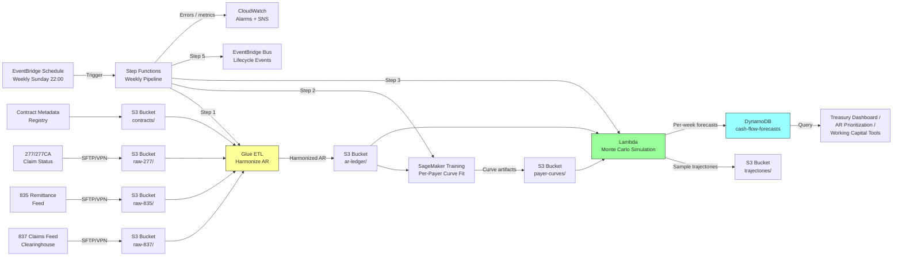

# Recipe 12.6: Revenue Cycle Cash Flow Forecasting (Architecture and Implementation)

> **This is the architecture companion to [Recipe 12.6: Revenue Cycle Cash Flow Forecasting](chapter12.06-revenue-cycle-cash-flow-forecasting).** Start there for the problem statement, underlying technology, and vendor-agnostic architecture pattern.

---

## Why These Services

**Amazon S3 for raw feeds, harmonized data, curve artifacts, and forecast outputs.** Raw 837 claim files, raw 835 remittance files, 277/277CA claim-status feeds, and contract metadata all land in S3 first. Separate prefixes for each data class: raw-837, raw-835, harmonized AR ledger, per-payer curve artifacts, per-claim sample trajectories, weekly forecast outputs, and model artifacts. All prefixes encrypted with customer-managed KMS keys (one key per data class for blast-radius isolation). S3 is the canonical durable store that everything reads from and writes to; it decouples each pipeline stage and makes reruns idempotent.

**AWS Glue for AR ingestion and harmonization (Stage 1).** The unglamorous but critical work of reconciling 835 remittance records against 837 claim submissions, normalizing payer identifiers to the contract level, joining against the contract-effective-date registry, and producing the harmonized AR ledger. Glue runs as a nightly PySpark job that reads new 835 files, updates the harmonized AR ledger partitioned by payer and submission month, and handles the data-quality checks that catch clearinghouse formatting drift. The Glue service role has scoped read access to the raw prefixes and write access to the harmonized prefix, with no DynamoDB or SageMaker permissions.

**Amazon SageMaker for per-payer curve fitting (Stage 2).** The weekly survival-curve training job reads the harmonized AR ledger, fits per-payer payment-time distributions (Kaplan-Meier for simple per-payer curves, Cox proportional-hazards or gradient-boosted survival when claim-level features matter, DeepAR for hierarchical multi-payer forecasts on small-volume payers), serializes curve artifacts to S3, and registers new model versions in the SageMaker Model Registry. Promotion is gated on backtest comparison: a candidate must beat the champion on calibration metrics (mean error, MAPE, prediction-interval coverage) on held-out historical weeks. Training runs in private VPC subnets with VPC endpoints to S3, KMS, and CloudWatch Logs.

**AWS Lambda for Monte Carlo simulation (Stage 3).** The per-claim Monte Carlo simulation samples N payment-date draws per open claim from the fitted curves. For a typical 80,000-claim AR ledger with 1,000 samples, this runs in under five minutes on a Lambda with 3GB of memory. For larger health systems, AWS Batch or EMR Serverless replaces Lambda. The simulation Lambda has read access to the curve artifacts and the harmonized AR ledger, plus write access to the sample-trajectory prefix and the DynamoDB forecast table. No raw-claim permissions.

**AWS Step Functions for weekly orchestration.** The weekly pipeline cycle (harmonize, fit curves, simulate, aggregate, deliver) is a Step Functions state machine with explicit Retry and Catch blocks for transient failures, a Parallel state for concurrent per-payer fitting, and an overall execution timeout. The state machine emits ExecutionFailed events to CloudWatch so on-call gets paged when the pipeline fails before the Monday treasury meeting.

**Amazon DynamoDB for forecast serving.** The per-week, per-payer forecast records land in DynamoDB for single-digit-millisecond lookup by the treasury dashboard and AR prioritization tools. Partition key is `forecast_week` (type S), sort key is `payer_id` (type S). Encryption at rest with customer-managed key, point-in-time recovery enabled, on-demand billing for the bursty Monday-morning query pattern.

**Amazon EventBridge for scheduling and lifecycle events.** An EventBridge schedule triggers the Step Functions state machine weekly (Sunday 22:00 UTC, customizable). The pipeline also emits lifecycle events (run started, curves fit, simulation completed, forecast written, drift alarm raised) to a dedicated event bus so downstream consumers (dashboards, alerting, audit trail) can react.

**Amazon CloudWatch for monitoring.** Metrics: per-payer forecast-vs-actual variance, pipeline runtime per stage, DynamoDB write throttling, SageMaker training success rate, AR aging bucket shifts, and the prediction-interval coverage rate (did actuals land within P10-P90?). Alarms fire when forecast spread exceeds calibrated tolerance, when pipeline execution exceeds the SLA window, or when per-payer variance indicates curve drift.

---

## Architecture Diagram



---

## Prerequisites

| Requirement | Details |
|-------------|---------|
| **AWS Services** | Amazon S3, AWS Glue, Amazon SageMaker, AWS Lambda, AWS Step Functions, Amazon DynamoDB, Amazon EventBridge, AWS KMS, Amazon CloudWatch, AWS Secrets Manager |
| **IAM Permissions** | `s3:GetObject`, `s3:PutObject` (scoped to specific prefixes per stage), `glue:StartJobRun`, `glue:GetJobRun`, `sagemaker:CreateTrainingJob`, `sagemaker:DescribeTrainingJob`, `lambda:InvokeFunction`, `dynamodb:BatchWriteItem`, `dynamodb:Query`, `dynamodb:PutItem`, `states:StartExecution`, `events:PutEvents`, `cloudwatch:PutMetricData`, `kms:Decrypt`, `kms:GenerateDataKey`, `secretsmanager:GetSecretValue` (per-Lambda scoped) |
| **BAA** | AWS BAA signed. Revenue-cycle data is PHI by association: 837/835/277/277CA carry patient identifiers, service dates, diagnosis codes, procedure codes. Even aggregated forecasts derived from claim-level joins retain PHI upstream. BAA coverage also required for clearinghouse vendors (Change Healthcare/Availity/Waystar/Optum/Experian Health), payer-portal vendors, and denial-management vendors. |
| **Encryption** | S3: SSE-KMS with customer-managed CMKs split by data class (raw 837/835/277, harmonized AR ledger, curve artifacts, sample trajectories, forecast outputs, model artifacts). DynamoDB: encryption at rest with customer-managed CMK. SageMaker: encrypted EBS volumes and KMS-encrypted output. CloudWatch log groups: explicit KMS encryption. Secrets Manager: KMS encryption for clearinghouse credentials with automatic rotation. TLS 1.2 minimum at every boundary. |
| **VPC** | Private subnets for all compute (Glue, SageMaker, Lambda). VPC endpoints for S3 (gateway), KMS, DynamoDB (gateway), SageMaker, Lambda, Step Functions, EventBridge, CloudWatch Logs, Secrets Manager. Restrictive egress (no public internet). Dedicated VPN or SFTP-over-IPSec to the clearinghouse for 837/835/277 file transfer. No public endpoints. |
| **CloudTrail** | Data events on all PHI-bearing S3 prefixes and the DynamoDB forecast table. Management events for SageMaker, Glue, Step Functions, EventBridge, Lambda, DynamoDB, and KMS. CloudTrail logs in a dedicated bucket with Object Lock in compliance mode. |
| **Sample Data** | Synthetic AR ledgers generated by the Python companion's demo. [CMS Public Use Files](https://www.cms.gov/data-research/statistics-trends-and-reports/medicare-claims-synthetic-public-use-files) provide de-identified claim-level structure for development. [X12 837/835 transaction set documentation](https://x12.org/products/transaction-sets) defines the upstream data formats. Never use real PHI in dev. |
| **Cost Estimate** | ~$500-$2,000/month per hospital, scaling with AR ledger size and payer count. S3 storage + Glue ETL: ~$80-$200/month. SageMaker weekly training: ~$50-$150/month. Lambda simulation: ~$30-$100/month. DynamoDB: ~$30-$80/month. Step Functions + EventBridge + CloudWatch: ~$20-$50/month. KMS + Secrets Manager: ~$10-$30/month. Multi-hospital systems scale linearly with claim volume. |

---

## Ingredients

| AWS Service | Role |
|------------|------|
| **Amazon S3** | Durable store for raw 837/835/277 feeds, harmonized AR ledger, per-payer curve artifacts, Monte Carlo sample trajectories, weekly forecast outputs, and model artifacts. Partitioned by data class and encrypted per-prefix with customer-managed KMS keys. |
| **AWS Glue** | Nightly PySpark ETL that reconciles 835 remittance records against 837 claim submissions, normalizes payer identifiers, joins contract metadata, and produces the harmonized AR ledger. |
| **Amazon SageMaker** | Weekly training jobs that fit per-payer payment-time survival distributions (Kaplan-Meier, Cox, or DeepAR) with right-censoring for open claims. Model Registry gates promotion on backtest metrics. |
| **AWS Lambda** | Runs the per-claim Monte Carlo simulation: N payment-date samples per open claim from the fitted curves, composed into per-week trajectories. Scales with AR ledger size. |
| **AWS Step Functions** | Orchestrates the weekly cycle (harmonize, fit, simulate, aggregate, deliver) with Retry/Catch blocks and execution timeout. |
| **Amazon DynamoDB** | Serves per-week, per-payer forecast records (P10, P50, P90) to the treasury dashboard and AR prioritization tools at low latency. |
| **Amazon EventBridge** | Weekly schedule trigger plus lifecycle event bus for pipeline observability. |
| **AWS KMS** | Customer-managed keys per data class. Separate keys for raw PHI, harmonized data, model artifacts, and forecast outputs. |
| **Amazon CloudWatch** | Logs, metrics, alarms for pipeline health, forecast accuracy, curve drift, and AR aging shifts. |
| **AWS Secrets Manager** | Stores clearinghouse SFTP credentials with automatic rotation, KMS encryption, and per-Lambda scoped access. |

---

## Pseudocode Walkthrough

> **Curious how this looks in Python?** The pseudocode above covers the concepts. If you'd like to see sample Python code that demonstrates these patterns using boto3, check out the [Python Example](chapter12.06-python-example). It walks through each step with inline comments and notes on what you'd need to change for a real deployment.

### Step 1: Ingest and Harmonize the AR Ledger

The pipeline starts by consuming the raw revenue-cycle feeds and producing a canonical AR ledger. Skip this step and you fit curves on misaligned data (payer A's claims mixed with payer B's because the clearinghouse coded them identically).

```pseudocode
FUNCTION harmonize_ar_ledger(raw_835_prefix, raw_837_prefix,
                             contract_registry, as_of_date):
    // Read new 835 remittance files since last run.
    new_remits = read_new_files(raw_835_prefix, since=last_run_ts)

    // For each remittance record, reconcile against the original
    // 837 claim submission to get the full picture: billed amount,
    // allowed amount, denial flag, adjustment reason codes.
    FOR each remit IN new_remits:
        claim = lookup_original_837(remit.claim_id, raw_837_prefix)
        payer_contract = resolve_payer_contract(
            remit.payer_id, claim.service_date, contract_registry)

        canonical_record = {
            claim_id:              claim.id,
            payer_id:              payer_contract.canonical_id,
            payer_class:           payer_contract.class,
            contract_effective:    payer_contract.effective_date,
            submitted_date:        claim.submitted_ts,
            service_date:          claim.service_date,
            billed_amount:         claim.billed_amount,
            expected_allowed:      payer_contract.expected_allowed(claim),
            payment_received_ts:   remit.payment_ts OR NULL,
            denial_flag:           remit.is_denied,
            denial_reason_code:    remit.reason_code OR NULL,
        }
        upsert_to_ar_ledger(canonical_record)

    RETURN count_of_new_records
```

### Step 2: Fit Per-Payer Payment-Time Curves

For each payer-contract combination, fit a survival curve on the historical payment-lag data. Skip this step and you sample from a stale curve that does not reflect the payer's current payment behavior.

```pseudocode
FUNCTION fit_payer_curves(ar_ledger, contract_registry, as_of_date):
    curves = {}
    FOR each payer IN distinct_payers(ar_ledger):
        contract = get_active_contract(payer, contract_registry)

        // Only train on data after the contract took effect.
        // Otherwise the curve averages pre- and post-contract behavior.
        training_window_start = contract.effective_date
        training_window_end   = as_of_date

        // Collect (duration, event) pairs for the survival estimator.
        // duration = days from submission to payment (for paid claims)
        //          = days from submission to as_of_date (for open claims)
        // event    = 1 if paid, 0 if still open (right-censored)
        durations, events = extract_survival_pairs(
            ar_ledger, payer,
            window_start=training_window_start,
            window_end=training_window_end)

        curve = fit_kaplan_meier(durations, events,
                                smooth_bandwidth=3)

        // Divergence check: compare curve median to the live
        // median from the last 30 days. Alert if drift > 2 days.
        live_median = compute_live_median(ar_ledger, payer, last_30_days)
        IF abs(curve.median - live_median) > 2:
            emit_drift_alert(payer, curve.median, live_median)

        curves[payer] = curve

    RETURN curves
```

### Step 3: Monte Carlo Per-Claim Simulation

For every open claim, sample N payment dates from the payer's curve. Seasonality is applied per sample. Skip this step and you have curves but no forecast.

```pseudocode
FUNCTION simulate_cash_flow(open_ar, curves, n_samples=1000,
                            horizon_weeks=13, as_of_date):
    // per_week_samples[(payer, week_idx)] = list of N totals
    per_week_samples = defaultdict(list_of_N_zeros)

    FOR each claim IN open_ar:
        curve = curves[claim.payer_id]
        IF curve IS NULL:
            log_warning("No curve for payer; claim skipped")
            CONTINUE

        FOR sample_idx IN range(n_samples):
            // Sample a payment day from the payer's survival curve.
            // The curve absorbs the denial-and-recovery cohort by
            // construction; no separate denial branch needed here.
            sampled_day = curve.sample_payment_day(
                max_days=horizon_weeks * 7)
            IF sampled_day IS NULL:
                CONTINUE  // claim does not pay within horizon

            pay_date = as_of_date + sampled_day
            week_idx = (pay_date - as_of_date).days / 7

            // Apply seasonality multiplier for that week.
            seasonal = seasonality_factor(week_of_year(pay_date))
            amount   = claim.expected_allowed * random(0.88, 1.0)

            per_week_samples[(claim.payer_id, week_idx)][sample_idx]
                += amount * seasonal

    RETURN per_week_samples
```

### Step 4: Aggregate to Per-Week Percentile Forecasts

Take the N per-claim per-week trajectories and compute percentiles. Skip this step and you have raw samples with no usable summary for the finance team.

```pseudocode
FUNCTION aggregate_forecasts(per_week_samples, horizon_weeks, as_of_date):
    forecasts = []

    // Per-payer, per-week percentiles.
    FOR each (payer, week_idx) IN per_week_samples:
        samples = per_week_samples[(payer, week_idx)]
        forecasts.append({
            forecast_week: as_of_date + (week_idx * 7),
            payer_id:      payer,
            p10:           percentile(samples, 10),
            p50:           percentile(samples, 50),
            p90:           percentile(samples, 90),
            expected:      mean(samples),
        })

    // All-payer rollup: sample-wise summing preserves correlation.
    FOR week_idx IN range(horizon_weeks):
        all_payer_samples = zeros(n_samples)
        FOR each payer IN distinct_payers:
            payer_samples = per_week_samples[(payer, week_idx)]
            all_payer_samples += payer_samples  // element-wise
        forecasts.append({
            forecast_week: as_of_date + (week_idx * 7),
            payer_id:      "ALL_PAYERS",
            p10:           percentile(all_payer_samples, 10),
            p50:           percentile(all_payer_samples, 50),
            p90:           percentile(all_payer_samples, 90),
            expected:      mean(all_payer_samples),
        })

    RETURN forecasts
```

### Step 5: Deliver Forecasts and Backtest

Load the forecasts to the serving store and compare against last week's actuals. Skip this step and the forecast exists in S3 but nobody can query it, and nobody knows when it is wrong.

```pseudocode
FUNCTION deliver_and_backtest(forecasts, sample_trajectories,
                              actuals_last_week, as_of_date):
    // Write per-week forecasts to DynamoDB for dashboard queries.
    batch_write_to_dynamodb(forecasts, table=FORECAST_TABLE)

    // Write sample trajectories to S3 for variance analysis.
    write_to_s3(sample_trajectories,
                prefix=TRAJECTORY_PREFIX,
                partition_key=as_of_date)

    // Backtest: compare last week's forecast against realized cash.
    IF actuals_last_week IS NOT NULL:
        last_week_forecast = query_dynamodb(
            forecast_week=last_week, table=FORECAST_TABLE)
        accuracy = compute_accuracy(last_week_forecast, actuals_last_week)
        emit_metric("ForecastAccuracy", accuracy.mape)
        emit_metric("IntervalCoverage", accuracy.in_band_rate)

        // Per-payer stratified accuracy for drift detection.
        FOR each payer IN actuals_last_week:
            payer_accuracy = compute_payer_accuracy(
                last_week_forecast, actuals_last_week, payer)
            emit_metric("PayerAccuracy", payer_accuracy.mape,
                        dimensions={payer: payer})

    // Emit lifecycle event for downstream consumers.
    emit_event("ForecastDelivered", {
        forecast_week: as_of_date,
        payer_count:   count_distinct_payers(forecasts),
        claim_count:   len(open_ar),
    })
```

---

## Expected Results

A typical weekly run for a 380-bed community hospital with 75,000 open claims across five payer classes produces output like:

```json
{
  "forecast_week": "2026-06-22",
  "payer_id": "ALL_PAYERS",
  "expected_cash": 4127340.50,
  "p10_cash": 3412890.25,
  "p50_cash": 4098210.00,
  "p90_cash": 4721560.75,
  "sample_count": 1000,
  "pipeline_version": "cash-flow-v1.3",
  "generated_at": "2026-06-21T22:34:12Z"
}
```

| Metric | Typical Value |
|--------|--------------|
| Pipeline runtime (end-to-end) | 15-35 minutes |
| Glue harmonization | 5-12 minutes |
| SageMaker curve fitting (5 payers) | 3-8 minutes |
| Lambda Monte Carlo (75K claims, 1K samples) | 3-6 minutes |
| DynamoDB write (78 forecast records) | < 2 seconds |
| Forecast accuracy (MAPE, all-payer) | 6-12% at 1-week horizon |
| Prediction-interval coverage (P10-P90) | 78-85% of weeks |

**Where it struggles:** Weeks with clearinghouse disruptions, payer-system outages, or sudden denial-rate spikes produce realized cash that falls outside the prediction interval. The model knows what it knows (the current AR ledger and the historical curves) but cannot anticipate exogenous disruptions that have not yet manifested in the data.

---

## Why This Isn't Production-Ready

**Clearinghouse outage detection.** The pipeline has no explicit "clearinghouse health" input. When a clearinghouse goes down (the Change Healthcare scenario), payment batches are delayed but the model still expects them on their historical schedule. Production needs an external signal (API health check, file-arrival cadence monitoring, or manual operator toggle) that shifts the payer curves when the intermediary is disrupted.

**Contract-version drift.** The demo carries a single contract effective date per payer. Production tracks contract changes at the plan level, triggers re-fits when a new contract takes effect, and surfaces elevated uncertainty during the transition period when the new curve has limited training data.

**Self-pay tail mis-estimation.** The demo treats self-pay as another payer with a wider distribution. Production models self-pay separately with a dedicated survival curve conditioned on statement-cycle, payment-plan enrollment, and prior-payment history. Without this, the 26-to-52-week forecast systematically over-estimates patient-responsibility collections.

**Denial-reason-code distribution shifts.** When a payer changes its edit rules or a new pre-authorization requirement takes effect, the denial-reason-code distribution shifts. The headline denial rate might stay flat while the composition changes (fewer eligibility denials, more medical-necessity denials, which have different appeal timelines). The demo does not decompose denials by reason code.

**Per-Lambda IAM scoping.** The Python companion flags this explicitly: each Lambda in the production pipeline needs its own IAM role scoped to the specific S3 prefixes and DynamoDB tables it touches. The demo runs everything in-process with a single credential set. A serious IAM review would fail this immediately.

---

## Variations and Extensions

**Joint multi-entity forecasting.** For health systems with multiple hospitals, fit a hierarchical model (SageMaker DeepAR or a hierarchical Kaplan-Meier) that shares strength across entities. Small facilities with low claim volume for specific payers benefit from borrowing the payment-curve shape from larger sibling facilities. The system-level cash-flow forecast then aggregates across entities with correlated uncertainty (they share payers, so a payer delay hits all facilities simultaneously).

**Denial-prevention feedback loop.** Use claim-level features to predict denial probability before submission. Feed the predicted denial rate into the cash-flow forecast as a forward-looking adjustment: claims with high denial probability contribute less expected cash in the near term and more in the appeal-recovery window. This couples the forecasting pipeline with the pre-submission edit-check system and produces forecasts that react to claim-quality changes before the denials actually arrive.

**Payer-contract-renewal scenario modeling.** When a major contract is up for renewal, the finance team wants to know: "If the new contract shifts the fee schedule by -5% and extends the payment timeline by 4 days, what does our quarterly cash flow look like?" Expose the curve parameters as adjustable inputs and run the Monte Carlo simulation under the proposed contract terms. This turns the forecast into a scenario-planning tool, not just a prediction tool.

---

## Additional Resources

### AWS Documentation

- [AWS HIPAA Eligible Services](https://aws.amazon.com/compliance/hipaa-eligible-services-reference/): Authoritative list of services that can be used under a BAA for PHI workloads. All services in this recipe (S3, Glue, SageMaker, Lambda, Step Functions, DynamoDB, EventBridge, CloudWatch, KMS, Secrets Manager) are on this list.
- [Architecting for HIPAA Security and Compliance on AWS](https://docs.aws.amazon.com/whitepapers/latest/architecting-hipaa-security-and-compliance-on-aws/welcome.html): Reference architecture for PHI handling patterns used throughout this recipe.
- [Amazon SageMaker DeepAR Forecasting Algorithm](https://docs.aws.amazon.com/sagemaker/latest/dg/deepar.html): Hierarchical multi-payer forecasting that shares strength across small-volume payers.
- [AWS Step Functions Developer Guide](https://docs.aws.amazon.com/step-functions/latest/dg/welcome.html): Orchestration with Retry, Catch, and Parallel states for the weekly pipeline.
- [Amazon DynamoDB Developer Guide](https://docs.aws.amazon.com/amazondynamodb/latest/developerguide/Introduction.html): Low-latency serving for the treasury dashboard.
- [AWS Glue Developer Guide](https://docs.aws.amazon.com/glue/latest/dg/what-is-glue.html): ETL for 837/835 ingestion and AR harmonization.

### External Resources

- [lifelines (Python survival analysis library)](https://lifelines.readthedocs.io/): Production-grade Kaplan-Meier, Cox proportional-hazards, and competing-risks models.
- [scikit-survival](https://scikit-survival.readthedocs.io/): Gradient-boosted survival models for claim-level feature conditioning.
- [X12 837/835 Transaction Set Standards](https://x12.org/products/transaction-sets): Specifications for the claim and remittance transactions that feed the pipeline.
- [HFMA (Healthcare Financial Management Association)](https://www.hfma.org/): Industry benchmarks for revenue-cycle metrics (DSO, denial rates, collection rates).
- [Forecasting: Principles and Practice (Hyndman & Athanasopoulos)](https://otexts.com/fpp3/): Free online textbook covering hierarchical forecasting and prediction intervals.

*Note: AWS documentation and blog links should be re-verified close to publication. X12, lifelines, scikit-survival, HFMA, and OTexts links are stable.*

---

## Estimated Implementation Time

| Tier | Scope | Timeline |
|------|-------|----------|
| **Basic** | Single-payer proof of concept. One payer, simplified harmonization (single clearinghouse feed), KM curve fitting, Monte Carlo simulation, DynamoDB output. No contract versioning, no backtest loop, no production IAM scoping. | 3-4 weeks |
| **Production-ready** | Full payer catalog, contract-version awareness, per-payer drift alerts, backtest loop with accuracy scorecard, production IAM (per-Lambda roles), KMS encryption per data class, VPC endpoints, CloudTrail data events, EventBridge lifecycle events, CloudWatch dashboards and alarms. | 10-14 weeks |
| **With variations** | Add hierarchical multi-entity forecasting (DeepAR), denial-prevention feedback loop, payer-contract-renewal scenario modeling, dedicated self-pay sub-model, and real-time intra-week refresh on 835 file arrival. | 16-22 weeks |

---

*← [Main Recipe: Revenue Cycle Cash Flow Forecasting](chapter12.06-revenue-cycle-cash-flow-forecasting) · [Python Example](chapter12.06-python-example) · [Chapter 12 Index](chapter12-preface)*
