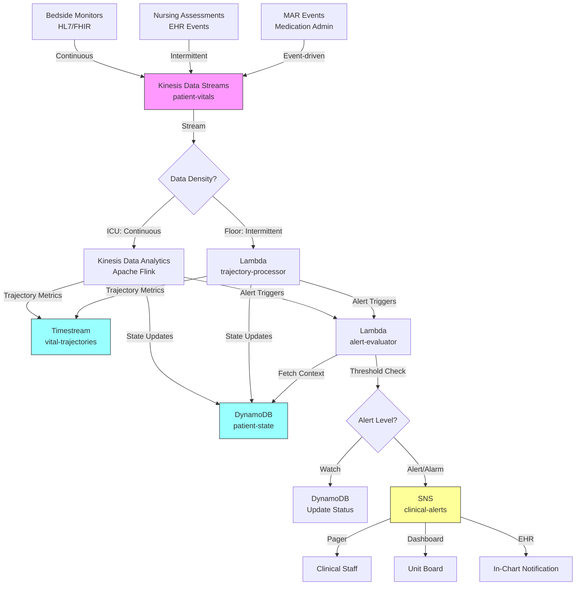

# Recipe 12.7: Vital Sign Trajectory Monitoring

**Complexity:** Medium-Complex · **Phase:** Clinical Integration · **Estimated Cost:** ~$0.15-0.40 per patient-hour (streaming)

---

## The Problem

A patient's heart rate has been creeping up by 3-4 beats per minute every hour for the last six hours. Their blood pressure is trending downward, slowly but consistently. Neither value has crossed any threshold. Neither has triggered a single alarm. The nurse checks vitals every four hours, glances at the numbers, sees "within normal limits," and moves on.

Six hours later, the patient is coding.

This is the trajectory problem. Clinical deterioration rarely announces itself with a single abnormal reading. It whispers through gradual trends, subtle slope changes, and coordinated shifts across multiple parameters that individually look unremarkable. The Modified Early Warning Score (MEWS) and National Early Warning Score (NEWS) attempt to capture this by combining single-point-in-time measurements into a composite score. But they're snapshots. They tell you "right now this patient scores a 4." They don't tell you "this patient scored a 2 yesterday, a 3 this morning, and a 4 now, and that trajectory has a very specific signature we've seen before."

The human body doesn't deteriorate in step functions. It deteriorates in curves. And the shape of that curve carries more information than any single point on it.

In ICU settings, studies have documented that clinical deterioration is often identifiable 6 to 12 hours before a rapid response event when you look at trajectory rather than threshold. On general medical floors, the gap is even larger because monitoring is less frequent and the staff-to-patient ratio is worse. The Institute for Healthcare Improvement has highlighted that failure to recognize and respond to clinical deterioration remains one of the most common causes of preventable inpatient deaths.

The technology to watch these trajectories continuously exists. It's a time series problem. But a time series problem with some very specific constraints that make it meaningfully different from, say, predicting tomorrow's stock price.

---

## The Technology: Time Series Trajectory Analysis for Physiological Signals

### What We Mean by "Trajectory"

A vital sign trajectory is the shape of a patient's vital sign measurements over time. Not just the current value, not just whether it's above or below a threshold, but the pattern of change: the slope, the acceleration, the variability, the correlations between different parameters.

Think of it this way. If heart rate is 95, that's information. If heart rate was 72 yesterday and is 95 now, that's more information. If heart rate has been climbing steadily at 3 bpm per hour for the last eight hours while blood pressure has been declining at 2 mmHg per hour, that's a story. And it's a story that experienced clinicians recognize as a sepsis signature even before either value crosses a traditional alarm threshold.

Trajectory monitoring captures that story computationally.

### The Building Blocks

**Patient-specific baselines.** The most critical concept in vital sign trajectory monitoring is that "normal" is different for every patient. A resting heart rate of 90 might be alarming for an athletic 25-year-old. It might be completely unremarkable for a 70-year-old with chronic heart failure who's been running at 88-92 for the last three days. Any trajectory system that uses population-based norms exclusively will drown you in false alerts. You need to establish each patient's individual baseline from their own recent history, then measure deviation from their normal, not from some textbook number.

**Trend decomposition.** Raw vital sign data is noisy. A blood pressure reading bounces around even in stable patients due to measurement variability, patient movement, cuff positioning, and a dozen other sources of non-clinical variation. Effective trajectory systems decompose the signal into components: the underlying trend (slowly moving baseline), periodic components (circadian rhythm, medication cycles), and residual noise. The trend component is what you're watching for deterioration. The residual is what you're trying to ignore.

**Slope estimation.** Once you have a denoised trend, you're computing the rate of change (first derivative) and the acceleration of change (second derivative). A patient whose heart rate slope has been zero and suddenly becomes positive is more concerning than a patient whose heart rate has always had a slight upward drift. Second-derivative changes (the slope is steepening) are particularly interesting because they suggest the clinical process is accelerating.

**Multi-variate correlation.** Vital signs don't move independently. The body's compensatory mechanisms create predictable correlations. Early sepsis, for example, often shows rising heart rate and rising respiratory rate before blood pressure drops. Heart failure decompensation shows a specific pattern of weight gain, oxygen saturation decline, and heart rate increase. Tracking coordinated movement across multiple parameters increases sensitivity and specificity compared to monitoring each parameter in isolation.

**Changepoint detection.** Sometimes the trajectory doesn't gradually drift. It shifts. A patient's baseline blood pressure was 120/80 for three days, and now it's 105/70. That's a level shift, not a trend. Changepoint detection algorithms identify these abrupt changes in the statistical properties of the time series. In clinical contexts, a changepoint often represents a new clinical state: the onset of bleeding, a medication taking effect, or a physiological compensation mechanism engaging.

### Why This Is Hard

Let me be straight about the failure modes, because this is one of those problems where the engineering isn't the hard part. The clinical integration is.

**Alert fatigue.** This is the existential threat to any monitoring system. Nurses on a typical medical-surgical floor already dismiss 85-95% of physiological alarms as clinically irrelevant (this statistic has been reproduced across multiple studies). If your trajectory system adds another layer of alerts that are mostly noise, clinical staff will ignore it within a week. You have to be specific enough to matter. A system that fires 50 trajectory alerts per shift and 2 of them are clinically significant is a failed system, even though those 2 were genuinely important. The signal-to-noise ratio is everything.

**Artifact vs. real change.** Patient moves in bed, blood pressure cuff auto-inflates and gets a bad read, pulse oximeter probe slips off a finger for 30 seconds. These all look like acute changes in the raw data. Your system needs to distinguish between physiological reality and measurement artifact. This is harder than it sounds. A sudden SpO2 drop from 97% to 82% could be a probe coming loose (common, harmless) or acute desaturation (rare, life-threatening). Context matters: did it recover within 30 seconds? Did other parameters move simultaneously? Is this a known motion-artifact pattern?

**Medication effects.** A patient receives a beta-blocker, and their heart rate drops 15 bpm over the next hour. That's not deterioration; that's the drug working. Your trajectory system needs to be aware of medication administration events, or it will generate alerts for every expected pharmacological response. This means integrating with the medication administration record (MAR), which means your "simple" time series system now depends on a clinical data interface that's anything but simple.

**Intermittent vs. continuous data.** In an ICU with continuous bedside monitoring, you might get a heart rate reading every second. On a general medical floor, you get vital signs every four hours (or every 8, depending on acuity). Trajectory estimation from 4-hour intervals is fundamentally different from trajectory estimation from continuous data. You're interpolating between sparse points with much wider confidence intervals. A system designed for ICU-density data will not work on floor-density data without significant architectural changes.

**Clinical actionability.** "This patient's trajectory is concerning" is not actionable. Clinical staff need specificity: What parameters are moving? In what direction? How does this compare to known deterioration signatures? What's the recommended response? A vague "patient score increasing" notification is worse than useless because it interrupts workflow without guiding action.

### The State of the Art

Early warning scores (MEWS, NEWS, NEWS2) are the current clinical standard for detecting deterioration. They work by assigning point values to individual vital sign readings based on how far they deviate from normal ranges, then summing the points. They've been validated extensively and do improve outcomes when implemented with appropriate escalation protocols.

Where they fall short is exactly the trajectory problem. NEWS evaluates a single point in time. A patient could have a NEWS score of 3 at two consecutive measurements (safe enough that no escalation is triggered), while the trajectory from measurement to measurement represents a clinically significant deterioration that a more sophisticated analysis would catch.

Research systems have demonstrated that adding trend features (slopes, changes from prior readings, trajectory statistics) to early warning models improves the prediction of rapid response events compared to snapshot-only models, though the magnitude varies by patient population and event definition. Churpek et al. and similar deterioration prediction research consistently show meaningful gains when trajectory is incorporated.

The challenge isn't building the model. It's deploying it in a way that clinical staff trust, that integrates into workflow, and that doesn't make the alert fatigue problem worse.

### General Architecture Pattern

```text
[Vital Sign Sources] → [Ingestion / Streaming] → [Patient State Engine] → [Trajectory Analysis] → [Alert Logic] → [Clinical Display]
```

**Vital Sign Sources.** Bedside monitors (continuous), nurse-documented observations (intermittent), wearable devices (variable frequency), medication administration records (event-driven). Different sources have different reliability characteristics and different latencies. The architecture must handle heterogeneous input frequencies.

**Ingestion / Streaming.** A streaming layer that can receive high-frequency data (continuous monitors), low-frequency data (nursing assessments), and event data (medication administration) into a unified patient timeline. Must handle late-arriving data, out-of-order events, and corrections.

**Patient State Engine.** Maintains a rolling model of each patient's current physiological state: their recent baselines, their expected ranges, their current trend components. This is stateful computation: you need to remember what "normal" looks like for this specific patient over the last 24-72 hours. The state engine must handle patient admission (no baseline yet), transfers (new context), and post-procedure periods (expected disruption).

**Trajectory Analysis.** Computes trend statistics from the patient state: slope of each vital sign, cross-parameter correlations, deviation from baseline, changepoints. This is where the actual math lives. The output is a set of trajectory features that describe the shape of the patient's recent physiological history.

**Alert Logic.** Translates trajectory features into clinical decisions: suppress (normal variation), watch (mild concern, increase monitoring), alert (escalate to nursing), alarm (immediate clinical attention needed). The alert logic must be tunable per unit, per acuity level, and ideally per patient population. A cardiac step-down unit has very different alert thresholds than a post-surgical floor.

**Clinical Display.** The trajectory information reaches the clinical team through some interface: a dashboard, an in-EHR notification, a pager alert, a change to the patient's displayed status on the unit board. The display must show what's happening, why the system flagged it, and what the recommended next step is. Pure numbers without context will be ignored.

---

## The AWS Implementation

### Why These Services

**Amazon Kinesis Data Streams for vital sign ingestion.** Vital sign data from bedside monitors and nursing assessments arrives continuously and needs to be processed with low latency. Kinesis Data Streams provides the durable, ordered, scalable streaming layer that can handle thousands of data points per second across hundreds of patients. Each patient gets a partition key, ensuring their readings are processed in order. The 24-hour (extendable to 365 days) retention means you can reprocess data if your analysis logic changes.

**AWS Lambda for event-driven trajectory computation.** Each new vital sign reading triggers a trajectory update for that patient. Lambda handles the burst pattern well: quiet at 3am, heavy at shift-change assessment times. For floor patients with intermittent vitals, the invocation pattern is naturally sparse and Lambda's per-invocation pricing makes sense. For continuous monitoring scenarios with higher throughput, Kinesis Data Analytics (Apache Flink) is the alternative.

**Amazon Kinesis Data Analytics (Apache Flink) for continuous stream processing.** For ICU-level continuous monitoring, the stream processing needs stateful windowed computations: rolling averages, slope estimates, cross-parameter correlations computed over sliding windows. Apache Flink (managed via Kinesis Data Analytics) handles stateful stream processing with exactly-once semantics. It maintains per-patient state without external database calls on every event.

**Amazon DynamoDB for patient state storage.** Each patient's rolling baseline, current trajectory metrics, and alert history need to live in a low-latency store that can handle high write throughput. DynamoDB's single-digit millisecond reads and writes make it suitable for the stateful computations that reference and update patient state on every new reading. TTL support automatically ages out data for discharged patients.

<!-- TODO (TechWriter): Expert review M6 (MEDIUM). Add ADT event listener description: on discharge, immediately delete patient state (don't rely on TTL); on admission, initialize fresh state with baseline_stable=false; on transfer, preserve state but update unit context for alert routing. -->

**Amazon Timestream for historical trajectory storage.** The full history of vital sign readings and computed trajectory metrics goes into a time series database optimized for temporal queries. Timestream handles the time-based retention tiers (hot data for recent trajectories, cold data for research and retrospective analysis) and supports the temporal query patterns (give me this patient's heart rate slope over the last 12 hours) natively.

**Amazon SNS for alert routing.** When trajectory analysis produces an alert, it needs to reach the right person through the right channel. SNS handles fan-out to multiple subscribers: pager, EHR notification, nursing station dashboard, charge nurse summary. Topic-based routing allows different alert severities to reach different endpoints. All subscription endpoints (pager API, dashboard webhook, EHR integration) must be covered under your organization's BAA chain. An alert containing vital signs and patient identifiers is PHI regardless of the delivery channel.

<!-- TODO (TechWriter): Expert review M7 (MEDIUM). Add note: if alert delivery targets external endpoints (pager vendor API), configure a NAT gateway in a controlled subnet with outbound security group rules limited to vendor IP ranges. Prefer VPC-internal integrations (PrivateLink) to avoid PHI egress to the public internet. -->

**Amazon CloudWatch for system health monitoring.** You're building a clinical safety system. You need to know immediately if the pipeline falls behind, if Lambda errors spike, if Kinesis is throttling, or if alert delivery latency exceeds acceptable bounds. CloudWatch alarms on processing latency, error rates, and alert delivery confirmation close the operational monitoring loop.

### Architecture Diagram



The routing decision is implicit in the data source: continuous monitor feeds (sub-second frequency) route to the Flink application; EHR-documented assessments (multi-hour frequency) route to Lambda. A patient transferred to the ICU starts producing continuous data immediately, and the Flink path activates without manual intervention. Both paths write to the same patient state store, so trajectory history is preserved across transitions.

<!-- TODO (TechWriter): Expert review H2 (HIGH). Add dead-letter queue (SQS) on both Lambda functions and a side-output on the Flink application for failed events. Add CloudWatch alarms on DLQ depth > 0. In a clinical safety system, a silently dropped reading is a patient safety risk. Add brief prose and update the architecture diagram to include DLQ. -->

### Prerequisites

| Requirement | Details |
|-------------|---------|
| **AWS Services** | Amazon Kinesis Data Streams, Kinesis Data Analytics (Flink), AWS Lambda, Amazon DynamoDB, Amazon Timestream, Amazon SNS, Amazon CloudWatch |
| **IAM Permissions** | Runtime role: `kinesis:PutRecord`, `kinesis:GetRecords`, `kinesisanalytics:DescribeApplication`, `lambda:InvokeFunction`, `dynamodb:GetItem`, `dynamodb:PutItem`, `dynamodb:UpdateItem`, `timestream:WriteRecords`, `timestream:Select`, `sns:Publish`. Deployment role (separate, CI/CD only): `kinesisanalytics:CreateApplication`, `kinesisanalytics:UpdateApplication`, `kinesisanalytics:StartApplication`, `kinesisanalytics:StopApplication`. |
| **BAA** | AWS BAA signed (vital signs are PHI; all services must be HIPAA-eligible) |
| **Encryption** | Kinesis: server-side encryption with KMS; DynamoDB: encryption at rest (default); Timestream: encryption at rest (default); SNS: SSE-KMS encrypted topics (CMK), all subscribers must be BAA-covered endpoints; all transit over TLS |
| **VPC** | Production: Flink application and Lambda in VPC with VPC endpoints for DynamoDB, Timestream, SNS, CloudWatch Logs. Interface endpoints for Kinesis. Lambda and Flink subnets: private subnets with no NAT gateway. All AWS service access via VPC endpoints. No internet egress path for PHI-processing workloads. |
| **CloudTrail** | Enabled for all API calls. Critical for audit trail on alert generation and delivery. |
| **Data Integration** | HL7v2 or FHIR interface to bedside monitor data, EHR vital sign documentation, and medication administration records. This is often the hardest prerequisite. |
| **Sample Data** | MIMIC-III or MIMIC-IV (publicly available ICU datasets from MIT/PhysioNet) for development. Never use real patient data in dev environments. |
| **Cost Estimate** | Kinesis: ~$0.015/hr per shard (1 MB/s in). Lambda: negligible for intermittent vitals. Flink: ~$0.11/hr per KPU. DynamoDB: on-demand ~$1.25 per million writes. Timestream: ~$0.50/GB ingested. Total per patient-hour depends heavily on monitoring density. |

### Ingredients

| AWS Service | Role |
|-------------|------|
| **Amazon Kinesis Data Streams** | Ingests vital sign readings from all sources into an ordered, durable stream |
| **Amazon Kinesis Data Analytics** | Runs stateful Apache Flink application for continuous trajectory computation (ICU) |
| **AWS Lambda** | Processes intermittent vital sign events for floor patients; evaluates alert conditions |
| **Amazon DynamoDB** | Stores per-patient rolling state: baselines, current trajectory, alert history |
| **Amazon Timestream** | Stores full vital sign history and computed trajectory metrics for temporal queries |
| **Amazon SNS** | Routes clinical alerts to appropriate channels based on severity |
| **AWS KMS** | Manages encryption keys for all data stores and streams |
| **Amazon CloudWatch** | Monitors pipeline health, latency, error rates; alarms on processing delays |

### Code

#### Walkthrough

**Step 1: Ingest vital sign event.** A new vital sign reading arrives from any source: a bedside monitor transmitting continuous waveforms, a nurse entering assessment data into the EHR, or a connected device reporting a measurement. The ingestion layer normalizes this into a standard event format and places it onto the streaming layer, keyed by patient ID to ensure per-patient ordering. The normalization step matters because different sources use different units (Celsius vs. Fahrenheit), different measurement types (invasive vs. non-invasive blood pressure), and different timestamp formats. Without normalization here, every downstream component would need to handle these variations. Skip this step and you get a stream of incompatible data formats that no trajectory logic can reliably process.

```pseudocode
FUNCTION ingest_vital_sign(source_event):
    // Normalize the incoming event into our standard format.
    // Different sources send data in wildly different shapes.
    // A bedside monitor sends numeric arrays every second.
    // A nurse's EHR entry sends a single observation with free-text context.
    // We need one consistent format downstream.

    normalized = {
        patient_id: extract patient identifier from source_event,
        timestamp: convert source timestamp to UTC ISO-8601,
        parameter: standardize parameter name (e.g., "HR", "SBP", "DBP", "RR", "SpO2", "Temp"),
        value: numeric value in standard units (bpm, mmHg, breaths/min, %, Celsius),
        source_type: "continuous_monitor" | "nursing_assessment" | "device",
        measurement_method: "invasive" | "non_invasive" | "manual",
        confidence: data quality indicator (1.0 for nurse-entered, variable for devices)
    }

    // Write to the streaming layer, partitioned by patient_id.
    // This guarantees all readings for a single patient arrive in order
    // at the same processing node.
    write normalized to stream with partition_key = patient_id

    RETURN normalized
```

**Step 2: Retrieve and update patient state.** Before computing anything about a trajectory, we need to know what "normal" looks like for this patient right now. The patient state record holds rolling statistics computed from recent history: their median heart rate over the past 24 hours, the standard deviation of their blood pressure, their typical respiratory rate variability. On each new reading, we update these baselines using exponential moving averages, which weight recent readings more heavily while still incorporating longer-term history. This patient-specific baseline is what distinguishes "heart rate of 95 is concerning" (for a patient whose baseline is 68) from "heart rate of 95 is normal" (for a patient whose baseline is 92). Skip this step and you're comparing every patient against population norms, which generates massive false alert rates.

```pseudocode
FUNCTION update_patient_state(vital_event):
    // Fetch this patient's current state from the state store.
    // If no state exists (new admission), initialize with defaults.
    state = fetch state for vital_event.patient_id from state_store

    IF state is NULL:
        // New patient. Initialize with the first reading as a provisional baseline.
        // The baseline will stabilize after 4-6 hours of data collection.
        state = {
            patient_id: vital_event.patient_id,
            admitted_at: vital_event.timestamp,
            baselines: {},     // will be populated per-parameter
            trajectory: {},     // will hold slope, acceleration per-parameter
            last_readings: [],     // rolling window of recent values
            alert_history: [],     // track recent alerts to avoid flooding
            baseline_stable: false   // flag: not enough data yet for reliable alerts
        }

    parameter = vital_event.parameter
    value     = vital_event.value

    // Update the rolling window for this parameter.
    // Keep the last N readings (N depends on data density).
    // For continuous monitors: last 60 minutes of readings.
    // For intermittent assessments: last 10 readings.
    append {value: value, timestamp: vital_event.timestamp} to state.last_readings[parameter]
    trim state.last_readings[parameter] to max window size

    // Update baseline using exponential moving average (EMA).
    // Alpha controls responsiveness: smaller alpha = more stable baseline.
    // We use alpha=0.05 for baselines (slow-moving) so short-term changes
    // don't immediately shift what we consider "normal."
    // Production note: Clip values > 4 sigma from current baseline before
    // updating. EMA has infinite memory, so a single outlier (e.g., transient
    // SVT producing HR=180) would permanently bias the baseline upward.
    alpha = 0.05
    IF state.baselines[parameter] exists:
        // Skip baseline update if this reading is a likely outlier.
        IF baseline_std > 0 AND abs(value - state.baselines[parameter].mean) > 4 * state.baselines[parameter].std:
            // Outlier: include in trajectory computation (Step 3) but not baseline.
            skip_baseline_update = true
        ELSE:
            skip_baseline_update = false

        IF NOT skip_baseline_update:
            state.baselines[parameter].mean = (1 - alpha) * state.baselines[parameter].mean + alpha * value
            // Update rolling standard deviation estimate (Welford's method simplified)
            deviation = abs(value - state.baselines[parameter].mean)
            state.baselines[parameter].std = (1 - alpha) * state.baselines[parameter].std + alpha * deviation
    ELSE:
        state.baselines[parameter] = { mean: value, std: 0.0 }

    // Check if we have enough data to consider baselines stable.
    // Require at least 4 hours of data (or 10 intermittent readings).
    hours_since_admission = (vital_event.timestamp - state.admitted_at) in hours
    IF hours_since_admission >= 4 AND NOT state.baseline_stable:
        state.baseline_stable = true

    // Persist updated state.
    write state to state_store for vital_event.patient_id

    RETURN state
```

**Step 3: Compute trajectory features.** This is the core math. Given the rolling window of recent readings and the patient's established baseline, compute the trajectory: the slope (is it going up or down?), the acceleration (is the slope steepening?), the deviation from baseline (how far from normal?), and the variability (is the signal more erratic than usual?). These features capture the "shape" of the patient's recent physiological history. A simple linear regression over the recent window gives you the slope. The difference between the current slope and the slope from the prior window gives you acceleration. These are straightforward calculations, but they need to be robust to outliers and missing data. Skip this step and you have individual readings with no contextual meaning.

```pseudocode
FUNCTION compute_trajectory(state, parameter):
    readings = state.last_readings[parameter]

    IF length(readings) < 3:
        // Not enough data to estimate a meaningful trajectory.
        RETURN { slope: null, acceleration: null, deviation: null, variability: null }

    // Compute slope via simple linear regression over the recent window.
    // X = time offsets from first reading (in minutes).
    // Y = vital sign values.
    times  = [minutes_since(readings[0].timestamp, r.timestamp) for r in readings]
    values = [r.value for r in readings]

    slope = linear_regression_slope(times, values)
    // slope is in units-per-minute (e.g., bpm per minute for heart rate)

    // Compute acceleration: compare current slope to slope from the earlier half of the window.
    midpoint = length(readings) / 2
    early_slope = linear_regression_slope(times[0:midpoint], values[0:midpoint])
    late_slope  = linear_regression_slope(times[midpoint:], values[midpoint:])
    acceleration = late_slope - early_slope
    // Positive acceleration = trend is steepening. Getting worse faster.

    // Deviation from patient baseline (in standard deviations).
    current_value = readings[last].value
    baseline_mean = state.baselines[parameter].mean
    baseline_std  = state.baselines[parameter].std
    IF baseline_std > 0:
        deviation = (current_value - baseline_mean) / baseline_std
    ELSE:
        deviation = 0  // can't compute deviation without variability estimate

    // Variability: coefficient of variation over the recent window.
    // High variability can indicate instability even if the trend is flat.
    window_mean = mean(values)
    window_std  = standard_deviation(values)
    variability = window_std / window_mean IF window_mean > 0 ELSE 0

    trajectory = {
        parameter: parameter,
        slope: slope,           // units per minute
        acceleration: acceleration,    // change in slope (second derivative)
        deviation: deviation,       // standard deviations from patient baseline
        variability: variability,     // coefficient of variation (instability indicator)
        current: current_value,
        baseline: baseline_mean,
        window_minutes: times[last]    // how much time this trajectory covers
    }

    RETURN trajectory
```

**Step 4: Multi-parameter correlation check.** Vital signs don't move independently. The body's compensatory mechanisms create correlated patterns. When multiple parameters move in a coordinated way that matches a known deterioration signature, that's much more concerning than any single parameter drifting. This step checks whether the current set of trajectories across all monitored parameters matches any known clinical pattern: the sepsis signature (rising HR + rising RR, then falling BP), the hemorrhage pattern (rising HR + falling BP + narrowing pulse pressure), the respiratory failure pattern (falling SpO2 + rising RR + rising HR). Pattern matching here dramatically improves specificity: instead of alerting on "heart rate trending up," you alert on "heart rate trending up in the context of respiratory rate also trending up, which matches the early sepsis signature." Skip this step and you're monitoring each vital sign in isolation, missing the inter-parameter signals that experienced clinicians recognize instantly.

```pseudocode
// Known deterioration signatures. Each defines expected trajectory directions
// for multiple parameters that, when seen together, suggest a specific clinical concern.
DETERIORATION_SIGNATURES = {
    "early_sepsis": {
        required: { "HR": slope > 0, "RR": slope > 0 },
        supporting: { "Temp": deviation > 1.5 OR deviation < -1.5, "SBP": slope < 0 },
        min_required: 2,
        min_supporting: 1,
        severity: "alert",
        message: "Coordinated HR/RR rise with hemodynamic compromise consistent with early sepsis"
    },
    "hemorrhage": {
        required: { "HR": slope > 0, "SBP": slope < 0 },
        supporting: { "DBP": slope < 0, "RR": slope > 0 },
        min_required: 2,
        min_supporting: 1,
        severity: "alarm",
        message: "Tachycardia with falling blood pressure suggests active hemorrhage"
    },
    "respiratory_failure": {
        required: { "SpO2": slope < 0, "RR": slope > 0 },
        supporting: { "HR": slope > 0 },
        min_required: 2,
        min_supporting: 0,
        severity: "alert",
        message: "Falling oxygenation with compensatory tachypnea"
    },
    "cardiac_decompensation": {
        required: { "HR": slope > 0, "SpO2": slope < 0 },
        supporting: { "RR": slope > 0, "SBP": slope < 0 },
        min_required: 2,
        min_supporting: 1,
        severity: "alert",
        message: "Multi-parameter pattern consistent with cardiac decompensation"
    }
}

FUNCTION check_multi_parameter_patterns(all_trajectories):
    matched_patterns = []

    FOR each pattern_name, signature in DETERIORATION_SIGNATURES:
        required_met = 0
        supporting_met = 0

        FOR each param, condition in signature.required:
            IF param in all_trajectories:
                traj = all_trajectories[param]
                IF evaluate_condition(traj, condition):
                    required_met += 1

        FOR each param, condition in signature.supporting:
            IF param in all_trajectories:
                traj = all_trajectories[param]
                IF evaluate_condition(traj, condition):
                    supporting_met += 1

        IF required_met >= signature.min_required AND supporting_met >= signature.min_supporting:
            append {
                pattern: pattern_name,
                severity: signature.severity,
                message: signature.message,
                evidence: { required_met, supporting_met, trajectories: all_trajectories }
            } to matched_patterns

    RETURN matched_patterns
```

**Step 5: Alert evaluation and suppression.** Not every trajectory anomaly should generate an alert. This step applies the intelligence layer: Should this alert fire? Has the patient recently received a medication that explains the trend? Was a similar alert generated in the last hour (avoid flooding)? Is the patient's baseline still stabilizing (first few hours of admission)? Is this a known post-procedure recovery pattern? The suppression logic is arguably more important than the detection logic. A system that fires correctly but too often is worse than a system that fires less often but is always meaningful. Clinical staff will tune out within days if your signal-to-noise ratio is poor. Skip this step and you'll achieve technically correct trajectory detection that nobody looks at.

```pseudocode
FUNCTION evaluate_alert(patient_state, trajectories, pattern_matches):
    // Suppression checks (any of these can block an alert)

    // 1. Baseline not yet stable (early admission period)
    IF NOT patient_state.baseline_stable:
        RETURN { action: "suppress", reason: "Baseline still stabilizing" }

    // 2. Recent alert for same pattern (cooldown period)
    FOR each recent_alert in patient_state.alert_history:
        IF recent_alert.pattern == pattern_matches[0].pattern
           AND minutes_since(recent_alert.timestamp) < 60:
            RETURN { action: "suppress", reason: "Same alert within cooldown window" }

    // 3. Medication effect window
    // Check if a medication administered in the last 2 hours has an expected
    // effect that explains the observed trajectory.
    // NOTE: This requires read access to the MAR via HL7/FHIR interface.
    // Separate service account with audit logging. MAR data is PHI.
    recent_meds = fetch recent medications for patient_state.patient_id (last 2 hours)
    FOR each med in recent_meds:
        expected_effects = lookup_expected_effects(med.medication_code)
        IF current trajectory matches expected_effects:
            RETURN { action: "suppress", reason: "Expected medication effect: " + med.name }

    // 4. Artifact detection
    // If a single reading caused a dramatic spike/drop that recovered within 2 minutes,
    // it's likely measurement artifact.
    FOR each param, traj in trajectories:
        IF traj.variability > ARTIFACT_THRESHOLD AND traj.window_minutes < 2:
            RETURN { action: "suppress", reason: "Probable measurement artifact" }

    // All suppression checks passed. Determine alert level.
    IF length(pattern_matches) > 0:
        // Multi-parameter pattern detected. Use the pattern's severity.
        highest_severity = max severity across pattern_matches
        RETURN {
            action: highest_severity,  // "alert" or "alarm"
            patterns: pattern_matches,
            trajectories: trajectories
        }

    // No multi-parameter pattern, but check individual parameter thresholds.
    // Single-parameter alerts require higher deviation to fire (reduce noise).
    FOR each param, traj in trajectories:
        IF abs(traj.deviation) > 3.0 AND abs(traj.slope) > SLOPE_THRESHOLD[param]:
            RETURN {
                action: "watch",
                reason: param + " deviating significantly with consistent slope",
                trajectories: trajectories
            }

    RETURN { action: "none" }
```

**Step 6: Persist trajectory metrics and route alerts.** The final step stores the computed trajectory data for historical analysis and research, then routes any active alerts to the appropriate clinical channels. Every trajectory computation is stored regardless of whether it triggered an alert, because retrospective analysis ("show me this patient's trajectory for the 12 hours before the code") is one of the most valuable use cases. Alert routing depends on severity: "watch" updates the patient's dashboard status, "alert" pages the assigned nurse, "alarm" triggers immediate clinical escalation. Each alert includes the trajectory visualization data so the clinician receiving it can see the pattern, not just a number.

```pseudocode
FUNCTION persist_and_route(patient_state, trajectories, alert_decision):
    // Store trajectory metrics in time series database (always, regardless of alert)
    FOR each param, traj in trajectories:
        write to time_series_store:
            patient_id: patient_state.patient_id,
            timestamp: current_time,
            parameter: param,
            slope: traj.slope,
            acceleration: traj.acceleration,
            deviation: traj.deviation,
            variability: traj.variability,
            current: traj.current,
            baseline: traj.baseline

    // Route alert based on decision
    IF alert_decision.action == "none" OR alert_decision.action == "suppress":
        RETURN  // nothing to route

    IF alert_decision.action == "watch":
        // Update patient dashboard status. No active paging.
        update patient_state.status = "watching"
        update unit_dashboard for patient_state.patient_id with trajectories
        RETURN

    IF alert_decision.action == "alert":
        // Clinical alert: notify assigned nurse via preferred channel
        alert_payload = {
            patient_id: patient_state.patient_id,
            severity: "alert",
            timestamp: current_time,
            summary: alert_decision.patterns[0].message,
            trajectories: format_for_display(trajectories),
            recommended: "Assess patient. Consider increasing monitoring frequency."
        }
        publish alert_payload to clinical_alerts_topic (filtered by unit + severity)
        append alert_payload to patient_state.alert_history
        RETURN

    IF alert_decision.action == "alarm":
        // High-priority clinical alarm: immediate escalation
        alarm_payload = {
            patient_id: patient_state.patient_id,
            severity: "alarm",
            timestamp: current_time,
            summary: alert_decision.patterns[0].message,
            trajectories: format_for_display(trajectories),
            recommended: "Immediate bedside assessment required. Consider rapid response activation."
        }
        publish alarm_payload to clinical_alerts_topic (filtered by unit + severity)
        append alarm_payload to patient_state.alert_history
        RETURN
```

> **Curious how this looks in Python?** The pseudocode above covers the concepts. If you'd like to see sample Python code that demonstrates these patterns using boto3, check out the [Python Example](chapter12.07-python-example). It walks through each step with inline comments and notes on what you'd need to change for a real deployment.

### Expected Results

**Sample trajectory alert output:**

```json
{
  "patient_id": "P-00847291",
  "alert_timestamp": "2026-03-15T14:32:08Z",
  "severity": "alert",
  "summary": "Coordinated HR/RR rise with hemodynamic compromise consistent with early sepsis",
  "pattern": "early_sepsis",
  "trajectories": {
    "HR": {
      "current": 98,
      "baseline": 74,
      "slope_per_hour": 3.2,
      "deviation_sigma": 2.4,
      "window_hours": 6
    },
    "RR": {
      "current": 22,
      "baseline": 16,
      "slope_per_hour": 0.8,
      "deviation_sigma": 2.1,
      "window_hours": 6
    },
    "SBP": {
      "current": 108,
      "baseline": 128,
      "slope_per_hour": -2.1,
      "deviation_sigma": -1.8,
      "window_hours": 6
    }
  },
  "recommended_action": "Assess patient. Consider lactate, blood cultures, and fluid resuscitation per sepsis protocol.",
  "alert_id": "ALT-20260315-143208-P00847291"
}
```

In production, pager notifications typically contain location identifiers (room/bed) rather than patient IDs, with a link to the authenticated clinical display for full trajectory detail. The payload above is the internal representation; the pager-facing message would be something like: "Rm 412-B: Trajectory alert. See unit board for details."

**Performance benchmarks:**

| Metric | Typical Value |
|--------|---------------|
| End-to-end latency (continuous) | 5-15 seconds from reading to alert |
| End-to-end latency (intermittent) | 30-60 seconds from EHR entry to alert |
| Sensitivity (deterioration detection) | 70-85% (depends on population and event definition) |
| Specificity | 85-95% (with suppression logic active) |
| Alert rate (per patient per day) | 0.5-2 alerts (clinically meaningful trajectory changes) |
| False alert rate | Target < 20% of all alerts (critical for adoption) |
| Cost per patient-hour (ICU, continuous) | ~$0.30-0.40 |
| Cost per patient-hour (floor, intermittent) | ~$0.03-0.05 |

**Where it struggles:** Patients with highly variable baselines (atrial fibrillation patients whose HR naturally swings 30+ bpm). Post-operative patients where expected recovery trajectories are hard to distinguish from deterioration. Patients on multiple vasoactive medications where vital signs are being actively managed. And the first 4-6 hours of any admission, where the system doesn't yet know what "normal" is for this patient.

---

## The Honest Take

Here's what I wish someone had told me before building a system like this:

Alert fatigue will kill your project faster than any technical limitation. You can build the most sophisticated trajectory analysis engine in the world, and if it generates more than 2-3 meaningful alerts per nurse per shift, clinical staff will start ignoring it. I've seen beautifully engineered systems get turned off within three months because the false positive rate was too high. Design for specificity first, sensitivity second. A missed alert is bad. An ignored alerting system is worse because then you miss everything.

The medication integration is not optional, and it's not simple. Half of the "deterioration trajectories" your system detects will actually be expected pharmacological responses. A patient gets Metoprolol, and their HR drops. A patient gets Lasix, and their BP dips. Without the MAR integration, your system will cry wolf constantly. But getting real-time medication data flowing into your pipeline requires an HL7 interface to the pharmacy/EHR system, which is a 3-6 month integration project on its own.

The "general floor" use case is paradoxically harder than ICU. In the ICU, you have continuous monitoring, so your trajectories have hundreds of data points per hour. On a general medical floor, you might get vital signs every 4-8 hours. Computing a meaningful slope from 3-4 data points is statistically fragile. The confidence intervals are wide. You need fundamentally different algorithms (or you need to increase monitoring frequency for patients whose early readings are concerning, which is actually a great clinical workflow).

Patient-specific baselines are essential but create a cold-start problem. A patient admitted at 2am gets their first set of vitals. By 6am, you might have 2-3 sets. Is that enough to compute a baseline? Probably not. You can pre-seed with population norms stratified by age, sex, and admission diagnosis, but those are approximations. Some teams solve this by importing the patient's most recent outpatient vitals from the EHR to establish a pre-admission baseline. That helps a lot when the data is available.

The biggest surprise: simple works. A basic slope + deviation model with good suppression logic outperforms complex deep learning models for this use case in most deployments. The reason is interpretability. When a nurse gets an alert that says "HR slope 3.2 bpm/hr, deviation 2.4 sigma from baseline, co-occurring with RR rise," they understand it and can act on it. When a deep learning model says "deterioration probability 0.73," they don't know what to do with it. Clinical trust comes from transparency.

---

## Variations and Extensions

**Integration with early warning scores.** Rather than replacing NEWS/MEWS, augment them. Compute the trajectory of the composite score itself. A NEWS score that went from 2 to 3 to 4 to 5 over four assessments has a trajectory that's more informative than the current score of 5 alone. Overlay trajectory features onto the existing EWS framework rather than asking clinical teams to adopt an entirely new scoring paradigm.

**Post-discharge remote monitoring.** The same trajectory engine works for remote patient monitoring (RPM) use cases: patients discharged with a connected blood pressure cuff or pulse oximeter. The data density is lower (1-3 readings per day) and the clinical response pathways are different (telehealth nurse callback rather than bedside response), but the core pattern of baseline, trajectory, deviation, and alert routing is identical. The alert thresholds need to be wider for outpatient populations where less frequent monitoring is expected.

**Retrospective trajectory research.** Store all trajectory computations (not just alerts) in your time series database. Clinicians and quality teams can then run retrospective analyses: "For every rapid response event in the last year, show me the trajectory of all vital signs for the preceding 24 hours." This creates a feedback loop where real clinical events validate and refine your deterioration signatures over time.

---

## Related Recipes

- **Recipe 12.4 (Lab Result Trend Analysis):** Applies similar trajectory concepts to laboratory values rather than vital signs; shares the baseline and slope estimation patterns
- **Recipe 12.10 (Physiological Waveform Analysis):** Handles the high-frequency end of the spectrum (ECG, continuous BP waveforms) where sampling rates are orders of magnitude higher
- **Recipe 3.7 (Patient Deterioration Early Warning):** Takes an anomaly detection approach to the same underlying clinical problem; complementary to trajectory monitoring
- **Recipe 7.9 (Mortality Risk Scoring, ICU):** Uses vital sign data as features in a broader predictive model rather than monitoring trajectories directly

---

## Additional Resources

**AWS Documentation:**
- [Amazon Kinesis Data Streams Developer Guide](https://docs.aws.amazon.com/streams/latest/dev/introduction.html)
- [Amazon Kinesis Data Analytics for Apache Flink](https://docs.aws.amazon.com/kinesisanalytics/latest/java/what-is.html)
- [Amazon Timestream Developer Guide](https://docs.aws.amazon.com/timestream/latest/developerguide/what-is-timestream.html)
- [Amazon Timestream Pricing](https://aws.amazon.com/timestream/pricing/)
- [AWS Lambda Developer Guide](https://docs.aws.amazon.com/lambda/latest/dg/welcome.html)
- [AWS HIPAA Eligible Services](https://aws.amazon.com/compliance/hipaa-eligible-services-reference/)
- [Architecting for HIPAA on AWS](https://docs.aws.amazon.com/whitepapers/latest/architecting-hipaa-security-and-compliance-on-aws/welcome.html)

**Clinical and Research References:**
- [MIMIC-IV Dataset (PhysioNet)](https://physionet.org/content/mimiciv/): Publicly available ICU patient data for development and validation
- [National Early Warning Score (NEWS2) Specification](https://www.england.nhs.uk/ourwork/clinical-policy/sepsis/nationalearlywarningscore/): The current UK NHS early warning scoring standard

**AWS Sample Repos:**
- [`amazon-kinesis-data-analytics-examples`](https://github.com/aws-samples/amazon-kinesis-data-analytics-examples): Apache Flink application patterns for streaming analytics
- [`amazon-timestream-tools`](https://github.com/awslabs/amazon-timestream-tools): Sample code for writing to and querying Amazon Timestream

---

## Estimated Implementation Time

| Phase | Duration |
|-------|----------|
| **Basic** (single parameter, threshold alerts, intermittent data) | 4-6 weeks |
| **Production-ready** (multi-parameter, trajectory + correlation, suppression logic, EHR integration) | 4-6 months |
| **With variations** (continuous monitoring, medication-aware suppression, retrospective research platform) | 8-12 months |

---

## Tags

`time-series` · `vital-signs` · `trajectory` · `deterioration` · `streaming` · `kinesis` · `flink` · `timestream` · `dynamodb` · `clinical-monitoring` · `alert-fatigue` · `real-time` · `hipaa` · `medium-complex`

---

*← [Recipe 12.6: Revenue Cycle Cash Flow Forecasting](chapter12.06-revenue-cycle-cash-flow-forecasting) · [Chapter 12 Index](chapter12-index) · [Next: Recipe 12.8: Disease Progression Trajectory Modeling →](chapter12.08-disease-progression-trajectory-modeling)*
