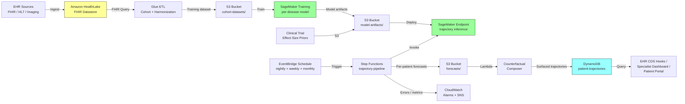

# Recipe 12.8: Disease Progression Trajectory Modeling ⭐⭐⭐⭐

**Complexity:** Complex · **Phase:** Production · **Estimated Cost:** ~$800–$3,500 per month per disease-cohort workload

---

## The Problem

A 54-year-old woman with autosomal dominant polycystic kidney disease has been followed at the same nephrology clinic for nine years. Her chart contains 41 separate eGFR results, 38 measurements of total kidney volume from MRI, a dozen blood pressure logs that drift up and to the right, and a careful record of her ACE inhibitor titrations. Every individual data point is unremarkable in isolation. Each clinic visit ends with a reasonable-sounding plan that mostly amounts to "let's recheck in six months." But if you stand back and look at the full nine-year trajectory, what jumps out is that her kidney function is on a near-linear decline of about 4.2 mL/min/1.73 m² per year, and total kidney volume is growing at roughly 6% annually. At that rate, plus or minus the uncertainty inherent in nine years of irregular measurements, she is likely to need renal replacement therapy somewhere between her sixty-second and sixty-seventh birthday. That is a different conversation than "let's recheck in six months." It is a conversation about transplant evaluation timing, vascular access planning, and whether to enroll in a tolvaptan trial that might bend the curve.

That conversation is not happening, and the reason is not that her care team is bad. The cognitive work it requires (integrating nine years of irregular measurements across multiple variables, accounting for treatment effects, factoring in disease-specific progression rates, communicating future-state uncertainty in a way that is actionable on a multi-year horizon) is not what a 20-minute outpatient nephrology visit is structured to do. Each visit is a snapshot. The trajectory lives across snapshots and across an analytic gap that the EHR was never designed to bridge.

This pattern repeats across most chronic, slowly progressive diseases. A patient with non-alcoholic fatty liver disease has serial fibroscan elastography readings creeping upward over four years; the trajectory predicts cirrhosis in a clinically actionable timeframe long before any single value crosses a transplant-eligibility threshold. A patient with Parkinson's disease has a UPDRS motor score that has been climbing two points per year for five years, with a six-month plateau coinciding with a medication change; the trajectory says something about how their next decade looks, and the slope changes around the medication say something about which therapy will and will not extend their function. A patient with multiple myeloma has serum free light chains that drift up over eighteen months in a near-imperceptible curve until the day they cross a numerical threshold; the trajectory was visible in retrospect for a year before the threshold was crossed.

The promise of disease progression trajectory modeling is exactly this: take the longitudinal record of a patient with a known chronic, progressive disease, fit a model that captures the disease-specific shape of progression along with patient-specific deviations from that shape, account for the effects of interventions that bend or reset the trajectory, and produce a forward-looking forecast that is calibrated, explainable, and clinically actionable on a multi-year time horizon. Done well, you give the patient and their care team a horizon to plan against. Done poorly, you produce confident-looking projections that come apart on first contact with reality, the patient stops trusting the system the first time it is wrong, and the clinician learns to ignore it.

This is not the same problem as the lab trend analysis covered in Recipe 12.4. Lab trend analysis asks "has the recent trajectory deviated from the patient's recent baseline in a way that warrants attention?" Trajectory modeling asks "what does this patient's disease look like over the next two, five, ten years, and how do interventions change that?" The first is a change-detection problem on a horizon of months; the second is a forecasting-and-counterfactual problem on a horizon of years. The math overlaps. The clinical use case, the regulatory framing, and the failure modes are different.

Let's get into how this works.

---

## The Technology: How Disease Progression Trajectory Modeling Actually Works

### The Three Things You Are Actually Modeling

Trajectory modeling for a chronic disease is, at its core, three nested things stacked on top of each other. Most people who have not built one of these tend to underestimate how much the layered structure matters.

**The disease-specific progression shape.** Each chronic disease has a characteristic curve. Kidney function in chronic kidney disease tends to decline approximately linearly in eGFR over years, with a slope that varies dramatically by etiology and patient phenotype. Total kidney volume in autosomal dominant polycystic kidney disease grows roughly exponentially, with the doubling time being itself a clinically meaningful biomarker. Functional status in idiopathic pulmonary fibrosis follows a curve that is shallower at first and steepens. Cognitive decline in Alzheimer's disease has a roughly sigmoidal trajectory on standard scales, with a long preclinical plateau and an accelerating mid-disease phase. Tumor growth, on the other hand, is typically modeled as a Gompertzian curve where the growth rate slows as the tumor approaches its carrying capacity. The shape comes from biology, not from the data, and using the wrong shape is the single most common cause of unhelpful trajectory models. A linear fit to a Gompertzian process produces predictions that are wrong in clinically meaningful ways at both early and late time points.

**The patient-specific deviation from that shape.** Every patient with a given disease deviates from the population-average shape by some amount. They may have a faster or slower disease, a different starting point, a delayed onset of certain features, or unusual responses to treatment. The patient-specific layer captures this. Statistically, this is what mixed-effects models and Bayesian hierarchical models are designed for: the disease shape is the population fixed effect, the patient deviation is the per-patient random effect. Done correctly, the per-patient model borrows strength from the population (so that a patient with three measurements is not modeled in isolation) but respects the individual signal (so that a clearly fast-progressing patient is not pulled toward the population mean).

**The intervention effects that bend the trajectory.** Treatments are the third layer and they are the layer that makes this problem genuinely hard. Starting tolvaptan in autosomal dominant polycystic kidney disease changes the kidney volume trajectory in a way that depends on the patient's baseline volume, the dose, and the duration. Starting an SGLT2 inhibitor in CKD changes the eGFR trajectory in a way that includes an immediate, expected, downward step (the so-called "dip") followed by a slower long-term decline. Surgical resection of a tumor resets the trajectory entirely, with new growth modeled from the post-operative residual. Chemotherapy and targeted therapy produce response patterns that interact with tumor biology in ways that vary across cancer types. The intervention layer requires the model to know about treatments as time-varying covariates, and it requires the clinical question being asked of the model to be specific about what intervention scenario the projection assumes. "What is this patient's eGFR in five years?" is not a complete question. "What is this patient's eGFR in five years if they continue on lisinopril at current dose, with no new interventions?" is a question the model can actually answer.

### Statistical Approaches in Production

The methods that show up in working systems cluster into a few families. None of them is universally best, and most working systems use more than one.

*Linear mixed-effects models* fit a fixed effect for disease shape (often after a transformation that linearizes the underlying biology) and random effects per patient. They are interpretable, they handle irregular sampling natively, and they produce calibrated uncertainty intervals if you respect their assumptions. For diseases with approximately linear progression on the right scale (CKD on eGFR, slow-progressing dementia on standardized cognitive scales), linear mixed-effects models are very hard to beat. The R [`lme4`](https://github.com/lme4/lme4) and Python [`statsmodels`](https://www.statsmodels.org/stable/mixed_linear.html) implementations are standard. The clinical research literature for a given disease usually establishes the right transformation; do not invent your own.

*Non-linear mixed-effects models* generalize the previous family to non-linear functional forms. The disease shape might be a Gompertz curve, a logistic curve, a Richards curve, or some other parametric form motivated by the biology. The patient-specific parameters (asymptote, growth rate, inflection point) are modeled as random effects. These work well when the biology has a known parametric shape. They are less interpretable than linear mixed effects and need more data per patient to fit reliably, but they extrapolate more sensibly to long horizons.

*Bayesian hierarchical models* extend the previous families with full posterior uncertainty. The advantage is that prior knowledge from disease-specific literature can be incorporated explicitly: the population-level slope of eGFR decline in a CKD cohort is not unknown, it has been studied for decades, and that prior should anchor the model. The model produces a posterior distribution over patient-specific parameters, which means forecasts come with calibrated credible intervals out of the box. PyMC, Stan, and NumPyro are the workhorses; the trade is computational cost and engineering complexity for explicit uncertainty quantification.

*Joint models for longitudinal and time-to-event outcomes* are the right answer when the question is not just "what is the trajectory" but "given the trajectory, when does the patient hit a clinically meaningful endpoint?" In CKD, this might be "when does eGFR drop below 15, the threshold for renal replacement therapy?" Joint models simultaneously fit the longitudinal trajectory and the time-to-event hazard, with the trajectory acting as a time-varying predictor of the hazard. The [JM](https://cran.r-project.org/web/packages/JM/) and [JMbayes2](https://github.com/drizopoulos/JMbayes2) R packages and the Python [lifelines](https://lifelines.readthedocs.io/) library cover this space. For high-stakes clinical questions about endpoint timing, joint models are the architecturally right answer.

*Gaussian processes and continuous-time state-space models* handle irregular sampling natively and are useful when the disease does not have a clean parametric form. They produce smooth trajectory estimates and forecasts with built-in uncertainty intervals. They are more flexible than parametric models but less interpretable, and they extrapolate poorly beyond the support of the training data. They are well-suited to functional status and quality-of-life outcomes that have noisy, drifting trajectories without a clean biological shape.

*Deep learning approaches* (recurrent neural networks, neural ordinary differential equations, transformer-based survival models) have shown promise in research settings, particularly for diseases with complex multi-modal data (imaging plus labs plus genetic markers). They can learn the population-level disease shape from data without the modeler specifying a parametric form, and they integrate naturally with embedding-based representations of treatment history. They cost a lot more than the alternatives in data, compute, explainability, and regulatory exposure. In 2026, most production deployments still favor the simpler families above for the routine cases and reserve deep learning for diseases where the competing methods have visibly failed.

### Sparse, Irregular, and Multi-Year

The features that make this problem particularly hard are inherent to the data, not to any specific algorithm. A typical patient with CKD has eGFR measured every three to six months in a stable phase, every six weeks during a regimen change, and not at all during the eighteen months they spent uninsured between jobs. The same patient might have one MRI taken five years ago when the diagnosis was made and never again. Their blood pressure log is dense for two years and then disappears for three. Their medication history is, at best, a structured list of prescriptions written; whether they actually took the pills is a separate question that nobody is sure about.

This is the data the model has to consume, and the methods that handle it best share a few characteristics: they work natively in continuous time rather than requiring a regular grid, they are robust to right-censoring (some patients drop out of follow-up for reasons that are both random and informative), they tolerate or impute missing covariates without making heroic assumptions, and they do not extrapolate confidently beyond the time horizon supported by the training data. Methods that quietly violate any of these assumptions produce forecasts that look fine in cross-validation and fall apart in production. The cross-validation failure mode that catches teams off guard is leakage of future information into past predictions through poorly handled missing data; if a patient's six-month-future eGFR was used to impute their three-month-future blood pressure, the model is going to look a lot smarter on retrospective data than it actually is.

### The Acute-Versus-Chronic Distinction (Revisited)

As in lab trend analysis, the chronic and acute contexts are fundamentally different problems. A trajectory model trained on outpatient eGFR measurements will produce confidently wrong forecasts if the input data includes inpatient values from a hospitalization with acute kidney injury. The standard practice is to tag every input measurement with its clinical context and use only chronic-context measurements for the trajectory model. Acute-context measurements feed Recipe 12.7 (Vital Sign Trajectory Monitoring) or other acute-care pipelines. Mixing the two produces a trajectory model that is whipsawed by acute episodes, which clinicians correctly recognize as not telling them anything they did not already know.

### Counterfactual Thinking and the "What If" Question

The clinically interesting question is rarely "what is this patient's trajectory under no change," because by the time the patient is on the model's radar there is usually some change being considered. The interesting question is "how does the trajectory change if we start tolvaptan, switch from lisinopril to losartan, add an SGLT2 inhibitor, refer for transplant evaluation now versus in six months." This is a counterfactual question, and a model that only forecasts the observed-treatment trajectory cannot answer it.

The principled approaches here come from causal inference: g-computation, marginal structural models with inverse probability weighting, and target trial emulation are standard in the epidemiology literature. They require explicit modeling of the treatment-assignment mechanism and they require strong assumptions about unmeasured confounders. For diseases with strong randomized clinical trial evidence on intervention effects (CKD, ADPKD, several oncology contexts), the simpler approach is to use the published trial-derived effect sizes as plug-in priors: the trajectory model captures the natural history, and the published effect of tolvaptan on kidney volume growth gets applied as an explicit modifier with appropriate uncertainty propagation. This is less elegant than a fully causal model but it is much more defensible regulatorily and produces forecasts that clinicians can sanity-check against the trial literature they already know.

The point to internalize: any "what if" capability in a trajectory system is doing causal inference whether it admits it or not. The choice is between explicit, defensible assumptions and implicit, unexamined ones.

### Where the Field Is Actually Going

The practical state of the art in 2026 looks roughly like this. For diseases with strong clinical research foundations and well-characterized progression curves (CKD, ADPKD, several neurodegenerative diseases, several oncology indications), production trajectory systems combine a Bayesian hierarchical model with disease-specific priors, an explicit treatment-effect layer driven by the published trial literature, a joint model for the time-to-clinical-endpoint outcome, and a careful interface that emphasizes the uncertainty bands as much as the central forecasts. For diseases with weaker research foundations or more complex multi-modal data (rare diseases, certain pediatric conditions, mixed phenotype presentations), the systems lean more on flexible Gaussian process or deep learning models, with the explicit caveat that long-horizon extrapolation is unreliable and the model is positioned as a "trajectory characterizer" rather than a "future-state predictor."

The clinical adoption arc looks like this: the model has to be accurate enough to be trusted, explainable enough to be acted on, and uncertainty-honest enough to be defended in front of a patient. Models that fail any of those three tests get unplugged. Models that pass all three tend to get adopted and then re-adopted as the cohort grows and as new evidence shifts the priors.

### The General Architecture Pattern

At a conceptual level, the pipeline looks like this:

```text
[Longitudinal Patient Data] -> [Cohort Definition + Harmonization] -> [Trajectory Model Training]
                                                                              |
                                                                              v
                                                          [Per-Patient Trajectory Inference]
                                                                              |
                                                          +-------------------+-------------------+
                                                          |                   |                   |
                                                          v                   v                   v
                                                 [Counterfactual          [Time-to-          [Uncertainty
                                                  Treatment Scenarios]    Endpoint]            Bands]
                                                          |                   |                   |
                                                          +-------------------+-------------------+
                                                                              |
                                                                              v
                                                                [Clinical Interface Layer]
                                                                              |
                                                                              v
                                                  [Clinician + Patient + Care Team]
```

**Longitudinal Patient Data.** EHR-sourced labs, vitals, imaging-derived measurements, medication history, problem lists, and outcomes. Often pulled from multiple systems and reconciled.

**Cohort Definition and Harmonization.** Patients are placed in a disease cohort by phenotype (ICD codes, lab thresholds, problem-list entries, sometimes confirmatory imaging or genetic testing). Within the cohort, longitudinal measurements are harmonized to canonical units, canonical codes, and canonical reference frames (time-since-diagnosis, time-since-treatment-start, calendar time as appropriate to the disease). Acute-context measurements are excluded from the chronic trajectory.

**Trajectory Model Training.** A disease-specific model is fit on the cohort. The model captures the population-level disease shape, the patient-specific deviations, and the effects of interventions present in the training data. Disease-specific priors from the clinical literature are incorporated where appropriate.

**Per-Patient Trajectory Inference.** For each patient in the cohort, the model produces a fitted trajectory through their observed history and a forward forecast under the assumption of "no new interventions" (or, equivalently, "current treatment continued").

**Counterfactual Treatment Scenarios.** Optionally, the model produces additional forecasts under alternative treatment scenarios specified by the clinician (start tolvaptan, switch antihypertensive class, add SGLT2 inhibitor, refer for transplant). Each scenario produces its own trajectory and uncertainty band. The trial-literature-derived effect sizes drive the modifier in the simpler architecture; explicit causal models drive it in the more advanced one.

**Time-to-Endpoint.** A joint model or analogous time-to-event component produces a probability distribution over when the patient hits a clinically meaningful endpoint (renal replacement therapy in CKD, dementia diagnosis in cognitive trajectory work, structural progression milestone in cardiology). This is often the most clinically actionable single output of the pipeline.

**Uncertainty Bands.** Every forecast comes with credible intervals. The intervals are not optional; they are the reason the trajectory matters. A point forecast of "your eGFR will be 28 in five years" is much less useful than "we are 90% confident your eGFR will be between 22 and 35 in five years, with current treatment continued."

**Clinical Interface Layer.** The forecasts get rendered for the clinical user. The interface decisions matter as much as the modeling decisions. Trajectory plots with uncertainty bands, time-to-endpoint hazard curves, and side-by-side counterfactual comparisons are the standard surfaces. The interface explicitly communicates what assumptions the forecast embeds, especially the treatment-continuation assumption.

**Clinician, Patient, Care Team.** The forecasts inform a multi-stakeholder conversation: the patient and their family planning around a multi-year horizon, the care team coordinating around testing and referral cadence, the specialist deciding when to escalate. The model is one input to that conversation, not the conversation itself.

That is the whole concept. Cohort, model, infer, counterfactual, communicate. The hard parts are concentrated in the cohort/harmonization layer, the treatment-effect modeling, and the clinical interface, not in the trajectory math itself. (You will notice this is becoming a theme in this chapter. It is not a coincidence.)

---

## The AWS Implementation

The AWS implementation centers on three platform choices that shape everything else: HealthLake as the longitudinal patient store, SageMaker as the model training and hosting environment, and Step Functions as the orchestration backbone. The other services support specific stages.

### Why These Services

**Amazon HealthLake for longitudinal FHIR storage.** Disease progression trajectory modeling lives or dies on the quality of its longitudinal patient record. A patient's eGFR over nine years, their kidney volume measurements, their medication history, their problem list, and their outcomes need to be queryable as a single longitudinal bundle, not stitched together from a dozen source systems on every inference. [HealthLake](https://docs.aws.amazon.com/healthlake/latest/devguide/what-is-amazon-health-lake.html) is built to be exactly that store: ingest FHIR resources from any source, normalize, index, expose through a queryable FHIR API. For trajectory work, it is the right primary store.

**Amazon S3 for derived datasets, models, and forecasts.** The cohort-defined harmonized training datasets live in S3 partitioned by disease cohort. Trained model artifacts (mixed-effects model parameters, Bayesian posterior samples, hierarchical model state, trial-literature effect-size tables) live in S3. Per-patient forecasts and counterfactual scenarios are written to S3 as the analytic record before being summarized into the serving store. S3 is also the durable archive for cohort-definition logic, treatment-effect priors, and model version metadata.

**AWS Glue for cohort definition and harmonization.** Glue ETL jobs handle the heavy lifting: phenotype-based cohort identification, longitudinal harmonization (canonical units, canonical LOINC codes, time-frame normalization), acute-versus-chronic tagging, and the construction of training and inference-ready datasets. The jobs run on a cadence (weekly is typical for chronic-disease cohorts) and their output is the input to the trajectory model.

**Amazon SageMaker for trajectory model training and inference.** Trajectory models are not one-size-fits-all; the choice of mixed-effects, Bayesian hierarchical, joint model, or Gaussian process depends on the disease. SageMaker's flexibility on container images is what makes per-disease method choice tractable. Training runs as SageMaker Training jobs (often using PyMC, Stan, NumPyro, or statsmodels containers); inference is hosted on real-time endpoints for fast counterfactual scenario evaluation, or run as Batch Transform jobs for the nightly per-patient forecast refresh.

**AWS Step Functions for orchestration.** The training and inference pipelines have multiple steps with explicit retry and partial-failure semantics: refresh cohort, harmonize, train (or refresh) the disease-specific model, run per-patient inference, compute counterfactuals, write results to the serving store. Step Functions makes this orchestrable, auditable, and resumable.

**AWS Lambda for counterfactual scenario evaluation.** Once the trajectory model is hosted on a SageMaker endpoint, Lambda fronts the counterfactual API: clinician requests "what does this patient's trajectory look like if we start tolvaptan in three months," the Lambda composes the request (current trajectory, treatment-effect prior, time horizon), calls the SageMaker endpoint, post-processes the result, and returns a payload to the clinical surface.

<!-- TODO (TechWriter): Expert review M2 (MEDIUM). The Lambda counterfactual composer is functionally equivalent to ordering a clinical analytic test: it consumes patient PHI, runs a SaMD-adjacent computation, and returns a clinical-decision-supporting output. Add a paragraph naming the privileged-action posture: authentication (Cognito or institutional IdP via API Gateway), authorization (the requesting clinician must have a clinical relationship to the patient, validated against the EHR's relationship-of-care store), audit logging (every counterfactual request and response stored with patient_id, clinician_id, scenario_spec, model_version, timestamp), and rate limiting (per-clinician, per-patient, per-day caps to prevent scenario-mining patterns). -->


**Amazon DynamoDB for low-latency clinical surfaces.** Per-patient forecasts and time-to-endpoint hazards get written to DynamoDB keyed by patient and disease cohort. The EHR integration, the population-health dashboard, and the patient-facing portal all read from DynamoDB at single-digit-millisecond latency.

**Amazon EventBridge for scheduling.** Weekly cohort refresh, monthly model retraining, daily per-patient inference: EventBridge Scheduler triggers each cadence. For high-priority changes (a new clinical trial publishes a definitive effect-size update for tolvaptan), EventBridge can trigger an immediate priors-and-retrain pipeline.

**AWS KMS for customer-managed encryption.** Disease cohort data is PHI of the highest sensitivity (rare-disease cohorts can be re-identifiable even with standard de-identification, and progression data tied to specific phenotypes is genetically suggestive). Customer-managed CMKs per data class are non-negotiable.

**Amazon CloudWatch for monitoring and alarming.** Pipeline health, training-job convergence diagnostics, inference latency, calibration metrics on backtested forecasts, and drift in cohort distributions all get logged. Calibration drift is the single most important operational metric: a trajectory system whose 90% credible intervals stop containing 90% of out-of-sample observations has a calibration problem that must be detected and remediated.

### Architecture Diagram



### Prerequisites

| Requirement | Details |
|-------------|---------|
| **AWS Services** | Amazon HealthLake, Amazon S3, AWS Glue, Amazon SageMaker, AWS Lambda, Amazon DynamoDB, AWS Step Functions, Amazon EventBridge, AWS KMS, Amazon CloudWatch |
| **IAM Permissions** | `healthlake:SearchWithGet`, `healthlake:ReadResource`, `s3:GetObject`, `s3:PutObject`, `glue:StartJobRun`, `sagemaker:CreateTrainingJob`, `sagemaker:InvokeEndpoint`, `sagemaker:CreateTransformJob`, `lambda:InvokeFunction`, `dynamodb:BatchWriteItem`, `dynamodb:Query`, `states:StartExecution`, `kms:Decrypt`, `kms:Encrypt`. Each pipeline component runs under a least-privilege role scoped to its data class. |
| **BAA** | AWS BAA signed. Trajectory data is PHI in the strongest sense: longitudinal disease-specific records tied to genetic phenotypes are inherently re-identifiable. Every storage and compute service touching this pipeline must be on the [HIPAA eligible services](https://aws.amazon.com/compliance/hipaa-eligible-services-reference/) list. |
| **Encryption** | S3: SSE-KMS with customer-managed CMKs per data class (cohort datasets, model artifacts, forecasts, priors). HealthLake: KMS-encrypted datastore. DynamoDB: encryption at rest with customer-managed CMK. SageMaker training and inference: KMS-encrypted EBS volumes and KMS-encrypted output. CloudWatch log groups: explicit KMS encryption. TLS 1.2 minimum in transit. |
| **VPC** | Production: SageMaker training, inference, and processing in private subnets with VPC endpoints for S3, HealthLake, DynamoDB, KMS, Step Functions, CloudWatch Logs, and SageMaker API/Runtime. Required posture for HIPAA workloads with PHI of this sensitivity. |
<!-- TODO (TechWriter): Expert review M6 (MEDIUM) + L1 (LOW). The VPC endpoint enumeration is incomplete relative to the recipe's architecture (EventBridge, Lambda, Glue are all named in the architecture but missing from the endpoint list; Secrets Manager belongs if external API credentials are used for clinical-trial-literature feeds, EHR integration credentials, or paging-vendor credentials). Update the VPC row to include EventBridge (interface), Lambda (interface), Glue (interface), CloudWatch Monitoring (interface), and Secrets Manager (interface). Add the egress-control posture: "No NAT egress for PHI-touching workloads; restrictive egress on Lambda VPCs and SageMaker endpoint subnets." This matches the chapter-12 pattern through 12.7. -->
<!-- TODO (TechWriter): Expert review M7 (MEDIUM). Add an Availability row to the Prerequisites table specifying multi-AZ deployment for SageMaker endpoints, DynamoDB (default), and any Lambda compute fronting clinician-facing surfaces. Documented RTO of 4 hours and RPO of 24 hours for the trajectory-inference pipeline (the surfaced trajectories are recomputed nightly; a one-day staleness during a regional incident is clinically tolerable since the underlying disease progression is on a multi-month-to-multi-year horizon). For the cohort-and-training pipeline, RTO of 24 hours and RPO of 7 days are tolerable since the training cadence is monthly. -->
<!-- TODO (TechWriter): Expert review L2 (LOW). Add a Time row to the Prerequisites table specifying Amazon Time Sync Service for AWS-hosted compute. Observation timestamps are stored in UTC in the durable archive (HealthLake and S3); the clinical surface displays institution-local time when shown to a clinician at the bedside. Time-zone handling is explicit in the harmonization layer. -->

| **CloudTrail** | Enabled for all data-plane services, with CloudTrail data events on every PHI-bearing S3 bucket and the DynamoDB serving table. The audit trail of who accessed which patient's trajectory is non-negotiable, especially for rare-disease cohorts. CloudTrail logs land in a dedicated S3 bucket with Object Lock in compliance mode. |
| **Sample Data** | Synthetic FHIR data from [Synthea](https://github.com/synthetichealth/synthea) supplemented with disease-specific synthetic generators (Synthea's CKD module produces longitudinal eGFR trajectories suitable for development). [MIMIC-IV](https://physionet.org/content/mimiciv/) provides de-identified inpatient labs through PhysioNet credentialing; useful for validation but limited for chronic outpatient trajectories. Disease-specific registry data are gold standard for validation but require formal data-use agreements. Never use real PHI in dev. |
| **Cost Estimate** | HealthLake: ~$200–$800/month depending on cohort size and data volume. SageMaker training (Bayesian hierarchical model, monthly retrain): ~$200–$600/month. SageMaker inference endpoint: ~$100–$400/month. Glue ETL (weekly cohort refresh): ~$50–$150/month. Lambda, DynamoDB, S3, Step Functions, EventBridge: ~$100/month combined. KMS, CloudWatch, audit: ~$50/month. Total: ~$800–$3,500/month per disease-cohort workload depending on cohort size, data density, and model complexity. |

<!-- TODO (TechWriter): V1. Verify HealthLake, SageMaker training, and SageMaker inference pricing assumptions reflect current rates. AWS pricing changes; confirm against the AWS pricing calculator before publication. -->

<!-- TODO (TechWriter): Expert review M4 (MEDIUM). The "per disease-cohort workload" framing risks naive multiplication. A multi-disease deployment does not scale linearly across all components: HealthLake storage and Glue ETL scale roughly linearly with cohort size; SageMaker training scales sub-linearly when on-demand training jobs are reused across diseases (one container, many training runs); SageMaker inference and Lambda-and-DynamoDB scale roughly linearly with active-patient count. Append a scaling note to the Cost Estimate row explaining that five cohorts at the smaller end is closer to ~$2,500/month total than five times $800, and five cohorts at the larger end is closer to ~$14,000/month total than five times $3,500. Recommend engaging AWS Solutions Architecture for a worked sizing exercise before committing to a multi-disease rollout. -->

<!-- TODO (TechWriter): Expert review M5 (MEDIUM). The architecture as drawn shows one pipeline; the per-disease parallelism is implicit. Add a paragraph (in the AWS Implementation section, just before or just after the Architecture Diagram) addressing the multi-disease pattern: each disease has its own cohort-definition config, its own training Step Functions state machine, its own model-artifact prefix (with per-disease KMS CMKs), its own DynamoDB partition prefix, and its own EventBridge schedule. The Step Functions and SageMaker layers are reused across diseases (one trajectory-pipeline state machine template, parameterized by disease; one set of training-and-inference container images that read disease-specific configs at runtime). Per-disease isolation is implemented at the IAM role level (one role per disease-pipeline, scoped to the disease's CMKs and S3 prefixes) and at the audit-log level (every record carries the disease name as a top-level attribute). At institutional scale (five to fifteen disease cohorts is typical for a large academic medical center), expect five-to-fifteen Step Functions executions in parallel on a typical schedule, with per-disease independent failure recovery. -->


### Ingredients

| AWS Service | Role |
|------------|------|
| **Amazon HealthLake** | Longitudinal FHIR datastore for the patient record; primary source for cohort definition queries and inference inputs |
| **Amazon S3** | Stores cohort-defined training datasets, trained model artifacts, per-patient forecasts, counterfactual scenarios, treatment-effect priors, and clinical-trial-derived metadata |
| **AWS Glue** | Cohort identification jobs (phenotype-based), longitudinal harmonization (units, codes, time frames), acute-versus-chronic tagging, training-dataset construction |
| **Amazon SageMaker** | Hosts per-disease trajectory models (mixed-effects, Bayesian hierarchical, joint, GP); supports training, real-time endpoints for counterfactual evaluation, and Batch Transform for nightly population-scale forecasting |
| **AWS Lambda** | Counterfactual scenario composer (compose treatment-modifier requests, call SageMaker endpoint, post-process); CDS Hooks responder; calibration-monitor jobs |
| **Amazon DynamoDB** | Serves per-patient trajectory forecasts and time-to-endpoint hazards to clinical surfaces at low latency |
| **AWS Step Functions** | Orchestrates the training pipeline (cohort -> harmonize -> train -> validate -> deploy) and the inference pipeline (refresh -> infer -> counterfactual -> deliver) with explicit retry and error handling |
| **Amazon EventBridge** | Triggers the weekly cohort refresh, the monthly model retrain, the nightly per-patient inference, and ad-hoc priors-update pipelines |
| **AWS KMS** | Manages customer-managed CMKs per data class (cohort data, model artifacts, forecasts, serving table, audit logs) |
| **Amazon CloudWatch** | Logs, metrics, alarms for pipeline health, training convergence diagnostics, inference latency, and calibration drift on backtested forecasts |


### Code

> **Reference implementations:** The following AWS sample resources demonstrate the patterns used in this recipe:
>
> - [Amazon HealthLake Documentation](https://docs.aws.amazon.com/healthlake/latest/devguide/what-is-amazon-health-lake.html): The FHIR datastore that backs the longitudinal patient record
> - [`amazon-sagemaker-examples`](https://github.com/aws/amazon-sagemaker-examples): Official SageMaker examples including custom inference container patterns and Bayesian model deployment
> - [AWS Step Functions Workflow Studio](https://docs.aws.amazon.com/step-functions/latest/dg/workflow-studio.html): For visually composing the training and inference pipelines

<!-- TODO (TechWriter): N1. Verify all reference implementation links are still live during the pre-publication audit. -->

#### Walkthrough

**Step 1: Define the disease cohort.** The pipeline starts by identifying which patients in the longitudinal store belong in the disease cohort. This is more involved than running a single ICD-10 query. Real cohorts blend ICD codes, lab thresholds, problem-list entries, sometimes confirmatory imaging or genetic testing, and almost always exclude patients with conflicting diagnoses or incomplete histories. The cohort definition is itself a clinical artifact that must be reviewed by a disease specialist and versioned as code, because changes to the cohort definition retroactively change every downstream forecast.

```text
FUNCTION define_disease_cohort(disease_definition, healthlake_datastore):
    // The disease_definition is a versioned, clinician-reviewed configuration.
    // For ADPKD it might look like:
    //   inclusion_icd10:    ["Q61.2", "Q61.3"]                   // ADPKD codes
    //   inclusion_problems: ["polycystic kidney disease"]
    //   confirmatory_genetic: optional but increases confidence
    //   exclusion_icd10:    ["Q61.4", "Q61.5"]                   // other cystic diseases
    //   minimum_observation_window_months: 12
    //   minimum_egfr_measurements: 3

    candidate_patients = query_healthlake(
        datastore = healthlake_datastore,
        filter    = "Condition.code IN disease_definition.inclusion_icd10
                     OR Condition.code IN disease_definition.inclusion_problems"
    )

    cohort = []
    FOR patient IN candidate_patients:
        // Pull the relevant longitudinal data for cohort qualification.
        history = query_patient_history(
            datastore = healthlake_datastore,
            patient_id = patient.id,
            resource_types = [Condition, Observation, MedicationRequest, Procedure, DiagnosticReport]
        )

        // Apply exclusions (other cystic kidney diseases, transplant status, etc.).
        IF has_any_exclusion(history, disease_definition.exclusion_icd10):
            continue

        // Require minimum observation window so trajectory analysis is meaningful.
        observation_span_months = compute_observation_span(history)
        IF observation_span_months < disease_definition.minimum_observation_window_months:
            continue

        // Require minimum density of trajectory-relevant measurements.
        egfr_count = count_chronic_context(history, loinc_code="48642-3")  // eGFR
        IF egfr_count < disease_definition.minimum_egfr_measurements:
            continue

        // Capture the qualifying signals so they are auditable.
        cohort.append({
            patient_id:           patient.id,
            qualified_by_icd:     intersection(history.icd_codes, disease_definition.inclusion_icd10),
            qualified_by_problem: intersection(history.problems, disease_definition.inclusion_problems),
            confirmatory_genetic: has_confirmatory_genetic_test(history),
            observation_span:     observation_span_months,
            cohort_definition_version: disease_definition.version,
            qualified_at_ts:      now()
        })

    write cohort to S3 cohort-datasets/{disease_definition.name}/{disease_definition.version}/
    RETURN cohort
```

**Step 2: Harmonize the longitudinal trajectory data.** Once a patient is in the cohort, their longitudinal data must be transformed into a clean, harmonized matrix that the trajectory model can consume. Units are converted to canonical UCUM codes per LOINC. Time is anchored to a meaningful reference frame (often time-since-diagnosis, sometimes time-since-treatment-start, sometimes calendar time). Acute-context measurements are tagged and excluded from the chronic trajectory. Treatment history is aligned to the same time frame. Genetic and imaging data are joined where available.

```text
FUNCTION harmonize_trajectory_data(cohort_member, healthlake_datastore):
    history = query_patient_history(
        datastore = healthlake_datastore,
        patient_id = cohort_member.patient_id
    )

    // Identify the time-zero anchor. For ADPKD it might be earliest qualifying ICD-10 date;
    // for CKD it might be earliest eGFR < 60; the choice is disease-specific.
    time_zero = compute_time_zero(history, cohort_member.disease_definition_version)

    harmonized_observations = []
    FOR obs IN history.observations:
        // Map to canonical LOINC code.
        canonical_loinc = lookup_loinc_mapping(obs.system, obs.code)
        IF canonical_loinc is null:
            log "unmapped" and continue

        // Convert units to canonical UCUM unit.
        canonical_value = convert_units(obs.value, obs.unit, canonical_loinc)
        IF canonical_value is null:
            log "unit conversion failed" and continue

        // Tag context. Outpatient clinic visits and routine outpatient labs are chronic.
        // Inpatient and emergency are acute and excluded from trajectory training.
        context_tag = classify_encounter_context(obs.encounter_id, history.encounters)

        // Compute time-since-diagnosis in months for trajectory modeling.
        months_from_zero = (obs.collection_ts - time_zero) / months

        harmonized_observations.append({
            patient_id:        cohort_member.patient_id,
            loinc_code:        canonical_loinc,
            value:             canonical_value,
            collection_ts:     obs.collection_ts,
            months_from_zero:  months_from_zero,
            context_tag:       context_tag
        })

    // Treatment history aligned to the same time frame.
    harmonized_treatments = []
    FOR med IN history.medications:
        canonical_drug = lookup_rxnorm_mapping(med.code)
        IF canonical_drug in disease_relevant_drugs(cohort_member.disease_definition_version):
            harmonized_treatments.append({
                patient_id:          cohort_member.patient_id,
                drug:                canonical_drug,
                drug_class:          lookup_drug_class(canonical_drug),
                start_months_from_zero: (med.start_ts - time_zero) / months,
                end_months_from_zero:   (med.end_ts - time_zero) / months IF med.end_ts ELSE null,
                dose:                med.dose
            })

    harmonized = {
        patient_id:                cohort_member.patient_id,
        time_zero:                 time_zero,
        observations:              harmonized_observations,
        treatments:                harmonized_treatments,
        cohort_definition_version: cohort_member.cohort_definition_version
    }

    write harmonized to S3 cohort-datasets/{disease}/harmonized/

    RETURN harmonized
```

**Step 3: Train the disease-specific trajectory model.** The model captures the population-level disease shape, the per-patient deviations, and the effects of interventions. The choice of model family is disease-specific (linear mixed-effects for CKD on eGFR, non-linear for ADPKD on kidney volume, joint model when time-to-endpoint is the primary clinical question, Bayesian hierarchical when explicit uncertainty is needed). Training runs on the harmonized cohort dataset. Disease-specific priors from the clinical literature anchor the model.

<!-- TODO (TechWriter): Expert review H2 (HIGH). The model config and the downstream inference pseudocode treat the clinical endpoint as a singleton (eGFR < 15 for RRT consideration), but real ADPKD trajectory modeling at the fidelity the opening vignette establishes is plural: transplant referral at eGFR < 30, transplant evaluation at eGFR < 20, vascular access planning at eGFR ~15-20, RRT consideration at eGFR < 15, dialysis initiation as a separate event. Promote `endpoint_definition` to `endpoint_definitions` (a list) in the Step 3 model_config; iterate over the list in Step 4 (`compute_time_to_endpoint`) and Step 5 to produce a credible-interval triple per endpoint; update the Expected Results JSON example to show two or three endpoints in the payload (transplant_evaluation, vascular_access_planning, rrt_consideration); update the explanation_text accordingly so the surfaced output gives the clinical team a constellation of timing curves rather than a single threshold-crossing prediction. -->


```text
FUNCTION train_trajectory_model(disease_name, harmonized_cohort, model_config, priors):
    // model_config is a versioned, clinically-reviewed configuration:
    //   model_family:          "bayesian_hierarchical_linear_mixed_effects"
    //   outcome_loinc:         "48642-3"  // eGFR
    //   outcome_transform:     "identity" or "log" or "logit"
    //   covariates:            ["age_at_time_zero", "sex", "baseline_egfr", "diabetes_status"]
    //   treatment_covariates:  ["acei_arb_active", "sglt2_active", "tolvaptan_active"]
    //   random_effects:        ["intercept", "slope"]
    //   prior_population_slope: -3.0                  // mL/min/1.73m^2/year, from CKD literature
    //   prior_population_slope_sd: 1.0
    //   prior_per_patient_slope_sd: 4.0               // patient heterogeneity
    //   prior_treatment_effect_acei_arb: -0.5         // slope modifier per published trial evidence
    //   prior_treatment_effect_sglt2:    -1.5

    training_dataset = build_training_matrix(harmonized_cohort, model_config)

    // Hold out a temporal validation slice so calibration can be measured honestly.
    train_slice, validation_slice = temporal_holdout_split(
        dataset            = training_dataset,
        holdout_fraction   = 0.2,
        holdout_strategy   = "last_n_visits_per_patient"
    )

    // Fit the model. The actual call depends on the family. For a Bayesian
    // hierarchical mixed-effects model in PyMC or Stan, this is a sampling
    // step (NUTS) that produces posterior samples for population and per-patient
    // parameters, plus treatment-effect modifiers.
    model = fit_model(
        family    = model_config.model_family,
        data      = train_slice,
        priors    = priors,
        config    = model_config
    )

    // Validate calibration on the temporal holdout.
    calibration = compute_calibration_metrics(
        model       = model,
        validation  = validation_slice,
        intervals   = [50, 80, 90, 95]
    )
    // Calibration metrics include: empirical coverage of credible intervals
    // (does the 90% interval actually contain 90% of held-out observations?),
    // continuous ranked probability score, mean absolute error of point forecasts.

    // Validate against published clinical-literature benchmarks for this disease.
    literature_consistency = compare_to_literature(
        model_population_slope = model.population_slope,
        published_slope_range  = priors.published_population_slope_range
    )

    artifact = {
        model_state:          serialize_model(model),
        calibration:          calibration,
        literature_consistency: literature_consistency,
        cohort_size:          count(harmonized_cohort),
        model_config:         model_config,
        priors:               priors,
        trained_at_ts:        now(),
        cohort_definition_version: model_config.cohort_definition_version,
        model_version:        compute_version_hash(model_config, priors, cohort_size)
    }

    write artifact to S3 model-artifacts/{disease_name}/{artifact.model_version}/

    RETURN artifact
```

**Step 4: Per-patient trajectory inference.** With the trained model in hand, the pipeline produces a fitted trajectory through each patient's observed history and a forward forecast under the assumption of "current treatment continued." The forecast is a posterior distribution, not a point estimate; the uncertainty bands are first-class outputs.

```text
FUNCTION infer_patient_trajectory(patient_harmonized_data, trained_model, forecast_horizon_months = 60):
    // Generate the fitted trajectory through the observed history.
    fitted_trajectory = model_predict(
        model      = trained_model,
        patient    = patient_harmonized_data,
        time_grid  = patient_harmonized_data.observation_times
    )
    // fitted_trajectory contains posterior median + credible intervals at each observed time.

    // Generate the forward forecast under "current treatment continued".
    forecast_time_grid = build_forecast_grid(
        from_months = patient_harmonized_data.last_observation_months,
        to_months   = patient_harmonized_data.last_observation_months + forecast_horizon_months,
        grid_step   = 3                                  // months
    )
    forecast = model_predict(
        model            = trained_model,
        patient          = patient_harmonized_data,
        time_grid        = forecast_time_grid,
        treatment_assumption = "current_treatment_continued"
    )

    // Compute the time-to-endpoint hazard if the model is a joint model
    // or has an explicit endpoint definition.
    IF trained_model.has_endpoint_component:
        time_to_endpoint = compute_time_to_endpoint(
            model     = trained_model,
            patient   = patient_harmonized_data,
            endpoint  = trained_model.endpoint_definition,
            time_grid = forecast_time_grid
        )
        // time_to_endpoint contains: P(endpoint by month T) curves with credible intervals,
        // median time to endpoint, P10 and P90 time to endpoint.
    ELSE:
        time_to_endpoint = null

    inference_result = {
        patient_id:         patient_harmonized_data.patient_id,
        cohort_definition_version: patient_harmonized_data.cohort_definition_version,
        model_version:      trained_model.model_version,
        fitted_trajectory:  fitted_trajectory,
        forecast:           forecast,
        time_to_endpoint:   time_to_endpoint,
        inferred_at_ts:     now()
    }

    write inference_result to S3 forecasts/{disease}/{patient_id}/{inferred_at_ts}/

    RETURN inference_result
```

**Step 5: Counterfactual treatment scenario evaluation.** This is the architecturally distinctive step for trajectory modeling, and it is where most of the clinical value sits. The clinician asks "what does this patient's trajectory look like if we start tolvaptan in three months versus continuing current therapy?" The pipeline composes both scenarios, calls the model with the corresponding treatment-modifier specifications, and returns the comparison. The trial-literature-derived effect-size priors live in the model and propagate into the counterfactual forecasts as calibrated uncertainty.

<!-- TODO (TechWriter): Expert review H1 (HIGH). The `apply_treatment_change` helper below blindly appends a new "start drug X" entry without checking whether the patient is already on the requested drug class. In `_treatment_modifier`, the modifier compounds across timeline entries, so a counterfactual that adds SGLT2 to a patient already on SGLT2 produces (1 - 0.25) * (1 - 0.25) = 0.5625 instead of 0.75, a 25% over-attribution. Update Step 5 pseudocode to show the dedup-and-reconciliation logic explicitly (the patient is already on the class -> no-op with a flag returned to the clinical surface), and update the prose to call out that production implementations of `apply_treatment_change` must reconcile pre-existing exposure rather than appending blindly. The corresponding Python companion fix is W1 in the code review. -->


```text
FUNCTION evaluate_counterfactual_scenarios(
    patient_harmonized_data,
    trained_model,
    scenarios,
    forecast_horizon_months = 60
):
    // scenarios is a list of treatment-change specifications:
    //   [ { name: "current_continued",        change: null },
    //     { name: "start_tolvaptan_now",      change: { drug: "tolvaptan", start_offset_months: 0 } },
    //     { name: "start_tolvaptan_in_6mo",   change: { drug: "tolvaptan", start_offset_months: 6 } },
    //     { name: "switch_acei_to_arb",       change: { drug_class_swap: ["acei", "arb"], start_offset_months: 0 } } ]

    forecast_time_grid = build_forecast_grid(
        from_months = patient_harmonized_data.last_observation_months,
        to_months   = patient_harmonized_data.last_observation_months + forecast_horizon_months,
        grid_step   = 3
    )

    counterfactual_results = []
    FOR scenario IN scenarios:
        // Apply the treatment change to the patient's projected treatment timeline.
        modified_treatment_timeline = apply_treatment_change(
            base_timeline = patient_harmonized_data.treatments,
            change        = scenario.change,
            anchor_time   = patient_harmonized_data.last_observation_months
        )

        // Predict under the modified scenario. The model uses the trial-literature-derived
        // effect-size posterior for the relevant drug or drug-class change. Uncertainty
        // propagates from both the trajectory model and the treatment-effect prior.
        scenario_forecast = model_predict(
            model              = trained_model,
            patient            = patient_harmonized_data,
            time_grid          = forecast_time_grid,
            treatment_timeline = modified_treatment_timeline
        )

        // Time-to-endpoint under the scenario.
        IF trained_model.has_endpoint_component:
            scenario_time_to_endpoint = compute_time_to_endpoint(
                model              = trained_model,
                patient            = patient_harmonized_data,
                treatment_timeline = modified_treatment_timeline,
                endpoint           = trained_model.endpoint_definition,
                time_grid          = forecast_time_grid
            )
        ELSE:
            scenario_time_to_endpoint = null

        counterfactual_results.append({
            scenario_name:       scenario.name,
            forecast:            scenario_forecast,
            time_to_endpoint:    scenario_time_to_endpoint,
            assumption_disclosure: build_assumption_disclosure(scenario, trained_model)
        })

    // Compose a comparison payload with explicit assumption disclosure.
    payload = {
        patient_id:           patient_harmonized_data.patient_id,
        scenarios:            counterfactual_results,
        baseline_scenario:    "current_continued",
        model_version:        trained_model.model_version,
        cohort_definition_version: patient_harmonized_data.cohort_definition_version,
        generated_at_ts:      now()
    }

    write payload to S3 counterfactuals/{disease}/{patient_id}/
    write summary to DynamoDB patient-trajectories with:
        partition_key = patient_id
        sort_key      = disease_name + "#" + generated_at_ts

    RETURN payload
```

> **Curious how this looks in Python?** The pseudocode above covers the concepts. If you'd like to see sample Python code that demonstrates these patterns using boto3, PyMC for Bayesian hierarchical modeling, and statsmodels for mixed-effects fits, check out the [Python Example](chapter12.08-python-example). It walks through each step with inline comments and notes on what you'd need to change for a real deployment.


### Expected Results

**Sample counterfactual trajectory payload for an ADPKD patient:**

```json
{
  "patient_id": "patient-9d2f481a",
  "disease_name": "adpkd",
  "model_version": "adpkd-bayesian-hierarchical-v4:priors-2026q1",
  "cohort_definition_version": "adpkd-cohort-v3",
  "time_zero_anchor": "diagnosis_date",
  "time_zero_ts": "2017-03-08",
  "last_observation_ts": "2026-04-08",
  "current_egfr": 58.2,
  "scenarios": [
    {
      "scenario_name": "current_continued",
      "forecast_5yr_egfr": {
        "p10": 24.1,
        "p50": 36.4,
        "p90": 48.2
      },
      "time_to_egfr_under_15": {
        "p10_months": 84,
        "p50_months": 126,
        "p90_months": 192
      }
    },
    {
      "scenario_name": "start_tolvaptan_now",
      "forecast_5yr_egfr": {
        "p10": 28.6,
        "p50": 40.9,
        "p90": 52.4
      },
      "time_to_egfr_under_15": {
        "p10_months": 102,
        "p50_months": 156,
        "p90_months": 228
      },
      "assumption_disclosure": "Effect size prior derived from TEMPO 3:4 trial (NCT00428948) and REPRISE trial (NCT02160145). 30% relative reduction in eGFR slope, 95% credible interval (0.18, 0.42). Assumes treatment continuation through forecast horizon."
    }
  ],
  "explanation_text": "Without intervention, this patient's eGFR is projected to fall below the 15 mL/min/1.73m^2 renal-replacement-therapy threshold between 7 and 16 years from now (median 10.5 years). Starting tolvaptan now would shift that median to approximately 13 years, with a 1.5-year improvement at the lower (P10) bound. Forecasts assume current treatment continued or the specified change, no acute events, and continued cohort-comparable disease behavior.",
  "uncertainty_disclosure": "Forecasts are statistical projections from a population model anchored to disease-specific clinical literature. Individual outcomes vary substantially. The model is informational; clinical decisions require integrated judgment.",
  "generated_at_ts": "2026-04-09T14:22:00Z"
}
```

**Performance benchmarks:**

| Metric | Typical Value |
|--------|---------------|
| Cohort identification (50,000 candidate patients per disease) | 1–3 hours weekly |
| Harmonization (per qualified patient) | 200–800 ms |
| Model training (Bayesian hierarchical, 2,000–10,000 patient cohort) | 2–8 hours monthly |
| Per-patient inference latency (single scenario) | 100–500 ms |
| Counterfactual scenario evaluation (3–5 scenarios) | 300 ms–2 s |
| Calibration on temporal holdout (90% credible interval coverage) | 85–93% |
| Cost per disease-cohort workload per month | $800–$3,500 |

<!-- TODO (TechWriter): A1. Performance benchmarks above are typical figures for production trajectory systems running on chronic-disease cohorts of 2,000-10,000 patients. Confirm against your reference data sources before publication. -->

**Where it struggles:** Patients with fewer than three or four trajectory-relevant measurements (the per-patient layer cannot be estimated from too few observations). Patients with fewer than 12 months of observation history (the trajectory has not yet established a meaningful baseline). Patients undergoing active medication titration where the trajectory is changing for known reasons (the model may produce confidently wrong forecasts during the titration phase). Diseases with weak clinical research foundations (the literature priors are unreliable, and pure data-driven models extrapolate poorly). Rare diseases with cohorts under a few hundred patients (the population-level model is too noisy). Patients on combinations of interventions for which trial-derived effect sizes do not exist (the treatment-effect layer has to extrapolate). Acute episodes mixed into chronic-context training data (the model becomes whipsawed). Forecasts beyond 60–84 months for most chronic diseases (long-horizon extrapolation is fundamentally limited by the support of training data).

---

## Why This Isn't Production-Ready

The pseudocode and architecture above demonstrate the pattern. Deploying this to a real population requires addressing several gaps that are intentionally outside the scope of a cookbook recipe.

**Cohort definition governance.** The cohort definition is a clinical artifact that drifts. As clinical guidelines evolve, as new evidence shifts inclusion criteria, as the institution's coding practices change, the cohort definition must be updated. Without a governance process (versioning, clinician review, controlled rollout, retroactive recomputation of affected forecasts), the trajectory pipeline silently degrades. Production systems treat cohort definitions as code: stored in a versioned config repository, reviewed by both engineering and the disease specialty, and deployed with explicit migration paths for downstream forecasts. Skip this and the cohort definition will be six versions behind reality within two years.

**Treatment-effect prior maintenance.** The clinical-trial-derived effect sizes that anchor the counterfactual layer are not static. New trials publish, meta-analyses update, post-marketing studies refine the estimates. A production system has a maintained registry of relevant priors per disease, with sources, last-update dates, and confidence intervals, reviewed at a defensible cadence (quarterly is typical) by a disease-specific clinical advisor. The registry is itself a clinical artifact under change control. Without this, the counterfactual layer ages out of clinical alignment in eighteen to twenty-four months.

**Calibration drift detection.** A trajectory system whose 90% credible intervals stop containing 90% of out-of-sample observations has lost calibration. Production systems run a continuous calibration-monitoring job that backtests recent forecasts against subsequently observed outcomes and alarms when coverage drops below a configured threshold. Without this, the system can be wrong for months before anyone notices, and clinician trust takes years to rebuild.

<!-- TODO (TechWriter): Expert review M3 (MEDIUM). Add a "Loss-to-follow-up monitoring" item alongside calibration drift detection. In chronic-disease cohorts, patients who progress fast are more likely to leave (transfer to specialty, hospitalize, decease) and patients who feel well are more likely to stop coming in. Both directions of dropout produce informative censoring that biases the population-level prior estimation. Production systems run a continuous loss-to-follow-up monitor that compares the trajectory distribution of patients who left the cohort recently to the trajectory distribution of patients who remain; persistent divergence is the operational signal of informative censoring and triggers a model-and-prior review. Without this, the cohort's apparent disease behavior drifts away from the true disease behavior in subtle, slow ways. Consider also adding a sentence to The Honest Take acknowledging the chapter-pattern observation that "the data the model sees is not the data the disease has." -->


**Multi-modal data integration.** Trajectory models gain meaningfully from integrating imaging-derived measurements (kidney volume on MRI for ADPKD, brain volumetrics for neurodegenerative diseases, tumor volumes for oncology), genetic markers (PKD1 versus PKD2 mutation, APOE genotype, tumor mutational burden), and structured assessments (UPDRS, MMSE, EDSS). The pipeline as drawn handles structured EHR data well; integrating imaging and genetics requires additional ingestion paths, additional harmonization (DICOM-derived measurements via Recipe 9.x; genomic data through specialized stores), and additional joins in the cohort harmonization step. Production systems for diseases where these modalities matter must have these integrations or they leave the most informative signals on the floor.

<!-- TODO (TechWriter): Expert review M1 (MEDIUM). The multi-modal extension brings additional regulatory layers that are not currently called out. Genetic data is covered by GINA at the federal level and by stricter state laws in California, Florida, and several others; institutional consent for genetic testing typically scopes data use narrowly (clinical care versus research versus prognostic modeling) and the trajectory pipeline must respect those scopes. Imaging-derived measurements are HIPAA PHI plus the structural-imaging re-identifiability concern that complicates de-identification. Add a paragraph here (or in the Variations multimodal item) naming GINA, state-level genetic-information layers, the consent-and-BAA framing differences, and the recommendation to engage the privacy office, genetic-counseling team, and imaging-informatics team before engineering work begins. -->


**Patient-facing communication.** Surfacing a trajectory and its uncertainty to a patient is a fundamentally different problem than surfacing it to a clinician. The clinician understands that "P50 time to renal replacement therapy = 126 months, P10 = 84 months" means something specific. The patient needs the same information rendered as "we believe there is roughly a 50% chance you will need dialysis sometime in the next ten to fifteen years, and a 10% chance you will need it in the next seven years; treatments may shift these timelines." The translation is hard, the failure modes are unfamiliar to engineers, and the regulatory framing is more sensitive (patient-facing prognostic outputs are scrutinized more carefully than clinician-facing ones). Production systems either have a dedicated patient-communication layer designed by a clinical communication specialist or they explicitly restrict the surfaces to clinicians.

**Counterfactual assumption disclosure.** Every counterfactual forecast embeds assumptions: the treatment is taken as prescribed, the effect-size posterior is correctly specified, no other interventions occur, no acute events disrupt the trajectory, the disease behavior in this patient remains comparable to the cohort. Production systems make these assumptions explicit in the surfaced output (the "assumption_disclosure" field in the example payload above is a starting point, not a finished design). Clinicians and patients are entitled to know what the forecast is conditional on. Hiding the assumptions produces forecasts that look more authoritative than they should.

**Regulatory framing.** A trajectory system that triggers actionable clinical decisions sits squarely in the FDA software-as-a-medical-device (SaMD) regulatory landscape. A system that surfaces "your patient's trajectory suggests considering nephrology referral within twelve months" is plausibly clinical decision support and may qualify for the 21st Century Cures Act exemption from premarket review if it meets specific transparency and explainability requirements. A system that produces a "diagnosis" or "prognosis" output without those guardrails is not exempt. Working with regulatory counsel on the framing of the surfaced output and on the documentation supporting the transparency-and-explainability claim is non-negotiable for any deployment beyond a research pilot.

**Equity and bias auditing.** Trajectory models trained on a cohort that is not demographically representative produce forecasts that are miscalibrated for under-represented groups. The standard practice is to evaluate model calibration separately for major demographic subgroups (race, ethnicity, sex, age band, insurance type) and to publish the per-subgroup calibration as part of the model documentation. Where calibration differs meaningfully across subgroups, the model needs subgroup-specific recalibration or the deployment scope needs to be narrowed. Without this, the system silently underserves some populations more than others, which is a clinical failure even before it becomes a regulatory or ethical one.

**Model versioning and retroactive updates.** When the model is retrained or the cohort definition changes, every patient's forecasts implicitly change. A patient whose current displayed forecast was generated by model version v3 and whose v4 forecast differs materially needs a controlled update path. Production systems maintain model and cohort version metadata on every stored forecast, support side-by-side comparison of new and old forecasts, and have a defensible policy for when to surface the new forecast to the clinical team versus when to suppress it pending review. Without this, the trajectory you saw at the patient's last visit is not necessarily the trajectory you will see at their next visit, even if no new data has arrived.

**Idempotency and rerun safety.** The training and inference pipelines must be safe to repeat. Training is deterministic given the same dataset, model config, and priors (or, for stochastic training, reproducible given a fixed seed). Inference is deterministic given the same trained model and patient data. Counterfactual scenario evaluation is deterministic given the same model and treatment-change specification. DynamoDB writes are idempotent on (patient_id, disease_name, generated_at_ts). Without these properties, a pipeline rerun produces drift that is impossible to debug.

---

## The Honest Take

The math, again, is the easy part. (You will notice this is the third time I have made this observation in this chapter, which is itself a kind of confession.) The first time I built a disease progression trajectory model, I spent eight weeks on the model itself, two weeks on the data plumbing, and assumed I was eighty percent done. I was twenty percent done. Six months later I had spent another twelve weeks on cohort governance, harmonization quality, calibration monitoring, treatment-effect prior maintenance, and the clinical interface, and I was still finding new ways the system could be subtly wrong.

The thing that surprised me was how much of the work is actually about disagreement management. The clinical team has a strong intuitive prior on how kidney function behaves in their patients. The model has its own prior, conditioned on a different cohort, with different treatment patterns, in different decades, with different measurement methods. When the model and the clinician disagree, who wins? Sometimes the model is right and the clinician's intuition was anchored on an outdated cohort. Sometimes the clinician is right and the model is hallucinating signal from a peculiarity of the training data. The system needs an interface that surfaces the disagreement productively rather than presenting either side as authoritative. That is harder than it sounds.

Calibration is the easiest thing to get wrong and the easiest to fix once you notice. The first version of the first system I built had 90% credible intervals that empirically contained 73% of held-out observations, and the calibration backtest revealed it within two weeks. The fix was a hierarchical recalibration on the per-patient random effects; conceptually simple, but the system would have been quietly producing overconfident forecasts for at least a year if we had not built calibration monitoring from day one. The lesson: the calibration backtest is not optional, and it is not something to add later. Build it on day one or you will regret it.

The thing I underestimated, repeatedly, is the cohort definition. A "patient with chronic kidney disease" sounds like a well-defined clinical concept. It is not. There is the clinical guideline definition (eGFR < 60 sustained over three months), the registry definition (the patient has been seen in nephrology), the billing definition (an N18 ICD-10 code has been entered), and the actual-care-team definition (the PCP has internalized that this patient has CKD), and these four overlap incompletely. The trajectory pipeline has to pick one definition and stick with it, and changing the definition retroactively reshapes every downstream forecast. Engineers underestimate this because the definitions look interchangeable in the data. They are not. Clinicians underestimate this because they assume the engineering side has it under control. It does not, by default. Make the cohort definition a first-class versioned artifact owned by both sides.

The other thing I underestimated, less repeatedly because at this point the lesson has been learned, is the regulatory framing. A trajectory system that says "this patient's eGFR will probably be 28 in five years" is, in the FDA's eyes, much closer to a diagnostic claim than the team building it intuitively believes. The 21st Century Cures Act CDS exemption is generous but not unlimited; the transparency and explainability requirements have to be built into the system as architectural primitives, not added as a documentation pass at the end. The "explanation_text" and "assumption_disclosure" fields in the example payload exist because the regulatory framing forced them to exist. Build the system that way from the start and the regulatory conversation is a discussion. Build it the other way and the regulatory conversation is a redesign.

The part that worked better than I expected is the counterfactual layer driven by trial-literature priors. Coming from a more academic background, I initially wanted to build a fully causal model with explicit confounder adjustment, target trial emulation, and the full machinery. The plug-in approach (use the published trial effect sizes as priors and propagate uncertainty) felt like a compromise. In practice it produced forecasts that clinicians could sanity-check against the trials they already trusted, satisfied the regulatory framing more easily, and was an order of magnitude cheaper to build and maintain. The fully causal approach is the right answer for deeper research questions; the plug-in approach is the right answer for the production trajectory system.

Finally: the explanation matters even more than in lab trend analysis, because the time horizon is longer and the clinical implications are heavier. A forecast that says "your patient's eGFR will be 28 in five years" is too thin. A forecast that says "based on your patient's nine-year history, comparable patients in our cohort, and current treatment continued, we project a 90% probability that eGFR is between 22 and 35 in five years; starting tolvaptan now would shift that range upward by approximately 4 mL/min/1.73 m^2 based on the published trial evidence" is something the patient and the care team can actually plan around. The narrative is the product, not the math. Again.

---

## Variations and Extensions

**Joint models for time-to-endpoint with informative censoring.** The basic pipeline above models the longitudinal trajectory and the time-to-endpoint as related but distinct components. A joint model fits them simultaneously, using the trajectory as a time-varying predictor of the hazard. For diseases where the time-to-endpoint is the clinically primary question (CKD progression to dialysis, ALS progression to ventilator dependence, IPF progression to transplant evaluation), joint models substantially improve the time-to-endpoint forecasts and tighten their credible intervals. Implementations in JM, JMbayes2 (R), or custom PyMC code; the engineering cost is moderate, the clinical value is high.

**Disease-specific multimodal integration.** For diseases where imaging or genetics carries strong signal (ADPKD with kidney volume on MRI, multiple sclerosis with brain atrophy, oncology with tumor volumes, neurodegenerative diseases with PET-derived biomarkers), extending the cohort harmonization to include these modalities improves trajectory forecasts substantially. The engineering work is in the ingestion path (Recipe 9.x covers DICOM-derived measurement extraction; genetics requires specialized stores) and in the joint trajectory model that consumes mixed-modality inputs.

**Continuous learning with new trial evidence.** When a new clinical trial publishes (or a meta-analysis updates), the treatment-effect priors should reflect the updated evidence. A continuous-learning pipeline ingests trial results into the prior registry, triggers an evaluation of which counterfactual scenarios are affected, and either rebuilds the priors automatically (for routine updates) or surfaces the change for clinical review (for material shifts). This is essentially Recipe 2.7 (Literature Search and Evidence Synthesis) wired into the trajectory pipeline as a continuously-updated input.

**Patient-facing explanation generation.** A safe patient-facing surface translates the model's forecasts and uncertainty into language a patient can understand and act on without overstating the certainty or the actionability. This is harder than it looks; the standard practice is to template the explanations against a clinically-reviewed library of permitted statements per disease and per scenario type, with explicit guardrails against generating statements that look like a diagnosis or a guarantee. LLMs (Recipe 2.x) can power the templating but should not be permitted to free-form generate the substantive content.

**Federated learning across institutions.** For rare diseases or for institutions whose cohort is too small to train a robust model alone, federated learning lets multiple institutions contribute to the same model without sharing patient data. The engineering work is real (secure aggregation, differential privacy, the federated training plane itself); the regulatory work is more real (the BAA structure for cross-institutional federated learning is genuinely novel territory in 2026, and most legal teams will not have a template). For the right disease cohorts, federated learning is the only credible path to a useful trajectory model. Plan on a multi-year, multi-institution effort, not an internal sprint.

---

## Related Recipes

- **Recipe 12.4 (Lab Result Trend Analysis):** The shorter-horizon, single-lab counterpart that handles the chronic-trend signal. Trajectory modeling builds on the harmonization and baseline layers used there but extends to multi-year, multi-variable forecasting with counterfactual scenarios.
- **Recipe 12.7 (Vital Sign Trajectory Monitoring):** The acute-context counterpart focused on real-time inpatient deterioration. Different cadence, different clinical workflow, but shares the state-space and credible-interval machinery.
- **Recipe 12.9 (Epidemic Forecasting):** Population-level forecasting with comparable uncertainty-management challenges; trajectory modeling is per-patient, epidemic forecasting is per-population, but the calibration and communication patterns are similar.
- **Recipe 6.x (Cohort Analysis and Clustering):** Cohort definition is the foundation of trajectory modeling. The phenotype-clustering recipes in Chapter 6 inform the cohort identification strategies used here.
- **Recipe 7.x (Predictive Analytics and Risk Scoring):** Risk scoring is essentially a one-step-ahead version of trajectory modeling. The two recipes share architectural primitives; the trajectory recipe extends to long horizons and counterfactual reasoning.
- **Recipe 4.10 (Dynamic Treatment Regime Recommendation):** The reinforcement-learning approach to treatment-decision-making at multiple time points; conceptually adjacent to the counterfactual layer in trajectory modeling.
- **Recipe 13.x (Knowledge Graphs and Ontology):** Disease cohort definitions, drug classifications, and clinical phenotype hierarchies live in the broader clinical-terminology ecosystem covered there.

---

## Additional Resources

**AWS Documentation:**
- [Amazon HealthLake Documentation](https://docs.aws.amazon.com/healthlake/latest/devguide/what-is-amazon-health-lake.html)
- [Amazon HealthLake Pricing](https://aws.amazon.com/healthlake/pricing/)
- [Amazon SageMaker Documentation](https://docs.aws.amazon.com/sagemaker/latest/dg/whatis.html)
- [Amazon SageMaker Bring Your Own Container](https://docs.aws.amazon.com/sagemaker/latest/dg/your-algorithms.html)
- [Amazon SageMaker Batch Transform](https://docs.aws.amazon.com/sagemaker/latest/dg/batch-transform.html)
- [AWS Step Functions Documentation](https://docs.aws.amazon.com/step-functions/latest/dg/welcome.html)
- [Amazon DynamoDB Documentation](https://docs.aws.amazon.com/amazondynamodb/latest/developerguide/Introduction.html)
- [AWS HIPAA Eligible Services](https://aws.amazon.com/compliance/hipaa-eligible-services-reference/)
- [Architecting for HIPAA Security and Compliance on AWS (Whitepaper)](https://docs.aws.amazon.com/whitepapers/latest/architecting-hipaa-security-and-compliance-on-aws/welcome.html)

**AWS Sample Repos:**
- [`amazon-sagemaker-examples`](https://github.com/aws/amazon-sagemaker-examples): Official SageMaker examples including custom container patterns useful for hosting Bayesian or mixed-effects models
- [`aws-samples` GitHub Organization](https://github.com/aws-samples): Search for HealthLake and FHIR-related samples relevant to longitudinal patient data

<!-- TODO (TechWriter): R1. Search aws-samples and aws-solutions-library-samples for current HealthLake, FHIR, or longitudinal-analytics samples and add 1-2 specific repositories to this section before publication. -->

**External Resources:**
- [Synthea Synthetic Patient Generator](https://github.com/synthetichealth/synthea): Realistic synthetic FHIR patient records including longitudinal disease progression for several chronic conditions
- [MIMIC-IV on PhysioNet](https://physionet.org/content/mimiciv/): De-identified hospital data for credentialed researchers; useful for validation of acute-versus-chronic discrimination logic
- [JM R package](https://cran.r-project.org/web/packages/JM/index.html) and [JMbayes2 R package](https://github.com/drizopoulos/JMbayes2): The standard implementations for joint models of longitudinal trajectories and time-to-event outcomes
- [PyMC](https://www.pymc.io/) and [Stan](https://mc-stan.org/): Bayesian modeling frameworks suitable for hierarchical trajectory models
- [statsmodels mixed-effects models](https://www.statsmodels.org/stable/mixed_linear.html): Python implementation of linear mixed-effects models suitable for trajectory work
- [lifelines](https://lifelines.readthedocs.io/): Python survival analysis library with growing support for joint models
- [CKD Prognosis Consortium tools](https://ckdpcrisk.org/): Clinical risk-prediction tools that demonstrate population-derived eGFR-decline modeling at scale
- [Forecasting: Principles and Practice (Hyndman & Athanasopoulos)](https://otexts.com/fpp3/): Free online textbook with strong chapters on hierarchical time series and state-space models
- [21st Century Cures Act Section 3060 (Clinical Decision Support)](https://www.fda.gov/medical-devices/software-medical-device-samd/clinical-decision-support-software): The FDA guidance that frames the regulatory exemption for transparent, explainable clinical decision support
- [TEMPO 3:4 trial publication](https://pubmed.ncbi.nlm.nih.gov/23121379/) and [REPRISE trial publication](https://pubmed.ncbi.nlm.nih.gov/29105594/): Foundational trials whose effect-size estimates anchor counterfactual scenarios for tolvaptan in ADPKD; example of the trial-literature-derived priors discussed in the recipe

**AWS Solutions and Blogs:**
- [AWS Solutions Library (Healthcare and AI/ML)](https://aws.amazon.com/solutions/): Filter by Healthcare and AI/ML for reference architectures
- [AWS Machine Learning Blog (Healthcare tag)](https://aws.amazon.com/blogs/machine-learning/category/industries/healthcare/): Search for FHIR, HealthLake, and longitudinal patient analytics posts

<!-- TODO (TechWriter): N3. Audit all external links during the final pre-publication pass. JM/JMbayes2, PyMC, Stan, statsmodels, lifelines, Synthea, MIMIC-IV, Hyndman textbook, FDA CDS guidance, and the trial publications on PubMed are stable. AWS doc and blog links should be re-verified. -->

---

## Estimated Implementation Time

- **Basic pipeline (one disease cohort, mixed-effects trajectory, no counterfactuals, monthly cadence):** 8–12 weeks
- **Production-ready (Bayesian hierarchical model, counterfactual scenarios, joint time-to-endpoint, calibration monitoring, governance):** 24–36 weeks
- **With variations (multimodal integration, continuous-learning priors, patient-facing surface, federated learning):** 40–60 weeks

---

## Tags

`time-series` · `disease-progression` · `trajectory-modeling` · `mixed-effects` · `bayesian-hierarchical` · `joint-models` · `survival-analysis` · `counterfactual` · `causal-inference` · `chronic-disease` · `ckd` · `adpkd` · `oncology` · `neurodegenerative` · `cohort-definition` · `calibration-monitoring` · `clinical-decision-support` · `cds-hooks` · `healthlake` · `sagemaker` · `dynamodb` · `step-functions` · `complex` · `production` · `hipaa` · `samd`

---

*← [Previous: Recipe 12.7 - Vital Sign Trajectory Monitoring](chapter12.07-vital-sign-trajectory-monitoring) · [Chapter 12 Index](chapter12-index) · [Next: Recipe 12.9 - Epidemic Forecasting →](chapter12.09-epidemic-forecasting)*
