# Recipe 12.9 Architecture and Implementation: Epidemic Forecasting

*Companion to [Recipe 12.9: Epidemic Forecasting](chapter12.09-epidemic-forecasting). This page covers the AWS architecture, services, prerequisites, and pseudocode. For the problem framing and the conceptual approach, start with the main recipe.*

---

## The AWS Implementation

The AWS implementation centers on a streaming-and-batch surveillance ingestion pipeline, a SageMaker-hosted forecasting layer that supports multiple model families, and a Step Functions orchestration that runs the daily forecast cycle with explicit calibration checkpoints. The other services support specific stages.

### Why These Services

**Amazon Kinesis Data Streams and Amazon Managed Streaming for Apache Kafka (MSK) for surveillance ingestion.** Surveillance feeds arrive on heterogeneous cadences. ED syndromic data lands in near-real-time from hospital systems. Lab confirmations arrive in batched daily uploads from public health labs. Wastewater data arrives weekly or twice-weekly from sentinel sites. Hospitalization data arrives on whatever cadence the state's hospital association reports it. [Kinesis Data Streams](https://aws.amazon.com/kinesis/data-streams/) handles the streaming feeds; for environments that already standardize on Kafka, [MSK](https://aws.amazon.com/msk/) is the equivalent. Either way, the streaming layer decouples ingestion from processing and provides replay capability when downstream models need to be re-run.

**Amazon S3 for the harmonized surveillance data lake.** Every surveillance feed lands in S3 partitioned by source, geography, and time. Historical data, harmonized data, model inputs, and forecast outputs all live in S3. The [Apache Parquet](https://parquet.apache.org/) format is the standard for the harmonized analytic layer. Versioning is non-negotiable: surveillance data revises retrospectively as more reports come in, and every model run has to be reproducible against the data state at the time of the run.

**AWS Glue for harmonization and nowcasting ETL.** Glue jobs run the harmonization pipeline: geography normalization (HHS regions, state, county, ZIP, sentinel-site joins), time-grid alignment (epi-week is the standard for respiratory virus surveillance), unit conversion (lab counts per population, wastewater concentration normalization), and the nowcast-input dataset construction. The nowcasting itself can run in Glue (for simpler regression-based nowcasts) or in SageMaker (for the more sophisticated state-space models).

**Amazon SageMaker for forecasting model training and inference.** Compartmental models, statistical models, and scenario models all run as SageMaker workloads, often using different containers because the dependencies vary widely. Bayesian compartmental models use [PyMC](https://www.pymc.io/) or [Stan](https://mc-stan.org/) containers. Statistical and ML models use scikit-learn, [XGBoost](https://xgboost.readthedocs.io/), or PyTorch containers. The flexibility on bring-your-own-container is what makes the multi-family ensemble tractable.

**AWS Step Functions for the daily forecast pipeline.** The pipeline has many steps with explicit retry semantics: refresh feeds, harmonize, nowcast, run each forecast model in parallel, ensemble combine, validate, write outputs, refresh dashboards. Step Functions makes this orchestrable and auditable, with [Distributed Map](https://docs.aws.amazon.com/step-functions/latest/dg/concepts-asl-use-map-state-distributed.html) for the per-model parallel fan-out. Individual model failures in the Distributed Map are caught and logged; the pipeline continues with remaining models as long as the minimum ensemble size is met (see Step 4). Failed model runs trigger CloudWatch alarms and are retried on the next cycle. A Dead Letter Queue on the state machine captures pipeline-level failures for investigation.

**Amazon DynamoDB for the operational forecast serving table.** Forecast summaries (probabilistic distributions over future case counts, hospitalizations, ICU admissions, by geography and horizon) get written to DynamoDB keyed by jurisdiction, target, and horizon. Public health dashboards, hospital operations integrations, and machine-readable consumer APIs all read from DynamoDB at low latency.

**Amazon Aurora PostgreSQL for the analytic forecast registry.** The full forecast artifacts (per-model trajectories, ensemble distributions, scenario comparisons, calibration metrics) live in [Aurora PostgreSQL](https://aws.amazon.com/rds/aurora/postgresql-features/) for analytic querying. Public health analysts run ad-hoc queries against the registry. The forecast hub publication workflow (formatting outputs for federal aggregators like the COVID-19 Forecast Hub) reads from Aurora. Partition the registry by run_date and pathogen. Implement a retention policy that moves forecast artifacts older than 12-24 months to S3 Parquet (queryable via Athena) to keep Aurora performant for recent-history analyst queries and calibration evaluation.

**Amazon QuickSight for epidemiologist-facing dashboards.** The internal epidemiologist dashboard, the policy-briefing visualizations, and the hospital operations integration views are built on [QuickSight](https://aws.amazon.com/quicksight/). For public-facing dashboards, a separate static-site renderer (often [Amazon S3 + CloudFront](https://aws.amazon.com/cloudfront/) with pre-rendered visualizations) is the standard pattern because public-facing surfaces have stricter availability and caching requirements.

**Amazon EventBridge for scheduling.** Daily forecast refresh, weekly model retrain, weekly calibration evaluation, ad-hoc scenario runs: EventBridge triggers each cadence. For high-priority outbreak responses, EventBridge can trigger an immediate priors-and-forecast pipeline.

**AWS Lambda for the scenario-evaluation API.** Public health staff request "what does the trajectory look like under scenario X" through a Lambda-fronted API that composes the request, invokes the scenario model on a SageMaker endpoint, post-processes the result, and returns the comparison. The API is internal-only, fronted by API Gateway with IAM or Cognito authentication, restricted to authorized public health analysts, and rate-limited to prevent abuse. Scenario outputs are marked as internal-draft until reviewed and approved for publication.

**Amazon CloudWatch and AWS X-Ray for monitoring.** Pipeline health, model convergence diagnostics, ingestion latency and completeness, calibration metrics on backtested forecasts, and drift in surveillance signals all get logged. Calibration drift is the operational metric that matters most: a forecasting system whose 90% intervals stop containing 90% of out-of-sample observations has a calibration problem that must trigger remediation.

**AWS KMS for encryption.** Surveillance data ranges from aggregate counts (low sensitivity) to individual case-line-list data (PHI). Customer-managed CMKs per data class are the standard. The case-line-list flows must run on HIPAA-eligible services with full BAA coverage.

### Architecture Diagram

```mermaid
flowchart LR
    A[Surveillance Sources<br/>Labs / EDs / WW / Hosp / Vacc] -->|Stream + Batch| B[Kinesis / MSK<br/>Ingestion Layer]
    B -->|Raw events| C[S3 Bucket<br/>raw-surveillance/]
    C -->|Harmonize| D[Glue ETL<br/>Geo + Time + Units]
    D -->|Harmonized data| E[S3 Bucket<br/>harmonized/]
    E -->|Nowcast inputs| F[SageMaker<br/>Nowcasting Models]
    F -->|Current state estimate| G[S3 Bucket<br/>nowcasts/]
    H[EventBridge Schedule<br/>daily / weekly] -->|Trigger| I[Step Functions<br/>forecast-pipeline]
    I -->|Distributed Map| J[SageMaker<br/>Compartmental + Stat + Scenario Models]
    G -->|Inputs| J
    J -->|Per-model forecasts| K[S3 Bucket<br/>per-model-forecasts/]
    K -->|Ensemble| L[SageMaker<br/>Ensemble Combination]
    L -->|Ensemble forecasts| M[S3 Bucket<br/>ensemble-forecasts/]
    M -->|Validation| N[Calibration<br/>Tracker]
    N -->|Metrics| O[CloudWatch<br/>Alarms + SNS]
    M -->|Operational| P[DynamoDB<br/>forecast-serving]
    M -->|Analytic| Q[Aurora PostgreSQL<br/>forecast-registry]
    P -->|Query| R[Hospital Ops API /<br/>Forecast Hub Publishing]
    Q -->|Query| S[QuickSight<br/>Epidemiologist Dashboard]
    Q -->|Render| T[S3 + CloudFront<br/>Public Dashboard]
    U[Scenario Request] -->|Lambda| V[Scenario Composer]
    V -->|Invoke| J

    style F fill:#9f9,stroke:#333
    style J fill:#9f9,stroke:#333
    style L fill:#9f9,stroke:#333
    style P fill:#9ff,stroke:#333
    style Q fill:#9ff,stroke:#333
```



### Prerequisites

| Requirement | Details |
|-------------|---------|
| **AWS Services** | Amazon Kinesis or MSK, Amazon S3, AWS Glue, Amazon SageMaker, AWS Step Functions, Amazon DynamoDB, Amazon Aurora PostgreSQL, Amazon QuickSight, AWS Lambda, Amazon EventBridge, Amazon CloudFront, AWS KMS, Amazon CloudWatch, AWS X-Ray |
| **IAM Permissions** | Each pipeline component runs under a dedicated least-privilege role scoped to its data class: (1) *Ingestion role:* `kinesis:PutRecord`, `s3:PutObject` on raw bucket only; (2) *Harmonization role:* `s3:GetObject` on raw, `s3:PutObject` on harmonized, `glue:StartJobRun`; (3) *Forecasting role:* `s3:GetObject` on harmonized/nowcast, `sagemaker:CreateTrainingJob`, `sagemaker:InvokeEndpoint`, `sagemaker:CreateTransformJob`, `s3:PutObject` on forecast buckets; (4) *Publishing role:* `s3:GetObject` on forecasts, `dynamodb:BatchWriteItem`, `rds-data:ExecuteStatement`, `states:StartExecution`; (5) *Dashboard role:* `dynamodb:Query`, `quicksight:CreateAnalysis`, `s3:GetObject` on public-export bucket. Cross-cutting: `kms:Decrypt`/`kms:Encrypt` scoped per role to only the CMKs for that role's data class. `cloudwatch:PutMetricData`, `events:PutRule`, and `lambda:InvokeFunction` are scoped to the orchestration and monitoring roles. |
| **BAA** | AWS BAA signed if any individual-level case-line-list data flows through the pipeline. Aggregate count data without identifiers is generally not PHI, but most production systems handle some line-list data for nowcasting accuracy and case investigation linkage, which makes BAA coverage standard. Every service touching individual-level data must be on the [HIPAA eligible services](https://aws.amazon.com/compliance/hipaa-eligible-services-reference/) list. |
| **Encryption** | S3: SSE-KMS with customer-managed CMKs separated by data class (raw surveillance, harmonized, forecasts, calibration, public-facing exports). DynamoDB and Aurora: encryption at rest with customer-managed CMKs. Kinesis or MSK: encryption at rest. SageMaker: KMS-encrypted EBS volumes and KMS-encrypted output. CloudWatch log groups: explicit KMS encryption. TLS 1.2 minimum in transit. |
| **VPC** | Production: SageMaker training, inference, and processing in private subnets with VPC endpoints for S3, DynamoDB, KMS, Step Functions, CloudWatch Logs, Glue, SageMaker API/Runtime, ECR (for custom container image pulls), SNS (for calibration drift alarms), and EventBridge. Lambda functions that access VPC resources require VPC configuration with appropriate security groups. Aurora in private subnets. Kinesis access via VPC endpoints. Public-facing static site is the only externally addressable surface. |
| **CloudTrail** | Enabled for all data-plane services, with CloudTrail data events on PHI-bearing S3 buckets and on the case-line-list DynamoDB tables. The audit trail of who accessed individual-level data is non-negotiable, especially during outbreak investigations where access patterns are scrutinized. CloudTrail logs land in a dedicated S3 bucket with Object Lock in compliance mode. |
| **Sample Data** | Public surveillance datasets are abundant. CDC's [FluView](https://www.cdc.gov/flu/weekly/index.htm), [WHO FluNet](https://www.who.int/tools/flunet), and the [COVID-19 Forecast Hub historical data](https://github.com/cdcepi/Flusight-forecast-data) (the project moved between organizations during the pandemic; verify current URL during implementation) provide multi-year time series suitable for development and back-testing. State-level reporting often makes aggregate data publicly available with a brief lag. Synthetic data generators based on SEIR simulations are useful for testing the ingestion pipeline against known ground truth. Never use real individual-level case-line-list data in dev. |
| **Cost Estimate** | Surveillance ingestion (Kinesis or MSK, plus S3): ~$200–$600/month depending on volume. Glue ETL (daily harmonization): ~$150–$400/month. SageMaker training (weekly retrains across model families): ~$300–$800/month. SageMaker inference (daily forecast runs): ~$200–$600/month. Aurora PostgreSQL: ~$200–$500/month. DynamoDB: ~$50–$200/month. QuickSight, CloudFront, S3 hosting: ~$100–$300/month. Lambda, Step Functions, EventBridge, KMS, CloudWatch, audit: ~$200–$500/month. Total: ~$1,200–$5,000/month per regional surveillance workload depending on geography count, signal count, and ensemble size. |

<!-- TODO (TechWriter): V1. Verify SageMaker, Aurora, and Kinesis pricing assumptions against the AWS pricing calculator before publication. AWS pricing changes; the figures above are typical ranges as of recipe authoring. -->

### Ingredients

| AWS Service | Role |
|------------|------|
| **Amazon Kinesis Data Streams / MSK** | Streaming ingestion layer for surveillance feeds; decouples ingestion from processing and supports replay |
| **Amazon S3** | Data lake for raw surveillance, harmonized analytic data, nowcasts, per-model and ensemble forecasts, calibration history, and public-facing rendered visualizations |
| **AWS Glue** | Harmonization ETL (geography normalization, epi-week alignment, unit conversion); construction of nowcasting and forecasting input datasets |
| **Amazon SageMaker** | Hosts compartmental models (PyMC/Stan), statistical and ML models (XGBoost/PyTorch/Prophet), nowcasting state-space models, ensemble combination, and scenario evaluation; supports training, batch transform, and real-time endpoints |
| **AWS Step Functions** | Orchestrates the daily forecast pipeline (harmonize -> nowcast -> per-model fan-out -> ensemble -> validate -> publish) with Distributed Map for parallel model execution |
| **Amazon DynamoDB** | Operational forecast serving table for low-latency consumption by hospital operations APIs, machine-readable feeds, and public-facing surfaces |
| **Amazon Aurora PostgreSQL** | Analytic forecast registry storing full per-model trajectories, ensemble distributions, scenario comparisons, and calibration metrics; supports ad-hoc analyst queries and federal forecast hub publishing |
| **Amazon QuickSight** | Internal epidemiologist dashboards and policy-briefing visualizations |
| **AWS Lambda** | Scenario-evaluation API; calibration monitor jobs; ingestion glue between streaming layer and downstream processing |
| **Amazon EventBridge** | Schedules daily forecast refresh, weekly model retrain, weekly calibration evaluation, and outbreak-response triggers |
| **Amazon CloudFront and S3 static hosting** | Public-facing forecast dashboard with strict availability and caching requirements |
| **AWS KMS** | Manages customer-managed CMKs per data class (raw surveillance, harmonized, forecasts, calibration, public exports) |
| **Amazon CloudWatch and AWS X-Ray** | Logs, metrics, alarms for pipeline health, ingestion completeness, model convergence diagnostics, and calibration drift |


### Code

> **Reference implementations:** The following AWS sample resources demonstrate the patterns used in this recipe:
>
> - [`amazon-sagemaker-examples`](https://github.com/aws/amazon-sagemaker-examples): Official SageMaker examples including custom inference container patterns and probabilistic model deployment
> - [AWS Step Functions Workflow Studio](https://docs.aws.amazon.com/step-functions/latest/dg/workflow-studio.html): For visually composing the forecast pipeline including Distributed Map fan-out
> - [AWS Glue Studio](https://docs.aws.amazon.com/glue/latest/dg/edit-jobs-chapter.html): For authoring the harmonization ETL jobs

<!-- TODO (TechWriter): N1. Verify all reference implementation links are still live during the pre-publication audit. -->

#### Walkthrough

**Step 1: Ingest and harmonize multi-source surveillance feeds.** The pipeline starts by bringing every surveillance signal into a common analytic frame: common geographies (HHS regions, state, county, sentinel sites), common time grids (epi-week is the standard for respiratory virus work), and common units (counts per population, normalized concentrations for wastewater, share-of-visits for syndromic). The harmonization is far from trivial. ED syndromic data uses one geography schema, lab data uses another, wastewater uses a third tied to sewer-shed boundaries. Time alignment is non-obvious because epi-week starts on Sunday, calendar week on Monday, fiscal week on something else, and lab reports use receipt date while syndromic uses encounter date. Unit conversion has to handle population denominators that themselves are estimates with uncertainty. The harmonization layer is the single most underestimated component of every epidemic forecasting system.

```text
FUNCTION harmonize_surveillance_feed(feed_specification, raw_data_partition, geography_registry, population_registry):
    // The feed_specification is a versioned config that describes a single source:
    //   feed_id:                    "state-lab-respiratory-pcr"
    //   source_geography:           "lab_zip"
    //   source_time:                "specimen_collected_date"
    //   target_geography:           "county_fips"
    //   target_time_unit:           "epi_week"
    //   value_field:                "positive_count"
    //   denominator_field:          "tests_total"
    //   metric_kind:                "positivity_rate"
    //   reporting_lag_distribution: { p50: 4, p90: 11 }   // days

    geography_map = geography_registry.lookup(
        from_schema = feed_specification.source_geography,
        to_schema   = feed_specification.target_geography
    )

    harmonized_rows = []
    FOR raw_row IN raw_data_partition:
        // Geography mapping. A lab ZIP may map to multiple counties (proportional);
        // the geography registry handles the proportional allocation.
        target_geo_allocations = geography_map.allocate(raw_row.source_geography_value)

        // Time alignment.
        target_time = compute_epi_week(raw_row[feed_specification.source_time])

        // Compute the metric value for this feed.
        IF feed_specification.metric_kind == "positivity_rate":
            value = raw_row[feed_specification.value_field] / max(raw_row[feed_specification.denominator_field], 1)
        ELIF feed_specification.metric_kind == "rate_per_100k":
            population = population_registry.lookup(raw_row.source_geography_value, target_time.year)
            value = (raw_row[feed_specification.value_field] / population) * 100000
        ELIF feed_specification.metric_kind == "concentration_normalized":
            value = normalize_concentration(raw_row, feed_specification.normalization_config)
        ELSE:
            value = raw_row[feed_specification.value_field]

        FOR (target_geography_value, allocation_share) IN target_geo_allocations:
            harmonized_rows.append({
                feed_id:               feed_specification.feed_id,
                target_geography:      target_geography_value,
                target_time:           target_time,
                value:                 value * allocation_share,
                denominator_value:     raw_row.get(feed_specification.denominator_field) * allocation_share,
                source_record_count:   1 * allocation_share,
                ingested_at_ts:        now(),
                expected_revision:     should_expect_revision(target_time, feed_specification.reporting_lag_distribution),
                feed_specification_version: feed_specification.version
            })

    write harmonized_rows to S3 harmonized/{feed_id}/{epi_year}/{epi_week}/
    // NOTE: Output is aggregated counts per geography per time unit. Individual-level
    // case records are consumed during harmonization but not persisted in the harmonized
    // layer. If individual-level data is needed downstream (e.g., for delay-distribution
    // estimation), it flows through a separate restricted-access path with additional
    // access controls and audit logging.

    RETURN harmonized_rows
```

**Step 2: Nowcast the current epidemiological state.** Every surveillance signal lags reality. Lab confirmations lag exposure by approximately a week through case incubation, presentation, testing, and reporting; the lag varies by signal and changes over time. A naive forecasting approach treats the most recent reported values as ground truth, which biases forecasts by anchoring them to a state-of-the-world that already happened. Nowcasting estimates the unobserved current epidemiological state given the lagged observations and the known reporting-delay distribution. The nowcast output is the input to the forecasting layer; its uncertainty propagates forward.

```text
FUNCTION nowcast_current_state(harmonized_signals, nowcast_config, reporting_delay_priors):
    // nowcast_config specifies which signals to fuse and at what resolution:
    //   target_geographies:     ["county_fips"] or ["state_fips"]
    //   target_metrics:         ["incidence_per_100k", "hospitalization_per_100k"]
    //   nowcast_horizon:        4   // weeks back to estimate (because all data is lagged)
    //   model_family:           "bayesian_state_space"
    //   signal_weights:         { wastewater: 0.4, ed_syndromic: 0.3, lab_confirmed: 0.3 }
    //   reporting_delay_pmf:    per-signal probability mass functions of report lag

    // Pull harmonized signals at the target resolution.
    signal_panel = build_signal_panel(
        signals     = harmonized_signals,
        geographies = nowcast_config.target_geographies,
        time_window_weeks = nowcast_config.nowcast_horizon + 12
    )

    // Reverse the reporting-delay convolution. Each observed weekly count is the
    // sum of contributions from cases occurring in earlier weeks, with the lag
    // distribution determining how much of each earlier week contributes. The
    // nowcast is the inverse: estimate the underlying weekly cases given the
    // observed reports and the known lag distribution.
    nowcast_state = fit_state_space_nowcast(
        signal_panel    = signal_panel,
        delay_priors    = reporting_delay_priors,
        config          = nowcast_config
    )
    // nowcast_state contains posterior median + credible intervals for each
    // (geography, time) cell over the nowcast_horizon.

    // Joint nowcast across signals (wastewater confirms the lab signal, both
    // confirm or contradict the syndromic). The joint posterior is tighter
    // than any individual signal but only when signals agree. Disagreement
    // shows up as wider posterior uncertainty rather than as a wrong central
    // estimate.
    fused_nowcast = fuse_signals(
        nowcast_state    = nowcast_state,
        signal_weights   = nowcast_config.signal_weights
    )

    write fused_nowcast to S3 nowcasts/{run_id}/

    RETURN fused_nowcast
```

**Step 3: Run the per-model forecast layer.** Each model family runs in parallel on the nowcast-conditioned input. Compartmental models (SEIR variants with the relevant stratifications) use the nowcast as the initial condition and project forward under specified parameter posteriors. Statistical models (ARIMA, gradient-boosted trees on lagged features, Prophet, neural network families) use the harmonized panel directly. Scenario models layer mitigation effects on top of the compartmental projections. The fan-out here is the workhorse of the pipeline; SageMaker Distributed Map runs each model on its own container with its own dependencies.

```text
FUNCTION run_model_forecast(model_specification, fused_nowcast, harmonized_panel, forecast_horizon_weeks):
    // model_specification example for a SEIR variant:
    //   model_id:               "seir-age-stratified-v3"
    //   model_family:           "compartmental"
    //   container_image:        "epi-models/seir-pymc:v3.2"
    //   stratifications:        ["age_band_5"]
    //   parameters_prior:       { R0_mean: 1.5, R0_sd: 0.4, generation_time_days: 5.0, ... }
    //   forecast_horizon_weeks: 8
    //   scenario:               null   // or { mitigation_id, contact_reduction_share }

    // Compose model inputs.
    model_inputs = {
        initial_state:         fused_nowcast.most_recent_state,
        initial_uncertainty:   fused_nowcast.most_recent_uncertainty,
        historical_signals:    harmonized_panel,
        forecast_horizon:      forecast_horizon_weeks,
        scenario_assumptions:  model_specification.scenario
    }

    // Invoke the model. For a Bayesian compartmental model, this is a sampling
    // step that produces posterior samples of forecast trajectories. For a
    // statistical model, this is a quantile-regression or Monte-Carlo prediction
    // call. Either way the output is a set of probabilistic forecasts.
    model_forecast = invoke_sagemaker_endpoint(
        endpoint_name = model_specification.endpoint,
        payload       = model_inputs
    )
    // model_forecast contains:
    //   - per-week probabilistic forecasts (quantiles or full posterior samples)
    //   - per-week credible intervals
    //   - assumed parameter posterior (for compartmental and Bayesian families)

    artifact = {
        model_id:                 model_specification.model_id,
        run_id:                   current_pipeline_run_id(),
        nowcast_id:               fused_nowcast.id,
        forecast_trajectories:    model_forecast.trajectories,
        forecast_quantiles:       model_forecast.quantiles,
        parameter_posterior:      model_forecast.parameter_posterior,
        scenario_assumptions:     model_specification.scenario,
        generated_at_ts:          now()
    }

    write artifact to S3 per-model-forecasts/{run_id}/{model_id}/

    RETURN artifact
```

**Step 4: Combine into an ensemble.** The empirical lesson from the FluSight and COVID-19 Forecast Hub work is that ensembles outperform individual models. The combination weighting can be inverse-variance, calibration-aware (weighted by past Weighted Interval Score), or simple equal-weighted as a robust default. The ensemble also reconciles disagreement between models: a tight ensemble means the models agree, a wide ensemble means there is real uncertainty across modeling approaches that the headline forecast must reflect.

```text
FUNCTION combine_ensemble(per_model_forecasts, ensemble_config, calibration_history):
    // ensemble_config example:
    //   combination_method:      "wis_weighted"   // or "equal_weighted", "inverse_variance"
    //   weight_lookback_weeks:   12               // for WIS-weighted
    //   minimum_models_required: 3
    //   discard_models_with_calibration_failure_within_weeks: 4

    // Compute per-model weights based on recent calibration performance.
    IF ensemble_config.combination_method == "wis_weighted":
        weights = compute_wis_weights(
            forecasts          = per_model_forecasts,
            calibration_history = calibration_history,
            lookback_weeks     = ensemble_config.weight_lookback_weeks
        )
    ELIF ensemble_config.combination_method == "equal_weighted":
        weights = equal_weights(per_model_forecasts)
    ELIF ensemble_config.combination_method == "inverse_variance":
        weights = inverse_variance_weights(per_model_forecasts)

    // Discard models with recent calibration failures.
    eligible_models = filter_eligible(
        per_model_forecasts,
        calibration_history,
        ensemble_config.discard_models_with_calibration_failure_within_weeks
    )

    IF count(eligible_models) < ensemble_config.minimum_models_required:
        RAISE alert "insufficient_models_for_ensemble"

    // Combine quantile-by-quantile. The Vincentized quantile combination is
    // the standard for probabilistic forecast hubs; it averages the quantile
    // values rather than averaging across distributions, which preserves
    // the ensemble's calibration properties.
    ensemble_forecast = vincentized_combination(
        per_model_forecasts = eligible_models,
        weights             = weights,
        quantile_grid       = standard_quantile_grid()  // 0.025, 0.05, 0.1, ..., 0.95, 0.975
    )

    artifact = {
        run_id:                   current_pipeline_run_id(),
        ensemble_method:          ensemble_config.combination_method,
        per_model_weights:        weights,
        eligible_models:          [m.model_id for m in eligible_models],
        ensemble_quantiles:       ensemble_forecast.quantiles,
        ensemble_trajectories:    ensemble_forecast.trajectories,
        generated_at_ts:          now()
    }

    write artifact to S3 ensemble-forecasts/{run_id}/

    RETURN artifact
```

**Step 5: Validate calibration and surface the forecast.** Every forecast cycle, the pipeline evaluates the calibration of forecasts made N weeks ago against newly observed outcomes for those weeks. The metrics flow into a calibration tracker that alarms on drift. The calibrated forecasts are surfaced to operational systems (DynamoDB for low-latency consumption, Aurora for analytic and federal-publishing flows) and to dashboards (QuickSight for internal, CloudFront-fronted static for public).

```text
FUNCTION validate_and_surface(ensemble_forecast, observed_outcomes_for_past_horizons, run_metadata):
    // Compute calibration metrics for forecasts made at past time points whose
    // forecast windows have now elapsed and have observed outcomes.
    calibration_results = []
    FOR (past_run_id, past_forecast) IN past_forecasts_with_observable_outcomes():
        observed = lookup_observed_outcomes(
            geographies = past_forecast.geographies,
            time_range  = past_forecast.forecast_time_range
        )
        result = compute_calibration_metrics(
            forecast = past_forecast,
            observed = observed,
            metrics  = ["coverage_50", "coverage_80", "coverage_95", "wis", "crps"]
        )
        calibration_results.append(result)

    // Aggregate calibration. Persist for the calibration tracker.
    aggregate_calibration = aggregate_metrics(
        calibration_results,
        by = ["geography", "horizon_weeks", "target"]
    )
    write aggregate_calibration to Aurora calibration_history table

    // Alarm on drift.
    drift_alarms = detect_calibration_drift(
        current   = aggregate_calibration,
        baseline  = lookback_baseline_calibration(),
        thresholds = drift_alarm_config()
    )
    IF len(drift_alarms) > 0:
        publish_to_sns(drift_alarms)

    // Surface the new forecast to the operational store.
    operational_summaries = build_operational_summaries(ensemble_forecast)
    FOR summary IN operational_summaries:
        write summary to DynamoDB forecast-serving with:
            partition_key = summary.geography
            sort_key      = summary.target + "#" + summary.horizon
    // NOTE: For high-traffic geographies (state-level, major metro counties),
    // consider DynamoDB DAX as a read cache for the dashboard layer, or use a
    // composite partition key with a shard suffix to distribute read load.

    // Surface to the analytic registry.
    write ensemble_forecast.full_artifacts to Aurora forecast_registry

    // Refresh dashboards.
    trigger_quicksight_refresh()
    render_public_dashboard_assets()

    RETURN {
        run_id:               run_metadata.run_id,
        operational_count:    len(operational_summaries),
        calibration_alarms:   drift_alarms,
        published_at_ts:      now()
    }
```

> **Curious how this looks in Python?** The pseudocode above covers the concepts. If you'd like to see sample Python code that demonstrates these patterns using boto3, PyMC for the Bayesian compartmental layer, statsmodels for the statistical ensemble member, and Prophet for an additional baseline, check out the [Python Example](chapter12.09-python-example). It walks through each step with inline comments and notes on what you'd need to change for a real deployment.


### Expected Results

**Sample ensemble forecast payload for a state-level respiratory virus run:**

```json
{
  "run_id": "epi-forecast-2026-w43",
  "jurisdiction": "state-fips-37",
  "target": "incidence_per_100k_per_week",
  "ensemble_method": "wis_weighted",
  "eligible_models": [
    "seir-age-stratified-v3",
    "seir-multi-strain-v2",
    "xgboost-lagged-features-v4",
    "prophet-baseline-v2",
    "ar-garch-statistical-v1"
  ],
  "nowcast_id": "nowcast-2026-w43",
  "generated_at_ts": "2026-10-22T14:00:00Z",
  "forecast_horizon_weeks": 8,
  "forecast": [
    {
      "epi_week": "2026-w44",
      "horizon_weeks": 1,
      "quantiles": { "0.025": 38.1, "0.25": 52.4, "0.5": 64.0, "0.75": 78.6, "0.975": 102.2 }
    },
    {
      "epi_week": "2026-w45",
      "horizon_weeks": 2,
      "quantiles": { "0.025": 41.8, "0.25": 60.7, "0.5": 78.4, "0.75": 102.1, "0.975": 152.6 }
    },
    {
      "epi_week": "2026-w48",
      "horizon_weeks": 5,
      "quantiles": { "0.025": 38.4, "0.25": 80.2, "0.5": 124.0, "0.75": 196.3, "0.975": 388.7 }
    }
  ],
  "scenario_outputs": [
    {
      "scenario_id": "baseline_no_intervention",
      "description": "Continued current behavior, no new policy or NPI",
      "peak_incidence_p50": 168.0,
      "peak_epi_week_p50": "2026-w50",
      "peak_incidence_p10_p90": [98.0, 312.0]
    },
    {
      "scenario_id": "moderate_npi_at_w44",
      "description": "Mandatory masking in indoor public spaces beginning w44; modeled 22% reduction in effective contacts",
      "peak_incidence_p50": 102.0,
      "peak_epi_week_p50": "2026-w52",
      "peak_incidence_p10_p90": [62.0, 178.0],
      "assumption_disclosure": "Effective contact reduction prior derived from POLYMOD masking studies and 2020-2023 retrospective NPI evaluations. Scenario assumes 70% adherence within two weeks of policy implementation."
    }
  ],
  "calibration_summary": {
    "horizon_1_coverage_95": 0.94,
    "horizon_4_coverage_95": 0.91,
    "horizon_8_coverage_95": 0.86,
    "wis_horizon_4_recent_8w": 18.2,
    "wis_horizon_4_baseline": 21.6,
    "calibration_status": "in_range"
  },
  "uncertainty_disclosure": "Forecast uncertainty includes nowcast uncertainty, model parameter uncertainty, and ensemble uncertainty across model families. Forecasts assume continued current behavior unless a scenario specifies otherwise. Long-horizon forecasts (5+ weeks) have substantially wider intervals reflecting the compounding uncertainty of behavioral and biological factors."
}
```

**Performance benchmarks:**

| Metric | Typical Value |
|--------|---------------|
| Surveillance ingestion (per source per day) | 30s–5min |
| Harmonization (full state-level rebuild, weekly) | 20–60 min |
| Nowcasting (state-level, all signals) | 15–45 min |
| Per-model forecast generation (compartmental, with sampling) | 30–120 min |
| Per-model forecast generation (statistical) | 5–20 min |
| Ensemble combination | 5–15 min |
| Validation and publishing | 10–25 min |
| End-to-end weekly forecast cycle | 2–4 hours |
| Calibration on backtest (95% interval coverage at horizon 4) | 88–94% |
| Cost per regional surveillance workload per month | $1,200–$5,000 |

<!-- TODO (TechWriter): A1. Performance benchmarks above are typical figures for production state-level respiratory virus forecasting systems running weekly cycles. Confirm against your reference data sources before publication. -->

**Where it struggles:** Novel pathogens with insufficient historical data for prior elicitation (the compartmental model parameters are too uncertain, and statistical models have nothing to learn from). Surveillance signals with high reporting irregularity (state-level data quality varies widely by jurisdiction; some states have multi-week reporting gaps that break the time series). Sub-state geographies with low case counts (county-level forecasts are unstable when weekly counts are in single digits). Periods immediately following major behavior change (a school closure, a holiday, a public guidance shift) where the model assumes continuity and gets blindsided. Outbreaks driven by network structure rather than population-level dynamics (an outbreak in a long-term care facility, an outbreak in a religious community). Periods of varying test availability where the lab signal becomes a measure of testing rather than transmission. Regimes where the ensemble's models all agree confidently but for the wrong reason (a structural mis-specification shared across the ensemble, which is the failure mode that makes COVID-19 era forecasters humble).

---

## Why This Isn't Production-Ready

The pseudocode and architecture above demonstrate the pattern. Deploying this for a real public health jurisdiction requires addressing several gaps that are intentionally outside the scope of a cookbook recipe.

**Surveillance data governance.** Each surveillance feed has its own data-use agreement, its own reporting cadence, its own quality characteristics, and its own institutional ownership. The state lab data flows under one agreement, the hospital association's hospitalization data flows under another, the wastewater data flows under a third (often through a university or contractor partnership). A production system has explicit governance: signed agreements, contact persons, escalation paths when feeds fail, quality SLAs, and a documented chain of custody. The engineering team that builds the pipeline does not typically own these agreements; the public health analytics leadership does. Skip this and the pipeline silently fails when one of these relationships breaks, often in the middle of an outbreak response when it matters most.

**Reporting delay and revision modeling.** Surveillance data revises retrospectively. A case that was reported in week 43 may have actually occurred in week 40 but only made it through the reporting chain three weeks later. The harmonization layer must distinguish "reported by week" from "occurred by week" and the nowcasting layer must model the reporting-delay distribution explicitly. Production systems maintain per-feed delay models that are themselves continuously updated. Without this, the nowcast is biased low for recent weeks (the most recent data is the most under-reported), and the forecast inherits that bias as a confident under-projection.

**Multi-strain and multi-pathogen modeling.** The architecture above implicitly assumes a single pathogen with a single set of compartments. Production respiratory-virus systems frequently must handle multiple strains simultaneously (multiple flu A subtypes, flu A and flu B, RSV alongside flu and SARS-CoV-2). Multi-strain models multiply the compartment count and require strain-specific surveillance. The engineering work is significant; the public health value is substantial because multi-strain dynamics can drive critical operational decisions (which strains are circulating informs hospital therapeutic stocking, antiviral prescribing, and seasonal vaccine effectiveness messaging).

**Hospital operations integration.** Epidemic forecasts feed hospital operational decisions that interact with hospital census forecasting (Recipe 12.5) and ICU capacity planning. Production integration requires API contracts with hospital systems, mapping of regional epidemic forecasts to hospital service-area expected admissions, and uncertainty propagation across the boundary. Without this integration, the public health forecast and the hospital operations forecast are two separate things that occasionally line up and frequently disagree, and the disagreement is invisible to both teams.

**Public communication infrastructure.** Surfacing probabilistic forecasts to the public is a different problem than surfacing them to epidemiologists. The audience does not typically interpret quantile forecasts natively. Standard practice is to render forecasts as "we expect cases to increase, with the most likely range between X and Y over the next four weeks, and a small chance of higher" with appropriate visualizations. The translation from technical output to public-facing language is itself a clinical-communication discipline. Production systems either have a dedicated public communication layer with clinical-communication review or they explicitly restrict the public-facing surface to expert audiences.

**Federation with national forecasting infrastructure.** State-level forecasting systems contribute to national ensembles (CDC FluSight, the broader Outbreak Analytics Network). Federation requires conforming to the national forecast hub's submission format, cadence, target definitions, and quality standards. The engineering work is moderate; the institutional work (joining the consortium, signing the data-use agreements, accepting the publication review process) is non-trivial. Federated forecasting is the right answer for almost every jurisdiction; the do-it-alone approach produces forecasts that nobody outside the jurisdiction can validate or trust.

**Equity and bias auditing.** Forecasts trained on surveillance data that systematically under-represents certain populations produce projections that miscalibrate for those populations. Test access disparities, language barriers in syndromic reporting, sewer-shed coverage gaps in wastewater, and unequal hospital-reporting completeness all bias the input data. Production systems evaluate forecast calibration separately for major demographic subgroups and for geographic units known to have data-quality challenges. Where calibration differs, the system needs subgroup-specific recalibration or explicit limitation of scope. Without this, the system silently underserves some populations more than others, which during an outbreak is a public health failure with measurable consequences.

**Real-time outbreak response mode.** During an active outbreak, the forecasting cadence may need to shift from weekly to daily, the scenario set may change frequently as policy options come and go, and the public-facing communication tempo may exceed what the standard pipeline supports. Production systems have an explicit outbreak-response mode with elevated cadence, explicit decision-support framing, and tighter coupling to the outbreak investigation team. Switching modes mid-outbreak is operationally fragile; production systems test the switch periodically.

**Reproducibility and forecast hub publishing.** Forecasts published to federal hubs must be reproducible. This means the code, the input data state at the time of the run, the model parameter posteriors, and the ensemble combination logic all have to be versioned and stored with sufficient metadata to reconstruct a past forecast on demand. Production systems treat reproducibility as a primary operational requirement, not an after-the-fact reconstruction effort.

**Regulatory framing.** Public health forecasting that informs policy decisions sits in a different regulatory context than clinical decision support, but it has its own expectations: open-data conformance to public records laws, transparency requirements around models that inform government decisions, and the implicit social contract that forecasts published under government authority are consistent with documented methodology. The "explanation_text" and "assumption_disclosure" fields in the example payload exist because this regulatory and political context demands them. Build the system that way from the start and the political conversation is a discussion. Build it the other way and the political conversation is a redesign.

**Idempotency and rerun safety.** The forecast pipeline must be safe to repeat. Harmonization is deterministic given the same input data state. Nowcasting is reproducible given a fixed random seed and the same input panel. Forecast generation is reproducible (or, for stochastic models, has reproducibility through fixed seeding). Ensemble combination is deterministic. DynamoDB writes are idempotent on (run_id, geography, target, horizon). Without these properties, a pipeline rerun produces drift that is impossible to debug, and reproducibility fails.


---

## Variations and Extensions

**Multi-pathogen integrated forecasting.** Rather than running separate pipelines per pathogen, integrate flu, RSV, SARS-CoV-2, and other respiratory pathogens into a shared multi-strain compartmental framework. The advantage is that competition for the susceptible pool, cross-reactive immunity, and shared behavioral effects are modeled jointly rather than separately. The engineering complexity is significant but the public health value during multi-pathogen seasons is substantial.

**Spatially explicit fine-resolution forecasting.** The basic pipeline above operates at state or HHS region resolution. Extending to county or sub-county resolution requires hierarchical models that share strength across geographies, careful handling of low-count cells (where stochastic noise dominates), and explicit modeling of spatial spread (commuting flows, school district boundaries, household contact networks). For diseases with sharp local heterogeneity (vector-borne diseases, outbreaks in specific community settings), spatially explicit forecasting is the right answer; for population-wide respiratory virus seasons, the marginal value over state-level resolution is modest.

**Genomic-surveillance-aware forecasting.** Pathogen genomic data (variant frequencies from sequencing, growth rate estimates per variant) increasingly drive forecasting accuracy. Integrating genomic surveillance requires additional ingestion paths (often from [GISAID](https://www.gisaid.org/) or national sequencing networks), variant-aware compartmental models with strain-specific parameters, and a forecast layer that produces variant-decomposed projections. For SARS-CoV-2 and increasingly for influenza, variant-aware forecasting is the production standard rather than a research extension.

**Dynamic ensemble member selection.** Rather than running a fixed set of model families on every cycle, dynamically select the ensemble composition based on recent calibration performance, regime detection (stable seasonal versus emerging outbreak), and computational budget. Production systems use this approach during active outbreak responses where the modeling priorities shift quickly.

**Outbreak-response coupling.** During an active outbreak, the forecasting pipeline integrates with the outbreak investigation pipeline (Recipe 3.10): line-list updates inform model priors, contact-tracing data informs effective reproduction number estimation, and intervention timing informs the scenario set. Production coupling requires shared data infrastructure and explicit state-machine logic for switching between routine surveillance and outbreak-response modes.

**Climate-driven and zoonotic-pathogen forecasting.** For West Nile, Lyme, dengue, and other vector-borne or zoonotic diseases, the forecasting incorporates climate models, vector population dynamics, and animal-reservoir surveillance. The pipeline structure is similar but the input feeds and the model families differ; many production systems for vector-borne diseases run as separate pipelines that share infrastructure with the respiratory-virus stack.

---

## Additional Resources

**AWS Documentation:**
- [Amazon Kinesis Data Streams Documentation](https://docs.aws.amazon.com/streams/latest/dev/introduction.html)
- [Amazon MSK Documentation](https://docs.aws.amazon.com/msk/latest/developerguide/what-is-msk.html)
- [AWS Glue Documentation](https://docs.aws.amazon.com/glue/latest/dg/what-is-glue.html)
- [Amazon SageMaker Documentation](https://docs.aws.amazon.com/sagemaker/latest/dg/whatis.html)
- [Amazon SageMaker Bring Your Own Container](https://docs.aws.amazon.com/sagemaker/latest/dg/your-algorithms.html)
- [AWS Step Functions Distributed Map](https://docs.aws.amazon.com/step-functions/latest/dg/concepts-asl-use-map-state-distributed.html)
- [Amazon DynamoDB Documentation](https://docs.aws.amazon.com/amazondynamodb/latest/developerguide/Introduction.html)
- [Amazon Aurora PostgreSQL Documentation](https://docs.aws.amazon.com/AmazonRDS/latest/AuroraUserGuide/Aurora.AuroraPostgreSQL.html)
- [Amazon QuickSight Documentation](https://docs.aws.amazon.com/quicksight/latest/user/welcome.html)
- [AWS HIPAA Eligible Services](https://aws.amazon.com/compliance/hipaa-eligible-services-reference/)
- [Architecting for HIPAA Security and Compliance on AWS (Whitepaper)](https://docs.aws.amazon.com/whitepapers/latest/architecting-hipaa-security-and-compliance-on-aws/welcome.html)

**AWS Sample Repos:**
- [`amazon-sagemaker-examples`](https://github.com/aws/amazon-sagemaker-examples): SageMaker examples including custom container patterns useful for hosting compartmental and Bayesian models
- [`aws-samples` GitHub Organization](https://github.com/aws-samples): Search for time-series forecasting and surveillance-related samples

<!-- TODO (TechWriter): R1. Search aws-samples and aws-solutions-library-samples for current epidemiology, surveillance, or population-health forecasting samples and add 1-2 specific repositories to this section before publication. -->

**External Resources:**
- [CDC FluSight Forecasting](https://www.cdc.gov/flu-forecasting/about/index.html): Federal coordination layer for collaborative flu forecasting in the US, including the public forecast hub
- [CDC Center for Forecasting and Outbreak Analytics](https://www.cdc.gov/forecast-outbreak-analytics/index.html): The CFA program coordinates infectious-disease forecasting across pathogens and partners
- [Reich Lab forecast tools and ensemble methods](https://reichlab.io/): Influential academic group whose ensemble methods underpin many production hubs
- [CMU Delphi Group](https://delphi.cmu.edu/): Producers of multiple data sources and forecasting models, including the COVIDcast indicator API
- [PyMC](https://www.pymc.io/) and [Stan](https://mc-stan.org/): Bayesian modeling frameworks suitable for compartmental and hierarchical forecasting models
- [Prophet](https://facebook.github.io/prophet/): Statistical forecasting framework widely used as a baseline ensemble member
- [`epyestim`](https://github.com/lo-hfk/epyestim) and [EpiNow2](https://github.com/epiforecasts/EpiNow2): R packages for effective reproduction number estimation and short-term epidemic forecasting
- [Weighted Interval Score (Bracher et al. 2021)](https://journals.plos.org/ploscompbiol/article?id=10.1371/journal.pcbi.1008618): The standard probabilistic scoring rule used by the COVID-19 Forecast Hub and FluSight
- [POLYMOD contact study](https://journals.plos.org/plosmedicine/article?id=10.1371/journal.pmed.0050074): The widely-used age-stratified contact matrix that underpins many compartmental models
- [CDC National Wastewater Surveillance System](https://www.cdc.gov/nwss/wastewater-surveillance.html): The federal program that standardized wastewater surveillance for SARS-CoV-2 and other pathogens
- [WHO FluNet](https://www.who.int/tools/flunet): Global influenza surveillance database, useful for international forecasting context

**AWS Solutions and Blogs:**
- [AWS Solutions Library (Healthcare and Life Sciences)](https://aws.amazon.com/solutions/): Filter by Healthcare and AI/ML for reference architectures
- [AWS Public Sector Blog](https://aws.amazon.com/blogs/publicsector/): Search for public health analytics and surveillance-related posts
- [AWS Machine Learning Blog (Healthcare tag)](https://aws.amazon.com/blogs/machine-learning/category/industries/healthcare/): Search for forecasting and surveillance posts

<!-- TODO (TechWriter): N3. Audit all external links during the final pre-publication pass. CDC FluSight, CFA, Reich Lab, Delphi, PyMC, Stan, Prophet, POLYMOD, WHO FluNet, NWSS, and the Bracher WIS publication are stable. AWS doc and blog links should be re-verified. The COVID-19 Forecast Hub repository moved between organizations during the pandemic; confirm current location. -->

---

## Estimated Implementation Time

- **Basic pipeline (single pathogen, single jurisdiction, statistical models only, weekly cadence, no public-facing surface):** 10–14 weeks
- **Production-ready (multi-source fusion, compartmental + statistical ensemble, scenario forecasting, calibration monitoring, internal and operational surfaces):** 28–40 weeks
- **With variations (multi-pathogen integration, fine-resolution spatial, genomic-aware, federated forecast hub publishing, public-facing dashboard, outbreak-response mode):** 48–72 weeks

---

*← [Main Recipe 12.9](chapter12.09-epidemic-forecasting) · [Python Example](chapter12.09-python-example) · [Chapter Preface](chapter12-preface)*
