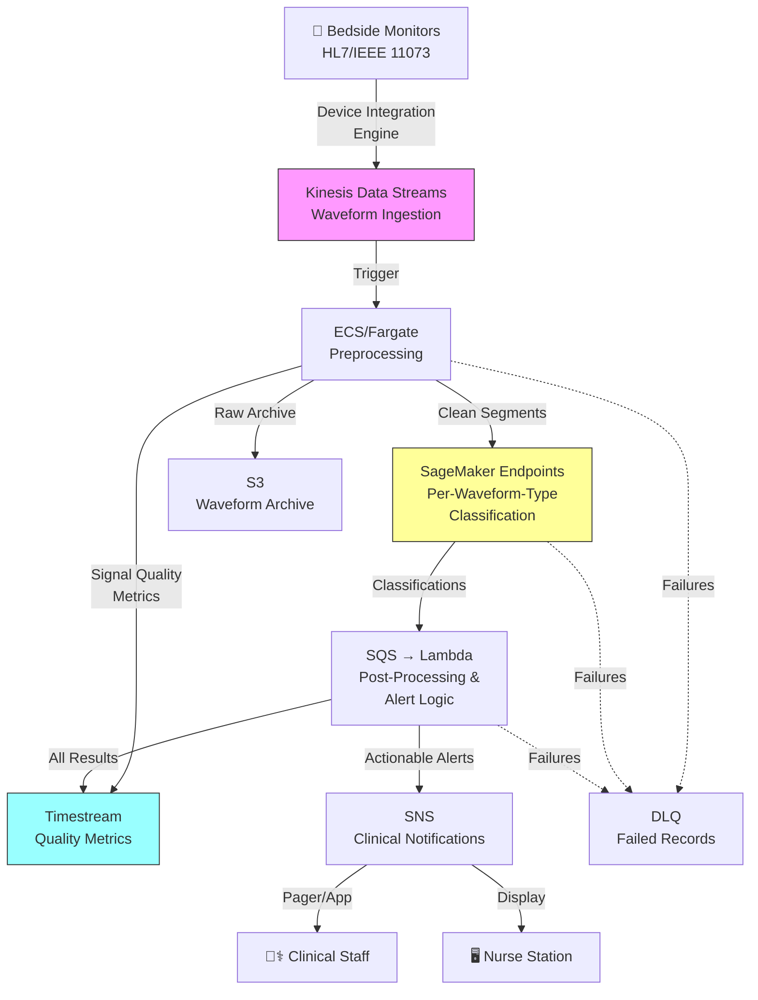

# Recipe 12.10: Physiological Waveform Analysis

**Complexity:** Complex · **Phase:** Specialized · **Estimated Cost:** ~$0.15–$0.80 per patient-hour of monitoring

---

## The Problem

Walk into any ICU and look at the bedside monitors. You'll see a cascade of waveforms scrolling across the screen: ECG traces, arterial blood pressure waves, pulse oximetry plethysmographs, intracranial pressure curves, EEG channels. Each one is a continuous stream of data sampled at anywhere from 60 Hz (pulse ox) to 500 Hz (ECG) to 2000 Hz (EEG). A single ICU patient generates roughly 1 GB of waveform data per day.

Now look at what happens to that data. Almost all of it is thrown away. The monitor displays it in real time, a nurse glances at it periodically, and the system stores maybe a few summary statistics (heart rate, mean arterial pressure) in the EHR every few minutes. The raw waveform? Gone. The subtle morphological changes in the ECG that preceded a cardiac arrest by 45 minutes? Gone. The slow drift in EEG spectral power that predicted a seizure 20 minutes before clinical onset? Gone.

This is not a storage problem. Storage is cheap. This is an analysis problem. The volume and velocity of physiological waveform data overwhelm human attention. A nurse watching six patients cannot simultaneously track the beat-to-beat variability in each patient's QT interval, the trending of pulse pressure variation, and the spectral evolution of an EEG. But a machine can.

Here's where it gets interesting from a clinical standpoint. Arrhythmia detection from ECG waveforms is the most mature application, but it's just the beginning. Seizure prediction from EEG, hemodynamic instability detection from arterial line waveforms, ventilator asynchrony detection from flow and pressure curves, and neonatal apnea detection from respiratory waveforms are all active areas where continuous waveform analysis can provide minutes to hours of early warning before clinical deterioration becomes obvious.

The challenge is building a system that can ingest these high-frequency streams, process them in near-real-time, distinguish genuine physiological signals from the ocean of noise and artifact, and surface actionable alerts without drowning clinicians in false alarms. Alert fatigue is already the number one complaint in ICU nursing. Adding another alarm source that fires incorrectly is worse than having no alarm at all.

Here's how the signal processing actually works, and why the gap between "demo" and "production" is so wide.

---

## The Technology: Signal Processing Meets Deep Learning

### What Are Physiological Waveforms?

A physiological waveform is a continuous measurement of a biological signal over time. The signal is typically electrical (ECG measures cardiac electrical activity, EEG measures brain electrical activity) or mechanical (arterial blood pressure measures the pressure wave propagating through arteries, respiratory flow measures air movement). These signals are sampled by sensors at a fixed rate (the sampling frequency) and digitized into a sequence of numerical values.

The key insight is that these waveforms carry information at multiple timescales simultaneously. An ECG contains:

- **Beat-level morphology** (the shape of each QRS complex, ST segment, T wave): tells you about conduction, ischemia, electrolyte abnormalities
- **Beat-to-beat variability** (how the intervals between beats change): tells you about autonomic nervous system function
- **Rhythm patterns** (sequences of beats over seconds to minutes): tells you about arrhythmias
- **Long-term trends** (hours to days): tells you about disease progression or medication effects

A useful waveform analysis system needs to operate across all of these timescales, often simultaneously.

### Signal Processing Fundamentals

Before any machine learning happens, raw waveforms need preprocessing. This is where most projects either succeed or fail, and it's the part that gets the least attention in ML papers.

**Filtering.** Raw physiological signals are contaminated with noise from multiple sources: powerline interference (50/60 Hz), muscle artifact (EMG contamination in ECG), motion artifact (patient movement), electrode contact issues, and equipment interference. Bandpass filtering removes frequencies outside the physiologically relevant range. For ECG, you typically keep 0.5-40 Hz for morphology analysis or 0.05-150 Hz if you need high-frequency components. For EEG, 0.5-50 Hz is standard. The filter design matters: aggressive filtering removes noise but can also distort the signal features you're trying to detect.

**Artifact detection and removal.** This is the hardest preprocessing step. A motion artifact on an ECG can look exactly like a ventricular tachycardia to a naive algorithm. Saturation (when the signal clips at the ADC limits) looks like asystole. Electrode disconnection produces a flat line that mimics cardiac arrest. Your system needs to distinguish "the patient is in trouble" from "the sensor fell off" before it can do anything useful. Common approaches include signal quality indices (SQI) that score each segment's reliability, multi-lead cross-validation (if one ECG lead shows VT but the other four look normal, it's probably artifact), and learned artifact classifiers trained on annotated examples.

**Feature extraction.** Once you have clean signal, you extract features that capture the clinically relevant information. Classical approaches use hand-engineered features: R-R intervals from ECG, spectral power bands from EEG, pulse pressure from arterial waveforms. Modern deep learning approaches learn features directly from the raw signal, but even these benefit from domain-informed preprocessing (you still need to filter and detect artifacts before feeding data to a neural network).

### The Deep Learning Revolution in Waveform Analysis

Traditional waveform analysis relied on rule-based algorithms: detect the R-peaks in an ECG, measure intervals, compare against thresholds. These work well for simple, well-defined patterns (sinus rhythm vs. atrial fibrillation) but struggle with subtle, complex patterns (early signs of sepsis in heart rate variability, pre-seizure EEG changes).

Deep learning changed this. Convolutional neural networks (CNNs) and recurrent neural networks (RNNs, particularly LSTMs) can learn to recognize patterns directly from raw or minimally processed waveforms. More recently, transformer architectures adapted for time series have shown strong results on waveform classification tasks.

The typical architecture for waveform classification:

1. **Input:** A fixed-length window of the waveform (e.g., 10 seconds of ECG at 250 Hz = 2,500 samples)
2. **Feature extraction layers:** 1D convolutional layers that learn to detect local patterns (QRS complexes, ST changes, P-wave morphology)
3. **Temporal aggregation:** Pooling or recurrent layers that combine local features into a segment-level representation
4. **Classification head:** Dense layers that map the representation to output classes (normal, atrial fibrillation, ventricular tachycardia, etc.)

For continuous monitoring, you slide this window across the incoming stream, producing a classification at each step. The window overlap and stride determine your temporal resolution and computational cost.

### Why This Is Hard

**Data volume.** A 12-lead ECG at 500 Hz produces 6,000 samples per second. Multiply by 30 ICU beds and you're at 180,000 samples per second just for ECG. Add EEG (which can have 20+ channels at 256 Hz each), arterial pressure, and respiratory waveforms, and you're looking at millions of samples per second for a single unit. Processing this in real time requires serious infrastructure.

**Signal variability.** The same arrhythmia looks different in different patients, different leads, different body positions, and different clinical contexts. A model trained on one hospital's data may perform poorly at another hospital using different equipment, different electrode placements, or different patient populations. This is the domain shift problem, and it's particularly acute in waveform analysis.

**Artifact prevalence.** In real ICU data, artifact contamination rates of 20-40% are common. Patients move, nurses reposition electrodes, equipment gets bumped. Your system will spend more time dealing with artifact than with actual clinical events. If your artifact rejection is too aggressive, you'll miss real events. If it's too permissive, you'll generate false alarms.

**Class imbalance.** The events you're trying to detect (cardiac arrest, seizure, hemodynamic collapse) are rare. A patient might have 23 hours and 55 minutes of normal rhythm and 5 minutes of dangerous arrhythmia. Training a model on this imbalanced data without careful handling leads to a system that's great at saying "normal" and terrible at catching the rare events that actually matter.

**Regulatory constraints.** Any system that makes diagnostic claims about physiological waveforms (e.g., "this is atrial fibrillation") falls under FDA regulation as a Software as a Medical Device (SaMD). The regulatory pathway (510(k) or De Novo) requires clinical validation studies, quality management systems, and ongoing post-market surveillance. This is not a "deploy and iterate" situation. You need to know your intended use, your target population, and your performance characteristics before you go live.

**Alert fatigue.** ICU nurses already receive hundreds of alarms per shift, the vast majority of which are false or clinically insignificant. Adding another alarm source that fires incorrectly is actively harmful: it trains clinicians to ignore all alarms, including the real ones. Your system's positive predictive value (the percentage of alerts that are actually clinically significant) matters more than its sensitivity (the percentage of real events it catches). A system that catches 95% of events but has a 50% false alarm rate will be turned off within a week.

### The General Architecture Pattern

At a conceptual level, continuous waveform analysis follows this pipeline:

```
[Ingest Streams] → [Preprocess & QC] → [Feature Extract / Classify] → [Post-Process & Suppress] → [Alert / Store]
```

**Ingest Streams:** Receive high-frequency waveform data from bedside monitors. This typically involves a medical device integration engine that speaks HL7, IEEE 11073, or proprietary device protocols. The data arrives as continuous streams, not discrete messages.

**Preprocess & Quality Control:** Filter noise, detect and flag artifact segments, compute signal quality indices. Segments below a quality threshold are excluded from analysis (with logging, so you know how much data you're losing).

**Feature Extract / Classify:** Apply the ML model(s) to clean waveform segments. This might be a single multi-class classifier or a pipeline of specialized models (one for rhythm classification, one for morphology analysis, one for trend detection). Output is a per-segment classification with confidence scores.

**Post-Process & Suppress:** Apply clinical logic to raw model outputs. Suppress transient detections (a single beat classified as PVC is not an alert; a run of 3+ PVCs might be). Apply patient-specific context (a patient with known atrial fibrillation should not generate repeated AFib alerts). Implement cooldown periods (don't re-alert for the same condition within N minutes unless it escalates).

**Alert / Store:** Route actionable findings to the clinical notification system. Store all classifications (including non-alerting ones) for retrospective analysis, model retraining, and clinical research. Maintain a complete audit trail of what was detected, when, and what action was taken.

**Failure handling is critical.** Each stage needs a dead-letter mechanism for failed records. In a clinical safety system, silent data loss (waveform segments dropped without detection) is a patient safety concern. Failed records should be retried with backoff, then routed to a dead-letter store for manual review. Operational alerts on failure queue depth ensure the team knows when the pipeline is degrading.

---

## The AWS Implementation

### Why These Services

**Amazon Kinesis Data Streams for waveform ingestion.** Physiological waveforms are the definition of high-throughput streaming data. Kinesis handles the continuous ingestion of millions of data points per second with guaranteed ordering within each shard. Each session (patient-device combination) maps to a partition key, ensuring all data from one source stays in order. The 7-day retention window provides a buffer for reprocessing if your downstream analysis needs to be re-run.

**AWS Lambda (or Amazon ECS/Fargate for sustained workloads) for preprocessing.** The preprocessing step (filtering, artifact detection, quality scoring) is computationally moderate but must run continuously. For lower-volume deployments, Lambda with Kinesis triggers works. For sustained high-throughput (dozens of beds, multiple waveform types), ECS/Fargate containers provide consistent compute without cold-start latency. Configure ECS Service Auto Scaling based on Kinesis iterator age (the lag between record arrival and processing). Target an iterator age under 5 seconds. Pre-provision a minimum task count that handles your typical census plus 20% headroom for burst scenarios like mass casualty events or shift-change admissions.

**Amazon SageMaker for model hosting.** Waveform classification models (typically CNNs or transformers) need GPU inference for real-time performance at scale. SageMaker real-time endpoints with auto-scaling provide managed GPU inference with predictable latency. Deploy separate endpoints per waveform type (ecg-rhythm-classifier, eeg-seizure-detector, abp-hemodynamic-analyzer). This enables independent model updates, independent scaling (ECG inference volume is typically 5-10x higher than EEG), and fault isolation. A multi-model endpoint is acceptable for cost optimization in smaller deployments but introduces deployment coupling. Store model artifacts in a versioned S3 bucket with Object Lock (compliance mode) after validation. Use SageMaker Model Registry to track approved model versions. The endpoint deployment pipeline should verify the model artifact's SHA-256 hash against the registry before deployment, supporting FDA QMS requirements for software configuration management.

**Amazon Timestream for waveform storage and analytics.** Timestream is purpose-built for time series data at scale. It handles the write throughput of continuous waveform ingestion, provides built-in time-based queries (give me the last 4 hours of this patient's ECG features), and automatically manages data lifecycle (hot storage for recent data, cold storage for historical). The magnetic store tier keeps months of historical data queryable at low cost. Batch Timestream writes using the WriteRecords API (up to 100 records per call). Buffer classification results for 1-2 seconds before flushing to maximize batch efficiency and reduce cost by 10-50x versus individual writes.

**Amazon SNS/SQS for clinical alerting.** Alerts need to reach clinicians through multiple channels (pager, mobile app, nurse station display) with guaranteed delivery and acknowledgment tracking. SNS fan-out to multiple subscribers handles the multi-channel requirement. The clinical-waveform-alerts SNS topic uses SSE-KMS encryption. Subscribers are restricted via SNS access policies to authorized clinical notification endpoints. Mobile push notifications use the opaque session ID (not the MRN), with the receiving app resolving the patient identity locally. SQS provides buffering and retry for downstream systems that might be temporarily unavailable.

**Amazon S3 for raw waveform archival.** Raw waveform data (pre-processing) goes to S3 for long-term retention. This supports model retraining, clinical research, and regulatory audit requirements. Lifecycle policies move data to Glacier after the active analysis window.

### Architecture Diagram



### Prerequisites

| Requirement | Details |
|-------------|---------|
| **AWS Services** | Amazon Kinesis Data Streams, Amazon ECS/Fargate, Amazon SageMaker, Amazon Timestream, Amazon S3, Amazon SNS, Amazon SQS, AWS Lambda |
| **IAM Permissions** | Per-component least-privilege roles: (1) Device integration: `kinesis:PutRecord`, `s3:PutObject` (archive bucket); (2) Preprocessing: `kinesis:GetRecords`, `timestream:WriteRecords`, `s3:PutObject`; (3) Inference: `sagemaker:InvokeEndpoint`; (4) Post-processing: `timestream:WriteRecords`, `sns:Publish`, `sqs:ReceiveMessage`; (5) Monitoring: `timestream:Select`, `cloudwatch:GetMetricData` |
| **BAA** | AWS BAA signed (required: waveform data is PHI linked to patient identifiers) |
| **Encryption** | Kinesis: server-side encryption with KMS; S3: SSE-KMS; Timestream: encryption at rest (default); SageMaker endpoint: encrypted inter-container traffic; SNS: SSE-KMS; all transit over TLS |
| **VPC** | Production: all compute in VPC with VPC endpoints for Kinesis, S3, SageMaker (API and Runtime), Timestream (Write and Query), SNS, SQS, CloudWatch Logs, ECR (api and dkr), STS, and KMS. Device integration engine in same VPC or connected via Direct Connect (preferred for <5ms latency) or site-to-site VPN. No internet path for waveform data. Deploy ECS tasks and SageMaker endpoints in the same AZ to minimize cross-component latency. |
| **CloudTrail** | Enabled for all API calls. SageMaker endpoint invocations logged for audit trail of clinical decisions. |
| **Sample Data** | PhysioNet MIMIC-III Waveform Database (publicly available, de-identified ICU waveforms). PhysioNet MIT-BIH Arrhythmia Database for ECG classification development. Never use identifiable patient waveforms in dev. |
| **Cost Estimate** | Kinesis: ~$0.015/million records. SageMaker GPU endpoint (ml.g4dn.xlarge): ~$0.74/hour. Timestream writes: ~$0.50/million records. At 30 beds continuous monitoring: ~$800-1200/month compute + storage. |
| **Regulatory** | FDA SaMD classification required for diagnostic claims. 510(k) or De Novo pathway depending on intended use and predicate devices. Quality Management System (QMS) required. |

### Ingredients

| AWS Service | Role |
|------------|------|
| **Amazon Kinesis Data Streams** | Ingests high-frequency waveform streams with per-session ordering |
| **Amazon ECS/Fargate** | Runs continuous preprocessing (filtering, artifact detection, quality scoring) |
| **Amazon SageMaker** | Hosts trained waveform classification models on GPU endpoints (one per waveform type) |
| **Amazon Timestream** | Stores classification results, quality metrics, and derived features for time-based queries |
| **Amazon S3** | Archives raw waveform data for retraining and research |
| **Amazon SNS** | Delivers clinical alerts to multiple notification channels (SSE-KMS encrypted) |
| **Amazon SQS** | Buffers classification results for post-processing with built-in retry and DLQ |
| **AWS Lambda** | Applies post-processing logic, alert suppression, and clinical context rules |
| **AWS KMS** | Manages encryption keys for all data stores and streams |
| **Amazon CloudWatch** | Monitors pipeline latency, model inference time, alert rates, and system health |

### Code

#### Walkthrough

**Step 1: Waveform ingestion.** Bedside monitors produce continuous streams of physiological data. A device integration engine (running on-premises or in the VPC) translates proprietary device protocols into a standardized format and pushes individual samples or small batches into Kinesis. Each record includes an opaque session identifier (not the patient's MRN), waveform type, timestamp, and the sample values. The partition key is this session ID combined with the waveform type, ensuring all data from one source arrives in order. Using an opaque session ID rather than a direct patient identifier prevents PHI leakage into stream metadata, S3 key paths, and CloudWatch dimensions. A separate identity service with restricted access maps session IDs to MRNs. Without ordered ingestion, downstream analysis would see scrambled waveforms and produce garbage classifications.

```
FUNCTION ingest_waveform_sample(session_id, waveform_type, timestamp, samples):
    // Package the waveform data into a structured record.
    // "samples" is an array of numerical values from the ADC (analog-to-digital converter).
    // For ECG at 500 Hz, a 1-second batch would contain 500 values.
    // NOTE: session_id is an opaque UUID mapped to the patient MRN in a separate
    // identity service. Never use MRN directly as a partition key or S3 path component.
    record = {
        session_id:    session_id,        // opaque encounter-session UUID
        waveform_type: waveform_type,     // e.g., "ecg_lead_ii", "art_bp", "eeg_fp1"
        timestamp:     timestamp,         // precise timestamp of first sample in this batch (ISO 8601)
        sample_rate:   250,               // samples per second (varies by waveform type)
        values:        samples            // array of numerical sample values
    }

    // Push to Kinesis with session+device as partition key.
    // This guarantees ordering: all samples from this patient's ECG arrive in sequence.
    put_record to Kinesis stream "waveform-ingestion":
        data          = serialize(record)
        partition_key = session_id + ":" + waveform_type

    // Also archive the raw data to S3 for long-term retention.
    // Use a time-partitioned key structure for efficient retrieval.
    put_object to S3 bucket "waveform-archive":
        key  = "{session_id}/{waveform_type}/{date}/{hour}/{timestamp}.json"
        body = serialize(record)
```

**Step 2: Preprocessing and quality control.** Raw waveform data is noisy. Before any ML model sees it, you need to filter out non-physiological noise, detect segments corrupted by artifact, and score the overall signal quality. This step runs continuously as data arrives. Segments that fail quality checks are logged (you need to know your data loss rate) but excluded from classification. Passing artifact-contaminated data to the classifier is worse than skipping it: you'll get confident wrong answers that trigger false alarms.

```
FUNCTION preprocess_waveform(raw_record):
    // Extract the raw sample values from the ingested record.
    samples     = raw_record.values
    sample_rate = raw_record.sample_rate
    waveform_type = raw_record.waveform_type

    // Step 2a: Bandpass filter to remove out-of-band noise.
    // Filter parameters depend on waveform type:
    //   ECG: 0.5 - 40 Hz (morphology analysis) or 0.5 - 150 Hz (full bandwidth)
    //   EEG: 0.5 - 50 Hz
    //   Arterial BP: 0.1 - 20 Hz
    filter_params = get_filter_params(waveform_type)
    filtered = apply_bandpass_filter(samples, filter_params.low_hz, filter_params.high_hz, sample_rate)

    // Step 2b: Notch filter for powerline interference (50 or 60 Hz depending on region).
    filtered = apply_notch_filter(filtered, powerline_frequency=60, sample_rate)

    // Step 2c: Compute signal quality index (SQI).
    // SQI combines multiple quality metrics into a single 0-1 score:
    //   - Amplitude range (is the signal within physiological bounds?)
    //   - Baseline wander (is there excessive low-frequency drift?)
    //   - High-frequency noise power (is there excessive EMG contamination?)
    //   - Flatline detection (is the signal suspiciously constant? Electrode off?)
    //   - Saturation detection (is the signal clipping at ADC limits?)
    sqi_score = compute_signal_quality_index(filtered, waveform_type, sample_rate)

    // Step 2d: Quality gate. Reject segments below threshold.
    IF sqi_score < QUALITY_THRESHOLD:  // typically 0.6 - 0.8 depending on application
        log_quality_rejection(raw_record, sqi_score)
        write_quality_metric to Timestream:
            session_id = raw_record.session_id
            metric     = "sqi_rejection"
            value      = sqi_score
            timestamp  = raw_record.timestamp
        RETURN null  // do not pass to classifier

    // Step 2e: Segment into analysis windows.
    // The classifier expects fixed-length input windows.
    // Window size depends on what you're detecting:
    //   Arrhythmia: 10-30 seconds
    //   Seizure: 30-60 seconds
    //   Hemodynamic instability: 60-300 seconds
    window_size = get_window_size(waveform_type)  // in samples
    windows = segment_into_windows(filtered, window_size, overlap=0.5)

    RETURN {
        session_id:    raw_record.session_id,
        waveform_type: raw_record.waveform_type,
        timestamp:     raw_record.timestamp,
        windows:       windows,       // list of fixed-length clean signal segments
        sqi_score:     sqi_score      // quality score for downstream confidence weighting
    }
```

**Step 3: Model inference.** Clean, segmented waveform windows are sent to the classification model hosted on SageMaker. The model returns a classification (or set of classifications) with confidence scores for each window. For ECG, this might be rhythm classification (normal sinus, atrial fibrillation, ventricular tachycardia, etc.). For EEG, it might be seizure vs. non-seizure. The model is the core intelligence of the system, but it's only as good as the preprocessing that feeds it and the post-processing that interprets its output.

```
FUNCTION classify_waveform(preprocessed):
    // Send each analysis window to the SageMaker endpoint for classification.
    // The endpoint hosts a trained deep learning model (CNN or transformer).
    results = empty list

    FOR each window in preprocessed.windows:
        // Invoke the appropriate model endpoint based on waveform type.
        // Each waveform type has its own dedicated endpoint for independent
        // scaling, updates, and fault isolation.
        endpoint_name = get_endpoint_for_waveform(preprocessed.waveform_type)

        response = invoke SageMaker endpoint:
            endpoint = endpoint_name
            payload  = {
                waveform_type: preprocessed.waveform_type,
                sample_rate:   get_sample_rate(preprocessed.waveform_type),
                values:        window,
                // Include SQI so the model can weight its confidence accordingly
                signal_quality: preprocessed.sqi_score
            }

        // Response contains classification label(s) and confidence scores.
        // Example for ECG: { "rhythm": "atrial_fibrillation", "confidence": 0.94,
        //                     "secondary": [{"label": "pvc", "confidence": 0.12}] }
        append to results: {
            classification: response.classification,
            confidence:     response.confidence,
            window_start:   compute_window_timestamp(preprocessed.timestamp, window_index),
            signal_quality: preprocessed.sqi_score
        }

    // On inference failure (timeout, throttling), retry up to 3 times with
    // exponential backoff. If still failing, route the preprocessed segment
    // to a DLQ for manual review. Never silently drop waveform data.

    RETURN {
        session_id:    preprocessed.session_id,
        waveform_type: preprocessed.waveform_type,
        results:       results
    }
```

**Step 4: Post-processing and alert logic.** Raw model outputs are not clinical alerts. A single window classified as "atrial fibrillation" with 70% confidence is not actionable. This step applies clinical logic: requiring sustained detections (multiple consecutive windows agreeing), applying confidence thresholds, checking patient context (known conditions that should not re-alert), and enforcing cooldown periods. This is where you control your false alarm rate, and it's the difference between a system clinicians trust and one they disable. This Lambda function is triggered via SQS (not direct invocation), which provides built-in retry semantics and a DLQ for failed processing attempts.

```
FUNCTION apply_alert_logic(classification_results):
    session_id = classification_results.session_id
    results    = classification_results.results

    // Load patient context: known conditions, active alerts, alert history.
    // A patient with documented chronic atrial fibrillation should not get
    // repeated AFib alerts. A patient post-cardiac surgery may have expected PVCs.
    patient_context = load_patient_context(session_id)

    // Count trailing consecutive windows with the same high-confidence classification.
    // We count from the most recent window backward because that represents the
    // current patient state. A historical run that has since resolved is not actionable.
    FOR each unique classification in results:
        consecutive_count = count_trailing_consecutive(results, classification, 
                                                       min_confidence=ALERT_CONFIDENCE_THRESHOLD)

        // Check if this classification meets the sustained detection requirement.
        // Different conditions have different persistence thresholds:
        //   Ventricular tachycardia: 3 consecutive windows (urgent, short threshold)
        //   Atrial fibrillation: 6 consecutive windows (less urgent, need more certainty)
        //   Seizure: 4 consecutive windows
        persistence_threshold = get_persistence_threshold(classification)

        IF consecutive_count >= persistence_threshold:
            // Check suppression rules before alerting.
            IF classification in patient_context.known_conditions:
                log_suppressed_alert(session_id, classification, "known_condition")
                CONTINUE  // do not alert for known, documented conditions

            IF is_in_cooldown(session_id, classification):
                log_suppressed_alert(session_id, classification, "cooldown_active")
                CONTINUE  // recently alerted for this; don't re-alert yet

            // This is a genuine, actionable alert. Generate it.
            alert = {
                session_id:     session_id,
                classification: classification,
                confidence:     average_confidence(results, classification),
                onset_time:     first_detection_timestamp(results, classification),
                severity:       get_clinical_severity(classification),
                evidence_window: get_evidence_samples(results, classification)
            }

            // Publish alert to clinical notification system.
            // SNS topic uses SSE-KMS encryption. Alert contains session_id (opaque),
            // not MRN. The receiving clinical app resolves patient identity locally.
            publish to SNS topic "clinical-waveform-alerts":
                message  = serialize(alert)
                attributes = {
                    severity:  alert.severity,    // enables filtering by urgency
                    session:   session_id,
                    condition: classification
                }

            // Set cooldown to prevent alert storms.
            set_cooldown(session_id, classification, duration=COOLDOWN_MINUTES)

    // Store ALL classification results (alerting and non-alerting) for audit and research.
    write_batch to Timestream:
        FOR each result in results:
            record = {
                session_id:     session_id,
                waveform_type:  classification_results.waveform_type,
                classification: result.classification,
                confidence:     result.confidence,
                signal_quality: result.signal_quality,
                timestamp:      result.window_start,
                alerted:        was_alert_generated(result)
            }
```

**Step 5: Store and expose results.** Every classification, whether it triggered an alert or not, is stored in Timestream for retrospective analysis. This enables clinicians to review a patient's waveform analysis history ("show me all rhythm classifications for this patient over the last 24 hours"), supports model performance monitoring (tracking false positive rates over time), and provides the training data for model improvement. The storage layer also feeds dashboards that show unit-level alert rates, signal quality trends, and system health metrics.

```
FUNCTION store_and_expose(session_id, classification_results, alerts_generated):
    // Write detailed results to Timestream for time-based queries.
    // Timestream's time-partitioned storage makes "last N hours" queries fast.
    // Batch writes: up to 100 records per WriteRecords call for cost efficiency.
    FOR each batch of 100 records in classification_results:
        write_records to Timestream table "waveform-classifications":
            records = [
                {
                    dimensions = {
                        session_id:     session_id,
                        waveform_type:  result.waveform_type,
                        classification: result.classification
                    },
                    measures = {
                        confidence:     result.confidence,
                        signal_quality: result.signal_quality,
                        alerted:        1 if result in alerts_generated else 0
                    },
                    timestamp = result.window_start
                }
                FOR each result in batch
            ]

    // Write summary metrics for operational dashboards.
    write to Timestream table "waveform-system-metrics":
        dimensions = { unit: get_patient_unit(session_id) }
        measures = {
            classifications_per_minute: count(classification_results) / window_duration_minutes,
            alert_rate:                 count(alerts_generated) / count(classification_results),
            mean_signal_quality:        average(result.signal_quality for result in classification_results)
        }
        timestamp = current_time()
```

> **Curious how this looks in Python?** The pseudocode above covers the concepts. If you'd like to see sample Python code that demonstrates these patterns using boto3, check out the [Python Example](chapter12.10-python-example). It walks through each step with inline comments and notes on what you'd need to change for a real deployment.

### Expected Results

**Sample output for a 30-second ECG analysis window:**

```json
{
  "session_id": "a3f7c291-4e82-4b1a-9d03-7f8e2c1b5a94",
  "waveform_type": "ecg_lead_ii",
  "analysis_window": {
    "start": "2026-03-01T14:22:00Z",
    "end": "2026-03-01T14:22:30Z",
    "signal_quality": 0.91
  },
  "classifications": [
    {
      "window_index": 0,
      "classification": "normal_sinus_rhythm",
      "confidence": 0.96,
      "heart_rate_bpm": 78
    },
    {
      "window_index": 1,
      "classification": "normal_sinus_rhythm",
      "confidence": 0.94,
      "heart_rate_bpm": 76
    },
    {
      "window_index": 2,
      "classification": "premature_ventricular_complex",
      "confidence": 0.82,
      "heart_rate_bpm": 81
    }
  ],
  "alert_generated": false,
  "suppression_reason": "isolated_pvc_below_persistence_threshold"
}
```

**Performance benchmarks:**

| Metric | Typical Value |
|--------|---------------|
| Ingestion-to-classification latency | 2-5 seconds |
| Model inference time (per window) | 50-150 ms on GPU |
| ECG rhythm classification accuracy | 90-97% (varies by rhythm type) |
| Signal quality rejection rate | 15-30% in real ICU data |
| False alert rate (after post-processing) | Target < 5 per patient per day |
| Data throughput (30-bed ICU) | ~500 MB/hour raw waveform |
| Storage cost (raw archive, 30 days) | ~$15-25/month in S3 |

**Where it struggles:** Patients with pacemakers (pacing spikes confuse morphology analysis). Overlapping conditions (atrial fibrillation with frequent PVCs). Pediatric patients (different normal ranges, different waveform morphology). Periods of high artifact (patient transport, procedures, bathing). And the cold start problem: a new patient with no baseline requires conservative thresholds until the system learns their normal.

---

## The Honest Take

Here's what nobody tells you about building real-time waveform analysis systems:

The ML model is maybe 20% of the work. The other 80% is plumbing: getting data out of medical devices (which speak arcane protocols and have terrible documentation), handling the constant stream of artifact (which in a real ICU is relentless), building alert suppression logic that clinicians actually trust, and integrating with clinical workflows that were designed around human observation, not algorithmic notification.

Alert fatigue will kill your project faster than bad model accuracy. I've seen systems with 95% sensitivity get turned off because the 5% false positive rate, applied to continuous monitoring of 30 patients, generated dozens of spurious alerts per shift. Nurses will disable your system. They will find the power button. Design for specificity first, sensitivity second.

The signal quality problem is worse than you think. Academic papers report results on curated datasets where artifact has been manually removed. In a real ICU, you'll lose 20-40% of your data to quality rejection. That's not a bug; that's reality. Plan for it. Your system needs to gracefully degrade when signal quality drops, not silently produce garbage.

Device integration is a nightmare. Every monitor vendor has a different protocol, a different data format, and a different idea of what "real-time" means. Some devices buffer internally and dump data in bursts. Some have proprietary APIs that require vendor partnerships to access. Budget 3-6 months just for the device integration layer, and that's if you have experience with medical device interoperability.

The FDA question looms over everything. If your system makes diagnostic claims ("this patient has atrial fibrillation"), it's a medical device and needs FDA clearance. If it makes advisory claims ("this patient's rhythm has changed; clinician review recommended"), the regulatory path may be lighter but is not absent. Get regulatory counsel involved early. The difference between a cleared device and an unapproved one is not technical; it's legal.

---

## Variations and Extensions

**Multi-modal fusion.** Combine waveform analysis across modalities: ECG rhythm classification plus arterial BP waveform analysis plus respiratory pattern detection. Fused models that consider multiple physiological signals simultaneously can detect complex deterioration patterns (like early sepsis) that no single waveform reveals alone. The architecture adds a fusion layer that takes embeddings from each modality-specific model and produces a combined risk score.

**Adaptive patient-specific baselines.** Instead of fixed thresholds, learn each patient's normal patterns over the first few hours of monitoring and alert on deviations from their personal baseline. This dramatically reduces false alerts for patients with unusual but stable physiology (e.g., athletes with low resting heart rates, patients with chronic arrhythmias). Requires a per-patient model adaptation step that runs during the initial monitoring period.

**Retrospective waveform mining for research.** Use the archived raw waveform data in S3 to train new models or validate clinical hypotheses. For example: "In patients who developed sepsis, were there detectable changes in heart rate variability 6 hours before clinical recognition?" This turns your monitoring infrastructure into a research platform. Add AWS Glue for ETL and SageMaker Processing for batch analysis of historical waveforms.

---

## Related Recipes

- **Recipe 12.7 (Vital Sign Trajectory Monitoring):** Operates on derived vital sign values (heart rate, blood pressure numbers) rather than raw waveforms. Complementary: waveform analysis detects beat-level events, vital sign monitoring detects trend-level changes.
- **Recipe 12.4 (Lab Result Trend Analysis):** Similar temporal pattern detection but on sparse, irregular measurements rather than continuous high-frequency streams. Different infrastructure requirements.
- **Recipe 3.7 (ICU Alarm Fatigue Reduction):** Directly addresses the alert fatigue problem that waveform analysis systems must solve. The suppression logic in Step 4 of this recipe implements patterns from 3.7.
- **Recipe 9.1 (Medical Image Classification):** Shares the deep learning classification pattern but applied to static images rather than streaming time series. Similar model hosting infrastructure on SageMaker.

---

## Additional Resources

**AWS Documentation:**
- [Amazon Kinesis Data Streams Developer Guide](https://docs.aws.amazon.com/streams/latest/dev/introduction.html)
- [Amazon SageMaker Real-Time Inference](https://docs.aws.amazon.com/sagemaker/latest/dg/realtime-endpoints.html)
- [Amazon Timestream Developer Guide](https://docs.aws.amazon.com/timestream/latest/developerguide/what-is-timestream.html)
- [Amazon Timestream Write API](https://docs.aws.amazon.com/timestream/latest/developerguide/API_Operations_Amazon_Timestream_Write.html)
- [AWS HIPAA Eligible Services](https://aws.amazon.com/compliance/hipaa-eligible-services-reference/)
- [Architecting for HIPAA on AWS](https://docs.aws.amazon.com/whitepapers/latest/architecting-hipaa-security-and-compliance-on-aws/welcome.html)

**Public Datasets for Development:**
- [PhysioNet MIMIC-III Waveform Database](https://physionet.org/content/mimic3wdb/1.0/): De-identified ICU waveform recordings from Beth Israel Deaconess Medical Center. Includes ECG, ABP, SpO2, and respiratory waveforms.
- [PhysioNet MIT-BIH Arrhythmia Database](https://physionet.org/content/mitdb/1.0.0/): Annotated ECG recordings for arrhythmia detection algorithm development and benchmarking.
- [PhysioNet CHB-MIT Scalp EEG Database](https://physionet.org/content/chbmit/1.0.0/): Pediatric EEG recordings with seizure annotations for seizure detection research.

**AWS Solutions and Blogs:**
- [Real-Time Streaming Data Analysis on AWS](https://aws.amazon.com/solutions/implementations/real-time-analytics-spark-streaming/): Reference architecture for real-time streaming analytics pipelines
- [Machine Learning Inference at the Edge](https://aws.amazon.com/blogs/machine-learning/): Search for IoT and edge inference patterns applicable to bedside device processing

<!-- TODO (TechWriter): Verify availability of any aws-samples repos specifically for medical device streaming or physiological signal processing. As of writing, most healthcare ML samples focus on imaging and NLP rather than waveform analysis. -->

---

## Estimated Implementation Time

| Phase | Duration |
|-------|----------|
| **Basic** (single waveform type, batch processing, no alerting) | 8-12 weeks |
| **Production-ready** (real-time streaming, multi-waveform, clinical alerting, FDA considerations) | 6-12 months |
| **With variations** (multi-modal fusion, adaptive baselines, research platform) | 12-18 months |

---

## Tags

`time-series` · `waveform` · `ecg` · `eeg` · `streaming` · `real-time` · `kinesis` · `sagemaker` · `timestream` · `icu` · `monitoring` · `deep-learning` · `signal-processing` · `fda` · `complex` · `hipaa`

---

*← [Recipe 12.9: Epidemic Forecasting](chapter12.09-epidemic-forecasting) · [Chapter 12 Index](chapter12-index) · [Next: Chapter 13 →](chapter13-preface)*
