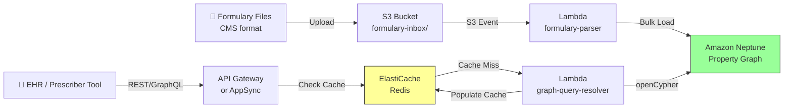

# Recipe 13.1 Architecture and Implementation: Drug Formulary Navigation

*Companion to [Recipe 13.1: Drug Formulary Navigation](chapter13.01-drug-formulary-navigation). This page covers the AWS architecture, services, prerequisites, and pseudocode. For the problem framing and the conceptual approach, start with the main recipe.*

---

## The AWS Implementation

### Why These Services

**Amazon Neptune for the graph database.** Neptune is AWS's managed graph database service, supporting both property graph (Gremlin/openCypher) and RDF (SPARQL) query models. For formulary navigation, we'll use the property graph model with openCypher queries. Neptune handles the operational burden: automated backups, Multi-AZ replication, encryption at rest, and it's on the HIPAA eligible services list. The alternative would be self-managing Neo4j on EC2, which gives you more query language features but adds significant operational overhead.

**Amazon S3 for formulary file storage.** Formulary files land in S3 as the ingestion point. S3 event notifications trigger the parsing pipeline when new files arrive. Historical files are retained for audit and rollback purposes.

**AWS Lambda for the parsing and loading pipeline.** Formulary file parsing is a batch operation that runs quarterly (with occasional mid-quarter updates). Lambda handles the parse-and-load workflow: read the file from S3, transform rows into graph vertices and edges, and bulk-load into Neptune. For the quarterly full reload, you might hit Lambda's 15-minute timeout on very large formularies; Step Functions can orchestrate chunked processing if needed.

**AWS AppSync or API Gateway for the query API.** The prescriber-facing API needs low latency and high availability. API Gateway with Lambda resolvers works for simple query patterns. AppSync (GraphQL) is a natural fit if your consumers want flexible query shapes (some want just alternatives, others want alternatives plus restrictions plus step therapy in one call).

**Amazon ElastiCache (Redis) for query caching.** Formulary data changes quarterly, but the same queries repeat constantly. "What tier is atorvastatin 20mg under Plan XYZ?" gets asked every time someone prescribes it. A Redis cache in front of Neptune dramatically reduces graph query load and improves p99 latency. Cache invalidation aligns with formulary update cycles: flush the cache when you load new formulary data.

### Architecture Diagram



### Prerequisites

<!-- TODO (TechWriter): Expert review S1 (HIGH). Split IAM permissions into read-only (query Lambda: neptune-db:ReadDataViaQuery, neptune-db:connect) and read-write (loader Lambda: neptune-db:ReadDataViaQuery, neptune-db:WriteDataViaQuery, neptune-db:connect). Add note about enabling Neptune IAM authentication on the cluster. -->

<!-- TODO (TechWriter): Expert review N1 (HIGH). Expand VPC section to specify: Lambda in private subnets, required VPC endpoints (S3 gateway, CloudWatch Logs interface, STS interface for IAM auth), security group rules (Lambda SG -> Neptune SG on port 8182, Lambda SG -> Redis SG on port 6379), and NAT gateway requirement if Lambda needs internet access for RxNorm API calls. -->

| Requirement | Details |
|-------------|---------|
| **AWS Services** | Amazon Neptune, Amazon S3, AWS Lambda, API Gateway or AppSync, Amazon ElastiCache (Redis), AWS Step Functions (optional, for large loads) |
| **IAM Permissions** | `neptune-db:*` (scoped to cluster), `s3:GetObject`, `s3:PutObject`, `elasticache:*` (scoped to cluster), `lambda:InvokeFunction` |
| **BAA** | AWS BAA signed. Formulary data itself may not be PHI, but when combined with patient plan membership at query time, the system handles PHI context. |
| **Encryption** | Neptune: encryption at rest enabled at cluster creation (cannot be added later). S3: SSE-KMS. ElastiCache: encryption at rest and in-transit. All API calls over TLS. |
| **VPC** | Neptune requires VPC deployment. Lambda resolvers must be in the same VPC with appropriate security groups. VPC endpoints for S3 and CloudWatch Logs. |
| **CloudTrail** | Enabled: log all Neptune, S3, and API Gateway calls for audit trail. The query Lambda should also log each request (timestamp, requesting system, drug_id, plan_id) to CloudWatch Logs for application-level audit. These logs may contain PHI-adjacent data and should be encrypted and retained per HIPAA retention policies. |
| **Sample Data** | CMS publishes [Part D formulary file layouts](https://www.cms.gov/medicare/prescription-drug-coverage/prescriptiondrugcovcontra) with sample data. Use synthetic plan data for development. |
| **Cost Estimate** | Neptune db.r5.large: ~$0.348/hr (~$254/month). ElastiCache cache.r6g.large (Multi-AZ with automatic failover): ~$0.332/hr (~$242/month). Lambda and API Gateway costs negligible at typical query volumes. Total: ~$500/month for a single-plan deployment. For multi-plan deployments (10+ plans), expect Neptune db.r5.xlarge or larger (~$500-700/month) and proportionally larger Redis instances. |

### Ingredients

| AWS Service | Role |
|------------|------|
| **Amazon Neptune** | Stores the formulary knowledge graph; executes openCypher traversals. Use the reader endpoint for query Lambdas, writer endpoint for the loader Lambda. |
| **Amazon S3** | Receives and archives formulary files |
| **AWS Lambda** | Parses formulary files into graph format; resolves API queries against Neptune |
| **API Gateway / AppSync** | Exposes formulary navigation as REST or GraphQL API |
| **Amazon ElastiCache (Redis)** | Caches frequent query results; reduces Neptune load. Deploy as a Multi-AZ replication group with automatic failover. Enable Redis AUTH and TLS in-transit. |
| **AWS KMS** | Manages encryption keys for Neptune, S3, and ElastiCache |
| **Amazon CloudWatch** | Metrics, logs, and alarms for query latency and graph load operations |
| **Amazon SQS** | Dead letter queue for failed formulary parse/load events; triggers CloudWatch alarm on DLQ messages |

### Code

#### Walkthrough

**Step 1: Parse formulary file into graph statements.** When a new formulary file lands in S3, the parser reads it and transforms each row into graph vertices (drugs, classes, plans) and edges (tier assignments, class memberships, restrictions). CMS formulary files have a defined column layout: NDC or RxNorm code, drug name, dosage form, tier level, restriction codes, therapeutic class, and alternatives. The parser maps these columns to graph entities and relationships. This step is where you handle data quality issues: missing codes, deprecated NDCs, and inconsistent class assignments. Skip this step and you have a flat file that can only answer "what tier is drug X?" but not "what are the alternatives?"

```
FUNCTION parse_formulary_file(bucket, key):
    // Read the raw formulary file from storage.
    // CMS Part D files are pipe-delimited text with a header row.
    raw_data = read file from S3 at bucket/key
    
    // Parse into rows. Each row represents one drug-plan-tier combination.
    rows = parse_delimited(raw_data, delimiter="|", has_header=true)
    
    // Accumulators for graph entities
    vertices = empty list   // nodes to create or update
    edges = empty list      // relationships to create or update
    
    FOR each row in rows:
        // Create or update the Drug vertex
        drug_id = row["RXNORM_CUI"] or row["NDC"]
        append to vertices: {
            id: drug_id,
            label: "Drug",
            properties: {
                name: row["DRUG_NAME"],
                dosage_form: row["DOSAGE_FORM"],
                strength: row["STRENGTH"],
                rxnorm_cui: row["RXNORM_CUI"]
            }
        }
        
        // Create the TherapeuticClass vertex (if not already seen)
        class_id = row["THERAPEUTIC_CLASS_CODE"]
        append to vertices: {
            id: class_id,
            label: "TherapeuticClass",
            properties: {
                name: row["THERAPEUTIC_CLASS_NAME"],
                classification_system: "AHFS"  // or USP, depending on plan
            }
        }
        
        // Edge: Drug belongs to TherapeuticClass
        append to edges: {
            from: drug_id,
            to: class_id,
            type: "BELONGS_TO_CLASS",
            properties: { effective_date: row["EFFECTIVE_DATE"] }
        }
        
        // Edge: Drug has tier assignment under this plan
        append to edges: {
            from: drug_id,
            to: row["PLAN_ID"],
            type: "COVERED_UNDER",
            properties: {
                tier: row["TIER_LEVEL"],
                effective_date: row["EFFECTIVE_DATE"],
                termination_date: row["TERMINATION_DATE"]
            }
        }
        
        // If restriction codes present, create restriction edges
        IF row["PRIOR_AUTH_FLAG"] == "Y":
            append to edges: {
                from: drug_id,
                to: "PA_" + row["PLAN_ID"] + "_" + drug_id,
                type: "HAS_RESTRICTION",
                properties: { restriction_type: "PRIOR_AUTH", plan_id: row["PLAN_ID"] }
            }
        
        IF row["STEP_THERAPY_FLAG"] == "Y":
            append to edges: {
                from: drug_id,
                to: "ST_" + row["PLAN_ID"] + "_" + drug_id,
                type: "HAS_RESTRICTION",
                properties: { restriction_type: "STEP_THERAPY", plan_id: row["PLAN_ID"] }
            }
        
        // If alternatives are listed, create therapeutic alternative edges
        IF row["ALTERNATIVE_DRUGS"] is not empty:
            FOR each alt_drug_id in split(row["ALTERNATIVE_DRUGS"], ","):
                append to edges: {
                    from: drug_id,
                    to: trim(alt_drug_id),
                    type: "THERAPEUTIC_ALTERNATIVE",
                    properties: { plan_id: row["PLAN_ID"], source: "formulary_file" }
                }
    
    RETURN vertices, edges
```

<!-- TODO (TechWriter): Expert review A1 (HIGH). Add error handling guidance for the ingest pipeline: SQS dead letter queue on the S3 event notification or Lambda async invocation config, CloudWatch alarm on DLQ messages, and note that for production the Step Functions orchestration (already mentioned as optional) should be considered mandatory for retry logic and execution history. Mention idempotency: MERGE operations prevent duplicates, but partial loads could leave the graph inconsistent without transaction boundaries. -->

**Step 2: Load graph data into Neptune.** Take the parsed vertices and edges and load them into the graph database. Neptune supports bulk loading via its loader API (for initial loads) and individual upserts via openCypher MERGE statements (for incremental updates). The key decision: on a quarterly full formulary refresh, do you drop and rebuild, or do you merge? Merging preserves any enrichment you've added (like manually curated alternative relationships), but it's slower and risks stale data if a drug is removed from the formulary. The pragmatic approach: use a versioned subgraph per formulary effective date, and point queries at the current version. Skip this step and your parsed data sits in Lambda's memory doing nothing.

```
FUNCTION load_graph(vertices, edges, neptune_endpoint):
    // For bulk initial load, use Neptune's bulk loader with a CSV staging file.
    // For incremental updates, use openCypher MERGE to upsert.
    
    // Connect to Neptune's openCypher endpoint
    connection = connect_to(neptune_endpoint, port=8182, protocol="bolt")
    
    // Upsert vertices: create if new, update properties if existing
    FOR each vertex in vertices:
        execute openCypher on connection:
            MERGE (n:{vertex.label} {id: vertex.id})
            SET n += vertex.properties
            // MERGE ensures we don't create duplicates.
            // SET += updates properties without removing existing ones.
    
    // Upsert edges: create if the relationship doesn't exist yet
    FOR each edge in edges:
        execute openCypher on connection:
            MATCH (a {id: edge.from})
            MATCH (b {id: edge.to})
            MERGE (a)-[r:{edge.type}]->(b)
            SET r += edge.properties
            // MERGE on the relationship prevents duplicate edges.
            // Properties like effective_date get updated if the edge already exists.
    
    // Log load statistics for monitoring
    log("Loaded {count(vertices)} vertices, {count(edges)} edges")
    
    RETURN { vertices_loaded: count(vertices), edges_loaded: count(edges) }
```

**Step 3: Query for therapeutic alternatives.** This is the core value of the graph: answering "what can my patient take instead?" in a single traversal. The query starts at the prescribed drug, finds its therapeutic class, then finds all other drugs in that class that are covered under the patient's plan, sorted by tier (cheapest first). It also checks for restrictions so the prescriber knows upfront if an alternative requires prior auth or step therapy. Without the graph, this query would be a multi-table JOIN with subqueries. With the graph, it's a pattern match.

```
FUNCTION find_alternatives(drug_id, plan_id, neptune_endpoint):
    // The prescriber's question: "What's cheaper and covered for this patient?"
    // We traverse: prescribed drug -> therapeutic class -> other drugs in class -> 
    //             filter by plan coverage -> sort by tier
    
    connection = connect_to(neptune_endpoint, port=8182, protocol="bolt")
    
    // Note: parameterized queries ($drug_id, $plan_id) prevent graph query injection.
    // Never build openCypher queries via string concatenation with user input.
    query = """
        // Start at the prescribed drug
        MATCH (prescribed:Drug {id: $drug_id})
        
        // Find its therapeutic class
        -[:BELONGS_TO_CLASS]->(class:TherapeuticClass)
        
        // Find other drugs in the same class
        <-[:BELONGS_TO_CLASS]-(alternative:Drug)
        
        // That are covered under the patient's plan
        -[coverage:COVERED_UNDER]->(plan:Plan {id: $plan_id})
        
        // Don't return the drug they already prescribed
        WHERE alternative.id <> $drug_id
        
        // Check for restrictions on each alternative
        OPTIONAL MATCH (alternative)-[restriction:HAS_RESTRICTION]->()
        WHERE restriction.plan_id = $plan_id
        
        // Return alternatives sorted by tier (cheapest first)
        RETURN alternative.name AS drug_name,
               alternative.id AS drug_id,
               alternative.strength AS strength,
               coverage.tier AS tier,
               collect(DISTINCT restriction.restriction_type) AS restrictions
        ORDER BY coverage.tier ASC, alternative.name ASC
    """
    
    results = execute(connection, query, parameters={drug_id: drug_id, plan_id: plan_id})
    
    RETURN results
```

**Step 4: Cache results for repeated queries.** The same drug-plan combinations get queried repeatedly. Atorvastatin under Blue Cross PPO Plan 1234 might get looked up hundreds of times a day across a health system. Caching these results in Redis avoids hitting Neptune for every request. The cache key combines drug ID and plan ID. Cache TTL aligns with formulary update frequency: set it to 24 hours during normal periods, and flush explicitly when you load new formulary data. Skip caching and your Neptune cluster will be oversized (and over-budget) to handle the query volume.

<!-- TODO (TechWriter): Expert review S2 (HIGH). Add guidance on Redis security posture: (1) Enable ElastiCache AUTH (Redis AUTH token or IAM-based access control via ElastiCache for Redis 7.0+). (2) Note that cache keys containing plan_id create an access pattern log of medication inquiries per member; recommend using plan-type identifiers rather than member-specific plan IDs where possible, or document PHI implications if member-specific caching is required. (3) Confirm TLS in-transit is required for Lambda-to-Redis connections. -->

```
FUNCTION get_alternatives_cached(drug_id, plan_id, redis_client, neptune_endpoint):
    // Build a deterministic cache key from the query parameters
    cache_key = "alternatives:" + drug_id + ":" + plan_id
    
    // Check Redis first
    cached_result = redis_client.get(cache_key)
    
    IF cached_result is not null:
        // Cache hit. Return immediately without touching Neptune.
        RETURN deserialize(cached_result)
    
    // Cache miss. Query the graph.
    result = find_alternatives(drug_id, plan_id, neptune_endpoint)
    
    // Store in cache with 24-hour TTL.
    // Formulary data changes at most daily (quarterly full refresh, occasional mid-quarter amendments).
    redis_client.set(cache_key, serialize(result), ttl=86400)
    
    RETURN result
```

**Step 5: Expose via API with plan context.** The final step wraps the graph query in a clean API that accepts what the prescriber's system knows (drug name or code, patient's plan ID) and returns what they need (ranked alternatives with tier and restriction information). The API also handles the common case where the prescribed drug IS the preferred option: it returns a confirmation rather than alternatives. This matters for UX. A prescriber doesn't want to see "no alternatives found" when they've already picked the best option; they want "this is the preferred drug in its class."

```
FUNCTION handle_formulary_query(request):
    // Extract and validate parameters from the API request.
    // Validate format before querying: drug_id should match RxNorm CUI or NDC pattern,
    // plan_id should match expected plan identifier format.
    drug_id = request.params["drug_id"]       // RxNorm CUI or NDC
    plan_id = request.params["plan_id"]       // patient's benefit plan identifier
    
    IF NOT valid_drug_id_format(drug_id) OR NOT valid_plan_id_format(plan_id):
        RETURN { status: "INVALID_INPUT", message: "Malformed drug_id or plan_id." }
    
    // First, check the tier of the prescribed drug itself
    prescribed_tier = get_drug_tier(drug_id, plan_id)
    
    IF prescribed_tier is null:
        // Drug not on formulary at all
        RETURN {
            status: "NOT_COVERED",
            prescribed_drug: drug_id,
            message: "This drug is not on the formulary for this plan.",
            alternatives: get_alternatives_cached(drug_id, plan_id, redis, neptune)
        }
    
    // Get alternatives
    alternatives = get_alternatives_cached(drug_id, plan_id, redis, neptune)
    
    // Check if any alternative has a better (lower) tier
    better_alternatives = filter(alternatives, WHERE tier < prescribed_tier)
    
    IF better_alternatives is empty:
        // The prescribed drug is already the best option
        RETURN {
            status: "PREFERRED",
            prescribed_drug: drug_id,
            tier: prescribed_tier,
            message: "This is the preferred option in its therapeutic class."
        }
    ELSE:
        RETURN {
            status: "ALTERNATIVES_AVAILABLE",
            prescribed_drug: drug_id,
            prescribed_tier: prescribed_tier,
            alternatives: better_alternatives,
            message: "Lower-cost alternatives are available."
        }
```

> **Curious how this looks in Python?** The pseudocode above covers the concepts. If you'd like to see sample Python code that demonstrates these patterns using boto3 and the Neptune openCypher endpoint, check out the [Python Example](chapter13.01-python-example). It walks through each step with inline comments and notes on what you'd need to change for a real deployment.

### Expected Results

**Sample output for atorvastatin 40mg under a commercial PPO plan:**

```json
{
  "status": "ALTERNATIVES_AVAILABLE",
  "prescribed_drug": "RX_83367",
  "prescribed_tier": 3,
  "alternatives": [
    {
      "drug_name": "Rosuvastatin 20mg",
      "drug_id": "RX_301542",
      "strength": "20mg",
      "tier": 1,
      "restrictions": []
    },
    {
      "drug_name": "Simvastatin 40mg",
      "drug_id": "RX_36567",
      "strength": "40mg",
      "tier": 1,
      "restrictions": []
    },
    {
      "drug_name": "Pravastatin 40mg",
      "drug_id": "RX_42463",
      "strength": "40mg",
      "tier": 2,
      "restrictions": []
    }
  ],
  "message": "Lower-cost alternatives are available."
}
```

**Performance benchmarks:**

| Metric | Typical Value |
|--------|---------------|
| Query latency (cache hit) | 2-5 ms |
| Query latency (cache miss, graph traversal) | 15-50 ms |
| Graph load time (full formulary, ~50K drugs) | 3-8 minutes |
| Graph size (single plan formulary) | ~50K vertices, ~200K edges |
| Cache hit rate (steady state) | 85-95% |
| Cost per query | ~$0.001 (amortized Neptune + cache) |

**Where it struggles:** Drugs with complex step therapy chains (3+ required prior medications). Plans with highly customized formularies that don't follow standard therapeutic class groupings. Combination drugs that span multiple classes. And the perennial problem: the formulary file says one thing, but the PBM's adjudication system behaves differently due to overrides, grandfather clauses, or processing errors.

---

## Why This Isn't Production-Ready

**Formulary file format variations.** The pseudocode assumes a clean, CMS-standard pipe-delimited file. In practice, commercial plans publish formulary data in dozens of formats: Excel spreadsheets, PDFs (yes, really), proprietary XML schemas, and NCPDP-standard files that each PBM interprets slightly differently. Your parser needs to handle multiple input formats, and you'll spend more time on parsing edge cases than on graph queries.

**Temporal validity.** The graph needs to answer "what was the formulary on March 15?" for claims adjudication disputes, not just "what is the formulary today?" This requires versioning every edge with effective and termination dates, and filtering all queries by a point-in-time parameter. The pseudocode shows effective_date properties but doesn't demonstrate temporal query filtering.

**RxNorm normalization.** Formulary files use inconsistent drug identifiers. Some use NDC (National Drug Code), some use GPI (Generic Product Identifier), some use RxNorm CUIs. Before you can build therapeutic alternative relationships, you need to normalize everything to a common identifier. RxNorm is the standard choice, but the mapping isn't always clean (especially for combination drugs and new approvals).

**Neptune connection management.** Lambda functions in a VPC connecting to Neptune need connection pooling. Cold starts with Neptune connections add 1-2 seconds of latency. Use provisioned concurrency for the query Lambda, or consider an always-on Fargate task for the query layer if cold start latency is unacceptable.

---

## Variations and Extensions

**Multi-plan comparison.** Extend the query to compare formulary coverage across multiple plans for a patient who's choosing between insurance options during open enrollment. The graph traversal is the same, just fanned out across plan nodes. Useful for benefits advisors and health insurance marketplaces.

**Step therapy path visualization.** For drugs with step therapy requirements, traverse the STEP_BEFORE edges to build a visual path: "Before you can get Drug C, the plan requires you to try Drug A, then Drug B, each for 30 days." Present this as a timeline to the prescriber so they understand the full journey, not just the current restriction.

**Generic substitution with pricing.** Enrich the graph with average wholesale price (AWP) or WAC data on drug nodes. When presenting alternatives, show estimated patient cost (tier copay) alongside the drug name. This turns a clinical tool into a shared decision-making tool that patients and prescribers can use together.

---

## Additional Resources

**AWS Documentation:**
- [Amazon Neptune User Guide](https://docs.aws.amazon.com/neptune/latest/userguide/intro.html)
- [Amazon Neptune openCypher Query Language](https://docs.aws.amazon.com/neptune/latest/userguide/access-graph-opencypher.html)
- [Neptune Bulk Loader](https://docs.aws.amazon.com/neptune/latest/userguide/bulk-load.html)
- [Amazon Neptune Pricing](https://aws.amazon.com/neptune/pricing/)
- [AWS HIPAA Eligible Services](https://aws.amazon.com/compliance/hipaa-eligible-services-reference/)
- [Amazon ElastiCache for Redis User Guide](https://docs.aws.amazon.com/AmazonElastiCache/latest/red-ug/WhatIs.html)

**AWS Sample Repos:**
- [`amazon-neptune-samples`](https://github.com/aws-samples/amazon-neptune-samples): General Neptune examples including graph data modeling, bulk loading, and query patterns
- [`amazon-neptune-ontology-example-blog`](https://github.com/aws-samples/amazon-neptune-ontology-example-blog): Demonstrates building and querying ontology-based knowledge graphs in Neptune

**AWS Solutions and Blogs:**
- [Building a Knowledge Graph with Amazon Neptune](https://aws.amazon.com/blogs/database/building-a-knowledge-graph-with-amazon-neptune/): End-to-end walkthrough of graph modeling and querying in Neptune
- [Let Me Graph That For You (Neptune Blog Series)](https://aws.amazon.com/blogs/database/let-me-graph-that-for-you-part-1-air-routes/): Multi-part series on graph data modeling patterns applicable to healthcare use cases

---

## Estimated Implementation Time

| Tier | Timeline | What You Get |
|------|----------|--------------|
| **Basic** | 2-3 weeks | Single-plan formulary loaded, alternative lookup API working, no caching |
| **Production-ready** | 6-8 weeks | Multi-plan support, Redis caching, temporal versioning, monitoring, CI/CD for formulary updates |
| **With variations** | 10-12 weeks | Multi-plan comparison, step therapy visualization, pricing enrichment, EHR integration |

---


---

*← [Main Recipe 13.1](chapter13.01-drug-formulary-navigation) · [Python Example](chapter13.01-python-example) · [Chapter Preface](chapter13-preface)*
