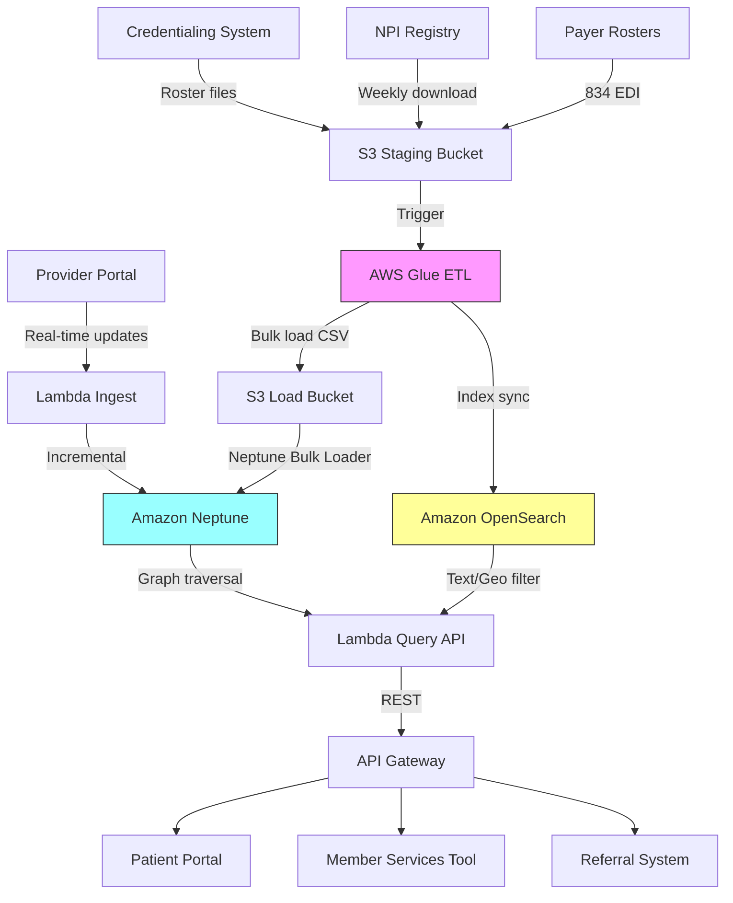

# Recipe 13.2: Provider Directory as Knowledge Graph

**Complexity:** Simple · **Phase:** MVP · **Estimated Cost:** ~$0.10 per 1,000 queries

---

## The Problem

Every health plan, hospital system, and clinic network maintains a provider directory. On the surface, it sounds simple: a list of doctors, their specialties, their locations, whether they're accepting new patients. In practice, it's one of the most frustrating data problems in healthcare.

A patient calls their insurance company and asks: "I need a cardiologist near downtown who accepts my plan, is in-network, and ideally has privileges at the hospital where my PCP practices." The customer service rep types "cardiologist" into a flat search tool, gets 200 results sorted alphabetically, and starts reading them off. The patient sighs. The rep sighs. Nobody is having a good time.

The underlying problem is that provider directories are stored as flat tables. Rows of providers with columns for specialty, address, phone, network status. But the relationships between providers, facilities, specialties, insurance products, and geographic areas are inherently a graph. A provider practices at multiple locations. Each location belongs to a facility. That facility is in-network for certain products but not others. The provider has admitting privileges at a hospital across town. They share a practice group with three other physicians who cover for each other. They speak Spanish and Mandarin. They completed a fellowship in interventional cardiology, which is a subspecialty of cardiology, which is a specialty within internal medicine.

None of that relational richness survives in a flat table. You can't ask "find me a provider who shares a practice group with my current PCP and also has privileges at Memorial Hospital" against a relational database without writing a horrifying multi-join query that the DBA will reject on sight. And even if you write it, the query planner will weep.

This is exactly the kind of problem knowledge graphs were built to solve. When your data is fundamentally about entities and the relationships between them, and your queries are about traversing those relationships, a graph database turns a nightmare into a straightforward traversal.

---

## The Technology: Knowledge Graphs for Connected Data

### What Is a Knowledge Graph?

A knowledge graph is a data structure that represents information as entities (nodes) connected by typed relationships (edges). Each node has properties (attributes), and each edge has a type that describes the nature of the connection. The combination of two nodes and the edge between them is called a triple: subject, predicate, object. "Dr. Smith" (subject) "practices at" (predicate) "Downtown Clinic" (object).

The power of a knowledge graph comes from traversal. Instead of joining tables, you walk along edges. "Find all providers who practice at facilities that are in-network for Plan X and are within 10 miles of this ZIP code" becomes a path traversal: start at the plan node, follow the in-network edges to facilities, filter by geography, then follow the practices-at edges to providers. Each hop is cheap. The query reads like the question you're actually asking.

### Why Graphs Beat Tables for Provider Data

Relational databases handle provider directories adequately when queries are simple: "give me all cardiologists in ZIP 40202." But the moment you need multi-hop reasoning, relational models struggle.

Consider this query: "Find a female endocrinologist within 15 miles who accepts BlueCross PPO, has privileges at University Hospital, speaks Spanish, and is accepting new patients." In a relational model, that's a five-table join (providers, locations, networks, privileges, languages) with geographic filtering. Performance degrades as the dataset grows, and adding new relationship types means schema migrations.

In a graph, each of those constraints is a traversal filter. You start at the plan node, walk to in-network providers, filter by specialty, filter by gender, check the accepting-patients flag, verify hospital privileges via a single edge hop, and confirm language. No joins. No schema changes when you add a new relationship type (say, "trained by" or "covers for"). You just add edges.

The other advantage is schema flexibility. Provider directories change constantly. A new data source adds "telehealth availability" as a relationship. In a relational model, that's an ALTER TABLE or a new junction table. In a graph, it's a new edge type. No migration, no downtime, no breaking existing queries.

### Graph Data Models for Provider Directories

The core entity types in a provider directory graph are straightforward:

- **Provider**: An individual clinician (physician, NP, PA, therapist)
- **Facility/Location**: A physical place where care is delivered
- **Organization**: A practice group, health system, or clinic network
- **Specialty**: A medical specialty or subspecialty (hierarchical)
- **Insurance Product**: A specific plan offered by a payer
- **Network**: A grouping of providers contracted with a payer
- **Geographic Area**: ZIP codes, counties, service areas

The relationships between them carry the real value:

- Provider PRACTICES_AT Location
- Provider HAS_SPECIALTY Specialty
- Provider HAS_PRIVILEGES_AT Facility
- Provider MEMBER_OF Organization
- Provider SPEAKS Language
- Provider ACCEPTS_PRODUCT InsuranceProduct
- Location BELONGS_TO Organization
- Location IN_NETWORK_FOR Network
- Specialty IS_SUBSPECIALTY_OF Specialty
- Network OFFERED_BY Payer

Properties on nodes carry the attributes: accepting-new-patients status, gender, years of experience, board certifications, appointment availability windows. Properties on edges can carry temporal information: "in-network effective 2025-01-01 through 2025-12-31."

### Ontology and Taxonomy

The specialty hierarchy deserves special attention. Medical specialties form a tree (actually a directed acyclic graph, since some subspecialties relate to multiple parent specialties). "Interventional Cardiology" is a subspecialty of "Cardiology," which is a specialty within "Internal Medicine." When a patient searches for "heart doctor," you need to resolve that to the appropriate level of the specialty hierarchy and include all subspecialties beneath it.

This is where ontology comes in. An ontology defines the formal relationships between concepts in a domain. For provider directories, the relevant ontologies include:

- **NUCC taxonomy**: The National Uniform Claim Committee maintains the standard taxonomy of healthcare provider types and specialties. It's hierarchical and widely used in claims processing.
- **NPI taxonomy codes**: Each NPI registration includes taxonomy codes from the NUCC set.
- **Custom organizational hierarchies**: Health systems often have their own groupings that don't map cleanly to NUCC.

Encoding these taxonomies as part of your graph (specialty nodes connected by IS_SUBSPECIALTY_OF edges) enables hierarchical queries naturally. "Find all providers in any cardiology subspecialty" becomes "start at the Cardiology node, traverse all IS_SUBSPECIALTY_OF edges downward, collect all providers connected to any node in that subtree."

### Query Patterns

The most common query patterns for a provider directory graph:

1. **Filtered search**: Start with constraints (specialty, geography, network), traverse to matching providers
2. **Referral pathways**: Given a PCP, find specialists who share a facility or organization
3. **Coverage verification**: Given a provider and a patient's plan, verify in-network status by traversing the network edges
4. **Availability matching**: Combine graph traversal with real-time availability data
5. **Similar provider discovery**: Given a provider a patient likes, find others with similar attributes and relationships

Each of these is a natural graph traversal. The query language (Gremlin, Cypher, SPARQL, or a managed query API) expresses these as path patterns rather than set operations.

### What Makes This Hard

**Data freshness.** Provider directories are notoriously inaccurate. The CMS No Surprises Act requires directories to be updated within 2 business days of a change, but reality lags. Providers change locations, drop out of networks, stop accepting patients, retire. Your graph is only as good as your update pipeline. Stale data in a graph is worse than stale data in a table, because traversals that hit stale edges produce confidently wrong answers.

**Source reconciliation.** Provider data comes from multiple sources: credentialing systems, payer rosters, NPI registry, state licensing boards, facility privilege lists, the providers themselves. These sources disagree. Dr. Smith's credentialing record says she's at Location A. The payer roster says Location B. The NPI registry hasn't been updated in two years. You need a reconciliation strategy, and it's not trivial.

**Geographic reasoning.** "Within 10 miles" requires geospatial computation. Most graph databases support geospatial indexes, but the integration isn't always seamless. You may need to pre-compute geographic relationships (ZIP-to-service-area mappings) and encode them as edges rather than computing distances at query time.

**Scale.** A large health plan's provider directory might have 500,000 providers, 200,000 locations, 50 networks, and millions of edges connecting them. Graph databases handle this scale well, but you need to think about index strategies, query optimization, and caching for hot paths.

---

## General Architecture Pattern

```
[Source Systems] → [Ingest & Reconcile] → [Graph Database] → [Query API] → [Applications]
```

**Source Systems.** Credentialing databases, payer roster files (often 834/835 EDI or CSV), NPI registry downloads, facility privilege lists, provider self-service portals. Each source provides a partial view of the truth.

**Ingest and Reconcile.** An ETL pipeline that reads from each source, resolves conflicts (which address is current? which network status is authoritative?), and produces a unified set of nodes and edges. This pipeline runs on a schedule (daily for most sources, near-real-time for critical updates like network terminations).

**Graph Database.** The persistent store for nodes, edges, and properties. Must support efficient traversal queries, property filtering, and ideally geospatial indexes. Should handle concurrent reads at high throughput for patient-facing search applications.

**Query API.** A service layer that translates application-level questions ("find me a cardiologist near ZIP 40202 accepting BlueCross PPO") into graph traversal queries. This layer handles query construction, result ranking, pagination, and caching.

**Applications.** Patient-facing search portals, member services tools, referral management systems, care coordination platforms. Each consumes the query API with different access patterns and latency requirements.

The key architectural decision is whether to use the graph as the primary store or as a query-optimized projection of data that lives authoritatively elsewhere. For most healthcare organizations, the graph is a projection: the credentialing system remains the system of record, and the graph is rebuilt or incrementally updated from it. This avoids the "two sources of truth" problem.

---

## The AWS Implementation

### Why These Services

**Amazon Neptune for the graph database.** Neptune is AWS's managed graph database service. It supports both the property graph model (with Gremlin and openCypher query languages) and RDF (with SPARQL). For a provider directory, the property graph model is the natural fit: providers, locations, and networks are nodes with properties; relationships are typed edges. Neptune handles the operational overhead (replication, backups, patching) and is on the HIPAA eligible services list. It scales read replicas horizontally for high-throughput search workloads.

**AWS Glue for ETL and data reconciliation.** Provider data arrives from multiple sources in multiple formats. Glue handles the extraction, transformation, and loading into Neptune's bulk load format. Glue jobs can run on a schedule (daily roster refreshes) or be triggered by events (a provider updates their profile). The PySpark environment handles the reconciliation logic: deduplication, conflict resolution, and entity matching across sources.

**Amazon S3 for staging and bulk load.** Neptune's bulk loader reads from S3. The ETL pipeline writes reconciled node and edge files to S3 in CSV format, then triggers Neptune's bulk load API. S3 also serves as the archive for historical snapshots of the directory (useful for auditing network adequacy over time).

**AWS Lambda for the query API.** A lightweight service layer that receives search requests, constructs Gremlin or openCypher queries, executes them against Neptune, and returns formatted results. Lambda's concurrency model handles bursty search traffic (Monday mornings when patients are looking for new providers) without provisioning for peak.

**Amazon API Gateway for the REST interface.** Exposes the query API to consuming applications with authentication, rate limiting, and request validation. Supports both synchronous queries (patient portal search) and asynchronous patterns (batch referral matching).

**Amazon OpenSearch Service for full-text and geospatial search.** Neptune excels at graph traversal but isn't optimized for full-text search ("find providers whose name contains 'Patel'") or complex geospatial queries. OpenSearch complements Neptune by handling the text and geo filtering, with results fed back into graph traversals for relationship-based refinement.

### Architecture Diagram



### Prerequisites

| Requirement | Details |
|-------------|---------|
| **AWS Services** | Amazon Neptune, AWS Glue, Amazon S3, AWS Lambda, Amazon API Gateway, Amazon OpenSearch Service |
| **IAM Permissions** | `neptune-db:*` (scoped to cluster), `s3:GetObject`, `s3:PutObject`, `glue:StartJobRun`, `es:ESHttp*` (scoped to domain) |
| **BAA** | AWS BAA signed (provider directories contain provider PII; when linked to member data, PHI applies) |
| **Encryption** | Neptune: encryption at rest enabled (must be set at cluster creation, cannot be changed later); S3: SSE-KMS; OpenSearch: encryption at rest and node-to-node encryption; all API calls over TLS |
| **VPC** | Neptune requires VPC deployment. Lambda must be in the same VPC with appropriate security groups. VPC endpoints for S3 and CloudWatch Logs. |
| **CloudTrail** | Enabled: log all Neptune, S3, and Glue API calls |
| **Sample Data** | NPPES NPI public data file (freely available from CMS). Synthetic network and location data for testing. Never use real member-provider assignment data in dev. |
| **Cost Estimate** | Neptune db.r5.large: ~$0.58/hr (~$420/mo). Glue: ~$0.44/DPU-hour for ETL jobs. OpenSearch: ~$0.24/hr for a small domain. Lambda and API Gateway negligible at moderate query volumes. |

### Ingredients

| AWS Service | Role |
|------------|------|
| **Amazon Neptune** | Graph database storing provider, location, network, and specialty nodes with relationship edges |
| **AWS Glue** | ETL pipeline for ingesting, reconciling, and transforming provider data from multiple sources |
| **Amazon S3** | Staging area for source files and Neptune bulk load format; archive for historical snapshots |
| **AWS Lambda** | Query API layer translating search requests into graph traversals |
| **Amazon API Gateway** | REST interface with auth, rate limiting, and request validation |
| **Amazon OpenSearch Service** | Full-text search and geospatial filtering to complement graph traversal |
| **AWS KMS** | Encryption key management for Neptune, S3, and OpenSearch |
| **Amazon CloudWatch** | Monitoring, query latency metrics, and alerting on stale data |

### Code

> **Reference implementations:** The following AWS resources demonstrate the patterns used in this recipe:
>
> - [Amazon Neptune Samples](https://github.com/aws-samples/amazon-neptune-samples): General Neptune examples including bulk loading, Gremlin queries, and graph data modeling
> - [Amazon Neptune Full-Text Search with OpenSearch](https://docs.aws.amazon.com/neptune/latest/userguide/full-text-search.html): Integration pattern for combining Neptune graph queries with OpenSearch text search

#### Walkthrough

**Step 1: Define the graph schema.** Before loading any data, you need to define your node labels, edge types, and property keys. This isn't a formal DDL like in relational databases (Neptune is schema-free), but having a documented schema ensures consistency across your ETL pipeline and query layer. The schema defines what your graph can represent and, just as importantly, what it cannot. Skip this step and you'll end up with inconsistent property names, duplicate edge types, and queries that silently return incomplete results because someone spelled "PRACTICES_AT" as "practices_at" in one loader job.

```
// Node labels and their core properties
NODE Provider:
    npi             // National Provider Identifier (unique)
    first_name
    last_name
    gender
    accepting_new   // boolean: currently accepting new patients
    languages[]     // list of spoken languages
    board_certs[]   // list of board certifications
    telehealth      // boolean: offers telehealth visits

NODE Location:
    address_line1
    city
    state
    zip
    latitude
    longitude
    phone
    fax

NODE Specialty:
    nucc_code       // NUCC taxonomy code
    name            // display name (e.g., "Interventional Cardiology")
    category        // broad category (e.g., "Internal Medicine")

NODE Organization:
    name            // practice group or health system name
    type            // "practice_group", "health_system", "clinic"
    tax_id          // organizational TIN

NODE Network:
    network_id
    network_name
    payer_name
    product_type    // "HMO", "PPO", "EPO", etc.

NODE Facility:
    facility_name
    facility_type   // "hospital", "surgery_center", "imaging_center"
    cms_id          // CMS Certification Number if applicable

// Edge types with optional properties
EDGE PRACTICES_AT:      Provider -> Location  (effective_date, end_date)
EDGE HAS_SPECIALTY:     Provider -> Specialty (primary: boolean)
EDGE HAS_PRIVILEGES:    Provider -> Facility  (privilege_type)
EDGE MEMBER_OF:         Provider -> Organization
EDGE IN_NETWORK:        Provider -> Network   (effective_date, term_date)
EDGE LOCATED_IN:        Location -> Facility
EDGE IS_SUBSPECIALTY:   Specialty -> Specialty
EDGE COVERS_FOR:        Provider -> Provider  (coverage_type)
```

**Step 2: Ingest and reconcile source data.** Provider data arrives from multiple systems, each with its own format and its own version of the truth. The NPI registry gives you names, taxonomy codes, and practice addresses. Credentialing systems give you privileges and board certifications. Payer rosters give you network participation. The reconciliation logic must handle conflicts (which address is current?), deduplication (is "John Smith MD" at this NPI the same as "J. Smith" in the credentialing file?), and temporal validity (this network contract expired last month). This is the hardest engineering work in the entire pipeline. Skip it and your graph will contain contradictions that produce wrong answers to patient queries.

```
FUNCTION ingest_provider_data(sources):
    // Phase 1: Extract raw records from each source
    npi_records       = parse_nppes_file(sources.npi_file)        // CMS NPPES download
    cred_records      = parse_credentialing_export(sources.cred)  // internal credentialing DB
    roster_records    = parse_payer_rosters(sources.rosters)       // 834 EDI or CSV from payers
    privilege_records = parse_privilege_lists(sources.privileges)  // hospital privilege files

    // Phase 2: Entity resolution. Match records across sources by NPI.
    // NPI is the universal key for providers. If a source lacks NPI,
    // fall back to name + taxonomy + address matching (Recipe 5.2 covers this in depth).
    unified_providers = empty map

    FOR each npi_record in npi_records:
        provider = create_or_update_provider(npi_record.npi)
        provider.name       = npi_record.name
        provider.taxonomy   = npi_record.taxonomy_codes
        provider.addresses  = npi_record.practice_addresses
        unified_providers[npi_record.npi] = provider

    // Phase 3: Enrich with credentialing data (board certs, privileges)
    FOR each cred_record in cred_records:
        provider = unified_providers.get(cred_record.npi)
        IF provider exists:
            provider.board_certs    = cred_record.certifications
            provider.accepting_new  = cred_record.accepting_status
            provider.languages      = cred_record.languages

    // Phase 4: Add network participation from payer rosters
    FOR each roster_record in roster_records:
        provider = unified_providers.get(roster_record.npi)
        IF provider exists:
            add_network_edge(provider, roster_record.network_id,
                           roster_record.effective_date, roster_record.term_date)

    // Phase 5: Add hospital privileges
    FOR each priv_record in privilege_records:
        provider = unified_providers.get(priv_record.npi)
        IF provider exists:
            add_privilege_edge(provider, priv_record.facility_id,
                             priv_record.privilege_type)

    // Phase 6: Write reconciled data as Neptune bulk load format (CSV)
    write_nodes_csv(unified_providers, "providers.csv")
    write_edges_csv(all_edges, "edges.csv")

    RETURN file_paths  // ready for Neptune bulk load
```

**Step 3: Load the graph.** Neptune's bulk loader is the efficient path for initial loads and large batch updates. It reads CSV files from S3 in a specific format (node files with ~id, ~label, and property columns; edge files with ~id, ~from, ~to, ~label, and property columns). For incremental updates (a provider changes their accepting-new-patients status), use direct Gremlin or openCypher mutations rather than re-loading the entire graph. The bulk loader is idempotent for nodes (same ID overwrites), but edges need careful handling to avoid duplicates.

```
FUNCTION load_graph(node_files, edge_files, neptune_endpoint):
    // Upload reconciled CSV files to the Neptune load bucket
    FOR each file in node_files + edge_files:
        upload_to_s3(file, bucket="neptune-load-bucket", prefix="provider-directory/")

    // Trigger Neptune bulk loader
    // The loader reads CSV from S3 and creates/updates nodes and edges
    load_response = call Neptune Loader API:
        source      = "s3://neptune-load-bucket/provider-directory/"
        format      = "csv"
        iam_role    = neptune_s3_access_role_arn
        region      = deployment_region
        mode        = "AUTO"          // creates new, updates existing
        failOnError = "FALSE"         // log errors, don't abort entire load
        parallelism = "MEDIUM"        // balance speed vs. cluster load

    // Monitor load status
    WHILE load_response.status == "LOAD_IN_PROGRESS":
        wait 30 seconds
        load_response = check_load_status(load_response.load_id)

    IF load_response.status == "LOAD_COMPLETED":
        log "Graph loaded: {node_count} nodes, {edge_count} edges"
    ELSE:
        log "Load errors: review {load_response.errors_file}"
        // Partial loads are common. Review error file for malformed records.

    RETURN load_response
```

**Step 4: Build the query layer.** This is where the graph pays off. Each search request becomes a traversal that reads like the question being asked. The query layer translates application-level parameters (specialty, ZIP, network, gender, languages) into a graph traversal that starts at the most selective constraint and fans out. Query optimization matters here: starting from the network node (which connects to thousands of providers) is less efficient than starting from a specific ZIP code's geographic area (which connects to dozens of locations). The query planner should choose the narrowest entry point.

```
FUNCTION search_providers(params):
    // params: specialty, zip_code, network_id, gender, language,
    //         accepting_new, max_distance_miles, limit

    // Strategy: Start from the most selective constraint.
    // For most queries, geography + specialty is the narrowest entry point.

    // Step 4a: Geographic filtering (via OpenSearch or pre-computed geo edges)
    nearby_locations = query OpenSearch:
        filter by geo_distance(params.zip_code, params.max_distance_miles)
    location_ids = extract IDs from nearby_locations

    // Step 4b: Graph traversal from locations to providers with filters
    query = START traversal:
        // Begin at locations within geographic range
        V(location_ids)

        // Traverse to providers who practice at these locations
        .in("PRACTICES_AT")

        // Filter: correct specialty (including subspecialties)
        .where(
            out("HAS_SPECIALTY").has("nucc_code", within(
                get_specialty_and_subspecialties(params.specialty)
            ))
        )

        // Filter: in the requested network
        .where(
            out("IN_NETWORK").has("network_id", params.network_id)
            .has("term_date", greater_than(today))  // not terminated
        )

        // Filter: accepting new patients
        .has("accepting_new", true)

        // Optional filters
        IF params.gender:
            .has("gender", params.gender)
        IF params.language:
            .has("languages", containing(params.language))

        // Return provider details with their locations and distance
        .project("provider", "location", "distance")
        .limit(params.limit)

    results = execute query against Neptune

    // Step 4c: Rank results (distance, then availability, then patient ratings if available)
    ranked = sort results by distance ascending

    RETURN ranked

FUNCTION get_specialty_and_subspecialties(specialty_code):
    // Traverse the specialty hierarchy to include all subspecialties
    // "Cardiology" should match "Interventional Cardiology", "Electrophysiology", etc.
    codes = query Neptune:
        V().has("Specialty", "nucc_code", specialty_code)
        .emit()                          // include the starting node
        .repeat(in("IS_SUBSPECIALTY"))   // walk down the hierarchy
        .values("nucc_code")
    RETURN codes
```

**Step 5: Handle incremental updates.** The bulk load handles the initial population and periodic full refreshes. But provider data changes constantly: a provider stops accepting patients, moves to a new location, joins or leaves a network. These changes need to propagate to the graph within hours (or minutes for critical changes like network terminations). The incremental update path uses direct graph mutations rather than re-loading.

```
FUNCTION apply_incremental_update(change_event):
    // change_event contains: entity_type, entity_id, change_type, new_values

    IF change_event.entity_type == "provider":
        IF change_event.change_type == "property_update":
            // Update provider properties (e.g., accepting_new changed to false)
            mutate Neptune:
                g.V().has("Provider", "npi", change_event.entity_id)
                .property(change_event.field, change_event.new_value)

        IF change_event.change_type == "new_location":
            // Provider started practicing at a new location
            mutate Neptune:
                g.V().has("Provider", "npi", change_event.entity_id)
                .addE("PRACTICES_AT")
                .to(V().has("Location", "id", change_event.location_id))
                .property("effective_date", change_event.effective_date)

        IF change_event.change_type == "network_termination":
            // Provider left a network. Update the edge term_date.
            // Do NOT delete the edge: historical network participation
            // is needed for claims adjudication lookups.
            mutate Neptune:
                g.V().has("Provider", "npi", change_event.entity_id)
                .outE("IN_NETWORK")
                .has("network_id", change_event.network_id)
                .property("term_date", change_event.term_date)

    // Sync the change to OpenSearch for text/geo search consistency
    update_opensearch_index(change_event)

    // Log the change for audit trail
    log_change_event(change_event)
```

> **Curious how this looks in Python?** The pseudocode above covers the concepts. If you'd like to see sample Python code that demonstrates these patterns using boto3 and the Neptune Gremlin client, check out the [Python Example](chapter13.02-python-example). It walks through each step with inline comments and notes on what you'd need to change for a real deployment.

### Expected Results

**Sample query: "Female cardiologist within 10 miles of 40202, accepting new patients, in-network for BlueCross PPO"**

```json
{
  "query_params": {
    "specialty": "207RC0000X",
    "zip_code": "40202",
    "max_distance_miles": 10,
    "network_id": "BCBS-KY-PPO-2025",
    "gender": "F",
    "accepting_new": true
  },
  "results": [
    {
      "npi": "1234567890",
      "name": "Dr. Sarah Chen",
      "specialty": "Cardiovascular Disease",
      "subspecialties": ["Interventional Cardiology"],
      "location": {
        "address": "456 Medical Plaza, Louisville, KY 40207",
        "distance_miles": 3.2,
        "phone": "(502) 555-0142"
      },
      "organization": "Louisville Heart Associates",
      "privileges": ["University Hospital", "Baptist Health"],
      "languages": ["English", "Mandarin"],
      "accepting_new": true,
      "telehealth": true
    },
    {
      "npi": "0987654321",
      "name": "Dr. Maria Rodriguez",
      "specialty": "Cardiovascular Disease",
      "subspecialties": [],
      "location": {
        "address": "789 Heart Center Dr, Louisville, KY 40204",
        "distance_miles": 5.8,
        "phone": "(502) 555-0198"
      },
      "organization": "Norton Heart Specialists",
      "privileges": ["Norton Hospital"],
      "languages": ["English", "Spanish"],
      "accepting_new": true,
      "telehealth": false
    }
  ],
  "total_matches": 7,
  "query_time_ms": 45
}
```

**Performance benchmarks:**

| Metric | Typical Value |
|--------|---------------|
| Query latency (simple filter) | 20-50ms |
| Query latency (multi-hop traversal) | 50-150ms |
| Query latency (with OpenSearch geo) | 80-200ms |
| Graph size (large health plan) | 500K provider nodes, 2M+ edges |
| Bulk load time (full refresh) | 15-30 minutes for 500K providers |
| Incremental update propagation | < 5 seconds |
| Concurrent query throughput | 1,000+ queries/second (with read replicas) |

**Where it struggles:** Queries that require aggregation across the entire graph (e.g., "how many cardiologists are in-network across all our plans?") are expensive traversals. Use materialized views or pre-computed analytics for reporting workloads. Also, geographic queries that span very large areas (100+ miles) combined with narrow specialty filters can be slow if the geo filtering doesn't prune enough candidates before the graph traversal begins.

---

## Why This Isn't Production-Ready

**Network adequacy compliance.** CMS and state regulators require health plans to demonstrate adequate provider networks (enough providers of each specialty within distance/time standards). The graph makes these calculations natural, but you need to build the compliance reporting layer on top: automated adequacy checks, gap identification, and regulatory filing support.

**Data quality monitoring.** A graph with stale data is worse than no graph, because it produces confidently wrong answers. You need automated freshness checks: "what percentage of provider records were updated in the last 30 days?" "How many network edges have term dates in the past?" Alert on staleness thresholds.

**Multi-tenancy.** If you serve multiple payer clients, each with their own network definitions, you need tenant isolation in the graph. Options: separate Neptune clusters per tenant (expensive, simple), shared cluster with tenant-scoped queries (cheaper, complex), or a hybrid where large tenants get dedicated clusters.

---

## The Honest Take

The graph model is genuinely the right abstraction for provider directories. The moment you try to answer "find me a provider who..." questions with more than two constraints, the graph approach wins decisively over relational joins. The query code reads like the question you're asking, which makes it maintainable and extensible.

The part that will surprise you: the graph database is the easy part. Neptune (or Neo4j, or any mature graph DB) handles the storage and traversal beautifully. The hard part is the data pipeline. Getting clean, reconciled, current provider data into the graph is 80% of the engineering effort. Provider data is messy, contradictory, and constantly changing. You'll spend more time on the Glue jobs than on the Gremlin queries.

The other surprise: you'll want OpenSearch alongside Neptune, not instead of it. Patients don't search by NPI or NUCC code. They search by name fragments, partial addresses, and colloquial specialty names ("heart doctor" not "207RC0000X"). OpenSearch handles the fuzzy text matching and geospatial filtering; Neptune handles the relationship traversal. The two together are more powerful than either alone.

One more thing: don't underestimate the specialty hierarchy. "Cardiology" means different things to different people. A patient searching for a "heart doctor" might need a general cardiologist, an interventional cardiologist, a cardiac electrophysiologist, or a cardiothoracic surgeon. Getting the taxonomy traversal right (and making it configurable per search context) is worth investing in early.

---

## Variations and Extensions

**Referral intelligence.** Extend the graph with referral history edges (Provider A REFERRED_TO Provider B, with count and recency). This enables "find specialists that my PCP commonly refers to" queries, which produce results that are more likely to result in a smooth care transition. The referral edges come from claims data (a specialist visit following a PCP visit within N days implies a referral relationship).

**Appointment availability integration.** Add real-time availability as a property on the PRACTICES_AT edge (or as a separate node connected to the location). When a patient searches, filter results to only show providers with available appointments in the next N days. This requires integration with scheduling systems and near-real-time updates, but dramatically improves the patient experience over "here's a phone number, good luck."

**Network change impact analysis.** When a provider leaves a network, use the graph to instantly identify affected patients: traverse from the departing provider to their patients (via claims or panel assignment edges), then check whether alternative in-network providers exist within distance standards. This powers proactive member outreach ("your cardiologist is leaving our network; here are three alternatives nearby").

---

## Related Recipes

- **Recipe 5.2 (Provider NPI Matching):** Covers the entity resolution techniques needed to match providers across source systems during the ingest phase
- **Recipe 13.1 (Drug Formulary Navigation):** Uses similar graph modeling patterns for navigating hierarchical drug data
- **Recipe 13.3 (ICD/CPT Hierarchy Navigation):** Demonstrates taxonomy traversal patterns applicable to the specialty hierarchy
- **Recipe 4.3 (Provider Directory Search Optimization):** Covers the search ranking and personalization layer that sits on top of this graph
- **Recipe 14.3 (Network Adequacy Optimization):** Uses the provider graph as input for network adequacy compliance calculations

---

## Additional Resources

**AWS Documentation:**
- [Amazon Neptune User Guide](https://docs.aws.amazon.com/neptune/latest/userguide/intro.html)
- [Neptune Bulk Loading from S3](https://docs.aws.amazon.com/neptune/latest/userguide/bulk-load.html)
- [Neptune Gremlin Query Language](https://docs.aws.amazon.com/neptune/latest/userguide/access-graph-gremlin.html)
- [Neptune openCypher Support](https://docs.aws.amazon.com/neptune/latest/userguide/access-graph-opencypher.html)
- [Neptune Full-Text Search with OpenSearch](https://docs.aws.amazon.com/neptune/latest/userguide/full-text-search.html)
- [Amazon Neptune Pricing](https://aws.amazon.com/neptune/pricing/)
- [AWS HIPAA Eligible Services](https://aws.amazon.com/compliance/hipaa-eligible-services-reference/)

**AWS Sample Repos:**
- [`amazon-neptune-samples`](https://github.com/aws-samples/amazon-neptune-samples): Neptune examples including bulk loading, Gremlin/openCypher queries, and graph data modeling patterns
- [`amazon-neptune-graph-notebook`](https://github.com/aws-samples/amazon-neptune-graph-notebook): Jupyter notebook integration for Neptune with visualization and query development

**External Resources:**
- [NPPES NPI Registry Data Download](https://download.cms.gov/nppes/NPI_Files.html): Free provider data from CMS for building and testing provider graphs
- [NUCC Health Care Provider Taxonomy](https://nucc.org/index.php/code-sets-mainmenu-41/provider-taxonomy-mainmenu-40): The standard specialty taxonomy used in NPI registrations
- [CMS Provider Directory Requirements](https://www.cms.gov/marketplace/resources/data/provider-directory-data): Regulatory requirements for directory accuracy and completeness

---

## Estimated Implementation Time

| Tier | Timeline | What You Get |
|------|----------|--------------|
| **Basic** | 3-4 weeks | Neptune cluster, single-source load (NPI registry), basic Gremlin queries, simple search API |
| **Production-ready** | 8-12 weeks | Multi-source reconciliation, incremental updates, OpenSearch integration, geo filtering, monitoring, compliance reporting |
| **With variations** | 14-18 weeks | Referral intelligence, real-time availability, network change impact analysis, multi-tenant support |

---

**Tags:** `knowledge-graph`, `provider-directory`, `neptune`, `graph-database`, `gremlin`, `provider-search`, `network-adequacy`, `healthcare-directory`, `ontology`, `taxonomy`

---

[← Recipe 13.1: Drug Formulary Navigation](chapter13.01-drug-formulary-navigation) | [Chapter 13 Index](chapter13-index) | [Recipe 13.3: ICD/CPT Hierarchy Navigation →](chapter13.03-icd-cpt-hierarchy-navigation)
