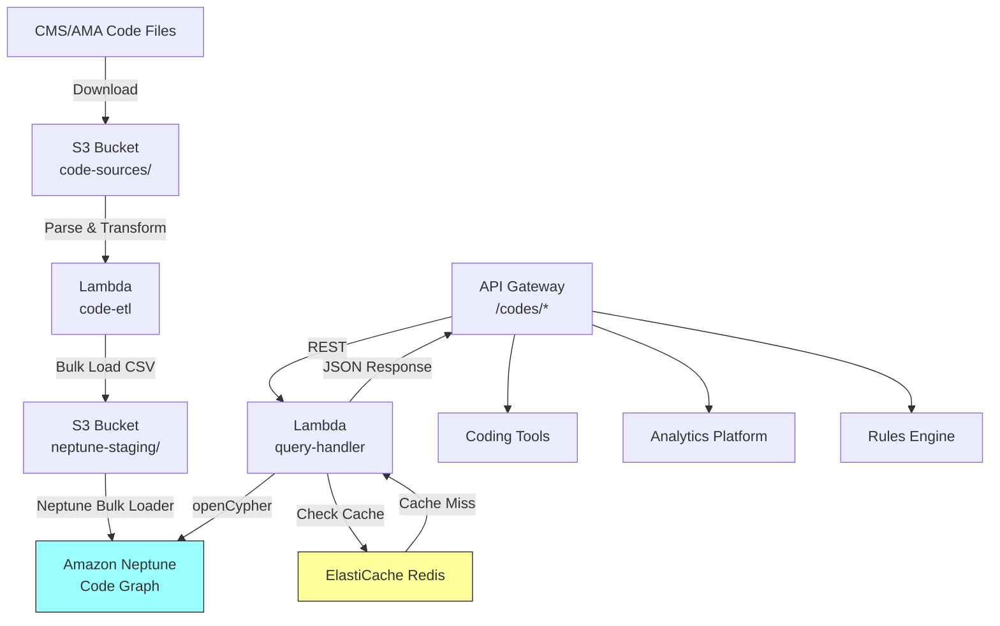

# Recipe 13.3: ICD/CPT Hierarchy Navigation

**Complexity:** Simple-Medium · **Phase:** Foundation · **Estimated Cost:** ~$0.01 per query

---

## The Problem

A coder is staring at a clinical note that says "patient presents with chest pain, ruled out MI, final diagnosis: costochondritis." They need to assign the right ICD-10 code. They know it's somewhere under musculoskeletal, probably in the M94 range, but is it M94.0? M94.1? And wait, is costochondritis actually Tietze syndrome or is that different? They open the ICD-10 lookup tool, type "costochondritis," get three results, and now they need to understand how those codes relate to each other in the hierarchy. Is one more specific than another? Does the parent code capture the same concept at a less granular level?

This is the daily reality of medical coding. ICD-10-CM alone has over 72,000 codes organized in a strict hierarchy: chapters, blocks, categories, subcategories. CPT has over 10,000 procedure codes with their own hierarchical structure. And the two systems cross-reference each other constantly: a diagnosis code justifies a procedure code, and payers maintain complex rules about which combinations are valid.

The problem gets worse when you zoom out from individual coding to analytics. A population health team wants to know "how many patients have any form of diabetes?" That's not one code. That's an entire subtree: E08 through E13, each with dozens of children. Querying a flat code table means knowing every leaf code in advance. Miss one and your cohort is wrong.

Then there's the version problem. ICD-10 updates annually. CMS publishes new codes, retires old ones, and reclassifies existing ones every October 1st. CPT updates quarterly. Your system needs to answer questions like "what was the parent of this code in FY2024?" and "which codes were added under this category in the latest release?" A flat lookup table can't do this without rebuilding the entire thing every cycle.

Knowledge graphs solve this by representing codes as nodes and their relationships (parent-child, cross-walks, supersedes, groups-with) as edges. Instead of searching a flat list, you traverse a hierarchy. Instead of maintaining cross-reference tables, you query relationship paths. Instead of rebuilding for version changes, you add new nodes and edges while preserving history.

---

## The Technology: Hierarchical Code Systems as Graphs

### Why Medical Code Systems Are Naturally Graphs

ICD-10-CM has a tree structure baked into its design. The code itself encodes the hierarchy:

```
E11       → Type 2 diabetes mellitus (category)
E11.6     → Type 2 diabetes with complications (subcategory)
E11.65    → Type 2 diabetes with hyperglycemia (further specificity)
E11.65x1  → ... with subsequent encounter (extension)
```

Each level adds specificity. The parent-child relationship is implicit in the code structure. But here's what makes it interesting: the relationships between codes go far beyond simple parent-child. ICD-10 codes have "excludes1" relationships (mutually exclusive, never code together), "excludes2" relationships (not included here, but can be coded together if documented), "includes" notes, and "code first" / "use additional code" instructions that create directed edges between codes in completely different chapters.

CPT has its own hierarchy: sections (Surgery, Radiology, Medicine), subsections, headings, and individual codes. But CPT also has modifier relationships, add-on code dependencies (codes that can only be reported with a primary code), and bundling rules (multiple codes that collapse into one for billing purposes).

The cross-walk between ICD and CPT is where it gets genuinely complex. A procedure code is only payable when paired with a diagnosis code that justifies medical necessity. These pairings aren't one-to-one. A single CPT code might be justified by dozens of ICD codes. A single ICD code might justify dozens of procedures. And payers maintain their own proprietary variations on these rules.

This is a graph problem. Nodes are codes. Edges are typed relationships: `IS_CHILD_OF`, `EXCLUDES`, `CROSS_WALKS_TO`, `BUNDLES_WITH`, `REQUIRES_MODIFIER`, `SUPERSEDED_BY`. Once you model it this way, questions that were painful SQL queries become simple graph traversals.

### Graph Databases vs. Relational Approaches

You can model hierarchies in a relational database. People do it all the time with adjacency lists, nested sets, or materialized path columns. For simple parent-child lookups, this works fine. But the moment you need multi-hop traversals ("find all codes within 3 levels of this code that cross-walk to any CPT code in the 99200 range"), relational queries become recursive CTEs that are hard to write, hard to optimize, and hard to maintain.

Graph databases store relationships as first-class citizens. A traversal query like "start at E11, walk all children to depth 4, filter by those with a CROSS_WALKS_TO edge to any node in the CPT Surgery section" is a natural expression in a graph query language. The database engine optimizes for exactly this access pattern.

The main graph database paradigms:

**Property graphs** (Neo4j, Amazon Neptune, TinkerPop-compatible systems): Nodes and edges both carry properties (key-value pairs). Edges are typed and directed. Query languages include Cypher (Neo4j), Gremlin (TinkerPop), and openCypher. This is the most common model for healthcare ontology work because the property bags on edges let you attach metadata like "effective date," "source authority," and "confidence level."

**RDF triple stores** (Amazon Neptune in RDF mode, Blazegraph, Stardog): Everything is a subject-predicate-object triple. Query language is SPARQL. This model aligns naturally with formal ontologies (SNOMED-CT is distributed as RDF). If you're integrating with existing biomedical ontologies, RDF might be the path of least resistance. The tradeoff is that SPARQL is more verbose than Cypher for simple traversals.

**Hybrid approaches**: Some teams use a relational database for the flat code lookups (fast, simple, well-understood) and a graph database for the relationship queries (traversals, path-finding, cross-walks). This avoids forcing simple lookups through a graph engine while still getting graph benefits for complex queries.

### The Version Problem

Medical code systems change. ICD-10-CM updates annually (effective October 1). CPT updates annually with quarterly corrections. When a code is retired, you can't just delete it. Historical claims reference it. Analytics over time periods spanning a version boundary need to understand that code X in 2023 became code Y in 2024.

In a graph model, versioning becomes edge metadata. A `SUPERSEDED_BY` edge connects the old code to the new one, with an effective date. A `VALID_IN` edge connects a code to a fiscal year node. Queries can be scoped to a specific version ("show me the E11 subtree as of FY2024") or span versions ("show me all codes that have ever mapped to this concept").

This is dramatically cleaner than the relational alternative, which typically involves either maintaining separate tables per version (explosion of tables) or adding valid_from/valid_to columns to every row (complex WHERE clauses on every query).

### Traversal Patterns That Matter

The queries you'll actually run against a medical code hierarchy graph fall into a few categories:

**Ancestor/descendant queries.** "Give me all codes under E11" (for cohort building). "What's the chapter-level parent of M94.0?" (for reporting rollups). These are depth-first or breadth-first traversals along `IS_CHILD_OF` edges.

**Sibling queries.** "What other codes share the same parent as this one?" Useful for suggesting alternative codes during coding. "You picked E11.65, but did you consider E11.64 or E11.69?"

**Cross-walk queries.** "Which CPT codes are justified by this ICD code?" or "Which diagnoses support medical necessity for this procedure?" These traverse `CROSS_WALKS_TO` edges, potentially filtered by payer-specific rules.

**Exclusion queries.** "Can I code E11.65 and E13.65 on the same claim?" Check for `EXCLUDES1` edges between the two codes or their ancestors.

**Path queries.** "What's the shortest path between these two codes in the hierarchy?" Useful for measuring semantic distance between diagnoses.

**Temporal queries.** "What changed in the E11 subtree between FY2024 and FY2025?" Compare edges with different version metadata.

### General Architecture Pattern

```
[Code Source Files] → [Parser/Loader] → [Graph Database] → [Query API] → [Consumers]
     (CMS, AMA)         (ETL)            (Nodes + Edges)    (REST/GraphQL)   (Coding tools,
                                                                               Analytics,
                                                                               Rules engines)
```

**Source ingestion.** CMS publishes ICD-10-CM as downloadable flat files (tabular format with parent-child relationships encoded positionally). AMA publishes CPT in various formats. Cross-walk files come from CMS (Medicare) and individual payers. Your ETL pipeline parses these into nodes and edges.

**Graph storage.** Codes become nodes with properties (description, effective date, status). Relationships become typed edges with properties (relationship type, source authority, version). The graph accumulates over time rather than being rebuilt.

**Query layer.** A service exposes traversal operations as API endpoints. Consumers don't write raw graph queries; they call endpoints like `/codes/{code}/ancestors`, `/codes/{code}/crosswalks?target_system=CPT`, `/codes/{code}/children?depth=3`.

**Consumers.** Coding assistance tools, analytics platforms, rules engines, and reporting systems all query the same graph through the API. Each gets the traversal depth and relationship types relevant to their use case.

---

## The AWS Implementation

### Why These Services

**Amazon Neptune for graph storage and traversal.** Neptune is AWS's managed graph database, supporting both property graph (Gremlin/openCypher) and RDF (SPARQL) query models. For ICD/CPT hierarchy navigation, the property graph model with openCypher is the natural fit: codes are nodes with properties, relationships are typed edges with metadata. Neptune handles the index management, replication, and backup that you'd otherwise manage yourself. It's also on the HIPAA eligible services list, which matters because code assignments linked to patients are PHI-adjacent (they're part of the designated record set). Use Neptune's reader endpoint for query traffic and the cluster (writer) endpoint for bulk loads so read and write workloads don't compete.

**Amazon S3 for source file staging.** CMS and AMA publish code files as downloadable archives. These land in S3 as the first step of the ingestion pipeline. S3 also serves as the staging area for Neptune bulk load operations, which expect source data in S3.

**AWS Lambda for ETL orchestration.** The parsing and loading pipeline runs periodically (annually for ICD, quarterly for CPT) and is a short-lived batch job. Lambda functions parse the source files, transform them into Neptune bulk load format (CSV with node/edge headers), and trigger the load. For the annual ICD update, this is a few minutes of compute.

**Amazon API Gateway + Lambda for the query API.** Downstream consumers need a REST interface, not direct graph database access. API Gateway provides the HTTP layer; Lambda functions translate REST requests into openCypher queries, execute them against Neptune, and return structured JSON. This also gives you throttling, authentication, and usage tracking for free.

**Amazon ElastiCache (Redis) for query caching.** Hierarchy traversals are deterministic for a given code version. The children of E11 don't change between October updates. Caching traversal results in Redis eliminates repeated graph queries for popular codes and keeps response times under 50ms for cached paths.

### Architecture Diagram



### Prerequisites

| Requirement | Details |
|-------------|---------|
| **AWS Services** | Amazon Neptune, Amazon S3, AWS Lambda, Amazon API Gateway, Amazon ElastiCache (Redis), AWS KMS |
| **IAM Permissions** | Query handler Lambda: `neptune-db:ReadDataViaQuery`, `neptune-db:GetQueryStatus` (scoped to cluster ARN). ETL Lambda: `neptune-db:WriteDataViaQuery`, `neptune-db:ReadDataViaQuery`, `neptune-db:GetLoaderStatus` (scoped to cluster ARN). Both: `s3:GetObject`, `s3:PutObject` (scoped to relevant buckets), `kms:Decrypt`, `kms:GenerateDataKey` (scoped to S3 encryption key). |
| **BAA** | BAA must be signed. Code assignments linked to patients are PHI (part of the designated record set). |
| **Encryption** | Neptune: encryption at rest (enabled at cluster creation, cannot be added later). S3: SSE-KMS. ElastiCache: in-transit and at-rest encryption. All API calls over TLS. |
| **VPC** | Neptune requires VPC deployment. Lambda functions in same VPC with security groups: Lambda SG allows outbound to Neptune (port 8182), ElastiCache (port 6379), and VPC endpoints (port 443). Neptune SG allows inbound from Lambda SG on 8182. ElastiCache SG allows inbound from Lambda SG on 6379. VPC endpoints required: S3 (gateway), CloudWatch Logs (interface), KMS (interface). If Lambdas have no NAT/internet egress, also add Neptune management endpoint. |
| **CloudTrail** | Enabled for Neptune API calls and S3 access logging. Enable Neptune audit logging via cluster parameter group (`neptune_enable_audit_log = 1`) for query-level audit trail. |
| **Sample Data** | CMS publishes ICD-10-CM files at [cms.gov/medicare/coding-billing/icd-10-codes](https://www.cms.gov/medicare/coding-billing/icd-10-codes). CPT requires AMA license. Use ICD-10-CM (free) for development; add CPT when licensed. |
| **Cost Estimate** | Neptune db.r5.large: ~$0.348/hr (~$254/month). Neptune I/O: ~$0.20 per million requests (at 1M queries/month with 85% cache hit rate, expect ~150K Neptune I/Os, negligible; spikes during cache-cold periods post-update). ElastiCache cache.t3.medium: ~$0.068/hr (~$50/month). Lambda and API Gateway negligible at query volumes under 1M/month. |

### Ingredients

| AWS Service | Role |
|------------|------|
| **Amazon Neptune** | Stores code hierarchy as property graph; executes traversal queries (reader endpoint for queries, cluster endpoint for loads) |
| **Amazon S3** | Stages source code files and Neptune bulk load CSVs |
| **AWS Lambda** | ETL pipeline (parse/transform/load) and query handler |
| **Amazon API Gateway** | REST interface for downstream consumers |
| **Amazon ElastiCache** | Caches traversal results for sub-50ms response on popular codes |
| **AWS KMS** | Encryption keys for Neptune, S3, and ElastiCache |
| **Amazon CloudWatch** | Query latency metrics, cache hit rates, ETL job monitoring |

### Code

#### Walkthrough

**Step 1: Parse ICD-10-CM source files into graph nodes and edges.** CMS distributes ICD-10-CM as a set of flat files: a tabular code list with descriptions, and an "order file" that encodes the hierarchy through indentation levels and parent references. This step reads those files and produces two outputs: a node list (one row per code with its properties) and an edge list (one row per relationship). The hierarchy is encoded in the code structure itself (E11 is parent of E11.6, which is parent of E11.65), but the source files also contain explicit "includes," "excludes1," and "excludes2" annotations that become additional edge types. Skip this step and you have no graph to query. Get the parsing wrong and your hierarchy traversals return incorrect results, which means wrong cohort counts and invalid coding suggestions.

```
FUNCTION parse_icd10_to_graph(source_file_path):
    // Read the CMS order file. Each line contains:
    //   - Code (positional, chars 1-7)
    //   - Whether it's a "header" (non-billable parent) or "billable" leaf
    //   - Short description and long description
    raw_codes = read and parse CMS order file from source_file_path

    nodes = empty list   // will hold one entry per code
    edges = empty list   // will hold one entry per relationship

    FOR each code_entry in raw_codes:
        // Create a node for this code
        node = {
            id:          code_entry.code,                    // e.g., "E11.65"
            label:       "ICD10CM",                          // node type label
            description: code_entry.long_description,        // human-readable name
            short_desc:  code_entry.short_description,       // abbreviated name
            is_billable: code_entry.is_billable,             // true = leaf code, false = category header
            chapter:     derive_chapter(code_entry.code),    // e.g., "4" for E codes (Endocrine)
            version:     "FY2026"                            // fiscal year this code is valid in
        }
        append node to nodes

        // Derive parent from code structure:
        //   E11.65 → parent is E11.6
        //   E11.6  → parent is E11
        //   E11    → parent is E08-E13 block (or chapter node)
        parent_code = derive_parent(code_entry.code)
        IF parent_code is not null:
            edge = {
                source: code_entry.code,
                target: parent_code,
                type:   "IS_CHILD_OF"
            }
            append edge to edges

    // Parse the excludes/includes annotations (separate CMS file)
    annotations = parse_annotation_file(source_file_path + "/annotations")
    FOR each annotation in annotations:
        edge = {
            source:     annotation.code,
            target:     annotation.referenced_code,
            type:       annotation.relationship_type,   // "EXCLUDES1", "EXCLUDES2", "CODE_FIRST", etc.
            note:       annotation.description          // human-readable explanation
        }
        append edge to edges

    RETURN nodes, edges
```

**Step 2: Parse CPT codes and cross-walk mappings.** CPT has its own hierarchy (sections, subsections, code ranges) and the critical cross-walk file maps ICD-10 diagnosis codes to CPT procedure codes for medical necessity validation. The cross-walk data comes from CMS for Medicare (the "Medically Unlikely Edits" and "Correct Coding Initiative" files) and from individual payers for commercial plans. This step produces additional nodes (CPT codes) and cross-walk edges connecting the two systems. Without this step, your graph answers hierarchy questions but can't answer the cross-system questions that coding and billing teams actually need.

```
FUNCTION parse_cpt_and_crosswalks(cpt_source, crosswalk_source):
    nodes = empty list
    edges = empty list

    // Parse CPT hierarchy (requires AMA license)
    cpt_codes = parse_cpt_file(cpt_source)
    FOR each cpt_entry in cpt_codes:
        node = {
            id:          "CPT:" + cpt_entry.code,        // prefix to distinguish from ICD
            label:       "CPT",
            description: cpt_entry.description,
            section:     cpt_entry.section,              // e.g., "Surgery", "Medicine"
            subsection:  cpt_entry.subsection,
            is_addon:    cpt_entry.is_addon_code,        // add-on codes can't be billed alone
            version:     "2026"
        }
        append node to nodes

        // CPT parent-child from section hierarchy
        IF cpt_entry.parent_range is not null:
            edge = {
                source: "CPT:" + cpt_entry.code,
                target: "CPT:" + cpt_entry.parent_range,
                type:   "IS_CHILD_OF"
            }
            append edge to edges

    // Parse ICD-to-CPT cross-walk (medical necessity mappings)
    crosswalks = parse_crosswalk_file(crosswalk_source)
    FOR each mapping in crosswalks:
        edge = {
            source:    mapping.icd_code,                 // ICD-10-CM code
            target:    "CPT:" + mapping.cpt_code,        // CPT code
            type:      "CROSS_WALKS_TO",
            payer:     mapping.payer,                     // "Medicare" or specific payer
            effective: mapping.effective_date,
            end_date:  mapping.end_date                   // null if currently active
        }
        append edge to edges

    RETURN nodes, edges
```

**Step 3: Bulk load into Neptune.** Neptune's bulk loader expects CSV files in S3 with specific header conventions. Node files need `~id`, `~label`, and property columns. Edge files need `~id`, `~from`, `~to`, `~label`, and property columns. This step transforms the parsed data into that format and triggers the load. Bulk loading is dramatically faster than inserting nodes one at a time via Gremlin or openCypher (minutes vs. hours for 70,000+ nodes). For true upsert behavior (updating existing nodes with new property values on reload), use `mode=AUTO` with `updateSingleCardinalityProperties=TRUE`. Without these parameters, reloading a file with changed descriptions will skip existing nodes rather than updating them.

```
FUNCTION load_graph_to_neptune(nodes, edges, neptune_endpoint, s3_staging_bucket):
    // Transform nodes into Neptune CSV format
    node_csv = format_as_neptune_csv(nodes, type="nodes")
    // Columns: ~id, ~label, description:String, is_billable:Bool, chapter:String, version:String

    // Transform edges into Neptune CSV format
    edge_csv = format_as_neptune_csv(edges, type="edges")
    // Columns: ~id, ~from, ~to, ~label, note:String, payer:String, effective:Date

    // Upload to S3 staging bucket
    upload node_csv to s3_staging_bucket + "/nodes/icd10_nodes.csv"
    upload edge_csv to s3_staging_bucket + "/edges/icd10_edges.csv"

    // Trigger Neptune bulk load
    response = call Neptune Loader API:
        source      = s3_staging_bucket
        format      = "csv"
        iamRoleArn  = neptune_load_role_arn    // Neptune needs an IAM role to read from S3
        region      = current_region
        mode        = "AUTO"                   // upsert: update existing, insert new
        failOnError = "FALSE"                  // log errors but continue loading valid records
        parallelism = "HIGH"                   // use all available loader threads
        updateSingleCardinalityProperties = "TRUE"  // update properties on existing nodes

    // Monitor load status
    WHILE load is not complete:
        status = check Neptune Loader status(response.loadId)
        IF status == "LOAD_FAILED":
            log error details
            RAISE exception
        wait 5 seconds

    RETURN load statistics (nodes loaded, edges loaded, errors)
```

**Step 4: Query the hierarchy.** This is where the graph pays off. Queries that would be recursive CTEs in SQL become simple traversal expressions in openCypher. The query handler Lambda receives REST requests, translates them into openCypher, executes against Neptune, and returns structured JSON. Common query patterns: get all descendants (for cohort building), get ancestors (for rollup reporting), find cross-walks (for coding validation), check exclusions (for claim editing). Each query type is a different traversal pattern but they all follow the same execute-and-format flow.

```
FUNCTION handle_query(request):
    code       = request.path_params.code          // e.g., "E11"
    query_type = request.path_params.query_type    // "children", "ancestors", "crosswalks", "exclusions"
    depth      = request.query_params.depth OR 10  // how many levels to traverse (default: 10)
    version    = request.query_params.version OR current_fiscal_year()
    page_size  = request.query_params.limit OR 100
    offset     = request.query_params.offset OR 0

    // Validate input: reject malformed codes at the API layer.
    // ICD-10 pattern: letter + digits + optional dot + digits
    // CPT pattern: "CPT:" prefix + 4-5 digits
    IF code does not match "^[A-Z][0-9]{2}(\.[0-9A-Z]{1,4})?$"
       AND code does not match "^(CPT:)?[0-9]{4,5}$":
        RETURN 400 Bad Request ("Invalid code format")

    // Clamp depth to prevent unreasonably broad traversals
    depth = max(1, min(depth, 20))

    // Check cache first.
    // Key includes resolved version (not "current") to avoid ambiguity across updates.
    cache_key = build_cache_key(code, query_type, depth, version, page_size, offset)
    cached = lookup cache_key in Redis
    IF cached is not null:
        RETURN cached

    // Build the appropriate openCypher query.
    // Note: Neptune openCypher does not support parameterized variable-length
    // path bounds. The depth value must be interpolated as a literal integer
    // (safe here because we validated it as an integer above).
    IF query_type == "children":
        // Find all descendants up to specified depth
        cypher = "
            MATCH path = (start {id: $code})<-[:IS_CHILD_OF*1..{depth}]-(descendant)
            WHERE descendant.version = $version
            RETURN descendant.id AS code,
                   descendant.description AS description,
                   descendant.is_billable AS billable,
                   length(path) AS depth_level
            ORDER BY descendant.id
            SKIP $offset LIMIT $page_size
        "
        // {depth} is interpolated as a literal integer, not a parameter

    ELSE IF query_type == "ancestors":
        // Walk up the hierarchy to the chapter level
        cypher = "
            MATCH path = (start {id: $code})-[:IS_CHILD_OF*1..10]->(ancestor)
            RETURN ancestor.id AS code,
                   ancestor.description AS description,
                   length(path) AS levels_up
            ORDER BY levels_up
        "

    ELSE IF query_type == "crosswalks":
        // Find all codes in the other system linked by cross-walk edges
        target_system = request.query_params.target OR "CPT"
        cypher = "
            MATCH (start {id: $code})-[r:CROSS_WALKS_TO]->(target)
            WHERE target.`~label` = $target_system
            RETURN target.id AS code,
                   target.description AS description,
                   r.payer AS payer,
                   r.effective AS effective_date
            SKIP $offset LIMIT $page_size
        "

    ELSE IF query_type == "exclusions":
        // Find codes that cannot be reported together with this one
        cypher = "
            MATCH (start {id: $code})-[r:EXCLUDES1]-(excluded)
            RETURN excluded.id AS code,
                   excluded.description AS description,
                   'EXCLUDES1' AS exclusion_type
        "

    // Execute against Neptune (use reader endpoint for queries)
    result = execute_cypher(neptune_reader_endpoint, cypher, params={code, version, offset, page_size})

    // Cache the result.
    // TTL = 24 hours. After a version update, flush the cache (see Step 5).
    store cache_key -> result in Redis with TTL 86400

    RETURN format_as_json(result)
```

**Step 5: Handle version transitions.** When CMS publishes a new ICD-10-CM version each October, the graph needs to incorporate the changes without destroying history. New codes get new nodes. Retired codes get a `SUPERSEDED_BY` edge pointing to their replacement. Modified codes get updated properties with the new version tag. This step runs as part of the annual ETL and ensures that queries scoped to any historical version still return correct results. Skip this and you lose the ability to analyze claims across fiscal year boundaries, which breaks any longitudinal analytics.

```
FUNCTION apply_version_update(new_version_nodes, new_version_edges, current_version, new_version):
    // Identify changes: new codes, retired codes, modified descriptions
    current_codes = query Neptune for all nodes where version = current_version
    new_codes     = set of new_version_nodes not in current_codes
    retired_codes = set of current_codes not in new_version_nodes
    modified      = set of codes in both but with changed descriptions

    // Add new codes as new nodes
    FOR each code in new_codes:
        create node in Neptune with version = new_version

    // Mark retired codes with SUPERSEDED_BY edges
    FOR each code in retired_codes:
        // CMS publishes a "GEMs" (General Equivalence Mappings) file
        // that maps old codes to their replacements
        replacement = lookup_gem_mapping(code, new_version)
        IF replacement exists:
            create edge: code -[:SUPERSEDED_BY {effective: new_version}]-> replacement
        // Mark the old node as inactive but don't delete it
        update node property: code.status = "RETIRED"
        update node property: code.retired_in = new_version

    // Update modified descriptions
    FOR each code in modified:
        // Don't overwrite: create a versioned property
        update node: code.description = new_description
        update node: code.version = new_version
        // Preserve old description as historical property
        add property: code.description_prior = old_description

    // Add new version's edges (new cross-walks, updated exclusions)
    FOR each edge in new_version_edges:
        IF edge does not exist in current graph:
            create edge with effective_date = new_version

    // Flush the Redis cache after a successful version update.
    // All cached traversal results may now be stale.
    flush Redis cache (or at minimum, flush keys matching the updated version)

    log "Version update complete: {new_codes.count} added, {retired_codes.count} retired, {modified.count} modified"
```

> **Curious how this looks in Python?** The pseudocode above covers the concepts. If you'd like to see sample Python code that demonstrates these patterns using boto3 and the Neptune openCypher endpoint, check out the [Python Example](chapter13.03-python-example). It walks through each step with inline comments and notes on what you'd need to change for a real deployment.

### Expected Results

**Sample output for a "children" query on E11 (Type 2 diabetes):**

```json
{
  "code": "E11",
  "description": "Type 2 diabetes mellitus",
  "query_type": "children",
  "depth_requested": 2,
  "version": "FY2026",
  "results": [
    {"code": "E11.0", "description": "Type 2 diabetes mellitus with hyperosmolarity", "billable": false, "depth_level": 1},
    {"code": "E11.00", "description": "Type 2 DM with hyperosmolarity without nonketotic hyperglycemic-hyperosmolar coma", "billable": true, "depth_level": 2},
    {"code": "E11.01", "description": "Type 2 DM with hyperosmolarity with coma", "billable": true, "depth_level": 2},
    {"code": "E11.1", "description": "Type 2 diabetes mellitus with ketoacidosis", "billable": false, "depth_level": 1},
    {"code": "E11.10", "description": "Type 2 DM with ketoacidosis without coma", "billable": true, "depth_level": 2},
    {"code": "E11.11", "description": "Type 2 DM with ketoacidosis with coma", "billable": true, "depth_level": 2},
    {"code": "E11.2", "description": "Type 2 diabetes mellitus with kidney complications", "billable": false, "depth_level": 1},
    {"code": "E11.21", "description": "Type 2 DM with diabetic nephropathy", "billable": true, "depth_level": 2},
    {"code": "E11.22", "description": "Type 2 DM with diabetic chronic kidney disease", "billable": true, "depth_level": 2}
  ],
  "total_results": 147,
  "truncated": true,
  "next_offset": 9,
  "query_time_ms": 23
}
```

**Sample output for a "crosswalks" query:**

```json
{
  "code": "E11.65",
  "description": "Type 2 diabetes mellitus with hyperglycemia",
  "query_type": "crosswalks",
  "target_system": "CPT",
  "results": [
    {"code": "CPT:82947", "description": "Glucose; quantitative, blood", "payer": "Medicare", "effective_date": "2024-01-01"},
    {"code": "CPT:83036", "description": "Hemoglobin; glycosylated (A1C)", "payer": "Medicare", "effective_date": "2024-01-01"},
    {"code": "CPT:80053", "description": "Comprehensive metabolic panel", "payer": "Medicare", "effective_date": "2024-01-01"}
  ],
  "total_results": 3,
  "query_time_ms": 8
}
```

**Performance benchmarks:**

| Metric | Typical Value |
|--------|---------------|
| Single-code lookup | 5-15ms (cached: <2ms) |
| Subtree traversal (depth 3) | 20-50ms |
| Full subtree (all descendants) | 50-200ms depending on subtree size |
| Cross-walk query | 8-30ms |
| Exclusion check | 5-10ms |
| Bulk load (full ICD-10-CM) | 3-5 minutes |
| Cache hit rate (production) | 85-95% for popular codes |
| Graph size | ~80,000 nodes, ~500,000 edges (ICD + CPT + cross-walks) |

**Where it struggles:** Very broad subtree queries (like "all children of Chapter 4" which returns thousands of codes) can be slow without pagination. Cross-walk queries for codes with hundreds of valid pairings need result limits. And the annual version transition creates a brief period where the cache is cold and query latency spikes (and Neptune I/O costs spike correspondingly).

---

## The Honest Take

The graph model is genuinely elegant for this problem. Once you have the hierarchy loaded, questions that used to require a DBA writing recursive SQL become trivial API calls. The first time a population health analyst says "give me all diabetes codes" and gets a complete, correct answer in 20ms instead of maintaining a spreadsheet of codes they hope is complete, you'll feel good about the investment.

But here's what will surprise you: the hard part isn't the graph database. It's the ETL. CMS publishes ICD-10-CM in a format that was designed for humans reading printed books, not for machines building graphs. The "order file" encodes hierarchy through positional formatting. The annotation files (excludes, includes, code-first notes) are in a separate format with their own parsing challenges. You'll spend more time writing robust parsers for these source files than you will on the graph queries.

The CPT side is worse because it requires an AMA license, the data formats are proprietary, and the cross-walk files from different payers arrive in different formats. Budget significant time for the ingestion pipeline.

The version transition is the other gotcha. Your first annual update will reveal edge cases in your SUPERSEDED_BY logic. Codes don't always map one-to-one when they're retired. Sometimes one code splits into three. Sometimes three codes merge into one. The GEMs (General Equivalence Mappings) files handle this, but they're approximate mappings, not exact equivalences. Your analytics team will need to understand that "E11.65 in FY2024" and "E11.65 in FY2025" might not mean exactly the same clinical concept if the code definition was refined.

One more thing: Neptune's openCypher support is good but not complete. If you're coming from Neo4j, some Cypher features you're used to (like APOC procedures) don't exist. Variable-length path bounds must be literal integers, not parameters. Test your query patterns against Neptune specifically during development, not just against a local Neo4j instance.

---

## Variations and Extensions

**Coding assistance with similarity search.** Combine the hierarchy graph with a text embedding model. When a coder types a free-text description ("chest wall pain after coughing"), embed it, find the nearest code descriptions in vector space, then use the graph to show the full context: parent codes, sibling codes, and exclusions. The graph turns a flat similarity search into a navigable decision tree.

**Payer-specific rule overlays.** Different payers have different medical necessity rules (which ICD codes justify which CPT codes). Model each payer's rules as a separate edge set in the same graph, tagged by payer ID. A single query can then answer "is this ICD/CPT combination valid for Blue Cross?" by filtering cross-walk edges to that payer. This eliminates maintaining separate lookup tables per payer. Important: if you implement payer-specific cross-walks, include the payer ID in the cache key to prevent cross-tenant data leakage. The base hierarchy cache (public ICD/CPT structure) is safe to share, but payer-specific results must be isolated.

**Real-time claim editing integration.** Connect the graph API to your claims adjudication pipeline. Before a claim is submitted, query the graph for exclusion violations (codes that can't be billed together), bundling opportunities (multiple codes that should be a single code), and medical necessity validation (does the diagnosis justify the procedure?). This catches errors before they become denials.

---

## Related Recipes

- **Recipe 13.1 (Drug Formulary Navigation):** Same graph database pattern applied to drug hierarchies; shares the Neptune infrastructure
- **Recipe 13.2 (Provider Directory as Knowledge Graph):** Demonstrates the property graph model for a different healthcare entity type
- **Recipe 13.4 (Drug-Drug Interaction Knowledge Base):** Extends the graph with clinical evidence edges and severity scoring
- **Recipe 13.8 (Medical Concept Normalization and Mapping):** Builds the cross-terminology mapping layer that this recipe's cross-walks are a subset of
- **Recipe 8.3 (ICD-10 Code Suggestion):** Consumes this recipe's hierarchy for code suggestion context

---

## Additional Resources

**AWS Documentation:**
- [Amazon Neptune User Guide](https://docs.aws.amazon.com/neptune/latest/userguide/intro.html)
- [Neptune openCypher Query Language](https://docs.aws.amazon.com/neptune/latest/userguide/access-graph-opencypher.html)
- [Neptune Bulk Loader](https://docs.aws.amazon.com/neptune/latest/userguide/bulk-load.html)
- [Neptune CSV Format for Bulk Loading](https://docs.aws.amazon.com/neptune/latest/userguide/bulk-load-tutorial-format-gremlin.html)
- [Amazon Neptune Pricing](https://aws.amazon.com/neptune/pricing/)
- [AWS HIPAA Eligible Services](https://aws.amazon.com/compliance/hipaa-eligible-services-reference/)

**CMS Code Resources:**
- [ICD-10-CM Official Code Files (CMS)](https://www.cms.gov/medicare/coding-billing/icd-10-codes)
- [CMS General Equivalence Mappings (GEMs)](https://www.cms.gov/medicare/coding-billing/icd-10-codes/general-equivalence-mappings-gems)
- [National Correct Coding Initiative (NCCI) Edits](https://www.cms.gov/medicare/coding-billing/national-correct-coding-initiative-edits)

**AWS Solutions and Blogs:**
- [Building a Knowledge Graph on AWS](https://aws.amazon.com/blogs/database/building-a-knowledge-graph-application-with-amazon-neptune/)
- [Analyze Amazon Neptune Graphs using openCypher](https://aws.amazon.com/blogs/database/analyze-amazon-neptune-graphs-using-amazon-neptune-analytics/)

---

## Estimated Implementation Time

| Phase | Duration |
|-------|----------|
| **Basic** (ICD-10-CM hierarchy only, single version) | 2-3 weeks |
| **Production-ready** (ICD + CPT + cross-walks, versioning, caching, monitoring) | 6-8 weeks |
| **With variations** (payer-specific rules, coding assistance, claim editing integration) | 10-14 weeks |

---

## Tags

`knowledge-graph` · `neptune` · `icd-10` · `cpt` · `medical-coding` · `hierarchy` · `ontology` · `opencypher` · `graph-database` · `cross-walk` · `coding-assistance` · `hipaa`

---

*← [Recipe 13.2: Provider Directory as Knowledge Graph](chapter13.02-provider-directory-knowledge-graph) · [Chapter 13 Index](chapter13-index) · [Next: Recipe 13.4 - Drug-Drug Interaction Knowledge Base →](chapter13.04-drug-drug-interaction-knowledge-base)*
