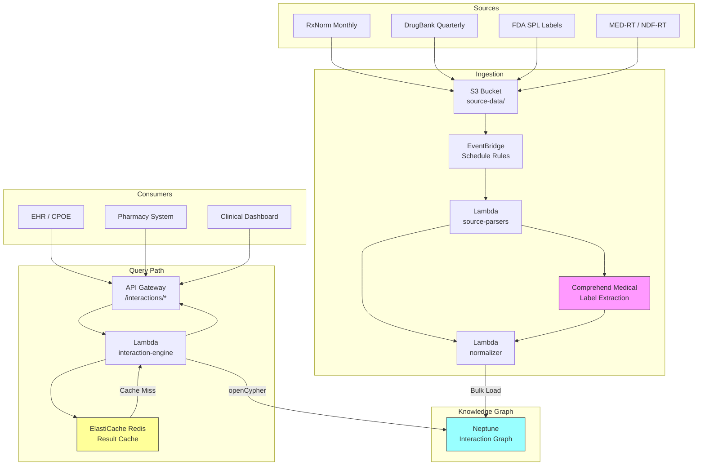

# Recipe 13.4: Drug-Drug Interaction Knowledge Base

**Complexity:** Medium · **Phase:** Clinical Safety · **Estimated Cost:** ~$0.02 per interaction check

---

## The Problem

A physician is prescribing warfarin to a 72-year-old patient with atrial fibrillation. The patient is already on amiodarone, metoprolol, lisinopril, and atorvastatin. The physician clicks "Sign" on the order, and the EHR fires an alert: "Warfarin + Amiodarone: Major interaction. Increased anticoagulant effect and risk of bleeding." Good. That's a real, clinically significant interaction that requires dose adjustment.

But here's the problem: the EHR also fires alerts for warfarin + atorvastatin (moderate, usually manageable with monitoring), warfarin + lisinopril (minor, rarely clinically significant), and a generic "multiple medications affecting hepatic metabolism" warning that means almost nothing actionable. Four alerts for one order. The physician clicks through all of them in about two seconds without reading any of them.

This is alert fatigue, and it's one of the most dangerous problems in clinical informatics. Studies consistently show that clinicians override 90-96% of drug interaction alerts. Not because the alerts are wrong, but because the signal-to-noise ratio is terrible. When everything is flagged, nothing is flagged. The alert that actually matters (warfarin + amiodarone requires a 30-50% dose reduction) gets the same visual weight as the alert that doesn't (lisinopril has a theoretical interaction that's never been clinically demonstrated at normal doses).

The root cause is that most drug interaction databases are flat lookup tables. Drug A interacts with Drug B: yes or no, with a severity level slapped on. They don't encode the *mechanism* of the interaction, the *clinical context* that makes it relevant, the *patient factors* that modulate risk, or the *evidence quality* behind the claim. A knowledge graph changes this fundamentally. Instead of "these two drugs interact," you can represent "these two drugs both inhibit CYP2C9, which increases the effective concentration of the substrate drug, which matters clinically when the patient has reduced hepatic function, and this is supported by three randomized controlled trials and twelve case reports."

That's the difference between a system that generates noise and a system that generates actionable clinical intelligence.

---

## The Technology: Drug Interactions as a Graph Problem

### Why Flat Interaction Tables Fail

The traditional approach to drug interaction checking is conceptually simple: maintain a table of drug pairs with severity ratings. When a new medication is ordered, check it against the patient's active medication list. If any pair appears in the table, fire an alert.

This approach has three fundamental limitations:

**No mechanism encoding.** The table says "warfarin interacts with fluconazole" but doesn't say *why*. Fluconazole inhibits CYP2C9, which is the primary metabolic pathway for warfarin. If you know the mechanism, you can infer that *any* strong CYP2C9 inhibitor will have a similar effect on warfarin, even if that specific pair isn't in your table. Without mechanism encoding, every new drug requires manual curation of every possible pair. With 20,000+ drugs on the market, that's 200 million potential pairs. Nobody curates all of them.

**No context sensitivity.** The same interaction can be clinically irrelevant or life-threatening depending on patient factors. Warfarin + acetaminophen is flagged as a moderate interaction (acetaminophen may enhance anticoagulant effect at high doses). For a patient taking occasional 500mg doses for headaches, this is meaningless. For a patient taking 4g daily for chronic pain, it's clinically significant. A flat table can't distinguish these scenarios.

**No evidence grading.** Some interactions are supported by multiple randomized controlled trials with clear dose-response relationships. Others are based on a single case report from 1987 where the patient was also on six other medications. These get the same "moderate" severity rating in most systems. Clinicians learn to distrust the system because they can't tell which alerts are backed by strong evidence.

### Knowledge Graphs for Drug Interactions

A knowledge graph represents drug interactions not as pairs in a table, but as a network of relationships between drugs, enzymes, transporters, receptors, metabolites, and clinical effects. The interaction isn't a single edge between two drug nodes. It's a *path* through the graph that explains the mechanism.

Here's what the warfarin + fluconazole interaction looks like as a graph:

```
[Warfarin] --METABOLIZED_BY--> [CYP2C9]
[Fluconazole] --INHIBITS--> [CYP2C9]
[CYP2C9 Inhibition] --CAUSES--> [Increased Warfarin Concentration]
[Increased Warfarin Concentration] --LEADS_TO--> [Increased Bleeding Risk]
[Increased Bleeding Risk] --SEVERITY--> [Major]
[Increased Bleeding Risk] --EVIDENCE--> [RCT: Smith et al. 2018]
[Increased Bleeding Risk] --EVIDENCE--> [Meta-analysis: Johnson et al. 2020]
```

This representation enables several things that flat tables cannot:

**Mechanism-based inference.** If you know that Drug X inhibits CYP2C9 (because the FDA label says so, or because in vitro studies demonstrate it), you can infer that it will interact with warfarin *even if nobody has explicitly curated that pair*. The graph lets you discover interactions through traversal rather than requiring exhaustive enumeration.

**Severity contextualization.** The severity of a CYP2C9 inhibition interaction depends on how strongly the inhibitor binds (Ki value), what fraction of the substrate's metabolism goes through that pathway, and what the therapeutic index of the substrate is. These are properties on the graph edges. A system can compute a context-specific severity rather than returning a static label.

**Evidence transparency.** Each interaction path can carry evidence nodes: the studies that support it, the evidence level (RCT, observational, case report, in vitro only), and the year of publication. A clinician can see *why* the system is alerting and make an informed decision about whether to override.

**Transitive interaction detection.** Some interactions are indirect. Drug A induces CYP3A4. Drug B is metabolized by CYP3A4 into an active metabolite. Drug C inhibits the transporter that clears that metabolite. The three-drug combination creates a problem that no pairwise check would catch. Graph traversal naturally handles multi-hop interaction paths.

### The Data Sources

Building a drug interaction knowledge graph requires integrating multiple authoritative sources, each with different strengths:

**RxNorm** (National Library of Medicine): The standard vocabulary for clinical drugs. Provides the node identities: normalized drug names, ingredient relationships, dose forms, and therapeutic classes. RxNorm is the backbone that lets you connect "Lipitor 20mg tablet" to "atorvastatin" to "HMG-CoA reductase inhibitors." Without RxNorm normalization, you'd be comparing brand names to generics to ingredients and getting nowhere.

**DrugBank**: A comprehensive database of drug properties including targets, enzymes, transporters, and carriers. This is where you get the mechanistic relationships: which enzymes metabolize which drugs, which transporters move which drugs across membranes, which receptors each drug binds to. DrugBank provides the "why" behind interactions. It has both a free academic version and a commercial version with additional curated content. (The free academic version is surprisingly complete for mechanism data. The commercial version adds curated clinical significance ratings that save you months of manual annotation.)

**FDA Structured Product Labeling (SPL)**: The official drug labels in machine-readable XML format. The "Drug Interactions" section of each label contains FDA-reviewed interaction information. The challenge is that this information is in semi-structured text, not clean relational data. NLP extraction is needed to convert label text into graph edges.

**Clinical literature**: PubMed contains thousands of published drug interaction studies. These range from in vitro enzyme inhibition assays to large observational cohort studies. Extracting structured interaction data from literature is an NLP problem (and a hard one), but it's the only way to capture interactions that haven't yet made it into curated databases.

**NDF-RT / MED-RT** (National Drug File Reference Terminology): A Veterans Affairs terminology that explicitly encodes drug-drug interactions with mechanism classifications. It categorizes interactions by type (pharmacokinetic, pharmacodynamic) and mechanism (enzyme inhibition, protein binding displacement, etc.). This is one of the few sources that provides mechanism-level classification in a structured format.

**Clinical decision support knowledge bases**: Commercial products like First Databank (FDB), Medi-Span, and Clinical Pharmacology maintain curated interaction databases with severity ratings and clinical management recommendations. These are the sources that most EHR systems use today. They're well-curated but expensive, and they typically don't expose the underlying mechanism data in a graph-friendly format.

### Interaction Classification

Not all interactions are created equal, and your graph needs to represent this. The standard classification dimensions:

**Mechanism type:**
- *Pharmacokinetic* (PK): One drug affects the absorption, distribution, metabolism, or excretion of another. These are the enzyme/transporter interactions. They change drug *levels*.
- *Pharmacodynamic* (PD): Both drugs affect the same physiological system. Two drugs that both lower blood pressure will have additive hypotensive effects regardless of their metabolic pathways. They change drug *effects*.
- *Mixed*: Some interactions involve both PK and PD components.

**Severity:**
- *Contraindicated*: Should never be co-prescribed. (Example: MAO inhibitors + serotonergic drugs)
- *Major*: May be life-threatening or cause permanent damage. Requires intervention. (Example: warfarin + fluconazole)
- *Moderate*: May worsen patient condition. Requires monitoring or dose adjustment. (Example: ACE inhibitors + potassium supplements)
- *Minor*: Minimally clinically significant. Awareness only. (Example: most food interactions)

**Evidence level:**
- *Established*: Multiple controlled studies confirm the interaction
- *Probable*: Strong pharmacological basis with supporting clinical evidence
- *Suspected*: Pharmacological basis with limited clinical evidence
- *Possible*: Case reports or theoretical basis only

**Clinical significance modifiers:**
- Patient age (elderly patients have reduced hepatic/renal clearance)
- Renal function (affects drugs cleared renally)
- Hepatic function (affects drugs metabolized hepatically)
- Genetic polymorphisms (CYP2D6 poor metabolizers, CYP2C19 ultra-rapid metabolizers)
- Dose (many interactions are dose-dependent)
- Duration (some interactions only matter with chronic co-administration)

### General Architecture Pattern

```
[Data Sources]     → [Ingestion/NLP]  → [Graph Database]  → [Interaction Engine] → [Clinical Systems]
(RxNorm, DrugBank,   (Parse, extract,    (Drugs, enzymes,    (Traversal, scoring,   (EHR alerts,
 FDA SPL, Literature)  normalize, link)    mechanisms, evidence) contextualization)     CPOE, pharmacy)
```

**Ingestion layer.** Each source has a different format and update cadence. RxNorm updates monthly. DrugBank updates quarterly. FDA labels update irregularly. Literature is continuous. Your ingestion pipeline needs source-specific parsers that produce a common intermediate format (nodes and edges with typed properties).

**Normalization layer.** Drug names must be normalized to a canonical identifier (RxNorm CUI is the standard choice). "Coumadin," "warfarin sodium," "warfarin," and RxNorm CUI 11289 all need to resolve to the same node. Without this, you'll have duplicate nodes and miss interactions.

**Graph storage.** The knowledge graph stores drugs, enzymes, transporters, receptors, metabolites, clinical effects, and evidence as nodes. Relationships (METABOLIZED_BY, INHIBITS, INDUCES, SUBSTRATE_OF, CAUSES, SUPPORTED_BY) are typed edges with properties (strength, Ki value, evidence level, source, date).

**Interaction engine.** Given a patient's medication list, the engine traverses the graph to find interaction paths. It scores each path based on mechanism strength, evidence quality, and patient context. It returns a ranked list of clinically significant interactions with explanations.

**Clinical integration.** The interaction engine exposes an API that clinical systems call at the point of prescribing. The response includes not just "these drugs interact" but "here's why, here's how severe it is for this patient, and here's what to do about it."

---

## The AWS Implementation

### Why These Services

**Amazon Neptune for the interaction knowledge graph.** Neptune's property graph model (queried via openCypher or Gremlin) is the natural fit for drug interaction data. Drugs, enzymes, and clinical effects are nodes. Mechanistic relationships are typed edges with properties like inhibition strength, evidence level, and source. Neptune supports both property graph and RDF modes, which matters here because RxNorm and some ontology sources are natively RDF. You can load RDF ontology data via SPARQL and query the application-level interaction graph via openCypher, all in the same cluster. Neptune's read replicas handle the query load from clinical systems while the writer endpoint handles knowledge base updates. Configure at least one read replica in a separate AZ for high availability. During a failover event (30-60 seconds), the interaction-engine Lambda should retry with exponential backoff (3 retries, starting at 200ms). If Neptune remains unreachable, return a degraded response indicating the check is temporarily unavailable rather than silently passing orders unchecked.

**Amazon S3 for source data staging and versioning.** Drug interaction sources (RxNorm downloads, DrugBank exports, FDA SPL files) land in S3 as the first step of ingestion. S3 versioning provides an audit trail of every source file version that contributed to the current graph state. This matters for regulatory traceability: if a clinician asks "why did the system flag this interaction?", you need to trace back to the specific source data and version.

**AWS Lambda for ingestion orchestration and interaction queries.** The ingestion pipeline (parse sources, normalize, load to Neptune) runs on a schedule (weekly for most sources). Individual Lambda functions handle each source's parsing logic. For the query path, Lambda functions behind API Gateway translate clinical queries ("check these 5 drugs for interactions") into graph traversals, execute them against Neptune, score the results, and return structured responses. The stateless nature of Lambda fits both workloads. Because VPC-attached Lambda functions incur additional cold start latency (ENI creation, 1-5 seconds), configure Provisioned Concurrency (minimum 2-5 instances) on the interaction-engine Lambda to eliminate cold starts on the clinical query path. Alternatively, use a scheduled CloudWatch Events rule to keep the function warm during clinical operating hours.

**Amazon Comprehend Medical for FDA label extraction.** FDA Structured Product Labeling files contain drug interaction information in semi-structured text. Comprehend Medical extracts medication entities, dosages, and relationships from this text, providing the raw material that the ingestion pipeline converts into graph edges. It handles medical terminology, abbreviations, and the specific linguistic patterns found in drug labels. Note: FDA SPL files are public documents, not PHI. The Comprehend Medical calls in the ingestion pipeline process public drug label text. The PHI surface area in this system is on the query path (patient medication lists) and in the audit logs, not in the knowledge graph itself.

**Amazon ElastiCache (Redis) for interaction result caching.** Many interaction checks are repeated frequently (common drug combinations in a hospital formulary). Caching scored interaction results for stable medication pairs avoids redundant graph traversals. Cache invalidation triggers when the underlying graph is updated with new source data. Enable Redis AUTH token (rotated via Secrets Manager) so that only authorized Lambda functions can read cached clinical data. The interaction-engine Lambda retrieves the AUTH token from Secrets Manager at cold start.

**Amazon EventBridge for update orchestration.** Source data updates arrive on different schedules. EventBridge rules trigger the appropriate ingestion Lambda when new source files land in S3, when scheduled update windows arrive, or when manual refresh is requested. This decouples the update schedule from the ingestion logic.

### Architecture Diagram



### Prerequisites

| Requirement | Details |
|-------------|---------|
| **AWS Services** | Amazon Neptune, Amazon S3, AWS Lambda, Amazon API Gateway, Amazon ElastiCache (Redis), Amazon Comprehend Medical, Amazon EventBridge, AWS KMS |
| **IAM Permissions** | Interaction engine Lambda: `neptune-db:ReadDataViaQuery`, `neptune-db:GetQueryStatus` (scoped to cluster ARN), `secretsmanager:GetSecretValue` (scoped to Redis AUTH secret ARN). Ingestion Lambdas: `neptune-db:WriteDataViaQuery`, `neptune-db:ReadDataViaQuery`, `s3:GetObject` (source bucket), `comprehend:DetectEntitiesV2`, `comprehend:InferRxNorm`. Normalizer Lambda: `neptune-db:WriteDataViaQuery`, `neptune-db:GetLoaderStatus`. All: `kms:Decrypt`, `kms:GenerateDataKey` (scoped to encryption keys). |
| **BAA** | Required. Drug interaction checks are performed in the context of patient care and reference patient medication lists (PHI). |
| **Encryption** | Neptune: encryption at rest enabled at cluster creation. S3: SSE-KMS for source data and staging buckets. ElastiCache: in-transit and at-rest encryption. All API traffic over TLS 1.2+. |
| **VPC** | Neptune requires VPC deployment. Lambda functions in same VPC. Security groups: Lambda SG allows outbound to Neptune (8182), ElastiCache (6379), and VPC endpoints (443). Neptune SG allows inbound from Lambda SG on 8182. VPC endpoints: S3 (gateway), Comprehend (interface), CloudWatch Logs (interface), KMS (interface). Ingestion Lambdas access source data via the S3 gateway endpoint. If direct API access to external data sources is needed (e.g., DrugBank API), add a NAT Gateway or download source files to S3 outside the VPC first. |
| **CloudTrail** | Enabled for all API calls. Neptune audit logging enabled (`neptune_enable_audit_log = 1`). The interaction-engine Lambda logs each request and response to a dedicated CloudWatch Logs log group (KMS-encrypted, exported to S3 for long-term retention). Each log entry captures: timestamp, requesting system identifier, patient context hash (not raw patient ID), medication list checked, interactions returned with scores, and processing time. Retention: minimum 7 years per state medical record retention laws. This log group contains PHI (medication lists in patient context) and requires the same access controls as the Neptune cluster. |
| **Sample Data** | RxNorm: free download from [NLM UMLS](https://www.nlm.nih.gov/research/umls/rxnorm/docs/rxnormfiles.html). DrugBank: academic license free, commercial license required for production. FDA SPL: [DailyMed](https://dailymed.nlm.nih.gov/dailymed/spl-resources-all-drug-labels.cfm). MED-RT: free from [VA NDF-RT](https://evs.nci.nih.gov/ftp1/NDF-RT/). |
| **Cost Estimate** | Neptune db.r5.large: ~$0.348/hr (~$254/month). Neptune I/O: ~$0.20/million requests. ElastiCache cache.t3.medium: ~$50/month. Comprehend Medical: ~$0.01 per 100 characters (one-time label processing ~$50-100 total). Lambda + API Gateway: negligible at clinical query volumes. Total steady-state: ~$350-400/month for a single-institution deployment. |

### Ingredients

| AWS Service | Role in This Recipe |
|-------------|-------------------|
| Amazon Neptune | Stores the drug interaction knowledge graph (drugs, enzymes, mechanisms, evidence as nodes and edges) |
| Amazon S3 | Stages source data files, stores Neptune bulk load CSVs, maintains version history |
| AWS Lambda | Runs source parsers, normalization logic, and interaction query engine |
| Amazon API Gateway | Exposes REST endpoints for interaction checking |
| Amazon Comprehend Medical | Extracts drug entities and relationships from FDA label text |
| Amazon ElastiCache (Redis) | Caches interaction query results for common drug combinations |
| Amazon EventBridge | Orchestrates scheduled and event-driven ingestion pipeline runs |
| AWS KMS | Manages encryption keys for data at rest and in transit |

### Code: Pseudocode Walkthrough

#### Step 1: Ingest and Normalize Drug Data from RxNorm

RxNorm provides the canonical drug identities that anchor the entire graph. Without normalized drug identifiers, you can't reliably link interaction data from different sources.

If you skip this step, you'll end up with duplicate drug nodes ("warfarin" and "Coumadin" as separate entities) and miss interactions because the system doesn't know they're the same molecule.

```
FUNCTION ingest_rxnorm(rxnorm_file_path):
    // RxNorm provides relationships between drug concepts:
    // brand names, generic names, ingredients, dose forms, therapeutic classes
    
    raw_concepts = PARSE_RXNORM_RRF(rxnorm_file_path)
    
    FOR EACH concept IN raw_concepts:
        // Create a node for each drug concept
        node = {
            id: concept.rxcui,
            type: concept.term_type,  // "IN" (ingredient), "BN" (brand), "SCD" (clinical drug)
            name: concept.name,
            tty: concept.term_type,
            suppress: concept.suppress_flag
        }
        UPSERT_NODE(graph, node)
    
    // Load relationships: ingredient-of, tradename-of, has-dose-form
    relationships = PARSE_RXNORM_RELATIONSHIPS(rxnorm_file_path)
    
    FOR EACH rel IN relationships:
        edge = {
            from: rel.rxcui_1,
            to: rel.rxcui_2,
            type: rel.relationship_type,  // "has_ingredient", "tradename_of", "isa"
            source: "RxNorm",
            version: rel.release_date
        }
        UPSERT_EDGE(graph, edge)
    
    RETURN count_of_nodes_loaded, count_of_edges_loaded
```

#### Step 2: Load Enzyme and Transporter Relationships from DrugBank

This step builds the mechanistic layer of the graph. It connects drugs to the enzymes that metabolize them and the transporters that move them. These relationships are the foundation for inferring pharmacokinetic interactions.

Without this step, you can only represent interactions as direct drug-drug pairs. You lose the ability to infer new interactions based on shared metabolic pathways.

```
FUNCTION ingest_drugbank_mechanisms(drugbank_xml_path):
    // DrugBank encodes which enzymes metabolize each drug,
    // which transporters carry it, and the nature of the relationship
    
    drugs = PARSE_DRUGBANK_XML(drugbank_xml_path)
    
    FOR EACH drug IN drugs:
        // Ensure the drug node exists (link to RxNorm via identifier mapping)
        rxcui = LOOKUP_RXCUI(drug.name, drug.cas_number, drug.unii)
        
        IF rxcui IS NULL:
            LOG_WARNING("No RxNorm mapping for: " + drug.name)
            CONTINUE
        
        // Load enzyme relationships
        FOR EACH enzyme IN drug.enzymes:
            // Create enzyme node if it doesn't exist
            UPSERT_NODE(graph, {
                id: enzyme.uniprot_id,
                type: "Enzyme",
                name: enzyme.name,  // e.g., "CYP2C9", "CYP3A4"
                gene: enzyme.gene_name
            })
            
            // Create the metabolic relationship edge
            edge = {
                from: rxcui,
                to: enzyme.uniprot_id,
                type: MAP_ACTION(enzyme.action),  // "SUBSTRATE_OF", "INHIBITS", "INDUCES"
                strength: enzyme.inhibition_strength,  // "strong", "moderate", "weak"
                ki_value: enzyme.ki_nanomolar,  // inhibition constant if available
                source: "DrugBank",
                evidence: enzyme.references
            }
            UPSERT_EDGE(graph, edge)
        
        // Load transporter relationships (P-glycoprotein, OATP, etc.)
        FOR EACH transporter IN drug.transporters:
            UPSERT_NODE(graph, {
                id: transporter.uniprot_id,
                type: "Transporter",
                name: transporter.name,
                gene: transporter.gene_name
            })
            
            edge = {
                from: rxcui,
                to: transporter.uniprot_id,
                type: MAP_ACTION(transporter.action),
                source: "DrugBank",
                evidence: transporter.references
            }
            UPSERT_EDGE(graph, edge)
    
    RETURN count_of_mechanism_edges_loaded
```

#### Step 3: Extract Interactions from FDA Drug Labels

FDA labels contain interaction information in natural language text. This step uses NLP to extract structured interaction data from label text and convert it into graph edges.

Skipping this step means missing FDA-reviewed interaction information that may not appear in other databases. FDA labels are the authoritative source for US-marketed drugs.

```
FUNCTION extract_fda_label_interactions(spl_xml_path):
    // FDA SPL files contain a "Drug Interactions" section
    // with semi-structured text describing known interactions
    
    label = PARSE_SPL_XML(spl_xml_path)
    drug_rxcui = LOOKUP_RXCUI(label.active_ingredient)
    interaction_text = label.sections["drug_interactions"]
    
    IF interaction_text IS EMPTY:
        RETURN []
    
    // Use medical NLP to extract drug entities and relationships
    entities = CALL_MEDICAL_NLP(interaction_text)
    // Returns: [{text: "warfarin", type: "MEDICATION", rxcui: "11289"}, ...]
    
    interactions = []
    
    FOR EACH entity IN entities WHERE entity.type == "MEDICATION":
        // Extract the context around this entity mention
        context = GET_SURROUNDING_SENTENCES(interaction_text, entity.offset, window=2)
        
        // Classify the interaction from context
        classification = CLASSIFY_INTERACTION(context)
        // Returns: {severity, mechanism_type, clinical_effect, management}
        
        interaction = {
            drug_a: drug_rxcui,
            drug_b: entity.rxcui,
            severity: classification.severity,
            mechanism: classification.mechanism_type,
            clinical_effect: classification.clinical_effect,
            management: classification.management,
            source: "FDA_SPL",
            label_set_id: label.set_id,
            effective_date: label.effective_date
        }
        interactions.APPEND(interaction)
    
    // Convert to graph edges
    FOR EACH interaction IN interactions:
        // Create a clinical effect node
        effect_node_id = HASH(interaction.clinical_effect)
        UPSERT_NODE(graph, {
            id: effect_node_id,
            type: "ClinicalEffect",
            description: interaction.clinical_effect,
            severity: interaction.severity
        })
        
        // Link drugs to effect through mechanism
        UPSERT_EDGE(graph, {
            from: interaction.drug_a,
            to: effect_node_id,
            type: "CONTRIBUTES_TO",
            mechanism: interaction.mechanism,
            source: "FDA_SPL",
            evidence_level: "Established"  // FDA-reviewed = high confidence
        })
        UPSERT_EDGE(graph, {
            from: interaction.drug_b,
            to: effect_node_id,
            type: "CONTRIBUTES_TO",
            mechanism: interaction.mechanism,
            source: "FDA_SPL",
            evidence_level: "Established"
        })
    
    RETURN interactions
```

#### Step 4: Build the Interaction Query Engine

This is the core clinical function. Given a list of medications, traverse the graph to find all interaction paths, score them by clinical significance, and return ranked results with explanations.

This step is what clinicians actually interact with. If it's too slow (over 500ms), it won't be used in real-time prescribing workflows. If it returns too many low-significance results, clinicians will ignore it entirely.

For polypharmacy patients (15+ medications, common in elderly populations), pair count grows quadratically (25 medications = 300 pairs). Consider a tiered strategy: check only new or changed medications against the existing list in real time, then run the full pairwise check asynchronously and update the patient's interaction profile. The cache in Step 5 partially addresses this for stable medication combinations, but the first check for a complex patient will still be slow without tiering.

```
FUNCTION check_interactions(medication_list, patient_context):
    // medication_list: [{rxcui, dose, frequency, duration}, ...]
    // patient_context: {age, weight, renal_function, hepatic_function, genotype}
    
    interactions_found = []
    
    // Strategy 1: Direct interaction edges (fastest, catches curated pairs)
    FOR EACH pair IN ALL_PAIRS(medication_list):
        direct = QUERY_GRAPH(
            "MATCH (a:Drug {rxcui: $rxcui_a})-[r:INTERACTS_WITH]-(b:Drug {rxcui: $rxcui_b})
             RETURN r.severity, r.mechanism, r.clinical_effect, r.evidence_level, r.source",
            {rxcui_a: pair[0].rxcui, rxcui_b: pair[1].rxcui}
        )
        IF direct IS NOT EMPTY:
            interactions_found.APPEND(direct)
    
    // Strategy 2: Mechanism-based inference (catches uncurated interactions)
    // Find drugs that share enzyme/transporter targets
    FOR EACH drug IN medication_list:
        targets = QUERY_GRAPH(
            "MATCH (d:Drug {rxcui: $rxcui})-[r]->(t)
             WHERE t:Enzyme OR t:Transporter
             RETURN t.id, t.name, type(r) as relationship, r.strength",
            {rxcui: drug.rxcui}
        )
        drug.targets = targets
    
    // Check for conflicting relationships on shared targets
    FOR EACH pair IN ALL_PAIRS(medication_list):
        shared_targets = INTERSECT(pair[0].targets, pair[1].targets, by="target_id")
        
        FOR EACH target IN shared_targets:
            rel_a = GET_RELATIONSHIP(pair[0], target)
            rel_b = GET_RELATIONSHIP(pair[1], target)
            
            // Substrate + Inhibitor = potential interaction
            IF rel_a.type == "SUBSTRATE_OF" AND rel_b.type == "INHIBITS":
                inferred = {
                    drug_a: pair[0],
                    drug_b: pair[1],
                    mechanism: "PK_ENZYME_INHIBITION",
                    target: target.name,
                    inhibitor_strength: rel_b.strength,
                    evidence_level: "Inferred",
                    explanation: pair[1].name + " inhibits " + target.name +
                                 ", which metabolizes " + pair[0].name +
                                 ". This may increase " + pair[0].name + " levels."
                }
                interactions_found.APPEND(inferred)
            
            // Substrate + Inducer = potential interaction (opposite direction)
            IF rel_a.type == "SUBSTRATE_OF" AND rel_b.type == "INDUCES":
                inferred = {
                    drug_a: pair[0],
                    drug_b: pair[1],
                    mechanism: "PK_ENZYME_INDUCTION",
                    target: target.name,
                    evidence_level: "Inferred",
                    explanation: pair[1].name + " induces " + target.name +
                                 ", which may decrease " + pair[0].name + " levels."
                }
                interactions_found.APPEND(inferred)
    
    // Step 3: Score and contextualize
    scored_interactions = []
    FOR EACH interaction IN interactions_found:
        score = CALCULATE_CLINICAL_SIGNIFICANCE(
            interaction,
            patient_context
        )
        // Score considers: mechanism strength, evidence quality,
        // patient renal/hepatic function, dose, duration, therapeutic index
        
        interaction.score = score
        interaction.recommendation = GENERATE_RECOMMENDATION(interaction, patient_context)
        scored_interactions.APPEND(interaction)
    
    // Sort by clinical significance (highest risk first)
    scored_interactions.SORT_BY(score, DESCENDING)
    
    // Filter out interactions below clinical significance threshold
    significant = FILTER(scored_interactions, WHERE score >= SIGNIFICANCE_THRESHOLD)
    
    RETURN {
        interactions: significant,
        total_checked: LENGTH(ALL_PAIRS(medication_list)),
        total_found: LENGTH(interactions_found),
        total_significant: LENGTH(significant)
    }
```

#### Step 5: Cache and Serve Results

Clinical systems need sub-second response times. Caching interaction results for common drug combinations avoids redundant graph traversals while ensuring freshness when the knowledge base updates.

Important: after the normalizer Lambda completes a graph update, it should publish an EventBridge event (`graph.updated`) that triggers a cache flush. This flush invalidates all cached entries (or selectively invalidates entries containing affected drugs). Without explicit invalidation, the system could serve stale "no interaction found" results for up to the full TTL after a new interaction is added to the graph. For a safety-critical system, stale cache is a patient safety risk. The TTL below (24 hours) serves as a backstop, not the primary invalidation mechanism.

```
FUNCTION serve_interaction_check(request):
    // request: {medications: [...], patient_context: {...}}
    
    // Generate cache key from sorted medication RxCUIs
    // (patient context is NOT part of cache key because it varies per patient)
    med_key = SORT(request.medications.map(m => m.rxcui)).JOIN("_")
    
    // Check cache for base interaction paths (without patient contextualization)
    cached_paths = CACHE_GET("interactions:" + med_key)
    
    IF cached_paths IS NOT NULL:
        // Re-score cached paths with this patient's context
        scored = CONTEXTUALIZE(cached_paths, request.patient_context)
        RETURN scored
    
    // Cache miss: run full graph traversal
    result = check_interactions(request.medications, request.patient_context)
    
    // Cache the raw interaction paths (before patient-specific scoring)
    // TTL is a safety backstop; primary invalidation is event-driven on graph update
    CACHE_SET("interactions:" + med_key, result.raw_paths, TTL=24_HOURS)
    
    RETURN result
```

> **Curious how this looks in Python?** The pseudocode above covers the concepts. If you'd like to see sample Python code that demonstrates these patterns using boto3, check out the [Python Example](chapter13.04-python-example). It walks through each step with inline comments and notes on what you'd need to change for a real deployment.

### Expected Results

Sample interaction check response:

```json
{
  "patient_medications_checked": 5,
  "pairs_evaluated": 10,
  "interactions_found": 4,
  "clinically_significant": 2,
  "interactions": [
    {
      "drug_a": {"rxcui": "11289", "name": "warfarin"},
      "drug_b": {"rxcui": "4053", "name": "fluconazole"},
      "severity": "Major",
      "mechanism": "PK_ENZYME_INHIBITION",
      "target_enzyme": "CYP2C9",
      "evidence_level": "Established",
      "clinical_effect": "Increased warfarin concentration leading to elevated bleeding risk",
      "score": 0.94,
      "recommendation": "Reduce warfarin dose by 25-50%. Monitor INR within 3-5 days of fluconazole initiation. Consider alternative antifungal if duration exceeds 7 days.",
      "sources": ["FDA SPL", "DrugBank", "FDB"],
      "supporting_evidence": [
        {"type": "RCT", "citation": "Black et al. Clin Pharmacol Ther 1996;59:132-5"},
        {"type": "Meta-analysis", "citation": "Schelleman et al. Br J Clin Pharmacol 2008;65:917-24"}
      ]
    },
    {
      "drug_a": {"rxcui": "11289", "name": "warfarin"},
      "drug_b": {"rxcui": "519", "name": "amiodarone"},
      "severity": "Major",
      "mechanism": "PK_ENZYME_INHIBITION",
      "target_enzyme": "CYP2C9, CYP3A4",
      "evidence_level": "Established",
      "clinical_effect": "Amiodarone inhibits warfarin metabolism via multiple CYP pathways. Effect persists weeks after amiodarone discontinuation due to long half-life.",
      "score": 0.91,
      "recommendation": "Reduce warfarin dose by 30-50% when initiating amiodarone. Monitor INR weekly for first month. Effect may persist 1-3 months after amiodarone discontinuation.",
      "sources": ["FDA SPL", "DrugBank", "MED-RT"],
      "supporting_evidence": [
        {"type": "RCT", "citation": "Sanoski et al. J Cardiovasc Pharmacol Ther 2002;7:199-202"}
      ]
    }
  ],
  "suppressed_interactions": [
    {
      "drug_a": "warfarin",
      "drug_b": "lisinopril",
      "severity": "Minor",
      "reason_suppressed": "Score below clinical significance threshold (0.12). Theoretical interaction with minimal clinical evidence."
    }
  ],
  "processing_time_ms": 145,
  "graph_version": "2026-05-15",
  "cache_hit": false
}
```

**Performance benchmarks:**

| Metric | Value | Notes |
|--------|-------|-------|
| Query latency (cache hit) | 15-30ms | Patient-specific scoring only |
| Query latency (cache miss) | 100-300ms | Full graph traversal + scoring |
| Query latency (10+ medications) | 200-500ms | Pair count grows quadratically |
| Graph load time (full rebuild) | 15-30 minutes | ~500K nodes, ~2M edges |
| Incremental update | 2-5 minutes | Weekly source updates |
| Interaction coverage | ~85-90% of known pairs | Depends on source completeness |
| False positive rate | 15-25% at default threshold | Tunable via significance scoring |
| Mechanism inference accuracy | ~70-80% | For interactions not in curated sources |

**Where it struggles:**

- New drugs with limited post-market data (first 1-2 years after approval)
- Herbal supplements and OTC medications (poorly curated in most databases)
- Multi-drug interactions involving 3+ drugs (combinatorial explosion of paths)
- Dose-dependent interactions where the threshold is poorly characterized
- Genetic polymorphism interactions (CYP2D6 poor metabolizers) when genotype data is unavailable

---

## The Honest Take

Here's what I've learned building these systems (mostly by getting it wrong first):

**Alert fatigue is the real enemy, not missing interactions.** Every drug interaction system I've seen starts with the goal of "catch everything" and ends up being ignored because it catches too much. The hard engineering problem isn't finding interactions. It's *not* alerting on the ones that don't matter for this specific patient at this specific dose. Your significance scoring algorithm will get more engineering attention than your graph traversal logic.

**The 90% override rate is not a bug in clinician behavior.** It's a signal that your system's specificity is too low. If you're alerting on interactions that experienced clinicians routinely and safely manage (like warfarin + acetaminophen at normal doses), you're training them to click through everything. The goal is a system where overriding an alert is a conscious clinical decision, not a reflexive click.

**Source data quality varies wildly.** DrugBank is excellent for mechanism data but has gaps in clinical significance assessment. FDA labels are authoritative but lag behind published literature by years. Commercial databases (FDB, Medi-Span) are well-curated but expensive and proprietary. You'll end up integrating multiple sources and building reconciliation logic for when they disagree. And they will disagree.

**Mechanism-based inference is powerful but imperfect.** Inferring that "Drug X inhibits CYP3A4, Drug Y is a CYP3A4 substrate, therefore they interact" is pharmacologically sound but clinically oversimplified. The clinical significance depends on how much of Drug Y's metabolism goes through CYP3A4 (if it's only 10%, the interaction is negligible), the therapeutic index of Drug Y (narrow therapeutic index drugs like cyclosporine are much more sensitive than wide-index drugs like atorvastatin), and the strength of inhibition. Your inference engine needs these nuances or it will generate too many false positives.

**Graph maintenance is a continuous commitment.** New drugs get approved. New interactions get discovered. Existing severity ratings get revised based on new evidence. If you build this and then don't maintain it, you'll have a system that confidently tells clinicians there's no interaction between a new drug and warfarin because the new drug simply isn't in the graph yet. That's worse than not having the system. Budget for ongoing curation as an operational cost, not a one-time project cost.

**The "last mile" to the clinician is harder than the graph.** You can build a beautiful knowledge graph with perfect mechanism encoding and evidence grading. If the alert shows up as a generic modal dialog that says "Interaction detected. Severity: Major. Click OK to continue," you've wasted the graph's richness. The clinical interface needs to surface the *why* (mechanism), the *so what* (clinical effect for this patient), and the *now what* (specific management recommendation). That's a UX problem as much as a data problem.

---

## Variations and Extensions

### Variation 1: Pharmacogenomic-Aware Interaction Checking

Add genetic polymorphism data to the patient context. If a patient is a CYP2D6 poor metabolizer, interactions involving CYP2D6 substrates become more significant (the drug is already accumulating due to reduced metabolism; adding an inhibitor compounds the effect). This requires:
- Adding genotype nodes to the graph (CYP2D6*4, CYP2C19*2, etc.)
- Linking genotypes to enzyme activity levels (poor, intermediate, normal, ultra-rapid)
- Modifying the scoring algorithm to account for baseline metabolic capacity
- Integrating with pharmacogenomic test results from the EHR

### Variation 2: Drug-Food and Drug-Supplement Interactions

Extend the graph to include food components (grapefruit juice inhibits CYP3A4, vitamin K antagonizes warfarin) and dietary supplements (St. John's Wort induces CYP3A4 and P-glycoprotein). The challenge is that food/supplement interaction data is less rigorously curated than drug-drug data. Sources include the Natural Medicines Comprehensive Database and published case reports. Evidence levels will be lower on average, and you'll need to decide how to present lower-confidence alerts without adding to fatigue.

### Variation 3: Institutional Formulary-Aware Alerting

Integrate your institution's formulary to provide alternative drug suggestions when an interaction is detected. "Fluconazole interacts with warfarin. Your formulary includes voriconazole (similar interaction) and micafungin (no CYP2C9 interaction). Consider micafungin if clinically appropriate." This requires adding formulary membership edges to the graph and a "therapeutic alternative" traversal that finds drugs in the same therapeutic class without the problematic mechanism.

---

## Related Recipes

- **[Recipe 13.1: Drug Formulary Navigation](chapter13.01-drug-formulary-navigation)** covers the foundational graph model for drug data. The formulary graph provides the drug identity and classification nodes that this recipe's interaction graph builds upon.
- **[Recipe 13.3: ICD/CPT Hierarchy Navigation](chapter13.03-icd-cpt-hierarchy-navigation)** demonstrates the pattern of loading medical ontologies into Neptune and querying hierarchical relationships. The same ETL and query patterns apply here.
- **[Recipe 8.4: Medication Extraction and Normalization](chapter08.04-medication-extraction-normalization)** covers extracting medication mentions from clinical text and normalizing them to RxNorm. That's the upstream step that feeds medication lists into this recipe's interaction checker.
- **[Recipe 7.6: Rising Risk Identification](chapter07.06-rising-risk-identification)** uses predictive models that could incorporate interaction burden as a risk factor. Patients on multiple interacting medications are at higher risk for adverse events.

---

## Additional Resources

### AWS Documentation

- [Amazon Neptune User Guide](https://docs.aws.amazon.com/neptune/latest/userguide/) - Graph database setup, openCypher queries, bulk loading
- [Neptune openCypher Query Language](https://docs.aws.amazon.com/neptune/latest/userguide/access-graph-opencypher.html) - Query syntax for property graph traversals
- [Neptune Bulk Loader](https://docs.aws.amazon.com/neptune/latest/userguide/bulk-load.html) - Loading large datasets from S3 into Neptune
- [Amazon Comprehend Medical Documentation](https://docs.aws.amazon.com/comprehend-medical/latest/dev/what-is.html) - Medical NLP entity extraction
- [Comprehend Medical InferRxNorm API](https://docs.aws.amazon.com/comprehend-medical/latest/dev/ontology-linking-rxnorm.html) - Linking medication mentions to RxNorm codes
- [Amazon ElastiCache for Redis](https://docs.aws.amazon.com/AmazonElastiCache/latest/red-ug/) - Caching layer setup and configuration
- [Amazon EventBridge User Guide](https://docs.aws.amazon.com/eventbridge/latest/userguide/) - Event-driven pipeline orchestration

### External Data Sources

- [RxNorm (NLM)](https://www.nlm.nih.gov/research/umls/rxnorm/docs/rxnormfiles.html) - Standard drug vocabulary, free download with UMLS license
- [DrugBank](https://go.drugbank.com/) - Comprehensive drug target and enzyme data
- [DailyMed (NLM)](https://dailymed.nlm.nih.gov/dailymed/) - FDA Structured Product Labeling files
- [MED-RT (NCI EVS)](https://evs.nci.nih.gov/ftp1/NDF-RT/) - VA drug interaction terminology with mechanism classification
- [UMLS Metathesaurus](https://www.nlm.nih.gov/research/umls/index.html) - Cross-terminology mappings for drug concepts

### Relevant Reading

- [ONC Drug-Drug Interaction Evidence Standards](https://www.healthit.gov/topic/safety/clinical-decision-support) - Federal standards for CDS interaction alerting
- [CPIC Guidelines](https://cpicpgx.org/guidelines/) - Clinical Pharmacogenetics Implementation Consortium guidelines for gene-drug interactions
- [Phansalkar et al. "Drug-drug interactions that should be non-interruptive" (JAMIA 2013)](https://academic.oup.com/jamia/article/20/3/489/2909165) - Research on which interactions warrant interruptive alerts vs. passive notifications

---

## Estimated Implementation Time

| Phase | Duration | What You Get |
|-------|----------|-------------|
| **Basic** | 4-6 weeks | RxNorm + DrugBank loaded into Neptune. Direct pairwise interaction lookup via API. No mechanism inference, no patient contextualization. Equivalent to a flat lookup table in a graph database. |
| **Production-ready** | 10-14 weeks | Multi-source ingestion (RxNorm, DrugBank, FDA SPL, MED-RT). Mechanism-based inference. Patient context scoring. Caching layer. Clinical integration API with structured recommendations. Alert suppression logic. |
| **With variations** | 16-22 weeks | Pharmacogenomic awareness. Drug-food/supplement interactions. Formulary-aware alternative suggestions. Custom institutional override rules. Analytics dashboard for alert metrics. |

---

## Tags

`knowledge-graph` `drug-interactions` `clinical-decision-support` `pharmacology` `neptune` `patient-safety` `alert-fatigue` `rxnorm` `drugbank` `cpoe` `pharmacy`

---

*← [Recipe 13.3: ICD/CPT Hierarchy Navigation](chapter13.03-icd-cpt-hierarchy-navigation) | [Chapter 13 Index](chapter13-index) | [Recipe 13.5: Clinical Pathway / Protocol Modeling](chapter13.05-clinical-pathway-protocol-modeling) →*
