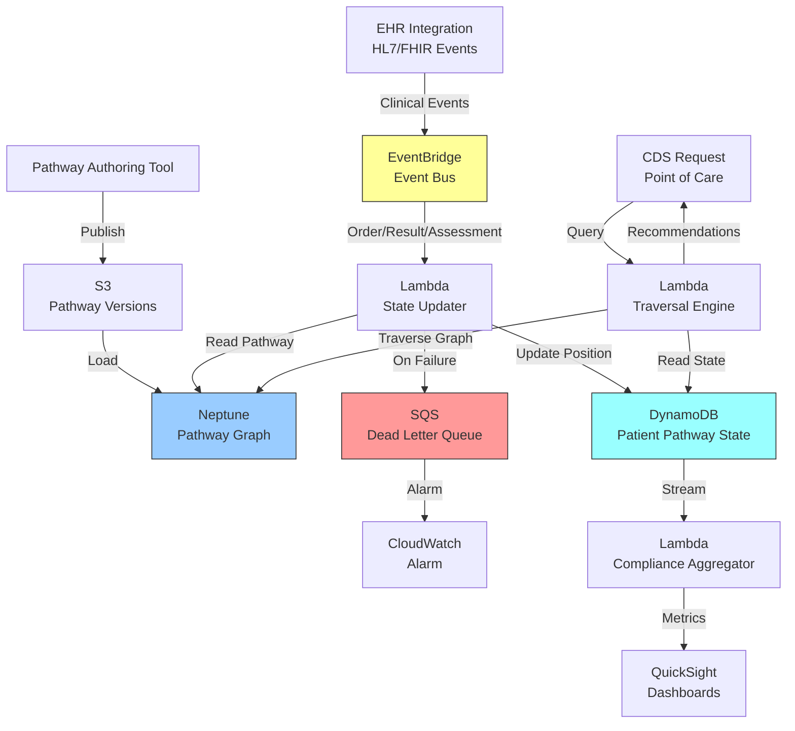

# Recipe 13.5: Clinical Pathway / Protocol Modeling

**Complexity:** Medium · **Phase:** Production · **Estimated Cost:** ~$0.10–$0.50 per pathway query (graph traversal + reasoning)

---

## The Problem

A hospitalist admits a patient with community-acquired pneumonia. The hospital has a clinical pathway for this: a sequence of assessments, lab orders, antibiotic choices, escalation criteria, and discharge readiness checks. It lives in a 14-page PDF on the intranet. Maybe there's a laminated card somewhere in the nursing station. The pathway was updated six months ago, but the laminated card still shows the old antibiotic recommendations.

This is the state of clinical pathway management at most health systems. Pathways exist as static documents. They encode complex decision logic ("if CURB-65 score >= 3, consider ICU admission; if penicillin allergy documented, substitute with respiratory fluoroquinolone") but that logic is trapped in prose. It can't be queried. It can't be traversed programmatically. It can't tell you whether a specific patient is on-pathway or has deviated. It can't alert you when a new step becomes relevant based on a lab result that just came back.

The scale of this problem is significant. A typical academic medical center maintains 200-400 active clinical pathways covering everything from sepsis management to elective joint replacement recovery. Each pathway has decision branches, time-dependent steps, conditional orders, and escalation criteria. Keeping them current requires clinical committee review. Keeping clinicians aware of them requires training. Measuring adherence requires manual chart review.

Order sets help, but they're flat. They give you a menu of things to order at a point in time. They don't model the temporal flow: "do this first, then wait for this result, then decide between these two branches." Clinical pathways are inherently graph-shaped: nodes are clinical states or actions, edges are transitions triggered by conditions. The moment you recognize that, the solution becomes obvious. Model them as graphs. Traverse them computationally. Use the graph to drive decision support, compliance tracking, and variance analysis.

Let's build it.

---

## The Technology: Graphs for Clinical Logic

### Why Graphs Fit Clinical Pathways

A clinical pathway is a directed graph. Not metaphorically. Literally. Consider a simplified pneumonia pathway:

1. Patient presents with suspected pneumonia
2. Order chest X-ray and blood cultures
3. Calculate severity score (CURB-65 or PSI)
4. **Decision point:** If mild (CURB-65 0-1), outpatient treatment. If moderate (2), admit to ward. If severe (3+), consider ICU.
5. For ward admission: start empiric antibiotics within 4 hours
6. Reassess at 48 hours: if improving, step down to oral. If not improving, escalate.
7. Discharge criteria: afebrile 24h, tolerating oral meds, oxygen saturation stable

Each numbered item is a node. The transitions between them have conditions attached. Some transitions are time-gated ("reassess at 48 hours"). Some are event-driven ("lab result returns"). Some are conditional on patient state ("if penicillin allergy"). This is a directed acyclic graph (mostly; some pathways have loops for reassessment cycles) with typed edges.

Relational databases can store this, but querying it is painful. "Given this patient's current state, what are the next valid steps?" becomes a recursive SQL query with multiple joins against condition tables. Graph databases make this query natural: start at the patient's current node, traverse outgoing edges where conditions are satisfied, return the reachable next nodes.

### Knowledge Graph Fundamentals for Pathways

A knowledge graph for clinical pathways needs several entity types:

**Pathway nodes** represent clinical states or actions. Each node has a type: assessment, order, decision point, milestone, or discharge criterion. Nodes carry metadata: responsible role (physician, nurse, pharmacist), expected duration, required documentation.

**Edges** represent transitions. Each edge has conditions that must be satisfied for the transition to be valid. Conditions reference patient data: lab values, vital signs, elapsed time, documented assessments, allergy status. Edges also have a type: sequential (must happen in order), parallel (can happen simultaneously), conditional (only one branch taken), or time-gated (available after a delay).

**Condition nodes** represent the logic attached to edges. A condition might be simple ("CURB-65 >= 3") or compound ("temperature < 38.0 AND oral intake adequate AND oxygen saturation > 92% on room air"). Modeling conditions as first-class graph entities (rather than edge properties) lets you reuse them across pathways and reason about them independently.

**Evidence nodes** link pathway decisions to their clinical evidence base. Why is the antibiotic window 4 hours? Because studies showed mortality benefit. Attaching evidence provenance to pathway nodes supports clinical governance and makes pathway updates traceable to their justification.

### The Traversal Problem

The core computational operation is: given a patient's current clinical state, which pathway nodes are active, which transitions are available, and which next actions are recommended?

This requires:

1. **State mapping:** Determine which pathway node(s) the patient currently occupies. A patient can be at multiple nodes simultaneously (parallel branches). This requires matching the patient's documented actions and results against node completion criteria.

2. **Condition evaluation:** For each outgoing edge from active nodes, evaluate whether the transition conditions are met given current patient data. This means pulling real-time data from the EHR: latest labs, vitals, documented assessments, active orders.

3. **Traversal:** Follow satisfied edges to identify recommended next actions. Handle parallel paths (multiple next steps available simultaneously) and exclusive branches (only one path should be taken).

4. **Variance detection:** Identify when a patient's actual care deviates from the pathway. An order placed that isn't on the pathway. A pathway step that should have happened by now but hasn't. A branch taken that doesn't match the patient's condition data.

### Temporal Reasoning

Clinical pathways are deeply temporal. "Start antibiotics within 4 hours of presentation." "Reassess at 48 hours." "If no improvement after 72 hours, consider CT pulmonary angiography." The graph needs a time dimension.

This means edges can have temporal constraints: minimum elapsed time before a transition is valid, maximum elapsed time before a transition becomes overdue (triggering an alert), and absolute time windows (e.g., "blood cultures before first antibiotic dose" is a sequencing constraint, not a clock constraint).

Temporal reasoning in graphs is harder than it sounds. You need to track when each node was entered, compute elapsed time relative to pathway entry or node entry, and handle clock resets (patient transferred to ICU resets certain timers). Most graph databases don't have native temporal operators, so you'll implement this in your traversal logic layer.

### Ontology Integration

Pathways don't exist in isolation. They reference clinical concepts: diagnoses (ICD-10), procedures (CPT), medications (RxNorm), lab tests (LOINC). Your pathway graph needs to connect to these standard ontologies so that conditions like "if creatinine > 2.0" can be evaluated against actual LOINC-coded lab results from the EHR.

This is where knowledge graphs shine over simpler representations. The pathway graph can link to a drug ontology for allergy cross-referencing, a diagnosis hierarchy for pathway applicability rules, and a lab ontology for result interpretation. These connections enable reasoning that would be impossible with a flat pathway document: "this patient is on the pneumonia pathway, but they also have CKD stage 4, which means the standard antibiotic dosing needs renal adjustment."

### The General Architecture Pattern

```
[Pathway Authoring] → [Graph Store] ← [Patient State Engine]
                                     ↓
                          [Traversal / Reasoning Engine]
                                     ↓
                    [CDS Alerts] + [Compliance Dashboard] + [Variance Reports]
```

**Pathway Authoring:** Clinical informaticists model pathways as graphs using a structured editor. The editor enforces graph validity: no orphan nodes, all decision points have at least two outgoing edges, all terminal nodes are marked as endpoints.

**Graph Store:** A graph database holds the pathway definitions. Separate from patient data. The pathway graph is the "knowledge" layer; patient state is the "data" layer.

**Patient State Engine:** Continuously maps each patient's current clinical state to their position(s) on applicable pathways. Consumes EHR events (orders placed, results received, assessments documented) and updates the patient's pathway position.

**Traversal / Reasoning Engine:** Given a patient's current position and clinical data, traverses the graph to determine next recommended actions, overdue steps, and available transitions. This is the query engine that powers all downstream use cases.

**Downstream consumers:** Clinical decision support (alerts at point of care), compliance dashboards (what percentage of patients are on-pathway), and variance reports (which deviations are most common, and do they correlate with outcomes).

---

## The AWS Implementation

### Why These Services

**Amazon Neptune for the pathway graph store.** Neptune is AWS's graph database. It speaks two query languages: property graph (Gremlin or openCypher) and RDF (SPARQL). For clinical pathways, property graph wins easily: nodes have typed properties, edges have conditions, and traversal queries read like you'd describe the pathway out loud. Neptune handles graph storage, indexing, and query execution. It's HIPAA eligible, supports encryption at rest and in transit, and scales read replicas for query-heavy workloads. One thing to know: Neptune connections from Lambda add 200-500ms on cold start (WebSocket setup for Gremlin, or HTTP connection for openCypher). For the Traversal Engine Lambda that powers real-time CDS, configure Provisioned Concurrency of at least 2-5 instances to keep connections warm. Alternatively, use Neptune's openCypher HTTP endpoint for simpler traversal queries to avoid WebSocket overhead entirely.

**AWS Lambda for the traversal and reasoning engine.** Pathway traversal queries are short-lived, stateless computations: receive a patient context, query Neptune for the patient's current pathway position, evaluate transition conditions against current clinical data, return recommendations. Lambda's execution model fits perfectly. For real-time CDS integration, you need sub-second response times; Neptune queries on well-indexed pathway graphs typically return in 50-200ms (warm connections), leaving plenty of Lambda execution budget.

**Amazon DynamoDB for patient pathway state.** Each patient's current position on each applicable pathway needs fast read/write access. DynamoDB's key-value model works well here: partition key is patient ID, sort key is pathway ID, and the item contains current node(s), entry timestamps, and completed steps. This state changes with every clinical event, so write performance matters. A Global Secondary Index on `status` enables efficient queries for overdue checking at scale (avoiding full table scans).

**Amazon EventBridge for clinical event routing.** When a lab result posts, an order is placed, or an assessment is documented, those events need to trigger pathway state evaluation. EventBridge provides the event bus that routes EHR integration events to the appropriate Lambda functions for state updates. Pair this with an SQS Dead Letter Queue on the Lambda async invocation: if the State Updater Lambda fails after retries, the clinical event lands in the DLQ rather than disappearing silently. A CloudWatch alarm on DLQ depth tells you immediately when events are being dropped.

**Amazon S3 for pathway version storage.** Pathway definitions evolve. When a clinical committee updates the pneumonia pathway, the old version doesn't disappear; patients currently on it need to complete under their enrolled version. S3 stores versioned pathway definitions (as serialized graph structures) with lifecycle policies for retention.

**Amazon QuickSight for compliance dashboards.** Pathway adherence metrics, variance patterns, and outcome correlations need visualization for clinical leadership. QuickSight connects to the aggregated compliance data for reporting.

### Architecture Diagram



### Prerequisites

| Requirement | Details |
|-------------|---------|
| **AWS Services** | Amazon Neptune, AWS Lambda, Amazon DynamoDB, Amazon EventBridge, Amazon S3, Amazon SQS, Amazon QuickSight |
| **IAM Permissions** | Traversal Engine Lambda: `neptune-db:ReadDataViaQuery`, `neptune-db:GetQueryStatus` (scoped to cluster ARN). State Updater Lambda: `neptune-db:ReadDataViaQuery` (read pathway structure only). Pathway Loader (admin): `neptune-db:ReadDataViaQuery`, `neptune-db:WriteDataViaQuery`, `neptune-db:DeleteDataViaQuery`. All Lambdas: `dynamodb:GetItem`, `dynamodb:PutItem`, `dynamodb:UpdateItem`, `dynamodb:Query` (scoped to table ARN). `s3:GetObject`, `s3:PutObject` (scoped to pathway bucket). `events:PutEvents`. `sqs:SendMessage` (DLQ). Never grant `neptune-db:*` in production; separate read and write roles per function. |
| **BAA** | AWS BAA signed covering all services in this recipe. Verify Neptune, DynamoDB, Lambda, EventBridge, S3, SQS, CloudWatch Logs, and KMS are on the current [AWS HIPAA Eligible Services](https://aws.amazon.com/compliance/hipaa-eligible-services-reference/) list before deployment. |
| **Encryption** | KMS: Customer-managed key (CMK) with automatic annual rotation enabled. Use the same CMK for Neptune, DynamoDB, and S3 encryption to simplify key management. Neptune requires the CMK at cluster creation (cannot be changed later). DynamoDB: encryption at rest (CMK). S3: SSE-KMS. All connections over TLS. |
| **VPC** | Neptune requires VPC deployment. VPC must have DNS resolution and DNS hostnames enabled (required for Neptune cluster endpoint resolution). Lambda functions must be in the same VPC. Neptune security group: allow inbound TCP 8182 only from the Lambda security group. Lambda security group: allow outbound TCP 8182 to Neptune SG, outbound TCP 443 to VPC endpoint SGs. No NAT gateway needed for Neptune connectivity (VPC-native). VPC endpoints required: `com.amazonaws.{region}.s3` (Gateway), `com.amazonaws.{region}.dynamodb` (Gateway), `com.amazonaws.{region}.logs` (Interface), `com.amazonaws.{region}.kms` (Interface), `com.amazonaws.{region}.events` (Interface), `com.amazonaws.{region}.monitoring` (Interface). |
| **Audit Logging** | CloudTrail enabled for all Neptune, DynamoDB, and Lambda API calls. Neptune Audit Logs: enable and publish to CloudWatch Logs (set `neptune_enable_audit_log=1` in the cluster parameter group). This logs all Gremlin/openCypher queries for compliance audit. Note: audit logs may contain patient IDs embedded in queries; apply CloudWatch Logs encryption with the same CMK. |
| **Backups** | Neptune automated snapshots (increase to 7-35 days retention for production). DynamoDB Point-in-Time Recovery (PITR) enabled on the patient-pathway-state table. S3 versioning on the pathway definitions bucket. |
| **Sample Data** | Model 2-3 clinical pathways from published guidelines (e.g., IDSA pneumonia guidelines, AHA heart failure pathway). Use synthetic patient data for testing. |
| **Cost Estimate** | Neptune: ~$0.35/hr for db.r5.large (smallest production instance); add a read replica for CDS query isolation (~$504/month total for primary + replica). DynamoDB: on-demand pricing ~$1.25 per million writes. Lambda: negligible at typical query volumes. Monthly estimate for 500-bed hospital: $400-800/month (Neptune primary + read replica accounts for ~70% of cost). Scale linearly with pathway query volume. Add ~$200/month per additional read replica for high-query-volume deployments. |

<!-- TODO (TechWriter): Expert review S2 (HIGH). DynamoDB patient-pathway-state table has no item-level access control. For HIPAA Minimum Necessary, consider IAM leading-key conditions (dynamodb:LeadingKeys with department tags) or application-layer enforcement so that Lambdas processing one department cannot access another department's patient records. Document the chosen approach in the Prerequisites or a security callout. -->

### Ingredients

| AWS Service | Role |
|------------|------|
| **Amazon Neptune** | Stores and queries clinical pathway graph structures |
| **AWS Lambda** | Executes traversal logic, state updates, and compliance aggregation |
| **Amazon DynamoDB** | Maintains per-patient pathway state (current position, timestamps, completed steps). GSI on `status` for efficient overdue checking. |
| **Amazon EventBridge** | Routes clinical events (lab results, orders, assessments) to state update functions |
| **Amazon SQS** | Dead letter queue for failed clinical event processing |
| **Amazon S3** | Stores versioned pathway definitions and audit snapshots |
| **Amazon QuickSight** | Visualizes pathway compliance metrics and variance patterns |
| **AWS KMS** | Manages encryption keys (CMK with annual rotation) for Neptune, DynamoDB, and S3 |
| **Amazon CloudWatch** | Monitors traversal latency, state update throughput, error rates, and DLQ depth alarms |

### Code

#### Walkthrough

**Step 1: Model the pathway as a graph.** Before any code runs, you need to represent a clinical pathway as a graph structure that Neptune can store and traverse. Each pathway becomes a collection of nodes (clinical steps) connected by edges (transitions). The key design decision is how much clinical logic lives in the graph versus in the traversal code. Put conditions on edges as structured properties; put step metadata on nodes. This separation means the graph is queryable without external logic for simple traversals, but complex condition evaluation (pulling live patient data) happens in the Lambda layer. Skip this step or model it poorly, and every downstream query becomes a nightmare of application-side filtering.

```
// Define the pathway graph schema.
// Each node represents a clinical step or decision point.
// Each edge represents a valid transition with conditions.

STRUCTURE PathwayNode:
    id:               unique identifier (e.g., "pneumonia-v3-step-004")
    pathway_id:       which pathway this belongs to
    pathway_version:  version number (pathways evolve over time)
    node_type:        one of [assessment, order, decision_point, milestone, discharge_criterion]
    name:             human-readable step name (e.g., "Calculate CURB-65 Score")
    description:      clinical description of what this step involves
    responsible_role: who performs this (physician, nurse, pharmacist, respiratory_therapy)
    expected_duration_hours: how long this step typically takes (null if instantaneous)
    required_documentation: what must be documented to mark this step complete
    parallel_group:   identifier for steps that can execute simultaneously (null if sequential)

STRUCTURE PathwayEdge:
    from_node:        source node ID
    to_node:          target node ID
    edge_type:        one of [sequential, conditional, time_gated, parallel_start, parallel_join]
    conditions:       list of Condition objects that must ALL be true for this transition
    priority:         for conditional edges from same node, evaluation order (lower = first)
    max_time_hours:   if set, this transition becomes "overdue" after this many hours

STRUCTURE Condition:
    condition_type:   one of [lab_value, vital_sign, elapsed_time, assessment_complete,
                              order_placed, allergy_check, diagnosis_present]
    parameter:        what to check (e.g., LOINC code for lab, vital sign name)
    operator:         one of [gt, gte, lt, lte, eq, neq, exists, not_exists]
    value:            threshold or expected value
    time_window_hours: how recent the data must be (null = any time)
```

**Step 2: Load pathway into Neptune.** Once you have the pathway modeled as structured data, load it into Neptune as a property graph. Each PathwayNode becomes a vertex with properties. Each PathwayEdge becomes an edge with properties. Conditions are stored as JSON properties on edges (for simple conditions) or as separate vertices linked to edges (for complex, reusable conditions). The loading process should validate graph integrity: every edge references existing nodes, every decision point has at least two outgoing conditional edges, and every pathway has exactly one start node and at least one terminal node.

```
FUNCTION load_pathway_to_neptune(pathway_definition):
    // Validate the pathway graph structure before loading.
    // Catch structural errors here rather than discovering them at query time.
    VALIDATE:
        - exactly one node with node_type = "start"
        - at least one node with node_type = "discharge_criterion" or "terminal"
        - every decision_point node has >= 2 outgoing conditional edges
        - no orphan nodes (every node reachable from start)
        - no dangling edges (both endpoints exist)

    // Create vertices for each pathway node.
    FOR each node in pathway_definition.nodes:
        ADD VERTEX to Neptune with:
            label     = node.node_type
            id        = node.id
            properties = {
                pathway_id:       node.pathway_id,
                pathway_version:  node.pathway_version,
                name:             node.name,
                description:      node.description,
                responsible_role: node.responsible_role,
                expected_duration_hours: node.expected_duration_hours,
                parallel_group:   node.parallel_group
            }

    // Create edges for each transition.
    FOR each edge in pathway_definition.edges:
        ADD EDGE to Neptune from edge.from_node to edge.to_node with:
            label      = edge.edge_type
            properties = {
                conditions:     serialize(edge.conditions) as JSON,
                priority:       edge.priority,
                max_time_hours: edge.max_time_hours
            }

    // Store the full pathway definition in S3 for versioning and audit.
    WRITE pathway_definition to S3 at:
        bucket: "clinical-pathways"
        key:    "{pathway_id}/v{pathway_version}/definition.json"
```

**Step 3: Map patient to pathway position.** When a patient is enrolled on a pathway (either manually by a clinician or automatically based on admission diagnosis), the system needs to track their current position. This means determining which node(s) they currently occupy. A patient can be at multiple nodes simultaneously if the pathway has parallel branches. The state record in DynamoDB captures: which nodes are active, when each was entered, and which nodes have been completed.

```
FUNCTION initialize_patient_on_pathway(patient_id, pathway_id, pathway_version):
    // Find the start node for this pathway version.
    start_node = QUERY Neptune:
        "Find vertex where pathway_id = {pathway_id}
         AND pathway_version = {pathway_version}
         AND label = 'start'"

    // Create the patient's pathway state record in DynamoDB.
    // This record will be updated every time a clinical event advances the patient.
    WRITE to DynamoDB table "patient-pathway-state":
        partition_key = patient_id
        sort_key      = pathway_id
        attributes    = {
            pathway_version:   pathway_version,
            enrolled_at:       current UTC timestamp,
            active_nodes:      [start_node.id],          // currently at the start
            node_entry_times:  {start_node.id: current UTC timestamp},
            completed_nodes:   [],                        // nothing completed yet
            completed_edges:   [],                        // no transitions taken yet
            status:            "active"                   // active, completed, or withdrawn
        }

FUNCTION advance_patient_state(patient_id, pathway_id, completed_node_id, next_node_id):
    // Called when a transition is confirmed (conditions met, action taken).
    // Atomically updates the patient's position on the pathway.
    UPDATE DynamoDB record for (patient_id, pathway_id):
        REMOVE completed_node_id from active_nodes
        ADD next_node_id to active_nodes
        ADD completed_node_id to completed_nodes
        SET node_entry_times[next_node_id] = current UTC timestamp
        ADD {from: completed_node_id, to: next_node_id, at: timestamp} to completed_edges
```

**Step 4: Evaluate transitions on clinical events.** This is the core reasoning step. When a clinical event occurs (lab result posted, order completed, assessment documented), the system checks whether any transitions from the patient's current active nodes are now satisfiable. This requires pulling the patient's current clinical data and evaluating each outgoing edge's conditions. If conditions are met, the transition fires and the patient advances. Note: multiple pathway versions coexist in Neptune simultaneously. Every traversal query must include the patient's enrolled version as a filter to avoid returning nodes from the wrong version.

```
FUNCTION on_clinical_event(event):
    // A clinical event arrived: lab result, order status change, vital sign, etc.
    patient_id = event.patient_id

    // Get all active pathway enrollments for this patient.
    pathway_states = QUERY DynamoDB:
        "All records where partition_key = {patient_id} AND status = 'active'"

    FOR each state in pathway_states:
        FOR each active_node_id in state.active_nodes:

            // Get outgoing edges from this node, ordered by priority.
            // MUST filter by enrolled pathway version to avoid cross-version traversal.
            outgoing_edges = QUERY Neptune:
                "Find all edges FROM {active_node_id}
                 WHERE pathway_id = {state.pathway_id}
                 AND pathway_version = {state.pathway_version}
                 ORDER BY priority ASC"

            FOR each edge in outgoing_edges:
                // Evaluate all conditions on this edge against current patient data.
                conditions_met = evaluate_conditions(
                    edge.conditions,
                    patient_id,
                    state.node_entry_times[active_node_id]  // for elapsed time calculations
                )

                IF conditions_met:
                    // Transition is valid. Advance the patient.
                    advance_patient_state(
                        patient_id,
                        state.pathway_id,
                        active_node_id,
                        edge.to_node
                    )

                    // For exclusive decision points, stop evaluating other edges.
                    // The first satisfied condition wins (priority ordering matters).
                    IF edge.edge_type == "conditional":
                        BREAK

FUNCTION evaluate_conditions(conditions, patient_id, node_entry_time):
    // Check every condition in the list. ALL must be true (AND logic).
    FOR each condition in conditions:
        IF condition.condition_type == "lab_value":
            // Pull the most recent lab result for this LOINC code.
            lab = get_latest_lab(patient_id, condition.parameter, condition.time_window_hours)
            IF lab is null OR NOT compare(lab.value, condition.operator, condition.value):
                RETURN false

        ELSE IF condition.condition_type == "elapsed_time":
            // Check if enough time has passed since entering the current node.
            elapsed = hours_since(node_entry_time)
            IF NOT compare(elapsed, condition.operator, condition.value):
                RETURN false

        ELSE IF condition.condition_type == "assessment_complete":
            // Check if a specific assessment has been documented.
            assessment = get_assessment(patient_id, condition.parameter)
            IF assessment is null:
                RETURN false

        ELSE IF condition.condition_type == "allergy_check":
            // Check patient allergy list against a drug class.
            has_allergy = check_allergy(patient_id, condition.parameter)
            IF has_allergy != (condition.operator == "exists"):
                RETURN false

        // ... additional condition types as needed

    RETURN true  // all conditions satisfied
```

**Step 5: Detect overdue transitions and variances.** Not all pathway deviations are triggered by events. Some are the absence of events: a step that should have happened by now but hasn't. A scheduled Lambda runs periodically (every 15-30 minutes) to check for overdue transitions and off-pathway actions. This is where compliance monitoring lives. Use a DynamoDB GSI on `status` (with `oldest_node_entry_time` as sort key) to query only active states efficiently, rather than scanning the entire table.

```
FUNCTION check_overdue_transitions():
    // Query all active patient pathway states using the status GSI.
    // This avoids a full table scan, which won't scale beyond ~500 patients.
    // Paginate through all results (DynamoDB returns max 1MB per call).

    active_states = QUERY DynamoDB GSI "status-index"
        WHERE status = "active"
        ORDER BY oldest_node_entry_time ASC
        // Paginate: loop on LastEvaluatedKey until all pages processed.

    FOR each state in active_states:
        FOR each active_node_id in state.active_nodes:
            node_entry_time = state.node_entry_times[active_node_id]

            // Check outgoing edges for time-gated transitions that are overdue.
            // Filter by enrolled pathway version.
            outgoing_edges = QUERY Neptune:
                "Find edges FROM {active_node_id}
                 WHERE pathway_version = {state.pathway_version}
                 AND max_time_hours IS NOT NULL"

            FOR each edge in outgoing_edges:
                elapsed = hours_since(node_entry_time)
                IF elapsed > edge.max_time_hours:
                    // This transition is overdue. The patient should have moved past this step.
                    generate_alert(
                        type:        "overdue_pathway_step",
                        patient_id:  state.patient_id,
                        pathway_id:  state.pathway_id,
                        node_id:     active_node_id,
                        node_name:   get_node_name(active_node_id),
                        hours_overdue: elapsed - edge.max_time_hours,
                        expected_action: get_node_name(edge.to_node)
                    )

FUNCTION detect_off_pathway_action(patient_id, action_taken):
    // Called when an order or action is placed. Check if it's on the pathway.
    active_states = QUERY DynamoDB for patient_id WHERE status = "active"

    FOR each state in active_states:
        // Get all nodes in this pathway that represent the action taken.
        matching_nodes = QUERY Neptune:
            "Find vertices in pathway {state.pathway_id}
             WHERE pathway_version = {state.pathway_version}
             AND action_code = {action_taken.code}"

        IF matching_nodes is empty:
            // Action is not part of this pathway at all. Log as variance.
            log_variance(
                type:       "off_pathway_action",
                patient_id: patient_id,
                pathway_id: state.pathway_id,
                action:     action_taken,
                timestamp:  current timestamp
            )
```

**Step 6: Query for CDS recommendations.** When a clinician opens a patient's chart or an order entry screen, the system queries for current pathway recommendations. This is the real-time traversal that powers point-of-care decision support. It returns: what the patient should do next, what's overdue, and what branches are available based on current data.

```
FUNCTION get_pathway_recommendations(patient_id, pathway_id):
    // Called at point of care. Must return in < 500ms for CDS integration.

    state = GET from DynamoDB (patient_id, pathway_id)
    IF state is null OR state.status != "active":
        RETURN empty recommendations

    recommendations = []

    FOR each active_node_id in state.active_nodes:
        node = GET vertex from Neptune by id = active_node_id

        // Get all outgoing edges and evaluate which transitions are available.
        // Filter by enrolled pathway version.
        outgoing_edges = QUERY Neptune:
            "Find edges FROM {active_node_id}
             WHERE pathway_version = {state.pathway_version}
             ORDER BY priority"

        available_transitions = []
        FOR each edge in outgoing_edges:
            conditions_met = evaluate_conditions(edge.conditions, patient_id,
                                                  state.node_entry_times[active_node_id])
            target_node = GET vertex from Neptune by id = edge.to_node

            available_transitions.append({
                target_node:    target_node.name,
                target_type:    target_node.node_type,
                conditions_met: conditions_met,
                conditions:     describe_conditions_human_readable(edge.conditions),
                edge_type:      edge.edge_type
            })

        // Check if current node is overdue.
        elapsed = hours_since(state.node_entry_times[active_node_id])
        is_overdue = any(edge.max_time_hours != null AND elapsed > edge.max_time_hours
                         for edge in outgoing_edges)

        recommendations.append({
            current_step:           node.name,
            current_step_type:      node.node_type,
            responsible_role:       node.responsible_role,
            time_in_step_hours:     elapsed,
            is_overdue:             is_overdue,
            available_transitions:  available_transitions
        })

    RETURN {
        patient_id:      patient_id,
        pathway_id:      pathway_id,
        pathway_version: state.pathway_version,
        status:          state.status,
        recommendations: recommendations,
        completed_steps: length(state.completed_nodes),
        total_steps:     count_pathway_nodes(pathway_id, state.pathway_version)
    }
```

> **Curious how this looks in Python?** The pseudocode above covers the concepts. If you'd like to see sample Python code that demonstrates these patterns using boto3 and the Neptune openCypher client, check out the [Python Example](chapter13.05-python-example). It walks through each step with inline comments and notes on what you'd need to change for a real deployment.

### Expected Results

**Sample CDS recommendation output for a pneumonia pathway patient:**

```json
{
  "patient_id": "PAT-2026-08291",
  "pathway_id": "community-acquired-pneumonia",
  "pathway_version": 3,
  "status": "active",
  "recommendations": [
    {
      "current_step": "Reassess Clinical Response",
      "current_step_type": "assessment",
      "responsible_role": "physician",
      "time_in_step_hours": 46.2,
      "is_overdue": false,
      "available_transitions": [
        {
          "target_node": "Step Down to Oral Antibiotics",
          "target_type": "order",
          "conditions_met": true,
          "conditions": ["Temperature < 38.0 for 24h (MET)", "WBC trending down (MET)", "Tolerating oral intake (MET)"],
          "edge_type": "conditional"
        },
        {
          "target_node": "Escalate Therapy",
          "target_type": "decision_point",
          "conditions_met": false,
          "conditions": ["No clinical improvement at 48h (NOT MET)", "Consider CT-PA if PE suspected"],
          "edge_type": "conditional"
        }
      ]
    }
  ],
  "completed_steps": 5,
  "total_steps": 12
}
```

**Performance benchmarks:**

| Metric | Typical Value |
|--------|---------------|
| Traversal query latency | 80-200ms (Neptune warm connection + condition evaluation) |
| State update latency | 15-40ms (DynamoDB write) |
| Overdue check (GSI query) | 1-3 seconds for 500 active patients (paginated) |
| Pathway loading time | 1-3 seconds for a 50-node pathway |
| Concurrent CDS queries | 100+ per second (Neptune read replicas) |
| Condition evaluation | 5-20ms per edge (depends on data source latency) |

**Where it struggles:** Pathways with many parallel branches create combinatorial state spaces. Condition evaluation that requires pulling data from slow EHR APIs adds latency. Pathways that reference subjective clinical judgment ("if clinician feels patient is improving") can't be fully automated. And the biggest challenge: getting clinicians to actually model their pathways as structured graphs rather than prose documents.

---

## The Honest Take

Here's what will surprise you about this project: the technology is the easy part. Neptune handles graph queries beautifully. Lambda scales fine. DynamoDB is fast. The hard part is getting clinical pathways out of people's heads and into a structured graph format.

Most clinical pathways exist as Word documents or PDFs written by committee. They contain ambiguous language ("consider escalation if not improving"), implicit knowledge ("experienced clinicians know to check lactate here even though it's not written down"), and institutional variation ("we do it this way because Dr. Martinez prefers it"). Converting that into a formal graph with explicit conditions requires clinical informaticists who understand both the medicine and the data model. Budget more time for pathway modeling than for engineering.

The versioning problem is real. When the pneumonia pathway gets updated (new antibiotic recommendations from IDSA), patients currently on version 2 need to complete under version 2. New admissions get version 3. Your system needs to handle multiple active versions simultaneously. This isn't hard technically (version is a property on every node and edge, and every traversal query filters by the patient's enrolled version), but it's operationally complex: who decides when to sunset old versions? What if a patient is on a pathway for 30 days and it gets updated twice? A migration function can optionally re-enroll patients on the new version if the clinical committee approves mid-pathway transitions, but that's a policy decision, not a technical one.

Variance detection sounds great in theory. In practice, you'll discover that 40-60% of patients deviate from pathways for clinically appropriate reasons. The pathway says "start antibiotics within 4 hours" but the patient refused, or had an anaphylaxis history that required allergy testing first, or was in radiology for an urgent CT. Your variance reports will be noisy until you build a "justified variance" mechanism where clinicians can document why they deviated. Without it, the compliance dashboard becomes meaningless noise that everyone ignores.

The condition evaluation layer is where performance problems hide. If evaluating a transition condition requires calling an EHR API to get the latest lab result, and that API takes 800ms, your "real-time CDS" is suddenly not real-time. Cache aggressively. Pre-fetch patient data when you know a CDS query is likely (patient chart opened). Accept that some conditions will be evaluated against slightly stale data and design your alerts accordingly.

---

## Variations and Extensions

**Pathway-aware order entry.** Instead of passive CDS alerts, integrate directly with the order entry workflow. When a clinician opens the order screen for a patient on a pathway, pre-populate with the pathway's recommended next orders. Highlight orders that would constitute a pathway deviation. This moves from "alerting about the pathway" to "making the pathway the path of least resistance."

**Outcome-linked pathway optimization.** Connect pathway variance data to patient outcomes (length of stay, readmission, mortality). Over time, identify which variances correlate with better outcomes. Maybe the pathway says 48-hour reassessment, but patients who get reassessed at 36 hours have shorter stays. Feed this back to the clinical committee for evidence-based pathway updates. This turns the knowledge graph into a learning system.

**Multi-pathway coordination.** Patients often qualify for multiple pathways simultaneously (pneumonia pathway AND heart failure pathway AND diabetes management pathway). Build a coordination layer that detects conflicts between pathways (one says "aggressive IV fluids," the other says "fluid restriction") and surfaces them for clinical resolution. This requires cross-pathway edge analysis in Neptune.

---

## Related Recipes

- **Recipe 13.4 (Drug-Drug Interaction Knowledge Base):** The allergy and drug interaction checks referenced in pathway conditions can leverage this recipe's interaction graph.
- **Recipe 13.6 (Care Gap Reasoning Engine):** Uses similar ontological reasoning patterns but focused on preventive care guidelines rather than acute treatment pathways.
- **Recipe 13.3 (ICD/CPT Hierarchy Navigation):** Pathway applicability rules often reference diagnosis hierarchies modeled in this recipe.
- **Recipe 7.5 (30-Day Readmission Risk):** Pathway compliance data can feed readmission risk models as a feature.

---

## Additional Resources

**AWS Documentation:**
- [Amazon Neptune Developer Guide](https://docs.aws.amazon.com/neptune/latest/userguide/intro.html)
- [Neptune openCypher Query Language](https://docs.aws.amazon.com/neptune/latest/userguide/access-graph-opencypher.html)
- [Neptune Gremlin Query Language](https://docs.aws.amazon.com/neptune/latest/userguide/access-graph-gremlin.html)
- [Amazon Neptune Pricing](https://aws.amazon.com/neptune/pricing/)
- [AWS HIPAA Eligible Services](https://aws.amazon.com/compliance/hipaa-eligible-services-reference/)
- [Amazon EventBridge User Guide](https://docs.aws.amazon.com/eventbridge/latest/userguide/eb-what-is.html)

**AWS Sample Repos:**
- [`amazon-neptune-samples`](https://github.com/aws-samples/amazon-neptune-samples): General Neptune examples including graph data modeling, loading, and querying patterns
- [`amazon-neptune-ontology-example-blog`](https://github.com/aws-samples/amazon-neptune-ontology-example-blog): Ontology modeling in Neptune, directly relevant to clinical knowledge representation

<!-- TODO (TechWriter): Verify if there are additional healthcare-specific Neptune samples available on aws-samples. -->

**AWS Solutions and Blogs:**
- [Building a Knowledge Graph on AWS](https://aws.amazon.com/blogs/database/building-a-knowledge-graph-application-with-amazon-neptune/): Architecture patterns for knowledge graph applications on Neptune
- [Architecting for HIPAA on AWS (Whitepaper)](https://docs.aws.amazon.com/whitepapers/latest/architecting-hipaa-security-and-compliance-on-aws/welcome.html)

---

## Estimated Implementation Time

| Tier | Timeline | What You Get |
|------|----------|--------------|
| **Basic** | 4-6 weeks | Single pathway modeled, basic traversal, manual state updates |
| **Production-ready** | 12-16 weeks | Multiple pathways, EHR event integration, real-time CDS, compliance dashboard, DLQ and monitoring |
| **With variations** | 20-28 weeks | Multi-pathway coordination, outcome linkage, pathway-aware order entry |

---

## Tags

`knowledge-graph` · `clinical-pathways` · `decision-support` · `neptune` · `graph-database` · `protocol-modeling` · `compliance` · `cds` · `medium` · `eventbridge` · `dynamodb` · `hipaa`

---

*← [Recipe 13.4: Drug-Drug Interaction Knowledge Base](chapter13.04-drug-drug-interaction-knowledge-base) · [Chapter 13 Index](chapter13-index) · [Next: Recipe 13.6 - Care Gap Reasoning Engine →](chapter13.06-care-gap-reasoning-engine)*
