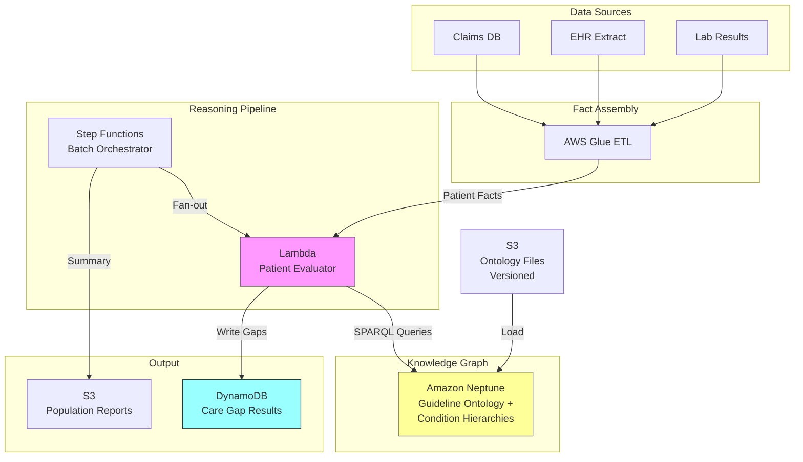

# Recipe 13.6: Care Gap Reasoning Engine

**Complexity:** Medium · **Phase:** Production · **Estimated Cost:** ~$0.002 per patient evaluation

---

## The Problem

Here's a scenario that plays out every single day in population health management: a 62-year-old diabetic patient with hypertension hasn't had an HbA1c test in 14 months, is overdue for a retinal exam, and has no record of a statin prescription despite meeting every clinical guideline criterion for one. Three care gaps. Three missed opportunities. Three potential quality measure failures.

Now multiply that by 50,000 attributed lives in a health plan. The quality team is running SQL queries against claims data, cross-referencing spreadsheets of HEDIS measure specifications, and manually flagging patients who appear to be missing recommended services. It's slow, brittle, and incomplete. Every time a guideline updates (which happens annually for most quality programs), someone has to rewrite the logic. Every time a patient's condition list changes, the applicable rules change too. The combinatorial explosion of conditions, age brackets, medications, and recommended services is genuinely hard to manage with flat rule tables.

The real cost isn't just operational. Missed care gaps translate directly into worse patient outcomes, lower quality scores, reduced reimbursement under value-based contracts, and (in Medicare Advantage) lower Star Ratings that affect enrollment and revenue. CMS estimates that closing preventive care gaps could prevent hundreds of thousands of hospitalizations annually. The gap between "what guidelines recommend" and "what actually happens" is one of the most expensive problems in healthcare.

What we need is a system that can reason about which guidelines apply to a given patient based on their conditions, demographics, and medication history, and then determine which recommended actions haven't been completed. That's a reasoning problem, not a lookup problem. And knowledge graphs are exceptionally good at reasoning problems.

---

## The Technology: Ontological Reasoning for Clinical Guidelines

### What Is a Knowledge Graph?

A knowledge graph is a data structure that represents information as entities (nodes) connected by typed relationships (edges). Unlike a relational database where relationships are implicit in foreign keys, a knowledge graph makes relationships first-class citizens. You can ask questions like "what is connected to this node, and how?" without knowing the schema in advance.

In a simple example: the node "Type 2 Diabetes" connects to the node "HbA1c Test" via a relationship "requires_monitoring_with." The node "HbA1c Test" has a property "recommended_frequency: every 6 months." That's a tiny piece of clinical knowledge encoded as a graph.

### What Is Ontological Reasoning?

Ontological reasoning is the process of deriving new facts from existing facts using logical rules. If you know that "Type 2 Diabetes is-a Chronic Condition" and "All Chronic Conditions require Annual Review," you can infer that "Type 2 Diabetes requires Annual Review" without anyone explicitly stating that fact. The reasoner derives it.

This is powerful for care gaps because clinical guidelines are inherently hierarchical and conditional. A guideline might say: "For patients with diabetes AND age over 40 AND no documented cardiovascular disease, recommend statin therapy." That's a conjunction of conditions leading to a recommendation. An ontological reasoner can evaluate that conjunction against a patient's known facts and determine whether the recommendation applies.

### Why Knowledge Graphs for Care Gaps?

The alternative approaches each have significant limitations:

**Rule engines (flat if-then tables):** Work fine for simple cases but become unmanageable as the number of conditions, exceptions, and interactions grows. When you have 200 quality measures, each with 3-10 inclusion/exclusion criteria, and those criteria reference conditions that have their own hierarchies (ICD-10 codes roll up into condition groups), flat rules become a maintenance nightmare. You end up with thousands of rules that nobody can audit holistically.

**SQL-based approaches:** Claims queries can identify patients missing specific services, but they struggle with the "which guidelines apply to this patient" question. The logic for determining applicability is complex, conditional, and hierarchical. Encoding it in SQL produces queries that are hundreds of lines long, fragile to schema changes, and nearly impossible to validate against the source guideline text.

**Knowledge graphs solve both problems.** The guideline logic lives in the graph structure itself. "Diabetes requires HbA1c monitoring" is a relationship. "HbA1c monitoring has frequency every 6 months" is a property. "Patient X has condition Diabetes" is another relationship. The reasoner traverses these connections and determines: Patient X should have had an HbA1c within the last 6 months. Did they? That's a graph query, not a hand-coded rule.

The maintenance advantage is significant. When a guideline updates (say, the recommended HbA1c frequency changes from every 6 months to every 3 months for uncontrolled diabetes), you update one property on one node. Every patient evaluation automatically picks up the change. No code deployment. No SQL rewrite. No regression testing of rule logic.

### How the Reasoning Works

The reasoning engine operates in three phases:

**Phase 1: Patient context assembly.** Gather everything known about the patient: active conditions (from problem lists and claims), demographics (age, sex), current medications, recent procedures and lab results. This becomes the patient's "fact set" in the graph.

**Phase 2: Guideline applicability.** Traverse the guideline ontology to determine which recommendations apply to this patient. A recommendation applies when all of its preconditions are satisfied by the patient's fact set. This is where the hierarchical reasoning matters: if the guideline says "patients with cardiovascular disease" and the patient has "coronary artery disease," the reasoner needs to know that coronary artery disease is-a cardiovascular disease.

**Phase 3: Gap identification.** For each applicable recommendation, check whether the recommended action has been completed within the specified timeframe. If not, that's a care gap. The output is a list of gaps with their clinical justification (why this recommendation applies to this patient) and priority (based on clinical urgency and quality measure impact).

### What Makes This Hard

**Condition hierarchy mapping.** Clinical guidelines reference condition groups ("cardiovascular disease"), but patient records contain specific diagnoses (ICD-10 codes like I25.10 for atherosclerotic heart disease). You need a complete mapping from specific codes to condition groups, and those mappings aren't always clean. Some codes map to multiple groups. Some are ambiguous. SNOMED CT provides a formal ontology for this, but integrating it with ICD-10 coded claims data requires careful crosswalking.

**Temporal reasoning.** "HbA1c within the last 6 months" requires knowing when the last HbA1c was performed. Claims data has service dates. Lab results have collection dates. These don't always agree. And "within the last 6 months" from when? From today? From the measurement year end? From the patient's next scheduled visit? Different quality programs define "current" differently.

**Exclusion logic.** Guidelines have exclusions that are just as important as inclusions. "Recommend colonoscopy for patients age 45-75, EXCEPT those with a history of total colectomy." The exclusion logic can be complex: some exclusions are permanent (colectomy), some are temporary (pregnancy), some are conditional (hospice enrollment). Your reasoner must handle all three types.

**Evidence currency.** Patient data arrives with varying latency. Claims data is typically 30-90 days behind. Lab results might be same-day from an integrated system or 60 days delayed from an external lab. A care gap identified today might already be closed by a service performed last week that hasn't been reported yet. False positive gaps erode trust in the system.

**Guideline conflicts.** Different guidelines sometimes contradict each other, or a patient's comorbidities create situations where following one guideline would violate another. A patient on anticoagulation therapy might have a guideline recommending aspirin for cardiovascular prevention, but the combination increases bleeding risk. The reasoner needs to surface these conflicts, not silently pick one.

### The General Architecture Pattern

```
[Patient Data Sources] → [Fact Assembly] → [Knowledge Graph] ← [Guideline Ontology]
                                                    ↓
                                           [Reasoning Engine]
                                                    ↓
                                        [Gap Identification]
                                                    ↓
                              [Priority Scoring] → [Care Gap Output]
```

**Patient Data Sources:** EHR problem lists, claims/encounters, lab results, medication lists, demographics. These feed the patient's fact set.

**Guideline Ontology:** The encoded clinical guidelines, condition hierarchies, and recommendation rules. This is the "knowledge" in the knowledge graph. It's maintained separately from patient data and versioned independently.

**Reasoning Engine:** The component that evaluates patient facts against guideline rules. It performs the applicability check and the completion check for each recommendation.

**Priority Scoring:** Not all gaps are equal. A missed cancer screening is more urgent than a slightly overdue wellness visit. Priority considers clinical urgency, quality measure impact, and patient-specific risk factors.

---

## The AWS Implementation

### Why These Services

<!-- TODO (TechWriter): Expert review A1 (CRITICAL). Neptune does NOT natively support OWL reasoning/inference. The claim below that "the query engine handles the inference automatically" is factually incorrect. Neptune stores RDF/OWL data and queries it with SPARQL, but hierarchy traversal requires explicit SPARQL property paths (e.g., rdfs:subClassOf*) or pre-materialized inferred triples. Rewrite this section to use SPARQL property paths for hierarchy traversal, or integrate a third-party reasoner (e.g., RDFox). Remove all claims of "native" OWL inference. See AWS blog "Use semantic reasoning to infer new facts from your RDF graph by integrating RDFox with Amazon Neptune" (Feb 2023) for the correct pattern. -->

**Amazon Neptune for the knowledge graph.** Neptune is AWS's managed graph database service supporting both property graph (Gremlin/openCypher) and RDF (SPARQL) query models. For care gap reasoning, the RDF/SPARQL model is the better fit because it natively supports ontological reasoning through OWL (Web Ontology Language) inference. You can define class hierarchies (coronary artery disease subClassOf cardiovascular disease) and the query engine handles the inference automatically. Neptune is HIPAA eligible, supports encryption at rest and in transit, and runs within your VPC.

**AWS Lambda for patient evaluation orchestration.** Each patient evaluation is a bounded, stateless operation: assemble facts, query the graph, score the gaps, return results. Lambda handles the per-patient compute without requiring persistent infrastructure. For batch population evaluation (running all 50,000 patients overnight), Lambda's concurrency model scales naturally.

**Amazon S3 for guideline ontology storage and versioning.** The guideline ontology (OWL/RDF files) needs versioning, audit trails, and a clean deployment path. S3 with versioning enabled provides all three. When guidelines update annually, you upload the new ontology version, load it into Neptune, and the reasoning automatically reflects the changes.

**AWS Step Functions for batch orchestration.** Evaluating an entire population requires coordination: partition the patient list, fan out Lambda invocations, collect results, handle failures, and produce summary reports. Step Functions provides the orchestration with built-in retry logic and error handling. Configure the Map state with `MaxConcurrency` to control Neptune load. Set `Retry` with exponential backoff for Lambda timeout and Neptune throttling errors. Configure a `Catch` block that writes failed patient IDs to an SQS dead-letter queue for investigation. After batch completion, report the failure rate; if more than 5% of patients fail evaluation, alert the operations team.

**Amazon DynamoDB for gap result storage.** The output of the reasoning engine (per-patient gap lists) needs fast point lookups by patient ID for care management workflows and batch scans for population-level reporting. DynamoDB handles both access patterns efficiently.

**AWS Glue for patient data assembly.** Patient facts come from multiple sources (claims databases, EHR extracts, lab feeds). Glue ETL jobs consolidate these into the fact format the reasoning engine expects, handling deduplication and temporal alignment.

### Architecture Diagram



Here's what you need before you start building:

### Prerequisites

| Requirement | Details |
|-------------|---------|
| **AWS Services** | Amazon Neptune, AWS Lambda, Amazon S3, AWS Step Functions, Amazon DynamoDB, AWS Glue, Amazon SQS (DLQ) |
| **IAM Permissions** | Evaluation Lambda: `neptune-db:ReadDataViaQuery` (scoped to cluster ARN). Ontology loader (separate role): `neptune-db:WriteDataViaQuery`, `neptune-db:GetGraphSummary`. Both: `s3:GetObject`, `s3:PutObject`, `dynamodb:PutItem`, `dynamodb:Query`, `states:StartExecution`, `glue:StartJobRun`. The evaluation Lambda should never have write access to the knowledge graph. |
| **BAA** | AWS BAA signed (patient conditions, demographics, and care history are PHI) |
| **Encryption** | Neptune: encryption at rest enabled at cluster creation (cannot be added later); S3: SSE-KMS; DynamoDB: encryption at rest (default); all connections over TLS |
| **VPC** | Neptune requires VPC deployment. Ensure VPC has `enableDnsHostnames` and `enableDnsSupport` set to true (required for Neptune endpoint resolution). Lambda in same VPC with VPC endpoints for S3, DynamoDB, and CloudWatch Logs. Neptune accessible only via private subnet. Security group on Neptune must allow inbound TCP 8182 from the Lambda security group. Neptune does not need a VPC endpoint because it runs inside your VPC; Lambda connects directly via the private subnet. |
| **CloudTrail** | Enabled for all API calls. Neptune audit logs enabled for SPARQL query logging. CloudWatch Logs retention for Neptune audit logs: minimum 6 years per HIPAA retention requirements. Consider tiering to S3 Glacier after 90 days for cost optimization. |
| **Sample Data** | Synthetic patient populations with known conditions. Use CMS Synthetic Medicare data or Synthea-generated records. Never use real PHI in development. |
| **Cost Estimate** | Neptune db.r5.large: ~$0.58/hr (~$420/month). Lambda: negligible at batch volumes. DynamoDB: on-demand pricing, ~$1.25 per million writes. Total for 50K patient monthly evaluation: ~$450/month. |

### Ingredients

| AWS Service | Role |
|------------|------|
| **Amazon Neptune** | Stores guideline ontology, condition hierarchies, and executes reasoning queries via SPARQL |
| **AWS Lambda** | Evaluates individual patients against the knowledge graph |
| **Amazon S3** | Stores versioned ontology files and population-level reports |
| **AWS Step Functions** | Orchestrates batch population evaluation with fan-out/fan-in |
| **Amazon DynamoDB** | Stores per-patient care gap results for downstream consumption |
| **AWS Glue** | Assembles patient facts from heterogeneous data sources |
| **Amazon SQS** | Dead-letter queue for failed patient evaluations |
| **AWS KMS** | Manages encryption keys for all data stores |
| **Amazon CloudWatch** | Metrics, logs, and alarms for pipeline health |

### Code

#### Walkthrough

**Step 1: Define the guideline ontology.** The foundation of the reasoning engine is the ontology: a formal representation of clinical guidelines as classes, properties, and relationships. Each guideline recommendation becomes a node with typed connections to its preconditions (what must be true about the patient) and its recommended action (what should happen). Condition hierarchies (ICD-10 codes rolling up to condition groups) are modeled as class hierarchies so the reasoner can infer membership automatically. This ontology is authored once per guideline set, updated when guidelines change (typically annually), and loaded into Neptune. Skip this step and you have no knowledge to reason over.

```
// Ontology structure (RDF/OWL concepts, expressed as pseudocode)
// This defines the "knowledge" that the reasoning engine uses.

DEFINE CLASS Condition
    // Represents a clinical condition (e.g., Type 2 Diabetes, Hypertension)
    // Conditions form a hierarchy: specific diagnoses are subclasses of broader groups

DEFINE CLASS Recommendation
    // A clinical action recommended by a guideline
    PROPERTY applies_when: list of Condition    // preconditions (patient must have these)
    PROPERTY age_minimum: integer               // minimum age for applicability (optional)
    PROPERTY age_maximum: integer               // maximum age for applicability (optional)
    PROPERTY sex_applies_to: string             // "M", "F", or "all"
    PROPERTY recommended_action: Action         // what should be done
    PROPERTY frequency: Duration                // how often (e.g., "every 6 months")
    PROPERTY excluded_by: list of Condition     // exclusion criteria (if present, skip)
    PROPERTY measure_id: string                 // quality measure reference (e.g., "HEDIS-CDC-HbA1c")
    PROPERTY priority: string                   // "high", "medium", "low"

DEFINE CLASS Action
    // A specific clinical action (e.g., "HbA1c Lab Test", "Retinal Exam")
    PROPERTY action_type: string                // "lab", "procedure", "medication", "referral"
    PROPERTY cpt_codes: list of string          // CPT codes that satisfy this action
    PROPERTY loinc_codes: list of string        // LOINC codes for lab-based actions

// Example: Diabetes HbA1c monitoring recommendation
CREATE Recommendation:
    id = "rec-diabetes-hba1c"
    applies_when = [Type2Diabetes]              // patient must have Type 2 Diabetes
    recommended_action = HbA1cTest
    frequency = "6 months"
    excluded_by = [Hospice, TerminalIllness]
    measure_id = "HEDIS-CDC-HbA1c"
    priority = "high"

// Example: Condition hierarchy
Type2Diabetes subClassOf DiabetesMellitus
DiabetesMellitus subClassOf ChronicCondition
// This means: if a guideline applies to "ChronicCondition", it automatically
// applies to Type2Diabetes patients via inference. No explicit rule needed.
```

**Step 2: Load patient facts into the evaluation context.** For each patient being evaluated, assemble their current clinical state from available data sources: active conditions (from claims and problem lists), demographics, current medications, and recent services with dates. This fact set becomes the patient's representation that the reasoner evaluates against the guideline ontology. The key challenge here is temporal: you need to know not just what conditions a patient has, but when their last relevant service occurred. Skip this step and the reasoner has nothing to evaluate.

```
FUNCTION assemble_patient_facts(patient_id, data_sources):
    // Pull the patient's current clinical state from all available sources.
    // This becomes the "fact set" that the reasoner evaluates.

    facts = empty structure

    // Demographics: age and sex drive many guideline applicability rules
    facts.demographics = query data_sources.ehr for:
        age, sex, enrollment_status
        WHERE patient_id matches

    // Active conditions: what diagnoses does this patient carry?
    // Pull from both claims (ICD-10 codes from encounters) and EHR problem lists.
    // Deduplicate: the same condition from both sources counts once.
    facts.conditions = query data_sources.claims for:
        DISTINCT icd10_codes
        WHERE patient_id matches
        AND service_date within last 24 months  // lookback period per measure specs
    
    UNION query data_sources.ehr_problems for:
        active problem list entries (mapped to ICD-10)
        WHERE patient_id matches

    // Recent services: what has been done, and when?
    // This is how we determine whether a recommended action has been completed.
    facts.recent_services = query data_sources.claims for:
        cpt_code, service_date, loinc_code (if lab)
        WHERE patient_id matches
        AND service_date within last 24 months

    // Current medications: some guidelines recommend starting a medication,
    // so we need to know what the patient is already taking.
    facts.medications = query data_sources.pharmacy for:
        drug_name, ndc_code, fill_date, days_supply
        WHERE patient_id matches
        AND fill_date within last 12 months  // active = filled recently

    RETURN facts
```

**Step 3: Determine applicable recommendations.** This is where the reasoning happens. For each recommendation in the guideline ontology, evaluate whether its preconditions are satisfied by the patient's fact set. The ontological reasoning handles hierarchy traversal automatically: if the patient has ICD-10 code E11.9 (Type 2 Diabetes without complications), and the recommendation applies to "Diabetes Mellitus" (the parent class), the reasoner infers applicability through the subclass relationship. Exclusions are checked after inclusions: if any exclusion condition is present, the recommendation is skipped regardless of whether inclusions are met. Skip this step and you're just listing all possible recommendations without knowing which ones actually apply to this patient.

```
FUNCTION find_applicable_recommendations(patient_facts, knowledge_graph):
    // Query the knowledge graph to find all recommendations whose
    // preconditions are satisfied by this patient's facts.

    applicable = empty list

    // SPARQL-style query (conceptual):
    // "Find all Recommendations where:
    //   - The patient has at least one condition that matches (or is a subclass of)
    //     the recommendation's applies_when conditions
    //   - The patient's age falls within the recommendation's age range
    //   - The patient's sex matches (or recommendation applies to all)
    //   - The patient does NOT have any condition in the excluded_by list"

    results = QUERY knowledge_graph:
        SELECT recommendation
        WHERE recommendation.applies_when CONDITIONS are satisfied by patient_facts.conditions
            // This is where ontological inference matters:
            // patient has E11.9 (Type 2 Diabetes)
            // recommendation applies_when includes DiabetesMellitus
            // reasoner infers E11.9 → Type2Diabetes → DiabetesMellitus ✓
        AND patient_facts.demographics.age >= recommendation.age_minimum (if set)
        AND patient_facts.demographics.age <= recommendation.age_maximum (if set)
        AND patient_facts.demographics.sex IN recommendation.sex_applies_to
        AND NONE OF recommendation.excluded_by IN patient_facts.conditions
            // Exclusion check: if patient is in hospice, skip all recommendations
            // that list Hospice as an exclusion

    FOR each recommendation in results:
        // Record why this recommendation applies (for clinical justification)
        justification = identify which patient conditions triggered applicability
        append to applicable: {
            recommendation: recommendation,
            justification: justification
        }

    RETURN applicable
```

**Step 4: Identify care gaps.** For each applicable recommendation, check whether the recommended action has been completed within the required timeframe. This is the "gap detection" step. A gap exists when a recommendation applies to the patient but the corresponding action (identified by CPT or LOINC codes) has not been performed within the specified frequency window. The output is a concrete list of what's missing, when it was last done (if ever), and how overdue it is. Skip this step and you know what should happen but not what's actually missing.

```
FUNCTION identify_gaps(applicable_recommendations, patient_facts, evaluation_date):
    // For each applicable recommendation, check if the action has been completed
    // within the required timeframe. If not, it's a care gap.

    gaps = empty list

    FOR each item in applicable_recommendations:
        rec = item.recommendation

        // Determine the lookback window: how far back do we look for completion?
        // evaluation_date minus the recommendation's frequency gives us the cutoff.
        // Example: if frequency is "6 months" and today is 2026-06-01,
        //          cutoff is 2025-12-01. Any HbA1c after that date counts.
        cutoff_date = evaluation_date MINUS rec.frequency

        // Check if any of the patient's recent services satisfy this recommendation.
        // A service satisfies the recommendation if its CPT or LOINC code matches
        // the recommendation's action codes AND it occurred after the cutoff date.
        matching_services = FILTER patient_facts.recent_services WHERE:
            (service.cpt_code IN rec.recommended_action.cpt_codes
             OR service.loinc_code IN rec.recommended_action.loinc_codes)
            AND service.service_date >= cutoff_date

        IF matching_services is empty:
            // No matching service found within the required window. This is a gap.

            // Find the most recent matching service ever (for "last completed" info)
            last_completed = FIND most recent service in patient_facts.recent_services
                WHERE cpt_code IN rec.recommended_action.cpt_codes
                   OR loinc_code IN rec.recommended_action.loinc_codes

            gap = {
                recommendation_id:  rec.id,
                measure_id:         rec.measure_id,
                action_needed:      rec.recommended_action.description,
                priority:           rec.priority,
                frequency:          rec.frequency,
                last_completed:     last_completed.service_date IF exists ELSE "never",
                days_overdue:       days_between(cutoff_date, evaluation_date),
                justification:      item.justification,
                exclusions_checked: rec.excluded_by  // document what was ruled out
            }
            append to gaps: gap

    RETURN gaps
```

**Step 5: Score and prioritize gaps.** Not all care gaps carry equal urgency. A missed cancer screening for a high-risk patient is more urgent than a slightly overdue wellness visit. This step assigns a composite priority score based on clinical urgency (from the guideline), how overdue the action is, the patient's risk profile, and the quality measure impact (Star Rating weight, for example). The scored output enables care management teams to focus outreach on the highest-impact gaps first. Skip this step and care managers waste time on low-priority gaps while critical ones go unaddressed.

```
FUNCTION score_gaps(gaps, patient_facts):
    // Assign a composite priority score to each gap for outreach prioritization.

    scored_gaps = empty list

    FOR each gap in gaps:
        // Base priority from the guideline itself (high=3, medium=2, low=1)
        base_score = priority_to_numeric(gap.priority)

        // Overdue factor: the longer overdue, the more urgent
        // Cap at 2.0x to prevent extreme outliers from dominating
        overdue_factor = minimum(gap.days_overdue / 90, 2.0)

        // Risk factor: patients with more comorbidities get higher priority
        // (they have more to lose from missed preventive care)
        comorbidity_count = count(patient_facts.conditions)
        risk_factor = minimum(comorbidity_count / 3, 2.0)

        // Quality measure weight: some measures impact Star Ratings more heavily
        // TODO: integrate actual measure weights from quality program specs
        measure_weight = lookup_measure_weight(gap.measure_id)

        // Composite score (higher = more urgent)
        composite_score = base_score * (1 + overdue_factor) * (1 + risk_factor * 0.3) * measure_weight

        gap.composite_score = composite_score
        append to scored_gaps: gap

    // Sort by composite score descending (most urgent first)
    SORT scored_gaps by composite_score DESCENDING

    RETURN scored_gaps
```

**Step 6: Store results and trigger downstream workflows.** Write the scored gap list to the results store, keyed by patient ID and evaluation date. This creates the audit trail (what gaps were identified, when, based on what evidence) and feeds downstream systems: care management platforms for outreach, patient portals for self-service gap closure, and quality reporting dashboards. Include a summary record for population-level analytics.

```
FUNCTION store_gap_results(patient_id, evaluation_date, scored_gaps):
    // Persist the evaluation results for downstream consumption.

    record = {
        patient_id:       patient_id,
        evaluation_date:  evaluation_date,
        gap_count:        count(scored_gaps),
        gaps:             scored_gaps,
        evaluated_at:     current UTC timestamp,
        ontology_version: current_ontology_version()  // track which guideline version was used
    }

    // Write to DynamoDB with patient_id as partition key, evaluation_date as sort key.
    // This supports both point lookups (get gaps for patient X) and range queries
    // (get all evaluations for patient X over time to track gap closure).
    WRITE record TO "care-gap-results" table

    // If high-priority gaps exist, publish an event for real-time care management.
    // The SNS topic must be encrypted with a KMS CMK. Subscribers must be within
    // the same VPC or connected via PrivateLink. Minimize PHI in the event payload;
    // consumers query DynamoDB for full details.
    IF any gap in scored_gaps has composite_score > HIGH_PRIORITY_THRESHOLD:
        PUBLISH event to encrypted SNS topic:
            patient_id, high_priority_gap_count
            // Omit clinical details from the event; consumers look up full
            // gap data from DynamoDB using the patient_id.

    RETURN record
```

> **Curious how this looks in Python?** The pseudocode above covers the concepts. If you'd like to see sample Python code that demonstrates these patterns using boto3, check out the [Python Example](chapter13.06-python-example). It walks through each step with inline comments and notes on what you'd need to change for a real deployment.

### Expected Results

**Sample output for a 62-year-old diabetic patient with hypertension:**

```json
{
  "patient_id": "PAT-2026-00482",
  "evaluation_date": "2026-05-15",
  "gap_count": 3,
  "gaps": [
    {
      "recommendation_id": "rec-diabetes-hba1c",
      "measure_id": "HEDIS-CDC-HbA1c",
      "action_needed": "HbA1c Lab Test",
      "priority": "high",
      "frequency": "6 months",
      "last_completed": "2025-03-10",
      "days_overdue": 66,
      "composite_score": 8.4,
      "justification": ["Active condition: E11.9 (Type 2 Diabetes)"]
    },
    {
      "recommendation_id": "rec-diabetes-retinal",
      "measure_id": "HEDIS-CDC-Eye",
      "action_needed": "Dilated Retinal Exam",
      "priority": "medium",
      "frequency": "12 months",
      "last_completed": "2024-11-20",
      "days_overdue": 176,
      "composite_score": 6.2,
      "justification": ["Active condition: E11.9 (Type 2 Diabetes)"]
    },
    {
      "recommendation_id": "rec-ascvd-statin",
      "measure_id": "HEDIS-SPC",
      "action_needed": "Statin Therapy Initiation",
      "priority": "high",
      "frequency": "ongoing",
      "last_completed": "never",
      "days_overdue": null,
      "composite_score": 9.1,
      "justification": ["Active conditions: E11.9 (Diabetes), I10 (Hypertension), Age >= 40"]
    }
  ],
  "evaluated_at": "2026-05-15T02:14:33Z",
  "ontology_version": "guidelines-2026-v2.1"
}
```

**Performance benchmarks:**

<!-- TODO (TechWriter): Expert review A3 (MEDIUM). The 45-minute batch estimate doesn't match the per-patient latency math (100 Lambdas × 500 patients × 200-500ms = 2-4 minutes, not 45). Either show the math behind the 45-minute estimate (what's the bottleneck: Step Functions orchestration overhead? Neptune connection pooling?) or correct it. Also add Neptune connection management guidance: reuse connections across invocations, set neptune_query_timeout, monitor SparqlRequestsPerSec. -->

| Metric | Typical Value |
|--------|---------------|
| Per-patient evaluation latency | 200-500ms |
| Batch throughput (50K patients) | ~45 minutes with 100 concurrent Lambdas |
| Guideline coverage | Depends on ontology completeness (typically 40-80 HEDIS measures) |
| False positive rate (gaps already closed) | 5-15% (due to claims lag) |
| Ontology update deployment time | < 30 minutes (load new RDF, validate, swap) |
| Cost per patient evaluation | ~$0.002 (Neptune query + Lambda + DynamoDB write) |

**Where it struggles:** Patients with complex multi-morbidity where guideline conflicts arise. Claims data lag causing false positive gaps. Exclusion criteria that require clinical judgment (e.g., "patient declined" is often not coded). Guidelines that reference social determinants not captured in structured data.

---

## The Honest Take

The knowledge graph approach to care gaps is genuinely elegant when it works. The first time you update a guideline property and watch it cascade correctly across 50,000 patient evaluations without touching a line of code, you'll feel like you've built something right.

But here's what will humble you:

The ontology authoring is the hardest part, and it's not a technology problem. It's a clinical informatics problem. Translating a 40-page HEDIS technical specification into a formal ontology requires someone who understands both the clinical intent and the logical formalism. Those people are rare. Budget significant time for ontology development and clinical validation.

The false positive problem is real and corrosive. If 10% of your identified gaps are already closed (the patient got their HbA1c last week, but the claim hasn't processed yet), care managers learn to distrust the system. You need a feedback loop where closed gaps are confirmed and the false positive rate is tracked as a system health metric. Consider supplementing claims data with real-time ADT feeds or EHR integrations to reduce lag.

Exclusion logic will consume more of your time than inclusion logic. Every quality measure has a list of valid exclusions (hospice, terminal illness, patient refusal, specific contraindications). Missing an exclusion means flagging a gap that shouldn't exist. Getting exclusions right requires encoding not just conditions but also encounter types, medication contraindications, and sometimes free-text documentation. Start with the exclusions that are reliably coded (hospice, pregnancy) and accept that some will require manual review.

The part that surprised me most: the condition hierarchy mapping is never "done." ICD-10 updates annually. New codes appear. Existing codes get refined. Your mapping from ICD-10 codes to ontology condition classes needs annual maintenance, and the maintenance is tedious but critical. One unmapped code means one patient's gaps are silently missed.

---

## Variations and Extensions

**Real-time gap checking at point of care.** Instead of batch overnight evaluation, expose the reasoning engine as a synchronous API that clinicians can query during a visit. "What gaps does this patient have right now?" This requires sub-second Neptune query performance (achievable with warm caches and optimized SPARQL) and integration with the EHR workflow. The value is immediate: the clinician can close gaps during the visit rather than requiring a separate outreach.

**Patient-facing gap notifications.** Surface care gaps in the patient portal with plain-language explanations: "Based on your diabetes diagnosis, you're due for an HbA1c blood test. Your last one was 14 months ago." Include scheduling links. This shifts some gap closure responsibility to the patient, reducing outreach burden. Requires careful UX to avoid alarm without context.

**Guideline conflict resolution.** Extend the ontology with conflict relationships: "Recommendation A conflicts with Recommendation B when Condition C is present." When the reasoner detects a conflict, surface it to the care team with both recommendations and the clinical context, rather than silently suppressing one. This is particularly important for patients on anticoagulation, those with renal impairment affecting medication choices, and elderly patients where aggressive screening may cause more harm than benefit.

---

## Related Recipes

- **Recipe 13.3 (ICD/CPT Hierarchy Navigation):** Provides the condition hierarchy foundation that this recipe's ontological reasoning depends on
- **Recipe 13.5 (Clinical Pathway Protocol Modeling):** Models treatment protocols as graphs; care gaps are the delta between the protocol and reality
- **Recipe 7.6 (Rising Risk Identification):** Identifies patients whose risk is increasing; combine with care gaps to prioritize outreach to rising-risk patients with open gaps
- **Recipe 4.6 (Care Gap Prioritization):** Complements this recipe by adding personalization to gap outreach (which channel, what time, what message)

---

## Additional Resources

**AWS Documentation:**
- [Amazon Neptune Developer Guide](https://docs.aws.amazon.com/neptune/latest/userguide/intro.html)
- [Amazon Neptune SPARQL Reference](https://docs.aws.amazon.com/neptune/latest/userguide/sparql.html)
- [Amazon Neptune SPARQL Property Paths](https://docs.aws.amazon.com/neptune/latest/userguide/sparql-query-hints-property-path.html)
- [AWS Step Functions Developer Guide](https://docs.aws.amazon.com/step-functions/latest/dg/welcome.html)
- [AWS HIPAA Eligible Services](https://aws.amazon.com/compliance/hipaa-eligible-services-reference/)
- [Amazon Neptune Pricing](https://aws.amazon.com/neptune/pricing/)

**AWS Sample Repos:**
- [`amazon-neptune-samples`](https://github.com/aws-samples/amazon-neptune-samples): Neptune code samples including RDF loading, SPARQL queries, and graph analytics patterns
- [`amazon-neptune-ontology-example-blog`](https://github.com/aws-samples/amazon-neptune-ontology-example-blog): Demonstrates building and querying ontologies in Neptune with OWL reasoning

**AWS Solutions and Blogs:**
- [Building Knowledge Graphs on AWS (Blog)](https://aws.amazon.com/blogs/database/building-a-knowledge-graph-application-with-amazon-neptune/): Patterns for knowledge graph construction and querying on Neptune
- [Healthcare Data Lake on AWS (Solution)](https://aws.amazon.com/solutions/implementations/healthcare-data-lake/): Reference architecture for consolidating healthcare data sources that feed the reasoning engine

---

## Estimated Implementation Time

| Tier | Timeline | What You Get |
|------|----------|--------------|
| **Basic** | 6-8 weeks | Ontology for 10-15 core measures, batch evaluation, DynamoDB results store |
| **Production-ready** | 12-16 weeks | Full HEDIS measure set, exclusion logic, false positive tracking, care management integration |
| **With variations** | 20-24 weeks | Real-time point-of-care API, patient portal integration, conflict resolution, multi-program support |

---

**Tags:** knowledge-graph, ontology, care-gaps, quality-measures, HEDIS, reasoning, Neptune, SPARQL, population-health, value-based-care

---

[← Recipe 13.5: Clinical Pathway Protocol Modeling](chapter13.05-clinical-pathway-protocol-modeling) | [Chapter 13 Index](chapter13-index) | [Recipe 13.7: Disease-Gene-Drug Relationship Graph →](chapter13.07-disease-gene-drug-relationship-graph)
