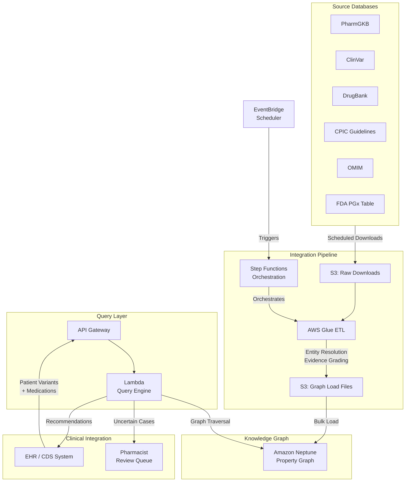

# Recipe 13.7 Architecture and Implementation: Disease-Gene-Drug Relationship Graph

*Companion to [Recipe 13.7: Disease-Gene-Drug Relationship Graph](chapter13.07-disease-gene-drug-relationship-graph). This page covers the AWS architecture, services, prerequisites, and pseudocode. For the problem framing and the conceptual approach, start with the main recipe.*

---

## The AWS Implementation

### Why These Services

**Amazon Neptune for the knowledge graph store.** Neptune speaks two graph languages: property graph (openCypher or Gremlin) and RDF (SPARQL). For pharmacogenomics, property graph wins. Your queries read like the clinical question you're actually asking: "start at this variant, traverse to the gene, find drugs metabolized by that gene, filter by evidence level." openCypher makes that traversal pattern natural. Neptune handles the multi-hop traversals efficiently, runs within your VPC, supports encryption at rest, and is HIPAA eligible. The managed nature means you're not tuning JanusGraph or managing Cassandra backends.

**AWS Glue for ETL and source integration.** The source databases (PharmGKB, ClinVar, DrugBank) publish data in various formats: TSV files, XML dumps, REST APIs. Glue jobs handle the extraction, transformation, and entity resolution needed to produce clean graph-loadable data. Glue's serverless Spark environment handles the large ClinVar dataset (millions of variant records) without provisioning infrastructure.

**Amazon S3 for source data staging and graph snapshots.** Raw source downloads, intermediate transformation outputs, and Neptune bulk load files all stage through S3. S3 versioning provides an audit trail of which source versions produced which graph version. Neptune's bulk loader reads directly from S3, making the load path clean.

**AWS Lambda for query orchestration and API serving.** Individual patient queries (given these variants, what's actionable?) are short-lived, stateless operations. Lambda handles the query construction, Neptune interaction, evidence filtering, and response formatting. For the clinical decision support integration, API Gateway plus Lambda provides a synchronous REST endpoint.

**Amazon EventBridge for update orchestration.** Source databases update on different cadences (ClinVar weekly, DrugBank quarterly, CPIC as-published). EventBridge schedules the appropriate ETL jobs and coordinates the graph update pipeline. When a source updates, the pipeline runs automatically: download, transform, validate, load, verify.

**AWS Step Functions for the graph update pipeline.** The full update workflow (download sources, run ETL, validate entity resolution, bulk load to Neptune, run integration tests, swap to new graph version) has multiple steps with error handling and rollback requirements. Step Functions orchestrates this reliably.

### Architecture Diagram



<!-- TODO (TechWriter): Expert review A2 (MEDIUM). Add error handling guidance for the query path: distinguish HTTP 200 (no findings) from HTTP 503 (query failed). For failed queries, CDS should display "pharmacogenomic check unavailable" notification. Log failed queries to SQS for retry. Add CloudWatch alarm on query failure rate exceeding 1% over 5 minutes. -->

### Prerequisites

| Requirement | Details |
|-------------|---------|
| AWS Services | Neptune, S3, Glue, Lambda, API Gateway, Step Functions, EventBridge, IAM, KMS, CloudWatch |
| IAM Permissions | neptune-db:*, s3:GetObject/PutObject, glue:StartJobRun, lambda:InvokeFunction, states:StartExecution |
<!-- TODO (TechWriter): Expert review S1 (HIGH). Split IAM permissions into read-only (query Lambda: neptune-db:ReadDataViaQuery, GetQueryStatus) and read-write (ETL pipeline: full neptune-db write access). Add note that query path must never have graph write permissions. -->
| BAA | Required. Patient genomic data is PHI under HIPAA. Genetic information also protected under GINA. |
<!-- TODO (TechWriter): Expert review S2 (HIGH). Expand GINA compliance: add role-based access control guidance (pharmacists get full genotype, ordering physicians get recommendation only), separate audit logging for genetic data access, state-specific genetic privacy law considerations. -->
| Encryption | S3 SSE-KMS for all data at rest. Neptune encryption at rest enabled. TLS 1.2+ in transit. |
<!-- TODO (TechWriter): Expert review S5 (LOW). Specify customer-managed KMS key (CMK) with automatic annual rotation. Apply same CMK to S3, Neptune (set at cluster creation), and CloudWatch Logs. -->
| VPC | Neptune must run in VPC. Lambda in same VPC with Neptune access. VPC endpoints for S3 and Glue. |
<!-- TODO (TechWriter): Expert review N1 (HIGH). Replace VPC endpoint list with complete enumeration: S3 (Gateway), KMS (Interface), CloudWatch Logs (Interface), CloudWatch Monitoring (Interface), Step Functions (Interface), EventBridge (Interface). Remove incorrect Glue endpoint reference. Add note that no NAT Gateway should be required for the query path. -->
| CloudTrail | All API calls logged. Neptune audit logs enabled for query tracking. |
<!-- TODO (TechWriter): Expert review S4 (MEDIUM). Specify Neptune audit log enablement: cluster parameter group neptune_enable_audit_log=1, publish to CloudWatch Logs, encrypt log group with same KMS CMK, set retention to match HIPAA audit policy (6-7 years). -->
| Sample Data | PharmGKB open-access datasets. ClinVar public XML dump. Synthetic patient variants for testing. |
| Cost Estimate | Neptune db.r5.large (~$0.58/hr), Glue ETL (~$0.44/DPU-hr weekly), Lambda queries (~$0.0001/query) |
<!-- TODO (TechWriter): Expert review A4 (MEDIUM). Add read replica recommendation for HA and query/write separation. Production cost with replica: ~$836/month. Also address N3: deploy Multi-AZ with read replica in different AZ for automatic failover (under 30 seconds). Query Lambda should use Neptune reader endpoint. -->
<!-- TODO (TechWriter): Expert review N2 (MEDIUM). Add security group guidance: Neptune SG allows inbound TCP 8182 only from Lambda SG. Lambda SG allows outbound TCP 8182 to Neptune SG and outbound TCP 443 to VPC endpoint SGs. No inbound rules on Lambda SG. -->

### Ingredients

| AWS Service | Role in This Recipe |
|-------------|-------------------|
| Amazon Neptune | Stores the disease-gene-drug knowledge graph. Handles multi-hop traversals for pharmacogenomic queries. |
| AWS Glue | Runs ETL jobs to transform source database dumps into graph-loadable format. Handles entity resolution. |
| Amazon S3 | Stages raw source data, transformed graph files, and Neptune snapshots. Provides versioning for audit. |
| AWS Lambda | Executes patient-specific graph queries. Constructs traversals, filters by evidence, formats recommendations. |
| API Gateway | Exposes REST endpoint for clinical decision support integration. Handles auth and throttling. |
| Step Functions | Orchestrates the multi-step graph update pipeline with error handling and rollback. |
| EventBridge | Schedules source database checks and triggers update pipelines on appropriate cadences. |
| AWS KMS | Manages encryption keys for data at rest across all services. |
| CloudWatch | Monitors query latency, graph size metrics, ETL job success rates, and alert thresholds. |

### Code (Pseudocode Walkthrough)

The system has two major workflows: (1) building and updating the knowledge graph from source databases, and (2) querying the graph for a specific patient's pharmacogenomic recommendations.

#### Step 1: Source Data Ingestion

Each source database publishes data in its own format. We download, validate, and stage it.

This step matters because stale or corrupted source data propagates errors throughout the graph. A bad ClinVar download could reclassify thousands of variants incorrectly. Validation catches this before it reaches the graph.

```
FUNCTION ingest_source(source_name, source_url, expected_format):
    // Download the latest release from the source
    raw_data = download(source_url)
    
    // Validate the download is complete and well-formed
    IF NOT validate_checksum(raw_data, source_name):
        RAISE IngestionError("Checksum mismatch for " + source_name)
    
    IF NOT validate_schema(raw_data, expected_format):
        RAISE IngestionError("Schema validation failed for " + source_name)
    
    // Stage in S3 with version metadata
    s3_path = "s3://knowledge-graph-sources/{source_name}/{date}/{filename}"
    upload_to_s3(raw_data, s3_path, metadata={
        "source": source_name,
        "download_date": today(),
        "source_version": extract_version(raw_data),
        "record_count": count_records(raw_data)
    })
    
    RETURN s3_path
```

#### Step 2: Entity Resolution and Normalization

This is the hardest engineering step. Different sources use different identifiers for the same entity. We need a canonical mapping.

If you skip this step, you end up with duplicate nodes: "CYP2D6" from PharmGKB and "CYP2D6" from DrugBank as separate, unconnected entities. The graph becomes fragmented and queries miss relationships that cross source boundaries.

```
FUNCTION resolve_entities(source_records):
    resolved = []
    
    FOR EACH record IN source_records:
        // Map gene identifiers to canonical form
        IF record.has_gene:
            record.gene_id = map_to_canonical_gene(
                symbol=record.gene_symbol,
                entrez_id=record.entrez_id,
                ensembl_id=record.ensembl_id
            )
            // Canonical form: {symbol, entrez_id, ensembl_id, hgnc_id}
        
        // Map drug identifiers to canonical form
        IF record.has_drug:
            record.drug_id = map_to_canonical_drug(
                name=record.drug_name,
                drugbank_id=record.drugbank_id,
                rxnorm_cui=record.rxnorm_cui,
                atc_code=record.atc_code
            )
        
        // Map variant identifiers to canonical form
        IF record.has_variant:
            record.variant_id = map_to_canonical_variant(
                rsid=record.rsid,
                hgvs=record.hgvs_notation,
                star_allele=record.star_allele,
                gene=record.gene_id
            )
        
        // Map disease identifiers to canonical form
        IF record.has_disease:
            record.disease_id = map_to_canonical_disease(
                omim_id=record.omim_id,
                mondo_id=record.mondo_id,
                icd10=record.icd10_code
            )
        
        resolved.append(record)
    
    // Detect and flag ambiguous mappings for manual review
    ambiguous = find_ambiguous_mappings(resolved)
    IF ambiguous.count > 0:
        queue_for_review(ambiguous)
        log_warning(f"{ambiguous.count} ambiguous mappings queued for review")
    
    RETURN resolved
```

<!-- TODO (TechWriter): Expert review A3 (MEDIUM). Specify what happens to graph edges depending on ambiguous entities: recommend conservative exclusion (exclude ambiguous records from graph load until resolved). Add alerting threshold if ambiguity rate exceeds 5% of total records. -->

#### Step 3: Graph Construction

Transform resolved records into graph nodes and edges with evidence metadata.

This step creates the actual knowledge graph structure. Each relationship carries its evidence level, source, and publication date so that downstream queries can filter by confidence.

```
FUNCTION build_graph_load_files(resolved_records):
    nodes = []
    edges = []
    
    FOR EACH record IN resolved_records:
        // Create or update entity nodes
        IF record.type == "gene_drug_association":
            // Ensure gene node exists
            nodes.add(Node(
                id=record.gene_id.canonical,
                label="Gene",
                properties={
                    "symbol": record.gene_id.symbol,
                    "entrez_id": record.gene_id.entrez_id,
                    "chromosome": record.chromosome,
                    "function": record.gene_function
                }
            ))
            
            // Ensure drug node exists
            nodes.add(Node(
                id=record.drug_id.canonical,
                label="Drug",
                properties={
                    "name": record.drug_id.name,
                    "rxnorm_cui": record.drug_id.rxnorm_cui,
                    "therapeutic_class": record.therapeutic_class,
                    "mechanism": record.mechanism_of_action
                }
            ))
            
            // Create the relationship with evidence
            edges.add(Edge(
                from_id=record.gene_id.canonical,
                to_id=record.drug_id.canonical,
                type=record.relationship_type,  // "metabolizes", "targets", "transports"
                properties={
                    "evidence_level": record.evidence_level,  // "1A", "1B", "2A", etc.
                    "source": record.source_database,
                    "pmids": record.supporting_publications,
                    "cpic_level": record.cpic_level,
                    "fda_label": record.has_fda_pgx_label,
                    "last_reviewed": record.review_date,
                    "clinical_annotation": record.clinical_text
                }
            ))
        
        IF record.type == "variant_phenotype":
            // Variant node
            nodes.add(Node(
                id=record.variant_id.canonical,
                label="Variant",
                properties={
                    "rsid": record.rsid,
                    "hgvs": record.hgvs,
                    "star_allele": record.star_allele,
                    "functional_status": record.function,  // "no_function", "decreased", "normal"
                    "allele_freq_eur": record.freq_european,
                    "allele_freq_afr": record.freq_african,
                    "allele_freq_eas": record.freq_east_asian,
                    "clinvar_classification": record.clinvar_class
                }
            ))
            
            // Variant-to-gene edge
            edges.add(Edge(
                from_id=record.variant_id.canonical,
                to_id=record.gene_id.canonical,
                type="is_variant_of",
                properties={"functional_impact": record.function}
            ))
    
    // Deduplicate nodes (same entity from multiple sources)
    nodes = deduplicate_nodes(nodes, merge_strategy="union_properties")
    
    // Write Neptune bulk load format (CSV)
    write_neptune_csv(nodes, "s3://graph-loads/{version}/nodes/")
    write_neptune_csv(edges, "s3://graph-loads/{version}/edges/")
    
    RETURN {"node_count": nodes.count, "edge_count": edges.count}
```

#### Step 4: Diplotype-to-Phenotype Mapping

This step encodes the translation tables that convert raw genotypes into clinical phenotypes.

Without this, you have variant data but no clinical interpretation. A clinician doesn't act on "CYP2D6*4/*4." They act on "poor metabolizer." This mapping is gene-specific and maintained by CPIC.

```
FUNCTION load_diplotype_phenotype_mappings():
    // CPIC publishes translation tables per gene
    // Example: CYP2D6 has ~100 star alleles with activity scores
    
    FOR EACH gene IN cpic_genes:
        translation_table = download_cpic_table(gene)
        
        FOR EACH entry IN translation_table:
            // Create phenotype node if not exists
            phenotype_node = Node(
                id=f"{gene}_{entry.phenotype}",
                label="Phenotype",
                properties={
                    "gene": gene,
                    "phenotype": entry.phenotype,  // "Poor Metabolizer"
                    "activity_score_range": entry.activity_range,
                    "ehr_term": entry.ehr_display_term
                }
            )
            
            // Create diplotype-to-phenotype edges
            FOR EACH diplotype IN entry.diplotypes:
                edges.add(Edge(
                    from_id=f"{gene}_{diplotype}",
                    to_id=phenotype_node.id,
                    type="results_in_phenotype",
                    properties={
                        "activity_score": entry.activity_score,
                        "cpic_version": translation_table.version
                    }
                ))
    
    // Also load phenotype-to-recommendation edges
    FOR EACH guideline IN cpic_guidelines:
        FOR EACH recommendation IN guideline.recommendations:
            edges.add(Edge(
                from_id=f"{guideline.gene}_{recommendation.phenotype}",
                to_id=recommendation.drug_id,
                type="recommendation",
                properties={
                    "action": recommendation.action,  // "use_alternative", "dose_adjust", "standard_dose"
                    "strength": recommendation.strength,  // "strong", "moderate"
                    "alternatives": recommendation.alternative_drugs,
                    "guideline_version": guideline.version,
                    "population_notes": recommendation.population_caveats
                }
            ))
```

#### Step 5: Patient Query Execution

Given a patient's genetic test results and current medications, traverse the graph to find actionable pharmacogenomic findings.

<!-- TODO (TechWriter): Expert review S3 (MEDIUM). Add input validation block at the start of this function: validate rsID format (rs[0-9]+), confirm gene symbols are in known pharmacogenes list, validate RxNorm CUI format for medications. Log and skip malformed inputs rather than passing to Neptune. -->

This is the clinical payoff. Everything above was infrastructure. This step answers the question: "For this specific patient, which of their medications might be affected by their genetics, and what should we do about it?"

```
FUNCTION query_patient_pharmacogenomics(patient_variants, current_medications, evidence_threshold="2A"):
    findings = []
    
    // Step 5a: Determine patient phenotypes from their variants
    patient_phenotypes = {}
    FOR EACH gene IN pharmacogenes:
        // Get patient's diplotype for this gene
        diplotype = call_diplotype(patient_variants, gene)
        IF diplotype IS NOT NULL:
            // Traverse: diplotype -> phenotype
            phenotype = graph_query("""
                MATCH (d:Diplotype {gene: $gene, diplotype: $diplotype})
                      -[:results_in_phenotype]->(p:Phenotype)
                RETURN p.phenotype, p.activity_score_range
            """, gene=gene, diplotype=diplotype)
            
            IF phenotype:
                patient_phenotypes[gene] = phenotype
    
    // Step 5b: Check each current medication against patient phenotypes
    FOR EACH medication IN current_medications:
        // Find gene-drug relationships for this medication
        gene_interactions = graph_query("""
            MATCH (g:Gene)-[r:metabolizes|targets|transports]->(d:Drug {rxnorm_cui: $drug_cui})
            WHERE r.evidence_level IN $acceptable_levels
            RETURN g.symbol, r.type, r.evidence_level, r.clinical_annotation
        """, drug_cui=medication.rxnorm_cui, 
             acceptable_levels=levels_at_or_above(evidence_threshold))
        
        FOR EACH interaction IN gene_interactions:
            // Does the patient have an actionable phenotype for this gene?
            IF interaction.gene IN patient_phenotypes:
                phenotype = patient_phenotypes[interaction.gene]
                
                // Get the specific recommendation
                recommendation = graph_query("""
                    MATCH (p:Phenotype {gene: $gene, phenotype: $phenotype})
                          -[rec:recommendation]->(d:Drug {rxnorm_cui: $drug_cui})
                    RETURN rec.action, rec.strength, rec.alternatives, rec.guideline_version
                """, gene=interaction.gene, phenotype=phenotype, drug_cui=medication.rxnorm_cui)
                
                IF recommendation AND recommendation.action != "standard_dose":
                    findings.append({
                        "medication": medication.name,
                        "gene": interaction.gene,
                        "patient_phenotype": phenotype,
                        "recommendation": recommendation.action,
                        "strength": recommendation.strength,
                        "alternatives": recommendation.alternatives,
                        "evidence_level": interaction.evidence_level,
                        "guideline": recommendation.guideline_version,
                        "clinical_context": interaction.clinical_annotation
                    })
    
    // Step 5c: Check for drug-drug-gene interactions (phenoconversion)
    FOR EACH gene, phenotype IN patient_phenotypes:
        inhibitors = find_concomitant_inhibitors(current_medications, gene)
        IF inhibitors:
            adjusted_phenotype = apply_phenoconversion(phenotype, inhibitors)
            IF adjusted_phenotype != phenotype:
                findings.append({
                    "type": "phenoconversion_warning",
                    "gene": gene,
                    "genetic_phenotype": phenotype,
                    "effective_phenotype": adjusted_phenotype,
                    "inhibiting_drugs": inhibitors,
                    "clinical_note": f"Patient is genetically {phenotype} for {gene} but concomitant {inhibitors} may result in effective {adjusted_phenotype} status"
                })
    
    // Sort by clinical urgency and evidence strength
    findings.sort(key=lambda f: (urgency_score(f), evidence_rank(f)), reverse=True)
    
    RETURN findings
```

#### Step 6: Graph Update Pipeline

Orchestrate the periodic refresh of the knowledge graph as sources publish new data.

<!-- TODO (TechWriter): Expert review A1 (MEDIUM). Commit to a specific zero-downtime update strategy. Recommended: Neptune cloneCluster (clone production, bulk load into clone, run integration tests, swap endpoint, terminate old cluster). Current pseudocode loads into the live cluster which leaves queries in an inconsistent state during the load window. -->

This step keeps the graph current. Pharmacogenomic knowledge evolves rapidly. A graph that's six months stale might miss newly actionable gene-drug pairs or updated evidence classifications.

```
FUNCTION run_graph_update_pipeline(triggered_sources):
    // Create a new graph version (don't modify the live graph in place)
    new_version = generate_version_id()  // e.g., "v2026-05-31"
    
    // Step 6a: Download updated sources
    FOR EACH source IN triggered_sources:
        raw_path = ingest_source(source.name, source.url, source.format)
        validate_source_delta(raw_path, source.previous_version)
        // Delta validation: flag if >5% of records changed (possible data issue)
    
    // Step 6b: Run ETL with entity resolution
    resolved = run_glue_job("entity-resolution", {
        "sources": triggered_sources,
        "version": new_version,
        "resolution_config": "s3://config/entity-resolution-rules.json"
    })
    
    // Step 6c: Build graph load files
    load_stats = build_graph_load_files(resolved)
    log_info(f"Version {new_version}: {load_stats.node_count} nodes, {load_stats.edge_count} edges")
    
    // Step 6d: Load into Neptune (using a staging cluster or snapshot-restore)
    load_result = neptune_bulk_load(
        source="s3://graph-loads/{new_version}/",
        iam_role=neptune_load_role,
        format="opencypher",
        fail_on_error=True
    )
    
    // Step 6e: Run integration tests against new graph version
    test_results = run_integration_tests(new_version, test_suite="pharmacogenomics")
    IF NOT test_results.all_passed:
        alert_team("Graph update failed integration tests", test_results.failures)
        ROLLBACK(new_version)
        RETURN {"status": "failed", "reason": test_results.failures}
    
    // Step 6f: Swap live traffic to new version
    update_endpoint_to_version(new_version)
    
    RETURN {"status": "success", "version": new_version, "stats": load_stats}
```

> **Curious how this looks in Python?** The pseudocode above covers the concepts. If you'd like to see sample Python code that demonstrates these patterns using boto3, check out the [Python Example](chapter13.07-python-example). It walks through each step with inline comments and notes on what you'd need to change for a real deployment.

### Expected Results

Sample output from a patient pharmacogenomics query:

```json
{
  "patient_id": "P-00847291",
  "query_timestamp": "2026-05-31T14:22:08Z",
  "graph_version": "v2026-05-28",
  "variants_analyzed": 14,
  "genes_with_phenotype": 5,
  "findings": [
    {
      "priority": "HIGH",
      "medication": "Tamoxifen",
      "gene": "CYP2D6",
      "patient_diplotype": "*4/*4",
      "patient_phenotype": "Poor Metabolizer",
      "recommendation": "use_alternative",
      "strength": "strong",
      "alternatives": ["aromatase inhibitor (if post-menopausal)", "alternative SERM"],
      "evidence_level": "1A",
      "guideline": "CPIC CYP2D6 and Tamoxifen 2018",
      "clinical_context": "Poor metabolizers have significantly reduced conversion of tamoxifen to endoxifen. Consider alternative endocrine therapy."
    },
    {
      "priority": "MODERATE",
      "medication": "Omeprazole",
      "gene": "CYP2C19",
      "patient_diplotype": "*1/*17",
      "patient_phenotype": "Rapid Metabolizer",
      "recommendation": "dose_adjust",
      "strength": "moderate",
      "alternatives": ["increase dose", "consider alternative PPI"],
      "evidence_level": "1A",
      "guideline": "CPIC CYP2C19 and PPIs 2020",
      "clinical_context": "Rapid metabolizers may have reduced efficacy at standard doses due to increased drug clearance."
    },
    {
      "priority": "INFO",
      "type": "phenoconversion_warning",
      "gene": "CYP2D6",
      "genetic_phenotype": "Poor Metabolizer",
      "effective_phenotype": "Poor Metabolizer",
      "inhibiting_drugs": [],
      "clinical_note": "No phenoconversion detected. Genetic phenotype reflects clinical phenotype."
    }
  ],
  "medications_without_findings": ["Lisinopril", "Metformin", "Atorvastatin"],
  "confidence_metadata": {
    "evidence_threshold_applied": "2A",
    "sources_consulted": ["PharmGKB", "CPIC", "ClinVar", "FDA PGx Table"],
    "graph_last_updated": "2026-05-28",
    "clinvar_version": "2026-05-25",
    "cpic_version": "2026-Q1"
  }
}
```

**Performance Benchmarks:**

| Metric | Value | Notes |
|--------|-------|-------|
| Query latency (single patient) | 200-500ms | Neptune traversal only. End-to-end (API Gateway + Lambda + Neptune): 500-800ms warm, 2-4s cold start. |
| Graph size (nodes) | ~2.5M | Genes, variants, drugs, diseases, phenotypes, pathways |
| Graph size (edges) | ~15M | All relationship types with evidence metadata |
| Source update frequency | Weekly (ClinVar), Quarterly (DrugBank, CPIC) | EventBridge-scheduled |
| Bulk load time (full rebuild) | 45-90 minutes | Neptune bulk loader from S3 |
| Evidence coverage | ~400 gene-drug pairs at Level 1A/1B | CPIC + PharmGKB high-evidence |

**Where It Struggles:**

- Rare variants not yet in ClinVar (no classification available, must return "uncertain")
- Complex CYP2D6 structural variants (gene deletions, duplications, hybrid alleles) that don't map cleanly to star alleles
- Patients with ancestry not well-represented in frequency databases (allele frequency data may be unreliable)
- Novel drugs without established pharmacogenomic data (graph has no edges to traverse)
- Conflicting evidence between sources (requires human adjudication workflow)

---

## Variations and Extensions

### Variation 1: Tumor Genomics and Targeted Therapy Matching

Extend the graph to include somatic (tumor-specific) mutations and their relationships to targeted therapies. Add nodes for cancer-specific variants (EGFR L858R, BRAF V600E, ALK fusions) and edges connecting them to approved targeted therapies and clinical trials. This requires integrating OncoKB, CIViC (Clinical Interpretation of Variants in Cancer), and the FDA companion diagnostic table. The query pattern shifts from "what's this patient's metabolizer status" to "does this tumor have a druggable target."

### Variation 2: Population Pharmacogenomics Dashboard

Build an analytics layer on top of the graph that shows pharmacogenomic prevalence across your patient population. Which percentage of your patients on clopidogrel are CYP2C19 poor metabolizers (and thus at risk for treatment failure)? Which drugs in your formulary have the highest pharmacogenomic risk exposure? This supports proactive, pre-emptive testing programs rather than reactive single-gene tests.

### Variation 3: Clinical Trial Eligibility Based on Molecular Profile

Extend the graph with clinical trial nodes connected to their molecular eligibility criteria. When a patient's genomic profile is loaded, traverse not just to drug recommendations but also to open clinical trials that match their molecular profile. This requires integrating ClinicalTrials.gov data and maintaining current enrollment status. Particularly valuable in oncology where molecular profiling increasingly drives trial eligibility.

---

## Additional Resources

### AWS Documentation

- [Amazon Neptune User Guide](https://docs.aws.amazon.com/neptune/latest/userguide/) - Graph database setup, bulk loading, query languages
- [Neptune openCypher Query Language](https://docs.aws.amazon.com/neptune/latest/userguide/access-graph-opencypher.html) - Query syntax for property graph traversals
- [Neptune Bulk Load from S3](https://docs.aws.amazon.com/neptune/latest/userguide/bulk-load.html) - Loading graph data at scale
- [AWS Glue Developer Guide](https://docs.aws.amazon.com/glue/latest/dg/) - ETL job development and scheduling
- [AWS Step Functions Developer Guide](https://docs.aws.amazon.com/step-functions/latest/dg/) - Workflow orchestration patterns
- [AWS HealthOmics](https://docs.aws.amazon.com/omics/latest/dev/) - Genomic data storage and analysis (for variant data management)
- [HIPAA on AWS](https://docs.aws.amazon.com/whitepapers/latest/architecting-hipaa-security-and-compliance-on-aws/) - Compliance architecture patterns

### Pharmacogenomics Knowledge Sources

- [PharmGKB](https://www.pharmgkb.org/) - Curated pharmacogenomic knowledge base with clinical annotations and dosing guidelines
- [CPIC Guidelines](https://cpicpgx.org/guidelines/) - Clinical Pharmacogenetics Implementation Consortium evidence-based guidelines
- [ClinVar](https://www.ncbi.nlm.nih.gov/clinvar/) - NCBI database of variant clinical significance classifications
- [DrugBank](https://go.drugbank.com/) - Comprehensive drug data including gene targets and metabolic pathways
- [FDA Table of Pharmacogenomic Biomarkers](https://www.fda.gov/drugs/science-and-research-drugs/table-pharmacogenomic-biomarkers-drug-labeling) - FDA-recognized gene-drug pairs in drug labeling

<!-- TODO: Verify AWS sample repo links exist before publishing. Search aws-samples for Neptune + healthcare or knowledge graph examples. -->

### AWS Blogs and Solutions

- [Build a knowledge graph in Amazon Neptune](https://aws.amazon.com/blogs/database/build-a-knowledge-graph-in-amazon-neptune/) - Patterns for knowledge graph construction on Neptune
- [AWS Solutions Library - Healthcare](https://aws.amazon.com/solutions/?solutions-all.sort-by=item.additionalFields.sortDate&solutions-all.sort-order=desc&awsf.content-type=*all&awsf.methodology=*all&awsf.tech-category=*all&awsf.industries=industry%23healthcare) - Deployable healthcare reference architectures

---

## Estimated Implementation Time

| Phase | Duration | Notes |
|-------|----------|-------|
| Basic (single source, simple queries) | 6-8 weeks | PharmGKB only, basic gene-drug lookups, no phenoconversion |
| Production-ready (multi-source, evidence-graded) | 14-20 weeks | Full entity resolution, CPIC integration, automated updates, CDS integration |
| With variations (tumor genomics, population analytics) | 24-32 weeks | OncoKB integration, analytics dashboards, clinical trial matching |

---


---

*← [Main Recipe 13.7](chapter13.07-disease-gene-drug-relationship-graph) · [Python Example](chapter13.07-python-example) · [Chapter Preface](chapter13-preface)*
