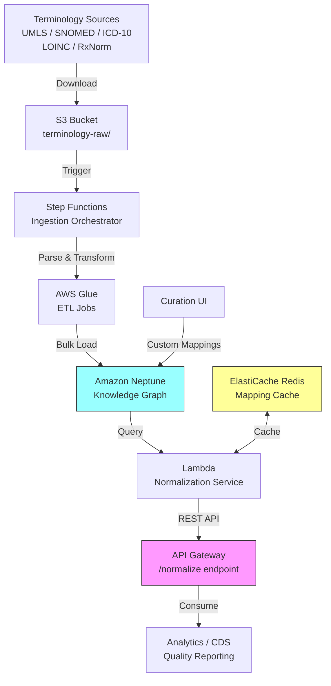

# Recipe 13.8 Architecture and Implementation: Medical Concept Normalization and Mapping

*Companion to [Recipe 13.8: Medical Concept Normalization and Mapping](chapter13.08-medical-concept-normalization-mapping). This page covers the AWS architecture, services, prerequisites, and pseudocode. For the problem framing and the conceptual approach, start with the main recipe.*

---

## The AWS Implementation

### Why These Services

**Amazon Neptune for the knowledge graph store.** Neptune is AWS's managed graph database service, supporting both the property graph model (via openCypher/Gremlin) and RDF (via SPARQL). For terminology mapping, the property graph model is the better fit: concepts are nodes with properties (code, display name, terminology, version, status), and relationships are edges with properties (mapping type, confidence, provenance, effective date). Neptune handles the traversal-heavy query patterns that terminology navigation demands. It's also on the HIPAA eligible services list, which matters because concept mappings themselves aren't PHI, but the queries against them (which patient has which condition) can be.

**AWS Glue for terminology ingestion.** Terminology files come in various formats (RRF for UMLS/RxNorm, RF2 for SNOMED, CSV for ICD-10, custom formats for LOINC). Glue ETL jobs handle the parsing and transformation, writing Neptune bulk loader CSV files to S3. The Neptune bulk loader then reads directly from S3 using its own IAM role (Neptune fetches the files, not Glue). This means Neptune's VPC needs an S3 Gateway endpoint, and Neptune's IAM role needs `s3:GetObject` on the processed files bucket. The jobs run on each terminology release, which means monthly at most. Glue's serverless Spark environment handles the large file sizes (UMLS is multiple gigabytes) without requiring persistent infrastructure.

**Amazon ElastiCache (Redis) for normalization caching.** Point lookups against Neptune are fast (single-digit milliseconds for direct node lookups), but multi-hop traversals can take longer. For the most common normalization queries (single concept to canonical form), a Redis cache in front of Neptune reduces latency to sub-millisecond and protects Neptune from query storms during batch processing runs.

**AWS Lambda + API Gateway for the normalization API.** The normalization service is a stateless lookup: receive a concept, query the graph (or cache), return the mappings. Lambda handles this cleanly with automatic scaling. API Gateway provides the REST interface, request validation, and throttling. Deploy as a private API (VPC endpoint access only) with IAM authorization (SigV4) for service-to-service calls. API keys alone are insufficient for authorization; they're for throttling, not security.

**Amazon S3 for terminology file staging.** Raw terminology downloads land in S3 before Glue processes them. S3 also stores the processed graph load files (Neptune bulk loader format) and serves as the audit trail for which terminology versions have been ingested.

**AWS Step Functions for ingestion orchestration.** A terminology update involves multiple steps: download the new release, validate file integrity, run the Glue ETL, bulk-load into Neptune, validate the load, warm the cache, and notify consumers. Step Functions orchestrates this sequence with error handling and retry logic.

**Design principle: PHI boundary.** The normalization service is a reference data service, not a clinical data service. It accepts only terminology codes and returns mappings. It never accepts patient identifiers. Correlation with patient records happens in the calling system, not here. API Gateway request validation should reject requests containing fields outside the defined schema. Lambda logging should use structured logging with an explicit allowlist of loggable fields (code, terminology, timestamp) and never log caller-supplied context. Neptune parameterized queries (shown in the pseudocode below) prevent query-string injection of arbitrary data.

### Architecture Diagram



### Prerequisites

| Requirement | Details |
|-------------|---------|
| **AWS Services** | Amazon Neptune, AWS Glue, Amazon ElastiCache (Redis), AWS Lambda, API Gateway, Amazon S3, AWS Step Functions |
| **IAM Permissions** | `neptune-db:*` (scoped to cluster ARN), `glue:StartJobRun` (scoped to job names), `s3:GetObject` on `arn:aws:s3:::terminology-raw/*`, `s3:PutObject` on `arn:aws:s3:::terminology-processed/*`, `elasticache:*` (scoped to cluster ARN), `lambda:InvokeFunction` (scoped to function ARN), `states:StartExecution` (scoped to state machine ARN) |
| **BAA** | AWS BAA signed. Concept mappings themselves aren't PHI, but normalization queries in context (which patient maps to which concept) can constitute PHI. |
| **Encryption** | Neptune: encryption at rest (enabled at cluster creation, cannot be added later). S3: SSE-KMS. ElastiCache: encryption at rest and in-transit. All API calls over TLS. |
| **VPC** | Neptune requires VPC deployment. Lambda in same VPC with VPC endpoints for S3 and CloudWatch Logs. ElastiCache in same VPC. No public internet access to Neptune. Security groups: Lambda SG allows outbound 8182 to Neptune SG and outbound 6379 to ElastiCache SG; Neptune SG allows inbound 8182 from Lambda SG and Glue SG; ElastiCache SG allows inbound 6379 from Lambda SG. Neptune requires an S3 Gateway endpoint for bulk loader access. |
| **CloudTrail** | Enabled for all API calls. Neptune audit logging enabled for query-level audit trail. |
| **Terminology Licenses** | UMLS license (free, requires registration with NLM). SNOMED CT (free in US via NLM). CPT (paid AMA license). ICD-10 (free from CMS). LOINC (free, requires registration). RxNorm (free via NLM). |
| **Sample Data** | UMLS Metathesaurus subset. NLM provides sample files for development. Never load full UMLS into a dev environment without understanding the size (multiple GB). |
| **Cost Estimate** | Neptune db.r5.large: ~$700/month. ElastiCache cache.r6g.large: ~$300/month. Glue ETL (monthly runs): ~$50/month. Lambda + API Gateway: ~$100/month at moderate query volume. S3 storage: ~$50/month. Total: ~$1,200-2,000/month for a basic deployment. |

### Ingredients

| AWS Service | Role |
|------------|------|
| **Amazon Neptune** | Stores the terminology knowledge graph: concepts as nodes, mappings as edges |
| **AWS Glue** | Parses and transforms terminology source files into Neptune bulk load format |
| **Amazon ElastiCache (Redis)** | Caches frequent normalization lookups for sub-millisecond response |
| **AWS Lambda** | Serves normalization queries, handles cache logic, orchestrates graph traversals |
| **Amazon API Gateway** | REST interface for the normalization service with throttling and auth |
| **Amazon S3** | Stages raw terminology files and processed load files |
| **AWS Step Functions** | Orchestrates the multi-step terminology ingestion pipeline |
| **AWS KMS** | Manages encryption keys for Neptune, S3, and ElastiCache |
| **Amazon CloudWatch** | Metrics, logs, and alarms for ingestion failures and API latency |

### Code

#### Walkthrough

**Step 1: Terminology file ingestion.** When a new terminology release arrives (downloaded manually or via automated NLM API calls), it lands in S3 and triggers the ingestion orchestrator. The first task is parsing the raw files into a normalized intermediate format. UMLS uses RRF (Rich Release Format), which is pipe-delimited with specific column semantics. SNOMED uses RF2 (Release Format 2), a set of tab-delimited files with concept, description, and relationship tables. Each terminology has its own parser, but they all produce the same output: a set of nodes (concepts) and edges (relationships) ready for graph loading. Skip this step and you have no data. Get the parsing wrong and you have wrong data, which is worse.

```pseudocode
FUNCTION ingest_terminology(terminology_name, version, s3_path):
    // Download and validate the raw terminology files from S3.
    // Each terminology has a known file structure:
    //   UMLS: MRCONSO.RRF (concepts), MRREL.RRF (relationships)
    //   SNOMED: sct2_Concept_*.txt, sct2_Relationship_*.txt
    //   ICD-10: icd10cm_tabular_*.xml or flat files from CMS
    //   RxNorm: RXNCONSO.RRF, RXNREL.RRF
    raw_files = download_from_s3(s3_path)
    
    // Validate file checksums against the published manifest.
    // Terminology releases include integrity checks. Use them.
    validate_checksums(raw_files, terminology_name)
    
    // Select the appropriate parser based on terminology type.
    // Each parser knows the file format and column semantics.
    parser = get_parser_for(terminology_name)
    
    // Parse concepts: extract code, display name, semantic type, status.
    // Each concept becomes a node in the graph.
    concepts = parser.extract_concepts(raw_files)
    
    // Parse relationships: extract source, target, relationship type, metadata.
    // Each relationship becomes an edge in the graph.
    relationships = parser.extract_relationships(raw_files)
    
    // Tag every concept and relationship with version and load timestamp.
    // This enables temporal queries: "what was the mapping as of date X?"
    tag_with_version(concepts, terminology_name, version)
    tag_with_version(relationships, terminology_name, version)
    
    RETURN concepts, relationships
```

**Step 2: Graph construction and loading.** The parsed concepts and relationships need to be loaded into Neptune. For initial loads and large updates, Neptune's bulk loader is dramatically faster than individual insert queries. The bulk loader reads CSV files from S3 in a specific format: one file for nodes, one for edges, with headers defining the property names and types. For incremental updates (a few hundred new concepts in a monthly RxNorm release), individual Gremlin or openCypher queries work fine. The choice between bulk and incremental depends on the size of the delta. This step also handles the critical task of linking concepts across terminologies: when UMLS tells us that SNOMED concept 44054006 and ICD-10 code E11 share a CUI, we create a cross-terminology edge between them.

```pseudocode
FUNCTION build_graph_load_files(concepts, relationships):
    // Neptune bulk loader expects CSV files with specific headers.
    // Node file: ~id, ~label, code:String, display:String, terminology:String, 
    //            version:String, status:String, semantic_type:String
    // Edge file: ~id, ~from, ~to, ~label, relationship_type:String, 
    //            confidence:Double, provenance:String, effective_date:Date
    
    node_file = create_csv_with_headers(NEPTUNE_NODE_SCHEMA)
    edge_file = create_csv_with_headers(NEPTUNE_EDGE_SCHEMA)
    
    FOR each concept in concepts:
        // Generate a deterministic node ID from terminology + code + version.
        // This ensures idempotent loads: reloading the same version doesn't create duplicates.
        node_id = generate_node_id(concept.terminology, concept.code, concept.version)
        
        append_row(node_file, {
            id:            node_id,
            label:         "Concept",
            code:          concept.code,
            display:       concept.display_name,
            terminology:   concept.terminology,
            version:       concept.version,
            status:        concept.status,        // "active" or "retired"
            semantic_type: concept.semantic_type   // e.g., "Disease or Syndrome"
        })
    
    FOR each relationship in relationships:
        // Generate edge ID from source + target + type for idempotency.
        source_id = generate_node_id(relationship.source_terminology, 
                                     relationship.source_code, 
                                     relationship.source_version)
        target_id = generate_node_id(relationship.target_terminology, 
                                     relationship.target_code, 
                                     relationship.target_version)
        
        append_row(edge_file, {
            id:                generate_edge_id(source_id, target_id, relationship.type),
            from:              source_id,
            to:                target_id,
            label:             relationship.type,   // "equivalent_to", "broader_than", "maps_to"
            relationship_type: relationship.type,
            confidence:        relationship.confidence,   // 0.0 to 1.0
            provenance:        relationship.provenance,   // "UMLS", "NLM_MAP", "CUSTOM"
            effective_date:    relationship.effective_date
        })
    
    // Upload to S3 for Neptune bulk loader.
    upload_to_s3(node_file, "terminology-processed/nodes/")
    upload_to_s3(edge_file, "terminology-processed/edges/")
    
    RETURN s3_paths_for_load_files
```

**Step 3: Cross-terminology linking via UMLS CUIs.** This is the heart of the normalization system. UMLS assigns a Concept Unique Identifier (CUI) to each distinct clinical meaning. When SNOMED concept 44054006 ("Type 2 diabetes mellitus") and ICD-10 code E11 ("Type 2 diabetes mellitus") share CUI C0011860, that tells us they represent the same clinical idea. This step creates the cross-terminology edges that make normalization possible. Without it, you have isolated terminology islands with no bridges between them.

```pseudocode
FUNCTION create_cross_terminology_links(umls_concepts):
    // UMLS MRCONSO.RRF contains rows like:
    //   CUI | Language | Source | Code | Display
    //   C0011860 | ENG | SNOMEDCT_US | 44054006 | Type 2 diabetes mellitus
    //   C0011860 | ENG | ICD10CM | E11 | Type 2 diabetes mellitus
    //
    // Same CUI = same meaning across terminologies.
    
    // Group all source concepts by their CUI.
    cui_groups = group_by(umls_concepts, field="CUI")
    
    cross_links = empty list
    
    FOR each cui, concepts_in_group in cui_groups:
        // For each pair of concepts sharing a CUI but from different terminologies,
        // create a cross-terminology equivalence edge.
        FOR each pair (concept_a, concept_b) in concepts_in_group 
            WHERE concept_a.terminology != concept_b.terminology:
            
            // Determine the relationship type.
            // UMLS provides relationship attributes (REL, RELA) that indicate
            // whether the mapping is exact, broader, narrower, or related.
            rel_type = determine_relationship_type(concept_a, concept_b, cui)
            
            // Assign confidence based on relationship type.
            // UMLS synonymy judgments have a known error rate of ~2-3%, so even
            // exact matches don't get 1.0. Reserve 1.0 for manually curated mappings.
            confidence = CASE rel_type:
                "equivalent_to": 0.95
                "broader_than":  0.80
                "narrower_than": 0.80
                "related_to":    0.60
                DEFAULT:         0.50
            
            append to cross_links: {
                source:     concept_a,
                target:     concept_b,
                type:       rel_type,        // "equivalent_to", "broader_than", "narrower_than"
                confidence: confidence,      // Varies by relationship type; 1.0 reserved for curated mappings
                provenance: "UMLS_CUI_" + cui
            }
    
    RETURN cross_links
```

**Step 4: Normalization query service.** This is the API that consuming systems call. Given a concept (code + terminology), return the canonical form and all known mappings to other terminologies. The service first checks the Redis cache (most common lookups are repeated frequently). On cache miss, it queries Neptune with a graph traversal that follows cross-terminology edges, respecting relationship types and version constraints. The response includes confidence scores and provenance so consumers can make informed decisions about which mappings to trust.

```pseudocode
FUNCTION normalize_concept(code, terminology, target_terminologies, version=null):
    // Build a cache key from the input parameters.
    cache_key = build_cache_key(code, terminology, target_terminologies, version)
    
    // Check Redis cache first. Most normalization queries are repeated
    // (the same ICD-10 codes appear on thousands of claims).
    cached_result = redis.get(cache_key)
    IF cached_result is not null:
        RETURN cached_result
    
    // Cache miss. Query Neptune.
    // Find the source concept node.
    source_node = neptune.query("""
        MATCH (c:Concept {code: $code, terminology: $terminology})
        WHERE c.status = 'active'
        AND ($version IS NULL OR c.version = $version)
        RETURN c
    """, params={code, terminology, version})
    
    IF source_node is null:
        RETURN {status: "not_found", code: code, terminology: terminology}
    
    // Traverse cross-terminology edges to find mappings.
    // Limit traversal depth to 2 hops (source -> CUI bridge -> target)
    // to avoid runaway queries on densely connected concepts.
    mappings = neptune.query("""
        MATCH (source:Concept {code: $code, terminology: $terminology})
              -[r:equivalent_to|maps_to|broader_than|narrower_than]->
              (target:Concept)
        WHERE target.terminology IN $target_terminologies
        AND target.status = 'active'
        RETURN target.code AS code,
               target.terminology AS terminology,
               target.display AS display,
               type(r) AS relationship_type,
               r.confidence AS confidence,
               r.provenance AS provenance
        ORDER BY r.confidence DESC
    """, params={code, terminology, target_terminologies})
    
    // Build the response with the source concept and all mappings.
    result = {
        source: {
            code:        source_node.code,
            terminology: source_node.terminology,
            display:     source_node.display,
            semantic_type: source_node.semantic_type
        },
        mappings: mappings,
        mapping_count: length(mappings),
        query_timestamp: current_utc_timestamp()
    }
    
    // Cache the result. TTL depends on how frequently terminologies update.
    // 24 hours is reasonable: terminology releases are at most monthly.
    redis.set(cache_key, result, ttl=86400)
    
    RETURN result
```

**Step 5: Hierarchy traversal for value set expansion.** Quality measures and clinical rules often reference value sets: "all codes that represent diabetes." This requires traversing the terminology hierarchy. In SNOMED CT, "Type 2 diabetes mellitus" (44054006) is-a "Diabetes mellitus" (73211009), which is-a "Disorder of glucose metabolism" (126877002). A value set defined at "Diabetes mellitus" needs to include all descendants. This step provides that expansion, which is computationally expensive for broad concepts but essential for correct quality measurement.

```pseudocode
FUNCTION expand_value_set(root_code, terminology, include_descendants=true, max_depth=5, max_results=10000):
    // Start with the root concept.
    // "Value set expansion" means: give me this concept and everything below it
    // in the hierarchy.
    
    IF not include_descendants:
        // Simple case: just return the root concept and its cross-terminology mappings.
        RETURN normalize_concept(root_code, terminology, all_terminologies)
    
    // Traverse the "is-a" hierarchy downward from the root.
    // max_depth prevents runaway traversals on very broad concepts
    // (e.g., "Clinical finding" in SNOMED has hundreds of thousands of descendants).
    descendants = neptune.query("""
        MATCH (root:Concept {code: $root_code, terminology: $terminology})
              <-[:is_a*1..$max_depth]-
              (descendant:Concept {terminology: $terminology})
        WHERE descendant.status = 'active'
        RETURN descendant.code AS code,
               descendant.display AS display,
               length(path) AS depth
        ORDER BY depth ASC
    """, params={root_code, terminology, max_depth})
    
    // Guard against runaway expansions. Broad concepts like "Clinical finding"
    // (SNOMED 404684003) have hundreds of thousands of descendants.
    truncated = false
    IF length(descendants) > max_results:
        descendants = descendants[0..max_results]
        truncated = true
    
    // For each descendant, also find cross-terminology mappings.
    // This gives you the full value set in all terminologies.
    expanded_set = [{code: root_code, terminology: terminology}]
    
    FOR each descendant in descendants:
        append to expanded_set: {
            code:        descendant.code,
            terminology: terminology,
            display:     descendant.display,
            depth:       descendant.depth
        }
        
        // Optionally expand each descendant to other terminologies.
        // This is expensive for large hierarchies. Consider doing it lazily.
        cross_maps = normalize_concept(descendant.code, terminology, target_terminologies)
        append cross_maps.mappings to expanded_set
    
    RETURN {
        root:            {code: root_code, terminology: terminology},
        total_concepts:  length(expanded_set),
        truncated:       truncated,
        concepts:        expanded_set
    }
```

**Step 6: Version management and temporal queries.** Terminologies change. A code that existed in ICD-10-CM 2023 might be retired in 2024 and replaced by two more specific codes. Your normalization system needs to answer questions like "what was the correct mapping for this code as of the date this claim was filed?" This step handles version-aware queries by maintaining historical edges and filtering by effective date.

```pseudocode
FUNCTION normalize_as_of_date(code, terminology, target_terminologies, as_of_date):
    // Find the concept version that was active on the given date.
    // Terminology versions have effective dates (e.g., ICD-10-CM FY2024 effective Oct 1, 2023).
    
    active_version = neptune.query("""
        MATCH (c:Concept {code: $code, terminology: $terminology})
        WHERE c.effective_date <= $as_of_date
        AND (c.retirement_date IS NULL OR c.retirement_date > $as_of_date)
        RETURN c
        ORDER BY c.effective_date DESC
        LIMIT 1
    """, params={code, terminology, as_of_date})
    
    IF active_version is null:
        RETURN {status: "not_found_at_date", code: code, as_of: as_of_date}
    
    // Find mappings that were active on that date.
    mappings = neptune.query("""
        MATCH (source:Concept {code: $code, terminology: $terminology})
              -[r]->(target:Concept)
        WHERE target.terminology IN $target_terminologies
        AND r.effective_date <= $as_of_date
        AND (r.retirement_date IS NULL OR r.retirement_date > $as_of_date)
        AND target.effective_date <= $as_of_date
        AND (target.retirement_date IS NULL OR target.retirement_date > $as_of_date)
        RETURN target, r
    """, params={code, terminology, target_terminologies, as_of_date})
    
    RETURN {
        source:    active_version,
        mappings:  mappings,
        as_of:     as_of_date,
        note:      "Mappings reflect terminology state as of the specified date"
    }
```

> **Curious how this looks in Python?** The pseudocode above covers the concepts. If you'd like to see sample Python code that demonstrates these patterns using boto3 and the Neptune graph client, check out the [Python Example](chapter13.08-python-example). It walks through each step with inline comments and notes on what you'd need to change for a real deployment.

### Expected Results

**Sample normalization response for "Type 2 diabetes mellitus" (ICD-10 E11):**

```json
{
  "source": {
    "code": "E11",
    "terminology": "ICD10CM",
    "display": "Type 2 diabetes mellitus",
    "semantic_type": "Disease or Syndrome"
  },
  "mappings": [
    {
      "code": "44054006",
      "terminology": "SNOMEDCT",
      "display": "Type 2 diabetes mellitus",
      "relationship_type": "equivalent_to",
      "confidence": 0.95,
      "provenance": "UMLS_CUI_C0011860"
    },
    {
      "code": "73211009",
      "terminology": "SNOMEDCT",
      "display": "Diabetes mellitus",
      "relationship_type": "broader_than",
      "confidence": 0.8,
      "provenance": "SNOMED_HIERARCHY"
    },
    {
      "code": "4855003",
      "terminology": "SNOMEDCT",
      "display": "Diabetic retinopathy",
      "relationship_type": "related_to",
      "confidence": 0.7,
      "provenance": "UMLS_ASSOCIATION"
    }
  ],
  "mapping_count": 3,
  "query_timestamp": "2026-06-01T14:30:22Z"
}
```

**Performance benchmarks:**

| Metric | Typical Value |
|--------|---------------|
| Point lookup (cached) | < 1ms |
| Point lookup (cache miss, single hop) | 5-15ms |
| Multi-hop traversal (2 hops) | 20-80ms |
| Value set expansion (100 descendants) | 200-500ms |
| Value set expansion (10,000 descendants) | 2-5 seconds |
| Full terminology load (SNOMED CT) | 30-60 minutes |
| Incremental update (monthly RxNorm) | 5-15 minutes |
| Graph size (full UMLS subset) | ~5M nodes, ~20M edges |

**Where it struggles:**

- Very broad hierarchy expansions (e.g., "all clinical findings" in SNOMED) can return hundreds of thousands of concepts and take minutes. Pagination and depth limits are essential.
- Ambiguous mappings where UMLS provides multiple candidate targets with similar confidence. Consumers need logic to pick the best match for their context.
- Retired codes that appear in historical data but have no active mapping target. You need a "best available" fallback strategy.
- Composite concepts that require multiple codes in the target terminology. The API returns individual mappings; the consumer must assemble them.

---

## Variations and Extensions

**Real-time NLP normalization.** Integrate the normalization API with an NLP pipeline (see Chapter 8) that extracts clinical concepts from free text. The NLP system identifies "type 2 DM" in a clinical note, the normalization service maps it to the canonical SNOMED concept, and downstream systems get structured, coded data from unstructured text. This is the bridge between NLP extraction and computable clinical data.

**FHIR ConceptMap integration.** Expose your normalization mappings as FHIR ConceptMap resources. This makes your terminology service interoperable with any FHIR-compliant system. The ConceptMap resource has native support for equivalence types (equivalent, wider, narrower, inexact), which maps directly to your graph edge types. Useful for health information exchange scenarios.

**Automated mapping suggestion.** For concepts that lack cross-terminology mappings, use embedding-based similarity to suggest candidates. Encode concept display names and definitions as vectors, find nearest neighbors across terminologies, and present suggestions to terminologists for review. This accelerates curation for the long tail of unmapped concepts. Not a replacement for human review, but a significant productivity multiplier.

---

## Additional Resources

**AWS Documentation:**
- [Amazon Neptune User Guide](https://docs.aws.amazon.com/neptune/latest/userguide/intro.html)
- [Neptune openCypher Query Language](https://docs.aws.amazon.com/neptune/latest/userguide/access-graph-opencypher.html)
- [Neptune Bulk Loader](https://docs.aws.amazon.com/neptune/latest/userguide/bulk-load.html)
- [Amazon Neptune Pricing](https://aws.amazon.com/neptune/pricing/)
- [AWS Glue ETL Programming Guide](https://docs.aws.amazon.com/glue/latest/dg/aws-glue-programming-etl.html)
- [Amazon ElastiCache for Redis](https://docs.aws.amazon.com/AmazonElastiCache/latest/red-ug/WhatIs.html)
- [AWS HIPAA Eligible Services](https://aws.amazon.com/compliance/hipaa-eligible-services-reference/)

**Terminology Sources:**
- [UMLS Metathesaurus (NLM)](https://www.nlm.nih.gov/research/umls/knowledge_sources/metathesaurus/index.html)
- [SNOMED CT Browser](https://browser.ihtsdotools.org/)
- [ICD-10-CM Files (CMS)](https://www.cms.gov/medicare/coding-billing/icd-10-codes)
- [LOINC Downloads (Regenstrief)](https://loinc.org/downloads/)
- [RxNorm (NLM)](https://www.nlm.nih.gov/research/umls/rxnorm/index.html)

**AWS Solutions and Blogs:**
- [Building a Healthcare Knowledge Graph on AWS](https://aws.amazon.com/blogs/database/building-a-healthcare-knowledge-graph-on-amazon-neptune/)
- [Graph Data Modeling with Amazon Neptune](https://aws.amazon.com/blogs/database/graph-data-modelling-with-amazon-neptune/)

---

## Estimated Implementation Time

| Tier | Timeline | What You Get |
|------|----------|--------------|
| **Basic** | 4-6 weeks | Single terminology pair (ICD-10 to SNOMED), point lookup API, no caching |
| **Production-ready** | 3-5 months | Full UMLS integration, 5+ terminologies, caching layer, version management, curation UI |
| **With variations** | 6-9 months | NLP integration, FHIR ConceptMap exposure, automated mapping suggestions, multi-tenant support |

---

---

*← [Main Recipe 13.8](chapter13.08-medical-concept-normalization-mapping) · [Python Example](chapter13.08-python-example) · [Chapter Preface](chapter13-preface)*
