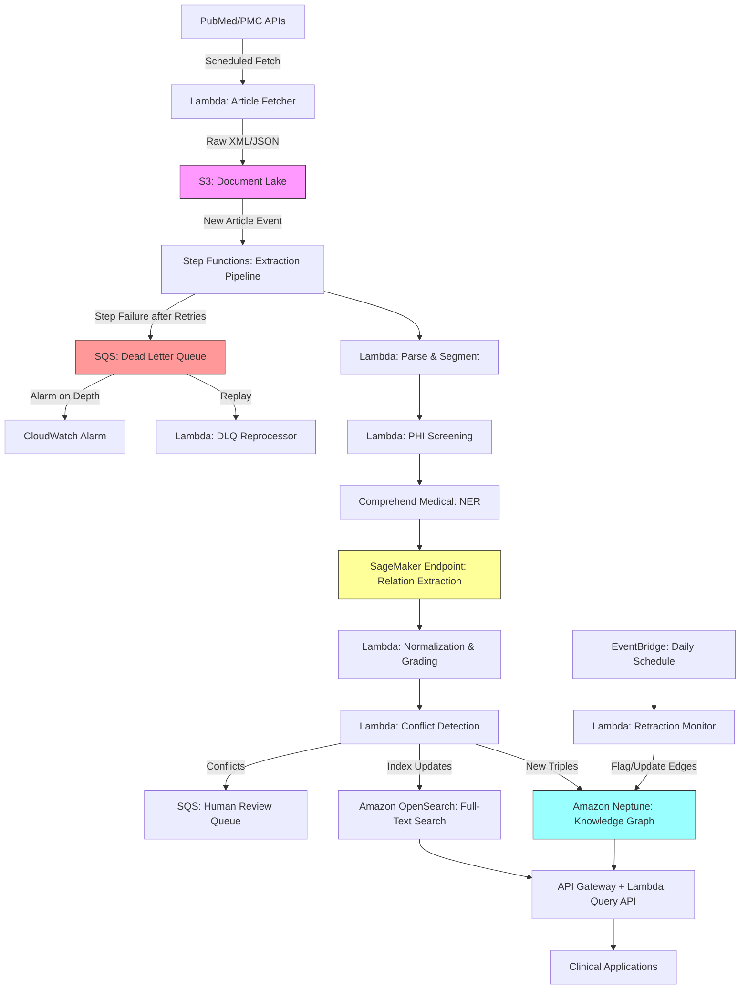

# Recipe 13.9 Architecture and Implementation: Literature-Derived Knowledge Graph

*Companion to [Recipe 13.9: Literature-Derived Knowledge Graph](chapter13.09-literature-derived-knowledge-graph). This page covers the AWS architecture, services, prerequisites, and pseudocode. For the problem framing and the conceptual approach, start with the main recipe.*

---

## The AWS Implementation

### Why These Services

**Amazon Comprehend Medical for biomedical NER.** Comprehend Medical is purpose-built for extracting medical entities from clinical text. It identifies medications, conditions, procedures, anatomy, and test/treatment/procedure entities with their associated attributes (dosage, frequency, negation). It handles the biomedical vocabulary problem out of the box, recognizing drug names, gene symbols, and disease terms without custom training. For literature extraction, it provides a strong baseline NER layer.

**Amazon SageMaker for custom relation extraction models.** Comprehend Medical handles entity extraction well, but relation extraction from scientific literature requires custom models. SageMaker provides the infrastructure to train, deploy, and serve transformer-based models (BioBERT, PubMedBERT) fine-tuned on biomedical relation extraction datasets. You'll train on annotated corpora like BioRED, ChemProt, or DDI and deploy as real-time or batch inference endpoints.

**Amazon Neptune for knowledge graph storage.** Neptune is AWS's managed graph database supporting both property graph (Gremlin/openCypher) and RDF (SPARQL) query languages. For a biomedical knowledge graph with millions of nodes and edges, Neptune provides the traversal performance, ACID transactions, and managed infrastructure you need. The property graph model is particularly well-suited here because edges need rich metadata (evidence scores, provenance, timestamps).

**Amazon S3 for document lake.** Raw articles, parsed text, intermediate NLP outputs, and extraction results all live in S3. This gives you reprocessing capability: when you improve your NER or RE models, you can re-run the pipeline against the full document corpus without re-fetching from source.

**AWS Lambda and Step Functions for pipeline orchestration.** The extraction pipeline is a multi-step workflow: fetch article, parse, run NER, run RE, normalize, grade, store. Step Functions coordinates these steps with error handling, retries, and parallel processing. Lambda handles the stateless compute for each step.

**Amazon OpenSearch for full-text search.** While Neptune handles graph traversal queries, you also need full-text search across node properties, edge metadata, and source sentences. OpenSearch provides this complementary access pattern, letting users search for "what does the literature say about metformin and PCOS" without knowing the exact graph structure.

### Architecture Diagram



### Prerequisites

| Requirement | Details |
|-------------|---------|
| **AWS Services** | Amazon Comprehend Medical, Amazon SageMaker, Amazon Neptune, Amazon S3, AWS Lambda, AWS Step Functions, Amazon OpenSearch Service, Amazon SQS, Amazon EventBridge, API Gateway, Amazon CloudWatch |
| **IAM Permissions** | Ingestion Lambdas: `comprehend:DetectEntitiesV2`, `sagemaker:InvokeEndpoint`, `neptune-db:ReadDataViaQuery`, `neptune-db:WriteDataViaQuery`, `s3:GetObject`, `s3:PutObject`, `states:StartExecution`, `sqs:SendMessage`. Query API Lambda: `neptune-db:ReadDataViaQuery`, `opensearch:ESHttpGet`, `opensearch:ESHttpPost`. DLQ Reprocessor Lambda: `sqs:ReceiveMessage`, `sqs:DeleteMessage`, `states:StartExecution`. Retraction Monitor Lambda: `neptune-db:ReadDataViaQuery`, `neptune-db:WriteDataViaQuery`. Separate admin role for Neptune backup/restore. |
| **BAA** | Required. Published literature, particularly case reports and clinical trial results, may contain individually identifiable health information in source sentences stored as provenance. Ensure BAA coverage for Neptune, OpenSearch, and S3. |
| **Encryption** | S3: SSE-KMS; Neptune: encryption at rest (must be enabled at cluster creation); OpenSearch: encryption at rest and node-to-node encryption; SQS: SSE-KMS; all transit over TLS |
| **VPC** | Neptune requires VPC deployment. Place all Lambda functions, SageMaker endpoints, and OpenSearch in the same VPC with appropriate security groups. VPC endpoints for S3 and CloudWatch Logs. NAT Gateway required for Lambda to reach Comprehend Medical (no VPC interface endpoint available). SageMaker endpoints can be deployed within the VPC via PrivateLink. |
| **CloudTrail** | Enabled for all API calls. Neptune audit logging enabled for query-level auditing. |
| **Sample Data** | PubMed Open Access subset (free, bulk download available). BioRED annotated corpus for relation extraction training. UMLS Metathesaurus for entity normalization (requires free license). |
| **Cost Estimate** | Neptune: ~$700/month (db.r5.large). SageMaker endpoint: ~$800-2,400/month (ml.m5.xlarge or multiple ml.m5.large with auto-scaling; batch transform is more cost-effective if near-real-time freshness is not required). Comprehend Medical: $0.01/100 characters. S3 + Lambda + Step Functions: ~$100-300/month at moderate volume. OpenSearch: ~$300-500/month. Data transfer: negligible (<$50/month). |

### Ingredients

| AWS Service | Role |
|------------|------|
| **Amazon Comprehend Medical** | Biomedical named entity recognition from article text |
| **Amazon SageMaker** | Hosts custom relation extraction models (BioBERT/PubMedBERT fine-tuned) |
| **Amazon Neptune** | Stores the knowledge graph with full property graph support |
| **Amazon S3** | Document lake for raw articles, parsed text, and intermediate outputs |
| **AWS Step Functions** | Orchestrates the multi-step extraction pipeline |
| **AWS Lambda** | Stateless compute for parsing, normalization, grading, and API serving |
| **Amazon OpenSearch Service** | Full-text search across graph nodes, edges, and source text |
| **Amazon SQS** | Queues conflicting extractions for human review; dead letter queue for failed pipeline executions |
| **Amazon EventBridge** | Schedules periodic literature fetches and daily retraction monitoring |
| **Amazon CloudWatch** | Alarms on DLQ depth, pipeline error rates, and processing latency |
| **AWS KMS** | Encryption key management for all data stores |

### Code

#### Walkthrough

**Step 1: Literature ingestion.** The pipeline starts by fetching new articles from PubMed and PubMed Central on a schedule. PubMed's E-utilities API provides programmatic access to article metadata and abstracts. PMC's Open Access subset provides full-text XML for articles with permissive licenses. The fetcher tracks what's already been ingested (using a simple watermark: the last fetch timestamp or the highest PMID processed) and only retrieves new content. Each article is stored as raw XML in the document lake, along with parsed metadata. Full-text articles yield dramatically more relationships than abstracts alone (a typical abstract might contain 2-5 extractable relationships; a full paper might contain 20-50), so prioritize full-text sources where available. When both a PubMed abstract and a PMC full-text version exist for the same article, process only the full-text version to avoid inflating support counts with duplicate extractions. Skip this step and your graph goes stale immediately.

```pseudocode
FUNCTION fetch_new_articles(last_watermark):
    // Query PubMed for articles published since our last fetch.
    // E-utilities returns article IDs matching our search criteria.
    // We filter by date and by relevant MeSH terms to focus on
    // pharmacogenomics, drug-disease, and gene-phenotype literature.
    article_ids = call PubMed E-utilities esearch with:
        database = "pubmed"
        query    = "(pharmacogenomics OR drug-disease OR gene-phenotype) 
                    AND {last_watermark}[PDAT] : 3000[PDAT]"
        retmax   = 1000  // batch size per fetch cycle
        api_key  = NCBI_API_KEY  // register free at ncbi.nlm.nih.gov/account/
                                 // without key: 3 req/sec; with key: 10 req/sec

    FOR each batch of article_ids:
        // Fetch full metadata and abstract for each article
        articles = call PubMed E-utilities efetch with:
            database = "pubmed"
            ids      = batch
            format   = "xml"

        FOR each article in articles:
            // Store raw XML in document lake for reprocessing capability
            store article.xml to S3 at "documents/pubmed/{pmid}.xml"
            
            // Also check PMC for full-text availability
            IF article has PMC ID:
                full_text = fetch from PMC Open Access API
                store full_text to S3 at "documents/pmc/{pmcid}.xml"

            // Record metadata for pipeline tracking
            store metadata record: {pmid, title, journal, pub_date, mesh_terms, has_full_text}

    // Update watermark so next fetch starts where this one ended
    update last_watermark to current date

    RETURN count of new articles ingested
```

**Step 2: Document parsing and sentence segmentation.** Raw XML needs to be converted into processable text segments. This step extracts the relevant sections (abstract, methods, results, discussion), splits them into individual sentences, and tags each sentence with its source location (which paper, which section, which paragraph). Sentence boundaries in biomedical text are tricky: abbreviations like "Fig. 2" and "et al." contain periods that aren't sentence endings. Use a biomedical-trained sentence splitter rather than a generic one. The section information matters for evidence grading later: a finding stated in the Results section carries more weight than one mentioned speculatively in the Discussion.

```pseudocode
FUNCTION parse_and_segment(document_s3_key):
    // Load the raw article XML from the document lake
    raw_xml = load from S3 at document_s3_key

    // Parse XML structure to extract text sections
    // PubMed XML has well-defined tags for abstract, body sections, etc.
    parsed = parse XML extracting:
        title       = //ArticleTitle
        abstract    = //AbstractText (may have multiple labeled sections)
        body        = //body/sec (for PMC full-text articles)
        metadata    = {pmid, journal, pub_date, authors, mesh_terms}

    // Segment each text section into individual sentences
    // Use a biomedical sentence splitter that handles abbreviations correctly
    sentences = empty list
    
    FOR each section in [abstract, body_sections]:
        section_sentences = biomedical_sentence_split(section.text)
        
        FOR each sentence in section_sentences:
            append to sentences: {
                text:         sentence,
                section:      section.label,    // "abstract", "results", "discussion", etc.
                position:     index,            // sentence position within section
                document_id:  parsed.metadata.pmid,
                source_key:   document_s3_key
            }

    // Store parsed output for downstream NLP steps
    store sentences to S3 at "parsed/{pmid}/sentences.json"
    
    RETURN sentences
```

**Step 2b: PHI screening.** Case reports and clinical trial results may embed individually identifiable health information in source sentences, even though published literature is generally considered public. Before storing provenance sentences in Neptune or OpenSearch (where they'll persist and be queryable), screen for PHI risk. Articles tagged with the MeSH publication type "Case Reports" get flagged. For flagged documents, run Comprehend Medical's DetectPHI API against each sentence. Sentences containing detected PHI either get redacted (PHI spans replaced with `[REDACTED]`) or excluded from provenance storage entirely. The extracted relationships themselves (drug-treats-disease) are fine; it's the verbatim source sentences that carry the risk.

```pseudocode
FUNCTION screen_for_phi(sentences, article_metadata):
    // Determine if this article is high-risk for containing PHI.
    // Case reports describe individual patients in detail.
    // Clinical trial results sometimes include individual-level data.
    pub_types = article_metadata.pub_types
    is_case_report = "Case Reports" IN pub_types
    is_clinical_trial = "Clinical Trial" IN pub_types OR "Randomized Controlled Trial" IN pub_types

    IF NOT is_case_report AND NOT is_clinical_trial:
        // Low PHI risk. Pass through without modification.
        RETURN sentences

    // High-risk article: screen each sentence for PHI
    screened_sentences = empty list

    FOR each sentence in sentences:
        phi_response = call ComprehendMedical.DetectPHI with:
            text = sentence.text

        phi_entities = phi_response.Entities
        // Filter to high-confidence PHI detections
        phi_entities = [e for e in phi_entities WHERE e.Score >= 0.80]

        IF phi_entities is empty:
            // No PHI detected. Keep sentence as-is.
            append sentence to screened_sentences
        ELSE:
            // Redact PHI spans from the sentence text before storing as provenance.
            // The sentence will still be used for NER/RE processing (in-memory only),
            // but the stored provenance version has PHI removed.
            redacted_text = sentence.text
            // Process spans in reverse order to preserve character offsets
            FOR each phi_entity in REVERSE(sorted by BeginOffset):
                redacted_text = (
                    redacted_text[:phi_entity.BeginOffset]
                    + "[REDACTED]"
                    + redacted_text[phi_entity.EndOffset:]
                )

            sentence.provenance_text = redacted_text  // stored version
            sentence.text = sentence.text              // processing version (in-memory only)
            sentence.phi_redacted = TRUE
            append sentence to screened_sentences

    RETURN screened_sentences
```

**Step 3: Named entity recognition.** Each sentence is passed through biomedical NER to identify mentions of drugs, diseases, genes, proteins, anatomical structures, and other biomedical entities. Comprehend Medical handles the core entity types well. For specialized entity types (gene variants, molecular pathways, epigenetic modifications), you may need a supplementary custom model. The output is a list of entity mentions with their types, positions in the text, and confidence scores. Entities below a confidence threshold are discarded to prevent noise from propagating downstream.

```pseudocode
FUNCTION extract_entities(sentences):
    // Process each sentence through biomedical NER
    // Comprehend Medical identifies: MEDICATION, MEDICAL_CONDITION,
    // TEST_TREATMENT_PROCEDURE, ANATOMY, and their attributes
    
    entity_mentions = empty list
    CONFIDENCE_THRESHOLD = 0.75  // discard low-confidence entity detections

    FOR each sentence in sentences:
        // Call Comprehend Medical for entity detection
        response = call ComprehendMedical.DetectEntitiesV2 with:
            text = sentence.text

        FOR each entity in response.Entities:
            IF entity.Score >= CONFIDENCE_THRESHOLD:
                append to entity_mentions: {
                    text:        entity.Text,           // surface form: "metformin"
                    type:        entity.Category,       // MEDICATION, MEDICAL_CONDITION, etc.
                    subtype:     entity.Type,           // GENERIC_NAME, DX_NAME, etc.
                    score:       entity.Score,          // confidence 0.0-1.0
                    begin:       entity.BeginOffset,    // character position in sentence
                    end:         entity.EndOffset,
                    traits:      entity.Traits,         // NEGATION, DIAGNOSIS, SIGN, SYMPTOM
                    sentence_id: sentence.document_id + ":" + sentence.position,
                    section:     sentence.section
                }

        // Supplementary: call custom SageMaker model for gene/variant entities
        // that Comprehend Medical doesn't cover well
        gene_response = call SageMaker endpoint "bio-ner-genes" with:
            text = sentence.text
        
        FOR each gene_entity in gene_response:
            IF gene_entity.score >= CONFIDENCE_THRESHOLD:
                append to entity_mentions: {
                    text:    gene_entity.text,
                    type:    "GENE_OR_VARIANT",
                    score:   gene_entity.score,
                    // ... same metadata fields as above
                }

    RETURN entity_mentions
```

**Step 4: Relation extraction.** This is the core intellectual step. Given a sentence with identified entities, determine what relationships exist between them. A custom transformer model (fine-tuned on biomedical relation extraction datasets like BioRED or ChemProt) classifies entity pairs into relationship types: treats, causes, associated_with, inhibits, metabolized_by, variant_of, and so on. Critically, the model must also detect negated and speculative relationships. "Drug X does not treat disease Y" is a relationship, but it's a negative one. "Drug X may treat disease Y" is speculative. Both need to be captured with appropriate modifiers. Skip negation detection and your graph will contain confident assertions that the literature actually refutes.

```pseudocode
FUNCTION extract_relations(sentences, entity_mentions):
    // Group entities by sentence for pairwise relation extraction
    entities_by_sentence = group entity_mentions by sentence_id

    extracted_triples = empty list

    FOR each sentence_id, entities in entities_by_sentence:
        // Generate all valid entity pairs for relation classification
        // Not all pairs are meaningful: we only check pairs where
        // the entity types could plausibly have a relationship
        valid_pairs = generate_candidate_pairs(entities)
        // e.g., (MEDICATION, MEDICAL_CONDITION) is valid
        //       (ANATOMY, ANATOMY) is usually not

        IF valid_pairs is empty:
            CONTINUE

        // Get the original sentence text for context
        sentence_text = lookup sentence text by sentence_id

        // Call the relation extraction model with entity pair context
        FOR each (entity_a, entity_b) in valid_pairs:
            // Format input for the RE model: sentence with entity markers
            // e.g., "[E1]metformin[/E1] reduces [E2]HbA1c[/E2] levels"
            marked_text = insert entity markers around entity_a and entity_b in sentence_text

            prediction = call SageMaker endpoint "bio-relation-extraction" with:
                text = marked_text
                entity_a_type = entity_a.type
                entity_b_type = entity_b.type

            // prediction returns: relation_type, confidence, is_negated, is_speculative
            IF prediction.confidence >= 0.70 AND prediction.relation_type != "NO_RELATION":
                append to extracted_triples: {
                    subject:      entity_a.text,
                    subject_type: entity_a.type,
                    predicate:    prediction.relation_type,  // "treats", "causes", "inhibits"
                    object:       entity_b.text,
                    object_type:  entity_b.type,
                    confidence:   prediction.confidence,
                    is_negated:   prediction.is_negated,     // "does NOT treat"
                    is_speculative: prediction.is_speculative, // "may treat"
                    source_sentence: sentence_text,
                    source_document: extract pmid from sentence_id,
                    source_section:  lookup section for sentence_id
                }

    RETURN extracted_triples
```

**Step 5: Entity normalization.** The same real-world entity appears under many surface forms in the literature. "Metformin," "Glucophage," "metformin hydrochloride," and "1,1-dimethylbiguanide" all refer to the same drug. This step maps each extracted entity mention to a canonical identifier in a standard biomedical ontology: RxNorm for drugs, SNOMED CT or ICD for diseases, HGNC for genes, UniProt for proteins. Without normalization, your graph would have separate nodes for each surface form, fragmenting the knowledge and making queries unreliable. The mapping uses a combination of exact string matching, fuzzy matching, and embedding-based similarity against the ontology's preferred terms and synonyms.

```pseudocode
FUNCTION normalize_entities(triples):
    // Load ontology lookup tables (pre-built from UMLS, RxNorm, HGNC, etc.)
    // These map surface forms to canonical identifiers
    drug_lookup    = load RxNorm synonym table
    disease_lookup = load SNOMED CT / ICD mapping table
    gene_lookup    = load HGNC gene symbol table

    normalized_triples = empty list

    FOR each triple in triples:
        // Normalize subject entity
        subject_canonical = normalize_entity(
            triple.subject, triple.subject_type,
            drug_lookup, disease_lookup, gene_lookup
        )

        // Normalize object entity
        object_canonical = normalize_entity(
            triple.object, triple.object_type,
            drug_lookup, disease_lookup, gene_lookup
        )

        // Only keep triples where both entities could be normalized
        // Unnormalized entities are ambiguous and would create orphan nodes
        IF subject_canonical is not NULL AND object_canonical is not NULL:
            append to normalized_triples: {
                subject_id:    subject_canonical.id,      // e.g., "RxNorm:6809" (metformin)
                subject_label: subject_canonical.label,   // "metformin"
                predicate:     triple.predicate,
                object_id:     object_canonical.id,       // e.g., "SNOMED:44054006" (T2DM)
                object_label:  object_canonical.label,    // "type 2 diabetes mellitus"
                confidence:    triple.confidence,
                is_negated:    triple.is_negated,
                is_speculative: triple.is_speculative,
                provenance: {
                    pmid:     triple.source_document,
                    sentence: triple.source_sentence,
                    section:  triple.source_section
                }
            }
        ELSE:
            // Log unmapped entities for ontology gap analysis
            log_unmapped_entity(triple.subject if subject_canonical is NULL)

    RETURN normalized_triples

FUNCTION normalize_entity(text, entity_type, drug_lookup, disease_lookup, gene_lookup):
    // Select the appropriate ontology based on entity type
    lookup = SELECT based on entity_type:
        "MEDICATION"        -> drug_lookup
        "MEDICAL_CONDITION" -> disease_lookup
        "GENE_OR_VARIANT"   -> gene_lookup
        otherwise           -> general UMLS lookup

    // Try exact match first (fastest, most reliable)
    result = lookup.exact_match(lowercase(text))
    IF result: RETURN result

    // Try fuzzy match with edit distance threshold
    result = lookup.fuzzy_match(text, max_distance=2)
    IF result AND result.similarity >= 0.85: RETURN result

    // Try embedding-based similarity as last resort
    result = lookup.embedding_match(text, threshold=0.80)
    IF result: RETURN result

    RETURN NULL  // entity could not be normalized
```

**Step 6: Evidence grading and conflict resolution.** Each extracted triple gets an evidence score based on the source's reliability. A finding from a large RCT published in a top-tier journal scores higher than a case report in a regional publication. When multiple papers assert the same relationship, evidence accumulates. When papers contradict each other, the system flags the conflict. Contradictions above a certain evidence threshold on both sides go to a human review queue. This step is what separates a useful knowledge graph from a noisy dump of NLP outputs.

```pseudocode
FUNCTION grade_and_resolve(normalized_triples, existing_graph):
    // Evidence scoring weights
    STUDY_TYPE_WEIGHTS = {
        "meta-analysis": 1.0,
        "systematic-review": 0.95,
        "rct": 0.9,
        "cohort": 0.7,
        "case-control": 0.6,
        "case-report": 0.3,
        "review": 0.5,
        "unknown": 0.4
    }

    scored_triples = empty list

    FOR each triple in normalized_triples:
        // Determine study type from article metadata (MeSH publication types)
        study_type = classify_study_type(triple.provenance.pmid)
        
        // Calculate evidence score
        evidence_score = (
            STUDY_TYPE_WEIGHTS[study_type] *
            triple.confidence *                    // NLP extraction confidence
            section_weight(triple.provenance.section)  // Results > Discussion > Abstract
        )

        triple.evidence_score = evidence_score
        triple.study_type = study_type
        append to scored_triples: triple

    // Conflict detection: check new triples against existing graph
    FOR each triple in scored_triples:
        // Look for existing edges between the same entity pair
        existing_edges = query existing_graph for edges between
            triple.subject_id and triple.object_id

        FOR each existing_edge in existing_edges:
            // Check for contradiction: same entities, opposing assertions
            IF is_contradictory(triple, existing_edge):
                // Both sides have evidence. Flag for human review.
                send to review queue: {
                    new_triple:      triple,
                    existing_edge:   existing_edge,
                    conflict_type:   "CONTRADICTORY_ASSERTION",
                    recommendation:  "Review evidence on both sides"
                }
                triple.status = "PENDING_REVIEW"
                BREAK

        // If no conflict, mark as ready to insert
        IF triple.status != "PENDING_REVIEW":
            triple.status = "READY"

    RETURN scored_triples

FUNCTION section_weight(section):
    // Findings stated in Results carry more weight than Discussion speculation
    weights = {
        "results": 1.0,
        "methods": 0.6,    // methods describe what was done, not findings
        "abstract": 0.8,   // abstracts summarize key findings
        "discussion": 0.7, // discussion interprets and speculates
        "introduction": 0.4 // intro cites prior work, not new findings
    }
    RETURN weights.get(lowercase(section), 0.5)
```

**Step 7: Graph insertion and versioning.** Approved triples are inserted into Neptune as edges between normalized entity nodes. Each edge carries its full provenance chain: which paper, which sentence, what confidence, what evidence grade. When the same relationship is extracted from multiple papers, the edge accumulates evidence (multiple provenance entries, aggregated evidence score). The graph is versioned: you can query "what did the graph look like on date X" for reproducibility. This matters for research applications where you need to know what knowledge was available at the time a clinical decision was made.

```pseudocode
FUNCTION insert_into_graph(scored_triples):
    FOR each triple in scored_triples:
        IF triple.status != "READY":
            CONTINUE  // skip triples pending human review

        // Ensure subject node exists (upsert)
        upsert node in Neptune:
            id         = triple.subject_id
            label      = triple.subject_label
            type       = triple.subject_type  // "Drug", "Disease", "Gene"
            ontology   = extract ontology from triple.subject_id  // "RxNorm", "SNOMED"
            created_at = current timestamp (if new)
            updated_at = current timestamp

        // Ensure object node exists (upsert)
        upsert node in Neptune:
            id         = triple.object_id
            label      = triple.object_label
            type       = triple.object_type
            ontology   = extract ontology from triple.object_id
            created_at = current timestamp (if new)
            updated_at = current timestamp

        // Check if this exact relationship already exists
        existing_edge = query Neptune for edge:
            from triple.subject_id to triple.object_id
            with predicate = triple.predicate
            and is_negated = triple.is_negated

        IF existing_edge exists:
            // Accumulate evidence: add new provenance to existing edge
            update existing_edge:
                add triple.provenance to provenance_list
                recalculate aggregate_evidence_score
                update last_updated = current timestamp
                increment support_count
        ELSE:
            // Create new edge
            create edge in Neptune:
                from       = triple.subject_id
                to         = triple.object_id
                predicate  = triple.predicate
                is_negated = triple.is_negated
                is_speculative = triple.is_speculative
                evidence_score = triple.evidence_score
                support_count  = 1
                provenance     = [triple.provenance]
                first_seen     = current timestamp
                last_updated   = current timestamp
                status         = "ACTIVE"
                validation_status = "machine_extracted"  // default for all new edges
                // Progression: "machine_extracted" -> "human_validated" or "human_rejected"
                // Clinical query guidance: downstream applications should filter on
                // validation_status = "human_validated" OR
                // (evidence_score >= 0.85 AND support_count >= 3)
                // The 0.70 RE confidence threshold yields 18-30% false positives,
                // which is dangerous for clinical use without this guardrail.

        // Also index in OpenSearch for full-text search
        index in OpenSearch: {
            edge_id:    generated edge identifier,
            subject:    triple.subject_label,
            predicate:  triple.predicate,
            object:     triple.object_label,
            sentence:   triple.provenance.sentence,
            pmid:       triple.provenance.pmid,
            evidence:   triple.evidence_score
        }
```

> **Curious how this looks in Python?** The pseudocode above covers the concepts. If you'd like to see sample Python code that demonstrates these patterns using boto3, check out the [Python Example](chapter13.09-python-example). It walks through each step with inline comments and notes on what you'd need to change for a real deployment.

**Step 8: Dead letter queue and failure handling.** When any step in the extraction pipeline fails after Step Functions' built-in retries (typically 3 attempts with exponential backoff), the execution must not silently disappear. A failed execution sends the article ID, the failed step name, and the error details to an SQS dead letter queue. A CloudWatch alarm fires when DLQ depth exceeds a threshold (e.g., 10 messages in 5 minutes), paging the on-call engineer. A separate reprocessor Lambda can be triggered manually or on a schedule to replay failed articles once the underlying issue is resolved. Without this, articles that fail due to transient issues (Comprehend Medical throttling, Neptune connection timeouts) are permanently lost from the graph.

```pseudocode
// Step Functions state machine definition includes a Catch block on each step:
// On failure after retries, transition to the SendToDLQ state.

STATE send_to_dlq:
    INPUT = {article_id, failed_step, error_message, execution_arn, attempt_count}

    send to SQS DLQ: {
        article_id:     INPUT.article_id,
        failed_step:    INPUT.failed_step,
        error_message:  INPUT.error_message,
        execution_arn:  INPUT.execution_arn,
        timestamp:      current timestamp,
        s3_document_key: lookup S3 key for article_id
    }

// CloudWatch Alarm: ApproximateNumberOfMessagesVisible > 10 for 5 minutes
// Action: SNS notification to on-call team

// Reprocessor Lambda (triggered manually or on schedule):
FUNCTION reprocess_dlq_messages():
    WHILE messages available in DLQ:
        message = receive from DLQ (max 10 per batch)
        
        // Restart the pipeline from the beginning for this article.
        // The document is already in S3, so no re-fetch needed.
        start Step Functions execution with:
            input = {document_s3_key: message.s3_document_key, is_replay: TRUE}
        
        delete message from DLQ
```

**Step 9: Retraction monitoring.** Published papers get retracted. When a paper that contributed to your knowledge graph is retracted, the relationships it supports may be invalid. A scheduled Lambda (daily is sufficient) queries PubMed for newly retracted articles using the "Retracted Publication" publication type filter. When a retraction is detected: the Lambda queries Neptune for all edges citing the retracted PMID. If the retracted paper was the sole source for an edge (support_count = 1), that edge's status changes to "RETRACTED". If other papers also support the edge, the evidence_score is recalculated excluding the retracted source and the retracted provenance entry is flagged. This is a patient safety concern: retracted findings (e.g., the Wakefield MMR-autism paper) can persist in knowledge graphs and influence clinical queries if not actively monitored.

```pseudocode
FUNCTION check_retractions():
    // Query PubMed for recently retracted publications (last 7 days)
    retracted_pmids = call PubMed E-utilities esearch with:
        database = "pubmed"
        query    = "Retracted Publication[pt] AND last 7 days[CRDT]"
        retmax   = 500

    FOR each pmid in retracted_pmids:
        // Find all edges in Neptune that cite this PMID as provenance
        affected_edges = query Neptune:
            MATCH edges WHERE provenance contains pmid = {pmid}

        IF affected_edges is empty:
            CONTINUE  // retracted paper wasn't in our graph

        log "Retraction detected: PMID {pmid} affects {count} edges"

        FOR each edge in affected_edges:
            // Remove the retracted provenance entry
            updated_provenance = edge.provenance EXCLUDING entries with pmid = {pmid}
            new_support_count = edge.support_count - 1

            IF new_support_count == 0:
                // Retracted paper was the only source. Mark edge as retracted.
                update edge in Neptune:
                    status = "RETRACTED"
                    retraction_date = current timestamp
                    retraction_pmid = pmid
            ELSE:
                // Other papers still support this relationship.
                // Recalculate evidence score without the retracted source.
                new_evidence_score = recalculate_score(updated_provenance)
                update edge in Neptune:
                    provenance = updated_provenance
                    support_count = new_support_count
                    evidence_score = new_evidence_score
                    last_updated = current timestamp
                    // Add a flag noting a source was retracted
                    has_retracted_source = TRUE

        // Send notification for high-impact retractions
        IF any affected edge has support_count == 0 OR evidence_score was > 0.85:
            send alert to review queue: {
                retracted_pmid: pmid,
                affected_edges: count,
                edges_fully_retracted: count where new support = 0
            }
```

### Expected Results

**Sample output: querying the graph for metformin relationships:**

```json
{
  "query": "MATCH (d:Drug {label: 'metformin'})-[r]->(target) WHERE r.validation_status = 'human_validated' OR (r.evidence_score >= 0.85 AND r.support_count >= 3) RETURN d, r, target LIMIT 5",
  "results": [
    {
      "subject": {"id": "RxNorm:6809", "label": "metformin", "type": "Drug"},
      "predicate": "treats",
      "object": {"id": "SNOMED:44054006", "label": "type 2 diabetes mellitus", "type": "Disease"},
      "evidence_score": 0.97,
      "support_count": 847,
      "validation_status": "human_validated",
      "is_negated": false,
      "top_provenance": {"pmid": "35291234", "journal": "Lancet", "study_type": "meta-analysis"}
    },
    {
      "subject": {"id": "RxNorm:6809", "label": "metformin", "type": "Drug"},
      "predicate": "associated_with",
      "object": {"id": "SNOMED:3723001", "label": "lactic acidosis", "type": "Condition"},
      "evidence_score": 0.72,
      "support_count": 134,
      "validation_status": "machine_extracted",
      "is_negated": false,
      "top_provenance": {"pmid": "34567890", "journal": "BMJ", "study_type": "cohort"}
    },
    {
      "subject": {"id": "RxNorm:6809", "label": "metformin", "type": "Drug"},
      "predicate": "metabolized_by",
      "object": {"id": "HGNC:8583", "label": "OCT1 (SLC22A1)", "type": "Gene"},
      "evidence_score": 0.89,
      "support_count": 56,
      "validation_status": "human_validated",
      "is_negated": false,
      "top_provenance": {"pmid": "33445566", "journal": "Clin Pharmacol Ther", "study_type": "rct"}
    }
  ]
}
```

**Performance benchmarks:**

| Metric | Typical Value |
|--------|---------------|
| NER precision (biomedical entities) | 85-92% |
| NER recall (biomedical entities) | 78-88% |
| Relation extraction precision | 70-82% |
| Relation extraction recall | 55-70% |
| End-to-end triple accuracy (after normalization) | 65-78% |
| Articles processed per hour | 500-2,000 (depending on full-text vs. abstract) |
| Average triples per abstract | 2-5 |
| Average triples per full-text article | 15-50 |
| Graph query latency (1-hop) | 5-20ms |
| Graph query latency (multi-hop path) | 50-200ms |

**Where it struggles:** Implicit relationships that require world knowledge to infer. Relationships spanning multiple sentences or paragraphs. Highly hedged language where the assertion strength is ambiguous. Novel entity types not in existing ontologies (newly discovered genes, experimental compounds). Languages other than English (most biomedical NER models are English-only). Retracted papers that remain in the corpus.

---

## Why This Isn't Production-Ready

The architecture above demonstrates the pattern. Running this against PubMed at scale requires addressing several gaps that are intentionally outside the scope of a cookbook recipe:

**Custom relation extraction model training.** The pseudocode calls a SageMaker endpoint for relation extraction, but training that model is a significant ML engineering effort. You'd fine-tune PubMedBERT on BioRED (or ChemProt for drug-protein interactions), curate a biomedical-specific held-out evaluation set, and iterate until precision exceeds 75%. Expect 4-8 weeks of focused ML work before the model is reliable enough to populate a knowledge graph.

**Entity normalization service at scale.** The simplified lookup pattern shown here covers a handful of entities. The real UMLS Metathesaurus contains over 4 million concepts and 15 million concept names. You'd build a dedicated normalization microservice backed by an Elasticsearch index of UMLS terms, with fuzzy matching, abbreviation expansion, and embedding-based similarity for novel terms. The UMLS license is free but requires registration and annual renewal.

**Human validation workflow.** The `validation_status` field on edges creates a requirement: someone needs to validate edges before clinical applications consume them. You need a review UI where domain experts see the source sentences, the extracted relationship, confidence scores, and supporting evidence, then mark edges as validated or rejected. Without this workflow, the validation field is just metadata that never gets populated.

**Graph versioning and reproducibility.** Clinical research applications may need to know what the graph looked like at a specific point in time (e.g., "what knowledge was available when this clinical decision was made?"). This requires either graph snapshots (Neptune snapshots are point-in-time but coarse) or a temporal property model where each edge carries valid_from/valid_to timestamps.

**Multi-language support.** Most biomedical NER and RE models are English-only. A global literature graph needs to handle German, French, Chinese, and Japanese publications. This requires either translation (lossy for medical terminology) or language-specific NER models.

**Evaluation and regression testing.** You need a gold-standard evaluation set of manually annotated articles where you know the correct triples. Run this after every model update or pipeline change to catch regressions. Without it, you won't know when precision degrades until clinicians report bad results.

---

## Variations and Extensions

**RAG-enhanced literature search.** Use the knowledge graph as a retrieval layer for a Retrieval-Augmented Generation system. When a clinician asks "what are the known interactions between drug X and gene Y?", retrieve relevant graph edges and their source sentences, then use an LLM to synthesize a natural language answer with citations. This combines the structured precision of the graph with the natural language fluency of generative AI.

**Automated systematic review support.** Extend the pipeline to support systematic reviews: given a research question, identify all relevant papers, extract the relevant relationships, and present a structured summary of the evidence landscape (how many papers support vs. refute, what study designs, what populations). This doesn't replace a systematic review but dramatically accelerates the screening and extraction phases.

**Real-time drug safety signal detection.** Configure the pipeline to prioritize adverse event relationships and alert when a new drug-adverse-event association appears in the literature with sufficient evidence. This creates an early warning system that complements FDA's post-market surveillance. Particularly valuable for newly approved drugs where the safety profile is still being characterized.

---

## Additional Resources

**AWS Documentation:**
- [Amazon Comprehend Medical Documentation](https://docs.aws.amazon.com/comprehend-medical/latest/dev/what-is.html)
- [Amazon Comprehend Medical DetectEntitiesV2 API](https://docs.aws.amazon.com/comprehend-medical/latest/dev/API_medical_DetectEntitiesV2.html)
- [Amazon Neptune Developer Guide](https://docs.aws.amazon.com/neptune/latest/userguide/intro.html)
- [Amazon Neptune openCypher Query Language](https://docs.aws.amazon.com/neptune/latest/userguide/access-graph-opencypher.html)
- [Amazon SageMaker Hosting Services](https://docs.aws.amazon.com/sagemaker/latest/dg/how-it-works-deployment.html)
- [Amazon OpenSearch Service Developer Guide](https://docs.aws.amazon.com/opensearch-service/latest/developerguide/what-is.html)
- [AWS HIPAA Eligible Services](https://aws.amazon.com/compliance/hipaa-eligible-services-reference/)

**AWS Sample Repos:**
- [`amazon-neptune-samples`](https://github.com/aws-samples/amazon-neptune-samples): Neptune graph database examples including data loading, querying, and visualization patterns
- [`amazon-comprehend-medical-fhir-integration`](https://github.com/aws-samples/amazon-comprehend-medical-fhir-integration): Healthcare NLP extraction with Comprehend Medical integrated into FHIR workflows (archived, but patterns remain instructive)

**AWS Solutions and Blogs:**
- [Building a Biological Knowledge Graph at Pendulum Using Amazon Neptune](https://aws.amazon.com/blogs/database/building-a-biological-knowledge-graph-at-pendulum-using-amazon-neptune/): Architecture for biomedical knowledge graphs on Neptune
- [Build a Cognitive Search and a Health Knowledge Graph Using AWS AI Services](https://aws.amazon.com/blogs/machine-learning/build-a-cognitive-search-and-a-health-knowledge-graph-using-amazon-healthlake-amazon-kendra-and-amazon-neptune/): Healthcare NLP and knowledge graph combining Comprehend Medical, Neptune, and Kendra

**External Resources:**
- [PubMed E-utilities API Documentation](https://www.ncbi.nlm.nih.gov/books/NBK25501/): Programmatic access to PubMed article data
- [UMLS Metathesaurus](https://www.nlm.nih.gov/research/umls/knowledge_sources/metathesaurus/): Unified Medical Language System for entity normalization
- [BioRED Corpus](https://ftp.ncbi.nlm.nih.gov/pub/lu/BioRED/): Annotated biomedical relation extraction dataset from NCBI
- [PubMedBERT](https://huggingface.co/microsoft/BiomedNLP-PubMedBERT-base-uncased-abstract-fulltext): Pre-trained biomedical language model for NER and RE fine-tuning

---

## Estimated Implementation Time

| Phase | Duration |
|-------|----------|
| **Basic** (abstract-only ingestion, pre-trained NER, simple RE, Neptune storage) | 6-8 weeks |
| **Production-ready** (full-text ingestion, custom RE model, evidence grading, conflict resolution, human review workflow) | 4-6 months |
| **With variations** (RAG integration, systematic review support, real-time safety signals) | 8-12 months |

---

---

*← [Main Recipe 13.9](chapter13.09-literature-derived-knowledge-graph) · [Python Example](chapter13.09-python-example) · [Chapter Preface](chapter13-preface)*
