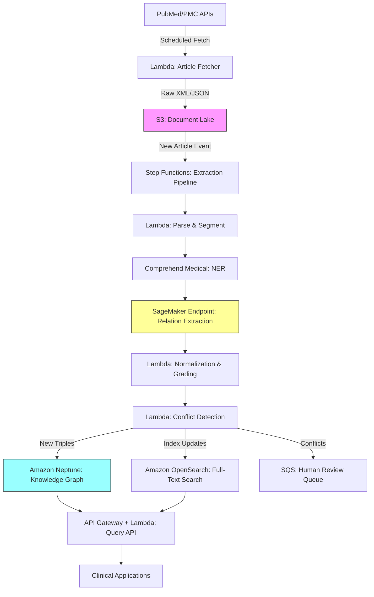

# Recipe 13.9: Literature-Derived Knowledge Graph

**Complexity:** Complex · **Phase:** Research/Production Hybrid · **Estimated Cost:** ~$2,000–8,000/month depending on ingestion volume

---

## The Problem

Medical knowledge doubles roughly every 73 days. That's not a typo. The volume of published biomedical literature is growing so fast that no human, no team of humans, and no department of humans can keep up. PubMed alone indexes over 1.5 million new articles per year. Each one potentially contains a new drug-disease relationship, a newly discovered gene-phenotype association, a risk factor that changes clinical guidance, or an interaction that invalidates an existing treatment protocol.

Now picture a precision medicine team at an academic medical center. A patient presents with a rare genetic variant. The oncologist needs to know: has anyone published evidence linking this variant to a specific drug response? The answer might exist in a paper published three weeks ago in a journal nobody on the team reads. It might be buried in the supplementary materials of a genomics study. It might be stated as a secondary finding in a paragraph about something else entirely.

The traditional approach is manual curation. Organizations like PharmGKB, ClinGen, and OMIM employ teams of PhD-level curators who read papers, extract relationships, grade evidence, and enter them into structured databases. This works. It's also expensive, slow, and perpetually behind. PharmGKB, one of the best-funded pharmacogenomics databases, covers roughly 700 genes. The human genome has over 20,000 protein-coding genes. The gap between what's published and what's curated is enormous and growing.

What if you could read every paper automatically, extract the clinical relationships, grade the evidence, resolve conflicts, and maintain a queryable knowledge graph that stays current with the literature? That's what this recipe builds. It won't replace human curation (we'll be honest about why), but it can dramatically accelerate it, surface relationships that curators haven't gotten to yet, and provide a living, queryable representation of what the literature says right now.

---

## The Technology: Extracting Knowledge from Text

### What Is a Literature-Derived Knowledge Graph?

A knowledge graph is a structured representation of entities and the relationships between them. Nodes are things (drugs, diseases, genes, proteins, phenotypes). Edges are relationships between those things ("treats," "causes," "associated_with," "inhibits," "upregulates"). Each edge carries metadata: where the relationship was found, how strong the evidence is, when it was extracted, whether it's been validated.

A literature-derived knowledge graph is one where the source of truth is published text rather than manual curation or structured databases. You're taking unstructured natural language ("In our cohort, patients carrying the CYP2D6*4 allele showed significantly reduced metabolism of codeine") and converting it into structured triples: `(CYP2D6*4, reduces_metabolism_of, codeine)` with provenance pointing back to the source paper, section, and sentence.

### The NLP Pipeline: From Text to Triples

The extraction pipeline has several stages, each with its own failure modes:

**Named Entity Recognition (NER).** First, you identify the biomedical entities in the text. "CYP2D6*4" is a gene variant. "Codeine" is a drug. "Reduced metabolism" is a pharmacokinetic effect. Biomedical NER is harder than general NER because the vocabulary is enormous, entities overlap (is "cold" a disease or a temperature?), and new entity names appear constantly as drugs are developed and genes are characterized. Models trained on biomedical corpora (BioBERT, PubMedBERT, SciBERT) perform significantly better than general-purpose NER models here.

**Relation Extraction (RE).** Once you've identified the entities, you need to determine how they relate to each other within a sentence or passage. Does the text say drug A treats disease B, or does it say drug A was studied in the context of disease B but showed no effect? The distinction matters enormously. Relation extraction models classify the relationship type between entity pairs. This is where most of the errors creep in, because natural language is ambiguous, hedged, and context-dependent. "May be associated with" is not the same as "causes," but a naive model might treat them identically.

**Negation and Speculation Detection.** Medical literature is full of hedging. "We found no significant association between X and Y" contains the entities X and Y and the relationship "association," but the relationship is negated. "Further studies are needed to confirm whether X influences Y" is speculative, not assertive. Missing negation detection is one of the fastest ways to poison your knowledge graph with false positives.

**Entity Normalization.** The same concept appears under many names. "Breast cancer," "breast carcinoma," "mammary neoplasm," and "BRCA" all refer to overlapping (but not identical) concepts. Entity normalization maps extracted mentions to canonical identifiers in standard ontologies: UMLS CUIs, MeSH terms, HGNC gene symbols, RxNorm drug codes. Without normalization, your graph will have dozens of disconnected nodes that should be one.

**Evidence Grading.** Not all papers are equal. A randomized controlled trial with 10,000 patients provides stronger evidence than a case report with one patient. Your extraction pipeline needs to assess (or at least approximate) the strength of evidence behind each extracted relationship. This can be based on study design (RCT > cohort > case report), sample size, journal impact factor, citation count, or a combination. It's imperfect, but it's better than treating all extractions as equally reliable.

**Conflict Resolution.** The literature contradicts itself. Paper A says drug X is effective for disease Y. Paper B says it isn't. Both are published in reputable journals. Your knowledge graph needs a strategy for handling contradictions: store both with their evidence grades, flag the conflict for human review, or apply a voting mechanism weighted by evidence quality. There's no perfect answer here. The important thing is having a strategy rather than letting the last-ingested paper silently overwrite the previous one.

### Why This Is Genuinely Hard

Let me be direct about the failure modes:

**Precision vs. recall tradeoff.** High-precision extraction (only extracting relationships you're very confident about) misses a lot of knowledge. High-recall extraction (extracting everything that might be a relationship) floods your graph with noise. In healthcare, false positives in a knowledge graph can influence clinical decisions. A spurious "drug X treats disease Y" relationship that a clinician trusts is dangerous. Most production systems err heavily toward precision and accept lower recall.

**Context windows and coreference.** A relationship might span multiple sentences or even multiple paragraphs. "We administered metformin to the treatment group. After 12 weeks, HbA1c levels decreased significantly." The relationship (metformin, reduces, HbA1c) requires connecting information across sentences. Coreference resolution ("the treatment group" refers to patients receiving metformin) adds another layer of complexity.

**Scale and freshness.** PubMed adds thousands of articles daily. If your pipeline takes a week to process a batch, you're perpetually behind. If it processes in real-time but makes more errors under speed pressure, you're trading freshness for accuracy. The right balance depends on your use case: a drug safety surveillance system needs near-real-time; a research knowledge base can tolerate weekly updates.

**Evaluation is expensive.** How do you know your extraction pipeline is correct? You need domain experts (MDs, PhDs, pharmacologists) to review extracted triples and judge whether they're accurate. This is slow, expensive, and doesn't scale. Most teams evaluate on a sample and extrapolate, which means errors in the long tail go undetected.

### The General Architecture Pattern

```
[Literature Sources] → [Document Ingestion] → [NLP Pipeline] → [Triple Extraction]
    → [Normalization] → [Evidence Grading] → [Conflict Resolution]
    → [Knowledge Graph Store] → [Query Interface] → [Downstream Applications]
```

**Literature Sources.** PubMed/MEDLINE for abstracts. PubMed Central (PMC) for full text (where available under open access). Preprint servers (bioRxiv, medRxiv) for cutting-edge findings. Clinical trial registries (ClinicalTrials.gov) for study results. Optionally: FDA drug labels, clinical guidelines, and patent filings.

**Document Ingestion.** Fetch new articles on a schedule. Parse XML/JSON formats. Extract title, abstract, full text (if available), metadata (authors, journal, date, MeSH terms, study type). Store raw documents for reprocessing.

**NLP Pipeline.** Sentence segmentation, tokenization, biomedical NER, relation extraction, negation detection, entity normalization. This can be a single large model (end-to-end) or a pipeline of specialized models (modular). The modular approach is easier to debug and improve incrementally.

**Triple Extraction.** Convert NLP output into structured (subject, predicate, object) triples with metadata: source document, sentence, confidence score, extraction timestamp.

**Normalization.** Map entities to canonical ontology identifiers. Merge duplicate nodes. Resolve synonyms.

**Evidence Grading.** Score each triple based on source quality, study design, sample size, replication across papers.

**Conflict Resolution.** Detect contradictory triples. Flag for review or apply automated resolution strategy.

**Knowledge Graph Store.** A graph database (property graph or RDF triple store) that supports efficient traversal queries, full-text search on node/edge properties, and temporal versioning.

**Query Interface.** SPARQL or Cypher queries for structured access. Natural language query interface for clinical users. API for downstream application integration.

---

## The AWS Implementation

### Why These Services

**Amazon Comprehend Medical for biomedical NER.** Comprehend Medical is purpose-built for extracting medical entities from clinical text. It identifies medications, conditions, procedures, anatomy, and test/treatment/procedure entities with their associated attributes (dosage, frequency, negation). It handles the biomedical vocabulary problem out of the box, recognizing drug names, gene symbols, and disease terms without custom training. For literature extraction, it provides a strong baseline NER layer.

**Amazon SageMaker for custom relation extraction models.** Comprehend Medical handles entity extraction well, but relation extraction from scientific literature requires custom models. SageMaker provides the infrastructure to train, deploy, and serve transformer-based models (BioBERT, PubMedBERT) fine-tuned on biomedical relation extraction datasets. You'll train on annotated corpora like BioRED, ChemProt, or DDI and deploy as real-time or batch inference endpoints.

**Amazon Neptune for knowledge graph storage.** Neptune is AWS's managed graph database supporting both property graph (Gremlin/openCypher) and RDF (SPARQL) query languages. For a biomedical knowledge graph with millions of nodes and edges, Neptune provides the traversal performance, ACID transactions, and managed infrastructure you need. The property graph model is particularly well-suited here because edges need rich metadata (evidence scores, provenance, timestamps).

**Amazon S3 for document lake.** Raw articles, parsed text, intermediate NLP outputs, and extraction results all live in S3. This gives you reprocessing capability: when you improve your NER or RE models, you can re-run the pipeline against the full document corpus without re-fetching from source.

**AWS Lambda and Step Functions for pipeline orchestration.** The extraction pipeline is a multi-step workflow: fetch article, parse, run NER, run RE, normalize, grade, store. Step Functions coordinates these steps with error handling, retries, and parallel processing. Lambda handles the stateless compute for each step.

**Amazon OpenSearch for full-text search.** While Neptune handles graph traversal queries, you also need full-text search across node properties, edge metadata, and source sentences. OpenSearch provides this complementary access pattern, letting users search for "what does the literature say about metformin and PCOS" without knowing the exact graph structure.

### Architecture Diagram



### Prerequisites

| Requirement | Details |
|-------------|---------|
| **AWS Services** | Amazon Comprehend Medical, Amazon SageMaker, Amazon Neptune, Amazon S3, AWS Lambda, AWS Step Functions, Amazon OpenSearch Service, Amazon SQS, API Gateway |
| **IAM Permissions** | `comprehend:DetectEntitiesV2`, `sagemaker:InvokeEndpoint`, `neptune-db:*`, `s3:GetObject`, `s3:PutObject`, `states:StartExecution`, `opensearch:ESHttp*`, `sqs:SendMessage` |
| **BAA** | Required if processing literature that references identifiable patient data (rare in published literature, but clinical trial results may contain cohort-level PHI) |
| **Encryption** | S3: SSE-KMS; Neptune: encryption at rest (must be enabled at cluster creation); OpenSearch: encryption at rest and node-to-node encryption; all transit over TLS |
| **VPC** | Neptune requires VPC deployment. Place all Lambda functions, SageMaker endpoints, and OpenSearch in the same VPC with appropriate security groups. VPC endpoints for S3 and Comprehend Medical. |
| **CloudTrail** | Enabled for all API calls. Neptune audit logging enabled for query-level auditing. |
| **Sample Data** | PubMed Open Access subset (free, bulk download available). BioRED annotated corpus for relation extraction training. UMLS Metathesaurus for entity normalization (requires free license). |
| **Cost Estimate** | Neptune: ~$700/month (db.r5.large). SageMaker endpoint: ~$200-800/month depending on instance. Comprehend Medical: $0.01/100 characters. S3 + Lambda + Step Functions: ~$100-300/month at moderate volume. OpenSearch: ~$300-500/month. |

### Ingredients

| AWS Service | Role |
|------------|------|
| **Amazon Comprehend Medical** | Biomedical named entity recognition from article text |
| **Amazon SageMaker** | Hosts custom relation extraction models (BioBERT/PubMedBERT fine-tuned) |
| **Amazon Neptune** | Stores the knowledge graph with full property graph support |
| **Amazon S3** | Document lake for raw articles, parsed text, and intermediate outputs |
| **AWS Step Functions** | Orchestrates the multi-step extraction pipeline |
| **AWS Lambda** | Stateless compute for parsing, normalization, grading, and API serving |
| **Amazon OpenSearch Service** | Full-text search across graph nodes, edges, and source text |
| **Amazon SQS** | Queues conflicting or low-confidence extractions for human review |
| **Amazon EventBridge** | Schedules periodic literature fetches from PubMed |
| **AWS KMS** | Encryption key management for all data stores |

### Code

#### Walkthrough

**Step 1: Literature ingestion.** The pipeline starts by fetching new articles from PubMed and PubMed Central on a schedule. PubMed's E-utilities API provides programmatic access to article metadata and abstracts. PMC's Open Access subset provides full-text XML for articles with permissive licenses. The fetcher tracks what's already been ingested (using a simple watermark: the last fetch timestamp or the highest PMID processed) and only retrieves new content. Each article is stored as raw XML in the document lake, along with parsed metadata. Full-text articles yield dramatically more relationships than abstracts alone (a typical abstract might contain 2-5 extractable relationships; a full paper might contain 20-50), so prioritize full-text sources where available. Skip this step and your graph goes stale immediately.

```
FUNCTION fetch_new_articles(last_watermark):
    // Query PubMed for articles published since our last fetch.
    // E-utilities returns article IDs matching our search criteria.
    // We filter by date and by relevant MeSH terms to focus on
    // pharmacogenomics, drug-disease, and gene-phenotype literature.
    article_ids = call PubMed E-utilities esearch with:
        database = "pubmed"
        query    = "(pharmacogenomics OR drug-disease OR gene-phenotype) 
                    AND {last_watermark}[PDAT] : 3000[PDAT]"
        retmax   = 1000  // batch size per fetch cycle

    FOR each batch of article_ids:
        // Fetch full metadata and abstract for each article
        articles = call PubMed E-utilities efetch with:
            database = "pubmed"
            ids      = batch
            format   = "xml"

        FOR each article in articles:
            // Store raw XML in document lake for reprocessing capability
            store article.xml to S3 at "documents/pubmed/{pmid}.xml"
            
            // Also check PMC for full-text availability
            IF article has PMC ID:
                full_text = fetch from PMC Open Access API
                store full_text to S3 at "documents/pmc/{pmcid}.xml"

            // Record metadata for pipeline tracking
            store metadata record: {pmid, title, journal, pub_date, mesh_terms, has_full_text}

    // Update watermark so next fetch starts where this one ended
    update last_watermark to current date

    RETURN count of new articles ingested
```

**Step 2: Document parsing and sentence segmentation.** Raw XML needs to be converted into processable text segments. This step extracts the relevant sections (abstract, methods, results, discussion), splits them into individual sentences, and tags each sentence with its source location (which paper, which section, which paragraph). Sentence boundaries in biomedical text are tricky: abbreviations like "Fig. 2" and "et al." contain periods that aren't sentence endings. Use a biomedical-trained sentence splitter rather than a generic one. The section information matters for evidence grading later: a finding stated in the Results section carries more weight than one mentioned speculatively in the Discussion.

```
FUNCTION parse_and_segment(document_s3_key):
    // Load the raw article XML from the document lake
    raw_xml = load from S3 at document_s3_key

    // Parse XML structure to extract text sections
    // PubMed XML has well-defined tags for abstract, body sections, etc.
    parsed = parse XML extracting:
        title       = //ArticleTitle
        abstract    = //AbstractText (may have multiple labeled sections)
        body        = //body/sec (for PMC full-text articles)
        metadata    = {pmid, journal, pub_date, authors, mesh_terms}

    // Segment each text section into individual sentences
    // Use a biomedical sentence splitter that handles abbreviations correctly
    sentences = empty list
    
    FOR each section in [abstract, body_sections]:
        section_sentences = biomedical_sentence_split(section.text)
        
        FOR each sentence in section_sentences:
            append to sentences: {
                text:         sentence,
                section:      section.label,    // "abstract", "results", "discussion", etc.
                position:     index,            // sentence position within section
                document_id:  parsed.metadata.pmid,
                source_key:   document_s3_key
            }

    // Store parsed output for downstream NLP steps
    store sentences to S3 at "parsed/{pmid}/sentences.json"
    
    RETURN sentences
```

**Step 3: Named entity recognition.** Each sentence is passed through biomedical NER to identify mentions of drugs, diseases, genes, proteins, anatomical structures, and other biomedical entities. Comprehend Medical handles the core entity types well. For specialized entity types (gene variants, molecular pathways, epigenetic modifications), you may need a supplementary custom model. The output is a list of entity mentions with their types, positions in the text, and confidence scores. Entities below a confidence threshold are discarded to prevent noise from propagating downstream.

```
FUNCTION extract_entities(sentences):
    // Process each sentence through biomedical NER
    // Comprehend Medical identifies: MEDICATION, MEDICAL_CONDITION,
    // TEST_TREATMENT_PROCEDURE, ANATOMY, and their attributes
    
    entity_mentions = empty list
    CONFIDENCE_THRESHOLD = 0.75  // discard low-confidence entity detections

    FOR each sentence in sentences:
        // Call Comprehend Medical for entity detection
        response = call ComprehendMedical.DetectEntitiesV2 with:
            text = sentence.text

        FOR each entity in response.Entities:
            IF entity.Score >= CONFIDENCE_THRESHOLD:
                append to entity_mentions: {
                    text:        entity.Text,           // surface form: "metformin"
                    type:        entity.Category,       // MEDICATION, MEDICAL_CONDITION, etc.
                    subtype:     entity.Type,           // GENERIC_NAME, DX_NAME, etc.
                    score:       entity.Score,          // confidence 0.0-1.0
                    begin:       entity.BeginOffset,    // character position in sentence
                    end:         entity.EndOffset,
                    traits:      entity.Traits,         // NEGATION, DIAGNOSIS, SIGN, SYMPTOM
                    sentence_id: sentence.document_id + ":" + sentence.position,
                    section:     sentence.section
                }

        // Supplementary: call custom SageMaker model for gene/variant entities
        // that Comprehend Medical doesn't cover well
        gene_response = call SageMaker endpoint "bio-ner-genes" with:
            text = sentence.text
        
        FOR each gene_entity in gene_response:
            IF gene_entity.score >= CONFIDENCE_THRESHOLD:
                append to entity_mentions: {
                    text:    gene_entity.text,
                    type:    "GENE_OR_VARIANT",
                    score:   gene_entity.score,
                    // ... same metadata fields as above
                }

    RETURN entity_mentions
```

**Step 4: Relation extraction.** This is the core intellectual step. Given a sentence with identified entities, determine what relationships exist between them. A custom transformer model (fine-tuned on biomedical relation extraction datasets like BioRED or ChemProt) classifies entity pairs into relationship types: treats, causes, associated_with, inhibits, metabolized_by, variant_of, and so on. Critically, the model must also detect negated and speculative relationships. "Drug X does not treat disease Y" is a relationship, but it's a negative one. "Drug X may treat disease Y" is speculative. Both need to be captured with appropriate modifiers. Skip negation detection and your graph will contain confident assertions that the literature actually refutes.

```
FUNCTION extract_relations(sentences, entity_mentions):
    // Group entities by sentence for pairwise relation extraction
    entities_by_sentence = group entity_mentions by sentence_id

    extracted_triples = empty list

    FOR each sentence_id, entities in entities_by_sentence:
        // Generate all valid entity pairs for relation classification
        // Not all pairs are meaningful: we only check pairs where
        // the entity types could plausibly have a relationship
        valid_pairs = generate_candidate_pairs(entities)
        // e.g., (MEDICATION, MEDICAL_CONDITION) is valid
        //       (ANATOMY, ANATOMY) is usually not

        IF valid_pairs is empty:
            CONTINUE

        // Get the original sentence text for context
        sentence_text = lookup sentence text by sentence_id

        // Call the relation extraction model with entity pair context
        FOR each (entity_a, entity_b) in valid_pairs:
            // Format input for the RE model: sentence with entity markers
            // e.g., "[E1]metformin[/E1] reduces [E2]HbA1c[/E2] levels"
            marked_text = insert entity markers around entity_a and entity_b in sentence_text

            prediction = call SageMaker endpoint "bio-relation-extraction" with:
                text = marked_text
                entity_a_type = entity_a.type
                entity_b_type = entity_b.type

            // prediction returns: relation_type, confidence, is_negated, is_speculative
            IF prediction.confidence >= 0.70 AND prediction.relation_type != "NO_RELATION":
                append to extracted_triples: {
                    subject:      entity_a.text,
                    subject_type: entity_a.type,
                    predicate:    prediction.relation_type,  // "treats", "causes", "inhibits"
                    object:       entity_b.text,
                    object_type:  entity_b.type,
                    confidence:   prediction.confidence,
                    is_negated:   prediction.is_negated,     // "does NOT treat"
                    is_speculative: prediction.is_speculative, // "may treat"
                    source_sentence: sentence_text,
                    source_document: extract pmid from sentence_id,
                    source_section:  lookup section for sentence_id
                }

    RETURN extracted_triples
```

**Step 5: Entity normalization.** The same real-world entity appears under many surface forms in the literature. "Metformin," "Glucophage," "metformin hydrochloride," and "1,1-dimethylbiguanide" all refer to the same drug. This step maps each extracted entity mention to a canonical identifier in a standard biomedical ontology: RxNorm for drugs, SNOMED CT or ICD for diseases, HGNC for genes, UniProt for proteins. Without normalization, your graph would have separate nodes for each surface form, fragmenting the knowledge and making queries unreliable. The mapping uses a combination of exact string matching, fuzzy matching, and embedding-based similarity against the ontology's preferred terms and synonyms.

```
FUNCTION normalize_entities(triples):
    // Load ontology lookup tables (pre-built from UMLS, RxNorm, HGNC, etc.)
    // These map surface forms to canonical identifiers
    drug_lookup    = load RxNorm synonym table
    disease_lookup = load SNOMED CT / ICD mapping table
    gene_lookup    = load HGNC gene symbol table

    normalized_triples = empty list

    FOR each triple in triples:
        // Normalize subject entity
        subject_canonical = normalize_entity(
            triple.subject, triple.subject_type,
            drug_lookup, disease_lookup, gene_lookup
        )

        // Normalize object entity
        object_canonical = normalize_entity(
            triple.object, triple.object_type,
            drug_lookup, disease_lookup, gene_lookup
        )

        // Only keep triples where both entities could be normalized
        // Unnormalized entities are ambiguous and would create orphan nodes
        IF subject_canonical is not NULL AND object_canonical is not NULL:
            append to normalized_triples: {
                subject_id:    subject_canonical.id,      // e.g., "RxNorm:6809" (metformin)
                subject_label: subject_canonical.label,   // "metformin"
                predicate:     triple.predicate,
                object_id:     object_canonical.id,       // e.g., "SNOMED:44054006" (T2DM)
                object_label:  object_canonical.label,    // "type 2 diabetes mellitus"
                confidence:    triple.confidence,
                is_negated:    triple.is_negated,
                is_speculative: triple.is_speculative,
                provenance: {
                    pmid:     triple.source_document,
                    sentence: triple.source_sentence,
                    section:  triple.source_section
                }
            }
        ELSE:
            // Log unmapped entities for ontology gap analysis
            log_unmapped_entity(triple.subject if subject_canonical is NULL)

    RETURN normalized_triples


FUNCTION normalize_entity(text, entity_type, drug_lookup, disease_lookup, gene_lookup):
    // Select the appropriate ontology based on entity type
    lookup = SELECT based on entity_type:
        "MEDICATION"        -> drug_lookup
        "MEDICAL_CONDITION" -> disease_lookup
        "GENE_OR_VARIANT"   -> gene_lookup
        otherwise           -> general UMLS lookup

    // Try exact match first (fastest, most reliable)
    result = lookup.exact_match(lowercase(text))
    IF result: RETURN result

    // Try fuzzy match with edit distance threshold
    result = lookup.fuzzy_match(text, max_distance=2)
    IF result AND result.similarity >= 0.85: RETURN result

    // Try embedding-based similarity as last resort
    result = lookup.embedding_match(text, threshold=0.80)
    IF result: RETURN result

    RETURN NULL  // entity could not be normalized
```

**Step 6: Evidence grading and conflict resolution.** Each extracted triple gets an evidence score based on the source's reliability. A finding from a large RCT published in a top-tier journal scores higher than a case report in a regional publication. When multiple papers assert the same relationship, evidence accumulates. When papers contradict each other, the system flags the conflict. Contradictions above a certain evidence threshold on both sides go to a human review queue. This step is what separates a useful knowledge graph from a noisy dump of NLP outputs.

```
FUNCTION grade_and_resolve(normalized_triples, existing_graph):
    // Evidence scoring weights
    STUDY_TYPE_WEIGHTS = {
        "meta-analysis": 1.0,
        "systematic-review": 0.95,
        "rct": 0.9,
        "cohort": 0.7,
        "case-control": 0.6,
        "case-report": 0.3,
        "review": 0.5,
        "unknown": 0.4
    }

    scored_triples = empty list

    FOR each triple in normalized_triples:
        // Determine study type from article metadata (MeSH publication types)
        study_type = classify_study_type(triple.provenance.pmid)
        
        // Calculate evidence score
        evidence_score = (
            STUDY_TYPE_WEIGHTS[study_type] *
            triple.confidence *                    // NLP extraction confidence
            section_weight(triple.provenance.section)  // Results > Discussion > Abstract
        )

        triple.evidence_score = evidence_score
        triple.study_type = study_type
        append to scored_triples: triple

    // Conflict detection: check new triples against existing graph
    FOR each triple in scored_triples:
        // Look for existing edges between the same entity pair
        existing_edges = query existing_graph for edges between
            triple.subject_id and triple.object_id

        FOR each existing_edge in existing_edges:
            // Check for contradiction: same entities, opposing assertions
            IF is_contradictory(triple, existing_edge):
                // Both sides have evidence. Flag for human review.
                send to review queue: {
                    new_triple:      triple,
                    existing_edge:   existing_edge,
                    conflict_type:   "CONTRADICTORY_ASSERTION",
                    recommendation:  "Review evidence on both sides"
                }
                triple.status = "PENDING_REVIEW"
                BREAK

        // If no conflict, mark as ready to insert
        IF triple.status != "PENDING_REVIEW":
            triple.status = "READY"

    RETURN scored_triples


FUNCTION section_weight(section):
    // Findings stated in Results carry more weight than Discussion speculation
    weights = {
        "results": 1.0,
        "methods": 0.6,    // methods describe what was done, not findings
        "abstract": 0.8,   // abstracts summarize key findings
        "discussion": 0.7, // discussion interprets and speculates
        "introduction": 0.4 // intro cites prior work, not new findings
    }
    RETURN weights.get(lowercase(section), 0.5)
```

**Step 7: Graph insertion and versioning.** Approved triples are inserted into Neptune as edges between normalized entity nodes. Each edge carries its full provenance chain: which paper, which sentence, what confidence, what evidence grade. When the same relationship is extracted from multiple papers, the edge accumulates evidence (multiple provenance entries, aggregated evidence score). The graph is versioned: you can query "what did the graph look like on date X" for reproducibility. This matters for research applications where you need to know what knowledge was available at the time a clinical decision was made.

```
FUNCTION insert_into_graph(scored_triples):
    FOR each triple in scored_triples:
        IF triple.status != "READY":
            CONTINUE  // skip triples pending human review

        // Ensure subject node exists (upsert)
        upsert node in Neptune:
            id         = triple.subject_id
            label      = triple.subject_label
            type       = triple.subject_type  // "Drug", "Disease", "Gene"
            ontology   = extract ontology from triple.subject_id  // "RxNorm", "SNOMED"
            created_at = current timestamp (if new)
            updated_at = current timestamp

        // Ensure object node exists (upsert)
        upsert node in Neptune:
            id         = triple.object_id
            label      = triple.object_label
            type       = triple.object_type
            ontology   = extract ontology from triple.object_id
            created_at = current timestamp (if new)
            updated_at = current timestamp

        // Check if this exact relationship already exists
        existing_edge = query Neptune for edge:
            from triple.subject_id to triple.object_id
            with predicate = triple.predicate
            and is_negated = triple.is_negated

        IF existing_edge exists:
            // Accumulate evidence: add new provenance to existing edge
            update existing_edge:
                add triple.provenance to provenance_list
                recalculate aggregate_evidence_score
                update last_updated = current timestamp
                increment support_count
        ELSE:
            // Create new edge
            create edge in Neptune:
                from       = triple.subject_id
                to         = triple.object_id
                predicate  = triple.predicate
                is_negated = triple.is_negated
                is_speculative = triple.is_speculative
                evidence_score = triple.evidence_score
                support_count  = 1
                provenance     = [triple.provenance]
                first_seen     = current timestamp
                last_updated   = current timestamp
                status         = "ACTIVE"

        // Also index in OpenSearch for full-text search
        index in OpenSearch: {
            edge_id:    generated edge identifier,
            subject:    triple.subject_label,
            predicate:  triple.predicate,
            object:     triple.object_label,
            sentence:   triple.provenance.sentence,
            pmid:       triple.provenance.pmid,
            evidence:   triple.evidence_score
        }
```

> **Curious how this looks in Python?** The pseudocode above covers the concepts. If you'd like to see sample Python code that demonstrates these patterns using boto3, check out the [Python Example](chapter13.09-python-example). It walks through each step with inline comments and notes on what you'd need to change for a real deployment.

### Expected Results

**Sample output: querying the graph for metformin relationships:**

```json
{
  "query": "MATCH (d:Drug {label: 'metformin'})-[r]->(target) RETURN d, r, target LIMIT 5",
  "results": [
    {
      "subject": {"id": "RxNorm:6809", "label": "metformin", "type": "Drug"},
      "predicate": "treats",
      "object": {"id": "SNOMED:44054006", "label": "type 2 diabetes mellitus", "type": "Disease"},
      "evidence_score": 0.97,
      "support_count": 847,
      "is_negated": false,
      "top_provenance": {"pmid": "35291234", "journal": "Lancet", "study_type": "meta-analysis"}
    },
    {
      "subject": {"id": "RxNorm:6809", "label": "metformin", "type": "Drug"},
      "predicate": "associated_with",
      "object": {"id": "SNOMED:3723001", "label": "lactic acidosis", "type": "Condition"},
      "evidence_score": 0.72,
      "support_count": 134,
      "is_negated": false,
      "top_provenance": {"pmid": "34567890", "journal": "BMJ", "study_type": "cohort"}
    },
    {
      "subject": {"id": "RxNorm:6809", "label": "metformin", "type": "Drug"},
      "predicate": "metabolized_by",
      "object": {"id": "HGNC:8583", "label": "OCT1 (SLC22A1)", "type": "Gene"},
      "evidence_score": 0.89,
      "support_count": 56,
      "is_negated": false,
      "top_provenance": {"pmid": "33445566", "journal": "Clin Pharmacol Ther", "study_type": "rct"}
    }
  ]
}
```

**Performance benchmarks:**

| Metric | Typical Value |
|--------|---------------|
| NER precision (biomedical entities) | 85-92% |
| NER recall (biomedical entities) | 78-88% |
| Relation extraction precision | 70-82% |
| Relation extraction recall | 55-70% |
| End-to-end triple accuracy (after normalization) | 65-78% |
| Articles processed per hour | 500-2,000 (depending on full-text vs. abstract) |
| Average triples per abstract | 2-5 |
| Average triples per full-text article | 15-50 |
| Graph query latency (1-hop) | 5-20ms |
| Graph query latency (multi-hop path) | 50-200ms |

**Where it struggles:** Implicit relationships that require world knowledge to infer. Relationships spanning multiple sentences or paragraphs. Highly hedged language where the assertion strength is ambiguous. Novel entity types not in existing ontologies (newly discovered genes, experimental compounds). Languages other than English (most biomedical NER models are English-only). Retracted papers that remain in the corpus.

---

## The Honest Take

Here's what will surprise you when you build this:

The NLP extraction is not the hardest part. Getting 75% precision on relation extraction is achievable with off-the-shelf models and a week of fine-tuning. The hard parts are everything around the NLP: entity normalization (the long tail of synonyms is endless), evidence grading (how do you automatically distinguish a well-powered RCT from a pilot study?), and conflict resolution (the literature genuinely contradicts itself, and both sides often have reasonable evidence).

Your graph will be noisy. Accept this early. A literature-derived knowledge graph is not a curated database. It's a probabilistic representation of what the literature says, with confidence scores and provenance. The value is in surfacing relationships that human curators haven't gotten to yet, not in replacing curated databases for high-stakes clinical decisions. Frame it as "hypothesis generation" rather than "clinical truth" and you'll set appropriate expectations.

The normalization problem is bottomless. You'll get 90% of entities normalized in the first month. The remaining 10% will take forever because they're novel compounds, non-standard gene nomenclature, or ambiguous abbreviations that could mean three different things depending on context. Build a feedback loop where unmapped entities are periodically reviewed and added to your normalization dictionaries.

Reprocessing is your secret weapon. When you improve your RE model (and you will, continuously), you can re-run the entire pipeline against your document lake. This means your graph quality improves retroactively. Design for this from day one: store raw documents, track which model version produced each extraction, and build the infrastructure to do bulk reprocessing without disrupting live queries.

The comparison to curated databases is unfair but inevitable. Stakeholders will compare your automatically extracted graph to PharmGKB or DrugBank and note the errors. The right framing: curated databases are high-precision, low-recall, and months behind the literature. Your graph is moderate-precision, higher-recall, and days behind the literature. They're complementary, not competing.

---

## Variations and Extensions

**RAG-enhanced literature search.** Use the knowledge graph as a retrieval layer for a Retrieval-Augmented Generation system. When a clinician asks "what are the known interactions between drug X and gene Y?", retrieve relevant graph edges and their source sentences, then use an LLM to synthesize a natural language answer with citations. This combines the structured precision of the graph with the natural language fluency of generative AI.

**Automated systematic review support.** Extend the pipeline to support systematic reviews: given a research question, identify all relevant papers, extract the relevant relationships, and present a structured summary of the evidence landscape (how many papers support vs. refute, what study designs, what populations). This doesn't replace a systematic review but dramatically accelerates the screening and extraction phases.

**Real-time drug safety signal detection.** Configure the pipeline to prioritize adverse event relationships and alert when a new drug-adverse-event association appears in the literature with sufficient evidence. This creates an early warning system that complements FDA's post-market surveillance. Particularly valuable for newly approved drugs where the safety profile is still being characterized.

---

## Related Recipes

- **Recipe 13.4 (Drug-Drug Interaction Knowledge Base):** Uses curated sources rather than literature extraction; the literature-derived graph can feed new candidate interactions into the curated DDI system
- **Recipe 13.7 (Disease-Gene-Drug Relationship Graph):** Focuses on a specific relationship type that this recipe extracts as part of a broader graph
- **Recipe 13.8 (Medical Concept Normalization and Mapping):** The normalization infrastructure built in 13.8 is directly reusable as the entity normalization layer in this recipe
- **Recipe 8.10 (Phenotype Extraction for Research):** Uses similar NLP techniques for entity extraction from clinical text rather than published literature
- **Recipe 2.7 (Literature Search and Evidence Synthesis):** Complementary approach using LLMs for literature understanding; can consume this recipe's graph as structured context

---

## Additional Resources

**AWS Documentation:**
- [Amazon Comprehend Medical Documentation](https://docs.aws.amazon.com/comprehend-medical/latest/dev/what-is.html)
- [Amazon Comprehend Medical DetectEntitiesV2 API](https://docs.aws.amazon.com/comprehend-medical/latest/dev/API_medical_DetectEntitiesV2.html)
- [Amazon Neptune Developer Guide](https://docs.aws.amazon.com/neptune/latest/userguide/intro.html)
- [Amazon Neptune openCypher Query Language](https://docs.aws.amazon.com/neptune/latest/userguide/access-graph-opencypher.html)
- [Amazon SageMaker Hosting Services](https://docs.aws.amazon.com/sagemaker/latest/dg/how-it-works-deployment.html)
- [Amazon OpenSearch Service Developer Guide](https://docs.aws.amazon.com/opensearch-service/latest/developerguide/what-is.html)
- [AWS HIPAA Eligible Services](https://aws.amazon.com/compliance/hipaa-eligible-services-reference/)

**AWS Sample Repos:**
- [`amazon-neptune-samples`](https://github.com/aws-samples/amazon-neptune-samples): Neptune graph database examples including data loading, querying, and visualization patterns
- [`amazon-comprehend-medical-fhir-integration`](https://github.com/aws-samples/amazon-comprehend-medical-fhir-integration): Healthcare NLP extraction with Comprehend Medical integrated into FHIR workflows

<!-- TODO: Verify these repos still exist and are current -->

**AWS Solutions and Blogs:**
- [Drug Discovery with Amazon Neptune](https://aws.amazon.com/blogs/database/building-a-biomedical-knowledge-graph-with-amazon-neptune/): Architecture for biomedical knowledge graphs on Neptune
- [NLP for Healthcare on AWS](https://aws.amazon.com/blogs/machine-learning/building-a-medical-language-processing-system-on-aws/): End-to-end medical NLP pipeline architecture

<!-- TODO: Verify blog URLs are current and accessible -->

**External Resources:**
- [PubMed E-utilities API Documentation](https://www.ncbi.nlm.nih.gov/books/NBK25501/): Programmatic access to PubMed article data
- [UMLS Metathesaurus](https://www.nlm.nih.gov/research/umls/knowledge_sources/metathesaurus/): Unified Medical Language System for entity normalization
- [BioRED Corpus](https://ftp.ncbi.nlm.nih.gov/pub/lu/BioRED/): Annotated biomedical relation extraction dataset from NCBI
- [PubMedBERT](https://huggingface.co/microsoft/BiomedNLP-PubMedBERT-base-uncased-abstract-fulltext): Pre-trained biomedical language model for NER and RE fine-tuning

---

## Estimated Implementation Time

| Phase | Duration |
|-------|----------|
| **Basic** (abstract-only ingestion, pre-trained NER, simple RE, Neptune storage) | 6-8 weeks |
| **Production-ready** (full-text ingestion, custom RE model, evidence grading, conflict resolution, human review workflow) | 4-6 months |
| **With variations** (RAG integration, systematic review support, real-time safety signals) | 8-12 months |

---

## Tags

`knowledge-graph` · `nlp` · `relation-extraction` · `biomedical-literature` · `neptune` · `comprehend-medical` · `sagemaker` · `evidence-grading` · `entity-normalization` · `pubmed` · `complex` · `research` · `pharmacogenomics` · `drug-discovery`

---

*← [Recipe 13.8: Medical Concept Normalization and Mapping](chapter13.08-medical-concept-normalization-mapping) · [Chapter 13 Index](chapter13-index) · [Next: Recipe 13.10 - Federated Clinical Knowledge Network →](chapter13.10-federated-clinical-knowledge-network)*
